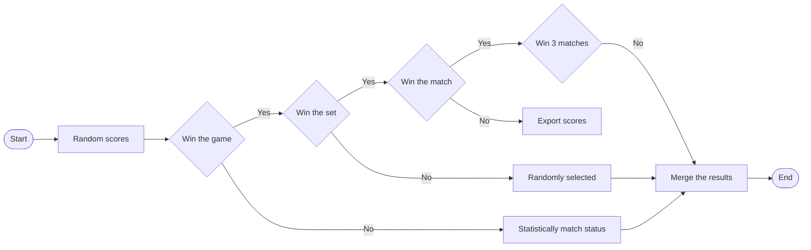
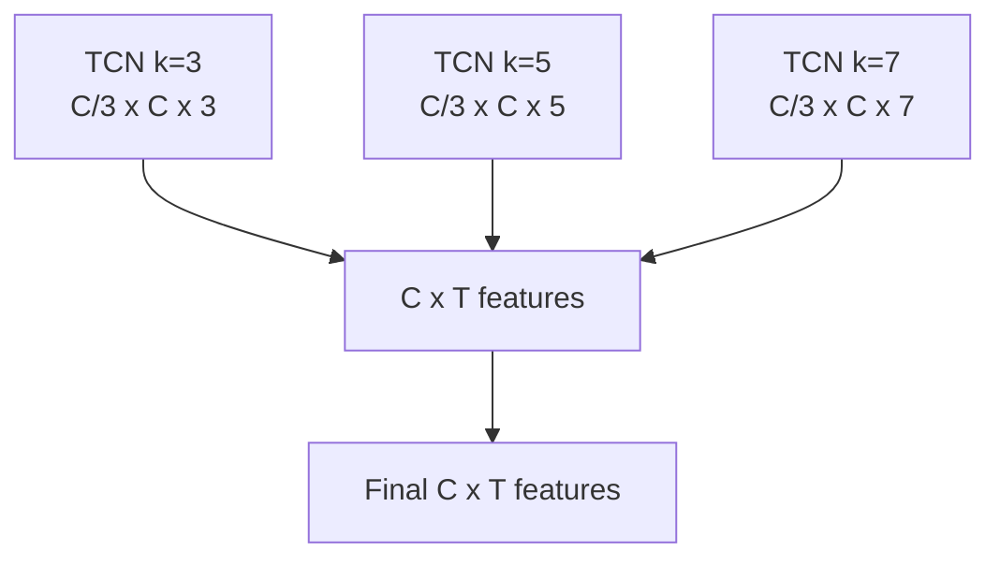

# Uncovering the Hidden Momentum: A Data-Science Exploration of Tennis Match Dynamics

Tennis, as a comprehensive sport, has always been a subject of great interest. Besides the physical demands on athletes, exceptional skills and outstanding tactical strategies are key to victory. This study delves into the concept of "athletic potential" in competitive sports, an inherent vitality and advantage that becomes apparent during matches, utilizing data science and machine learning techniques. Ultimately, the data-driven insights derived from our models will provide valuable guidance and reference for coaches

This article primarily establishes two models: the XGBoost-based Momentum Quantification Model and the Tennis Match Point Time-Convolution Model.

Before building the models, we initially conducted data preprocessing, including the identification of outliers and handling missing values using strategies such as the Interquartile Range (IQR). We also selectively removed or imputed data based on practical significance. Subsequently, we designed variables based on different timeframes (Current-Past) and various temporal scales (Short-Medium-Long). Finally, we used Spearman's correlation coefficient to eliminate variables with high correlations to the dependent variable and those exhibiting autocorrelation.

Addressing the first problem, this study introduces improvements to the XGBoost-based momentum estimation of players. We establish a relationship between momentum and short-term match outcomes, achieving a precision MSE (Mean Square Error) indicator of 0.02 through a 5-fold cross-validation approach.

Regarding the second problem, we randomly generated match scenarios based on game rules and original data. We applied the model developed for problem one to estimate the momentum for both real and random matches. Ultimately, by comparing various metrics that measure the correlation between momentum and match outcomes, we provide strong evidence supporting the impact of momentum on match scores.

For the third problem, we utilized Bayesian online change-point detection methods to identify crucial turning points in matches, and we visualized the results using two sample matches. To accommodate the different temporal characteristics of match data, such as capturing immediate situations in short timeframes and understanding overall trends in long timeframes, we designed the Tennis Match Point Temporal Convolutional Network. This model achieved a Top-1 accuracy of 75.70% in predicting turning points.

Concerning the fourth problem, we conducted domain transfer testing using tennis match data from the 2023 Wimbledon Women's Singles. The momentum prediction achieved a precise MSE indicator of 0.025, demonstrating the high generalization performance of our model.

Additionally, we performed sensitivity analysis to explore the impact of input variations on the model. Finally, the strengths and weaknesses of our model are summarized. In conclusion, we include a letter to tennis coaches at the end of the article, introducing the overall concept and results of our research.

Keywords: Tennis Athletic Potential, XGBoost, Momentum Quantification, Temporal Convolutional Network

# Contents

# 1 Introduction....3

1.1 Background....3  
1.2 Restatement of the Problem....3  
1.3 Our Work....3

# 2 Assumptions And Notations....4

2.1 Assuptions....4  
2.2 Notations 4

# 3 Data Preprocessing....5

3.1 Data Cleaning....5  
3.2 Data Transformation 6  
3.3 Feature Recombination 7  
3.4 Variable Selection 8

# 4 Task 1: Momentum quantization and prediction model .... 10

4.1 Definition and Quantification of Momentum 10  
4.2 XGBoost-Based Momentum Qualification Model 10  
4.3 Results Visualization and Analysis 12

# 5 Task 2: The Momentum-Outcome Connection....13

5.1 Random Match Scenario Generation....13  
5.2 Analysis of the Impact of Momentum on Scores....13

# 6 Bayesian Inflection point Detection and Prediction....15

6.1 Bayesian Online Inflection point Detection Method for Identifying Inflection points.....15  
6.2 Correlation Analysis of Inflection Points....17  
6.3 Tennis Match Point Temporal Convolutional Network 18  
6.4 Suggestions 19

# 7 Task 4: Model Validation and Evaluation....20

7.1 Model Validation with Other Matches and Accuracy ....20  
7.2 Model Evaluation....21

# 8 Sensitivity Analysis....21

# 9 Advantages and Disadvantages Analysis ...... 22

9.1 Advantages 22  
9.2 Disadvantages 22

# References....23

# 1 Introduction

# 1.1 Background

"To become the first man in a decade to defeat Novak Djokovic on Centre Court at Wimbledon is truly a remarkable feat I'll always cherish," Alcaraz reflected on his historic win.

In the gripping Wimbledon men's singles final of 2023, the prodigious 20-year-old Spaniard, Alcaraz, outplayed the venerable 36-year-old Serbian champion, Djokovic, in a five-set thriller to claim the prestigious title. Despite a rocky start, where Alcaraz dropped the first set 1-6, he tenaciously fought back to secure the match, leaving the audience in awe of the stunning upset.

Competitive momentum, within the realm of sports, represents the intrinsic vigor and edge that becomes apparent during a match. It denotes the collective strength and prowess of either a team or an individual athlete, which is instrumental in asserting dominance within the game.

To harness this competitive momentum, a diverse set of skills is crucial, encompassing technical prowess, tactical acumen, psychological resilience, and rigorous physical conditioning. Possession of such attributes enables athletes to elevate their performance, dominate the competition, and achieve superior results.

Despite its frequent mention in sports narratives, competitive momentum remains an elusive, subjective concept, one that defies direct measurement through conventional statistical methods. Therefore, sports analysts and coaches are often inclined to leverage specific in-game data, such as points scored, service speed, error rates, and more, to construct models that endeavor to quantify the effects of momentum and forecast game trends and outcomes.

# 1.2 Restatement of the Problem

Through the analysis and investigation of the background and negotiators' guidance of the problem, the restate of the problem can be expressed as follows:

● Build a mathematic model for Match Flow Analysis:

√ Create a model that captures the progression of a tennis match based on the scorning events. The model should be capable of identifying who is well-performed at any given moment, and quantify their level of superiority.  
√ Include a visualization that depicts the flow of the match, as informed by the model.  
√ Incorporate the advantage that players have while serving into the model.

\- Use the model to evaluate the claim by a tennis coach who doesn't believe the role of "momentum".

\- Predict Shifts in “Momentum”:

√ Construct a model to foresee the pivotal moments that shifts the “momentum” of the game, and identify the key indicators that drive these shifts.  
√ Offer advise to a player entering a new match against a different opponent, based on the dynamics of “momentum” swings.

\- Model Testing:

√ Test the model against additional matches to evaluate its effectiveness in forecasting momentum swings and the outcomes of games.  
√ Should the model display occasional inaccuracies, pinpoint elements that could be incorporated in future versions to enhance its predictive accuracy.  
√ Consider how the model might be adapted to other contexts, such as women's matches, different court surfaces, or other racket sports like table tennis.

\- Compose a one-to-two-page memo to be included in the report, offering advice to tennis coaches according to the study.

# 1.3 Our Work

In line with the background and research questions, our work encompasses the following aspects:

(1) Data preprocessing to obtain the required independent variables for subsequent modeling. Establishing an XGBoost-based momentum quantification model to quantify and assess a player's performance at specific times, and visualizing the momentum in relation to match outcomes.  
(2) Simulating a random match to compare the momentum of a random match with that of a real match. Using Pearson correlation coefficients, we confirmed that a player's fluctuations and success during a match are not random but influenced by momentum.  
(3) Utilizing Bayesian online changepoint detection methods to identify turning points in each match and obtaining the importance ranking of independent variables through Spearman rank correlation. We then developed the Tennis Match Point Time-Convolution Model, which can predict when turning points are likely to occur.  
(4) Validating the model using data from other matches and conducting an evaluation of the model's performance.

# 2 Assumptions And Notations

# 2.1 Assuptions

- The sum of momentum of two players is constant. Momentum reflects a player's ability to score against an opponent. Given the momentum of player 1, the momentum of player 2 can be derived symmetrically, which is conducive to describing the player's state.  
- The effect of momentum is primarily short-term. A player's momentum at a given moment may remain stable in a local time window and change with subsequent wins and losses.  
- There is a certain degree of momentum inheritance between each game, set and match. At the beginning of each game, the player will be somewhat affected by the situation of the previous game or the overall set and court, thus obtaining different initial momentum.  
- The impact of data outside the table on the match is ignored. The physical quality of athletes and other factors can be reflected in the information of the match given in the table, and other factors have a small impact and can be ignored.  
- The number of promotions a player makes may be unrelated to momentum. Both sides in each match have the same number of advances and similar physical exertion, so the effect of advance records on momentum is not taken into account.  
- The total distance run to some extent represents the value of physical exertion. It is common sense that the more an athlete runs, the greater the physical exertion.

# 2.2 Notations

Tabel 1: Symbols and Descriptions

<table><tr><td>Symbol</td><td>Description</td></tr><tr><td>b</td><td>Current iteration step</td></tr><tr><td>M</td><td>Ensemble of models</td></tr><tr><td>η</td><td>Learning rate</td></tr><tr><td>i</td><td>Number of samples in the dataset</td></tr><tr><td>m</td><td>Total number of samples in the dataset</td></tr><tr><td>γ,λ</td><td>Use to adjust the complexity of the tree.</td></tr><tr><td>yi</td><td>Momentum based on match outcomes</td></tr><tr><td>Yi(t)</td><td>Model&#x27;s prediction of momentum at iteration t</td></tr><tr><td>T</td><td>Current number of leaf nodes in the regression tree</td></tr><tr><td>Yi</td><td>Momentum of player i at time t</td></tr></table>

$$
M _ {m 0}
$$

$$
M _ {f}
$$

Maximum momentum

Serving momentum factor $Mf = 0.1$

# 3 Data Preprocessing

# 3.1 Data Cleaning

Due to the randomness of data and missing records from devices, it is necessary to clean the data. This involves correcting anomalies and filling in missing values to ensure the accuracy of subsequent analyses and the reliability of modeling. Taking the current serve speed column(speed\_mph) and Player 1's running distance column (p1\_distance\_run) as examples, the methods and process of data cleaning are detailed as follows.

# 3.1.1 Correction of Anomalous Values

Due to the randomness in data collection, there may be outliers in the samples that significantly differ from the majority of the values, thus it requires repair or removal. Use the Interquartile Range (IQR) method to identify the lower quartile Q1 at the 25% position and the upper quartile Q3 at the 75% position in the data, then calculate the interquartile range (IQR), with the calculation formula as follows:

$$
Q 1 = \frac {n + 1}{4} \tag {1}
$$

$$
Q 3 = \frac {3 (n + 1)}{4} \tag {2}
$$

$$
I Q R = Q 3 - Q 1 \tag {3}
$$

In the formula, n is the size of the dataset. If n is not an integer, linear interpolation can be performed between the two data points closest to n to estimate Q1 and Q3. The interquartile range (IQR) represents the distance between Q3 and Q1.

In this paper, data outside the range [Q1 - 1.5 IQR, Q3 + 1.5 IQR] is defined as an outlier and is subjected to correction. Taking speed\_mph as an example, the box plot of its outliers is shown in Figure 1.

For the outliers on the left side of the figure, they are replaced by performing data fitting interpolation within the group of matches they belong to. It is worth noting that for the p1\_distance\_run data column, since p1\_distance\_run is related to rally\_count, the more rallies played, the greater the running distance of the player. Therefore, it is necessary to first remove the impact of the number of rallies on running distance. First, divide p1\_distance\_run by rally\_count, and then proceed to correct the outliers. The box plots of outliers before and after preprocessing are shown in Figure 2. The processed outliers are then subjected to data fitting interpolation, and multiplied by rally\_count to serve as the new corrected values for p1\_distance\_run.

  
Figure 1: Outlier boxplot of speed mph  
Figure 2: Box plots of outliers for p1\_distance\_run before and after preprocessing

# 3.1.2 Filling Missing Data

Firstly, it is necessary to identify missing values in the dataset. Taking speed\_mph as an example, a heatmap of missing values can be generated using the Heatmap Function from the Seaborn Library in Python. This heatmap provides a visual representation of missing data within the dataset. The result

of generating a heatmap using the heatmap function is shown in Figure 3. In the figure, there are large yellow bands with gaps, indicating continuous missing data in this segment. Upon comparison, it is observed that this missing data all originates from the match\_id = 2023-wimbledon-1310, which is attributed to system errors such as missing device records and the importance of the speed\_mph parameter. Therefore, the data from this match is not considered, and the remaining 30 sets of data will be used for subsequent analysis and modeling.

  
Figure 3: The heatmap of missing values for "speed\_mph."

Additionally, considering the real circumstances of the matches, when there is a double fault situation in serving, meaning p1\_double\_fault + p2\_double\_fault = 1, both speed\_mph and rally\_count should be equal to 0. Taking the match\_id=1301 as an example, all the data with speed\_mph=NA is selected, as shown in Table 2.

Tabel 2: Partial data when match\_id=1301 race speed\_mph=NA

<table><tr><td>elapsed_time</td><td>p1_double_fault</td><td>p2_double_fault</td><td>p1_double_fault+p2_double_fault</td><td>rally_count</td><td>speed_mph</td></tr><tr><td>0:32:57</td><td>0</td><td>1</td><td>1</td><td>0</td><td>NA</td></tr><tr><td>2:06:20</td><td>1</td><td>0</td><td>1</td><td>0</td><td>NA</td></tr><tr><td>2:14:53</td><td>0</td><td>1</td><td>1</td><td>0</td><td>NA</td></tr><tr><td>2:28:21</td><td>1</td><td>0</td><td>1</td><td>0</td><td>NA</td></tr><tr><td>2:53:10</td><td>1</td><td>0</td><td>1</td><td>0</td><td>NA</td></tr><tr><td>2:55:10</td><td>1</td><td>0</td><td>1</td><td>0</td><td>NA</td></tr><tr><td>3:05:04</td><td>0</td><td>0</td><td>0</td><td>3</td><td>NA</td></tr><tr><td>3:13:12</td><td>1</td><td>0</td><td>1</td><td>0</td><td>NA</td></tr><tr><td>3:22:58</td><td>1</td><td>0</td><td>1</td><td>0</td><td>NA</td></tr><tr><td>3:28:08</td><td>0</td><td>1</td><td>1</td><td>0</td><td>NA</td></tr><tr><td>3:33:45</td><td>1</td><td>0</td><td>1</td><td>0</td><td>NA</td></tr></table>

From the table, it can be observed that when elapsed\_time is 3:05:04, neither side committed a double fault, and thus, the recorded speed\_mph as NA is considered a genuine missing value. The rally\_count of 3 also supports this conclusion. In contrast, for other instances where speed\_mph is NA, double faults occurred. Although speed\_mph is recorded as missing, it should be imputed.

The nearest-neighbor interpolation method is employed for filling in missing values. This method is suitable for imputing missing values in time series data and typically does not introduce new data structures or models. It effectively preserves the original data distribution or characteristics. Similarly, the same method was used for data cleaning in other variables within the dataset.

# 3.2 Data Transformation

In this study, some variables are unordered multicategorical variables represented as text in the dataset. Taking "winner\_shot\_type" as an example, it is represented as "F" for "Forehand Winner," "B" for "Backhand Winner," and "0" for "Other Winner." Analysis reveals that it belongs to an unordered multicategorical variable. From a numerical perspective, assigning values 1, 2, and 3 would imply an ordinal relationship, which is not accurate. In reality, the methods of winning are independent and do not have a hierarchical order. Assigning values of 1, 2, and 3 and incorporating them into the model would be inappropriate, so they need to be transformed into dummy variables.

For example, with regard to the "winner\_shot\_type" variable, there are three possible values: "F" is transformed into $\{0, 1\}$ , "B" into $\{0, 1\}$ , and "0" into $\{0, 0\}$ . Similarly, other variables are transformed using the same method.

# 3.3 Feature Recombination

As shown in Table 3, based on the dataset and in accordance with the rules of tennis matches, the following 36 sets of variables are selected as potential independent variables that may affect momentum. These independent variables are categorized into three types based on the time scale: current time, previous shot time, and long-term time. The independent variables included in the long-term time category are calculated based on existing data and encompass various information related to the same game, set, and match.

Tabel 3: Variable - Symbol comparison table

<table><tr><td>Instantaneous Calculated Variables</td><td>Symbols</td></tr><tr><td colspan="2">Instantaneous Local Variable</td></tr><tr><td>Current server</td><td>server</td></tr><tr><td>Current serve count</td><td>serve_no</td></tr><tr><td>Current serve speed</td><td>speed_mph</td></tr><tr><td>Current serve width</td><td>serve_width</td></tr><tr><td>Current serve depth</td><td>serve_depth</td></tr><tr><td>Rounds taken for current game score</td><td>rally_count</td></tr><tr><td>Current return depth</td><td>return_depth</td></tr><tr><td>Current set count</td><td>set_no</td></tr><tr><td>Current game count</td><td>game_no</td></tr><tr><td colspan="2">Historical Instant Variable</td></tr><tr><td>Previous point&#x27;s score</td><td>Point_Score</td></tr><tr><td>Previous point&#x27;s score without touch during serve, option 1</td><td>Serve_No_Touch_1</td></tr><tr><td>Previous point&#x27;s score without touch during serve, option 2</td><td>Serve_No_Touch_2</td></tr><tr><td>Previous point&#x27;s score without touch during rally, option 1</td><td>Rally_No_Touch_1</td></tr><tr><td>Previous point&#x27;s score without touch during rally, option 2</td><td>Rally_No_Touch_2</td></tr><tr><td>Previous point&#x27;s no-touch win type</td><td>Win_Type</td></tr><tr><td>Previous point&#x27;s running distance, option 1</td><td>Serve_No_Touch_1</td></tr><tr><td>Previous point&#x27;s running distance, option 2</td><td>Serve_No_Touch_2</td></tr></table>

<table><tr><td>Time Interval Calculated Variables</td><td>Symbols</td></tr><tr><td colspan="2">Set Level Interval Variable</td></tr><tr><td>Current set's athlete's consecutive points won, option 1</td><td>Consecutive_1</td></tr><tr><td>Current set's athlete's consecutive points won, option 2</td><td>Consecutive_2</td></tr><tr><td>Number of games won in the current set, option 1</td><td>Games_1</td></tr><tr><td>Number of games won in the current set, option 2</td><td>Games_2</td></tr><tr><td>Number of double faults in this set, option 1</td><td>Double_Faults_1</td></tr><tr><td>Number of double faults in this set, option 2</td><td>Double_Faults_2</td></tr><tr><td>Number of unforced errors in this set, option 1</td><td>Unforced_Errors_1</td></tr><tr><td>Number of unforced errors in this set, option 2</td><td>Unforced_Errors_2</td></tr><tr><td>Number of net touches in this set, option 1</td><td>Net_Touches_1</td></tr><tr><td>Number of net touches in this set, option 2</td><td>Net_Touches_2</td></tr><tr><td>Current match's points lead progress</td><td>Lead_Progress</td></tr><tr><td colspan="2">Game Level Interval Variable</td></tr><tr><td>Total distance covered in this match, option 1</td><td>Total_Distance_1</td></tr><tr><td>Total distance covered in this match, option 2</td><td>Total_Distance_2</td></tr><tr><td>Number of break points won by the athlete in this match, option 1</td><td>Break_Points_Won_1</td></tr><tr><td>Number of break points won by the athlete in this match, option 2</td><td>Break_Points_Won_2</td></tr><tr><td>Number of break points lost by the athlete in this match, option 1</td><td>Break_Points_Lost_1</td></tr><tr><td>Number of break points lost by the athlete in this match, option 2</td><td>Break_Points_Lost_2</td></tr><tr><td colspan="2">Point Level Interval Variable</td></tr><tr><td>Total distance covered in this match, option 1</td><td>Total_Distance_Match_1</td></tr><tr><td>Total distance covered in this match, option 2</td><td>Total_Distance_Match_2</td></tr></table>

# 3.4 Variable Selection

In the initial selection of variables, comprehensive coverage of the model was considered, but there may be some correlations among certain variables. To further improve the operational efficiency and simplicity of the model, a correlation analysis $^{[1]}$ was conducted on the variables intended for inclusion in the model. As shown in Figure 4, the confusion matrix $^{[11]}$ of variables clearly reveals the presence of high correlations among variables. Therefore, variable selection $^{[2]}$ based on correlation is necessary.

  
Figure 4: Confusion matrix plot of variables

# 3.4.1 Correlation Analysis

The Spearman rank correlation coefficient $^{[10]}$ is a non-parametric statistical measure suitable for testing the correlation of abnormal distribution or ordered categorical data variables. The autocorrelations among the independent variables are calculated as shown in Figure 5. Based on this,

some variables $^{[3,4]}$ with high autocorrelations in the figure were removed. For example, "set\_no" showed strong correlations with "Games\_1," "Games\_2," "Total\_Distance\_Match\_1," and "Total\_Distance\_Match\_2." We chose "Total\_Distance\_Match\_1" as the final independent variable, reflecting the player 1's energy consumption, and removed the other variables.

Highly Correlated Variable Pairs with Line Length Indicating Correlation Strength  

bar

| Comparison | Correlation Strength (Corr) |
| :--- | :--- |
| Double_Faults_2 vs Unforced_Errors_2 | 1.00 |
| Rally_No_Touch_2 vs Win_Type | 0.98 |
| Double_Faults_1 vs Unforced_Errors_1 | 0.98 |
| Rally_No_Touch_1 vs Win_Type | 0.98 |
| serve_no vs speed_mph | 0.87 |
| set_no vs Games_1 | 0.87 |
| set_no vs Games_2 | 0.87 |
| Consecutive_1 vs Consecutive_2 | 0.87 |
| Games_1 vs Total_Distance_Match_2 | 0.69 |
| Games_1 vs Total_Distance_Match_1 | 0.69 |
| Games_2 vs Total_Distance_Match_2 | 0.69 |
| Games_2 vs Total_Distance_Match_1 | 0.69 |
| Point_Score vs Consecutive_1 | 0.69 |
| Point_Score vs Consecutive_2 | 0.69 |
| game_no vs Total_Distance_2 | 0.69 |
| game_no vs Total_Distance_1 | 0.69 |
| set_no vs Total_Distance_Match_2 | 0.69 |
| set_no vs Total_Distance_Match_1 | 0.69 |
| Games_1 vs Total_Distance_Match_2.1 | 0.69 |
| Games_1 vs Games_2 | 0.69 |
| Total_Distance_Match_1 vs Total_Distance_Match_2 | 0.69 |
| Total_Distance_1 vs Total_Distance_2 | 0.69 |

Figure 5: The degree of self-correlation between independent variables

# 3.4.2 Variable Importance Ranking

After removing linearly correlated variables, there were still many variables, and not all of them had a significant impact on the model's results. To improve computational efficiency and further rank the importance of independent variables, the variables were sorted based on their impact on the dependent variable, which is whether the match is scored. Variables were sequentially removed from the smallest impact factor to the largest until a significant difference in model accuracy occurred.

When the variable "set\_no" was removed, the classification accuracy decreased significantly from 95.5% to 66.1%. Therefore, the removal of independent variables was terminated at this point. The final selection of independent variables includes the following: server, Consecutive\_2, Consecutive\_1, Net\_Touches\_2, Double\_Faults\_1, Net\_Touches\_1, Double\_Faults\_2, Unforced\_Errors\_2, Point\_Score, Lead\_Progress, Unforced\_Errors\_1, Break\_Points\_Won\_1, Serve\_No\_Touch\_2, Break\_Points\_Won\_2, Serve\_No\_Touch\_1, Rally\_No\_Touch\_1, return\_depth, and Total\_Distance\_Match\_1.

bar

| Independent Variables | Spearman Correlation | Correlation Strength |
| :--- | :--- | :--- |
| Server | ~0.22 | Low |
| Consecutive_2 | ~-0.12 | Low |
| Consecutive_1 | ~0.10 | Low |
| Net_Touches_2 | ~-0.09 | Low |
| Double_Faults_1 | ~0.08 | Low |
| Net_Touches_1 | ~0.07 | Low |
| Double_Faults_2 | ~-0.07 | Low |
| Unforced_Errors_2 | ~-0.06 | Low |
| Point_Score | ~0.06 | Low |
| Lead_Progress | ~-0.05 | Low |
| Unforced_Errors_1 | ~0.05 | Low |
| Break_Points_Won_1 | ~0.04 | Low |
| Serve_No_Touch_2 | ~-0.04 | High |
| Break_Points_Won_2 | ~-0.03 | High |
| Serve_No_Touch_1 | ~0.03 | High |
| Relly_No_Touch_1 | ~0.03 | High |
| Return_depth | ~0.02 | High |
| Total_Distance_Match_1 | ~0.02 | High |

Figure 6: The correlation ranking of different independent variables with the dependent variable

# 4 Task 1: Momentum quantization and prediction model

In this section, we first define and quantify momentum. Then, we identify which player performs better and to what extent at specific moments in the game by building an XGBoost momentum prediction model.

# 4.1 Definition and Quantification of Momentum

We define momentum as follows: Momentum is implicitly embedded in the game state, explicitly reflecting the continuous scoring and losing in the game results. We make the following assumption: if the game state is related to scoring and losing, it can be reflected through momentum, completing the mapping from the distribution of game states to the distribution of scoring situations, establishing a relationship between the two distributions; conversely, if there is no relationship between them, such a mapping would be impossible to achieve.

Let the current game result sequence be $P = \{P_{0}, P_{1}, \ldots, P_{N}\}$ , and the current moment be i, with N samples in total. We aim to estimate a player's momentum at moment i by considering the game results in the vicinity of moment i. First, we need to create a window around moment i to capture the game's state within a short time frame. Next, we assign weights to these game results within the window, with results closer to the moment i contributing more significantly to momentum estimation, while data from more distant matches have a smaller contribution.

Considering that in tennis matches, the serving player has a higher probability of winning points, we introduce a serving momentum factor, denoted as $M_{f}$ , to adjust the momentum labels. When Player 1 serves, they gain an initial energy boost, and vice versa, they lose some energy when receiving. Both the gained and lost momentum are controlled by the momentum factor. Therefore, the momentum label formula can be expressed as follows:

$$
Y _ {i} = \left(\frac {m}{M _ {m 0}}\right) (1 - M _ {t}) + M _ {t}, M _ {t} = 0. 1 \tag {4}
$$

# 4.2 XGBoost-Based Momentum Qualification Model

Due to the non-linearity between independent variables and the final outcome of the game, we chose to use machine learning methods to discover the underlying relationship between independent and dependent variables. After considering various machine learning models, we opted for XGBoost for momentum prediction. XGBoost $^{[8,9]}$ utilizes an optimized distributed gradient boosting algorithm that allows rapid training of large-scale datasets while maintaining efficient resource utilization.

The construction and solution steps of the XGBoost momentum prediction model are as follows:

# (1) Data Preprocessing

Before constructing the model, while maintaining the consistency of data distribution, the original dataset is initially divided into a training set S (80%) and a test set T (20%). The model is trained on S and the model's generalization ability is tested on T. For the training set S, further p-fold k-fold cross-validation is applied, where S is randomly divided into k subsets, and in each iteration, k-1 subsets are used for training, while the remaining one is used for validation. To reduce errors due to different sample divisions, this process is repeated p times, resulting in the average of p+k validation results as the model evaluation result. In this study, p=5 and k=5, meaning 5 times 5-fold cross-validation was utilized.

# (2) Basis Function Construction

XGBoost gradually adds new models in each iteration to expand its understanding of new data. Its formula is as follows:

$$
M _ {b} = M _ {b - 1} + \eta \cdot T _ {b} \tag {5}
$$

# (3) Definition of Loss Function

The goal of XGBoost training is to minimize the loss function, which includes both traditional loss functions and regularization terms that describe model complexity.

$$
\min O b j = \sum_ {i = 1} ^ {m} l \left(y _ {i}, \hat {y} _ {i} ^ {(t - 1)} + f _ {i} (x _ {i})\right) + \Omega (f _ {k}) \tag {6}
$$

In the formula, the first term represents the difference between the momentum predicted by the model and the momentum calculated based on game results, while the second term represents the model's complexity. In the above formula, $\{i\}$ represents the number of samples in the dataset, and $\{m\}$ represents the total number of samples in the dataset. $\{\gamma\}$ and $\{\lambda\}$ are used to adjust the complexity of the tree. The regularization term can smooth the final learning weight and prevent overfitting, improving the generalization ability of momentum prediction across matches and players.

# (4) Momentum Error Prediction

Predicting the momentum can be considered a regression task. In each optimization step, the model minimizes the mean squared error (MSE) between the predicted momentum and the labeled momentum, defined as follows:

$$
l (y _ {i}, \hat {Y} _ {i} ^ {(t)}) = \frac {1}{2} \left(y _ {i} - \hat {Y} _ {i} ^ {(t)}\right) ^ {2} \tag {7}
$$

In the formula, $\{y_i\}$ represents the label of momentum, $\{\hat{Y}_i^{(t)}\}$ represents the momentum prediction of the model in t iterations

# (5) Structural Regularization Term Calculation

The formula for calculating the regularization term is as follows:

$$
\Omega (f _ {t}) = \gamma T + \frac {1}{2} \lambda \sum_ {j = 1} ^ {T} w _ {j} ^ {2} \tag {8}
$$

In the formula, the hyperparameters $\{\gamma\}$ and $\{\lambda\}$ control the strength of the penalty, $\{T\}$ represents the current number of leaf nodes in the regression tree, and the last term is the L2 norm of the leaf node values.

Based on the MSE loss function, pseudo-residuals can be derived and expressed as:

$$
r _ {i b} = - \left[ \frac {\partial l \left(y _ {i} , \hat {y} _ {i} ^ {(b - 1)}\right)}{\partial \hat {y} _ {i} ^ {(b - 1)}} \right] = y _ {i} - \hat {y} _ {i} ^ {(b - 1)} \tag {9}
$$

In each iteration of the model, these pseudo-residuals are used as gradients of the loss function with respect to the model predictions to train new decision trees. This way, each iteration of the model attempts to correct the prediction errors of the previous iteration.

# (6) Momentum Prediction Model Construction

In summary, our model can be summarized as follows:

$$
\begin{array}{l} \min O b j = \sum_ {i = 1} ^ {m} l (y _ {i}, \hat {y} _ {i} ^ {(t - 1)} + f _ {i} (x _ {i})) + \Omega (f _ {k}) \\ \hat {y} _ {i} = \sum_ {k = 1} ^ {K} f _ {k} (x _ {i}), f _ {k} \in \varphi \\ \Omega (f _ {k}) = \gamma T + \frac {1}{2} \lambda w ^ {2} \\ l (y _ {i}, \hat {Y} _ {i} ^ {(t)}) = \frac {1}{2} (y _ {i} - \hat {Y} _ {i} ^ {(t)}) ^ {2} \tag {10} \\ \left\lfloor Y _ {i} = \left(\frac {m}{M _ {m 0}}\right) (1 - M _ {t}) + M _ {t}, M _ {t} = 0. 1 \right. \\ \end{array}
$$

Based on the XGBoost model described above, we model the game data, where the input is the known information at the current time point. The optimization of the objective function aims to minimize the difference between the predicted probability of winning the next time step and the actual outcome.

Algorithm: Momentum Quantization
Input: $P_{[i]}, s_{[i]}, N, W, X_{[i]}$
Output: $q_{[i]}, G_{[i]}$ $M_{mo} = \sum_{w=-W}^{W} e^w$
Initialize the model Mo with a constant value
e.g. the mean of the labels
for $i \leftarrow 0$ to N do
    $m \leftarrow 0$;
    for $j \leftarrow -W$ to W do
        if $0 \leqslant i + j &lt; N$ and $|s[i + j] - s[i]| \leqslant 1$ then
            $m \leftarrow m + e^{|i+j|} \cdot P[i + j]$;
    end
    $Y_i \leftarrow \frac{m}{M_{mo}} \cdot (1 - M_f) + M_f$;
    Get the predicting $\hat{Y_i} \leftarrow \sum_{k=1}^{t-1} f_k(x_i)$
    Get the pseudo-residual $r_i \leftarrow Y_i - \hat{Y_i}$
    Fit a regression tree $T_i$ to the pseudo-residuals $r_j$.
    Update the model $M_i \leftarrow M_{i-1} + \eta \cdot T_i$.
end

In the above algorithm, we use the match data S for each time step and differentiate whether it is the same match based on the provided number of match sessions. In the algorithm, W represents the window size, and we use exponential weighting to weigh the match data within the window and accumulate contributions to the momentum estimation in m. To normalize the estimate of momentum, we calculate the normalization factor $M_{mo}$ as the maximum momentum and map m to the range of 0-1. According to the above algorithm, we can obtain momentum labels for each time step based on match results, which are used to fit an XGBoost model to map from match data to estimated player potentials. The fitting of the XGBoost model first obtains predictions of the previous model on the data and then calculates pseudo-residuals based on the output and labels. Afterward, a new tree is obtained based on the pseudo-residual and the specified learning rate and added to the tree ensemble.

# (7) Model Evaluation

To assess the predictive accuracy of the model for momentum, we selected the Mean Square Error (MSE) as a performance metric. The MSE measures the difference between the model's predicted momentum and the momentum generated based on the matches. We performed 5-fold cross-validation, and the average MSE for the model was found to be 0.02.

# 4.3 Results Visualization and Analysis

As shown in Figure 7, we present the estimation of Player1's momentum and their score situation, which can be symmetrically deduced for Player2. Using the XGBoost-based momentum prediction model, we calculate the changes in their momentum. Due to significant fluctuations in the results and considering that momentum quantification results can be affected by external disturbances, the use of a Kalman filter effectively eliminates noise and jitter. Compared to the original momentum results, the results after Kalman filtering are smoother. The orange line in the graph represents records from matches starting from a score of 0 and scoring 100 times, where 1 indicates a score and 0 indicates no score. According to our definition, when the momentum remains consistently above 0.5, Player1 has a greater advantage; conversely, when it falls below 0.5, Player2 has a greater advantage. At the beginning, as shown in Box 1, Player1's estimated momentum increases, indicating continuous scoring in the game with fewer losses. Subsequently, there is a turning point in the estimated momentum, following multiple losses. Then, the momentum returns to a higher level, accompanied

by multiple scores. In the later stages of the match, as shown in Box 2, the estimated momentum experiences a significant decline, followed by continuous losses for Player1. Even though there is 1 score, the estimated momentum continues to decline. This phenomenon demonstrates that our designed model can describe the potential scoring situation of players near a certain moment, which is the concept of momentum.

line

| Score Index | Player 1 score | Momentum estimate for player 1 | Momentum estimation after Kalman filtering |
| --- | --- | --- | --- |
| 0 | 0 | ~0.3 | ~0.3 |
| 20 | 0 | ~0.6 | ~0.6 |
| 40 | 0 | ~0.3 | ~0.3 |
| 60 | 0 | ~0.6 | ~0.6 |
| 80 | 0 | ~0.1 | ~0.1 |
| 100 | 0 | ~0.5 | ~0.45 |

Figure 7: Visualization of score and momentum quantification

# 5 Task 2: The Momentum-Outcome Connection

In this section, we first generate random match scenarios, including match feature states and match scores. Then we apply the XGBoost momentum prediction model established in question 1 to calculate potential energies for both real matches and random matches. Finally, we compare and evaluate the correlation between match states (match conditions, serve speed, etc.) and momentum by selecting multiple indicators. The results can demonstrate how momentum affects match scores.

# 5.1 Random Match Scenario Generation

The coach believes that match scores are independent of match states, such as player serves, which affect momentum. Based on this, we set out to generate random match states and random scores to simulate random match scenarios. As shown in Figure 8, to make random match scenarios as close as possible to real match rules, we randomly select values and options for features from a uniform distribution to create new random match states. Regarding match outcomes, we set the probability of random scores to be 50%, and each setting is independently and identically distributed. The generation of random matches is incremental, and match results, determining player victories and match completion, are calculated based on the number of sets, games, and points in a Wimbledon match.

flowchart

Figure 8: The process of generating random match scenarios

# 5.2 Analysis of the Impact of Momentum on Scores

We utilize multiple evaluation metrics to comprehensively assess and compare the predictive performance of the model. These metrics include Mean Square Error (MSE), Root Mean Square Error

(RMSE), Mean Absolute Error (MAE), R-squared ( $R^{2}$ ), Adjusted R-squared (Adjusted $R^{2}$ ), and Pearson Correlation Coefficient (Pearsonr). Their definitions and meanings can be found in Table 4.

Tabel 4: Explanation of Evaluation Metrics and Numerical Significance

<table><tr><td>Indicators</td><td>Describes</td></tr><tr><td>Mean Square Error (MSE)</td><td>A smaller MSE indicates that the model&#x27;s predictions are closer to the actual values</td></tr><tr><td>Root Mean Square Error (RMSE)</td><td>A smaller RMSE indicates higher accuracy in the model&#x27;s predictions</td></tr><tr><td>Mean Absolute Error (MAE)</td><td>A smaller MAE implies higher precision in the model&#x27;s predictions</td></tr><tr><td>Mean Absolute Error (R2)</td><td>An R2 value closer to 1 indicates a better fit of the model.</td></tr><tr><td>Adjusted R-squared (Adjusted R2)</td><td>A higher Adjusted R2 value suggests stronger explanatory power of the model.</td></tr><tr><td>Pearson Correlation Coefficient (Pearsonr)</td><td>The Pearsonr value ranges from -1 to 1, where 1 represents a perfect positive correlation, -1 represents a perfect negative correlation, and 0 represents no linear correlation.</td></tr></table>

As shown in Table 5, the numbers from 1301 to 1701 represent the real scenarios used, with scenario 10 excluded from the analysis due to missing data (details can be found in Section 3.1.2). The label "random" represents simulated random scenarios. Our model demonstrates significantly lower levels of estimation error, with MSE, RMSE, and MAE reflecting errors within the ranges of 3.554e-3 to 8.621e-3, 5.961e-2 to 9.285e-2, and 4.625e-2 to 7.478e-2, respectively. These values are much lower than the corresponding values under random scenarios, which are 0.125576, 0.354367, and 0.297229. This indicates that our model significantly outperforms traditional methods in terms of prediction accuracy and can provide more accurate predictions of actual values.

The $R^{2}$ and Adjusted $R^{2}$ values of our model fall within the ranges of 0.8602 to 0.9073 and 0.8594 to 0.9071, respectively, which are far higher than the values under random scenarios, which are -2.2744 and -2.28424. This result not only demonstrates the model's strong explanatory power for data variability but also shows its stable performance even when considering model complexity.

The Pearson correlation coefficient further confirms the strong positive linear relationship between our model and actual values, with values ranging from 0.9408 to 0.9591, deviating by only 0.002911. This indicates a very high linear consistency between our model's predictions and actual label values. In other words, as actual label values increase, the model's predictions also increase, and vice versa. This high level of linear relationship suggests that the model not only accurately predicts the magnitude of actual values but also maintains a consistent trend in predictions across different ranges of label values.

In contrast, the Pearson correlation coefficient for random scenarios is close to zero, indicating almost no linear relationship between its predictions and actual label values, failing to reflect the changing trends in actual label values.

In summary, a player's score in the match is not random, and momentum plays a significant role in the game.

Tabel 5: Evaluation of Consistency between Predicted Potential Energy and Match Results

<table><tr><td>match</td><td>mse</td><td>rmse</td><td>mae</td><td>r_squared</td><td>adjusted_r_squared</td><td>ks_real</td></tr><tr><td>1301</td><td>0.005301</td><td>0.072808</td><td>0.057363</td><td>0.839388</td><td>0.838847</td><td>0.052323</td></tr><tr><td>1302</td><td>0.004725</td><td>0.06874</td><td>0.055849</td><td>0.866766</td><td>0.866097</td><td>0.331034</td></tr><tr><td>1303</td><td>0.005613</td><td>0.074917</td><td>0.059082</td><td>0.868931</td><td>0.867938</td><td>0.002346</td></tr><tr><td>1304</td><td>0.005553</td><td>0.074516</td><td>0.058671</td><td>0.880302</td><td>0.879945</td><td>0.052706</td></tr><tr><td>1305</td><td>0.005473</td><td>0.073977</td><td>0.059918</td><td>0.872491</td><td>0.871969</td><td>0.065444</td></tr><tr><td>1306</td><td>0.005082</td><td>0.071287</td><td>0.057995</td><td>0.890007</td><td>0.889674</td><td>0.0915</td></tr><tr><td>1307</td><td>0.006592</td><td>0.081189</td><td>0.066523</td><td>0.851584</td><td>0.850939</td><td>0.018196</td></tr><tr><td>1308</td><td>0.007664</td><td>0.087545</td><td>0.069851</td><td>0.835557</td><td>0.834683</td><td>0.156663</td></tr><tr><td>1309</td><td>0.004817</td><td>0.069407</td><td>0.055093</td><td>0.871828</td><td>0.87122</td><td>0.365668</td></tr><tr><td>1311</td><td>0.006264</td><td>0.079147</td><td>0.062545</td><td>0.86502</td><td>0.864593</td><td>0.11801</td></tr><tr><td>1312</td><td>0.005775</td><td>0.075997</td><td>0.061332</td><td>0.844124</td><td>0.843553</td><td>0.206051</td></tr><tr><td>...</td><td>...</td><td>...</td><td>...</td><td>...</td><td>...</td><td>...</td></tr><tr><td>1701</td><td>0.003554</td><td>0.059614</td><td>0.046257</td><td>0.907333</td><td>0.907054</td><td>0.226841</td></tr><tr><td>random</td><td>0.136022</td><td>0.368812</td><td>0.301388</td><td>-2.54679</td><td>-2.55744</td><td>9.25E-06</td></tr></table>

Using the XGBoost momentum prediction model built in question one, we calculate potential energies by substituting random match data into the model. If the predicted momentum from random data matches the variation in match scores, it proves that the score situation is random. Conversely, if there is no match between the predicted momentum and the score situation, it demonstrates that momentum can reflect a player's scoring situation over a certain period of time. As shown in Figure 9, the left-side data points represent predicted momentum, the right-side represents label momentum, which is the momentum reflected by match results, and the lines in the middle indicate that the two numbers belong to the same moment. By comparing, it is observed that in real match situations, the lines in the graph are mostly parallel to the x-axis, indicating that predicted momentum can be well-mapped to match situations. This suggests that momentum to some extent reflects match outcomes. However, in the coach's perceived random match scenarios, the lines do not exhibit a clear correspondence, indicating that the model cannot map from match states to match scores. Consequently, it implies that momentum can be used to reflect a player's scoring changes over a certain period of time.

  
Figure 9: The mapping between the predicted momentum and the momentum defined in the contest

# 6 Bayesian Inflection point Detection and Prediction

# 6.1 Bayesian Online Inflection point Detection Method for Identifying Inflection points

# 6.1.1 Principle

The core principle of the Bayesian online inflection point detection method $^{[5,6,7]}$ is to use Bayesian statistics to identify structural changes, or inflection points, in time series data. This method calculates the conditional probability of observed time series values at each time point to assess the likelihood of a inflection point occurring. Specifically, it assumes that the time series can be divided into several segments, with data within each segment following a certain statistical distribution, and differences in distribution parameters between different segments. By applying Bayesian rules to all observed data before each time point, the posterior probability of that point being a inflection point can be estimated. Subsequently, these posterior probabilities are used to infer the locations of inflection points: points where the probability significantly increases are considered as inflection

points. This process is performed online, meaning that data can be processed one by one without waiting for the collection of the entire data sequence, enabling real-time inflection point detection.

# 1. Initialize

$$
P (r _ {0}) = \tilde {S} (r _ {0}) \text {or} P (r _ {0} = 0) = 1
$$

$$
v _ {1} ^ {(0)} = v _ {p r i o r}
$$

$$
x _ {1} ^ {(0)} = x _ {p r i o r}
$$

2. Observe New Datum $x_{t}$  
3. Evaluate Predictive Probability

$$
\pi_ {t} ^ {(r)} = P (x _ {t} | v _ {t} ^ {(r)}, x _ {t} ^ {(r)})
$$

4.Calculate Growth Probabilities

$$
P (r _ {t} = r _ {t - 1} + 1, x _ {1: t}) = P (r _ {t - 1}, x _ {1: t - 1}) \pi_ {t} ^ {(r)} (1 - H (r _ {t - 1}))
$$

5.Calculate Changepoint Probabilities

$$
P (r _ {t} = 0 + 1, x _ {1: t}) = \sum_ {r _ {t - 1}} P (r _ {t - 1}, x _ {1: t - 1}) \pi_ {t} ^ {(r)} H (r _ {t - 1})
$$

6.Calculate Evidence

$$
P (x _ {1: t}) = \sum_ {r _ {t}} P (r _ {t}, x _ {1: t})
$$

7. Determine Run Length Distribution

$$
P (r _ {t} | x _ {1: t}) = P (r _ {t}, x _ {1: t}) / P (x _ {1: t})
$$

8. Update Sufficient Statistics

$$
v _ {t + 1} ^ {(0)} = v _ {p r i o r}
$$

$$
x _ {t + 1} ^ {(0)} = x _ {p r i o r}
$$

$$
v _ {t + 1} ^ {(r + 1)} = v _ {t} ^ {(r)} + 1
$$

$$
x _ {t + 1} ^ {(r + 1)} = x _ {t} ^ {(r)} + u (x _ {t})
$$

9.Perform Prediction

$$
P (x _ {t + 1} | x _ {1: t}) = \sum_ {r _ {t}} P (x _ {t + 1} | x _ {t} ^ {(r)}) P (r _ {t} | x _ {1: t})
$$

10. Return to Step 2

Here are the meanings of the variables involved:

- $P(r_0)$ : The probability of initializing a inflection point (inflection point). $\delta(r)$ is the Dirac delta function, which equals $I$ at $r = 0$ , and $0$ otherwise. Alternatively, $P(r_0 = 0)$ is set to 1, indicating that there are no inflection points initially.  
- $v^{(0)}$ and $x^{(0)}$ : Initialization parameters for sufficient statistics, corresponding to prior knowledge $v_{prior}$ and $x_{prior}$ .  
- $\pi_t^{(r)}$ : The predicted probability calculated after observing new data $x_t$ . It represents the probability of data x\_t occurring given the current sufficient statistics and inflection point location.  
- $P(r_{t} = r + 1|x_{1:t})$ : Growth probability at time $t$ for a inflection point.  
- $P(r_{t} = 0|x_{1:t})$ : Inflection point probability at time $t$ for resetting to $0$ .  
- $P(x_{1:t})$ : Evidence probability, representing the probability of observing the data sequence $x_{1:t}$ at time $t$ .  
- $P(r_t|x_{1:t})$ : Run-length distribution, indicating the probability of the current run length being $r_t$ given the data sequence $x_{1:t}$ .  
- $v^{(r + 1)}$ and $x^{(r + 1)}$ : Updated parameters for sufficient statistics.

\- $P(x_{t+1}|x_{1:t})$ : The probability of predicting the next data point $x_{t+1}$ at time $t+1$ .

# 6.1.2 Implementation Process

From the perspective of Player 1, we assigned one point for each victory and deducted one point for each loss. We conducted inflection point detection on Player 1's scoring trend using Bayesian online inflection point detection. We plotted the scoring trends and inflection point graphs for two matches with match IDs 1407 and 1503, as shown in Figure 10 and Figure 11.

  
Figure 10: The scoring trend and inflection point graph for Player 1 at matchid=1407&1503

The inflection points in the graph are presented as regions (through) rather than individual points because inflection point detection typically provides a possible interval where structural changes might occur over a period of time. This represents a transitional phase rather than a discrete moment because real data may contain noise, and actual changes may occur gradually.

Taking Figure 10 as an example, based on the data in the table, when the first inflection point occurs, Player 2 made a double fault; when the second inflection point occurs, Player 1 scored a break point; when the third inflection point occurs, Player 2 scored a break point; when the fourth inflection point occurs, Player 1 scored a point without any touch. Subsequent inflection points also correspond to specific events, aligning with the facts. Therefore, we consider the approach of using Bayesian online inflection point detection to find inflection points as feasible.

# 6.2 Correlation Analysis of Inflection Points

Following the method outlined in Section 6.1, we detected the inflection point regions in the matches. We replaced the dependent variable with a binary variable, where 1 represents being in the inflection point region and 0 represents not being in the inflection point region. We then used the Spearman rank correlation coefficient method as described in Section 3.4.1 to calculate the correlation between independent variables and the dependent variable. Finally, we obtained the importance ranking of the 18 independent variables as shown in Figure 12.

bar

| Features | F Score |
| :--- | :--- |
| Total_Distance_Match_1 | 820.0 |
| Break_Points_Won_2 | 712.0 |
| Break_Points_Won_1 | 604.0 |
| Consecutive_1 | 445.0 |
| Consecutive_2 | 432.0 |
| speed_mph | 335.0 |
| Rally_No_Touch_1 | 289.0 |
| Double_Faults_1 | 202.0 |
| Double_Faults_2 | 177.0 |
| Unforced_Errers_2 | 173.0 |
| Unforced_Errers_1 | 163.0 |
| server | 146.0 |
| Serve_No_Touch_2 | 132.0 |
| Seve_No_Touch_1 | 104.0 |
| Net_Touches_1 | 100.0 |
| Net_Touches_2 | 90.0 |
| Lead_Progress | 74.0 |
| Point_Score | 26.0 |

Figure 11: Independent Variable Importance Ranking

From the graph, it can be observed that the most important variable is the distance covered by the athlete, followed by whether both sides won a break point, and subsequently variables like the consecutive scoring streak. This result aligns with our expectations. Firstly, the distance covered by

the athlete reflects the degree of physical exertion, with increasing distance indicating growing fatigue, which can lead to shifts in the game's momentum. Secondly, whether both sides won a break point is also a crucial factor affecting the game's trend. Winning a break point provides a boost to the player's morale and confidence while delivering a blow to the opponent's confidence. Therefore, it is considered a significant factor. Based on this, we believe that calculating the importance ranking of independent variables using this method is feasible.

# 6.3 Tennis Match Point Temporal Convolutional Network

According to the Bayesian online inflection point detection model, we have obtained inflection point regions that are close to the Ground Truth in advance, as shown in Figure 13. We represent the inflection points using a binary model, where points within the inflection point regions are marked as 1, and the rest are marked as 0. Considering the time series nature of the data, we use a Temporal Convolutional Network (TCN) for inflection point prediction, treating it as a binary classification problem. TCN is a type of 1D convolutional model that incorporates the concept of convolution from CNN into sequential networks similar to RNN.

In the TCN network, dilated causal convolutions are primarily used. This convolution is characterized by the inclusion of dilation in the regular convolution, aiming to increase the receptive field, as shown in Figure 13:

Causal Convolution refers to the type of convolution where the output at time t depends only on the information at and before time t and does not depend on information after time t. The diagram illustrates a typical causal convolution schematic.

natural_image

Diagram showing two wafers on a grid, one green and one blue, with no text or symbols present.

Figure 12: Dilated Conv

flowchart

This diagram illustrates a neural network architecture with an input layer, hidden layers, and an output layer, showing how hidden layers are connected to the input and output nodes.

Figure 13: Causal Conv

flowchart

Figure 14: MSTCN

Due to variations in the number of rounds in different matches, it is influenced by factors such as the skill gap between the competing sides and the game's status, both subjectively and objectively pleasing. Furthermore, the presence of winning streaks due to being in a hot state or losing streaks due to being in a low state is critical information for match outcomes. Therefore, in this chapter, based on TCN and considering the characteristics of tennis matches, we have designed a Multi-Stage Temporal Convolutional Network (MSTCN), as shown in Figure 15 below. The introduction of MSTCN aims to incorporate match information across multiple time scales simultaneously for model prediction.

Multi-time scale temporal convolution, when used in tennis match prediction, offers several advantages by integrating information from different time scales. These advantages can improve prediction accuracy, enhance model generalization capabilities, and better handle complex time series data. The summarized advantages are as follows:

# 6.3.1 Design Details

In this study, we employed a two-layer multi-scale temporal model as described above. We have input time series data X, where X[t] represents the observation at time step t. The model extracts features from the time series through convolution operations.

Multi-Scale Temporal Convolution Layer:

The size of the first convolution kernel is $k_{1}=3$ , designed to capture features at shorter time scales; The size of the second convolution kernel is $k_{2}=5$ , intended for capturing features at

intermediate time scales; The size of the third convolution kernel is $k_{3}=7$ , aimed at capturing features at longer time scales.

The formula for performing the convolution operation is as follows:

$$
Z _ {i} [ t ] = f (w _ {i} * X [ t: t + k _ {i} ] + b _ {i}) \text { for } i = 1, 2, 3 \tag {11}
$$

$$
P _ {i} [ t ] = g \big (m a x (f (w _ {i} * X [ t: t + k _ {i} ] + b _ {i}) [ t: t + s ]) \big) \text {for} i = 1, 2, 3 \tag {12}
$$

The equations represent a two-scale convolutional neural network layer followed by a max pooling operation. The convolutional layer computes features $Z_{1}$ , $Z_{2}$ , and $Z_{3}$ by applying kernel weights $W_{1}, W_{2}$ , and $W_{3}$ and adding biases $b_{1}, b_{2}$ , and $b_{3}$ , respectively, with a Re LU activation function f. The subsequent pooling layer reduces dimensionality with a max pooling function g over a window sizes, resulting in pooled features $P_{1}, P_{2}$ , and $P_{3}$ .

After the pooling layer, a fully connected layer is added to learn high-level representations of the time series.

$$
Y [ t ] = h (W _ {f} c * P _ {1} [ t ] + b _ {f} c) \tag {13}
$$

In this context:

$Y[t]$ is the model's output.

h is the activation function of the fully connected layer.

$W_{f}c$ and $b_{f}c$ are the weights and bias terms of the fully connected layer.

The two-layer multi-scale temporal convolutional network follows the same design approach.

The model's hyperparameters are defined as follows:

Tabel 6: experimental parameter setting details

<table><tr><td>Name</td><td>Illustration</td><td>Value</td></tr><tr><td>Epoch</td><td>Total epoches in training</td><td>10</td></tr><tr><td>Batch_Size</td><td>The number of input video in a batch</td><td>6</td></tr><tr><td>Leaning-Rate</td><td>The learning rate for optimizer</td><td>le-4</td></tr><tr><td>Optimizer</td><td>The optimizer used in our experiment</td><td>Adam</td></tr></table>

# 6.3.3 Results

In this section, we conducted experiments to classify whether tennis matches belong to the transition point region. Model evaluation was performed using five-fold cross-validation, and the predictive accuracies for fivea runs were 75.49%, 74.94%, 75.70%, 73.98%, and 73.83%, with an average accuracy of 74.79%.

# 6.4 Suggestions

Based on the performance evaluation of the multi-scale temporal convolutional network model mentioned above, we can observe that the model achieves an average accuracy of approximately 74.79% in predicting tennis match turning points. This indicates that the model has a certain degree of reliability and can predict key turning points in matches relatively accurately. Based on this, I suggest that tennis coaches can use this model to assist in training and match strategy development:

- Match Preparation: Coaches can use the model's predictions to prepare strategies for potential turning points. Understanding possible turning points in a match can help players better prepare mentally and technically to face these critical moments. For example, if a break point has a significant impact on turning points, coaches can advise players to stay focused when facing break points from their opponents, delaying the arrival of a turning point.  
- Targeted Training: Using the features identified by the model as turning points, coaches can design specific training plans to enhance a player's performance during these critical moments. For instance, by simulating training scenarios related to turning points, coaches can improve a

player's mental resilience and adaptability.

\- Strategy Adjustments: During the course of a match, coaches can also make timely adjustments to the game plan based on the model's predictions. For example, when approaching a predicted turning point, coaches can guide players to adopt a more conservative or aggressive playing style to respond to potential changes in the match dynamics.

# 7 Task 4: Model Validation and Evaluation

# 7.1 Model Validation with Other Matches and Accuracy

We obtained tennis match data for the 2023 Wimbledon Women's Singles $^{[12,13]}$ from the internet. We initially performed autocorrelation analysis on the independent variables in this dataset using the Spearman correlation coefficient matrix method. The results of this analysis are shown in Figure X:

Highly Correlated Variable Pairs with Line Length Indicating Correlation Strength  

bar

| Pairs | Correlation Strength (Line Length) |
| --- | --- |
| point_no vs p1_sets | 1.00 |
| p2_sets vs p1_points_won | 1.00 |
| p2_break_pt_won vs p2_break_pt_missed | 1.00 |
| p2_break_pt vs p2_break_pt_won | 0.99 |
| p1_break_pt_won vs p1_break_pt_missed | 0.98 |
| p1_break_pt vs p1_break_pt_won | 0.94 |
| p1_sets vs p1_points_won | 0.94 |
| set_no vs p1_sets | 0.87 |
| p1_distance_run vs rally_count | 0.87 |
| p2_distance_run vs rally_count | 0.87 |
| point_no vs p2_sets | 0.81 |
| set_no vs p2_sets | 0.80 |
| p2_sets vs p2_points_won | 0.78 |
| p2_sets vs p2_points_won | 0.78 |
| p2_end_pt vs p1_net_pt_won | 0.71 |
| p2_end_pt vs p2_net_pt_won | 0.70 |
| p1_net_pt vs p1_net_pt_won | 0.69 |
| p2 sets vs p2_points_won | 0.69 |
| set_no vs p2_sets | 0.68 |
| p1_distance_run vs p2_distance_run | 0.67 |
| p1_points_won vs p2_points_won | 0.66 |
| point_no vs p2_points_won | 0.66 |
| p2_break_pt vs p2_break_pt_missed | 0.66 |
| p1_break_pt vs p1_break_pt_missed | 0.63 |
| point_no vs p1_sets | 0.61 |

Figure 15: Autocorrelation among independent variables in women's singles

After removing strongly autocorrelated independent variables, we further filtered the independent variables based on their correlation with the dependent variable. The final ranking of the correlation between the selected independent variables and the dependent variable is shown in Figure X:

bar

| Independent Variables | Spearman Correlation |
| :--- | :--- |
| p2_unf_err | ~0.45 |
| p1_unf_err | ~-0.45 |
| p2_winner | ~-0.42 |
| p1_winner | ~0.40 |
| p2_score | ~-0.35 |
| p1_score | ~0.28 |
| p2_net_pt_won | ~-0.30 |
| p1_net_pt_won | ~0.23 |
| server | ~0.15 |
| p2_ace | ~-0.25 |
| p2_break_pt_won | ~-0.25 |
| p2_double_fault | ~0.15 |
| p1_break_pt_won | ~0.15 |
| p1_double_fault | ~-0.20 |
| p1_ace | ~0.12 |
| p1_net_pt | ~0.08 |
| p2_net_pt | ~-0.10 |
| p1_sets | ~0.05 |
| p1_points_won | ~0.05 |
| p2_games | ~-0.05 |
| p1_games | ~0.05 |
| speed_mph | ~-0.05 |
| game_victor | ~-0.05 |
| serve_no | ~0.02 |
| p1_distance_run | ~-0.05 |
| set_no | ~0.02 |

Figure 16: Correlation ranking of different independent variables with the dependent variable

Using the selected independent variables, we reran the XGBoost-based potential quantification model and obtained momentum estimates and their corresponding scores for the 2023 Wimbledon women's singles matches, as shown in Figure 17:

line

| Score Index | Player 1 score | Momentum estimate for player 1 | Momentum estimation after Kalman filtering |
| --- | --- | --- | --- |
| 0 | 1.0 | ~0.4 | ~0.4 |
| 10 | 0.0 | ~0.25 | ~0.25 |
| 20 | 1.0 | ~0.6 | ~0.6 |
| 30 | 0.0 | ~0.45 | ~0.45 |
| 40 | 1.0 | ~0.7 | ~0.7 |
| 50 | 0.0 | ~0.6 | ~0.6 |
| 60 | 1.0 | ~0.4 | ~0.4 |
| 70 | 0.0 | ~0.6 | ~0.6 |
| 80 | 1.0 | ~0.4 | ~0.4 |
| 90 | 0.0 | ~0.35 | ~0.35 |
| 100 | 1.0 | ~0.9 | ~0.9 |

Figure 17: Visualization of women's singles scores and potential quantification

In this simulation, the XGBoost potential energy prediction model achieved an MSE (Mean Squared Error) metric of 0.025, indicating a high level of accuracy.

# 7.2 Model Evaluation

From the results in section 7.1, it is evident that the model also demonstrates high accuracy in simulating other matches. If the model's accuracy were to decrease, we would consider the following scenarios: the partial elimination of influential independent variables during variable selection, the neglect of other highly influential independent variables in other matches, and more. We would address these issues through the following approaches:

1. Conduct residual analysis on the model to identify systematic biases or uncaptured nonlinear relationships within the model.  
2. Introduce external data to retrain the model and enhance its predictive capabilities.  
3. Perform error analysis on the model's performance to determine if issues arise from data quality problems such as missing values, outliers, or incorrect data labels.  
4. Collaborate with domain experts to explore whether there are essential, yet overlooked factors or relationships.

Our model exhibits strong generality for other matches, as demonstrated in section 7.1, where women's singles data was used to verify its applicability. In various matches, as long as we possess sufficient independent variable data, we can retrain a suitable model with high precision.

# 8 Sensitivity Analysis

To validate the sensitivity of our model to variable changes, i.e., the impact of input variations on the output momentum estimates, we randomly selected some data points from the entire dataset and modified the values of certain variables, including serve speed and running distance. We compared the changes in predicted momentum and the probability of a turning point occurrence to investigate the model's sensitivity to input changes.

We randomly selected 10 data points from all the data, used the XGBoost momentum prediction model to estimate momentum, and altered the "speed\_mph" variable by $\pm5\%$ . The experimental results are shown in the left figure, indicating that increasing serve speed can enhance the kinetic energy of players by 2.9%, while decreasing it can reduce the kinetic energy of players by 2.1%.

  
Figure 18: Sensitivity Analysis

We also selected 10 data points where a turning point occurred and altered "Total\_Distance\_Match\_1" for Player 1 by $\pm 10\%$ . We then used the model from Task 3 to compare the changes in the probability of a turning point occurrence. The experimental results indicate that when athletes increase their energy expenditure, it may increase the probability of a turning point occurring by $3.4\%$ . Conversely, decreasing energy expenditure may reduce the probability of a turning point occurring by $4.1\%$ .

# 9 Advantages and Disadvantages Analysis

# 9.1 Advantages

(1) The model employed in this paper combines machine learning and deep learning technologies, demonstrating remarkable adaptability and versatility. These models can handle inconsistent game data parameter settings and optimize model parameters to match the characteristics of specific game data through an automated training process.  
(2) This paper uses an XGBoost-based quantitative prediction model, which boasts fast training speed and efficient execution performance, optimizing computational speed through parallel processing. Additionally, XGBoost offers high flexibility, allowing for customized optimization goals and evaluation criteria, reducing overfitting risk through regularization, and enhancing model generalization.  
(3) The experimental design of this paper utilizes a five-fold cross-validation strategy, which offers three main advantages: reducing overfitting risk, improving model generalization, and providing reliable performance estimates.  
(4) The advantages of the multi-timescale temporal convolutional model in tennis turning point prediction are summarized as follows: it can capture features at different time scales, enhance model generalization, improve the capture of time dependencies, and support irregular data sampling, ultimately improving prediction accuracy and model adaptability.

# 9.2 Disadvantages

(1) The model may not consider all relevant independent variables comprehensively, potentially leading to information omissions that could affect model accuracy.  
(2) The multi-timescale temporal convolutional network may increase computational complexity. Since this model needs to simultaneously process information at multiple time scales, it may result in higher computational costs and resource requirements.

# References

[1] Shrestha N. Detecting multicollinearity in regression analysis[J]. American Journal of Applied Mathematics and Statistics, 2020, 8(2): 39-42.  
[2] Daoud J I. Multicollinearity and regression analysis[C]//Journal of Physics: Conference Series. IOP Publishing, 2017, 949(1): 012009.  
[3] Yu H, Cui P, He Y, et al. Stable learning via sparse variable independence[C]//Proceedings of the AAAI Conference on Artificial Intelligence. 2023, 37(9): 10998-11006.  
[4] Lee K Y, Li B, Zhao H. Variable selection via additive conditional independence[J]. Journal of the Royal Statistical Society Series B: Statistical Methodology, 2016, 78(5): 1037-1055.  
[5] Wang F, Li W, Padilla O H M, et al. Multilayer random dot product graphs: Estimation and online inflection point detection[J]. arXiv preprint arXiv:2306.15286, 2023.  
[6] Cao Z, Seeuws N, De Vos M, et al. Inflection point Detection in Multi-Channel Time Series Via a Time-Invariant Representation[J]. IEEE Transactions on Knowledge and Data Engineering, 2023.  
[7] Sellier J, Dellaportas P. Bayesian online inflection point detection with Hilbert space approximate Student-t process[C]//International Conference on Machine Learning. PMLR, 2023:30553-30569.  
[8] Kadra A, Lindauer M, Hutter F, et al. Well-tuned simple nets excel on tabular datasets[J]. Advances in neural information processing systems, 2021, 34: 23928-23941.  
[9] Kadra A, Lindauer M, Hutter F, et al. Well-tuned simple nets excel on tabular datasets[J]. Advances in neural information processing systems, 2021, 34: 23928-23941.  
[10] Sedgwick P. Spearman's rank correlation coefficient[J]. B, 2014, 349.  
[11] Heydarian M, Doyle T E, Samavi R. MLCM: Multi-label confusionmatrix[J]. IEEE Access, 2022, 10: 19083-19095.  
[12] Takahashi H, Okamura S, Murakami S. Performance analysis in tennis since 2000: A systematic review focused on the methods of data collection[J]. 2022.  
[13] Data-driven analysis of point-by-point performance for male tennis player in Grand Slams https://revistas.rcaap.pt/motricidade/article/view/16370.

# Tennis

Dear Sir/Madam,

I am writing to propose a visionary approach to tennis coaching that leverages advanced analytics and machine leaning to redefine our players' training and performance enhancement.

Given the evolving competitive nature of tennis, it's clear that traditional methods along can't unlock our player' full potential. As data reshapes sports, our approach to coaching must adapt to maintain a leading edge.

To achieve this, we undertook the following tasks:

Firstly, we conducted data cleaning, feature extraction, an analysis of autocorrelation among independent variables, and ranked the correlation between independent and dependent variables.

Next, we introduced the concept of "potential energy" and developed a potential energy prediction model based on the XGBoost algorithm. We quantified the relationship between independent variables and potential energy and visualized this quantitative relationship using visualization techniques.

Subsequently, we simulated random match scenarios and analyzed the impact of potential energy on scores. By calculating the Pearson correlation coefficient, we confirmed that player scores in matches are not random but are significantly influenced by potential energy.

Furthermore, we applied Bayesian online change point detection methods to successfully identify crucial turning points in matches. We conducted correlation analyses of these change points, thereby determining the importance ranking of 18 independent variables.

For further application, we developed the Tennis Match Point Time-Convolution Model, which can predict when critical turning points are likely to occur during matches.

Finally, by analyzing data from the 2003 Wimbledon women's singles match, we validated the wide applicability of our model and conducted comprehensive evaluations and sensitivity analyses.

Our research not only serves as a reference for future studies in related fields, but also provides practical tools. By applying our model, one can effectively monitor player potential energy, make timely strategy adjust-ments, predict changes in match dynamics, and be well-prepared for them.

I believe that by implementing these datadriven strategies, we can transform our coaching into a high precision science, making us pioneers in the tennis coaching arena. This innovative approach will empower our players to reach unprecedented heights and achieve a competitive edge on the tennis court. I look forward to engaging in a dialogue to discuss these recommendations in depth and devise a roadmap for their seamless integration into our coaching philosophy.

Warm regards,

Bill