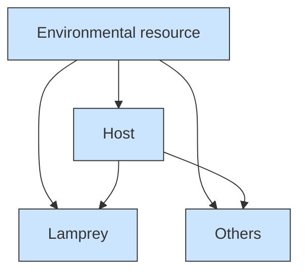
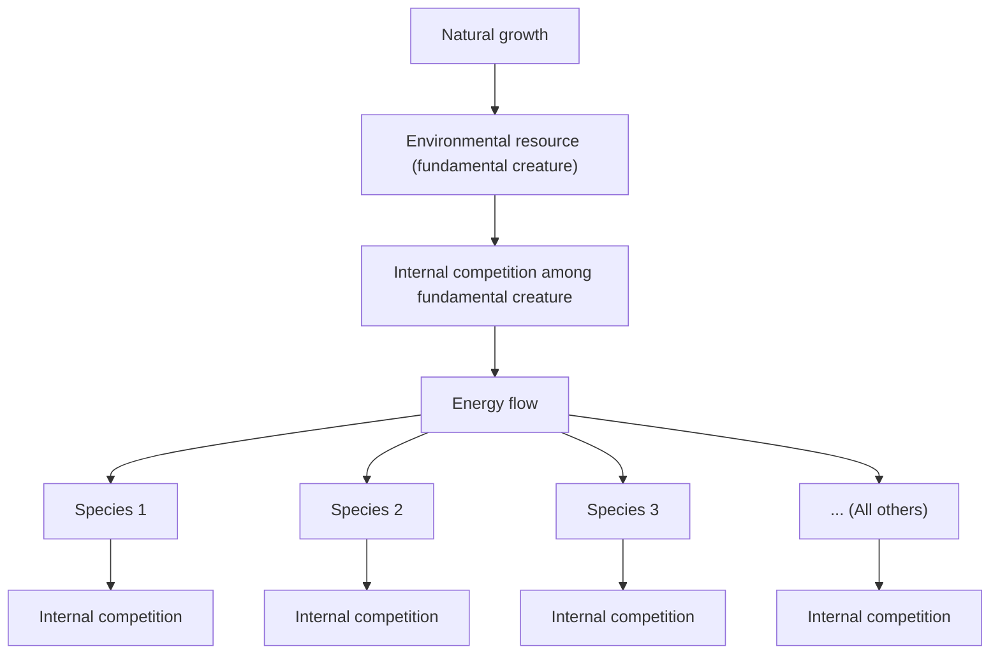
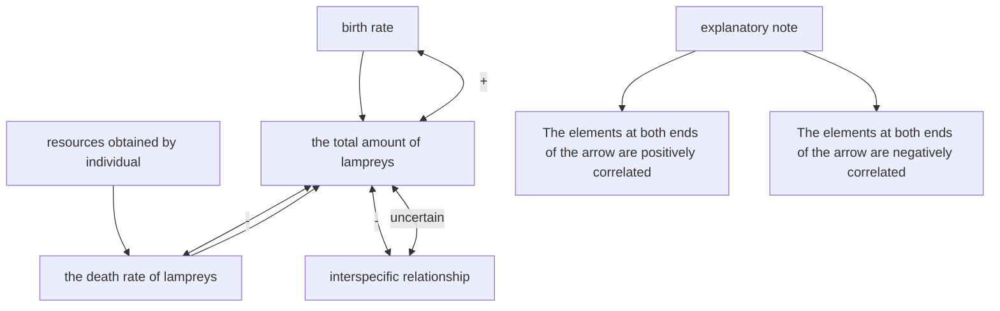
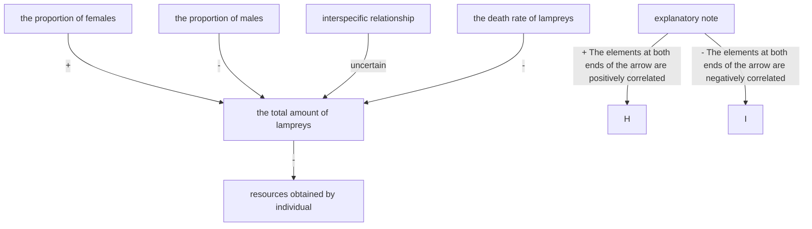

## Lamprey: a Vivid Example of the Doctrine of the Mean

The survival mechanism of the lamprey, one of the oldest organisms on earth, has always been a topic of interest for researchers. When it comes to lampreys and resource availability, the phenomenon that their populations can change their sex ratio has become an inescapable topic. Studies have found that resource availability affects the sex ratio of lamprey populations.

In order to study the ability of species to change their sex ratios according to resource availability, we adopted the Lotka-Volterra predator-prey model and the Nicholson-Bailey host-parasite model as modeling bases, and then constructed the Ideal Reference Model, the Constant Sex Ratio Model, and the Models of Changing Sex Ratios, and successfully solved the problem.

For Task 1,we first found that the total amount of resources in the ecosystem declined with the introduction of lamprey or other parasites, while the number of species surviving was highest in the model with lamprey. Therefore, we conclude that lamprey with altered sex ratios are less stressful to other organisms than ordinary parasites, which is conducive to increasing the diversity of the ecosystem.

For Task 2, we artificially worsened the environmental resources, and plotted the change curves of the number of lamprey in Constant Sex Ratio Model and Models of Changing Sex Ratios, respectively. Obviously, the population size of conventional parasitic species is severely affected by the environment, while lamprey, which is able to change its sex ratio, is very stable, which is the greatest population advantage of lamprey.However, win some, lose some.With higher resilience to environmental risk comes lower population size, which is the disadvantages to the population of lampreys.

For Task 3, we collected a large amount of data and analyzed the final ecosystem stability of the three models through the entropy weighting method, and concluded that the introduction of parasites led to a decrease in ecosystem stability, but the property of lamprey that can change the sex ratio significantly mitigated this phenomenon.

For Task 4,we then integrated these three models to explore the effects of introducing lamprey on other conventional parasites in the ecosystem. Under deteriorated conditions, we found that the parasite was less able to resist the external environment in ecosystems lacking lamprey. However, after the introduction of lamprey, their population size showed stable periodic fluctuations. This amplified the negative feedback regulation of the ecosystem, and also led to a significant strengthening of the resistance of the original parasite to the adverse environment.

After that, in order to test the model, we firstly discussed the rationality of the experimental results from various aspects. Then we analyzed the sensitivity of the model from two perspectives: the disturbance of human activities and the change of the initial value of the population, and found that the model is more resistant to the uncertainty factors, and it is applicable to different initial values of the population, which just shows the reliability and universality of the model. Finally, we analyzed the advantages and disadvantages of the model and proposed a corresponding optimization scheme.

Keywords:Changing Sex Ratios,Ideal Reference Model,Constant Sex Ratio Model , Model of Changing Sex Ratios, Entropy Weighting Method.

## Contents

## 1 Introduction 3

1.1 Research Background[1] 3  
1.2 Restatement of the Problem 3  
1.3 Literature Review . 4  
1.4 Our Work . . 5

## 2 Model Preparation 5

2.1 Assumptions . . 5  
2.2 Notations . . 6

## 3 Establishment of Models 6

3.1 Ideal Reference Model 6  
3.2 Constant Sex Ratio Model(Based on an ecosystem containing conventional parasitic species with a constant sex ratio of 2 : 1) . . . 8  
3.3 Models of Changing Sex Ratios(Based on an ecosystem containing normal lamprey) . . . . . 12  
3.4 Evaluation Indicators and Stability Analysis of Ecosystems . . . . . 14

## 4 Problem Solutions 14

4.1 Ecosystem Impacts of Changing Sex Ratios in Lamprey . . . 15  
4.2 Advantages and Disadvantages of Changing Sex Ratios for Lamprey . . 17  
4.3 Effects of Changing Sex Ratios on Ecosystem Stability in Lamprey . . . . 18  
4.4 Advantages of Altering Sex Ratio of Lamprey to Other Species . . . . . . 19

## 5 Rationalization Analysis and Sensitivity Testing of the Model 22

5.1 Rationalization Analysis . . 22  
5.2 Sensitivity Testing . . . 22

## 6 Strengths and Weaknesses 24

6.1 Strengths . . 24  
6.2 Weakness . . 24

## 7 Conclusion 24

## 1 Introduction

## 1.1 Research Background[1]

## 1.The Living Habits of Lampreys.

The entire life cycle of the lamprey, from fertilized egg to adult, typically takes 5-8 years. Fertilized eggs hatch into worm-like larvae that reside in small burrows on the bottom of sandy streams. The larvae feed on detritus and small plant algae, and after three to six years become parasitic adults. Adults migrate to lakes and seas where they feed on fish.As a typical migratory organism, the lamprey lives part of the time in the sea. They enter large rivers in the fall, overwinter in the lower reaches of the rivers, and return to the upper reaches to spawn when the water temperature reaches about 15 degrees Celsius in May to June of the following year. Both parents die after spawning.

natural_image

Side view of a single dark-colored eelander with visible fins and body structure (no text or symbols)

Figure 1: Lamprey[2]

Parasitism is the main way of survival for the lamprey. Adult lampreys attach themselves to a host fish through their toothed sucker mouths and feed on its blood. This parasitic behavior not only causes damage to the health of the host fish and reduces its ability to survive and reproduce, but also affects the number and structure of fish populations, thus affecting the balance of the aquatic ecosystem.

## 2.Population Dynamics of Lampreys.

Since the lamprey is regarded as a delicacy in some cultures, heavy human fishing in recent years has led to a decline in its population. While considering the predator, prey and parasitic relationships of lampreys, changes in sex ratio may also have a significant impact on their ecological roles. For example, if an increase in the proportion of males leads to a decrease in reproduction rates, then the impact of lamprey on their host fish may be reduced, thus affecting the associated food chain. In addition, changes in sex ratios may also affect the genetic diversity and adaptive capacity of lampreys, which in turn may affect their long-term viability.

## 1.2 Restatement of the Problem

• For Task 1, we need to build a mathematical model based on the basic property of lampreys that can change the sex ratio, which can reflect the impact of the sex-changing property of lampreys on the ecosystem, and draw the corresponding conclusions based on the built model.  
• For Task 2,we need to utilize and improve the above model and derive the strengths and weaknesses of lampreys population from the model results.  
• For Task 3,e need to establish an evaluation criterion on ecosystem stability, and determine and validate the effect of the characteristic of lampreys that can change the sex ratio on the stability of the ecosystem by comparing the change of this indicator before and after the introduction of lampreys.  
• For Task 4,we need to further refine the model to find out if there are species (e.g.,

parasites) that can profit from ecosystems containing populations of lampreys, and to elaborate on the mechanisms of their profitability.

## 1.3 Literature Review

Since lampreys have relationships with other species in the ecosystem such as interspecific competition, parasitism, etc..In order to better describe the status and role of lampreys in the ecosystem, we need to understand the existing mathematical models on interspecific relationships. According to Literature [3], [4], the existing models that can describe interspecific relationships are mainly the Lotka-Volterra predator-prey model that describes predation relationships and the Nicholson-Bailey host-parasite model that describes parasitism relationships. Based on this, our approach to building the model is shown in the Figure 2:

flowchart

Figure 2: Modeling thoughts

As can be seen from the Figure 2, since all species obtain energy from environmental resources, the environmental resources can be regarded as the prey and each species as the predator, and the Lotka-Volterra predator-prey model can be used to describe the relationship between species and environmental resources.And because multiple species prey on the same environmental resources, when mathematical models are used to describe the relationship between species and environmental resources, the relationship of interspecific competition between individual species is also indirectly described.

## 1.4 Our Work

1. Based on the Nicholson-Bailey host-parasite model and the Lotka-Volterra predatorprey model, we will build the Ideal Reference Model , Constant Sex Ratio Model , and Models of Changing Sex Ratios .  
2. By adjusting the ecosystem parameters in each model, we will simulate the survival of different species in different climates as well as changes in total resources.  
3. We will analyze the resulting data and compare the three models above to discuss the advantages and disadvantages of the ability of lamprey to alter sex ratios on lamprey’s own populations, as well as the effects on factors such as the number of ecosystem species surviving, total resources, and ecosystem stability.  
4. Combining the three models, we will discuss the impact of lamprey on conventional parasitizers with a sex ratio of 1:1 by making reasonable improvements to Constant Sex Ratio Model and Models of Changing Sex Ratios.  
5. Finally, we will perform a sensitivity analysis of the model by varying the initial value of the population size of each species, and by adding the disturbance of anthropogenic fishing factors both.

## 2 Model Preparation

## 2.1 Assumptions

• Assumption 1: Natural enemies of parasitic species other than humans are not considered. That is, the relationship between species and parasitic organisms in the community is mostly parasitism and interspecific competition.

Justification: According to references [5], parasitic species such as the lampreys are invasive in the Great Lakes of North America, suggesting that they have very few natural enemies and can be ignored.

• Assumption 2: The survivability of male and female lampreys in the population is approximately the same.

Justification: From the references [6], it can be seen that there is little difference in the survival ability of male and female lampreys, and this assumption can avoid the extreme situation of a larger death in this party due to the lack of survival abil ity of either females or males, which ensures the reliability of the model prediction results.

• Assumption 3: All species in an ecosystem can obtain energy directly from environmental resources.

Justification: A simple analysis shows that when this hypothesis is valid, it is more effective to use Model 1 to reflect the competitive relationship between different species, and it also simplifies the model to some extent.

These are the main assumptions, and other assumptions will be given at appropriate places in the article.

## 2.2 Notations

In order to better describe the model, we assign the following symbols practical meanings:

<table><tr><td>Symbols</td><td>Description</td></tr><tr><td> $t$ </td><td>Number of lampreys&#x27; reproductive rounds</td></tr><tr><td> $N(t)$ </td><td>The population size of the lamprey at time  $t$ </td></tr><tr><td> $s(t)$ </td><td>Resource share of lampreys at average per individual</td></tr><tr><td> $m(s)$ </td><td>The proportion of male individuals in the lamprey at an average resource share of  $s$ </td></tr><tr><td> $\lambda(t)$ </td><td>The total amount of resources at moment  $t$ </td></tr><tr><td> $s_0$ </td><td>Minimum value of the average resource that can guarantee the normal survival of the lamprey population</td></tr><tr><td> $N_i(t)$ </td><td>The population size of the  $i$ -th species in the community at time  $t$ </td></tr><tr><td> $n$ </td><td>Initial value of the number of ecosystem species (excluding lamprey)</td></tr><tr><td> $n_1$ </td><td>Final value of the number of ecosystem species (excluding lamprey)</td></tr><tr><td> $ESI$ </td><td>Ecosystem Stability Index</td></tr></table>

The remaining symbols will be listed in appropriate positions in the article.

## 3 Establishment of Models

In order to more convincingly reflect the impact of the lamprey’s changing sex ratio on the ecosystem, we established three types of models based on three scenarios, corresponding to the ecosystems: the ideal reference ecosystem without lampreys, the ecosystem with conventional parasitic organisms with a constant sex ratio of 2:1, and the ecosystem with normal lampreys. The first ecosystem is used as a reference for the subsequent evaluation of ecosystem-related indicators. The second and third ecosystems can be compared to reflect the impact of the lamprey’s function of changing the sex ratio on the ecosystem.

## 3.1 Ideal Reference Model

In the ecosystem represented by this model, there is no lamprey, and to simplify the model, it can be assumed that all the main species in this ideal ecosystem are in interspecific competition with each other. Since all these species share the same environmental resources, it can be assumed that the environmental resources are the prey and these species are the predators. Referring to the Lotka-Volterra prey-predator model[3], we can propose a more complete model for describing the ecosystem.The basic structure of an ideal reference ecosystem is shown in Figure 3:

flowchart

Figure 3: Ideal reference ecosystem

First, taking environmental resources as the object of study, its differential equation can be listed as:

$$
\lambda (t + 1) - \lambda (t) = \sigma \lambda (t) - q \lambda^ {2} (t) - \sum_ {i = 1} ^ {n} \mu_ {i} \lambda (t) N _ {i} (t) \tag {1}
$$

where $\lambda ( t )$ denotes the total environmental resources at time t and $\sigma$ denotes the natural rate of population growth, where the $\lambda ^ { 2 } ( t )$ term represents the internal competition of the basal organisms, such as plant microorganisms, that make up the environmental resources, and the $\lambda ( t ) N _ { i } ( t )$ term represents the rate of uptake of the resources by The i−th species within the community.q is the intensity of competition within the underlying organisms and $\mu _ { i }$ is the intensity of the environmental demand corresponding to the i−th species coefficients.Both are related to the nature of the species itself.

Then taking the i−th species as the object of study, it is equally easy to set out its difference equation as:

$$
N _ {i} (t + 1) - N _ {i} (t) = - a _ {i} N _ {i} (t) + b _ {i} N _ {i} (t) \lambda (t) - p _ {i} N _ {i} ^ {2} (t) (i = 1, 2, \dots \dots , n) \tag {2}
$$

where $N _ { i } ( t )$ denotes the total number of the i−th species at time $t ,$ and $a _ { i }$ denotes the natural decay rate when the i−th species lacks food. As in the previous equation, the $N _ { i } ( t ) \lambda ( t )$ term represents the rate of resource uptake by the i−th species within the community, and the $\bar { N } _ { i } ^ { 2 } ( t )$ term represents the intraspecific competition of the i−th species. And $b _ { i }$ and $p _ { i }$ are the intensity coefficients of competition for the corresponding inter- or intraspecific relationships, related to the habits of the different species themselves.

Joining the two types of difference equations leads to a system of equations 3.

$$
\left\{ \begin{array}{l} N _ {i} (t + 1) - N _ {i} (t) = - a _ {i} N _ {i} (t) + b _ {i} N _ {i} (t) \lambda (t) - p _ {i} N _ {i} ^ {2} (t) (i = 1, 2, \dots \dots , n) \\ \lambda (t + 1) - \lambda (t) = \sigma (t) \lambda (t) - q \lambda^ {2} (t) - \sum_ {i = 1} ^ {n} \mu_ {i} \lambda (t) N _ {i} (t) \end{array} \right. \tag {3}
$$

Since $q$ is the intensity of intraspecific competition and is little affected by external uncertainties, the value of $q$ can be considered constant. However, for coefficients other than $q ,$ we consider them as random variables due to the variability of species and uncertainty of external conditions. Among them, $\sigma ( t )$ is a random variable about the number of reproductive rounds $t ,$ which reflects the uncertainty within the ecosystem by indicating the uncertainty of the total amount of resources subject to changes in the external environment, and $a _ { i } , b _ { i } , p _ { i } .$ , and $\mu _ { i }$ are all random variables about $i ,$ which indicate the differences in the competitive ability between different species. After experimentation with the computer software, the appropriate value of the correlation coefficient can be determined.

We assume that the initial species types are 10, the initial total number of each species is 240, 000, and the initial environmental resources are $4 . 5 \times 1 0 ^ { 9 } k J ,$ which can lead to the changes in population size of each species with the number of breeding rounds, the details of which are shown in Figure 4.

line chart

| Number of reproductive rounds | The population size of species | The total amount of resources/kJ |
| ----------------------------- | ------------------------------- | -------------------------------- |
| 0                             | 2e5                             | 4.2                              |
| 10                            | 8e5                             | 4.6                              |
| 20                            | 7e5                             | 4.6                              |
| 30                            | 8e5                             | 4.6                              |
| 40                            | 8e5                             | 4.6                              |
| 50                            | 8e5                             | 4.6                              |
| 60                            | 8e5                             | 4.6                              |
| 70                            | 8e5                             | 4.6                              |
| 80                            | 8e5                             | 4.6                              |
| 90                            | 8e5                             | 4.6                              |
| 100                           | 8e5                             | 4.6                              |

Figure 4: Ideal ecosystem

In the Figure 4,the red line indicates the total environmental resources and the blue line indicates the different species.From the Figure 4 and average value calculated from multiple experiments, we can conclude that the ideal ecosystem has an environmental resource of about $4 . 8 9 \times 1 0 ^ { 9 } k J ,$ and the number of major species it can accommodate is roughly 8.88. In this simulation there are two species in a dominant position, one species in a disadvantageous position, and two species extinctions.This can be used as a reference to measure the lampreys’ impacts to the ecosystem.

## 3.2 Constant Sex Ratio Model(Based on an ecosystem containing conventional parasitic species with a constant sex ratio of 2 : 1)

Based on the literature [7], it is known that the sex ratio of the lamprey is generally a maximum of 5:1 and a minimum of 1:1, i.e., the proportion of males lies between the interval [0.50, 0.83]. Because this model exists to reflect the role of the lamprey’s ability to change the sex ratio, it can be assumed in this model that the sex ratio of the conventional parasitic species is constant at 2:1, i.e., the proportion of male individuals is 0.67.Therefore, the model is mainly based on conventional parasitic species with a constant sex ratio of 2 : 1, multiple hosts and multiple conventional species that will not be parasitized.

In the case of changes in the population size of conventional parasitic species, since the ratio of males to females remains the same, we take into account the following factors: the natural rate of growth of individual reproduction, the average resource allocation of individuals, and the interspecific relationships with other species. These are all linked to the total amount of the species, they act on the total amount of the species and are counteracted by it. Their interrelationships are shown in Figure 5.

flowchart

Figure 5: Fictitious ecosystem containing lampreys with constant sex ratio

As shown in the Figure 5, the total population is mainly affected by three factors: natural growth(birth and death rates), environmental constraints and relationships with other species, which will be discussed and modeled separately in the following.

## 1.Natural Growth

The population of this parasitic species is bound to show a natural increase due to reproduction, and since the number of reproducing offspring is highly dependent on the number of females, and considering the existence of some individuals that die before reproduction due to non-reproductive factors, it can be assumed that the number of offspring is directly proportional to the number of females that succeeded in reproducing, which is expressed by the equation as follows:

$$
N (t + 1) = k (1 - m) ^ {\alpha} N (t) \tag {4}
$$

where $N ( t + 1 )$ denotes the number of offspring reproduced, $( 1 - m )$ denotes the proportion of females,α denotes the proportionality correction coefficient, and in this paper, after computer simulation, the model is more reasonable when α is taken as 1.25 and k is the natural growth coefficient,which is related to the average number of offspring produced by females and population mortality due to non-reproductive factors.

## 2.Environmental Constraints

Environmental constraints on species are generally reflected in the size of the average resource holdings. We use s to denote the average resource occupancy at moment t. From the definition of average resource occupancy, the formula for s is as follows:

$$
s (t) = \frac {\text { total   amount   of   resources }}{\text { total   amount   of   population }} = \frac {\lambda (t)}{N (t) + \sum_ {i = 1} ^ {n} N _ {i} (t)} \tag {5}
$$

where λ(t) is the total amount of resources at moment t and λ(t) is the total amount of population at moment t. However, after simulation by computer software, when the sex ratio is constant, the average resource possession s generally does not change much and has a small effect on the population, which can be ignored in this type of model for the time being, but this factor will play an important role in the next model.

## 3. Relationships with Other Species

According to assumption 1, the relationship between the parasitic species and other species is mainly categorized into interspecific competition and parasitism, with parasitism being the main interspecific relationship between this species and other species. Here we discuss each of these.

First, for interspecific competition, we can refer to the mathematical description of interspecific competition in the ideal model. Competition is created by allowing multiple species to prey on the same species. Assuming that the total number of species under consideration in the community,not including the parasitic species, is n. Of these, z species can be parasitized by the parasitic species, the system of related equations considering only interspecific competition is as follows:

$$
\left\{ \begin{array}{l} N _ {i} (t + 1) - N _ {i} (t) = - a _ {i} N _ {i} (t) + b _ {i} N _ {i} (t) \lambda (t) - p _ {i} N _ {i} ^ {2} (t) (i = 1, 2, \dots \dots , n - z) \\ \lambda (t + 1) - \lambda (t) = \sigma (t) \lambda (t) - q \lambda^ {2} (t) - \beta \lambda (t) N (t) - \sum_ {i = 1} ^ {n} \mu_ {i} \lambda (t) N _ {i} (t) \end{array} \right. \tag {6}
$$

The extra term $\beta \lambda ( t ) N ( t )$ in the second equation relative to the ideal model represents the consumption of environmental resources by the parasitic species. For the z species that the parasitic species can parasitize, the relationship between them is more complex and will be discussed separately later.

Then for the parasitic relationship between the species of the community, the main parasitic structure is the parasitic species as a parasitoid and the other z species as hosts. In order to study their relationship, it was necessary to first solve the relationship between a single pair of parasitizers and their hosts.

In 1935, Irish scholar A.J. Nicholson and British scholar V.A. Bailey proposed the host-parasitoid model, which is as follows:[4]

$$
\left\{ \begin{array}{l} Q (t + 1) = r Q (t) e ^ {- a P (t)} \\ P (t + 1) = Q [ 1 - e ^ {- a P (t)} ] \end{array} \right. \tag {7}
$$

Where Q denotes the number of hosts, P denotes the number of parasites, $r$ denotes the natural growth rate when the hosts are not parasitized, and a denotes the search probability of the parasites. However, due to its great fluctuation in the natural environment, it is not quite applicable to the actual situation, so later scholars improved it to get the system of equations as follows:[4]

$$
\left\{ \begin{array}{l} \overline {{{Q}}} (t + 1) = \overline {{{Q}}} (t) e ^ {\rho (1 - \overline {{{Q}}} (t)) - \frac {\overline {{{P}}} (t)}{1 + a \overline {{{Q}}} (t)}} \\ \overline {{{P}}} (t + 1) = \phi \overline {{{Q}}} (t) \left(1 - e ^ {\frac {- \overline {{{P}}} (t)}{1 + a \overline {{{Q}}} (t)}}\right) \end{array} \right. \tag {8}
$$

where $\overline { { Q } }$ and $\overline { { P } }$ represent the population density of the host and the population density of the parasitizer, respectively, and $\rho ,$ a and $\overset { \cdot } { \phi }$ are correlation coefficients.Since the above z species not only have a parasitic relationship with the parasitic species, but also have this competitive relationship between them, we need to integrate the above model of interspecific competition with the parasitism model, so as to derive the equation of population size change of these z species, as follows:

$$
\left\{ \begin{array}{l} N _ {i 1} (t + 1) = \left(1 - a _ {i}\right) N _ {i} (t) + b _ {i} N _ {i} (t) \lambda (t) - p _ {i} N _ {i} ^ {2} (t) \\ N _ {i 2} (t + 1) = N _ {i} (t) e ^ {\rho \left[ 1 - \frac {N _ {i} (t)}{1 0 ^ {6}} \right] - \frac {N (t)}{1 0 ^ {6} + a _ {i} N _ {i} (t)}} \\ N _ {i} (t + 1) = \gamma N _ {i 1} (t + 1) + (1 - \gamma) N _ {i 2} (t + 1) \\ i = n - z + 1, n - z + 2, \dots \dots , n \end{array} \right. \tag {9}
$$

where $N _ { i 1 } ( t + 1 )$ represents the interspecific competition part of the host and $N _ { i 2 } ( t +$ 1) represents the parasitized part of the host. $1 0 ^ { 6 }$ in the system of equations is the appropriate area size chosen to convert the number of species to population density.γ is the coefficient of intensity of the interspecific competitive relationship between host and parasite relative to the parasitic relationship

Finally, we synthesized the three factors mentioned above and integrated the relevant equations involving the number of the parasitic species to obtain the following equation on the changes in the parasitic species populations:

$$
N (t + 1) = k (1 - m) ^ {1. 2 5} \left(1 - e ^ {- \frac {N (t)}{1 0 ^ {6} + \sum_ {i = n - z + 1} ^ {n} a _ {i} N _ {i} (t)}}\right) \sum_ {i = n - z + 1} ^ {n} \phi_ {i} N _ {i} (t) \tag {10}
$$

For this equation,since both natural population growth and parasitism are considered to directly affect the population size of the parasitic species, we appropriately integrated Equation 4 with the improved Nicholson-Bailey Host-Parasite Model to obtain the equation, used to characterize changes in the number of species populations of this parasitic species.

Summarizing the above analysis, we can derive the total set of equations describing the entire ecosystem when the sex ratio does not change, as follows:

$$
\left\{ \begin{array}{l} N (t + 1) = k (1 - m) ^ {1. 2 5} \left(1 - e ^ {- \frac {N (t)}{1 0 ^ {6} + \sum_ {i = n - z + 1} ^ {n} a _ {i} N _ {i} (t)}}\right) \sum_ {i = n - z + 1} ^ {n} \phi_ {i} N _ {i} (t) \\ \lambda (t + 1) - \lambda (t) = \sigma (t) \lambda (t) - q \lambda^ {2} (t) - \beta \lambda (t) N (t) - \sum_ {i = 1} ^ {n} \mu_ {i} \lambda (t) N _ {i} (t) \\ N _ {i} (t + 1) - N _ {i} (t) = - a _ {i} N _ {i} (t) + b _ {i} N _ {i} (t) \lambda (t) - p _ {i} N _ {i} ^ {2} (t) \\ (i = 1, 2, \dots \dots , n - z) \\ N _ {i} (t + 1) = \gamma [ (1 - a _ {i}) N _ {i} (t) + b _ {i} N _ {i} (t) \lambda (t) - p _ {i} N _ {i} ^ {2} (t) ] + \\ (1 - \gamma) [ N _ {i} (t) e ^ {\rho \left(1 - \frac {N _ {i} (t)}{1 0 ^ {6}}\right) - \frac {N (t)}{1 0 ^ {6} + a _ {i} N _ {i} (t)}} ] \\ (i = n - z + 1, n - z + 2, \dots \dots , n) \end{array} \right. \tag {11}
$$

Where we defaulted to $m = 0 . 6 7 , \mathrm { i . e . , \ : a \ : 2 \ : : 1 }$ ratio of males to females, and the correlation coefficients in this system of equations involving environmental factors and differences in species competition we set them all to appropriate random variables. In the later section, by comparing this model with the models of changing sex ratios, we can conclude the effect of altering the sex ratio on the environment, and also the advantages and disadvantages that this trait brings to the parasitic species population.

## 3.3 Models of Changing Sex Ratios(Based on an ecosystem containing normal lamprey)

The model focuses on the impacts of lampreys on ecosystems, so it corresponds to ecosystems whose main species components are lampreys, hosts of lampreys, and regular species that are not parasitized by lampreys. According to the title, the sex of individual lampreys is influenced by the external environmental conditions. When resources are scarce and the environment is harsh, it is more likely that the sex of the individual lamprey will be male. When resources are abundant and conditions are favorable, the sex of individuals is more likely to be female. In this model, we use the average amount of resources to reflect the environmental conditions.

Based on the general trend of the sex ratio with the average resource possession, it can be assumed that when the average resource possession is close to $0 ,$ the male proportion tends to be close to 1, and when the resource is very sufficient, the female to male ratio tends to be close to 1:1 [7]. However, because the population can not survive when the resources are too small, so when the average resource possession is $s _ { 0 } ,$ the male proportion is the largest, and from the literature [7], we can know that at this time, the female to male ratio is about 1:5, that is, the male proportion is 0.83. Therefore, it can be considered that it is similar to the Logistic model to a certain extent, so with reference to the Logistic model, it can be given as follows as the approximate relationship equation between m and s:

$$
m (s) = \frac {1}{2} + \frac {1}{2 + e ^ {\bar {b} (s - s _ {0})}} (s \geq s _ {0}) \tag {12}
$$

where $\bar { b }$ is the stretch factor for this curve, which is used to adjust out the proper shape of the curve. A graphical representation of this curve is shown in Figure 6:

line chart

| Resource share of lampreys | Proportion of male individuals |
| -------------------------- | ------------------------------ |
| s0                         | 0.83                           |

Figure 6: m − s image

As can be seen in Figure 6, the curve roughly shows a shape similar to the letter S, which is consistent with the actual situation, and the part of the figure indicated by the solid line is the part that is mainly involved in the model (i.e., the case where the male share m is inside the interval [0.50, 0.83]).

After the above discussion, it can be concluded that there is a significant relationship between the proportion of males m and the average resource occupancy s. Since the natural growth rate of the population is closely related to the sex ratio, it further affects the total population size of the lamprey N, and the total population size N once again acts on the average resource occupancy s. Therefore, it is possible to introduce the interrelationships within the ecosystem, which are shown in Figure 7:

flowchart

Figure 7: Ecosystem with normal lampreys

The + sign represents a positive correlation between the factors at the beginning and end of the arrow, and the − sign represents a negative correlation between the factors at the beginning and end of the arrow. The relationships between the multiple factors represented in the Figure 7 form multiple closed loops, reflecting the stability of the ecosystem through negative feedback regulation.

We incorporate the changing sex ratio as an important influence into the set of equations of the Constant Sex Ratio Model to obtain the following comprehensive model:

$$
\left\{ \begin{array}{l} N (t + 1) = k (1 - m) ^ {1. 2 5} \left(1 - e ^ {- \frac {N (t)}{1 0 ^ {6} + \sum_ {i = n - z + 1} ^ {n} a _ {i} N _ {i} (t)}}\right) \sum_ {i = n - z + 1} ^ {n} \phi_ {i} N _ {i} (t) \\ s (t) = \frac {\lambda (t)}{N (t) + \sum_ {i = 1} ^ {n} N _ {i} (t)} \\ m (s) = \frac {1}{2} + \frac {1}{2 + e ^ {\overline {{b}} (s - s _ {0})}} \\ \lambda (t + 1) - \lambda (t) = \sigma (t) \lambda (t) - q \lambda^ {2} (t) - \beta \lambda (t) N (t) - \sum_ {i = 1} ^ {n} \mu_ {i} \lambda (t) N _ {i} (t) \\ N _ {i} (t + 1) - N _ {i} (t) = - a _ {i} N _ {i} (t) + b _ {i} N _ {i} (t) \lambda (t) - p _ {i} N _ {i} ^ {2} (t) \\ (i = 1, 2, \dots \dots , n - z) \\ N _ {i} (t + 1) = \gamma [ (1 - a _ {i}) N _ {i} (t) + b _ {i} N _ {i} (t) \lambda (t) - p _ {i} N _ {i} ^ {2} (t) ] + \\ (1 - \gamma) [ N _ {i} (t) e ^ {\rho \left(1 - \frac {N _ {i} (t)}{1 0 ^ {6}}\right) - \frac {N (t)}{1 0 ^ {6} + a _ {i} N _ {i} (t)}} ] \\ (i = n - z + 1, n - z + 2, \dots \dots , n) \end{array} \right. \tag {13}
$$

This model is improved from the Constant Sex Ratio Model and therefore has strong similarities with the original model. The main improvement is the sex ratio m. In order to conform to reality, the sex ratio m is no longer a value, but a variable that is correlated with other factors according to Equation 12. The model successfully characterizes changing sex ratios and lays the foundation for the later discussion of the role of changing sex ratios.

## 3.4 Evaluation Indicators and Stability Analysis of Ecosystems

According to the references [8],in order to assess the impact of the model on ecosystems stability, the two main assessment indicators, total ecological resources and biodiversity, need to be considered. The total amount of resources was chosen as the assessment indicator. This is mainly because the total amount of ecological resources directly affects physiological vitality of each community, and determines the structure, function and productivity the ecosystem. In addition, a large number of studies have found that the level of biodiversity is closely related to ecosystem stability, and the higher the biodiversity, the better the stability of the corresponding ecosystem. Therefore, biodiversity is also one of the key indicators to assess the stability of the ecosystem, which is expressed in terms of the number of species that ultimately survive in an ecosystem.

For the model of the presence of the lamprey, in order to evaluate the stability of the ecosystem by integrating the above two indicators, we use the entropy weighting method to derive the weights of different indicators. The specific steps are described later.

## 4 Problem Solutions

To visualize the model, we assume that the initial number of species in the ecosystem, n, is 10, and that three of the organisms are hosts for lamprey.

## 4.1 Ecosystem Impacts of Changing Sex Ratios in Lamprey

Here we focus on the effects of changing the sex ratio of the lamprey on the total resources of the ecosystem, the population size of other species and the number of surviving species. In order to study the total amount of resources in the ecosystem and the number of surviving species, we carried out several simulation experiments, divided these experiments into several groups randomly and evenly, and took the average value of each part of the experiment, and obtained a number of groups of data, and the relationship between the specific value and the serial number of the experimental group is shown in Figure 8 and Figure 9:

line chart

| Experiment number | Ideal Reference Model | Constant Sex Ratio Model | Models of Changing Sex Ratios |
| ----------------- | --------------------- | ------------------------- | ------------------------------ |
| 0                 | 4.75                  | 4.55                      | 4.58                           |
| 10                | 4.80                  | 4.53                      | 4.56                           |
| 20                | 4.90                  | 4.62                      | 4.55                           |
| 30                | 4.85                  | 4.58                      | 4.57                           |
| 40                | 4.72                  | 4.52                      | 4.62                           |
| 50                | 4.85                  | 4.56                      | 4.61                           |
| 60                | 4.68                  | 4.54                      | 4.55                           |
| 70                | 4.89                  | 4.57                      | 4.60                           |
| 80                | 4.83                  | 4.59                      | 4.61                           |
| 90                | 4.79                  | 4.56                      | 4.56                           |
| 100               | 4.83                  | 4.57                      | 4.55                           |

Figure 8: Total amount of resources

line chart

| Experiment number | Ideal Reference Model | Constant Sex Ratio Model | Models of Changing Sex Ratios |
| ----------------- | --------------------- | ------------------------ | ----------------------------- |
| 0                 | 8.75                  | 9.00                     | 9.30                          |
| 10                | 8.80                  | 9.10                     | 9.25                          |
| 20                | 8.65                  | 8.95                     | 9.15                          |
| 30                | 8.80                  | 9.15                     | 9.20                          |
| 40                | 8.85                  | 9.20                     | 9.30                          |
| 50                | 8.90                  | 9.10                     | 9.25                          |
| 60                | 8.75                  | 9.15                     | 9.30                          |
| 70                | 8.80                  | 9.20                     | 9.35                          |
| 80                | 8.85                  | 9.15                     | 9.25                          |
| 90                | 8.80                  | 9.20                     | 9.30                          |
| 100               | 8.75                  | 9.10                     | 9.25                          |

Figure 9: Total number of major species(Excluding lampreys)

As can be seen from Figure 8and Figure 9, the size relationship between biodiversity and the size of total ecological resources in different ecosystems is relatively stable after many tests. It is easy to conclude that compared with the ideal ecosystem, the introduction of corresponding conventional species that mainly rely on parasitic life will increase the species diversity of the ecosystem and reduce the total amount of environmental resources. However, when lampreys were introduced, their ability to change sex ratios increased the species diversity of the external ecosystems, while the total amount of environmental resources did not change significantly, compared to other conventional parasitic species. In order to explain this phenomenon and to investigate the effects on the population size of other species, we simulated the introduction of conventional parasitic species and the introduction of lampreys, and drew graphs to represent the ecosystem conditions with the number of reproductive rounds t as the horizontal axis, and the number of different species and the total amount of environmental resources as the vertical axis, as shown in Figure 10 and Figure 11:

line chart

| Number of reproductive rounds | resources | the lamprey | host of the lamprey | other species |
| ----------------------------- | --------- | ----------- | ------------------- | ------------- |
| 0                             | 1.6e6     | 1.9e6       | 0.7e6               | 5.5e9         |
| 10                            | 1.5e6     | 1.2e6       | 0.5e6               | 5.0e9         |
| 20                            | 1.6e6     | 1.3e6       | 0.5e6               | 5.0e9         |
| 30                            | 1.5e6     | 1.3e6       | 0.5e6               | 5.0e9         |
| 40                            | 1.6e6     | 1.3e6       | 0.5e6               | 5.0e9         |
| 50                            | 1.5e6     | 1.3e6       | 0.5e6               | 5.0e9         |
| 60                            | 1.5e6     | 1.3e6       | 0.5e6               | 5.0e9         |
| 70                            | 1.5e6     | 1.3e6       | 0.5e6               | 5.0e9         |
| 80                            | 1.5e6     | 1.3e6       | 0.5e6               | 5.0e9         |
| 90                            | 1.5e6     | 1.3e6       | 0.5e6               | 5.0e9         |
| 100                           | 1.5e6     | 1.3e6       | 0.5e6               | 5.0e9         |

Figure 10: Models of Changing Sex Ratios

line chart

| Number of reproductive rounds | resources | the parasite | host of the parasite | other species |
| ----------------------------- | --------- | ------------ | -------------------- | ------------- |
| 0                             | 2.0e6     | 3.0e9        | 0.5                  | 3.0e9         |
| 10                            | 2.0e6     | 2.0e9        | 0.5                  | 3.0e9         |
| 20                            | 2.0e6     | 2.2e9        | 0.5                  | 3.0e9         |
| 30                            | 2.0e6     | 2.2e9        | 0.5                  | 3.0e9         |
| 40                            | 2.0e6     | 2.2e9        | 0.5                  | 3.0e9         |
| 50                            | 2.0e6     | 2.2e9        | 0.5                  | 3.0e9         |
| 60                            | 2.0e6     | 2.2e9        | 0.5                  | 3.0e9         |
| 70                            | 2.0e6     | 2.2e9        | 0.5                  | 3.0e9         |
| 80                            | 2.0e6     | 2.2e9        | 0.5                  | 3.0e9         |
| 90                            | 2.0e6     | 2.2e9        | 0.5                  | 3.0e9         |
| 100                           | 2.0e6     | 2.2e9        | 0.5                  | 3.0e9         |

Figure 11: Constant Sex Ratio Model

According to the information in the Figure 10 and Figure 11, the introduction of conventional parasitic species puts significantly more pressure on other species in the ecosystem than the introduction of lampreys, which is reflected by the fact that the number of species of other species in Figure 11 is generally lower than that in Figure

10. Because of this, lampreys promote species diversity in the ecosystem in relation to conventional species, since the pressure on other species from lampreys is less than that from conventional species. From the introduction of conventional species to the introduction of lampreys, the number of parasitic organisms decreased but the number of other organisms increased, so the effect on the total environmental resources was not significant.

Therefore, compared with the ideal ecosystem, the introduction of lampreys, which can change the sex ratio, can increase the species diversity of the ecosystem and reduce the total amount of resources in the ecosystem. In addition, the introduc tion of lampreys can further increase the diversity of ecosystems compared to the introduction of conventional parasitic species and alleviate the competitive pressure among other species.

## 4.2 Advantages and Disadvantages of Changing Sex Ratios for Lamprey

After several computer simulations, we found that in order to make the effect of changing the sex ratio on the population more significant, the environmental conditions need to be worsened continuously. By amplifying the uncertainty in the environmental resource conditions, i.e., by increasing the variance of the random variables $\sigma ( t )$ in the second equation in the system of equations 11, we have made the environmental conditions change more drastically, thus reflecting the deterioration of the environment.

In order to visualize our results, we used a computer to draw graphs corresponding to the different models, which have the number of reproductive rounds t as the horizontal axis, and the number of different species and the total amount of environmental resources as the vertical axis. Therefore, the experimental results of the model with constant sex ratio of the lamprey are shown in Figure 12:

line chart

| Number of reproductive rounds | resources | the parasite | host of the parasite | other species |
| ----------------------------- | --------- | ------------ | -------------------- | ------------- |
| 0                             | 3.0e6     | 5.0e6        | 0.5e6                | 2.5e6         |
| 10                            | 3.2e6     | 3.5e6        | 0.3e6                | 2.4e6         |
| 20                            | 3.4e6     | 3.6e6        | 0.3e6                | 2.4e6         |
| 30                            | 4.0e6     | 4.0e6        | 0.3e6                | 2.5e6         |
| 40                            | 3.2e6     | 3.5e6        | 0.3e6                | 2.4e6         |
| 50                            | 4.2e6     | 4.2e6        | 0.3e6                | 2.5e6         |
| 60                            | 4.8e6     | 4.8e6        | 0.3e6                | 2.5e6         |
| 70                            | 3.5e6     | 3.5e6        | 0.3e6                | 2.4e6         |
| 80                            | 4.5e6     | 4.5e6        | 0.3e6                | 2.5e6         |
| 90                            | 5.8e6     | 5.8e6        | 0.3e6                | 2.5e6         |
| 100                           | 3.2e6     | 3.5e6        | 0.3e6                | 2.4e6         |

Figure 12: Constant Sex Ratio Model(Environmental deterioration)

From the Figure 12, it can be seen that the fluctuation of environmental resources increased significantly with the increasing number of breeding rounds, representing environmental deterioration. In addition to this, Figure 12 also shows that the population size of the lamprey also oscillates significantly with the drastic oscillation of environmental resources, indicating that if the sex ratio is constant, the lamprey population is more affected by the environmental changes, and it is difficult to keep the population size stable, which is not conducive to the long-term survival of the population. If we consider the ability of the lamprey to change the sex ratio, the results can be obtained through computer simulation Models of Changing Sex Ratios, as shown in Figure 13:

line chart

| Number of reproductive rounds | resources | the lamprey | host of the lamprey | other species |
| ----------------------------- | --------- | ----------- | ------------------- | ------------- |
| 0                             | 1.9e6     | 1.5e6       | 0.6e6               | 2.5e6         |
| 10                            | 2.1e6     | 1.3e6       | 0.4e6               | 2.3e6         |
| 20                            | 2.2e6     | 1.2e6       | 0.4e6               | 2.2e6         |
| 30                            | 2.3e6     | 1.1e6       | 0.4e6               | 2.1e6         |
| 40                            | 2.5e6     | 1.2e6       | 0.4e6               | 2.0e6         |
| 50                            | 2.8e6     | 1.1e6       | 0.4e6               | 2.0e6         |
| 60                            | 2.7e6     | 1.0e6       | 0.4e6               | 2.0e6         |
| 70                            | 2.3e6     | 1.1e6       | 0.4e6               | 2.0e6         |
| 80                            | 2.5e6     | 1.5e6       | 0.4e6               | 2.0e6         |
| 90                            | 2.4e6     | 1.3e6       | 0.4e6               | 2.0e6         |
| 100                           | 1.5e6     | 1.3e6       | 0.4e6               | 2.0e6         |

Figure 13: Models of Changing Sex Ratios(Environmental deterioration)

According to the model, although the fluctuation of environmental resources is still very large, the population size of the lamprey has basically remained stable and unchanged, indicating that it is more resistant to the environment, which is more suitable for the long-term survival of the population, which may be the reason why the lamprey has been able to survive for 360 million years on the earth!

Looking back at the above two graphs again, after comparison, we can see that although the ability to change the sex ratio of the lamprey makes its population more resistant to external disturbances, the population size of the lamprey is only maintained at around $1 \times 1 0 ^ { 6 }$ due to this ability. On the other hand, when the sex ratio is constant, the minimum population size of the lamprey is about $2 \times 1 0 ^ { 6 }$ , which indicates that the ability to change the sex ratio improves the population’s ability to resist external disturbances at the expense of reducing the population size.

So we can conclude that the ability to change sex ratios gives the lamprey population the advantage of increased population stability and the disadvantage of a limited population size for the species.

## 4.3 Effects of Changing Sex Ratios on Ecosystem Stability in Lamprey

From the above,the stability of an ecosystem is mainly controlled by the number of surviving species and the total amount of environmental resources. Therefore, it can be considered that the formula for calculating the stability of an ecosystem is as follows:

$$
E S I = \omega_ {1} \overline {{\lambda}} + \omega_ {2} \overline {{n}} _ {1} \tag {14}
$$

where ESI denotes ecosystem stability, λ and $\overline { { n } } _ { 1 }$ denote the average of the total resources and the number of surviving species of an ecosystem obtained after several experiments, respectively, and $\omega _ { 1 }$ and $\omega _ { 2 }$ are the weights of the corresponding indicators.

In order to obtain the value of $E S I ,$ the weight of each indicator and the average value of two indicators, total ecological resources and number of surviving species, should be obtained separately. For the weights, we use the entropy weight method to obtain them based on known data. From the definition of entropy weighting method, we know that firstly, we should collect the data of total ecological resources and number of surviving species of several groups of Ideal Reference Model,Constant Sex Ratio Model and Models of Changing Sex Ratios through computer simulation and standardize them respectively; then, we use the standardized data to calculate the information entropy of total ecological resources, $E _ { 1 }$ , and the information entropy of the number of surviving species, $E _ { 2 }$ , respectively, with the following specific formulas:

$$
E _ {j} = - \frac {\sum_ {i = 1} ^ {n _ {0}} p _ {i j} \ln p _ {i j}}{\ln n _ {0}} (j = 1, 2) \tag {15}
$$

Where $p _ { i j }$ denotes the proportion of each data in this category and $n _ { 0 }$ denotes the total sample size.After that, the information redundancy of the total ecological resources and the number of surviving species in each of the two categories can be obtained, and then the final weights of the total ecological resources and biodiversity in each of the two categories can be calculated. Finally, the mean values of the total ecological resources and the number of surviving species of the corresponding models were calculated, and then the ESI values of the three were obtained by bringing them into the equations, and the effects of the lamprey on the stability of the ecosystem could be obtained by comparing the magnitude, and the details are shown in the Table 1:

Table 1: Ecosystem stability assessment

<table><tr><td>Indicator\Ecosystem</td><td>Ideal</td><td>Constant sex ratio</td><td>Changing sex ratio</td></tr><tr><td>Surviving species</td><td>0.75</td><td>0.77</td><td>0.84</td></tr><tr><td>Resources</td><td>0.55</td><td>0.38</td><td>0.45</td></tr><tr><td>Stability</td><td>0.63</td><td>0.54</td><td>0.61</td></tr></table>

Based on the contents of Table 1, it can be concluded that the introduction of conventional parasitic species would make the ecosystem less stable, but the lamprey’s ability to change the sex ratio can significantly mitigate this phenomenon.

## 4.4 Advantages of Altering Sex Ratio of Lamprey to Other Species

Based on the question prompt, in order to find out whether lampreys can give an advantage to other species $( \mathrm { e . g . } ,$ , parasites), we examined the effect of lamprey populations on an other parasite. To emphasize this effect, we similarly appropriately adjusted the magnitude of the change in environmental resources by increasing the variance of the random variable $\sigma ( t )$ to reflect the harsher environmental resource situation. As a point of reference, one should first derive the change in parasite population size with the number of reproductive rounds in the absence of the lamprey in the population. Since the sex ratio of most parasitic species is 1:1, we changed the proportion of males from

2/3 to 1/2 based on Constant Sex Ratio Model, and the simulation results are shown in Figure 14:

line chart

| Number of reproductive rounds | resources | other species | the parasite | host of the parasite |
| ----------------------------- | --------- | ------------- | ------------ | -------------------- |
| 0                             | 6.0e6     | 1.0e6         | 6.5e6        | 1.0e6                |
| 10                            | 5.8e6     | 1.1e6         | 4.0e6        | 0.9e6                |
| 20                            | 5.9e6     | 1.2e6         | 4.2e6        | 0.8e6                |
| 30                            | 3.0e6     | 0.9e6         | 2.5e6        | 0.7e6                |
| 40                            | 5.2e6     | 1.0e6         | 3.5e6        | 0.8e6                |
| 50                            | 6.3e6     | 1.1e6         | 4.1e6        | 0.9e6                |
| 60                            | 4.5e6     | 0.9e6         | 3.2e6        | 0.7e6                |
| 70                            | 3.5e6     | 1.0e6         | 2.8e6        | 0.8e6                |
| 80                            | 4.0e6     | 1.1e6         | 3.0e6        | 0.9e6                |
| 90                            | 5.2e6     | 1.2e6         | 3.5e6        | 1.0e6                |
| 100                           | 3.5e6     | 1.0e6         | 2.5e6        | 0.8e6                |

Figure 14: Ecosystem only containing parasites(Gender Ratio of 1:1)

As can be seen from the figure, when the environmental resources changed more drastically, the changes in the number of parasite populations were highly coincident with the changes in environmental resources, and the parasite’s curves also showed irregular and large oscillations. This phenomenon indicates that in the absence of the lamprey, the parasite population is more affected by the environment and its ability to resist the unfavorable environment is low.

With the introduction of the lamprey, there are two parasitized species in the ecosystem, and for the convenience of computer simulation, we assumed that the lamprey hosts three species, and the parasite hosts the other two species. This is in addition to the four species that will not be parasitized. Due to the presence of two types of parasitic species, we need to integrate Constant Sex Ratio Model with Models of Changing Sex Ratios, and the specific set of equations obtained is:

$$
\left\{ \begin{array}{l} N (t + 1) = k (1 - m) ^ {1. 2 5} \left(1 - e ^ {- \frac {N (t)}{1 0 ^ {6} + \sum_ {i = 5} ^ {7} a _ {i} N _ {i} (t)}}\right) \sum_ {i = 5} ^ {7} \phi_ {i} N _ {i} (t) \\ s (t) = \frac {\lambda (t)}{N (t) + \sum_ {i = 1} ^ {n} N _ {i} (t)} \\ m (s) = \frac {1}{2} + \frac {1}{2 + e ^ {\overline {{b}} (s - s _ {0})}} \\ N _ {1 0} (t + 1) = k (1 - m _ {1 0}) ^ {1. 2 5} \left(1 - e ^ {- \frac {N (t)}{1 0 ^ {6} + \sum_ {i = 8} ^ {9} a _ {i} N _ {i} (t)}}\right) \sum_ {i = 8} ^ {9} \phi_ {i} N _ {i} (t) \left(m _ {1 0} = \frac {1}{2}\right) \\ \lambda (t + 1) - \lambda (t) = \sigma (t) \lambda (t) - q \lambda^ {2} (t) - \beta \lambda (t) N (t) - \sum_ {i = 1} ^ {1 0} \mu_ {i} \lambda (t) N _ {i} (t) \\ N _ {i} (t + 1) - N _ {i} (t) = - a _ {i} N _ {i} (t) + b _ {i} N _ {i} (t) \lambda (t) - p _ {i} N _ {i} ^ {2} (t) (i = 1, 2, 3, 4) \end{array} \right. \tag {16}
$$

$$
\left\{ \begin{array}{l} N _ {i} (t + 1) = \gamma [ (1 - a _ {i}) N _ {i} (t) + b _ {i} N _ {i} (t) \lambda (t) - p _ {i} N _ {i} ^ {2} (t) ] + \\ (1 - \gamma) [ N _ {i} (t) e ^ {\rho (1 - \frac {N _ {i} (t)}{1 0 ^ {6}}) - \frac {N (t)}{1 0 ^ {6} + a _ {i} N _ {i} (t)}} ] (i = 5, 6, 7) \\ N _ {i} (t + 1) = \gamma [ (1 - a _ {i}) N _ {i} (t) + b _ {i} N _ {i} (t) \lambda (t) - p _ {i} N _ {i} ^ {2} (t) ] + \\ (1 - \gamma) [ N _ {i} (t) e ^ {\rho (1 - \frac {N _ {j} (t)}{1 0 ^ {6}}) - \frac {N _ {1 0} (t)}{1 0 ^ {6} + a _ {i} N _ {i} (t)}} ] (i = 8, 9) \end{array} \right.
$$

Where $N _ { i } ( t ) ( i = 1 , 2 , 3 , 4 )$ denotes the number of populations of each of the four species that will not be parasitized, $N _ { i } ( t ) ( i = 5 , 6 , 7 )$ denotes the number of populations of the three hosts that will be parasitized by the lamprey, $N _ { i } ( t ) ( i = 8 , 9 )$ denotes the number of populations of the two hosts that will be parasitized by the parasites, $N _ { 1 0 } ( t )$ denotes the number of populations of the parasites, ${ \bf \bar { \boldsymbol { N } } } ( t )$ denotes the number of populations of the lamprey, and $m _ { 1 0 }$ denotes the sex ratio of the parasites, which is set to $\frac { 1 } { 2 }$ here.The results can be obtained by computer simulation as shown in Figure 15:

line chart

| Number of reproductive rounds | resources | the lamprey | host of the lamprey | other species | the parasite | host of the parasite |
| ----------------------------- | --------- | ----------- | ------------------- | ------------- | ------------ | -------------------- |
| 0                             | 4.5e6     | 1.2e6       | 0.8e6               | 0.6e6         | 5.5e9        | 0.4e6                |
| 10                            | 3.0e6     | 1.1e6       | 0.7e6               | 0.5e6         | 4.0e9        | 0.3e6                |
| 20                            | 1.0e6     | 0.9e6       | 0.6e6               | 0.4e6         | 2.5e9        | 0.2e6                |
| 30                            | 5.5e6     | 1.5e6       | 0.7e6               | 0.5e6         | 3.0e9        | 0.3e6                |
| 40                            | 4.0e6     | 1.3e6       | 0.6e6               | 0.4e6         | 2.8e9        | 0.2e6                |
| 50                            | 3.5e6     | 1.2e6       | 0.5e6               | 0.3e6         | 2.5e9        | 0.1e6                |
| 60                            | 5.0e6     | 1.4e6       | 0.6e6               | 0.4e6         | 2.7e9        | 0.2e6                |
| 70                            | 4.5e6     | 1.3e6       | 0.5e6               | 0.3e6         | 2.4e9        | 0.1e6                |
| 80                            | 3.0e6     | 1.1e6       | 0.4e6               | 0.2e6         | 2.2e9        | 0.1e6                |
| 90                            | 4.0e6     | 1.2e6       | 0.5e6               | 0.3e6         | 2.3e9        | 0.2e6                |
| 100                           | 3.5e6     | 1.1e6       | 0.4e6               | 0.2e6         | 2.1e9        | 0.1e6                |

Figure 15: Ecosystem containing lampreys and parasites

As can be seen in the Figure 15, when the number of lampreys reaches a certain value, the number of parasites and the number of lampreys show cyclic fluctuations, and the peak position of the curve of the number of populations of the two corresponds to the position of the trough of the other side, which indicates that there is a cooperative relationship between the two, and they are in control of each other, so that the number of populations shows a stable cyclic fluctuation. Therefore, by comparing the changes in the population size of the parasite before and after the introduction of the lamprey, it can be found that when the environmental conditions fluctuated drastically, the curve of change in the number of populations of parasites after the introduction of the lamprey was no longer a large and irregular oscillating curve, but an oscillating curve with a fixed period and amplitude, which indicated that its resistance to the external environment had been strengthened.

Summarizing the above discussion, it can be concluded that the introduction of the lamprey that can change the sex ratio can enhance its ability to resist the external environment by forming a cooperative relationship with the parasite, which enables the parasite to manifest a better survival advantage in the face of harsh environmental changes.

## 5 Rationalization Analysis and Sensitivity Testing of the Model

## 5.1 Rationalization Analysis

After our judgment, the model has three characteristics very consistent with the actual situation, as follows:

• In this model, the number of each species will level off after a certain period of time, which is consistent with the conclusion that ecosystems have a certain degree of stability in biology.  
• The fluctuation of the population of lamprey in the model and the fluctuation of the amount of environmental resources almost realized the same frequency and same direction of vibration, reflecting the dependence of the species on the environment.  
• The model successfully predicts and clearly demonstrates the possible interaction between th lampreys and parasites and other species. Their mutual restraints lead to a dynamic equilibrium and a smooth increase and decrease in their populations, reflecting the ecological principle that ecosystems have a certain degree of selfregulation.

These three points are very much in line with the reality of the situation very well,discusses the rationale for the model in various ways.

## 5.2 Sensitivity Testing

## 1.Human Activity

In some areas, lampreys, which are an important food source, can be harvested by humans, causing a sudden decline in the population size of lampreys. In order to test the reasonableness of the model, we consider that human beings fish the lamprey at the moment of $T _ { 0 } ,$ , then the relationship of this population before and after fishing is shown in Figure 16:

line chart

| Number of reproductive rounds | resources | the lamprey | host of the lamprey | other species |
| ----------------------------- | --------- | ----------- | ------------------- | ------------- |
| 0                             | 1.6e8     | 2.6e8       | 0.9e8               | 3.5e9         |
| 50                            | 1.5e8     | 1.7e8       | 0.8e8               | 3.5e9         |
| 100                           | 1.5e8     | 1.7e8       | 0.8e8               | 3.5e9         |

Figure 16: The impact of human on populations

As can be seen from Figure 16, after human fishing, the ecosystem did not collapse, but quickly recovered to the state before human fishing, indicating that the model is insensitive to the perturbation of external factors such as human beings, reflecting the reliability and stability of the model.

## 2.Initial Value of Population

Since the initial values of the population size of each species are different in different ecosystems, in order to test the general applicability of the model, we constantly change the initial values of the population size of the main species in the model, and study the relationship between the mean value of the number of species eventually surviving in the ecosystem and the total amount of environmental resources and the initial population size, and the results are shown in Figure 17.

line chart

| Initial population size of species (×10⁵) | Total number of major species (Excluding lampreys) | Total amount of resources (×10⁹) |
| ---------------------------------------- | -------------------------------------------------- | ------------------------------- |
| 0.5                                      | 9.4                                                | 4.95                            |
| 1.0                                      | 9.2                                                | 4.85                            |
| 1.5                                      | 9.1                                                | 4.8                             |
| 2.0                                      | 9.0                                                | 4.75                            |
| 2.5                                      | 8.95                                               | 4.7                             |
| 3.0                                      | 8.9                                                | 4.65                            |
| 3.5                                      | 8.85                                               | 4.6                             |
| 4.0                                      | 8.8                                                | 4.55                            |
| 4.5                                      | 8.75                                               | 4.5                             |

Figure 17: The results of changing initial values of the population

As can be seen from Figure 17, with the initial value of the population size increasing, the total number of major species that eventually survived in this ecosystem stabilized around 9.2, but due to the increase in the number of populations, the consumption of the environment increased as well, and it can be seen that the total amount of environmental resources continued to decrease. These phenomena are very reasonable, so the model can give very appropriate results for different initial population sizes, reflecting the generalizability of the model.

After the above two aspects, it can be concluded that our model has a good ability to resist external uncertainties and excellent general applicability. For ecosystems of different scales and containing uncertainties, the model’s analysis and prediction are reliable.

## 6 Strengths and Weaknesses

## 6.1 Strengths

• The model is flexible, and different ecosystems can be simulated by adjusting the parameters in the model to obtain either barren or rich environmental resources, or advantageous or disadvantageous populations.  
• The model is realistic, and the parameters in the model can be adjusted to simulate natural disasters, so as to judge the impact of external environmental turbulence on the ecosystem.  
• The number of lamprey parasitic species can be freely adjusted to simulate the living conditions of lamprey in different communities, which is conducive to the in-depth study of lamprey populations.

## 6.2 Weakness

• The total number of species in the computer-simulated model (excluding lamprey) is only 10, which is too small and deviates from the actual ecosystem.

Possible solution: Increase the number of species and the number of equations in the model.

• The food web in the model is not complex enough and the structure of the ecosys tem is simpler.

Possible solution: Introduce advanced consumers while hierarchizing the model based on different trophic levels.

## 7 Conclusion

In this paper, based on the Lotka-Volterra predator-prey model and the Nicholson-Bailey host-parasite model, we developed three models, and by reasonably comparing the results of the runs of these three models, we drew different conclusions in response to different problems. Combined with our conclusions, it can be concluded that the introduction of parasitic species will exert pressure on other species and reduce the stability of the ecosystem, but the unique function of the lamprey to change the sex ratio not only mitigates these negative impacts, but also enhances the stability of other parasitic organisms in the population, which is sufficient to reflect the doctrine of the mean of the lamprey to the ecosystem.

## References

[1] W. Defen, “Fishery conservation in the great lakes of north america: Invasion and control of seven gilled eels in the sea of the great lakes of north america,” Chinese Fisheries, vol. 000, 2012.  
[2] https://cn.bing.com/images/search.  
[3] Z. Zhenliang, W. Runxin, L. Liyun, and Y. Xiangqin, “The influence of fear effect to the lotka-volterra predator-prey system with predator has other food resource,” ADVANCES IN DIFFERENCE EQUATIONS, vol. 2020, 2020.  
[4] W. ruiwu, “Nicholson-bailey host-parasite model,” Encyclopedia of China, 2023.  
[5] M. J. Siefkes, “Use of physiological knowledge to control the invasive sea lamprey (petromyzon marinus) in the laurentian great lakes,” CONSERVATION PHYSIOL-OGY, vol. 5, 2017.  
[6] L. Peng, C. Hui, and Z. Wenge, “Studies on the winter hermaphroditic morphology and individual fecundity of the japanese lamprey,” Freshwater Fisheries, 2008.  
[7] P. S. Maitland, “Ecology of the river, brook and sea lamprey,” Conserving Natura 2000 Rivers Ecology series No.5, 2003.  
[8] H. Nianpeng, X. Li, and H. Honglin, “The methods of evaluation ecosystem quality: Ideal reference and key parameters,” Acta Ecologica Sinica, 2020.

Report on Use of AI No AI tools were used in this article.