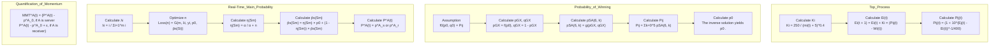

# Summary

Momentum, elucidating the phenomenon wherein a player's real-time performance surpasses pre-match expectations, holds paramount significance in tennis matches. This paper introduces the Real-Time Momentum Quantification (RTMQ) model, which quantifies momentum by assessing the disparity between a player's pre-match win probability and the real-time win probability. The study establishes the importance of momentum by comparing our model's results with an alternative model that neglects in-match performance. Notably, specialized indicators are employed to predict momentum swings, and game theory is applied to strategize against different opponents.

First, we use the independent and identically distributed (IID) assumption to reverse calculate the server's probability of winning the first point $(p_{0})$ , base on the Elo rating system. IID assumption is not applied to calculate any other value, including real-time win probability. Then, RTMQ model is constructed by integrating $p_{0}$ and the Real-Time Win Probability (RTWP) model for calculating subsequent point win probabilities during a match, that also eliminates the effect of the serve side advantage. The resulting momentum difference aligns seamlessly with real-world observations. The significance of momentum is confirmed through a K-S test, rejecting the hypothesis that in-match performance is inconsequential. Further analysis involves applying the Fourier Series Fitting (FSF) model to track momentum trend.

To forecast large momentum shifts, a Swing Prediction (SP) model is introduced. The model operates on a per-set basis, as a set provides a more comprehensive dataset for analysis compared to individual games. We sample the momentum trend value (MMTTV) from the momentum trend at the end of each set. This is because the frequent in-set momentum shifts can render predictions based on real-time momentum data at the end of each set unreliable. At the same time, key technical performance factors are distilled from specialized indicators through factor analysis. We then employ a Multivariate Linear Regression model to predict the swings. Our model demonstrates an impressive prediction accuracy of 90.44% on our test problem, with specific factors such as 2nd\_serve\_direct\_won and Net\_approach\_point\_won identified as crucial contributors to player 1's momentum.

The paper extends its analysis to dynamic strategic choices made by tennis players during matches, employing the Mixed-Strategy Nash Equilibrium model. K-means clustering is utilized to determine strategic clusters. The Nash equilibrium is calculated, offering insights into optimal strategy combinations against different opponents.

The efficacy of the proposed models is validated through testing on notable tennis matches, including the extraordinarily tight 2023 Wimbledon Gentlemen's Final between Carlos Alcaraz and Novak Djokovic, and the one-sided 2017 French Open match between Andy Murray and Andrey Kuznetsov. The SP model exhibits high accuracy (85.32% for the Alcaraz vs. Djokovic match, and 88.34% for the Murray vs. Kuznetsov match), while the FSF model accurately captures momentum trends, taking into account the score situation and historical commentary. Eventually, we pinpoint crucial factors for inclusion in future models.

Keywords: tennis; momentum; real-time win probability; Elo rating system; mixed-strategy Nash equilibrium; quantification model

公众号：蚂蚁竞赛 更多资料请加QQ群1077734962，谢谢！

# Contents

# 1 Introduction 4

1.1 Background Information 4  
1.2 Problem Analysis 4  
1.3 Model Overview 5

# 2 Assumptions 5

# 3 Notifications 6

# 4 Data Source 6

# 5 Real-Time Momentum Quantification Model 6

5.1 Pre-match Win Prediction 7  
5.2 Probability of Winning the First Point 8  
5.3 Dynamic Computation of the Subsequent Points' Win Probabilities ..... 9  
5.4 Quantification of Momentum 11  
5.4.1 Verification of the Significance of Momentum ..... 12  
5.5 Momentum Trend Value (MMTTV) Visualization ..... 14

# 6 Swing Prediction Model 15

6.1 Data Preprocessing 15  
6.2 Indicators Calculation 15  
6.3 Exploratory Factor Analysis 16  
6.4 Prediction of Swing Based on Multivariate Linear Regression Model ..... 17

# 7 Mixed-Strategy Nash Equilibrium Model 18

7.1 Strategy Payoff Calculation 18  
7.2 Model Setup 20

# 8 Test of FSF Model and SP Model 21

8.1 The Match between Alcaraz and Djokovic 21

8.2 Model Generalization 22  
8.3 Contextual Limitations in SP Model 22  
8.4 Key Indicators to be Included in Future Models 22

# 9 Sensitivity Analysis 23

# Appendices 26

公众号：蚂蚁竞赛 更多资料请加QQ群1077734962，谢谢！

# 1 Introduction

# 1.1 Background Information

In the 2023 Wimbledon final, Carlos Alcaraz overcame Novak Djokovic's initial dominance to win, demonstrating a thrilling momentum shift. This echoed the 2008 final where Rafael Nadal triumphed over Roger Federer, highlighting the unpredictable and captivating nature of tennis.

Research has shown that athletes, especially tennis players, can experience a psychological or physiological boost known as momentum. This concept was first explored in a study by Gilovich, Vallone, and Tversky (1985), who identified a ‘hot hand’ phenomenon in basketball where a player’s real-time performance significantly exceeds pre-match expectations based on his overall record. However, momentum can be temporary and may shift to the opponent, leading to swings where potential winners lose several points or games.

This paper explores the dynamic performance changes of players throughout a game and offers in-depth insights into how players' techniques and strategies should adapt in response to their opponents' key factors.

# 1.2 Problem Analysis

\- Task 1: Construct a model that dynamically calculates the performance of both players within the match, taking serving-advantage into consideration.

In this paper, we develop an RTWP (Real-Time Win Probability) model that accurately predicts the win probability of the subsequent point based on Elo rating system in real time. On that basis, we built the RTMQ (Real-Time Momentum Quantification) model by effectively quantifying player performance, by calculating the difference between real-time and pre-match win rates under separate serve/receive conditions (considering the serving side's advantage). Finally we apply Fourier-series fitting to MMT to obtain the momentum trend value (MMTTV).

\- Task 2: Evaluate the significance of 'momentum' in tennis matches.

We took the 2023 Wimbledon final as an example and tested our RTWP model and the CWP (Constant Win Probability) model, which neglects the influence of momentum. A Kolmogorov-Smirnov (K-S) test is performed taking the model results as the input and confirms the significant role that momentum plays in the match, reversing the coach's hypothesis.

\- Task 3: Determine the key indicators that could trigger a momentum shift.

We introduce the Swing Prediction (SP) model to anticipate substantial momentum shifts, using the more stable MMTTV as a sample for each set. This is because the frequent in-set momentum shifts can render predictions based on real-time momentum data at the end of each set unreliable. MMTTV has no such fluctuations and effectively captures the trend of MMT. Subsequently, we identify technical indicators influencing player performance, extract common factors through factor analysis, and employ these as independent variables in a Multivariate Linear Regression to predict the swings. Subsequently, we apply K-means

clustering to distinguish between different tactics and finally calculate the player's optimal strategy using a mixed-strategy Nash equilibrium approach.

\- Task 4: Assess the model's ability to predict match swings and evaluate its performance across various tournaments, court surfaces, and other sports.

We validated the accuracy of our model using data from other matches in the dataset and conducted a sensitivity analysis. Subsequently, we discussed potential improvements to the model by considering factors such as climate and court surface. Finally, we further discussed the generalization capabilities of our model using the 2017 French Open Men's Singles dataset as an example.

# 1.3 Model Overview


<details>
<summary>flowchart</summary>

```mermaid
graph TD
  subgraph Part I [Part I: Real-Time Momentum Quantification (RTMQ) Model]
  A["Calculate pre-match win prediction"] --> B["Reverse calculate probability of winning the 1st point"]
  B --> C["Real-Time Win Probability"]
  B --> D["Quantification of Momentum (MMT)"]
  C --> E["Still has the effect of the serve side advantage"]
  D --> F["Fourier-series fitted MMT = MMTTV"]
  end

  subgraph Part II [Part II: Swing Prediction (SP) Model]
  G["Data Preprocessing"] --> H["Calculate 25 indicators"]
  H --> I["Factor analysis"]
  I --> J["Swing prediction based on multivariate linear regression model"]
  I --> K["Predict MMTTV"]
  J --> K
  end

  subgraph Part III [Part III: Mixed-Strategy Nash Equilibrium Model]
  L["Strategy Payoff Calculation"] --> M["Expected payoffs"]
  M --> N["Best responses"]
  N --> O["Nash equilibrium"]
  O --> P["Optimized strategy combination"]
  O --> Q["Adopt to compete against opponent"]
  P --> Q
  Q --> L
  end

  subgraph Part IV [Part IV: Result Analysis]
  R["Model evaluation"] --> S["Model generalization"]
  T["Sensitivity analysis"] --> S
  end
```
</details>

Figure 1: Model Overview

# 2 Assumptions

- All tennis players in the table demonstrate a high level of adaptability during play. This adaptability is reflected in their ability to continuously modify strategies based on their opponent's characteristics.  
- The technical indicators in the table, such as the way of winning, are able to fully characterize the strategy adopted by the current player. Changes in these indicators during a match can fully characterize changes in a player's strategy.  
- All data are authentic.

# 3 Notifications

Table 1: Significant symbols in this paper

<table><tr><td>Symbols</td><td>Description</td></tr><tr><td> $E_{i}(t)$ </td><td>the  $i^{th}$  player&#x27;s Elo rating at the  $t^{th}$  match</td></tr><tr><td> $P_{ij}(t)$ </td><td>a prediction based on Elo indicating that the  $i^{th}$  player defeats the  $j^{th}$  opponent</td></tr><tr><td> $p_{0}$ </td><td>the probability of aserverwinning the first point,constant during match</td></tr><tr><td> $\hat{p}(S_{m})$ </td><td>the probability of aserverwinning the next point,dynamic within match</td></tr><tr><td> $\eta(S_{m})$ </td><td>a dynamic weight that balances the pre-match and in-match serve information</td></tr><tr><td> $\lambda_{i}$ </td><td>a weight emphasizing performance at the moment over the initial performance</td></tr><tr><td> $\mathbf{P}^{\mathbf{A}}(\mathbf{t})$ </td><td>Real-Time Win Probability of player A</td></tr><tr><td> $\mathbf{MMT}^{\mathbf{A}}(\mathbf{t})$ </td><td>Real-Time Momentum value of player A</td></tr><tr><td> $\mathbf{MMTTV}^{\mathbf{A}}(\mathbf{t})$ </td><td>Real-Time Momentum Trend value of player A</td></tr></table>

# 4 Data Source

Table 2: The websites we use to obtain the necessary data

<table><tr><td>No.</td><td>Website</td><td>Usage</td></tr><tr><td>1</td><td>https://www.tenelos.com/</td><td>Acquire Elo ratings of all players before match</td></tr><tr><td>2</td><td>https://www.atptour.com/en/rankings/singles?DateWeek=2023-07-03</td><td>Acquire  $m_i$  to calculate  $K_i$  of players before match</td></tr><tr><td>3</td><td>https://www.wimbledon.com/</td><td>Search for relevant data of players in the dataset</td></tr><tr><td>4</td><td>https://github.com/JeffSackmann/tennis_slam_pointbypoint</td><td>2017 French Open dataset for problem 4</td></tr></table>

# 5 Real-Time Momentum Quantification Model

In our RTMQ model, we adopt a definition of momentum that is consistent with the classic interpretation of Gilovich et al. (1985). In this context, momentum is defined as a player's performance during a given period that significantly exceeds his expected performance based on pre-match predictions. The calculation of momentum involves determining the difference between the pre-match win probability and the real-time win probability. The greater the difference, the greater the momentum.

The modeling process is divided into four stages: obtaining the pre-match win prediction, determining the first point's win probability, dynamically computing the subsequent points' win probabilities, and calculating the difference eventually. The modeling flow of the RTMQ model is shown below.


<details>
<summary>flowchart</summary>


</details>

Figure 2: RTMQ model setup

# 5.1 Pre-match Win Prediction

We utilize the Elo rating system to predict match outcomes before the game. This outstanding system, dynamic and zero-sum, adjusts player ratings based on match outcomes and maintains fairness. Its simplicity, robustness, and proven effectiveness across sports highlight its adaptability and reliability.

The rating of a player is calculated with the following recursive formula:

$$
\begin{array}{l} \begin{array}{l} E _ {i} (t + 1) = E _ {i} (t) + K _ {i} \times \left(P _ {i j} (t) - W _ {i} (t)\right) \\ E _ {i} (1) = 1 5 0 0 \end{array} \tag {1} \\ E _ {i} (1) = 1 5 0 0 \\ \end{array}
$$

where $E_{i}$ denotes the $i^{th}$ player's Elo rating (in a player's very first tour match, $E_{i}(1)$ is assigned 1500), t is the number of match, $W_{i}$ is a discrete variable that equals 1 if the player loses the match and equals 0 if the player wins the match, and $P_{ij}(t)$ is a prediction based on Elo indicating that the $i^{th}$ player defeats the $j^{th}$ opponent. $K_{i}$ , relevant to the number of the player's career matches, is equal to

$$
K _ {i} = \frac {2 5 0}{\left(m _ {i} (t) + 5\right) ^ {0 . 4}} \tag {2}
$$

公众号：蚂蚁竞赛 更多资料请加QQ群1077734962，谢谢！

where $m_{i}(t)$ is match number. $P_{ij}(t)$ is calculated through

$$
P _ {i j} (t) = \left(1 + 1 0 ^ {\frac {\left(E _ {j} (t) - E _ {i} (t)\right)}{4 0 0}}\right) ^ {- 1} \tag {3}
$$

which matches our intuition. When $E_{j}(t) < E_{i}(t)$ and $E_{j}(t) - E_{i}(t)$ decreases, indicating a rising competence of the $i^{th}$ player over the $j^{th}$ player, the winning probability $P_{ij}$ increases.

# 5.2 Probability of Winning the First Point

To track the performance of the players, the win probability of the first point is calculated. We take the independent and identically distributed (IID) assumption and use $P_{ij}$ to reverse calculate the probability of the pre-match serving side winning the first point. The probability of securing the initial serving/receiving point in a match, represented as $p_{0}/p_{0}-\varepsilon$ ( $\varepsilon=0.25$ for men athletes and = 0.15 for women athletes, according to previous research led by Machar Reid), are assumed to be the same as the probability of winning any subsequent serving/receiving point prior to the beginning of the match. The probability of winning the upcoming point, $\hat{p}(S_{m})$ , will be recalculated after the conclusion of the first points as they occur. In mathematical terms, we aim to solve for $p_{0}$ through

$$
f _ {0} (p _ {0}, q _ {0}) = P _ {i j} \tag {4}
$$

where $q_{0}=1-p_{0}$ . The figure below indicates the progression of scores in a tennis game for a server (if receiver, $p_{0}^{receiver}=p_{0}-\varepsilon$ and $q_{0}^{receiver}=1-p_{0}+\varepsilon$ ).


<details>
<summary>flowchart</summary>

This diagram illustrates a network flow or data processing workflow involving multiple nodes (WIN_A, AD_A, AD_B, WIN_B) with directional flows labeled p0 and q0, and directional transitions between them.
</details>

Figure 3: Progression of scores in a tennis game for a server

The following algorithm demonstrates the computation of $f_{0}(p_{0}, 1 - p_{0})$ , which is entirely based on probability. The pseudocode below outlines the calculation of match-winning probability.

Algorithm 1 Probability of Winning a Tennis Match

<div class="mineru-algorithm" style="white-space: pre-wrap; font-family:monospace;">
Data: Player A's and Player B's probability of winning the first point $p_0^A$, $p_0^B$ as servers
Result: Probability of Player A winning the match $P_{ij}$
begin
    Calculate $p_{GA} = (p_0^A)^4 + 4(p_0^A)^4(1 - p_0^A) + 10(p_0^A)^4(1 - p_0^A)^2 + \frac{20(p_0^A)^5(1 - p_0^A)^3}{1 - 2p_0^A(1 - p_0^A)}$;
    Calculate $p_{GB} = (p_0^B)^4 + 4(p_0^B)^4(1 - p_0^B) + 10(p_0^B)^4(1 - p_0^B)^2 + \frac{20(p_0^B)^5(1 - p_0^B)^3}{1 - 2p_0^B(1 - p_0^B)}$;
    Set $p_R = 1 - p_{GA}$;
    Set $q_{GA} = 1 - p_{GA}$;
    Set $q_{GB} = 1 - p_{GB}$;
    Calculate $p_{SA}(6,0) = (p_{GA} \cdot q_{GB})^3$;
    Calculate $p_{SA}(6,1) = 3 \cdot (p_{GA})^3 \cdot q_{GA} \cdot (q_{GB})^3 + 3 \cdot (p_{GA})^4 \cdot p_{GB} \cdot (q_{GB})^2$;
    Calculate $p_{SA}(6,2) = 12 \cdot (p_{GA})^5 \cdot (q_{GA})^2 \cdot p_{GB} \cdot q_{GB} + 10 \cdot (p_{GA})^6 \cdot (p_{GB})^2 \cdot q_{GB}$;
    Calculate $p_{SA}(6,3) = 60 \cdot (p_{GA})^7 \cdot (q_{GA}) \cdot (p_{GB})^2 + 15 \cdot (p_{GA})^8 \cdot p_{GB}$;
    Calculate $p_{SA}(6,4) = 360 \cdot (p_{GA})^9 \cdot p_{GB}$;
    Calculate $p_{SA}(6,5) = 720 \cdot (p_{GA})^{10}$;
    Calculate $P_{ij} = f_0(p_0,1 - p_0) = p_{SA}(6,0) + p_{SA}(6,1) + p_{SA}(6,2) + p_{SA}(6,3) + p_{SA}(6,4) + p_{SA}(6,5)$;
    return $P_{ij}$;
</div>

end

This pseudocode outlines the steps to calculate the probability of Player A winning a tennis match based on the given game probabilities. Explanations of the symbols are:

- $p_{GX}$ : The probability that Player X wins a game when serving, X=A or B.  
- $p_R$ : The probability that Player B wins a game when receiving, i.e. $p_R = 1 - p_{GA}$ .  
- $q_{GX}$ : The probability that player X loses a game when serving, X=A or B, i.e. $q_{GA} = 1 - p_{GA}$ .  
- $p_{SA}(6, k)$ : The probability that Player A wins a set with a score of 6-k, where k=0,1,2,3,4,5.  
- $P_{ij}$ : The probability that Player A wins the match.

We plot the relationship between $P_{ij}$ and $p_{0}$ . From Figure 4 we can see that $P_{ij}$ is a monotonically increasing function, thus we apply the dichotomy method to calculate $p_{0}$ .

Therefore, for a given $P_{ij}$ , the probability of winning the first point can be obtained and applied in the dynamic algorithm updating the probability of winning the next point below.

# 5.3 Dynamic Computation of the Subsequent Points' Win Probabilities

Once we determine the first point's win probability, we proceed to compute the win probability for the next point. We propose an efficient method to update the winning probability of both


<details>
<summary>line</summary>

| p0 | Pij |
| --- | --- |
| 0.0 | 0.0 |
| 0.2 | 0.0 |
| 0.4 | 0.0 |
| 0.6 | ~0.2 |
| 0.8 | 1.0 |
| 1.0 | 1.0 |
</details>

Figure 4: Relationship between $P_{ij}$ and $p_{0}$

players in the next point through the equation below, considering the strong zero-sum game property of tennis

$$
\mathbf {P} ^ {\mathbf {A}} (t) = \left\{ \begin{array}{l} p _ {s} ^ {A} = \hat {p _ {s} ^ {A}} \left(S _ {m}\right) \text {if A is server and B is receiver} \\ p _ {r} ^ {A} = 1 - \hat {p _ {s} ^ {B}} \left(S _ {m}\right) \text {if A is receiver and B is server} \end{array} \right. \tag {5}
$$

where $\mathbf{P}^{\mathbf{A}}(t)$ is player A's probability of winning the next point, $p_s^A / p_r^A$ is the probability of A winning the next point as a server/receiver. Therefore the model only requires an updating rule for the server's probability of winning the next point. We applied the Quasi-Binomial Estimator

$$
\hat {p} _ {s} (S _ {m}) = \eta (S _ {m}) \times p _ {0} + (1 - \eta (S _ {m})) \times \bar {p} _ {s} (S _ {m}) \tag {6}
$$

where $\hat{p}_{s}(S_{m})$ is the probability of winning the next point for a server, $\bar{p}_{s}(S_{m})$ denotes the mean number of points won on serve through the $n^{th}$ point of the match given a scoreline of $S_{m}$ . $\eta(S_{m})$ is a dynamic weight that reflects in-match performance, varying between 0 and 1. Setting it to a constant 1 makes $\hat{p}_{s}(S_{m}) = p_{0}$ , effectively disregarding in-match performance. Consequently, momentum, which is influenced by the flow of points within the match, ceases to be a factor as it no longer affects the win probability of subsequent points. $p_{0}$ is the probability of winning the first point as stated in the section above. The parameter $\eta(S_{m})$ balances the pre-match and in-match serve information, with larger $\eta(S_{m})$ values placing more emphasis on pre-match serve expectations. $\eta(S_{m})$ is calculated by

$$
\eta (S _ {m}) = \alpha / (\alpha + n) \tag {7}
$$

where $n$ represents the number of points played on serve by the current player, while $\alpha$ is proportional to $\eta$ and represents the pre-match confidence in a player's serving performance, quantifying the in-match evidence needed to revise these pre-match expectations. We aim to optimize $n_s$ and $n_r$ to

minimize inconsistencies between dynamic and pre-match serve expectations, as well as the error between observed and dynamic expectations, by minimizing a specific loss function

$$
L o s s (n) = - \frac {1}{m} \sum_ {i} \lambda_ {i} \left((y _ {i} \log (\bar {p} _ {s} (S _ {i})) + (1 - y _ {i}) \log (1 - \bar {p} _ {s} (S _ {i}))) + (\bar {p} _ {s} (S _ {i}) - p _ {0}) ^ {2}\right) \tag {8}
$$

where $y_{i}$ represents the number of points a server has won out of $m$ service points. In any game, an athlete's performance in the moment of the game is more indicative of subsequent performance than performance early in the game. Therefore the dynamic weight $\lambda_{i}$ is calculated as

$$
\lambda_ {i} = \frac {i}{\sum_ {i = 1} ^ {m} i} \tag {9}
$$

We take the match between Carlos and Nicolas for instance, and the result is shown in the figure below.


<details>
<summary>line</summary>

| No. of Points | Nicolas Jarry | Carlos Alcaraz |
| --- | --- | --- |
| 0 | ~0.475 | ~0.525 |
| 25 | ~0.32 | ~0.30 |
| 50 | ~0.36 | ~0.64 |
| 75 | ~0.42 | ~0.32 |
| 100 | ~0.41 | ~0.33 |
| 125 | ~0.38 | ~0.62 |
| 150 | ~0.34 | ~0.34 |
| 175 | ~0.36 | ~0.64 |
| 200 | ~0.34 | ~0.37 |
| 225 | ~0.36 | ~0.64 |
| 250 | ~0.34 | ~0.39 |
| 275 | ~0.35 | ~0.65 |
</details>

Figure 5: Real-time changes in Carlos's and Nicolas's next point winning probability

The figure clearly indicates a significant serving side advantage, which must be factored into player performance assessments. A server with a $51\%$ win probability isn't necessarily performing better than a receiver with a $49\%$ win rate. Therefore, it is necessary to further eliminate this advantage.

# 5.4 Quantification of Momentum

With the win probability in real time, we are capable of acquiring the player's performance in real time

$$
\mathbf {M M T} ^ {\mathbf {A}} (t) = \left\{ \begin{array}{l} \mathbf {P} ^ {\mathbf {A}} (t) - p _ {0} ^ {A}, \text {if A is server} \\ \mathbf {P} ^ {\mathbf {A}} (t) - p _ {0} ^ {A} + \varepsilon , \text {if A is receiver} \end{array} \right. \tag {10}
$$

The real-time performance for Carlos and Nicolas in their matchup is indicated below.


<details>
<summary>line</summary>

| No. of Points | Carlos Alcaraz | Nicolas Jarry |
| --- | --- | --- |
| 0 | 0.0 | 0.25 |
| 10 | 0.25 | 0.25 |
| 20 | 0.1 | 0.15 |
| 30 | 0.15 | 0.2 |
| 40 | 0.05 | 0.15 |
| 50 | 0.1 | 0.15 |
| 60 | 0.1 | 0.15 |
| 70 | 0.1 | 0.15 |
| 80 | 0.05 | 0.2 |
| 90 | 0.05 | 0.2 |
| 100 | 0.05 | 0.15 |
| 110 | 0.05 | 0.15 |
| 120 | 0.1 | 0.15 |
| 130 | 0.35 | -0.1 |
| 140 | 0.1 | 0.15 |
| 150 | 0.05 | 0.15 |
| 160 | 0.1 | 0.15 |
| 170 | 0.1 | 0.15 |
| 180 | 0.1 | 0.15 |
| 190 | 0.1 | 0.15 |
| 200 | 0.1 | 0.15 |
| 210 | 0.1 | 0.15 |
| 220 | 0.1 | 0.15 |
| 230 | 0.1 | 0.15 |
| 240 | 0.1 | 0.15 |
| 250 | 0.1 | 0.15 |
</details>

Figure 6: Real-time momentum of Carlos and Nicolas

Carlos's momentum curve shows more distinct peaks than Nicolas's, indicating that Carlos's performance is often significantly higher than his pre-match predictions compared to Nicolas's, especially in the middle of the game where Carlos's momentum peaks are almost exclusive (between point #100 and #200). This suggests that Carlos has a strong momentum that helps him dominate the game during mid-match, which ultimately contributes to winning the match.

# 5.4.1 Verification of the Significance of Momentum

To assess the role of momentum in tennis, we apply the Constant Win Probability (CWP) model by setting $\eta(S_{m}) = 1$ in the Real-Time Win Probability (RTWP) model, thereby disregarding all in-match factors including momentum. We then consider the outcome of the CWP model as our observed value. If the coach's assertion is incorrect, the residuals (the differences between the predicted and observed outcomes) would deviate from a normal distribution, indicating a discrepancy between the models and the observed results. We employ both qualitative (probability distribution plots of the residuals) and quantitative (K-S test) methods to evaluate the validity of the coach's hypothesis. If the coach's claim is disproven, it confirms the existence and significance of momentum in tennis matches, thereby validating the effectiveness of our RTWP and RTMQ models.

# Probability Distribution Plot of the Residuals

We plot the distribution of the residual in the figure 7 below.

This clearly suggests a non-normal distribution, since the mean values of $\sigma$ are all larger than 0 and it is not distributed centrally symmetric, prompting us to use the K-S test for further investigation of the residuals' distribution.

公众号：蚂蚁竞赛 更多资料请加QQ群1077734962，谢谢！

  
Figure 7: Probability distribution of the residual of Carlos Alcaraz and Nicolas Jarry

# K-S Test to Investigate the Distribution

In this case, the Null Hypothesis (H0) is the coach's statement that momentum does not play any role in the match. If H0 is true, then the residual should be close to a normal distribution. The pseudocode for K-S Test is shown below.

Algorithm 2 Kolmogorov-Smirnov (K-S) Test

<div class="mineru-algorithm" style="white-space: pre-wrap; font-family:monospace;">
Data: Residuals $\sigma$
Result: K-S test statistic $D$, p-value $p$
begin
    Sort the residuals $\sigma$ in ascending order;
    Set $N$ as the number of residuals;
    for $i \leftarrow 1$ to $N$ do
        Calculate $D^{+} = \max(i/N - \sigma[i-1])$;
        Calculate $D^{-} = \max(\sigma[i-1] - (i-1)/N)$;
    end
    Calculate $D = \max(\sqrt{N} \cdot D^{+}, \sqrt{N} \cdot D^{-})$;
    Calculate $p = 1 - 2 \sum_{i=1}^{\infty} (-1)^{i-1} e^{-2i^{2} D^{2}}$;
    return $D, p$;
end
</div>

Running the K-S test as introduced in the pseudocode above, using statistical software, results are shown in table 3 below. The p-value for both players is much smaller than 0.05 (the common chosen significance level). Therefore, we reject the H0 hypothesis and confirm the significance of momentum in tennis matches.

Table 3: Significant symbols in this paper

<table><tr><td></td><td>D Value</td><td>p value</td></tr><tr><td>Carlos</td><td>0.49958267649880644</td><td>1.338386540467465e-62 &lt;&lt; 0.05</td></tr><tr><td>Nicolas</td><td>0.47375107203988065</td><td>5.94542201790284e-56 &lt;&lt; 0.05</td></tr></table>

# 5.5 Momentum Trend Value (MMTTV) Visualization

Considering the volatility and periodicity of the real-time momentum curve, we apply Fourier series to fit the curve to eliminate the effects of cyclical fluctuations in win probabilities, acquiring the momentum trend value (MMTTV) in real time. Fourier series is a powerful mathematical tool that can be used to represent and analyze periodic functions. It describes a periodic function as a sum of sine and cosine functions. The general form of a Fourier series is

$$
f (x) = a _ {0} + \sum_ {n = 1} ^ {\infty} [ a _ {n} \cos (n w x) + b _ {n} \sin (n w x) ] \tag {11}
$$

Applying Fourier series curve fitting to our real-time momentum data, we finally capture the momentum trend and obtain the MMTTV data for both athletes, which is the blue line in the figure below.

  
Figure 8: The momentum trend value for both players

It is easy to see from the figure that a dramatic momentum shift occurred near point #130, when Carlos' momentum reached over 0.23 and Nicolas' momentum dropped to about 0.06, turning the situation around and leading to the swing. The final success of Carlos is therefore closely related to this momentum shift, and subsequent sustained rises in Nicolas' momentum did not positively affect his final result.

公众号：蚂蚁竞赛 更多资料请加QQ群1077734962，谢谢！

# 6 Swing Prediction Model

# 6.1 Data Preprocessing

In the Wimbledon\_featured\_matches.csv, columns AQ(speed\_mph), AR(serve\_width), AS (serve\_depth), AT(return\_depth) have missing values (NA). They are handled as follows:

Step 1: Address missing values in columns AR, AS, AT.

- If either column AB or AC in a row is 1, replace NA in columns AR, AS, AT of these rows with 'F' (Fail). This is because columns AB and AC represent points lost due to player errors. We assume that the NA values in these cases are unclassified results caused by errors.  
- If any of the columns U, V, W, X in a row is 1, replace NA in columns AR, AS, AT of these rows with 'UN' (Unknown). Columns U, V, W, X represent points scored due to high-quality shots (serve/return), with NA values attributed to unknown factors.

Step 2: Address missing values in column AQ.

- Exclude the matches between Daniel Elahi Galan and Mikael Ymer, and between Guido Pella and Roman Safiullin. This is because ball speed and rally count are both crucial technical indicator in tennis, and these matches lack the two records.  
- If any of the columns U, V, W, X, AB, AC, AD, AE, AF, AG in a row is 1, replace the NA in column AQ with the average ball speed of the match. This is because the absence of ball speed data for high-quality shots, error shots, and net shots may be due to errors in the data recording process or factors that make the data unrecordable.

# 6.2 Indicators Calculation

Key indicators are calculated based on previous research and experience. We have identified 25 indicators based on the mainstream technical indicators in tennis, related scientific research papers and professional analysis. Due to their excessive number, our paper shows the calculation of only 3 of the indicators, the calculation and explanation of all indicators is in Appendix A.

$$
\text {Aces\_p} _ {i} = \frac {\mathrm{n(ace)}}{\mathrm{n(successful serves)}}
$$

$$
\text {Break} _ {\mathrm{p} _ {i}} = \frac {\mathrm{n} (\text {server} = j , \text {break} _ {\mathrm{pt}} \text {won} = i)}{\mathrm{n} (\text {server} = j , \text {break} _ {\mathrm{pt}} = 1)} \tag {12}
$$

$$
\text {Depth\_CTL\_p} _ {i} = \frac {\mathrm{n} (\text {server} = i , \text {serve\_depth} = C T L)}{\mathrm{n} (\text {server} = i , \text {serve\_depth} \neq \text {unknown})}
$$

...

where $Aces\_p_{i}$ represents the proportion of successful serves by player i that are aces, $Break\_p_{i}$ represents the proportion of break points won by player i when player j is serving, and $Depth\_CTL\_p_{i}$ represents the proportion of serves by player i that land in the “CTL” (Close To Line) depth zone.

# 6.3 Exploratory Factor Analysis

Given the multitude of performance indicators for a player, we use a Factor Analysis Model to distill key factors that better represent the player's technical performance. Therefore, all indicators can be quantified by the factors with the corresponding weights. Let $X_{p}(p = 1,2,\dots,25)$ represent all indicators, and they can be represented by weighted factors as follows

$$
\left[ \begin{array}{c} X _ {1} \\ X _ {2} \\ \vdots \\ X _ {p} \end{array} \right] = \left[ \begin{array}{c} \mu_ {1} \\ \mu_ {2} \\ \vdots \\ \mu_ {p} \end{array} \right] + \left[ \begin{array}{c c c c} \alpha_ {1 1} & \alpha_ {1 2} & \dots & \alpha_ {1 m} \\ \alpha_ {2 1} & \alpha_ {2 2} & \dots & \alpha_ {2 m} \\ \vdots & \vdots & & \vdots \\ \alpha_ {p 1} & \alpha_ {p 2} & \dots & \alpha_ {p m} \end{array} \right] \left[ \begin{array}{c} F _ {1} \\ F _ {2} \\ \vdots \\ F _ {m} \end{array} \right] + \left[ \begin{array}{c} \varepsilon_ {1} \\ \varepsilon_ {2} \\ \vdots \\ \varepsilon_ {p} \end{array} \right] \tag {13}
$$

where $F_{1}, F_{2}, \ldots, F_{m}$ are factors that are unobservable, $\alpha_{ij}$ is the weight matrix of the factors, $\mu_{i}$ is the mean of the variable $X_{i}$ and $\varepsilon_{i}$ is the unique or error term for the variable $X_{i}$ . The constraints of the model are

$$
c o v (F, \varepsilon) = 0, D (F _ {i}) = 1, D (\varepsilon_ {i}) = \sigma_ {i} ^ {2} \tag {14}
$$

Indicators undergo z-score normalization to normalize their scale and mitigate the effect of different units or magnitudes prior to factor analysis. We perform a Bartlett's Test of Sphericity to determine if there is a high degree of internal correlation in the data. If so, factor analysis is performed.

Algorithm 3 Bartlett's Test of Sphericity

<div class="mineru-algorithm" style="white-space: pre-wrap; font-family:monospace;">
Data: Indicator matrix X
Result: Test statistic, p-value, and a decision on whether the data need to be factor analyzed
begin
    $\chi^2 = -\log(\det(R))(N - 1 - \frac{2n+5}{6})$
    where $R$ is the correlation matrix of the dataset, $N = 109$ (number of data points), $n = 25$;
    $p = 1 - F_{\chi^2}(\chi^2, \frac{p(p+1)}{2} - 1)$;
    if $p &lt; 0.05$ then
        The data is appropriate for factor analysis.;
    end
    else
        The data is not appropriate for factor analysis.;
    end
end
</div>

The test tells us p < 0.05, so we performed factor analysis. We extract five factors. Taking 3 factors as an example and looking at the factor loading matrix, we found:

\- For Factor 1, Aces\_p $_{i}$ (0.754), 1st\_srv\_won\_p $_{i}$ (0.730), and Width\_W\_p $_{i}$ (0.685) have the highest absolute factor loadings, which indicates that Factor 1 characterizes the player's ability to win points and quality of play as a server. Since this factor is almost entirely related to server metrics, we treat Factor 1 as a factor specializing in server ability.

- For Factor 2, Depth\_CTL\_p\_i(0.792) and Net\_pt\_won\_p\_i(0.568) have the highest absolute factor loadings. As a result of our research, we found that when a player tends to hit a CTL ball, it is likely that the player will need to run longer distances faster to receive the ball. Thus Factor 2 characterizes whether the player tends to put more or less effort into the play.  
- For Factor 4, 1st\_srv\_drt\_won\_p\_i(0.710), Winners4\_p\_i(-0.649), and Srv\_avg\_speed\_p\_i(0.632) have the highest absolute values of the factor loadings. Thus Factor 4 indicates the player's explosive ability, especially the ability to win the ball in the serve-receive phase.

We name the Factor 1 as AggressiveServe, Factor 2 as ExtendedPlay, Factor 3 as Endurance, Factor 4 as ActiveDefense, and Factor 5 as ForehandBias based on the characteristics of the indicators they contain and the characteristics of the factor loading matrix.

# 6.4 Prediction of Swing Based on Multivariate Linear Regression Model

We utilize a Multivariate Linear Regression Model to predict tangible momentum shifts, or swings, in tennis matches. Our model operates on a per-set basis, as a set provides a more comprehensive dataset for analysis compared to individual games. This approach minimizes the impact of outliers and enhances the reliability of the player's performance evaluation. For instance, a shift from high to low momentum of two sets often indicates a potential swing (tends to lose the game or even match). We sample the momentum trend value (MMTTV) from the momentum trend at the end of each set. This is because the frequent in-set momentum shifts can render predictions based on real-time momentum data at the end of each set unreliable. By calculating the MMTTV values and other metrics at the end of each set, we align our methodology with previous research and established analytical strategies in sports media, thereby ensuring a robust prediction of momentum shifts. The subsequent section outlines the training process for the multivariate linear regression model that can be executed across numerous software platforms.

Algorithm 4 Multivariate Linear Regression  
Data: Factor matrix (the 5 factors) X, Target vector MMTTV at the end of each set  
Result: Coefficients of the 5 factors β, Predictions MMTTV  
begin

<div class="mineru-algorithm" style="white-space: pre-wrap; font-family:monospace;">
Initialize coefficients $\beta$ for each feature in $\mathbf{X}$ to 0;
Set learning rate $\alpha$ and convergence threshold $\epsilon$;

while not converged do
    Calculate the predicted probabilities $\mathbf{MM\hat{TT}V} = \frac{1}{1 + e^{-\mathbf{X}\beta}}$;
    Calculate the gradient $k = \mathbf{X}^T(\mathbf{MM\hat{TT}V} - \mathbf{MM\hat{TT}V})$;
    Update coefficients $\beta = \beta - \alpha k$;
    If $||k|| &lt; \epsilon$, set converged to True;

end
return $\beta$, $\mathbf{MMT}$;
</div>

end

We take the match between Carlos and Nicolas for testing our prediction model, and the result is shown in the figure below, indicating an accurate prediction.


<details>
<summary>line</summary>

| No. of Set | p1_target_value | p1_predicted_value | p2_target_value | p2_predicted_value |
| --- | --- | --- | --- | --- |
| 0 | 0.1 | 0.1 | 0.15 | 0.15 |
| 1 | 0.4 | 0.39 | -0.15 | -0.13 |
| 2 | 0.11 | 0.14 | 0.12 | 0.12 |
| 3 | 0.14 | 0.13 | 0.12 | 0.12 |
</details>

Figure 9: Prediction of the value of momentum for both players

The result agrees well with the real-time MMTTV of the two athletes, with the peak and trough in both figures occurring at the end of the second set. Sorting the weights of the factors, AggressiveServe have the largest absolute weights, indicating that they are the most related factors to predict the swings in the match. It is reasonable because serve ability and aggressiveness are the most central indicators of a good or bad server's ability. From the figure below we can see the trend of the indicators are similar to that of the momentum curve.

# 7 Mixed-Strategy Nash Equilibrium Model

In the dynamic world of tennis, players strategically adopt different tactics with a certain probability during a match to maximize their chances of winning. The choice of strategy, whether for serving or receiving, can significantly affect the outcome of the game, creating a complex web of decisions. To analyze this intricate web of strategic choices, we have adopted a Mixed-Strategy Nash Equilibrium model. This model serves as a tool for predicting the most common combinations of strategies employed by players prior to the game. As the match unfolds, the model allows us to observe shifts in players' strategies, providing valuable insights into which strategies a player must pursue to gain an upper hand. Through our model, we aim to unravel the probabilistic nature of strategic decision-making in tennis, paving the way for more informed and effective strategies.

# 7.1 Strategy Payoff Calculation

First we define the set of possible strategies that the opponent in the upcoming match (assume that we need to study Stefanos Tsitsipas) may adopt. The strategies of the players can be characterized by the factors we define previously. We compute the factor value at the end of each set in the dataset, followed by cluster analysis in unsupervised learning.

We tried clustering the dataset and found that the set of strategies makes the most sense when the number of clusters is 4 for the server and 3 for the receiver. Strategies that can be adopted by servers are as follows:

\- Server Strategy 1: A=0.83, B=0.72, C=0.63, E=0.49. This indicates a steep angle and fast

ball speed, therefore the strategy is named Side-Tearing Assault.

- Server Strategy 2: A=0.69, B=0.31, C=0.76, E=0.79. This describes the tendency of players to use a variety of stroke speeds, stroke angles, and different ball paths to control the pace of play, thus named Pace Control.  
- Server Strategy 3: A=0.25, B=0.66, C=0.87, E=0.69. This suggests that the player tends to play each point longer, and play faster, close-to-net balls, so that the opponent is forced to go to the net and might make a mistake, thus named Low-Bounce Onslaught.  
- Server Strategy 4: A=0.44, B=0.52, C=0.55, E=0.54. This suggests that players adopt slower ball speeds and hit a lot of approach shots, which is easy to create errors for the opponent, thus named Short-Ball Maneuver.

For receiver strategies:

- Receiver Strategy 1 (Bottom Line Defense): With B=0.29, C=0.67, D=0.54, E=0.88, the player tends to conserve energy, engage in extended rallies, and favor forehand shots. This strategy, characterized by precise stroke and angle control from the baseline, is a common defensive approach.  
- Receiver Strategy 2 (Defense at the Net): With B=0.73, C=0.21, D=0.61, E=0.46, the player prefers to conserve energy, end points quickly, and actively defend. This strategy often involves moving to the net to counter strong baseline attacks from the opponent.  
- Receiver Strategy 3 (Deep Defense): With B=0.77, C=0.87, D=0.49, E=0.81, the receiver tends to play long points with a significant forehand bias. This strategy aims to provide the player with more reaction time and make it challenging for the opponent to execute an effective attack.

The values of each factor in all strategies are shown in figure 10 below.

  
Figure 10: The value of factors for strategies of both servers and receivers

We incorporate the median value of each strategy cluster into our Swing Prediction Model to predict the MMT value for each corresponding strategy. This predicted value represents the exact payoff of the strategy and is used to calculate the expected payoffs below.

# 7.2 Model Setup

Mixed Strategies. A mixed strategy for player i is defined as a probability distribution over the set of pure strategies. Let $n_{i}$ denote the number of pure strategies available to player i. A mixed strategy for player i (the player is a server or a receiver) can then be represented as a vector

$$
\mathbf {p} _ {i} = (p _ {i 1}, p _ {i 2},..., p _ {i n _ {i}}) \tag {15}
$$

where $p_{ij}$ is the probability that player $i$ will play pure strategy $j$ . These probabilities are nonnegative and sum to 1

$$
p _ {i j} \geq 0, \quad \sum_ {j = 1} ^ {n _ {i}} p _ {i j} = 1 \tag {16}
$$

Expected Payoffs. The expected payoff for player $i$ given a profile of mixed strategies $\mathbf{p}$ is calculated as the sum of the payoffs for each possible outcome, weighted by the probability of that outcome. If $u_{i}(s_{1},\dots,s_{n})$ denotes the payoff to player $i$ for strategy profile $(s_{1},\dots,s_{n})$ , the expected payoff is given by:

$$
E \left[ u _ {i} (\mathbf {p}) \right] = \sum_ {s _ {1}} \dots \sum_ {s _ {n}} u _ {i} (s _ {1}, \dots , s _ {n}) \prod_ {j = 1} ^ {n} p _ {j s _ {j}} \tag {17}
$$

Best Responses. A best response for player $i$ is a strategy that maximizes player $i$ 's expected payoff, given the strategies of the other players. Formally, a best response $\mathbf{p}_i^*$ satisfies

$$
\mathbf {p} _ {i} ^ {*} \in \arg \max _ {\mathbf {p} _ {i}} E [ u _ {i} (\mathbf {p} _ {i}, \mathbf {p} _ {- i}) ] \tag {18}
$$

Nash Equilibrium. A mixed-strategy Nash equilibrium is a strategy profile where every player's strategy is a best response to the strategies of the other players. Formally, a strategy profile $\mathbf{p}^{*} = (\mathbf{p}_{1}^{*},\dots,\mathbf{p}_{n}^{*})$ is a Nash equilibrium if and only if for all $i$

$$
\mathbf {p} _ {i} ^ {*} \in \arg \max _ {\mathbf {p} _ {i}} E \left[ u _ {i} (\mathbf {p} _ {i}, \mathbf {p} _ {- i} ^ {*}) \right] \tag {19}
$$

In other words, no player can improve their expected payoff by unilaterally deviating from their equilibrium strategy. Bringing our strategies into the model, the probability combination of strategies that our player should take to against Stefanos Tsitsipas is shown in figure 11 below.


<details>
<summary>pie</summary>

| Category | Stefanos Tsitsipas (%) | Roman Safiullin (%) |
| --- | --- | --- |
| Side-Tearing Assault | 37.6 | — |
| Pace Control | 19.0 | 42.3 |
| Short-Ball Maneuver | 43.4 | — |
| Low-Bounce Onslaught | 0.0 | — |
| Baseline Defense | — | 29.8 |
| Net Defense | — | 27.9 |
</details>

Figure 11: Optimized combination of strategies when S.T. is server and R.S. is receiver

# 8 Test of FSF Model and SP Model

After completing the construction of FSF and SP model, we used the data of other matches as a test set to verify the accuracy of our model's predictive ability. Here we use the FSF model instead of the RTMQ model because we want to track the momentum trend without the frequent shifts in the RTMQ model.

# 8.1 The Match between Alcaraz and Djokovic

First, we selected one of the most exciting match, the Grand Slam championship match between the young Carlos Alcaraz and the veteran Novak Djokovic(The match number:1701). Inputting the point-by-point data into our model generate the MMTTV prediction. Fig.x demonstrates that, despite both players' high levels, their MMTTVs closely overlapped, reflecting the match's intensity. Analysis showed MMTTV aligned with the actual match: Djokovic led early, Alcaraz caught up, and Djokovic surged again before Alcaraz prevailed. This trend was consistent across multiple matches, confirming the model's accuracy.

  
Figure 12: FSF model and SP model results

# 8.2 Model Generalization

To assess our model's generalization, we used men's singles data from the 2017 French Open, which shares similarities with the 2023 Wimbledon Championships, including the best-of-five set format and IBM Slamtracker data collection. Despite differences in court surfaces (red clay vs. grass), our model maintained prediction accuracy, indicating good generalization.

In particular, the match between Andy Murray and Andrey Kuznetsov highlighted the model's reliability. Murray's dominance, reflected in his MMTTV, aligned with our predictions and the match's outcome, further confirming the model's effectiveness.

  
Figure 13: FSF model and SP model results

# 8.3 Contextual Limitations in SP Model

When applying SP model to conduct MMTTV predictions and dynamic game strategy selections, we observed that players balance their tactical strategies based on their own abilities and those of their opponents. Within a single match context (e.g., all matches in the 2023 Wimbledon Championships can be considered as having a consistent background), the model's predictions are accurate. However, when generalizing the model to different match contexts, various factors such as the court's impact on tennis ball bounce, climatic conditions influenced by the time of the season, and other contextual elements prevent us from directly unifying datasets from different matches to make sufficiently accurate predictions for a player facing a new opponent in a different match context. For instance, knowing Roman Safiullin's performance data only from grass courts at Wimbledon makes it challenging to predict his strategic choices when playing on clay courts.

# 8.4 Key Indicators to be Included in Future Models

Beyond the generalization verification with the French Open dataset, we further discuss the model's generalization potential. Given the rule differences between men's and women's singles tennis, extending our model to women's singles or tournaments would require reconsidering the change from best-of-five to best-of-three sets. This necessitates rederiving the initial value calibration's independent and identically distributed assumption. Extending the model to other racket sports with a net, such as table tennis, would involve redefining technical indicators based on rule variations and performing common factor analysis across different sports, incorporating relevant technical analyses.

# 9 Sensitivity Analysis

We conduct a sensitivity analysis on our model to assess its stability under external disturbances, thereby highlighting its advantages. As shown in Fig.x, when we alter the initial game win probability as input, the overall trend prediction curve exhibited minimal translation despite significant deviations in the initial values. The stability of the curve trend remain intact, ensuring no impact on our MMT swing predictions. This demonstrates the strong robustness of our model.


<details>
<summary>line</summary>

| No. of Points | 10% | 20% | 30% | 40% | 50% | 60% | 70% | 80% | 90% |
| --- | --- | --- | --- | --- | --- | --- | --- | --- | --- |
| 0 | 0 | 0 | 0 | 0 | 0 | 0 | 0 | 0 | 0 |
| 10 | ~0.25 | ~0.25 | ~0.25 | ~0.25 | ~0.25 | ~0.25 | ~0.25 | ~0.25 | ~0.25 |
| 20 | ~0.15 | ~0.15 | ~0.15 | ~0.15 | ~0.15 | ~0.15 | ~0.15 | ~0.15 | ~0.15 |
| 30 | ~0.18 | ~0.18 | ~0.18 | ~0.18 | ~0.18 | ~0.18 | ~0.18 | ~0.18 | ~0.18 |
| 40 | ~0.12 | ~0.12 | ~0.12 | ~0.12 | ~0.12 | ~0.12 | ~0.12 | ~0.12 | ~0.12 |
| 50 | ~0.16 | ~0.16 | ~0.16 | ~0.16 | ~0.16 | ~0.16 | ~0.16 | ~0.16 | ~0.16 |
| 60 | ~0.18 | ~0.18 | ~0.18 | ~0.18 | ~0.18 | ~0.18 | ~0.18 | ~0.18 | ~0.18 |
| 70 | ~0.14 | ~0.14 | ~0.14 | ~0.14 | ~0.14 | ~0.14 | ~0.14 | ~0.14 | ~0.14 |
| 80 | ~0.12 | ~0.12 | ~0.12 | ~0.12 | ~0.12 | ~0.12 | ~0.12 | ~0.12 | ~0.12 |
| 90 | ~0.14 | ~0.14 | ~0.14 | ~0.14 | ~0.14 | ~0.14 | ~0.14 | ~0.14 | ~0.14 |
| 100 | ~0.12 | ~0.12 | ~0.12 | ~0.12 | ~0.12 | ~0.12 | ~0.12 | ~0.12 | ~0.12 |
| 110 | ~0.14 | ~0.14 | ~0.14 | ~0.14 | ~0.14 | ~0.14 | ~0.14 | ~0.14 | ~0.14 |
| 120 | ~0.18 | ~0.18 | ~0.18 | ~0.18 | ~0.18 | ~0.18 | ~0.18 | ~0.18 | ~0.18 |
| 130 | ~0.43 | ~0.42 | ~0.41 | ~0.40 | ~0.39 | ~0.38 | ~0.37 | ~0.36 | ~0.35 |
| 140 | ~0.12 | ~0.12 | ~0.12 | ~0.12 | ~0.12 | ~0.12 | ~0.12 | ~0.12 | ~0.12 |
| 150 | ~0.14 | ~0.14 | ~0.14 | ~0.14 | ~0.14 | ~0.14 | ~0.14 | ~0.14 | ~0.14 |
| 160 | ~0.16 | ~0.16 | ~0.16 | ~0.16 | ~0.16 | ~0.16 | ~0.16 | ~0.16 | ~0.16 |
| 170 | ~0.14 | ~0.14 | ~0.14 | ~0.14 | ~0.14 | ~0.14 | ~0.14 | ~0.14 | ~0.14 |
| 180 | ~0.16 | ~0.16 | ~0.16 | ~0.16 | ~0.16 | ~0.16 | ~0.16 | ~0.16 | ~0.16 |
| 190 | ~0.14 | ~0.14 | ~0.14 | ~0.14 | ~0.14 | ~0.14 | ~0.14 | ~0.14 | ~0.14 |
| 200 | ~0.16 | ~0.16 | ~0.16 | ~0.16 | ~0.16 | ~0.16 | ~0.16 | ~0.16 | ~0.16 |
| 210 | ~0.14 | ~0.14 | ~0.14 | ~0.14 | ~0.14 | ~0.14 | ~0.14 | ~0.14 | ~0.14 |
| 220 | ~0.16 | ~0.16 | ~0.16 | ~0.16 | ~0.16 | ~0.16 | ~0.16 | ~0.16 | ~0.16 |
| 230 | ~0.14 | ~0.14 | ~0.14 | ~0.14 | ~0.14 | ~0.14 | ~0.14 | ~0.14 | ~0.14 |
| 240 | ~0.16 | ~0.16 | ~0.16 | ~0.16 | ~0.16 | ~0.16 | ~0.16 | ~0.16 | ~0.16 |
| 250 | ~0.14 | ~0.14 | ~0.14 | ~0.14 | ~0.14 | ~0.14 | ~0.14 | ~0.14 | ~0.14 |
| 260 | ~0.16 | ~0.16 | ~0.16 | ~0.16 | ~0.16 | ~0.16 | ~0.16 | ~0.16 | ~0.16 |
</details>

Figure 14: Sensitivity analysis of MMT model

To: Coaches

From: Team # 2406176

Date: Feb.5th, 2024

# MEMO: Summary of Tennis Momentum Analysis and Coaching Recommendations

We are pleased to provide you with a summary of our recent research on tennis momentum dynamics and the development of predictive models. Our research focuses on the Real-Time Momentum Quantification (RTMQ) Model, Swing Prediction (SP) Model, and the application of the Mixed-Strategy Nash Equilibrium Model in tennis matches.

Our findings suggest that momentum plays a significant role in tennis matches. The RTMQ model quantifies momentum by considering the disparity between pre-match and real-time win probabilities. The model calculates the difference between real-time and pre-match win rates under separate serve/receive conditions, taking into account the serving side's advantage. The K-S test confirms the significance of momentum, rejecting the hypothesis that in-match performance is inconsequential.

The Swing Prediction (SP) Model operates on a per-set basis and exhibits an impressive 90.44% prediction accuracy for large momentum shifts. The model uses specialized indicators, such as 2nd\_serve\_direct\_won and Net\_approach\_point\_won, to predict momentum swings. These factors contribute significantly to player momentum and can be used to prepare players to respond effectively to events that impact the flow of play during a tennis match.

The Mixed-Strategy Nash Equilibrium Model provides insights into optimal strategic combinations against diverse opponents. The model uses K-means clustering to identify strategic clusters for tailored strategies. Coaches can use this model to prepare players to respond effectively to different opponents and adjust their strategies accordingly.

In conclusion, our research equips coaches with advanced tools and insights to navigate the intricate landscape of tennis momentum. Incorporating these findings into coaching strategies will enhance players' ability to respond effectively to events impacting the flow of play, contributing to improved match outcomes. We recommend that coaches integrate these findings into their training programs to improve players' responsiveness to dynamic events during matches.

Feel free to reach out for further discussion or clarification.

Best Regards,

Team # 2406176

# References

[1] Angelini, G.; Candila, V.; De Angelis, L. Weighted Elo Rating for Tennis Match Predictions. European Journal of Operational Research 2022, 297 (1), 120–132. https://doi.org/10.1016/j.ejor.2021.04.011.  
[2] Newton, P. K.; Keller, J. B. Probability of Winning at Tennis I. Theory and Data. Stud Appl Math 2005, 114 (3), 241–269. https://doi.org/10.1111/j.0022-2526.2005.01547.x.  
[3] Sarcevic, A.; Vranic, M.; Pintar, D.; Krajna, A. Predictive Modeling of Tennis Matches: A Review. In 2022 45th Jubilee International Convention on Information, Communication and Electronic Technology (MIPRO); IEEE: Opatija, Croatia, 2022; pp 1099–1104. https://doi.org/10.23919/MIPRO55190.2022.9803645.  
[4] Newton, P. K.; Aslam, K. Monte Carlo Tennis: A Stochastic Markov Chain Model. Journal of Quantitative Analysis in Sports 2009, 5 (3). https://doi.org/10.2202/1559-0410.1169.  
[5] Dietl, H. M.; Nesseler, C. Momentum in Tennis: Controlling the Match.  
[6] Šarčević, A.; Pintar, D.; Vranić, M.; Gojsalić, A. Modeling In-Match Sports Dynamics Using the Evolving Probability Method. Applied Sciences 2021, 11 (10), 4429. https://doi.org/10.3390/app11104429.  
[7] Glass, A. J.; Kenjegalieva, K.; Taylor, J. Game, Set and Match: Evaluating the Efficiency of Male Professional Tennis Players. J Prod Anal 2015, 43 (2), 119–131. https://doi.org/10.1007/s11123-014-0401-3.  
[8] Klaassen, F. J. G. M.; Magnus, J. R. Forecasting the Winner of a Tennis Match. European Journal of Operational Research 2003, 148 (2), 257–267. https://doi.org/10.1016/S0377-2217(02)00682-3.  
[9] Bouzidis, T.; Karagiannis, G. Extending the Zero-Sum Gains Data Envelopment Analysis Model. J Prod Anal 2022, 58 (2–3), 171–184. https://doi.org/10.1007/s11123-022-00644-1.  
[10] Kovalchik, S.; Reid, M. A Calibration Method with Dynamic Updates for Within-Match Forecasting of Wins in Tennis. International Journal of Forecasting 2019, 35 (2), 756–766. https://doi.org/10.1016/j.ijforecast.2017.11.008.  
[11] Shi Fuying, Zhang Hui, Liang Chengjun. Development of a Technical and Tactical Decision-Making Analysis System for Tennis Matches [J]. Journal of Beijing Sport University, 2010, 33(09): 129-132+138. DOI: 10.19582/j.cnki.11-3785/g8.2010.09.037.  
[12] Tao Zhixiang. Research on the Basic Unit of Athletic Process in Men's Single Events of Racket Net Sports [D]. Beijing Sport University, 2003.  
[13] Ferrante, Marco & Fonseca, Giovanni & Carrari, Andrea. (2017). A new markovian model for tennis matches. Electronic Journal of Applied Statistical Analysis. 10.10.1285/i20705948v10n3p693.

# Appendices

Indicators in Swing Prediction Model in 6.2

<div class="mineru-algorithm" style="white-space: pre-wrap; font-family:monospace;">
Aces_p_i = n(ace)
n(successful serves)
Winners_p_i = 2 * n(winner)
n(rally) - n(server) + n(winner)
Winners4_p_i = 2 * n(winner | rally_n ≥ 4)
n(rally | rally ≥ 4) - n(server | rally_n ≥ 4) + n(winner | rally_n ≥ 4)
Winners13_p_i = 2 * n(winner | 1 ≤ rally_n ≤ 3)
n(rally | 1 ≤ rally_n ≤ 3) - n(server | 1 ≤ rally_n ≤ 3) + n(winner | 1 ≤ rally_n ≤ 3)
Double_fault_p_i = count(double_fault)
count(server)
1st_srv_in_p_i = count(server | serve_no = 1)
serve_sum
2nd_srv_in_p_i = count(server | serve_no = 2, double_fault = 0)
serve_sum
1st_srv_won_p_i = n(server | serve_no = 1, point_victor = i)
n(server | serve_no = 1)
2nd_srv_won_p_i = n(server | serve_no = 2, point_victor = i)
n(server | serve_no = 2)
Net_pt_won_p_i = n(net_pt_won)
n(net_pt)
Total_unf_err_p_i = n(unf_err)
n(total points)
Break_p_i = n(server = j, break_pt_won = i)
n(server = j, break_pt = 1)
_srv_drt_won_p_i = n(server | serve_no = 1, rally_count = 1)
n(server | serve_no = 1)
_srv_drt_won_p_i = n(server | serve_no = 2, rally_count = 1)
n(server | serve_no = 2)
rv_avg_speed_p_i = mean(speed_mph | server = i)
1st_rcv_won_p_i = n(server = j, serve_no = 1, point_victor = i)
n(server = j, serve_no = 1)
2nd_rcv_won_p_i = n(server = j, serve_no = 2, point_victor = i)
n(server = j, serve_no = 2)
Width_B_p_i = n(server = i, serve_width = B)
n(server = i, serve_width ≠ unknown)
Width_C_p_i = n(server = i, serve_width = C)
n(server = i, serve_width ≠ unknown)
Width_W_p_i = n(server = i, serve_width = W)
n(server = i, serve_width ≠ unknown)
</div>

$$
\text {Width\_BC\_p} _ {i} = \frac {\mathrm{n} (\text {server} = i , \text {serve\_width} = B C)}{\mathrm{n} (\text {server} = i , \text {serve\_width} \neq \text {unknown})}
$$

$$
\text {Width\_BW\_p} _ {i} = \frac {\mathrm{n} (\text {server} = i , \text {serve\_width} = B W)}{\mathrm{n} (\text {server} = i , \text {serve\_width} \neq \text {unknown})}
$$

$$
\text {Depth\_CTL\_p} _ {i} = \frac {\mathrm{n} (\text {server} = i , \text {serve\_depth} = C T L)}{\mathrm{n} (\text {server} = i , \text {serve\_depth} \neq \text {unknown})}
$$

$$
\text {Return\_depth\_D\_p} _ {i} = \frac {\mathrm{n} (\text {server} = j , \text {return\_depth} = D)}{\mathrm{n} (\text {server} = j , \text {return\_depth} \neq \text {unknown})}
$$

$$
\mathrm{F} _ {-} \text {won} _ {-} \mathrm{p} _ {i} = \frac {\mathrm{n} (\text {point\_victor} = i , \text {winner\_shot\_type} = F)}{\mathrm{n} (\text {point\_victor} = i)}
$$

Table 4: Indicators and their brief introductions

<table><tr><td>No.</td><td>Symbol</td><td>Introduction</td></tr><tr><td>1</td><td>Aces $_{p_i}$ </td><td>Proportion of successful serves that are aces for player i.</td></tr><tr><td>2</td><td>Winners $_{p_i}$ </td><td>Proportion of rallies won by player i.</td></tr><tr><td>3</td><td>Winners4 $_{p_i}$ </td><td>Proportion of rallies with 4 or more shots won by player i.</td></tr><tr><td>4</td><td>Winners13 $_{p_i}$ </td><td>Proportion of rallies with 1 to 3 shots won by player i.</td></tr><tr><td>5</td><td>Double_fault $_{p_i}$ </td><td>Proportion of player i&#x27;s serves that are double faults.</td></tr><tr><td>6</td><td>1st_srv_in $_{p_i}$ </td><td>Proportion of player i&#x27;s first serves that are in.</td></tr><tr><td>7</td><td>2nd_srv_in $_{p_i}$ </td><td>Proportion of player i&#x27;s second serves that are in, excluding double faults.</td></tr><tr><td>8</td><td>1st_srv_won $_{p_i}$ </td><td>Proportion of player i&#x27;s first serves that result in a point won.</td></tr><tr><td>9</td><td>2nd_srv_won $_{p_i}$ </td><td>Proportion of player i&#x27;s second serves that result in a point won.</td></tr><tr><td>10</td><td>Net_pt_won $_{p_i}$ </td><td>Proportion of net points won by player i.</td></tr><tr><td>11</td><td>Total_unf_err $_{p_i}$ </td><td>Proportion of total points that are unforced errors for player i.</td></tr><tr><td>12</td><td>Break $_{p_i}$ </td><td>Proportion of break points won by player i.</td></tr><tr><td>13</td><td>1st_srv_drt_won $_{p_i}$ </td><td>Proportion of player i&#x27;s first serves that directly result in a point won.</td></tr><tr><td>14</td><td>2nd_srv_drt_won $_{p_i}$ </td><td>Proportion of player i&#x27;s second serves that directly result in a point won.</td></tr><tr><td>15</td><td>Srv_avg_speed $_{p_i}$ </td><td>Average speed of serves for player i.</td></tr><tr><td>16</td><td>1st_rcv_won $_{p_i}$ </td><td>Proportion of first serves received by player i that result in a point won.</td></tr><tr><td>17</td><td>2nd_rcv_won $_{p_i}$ </td><td>Proportion of second serves received by player i that result in a point won.</td></tr><tr><td>18</td><td>Width_B $_{p_i}$ </td><td>Proportion of player i&#x27;s serves that land in the &quot;B&quot; width zone.</td></tr><tr><td>19</td><td>Width_C $_{p_i}$ </td><td>Proportion of player i&#x27;s serves that land in the &quot;C&quot; width zone.</td></tr><tr><td>20</td><td>Width_W $_{p_i}$ </td><td>Proportion of player i&#x27;s serves that land in the &quot;W&quot; width zone.</td></tr><tr><td>21</td><td>Width_BC $_{p_i}$ </td><td>Proportion of player i&#x27;s serves that land in the &quot;BC&quot; width zone.</td></tr><tr><td>22</td><td>Width_BW $_{p_i}$ </td><td>Proportion of player i&#x27;s serves that land in the &quot;BW&quot; width zone.</td></tr><tr><td>23</td><td>Depth_CTL $_{p_i}$ </td><td>Proportion of player i&#x27;s serves that land in the &quot;CTL&quot; depth zone.</td></tr><tr><td>24</td><td>Return_depth_D $_{p_i}$ </td><td>Proportion of serves received by player i that land in the &quot;D&quot; depth zone.</td></tr><tr><td>25</td><td>F_won $_{p_i}$ </td><td>Proportion of points won by player i with a forehand shot.</td></tr></table>

# Report on Use of AI

# 1. Bing AI

Query1: write a pseudocode for Bartlett's Test of Sphericity, please generate in latex code format. you should contain all necessary mathematical equations.

Output: Here's a pseudocode for Bartlett's Test of Sphericity, which is a statistical test for the assumption of equal variances in the population. The test statistic is calculated as follows:

Algorithm 5 Bartlett's Test of Sphericity

<div class="mineru-algorithm" style="white-space: pre-wrap; font-family:monospace;">
Data: Indicator matrix X
Result: Test statistic, p-value, and a decision on whether the data need to be factor analyzed
begin
    $\chi^2 = -\log(\det(R))(N - 1 - \frac{2n+5}{6})$
    where $R$ is the correlation matrix of the dataset, $N = 109$ (number of data points), $n = 25$;
    $p = 1 - F_{\chi^2}(\chi^2, \frac{p(p+1)}{2} - 1)$;
    if $p &lt; 0.05$ then
        The data is appropriate for factor analysis.;
    end
    else
        The data is not appropriate for factor analysis.;
    end
end
</div>