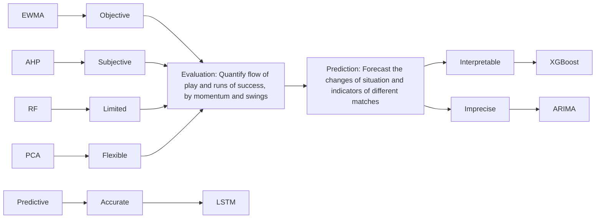
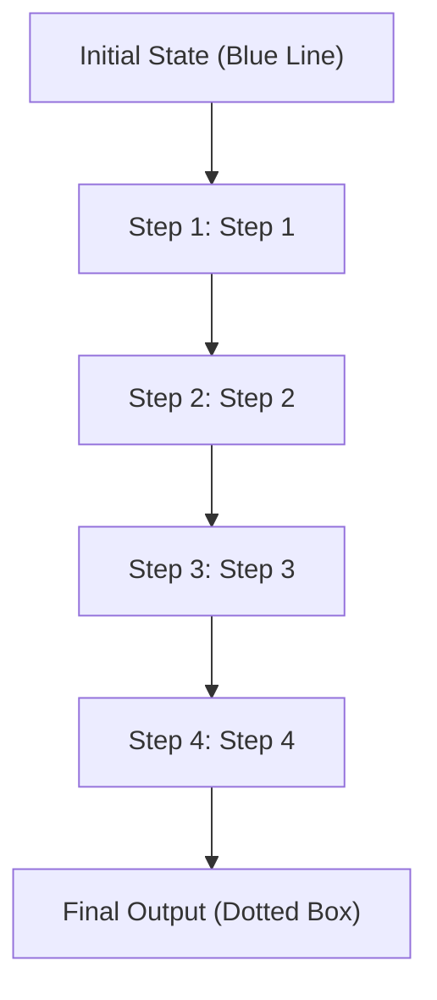
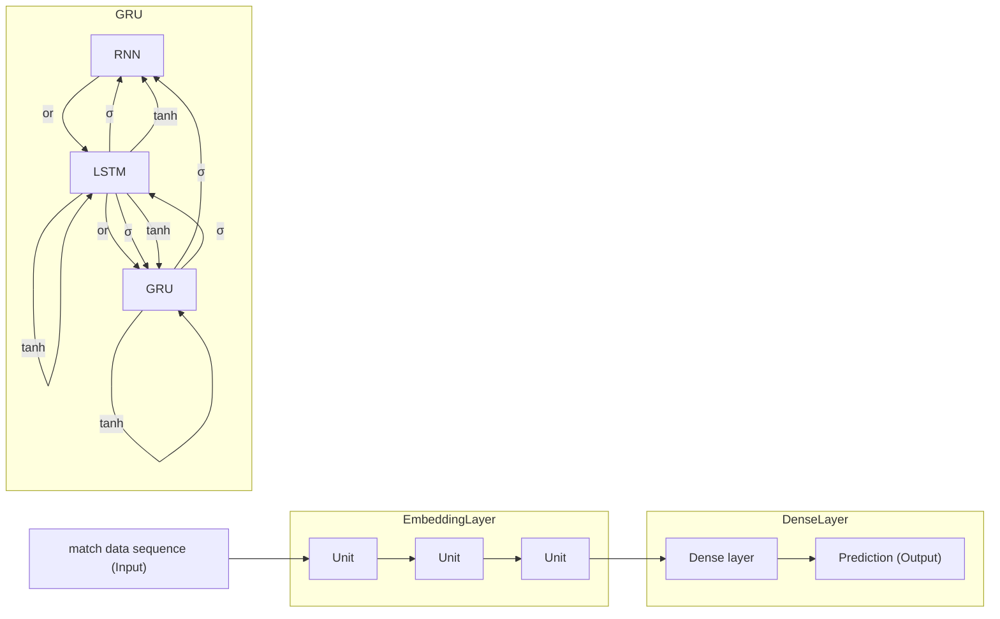

# Command the Flow: Analysis and Prediction of Momentum in Tennis Matches

Summary

This study addresses the complex phenomenon of momentum in tennis by analyzing data from Wimbledon 2023 men's matches. By using the Exponential Weighted Moving Average (EWMA), an evaluation model is constructed to quantitatively define momentum and swings during the matches. The combined result of the run test and context study proves momentum is not random. Based on the numerical curves of momentum, we build a prediction model that combines the low error rate of Long Short-Term Memory (LSTM) networks and factor contribution analysis of Extreme Gradient Boosting (XGBoost). Clustered transfer learning is introduced with K-means clustering to improve the prediction model in accuracy. SHapley Additive exPlanations (SHAP) is applied to find out which factors are most related to the swings in tennis matches. In sensitive analysis, we verified our choice of step size and cluster number, pointing out possible directions for future work. We have also collected data from Women's matches (2023 WTA US Open). The prediction error becomes significantly larger, for which we have explained generally. With all the conclusions drawn, we write a memo for tennis coaches at the end of this paper.

Keywords: Momentum EWMA LSTM K-means SHAP

# Contents

# 1 Introduction 2

# 2 Assumptions and Notations 3

2.1 Assumptions 3  
2.2 Notations 3

# 3 Data Processing 4

3.1 Data Cleaning 4  
3.2 Data Compression 4  
3.3 Data Overview 5

# 4 Evaluation: Momentum and Swings 6

4.1 Definition of Momentum 6  
4.2 Model Visualization and Validation 8  
4.3 Randomness & Certainty of Swings 10

# 5 Prediction: Time Series Forecasting 11

5.1 Model Selection: RNN, GRU, & LSTM 11  
5.2 Transfer Learning: PCA & K-means 13  
5.3 Related Factors: XGBoost & SHAP 15

# 6 Sensitivity Analysis 17

6.1 Step Size in the LSTM Model 17  
6.2 The Number of Clusters in K-means 18

# 7 Conclusion 19

7.1 Strength and Weakness 19  
7.2 Future Work 19

# 8 Memorandum 20

# 9 Appendices 23

# 10 Report on Use of AI 25

# 1 Introduction

In many sports competitions, it might often occur that the stronger player or team loses the game. At any given time in a match, the score does not always reflect the true strength of the players, or even the state of the game (Higham, 2000). We can sometimes feel a kind of hidden force that controls the flow of the match, which is defined as the momentum of the game (Higham, 2000). It affects the outcome of the contest and adds to the overall unpredictability. If the players and their coach can understand and predict the momentum of the game, they can adjust their strategy to take advantage of it and increase their chance of winning the game.

The appearance of momentum is especially obvious in tennis matches, since the game is divided into many periods and the situation on the field is constantly changing. In previous studies, a great deal of data was counted to statistically prove the existence of momentum in tennis matches (Moss & Donoghue, 2017). Most researchers have reached an agreement that success does breed success, which means that a series of consecutive winning points is likely to set up a good starting position for the next ball (Meier, Flepp, Ruedisser, & Franck, 2020). However, there are also arguments that falling behind temporarily will push the players' nerves and help them try harder to catch up (Fu, Ke, & Tan, 2015). Despite different opinions, they all agree that the momentum does exist and is often affected by interruptions such as rest periods and important events such as break points converted (Meier, Flepp, Ruedisser, & Franck, 2020).

In this paper, we have learned and concluded from previous studies the basic properties of momentum in tennis. We cleaned and processed the data from Wimbledon 2023 men's matches after the first 2 rounds as the basis of our research (COMAP, 2024). A model is then proposed to quantify the momentum of a game and predict the final outcome (Albert & Koning, 2007). We will show that the swings in a game are not random, and that good indicators could be found for them. We will also extend our model to Women's Tennis, and discuss how generalizable our model is. The flowchart shown below summarizes the main work and results of our paper.


<details>
<summary>flowchart</summary>


</details>

Figure 1: Train of thoughts when reviewing literatures

# 2 Assumptions and Notations

# 2.1 Assumptions

# - Only regular breaks

The match is assumed not to be suspended due to any sudden events like weather changes (rain, snow, lawn conditions) or player injuries. The duration of the changeover interruptions between games and sets should strictly follow the official states in the International Tennis Federation's (ITF's) rule book.

# - Full commitment

Both athletes were fully committed to the match, without any abnormal situations like match-fixing or abandonment due to disparity in strength. Previous head-to-head records between the two players that could have affected their confidence are not considered.

# - No extra disturbance

There are no disturbing incidents before or during the match that could have affected the players' mentality, including family emergencies, public opinion influences, etc. In this sense, the mental fluctuations of both the two players can be attributed solely to limited factors such as scoring, running, and physical condition on the field.

# - No physical exertion

All players experienced the same number of matches in earlier rounds and were in good and consistent physical condition before this match. The physical exertion of the players due to different situations encountered in the previous rounds was negligible.

# 2.2 Notations

<table><tr><td>Symbol</td><td>Definition</td></tr><tr><td> $M(x)$ </td><td>Momentum at point  $x$ </td></tr><tr><td> $P(x)$ </td><td>Momentum based on points</td></tr><tr><td> $G(x)$ </td><td>Momentum based on games</td></tr><tr><td> $r_i$ </td><td>Scoring rates in one game</td></tr><tr><td> $g_i$ </td><td>Game scores</td></tr><tr><td> $p_i$ </td><td>Point scores</td></tr><tr><td> $w_i$ </td><td>Weights for game scores</td></tr><tr><td> $\omega_i$ </td><td>Weights for point scores</td></tr><tr><td> $\mathcal{P}_{1/2}(x)$ </td><td>Player 1 or 2’s predicted momentum</td></tr><tr><td> $\mathcal{R}_{1/2}(x)$ </td><td>Player 1 or 2’s real momentum</td></tr><tr><td> $\mathcal{L}$ </td><td>Loss function</td></tr><tr><td> $N$ </td><td>Maximum point number in a match</td></tr></table>

# 3 Data Processing

# 3.1 Data Cleaning

We based our study on the data from all Wimbledon 2023 men's matches after the first 2 rounds (COMAP, 2024). In the table, we found some missing values and outliers. For example, in the "speed\_mph" column on row 408, there is a missing value. Considering that a player's serve speed tends to be continuous within a game, we used Lagrangian interpolation to fill in the missing values. It is worth mentioning that we chose the data points within the same game as the missing value as the given data points. This avoids overfitting and ensures the credibility of the missing value replacement. Taking the serve speed in row 408 as an example, the replaced value is 115mph. Due to limited space, the specific calculation process is not shown here.

# 3.2 Data Compression

The massive redundant tabular data volume does not necessarily benefit our subsequent prediction model. Therefore, we hope to use the principal component analysis (PCA) method to reduce the dimensionality of the data. Before this, we first utilized the Spearman correlation analysis to find the correlations between different data categories. For example, the "distance ran during points" of two players in a match has a strong correlation. Therefore, "p1\_distance\_run" and "p2\_distance\_run" can be compressed into one dimension. As shown in Figure 2 below, we can determine the objects for PCA compression through the Spearman correlation analysis.

Correlation Matrix Heatmap  


<details>
<summary>heatmap</summary>

| | p1_distance_run | p2_distance_run | p1_break_pt | p2_break_pt | p1_break_pt_won | p2_break_pt_won | p1_break_pt_missed | p2_break_pt_missed | p1_winner | p2_winner |
| --- | --- | --- | --- | --- | --- | --- | --- | --- | --- | --- |
| p1_distance_run | 1.000 | 0.941 | 0.039 | 0.022 | 0.040 | 0.056 | 0.018 | -0.012 | -0.079 | -0.019 |
| p2_distance_run | 0.941 | 1.000 | 0.005 | 0.051 | 0.023 | 0.064 | -0.011 | 0.018 | -0.033 | -0.065 |
| p1_break_pt | -0.039 | 0.005 | 1.000 | -0.038 | 0.589 | -0.021 | 0.795 | -0.031 | -0.060 | 0.006 |
| p2_break_pt | -0.022 | 0.051 | -0.038 | 1.000 | -0.022 | 0.562 | -0.030 | 0.819 | 0.041 | -0.045 |
| p1_break_pt_won | -0.040 | 0.023 | 0.589 | -0.022 | 1.000 | -0.013 | -0.021 | -0.018 | 0.002 | -0.056 |
| p2_break_pt_won | -0.056 | 0.064 | -0.021 | 0.562 | -0.013 | 1.000 | -0.017 | -0.015 | -0.045 | 0.016 |
| p1_break_pt_missed | -0.018 | -0.011 | 0.795 | -0.030 | -0.021 | -0.017 | 1.000 | -0.025 | -0.076 | 0.049 |
| p2_break_pt_missed | -0.012 | 0.018 | -0.031 | 0.819 | -0.018 | -0.015 | -0.025 | 1.000 | 0.081 | -0.066 |
| p1_winner | -0.079 | -0.033 | -0.060 | 0.041 | 0.002 | -0.045 | -0.076 | 0.081 | 1.000 | -0.203 |
| p2_winner | -0.019 | -0.065 | 0.006 | -0.045 | -0.056 | 0.016 | 0.049 | -0.066 | -0.203 | 1.000 |
</details>

Figure 2: A $10 \times 10$ heatmap illustrating the correlation between various metrics such as the distance moved by two players, break point conversion rates, and winning points. Blue indicates a positive correlation, while green indicates a negative correlation.

In the graph, there is a clear positive correlation between the distances moved by the two players, a negative correlation in the winning points category, and varying degrees of positive correlation between their individual break point performance and overall break point conversion. As a result, it is possible to compress this initial ten-dimensional data vector into a lower-dimensional representation. In the same way, we can broadly categorize these factors into three groups. The result will be a three-dimensional vector, which saves a lot of computational resources in following analysis.

# 3.3 Data Overview

Analyzing the "Number of Won Games per Set for each player" in a tennis match reveals insights into performance consistency, adaptability, and resilience. It showcases stamina, strategic adjustments, and psychological strength as players' effectiveness evolves. This metric signifies a player's ability to maintain or elevate their performance level under match pressure. Additionally, evaluating the "Scoring Differences of Each Game in Each Set" unveils the match's competitiveness, highlighting moments of dominance or vulnerability. It aids in identifying critical turning points and strategy effectiveness, providing a detailed view that complements broader performance trends observed through won games. Together, these analyses comprehensively assess player dynamics and strategic outcomes in tennis matches.

  
Figure 3: (a): Statistics of the number of games won by each player for each match. (b): Analysis of the point difference between the two players in each game of each match. The size of the dots represents the absolute value of the point difference, and the color depth of the dots indicates the frequency of occurrence of that point difference.

In essence, Figure 3 (a) portrays the competitive nature of a tennis match, with both players having their moments of strength and struggle. The second figure highlights the competitiveness, momentum swings, and ultimately, the outcome of the match based on each player's performance in individual games. Through these two figures, we can have an overview of the whole match. Both figures devide the match into five sets, which allows us to analyze the match from different perspectives. In this way, we obtain the basic ideas for further analysis: devide match into sets, and then into games.

# 4 Evaluation: Momentum and Swings

# 4.1 Definition of Momentum

In physics, momentum represents a kind of force that is generated by the movement of an object. The faster you go, the harder it will be for someone to stop you. Here in tennis, the concept of momentum is almost the same. It represents the difficulty of stopping a player from his scoring streak, or the effort needed to reverse current disadvantages. To be more specific, the momentum of a player is largely determined by:

- Microscopically, the scoring of several hits in the vicinity of the moment;  
- Macroscopically, the overall performance of the player in the current set.

Based on our understanding of momentum, its minimum unit of change is accurate to each point. Therefore, when studying the momentum of a certain player in a match, we want to design a function $M(x)$ , where the independent variable x is the number of the point in the match, and the dependent variable is the standardized momentum. Overall, this function $M(x)$ is obtained by adding two parts, namely:

$$
M (x) = \alpha \cdot G (x) + \beta \cdot P (x) + \epsilon
$$

$G(x)$ mainly focuses on a baseline momentum value that each game within a set should have. For any point in a game, we will calculate an invariant baseline momentum value for the player based on the scoring conditions of the previous and next five games, which exactly builds up $G(x)$ . Taking the exponential weighted moving average (EWMA) algorithm as our reference, we formulated a specific calculation formula for $G(x)$ (Lucas & Saccucci, 1990; Cox, 1961). To be noted, the weights have been slightly simplified and adjusted to ensure the consistency of the calculation of $G(x)$ for serving and receiving games.

In our algorithm, the largest weight $w_{0} = 0.4$ is assigned to the score of the current game, denoted as $g_{0}$ ; the adjacent previous and next game scores $g_{-1}$ , $g_{1}$ were assigned moderate weights $w_{-1} = w_{1} = 0.25$ ; the two games further backward and forward $g_{-2}$ , $g_{2}$ were assigned the smallest weights $w_{-2} = w_{2} = 0.05$ . Since $g_{-2}$ , $g_{0}$ , and $g_{2}$ belong to serving games while the rest two $g_{-1}$ , and $g_{1}$ belong to receiving games (or both two group reversed), we allocated a total weight of 0.5 to each category to ensure consistency in calculating $G(x)$ for either serving or receiving games. In conclusion, we have:

$$
G (x) = \sum_ {i = - 2} ^ {i = 2} w _ {i} \cdot g _ {i} = 0. 0 5 g _ {- 2} + 0. 2 5 g _ {- 1} + 0. 4 g _ {0} + 0. 2 5 g _ {1} + 0. 0 5 g _ {2}
$$

Considering the game scores $g_{i}$ assigned based on the scoring conditions of each game, we believe simply using the scoring rate linearly is flawed. For example, previous research has pointed out that a 100% scoring rate to win a game should boost momentum slightly more than a 67% rate, such as leading 40:30 then winning one more point (Weinberg & Jackson, 1989). However, losing the game with a 33% rate, although still only differing by 33% from 67%, represents a huge change in momentum. Therefore, we introduced sigmoid function instead of the linear relationship between game score and scoring rate, to greatly amplify the impact on momentum between winning and losing a game. Figure 4 provides a direct comparison, as the green region is largely expanded by the sigmoid function. Denote

the scoring rate of the i-th game as $r_{i}$ , we have:

$$
g _ {i} = \frac {e ^ {1 0 r _ {i} - 5}}{1 + e ^ {1 0 r _ {i} - 5}}, \quad 0 \leqslant r _ {i} \leqslant 1
$$

Plot of Linear Function  


<details>
<summary>roc</summary>

| Original Scoring Rate | Mapped Scoring Rate |
| --- | --- |
| 1/3 | ~0.33 |
| 2/3 | ~0.67 |
</details>

(a)

Plot of Sigmoid Function $g_{i}$  


<details>
<summary>roc</summary>

| Original Scoring Rate | Mapped Scoring Rate |
| --- | --- |
| 1/3 | 0.16 |
| 2/3 | 0.84 |
</details>

(b)  
Figure 4: Comparison of the linear and sigmoid relationship between scoring rate and game score. (a) Linear relationship (b) Sigmoid relationship. The difference between 33% and 67% scoring rate is emphasized by the sigmoid function.

The two plots shown above serve as a direct comparison between the linear and sigmoid relationship between scoring rate and game score. The x-axis represents the scoring rate, and the y-axis represents the game score, both ranging from 0 to 1. Near the middle point (0.5, 0.5), the sigmoid function has a much steeper slope than the linear function, which means that the momentum change becomes more sensitive to the win or loss of the game. As shown in the figure, the sharp difference between 33% and 67% scoring rate is now very obvious, which is consistent with our expectations.

On this basis, $P(x)$ focuses on momentum changes within a game due to differences in consecutive points or overall scoring situations. Similar to $G(x)$ , we applied EWMA at the more microscopic level of adjusting by points within a game (Hunter, 1986). Likewise, to ensure strong correlation between momentum and current scoring as well as previous and next scoring differences, we decided to assign different weights to the scoring conditions of the previous and next five points. To keep a sense of continuity, we set the weights for point scores to be the same as the weights for game scores, namely $\omega_{i} = w_{i}$ . Thus we have:

$$
P (x) = \sum_ {i = - 2} ^ {i = 2} \omega_ {i} \cdot p _ {i} = 0. 0 5 p _ {- 2} + 0. 2 5 p _ {- 1} + 0. 4 p _ {0} + 0. 2 5 p _ {1} + 0. 0 5 p _ {2}
$$

Here $p_{i}=1$ means the player wins the point while $p_{i}=-1$ means the player loses the point. With the addition of $G(x)$ and $P(x)$ , we have successfully defined the momentum function $M(x)$ . To be noted, we have standardized the momentum function $M(x)$ and set $\alpha=1$ , $\beta=0.05$ , $\gamma=0$ . The

momentum of two players at one moment always add up to one. The core idea over the whole process is visualized in Figure 3 below. In the picture, the darker the pattern is, the further it is from the current moment. Green ball represents winning the point and black ball represents losing it there.


<details>
<summary>flowchart</summary>


</details>

Figure 5: Schematic of the model for computing momentum (biggest ball represents "now").

# 4.2 Model Visualization and Validation

With our definition of momentum, we are now able to identify which player is performing better at any moment. We can also visualize the momentum change over the whole precess by plotting the momentum function $M(x)$ against the point number $x$ . Take the classical match between Alcaraz and Djokovic in the 2023 Wimbledon Gentlemen's final as an example, we can see the momentum change of both players in Figure 6 below.


<details>
<summary>area</summary>

| Score Number | Alcaraz (Momentum) | Djokovic (Momentum) |
| --- | --- | --- |
| 0 | ~0.35 | 0.0 |
| 50 | ~0.80 | ~0.0 |
| 100 | ~0.55 | ~0.0 |
| 150 | ~0.70 | ~0.0 |
| 200 | ~0.90 | ~0.0 |
| 250 | ~0.30 | ~0.0 |
| 300 | ~0.85 | ~0.0 |
| 334 | ~0.60 | ~0.0 |
</details>

Figure 6: Analysis of the momentum in the 2023 Wimbledon Gentlemen's final. The green area represents Djokovic's momentum, while the blue stones correspond to Alcaraz. The scores for the five sets were 6:1, 6:7, 1:6, 6:3, 4:6. Djokovic narrowly lost to Alcaraz with a total score of 2:3.

As shown in the picture, the momentum of Djokovic largely repressed Alcaraz's momentum in the first set. This is exactly the case as Djokovic won five games in a row at the very beginning. The fluctuating curves that follow show both players becoming locked in a grueling battle in the second set, which is consistent with the final result of the second set being decided by a tiebreak. In this sense, we can say that our model is able to reflect the real situation of the match.

To further apply our model, we might be interested in the deep reasons behind the runs of success by one player. Intuitively speaking, the worth-noticing swings in play happen when the momentum of one player changes significantly. Put it graphically, these swings are located at the sharp corners of the momentum curve.

However, from our rough curve, we might end up with a lot of "swinging points", most of which happening When the two players are competing steadily but fiercely. For example, from the second set shown in Figure 4, we can find many sharp corners. This is a result from the two players' good and steady performance in their own service games, which is not what we want for swings. To solve this problem, we came up with an idea to filter out the "unimportant" corners by smoothening the curve.

  
Figure 7: Comparison of the four filtering algorithms: (a) Moving Median Filter (b) FIR Filter (c) Wavelet Filter (d) Convolutional Moving Average Filter. The one we chose is (c) Wavelet Filter. Grean circles show where the filtering algorithm performed unsatisfactorily.

The main idea behind smoothing the curves borrows from several algorithms in digital signal processing. Our goal is to filter outliers and anomalies while preserving the momentum change trends and other key features, in order to effectively process non-stationary and nonlinear data values.

Initially, we adopted the moving median filter method similar to setting up a sliding window and weights as described above (Yin & Lin, 1996). We also tried to emulate hardware filtering implementations using an FIP filter (Lim, Yong, & Parker, 1983). In addition, we drew on more recent studies, trying wavelet filters and convolutional moving average filters respectively (Qiu & Hai, 2006; Trad, Daniel, & Travassos, 2000; Yin & Du, 2022). Figure 7 above combines and compares the results obtained by the four filtering algorithms when selecting wavelet "coif5" and decomposition level to be three.

Comparing the four filtering effect charts, it is evident that the curve obtained by the wavelet filter meets our requirements best. The curves from the convolutional moving average filter do not stay close enough to the original function at the beginning and ending stages, and fail to fit the intense competition at the end of the fourth game. The FIR filter result exhibits significant lagging, while the moving median filter leads to many step-like functions, disqualifying both methods. From the curve processed by the wavelet filter, we can identify the time points when the players' momentums reach steady extreme values, capturing the important points during the match's progression.

# 4.3 Randomness & Certainty of Swings

Analysis of Degree of Momentum Change with Valid Zero Points  


<details>
<summary>line</summary>

| Score Number | Original Momentum Values | Degree of Momentum Change |
| --- | --- | --- |
| ~25 | ~0.03 | 0.00 |
| ~50 | ~0.14 | 0.00 |
| ~75 | ~0.07 | 0.00 |
| ~145 | ~0.14 | 0.00 |
| ~160 | ~0.10 | 0.00 |
| ~190 | ~0.14 | 0.00 |
| ~200 | ~0.17 | 0.00 |
| ~250 | ~0.05 | 0.00 |
| ~260 | ~0.09 | 0.00 |
| ~270 | ~0.05 | 0.00 |
| ~290 | ~0.16 | 0.00 |
| ~300 | ~0.10 | 0.00 |
</details>

Figure 8: The first-order derivative of the momentum function $M(x)$ in the 2023 Wimbledon Gentlemen's final. The blue points are the swings we are looking for. As we are labeling integer points, there might be some deviation.

In fact, these extreme points on the momentum curve are not necessarily the swings we are looking for. When swings taken place, both players might expect a sharp change in momentum, which actually requires the a large enough curvature. In other words, the points with zero first derivatives of momentum and large absolute value of second derivatives are the swings we are looking for. As a result, we decided to calculate the first order difference of the momentum function $M(x)$ . The results are shown in Figure 8 above. The points with zero first-order difference and second-order difference with absolute value bigger than 0.03 is labeled blue as swings point.

Still take the 2023 Wimbledon Gentlemen's final as an example, we now discuss whether the swings happen randomly. We first applies a run test to determine the randomness by labeling the swings as "1" and other normal points as "0". The P value calculated by the run test is 0.000, far less than 0.05, which means the swings are random in the aspect of statistics.

However, when we try to find the events that lead to these turning points, we find that these swings in momentum have actual meanings. For example, the 68th point in the first set has zero first derivatives in momentum and a large second derivative. This is exactly the point when Djokovic, under a streak of consecutive losses, forcefully broke Alcaraz's serve to break the slump. This turning point indicates the swing from Alcaraz's dominance to a phase of equilibrium established by two players.

Similarly, the 296th point in the second set is another very important turning point. Here the first derivative of momentum is zero and the second derivative is very large. This is the point when Alcaraz, under a streak of consecutive losses, broke Djokovic's serve to break the slump. In the opening stages of the decisive set, a crucial break was efficiently achieved, breaking the deadlock. After that, there were no more turning points to assist Djokovic in making a comeback, signaling Alcaraz's impending victory as he lifted the ultimate championship trophy.

In conclusion, the swings in momentum are random if they are viewed solely as a sequence of numbers. However, when we take other factors into consideration, we find that these swings are certain to happen to some extent. The certainty will be quantified and discussed in the next section. Now what our estimation model tells us is the momentum curve and the swings throughout any known man's tennis match.

# 5 Prediction: Time Series Forecasting

# 5.1 Model Selection: RNN, GRU, & LSTM

Now that we have processed the data and obtained enough data for momentum and swings, we are ready to predict the future of a match. In last sections, we have verified the correlation between momentum and other factors like the distance covered by two players. Against this background, we would like to make use of the whole dataset in our prediction model. Although we have compressed the data by reducing its dimension (PCA), there still exists factors too many for us to adjust the weights manually. Therefore, we decided to apply different Rerrent Neural Network (RNN) to predict the future of a match.

Given our goal of processing sequential data, we ultimately decided to select the model with the best predictive performance from among basic RNN and its more advanced counterparts GRU and LSTM. We controlled the training dataset to be consistent and chose the first match in the table data

(match\_id 2023-wimbledon-1301) as the unified test set. According to previous research, RNN might have difficulty with long-term dependencies due to vanishing gradients. GRU solves this problem by using gating mechanisms. For LSTM, those explicitly designed memory cells might perform better in modeling long-term dependencies, which is required in our task. So we expect LSTM to outperform the other two models. The loss function we use to train our networks is shown as follows:

$$
\mathcal {L} = \sqrt {\frac {\sum_ {x = 1} ^ {N} [ \mathcal {P} _ {1} (x) - \mathcal {R} _ {1} (x) ] ^ {2} + \sum_ {x = 1} ^ {N} [ \mathcal {P} _ {2} (x) - \mathcal {R} _ {2} (x) ] ^ {2}}{2 N}}
$$

Here, L represents the loss, N represents the maximum point number in this match, $\mathcal{P}_{1/2}(x)$ represents the predicted momentum of the first/second player at the x-th point, while $\mathcal{R}_{1/2}(x)$ represents the real momentum of the first/second player at the x-th point. In building the neural networks, we chose a structure of embedding GRU / LSTM / RNN (3 layers: $32 + 32 + 16$ nodes respectively) with dense layers ( $16 + 2$ nodes) for all three models. The number of layers and nodes were kept consistent. As shown in Figure 9 below, our three neural networks had overall similar structures, with small differences in the details.


<details>
<summary>flowchart</summary>


</details>

Figure 9: The common structure of the three rerrent neural networks. The input layer is followed by three hidden layers, which makes the difference.

Figure 10 below shows the prediction results from the three models without any additional improvements. From the fit between the predicted curves and true momentum curves, we can see that the predictions from GRU and RNN were decent, while the most advanced LSTM was quite unsatisfactory. This could be because the training dataset is too small, and there exist noticeable differences between matches. This result, inconsistent with our expectations, prompted us to improve the models by introducing clustered transfer learning.


<details>
<summary>line</summary>

| Score Number | Real Data | RNN | GRU | LSTM |
| --- | --- | --- | --- | --- |
| 0 | ~0.56 | ~0.56 | ~0.57 | ~0.56 |
| 50 | ~0.12 | ~0.12 | ~0.12 | ~0.12 |
| 100 | ~0.48 | ~0.48 | ~0.48 | ~0.48 |
| 150 | ~0.87 | ~0.87 | ~0.87 | ~0.87 |
| 200 | ~0.60 | ~0.60 | ~0.60 | ~0.60 |
</details>

Figure 10: Comparison of the prediction given by three neural networks. The dark purple curve represents the true momentum curve, while the blue, green, and light purple curves represent the momentum curves predicted by RNN, GRU, and LSTM respectively.

# 5.2 Transfer Learning: PCA & K-means

In order to improve our model, we need to cluster the matches in the dataset into a few groups. Here we temporarily set the number to be 3, and use the K-means algorithm to cluster the matches. Due to computational constraints, we first used PCA to reduce the full dataset down to 3-dimensional data points, under the premise of preserving the correlations between the different factor data. We then randomly selected three points as cluster centers to start the iteration. In each iteration, we first computed the distances between all points and centers. Next, for each point we found its nearest center, and assigned it to the cluster represented by that center. Finally, we updated each center using the mean of the points in its cluster. The iteration stopped when the change in center positions was small enough.

<table><tr><td colspan="2">Algorithm 1: k-Means Clustering Algorithm</td></tr><tr><td colspan="2">Data: Dataset with n data points and cluster numbers k</td></tr><tr><td colspan="2">Result: Cluster groups and cluster centroids</td></tr><tr><td colspan="2">1 Initialize k centroids by randomly selecting k points</td></tr><tr><td colspan="2">2 while Change of cluster center centroids is larger than a threshold do</td></tr><tr><td colspan="2">3 for Each data point do</td></tr><tr><td colspan="2">4 for Each centroid do</td></tr><tr><td colspan="2">5 Calculate the distance between the centroid and the data point</td></tr><tr><td colspan="2">6 Assign the data point to the cluster with the nearest centroid</td></tr><tr><td colspan="2">7 Append the cluster number to the data point</td></tr><tr><td colspan="2">8 for Each cluster do</td></tr><tr><td colspan="2">9 Calculate the mean and update it as the new centroid</td></tr></table>

After K-means clustering, we are then able to conduct clustered transfer learning. For the validation set, i.e. the first match, we first identified matches in the same cluster, i.e. closest matches, among the three clusters. We trained the models on these matches, and then trained again on the first match with its given dataset. The three plots (a), (b), and (c) at the first line of Figure 11 show the prediction capabilities of all three models were greatly improved. Among them, LSTM's performance caught up with the other two models, reaching a level that was basically consistent with or even surpassing them. We can also stop training the model without going back to the first match (test dataset). It turned out to give us a better result, as shown in the corresponding three plots at second line of Figure 11.

Real & RNN with Transfer Learning  


<details>
<summary>line</summary>

| X | Blue Line | Red Line |
| --- | --- | --- |
| 1 | ~0.5 | ~0.5 |
| 2 | ~0.3 | ~0.3 |
| 3 | ~0.8 | ~0.8 |
| 4 | ~0.9 | ~0.9 |
| 5 | ~0.9 | ~0.9 |
| 6 | ~0.1 | ~0.1 |
| 7 | ~0.4 | ~0.4 |
| 8 | ~0.5 | ~0.5 |
| 9 | ~0.7 | ~0.7 |
| 10 | ~0.9 | ~0.9 |
| 11 | ~0.6 | ~0.6 |
| 12 | ~0.4 | ~0.4 |
| 13 | ~0.5 | ~0.5 |
| 14 | ~0.6 | ~0.6 |
| 15 | ~0.7 | ~0.7 |
| 16 | ~0.9 | ~0.9 |
| 17 | ~0.7 | ~0.7 |
| 18 | ~0.1 | ~0.1 |
| 19 | ~0.3 | ~0.3 |
| 20 | ~0.4 | ~0.4 |
| 21 | ~0.5 | ~0.5 |
| 22 | ~0.7 | ~0.7 |
| 23 | ~0.9 | ~0.9 |
| 24 | ~0.6 | ~0.6 |
| 25 | ~0.7 | ~0.7 |
| 26 | ~0.8 | ~0.8 |
</details>

Real & RNN Only with Transfer Learning

Real & GRU with Transfer Learning  


<details>
<summary>line</summary>

| X | Blue Line | Orange Line |
| --- | --- | --- |
| 1 | ~0.5 | ~0.5 |
| 2 | ~-0.2 | ~-0.2 |
| 3 | ~0.8 | ~0.8 |
| 4 | ~0.9 | ~0.9 |
| 5 | ~-0.8 | ~-0.8 |
| 6 | ~-0.2 | ~-0.2 |
| 7 | ~0.5 | ~0.5 |
| 8 | ~0.9 | ~0.9 |
| 9 | ~0.2 | ~0.2 |
| 10 | ~0.4 | ~0.4 |
| 11 | ~0.3 | ~0.3 |
| 12 | ~0.6 | ~0.6 |
| 13 | ~0.9 | ~0.9 |
| 14 | ~0.3 | ~0.3 |
| 15 | ~-0.9 | ~-0.9 |
| 16 | ~-0.3 | ~-0.3 |
| 17 | ~-0.1 | ~-0.1 |
| 18 | ~0.5 | ~0.5 |
| 19 | ~0.9 | ~0.9 |
| 20 | ~0.3 | ~0.3 |
| 21 | ~0.7 | ~0.7 |
</details>

Real & GRU Only with Transfer Learning

Real & LSTM with Transfer Learning  


<details>
<summary>line</summary>

| X | Value (Blue) | Value (Red) |
| --- | --- | --- |
| 1 | ~0.5 | ~0.5 |
| 2 | ~-0.2 | ~-0.2 |
| 3 | ~0.8 | ~0.8 |
| 4 | ~0.9 | ~0.9 |
| 5 | ~-0.8 | ~-0.8 |
| 6 | ~-0.2 | ~-0.2 |
| 7 | ~0.5 | ~0.5 |
| 8 | ~0.9 | ~0.9 |
| 9 | ~0.3 | ~0.3 |
| 10 | ~0.4 | ~0.4 |
| 11 | ~0.5 | ~0.5 |
| 12 | ~0.8 | ~0.8 |
| 13 | ~0.9 | ~0.9 |
| 14 | ~0.3 | ~0.3 |
| 15 | ~-0.9 | ~-0.9 |
| 16 | ~-0.2 | ~-0.2 |
| 17 | ~0.1 | ~0.1 |
| 18 | ~0.8 | ~0.8 |
| 19 | ~0.9 | ~0.9 |
| 20 | ~0.3 | ~0.3 |
| 21 | ~0.6 | ~0.6 |
</details>

Real & LSTM Only with Transfer Learning


<details>
<summary>line</summary>

| X | Value |
| --- | --- |
| 1 | ~0.5 |
| 2 | ~0.3 |
| 3 | ~0.8 |
| 4 | ~0.9 |
| 5 | ~0.1 |
| 6 | ~0.4 |
| 7 | ~0.7 |
| 8 | ~0.9 |
| 9 | ~0.4 |
| 10 | ~0.5 |
| 11 | ~0.6 |
| 12 | ~0.9 |
| 13 | ~0.3 |
| 14 | ~0.1 |
| 15 | ~0.4 |
| 16 | ~0.7 |
| 17 | ~0.9 |
| 18 | ~0.4 |
| 19 | ~0.8 |
| 20 | ~0.3 |
</details>


<details>
<summary>line</summary>

| X | Blue Line | Orange Line |
| --- | --- | --- |
| 1 | ~0.5 | ~0.5 |
| 2 | ~0.3 | ~0.3 |
| 3 | ~0.8 | ~0.8 |
| 4 | ~0.9 | ~0.9 |
| 5 | ~0.9 | ~0.9 |
| 6 | ~0.1 | ~0.1 |
| 7 | ~0.3 | ~0.3 |
| 8 | ~0.5 | ~0.5 |
| 9 | ~0.7 | ~0.7 |
| 10 | ~0.9 | ~0.9 |
| 11 | ~0.6 | ~0.6 |
| 12 | ~0.4 | ~0.4 |
| 13 | ~0.5 | ~0.5 |
| 14 | ~0.6 | ~0.6 |
| 15 | ~0.8 | ~0.8 |
| 16 | ~0.9 | ~0.9 |
| 17 | ~0.6 | ~0.6 |
| 18 | ~0.1 | ~0.1 |
| 19 | ~0.3 | ~0.3 |
| 20 | ~0.4 | ~0.4 |
| 21 | ~0.6 | ~0.6 |
| 22 | ~0.8 | ~0.8 |
| 23 | ~0.9 | ~0.9 |
| 24 | ~0.6 | ~0.6 |
| 25 | ~0.8 | ~0.8 |
</details>


<details>
<summary>line</summary>

| X | Blue Line | Red Line |
| --- | --- | --- |
| 1 | ~0.5 | ~0.5 |
| 2 | ~0.2 | ~0.2 |
| 3 | ~0.8 | ~0.8 |
| 4 | ~0.9 | ~0.9 |
| 5 | ~0.9 | ~0.9 |
| 6 | ~0.1 | ~0.1 |
| 7 | ~0.3 | ~0.3 |
| 8 | ~0.5 | ~0.5 |
| 9 | ~0.7 | ~0.7 |
| 10 | ~0.9 | ~0.9 |
| 11 | ~0.6 | ~0.6 |
| 12 | ~0.4 | ~0.4 |
| 13 | ~0.5 | ~0.5 |
| 14 | ~0.6 | ~0.6 |
| 15 | ~0.7 | ~0.7 |
| 16 | ~0.9 | ~0.9 |
| 17 | ~0.8 | ~0.8 |
| 18 | ~0.1 | ~0.1 |
| 19 | ~0.3 | ~0.3 |
| 20 | ~0.4 | ~0.4 |
| 21 | ~0.6 | ~0.6 |
| 22 | ~0.8 | ~0.8 |
| 23 | ~0.9 | ~0.9 |
| 24 | ~0.7 | ~0.7 |
| 25 | ~0.5 | ~0.5 |
| 26 | ~0.7 | ~0.7 |
| 27 | ~0.8 | ~0.8 |
</details>

Figure 11: The prediction results of the three models after introducing clustered transfer learning. The first line shows the results after training the model on the first match, while the second line shows the results after training the model without going back to the first match.

In order to more rigorously demonstrate the performance of the three prediction models after introducing clustered transfer learning, we recorded the train loss and test loss data for each model in the table (Figure 12) below. Reassuringly, the LSTM model achieved a test loss of 0.2 under the Only Transfer with Clustering training method, close to its performance on the training set and becoming the most accurate among the three models. Meanwhile, "train loss = test loss" also means that if we expand the size of the training dataset, it is very likely that we can further easily improve the test performance of the LSTM model. At this point, we have determined to use the LSTM model as our prediction model, and further examination of its capabilities will be discussed in the sensitivity analysis.

<table><tr><td>Train Loss/Test Loss</td><td>GRU</td><td>RNN</td><td>LSTM</td></tr><tr><td>No Transfer</td><td>0.01/0.09</td><td>0.01/0.12</td><td>0.01/0.17</td></tr><tr><td>Transfer with Clustering</td><td>0.00/0.04</td><td>0.01/0.03</td><td>0.00/0.03</td></tr><tr><td>Only Transfer with Clustering</td><td>0.02/0.03</td><td>0.02/0.03</td><td>0.02/0.02</td></tr></table>

Figure 12: The train loss and test loss of the three models after introducing clustered transfer learning.

# 5.3 Related Factors: XGBoost & SHAP

Neural networks are well known for their excellent performance when working with large datasets. With the current dataset, we have increased the prediction accuracy of LSTM on momentum to a relatively high level through various improvement methods. Through the algorithms mentioned previously, we can accurately identify the occurrences of swings based on the momentum curves, and provide tennis players and coaches with a proper predictive interval. The neural network is quite outstanding in terms of predictive capabilities.

However, as a nonlinear model, the mapping between inputs and outputs in a neural network is very complex, making it difficult to decompose the inputs and calculate each factor's correlation. Moreover, as shown in Figure 8 above, although the embedding layers are different, all neural network models can have complex structure in one layer alone. The might also face the issue that the same input contributes differently at different time steps. In theory, we could try adding random noise to the input vectors and check which inputs affect the prediction results the most when noisy. But this requires us to abandon PCA dimensionality reduction on the original dataset, which means a training process that consumes huge computational resources and time. This poses considerable difficulties for our current team.

Therefore, we decided to introduce the XGBoost model along with the SHAP model to help us analyze the importance of each factor in the prediction. XGBoost is a kind of gradient boosting decision tree model, which is very good at analyzing the importance of each factor in the prediction. It provided us with a way to predict momentum and swings without reducing the dimensionality of the original dataset. We used the same dataset as the training set for the neural network, and the same test set as the validation set. The results are shown in Figure 13 below. The importance of each factor is calculated by the average gain of the factor in the decision tree. The larger the average gain, the more important the factor is in the prediction. In other words, the top 5 factors in the figure are the most related factors to the swings in man's tennis matches.


<details>
<summary>bar</summary>

| Feature Code | SHAP Values |
| --- | --- |
| (1) | ~0.0045 |
| (2) | ~0.0033 |
| (3) | ~0.0028 |
| (4) | ~0.0025 |
| (5) | ~0.0020 |
| (6) | ~0.0012 |
| (7) | ~0.0010 |
| (8) | ~0.0009 |
| (9) | ~0.0009 |
| (10) | ~0.0006 |
| (11) | ~0.0005 |
| (12) | ~0.0003 |
| (13) | ~0.0003 |
| (14) | ~0.0003 |
| (15) | ~0.0003 |
| (16) | ~0.0003 |
| (17) | ~0.0002 |
| (18) | ~0.0002 |
| (19) | ~0.0002 |
| (20) | ~0.0001 |
| (21) | ~0.0001 |
| (22) | ~0.0001 |
| (23) | ~0.0001 |
| (24) | ~0.0001 |
| (25) | ~0.0001 |
| (26) | ~0.0000 |
| (27) | ~0.0000 |
| (28) | ~0.0000 |
| (29) | ~0.0000 |
| (30) | ~0.0000 |
| (31) | ~0.0000 |
| (32) | ~0.0000 |
| (33) | ~0.0000 |
| (34) | ~0.0000 |
| (35) | ~0.0000 |
| (36) | ~0.0000 |
| (37) | ~0.0000 |
| (38) | ~0.0000 |
| (39) | ~0.0000 |
| (40) | ~0.0000 |
</details>

<table><tr><td>Code</td><td>Feature</td><td>Code</td><td>Feature</td></tr><tr><td>(1)</td><td>p2_distance_run</td><td>(21)</td><td>p1_break_pt_won</td></tr><tr><td>(2)</td><td>p1_distance_run</td><td>(22)</td><td>p1_unf_err</td></tr><tr><td>(3)</td><td>p2_games</td><td>(23)</td><td>p2_net_pt_won</td></tr><tr><td>(4)</td><td>p1_games</td><td>(24)</td><td>p2_break_pt</td></tr><tr><td>(5)</td><td>speed_mph</td><td>(25)</td><td>p2_winner</td></tr><tr><td>(6)</td><td>p2_net_pt</td><td>(26)</td><td>p1_net_pt</td></tr><tr><td>(7)</td><td>p1_score</td><td>(27)</td><td>p1_net_pt_won</td></tr><tr><td>(8)</td><td>return_depth</td><td>(28)</td><td>p1_break_pt_missed</td></tr><tr><td>(9)</td><td>server</td><td>(29)</td><td>p2_break_pt_missed</td></tr><tr><td>(10)</td><td>set_no</td><td>(30)</td><td>p1_sets</td></tr><tr><td>(11)</td><td>serve_width</td><td>(31)</td><td>p2_sets</td></tr><tr><td>(12)</td><td>game_victor</td><td>(32)</td><td>p2_score</td></tr><tr><td>(13)</td><td>p2_unf_err</td><td>(33)</td><td>point_victor</td></tr><tr><td>(14)</td><td>p1_break_pt</td><td>(34)</td><td>p1_points_won</td></tr><tr><td>(15)</td><td>rally_count</td><td>(35)</td><td>p2_points_won</td></tr><tr><td>(16)</td><td>serve_no</td><td>(36)</td><td>p1_ace</td></tr><tr><td>(17)</td><td>p1_winner</td><td>(37)</td><td>p2_ace</td></tr><tr><td>(18)</td><td>set_victor</td><td>(38)</td><td>p1_double_fault</td></tr><tr><td>(19)</td><td>winner_shot_type</td><td>(39)</td><td>p2_double_fault</td></tr><tr><td>(20)</td><td>serve_depth</td><td>(40)</td><td>p2_break_pt_won</td></tr></table>

Figure 13: The importance of each factor in the prediction

As we can clearly see from the figure, the factor most related with the swings are the distance run by the two players during points. Following are the game numbers of the two players, whose importance is self-evident. Other related factors are the speed, direction, and depth of serve. The depth of return also plays an important role.

With the conclusion above at hand, we are now able to give advice to players who are going to start a match with different opponents. Analysis of the momentum curve data from their previous matches should play the most important role here. We can analyze the curve and swings from an overall point of view, or compare the correlation between momentum and those most-important factors one by one.

For example, if player A's past momentum swings show a concentrated distribution, it indicates relatively stable state changes. In contrast, a more dispersed distribution for player B suggests less stable fluctuations. We can then recommend the more stable player A to adopt an aggressive offensive play, as once gaining an advantage, he is more likely to maintain momentum until winning. Meanwhile, player B with larger state variations should play cautiously and avoid falling behind early.

We can also compare the timing distribution of momentum swings in past matches. This also provides useful suggestions. For example, if player A often drops momentum (concentrated negative swings) in late 2nd set, it is very likely that he will experience a physical limit during that point. As a result, he is suggested to pay more attention and assign more strength to that stage of match.

In summary, by examining differences in momentum curve characteristics between the two players' previous matches, we can identify rhythmic and psychological fluctuation patterns unique to each player. This helps us offer strategic advice to tennis players for their new matches. It demonstrates the extensibility and practical value of our momentum prediction model.

# 6 Sensitivity Analysis

The real sports competition environment is often much more complex than these theoretical data tables. While our neural network model has achieved very good performance on existing datasets, considering unexpected factors in real-world scenarios, it's very likely that there may be inaccuracies in the data collected before the game. After data processing and cleaning, the number of eligible data points may be limited and may not reach our expected optimal number of around ten data points. Therefore, we are conducting sensitivity testing on the model here to assess its practical applicability in real sports competition scenarios.

# 6.1 Step Size in the LSTM Model

Since we have chosen LSTM as the basis for the momentum prediction model, the sensitivity analysis will focus on its step size. That is, we want to obtain the relationship between model prediction accuracy and the amount of data provided by the test set. The final results are shown in Figure 14, the bar chart below, which is beyond our expectations. For LSTM alone, even increasing the step size to 30 is far from the amount of data it needs to achieve the ideal prediction effect, which is also why we introduced cluster and transfer learning. For the LSTM only with transfer learning prediction method we approve as the most accurate, we find that a step size around 10 is already sufficient to make relatively accurate predictions, and further expanding the step size may even risk reducing accuracy.


<details>
<summary>bar</summary>

| Step size | LSTM | LSTM with transfer learning | LSTM only with transfer learning |
| --- | --- | --- | --- |
| 1 | ~0.05 | ~0.05 | ~0.10 |
| 5 | ~0.13 | ~0.03 | ~0.03 |
| 10 | ~0.15 | ~0.02 | ~0.02 |
| 20 | ~0.17 | ~0.02 | ~0.04 |
| 30 | ~0.15 | ~0.02 | ~0.02 |
</details>

Figure 14: Sensitivity analysis of the step size in the LSTM model. The x-axis represents the step size, and the y-axis represents the prediction accuracy. The blue bar represents the prediction accuracy of the LSTM model, and the orange bar represents the prediction accuracy of the LSTM model with transfer learning.

As a result, we suggest that when making predictions for men's tennis matches with a five-set system, try to use a step size of 10-15 balls to predict the next ball, and even the general trend of the entire match. Under the current situation where the training set size is limited, blindly increasing the step size not only fails to achieve better results, but also risks reducing the credibility of the prediction. In more intuitive terms, from the perspective of neural network models, the trend of each point in a men's tennis match often has a higher correlation with the local context than the global context. The sensitivity analysis tells us that coaches may want to pay more attention to players' performances in the first two to three sets, in order to assess their current state. Standing from a higher perspective and using the overall trend as the logical fulcrum, it is actually more likely to misjudge the current situation.

# 6.2 The Number of Clusters in K-means

In our prediction model (LSTM), another parameter worth further research is the number of clusters K in the K-means algorithm. Here, we will explain why all matches are divided into three categories in the previous section, and show the impact of the number of clusters on the prediction capability of the model, taking LSTM as an example. We set the number of clusters to be 1-5, 10, 15 respectively, and present the deviation rate of the prediction model on the test case (Match 1301) in the form of a bar chart in Figure (a) below.


<details>
<summary>bar</summary>

| Cluster number | Error on test cases |
| --- | --- |
| 1 | ~0.025 |
| 2 | ~0.020 |
| 3 | ~0.017 |
| 4 | ~0.030 |
| 5 | ~0.090 |
| 10 | ~0.070 |
| 15 | ~0.190 |
</details>

(a)


<details>
<summary>scatter_3d</summary>

| Series | PCA axis 1 (range) | PCA axis 2 (range) | PCA axis 3 (range) |
| --- | --- | --- | --- |
| Group 1 | -150~50 | -150~150 | -200~0 |
| Group 2 | -100~150 | -100~150 | -150~150 |
| Group 3 | -150~150 | -150~150 | -200~200 |
| Cluster Centers | -100~150 | -100~150 | -150~0 |
</details>

(b)  
Figure 15: (a): The deviation rate of the LSTM model on the test case (Match 1301) under different numbers of clusters. (b): The three-cluster result in the 3-dimensional space.

As can be seen from the above figure, the performance of the prediction model reaches its minimum when the number of clusters is 3. Therefore, we choose to divide all matches into three categories in the previous analysis. The three-cluster result in the 3-dimensional space is shown in Figure (b) above. In future work, we will further explore the impact of the number of clusters on the prediction model with a much bigger dataset.

# 7 Conclusion

# 7.1 Strength and Weakness

Our model is mainly divided into two parts: evaluation and prediction. Although completely different basic models are chosen, they share very similar strengths and weaknesses. Our main strength lies in the evaluation curve fitting the match situation changes, swings being almost always related to crucial moments on court, and the prediction results also providing some valuable information.

Our main weaknesses are the small dataset, lack of strong transferability of the model, and insufficient neural network training. This results in a currently narrow applicable scope of our model, and limited prediction accuracy. To some extent, our model is not convincing enough.

# 7.2 Future Work

By testing our model on other matches, we regretfully find that our model does not possess strong generalizability. When we use our model to predict the momentum changes in women's tennis matches, there are significant divergences between the predictions and reality (data from https://www.livesport.com/en/tennis/wta-singles/us-open/). Part of the reason, of course, is that our training dataset is entirely based on men's Wimbledon tennis matches played over five sets. The differences between five-set matches and three-set matches in terms of score distribution, physical exertion, and game dynamics are quite substantial, making such a model transfer inappropriate.

Furthermore, in previous research, we have learned that gender plays an important role in momentum (Page & Coats, 2017). From the results of the winner effect (success breeds success) studies, it seems that women are less influenced by momentum due to their lower circulating testosterone levels compared to men (Page & Coats, 2017). Of course, there were also arguments that the difference between male and female tennis players was gradually closing in term of their reaction toward momentum (Weinberg, Robert, & Jackson, 1989). In the future, we may consider increasing the weight of factors that objectively affect players' physical fitness reserves, while reducing the weight of factors which have a greater impact on players' psychological fluctuations for women's model.

Similarly, when we use the momentum model for assessing and predicting the situation in team sports, the results are not ideal either. Take volleyball matches as an example; it is challenging to predict the course of a match through momentum, let alone the fact that volleyball team coaches can strategically call timeouts to disrupt or break the opponent's advantageous momentum. Our findings align with previous research, which suggests that in team sports with multiple players, the overall impact of momentum is greatly weakened (Fu, Ke & Tan, 2015). The on-court scoring reflects the teamwork and synergy of the team more than the individual players' psychological activities or skills. In these cases, we may consider focusing more on strategic momentum rather than psychological momentum.

For the prediction model of tennis momentum, two methods can be used to further improve it. On one hand, better clustering methods can be applied. Clustering methods for time series data have been emerging in recent years, which achieve better effects in grouping the elements (Saito et al. 2024; Inoue et al. 2024). On the other hand, various data synthesizing methods have been proposed, which can solve the problem of insufficient data, thus upgrading the performance of deep learning models (Yoon et al. 2019; Theodorou et al. 2023).

# 8 Memorandum

To: Tennis Coaches and Players

From: MCM Team #2406324

Date: Feb 6th, 2024

RE: Utilizing Momentum Analysis for Enhanced Performance in Tennis Matches

# Executive Summary:

This memorandum summarizes our findings on the role of momentum in tennis, drawing on comprehensive analysis conducted on Wimbledon 2023 men's matches data. Our research underscores the impact of momentum swings on match outcomes and provides actionable strategies for coaches to prepare players for effectively managing these dynamics. For detailed insights and data-driven evidence, readers are directed to sections covering the evaluation of momentum (Section 4), its prediction (Section 5), and sensitivity analysis (Section 6) within our full research paper.

# Understanding Momentum's Role:

Our analysis unequivocally demonstrates that momentum significantly influences the flow and eventual outcomes of tennis matches. An increase in momentum correlates with improved performance, while a decrease often precedes a shift in match dynamics. Key indicators of momentum shifts include consecutive winning points and critical game-winning performances, which can serve as precursors to changes in the game's flow.

# Strategies for Coaches and Players:

# 1. Psychological Resilience Training

Encourage mental toughness and focus, particularly in situations where momentum is not in the player's favor. Techniques such as visualization, positive self-talk, and stress reduction can be invaluable in maintaining composure and concentration during pivotal moments.

# 2. Analyzing Opponent Data

Leverage match data to identify patterns or weaknesses in opponents that could lead to momentum shifts. This involves a thorough analysis of previous matches to understand potential triggers for momentum changes and developing strategies to exploit these opportunities.

# 3. Simulating Momentum Shifts in Practice

Incorporate scenarios in training sessions that mimic situations where momentum shifts occur. This will help players adapt to various match situations, enhancing their ability to respond effectively to both positive and negative momentum swings.

# Conclusion and Suggestions:

Momentum plays a crucial role in the dynamics of tennis matches, influencing both the psychological state of players and the overall match outcome. By recognizing the signs of momentum shifts and preparing strategies to manage these changes, coaches and players can gain a competitive edge. It is essential to integrate momentum management into training regimes and match strategies to optimize performance and achieve success in competitive tennis play.

For further details on our methodologies, data analysis, and additional recommendations, please refer to the comprehensive sections within our research paper.

# References

[1] Beaton, George H. "Approaches to analysis of dietary data: relationship between planned analyses and choice of methodology." The American journal of clinical nutrition 59.1 (1994): 253S-261S.  
[2] Cox, D.R., Prediction by Exponentially Weighted Moving Averages and Related Methods. Journal of the Royal Statistical Society: Series B (Methodological), 23: 414-422 (1961).  
[3] Daniel, Christian, Jonathan Taylor, and Sebastian Nowozin. "Learning step size controllers for robust neural network training." Proceedings of the AAAI Conference on Artificial Intelligence. Vol. 30. No. 1. 2016.  
[4] Deng, Y., Lu, L., Aponte, L. et al. Deep transfer learning and data augmentation improve glucose levels prediction in type 2 diabetes patients. npj Digit. Med. 4, 109 (2021).  
[5] Dietl, Helmut, and Cornel Nesseler. "Momentum in tennis: Controlling the match." UZH Business Working Paper Series 365 (2017).  
[6] Hu, M., Zhang, H., Wu, B. et al. Interpretable predictive model for shield attitude control performance based on XGboost and SHAP. Sci Rep 12, 18226 (2022).  
[7] Inoue, T., Kubota, K., Ikami, T. et al. Clustering method for time-series images using quantum-inspired digital annealer technology. Commun Eng 3, 10 (2024).  
[8] James M. Lucas & Michael S. Saccucci Exponentially Weighted Moving Average Control Schemes: Properties and Enhancements, Technometrics, 32:1, 1-12 (1990).  
[9] Jim Albert, Ruud H. Koning / Jim Albert, Ruud H. Koning. Statistical Thinking in Sports. 1st ed., Chapman and Hall/CRC, (2007).  
[10] Jinsung Yoon, Daniel Jarrett, and Mihaela van der Schaar. 2019. Time-series generative adversarial networks. Proceedings of the 33rd International Conference on Neural Information Processing Systems. Curran Associates Inc., Red Hook, NY, USA, Article 494, 5508-5518.  
[11] J. Stuart Hunter (1986) The Exponentially Weighted Moving Average, Journal of Quality Technology, 18:4, 203-210, DOI: 10.1080/00224065.1986.11979014.  
[12] K. P. Sinaga and M. -S. Yang, "Unsupervised K-Means Clustering Algorithm," in IEEE Access, vol. 8, pp. 80716-80727, 2020, doi: 10.1109/ACCESS.2020.2988796.  
[13] Lim, Yong, and Sydney Parker. "FIR filter design over a discrete powers-of-two coefficient space." IEEE Transactions on Acoustics, Speech, and Signal Processing 31.3 (1983): 583-591.  
[14] Liu, X., Wang, X. & Matwin, S. Improving the interpretability of deep neural networks with knowledge distillation. in 2018 IEEE International Conference on Data Mining Workshops (ICDMW), 905-912 (IEEE, 2018).  
[15] Marcílio, Wilson E., and Danilo M. Eler. "From explanations to feature selection: assessing SHAP values as feature selection mechanism." 2020 33rd SIBGRAPI conference on Graphics, Patterns and Images (SIBGRAPI). Ieee, 2020.  
[16] Mokhtari, Karim El, Ben Peachey Higdon, and Ayşe Başar. "Interpreting financial time series with SHAP values." Proceedings of the 29th annual international conference on computer science and software engineering. 2019.  
[17] Qiu, Hai, et al. "Wavelet filter-based weak signature detection method and its application on rolling element bearing prognostics." Journal of sound and vibration 289.4-5 (2006): 1066-1090.  
[18] Saito, H., Yoshimura, H., Tanaka, K. et al. Predicting CKD progression using time-series clustering and light gradient boosting machines. Sci Rep 14, 1723 (2024).  
[19] Silva, John M., Charles J. Hardy, and R. Kelly Crace. "Analysis of psychological momentum in intercollegiate tennis." Journal of sport and exercise psychology 10.3 (1988): 346-354.  
[20] Trad, Daniel O., and Jandyr M. Travassos. "Wavelet filtering of magnetotelluric data." Geophysics 65.2 (2000): 482-491.  
[21] Theodorou, B., Xiao, C. & Sun, J. Synthesize high-dimensional longitudinal electronic health records via hierarchical autoregressive language model. Nat Commun 14, 5305 (2023).  
[22] Weinberg, Robert, and Allen Jackson. "The Effects of Psychological Momentum on Male and Female Tennis Players Revisited." Journal of Sport Behavior, vol. 12, no. 3, Sept. 1989, p. 167.  
[23] "WTA Singles US Open." LiveSport, n.d., https://www.livesport.com/en/tennis/wta-singles/us-open/.  
[24] Yin, Du, et al. "Moving Average-Based Performance Enhancement of Sample Convolution and Interactive Learning for Short-Term Load Forecasting." 2022 IEEE International Symposium on Product Compliance Engineering-Asia (ISPCE-ASIA). IEEE, 2022.  
[25] Yin, Lin, et al. "Weighted median filters: a tutorial." IEEE Transactions on circuits and systems II: analog and digital signal processing 43.3 (1996): 157-192.  
[26] Yu, Yan, et al. "Abnormal data detection for multivariate alarm systems based on correlation directions." Journal of Loss Prevention in the Process Industries 45 (2017): 43-55.

9 Appendices  
```python
import matplotlib.pyplot as plt
import pandas as pd
import numpy as np
import math
from sklearn.preprocessing import MinMaxScaler
from sklearn.metrics import mean_squared_error
import preprocessing
import tensorflow as tf
from tensorflow.keras.layers import GRU, Dense,SimpleRNN,LSTM
from tensorflow.keras.models import Sequential
import seaborn as sns
from transferdata import transferdata
np.random.seed(7)
transfer = 1
transfer_option = 4
data = pd.read_csv('2023-wimbledon-1301.csv', usecols=list(range(5,50)))
dataset = data.to_numpy()
scaler = MinMaxScaler(feature_range=(0, 1))
dataset[:,range(43)] = scaler.fit_transform(dataset[:,range(43)])
train_number = int(len(dataset) * 0.7)
test_number = len(dataset) - train_number
train_original, test_original = dataset[0:train_number,:], dataset[
    train_number:len(dataset),:]
step_size = 6
trainX, trainY = preprocessing.new_dataset(train_original, step_size)
testX, testY = preprocessing.new_dataset(test_original, step_size)
#getting transfer trainX and trainY in similar ways
model = Sequential()
model.add(LSTM(32,input_shape=(step_size,45), return_sequences=True))
model.add(LSTM(32, return_sequences=True))
model.add(LSTM(16))
model.add(Dense(16, activation='sigmoid'))
model.add(Dense(2, activation='sigmoid'))
model.compile(loss='mean_squared_error', optimizer='adam')
if transfer == 1:
    model.fit(trainX_transfer, trainY_transfer, epochs=60, batch_size=16,
    verbose=2)
else:
    model.fit(trainX, trainY, epochs=60, batch_size=4,verbose=2)

if transfer_option==1:
    for layer in model.layers[:4]:
        layer.trainable = False
    model.fit(trainX, trainY, epochs=30, batch_size=4, verbose=2)
elif transfer_option==2:
```

```python
for layer in model.layers[-3:]:
        layer.trainable = False
    model.fit(trainX, trainY, epochs=30, batch_size=4, verbose=2)
elif transfer_option==0 or transfer_option==3:
    model.fit(trainX, trainY, epochs=30, batch_size=4, verbose=2)
trainPredict = model.predict(trainX)
testPredict = model.predict(testX)
trainScore = math.sqrt(mean_squared_error(trainY, trainPredict))
print('Train RMSE: %.2f' % (trainScore))
testScore = math.sqrt(mean_squared_error(testY, testPredict))
print('Test RMSE: %.2f' % (testScore))
Real_Y_1 = np.vstack([trainY[:,0].reshape((-1,1)),testY[:,0].reshape((-1,1))])
Real_Y_2 = np.vstack([trainY[:,1].reshape((-1,1)),testY[:,1].reshape((-1,1))])
Predict_Y_1 = np.vstack([trainPredict[:,0].reshape((-1,1)),testPredict[:,0].reshape((-1,1))])
Predict_Y_2 = np.vstack([trainPredict[:,1].reshape((-1,1)),testPredict[:,1].reshape((-1,1))])
x = np.arange(1, len(Real_Y_1) + 1, 1)
plt.plot(x, Real_Y_1, label='Real_momentum_1')
plt.plot(x, Predict_Y_1, label='Predict_momentum_1')
plt.title('Real and predicted momentum for player 1(LSTM only with transfer learning)')
plt.legend()
plt.show()
plt.plot(x, Real_Y_2, label='Real_momentum_2')
plt.plot(x, Predict_Y_2, label='Predict_momentum_2')
plt.title('Real and predicted momentum for player 2(LSTM only with transfer learning)')
plt.legend()
plt.show()
data_to_save = np.column_stack((Real_Y_1.flatten(), Real_Y_2.flatten(), Predict_Y_1.flatten(), Predict_Y_2.flatten()))
np.savetxt('LSTM only with transfer learning.csv', data_to_save, delimiter =',', header='Real_Y_1,Real_Y_2,Predict_Y_1,Predict_Y_2', comments='')
```  
Listing 1: my Python code

# 10 Report on Use of AI

-OpenAI ChatGPT(Nov 5, 2023 version, ChatGPT-4)

○Query1: Please briefly explain the common usages and main differences between RNN, GRU,LSTM.

○Output: Recurrent Neural Networks (RNN), Gated Recurrent Units (GRU), and Long Short-Term Memory (LSTM) networks are all types of neural networks designed to handle sequential data, such as time series data, natural language text, and audio. They are primarily used in tasks that involve temporal dependencies, where the order of the input data is crucial for making predictions or understanding context. Common Usages RNN: Used for modeling sequence data but has limitations in learning long-term dependencies due to the vanishing gradient problem. Commonly used in earlier applications of language modeling and text generation. GRU: Introduced as a simpler alternative to LSTM with fewer parameters. It is efficient in capturing dependencies for sequences of moderate length and is used in tasks like speech recognition, language modeling, and text generation. LSTM: Specifically designed to overcome the vanishing gradient problem of RNNs, making it capable of learning long-term dependencies. LSTMs are widely used in complex sequence modeling tasks, including machine translation, speech recognition, and time series prediction. Main Differences Complexity: LSTMs are more complex than GRUs, as they have three gates (input, output, forget) compared to GRU's two gates (update and reset). RNNs are the simplest, with no gates, leading to their inability to capture long-term dependencies as effectively as GRU and LSTM. Memory Capability: LSTMs are best suited for applications requiring the understanding of long-term dependencies due to their complex gating mechanisms. GRUs are more efficient than LSTMs for shorter sequences but can still handle long-term dependencies better than RNNs. Training Time and Parameters: Due to their simplicity, RNNs have fewer parameters and thus are faster to train than GRUs and LSTMs. However, GRUs strike a balance between complexity and performance, often requiring less training time than LSTMs due to having fewer parameters, while still performing comparably on many tasks. Use Cases: The choice between RNN,

\- OpenAI ChatGPT(Nov 5, 2023 version, ChatGPT-4

○Query2:please list some weighted average filter algorithms to process oscillating data with noise

○Output: Weighted average filters are crucial for processing discrete oscillating data with noise, as they help in smoothing the data while preserving important trends and features. Here are several algorithms and approaches that incorporate weighted averages to achieve effective noise reduction and data smoothing: Moving Average Filter (Simple and Weighted): Simple Moving Average (SMA) computes the average of the data points within a sliding window that moves across the dataset. Each data point within the window has equal weight. Weighted Moving Average (WMA) assigns different weights to the data points within the window, typically giving more importance to more recent data points. Exponential Moving Average (EMA): It applies weighting factors that decrease exponentially for older data points, giving more significance to recent observations without discarding older data entirely. This is particularly useful for smoothing data while being responsive to recent changes. Gaussian Filter: Utilizes a Gaussian function to assign weights to data points within the window. The weights decrease as the distance from the center of the window increases, following a Gaussian distribution. This filter is effective in reducing noise while maintaining the shape of the signal waveform. Savitzky-Golay Filter: Fits successive sub-sets of adjacent data points with a low-degree polynomial by the method of least squares. This approach provides smoothing as well as differentiation, which can be useful in analyzing oscillating signals where rate of change is of interest. Kalman Filter: An adaptive filter that

uses a series of measurements observed over time, containing statistical noise, and produces estimates of unknown variables. It can be used to apply a weighted average where the weights are calculated based on the estimation error covariance. It's particularly suited for systems with dynamic changes and can effectively filter noise from signals in real-time. Adaptive Filters: These filters adjust the weighting mechanism based on the character

●Anthropic Claude2 (Feb, 2024 version)

○Query: Please read this file and summarize this article for me. Pay more attention to the methodology the author used and the conclusion they reached.

○Output: Here is a summary of the key points from the article: Methodology: The authors conducted a real-effort laboratory experiment with a counting task to study tournaments between teams and individuals. Subjects completed 3 parts: piece-rate, tournament without feedback, tournament with feedback. In the team treatment, subjects were matched into pairs based on performance and then randomly assigned to teams. In each round of the tournament, a random pair from each team competed. Feedback was provided between rounds during the third part of the experiment. Conclusions: In team tournaments, feedback did not affect performance - teams were equally likely to win whether they were leading or lagging. In individual tournaments, feedback had asymmetric effects - lagging players worked harder while leading players slacked off. The results support theoretical predictions for team tournaments but contradict predictions for individual tournaments. Potential explanations include utility of winning, belief updating, and reference-dependent goals. In summary, the study finds that progress feedback affects effort incentives differently in team vs individual tournaments, with lagging teams catching up in individual but not team contests. The asymmetric responses to feedback in individual tournaments contrast with theoretical predictions.