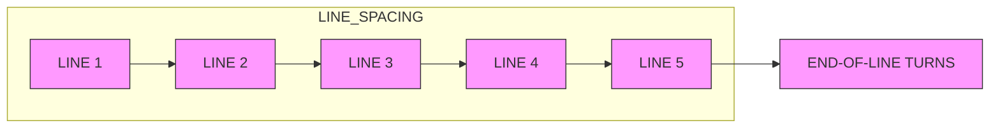

# Unlocking the Abyss: A Dynamical Model for Deep-Sea Adventure Safety and Rescue Strategies

In the ever-growing realm of adventure tourism, the exploration of sunken shipwrecks by riding submersibles has emerged as an exciting experience and popular activity, which allows enthusiasts to witness the silent beauty of maritime history beneath the waves. However, due to the complexity of the ocean current and weak communication underwater, the event that a submersible loses contact with the host ship under the sea continues, and positioning the missing submarine and carrying out rescue will be difficult. Predicting the trajectory of the submarine and developing the best search strategy are problems faced by both marine administrators and mathematicians. In order to handle this challenge, we divide the problem into three key points and establish three models separately.

Model I: Based on the knowledge of the underwater environment, the current effect, seawater density, and seafloor topography are three main points influencing submersible movement. We first utilize the Autoregressive Integrated Moving Average (ARIMA) Time Series Model and ridge regression to fit the three-dimensional continuous current and seawater density distribution. According to the dynamics function of the submersible considering complex factors, we build a model to solve these equations and predict the trajectory of the missing submersible. The prediction results are shown in Figure 6. Furthermore, we analyze the uncertainty of the current. After randomly input time series, it has an average uncertainty of 2.39%.

Model II: During the preparation stage, necessary search equipment for rescue must be deployed on the host ship and rescue vessel. There are different indicators of various types of search equipment including: equipment cost, maintenance cost, availability, usage, and readiness, which are firstly averagely processed and quantified. Our model uses the objective functions of minimum total cost, availability, and preparation time. Then, a Muti-Objective Optimization is established based on a Genetic Algorithm to obtain the Pareto set of solutions for the host ship and rescue vessel, respectively. Then, we choose three optimal results as different equipment allocations for the host ship and rescue vessel. The final results are shown in Table 8.

Model III: To decide the search strategy, we rasterize the region into grids and estimate the dynamic probability distribution based on our prediction results and the Poisson distribution function. Inspired by Bayes's theorem, we adjust the probability distribution according to the information obtained from the previous search. Ultimately, we divide the search into many time intervals and accumulate the probability of finding the submersible. The results of the accumulated probability are shown in Figure 10.

Additionally, we test the scalability and sensitivity of this model. Applying the model to another tourist destination, the Caribbean Sea, the trajectory corresponds to the current trend in that sea area, which means it has a fine scalability. Then, we change the time interval value in our model to test its sensitivity. After calculation, the final probability change rate is less than 5.8% if the time interval change rate is less than 10%. The results show that our model is not sensitive to changes in time intervals. Finally, we formulate a memo to the Greek government to obtain official approval.

Keywords: Submersible Trajectory; Dynamical Analysis; Grid Analysis; Bayes Theorem; Sensitivity Analysis

## Contents

## 1 Introduction 2

1.1 Problem Background 2  
1.2 Restatement of the Problem 2  
1.3 Literature Review 2  
1.4 Our Work 3

## 2 Assumptions 4

## 3 Notations 4

## 4 Model Preparation 5

4.1 Data Overview 5  
4.2 Data Collection 5  
4.3 Data Preparation 5

4.3.1 Data Extraction 5  
4.3.2 Conversion from longitude and latitude to distance 5

## 5 Trajectory Prediction Model Based on Dynamics Analysis 6

5.1 Advanced Time Series Analysis: Delving Deep into Ocean Current Speed Data ..... 6  
5.2 Continuous Current Speed Distribution Regression Model 8  
5.3 Dynamical Model based on Newtonian mechanics 9  
5.4 Discussion on Key Equipment and Technologies ..... 10

## 6 Comprehensive Equipment Allocation Optimization Model 11

6.1 Preliminary Research 11  
6.2 Model Construction 12

6.2.1 Parameter Introduction 12  
6.2.2 Data Processing 13  
6.2.3 Objective Function 13

6.3 Genetic Algorithm for Multi-objective Optimization ..... 14  
6.4 Results and Analysis 14  
6.5 Conclusion 15

## 7 Grid Probability Search Technique based on Poisson Distribution 15

7.1 Regional Rasterization 15  
7.2 Poisson Probability Distribution 16  
7.3 Probability Calculation Based on Bayesian Theory 17  
7.4 Results and Analysis 19

## 8 Expansion of the Model 19

8.1 Model Applied in Different Areas 19  
8.2 Rescue of Multiple Submersibles 20

## 9 Sensitivity Analysis 21

## 1 Introduction

## 1.1 Problem Background

There have been 38 accidents involving submarines and submersibles since 2000, and one of them was the “Titan implosion” last year $[1]$ . Once an incident in deep water happens, an urgent international search and rescue operation is about to begin. Greece-based company Maritime Cruises Mini-Submarines (MCMS) manufactures submersibles for deep-sea explorations and wishes to provide tourists with the chance to adventure the depths of the Ionian Sea and explore sunken shipwrecks. However, it is vital to have safety procedures to cope with the possible risks underwater. Consequently, we are asked by MCMS to design a four-step procedure for them.

## 1.2 Restatement of the Problem

To ensure security on board, a four-step safety procedure is modeled, including Locate, Prepare, Search, and Extrapolate. After thorough background reading, each procedure can be formulated into a sub-problem as follows:

## - LOCATE:

Develop a predictive model for the submersible's location over time. Identify uncertainties in predictions. Determine data the submersible can transmit to the host ship to reduce uncertainties. Specify required equipment on the submersible for data transmission.

## - PREPARE:

Recommend additional search equipment for the host ship, considering cost, availability, maintenance, readiness, and usage factors. Also, outline the additional equipment a rescue vessel might need for assistance.

## - SEARCH:

Create a model integrating location predictions to suggest optimal deployment points and search patterns for search equipment, minimizing the time to locate a lost submersible. Calculate the probability of finding the submersible based on time and accumulated search results.

## • EXTRAPOLATE:

To adapt the model for other tourist destinations like the Caribbean Sea, integrate region-specific data such as currents, weather patterns, and underwater topography. For multiple submersibles in the same vicinity, incorporate individual identifiers and update the prediction algorithm to manage simultaneous movements.

公众号：蚂蚁竞赛 更多资料请加QQ群1077734962，谢谢！

## 1.3 Literature Review

The task consists of two main models to be constructed: the prediction model of the submersible path and the search methodology of the rescue vessel. According to existing studies, predicting the submersible tracks has two main methods: Neural Network Predictions $[2]$ and Computational Dynamics Simulations $[3]$ . The neural Network-based Method uses a neural network (LSTM) to capture the disturbance like effects of currents or geography, which has remarkable accuracy with the proper network. At the same time, the computational and time costs are unavoidable. Computational Dynamics Simulations start from essential physics and kinetics models, and the simulation runs simultaneously with happening situations. Its accuracy relies heavily on the dynamical models and the formal information.

The underwater target search methods mainly include random search, geometry search, and heuristic search. This task requires searching by probability based on the existing results and time, a heuristic search method using prior knowledge of the target. Based on our findings, a few studies use mathematical models to tackle this issue: Limited studies have addressed this issue with mathematical models. Yao et al. applied expectation-maximization (EM) for static target search, but it is unsuitable for moving targets $[4]$ . In $[5]$ , Juan, Li et al. use the RRT algorithm and neural network to improve the exploration capability in multiple-target search in a changing environment, but the search efficiency is relatively low.

## 1.4 Our Work

The task involves establishing a four-step procedure to ensure the safety of deep-sea exploration, which mainly includes:

1. Based on the currents, seawater density, and seafloor geography of the Ionian Sea, a Trajectory Prediction Model based on dynamics analysis is established.  
2. Multi-Objective Optimization evaluates the rescue search equipment and then decides whether to be installed on the host ship and rescue vessels.  
3. Based on the location obtained from the Trajectory Prediction Model, we rasterize the search area and construct the probability model from the search results and time.  
4. Extrapolation of the model tests the transferability of situations like different oceans and multiple submersibles lost.

In order to avoid complex descriptions and intuitively reflect our workflow, the flowchart is shown in Figure 1.

```mermaid
graph TD
  A["Our Works"] --> B["Problem Analysis"]
  B --> C["Model Preparation (4)"]
  C --> D["Model I (5)"]
  D --> E["Model II (6)"]
  E --> F["Model III (7)"]
  F --> G["Model Extrapolation (8)"]
  G --> H["Sensitivity Analysis (9)"]
    
  I["Ocean Current of Ionian Sea"] --> J["Current Data"]
  J --> K["(5.1) Advanced Time Series Analysis: ARIMA, Monte Carlo, Ridge Regression"]
  K --> L["Uncertainty + Continuity"]
  L --> M["Current"]
    
  N["Binary Decision Variable"] --> O["Search Equipment"]
  O --> P["Echo Sounder, Side-Scan Sonar, Pinger Locator, Magnetometer, Optical Imaging System"]
  P --> Q["Indicators"]
  Q --> R["Equipment Cost (C), Maintenance Cost (M), Availability (A), Usage (U), Readiness (R)"]
  R --> S["Prepare: Search Equipment Choices (6)"]
  S --> T["Optimization"]
  T --> U["Cost Minimization(min(C+M/U)), Availability Maximization(maxA), Preparation Time Minimization(maxR)"]
    
  V["Search: Probability Estimation Model (7)"] --> W["(7.2) Poisson Distribution"]
  W --> X["Central Searching Grid"]
  X --> Y["(7.3) Bayesian Theory"]
  Y --> Z["Next Centre Grid of Search"]
    
  AA["Extrapolate: Caribbean Sea & Multiple Submersibles"] --> AB["Probability"]
  AB --> AC["Time Accumulated Search Results"]
    
  AD["Buoyancy"] --> AE["Prediction"]
  AE --> AF["Substantial Flux Over Time x 3D"]
  AF --> AG["Resistance to PV"]
  AG --> AH["Gravity"]
    
  AI["Query Tree"] --> AJ["Update"]
  AJ --> AK["Update"]
  AK --> AL["Update"]
    
  AM["Linear Graph"] --> AN["Coordinate/Matrix"]
  AN --> AO["Coordinate/Matrix"]
  AO --> AP["Coordinate/Matrix"]
    
  AQ["Linear Graph"] --> AR["Coordinate/Matrix"]
  AR --> AS["Coordinate/Matrix"]
    
  AT["Linear Graph"] --> AU["Coordinate/Matrix"]
  AU --> AV["Coordinate/Matrix"]
    
  AW["Linear Graph"] --> AX["Coordinate/Matrix"]
  AX --> AY["Coordinate/Matrix"]
    
  AZ["Linear Graph"] --> BA["Coordinate/Matrix"]
  BA --> BB["Coordinate/Matrix"]
    
  BC["Linear Graph"] --> BD["Coordinate/Matrix"]
  BD --> BE["Coordinate/Matrix"]
    
  BF["Linear Graph"] --> BG["Coordinate/Matrix"]
  BG --> BH["Coordinate/Matrix"]
    
  BI["Linear Graph"] --> BJ["Coordinate/Matrix"]
  BJ --> BK["Coordinate/Matrix"]
    
  BL["Linear Graph"] --> BM["Coordinate/Matrix"]
  BM --> BN["Coordinate/Matrix"]
    
  BO["Linear Graph"] --> BP["Coordinate/Matrix"]
  BP --> BQ["Coordinate/Matrix"]
    
  BR["Linear Graph"] --> BS["Coordinate/Matrix"]
  BS --> BT["Coordinate/Matrix"]
    
  BU["Busig Light"] --> BV["Prediction"]
  BV --> BW["Prediction"]
    
  BX["Busig Light"] --> BY["Prediction"]
    
  CA["Prediction"] --> CB["Prediction"]
    
  CC["Prediction"] --> CD["Prediction"]
    
  DE["Prediction"] --> DF["Prediction"]
    
  DG["Prediction"] --> DH["Prediction"]
    
  DI["Prediction"] --> DJ["Prediction"]
    
  DK["Prediction"] --> DL["Prediction"]
    
  DM["Prediction"] --> DE
  DE --> DF
  DF --> DG
```

flowchart

Figure 1: Work Flow

## 2 Assumptions

Before establishing a mathematical model for the motion trajectory of a defective submersible under the sea, we make some assumptions to make the model easier to realize.

• Assumption 1: The changes in ocean currents are periodic.

Explanation: The periodic changes in ocean currents result from the combined effects of various complex factors, including but not limited to wind, Earth's rotation, and solar radiation.

\- Assumption 2: The submersible's weight and volume do not change after it loses contact with the host ship. The size of the submersible is supposed to be $670 \, \text{cm} \times 280 \, \text{cm} \times 250 \, \text{cm}$

Explanation: A submersible's weight and volume will decide its gravity and buoyancy and further influence the trajectory underwater. To simplify the model, we ignore the changes in these factors for a defective submersible.

\- Assumption 3: When a submersible breaks down and loses contact with the host ship, it will lose the ability to provide propulsion and change its volume simultaneously.

Explanation: If the submersible still has propulsion, the operation of the driver after contact loss will be unpredictable, which means the later position of the submersible will be unpredictable. Additionally, if the submersible can still reach the water's surface with its propulsion, discussing how to predict the motion and carry out the rescue underwater is meaningless.

\- Assumption 4: When a submersible breaks down and loses contact with the host ship, it is always positioned on the sea floor or at some point of neutral buoyancy underwater.

Explanation: Since the purpose of a submersible is to allow tourists to visit underwater landscapes and search for underwater boats, it will be suspended at some position under the sea or just stop on the seabed. Then, we can suppose that the submersible is still when accidents happen.

\- Assumption 5: When a rescue vessel searches for the missing submersible, it can detect submersible as long as they are in the same latitude and longitude coordinates.

Explanation: Due to the complex environment and terrain, the rescue vessel may miss the submersible even though they are close enough. The missing probability is low and unpredicted, so we view it as 0, which means the rescue vessel can find the target under the water.

## 3 Notations

Table 1: Notations Used in this Paper

<table><tr><td>Symbol</td><td>Definition</td><td>Symbol</td><td>Definition</td></tr><tr><td> $\hat{Y}_{t}$ </td><td>Predicted ocean current velocity vector</td><td> $f_{C}(x)$ </td><td>Cost objection function</td></tr><tr><td> $R_{t}$ </td><td>Residual sequence</td><td> $G_{s}$ </td><td>Grid size</td></tr><tr><td> $J(\theta)$ </td><td>Ridge regression function</td><td> $v$ </td><td>Velocity</td></tr><tr><td> $MSE(\theta)$ </td><td>Mean square error</td><td> $P(\chi = k)$ </td><td>The Poisson distribution</td></tr><tr><td> $EC$ </td><td>Environmental coefficient</td><td> $p(A)$ </td><td>Probability of event A</td></tr></table>

## 4 Model Preparation

## 4.1 Data Overview

The material does not provide direct data about the Ionian Sea we will research, so we collect some important data about this region. According to our model, we collect the data about current velocity distribution and seawater density distribution of the Ionian Sea. Owing to the large amount of data, we choose to visualize the data for display instead of listing all of them.

## 4.2 Data Collection

Table 2: Data and Database Websites

<table><tr><td>Database Names</td><td>Database Websites</td></tr><tr><td>Current</td><td>https://data.marine.copernicus.eu/product/</td></tr><tr><td>Density</td><td>https://www.ncei.noaa.gov/maps/grid-extract/</td></tr><tr><td>Geography of Seafloor</td><td>https://download.gebco.net/</td></tr></table>

## 4.3 Data Preparation

## 4.3.1 Data Extraction

Considering the dataset used is a seven-dimensional dataset [1095 49 52 76 1 1 1 ], with dimensions corresponding to time, depth, longitude, latitude, east-west direction speed, north-south direction speed, and vertical speed, respectively. The initial step involves flattening the data and transforming it into a one-dimensional vector indexed by time. Fixing the parameters of depth, longitude, and latitude allows obtaining a vector of ocean current speeds at a specific depth and location, indexed by time. Typically, example data at $222.4752m$ deep, $37.083332^{\circ}$ Latitude, $20.166677^{\circ}$ Longitude is shown in Figure 2.

line chart

| Time (Day) | Velocity (m/s) |
| ---------- | -------------- |
| 0          | 0.2            |
| 100        | -0.1           |
| 200        | 0.1            |
| 300        | -0.3           |
| 400        | 0.4            |
| 500        | 0.3            |
| 600        | 0.2            |
| 700        | -0.2           |
| 800        | 0.3            |
| 900        | -0.4           |
| 1000       | -0.5           |
| 1100       | 0.2            |
| 1200       | -0.1           |

(a) North-South Current Velocity

line chart

| Time (Day) | Velocity (m/s) |
| ---------- | -------------- |
| 0          | 0.1            |
| 100        | -0.1           |
| 200        | 0.1            |
| 300        | -0.3           |
| 400        | 0.3            |
| 500        | -0.2           |
| 600        | 0.2            |
| 700        | -0.1           |
| 800        | 0.1            |
| 900        | -0.2           |
| 1000       | 0.3            |
| 1100       | -0.3           |
| 1200       | 0.1            |

(b) East-West Current Velocity

line chart

| Time (Day) | Velocity (m/s) |
| ---------- | -------------- |
| 0          | 0              |
| 100        | 8              |
| 200        | -6             |
| 300        | 4              |
| 400        | 2              |
| 500        | -4             |
| 600        | 6              |
| 700        | -2             |
| 800        | 4              |
| 900        | -8             |
| 1000       | 2              |
| 1100       | -4             |
| 1200       | 8              |

(c) Vertical Current Velocity  
Figure 2: Extracted Full Data From CMEMS

## 4.3.2 Conversion from longitude and latitude to distance

The data we collect all utilizes longitude and latitude as the coordinates to describe the distribution of the current velocity and seawater density. While we will use the mechanical model to predict the submersible's motion, the parameters' dimensions should be converted to the International System of Units for calculation. Due to the slight change in longitude and latitude in the Ionian Sea region, we use the arc distance along longitude and latitude between two points as the coordinate distance. The Spherical Distance Calculation formula is shown in Equation 1.

$$
\left\{ \begin{array}{l} \text { Lattitude } A r c = R \cdot \Delta \phi \\ \text { Longitude } A r c = R \cdot \cos \phi_ {1} \cdot \lambda \end{array} \right. \tag {1}
$$

## 5 Trajectory Prediction Model Based on Dynamics Analysis

## 5.1 Advanced Time Series Analysis: Delving Deep into Ocean Current Speed Data

## Step 1: ARIMA Time Series Prediction Model Set-up

We employed an autoregressive integrated moving average (ARIMA) time series model $[6]$ to predict the conditions of ocean currents. This model provides predictions of changes in ocean currents over a future period through mathematical modeling methods.

It is first necessary to check the stationarity of the data since the time series should be stationary. It can be found that the series is not stationary, so the differencing operation, Equation 2, is used to transform it into a stationary series.

$$
\Delta^ {d} Y _ {t} = \Delta (\Delta^ {d - 1} Y _ {t}) f o r (d = 1) \tag {2}
$$

simple differencing can be represented as Equation 3.

$$
\Delta Y _ {t} = Y _ {t} - Y _ {t - 1}. \tag {3}
$$

The autoregressive part reflects the linear relationship between the current value and its past values. For the $p^{th}$ order autoregressive part, there is Equation 4.

$$
A R (p): \phi_ {1} Y _ {t - 1} + \phi_ {2} Y _ {t - 2} + \dots + \phi_ {p} Y _ {t - p} \tag {4}
$$

The moving average part reflects the linear relationship between the current forecasting error and past observation errors. For the $q^{th}$ order moving average part, there is Equation 5.

$$
M A (q): \theta_ {1} \varepsilon_ {t - 1} + \theta_ {2} \varepsilon_ {t - 2} + \dots + \theta_ {q} \varepsilon_ {t - q} \tag {5}
$$

Therefore, for the ARIMA model, let $Y_{t}$ be the observed value of the time series at time t, and the ARIMA model can be represented as Equation 6.

$$
\Delta^ {d} Y _ {t} = \mu + \sum_ {i = 1} ^ {p} \phi_ {i} \Delta^ {d} Y _ {t - i} + \sum_ {j = 1} ^ {q} \theta_ {j} \varepsilon_ {t - j} + \varepsilon_ {t} \tag {6}
$$

Where: $\Delta^{d}Y_{t}$ denotes the series after (d) differencing operations. $\mu$ is the constant term of the model. $\phi_{i}$ are the coefficients of the autoregressive terms, where $i = 1, \ldots, p$ . $\theta_{j}$ are the coefficients of the moving average terms, where $j = 1, \ldots, q$ . $\varepsilon_{t}$ is the error term at time t, assumed to be a white noise series.

After multiple adjustments and testing, our ARIMA model's forecasted results were compared with actual data shown in Figure 3, revealing alignment in three comparison charts. Model validation involved calculating and analyzing the residual series, showcasing even scattering around the zero line without discernible trends or patterns. In conclusion, the ARIMA model performs well predicting ocean current changes, supported by a stationary distribution and random residual series. Due to inherent model limitations, continuous monitoring and adjustments based on new data are emphasized.

line chart

| Time (Day) | Realistic Data | Predicted Data |
| ---------- | -------------- | -------------- |
| 0          | 0.1            | 0.1            |
| 50         | -0.3           | -0.3           |
| 100        | 0.2            | 0.2            |
| 150        | 0.2            | 0.2            |
| 200        | -0.1           | -0.1           |
| 250        | -0.5           | -0.5           |
| 300        | 0.2            | 0.2            |
| 350        | -0.1           | -0.1           |
| 400        | 0.1            | 0.1            |

(a) North-South Velocity Pred vs Real

line chart

| Time (Day) | Realistic Data | Predicted Data |
| ---------- | -------------- | -------------- |
| 0          | 0.1            | 0.1            |
| 50         | -0.2           | 0.1            |
| 100        | -0.1           | 0.1            |
| 150        | 0.0            | 0.1            |
| 200        | 0.1            | 0.2            |
| 250        | 0.3            | 0.3            |
| 300        | -0.2           | 0.1            |
| 350        | -0.3           | 0.1            |
| 400        | 0.0            | 0.1            |

(b) East-West Velocity Pred vs Real

line chart

| Time (Day) | Realistic Data (m/s) | Predicted Data (m/s) |
| ---------- | -------------------- | -------------------- |
| 0          | -2.5e-4              | -2.5e-4              |
| 50         | -4.0e-4              | 3.0e-4               |
| 100        | -2.0e-4              | 1.5e-4               |
| 150        | 0.5e-4               | 1.0e-4               |
| 200        | -8.0e-5              | 2.5e-4               |
| 250        | 1.0e-4               | 3.5e-4               |
| 300        | -4.0e-4              | 1.5e-4               |
| 350        | -6.0e-4              | 7.0e-4               |

(c) Vertical Velocity Pred vs Real  
Figure 3: Predicted Current Velocity vs Real Current Velocity

## Step 2: Quantifying Uncertainty Using Monte Carlo Method

To compute this error, we utilized the Monte Carlo method. The Monte Carlo method is a numerical computation technique based on random sampling.

## - Generate Random Input Time Series

Random Input Generation: First, generate a series of random input time series, shown in Equation 7, which should reflect the potential fluctuations of natural variables, thereby being used to generate different ocean current velocity prediction scenarios.

$$
X _ {t} \sim N (\mu , \sigma^ {2}) \tag {7}
$$

where, $t = 1, 2, \ldots, T$ represents the time points in the time series.

## • Ocean Current Velocity Vector Sequence Prediction

Model Prediction: Input each randomly generated time series into the pre-established and fitted ARIMA model. The model will output a series of predicted ocean current velocity vector sequences for each input series, shown in Equation 8.

$$
\hat {Y} _ {t} = A R I M A \left(X _ {t}\right) \tag {8}
$$

Here, $ARIMA(X_t)$ represents the ARIMA model's prediction function given the input $X_t$ .

## • Evaluation of Uncertainty

Uncertainty Measurement: Calculate the ratio of each residual item to each actual velocity item for each set of residual series, which can be obtained by comparing the predicted ocean current velocity vector series with the actual observed ocean current velocity series, shown in Equation 9.

$$
R _ {t} = \frac {\left| R e s i d u a l \right|}{\left| A c t u a l V e l o c i t y \right|} = \frac {\left| \hat {Y} _ {t} - Y _ {t} \right|}{\left| Y _ {t} \right|} \tag {9}
$$

This method emphasizes the maximum relative error, Equation 10, highlighting the degree of deviation between the prediction results and actual conditions in the worst-case scenario. The ratio series is shown in Figure 4.

$$
U = \max R _ {t} \tag {10}
$$

line chart

| Time (Day) | Uncertainty (%) |
| ---------- | --------------- |
| 0          | ~0              |
| 50         | ~0              |
| 100        | ~0              |
| 150        | ~0              |
| 200        | ~0              |
| 250        | ~0              |
| 300        | ~0              |
| 350        | ~0              |
| 400        | ~0              |

Figure 4: Uncertainty Series in Test-set

## • Calculation of Average Uncertainty

Average Uncertainty: After completing the prediction and uncertainty evaluation of all random sequences, calculate the average of all uncertainty values. This average provides a quantified indicator of the model's average level of uncertainty under various random inputs shown in Equation 11.

$$
U _ {a v g} = \frac {1}{N} \sum_ {i = 1} ^ {N} U ^ {(i)} = 2.39 \% \tag{11}
$$

## 5.2 Continuous Current Speed Distribution Regression Model

We use ridge regression in our model to build a function between a point's coordinate and current speed value. The objective function for ridge regression to minimize is shown as Equation 12.

$$
J (\theta) = M S E (\theta) + \sum_ {j = 1} ^ {n} \theta_ {j} ^ {2} \tag {12}
$$

Where $J(\theta)$ is the objective function to minimize, $MSE(\theta)$ is the mean square error, which will be discussed later, $\alpha$ is the regularization parameter used to control the influence of the regularization, and $\theta_{j}$ is named as L2 norm, which is a parameter to optimize. To further explain this algorithm, the mean square error function can be written as Equation 13.

$$
M S E (\theta) = \frac {1}{m} \sum_ {i = 1} ^ {m} (h _ {\theta} (x ^ {(i)}) - y ^ {(i)}) ^ {2} \tag {13}
$$

Where m is the sampling number, $h_{\theta}(x^{(i)})$ represents the predicted value of the model for the $i^{th}$ sample, and $y^{(i)}$ is the actual value of the $i^{th}$ sample.

Though the principle of ridge regression is complex, Matlab provides a complete function to practice ridge regression, which is known as ridge $(y, X, \lambda)$ , where y is the target value for model fitting, X is the input matrix which contains all of the sampling points, and $\lambda$ is the regularization parameter, which controls the strength of regularization terms. As a three-dimensional vector, the algorithm is operated three times to obtain the current speed at a point in three directions. Since the regression results contain a large range, so we only select some of the points in the range to display, and the result is shown in Table 3.

Table 3: Predicted Current Speed at Some Points

<table><tr><td>Latitude</td><td>Longitude</td><td>Depth</td><td>x-velocity</td><td>y-velocity</td><td>z-velocity</td></tr><tr><td>36.583</td><td>21.833</td><td>-15.41</td><td>-0.2405</td><td>0.2687</td><td> $-2.767 \times 10^{-5}$ </td></tr><tr><td>37.917</td><td>19.333</td><td>-114.05</td><td>0.0344</td><td>0.0752</td><td> $6.088 \times 10^{-6}$ </td></tr><tr><td>36.167</td><td>22.167</td><td>-294.45</td><td>-0.2307</td><td>-0.12</td><td> $2.459 \times 10^{-5}$ </td></tr><tr><td>38.917</td><td>20.333</td><td>-923.26</td><td>0.1661</td><td>-0.0983</td><td> $1.556 \times 10^{-4}$ </td></tr><tr><td>36.583</td><td>17.333</td><td>-3181.27</td><td>0.1162</td><td>0.1366</td><td> $-6.264 \times 10^{-6}$ </td></tr><tr><td>...</td><td>...</td><td>...</td><td>...</td><td>...</td><td>...</td></tr></table>

Note: The $x$ coordinate and $y$ coordinate are all changed back to latitude and longitude values in the table. All quantities in the table use the International System of Units.

From the table, it is easy to see that the x-component and y-component of the current speed are much higher than the z-component, which corresponds to the characteristic of the ocean current. The same method can be used to obtain the continuous seawater density distribution. Since the process is generally the same, we only provide the predicted seawater density value at some points in Table 4.

Table 4: Predicted Seawater Density at Some Points

<table><tr><td>Latitude</td><td>Longitude</td><td>Depth</td><td>Seawater Density</td></tr><tr><td>36.169</td><td>19.673</td><td>-3157</td><td>1033.76</td></tr><tr><td>36.573</td><td>21.852</td><td>-1605</td><td>1029.77</td></tr><tr><td>37.056</td><td>19.223</td><td>-3433</td><td>1034.55</td></tr><tr><td>37.885</td><td>20.852</td><td>-127</td><td>1025.41</td></tr><tr><td>38.381</td><td>19.585</td><td>-2664</td><td>1032.26</td></tr><tr><td>...</td><td>...</td><td>...</td><td>...</td></tr></table>

## 5.3 Dynamical Model based on Newtonian mechanics

According to the assumption, the defective submersible will lose propulsion simultaneously when it loses contact with the host ship. So, the submersible will move only under external forces. According to Oceanography and Physics knowledge, the four main forces that should be considered are gravity, buoyancy, resistance, and ocean current force. The force situation of the submersible is shown in Figure 5.

text_image

Buoyancy
OceanGate
Resistance
Gravity
Current
V

Figure 5: Force situation of a submersible

This graph shows the effects of multiple factors on submersibles. Before the dynamical model is constructed, we first analyze these forces. Equation 14 calculate the Gravity.

$$
F _ {G} = m g \tag {14}
$$

Where $F_{G}$ is the gravity and m is the mass of the submersible. According to the assumption, the mass of the submersible is a fixed value. So $F_{G}$ will always be a fixed value.

In Equation 15, $F_{B}$ is the buoyancy, $\rho$ is the density of the seawater at the current position of the submersible, and V is the volume of the submersible, which is also a fixed value according to the assumption. So, the buoyancy of the submersible only depends on the local density.

$$
F _ {B} = \rho g V \tag {15}
$$

In Equation 16, $F_{R}$ is the resistance, $\rho$ is still the density of the seawater $v$ is the current velocity of the submersible, $C_d$ is the resistance coefficient and $A$ represents the upstream area of the submersible. It is easy to know that $C_d$ and $A$ can be viewed as constant values and $\rho$ and $v$ will change with the movement of the submersible.

$$
F _ {R} = \frac {1}{2} \rho v ^ {2} C _ {d} A \tag {16}
$$

In Equation 17, $\vec{v}_s$ represents the velocity of the submersible related to the current, and $\vec{v}_c$ represents the velocity of the current related to Earth. This formula shows that the velocity of the current can be directly added to the submersible's velocity because the current's velocity is known when the position of the submersible is known.

$$
\vec {v} = \vec {v} _ {s} + \vec {v} _ {c} \tag {17}
$$

Equations 18 can be constructed according to Newton's Second Law and the current speed predicted model, where $\phi$ represents the angle between the resistance and the horizontal plane and $\theta$ represents the angle between the projection of resistance on the horizontal plane and the x-axis. According to the previous discussion, the $F_{B}$ and v will change according to the current position, and the exact value of $F_{B}$ and v can be predicted from the model established in 5.2.

$$
\left\{ \begin{array}{l} m \frac {d v _ {x}}{d _ {t}} = - F _ {R} \cos \phi \cos \theta \\ m \frac {d v _ {y}}{d _ {t}} = - F _ {R} \cos \phi \cos \theta \\ m \frac {d v _ {z}}{d _ {t}} = F _ {B} - F _ {G} + F _ {R} \sin \phi \end{array} \right. \tag {18}
$$

Then, we consider the seafloor topography of the Ionian Sea and set limits to ensure the submersible will not move down below the seafloor. After the dynamics equations are prepared, we use the Python package to solve the equations. Based on assumptions, the initial state of the defective submersible will be somewhere in the Ionian Sea region with v=0. Figure 6 shows the trajectory obtained from the code.

line chart

| X Position (m) | Z Position (m) |
| -------------- | -------------- |
| 6500           | -3700          |
| 6000           | -3700          |
| 5500           | -3800          |
| 9000           | -3900          |

line chart

| X Position (m) | Z Position (m) |
| -------------- | -------------- |
| 9000           | -3800          |
| 9200           | -3850          |
| 9400           | -3900          |
| 9600           | -3950          |
| 9800           | -4050          |
| 10000          | -4150          |
| 10200          | -4250          |

Figure 6: Trajectory of a Submersible Losing Contact

The starting point is random, which in this simulation is $(9264, 6207, -3767)$ . After calculation, the position of the submersible we predict after 3 hour is $(10342, 5554, -4062)$ . The complete trajectory of the point is shown, which means we can obtain the predicted position of the submersible at any time after calculation. In this simulation, we expect that the submersible will gradually decline along the trajectory curve, and the trajectory is irregular, resulting from periodic current and seawater density. This trajectory model provides us with information for future search and rescue work.

## 5.4 Discussion on Key Equipment and Technologies

To effectively reduce the uncertainties these factors introduce, the submersible needs to regularly report a series of critical data to the mother ship. This data's accurate collection and transmission are crucial for optimizing the prediction model. Hence, the submersible needs to be equipped with the following three kinds of advanced monitoring equipment.

(i) Ocean current detection and seawater condition monitoring equipment

• Acoustic Doppler Current Profiler (ADCP):

This instrument measures the echoes from particles in the seawater at different depths from the submersible.

\- CTD sensors:

CTD stands for Conductivity, Temperature, and Depth, the three fundamental oceanography parameters.

(ii) Dynamics and External Resistance Monitoring System

\- Inertial Navigation System (INS):

By measuring acceleration and angular velocity, INS provides the submersible with accurate information on position, velocity, and attitude.

## (iii) Communication and Data Logging Equipment

## • Underwater Acoustic Communication Devices:

In the underwater environment, submersibles rely on acoustic communication to exchange data with support ships or other submersibles.

## - Data Loggers:

Used for long-term storage of collected oceanographic data, submersible motion data, and environmental monitoring data.

## - Satellite Communication Systems (used during surface activities):

When the surfaces, the satellite communication equipment is enabled to transmit data collected during the dive and receive new instructions from the research team.

By equipping these advanced devices, the submersible can regularly obtain and report critical information to the mother ship, including ocean current data, seawater conditions, dynamics parameters, and resistance data. This significantly reduces uncertainty and enhances the accuracy of trajectory predictions. Such configuration optimizes the prediction model's performance, effectively reducing factors that contribute to uncertainty in submersible position predictions, thereby ensuring the safe and effective operation of the submersible.

## 6 Comprehensive Equipment Allocation Optimization Model

In facing the arduous task of marine search and rescue, rapid and effective search and rescue operations are crucial for improving survival rates. The rational allocation of search and rescue equipment carried by the main ship and rescue boats is significant. This necessitates a multi-objective optimization model that comprehensively considers costs, equipment availability, and readiness to aid decision-making. Below, we will introduce CEAOM.

## 6.1 Preliminary Research

Detailed investigations were conducted on several types of key equipment, shown in Table 5, including echo sounders, side scan sonars, pinger locators, magnetometers, and optical imaging systems. These devices play an indispensable role in marine search and rescue missions.

Table 5: Key Equipment

<table><tr><td>Echo Sounder</td><td>Side Scan Sonar</td><td>Pinger Locators</td><td>Magnetometer</td><td>Optical Imaging System</td></tr><tr><td>Echologger EU400</td><td>Klein 3000</td><td>RJE International PL-600</td><td>W FishersProton 4</td><td>SeaViewer SVS-650</td></tr><tr><td>Kongsberg EA 640</td><td>SonarMite</td><td>Teledyne Benthos UDB-9000</td><td>GeometricsG-882</td><td>Ocean Systems Inc. OASIS</td></tr><tr><td>Furuno FE800</td><td>Edgetech 6205</td><td></td><td>Marine Magnetics SeaSPY</td><td>Kongsberg OE14-502</td></tr></table>

## 6.2 Model Construction

## 6.2.1 Parameter Introduction

In this multi-objective optimization model, the focus is on five parameters: equipment cost, annual maintenance cost, availability, usage, and readiness. Below is the definition of each parameter and an introduction to their calculation methods.

• Equipment Cost (C):

Reflects the initial investment required to purchase various search equipment.

• Annual Maintenance Cost (M):

Represents the annual expense required to ensure that the equipment maintains optimal working conditions within the specified service life.

\- Availability (A):

Considers factors such as water temperature, depth, currents, noise, and interference to quantify the equipment's operational performance under various conditions.

Calculation of Availability:

The calculation principles for coefficients reflecting the impact of various environmental factors on sound wave propagation can be summarized into a unified equation as Equation 19.

$$
\text { Environmental   Coefficient } (E C) = \frac {\text { Range }}{\text { Sensitivity }} \tag {19}
$$

Here, the Environmental Coefficient (EC) could be the Water Temperature Coefficient (WTC), Water Depth Coefficient (WDC), Water Current Coefficient (WCC), Noise Coefficient (NC), or Interference Coefficient (IC), depending on the specific application context and metric being measured.

Range denotes the working range of the environmental variable (water temperature, water depth, water current, noise, or interference). This reflects the product's adaptability or performance variation range under different conditions.

Sensitivity refers to the degree to which the product's performance changes in response to changes in the environmental variable.

In summary, the availability index can be calculated as Equation 20.

$$
\text { Availability   Index } = W T C \times W D C \times W C C \times N C \times I C \tag {20}
$$

Usage (U):

The equipment's usage time within a year reflects the actual workload of the equipment.

## Readiness (R):

The preparation time required before each use directly affects the response speed of the mission.

## 6.2.2 Data Processing

We first define each data set as a collection of a series of observed values, shown in Equation 21. Suppose we have surveyed k different products for each type of equipment, each with its corresponding cost, availability, maintenance cost, usage, and readiness. Let $P_{i}$ represent the average value of the parameter for equipment type i. $P_{ij}$ is the observed value of the parameter for the $j^{th}$ product of equipment type i. $k_{i}$ is the number of products surveyed for equipment type i.

$$
P _ {i} = \frac {1}{k _ {i}} \sum_ {j = 1} ^ {k _ {i}} P _ {i j} \tag {21}
$$

The final data processing results are shown in Table 6, where ES stands for Echo Sounder, SSS stands for Side Scan Sonar, PL stands for Pinger Locators, MM stands for Magnetometer, and OI stands for Optical Imaging.

Table 6: Equipment Data

<table><tr><td></td><td>ES</td><td>SSS</td><td>PL</td><td>MM</td><td>OI</td></tr><tr><td>C</td><td>15000</td><td>85000</td><td>15000</td><td>50000</td><td>50000</td></tr><tr><td>A</td><td>4291667</td><td>1206667</td><td>1580000</td><td>633333</td><td>1293333</td></tr><tr><td>M</td><td>5500</td><td>1500</td><td>500</td><td>2500</td><td>5000</td></tr><tr><td>R</td><td>8</td><td>4</td><td>1.1</td><td>1.2</td><td>0.5</td></tr><tr><td>U</td><td>480</td><td>960</td><td>108</td><td>300</td><td>369</td></tr></table>

## 6.2.3 Objective Function

Set the objective function to minimize total cost, maximize equipment availability, and minimize preparation time.

## (i) Cost Minimization

This includes the equipment's initial purchase and maintenance costs, which are related to the frequency of use. The specific expression is Equation 22.

$$
f _ {C} (x) = \sum_ {i = 1} ^ {n} \left(C _ {i} \cdot x _ {i} + \frac {M _ {i}}{U _ {i}} \cdot x _ {i}\right) \tag {22}
$$

This formula considers the direct cost $C_{i}$ of purchasing equipment $x_{i}$ and the annual maintenance cost $M_{i}$ allocated according to the usage rate $U_{i}$ . Here, $x_{i}$ represents the decision variable, whether or not to purchase the $i^{th}$ type of equipment.

## (ii)Availability Maximization

Availability indicates the effective working capacity of equipment under specific conditions. The mathematical expression is Equation 23.

$$
f _ {A} (x) = - \sum_ {i = 1} ^ {n} (A _ {i} \cdot x _ {i}) \tag {23}
$$

The negative sign indicates it is a maximization problem. By maximizing $A_{i} \cdot x_{i}$ (i.e., the availability of the chosen equipment), the model ensures that the equipment configuration is efficient and adaptable to various operational environments.

## (iii)Preparation Time Minimization

The specific expression is Equation 24.

$$
f _ {R} (x) = \max \left(R _ {i} \cdot x _ {i}\right) \tag {24}
$$

Here, $R_{i}$ represents the preparation time for the equipment from the decision to use it to its readiness for operation. $x_{i}$ represents the quantity of the $i^{th}$ type of equipment, and n is the number of types of equipment.

## 6.3 Genetic Algorithm for Multi-objective Optimization

The model employs a genetic algorithm for multi-objective optimization, seeking the optimal balance among cost, availability, and readiness. Ultimately generating a series of solutions that form a Pareto Front shown in Figure 7.

3d scatter plot

| Cost (×10⁴) | Readiness (×10⁴) |
|-------------|------------------|
| 0           | 0                |
| 0.5         | 1.5              |
| 1.0         | 4.0              |
| 1.5         | 6.5              |
| 2.0         | 9.0              |
| 2.5         | 11.5             |
| 3.0         | 14.0             |
| 3.5         | 16.5             |
| 4.0         | 19.0             |
| 4.5         | 21.5             |

Figure 7: Solutions in Pareto Front

Since the quantity of equipment can only be integers, further processing of the results to eliminate duplicate schemes yields in Table 7.

Table 7: Optimization Results

<table><tr><td>ES</td><td>SSS</td><td>PL</td><td>MM</td><td>OI</td><td>Readiness</td><td>Availability</td><td>Cost</td></tr><tr><td>0</td><td>0</td><td>1</td><td>0</td><td>0</td><td>1.1</td><td>1580000</td><td>15000</td></tr><tr><td>0</td><td>0</td><td>0</td><td>1</td><td>0</td><td>1.2</td><td>633333</td><td>50000</td></tr><tr><td>0</td><td>0</td><td>0</td><td>0</td><td>1</td><td>0.5</td><td>1293333</td><td>50000</td></tr><tr><td>0</td><td>0</td><td>1</td><td>0</td><td>1</td><td>1.1</td><td>2873333</td><td>65000</td></tr><tr><td>1</td><td>0</td><td>1</td><td>0</td><td>1</td><td>8</td><td>7165000</td><td>80000</td></tr><tr><td>0</td><td>1</td><td>1</td><td>0</td><td>0</td><td>4</td><td>2786667</td><td>100000</td></tr><tr><td>1</td><td>1</td><td>1</td><td>0</td><td>0</td><td>8</td><td>7078334</td><td>115000</td></tr><tr><td>1</td><td>0</td><td>1</td><td>1</td><td>1</td><td>8</td><td>7798333</td><td>130000</td></tr><tr><td>0</td><td>1</td><td>1</td><td>0</td><td>1</td><td>4</td><td>4080000</td><td>150000</td></tr><tr><td>1</td><td>1</td><td>1</td><td>0</td><td>1</td><td>8</td><td>8371667</td><td>165000</td></tr><tr><td>0</td><td>1</td><td>0</td><td>1</td><td>1</td><td>4</td><td>3133333</td><td>185000</td></tr><tr><td>1</td><td>1</td><td>1</td><td>1</td><td>1</td><td>8</td><td>9005000</td><td>215000</td></tr></table>

## 6.4 Results and Analysis

Ultimately, we selected four matching schemes, divided into three categories, to achieve the deployment of the main ship and rescue boats. As shown in Table 8 below. Based on the deployment analysis of the results table and a detailed consideration of the characteristics of each scheme, we can derive the following detailed strategies and deployment plans.

Table 8: Four Possible Choices

<table><tr><td></td><td>ES</td><td>SSS</td><td>PL</td><td>MM</td><td>OI</td><td>Readiness</td><td>Availability</td><td>Cost</td></tr><tr><td>Scheme 1</td><td>1</td><td>1</td><td>1</td><td>1</td><td>1</td><td>8</td><td>9005000</td><td>215000</td></tr><tr><td>Scheme 2</td><td>0</td><td>0</td><td>0</td><td>0</td><td>1</td><td>0.5</td><td>1293333</td><td>50000</td></tr><tr><td>Scheme 3</td><td>0</td><td>0</td><td>1</td><td>0</td><td>1</td><td>1.1</td><td>2873333</td><td>65000</td></tr><tr><td>Scheme 4</td><td>0</td><td>1</td><td>1</td><td>0</td><td>1</td><td>4</td><td>4080000</td><td>150000</td></tr></table>

## Main Ship (Optimum Performance Scheme) - Scheme 1:

As the option with the best performance and the highest cost, the main ship leverages its large volume and sufficient preparation time to equip the most advanced search and rescue equipment. Its role extends beyond search and rescue to serve as a command and coordination center.

## Primary Rescue Boats (Rapid Response Scheme) - Schemes 2 and 3:

The primary rescue boats emphasize rapid response capability. Their readiness is lower, allowing for quick preparation and dispatch to the accident area for preliminary search and rescue shortly after an incident occurs.

## Intermediate Rescue Boat (Balanced Performance Scheme) - Scheme 4:

The intermediate rescue boat balances readiness, cost, and performance. The intermediate rescue boat has a slightly longer preparation time than the primary rescue boats. Still, once deployed, it is equipped with more advanced search and rescue equipment and technology, significantly enhancing its search and rescue capabilities.

## 6.5 Conclusion

This $1 + n$ rescue scheme not only improves the response speed and efficiency of rescue operations but also strengthens the adaptability to rescue needs under different maritime conditions and situations. Moreover, this strategy ensures efficient, precise search and rescue actions, providing quicker and more effective rescue services for those trapped in maritime emergencies.

## 7 Grid Probability Search Technique based on Poisson Distribution

## 7.1 Regional Rasterization

In a real-world deep water search, rescue vessels conduct operations on the ocean surface using search equipment like sonar to detect aiming objectives. Therefore, the search area can be treated as a surface.

Before the accident, the lost submersible will send its last information to the host ship, and the rescue vessels are then dispatched to the mission by analyzing the loss data. Apart from the location, the quality of a search is measured through an effective examination of the search area. Systematic inspection of the search area is achieved by following a predefined pattern tailored to the specific conditions of the search. According to Salvage Manual $[7]$ , deep ocean searches have four proven effective and practical search patterns: Parallel Grid Search, Constant Range Search, “Z” search, and ROV Box Search.

Parallel Grid Search is the most commonly used and effective search pattern in modern rescue missions, shown in Figure 8(a). Consequently, our model will build upon this search pattern.

flowchart

(a) Parallel Grid Search

natural_image

Topographic map showing Australia and North America with a red dotted line overlay (no text or labels)

(b) Search Grid  
\*The reasonable range of line spacing is generally between 0.5 and 2 times the target size, the reasonable range of Swath Width is generally between 0.5 and 2 times the target size, and the reasonable range of range overlap is generally between $10\%$ and $30\%$ .

Figure 8: Searching Pattern of the Rescue Vessel

With the help of loss data and Parallel Grid Search, search probability analysis can be determined by applying a grid model that rasterizes the search area into smaller cells shown in Figure 8(b). Each cell is assigned a probability percentage indicating the likelihood of the target being located within that cell. Therefore, any point's grid label $N$ can be expressed as Equation 25.

$$
N = I N T (\frac {x}{G _ {s}}) + M \times I N T (\frac {y}{G _ {s}}) \tag {25}
$$

Where $(x,y)$ is the coordinate of a potential place, the abscissa x represents the longitude and the ordinate y represents the latitude, $G_{s}$ is the grid size, $M = \frac{x_{max}}{G_{s}}$ , $x_{m}ax$ is the maximum length of the horizontal axis. Furthermore, the grid center position coordinates can be obtained by Equation 26.

$$
\left\{ \begin{array}{l} x _ {G} = (N \% M) \cdot G _ {s} + \frac {G _ {s}}{2} \\ y _ {G} = I N T (N / M) + \frac {G _ {s}}{2} \end{array} \right. \tag {26}
$$

In the area of the Mediterranean, the most prevalent rescue vessel model operating is USNS Grasp (T-ARS 51) [8]. According to its manual, this vessel model has a speed of 25 knots. Known the lost submersible size was $670~\mathrm{cm} \times 280~\mathrm{cm} \times 250~\mathrm{cm}$ , other search parameters can be determined below: Swath Width: $2 \times 250cm = 5m$ Overlap: $20\%$ Velocity: $25 \times 1.852 = 46km/h$ . Assuming a square search area with $30\mathrm{min}$ search time (t) using Parallel Grid Search, the grid size can be determined using Equation 27.

$$
G _ {s} = \frac {v \times t}{\text { Turns }} = (S W) \times \text { Turns } - (S W \times O V) \times (\text { Turns } - 1) \tag {27}
$$

Where SW stands for Swath Width, OV stands for Overlap. Therefore, an approximate $300m \times 300m$ grid model is established for regional rasterization.

## 7.2 Poisson Probability Distribution

Based on the discussion in 7.1, we have divided the rescue region into several regions. Then, we hope to find the probability distribution of these regions, which means the probability of finding a missing submersible in each region. According to the model built in 5, we can suppose that the submersible is most likely to be in the grid corresponding to the coordinates we predict. The farther the coordinates are from the central grid, the lower the probability of finding the ship. To describe the discrete probability distribution with such a characteristic, we choose to use the Poisson distribution. The Poisson distribution function is shown as Equation 28.

$$
P (\chi = k) = \frac {e ^ {- \lambda} \cdot \lambda^ {k}}{k !}, k \in N \tag {28}
$$

Where $\lambda$ is called the intensity parameter, describing the intensity of the event occurrence, a higher $\lambda$ means the Poisson distribution has a larger probability on bigger k values.

To compare the finding probability of the grid near the central grid, we use the Manhattan distance as the reference. The Manhattan distance calculates the sum of the separate differences in horizontal and vertical coordinates between two points, which can be described as Equation 29.

$$
d = \left| x _ {2} - x _ {1} \right| + \left| y _ {2} - y _ {1} \right| \tag {29}
$$

The value of the distance will correspond to the k in the Poisson distribution function. For example, if the distance between a grid and the central grid, the probability that we can find the missing submersible in this grid is as Equation 30.

$$
P _ {f} = P (\chi = 4) \cdot \frac {1}{N _ {4}} \tag {30}
$$

Where $N_{4}$ represents the total number of grids with a distance to the central grid of 4. As time flows, the position of the submersible becomes more difficult to predict due to the uncertainty of ocean currents and seawater density, so the probability of the submersible in the central grid will gradually decrease. Assume that the ratio of the probability equals the ratio of the time. Then we can derive Equation 31.

$$
\lambda = m + \ln \frac {t}{t _ {0}} \tag {31}
$$

Where $t_{0}$ represents the minimum time for the rescue vessel to prepare and arrive at the searching destination. At the same time, m is a constant that will influence the initial probability of a successful search in the central grid. We suppose $t_{0}$ is a constant value, which means the vessels' preparation time is the same.

## 7.3 Probability Calculation Based on Bayesian Theory

Since we have calculated the size of each grid in line with the maximum search competence of a rescue vessel, we can divide time into multiple time intervals as shown in Equation 32.

$$
\left[ t _ {0} + n \cdot t _ {\text { inter }}, t _ {0} + (n + 1) \cdot t _ {\text { inter }}\right) \tag {32}
$$

Where $t_{0}$ is still the minimum time for the rescue vessel to prepare and $t_{inter}$ represents the minimum time for one vessel to effectively search for one place, which is 30 minutes in our example.

According to 7.2, we can use the following principle to deploy our rescue vessels. For a single ship, it will search for the grid range with the highest probability at the beginning of a time interval, and it will not change the searching grid until the beginning of the next time interval. Since many vessels can be deployed simultaneously to increase efficiency and strive for more rescue time, they will be deployed in different grids with high probabilities at the beginning of each time interval. Due to the small distances between different regions, the time to move from one grid to another can be ignored compared with the search path length. The process is shown in Figure 9.

text_image

Searched Grid
Searching Grid
Next Centre
Grid of Search

Figure 9: Searching Strategy Based on Probability

In this figure, the yellow depth represents the size of the probability we predict for this area, and the searching grid is chosen based on the probability of a single rescue vessel. In the next time interval, the predicted position of the submersible may move to the next central grid, which becomes our next search region.

Another important design is that we will not search for the same regions for a second time, which are the red grids in Figure 9. The reason for this strategy is that the average current speed is around $0.12m/s$ , so for the time interval of 30 minutes, the movement distance of the submersible will be less than $vt = 216m$ . Considering the direction of the current and resistance effect, the real moving distance in this period will usually be far less than 216 meters, which is smaller than the size of a grid. It means that the submersible only has a small probability of occurring in one grid after it has been searched completely. So, we tend to expand the search range instead of exploring one region repeatedly to 'wait' for the submersible to come out. This means we suppose that the probability of finding the submersible in the grid we have searched is 0. Then, Bayes's theorem, Equation 33, should be applied to transform the prior probability distribution to the posterior probability distribution.

$$
p (A | B) = \frac {p (B | A) \cdot p (A)}{p (B)} \tag {33}
$$

Where $p(A)$ is called the prior probability and $p(A|B)$ is called the posterior probability. In this problem, the prior probability is the Poisson probability, and the posterior probability is the adjusted probability because some regions do not contain the missing submersible. Based on the Poisson distribution function, $p(A)$ can be written as the expression as Equation 34.

$$
p (A) = \frac {e ^ {- \lambda_ {t}} \lambda_ {t} ^ {r}}{r !} \tag {34}
$$

Where r is the Manhattan distance between the calculated grid to the current central grid and $\lambda_{t}$ is the intensity parameter corresponding to the beginning of the current time interval. Furthermore, event A, in which the submersible is in one grid, is the subset of event B, in which the submersible is not in all the searched areas, which means $p(B|A)$ in this problem equals 1. Then, the final posterior probability can be simplified as Equation 35.

$$
p (A | B) = \frac {e ^ {- \lambda_ {t}} \lambda_ {t} ^ {r}}{r ! \cdot p (B)} \tag {35}
$$

Where $p(B)$ is the total prior probability of all searched grids. It is easy to learn that $p(B)$ tends to decrease as more and more regions have been sought.

## 7.4 Results and Analysis

To measure the efficiency of search action, we can draw the accumulated probability of discovering the submersible with respect to time. Since we assume that the probability of a submersible in one region is uniformly distributed, the plot should be a line chart, and the projection length of each line segment on the t-axis is equal to the time interval length.

We randomly select a missing point in the sea and use Python to calculate the probability accumulation results. Table 9 shows some key parameter settings.

Table 9: Key Parameters to calculate the probability

<table><tr><td> $t_{0}$ </td><td> $t_{inter}$ </td><td>m</td><td>n</td></tr><tr><td>20 min</td><td>30 min</td><td>0.2</td><td>10</td></tr></table>

Where $t_{0}$ is the minimum for the rescue vessel to prepare and arrive at the target position, $t_{inter}$ is the time interval for a vessel to search for a m is a coefficient that influences the central grid probability, and n is the number of rescue vessels. The accumulation probability in 5 hours or 50 hours is shown in Figure 10(a) and 10(b).

line chart

| t/min | Accumulated Probability |
| ----- | ------------------------ |
| 0     | 0.0                      |
| 50    | 0.3                      |
| 100   | 0.4                      |
| 150   | 0.45                     |
| 200   | 0.5                      |
| 250   | 0.52                     |
| 300   | 0.55                     |

(a) Accumulated Probability in 5 Hours

line chart

| t/min | Accumulated Probability |
|---|---|
| 0 | 0.0 |
| 500 | 0.6 |
| 1000 | 0.65 |
| 1500 | 0.68 |
| 2000 | 0.7 |
| 2500 | 0.71 |
| 3000 | 0.72 |

(b) Accumulated Probability in 50 Hours  
Figure 10: Accumulated Probability of Finding a Submersible in 5 or 50 Hours

Comparing the two figures above, the accumulated finding probability is 0.5504 after the official search and rescue operation starts for 5 hours and 0.7160 after the official search and rescue operation starts for 50 hours. This means we should grab the earliest opportunity to search for the submersible because the possible range of the submersible will become larger as time passes. The growth speed of the accumulated successful searching probability will sharply decrease.

Additionally, some parameters will influence the overall trend of the accumulated probability. For example, a higher preparation time required will decrease the initial probability because the golden search and rescue time has been wasted. The number of rescue vessels and the time interval to search for one region are also significant. They will influence the total probability accumulated in a fixed period.

## 8 Expansion of the Model

## 8.1 Model Applied in Different Areas

To examine the model's scalability, we attempt to apply it to the Caribbean Sea. Different seas mean different current distributions and seafloor topographies. So, the trajectory of the missing submersible will differ due to these factors. We utilize the current velocity data and seafloor topography data of the Caribbean Sea to simulate the model in Part 5 again to predict the trajectory of a submersible without propulsion. The trajectory is shown in Figure 11 as follows.

line chart

| X Position (m) | Y Position (m) | Z Position (m) |
| -------------- | -------------- | -------------- |
| 6000           | -6000          | -3850          |
| 8800           | 8800           | -3750          |

Figure 11: Motion Trajectory of a Submersible in the Caribbean Sea

From the figure, it can be seen that the trajectory is mainly along the x-axis. According to [9], the ocean current in the Caribbean Sea mainly flows from east to west, corresponding to our figure's real situation. This means the model can be applied to other sea areas and predict the movement trend of a submersible.

## 8.2 Rescue of Multiple Submersibles

When preparing for search and rescue operations, a worse case to consider is the simultaneous loss of multiple submersibles. When this situation happens, we should consider how to allocate our limited number of search and rescue vessels. We still base the strategy on the region with a higher probability. It can be assumed that all of the missing submersibles are independent of each other, and The significance of each is the same. Therefore, at the beginning of each time interval, we should calculate the total probability of all the submersibles in each region, representing the expected number of s in this region. The remaining model details do not need to be modified. Part 7 offers more information. If we consider three missing submersibles simultaneously in a close area, the accumulated probability figure is shown in Figure 12.

line chart

| t/min | probability density curve for submarine 1 | probability density curve for submarine 2 | probability density curve for submarine 3 |
| ----- | ------------------------------------------ | ------------------------------------------ | ------------------------------------------ |
| 0     | 0.0                                        | 0.0                                        | 0.0                                        |
| 50    | 0.25                                       | 0.2                                        | 0.1                                        |
| 100   | 0.35                                       | 0.3                                        | 0.15                                       |
| 150   | 0.4                                        | 0.35                                       | 0.2                                        |
| 200   | 0.42                                       | 0.38                                       | 0.22                                       |
| 250   | 0.44                                       | 0.4                                        | 0.24                                       |
| 300   | 0.45                                       | 0.42                                       | 0.26                                       |

line chart

| t/min | probability density curve for submarine 1 | probability density curve for submarine 2 | probability density curve for submarine 3 |
| ----- | ------------------------------------------ | ------------------------------------------ | ------------------------------------------ |
| 0     | 0.0                                        | 0.0                                        | 0.0                                        |
| 500   | 0.5                                        | 0.35                                       | 0.45                                       |
| 1000  | 0.55                                       | 0.4                                        | 0.5                                        |
| 1500  | 0.58                                       | 0.42                                       | 0.52                                       |
| 2000  | 0.6                                        | 0.44                                       | 0.54                                       |
| 2500  | 0.62                                       | 0.45                                       | 0.55                                       |
| 3000  | 0.63                                       | 0.46                                       | 0.56                                       |

Figure 12: Accumulated Probability of Three Submersibles Separately

From the figure, we can see the probability of successful search and rescue for each submersible is lower than that when only one submersible is lost. This is because the total number of rescue vessels is fixed, and they need to consider several submersibles. Theoretically, the farther the missing submersibles are from each other, the lower the probability of each submersible being rescued because the probability distribution overlap will be fewer.

Considering the probability of each submersible being rescued, the difference is obvious. This is due to the strategic allocation of rescue prime time, making it difficult to achieve fairness for every submersible. We can only make the model reach the global optimal solution. Detailed adjustment requires more complex algorithms to realize.

## 9 Sensitivity Analysis

In section 7.3, several parameters can influence the final accumulated probability. Among these parameters, the time interval, the ability of the rescue vessel to search for a region with a certain area, is significant because it decides how the vessel can take advantage of the golden search and rescue time to explore more areas. Then, we choose this parameter to analyze its sensitivity. The percentage of parameter change is shown in Table 10 below, and the analysis results are shown in the figures following the table.

Table 10: Test Time Interval Summary

<table><tr><td>Percentage change</td><td>Standard</td><td>-10%</td><td>-5%</td><td>5%</td><td>10%</td></tr><tr><td>Time interval</td><td>30 min</td><td>27 min</td><td>28.5 min</td><td>31.5 min</td><td>33 min</td></tr></table>

Figure 13 indicates that whether the value of the time interval increases or decreases, the final accumulated probability will not have a large difference. In other words, the model is not very sensitive to this parameter.

line chart

| t/min | time interval decreased by 10% | time interval decreased by 5% | standard | time interval increased by 5% | time interval decreased by 10% |
| ----- | ------------------------------ | ----------------------------- | -------- | ---------------------------- | ------------------------------ |
| 0     | 0.4                            | 0.4                           | 0.4      | 0.4                          | 0.4                            |
| 500   | 0.6                            | 0.6                           | 0.6      | 0.6                          | 0.6                            |
| 1000  | 0.7                            | 0.7                           | 0.7      | 0.7                          | 0.7                            |
| 1500  | 0.75                           | 0.75                          | 0.75     | 0.75                         | 0.75                           |
| 2000  | 0.78                           | 0.78                          | 0.78     | 0.78                         | 0.78                           |
| 2500  | 0.8                            | 0.8                           | 0.8      | 0.8                          | 0.8                            |
| 3000  | 0.8                            | 0.8                           | 0.8      | 0.8                          | 0.8                            |
| 3500  | 0.8                            | 0.8                           | 0.8      | 0.8                          | 0.8                            |

bar chart

sensitivity analysis of time interval
| time interval deviation comparing standard value | deviation in 300 minutes | deviation in 3000 minutes |
| :--- | :--- | :--- |
| -10% | 0.042 | 0.045 |
| -5% | 0.020 | 0.022 |
| 5% | 0.018 | 0.020 |
| 10% | 0.051 | 0.058 |

Figure 13: Accumulated Probability and Deviation under Different Time Intervals

Ultimately, if the time interval increases by 10%, there will be a relatively large deviation compared with the standard value. If the rescue vessel spends too much time searching for one grid, it is more likely to waste the prime time and cause a lower probability of a successful rescue.

## Memo

To: Greek Government Regulatory Authorities

From: Team 2407038

Date: 2024.2.5

# Approval for Maritime Cruises Mini-Submarines (MCMS) - Safety Procedures and Models

## I. Introduction

Maritime Cruises Mini-Submarines (MCMS) wishes to utilize their submersibles for tourist adventures exploring the Ionian Sea's depths, focusing on sunken shipwrecks. However, the ongoing exploration of the deep sea is marked by frequent underwater accidents. To ensure possible accidents and fast response for rescue, the objective is to design a model for location prediction, safety procedures, and rescue strategies to address potential safety concerns, specifically loss of communication and mechanical defects.

## II. Predictive Location Model

## Locate - Trajectory Prediction Model Based on Dynamics Analysis

The submersible must carry essential equipment to collect crucial data during communication failure, ensuring swift and accurate rescue operations to prevent potential tragedies. Considering factors including ocean currents, resistance variations, seawater density, and seafloor geography, we have established a dynamics-based trajectory prediction model. In the trajectory prediction model, they must consistently relay crucial data to the mother ship to enhance precision and reduce model uncertainties. Therefore, they should be equipped with advanced monitoring tools, including:

i) Equipment for ocean current detection and seawater condition monitoring (such as Acoustic Doppler Current Profile and Conductivity, Temperature, and Depth (CTD) sensors);  
ii) A Dynamics and External Resistance Monitoring System (Inertial Navigation System), and  
iii) Communication and Data Logging Equipment (Underwater Acoustic Communication Devices, Data Loggers, Satellite Communication Systems).

## III. Search Equipment Recommendations

Prepare - Recommendation Based on Multi-Objective Optimization

Consideration is given to the costs associated with the search equipment's availability, maintenance, readiness, and usage. Five categories of search equipment are considered for both host ship and rescue vessels. A reasonable equipment allocation plan is shown in the following Table.

<table><tr><td></td><td>ES</td><td>SSS</td><td>PL</td><td>MM</td><td>OI</td><td>Cost</td></tr><tr><td>Host Ship</td><td>√</td><td>√</td><td>√</td><td>√</td><td>√</td><td>215000</td></tr><tr><td>Primary Rescue Boats I</td><td>×</td><td>×</td><td>×</td><td>×</td><td>√</td><td>50000</td></tr><tr><td>Primary Rescue Boats II</td><td>×</td><td>×</td><td>√</td><td>×</td><td>√</td><td>65000</td></tr><tr><td>Intermediate Rescue Boats</td><td>×</td><td>√</td><td>√</td><td>×</td><td>√</td><td>150000</td></tr></table>

Note: ES stands for Echo Sounder, SSS stands for Side Scan Sonar, PL stands for Pinger Locators, MM stands for Magnetometer, and OI stands for Optical Imaging.

The implementation of this $1 + n$ rescue scheme, through hierarchical organization and task allocation optimization, not only improves the response speed and efficiency of rescue operations but also strengthens the adaptability to rescue needs under different maritime conditions and situations. Ultimately, this strategy ensures more efficient and precise search and rescue actions, providing quicker and more effective rescue services for those trapped in maritime emergencies.

## IV. Search Model

Search - Grid Probability Search Technique

When the submersible went lost, the following search strategy is established to minimize the search time:

• Acquire the possible location using the Predictive Location Model  
• Properly rasterize the search region  
- Identify the Centre Search Grid and assign a probability to each grid  
- Update the Centre Search Grid by time till the objective searched

## V. Extrapolation for Other Destinations

Extrapolate - Expand the model to account for other tourist destinations.

## 1. Adaptation for Other Destinations:

The model can be used in various incident areas, incorporating regional variations in sea conditions and topography. We try to transfer the model to the Caribbean Sea in this context. The ocean currents in the Caribbean Sea predominantly move from east to west, aligning with our simulation results, which indicates the model's applicability to other sea areas and its capability to predict the movement trends of submersibles.

## 2. Multiple Submersibles:

The model will update by overlaying each grid probability when the simultaneous loss of multiple s is considered. Therefore, only small changes need to be made to our model to copy with multiple submersible scenarios.

## VI. Conclusion

The proposed safety procedures, predictive models, and equipment recommendations aim to ensure the secure and efficient operation of MCMS submersibles. We request the Greek Government's support and approval for implementing these measures, emphasizing the importance of responsible and exciting underwater tourism.

Thank you for your attention and consideration!

Sincerely.

## References

[1] “List of submarine and submersible incidents since 2000,” Wikipedia, 10 2023. [Online]. Available: https://en.wikipedia.org/wiki/List\_of\_submarine\_and\_submersible\_incidents\_since\_2000  
[2] C. Deng, B. Zhao, M. Yang, and Y. Zhao, “Simulation research of full-ocean-depth manned submersible based on experimental data,” in 2022 IEEE International Conference on Electrical Engineering, Big Data and Algorithms (EEBDA), 2022, pp. 468–471.  
[3] D. Li, Q. Zhao, C. He, S. Yang, C. Peng, L. Wang, and W. Zhang, “Motion simulation calculation and test verification of deep sea manned submersi,” SHIP SCIENCE AND TECHNOLOG, vol. 43, no. 11, pp. 62–65, 6 2021.  
[4] P. Yao, L. Qiu, J. Qi, and R. Yang, “Auv path planning for coverage search of static target in ocean environment,” Ocean Engineering, 2021. [Online]. Available: https://api.semanticscholar.org/CorpusID:240130096  
[5] J. Li, C. Li, T. Chen, and Y. Zhang, “Improved rrt algorithm for auv target search in unknown 3d environment,” Journal of Marine Science and Engineering, vol. 10, no. 6, 2022. [Online]. Available: https://www.mdpi.com/2077-1312/10/6/826  
[6] G. E. P. Box and G. M. Jenkins, “Time series analysis: forecasting and control,” Journal of Time, vol. 31, no. 3, 2010.  
[7] U. S. Military, “U.s. navy ship salvage manual volume 4 (deep ocean operations) published by direction of commander, naval sea systems command distribution statement a: This document has been approved for public relea se and sale; its distribution is unlimited,” www.navy.mil, 1993. [Online]. Available: https://www.navsea.navy.mil  
[8] “Rescue and salvage ships t-ars,” www.navy.mil. [Online]. Available: https://www.navy.mil/Resources/Fact-Files/Display-FactFiles/Article/2232627/rescue-and-salvage-ships-t-ars/  
[9] P. Richardson, “Caribbean current and eddies as observed by surface drifters,” Deep Sea Research Part II: Topical Studies in Oceanography, vol. 52, no. 3, pp. 429–463, 2005, direct observations of oceanic flow: A tribute to Walter Zenk. [Online]. Available: https://www.sciencedirect.com/science/article/pii/S0967064504003029