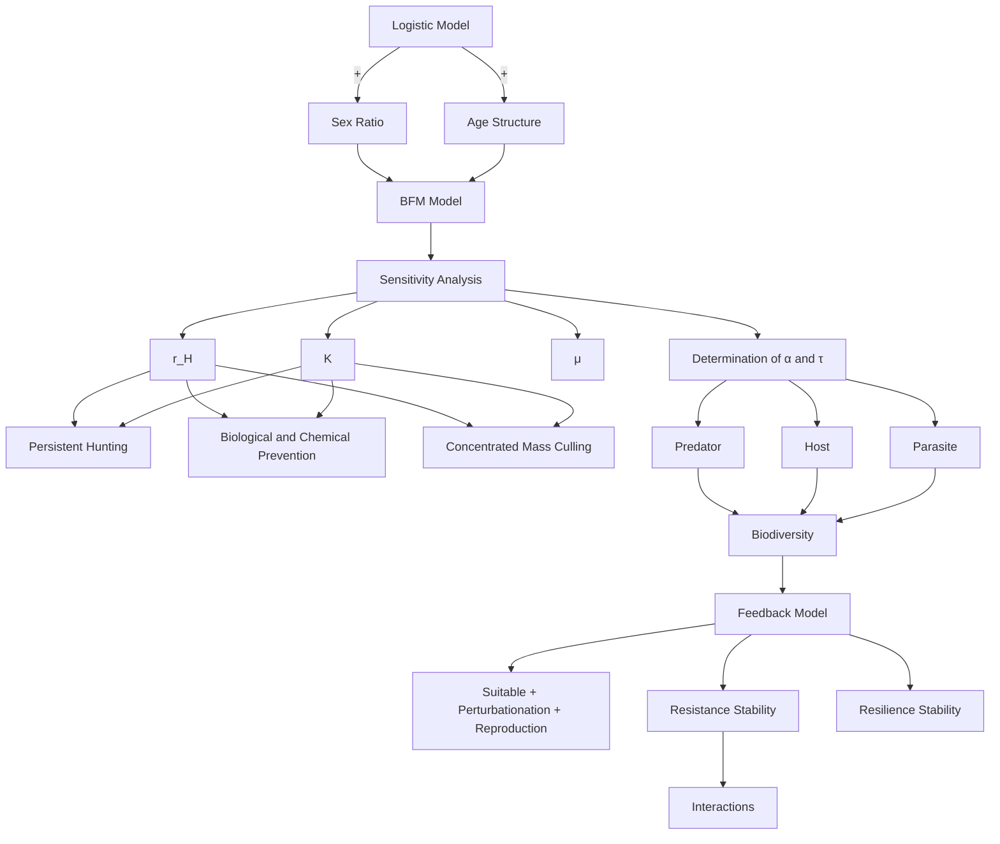
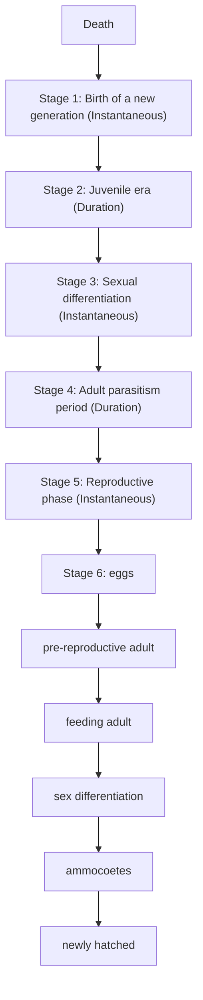
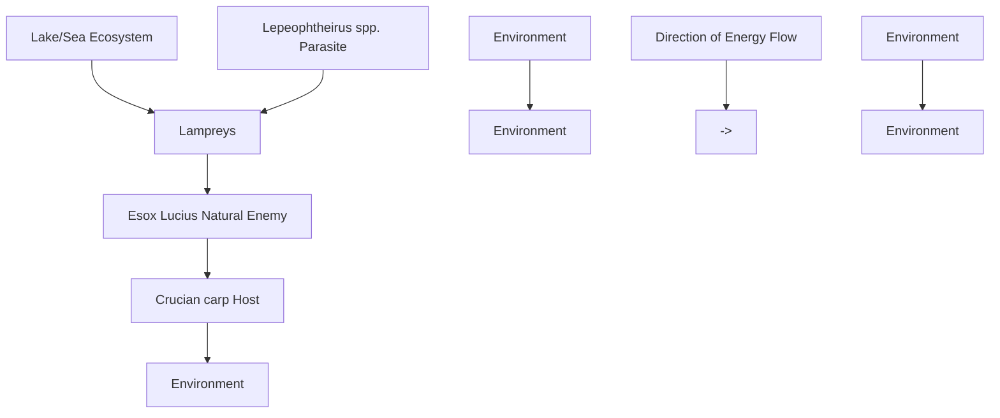
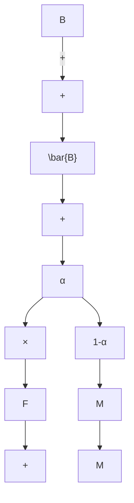
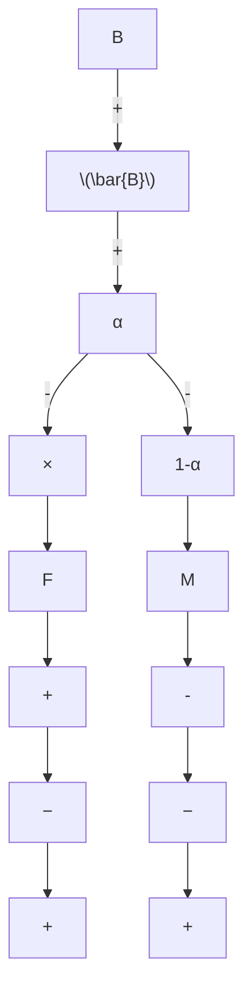

# Coexist or Extinct? Relationship between Lampreys and Environment

Summary

Unlike most other animals, lampreys can change their sex ratio in response to environmental changes. In this article, we established BFM Model to explain the high adaptability of lampreys with variable sex ratios to environmental changes.

We made preparations before starting all tasks. We divide the lamprey population into three categories: juveniles, adult females, and adult males. We first introduce the Logistic Model to describe lampreys’ growth. Then, we introduce the sex differentiation ratio α and the growth time of juvenile lampreys τ to describe the population’s sex and age structure. Therefore, we obtain the BFM Model and conduct a preliminary validation.

We find that tasks 1 and 4 are closely related. To complete the tasks more smoothly, we answer the tasks in the order of 1, 4, 2, 3.

For tasks 1 & 4: First, we set both α and τ in the BFM model as constants and as functions that change over time, respectively. Subsequently, we introduce the Lotka-Volterra Model and Nicholson-Bailey Model to describe the relationship between lampreys and their natural enemies, hosts, and parasites. Then, we compare the results of simulations under the two scenarios. We find that a variable sex ratio in lamprey populations can reduce the risk of extinction of other species in the ecosystem. By calculating the Simpson’s diversity index and Shannon-Weiner index, the variable sex ratio of lampreys can improve species diversity in the larger ecological system.

For task 2: To discuss the advantages and disadvantages of variable sex, we conduct numerical simulations by changing the adult lampreys’ death rate µ to place the lamprey population in suitable and perturbative environments. It is found that adaptive sex ratio variation can make the lamprey population more stable in both environments. Then, we define the reproductive success rate to describe the lampreys’ genetic transmission. We find that the ability to change the sex ratio is not conducive to the evolution of the lamprey population itself. We introduce a Feedback Model to explain the internal mechanism by which the adaptive sex ratio improves population stability. We draw diagrams of the feedback mechanism and phase trajectories to explain the stability qualitatively and quantitatively.

For task 3: To better evaluate ecosystem stability, we introduce concepts of resistance, resilience and comprehensive ecosystem stability. We provide a quantitative description combined with our model. Meanwhile, we also consider species diversity as an indicator of ecosystem stability. Our conclusion is: Variable sex can improve ecosystem stability.

Finally, we conduct a sensitivity analysis on our model. At the meantime, we provide many constructive suggestions for managing lamprey invasions. We also analyze the strengths and weaknesses of the model and discuss how to improve it.

Keywords: Feedback, Nicholson-Bailey Model, Ecosystem Stability, Biological Invasion

## Contents

## 1 Introduction . 3

1.1 Problem Background 3  
1.2 Restatement of the Problem 3  
1.3 Literature Review 3  
1.4 Our Work . 4

## 2 Model Preparations . . 4

2.1 Assumptions and Justifications 4  
2.2 Notations . . 5  
2.3 Life Cycle of lampreys 5

## 3 Establishment of BFM Model. 6

3.1 The Differential Equation Form 6  
3.2 The Difference Equation Form . 7

## 4 Task 1 & 4: Lampreys and Other Species . . . 8

4.1 Determination of α and τ . . . 8  
4.2 Interspecific Relationship 9

4.2.1 Relation with Natural Enemy . 9  
4.2.2 Relation with Host 11  
4.2.3 Relation with Parasite 12

4.3 Relation with Abiotic Environment . . 13  
4.4 Species Diversity Index . . 13

## 5 Task 2 & 3: Lampreys in Ecosystem . . . 14

5.1 Advantages and Disadvantages . . 14  
5.1.1 Under Suitable Environment 14  
5.1.2 Under Perturbative Environment . 15  
5.1.3 Breeding Success Rate 16

5.2 Feedback Model . 17

5.3 The Impact on Ecosystem Stability . . . 19

5.3.1 Resistance Stability and Resilience Stability . . . . 19  
5.3.2 Biodiversity . . . 21

## 6 Sensitivity Analysis . . . 21

6.1 Natural Growth Rate of Lampreys’ Host rH . . 21  
6.2 Environmental Capacity of Juvenile Lampreys K . . 22  
6.3 Death Rate of Adult Lampreys µ . 23

## 7 Model Evaluation . . 24

7.1 Strengths . . . 24  
7.2 Weaknesses and Further Discussion 24

## 1 Introduction

## 1.1 Problem Background

Over the past year, the Great Lakes’ Sea Lamprey Control program has seen great success. It has protected the local aquaculture from the invasive sea lampreys. Sea lampreys have a complex role in ecosystems: they are a threat to fisheries, a key part of the food chain, and even a delicacy. Their uniqueness may link to their ability to change sex ratios, and this is what we are going to explore next.

line chart

| Year | Fish Killed (Pounds) |
| ---- | --------------------- |
| 1998 | ~30000000             |
| 2003 | ~25000000             |
| 2008 | ~20000000             |
| 2013 | ~15000000             |
| 2018 | ~10000000             |

Figure 1: Sea Lamprey Control in the Great Lakes: A remarkable success![1]

## 1.2 Restatement of the Problem

• First, we need to establish a mathematical model to describe the growth and repro duction conditions of lampreys alone.  
• We need to expand our model to consider interactions with other species, then answer the impact of lampreys on the larger ecosystem.  
• Then, we should compare the growth conditions of the lamprey population when the sex ratio is variable and constant.Therefore, we can obtain the advantages and disadvantages of a lamprey population with a variable sex ratio.  
• Furthermore, We need to analyze the impact of adaptive sex ratio variation on the stability of the ecosystem.  
• Finally, we need to explore the advantages for survival that lampreys can provide to other species within the ecosystem.

## 1.3 Literature Review

At the very beginning, we collect three methods related to gender differentiation: molecular biology, population statistics, and sexual selection game theory. Among them, the molecular biology approach focuses on the internal mechanisms of gender differentiation at the molecular level, while sexual selection game theory[2] focuses on describing the gender differentiation strategies that species adopt under the drive for maximization of benefits. However, neither of these approaches is suitable for describing lamprey populations that interact with their environment within an ecosystem.

Therefore, we believe that the most appropriate method is to use population statistics in conjunction with ecological theory to mathematically model the gender differentiation phenomena observed in lampreys.

## 1.4 Our Work

flowchart

Figure 2: Overview of this work

## 2 Model Preparations

## 2.1 Assumptions and Justifications

Assumption 1: The life cycle of lampreys only includes periods with duration during the juvenile era and the adult parasitism period. The stages of hatching from eggs, sex differentiation, and mating are all completed instantaneously.

Justification: According to literature[3], compared to the juvenile and adult phases of lampreys, the durations of their other life stages are relatively short. To make the model more focused on the main content, we consider that only the juvenile and adult phases have significant time durations.

Assumption 2: Juvenile lampreys are considered gender-neutral, while adult lampreys are differentiated into two genders, male and female.

Justification: The reproductive system of juvenile lampreys has not fully differentiated, and lamprey larvae are in the growth stage, not yet sexually mature and do not participate in reproduction. Therefore, the gender of juvenile lampreys can be disregarded.

## Assumption 3: The sources of energy are different during the juvenile and adult phases. For all juvenile lampreys in the same space, the total amount of energy available per unit of time is constant.

Justification: According to paper[4], juvenile lampreys live a filter-feeding lifestyle in the bottom of the lake or sea, primarily feeding on organic detritus in the water as their source of food, while adults lead a semi-parasitic life in the water column, mainly deriving energy from the nutrients of their host organisms. The organic detritus carried by river currents should be evenly distributed in the water, not undergoing significant changes over time and space. Therefore, it is assumed that juvenile lampreys have a constant source of energy per unit of time.

## Assumption 4: The reproduction of lampreys is only related to female.

Justification: According to paper[5], taking into account the group mating behavior of lampreys where the number of eggs is significantly lower than the number of sperm, it is assumed that the final number of fertilized eggs mainly depends on the number of eggs produced by females.

## 2.2 Notations

Table 1: Notations

<table><tr><td>Symbol</td><td>Description</td></tr><tr><td>B</td><td>Population of juvenile lampreys</td></tr><tr><td>F</td><td>Population of female adult lampreys</td></tr><tr><td>M</td><td>Population of male adult lampreys</td></tr><tr><td>r</td><td>Growth rate of juvenile lampreys</td></tr><tr><td>K</td><td>Environmental capacity of juvenile lampreys</td></tr><tr><td>μ</td><td>Death rate</td></tr><tr><td>τ</td><td>Duration of juvenile era</td></tr><tr><td>α</td><td>Sex differentiation ratio</td></tr><tr><td>P</td><td>Predator population</td></tr><tr><td>H</td><td>Host population</td></tr><tr><td>rH</td><td>Natural growth rate of host</td></tr><tr><td>J</td><td>Parasite population</td></tr></table>

## 2.3 Life Cycle of lampreys

The life cycle of lampreys is shown in Figure 3.

flowchart

Figure 3: Life Cycle of lampreys

## 3 Establishment of BFM Model

## 3.1 The Differential Equation Form

Firstly, we consider the ideal situation, where lampreys live in a place with unlimited space, food and other resources. Let r′ denotes the growth rate of the lampreys, then its population N should satisfy the following equation:

$$
\frac {\mathrm{d} N}{\mathrm{d} t} = r ^ {\prime} N
$$

Due to the limitations of resources such as space, temperature and food, the growth rate will decrease as the population size increases. Therefore, we use the Logistic Population Growth Model to describe the process of population growth. The equation above should be rewritten as:

$$
\frac {\mathrm{d} N}{\mathrm{d} t} = r ^ {\prime} N \left(1 - \frac {N}{K ^ {\prime}}\right)
$$

Based on Assumption 2 and 4, the birth rate of juvenile lampreys is only related to the number of females, and juvenile and adult lampreys live in different areas, with their environmental capacities being independent of each other. However, a portion of the juvenile lampreys grows into adulthood, thus reducing the number in the juvenile group.

Let $\bar { B }$ denote the number that grows into adult lampreys. Combining the findings from paper[5], we use the following differential equation to describe the changes in the number of juvenile lampreys.

$$
\frac {\mathrm{d} B}{\mathrm{d} t} = r F \left(1 - \frac {B}{K}\right) - \bar {B}
$$

Those lampreys that have just entered the adult stage will undergo sex differentiation. We use $\bar { F }$ and $\bar { M }$ to represent the number of individuals differentiating into females and males, respectively. Obviously, they satisfy the following relationship with $\bar { B } \colon$ ..

$$
\bar {B} = \bar {F} + \bar {M} \tag {1}
$$

Thus, the growth rates of female and male lampreys can be described as

$$
\left\{ \begin{array}{l} \frac {\mathrm{d} F}{\mathrm{d} t} = \bar {F} - \mu F \\ \frac {\mathrm{d} M}{\mathrm{d} t} = \bar {M} - \mu M \end{array} \right.,
$$

where $\mu$ stand for the death rate of adult lampreys.

## 3.2 The Difference Equation Form

The population dynamics of lampreys have the following characteristics:

• Environmental changes are cyclical. Just like the environments where other organisms live, changes in environmental factors such as temperature, pH value, etc., occur in 12-month cycles.  
• The cyclical rhythm of changes in lampreys themselves. According to the website[6], behaviors such as reproduction and hatching in lampreys need to take place during specific periods within the year.

Based on the features above, we can better describe lampreys’ population dynamics by converting the differential equations in section 3.1 to difference equations. Consequently, we use

$$
B _ {t + 1} - B _ {t} = r F _ {t} (1 - \frac {B _ {t}}{K}) - \bar {B} _ {t} \tag {2}
$$

to describe Juvenile era,

$$
F _ {t + 1} - F _ {t} = \bar {F} _ {t} - \mu F _ {t} \tag {3}
$$

to describe female adulthood, and

$$
M _ {t + 1} - M _ {t} = \bar {M} _ {t} - \mu M _ {t} \tag {4}
$$

to describe male adulthood. The step size of all the difference equations are one month.

While growth rate $r ,$ environmental capacity K are both parameters that affect population dynamics, it is crucial to know the exact time lampreys use to pass through their juvenile period, so that we can know the exact number of metamorphosis at $t ^ { t h }$ month, i.e., ${ \bar { B } } _ { t }$ . Therefore, we use $\tau _ { i }$ to describe the time it takes for lampreys born in month i to become adult lampreys.

The lampreys that become adults in month $t ,$ their birth month i and the development time $\tau _ { i }$ must satisfy the relation $t = i + \tau _ { i }$ . Therefore, by summing up the number of all lampreys that satisfy this relation, we can obtain the number of lampreys that mature in the $\bar { t } ^ { t h }$ month, that is:

$$
\begin{array}{l} \bar {B} _ {t} = \sum r F _ {i - 1} (1 - \frac {B _ {i - 1}}{K}) \tag {5} \\ t = i + \tau_ {i} \\ 1 \leqslant i \leqslant t \\ \end{array}
$$

Then, they immediately undergo the sex differentiation stage to become either female or male. We use $\alpha _ { t }$ to define the sex differentiation ratio in month $t ,$ that is $\alpha _ { t } ~ = ~ \hat { F } _ { t } / \hat { B } _ { t }$ . Combining the formula 1, we can arrive at the following equation:

$$
\bar {F} _ {t} = \sum_ {t = i + \tau_ {i}} \alpha_ {i} r F _ {i - 1} (1 - \frac {B _ {i - 1}}{K}) \tag {6}
$$

$$
\bar {M} _ {t} = \sum_ {t = i + \tau_ {i}} (1 - \alpha_ {i}) r F _ {i - 1} \left(1 - \frac {B _ {i - 1}}{K}\right) \tag {7}
$$

According to Assumption $5 ,$ sex differentiation ratio $\alpha _ { t }$ can be determined by the time consumed on development. So the relationship between $\alpha _ { t }$ and $\tau _ { t }$ can be expressed as

$$
\alpha_ {t} = f (\tau_ {t}).
$$

With constant and suitable parameters, the results obtained from our BFM Model are shown below:

line chart

| Time(months) | Male Population | Juvenile Population | Female Population |
| ------------ | --------------- | ------------------- | ----------------- |
| 0            | 100             | 0                   | 100               |
| 100          | 500             | 300                 | 200               |
| 200          | 600             | 450                 | 250               |
| 300          | 600             | 450                 | 250               |
| 400          | 600             | 450                 | 250               |
| 500          | 600             | 450                 | 250               |
| 600          | 600             | 450                 | 250               |
| 700          | 600             | 450                 | 250               |
| 800          | 600             | 450                 | 250               |
| 900          | 600             | 450                 | 250               |
| 1000         | 600             | 450                 | 250               |

(a) Constant Parameters τ and α

line chart

| Time(months) | Male Population | Juvenile Population | Female Population |
| ------------ | --------------- | ------------------- | ----------------- |
| 0            | 0               | 0                   | 0                 |
| 100          | 600             | 850                 | 250               |
| 200          | 1050            | 800                 | 200               |
| 300          | 700             | 750                 | 150               |
| 400          | 950             | 850                 | 250               |
| 500          | 750             | 800                 | 200               |
| 600          | 850             | 850                 | 250               |
| 700          | 750             | 800                 | 200               |
| 800          | 850             | 850                 | 250               |
| 900          | 750             | 800                 | 200               |
| 1000         | 850             | 750                 | 250               |

(b) Running Parameters τ and α  
Figure 4: BFM Model

## 4 Task 1 & 4: Lampreys and Other Species

## 4.1 Determination of α and $\tau$

According to paper[7], α is only related to τ and they satisfy a linear relationship, that is:

$$
\alpha_ {t} = c \tau_ {t} + d.
$$

Through data fitting, we got parameter values $c = - 0 . 0 0 9$ and $d = 0 . 7 6 4$ .

Next, we discuss the expression of $\tau _ { t }$ .

For the juvenile lamprey, the average energy requirements to grow into adulthood can be approximately considered equal. We assume that once a juvenile lamprey accumulates a certain amount of energy $W ,$ it can grow into an adult lamprey. Therefore, the fixed energy of the lamprey is the difference of intake energy and unabsorbed energy. When the accumulated fixed energy reaches a certain value W , the juvenile lamprey born in $t ^ { t h }$ month completes its growth, and the accumulated duration is $\tau _ { t }$ . This relationship for a single juvenile lamprey can be expressed as follows:

$$
\sum_ {t + 1 \leqslant j \leqslant t + \tau_ {G}} \left(\frac {f o o d}{B _ {j}} - w a s t e\right) \geqslant W
$$

$$
\tau_ {t} = \min \tau_ {G}
$$

where food represent the monthly food supply and waste represent the unabsorbed energy.

We assume the absorptivity $\eta ,$ that is, the food energy assimilation efficiency, is a constant value. This means that the energy fixed by all juvenile lampreys each month is $\eta$ · food. So that the inequation above can be rewritten as:

$$
\sum_ {t + 1 \leqslant j \leqslant t + \tau_ {G}} \frac {1}{B _ {j}} \geqslant \frac {W}{\eta \cdot f o o d}
$$

As the number of simulated month t reaches a certain size (for example, $t > 1 0 0 )$ , the number of juvenile lampreys tends to stabilize. Therefore, we can approximately consider that $B _ { t }$ does not change over time. In this case, the inequality can be rewritten once again, that is:

$$
\tau_ {G} \geqslant \frac {W}{\eta \cdot f o o d} \cdot B _ {t}
$$

Considering that it is not correct if $B _ { t } \to 0$ , then $\tau _ { t } \to 0 ,$ so we add an intercept then $\tau _ { t }$ and $B _ { t }$ satisfy a linear relationship:

$$
\tau_ {t} = k B _ {t} + b
$$

with parameter values $k = - 0 . 0 0 0 8 4 4 { \mathrm { ~ a n d ~ } } b = 3 5 . 6 7 8 .$

## 4.2 Interspecific Relationship

In a specific ecosystem, lampreys interact with other species and the abiotic environment. For instance, lampreys, as an invasive species, have had a significant impact on the Great Lakes ecosystem. Next, we will discuss the mathematical models of lampreys as prey, parasites, and hosts, and briefly analyze their relationship with the abiotic environment.

## 4.2.1 Relation with Natural Enemy

Firstly, we are going to talk about model between lampreys and their natural enemy. We introduce only one natural enemy, take Esox Lucius as an example.

flowchart

Figure 5: Interspecific relationship

Based on the Lotka-Volterra Model, which describe the dynamics of ecological systems in which two species interact, one a predator and one its prey[8], we establish the Advanced Lotka-Volterra Model with sex separated. The expression of the model is shown below:

$$
\left\{ \begin{array}{l} F _ {t + 1} - F _ {t} = \bar {F} _ {t} - \mu F _ {t} - \varepsilon_ {F} F _ {t} P _ {t} \\ M _ {t + 1} - M _ {t} = \bar {M} _ {t} - \mu M _ {t} - \varepsilon_ {M} M _ {t} P _ {t} \\ P _ {t + 1} - P _ {t} = - \mu_ {P} P _ {t} + \theta_ {F} F _ {t} P _ {t} + \theta_ {M} M _ {t} P _ {t} \end{array} \right. \tag {8}
$$

## Where

• $P _ { t }$ represents the population of the Esox lucius in $t ^ { t h }$ month.  
• $\mu _ { t }$ represents the natural mortality of the Esox lucius in $t ^ { t h }$ month.  
• θ describes lampreys’ unit energy. The larger the value of $\theta ,$ the more energy per unit for lampreys.  
• ε describes the difficulty of being predated. The larger the value of $\varepsilon ,$ the easier it is for lampreys to be predated.

Most importantly, we differentiate between the sexes of lampreys because we assume that the energy per unit and the difficulty of being predated on female and male are sexually different.

Figure 6 shows the population dynamics of lampreys and Esox lucius as predator. We can learn that

• The population of predators and lampreys fluctuates cyclically, with the predators’ population lagging behind.

line chart

| Time (months) | Adult Lampreys Population | Esox Lucius (Predator) Population |
| ------------- | ------------------------- | ---------------------------------- |
| 0             | 150                       | 70                                 |
| 50            | 300                       | 70                                 |
| 100           | 450                       | 70                                 |
| 150           | 300                       | 70                                 |
| 200           | 450                       | 70                                 |
| 250           | 0                         | 0                                  |
| 300           | 0                         | 0                                  |

(a) α as a constant

line chart

| Time (months) | Adult Lampneys Population | Essex Lucius (Predator) Population |
| ------------- | -------------------------- | ---------------------------------- |
| 0             | 120                        | 70                                 |
| 50            | 380                        | 350                                |
| 100           | 160                        | 120                                |
| 150           | 260                        | 220                                |
| 200           | 180                        | 140                                |
| 250           | 240                        | 260                                |
| 300           | 190                        | 270                                |
| 350           | 210                        | 180                                |
| 400           | 230                        | 200                                |
| 450           | 250                        | 220                                |
| 500           | 330                        | 250                                |
| 550           | 280                        | 230                                |
| 600           | 260                        | 210                                |
| 650           | 240                        | 190                                |
| 700           | 270                        | 220                                |
| 750           | 310                        | 240                                |
| 800           | 290                        | 230                                |
| 850           | 250                        | 210                                |
| 900           | 280                        | 230                                |
| 950           | 310                        | 240                                |
| 1000          | 270                        | 220                                |

(b) α as a variable  
Figure 6: Population dynamics of lampreys and their predator

• Compared to a scenario where the population becomes extinct around $t = 2 0 0$ with α remaining constant, when α can adaptively change, lampreys can survive stably within a certain range for a longer period of time.

## 4.2.2 Relation with Host

Secondly, we will explore the relationships between lampreys and their hosts. In this section, lampreys act as parasites, and the host we choose is Crucian carp.

We use Nicholson-Bailey Model to depict the population dynamics of Crucian carp.[9] However, we use our BFM Model to characterize the population dynamics rather than using Nicholson-Bailey Model because Crucian carp is not the only host in real-world circumstances.

The expression illustrating the population dynamics of Crucian carp is as follows:

$$
H _ {t + 1} = r _ {H} H _ {t} \mathrm{e} ^ {- (\beta_ {F} \cdot F _ {t} + \beta_ {M} \cdot M _ {t})} \tag {11}
$$

## Where

• $H _ { t }$ donotes the population of the Crucian carp in $t ^ { t h }$ month.  
• $r _ { H }$ represents the growth rate when Crucian carp exist alone.  
• $\beta$ depict the extent of lampreys’ impact on Crucian carp. In Nicholson-Bailey Model, the larger $\beta$ is, the more it indicates the degree to which Crucian carp is damaged. We differentiate between the sexes of lampreys for the nearly same reason in the above Section 4.2.1. Thus, female and male lampreys produce damage on different extent, which is denoted by $\beta _ { F }$ and $\beta _ { M }$ accordingly.

Figure 7 shows the population dynamics of lampreys and Crucian carp as host. We can learn that

• When α remains constant, the hosts will be parasitized to extinction in a relatively short period of time, which is not conducive to the long-term survival of lampreys themselves. It can be significantly improved with α as a variable.  
• When α is a variable, lampreys can coexist with their host. This could imply that coevolution may occur between them..

line chart

| Time (months) | Adult Lampreys Population | Crucian Carp (Host) Population |
| ------------- | ------------------------- | ------------------------------- |
| 0             | 350                       | 450                             |
| 50            | 850                       | 1950                            |
| 100           | 850                       | 100                             |
| 150           | 950                       | 50                              |
| 200           | 1000                      | 0                               |
| 250           | 1150                      | 0                               |
| 300           | 1200                      | 0                               |

(a) α as a constant

line chart

| Time (months) | Adult Lampreys Population | Crucian Carp (Host) Population |
| ------------- | ------------------------- | ------------------------------- |
| 0             | ~300                      | ~500                            |
| 50            | ~100                      | ~1050                           |
| 100           | ~200                      | ~800                            |
| 150           | ~400                      | ~600                            |
| 200           | ~300                      | ~700                            |
| 250           | ~500                      | ~750                            |
| 300           | ~300                      | ~800                            |
| 350           | ~400                      | ~900                            |
| 400           | ~500                      | ~1000                           |
| 450           | ~600                      | ~1100                           |
| 500           | ~750                      | ~1350                           |
| 550           | ~650                      | ~1200                           |
| 600           | ~550                      | ~1150                           |
| 650           | ~600                      | ~1100                           |
| 700           | ~650                      | ~1200                           |
| 750           | ~600                      | ~1250                           |
| 800           | ~400                      | ~1200                           |

(b) α as a variable  
Figure 7: Population dynamics of lampreys and their host

## 4.2.3 Relation with Parasite

On the contrary, now it is the lampreys’ turn to be parasitized. We choose a smaller group of species called Lepeophtheirus spp. to parasitize lampreys.

According to literature[10], we make assumptions as follow:

• Not considering the scenario where juvenile lampreys are parasitized.  
• Female lampreys are more likely to be parasitized. Some parasites only infest female lampreys, for they prefer to live in the part such as ovaries. Meanwhile, it is believed that females have richer nutritional value.

In this case, we use the other side of Nicholson-Bailey Model, which indicate the population dynamics of Lepeophtheirus spp, that is:

$$
J _ {t + 1} = F _ {t} \left(1 - \mathrm{e} ^ {- \gamma_ {F} \cdot J _ {t}}\right) + M _ {t} \left(1 - \mathrm{e} ^ {- \gamma_ {M} \cdot J _ {t}}\right) \tag {12}
$$

Where

• $J _ { t }$ donotes the population of the Lepeophtheirus spp. in $t ^ { t h }$ month.  
• $\gamma$ depicts the extent of parasite’s impact on lampreys. In Nicholson-Bailey Model, the larger $\gamma \ \mathrm { i } s ,$ the stronger Lepeophtheirus spp.’s parasitic ability becomes. Once again, we differentiate between the sexes of lampreys since the resistance of female and male lampreys varies. We use $\gamma _ { F }$ and $\gamma _ { M }$ to depict their resistance respectively.

Figure 8 shows the population dynamics of lampreys and Crucian carp as host. We can learn that

• The number of parasites changes in accordance with the number of lampreys, with the change in parasite numbers slightly lagging behind.  
• When α is fixed, parasites go extinct due to their low numbers. However, when α is variable, both parasites and lamprey populations remain stable and can coexist over the long term.

line chart

| Time(months) | Adult Lampreys Population | Lepeophtheirus (Parasite) Population |
| ------------ | ------------------------- | ------------------------------------- |
| 0            | 300                       | 300                                   |
| 50           | 900                       | 850                                   |
| 100          | 850                       | 800                                   |
| 150          | 950                       | 900                                   |
| 200          | 1000                      | 950                                   |
| 250          | 1150                      | 1100                                  |
| 300          | 1250                      | 1200                                  |
| 350          | 1400                      | 1350                                  |
| 400          | 1500                      | 1450                                  |
| 450          | 1600                      | 1550                                  |
| 500          | 1700                      | 1650                                  |

(a) α as a constant

line chart

| Time(months) | Adult Lampreys Population | Lepeophtheirus (Parasite) Population |
| ------------ | ------------------------- | ------------------------------------- |
| 0            | 300                       | 280                                   |
| 50           | 750                       | 600                                   |
| 100          | 550                       | 400                                   |
| 150          | 720                       | 350                                   |
| 200          | 400                       | 300                                   |
| 250          | 520                       | 450                                   |
| 300          | 620                       | 380                                   |
| 350          | 350                       | 250                                   |
| 400          | 480                       | 320                                   |
| 450          | 520                       | 400                                   |
| 500          | 780                       | 280                                   |

(b) α as a variable  
Figure 8: Population dynamics of lampreys and their parasite

## 4.3 Relation with Abiotic Environment

Aside from the biotic components of ecosystems, lampreys also have certain effects on the abiotic environment within them. Juvenile lampreys burrow into sandy substrates, thereby affecting the soil conditions at the bottom. Human efforts to control lamprey larvae by laying materials such as pebbles at the bottom of lakes further intensify the impact on the abiotic environment. In addition to this, other developmental stages of the lamprey also affect the ecosystem’s environment.

## 4.4 Species Diversity Index

After analyzing the impact of lampreys on different roles within the ecosystem, we turn to evaluate the changes in species diversity within the ecosystem where lampreys are found. According to the text, the Simpson Diversity Index and the Shannon-Wiener Index are two good indicators for evaluating biodiversity. The Simpson Diversity Index is the probability of randomly selecting two individuals from the community that belong to the same species. The Shannon-Wiener Index is based on the concept of entropy in physics and information theory to describe the species diversity of an ecosystem. Their definitions are as follows:

$$
D = 1 - \sum_ {j = 1} ^ {\text { Species }} p _ {j} ^ {2} \tag {13}
$$

$$
H = - \sum_ {j = 1} ^ {\text { Species }} p _ {j} \cdot \log_ {2} p _ {j} \tag {14}
$$

We calculate the species diversity in ecosystems with lamprey populations with constant and variable sex ratios. We chose the Simpson Index and displayed the trend of its changes over time as follows:

• In Figure 9a, the Simpson Index suddenly drops in mean and increases in amplitude around 200 months, becoming unstable. This is due to the extinction of parasites of parasitic lampreys after a period of time in the simulation results of section 4.2.3, leading to a sudden change in the trend of the Simpson Index at this time.

line chart

| Time(months) | Simpson's Diversity Index |
| ------------ | ------------------------- |
| 0            | 0.75                      |
| 50           | 0.40                      |
| 100          | 0.75                      |
| 150          | 0.35                      |
| 200          | 0.75                      |
| 250          | 0.30                      |
| 300          | 0.75                      |
| 350          | 0.25                      |
| 400          | 0.75                      |
| 450          | 0.25                      |
| 500          | 0.75                      |
| 550          | 0.25                      |
| 600          | 0.75                      |
| 650          | 0.25                      |
| 700          | 0.75                      |
| 750          | 0.25                      |
| 800          | 0.10                      |

(a) α as a constant

line chart

| Time(months) | Simpson's Diversity Index |
| ------------ | ------------------------- |
| 0            | 0.7                       |
| 100          | 0.8                       |
| 200          | 0.75                      |
| 300          | 0.8                       |
| 400          | 0.7                       |
| 500          | 0.75                      |
| 600          | 0.7                       |
| 700          | 0.75                      |
| 800          | 0.7                       |

(b) α as a variable  
Figure 9: Simpson’s diversity index

• In Figure 9b, the Simpson Index fluctuates around 0.65 with relatively stable waveform and small amplitude, indicating that the species diversity in the ecosystem where this population is located can be maintained at a higher, more stable level.

Comparing the two figures, we can conclude that the lamprey population with variable sex ratios can enhance the species diversity of the ecosystem. This is an advantage that lampreys bring to other species in the ecosystem. In section 5.3.2, we will further calculate the stability of the ecosystem using the species diversity index.

## 5 Task 2 & 3: Lampreys in Ecosystem

In the previous section, we discussed the impact of lamprey populations with variable gender ratios on other members of the ecosystem. In this section, we shift our focus to the lamprey populations themselves, analyzing the survival advantages and disadvantages of having a variable sex differentiation ratio.

## 5.1 Advantages and Disadvantages

## 5.1.1 Under Suitable Environment

First, we simulated two lamprey populations under conditions of suitable environment, abundant resources with no competition or predators. For one population, the sex differentiation ratio α was a constant not changing over time.We set it to 0.45. For the other, α varied from environmental changes. The results are shown in Figure 10.

We can learn from the results in Figure 10 that:

• In the first scenario, the number of juvenile lampreys quickly grew to the environmental carrying capacity and then fluctuated around the mean with increasingly large amplitudes. The number of adult lampreys also fluctuated with increasingly large amplitudes around their mean values until the fluctuations became too large, leading to the juveniles’ number dropping to zero and the extinction of the lamprey population. This demonstrates that a lamprey population with a fixed gender ratio of 0.45, even in the absence of competition and with abundant resources, is

line chart

| Time(months) | Male Population | Juvenile Population | Female Population |
| ------------ | --------------- | ------------------- | ----------------- |
| 0            | 400             | 400                 | 200               |
| 500          | 180             | 100                 | 140               |
| 1000         | 200             | 120                 | 160               |
| 1500         | 220             | 140                 | 180               |
| 2000         | 240             | 160                 | 200               |
| 2500         | 260             | 180                 | 220               |
| 3000         | 300             | 200                 | 240               |
| 3500         | 320             | 220                 | 260               |

(a) α as a constant

line chart

| Time(months) | Male Population | Juvenile Population | Female Population |
| ------------ | --------------- | ------------------- | ----------------- |
| 0            | 0               | 0                   | 0                 |
| 100          | 350             | 850                 | 200               |
| 200          | 1050            | 600                 | 150               |
| 300          | 300             | 850                 | 250               |
| 400          | 900             | 750                 | 200               |
| 500          | 400             | 850                 | 250               |
| 600          | 750             | 750                 | 200               |
| 700          | 450             | 850                 | 250               |
| 800          | 750             | 750                 | 200               |
| 900          | 450             | 850                 | 250               |
| 1000         | 850             | 650                 | 250               |

(b) α as a variable  
Figure 10: Population dynamics of lampreys under suitable environment

extremely unstable in terms of survival.

• In the second scenario, the numbers of juvenile and adult male and female lampreys stabilized after a brief period of growth, maintaining regular, sustained fluctuations around their mean values. This indicates that lamprey populations with variable gender ratios have greater stability and the potential for long-term survival. Indeed, the gender ratio of actual lamprey populations can adaptively change with the environment, enhancing the stability of their survival. Our numerical simulation results adequately illustrate this phenomenon.  
• Advantages: Stronger stability. The comparison of the two scenarios suggests that lamprey populations with variable sex differentiation ratio exhibit stronger stability in environments where resources are abundant.

## 5.1.2 Under Perturbative Environment

Next, we assume that major environmental changes primarily affect death rates. Then we simulated the responses of the two lamprey populations to severe disturbances. We modeled time-varying death rate as follows:

$$
\mu_ {t} = A _ {0} + A _ {1} \cdot \sin \left(\frac {2 \pi}{T}\right) + A _ {2} \cdot \delta (t - t _ {0}) \tag {15}
$$

## Where

• $A _ { 0 }$ represents the baseline death rate.  
• $A _ { 1 }$ adjusts for seasonal variations in death rate due to factors like temperature and breeding cycles, which have annual periodicity.  
• $A _ { 2 }$ accounts for sudden spikes in death rate due to abrupt environmental changes or human activities such as focused lamprey fishing. $t _ { 0 }$

We set random disturbances by letting $t _ { 0 }$ to be a random value. Since the equations were previously discretized, it makes the parameterization of functions straightforward to implement. The resluts are shown in Figure 11.

line chart

| Time(months) | Male Population | Juvenile Population | Female Population | Perturbation |
| ------------ | --------------- | ------------------- | ----------------- | ------------ |
| 0            | 100             | 100                 | 100               | 100          |
| 100          | 150             | 750                 | 800               | 100          |
| 200          | 150             | 800                 | 900               | 100          |
| 300          | 150             | 850                 | 950               | 100          |
| 400          | 150             | 850                 | 950               | 100          |
| 500          | 150             | 850                 | 950               | 100          |
| 600          | 150             | 850                 | 950               | 100          |
| 700          | 150             | 850                 | 950               | 100          |
| 800          | 150             | 850                 | 950               | 100          |
| 900          | 150             | 850                 | 950               | 100          |
| 1000         | 150             | 850                 | 950               | 100          |

(a) α as a constant

line chart

| Time (months) | Male Population | Juvenile Population | Female Population | Perturbation |
| ------------- | --------------- | ------------------- | ----------------- | ------------ |
| 0             | 100             | 100                 | 100               | 100          |
| 100           | 600             | 800                 | 200               | 300          |
| 200           | 1000            | 800                 | 200               | 300          |
| 300           | 600             | 800                 | 200               | 300          |
| 400           | 800             | 800                 | 200               | 300          |
| 500           | 600             | 600                 | 100               | 100          |
| 600           | 800             | 800                 | 200               | 300          |
| 700           | 600             | 800                 | 200               | 300          |
| 800           | 1000            | 800                 | 200               | 300          |
| 900           | 600             | 800                 | 200               | 300          |
| 1000          | 800             | 800                 | 200               | 300          |

(b) α as a variable  
Figure 11: Population dynamics of lampreys under perturbative environment

What we can get from Figure 11 is that:

• In Figure 11a, after suffering disturbances, the lamprey population significantly decreases but shortly recovers to pre-disturbance levels, indicating that lamprey populations with a constant sex differentiation ratio have a certain ability to resist disturbances.  
• In Figure 11b, the population also significantly decreases after disturbances and recovers quickly, but the post-recovery population dynamics slightly differ from the pre-disturbance state.This phenomenon shows that lamprey populations with a variable sex differentiation ratio also possess resilience to disturbances.  
• The advantage of variable sex differentiation ratio populations is their lower deviation from normal conditions and faster recovery, suggesting greater stability under disturbance. Small-scale fishing of lampreys for consumption purposes can enable the sustainable survival of lamprey populations. This model will be further refined and quantitatively analyzed for its disturbance resistance in Section 5.3.  
• The resilience could be a disadvantage when human interventions aim to control invasive lamprey populations for ecosystem balance, as their stability makes them challenging to manage, potentially negatively impacting local fisheries and lake economies.

## 5.1.3 Breeding Success Rate

Populations of lampreys with variable sex differentiation ratios could lead to a final sex ratio (the actual ratio of females to males) deviating from 0.5. According to Fisher’s sex ratio theory, a 1:1 ratio of females to males should emerge through sufficient evolution in nature. A significant deviation could result in increased mate competition among the more populous gender, decreasing mating opportunities, adverse for gene transmission. This could prevent individuals carrying advantageous genetic mutations from passing them on due to lost mating opportunities.[11] The opportunity for an individual to mate depends both on their own gender’s proportion and on the opposite gender’s proportion. Thus, the breeding success rate is defined as:

$$
G = \text { Rate } _ {F} \cdot \text { Rate } _ {M} \tag {16}
$$

We calculated the value of G at different moments, resulting in a series of breeding success rates over time. After averaging these values, the results are as follows:

Table 2: Value of G

<table><tr><td></td><td>α as a Constant</td><td>α as a Variable</td></tr><tr><td>G</td><td>0.2467</td><td>0.2114</td></tr></table>

• Disadvantage: Lower breeding success rate. Populations of lampreys with variable sex ratios face a lower breeding success rate. This suggests that, even in optimal environments, a significant number of individuals may not have the opportunity to reproduce, preventing their genes from being passed on. This could be detrimental to the species’ evolution over the long term. Lampreys are among the oldest living vertebrates, dating back to the Ordovician period. Their evolutionary rate has slowed over time, preserving primitive features that make them "living fossils." This finding aligns with our analysis.

## 5.2 Feedback Model

Based on the analysis in Section 5.1, lamprey populations with the ability to adjust their sex ratios exhibit higher stability both in stable environments and perturbative environments. To explore reasons, the next step is to analyze equations in order to explain the stability induced by variable sex ratios. Therefore, we develop Feedback Model to further discuss this phenomenon.

Next, we are going to give a brief analysis on lamprey populations with variable sex ratios: Assuming members of the BFM Model are in equilibrium at a certain moment, a disturbance in the number of juveniles B increases the per capita nutrition, speeding up development and shortening development time. This raises the sex ratio, leading to an increase in the number of females differentiating from this generation of juveniles, thereby enhancing the breeding power of the lamprey population. The next generation of juveniles compensates for the initial decrease, stabilizing the juvenile population against external disturbances through a negative feedback process.

To further elucidate the resistance of variable sex ratio lamprey populations to external disturbances, feedback models are introduced for both types of lamprey populations.

We visually represented the relationship between juvenile numbers, adult female and male numbers, and the sex differentiation ratio α for lamprey populations with both constant and variable in Figure 12.

In the diagram, the output of the multiplier is the product of its two inputs. We keep α as a constant at 0.45. It reduces the proportion of females over time, exacerbating the original trend. This process constitutes positive feedback in the control system. In reality, positive feedback does not always lead to a continuous decline in population numbers. Instead, with appropriate inputs (as represented by the initial values of F and M in this model), it can produce self-excited oscillations with gradually increasing amplitude. In Figure 10a, α is a constant. The population exhibits fluctuations with increasing amplitude over time. The results in Figure 10a align with our positive feedback analysis, further validating the analysis’s effectiveness.

flowchart

(a) Positive Feedback

flowchart

(b) Negative Feedback  
Figure 12: Feedback Schematic

The difference between Figure 13b and Figure 13a is that: in Figure 13b, the juvenile population can adjust the value of α, creating a new feedback loop and thus constituting a negative feedback process. According to control theory, a negative feedback system can counteract external disturbances within a certain range, stabilizing the system’s output. As shown in the Figure 11b, the lamprey population can survive and recover to its original level shortly after experiencing severe environmental disturbances, consistent with our negative feedback analysis.

Setting the parameters α as 0.85, we conduct numerical simulations and then plot the phase trajectory of F − B − t over time in Figure 13 to observe the changes.

We can conclude the following from Figure 13:

• In Figure 13a, the radius of the phase trajectory shows an increasing trend over the years, forming a "trumpet" shape. This indicates that the population oscillations of the lamprey become more intense and instability worsens annually, aligning with our positive feedback model analysis.  
• In Figure 13b, after a brief transient period, the radius of the phase trajectory gradually converges to a stable "limit cycle", with both shape and amplitude remaining stable, consistent with our negative feedback model analysis.  
• Advantage: Stability is reinforced. The negative feedback characteristic of lamprey populations with variable sex ratios enhances their stability in both normal environments and in the face of disturbances.

line chart

| Time(months) | Juvenile Population Size |
| ------------ | ------------------------ |
| 0            | 0                        |
| 500          | 700                      |
| 1000         | 1000                     |

(a) α as a constant

line chart

| Time(months) | Juvenile Population Size |
| ------------ | ------------------------ |
| 0            | 300                      |
| 100          | 600                      |
| 200          | 800                      |
| 300          | 900                      |
| 400          | 850                      |
| 500          | 750                      |
| 600          | 650                      |
| 700          | 600                      |
| 800          | 550                      |
| 900          | 500                      |
| 1000         | 450                      |

(b) α as a variable  
Figure 13: Phase trajectory diagram

• Disadvantage: Hard to thrive in suitable conditions. This same negative feedback characteristic may limit the lamprey population’s ability to adapt to new, more favorable environments, maintaining the current status and potentially restricting their adaptive capabilities.

## 5.3 The Impact on Ecosystem Stability

To analyze the impact of lamprey populations on the stability of their ecosystems, we first need a quantitative description of ecosystem stability. Ecosystem stability can be described from multiple perspectives.

## 5.3.1 Resistance Stability and Resilience Stability

Ecosystem stability can be divided into two parts: Resistance stability and Resilience stability.[12]

• Resistance stability describes the ecosystem’s ability to withstand external disturbances and maintain its original state.  
• Resilience stability describes the ecosystem’s ability to return to its initial state after being disturbed.

To quantitatively describe these two types of stability in conjunction with our numerical simulation results, we define resistance stability $\dot { S } _ { 1 }$ as the maximum difference between the population curve under disturbance and the undisturbed population curve. Resilience stability $S _ { 2 }$ is defined as the time required for the difference between the two to return to zero, with the specific definitions as follows:

$$
S _ {1} = D _ {\infty} \left(f _ {1}, f _ {2}\right) = \sup _ {t _ {1} \leqslant t \leqslant t _ {2}} \left| f _ {1} (t) - f _ {2} (t) \right| \tag {17}
$$

$$
S _ {2} = t _ {2} - t _ {1} \tag {18}
$$

Thereafter, we introduce the definition of comprehensive stability S, which is defined

as the area enclosed between the two curves. The mathematical definition of S is:

$$
S = \int_ {t _ {1}} ^ {t _ {2}} \left| f _ {1} (t) - f _ {2} (t) \right| \mathrm{d} t \tag {19}
$$

The concept of comprehensive stability encompasses both resistance stability and resilience stability. The smaller their values, the more stable the ecosystem is.

Using the results from Section 5.1.2, we calculate their difference from the normal state. Results are shown in Figure 14 and Figure 15.

line chart

| Time(months) | Stability | Perturbation |
| ------------ | --------- | ------------ |
| 0            | 200       | 200          |
| 100          | 1800      | 1800         |
| 200          | 1900      | 1900         |
| 300          | 1950      | 1950         |
| 400          | 1950      | 1950         |
| 500          | 1950      | 1950         |
| 600          | 2000      | 700          |
| 700          | 2050      | 1300         |
| 800          | 2100      | 550          |
| 900          | 2150      | 1600         |
| 1000         | 2200      | 2250         |
| 1100         | 2250      | 2300         |

(a) Comparison between Stability and Perturbation

line chart

| Time(months) | Absolute Value of Difference |
| ------------ | ---------------------------- |
| 0            | 0                            |
| 200          | 0                            |
| 400          | 0                            |
| 600          | 1250                         |
| 800          | 1000                         |
| 1000         | 350                          |

(b) Comprehensive Stability  
Figure 14: α as a constant

line chart

| Time(months) | Stability | Perturbation |
| ------------ | --------- | ------------ |
| 0            | 200       | 200          |
| 100          | 1300      | 1350         |
| 200          | 1400      | 1700         |
| 300          | 1500      | 1650         |
| 400          | 1600      | 1750         |
| 500          | 1550      | 1600         |
| 600          | 1500      | 600          |
| 700          | 1550      | 1300         |
| 800          | 1600      | 700          |
| 900          | 1550      | 1400         |
| 1000         | 1650      | 1550         |

(a) Comparison between Stability and Perturbation

line chart

| Time(months) | Absolute Value of Difference |
| ------------ | ---------------------------- |
| 0            | 0                            |
| 200          | 0                            |
| 400          | 0                            |
| 600          | 950                          |
| 800          | 750                          |
| 1000         | 200                          |

(b) Comprehensive Stability  
Figure 15: α as a variable

From Figure 14 and Figure 15, it is evident that:

• Before adding the disturbance, the two curves completely overlap. After adding the disturbance, the two curves exhibit different trends, but after some time, the disturbed curve returns to the normal level.

Next, we separately calculate the stability of the two lamprey populations in response to the two disturbances, and the results are shown in Table 3:

<table><tr><td rowspan="2"></td><td colspan="3"> $1^{st}$  time Perturbation</td><td colspan="3"> $2^{st}$  time Perturbation</td><td colspan="3">Average</td></tr><tr><td> $S_1$ </td><td> $S_2$ </td><td>S</td><td> $S_1$ </td><td> $S_2$ </td><td>S</td><td> $S_1$ </td><td> $S_2$ </td><td>S</td></tr><tr><td>α as a Constant</td><td>1175.7</td><td>90</td><td>51070</td><td>1162</td><td>100</td><td>53362</td><td>1168.8</td><td>95</td><td>52216</td></tr><tr><td>α as a Variable</td><td>1238.4</td><td>83</td><td>61324</td><td>913.612</td><td>75</td><td>34078</td><td>1076</td><td>79</td><td>47701</td></tr></table>

Table 3: Ecosystem Stability

Taking the average stability of the two disturbances as an evaluation criterion and considering the details in Table $^ { 3 , }$ we can conclude:

• Lamprey populations with variable sex ratios exhibit stronger resistance stability, recovery stability, and overall stability. This indicates that lamprey populations with changing sex ratios can enhance the stability of the ecosystem.

## 5.3.2 Biodiversity

Biodiversity can indirectly indicate the magnitude of ecosystem stability. We introduce Simpson Diversity Index and the Shannon-Wiener Index for they are both good indicators to assess biodiversity. We calculated these two values for communities with interactions among lampreys, predators, parasites, and hosts, and the results are shown in Table 4.

Table 4: Notations

<table><tr><td></td><td> $H_{mean}$ </td><td> $D_{mean}$ </td></tr><tr><td> $\alpha$  as a Constant</td><td>1.4010</td><td>0.4978</td></tr><tr><td> $\alpha$  as a Variable</td><td>1.9655</td><td>0.6752</td></tr></table>

The results in Table 4 show that lamprey populations with variable sex ratios increase the biodiversity of their environments. It indicates that lampreys can enhance the stability of ecosystems.

## 6 Sensitivity Analysis

In our model, there are also some parameters that are closely related to real-world scenarios. In previous calculations, the values of these parameters were derived from specific scenarios, but their values may vary with changes in scenarios. We can alter the values of these parameters to calculate the sensitivity of the model to these parameters. By analyzing the sensitivity of these parameters, we have reached the following conclusions.

## 6.1 Natural Growth Rate of Lampreys’ Host $r _ { H }$

$r _ { H }$ represents the natural growth rate of lamprey hosts in the absence of lamprey invasion. The hosts of lampreys include many different species of fish, each with varying levels of $r _ { H }$ . Factors affecting $r _ { H }$ include birth and death rates; the higher the $r _ { H } ,$ , the stronger the reproductive and environmental adaptation capabilities of the fish.

In Section 4.2.2, we discussed the impact of the number and sex variation of lampreys on the host population numbers in the ecosystem. It was found that a relatively stable numerical relationship between hosts and lampreys was established when the sex differentiation rate of lampreys could change. However, when lampreys invade an ecosystem, the relationship with their hosts becomes more complex.

line chart

| Time(months) | Adult Lampreys Population | Cruoian Carp (Host) Population | Invasion Phase |
| ------------ | ------------------------- | ------------------------------ | -------------- |
| 0            | 500                       | 700                            | 100            |
| 100          | 200                       | 750                            | 150            |
| 200          | 100                       | 600                            | 200            |
| 300          | 50                        | 550                            | 250            |
| 400          | 10                        | 500                            | 300            |
| 500          | 5                         | 750                            | 350            |
| 600          | 10                        | 650                            | 400            |
| 700          | 5                         | 600                            | 450            |
| 800          | 10                        | 650                            | 500            |

(a)

line chart

| Time(months) | Adult Lampreys Population | Crucian Carp (Host) Population | Invasion Phase | Recovery Phase | Stable Phase |
| ------------ | ------------------------- | ------------------------------- | -------------- | -------------- | ------------ |
| 0            | 500                       | 100                             | 0              | 0              | 0            |
| 100          | 1000                      | 700                             | 100            | 0              | 0            |
| 200          | 600                       | 400                             | 200            | 0              | 0            |
| 300          | 500                       | 300                             | 300            | 0              | 0            |
| 400          | 600                       | 400                             | 400            | 0              | 0            |
| 500          | 700                       | 500                             | 500            | 100            | 100          |
| 600          | 600                       | 400                             | 600            | 200            | 200          |
| 700          | 500                       | 300                             | 700            | 300            | 300          |
| 800          | 400                       | 200                             | 800            | 400            | 400          |

(b)

line chart

| Time(months) | Adult Lampreys Population | Crucian Carp (Host) Population | Invasion Phase | Recovery Phase | Stable Phase |
| ------------ | ------------------------- | ------------------------------- | -------------- | -------------- | ------------ |
| 0            | 500                       | 200                             | 1000           | 100            | 100          |
| 100          | 700                       | 400                             | 1200           | 200            | 150          |
| 200          | 600                       | 300                             | 1100           | 300            | 200          |
| 300          | 800                       | 500                             | 1300           | 400            | 250          |
| 400          | 900                       | 600                             | 1400           | 500            | 300          |
| 500          | 1200                      | 700                             | 1500           | 600            | 350          |
| 600          | 1100                      | 650                             | 1450           | 550            | 325          |
| 700          | 1300                      | 750                             | 1600           | 650            | 400          |
| 800          | 1250                      | 725                             | 1550           | 625            | 425          |

(c)  
Figure 16: (a) $r _ { H } { = } 1 . 0 3 5 0$ (b) $r _ { H } { = } 1 . 0 4 6 5$ (c) $r _ { H } { = } 1 . 0 4 7 5$

• In Figure 16a, the host population is greatly affected by the lamprey invasion, and in this ecosystem, the species undergoes irreversible extinction around the $4 0 0 ^ { t h }$ month after the invasion. This host has weak reproductive and environmental adaptation capabilities, unable to effectively resist the impact of the invasion by foreign species on the local ecological environment.  
• In Figure 16b, the host population rapidly decreases after the lamprey invasion but stabilizes at a level much lower than before the invasion after some time of recovery. This host is greatly affected by the lamprey invasion, but after a period, it adapts to the parasitism of lampreys, reaching a relatively stable population number. However, the impact of the lamprey invasion cannot be fully recovered, and the population number can only be maintained at a lower level.  
• In Figure 16c, the host population decreases slightly after the initial lamprey invasion but maintains a level higher than before the invasion after some time. This host is less affected by the lamprey invasion and maintains a higher population number in the long term coexistence with lampreys. We speculate this is due to coevolution between the host and lampreys over a long period, and other competitors of this host are more affected by lampreys, weakening their competitiveness, which is more beneficial for the host population increase.

It shows that the host population number is highly sensitive to changes in $r _ { H }$ . This indicates that lampreys, as invasive species, have a significant impact on the parasitism of local species on the native ecosystem. Therefore, strategies must be sought to prevent and control lampreys.

## 6.2 Environmental Capacity of Juvenile Lampreys K

The carrying capacity K of juvenile lampreys is related to the total amount of spatial and environmental resources available to them, as well as whether the temperature, oxygen content, and pH of their living environment are suitable. By conducting a sensitivity analysis of K, we can determine the adaptability of juvenile lampreys to different environments.

line chart

| Time(months) | Male Population | Average Population | Female Population |
| ------------ | --------------- | ------------------ | ----------------- |
| 0            | 0               | 0                  | 0                 |
| 100          | 800             | 750                | 250               |
| 200          | 600             | 700                | 200               |
| 300          | 700             | 650                | 180               |
| 400          | 650             | 600                | 170               |
| 500          | 750             | 650                | 180               |
| 600          | 700             | 600                | 190               |
| 700          | 650             | 550                | 200               |
| 800          | 700             | 600                | 210               |
| 900          | 650             | 550                | 220               |
| 1000         | 750             | 650                | 230               |

(a)

line chart

| Time (months) | Male Population | Female Population | Combined Population |
| ------------- | --------------- | ----------------- | -------------------- |
| 0             | 100             | 100               | 100                  |
| 50            | 300             | 400               | 300                  |
| 100           | 800             | 700               | 800                  |
| 150           | 900             | 800               | 900                  |
| 200           | 700             | 600               | 700                  |
| 250           | 800             | 700               | 800                  |
| 300           | 700             | 600               | 700                  |
| 350           | 800             | 700               | 800                  |
| 400           | 700             | 600               | 700                  |
| 450           | 800             | 700               | 800                  |
| 500           | 700             | 600               | 700                  |
| 550           | 800             | 700               | 800                  |
| 600           | 700             | 600               | 700                  |
| 650           | 800             | 700               | 800                  |
| 700           | 700             | 600               | 700                  |
| 750           | 800             | 700               | 800                  |
| 800           | 700             | 600               | 700                  |
| 850           | 800             | 700               | 800                  |
| 900           | 700             | 600               | 700                  |
| 950           | 800             | 700               | 800                  |
| 1000          | 700             | 600               | 700                  |

(b)

line chart

| Time(months) | Male Population | Female Population | Average Population |
| ------------ | --------------- | ----------------- | ------------------ |
| 0            | 400             | 200               | 400                |
| 100          | 800             | 600               | 900                |
| 200          | 600             | 400               | 700                |
| 300          | 800             | 600               | 900                |
| 400          | 600             | 400               | 700                |
| 500          | 800             | 600               | 900                |
| 600          | 600             | 400               | 700                |
| 700          | 800             | 600               | 900                |
| 800          | 600             | 400               | 700                |
| 900          | 800             | 600               | 900                |
| 1000         | 600             | 400               | 700                |

(c)  
Figure 17: (a) K=800 (b) K=900 (c) K=1000

The data in Figure 17 allows us to conclude that:

When K changes, the growth trend of our BFM (Bioenergetic Fish Model) almost remains unchanged, showing low sensitivity to changes in K and good stability, which is an advantage of our model. Comparisons through three figures indicate that the maximum population size of lampreys is significantly affected by changes in $K _ { \cdot }$ , but the mean values are roughly the same. When K is larger, the population stability is lower. Since it is difficult to manually cull juvenile lampreys, growth control measures typically involve preventing juvenile lampreys from burrowing and using TFM (lampricide) to effectively manage lamprey invasions by reducing K.[1]

Next, we will discuss how to control adult lampreys.

## 6.3 Death Rate of Adult Lampreys µ

In Section 5.1.2, we proposed a mortality model for adult lampreys with equation (15). Through sensitivity analysis of $A _ { 0 } , A _ { 1 }$ , and $A _ { 2 } ,$ , we can conclude that the lamprey population is highly sensitive to changes in mortality rates.

line chart

| Time(months) | Main Population | Active Population |
| ------------ | --------------- | ----------------- |
| 0            | 100             | 100               |
| 50           | 150             | 120               |
| 100          | 300             | 250               |
| 150          | 600             | 500               |
| 200          | 700             | 650               |
| 250          | 650             | 600               |
| 300          | 600             | 550               |
| 350          | 650             | 600               |
| 400          | 700             | 650               |
| 450          | 750             | 700               |
| 500          | 800             | 750               |
| 550          | 750             | 700               |
| 600          | 700             | 650               |
| 650          | 650             | 600               |
| 700          | 600             | 550               |
| 750          | 550             | 500               |
| 800          | 500             | 450               |

(a)

line chart

| Time (months) | Male Population | Female Population | Total Population |
| ------------- | --------------- | ----------------- | ---------------- |
| 0             | 0               | 0                 | 0                |
| 50            | ~300            | ~400              | ~600             |
| 100           | ~600            | ~700              | ~900             |
| 150           | ~800            | ~900              | ~1100            |
| 200           | ~1000           | ~1100             | ~1300            |
| 250           | ~900            | ~1000             | ~1200            |
| 300           | ~800            | ~900              | ~1100            |
| 350           | ~700            | ~800              | ~1000            |
| 400           | ~600            | ~700              | ~900             |
| 450           | ~500            | ~600              | ~800             |
| 500           | ~400            | ~500              | ~700             |

(b)

line chart

| Time(months) | Male Population | Juvenile Population | Exposed Growth |
| ------------ | --------------- | ------------------- | -------------- |
| 0            | 0               | 0                   | 0              |
| 100          | 400             | 800                 | 200            |
| 200          | 600             | 1000                | 300            |
| 300          | 800             | 1200                | 400            |
| 400          | 1000            | 1400                | 500            |
| 500          | 1200            | 1600                | 600            |
| 600          | 1400            | 1800                | 700            |
| 700          | 1600            | 2000                | 800            |
| 800          | 1800            | 2200                | 900            |
| 900          | 2000            | 2400                | 1000           |
| 1000         | 2200            | 2600                | 1100           |

(c)  
Figure 18: (a) $A _ { 0 } = 0 . 1 5$ , $A _ { 1 } = 0 . 0 5$ , $A _ { 2 } = 0$ (b) $A _ { 0 } = 0 . 0 5$ , A1 = 0.25, $A _ { 2 } = 0$  
(c) $A _ { 0 } = 0 . 0 5$ , $A _ { 1 } = 0 . 0 5$ , $A _ { 2 } = 0 . 3$

• In Figure 10b, the parameter values are $A _ { 0 } = 0 . 0 5 , A _ { 1 } = 0 . 0 5 , A _ { 2 } = 0 .$ , with $A _ { 0 }$ and $A _ { 1 }$ being relatively low, which can be considered as the natural mortality rate of adult lampreys without any catastrophic events leading to mass mortality.  
• In Figure 18a, $A _ { 0 } = 0 . 1 5$ , with $A _ { 1 }$ and $A _ { 2 }$ remaining unchanged, representing control of lamprey invasion through planned continuous fishing from the start. At this time,

the instability of the lamprey population significantly increases, with the number of female fish being too low around the $3 8 ^ { t h }$ year, leading to population extinction.

• In Figure 18b, $A _ { 1 } = 0 . 2 5$ , with $A _ { 0 }$ and $A _ { 2 }$ unchanged, representing biological control or chemical treatment on an annual cycle from the start of the lamprey invasion. Since the number of lampreys in a natural state fluctuates over certain periods, an increase in the seasonal mortality rate makes the population’s numerical changes over time more drastic, further increasing population instability and the likelihood of extinction. In this figure, the number of female fish reaches its lowest point in the 33rd year, leading to population extinction due to insufficient numbers.

• ·In Figure 18c, $A _ { 2 } = 0 . 3$ , with $A _ { 0 }$ and $A _ { 1 }$ unchanged, representing massive fishing of adult lampreys in a particular year. By varying the timing of changes to $A _ { 2 } ,$ we observed that concentrating large-scale fishing when the number of adult female lampreys is at its minimum is most effective. The concentrated fishing in 18c occurs in the $5 3 ^ { r d }$ year when the number of adult female lampreys is at its lowest, capturing about 90% of the adults. However, since juveniles cannot be caught, the population can still continue to reproduce. Around the $7 2 ^ { n d }$ year, there is a sudden increase in the number of adult lampreys, with the number of male lampreys far exceeding prefishing levels. This is because the overfishing in a single event leads to a reduced number of lamprey juveniles, changing the growth time $\tau ,$ causing some juveniles to differentiate at the same time, leading to a rebound in numbers.

In summary, the lamprey population is highly sensitive to changes in mortality rates. Controlling lampreys requires targeting both juveniles and adults.

## 7 Model Evaluation

## 7.1 Strengths

• We have detailed the internal mechanisms by which the sex ratio of the lamprey population undergoes adaptive changes in response to environmental conditions.

• Starting from the equations themselves, and integrating negative feedback mechanisms, we have established feedback that explains why a lamprey population with a variable sex ratio possesses greater adaptability.

• We have comprehensively considered the survival conditions of the lamprey popu lation under different circumstances and selected appropriate indicators for quantitative representation.

• The results of our sensitivity analysis can be used both to discuss the stability of the model itself and to provide practically meaningful guidance for the prevention and control of biological invasions by lampreys.

## 7.2 Weaknesses and Further Discussion

• The feedback model we established is a semi-quantitative model. Although it can explain the tasks well, it incorporates qualitative descriptions, which prevents precise judgment about the type of feedback the system is under. Whether the system constitutes feedback depends on specific parameters of the feedback system, such as the feedback coefficient of the feedback loop. In fact, the number of juvenile lampreys, B, and the carrying capacity, K, can also form a negative feedback system. The systems composed of these interlocked control loops are much more complex than our qualitative analysis.

• Our model can be improved from this perspective: by conducting quantitative research on the differential dynamic system described by the equations and integrating relevant theories to calculate the relationship between the values of parameters r, K, and whether the population number is in feedback.

## References

[1] Great Lakes Fishery Commission, Sea lamprey - an ancient invader, http://www. glfc.org/sea-lamprey.php, Accessed: February 5, 2024, 2023.  
[2] Y. Wang, “Stochastic evolution analysis of asymmetric game models,” M.S. thesis, 2024.  
[3] N. S. Johnson, T. J. Buchinger, and W. Li, “Reproductive ecology of lampreys,” Lampreys: Biology, Conservation and Control: Volume 1, pp. 265–303, 2015.  
[4] G. J. Farmer, “Biology and physiology of feeding in adult lampreys,” Proc. Biol. Sci., vol. 284, no. 1851, p. 20 170 262, Mar. 2017.  
[5] S. Xue, “Study on the population control and evolution using sex- and stage- structured mathematical models,” Ph.D. dissertation, Donghua University, 2023.  
[6] Taonga species: Piharau, https://niwa.co.nz/TaongaSpecies\_PiharauLOWRES. pdf.  
[7] N. S. Johnson, W. D. Swink, and T. O. Brenden, “Field study suggests that sex determination in sea lamprey is directly influenced by larval growth rate,” Proc. Biol. Sci., vol. 284, no. 1851, p. 20 170 262, Mar. 2017.  
[8] S. E. Jørgensen and B. D. Fath, Encyclopedia of Ecology. 2008.  
[9] R. E. Ricklefs, The Economy of Nature, 5th ed. W.H. Freeman, 2001.  
[10] M. A. Shavalier, M. Faisal, M. L. Moser, and T. P. Loch, “Parasites and microbial infections of lamprey (order petromyzontiformes berg 1940): A review of existing knowledge and recent studies,” Journal of Great Lakes Research,  
[11] C. Niu, A. Lou, R. Sun, and Q. Li, Foundations in Ecology. 2015, ISBN: 9787040423785.  
[12] R. Sun, D. Wang, C. Niu, D. Liu, and L. Zhang, Principles of Animal Ecology, 4th ed. 2001.

# Report of Use on AI

1.OpenAI ChatGPT (Nov 5, 2023 version, ChatGPT-4,)

Query1: We have found that the Shannon-Wiener index, which describes biodiversity, is very similar to the expression for information entropy. Please explain the connection between these two concepts.

Output: The Shannon-Wiener index, often used to describe biodiversity in ecological studies, and the concept of information entropy, formulated by Claude Shannon in the context of information theory, are indeed closely related because they both measure the uncertainty or diversity in a system. Here’s how these two concepts connect:

Information Entropy

Information entropy, also known as Shannon entropy, quantifies the amount of uncertainty or randomness in a set of outcomes. The formula for information entropy (H) is given by:

$$
H = - \sum_ {i = 1} ^ {n} p (x _ {i}) \log p (x _ {i})
$$

where $p ( x _ { i } )$ is the probability of occurrence of the ith possible value of the random variable, and the sum is over all possible values of this variable. This equation measures the expected value of the information contained in a message, in bits, assuming that all possible messages are equally likely. It essentially quantifies how much information is produced on average for every source symbol that is communicated.

Shannon-Wiener Index in Ecology

The Shannon-Wiener index (or Shannon diversity index) is an application of Shannon’s concept of entropy to biodiversity. In ecology, it is used to quantify the diversity of species within a community, considering both the number of species (richness) and the evenness of their distribution. The formula is very similar to that of information entropy:

$$
H ^ {\prime} = - \sum_ {i = 1} ^ {s} p _ {i} \log p _ {i}
$$

where $p _ { i }$ is the proportion of individuals belonging to the ith species in the dataset, and s is the total number of species. This index essentially measures the uncertainty in predicting the species of a randomly selected individual from the dataset. A higher Shannon-Wiener index indicates a more diverse ecosystem.

Connection

The fundamental connection between these concepts lies in their shared focus on measuring uncertainty, diversity, or randomness in a distribution. In information theory, entropy measures the uncertainty in predicting the value of a message. In ecology, the Shannon-Wiener index measures the biodiversity of an ecosystem by quantifying the uncertainty in predicting the species of a randomly selected individual. Both use a logarithmic function to weigh probabilities, which accounts for the way information or biodiversity scales with the number of entities or species and their distribution. This mathematical similarity underscores a deeper conceptual link between the ideas of information and ecological diversity: both can be thought of as measures of variety and unpredictability in a system, whether it’s a set of messages or a community of organisms.