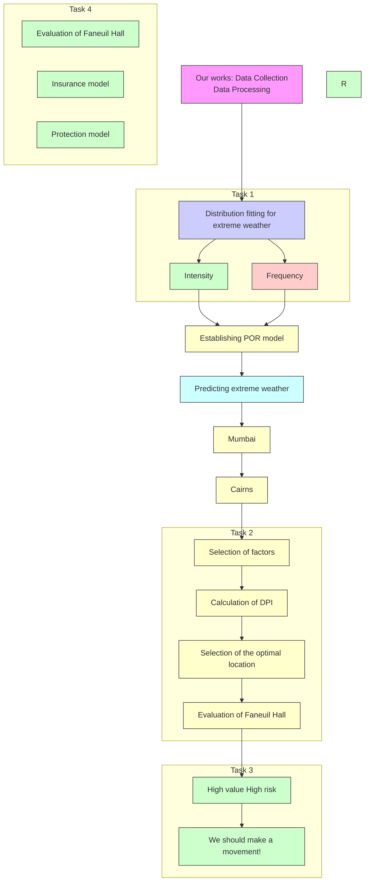
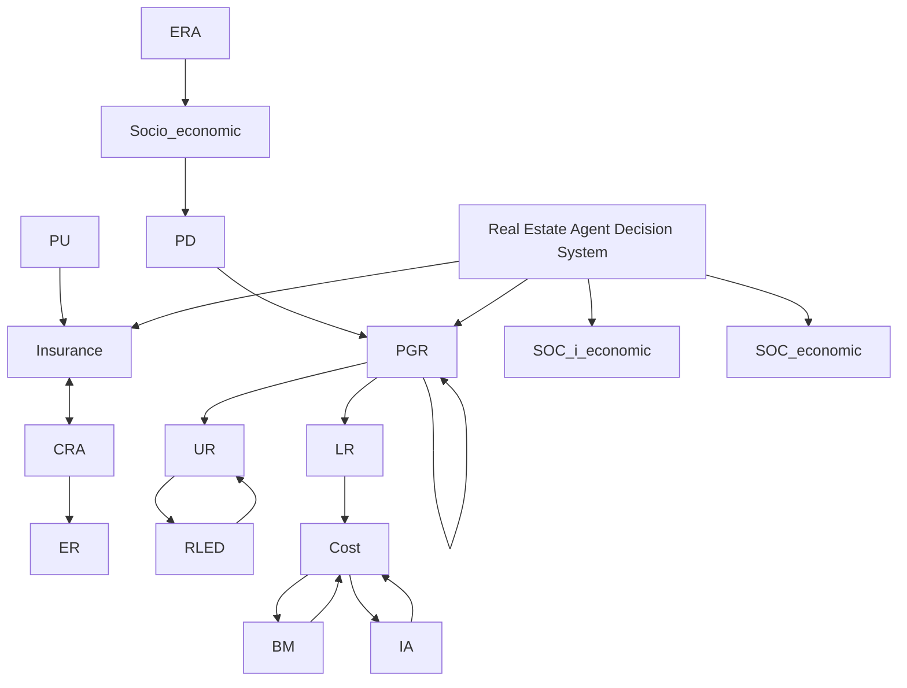
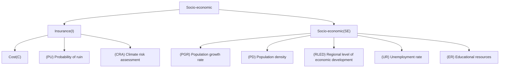
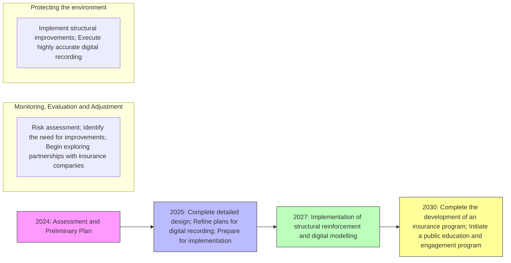

# Navigating the Climate Labyrinth: A Dual Approach to Insurance Resilience and Landmark Defense

Summary

The growing number of extreme weather events poses significant challenges for insurance industry, communities and property developers in terms of their resilience and sustainability, which includes an insurance protection gap to mend, residential siting decisions to make and preservation strategies to take.

In order to better comprehend and tackle the problems brought by deteriorating climate conditions, we build two models: Model I: Climate Risk Assess Model for Insurance Companies and Model II: Landmark Preservation Model for Community Leaders.

For Question one, we utilize Peaks Over Threshold (POT) method to fit the distribution of disaster intensity measured by losses brought by extreme weather events. We apply hypothesis testing to fit the distribution of disaster frequency, and the results suggest that the it follows a Poisson distribution. We calculate the probability of ruin (POR) for insurance companies and determine the optimal retention and investment strategy via ruin theory. Finally, we categorize risk into four levels and apply our model to Mumbai and Cairns. The conclusion indicates the prediction of risk level of Mumbai will transition from level II to III with predicted POR varies from 3.71% to 12.22% while the risk level of Cairns will shift from level I to II with predicted POR varies from 1.33% to 4.40%.

For Question two, we enhance our insurance model by incorporating a Socio-Economy-Insurance-Cost (SEIC) evaluation metric to make residential siting decisions. This enhancement involves the inclusion of two first-level indicators, which are further divided into eight second-level indicators. The weight assigned to each indicator is determined through the Analytic Hierarchy Process (AHP), then development potential index (DPI) is introduced for real-estate decisions making. Finally, we apply our SEIC metric to Miami, New Orleans and Houston. The prediction results indicate that the DPI ranking for the next decade is as follows: Houston > New Orleans > Miami.

For Question three, we select three dimensions including historical, economic and cultural-community significance to assess the value of landmarks (VOL). In assessing the risk of landmarks (ROL), we consider five types of risks including being uninsured and several climate risks. Employing the AHP-EWM algorithm, we ascertain the indicators' weights. Upon deriving the VOL and the ROL we take VOL as horizontal values and VOL as vertical values to construct a GE matrix with nine sectors (I to IX). These sectors are divided into five levels from A to E, which help us determine the preservation strategies. Finally, we apply our model to Faneuil Hall and propose several preservation strategies.

Finally, sensitivity analysis of Model I demonstrated that altering the compensation ratio from 0 to 20 percent resulted in a marginal modification in the POR value, confined to a narrow band of 2 percent. This suggests that our model is not sensitive to market conditions. Furthermore, robust test of Model II indicates that our model is robust against perturbations. Combined with Model I and Model II, a letter for Faneuil Hall with concrete strategies and explicit agenda is composed.

Keywords: Extreme Weather; Ruin Theory; AHP-EWM; GE Matrix; Logistic Model

## Contents

## 1 Introduction 3

1.1 Problem Background 3  
1.2 Restatement of the Problem 3  
1.3 Literature Review 4  
1.4 Our Work.... 4

## 2 Assumptions and Justifications 5

## 3 Notation 6

## 4 Model Preparation 6

4.1 Selection of Research Areas 6  
4.2 Data Overview 7

## 5 Climate Risk Assess Model for Insurance Companies 7

5.1 Distribution Fitting for Extreme Weather Events 7  
5.1.1 Distribution Fitting for Disaster Intensity 8  
5.1.2 Distribution Fitting for Disaster Frequency 9  
5.2 Model Establishment for POR 10  
5.3 Decision-Making for Insurance Companies 12  
5.4 Case Study: Property Insurance Market in Mumbai and Cairns ..... 13

## 6 Socio-Economy-Insurance-Cost (SEIC) Evaluation Metric 14

6.1 Selection and Analysis of Indicators 14  
6.2 The Establishment of Evaluation System ..... 15  
6.2.1 Determination of Weights for Indicators ..... 15  
6.2.2 Calculation of Development Potential Index (DPI) ..... 16  
6.3 The Application of SEIC Evaluation Metric 17

## 7 Landmark Preservation Model for Community Leaders 18

7.1 Key Factors for Landmark Preservation 18  
7.2 Weight Determination Using AHP-EWM 19  
7.3 Preservation Strategies Based on GE Matrix 20  
7.4 Case Study: Preservation Strategies for Faneuil Hall 21

## 8 Sensitivity Analysis 22

## 9 Model Evaluation 23

9.1 Strengths 23  
9.2 Weaknesses 23

## References 23

## 1 Introduction

## 1.1 Problem Background

Global extreme weather events have been on the rise, a trend expected to worsen, as per meteorologists $[1]$ . Instances of hurricanes, floods, droughts, and wildfires are increasing, leading to more severe impacts on lives, property, ecosystems, and economies. "Climate change is a terrible problem, and it deserves to be a huge priority" said Bill Gates, calling for global attention to climate issues.

line chart and pie chart combination

| Event Type             | Percentage |
| ---------------------- | ---------- |
| Extreme weather        | 53.9%      |
| Extreme weather        | 28.4%      |
| Drought                | 6.7%       |

Figure 1: Extreme Weather Events around the World in Recent Decades

Such changes in climate have not only impacted the environment but has also had repercussions on the insurance industry. These effects can be observed in various aspects such as changes in insurance premiums, underwriting policies, and the cost of property insurance. As a result, insurance prices have risen, and the availability of property insurance has decreased. This has led to a significant insurance protection gap, which currently stands at 57% globally and continues to grow. Consequently, insurers are facing a profitability crisis while property owners are struggling to afford insurance coverage.

## 1.2 Restatement of the Problem

To evaluate the long-term viability of the property insurance sector and establish the most effective operational approach for insurance companies, ICM (COMAP's Insurance of Catastrophes Modelers) necessitates our attention to the issue of property insurance and real estate decision-making. Additionally, we are to identify at-risk historic landmarks and offer preservation strategies to the community. To summarize, our specific objectives are as follows:

1) Task 1 Develop a model for insurance companies to determine whether they should underwrite policies or take the risk in areas experiencing an increasing number of extreme weather events.

2) Task 2 Adapt the insurance model to assess where and how shall property developers build on to enhance the resilience the properties as well as the facilitation for growing communities and populations.  
3) Task 3 Establish a preservation model for community leaders to identify and adapt rational conservation strategies to the landmarks of great cultural, historical, economic, or community significance that are at risk.  
4) Task 4 Create a concise one-page letter to the community outlining the comprehensive schedule, plan, and cost for preserving their landmark with results and conclusions yielded from our models.

## 1.3 Literature Review

Experts in environmental science recommend using weather insurance, which combines risks faced by numerous entities based on the law of large numbers, to assist households and businesses in addressing unpredictable and severe weather events $[2]$ .

Data from Munich Reinsurance highlights a significant gap in natural disaster insurance coverage. Only 45% of losses in high-income countries and 7% in low-income countries were insured [3]. Mills and Evan propose innovative solutions for the insurance industry's response to climate change from an enterprise risk management perspective [4]. Herweijer et al. explore climate change threats and opportunities for insurers, focusing on sustainable adaptation [5].

In empirical analyses, Aglasan et al. use a linear fixed-effects model to study crop insurance losses due to extreme weather events in the mid-western United States $[6]$ . Hillier et al. examine the correlation between meteorological time series data and residential insurance losses using the aggregate exceedance probability method $[7]$ . These studies provide crucial insights into managing risks associated with extreme weather events.

In summary, experts advocate weather insurance for mitigating severe weather impacts, while empirical studies highlight disparities in natural disaster coverage and propose innovative strategies for insurers to address climate change risks.

## 1.4 Our Work

The problem requires us to make informed decisions regarding property insurance and real estate. Additionally, we are to identify historic landmarks that are at risk and propose preservation strategies to the community. Our work mainly includes the following:

1. For problem one: We first demonstrate the intensity and frequency of disasters via distribution fitting. And then we model the surplus process of insurance companies and calculate the probability of ruin (POR). Our model is applied to Mumbai and Cairns, interpretations of the results and strategies of insurance companies are made.

2. For problem two: Our insurance model is incorporated with a Socio-Economy-Insurance-Cost (SEIC) evaluation metric and the Development Potential Index (DPI)

is defined for real-estate decisions. Our incorporated model is applied to three different sites in the US.

3. For problem three: A landmark preservation model is established based via AHP-EWM algorithm. We employ GE Matrix with the assessed value and risk to enhance the formulation of preservation strategies for specific landmarks.

In order to intuitively reflect our work process, the flow chart is shown in Figure 2.

flowchart

Figure 2: Model Framework

## 2 Assumptions and Justifications

- Assumption 1: The catastrophe insurance business is a independent process and is not correlated with other types of insurance.  
→Justification: The risks of meteorological disasters are relatively independent of the risks associated with financial products such as bonds and stocks, thus the corresponding insurance products are also relatively independent of each other.  
- Assumption 2: The insurance company has the ability to transfer its risk through reinsurance and generate returns by investing in financial assets.  
→Justification: The insurance company manages the funds associated with catastrophe insurance business independently and with flexibility, thereby balancing potential payout pressures from catastrophe insurance business.

\- Assumption 3: The insurance products sold have a certain deductible, which is borne by the policyholder.

→Justification: By setting deductibles, the insurance company encourages policyholders to exercise caution regarding risks, and simultaneously reduces the payout pressure on the company for smaller losses.

## 3 Notation

The primary notations used in this paper are listed in Table 1. There can be some other notations to be described in other parts of the paper.

Table 1: Notations

<table><tr><td>Symbol</td><td>Definition</td><td>Unit</td></tr><tr><td>s</td><td>The initial capital of insurance company</td><td>$1B</td></tr><tr><td>N(t)</td><td>Number of claims over a period of time</td><td>-</td></tr><tr><td>Xi</td><td>Amount of compensation from insurance company per claim</td><td>$1B</td></tr><tr><td>θi</td><td>Time interval between the arrival of the two claims</td><td>day</td></tr><tr><td>αd</td><td>Compensation ratio of catastrophe insurance</td><td>-</td></tr><tr><td>b(s)</td><td>Retention for catastrophe insurance operations</td><td>$1B</td></tr><tr><td>p(s)</td><td>Proportion of insurance funds invested in risky assets</td><td>-</td></tr><tr><td>VOL</td><td>Value of landmark</td><td>-</td></tr><tr><td>ROL</td><td>Risk of landmark</td><td>-</td></tr><tr><td>DPI</td><td>Develop potential index of a specific region</td><td>-</td></tr></table>

## 4 Model Preparation

## 4.1 Selection of Research Areas

In question one, we are required to demonstrate our model using two areas on different continents that experience extreme weather events. We had Cairns, a northeast Australian city, and Mumbai, a city in the western peninsula of India, selected for following reasons:

1. Mumbai: Mumbai faces significant challenges in the monsoon season, with heavy rainfall causing floods and storms damaging infrastructure and residential areas. Additionally, the city encounters the ongoing threat of rising sea levels. This presents an opportunity for insurance companies to offer coverage for these extreme events.  
2. Cairns: The Cairns region frequently experiences tropical cyclones, floods, and forest fires. The weather patterns in Cairns have shown a rise in extreme weather events, making it an ideal case study for investigating how insurance companies assess and provide coverage in response to the escalating impact of climate change.

text_image

Mumbai
Tropical monsoon
tropical cyclone

Figure 3: Surface Temperature and Wind Map of Mumbai

text_image

cyclone
Cairns

Figure 4: Surface Water Vapor Content Map of Cairns

## 4.2 Data Overview

We mainly use the following data: economic losses from disasters, annual frequency of disasters, property insurance data of major companies(including retention level, deductible and payout amounts etc.). The data sources are summarized in Table 2.

Table 2: Data and Database Websites

<table><tr><td>Data Website</td><td>Data Type</td></tr><tr><td>https://www.climdex.org/learn/datasets/https://earth.nullschool.net/https://www.iii.org/https://www.ncei.noaa.gov/https://fred.stlouisfed.org/https://scholar.google.com/</td><td>Climate dataExtreme weather lossesSocietyPaper</td></tr></table>

## 5 Climate Risk Assess Model for Insurance Companies

In assessing risks for insurance companies, the consideration of local extreme climatic conditions and operational strategies is crucial. To accurately evaluate risk and determine optimal strategies, we employ the Peaks Over Threshold (POT) model for distribution fitting on extreme weather events. Subsequently, we analyze the surplus process to derive optimal investment and reinsurance strategies, aiming to minimize the ruin probability.

## 5.1 Distribution Fitting for Extreme Weather Events

Accurate depiction of the insurance company surplus process requires a reasonable distribution of extreme weather event intensity and frequency. Therefore, we conduct

distribution fitting for both aspects.

## 5.1.1 Distribution Fitting for Disaster Intensity

The POT model, focusing on extreme values rather than the overall distribution, proves effective in analyzing rare events. It overcomes challenges faced by traditional actuarial methods. In our study, we apply the POT model with the following steps.

## Step1: Data Augmentation

To investigate extreme weather events, we obtained data on compensations for such events in Mumbai and Cairns between 2000 and 2022. To ensure the comparability, we adjusted the payouts with the CPI for 2022 to eliminate the impact of prise changes.

To address the issue of parameter estimation bias caused by limited data, we expand the sample space by Monte Carlo simulation. We consider three fat-tailed distributions - the Lognormal, Weibull and Gamma as potential models.

bar chart with an overlaid density curve

| Loss Data Range | Frequency |
| --------------- | --------- |
| 0.0 - 0.1       | 45        |
| 0.1 - 0.2       | 145       |
| 0.2 - 0.3       | 155       |
| 0.3 - 0.4       | 120       |
| 0.4 - 0.5       | 105       |
| 0.5 - 0.6       | 95        |
| 0.6 - 0.7       | 85        |
| 0.7 - 0.8       | 75        |
| 0.8 - 0.9       | 65        |
| 0.9 - 1.0       | 55        |
| 1.0 - 1.1       | 45        |
| 1.1 - 1.2       | 40        |
| 1.2 - 1.3       | 35        |
| 1.3 - 1.4       | 30        |
| 1.4 - 1.5       | 25        |
| 1.5 - 1.6       | 20        |
| 1.6 - 1.7       | 18        |
| 1.7 - 1.8       | 15        |
| 1.8 - 1.9       | 12        |
| 1.9 - 2.0       | 10        |
| 2.0 - 2.1       | 8         |
| 2.1 - 2.2       | 6         |
| 2.2 - 2.3       | 5         |
| 2.3 - 2.4       | 4         |
| 2.4 - 2.5       | 3         |
| 2.5 - 2.6       | 2         |
| 2.6 - 2.7       | 1         |
| 2.7 - 2.8       | 1         |
| 2.8 - 2.9       | 0         |
| 2.9 - 3.0       | 0         |
| 3.0 - 3.1       | 0         |
| 3.1 - 3.2       | 0         |
| 3.2 - 3.3       | 0         |
| 3.3 - 3.4       | 0         |
| 3.4 - 3.5       | 0         |
| 3.5 - 3.6       | 0         |
| 3.6 - 3.7       | 0         |
| 3.7 - 3.8       | 0         |
| 3.8 - 3.9       | 0         |
| 3.9 - 4.0       | 0         |

Figure 5: Frequency Histogram and Fitting Effect of Expanded Samples

scatter plot

| Sample Index | Loss Data |
| ------------ | --------- |
| 0            | 0.5       |
| 10           | 0.6       |
| 20           | 0.7       |
| 30           | 0.8       |
| 40           | 0.9       |
| 50           | 1.0       |
| 60           | 1.1       |
| 70           | 1.2       |
| 80           | 1.3       |
| 90           | 1.4       |
| 100          | 1.5       |
| 110          | 1.6       |
| 120          | 1.7       |
| 130          | 1.8       |
| 140          | 1.9       |
| 150          | 2.0       |
| 160          | 2.1       |
| 170          | 2.2       |
| 180          | 2.3       |
| 190          | 2.4       |
| 200          | 2.5       |
| 210          | 2.6       |
| 220          | 2.7       |
| 230          | 2.8       |
| 240          | 2.9       |
| 250          | 3.0       |
| 260          | 3.1       |
| 270          | 3.2       |
| 280          | 3.3       |
| 290          | 3.4       |
| 300          | 3.5       |
| 310          | 3.6       |
| 320          | 3.7       |
| 330          | 3.8       |
| 340          | 3.9       |
| 350          | 4.0       |
| 360          | 4.1       |
| 370          | 4.2       |
| 380          | 4.3       |
| 390          | 4.4       |
| 400          | 4.5       |
| 410          | 4.6       |
| 420          | 4.7       |
| 430          | 4.8       |
| 440          | 4.9       |
| 450          | 5.0       |
| 460          | 5.1       |
| 470          | 5.2       |
| 480          | 5.3       |
| 490          | 5.4       |
| 500          | 5.5       |
| 510          | 5.6       |
| 520          | 5.7       |
| 530          | 5.8       |
| 540          | 5.9       |
| 550          | 6.0       |
| 560          | 6.1       |
| 570          | 6.2       |
| 580          | 6.3       |
| 590          | 6.4       |
| 600          | 6.5       |
| 610          | 6.6       |
| 620          | 6.7       |
| 630          | 6.8       |
| 640          | 6.9       |
| 650          | 7.0       |
| 660          | 7.1       |
| 670          | 7.2       |
| 680          | 7.3       |
| 690          | 7.4       |
| 700          | 7.5       |
| 710          | 7.6       |
| 720          | 7.7       |
| 730          | 7.8       |
| 740          | 7.9       |
| 750          | 8.0       |
| 760          | 8.1       |
| 770          | 8.2       |
| 780          | 8.3       |
| 790          | 8.4       |
| 800          | 8.5       |
| Note: The actual values may vary due to the random nature of the data generation.

Figure 6: Scatter Plot of the Expanded Samples

The p-values for these distributions are 0.398, 0.349, and 0.270. We find that the Log-normal distribution provides the best fit, as it possesses a higher p-value at a significance level of 5%. By means of Monte Carlo simulation, the amount of data is scaled up to 1023.

## Step2: Fat-Tailedness Examination

We utilize the exponential Q-Q plot to perform a fat-tailedness examination on the sample data by observing the trend of the curve plotted in Figure7.

q-q plot

| Quantiles for dd | Quantiles from 'exponential'distribution' |
| ---------------- | ---------------------------------------- |
| 0                | 0                                        |
| 1                | 1                                        |
| 2                | 2                                        |
| 3                | 3                                        |
| 4                | 4                                        |
| 5                | 5                                        |
| 6                | 6                                        |
| 7                | 7                                        |
| 8                | 8                                        |

Figure 7: Q-Q plots on the Standard Exponential Distribution

It can be observed that the compensation data has a fatter tail compared to the exponential distribution, primarily due to the influence of extreme values. Consequently, we employ the generalized Pareto distribution, whose distribution function is defined in Eq.1, to accurately fit these extreme data.

$$
F (x) = 1 - \frac {N _ {u}}{n} \left(1 + \xi \frac {x - u}{k}\right) ^ {- \frac {1}{\xi}} \tag {1}
$$

## Step3: Determination of Threshold Value

In order to avoid the inaccuracy of parameter estimation due to the reduction of data volume caused by an excessively high threshold and the skewness caused by an excessively low threshold, it is essential to carefully select an appropriate threshold.

Based on the Hill map, we had 2.26 selected as threshold value, which is the starting point of the stabilized region of the tail index. With the threshold at 2.26, the number of samples exceeding the threshold is 69, accounting for 6.74% of the total number of compensation samples.

## Step4: Parameter Estimation

We apply MLE method to estimate the parameters in GPD, the log-likelihood function is derived from Eq.1. By taking the partial derivative of the log-likelihood function with respect to k and $\xi$ and set them equal to 0 we obtain the estimated values of the parameters as $\hat{k}=2.929$ and $\hat{\xi}=-0.499$ .

## 5.1.2 Distribution Fitting for Disaster Frequency

As for the frequency of the extreme weather events, scholars generally believe that it may follow a Poisson distribution [8], but in reality the occurrence of disasters may not necessarily conform to this assumption. Therefore, We conduct hypothesis testing on the frequency of extreme weather events using four common distributions. The results are displayed in Table3.

Table 3: Fitting Results of the Frequency of Extreme Weather Events

<table><tr><td></td><td>K-S static (Mumbai)</td><td>p-value (Mumbai)</td><td>K-S static (Cairns)</td><td>p-value (Cairns)</td></tr><tr><td>Normal Distribution</td><td>0.186</td><td>0.03</td><td>0.277</td><td>&lt;0.01</td></tr><tr><td>Uniform Distribution</td><td>2.041</td><td>&lt;0.01</td><td>2.449</td><td>&lt;0.01</td></tr><tr><td>Poisson Distribution</td><td>0.662</td><td>0.77</td><td>0.874</td><td>0.43</td></tr><tr><td>Exponential Distribution</td><td>2.393</td><td>&lt;0.01</td><td>2.399</td><td>&lt;0.01</td></tr></table>

Among these distributions, only Poisson Distribution with $\lambda_{1}=7.458$ and $\lambda_{2}=4.438$ for Mumbai and Cairns shall be adopted according to p-values at a significance level of 5%. Figure 8 illustrates the probability density function for both sites:

area chart

| Number of Events | Cairns Probability | Mumbai Probability |
| ---------------- | ------------------ | ------------------ |
| 0.0              | 0.000              | 0.000              |
| 2.5              | 0.175              | 0.025              |
| 5.0              | 0.190              | 0.125              |
| 7.5              | 0.150              | 0.150              |
| 10.0             | 0.075              | 0.125              |
| 12.5             | 0.025              | 0.075              |
| 15.0             | 0.000              | 0.025              |
| 17.5             | 0.000              | 0.000              |

Figure 8: Probability Density Function Graph for Two Sites

line chart

| Year | Predicted Data (Mumbai) | Actual Data (Mumbai) | Predicted Data (Cairns) | Actual Data (Cairns) |
|------|------------------------|----------------------|-------------------------|----------------------|
| 2000 | 6                      | 6                    | 3                       | 3                    |
| 2005 | 6                      | 6                    | 3                       | 3                    |
| 2010 | 7                      | 7                    | 4                       | 4                    |
| 2015 | 8                      | 8                    | 5                       | 5                    |
| 2020 | 10                     | 10                   | 6                       | 6                    |
| 2025 | 12                     | 12                   | 7                       | 7                    |
| 2030 | 14                     | 14                   | 9                       | 9                    |

Figure 9: Prediction of Annual Frequency of Extreme Weather Events

As mentioned in the background, the frequency of extreme weather events is increasing. However, the Poisson distribution assumes a constant intensity over time, which contradicts reality. Therefore, the annual frequency should be considered as non-homogeneous thereby $\lambda$ becomes a function of time $\lambda(t)$ . Given that the frequency of extreme weather events shall eventually converge to a constant value with human intervention. Inspired from the process of population growth, we utilize logistic model as follows to predict the values for the next 7 years and fit the corresponding value of $\lambda$ .

$$
\frac {d N}{d t} = \alpha N (1 - \frac {N}{N _ {m a x}}) \tag {2}
$$

where $\alpha$ is time coefficient fitted from previous frequency of diasters data, $N_{max}$ is the final value of annual frequency. The fitting carve and original data are displayed in Figure 9 to highlight the variation with time.

## 5.2 Model Establishment for POR

Based on our assumptions regarding the property insurance industry, we introduce a disturbance term in order to illustrate stochastic activities such as donations, fines, and cyclical changes in premium income. The surplus process can be represented as follows:

$$
U (t) = s + c t - S (t) + \beta W _ {t} ^ {1} \tag {3}
$$

where s > 0 represents the initial capital of the insurance company, c > 0 denotes the annual average of premium income, $S(t) = \sum_{i=1}^{N(t)} X_i$ is a compound Poisson process that signifies the cumulative compensation up to time t, $\{W_t^1, t \geq 0\}$ is a standard Brownian motion, and $\beta W_t^1$ represents the uncertainty in premium income.

Let A be the set of risky assets in which the insurance company invests in the financial market, and B be the set of risk-free assets. The prices of these assets shall satisfy:

$$
\begin{array}{l} \begin{array}{l} d A (t) = A (t) \left(a d t + \delta d W _ {t} ^ {2}\right) \\ D (t) = B (t) \end{array} \tag {4} \\ d B (t) = r B (t) d t \\ \end{array}
$$

where r is risk-free interest rate, a and $\delta$ express the expected rate of return and volatility of a risky asset, and $\{W_{t}^{2}, t \geq 0\}$ is a standard Brownian motion which is correlated with $W_{t}^{1}$ by a correlation coefficient $\rho$ .

The insurance company selects an investment strategy $p(t)$ and a reinsurance strategy $b(t)$ as control strategy denoted as $\pi(t) = (p(t), b(t))$ . Once the control strategy is determined, the surplus process of the insurance company at a specific moment will be determined by the following differential equations with the initial condition of $U(0) = s$ :

$$
d U _ {\pi} (t) = p (t) \frac {d A (t)}{A (t)} + [ U _ {\pi} (t) - p (t) ] \frac {d B (t)}{B (t)} + d U _ {b} (t) \tag {5}
$$

We utilize probability of ruin $\phi_{\pi}(s)$ and the time of ruin $\tau_{\pi}$ under control strategy $\pi$ to assess the risk for insurance companies defined as follows:

$$
\begin{array}{c} \tau_ {\pi} = \inf _ {t \geq 0} \left\{t: U _ {\pi} (t) <   0 \right\} \\ \phi_ {\pi} (s) = P \left\{\inf _ {t \geq 0} U _ {\pi} (t) <   0 \mid U (0) = s \right\} = P \left\{\tau_ {\pi} <   \infty \mid U (0) = s \right\} \end{array} \tag {6}
$$

Taking $\phi(s)=\inf_{\pi\in\Pi}\{\phi_{\pi}(s)\}$ as the objective function, if there exists $\pi^{*}$ s.t. $\phi_{\pi^{*}}(s)=\phi(s)$ , the control strategy $\pi^{*}$ would be the optimal control strategy for the company. According to stochastic control theory $\phi(s)$ will follow the Hamilton-Jacobi-Bellman (HJB) equation $\inf_{\pi\in\Pi}\mathcal{A}^{\pi}\phi(s)=0$ with boundary conditions $\phi(0)=1;\phi(\infty)=0$ .

Considering the dynamic renewal process of risk, interval between arrival of two claims $\{\theta_{i}, i \geq 1\} \sim \Theta$ and the distribution of $\Theta$ is derived from the distribution of disaster frequency. For the sake of sustainability, we have to ensure that the expectation of premium income is greater than the expectation of claims payment. Set Safe load conditions as $\omega$ :

$$
\omega = \frac {c E (\Theta) - \mu}{\mu} = \frac {c - \lambda \mu}{\lambda \mu} \tag {7}
$$

When the compensation amount distribution F follows a fat-tailed distribution, the asymptotic tail equation of the probability of ultimate ruin is as follows:

$$
\Psi (s) = \omega^ {- 1} F _ {e} (s) \tag {8}
$$

where $F_{e}(s)=\frac{1}{\mu}\int_{0}^{s}F_{p}(x)dx$ is the equilibrium distribution of generalized Pareto-tailed distributions, and $F_{p}(x)$ represents the compensation from insurance companies, taking into account the deductible, i.e. $F_{p}(x)=\alpha_{d}F(x)$ . Consequently, the probability of ultimate ruin could be solved by Eq1,7,8. The result is as follows:

$$
\Psi (s) = \frac {\lambda \mu}{c - \lambda \mu} \left\{1 - \frac {\alpha_ {d}}{\mu} \cdot \frac {k}{\xi - 1} \cdot \frac {N _ {u}}{n} \left[ \left(1 + \frac {\xi s}{k}\right) ^ {1 - \frac {1}{\xi}} - 1 \right] \right\} \tag {9}
$$

where $\mu$ is the excess average over threshold u, $\lambda$ denotes the Poisson intensity of the distribution of the frequency of disasters obtained from Section5.1.2, k and $\xi$ are parameters from GPD obtained from Section5.1.1 which represent features of losses from disasters.

## 5.3 Decision-Making for Insurance Companies

The asymptotic expression derived from Eq9 provides the extremum value of the POR. This value serves as a lower bound for $\phi_{\pi}(s)$ . Taking the first- and second-order derivatives of Eq.9 and substituting them into the analytical solution of HJB equation yields explicit expressions for the optimal investment strategy and the optimal excess-loss reinsurance strategy of the insurer under given conditions as follows:

$$
b (s) = \theta (k + \xi s)
$$

$$
p (s) = \frac {(a - r) (k + \xi s) - \beta \rho \delta}{\delta^ {2}} \tag {10}
$$

where $\theta$ stands for reinsurance surcharge rate, a represents expected rate of return on risky assets, $\beta$ is the coefficient of disturbance, which indicates the degree of disturbance during insurance operations affected by uncertainties, and $\delta$ denotes the volatility of risky assets.

Based on our climate risk assess model, we compose several rules for insurance companies to weigh whether they should underwrite policies and choose to take the risk at a specific site as well as to ensure the resilience and sustainability of the system.

## Rule 1: Exercise prudence in risk-taking

1. Thoroughly evaluate local weather conditions: In our model, the probability of ultimate ruin for insurance companies is closely correlated with both frequency and intensity of local extreme weather events. Our logistic model indicates that the frequency of weather disasters may increase, such variation tendency and attributes of extreme weather events shall be carefully evaluated when making decisions.  
2. Strategize capital utilization wisely: Insurance companies shall carry out comprehensive market survey before investments. These surveys shall cover factors including annual premium income expectation, investments return rate and reinsurance surcharge rate. Based on these figures, insurance companies can make optimal strategies for investment and reinsurance with Eq.10 to minimize their POR.  
3. Prioritize customer needs: The demands of customers can impact an insurance company's probability of ruin by influencing premium income and the distribution of intervals between claims. Therefore, it is essential for companies to assess the willingness and affordability of local customers in order to make informed decisions.

## Rule 2: Rational risk management

1. Diversify risk with reinsurance: Insurance companies can effectively spread out risks and increase their underwriting capacity by utilizing rational reinsurance strategies, especially in regions where the local reinsurance industry is well-developed. This allows them to seize market opportunities and enhance their business volume.  
2. Capitalize on market opportunities: With sufficient risk capital, insurance companies can expand their operations in areas where the risks are higher but the returns are equally lucrative. This enables them to meet the market demand for catastrophe insurance, bridge the insurance protection gap, and generate higher profits.

## 5.4 Case Study: Property Insurance Market in Mumbai and Cairns

Considering factors mentioned above, and according to the data of property insurance industry on probability of ruin, we have classified the market decision and risk level for companies into four distinct classes displayed in Table 4.

Table 4: Risk Level for Insurance Companies

<table><tr><td>Range of POR</td><td>&lt;2%</td><td>2%~5%</td><td>5%~12%</td><td>&gt;12%</td></tr><tr><td>Risk Level</td><td>I (Acceptable)</td><td>II (Tolerable)</td><td>III (Cautious)</td><td>IV (Unacceptable)</td></tr></table>

For companies classified under Risk Level I, it is recommended that they prioritize the utilization of the first rule. On the other hand, companies categorized under Risk Level II and III should focus more on implementing the second rule.

Based on the local property insurance industry and other financial data and according to the delineated risk levels, we apply an empirical analysis of the future development to catastrophe insurance business in Mumbai and Cairns. The prediction on the probability of ultimate ruin is displayed in Figure 10.

line chart

| Year | Mumbai | Cairns |
|------|--------|--------|
| 2024 | 3.5    | 1.0    |
| 2025 | 6.0    | 1.5    |
| 2026 | 6.2    | 2.0    |
| 2027 | 8.5    | 2.8    |
| 2028 | 10.8   | 3.8    |
| 2029 | 11.5   | 4.0    |
| 2030 | 11.8   | 4.2    |
| 2031 | 12.5   | 4.5    |

Figure 10: Predictions of POR in Mumbai and Cairns

The predicted POR of insurance companies in Mumbai and Cairns both has an upward trend in response to an increase in the frequency of disasters. However, it is worth noting that the POR in Mumbai is generally higher than that in Cairns and exhibits a steeper upward trend, which is also related to the prominence given to environmental issues by the local government. This suggest that Mumbai is enduring more severe extreme weather events, posing greater risks to the local property insurance industry. On the other hand, the market in Cairns has a lower risk level, making it more favorable for the healthy growth of insurance companies. It is imperative for insurance companies in both regions to implement rational strategies aimed at reducing the POR.

## 6 Socio-Economy-Insurance-Cost (SEIC) Evaluation Metric

In this section, we aim to enhance the insurance model by incorporating a Socio-Economy-Insurance-Cost (SEIC) model to guide the location and development decisions of communities and property developers. Besides the factors considered in our insurance model, we introduce indicators and determine their weights to measure the impact of society and costs on real-estate decisions.

## 6.1 Selection and Analysis of Indicators

We divide the indicators that may influence real-estate decisions into three dimensions as three first-level indicators: socio-economy, insurance and cost. Each of these first-level indicators includes several second-level indicators which are analyzed as follows:

## (1). Socio-Economy Indicators

Socio-Economy factors play a crucial role in determining residential site selection. Among these factors, development and population play a significant role as they influence affordability and housing demand. When establishing an evaluation model for real-estate decisions, Socio-Economy factors are essential part.

## a. Population

We select two indicators including population growth rate and population density to depict the population features of the region. Regions with high population growth rates and population density often require more housing to meet the growing demand.

## b. Development

To assess the extent of development, we select region level of economic development, unemployment rate and educational resources as indicators. All of these factors would influence the economic level and thereby affecting the affordability of local residents.

## (2). Insurance Indicators

Indicators including climate risk assessment and POR of insurance companies which are derived our insurance model also have a tremendous impact on real-estate decisions, those areas where with higher POR and climate risks are more likely to incur losses and dissatisfaction of local residents.

## (3). Cost Indicators

The cost spent on the establishment and land purchase would affect the lifespan and the resilience of the house and thereby affect the demands. Based on this idea, our cost indicators include building materials, community services and land acquisition.

We found that the second-level indicators in the SEIC Evaluation Metric are intrinsically correlated and may influence the construction and development prospects of property developers. Therefore, we start from three dimensions and conduct correlation analysis for second-level indicators, and the result is visualized in Figure 11.

flowchart

Figure 11: System dynamics Analysis of SEIC Evaluation System

## 6.2 The Establishment of Evaluation System

Considering the dimensions mentioned above, we developed the SEIC evaluation system. We introduce Development Potential Index (DPI) to quantify the potential for communities and property developers.

## 6.2.1 Determination of Weights for Indicators

We apply AHP method to determine the weight for our first- and second-level indicators. First, a hierarchy diagram is constructed based on the previously selected metrics, as shown in Figure 12 below.

flowchart

Figure 12: Hierarchy Diagram of AHP

Then we construct judgment matrices for the first-level indicators and each set of second-level indicators separately:

$$
A = \left(a _ {i j}\right) _ {n \times n} \tag {11}
$$

where $a_{ij}$ represents the importance of $x_i$ relatively to $x_j$ , while $n$ is the quantity of indicators in each group. For the limited space, judgment matrix won't be displayed.

Table 5: The Weight of Each Indicator

<table><tr><td>First Grade Index</td><td>Weight</td><td>Second Grade Index</td><td>Symbolic Notation</td><td>Effect</td><td>Weight</td></tr><tr><td rowspan="5">Socio-economic</td><td rowspan="5">0.16</td><td>Population growth rate</td><td>PGR</td><td>+</td><td>0.32</td></tr><tr><td>Population density</td><td>PD</td><td>+</td><td>0.32</td></tr><tr><td>Regional level of economic development</td><td>RLED</td><td>+</td><td>0.15</td></tr><tr><td>Unemployment rate</td><td>UR</td><td>-</td><td>0.14</td></tr><tr><td>Educational resources</td><td>ER</td><td>+</td><td>0.07</td></tr><tr><td rowspan="2">Insurance</td><td rowspan="2">0.3</td><td>Climate risk assessment</td><td>CRA</td><td>-</td><td>0.67</td></tr><tr><td>Probability of ruin</td><td>PU</td><td>-</td><td>0.33</td></tr><tr><td rowspan="3">Cost</td><td rowspan="3">0.54</td><td>Building materials</td><td>BM</td><td>-</td><td>0.4</td></tr><tr><td>Community services</td><td>CS</td><td>-</td><td>0.4</td></tr><tr><td>Land acquisition</td><td>LA</td><td>-</td><td>0.2</td></tr></table>

Note: +: Benefit Attributes -: Cost Attributes

After calculating the weight of each indicator we perform a consistency check. The weights of each indicator calculated by this method are denoted as $\omega_{i}$ . The weight, notation and effect of each first- and second-level indicators is displayed in Table 5.

## 6.2.2 Calculation of Development Potential Index (DPI)

We normalize the collected data and process the 10 second-level indicators, which can be divided into two categories: benefit attributes, cost attributes shown in Table 5, and they are normalized by equations as follows:

\- Benefit Attributes: the larger the better

$$
\widehat {x} _ {i j} = \frac {x _ {i j} - \min \left\{x _ {i} \right\}}{\max \left\{x _ {i} \right\} - \min \left\{x _ {i} \right\}} \tag {12}
$$

\- Cost Attributes: the smaller the better

$$
\widehat {x} _ {i j} = \frac {\max \left\{x _ {i} \right\} - x _ {i j}}{\max \left\{x _ {i} \right\} - \min \left\{x _ {i} \right\}} \tag {13}
$$

The weights assigned to the indicators SE, I, and C determine the degree of influence these indicators have on DPI. The higher the weight, the stronger the impact on DPI. Accordingly, we reasonably and creatively propose the following formula to calculate DPI:

$$
D P I = 1 0 0 \cdot \left(\omega_ {S} E \cdot S E + \omega_ {I} \cdot I + \omega_ {C} \cdot C\right) \tag {14}
$$

Similarly, SE, I and C in Eq.14 can be calculated with the weight of second-level indicators and the corresponding normalized values via Eq.12 and Eq.13.

## 6.3 The Application of SEIC Evaluation Metric

In this section, we select three different sites in the United States, including Miami, New Orleans and Houston, to apply our SEIC evaluation metric. We collect relevant indicator data and calculate corresponding DPI to make real-estate decisions.

In order to estimate the development of real estate industry, we carried out prediction on DPI values of selected sites in the next decade. The tendency of predicted DPI is shown in Figure 13 while the scores of five major second-level indicators in these sites is displayed in Figure 14.

line chart

| Year | DPI of Miami | Predicted DPI of Miami | DPI of New Orleans | Predicted DPI of New Orleans | DPI of Houston | Predicted DPI of Houston |
|------|--------------|------------------------|--------------------|-------------------------------|----------------|--------------------------|
| 2000 | 40           | 40                     | 45                 | 45                            | 40             | 40                       |
| 2005 | 62           | 60                     | 55                 | 55                            | 50             | 50                       |
| 2010 | 48           | 45                     | 50                 | 50                            | 45             | 45                       |
| 2015 | 45           | 45                     | 45                 | 45                            | 45             | 45                       |
| 2020 | 70           | 65                     | 70                 | 70                            | 70             | 70                       |
| 2025 | 65           | 65                     | 75                 | 75                            | 75             | 75                       |
| 2030 | 65           | 65                     | 80                 | 80                            | 80             | 80                       |
| 2035 | 65           | 65                     | 85                 | 85                            | 85             | 85                       |

Figure 13: DPI Values of the Selected Sites

radar chart

| City       | PGR   | UR    | CRA   | PU    | LA    |
| ---------- | ----- | ----- | ----- | ----- | ----- |
| Miami      | 0.40  | 0.50  | 0.50  | 0.40  | 0.40  |
| New Orleans| 0.60  | 0.50  | 0.50  | 0.40  | 0.40  |
| Houston    | 0.60  | 0.50  | 0.50  | 0.40  | 0.40  |

Figure 14: Comparison of the Scores

The results indicate that Houston is projected to have the highest DPI among the examined locations in the coming decade, with a noticeable upward trend. New Orleans also exhibits a relatively high and increasing DPI, while Miami's DPI remains relatively stable with occasional fluctuations. Such trend suggests that Houston is the optimal site for property developers looking to expand their business, New Orleans also has a potential for real estate industry, while investigate in Miami is a conservative option.

Furthermore, Houston outperforms the other locations in terms of climate risk and unemployment rate, which means Houston has the lowest climate risk and a more stable society, making it a highly livable area. Despite the relative high land value, the advantage in climate risk and social stability provides more potential for real estate industry. It is crucial for communities and property developers to closely monitor the sustainability and climate risks of the local area. Strategies such as raising standards for the strength of houses, utilizing stronger building materials, and purchasing catastrophe insurance to mitigate climate risk can be adopted.

## 7 Landmark Preservation Model for Community Leaders

In this section, we will assess the value of landmarks in terms of their historical, economic, and cultural-community significance, and the potential risks posed by extreme weather events and lack of insurance coverage. We adopt GE matrix to weigh over values and risks, and thereby we propose preservation strategies accordingly.

## 7.1 Key Factors for Landmark Preservation

## (1). Indicators for the Value of Landmarks

We assess the value of landmarks (VOL) based on three dimensions: historical, economic, and cultural-community significance. Each dimension consists of several factors that are analyzed as follows:

a. Historical significance (H): Landmarks possess profound historical backgrounds. They serve as witnesses to time, connecting contemporary society with historical moments. We consider two factors architectural age ( $H_{1}$ ) and conservation status, binary variable $H_{2}$ according to whether it is classified as a historical and cultural heritage, to quantify the historical significance.

b. Economic significance (E): Landmarks contribute to boosting tourism and stimulating economic growth. We assess their economic significance using three factors: tourist attraction ( $E_{1}$ ), measured by the number of visitors per year; annual tourism income ( $E_{2}$ ); and tax contribution ( $E_{3}$ ) from tourism and related activities.

c. Cultural-Community significance $(C^{2})$ : Landmarks carry rich cultural significance, serving as symbols of cultural heritage. They represent the identity and values of a community, reflecting local traditions, arts, and customs. The cultural-community significance of landmarks is determined by two factors: public interest $(C_{1}^{2})$ , measured by the number of searches related to the landmark on Google Trends; and community cohesion $(C_{2}^{2})$ , which is calculated based on the number of social activities organized each year.

Generally, the larger these indicators are, the greater significance they have in the corresponding dimension.

## (2). Indicators of Risks Faced by Landmarks

Different regions face distinct extreme weather, resulting in varied impacts. For example, deserts areas like Arizona cope with dust storms, while coastal areas like North Carolina concern sea level rise. Due to the abundance of landmarks along the US coasts and the substantial impact of sea level rise, our focus is on analyzing coastal landmarks.

Based on former discussion and with the regard of the risk of lack of insurance coverage, the factors selected to represent risk of landmarks (ROL) are analyzed as follows:

a. Risk of Being Uninsured ( $R_{1}$ ): The lack of insurance coverage exposes coastal landmarks to risks. The costs associated with recovery and restoration could be prohibitively too high to afford. This risk is represented by POR of local insurance companies derived from our insurance model.  
b. Risk of Abnormal Temperatures ( $R_{2}$ ): Prolonged high or low temperatures may result in the aging and deterioration of building materials thus leading to damage of landmarks. This risk is weighed by the number of days with temperatures above the $90^{th}$ percentile or below the $10^{th}$ percentile denoted as $N_{ATh}$ and $N_{ATl}$ .  
c. Risk of Abnormal Precipitation ( $R_{3}$ ): Abnormal precipitation can cause flooding or drought, further compromising the structure and appearance of landmarks. We measure this risk by counting days with daily precipitation greater than the $95^{th}$ percentile and number of consecutive days without rain in a year which is denoted as $N_{APh}$ and $N_{APh}$ .  
d. Risk of Hurricane $(R_{4})$ : Storms and hurricanes can lead to collapses and other structural damage, resulting in potentially massive losses. Such risk is quantified by counting number $(N_{H})$ and intensity $(I_{H})$ of hurricanes and storms in the area every year.  
e. Risk of Sea Level Rise ( $R_{5}$ ): As sea levels rise, coastal landmarks are at risk of being submerged, which could result in damage or complete destruction of buildings. This risk is represented by sea level rise in a year denoted as SR.

Generally, the larger these indicators are, the greater the risk that the landmarks are exposed to.

## 7.2 Weight Determination Using AHP-EWM

Inspired from our definition of development potential index (DPI) in Eq.14, we assess the risk and the value of the historic landmarks by combining AHP and EWM. The AHP-EWM algorithm is a comprehensive evaluation method for multi-index decision-making.

To begin, we normalize the data using Eq.12. Next, the AHP method discussed in Section 6.2.1 is employed to ascertain the evaluation index's weight, followed by EWM to establish the objective weight. By optimizing both subjective and objective weights via the Lagrangian multiplier method, the combined weight, founded upon the principle of minimum relative information entropy, is obtained. For the selected 35 landmarks in coastal areas, the final formula for weight calculation is:

$$
w _ {k} = \frac {\sqrt {w _ {i k} w _ {j k}}}{\sum_ {k = 1} ^ {m} \sqrt {w _ {i k} w _ {j k}}} \tag {15}
$$

where $\omega_{k}$ is the combined weight of indicator k, $\omega_{ik}$ and $\omega_{jk}$ is weight derived from AHP and EWM, and m is the number of second-level indicators, $m_{1}=7$ for VOL and $m_{2}=8$ for ROL. The combined weight for each indicator is shown in Figure 15.

donut chart

| Category                     | Value  |
| ---------------------------- | ------ |
| Abnormal temperature         | 0.144  |
| Abnormal precipitation       | 0.0847 |
| Hurricane/Monsoon            | 0.0847 |
| Sea Level Rise               | 0.473  |
| Probability of insurance company ruin | 0.057  |

(a) Combined Weight for Indicators of VOL

donut chart

| Category           | Value  |
| ------------------ | ------ |
| History            | 0.285  |
| Economy            | 0.161  |
| Culture-Community   | 0.145  |
| Total              | 0.119  |

(b) Combined Weight for Indicators of ROL  
Figure 15: Combined Weight for Indicators Derived from AHP-EWM

## 7.3 Preservation Strategies Based on GE Matrix

The ROL index and VOL index for each landmark are obtained by multiplying and summing corresponding normalized indicators with their respective weights. To enhance the formulation of preservation strategies for specific landmarks, we incorporate the GE Matrix, also known as the McKinsey Matrix, which is a powerful tool for business strategy analysis. This matrix assesses business competitiveness and market attractiveness by considering various factors and quantifying scores to guide strategic development.

We assert that ROL and VOL represent the relative risk of historical landmarks from two dimensions, similar to the interplay between business competitiveness and market attractiveness in enterprise business strategy. Thus, we utilize VOL on the horizontal axis and ROL on the vertical axis to characterize the risk level and value of the landmark based on its positioning on the GE matrix. Subsequently, employing K-Means cluster analysis, we classify the selected landmarks into four categories displayed in Figure 16.

heatmap

| Point | VOL | ROL |
| :--- | :--- | :--- |
| I | 0.85 | 0.9 |
| II | 0.45 | 0.85 |
| III | 0.85 | 0.5 |
| IV | 0.45 | 0.7 |
| V | 0.45 | 0.65 |
| VI | 0.15 | 0.6 |
| VII | 0.2 | 0.45 |
| VIII | 0.2 | 0.55 |
| IX | 0.15 | 0.6 |
| Faneuil Hall | 0.85 | 0.2 |

Figure 16: GE Matrix Diagram

1). The higher the ROL, the more extreme weather may damage historic landmarks. The higher the VOL, the greater the demand for historic landmarks in local communities. Consequently, The closer the coordinates of the landmark are to $(1,1)$ , the more urgent the landmark is to be protected.  
2). To evaluate the urgency for preservation, we divide the matrix into nine sectors. Sector I is designated as level A, sectors II and III as level B, sectors IV to VI as level C, sectors VII and VIII as level D, and sector IX as level E. Therefore, the urgency for preservation in these sectors follows the order of A > B > C > D > E.  
3). As for landmarks in level A, robust strategies for them includes entirely relocation and insure them with highly solvent insurance policies. For those assessed as level B, comprehensive strategies including adopting advanced materials for reinforcement. As for level C, standard strategies such as limiting public access can be adopted. For level D, we can consider minor enhancements as moderate strategies. For level E, implementing regular inspection and maintenance is enough to serve as conservative strategies.

## 7.4 Case Study: Preservation Strategies for Faneuil Hall

The coordinates of Faneuil Hall in VOL index and ROL index are displayed in Figure 16. According to our classification by GE matrix, Faneuil hall, situated in the coastal area of Boston, has been assessed as level A. This classification indicates the urgent need for robust preservation strategies to ensure its maintenance and restoration.

text_image

BOSTON
North End
P
P
P
P
P
P
P
P
P
North End
P
P
P
P
P
P
P
P
P
P
P
P
P
P
P
P
P
P
P
P
P
P
P
P
P
P
P
P
P
P
P
R1
R2
R3
R4
R5
Government Center
State
Quart St.
Old Town,
New York,
Capey,
Merrimaac St.
Haymarket
Bowdoin
State St.
Aquarium
new
previous

Figure 17: Comparison of Risks Faced by Faneuil Hall in Last Five Years

Boston, being a coastal city, is currently experiencing severe extreme weather events, including flooding and the rise of sea levels. According to the Organisation for Economic Co-operation and Development, flooding alone is projected to cause a loss of 237 million dollars annually from now until 2050. Furthermore, approximately 6% of the city is expected to be flooded. These statistics highlight the urgent need for proactive measures to mitigate the impact of these events.

It is worth mentioning that Faneuil Hall holds significant historical importance and was officially designated as a National Historic Landmark on October 9, 1960. Based on facts mentioned above, we suggest the following preservation strategies.

1. Proactive structural enhancement: The assessment of the risk faced by Faneuil Hall suggests an increasing trend in the rise of sea level. To address the threat of flooding, it is recommended to implement proactive structural enhancements such as the construction of flood walls, raised plinths, and watertight gates. These constructions can be seamlessly integrated with the architectural features of Faneuil Hall.  
2. The use of digital information modeling: To digitally record and model Faneuil Hall with high precision in order to accurately record its historical structure and details and provide a scientific basis for future restoration and preservation work is suggested. Sharing the digital model through an online platform to increase public understanding and interest in the historical and cultural value of Faneuil Hall.  
3. Insure highly solvent insurance policies: Collaboration with insurance companies is advised to explore insurance strategies that ensure proper compensation for landmarks in the extreme weather events. It is crucial to align the insurance strategy with the value and risk associated with the landmark.

## 8 Sensitivity Analysis

Assuming that the initial capital of insurance companies remains constant and market conditions remain unchanged, we aim to calculate the probability of ruin by considering the impact of extreme weather events. To ensure the accuracy and rigor of our data and results, we introduce a perturbation of $20\%$ to the initial capital of insurance companies (s) and the compensation ratio of insurance companies $(\alpha_{d})$ . This allows us to observe the effect of parameter changes on the results by comparing the modified model with the original one after solving for 40 sets of probability of ruin. Additionally, we introduce noise to our indicators to assess the model's robustness against random fluctuations.

3d heatmap chart

| a Values | s Values | Probability of run |
| -------- | -------- | ------------------ |
| 0.220    | 0.215    | 0.15               |
| 0.215    | 0.210    | 0.14               |
| 0.210    | 0.205    | 0.13               |
| 0.205    | 0.200    | 0.12               |
| 0.200    | 0.195    | 0.11               |
| 0.195    | 0.190    | 0.10               |
| 0.190    | 0.185    | 0.09               |
| 0.185    | 0.180    | 0.08               |
| 0.180    | 0.175    | 0.09               |
| 0.175    | 0.170    | 0.10               |
| 0.170    | 0.165    | 0.11               |
| 0.165    | 0.160    | 0.12               |
| 0.160    | 0.155    | 0.13               |
| 0.155    | 0.150    | 0.14               |
| 0.150    | 0.145    | 0.15               |
| 0.145    | 0.140    | 0.14               |
| 0.140    | 0.135    | 0.13               |
| 0.135    | 0.130    | 0.12               |
| 0.130    | 0.125    | 0.11               |
| 0.125    | 0.120    | 0.10               |
| 0.120    | 0.115    | 0.09               |
| 0.115    | 0.110    | 0.10               |
| 0.110    | 0.105    | 0.11               |
| 0.105    | 0.100    | 0.12               |
| 0.100    | 0.095    | 0.13               |
| 0.095    | 0.090    | 0.14               |
| 0.090    | 0.085    | 0.15               |
The data is presented in a CSV format with three columns: 'a Values' and 's Values'. The cell values are calculated based on the 's Values' column in the data table and used to create a heatmap or a heatmap overlaying the cells.

(a) Sensitivity Analysis of Climate Risk Assess Model

heatmap

| Region | Original point (VOL) | After adding noise (VOL) | Original point (ROL) | After adding noise (ROL) |
|---|---|---|---|---|
| I | 0.85 | 0.9 | 0.9 | 0.9 |
| II | 0.85 | 0.9 | 0.85 | 0.85 |
| III | 0.85 | 0.9 | 0.85 | 0.85 |
| IV | 0.85 | 0.9 | 0.85 | 0.85 |
| V | 0.85 | 0.9 | 0.85 | 0.85 |
| VII | 0.85 | 0.9 | 0.85 | 0.85 |
| VIII | 0.85 | 0.9 | 0.85 | 0.85 |
| IX | 0.85 | 0.9 | 0.85 | 0.85 |
| VI | 0.85 | 0.9 | 0.85 | 0.85 |
The chart displays a grid of colored regions corresponding to the original and added noise points, with dashed circles highlighting specific regions of interest in the original and added noise zones. The legend indicates blue dots represent the original point and gray triangles represent the added noise point.

(b) Robust Test of Landmark Preservation Model  
Figure 18: Result of Sensitivity Analysis and Robust Test

Upon analysis, it has been determined that there is a correlation between the initial capital of insurance companies and the POR of these companies. Specifically, when the initial capital varies by 10%, the POR of the companies also varies by approximately 2%. Additionally, it has been observed that the change in the compensation ratio has a minimal impact on the variation of POR. Furthermore, the inclusion of noise in the indicators of our landmark preservation model does not significantly affect the level of urgency in preservation.

The results show that changing the parameters in POR to a certain extent will not lead to large deviations in the model, POR will only vary in a small range. Moreover, adding noise to the indicators of our preservation model will not bring significant variation in the risk level.

The analysis shows that our model is quite sensitive and robust, which will not change greatly due to the perturbation of the initial value. The result of sensitive analysis has practical significance.

## 9 Model Evaluation

## 9.1 Strengths

- Comprehensive consideration: We fully consider the stochastic activities such as donations, fines, and cyclical changes in premium income by introducing a disturbance term in our insurance model. And both of our SEIC evaluation metric and landmark preservation model have sufficient consideration of key factors.  
- Creativity: We introduce GE matrix to measure the level of preservation strategy and the urgency for landmarks to be preserved. Community leaders can evaluate the urgency with the preservation model and to find practical strategies.  
- Rigor: From the perspective of the surplus process, we evaluate risks and benefits for insurance companies with the trend of extreme weather events taken into consideration. We also consider market processes such as reinsurance and investment.

## 9.2 Weaknesses

- We don't account for how inflation and macroeconomic shifts affect insurance companies' surplus process. In other words, decisions for insurance companies rely on present economic conditions and forecasts of future extreme weather events.  
- We only consider coastal landmarks in our preservation model. Meanwhile, we only measured the extent of measures they should take to preserve buildings in their community without considering the cost of such measures.

## References

[1] I. Adopted, “Climate change 2014 synthesis report,” IPCC: Geneva, Szwitzerland, pp. 1059–1072, 2014.  
[2] U. N. E. P. F. Initiative et al., “Insuring the climate transition: Enhancing the insurance industry’s assessment of climate change futures,” 2021.  
[3] C. Hott and T. X. Tran, “Natcats and insurance in a developing economy-new theoretical and empirical evidence,” 2020.  
[4] E. Mills, “A global review of insurance industry responses to climate change,” The Geneva Papers on Risk and Insurance-Issues and Practice, vol. 34, pp. 323–359, 2009.  
[5] C. Herweijer, N. Ranger, and R. E. Ward, “Adaptation to climate change: threats and opportunities for the insurance industry,” The Geneva Papers on Risk and Insurance-Issues and Practice, vol. 34, pp. 360–380, 2009.  
[6] S. Aglasan, R. M. Rejesus, S. Hagen, and W. Salas, “Cover crops, crop insurance losses, and resilience to extreme weather events,” American Journal of Agricultural Economics, 2023.  
[7] J. K. Hillier, N. Macdonald, G. C. Leckebusch, and A. Stavrinides, “Interactions between apparently ‘primary’ weather-driven hazards and their cost,” Environmental Research Letters, vol. 10, no. 10, p. 104003, 2015.  
[8] G. Müller-Fürstenberger and I. Schumacher, “Insurance and climate-driven extreme events,” Journal of Economic Dynamics and Control, vol. 54, pp. 59–73, 2015. [Online]. Available: https://www.sciencedirect.com/science/article/pii/S0165188915000366

Dear Community leaders and residents:

As stewards of Boston's rich heritage, we face the urgent challenge of preserving Faneuil Hall, our iconic landmark known as the “Cradle of Liberty,” amidst the growing threats posed by climate change and extreme weather events suggested by our insurance and preservation model considering the following key factors:

- Cultural, Historical, Community and Economic Significance: Faneuil Hall represents the unique historical and cultural heritage of our community.  
- Frequency and Severity of Extreme Weather Events: We have analyzed the frequency of extreme weather events and the potential damage to Faneuil Hall over the past few years.  
• Insurance risk: We have analyzed the risk of insurance companies underwriting Faneuil Hall.

Based on our model, Faneuil Hall possess high value but also in great risk classified as level A. Building on our initial proposal, I wish to expand our future plan with additional key measures:

1. Proactive structural enhancement: To address the threat of flooding, the construction of flood walls, raised plinths, and watertight gates integrated with the architectural features of Faneuil Hall is of priority.  
2. Digital information modeling: To accurately record its historical structure and details and provide a scientific basis for future as well as to raise public interest on the internet digital modeling of Faneuil Hall is suggested.  
3. Adapt rational insurance strategies: Collaboration with insurance companies is advised to explore insurance strategies that ensure proper compensation for damages in the extreme weather events.

radar chart

|        | now  | previous |
| ------ | ---- | -------- |
| R1     | 0.8  | 0.6      |
| R2     | 0.7  | 0.5      |
| R3     | 0.9  | 0.4      |
| R4     | 0.85 | 0.7      |
| R5     | 0.8  | 0.6      |

We must act now to protect them from today's climate impacts and prepare for additional changes anticipated tomorrow. An explicit agenda is proposed as follows:

flowchart

Estimated costs for protective measures range from millions to tens of millions of dollars. Funding will need to be secured by seeking governmental and philanthropic support.

Making climate resilience a national priority while striving to reduce the carbon emissions driving climate change and its associated impacts is essential. Our collective action today will determine the future of our cherished landmark and community.

# Report on Use of AI

1. OpenAI ChatGPT(Nov 5, 2023 version, ChatGPT-4)

Query: < How do homeowners influence insurance decisions? >

Output: <Improving the durability and resilience of properties: Measures to increase the resilience of properties to extreme weather, such as improving drainage systems, reinforcing building structures, and using more durable materials.

Install safety and prevention features: Install features such as flood walls, storm windows, and emergency backup power.

Comply with building and safety standards: Ensure that the property complies with local building and safety regulations, especially in disaster-prone areas.

Participate in risk-sharing programmes: Reduce the burden on the insurance company by covering a certain percentage of the loss yourself (e.g., higher deductibles).

Obtain accreditation and certification: Obtain an independent assessment and certification of the property's resilience to disasters to demonstrate its safety. >

Explanation: Our team initially did not have any idea about this problem, so we hoped to get inspiration from ChatGPT here. After getting the above answer, we looked for literature and analyzed the data and combined it with the insurance model we built to give our proposal.

2. Microsoft Bing Chat (v1.18.8)

Query: < In the field of conservation of historic buildings, which countries or regions have adopted effective conservation measures to protect historic landmarks? >

Output: < In the field of conservation of historic buildings, a wide range of innovative and effective conservation measures have been adopted in various countries and regions to protect and revitalize this valuable heritage. The following are some examples of specific conservation measures and models:

Relocation and preservation of the Temple of Abu Simbel: In order to prevent the flooding of the Temple of Abu Simbel by a reservoir upstream of the Nile River, the international community, coordinated by UNESCO, succeeded in averting the threat of flooding to the ancient Egyptian temple by carefully cutting it into large chunks and reassembling it at a high altitude. This spectacular preservation initiative proves that there does not have to be a choice between historic sites and economic development, and that historic sites are a valuable resource in their own right that can contribute to the sustainable development of communities.

Revitalization and utilization of historical and cultural heritage: China has adopted the concept of "development in preservation and preservation in development" in the protection of historical and cultural heritage. For example, the Sanfangqixiang (Three Square and Seven Alleys) in Fuzhou, Fujian Province, has been revitalized through the introduction of old brands and new businesses. The Renfengli Historical and Cultural Neighborhood in Yangzhou, Jiangsu Province, has improved the quality of life of its residents and maintained the continuity of its history and culture by renovating traditional houses, combining them with vegetarian food and non-heritage cultural creations, and providing services for the elderly in the community. These examples show how historical and cultural resources can be "utilized and brought to life" through openness and utilization, while at the same time improving the living environment and promoting community development.

These cases exemplify the diversity and complexity of the preservation and revitalization of historic buildings, which require the joint efforts of Governments, communities and international organizations. Conservation of historic buildings is not only about preserving the past, but also about enriching modern life and promoting the sustainable development of communities. Through innovative conservation measures and models, we can ensure that this cultural heritage is passed on to future generations.>

Explanation: Our team reference these historic landmark preservation examples. In these cases, the local communities have diversified and effectively preserved and developed the historic landmarks. This provided us with ideas and inspiration.

3. Github CoPilot (Feb 3, 2024 version)

Explanation: Our team use CoPilot multiple times during the paper writing process to help us polish the paper. We don't provide the exact process of use here.

4. OpenAI ChatGPT(Nov 5, 2023 version, ChatGPT-4)

Query: < Please help me read this literature and briefly summarize the literature.>

Explanation: Our team use ChatGPT to help us read the literature in order to quickly find the papers we needed.

5. OpenAI ChatGPT(Nov 5, 2023 version, ChatGPT-4)

Query: < What regions worldwide are experiencing an increasing number of extreme weather events due to climate change? >

Output: < Arctic region: The temperature rise rate is more than twice the global average, leading to accelerated sea ice melting and changes in weather patterns.

Australia: The frequency of experiencing extreme heat waves, severe drought, and bushfires has increased.

California (USA): Faced with more frequent and intense wildfires, droughts, and heatwaves.

Mediterranean region : including countries in southern Europe, experiencing an increase in the frequency of high temperatures, droughts, and forest fires.

South Asia: Especially India, Bangladesh, and Pakistan have been affected by increased heat, extreme rainfall, and floods.

East Africa: Faced with more frequent droughts and occasional floods, especially in regions such as Ethiopia, Somalia, and Kenya.

These changes emphasize the urgency of the global climate crisis and the necessity of reducing greenhouse gas emissions to mitigate the speed and impact of climate change. The impact of climate change is global, but some regions may be more severely affected than others.>

Explanation: In order to quickly find the address that meets our requirements, we first used artificial intelligence to roughly select the address. After obtaining the initial site selection for Chapter, our team used meteorological data from the meteorological website to determine the two locations for the case study in our paper: Mumbai and Cairns.

6. OpenAI ChatGPT(Nov 5, 2023 version, ChatGPT-4)

Query: < Please help me draw a picture of Faneuil Hall. The requirements are as follows: a sense of the big picture, showing the whole of Faneuil Hall; the floodwaters are rising and about to submerge Faneuil Hall, but not too exaggerated, reflecting the imminent need to protect Faneuil Hall, and add a timetable, recommending a plan for the future, a timetable and a cost proposal. >

Explanation: Our team reference the image in the letter to the community.