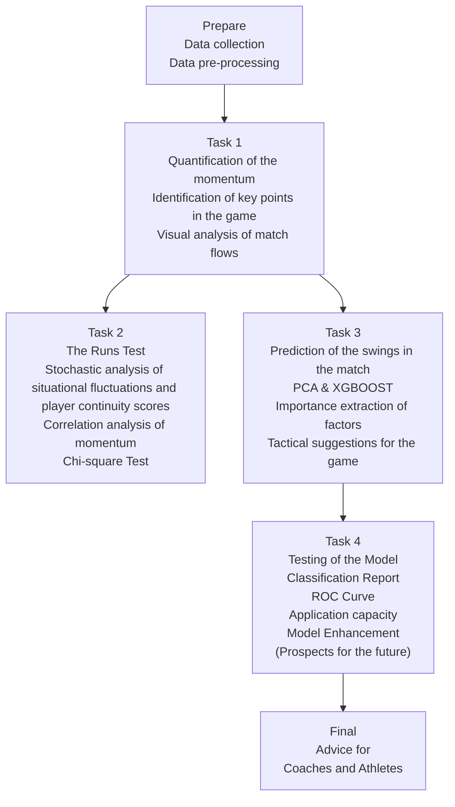

# Riding the Momentum

Summary

"If you have momentum, you want to try to keep that momentum going, keep that confidence rolling for you. You know, that's why the streak is there," said Djokovis. Undoubtedly, momentum is the key to success for Djokovic. Does momentum effectively function? To effectively tackle this inquiry and offer valuable guidance to coaches and players, we present the following thoughts.

For task one, it is necessary to capture the flow of play and identify crucial moments while also quantifying the player's performance. We establish the Momentum Quantization Model Based on Sliding Windows (MQ-SW) that assesses the performance level of each player at given moments, taking into account the influence of past mistakes and other factors. Additionally, we incorporate the player's serving advantage into the calculation. Furthermore, we discern the crucial aspects of the match by considering both the tennis regulations and the CUSUM algorithm. Figure 4 depicts the visual representation of the match progression between Carlos Alcaraz and Novak Djokovic. The model demonstrates proficiency in quantifying a player's momentum and precisely identifying crucial moments.

For task two, we need to examine the impact of "momentum" on the game and determine if the fluctuations in the game condition and successive player scores are random. Thus, we begin by examining the volatility of the game's condition using the Point Victor factor and the MQ-SW Model. Subsequently, we employ the Runs Test to assess the state of the game and the successive scores of the participants. Upon computation, the $p - value < 0.01$ , indicating that the variability in the game scenario. Next, we discretize the momentum of both players at each instance and employ the Chi-square Test to compare the aforementioned indices. The experimental $p - value < 0.01$ , indicating that the "momentum" element is highly likely to be the reason, as demonstrated in Table 5.

For task three, we need to predict the volatility of the circumstances in a tennis match. The dependent variable is the discretized "momentum", whereas the independent variables consist of other factors associated with players. We established the Prediction for Match Trend Model Based on PCA&XGBoost (PMT-PX). The model uses the principal component analysis to examine the variation in scatter on a two-dimensional coordinate graph and subsequently utilizes XGBoost to train on the match data. From this, we have identified the most significant influencing factors, namely "Point Victor" and "Break PT" at the current moment. The corresponding scores are displayed in Table 6.

For task four, it requires an examination of the model's effect and its capacity to generalize. We assess the model using several metrics, such as the confusion matrix, classification report, and ROC curve. The area under the curve (AUC) is 0.75, indicating a discernible effect. We utilize the model to evaluate the U.S. Open women's final. The results indicate that the model exhibits a commendable level of generalization and is capable of efficiently and accurately identifying the target. Simultaneously, we conduct an analysis of the model's drawbacks and provide the elements that should be taken into account in the future. Furthermore, the model sensitivity analysis is conducted by altering the dimensions of the sliding window along with the additional advantage parameter of the player's serve. The outcomes indicate that the model exhibits a high level of robustness.

We finally write a memorandum, including our model and strategy, for the coaches and players. We hope our memorandum can be valuable to them and actually help them.

Keywords: Momentum, MQ-SW, Runs Test, Chi-square Test, PMT-PX

# Contents

# 1 Introduction 3

1.1 Probelm Background 3  
1.2 Restatement of the Problem 3  
1.3 Literature Review 4  
1.4 Our work....4

# 2 Preparation of the Models 5

2.1 Assumptions and Explanations 5  
2.2 Notations 5  
2.3 Data Preparation 5  
2.3.1 Data Collection 5  
2.3.2 Data Pre-processing 6

# 3 Establish the Momentum Quantization Model Based on Sliding Windows 6

3.1 Quantization of Momentum 6  
3.2 Identification of Key Points in the Game 7  
3.3 Competition Flow Visualization 8

# 4 Momentum's Impact on the Game Situation 10

4.1 The Runs Test —Stochastic Analysis 10  
4.2 The Chi-square Test —Correlation Analysis ..... 11  
4.3 Reach a Verdict 12

# 5 Establish the Prediction for Match Trend Model Based on PCA&XGBoost 12

5.1 Principal Component Analysis —Determine the Model ..... 12  
5.2 XGBoost—Match Trend Prediction 13  
5.3 Factor Importance Extraction 14  
5.4 Tactical Suggestions for the Game ..... 15

# 6 Model Effect Analysis 16

6.1 Model Testing on a New Race 16  
6.2 Generalized Ability Analysis —U.S. Open Women's Singles ..... 18  
6.3 Future Consideration 20

# 7 Sensitivity Analysis 21

# 8 Model Evaluation 22

8.1 Strengths 22  
8.2 Weaknesses and Improvements 22

# 9 Conclusion 22

# References 23

# Memorandum 24

# 1 Introduction

# 1.1 Probelm Background

In the men's singles final of the 2023 Wimbledon Open, Spanish rising star Carlos Alcaraz ended Novak Djokovic's legendary player's unbeaten run at Wimbledon since 2013. So What factors influenced the outcome of this seemingly unbalanced match? What factors contribute to the occurrence of analogous scenarios for individuals or players who appear to have a dominant position in the situation or game? Indeed, these conclusions are frequently ascribed to the phenomenon of "momentum".

Momentum is defined in the dictionary as "strength or force gained by motion or by a series of events", but in actual sports, a team or player may feel energized during a game, but it is difficult to accurately measure this phenomenon. Furthermore, assuming that such momentum exists, it is difficult to determine how the various events of a game generate or alter momentum. So, is there a computable and estimable frontal model of momentum available to aid players in achieving improved outcomes?

# 1.2 Restatement of the Problem

Given the problem's background information and constrained conditions, we must complete the following tasks:

- Task 1: Build a model that captures the flow of the match as it occurs and apply it to one or more matches to visualize the flow of the match. The model needs to be able to identify the time period in the match when a player performs better and the degree of excellence within that time period.  
- Task 2: A coach is skeptical about the role of momentum, arguing that fluctuations in match situations and consecutive wins by players occur randomly, use a model to evaluate this coach's claim.  
- Task 3: Coaches need to be clear on whether there are indicators that can assist in determining when a game's trend will shift.

- Using data from at least one match, build a model that predicts the movement of a match and identify which factors, if any, have the greatest impact on the movement of a match.  
- Based on the difference in "momentum" in previous matches, help a player determine the correct strategy for a new match against a different opponent.

\- Task 4: Test the current model in one or more other games and evaluate the model's prediction of in-game fluctuations; if the prediction is poor, can factors be identified for inclusion in future models? How generalizable is the model to other games, tournaments, field types, and other sports?

\- Task 5: Write a memo summarizing the findings. Explain to a coach the role of "momentum" and make recommendations to prepare players for events that affect the course of a tennis match.

# 1.3 Literature Review

The situation of a tennis match is rapidly changing. In the face of the variability of environment, strategy, and process, momentum, a factor that may turn the match around, has become a focus of research.

Ben Moss et al. argue that the uncertainty of the momentum effect in tennis, which may vary from player to player, needs to be considered at an individual level $^{[1]}$ . In addition, if a player breaks his opponent's serve when facing a game point, he is more likely to hold his serve in the next round of serve reception.

Zhang Xiaofei suggests that the gain or loss of a key score will have a serious impact on a player's momentum, thus affecting the direction of the match. In the face of changes in the score, some players may increase their momentum, attack courageously, and take the initiative. While some players may attach too much importance to the change of score, and whenever they encounter the change of key score, their momentum may be reduced, and then the game will turn around $^{[2]}$ .

Chen Liang suggests that there is a direct "attack-defense relationship" in tennis and that in order to win a match, one must maximize one's own performance and inhibit one's opponents to the maximum extent possible. Under the joint effect of oneself, opponent, and competition environment, the momentum of both sides usually will not remain stable during the competition, and the change of the contrast relationship will form the stage "rise and fall"[3] of the competitive performance.

In conclusion, momentum affects different players in different ways, which is important for the psychological support of athletes.

# 1.4 Our work

For ease of description and visualization, we have drawn a flow chart (Figure 1) to represent our work.

flowchart

Figure 1: Flow chart of our work

# 2 Preparation of the Models

# 2.1 Assumptions and Explanations

To simplify the issue, we have made the following assumptions, each of which is appropriately reasonable.

- Assumption 1: The entire game is not affected by external factors such as unfair decisions by the referee.  
$\hookrightarrow$ Explanation: An unfair judgement by the referee will mislead our judgement of the player's score, thus not accurately calculating the impact of momentum on the athlete.  
- Assumption 2: Players were in good physical condition throughout the game.  
$\hookrightarrow$ Explanation: Physical condition will affect an athlete's performance in a game, while existing data makes it difficult to measure a player's moment-to-moment condition.  
- Assumption 3: The athlete has not used illegal drugs such as doping and has not cheated in competition.  
$\hookrightarrow$ Explanation: Doping can substantially increase an athlete's level of competitiveness, deviating from reality and affecting the calculation of momentum. Doping is also strictly prohibited in competition.

# 2.2 Notations

The primary notations used in this paper are listed in Table 1.

Table 1: Notations

<table><tr><td>Symbol</td><td>Definition</td></tr><tr><td> $\alpha$ </td><td>Extra Advantages of the Player’s Serve</td></tr><tr><td> $\beta$ </td><td>Sliding Window Size</td></tr><tr><td> $i$ </td><td>Scoring Moment</td></tr><tr><td> $E(\cdot)$ </td><td>Data Average</td></tr><tr><td> $V(\cdot)$ </td><td>Data Variance</td></tr></table>

\* Some variables are not listed here because they have different meanings in different places, so we will discuss them in detail in each section.

# 2.3 Data Preparation

# 2.3.1 Data Collection

To enhance the credibility of our analysis, we have gathered a substantial quantity of information from the following sources, in addition to the data provided by the contest questions. Refer to Table 2.

The data from the US Open Women's Singles Final between C. Gauff and A. Sabalenka

on September 9, 2023, were collected using mathematical statistics and video observation methods to assess the model's ability to make generalizations.

Table 2: Data Sources and Websites

<table><tr><td>Data Source</td><td>Website</td></tr><tr><td>CCTV</td><td>https://sports.cctv.com/</td></tr><tr><td>US Open</td><td>https://www.usopen.org/index.html</td></tr><tr><td>Wimbledon</td><td>https://www.wimbledon.com/en_GB/index.html</td></tr></table>

# 2.3.2 Data Pre-processing

Upon gathering and arranging the data, it becomes apparent that there are discrepancies between the data's format and the data provided in the question. Therefore, it is imperative to preprocess the necessary data. Initially, the data header is standardized and the indicators are abbreviated to simplify the following listing. The corresponding details can be found in Table 3. Furthermore, it has been discovered that there are gaps in the measurements of "winner shot type", "serve width", "serve depth", and "return depth". Based on the data analysis, the vacancies are attributed to the lack of such occurrences, so we replace them with a value of zero. Furthermore, it was discovered that the aforementioned indicators consisted of text-based categorical data. Therefore, the implementation of Label Encoder processing was deemed necessary, which involves providing a distinct numerical value to each category.

Table 3: Abbreviations for factors

<table><tr><td>Former</td><td>Glossary</td><td>Former</td><td>Glossary</td><td>Former</td><td>Glossary</td></tr><tr><td>match_id</td><td>MI</td><td>game_victor</td><td>GAV</td><td>p1_break_pt</td><td>P1BP</td></tr><tr><td>set_no</td><td>SNO</td><td>set_victor</td><td>SEV</td><td>p2_break_pt</td><td>P2BP</td></tr><tr><td>game_no</td><td>GNO</td><td>p1_ace</td><td>P1ACE</td><td>p1_break_pt_won</td><td>P1BPW</td></tr><tr><td>point_no</td><td>PNO</td><td>p2_ace</td><td>P2ACE</td><td>p2_break_pt_won</td><td>P2BPW</td></tr><tr><td>p1_sets</td><td>P1SE</td><td>p1_winner</td><td>P1W</td><td>p1_break_pt_missed</td><td>P1BPM</td></tr><tr><td>p2_sets</td><td>P2SE</td><td>p2_winner</td><td>P2W</td><td>p2_break_pt_missed</td><td>P2BPM</td></tr><tr><td>p1_games</td><td>P1GA</td><td>winner_shot_type</td><td>WST</td><td>p1_distance_run</td><td>P1DR</td></tr><tr><td>p2_games</td><td>P2GA</td><td>p1_double_fault</td><td>P1DF</td><td>p2_distance_run</td><td>P2DR</td></tr><tr><td>p1_score</td><td>P1SC</td><td>p2_double_fault</td><td>P2DF</td><td>rally_count</td><td>RC</td></tr><tr><td>p2_score</td><td>P2SC</td><td>p1_unf_err</td><td>P1UE</td><td>speed_mph</td><td>SM</td></tr><tr><td>server</td><td>SER</td><td>p2_unf_err</td><td>P2UE</td><td>serve_width</td><td>SW</td></tr><tr><td>serve_no</td><td>SERNO</td><td>p1_net_pt</td><td>P1NP</td><td>serve_depth</td><td>SD</td></tr><tr><td>point_victor</td><td>PV</td><td>p2_net_pt</td><td>P2NP</td><td>return_depth</td><td>RD</td></tr><tr><td>p1_points_won</td><td>P1PW</td><td>p1_net_pt_won</td><td>P1NPW</td><td>elapsed_time_seconds</td><td>ETS</td></tr><tr><td>p2_points_won</td><td>P2PW</td><td>p2_net_pt_won</td><td>P2NPW</td><td>momentum swings</td><td>MS</td></tr></table>

# 3 Establish the Momentum Quantization Model Based on Sliding Windows

# 3.1 Quantization of Momentum

To assess the current performance and level of excellence of a player during a game, we utilize the concept of a sliding window. This method considers the uncertainty of the game's progression and calculates the player's performance over a recent series of rounds.

By doing so, we can obtain a quantified measure of the player's momentum at that particular moment. The quantized momentum value for a player at time $i$ (after the moment when the player scored) is defined as:

$$
M = \sum_ {i - \beta + 1} ^ {i} \left[ G A _ {i} + S C _ {i} + (\alpha + 1) S E R + P V _ {i} + B P W _ {i} + A C E _ {i} + N P W _ {i} + W _ {i} - U E _ {i} - D F _ {i} \right] \tag {1}
$$

The variables in question are $\beta$ , which represents the size of the moving window; $\alpha$ , which represents the percentage of the player's additional advantage on serve, and GA, which represents the number of games won by the player during the window. SC represents the total number of sets won by the player. PV stands for "winner of the point", indicating the player who successfully wins a point. BPW refers to the number of times the player successfully wins a break point. ACE represents the number of times the player hits an untouchable winning serve. NPW indicates the number of net points gained by the player. W represents the frequency at which a player successfully executed an unbeatable winning shot, UE represents the frequency at which a player committed an unforced error, and DE represents the frequency at which a player failed to make both serves and hence lost the point.

In this quantitative approach, two crucial parameters can be identified: the magnitude of the sliding window, denoted as $\beta$ , and the proportion of additional advantage that is discounted due to the player's serve, represented by $\alpha$ .

By utilizing the provided formula, we can calculate the precise numerical value of momentum for each player at any given moment. By comparing the momentum values between the two sides of the game, we can determine which player is performing better at a specific moment. This allows us to derive the specific value of their performance.

# 3.2 Identification of Key Points in the Game

To comprehend the strengths and weaknesses of the aforementioned models in assessing player momentum values throughout a match, we will now outline several crucial aspects of the match. These aspects will also be depicted in the forthcoming visualization of the match flow.

  
Figure 2: Rules of Tennis

- Game Point: This crucial point determines the winner of the set between the two players and is officially acknowledged in accordance with the established rules of tennis, as depicted in Figure 2.  
- Tuning Point of Momentum: The Cumulative Sum (CUSUM) technique is employed at this stage to identify the momentum of the participants. To detect any mutation, the data can be analyzed by calculating the cumulative total to track the cumulative change over time.

# 3.3 Competition Flow Visualization

We are choosing the 2023 Wimbledon Men's Singles Final between Carlos Alcaraz and Novak Djokovic. Associated with the data "2023-Wimbledon-1701" To begin with, we have provided a statistical analysis of the current state of this match, as illustrated in Figure 3.

bar

| Metric | C. Alcaraz | N. Djokovic |
| :--- | :--- | :--- |
| ACES | 9 | 2 |
| DOUBLE FAULTS | 7 | 3 |
| TOTAL POINTS WON | 168 | 166 |
| UNFORCED ERRORS | 45 | 40 |
| DISTANCE COVERED | 6605.5 m | 6195.2 m |
| FIRST SERVE % IN | 94/150 (63%) | 118/184 (64%) |
| WIN % ON 1ST SERVE | 66/94 (70%) | 73/118 (62%) |
| WIN % ON 2ND SERVE | 28/56 (50%) | 37/66 (56%) |
| BREAK POINTS WON | 5/19 (26%) | 5/15 (33%) |
| NET POINTS WON | 28/46 (61%) | 39/65 (60%) |
| RECEIVING POINTS WON | 74/184 (40%) | 56/150 (37%) |

Figure 3: Technical Statistics

Based on the graph, it is evident that Alcaraz's serve is far superior to Djokovic's. However, Alcaraz also commits more errors. Both Alcaraz and Djokovic primarily focused on their first serves, indicating that it is comparatively simpler to get points with the initial serve. Based on the comprehensive match statistics, Alcaraz demonstrated superior performance.

line

| Elapsed Time (seconds) | Carlos Alcaraz's Momentum | Novak Djokovic's Momentum | Carlos Alcaraz's Game Point | Novak Djokovic's Game Point | Carlos Alcaraz's Turning Point | Novak Djokovic's Turning Point |
| --- | --- | --- | --- | --- | --- | --- |
| 0 | ~3 | ~3 | — | — | — | — |
| 2000 | ~3 | ~3 | — | — | — | — |
| 4000 | ~3 | ~3 | ~10 | — | — | — |
| 6000 | ~3 | ~3 | — | — | — | — |
| 8000 | ~3 | ~3 | — | — | — | — |
| 10000 | ~3 | ~3 | — | — | — | — |
| 12000 | ~3 | ~3 | — | — | — | — |
| 14000 | ~3 | ~3 | — | — | — | — |
| 16000 | ~3 | ~3 | — | — | — | — |

Figure 4: Match Flow

Now, equation (1) allows for the calculation of the quantitative momentum values of the two players at different moments. The sliding window size, denoted as $\beta$ , is set to 5. The player's serve advantage is discounted proportionally by a factor of $\alpha = 0.68$ . The value of $\alpha$ is determined through statistical analysis of the 31 matches provided in the attached table. It

is important to note that $\alpha$ should be determined based on various factors, such as different matches and different players.

The quantitative values of momentum for both players at various periods in the match, including important points, are depicted in Figure 4. Furthermore, to more accurately illustrate the level of control a player has at a specific point, the momentum scatterplot is graphed, as depicted in Figure 5.

scatter

| Elapsed Time (seconds) | Momentum | Novak Djokovic | Carlos Alcaraz |
| --- | --- | --- | --- |
| ~2000 | ~7 | ~5 | ~5 |
| ~4000 | ~14 | ~5 | ~5 |
| ~6000 | ~14 | ~5 | ~5 |
| ~8000 | ~11 | ~5 | ~5 |
| ~10000 | ~18 | ~5 | ~5 |
| ~12000 | ~11 | ~5 | ~5 |
| ~14000 | ~19 | ~5 | ~5 |

Figure 5: Match Flow Scatter

By comparing the momentum change curve with the change in the athletes' score, we find that the momentum will increase when the athletes are on a winning streak or serve for points, and when the momentum is well ahead of their opponents, the athletes will be at their best and have a high probability of winning the match.

In the first set of the match, Djokovic won easily with a score of 6-1. In the first game of the first set, the two were neck and neck before Djokovic narrowly won the first game, at which point their momentum barely changed. After Djokovic won the second set with consecutive points, we observed a significant increase in momentum. Alcaraz's loss of momentum, caused by consecutive losses, led him to lose the next few games to Djokovic, almost all of them by large margins. Especially in the seventh game of the first set, when Djokovic got the set point with a score of 5-1, his momentum also increased dramatically, and with this momentum, Djokovic did not allow his opponent to win a single ball in the seventh game.

In the second set, the two entered a crucial tie-break. In the tie-break, Alcaraz, who had failed on his first serve, still lost the point on his second serve, and Djokovic scored a mini-break, which drastically reduced the momentum of Alcaraz, who had already lost the set, and thus lost two more balls after that. However, at around 6600 s, Alcaraz clawed his way back into the set on serve, and at this point his momentum was extremely elevated and at its peak, while Djokovic was too nervous to face such a crucial point and his momentum was reduced, and Alcaraz eventually won the set. After that, Alcaraz used the momentum of the second set to score consecutive points, and the momentum reached its peak, winning two of the last three sets to finally win the whole match.

Throughout the match, we find that Alcaraz's average momentum was higher than Derkovic's, which is one of the reasons why Alcaraz got the victory. Also as can be seen by the scatter plot, the distribution of momentum in the sets won by Alcaraz was higher than that of Derkovic.

# 4 Momentum's Impact on the Game Situation

# 4.1 The Runs Test —Stochastic Analysis

The runs test is a non-parametric technique used to assess the randomness of a binary sequence consisting of only two distinct values. The run is defined as a consecutive series of parts in a sequence, where each section has the same numeric value as the number "r" of the journey. The duration of the run is denoted by $l^{[4]}$ . It is vital to assess the volatility of the scenario and the randomness of players' consecutive scores.

It is assumed that the binary sequence under analysis is composed of m A's and n B's. Prior to conducting the test, two contrasting hypotheses are established: the original hypothesis and the alternative hypothesis.

- Original hypothesis $H_0$ : The arrangement of A and B is randomized;  
- Alternative hypothesis $H_{1}$ : The distribution of A and B isn't random.

If $H_0$ holds, then we have:

$$
P (r = 2 k) = \frac {2 \binom {m - 1} {k - 1} \binom {n - 1} {k - 1}}{\binom {m + n} {m}} \tag {2}
$$

$$
P (r = 2 k + 1) = \frac {\binom {m - 1} {k - 1} \binom {n - 1} {k} + \binom {m - 1} {k} \binom {n - 1} {k - 1}}{\binom {m + n} {m}} \tag {3}
$$

Given that we have chosen 31 games, both m and n represent large samples. Consequently, the number of the runs, denoted as r, may be considered to follow an almost normal distribution. As a result, we can calculate the mathematical expectation and variance of r:

$$
E (r) = \frac {2 m n}{m + n} + 1 \tag {4}
$$

$$
V (r) = \frac {2 m n (2 m n - m - n)}{(m + n) ^ {2} (m + n - 1)} \tag {5}
$$

The statistic is then derived from the count of the run.

$$
Z = \frac {r - E (r)}{\sqrt {V (r)}} \tag {6}
$$

To account for the variability of the circumstance, we utilize the Point Victor factor. In order to assess the ongoing performance of the participants, we initially employ the Point Victor factor, followed by the establishment of two indicators to measure continuous values. Subsequently, we evaluate the aforementioned sequence. Consequently, the outcomes can

be acquired as demonstrated in Table 4.

Table 4: The Results of the Runs Test

<table><tr><td>Testing Program</td><td>Z</td><td>p</td></tr><tr><td>Point Victor</td><td>-5.613</td><td>0.00000001986&lt;0.01</td></tr><tr><td>Player 1 Consecutive Win</td><td>-30.606</td><td>0.000&lt;0.01</td></tr><tr><td>Player 2 Consecutive Win</td><td>-29.866</td><td>0.000&lt;0.01</td></tr></table>

Upon examining the table, it becomes evident that Z-scores are less than zero for all three indicators. This is attributed to the fact that the observations are located to the left of the mean. Given a significance level of 0.01 and p < 0.01, we can be 99% certain that the alternative hypothesis, $H_{0}$ will be rejected. This suggests that the fluctuations in the situation and the consecutive scoring situations of the players are not random, indicating the presence of a driving factor.

# 4.2 The Chi-square Test —Correlation Analysis

To assess the variation of the scenario and the continual scoring of players in relation to Momentum, we employ the chi-square independence test. In contrast to Problem 1, when Momentum was quantified as a continuous variable, the chi-square test requires it to be a discrete categorical variable. First, we begin by discretizing the concept of momentum. Currently, we possess the initial momentum values of Player 1 and Player 2, denoted as $Mp1_{i}$ and $Mp2_{i}$ , correspondingly, which are related by the following transformation equation:

$$
\left\{ \begin{array}{l} M P _ {1 i} ^ {\prime} = \left\{ \begin{array}{l} 1, M P _ {1 i} > M P _ {2 i} \\ 0, M P _ {1 i} <   M P _ {2 i} \end{array} \right. \\ M P _ {2 i} ^ {\prime} = \left\{ \begin{array}{l} 1, M P _ {1 i} <   M P _ {2 i} \\ 0, M P _ {1 i} > M P _ {2 i} \end{array} \right. \end{array} \right. \tag {7}
$$

Following the aforementioned equation, we get the categorical variables and next employ the chi-square test. Here, it is imperative to assume that momentum is independent of fluctuations in the game circumstances and the consecutive triumphs of a player. The calculated value representing the test statistic is:

$$
\chi^ {2} = \sum_ {j = 1} ^ {R} \sum_ {k = 1} ^ {C} \frac {\left(n _ {j k} - n \hat {p} _ {j k}\right) ^ {2}}{n \hat {p} _ {j k}} \tag {8}
$$

where R and C are the sizes of the $R \times C$ list of columns, and $n\hat{p}_{jk}$ is the maximum likelihood estimate obtained when $H_{0}$ holds, i.e:

$$
\hat {p} _ {j k} = \hat {p} _ {j.} \hat {p} _ {. k} = \frac {n _ {j .}}{n} \cdot \frac {n _ {. k}}{n} \tag {9}
$$

For a given significance level $\gamma$ , the rejection domain of the test is

$$
W = \left\{\chi^ {2} \geq \chi_ {1 - \gamma} ^ {2} \left((R - 1) (C - 1)\right) \right\}. \tag {10}
$$

Following the aforementioned procedure, the outcomes of the chi-square test can be obtained and are presented in Table 5.

Table 5: The Results of the Chi-square Test

<table><tr><td rowspan="2">TestingProgram</td><td rowspan="2">Category</td><td colspan="2">p1W</td><td rowspan="2">SUM</td><td rowspan="2"> $\chi^2$ </td><td rowspan="2">p</td><td rowspan="2">TestingProgram</td><td rowspan="2">Category</td><td colspan="2">p1 Game Point</td><td rowspan="2">SUM</td><td rowspan="2"> $\chi^2$ </td><td rowspan="2">p</td></tr><tr><td>0</td><td>1</td><td>0</td><td>1</td></tr><tr><td rowspan="2">p1N</td><td>0</td><td>1936</td><td>1483</td><td>3419</td><td rowspan="3">151.617</td><td rowspan="3"> $9.167 \times 10^{-32}$ </td><td rowspan="2">p1N</td><td>0</td><td>3048</td><td>371</td><td>3419</td><td rowspan="3">47.256</td><td rowspan="3"> $1.243 \times 10^{-9}$ </td></tr><tr><td>1</td><td>1630</td><td>2235</td><td>3865</td><td>1</td><td>3230</td><td>635</td><td>3865</td></tr><tr><td>SUM</td><td></td><td>3566</td><td>3718</td><td>7284</td><td>SUM</td><td></td><td>6278</td><td>1006</td><td>7284</td></tr><tr><td rowspan="2">TestingProgram</td><td rowspan="2">Category</td><td colspan="2">p2W</td><td rowspan="2">SUM</td><td rowspan="2"> $\chi^2$ </td><td rowspan="2">p</td><td rowspan="2">TestingProgram</td><td rowspan="2">Category</td><td colspan="2">p2 Game Point</td><td rowspan="2">SUM</td><td rowspan="2"> $\chi^2$ </td><td rowspan="2">p</td></tr><tr><td>0</td><td>1</td><td>0</td><td>1</td></tr><tr><td rowspan="2">p2N</td><td>0</td><td>2266</td><td>1663</td><td>3929</td><td rowspan="3">150.065</td><td rowspan="3"> $1.962 \times 10^{-31}$ </td><td rowspan="2">p2N</td><td>0</td><td>3534</td><td>395</td><td>3929</td><td rowspan="3">45.015</td><td rowspan="3"> $3.948 \times 10^{-9}$ </td></tr><tr><td>1</td><td>1452</td><td>1903</td><td>3355</td><td>1</td><td>2843</td><td>512</td><td>3355</td></tr><tr><td>SUM</td><td></td><td>3718</td><td>3566</td><td>7284</td><td>SUM</td><td></td><td>6377</td><td>907</td><td>7284</td></tr><tr><td rowspan="2">TestingProgram</td><td rowspan="2">Category</td><td colspan="2">p2W</td><td rowspan="2">SUM</td><td rowspan="2"> $\chi^2$ </td><td rowspan="2">p</td><td rowspan="2">TestingProgram</td><td rowspan="2">Category</td><td colspan="2">p2 Game Point</td><td rowspan="2">SUM</td><td rowspan="2"> $\chi^2$ </td><td rowspan="2">p</td></tr><tr><td>0</td><td>1</td><td>0</td><td>1</td></tr><tr><td rowspan="2">p1N</td><td>0</td><td>1483</td><td>1936</td><td>3419</td><td rowspan="3">151.617</td><td rowspan="3"> $9.167 \times 10^{-32}$ </td><td rowspan="2">p1N</td><td>0</td><td>2901</td><td>518</td><td>3419</td><td rowspan="3">43.047</td><td rowspan="3"> $1.012 \times 10^{-8}$ </td></tr><tr><td>1</td><td>2235</td><td>1630</td><td>3865</td><td>1</td><td>3476</td><td>389</td><td>3865</td></tr><tr><td>SUM</td><td></td><td>3718</td><td>3566</td><td>7284</td><td>SUM</td><td></td><td>6377</td><td>907</td><td>7284</td></tr><tr><td rowspan="2">TestingProgram</td><td rowspan="2">Category</td><td colspan="2">p1W</td><td rowspan="2">SUM</td><td rowspan="2"> $\chi^2$ </td><td rowspan="2">p</td><td rowspan="2">TestingProgram</td><td rowspan="2">Category</td><td colspan="2">p1 Game Point</td><td rowspan="2">SUM</td><td rowspan="2"> $\chi^2$ </td><td rowspan="2">p</td></tr><tr><td>0</td><td>1</td><td>0</td><td>1</td></tr><tr><td rowspan="2">p2N</td><td>0</td><td>1663</td><td>2266</td><td>3929</td><td rowspan="3">150.065</td><td rowspan="3"> $1.962 \times 10^{-31}$ </td><td rowspan="2">p2N</td><td>0</td><td>3287</td><td>642</td><td>3929</td><td rowspan="3">45.831</td><td rowspan="3"> $2.671 \times 10^{-9}$ </td></tr><tr><td>1</td><td>1903</td><td>1452</td><td>3355</td><td>1</td><td>2991</td><td>364</td><td>3355</td></tr><tr><td>SUM</td><td></td><td>3566</td><td>3718</td><td>7284</td><td>SUM</td><td></td><td>6278</td><td>1006</td><td>7284</td></tr></table>

Upon examining the table, it becomes apparent that the $\chi^{2}$ for each test is greater, assuming a significant level of 0.01 and p < 0.01. This implies a 99 % level of confidence in rejecting the original hypothesis $H_{0}$ , indicating a correlation between the volatility of the situation and the consecutive scoring situation of the players with Momentum.

# 4.3 Reach a Verdict

Based on the results of the Runs Test examining the unpredictability of circumstance fluctuations and players' successive scores, as well as a chi-square test assessing the relevance of Momentum, there is ample evidence to support the notion that Momentum plays a vital role in the outcome of a tennis match. The variability of the circumstance and the successive scores of the participants exhibit a non-random pattern, suggesting the presence of a driving element, most likely attributable to momentum.

# 5 Establish the Prediction for Match Trend Model Based on PCA&XGBoost

# 5.1 Principal Component Analysis —Determine the Model

Based on our previous discussion, we have sufficient evidence to suggest that the unpredictable fluctuation in the game is connected to the momentum of the two players. Therefore, we will use momentum as the focus of our forecast. Nevertheless, in the quantitative model of momentum, which provides continuous data on the momentum of both players at every moment, we contend that the fluctuating pattern in the match can be interpreted as a transfer of momentum. Specifically, if player 1's momentum surpasses that of player 2, the momentum is deemed to have shifted to player 1, and vice versa for player 2.

The equation (7) can be used to express this technique. Let's say that we are player 1. In this case, "1" indicates that momentum is in our favor, whereas "2" indicates that momentum is in the opposing side's favor. By employing this discretization technique, we can obtain a crude depiction of the game's fluctuation pattern. Thus, we can consider it the dependent variable in our forecast, referred to as $MS$ , while the autonomous variables can be the ones listed in Table 3. Excluding $MI$ and $MS$ , we have chosen 43 criteria to include in the table.

To enhance model selection, we initially considered the first 30 matches, excluding the Carlos Alcaraz VS. Novak Djokovic game. $^{1}$ This analysis reduces the previously mentioned 43 elements to two dimensions. We next create a scatter plot with two scales based on this analysis, as depicted in Figure 6.

  
Figure 6: PCA Biplot

Upon analyzing the graph, it becomes evident that:

- Fluctuations in the match situation are challenging to classify on the two-dimensional principal components. The majority of factors do not have a significant impact on $PC_1$ , but they have a greater influence on $PC_2$ . These factors include GNO, GA, DR, and RC.  
- Several parameters, including SNO, PNO, SE, PW, and ETS, have a greater impact on $PC_1$ and a lesser one on $PC_2$ .  
- Only a small number of variables have a substantial impact on both $PC_1$ and $PC_2$ .  
- $PC_2$ may encounter challenges in accurately characterizing variations and establishing a more precise basis for classifying the outcomes.  
- The distribution of scenario fluctuations has a distinct clustering pattern on $PC_1$ .  
• Data cannot be divided in a linear manner.  
- The clustering of the factor bisector plots is likely a result of the interconnection between the factors, as supported by earlier investigations.

Based on the above analysis, we believe that simple classification models make it difficult to predict the fluctuation of the game situation more accurately, so we consider the eXtreme Gradient Boosting (XGBoost) optimization model based on the tree model.

# 5.2 XGBoost—Match Trend Prediction

In the previous analysis, we determined the inputs to the model as 43 factor indicators for the two players. These indicators serve as independent variables. The outputs of the model, on the other hand, are the fluctuations in the match situation. We assume a value

of 1 for the own side and 0 for the other side, making it the dependent variable. Consequently, the problem can be succinctly described as a categorical prediction. The model was constructed using data from the initial 30 matches, and knowledge was acquired from these matches. The last match, "2023-wimbledon-1701", was then used as the basis for subsequent model evaluations. This approach can optimize the efficient utilization of the available dataset and, to some extent, enhance the effectiveness of the model. It is important to mention that while analyzing 30 games, we must individually compute the momentum of each player in each game. Then, we discretize it depending on the magnitude of the two in order to successfully prevent miscalculations caused by variations in the sliding window span across various games. The dependent variable can be explained as a dichotomous variable that changes from 1 to 0 or from 0 to 1 in two consecutive moments. This represents a change in the game's circumstances at that time.

# 5.3 Factor Importance Extraction

The XGBoost model learns from 30 matches, and we can calculate the extent to which each factor contributes to learning, denoted $p_{\eta}(\eta = 1, 2, \cdots, 43)$ . In order to identify the critical factors that significantly impact the fluctuations in the matches, we calculate the importance score $FI_{\eta}$ for each factor. We then normalize the pi values and calculate the percent score. The formula is as follows:

$$
F I _ {\eta} = 1 0 0 \times \frac {p _ {\eta}}{\max \left(\boldsymbol {F I}\right)} \tag {11}
$$

Based on the aforementioned computations, we will present the relevance scores of each factor, as depicted in Figure 7.

bar

| Indicator abbreviations | Importance of normalization |
| --- | --- |
| P2BP | 100 |
| P1BP | ~94 |
| PV | ~75 |
| P1SE | ~41 |
| P2CA | ~40 |
| P1GA | ~37 |
| SER | ~31 |
| P1BPW | ~31 |
| P2DF | ~27 |
| ETS | ~25 |
| P2PW | ~24 |
| P1PW | ~23 |
| GNO | ~22 |
| P2BPM | ~21 |
| P2SC | ~20 |
| P2BPW | ~20 |
| SNO | ~20 |
| PNO | ~20 |
| P1UE | ~20 |
| P2SE | ~19 |
| P1SC | ~19 |
| GAV | ~19 |
| P1ACE | ~18 |
| P2NPW | ~16 |
| P2NP | ~15 |
| P1DF | ~15 |
| SM | ~14 |
| RC | ~14 |
| P1BPW | ~14 |
| SW | ~14 |
| P2DR | ~13 |
| P1W | ~13 |
| P1NP | ~13 |
| P2W | ~13 |
| RD | ~13 |
| P1NPW | ~13 |
| P1DR | ~13 |
| SERNO | ~12 |
| SD | ~12 |
| P2ACE | ~12 |
| WST | ~11 |
| P2UE | ~10 |
| SEV | ~7 |

Figure 7: Factor Importance

Out of the total of 43 indicators, 28 of them fall into the same category in pairs. For example, both P1BP and P2BP are considered break points. Therefore, we calculate the average importance scores for these indicators and provide them in Table 6.

By integrating the aforementioned graphic and table, it becomes evident that both BP (break point) and PV (point victor) significantly contribute to accurately forecasting the

Table 6: Importance of Factors after Organizing

<table><tr><td>Factor</td><td>Importance</td><td rowspan="2">Factor</td><td colspan="3">Importance</td></tr><tr><td>PV</td><td>74.923</td><td>P1</td><td>P2</td><td>AVERAGE</td></tr><tr><td>SER</td><td>30.771</td><td>BP</td><td>93.395</td><td>100.000</td><td>96.698</td></tr><tr><td>ETS</td><td>24.406</td><td>GA</td><td>36.801</td><td>39.985</td><td>38.393</td></tr><tr><td>GNO</td><td>21.387</td><td>SE</td><td>40.959</td><td>19.217</td><td>30.088</td></tr><tr><td>SNO</td><td>19.668</td><td>BPW</td><td>30.662</td><td>19.786</td><td>25.224</td></tr><tr><td>PNO</td><td>19.570</td><td>PW</td><td>23.023</td><td>23.248</td><td>23.136</td></tr><tr><td>GAV</td><td>18.524</td><td>DF</td><td>14.406</td><td>26.983</td><td>20.695</td></tr><tr><td>SM</td><td>14.060</td><td>SC</td><td>18.942</td><td>19.936</td><td>19.439</td></tr><tr><td>RC</td><td>13.912</td><td>BPM</td><td>13.880</td><td>20.603</td><td>17.241</td></tr><tr><td>SW</td><td>13.534</td><td>UE</td><td>19.353</td><td>10.249</td><td>14.801</td></tr><tr><td>RD</td><td>12.679</td><td>ACE</td><td>17.899</td><td>11.626</td><td>14.762</td></tr><tr><td>SERNO</td><td>12.000</td><td>NPW</td><td>12.677</td><td>15.764</td><td>14.221</td></tr><tr><td>SD</td><td>11.825</td><td>NP</td><td>12.898</td><td>14.590</td><td>13.744</td></tr><tr><td>WST</td><td>11.325</td><td>DR</td><td>13.375</td><td>12.489</td><td>12.932</td></tr><tr><td>SEV</td><td>6.477</td><td>W</td><td>12.993</td><td>12.734</td><td>12.864</td></tr></table>

game's trajectory. While the aforementioned two criteria may be more significant, the intrinsic impact of other aspects should not be disregarded. Factors such as ACE, DF, DR, SERNO, and others will also influence the game's fluctuations to a certain degree. Ultimately, we furnish tennis coaches with insights into the significance of momentum and offer guidance on how players can sustain and control momentum throughout a match.

# 5.4 Tactical Suggestions for the Game

Based on the above analysis, while analyzing the differential in past match "momentum" swings, give the player some constructive suggestions.

\- Reasonable distribution of physical fitness. In the early stage of the game, we will try to attack, understand each other's physical strength, tactics, etc., and retain our own physical strength; in the middle of the game, we will make reasonable use of "momentum," adopt an aggressive or conservative playing style according to the current situation of the game, and appropriately consume the opponent's physical strength; and the coaches and the players should pay attention to the changes in their physical state at this time, such as the existence of movement. Coaches and players should pay attention to the changes in physical condition, such as whether there is any movement stiffness, and take technical pause and other measures in time to ensure that the players have a better momentum level. In the late stage of the game, the players synthesize the experience gained from the pre-momentum and mid-momentum to play the game and make appropriate adjustments to combine with their own physical condition.

\- Focus on the mental state during the match. Mental state also has a certain degree of influence on "momentum." If the player focuses too much on the score, especially in the key game or the key points in the game, his momentum may be greatly reduced because of the opponent's scores. The player should discuss their own situation in the game with a psychological expert. Psychological experts should provide timely communication with the coaches, technical time-outs, and other measures to restore the player's "momentum" Coaches should communicate with the players and take measures such as a technical pause to restore the players' momentum. Players should also pay attention to the change in their own mentality during the game and adjust it

by appropriately slowing down the rhythm of offense.

- Modify your style of play to counter the opponent's momentum, in other words, you are never in danger if you know yourself and your rival. To lessen the opponent's momentum in the game and boost your own momentum in this situation, familiarize yourself with the opposing players and the situations in which their momentum will increase or decrease prior to the game. Increase the growth of the game's direction and make appropriate modifications if you discover that the circumstances on the field are favoring the opponent's momentum. Concurrently, consider how you can lessen the opponent's momentum. Aim for as many points as you can on crucial shots that slow down the opposition's momentum.  
- Utilize the two serves to your advantage. Even in the event of failure, there is always a second chance; in the event of a first serve error, the second serve will go to the conservative main. In the first serve, the ball's speed and power present the biggest challenge to the high difficulty and high skills of the ace ball. When the other player serves for the first time, prepare to hit the ball hard and quickly. Since your opponent's power and speed are reduced when he serves again, it is simpler to score if you launch a swift counterattack at this point.  
- Focus on key points in the game. When a match reaches game point, set point, or a battle of seven, often a single point gained or lost can affect a dramatic shift in momentum, which can change the course of the match.

# 6 Model Effect Analysis

# 6.1 Model Testing on a New Race

To evaluate the efficacy of the established model in forecasting game volatility, we conducted a test using "2023-wimbledon-1701" as the subject of analysis. The subsequent criteria were taken into account:accuracy,Confuse Matrix Thermal Charts, the classification report and Receiver Operating Characteristic the Curve.

\- Accuracy: Accuracy refers to the proportion of accurate predictions in relation to the entire sample, i.e:

$$
A c c = \frac {N _ {\text {TruePredict}}}{N _ {\text {Sample}}} \times 100 \% \tag{12}
$$

Tests have shown that $N_{TruePredict} = 231$ , $N_{Sample} = 334$ , therefore, $Acc = 69.16\%$ .

\- Confusion Matrix: The heat map displays the confusion matrix, where each row represents the true category of the sample label, namely the actual value of the circumstance fluctuation. Each column represents the predicted category of the sample label, specifically the predicted value of the model. Hence, the total of the primary diagonal elements in the matrix corresponds to the count of successfully predicted samples by the model. Furthermore, it is necessary to include four variables, namely $TP$ , $FN$ , $FP$ , and $TN$ , where T represents True and F represents False, indicating whether the predicted value matches the actual value; P represents Positive and N represents Negative, showing whether the prediction falls into the positive or negative category. As

depicted in Figure 8, it is evident to see the prediction accuracy and error, as well as the level of distinction of the model for each group.

heatmap

| Actual \ Predicted | 0 | 1 |
| --- | --- | --- |
| 0 | TN: 117 | FP: 37 |
| 1 | FN: 66 | TP: 114 |

Figure 8: Confusion Matrix

heatmap

| | precision | recall | f1 |
| --- | --- | --- | --- |
| 1 | 0.755 | 0.633 | 0.689 |
| 0 | 0.639 | 0.760 | 0.694 |

Figure 9: Classification Report

Observing the graph, we can see that the model is superior for predicting the fluctuations of the game, with the main diagonal elements making up the majority, but there are some limitations, perhaps in the difficulty of identifying changes at key points.

\- Classification Rport: The classification report computes the Precision, Recall, and F1 - score for each category in the model. In the visualization graph, deeper colors imply higher values, which correspond to better results, as depicted in Figure 9. Three examples of metrics calculation are given below:

\- Precision is the percentage of correctness for all predictions in the positive category.

$$
P r e c i s i o n _ {1} = \frac {T P}{T P + F P} = \frac {1 1 4}{1 1 4 + 3 7} = 0. 7 5 5 \tag {13}
$$

\- Recall refers to the ratio of correctly identified positive categories out of all the actual positive categories.

$$
R e c a l l _ {1} = \frac {T P}{T P + F N} = \frac {1 1 4}{1 1 4 + 6 6} = 0. 6 3 3 \tag {14}
$$

\- F1-score is calculated as the harmonic mean of Precision and Recall.

$$
F 1 _ {1} = \frac {2 \times \text {Precision} \times \text {Recall}}{\text {Precision} + \text {Recall}} = \frac {2 \times 0 . 7 5 5 \times 0 . 6 3 3}{0 . 7 5 5 + 0 . 6 3 3} = 0. 6 8 9 \tag {15}
$$

In binary class classification, it is desirable to have a balanced distribution of positive and negative class samples. Additionally, a higher F1-score indicates better performance in both Precision and Recall of the model.

\- Receiver Operating Characteristic (ROC) Curve: The ROC curve represents the relationship between the sensitivity and specificity of the model. It shows the false positive rate (FPR) for each category on the horizontal axis and the true positive rate (TPR) on the vertical axis. Hence, the optimal point of this curve is situated in the top left corner, namely when the false positive rate (FPR) equals zero and the true positive rate (TPR) equals one. This indicates a more favorable impact of magic. Furthermore, another crucial statistic that may be derived is the area under the curve (AUC), which indicates the effectiveness of the model. A bigger AUC value signifies a more effective model. Prior to plotting this image, it is imperative that we grasp the underlying

# measures.

\- Sensitivity: The definition of sensitivity, also known as the True-Positive rate, is follows:

$$
\text {Sensitivity} = T P R = \frac {T P}{T P + F N} \tag {16}
$$

\- Specificity: The True-Negative rate, is also known as specificity and is defined as:

$$
\text {Specificity} = T N R = \frac {T N}{T N + F P} \tag {17}
$$

\- 1-Specificity: It is referred to as the False-Positive rate, defined as:

$$
F P R = 1 - \text {Specificity} = \frac {F P}{F P + T N} \tag {18}
$$

\- 1—Sensitivity: It is called False-Negative rate, defined as:

$$
F N R = 1 - \text {Sensitivity} = \frac {F N}{F N + T P} \tag {19}
$$

To illustrate this model, we graph its ROC curve, depicted in Figure x. Upon examining the graph, it is evident that the curve exhibits a tendency towards approaching the point $(0,1)$ more closely. Additionally, the AUC (Area Under the Curve) for the two categories is calculated to be 0.75. Furthermore, we have also computed the AUC for both micro-average and macro-average, both of which yield a value of 0.75. This indicates that the performance of the established model is relatively satisfactory.

roc

| False Positive Rate | ROC of class 0 (True Positive Rate) | ROC of class 1 (True Positive Rate) | micro-average ROC curve (True Positive Rate) | macro-average ROC curve (True Positive Rate) |
| --- | --- | --- | --- | --- |
| 0.0 | 0.0 | 0.0 | 0.0 | 0.0 |
| 0.2 | ~0.5 | ~0.55 | ~0.55 | ~0.55 |
| 0.4 | ~0.8 | ~0.75 | ~0.75 | ~0.75 |
| 0.6 | ~0.9 | ~0.9 | ~0.9 | ~0.9 |
| 0.8 | ~0.95 | ~0.95 | ~0.95 | ~0.95 |
| 1.0 | 1.0 | 1.0 | 1.0 | 1.0 |

Figure 10: The ROC curve

According to the analysis provided, it can be determined that the developed model has a certain degree of accuracy in predicting changes in the game's trend. Nevertheless, there remain numerous enhancements to be made to the model in order to enhance the accuracy of the prediction. Here, we will explicitly study it by focusing on a particular women's singles match at the US Open.

# 6.2 Generalized Ability Analysis —U.S. Open Women's Singles

For the purpose of evaluating the model's capacity to make generalizations, we have selected the match between C. Gauff and A. Sabalenka, which took place on September 9,

2023, as the women's singles final of the U.S. Open, for our analysis. Initially, we quantified the technical components of the match, as depicted in Figure 11.

bar

| Category | ACES | A. Sabalenka |
| :--- | :--- | :--- |
| ACES | 2 | 4 |
| DOUBLE FAULTS | 5 | 6 |
| WINNERS | 13 | 25 |
| TOTAL POINTS WON | 83 | 74 |
| UNFORCED ERRORS | 19 | 46 |
| DISTANCE COVERED | 8702.4 ft | 8806.5 ft |
| DISTANCE COVERED/PT. | 55.4 ft | 56.1 ft |
| FIRST SERVE % IN | 66% | 52% |
| WIN % ON 1ST SERVE | 62% | 65% |
| WIN % ON 2ND SERVE | 52% | 41% |
| BREAK POINTS WON | 56% | 40% |
| NET POINTS WON | 70% | 62% |
| RECEIVING POINTS WON | 47% | 41% |

Figure 11: Technical Statistics

By examining the graph, it is evident that Gauff exhibits a notable reduction in unforced errors compared to Sabalenka. However, there is minimal disparity between the two players in terms of other statistics, such as distance covered and serve performance. Gauff gets defeated by Sabalenka's unforced errors.

We integrate the momentum quantitative model with the match fluctuation prediction model and generate visualizations in the form of a flowchart and scatterplot for the corresponding match, as depicted in Figure 12 and Figure 13.

line

| Elapsed Time (seconds) | C. Gauff's Momentum | A. Sabalenka's Momentum | C. Gauff's Game Point | A. Sabalenka's Game Point | C. Gauff's Turning Point | A. Sabalenka's Turning Point |
| --- | --- | --- | --- | --- | --- | --- |
| 0 | ~0 | ~0 | ~0 | ~0 | ~0 | ~0 |
| 1000 | ~0 | ~0 | ~0 | ~0 | ~0 | ~0 |
| 2000 | ~0 | ~0 | ~0 | ~0 | ~0 | ~0 |
| 3000 | ~0 | ~0 | ~0 | ~0 | ~0 | ~0 |
| 4000 | ~0 | ~0 | ~0 | ~0 | ~0 | ~0 |
| 5000 | ~0 | ~0 | ~0 | ~0 | ~0 | ~0 |
| 6000 | ~0 | ~0 | ~0 | ~0 | ~0 | ~0 |
| 7000 | ~0 | ~0 | ~0 | ~0 | ~0 | ~0 |

Figure 12: Match Flow

scatter

| Elapsed Time (seconds) | Momentum | A. Sabalenka | C. Gauff |
| --- | --- | --- | --- |
| ~100 | ~-1 | ~-2 | ~-2 |
| ~200 | ~-1 | ~-1 | ~-1 |
| ~300 | ~-1 | ~-1 | ~-1 |
| ~400 | ~-1 | ~-1 | ~-1 |
| ~500 | ~-1 | ~-1 | ~-1 |
| ~600 | ~-1 | ~-1 | ~-1 |
| ~700 | ~-1 | ~-1 | ~-1 |
| ~800 | ~-1 | ~-1 | ~-1 |
| ~900 | ~-1 | ~-1 | ~-1 |
| ~1000 | ~-1 | ~-1 | ~-1 |
| ~1100 | ~-1 | ~-1 | ~-1 |
| ~1200 | ~-1 | ~-1 | ~-1 |
| ~1300 | ~-1 | ~-1 | ~-1 |
| ~1400 | ~-1 | ~-1 | ~-1 |
| ~1500 | ~-1 | ~-1 | ~-1 |
| ~1600 | ~-1 | ~-1 | ~-1 |
| ~1700 | ~-1 | ~-1 | ~-1 |
| ~1800 | ~-1 | ~-1 | ~-1 |
| ~1900 | ~-1 | ~-1 | ~-1 |
| ~2000 | ~-1 | ~-1 | ~-1 |
| ~2100 | ~-1 | ~-1 | ~-1 |
| ~2200 | ~-1 | ~-1 | ~-1 |
| ~2300 | ~-1 | ~-1 | ~-1 |
| ~2400 | ~-1 | ~-1 | ~-1 |
| ~2500 | ~-1 | ~-1 | ~-1 |
| ~2600 | ~-1 | ~-1 | ~-1 |
| ~2700 | ~-1 | ~-1 | ~-1 |
| ~2800 | ~-1 | ~-1 | ~-1 |
| ~2900 | ~-1 | ~-1 | ~-1 |
| ~3000 | ~-1 | ~-1 | ~-1 |
| ~3100 | ~-1 | ~-1 | ~-1 |
| ~3200 | ~-1 | ~-1 | ~-1 |
| ~3300 | ~-1 | ~-1 | ~-1 |
| ~3400 | ~-1 | ~-1 | ~-1 |
| ~3500 | ~-1 | ~-1 | ~-1 |
| ~3600 | ~-1 | ~-1 | ~-1 |
| ~3700 | ~-1 | ~-1 | ~-1 |
| ~3800 | ~-1 | ~-1 | ~-1 |
| ~3900 | ~-1 | ~-1 | ~-1 |
| ~4000 | ~-1 | ~-1 | ~-1 |
| ~4100 | ~-1 | ~-1 | ~-1 |
| ~4200 | ~-1 | ~-1 | ~-1 |
| ~4300 | ~-1 | ~-1 | ~-1 |
| ~4400 | ~-1 | ~-1 | ~-1 |
| ~4500 | ~-1 | ~-1 | ~-1 |
| ~4600 | ~-1 | ~-1 | ~-1 |
| ~4700 | ~-1 | ~-1 | ~-1 |
| ~4800 | ~-1 | ~-1 | ~-1 |
| ~4900 | ~-1 | ~-1 | ~-1 |
| ~5000 | ~-1 | ~-1 | ~-1 |
| ~5100 | ~-1 | ~-1 | ~-1 |
| ~5200 | ~-1 | ~-1 | ~-1 |
| ~5300 | ~-1 | ~-1 | ~-1 |
| ~5400 | ~-1 | ~-1 | ~-1 |
| ~5500 | ~-1 | ~-1 | ~-1 |
| ~5600 | ~-1 | ~-1 | ~-1 |
| ~5700 | ~-1 | ~-1 | ~-1 |
| ~5800 | ~-1 | ~-1 | ~-1 |
| ~5900 | ~-1 | ~-1 | ~-1 |
| ~6000 | ~-1 | ~-1 | ~-1 |
| ~6100 | ~-1 | ~-1 | ~-1 |
| ~6200 | ~-1 | ~-1 | ~-1 |
| ~6300 | ~-1 | ~-1 | ~-1 |
| ~6400 | ~-1 | ~-1 | ~-1 |
| ~6500 | ~-1 | ~-1 | ~-1 |
| ~6600 | ~-1 | ~-1 | ~-1 |
| ~6700 | ~-1 | ~-1 | ~-1 |
| ~6800 | ~-1 | ~-1 | ~-1 |
| ~6900 | ~-1 | ~-1 | ~-1 |
| ~7000 | ~-1 | ~-1 | ~-1 |
| ~7100 | ~-1 | ~-1 | ~-1 |
| ~7200 | ~-1 | ~-1 | ~-1 |
| ~7300 | ~-1 | ~-1 | ~-1 |
| ~7400 | ~-1 | ~-1 | ~-1 |
| ~7500 | ~-1 | ~-1 | ~-1 |

Figure 13: Match Flow Scatter

Upon analyzing the visualization with the score changes, it becomes evident that the momentum also influences the trajectory of the women's singles match. In the initial set, Sabalenka consistently maintained a lead over Gauff by scoring consecutive points. With her strong momentum, Sabalenka easily secured victory in the first set. However, starting with the second set, Sabalenka began to commit unforced errors, resulting in a shift of momentum in favor of Gauff. At this juncture, the disparity in momentum was not significant; hence, Guaff emerged victorious in the second set by a narrow margin. Sabalenka's significant decline in momentum throughout the third set was primarily due to her high number of unforced errors. Consequently, she suffered a substantial defeat in the third set. Meanwhile, it is observed that Guaff consistently exhibits a larger average momentum than Sablenka throughout the match. Furthermore, the distribution of momentum in the sets won by Guaff is notably greater than that of Sablenka, as depicted in the scatterplot.

Through the above analysis, combined with the technical statistics, the actual situation of the game, and the visualization of the game flow, we can find that the established model can be adapted to different types of games, with an excellent generalization ability.

# 6.3 Future Consideration

Through the above analysis, we can find that the model works better. However, there are still some deficiencies that need to be considered in future models, which are summarized.

- The result of the referee's call. Referees and players may not be consistent in their judgment of the game scenarios, and it is reasonable to expect wrong judgments, mis-judgments, and disputes. When the penalties exceed the coaches' and athletes' pre-game preparation and past experience, it will sharply reduce the momentum, leading to a critical response, disrupting the pre-game tactical deployment, and causing heart fluctuations.  
- The athlete's ability to self-adjust. Under high competition stress conditions, athletes' psychological reactions are different from normal, and their emotional reactions are richer, which will lead to changes in their own momentum. However, the self-adjustment ability of different athletes varies greatly. Some athletes can quickly detach from the low momentum and reduce the impact of the momentum on themselves, while others have poor self-adjustment abilities and will be immersed in the low momentum for a long time.  
- The level of the opponent. If your athlete has lost to the other athlete, or if the other athlete is a veteran whose strength is well known to the public, your athlete will overestimate the opponent's strength and develop fear and stage fright, which will seriously reduce your momentum.  
- Coach's guidance. When an athlete's momentum appears to diminish and affect his or her game form, effective coaching and reassurance from the coach can enable the athlete to regain his or her form and stabilize his or her momentum.  
- Type of venue. The probability of winning varies somewhat from athlete to athlete at different venues. For example, on hard courts, the Russians, Americans, and French

win the most matches. Looking at clay courts, Russians, Americans, and French are in the top three. On turf courts, Americans, Russians, and Australians are in the top three. On carpeted grounds, the Russians, the French, and the Australians take the top three spots. This has to do with their country's training grounds; when an athlete plays on a field they are familiar with, their momentum will increase and it will be easier to get into shape.

\- Spectators' applause. When a player scores a point and the audience cheers for him, the player not only increases his momentum by scoring a point, but the audience's applause also increases his momentum, and his status will be better in the following game. If a player loses points and the audience boos or even applauds because of dissatisfaction, the player's momentum will be seriously affected, and his or her game status will be in tatters.

# 7 Sensitivity Analysis

In order to quantitatively model momentum, we have already determined two significant factors: the sliding window size, denoted as $\beta$ , and the out-of-play advantage of a player's serve, denoted as $\alpha$ . These parameters are now being modified to simulate various types of matches with varied serve advantages. Previously, we computed the momentum for each player. To enhance the presentation of the findings, we calculate the disparity in momentum between two players. Assuming player 1 as his reference point, when the curve is situated below the horizontal axis, it indicates that momentum is located on the other side, and vice versa. As depicted in Figure 14 and Figure 15.

line

| Elapsed Time (seconds) | \(\alpha=0.5, \beta=5\) | \(\alpha=0.6, \beta=5\) | \(\alpha=0.7, \beta=5\) | \(\alpha=0.8, \beta=5\) |
| --- | --- | --- | --- | --- |
| 0 | 0 | 0 | 0 | 0 |
| 2000 | ~8 | ~8 | ~8 | ~8 |
| 4000 | ~20 | ~20 | ~20 | ~20 |
| 6000 | ~8 | ~8 | ~8 | ~8 |
| 8000 | ~18 | ~18 | ~18 | ~18 |
| 10000 | ~12 | ~12 | ~12 | ~12 |
| 12000 | ~12 | ~12 | ~12 | ~12 |
| 14000 | ~-30 | ~-30 | ~-30 | ~-30 |
| 16000 | ~5 | ~5 | ~5 | ~5 |

Figure 14: The Sensitivity Test for $\alpha$  

line

| Elapsed Time (seconds) | \(\alpha=0.68, \beta=3\) | \(\alpha=0.68, \beta=4\) | \(\alpha=0.68, \beta=5\) | \(\alpha=0.68, \beta=6\) |
| --- | --- | --- | --- | --- |
| 0 | 0 | 0 | 0 | 0 |
| 2000 | ~15 | ~10 | ~10 | ~10 |
| 4000 | ~-15 | ~-10 | ~-10 | ~-10 |
| 6000 | ~-10 | ~-10 | ~-10 | ~-10 |
| 8000 | ~-10 | ~-10 | ~-10 | ~-10 |
| 10000 | ~15 | ~15 | ~15 | ~15 |
| 12000 | ~-10 | ~-10 | ~-10 | ~-10 |
| 14000 | ~-20 | ~-20 | ~-20 | ~-20 |
| 16000 | ~10 | ~10 | ~10 | ~10 |

Figure 15: The Sensitivity Test for $\beta$

Upon examining the aforementioned graphs, it is evident that when subjected to a

specific perturbation of $\alpha$ and $\beta$ , the disparity in the players' momentum undergoes a discernible alteration, particularly when $\beta$ is modified. However, overall, the momentum's trajectory stays unaltered. Put simply, the model effectively captures the player's condition over various matches. Hence, it is logical and justifiable that the curve may undergo significant changes at certain nodes. The pattern of the sensitivity test curve aligns with the actual condition once again, overall.

# 8 Model Evaluation

# 8.1 Strengths

- The model is systematic. When selecting metrics for the purpose of calculating momentum, this model encompasses the entirety of the race, rather than examining only a single segment. Makes the results more relevant.  
- When calculating the momentum, the scores of both the enemy and the opponent are considered at the same time, and the calculation results are more in line with the reality.  
- When studying whether the momentum will have an impact on the game situation, two models, namely, the tour test and the chi-square test, were used for comparative analysis, so as to make the results more accurate.  
- The distribution of data was obtained through principal component analysis to determine the XGboost prediction model, which resulted in a higher accuracy of prediction.

# 8.2 Weaknesses and Improvements

- This model is only applicable to individual matches. Team momentum is not simply the sum of individual momentum, if we want to solve the momentum problem of group matches, then we also need to consider the impact of teammates' scores or losses on each other's momentum.  
- When making predictions, optimisation algorithms such as Bayesian tuning can be combined to further optimise the model hyper-parameters in order to improve prediction accuracy. The main method is to fit a proxy model with known hyperparameters x and model results y, then use the acquisition function to select the next best $(x,y)$ , and use this new $(x,y)$ to optimise the proxy model, repeat the above process, and finally obtain the tuned parameters.

# 9 Conclusion

Initially, we constructed a momentum quantification model using a sliding-window approach. This involved specifying the size of the sliding window and evaluating the momentum value of a player by considering their performance in each metric during that window. In the model, we incorporate the extra benefit of the player's serve to replicate the

fact that in a tennis match, the serving player has a greater likelihood of winning. Simultaneously, we analyze the crucial aspects of the match, from which we generate a visual representation of the match's progression. This visualization allows for a clear assessment of the status and exceptional performance of each player.

Subsequently, by employing the run test and chi-square test, it was determined that momentum plays a pivotal role in the game dynamics of tennis. Hence, it is imperative for coaches and players to acknowledge the significance of momentum.

Afterwards, the data distribution is examined through principal component analysis in order to construct a game fluctuation prediction model using XGBoost. This model exhibits a higher level of accuracy, reaching up to 70%, in predicting changes in game situations. Additionally, it identifies significant factors such as Double Fault, ACE, and consecutive scores of players.

On this basis, we evaluate the model, assess its capacity to generalize, and conduct sensitivity tests on the US Open women's singles matches. The analysis indicates that the model exhibits exceptional performance, possesses a high degree of generalization, demonstrates resilience, and can be easily modified for application to different types of matches. Furthermore, we provide an enumeration of the aspects that ought to be taken into account in the future to enhance the model.

Ultimately, we furnish tennis coaches with insights into the significance of momentum and offer guidance on how players can sustain and control momentum throughout a match.

# References

[1] Ben Moss and Peter O'Donoghue. Momentum in us open men's singles tennis. International Journal of Performance Analysis in Sport, 15(3):884–896, 2015.  
[2] Xiaofei Zhang. Analysis of the characteristics of the key distribution points of world elite male tennis players. Master's thesis, Guangzhou Sport University, 2019.  
[3] Liang Chen. Periodic "Fluctuate" Phenomenon of Resisting Event-Group Performance in Match. PhD thesis, Soochow University, 2013.  
[4] Jianwei Sun, Bianli Xu, Jia Su, and Xueyong Huang. Application and discussion on runs test in epidemiology. Preventive Medicine Tribune, 23(100-103+106), 2017.

# Memorandum

To: Tennis Coaches and Players

From: Team # 2409404

Date: Feb 5, 2024

Subject: Momentum Comprehension, Momentum Mastery, and Momentum Application

# Dear sir or madam:

Everyone desires success on the court, and our research indicates that momentum could be of assistance to you. In order to aid in the training of you and your players, we have developed a predictive model of the situation during a match and a quantitative model of players' momentum. Moreover, it furnishes players with constructive guidance on how to adapt to the ever-changing circumstances that transpire on the playing field.

We have determined, through an analysis of past tennis matches, that momentum is a critical factor in the sport. Tennis players have the ability to reverse the ultimate result of a match by utilizing the force of momentum. A participant with momentum will experience a sense that everything is proceeding in their favor. Additionally, the player will be playing with increased assurance at this juncture, and the momentum will assist in sustaining that assurance. A player should continue to execute the shots that help him or her acquire momentum in tennis—perhaps aggressive play or solid play—in order to maintain momentum and thus play tennis fearlessly.

The Momentum quantification model generates specific values by measuring each participant's momentum values at every instant to determine who is performing better at a particular moment in the match. Given the significant degree of unpredictability surrounding the trajectory of the match, this model employs the concept of a sliding window, which comprises two critical parameters: the sliding window's magnitude and the additional benefit that a player's serve can confer. It is adaptable and can be modified in accordance with various contests. The in-match situation prediction model can provide real-time forecasts of the match's fluctuating trajectory and identify significant influencing factors, including the player's Double Fault, ACE, and other relevant data.

Furthermore, the majority of Momentum's fluctuations transpire when a player assumes the initiative and endeavors to maintain it throughout the course of the game.

During this phase of the game, participants are averse to losing their lead and are reluctant to relinquish it. A shift in momentum does not warrant a loss of confidence in the game. Maintaining perseverance and a positive mindset are critical factors in regaining the upper hand. However, the player might be required to alter their playing manner or return to their initial approach to the game.

Based on our analysis of the results, we propose the following recommendations (strategies):

In order to mitigate the impact of referee errors, missed opportunities, and other such occurrences on players' confidence, coaches ought to prioritize the cultivation of psychological qualities. This entails supporting players in maintaining a positive outlook, exercising patience, and having self-belief throughout the game.  
➢ A diversity of venues should be covered in player training so that players do not become nervous when playing in unfamiliar areas.  
Players ought to allocate physical energy judiciously; if physical energy is consumed too rapidly, the momentum value will remain in a comparatively low state.  
➢ Analyze the playing technique of your opponent prior to the match and adjust your strategy accordingly to gain momentum on the field.  
- Standardization of movements and techniques is required, and training must be reinforced.

Of course, our model only plays the role of prediction, but it can be enough to help you. Thank you for reading our memo again in your busy schedule, and we hope our suggestions are useful to you!

Yours Sincerely,

Team # 2409404