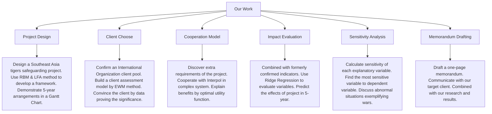
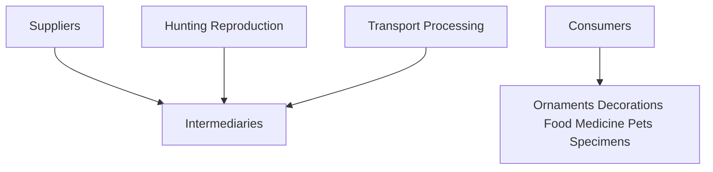
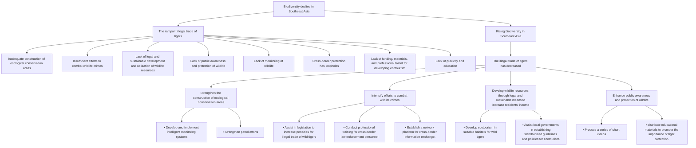
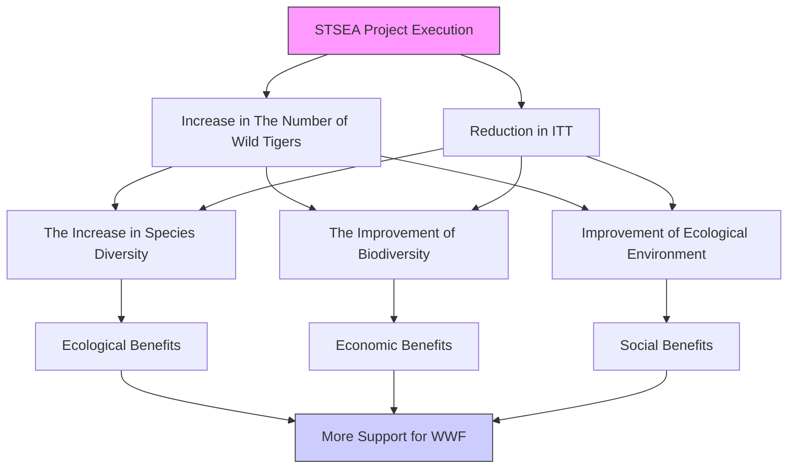

# Roaring Silence: Can We Break the Chains of Illegal Wildlife Trade?

Summary

Our work outlines a comprehensive strategy for combating illegal wildlife trade (IWT), specifically targeting the illegal trade of tigers in Southeast Asia. It is structured into several key tasks:

Developing a Counter-IWT Project: We analyze trends from previous projects based on 764 former projects data and create a targeted project named “Safeguarding Tigers of Southeast Aisa”, focusing on the supply chain of illegal tiger trading. The project design employs methods like Results-Based Management (RBM) and Logic Framework Approach (LFA), all outcomes and activities follow “Specific, Measurable, Appropriate, Realistic, and Time-bound” principle (SMART), with a detailed Gantt Chart for the 5-year plan.

Choosing and Convincing the Most Suitable Client: We discuss and select an appropriate international organization as our client, with the World Wildlife Fund (WWF) emerging as the top choice. The selection process involves a comprehensive client assessment model with a three-level indicators system, using Entropy Weighted Method (EWM) to calculate weights of each indicator. To persuade the WWF to undertake the project, we firstly organize global IWT capital flows to stress the significance of Southeast Aisa, then we prove the importance of the illegal trade of tigers in the whole IWT system in this area by Grey Relational Analysis (GRA) based on the data of wildlife trafficking in Southeast Asia.

Establishing Cross-Organization Cooperation: We propose a model for cooperation between WWF and Interpol, leveraging their respective strengths to enhance the effectiveness of the project. We further elaborate on the benefits of this cooperation, using an Optimal Expected Utility Model under uncertainty and analyzing the model mathematically.

Evaluating the Impact of the Project: We introduce a Ridge Regression Model to assess the project's impact on illegal tiger trade, measuring the correlation between the number of illegal tigers' trade and four objective verifiable indicators (OVIs) of project outcomes respectively. We employ this regression model to predict the futural impact by comparing IWT numbers of tigers with and without our project. We also perform a sensitivity analysis to identify the most impactful variable.

Additionally, we discuss strengths and weaknesses of the approaches and models, provide a One-Page Memorandum to the WWF, and include references and appendices with detailed data and calculations supporting the project.

## Contents

## 1 Introduction....3

1.1 Background .... 3  
1.2 Restatement of the Problem....3  
1.3 Our Work....4

## 2 Model Preparation....5

2.1 Assumptions and Justification....5  
2.2 Glossary 5  
2.3 Data Pre-processing 6

2.3.1 Data Collection....6  
2.3.2 Data Filling and Processing 6

## 3 Task1: Develop A Counter-IWT Project 7

3.1 Discover the Trend of Former Projects....7  
3.2 Design the Project....7

## 4 Task2: Choose and Convince the Most Suitable Client....9

4.1 Who Can Do the Project 9  
4.2 Discussion of Superior and Inferior Indicators 10  
4.3 Analyze the Weights for Inferior Indicators by EWM....11  
4.4 Choose and Convince the Targeting Client 12

4.4.1 Calculate Client Evaluation Score 12  
4.4.2 Convince the Client....12

## 5 Task3: Establish a Cross-Organizations Cooperation Model ....14

5.1 Extra Requirements to Execute the Project 14  
5.2 A Complex System Connecting IWT with All Criminal Activities 14  
5.3 How Cross-Organizations Cooperation Benefits Our Project....15

## 6 Task4: Evaluate the Impact of the Project....16

6.1 Construct a Ridge Regression Model to Measure Correlation....16  
6.2 Predict the Effects of Project by the Regression Model....18  
6.3 Sensitivity Analysis....19

## 7 Strength and Weakness....20

## Memorandum 21

## References....22

## Appendix....22

## 1 Introduction

## 1.1 Background

Illegal wildlife trade (IWT), based on OECD (2019) definition, refers to the commerce in wildlife, or their parts, or by-products, which contravenes international legal agreements or the domestic laws of the countries involved. It covers the full spectrum of unlawful activities in the wildlife crime chain. This includes various illegal actions. Additionally, it involves related criminal activities necessary for these transactions, such as money laundering, corruption, and the sale of these illegal goods.

IWT endangers multiple aspects of human society and environment, hence the efforts to counter IWT should never stop. However, current projects may be not effective enough to solve the problem entirely, more novel ideas are being collected continually. To break through existing limitations, we must try to develop more targeted and cooperative projects to deal with the problem by stages in a long term.

The annual value of the wildlife trade globally stands at USD \$30-42 billion, and \$20 billion of that is estimated to be generated from the illegal trade

Over 500 species of birds and 500 species of reptiles are traded around the world

natural_image

Silhouettes of animals and a globe showing African continent (no text or symbols)

Figure 1: Combating IWT for a better World

At least 1/3 of the wildlife die during trade transportation each year, the post capture death rate has been as high as 90%

## 1.2 Restatement of the Problem

Considering the background information and restricted conditions identified in the problem statement, we need to tackle the following five tasks:

Task1: Develop a 5-year Counter-IWT project which is effective and executable.

Task2: With the goal of the project, choose and convince the most suitable client according to its power, resources and interests.

Task3: Analyze and give ways to satisfy extra requirements to carry out the project.

Task4: Evaluate the impact of the project by stages and consider expectation and sensitivity analysis.

Task5: Communicate project and expectation with the client in a memorandum.

## 1.3 Our Work

For clarity, we draw a structure map (Figure 2) to represent our work clearly.

flowchart

Figure 2: Work Structure

To solve Task 1, we design our specific project based on analysis of total trend. We collect 764 former projects information and identify Southeast Asia as the most trending area based on funding data. Then we design a targeted project named "STSEA" for Counter-IWT of tigers in Southeast Aisa by intervening at supply part in the industrial value chain. We use a combination of RBM and LFA methods to design a project by analyzing the problem tree and the objective tree. Following SMART principle, all our outcomes are corresponded with measure indicators shown in a Logframe Matrix. The whole 5-year arrangement is clearly demonstrated in a Gantt Chart.

As to Task 2, we narrow our choices to seven international organizations based on the requirements of our project. To choose the most suitable client for our project, we build a client assessment model with three-level indicators. We use Entrop Weighted Method to confirm the weight of each indicator and calculate the score of client pools. We choose World Wildlife Fund (WWF) with the highest score as our most suitable client. To convince WWF to undertake our project, we firstly emphasize the significance of Southeast Asia by analyzing the global IWT capital flow, then we use Grey Correlation Degree Analysis based on SEA IWT data to show the necessity of undertaking tigers-targeted project in combating IWT.

For Task 3, we consider extra requirements of our project which are not satisfied by WWF. We notice that wildlife crime crackdown requires armed forces, so we consider the possibility of cooperating with Interpol. As for a complex crime system, wildlife crime is tightly connected with global criminal activities, giving the inspiration to Interpol to the cooperation. To explain the benefit of cooperation, we built an optimal expected utility model under uncertainty. It sees legal and illegal trade of tigers as two accessible investment choices, and concludes that brought by the cooperation, the raising of detection rate contributes to the decrease of illegal wildlife trade.

Then come to the Task 4, using indicators we used in project framework, we build a ridge regression model to measure the correlation between our project activities and project goals. We predict SEA IWT number of tigers in the 5-year of the project, which demonstrate the quantitative effects of our project. For sensitivity analysis, we calculate sensitivity of each explanatory variable to dependent variable to find out the most sensitive variable. We discuss abnormal situations exemplifying wars.

As for Task 5, we organize our research and results, communicating with our targeting client in a one-page memorandum with the expectation and effects of our project.

## 2 Model Preparation

## 2.1 Assumptions and Justification

To simplify the problem, we make the following assumptions. Other assumptions will be introduced once they are used in specific models.

Assumption 1: Futural Counter-IWT projects will be consistent with current total trend.

Justification 1: Multiple Counter-IWT projects have been executed in different areas with different strengths. The whole progress is a long-term effort with consistent direction. Therefore, it is feasible to judge the most trending area of futural projects according to previous project funding and description data.

Assumption 2: An effective Counter-IWT project should be specific and trans-regional.

Justification 2: IWT is a complex systematic problem, identifying and intervening at key link in the industrial value chain is more executable and practical. Wildlife habitats as well as IWT behaviors are always cross-border. Hence, a specific and trans-regional project can be more effective than general and domestic project.

Assumption 3: Individuals make decisions by logically and consistently pursuing their own self-interest, aiming to maximize utility or profit.

Justification 3: Human rationality implies that given all relevant information and options, a person will evaluate and act upon them in a way that maximizes their personal benefit or satisfaction.

## 2.2 Glossary

Table1: Glossary

<table><tr><td>Glossary</td><td>Meaning</td></tr><tr><td>SEA</td><td>Southeast Asia</td></tr><tr><td>GOV</td><td>Government</td></tr><tr><td>IWT</td><td>Illegal Wildlife Trade</td></tr><tr><td>IO</td><td>International Organization</td></tr><tr><td>SMART</td><td>Specific, Measurable, Appropriate, Realistic, and Time-bound</td></tr><tr><td>LFA</td><td>Logic framework approach</td></tr><tr><td>RBM</td><td>Results-based management</td></tr><tr><td>OVI</td><td>Objective verifiable indicator</td></tr><tr><td>LNR</td><td>Local natural reserve</td></tr><tr><td>Interpol</td><td>The international criminal police organization</td></tr><tr><td>ITT</td><td>Illegal trade of tigers</td></tr></table>

Note: Other none frequent-used symbols will be introduced once they are used.

## 2.3 Data Pre-processing

## 2.3.1 Data Collection

We select former projects data to discover the trend for project design, and we build a selected IOs basic information dataset to assess the most suitable client for our project. Additionally, we also some wildlife trade and trafficking data for our further research.

To ensure the comprehensiveness and authority of our data, we choose the following websites as our data sources.

Table2: Data Source

<table><tr><td>Data Source</td><td>Website</td></tr><tr><td>IWT Database</td><td>https://illegalwildlifetradeprojects.org</td></tr><tr><td>UN Contrade Database</td><td>https://comtradeplus.un.org</td></tr><tr><td>UNODC Statistics</td><td>https://www.unodc.org</td></tr><tr><td>IOs Data</td><td>Official websites of each selected IO</td></tr></table>

## 2.3.2 Data Filling and Processing

Data availability is crucial, as unreliable or false data hinders accurate assessments of global equity. Therefore, ensuring data continuity and authenticity is essential. Nonetheless, data gaps often occur due to incomplete disclosure from countries. for data completion, we use many methods including regression, averaging, etc.

These methods help in maintaining the integrity of the data, which is vital for accurate and reliable analysis. Other data processing methods will be introduced once they are used in specific models.

## 3 Task1: Develop A Counter-IWT Project

## 3.1 Discover the Trend of Former Projects

Since IWT is a serious problem, multiple projects have been carried out in different countries with different strengths. By collecting 764 former projects data, we draw a Funding Map (Figure 3) based on the normalized funding data (range from 0 to 100) by countries to demonstrate the flow direction of most project fundings. It is visualized to find that SEA countries draw large amounts of fundings, which identifies SEA as a trending area. Our project will target in this area to be consistent with total trend.

heatmap

| Country | Value |
| --- | --- |
| North America | 100 |
| Europe | 80 |
| Asia | 75 |
| South America | 60 |
| Africa | 50 |
| Australia | 40 |
| Central Asia | 30 |
| Middle East | 25 |
| Southeast Asia | 20 |
| Eastern Europe | 15 |
| Southern Africa | 10 |
| Central America | 8 |
| North Africa | 7 |
| South Asia | 6 |
| Southeast Asia | 5 |
| Central Asia | 4 |
| South Asia | 3 |
| North America | 2 |
| Europe | 15 |
| Asia | 10 |
| South America | 8 |
| Central America | 6 |
| Southeast Asia | 5 |
| Eastern Europe | 4 |
| Southern Africa | 3 |
| Central Asia | 2 |
| North America | 1 |
| Europe | 0.5 |
| Asia | 0.3 |
| South America | 0.2 |
| Central Asia | 0.1 |
| South America | -0.1 |
| Africa | -0.2 |
| Central America | -0.3 |
| Southeast Asia | -0.4 |
| Eastern Europe | -0.5 |
| Southern Africa | -0.6 |
| Central Asia | -0.7 |
| North America | -0.8 |
| Europe | -0.9 |
| Asia | -1.0 |
| South America | -1.1 |
| Central Asia | -1.2 |
| Southeast Asia | -1.3 |
| Eastern Europe | -1.4 |
| Southern Africa | -1.5 |
| Central Asia | -1.6 |
| North America | -1.7 |
| Europe | -1.8 |
| Asia | -1.9 |
| South America | -2.0 |
| Central Asia | -2.1 |
| Southeast Asia | -2.2 |
| Eastern Europe | -2.3 |
| Southern Africa | -2.4 |
| Central Asia | -2.5 |
| North America | -2.6 |
| Europe | -2.7 |
| Asia | -2.8 |
| South America | -2.9 |
| Central Asia | -3.0 |
| Southeast Asia | -3.1 |
| Eastern Europe | -3.2 |
| Southern Africa | -3.3 |
| Central Asia | -3.4 |
| North America | -3.5 |
| Europe | -3.6 |
| Asia | -3.7 |
| South America | -3.8 |
| Central Asia | -3.9 |
| Southeast Asia | -4.0 |
| Eastern Europe | -4.1 |
| Southern Africa | -4.2 |
| Central Asia | -4.3 |
| North America | -4.4 |
| Europe | -4.5 |
| Asia | -4.6 |
| South America | -4.7 |
| Central Asia | -4.8 |
| Southeast Asia | -4.9 |
| Eastern Europe | -5.0 |
| Southern Africa | -5.1 |
| Central Asia | -5.2 |
| North America | -5.3 |
| Europe | -5.4 |
| Asia | -5.5 |
| South America | -5.6 |
| Central Asia | -5.7 |
| Southeast Asia | -5.8 |
| Eastern Europe | -5.9 |
| Southern Africa | -6.0 |
| Central Asia | -6.1 |
| North America | -6.2 |
| Europe | -6.3 |
| Asia | -6.4 |
| South America | -6.5 |
| Central Asia | -6.6 |
| Southeast Asia | -6.7 |
| Eastern Europe | -6.8 |
| Southern Africa | -6.9 |
| Central Asia | -7.0 |
| North America | -7.1 |
| Europe | -7.2 |
| Asia | -7.3 |
| South America | -7.4 |
| Central Asia | -7.5 |
| Southeast Asia | -7.6 |
| Eastern Europe | -7.7 |
| Southern Africa | -7.8 |
| Central Asia | -7.9 |
| North America | -8.0 |
| Europe | -8.1 |
| Asia | -8.2 |
| South America | -8.3 |
| Central Asia | -8.4 |
| Southeast Asia | -8.5 |
| Eastern Europe | -8.6 |
| Southern Africa | -8.7 |
| Central Asia | -8.8 |
| North America | -8.9 |
| Europe | -9.0 |
| Asia | -9.1 |
| South America | -9.2 |
| Central Asia | -9.3 |
| Southeast Asia | -9.4 |
| Eastern Europe | -9.5 |
| Southern Africa | -9.6 |
| Central Asia | -9.7 |
| North America | -9.8 |
| Europe | -9.9 |
| Asia | -10.0 |
| South America | -10.1 |
| Central Asia | -10.2 |
| Southeast Asia | -10.3 |
| Eastern Europe | -10.4 |
| Southern Africa | -10.5 |
| Central Asia | -10.6 |
| North America | -10.7 |
| Europe | -10.8 |
| Asia | -10.9 |
| South America | -11.0 |
| Central Asia | -11.1 |
| Southeast Asia | -11.2 |
| Eastern Europe | -11.3 |
| Southern Africa | -11.4 |
| Central Asia | -11.5 |
| North America | -11.6 |
| Europe | -11.7 |
| Asia | -11.8 |
| South America | -11.9 |
| Central Asia | -12.0 |
| Southeast Asia | -12.1 |
| Eastern Europe | -12.2 |
| Southern Africa | -12.3 |
| Central Asia | -12.4 |
| North America | -12.5 |
| Europe | -12.6 |
| Asia | -12.7 |
| South America | -12.8 |
| Central Asia | -12.9 |
| Southeast Asia | -13.0 |
| Eastern Europe | -13.1 |
| Southern Africa | -13.2 |
| Central Asia | -13.3 |
| North America | -13.4 |
| Europe | -13.5 |
| Asia | -13.6 |
| South America | -13.7 |
| Central Asia | -13.8 |
| Southeast Asia | -13.9 |
| Eastern Europe | -14.0 |
| Southern Africa | -14.1 |
| Central Asia | -14.2 |
| North America | -14.3 |
| Europe | -14.4 |
| Asia | -14.5 |
| South America | -14.6 |
| Central Asia | -14.7 |
| Southeast Asia | -14.8 |
| Eastern Europe | -14.9 |
| Southern Africa | -15.0 |
| Central Asia | -15.1 |
| North America | -15.2 |
| Europe | -15.3 |
| Asia | -15.4 |
| South America | -15.5 |
| Central Asia | -15.6 |
| Southeast Asia | -15.7 |
| Eastern Europe | -15.8 |
| Southern Africa | -15.9 |
| Central Asia | -16.0 |
| North America | -16.1 |
| Europe | -16.2 |
| Asia | -16.3 |
| South America | -16.4 |
| Central Asia | -16.5 |
| Southeast Asia | -16.6 |
| Eastern Europe | -16.7 |
| Southern Africa | -16.8 |
| Central Asia | -16.9 |
| North America | -17.0 |
| Europe | -17.1 |
| Asia | -17.2 |
| South America | -17.3 |
| Central Asia | -17.4 |
| Southeast Asia | -17.5 |
| Eastern Europe | -17.6 |
| Southern Africa | -17.7 |
| Central Asia | -17.8 |
| North America | -17.9 |
| Europe | -18.0 |
| Asia | -18.1 |
| South America | -18.2 |
| Central Asia | -18.3 |
| Southeast Asia | -18.4 |
| Eastern Europe | -18.5 |
| Southern Africa | -18.6 |
| Central Asia | -18.7 |
| North America | -18.8 |
| Europe | -18.9 |
| Asia | -19.0 |
| South America | -19.1 |
| Central Asia | -19.2 |
| Southeast Asia | -19.3 |
| Eastern Europe | -19.4 |
| Southern Africa | -19.5 |
| Central Asia | -19.6 |
| North America | -19.7 |
| Europe | -19.8 |
| Asia | -19.9 |
| South America | -20.0 |
| Central Asia | -20.1 |
| Southeast Asia | -20.2 |
| Eastern Europe | -20.3 |
| Southern Africa | -20.4 |
| Central Asia | -20.5 |
| North America | -20.6 |
| Europe | -20.7 |
| Asia | -20.8 |
| South America | -20.9 |
| Central Asia | -21.0 |
| Southeast Asia | -21.1 |
| Eastern Europe | -21.2 |
| Southern Africa | -21.3 |
| Central Asia | -21.4 |
| North America | -21.5 |
| Europe | -21.6 |
| Asia | -21.7 |
| South America | -21.8 |
| Central Asia | -21.9 |
| Southeast Asia | -22.0 |
| Eastern Europe | -22.1 |
| Southern Africa | -22.2 |
| Central Asia | -22.3 |
| North America | -22.4 |
| Europe | -22.5 |
| Asia | -22.6 |
| South America | -22.7 |
| Central Asia | -22.8 |
| Southeast Asia | -22.9 |

Figure 3: Project Funding Map by countries $^{1}$

## 3.2 Design the Project

To design an executable, we firstly draw an IWT industrial value chain according to comprehensive relevant information to simple show each part of IWT activities. Since IWT is a complex and systematic problem, it is more practical to intervene one part in a project specially. Based on practical condition in SEA, we find out that SEA plays a more significant rule as Suppliers & Mediaries. Combining with previous research and project, we are about to create a special project targeted to SEA IWT supply part of Tigers. We call our project as: Safeguarding Tigers in Southeast Asia (STSEA).

flowchart

Figure 4: Regular IWT industrial value chain

Using Results-Based Management (RBM) and Logic Framework Approach (LFA), which are popular methods for many IO projects, we start with analyzing and drawing the problem tree and the objective tree. We identify the main problem as the rampant illegal trade of tigers, with Biodiversity decline in SEA as a long-term effect as well as four main reasons:

-Inadequate construction of ecological conservation areas,  
-Insufficient efforts to combat wildlife crimes,  
-Lack of legal and sustainable development and utilization of wildlife resources,  
-Lack of public awareness and protection of wildlife.

then we design the objective tree combing our goals with intervening activities. All objectives are determined following SMART principle. Our specific goal, “The decrease of illegal trade of tigers”, has four branching targets, each target respectively responds the reason of problem above:

- Strengthening the construction of ecological conservation areas,  
- Intensifying efforts to combat wildlife crimes,  
- Developing wildlife resources legally to increase residents' income,  
- Enhancing public awareness and protection of wildlife.

flowchart

Figure 5: The problem tree(left) & objective tree(right) of STSEA

All our outcomes have specific measures to reach, which are also demonstrate at the bottom of the objective tree. Then we build OVIs to measure the results and outcomes. Here we draw a Logframe Matrix to demonstrate OVIs of goals and expected results.

Objective Measurable Indicators of the STSEA Project

<table><tr><td>Overall Goal: Increase biodiversity in Southeast Asia</td><td>Objective Verifiable Indicator: Southeast Asian Biodiversity Index</td></tr><tr><td>Specific Goals: Reduce ITT in Southeast Asia</td><td>Objective Verifiable Indicator: Tiger numbers in IWT</td></tr><tr><td>Outcome Results (over the next five years): 1. Ecological protection areas have been constructed2. The crackdown on wildlife crimes has been strengthened3. Wildlife resources have been effectively developed and environmental benefits have increased4. People&#x27;s awareness of animal protection has been enhanced</td><td>Objective Verifiable Indicator (over the next five years): 1. The total area of terrestrial protected areas will increase by 5%2. The detection rate of illegal wildlife trade cases will increase by 25%3. Local residents&#x27; employment rate will increases by 0.5%4. The online search volume for animal protection related terms will increased by 15%</td></tr></table>

Expected change in OVIs overthe next five years  
Figure 6: Logframe matrix of STSEA

Eventually, we develop a Gantt Chart to organize the whole 5-year time schedule. We clearly show our plan of each activity in the chart which is considerably executable.

STSEA Project Schedule  

timeline diagram

| Project Phase | Project Content | 2024 | 2025 | 2026 | 2027 | 2028 |
|---|---|---|---|---|---|---|
| 1 | 2 | 3 | 4 | 5 | 6 | 7 |
| 2 | 3 | 4 | 5 | 6 | 7 | 8 |
| 3 | 9 | 10 | 11 | 12 | 1 | 2 |
| 4 | 11 | 12 | 1 | 2 | 3 | 4 |
| 5 | 12 | 1 | 2 | 3 | 4 | 5 |
| 6 | 13 | 14 | 15 | 16 | 17 | 18 |
| 7 | 14 | 15 | 16 | 17 | 18 | 19 |
| 8 | 15 | 16 | 17 | 18 | 19 | 20 |
| 9 | 16 | 17 | 18 | 19 | 20 | 21 |
| 10 | 17 | 18 | 19 | 20 | 21 | 22 |
| 11 | 18 | 19 | 20 | 21 | 22 | 23 |
| 12 | 19 | 20 | 21 | 22 | 23 | 24 |
| Summary &Closure | Data organization Project acceptance Project evaluation | (value not labeled) | (value not labeled) | (value not labeled) | (value not labeled) | (value not labeled) |
The chart displays a timeline with horizontal bars indicating task durations or time intervals for each phase. The 'Preparation & Initiation' section is highlighted in black text at the top left. The 'Execution &Control' section is highlighted in black text at the bottom left. The 'Summary &Closure' section is highlighted in black text at the bottom right. The 'Team building Resource preparation' section is highlighted in black text at the top left. The 'Summary &Closure' section contains an additional label on the timeline.

Figure 7: Gantt Chart of the 5-year schedule of STSEA

## 4 Task2: Choose and Convince the Most Suitable Client

## 4.1 Who Can Do the Project

We believe an effective Counter-IWI project should be specific and trans-regional. We firstly consider the type of our clients: Governments (GOVs), International Organizations (IOs), and Entrepreneurs. GOVs are undoubtedly more capable in general and domestic projects because its national system. However, as for specific and trans-regional projects raised by one GOV, it may face the lack of special expertise and barriers of international cooperation. Specialized entrepreneurs and IOs tend to have more experts and energy to focus on one specific project, but IOs have natural advantages when it comes to trans-regional project. Therefore, we eventually narrow our clients pool to the following 7 most relevant Specialized IOs:

Table3: Clients Pool

<table><tr><td>Abbr.</td><td>Full Name</td></tr><tr><td>IFAW</td><td>International Fund for Animal Welfare</td></tr><tr><td>IUCN</td><td>International Union for Conservation of Nature</td></tr><tr><td>TRAFFIC</td><td>Wildlife Trade Monitoring Network</td></tr><tr><td>UNEP</td><td>United Nations Environment Programme</td></tr><tr><td>WCS</td><td>Wildlife Conservation Society</td></tr><tr><td>WILDAID</td><td>WildAid</td></tr><tr><td>WWF</td><td>World Wildlife Fund</td></tr></table>

## 4.2 Discussion of Superior and Inferior Indicators

Since we have confirmed the clients pool, we need to measure the degree of capability and fitness of different IOs to evaluate the most suitable and realistic client.

To create a IOs capability&fitness assessment system, we need to select representative indicators. Combined with previous researches, we have concluded that the analysis can be carried out by measuring the three major factors of Organizational Influence, Communication Influence, and Special Influence. The three-levels indicators are clearly shown in Table3.

Table4: Three-levels Indicators

<table><tr><td>Primary Indicators</td><td>Secondary Indicators</td><td>Tertiary Indicators</td></tr><tr><td rowspan="7">Organizational Influence (OI)</td><td rowspan="3">FC: Financial condition</td><td>TA: Total assets</td></tr><tr><td>TR: Total revenues</td></tr><tr><td>TE: Total expenses</td></tr><tr><td rowspan="2">HR: Human resource</td><td>DR: Number of directors</td></tr><tr><td>GS: Number of global staffs</td></tr><tr><td rowspan="2">CA: Coordinate ability</td><td>GP: Relationship of global partnerships</td></tr><tr><td>DO: Duration of organization</td></tr><tr><td rowspan="5">Communication Influence (CI)</td><td rowspan="2">WI: Web impact</td><td>LW: Languages of official website</td></tr><tr><td>SW: Search Volume of official website</td></tr><tr><td rowspan="3">SMI: Social media impact</td><td>FF: Number of Fans in Facebook</td></tr><tr><td>FI: Number of Fans in Instagram</td></tr><tr><td>FX: Number of Fans in X/Twitter</td></tr><tr><td rowspan="4">Special Influence (SI)</td><td rowspan="2">FS: Field specialization</td><td>PA: Counter-IWT projects amounts</td></tr><tr><td>FA: Counter-IWT fundings amounts</td></tr><tr><td rowspan="2">RF: Regional Familiarity</td><td>PP: Proportion of projects in SEA to total projects</td></tr><tr><td>PF: Proportion of fundings in SEA to total fundings</td></tr></table>

## 4.3 Analyze the Weights for Inferior Indicators by EWM

After making indicator system and collecting data, we establish a model based on Entrop Weighted Method (EWM) to calculate weights of different indicators. The principle is using the degree of variation between different data to judge information it reflects, then weight will be assigned to it.

We start with data normalization. Indicators constructed above are all benefit attributes (the bigger, the better), hence we get positive-definite matrix X. We do vector normalization by:

$$
y _ {i j} = \frac {x _ {i j}}{\sqrt {\sum_ {i = 1} ^ {n} x _ {i j} ^ {2}}} \tag {1}
$$

where $\sum_{i=1}^{n} x_{ij}^2$ is the sum of squares of all elements in the $j^{th}$ column, and $n$ is the number of rows in the column $j$ . Then we get a normalized matrix $Y$ .

Then, we calculate the proportion $p^{ij}$ of the $j^{th}$ indicator in the $i^{th}$ sample.

$$
p _ {i j} = \frac {y _ {i j}}{\sum_ {i = 1} ^ {n} y _ {i j}} \tag {2}
$$

where $y_{ij}$ refers to the normalized value of the $j^{th}$ indicator in the $i^{th}$ sample, and $1 \leq i \leq m$ . Next, we get the Entropy Value of the $j^{th}$ indicator by:

$$
e _ {j} = - \frac {1}{\ln n} \sum_ {i = 1} ^ {n} p _ {i j} \ln \left(p _ {i j}\right), j = 1, 2, \dots , m \tag {3}
$$

Therefore, we can get $W_{j}$ as the Weight of the $j^{th}$ indicator:

$$
W _ {j} = \frac {1 - e _ {j}}{\sum_ {i = 1} ^ {m} \left(1 - e _ {j}\right)} \tag {4}
$$

where $m$ is the number of indicators in special levels. Based on calculated processing, we get:

$$
\left\{ \begin{array}{l} O I = W _ {1} \times F C + W _ {2} \times H R + W _ {3} \times C A \\ C I = W _ {1} \times W I + W _ {2} \times S M I \\ S I = W _ {1} \times F S + W _ {2} \times R F \end{array} \right. \tag {5}
$$

where the value of each secondary indicators can be calculated similarly. And we use TOPSIS model to normalize all scores (ranging from 0 to 1). Therefore, we get the equation to measure the capability & fitness score (0-100) of the $i^{th}$ selected IO.

$$
\text { Score } _ {i} = \left(W _ {1} \times O I _ {i} + W _ {2} \times C I _ {i} + W _ {3} \times S I _ {i}\right) \times 1 0 0 \tag {6}
$$

## 4.4 Choose and Convince the Targeting Client

## 4.4.1 Calculate Client Evaluation Score

Following the calculating process above, we gain weights matrices of indicators in different levels. The weighted results are clearly demonstrated in Figure 8:

  
Figure 8: Indicator weights for client assessment

Based on the weights, we calculate scores of all clients in our pools and the result is:

IFAW 15.81, IUCN 26.53, TRAFFIC 55.05, UNEP 64.35, WCS 57.47, WILDAID 11.12, WWF 78.70.

All scores ranging from 0-100 manifest the degree of capability & fitness for an IO to carry out our project. OI and CI reveal the ability of an organization considering its power, scale, resources, etc. While SI reveals the interest and experience of carrying out a Counter-IWT project in SEA.

## 4.4.2 Convince the Client

An idealized client for our project should have relatively strong power, experience, and interest in SEA Counter-IWT. Our evaluation scores manifest that WWF with the highest score may execute the project better. Hence, we choose WWF as our client.

Since our project focuses on Counter-IWT of tigers in SEA, we try to convince WWF to undertake this project from two aspects: the seriousness of SEA IWT, and the seriousness of tigers IWT in SEA.

Firstly, data shows the seriousness of SEA IWT. Based on UN Comtrade Data, we draw a map to clearly demonstrate big IWT flow centering SEA in the World. It is evident that SEA plays and irreplaceable role in global IWT activities. As a core supplying place of various illegal wildlife products, SEA attracts plenty of illegal trade flow. From the map, we can see Indonesia, Malaysia, Thailand, Cambodia, Vietnam are intensively connected with flow lines, combining a crucial area of global IWT activities.

sankey map

| Country | Exporter (USD m) | Importer (USD bn) |
|---|---|---|
| Canada | $375m | $1.5bn |
| United States | $1.5bn | $1.5bn |
| Brazil | $375m | $1.5bn |
| Chile | $375m | $1.5bn |
| Argentina | $375m | $1.5bn |
| Russia | $750m | $1.5bn |
| Netherlands | $750m | $1.5bn |
| UK | $750m | $1.5bn |
| Denmark | $750m | $1.5bn |
| Hungary | $750m | $1.5bn |
| Japan | $750m | $1.5bn |
| China | $750m | $1.5bn |
| India | $750m | $1.5bn |
| Thailand | $750m | $1.5bn |
| Vietnam | $750m | $1.5bn |
| Malaysia | $750m | $1.5bn |
| Singapore | $750m | $1.5bn |
| Indonesia | $750m | $1.5bn |
| Australia | $750m | $1.5bn |
| Korea, Japan | $750m | $1.5bn |
| Japan (Asia, nes) | $750m | $1.5bn |
| United States (Total) | - | - |
| Canada (Total) | - | - |
| United States (Total) (Total) (Total) (Total) (Total) (Total) (Total) (Total) (Total) (Total) (Total) (Total) (Total) (Total) (Total) (Total) (Total) (Total) (Total) (Total) (Total) (Total) (Total) (Total) (Total) (Total) (Total) (Total) (Total) (Total) (Total) (Total) (Total) (Total)

Figure 9: Global IWT Flow Centering SEA

Secondly, we collect SEA wildlife trafficking data in UNODC Statistics and establish a Grey Relational Analysis (GRA) to discover the most crucial species/products in SEA wildlife trafficking. Generally, the trafficking data is always uncertain and incomplete, hence GRA can be one of best methods to discover the relational degree between species.

We start with constructing an annual sequence of total SEA trafficking by countries as the reference sequence Y, and a matrix of annual SEA trafficking data by animals/products as the comparison sequence X. The dimensionless processing of sequences is as following:

$$
\tilde {y} _ {k} = \frac {y _ {k}}{\frac {1}{n} \sum_ {k = 1} ^ {n} y _ {k}}, \tilde {x} _ {k i} = \frac {x _ {k i}}{\frac {1}{n} \sum_ {k = 1} ^ {n} x _ {k i}} (i = 1, 2, \dots , m) \tag {1}
$$

where $x_{ki}$ refers to the value of the $i^{th}$ animal/product in the $k^{th}$ year, and m is the number of columns in matrix X, which stands for the type of animal/product. After dimensionless processing, we calculate correlation coefficients of indicators in comparison sequence:

$$
a = \underset {i} {\min} \underset {k} {\min} \Big | x _ {0} (k) - x _ {i} (k) \Big |, b = \underset {i} {\max} \underset {k} {\max} \Big | x _ {0} (k) - x _ {i} (k) \Big |,
$$

$$
\xi_ {i} = \frac {a + \rho b}{\left| x _ {0} (k) - x _ {i} (k) \right|}, \rho = 0. 5 \tag {2}
$$

where $\xi_{i}$ refers to the correlation coefficient of the $i^{th}$ indicator, and $\rho$ is the resolution coefficient. Hence, we get the correlation degree of the $i^{th}$ indicator:

$$
r _ {i} = \frac {1}{n} \sum_ {k = 1} ^ {n} \xi_ {i} (k) \tag {3}
$$

The sequence of correlation degrees is shown in figure, and the comprehensive correlation degrees of each specie/product are:

Tigers 0.83, Live reptiles 0.80, European eels 0.76, Elephant 0.74, Rhino horns 0.71, Pangolins 0.68

Tigers indeed plays the most important role in SEA total IWT activities.

line chart

| Year       | Elephant tusks | Live reptiles | Tigers | Pangolins | Rhino horns | European eels |
| ---------- | -------------- | ------------- | ------ | --------- | ----------- | ------------- |
| 2002-2019  | 1.0            | 1.0           | 1.0    | 1.0       | 1.0         | 1.0           |
| 2005-2017  | 0.9            | 0.9           | 0.9    | 0.9       | 0.9         | 0.9           |
| 2007-2017  | 0.4            | 0.6           | 0.7    | 0.7       | 0.7         | 0.7           |
| 2007-2018  | 0.6            | 0.7           | 0.6    | 0.6       | 0.6         | 0.6           |
| 2011-2018  | 0.8            | 0.9           | 0.7    | 0.7       | 0.7         | 0.7           |
| 2015-2019  | 0.2            | 0.5           | 1.0    | 1.0       | 1.0         | 1.0           |

Figure 10: Sequence of Correlation Degrees

Therefore, since the mission of WWF is “to conserve nature and reduce the most pressing threats to the diversity of life on Earth”, combating IWT in most serious area by protecting the most important animals in the industrial chain is advisable. Currently, WWF’s efforts in SEA are limited. It is highly suggested that SEA is serious areas and tigers are most serious species worthy more attention, which is also our project targeted to.

## 5 Task3: Establish a Cross-Organizations Cooperation Model

## 5.1 Extra Requirements to Execute the Project

Our project still has some extra requirements that WWF may not satisfy, one of which is to combating wildlife crimes by intensifying crime crackdown. WWF focuses on conservation and environmental issues through a variety of non-military methods without its own military forces. It is also impractical to advise WWF to build its own forces for wildlife crime fighting. Many illegal IWT criminals are armed fully, the work of crime crackdown must have a tight connection with other institutions with military forces. Additionally, IWT crimes are always cross-boarders, making it more difficult for governments to manage. To meet the extra requirement featuring armed forces, here we give an idea to inspire the connection with Interpol by analyzing the complex global criminal system as well as building an optimal expected utility model.

## 5.2 A Complex System Connecting IWT with All Criminal Activities

Considering a complex system of crime, we can find a tight relationship between IWT and who global criminal activities, from which we can get the inspiration of Interpol to join into the cooperation.

Wildlife crime has a long derivative criminal chain. Based on the industrial value chain above and other researches, we find poaching, trafficking and smuggling are tightly connected with the whole criminal system. Poaching criminals always have access to illegal arms linked with illegal arms dealer and other production chain. As for trafficking and smuggling, they are tightly connected with global illegal transportation system, especially in SEA as a sensitive area, which may also contain the transportation of other illegal products like drugs.

Therefore, SEA wildlife crime is tightly connected with global criminal system. It is beneficial for Interpol's further crackdown of other types of crimes by taking part in combating SEA wildlife. The inspiration of Interpol for cooperation is built accordingly.

## 5.3 How Cross-Organizations Cooperation Benefits Our Project

To explain the benefits of cooperation between WWF and INTERPOL, we use the optimal expected utility function considering the choices available to all individuals as a gamble with certain outcomes (legal income) and associated probabilities (IWT income). The expected utility function allows us to represent the preferences of different individuals under uncertainty.

Here we see an individua's all energy and capability to take part in activities as the investment capital to invest different activities, which is similar to the “endowment” concept. And for simplification, we only consider two activities here: legal activities and illegal trade of tigers (ITT), we consider take part in the two activities as similarly investment behaviors, i.e. use all capital in a ratio to invest both activities respectively.

Here, we follow the Rational Individual Assumption, individuals will try the best to maximize the utility under constraints. We also assume all individuals are equal with the same investment capital Z, and use X in legal activities and Y in ITT. The utility function of legal activities is $V_{l}(x)$ , and of ITT activities is $V_{i}(y)$ . Once deciding to take part in ITT activities, individual will face risk to be detected and punished like arrestment. We assume detection rate is $\pi$ , and being detected means no payoff from the ITT activities as well as cost for the penalty, we define cost function of penalty is $f(y)$ . Here we make following explanation:

1) Both $V_{l}(x)$ and $V_{i}(y)$ are increasing and concave functions because of the nature of utility functions, their first-order derivatives are positive while the second-order ones are negative.

2) $f(y)$ is also an increasing and concave function because once $y$ increases, which means taking more ITT activities, the penalty will increase, and we assume the marginal penalty cost is decreasing.

Therefore, we get the following situation: an individual can both take part in two activities, with the expected utility function:

$$
\operatorname{Max} \left(E U _ {\text {total}}\right) = V _ {l} (x) + (1 - \pi) \times V _ {i} (y) - \pi \times f (y), \tag {1}
$$

$$
\mathrm{s.t.} \mathrm{x} + \mathrm{y} \leq \mathrm{z}
$$

Here we get the Lagrange function calculate FOCs as following:

$$
L (x, y, \lambda) = V _ {l} (x) + (1 - \pi) V _ {i} (y) - \pi f (y) - \lambda (x + y - z)
$$

$$
\Rightarrow F O C s = \left\{ \begin{array}{l} V _ {l} ^ {\prime} (x) = \lambda \\ (1 - \pi) V _ {i} ^ {\prime} (y) - \pi f ^ {\prime} (y) = \lambda \\ x + y = z \end{array} \right. \tag {2}
$$

Based on results above, we see $x$ as a function of $y$ and hence we can calculate the relation between $y$ and $\pi$ :

$$
- V _ {l} ^ {\prime \prime} (z - y) \frac {\partial y}{\partial \pi} = - V _ {i} ^ {\prime} (y) + (1 - \pi) V _ {i} ^ {\prime \prime} (y) \frac {\partial y}{\partial \pi} - f ^ {\prime} (y) + \pi f ^ {\prime \prime} (y) \frac {\partial y}{\partial \pi} \tag {3}
$$

$$
\Rightarrow \frac {\partial y}{\partial \pi} = \frac {- V _ {l} ^ {\prime} (y) - f ^ {\prime} (y)}{- V _ {l} ^ {\prime \prime} (z - y) - (1 - \pi) V _ {i} ^ {\prime \prime} (y) - \pi f ^ {\prime \prime} (y)}
$$

According to the explanation of functions above, we can know the numerator is negative and the denominator is positive, which means $\frac{\partial y}{\partial \pi} \leq 0$ . Similarly, and accordingly, we calculate the relation between the investment ratio $\frac{x}{y}$ and $\pi$ :

$$
\frac {\partial}{\partial \pi} \left(\frac {z - y}{y}\right) = \frac {- \frac {\partial y}{\partial \pi} y - (z - y) \frac {\partial y}{\partial \pi}}{y ^ {2}} = \frac {- z \frac {\partial y}{\partial \pi}}{y ^ {2}} = \frac {\partial \frac {x}{y}}{\partial \pi}, x + y = z \tag {4}
$$

where $\frac{\partial y}{\partial\pi} \leq 0$ and therefore, $\frac{\partial(x/y)}{\partial\pi}$ is positive.

Then, the benefits of cross-organization cooperation can be inferred by the raise of $\pi$ . With cooperation, the detection rate will increase: firstly, WWF is equipped with more specific experts and wildlife crime experience since it concentrates on this field, while Interpol has more armed forces to crackdown criminals. The cooperation can help raise the detection rate by combining forces of Interpol and expertise of WWF. By raising the rate $\pi$ , combining with former calculating results, we get:

As a rational individual, if $\pi$ raises, the capital using in ITT (y) will decrease, while the investment ratio $(x/y)$ will increase. It means the cooperation can better reduce individual's inspiration of taking part in ITT activities, bringing a more effective result of our project in terms of wildlife crime crackdown.

## 6 Task4: Evaluate the Impact of the Project

## 6.1 Construct a Ridge Regression Model to Measure Correlation

Using the OVIs built in project design (Figure 6), we try to measure the correlation between the specific goal and the outcome results. Here our notation is as following:

Table5: Variable notation

<table><tr><td>Dependent Variable: y</td><td>the number of tigers in IWT</td></tr><tr><td>Explanatory Variable:</td><td></td></tr><tr><td> $x_{1}$ </td><td>online search volume for animal protection related terms.</td></tr><tr><td> $x_{2}$ </td><td>local residents&#x27; employment rate.</td></tr><tr><td> $x_{3}$ </td><td>total area size of terrestrial protected areas.</td></tr><tr><td> $x_{4}$ </td><td>the detection rate of illegal wildlife trade cases.</td></tr></table>

We consider multiple linear regression model initially; the basic form of this model is:

$$
y = \beta_ {0} + \beta_ {1} x _ {1} + \beta_ {2} x _ {2} + \beta_ {3} x _ {3} + \beta_ {4} x _ {4} \tag {1}
$$

then calculate Variance Inflation Factor (VIF) to judge potential multicollinearity concerns:

$$
R = \sqrt {\frac {\sum_ {i = 1} ^ {n} \left(\widehat {y} _ {i} - \bar {y}\right) ^ {2}}{\sum_ {i = 1} ^ {n} \left(\widehat {y} _ {i} - \bar {y}\right) ^ {2} + \sum_ {i = 1} ^ {n} \left(y _ {i} - \widehat {y} _ {i}\right) ^ {2}}}, V I F = \frac {1}{1 - R ^ {2}} \tag {2}
$$

Therefore, we get results in Table6:

Table6: Multiple linear regression results

<table><tr><td colspan="10">Dependent Variable: y, Sample size: n=7 (by year)</td></tr><tr><td>Variable</td><td>B.</td><td>S.E.</td><td>Beta</td><td>t</td><td>P&gt;|t|</td><td>VIF</td><td>R2</td><td>Adj. R2</td><td>F</td></tr><tr><td>Constant</td><td>395.276</td><td>112.543</td><td></td><td>3.512</td><td>0.072*</td><td></td><td></td><td></td><td></td></tr><tr><td> $x_{1}$ </td><td>-0.002</td><td>0.002</td><td>-0.338</td><td>-1.447</td><td>0.285</td><td>15.069</td><td></td><td></td><td>F=68.411</td></tr><tr><td> $x_{2}$ </td><td>-5.433</td><td>1.504</td><td>-0.787</td><td>-3.612</td><td>0.069*</td><td>13.08</td><td>0.993</td><td>0.978</td><td rowspan="3">P=0.014**</td></tr><tr><td> $x_{3}$ </td><td>-1.14</td><td>1.053</td><td>-0.26</td><td>-1.083</td><td>0.392</td><td>15.908</td><td></td><td></td></tr><tr><td> $x_{4}$ </td><td>-0.215</td><td>0.05</td><td>-0.55</td><td>-4.336</td><td>0.049**</td><td>4.43</td><td></td><td></td></tr><tr><td colspan="10">Note: ***p &lt; 0.01, **p &lt; 0.05, and *p &lt; 0.10。</td></tr></table>

We notice high VIF values (above 10), indicating potential multicollinearity concerns. We turn to Ridge Regression Model to solve this problem; the basic equation of this model is:

$$
L _ {M S E} = \sum_ {i = 1} ^ {n} \left(y _ {i} - \widehat {y} _ {i}\right) ^ {2} = (y - \widehat {y}) ^ {T} (y - \widehat {y}) + k \| w \| _ {2} \tag {3}
$$

where k is a parameter and $\|w\|_{2}$ is a regularization term. Calculate $\|w\|_{2}$ by:

$$
w = \left(X ^ {T} X + k I\right) ^ {- 1} X ^ {T} y, \| w \| _ {2} = \sum_ {i = 1} ^ {4} w _ {i} ^ {2} = W ^ {T} W \tag {4}
$$

where w is the weight of each explanatory variable. So firstly, we draw Ridge Trace to confirm the value of parameter k through VIF method. Based on Figure11, the value of parameter k is chosen as 0.022.

line chart

| x    | The online search volume | The residents' employment rate | The detection rate of cases | The terrestrial protected areas |
| ---- | ------------------------ | ------------------------------- | --------------------------- | ------------------------------ |
| 0.0  | -0.35                    | -0.8                            | -0.55                       | -0.2                           |
| 0.1  | -0.4                     | -0.6                            | -0.4                        | -0.1                           |
| 0.2  | -0.45                    | -0.5                            | -0.35                       | 0.0                            |
| 0.3  | -0.48                    | -0.45                           | -0.3                        | 0.0                            |
| 0.4  | -0.5                     | -0.4                            | -0.25                       | 0.0                            |
| 0.5  | -0.52                    | -0.35                           | -0.2                        | 0.0                            |
| 0.6  | -0.53                    | -0.3                            | -0.15                       | 0.0                            |
| 0.7  | -0.54                    | -0.25                           | -0.1                        | 0.0                            |
| 0.8  | -0.55                    | -0.2                            | -0.05                       | 0.0                            |
| 0.9  | -0.56                    | -0.15                           | 0.0                         | 0.0                            |
| 1.0  | -0.57                    | -0.1                            | 0.0                         | 0.0                            |

Figure 11: Ridge Trace

Then we can eventually get the results of Ridge Regression Model in Table7:

Table7: Results of Ridge Regression

<table><tr><td colspan="7">Dependent Variable: y, Sample size: n=7 (by year), Parameter k=0.022.</td></tr><tr><td>Variable</td><td>Coef.</td><td>Std.Error</td><td>t-Statistic</td><td>P&gt;|t|</td><td>R2</td><td>F</td></tr><tr><td> $x_1$ </td><td>-0.003</td><td>0.001</td><td>-3.496</td><td>0.073*</td><td></td><td></td></tr><tr><td> $x_2$ </td><td>-4.417</td><td>0.887</td><td>-4.982</td><td>0.038**</td><td></td><td></td></tr><tr><td> $x_3$ </td><td>-0.183</td><td>0.035</td><td>-5.248</td><td>0.034**</td><td>0.991</td><td>F=54.485</td></tr><tr><td> $x_4$ </td><td>-0.488</td><td>0.612</td><td>-0.797</td><td>0.509</td><td></td><td>P=0.018**</td></tr><tr><td>Constant</td><td>319.466</td><td>65.293</td><td>4.893</td><td>0.039**</td><td></td><td></td></tr><tr><td colspan="7">Note: ***p&lt;0.01, **p&lt;0.05, and *p&lt;0.10.</td></tr></table>

The regression equation we get is:

$$
y = 3 1 9. 4 6 6 - 0. 0 0 3 x _ {1} - 4. 4 1 7 x _ {2} - 0. 1 8 3 x _ {3} - 0. 4 8 8 x _ {4} \tag {5}
$$

this equation quantitatively demonstrate how our project will affect illegal tiger trade.

## 6.2 Predict the Effects of Project by the Regression Model

We firstly use collected data as testing set to predict the value of y in previous years, the fitting result are shown in Figure12. This indicates our model is relatively feasible.

line chart

| Year | True Value | Predict Value |
| ---- | ---------- | ------------- |
| 2015 | 12.7       | 12.6          |
| 2016 | 6.9        | 7.0           |
| 2017 | 9.0        | 9.2           |
| 2018 | 13.1       | 13.0          |
| 2019 | 10.8       | 10.7          |
| 2020 | 5.2        | 5.1           |

Figure 12: Testing results of regression model

As we expected in our project design, over the 5-year project, the search volume, the employment rate, the size of terrestrial protected areas, and the crime detection rate will raise by 15%, 0.5%, 5%, 25% respectively. Using the expectation and the regression model to predict, we demonstrate the effect of the project in Figure13.

-○ with STSEA -○ without STSEA  

line chart

| Year | Series 1 | Series 2 |
|---|---|---|
| 2021 | 14.7 | - |
| 2022 | 15.3 | - |
| 2023 | 14.9 | - |
| 2024 | 14.6 | 13.6 |
| 2025 | 14.4 | 12.7 |
| 2026 | 13.8 | 12.3 |
| 2027 | 13.3 | 11.9 |
| 2028 | 12.7 | 11.5 |

Figure 13: Predicted effect of the project

The effect of reserving tigers is feasible based on results above, and we believe the effects can be more generalized. Here is our generalization effects framework:

flowchart

Figure 14: Generalization effects framework

## 6.3 Sensitivity Analysis

We use the following formula to calculate the sensitivity degree of each explanatory variable to the dependent variable:

$$
S _ {i} \left(Y, x _ {i}\right) = \frac {1}{n} \sum_ {t = 1} ^ {n} \frac {\partial y _ {t}}{\partial x _ {i}} \frac {x _ {i}}{y _ {t}}, i = 1, 2, 3, 4 \tag {6}
$$

where $y_{t}$ refers to the prediction equation in t year. The results are demonstrated in following chart (Figure15), which means the most sensitive variable to the number of illegal trade of tigers is the size of the terrestrial protected areas, this inspires more strength to expand the areas for SEA tigers' protection:

bar chart

Average Prediction Impact
| Factor | Average Prediction Impact |
|---|---|
| The terrestrial protected areas | -6.301 |
| The detection rate of cases | -4.141 |
| The residents employment rate | -2.193 |
| The online search volume | -5.883 |

Figure 15: Average prediction sensitivity

Here we discuss an abnormal situation: regional war in SEA. Firstly, Active conflict can halt conservation activities, as the safety of personnel is compromised. Research, monitoring, and active fieldwork are often stopped. Moreover, enforcement of wildlife protection laws can be weakened during conflicts, as attention and resources are diverted. This can lead to an increase in poaching. It is concluded that similar devastating effects can also reverse years of progress and lead to long-term ecological damage. Conservationists and organizations must frequently work in post-conflict scenarios to rebuild these efforts and address the environmental impacts of the conflict.

## 7 Strength and Weakness

## Strength:

Consistence. Our models are consistent with relatively high accuracy, the link of models is logical and reasonable. We build a complete model system for IWT project, ranging from project design to effect evaluation.

Concreteness. Our project and models are concrete to be understood. We design a specific project targeted to counter illegal trade of wild tigers in SEA. Our models have either concrete examples and data or the complete logic chain and suitable mathematic formulas.

Persuasiveness. Our models present a relatively good performance of predicting and fitting.

## Weakness:

Natural shortcomings of mathematic models we use will have effect on the application of practical situations.

Due to the lack of related environmental knowledge, the variables of models are not fully equipped for further analysis.

# MEMORANDUM

## Dear Manager of World Wildlife Fund:

Hello! We are writing to express our keen interest to make contribution to counter against illegal wildlife trade. Our team has developed a specific project targeted the illegal trade of tigers in Southeast Asia. We believe WWF is our best client.

Our project is a five-year project aimed to reduce illegal trade of tigers in Southeast Aisa. It contains constructing ecological protection areas, strengthening crackdown on wildlife crimes, developing wildlife resources reasonably, and raising people's awareness of animal protection in Southeast Asia. We have a clear time schedule of whole five years.

Our specific goal is to Reduce illegal trade of tigers in Southeast Asia. We all know, the mission of WWF is “to conserve nature and reduce the most pressing threats to the diversity of life on Earth”, which is consistent with our project. WWF is undoubtedly a significant non-governmental organization in terms of wildlife protection. We notice that the effort made to Southeast Asia tigers is limitless in recently years. However, by the analysis of capital flow and the data-driven species choosing, we prove the necessity to pay more attention to Southeast Asia and tigers for combating global illegal wildlife trade.

We consider the shortcomings of WWF when it comes to actual crime crackdown. So, we give a way out by cooperating with Interpol. By analyzing the complex global crime system and an optimal utility function, we believe the cooperation between WWF and Interpol can bring the raising of detection rate, resulting in the decrease of wildlife crime.

Furthermore, the expectation of our project is also bright. We measure the effect of each concrete activities in our project and get a hopeful prediction. WWF is the best client with the most suitable capabilities and interest for our project. We will be more than grateful if you can take our project into consideration.

Best wishes!

Yours Sincerely

Team #2409949

## References

[1] OECD (2019), The Illegal Wildlife Trade in Southeast Asia: Institutional Capacities in Indonesia, Singapore, Thailand and Viet Nam, Illicit Trade, OECD Publishing, Paris, https://doi.org/10.1787/14fe3297-en.  
[2] Wildlife Conservancy Society. (2021). Impact of Illegal Trafficking on Wildlife. Retrieved from https://wildlifetrade.wcs.org/Wildlife-Trade/What-is-its-impact-on-wildlife.aspx.  
[3] Wildlife Conservancy Society. (2021). Wildlife Trafficking Impact on our Society. Retrieved from https://wildlifetrade.wcs.org/Wildlife-Trade/What-is-its-impact-on-the-society.aspx.  
[4] European Union. (2022). Logical Framework Approach - LFA. Retrieved from https://wikis.ec.europa.eu/display/ExactExternalWiki/Logical+Framework+Approach+-+LFA.  
[5] UN-Habitat. (2017). Results-Based Management Handbook. Retrieved from https://unhabitat.org/results-based-management-handbook.

## Appendix

Table: Weights of indicators and scores in client assessment

<table><tr><td>Weight_1</td><td>Weight_2</td><td>Weight_3</td><td>Score</td></tr><tr><td rowspan="7">OI: 29%</td><td rowspan="3">FC: 31.5%</td><td>TA: 45.8%</td><td rowspan="3">IFAW:15.82</td></tr><tr><td>TR: 29.1%</td></tr><tr><td>TE: 25.1%</td></tr><tr><td rowspan="2">HR: 36%</td><td>DR: 45.8%</td><td rowspan="2">IUCN:26.53</td></tr><tr><td>GS: 54.2%</td></tr><tr><td rowspan="2">CA: 32.5%</td><td>GP: 41.7%</td><td rowspan="2">TRAFFIC:14.09</td></tr><tr><td>DO: 58.3%</td></tr><tr><td rowspan="5">CI: 51.4%</td><td rowspan="3">WI: 38.7%</td><td>LW: 57%</td><td rowspan="2">UNEP:64.35</td></tr><tr><td>SW: 43%</td></tr><tr><td>FF: 22%</td><td>WCS:57.47</td></tr><tr><td rowspan="2">SMI: 61.3%</td><td>FI: 42%</td><td rowspan="2">WILDAID:11.12</td></tr><tr><td>FX: 36%</td></tr><tr><td rowspan="4">SI: 19.6%</td><td rowspan="2">FS: 68.7%</td><td>PA: 71.5%</td><td rowspan="4">WWF: 78.71</td></tr><tr><td>FA: 28.5%</td></tr><tr><td rowspan="2">RF: 31.3%</td><td>PP: 41.2%</td></tr><tr><td>PF: 58.8%</td></tr></table>