# Momentum Prediction and Core Feature Extraction Based on GRU with Integrated Gradients

Summary

Currently, coaches, players, and managers are all aware that "momentum" plays a huge role in the progress of tennis matches. By analyzing the changes in momentum during the game, we can evaluate the performance of players during specific time periods and make speculations about the game results. By understanding the factors that influence the momentum of the game, we can assess the fluctuations in the game process and construct a player training system. Therefore, it is crucial to recognize the role of "momentum" in the game and use it to help players cope with events that affect the progress of the game.

Firstly, we established an Instantaneous Score Rate (ISR) model to capture match points. After using the cubic spline interpolation method to process discrete data, the model can smoothly estimate the Instantaneous score rate at any time and accurately capture key moments in the competition. Based on the results of this model, we can quickly identify the performance of players at specific time points. In addition, the results of the model clearly demonstrate the first mover advantage of the serving party in the game, which is consistent with the facts. Then, we establish a model to test the role of momentum in the competition. The results indicate that there is not independent between fluctuations in the game and the success of players. In addition to the first mover advantage, there will be a strong "momentum" in the game that affects the Instantaneous Score Rate.

Next, in order to predict fluctuations in the competition, we use Gated Recurrent Neural Network Model (GRU) with Integrated Gradients for feature disentanglement engineering. Based on the GRU model, we can fit the "momentum" function under existing conditions to accurately predict the change in competition momentum. We manually divided the original indicators into six dimensions. Using the Integrated Gradient algorithm, the impact of six dimensions on the output is indicated from the GRU model output. Based on the model results, we have identified 12 important indicators that have an significant impact on schedule fluctuations. On this basis, we established a competency evaluation system based on six dimensions, and provided targeted suggestions to players based on the analysis of real player abilities.

In addition, we tested the predictive ability of the model in real-time data of different genders, game systems, and ball games. The test results have shown that our model can accurately predict other competition processes and has high generalization ability.

Finally, in order to help coaches cultivate players to better cope with events that affect the tennis schedule, we provide targeted recommendations. We hope these suggestions can help players achieve victory in the new game.

Keywords: Momentum, GRU, Integrated Gradient, Disentanglement.

# Contents

1 Introduction 2  
2 Assumptions and Notations 4  
3 Model Preparation 4

3.1 Data Collection 4  
3.2 Data Cleaning 5

4 Instantaneous Scoring Rate Model 5

4.1 Cubic spline interpolation 5  
4.2 Instantaneous Scoring Rate for the match 7

5 Test of Independence Between Momentum and Victory 8

5.1 Assumption: Momentum and victory are independent ..... 8  
5.2 Verification: Momentum has an impact on victory ..... 9

6 Disentangled feature Engineering via GRU with integrated gradients 9

6.1 Important Data Extraction 9  
6.2 Match Suggestion Based on Capability Evaluation ..... 15

7 Generalization Testing 16

7.1 Basic Test 16  
7.2 Error Analysis 16  
7.3 Generalization Ability Test 17

8 Conclusion 19  
9 Strengths and Possible Improvements 19

9.1 Strength 19  
9.2 Possible Improvements 19

Appendices 23

# 1 Introduction

# Background

In the men's final of the 2023 Wimbledon Open, Novak Djokovic took on rising Spanish star Carlos Alcaraz. Djokovic seemed destined for an easy win, winning the first set by an absolute margin of 5 points; while the second set was tense, with Alcaraz winning 7-6 in a tie-break; and the third set was the opposite of the first, with Alcaraz defeating Djokovic by an absolute margin of 5 points... After a number of changes in the trend of the tournament, Grand Slam Djokovic, one of the greatest players in history, lost at Wimbledon for the first time since 2013. [1]

In tennis, "momentum" means the power that a player acquires in a match through movement or a series of events. When momentum can be used to measure a player's performance at a particular point in a match, the players themselves, coaches, and managers have an advantage in determining how the situation on the court is changing, for example, which player is likely to be the winner of the next point [2]. As a result, coaches would like to better understand if momentum can be used to determine player performance and the extent to which it can be used at a given point in time. If possible, coaches would like to gain a better understanding of the factors that influence fluctuations in Momentum, so that they can better judge the future course of the game and use it as a reference in training to develop more successful players.

Academics have paid attention to the issue of "momentum" in sports events. Some scholars have looked at the psychology of athletes [3], the point of serve [4], Strategic momentum [5] and other aspects of momentum in mental tennis. Existing empirical research suggests that in tennis, players can control the match to benefit themselves from momentum, and that the amount of countermovement will result in a player having a significantly lower chance of winning the underdog set than his opponent [6]. Generalized linear mixed-effects models have also been constructed to demonstrate the legacy effects of score, game, and set [7]. Therefore, by analyzing a large amount of game flow data, we can explore the relationship between momentum and its scoring rate and winning rate based on determining the performance of players in different time periods, and visualize the game flow from the perspective of momentum, with a view to providing references for coaches, players, the public and the media.

Some scholars have pointed out that the factors that cause changes in momentum are multiple, including errors and psychological changes during the game $[8]$ . Some empirical scholars have also focused on the indicator of break points in the data as an important variable in the study of momentum shifts in matches. $[5]$ On this basis, by examining the mechanisms by which different factors influence "momentum", we can analyze which factors have the greatest impact on match volatility and suggest that coaches, players, the public, and the media pay attention to these indicators.

A preliminary finding of some studies is that, from a psychological point of view, there is little difference in the ability of male and female tennis players to overcome the influence of momentum in order to win the match. [9] In examining the influence of momentum, gender, venue, and type of match may affect the results of the analysis, which leads us to test the generalizability of the model to changing contexts.

# Problem Restatement

\- Build model 1 to capture match points in the flow of the game and identify the players who performed better and to what extent at a given point in the game.

\- Test Provide a visualization of the flow of the game based on Model 1.

\- Judging whether the fluctuation of momentum in the match is independent of the subsequent scoring situation.

\- Build Model 2 to predict fluctuations in game "momentum" and identify better metrics to help determine game situations.

\- Test the accuracy and generalizability in predicting the degree of fluctuation in a match.

\- Gives tactical strategies for winning tennis matches against different opponents based on fluctuations in momentum.

\- A memo written by summarizes the results and advises coaches on the following directions:

\- Influencing the direction of play through the "momentum" of the game.

\- Preparing players for events that affect the tennis schedule.

# Our Work

We examined the extent to which "momentum" reflects player performance in tennis, and based on its impact indicators, we provide tennis coaches with suggestions for focusing on the role of "momentum" and developing good players based on this concept, as described below:

- Build Model 1 to visualize the game schedule.  
- Based on Model 1, evaluate the coach's stochastic assumption that fluctuations in momentum during a match are independent of a player's subsequent score.  
- Builds Model 2, which predicts game fluctuations and identifies the relevant indicators that have the most significant impact on the direction of the game.  
- Based on Model 2, provide advice to players in a new round of the tournament on how to play against different opponents.  
- Test the above model, examine its generalizability, and point out the influencing factors that are lacking in consideration.  
- Summarizes the results of the study and makes recommendations to coaches


<details>
<summary>flowchart</summary>


</details>

Figure 1: Our Work Frame

# 2 Assumptions and Notations

# Assumptions

Asm. 1 Not considering the decline in performance of players due to injury or physical factors  
Asm. 2 There is no negative game phenomenon such as players maliciously controlling points  
Asm. 3 The competition is formal, and the vast majority of off field factors have been screened out. The only off field factor that can affect the game situation is the current score of the match  
Asm. 4 Assuming previous research data is accurate.

# Notations

In this work, we use the notations in Table 1 in the model construction. Other symbols will be introduced once they are used.

Table 1: Notations used in this literature

<table><tr><td>symbol</td><td>Description</td></tr><tr><td>i</td><td>Point number in match</td></tr><tr><td> $t_i$ </td><td>The point begins with a serve 1 minute and thirty-one seconds after the start of the first point of the match.</td></tr><tr><td> $y_i$ </td><td>Player 2&#x27;s relative point for the Game relative to Player 1</td></tr><tr><td>f</td><td>Relative Score Curve( $f(t_i) = y_i$ )</td></tr><tr><td> $ISR_i$ </td><td>Instantaneous score rate at theithpoint of match</td></tr><tr><td>m</td><td>Momentum Curve</td></tr></table>

# 3 Model Preparation

Our data primarily comes from the problems provided, with a minority of the data manually extracted from the official tennis website.

# 3.1 Data Collection

The dataset, maintained by Jeff Sackmann and available publicly on GitHub $^{1}$ , encompasses detailed point-by-point data from Grand Slam tennis matches. It provides exhaustive details for each point scored, including serve details, scoring, and errors. Additionally, we manually collected the final match of table tennis from the 2020 Olympics $^{2}$ as our supplementary dataset. We also collected matches from Github $^{3}$ as auxiliary information, obtaining extra details about the matches such as the type of surface, the type of tournament, etc.

# 3.2 Data Cleaning

The available data were divided into 32 time-series data according to the belonging matches for subsequent model training. For the missing values (NaN) in the data, we filled them according to the distribution they belonged to: (1) The missing values of serve speed were sampled and filled according to the player's serving habits in other matches using a normal distribution. (2) Missing values for variables with two values, such as depth of return and serve position, were sampled to fill them based on the frequency of that player's values for that data in other matches using a Bernoulli distribution. (3) Missing values for variables with multiple different values, such as depth of serve, were sampled and filled in based on a multinomial distribution based on the frequency of the player's values of this data in other matches. (4) Missing values for distance run were sampled according to the player's habits and filled in according to a uniform distribution. For the outlier 0 in the tension value of the data, we constructed a new distribution using the frequency of tension values in other games and resampled it according to that distribution.

# 4 Instantaneous Scoring Rate Model

At the end of a tennis match, we can not only get the result of the match, but often also get a lot of information about the tournament process, i.e. whether the player who serves first has an advantage over the player who serves later, which player performs better in the early part of the match, which player performs better in the late part of the match and to what extent they are all better, etc. Due to the discrete characteristics of the data of the whole tournament process, in order to analyze the whole tournament process as well as to predict the tournament trend, we use the cubic spline interpolation method to interpolate the original discrete data $\{(t_{i}, y_{i})\}$ into a quadratic differentiable function f in order to derive the Instantaneous Scoring Ratio at each point.

$$
I S R _ {i} = (\frac {d}{d t} f) (t _ {i}) \tag {1}
$$

# 4.1 Cubic spline interpolation

Cubic spline interpolation not only ensures smooth continuity of the curve through each given point, but also ensures continuity of the first- and second-order derivatives of the curve, avoiding the oscillations that are common to higher-order polynomial interpolation - the Longe phenomenon. Its ability to control locally means that adjusting a point will affect only a small part of the curve, not the whole. Based on the above advantages, we utilize cubic spline interpolation for interpolation to quadratic differentiable functions. The cubic spline interpolation formula is shown below:

$$
\left[ \begin{array}{c c c c c c} 1 & 0 & 0 & & \dots & 0 \\ h _ {0} & 2 \left(h _ {0} + h _ {1}\right) & h _ {1} & & & \\ 0 & h _ {1} & 2 \left(h _ {1} + h _ {2}\right) & h _ {2} & \dots & 0 \\ 0 & 0 & h _ {2} & 2 \left(h _ {2} + h _ {3}\right) & & \vdots \\ \vdots & & \ddots & \dots & \ddots & \\ & & 0 & h _ {n - 2} & \dots & h _ {n - 1} \\ 0 & \dots & & 0 & 1 \end{array} \right] \left[ \begin{array}{c} m _ {0} \\ m _ {1} \\ m _ {2} \\ m _ {3} \\ \vdots \\ m _ {n} \end{array} \right] = 6 \left[ \begin{array}{c} 0 \\ \frac {y _ {2} - y _ {1}}{h _ {1}} - \frac {y _ {1} - y _ {0}}{h _ {0}} \\ \frac {y _ {3} - y _ {2}}{h _ {2}} - \frac {y _ {2} - y _ {1}}{h _ {1}} \\ \frac {y _ {4} - y _ {3}}{h _ {3}} - \frac {y _ {3} - y _ {2}}{h _ {2}} \\ \vdots \\ \frac {y _ {n} - y _ {n - 1}}{h _ {n - 1}} - \frac {y _ {n - 1} - y _ {n - 2}}{h _ {n - 2}} \\ 0 \end{array} \right] \tag {2}
$$

We write the interpolated sample points as $\{(t_{i},y_{i})\}_{i=0}^{n}$ (it may be useful to set $t_{0}<\cdots<t_{n}$ ), and define $h_{i}=t_{i+1}-t_{i}(i=0,\ldots,n-1)$ , and select boundary conditions as natural boundary conditions. After the solution of $m_{i}(i=0,\ldots,n)$ , the interpolation function between $t_{i}$ and $t_{i+1}$ can be expressed by the following equation:

$$
f (t) = y _ {i} + (\frac {y _ {i + 1} - y _ {i}}{h _ {i}} - \frac {h _ {i}}{2} m _ {i} - \frac {h _ {i}}{6} (m _ {i + 1} - m _ {i})) x + \frac {m _ {i}}{2} t ^ {2} + \frac {m _ {i + 1} - m _ {i}}{6 h _ {i}} t ^ {3} \quad (t _ {i} \leq t <   t _ {i + 1}) \tag {3}
$$

It can be proved that the segmented function is everywhere quadratically differentiable.

Therefore, we are able to obtain an interpolation function based on the difference between the cumulative scores of the two sides of the match as shown in Figure 2, where the vertical coordinates of the points on the graph indicate the total score of player 2 at this time minus the total score of player 1 at this time.


<details>
<summary>scatter</summary>

| Time | Original Data (Y) | Cubic Spline Interpolation (Y) |
| --- | --- | --- |
| 0 | ~1 | ~0 |
| 2000 | ~-3 | ~-3 |
| 4000 | ~5 | ~5 |
| 6000 | ~-2 | ~-2 |
| 8000 | ~-3 | ~-3 |
| 10000 | ~-12 | ~-13 |
| 12000 | ~-6 | ~-6 |
| 14000 | ~-16 | ~-16 |
</details>

Figure 2: Relative Score Curve

After obtaining the relative scoring curve, we can use the derivative to describe the instantaneous change in scoring, i.e., the current direction of the match. The derivative of the relative scoring curve is shown in the Figure 3, and it can be used to describe the match flow very well:


<details>
<summary>area</summary>

| Time | ISR | Player 1 | Player 2 |
| --- | --- | --- | --- |
| 0 | ~0.5 | ~-0.1 | 0 |
| 2000 | ~-0.9 | ~-0.1 | 0 |
| 4000 | ~0.4 | ~-0.1 | 0 |
| 6000 | ~0.5 | ~-0.1 | 0 |
| 8000 | ~0.4 | ~-0.1 | 0 |
| 10000 | ~0.5 | ~-0.1 | 0 |
| 12000 | ~0.5 | ~-0.1 | 0 |
| 14000 | ~0.3 | ~-0.1 | 0 |
</details>

Figure 3: Instantaneous Score Rate Curve

# 4.2 Instantaneous Scoring Rate for the match

Utilizing the differentiability of the cubic spline function, we derive the interpolated continuous function and observe the derivative value of each scoring point, thus reflecting the relative instantaneous scoring rate between the two players to capture the critical moments in the game. In addition to this, by analyzing the position of the instantaneous scoring rate relative to 0 at each moment, we can assess the scoring efficiency of each player at this moment, as shown in Fig. 4: when the instantaneous scoring rate is lower than 0, it means that the player's scoring will be reduced at this point, whereas the position away from 0 responds to the extent to which the player scores or loses points at this point - -The further the distance from 0, the higher or lower the player's scoring rate then, thus allowing identification of which player is performing better at a given point in time.

Based on the above image, we colored the scatterplot according to which player served first at that score, and the coloring results are shown in Figure 4:

  
Figure 4: Scatter plot of March Flow

Based on the above analysis, it is easy to find that the relative scoring rate of player 1 is usually higher when player 1 serves first, and the relative scoring rate of player 2 is higher when player 2 serves first. Meanwhile, by studying the frequency graph of the game, as shown in Fig. 5, we can see that whether it is Player 1 or Player 2, the one who serves first will get a higher winning rate, which is the first-hand advantage in the game.


<details>
<summary>histogram</summary>

| Metric | Player 1 | Player 2 |
| --- | --- | --- |
| Mean (Player 1) | -0.11 | 0.35 |
| Mean (Player 2) | 0.21 | 0.21 |
| Std Dev (Player 1) | 0.35 | 0.39 |
| Std Dev (Player 2) | 0.39 | 0.39 |
</details>

Figure 5: Histogram of ISR Distinguishing the Server

# 5 Test of Independence Between Momentum and Victory

In order to investigate the role of "momentum" in the game, we developed a flow and momentum independent model and a non-independent model to test whether there is randomness between fluctuations in the game and players' success, so as to better respond to coaches' questions. The study shows that the flow and momentum independent model does not hold, and that flow and momentum are not independent, and that sequential hands and momentum will jointly affect the scoring rate. The specific testing process is as follows:

# 5.1 Assumption: Momentum and victory are independent

If the future scoring rate and the potential are independent of each other, a change in the potential will not affect the future scoring rate. In this case, we first eliminate the part of the future scoring rate of the two players about the first-hand advantage, that is, we subtract the instantaneous scoring rate of each moment from its expectation and divide it by the sample variance. The difference should be independent and follow the same bounded distribution, and the same is true for the difference in the expected instantaneous scoring rate of the other player. The distribution of the instantaneous scoring rate of the two players and their expected difference is shown in Figure 6. From the central limit theorem, if the sequence of independent random variables with the same distribution has a bounded expectation and variance, then the sequence of random variables after normalization and will be based on the distribution converges to the standard normal distribution, with single-peak characteristics. However, as can be seen from Figure6, the difference distribution has bimodal peaks and does not obey the normal distribution. Therefore, the prior and the potential

are not independent, and the flow-potential independence model does not hold.


<details>
<summary>histogram</summary>

| Bin (Y) | Player 1 (Frequency) | Player 2 (Frequency) |
| --- | --- | --- |
| -1.10~-1.00 | 0 | 1 |
| -1.00~-0.90 | 0 | 1 |
| -0.90~-0.80 | 0 | 1 |
| -0.80~-0.70 | 0 | 2 |
| -0.70~-0.60 | 0 | 1 |
| -0.60~-0.50 | 0 | 4 |
| -0.50~-0.40 | 6 | 4 |
| -0.40~-0.30 | 10 | 5 |
| -0.30~-0.20 | 11 | 6 |
| -0.20~-0.10 | 10 | 8 |
| -0.10~0.00 | 6 | 5 |
| 0.00~0.10 | 5 | 6 |
| 0.10~0.20 | 3 | 15 |
| 0.20~0.30 | 7 | 7 |
| 0.30~0.40 | 8 | 10 |
| 0.40~0.50 | 6 | 8 |
| 0.50~0.60 | 3 | 4 |
| 0.60~0.70 | 3 | 1 |
| 0.70~0.80 | 2 | 1 |
</details>

Figure 6: Histogram of ISR Distinguishing the Server after normalization

# 5.2 Verification: Momentum has an impact on victory

Since the independent model did not hold, we further examined the non-independent model, i.e., factors other than the forehand serve affecting the match scoring rate. As can be seen in Figure 6, the instantaneous scoring rate of the two players coincides with the peak of their expected difference wave after the effect of the forehand serve on the scoring rate is removed. This indicates that at a certain period of time, no matter the player is a forehand serve or a backhand serve, there is a stronger advantage at some time, such as right side of the wave peak in Fig. 6 represents that the player who serves the ball with the backhand serve has a stronger advantage at a certain time, so the potential and the successive hands will jointly affect the scoring rate, and the non-independence model is established.

# 6 Disentangled feature Engineering via GRU with integrated gradients

In order to further investigate when the flow of the game shifts from favoring one player to favoring another, this study, based on the GRU model and the integrated points algorithm, aims to be able to get the prediction results of the game's momentum shift in order to get the key factors affecting the game's momentum shift and thus to make suggestions for the players to get a better performance in the new game.

# 6.1 Important Data Extraction

In the previous section we obtained the calculation of the instantaneous scoring rate by interpolation and then derivation, but it can be noticed that the amplitude and frequency of vibration

of this scoring rate are extremely large, which is very unfavorable for us to estimate this value effectively. Thus, we chose to use a 10-point moving average in smoothing the instantaneous scoring rate, i.e., each point on this average is equal to the average of the instantaneous scoring rate at the first ten scoring points (including the scoring points at this moment):

$$
m (t _ {i}) = \frac {1}{1 0} \sum_ {k = 0} ^ {9} I S R _ {i - k} \quad (i \geq 1 0) \tag {4}
$$


<details>
<summary>area</summary>

| Time | Momentum (Player 1) | Momentum (Player 2) |
| --- | --- | --- |
| 0 | 0 | 0 |
| 2000 | 0 | 0 |
| 4000 | 0 | 0 |
| 6000 | 0 | 0 |
| 8000 | 0 | 0 |
| 10000 | 0 | 0 |
| 12000 | 0 | 0 |
| 14000 | 0 | 0 |
</details>

Figure 7: Momentum Curve

It can be seen that the moving average can effectively reflect the trend of the Instantaneous Scoring Rate, so we choose the moving average as the momentum of the match. Therefore, when the average line crosses the 0 axis, it means that the momentum of the game has changed at this time. We tried to fit the "momentum" function based on the known information through the neural network GRU. First of all, we will introduce the GRU model, GRU is simpler than the structure of an LSTM network, and the effect is also very good, so it is also a current streaming kind of network, which can solve the long dependence problem in the RNN network. There are only two gates in the GRU model: the update gate and the reset gate, respectively. The specific structure is shown in the following schematic:

In this schematic, the calculation formula of each element is specified as follows:

$$
\begin{array}{l} r _ {t} = \sigma \left(W _ {r} \cdot [ h _ {t - 1}, x _ {t} ]\right) \\ z _ {t} = \sigma \left(W _ {z} \cdot [ h _ {t - 1}, x _ {t} ]\right) \\ \tilde {h} _ {t} = \tanh \left(W _ {\tilde {h}} \cdot \left[ r _ {t} * h _ {t - 1}, x _ {t} \right]\right) \tag {5} \\ h _ {t} = (1 - z _ {t}) * h _ {t - 1} + z _ {t} * \tilde {h} _ {t} \\ y _ {t} = \sigma \left(W _ {o} \cdot h _ {t}\right) \\ \end{array}
$$

RNN model in the sequence is too long will occur when the gradient disappears problem, resulting in the parameters only capturing the local relationship, not learning the long-term association, the ability to remember the words in the front of the sequence being weak, and the GRU model


<details>
<summary>flowchart</summary>

```mermaid
graph LR
  xt["xt"] -->|x̃| ht["ht-1"]
  ht -->|x̃| x̃["x"]
  ht -->|x̃| +["+"]
  ht -->|x̃| x̃_t["x̃_t"]
  ht -->|x̃_t| tanh["tanh"]
  tanh -->|x̃_t| xT["x̃_t"]
  xT -->|z_t| z_t["z_t"]
  z_t -->|1-| xT
  xT -->|r_t| xT
  xT -->|r_t| xT
```
</details>

Figure 8: Gate Recurrent Unit Model

to a certain extent to ensure that use of the fewer parameters to mitigate the problem of gradient vanishing.


<details>
<summary>flowchart</summary>

```mermaid
graph LR
  xT0["x_t^0"] --> xT01["x_t^0_1"]
  xT0 --> xT02["x_t^0_2"]
  xT0 --> xT03["x_t^0_3"]
  xT0 --> xT04["x_t^0_4"]
  xT0 --> xT05["x_t^0_5"]
  xT0 --> xT06["x_t^0_6"]
  xT0 --> xT07["x_t^0_7"]
  xT0 --> xT08["x_t^0_8"]
  xT0 --> xT09["x_t^0_9"]
  xT0 --> xT010["x_t^0_10"]
  xT0 --> xT011["x_t^0_11"]
  xT0 --> xT012["x_t^0_12"]
  xT0 --> xT013["x_t^0_13"]
  xT0 --> xT014["x_t^0_14"]
  xT0 --> xT015["x_t^0_15"]
  xT0 --> xT016["x_t^0_16"]
  xT0 --> xT017["x_t^0_17"]
  xT0 --> xT018["x_t^0_18"]
  xT0 --> xT019["x_t^0_19"]
  xT0 --> xT020["x_t^0_20"]
  xT0 --> xT021["x_t^0_21"]
  xT0 --> xT022["x_t^0_22"]
  xT0 --> xT023["x_t^0_23"]
  xT0 --> xT024["x_t^0_24"]
  xT0 --> xT025["x_t^0_25"]
  xT0 --> xT026["x_t^0_26"]
  xT0 --> xT027["x_t^0_27"]
  xT0 --> xT028["x_t^0_28"]
  xT0 --> xT029["x_t^0_29"]
  xT0 --> xT030["x_t^0_30"]
  xT0 --> xT031["x_t^0_31"]
  xT0 --> xT032["x_t^0_32"]
  xT0 --> xT033["x_t^0_33"]
  xT0 --> xT034["x_t^0_34"]
  xT0 --> xT035["x_t^0_35"]
  xT0 --> xT036["x_t^0_36"]
  xT0 --> xT037["x_t^0_37"]
  xT0 --> xT038["x_t^0_38"]
  xT0 --> xT039["x_t^0_39"]
  xT0 --> xT040["x_t^0_40"]
  xT0 --> xT041["x_t^0_41"]
  xT0 --> xT042["x_t^0_42"]
  xT0 --> xT043["x_t^0_43"]
  xT0 --> xT044["x_t^0_44"]
  xT0 --> xT045["x_t^0_45"]
  xT0 --> xT046["x_t^0_46"]
  xT0 --> xT047["x_t^0_47"]
  xT0 --> xT048["x_t^0_48"]
  xT0 --> xT049["x_t^0_49"]
  xT0 --> xT050["x_t^0_50"]
  xT0 --> xT051["x_t^0_51"]
  xT0 --> xT052["x_t^0_52"]
  xT0 --> xT053["x_t^0_53"]
  xT0 --> xT054["x_t^0_54"]
  xT0 --> xT055["x_t^0_55"]
  xT0 --> xT056["x_t^0_56"]
  xT0 --> xT057["x_t^0_57"]
  xT0 --> xT058["x_t^0_58"]
  xT0 --> xT059["x_t^0_59"]
  xT0 --> xT060["x_t^0_60"]
  xT0 --> xT061["x_t^0_61"]
  xT0 --> xT062["x_t^0_62"]
  xT0 --> xT063["x_t^0_63"]
  xT0 --> xT064["x_t^0_64"]
  xT0 --> xT065["x_t^0_65"]
  xT0 --> xT066["x_t^0_66"]
  xT0 --> xT067["x_t^0_67"]
  xT0 --> xT068["x_t^0_68"]
  xT0 --> xT069["x_t^0_69"]
  xT0 --> xT070["x_t^0_70"]
  xT0 --> xT071["x_t^0_71"]
  xT0 --> xT072["x_t^0_72"]
  xT0 --> xT073["x_t^0_73"]
  xT0 --> xT074["x_t^0_74"]
  xT0 --> xT075["x_t^0_75"]
  xT0 --> xT076["x_t^0_76"]
  xT0 --> xT077["x_t^0_77"]
  xT0 --> xT078["x_t^0_78"]
  xT0 --> xT079["x_t^0_79"]
  xT0 --> xT080["x_t^0_80"]
  xT0 --> xT081["x_t^0_81"]
  xT0 --> xT082["x_t^0_82"]
  xT0 --> xT083["x_t^0_83"]
  xT0 --> xT084["x_t^0_84"]
  xT0 --> xT085["x_t^0_85"]
  xT0 --> xT086["x_t^0_86"]
  xT0 --> xT087["x_t^0_87"]
  xT0 --> xT088["x_t^0_88"]
  xT0 --> xT089["x_t^0_89"]
  xT0 --> xT090["x_t^0_90"]
  xT0 --> xT091["x_t^0_91"]
  xT0 --> xT092["x_t^0_92"]
  xT0 --> xT093["x_t^0_93"]
  xT0 --> xT094["x_t^0_94"]
  xT0 --> xT095["x_t^0_95"]
  xT0 --> xT096["x_t^0_96"]
  xT0 --> xT097["x_t^0_97"]
  xT0 --> xT098["x_t^0_98"]
  xT0 --> xT099["x_t^0_99"]
  xT0 --> xT100["x_t^100"]
  xT0 --> hT100["h_t^100"]
  xT0 --> hT101["h_t^101"]
  xT0 --> hT102["h_t^102"]
  xT0 --> hT103["h_t^103"]
  xT0 --> hT104["h_t^104"]
  xT0 --> hT105["h_t^105"]
  xT0 --> hT106["h_t^106"]
  xT0 --> hT107["h_t^107"]
  xT0 --> hT108["h_t^108"]
  xT0 --> hT109["h_t^109"]
  xT0 --> hT110["h_t^110"]
  xT0 --> hT111["h_t^111"]
  xT0 --> hT112["h_t^112"]
  xT0 --> hT113["h_t^113"]
  xT0 --> hT114["h_t^114"]
  xT0 --> hT115["h_t^115"]
  xT0 --> hT116["h_t^116"]
  xT0 --> hT117["h_t^117"]
  xT0 --> hT118["h_t^118"]
  xT0 --> hT119["h_t^119"]
  xT0 --> hT120["h_t^120"]
  xT0 --> hT121["h_t^121"]
  xT0 --> hT122["h_t^122"]
  xT0 --> hT123["h_t^123"]
  xT0 --> hT124["h_t^124"]
  xT0 --> hT125["h_t^125"]
  xT0 --> hT126["h_t^126"]
  xT0 --> hT127["h_t^127"]
  xT0 --> hT128["h_t^128"]
  xT0 --> hT129["h_t^129"]
  xT0 --> hT130["h_t^130"]
  xT0 --> hT131["h_t^131"]
  xT0 --> hT132["h_t^132"]
  xT0 --> hT133["h_t^133"]
  xT0 --> hT134["h_t^134"]
  xT0 --> hT135["h_t^135"]
  xT0 --> hT136["h_t^136"]
  xT0 --> hT137["h_t^137"]
  xT0 --> hT138["h_t^138"]
  xT0 --> hT139["h_t^139"]
  xT0 --> hT140["h_t^140"]
  xT0 --> hT141["h_t^141"]
  xT0 --> hT142["h_t^142"]
  xT0 --> hT143["h_t^143"]
  xT0 --> hT144["h_t^144"]
  xT0 --> hT145["h_t^145"]
  xT0 --> hT146["h_t^146"]
  xT0 --> hT147["h_t^147"]
  xT0 --> hT148["h_t^148"]
  xT0 --> hT149["h_t^149"]
  xT0 --> hT150["h_t^150"]
  xT0 --> hT151["h_t^151"]
  xT0 --> hT152["h_t^152"]
  xT0 --> hT153["h_t^153"]
  xT0 --> hT154["h_t^154"]
  xT0 --> hT155["h_t^155"]
  xT0 --> hT156["h_t^156"]
  xT0 --> hT157["h_t^157"]
  xT0 --> hT158["h_t^158"]
  xT0 --> hT159["h_t^159"]
  xT0 --> hT160["h_t^160"]
  xT0 --> hT161["h_t^161"]
  xT0 --> hT162["h_t^162"]
  xT0 --> hT163["h_t^163"]
  xT0 --> hT164["h_t^164"]
  xT0 --> hT165["h_t^165"]
  xT0 --> hT166["h_t^166"]
  xT0 --> hT167["h_t^167"]
  xT0 --> hT168["h_t^168"]
  xT0 --> hT169["h_t^169"]
  xT0 --> hT170["h_t^170"]
  xT0 --> hT171["h_t^171"]
  xT0 --> hT172["h_t^172"]
  xT0 --> hT173["h_t^173"]
  xT0 --> hT174["h_t^174"]
  xT0 --> hT175["h_t^175"]
  xT0 --> hT176["h_t^176"]
  xT0 --> hT177["h_t^177"]
  xT0 --> hT178["h_t^178"]
  xT0 --> hT179["h_t^179"]
  xT0 --> hT180["h_t^180"]
  xT0 --> hT181["h_t^181"]
  xT0 --> hT182["h_t^182"]
  xT0 --> hT183["h_t^183"]
  xT0 --> hT184["h_t^184"]
  xT0 --> hT185["h_t^185"]
  xT0 --> hT186["h_t^186"]
  xT0 --> hT187["h_t^187"]
  xT0 --> hT188["h_t^188"]
  xT0 --> hT189["h_t^189"]
  xT0 --> hT190["h_t^190"]
  xT0 --> hT191["h_t^191"]
  xT0 --> hT192["h_t^192"]
  xT0 --> hT193["h_t^193"]
  xT0 --> hT194["h_t^194"]
  xT0 --> hT195["h_t^195"]
  xT0 --> hT196["h_t^196"]
  xT0 --> hT197["h_t^197"]
  xT0 --> hT198["h_t^198"]
  xT0 --> hT199["h_t^199"]
  xT0 --> hT200["h_t^200"]
  xT0 --> hT201["h_t^201"]
  xT0 --> hT202["h_t^202"]
  xT0 --> hT203["h_t^203"]
  xT0 --> hT204["h_t^204"]
  xT0 --> hT205["h_t^205"]
  xT0 --> hT206["h_t^206"]
  xT0 --> hT207["h_t^207"]
  xT0 --> hT208["h_t^208"]
  xT0 --> hT209["h_t^209"]
  xT0 --> hT210["h_t^210"]
  xT0 --> hT211["h_t^211"]
  xT0 --> hT212["h_t^212"]
  xT0 --> hT213["h_t^213"]
  xT0 --> hT214["h_t^214"]
  xT0 --> hT215["h_t^215"]
  xT0 --> hT216["h_t^216"]
  xT0 --> hT217["h_t^217"]
  xT0 --> hT218["h_t^218"]
  xT0 --> hT219["h_t^219"]
  xT0 --> hT220["h_t^220"]
  xT0 --> hT221["h_t^221"]
  xT0 --> hT222["h_t^222"]
  xT0 --> hT223["h_t^223"]
  xT0 --> hT224["h_t^224"]
  xT0 --> hT225["h_t^225"]
  xT0 --> hT226["h_t^226"]
  xT0 --> hT227["h_t^227"]
  xT0 --> hT228["h_t^228"]
  xT0 --> hT229["h_t^229"]
  xT0 --> hT230["h_t^230"]
  xT0 --> hT231["h_t^231"]
  xT0 --> hT232["h_t^232"]
  xT0 --> hT233["h_t^233"]
  xT0 --> hT234["h_t^234"]
  xT0 --> hT235["h_t^235"]
  xT0 --> hT236["h_t^236"]
  xT0 --> hT237["h_t^237"]
  xT0 --> hT238["h_t^238"]
  xT0 --> hT239["h_t^239"]
  xT0 --> hT240["h_t^240"]
  xT0 --> hT241["h_t^241"]
  xT0 --> hT242["h_t^242"]
  xT0 --> hT243["h_t^243"]
  xT0 --> hT244["h_t^244"]
  xT0 --> hT245["h_t^245"]
  xT0 --> hT246["h_t^246"]
  xT0 --> hT247["h_t^247"]
  xT0 --> hT248["h_t^248"]
  xT0 --> hT249["h_t^249"]
  xT0 --> hT250["h_t^250"]
  xT0 --> hT251["h_t^251"]
  xT0 --> hT252["h_t^252"]
  xT0 --> hT253["h_t^253"]
  xT0 --> hT254["h_t^254"]
  xT0 --> hT255["h_t^255"]
  xT0 --> hT256["h_t^256"]
  xT0 --> hT257["h_t^257"]
  xT0 --> hT258["h_t^258"]
  xT0 --> hT259["h_t^259"]
  xT0 --> hT260["h_t^260"]
  xT0 --> hT261["h_t^261"]
  xT0 --> hT262["h_t^262"]
  xT0 --> hT263["h_t^263"]
  xT0 --> hT264["h_t^264"]
  xT0 --> hT265["h_t^265"]
  xT0 --> hT266["h_t^266"]
  xT0 --> hT267["h_t^267"]
  xT0 --> hT268["h_t^268"]
  xT0 --> hT269["h_t^269"]
  xT0 --> hT270["h_t^270"]
  xT0 --> hT271["h_t^271"]
  xT0 --> hT272["h_t^272"]
  xT0 --> hT273["h_t^273"]
  xT0 --> hT274["h_t^274"]
  xT0 --> hT275["h_t^275"]
  xT0 --> hT276["h_t^276"]
  xT0 --> hT277["h_t^277"]
  xT0 --> hT278["h_t^278"]
  xT0 --> hT279["h_t^279"]
  xT0 --> hT280["h_t^280"]
  xT0 --> hT281["h_t^281"]
  xT0 --> hT282["h_t^282"]
  xT0 --> hT283["h_t^283"]
  xT0 --> hT284["h_t^284"]
  xT0 --> hT285["h_t^285"]
  xT0 --> hT286["h_t^286"]
  xT0 --> hT287["h_t^287"]
  xT0 --> hT288["h_t^288"]
  xT0 --> hT289["h_t^289"]
  xT0 --> hT290["h_t^290"]
  xT0 --> hT291["h_t^291"]
  xT0 --> hT292["h_t^292"]
  xT0 --> hT293["h_t^293"]
  xT0 --> hT294["h_t^294"]
  xT0 --> hT295["h_t^295"]
  xT0 --> hT296["h_t^296"]
  xT0 --> hT297["h_t^297"]
  xT0 --> hT298["h_t^298"]
  xT0 --> hT299["h_t^299"]
  xT0 --> hT300["h_t^300"]
  xT0 --> hT301["h_t^301"]
  xT0 --> hT302["h_t^302"]
  xT0 --> hT303["h_t^303"]
  xT0 --> hT304["h_t^304"]
  xT0 --> hT305["h_t^305"]
  xT0 --> hT306["h_t^306"]
  xT0 --> hT307["h_t^307"]
  xT0 --> hT308["h_t^308"]
  xT0 --> hT309["h_t^309"]
  xT0 --> hT310["h_t^310"]
  xT0 --> hT311["h_t^311"]
  xT0 --> hT312["h_t^312"]
  xT0 --> hT313["h_t^313"]
  xT0 --> hT314["h_t^314"]
  xT0 --> hT315["h_t^315"]
  xT0 --> hT316["h_t^316"]
  xT0 --> hT317["h_t^317"]
  xT0 --> hT318["h_t^318"]
  xT0 --> hT319["h_t^319"]
  xT0 --> hT320["h_t^320"]
  xT0 --> hT321["h_t^321"]
  xT0 --> hT322["h_t^322"]
  xT0 --> hT323["h_t^323"]
  xT0 --> hT324["h_t^324"]
  xT0 --> hT325["h_t^325"]
  xT0 --> hT326["h_t^326"]
  xT0 --> hT327["h_t^327"]
  xT0 --> hT328["h_t^328"]
  xT0 --> hT329["h_t^329"]
  xT0 --> hT330["h_t^330"]
  xT0 --> hT331["h_t^331"]
  xT0 --> hT332["h_t^332"]
  xT0 --> hT333["h_t^333"]
  xT0 --> hT334["h_t^334"]
  xT0 --> hT335["h_t^335"]
  xT0 --> hT336["h_t^336"]
  xT0 --> hT337["h_t^337"]
  xT0 --> hT338["h_t^338"]
  xT0 --> hT339["h_t^339"]
  xT0 --> hT340["h_t^340"]
  xT0 --> hT341["h_t^341"]
  xT0 --> hT342["h_t^342"]
  xT0 --> hT343["h_t^343"]
  xT0 --> hT344["h_t^344"]
  xT0 --> hT345["h_t^345"]
  xT0 --> hT346["h_t^346"]
  xT0 --> hT347["h_t^347"]
  xT0 --> hT348["h_t^348"]
  xT0 --> hT349["h_t^349"]
  xT0 --> hT350["h_t^350"]
  xT0 --> hT351["h_t^351"]
  xT0 --> hT352["h_t^352"]
  xT0 --> hT353["h_t^353"]
  xT0 --> hT354["h_t^354"]
  xT0 --> hT355["h_t^355"]
  xT0 --> hT356["h_t^356"]
  xT0 --> hT357["h_t^357"]
  xT0 --> hT358["h_t^358"]
  xT0 --> hT359["h_t^359"]
  xT0 --> hT360["h_t^360"]
  xT0 --> hT361["h_t^361"]
  xT0 --> hT362["h_t^362"]
  xT0 --> hT363["h_t^363"]
  xT0 --> hT364["h_t^364"]
  xT0 --> hT365["h_t^365"]
  xT0 --> hT366["h_t^366"]
  xT0 --> hT367["h_t^367"]
  xT0 --> hT368["h_t^368"]
  xT0 --> hT369["h_t^369"]
  xT0 --> hT370["h_t^370"]
  xT0 --> hT371["h_t^371"]
  xT0 --> hT372["h_t^372"]
  xT0 --> hT373["h_t^373"]
  xT0 --> hT374["h_t^374"]
  xT0 --> hT375["h_t^375"]
  xT0 --> hT376["h_t^376"]
  xT0 --> hT377["h_t^377"]
  xT0 --> hT378["h_t^378"]
  xT0 --> hT379["h_t^379"]
  xT0 --> hT380["h_t^380"]
  xT0 --> hT381["h_t^381"]
  xT0 --> hT382["h_t^382"]
  xT0 --> hT383["h_t^383"]
  xT0 --> hT384["h_t^384"]
  xT0 --> hT385["h_t^385"]
  xT0 --> hT386["h_t^386"]
  xT0 --> hT387["h_t^387"]
  xT0 --> hT388["h_t^388"]
  xT0 --> hT389["h_t^389"]
  xT0 --> hT390["h_t^390"]
  xT0 --> hT391["h_t^391"]
  xT0 --> hT392["h_t^392"]
  xT0 --> hT393["h_t^393"]
  xT0 --> hT394["h_t^394"]
  xT0 --> hT395["h_t^395"]
  xT0 --> hT396["h_t^396"]
  xT0 --> hT397["h_t^397"]
  xT0 --> hT398["h_t^398"]
  xT0 --> hT399["h_t^399"]
  xT0 --> hT400["h_t^400"]
  xT0 --> hT401["h_t^401"]
  xT0 --> hT402["h_t^402"]
  xT0 --> hT403["h_t^403"]
  xT0 --> hT404["h_t^404"]
  xT0 --> hT405["h_t^405"]
  xT0 --> hT406["h_t^406"]
  xT0 --> hT407["h_t^407"]
  xT0 --> hT408["h_t^408"]
  xT0 --> hT409["h_t^409"]
  xT0 --> hT410["h_t^410"]
  xT0 --> hT411["h_t^411"]
  xT0 --> hT412["h_t^412"]
  xT0 --> hT413["h_t^413"]
  xT0 --> hT414["h_t^414"]
  xT0 --> hT415["h_t^415"]
  xT0 --> hT416["h_t^416"]
  xT0 --> hT417["h_t^417"]
  xT0 --> hT418["h_t^418"]
  xT0 --> hT419["h_t^419"]
  xT0 --> hT420["h_t^420"]
  xT0 --> hT421["h_t^421"]
  xT0 --> hT422["h_t^422"]
  xT0 --> hT423["h_t^423"]
  xT0 --> hT424["h_t^424"]
  xT0 --> hT425["h_t^425"]
  xT0 --> hT426["h_t^426"]
  xT0 --> hT427["h_t^427"]
  xT0 --> hT428["h_t^428"]
  xT0 --> hT429["h_t^429"]
  xT0 --> hT430["h_t^430"]
  xT0 --> hT431["h_t^431"]
  xT0 --> hT432["h_t^432"]
  xT0 --> hT433["h_t^433"]
  xT0 --> hT434["h_t^434"]
  xT0 --> hT435["h_t^435"]
  xT0 --> hT436["h_t^436"]
  xT0 --> hT437["h_t^437"]
  xT0 --> hT438["h_t^438"]
  xT0 --> hT439["h_t^439"]
  xT0 --> hT440["h_t^440"]
  xT0 --> hT441["h_t^441"]
  xT0 --> hT442["h_t^442"]
  xT0 --> hT443["h_t^443"]
  xT0 --> hT444["h_t^444"]
  xT0 --> hT445["h_t^445"]
  xT0 --> hT446["h_t^446"]
  xT0 --> hT447["h_t^447"]
  xT0 --> hT448["h_t^448"]
  xT0 --> hT449["h_t^449"]
  xT0 --> hT450["h_t^450"]
  xT0 --> hT451["h_t^451"]
  xT0 --> hT452["h_t^452"]
  xT0 --> hT453["h_t^453"]
  xT0 --> hT454["h_t^454"]
  xT0 --> hT455["h_t^455"]
  xT0 --> hT456["h_t^456"]
  xT0 --> hT457["h_t^457"]
  xT0 --> hT458["h_t^458"]
  xT0 --> hT459["h_t^459"]
  xT0 --> hT460["h_t^460"]
  xT0 --> hT461["h_t^461"]
  xT0 --> hT462["h_t^462"]
  xT0 --> hT463["h_t^463"]
  xT0 --> hT464["h_t^464"]
  xT0 --> hT465["h_t^465"]
  xT0 --> hT466["h_t^466"]
  xT0 --> hT467["h_t^467"]
  xT0 --> hT468["h_t^468"]
  xT0 --> hT469["h_t^469"]
  xT0 --> hT470["h_t^470"]
  xT0 --> hT471["h_t^471"]
  xT0 --> hT472["h_t^472"]
  xT0 --> hT473["h_t^473"]
  xT0 --> hT474["h_t^474"]
  xT0 --> hT475["h_t^475"]
  xT0 --> hT476["h_t^476"]
  xT0 --> hT477["h_t^477"]
  xT0 --> hT478["h_t^478"]
  xT0 --> hT479["h_t^479"]
  xT0 --> hT480["h_t^480"]
  xT0 --> hT481["h_t^481"]
  xT0 --> hT482["h_t^482"]
  xT0 --> hT483["h_t^483"]
  xT0 --> hT484["h_t^484"]
  xT0 --> hT485["h_t^485"]
  xT0 --> hT486["h_t^486"]
  xT0 --> hT487["h_t^487"]
  xT0 --> hT488["h_t^488"]
  xT0 --> hT489["h_t^489"]
  xT0 --> hT490["h_t^490"]
  xT0 --> hT491["h_t^491"]
  xT0 --> hT492["h_t^492"]
  xT0 --> hT493["h_t^493"]
  xT0 --> hT494["h_t^494"]
  xT0 --> hT495["h_t^495"]
  xT0 --> hT496["h_t^496"]
  xT0 --> hT497["h_t^497"]
  xT0 --> hT498["h_t^498"]
  xT0 --> hT499["h_t^499"]
  xT0 --> hT500["h_t^500"]
  xT0 --> hT501["h_t^501"]
  xT0 --> hT502["h_t^502"]
  xT0 --> hT503["h_t^503"]
  xT0 --> hT504["h_t^504"]
  xT0 --> hT505["h_t^505"]
  xT0 --> hT506["h_t^506"]
  xT0 --> hT507["h_t^507"]
  xT0 --> hT508["h_t^508"]
  xT0 --> hT509["h_t^509"]
  xT0 --> hT510["h_t^510"]
  xT0 --> hT511["h_t^511"]
  xT0 --> hT512["h_t^512"]
  xT0 --> hT513["h_t^513"]
  xT0 --> hT514["h_t^514"]
  xT0 --> hT515["h_t^515"]
  xT0 --> hT516["h_t^516"]
  xT0 --> hT517["h_t^517"]
  xT0 --> hT518["h_t^518"]
  xT0 --> hT519["h_t^519"]
  xT0 --> hT520["h_t^520"]
  xT0 --> hT521["h_t^521"]
  xT0 --> hT522["h_t^522"]
  xT0 --> hT523["h_t^523"]
  xT0 --> hT524["h_t^524"]
  xT0 --> hT525["h_t^525"]
  xT0 --> hT526["h_t^526"]
  xT0 --> hT527["h_t^527"]
  xT0 --> hT528["h_t^528"]
  xT0 --> hT529["h_t^529"]
  xT0 --> hT530["h_t^530"]
  xT0 --> hT531["h_t^531"]
  xT0 --> hT532["h_t^532"]
  xT0 --> hT533["h_t^533"]
  xT0 --> hT534["h_t^534"]
  xT0 --> hT535["h_t^535"]
  xT0 --> hT536["h_t^536"]
  xT0 --> hT537["h_t^537"]
  xT0 --> hT538["h_t^538"]
  xT0 --> hT539["h_t^539"]
  xT0 --> hT540["h_t^540"]
  xT0 --> hT541["h_t^541"]
  xT0 --> hT542["h_t^542"]
  xT0 --> hT543["h_t^543"]
  xT0 --> hT544["h_t^544"]
  xT0 --> hT545["h_t^545"]
  xT0 --> hT546["h_t^546"]
  xT0 --> hT547["h_t^547"]
  xT0 --> hT548["h_t^548"]
  xT0 --> hT549["h_t^549"]
  xT0 --> hT550["h_t^550"]
  xT0 --> hT551["h_t^551"]
  xT0 --> hT552["h_t^552"]
  xT0 --> hT553["h_t^553"]
  xT0 --> hT554["h_t^554"]
  xT0 --> hT555["h_t^555"]
  xT0 --> hT556["h_t^556"]
  xT0 --> hT557["h_t^557"]
  xT0 --> hT558["h_t^558"]
  xT0 --> hT559["h_t^559"]
  xT0 --> hT560["h_t^560"]
  xT0 --> hT561["h_t^561"]
  xT0 --> hT562["h_t^562"]
  xT0 --> hT563["h_t^563"]
  xT0 --> hT564["h_t^564"]
  xT0 --> hT565["h_t^565"]
  xT0 --> hT566["h_t^566"]
  xT0 --> hT567["h_t^567"]
  xT0 --> hT568["h_t^568"]
  xT0 --> hT569["h_t^569"]
  xT0 --> hT570["h_t^570"]
  xT0 --> hT571["h_t^571"]
  xT0 --> hT572["h_t^572"]
  xT0 --> hT573["h_t^573"]
  xT0 --> hT574["h_t^574"]
  xT0 --> hT575["h_t^575"]
  xT0 --> hT576["h_t^576"]
  xT0 --> hT577["h_t^577"]
  xT0 --> hT578["h_t^578"]
  xT0 --> hT579["h_t^579"]
  xT0 --> hT580["h_t^580"]
  xT0 --> hT581["h_t^581"]
  xT0 --> hT582["h_t^582"]
  xT0 --> hT583["h_t^583"]
  xT0 --> hT584["h_t^584"]
  xT0 --> hT585["h_t^585"]
  xT0 --> hT586["h_t^586"]
  xT0 --> hT587["h_t^587"]
  xT0 --> hT588["h_t^588"]
  xT0 --> hT589["h_t^589"]
  xT0 --> hT590["h_t^590"]
  xT0 --> hT591["h_t^591"]
  xT0 --> hT592["h_t^592"]
  xT0 --> hT593["h_t^593"]
  xT0 --> hT594["h_t^594"]
  xT0 --> hT595["h_t^595"]
  xT0 --> hT596["h_t^596"]
  xT0 --> hT597["h_t^597"]
  xT0 --> hT598["h_t^598"]
  xT0 --> hT599["h_t^599"]
  xT0 --> hT600["h_t^600"]
  xT0 --> hT601["h_t^601"]
  xT0 --> hT602["h_t^602"]
  xT0 --> hT603["h_t^603"]
  xT0 --> hT604["h_t^604"]
  xT0 --> hT605["h_t^605"]
  xT0 --> hT606["h_t^606"]
  xT0 --> hT607["h_t^607"]
  xT0 --> hT608["h_t^608"]
  xT0 --> hT609["h_t^609"]
  xT0 --> hT610["h_t^610"]
  xT0 --> hT611["h_t^611"]
  xT0 --> hT612["h_t^612"]
  xT0 --> hT613["h_t^613"]
  xT0 --> hT614["h_t^614"]
  xT0 --> hT615["h_t^615"]
  xT0 -->
```
</details>

Figure 9: GRU Model with Reconstructed Input and Player Embedding

To further model the match process between player1 and player2, we added Player Embedding to the GRU, generating a feature vector for each player, as shown in the Figure 9. Assuming that at the current moment t, players $p_{1}$ and $p_{2}$ are in a match, and the initial feature is $x_{t}^{0}$ , we transform this feature through a multi-head feature mapping layer to obtain $x_{t}$ , and then merge it with the embeddings of the players:

$$
x _ {t} = [ \text {Multi - MLP} (x _ {t} ^ {0}) \mid \mid E m b (p _ {1}) \mid \mid E m b (p _ {2}) ] \tag {6}
$$

$$
h _ {t} = \mathrm{GRU} (x _ {t}) \tag {7}
$$

Emb represents an embedding function. Afterward, we generate the momentum for different players, that is:

$$
f _ {t} ^ {1} = M L P _ {p} 1 ([ h _ {t} \mid | E m b (p _ {1}) ]) \tag {8}
$$

$$
f _ {t} ^ {2} = M L P _ {p} 2 ([ h _ {t} | | E m b (p _ {2}) ]) \tag {9}
$$

Thus, we have generated the momentum of the players at moment t, where the difference between them is the momentum predicted by the model at this moment.

$$
m _ {t} = f _ {t} ^ {2} - f _ {t} ^ {1} \tag {10}
$$

During training, we utilize the MSE loss function to enable the model to learn how to predict the real momentum.

However, due to the complexity of the original data, there are many indicators, and the high cost of obtaining the data, which makes the input of GRU more complicated. To make the model have a practical prediction function under the existing conditions, we optimize the inputs, to be able to invert the output of the original inputs through the output of the optimized inputs, to get the key influencing factors of the "momentum". The process is described below:

# Classify the input of GRU

Firstly, the irrelevant and linear correlation information is eliminated from the data. It is known that there are 47 dimensions in the race data, and after removing the 5-dimensional information such as "match id", which is not very relevant to the real-time score of the race, 39 dimensions of relevant information and 1 dimension of real-time score information are obtained. Secondly, the data were categorized. The obtained 39-dimensional score-related information was categorized into 6 major attributes, namely, mentality, endurance, error rate, starting advantage, skill, and key moments, as shown in Table 1:

Table 2: Notations used in this literature

<table><tr><td>Aggregation dimension</td><td>Including indicators</td></tr><tr><td>Mentality</td><td>set no, p1 sets, p2 sets, game no, p1 games, p2 games, p1 score, p2 score, p1 points won, p2 points won, game victor, set victor</td></tr><tr><td>Endurance</td><td>elapsed time, p1 distance run, p2 distance run, rally count</td></tr><tr><td>Error Rate</td><td>serve no, p1 double fault, p2 double fault, p1 unf err, p2 unf err</td></tr><tr><td>Offensive</td><td>server, speed mph, serve width, serve depth, return depth</td></tr><tr><td>Skill</td><td>server, speed mph, serve width, serve depth, return depth</td></tr><tr><td>Key Point</td><td>p1 break pt won, p2 break pt won, p1 break pt missed, p2 break pt missed</td></tr></table>

Among these attributes, the mentality attribute, the points of the game of both sides, and the set games of the game will have a complex impact on the mentality of different players, for example,

the score of the game may cause the psychological defense of the trailing player to collapse; In the attribute of endurance, the running distance and the duration of the game can reflect the endurance of the players; In the attribute of error rate, when "serve no" is 2, it means that the player has served the ball twice at this point, that is, at this time, the player has made a mistake when serving the ball, and the other mistakes of the player in the match, such as double fault, unforced error, will be attributed to the "error rate".

# Quantitative Analysis of the Impact of GRU Input

First, the data is downscaled. The entire information in each attribute is aggregated into a single number through six Linear layers with different inputs. Then, this number is fixed to between -1 and 1 by an activation function tanh, and this number is used as the value of that attribute to regularize the data. The resulting 6-dimensional data is then fed into the GRU as an input to obtain the output, i.e., the "momentum". The flow is shown in the figure below:

Next, we introduce the integrated gradient method, an algorithm capable of calculating the strength of the influence of the input features on the most output results: The integrated gradient algorithm combines the design ideas of direct gradient and the backpropagation-based imputation techniques DeepLift and LRP divide-and-conquer to satisfy the axioms of sensitivity and realization invariance. Let the input be x, the baseline value be x', and the function mapping is denoted as F. The integral gradient for the ith dimension of the input can be expressed as follows:

$$
\text {IntegratedGradients} _ {i} = (x _ {i} - x _ {i} ^ {\prime}) \times \int_ {a = 0} ^ {1} \frac {\partial F (x _ {i} ^ {\prime} + \alpha \times (x _ {i} - x _ {i} ^ {\prime}))}{\partial x _ {i} ^ {\prime}} d \alpha \tag {11}
$$

Secondly, we use the integrated integral algorithm to invert the strength of influence of each attribute on the prediction results.


<details>
<summary>bar</summary>

| Category | Score |
| --- | --- |
| Mentality | -0.29 |
| Endurance | -0.03 |
| Error Rate | 0.23 |
| Offensive | -0.02 |
| Skill | -0.31 |
| Key Point | 0.02 |
</details>

Figure 10: The Impact of Each Attribute

According to the chart above, it can be found that there are positive and negative impact strengths, which is because the impact of the 6-dimensional attributes on the momentum is categorized into positive and negative effects, in which the miss rate plays a negative role and the rest are positive. In this study, only absolute values are considered here to reflect the magnitude of the influence strength. As shown in Figure 10, among the 6 major attributes, the influence of mindset, skill, and turnover rate on momentum is more significant, and the influence of the remaining three-dimensional attributes is relatively weak.

# Selecting high-impact information from attributes

First of all, in the training process of GRU, the back-propagation algorithm will not only optimize the parameters of GRU itself, but also optimize the 6 Linear layer coefficients in the process of data dimensionality reduction, i.e., 6 Linear layer coefficients of each dimensional information in each major class of attributes

  
Figure 11: Linear Layer Weights of Attributes

From this, we can consider the strength of the influence of the attributes and the proportion of each information in the attributes to select the information that has the greatest impact on the prediction.

Secondly, we can see in the Figure ?? that the 6 Linear layer coefficients are still both positive and negative, and here again we consider the absolute value of the effect of the information on the attribute. Not only that, but we find that there is a lot of the same information that distinguishes Player 1 from Player 2, but since we are considering the effect of the information on the game of tennis, we add up the absolute values of the coefficients of these pairs of information and and then compare which information has the greatest impact on the attributes. We found a total of 12 highly influential messages in each of the 6 Linear layers for each of those three highly influential attributes, namely 'p1 winner', 'p2 winner', 'p1 net pt', 'p2 net pt', 'p1 net pt won', 'p2 net pt won', 'p1 unf err', 'p2 unf err', 'p1 games', 'p2 games', 'p1 score', 'p2 score', these twelve pieces

of information are extremely easy to obtain race information, which drastically reduces the cost of information collection compared to the original 39-dimensional information.

# 6.2 Match Suggestion Based on Capability Evaluation

From the GRU model, it can be seen that the direction of each game is controlled by a set of attributes. Therefore, the influence strength of a set of attribute values can be calculated by the integrated gradient method based on the data of a match, and here we consider the influence strength of each attribute value as the difference between the attribute values of Player 1 and Player 2. For example, when the psychological potential attribute is 2 in the result of a match, 2 is the psychological potential of the winner - the psychological potential of the loser. Therefore, we can derive the value on each dimension for each player from 32\*6 unknown quantities. Since there are only 31 sets of data in the data, we take the attribute value of the champion player Carlos Alcaraz as the standard, i.e., we consider all six dimensions to have a value of 10. In this way, the number of linear equations is equal to the number of unknown quantities, and the system of linear equations has a unique solution. Based on this, we constructed an algorithm for evaluating players' six-dimensional abilities, and by solving the system of linear equations, the six-dimensional ability attribute values of each player are obtained:

  
Figure 12: Player Attribute Map

Therefore, we know six dimensions that have a large impact on player momentum, and differences in these six dimensions from player to player will lead to fluctuations in the "momentum" of the game. As shown in Figure 16, we analyzed the six dimensions of ability of eight different players in the data, using the champion player Carlos Alcaraz as a standard. Overall, there is no absolute disadvantage in the six-dimensional ability of the eight players, which is consistent with the assumption made in the previous section that the players in Grand Slam tournaments have a certain degree of basic strength. However, it is also easy to see that the other players have varying degrees of deficiencies in the six dimensions compared to the champion players. We suggest that when players face different opponents in new tournaments, they should target their deficiencies in the ability dimensions in order to strive for advantages more efficiently, while they should be careful to beware of the counter-motivation that the opponents' advantages in the ability dimensions may cause to themselves.

In addition to the champion as a reference standard, the remaining players' ability deficiencies are analyzed and targeted as follows: the six-dimensional abilities of the first two players (Matteo

and Alexander) in Fig. 1 represent a class of opponents with deficiencies in mentality. Therefore, we suggest that players: (1) Pay attention to their opponents' reactions to special events, such as scoring during the game, in order to recognize their deficiencies in the mental dimension. (2) Maintain a stable mindset and slowly break down the opponent's mental defenses; create a pressure environment for the opponent after scoring a point; and use fakes and other striking techniques to influence the opponent's mental posture.

For the second, third, and seventh players in Fig. 16 who have dimensional deficiencies in endurance, we suggest: (1) Pay attention to the opponent's performance in rallying, etc., and recognize his or her lack of endurance due to lack of physical strength and energy, etc. (2) Be prepared to fight a prolonged battle, stretching the battle line and fighting a war of attrition.

For the second and seventh players in Figure 16 who have dimensional deficiencies in error rate, we suggest: (1) Pay attention to whether the number of times the opponent's serve needs to be successful and the number of non-pressure errors is high, and identify the problem that the opponent is prone to causing errors. (2) Focus on themselves and wait for the opponent to make a mistake; play less skillful and less aggressive shots to lead the opponent to let down his/her guard and create an environment for him/her to make a mistake.

# 7 Generalization Testing

# 7.1 Basic Test

To further test our model, we retrained the model on a much smaller training set and will test the model in other matches. We used the first 24 matches in the dataset as the training set and the last 7 matches as the test set and obtained the results as shown in the table 3.

Table 3: Test Loss for Wimbledon Models

<table><tr><td>Match ID</td><td>1501</td><td>1502</td><td>1503</td><td>1504</td><td>1601</td><td>1602</td><td>1701</td></tr><tr><td>MSE</td><td>0.0201</td><td>0.0245</td><td>0.0279</td><td>0.0192</td><td>0.0306</td><td>0.0132</td><td>0.0151</td></tr></table>

In addition, we have presented the performance of our model in predicting the final as shown in the figure. The subgraph above represents the momentum of player 1 and player 2, and the difference in momentum represents the overall trend of the game, as shown in the following figure 13. As can be seen from the results, the predicted values basically coincide with the actual values, and the model results predict the match trend better.

# 7.2 Error Analysis

We note, however, that the model's ability to predict sudden situational changes in the schedule is average. We believe this is due to the fact that the model can only be trained and generate relatively smooth sequences based on past datasets, and is unable to take into account the impact of unexpected factors in the fixtures. On this basis, we hypothesize that some difficult-to-quantify information may have an impact on model performance:

\- Venue information: Although we added the variable of different venues during the training of

  
Figure 13: Player's Momentum and Momentum Prediction of 2023-wimbledon-1701.

the model, the model's ability to predict matches in different venues is not only affected by the type of venues in the tournament area, but more venue details should be considered.

- Tactical Adjustment: There are individual differences in the ability of players to adjust their tactics and adapt to changes in the opponent's tactics, which cannot be accurately calculated, but has a greater impact on the game situation.  
- Players' physical health information: Although factors such as whether or not a player is injured and the degree of injury can be measured, the impact of injuries on a player's own play and ability to cope with the offense during the match is complex.  
- Atmosphere: It is difficult to quantify the impact of crowd encouragement and other atmospheric factors on players, but it has a greater impact on their play.

# 7.3 Generalization Ability Test

1. Different surface. We selected two surfaces, Hard and Grass, for testing and drew the corresponding MSE violin plots, the results of these experiments are illustrated in Figure 14a. We can find that our model also performs better on Hard surfaces, but its effect is worse than that of Grass surfaces, with more volatility, which is because the matches in our training set are also on Grass surfaces, and the matches on Hard surfaces are actually in the tests outside the training set distribution.


<details>
<summary>violin</summary>

| Surface Type | Median | Min | Max | Peak Range |
| --- | --- | --- | --- | --- |
| Hard | ~0.04 | 0.00 | ~0.085 | ~0.035 ~0.06 |
| Grass | ~0.03 | ~0.02 | ~0.057 | ~0.025 ~0.04 |
</details>

(a) MSE Distribution by Surface Type.


<details>
<summary>violin</summary>

| Event Categories | Median MSE | Min MSE | Max MSE |
| --- | --- | --- | --- |
| Men's Singles | ~0.02 | ~0.002 | ~0.042 |
| Women's Singles | ~0.045 | ~0.02 | ~0.057 |
| Men's Doubles | ~0.067 | ~0.034 | ~0.087 |
| Women's Doubles | ~0.053 | ~0.035 | ~0.062 |
| Mixed Doubles | ~0.057 | ~0.032 | ~0.092 |
</details>

(b) MSE Distribution by Event Categories.  
Figure 14: Comparative Analysis of Tennis Data.

  
Figure 15: Player's Momentum and Momentum of Tokyo 2020 Olympic table tennis men's singles final.

2. Different event categories. We conducted experiments across various event categories, including Men's Singles, Women's Singles, Men's Doubles, Women's Doubles, and Mixed Doubles. The results of these experiments are illustrated in Figure 14b. It was observed that our model performs best in Men's Singles matches. This is attributed to the fact that the training dataset predominantly consists of Men's Singles matches. For other categories, there is a slight decline in model performance.  
3. Other types of matches. Subsequently, we tested the application of the model to other matches, and we examined the performance of its application to the data of the table tennis final (Long Ma vs. Zhendong Fan) of the 2020 Tokyo Olympics. The result is in the Figure 15. It should be noted that due to the ball type difference, the table tennis data are different compared to the tennis, and for the features that do not exist, we set them all to zero. We found that our model also performed better in table tennis, which matches the actual match conditions.

# 8 Conclusion

In our work, we propose instantaneous scoring rate models to analyze player performance at specific points in time. By constructing flow momentum independent and non-independent models, it is obtained that momentum and player success are not independent of each other. Based on the manually constructed six dimensions, we utilized an integrated gradient algorithm to invert the strength of influence of the six dimensions on the output through the GRU model output. Based on the model results, we obtained 12 important metrics that have a strong impact on schedule fluctuations. Using these indicators, we were able to accurately predict the schedule fluctuations. We built a six-attribute evaluation system to make suggestions for players to deal with different opponents. On the basis of testing the generalizability of the model, we provide training suggestions for tennis coaches, pointing out the indicators and dimensions they can focus on, so as to improve the overall competitiveness of players on the court.

# 9 Strengths and Possible Improvements

# 9.1 Strength

- We are able to predict the future direction of momentum in the schedule with very little and easily accessible data at a very high level of refinement.  
- we have a complete theory and algorithms for reproducing various attribute metrics of players.  
- Our model has good generalization and can still maintain high prediction accuracy in other types of tennis matches (e.g., women's matches, mixed doubles matches) and even in other ball games (e.g., table tennis).

# 9.2 Possible Improvements

\- If we have more data, we can further train the model to better evaluate each person's attribute values and improve their prediction accuracy by having more players compete with each other.

\- We are unable to obtain information through statistical data from past competitions, such as weather conditions, venue information, player tactical adjustments, and their adaptability

# References

[1] Braidwood, J. (2023), Novak Djokovic has created a unique rival – is Wimbledon defeat the beginning of the end, The Independent, https://www.independent.co.uk/sport/tennis/novak-djokovic-wimbledon-final-carlos-alcarazb2376600.html.  
[2] Silva, J. M., Hardy, C. J., Crace, R. K. (1988). Analysis of psychological momentum in intercollegiate tennis. Journal of sport and exercise psychology, 10(3), 346-354.  
[3] O'Donoghue, P., Brown, E. (2009). Sequences of service points and the misperception of momentum in elite tennis. International Journal of Performance Analysis in Sport, 9(1), 113-127.  
[4] Meier, P., Flepp, R., Ruedisser, M., Franck, E. (2020). Separating psychological momentum from strategic momentum: Evidence from men's professional tennis. Journal of economic psychology, 78, 102269.  
[5] Dietl, H., Nesseler, C. (2017). Momentum in tennis: Controlling the match. UZH Business Working Paper Series, (365), Addison-Wesley Publishing Company, 1986.  
[6] Goyal, A., Simonoff, J. S. (2020). Hot Racquet or Not? An Exploration of Momentum in Grand Slam Tennis Matches. arXiv preprint arXiv:2009.05830.  
[7] Higham, A. (2000). Momentum: The hidden force in tennis. Coachwise 1st4sport.  
[8] Meier, P., Flepp, R., Ruedisser, M., Franck, E. (2020). Separating psychological momentum from strategic momentum: Evidence from men's professional tennis. Journal of economic psychology, 78, 102269.  
[9] Weinberg, R., Jackson, A. (1989). The effects of psychological momentum on male and female tennis players revisited. Journal of Sport Behavior, 12(3), 167.

# Memo

From: Team #2409961, MCM 2024

To: Coaches

Date: February 5, 2024

Dear Sir and Madam:

In response to your request, we have developed two models: an instantaneous scoring rate model and a GRU model. The instantaneous scoring rate model is used to identify which player is performing better at a given point in time and to verify the existence of a first-hand advantage. Before using the GRU model, we first utilized the momentum independent model and the non-independent model to test whether "momentum" has an impact on scoring during the game. The results were that "momentum" had a significant effect on scoring. Based on this, we divided the data into 6-dimensional attributes, used the GRU model to predict the direction of the game, and used the integrated gradient algorithm to reverse the key factors affecting the "momentum" after the prediction results were available to obtain the 12 impact indicators. According to the above research, since the 12 indicators will affect the "momentum", and the "momentum" will affect the score of the game, and then affect the result of the game, in order to make the players get a better performance in the next game, we put forward the following suggestions:

\- First of all, "momentum" has a significant impact on the change of the game process. According to the above analysis, "momentum" is a quantitative expression of the fluctuation of the game process, and coaches can monitor the performance of players in the game process in a more concrete and intuitive way in real time in order to do a good job in the pre-game and post-game analysis; at the same time, this study also summarizes 12 indicators of "momentum" that affect the performance of players in the next game based on the data of the previous games. "At the same time, this study also summarizes the 12 indicators and the 6-dimensional attributes of the players based on the data of previous matches, so that coaches can make corresponding tactical strategies for the 6-dimensional attributes of the opponents before the match, and also analyze the changes in the momentum of the players based on the 12 indicators after the match, so that they can stabilize and increase their own momentum in the next match to get better results. This is the role of "momentum".

- Secondly, the pre-match analysis starts from the opponent's 6-dimensional attributes, and targets their weak attributes to launch a fierce attack, so as to win better. For example, if the opponent's mentality is poor, you can try to increase the score in the early part of the game to put psychological pressure on the opponent; or play steadily in the early part of the game, when the opponent slightly ahead of the opponent began to overtake the opponent, so that the opponent loses self-confidence and thus weaken the opponent's momentum.  
- Again, the post-game summary from the player's "momentum" changes, according to the 12 indicators to determine the reasons for the change in momentum at this time, so as to avoid the "momentum" advantage flows to the opponent, for the next game to get ready! First,

tactics. Firstly, in terms of tactics, attention should be paid to the direction, depth and speed of the serve to make it more difficult for the opponent to receive the ball, so as to increase the player's own momentum; at the same time, the player can hit the ball to the two sides of the court, so as to increase the opponent's distance to receive the ball, and to consume the opponent's physical strength, which will then make the opponent reveal his/her weaknesses. Secondly, when a player has a double fault or unforced error, he/she should adjust his/her mindset positively; at the same time, the sets, games, and points of the game are also the key to influence the player's mindset.

```mermaid
graph TD
  Center["Skill"]
  Side1["Mentality"]
  Side2["Effensive"]
  Side3["Net Point Won"]
  Side4["Net Point"]
  Side5["Player Winner"]
  Side6["Endurance"]
  Side7["Unforced Error"]
  Side8["Error Rate"]
  Side9["Key Point"]
  Side10["Score within current game"]
  Side11["Won Games Number"]
  Side12["Maintain a stable mindset and increase the score in the early stages"]
  Side13["Pay attention to the direction, depth, and speed of the serve to increase the difficulty of the opponent receiving the ball"]
  Side14["Countering the opponent's weak advantage"]
  Side15["Actively adjust mindset when mistakes occur"]
  Side16["Pay attention to the key points of set, game, and point"]
  Side17["Hitting the ball to both sides of the field consumes the opponent's stamina"]
  Side18["Improve skills to build momentum"]
  Side19["Improve focus and reduce mistakes"]
```


<details>
<summary>flowchart</summary>


</details>

Figure 16: We need caption here.

As shown in the figure, we have proposed targeted suggestions based on the three most influential dimensions and their core indicators, as shown in Figure 10. We hope our suggestions are helpful. If you have any questions, please feel free to contact us. Thank you for reading.

Sincerely,

MCM Team members

# Appendices

Python Code:  
```python
class W6(nn.Module):
    def __init__(self, input_size):
        super(W6, self).__init__()
        self.W1 = nn.Linear(len(xintai), 1, bias=False)
        self.W2 = nn.Linear(len(chijiuli), 1, bias=False)
        self.W3 = nn.Linear(len(shiwulv), 1, bias=False)
        self.W4 = nn.Linear(len(qishou), 1, bias=False)
        self.W5 = nn.Linear(len(jiqiao), 1, bias=False)
        self.W6 = nn.Linear(len(guanjian), 1, bias=False)
        self.act = nn.Tanh()
    def forward(self, x):
        x1 = x[ :, :, :len(xintai)]
        x2 = x[ :, :, len(xintai):len(xintai)+len(chijiuli)]
        x3 = x[ :, :, len(xintai)+len(chijiuli):len(xintai)+len(chijiuli)+len(shiwulv)]
        x4 = x[ :, :, len(xintai)+len(chijiuli)+len(shiwulv):len(xintai)+len(chijiuli)+len(shiwulv)+len(qishou)]
        x5 = x[ :, :, len(xintai)+len(chijiuli)+len(shiwulv)+len(qishou):len(xintai)+len(chijiuli)+len(shiwulv)+len(qishou)+len(jiqiao)]
        x6 = x[ :, :, len(xintai)+len(chijiuli)+len(shiwulv)+len(qishou)+len(jiqiao):len(xintai)+len(chijiuli)+len(shiwulv)+len(qishou)+len(jiqiao)+len(guanjian)]
        # concatenate the output of the 6 subnetworks
        x1 = self.act(self.W1(x1))
        x2 = self.act(self.W2(x2))
        x3 = self.act(self.W3(x3))
        x4 = self.act(self.W4(x4))
        x5 = self.act(self.W5(x5))
        x6 = self.act(self.W6(x6))
        return torch.cat((x1, x2, x3, x4, x5, x6), -1)
class GruRNN(nn.Module):
    def __init__(self, input_size, hidden_size=1, output_size=1, num_layers=1):
        super().__init__()
        self.gru = nn.GRU(3*hidden_size, hidden_size, num_layers,
            batch_first=True) # utilize the GRU model in torch.nn
        self.linear0 = nn.Linear(input_size, hidden_size)
        self.activation = nn.Tanh()
        self.linear01 = nn.Linear(hidden_size, hidden_size)
```

```python
self.linear11 = nn.Linear(hidden_size + hidden_size, hidden_size)
    self.dropout = nn.Dropout(0.2)
    self.linear21 = nn.Linear(hidden_size, output_size)
    self.linear12 = nn.Linear(hidden_size + hidden_size, hidden_size)
    self.linear22 = nn.Linear(hidden_size, output_size)
    self.sigmoid = nn.Tanh()
    self.player_embedding = nn.Embedding(32, hidden_size)
def forward(self, _x, p1=None, p2=None, ig=False):
    p1_emb = self.player_embedding(p1)
    p2_emb = self.player_embedding(p2)
    _x = self.linear0(_x)
    _x = torch.cat([p1_emb , p2_emb, _x], dim=2)
    x, _ = self.gru(_x)
    s, b, h = x.shape
    x = x.reshape(s * b, h)
    p1_emb = p1_emb.reshape(s * b, -1)
    p2_emb = p2_emb.reshape(s * b, -1)
    x1 = self.linear11(torch.cat([x, p1_emb], dim=1))
    x1 = self.sigmoid(x1)
    x1 = self.dropout(x1)
    x1 = self.linear21(x1)
    x1 = x1.reshape(s, b, -1)
    x2 = self.linear12(torch.cat([x, p2_emb], dim=1))
    x2 = self.sigmoid(x2)
    x2 = self.dropout(x2)
    x2 = self.linear22(x2)
    x2 = x2.reshape(s, b, -1)
    return x1, x2
class Net(nn.Module):
    def __init__(self, input_size, hid_dim = 128):
        super(Net, self).__init__()
        self.w6 = W6(input_size)
        self.gru = GruRNN(6, hid_dim, 1, 1)
def forward(self, x,p1,p2):
    x = self.w6(x)
    x = self.gru(x,p1,p2)
    return x
```