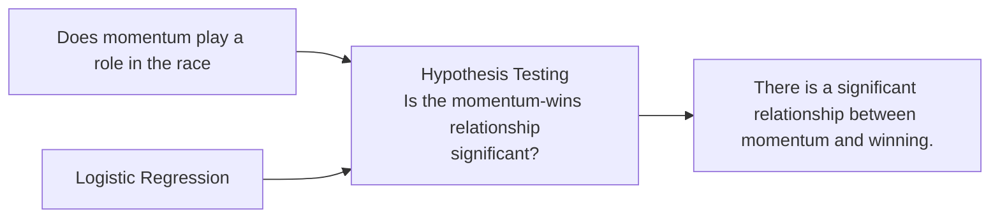
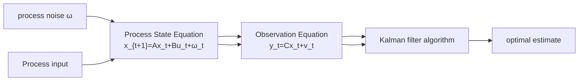

# SUMMARY

Players and spectators often wonder"what's going on"during the match due to the incredible swings, which are commonly attributed to momentum. Momentum is not about technique; instead, it covers the real problems that tennis players face. Therefore, momentum is the hidden force that controls the flow of the match.

For task 1, first, we decompose the match flow into two distinct indicators: winning probability and momentum—the former indicating match situation favorability, the latter control over game dynamics. Subsequently, utilizing the Markov Model for winning probability calculations, we estimated win chances using conditional probabilities. Crucially, we rigorously defined the abstract concept of momentum, incorporating the significance variance of individual points, and identifying closely related factors.

For task 2, We translate randomness into the question of whether momentum effects are significant. Utilizing hypothesis testing and logistic regression, we find momentum significantly correlated with player performance, evidenced by a t-statistic for momentum yielding a p-value well below 0.05 and a 95% confidence interval for the coefficient that excludes zero.

For task 3, Employing State Space Model and Kalman Filter, our model not only forecasts springs in momentum with superior accuracy compared to the ARIMAR model but also offers enhanced mathematical interpretability over machine learning algorithms, demonstrating exceptional predictive outcomes in our final assessment. Based on this, we analyze factors related to momentum swings and provide corresponding recommendations.

For task 4, to evaluate the universality of our model, we selected a women's tennis match and a women's table tennis match for analysis, achieving a low MSE of 0.051 in women's tennis predictions. Upon examining inaccuracies in both cases, we identified that enhancing the model's depiction of non-linearity will be an important direction for future improvements.

We also conduct sensitivity analysis, which shows how different samples affect the word state space model. And then the strengths and weaknesses of our model are summarized. Finally, a memo to coaches presenting the overall ideas and results about momentum is written at the end of the paper.

Keywords: Momentum; Markov Chain; Hypothesis testing; State Space Model; Kalman Filter Algorithm

# CONTENT

# 1 Introduction 2

1.1 Background 2  
1.2 Problem Restatement 2  
1.3 Our Work 3  
1.4 Data Resource 3

# 2 Assumptions and Justifications 3

# 3 Notation 4

# 4 Assessing Player Performance within Match Flow 4

4.1 Model I: Markov Model to Predict Win Probabilities ..... 5

4.1.1 Explanation of the Serving Scoring 5  
4.1.2 Establishment and Predictive Outcomes of the Markov Model ..... 5

4.2 Searching for the Definition of Momentum 7

4.2.1 How to Quantify Momentum? 7  
4.2.2 The Definition of Momentum 9

# 5 Is It Random? Measuring the Significance of Momentum Effecs 10

5.1 Analysis and Methodology Overview 10  
5.2 Parameter Estimation: Based on MLE 11  
5.3 The Result of Regression and Hypothesis Testing 12

# 6 Momentum Projections, Influencing Factors and Recommendations 13

6.1 Prediction of the Momentum and Swings 13

6.1.1 Introduction to State Space Model and Kalman Filter Algorithm ..... 13  
6.1.2 Building Predictive Model 15  
6.1.3 Prediction Results and Analysis 16  
6.1.4 Model Evaluation 17

6.2 Correlation Analysis 17  
6.3 Suggestions 18

6.3.1 Suggestions for Players with Strong Momentum ..... 19  
6.3.2 Suggestions for Relatively Stable Momentum ..... 19

# 7 Extension Test ——In Women's Tennis and Table Tennis Matches 19

7.1 Scenario of Women's Tennis Matches 20  
7.2 Scenario of Table Tennis Matches 21

# 8 Sensitivity Analysis 22

# 9 Strengths and Weakness 23

# 1 Introduction

# 1.1 Background

In the evolving landscape of sports, technological advancements have greatly enhanced the analysis of athletes' performances, focusing primarily on outcomes like scores. However, this approach often overlooks the analysis of a player's in-game state. To improve predictions of scoring trends and devise effective strategies, it's crucial to study a player's "momentum". Momentum, a psychological edge gained through consecutive wins, can significantly affect an opponent's confidence and play. Understanding and leveraging momentum is vital for success in tennis and other sports, as it influences a player's confidence, aggression, and overall performance.

text_image

MOMENTUM

# 1.2 Problem Restatement

Considering the background information and restricted conditions identified in the problem statement, we need to solve the following problems:

- Create a model using data from the 2023 Wimbledon men's matches to analyze the dynamics of match play, identify the leading player at any moment, and quantify their performance advantage. Additionally, visualize match flows to illustrate our findings, applying this model to selected matches.  
- Evaluate the validity of momentum in tennis, examining whether patterns of success or shifts in play are random or influenced by momentum.  
- Develop a predictive model based on match data to identify factors influencing play dynamics and suggest strategies for players entering new matches, considering previous momentum shifts.  
- Assess the model's performance across different matches, pinpoint necessary enhancements, and evaluate its suitability for other analytical endeavors.  
- Summarize the findings in a concise two-page memo, providing coaching advice on utilizing momentum and preparing for events affecting match dynamics.

# 1.3 Our Work

```mermaid
graph TD
  subgraph Task1["Task 1: Assessing Player Performnace within Match Flow"]
  A["Markov Model"] --> B["Prediction for winning probability"]
  C["The definition of momentum"] --> D["The performance of player"]
  end

  subgraph Task2["Task 2: Is It Random? Measuring the Significance of Momentum Effects"]
  E["Randomness"] --> F["Whether momentum effects are significant"]
  G["Hypothesis testing"] --> F
  F --> H["logistic regression"]
  end

  subgraph Task3["Task 3: Momentum projections, influencing factors and recommendations"]
  I["State Space Model"] --> J["Predictive model"]
  K["Kalman Filter"] --> J
  J --> L["Results"]
  L --> M["Relevant factors"]
  L --> N["Recommendations"]
  end

  subgraph Task4["Task 4: Extension Test—In Women's Tennis and Table Tennis Matchess"]
  O["Evaluation"] --> P["Women's tennis match"]
  Q["Table tennis match"] --> R["Important improvements: the depicton of non-linearity"]
  end
```

flowchart

Figure 1: Our Work

# 1.4 Data Resource

<table><tr><td>Match</td><td>Website</td></tr><tr><td>Woman’s tennis match</td><td>https://www.wimbledon.com/</td></tr><tr><td>Table tennis match</td><td>https://www.kaggle.com/datasets</td></tr></table>

# 2 Assumptions and Justifications

To simplify our modeling, we make the following assumptions:

Assumption 1: Recent performance is indicative of future performance

Justification: This means that if an athlete has performed well in their most recent competition there is a higher likelihood that they will continue to perform well in their next competition.

Assumption 2: Stability of physical state

Justification: It is assumed that athletes' fitness status is relatively stable in the short term, such that strengths or weaknesses in fitness will continue to affect their performance in the following competitions.

Assumption 3: Our model has Markov Property

Justification: the next state depends only on the current state and is independent of earlier states.

# 3 Notation

<table><tr><td>Symbol</td><td>Explanation</td></tr><tr><td> $p_{AB}$ </td><td>A&#x27;s service score rate when A has a match with B</td></tr><tr><td> $q_{AB}$ </td><td>A&#x27;s receive points score rate when A has a match with B</td></tr><tr><td> $L$ </td><td>The leverage of a game</td></tr><tr><td> $M$ </td><td>The value of momentum</td></tr><tr><td> $\omega$ </td><td>the coefficient to measure momentum</td></tr><tr><td> $\beta$ </td><td>the coefficient of logistic regression equation</td></tr><tr><td> $W$ </td><td>the swings of winning probability</td></tr><tr><td> $\Sigma_{t|t-1}$ </td><td>The corresponding variances of  $M_t$  conditional on information at time t-1</td></tr></table>

# 4 Task 1: Assessing Player Performance within Match Flow

For play's performance at a given time, we measure it from two different angles——winning rate and momentum. The winning rate excludes any psychological factors, outside factors, and strictly introduces the advantages and disadvantages of the situation from a mathematical point of view according to the ability of both sides, while momentum shows the player's ability to control the situation on the field.

bubble

| Quadrant | Category Description |
| --- | --- |
| 01 | The score is dominant but not yet in control of the situation |
| 02 | Superior score and easy to grasp advantage |
| 03 | The score is inferior and difficult to reverse |
| 04 | Disadvantageous score but expected to reverse |

Figure 2: relationship between player performance and winning percentage & momentum

# 4.1 Model I: Markov Model to Predict Win Probabilities

# 4.1.1 Explanation of the Serving Scoring

Considering that there is A big difference in the scoring rate between the receiving side and the serving side in tennis match, we cannot use the same scoring rate to measure the serving and receiving situations. Instead, we use two different symbols $p_{AB}$ , $q_{AB}$ to measure the serving and receiving scoring rate of A in the match between A and B respectively.

In the match between A and B, A's service scoring rate $p_{AB}$ is related to A's service level and B's service receiving level, which can be defined by the mean of A's career average service scoring rate $p_{AB}$ and B's career average service scoring rate $q_B$ can i.e. :

$$
p _ {A B} = \frac {p _ {A} + q _ {B}}{2} + e \tag {1}
$$

e is the amendment item, which is changed according to the different situations of the two sides. In the same way:

$$
q _ {A B} = \frac {q _ {A} + p _ {B}}{2} + e \tag {2}
$$

# 4.1.2 Establishment and Predictive Outcomes of the Markov Model

To calculate the probability of winning at a certain moment, we introduce The Markov Model.

In processes where future outcomes depend solely on the current state and not on past conditions, such as tennis matches, the calculation of winning probabilities considers only the current score. Psychological and external factors are excluded, making the win probability directly tied to the present score. This scenario is suitable for analysis using Markov chains, which facilitate probability calculations through event transformation relationships. An example application is computing the win probability in a tennis match based on specific scores, illustrated by the following flow chart:

```mermaid
graph LR
  A["0 - 0"] -->|p| B["15 - 0"]
  B -->|p| C["30 - 0"]
  C -->|p| D["40 - 0"]
  D -->|1-p| E["40 - 15"]
  E -->|p| F["win A"]
  B -->|1-p| G["30 - 15"]
  G -->|p| H["40 - 30\nadv A"]
  H -->|1-p| I["30 - 30\ndeuce"]
  I -->|1-p| J["30 - 30\nadv B"]
  J -->|1-p| K["30 - 40\nadv A"]
  K -->|p| L["0 - 15"]
  L -->|p| M["15 - 15"]
  M -->|p| N["30 - 15"]
  N -->|1-p| O["15 - 30"]
  O -->|p| P["15 - 40"]
  P -->|1-p| Q["0 - 30"]
  Q -->|p| R["0 - 40"]
  R -->|p| S["15 - 40"]
  S -->|1-p| T["0 - 40"]
  T -->|1-p| U["lose A"]
  U -->|1-p| V["30 - 30\nadv A"]
  V -->|1-p| W["40 - 30\nadv A"]
  W -->|p| X["40 - 30\nadv A"]
```

flowchart

Figure 3: the flow chart of the Markov Model

The scores of A and B in the ongoing match are $(a, b)$ , the ranges of which are shown in the following table:

<table><tr><td></td><td>0</td><td>1</td><td>2</td><td>3</td><td>4</td><td>5</td></tr><tr><td>0</td><td>(0,0)</td><td>(1,0)</td><td>(2,0)</td><td>(3,0)</td><td>(4,0)</td><td>none</td></tr><tr><td>1</td><td>(0,1)</td><td>(1,1)</td><td>(2,1)</td><td>(3,1)</td><td>(4,1)</td><td>none</td></tr><tr><td>2</td><td>(0,2)</td><td>(1,2)</td><td>(2,2)</td><td>(3,2)</td><td>(4,2)</td><td>none</td></tr><tr><td>3</td><td>(0,3)</td><td>(1,3)</td><td>(2,3)</td><td>(3,3)</td><td>(4,3)</td><td>(5,3)</td></tr><tr><td>4</td><td>(0,4)</td><td>(1,4)</td><td>(2,4)</td><td>(3,4)</td><td>(4,4)</td><td>none</td></tr><tr><td>5</td><td>none</td><td>none</td><td>none</td><td>(3,5)</td><td>none</td><td>none</td></tr></table>

1,2, and 3 in the table above represent the actual score of 15,30, and 40 respectively.(4,3),(3,4) respectively represent the two sides scored AD, while special scores (4,4),(5,3) represent the equalizer and another goal after AD to win the game. In particular, the actual probability of winning the game after (4,3) and (3,4) is the same as (3,2) and (2,3) and the probability of winning the game after (3,3) and (4,4) is the same as (2,2). What's more, the case which scores one more point after (4,3) to get (5,3) and wins the game is equivalent to the case which scores one more point after (3,2) to get (4,2) and win the game. Therefore, although in the table lists there are special score (3, 4), (4, 3), (3, 3), (3, 3), (5, 3), (4, 4), these six special cases do not appear in the Markov model flow chart.

On the basis of the above descriptions, the following formulas can be listed according to Markov model and conditional probability formula:

$$
P (a, b) = p * P (a + 1, b) + (1 - p) * P (a, b + 1) \tag {3}
$$

P(a,b) in the formula above represents the probability of winning the game under the score (a,b), and p represents the probability of winning a ball (varies according to the server). According to the above formula, the probability of winning the game under any score can be obtained by backward recursion.

Similarly, the Markov model can be used to find the probability of winning the whole game at any score. This probability can be used to measure the advantages and disadvantages on the tennis court. Based on the given data of the 2023 Wimbledon Gentlemen's final and the data of career average serving point rate and receiving point rate of Carlos Alcaraz and Novak Djokovic, we used the Markov model to calculate the winning rate of both players at every moment on the court, as shown in the figure below:

line

| Game | Carlos Alcaraz | Novak Djokovic |
| --- | --- | --- |
| 1 | ~0.45 | ~0.56 |
| 2 | ~0.43 | ~0.58 |
| 3 | ~0.35 | ~0.66 |
| 4 | ~0.33 | ~0.69 |
| 5 | ~0.29 | ~0.73 |
| 6 | ~0.28 | ~0.73 |
| 7 | ~0.28 | ~0.73 |
| 8 | ~0.28 | ~0.71 |
| 9 | ~0.30 | ~0.63 |
| 10 | ~0.37 | ~0.71 |
| 11 | ~0.30 | ~0.73 |
| 12 | ~0.28 | ~0.71 |
| 13 | ~0.30 | ~0.73 |
| 14 | ~0.28 | ~0.70 |
| 15 | ~0.30 | ~0.73 |
| 16 | ~0.28 | ~0.69 |
| 17 | ~0.31 | ~0.73 |
| 18 | ~0.28 | ~0.69 |
| 19 | ~0.31 | ~0.73 |
| 20 | ~0.28 | ~0.55 |
| 21 | ~0.45 | ~0.45 |
| 22 | ~0.57 | ~0.42 |
| 23 | ~0.60 | ~0.40 |
| 24 | ~0.59 | ~0.41 |
| 25 | ~0.62 | ~0.38 |
| 26 | ~0.70 | ~0.30 |
| 27 | ~0.71 | ~0.29 |
| 28 | ~0.72 | ~0.29 |
| 29 | ~0.75 | ~0.26 |
| 30 | ~0.73 | ~0.28 |
| 31 | ~0.76 | ~0.25 |
| 32 | ~0.73 | ~0.28 |
| 33 | ~0.58 | ~0.43 |
| 34 | ~0.55 | ~0.46 |
| 35 | ~0.56 | ~0.45 |
| 36 | ~0.50 | ~0.49 |
| 37 | ~0.48 | ~0.55 |
| 38 | ~0.41 | ~0.60 |
| 39 | ~0.48 | ~0.52 |
| 40 | ~0.73 | ~0.27 |
| 41 | ~0.80 | ~0.20 |
| 42 | ~0.77 | ~0.24 |
| 43 | ~0.85 | ~0.16 |
| 44 | ~0.81 | ~0.19 |
| 45 | ~0.91 | ~0.10 |
| 46 | ~0.89 | ~0.12 |
| 47 | ~1.00 | ~0.00 |

Figure 4: 2023 Wimbledon Gentlemen's singles final winning final chart

As can be seen from the picture, the match experienced ups and downs. Novak Djokovic occupied the advantage of the match during 1-21 games, but after 21 games, the wind changed and Carlos Alcaraz, who had been lagging behind, gained the initiative. However, after Novak Djokovic's tenacious chase, the two sides were almost back on the same starting line in the 38th game, and at last Carlos Alcaraz again took the fight to the win. The result of accurate probability calculation is also consistent with people's intuitive perception of the game, so it can be seen that the winning rate chart can reflect the situation on the field to a large extent.

# 4.2 Searching for the Definition of Momentum

# 4.2.1 How to Quantify Momentum?

In the dictionary, one definition of momentum is "strength or force gained by motion or by a series of events". In sports, we can always clearly feel the momentum of the team that has scored consecutive points, which will produce a mysterious force to make it full of motivation. However, when we talk about momentum, we are more of an abstract understanding of things. In order to make the data of game play a bigger role, our job is to quantify momentum. First, we must consider what momentum is associated with.

# - Scores Consecutive Points

In sports games, often the side that scores consecutive points will gain momentum and gain a psychological lead in the game.

We use the number of scoring consecutive points to show the degree of scoring consecutive points. If the opponent scores consecutive points, the index of scoring consecutive points is the opposite number of consecutive points of the opponent. However, the influence of the number of scoring consecutive scores on the momentum should not be proportional, because there is a law of "diminishing marginal utility" in economics, which indicates that the increment of consumer satisfaction shows a decreasing

law with the increase of consumption quantity. Therefore, we measure the effect of scoring consecutive points on momentum by applying the odd function $v = f(x) = \tanh(\frac{x}{2}) = \frac{e^{\frac{x}{2}} - e^{-\frac{x}{2}}}{e^{\frac{x}{2}} + e^{-\frac{x}{2}}}$ whose derivative decreases and converges to 0 at x > 0.

# - The Number of Consecutive Win of Games and The Importance of Each Game

In addition to scoring consecutive points, winning consecutive games also greatly increases momentum, and the more crucial the games win, the greater the momentum increases.

To measure the importance of each game, we defined a new metric called "Leberage". In order to better illustrate Leberage's definition, I will give an example before giving the formula:

A tennis match of two players A and B is going to the key moment to decide the outcome which means the set points of both sides are tied 2:2 and the game points are also 6:6 into the tiebreak. At this time, the player who wins the game will get the victory. In other words, if A wins the game, A's probability of winning the match will become 1, and if A loses the game, A's probability of winning the match will become 0. So, the outcome of this game will make the change of the winning probability up to 100%.

Think about another scenario, the tennis match just started, the two sides launched the first set of the game, if A wins, the winning rate of the game increases from 0.5 to 0.6, if A loses, the winning rate of the game is only reduced to 0.4, and there is still a great chance to reverse the game. The influence of this game on the winning rate is only 0.6-0.4=0.2. In other words, Leberage can be defined as "winning rate difference". Here is Leberage $L_{a}$ for $game_{a}$ :

$$
L _ {a} = P (\text {win the match} | \text {win game} _ {a}) - P (\text {win the match} | \text {loss game} _ {a}) \tag {4}
$$

$P(win\ the\ match|win\ game_{a})$ and $P(win\ the\ match|loss\ game_{a})$ in the formula above represent the conditional probability of winning the match under the condition of winning and losing the game respectively. The introduction of Markov Model in the previous chapter provides a shortcut for calculating conditional probability.

After defining leberage, we can measure momentum by combining two metrics consecutive wins and the importance of different games together. Considering that sets closer to the current time have more influence on the current momentum, we weighted Leberage exponentially to get the following indicator $u_{t}$ :

$$
u _ {t} = \frac {L _ {t - 1} (- 1) ^ {r _ {t - 1}} + (1 - \alpha) L _ {t - 2} (- 1) ^ {r _ {t - 2}} + (1 - \alpha) ^ {2} L _ {t - 3} (- 1) ^ {r _ {t - 3}} + \dots . . . + (1 - \alpha) ^ {t - 2} L _ {1}}{1 + (1 - \alpha) + (1 - \alpha) ^ {2} + \dots . . . + (1 - \alpha) ^ {t - 2}} \tag {5}
$$

$L_{t}$ indicates the Leberage corresponding to set t. $r_{t}$ represents victory in set t and is a 0-1 variable

, which means that 0 is taken if set t won and 1 is taken if set t lost. In addition, $\alpha$ is the corresponding coefficient of Lerberage, and the change of its value affects the weight of Lerberage at different times. For ease of calculation, in this article $\alpha$ is always the constant value 0.33.

In fact, the rise of momentum is not just a short-term trend across a few balls, but also a long-term trend across a few sets or even a few matches. This is also well reflected in our factor considerations, where consecutive points determine the short-term trend of momentum, and consecutive wins determine the long-term trend of momentum.

# - Other Factors

There are other factors that affect momentum. The variables include:

1. Presence of unforced errors in the previous point (x), with values 0,1,-1. Where 0 indicates no unforced errors by either player, 1 signifies an unforced error by the player, and -1 denotes an unforced error by the opponent.  
2. Occurrence of a winner in the previous point (y), with a value range of 0,1,-1, adopting the same valuation method.  
3. The current point being a game, set, or match point (z), with values 0,1,-1, using the same valuation approach.

The given data also contains many other factors, such as running distance, serving speed, etc., although they will also affect the situation and affect the trend of the score, they can not directly affect the momentum from the perspective of the players, so they are no longer considered here.

# 4.2.2 The Definition of Momentum

According to the five important factors we have listed, momentum is defined using a linear model, and the magnitude of momentum is represented by M, then:

$$
M _ {n} = \omega X ^ {T} + \varepsilon \tag {6}
$$

$\omega$ is parameter matrix, namely $\omega = [\omega_1, \omega_2, \omega_3, \omega_4, \omega_5]$ , X is factor matrix, namely $\mathrm{X} = \left[u_n^*, v_n^*, x_n^*, y_n^*, z_n^*\right]$ , $v_n^*, x_n^*, y_n^*, z_n^*$ represent the result of standardization on the corresponding value of $u, x, y, z$ and their corresponding sequence at the n point, $u_n^*$ represents the result of standardization on the corresponding value of u and its corresponding sequence at the n point. $\varepsilon$ is a disturbing factor, which will change with the changes of athletes' condition on the court, weather conditions and other objective factors. Here, we assume that it follows the normal distribution with the mean value of 0 and standard deviation of $\sigma$ , that is $\varepsilon \sim N(0, \sigma^2)$ .

After comprehensively evaluating the influence of five factors on momentum, we set $\omega = [0.5, 0.2, 0, 1, -0.1, 0.1]$ .

Based on this model, we use the 2023 Wimbledon Gentlemen's singles final as an example to plot the momentum trends of Novak Djokovic throughout the match:

area

| Points | Momentum (Red) | Momentum (Blue) |
| --- | --- | --- |
| 1 | ~0.1 | ~0.1 |
| 31 | ~0.8 | ~-0.2 |
| 61 | ~0.1 | ~-0.5 |
| 91 | ~0.2 | ~-0.2 |
| 121 | ~0.3 | ~-0.3 |
| 151 | ~0.1 | ~-0.8 |
| 181 | ~0.1 | ~-0.6 |
| 211 | ~0.1 | ~-0.7 |
| 241 | ~0.2 | ~-0.4 |
| 271 | ~0.8 | ~-0.2 |
| 301 | ~0.1 | ~-0.8 |
| 331 | ~0.1 | ~-0.1 |

图 5: momentum trends of Novak Djokovic in 2023 Wimbledon Gentlemen's final

As can be seen from the figure, there are two ups and downs in momentum in terms of the general trend, and its ups and downs are roughly in line with the audience's intuitive cognition of the game. Looking at the details, momentum fluctuates within a certain range depending on the specific circumstances of each point.

# 5 Is It Random? Measuring the Significance of Momentum Effects

# 5.1 Analysis and Methodology Overview

In light of the preliminary discussions and the model established, our initial hypothesis posits that "momentum" significantly influences outcomes within the context of the game, suggesting that an athlete's victory correlates with momentum rather than being a mere product of random fluctuations in performance as suggested by the coach's perspectives. To substantiate this assertion, we propose to employ hypothesis testing and logistic regression analysis as methodological approaches to elucidate the relationship between an athlete's momentum and score.

flowchart

Figure 6: flow chart

To effectively counter the coach's argument and adhere to the principle of protecting the null hypothesis through hypothesis testing, we establish the following hypotheses:

Null Hypothesis( $H_0$ ): There is no significant relationship between M(momentum) and P(the scoring probability).

Alternative Hypothesis( $H_{1}$ ): There is a significant relationship between M(momentum) and P(the scoring probability).

Subsequently, to explore whether there is a significant relationship between momentum and winning a game, we conduct a logistic regression analysis. the function form is shown as follows:

$$
\ln \frac {P (Y = 1)}{1 - P (Y = 1)} = \beta_ {0} + \beta_ {1} M + \sum_ {i = 2} ^ {5} \beta_ {i} X _ {i} \tag {7}
$$

Let P refers to the scoring probability; 1-P refers to losing point probability, which is different from the previous winning rate, which refers to a certain match, but here refers to each point. $\beta_{0}$ refers to intercept term which is a constant; $\beta_{1}$ refers to the coefficient of the impact of momentum on the probability of winning; M refers to momentum; $X_{i}(i = 2, 3, 4, 5)$ refers to other control variables, which has no influence on momentum but may also correlate with scores, which represent running distance difference, serve speed, net points or no points, and winning rate, respectively, all of which are control variables $\beta_{i}(i = 2, 3, 4, 5)$ represents the coefficient of the impact of other control variables on the probability of winning.

# 5.2 Parameter Estimation: Based on MLE

Maximum Likelihood Estimation (MLE) is a key method in statistics for finding the best-fitting parameters in logistic regression, ensuring models accurately reflect observed data. In our parameter estimation, the formula for mle is as follows:

$$
\ell (\beta) = \sum_ {i = 1} ^ {n} \left[ Y ^ {i} \log P (Y ^ {i} = 1 | X ^ {i}) + (1 - Y ^ {i}) \log (1 - P (Y ^ {i} = 1 | X ^ {i})) \right] \tag {8}
$$

$\ell(\beta)$ is the logarithmic likelihood function to be maximized; $\beta = [\beta_{0}, \beta_{1}, \beta_{2}, \beta_{3}, \beta_{4}, \beta_{5}]$ is a matrix of parameter variables in logistic regression; $Y^{i}$ is the $i^{th}$ observation result of the dependent variable Y; $X^{i} = [X_{1}^{i}, X_{2}^{i}, X_{3}^{i}, X_{4}^{i}, X_{5}^{i}]$ is the matrix of the $i^{th}$ observation of the independent variable., The expression of $P(Y^{i} = 1|X^{i})$ is as follows:

$$
P (Y ^ {i} = 1 | X ^ {i}) = \frac {1}{1 + e ^ {- (\beta_ {0} + \beta_ {1} X _ {1} ^ {i} + \dots . + \beta_ {5} X _ {5} ^ {i})}} \tag {9}
$$

Based on the above formula, gradient descent method is adopted to optimize the parameters to find the maximum likelihood function, and the optimization formula is as follows:

$$
\beta_ {n e w} = \beta_ {o l d} + \gamma \frac {\partial \ell}{\partial \beta} \tag {10}
$$

$\alpha$ is the optimized parameter.

# 5.3 The Result of Regression and Hypothesis Testing

According to this model, the results we got are shown in the following table:

<table><tr><td>variable name</td><td>regression parameter estimates</td><td>T-statistic</td><td>p. value</td><td>the 95% confidence intervals of the regression parameters</td></tr><tr><td>momentum</td><td>1.500</td><td>35.347</td><td>&lt;0.001</td><td>(1.0052,1.9939)</td></tr><tr><td>difference in moving distance</td><td>-0.004</td><td>0.065</td><td>0.798</td><td>(-0.0316,0.0243)</td></tr><tr><td>server and serve speed</td><td>0.008</td><td>35.446</td><td>&lt;0.001</td><td>0.0052,0.0103)</td></tr><tr><td>whether player won the point while at the net or not</td><td>-0.251</td><td>0.704</td><td>0.402</td><td>(-0.8384,-0.3358)</td></tr><tr><td>winning rate</td><td>-1.994</td><td>7.613</td><td>0.006</td><td>(-3.4111,-0.5777)</td></tr><tr><td>intercept</td><td>0.883</td><td>5.512</td><td>0.019</td><td></td></tr></table>

It can be seen that the p.value corresponding to the momentum T-statistic is much less than 0.05, and the 95% confidence interval of the $\beta_{1}$ 1 estimate does not contain 0. Therefore, we reject the null hypothesis $H_{0}$ , which means momentum has a significant relationship with score.

# 6 Momentum Projections, Influencing Factors and Recommendations

In the previous chapters, we found the qualitative definition of momentum by consulting professional literature, and we gave the quantitative definition of momentum based on this to ensure the rationality of the quantitative definition. Since the State Space Model can directly model the state of the dynamic system that cannot be directly observed and capture the change of the system state over time, it is very suitable for the characteristics of potential energy in tennis match, and has great advantages compared with ARIMA for predicting observable measurements and some machine learning models with limited model explanation. Therefore, we will use the State Space Model and Kalman filter algorithm to predict the momentum that is difficult to be observed. We get that the predicted result is highly consistent with the defined result, which further ensures the rationality of the definition of potential energy. Then, the correlation analysis of momentum predictor and game factors (based on literature) was carried out, and we obtained that Net\_pt\_won, Winner,Ace were significantly correlated with momentum in a positive direction, and Unforced Errors, Break\_pt\_missed, Double\_fault was significantly correlated with momentum in a negative direction. Finally, based on the above conclusions, we give some suggestions.

# 6.1 Prediction of the Momentum and Swings

# 6.1.1 Introduction to State Space Model and Kalman Filter Algorithm

The State Space Model originated in the aerospace and control engineering fields in the 1950s to describe the state changes of dynamic systems and how to control the system state through inputs $^{[1]}$ . It is used to describe and analyze the dynamic behavior of the system, and has two outstanding characteristics: First, the State Space Model distinguishes the internal state of the system from the observed output. This allows it to handle situations where the internal state of the system may not be directly observable, estimating these hidden states from the observed data. Second, the State Space Model can be used to estimate the future state of the system based on the current and past states. These two features are very important for the context of this problem.

The State Space Model consists of two main equations:

State Equation: Describes the time evolution of the state of a system (usually not directly observable).

$$
x _ {t + 1} = A x _ {t} + B u _ {t} + \omega_ {t} \tag {11}
$$

where $x_{t}$ represents the state vector at time t,A is the state transition matrix, $u_{t}$ is the control input vector,B is the control input matrix, $\omega_{t}$ is the process noise, representing the model's uncertainty.

Observation Equation: Describes how to measure the state of a system by means of observations containing noise.

$$
y _ {t} = C x _ {t} + v _ {t} \tag {12}
$$

where $y_{t}$ represents the observation vector at time t, C is the observation matrix, $v_{t}$ is the observation noise, accounting for measyrement errors.

We can understand the process of the State Space Model through the figure below, and it can be seen from the figure that the core of the State Space Model solving algorithm is Kalman filter.

flowchart

Figure 7: schematic of the State Space Model

Since people's subjective understanding (the theoretical state value generated by the establishment of mathematical models) and measurement (sensor and other measurement values) are not accurate, Kalman filter is introduced to infer the state of a linear dynamic system from a series of noise measurements, and the error of both is synthesized to obtain the optimal prediction of the true value. The essence of Kalman filtering algorithm is to use the property that the fusion of two normal distributions is still a normal distribution to iterate, which can be better understood through the following figure.

violin

| Process | Description |
| --- | --- |
| Previous Optimal Estimate | x̂k-1 |
| Current Prior Estimate | x̂k |
| Current Optimal Estimate | x̂k |
| Current Observation | yk = Cxk + vk |

Figure 8: schematic of the Kalman filter

With the above foundation, understanding the mathematical expression of Kalman filtering becomes very easy.

1. Prediction Phase: Before receiving the new measurement, the Kalman filter predicts the current state and error covariance based on the previous state:

$$
\left\{ \begin{array}{c} \text {Predicted state estimate}: x _ {t | t - 1} = A x _ {t - 1} + B u _ {t - 1}; \\ \text {Predicted error covariance}: P _ {t | t - 1} = A P _ {t - 1 | t - 1} A ^ {T} + Q \end{array} \right. \tag {13}
$$

where Q is the process noise covariance matrix.

2. Update Phase: Upon receiving a new measurement $y_{t}$ , the filter updates its estimates:

$$
\left\{ \begin{array}{c} \text {Kalman gain}: K _ {t} = P _ {t \mid t - 1} C ^ {T} \left(C P _ {t \mid t - 1} C ^ {T} + R\right) ^ {- 1}; \\ \text {Updated state estimate}: \hat {x} _ {t} = x _ {t \mid t - 1} + K _ {t} \left(y _ {t} - C x _ {t \mid t - 1}\right); \\ \text {Updated error covariance}: P _ {t} = \left(I - K _ {t} C\right) P _ {t \mid t - 1} \end{array} \right. \tag {14}
$$

where R is the observation noise covariance matrix.

# 6.1.2 Building Predictive Model

Based on 334 points of Novak Djokovic versus Carlos Alcaraz, we build the model through the following steps:

# Step 1 Determining the State Space Model

We consider a state space model in which the momentum is a time-varying latent state process. In a match, the momentum of a player changes with the progress of the game, and because of the differences in the physical and mental qualities of the players themselves, the play on the court, and the situation they face, for a particular player, the momentum is assumed to follow an autoregressive process:

$$
M _ {t} = \mu + \varphi M _ {t - 1} + \omega_ {t} \tag {15}
$$

Where $\mu$ is a constant term, which serves as a baseline level that provides an initial value for the subsequent optimization process. $\varphi$ is the autoregressive coefficient and the disturbances are independently and identical distributed with $\omega_{t} \sim N(0, \sigma_{\omega}^{2})$ .

In addition, we can assume that the swings in a player's winning rate $(W_{t})$ depend on momentum, where the swings in win percentage can be obtained by observation through the Markov Chain of Model I. At the same time, in our continuous optimization and updating of the model, we found that adding the service advantage correction $\delta$ can significantly improve the fit degree of the predicted value and the defined value. The observation equation as follows:

$$
W _ {t} = \delta + M _ {t} + \tau_ {t} \tag {16}
$$

Where $W_{t}$ refers to swings in winning rate, $\delta$ refers to service advantage corrections, $M_{t}$ refers to momentum. $\tau_{t} \sim N(0, \sigma_{t}^{2})$ . Therefore, the state space model takes the form:

$$
\left\{ \begin{array}{c} \text {State Equation:} M _ {t} = M _ {t} = \mu + \varphi M _ {t - 1} + \omega_ {t} \\ \text {Observation Equation:} W _ {t} = \delta + M _ {t} + \tau_ {t} \end{array} \right. \tag {17}
$$

# Step 2 Implementation of the Kalman Filter

Before implementing the Kalman filter, the prior mean and variance have to be defined. The initial mean is set to $M_{1|0} = \frac{\mu}{1 - \phi_1}$ and initial covariance is $\Sigma_{1|0} = \frac{\sigma_{\omega}^2}{1 - \varphi_1^2}$ , which are the conditional expectation of the predicted momentum. Let $M_{t|t-1}$ be the predicted momentum for time $t$ conditional on the information obtained from time $t-1$ . Furthermore, let $M_{t|t}$ denote the updated momentum conditional on the information obtained up to time $t$ . The corresponding variances of $M_t$ conditional on information at time $t-1$ is denoted as $\Sigma_{t|t-1}$ and the updated variance is given by $\Sigma_{t|t}$ . $G_k$ is defined by covariance and $\varphi_t^2$ simply for computational simplicity. Drawing from Manner's work in 2015[2], the Kalman filter procedure employed for the dynamic state space model mentioned can be defined as follows:

# Prediction Step:

$$
\left\{ \begin{array}{l} M _ {t \mid t - 1} = \mu + \varphi_ {t} M _ {t - 1 \mid t - 1} \\ \Sigma_ {t \mid t - 1} = \varphi_ {t} ^ {2} \Sigma_ {t - 1 \mid t - 1} + \sigma_ {\omega} ^ {2} \end{array} \right. \tag {18}
$$

# Observation Step:

$$
\left\{ \begin{array}{c} \hat {y} _ {t} = \delta + M _ {t \mid t - 1} \\ G _ {t} = \Sigma_ {t \mid t - 1} + \sigma_ {t} ^ {2} \\ \hat {e} _ {t} = y _ {t} - \hat {y} _ {t} \end{array} \right. \tag {19}
$$

# Updating Step:

$$
\left\{ \begin{array}{l} M _ {t \mid t} = M _ {t \mid t - 1} + \frac {\hat {e} _ {t} \Sigma_ {t \mid t - 1}}{G _ {t}} \\ \Sigma_ {t \mid t} = \Sigma_ {t \mid t - 1} - \frac {\Sigma_ {t \mid t - 1} ^ {2}}{G _ {t}} \end{array} \right. \tag {20}
$$

# 6.1.3 Prediction Results and Analysis

Based on the establishment of the above model, we implement the model through R language to get the result. First, check that our object is a predictable object. Then, in the results we give, we get the momentum of Novak Djokovic, and the momentum of Carlos Alcaraz is opposite. At the same time, the athlete who is interested in momentum must also be interested in the change in momentum, because the momentum we predict is continuous, so we define the derivative at each point as the swings of

momentum, which is calculated as M'. Momentum and the swings of momentum change over time are shown in the figure. The red realization shows the change in momentum over the course of the race, and the dashed blue line shows the change in swings of momentum over the course of the race.

line

| Time | Predictions of Momentum | Predictions of Swings |
| --- | --- | --- |
| 0 | ~0.1 | ~-0.1 |
| 25 | ~0.7 | ~0.1 |
| 50 | ~0.3 | ~-0.2 |
| 75 | ~0.2 | ~0.1 |
| 100 | ~0.1 | ~0.1 |
| 125 | ~0.2 | ~0.1 |
| 150 | ~-0.7 | ~0.0 |
| 175 | ~-0.6 | ~0.0 |
| 200 | ~-0.6 | ~0.0 |
| 225 | ~-0.1 | ~0.1 |
| 250 | ~0.4 | ~0.1 |
| 275 | ~0.8 | ~0.1 |
| 300 | ~-0.3 | ~-0.2 |
| 325 | ~0.0 | ~0.0 |

Figure 9: prognostic map

# 6.1.4 Model Evaluation

In this study, cross-validation was utilized to verify the accuracy of each model. Evaluation indicators, including Mean Square Error (MSE), Root Mean Square Error (RMSE), Mean Absolute Error (MAE), and R-squared ( $R^{2}$ ) from cross-validation results. These indicators assess the accuracy of both the estimated and validated models, ensuring the reliability of the model assessments.

<table><tr><td>indicators</td><td>MSE</td><td>RMSE</td><td>MAE</td><td> $R^{2}$ </td></tr><tr><td>Predictive Model</td><td>0.0454</td><td>0.2131</td><td>0.1660</td><td>0.8902</td></tr></table>

In terms of the above evaluation indicators. MSE, RMSE, and MAE are all relatively low, while R-squared is close to 1, indicating that the model is a good fit and can explain most of the variability of the observed values. This shows that from the mathematical point of view, the model has good predictive performance.

# 6.2 Correlation Analysis

Based on the given data of the competition and the factors mentioned in the literature, we finally determined to do the correlation analysis between the swings of momentum and 12 factors, which is Unforced Errors, Ace, Match Point, Distance\_run, Rally\_count, Winner, Double\_fault, Net\_pt, Net\_pt\_won, Break\_pt, Break\_pt\_won, Break\_pt\_missed.

For whether the 12 factors are significantly correlated with the swings of momentum and the degree of correlation, we use P-value and Pearson correlation coefficient as analysis indicators. In terms of P value, P < 0.05 indicates that this factor is significantly correlated with momentum change. For Pearson correlation coefficient, 0 is the boundary, and the positive correlation increases as the value approaches 1, while the negative correlation increases as the value approaches -1. The data was imported into Origin and analyzed to obtain the following two correlation analysis charts:

heatmap

| Metric | Sample of Momentum | Unforced Errors | Ase | Match Point-Set Point-Game Point | Distance_run | Rally_count | Winner | Double_bush | Net_pt | Net_pt-won | Break_pt | Break_pt-won | Break_pt_missed |
| --- | --- | --- | --- | --- | --- | --- | --- | --- | --- | --- | --- | --- | --- |
| Savings of Momentum | 1.0 | 0.30 | 0.38 | 0.88 | 0.29 | 0.062 | 0.074 | 0.062 | 0.062 | 0.062 | 0.062 | 0.062 | 0.062 |
| Unforced Errors | 0.30 | 1.0 | 0.80 | 0.38 | 0.47 | 0.26 | 0.76 | 0.46 | 0.37 | 0.062 | 0.86 | 0.86 | 0.86 |
| Ase | 1.0 | 0.28 | 0.27 | 0.31 | 0.66 | 0.26 | 0.062 | 0.58 | 0.57 | 0.062 | 0.062 | 0.062 | 0.062 |
| Match Point-Set Point-Game Point | 0.30 | 0.80 | 0.28 | 0.11 | 0.22 | 0.73 | 0.50 | 0.36 | 0.69 | 0.062 | 0.062 | 0.062 | 0.062 |
| Distance_run | 0.38 | 0.38 | 0.27 | 0.11 | 0.78 | 0.49 | 0.062 | 0.23 | 0.31 | 0.59 | 0.75 | 0.75 | 0.75 |
| Rally_count | 0.88 | 0.47 | 0.31 | 0.22 | 0.78 | 0.48 | 0.11 | 0.17 | 0.55 | 0.84 | 0.59 | 0.59 | 0.59 |
| Winner | 0.062 | 0.062 | 0.062 | 0.73 | 0.78 | 0.48 | 0.19 | 0.36 | 0.062 | 0.062 | 0.062 | 0.062 | 0.062 |
| Double_bush | 0.062 | 0.26 | 0.66 | 0.50 | 0.49 | 0.11 | 0.19 | 0.15 | 0.16 | 0.062 | 0.062 | 0.062 | 0.062 |
| Net_pt | 0.29 | 0.76 | 0.26 | 0.36 | 0.062 | 0.15 | 0.78 | 0.062 | 0.11 | 0.055 | 0.062 | 0.062 | 0.062 |
| Net_pt-won | 0.062 | 0.46 | 0.062 | 0.69 | 0.23 | 0.17 | 0.16 | 0.78 | 0.28 | 0.062 | 0.066 | 0.066 | 0.066 |
| Break_pt | 0.062 | 0.37 | 0.58 | 0.062 | 0.31 | 0.55 | 0.36 | 0.062 | 0.28 | 0.062 | 0.062 | 0.062 | 0.062 |
| Break_pt-won | 0.074 | 0.062 | 0.062 | 0.062 | 0.59 | 0.84 | 0.062 | 0.54 | 0.11 | 0.062 | 0.062 | 0.062 | 0.064 |
| Break_pt_missed | 0.062 | 0.86 | 0.57 | 0.062 | 0.75 | 0.59 | 0.087 | 0.055 | 0.066 | 0.062 | 0.064 | 0.064 | 0.064 |

Figure 10: Correlation Analysis figure1

heatmap

| Metric | Design of Momentum | Unfold Errors | Age | Match Point Set Point Game Point | Distance_run | Rally_count | Winner | Double_fault | Net_pt | Net_pt arrays | Break_pt | Break_point array | Break_pt_missed |
| --- | --- | --- | --- | --- | --- | --- | --- | --- | --- | --- | --- | --- | --- |
| Savings of Momentum | 1.0 | ~0.0 | ~0.0 | ~0.0 | ~0.0 | ~0.0 | ~0.0 | ~0.0 | ~0.0 | ~0.0 | ~0.0 | ~0.0 | ~0.0 |
| Unfold Errors | 1.0 | 1.0 | ~0.0 | ~0.0 | ~0.0 | ~0.0 | ~0.0 | ~0.0 | ~0.0 | ~0.0 | ~0.0 | ~0.0 | ~0.0 |
| Age | 0.1 | 1.6E-17 | ~0.0 | ~0.0 | ~0.0 | ~0.0 | ~0.0 | ~0.0 | ~0.0 | ~0.0 | ~0.0 | ~0.0 | ~0.0 |
| Match Point Set Point Game Point | 0.057 | -0.014 | 0.059 | ~0.0 | ~0.0 | ~0.0 | ~0.0 | ~0.0 | ~0.0 | ~0.0 | ~0.0 | ~0.0 | ~0.0 |
| Distance_run | 0.049 | -0.048 | -0.061 | -0.087 | ~0.0 | ~0.0 | ~0.0 | ~0.0 | ~0.0 | ~0.0 | ~0.0 | ~0.0 | ~0.0 |
| Rally_count | 0.0083 | -0.039 | -0.056 | -0.067 | 0.92 | 0.059 | ~0.0 | ~0.0 | ~0.0 | ~0.0 | ~0.0 | ~0.0 | ~0.0 |
| Winner | 0.26 | -0.12 | 0.27 | 0.019 | -0.015 | 0.039 | ~0.0 | ~0.0 | ~0.0 | ~0.0 | ~0.0 | ~0.0 | ~0.0 |
| Double_fault | -0.14 | -0.062 | -0.024 | -0.037 | -0.038 | -0.087 | -0.071 | ~0.0 | ~0.0 | ~0.0 | ~0.0 | ~0.0 | ~0.0 |
| Net_pt | 0.053 | 0.017 | -0.062 | -0.051 | 0.17 | 0.10 | 0.21 | -0.080 | ~0.0 | ~0.0 | ~0.0 | ~0.0 | ~0.0 |
| Net_pt arrays | 0.29 | -0.041 | 0.13 | 0.022 | 0.066 | 0.075 | 0.51 | -0.077 | 0.54 | ~0.0 | ~0.0 | ~0.0 | ~0.0 |
| Break_pt | -0.10 | -0.050 | -0.030 | 0.25 | 0.055 | 0.033 | -0.051 | 0.13 | -0.10 | -0.059 | ~0.0 | ~0.0 | ~0.0 |
| Break_point array | 0.09 | -0.10 | 0.34 | 0.10 | 0.029 | 0.011 | 0.25 | -0.034 | -0.088 | 0.18 | 0.41 | ~0.0 | ~0.0 |
| Break_pt_missed | -0.20 | -0.0096 | -0.031 | 0.15 | -0.018 | -0.029 | -0.094 | 0.23 | -0.11 | -0.10 | 0.71 | 0.10 | ~0.0 |

Figure 11: Correlation Analysis figure2

# 6.3 Suggestions

Athletes usually need to conduct targeted research on the opponent's skills and tactics before the game. If the momentum fluctuation of the opponent's previous game is targeted research, it is conducive to occupy the advantage of the game in the psychological level. We divided the athletes into two different types according to the size of momentum fluctuation, namely, the type with strong momentum fluctuation and the type with relatively stable momentum.

# 6.3.1 Suggestions for Players with Strong Momentum

The momentum of a player with strong momentum fluctuations in a normal game often has ups and downs and fluctuations. This is a double-edged sword. Once the momentum is at the peak of the disadvantage, there is a great possibility to reverse the unfavorable situation, but at the same time, the advantage of the score is also easy to fall because of the opponent's continuous score or the trough of the momentum, which is inadvertently reversed.

If the opponent is such a player, then the opponent is more likely to be affected by changes in the match situation. From the correlation analysis, we can see that the unforced errors and the waste of break points are negatively correlated with the swings of momentum, so we can seize the weakness of the opponent, play more aggressive balls, mobilize the opponent's movement, and force the opponent to miss opportunities and make mistakes. The appearance of net points and winner is positively correlated with the change of momentum, so we should play less short balls that fall in front of the net, do not give the opponent the chance to score in front of the net, and increase the defense ability.

# 6.3.2 Suggestions for Relatively Stable Momentum

Players tend to have relatively stable momentum throughout the game and are not prone to dramatic fluctuations. In the advantage situation, such players have strong ability to control and expand the advantage. In the disadvantageous situation, such players are also prone to the weakness of lack of toughness and lack of flipping ability.

When the opponent is such a player, the opening is particularly important. If seize the advantage in the opening, it is easy to achieve an overwhelming advantage in the whole game. It is difficult to reverse such an opponent if you start from a weak position. Therefore, it is necessary to take the lead in the opening, with a strong offensive play to gain momentum.

# 7 Extension Test——In Women's Tennis and Table Tennis Matches

To evaluate the universality of our model, we selected a women's tennis match and a women's table tennis match for analysis. For details on the data sources, refer to Section 1.4, Data Sources.

In the women's tennis match analysis, our model showed good predictive ability with potential for enhancement. By analyzing predictions and considering gender differences in tennis, we significantly enhanced the model's fit by adjusting the service advantage correction coefficient $(\delta)$ , resulting in an exceptional predictive model.

In the analysis of women's table tennis, the model's predictions, particularly for real-time trends and extremes, were suboptimal. Adjusting the autoregressive coefficient notably enhanced extreme

value predictions, yet results remained less satisfactory compared to tennis predictions. Through analysis, we identified that accurately depicting nonlinear relationships will be crucial for the model's future improvements.

# 7.1 Scenario of Women's Tennis Matches

We selected a match from the 2023 U.S. Open final between Coco Gauff and Aryna Sabalenka for our study. In this match, Coco Gauff overcame Aryna Sabalenka with a score of 2-6, 6-3, 6-2. This victory not only secured Gauff her first Grand Slam title but also positioned her as the new face of American tennis, echoing the legacy of Serena Williams. We first calculated Aryna Sabalenka's momentum by definition given by us, which allowed us to derive Coco Gauff's momentum accordingly. Subsequently, using Model II (we obtained the predicted values of momentum.) The results are illustrated in the figure on the left "Before optimization":

line

| Time | Real Momentum | Predictive Momentum |
| --- | --- | --- |
| 1 | ~-0.2 | ~-0.2 |
| 11 | ~0.5 | ~0.8 |
| 21 | ~0.2 | ~0.3 |
| 31 | ~0.8 | ~0.6 |
| 41 | ~0.2 | ~0.1 |
| 51 | ~0.8 | ~0.7 |
| 61 | ~0.5 | ~0.4 |
| 71 | ~0.2 | ~0.1 |
| 81 | ~0.2 | ~0.1 |
| 91 | ~0.8 | ~0.6 |
| 101 | ~0.5 | ~0.4 |
| 111 | ~0.8 | ~0.7 |
| 121 | ~0.2 | ~0.1 |

Figure 12: Before and after change

The graph shows the actual momentum as a red curve and the predicted momentum in blue, highlighting close alignment at most points and indicating the predictive model's consistency with reality. Notably, discrepancies between predictions and actual values are larger at the match's start and end, likely due to the unpredictability of these phases and possible limitations in the metrics' ability to capture the match's dynamics, resulting in greater prediction errors. However, during the middle phase, the alignment improves, suggesting the model's enhanced performance. Sharp deviations in actual momentum at the 60th and 120th points, not fully captured by predictions, may be attributed to unforeseen events or factors not accounted for in the model.

Following adjustments and optimizations to the original state space model, we significantly improved the model's fit by changing $\delta$ to 0.005(the service advantage correction coefficient in the observation equation: $W_{t} = \delta + M_{t} + \tau_{t}$ ) The results, depicted on the right side:"After optimization" suggest this improvement may be due to the format differences between men's and women's matches —men's are typically best-of-five sets, while women's are best-of-three. More sets in men's matches could mean a larger dataset, potentially enabling more accurate long-term trend and pattern predictions.

Moreover, men's tennis often focuses on power and service, whereas women's tennis emphasizes strategy and variation in play. Thus, outcomes in men's matches might be more dominated by top players, simplifying predictions to some extent. After adjusting the service advantage coefficient, the model's fit improved significantly, with the prediction residuals showing $MSE = 0.051, MAE = 0.1932$ , and $R^2 = 0.8763$ , further proving the enhanced predictive effectiveness of our revised model.

Overall, the predictive curve generally follows the actual trend, despite deviations at certain points. Continuous experimentation and analysis of deviation causes significantly increased prediction accuracy.

# 7.2 Scenario of Table Tennis Matches

We selected a match from the 2020 WTT Macau International Table Tennis Tournament Women's Singles semifinals between Manyu Wang and Yingsha Sun. In the dazzling display at the 2020 WTT Macau, Sun Yingsha outplayed Wang Manyu 5-1 in the Women's Singles, showcasing strategic mastery and securing a historic win in this premier event.

We firstly find out the momentum of Yingsha Sun through the definition, and accordingly we can get the momentum of Manyu Wang, and then we get the predicted value of momentum through Model II. The results are as follows:

line

| Time | Real Momentum (Before optimization) | Predictive Momentum (Before optimization) | Real Momentum (After optimization) | Predictive Momentum (After optimization) |
| --- | --- | --- | --- | --- |
| 1 | ~-0.2 | ~-0.2 | ~-0.2 | ~-0.2 |
| 11 | ~-0.8 | ~-1.2 | ~-0.8 | ~-1.2 |
| 21 | ~-0.2 | ~-0.2 | ~-0.2 | ~-0.2 |
| 31 | ~0.2 | ~0.2 | ~0.2 | ~0.2 |
| 41 | ~-0.2 | ~-0.2 | ~-0.2 | ~-0.2 |
| 51 | ~-0.4 | ~-0.4 | ~-0.4 | ~-0.4 |
| 61 | ~-0.2 | ~-0.2 | ~-0.2 | ~-0.2 |
| 71 | ~0.2 | ~0.2 | ~0.2 | ~0.2 |
| 81 | ~0.4 | ~0.4 | ~0.4 | ~0.4 |
| 91 | ~0.4 | ~0.4 | ~0.4 | ~0.4 |
| 101 | ~0.4 | ~0.4 | ~0.4 | ~0.4 |
| 111 | ~0.4 | ~0.4 | ~0.4 | ~0.4 |
| 121 | ~0.4 | ~0.4 | ~0.4 | ~0.4 |
| 131 | ~0.8 | ~0.8 | ~0.8 | ~0.8 |
| 141 | ~1.2 | ~1.2 | ~1.2 | ~1.2 |
| 151 | ~0.8 | ~0.8 | ~0.8 | ~0.8 |

Figure 13: Before and after change

The red curve represents the actual momentum values, while the blue curve represents the forecast momentum values. In most time series, the prediction curve closely follows the actual curve, indicating that the prediction model has a high ability to approximate the actual trend. However, the deviation between the two curves also reveals the limitation of the prediction accuracy of the model at a specific time, especially at the extreme point of the momentum.

This deviation suggests that the model may need to incorporate more variables that affect the momentum of the game or to re-weight the existing variables in order to more accurately predict fluctuations in momentum during the game. Furthermore, this analysis may also indicate that the model's ability to capture non-linear relationships in the data needs to be improved. Therefore, we

adjusted the $\varphi$ (autoregressive coefficients) in the state equation of the original state space model to reduce the smoothness of predictions and increase the accuracy of extreme value estimation. However, we can still see that the effectiveness of the estimates needs to be enhanced. We speculate that this is due to the rapid and variable nature of table tennis matches, which requires the model to have a higher temporal resolution capability to capture the subtle dynamic changes in the game. Additionally, it necessitates the incorporation of non-linear relationship modeling. Thus, enhancing the model's depiction of non-linearity will be an important direction for future improvements.

# 8 Sensitivity Analysis

In our prediction Model——State Space Model and Kalman Filter Algorithm, two constants of the State Equation and Observation Equation are highly correlated with the players themselves. Among them, are the autoregressive coefficient $\varphi$ , which is related to the player's personal ability, and the service advantage correction item $\delta$ , which is related to the player's service strength.

To test the sensitivity of our prediction model, State Space Model, we divided the remaining 30 players in the data set, except Carlos Alcaraz and Novak Djokovic, into 9 groups according to the two indexes of individual ability and service scoring rate, and ensured that the number of players in each group was 3 or 4. Individual ability and service scoring rate were both grouped from high to low and numbered 1,2,3. Each group of players used the State Space Model to predict the momentum change, and compared the predicted result with the calculated true value of the swings of momentum to obtain the prediction accuracy rate. Then, the average accuracy rate of each group members was taken as the numerical representative of the group and drawn into the following three-dimensional map:

bar

| Service set | Parameter set | Accuracy rate |
| --- | --- | --- |
| 1 | 1 | ~0.88 |
| 1 | 2 | ~0.88 |
| 1 | 3 | ~0.87 |
| 2 | 1 | ~0.85 |
| 2 | 2 | ~0.84 |
| 2 | 3 | ~0.82 |
| 3 | 1 | ~0.75 |
| 3 | 2 | ~0.74 |
| 3 | 3 | ~0.73 |
| 4 | 1 | ~0.74 |
| 4 | 2 | ~0.73 |
| 4 | 3 | ~0.72 |

Figure 14: Sensitivity Analysis

As can be seen in the figure above, the average accuracy of group are all higher than 70%. The

minimum value is 72% corresponding to service set 3-personal ability set 3, and the maximum value is 87% of service set 1-personal ability set 1. And whether it is individual ability or service scoring rate, the average accuracy rate increases with the decrease of group number, that is, the improvement of ability. Therefore, we can conclude that we have the high accuracy of the prediction model, the low sensitivity and the higher the player’s personal ability is, the better the prediction effect of the swings of momentum will be.

# 9 Strengths and Weakness

# Strengths:

- Tennis matches are divided into points, sets and reels. A game consists of points, a set consists of different sets, and a match consists of different disks. This structure is well suited for modeling by Markov method. The Markov model we apply accurately calculates the true winning percentage value.  
- Our innovative binary definitions of winning percentage and momentum provide a comprehensive measure of player performance on a technical level, a situational level, and all aspects of psychological factors.  
- Since state-space models can directly model the states of a dynamic system that cannot be directly observed and capture the change of the system state over time, they are very well suited to the characteristics of the potential energy in a tennis match, and have a great advantage over ARIMA, which makes predictions on observable measurements, and some machine learning models, which have a limited explanatory nature of the models.

# Weakness:

Our model's ability to capture non-linear relationships in the data needs to be improved. Thus, enhancing the model's depiction of non-linearity will be an important direction for future improvements.

# REFERENCE

[1] Pilar Poncela. Time series analysis by state space methods: J. Durbin and S.J. Koopman, Oxford Statistical Series 24, 2001, Oxford University Press, ISBN 0-19-852354-8, 254 pages, price: £ 36.00 (hardback)[J]. International Journal of Forecasting, 2004, Vol.20(1): 139-141  
[2] Manner, H. (2015). Modeling and forecasting the outcomes of NBA basketball games. Institute of Econometrics and Statistics, University of Cologne.

# Memorandum

To: The Coach

From: Team# 2410482

Subject: Momentum: The Hidden Force in Tennis

Date: February 5,2024

Dear Sir or Madame:

Sports competitions are not just a contest of physical strength between two sides, but also a psychological battle. To win, it's not enough to simply lead in the score; one must also dominate the mental. Every athlete faces three unavoidable issues, which are the keys to victory:

(a) How to hold on to a lead?  
(b) How to fight back from hopeless positions?  
(c) How to grasp opportunities that come your way?

To address these three issues, we must introduce the protagonist of today's discussion: momentum. The growth of momentum is the answer to the three aforementioned questions. By incorporating factors that affect the morale in a tennis match, such as scoring on crucial points, consecutive points scored, and unforced errors, we have constructed a mathematical model to quantitatively measure momentum.

Is momentum controllable? Some people describe it as momentum creeping in and creeping out of the match. However, in fact, the flow of momentum can be controlled, just like the flow of water can be controlled. We have analyzed voluminous datasets from real matches to see how momentum correlates with common tennis statistics, such as points won at the net, aces, running distance, etc. We found that each factor affects momentum changes to varying degrees. Notably, double faults and points won at the net have a p-value less than 0.05, meaning we can be 95% confident that these factors are correlated with shifts in momentum.

While improving athletes' skills, also focus on their ability to read the game, seize and control momentum. Our suggestions for match preparation include:

Divide athletes into two categories based on momentum: stable and variable. Against those with variable momentum, exploit weaknesses with aggressive shots and force errors. Minimize short balls to avoid giving smash opportunities. Against stable momentum opponents, emphasize the importance of a strong start to control the match flow.

Finally, we hope our insights into momentum prove helpful to you. Sincerely, we wish your athletes greater success!

# Report on Use of AI

- We used ChatGPT 4 for English touch-ups throughout the text, but it was reviewed and revised by the team.  
- We used ChatGPT4 to help us understand the State Space Model and Kalman Filter Algorithm, and referenced parts of the Model introduction, all of which were manually reviewed.