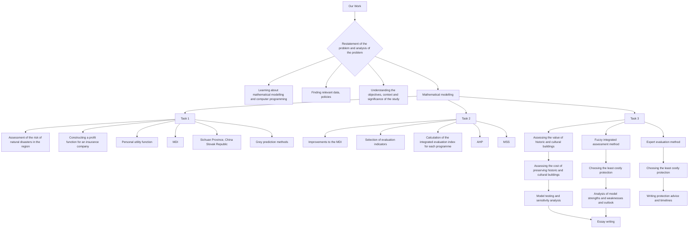
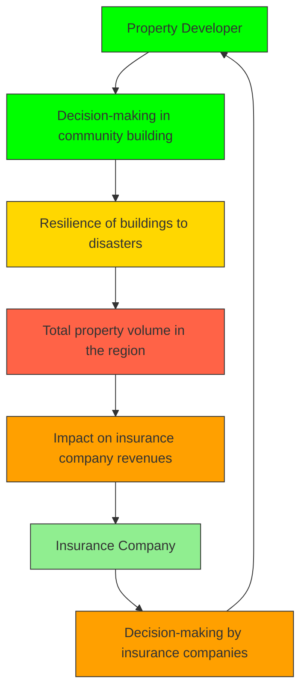
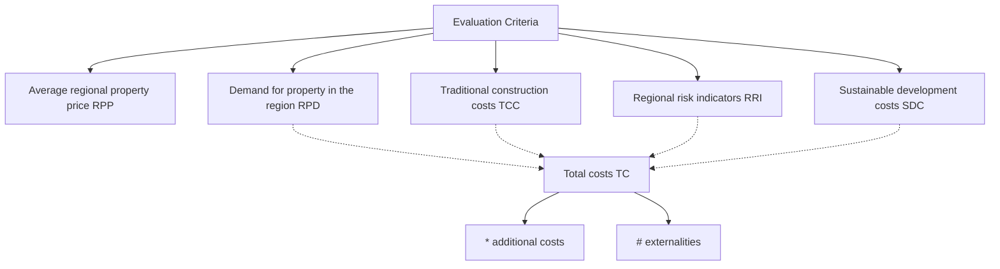

# Insured Properties, Assisted Developers and Protected Landmarks

Summary

The increasing number of extreme weather events has left property owners and insurers in similar predicaments. Increased premiums and reduced underwriting by insurers have put the sustainability of the insurance industry at risk. In order to address this issue, we build a Model of Decision making for Insurance companies (MDI). Then, the model is adjusted and used as a basis to develop a Model of Site Selection for property developers (MSS). Finally, in areas where development or insurance is not recommended, we build a Value Assessment and Conservation Models for historical and cultural buildings there.

Firstly, based on the Information Diffusion Theory, we establish a Risk Assessment Index (RI). Then, applying economic principles and Cost-Benefit Analysis, we build a Model of Decision making for Insurance companies (MDI). Considering the sustainability of insurance companies, we generalize the model to a multi-period dynamic model. Then, we applied the model to Sichuan, China and Slovakia. Based on the data of last 20 years, we forecast the possible future risk of insurance companies in the two regions by Gray Forecasting Method. Finally, the calculation shows that both the two locations should be underwritten.

Secondly, we introduce the factor of property developers, allow it to interact with insurance companies to adjust the MDI. The adjusted model contains resilience of buildings and sustainability costs. Then, we create a Model for Site Selection (MSS) for property developers. By assessing the benefits, costs, and risk of a certain area, we use a combination of Analytic Hierarchy Process (AHP) and TOPSIS method to synthetically evaluate areas and select the optimal to develop property.

Thirdly, in the areas where development or insurance is not recommended, we build a Model for the Conservation of Buildings (MCB) for community leaders. Through the Fuzzy Comprehensive Evaluation Method, 4 aspects are used to assess the value of historical and cultural buildings. Then, four conservation patterns are given and the cost of each pattern is calculated separately. We choose the Ancient Residences in HuiZhou, China as an example and apply our model to estimate the value (about US\$1.055 million). The optimal conservation method is in-situ maintenance conservation. Based on the results, we wrote a suggestion letter to the local community.

Finally, we perform a sensitivity analysis and evaluation of our model. The result shows that our model is stable and can provide an effective reference for practical problems.

Keywords: sustainability, Cost-Benefit Analysis, TOPSIS, Fuzzy Comprehensive Evaluation

## Content

## 1 Introduction....3

1.1 Problem background....3  
1.2 Restatement of the Problem......3  
1.3 Our work .... 4

## 2 Assumptions and Justifications ....5

## 3 Notations and Glossaries....5

## 4 Task 1: Will insurers choose to cover weather hazard risks?......6

4.1 Building a Mathematical Model for Insurance Companies' Decision Making....6  
4.2 Application and calculation of the MDI model - an example from two regions....9

## 5 Task 2: Where should a property developer site buildings?......13

5.1 Adjustment of the MDI model.... 13  
5.2 Developing a mathematical model of site selection for property developers.... 15

## 6 Task 3: How to protect historical and cultural buildings?......18

6.1 Assessing the value of historical and cultural buildings.... 19  
6.2 Conservation measures for historical and cultural buildings and their costs.... 20  
6.3 The Use of MCB Models in the Conservation of Ancient Residences in Huizhou ...... 22

## 7 Sensitivity Analysis....24

## 8 Model Evaluation and Further Discussion ....24

8.1 Strengths.... 24  
8.2 Further discussion.... 25

## References....25

公众号：蚂蚁竞赛 更多资料请加QQ群1077734962，谢谢！

## 1 Introduction

## 1.1 Problem background

On 9 January 2024, the Munich Re Group released its Natural Disaster Loss Record for 2023, which shows that global losses from natural disasters in 2023 totaled around USD 250 billion and resulted in more than 74,000 deaths, and that global insured losses amounted to around USD 95 billion, which is close to the five-year average (USD 105 billion) and higher than the average for the last ten years (USD 90 billion). Losses such as the Fort McMurray Hill Fire in Canada in 2016, Hurricane Ian in the North Atlantic in 2022, Typhoon Dusuari in China in the summer of 2023, and Hurricane Otis on the west coast of Mexico in October 2023 are expected to be the most significant among the series of extreme-weather events that have posed a serious threat to the safety of people and property. Of all the economic losses caused by extreme-weather events, property losses are the most serious.

The best way to hedge against property losses is to insure the property with property insurance based on an assessment of the probability of extreme-weather events occurring. For property owners in areas prone to natural disasters, by purchasing insurance and paying a certain amount of premiums each year, when a disaster occurs, they can receive compensation from the insurance company for property losses, thus making up for the excess losses. For insurance companies, by selling property insurance to a wide range of consumers, they can use a portion of the premiums they collect to pay for the losses agreed upon in the insurance contract in the event of a disaster, while also reaping a certain amount of profit.

In addition, property developers can decide where to locate new construction after assessing the safety of the area, in order to avoid building in the core areas where extreme-weather events are frequent and pose a threat to the safety of their customers. When it comes to the preservation of historical and cultural buildings, an assessment of the probability of a disaster in the area can also provide guidance for the preservation of community buildings.

## 1.2 Restatement of the Problem

- Based on the measurement of the risk of extreme-weather events in each region, a mathematical model is developed to analyze the external conditions for insurance companies to determine coverage, as well as to set the criteria for insurance companies to charge premiums. In addition, the influence of property owners on the insurer's decision-making is determined and extrapolated. And two highly representative regions from different continents are selected to evaluate the calculation results of the model.  
- Another mathematical model is developed to calculate the resilience of property in different locations and regions based on natural disaster risk assessment, in order to assist property developers in identifying sites for property construction and

development with a view to providing adequate housing services for growing communities and populations.

\- For some buildings with strong cultural, historical, economic or human values that are denied coverage by insurance companies, a third mathematical model is developed to assess the value of the buildings and provide developers and building managers with recommendations for building preservation. This culminates in a letter of recommendation to the community with plans, timelines, and cost proposals for the future of their treasured landmark building.

1.3 Our work  

flowchart

Figure 1: Our work

公众号：蚂蚁竞赛 更多资料请加QQ群1077734962，谢谢！

## 2 Assumptions and Justifications

Assumption 1: It is assumed that the insurance companies seek to maximize their profits.

Assumption 2: It is assumed that insurance companies consider the issue of sustainability and consider stable income over a period of time in the future, and it is assumed that the discounted cash flow rate will not fluctuate significantly in the future.

Assumption 3: Assume that all insurance policies discussed in this paper are fair and full.

Assumption 4: It is assumed that every individual is rational and seeks to maximize personal utility. In a region, it is assumed that a typical individual is representative of all individuals in the region.

Assumption 5: It is assumed that the data we cited and referenced in this paper are accurate and credible.

## 3 Notations and Glossaries

The process of building and using mathematical models inevitably involves the use of a considerable amount of mathematical notation. To avoid ambiguity and vagueness of meaning, the significance of the important symbols is listed in Table 1 below.

Table 1: Notations used in this paper

<table><tr><td>Symbol</td><td>Description</td><td>Unit</td><td>Location</td></tr><tr><td> $RI$ </td><td>An index that measures the extent to which property owners are exposed to the risk of loss of their property.</td><td>-</td><td>Chapter 4.1.1</td></tr><tr><td> $Pre^{k}$ </td><td>Total amount of premiums paid by property owners to insurance companies in year  $k$ .</td><td>Currency unit (of the region)</td><td>Chapter 4.1.2</td></tr><tr><td> $Com^{k}$ </td><td>In year  $k$ , the sum of the amounts paid by the insurance company to the property owner in accordance with the insurance contract.</td><td>Currency unit</td><td>Chapter 4.1.2</td></tr><tr><td> $\delta$ </td><td>Discount rate for currencies.</td><td>-</td><td>Chapter 4.1.4</td></tr><tr><td> $\beta$ </td><td>Ratio of additional costs to traditional construction costs in the sustainability costs of property developers.</td><td>-</td><td>Chapter 5.2.1</td></tr><tr><td> $\varphi_{i}$ </td><td>Economic damage to historic buildings as a percentage of their total value.</td><td>-</td><td>Chapter 6.2</td></tr></table>

Note: It is true that there are some variables and their symbols that are not listed in this table. The meaning will be elaborated when used later.

## 4 Task 1: Will insurers choose to cover weather hazard risks?

## 4.1 Building a Mathematical Model for Insurance Companies' Decision Making

Property insurance is a broad term for a series of policies that provide either property protection coverage or liability coverage for property owners. Property insurance provides financial reimbursement to the owner or renter of a structure and its contents in case there is damage or theft—and to a person other than the owner or renter if that person is injured on the property.

In this section, we develop a mathematical model of decision making for insurance companies (hereafter referred to as MDI).

## 4.1.1 Establishing a regional meteorological disaster risk assessment model

We have collected data on the occurrence of extreme weather events globally in recent years and obtained the following map of the distribution of direct economic losses caused by extreme weather events globally in the last three decades.

heatmap

| Region | Direct Economic Losses (US$' 000) |
|---|---|
| North America | < 191 |
| Europe | 191 - 10000191 |
| Asia | 10000191 - 20000191 |
| South America | 20000191 - 30000191 |
| Africa | 30000191 - 40000191 |
| Australia | > 50000191 |
| Central America | 40000191 - 50000191 |
| Middle East | 40000191 - 50000191 |
| Southeast Asia | > 50000191 |
| Eastern Europe | > 50000191 |
| Southern Europe | > 50000191 |
| Northern Europe | > 50000191 |
| Central Asia | > 50000191 |
| South Asia | > 50000191 |
| North Africa | > 50000191 |
| South America | > 50000191 |
| Europe | > 50000191 |
| Asia | > 50000191 |
| Africa | > 50000191 |
| Central America | > 50000191 |
| South America | > 50000191 |
| Western Europe | > 50000191 |
| Eastern Europe | > 50000191 |
| Southern Europe | > 50000191 |
| Northern Europe | > 50000191 |
| Central Asia | > 50000191 |
| Southern Asia | > 50000191 |
| Southern Africa | > 50000191 |
| Northern Africa | > 50000191 |
| Central Africa | > 50000191 |
| Southern Africa | > 50000191 |
| Southern Ocean Islands | > 50000191 |
| Northern Ocean Islands | > 50000191 |
| Southern Ocean Islands | > 50000191 |
| Northern Ocean Islands | > 50000191 |
| Southern Ocean Islands | > 50000191 |
| Southern Pacific Islands | > 50000191 |
| Northern Pacific Islands | > 50000191 |
| Southern Pacific Islands | > 50000191 |
| Northern Pacific Islands | > 50000191 |
| Southern Pacific Islands | > 50000191 |
| Southern Atlantic Islands | > 50000191 |
| Northern Atlantic Islands | > 50000191 |
| Southern Atlantic Islands | > 50000191 |
| Northern Atlantic Islands | > 50000191 |
| Southern Atlantic Islands | > 50000191 |
| Southern Indian Ocean Islands | > 50000191 |
| Northern Indian Ocean Islands | > 50000191 |
| Southern Indian Ocean Islands | > 50000191 |
| Northern Indian Ocean Islands | > 50000191 |
| Southern Indian Ocean Islands | > 50000191 |
| Southern Australian Ocean Islands | > 5,567,888 (US$' 8,888) |
| Northern Australian Ocean Islands | > 5,567,888 (US$' 8,888) |
| Southern Australian Ocean Islands | > 5,567,888 (US$' 8,888) |
| Northern Australian Ocean Islands | > 5,567,888 (US$' 8,888) |
| Southern Australian Ocean Islands | > 5,567,888 (US$' 8,888) |
| Southern Pacific Islands | > 5,567,888 (US$' 8,888) |
| Northern Pacific Islands | > 5,567,888 (US$' 8,888) |
| Southern Pacific Islands | > 5,567,888 (US$' 8,888) |
| Northern Pacific Islands | > 5,567,888 (US$' 8,888) |
| Southern Pacific Islands | > 5,567,888 (US$, "US$' 8,888") |
| Southern Atlantic Islands | > 5,567,888 (US$' 8,888) |
| Northern Atlantic Islands | > 5,567,888 (US$' 8,888) |
| Southern Atlantic Islands | > 5,567,888 (US$' 8,888) |
| Northern Atlantic Islands | > 5,567,888 (US$' 8,888) |
| Southern Atlantic Islands | > 5,567,888 (US$' 8,888) |
| Southern Indian Ocean Islands | > 5,567,888 (US$' 8,888) |
| Northern Indian Ocean Islands | > 5,567,888 (US$' 8,888) |
| Southern Indian Ocean Islands | > 5,567,888 (US$' 8,888) |
| Northern Indian Ocean Islands | > 5,567,888 (US$' 8,888) |
| Southern Indian Ocean Islands | > 5,567,883 (US$' 4,444) |
| Southern Pacific Islands | > 5,567,883 (US$' 4,444) |
| Northern Pacific Islands | > 5,567,883 (US$' 4,444) |
| Southern Pacific Islands | > 5,567,883 (US$' 4,444) |
| Northern Pacific Islands | > 5,567,832 (US$' 4,444) |
| Southern Pacific Islands | > 5,567,832 (US$' 4,444) |
| Southern Atlantic Islands | > 5,567,322 (US$' 322) |
| Northern Atlantic Islands | > 5,567,322 (US$' 322) |
| Southern Atlantic Islands | > 5,567,322 (US$' 322) |
| Northern Atlantic Islands | > 5,567,322 (US$' 322) |
| Southern Atlantic Islands | > 5,567,322 (US$' 322) |
| Southern Pacific Islands | > 5,567,322 (US$' 322) |
| Northern Pacific Islands | > 5,567,322 (US$' 322) |
| Southern Pacific Islands | > 5,567,322 (US$' 322) |
| Northern Pacific Islands | > 5,567,322 (US$' 322) |
| Southern Pacific Islands | > 5,567,322 (US$' 322)|

Figure 2: Direct economic losses caused by extreme weather events globally

For the risk of an extreme weather event in a region, we used a meteorological disaster risk assessment model based on information diffusion theory. There are various information diffusion models, and we chose the normal diffusion model. The basic principle of applying information diffusion theory to extreme weather event risk evaluation is to divide the range of values of the evaluation indicators into multiple discrete points, then diffuse the observation samples of the indicators to these discrete points, and apply the principle of probability theory after normalization to obtain the probability of the risk of a certain extreme weather event occurring in the region. Firstly, based on the disaster occurrence criterion, the range of the disaster indicator is divided into multiple discrete points $u_{1}$ to get the disaster index thesis $U\{u_{1}, u_{2}, u_{3}, ..., u_{m}\}$ , and for a single-valued sample point x of the observation, it is diffused to the points in the thesis according to the normal diffusion model. The formula is

公众号：蚂蚁竞赛 更多资料请加QQ群1077734962，谢谢！

$$
f \left(u _ {j}\right) = \frac {1}{h \sqrt {2 \pi}} \exp - \frac {\left(x - u _ {j}\right) ^ {2}}{2 h ^ {2}} \tag {1}
$$

where h is called the diffusion coefficient. It can be determined from the sample maximum value b and minimum value a and the number of sample points n.

$$
h = \left\{ \begin{array}{l} 0. 8 1 4 6 (b - a), f o r n = 5 \\ 0. 5 6 9 0 (b - a), f o r n = 6 \\ 0. 4 5 6 0 (b - a), f o r n = 7 \\ 0. 3 8 6 0 (b - a), f o r n = 8 \\ 0. 3 3 6 2 (b - 1), f o r n = 9 \\ 0. 2 9 8 6 (b - a), f o r n = 1 0 \\ \frac {2 . 6 8 5 1 (b - 1)}{n - 1}, f o r n = 1 1 \end{array} \right. \tag {2}
$$

Then the normalized information distribution is applied to x to obtain a new indicator $\mu$ , and $\mu$ is summed to obtain q. It means the number of sample points with observation $u_{j}$ when x is used as the sample representative point.

$$
\mu_ {x _ {i}} (u _ {j}) = \frac {f _ {i} (u _ {j})}{\sum_ {j = 1} ^ {m} f _ {j} (u _ {j})}; q (u _ {j}) = \sum_ {i = 1} ^ {n} \mu_ {x _ {i}} (u _ {j}) \tag {3}
$$

According to the idea of probability estimated by frequency in probability theory to get the probability that the sample point falls at $u_{j}$ , $p(u_{j})$ , and finally summing, the result $P(u_{j})$ represents the beyond probability risk estimate.

$$
p \left(u _ {j}\right) = \frac {q \left(u _ {j}\right)}{\sum_ {j = 1} ^ {m} q \left(u _ {j}\right)}; P \left(u _ {j}\right) = \sum_ {k = j} ^ {m} p \left(u _ {j}\right) \tag {4}
$$

## 4.1.2 Constructing a single region, single year profit formula for insurance companies

As noted above, in a given year, an insurer's profit on insurance contracts in a given region is equal to the amount by which the total amount of premiums collected in that region during the year exceeds (or is less than) the total amount of claims paid in that region during the year. For premium collection, the insurance company charges the same premium per unit of property for the same insured based on the price of the insured's home. Assuming that the number of homeowners' insurance contracts the insurer has with homeowners in the region in year k is $m^{k}$ , the total price of the home of the ith policyholder is $w_{i}^{k}$ , and the premium rate is $r_{i}^{k}$ , the total premium charged by the insurer in year k is

$$
P r e ^ {k} = \sum_ {i = 1} ^ {m ^ {k}} r _ {i} ^ {k} w _ {i} ^ {k} \tag {5}
$$

公众号：蚂蚁竞赛 更多资料请加QQ群1077734962，谢谢！

With respect to loss payouts, the insurer's expected payout to a given policyholder is an individual risk index, i.e., the policyholder's product of the probability of property loss and the amount of loss. Assuming that in year k the extent of the loss of the ith policyholder is $EL_{i}^{k}$ , the probability of property loss is $p_{i}^{k}$ , and the volume of property loss is $\Delta w_{i}^{k}$ , the total possible claim amount for the insurance company in year k is

$$
C o m ^ {k} = \sum_ {i = 1} ^ {m ^ {k}} E L _ {i} ^ {k} = \sum_ {i = 1} ^ {m ^ {k}} p _ {i} ^ {k} \Delta w _ {i} ^ {k} \tag {6}
$$

Therefore, within the entire region, the insurer's profit in year k is

$$
\pi^ {k} = \operatorname{Pre} ^ {k} - \operatorname{Com} ^ {k} = \sum_ {i = 1} ^ {m ^ {k}} r _ {i} ^ {k} w _ {i} ^ {k} - \sum_ {i = 1} ^ {m ^ {k}} p _ {i} ^ {k} \Delta w _ {i} ^ {k} \tag {7}
$$

## 4.1.3 Taking reinsurance and government subsidies into account

Assuming that the total amount of reinsurance and government subsidies from other commercial insurers in year k is the product of the insurer's total possible claims for the year and the subsidy coefficient, the insurer's profit reimbursement achieved in year k is

$$
R e C o ^ {k} = \alpha^ {k} C o m ^ {k} \tag {8}
$$

Therefore, the formula for the insurer's profit becomes

$$
\pi^ {k} = \operatorname{Pre} ^ {k} - \operatorname{Com} ^ {k} + \operatorname{ReCo} ^ {k} = \sum_ {i = 1} ^ {m ^ {k}} r _ {i} ^ {k} w _ {i} ^ {k} - (1 - \alpha^ {k}) \sum_ {i = 1} ^ {m ^ {k}} p _ {i} ^ {k} \Delta w _ {i} ^ {k} \tag {9}
$$

## 4.1.4 Expanding the formula into a multi-period dynamic model

Examining the profit of an insurance company in a single year is not very meaningful. As mentioned earlier, the insurance company can use the premiums collected in previous years to pay out for the current year's insured insurance contracts. Therefore, we introduce a discounted cash flow model to consider the long-term operating ability of insurance companies.

We assume that the difference in discount rates in neighboring years is not significant, so that the discounted cash flow rate is a fixed value over time. By discounting the insurance company's profits (including total premiums, total claims, and total profit compensation) in each of the consecutive t years to the base year, the formula for the insurance company's discounted profits in the consecutive t years when the discount rate is $\delta$ is

$$
\Pi = \sum_ {k = 1} ^ {t} \frac {\text {Pre} ^ {k}}{(1 + \delta) ^ {k}} - \sum_ {k = 1} ^ {t} \frac {\text {Com} ^ {k}}{(1 + \delta) ^ {k}} + \sum_ {k = 1} ^ {t} \frac {\text {ReCo} ^ {k}}{(1 + \delta) ^ {k}} = \sum_ {k = 1} ^ {t} \frac {\sum_ {i = 1} ^ {m ^ {k}} r _ {i} ^ {k} w _ {i} ^ {k} - (1 - \alpha^ {k}) \sum_ {i = 1} ^ {m ^ {k}} p _ {i} ^ {k} \Delta w _ {i} ^ {k}}{(1 + \delta) ^ {k}} \tag {10}
$$

According to our multi-period dynamic model, when $\Pi > 0$ or $\Pi > insurance company's expected profit$ , the insurance company can be profitable and this profitability is sustainable in year t, the insurance company chooses to underwrite. If $\Pi < 0$ or $\Pi < insurance company's expected profit$ , the insurer does not underwrite.

## 4.2 Application and calculation of the MDI model - an example from two regions

## 4.2.1 Exploring the relationship between premium ratios and policyholder utility

We assume that the individual utility function is

$$
U = U (w _ {0}, \underline {{e l s e}}) \tag {11}
$$

where $w_{0}$ is the initial level of the individual's wealth and else is other factors that may affect the individual's utility level.

According to risk preference theory, facing a loss with probability p and size $\Delta w$ , the wealth owner's utility is constant when he does not buy insurance as

$$
U = (1 - p) U \left(w _ {0}, \underline {{e l s e}}\right) + p U \left(w _ {0} - \Delta w, \underline {{e l s e}}\right) \tag {12}
$$

The utility of the ith wealth owner in the case of purchasing insurance, seen in successive years k, is

$$
U _ {k} ^ {\prime} = U (w _ {0} - \sum_ {l = 1} ^ {k} r _ {i} ^ {l}, \underline {{e l s e}}) \tag {13}
$$

Consumers purchase insurance if and only if $U_{k}^{\prime} \geq U$ . Since there are many policyholders (or intending policyholders) in the property insurance market, at market equilibrium, the insurance company determines the proportion of premiums it will charge policyholders $r_{i}$ . In other words, the income of the insurance company is to some extent not entirely determined by the insurance company; what is a sensible level at which the insurance company will set its income can be predicted on the basis of the data available to the insurance company.

## 4.2.2 Assigning values to the parameters of the MDI model

Based on the MDI model described above, we next assign values to the parameters in the model. Specifically, the parameters to be assigned are the total annual insured amount $w^{k}$ , the total annual payout amount $Com^{k}$ , the discount rate $\delta$ , and the insurance company subsidy factor. The discount rate refers to the U.S. Federal Funds Rate and other parameters all reference world data. According to our calculation, the insurance company subsidy coefficient $ReCo^{k}$ in the insurance company's profit compensation amount is extremely small compared to the insurance company's premiums and payouts, and can be ignored. Detailed parameter settings, parameter units, etc. are shown in Table 2.

Table 2: Parameter assignment

<table><tr><td>Parameters</td><td>Numerical value</td><td>Unit</td></tr><tr><td>Annual insured amount  $w^{k}$ </td><td>2,000,000</td><td>thousands of US dollars, per year</td></tr><tr><td>Average number of disasters</td><td>0~50</td><td>number of times, per year</td></tr><tr><td>Average economic losses</td><td>750,000</td><td>thousands of US dollars, per event</td></tr><tr><td>Discounted cash flow rate  $\delta$ </td><td>8%</td><td>-</td></tr><tr><td>Company subsidy factor  $\alpha^{k}$ </td><td> $\approx 0$ </td><td>-</td></tr></table>

## 4.2.3 Calculate the zero-profit line for insurance companies

Based on the MDI model and the parameters assigned to it, the zero-profit image of the insurance company are obtained by solving it using MATLAB as shown in Figure 3.

line chart

| Number of Extreme Weather Events | coverage area | non-coverage area |
| -------------------------------- | ------------- | ----------------- |
| 0                                | 0.01          | 0.01              |
| 10                               | 0.03          | 0.02              |
| 20                               | 0.04          | 0.03              |
| 30                               | 0.045         | 0.04              |
| 40                               | 0.048         | 0.045             |
| 50                               | 0.05          | 0.048             |

Figure 3: The zero-profit image of the insurance company based on the MDI model

In the above graph, the horizontal axis is the number of disasters per year and the vertical axis is the premium rate. When the number of disasters per year is certain, if the premium rate $r^{k}$ of the insurance company is exactly equal to the vertical coordinate $r_{0}^{k}$ of the corresponding point on the curve, the profit of the insurance company is zero, and it makes no difference whether the insurance company underwrites the policy or not. When the premium rate is greater than $r_{0}^{k}$ , the insurance company makes a positive

profit and should underwrite the case; when the premium rate is less than $r_{0}^{k}$ , the insurance company loses money and should not underwrite the case.

## 4.2.4 Practical application of the MDI model in Sichuan Province and Slovak

In order to test the practical value of the MDI model, we chose actual data from two regions and used the model to quantitatively determine whether insurers should write property insurance in these two regions. The regions we chose are Sichuan Province in China and the Slovak Republic. The data for the former covers the period from 1999 to 2020, a total of 22 years; the latter covers the period from 2004 to 2020, a total of 17 years. The data include the premium income and claims paid in the corresponding regions for each year.

We use the grey prediction method GM (1, 1) due to the uncertainty in the occurrence of extreme catastrophes and the low number of occurrences over decades.

The basic principle of the GM (1, 1) prediction model is to generate a set of new sequences with obvious change trends for a certain data series using the method of accumulation, model and predict the new data series, and then reverse the calculation using the method of accumulation and reduction to restore it to the original sequence, thus deriving the results of the prediction model.

Based on the results of the model projections, the discounted premiums (abbreviated as DP) and discounted claims (abbreviated as DC) for Sichuan Province of China (abbreviated as SCC) and the Slovak Republic (abbreviated as SVR) in the coming year are shown in Table 3.

Table 3: Grey-scale model projections of DP and DC for SCC and SVR in the coming year

<table><tr><td rowspan="2">Var.</td><td colspan="12">Months</td></tr><tr><td>Jan</td><td>Feb</td><td>Mar</td><td>Apr</td><td>May</td><td>Jun</td><td>Jul</td><td>Aug</td><td>Spe</td><td>Oct</td><td>Nov</td><td>Dec</td></tr><tr><td>DP-SCC</td><td>43,013</td><td>42,718</td><td>42,426</td><td>42,137</td><td>41,852</td><td>41,570</td><td>41,292</td><td>41,019</td><td>40,750</td><td>40,485</td><td>40,226</td><td>39,972</td></tr><tr><td>DC-SCC</td><td>35,039</td><td>34,808</td><td>34,578</td><td>34,349</td><td>34,122</td><td>33,895</td><td>33,670</td><td>33,447</td><td>33,224</td><td>33,003</td><td>32,783</td><td>32,565</td></tr><tr><td>DP-SVR</td><td>426</td><td>425</td><td>423</td><td>422</td><td>420</td><td>419</td><td>418</td><td>416</td><td>414</td><td>411</td><td>409</td><td>405</td></tr><tr><td>DC-SVR</td><td>89</td><td>89</td><td>89</td><td>88</td><td>87</td><td>86</td><td>85</td><td>84</td><td>82</td><td>81</td><td>80</td><td>78</td></tr></table>

Note: The DP-SCC and DC-SCC rows are in millions of RMB; the DP-SVR and DC-SVR rows are in millions of Euros. Data are accurate to the nearest digit.

As can be seen from the table above, after discounting the results of the grey scale forecasting model, in every month of the coming year, the amount of premiums in Sichuan Province of China (DP-SCC) is higher than the amount of claims (DC-SCC), so the insurer is able to make a positive profit, and the insurer should insure in Sichuan Province of China. The same is true for the Slovak Republic.

After obtaining the model predictions, we then tested the grey scale prediction model GM (1,1). Using the grey scale prediction model, the existing premiums and claims of Sichuan Province of China from 1999 to 2020, and the premiums and claims of the Slovak Republic from 2004 to 2020 are predicted respectively. The results are shown in Figure 2.

line chart

| Year/Month | true   | predict |
| ---------- | ------ | ------- |
| 1999/01    | 45000  | 43000   |
| 2003/03    | 46000  | 42000   |
| 2007/05    | 52000  | 55000   |
| 2011/07    | 65000  | 68000   |
| 2015/09    | 85000  | 82000   |
| 2020/11    | 95000  | 98000   |
| 2023/12    | 105000 | 115000  |

line chart

| Year/Month | true  | predict |
| ---------- | ----- | ------- |
| 1999/01    | 35000 | 34000   |
| 2003/03    | 36000 | 32000   |
| 2007/05    | 38000 | 40000   |
| 2011/07    | 45000 | 48000   |
| 2015/09    | 58000 | 56000   |
| 2020/11    | 78000 | 75000   |

line chart

| Year/Month | true  | predict |
| ---------- | ----- | ------- |
| 2004/01    | -     | 430     |
| 2008/03    | 405   | 435     |
| 2012/05    | 510   | 450     |
| 2017/07    | 460   | 470     |
| 2022/09    | 480   | 490     |

line chart

| Year/Month | true | predict |
| ---------- | ---- | ------- |
| 2004/01    | 90   | 90      |
| 2008/03    | 150  | 110     |
| 2012/05    | 155  | 135     |
| 2017/07    | 165  | 160     |
| 2022/09    | 185  | 190     |

Figure 4: Line plots of projected and true values of discounted premiums ((a) DP-SCC, top left) and claims ((b) DC-SCC, top right) in Sichuan Province, China, and premiums ((c) DP-SVR, bottom left) and claims ((d) DC-SVR, bottom right) in the Slovak Republic

The statistical parameters of the model test are shown in the Table 4.

Table 4: Statistical parameters for grey scale predictive model testing

<table><tr><td>Tested Variables</td><td>Precision</td><td>Variance Ratio</td><td>Small Probability Error</td></tr><tr><td>DP-SCC</td><td>101.2%</td><td>0.1624</td><td>0.4965</td></tr><tr><td>DC-SCC</td><td>100.83%</td><td>0.1527</td><td>0.4444</td></tr><tr><td>DP-SVR</td><td>100.29%</td><td>0.7798</td><td>0.6471</td></tr><tr><td>DC-SVR</td><td>98.65%</td><td>0.2839</td><td>0.5441</td></tr></table>

Overall, the grey scale prediction model GM (1, 1) has better prediction results for Sichuan, with smaller variance, higher accuracy and high credibility of the prediction results. The model's prediction results for Slovakia are more inaccurate, which is mainly due to geographical factors and climate. Slovakia has a variable climate $^{1}$ , with frequent hurricanes, tornadoes, floods, droughts, blizzards and earthquakes, and is more sensitive to weather extremes and greater property risks.

## 5 Task 2: Where should a property developer site buildings?

## 5.1 Adjustment of the MDI model

When building a new house, a property developer will inevitably face the problems of “where to choose a site” and “how to choose a site”. Obviously, the lower the risk of damage to the house, the more likely it is to be favored by property developers. Of course, low-risk land is inevitably limited, and the purchase price of land will be higher; therefore, developers have to focus on land with a certain level of risk, or even a higher level of risk. For this reason, property developers usually purchase property insurance for their houses or hire organizations to evaluate the level of risk the land faces, especially the probability of natural disasters.

## 5.1.1 Describing the interaction between property developers and insurance companies

In the case of new housing construction, the decisions of property developers and insurance companies interact with each other. On the one hand, the policies and insurance products of insurance companies influence the choices of property developers. If the insurance company charges too high a premium or chooses not to underwrite the policy, then the property developer will face higher costs and take too much risk. On the other hand, property developers' site selection decisions also have a potential impact on an insurer's earnings. A property developer's community building policy affects the total amount of property in the area, which in turn affects the total amount of premiums received by the insurance company; at the same time, the degree of disaster resistance of the houses designed and built by the property developer determines the size of the loss that may be incurred by the corresponding houses when they are exposed to the risk of a natural disaster, which affects the insurance company by affecting the frequency of insurance and the amount of claims, which changes the total amount of compensation paid out by the insurance company. This all has an impact on the profitability of the insurance company. Therefore, there is a strong interaction between property developers and insurance companies.

The above textual analysis is plotted as a visual image in Figure 5.

flowchart

Figure 5: A roadmap for the relationship between insurers and property developers

## 5.1.2 Adjustment of MDI model

In the MDI model, based on the analysis above, property developer decisions may be relevant to the total amount of property in the area and the level of disaster losses.

\- When a property developer chooses to build a new building, or to demolish or alter an existing building, it can change the (total amount of) area property. Assuming that the property developer decision is $DPD$ , and using $\underline{\text{else}_i^k}$ to denote other factors, the amount of wealth of the $i$ th policyholder in year $k$ is a function of it, i.e.

$$
w _ {i} ^ {k} = w \left(D P D, \underline {{\underline {{e l s e _ {i} ^ {k}}}}}\right) \tag {14}
$$

When all else is equal, the insurance company's long-term total profit $\Pi$ is positively correlated with the amount of total regional wealth:

$$
\Pi \propto w _ {1} ^ {k}, w _ {2} ^ {k}, \dots , w _ {i} ^ {k} \tag {15}
$$

Therefore, the property developer decision DPD affects the insurance company's long-term total profit. The exact direction of change needs to be analysed with reference to the actual situation.

\- The disaster resistance of new and existing buildings of property developers and their changes affect the degree of disaster losses. Assuming that the resilience coefficient of the building that is the subject of the $i$ th policyholder's insurance in year $k$ is $Res_{i}^{k}$ , which reflects the probability that in the event of a natural disaster, such as a rainstorm, hurricane, earthquake, or mudslide, the house is sufficiently resilient to the extent that it can protect the house and its occupants from property damage or that the damage suffered is negligibly small. The adjusted disaster loss level $EL_{(Adj)}^{k}_{i}$ is then

$$
E L  ^ {k} = R e s _ {i} ^ {k} \times 0 + (1 - R e s _ {i} ^ {k}) p _ {i} ^ {k} \Delta w _ {i} ^ {k} = (1 - R e s _ {i} ^ {k}) p _ {i} ^ {k} \Delta w _ {i} ^ {k} \tag {16}
$$

It can be seen that when all other conditions remain constant, the greater the resilience coefficient $Res_{i}^{k}$ , the lower the level of natural disaster losses $EL_{(Adj)_{i}^{k}}$ , the lower the insurance company's payout $Com^{k}$ , and the higher the insurance company's total long-term profit $\Pi$ . In short, $\Pi$ is positively correlated with $Res_{i}^{k}$

$$
\Pi \propto (- C o m ^ {k}) \propto \left[ - E L _ {(A d j) _ {1} ^ {k}} \right], \left[ - E L _ {(A d j) _ {2} ^ {k}} \right], \dots , \left[ - E L _ {(A d j) _ {i} ^ {k}} \right] \propto R e s _ {1} ^ {k}, R e s _ {2} ^ {k}, \dots , R e s _ {i} ^ {k} \tag {17}
$$

After the above analysis, the adjusted MDI model is

$$
\Pi = \sum_ {k = 1} ^ {t} \frac {\sum_ {i = 1} ^ {m ^ {k}} r _ {i} ^ {k} w (D P D , \underline {{e l s e _ {i} ^ {k}}}) - (1 - \alpha^ {k}) \sum_ {i = 1} ^ {m ^ {k}} \left(1 - R e s _ {i} ^ {k}\right) p _ {i} ^ {k} \Delta w _ {i} ^ {k}}{(1 + \delta) ^ {k}} \tag {18}
$$

## 5.2 Developing a mathematical model of site selection for property developers

A rational property developer should consider the costs, benefits, risks and sustainability of different locations when selecting a site. A Mathematical Model for Site Selection for Property Developers (hereinafter referred to as MSS) is developed taking into account the different aspects.

## 5.2.1 Determine the evaluation criteria from 4 perspective

The ideal solution method (hereinafter referred to as TOPSIS method), is an effective multi-indicator evaluation method. It ranks the solutions to select the optimal solution by constructing positive and negative ideal solutions, i.e., the optimal and worst solutions of each indicator in the evaluation problem.

We selected the 5 most representative evaluation criteria from a large number of indicators as the attribute variables in the TOPSIS method.

1) Average regional property price (abbreviated as RPP). This reflects the high average price level of regional properties. The price level relates to the revenue per unit of the property developer. To correspond to the previous section, we consider the discounted cash flow of the average property price.  
2) Demand for property in the region (abbreviated as RPD). This reflects the amount of demand for property in the region, which is an indication of the development potential of the region, and is also related to the possible income of the property developer.  
3) Traditional construction costs (abbreviated as TCC). Traditional construction costs are narrowly defined construction costs, including land acquisition costs, permit authorization costs, building material costs, construction costs, labor remuneration, etc., which are an important part of the property developer's operating costs.

4) Regional risk indicators (abbreviated as RRI). This refers to the previous section on the assessment of regional natural disaster risk by insurance companies. Regional risk is an inherent property of land and will not change in a short period of time. Property developers need to consider ways to cope with the risk, either by abandoning the development of the land to build houses or by purchasing insurance from an insurance company.  
5) Sustainable development costs (abbreviated as SDC). Sustainable development of the property industry includes the sustainable use of land resources, the stable and coordinated development of the housing industry, as well as the improvement of the property market and the human environment.

It should be noted that 1) RPP and 2) DPR are benefit-based indicators, while 3) TCC, 4) RRI and 5) SDC are cost-based indicators.

In the consideration of property sustainability, it mainly involves the \*additional costs and # externalities brought by sustainability. Regarding \*additional costs, we set the additional cost coefficient $\beta$ , which is

$$
\beta = \frac {* a d d i t i o n a l c o s t s}{T C C} \tag {19}
$$

So, the \* additional cost can be attached to the TCC and considered together as the Total cost (abbreviated as TC), i.e.

$$
T C = T C C + \underline {{\ast a d d i t i o n a l c o s t s}} = (1 + \beta) T C C \tag {20}
$$

Regarding the role of property # externalities, it is possible to relate # externalities to regional property demand. When the behavior of property development and construction brings positive # externalities, the demand for property in the region increases; when the behavior of property developers brings negative # externalities, the demand for property in the region decreases. Thus, the role of # externalities is encapsulated in the demand for property.

In summary, we have established a total of four evaluation criteria, namely, average regional property prices (RPP), regional property demand (RPD), regional risk indicators (RRI) and total costs (TC). This section is illustrated in Figure 6.

flowchart

Figure 6: Graphical representation of the selection of indicators for property developers

## 5.2.2 Calculating the evaluation index by using hierarchical analysis method

Assuming the existence of m regions, $a_{1}, a_{2}, \ldots, a_{m}$ , these m regions form the decision scenario set $A_{REG}$ of the hierarchical analysis method, i.e., we have

$$
A _ {R E G} = \left\{a _ {1}, a _ {2}, \dots , a _ {m} \right\} \tag {21}
$$

For each region $a_{i}$ , it can be evaluated from the above four indicators to get the evaluation vector of the region

$$
E V A _ {i} = \left(a _ {i} ^ {1}, a _ {i} ^ {2}, a _ {i} ^ {3}, a _ {i} ^ {4}\right) \tag {22}
$$

where $a_{i}^{1}$ , $a_{i}^{2}$ , $a_{i}^{3}$ , $a_{i}^{4}$ respectively, denotes the RRI, TC, RPP and RPD indicator score of the corresponding region.

From this, we can get the decision matrix M of each region. Subsequently, the values of each attribute are normalized separately for the standard 0-1 transformation. For RRI and TC indicators, the transformation is performed with the maximum value; for RPP and RPD indicators, the transformation is performed with the minimum value, i.e.

$$
b _ {i} ^ {j} = \left\{ \begin{array}{l} \frac {\max \left\{a _ {i} ^ {j} \right\} - a _ {i} ^ {j}}{\max \left\{a _ {i} ^ {j} \right\} - \min \left\{a _ {i} ^ {j} \right\}}, j = 1 o r 2 \\ \frac {a _ {i} ^ {j} - \min \left\{a _ {i} ^ {j} \right\}}{\max \left\{a _ {i} ^ {j} \right\} - \min \left\{a _ {i} ^ {j} \right\}}, j = 3 o r 4 \end{array} \right. \tag {23}
$$

and the normalized decision matrix is obtained.

Next, the weights are assigned to the indicators. The indicator weights RRI, TC, RPP and RPD are in order $w^{1}$ , $w^{2}$ , $w^{3}$ and $w^{4}$ , i.e. the assignment vector is

$$
w = \left(w ^ {1}, w ^ {2}, w ^ {3}, w ^ {4}\right) \tag {24}
$$

This leads to the weighted judgement matrix $M_{c}$ , and the value of the elements in this matrix is the product of the corresponding positional elements of the standard 0-1 normalized decision matrix and the corresponding weights, i.e.

$$
c _ {i} ^ {j} = w ^ {j} b _ {i} ^ {j} \tag {25}
$$

After obtaining the weighted judgement matrix $M_{c}$ , we take the maximum value of each column in the matrix (i.e. the value of each indicator in each region) as the positive ideal solution $c_{\Delta}^{j}$ and the minimum value as the negative ideal solution $c_{\nabla}^{j}$ .

$$
c _ {\Delta} ^ {j} = \max \left\{c _ {i} ^ {j} \right\}; c _ {\nabla} ^ {j} = \min \left\{c _ {i} ^ {j} \right\}, j = 1 o r 2 o r 3 o r 4 \tag {26}
$$

From this, we can calculate the Euclidean distance between the four indicators and the positive ideal solution $c_{\Delta}^{j}$ and the negative ideal solution $c_{\nabla}^{j}$ in each region, and get the positive and negative distances in each region, i.e.

$$
s _ {i} ^ {\Delta} = \sqrt {\sum_ {j = 1} ^ {4} \left(c _ {i} ^ {j} - c _ {\Delta} ^ {j}\right) ^ {2}}; s _ {i} ^ {\nabla} = \sqrt {\sum_ {j = 1} ^ {4} \left(c _ {i} ^ {j} - c _ {\nabla} ^ {j}\right) ^ {2}}, 1 \leq i \leq m \tag {27}
$$

According to the formula of the comprehensive evaluation index

$$
f _ {i} = \frac {s _ {i} ^ {\nabla}}{s _ {i} ^ {\nabla} + s _ {i} ^ {\Delta}}, 1 \leq i \leq m \tag {28}
$$

The evaluation index of each region can be calculated. These districts are ranked according to the evaluation index in ascending order, and the higher the evaluation index, the better the choice for property developers under the evaluation system we have established, and should be preferred for the construction of new houses.

In summary, based on the 0-1 normalization of the primitive matrix $M_{A}$ to obtain matrix $M_{B}$ , the evaluation index for each address in the MSS model is calculated.

## 6 Task 3: How to protect historical and cultural buildings?

Historical and cultural buildings represent the style and spiritual connotation of an era and have irreplaceable cultural value and historical significance. However, due to various reasons, including climatic factors, some historical buildings are under the threat of destruction and disappearance, and the importance of preserving historical buildings is becoming more and more prominent. How we should protect a particular historical and cultural building and what measures we should take are important issues for heritage scientists. In this part, we establish a mathematical model for the conservation of historical and cultural buildings (hereafter referred to as MCB) on the basis of assessing the value of the buildings, and then select the residential houses in Huizhou, China, to make an idiosyncratic judgement and test the practical value of the model.

## 6.1 Assessing the value of historical and cultural buildings

## 6.1.1 Constructing fuzzy comprehensive evaluation matrix

Since the value of historical and cultural buildings not only exists in a brick and tile, but also has more abstract cultural, historical, economic and social values, it is difficult to measure the value of the whole building directly in monetary units. Therefore, we chose the fuzzy comprehensive evaluation method to establish a mathematical model.

We believe that the value of a historical and cultural building should be considered in four dimensions: cultural (abbreviated as Cul), historical (abbreviated as His), economic (abbreviated as Eco) and social (abbreviated as Soc), in other words, there are four indicators in the fuzzy comprehensive evaluation method.

At the same time, for each indicator, we have established a rubric of 5 degrees, in order of unimportant (abbreviated as U), slightly important (abbreviated as S), relatively important (abbreviated as R), very important (abbreviated as V) and extremely important (abbreviated as E).

In this way, this for a specific historical and cultural building, we can construct a 5\*4 fuzzy synthesis evaluation matrix R, where $r_{j}^{1}$ , $r_{j}^{2}$ , $r_{j}^{3}$ and $r_{j}^{4}$ represent Cul, His, Eco and Soc respectively, and $r_{1}^{i}$ , $r_{2}^{i}$ , $r_{3}^{i}$ , $r_{4}^{i}$ , and $r_{5}^{i}$ represent U, S, R, V and E respectively.

## 6.1.2 Calculating the value of historical and cultural buildings through fuzzy synthesis

Subsequently, we use the expert evaluation method to introduce the weight vector $\vec{A}$ of the indicators. The parameter values in the weight vector A are

$$
\overrightarrow {A} = (0. 2 1, 0. 3 6, 0. 1 5, 0. 2 8) \tag {29}
$$

The weight vector $\vec{A}$ and the fuzzy comprehensive evaluation matrix R are passed through the fuzzy synthesis operation to obtain the fuzzy comprehensive evaluation vector $\vec{B}$ . In this process, we use the M-type operator $M(\wedge,\oplus)$ .

Since the value of historical and cultural buildings needs to be quantitatively analyzed, for each rubric, we measure it in monetary units and assign the corresponding value. It is assumed that the difference in monetary value between two neighboring rubrics is the same for each of the five rubrics, which is \$300,000, and \$800,000 for the ‘relatively important (R)’ rubric. From this, we can get the evaluation value vector $\overrightarrow{V_0}$ (Unit: ten thousand USD)

$$
\overrightarrow {V _ {0}} = (2 0, 5 0, 8 0, 1 1 0, 1 4 0) \tag {30}
$$

Finally, the value of the mobile historic building V can be reached by multiplying the fuzzy composite evaluation vector $\overrightarrow{B}$ with the rubric value vector $\overrightarrow{V_{0}}$ .

## 6.2 Conservation measures for historical and cultural buildings and their costs

We assume that the amount of loss of historical and cultural buildings in year i is $Loss_{i}$ , then after discounting, the total loss of historical and cultural buildings in the future in consecutive t years, ToLoss, is

$$
\text { ToLoss } = \sum_ {i = 1} ^ {t} \frac {\text { Loss } _ {i}}{(1 + \delta) ^ {i}} \tag {31}
$$

We introduce the loss rate variable $\varphi$ , which indicates the proportion of the loss value of the historic building to its total value. The magnitude of the loss rate $\varphi$ is related to the degree of risk RI of the area where the historic building is located, as well as to the conservation programme and measures chosen. That is, the loss rate of a historic building $\varphi$ in year i is

$$
\varphi_ {i} = \frac {\text { Loss } _ {i}}{V} \tag {32}
$$

Therefore, the total loss ToLoss of historic buildings in the future in the consecutive t years is

$$
\text { ToLoss } = \sum_ {i = 1} ^ {t} \frac {\varphi_ {i} V}{(1 + \delta) ^ {i}} \tag {33}
$$

Our mode of conservation of historic buildings is divided into in-situ conservation and ex-situ conservation. In-situ protection is further divided into maintenance protection and restoration protection. Maintenance conservation refers to repairing the damages occurring to the historical and cultural buildings without regular maintenance of the whole building, and its cost is $ToCost_{Mai}$ . Restoration conservation refers to regular overhauling of the historical and cultural buildings, and large-scale restoration when there is a large loss, and its cost is $ToCost_{Res}$ . Ex-situ conservation means that the historical and cultural building is relocated and rebuilt at the new address in its original form. Its cost is $ToCost_{ESC}$ . Besides, if the historical and cultural buildings are not protected, then the cost $Cost_{Nan}$ is the total loss ToLoss.

When choosing a conservation measure for a historic building, it should be based on the principle of minimizing the total cost. Here, we calculate the cost for a time period of 10 years.

Based on the analysis above, we can get the total cost of different options:

1) In-situ maintenance conservation: The cost $ToCost_{Mai}$ is the sum of the construction cost of carrying out maintenance repairs $Cost_{Mai}$ and the economic value of the loss of the building, i.e.

$$
\text { ToCost } _ {M a i} = \sum_ {i = 1} ^ {1 0} \frac {\text { Cost } _ {M a i}}{(1 + \delta) ^ {i}} + \sum_ {i = 1} ^ {1 0} \frac {\varphi_ {i} ^ {1} V}{(1 + \delta) ^ {i}} \tag {34}
$$

where $\varphi_{i}^{1}$ denotes the loss rate of the building in year i when choosing the maintenance protection option.

2) In-situ restorative protection: The cost $ToCost_{Res}$ is the sum of the cost of carrying out restorative overhaul, construction, survey, etc. $Cost_{Res}$ and the economic value of the building loss, i.e.

$$
\text { ToCost } _ {\text { Res }} = \sum_ {i = 1} ^ {1 0} \frac {\text { Cost } _ {\text { Res }}}{(1 + \delta) ^ {i}} + \sum_ {i = 1} ^ {1 0} \frac {\varphi_ {i} ^ {2} V}{(1 + \delta) ^ {i}} \tag {35}
$$

where $\varphi_{i}^{2}$ denotes the loss rate of the building in year i when the restorative conservation option is chosen.

3) Ex-situ conservation: The cost $ToCost_{ESC}$ is the sum of the cost of carrying out building relocation and reconstruction $Cost_{Mov}$ and the economic value of building loss, i.e.

$$
\text { ToCost } _ {E S C} = \text { Cost } _ {M o v} + \sum_ {i = 1} ^ {1 0} \frac {\varphi_ {i} ^ {3} V}{(1 + \delta) ^ {i}} \tag {36}
$$

where $\varphi_{i}^{3}$ denotes the loss rate of the building in year i after moving the building to a new address. In general, the new site chosen after careful justification and analysis, the probability that the building will be attacked by natural disasters in this place is low; moreover, after reconstruction, the building's tolerance will be significantly improved, so the loss rate of the building is extremely small, and we consider that $\varphi_{i}^{3} \approx 0$ .

That is, the cost of this option is

$$
\text { ToCost } _ {E S C} = \text { Cost } _ {M o v} \tag {37}
$$

4) No protection: The cost $Cost_{Nan}$ is the sum of the economic losses suffered by the building, i.e.

$$
\operatorname{Cost} _ {N a n} = \sum_ {i = 1} ^ {1 0} \frac {\varphi_ {i} ^ {4} V}{(1 + \delta) ^ {i}} \tag {38}
$$

It is worth noting that the loss rate $\varphi_{i}^{1}$ , $\varphi_{i}^{2}$ , $\varphi_{i}^{3}$ and $\varphi_{i}^{4}$ faced by the building is different after choosing different options. The more thorough the protection measures, the lower the loss rate of the building. Obviously, the loss rate $\varphi_{i}$ of the building is the highest under the option of no protection; whereas, off-site protection is the most thorough measure, and the loss rate of the building is approximately equal to zero, as indicated in the previous section; at the same time, the effectiveness of restorative protection is higher than that of preservation protection, and so we get the following relationship of the loss rate of the building for the different options:

$$
\varphi_ {i} ^ {4} > \varphi_ {i} ^ {1} > \varphi_ {i} ^ {2} > \varphi_ {i} ^ {3} \approx 0, 1 \leq i \leq 1 0 \tag {39}
$$

In this way, the decision maker only needs to choose the least costly of the four options. At this point, we have established the MCB mathematical model.

## 6.3 The Use of MCB Models in the Conservation of Ancient Residences in Huizhou

We take the historical buildings of ancient houses in Huizhou Ancient City, Huangshan City, Anhui Province, China, as an example for practical calculation and application of MCB model.

There are more than 300 ancient Huizhou buildings preserved in the territory of Huizhou District, and the three best ancient Huizhou buildings (ancient ancestral halls, ancient pagodas, and ancient dwellings) are scattered all over the city. The ancient city of Huizhou is one of the four great ancient cities of China, which has been the seat of ancient government since the Qin Dynasty of China, and was the political, economic and cultural center in ancient times, which is of great significance in the protection of Chinese tradition.

natural_image

Traditional Chinese village with white-walled houses and black-tiled roofs, reflected in a calm water body with misty mountains in the background (no text or symbols visible)

Figure 7: Huizhou Ancient City and Ancient Buildings

Huizhou's landform is dominated by basins and mountainous hills, with a distinctly two-tiered terrace, high in the north and low in the south, with large ups and downs. Huizhou has an average annual temperature of $16^{\circ}$ C and an average annual precipitation of 1,708mm, with more precipitation and annual surface runoff of 400 million cubic meters. Long-term large amount of rainfall is more damaging to ancient buildings.

We looked for local information and historical data and determined that the fuzzy comprehensive evaluation vector for Huizhou is $\overrightarrow{B} = (0.01, 0.10, 0.19, 0.43, 0.27)$ .

The value of Huizhou's ancient residential buildings is 1.055 million USD. The degree of importance of conservation is very important (V).

In terms of the conservation model, we determined the average cost of different conservation measures works based on Chinese construction standards and average cost. For maintenance conservation works, the cost of a single project is about 0.05% of the total price of the house V; for restoration conservation works, the cost of a single project is about 16.83% of the total price of the house V; and the price of a single ex-situ reconstruction of the house is about 300,000 USD. In addition, the discount rate $\delta$ was set at 8%. Based on the risk evaluation model, we estimated the loss rate of the house under different scenarios:

$$
\varphi_ {1} = 27.60 \%; \varphi_ {2} = 13.33 \%; \varphi_ {4} = 39.88 \% \tag{40}
$$

The cost of implementing the four options was thus calculated (Unit: ten thousand USD).

$$
\left\{ \begin{array}{l} T o C o s t _ {M a i} = 2 7. 0 2 3 4 \\ T o C o s t _ {R e s} = 2 9. 4 7 6 5 \\ T o C o s t _ {E S C} \approx 3 0 \\ C o s t _ {N a n} = 3 8. 9 7 6 2 \end{array} \right. \tag {41}
$$

Therefore, the conservation option that should be adopted is to carry out maintenance conservation works in situ. Below is our suggestion letter to local community leaders.

Dear Administrator of the Historical and Cultural Building of Huizhou Ancient City:

## Greetings!

I am the liaison for a modelling group of university students. We are working on building mathematical models for building preservation issues, especially those related to building value estimation, building disaster risk protection, and building insurance. While searching for information, we found that the ancient city of Huizhou has many existing historical buildings with a long and deep history, which are currently suffering from the extraordinary rainfall in the area and have an accelerated tendency to be destroyed. We have applied the mathematical model we have developed to the problem of preserving the historical and cultural buildings in the ancient city of Huizhou, and we have come up with some suggestions for you.

We reviewed the relevant data published by the Chinese government, including the climate condition of Huizhou, the cost and quotation of construction projects in Anhui Province, and the relevant social evaluation indexes. After calculating the model, we concluded that the architectural value of the ancient residences in Huizhou is about 1.055 million US dollars (equivalent to 7.5927 million RMB), and the importance level of conservation of these buildings is "very important". Regarding the preservation methods of the ancient buildings, our calculations show that if no preservation measures are taken, the ancient buildings will suffer an economic loss of about US\$390,000; off-site preservation is the most effective, but costs about US\$300,000 (RMB 2,159,100). In-situ maintenance is slightly less effective than in-situ restoration, but the cost of the former is only US\$27.0 million (equivalent to RMB 1.9432 million), while that of the latter is US\$295,000 (equivalent to RMB 2.1232 million). To sum up, we suggest adopting the conservation option of in-situ maintenance.

Here are some proposed measures and arrangement plans for the conservation of Huizhou's ancient buildings for reference. With the adoption of in-situ maintenance measures, it is imperative that appropriate protective measures be taken to mitigate possible damages caused by unexpected weather events. This includes the construction of embankments, storm gates, flood defense walls, etc. At the same time, professionals need to be engaged to carry out regular inspection and condition assessment of the old buildings to detect possible problems as early as possible to ensure that the building structures, etc. are in a better condition. In terms of cost, the annual building maintenance cost is about 27.6 per cent of the total value of the building, i.e. US\$291,000 (equivalent to RMB 2,094,300).

In addition to timely construction, the results of our group's decision-making model for insurance companies can also give us some insights. Protectors and managers of ancient buildings can work with insurance companies to explore insurance models, premium rates, and payout options to ensure that ancient buildings receive sufficient financial compensation to carry out immediate repairs in the event of a sudden weather event. In addition, the management and operator can also encourage community residents and foreign tourists to participate in the protection and maintenance of the landmark, promote the historical significance of the ancient buildings to the outside world, and mobilize social forces to participate in the continuation of national culture.

The following is our proposed timetable:

Within the timeframe of 10 years, the insurance company needs to carry out routine maintenance and monitoring every year to ensure that the condition of the ancient buildings is kept at a good level. In the 3rd to 4th year, the operator can work with the government and the community to form a volunteer team of community residents to undertake simple building maintenance on a daily basis and report signs of aging in the ancient buildings in a timely manner. The operator can take a portion of the ticket revenue to establish a maintenance fund for the ancient buildings, and collect social donations and receive financial allocations from the government to ensure that it has the basic ability to respond to emergencies. In the 7th to 8th year, the operator can discuss insurance matters with insurance companies and try to take out insurance with them. By paying a certain amount of premium, it can ensure that there is enough money to carry out repairs in the event of an unexpected weather event.

Finally, thank you for reading our letter. We hope that our advice has been helpful to you. If you have any questions, feel free to contact us.

Best wishes!

Mathematical Modelling Group for University Students

5th February 2024

## 7 Sensitivity Analysis

In the MDI model, there are three parameters: discount rate( $\delta$ ), average economic losses and insured property, so we need to carry out a sensitivity analysis. We separately vary the three parameters in six proportions. Their effects on premium rate are as follows.

line chart

| Rangeability of Sensitivity Factors | discount rate | average economic losses | insured property |
| ----------------------------------- | ------------- | ------------------------ | ---------------- |
| 0.5                                 | 0.028         | -0.01                    | 0.01             |
| 0.6                                 | 0.02          | -0.008                   | 0.008            |
| 0.7                                 | 0.012         | -0.005                   | 0.005            |
| 0.8                                 | 0.008         | -0.003                   | 0.003            |
| 0.9                                 | 0.004         | -0.001                   | 0.001            |
| 1.0                                 | 0.0           | 0.0                      | 0.0              |
| 1.1                                 | -0.002        | 0.01                     | -0.002           |
| 1.2                                 | -0.004        | 0.02                     | -0.004           |
| 1.3                                 | -0.006        | 0.03                     | -0.006           |
| 1.4                                 | -0.008        | 0.04                     | -0.008           |
| 1.5                                 | -0.01         | 0.05                     | -0.01            |

Figure 8: Sensitivity Analysis

From the figure, it can be seen that average economic losses and insured property both have little effect on the result. The impact of discount rate is also acceptable, so our model is quite stable and can be further extended, At the same time, the model can be also applied to reality and provide an effective reference to actual situations.

## 8 Model Evaluation and Further Discussion

## 8.1 Strengths

1) Our model uses the latest databases from official websites and official journals to collect more than 200 data for each indicator, and the results of the study have a high reference value and can be applied to real life.  
2) The MDI model we built in Task 1 quantifies the impact of meteorological disasters, which allows the results of the model to be visualized with high precision. The evaluation indicators were selected with reference to numerous literature works, and the selected factors are objective and characteristic.

3) We optimized and adjusted the MDI model in Task 2. A combination of hierarchical analysis and TOPSIS was used to determine the weights when weighting the indicators. This method compensates to a certain extent for the shortcomings of indicator weights under TOPSIS that change with the sample or even overly depend on the sample, while reducing the subjectivity of hierarchical analysis.  
4) Our model focuses on the theme of sustainable development, for the insurance industry, considering the impact of economic indicators such as the discount rate on insurers' decisions; for property development and the protection of historical buildings, our proposal to community leaders for the preservation of ancient dwellings reflects the idea of long-term sustainable conservation.

## 8.2 Further discussion

5) We found in our data collection that some areas have not yet established accurate disaster databases, resulting in missing historical data, which makes insurance analyses for these areas need to be specifically tailored to local realities.  
6) Out of the simplification of the model and data collection, our model makes strong assumptions about the insurance market, for example, we assume that the discount rate will have less impact from changes in the future period, which is somewhat different from the logic of the real economic operation, and may cause errors in the results.

## References

[1] Zhang Lijuan, Li Wenliang, Zhang Dongyou. A meteorological disaster risk assessment method based on information diffusion theory[J]. Geoscience, 2009(2):5. DOI:10.3969/j.issn.1000-0690.2009.02.017.  
[2] Shen Lei. Hurricane catastrophe insurance in Florida and the inspiration to Zhejiang Province[J]. Shanghai Insurance, 2008, (01): 56-60.  
[3] HU Xin, LI Huimin. Research and application of real estate decision-making based on information entropy power and G1 method[J]. Computer Engineering and Design, 2011, 32(12): 4277-4281. DOI:10.16208/j.issn1000-7024.2011.12.004.  
[4] Xie W, Li N, Zhang P et al. Determination of snowstorm insurance rate in Inner Mongolia -A study based on natural disaster system theory[J]. Journal of Natural Hazards,2012,21(01):163-169.DOI:10.13577/j.jnd.2012.0124.  
[5] Shang Aiqun. Economic Value Assessment of Historical and Cultural Buildings--Taking the Ancient Residences in Huizhou as an Example[C]//China Institute of Real Estate Appraisers and Real Estate Brokers.Collection of Theme Reports of 2017 China Real Estate Appraisal Annual Conference. Anhui Zhongan Real Estate Appraisal and Consulting Co Ltd;2017:4.