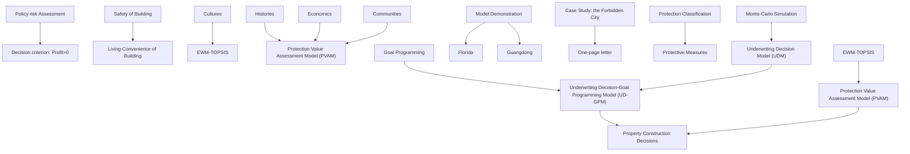
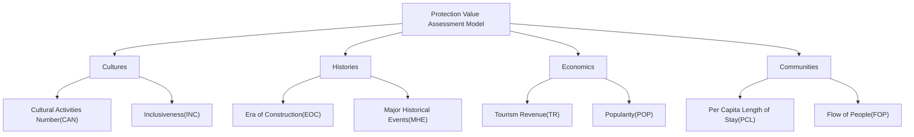
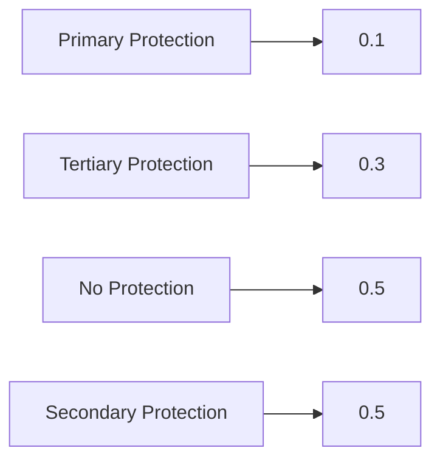
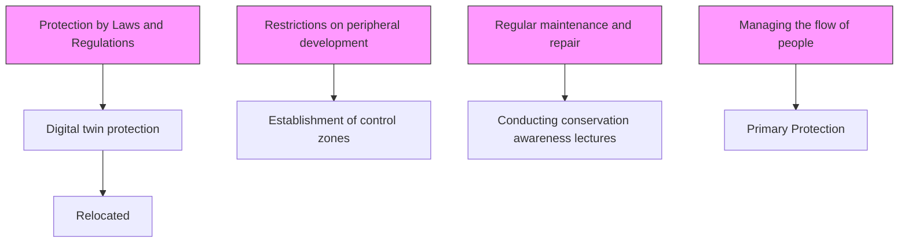

# Find a Home for Your Property

Summary

As the frequency of extreme weather events increases globally, the threat to property safety is growing, leading to higher insurance claim risks and consequently rapid increases in insurance rates. This results in potential losses for insurance companies and unaffordable insurance premiums for property owners. This paper develops an insurance model to assess whether insurance companies should conduct business in these areas. Additionally, a protection model is established to identify properties of cultural and community significance and to provide recommendations for protective measures.

For Task 1, we developed an underwriting decision model based on whether the insurance company is profitable as the decision criterion. Using Monte Carlo simulations, we generated 100 insurance scenarios to calculate the probability of profitability for the insurance company, which informed the underwriting decisions. Demonstrating this model in Guangdong Province, China, and Florida, USA, the probability of profitable underwriting in Guangdong is $63\%$ , while it is $26\%$ in Florida. Therefore, the insurance company undertakes underwriting in Guangdong but not in Florida. Additionally, when the base rate is high, the insurance company opts for risk-taking. Property owners can influence the insurance company's decision by using a risk checklist to reduce the probability of property damage.

For Task 2, we improved the underwriting decision model to quantify the level of real estate protection in different locations within specific areas. Furthermore, we quantified convenience based on the distance from the location to living service areas. Then, we established a goal programming model that maximizes both the level of protection and convenience, solving for the optimal construction site using particle swarm optimization. We recommend not constructing in locations with a target value lower than 0.5 and choosing high disaster-resistant building materials for locations with lower levels of protection.

For Task 3, we proposed a protection value assessment model that considers cultural, historical, economic, and community values. Using EWM-TOPSIS, we calculated protection value scores and divided them into four levels: no protection (0-0.1), first-level protection (0.1-0.3), second-level protection (0.3-0.5), and third-level protection (0.5-1.0). The level into which a building falls determines whether it is protected, with specific protective measures proposed for each protection level. For Task 4, we selected the Forbidden City in Beijing as the case study. Using the underwriting decision model and protection value assessment model, we found that the Forbidden City has significant cultural, historical, economic, and community values with high sustainable development value. Its protection value is 0.618, qualifying it as a third-level protection building.

Finally, we conducted a sensitivity analysis on the underwriting decision model and protection value assessment model. With the investment interest rate varying between [0.002,0.007], the insurance company's decisions remain unchanged. A $20\%$ variation in the protection value indicators results in a total value score change of no more than $5\%$ , demonstrating the reliability of the models proposed in this paper.

Keywords: Underwriting decision model; Monte Carlo simulations; Risk checklist; Goal programming; EWM-TOPSIS; protection value model

## Contents

## 1 Introduction 3

1.1 Problem Background 3  
1.2 Restatement of the problem and our work ..... 3

## 2 Assumption and Justifications 4

## 3 Notations 5

## 4 Underwriting Decision Model 5

4.1 Policy Risk Assessment 6  
4.2 Income reallocation 7

4.2.1 Pricing of premiums 7  
4.2.2 Reallocation of premium income 8

4.3 Perform underwriting decisions ..... 9

4.3.1 Cost Calculation 9  
4.3.2 Judgment Criteria for Decision-making 10

4.4 Demonstration of Model Results 10

## 5 Underwriting Decision-Goal Programming Model 12

5.1 Adaptation of UDM 12  
5.2 Model of Property Decisions 12  
5.3 Model Effect Demonstration 13

## 6 Protection Value Assessment Model 14

6.1 Discussion of Indicators 14  
6.2 Scoring based on the EWM-TOPSIS ..... 16  
6.3 Protection Measures Under Each Level ..... 17

## 7 Case Study: the Forbidden City 19

7.1 Underwriting Decision Model 19  
7.2 Protection Value Assessment Model 20

## 8 Sensitivity Analysis 21

## 9 Strengths and Weaknesses 22

9.1 Strengths 22  
9.2 Weaknesses 22

## References 23

## 1 Introduction

## 1.1 Problem Background

As the global population and economy grow, the frequency of human activities is also increasing. The result of this increased human activity is an increasing concentration of greenhouse gases in the atmosphere and an intensification of the problem of global warming. Petteri Taras, Secretary General of the World Meteorological Organization, said in an interview in 2021, "Humans are no strangers to extreme weather, but climate change has undoubtedly increased the frequency and severity of extreme weather."

Extreme weather events are also taking an increasing toll on people. According to the World Meteorological Organization, economic losses from extreme weather increased 7-fold from the 1970s to the 2010s. And that's a huge blow to the insurance industry because it means insurers also face higher claims. The Boston Consulting Group predicts that climate change will increase insurance premiums by 30 to 60 percent by 2040, which could reflect a worse profitability for insurers. So how insurers should adjust in an environment where extreme events continue is a question worth considering.

Surface air temperature anomaly for June to August 2022  

heatmap

| Region | Temperature Anomaly (°C) |
|--------|--------------------------|
| North America | ~-4 to ~+6 |
| Europe | ~-6 to ~+7 |
| Asia | ~-6 to ~+7 |
| Africa | ~-6 to ~+7 |
| South America | ~-6 to ~+7 |
| Oceania | ~-6 to ~+7 |
| Middle East | ~-6 to ~+7 |
| Central Asia | ~-6 to ~+7 |
| Australia | ~-6 to ~+7 |
| Antarctica | Not labeled (Data: ERA5, Reference period: 1981-2010, Credit: C3S/ECMWF) |

Figure 1: Abnormal temperatures(Image courtesy of The Copernicus Climate Change Service (C3S))

## 1.2 Restatement of the problem and our work

(1) Problem Restatement: Develop an insurance model to identify whether insurance companies are underwriting in places where extreme weather is increasing. And apply the model to two regions on different continents that experience extreme weather events.

Our work: We construct a model of the profitability of insurance companies, using whether or not they are profitable as the basis for decisions about whether to underwrite a policy. The probability of payout for each policy is quantified, and 1000 times Monte Carlo sampling is performed, which in turn yields the profitability of an insurance company in terms of a region. Guangdong Province in China and Florida in the U.S. are chosen to demonstrate the model.

(2) Problem Restatement: In a given region, the insurance model evaluates where to build real estate, how to build it, and whether to build it at all.

Our work: Considering the degree of protection and convenience of real estate, the farther away from the place where extreme weather occurs the higher the degree of protection will be, and the closer to the living service area the higher the degree of convenience will be. Therefore, we combine the insurance model to build a goal programming model to solve to get the optimal construction location.

(3) Problem Restatement: Develop a conservation model that identifies the buildings that should be protected and the corresponding conservation measures.

Our work: We consider the impact of 4 dimensions: Cultures, Histories, Economics, and Communities. We also establish a conservation value assessment model through the EWM-TOPSIS method. Finally, the score is divided into 4 intervals: no protection, primary protection, secondary protection, and tertiary protection, and corresponding protection measures are taken according to the protection level.

(4) Problem Restatement: Select a landmark that has experienced an extreme weather event and evaluate the value of the landmark using an insurance model and a protection model.

Our work: Select the Forbidden City located in Beijing, China to assess the value of the landmark and use the insurance model to get the probability that the Forbidden City can enjoy the insurance service, and use the conservation model to get the value of the Forbidden City in terms of its history, economy, and so on.

For a clearer understanding of our processa more intuitive understanding of our approach can be seen in the flowchart below.

flowchart

Figure 2: Flowchart of ideas

## 2 Assumption and Justifications

\- Assumption:The demand for one year's worth of policies in an area is known and does not change due to changes in policy rates.

Justification: Reducing the complexity of the model scenario makes the scenario easier to simulate.

\- Assumption:The probability of a policy payout occurring is positively related to the risk of the policy.

Justification: The risk of a policy is often measured by the probability of a claim occurring; the higher the probability of a claim, the higher the risk.

\- hypothesis: Buildings within an area have the same external risk, and internal risk is related to their own building risk.

Justification: External risk comes mainly from the effects of extreme weather, which can have a large impact and can cover an entire region.

\- Assumption: Insurance companies can spread the risk by reinsurance.

Justification: There are a large number of insurance companies in the world, and one insurance company can buy insurance from another.

## 3 Notations

In the following table we list some of the symbols and definitions we use.

<table><tr><td>Symbols</td><td>Definition</td></tr><tr><td> $O$ </td><td>A policy</td></tr><tr><td> $OS$ </td><td>A collection of policies</td></tr><tr><td> $OS_{i}$ </td><td>A collection of low-risk policies</td></tr><tr><td> $OS_{h}$ </td><td>A collection of high-risk policies</td></tr><tr><td> $C_{O}$ </td><td>Policy premiums</td></tr><tr><td> $A_{O}$ </td><td>Policy amount</td></tr><tr><td> $P_{O}$ </td><td>Policy benefit amount</td></tr><tr><td> $F_{O}$ </td><td>Rate of the policy</td></tr><tr><td> $R_{O}$ </td><td>Risk of the policy</td></tr><tr><td> $\beta_{j}$ </td><td>Extent of damage to property in area  $j$ </td></tr><tr><td> $rate_{j}$ </td><td>Annual expected investment yield in area  $j$ </td></tr><tr><td> $d_{Ii,j}$ </td><td>Distance of location  $i$  from the  $j_{th}$  extreme weather occurrence</td></tr><tr><td> $d_{Li,k}$ </td><td>Distance of location  $i$  from the  $k_{th}$  life service area</td></tr></table>

Other symbols will be described as they are used

## 4 Underwriting Decision Model

For the underwriting decision modeling, our premise is that insurance companies are "economic beings". That is, insurance companies are most concerned with profit, and when the profit is positive, insurance companies are willing to underwrite policies in a region. In order to calculate the profit, we first consider how to evaluate the risk of a policy in a region, which is set as $R_{O}$ in this model. Then we develop a premium pricing strategy based on $R_{O}$ . To obtain greater income as well as to reduce risk, we consider that the insurance company will redistribute the total premium income (set as RI in this model) into reserve funds, investment assets, and reinsurance funds. Thus the insurance company's true income over the policy term is $RI'$ . Finally, the profit is calculated by subtracting costs from the true income $RI'$ .

## 4.1 Policy Risk Assessment

To assess the risk of an order, we consider the external risk $R_{O}^{E}$ and the internal risk $R_{O}^{I}$ of the order. External risk refers to the risk of damage to the property caused by an extreme weather event; internal risk refers to the insured property's risk profile, e.g., if the insured property has a high level of resilience, then the risk of damage occurring in the face of equivalent extreme weather is lower. We believe that it is more comprehensive and reasonable to assess the risk of a policy through both internal and external risks.

## (1) Quantify external risk $R_{O}^{E}$

Most extreme weather events cause economic damage to the area, and insurance companies then pay out to their customers. A higher number of extreme weather events in a region means that insurers are exposed to a higher risk of paying out. We therefore use the frequency of extreme weather events in a region in a year as a measure of external risk, which is

$$
R _ {O} ^ {E} = \frac {\sum_ {i = 1} ^ {n} e w n _ {i}}{n \times 3 6 5} \tag {1}
$$

Where, $ewn_{i}$ means the number of times the ith type of extreme weather occurs in a year, and n means the number of extreme weather types occurring in a region during the insurance period.

## (2) Quantify internal risk $R_{O}^{I}$

We use the risk checklist checklist methodology in risk management to quantify internal risks $^{[1]}$ . The risk checklist includes multiple risk dimensions that help users to more fully understand the nature and extent of risks and to predict the probability of a compromised risk occurring and the impact it may result in.

One of the property risk management evaluation forms we have produced is shown below

Table 1: Internal risk checksheet

<table><tr><td>Indicators</td><td>Sub-Indicators</td><td>Scoring Criteria (1-10)</td><td>Score</td></tr><tr><td rowspan="3">Carrying Capacity</td><td>Cracking Conditions</td><td>The more severe the cracking, the higher the score</td><td></td></tr><tr><td>Structure Type</td><td>The higher the structural strength, the lower the score</td><td></td></tr><tr><td>Deformation &amp; Displacement</td><td>The more severe the deformation and displacement, the higher the score</td><td></td></tr><tr><td rowspan="3">Durability</td><td>Material Strengths</td><td>The higher the material strength, the lower the score</td><td></td></tr><tr><td>Concrete Corrosion</td><td>The more severe the corrosion, the higher the score</td><td></td></tr><tr><td>Steel Corrosion</td><td>The more severe the corrosion, the higher the score</td><td></td></tr><tr><td rowspan="3">Usage History</td><td>Useful Life</td><td>The more years of use, the higher the score</td><td></td></tr><tr><td>Disasters Suffered</td><td>The higher the number of disasters, the higher the score</td><td></td></tr><tr><td>Functional Changes</td><td>The higher the number of function changes, the higher the score</td><td></td></tr></table>

After scoring and normalizing each detail according to the evaluation criteria, we then average the total of all the evaluation metrics scores as the internal risk score for the policy. That is

$$
R _ {O} ^ {I} = \frac {\sum_ {i = 1} ^ {m} T _ {O i}}{m} \tag {2}
$$

Where $T_{Oi}$ means the score of the ith indicator in the risk checklist and m means the number of indicators.

## (3) Quantify policy risk

Considering that internal risks can be intervened through human intervention, for example, in Japan most of the building materials are wooden structures, which are well suited to minimize the damage caused by earthquakes. External risks, on the other hand, are usually difficult to intervene, or to intervene effectively. This is because the weather system is very complex, and consists of a variety of factors such as atmospheric circulation, water cycle, etc., which work together and affect each other. It is still difficult to make accurate predictions and interventions with our current resources and technology.

In summary, we believe that external risks will have a greater impact on a policy than internal risks, so we assign a weight of 0.6 to external risks and 0.4 to internal risks:

$$
R _ {O} = 0. 6 R _ {O} ^ {E} + 0. 4 R _ {O} ^ {I} \tag {3}
$$

## 4.2 Income reallocation

## 4.2.1 Pricing of premiums

The most direct source of income for insurance companies is premium income. Let us set O to be a policy, $C_{O}$ to be the premium of a policy, $A_{O}$ to be the amount of a policy, and $F_{O}$ to be the rate of a policy then the insurance company's premium income from a policy is

$$
C _ {O} = A _ {O} \times F _ {O} \tag {4}
$$

where the policy amount $A_{O}$ is determined by the value of the insured property. We assume that policyholders buy full insurance policies, i.e., the policy amount is equal to the insured value. We assume that there are 1000 policies in a region and the policy amount $A_{O}$ is randomly generated under the $N(\mu,\sigma)$ distribution. The $\mu$ denotes the average property value in the area and $\sigma$ is set to 0.2 times $\mu$ .

The policy rate $F_{O}$ consists of a base rate, which is related to the operating condition of the insurance company, and a risk rate, which is related to the risk of the policy. We set the base rate to be 0.3% and the coefficient of the risk rate to be 0.1%, then the formula for calculating the insurance rate for a region is

$$
F _ {O} = \alpha + \lambda \times R _ {O} \tag {5}
$$

Where $\alpha$ is the base rate and $\lambda$ is the risk rate coefficient, in this paper, the base rate is set at 0.3% and the coefficient of the risk rate is 0.1%.

## 4.2.2 Reallocation of premium income

After collecting premiums, based on the need for risk diversification, insurance companies will also re-insure, i.e., by signing insurance contracts with other insurance companies, they will spread part of their risks to the other party. In addition, insurance companies usually use part of the premiums to invest in other financial products in order to obtain more income $^{[2]}$ . All these behaviors will affect the income of the insurance company, so we need to consider these behaviors to get the final income of the insurance company.

## (1) Reserve Assets $RI_{a}$

An insurance company needs to have a certain amount of money as a reserve for policy payments as well as to maintain the company's normal operations. We set the insurance company to keep half of its premium income for one year as a reserve, which can be thought of as cash on hand, i.e., the amount does not change. Given that the insurance company's total premium income for one year is $RI$ , the money value of the reserve fund after one year will be

$$
R I _ {a} ^ {\prime} = R I _ {a} = 0. 5 R I = \sum_ {O \in O S} C _ {O} \tag {6}
$$

Where $RI_{a}$ means the funds used for the imprest and OS means the collection of all policies.

## (2) Reinsurance Assets $RI_{b}$

We categorize policies into high-risk and low-risk policies, and set a risk threshold such that policies larger than the risk threshold are high-risk policies, otherwise they are low-risk policies. The insurance company is set to reinsure only high-risk policies to achieve risk diversification. Set $OS_{h}$ to denote the set of high-risk policies, set $OS_{l}$ to denote the set of low-risk policies, and $RI_{b}$ to denote the funds used for reinsurance, then there are

$$
R I _ {b} = \sum_ {O \in O S _ {h}} C _ {O} \tag {7}
$$

For policies that are reinsured, they may be in force within the next year, i.e., claims will need to be made. But it is also possible that it will not be in force. We need to distinguish between such cases. Let each policy in the pool of high-risk policies have a premium funding value of $E_{O}$ after one year, and we have

$$
E _ {O} = \left\{ \begin{array}{l l} C _ {O h} - C _ {O h} ^ {\prime}, & \text { Policy   O   not   in   force } \\ C _ {O h} - C _ {O h} ^ {\prime} + P _ {O h} ^ {\prime}, & \text { Policy   O   in   force } \end{array} \right. \tag {8}
$$

Where $Oh \in OS_{h}$ , $C'_{Oh}$ denotes the premium for reinsurance, and $P'_{Oh}$ denotes the amount of payout received for reinsurance (the quantitative formula for $P_{O}$ is given in 4.3.1).

Since reinsurance transfers part of the risk to other firms rather than transferring the whole risk. Therefore we set $C_{Oh}^{\prime}=0.8C_{Oh}$ . If the rate of reinsurance is lower than the rate of original insurance, then the amount of payout received should be less, we set $P_{Oh}^{\prime}=0.4P_{Oh}$ .

In summary, we can get the capital value of reinsurance after one year as

$$
R I _ {b} ^ {\prime} = \sum_ {O \in O S _ {h}} E _ {O} \tag {9}
$$

## (3) Investment Assets $RI_{c}$

Suppose that the insurance company allocates only three parts of its premium income in a year, i.e., reserve funds, reinsurance funds and investment funds. Setting the value of the funds used for investment as $RI_{c}$ , we have

$$
R I _ {c} = R I - R I _ {a} - R I _ {b} \tag {10}
$$

Insurance companies typically purchase a variety of financial products when making investments. To simplify the model, we assume that the insurance company owns equal proportions of each financial product and purchases the financial products in the corresponding underwriting regions. From this we can obtain the expected annual rate of return on investment in a region j, which is set to $rate_{j}$ . The value of the funds used for investment by the insurance company after one year is then

$$
R I _ {c} ^ {\prime} = R I _ {c} \times (1 + r a t e _ {j}) \tag {11}
$$

Summing up, we can get the real income R of the insurance company after one year as

$$
R = R I _ {a} ^ {\prime} + R I _ {b} ^ {\prime} + R I _ {c} ^ {\prime} \tag {12}
$$

## 4.3 Perform underwriting decisions

## 4.3.1 Cost Calculation

The main cost of an insurance company is the cost of claims, so we use the cost of claims as the cost of the insurance company. Setting the amount of the claim as $P_{O}$ , the cost C of the insurance company is

$$
C = \sum_ {O \in O S} P _ {O} \times Z _ {O} \tag {13}
$$

Where O means one policy and OS means the set of policies within one year. $Z_{O} \in \{0, 1\}$ is a judgment coefficient, $Z_{O} = 1$ when the policy is in force, which means that a payout occurs, otherwise $Z_{O} = 0$ .

Since the payout amount $P_{O}$ is determined by the extent of damage to the property, we need to consider how to measure the extent of damage to the property. In the model, we use the loss per unit area caused by extreme weather to measure the degree of damage to the property. Given that $\beta_{j} \in [0,1]$ denotes the degree of damage to the property in area j, there are

$$
\beta_ {j} = L _ {j} / L _ {\max} = \frac {T L _ {j}}{S _ {j} \times L _ {\max}} \tag {14}
$$

Where, $TL_{j}$ means the total loss of area j in a year, $S_{j}$ means the land area of area j, and $L_{max}$ is the maximum value in $L_{j}$ .

Then the quantization formula for the payout amount can be further obtained as

$$
P _ {O} = A _ {O} \times \beta_ {j} \tag {15}
$$

## 4.3.2 Judgment Criteria for Decision-making

If a risk has profit potential, the insurance company will choose to take the risk to make a profit. Based on all of the above discussion, we can obtain a quantitative formula for the profit P that an insurance company makes if it chooses to underwrite in an area where extreme weather events occur

$$
P = R - C
$$

Which, $R = RI_{a}^{\prime} + RI_{b}^{\prime} + RI_{c}^{\prime} = 0.5RI_{a} + \sum_{O\in OS_{h}}E_{O} + RI_{c}\times (1 + rate_{j})$ (16)

$$
C = \sum_ {O \in O S} P _ {O} \times Z _ {O} = \sum_ {O \in O S} \left(A _ {O} \times \beta_ {j}\right) \times Z _ {O}
$$

When the profit P is positive, the insurance company is able to underwrite in the respective area.

## 4.4 Demonstration of Model Results

We chose Florida in the United States and Guangdong Province in China to demonstrate our model. According to a news release from the National Oceanic and Atmospheric Administration (NOAA) $^{[3]}$ , in 2023 the United States suffered 28 disasters with single losses of more than one billion dollars, of which eight affected Florida. Guangdong Province, a coastal city, was affected by six typhoons in 2022, with 25 days of heavy rainfall during the storm period and direct economic losses of over half a billion dollars. These two regions are therefore well suited to demonstrate our model.

Since the probability of a policy payout is positively correlated with the policy risk, through continuous debugging, we decided to divide the policy risk by 10 to get the probability of the policy incurring a payout. We take a random number at $[0,1]$ and consider the policy not in force when the random number is greater than the probability of payout, otherwise it is in force. The effectiveness of n policies in a region constitutes an insurance scenario for that region

$$
U = \left[ u _ {1}, u _ {2}, \dots , u _ {n} \right] \tag {17}
$$

Considering the randomness of the results obtained by generating the scenario only once, we performed Monte Carlo sampling 100 times to make the coverage decision by observing the frequency of $P > 0^{[4]}$ .

Fig3 shows the simulation results. It can be clearly observed that the frequency of profits P < 0 in Florida is much larger than the frequency of P > 0, and therefore we do not recommend insurance companies to underwrite in this region. The frequency of profit P > 0 is much higher in Guangdong Province, so we believe that insurers can underwrite here.

line chart

| Times | C       | R       | P       |
|-------|---------|---------|---------|
| 0     | 1.8e6   | 1.2e6   | 0.0e6   |
| 10    | 2.0e6   | 1.3e6   | -0.5e6  |
| 20    | 1.7e6   | 1.1e6   | -0.7e6  |
| 30    | 1.9e6   | 1.2e6   | -0.4e6  |
| 40    | 2.1e6   | 1.3e6   | -0.9e6  |
| 50    | 1.8e6   | 1.2e6   | -0.7e6  |
| 60    | 2.2e6   | 1.3e6   | -0.5e6  |
| 70    | 1.9e6   | 1.2e6   | -0.8e6  |
| 80    | 1.7e6   | 1.3e6   | -0.5e6  |
| 90    | 1.8e6   | 1.2e6   | -0.7e6  |
| 100   | 1.6e6   | 1.1e6   | -0.5e6  |

(a) Results for Florida

line chart

| Times | C       | R       | P       |
|-------|---------|---------|---------|
| 0     | 0.75e6  | 0.90e6  | 0.15e6  |
| 5     | 0.85e6  | 0.95e6  | -0.10e6 |
| 10    | 0.65e6  | 0.85e6  | -0.30e6 |
| 15    | 0.70e6  | 0.90e6  | 0.20e6  |
| 20    | 1.30e6  | 0.80e6  | -0.45e6 |
| 25    | 0.60e6  | 0.85e6  | -0.25e6 |
| 30    | 1.25e6  | 0.90e6  | -0.10e6 |
| 35    | 0.75e6  | 0.85e6  | -0.20e6 |
| 40    | 0.35e6  | 0.90e6  | -0.15e6 |
| 45    | 1.00e6  | 0.85e6  | -0.10e6 |
| 50    | 0.75e6  | 0.90e6  | -0.25e6 |
| 55    | 1.25e6  | 0.85e6  | -0.35e6 |
| 60    | 1.15e6  | 0.90e6  | -0.25e6 |
| 65    | 1.10e6  | 0.85e6  | -0.20e6 |
| 70    | 0.75e6  | 0.90e6  | -0.15e6 |
| 75    | 1.00e6  | 0.85e6  | -0.10e6 |
| 80    | 0.75e6  | 0.90e6  | -0.25e6 |
| 85    | 1.15e6  | 0.85e6  | -0.15e6 |
| 90    | 1.00e6  | 0.90e6  | -0.10e6 |
| 95    | 1.25e6  | 0.85e6  | -0.25e6 |
| 100   | 0.75e6  | 0.85e6  | -0.15e6 |

(b) Results for Guangdong  
Figure 3: Results of multiple simulations of the UDM model in the region

Analyzing the reason for this result, we believe it is related to the number of extreme weather events in the two regions. The number of extreme weather events in a year is 57 in Florida and 35 in Guangdong Province, and the higher the number of extreme weather events, the higher the policy external risk $R_O^E$ , the higher the policy risk and the probability of payout. Although premiums also increase, they increase more slowly and cannot keep up with the increase in claims costs because insurers cannot set premiums too high or they will face the problem of customer churn. So premiums don't increase as fast as claims costs, causing the insurance company to lose money.

Both insurance companies and property owners are concerned about insurance rates, so we examined how insurance companies operate under different base rates.

line chart

| Basic rate | Average C | Average R | Average P |
|---|---|---|---|
| 0.0010 | 1.35e6 | 6.0e5 | -7.0e5 |
| 0.0020 | 1.33e6 | 9.5e5 | -4.0e5 |
| 0.0030 | 1.45e6 | 1.3e6 | -1.0e6 |
| 0.0040 | 1.38e6 | 1.65e6 | 3.0e5 |
| 0.0050 | 1.4e6 | 2.0e6 | 6.0e5 |

Figure 4: Operations of insurance companies at different rates

As can be seen in Fig4, insurance companies begin to make a profit when the policy base rate is approximately 0.0034. So when the base rate is higher in areas with more extreme weather events, the insurance company may choose to take a chance on underwriting the policy. Since the change in base rate is what ultimately affects the policy rate $F_O$ , it can be assumed that $F_O$ plays a decisive role in the insurer's decision. So for homeowners, they can reduce their risk rate by reducing their property's own risk and thus affecting $F_O$ , which ultimately affects the insurance company's decision.

## 5 Underwriting Decision-Goal Programming Model

To reduce exposure to extreme weather events, communities and property developers need to consider where to build properties or what materials to use to build properties to make them more resilient. It is also important to consider ease of living and not just build in remote areas to reduce risk. In order to help real estate developers make sound decisions within a specific region, we made some adjustments to the underwriting decision model to make it generalizable.

## 5.1 Adaptation of UDM

In the risk assessment portion of our underwriting decision model, the policy external risk $R_{O}^{E}$ only considers extreme weather conditions in one region. To apply the model to real estate construction decisions, it is necessary to consider how the distance of a location from the site of an extreme weather event affects the external risk, rather than assuming that every location within an entire region is equally affected by extreme weather.

Setting the distance of a house from the disaster site as $d_{I}$ , for each house we can get a new external risk $R_{O}^{E'}$

$$
R _ {O} ^ {E ^ {\prime}} = R _ {O} ^ {E} \times f (d _ {I}) \tag {18}
$$

Where $f(d_{I})$ is a function of $d_{I}$ and the probability of an area being insured.

The function $f(d)$ is obtained by taking 30 points in [0,3] and performing 1000 Monte Carlo samples, taking the frequency of p > 0 as the probability that the corresponding location can purchase insurance, and then performing a regression method by least squares. Setting $f(d_{I}) = a + b * \ln(d_{I})$ , the regression yields $f(d_{I}) = 0.5454 + 0.0874 * \ln(d_{I})$ , and the residual sum of squares SSE 0.008, which can be regarded as a better fit. The function image is shown in Fig5.

scatterplot

| Distance | Probability |
| -------- | ----------- |
| 0.1      | 0.38        |
| 0.2      | 0.41        |
| 0.3      | 0.44        |
| 0.4      | 0.47        |
| 0.5      | 0.45        |
| 0.6      | 0.50        |
| 0.7      | 0.48        |
| 0.8      | 0.53        |
| 0.9      | 0.52        |
| 1.0      | 0.53        |
| 1.1      | 0.56        |
| 1.2      | 0.53        |
| 1.3      | 0.57        |
| 1.4      | 0.57        |
| 1.5      | 0.59        |
| 1.6      | 0.62        |
| 1.7      | 0.60        |
| 1.8      | 0.61        |
| 1.9      | 0.62        |
| 2.0      | 0.62        |
| 2.1      | 0.60        |
| 2.2      | 0.62        |
| 2.3      | 0.63        |
| 2.4      | 0.62        |
| 2.5      | 0.64        |
| 2.6      | 0.63        |
| 2.7      | 0.64        |
| 2.8      | 0.62        |
| 2.9      | 0.63        |
| 3.0      | 0.63        |

Figure 5: Graph of the function $f(d_I)$

## 5.2 Model of Property Decisions

In order to better evaluate how to choose a construction site in a certain area, we assume that the shape of the area is a rectangle with length m and width n. The lowerleft corner of the rectangle is taken as the origin of the Cartesian coordinate system.

## (1) Measurement of Living Convenience

The convenience of living can be measured by the distance of the property from the living service area. We set the distance between the house and the living service area as $d_{L}$ . In general, the radius of the living service area is 2km, and the area beyond 2km can be considered as unable to enjoy the convenience brought by this living service area. Within 2km, the enjoyment of convenience has a linear monotonically decreasing trend with increasing distance. Therefore, we can get a functional expression for $d_{L}$

$$
g (d _ {L}) = \left\{ \begin{array}{l l} - \frac {d _ {L}}{2} + 1, & 0 \leq d _ {L} \leq 2 \\ 0, & d _ {L} > 2 \end{array} \right. \tag {19}
$$

## (2) Building Models based on Goal Planning

Real estate developers need to consider both the degree of housing security as well as the degree of amenity when making decisions, which serve as the evaluation dimensions of housing satisfaction. Here we set the degree of housing security as IS, which can be measured by the function $f(d_{I})$ . This is because the higher the probability that an insurance company is willing to underwrite an area, it can indicate to a certain extent that the place has a higher degree of security. Set the ease of living as RS, which can be measured by the function $g(d_{L})$ . That is

$$
I S = f (d _ {I}), \quad R S = g (d _ {L}) \tag {20}
$$

Given $(x,y)$ as the location coordinates of the property under consideration for construction, $(x_{i},y_{i})$ as the location coordinates of the disaster site i, and $(x_{j},y_{j})$ as the location coordinates of the living service area j. Then we can get

$$
d _ {I i} = \sqrt {(x - x _ {i}) ^ {2} + (y - y _ {i}) ^ {2}} \tag {21}
$$

$$
d _ {L j} = \sqrt {(x - x _ {j}) ^ {2} + (y - y _ {j}) ^ {2}}
$$

There may be more than one disaster site and life service area in an area, and we need to calculate the distance between the construction site and the nearest disaster site and life service area. Let $d_{Imin} = mind_{Ii}$ and $d_{Lmin} = mind_{Lj}$ .

For property developers, the higher the housing security and the higher the ease of living in a place, the more suitable it is to build properties in that place. We consider these two indicators to be equally important, which means that the weights are equal.

With the above, we can get a target planning model

$$
\text { Max } \quad 0. 5 * I S + 0. 5 * R S = 0. 5 f (d _ {I m i n}) + 0. 5 g (d _ {L m i n})
$$

$$
\text { s.t. } \left\{ \begin{array}{l} 0 \leq x \leq m \\ 0 \leq y \leq n \\ x \neq x _ {i, j} \\ y \neq y _ {I, j} \end{array} \right. \tag {22}
$$

## 5.3 Model Effect Demonstration

We derive the optimal construction location within a region by particle swarm algorithm. We show the partial solution by rasterization $^{[5]}$ , which is displayed as follows.

heatmap

| | 0.0 | 0.2 | 0.4 | 0.6 | 0.8 | 1.0 | 1.2 | 1.4 | 1.6 | 1.8 |
|---|---|---|---|---|---|---|---|---|---|---|
| Extreme-weather events | Light Green | Light Green | Light Green | Light Green | Light Green | Medium Green | Medium Green | Medium Green | Medium Green | Medium Green |
| Living Area | Light Blue | Light Blue | Light Blue | Light Blue | Light Blue | Medium Green | Medium Green | Medium Green | Medium Green | Medium Green |
| Avoid Building Area | Dark Grey | Dark Grey | Dark Grey | Dark Grey | Dark Grey | Medium Green | Medium Green | Medium Green | Medium Green | Medium Green |
| Best Building Area | Pink | Light Blue | Light Blue | Light Blue | Light Blue | Medium Green | Medium Green | Medium Green | Medium Green | Medium Green |
| Unknown (X) | Dark Grey | Dark Grey | Dark Grey | Dark Grey | Dark Grey | Medium Green | Medium Green | Medium Green | Medium Green | Medium Green |
The chart displays a color-coded legend for the color scale ranging from 0.35 to 0.75. The x-axis and y-axis are labeled with values 0.0 to 1.8, representing spatial coordinates in a grid layout.

Figure 6: Partial Results of the UD-GPM

In the picture, the closer the color is to green indicates a higher level of satisfaction and the closer the color is to red indicates a lower level of satisfaction. The highest review scores are located at coordinates $(1.2,0.4)$ in the image, so consider building your property here.

The optimal building location is further away from extreme weather events. In order to save on construction costs, there is no need to build with expensive, highly disaster-resistant building materials. If the construction site is closer to the extreme weather event site, it is necessary to use highly disaster-resistant construction for safety reasons. When the satisfaction level is less than 0.5, it is not recommended to build in this location because it is less secure and less convenient to live in.

## 6 Protection Value Assessment Model

Under the assumption of rational economic agents, some buildings with cultural or community significance may be considered unworthy of resource allocation for preservation due to their inability to generate apparent economic benefits. However, in real life, we should not solely consider economic interests but also take into account various factors such as social and cultural aspects, seeking a balance of various interests. Therefore, we have constructed a conservation value assessment model that includes four indicators: Culture, History, Economics, and Community. We employ the EWM-TOPSIS method to determine the conservation value of buildings, categorizing it into four levels and proposing different preservation measures for each level.

## 6.1 Discussion of Indicators

The worthiness of preserving a building should involve considering multiple values and finding a point of balance among these interests. Hence, we have set four indicators: Culture, History, Economics, and Community, each with two sub-indicators as follows

flowchart

Figure 7: Indicator Display Chart

## (1) Culture

Culture is one of the key factors in assessing the importance and value of a building. The sub-indicators are Cultural Activities Numbers (CAN) and Inclusiveness (INC).

A higher quantity of cultural activities indicates that the building holds greater cultural significance and contributes to the development of local culture. Inclusivity is measured by the number of tourists from different countries. The more diverse the tourists a building attracts, the broader its cultural influence is considered, facilitating shared experiences and interactions among people from different cultural backgrounds.

## (2) History

Some buildings may be closely related to significant historical events, famous figures, or specific time periods, and their historical significance should be taken into account. In this regard, we select the sub-indicators of the Era of Construction ((EOC)) and the Major Historical Events (MHE).

The age of a building reflects its historical and traditional value, with older buildings typically possessing deeper historical backgrounds and cultural heritage. A building that is closely associated with more significant historical events holds greater historical significance for the region.

## (3) Economics

The economic value of a building can directly impact its societal status and role, subsequently influencing its overall value. Here, we use two sub-indicators for measurement: Tourism Revenue (TR) and Popularity (POP).

If a building positively affects the local tourism industry and attracts a large number of visitors, it is considered to have higher economic value. Moreover, a widely recognized building may attract more tourists and investments, thus generating more economic benefits. Popularity is quantified using Google search index. A building with a higher search index is considered to have greater popularity.

## (4) Communities

The community significance of a building lies in fostering emotional connections among people, holding significant social value. In this context, we employ two sub-indicators for measurement: Per Capita Length of Stay (PCL) and Flow of People (FOP).

A longer average dwell time at a building promotes interpersonal communication and a sense of belonging. Higher foot traffic means that people have more opportunities to interact, enriching emotional connections.

## 6.2 Scoring based on the EWM-TOPSIS

The Entropy Weight Method (EWM) is an objective approach for determining the weights of multiple indicators. It utilizes the concept of information entropy to calculate the weight of each indicator. TOPSIS (Technique for Order of Preference by Similarity to Ideal Solution) is a multi-criteria decision analysis method used to determine the best choice by comparing the similarity of each alternative to the ideal and worst solutions. In this context, we use the EWM method to assign weights to each indicator and then apply the TOPSIS method to assess the conservation value of different locations.

(1) Normalize the original score matrix.

Since all our indicators are of the maximization type, there is no need for normalization. However, the indicators may have different scales and ranges, so we use the Min-Max method to map the score $X_{ij}$ of location i under indicator j to the range [0, 1]:

$$
s t _ {-} X _ {i j} = \frac {X _ {i j} - X _ {j , m a x}}{X _ {j , m a x} - X _ {j , m i n}} \tag {23}
$$

(2) Determine the weights using the EWM method.

Let $p_{ij}$ represent the probability of occurrence of $X_{ij}$ . Then, we can calculate the information entropy $H(X_j)$ and the weight $W_j$ for indicator $X_j$ as follows:

$$
p _ {i j} = \frac {s t \_ X _ {i j}}{\sum_ {i = 1} ^ {n} s t \_ X _ {i j}}
$$

$$
H (X _ {j}) = - \frac {1}{\ln n} \sum_ {j = 1} ^ {n} p _ {i j} \ln (p _ {i j}) \tag {24}
$$

$$
W _ {j} = 1 - \frac {H (X _ {j})}{\sum_ {j = 1} ^ {n} 1 - H _ {j}}
$$

(3) Obtain the weighted score matrix Z:

$$
Z = (z _ {i j}) m \times n = (s t \_ X _ {i j} W _ {j}) _ {m \times n} \tag {25}
$$

(4) Determine the conservation value of locations using TOPSIS.

Define the best solution as $D_{i}^{+}$ and the worst solution as $D_{i}^{-}$ , with the conservation value score for the ith location as $S_{i}$ . Alternatives that are closer to the best solution are considered optimal:

$$
Z _ {j} ^ {+} = \max (Z _ {1} ^ {+}, Z _ {2} ^ {+}, \dots , Z _ {m} ^ {+}), \quad Z _ {j} ^ {-} = \min (Z _ {1} ^ {-}, Z _ {2} ^ {-}, \dots , Z _ {m} ^ {-})
$$

$$
D _ {i} ^ {+} = \sqrt {\sum_ {j = 1} ^ {m} (Z _ {j} ^ {+} - z _ {i j}) ^ {2}}
$$

$$
D _ {i} ^ {-} = \sqrt {\sum_ {j = 1} ^ {m} (Z _ {j} ^ {-} - z _ {i j}) ^ {2}} \tag {26}
$$

$$
S _ {i} = \frac {D _ {i} ^ {+}}{D _ {i} ^ {+} + D _ {i} ^ {-}}
$$

The weights for each indicator are shown in the following chart 8.

pie chart

| Category | Value |
|---|---|
| Cultural Activities Number | 0.094 |
| Inclusiveness | 0.077 |
| Era of Construction | 0.164 |
| Major Historical Events | 0.141 |
| Cultures | 0.171 |
| Histories | 0.305 |
| Tourism Revenue | 0.183 |
| Popularity | 0.078 |
| Per Capita Length of Stay | 0.086 |
| Flow of People | 0.177 |
| Communities | 0.263 |
| Economics | 0.261 |

Figure 8: Indicator weighting charts

We collected data for various landmarks and conducted conservation value assessments. Based on the scores, we categorized them into four protection levels: No protection, Primary protection, Secondary protection, and Tertiary protection, as shown in the figure 9.

flowchart

Figure 9: Classification of Protection Levels

## 6.3 Protection Measures Under Each Level

For buildings that fall into the "No Protection" level, we consider them to have no conservation value and do not recommend any protection measures. However, for buildings that fall into the protection levels, the intensity of protection measures should increase with the higher protection level, and the cost will also increase accordingly. Therefore, buildings with lower protection levels should not adopt advanced protection measures, while those with higher protection levels can consider higher-cost advanced protection measures.

The protection measures are as follows:

flowchart

Figure 10: Protection measures under each level

For buildings falling into the "Primary Protection" category, we recommend the following protection measures:

- Regular Maintenance and Repairs: Close the building to the public for one day every month and invite professional architects, engineers, and conservation experts to conduct a comprehensive inspection and assessment of the building to identify potential issues and areas in need of repair. Any damage found should be promptly addressed.  
- Conduct Conservation Awareness Lectures: Organize conservation awareness lectures to increase people's awareness of the landmark's preservation. During these lectures, emphasize the importance of sustainability and encourage people to recognize themselves as both beneficiaries and protectors of the landmark, motivating their active involvement in its preservation.  
- Manage Visitor Flow: Implement a reservation system for visits, restricting the number of visitors during each time slot to reduce overcrowding within the landmark and prevent potential damage due to congestion.

For buildings falling into the "Secondary Protection" category, we recommend the following protection measures:

- Restrict Surrounding Development: Define the permissible development range and construction intensity limits in the vicinity of the landmark. Each company's construction intensity should not exceed the specified limit to reduce noise and vibrations caused by nearby development and prevent damage to the building's structure.  
- Establish Controlled Zones: Divide the area into two zones: the Core Zone and the Buffer Zone. The Core Zone, which contains the most important, sensitive, and fragile parts of the site, should be off-limits to general tourists and only accessible to professional archaeologists or heritage conservation personnel. The Buffer Zone, located farther from the Core Zone, is relatively open but still subject to certain regulations, such as prohibiting the indiscriminate placement of objects or littering.

For buildings falling into the "Tertiary Protection" category, we recommend the following protection measures:

- Legal and Regulatory Protection: Designate the building as a national or local cultural heritage site and establish corresponding protection policies and measures. Additionally, stipulate that all construction activities in the surrounding area require government approval and guidance.  
- Digital Twin Protection: Use digital technology to create a virtual 3D model of the building, input its data into a Building Information Model (BIM), and conduct simulations and testing in a virtual environment. This approach provides a better understanding of the building's structure, materials, and history, facilitating more precise planning for maintenance and restoration work.  
- Relocation: For landmarks located in high-risk areas, consider relocating them to a safer location to reduce the risk of damage.

## 7 Case Study: the Forbidden City

We choose the Forbidden City in Beijing, China, for our study because it is one of the most important and influential historical landmarks in China and has experienced a large number of extreme weather events. There was also a rainstorm event in Beijing in July 2023 with an initial reported loss of 166 million RMB. Assessing the value of the Forbidden City using the Profit Underwriting Model and the Protection Value Scoring Model is important for the sustainable development of the Forbidden City and can provide managers with relevant conservation measures.

## 7.1 Underwriting Decision Model

Collect the relevant data of the Forbidden City, substitute the data into the underwriting decision model, and perform 100 Monte Carlo sampling simulations. The results obtained are shown in Fig11.

line chart

| Times | C       | R       | P       |
|-------|---------|---------|---------|
| 0     | 750000  | 900000  | 150000  |
| 5     | 550000  | 850000  | -20000  |
| 10    | 1250000 | 950000  | 40000   |
| 15    | 600000  | 800000  | -35000  |
| 20    | 950000  | 950000  | 45000   |
| 25    | 750000  | 850000  | -15000  |
| 30    | 950000  | 950000  | -2500   |
| 35    | 650000  | 850000  | -250    |
| 40    | 950000  | 950000  | -150    |
| 45    | 450000  | 850000  | -350    |
| 50    | 1250000 | 950000  | -25     |
| 55    | 850000  | 850000  | -15     |
| 60    | 950000  | 850000  | -35     |
| 65    | 750000  | 950000  | -25     |
| 70    | 1150000 | 850000  | -25     |
| 75    | 750000  | 850000  | -15     |
| 80    | 1150000 | 950000  | -35     |
| 85    | 450000  | 850000  | -25     |
| 90    | 75000   | 85000   | -25     |
| 95    | 11500   | 850   | -25     |
| 100   | 115   | 95      | -15     |

Figure 11: Underwriting Decision Modeling Results for the Forbidden City

From the picture, it can be known that there are more points with profit P > 0 and the frequency is 61%. It can be assumed that the insurance company has a greater willingness to underwrite in Beijing, and the probability that the Forbidden City can enjoy the insurance service is higher. The security of the Forbidden City is higher and has a higher value of sustainable development.

## 7.2 Protection Value Assessment Model

Inputting the data of cultural, historical, economic and community dimensions of the Forbidden City into the protection value assessment model, we get its protection value of 0.618, which belongs to the third level of protected buildings. Compare the Forbidden City with Mogao Grottoes and Canton Tower for some data, as shown in the table2

Table 2: Historic Landmarks Partial Raw Data

<table><tr><td></td><td>Cultural Activities Number</td><td>Inclusiveness</td><td>Era of Construction</td><td>Tourism Revenue</td><td>Popularity</td><td>Flow of People</td><td>Score</td></tr><tr><td>the Forbidden City</td><td>78</td><td>112</td><td>604</td><td>2,300,000,000</td><td>3817</td><td>3,0000</td><td>0.618</td></tr><tr><td>the Mogao caves</td><td>16</td><td>12</td><td>1658</td><td>5,000,000</td><td>1696</td><td>2,000</td><td>0.364</td></tr><tr><td>Canton Tower</td><td>23</td><td>52</td><td>15</td><td>800,000,000</td><td>2297</td><td>15,000</td><td>0.215</td></tr></table>

We can find that the Forbidden City is far more inclusive, well-known and crowded than Mogao Grottoes and Canton Tower. Although the Mogao Caves have the longest history of continuation, they are geographically remote and have a lower economic value. The Forbidden City, on the other hand, is located in China's capital city and has a high economic value due to its high visibility and the number of tourists from all over the world. In addition, the Forbidden City has a large number of cultural activities, such as an AR cloud tour of the Forbidden City, play theater in the Forbidden City, etc., to do the cultural heritage and high cultural value. Therefore, synthesizing the value of all aspects, the conservation value of Beijing is extremely high.

Taking into account the current conservation status of the Forbidden City, we provide managers with the following conservation recommendations according to its conservation level.

(1) Conduct conservation publicity lectures

Tell the story of the history of the Forbidden City, such as the major historical events that happened in each location during the various dynasties in history, and then increase people's motivation to protect the landmarks of the Forbidden City.

(2) Control the flow of people

Implementing a reservation system for visits, limiting the number of people at each period to reduce crowding, and closing the museum on Sundays for maintenance.

(3) Setting up control zones

Designate the most vulnerable part of the Forbidden City as the core zone, strictly static the entry of tourists, and allow tourists to visit only in the buffer zone.

(4) Digital twin conservation

Create a digital twin for the Forbidden City, where simulations and tests will be conducted to predict possible future dangers to take precautions.

## 8 Sensitivity Analysis

line chart

| Investment rate | Average C | Average R | Average P |
| --------------- | --------- | --------- | --------- |
| 0.02            | 1.4e6     | 1.35e6    | 0.0       |
| 0.03            | 1.4e6     | 1.35e6    | 0.0       |
| 0.04            | 1.4e6     | 1.35e6    | 0.0       |
| 0.05            | 1.4e6     | 1.35e6    | 0.0       |
| 0.06            | 1.4e6     | 1.35e6    | 0.0       |
| 0.07            | 1.4e6     | 1.35e6    | 0.0       |

(a) Florida

line chart

| Investment rate | Average C | Average R | Average P |
| --------------- | --------- | --------- | --------- |
| 0.02            | 740000    | 760000    | 20000     |
| 0.03            | 735000    | 765000    | 30000     |
| 0.04            | 745000    | 770000    | 25000     |
| 0.05            | 735000    | 765000    | 45000     |
| 0.06            | 735000    | 775000    | 35000     |
| 0.07            | 745000    | 775000    | 45000     |
| 0.08            | 725000    | 785000    | 55000     |

(b) Guangdong  
Figure 12: Impact of rate adjustments on results in two regions

We conducted a sensitivity analysis on the insurance model to verify its stability and to ascertain whether the model would be susceptible to various factors. We adjusted the interest rates on insurance company investments within a range of $2\%$ to $7\%$ to observe whether different interest rate conditions would affect the insurance company's decision to conduct business in a given area. We conducted experiments in Guangdong and Florida, the results indicated that changes in interest rates have minimal impact on the decisions of insurance companies. Therefore, we believe our model is stable and capable of addressing real-world problems.

line chart

| Adjustment Percentage (%) | Culture | History | Economy | Community |
| ------------------------- | ------- | ------- | ------- | --------- |
| -20                       | 0.613   | 0.588   | 0.607   | 0.595     |
| -15                       | 0.614   | 0.595   | 0.609   | 0.600     |
| -10                       | 0.615   | 0.602   | 0.611   | 0.607     |
| -5                        | 0.616   | 0.610   | 0.613   | 0.613     |
| 0                         | 0.618   | 0.618   | 0.618   | 0.618     |
| 5                         | 0.620   | 0.625   | 0.622   | 0.623     |
| 10                        | 0.622   | 0.632   | 0.625   | 0.628     |
| 15                        | 0.624   | 0.638   | 0.628   | 0.633     |
| 20                        | 0.625   | 0.645   | 0.631   | 0.637     |

Figure 13: Impact of rate adjustments on the model

Additionally, we conducted a sensitivity analysis on the conservation model, utilizing data from the Forbidden City. By altering the values of various primary indicators, we observed changes in the scoring system, with the historical indicator showing the largest variation at 5% and the cultural indicator the smallest at 1%. The results indicate that changing a single indicator does not significantly affect the overall score. Our model effectively measures the comprehensive value of a building from multiple dimensions.

## 9 Strengths and Weaknesses

## 9.1 Strengths

- Our underwriting decision model takes into account the real needs of insurance companies, making decisions driven by profit to ensure the long-term health of the insurance company. It also allocates the premiums received by the insurance company reasonably, considering the reinsurance decisions for risk diversification.  
- By using a large number of samples in the Monte Carlo simulation, it realistically replicates the actual insurance scenarios, resulting in high credibility of the outcomes.  
- Our underwriting decision model separately considers and calculates internal and external risks, allowing for a more comprehensive assessment of a policy's risk.  
- We provide targeted protection measures for buildings of different protection levels, ensuring that the intensity of protection is matched with the cost and value of the buildings.

## 9.2 Weaknesses

- The assessment of external risks relies too heavily on data from extreme weather events, lacking assessment of external risks from other dimensions.  
- We use the entropy weighting method to determine the weights of indicators, but most of the data collected is from China, without gathering data from other international landmarks. Therefore, when assessing the value of buildings in other countries, our model needs more data to ensure a more accurate evaluation.  
- Our protection value assessment model does not consider indicators comprehensively enough and could further distinguish between different dimensions to more accurately measure a building's comprehensive value in cultural, historical, economic, and social aspects.

## References

[1] Mora, S., Keipi, K. Disaster risk management in development projects: models and checklists[J].ăBull Eng Geol Environă65, 155165 (2006)  
[2] Shuang Wu, Xilian Deng. Corporate Diversification, Ownership, and Solvency in Chinas Property-Liability Insurance Companies[J]. $\check{a}$ Mathematical Problems in Engineering. vol. 2021, Article ID 1562771, 9 pages, 2021.  
[3] https://www.climate.gov/  
[4] Rui Wang. Study on optimal operation of distribution network considering extreme weather and mobile energy storage flexibility[D]. North China Electric Power University (Beijing), 2023  
[5] Yuan, C., Ye, Y., Tang, C.ăet al.ăAccuracy comparison of gridded historical cultivated land data in Jiangsu and Anhui provinces[J].ăChin. Geogr. Sci.ă27, 273285 (2017)  
[6] https://data.stats.gov.cn/index.htm  
[7] https://www.gddat.cn/newGlobalWeb/#/home  
[8] https://www.ncdc.noaa.gov/stormevents/

Dear Community Members:

We are Insurance of Catastrophes Modelers, with our primary research focus on the sustainability of the property insurance industry. Today, we are reaching out to share the insights derived from applying our insurance and preservation models to the Forbidden City in Beijing. As one of the most significant historical landmarks in Beijing and across China, this endeavor is pivotal for understanding the Forbidden City's value, its risk exposures, and the steps necessary to ensure its future sustainability.

Our insurance decision model, which involved Monte Carlo simulations using collected data, indicated a high probability of willingness to provide insurance, with a profit point frequency of 61%. This high likelihood of insurance coverage in this area is due to a combination of factors, such as the relatively low frequency of extreme weather events and the lower height of buildings. This not only bolsters our confidence in the sustainable protection of the Forbidden City but also reveals certain risks from the perspective of insurance companies.

Furthermore, our preservation value assessment model has classified the Forbidden City as a Level Three protected structure, with a protection value of 0.618. This is the highest protection value achieved by our evaluation model so far, attributed to the Forbidden City's central location in the capital, the influx of global visitors, and its significant economic contributions.

In light of these findings, we recommend the following plan for the protection and enhancement of the Forbidden City:

1. Educational Initiatives: Launch educational programs and lectures to share the rich history of the Forbidden City, highlighting significant historical events across dynasties to foster a sense of responsibility and enthusiasm for its preservation.  
2. Restricted Access Areas: Designate the most vulnerable areas of the Forbidden City as core zones, strictly limiting visitor access and allowing public visitation only in buffer zones.  
3. Digital Twin Technology: Develop a digital twin of the Forbidden City for simulation and testing, to predict and prevent potential future risks.

Additionally, we have outlined short-term and long-term risk mitigation measures to address the potential increase in extreme weather events in the future:

Short-term (1-3 years): Conduct periodic safety inspections and assess the structural integrity of buildings.

Medium to long-term (3-10 years): Given that Beijing is prone to sandstorms, which can directly damage ancient buildings, we propose the establishment of the Forbidden City Forest Park in the northwest of Beijing, where sandstorms originate.

Long-term (over 10 years): Continuously engage in scientific research and development, collaborating with research institutions to explore better measures for the preservation of cultural relics, minimizing the damage to artifacts from inevitable natural disasters.

Regarding cost recommendations, we suggest that the Forbidden City allocate at least 60% of its annual net profit to implement the above plans. Strong financial support will ensure the high-quality execution of these initiatives. This plan aims not only to protect the Forbidden City but also to enhance its value as a cultural heritage for future generations to cherish.

We look forward to further discussions with you and the community to ensure that the Forbidden City remains a treasured landmark for centuries to come.

Sincerely

Team #2410889