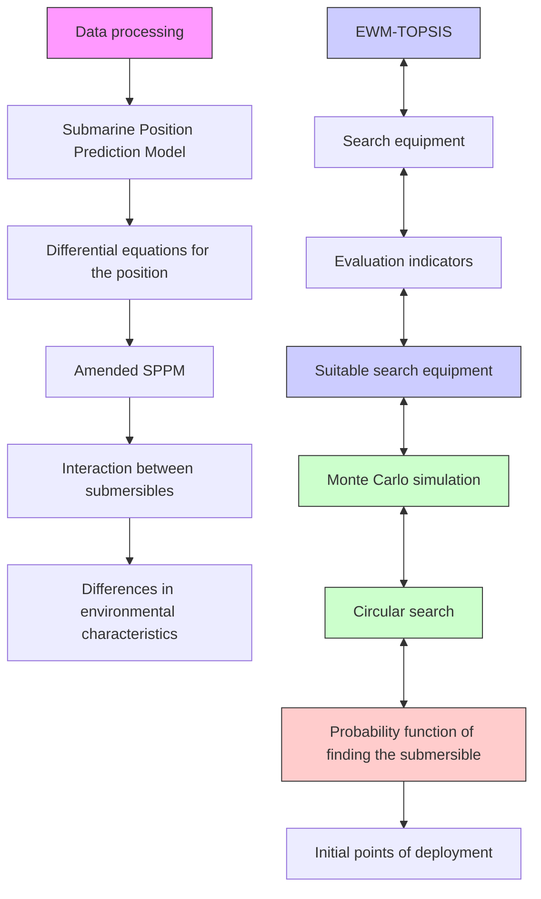
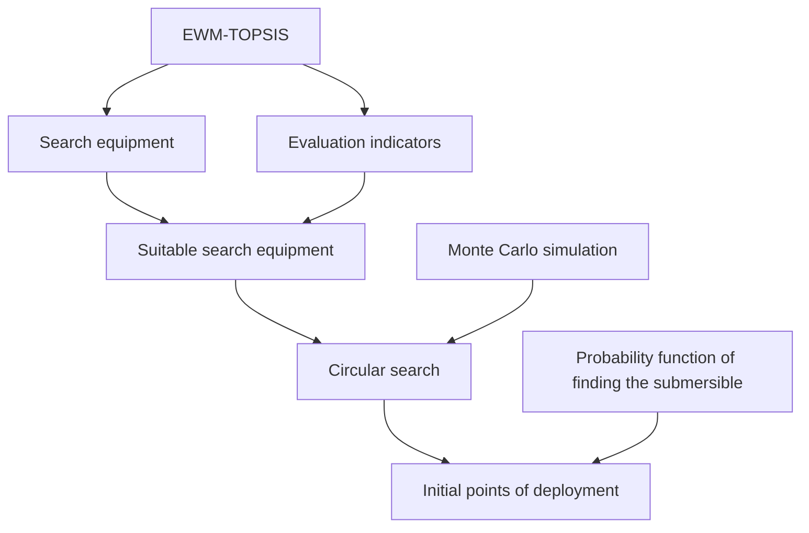
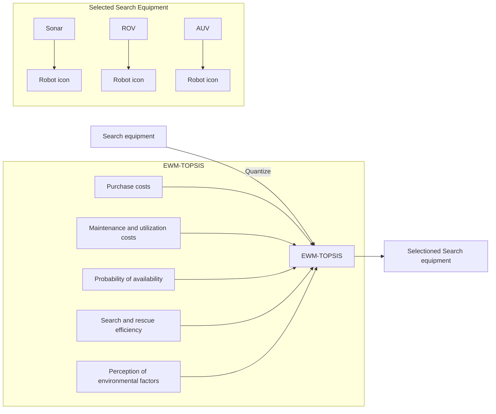

# From Lost to Found: Roam in the Ionian Sea

## Summary

Safety procedures for submersibles are an important prerequisite for their safe travel. Given better monitoring of submersibles, we have developed and generalized a predictive model of submersible position. By combining performance and cost considerations, we determined the equipment that should be provided for the submersible and the host ship.

We have constructed Submarine Position Prediction Model based on differential equations. The model consists of two parts, which are the current disturbance model and the water resistance model. Among them, the current disturbance model mainly considers the effects of wind, waves, and currents on the submersible in a seawater environment; the water resistance model starts from the resistance of seawater to the submersible. The kinetic relationship between these two parts constructs the differential equation relationship of the model, and the solution is to obtain the relationship between the position of the submersible and the time to complete the prediction of the position. From this, the causes of uncertainty are hypothesized, and the information that the submersible should send and the equipment that should be equipped to reduce the uncertainty are determined.

Based on the environmental characteristics reflected in the Submarine Position Prediction Model, we established a Search Equipment Evaluation Model based on EWM-TOPSIS, and selected purchase costs, maintenance and utilization costs, probability of availability, search and rescue efficiency, perception of environmental factors as evaluation indexes, and finally determined that the search equipment that should be equipped on the host ship are ROVs, sonar systems, and AUVs and that the rescue vessel should be equipped with automatic life jackets and a Radar reflector to assist.

Based on the Submarine Position Prediction Model, we developed an Effective Submersible Positioning Model. The model employs a modified circular search model and uses Monte Carlo simulation to study all possible locations of the submersible, with the initial deployment point depending on the results of the simulation. The probability of finding the submersible as a function of time and cumulative search results is also derived from the geometric relationships of the circular search model.

The promotion of the Submarine Position Prediction Model by comparing the differences between the environmental and dynamical characteristics of the Caribbean Sea and the study area allows the model to be generalized to other sea areas, and the consideration of the effect of interactions between submersibles on the speed of the submersibles allows the model to be generalized to sea areas with multiple submersibles.

Keywords: Submersible; Location; Search Equipment; Differential equation

## Contents

## 1 Introduction 4

1.1 Background 4  
1.2 Restatement of the Problem 4  
1.3 Our work 4

## 2 Notations and Assumptions 6

2.1 Notations 6  
2.2 Assumptions 6

## 3 Submarine Position Prediction Model 7

3.1 Data processing 7  
3.2 Submersible parameters and initial conditions 9

3.2.1 Coordinate systems and submersibles 9  
3.2.2 Boundary conditions 10

3.3 Current disturbance prediction models 10

3.3.1 Wave-generated flow velocity ..... 10  
3.3.2 Wind-generated flow velocity ..... 10  
3.3.3 Differences in current velocities due to seawater depth 11  
3.3.4 Current speeds generated by ocean currents 11

3.4 Water Resistance Modeling 11

## 4 Search for device selection models 12

4.1 Search Device Selection 12  
4.2 Selection of evaluation indicators for search equipment 12  
4.3 EWM-TOPSIS 12

## 5 Effective submersible positioning model 13

5.1 Final location of the lost submersible 13  
5.2 Probability distribution of submersible positions ..... 13  
5.3 Determination of initial deployment points and search patterns ..... 14

5.3.1 Initial deployment point ..... 14  
5.3.2 Search Mode 14

## 6 Extension of the submersible position prediction model 15

## 7 The Model Results 15

7.1 Positioning of submersibles 15  
7.2 Uncertainties 16  
7.3 Determination of search equipment 16  
7.4 Probability of finding the lost submersible 17

7.4.1 Probability distribution of submersible positions ..... 17  
7.4.2 Initial deployment points and search patterns 17

7.5 Promotion of SPP Model 18

## 8 Sensitivity Analysis 20

## 9 Strengths and Weaknesses 21

9.1 Strengths 21  
9.2 Weaknesses 21

## 10 Conclusions 22

## Memo 23

## References 25

## 1 Introduction

## 1.1 Background

The Ionian Sea, with its stunning underwater landscapes and rich historical and cultural heritage, attracts a large number of tourists every year. In recent years, submersibles have provided a new approach to sightseeing tours, allowing passengers to get a close-up view of the seabed without diving, and even to explore the wrecks of Ionian Sea shipwrecks in the depths of the ocean. However, submersibles navigating in seawater may encounter a loss of communication from the host ship and possible mechanical defects. When the submersible encounters a situation arising from force majeure, underwater rescue differs greatly from that on the surface, which is susceptible to changes in position due to ocean currents, seawater density, and the geography of the seafloor. Therefore, to gain regulatory approval and ensure the safety of tourists, models should be developed to predict the position of submersibles over time[3].

## 1.2 Restatement of the Problem

Our task is to predict the position of the submersible over time, submersibles are not self-supporting and cannot autonomously regulate their travel speed or achieve up-and-down behavior when power is exhausted. As a result, defective submersibles are generally stationary at the seafloor or a neutral buoyancy point. With such boundary conditions, the problem can be translated into the following four parts:

- Develop a model to predict the position of the submersible over time and study its uncertainty, as well as to explore the messages that should be sent by the submersible and the equipment that should be configured.  
- Determine the search equipment that should be carried by the host ship and the rescue equipment to be carried by the rescue vessel in the event of a special situation.  
• Explore initial deployment points and search patterns for equipment based on a predictive model of submersible positions, aiming to minimize positioning time and the probability of finding the submersible as a function of time and cumulative search results.  
- Expanding the model to the Caribbean Sea and other seas and multiple mobile submersibles

## 1.3 Our work

To sum up the full article, we

\- To develop a model for predicting the position of a submersible over time that integrates the effects of current velocity and frictional drag on the velocity of the submersible into a differential equation. The model is based on wind-generated current velocities and ocean current velocities at specific depths to explore the corrections made by current velocities as well as seafloor topography to the final stationary position of the submersible. Based on the model, the inaccuracy of its predictions is investigated, which in turn determines the information and corresponding equipment that should be sent by the host ship to minimize the uncertainty.

- Search equipment was identified using the topsis method combined with entropy weighting. The search equipment that should be carried by the host ship is determined using the effect of features responding to the position prediction model on the position of the submersible and quantifying the availability, maintenance, readiness, and cost associated with the use of the search equipment as evaluation metrics. All search equipment is then scored concerning the above metrics, and the top scores are selected as the search equipment to be carried by the host ship. Accordingly, additional equipment to be carried by the rescue vessel to assist will be identified.  
- Monte Carlo simulations and an improved circular search model minimize positioning time and simulate the probability of a submersible's location as a function of time and cumulative search results. The model reveals a relative concentration of possible submersible locations and their clustering in one direction, which helps to locate the initial deployment point. At the same time, the geometry of the model reflects the probability of finding a submersible as a function of time and cumulative search results.  
- By comparing the differences between the various environmental features of the Caribbean Sea and the Ionian Sea, which is the study area of this paper, we analyze the effects of the environmental features of the Caribbean Sea on the speed of submersibles in comparison with those of the Ionian Sea, and modify the predictive model of the position of submersibles; to generalize the model to the sea area with multiple submersibles, we have to take into account the effects of the interaction between submersibles on the speed of submersibles, and then modify the model.

Problem 1  

flowchart

Problem 2

flowchart

Figure 1: The flow chart of our work

## 2 Notations and Assumptions

## 2.1 Notations

<table><tr><td>Symbols</td><td>Description</td></tr><tr><td> $V$ </td><td>Volume of the submersible</td></tr><tr><td> $m$ </td><td>Quality of the submersible</td></tr><tr><td> $g$ </td><td>Gravitational acceleration</td></tr><tr><td> $v_c$ </td><td>Current velocity</td></tr><tr><td> $v_w$ </td><td>Wind-induced current velocities</td></tr><tr><td> $v_m$ </td><td>Current velocities caused by ocean currents</td></tr><tr><td> $v_s$ </td><td>Current velocities induced by nonlinear waves</td></tr><tr><td> $v_r$ </td><td>Speed of searching for devices</td></tr><tr><td> $k$ </td><td>Fluid resistance coefficient</td></tr><tr><td> $x$ </td><td>Displacement of the submersible in the  $x$  direction</td></tr><tr><td> $y$ </td><td>Displacement of the submersible in the  $y$  direction</td></tr><tr><td> $z$ </td><td>Displacement of the submersible in the  $z$  direction</td></tr><tr><td> $ρ_z$ </td><td>Density of seawater at a point at depth  $z$ </td></tr><tr><td> $P$ </td><td>Probability of finding the submersible</td></tr><tr><td> $r$ </td><td>White noise</td></tr></table>

## 2.2 Assumptions

To simplify the problem and make it convenient for us to simulate real-life conditions, we make the following basic assumptions, each of which is properly justified.

- Assumption 1: The sea surface of the Ionian Sea remained stable during our study period. Justification: The Ionian Sea is located in the central Mediterranean Sea, bordered by the Adriatic Sea to the north, Calabria and Sicily in Italy to the west, and Albania as well as many Greek islands to the east, making it a vast area. Therefore we assume that the sea area will not change significantly and that there is no risk of the submersible and the host ship running aground.  
- Assumption 2: Climate types in the Ionian Sea remained constant over the study period. Justification: The climate type of the Ionian Sea is Mediterranean, influenced by the subtropical high and the westerly wind belt, the salinity of the seawater, the air pressure, and the seawater temperature are roughly stable, so that the size of the wind, the strength of the ocean currents and the density of the seawater are approximately the same.  
- Assumption 3: The Ionian Sea will not experience large natural disasters during the study period.

Justification: Large natural disasters such as earthquakes, tsunamis, and typhoons can greatly affect the movement of ships and submersibles, so we assume that the sea is calm and will not be affected by sudden natural disasters.

\- Assumption 4: Negligible mass of people on board the submersible.

Justification: The effect of the mass of the person on the submersible is a dynamic load on the submersible. The calculation of the dynamic load is more complicated. Still, for a submersible traveling in the water, the effect of seawater on the submersible is much greater than the effect of the person in the submersible. Therefore, we assume that the person's mass can be ignored, i.e., the person's effect on the submersible can be ignored.

- Assumption 5: The volume of the submersible remained consistent over the study period. Justification: The volume of the submersible largely determines the buoyancy and dive capacity, maneuvering and maneuverability, load carrying capacity, and pressure resistance of the submersible, which in this case is not self-supporting, so we assume that the submersible is not able to change its volume for the duration of the study.  
• Assumption 6: Submersible travels underwater unaffected by human action.

Justification: Reduced seawater visibility, marine debris, and various human-generated electromagnetic fields can affect the operation of the submersible, so we assume that the operation of the submersible will not be interfered with by these human factors.

## 3 Submarine Position Prediction Model

We constructed a prediction model based on differential equations where the prediction of the position of the submersible can be translated into the calculation of its velocity. In the study area, the current factor and the water resistance factor significantly affect the velocity of the submersible. Considering that the study area is a three-dimensional sea, to better express the relationship between the velocity of the submersible and the factors, we decompose the velocity and displacement into x, y, and z directions for better modeling.

## 3.1 Data processing

We obtained some necessary characterization data of the study area through Arcgis software. To obtain the characteristics of the seabed topography, we obtained the DEM (Digital Elevation Model) data of the study area, as shown in Fig.2.

heatmap

| Latitude | Longitude | Elevation |
| --- | --- | --- |
| 31°N | 12°N'E | Low |
| 32°N | 11°N'E | Medium |
| 33°N | 10°N'E | High |
| 34°N | 9°N'E | Medium |
| 35°N | 8°N'E | Low |
| 36°N | 7°N'E | Medium |
| 37°N | 6°N'E | High |
| 38°N | 5°N'E | Medium |
| 39°N | 4°N'E | Low |
| 40°N | 3°N'E | Medium |
| 41°N | 2°N'E | High |
| 42°N | 1°N'E | Medium |
| 43°N | 0°N'E | Low |
| 44°N | -1°N'E | Medium |
| 45°N | -2°N'E | High |
| 46°N | -3°N'E | Medium |
| 47°N | -4°N'E | Low |
| 48°N | -5°N'E | Medium |
| 49°N | -6°N'E | High |
| 50°N | -7°N'E | Medium |
| 51°N | -8°N'E | Low |
| 52°N | -9°N'E | Medium |
| 53°N | -10°N'E | High |
| 54°N | -11°N'E | Medium |
| 55°N | -12°N'E | Low |
| 56°N | -13°N'E | Medium |
| 57°N | -14°N'E | High |
| 58°N | -15°N'E | Medium |
| 59°N | -16°N'E | Low |
| 60°N | -17°N'E | Medium |
| 61°N | -18°N'E | High |
| 62°N | -19°N'E | Medium |
| 63°N | -20°N'E | Low |
| 64°N | -21°N'E | Medium |
| 65°N | -22°N'E | High |
| 66°N | -23°N'E | Medium |
| 67°N | -24°N'E | Low |
| 68°N | -25°N'E | Medium |
| 69°N | -26°N'E | High |
| 70°N | -27°N'E | Medium |
| 71°N | -28°N'E | Low |
| 72°N | -29°N'E | Medium |
| 73°N | -30°N'E | High |
| 74°N | -31°N'E | Medium |
| 75°N | -32°N'E | Low |
| 76°N | -33°N'E | Medium |
| 77°N | -34°N'E | High |
| 78°N | -35°N'E | Medium |
| 79°N | -36°N'E | Low |
| 80°N | -37°N'E | Medium |
| 81°N | -38°N'E | High |
| 82°N | -39°N'E | Medium |
| 83°N | -40°N'E | Low |
| 84°N | -41°N'E | Medium |
| 85°N | -42°N'E | High |
| 86°N | -43°N'E | Medium |
| 87°N | -44°N'E | Low |
| 88°N | -45°N'E | Medium |
| 89°N | -46°N'E | High |
| 90°N | -47°N'E | Medium |
| 91°N | -48°N'E | Low |
| 92°N | -49°N'E | Medium |
| 93°N | -50°N'E | High |
| 94°N | -51°N'E | Medium |
| 95°N | -52°N'E | Low |
| 96°N | -53°N'E | Medium |
| 97°N | -54°N'E | High |
| 98°N | -55°N'E | Medium |
| 99°N | -56°N'E | Low |
| 100°W | -57°E' | Medium |

Figure 2: DEM data of the Ionian Sea

We similarly obtained data characterizing currents, waves, and wind speeds in the study area and were able to more accurately explore the effects of currents on the submersible, as shown in Fig.3.

text_image

Study Area

(a) Ocean current

text_image

Study Area

(b) Winds

text_image

Study Area

(c) Waves  
Figure 3: Schematic diagram of submersible simulation modeling

The seawater density in the study area plays a decisive role in calculating the displacement of the submersible in the z-axis direction. so we found that the seawater density is roughly related to the seawater depth as follows by fitting the seawater densities at different depths[2]:

$$
\rho_ {z} = p _ {1} z ^ {4} + p _ {2} z ^ {3} + p _ {3} z ^ {2} + p _ {4} z + p _ {5} \tag {1}
$$

where z is the depth of the seawater, and the values of fitting coefficients $p_{i}$ ( $i = 1, \ldots, 5$ ) are $-5.083 \times 10^{-12}$ , $1.95 \times 10^{-8}$ , $-2.75 \times 10^{-5}$ , 0.02248 and 1022.7. The coefficient of determination (R-square) is 0.99.

This facilitates our next modeling and solution, and the density data are processed and schematized in Fig.4.

line chart

| Depth/m | Density/(kg/m³) |
| ------- | --------------- |
| 0       | 1025.5          |
| 100     | 1027.5          |
| 200     | 1029.0          |
| 300     | 1030.5          |
| 400     | 1032.0          |
| 500     | 1033.0          |
| 600     | 1033.5          |
| 700     | 1034.0          |
| 800     | 1034.5          |
| 900     | 1035.0          |

(a) Density data fitting

heatmap

| ρz / (kg/m³) | Value   |
| ------------ | ------- |
| 1025.74      |         |
| 1031.25      |         |
| 1034.49      |         |

(b) Study area and coordinate system  
Figure 4: Seawater density analysis in the study area

## 3.2 Submersible parameters and initial conditions

## 3.2.1 Coordinate systems and submersibles

We set the location of the host ship as the origin of the coordinate system, i.e., (39N, 17.5E), and established the coordinate system with the north-south direction as the x axis, the east-west direction as the y axis, and the direction of increasing seawater depth as the z axis. Meanwhile, to make a more accurate prediction of the position of the submersible, we set the specific parameters of the submersible as shown in tab.1.

Table 1: Parameters of the submersible

<table><tr><td>Parameters</td><td>value</td></tr><tr><td>Tonnage</td><td>17 t (17 long ton)</td></tr><tr><td>Length</td><td>7.1 meters (23 feet 4 inches)</td></tr><tr><td>Overall width</td><td>2.6 m (8 ft 6 in)</td></tr><tr><td>Height</td><td>3.7 m (12 ft 2 in)</td></tr><tr><td>Draught</td><td>2.3 m (7 ft 7 in)</td></tr><tr><td>Speed</td><td>knots (3.7 km/h)</td></tr><tr><td>Range</td><td>5 km (3.1 mi)</td></tr><tr><td>Endurance</td><td>72 hours (three people)</td></tr><tr><td>Submersible depth</td><td>6,500 m (21,300 ft)</td></tr><tr><td>Payload</td><td>680 kg (1,500 lb) payload</td></tr><tr><td>Crew</td><td>3 (one pilot and two observers)</td></tr></table>

For a submersible that travels in seawater and is not self-supporting, density is critical in determining where to moor the submersible. Our chosen submersible can be simplified as a sealed tank-like structure with a cylindrical main part and hemispherical ends. The volume of the vessel at standard atmospheric pressure in air is taken to be the standard volume $V = \pi R^{2}(4R/3 + L_{b})$ , where R and $L_{b}$ are the radius and length of the cylindrical part of the hull, respectively. The schematic of the coordinate system and the submersible is shown in Fig.5.

text_image

Long = 7.1 m
Width = 2.6 m
Tonnage = 17 t

(a) Submersible

text_image

Submersible
top
side
seafloor topography
z
y
x

(b) Study area and coordinate system  
Figure 5: Schematic diagram of submersible simulation modeling

## 3.2.2 Boundary conditions

The initial boundary conditions are the parameter characteristics corresponding to the location where the submersible is released. The boundary conditions corresponding to the end moment of the submersible's motion are the parameter characteristics corresponding to the location of the submersible's mooring. It should be noted that there are two possibilities for the location of the submersible's motion and mooring, one is that the submersible is approximated to be at rest at the point of neutral buoyancy due to the buoyancy of the sea water and its gravity, and another is that the submersible is directly contacted with the surface of the seawater and then comes to rest in the process of descending due to the undulation of the seabed terrain.

## 3.3 Current disturbance prediction models

The power of the fluid to which the submersible is subjected during its motion is determined by its velocity relative to the fluid, so each motion parameter in its dynamics model is relative to the fluid and is relative to the geodetic coordinate system only when there is no effect of the sea current. Therefore, the effect of the sea current on the underwater vehicle mainly depends on the velocity of the sea current. Many factors generate the sea current and the velocity of the sea current $v_{c}$ . It can be expressed as follows:

$$
v _ {c} = v _ {w} + v _ {t} + v _ {s} + v _ {m} + v _ {\text {set - up}} + v _ {d} \tag {2}
$$

where $v_{t}$ is the tidally induced current velocity; $v_{setup}$ is the current velocity caused by surface structures (e.g., earthquakes, etc.); and $v_{d}$ is the current velocity due to the presence of different temperatures at different depths in the ocean.

## 3.3.1 Wave-generated flow velocity

Second-order waves can deflect underwater vehicles, which can be viewed as an additional current velocity. offset can be viewed as an additional current velocity. From Stokes wave theory, the This velocity can be expressed as:

$$
v _ {c} (z) = \sum_ {i = 1} ^ {N} k _ {i} \omega_ {i} A _ {i} ^ {2} e ^ {- 2 K _ {i} z} = \sum_ {i = 1} ^ {N} \frac {4 \pi^ {2} A _ {i} {} ^ {2}}{T _ {i} \lambda_ {i}} e ^ {- \frac {4 \pi z}{\lambda_ {i}}} \tag {3}
$$

where $k_{i}$ is the wave number of the i-th wave, denoted as the number of waves within $2\pi$ ; $\omega_{i}$ is the wave frequency of the i-th wave; $A_{i}$ is the wave height of the i-th wave; $T_{i}$ is the propagation period of the i-th wave; $\lambda_{i}$ is the wavelength of the i-th wave, and z is the depth where the underwater vehicle is located.

## 3.3.2 Wind-generated flow velocity

The rapid flow of gases within the westerly wind belt largely influences the pressure and wind characteristics of the Ionian Sea, so that wind-induced current velocities cannot be ignored.

The formula for the velocity of the sea current caused by wind is:

$$
v _ {\mathrm{lw}} (z) = \left\{ \begin{array}{l l} v _ {\mathrm{lw}} (0) \frac {d _ {0} - z}{d _ {0}}, & 0 \leqslant z \leqslant d _ {0} \\ 0, & d _ {0} <   z \end{array} \right. \tag {4}
$$

where $d_{0}$ is the reference depth of the current induced by the wind, generally taken as 50m; H is the depth of seawater. 1986, Collar gave an approximate formula for $v_{m}(0)[10]$ :

$$
v _ {m} (0) = 0. 0 2 v _ {1 0} \tag {5}
$$

where $v_{10}$ is the wind speed of the sea level at 10m the speed of the sea.

## 3.3.3 Differences in current velocities due to seawater depth

Current changes with the depth, and if it is in the form of laminar currents, the relationship between the flow velocity and the depth can be approximated by a parabolic function to describe it. In most cases, however, the current is disturbed by turbulence, when, for a flat seabed, only a small portion of the boundary layer is laminar. The current velocity at different depths can be approximated as

$$
v _ {c d} = 2. 5 v ^ {*} \ln (6. 3 4 \times 1 0 ^ {6} v ^ {*} h) \tag {6}
$$

where: h is the height of seawater from the seabed; $v^{*} = \sqrt{ghs}$ , s is the inclination of the seawater surface.

## 3.3.4 Current speeds generated by ocean currents

The Mediterranean Sea, in which the Ionian Sea is located, is influenced by the warm North Atlantic Current, which creates a complex hierarchy of currents in the basin.

## 3.4 Water Resistance Modeling

We use Stokes' formula from fluid dynamics to describe the drag force on a submersible in water:

$$
F = - k v \tag {7}
$$

where k is fluid resistance coefficient; v is the flow velocity of the submersible concerning the fluid, then $v = v - v_{c}$ , which can be obtained by substituting into eq.2:

$$
F = - k \left(v - v _ {c}\right) = - k + k v _ {c} \tag {8}
$$

text_image

currents
x
y
z
Submersible
top
winds
side
waves
seafloor topography

Figure 6: Schematic diagram of the current disturbance prediction model

## 4 Search for device selection models

The overall structure of the model is shown in Fig.7.

flowchart

Figure 7: Model structure

## 4.1 Search Device Selection

The purpose of this study is to select the most suitable search equipment for the host ship to be equipped with, and we selected eight alternative search equipment after fuzzy estimation of various search equipment, which are: sonar, UAV (unmanned aerial vehicle), infrared camera, helicopter, lifeboat, ROV (Remotely Operated Vehicle), GPS localization equipment, and AUV (Autonomous Underwater Vehicles).

## 4.2 Selection of evaluation indicators for search equipment

Based on the predictive modeling of the position of the submersible, we believe that the current speed will have a significant impact on the travel and positioning of the submersible, and therefore the ability of each search device to measure the current speed will be used as an important criterion for the selection of the search device, taking into account the availability, maintenance, readiness, and cost associated with the use of the device, as well as quantifying the data for these metrics and build the identity matrix C, where $C_{ij}$ denotes the j-th feature value of the i-th search device.

$$
C = \left[ \begin{array}{c c c c} c _ {1 1} & c _ {1 2} & \ldots & c _ {1 n} \\ c _ {2 1} & c _ {2 2} & \ldots & c _ {2 n} \\ \vdots & \vdots & \ddots & \vdots \\ c _ {m 1} & c _ {m 2} & \ldots & c _ {m n} \end{array} \right] _ {m \times n}
$$

## 4.3 EWM-TOPSIS

The pseudo-code for EWM-TOPSIS is as follows:

## Algorithm 1 EWM-TOPSIS

Input: Decision matrix: C, Weighting matrix: W, Data normalization method: M

Output: Results of search equipment ranking by composite rating index

1: $Z_{ij} \leftarrow (C_{ij} - \min(C_j)) / \max(C_j) - \min(C_j))$  
▶ Standardized decision matrix Z  
2: $E_{j} \leftarrow -1 / \log(n) \sum(Z_{ij} \times \log(Z_{ij}))$  
▶ Compute criterion entropy  
3: $P_{j}\gets (1 - E_{j}) / \sum (1 - E_{j})$  
▶ Vector of weights for each indicator  
4: $C^{+}_{i} \leftarrow sqrt(\sum (P_{j}(Z_{ij} - X^{+}_{j})^{2}))$  
▶ Forward distance matrix  
5: $C^{-}_{i} \leftarrow sqrt(\sum (P_{j}(Z_{ij} - X^{-}_{j})^{2}))$  
▶ Negative distance matrix  
6: $R_{i} = C^{-}_{i} / (C^{-}_{i} + C^{+}_{i})$  
▶ Construct relative closeness

## 5 Effective submersible positioning model

## 5.1 Final location of the lost submersible

The lost submersible will eventually be located on the seafloor or at some point of neutral buoyancy underwater, and we describe both scenarios for better modeling. Since the signal-ing and the dispatching of the search equipment takes up time, the search equipment will normally locate the submersible at a moment when the position of the submersible has stabilized.

When the submersible is finally located at the neutral buoyancy point, in this case, the submersible can be solved by the SPP Model; in addition, due to the undulation of the seafloor topography, the submersible may have already contacted the seafloor topography before it reaches the neutral buoyancy point, in which case the submersible is likely to glide along the seafloor topography and finally come to rest on the seafloor, as shown in Fig.8.

3d surface plot

| X/m (×10⁴) | Y/m (Z/m) | Depth (mm) |
|------------|-----------|------------|
| 0          | -3500     | -2100      |
| 2          | -2500     | -1900      |
| 4          | -1500     | -1800      |
| 6          | -1000     | -1700      |
| 8          | -500      | -1600      |
| 10         | 0         | -1500      |

(a) sink to the bottom

3d contour plot

| X/m (×10⁴) | Y/m (×10⁴) | Z/m (×10⁴) | Depth(m) |
|------------|------------|------------|----------|
| 0          | 6.5        | -500       | -1700    |
| 4          | 6.5        | -2000      | -1850    |
| 8          | 6.5        | -3500      | -2100    |
| 12         | 6.5        | -3500      | -2100    |

(b) neutral point of buoyancy  
Figure 8: Final location schema

## 5.2 Probability distribution of submersible positions

There are various reasons for the loss of a submersible, such as communication problems, equipment failures environmental impacts, etc. Therefore, it is very likely that the lost submersible has encountered some abrupt changes such as special electromagnetic fields, large marine organisms, and some maritime disasters that cause uncertainties, which are very likely to result in the deviation of the submersible from its predicted travel trajectory in the SPP Model. However, we have already stated in our assumptions that the submersible will not encounter particularly strong force majeure during the study period, so the position of the submersible will only float around the predicted position in the SPP Model, and the probability of a large deviation is very low.

To minimize the time to locate the lost submersible, it is necessary to solve for the probability distribution of the submersible position, which plays a crucial role in determining our next initial deployment point and search pattern.

## 5.3 Determination of initial deployment points and search patterns

## 5.3.1 Initial deployment point

In order to minimize the positioning time, the initial deployment points should be distributed as far as possible in locations with a high probability of occurrence of the submersible, so that the initial deployment points depend strongly on the probability distribution of the submersible's position.

## 5.3.2 Search Mode

We choose an improved circular search algorithm. Ordinary circular search can only carry out a series of circular searches around a fixed reference point and gradually increase the circumference of the circle, which is too single and less capable of handling unexpected events. Still, the idea of circular search is worth referring to, and we will improve the circular search algorithm to make it flexible.

Our improved circular search pattern is shown in Fig.9.

text_image

ROV+Sonar
θ
h
O

Figure 9: Schematic of search scope

The search equipment we have selected is the ROV and sonar. The initial deployment point, i.e., the center of the circle of the search boundary in the figure, is offset $h \tan \theta$ towards the location with a high probability value of the submersible's location, and traveling around the center $O$ , we can detect the presence of the lost submersible in the area with a radius of $2h \tan \theta$ around point $O$ . When the search equipment returns to the starting point and no submersible is found, it is panned $2h \tan \theta$ away from the center $O$ and the above steps are repeated until the submersible is found.

## 6 Extension of the submersible position prediction model

The SPP Model can predict the displacement of a submersible as a function of time under any initial boundary conditions in any sea based on its environmental characteristics, but if the SPP Model is to be generalized to the Caribbean Sea, the differences between the oceanographic characteristics of the Caribbean Sea and those of the Ionian Sea, the study area of this paper, need to be considered.

The Caribbean Sea differs from the Ionian Sea in many ways. The Caribbean Sea is a tropical sea, whereas the Ionian Sea is in the Mediterranean climate zone, and therefore the navigation of submersibles in the Caribbean Sea is likely to be affected by tropical cyclones, which have a direct impact on the density distribution of the water. We believe that the density of the water in the Caribbean Sea is more complex than that in the Ionian Sea, which affects the position of the submersible in the water. In addition, the Caribbean Sea in the tropics has a greater abundance of marine life, which has a non-negligible impact on submersibles. Even so, the SPP Model can reveal changes in the displacement of the submersible due to various environmental features with sufficient generalization capabilities.

When considering multiple submersibles in a sea area, then the interaction between the submersibles will also have an effect on the displacement of the submersibles. In order to generalize our model to an ocean with multiple submersibles, it is necessary to investigate how the interaction between the submersibles affects the displacement of the submersibles.

## 7 The Model Results

## 7.1 Positioning of submersibles

The main objective of this study is to find the relationship between position and time, take the x-direction as an example, and we obtain the differential equations by substituting the dynamical equations $F = -k + k v_{c}$ , obtained above, into $F = \frac{d^{2}x}{dt}$ and $v = \frac{dx}{dt}$ :

$$
m \frac {d ^ {2} x}{d t ^ {2}} = - k \frac {d x}{d t} + k (v _ {w} (0) \frac {d _ {0} - z}{d _ {0}} + v _ {m} + v _ {s}) \tag {9}
$$

The solution for the velocity in the y direction is consistent with the x-direction. The analysis of the force on the submersible in the z direction is obtained:

$$
m g - \rho_ {z} V g + \rho_ {0} V _ {w} (t) - k \frac {d x}{d t} = (m + \rho_ {0} V _ {w} (t)) \frac {d ^ {2} x}{d t ^ {2}} \tag {10}
$$

Where $V_{w}(t)$ is the volume of water that has been injected into the submersible at time t, and $\rho_{0}$ is the density of the water injected into the submersible, we consider $\rho_{0}$ to be a constant.

Differential equations are solved to obtain the trajectory of the submersible in the study area, as shown in Fig.10.

heatmap

| X/m (×10⁴) | Z/m (×10⁴) | Depth(m) |
|------------|------------|----------|
| 0.0        | -500       | -1700    |
| 0.5        | -1000      | -1850    |
| 1.0        | -1500      | -1950    |
| 1.5        | -2000      | -2050    |
| 2.0        | -2500      | -2100    |
| 2.5        | -2500      | -2100    |

(a) Path 1

heatmap

| X/m (×10⁴) | Y/m (×10⁴) | Z/m (×10⁴) | Depth (m) |
|------------|------------|------------|-----------|
| 0.0        | 0.0        | -1000      | -2100     |
| 0.5        | 0.5        | -1500      | -1900     |
| 1.0        | 1.0        | -2000      | -1800     |
| 1.5        | 1.5        | -2500      | -1700     |
| 2.0        | 2.0        | -3000      | -1600     |
| 2.5        | 2.5        | -3500      | -1500     |
| 3.0        | 3.0        | -4000      | -1400     |

(b) Path 2

3d contour plot

| X/m | Y/m | Depth(m) |
|-----|-----|----------|
| 0   | 0   | -2100    |
| 1   | 1   | -1950    |
| 2   | 2   | -1800    |
| 3   | 3   | -1700    |

(c) Path 3  
Figure 10: Paths with different boundary conditions

## 7.2 Uncertainties

From the above model, we can see that the factors that can lead to uncertainty in the model are mainly environmental factors. Among them, it is difficult to measure wave parameters such as wave height and wave frequency, which can easily interfere with the prediction results; the Ionian Sea is prone to earthquakes at plate junctions, which may lead to secondary hazards such as land shaking, ground subsidence, and tsunamis. In addition, severe weather can lead to uncertainty in predictions.

Therefore, to greatly avoid inaccuracies, the submersible should regularly send information on its real-time position, real-time mass current speed, and speed to the host ship. The equipment used to send this information can be chosen from acoustic Doppler current profilers (ADCP), mass sensors, time-difference photogrammetric sensors, and global navigation satellite systems (GNSS).

## 7.3 Determination of search equipment

The evaluation indexes of 8 search devices are inputted into the search device selection model to get the evaluation results of all search devices, and we select the 3 search devices with the highest scores to be configured on the host ship, and the specific information of the search devices is shown in table.2:

Table 2: Selected search equipment and their characteristics

<table><tr><td>Search equipment</td><td> $C_{i1}$ </td><td> $C_{i2}$ </td><td> $C_{i3}$ </td><td> $C_{i4}$ </td><td> $C_{i5}$ </td></tr><tr><td>Sonar system</td><td>0.0074</td><td>0.0074</td><td>0.3333</td><td>0.3019</td><td>0.34</td></tr><tr><td>ROV</td><td>0.2481</td><td>0.2481</td><td>0.3333</td><td>0.3396</td><td>0.32</td></tr><tr><td>AUV</td><td>0.7444</td><td>0.7444</td><td>0.3333</td><td>0.3585</td><td>0.34</td></tr></table>

Where $[C_{i1}, C_{i2}, C_{i3}, C_{i4}, C_{i5}]=[$ Purchase Costs, Maintenance and utilization costs, Probability of availability, Search and rescue efficiency, Perception of environmental factors] It can be seen that sonar is very low cost and has good characteristics in SAR and sensing, so a certain number of sonars can be deployed on the host ship; ROVs and AUVs have extremely outstanding SAR and sensing capabilities but are expensive, so a small number of ROVs and AUVs can be deployed on the host ship. The main function of the rescue vessel is to assist the main vessel in rescuing trapped persons on board the submersible, and it can therefore be equipped with Automatic life jackets, searchlights, and radar reflectors.

## 7.4 Probability of finding the lost submersible

## 7.4.1 Probability distribution of submersible positions

We use the Monte Carlo method approach to simulate the exposure of submersibles to uncertainty. The Monte Carlo method is based on the idea of statistical sampling and stochastic simulation, where the probability distribution is approximated by generating a large number of random samples. Accordingly, we transform the wave velocity $v_{s}$ , the ocean current velocity $v_{m}$ , and the surface wind velocity $v_{w}$ from constant values to random numbers at [-1,1], [-1,1], [-0.87,1]; moreover, to simulate the stochasticity and random variations of some complex factors, such as the electromagnetic field and the storms, we can introduce a signal term r with the characteristic of white noise. The obtained results are shown in Fig.11:

scatterplot

| X/m   | Y/m   | Z/m   |
|-------|-------|-------|
| 3000  | -2500 | -1400 |
| 3500  | -2000 | -1600 |
| 4000  | -1800 | -1800 |
| 4500  | -1600 | -2000 |
| 5000  | -1400 | -2200 |
| 5500  | -1200 | -2400 |
| 6000  | -1000 | -2600 |
| 6500  | -800  | -2800 |
| 7000  | -600  | -3000 |
| 7500  | -400  | -3200 |
| 8000  | -200  | -3400 |

(a)

scatterplot

| X (m) | Y (m) | Z (m) |
|-------|-------|-------|
| 2400  | -2000 | -1400 |
| 2600  | -1800 | -1500 |
| 2800  | -1600 | -1700 |
| 3000  | -1400 | -1900 |
| 3200  | -1200 | -1700 |
| 3400  | -1000 | -1500 |
| 3600  | -800  | -1300 |
| 3800  | -600  | -1100 |
| 4000  | -400  | -900  |

(b)

  
(c)  
Figure 11: All possible positions of the submersible

## 7.4.2 Initial deployment points and search patterns

Fig.11 shows that all the possible locations of the submersible are relatively concentrated, so the circular search range can encompass all the points, and the diameter of the search range at this time is the distance between the two farthest points in Fig.11, denoted by $d_{m}ax$ . Therefore, the relationship between the probability of finding the submersible and the time and cumulative search results can be approximated as the ratio between the searched range and the total range. In the following, we will utilize the geometric conditions of the circular search to solve the functional relationship between the probability of finding the submersible and the time and cumulative search results.

We set the speed of the search device around the center of the search circle O to be $v_{rc}$ , and the speed of the radial movement along the search range to be $v_{rt}$ , and the number of search circles to be n when we can search all the possible positions of the submersible. The area s searched by the search device per unit of time is shown in Fig.12.

This can be calculated from geometric relationships:

$$
s \approx \frac {\pi (2 h \tan \theta) ^ {2} v _ {r c}}{2 \pi h \tan \theta} = 2 h \tan \theta v _ {r c} \tag {11}
$$

text_image

ROV+Sonar
θ
h
O

(a) sink to the bottom

line chart

| Time/(×10³s) | Probability |
| ------------ | ----------- |
| 0            | 0.5         |
| 2            | 0.73        |
| 4            | 0.62        |
| 6            | 0.85        |
| 8            | 0.92        |
| 10           | 0.97        |
| 12           | 0.98        |
| 14           | 0.99        |
| 16           | 0.995       |
| 18           | 0.998       |
| 20           | 1.0         |

(b) neutral point of buoyancy  
Figure 12: Probability of finding the submersible

Note that when the searching device completes a circular motion around the center of the circle O and returns to the initial point of the circular motion, it is going to be translated along the radial direction of the searching range by $2h \tan \theta$ , which is also to be included in the searching time.

From this, we can calculate the area swept in t time as:

$$
S ^ {\prime} = \left\{ \begin{array}{l l} 2 h v _ {r c} \tan \theta (t - \frac {2 j h \tan \theta}{v _ {r t}}), & \text { if   } i = j \\ 2 h v _ {r c} \tan \theta (\frac {2 i ^ {2} \pi \tan \theta}{v _ {r c}}), & \text { if   } i \neq j \end{array} \right. \tag {12}
$$

$$
t _ {i j} = \frac {2 h i ^ {2} \tan \theta}{v _ {r c}} + \frac {2 h j \tan \theta}{v _ {r t}} \tag {13}
$$

where i is the number of circles the search device has searched, j is the number of times the search device has translated along the radial direction, and $t_{ij}$ denotes the time used to have traveled i circle paths and j translation paths.

A function that yields cumulative search results:

$$
S = \frac {\pi d _ {\max} ^ {2}}{4} \tag {14}
$$

$$
P = \frac {S ^ {\prime}}{S} \tag {15}
$$

We modeled the above process and determined the probability of finding the submersible as a function of time and cumulative search results, as shown in Fig.12:

$$
P = \frac {1}{1 + e ^ {a t - b * \frac {S ^ {\prime}}{S}}} \tag {16}
$$

## 7.5 Promotion of SPP Model

Due to the differences in environmental characteristics between the Caribbean Sea and the Ionian Sea, certain coefficients will be corrected to the SPP Model based on the variability therein. In this case, the density of seawater cannot be approximated as a function of the depth z of seawater, and the values of waves and currents are more variable, so they need to be monitored in real-time to ensure the accuracy of the prediction. The corrected SPP Model is as follows:

$$
m \frac {d ^ {2} x}{d t ^ {2}} = - \alpha k \frac {d x}{d t} + \beta k (v _ {w} (0) \frac {d _ {0} - z}{d _ {0}} + v _ {m} + v _ {s}) \tag {17}
$$

$$
(m + \rho_ {0} V _ {w} (t)) \frac {d ^ {2} x}{d t ^ {2}} = m g - \rho (x, y, z) g V + \rho_ {0} V _ {w} (t) - k \frac {d x}{d t} \tag {18}
$$

where $\alpha,\beta$ are the correction parameters.

The position prediction of the submersible can be obtained by substituting the individual environmental characteristics of the Caribbean Sea into the above equation, which is shown in Fig.13.

text_image

20°0'0"N
19°0'0"N
18°0'0"N
17°0'0"N
16°0'0"N
15°0'0"N
14°0'0"N
13°0'0"N
12°0'0"N
11°0'0"N
Legend
Coastal
Elevation in
High 50%
Low -7336
84°0'0"W 82°0'0"W 80°0'0"W 78°0'0"W 76°0'0"W 74°0'0"W 72°0'0"W

(a) DEM

text_image

Study Area

(b) Ocean current

text_image

Study Area

(c) Winds

text_image

Study Area

(d) Waves  
Figure 13: Schematic diagram of submersible simulation modeling

There are six degrees of freedom for the spatial motion of a submersible underwater, and in this study, three degrees of freedom in the x,y,z directions are selected, $U_{i\alpha}$ is the generalized velocity, and the subscripts i = 1, 2, 3 represent the degrees of freedom and $\alpha = 1, 2 \ldots, n$ represent n different submersibles, and let the form-centered coordinates of the submersibles are

$O_{\alpha}(x_{\alpha},y_{\alpha},z_{\alpha})$ ,where, $C_1 = x_2 - x_1$ $C_2 = y_2 - y_1$ $C_3 = z_2 - z_1$ ,then the distance between the centers of the shapes is

$$
c = \left(c _ {1} ^ {2} + c _ {2} ^ {2} + c _ {3} ^ {2}\right) ^ {\frac {1}{2}} \tag {19}
$$

The kinetic energy of a fluid can be expressed as:

$$
T = \frac {1}{2} \sum_ {i = 1} ^ {3} \sum_ {\alpha = 1} ^ {2} \sum_ {j = 1} ^ {3} \sum_ {\beta = 1} ^ {2} A _ {i a j \beta} U _ {i \alpha} U _ {j \beta} \tag {20}
$$

where $j, \beta$ is synonymous with $i, \alpha$ . $A_{i\alpha j\beta}$ is added mass, which is the increased inertia experienced by a moving object due to the necessity of displacing a certain volume of surrounding fluid during acceleration or deceleration. Let $F_{ia}$ be the force of the fluid acting on the submersible $\alpha$ in the i direction, j, k represent the degrees of freedom, and $\beta, n$ the number of submersibles, then it follows from the Lagrange equation of the second type:

$$
F _ {i \alpha} = - \frac {\mathrm{d}}{\mathrm{d} t} \left(\frac {\partial T}{\partial U _ {i \alpha}}\right) \pm \frac {\partial T}{\partial C _ {i}} \tag {21}
$$

where t is the time. The improved model is shown in the following equations.

$$
\frac {\mathrm{d} ^ {2} z}{\mathrm{d} t ^ {2}} (m + \rho_ {0} V _ {w} (t)) = m g + V _ {w} (t) g - k \frac {\mathrm{d} z}{\mathrm{d} t} - \rho_ {z} g V + F _ {i \alpha} \tag {22}
$$

$$
\frac {\mathrm{d} ^ {2} x}{\mathrm{d} t ^ {2}} (m + \rho_ {0} V _ {w} (t)) = - k \frac {\mathrm{d} x}{\mathrm{d} t} + k \left(V _ {w} (0) \frac {d _ {0} - z}{d _ {0}} + v _ {m} (x, y, t) - v _ {s} + F _ {i \alpha}\right) \tag {23}
$$

## 8 Sensitivity Analysis

As described in Section 3, we use kinetic differential equations to determine the position of the submersible, and the predicted results depend heavily on the values of the environmental features in the differential equations. To assess the certainty of our results, we perform a sensitivity analysis of the predicted position of the submersible by varying the velocity of the currents in the differential equation, the results are shown in Fig.14.

3d bar chart

| Current velocity in/s | U_s    | W/s   |
| --------------------- | ------ | ----- |
| 0                     | 0      | 2000  |
| 0.1                   | 500    | 2000  |
| 0.2                   | 1000   | 2000  |
| 0.3                   | 1500   | 2000  |
| 0.4                   | 2000   | 2000  |
| 0.5                   | 2500   | 2000  |
| 0.6                   | 3000   | 2000  |
| 0.7                   | 3500   | 2000  |
| 0.8                   | 4000   | 2000  |
| 0.9                   | 4500   | 2000  |
| 1.0                   | 5000   | 2000  |
| 1.1                   | 5500   | 2000  |
| 1.2                   | 6000   | 2000  |
| 1.3                   | 6500   | 2000  |
| 1.4                   | 7000   | 2000  |
| 1.5                   | 7500   | 2000  |
| 1.6                   | 8000   | 2000  |
| 1.7                   | 8500   | 2000  |
| 1.8                   | 9000   | 2000  |
| 1.9                   | 9500   | 2000  |
| 2.0                   | 10000  | 2000  |
| 2.1                   | 11500  | 2500  |
| 2.2                   | 13000  | 2500  |
| 2.3                   | 14500  | 2500  |
| 2.4                   | 16000  | 2500  |
| 2.5                   | 17500  | 2500  |
| 2.6                   | 19000  | 2500  |
| 2.7                   | 21500  | 2500  |
| 2.8                   | 24000  | 2500  |
| 2.9                   | 27500  | 2500  |
| 3.0                   | 31500  | 2500  |
| 3.1                   | 36500  | 2500  |
| 3.2                   | 41500  | 2500  |
| 3.3                   | 47500  | 2500  |
| 3.4                   | 53500  | 2500  |
| 3.5                   | 61500  | 2500  |
| 3.6                   | 69500  | 2500  |
| 3.7                   | 78500  | 2500  |
| 3.8                   | 88500  | 2500  |
| 3.9                   | nan    | nan    |

(a)

3d bar chart

| current velocity m/s | v_m    |
| -------------------- | ------ |
| 0                    | -3000  |
| 1                    | -2500  |
| 2                    | -2000  |
| 3                    | -1500  |
| 4                    | -1000  |
| 5                    | -500   |
| 6                    | 0      |
| 7                    | 500    |
| 8                    | 1000   |
| 9                    | 1500   |
| 10                   | 2000   |
| 11                   | 2500   |
| 12                   | 3000   |
| 13                   | 3500   |
| 14                   | 4000   |
| 15                   | 4500   |
| 16                   | 5000   |
| 17                   | 5500   |
| 18                   | 6000   |
| 19                   | 6500   |
| 20                   | 7000   |

(b)

3d bar chart

| current velocity m/s | w/v (light pink) | w/v (light blue) | w/v (dark teal) |
|----------------------|-------------------|-------------------|------------------|
| 0                    | 3200              | 2500              | 1000             |
| 0.1                  | 3150              | 2450              | 950              |
| 0.2                  | 3100              | 2400              | 900              |
| 0.3                  | 3050              | 2350              | 850              |
| 0.4                  | 3000              | 2300              | 800              |
| 0.5                  | 2950              | 2250              | 750              |
| 0.6                  | 2900              | 2200              | 700              |
| 0.7                  | 2850              | 2150              | 650              |
| 0.8                  | 2800              | 2100              | 600              |
| 0.9                  | 2750              | 2050              | 550              |
| 1.0                  | 2700              | 2000              | 500              |
| 1.1                  | 2650              | 1950              | 450              |
| 1.2                  | 2600              | 1900              | 400              |
| 1.3                  | 2550              | 1850              | 350              |
| 1.4                  | 2500              | 1800              | 300              |
| 1.5                  | 2450              | 1750              | 250              |
| 1.6                  | 2400              | 1700              | 200              |
| 1.7                  | 2350              | 1650              | 150              |
| 1.8                  | 2300              | 1600              | 100              |
| 1.9                  | 2250              | 1550              | 50               |
| 2.0                  | 2200              | 1500              | 0                |
| 2.1                  | 2150              | 1450              | -5%              |
| 2.2                  | 2100              | 1400              | -10%             |
| 2.3                  | 2050              | 1350              | -15%             |
| 2.4                  | 2000              | 1300              | -20%             |
| 2.5                  | 1950              | 1250              | -25%             |
| 2.6                  | 1900              | 1200              | -30%             |
| 2.7                  | 1850              | 1150              | -35%             |
| 2.8                  | 1800              | 1100              | -40%             |
| 2.9                  | 1750              | 1050              | -45%             |
| 3.0                  | 1700              | 1000              | -50%             |
| 3.1                  | 1650              | 950               | -55%             |
| 3.2                  | 1600              | 900               | -60%             |
| 3.3                  | 1550              | 850               | -65%             |
| 3.4                  | 1500              | 800               | -70%             |
| 3.5                  | 1450              | 750               | -75%             |
| 3.6                  | 1400              | 700               | -80%             |
| 3.7                  | 1350              | 650               | -85%             |
| 3.8                  | 1300              | 600               | -90%             |
| 3.9                  | 1250              | 550               | -95%             |
| 4.0                  | 1200              | 500               | -100%            |
| 4.1                  | 1150              | 450               | -105%            |
| 4.2                  | 1100              | 400               | -110%            |
| 4.3                  | 1050              | 350               | -115%            |
| 4.4                  | 1000              | 300               | -120%            |
| 4.5                  | 950               | 250               | -125%            |
| 4.6                  | 900               | 200               | -130%            |
| 4.7                  | 850               | 150               | -135%            |
| 4.8                  | 800               | 100               | -140%            |
| 4.9                  | 750               | -5%               | -145%            |
| 5.0                  | 700               | -1%               | -150%            |
| Note: The data is already in CSV format as it is provided in the code itself. The actual output for 'current velocity' will vary based on the input 'v' and 'w' values. There are no labels for the data series in this case. The output should be in brackets of 'w' and 'v'.

(c)  
Figure 14: Results of sensitivity analyses of ocean current velocities

It can be determined that the model's displacement predictions in the $x$ -direction are more sensitive to changes in ocean currents, while the $y$ - and $z$ -directions are the least sensitive.

Not only that, but we take into account the fact that in real-life situations the direction of seawater flow often changes slightly, thus altering the drag on the submersible. Therefore, we change the fluid resistance coefficient in three directions in the model separately for sensitivity analysis, and the results are shown in Fig.15.

3d bar chart

| U_S | W_N |
| --- | --- |
| 0   | 0   |
| 10-2 | 1000 |
| 10-4 | 2000 |
| 10-6 | 3000 |
| 10-8 | 4000 |
| 11-0 | 5000 |
| 200 | 6000 |
| 400 | 7000 |
| 600 | 8000 |
| 800 | 9000 |
| 1000| 10000|

3d bar chart

| X     | U_s (Teal) | U_s (Pink) |
|-------|------------|------------|
| 0     | 0          | 0          |
| 10.2  | 50         | 100        |
| 10.4  | 100        | 200        |
| 10.6  | 150        | 300        |
| 10.8  | 200        | 400        |
| 11.0  | 250        | 500        |
| 11.2  | 300        | 600        |
| 11.4  | 350        | 700        |
| 11.6  | 400        | 800        |
| 11.8  | 450        | 900        |
| 12.0  | 500        | 1000       |

3d bar chart

| κ     | ω(λ) |
|-------|------|
| 10200 | 0    |
| 10400 | 1000 |
| 10600 | 2000 |
| 10800 | 1500 |
| 11000 | 1200 |
| 11200 | 1000 |
| 11400 | 800  |

Figure 15: Results of sensitivity analyses of fluid resistance coefficient

It can be seen that smaller changes in seawater flow in all three directions do not change the predicted position of the submersible, indicating the high sensitivity of our model.

## 9 Strengths and Weaknesses

## 9.1 Strengths

- Our model successfully established dynamic differential equations about the submersible in the x, y, and z directions, which allowed us to relatively accurately predict the trajectory of the submersible in the presence of defects or loss of contact. This helps improve the efficiency of submersible fault diagnosis and search and rescue.  
- Our model shows good generalizability from studying migration from the Ionian Sea to studying the Caribbean Sea. This means that our model is not only applicable to specific geographical areas but also can achieve reliable prediction results in different environments, thereby enhancing its practicality and applicability.  
- The model shows strong robustness and sensitivity. This means that even in the face of some unknown variables or environmental changes, the model can still maintain relatively stable performance and respond sharply to changes in input data.

## 9.2 Weaknesses

\- Some key parameters in the model, such as wave speed, must rely on actual measured data and cannot be obtained by calculations in the model itself. This results in us having to preset these parameters during the modeling process. This reliance on external measurements can introduce uncertainty that affects the accuracy and reliability of the model.

\- In order to ensure the feasibility of the modelling, we chose to simplify the assumptions for some of the complex scenarios. While this strategy helps to make the modelling process smoother, it is important to note that this simplification may have some impact on the accuracy of the final results.

## 10 Conclusions

The model we developed addresses each point of the problem restatement:

- We integrated the environmental characteristics as the main factors for predicting the position of the submersible and used the kinetic relationship to build differential equations to finalize the position of the submersible concerning time.  
- The factors in the predictive model of the position of the submersible and the characteristics of the search equipment itself were used to establish a system of evaluation indexes, and three types of equipment, namely, sonar system, ROV, and AUV, were finally selected as the equipment that should be configured on the host ship.  
- Based on the environmental characteristics reflected in the SPP Model, we determined that the ROV and sonar should be configured on the host ship, and based on the geometrical characteristics of all the possible positions of the submersible, the final search pattern selected was a circular search, with the location of the initial deployment point being the center of a circle that would cover all the possible positions of the submersible, and based on the area relationship, the probability of finding the submersible was determined as a function of the time and cumulative search results function.  
- The SPP Model can be applied to the Caribbean Sea by analyzing the differences between the environmental factors in the Caribbean Sea and the study area of this paper, and the SPP Model can be applied to the Caribbean Sea by analyzing the differences between the environmental factors in the Caribbean Sea and the study area of this paper, and the SPP Model can be improved by studying the effect of interrelationships between the submersibles on the speed of the submersibles when multiple submersibles are traveling through the sea.

## Memo

To: The Greek Government

From: Team #2411570, MCM2024

Subject: Safety procedures for submersibles

Date: February 5, 2024

Dear Greek Government, It is our honor to present to you our proposal on safety procedures for submersibles. After a careful study of the submersible, we have proposed the SPP model to predict the displacement of the submersible, the SDS model to select the search equipment that should be equipped on the host ship, and the ESP model that will help the host ship to locate the lost submersible in the shortest possible time, and we have also proposed corrections to the model to validate its ability to generalize it to different areas of the sea.

We present to you the results of the study in the following 4 points:

- The operation of a submersible in the Ionian Sea is mainly influenced by environmental characteristics such as wind, waves, currents, and seabed topography, but also by the parameters of the submersible itself.  
- The selection of search equipment should take into account not only the performance of the equipment but also the cost of the equipment, therefore we believe that in the Ionian Sea the search equipment on board the host ship should be ROVs, sonar systems, and AUVs. rescue ships, but we believe that the main purpose is to save lives, should be equipped with as much life-saving equipment as possible.  
- Taking into account the various search devices, we have refined a circular search that can cover all possible positions of a lost submersible, with the initial deployment point depending on all possible positions. In addition, we explored the probability of finding the submersible as a function of time and cumulative search results.  
- We demonstrated that our model can be generalized to other seas and that it can also be modified to make the model applicable to seas with multiple submersibles.

First of all, ensuring the quality and performance of the submersible itself is the first and foremost prerequisite for the safe operation of submersibles. Therefore, it is recommended that you strengthen the prevention of submersible accidents. This includes strict supervision and standardization of the design and manufacture of submersibles to ensure that each submersible has a high degree of safety and reliability. Meanwhile, during the use of submersibles, it is recommended that you adopt strict operational standards and strengthen the training and management of submersible users to minimize operational errors and accidents.

Secondly, during the underwater voyage of the submersible, the master ship should make every effort to predict the position of the submersible to facilitate the transmission of instructions from the master ship and to carry out rescue operations if necessary. Therefore, we recommend you improve the monitoring system of the submersible by the master ship, especially to obtain real-time information about the speed, waves, currents, and wind speed of the submersible, to facilitate the tracking of the submersible. To improve the efficiency and accuracy of the submersible monitoring system, we recommend that you use advanced sensor technology and data analysis algorithms. These sensors can monitor the position, speed, depth, and other key parameters of the submersible in real time and transmit this information to the monitoring center of the host ship. At the same time, with the help of advanced data analysis algorithms, the motion trajectory of the submersible can be predicted and simulated to better guide the actions and decisions of the host ship.

For the existing ocean observation technologies, we believe that the search equipment such as sonar systems and ROVs can achieve the best performance at the lowest cost. However, in the future, to better predict and monitor the position of submersibles, we recommend that you further develop and apply advanced ocean observation technologies. This includes the use of technological means such as satellite remote sensing, sonar detection, and UAVs to obtain real-time data on the marine environment. These data will help the host ship to accurately determine the position and travel path of the submersible and take appropriate countermeasures in advance.

Additionally, while our models recommend the highest-performing search equipment for the lowest cost, we also recognize that human life is precious. Therefore, when you confirm that a submersible has been wrecked and the safety of the passengers is at risk, we strongly recommend that you prioritize human safety above all else, regardless of the cost of any search and rescue equipment.

Finally, we reiterate that the value of human life is immeasurable and that protecting and saving lives is always the highest priority, regardless of the cost. We hope that you will always keep this principle in mind and take all necessary measures to ensure that the safety and lives of your passengers are maximized no matter what.

## References

[1] Z. Ben-Avraham, C. Harrison, E. Klein, Y. Shoham, Seamont magnetism in the Ionian Sea, eastern Mediterranean, Marine Geophysical Researches. 5 (1983) 389–404.  
[2] M. Reale, S. Salon, A. Crise, R. Farneti, R. Mosetti, G. Sannino, Unexpected Covariant Behavior of the Aegean and Ionian Seas in the Period 1987–2008 by Means of a Nondimensional Sea Surface Height Index, Journal of Geophysical Research: Oceans. 122 (2017) 8020–8033.  
[3] M. Gačić, G. Civitarese, G. Eusebi Borzelli, V. Kovačević, P.-M. Poulain, A. Theocharis, M. Menna, A. Catucci, N. Zarokanellos, On the relationship between the decadal oscillations of the northern Ionian Sea and the salinity distributions in the eastern Mediterranean, Journal of Geophysical Research: Oceans. 116 (2011).  
[4] Y. Yang, Y. Liu, Y. Wang, H. Zhang, L. Zhang, Dynamic modeling and motion control strategy for deep-sea hybrid-driven underwater gliders considering hull deformation and seawater density variation, Ocean Engineering. 143 (2017) 66–78.  
[5] W. Luo, C. Ma, D. Jiang, T. Zhang, T. Wu, The Hydrodynamic Interaction between an AUV and Submarine during the Recovery Process, Journal of Marine Science and Engineering. 11 (2023).  
[6] B.B. Nardelli, R. Droghei, R. Santoleri, Multi-dimensional interpolation of SMOS sea surface salinity with surface temperature and in situ salinity data, Remote Sensing of Environment. 180 (2016) 392–402.  
[7] M. Sammartino, S. Aronica, R. Santoleri, B. Buongiorno Nardelli, Retrieving Mediterranean sea surface salinity distribution and interannual trends from multi-sensor satellite and in situ data, Remote Sensing. 14 (2022) 2502.  
[8] H. Li, F. Xu, W. Zhou, D. Wang, J.S. Wright, Z. Liu, Y. Lin, Development of a global gridded Argo data set with B arnes successive corrections, Journal of Geophysical Research: Oceans. 122 (2017) 866–889.  
[9] B. Zhang, W. Xiong, M. Ma, M. Wang, D. Wang, X. Huang, L. Yu, Q. Zhang, H. Lu, D. Hong, others, Super-resolution reconstruction of a 3 arc-second global DEM dataset, Science Bulletin. 67 (2022) 2526–2530.  
[10] Z. Dagang, Z. Shun, G. Shi, Z. Xianghai, Review on the influence of underwater vehicles motion and load under current, Chinese Journal of Ship Research. (n.d.).