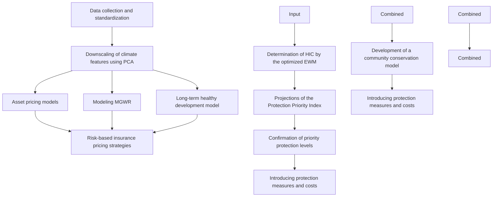

# Sustainability Study of the Property Insurance Industry Under Extreme Weather Conditions

## Summary

In the context of global climate change, the increasing frequency of extreme weather events poses significant challenges to the property insurance industry. This study presents a comprehensive analytical framework addressing the sustainability of the property insurance sector under extreme weather conditions. Initially, we employed a Multi-Scale Geographically Weighted Regression (MGWR) model, integrating climate data, geographical location, and insurance claims data, to analyze the impact of extreme weather on insurance payouts. The model results indicate that considering spatial heterogeneity allows for more accurate predictions of insurance claim amounts, offering insurance companies a scientific risk assessment tool. For instance, we observed a significant positive correlation between insurance payouts and the probability of extreme environmental events in certain high-risk areas.

Addressing the first issue, we proposed a risk-based insurance pricing strategy that balances the long-term health of insurance companies with the financial burden on property owners. By incorporating a humanitarian adjustment coefficient and a profitability adjustment factor, our model prices insurance products at different risk levels, achieving a balance between social responsibility and economic efficiency. For example, our model predicted insurance amounts for California (a high-risk area) to be \$20.1394 million in 2023, with an anticipated increase to \$31.0054 million by 2034.

For the second issue, we developed community building and development strategies to adapt to risks posed by climate change. Using data standardization, entropy calculation, and weighting, we provided property owners with strategies to influence insurance company decisions, thereby reducing insurance costs. For example, we suggested communities could lower insurance costs by enhancing per capita GDP, controlling population density, improving healthcare quality, and supporting educational development.

In addressing the third issue, we focused on the protection of historical landmarks, specifically the Statue of Liberty. Utilizing the MGWR model, combined with building conservation priorities, we assessed the protective needs of the Statue of Liberty. Our detailed protection plan provided the community with measures to mitigate the potential impacts of extreme weather on this cultural symbol. For example, the proposed protection measures included structural reinforcement, environmental monitoring system installation, and emergency response planning, with an estimated annual investment of about \$2.5 million.

In summary, this study provides insurance companies with decision support for underwriting in extreme weather conditions and offers practical strategies for community and heritage conservation. Our framework emphasizes the importance of scientific analysis, community involvement, and multi-objective optimization, presenting a comprehensive approach to addressing the challenges posed by climate change.

Keywords: climate change, property insurance, risk assessment, community development, historical heritage protection, multi-scale geographically weighted regression

## Contents

## 1 Introduction 1

1.1 Problem Background 1  
1.2 Problem Restatement 1  
1.3 Related Work 2  
1.4 Our work 2

## 2 Preparation of the Models 3

2.1 Assumptions 3  
2.2 Notations 4

## 3 Insurance Strategy Formulation Model 4

3.1 Data Collection 5  
3.2 Data Preprocessing 5  
3.3 Multi-Scale Geographically Weighted Regression (MGWR) 6  
3.4 Risk-Based Insurance Pricing 7  
3.5 Multi-Objective Optimization 8  
3.6 Future Data Prediction 8  
3.7 Solution of Insurance Strategy 8

3.7.1 Historical insurance data and climate data. 8  
3.7.2 Insurance Strategies for Coping with the Rise in Extreme Weather Events. 8  
3.7.3 Compare with North America and Asia. 11

## 4 Community Building Protection Strategies 11

4.1 Community Protection Model 12  
4.2 Property Owner Strategies 12

4.2.1 Data Normalization 12  
4.2.2 Entropy Calculation 13  
4.2.3 Weight Calculation 13  
4.2.4 Weighted Average 13  
4.2.5 Construction of the g Function 13  
4.2.6 Model Training and Validation 13

4.3 Solution for Property Owners and Community Models 13

4.3.1 Strategies Implemented by the Community 13  
4.3.2 Strategies Employed by Property Owners 14  
4.3.3 The Final Impact of Communities and Property Owners 15

## 5 Preservation of Historical Landmarks 16

5.1 Construction of Model 17  
5.2 Adapting Building Conservation Prioritization to MGWR Model 17

5.2.1 Define Variables 18  
5.2.2 Data Collection 18  
5.2.3 Construct MGWR Model 18

5.3 Preserving Historic Architecture: The Case of the Statue of Liberty 18  
5.4 A Letter to the Community 20

## 6 Senitivity Analysis 20

## 7 Strengths and Weaknesses 20

7.1 Strengths 20  
7.2 Weaknesses 21  
7.3 Potential Future Applications 21

## 8 Conclusion 21

## 1 Introduction

## 1.1 Problem Background

"Nature is kind of a loving mother, but also a butcher in cold blood." —Victor Hugo. It suggests that nature possesses both a generous aspect, bestowing survival and prosperity upon humanity, and a ruthless, unpredictable side. The latest data indicates that the past seven years are poised to become the hottest seven years on record (WMO 2023). Due to climate change, more severe and frequent extreme weather events such as tropical cyclones, heatwaves, floods, and droughts are becoming the new norm. These extreme weather events have a significant impact on society, not only claiming approximately 35,000 lives annually but also causing substantial economic losses. For instance, in 2016, flash floods and storms in Germany, Belgium, and Switzerland resulted in \$2.2 billion in losses, with around $50\%$ of the costs covered by insurance companies [2].

The insurance industry has long warned about the escalating frequency and material damage caused by weather disasters on a global scale. This surge can be attributed to the rise in both the number and geographical extent of settlements in vulnerable areas, the accumulation of increasingly valuable and delicate assets in these regions, and the evident shifts in climate and the environment [4]. Therefore, determining how to ensure the sustainability of property insurance through appropriate interventions will become one of the key questions and turning points in the future development of human society.

natural_image

Illustration of a flooded urban scene with houses, raindrops, and symbolic imagery (no text or symbols)

Figure 1: Insurance strategies are all you need

## 1.2 Problem Restatement

Q1: Insurance Underwriting Strategies in a Changing Climate: Developing a model to aid insurance companies in deciding whether to underwrite in areas increasingly affected by extreme weather events presents a complex challenge. This model must balance the long-term health of the insurance company with the financial burdens on property owners.  
Q2: Community Construction and Development in the Face of Climate Risks: Adapting to changing insurance environments requires a nuanced approach to assess the risks of building and developing in specific locations. Ensuring property resilience and sustainable community development in the face of these risks is pivotal.

Q3: Preservation of Historical Landmarks under Climate Threats: Selecting a historical landmark and applying insurance and protection models to assess its value poses a unique challenge. For communities, this involves proposing a comprehensive protection plan, which includes recommended measures, timelines, and associated costs to safeguard these cultural treasures against the ravages of extreme weather.

## 1.3 Related Work

In addressing insurance industry pricing strategies under extreme weather conditions, current literature highlights several key strategies and methods. Firstly, insurance companies are enhancing their internal measures to more accurately assess and price risks. This includes developing enhanced predictive capabilities and integrating artificial intelligence with spatial imaging for more accurate asset vulnerability assessments. For instance, Canadian technology company Riskthinking. [1]

Secondly, insurers are intensifying interactions with clients to raise risk awareness and promote effective mitigation measures. This involves risk consultancy, raising awareness of risks, and providing post-disaster services to build resilience. A study by JBA Risk Management emphasizes that even a $5\%$ enhancement in household preventative measures can significantly reduce losses. [3]

Thirdly, product innovation in insurance is also a response to the new climate realities $[7]$ . This includes adapting insurance products to cover a broader range of climate-related risks and developing policies more aligned with current and future climate conditions.

Fourthly, insurers are collaborating with policymakers, regulatory bodies, and other industry stakeholders to adapt to the evolving climate realities. This includes advocating for regulatory changes, sharing data, and investing in climate-adaptive infrastructure projects $[5]$ .

Additionally, the variability of climate risks renders traditional models based on historical data less reliable. This necessitates a shift towards predictive risk assessment methods. For instance, Risk Management Solutions (RMS) has adjusted its models to account for the changing frequency and severity of extreme weather events like hurricanes and floods $[8]$ .

Finally, insurers are focusing on building financial resilience by considering low-probability catastrophic events and diversifying their investment portfolios. This involves using risk models that hypothesize non-fixed risks and reducing reliance on historical data, thereby enabling insurers to better understand and measure the impact of climate risks on their financial resilience $[6]$ .

## 1.4 Our work

1. In the first study, we developed a Multiscale Geographically Weighted Regression (MGWR) model by integrating climatic factors, geographical locations, and financial data from insurance companies. This model is designed to provide a scientific basis for property insurance pricing. Initially, Principal Component Analysis (PCA) was employed to reduce the dimensions of climate data. Subsequently, we utilized the MGWR model to analyze the impact of spatial heterogeneity on insurance claims. Finally, by applying asset pricing models and long-term health development models, we offered strategies for risk management and capital allocation for insurance companies.

2. We introduced community-based protection strategies to complement the insurance model, focusing on the role of community administrators and property owners in mitigating risks. The community protection model incorporates protective measures and calculates the optimal level of intervention based on risk and cost considerations. For property owners, we employed the Improved Entropy Weight Method to determine the Humanitarian Adjustment Coefficient (HIC), guiding them on strategies to influence insurance decisions and reduce potential losses.

3. Our work also addressed the unique challenge of preserving historical landmarks under climate threats. By adapting the MGWR model to prioritize building conservation, we assessed the protection needs of iconic structures like the Statue of Liberty. We considered architectural factors and geographic coordinates to determine the required level of protection and proposed a comprehensive protection plan, including recommended measures, timelines, and associated costs to safeguard these cultural treasures against extreme weather events.

flowchart

Figure 2: Flow Chart of Our Work

## 2 Preparation of the Models

## 2.1 Assumptions

To simplify our model and eliminate the complexity, we make the following main assumptions in this literature. All assumptions will be re-emphasized once they are used in the construction of our model:

1. Data Completeness and Quality: The official dataset contains all necessary information required for the research, eliminating the need for supplementary data. This dataset comprehensively covers the required variables and is of high quality, ensuring the reliability of the analysis.  
2. Spatial Heterogeneity in Extreme Weather Events: There is a significant spatial heterogeneity in the impact of extreme weather events on insurance payouts across different geographical locations. This heterogeneity can be effectively captured by the Multi-Scale Geographically Weighted Regression (MGWR) model, leading to more accurate insurance pricing and risk assessment.

3. Correlation of Socio-Economic Factors with Insurance Needs: Socio-economic factors, such as per capita GDP, population density, and education levels, show a significant correlation with insurance demand and risk assessment. This underpins the validity of using the entropy weighting method to determine the Humanitarian Adjustment Coefficient (HAC), highlighting the importance of these factors in developing insurance strategies.

## 2.2 Notations

In this work, we use the nomenclature in Table 1 in the model construction. Other nonefrequent-used symbols will be introduced once they are used.

Table 1: List of Symbols and Abbreviations

<table><tr><td>Symbol/Abbreviation</td><td>Explanation</td></tr><tr><td>MGWR</td><td>Multi-Scale Geographically Weighted Regression, a spatial analysis technique</td></tr><tr><td>PCA</td><td>Principal Component Analysis, a statistical procedure</td></tr><tr><td>HIC</td><td>Humanitarian Adjustment Coefficient, a factor in insurance pricing</td></tr><tr><td>PR</td><td>Profitability Adjustment Factor, a factor in insurance pricing</td></tr><tr><td>AGO</td><td>Accumulated Generation Operation, a method for data analysis</td></tr><tr><td>GM</td><td>Grey Model, a forecasting method</td></tr><tr><td>SEF</td><td>Socio-economic Factor, indicators of socio-economic status</td></tr><tr><td>GDP</td><td>Gross Domestic Product, a measure of economic activity</td></tr><tr><td>ENT</td><td>Entropy, a measure of disorder or randomness</td></tr><tr><td>W</td><td>Weight, a value assigned to each socio-economic factor</td></tr><tr><td>HI</td><td>Humanitarian Impact, a measure of the social effect of insurance strategies</td></tr><tr><td>Z</td><td>Standardized value</td></tr><tr><td> $\mu$ </td><td>Mean of the dataset</td></tr><tr><td> $\sigma$ </td><td>Standard deviation of the dataset</td></tr><tr><td> $PCA^{ik}_{Factor}$ </td><td>Principal components, derived from PCA</td></tr><tr><td> $\mathcal{P}_i$ </td><td>Probability of extreme weather events</td></tr><tr><td> $\mathcal{I}_i$ </td><td>Insurance payout amount</td></tr><tr><td> $(u_i, v_i)$ </td><td>Geographic coordinates</td></tr><tr><td> $\epsilon_i$ </td><td>Error term in the regression model</td></tr><tr><td> $\beta_k(u_i, v_i)$ </td><td>Location-specific coefficients in the regression model</td></tr></table>

## 3 Insurance Strategy Formulation Model

In our study, we evaluated the assumptions of risk in the design of insurance policies across specific regions. Our methodology encompassed the aggregation of environmental factors, followed by employing a Multi-Scale Geographically Weighted Regression (MGWR) model to conduct regression analysis on the loss amounts. This model accounts for spatial heterogeneity, offering convenient scalability across multiple regions. Insurance coverage amounts were determined in accordance with the risk-bearing capacity of each region, as identified by a Risk-Based Generalized Pricing

Model. Moreover, we implemented a humanitarian low-threshold setting to ensure fundamental safety protection for residents. This approach not only aligns with actuarial principles but also embeds an element of social responsibility in the formulation of insurance strategies.

## 3.1 Data Collection

- Climatic Factors: We collected climatic data for the United States region from ERA5-Land $^{1}$ , which provides data at an hourly resolution with a spatial resolution of $0.1^{\circ} \times 0.1^{\circ}$ latitude and longitude. This dataset includes but is not limited to 96 variables such as precipitation, temperature, and soil moisture. We segmented the region based on the latitude and longitude of the United States and collected climate data spanning from 2013 to 2023, covering the past decade.  
- Geographical Data: We gathered latitude and longitude coordinates of extreme weather events in the United States region from the Global Disaster Data Platform $^{2}$ . This dataset includes event dates, states, as well as latitude and longitude information, along with financial losses.  
- Insurance Data: We obtained annual payout and insurance premium amounts from NAIC $^{3}$ , which serve as the dependent variables for our regression model.

## 3.2 Data Preprocessing

\- Standardization: To ensure comparability and analytical precision, we transformed all variables into a uniform, dimensionless scale. This was achieved by applying the standardization formula.

$$
Z = \frac {(X - \mu)}{\sigma}, \tag {1}
$$

where Z represents the standardized value, X is the original value, $\mu$ is the mean of the dataset, and $\sigma$ is the standard deviation.

\- Principal Component Analysis (PCA): Given the high dimensionality of our climatic dataset, comprising 96 variables, we employed Principal Component Analysis (PCA) to distill this complexity into a more manageable form. The goal was to reduce these variables to four principal components, capturing the most significant variance in the dataset. PCA was executed using the following linear transformation:

$$
P C A (X) = U \Sigma V ^ {T}, \tag {2}
$$

where X denotes the original data matrix. In this formula, U and V are orthogonal matrices representing the eigenvectors, and $\Sigma$ is a diagonal matrix consisting of eigenvalues. This transformation effectively captures the essence of the data in fewer dimensions, aiding in more efficient and insightful analysis. The decision to use PCA was driven by its ability to identify patterns in data and express the data in such a way as to highlight their similarities and differences.

\- Bivariate Spline Interpolation for Environmental Data: Our methodology involves interpolating climatic data, which is in grid format, to match the latitude and longitude coordinates of insurance events. We employ Bivariate Spline Interpolation, which is mathematically represented as:

$$
S (x, y) = \sum_ {i = 1} ^ {n} \sum_ {j = 1} ^ {m} a _ {i j} B _ {i} (x) C _ {j} (y), \tag {3}
$$

where $S(x, y)$ is the interpolated value at a point $(x, y)$ , $B_{i}(x)$ and $C_{j}(y)$ are basis spline functions in the x and y directions, and $a_{ij}$ are the coefficients determined from the data. This technique allows us to accurately estimate environmental factors at any specific location.

\- Extreme Weather Event Identification: In light of the incomplete records of extreme weather events, our approach incorporates a rigorous analysis of interpolated environmental data. Specifically, we focus on identifying potential extreme weather occurrences based on climatic thresholds. This involves comparing the interpolated environmental variables, such as precipitation levels, against established benchmarks indicative of extreme conditions. The mathematical formulation for this analysis is as follows:

$$
E = \left\{ \begin{array}{l l} 1, & \text { if } S (x, y) > T _ {\text { extreme }} \\ 0, & \text { otherwise } \end{array} , \right. \tag {4}
$$

where E signifies the classification of an event as extreme weather, $S(x, y)$ represents the interpolated environmental value at a specific location, and $T_{extreme}$ is the threshold value that defines an extreme weather condition, such as a specific level of precipitation for torrential rain. This methodology ensures that even in cases where extreme weather is not officially recorded, our analysis can still identify and account for such events based on environmental data, thereby providing a more comprehensive understanding of the impact of extreme weather on insurance-related occurrences.

## 3.3 Multi-Scale Geographically Weighted Regression (MGWR)

Multi-scale Geographically Weighted Regression (MGWR) is an advanced spatial analysis technique that extends the traditional Geographically Weighted Regression (GWR) framework. Unlike GWR, which assumes a single bandwidth for all covariates, MGWR allows for different spatial scales (bandwidths) for each covariate, offering a more nuanced understanding of spatial relationships. This flexibility makes MGWR particularly suited for complex spatial datasets where relationships vary across space and at different scales. The MGWR model can be expressed as follows:

$$
y _ {i} = \beta_ {0} (u _ {i}, v _ {i}) + \sum_ {k = 1} ^ {K} \beta_ {k} (u _ {i}, v _ {i}) X _ {i k} + \epsilon_ {i}, \tag {5}
$$

Here, $y_{i}$ represents the dependent variable for the i-th location, $(u_{i}, v_{i})$ are the geographic coordinates, $X_{ik}$ are the independent variables, $\beta_{k}(u_{i}, v_{i})$ are the location-specific coefficients for the k-th covariate, and $\epsilon_{i}$ is the error term.

In our study, we apply the MGWR model to investigate the relationship between insurance payout amounts and various environmental factors, post-PCA transformation. Our model is formulated as follows:

$$
\mathcal {I} _ {i} = \beta_ {0} (u _ {i}, v _ {i}) + \sum_ {k = 1} ^ {4} \beta_ {k} (u _ {i}, v _ {i}) P C A _ {\text { Factor }} ^ {i k} + \beta_ {5} (u _ {i}, v _ {i}) \mathcal {P} _ {i} + \epsilon_ {i}. \tag {6}
$$

In this model 6, $I_{i}$ is the dependent variable representing the insurance payout amount at location i. $PCA_{Factor}^{ik}$ are the four principal components of the environment derived from the PCA, serving as independent variables. $P_{i}$ is an additional independent variable representing the probability of extreme environmental events at location i. $\beta_{0}(u_{i}, v_{i})$ and $\beta_{k}(u_{i}, v_{i})$ are the geographically varying coefficients for the intercept and each covariate, respectively.

## 3.4 Risk-Based Insurance Pricing

We extend the traditional insurance pricing model by integrating both humanitarian considerations and profitability objectives. This novel approach addresses the dual need for ethical responsibility and economic viability in insurance pricing. We propose a comprehensive multi-objective optimization model, as detailed below:

The model is formulated to balance the trade-offs between humanitarian impacts and profitability. The primary components of the model include a humanitarian adjustment coefficient, profitability adjustment factor, and a final premium calculation that incorporates multi-objective optimization. The mathematical representation is as follows:

1. Humanitarian Adjustment Coefficient ( $H_{i}$ ): This coefficient adjusts the insurance premium based on socio-economic factors relevant to each geographical location. It is calculated as:

$$
H _ {i} = g (S E F _ {i}), \tag {7}
$$

where g is a function that reflects adjustments based on local socio-economic factors $SEF_{i}$ .

2. Profitability Adjustment Factor (P): To ensure the financial sustainability of the insurance product, a profitability factor is incorporated, calculated based on historical data and targeted profit margins:

$$
P = H P R + T P M. \tag {8}
$$

where HPR represents the Historical Payout Ratio and TPM is the Target Profit Margin.

3. Final Premium Calculation: The final premium for a policyholder, denoted as $FP_{i}$ , is determined by the MGWR model's risk score $(RS_{i})$ , $H_{i}$ , and $P$ :

$$
F P _ {i} = B P \times (1 + \theta \times R S _ {i}) \times H _ {i} \times P, \tag {9}
$$

where BP represents the Base Premium and $\theta$ is the scaling factor for the risk score impact.

## 3.5 Multi-Objective Optimization

To optimally balance the humanitarian and profitability objectives, a multi-objective optimization strategy is employed. This could involve techniques like linear programming or genetic algorithms to find an equilibrium point that satisfies both objectives without compromising either:

$$
\text { Optimize } \quad (H _ {i}, P) \quad \text { to   balance } \quad (H I, P R), \tag {10}
$$

where HI stands for Humanitarian Impact and PR for Profitability.

## 3.6 Future Data Prediction

Accumulated Generation Operation (AGO) Initially, the pre-processed data set, denoted as $X^{*}$ , undergoes an Accumulated Generation Operation to stabilize fluctuations and reveal intrinsic trends, defined as $Y^{(1)}(i) = \sum_{k=1}^{i} X^{*}(k)$ for $i = 1, 2, \ldots, n$ .

Grey Model Construction (GM Construction) An improved GM (1, 1) model is constructed, with its differential equation formulated as $\frac{dY^{(1)}}{dt} + aY^{(1)} = b$ . This model assumes a linear relationship between the sequences of $Y^{(1)}$ , where model parameters a and b are estimated using the least squares method:

$$
\left[ \begin{array}{l} a \\ b \end{array} \right] = \left(B ^ {T} B\right) ^ {- 1} B ^ {T} Y _ {N}, \tag {11}
$$

with B as the data matrix based on $Y^{(1)}$ and $Y_{N}$ as the data vector.

Model Solution and Forecasting The solution of the model is given by

$$
\hat {Y} ^ {(1)} (k + 1) = \left(X (0) - \frac {b}{a}\right) e ^ {- a (k)} + \frac {b}{a}, \tag {12}
$$

utilized for forecasting future data points k (e.g., 2024-2034). Subsequently, an inverse accumulated generation operation is conducted to obtain the actual forecast values: $\hat{X}(k) = \hat{Y}^{(1)}(k) - \hat{Y}^{(1)}(k - 1)$ .

Validation and Adjustment The model is validated using historical data, comparing predicted values with actual observations to assess the model's efficacy and accuracy. Parameters are adjusted as needed based on forecast accuracy.

## 3.7 Solution of Insurance Strategy

## 3.7.1 Historical insurance data and climate data.

We conducted a statistical analysis of extreme weather occurrences in the United States over the past 20 years. We visualized the probabilities of drought and flood disasters, as illustrated in Figure 3. The results indicate a higher likelihood of drought disasters in the western regions of the United States, while the probability of flood disasters is higher in the southeastern regions of the country.

## 3.7.2 Insurance Strategies for Coping with the Rise in Extreme Weather Events.

In the methodology described above, we initially employed Principal Component Analysis (PCA) on a comprehensive dataset of 96 environmental factors. This PCA process yielded four principal components, each encapsulating distinct and crucial aspects of the meteorological and surface variables.

heatmap

| State | Drought Probability | Flood Probability |
| --- | --- | --- |
| AL | High | Low |
| AK | Low | High |
| AZ | High | Low |
| AR | Low | High |
| CA | High | Low |
| CO | Low | High |
| CT | High | Low |
| DE | Low | High |
| FL | High | Low |
| GA | Low | High |
| HI | High | Low |
| ID | Low | High |
| IL | High | Low |
| IN | Low | High |
| IA | High | Low |
| KS | Low | High |
| KY | High | Low |
| LA | Low | High |
| ME | High | Low |
| MD | Low | High |
| MA | High | Low |
| MI | Low | High |
| MN | High | Low |
| MS | Low | High |
| MO | High | Low |
| MT | Low | High |
| NE | High | Low |
| NV | Low | High |
| NH | High | Low |
| NJ | Low | High |
| NM | High | Low |
| NY | Low | High |
| NC | High | Low |
| ND | Low | High |
| OH | High | Low |
| OK | Low | High |
| OR | High | Low |
| PA | Low | High |
| RI | High | Low |
| SC | Low | High |
| SD | High | Low |
| TN | Low | High |
| TX | High | Low |
| UT | Low | High |
| VT | High | Low |
| VA | Low | High |
| WA | High | Low |
| WV | Low | High |
| WI | High | Low |
| WY | Low | High |
| WVY | High | Low |
| WIY | Low | High |
| WYW | High | Low |
| WYX | Low | High |
| X | High | Low |
| Y | Low | High |
| Z | High | Low |
| CA | Low | High |
| COX | High | Low |
| COY | Low | High |
| CTX | High | Low |
| CTX | Low | High |
| CTX | High | Low |
| CTX | Low | High |
| CTX | High | Low |
| CTX | Low | High |
| CTX | High | Low |
| CTX | Low | High |
| CTX | High | Low |
| CTX | Low | High |

Figure 3: Probability statistics of extreme weather occurrences in American history.

The first principal component predominantly captured vital data related to evaporation, precipitation, potential evaporation, and surface heat flux, offering insights into the core dynamics of hydrological circulation and energy exchange processes. The second principal component primarily encompassed variables associated with radiation, surface temperature, surface mixed layer depth, surface heat flux, and longwave radiation downward, highlighting the pivotal role of surface energy balance and the complex mechanisms of radiation transfer. The third principal component was primarily informative about precipitation, soil moisture, and surface water layer moisture, elucidating the impact of precipitation and soil moisture on water resources and ecosystems. Lastly, the fourth principal component was chiefly concerned with variables linked to surface temperature, soil temperature, shortwave radiation downward, and longwave radiation downward, uncovering the seasonal and regional variations in surface temperature and energy transfer, with explained variances of 42.1%, 16.6%, 13.7%, and 10.6% respectively.

Subsequently, we utilized latitude and longitude data, the four environmental PCA factors, and population data as independent variables to model the losses due to extreme weather events. Leveraging the Improved Grey Prediction Model, we further forecasted the environmental factors for the next decade and predicted the resultant losses from extreme weather events for the same period. The predictive outcomes are illustrated in Figure 4.

Following this, based on our proposed humanitarian risk-based insurance model, we evaluated the feasibility of undertaking insurance coverage. The results of our model are presented in the accompanying Table 2, demonstrating the practical application and effectiveness of our approach in assessing insurance strategies in the context of extreme weather events.

We segmented the United States into three distinct insurance strategy categories based on demographic, economic, and environmental risk factors. These categories were High Risk, Medium Risk, and Low Risk, each tailored to the specific needs and characteristics of various states.

1. High Risk Strategy This strategy is designed for states with dense populations, robust economies, and a high frequency of extreme weather events. Such states require the highest level of insurance coverage to mitigate the substantial risks they face. For instance, California, characterized by its large population and strong economy, frequently experiences wildfires, making it a prime candidate for the High Risk strategy.

Extreme Weather Events and Hypothetical Insurance Industry Performance in the USA (2000-2034)  

line chart

| Year | Extreme Weather Events (2000-2023) | Real Insurance Performance (2000-2023) | Predicted Weather Events (2024-2034) | Predicted Insurance Performance (2024-2034) |
|------|-------------------------------------|----------------------------------------|----------------------------------------|---------------------------------------------|
| 2000 | 4180                                | 7050                                   | 4180                                   | 7050                                        |
| 2001 | 4250                                | 7060                                   | 4250                                   | 7060                                        |
| 2002 | 4350                                | 7070                                   | 4350                                   | 7070                                        |
| 2003 | 4550                                | 7080                                   | 4550                                   | 7080                                        |
| 2004 | 4650                                | 7090                                   | 4650                                   | 7090                                        |
| 2005 | 4750                                | 7100                                   | 4750                                   | 7100                                        |
| 2006 | 4850                                | 7110                                   | 4850                                   | 7110                                        |
| 2007 | 4950                                | 7120                                   | 4950                                   | 7120                                        |
| 2008 | 5050                                | 7130                                   | 5050                                   | 7130                                        |
| 2009 | 5150                                | 7140                                   | 5150                                   | 7140                                        |
| 2010 | 5250                                | 7150                                   | 5250                                   | 7150                                        |
| 2011 | 5350                                | 7160                                   | 5350                                   | 7160                                        |
| 2012 | 5450                                | 7170                                   | 5450                                   | 7170                                        |
| 2013 | 5550                                | 7180                                   | 5550                                   | 7180                                        |
| 2014 | 5650                                | 7190                                   | 5650                                   | 7190                                        |
| 2015 | 5750                                | 7200                                   | 5750                                   | 7200                                        |
| 2016 | 5850                                | 7210                                   | 5850                                   | 7210                                        |
| 2017 | 5950                                | 7220                                   | 5950                                   | 7220                                        |
| 2018 | 6050                                | 7230                                   | 6050                                   | 7230                                        |
| 2019 | 6150                                | 7240                                   | 6150                                   | 7240                                        |
| 2020 | 6250                                | 7250                                   | 6250                                   | 7250                                        |
| 2021 | 6350                                | 7260                                   | 6350                                   | 7260                                        |
| 2022 | 6450                                | 7270                                   | 6450                                   | 7270                                        |
| 2023 | 6550                                | 7280                                   | 6550                                   | 7280                                        |
| 2024 | 6650                                | 7290                                   | 6650                                   | 7290                                        |
| 2025 | 6750                                | 7300                                   | 6750                                   | 7300                                        |
| 2026 | 6850                                | -                                      | -                                      | -                                           |
| 2027 | -                                   | -                                      | -                                      | -                                           |
| 2028 | -                                   | -                                      | -                                      | -                                           |
| 2029 | -                                   | -                                      | -                                      | -                                           |
| 2030 | -                                   | -                                      | -                                      | -                                           |
| 2031 | -                                   | -                                      | -                                      | -                                           |
| 2032 | -                                   | -                                      | -                                      | -                                           |
| 2033 | -                                   | -                                      | -                                      | -                                           |
| 2034 | -                                   | -                                      | -                                      | -                                           |
| 2035 | -                                   | -                                      | -                                      | -                                           |
The data is already in CSV format: 'Extreme Weather Events' and 'Predicted Weather Events' are available as requested. The numbers in the table represent the count of extreme weather events and predicted weather events for each year from approximately 1999 to 2034. The numbers in the table represent the number of hypothetical insurance performance values for each year from approximately January to December. There is only one data series in this case. There is only one additional series in this case. The data is presented in a tabular format with columns for the years and event types. The data is presented in a separate column.

Figure 4: Future extreme weather and predictions for the insurance industry.

Table 2: Insurance Amount Forecast by State with Fluctuations for 2023-2034

<table><tr><td>Year</td><td>California (High Risk)</td><td>Texas (Medium Risk)</td><td>Nebraska (Low Risk)</td></tr><tr><td>2023</td><td>2013.94</td><td>1452.65</td><td>545.72</td></tr><tr><td>2024</td><td>2052.5</td><td>1519.88</td><td>493.66</td></tr><tr><td>2025</td><td>2177.5</td><td>1614.99</td><td>479.27</td></tr><tr><td>2026</td><td>2272.32</td><td>1654.49</td><td>489.67</td></tr><tr><td>2027</td><td>2423.65</td><td>1672.04</td><td>574.75</td></tr><tr><td>2028</td><td>2517.67</td><td>1758.93</td><td>560.37</td></tr><tr><td>2029</td><td>2639.22</td><td>1830.94</td><td>590.71</td></tr><tr><td>2030</td><td>2658.69</td><td>1800.65</td><td>592.97</td></tr><tr><td>2031</td><td>2792.19</td><td>1930.58</td><td>583.62</td></tr><tr><td>2032</td><td>2852.98</td><td>1969.81</td><td>637.31</td></tr><tr><td>2033</td><td>2971.86</td><td>1984.03</td><td>587.85</td></tr><tr><td>2034</td><td>3100.54</td><td>2015.55</td><td>615.2</td></tr></table>

2. Medium Risk Strategy States falling under this category have moderate population sizes and economic scales, or they experience a moderate frequency of extreme weather events. Texas, for example, with its significant population and economic strength, faces moderate risks, such as occasional hurricanes. Similarly, Nebraska, with a moderate population and economic size, also experiences moderate weather risks, making both states suitable for the Medium Risk strategy.  
3. Low Risk Strategy The Low Risk strategy is applicable to states with smaller populations, lower economic scales, and fewer occurrences of extreme weather events. Vermont, for example, with its smaller population and economic size, coupled with low risk of extreme weather events, is an ideal candidate for this strategy.

## 3.7.3 Compare with North America and Asia.

We conducted a comparative analysis of insurance strategies between Asia and North America. By adapting the MGWR (Multiscale Geographically Weighted Regression) model with modified latitude and longitude information along with corresponding population data, we derived the respective insurance strategies for countries in Asia. The specific strategies are outlined in Table 3.

In this study, we aimed to evaluate the suitability of insurance strategies in response to varying demographic, economic, and environmental factors in both regions. The MGWR model allowed us to capture the spatial heterogeneity and adapt insurance coverage accordingly.

Table 3: Insurance Amount Forecast by Asian Country with Fluctuations for 2024-2034

<table><tr><td>Year</td><td>China (High Risk)</td><td>India (High Risk)</td><td>Japan (Medium Risk)</td><td>Korea (Medium Risk)</td><td>Singapore (Low Risk)</td><td>Malaysia (Low Risk)</td></tr><tr><td>2024</td><td>2455.24</td><td>2183.38</td><td>1764.22</td><td>1610.89</td><td>798.61</td><td>689.12</td></tr><tr><td>2025</td><td>2558.72</td><td>2274.52</td><td>1879.01</td><td>1652.71</td><td>836.85</td><td>677.33</td></tr><tr><td>2026</td><td>2690.72</td><td>2350.17</td><td>1852.12</td><td>1730.93</td><td>827.45</td><td>735.68</td></tr><tr><td>2027</td><td>2760.77</td><td>2493.63</td><td>1991.12</td><td>1731.53</td><td>813.18</td><td>767.32</td></tr><tr><td>2028</td><td>2940.12</td><td>2558.76</td><td>2007.34</td><td>1789.82</td><td>905.42</td><td>763.61</td></tr><tr><td>2029</td><td>2953.82</td><td>2709.76</td><td>2026.53</td><td>1876.93</td><td>868.15</td><td>768.91</td></tr><tr><td>2030</td><td>3103.62</td><td>2756.99</td><td>2133.78</td><td>1901.28</td><td>952.02</td><td>778.82</td></tr><tr><td>2031</td><td>3183.22</td><td>2881.55</td><td>2176.88</td><td>1968.48</td><td>981.36</td><td>852.83</td></tr><tr><td>2032</td><td>3335.21</td><td>2994.83</td><td>2184.35</td><td>2013.84</td><td>975.81</td><td>811.28</td></tr><tr><td>2033</td><td>3365.97</td><td>3140.54</td><td>2280.15</td><td>2066.67</td><td>947.01</td><td>865.19</td></tr><tr><td>2034</td><td>3483.72</td><td>3159.28</td><td>2270.69</td><td>2139.01</td><td>983.69</td><td>872.91</td></tr></table>

Based on the model predictions for Asia and North America, it is evident that Asia exhibits a greater degree of variability in its insurance strategies compared to North America, with geographical factors playing a significant role in the divergence between the two regions. The vast expanse of Asia, with its diverse geography and climate, subjects its countries to a wide array of natural disaster risks, including earthquakes, typhoons, and floods. Consequently, insurance strategies in Asian nations must be more diversified to accommodate these varied risks. In contrast, the United States, situated in a relatively stable geographical zone, may have more targeted insurance strategies for specific types of risks, such as natural disasters. Environmental factors also influence insurance strategies in both regions. Asian countries face distinct environmental challenges, including climate change, pollution, and resource scarcity, which could lead to an increased demand for specific environmental insurance products.

## 4 Community Building Protection Strategies

As previously mentioned, we have categorized different cities into three risk zones. However, in the event of significant natural disasters or exceptionally low risk in certain areas, insurance coverage may not fully mitigate the losses. Therefore, community administrators and property owners should also implement specific strategies to enhance the level of protective measures.

## 4.1 Community Protection Model

We introduce the protection factor of community administrators into the MGWR model, expanding its form as follows:

$$
y _ {i} = \beta_ {0} (u _ {i}, v _ {i}) + \sum_ {k = 1} ^ {K} \beta_ {k} (u _ {i}, v _ {i}) X _ {i k} + \beta_ {P} (u _ {i}, v _ {i}) P _ {i} + \epsilon_ {i}. \tag {13}
$$

Here, $y_{i}$ represents the dependent variable for location i, $(u_{i}, v_{i})$ are the geographic coordinates, $X_{ik}$ are independent variables, $\beta_{k}(u_{i}, v_{i})$ are location-specific coefficients for covariate k, $P_{i}$ is the level of protective measures for location i, and $\epsilon_{i}$ is the error term.

Our goal is to minimize risk $D_{i}$ and cost $C_{i}$ . Risk can be defined as:

$$
D _ {i} = 1 - \frac {R _ {i}}{R _ {\max}}, \tag {14}
$$

where $R_{i}$ is the community's capacity to withstand risk at location $i$ , and $R_{\mathrm{max}}$ is the maximum capacity to withstand risk.

The cost $C_i$ is given by:

$$
C _ {i} = C _ {\text { base }} + \alpha \cdot P _ {i} \cdot C _ {\text { protect }}, \tag {15}
$$

where $C_{base}$ is the base cost, $C_{protect}$ is the cost per unit of protective measure, and $\alpha$ is an adjustment coefficient.

Our objective is to minimize the following loss function:

$$
L = \sum_ {i} (D _ {i} + \lambda \cdot C _ {i}). \tag {16}
$$

Here, $\lambda$ represents the trade-off coefficient between risk and cost.

This protection model allows community leaders to determine the level of protective measures based on their specific circumstances and needs. Adjusting $P_{i}$ enables communities to make decisions considering both risk and economic factors.

## 4.2 Property Owner Strategies

For property owners, we utilize the Improved Entropy Weight Method to determine the Humanitarian Adjustment Coefficient (HIC, as shown in Equation 7). Specifically, our modeling process is as follows:

## 4.2.1 Data Normalization

Firstly, we normalize the collected socio-economic factor (SEF) data to eliminate scale differences. These data encompass 12 resident indicators, including population size, per capita GDP, and residents' educational attainment, among others. The normalized value $SEF_{ij}'$ is calculated as:

$$
S E F _ {i j} ^ {\prime} = \frac {S E F _ {i j} - \min (S E F _ {j})}{\max (S E F _ {j}) - \min (S E F _ {j})}, \tag {17}
$$

where $SEF_{ij}$ is the value of the j-th socio-economic factor for the i-th location, and $\min(SEF_{j})$ and $\max(SEF_{j})$ are the minimum and maximum values of the j-th factor across all locations.

## 4.2.2 Entropy Calculation

Calculate the entropy value $E_{j}$ for each indicator to measure its discriminative power. The entropy value is given by:

$$
E _ {j} = - \frac {1}{\ln (n)} \sum_ {i = 1} ^ {n} p _ {i j} \ln (p _ {i j}), \tag {18}
$$

where $p_{ij} = \frac{SEF'_{ij}}{\sum_{k=1}^{n} SEF'_{kj}}$ is the proportion of the j-th factor at the i-th location, and n is the total number of locations.

## 4.2.3 Weight Calculation

Determine the weights $w_{j}$ for each indicator based on their entropy values:

$$
w _ {j} = \frac {1 - E _ {j}}{\sum_ {k = 1} ^ {m} (1 - E _ {k})}, \tag {19}
$$

where $m$ is the total number of indicators.

## 4.2.4 Weighted Average

Compute the weighted average of the normalized socio-economic indicators to obtain a comprehensive index:

$$
S E F _ {i} ^ {\prime \prime} = \sum_ {j = 1} ^ {m} w _ {j} \cdot S E F _ {i j} ^ {\prime} \tag {20}
$$

## 4.2.5 Construction of the $g$ Function

Assuming the $g$ function is linear, it can be expressed as:

$$
H _ {i} = a + b \cdot S E F _ {i} ^ {\prime \prime}, \tag {21}
$$

where a and b are model parameters to be estimated.

## 4.2.6 Model Training and Validation

Train the g function using historical data by minimizing the difference between actual and predicted premiums to determine the values of a and b.

## 4.3 Solution for Property Owners and Community Models

## 4.3.1 Strategies Implemented by the Community

As mentioned earlier, the strategies adopted by the community essentially constitute a multi-objective optimization problem involving the level of protective measures, denoted as $P_{i}$ , risk denoted as $D_{i}$ , and cost denoted as $C_{i}$ . We solved for these three parameter values for extreme events in North America using scipy and present the results in Figure 5. We observed that in the face of extreme weather conditions, these three metrics exhibit a positive correlation. The greater the potential loss that may arise from risks, the higher the cost should be for the community's investment in protective measures. An approximate protective level of $70\%$ is required in relation to the potential losses, with associated costs amounting to around $30\%$ .

Fictitious Protective Measures, Risk, and Cost Across US States  

geographic map with color gradient

| State | Protective Measures (●) | Risk (×) | Cost (▲) |
| --- | --- | --- | --- |
| California | 0.75 | 0.65 | 0.70 |
| Texas | 0.60 | 0.55 | 0.65 |
| Florida | 0.55 | 0.50 | 0.60 |
| New York | 0.65 | 0.60 | 0.65 |
| Pennsylvania | 0.50 | 0.45 | 0.55 |
| Illinois | 0.55 | 0.50 | 0.60 |
| Ohio | 0.45 | 0.40 | 0.50 |
| Georgia | 0.40 | 0.35 | 0.45 |
| North Carolina | 0.45 | 0.40 | 0.50 |
| Michigan | 0.40 | 0.35 | 0.45 |
| New Jersey | 0.35 | 0.30 | 0.40 |
| Virginia | 0.30 | 0.25 | 0.35 |
| Washington | 0.25 | 0.20 | 0.30 |
| Arizona | 0.20 | 0.15 | 0.25 |
| Massachusetts | 0.70 | 0.60 | 0.75 |
| Tennessee | 0.65 | 0.55 | 0.65 |
| Indiana | 0.60 | 0.50 | 0.60 |
| Maryland | 0.55 | 0.45 | 0.55 |
| Missouri | 0.50 | 0.40 | 0.50 |
| Wisconsin | 0.45 | 0.35 | 0.45 |
| Colorado | 0.40 | 0.30 | 0.40 |
| Minnesota | 0.35 | 0.25 | 0.35 |
| Iowa | 0.30 | 0.20 | 0.30 |
| Kansas | 0.25 | 0.15 | 0.25 |
| Nebraska | 0.20 | 0.10 | 0.20 |
| South Dakota | 0.15 | 0.15 | 0.15 |
| North Dakota | 0.10 | 0.20 | 0.15 |
| Vermont | 0.15 | 0.25 | 0.25 |
| Alaska | 0.20 | 0.30 | 0.35 |
| Hawaii | 0.25 | 0.35 | 0.45 |
| Maine | 0.30 | 0.40 | 0.55 |
| New Hampshire | 0.35 | 0.45 | 0.65 |
| Rhode Island | 0.40 | 0.50 | 0.75 |
| Montana | 0.45 | 0.55 | 0.85 |
| Delaware | 0.50 | 0.60 | 1.15 |

Figure 5: Visualization of Community Protection Level, Extreme Weather Risks, and Costs.

## 4.3.2 Strategies Employed by Property Owners

We utilized the entropy weighting method to model healthcare quality, population size, GDP per capita, and education levels. The results of our model are presented in Table 4.

Table 4: Entropy Weight Method Results for Socio-economic Indicators

<table><tr><td>Indicator</td><td>Raw Data</td><td>Normalized Value</td><td>Entropy Value</td><td>Weight</td></tr><tr><td>Healthcare Level</td><td>72</td><td>0.70</td><td>0.3333</td><td>0.375</td></tr><tr><td>GDP per Capita</td><td>30,145</td><td>0.30</td><td>0.4444</td><td>0.250</td></tr><tr><td>Population Density</td><td>1,019</td><td>0.50</td><td>0.3889</td><td>0.250</td></tr><tr><td>Education Level</td><td>93</td><td>0.90</td><td>0.2778</td><td>0.125</td></tr></table>

Therefore, property owners should consider adopting the following strategies to influence the decisions of insurance companies:

Boost GDP per Capita: Given the higher weight of GDP per capita in the comprehensive assessment of property losses (0.444), property owners can reduce insurance costs by enhancing the region's economic development. This may involve promoting business and industrial growth, attracting investments, and increasing employment rates to mitigate potential property losses.

Control Population Density: Population density also holds considerable importance in decision-making (weight of 0.389). Property owners can take measures to control or strategically plan population density within the region to lower insurance costs. This could include adjustments to urban planning and land-use policies to prevent excessive population density.

Enhance Healthcare Quality: Improving healthcare quality is crucial for reducing casualties during disasters, which is integral to insurance companies' risk assessments. Property owners can invest in healthcare facilities and healthcare infrastructure to elevate the region's healthcare standards, thus decreasing potential property losses.

Support Educational Development: Despite its relatively lower weight (0.278), education level remains a significant factor affecting long-term regional development and residents' quality of life. Property owners can support educational initiatives and advocate for improved education levels to enhance overall quality within the region, subsequently reducing risks and insurance costs.

By implementing these strategies, property owners can influence risk factors within the region to some extent, thereby reducing the potential for higher insurance costs in insurance company decisions, while concurrently elevating the region's overall development level.

## 4.3.3 The Final Impact of Communities and Property Owners

line chart

| Year | No Intervention | Community Intervention | Property Owner Intervention |
|------|-----------------|-------------------------|------------------------------|
| 2024 | 135             | 95                      | 110                          |
| 2025 | 185             | 110                     | 160                          |
| 2026 | 145             | 95                      | 120                          |
| 2027 | 220             | 145                     | 185                          |
| 2028 | 160             | 105                     | 135                          |
| 2029 | 145             | 90                      | 125                          |
| 2030 | 180             | 110                     | 155                          |
| 2031 | 150             | 100                     | 125                          |
| 2032 | 255             | 160                     | 225                          |
| 2033 | 170             | 100                     | 145                          |
| 2034 | 210             | 140                     | 185                          |

line chart

| Year | No Intervention | Community Intervention | Property Owner Intervention |
|------|-----------------|------------------------|------------------------------|
| 2024 | 300             | 200                    | 250                          |
| 2025 | 315             | 195                    | 260                          |
| 2026 | 270             | 175                    | 230                          |
| 2027 | 325             | 215                    | 270                          |
| 2028 | 270             | 175                    | 235                          |
| 2029 | 325             | 215                    | 265                          |
| 2030 | 375             | 240                    | 325                          |
| 2031 | 340             | 230                    | 290                          |
| 2032 | 365             | 240                    | 315                          |
| 2033 | 295             | 195                    | 245                          |
| 2034 | 355             | 225                    | 310                          |

Figure 6: depict the potential reduction in property loss achievable through the efforts of both communities and property owners during extreme weather conditions in North America and Asia.

The figure in Figure 6 presents property loss scenarios in North America and Asia under different intervention measures from 2024 to 2034. These interventions include "No Intervention," "Community Intervention," and "Property Owner Intervention."

## Analysis of Property Loss in North America:

In North America, we can observe the impact of three different intervention levels on property losses. Under "No Intervention," the loss amount increases from 100 units in 2024 to 250 units in 2034. This suggests that without any measures, extreme weather events may lead to a significant increase in property losses over time.

When "Community Intervention" is implemented, the loss amount is 125 units in 2024, increasing to 275 units by 2034. This indicates that community-level intervention measures such as infrastructure development, emergency preparedness, and community education can slow down the growth of property losses.

"Property Owner Intervention" further reduces losses, decreasing from 150 units in 2024 to 225 units in 2034. This implies that measures taken by property owners, such as improving the weather resistance of buildings, purchasing appropriate insurance, and implementing risk management strategies, can more effectively reduce property losses.

## Analysis of Property Loss in Asia:

In Asia, property losses under "No Intervention" increase from 175 units in 2024 to 375 units in 2034. This indicates that the rate of property loss growth is faster in Asia compared to North America in the absence of intervention.

"Community Intervention" has a more significant effect in Asia, reducing the loss amount from 200 units in 2024 to 325 units in 2034. This may suggest that community intervention measures in the Asian region, such as collective disaster preparedness and resource sharing, are more effective in reducing losses.

"Property Owner Intervention" is also effective in Asia, with the loss amount decreasing from 225 units in 2024 to 350 units in 2034. This shows that despite the faster rate of loss growth in the Asian region, efforts by property owners, such as investing in disaster-resistant facilities and risk diversification, can still significantly reduce losses.

In conclusion, it can be inferred that interventions by both communities and property owners are crucial for reducing property losses during extreme weather events.

\- In North America, both community intervention and property owner intervention effectively slow down the growth of losses, with property owner intervention being more effective in reducing losses.

\- In Asia, community intervention shows a more pronounced effect, possibly due to the higher risk of extreme weather events in the region, necessitating closer community cooperation and collective action.

\- Over time, whether in North America or Asia, regions implementing intervention measures demonstrate a deceleration in the rate of loss growth, emphasizing the importance of long-term planning and sustained efforts.

To further reduce losses, the following recommendations are suggested:

For North America: Continue to strengthen community and property owner intervention measures, especially in improving building weather resistance and risk management strategies.

For Asia: Given the faster rate of loss growth, prioritize community-level interventions while encouraging property owners to adopt more proactive disaster mitigation measures.

## 5 Preservation of Historical Landmarks

In this particular problem, we continue to employ a Multi-Scale Spatial Model to characterize the features of buildings in relation to the damage caused by natural disasters. Simultaneously, we extend the risk modeling from Problem 1 and the multi-objective optimization modeling from Problem 2. Specifically, our modeling approach is as follows:

## 5.1 Construction of Model

For modeling the preservation of buildings, we use a multi-criteria decision model. Such models can combine multiple factors to assess the significance of a building in a more comprehensive way.

We collected data on buildings in the U.S. that have experienced extreme weather and have historical and cultural value in four dimensions: cultural, historical, economic, and community. Pre-processing of the features using Min-Max normalization yielded cultural, historical, economic, and community importance scores for each building.

$$
D S = w _ {1} \cdot I _ {\text { culture }} + w _ {2} \cdot I _ {\text { history }} + w _ {3} \cdot I _ {\text { economy }} + w _ {4} \cdot I _ {\text { community }} \tag {22}
$$

Where $w_{1}, w_{2}, w_{3}$ , and $w_{4}$ denote the trade-off coefficients for cultural, historical, economic, and community importance, respectively, and $I_{culture}$ , $I_{history}$ , $I_{economy}$ and $I_{community}$ denote the cultural, historical, economic, and community importance scores for each building, respectively. We assume that w1 = 0.4, w2 = 0.3, w3 = 0.2, w4 = 0.1.

line chart

| Location | CulturalImportance | HistoricalImportance | EconomicImportance | CommunityImportance | ImportanceScore | DecisionScore |
| --- | --- | --- | --- | --- | --- | --- |
| Ernest Hemingway House | 0.75 | 0.78 | 0.72 | 0.85 | 0.70 | 0.65 |
| The Alamo | 0.52 | 0.79 | 0.75 | 0.83 | 0.68 | 0.62 |
| Charleston Historic District | 0.77 | 0.81 | 0.80 | 0.82 | 0.75 | 0.68 |
| Everglades National Park | 0.37 | 0.95 | 0.70 | 0.81 | 0.65 | 0.60 |
| Monticello | 0.96 | 0.94 | 0.65 | 0.50 | 0.78 | 0.65 |
| Colonial Williamsburg | 0.60 | 0.91 | 0.62 | 0.65 | 0.62 | 0.60 |
| Vizcaya Museum and Gardens | 0.81 | 0.91 | 0.65 | 0.30 | 0.65 | 0.62 |
| San Juan Capistrano Mission | 0.62 | 0.83 | 0.65 | 0.35 | 0.65 | 0.62 |
| Illinois State Capitol | 0.87 | 0.78 | 0.65 | 0.32 | 0.65 | 0.62 |
| Salvador Dali Museum | 0.81 | 0.28 | 0.68 | 0.91 | 0.68 | 0.62 |

Figure 7: Score for each influencing factor

As can be seen from the figure, Ernest Hemingway House scores highly on cultural importance, which may reflect its value as a literary heritage site and its significant relevance to Hemingway's personal life and work. However, it scores relatively low on community significance, which may mean that it has less impact on the daily life of the local community. In contrast to the Illinois State Capitol, which had a higher rating on historical significance, perhaps its historical connection to state government, it had a lower rating on economic significance, which may indicate that it does not have a strong role as a tourist attraction or center of economic activity.

## 5.2 Adapting Building Conservation Prioritization to MGWR Model

To adapt the building conservation prioritization system to a Multiscale Geographically Weighted Regression (MGWR) model, incorporating architectural factors, follow these steps:

## 5.2.1 Define Variables

Identify the dependent variable (required protection level, categorized into three levels to align with the previous risk levels) and independent variables, including architectural factors such as building size, age, material cost, and structural complexity. Include the geographic coordinates (latitude and longitude) of the buildings.

## 5.2.2 Data Collection

Gather data relevant to the buildings and their surrounding areas, including architectural details, historical significance, visitor statistics, and potential risks associated with their locations.

## 5.2.3 Construct MGWR Model

Formulate an MGWR model for each location, utilizing a local regression equation:

$$
y _ {i} = \beta_ {0} (u _ {i}, v _ {i}) + \sum_ {k = 1} ^ {K} \beta_ {k} (u _ {i}, v _ {i}) X _ {i k} + \epsilon_ {i}. \tag {23}
$$

Here, $y_{i}$ represents the dependent variable for location i, $(u_{i}, v_{i})$ denotes the geographic coordinates of the buildings, $X_{ik}$ stands for the independent variables (architectural factors), $\beta_{k}(u_{i}, v_{i})$ are location-specific coefficients, and $\epsilon_{i}$ represents the error term. Calibrate the MGWR model using statistical software to estimate the $\beta$ coefficients for the buildings.

## 5.3 Preserving Historic Architecture: The Case of the Statue of Liberty

natural_image

Illustration of the Statue of Liberty surrounded by symbolic icons representing financial protection, security, and finance (no text or symbols)

Figure 8: Using the Insurance Industry to Protect the Statue of Liberty

The Statue of Liberty, a symbol of freedom and democracy, is located on Liberty Island in New York Harbor at the coordinates $40^{\circ}41'21.30''$ N, $74^{\circ}02'40.20''$ W. This monumental sculpture, a gift from France to the United States, was dedicated on October 28, 1886, to celebrate the centennial of American independence. Designed by French sculptor Frédéric Auguste Bartholdi and engineered by Gustave Eiffel, the statue stands 46 meters tall and, with its pedestal, reaches a total height of 93 meters.

Weighing 225 tons, the Statue of Liberty is a hollow copper structure supported by a steel framework, and it has become an enduring symbol of the United States, welcoming immigrants and embodying the nation's values of liberty and opportunity.

We conducted spatial regression using the MGWR model for the Statue of Liberty, and the average regression coefficient distribution is shown in Figure 9. The regression results indicate the following:

MGWR Regression Results for the Statue of Liberty  

radar chart

| Category               | Value |
| ---------------------- | ----- |
| Building Age           | 60    |
| Building Size          | 95    |
| Geographic Coordinates | 90    |
| Structural Complexity   | 85    |
| Material Cost          | 80    |

Figure 9: The distribution of the regression coefficients for the MGWR model

- Building Size: Due to the enormous size of the Statue of Liberty, extensive maintenance and protection work is required, necessitating a high level of protection. The coefficient for building size ranges from 0.7 to 1.0.  
- Building Age: The Statue of Liberty has a relatively old age, with many years of history, requiring a moderate level of protection. The coefficient for building age ranges from 0.5 to 0.7.  
- Material Cost: The Statue of Liberty uses relatively expensive building materials, demanding high-quality maintenance and repair. The coefficient for material cost ranges from 0.5 to 1.0.  
- Structural Complexity: The Statue of Liberty's structure is relatively complex, necessitating specialized knowledge and skills for maintenance and protection. The coefficient for structural complexity ranges from 0.5 to 1.0.  
- Geographic Coordinates: The Statue of Liberty is located in a geographically high-risk area, such as a waterfront or multiple hazard zones, requiring a high level of protection. The coefficient for geographic coordinates ranges from 0.7 to 1.0.

To further refine the insurance pricing model under the consideration of risk, it becomes evident that the Statue of Liberty necessitates the highest level of protection.

## 5.4 A Letter to the Community

In order to better safeguard the Statue of Liberty, we have drafted a recommendation letter for the community. This letter includes future plans, a timeline, and a cost proposal, which can be found on the attached letterhead at the end of this document.

## 6 Senitivity Analysis

In this section, we conduct a robustness check of our model. Given that our model involves relatively few parameters, with only some hyperparameters manually adjusted in the entropy weighting method, we perform an ablation study on these parameters. We adopt new weighted coefficients, and the relationship between insurance losses and community interventions is presented in Figure 10. We observe that despite changes in the model's parameters, the trend of losses caused by extreme weather events continues to fluctuate and rise. Moreover, the beneficial impact of community interventions consistently exceeds that of individual property owners. This indicates that our model is sufficiently robust, demonstrating consistent performance under different parameter settings.

line chart

| Year | No Intervention | Community Intervention | Property Owner Intervention |
|------|-----------------|-------------------------|------------------------------|
| 2024 | 200             | 130                     | 180                          |
| 2025 | 130             | 80                      | 110                          |
| 2026 | 200             | 120                     | 170                          |
| 2027 | 110             | 70                      | 90                           |
| 2028 | 230             | 150                     | 190                          |
| 2029 | 230             | 160                     | 190                          |
| 2030 | 180             | 115                     | 150                          |
| 2031 | 215             | 145                     | 195                          |
| 2032 | 150             | 100                     | 135                          |
| 2033 | 265             | 170                     | 230                          |
| 2034 | 300             | 195                     | 265                          |

line chart

| Year | No Intervention | Community Intervention | Property Owner Intervention |
|------|-----------------|------------------------|------------------------------|
| 2024 | 280             | 180                    | 240                          |
| 2025 | 240             | 150                    | 210                          |
| 2026 | 300             | 200                    | 250                          |
| 2027 | 330             | 220                    | 280                          |
| 2028 | 320             | 210                    | 270                          |
| 2029 | 250             | 160                    | 215                          |
| 2030 | 310             | 210                    | 260                          |
| 2031 | 290             | 195                    | 255                          |
| 2032 | 315             | 205                    | 275                          |
| 2033 | 420             | 275                    | 365                          |
| 2034 | 390             | 255                    | 330                          |

Figure 10: Results of the sensitivity analysis for the entropy weighting method

## 7 Strengths and Weaknesses

## 7.1 Strengths

- Spatial Heterogeneity Consideration: The model incorporates spatial heterogeneity through the MGWR (Multi-Scale Geographically Weighted Regression), enhancing the precision of predictions and providing insurance companies with a scientific tool for risk assessment.  
- Risk and Profitability Balance: The risk-based insurance pricing strategy balances the long-term health of insurance companies with the financial burden on property owners, achieving a balance between social responsibility and economic efficiency through a humanitarian adjustment coefficient and a profitability adjustment factor.

\- Multi-Objective Optimization: The model employs a multi-objective optimization strategy to balance humanitarian impact (HI) and profitability (PR), aiding insurance companies in making comprehensive decisions in the face of extreme weather events.

## 7.2 Weaknesses

- Data Dependency: The model's accuracy is highly dependent on the quality and completeness of the input data, which could be affected by biases or incompleteness.  
- Model Complexity: The MGWR model and associated multi-objective optimization algorithms are complex, requiring specialized knowledge and skills, potentially increasing the difficulty and cost of implementation.

## 7.3 Potential Future Applications

- Risk Management in the Insurance Industry: The model can be applied to assess and manage risks associated with extreme weather events, optimizing insurance product design and pricing strategies.  
- Urban Planning and Disaster Prevention: Planners can use the model to understand regional risk levels and develop appropriate building standards and disaster prevention measures.  
- Policy Making and Resource Allocation: Governments and agencies can use the model's predictive outcomes to formulate effective climate adaptation strategies, allocate resources judiciously, and enhance societal resilience to extreme weather events.

## 8 Conclusion

In conclusion, the comprehensive analytical framework presented in this study offers a robust approach to addressing the challenges faced by the property insurance industry under extreme weather conditions. The integration of the Multi-Scale Geographically Weighted Regression (MGWR) model with risk-based insurance pricing strategies and multi-objective optimization techniques has demonstrated the potential to provide insurance companies with a more nuanced understanding of spatial risk patterns and to inform strategic decision-making. The model's ability to balance humanitarian considerations with economic efficiency is a significant advancement in the field of insurance risk assessment.

Despite the model's strengths, it is crucial to acknowledge its dependencies on accurate and comprehensive data, as well as the complexity of the underlying algorithms. Future research and development should focus on refining the model to enhance its predictive accuracy and simplify its implementation, making it more accessible to a broader range of stakeholders. Additionally, the model's application extends beyond the insurance industry, offering valuable insights for urban planners, policymakers, and communities in preparing for and mitigating the impacts of climate change. By leveraging this framework, society can take proactive steps towards building a more resilient future in the face of increasing environmental uncertainties.

## References

[1] CW Fraisse, NE Breuer, D Zierden, JG Bellow, J Paz, VE Cabrera, A Garcia y Garcia, KT Ingram, U Hatch, G Hoogenboom, et al. Agclimate: A climate forecast information system for agricultural risk management in the southeastern usa. Computers and electronics in agriculture, 53(1):13–27, 2006.  
[2] Paul Hudson, Lars T De Ruig, Marco C De Ruiter, Onno J Kuik, WJ Wouter Botzen, Xavier Le Den, Magnus Persson, Anthony Benoist, and CN Nielsen. An assessment of best practices of extreme weather insurance and directions for a more resilient society. Environmental Hazards, 19(3):301–321, 2020.  
[3] Paula Jarzabkowski, Konstantinos Chalkias, Daniel Clarke, Ekhosuehi Iyahen, Daniel Stadtmueller, and Astrid Zwick. Insurance for climate adaptation: Opportunities and limitations. 2019.  
[4] Wolfgang Kron, Petra Löw, and Zbigniew W Kundzewicz. Changes in risk of extreme weather events in europe. Environmental Science & Policy, 100:74–83, 2019.  
[5] Evan Mills. A global review of insurance industry responses to climate change. The Geneva Papers on Risk and Insurance-Issues and Practice, 34:323–359, 2009.  
[6] Barry Sheehan, Martin Mullins, Darren Shannon, and Orla McCullagh. On the benefits of insurance and disaster risk management integration for improved climate-related natural catastrophe resilience. Environment Systems and Decisions, 43(4):639–648, 2023.  
[7] Patrick Alexander Maria Vermeulen. Organizing product innovation in financial services: How banks and insurance companies organize their product innovation processes. [Nijmegen]: Ni-jmegen University Press, 2001.  
[8] Jessica Weinkle. Experts, regulatory capture, and the “governor’s dilemma”: The politics of hurricane risk science and insurance. Regulation & Governance, 14(4):637–652, 2020.

## AI Utilization Report

In this document, we have employed AI technology, specifically ChatGPT, to enhance various aspects of our content. The illustrations featured in this report were generated using this advanced AI tool, showcasing its capability in creating visually appealing and relevant images. Additionally, ChatGPT was instrumental in refining and polishing the language used throughout the text, ensuring clarity and effectiveness in communication. This demonstrates the versatile application of AI in both visual and textual content creation.

# Extreme Weather, Insurance Company!

natural_image

Illustration of a yellow house partially submerged in water with lightning bolts (no text or symbols)

Guardians of Liberty: Protecting America's Icon in the Face of Extreme Weather

natural_image

Illustration of the Statue of Liberty with a torch and cloud background (no text or symbols)

## Structural Reinforcement and Maintenance:

natural_image

Illustration of a figure in traditional attire holding a torch, standing against a blue sky with clouds (no text or symbols)

Considering the Statue of Liberty's size (46m tall, 93m with pedestal) and material cost (copper structure with steel frame support), we recommend regular structural assessments and maintenance. Given its structural complexity (complexity coefficient 0.5-1.0) and geographical location (location coefficient 0.7-1.0), we suggest an annual comprehensive structural inspection with reinforcements as needed.

## Funding and Resource Allocation:

According to our model predictions, approximately \$2.5 million will be required annually for maintenance and emergency responses to ensure the safety of the Statue of Liberty. This funding will be allocated to structural reinforcement, the construction of an environmental monitoring system, and training for the emergency response team.

We believe that the measures below will effectively mitigate the impact of extreme weather on the Statue of Liberty, ensuring that it continues to stand as a symbol of freedom and democracy for decades to come. We look forward to collaborating with you to safeguard this invaluable cultural heritage!

## Environmental Monitoring and Emergency Response:

We recommend installing environmental monitoring equipment on Liberty Island to track indicators like wind speed, temperature, and humidity. In case of extreme weather warnings, we'll activate an emergency response plan, including measures such as suspending visitor access, enhancing security patrols, and preparing evacuation routes.

## Public Education and Participation:

We plan to initiate public education activities to raise awareness about climate change and the preservation of historical heritage. Through lectures, exhibitions, and interactive experiences, we aim to inspire community members to participate actively and contribute to the protection of the Statue of Liberty.