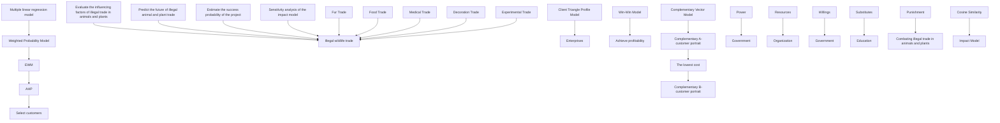
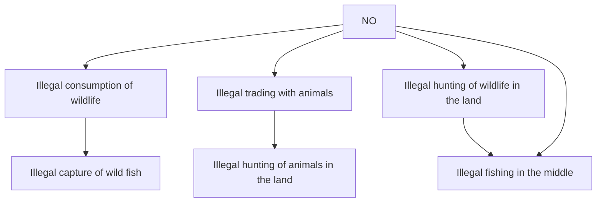

## Technique Innovations Terminating Illegal Wildlife Trade

The illegal wildlife trade does serious harm to global biodiversity and the balance of ecosystems, and we urgently need more people to get involved in stopping it. Finding suitable organizations and convincing them to participate is a great challenge.

Firstly, we constructed the client triangle profile model based on three dimensions (power, resources, and interests), encompassed three categories of related clients: governments, enterprises, and non-governmental organizations (NGOs). We established this model to get the scores of each client with many indicators summarized for each dimension and then used the Entropy Weight Method (EWM) to get the corresponding weights. Some indicators and the corresponding weights are listed for samples as follows: country law (0.8967), industry influence (0.2248), or media platform promotion (0.4349) in the power dimension; GDP (0.8789), technological advancements (0.1283), or volunteer network (0.6878) in the resources dimension; crime rate reduction and public security (0.2540), optimizing reputation (0.1368), or biodiversity conservation (0.7460) in the interests dimension.

Secondly, we systematically evaluated the comprehensive scores of three different client categories from bottom to top by utilizing the Analytic Hierarchy Process (AHP) respectively. Then we calculated all the different potential client scores from 265 countries, 157 enterprises, and 30 organizations, and chose the client with the highest score. The famous luxury company, LVMH group, with the normalized client triangle profile (0.44, 0.94, 0.24) achieves the most potential score of 0.4157, and it is surprisingly an enterprise, neither a government nor a NGO.

Thirdly, we established a win-win model, innovatively introducing new revenue indicators such as penalty revenues and eradication of transactions (replaceable materials). As in the case of Apple Inc., discontinuing the use of leather products and adopting new materials has yielded more gains. We assessed the benefits that the project brings to our client through affine mapping analysis and estimated the additional profit value (\$128.06 million) in a year for LVMH. We believe this project is ideally suitable for LVMH with its reputation for animal protection significantly enhanced.

Additionally, we've devised a complementary vector model to evaluate the extra capabilities needed by clients during project execution. The resulting complementary vector of our client LVMH is (0.56, 0.06, 0.76), then we used the maximum matching model to identify the Seychelles government with profile data (0.35, 0.03, 0.46) from our previously evaluated potential clients which have the closest $(99.9\%)$ complementary vector based on cosine similarity. Our client LVMH may need some resources such as an exclusive economic zone of nearly 1.4 million square kilometers. LVMH can also benefit from the Seychelles government's support for wildlife protection policies, thereby enhancing its brand image.

Finally, we established an impact model with the collected data on illegal wildlife trade from 2015 to 2022. We used multiple linear regression model based on the least squares method to compute measurable impact from factors such as medical trade, experimental trade, food trade, fur trade, and decoration trade, yielding coefficients for the influencing vectors of (2.651, 0.812, 0.164, -0.147, -1.811). We can decrease the future five-year illegal wildlife trade value to \$20 billion, assuming positive factors decrease by 10% annually and negative factors increase by 5%. The model resulted in a final predicted value of 17.54 billion, indicating a 33.81% decrease in trade volume. We utilized a weighted probability model based on the five-point estimation to assess the likelihood of project success, resulting in a probability of 87.2%.

Furthermore, we put the wildlife trade within the larger ecological system and adapted the Leslie-Gower model as a fundamental framework to elucidate the dynamics of prey-predator interactions, the experiment results show the environmental protection factor will boost wildlife survival rates.

Moreover, when we slightly adjusted the initial trade values ( $\pm5\%$ ), the future illegal wildlife trade value will change within 0.047%, thus it shows that our models have strong robustness.

## Contents

## 1 Introduction 3

1.1 Overview 3

1.1.1 Background 3  
1.1.2 Problem Restatement and Analysis 4

1.2 Terminology 4  
1.3 Assumptions 5  
1.4 Data Pre-processing 5

## 2 The Client Triangle Profile Model 6

2.1 Weight Calculation using EWM 6  
2.2 Typical Clients 8  
2.3 Our choice of clients by AHP 9

## 3 Win-Win Model 12

3.1 The Project Developed 12  
3.2 Estimated Profit of Adopting Our Project based on Affine Mapping ..... 12  
3.3 Other Clients 13

## 4 The Complement Vector Model 14

4.1 Maximum Matching of The Complement 14

## 5 Impact Model 16

5.1 Basic Judgments based on scatter plots 17  
5.2 Construction of curve Fitting Model based on least square Method 17  
5.3 Multivariate Linear Regression Test 18  
5.4 Model Solving and Analysis of Impact Results 19  
5.5 Probability Weighted Assessment Model 20  
5.6 Sensitivity analysis 21

## 6 Wildlife Trade within Larger Ecological Model 22

6.1 The Leslie-Gower Model 22  
6.2 Population Dynamics 22

## 7 Strengths and Weaknesses 23

7.1 Strengths 23  
7.2 Weaknesses 23

## 8 Conclusion and Future Works 23

8.1 Conclusion 23  
8.2 Future Works 23

## 1 Introduction

## 1.1 Overview

## 1.1.1 Background

Wildlife trafficking, ranking as the world's fourth-largest illegal trade, encompasses a diverse range of trades, including fur trade, food trade, decorative item trade, Medical trade, experimental trade, and more. Like intricate root systems, it penetrates various dark corners of the world. Estimated to involve as much as \$26.5 billion annually, illegal wildlife trade has profound and far-reaching impacts on biodiversity, the environment, and social stability, gradually drawing heightened attention from the international community. Governments, enterprises, and organizations are taking measures, wielding three swords, as depicted in Figure 1, to cut off the sources and pathways of illegal wildlife trade from different angles.

```mermaid
graph TD
  A["Enterprises"] --> B["Providing training and education for employees"]
  A --> C["Enhancing supply chain management"]
  A --> D["Adhering to all relevant regulations and laws"]
  E["Government"] --> F["Strengthen regulations with stricter penalties"]
  E --> G["Conduct public education campaigns"]
  E --> H["Establish reward systems"]
  I["Selling products containing animal fur"] --> J["Selling protected animal components"]
  K["Organizations"] --> L["Conduct independent investigations"]
  K --> M["Initiate advocacy campaigns"]
  N["Selling drugs containing protected animal or plant"] --> O["Selling products containing animal fur"]
  P["Trading ivory used in crafting artifacts"] --> Q["Trade genetic material or laboratory supplies"]
```

flowchart

Figure 1: Illegal wildlife trade behavior

In the current context, the urgency of this issue becomes more apparent, prompting the international community to emphasize the imperative need for measures to combat wildlife crime through a series of international agreements.

However, despite these agreements, substantive and systematic measures for effective intervention still require further proposal and implementation. Confronting this global challenge, the international community needs to collaborate synergistically, actively exploring and formulating innovative policy frameworks that not only robustly curb illegal wildlife trafficking but also contribute to maintaining the ecological balance of the planet and safeguarding precious natural resources.

When developing such policy frameworks, it is crucial for countries to work together to ensure they are comprehensive, feasible, and innovative, capable of addressing this urgent issue comprehensively and globally, guaranteeing the sustained protection of wildlife on a worldwide scale.

公众号：蚂蚁竞赛 更多资料请加QQ群1077734962，谢谢！

## 1.1.2 Problem Restatement and Analysis

- Task 1: Evaluate scores of different clients in the dimensions of power, resources, and interests. Evaluate their abilities to combat illegal wildlife trade and select the most suitable client.  
- Task 2: Analyze the selected clients from Task 1 and calculate the benefits they may gain from combating illegal wildlife trade.  
- Task 3: Identify the weaknesses of the chosen clients based on their scores in power, resources, and interests. Collaborate with other clients who have stronger capabilities in these areas.  
- Task 4: Evaluate the impact of clients on combating illegal wildlife trade by predicting the increase in biodiversity after project implementation.  
- Task 5: Assess the likelihood of achieving the expected goals through predicting the required time for project implementation. Conduct a sensitivity analysis on the project model considering the impact on the ecosystem.

To effectively illustrate the steps presented in our solution, we have created a visual guide showcasing our workflow, as depicted in Figure 2. In the process diagram, we clearly present the key steps in solving the problem and the modeling approach taken.

flowchart

Figure 2: Our Work

## 1.2 Terminology

Here we list the frequent symbols and their definitions used in the paper, as shown in Table 1. More minor symbols will be defined later.

Table 1: Notations

<table><tr><td>Symbol</td><td>Description</td></tr><tr><td> $P$ </td><td>The normalized evaluation of the client’s ability to decrease illegal wildlife trade, reflecting power factor.</td></tr><tr><td> $R$ </td><td>The normalized evaluation of the client resources that can be used, reflecting the resources factor.</td></tr><tr><td> $W$ </td><td>The normalized evaluation of the client to enact our project, reflecting interest factor.</td></tr><tr><td> $S$ </td><td>The score of the client potential that can decrease the illegal wildlife trade.</td></tr></table>

## 1.3 Assumptions

▶ Assumption 1: The mentioned factors including power, resources, and interests in this article are all related to combating illegal wildlife trade.  
- Justification: We focus on key powers and resources that can decrease the illegal wildlife trade: government enforcement, international organization leadership, and sustainable development efforts by businesses. The required resources include funding, technology, and expertise, with a concentrated interest in supporting wildlife conservation and sustainable development goals.  
▶ Assumption 2: The power, resources, and interest factors for government, enterprises, and non-governmental organizations have different meanings.  
- Justification: Each party has independent and distinct roles in the efforts to combat illegal wildlife trade. This delineation is beneficial for considering them as different types of clients, enabling the more precise formulation of targeted projects and strategies.  
▶ Assumption 3: New technologies and materials allow traditional industries that use animals as raw materials to be upgraded.  
- Justification: There are many famous examples, such as Apple Inc. discontinuing the use of leather products and adopting new materials, which eventually led to more gains.  
▶ Assumption 4: Our clients are rational and can be persuaded by potential gains or reputation.  
- Justification: Our model assumes that enterprises have a certain level of operational feasibility in their willingness to accept our project for decreasing the wildlife trade.  
▶ Assumption 5: The amount of illegal trade is roughly proportional to the amount of related industries and is relatively stable.  
- Justification: The illegal wildlife trade can be viewed as a input cost of the related industry, and its share is relatively stable and roughly proportional to the total industry dollar amount.

## 1.4 Data Pre-processing

Sufficient data is the fundamental step in designing a project. To ensure the authenticity and reliability of our project design to the greatest extent possible, we have extensively collected relevant data from around the world, encompassing multiple countries, businesses, and organizations. We particularly focused on countries where illegal wildlife trade is prevalent, such as in Africa, and identified relevant businesses and organizations with a need for wildlife conservation projects.

Our data comes from a diverse range of sources, including various official websites and statistical studies, such as official reports on illegal wildlife trade, World Bank $[9]$ data, and official national databases of each country. Such diverse data sources ensure the quality and credibility of the foundational data for our project, enabling us to more accurately assess and formulate effective strategies to combat illegal wildlife trade.

What seems difficult is to assure the fully complete data in the procession of collecting. However, the availability of the data is a crucial issue, therefore it is necessary for us to process the missing data properly to enhance the accuracy and validity of our model. The methods of this procession are shown as follows:

\- Mean Complement: If the data before and after the missing value exists, the mean value of the two will be used to substitute it.

- Kindred Complement: While the two series of data are the same or in similarity, if one of them is attainable, the other one can be complemented by parallel.  
- Fitting Complement: When the database is smooth and few continuous data is missed, we set the fitted curve to complement.

## 2 The Client Triangle Profile Model

## 2.1 Weight Calculation using EWM

The customer portrait model is a critical tool for evaluating different categories of clients, aiming to comprehensively assess each client's ability to reduce illegal wildlife trade. From the perspective of client categories, we categorize clients into three distinct groups: government, businesses, and non-governmental organizations.

To depict the customer portrait, we conducted data analysis focusing on the dimensions of power $(P)$ , resources $(R)$ , and interests $(W)$ . We used the Entropy Weight Method (EWM) to calculate the weights of indicators under each dimension. We assume that these dimensions have $m_{P}$ , $m_{R}$ , and $m_{W}$ indicators, and we use $P_{i}$ , $R_{i}$ , and $W_{i}$ ( $i = 1, 2, 3, \ldots, n$ ) to represent the power score, the resources and the interests score of the n clients.

Firstly, we standardized the data for each indicator, using $P'_{ij}$ , $R'_{ij}$ , $W'_{ij}$ to represent the standardized values:

$$
P _ {i j} ^ {\prime} = \frac {P _ {i j} - \min P _ {i j}}{\max P _ {i j} - \min P _ {i j}}, \quad R _ {i j} ^ {\prime} = \frac {R _ {i j} - \min R _ {i j}}{\max R _ {i j} - \min R _ {i j}}, \quad W _ {i j} ^ {\prime} = \frac {W _ {i j} - \min W _ {i j}}{\max W _ {i j} - \min W _ {i j}} \tag {1}
$$

where $P_{ij}$ , $R_{ij}$ , $W_{ij}$ represent the values of the j-th sample for the i-th indicator under the power, resources, and interests dimensions, respectively.

Secondly, for each dimension (P for power, R for resources, W for interests), we calculate their information entropy $H_{j}^{(P)}$ , $H_{j}^{(R)}$ , $H_{j}^{(W)}$ :

$$
\left\{ \begin{array}{l} H _ {j} ^ {(P)} = - \frac {\log_ {2} (n)}{n} \sum_ {j = 1} ^ {n} p _ {i j} ^ {\prime} \log_ {2} p _ {i j} ^ {\prime} \\ H _ {j} ^ {(R)} = - \frac {\log_ {2} (n)}{n} \sum_ {j = 1} ^ {n} r _ {i j} ^ {\prime} \log_ {2} r _ {i j} ^ {\prime} \\ H _ {j} ^ {(W)} = - \frac {\log_ {2} (n)}{n} \sum_ {j = 1} ^ {n} w _ {i j} ^ {\prime} \log_ {2} w _ {i j} ^ {\prime} \end{array} \right. \tag {2}
$$

where the nomarlized frequencies are

$$
p _ {i j} ^ {\prime} = P _ {i j} ^ {\prime} \Bigg / \sum_ {i = 1} ^ {n} P _ {i j} ^ {\prime}, r _ {i j} ^ {\prime} = R _ {i j} ^ {\prime} \Bigg / \sum_ {i = 1} ^ {n} P _ {i j} ^ {\prime}, w _ {i j} ^ {\prime} = P _ {i j} ^ {\prime} \Bigg / \sum_ {i = 1} ^ {n} P _ {i j} ^ {\prime}.
$$

According to the formula for information entropy, we calculate the information entropy of each indicator under power, resources, and interests dimensions. Using information entropy, we then calculate the weights of each indicator under power $(P_{i})$ , resources $(R_{i})$ , and interests $(W_{i})$ dimensions:

$$
\left(\frac {1 - H _ {j} ^ {(P)}}{k - \sum_ {j = 1} ^ {m _ {P}} H _ {j} ^ {(P)}}, \frac {1 - H _ {j} ^ {(R)}}{k - \sum_ {j = 1} ^ {m _ {R}} H _ {j} ^ {(R)}}, \frac {1 - H _ {j} ^ {(W)}}{k - \sum_ {j = 1} ^ {m _ {W}} H _ {j} ^ {(W)}}\right) \tag {3}
$$

We have selected two important indicators for each corner of the triangle for a comprehensive evaluation. The specific indicators and corresponding results are as follows:

## • Government category of clients

## Power:

$\star$ Country Policy and Institutional Assessment (Policy): The government's capacity to formulate laws and policies to combat illegal wildlife trade by reviewing and updating regulations.  
$\star$ Law Enforcement (Law): The government's enforcement capabilities, include monitoring, apprehending, and prosecuting illegal trade activities.

## Resources:

$\star$ GDP: The Gross Domestic Product serves as a critical financial indicator, reflecting the government's financial strength in addressing illegal trade issues.  
$\star$ Citizens' Education Level (Education): Higher education levels among citizens facilitate better understanding and support for government regulations, contributing to improved enforcement effectiveness.

## Interests:

★ Reducing Disease Transmission (Disease): The government focuses on the impact of illegal wildlife trade on public health, especially in reducing the transmission of diseases.  
★ Crime Rate Reduction and Public Security (Stability): Addressing the connection between illegal wildlife trade and crime, to reduce overall crime rates and enhance societal security levels.

## - Enterprise of clients

## Power:

★ Industry Influence (Industry): The influence of businesses within their respective industries, with the potential to drive industry legalization and standardization.  
★ Government Collaboration (Collaboration): Whether businesses have established collaborative relationships with the government to collectively combat illegal wildlife trade.

## Resources:

★ Financial Support (Finance): The financial strength of businesses, utilized to fund projects and activities aimed at combating illegal wildlife trade.  
★ Technological Advancements (Technology): Possession of advanced technological capabilities for monitoring, tracking, and combating illegal trade.

## Interests:

★ Increasing Visibility (Visibility): Businesses contribute to combatting illegal wildlife trade to enhance their societal visibility.  
★ Optimizing Reputation (Reputation): Active participation in social responsibility projects to optimize corporate reputation and improve brand image.

## • Non-Governmental Organizations of clients(NGOs) $^{[2]}$

## Power:

★ Advocacy and Collaboration (Advocacy): NGO capabilities in advocating for environmental policies and driving legal changes.  
★ Media Platform Promotion (Media): Using media platforms to widely disseminate information and generate social awareness.

## Resources:

★ Crowdfunding: Accessing public-supported funds through crowdfunding activities.  
★ Volunteer Networks (Volunteer): Operating extensive volunteer networks effectively engaged in monitoring and protecting against illegal wildlife trade.

## Interests:

★ Biodiversity Conservation (Conservation): Core interest of NGOs is the protection and maintenance of biodiversity.  
★ Climate Change Improvement (Climate): Potential involvement in climate change projects related to illegal wildlife trade.

Table 2: Weights of Indicators for different dimensions among clients

<table><tr><td>Clients</td><td colspan="2">Governments</td><td colspan="2">Enterprises</td><td colspan="2">Organizations</td></tr><tr><td>Dimensions</td><td>Indicators</td><td>Weights</td><td>Indicators</td><td>Weights</td><td>Indicators</td><td>Weights</td></tr><tr><td rowspan="2">Power</td><td>Policy</td><td>0.131256514</td><td>Industry</td><td>0.224751434</td><td>Advocacy</td><td>0.256513982</td></tr><tr><td>Law</td><td>0.896743486</td><td>Collaboration</td><td>0.087471007</td><td>Media</td><td>0.434860180</td></tr><tr><td rowspan="2">Resources</td><td>GDP</td><td>0.878863122</td><td>Finance</td><td>0.605497597</td><td>Crowdfunding</td><td>0.312210962</td></tr><tr><td>Education</td><td>0.121136878</td><td>Technology</td><td>0.12833233</td><td>Volunteer</td><td>0.687789038</td></tr><tr><td rowspan="2">Interests</td><td>Death</td><td>0.254019689</td><td>Visibility</td><td>0.12643817</td><td>Conservation</td><td>0.745980311</td></tr><tr><td>Stability</td><td>0.745980311</td><td>Reputation</td><td>0.136802914</td><td>Climate</td><td>0.254019689</td></tr></table>

Through the analysis of weight data, we have identified unique strengths within each category. Government clients excel in the dimension of power, business clients demonstrate robust resource capabilities, and non-governmental organization (NGO) clients exhibit outstanding performance in the dimension of interests. This indicates that government clients possess a significant advantage in the power dimension, business clients exhibit remarkable capabilities in the resource dimension, and NGO clients have a notable advantage in the interests dimension.

## 2.2 Typical Clients

For each category of customers, we selected specific examples closely related to illegal wildlife trade and conducted an analysis.

## ◇ Government Client: South Africa

South Africa, as one of the countries with the richest biodiversity on the African continent, has drawn global attention to its abundant wildlife resources. However, due to the high profitability of wildlife products such as rhino horns and ivory in the international market, South Africa faces significant challenges in controlling the illegal trade of rhinos and elephants. This illicit trade poses a severe threat to South Africa's wildlife population. Therefore, the government of the country needs to implement effective measures to combat this issue and protect its precious ecological resources.

We calculated the scores for South Africa in power $(P_{A})$ , resources $(R_{A})$ , and interests $(W_{A})$ based on the indicators and their weights outlined in Table 2.

$$
(P _ {A}, R _ {A}, W _ {A}) = (0. 6 6 4 4, 0. 2 7 7 2, 0. 4 6 4 4)
$$

In this triangle porfile depicting South Africa, we can deduce that its scores in power, resources, and interest are $(0.6644, 0.2772, 0.4644)$ respectively, as shown in Figure 3(a). Thus, we can conclude that LVMH holds a significant advantage in terms of power.

## ◇ Enterprise Client: LVMH

LVMH, as a luxury goods company based in France, is often under suspicion for the use of animal fur or precious animal products. This has raised concerns about the company's social responsibility and sustainability in the context of wildlife trade. With the increasing global demand for sustainable practices, companies like LVMH need to scrutinize their supply chains and take measures to ensure that their products are not associated with illegal wildlife trade, thereby maintaining their reputation and social responsibility.

We calculated the scores for LVMH in power $(P_{B})$ , resources $(R_{B})$ , and interests $(W_{B})$ based on the indicators and their weights outlined in Table 2.

$$
(P _ {B}, R _ {B}, W _ {B}) = (0. 4 4 7 0, 0. 9 3 8 7, 0. 2 2 8 7)
$$

In this triangle porfile depicting LVMH, we can deduce that its scores in power, resources, and interest are (0.4470, 0.9387, 0.2287) respectively, as shown in Figure 3(b). Thus, we can conclude that LVMH holds a significant advantage in terms of resources.

radar chart

| Category   | Value |
| ---------- | ----- |
| Power      | 0.66  |
| Resources  | 0.28  |
| Willings   | 0.24  |

(a) Porfile radar chart of South Africa

radar chart

| Category   | Value |
| ---------- | ----- |
| Power      | 0.44  |
| Willings   | 0.24  |
| Resources  | 0.94  |

(b) Porfile radar chart of LVMH

radar chart

| Category   | Value |
| ---------- | ----- |
| Power      | 0.22  |
| Resources  | 0.33  |
| Willings   | 0.92  |

(c) Porfile radar chart of WCS  
Figure 3: The porfile radar chart of typical clients

## ◇ Non-Governmental Organization (NGO) Client: WCS

WCS is an international non-profit environmental organization dedicated to protecting wildlife and their habitats globally. As an organization actively engaged in addressing the issue of illegal wildlife trade, WCS strives to combat this challenge through scientific research, implementing conservation projects, advocating for policy changes, and collaborating with local communities. Through these efforts, WCS is committed to maintaining biodiversity, protecting endangered species, and promoting sustainable approaches to wildlife conservation.

We calculated the scores for WCS in power $(P_C)$ , resources $(R_C)$ , and interests $(W_C)$ based on the indicators and their weights outlined in Table 2.

$$
(P _ {C}, R _ {C}, W _ {C}) = (0. 2 2 3 5, 0. 3 3 7 6, 0. 9 2 1 5)
$$

In this triangle porfile depicting WCS, we can deduce that its scores in power, resources, and interest are $(0.2235, 0.3376, 0.9215)$ respectively, as shown in Figure 3(c). Thus, we can conclude that LVMH holds a significant advantage in terms of resources.

## 2.3 Our choice of clients by AHP

In summary, we categorize clients into three main groups: government, businesses, and organizations. For each client, we construct a three-dimensional vector to reflect their varying proportions in terms of power, resources, and interests, thereby depicting their capability in combating illegal wildlife trade.

Through the calculation steps of the Analytic Hierarchy Process (AHP), we collected data from 265 countries, 157 enterprises, and 30 organizations, which are shown as Figure 4. Then we established a multi-level hierarchy to analyze the ability of governments, enterprises, and non-governmental organizations (NGOs) in combating illegal wildlife trade across the dimensions of power, resources, and interests. By formulating judgment matrices and computing weights, we quantified the relationships and importance of different indicators. The three-dimensional eigenvector E composed of power $(V_{P})$ , resources $(V_{R})$ , and interests $(V_{W})$ is:

$$
\mathbf {E} = (V _ {P}, V _ {R}, V _ {W}) = (1. 3 5 7, 2. 2 8 9, 0. 3 2 2)
$$

We collected indicators data related to 265 countries $^{[9]}$ , considering them as Government Clients. By applying the Analytic Hierarchy Process (AHP) method, we computed the following

scatterplot

| x    | y    | z    |
|------|------|------|
| 1.0  | 1.0  | 0.8  |
| 0.8  | 0.8  | 0.7  |
| 0.6  | 0.6  | 0.6  |
| 0.4  | 0.4  | 0.5  |
| 0.2  | 0.2  | 0.4  |
| 0.0  | 0.0  | 0.3  |

(a) government

scatterplot

| x    | y    | value |
|------|------|-------|
| 0.0  | 1.0  | 0.8   |
| 0.1  | 0.9  | 0.7   |
| 0.2  | 0.8  | 0.6   |
| 0.3  | 0.7  | 0.5   |
| 0.4  | 0.6  | 0.4   |
| 0.5  | 0.5  | 0.3   |
| 0.6  | 0.4  | 0.2   |
| 0.7  | 0.3  | 0.1   |
| 0.8  | 0.2  | 0.0   |
| 0.9  | 0.1  | -0.1  |
| 1.0  | 0.0  | -0.2  |

(b) enterprise

scatterplot

| x      | y      | z     |
| ------ | ------ | ----- |
| 0.075  | 0.150  | 0.9   |
| 0.100  | 0.200  | 0.8   |
| 0.125  | 0.225  | 0.7   |
| 0.150  | 0.150  | 0.6   |
| 0.175  | 0.125  | 0.5   |
| 0.200  | 0.100  | 0.4   |
| 0.225  | 0.075  | 0.3   |
| 0.250  | 0.050  | 0.9   |
| 0.275  | 0.025  | 0.8   |
| 0.300  | 0.000  | 0.7   |
| 0.325  | -0.025 | 0.6   |
| 0.350  | -0.050 | 0.5   |
| 0.375  | -0.075 | 0.4   |
| 0.400  | -0.100 | 0.3   |
| 0.425  | -0.125 | 0.9   |
| 0.450  | -0.150 | 0.8   |
| 0.475  | -0.175 | 0.7   |
| 0.500  | -0.200 | 0.6   |
| 0.525  | -0.225 | 0.5   |
| 0.550  | -0.250 | 0.4   |
| 0.575  | -0.275 | 0.3   |
| 0.600  | -0.300 | 0.9   |
| 0.625  | -0.325 | 0.8   |
| 0.650  | -0.350 | 0.7   |
| 0.675  | -0.375 | 0.6   |
| 0.700  | -0.400 | 0.5   |
| 0.725  | -0.425 | 0.4   |
| 0.750  | -0.450 | 0.3   |
| 0.775  | -0.475 | 0.9   |
| 0.800  | -0.500 | 0.8   |
| 0.825  | -0.525 | 0.7   |
| 0.850  | -0.550 | 0.6   |
| 0.875  | -0.575 | 0.5   |
| 0.900  | -0.600 | 0.4   |
| 0.925  | -0.625 | 0.3   |
| 0.950  | -0.650 | 0.9   |
| 0.975  | -0.675 | 0.8   |
| 1.000  | -0.700 | 0.7   |
| 1.025  | -0.725 | 0.6   |
| 1.050  | -0.750 | 0.5   |
| 1.075  | -0.775 | 0.4   |
| 1.100  | -0.800 | 0.3   |
| 1.125  | -0.825 | 0.9   |
| 1.150  | -0.850 | 0.8   |
| 1.175  | -0.875 | 0.7   |
| 1.200  | -0.900 | 0.6   |
| 1.225  | -0.925 | 0.5   |
| 1.250  | -0.950 | 0.4   |
| 1.275  | -0.975 | 0.3   |
| 1.300  | -1.000 | 0.9   |
| 1.325  | -1.025 | 0.8   |
| 1.350  | -1.050 | 0.7   |
| 1.375  | -1.075 | 0.6   |
| 1.400  | -1.100 | 0.5   |
| 1.425  | -1.125 | 0.4   |
| 1.450  | -1.150 | 0.3   |
| 1.475  | -1.175 | 0.9   |
| 1.500  | -1.200 | 0.8   |
|          |        |       |

(c) organization  
Figure 4: Three-dimensional profile data vector visualization

scores.

$$
(P, R, W) = (0. 7 0 5, 0. 2 6 2, 0. 2 7 1)
$$

$$
S = (P, R, W) \cdot \mathbf {E} = 1. 6 4 6
$$

In this analytical formula, S represents the comprehensive ability scores of the Government category in the dimensions of Power (P), Resources (R), and Interests (W). The numerical value 1.646 is obtained through the Analytic Hierarchy Process (AHP), where the relative importance of each dimension is calculated through judgment matrices for each dimension of the government. This value is then derived by multiplying the three-dimensional eigenvector (1.357, 2.289, 0.322) and the three-dimensional weight vector (0.705, 0.262, 0.271) and summing the products. It indicates that the Government category achieves a comprehensive performance score of 1.646 across the three dimensions.

We collected indicators data related to 157 enterprises $^{[10]}$ , considering them as Enterprise category of Clients. By applying the Analytic Hierarchy Process (AHP) method, we computed the following scores.

$$
(P, R, W) = (0. 2 1 1, 0. 6 5 9, 0. 0 8 5)
$$

$$
S = (P, R, W) \cdot \mathbf {E} = 1. 8 2 2
$$

Similar to the previous formula, S represents the comprehensive ability scores of the Enterprise category. The numerical value 1.822 is obtained through the Analytic Hierarchy Process (AHP), where the relative importance of each dimension is calculated through judgment matrices for each dimension of the enterprise. This value is then derived by multiplying the three-dimensional eigenvector (1.357, 2.289, 0.322) and the three-dimensional weight vector (0.211, 0.659, 0.085) and summing the products. It indicates that the Enterprise category achieves a comprehensive performance score of 1.822 across the three dimensions.

We collected indicators data related to 30 organizations $^{[11]}$ , which can be considered as Non-Governmental Organizations category of clients (NGOs). By applying the Analytic Hierarchy Process (AHP) method, we computed the following scores.

$$
(P, R, W) = (0. 0 8 4, 0. 0 7 9, 0. 6 4 4)
$$

$$
S = (P, R, W) \cdot \mathbf {E} = 0. 5 0 2 2
$$

Likewise, S represents the comprehensive ability scores of the Non-Governmental Organizations (NGOs) category. The numerical value 0.5022 is obtained through the Analytic Hierarchy Process (AHP), where the relative importance of each dimension is calculated through judgment matrices for each dimension of NGOs. This value is then derived by multiplying the three-dimensional eigenvector (1.357, 2.289, 0.322) and the three-dimensional weight vector (0.084, 0.079, 0.644) and summing the products. It indicates that NGOs achieve a comprehensive performance score of 0.5022 across the three dimensions.

Consistency checks were conducted during the calculation process to ensure the coherence of our judgments. By synthesizing weights at each level, we derived comprehensive ability scores for each category in combating illegal wildlife trade. The cumulative scores reveal that enterprises (1.822) > governments (1.646) > NGOs (0.5022), highlighting that enterprises have the highest overall score. This systematic and interpretable process provides a logical foundation for selecting enterprise-type clients and sheds light on the strengths of each category. The data analysis process indicates that governments excel in the power dimension, enterprises demonstrate robust resource capabilities, and NGOs exhibit significant strength in the interest dimension. However, after a thorough assessment across the three dimensions, enterprises emerge with the highest overall score, leading us to identify enterprise-type clients as the most suitable collaborators to address the global challenge of illegal wildlife trade.

The computation results align with the pivotal role that enterprise-type clients play in combating illegal wildlife trade in real-world scenarios. These clients play a crucial role by effectively disrupting the circulation of illegal products through the provision of resources, technical support, and global supply chain supervision. Their awareness of social responsibility propels active engagement, and collaborative efforts and information sharing further strengthen the anti-illegal trade mechanisms. Adherence to regulations and pursuit of innovative solutions provide opportunities for enterprise-type clients to lead the industry while contributing to a reduction in the demand for illegal products in the market. Their involvement not only aids in maintaining ecological balance and wildlife protection but also underscores their commitment to social responsibility and sustainable development, enhancing their corporate image.

bar chart

TOTAL
| Brand | Value |
| :--- | :--- |
| LVMH | 0.415656217 |
| HERMES | 0.372226263 |
| ASML | 0.36081425 |
| JOHNSO... | 0.320939654 |
| NETFLIX | 0.247138858 |
| L'OREAL | 0.242964047 |
| DIOR | 0.16196775 |
| ABBOTT... | 0.151247695 |
| NIKE | 0.107657504 |
| STRYKER... | 0.079570964 |
| BOEING | 0.078499855 |
| LOWE'S... | 0.072771926 |
| INDITEX | 0.069032878 |
| LOCKHEE... | 0.068415521 |
| GILEAD... | 0.027031752 |
| CSL | 0.026372181 |
| VERTEX... | 0.082432593 |
| CATERPI... | 0.124115918 |
| THERMO... | 0.212126289 |
| PFIZER | 0.09942074 |

Figure 5: Comparison of total scores for some typical enterprises (just few samples for illustration)

However, considering the multitude of global enterprises, and to facilitate effective project collaboration, Figure 5 showed few sample enterprises from 157 enterprises related to illegal wildlife trade. They include media, technology, fashion apparel, and pharmaceutical enterprises. These various types of enterprises can play various roles in combating illegal wildlife trade, such as publicity, research and development of drugs and materials, and more.

Through the characterization of these enterprises using a Triangle Profile, we evaluated their comprehensive abilities in power, resources, and interest, assigning scores as depicted in Figure 5.

Figure 5 reveals that among these companies, LVMH has the highest overall score. And as shown in Figure 6 Although LVMH may not necessarily be the top scorer in certain aspects when comparing the scores in three dimensions among these 10 enterprises (few samples from 157 enterprises), its overall qualities align better with our collaborative objectives after comprehensive weighting. LVMH scores 0.4157 totally. It demonstrates significant potential in combating illegal wildlife trade, leading us to choose LVMH as a partner to collectively address this challenge.

line chart

| Brand     | Scores of Power |
| --------- | --------------- |
| LVMH      | 1.0             |
| ASML      | 0.8             |
| Netflix   | 0.6             |
| Dior      | 0.7             |
| Nike      | 0.5             |
| Boeing    | 0.4             |
| Inditex   | 0.3             |
| Gilead... | 0.2             |
| Vertex... | 0.1             |
| Thermo... | 0.0             |

(a) Scores of Power

line chart

Scores of Resources
| Resource | Score |
|---|---|
| LVMH | 0.95 |
| ASML | 0.75 |
| Netflix | 0.92 |
| Dior | 0.85 |
| Nike | 0.65 |
| Boeing | 0.35 |
| Inditex | 0.45 |
| Gilead... | 0.15 |
| Vertex... | 0.35 |
| Thermo... | 0.75 |

(b) Scores of Resources

line chart

Scores of Interests
| Company | Score |
|---|---|
| LVMH | 0.45 |
| ASML | 0.18 |
| Netflix | 0.39 |
| Dior | 0.22 |
| Nike | 0.07 |
| Boeing | 0.06 |
| Inditex | 0.05 |
| Gilead... | 0.03 |
| Vertex... | 0.04 |
| Thermo... | 0.19 |

(c) Scores of Interests

line chart

| Brand     | Scores of Total |
| --------- | --------------- |
| LVMH      | 0.4             |
| ASML      | 0.35            |
| Netflix   | 0.25            |
| Dior      | 0.15            |
| Nike      | 0.1             |
| Boeing    | 0.08            |
| Inditex   | 0.07            |
| Gilead... | 0.05            |
| Vertex... | 0.1             |
| Thermo... | 0.2             |

(d) Scores of Total  
Figure 6: Scores comparison of some enterprises (just few samples for illustration)

## 3 Win-Win Model

To assess whether the project meets customer needs and has practical utility, breaking the difficult situation of traditional projects and achieving innovative win-win situations with customers is crucial. The key to project innovation lies in accurately understanding customer expectations, specifically by delineating the benefits customers can derive through project collaboration. This process involves comprehensive consideration of the customer's goals, desires, and anticipated outcomes. The project needs to be closely linked to the customer's interests to ensure it meets their expectations and delivers tangible returns and value. Tailored measures are developed for different types of clients based on an in-depth understanding of customer needs.

## 3.1 The Project Developed

For our chosen client LVMH, we propose developing technologies in areas such as new materials to replace the uses of wildlife and their fur. Additionally, these actions, aimed at combating illegal trade, contribute to shaping a positive brand image for the enterprise, providing visibility for innovative products, and creating a positive cycle.

To assess the benefits we bring to the enterprises. We have chosen the following indicators to calculate.

$$
\left\{ \begin{array}{l} L = \text { Investment   in   Relevant   Innovative   Projects } + \text { Echnology   Expenses } \\ M = \text { Income   from   Product   Development } \end{array} \right.
$$

where $L$ represents the cost, $M$ represents the benefit of these indicators. And it's easy to calculate the total profit of clients of this type is $T = M - L$ .

## 3.2 Estimated Profit of Adopting Our Project based on Affine Mapping

In the real-life example, Apple's decision to discontinue leather products has brought tangible benefits and a positive reputation, providing us with insights.

By consulting the financial report $^{[17]}$ , we obtained Apple's iPhone sales revenue for the year 2023, which amounted to \$2.01 \times 10 $^{10}$ . We computed the ratio of leather products from the official sales website, and it was determined to be 4.7%.

For the cost calculation $(L_{1})$ , we deducted the sales revenue related to leather products from the total iPhone sales revenue. This was achieved by identifying the proportion of leather-related products in Apple's product line and subtracting it from the overall sales revenue.

$$
L _ {1} = 2. 0 1 \times 1 0 ^ {1 0} \times 4. 7 \% = 9. 4 5 6 3 \times 1 0 ^ {9}
$$

By calculating the average research funding for three past projects similar to the development of leather alternatives, we estimated the research expenses for developing new materials. We also considered the research funding for the development of new materials as a cost $(L_{2})$ .

$$
L _ {2} = (3. 8 7 5 \times 1 0 ^ {9} + 4. 7 6 1 \times 1 0 ^ {9} + 4. 2 9 5 \times 1 0 ^ {9}) / 3 = 4. 3 1 0 \times 1 0 ^ {9}
$$

Next, we used industry-related sales forecasting models for the smartphone market to predict the sales revenue $M = 2.79528 \times 10^{10}$ of the new material product for the next year.

The specific calculation formula for profit $(T)$ is as follows:

$$
T = M - L _ {1} - L _ {2} = 1. 4 1 8 6 5 \times 1 0 ^ {1 0}
$$

Based on the above calculations, it can be concluded that Apple has experienced an increase in profit after discontinuing the trade of leather products. From before the discontinuation $(9.4563 \times 10^{9})$ to after $(1.41865 \times 10^{10})$ , the company has gained more profitability.

By conducting affine mapping (roughly proportional transformation with their total values) between Apple Inc. and LVMH, we follow a similar calculation approach to predict the profit of LVMH and other comparative clients. The prediction of the profit of LVMH is \$128.06 × 10 $^{9}$ . Based on this profit data, it is evident that LVMH's participation in our proposed project has the potential to yield substantial and tangible returns. Therefore, we choose to use this project as compelling evidence to persuade them, and the likelihood of success is significant.

## 3.3 Other Clients

We can use similar methods to analyze other clients by substituting their data into the corresponding expressions for calculation (the results are shown in the following Figure 7).

• Governments: Tanzania, South Africa.  
- Enterprises: Louis Vuitton (LV), Saga Furs.  
• Non-governmental organizations: Wildlife Conservation Society (WCS), Traffic.

After comparing the data in Figure 7, it is evident that whether it is government clients, enterprise clients, or non-governmental organization (NGO) clients, each has experienced varying degrees of profit in the positive cycle of innovative projects. This underscores the project's capacity to drive sustainable development for these three client types, indicating its value across diverse client categories. From the data, it is apparent that enterprise clients have generally garnered more substantial profits in the relevant projects. This aligns with our conclusions in 2.2 and 2.3.

For instance, enterprise clients like LVMH may not necessarily have advantages in terms of power and interests, but they possess extensive resources. They can drive technological development and research new products to replace wildlife products in the implementation of measures against illegal wildlife trade. This approach addresses the problem at its source, demonstrating significant potential. By developing new products, enterprises can establish new industry chains, generate sales profits, and create a positive cycle. This makes them more robust and faster in terms of benefits compared to the other two client categories.

stacked bar chart

| Country | Investment(L) | Incom(M) | Profit(T) |
| :--- | :--- | :--- | :--- |
| WCS | 17.66785714 | 32.19157143 | 14.52371429 |
| TRAFFIC | 35.02542857 | 54.03971429 | 19.01428571 |
| SAGA FUR | 97.88757143 | 282.3517143 | 184.4641429 |
| LVMH | 118.4664286 | 246.5252857 | 128.0588571 |
| SOUTH AFRICA | 99.30657143 | 223.3635714 | 124.057 |
| TANZANIA | 87.94971429 | 173.6635714 | 85.71385714 |

Figure 7: Expected profits results of samples

This further emphasizes that within the collaborative relationship, innovative projects are mutually beneficial when working with enterprise clients. The projects not only promote the sustainable development of enterprises but also provide an opportunity for them to play a proactive role in addressing the issue of illegal wildlife trade. Through close collaboration with enterprises, projects are likely to achieve a broader societal impact, forming more dynamic solutions.

## 4 The Complement Vector Model

In the process of selecting the clients mentioned earlier, we conducted a comprehensive evaluation of each potential client's overall capabilities. Different clients exhibit significant variations in their scores across the dimensions of power, resources, and interests. Recognizing that a single client may have slight deficiencies in certain aspects during project execution, we introduced the Complement Vector Model.

For the current user, denoted as C, their scores in the comprehensive evaluation are represented as P, R, and W. We can obtain their complement vectors $(\mathcal{C}(P), \mathcal{C}(R), \mathcal{C}(W))$ using the formulas:

$$
\left\{ \begin{array}{l l} \mathcal {C} (P) & = S _ {\text { all }} \cdot P - P _ {c} \\ \mathcal {C} (R) & = S _ {\text { all }} \cdot R - R _ {c} \\ \mathcal {C} (W) & = S _ {\text { all }} \cdot W - W _ {c} \end{array} \right. \tag {4}
$$

## 4.1 Maximum Matching of The Complement

Assuming we have additional potential clients, $C_1, C_2, \ldots, C_n$ besides the client $C$ we've already selected, and the profile data of $C_i$ is $(P_i, R_i, W_i)$ . We can utilize the cosine similarity model:

$$
\text { similarity } (\big (\mathcal {C} (P), \mathcal {C} (R), \mathcal {C} (W) \big), (P _ {i}, R _ {i}, W _ {i})) = \cos (\theta_ {i}) = \frac {\big (\mathcal {C} (P) , \mathcal {C} (R) , \mathcal {C} (W) \big) \cdot (P _ {i} , R _ {i} , W _ {i})}{\| (\mathcal {C} (P) , \mathcal {C} (R) , \mathcal {C} (W)) \| \| (P _ {i} , R _ {i} , W _ {i}) \|} \tag {5}
$$

This model helps identify another client $C_{x}$ whose complement vector is most similar to that of client C, and we present the details in Algorithm 1. By examining the profile of $C_{x}$ , we can gain insights into the specific capabilities in power, resources, and interests that client C needs to acquire through collaboration.

We created distinct client triangle profiles for over 200 government entities, over 100 enterprises, and 13 international non-governmental organizations. Additionally, we visualized the three-dimensional capability vectors of all potential clients, as illustrated in Figure 4.

Algorithm 1 Cosine Similarity Model  
Input: $C$ and $C_{1,2,\dots,n}$ representing the current client and a list of other clients.  
Output: Returns the closestClient to the current client.
1: function COSINESIMILARITY(C, Ci)
2: dotProduct ← DotProduct(C, Ci)
3: magnitude_C ← Magnitude(C)
4: magnitude_Ci ← Magnitude(Ci)
5: similarity ← dotProduct / magnitude_C × magnitude_Ci
6: return similarity
7: end function
8: function FINDCLOSESTCLIENT(C, {C1, C2, ..., Cn})
9: maxSimilarity ← -1
10: closestClient ← None
11: for each client Ci ∈ {C1, C2, ..., Cn} do
12: currentSimilarity ← CosineSimilarity(C, Ci)
13: if currentSimilarity > maxSimilarity then
14: maxSimilarity ← currentSimilarity
15: closestClient ← Ci
16: end if
17: end for
18: return closestClient
19: end function

In the previous section, we selected LVMH as our client. To enhance its capabilities at minimal cost, we calculated its three-dimensional complementary vector, denoted as S, with values $(0.56, 0.06, 0.76)$ . Subsequently, employing the cosine similarity method, we computed the similarity between S and the three-dimensional vectors of all other potential clients, as illustrated in Figure 8. The most optimal match, in which cosine similarity reached an impressive 99.9%, was found to be $(0.35, 0.03, 0.46)$ . This vector corresponds to the government of Seychelles, a country in the western Indian Ocean.

line chart

| Potential Clients | Cosine Similarity |
| ----------------- | ----------------- |
| End               | 99.9%             |

Figure 8: The most suitable entity for augmenting our client

Seychelles is situated in the western Indian Ocean, 1500 kilometers east of the east coast of the African continent, comprising 115 islands. The overall economic scale of Seychelles is relatively small, with no large enterprises that have international influence or notable merger and acquisition projects. In recent years, Seychelles has focused on strengthening its relations with Western countries and international financial institutions while actively developing ties with emerging powers such as China and India to attract foreign aid and investment. The local workforce is proficient in English, French, and Creole.

Seychelles maintains a relatively good overall social security situation, although there has been a noticeable increase in theft cases in recent years. In 2017, the Seychelles government issued a 10-year bond worth \$15 million, with guarantees provided by the World Bank and the Global Environmental Facility, supporting sustainable fisheries development. The “Blue Bond” mechanism in Seychelles received the “Ocean Innovation Challenge Award” at the 2017 World Ocean Summit.

In August 2019, President Faure of Seychelles announced the initiation of the “Vision 2033 and National Development Strategy 2019-2023.” “Vision 2033” outlines Seychelles’ development strategy for the next 15 years, aiming to build a vibrant, responsible, and prosperous nation with a healthy, knowledgeable, and capable population, in harmony with nature and aligned with the broader world.

Seychelles is renowned for its success in wildlife conservation, dedicating 42% of its territory to conservation efforts. Over 50% of its land is designated as a natural reserve, and it boasts an Exclusive Economic Zone (EEZ) covering nearly 1.4 million square kilometers, ranking second in Africa. The key industries supporting the national economy are tourism, fisheries, and handicrafts. While Seychelles prioritizes environmental protection in its industrial and agricultural systems, preserving its pristine natural landscapes, this approach has somewhat constrained economic development. Seychelles is home to a rich biodiversity, featuring over 1,000 species of fish, rare birds such as the Seychelles Black Parrot, Falco araeus, and Otus insularis, along with 26 species of crabs and various endangered sea turtles, including the critically endangered Hawksbill Turtle.

In 2023, LVMH achieved record-breaking annual highs in both sales revenue and net profit, surpassing the figures from 2022. Sales revenue reached 861.53 billion euros, marking a 9% year-on-year increase, while net profit reached 151.74 billion euros, reflecting an 8% year-on-year growth. The gross profit amounted to 592.77 billion euros, up 9%, and the operating profit reached 225.6 billion euros, experiencing a 7% year-on-year increase.

Initiating collaboration with the United Nations Educational, Scientific, and Cultural Organization (UNESCO) in 2019, LVMH embarked on various projects aimed at minimizing the impact of climate change on biodiversity and enhancing the resilience of ecosystems. The group has set ambitious goals for itself, intending to restore 5 million hectares of wildlife habitats by 2030, fostering ecosystem regeneration, and safeguarding critically endangered flora and fauna. Biodiversity conservation stands as a cornerstone across all activities of the LVMH group, with the primary raw materials for its six major business sectors sourced from the natural environment.

Seychelles has earned worldwide acclaim for its achievements in wildlife conservation. Through its partnership with Seychelles, LVMH can play a more substantial role in combating wildlife trafficking, consistent with its commitment to environmental sustainability and biodiversity. Serving as a biodiversity hotspot, Seychelles offers LVMH an opportunity to access unique resources, serving as a potential wellspring of innovation for the company's products. By providing financial support to Seychelles, LVMH has the potential to elevate its brand image and appeal to environmentally conscious consumers.

## 5 Impact Model

This research endeavor involves a meticulous investigation into the determinants influencing illicit wildlife trade, with due consideration given to related industries such as the animal fur trade market and the wildlife food industry. We systematically quantified trade volumes associated with various factors to formulate a precisely calibrated function, accommodating the intricacies of trade dynamics. we judiciously selected five key indicators. We have selected the animal fur trade market, biomedical industry, animal jewelry industry, and wildlife food industry, and their impact flows can be observed in Figure 1. Following a thorough and detailed study, we carefully selected trade data related to illegal wildlife trafficking.

In our study, we employed the intricate statistical technique of multiple linear regression analysis. We designated illegal wildlife trade as the dependent variable Y and identified fur trade, food trade, medicine trade, experimental trade, and decoration trade as independent variables $X_{i}$ ( $i \in \{1, 2, ..., 5\}$ ). Meticulously selecting trade data spanning from 2015 to 2022, our investigation aimed at a comprehensive analysis. The systematic research seeks to unveil the price trends of key wildlife products. The study takes into account the trade volumes of these five variables $X_{i}$ ( $i \in \{1, 2, ..., 5\}$ ) and their impact on the overall volume of illegal wildlife trade (Y).

## 5.1 Basic Judgments based on scatter plots

Typically, before establishing a regression relationship, it is necessary to ascertain the presence of correlations within the data. To facilitate a more intuitive analysis, we utilized SPSS software to create scatter plots for each indicator's trade against illegal animal and plant trade, resulting in a total of 36 scatter plots Figure 9. These scatter plots are divided into four parts, as depicted in Figure 9. Upon examining these 36 scatter plots, we identified a preliminary linear relationship between each independent variable (fur trade, food trade, medical trade, experimental trade, decorative trade) and the dependent variable (illegal wildlife trade).

We filtered illegal wildlife trade data from the CITES Trade Database $[15]$ for the years 2015 to 2022 and separated the trade values for the aforementioned five categories from it.

bar chart

| Trade Type | Total Trade | Fur trade | Decoration trade |
| :--- | :--- | :--- | :--- |
| Total Trade | 100 | 50 | 20 |
| Fur trade | 100 | 100 | 30 |
| Decoration trade | 100 | 50 | 20 |

(a) Total & Fur & Decoration

scatterplot

| Category         | Total Trade | For trade | Decoration trade |
| ---------------- | ----------- | --------- | ---------------- |
| Pharmacy         | 100         | 50        | 20               |
| Food trade       | 80          | 60        | 30               |
| Experimental trade| 90          | 70        | 40               |

(b) Pharmance & Food & Experimental

scatterplot

| Category | Total Trade | Fair trade | Decoration trade |
| :--- | :--- | :--- | :--- |
| Pharmacists | 100 | 120 | 80 |
| Food traders | 30 | 40 | 50 |
| Experimental traders | 60 | 70 | 60 |

(c) Total & Fur & Decoration

bar-line hybrid chart

| Category           | Pharmace | Food trade | Experimental trade |
| ------------------ | -------- | ---------- | ------------------ |
| Pharmace           | 10       | 15         | 5                  |
| Food trade         | 20       | 30         | 10                 |
| Experimental trade | 15       | 40         | 20                 |

(d) Pharmance & Food & Experimental  
Figure 9: A scatter plot of the total illegal trade in animals and plants and its associated factors

## 5.2 Construction of curve Fitting Model based on least square Method

## ◇ Model Development

In constructing the fitting model for this study, we chose the amount of illegal wildlife trade Y as a quantitative indicator to intricately measure the scale of illicit trade in wild animals and plants. The designed fitting function takes into account various influencing factors within the matrix $X_{i}$ ( $i = 1, 2, ..., 5$ ). In this model, each coefficient $\beta_{i}$ for independent variables is defined as a regression coefficient, quantifying the impact of the independent variable $X_{i}$ on Y while keeping all other independent variables constant. The intercept is denoted by $\beta_{0}$ , and the residual term $\epsilon$ represents a random variable with a mean of 0 and a variance of $\sigma^{2}$ , symbolizing the influence of random factors on Y.

For the model development, we carefully selected the trade amounts of fur trade, food trade, medicine trade, experimental trade, and decoration trade from 2015 to 2022 as the independent variable matrix. The impact of each independent variable is represented through $E_{1}$ to $E_{5}$ as follows:

$$
\left\{ \begin{array}{l l} E _ {1} = \beta_ {1} X _ {1} & (\text { Influence   of   fur   trade   market   demand }) \\ E _ {2} = \beta_ {2} X _ {2} & (\text { Influence   of   the   medical   industry }) \\ E _ {3} = \beta_ {3} X _ {3} & (\text { Influence   of   decorative   sales }) \\ E _ {4} = \beta_ {4} X _ {4} & (\text { Influence   of   wildlife   food   sales }) \\ E _ {5} = \beta_ {5} X _ {5} & (\text { Influence   of   scientific   experiments }) \end{array} \right. \tag {6}
$$

Thus, we have successfully established the functional equation for the fur trade, food trade, medicine trade, experimental trade, decoration trade, and illegal wildlife trade:

$$
Y = f (\beta_ {1} X _ {1}, \beta_ {2} X _ {2}, \beta_ {3} X _ {3}, \beta_ {4} X _ {4}, \beta_ {5} X _ {5}) \tag {7}
$$

## 5.3 Multivariate Linear Regression Test

## ◇ Preliminary Model Testing and Assessment

Based on the established linear model, we conducted multivariate linear regression analysis on $X_{i}$ ( $i \in 1, 2, ..., 5$ ) using SPSS software. The primary step involved performing an analysis of variance (ANOVA), primarily employed to verify the successful model construction. In this process, the F value represents the ratio of between-group mean square and within-group mean square. Each F value corresponds to a P value. Hence, a smaller P value indicates a higher likelihood of retaining the respective feature.

Upon detailed analysis of the model summary, we observed an F value of 65.784, with a significance level P of 0.015, less than 0.05. This suggests that at least one independent variable explains a portion of the variance in the dependent variable, leading to an increase in regression variance and a decrease in residual variance. Therefore, we can affirm the successful construction of the model.

## ◇ In-depth Testing of the Multivariate Linear Regression Model

We conducted a thorough examination of the model summary in Table 3, delving into the assessment of linear relationships and regression fit. The key observations derived from this analysis are highlighted below. We emphasize the pivotal metric, $R^2 = 0.979$ , signifying that all independent variables collectively account for a remarkable $97.9\%$ of the variance in illegal wildlife trade. The robustness of this result is underscored by the diminished impact of the variable count on $R^2$ , fortifying our confidence in the model's explanatory power.

Table 3: Linear Regression Analysis Results

<table><tr><td></td><td> $\beta$ </td><td> $t$ </td><td> $P$ </td><td> $VIF$ </td><td> $R^{2}$ </td></tr><tr><td>Illegal Fur Trade</td><td>-0.147</td><td>-0.158</td><td>-0.042</td><td>0.507</td><td>12.88</td></tr><tr><td>Illegal Food Trade</td><td>0.164</td><td>0.075</td><td>0.039</td><td>0.729</td><td>11.725</td></tr><tr><td>Illegal Medical Trade</td><td>0.812</td><td>1.01</td><td>0.027</td><td>0.396</td><td>14.092</td></tr><tr><td>Illegal Decoration Trade</td><td>-1.811</td><td>-0.03</td><td>-0.025</td><td>0.823</td><td>4.65</td></tr><tr><td>Illegal Experimental trade</td><td>2.651</td><td>0.068</td><td>0.003</td><td>0.927</td><td>14.175</td></tr></table>

Furthermore, a detailed scrutiny of the Durbin-Watson test value (DW value of 2.320) within the range of 0 to 4 unequivocally indicates a strong independence of residuals. This finding further bolsters our confidence in the model, highlighting its reliability in capturing data characteristics and trends. The histogram of residuals Figure 10 follows a normal distribution with a mean close to 0 and a standard deviation close to 1 (standard normal distribution). This indicates that the linear regression meets the normality assumption. The P-P plot Figure 11 also confirms the satisfaction of the normality assumption.

This in-depth testing not only showcases the model's outstanding performance in capturing linear relationships but also underscores its high degree of fit to the data and effective handling of residuals. These comprehensive observations collectively unveil the richness of the multivariate linear regression model in elucidating the intricate dynamics of the illegal wildlife trade.

histogram

| Standardized residuals | Frequency |
| ---------------------- | --------- |
| -1.0                   | 1         |
| -0.5                   | 3         |
| 0.0                    | 2         |
| 0.5                    | 2         |
| 1.0                    | 1         |

Figure 10: Residual Histogram

scatterplot

| Actual cumulative probability | Expected cumulative probability |
| ----------------------------- | ------------------------------ |
| 0.1                           | 0.2                            |
| 0.2                           | 0.3                            |
| 0.3                           | 0.35                           |
| 0.4                           | 0.48                           |
| 0.5                           | 0.57                           |
| 0.6                           | 0.57                           |
| 0.7                           | 0.7                            |
| 0.8                           | 0.72                           |
| 0.9                           | 0.8                            |

Figure 11: P-P Plot of Residuals

## 5.4 Model Solving and Analysis of Impact Results

## ◇ Solution using Least Squares

We employ the least squares method to estimate the coefficients $\beta$ of the multiple linear regression equation. The primary objective of the least squares method is to minimize the residual sum of squares (RSS). In this context, $Y_{i}$ represents the actual observed values, with the selected data comprising true values spanning from 2015 to 2022. The predicted values, denoted as $\hat{Y}_{i}$ , can be observed in Figure 12. Here, n denotes the range of years selected for the data. $\beta$ signifies the coefficient vector, X is the independent variable matrix, Y is the dependent variable vector, and $X'$ denotes the transposed matrix used in the least squares coefficients calculation. This approach ensures a rigorous estimation of the coefficients, enhancing our ability to delve into a comprehensive analysis of the impact results.

$$
\left\{ \begin{array}{c} \text { RSS } = \sum_ {n = 2 0 1 5} ^ {2 0 2 2} (Y _ {i} - \hat {Y} _ {i}) ^ {2} \\ \beta = (X ^ {\prime} X) ^ {- 1} X ^ {\prime} Y \end{array} \right. \tag {8}
$$

## ◇ In-Depth Analysis of Impact Factors β

Through a detailed examination of the regression coefficients $\beta$ in Table 3, we can accurately assess the influence of various industries on the target variable. This impact relationship is visually observed through a chord diagram, where the width of the lines reflects the degree of influence.

- Fur Trade (-0.147): A negative coefficient indicates a negative correlation with the target variable. Increasing fur trade may lead to a decrease in the target variable.  
- Food Trade (0.164): Although the coefficient is positive but relatively small, it suggests a slight positive impact on the target variable. Increasing food trade may slightly elevate the target variable.  
- Medical Trade (0.812): A larger positive coefficient implies a significant positive impact on the target variable. Increasing medical trade may notably enhance the target variable.

- Decoration Trade (-1.811): A highly negative coefficient indicates a substantial negative impact on the target variable. Increasing decoration trade may result in a sharp decline in the target variable.  
- Experimental Trade (2.651): A highly positive coefficient suggests a considerable positive impact on the target variable. Increasing experimental trade may lead to a significant increase in the target variable.

line chart

| Year | Real (million) | Prediction (million) |
| :--- | :--- | :--- |
| 2015 | 4200 | 4300 |
| 2016 | 4550 | 4500 |
| 2017 | 4800 | 4850 |
| 2018 | 5150 | 5100 |
| 2019 | 3950 | 3980 |
| 2020 | 3700 | 3750 |
| 2021 | 3550 | 3450 |
| 2022 | 3300 | 3300 |

Figure 12: Actual vs. Predicted Values Plot

pie chart

| Category | Trade Volume |
|---|---|
| Medicine | 120 |
| Decoration | 85 |
| Experiment | 70 |
| Fur FOOD | 30 |

Figure 13: Influencing factors and chord diagrams

Through a thorough analysis of the regression coefficients in the multiple linear regression equation, we have derived a comprehensive conclusion regarding the relationships between different industries and the target variable. In this equation, medical trade and experimental trade are identified as key driving factors for the target variable, while decorative trade is considered a factor exerting a negative impact on the target variable.

$$
Y = 1. 5 2 7 - 0. 1 4 7 X _ {1} + 0. 1 6 4 X _ {2} + 0. 8 1 2 X _ {3} - 1. 8 1 1 X _ {4} + 2. 6 5 1 X _ {5}
$$

In essence, within the context of illegal wildlife trade, our integrated ranking reveals that experimental trade has the most significant impact on the target variable, followed by medical trade in second place, and food trade ranking third. However, the fur trade and decorative trade exhibit negative correlations, with the decorative trade showing the most pronounced adverse impact.

## 5.5 Probability Weighted Assessment Model

To assess the likelihood of achieving the anticipated goal of 20 billion in illegal wildlife trade within a 5-year timeframe, we employed a five-point estimation weighted probability model for fur trade, food trade, medical trade, decoration trade, and experimental trade. Firstly, we estimated the probability of each illegal trade indicator achieving its respective goal and then calculated the probability of overall project success by weighting the factors.

Initially, we assumed the most optimistic time for each trade to achieve its respective target (denoted as m) years, the most likely time (denoted as r) years, and the most pessimistic time (denoted as h) years. Based on these time estimates, we computed the probability of a single illegal trade indicator achieving its goal within the given s years.

$$
\left\{ \begin{array}{l} e = (m + 4r + h) / 6 \\ b = [ (h - m) / 6 ] ^ {2} \\ q = (s - e) / b \\ G _ {i} = 50 \% + \sigma / q \quad (i = 1, \dots , 5) \end{array} \right. \tag{9}
$$

where e represents the average time for a specific illegal trade indicator to achieve its goal, and b denotes the standard deviation of the expected time, and q indicates the deviation from the average duration, and $G_{i}$ ( $i = 1, \ldots, 5$ ) represents the probability of a single illegal trade indicator achieving its goal within 5 years, with 50% indicating the probability on the normal distribution curve. The $\sigma$ coefficients corresponding to q take values of ( $1\sigma = 68.37\%$ , $2\sigma = 95.46\%$ , $3\sigma = 99.73\%$ ).

The probability of completing all activities within 5 years is calculated as the sum of each trade's probability multiplied by its normalized weighted factor:

$$
G = G _ {1} q _ {1} + G _ {2} q _ {2} + G _ {3} q _ {3} + G _ {4} q _ {4} + G _ {5} q _ {5}.
$$

In a specific scenario, assuming the most optimistic time $(m)$ for government, organization, and business to achieve their respective goals is 2 years, the most likely time $(o)$ is 4 years, and the most pessimistic time $(h)$ is 6 years. The calculated mean time $(e)$ and standard deviation $(b)$ are obtained, with deviations from the mean project duration $(q)$ being $(4, 0.666, 2)$ . Based on these time estimates, the probability of each trade indicator completing its goal within 5 years is 97.3%, and the probability of completing all trade indicators within 5 years is 87.2%.

To enrich and make the language more scientific: In order to preliminarily assess the feasibility of the multiple linear regression model, we assume that the positive influencing factor, trade volume, decreases by 10% annually, while the negative influencing factor increases by 5% annually. Setting a target that the illegal trade in plants and animals will decrease to 20\$ billion after 5 years, we input these values into our linear regression equation and predict that the trade volume in 2027 will decrease to \$17.54 billion. This represents a 33.81% decrease from the \$25.6 billion in 2022, achieving the expected goal and indicating the rationality of the model.

## 5.6 Sensitivity analysis

In discussing the influencing factors of illegal wildlife trade, there exist five distinct independent variables, namely fur trade $(X_{1})$ , food trade $(X_{2})$ , medical trade $(X_{3})$ , decoration trade $(X_{4})$ , and experimental trade $(X_{5})$ . Their initial values are (140.80, 76.56, 58.65, 0.41, 0.21). We subject each of these trade variables to a continuous fluctuation of $\pm5\%$ while keeping the other four trade variables constant. Since the medical trade has the greatest impact factor on the illegal wildlife trade, we simulate a 5% downward fluctuation in the medical trade. The schematic diagrams illustrating the relationship between these five parameters and illegal wildlife trade are plotted using Python software, as shown in Figure 14.

bar chart

| Year | TotalTrade | FurTrade | FoodTrade | MedicineTrade | DecorTrade | ExperimentTrade |
|------|------------|----------|-----------|---------------|------------|-----------------|
| 2026 | 17.45      |          |           |               |            |                 |
| 2050 |            |          |           |               |            |                 |

(a) Before adjustment

bar chart

| Year | TotalTrade | FurTrade | FoodTrade | MedicineTrade | DecorTrade | ExperimentTrade |
|------|------------|----------|-----------|---------------|------------|-----------------|
| 2026 | 16.93      |          |           |               |            |                 |

(b) After adjustment  
Figure 14: Comparison graphs of illegal trade before and after adjustments to pharmaceutical trade parameters.

The predicted trend changes in the images are minimal, and by 2027, the overall trade variation is not significant. Illegal wildlife trade sees only a marginal decrease of $0.047\%$ , indicating the robustness of our model in considering various factors and intervention measures.

## 6 Wildlife Trade within Larger Ecological Model

## 6.1 The Leslie-Gower Model

We utilize the wildlife trade within larger ecological model $^{[8]}$ as a fundamental framework to elucidate the dynamics of the interaction between wildlife populations and the ecological environment. The continuous-time representation of the Leslie-Gower model is described by the following system of differential equations:

$$
\left\{ \begin{array}{l} \frac {d x}{d t} = x \left(\frac {r _ {1}}{1 + k y} - \beta x - \frac {c _ {1} y}{x + k _ {1}}\right) \\ \frac {d y}{d t} = y \left(r _ {2} - \frac {c _ {2} y}{x + k _ {1}} - E\right) \end{array} \right. \tag {10}
$$

where x and y represent the densities of the prey and predator populations, respectively; $r_{1}$ and $r_{2}$ are the growth rates of the prey and predator populations, respectively; $\beta$ denotes the internal competition intensity within the prey population; $c_{1}$ and $c_{2}$ are the maximum per capita decrease rates for the prey and predator populations, respectively; $k_{1}$ represents the environmental protection level for both the prey and predator populations; k is the anti-predator ability of the prey population; E stands for the harvesting capacity; and $r_{2} > E$ .

Based on the difference equation form of (10), we obtain

$$
\left\{ \begin{array}{l} u _ {n + 1} = u _ {n} \exp \left(\frac {1}{1 + d v _ {n}} - u _ {n} - \frac {v _ {n}}{u _ {n} + s}\right) \\ v _ {n + 1} = v _ {n} \exp \left(\gamma - \frac {f v _ {n}}{u _ {n} + s} - p\right) \end{array} \right. \tag {11}
$$

## 6.2 Population Dynamics

The outcomes from applying the Runge-Kutta method to solve differential equations under varying degrees of environmental protection $k_{1}$ are depicted in Figure 15. It is evident that the distinctions among the curves are negligible, suggesting minimal impact of environmental protection factors on the temporal evolution of population density. From this figure, we can also conclude that although the enhancement of environmental protection may not directly reduce illegal trade, it can slightly mitigate the impact of illegal trade.

line chart

| Time(month) | k1=0    | k1=0.1  | k1=0.2  | k1=0.3  | k1=0.4  | k1=0.5  | k1=0.6  | k1=0.7  | k1=0.8  | k1=0.9  | k1=1    |
| ----------- | ------- | ------- | ------- | ------- | ------- | ------- | ------- | ------- | ------- | ------- | ------- |
| 0           | 0.055   | 0.055   | 0.055   | 0.055   | 0.055   | 0.055   | 0.055   | 0.055   | 0.055   | 0.055   | 0.055   |
| 10          | 0.068   | 0.067   | 0.067   | 0.067   | 0.067   | 0.067   | 0.067   | 0.067   | 0.067   | 0.067   | 0.067   |
| 20          | 0.069   | 0.068   | 0.068   | 0.068   | 0.068   | 0.068   | 0.068   | 0.068   | 0.068   | 0.068   | 0.068   |
| 30          | 0.069   | 0.068   | 0.068   | 0.068   | 0.068   | 0.068   | 0.068   | 0.068   | 0.068   | 0.068   | 0.068   |
| 40          | 0.069   | 0.068   | 0.068   | 0.068   | 0.068   | 0.068   | 0.068   | 0.068   | 0.068   | 0.068   | 0.068   |
| 50          | 0.069   | 0.068   | 0.068   | 0.068   | 0.068   | 0.068   | 0.068   | 0.068   | 0.068   | 0.068   | 0.068   |
| 60          | 0.069   | 0.068   | 0.068   | 0.068   | 0.068   | 0.068   | 0.068   | 0.068   | 0.068   | 0.068   | 0.068   |
| 70          | 0.069   | 0.068   | 0.068   | 0.068   | 0.068   | 0.068   | 0.068   | 0.068   | 0.068   | 0.068   | 0.068   |
| 80          | 0.069   | 0.068   | 0.068   | 0.068   | 0.068   | 0.068   | 0.068   | 0.068   | 0.068   | 0.068   | 0.068   |
| 90          | 0.069   | 0.068   | 0.068   | 0.068   | 0.068   | 0.068   | 0.068   | 0.068   | 0.068   | 0.068   | 0.068   |

Figure 15: Population dynamics

## 7 Strengths and Weaknesses

## 7.1 Strengths

- Refined Quantified: The Client Triangle Profile Model takes a holistic approach by considering three client categories—governments, enterprises, and non-governmental organizations. This ensures a comprehensive evaluation of capabilities and potential across various dimensions.  
- Innovative Revenue Model: The Win-Win model introduces innovative revenue indicators, especially the method of discontinuing the use of leather products and adopting new materials  
- Cost Reduction and Progress Advancement: The application of complementary vectors and cosine similarity helps assess deficiencies in client capabilities efficiently. This strategy, aiming at mutual complementarity with minimal cost, can significantly reduce project costs and expedite progress.

## 7.2 Weaknesses

\- Long Computation Time: The success of predictive modeling relies on accurate and up-to-date data. Any inaccuracies or changes in influencing factors could affect the reliability of future predictions.

## 8 Conclusion and Future Works

## 8.1 Conclusion

Our comprehensive models and innovative technologies to address illegal wildlife trade have demonstrated significant advantages. The Client Triangle Profile Model, considering government, enterprise, and non-governmental organization capabilities, accurately identified LVMH as the most suitable enterprise for collaboration using the EWM method. The Win-Win Model introduced innovative revenue indicators, providing a sustainable financing avenue, while the Complementary Vector Model and Maximum Matching method offered clear criteria for selecting strategic partners. The Impact Model and Future Predictions, utilizing a vast amount of illegal wildlife trade data, increased project implementation flexibility by adapting content to market trends. Overall, our approach has yielded satisfactory results in improving client selection accuracy, innovating financing models, and adapting to market dynamics.

## 8.2 Future Works

In the future, we will be committed to collecting broader and more accurate data, utilizing emerging technologies to continuously improve and optimize our client's triangular profile model, further enhancing the accurate assessment of our client's capabilities and potentials, and ensuring that our model remains highly adaptable in the ever-changing business environment.

At the same time, we will continue to explore partnership opportunities beyond the LVMH Group and conduct comprehensive assessments of companies in different industries to identify potential partners, bringing together expertise and resources from different sectors to build lasting and mutually beneficial partnerships!

## MEMO

flowchart

To: Louis Vuitton Moët Hennessy (LVMH)

From: ICM Team

Date: February 6, 2024

Subject: The project to Reduce Illegal Wildlife Trade

I am pleased to share a comprehensive summary of our recent initiatives in combating illegal wildlife trade through innovative techniques. Our multi-faceted approach encompasses diverse methodologies to address this critical global challenge. Below is a concise overview of our key strategies and findings:

## - Client Triangle Profile Model and Enterprise Selection:

We constructed the Client Triangle Profile Model, considering three categories of clients: governments, enterprises, and non-governmental organizations, and we calculated weights for indicators across Power, Resources, and Interests dimensions.

To comprehensively assess the capabilities and potential achieved by different types of clients across various dimensions, we selected indicators including economic, technological, and promotional aspects, and scored different clients. Then We calculated that LVMH was the enterprise with the highest score among all enterprises. Namely, LVMH can develop new technologies and materials as alternatives to wildlife products, and engage in extensive promotional activities.

## • Win-Win Model and Revenue Innovation:

In real-life examples, Apple Inc.'s ban on new leather products has brought objective benefits and reputation to Apple, which has inspired us. Then we introduced a Win-Win model, incorporating new revenue indicators such as penalty revenues, eradication of transactions, and joy-driven education. Through extensive data analysis, we assess project benefits for clients, with specific technological and developmental suggestions provided. We estimate LVMH's annual profit value at \$128.06 million, emphasizing its significant potential as a client.

## - Complementary Vector Model and Collaborative Operations:

We developed a complementary vector model to identify additional capabilities required by clients during project execution. we applied Maximum Matching to pinpoint potential collaborators, emphasizing the Seychelles government as a strategic partner for LVMH.

## - Impact Model and Future Predictions:

We have collected a substantial amount of data on the illegal wildlife trade (2015-2022), including specific trades such as the Medical Trade, Experimental Trade, Food Trade, Fur Trade, and Decoration Trade. We use these data as indicators to assess their overall impact on illegal wildlife trade, adjusting our project content accordingly. We have set a five-year goal for the project at \$20 billion, through predictive modeling and consideration of relevant influencing factors, then we calculate the likelihood of achieving this goal to be 87.2%. It indicates that the implementation of our project and the associated adjustments are quite reasonable.

Our Innovative technology initiatives establish a robust framework for addressing illegal wildlife trade with LVMH, and provide opportunities for strategic partnerships, revenue enhancement, and future sustainable development predictions.

This concludes our project. Thank you.

## References

[1] Annika Mozer and Stefan Prost. An introduction to illegal wildlife trade and its effects on biodiversity and society Forensic Science International: Animals and Environments, 2023, 3: 2666-9374.  
[2] Elizabeth F Daut, Donald J Brightsmith, Markus J Peterson. Role of non-governmental organizations in combating illegal wildlife–pet trade in Peru. Journal for Nature Conservation, 2015, 24, 72-82.  
[3] Lisa Naughton-Treves, Steven Sanderson. Property, politics, and wildlife conservation. World Development, 23(8), 1265-1275.  
[4] Nguyen Van Song. Wildlife trading in Vietnam: situation, causes, and solutions. The Journal of Environment & Development, 17(2), 145-165 (2008).  
[5] Peter Andrew Lindsey, SS Romanach, S Matema, C Matema, I Mupamhadzi, J Muvengwi. Dynamics and underlying causes of illegal bushmeat trade in Zimbabwe. Oryx, 45(1), 84–95 (2011). Cambridge University Press.  
[6] Aurelian Mbzibain, Moh. Tackling the global challenge of illegal wildlife trafficking and trade.  
[7] Liao H, Dong W, Liu H, Ge Y. Towards Measuring and Visualizing Sustainable National Power—A Case Study of China and Neighboring Countries ISPRS International Journal of Geo-Information. 2015, 4(3): 1672-1692. https://doi.org/10.3390/ijgi4031672  
[8] Shu Qing, Xie Jingli and Liu Hanyan. Stability of Discrete Predators-Prey Models with Fear Effect. Journal of Jishou University (Natural Science Edition) (In Chinese), 2022, 43(1): 10-14.  
[9] https://www.worldbank.org/en/search?q=GDP  
[10] https://www.kaggle.com/code/fangya/world-wildlife-trading-data-visualization-on-2016/report  
[11] https://www.kaggle.com/datasets/cites/cites-wildlife-trade-database  
[12] https://www.weforum.org/agenda/2023/12/interpol-combats-illegal-wildlife-trade/  
[13] https://www.ox.ac.uk/news/2023-07-12-more-900-risk-animal-and-plant-species-not-covered-global-trade-protections-new  
[14] https://www.iucn.org/press-release/202309/african-rhino-numbers-are-increasing-despite-poaching  
[15] https://trade.cites.org/  
[16] https://wildlifetrade.wcs.org/Wildlife-Trade/What-is-its-impact-on-wildlife.aspx  
[17] https://www.ithome.com/0/731/456.htm  
[18] https://tianchi.aliyun.com/dataset/10316?t=1707168424792