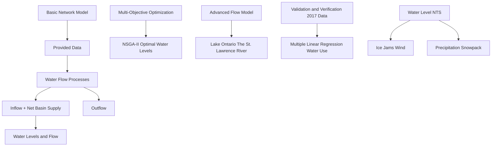
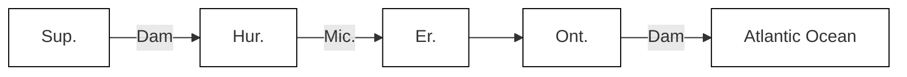
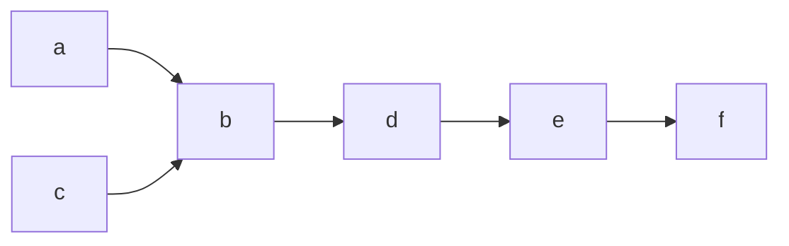
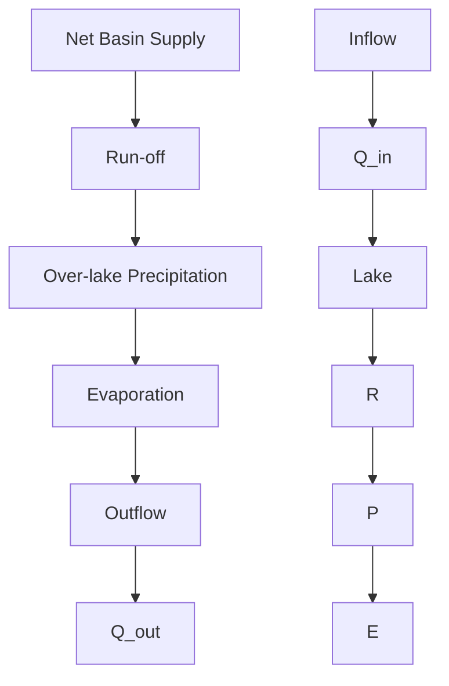
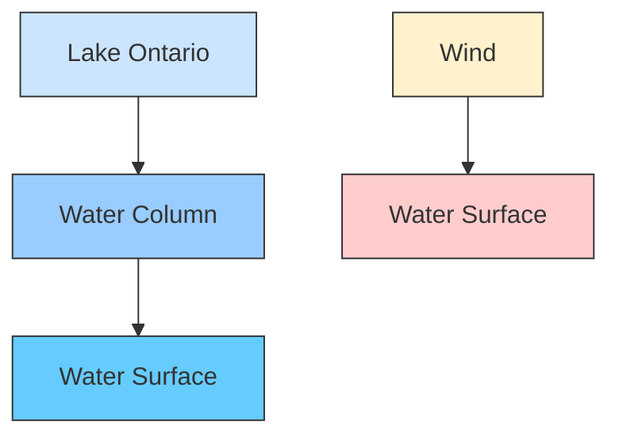
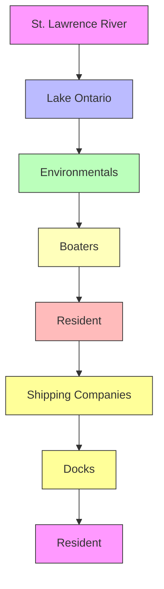

# Regulating the Water of Tomorrow:

# A Multi-Layer Optimization Model for the Great Lakes

## Summary

The Great Lake in the US and Canada faces water problems. The water level of the Great Lake needs to be regulated to satisfy the interests of stakeholders and balance the ecosystem. It’s challenging to control the flow of water due to its complex dynamics. Several organizations have been working on this problem for decades and released solutions such as Plan 2014. However, stakeholders are not satisfied with the current situation and the ever-changing climate has raised uncertainties.

In this project, a network model of the Great Lakes was built to optimize the water level at any time of the year. It employs a multi-layer modeling design, with both a basic network model for describing the major flow processes in the Great Lakes, and an advanced flow model to refine the complex factors affecting the flow. Compared with the previous plans, this scheme allows for increased flexibility in lake water levels, accommodating fluctuations between high and low water levels.

## The main steps are as follows:

First, a basic network model connecting the five lakes was established to analyze the main water processes. Combined with the analysis of the provided data, several equations were formed to describe the flow of water in the network, which is the foundation of the model. With this model and the dataset, the water level and the flow of water can be calculated.

Then, an advanced flow model was built based on the basic model to better depict the sophisticated processes affecting the water flow. It is more comprehensive and precise since it analyzes wind, snow, ice jams, and other meteorological factors. This model focuses more on Lake Ontario and the St. Lawrence River to solve the sub-problem. The sensitivity analysis indicated that the model is sensitive to precipitation and less sensitive to the melt of snow.

To find a plan that satisfies the stakeholders, multiple benefit and cost functions are first created to form the objective functions, thus creating a multi-objective optimization model. The optimal water level is then solved using the NSGA-II algorithm with operations such as selection, crossover, and mutation.

In addition, by utilizing data from 2017, the high stability and accuracy of the model are verified in terms of both water use extrapolation based on the multiple linear regression algorithm and computation of the new optimization algorithm.

The study succeeded in effectively simulating and optimizing the water level in the Great Lakes by building network models. It's promising, reliable and it's beneficial for all the stakeholders. More importantly, this new plan is also sustainable and will bring the Great Lakes Region towards a better future.

Keywords: network, flow model, water resource management, water supply, NSGA-II, multiple linear regression

## Contents

## 1 Introduction .... 3

1.1 Problem Background ....3  
1.2 Our Work....3

## 2 Assumptions and Justifications .... 4

## 3 Notations.... 4

## 4 Part I: A Basic Network Model for the Great Lakes 4

4.1 Analysis of the problem .... 4  
4.2 A basic network model....6  
4.3 Analyzing the flow of water....7

## 5 Part II: An Advanced Model for Further Analysis....9

5.1 Background: the need for artificial regulation of dam discharge....9  
5.2 Initial Establishment of Rule Curves ...... 10  
5.3 Outflow Limitation Impact Factors .... 12  
5.4 Impact of the Ottawa River on the Flow of St. Lawrence River 13

## 6 Part III: Modeling to Determine the Optimal Water Levels .... 14

6.1 Analysis....14  
6.2 The establishment of the multi-objective optimization model....15  
6.3 Optimal water-level determination model based on NSGA-II algorithm....17  
6.4 Tests of the model using 2017 data....18

## 7 Sensitivity Analysis 19

7.1 Precipitation....19  
7.2 Snowmelt 20

## 8 Model Evaluation.... 21

8.1 Strengths ...... 21  
8.2 Weaknesses .... 21  
8.3 Further discussion....21

## 9 Conclusion....21

## 10 Memo to IJC leadership.... 23

## References.... 24

## Appendix 24

## 1 Introduction

## 1.1 Problem Background

The Great Lake which consists of five lakes and their connecting waterways is an important drainage basin for the United States and Canada. Its water resource is used by various stakeholders for many purposes (including power plants, recreation, fishing and shipping, etc.). Subtle changes in the water level will greatly affect stakeholders' benefits. Thus, the management of water is their main concern.

The water level is determined by the amount of water that flows in and out of the lake. It's affected by many physical conditions and their complex interactions, such as precipitation, wind, snow, etc. It's also influenced by seasons and some unexpected events like extreme weather.

To control the water levels in the Great Lake system, two main dams were built. They can manipulate the flow of water to some extent to better satisfy the demands of all stakeholders. The International Joint Commission (IJC) has established many plans to control the dams in the past decades to balance water levels. However, it's hard to satisfy the interests of all stakeholders, especially in the era of climate change where the likelihood of extreme water levels increases.

## 1.2 Our Work

In addressing the complex challenges of regulating the water levels in the Great Lakes, our study employed a multi-layer modeling approach, combining a fundamental network model with advanced flow models to enhance precision. The graph below shows the key components of our work.


<details>
<summary>flowchart</summary>


</details>

Figure 1: Our framework

## 2 Assumptions and Justifications

Assumption 1: The inflow between each lake is equal to the outflow from the next lake.

Assumption 2: The Lake Ontario-St. Lawrence River advanced model is generalizable across the Great Lakes system.

Assumption 3: Lake Ontario water levels are approximately the same as those of the St. Lawrence.

Assumption 4: The outflow from the Moses-Saunders Dam follows a simple mechanical release principle.

Assumption 5: Water use is somewhat indicative of the neighborhood's population, economic conditions, and water levels.

Assumption 6: High water levels can lead to increased costs of channel maintenance and potential flood damage.

公众号：蚂蚁竞赛 更多资料请加QQ群1077734962，谢谢！

## 3 Notations

The key mathematical notations used in this paper are listed in Table 1.

Table 1: Notations used in this paper

<table><tr><td>Symbol</td><td>Description</td><td>Unit</td></tr><tr><td>H</td><td>Water level</td><td>(m)</td></tr><tr><td>Q</td><td>Water flow</td><td> $(m^3/s)$ </td></tr><tr><td>P</td><td>Precipitation</td><td>(m)</td></tr><tr><td>E</td><td>Evapotranspiration</td><td>(m)</td></tr><tr><td>NBS</td><td>Net basin supply</td><td> $(m^3/s)$ </td></tr><tr><td>NTS</td><td>Net total supply</td><td> $(m^3/s)$ </td></tr><tr><td>Z</td><td>The rate of flow adjustment to pre-project flows</td><td>—</td></tr><tr><td>M</td><td>The rate of flow adjustment</td><td>—</td></tr><tr><td>r</td><td>The number of baffles located above the water surface</td><td>(Each)</td></tr><tr><td>R</td><td>Runoff</td><td> $(m^3/s)$ </td></tr><tr><td> $A_0$ </td><td>The amount of outflow added to the dam</td><td> $(m^3/s)$ </td></tr><tr><td>C</td><td>The total distance traveled of wind</td><td>(km)</td></tr></table>

## 4 Part I: A Basic Network Model for the Great Lakes

## 4.1 Analysis of the problem

The Great Lakes consists of five connected lakes. Lake Michigan and Lake Huron have approximately the same water level and are often considered integral. Water in this drainage system starts from Lake Superior, goes through Lake Huron, Lake Erie, Lake Ontario, and ultimately flows into the Atlantic Ocean. (Figure 2)


<details>
<summary>text_image</summary>

CANADA
Lake Superior
Ontario
Quebec
Ottawa
Minneapolis
Wisconsin
Lake Michigan
Michigan
Lake Huron
Toronto
Lake Ontario
New York
Milwaukee
Detroit
Chicago
Lake Erie
Cleveland
Pennsylvania
Illinois
UNITED STATES
Ohio
Pittsburgh
</details>

Figure 2: A map of the Great Lake Basin

Several waterways which have connected these lakes control the inflow and outflow of water. The water flows from one lake to the next lake, which is a one-way flow. It is affected by many natural factors, such as precipitation, wind, ice jams, etc. Since these physical factors change with time, the waterflow has its annual, monthly and daily patterns.

The two main control mechanisms of the waterfall is the Soo Locks and the Moses-Saunders Dam. They can be controlled in order to gain better water levels to satisfy the stakeholders in this area.

To find a suitable way of adjusting the water levels, it's important to build a basic network model that describes the waterfall. The changing pattern of water level and water flow in different period of time is the foundation of this model. Based on this network, it's possible to figure out the relationship between water level and waterfall, which is essential for regulating the water level of the Great Lake.


<details>
<summary>line chart and a map</summary>

| Lake | Water Level (m) |
|------|-----------------|
| Soo Locks | 75.0 |
| Lake Superior | 74.5 |
| Lake Michigan | 74.8 |
| Lake Huron | 75.2 |
| Lake Erie | 74.9 |
| Lake Ontario | 75.5 |
| Moses-Saunders Dam | 75.8 |
</details>

Figure 3: The Great Lake system and the water level of Lake Ontario

公众号：蚂蚁竞赛 更多资料请加QQ群1077734962，谢谢！

The water level and the flow of water have changing patterns under different scales of time. They are affected by factors such as wind, precipitation and snow etc. Take Lake Ontario as an example. The graph above shows that the water level changes annually. (Figure 3)

## 4.2 A basic network model

The Great Lake system can be abstracted by a simple network system that connects lakes with rivers. The nodes in the graph below symbolize different lakes, while the edges are the rivers that connect these lakes. All the edges in this graph have only one direction, which is from a relatively high lake to a relatively low lake.


<details>
<summary>flowchart</summary>


</details>

Figure 4: The network model of the Great Lake

The directed graph below is the mathematical model of this network. The nodes $(a, b, c, d, e, f)$ stands for the lakes or ocean, while the edges $(ab, bc, bd, de, ef)$ stand for rivers.


<details>
<summary>flowchart</summary>


</details>

Figure 5: The directed graph of the model

The source of this model is node a, which represents Lake Superior. The sink of this model is node f, which represents the Atlantic Ocean.

The amount of water that flows in the edges can be described by the weight of each edge. $Q_{in}$ (m $^{3}$ /s) is the inflow of water from the previous lake and $Q_{out}$ is the outflow of water. Thus, the change between inflow and outflow is

$$
\Delta Q = Q _ {i n} - Q _ {o u t}. \tag {1}
$$

The supply of the lake also comes from precipitation, evaporation, and runoff from the basin. These three parts comprise the net basin supply (NBS).

$$
N B S _ {i} = P _ {i} - E _ {i} + R _ {i} \tag {2}
$$

In the equation above, $P_{i}$ (m $^{3}$ /s) stands for the amount of water inflow caused by precipitation, and $E_{i}$ (m $^{3}$ /s) stands for the amount of water outflow caused by evaporation. The runoff ( $R_{i}$ ) of a basin is the portion of precipitation on the land that ultimately reaches streams and lakes.


<details>
<summary>flowchart</summary>


</details>

Figure 6: A basic model of lake water

When the water comes into the water, it leads the water level to rise. The amount of rise is related to the surface area of the lake $(S_{lake})$ and the amount of water that goes into the lake. Thus, the rise or fall of the water level caused by any conditions can be calculated.

For example, the water rise caused ONLY by runoff is

$$
H _ {i} = \frac {\Delta R _ {i} \cdot T}{S _ {l a k e}} \tag {3}
$$

where $T(\mathrm{s})$ is a specific period of time.

Since the monthly precipitation $(p_{i})$ and evaporation $(e_{i})$ are usually recorded in units of meter, the water supply caused by precipitation $(P_{i})$ should be

$$
P _ {i} = \frac {p _ {i} \cdot S _ {\text {lake}}}{T}, \tag {4}
$$

$$
E _ {i} = \frac {e _ {i} \cdot S _ {\text { lake }}}{T}. \tag {5}
$$

As is mentioned above in Equation $^{[1]}$ , net basin supply (NBS) is the net amount of water entering one of the Great Lakes. The net basin supply does not include inflow from another local and runoff from its local basin.

The net total supply (NTS) is the net basin supply (NBS) plus the inflow from another lake. That is,

$$
N T S _ {i} = N B S _ {i} + Q _ {i n}. \tag {6}
$$

## 4.3 Analyzing the flow of water

As the water flows between the lakes, there are two different situations. In the first case, the water flows naturally. And in another case, the water is controlled by dams. Specifically, the water at Soo Locks and Moses-Saunders Dam is controlled manually. And water in other rivers such as St. Clair River flows naturally. Therefore, it's essential to discuss the difference between the two situations and build up their own model.

公众号：蚂蚁竞赛 更多资料请加QQ群1077734962，谢谢！


<details>
<summary>text_image</summary>

Lake A
River
Lake B
Q_{A\_out} → → Q_{B\_in}
</details>

(a) Natural flow


<details>
<summary>text_image</summary>

Lake A
Dam
Lake B
Q'A_out → River → Q'B_in
</details>

(b) Controlled by dam  
Figure 7: Two types of flow in the river

When there are not any dams on the river, the water flows naturally from one to another. We assume that the outflow of a lake is equivalent to the inflow of the next lake. That is

$$
Q _ {A _ {\text { out }}} = Q _ {B _ {i n}}. \tag {7}
$$

When there's a dam on the river, the flow of the lake is affected by both human control and its natural pattern. We still assume that the outflow of a lake is equivalent to the inflow of the next lake. However, the amount of water has changed since the control of the dam. It is the previous flow added by the change of flow.

$$
Q _ {A _ {o u t}} ^ {\prime} = Q _ {B _ {i n}} ^ {\prime} = Q _ {p r e} + \Delta Q _ {o u t}. \tag {8}
$$

$\Delta Q_{out}$ could be controlled by many factors since the flow of water is very sensitive to its environment. It can be affected by wind, temperature, policies, etc. The factors will be further investigated in the next chapter.

The water level of the lake is

$$
H _ {i} = H _ {p r e} + \frac {(N T S _ {i} + Q _ {o u t}) \cdot T}{S _ {l a k e}}, \tag {9}
$$

where $H_{pre}$ is the previous height and $NTS_{i}+Q_{out}$ is the amount of flow that caused the rise of the water level.


<details>
<summary>text_image</summary>

Water level
Qin → H Lake
H
Qout → River
Dam
</details>

Figure 8: An example of the water level calculation

With the equations above in this chapter, a basic model of the Great Lake is established. This model characterized the flow of water and its effect on water levels. It's the foundation of further analysis. In the next chapter, some other factors (such as wind, ice, snow, etc.) will be taken into account to further this model.

## 5 Part II: An Advanced Model for Further Analysis

## 5.1 Background: the need for artificial regulation of dam discharge

There are two primary control mechanisms within the flow of water in the Great Lakes system - Compensating Works at Sault Ste. and the Moses-Saunders Dam at Cornwall. Among them, the Moses-Saunders Dam manages the outflows from Lake Ontario into the St. Lawrence River. The proper regulation of the dam's discharge has a critical impact on regulating the level of Lake Ontario and the downstream flow and water levels in the St. Lawrence River.

## 5.1.1 Lake Ontario water level control advanced model

In the model we designed, natural factors such as ice jams, precipitation, and wind are taken into account, with the expectation that the upstream and downstream water levels will be adjusted to meet the optimal levels for each stakeholder by setting the dam outflow. (The optimal water level that integrates all stakeholders is described in detail later.)

## 5.1.2 Spotlight on Lake Ontario-St. Lawrence River

As there is more recent concern for the management of the water level for the Ontario in recent years. We take Lake Ontario-St. Lawrence River advanced model and analyze it in depth, assuming that the outflow from Lake Ontario approximates the outflow from the Moses-Saunders Dam. (Figure 9) As water supplies trend above normal or St. Lawrence River flows decrease, lake releases are increased. As supplies trend below normal or St. Lawrence River flows increase, lake releases are decreased.


<details>
<summary>text_image</summary>

International Lake Ontario - St. Lawrence Board
Legend
Cities
Structures
Canada-U.S. Border
Lakes
Rivers
Provincial/State Border
Lake Ontario-St. Lawrence Basin
Lake Erie Sub-basin
Lake Huron Sub-basin
Ontario
Lake St. Lawrence
Lake St. FRANCIS
ST. MAURICE RIVER BASIN
Ottawa River
Munkaell
St. Harwood River
Tropis-Rivière
Lake St. Pierre
St. Lawrence River
Ottawa River
Mosses-Saunders Dam
Cornwall
Iroquois
Massena Lake St. Lawrence
St. Lawrence River
Richelieu River
Shirbrooke River
Magog
Lake St. Louis
Battsburgh
Lake Champlain
RICHELIEU RIVER BASIN
LAKE ONTARIO - ST. LAWRENCE RIVER BASIN
NEW YORK
VERMONT
NEW HAMPSHIRE
Atlantic Ocean
Tobermory
Georgian Bay
Lake Huron
Harbor Beach
Sarnia Port Huron
Lake Erie
Erie
Hamilton Port Walteri
Niagara Falls
Tonawanda Buffalo
Cobourg
Oswego
Lake Ontario
Lake Ontario - St. Lawrence River Basin
</details>

Figure 9: The Moses-Saunders Dam sketch $^{[2]}$

## 5.2 Initial Establishment of Rule Curves

Lake releases are primarily a function of a sliding rule curve based on the pre-project stage-discharge relationship adjusted to recent supply conditions. The flow computed with this equation is then adjusted depending on the recent supply conditions. The newly developed Lake-River model can be applied to other sites in the Great Lakes system except Lake Erie.

$$
\Delta Q _ {o u t} = \sum_ {i = 1} ^ {i = 5} \Delta Q _ {o u t _ {i}}, Q _ {o u t} = Q _ {p r e} + \Delta Q _ {o u t} \tag {11}
$$

In the equation above, $\Delta Q_{out}$ is the value of the change in outflow, $Q_{pre}$ represents the pre-project outflow.

## 5.2.1 Model of a dam with baffles

This model will demonstrate how the Moses-Saunders Dam is used to help control water levels downstream (Figure 10). We assume that it contains 50 gates that can be raised or lowered to help control water levels downstream. This is accomplished by reducing the number of baffles above the water surface when less outflow is needed.


<details>
<summary>text_image</summary>

Lake St. Lawrence
St. Lawrence River
Flow (Downstrem)
Moses-Saunders Dam
(4 of 50 gates displayed)
</details>

Figure 10: Model of a dam with baffles

The variable Zdetermine the rate of flow adjustment to pre-project flows and also depend on the long-term trend in supply. The variable r represents the number of baffles located above the water surface, and the constant $A_{0}$ indicates the amount of outflow added to the dam for each baffle opened.

$$
Z = A _ {0} \times r \tag {12}
$$

## 5.2.2 Impact of NTS in Lake Ontario basin on outflow from dams

To simplify the model, we assume that the water level of Lake Ontario is the same as that of Lake St. Louis. Dam control outflows are largely determined by total basin supply, and to adapt to long-term climate change, the change in outflows should satisfy the following equation:

Table 2: Rule curve parameter values based on historical NTS of Lake Ontario $^{[3]}$

<table><tr><td>Plan</td><td>Climate</td><td> $A\_NTS_{max}$ </td><td> $A\_NTS_{avg}$ </td><td> $A\_NTS_{min}$ </td></tr><tr><td>Plan2014</td><td>Historical (1900-2000)</td><td>8552  $m^{3}/s$ </td><td>7011  $m^{3}/s$ </td><td>5717  $m^{3}/s$ </td></tr><tr><td>Our Plan</td><td>Historical (1900-2023)</td><td>9042  $m^{3}/s$ </td><td>7067  $m^{3}/s$ </td><td>5717  $m^{3}/s$ </td></tr></table>

For supplies above normal (the index is greater than or equal to $7067 \, m^{3}/s$ ), the lake release is determined by:

$$
\Delta Q _ {o u t _ {1}} = \left[ \frac {W _ {-} N T S _ {\text { now }} - A _ {-} N T S _ {\text { avg }}}{A _ {-} N T S _ {\max} - A _ {-} N T S _ {\text { avg }}} \right] ^ {M _ {1}} \times Z _ {1} \tag {13}
$$

For supplies below normal (the index is less than $7067 \, m^{3}/s$ ), the lake release is determined by:

$$
\Delta Q _ {o u t _ {1}} = - \left[ \frac {A _ {-} N T S _ {a v g} - W _ {-} N T S _ {n o w}}{A _ {-} N T S _ {a v g} - W _ {-} N T S _ {\min}} \right] ^ {M _ {2}} \times Z _ {2} \tag {14}
$$

In the above equations, $W_{NTS}$ is a supply index based on net total supply over the past 12 weeks. $A_{NTS}$ indicates the maximum, minimum, and average statistics of the total annual net supply series. The indices M serve to accelerate or decelerate the rate of flow adjustment.

## 5.2.3 Effect of Lake Ontario water levels on outflows from dams

When the water level of Lake Ontario is high, the likelihood of flooding increases, which causes a great deal of disruption to the lives of the people living along the shoreline, so in order to prevent catastrophes from occurring, the factor of the change in the water level of Lake Ontario over time should also be taken into account in the equation for the change in outflow.

Table 3: Rule curve parameter values based on historical water levels of Lake Ontario $^{[4]}$

<table><tr><td>Climate</td><td> $H_{max}$ </td><td> $H_{avg}$ </td><td> $H_{min}$ </td></tr><tr><td>Historical (1900-2023)</td><td>75.37 m</td><td>74.77 m</td><td>74.00 m</td></tr></table>

For water levels above normal (the index is greater than or equal to 74.77 m), the lake release is determined by:

$$
\Delta Q _ {o u t _ {2}} = \left[ \frac {H _ {n o w} - H _ {a v g}}{H _ {\max} - H _ {a v g}} \right] ^ {M _ {3}} \times Z _ {3} \tag {15}
$$

For water levels below normal (the index is lower than 74.77 m), the lake release is determined by:

公众号：蚂蚁竞赛 更多资料请加QQ群1077734962，谢谢！

$$
\Delta Q _ {o u t _ {2}} = - \left[ \frac {H _ {\text { avg }} - H _ {\text { now }}}{H _ {\text { avg }} - H _ {\min}} \right] ^ {M _ {4}} \times Z _ {4} \tag {16}
$$

In the above equations, H indicates the maximum, minimum, and average statistics of the annual of Lake Ontario water levels.

## 5.3 Outflow Limitation Impact Factors

In addition to the effects of total basin supply and water levels, other weather variations and meteorological conditions can limit outflow from dams, with the main considerations in our outflow model being rainfall over the coming period of time, a dramatic increase in the flow of the Ottawa River due to winter snowpack melt in the spring and ice jams on the river in the winter, as well as natural factors such as winds on the lake.

## 5.3.1 Short-term precipitation forecasts

In the previous model we mainly considered the effect of long-term climate change on the outflow from the control dam, however, short-term weather changes such as rainfall cannot be ignored in the complete model, and by predicting future short-term rainfall, we can refine the model more finely to mitigate the effects of sudden storms on water surface heights through the following equation:

$$
\Delta Q _ {o u t _ {3}} = \left(\frac {\sum_ {t = 1} ^ {t = 4} P _ {t}}{4}\right) ^ {M _ {5}} \times Z _ {5} \tag {17}
$$

Variability of releases from one week to the next is smoothed by taking the average of short-term forecasts $^{4}$ of releases four weeks (or quarter-months) into the future.

## 5.3.2 Modeling of synthetic winds on lakes

The wind direction of the prevailing winds on an open lake has an important effect on the distribution of water levels, as shown in the figure 11, where the wind blows water from one shore of the lake surface to the other, resulting in higher water levels on the opposite shore.


<details>
<summary>flowchart</summary>


</details>

Figure 11: Simplified Lake Ontario synthetic wind model

We consider Lake Ontario as a rectangle, with the lake surface as a rectangle with long side $L_{1}$ (East-West Direction) and short side $L_{2}$ (North-South Direction). Due to the Narrow Tube Effect, the wind along the lake surface is significantly greater in the east-west direction than in the north-south direction, so a synthetic wind model is used to synthesize the winds from different stations on the lake surface into two directions (E and N), We believe that the amount of water transmitted by the wind factor can be replaced by the wind range, and a greater wind range in the due east or due west direction indicates a higher water level on the eastern shore of the lake, which needs to be regulated by increasing the outflow from the control dam.

The wind range is calculated using the following formula:

$$
N = V _ {N} \cdot F _ {N}, N N E = V _ {N N E} \cdot F _ {N N E}, N E = V _ {N E} \cdot F _ {N E} \tag {18}
$$

Calculate the synthesized wind direction by breaking down the travel in each direction into travel in the due north and due east directions:

$$
\begin{array}{l} C _ {N} = N - S + (N N E + N N W - S S E - S S W) \cos 2 2. 5 ^ {\circ} \\ + (N W + N E - S W - S E) \cos 4 5 ^ {\circ} \tag {19} \\ + (E N E + W N W - E S E - W S W) \cos 6 7. 5 ^ {\circ} \\ \end{array}
$$

$$
\begin{array}{l} C _ {E} = E - W + (E N E + E S E - W N W - W S W) \cos 2 2. 5 ^ {\circ} \\ + (N E + S E - N W - S W) \cos 4 5 ^ {\circ} \tag {20} \\ + (N N E + S S W - W N W - S S W) \cos 6 7. 5 ^ {\circ} \\ \end{array}
$$

$$
\Delta Q _ {o u t _ {4}} = \left[ \frac {L _ {1}}{L _ {1} + L _ {2}} C _ {E} + \frac {L _ {2}}{L _ {1} + L _ {2}} C _ {N} \right] ^ {M _ {6}} \times Z _ {6} \tag {21}
$$

And then calculate synthetic direction and wind speed:

$$
\tan \theta = \frac {\left| C _ {N} \right|}{\left| C _ {E} \right|}, \alpha = \tan^ {- 1} \frac {\left| C _ {N} \right|}{\left| C _ {E} \right|}, C = \sqrt {C _ {N} ^ {2} + C _ {E} ^ {2}}, v = \frac {C}{f} \tag {22}
$$

In the above formulas, v is the synthetic wind speed, f is the number of observation, and C is the total distance traveled of wind.

## 5.4 Impact of the Ottawa River on the Flow of St. Lawrence River

The flow of the Ottawa River, an important tributary to the St. Lawrence River, has a profound effect on regulating outflow from the control dams (in order to maintain a relatively stable water level in the lower St. Lawrence River), Due to the high latitude of the St. Lawrence River and the long ice age in winter, ice jams result in a decrease in the flow of the St. Lawrence River, and then a dramatic increase in the flow of the St. Lawrence River as a result of ice melt water from the return of warmer temperatures the following spring.

## 5.4.1 Spring flooding from winter snowpack melt

Spring ice melt leads to increased flows in the Ottawa River, which feeds into the St. Lawrence River, so controlled dam discharges are needed to balance water levels and flows in the lower St. Lawrence River. The change in outflows should satisfy the following equation:

Table 4: Rule curve parameter values based on historical flows of the St. Lawrence River $^{[5]}$

<table><tr><td>Climate</td><td> $A\_Q_{\text{max}}$ </td><td> $A\_Q_{\text{avg}}$ </td><td> $A\_Q_{\text{min}}$ </td></tr><tr><td>Historical (1900-2023)</td><td>3553  $\text{m}^{3}/\text{s}$ </td><td>2968  $\text{m}^{3}/\text{s}$ </td><td>2176  $\text{m}^{3}/\text{s}$ </td></tr></table>

For supplies above normal (the index is greater than or equal to $2968 \, m^{3}/s$ ), the lake release is determined by:

$$
\Delta Q _ {o u t _ {5}} = - \left[ \frac {W _ {-} Q _ {\text { now }} - A _ {-} Q _ {\text { avg }}}{A _ {-} Q _ {\max} - A _ {-} Q _ {\text { avg }}} \right] ^ {M _ {7}} \times Z _ {7} \tag {23}
$$

For water levels below normal (the index is lower than $2968 \, m^{3}/s$ ), the lake release is determined by:

$$
\Delta Q _ {o u t _ {5}} = \left[ \frac {A _ {-} Q _ {\text {avg}} - W _ {-} Q _ {\text {now}}}{A _ {-} Q _ {\text {avg}} - A _ {-} Q _ {\min}} \right] ^ {M _ {7}} \times Z _ {7} \tag {24}
$$

In the above equations, $W_{-}Q_{now}$ is a supply index based on net total supply over the past 12 weeks. A\_NTS indicates the maximum, minimum, and average statistics of the total annual net supply series.

## 5.4.2 Impact of ice jams on dam outflows

Ice jams result in a reduction in the amount of water in the Ottawa River that feeds into the St. Lawrence River, and it can be assumed that the amount of ice on the river surface can be indirectly expressed as a reduction in the flow of the river, resulting in the need to compensate for the reduction in the level of the downstream St. Lawrence River water by increasing discharge from the upstream dams. The calculation formula is similar to the modeling of spring flood flow increases and will not be repeated here due to space limitations.

## 6 Part III: Modeling to Determine the Optimal Water Levels

## 6.1 Analysis

Establishing the optimum water level for the Great Lakes at any given time of the year requires consideration of a number of factors. Since there has been more recent interest in the management of Lake Ontario, in this paper we will focus on the desires of the six categories of Lake Ontario stakeholders as a means of obtaining the optimal water level for Lake Ontario. This method will also be used to calculate the optimal water level for the other four lakes in the same way, so as to find the optimal water level for the whole basin.

No single critical low or high water level has ‘adverse impacts’ on the system. The level of harm experienced by a user of the system greatly depends on the location and the usage and sometimes the time of the year, since stormy weather and high winds may cause crashing waves, damaging shorelines at any high water level.

In this paper six categories of stakeholders will be considered: shipping companies, people who manage shipping docks or live near the Montreal harbor, environmentalists, property owners on the shores of Lake Ontario, recreational boaters and fishing boats on Lake Ontario, and hydro-power generation companies. Their relationship with the water level is shown in the figure.


<details>
<summary>text_image</summary>

High
Hydro-power generation companies
Resident Boaters
Low
High
Shipping Companies
Shipping Docks
Resident
Lake Ontario
St.Lawrence River
</details>

Figure 12: (a)Effect of high and low water levels


<details>
<summary>flowchart</summary>


</details>

(b)Effect of water flow stability

Their benefit and cost functions are first established to find the corresponding objective functions. Since the multi-objective optimization model is able to consider multiple objectives at the same time, it is more suitable for this question scenario. Genetic algorithms are highly robust and suitable for dealing with complex optimization problems and are able to optimize even when the optimization objectives are unclear or uncertain. Therefore, we establish a multi-objective optimization model and use the genetic algorithm NSGA-II to solve the model.

## 6.2 The establishment of the multi-objective optimization model

First, setting the decision variable as follows:

H: The current water level

Q: The current water flow

Then building the objective function, we're here to predict optimal water levels using Lake Ontario's January data:

$$
U _ {1} (H, Q) = \left\{ \begin{array}{c c} N (k _ {1} (H - H _ {a}) - t _ {1} Q ^ {2}), H \geq H _ {a} \\ 0, & \text { otherwise } \end{array} \right. \tag {25}
$$

$$
= \left\{ \begin{array}{c} 5 1 3 8 8 (0. 5 3 (H - 7 4. 7) - 0. 7 Q ^ {2}), H \geq 7 4. 7 \\ 0, \quad \text { otherwise } \end{array} \right. \tag {26}
$$

This is the yield function of the shipping companies, which require high and still water in the St. Lawrence River.

$H_{a}$ : Minimum water level required for shipping

$k_{1}$ : Benefits from rising water levels per unit $N(TEU)$ : Lake Ontario Container Throughput for January [6]

$t_{1}$ : Additional cost increase per unit increase in flow rate

$$
\begin{array}{l} C _ {1} (H, Q) = \left\{ \begin{array}{c} N (k _ {2} (H - H _ {b}) ^ {2}), H \geq H _ {b} \\ 0, o t h e r w i s e \end{array} \right. \\ = \left\{ \begin{array}{c} 5 1 3 8 8 (0. 0 5 (H - 7 4. 9) ^ {2}), H \geq 7 4. 9 \\ 0, o t h e r w i s e \end{array} \right. \tag {27} \\ \end{array}
$$

This is the cost function of the shipping companies. $H_{b}$ is the ideal water level for shipping, and $k_{2}$ is the contractor's coefficient resulting from excessive water levels.

From this we can model the satisfaction of this stakeholder:

$$
\max f _ {1} (H, Q) = U _ {1} (H, Q) - C _ {1} (H, Q) \tag {28}
$$

simmilarly, we can model other stakeholders.

$$
\begin{array}{l} \max f _ {2} (H, Q) = U _ {2} (H, Q) = e ^ {- \mathrm{k} _ {3} | \mathrm{H} - \mathrm{H} _ {\mathrm{sta}} |} - t _ {2} Q ^ {2} \\ = e ^ {- 1 0. 2 6 | \mathrm{H} - 7 3. 5 6 |} - 3. 4 5 Q ^ {2} \tag {29} \\ \end{array}
$$

This is the yield function of people who manage shipping docks or live near the Montreal harbor. $H_{sta}$ is the steady water level one would expect, $k_{3}$ is a measure of the sensitivity of the water level to deviation from the steady water level, and $t_{2}$ is the contribution of the flow rate to the wind speed.

$$
\max f _ {3} (H, Q) = U _ {3} (H, Q) = e ^ {- \mathrm{k} _ {4} | \mathrm{H} - \mathrm{H} _ {\text {avg}} |} = e ^ {- 0. 7 6 | H - 7 4. 8 3 |} \tag {30}
$$

This is the yield function of environmentalists. $H_{avg}$ is the average annual water level, and $k_{4}$ is a measure of population size predicted from water use. $^{[7]}$

$$
\begin{array}{l} m a x f _ {4} (H, Q) = U _ {4} (H, Q) = e ^ {- \mathrm{k} _ {5} | \mathrm{H} - \mathrm{H} _ {\mathrm{rec}} | - \mathrm{k} _ {6} | \mathrm{Q} - \mathrm{Q} _ {\mathrm{rec}} | ^ {2}} \\ = e ^ {- 1 4. 7 9 | \mathrm{H} - 7 4. 5 6 | - 3. 6 8 | \mathrm{Q} - 7 2 5 6 | ^ {2}} \tag {31} \\ \end{array}
$$

This is the yield function of property owners on the shores of Lake Ontario. $H_{rec}$ and $V_{rec}$ are the owner's desired water level and flow rate. $k_{5}$ and $k_{6}$ are composite coefficients combining the number of owners with the revenue brought in by the owners, predicting water use. $^{[7]}$

$$
\begin{array}{l} m a x f _ {5} (H, Q) = U _ {5} (H, Q) = e ^ {- \mathrm{k} _ {7} | \mathrm{H} - \mathrm{H} _ {\mathrm{rec}} | - \mathrm{k} _ {8} | \mathrm{Q} - \mathrm{Q} _ {\mathrm{rec}} | ^ {2}} \\ = e ^ {- 5. 8 9 | \mathrm{H} - 7 4. 5 6 | - 2. 7 4 | \mathrm{Q} - 7 2 5 6 | ^ {2}} \tag {32} \\ \end{array}
$$

This is the yield function of recreational boaters and fishing boats on Lake Ontario. $k_{7}$ and $k_{8}$ are composite coefficients combining the number of them with the revenue brought in by them, predicting water use. $^{[7]}$

$$
\max f _ {6} (H, Q) = U _ {6} (H, Q) = k _ {9} H = 4 6. 3 5 H \tag {33}
$$

This is the yield function of hydro-power generation companies. $k_{9}$ is a measure of the capacity of the generation system, predicting water use. $^{[7]}$

On this basis, we also need to establish the constraints that the water levels and flow rates we seek will not exceed or fall below the previous year's maximums. From this, we build the multi-objective optimization model:

$$
\begin{array}{l} \operatorname{minf} (H, Q) \\ = \{- f _ {1} (H, Q), - f _ {2} (H, Q), - f _ {3} (H, Q), - f _ {4} (H, Q), - f _ {5} (H, Q), - f _ {6} (H, Q) \} \\ = \left\{ \begin{array}{c} 7 4. 2 8 \leq H \leq 7 4. 7 9 \\ 5 9 4 6. 5 \leq Q \leq 1 0 4 2 0. 6 \\ H, Q \in D \subset R ^ {n} \end{array} \right. \tag {34} \\ \end{array}
$$

## 6.3 Optimal water-level determination model based on NSGA-II algorithm

NSGA-II (Non-dominated Sorting Genetic Algorithm II) is a genetic algorithm for solving multi-objective optimization problems. It finds the Pareto optimal solution by iterating.

## 1. Coding and initializing populations

First, the solution to the problem is encoded by using the binary operation. Each individual in the population represents a set of possible solutions, i.e., a set of values for water level (H) and water flow (Q). For each individual, the values of water level (H) and water flow (Q) can be generated randomly within a given constraint. Combined with the complexity of this problem, we chose an initial population size of 100 individuals.

## 2. Calculating Adaptation

NSGA-II is a minimization problem solver, so we take the negative of these objective functions as the fitness function.

## 3. Undominated sorting and congestion calculation

The NSGA-II algorithm will rank and select individuals in the population based on non-dominated ordering and crowding. Undominated ordering divides the population into multiple ranked frontiers, each containing individuals who are not dominated by each other.

The crowding degree comparison is used to differentiate between individuals within the same frontier, giving preference to individuals with lower crowding degrees (i.e., fewer neighbors around them) in order to maintain the diversity of the solution.

## 4. Selection, crossover, and mutation

The selection operation is based on the tournament selection method, where parent individuals are selected for crossover and mutation to produce a new generation of individuals.

## 5. Generation of new populations

Combining parents and offspring, new populations are selected by non-dominated sorting and crowding calculations.

## 6. Iterating until the termination condition is met

The above steps are repeated until a predetermined number of iterations is reached or the quality of the solution is no longer significantly improved.

Based on the above calculation process, R studio is used to solve equation (34) and used such an algorithm as well as network flow graphs to solve for the optimal water levels of the Great Lakes from January to December. The results are shown below.

Table 5: Optimal Water Level of the Great Lakes

<table><tr><td>Month</td><td>Lake_Superior</td><td>Michigan_Huron</td><td>Lake_St.Clair</td><td>Lake_Erie</td><td>Lake_Ontario</td></tr><tr><td>Jan</td><td>183.17</td><td>176.10</td><td>174.85</td><td>174.05</td><td>74.67</td></tr><tr><td>Feb</td><td>183.11</td><td>176.08</td><td>174.81</td><td>174.04</td><td>74.73</td></tr><tr><td>Mar</td><td>183.07</td><td>176.10</td><td>174.91</td><td>174.13</td><td>74.77</td></tr><tr><td>Apr</td><td>183.11</td><td>176.18</td><td>175.02</td><td>174.25</td><td>74.95</td></tr><tr><td>May</td><td>183.21</td><td>176.28</td><td>175.11</td><td>174.33</td><td>75.12</td></tr><tr><td>Jun</td><td>183.30</td><td>176.36</td><td>175.17</td><td>174.38</td><td>75.16</td></tr><tr><td>Jul</td><td>183.36</td><td>176.39</td><td>175.20</td><td>174.36</td><td>75.11</td></tr><tr><td>Aug</td><td>183.37</td><td>176.37</td><td>175.15</td><td>174.29</td><td>74.97</td></tr><tr><td>Sep</td><td>183.36</td><td>176.31</td><td>175.08</td><td>174.19</td><td>74.78</td></tr><tr><td>Oct</td><td>183.35</td><td>176.24</td><td>174.97</td><td>174.09</td><td>74.64</td></tr><tr><td>Nov</td><td>183.31</td><td>176.19</td><td>174.89</td><td>174.03</td><td>74.57</td></tr><tr><td>Dec</td><td>183.25</td><td>176.15</td><td>174.88</td><td>174.03</td><td>74.57</td></tr></table>

  
Figure 13: Comparison of optimum water level and average water level in recent years

## 6.4 Tests of the model using 2017 data

In order to give a range of optimal water levels for subsequent testing, we divided the 12 months into seasons (March, April, and May for spring, and so on). The water level is said to be optimal if it is within the range of the corresponding quarter.

On one hand, we first substitute 2017 data into the above formula 34, By calculations we find that the actual recorded water levels for the year are satisfactory, and are all within the range of the optimum level we are seeking.


<details>
<summary>line chart</summary>

| Month | Water Level |
|-------|-------------|
| Jan   | 74.6        |
| Feb   | 74.6        |
| Mar   | 74.95       |
| Apr   | 74.8        |
| May   | 75.05       |
| Jun   | 75.0        |
| Jul   | 75.1        |
| Aug   | 74.95       |
| Sep   | 74.65       |
| Oct   | 74.6        |
| Nov   | 74.55       |
| Dec   | 74.6        |
</details>

Figure 14: The 2017 data under the new algorithm

On the other hand, by using the previous relationship between average annual water levels in the Great Lakes and water use, we can model multiple linear regressions.

$$
Y = 1 7 4 6 0 0 0 0 - 4 8 3 0 0 x _ {1} + 8 3 8 6 0 x _ {2} - 1 4 8 6 0 0 x _ {3} + 3 5 3 7 0 x _ {4} \tag {35}
$$

Y is the amount of water used in the watershed, $x_{1}$ is the average annual water level in Lake Superior, $x_{2}$ is the average annual water level in Lake Michigan and Lake Huron, $x_{3}$ is the average annual water level in Lake Erie, $x_{4}$ is the average annual water level in Lake Ontario.

By substituting the data of 2017, we finally deduced that his water consumption is 130,860 million L, thus we can see that the water level is still within the optimal water level range, so we verified the accuracy of our model from another angle.

In short, from both perspectives, we can argue that for the various stakeholders, my new control method will indeed result in better actual recorded water levels for that year.

## 7 Sensitivity Analysis

## 7.1 Precipitation

The optimal water level is used in Lake Ontario in January as an example to verify the accuracy of the model.


<details>
<summary>line chart</summary>

| Precipitation (ml) | Water level (m) | Satisfaction (%) |
| ------------------ | --------------- | ---------------- |
| 800                | 75.0            | 0.99             |
| 825                | 73.8            | 0.98             |
| 850                | 74.6            | 0.97             |
| 875                | 74.2            | 0.96             |
| 900                | 76.0            | 0.95             |
| 925                | 77.0            | 0.94             |
| 950                | 74.6            | 0.93             |
| 975                | 76.4            | 0.92             |
| 1000               | 74.2            | 0.92             |
</details>

Figure 15: The relationships between water Level and precipitation

As shown in the figure, the satisfaction gradually decreases with the increase of precipitation and at a faster rate, while the optimal water level keeps fluctuating, indicating that the optimal water level is more sensitive to the precipitation.

## 7.2 Snowmelt

As shown in the figure, the satisfaction level gradually decreased with the increase of snowmelt, but the rate of decrease was not fast, and the satisfaction level was always above 0.97. Meanwhile the optimal water level keeps fluctuating. Therefore, it can be considered that the optimal water level is relatively insensitive to snowmelt and has strong robustness.


<details>
<summary>line chart</summary>

| Snowmelt (ml) | Water level (m) | Satisfaction (%) |
| ------------- | --------------- | ---------------- |
| 300           | 75.2            | 0.9925           |
| 400           | 74.6            | 0.9875           |
| 500           | 76.9            | 0.9825           |
| 600           | 77.5            | 0.9800           |
| 700           | 76.1            | 0.9775           |
| 800           | 77.8            | 0.9750           |
</details>

Figure 16: The relationships between water level and snowmelt

## 8 Model Evaluation

## 8.1 Strengths

1. The effects of water level, precipitation, ice jams, wind, and many other factors are considered in the advanced model.  
2. Innovatively analyzing a synthetic model of wind on the lake and a baffle model of the dam.  
3. Using NSGA-II genetic algorithm when solving multi-objective optimization, which combines neural network and symbolic reasoning with good robustness  
4. The superiority of the model for solving the optimal water level has been verified in multiple ways, both in terms of water consumption and the new algorithm.

## 8.2 Weaknesses

1. The role of hydroelectric power stations and reservoirs on the Ottawa River in regulating flow and the effect of groundwater level on lake level were not considered.  
2. The training process of LSTM is relatively slow due to the complex gating mechanism and multiple weighting parameters.  
3. Inadequate consideration of costs to hydroelectric utilities.  
4. The algorithm fails to adequately consider whether sensitivity to ice plugs

## 8.3 Further discussion

Optimal water levels are in everyone's interest, and it is important to establish and maintain optimal water levels that are appropriate to the location. The model used in this paper to establish and maintain optimal water levels for the Great Lakes can be generalized, with the appropriate parameter modifications, to a variety of areas other than those mentioned in this paper.

For example, it can be used to help planners to better design urban water systems, hydraulic facilities and flood control projects to improve the flood resilience and water utilization efficiency of cities. In addition, scientific water level management can protect wetland ecosystems, maintain habitats for aquatic plants and animals, and promote biodiversity conservation.

## 9 Conclusion

This study aims to address the challenge of control mechanisms for water levels in the Great Lakes region of North America, working to find an optimal solution between meeting stakeholder needs and protecting the ecological balance. By building a multi-layer model design including a base network model and an advanced flow model and its sub-models, this study successfully simulates and optimizes the water levels of the Great Lakes, and proposes practical management and control strategies, especially for the sub-problems of Lake Ontario and the St. Lawrence River.

First, by constructing a base network model connecting the Great Lakes, we analyze the major streamflow processes and develop equations describing the streamflow and water availability in the network with the provided data, which is the basis of the model. Subsequently, based on the base model, we develop a more complex advanced flow model to more accurately depict the complex factors that affect water flow, such as wind, snow, ice jams, and other meteorological factors. Sensitivity analysis of the advanced model shows that the model was extremely sensitive to rainfall and less sensitive to snowmelt.

In order to identify a solution that would satisfy all stakeholders, we first create multiple benefit and cost functions, form an objective function, and construct a multi-objective optimization model. The model is then solved using the NSGA-II algorithm by initializing the population and operations such as selection, crossover, and mutation. Combined with the previous advanced flow model, the optimal water level is finally determined.

In addition, by utilizing 2017 data, this study verifies the high stability and accuracy of the model in terms of water use projection and computation of the new optimization algorithm. This not only reflects the effectiveness of the model in dealing with practical problems but also demonstrates its adaptability to possible future changes.

In conclusion, this study effectively simulates and optimizes water levels in the Great Lakes by constructing a complex and detailed model framework. It is our sincere hope that the management and control strategies proposed in this study will be adopted by the International Joint Commission (IJC) for the benefit of a sustainable future for the Great Lakes region. Looking forward, we believe that further research should focus on expanding the dataset, improving model accuracy, and enhancing interactions with stakeholders to ensure that our strategies maintain their effectiveness and relevance in a changing environment. In this way, we can not only protect this valuable natural resource, but also ensure that it continues to provide essential ecological, economic, and social benefits to people in the region and beyond.

## 10 Memo to IJC leadership

Date: February 6, 2024

To: Leadership, IJC

From: ICM Team #2417004

Subject: A Multi-Layer Optimization Model for the Great Lakes


<details>
<summary>natural_image</summary>

Silhouette of the Great Lakes region in blue, no text or symbols present
</details>

## Dear IJC leadership:

In response to your inquiry regarding the historical data utilized in our model and considering the key features of Plan 2014, I would like to highlight the incorporation of the strengths of Plan 2014 into our proposal, along with targeted enhancements to address its identified shortcomings.

## • Inheritance of Plan 2014's Strengths:

1 Ecological and Environmental Focus: Our model maintains a strong emphasis on restoring lake and coastal ecosystems, contributing to overall ecological balance.  
2 Optimized Water Level Management: Our model allows for increased flexibility in lake water levels, accommodating fluctuations between high and low water levels.

## - Addressing Plan 2014's Shortcomings:

1 Controversy and Dissatisfaction: Some stakeholders expressed reservations about the new water level ranges and ecological goals.  
2 High Water Events: Concerns were raised regarding potential impacts on shoreline properties and infrastructure during periods of high water levels.  
3 Complexity due to Multiple Variables: The intricate interplay of meteorological, hydrological, and ecological factors complicated predictions and management strategies.

## - Our Solutions and Advantages:

1 Multi-Objective Optimization Model: We advocate for the implementation of a multi-objective optimization model utilizing genetic algorithms. This model aims to determine water levels, achieving Pareto solutions that maximize the interests of various stakeholders.  
2 Control Algorithm-based Flood Mitigation: Employing a sophisticated control algorithm within a dynamic flow model, we intend to minimize the occurrence of high water events by regulating dam discharges effectively.  
3 Comprehensive Impact Consideration: Our model takes into account the influence of multiple factors, including precipitation, water levels, net total supply, wind, ice jams, snow accumulation, and more, addressing the complexity associated with Plan 2014.

Sincerely,

Team #2417004

## References

[1] GLAM Committee, Great Lakes – St. Lawrence River Adaptive Management (GLAM) Committee Report for 2017, 2018  
[2] Current Perspectives on Lake Ontario-St. Lawrence River: Water Levels. (2023). Retrieved from International Lake Ontario - St. Lawrence River Board, https://ijc.org/en/loslrb/library/modules, February 3, 2024  
[3] Historic Water Levels and Hydrologic Data such as flows, forecasts, wind, ice, and temperatures: Great Lakes Water Data and Related Information. (2023). Retrieved from Environment and Climate Change Canada, https://www.canada.ca/en/environment-climate-change/services/water\_over-view/quantity/great-lakes-levels-related-data.html, February 4, 2024  
[4] Reports on Great Lakes including water levels, forecasts, basin conditions and outflows: Great Lakes Information. (2023). Retrieved from US Corps of Engineers Detroit District, https://www.lre.usace.army.mil/Missions/Great-Lakes-Information/, February 3, 2024  
[5] Historic Perspectives specific to Ottawa River: Ottawa River at Carillon Station. (2023). Retrieved from Ottawa River Regulational Planning Board, https://ottawariver.ca/information/historical-waterlevel-streamflow-summary/ottawa-river-at-carillon/, February 6, 2024  
[6] China Science Communication Science Encyclopedia, minimum navigable stage of channel, 2015  
[7] Historic Water Use Data such as withdrawals, diversions and consumption: Great Lakes Regional Water Use Database. (2023). Retrieved from Great Lakes Commission, https://www.gic.org-Water Use Sector Definitions, February 5, 2024

## Appendix

Note: To avoid copyright infringement, all the contents in the essay are written on our own.

```python
spl_best_water_level = make_interp_spline(snowmelt, best_water_level, k=3)
spl_satisfaction = make_interp_spline(snowmelt, satisfaction, k=3)

snowmelt_smooth = np.linspace(snowmelt.min(), snowmelt.max(), 300)
best_water_level_smooth = spl_best_water_level(snowmelt_smooth)
satisfaction_smooth = spl_satisfaction(snowmelt_smooth)

fig, ax1 = plt.subplots()

color = 'tab:blue'
ax1.set_xlabel('Snowmelt (ml)')
ax1.set_ylabel('Water level (m)', color=color)
line1, = ax1.plot(snowmelt_smooth, best_water_level_smooth, color=color, label='Water Level')
ax1.tick_params(axis='y', labelcolor=color)

ax2 = ax1.twinx()
color = 'tab:red'
ax2.set_ylabel('Satisfaction (%)', color=color)
line2, = ax2.plot(snowmelt_smooth, satisfaction_smooth, color=color, label='Satisfaction')
ax2.tick_params(axis='y', labelcolor=color)

fig.tight_layout()
```

from typing import List, Tuple  
```python
# Definition of the objective function
def objective_functions(x, y):
    f1 = x + 1
    f2 = (x - 2) ** 2
    f3 = x + y
    return np.array([f1, f2, f3])
```

# Initializing populations  
```python
def create_population(pop_size: int, n_var: int) -> np.ndarray:
    return np.random.rand(pop_size, n_var) * 10 - 5
```

# non-dominated order  
```python
def non_dominated_sorting(population: np.ndarray) -> Tuple[np.ndarray, List[List[int]]]:
    pop_size = len(population)
    fronts = [[]]
    domination_counts = np.zeros(pop_size)
    dominated_solutions = [[] for _ in range(pop_size)]
    ranks = np.zeros(pop_size)

    for i in range(pop_size):
    for j in range(pop_size):
    if np.all(objective_functions(*population[i]) < objective_functions(*population[j])):
    dominated_solutions[i].append(j)
    elif np.all(objective_functions(*population[j]) < objective_functions(*population[i hue)):
    domination_counts[i] += 1
    if domination_counts[i] == 0:
    ranks[i] = 0
    fronts[0].append(i)
```

```python
i = 0
while fronts[i]:
    next_front = []
    for p in fronts[i]:
    for q in dominated_solutions[p]:
    domination_counts[q] -= 1
    if domination_counts[q] == 0:
    ranks[q] = i + 1
    next_front.append(q)
    i += 1
    fronts.append(next_front)

return ranks, fronts[:-1]
```