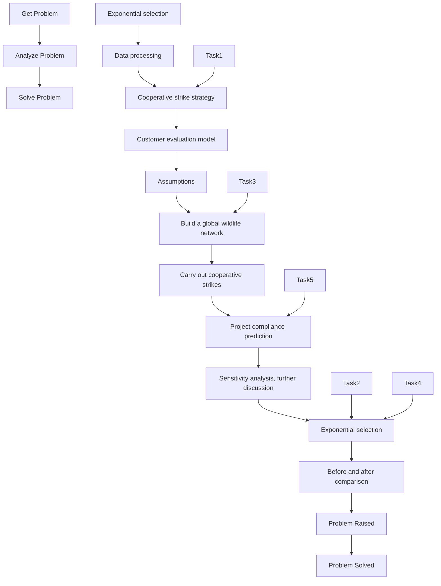
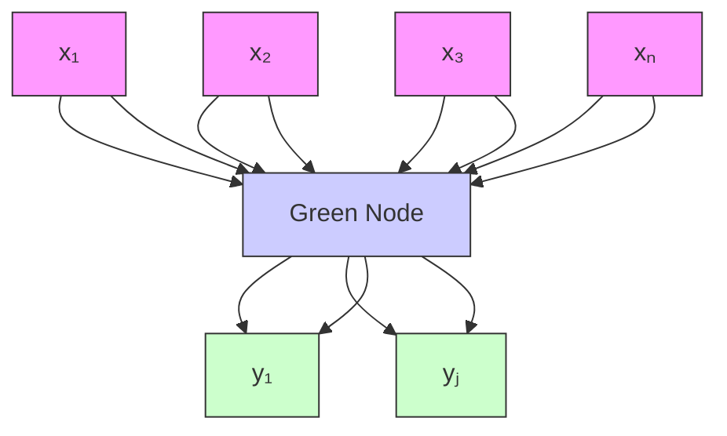
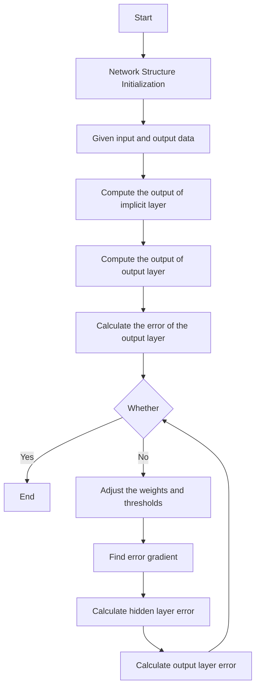

# Network Collaboration:

# Data-driven reduction of illegal wildlife trade Summary

The illegal wildlife trade (IWT) causes great harm not only to animals, but also to the environment and human health. In this paper, our 5-year program relies heavily on networked collaborations built from data-driven efforts to achieve IWT reductions.

For task1, we build a population competition model. By combining the five elements of PUR, SR, PER, IN, CI, we calculate the scores of GA, INO and PAP, which are 0.42, 0.51 and 0.37 respectively. The higher the score, the more suitable it is for our project. Therefore, the client of our project is INO.

For task2, by fitting the data and solving the model, we verified that our project can make the number of poaching gangs to have a large decrease in the degree of hierarchy. We use BP neural network to drive the data, and the R-value of the model training result is about 0.966. The obtained prediction graph shows that the number of IWT will still be high in the next 5 years, so we need to move forward with the project to reduce the number of IWT.

For task3, we conduct our 5-year program around a 3-point strategy of cross-regional awareness, transaction hotspot crackdown, and regional sentinel surveillance.

For task4, we obtain the optimal path for cross-regional advocacy, and the results show a positive proportional increase in support for INO with the level of sensitization. We build a network of trading hotspots to combat trading hotspots and a network of monitoring systems in 5 countries, the results all indicate that the use of these strategies will lead to a significant decrease in the number of IWT globally over the next 5 years.

For task5, we consider the implementation of the three strategies reaching 95% as reaching the expected goal, and the probability of reaching the goal is 65.1% by calculation. Considering three unexpected factors, we use binomial distribution and Poisson distribution to compare and conclude that the resistance of poaching organizations has the most serious impact on the project. In the case of its strengthening by 10%, the strategy attainment rate decreases by 19.73%, and the total project attainment rate will be reduced to 60.8%.

Finally, we evaluate the model and provide a memo. We hope that our model based on data-driven and networked collaboration will provide a new solution for reducing IWT.

Keywords: networks of IWT, optimization of annealing algorithm, probability distribution

## Contents

## 1 Introduction......4

1.1 Problem Background ...... 4  
1.2 Restatement of the Problem ...... 4  
1.3 Literature Review....4  
1.4 Our Work....4

## 2 Assumptions....5

## 3 Notations ....5

## 4 Data preprocessing......6

4.1 Data collection 6  
4.2 Data normalization....6

## 5 Lotka-Volterra integrated evaluation model for task1 ....7

5.1 Modeling population competition....7  
5.2 Model solution 8  
5.3 Analysis and comparison 9

## 6 BP neural network prediction model for task2....10

6.1 Reduce the number of poaching organization....10  
6.2 Improve biodiversity 11  
6.3 Big data-driven forecasting....11  
6.3.1 BP Neural Network ...... 11  
6.3.2 Training of BP Neural Network....13  
6.3.3 Forecast future volumes ...... 13

## 7 Project assumptions and network prototyping for task3......14

7.1 Cross-regional propaganda strategy....15  
7.2 Trading hot spot attack strategy .... 15  
7.3 Regional fixed-point monitoring strategy....15

## 8 Analysis of Big Data Transaction Networks for task4......16

8.1 Realization of a global communication strategy....16  
8.1.1 Mathematical modeling of TSP 16  
8.1.2 Simulated Annealing Algorithm ...... 16  
8.1.3 Optimal solutions....17

8.2 Implementation of the Global Trading Node Strike Strategy .... 18  
8.3 Implementation of trade network monitoring strategies....18  
8.4 Effectiveness of the project after implementation 19

## 9 Probabilistic model of project implementation for task5......20

9.1 Forecast the likelihood of meeting expectations....20  
9.2 Contextual sensitivity analysis....21

## 10 Model Evaluation....22

10.1 Strengths ...... 22  
10.2 Weaknesses ...... 22

## Memo....23

## References....24

## Appendix....25

## Report on Use of AI....26

公众号：蚂蚁竞赛 更多资料请加QQ群1077734962，谢谢！

## 1 Introduction

## 1.1 Problem Background

Due to the high global consumer demand for wildlife for medicinal purposes and other aspects $[1]$ , IWT is already worth up to 26.5 billion annually. IWT reduces biodiversity, has irreversible negative impacts on the environment $[2]$ , and can even lead to outbreaks of zoonotic diseases. Nowadays, the number of wildlife in many countries is declining rapidly and facing extinction. Therefore, we need to produce a program to reduce IWT in order to achieve peaceful coexistence between man and nature.

## 1.2 Restatement of the Problem

The model we are to build should solve the following problems:

1. Identify the customers for which our project is targeted.  
2. We develop projects for client reasons and use existing research to support our projects.  
3. Rights and resources required by the client to implement the project.  
4. Measures of illegal wildlife trade.  
5. The likelihood of the project achieving its intended objectives, as well as conditions or events that may affect the project's ability to achieve its objectives.

## 1.3 Literature Review

Since the COVID-19 outbreak, many scientists have found that zoonoses are closely linked to the IWT $[3]$ . According to Mozer Annika, a recent study by Prost Stefan found that more than 60% of emerging infectious diseases in humans are caused by zoonoses, which kill 2.7 million people every year $[4]$ . More than that, IWT has cascading consequences on environments, human lives and communities, national stability, and the economy. Moreover, IWT is linked to many different crimes, such as corruption, money laundering, drugs and so on $[5]$ .

Now, researchers are trying to find ways to strike a balance between economic and conservation interests to reduce IWT. Dominic Meeks, Oscar Morton, and David P. Edwards have experimented with captive breeding of wild animals $[6]$ . Justin Kurland, Stephen F. Pires et al have proposed the establishment of protected areas and fenced barriers to reduce animal-human conflict $[7]$ .

## 1.4 Our Work

In order to solve the problems, we build and optimize the entire model:

- First, collect and process data, build a competitive population model, and select the right client for our project from multiple potential clients.  
• Second, give merits of our project, conduct data-driven analysis, and convince the client.  
- Third, establish a global wildlife network, propose the main strategies for implementing the project and implement the path of cooperative combat.  
- Fourth, the process of implementing the policy and comparing the results without the policy with the predicted results with the policy.  
- Last, prediction of project compliance, sensitivity analysis and further discussion.

Our workflow is shown in Figure 1.


<details>
<summary>flowchart</summary>


</details>

Figure 1: The flow chart of problem solving

## 2 Assumptions

To simplify the given problems, we make the following basic assumptions:

- The smallest participants in the global illegal wildlife trade are measured by country.  
- The social environment is relatively stable.  
- The data we collect is precise and representative.

## 3 Notations

The key mathematical notations used in this paper are listed in Table 1.

Table 1: Notations used in this paper

<table><tr><td>Symbol</td><td>Description</td></tr><tr><td> $\beta$ </td><td>Prey Growth Rate</td></tr><tr><td> $\delta$ </td><td>Predation Rate</td></tr><tr><td> $\gamma$ </td><td>Predator Mortality Rate</td></tr><tr><td>IWT</td><td>Illegal Wildlife Trade</td></tr><tr><td>PUR</td><td>Pursuit Rate</td></tr><tr><td>SR</td><td>Support Rate</td></tr><tr><td>PER</td><td>Persistence Rate</td></tr><tr><td>IN</td><td>Interestingness</td></tr><tr><td>CI</td><td>Cooperation Index</td></tr><tr><td>SC</td><td>Self Condition</td></tr><tr><td>SD</td><td>Species Diversity</td></tr><tr><td>GA</td><td>Government Agency</td></tr><tr><td>INO</td><td>International Non-profit Organization Focused On Biodiversity Conservation</td></tr><tr><td>PAP</td><td>Private Sector For Animal Protection</td></tr><tr><td>SE</td><td>Strike Effect</td></tr><tr><td>OSR</td><td>Overall Strike Rating</td></tr><tr><td>TTV</td><td>Total trade volume</td></tr><tr><td>CAI</td><td>Comprehensive adaptation index</td></tr></table>

## 4 Data preprocessing

## 4.1 Data collection

In order to identify our clients and develop programs to reduce IWT, we collect data on IWT from many official websites for almost every country in the world.

The IWT data is used to examine how effective our programs are in reducing IWT.

In order to obtain enough data and to speculate on historical trends, we find data from 193 countries for 36 years (1986-2021) according to data provided by cites [8].

## 4.2 Data normalization

First, the dataset is processed with normalization, where the maximum gap value in the data is

$$
M = \max \left\{\left| x _ {i} - x _ {\text { best }} \right| \right\} \tag {1}
$$

Honorific title

$$
x _ {i} = 1 - \frac {\left| x _ {i} - x _ {\text { best }} \right|}{M} \tag {2}
$$

The maximum distance from the iso-maximum to the boundary is

$$
M = \max \left\{a - \min \left\{x _ {i} \right\}, \max \left\{x _ {i} \right\} - b \right\} \tag {3}
$$

Re-determining the elements yields

$$
x _ {i} = \left\{ \begin{array}{l l} 1 - \frac {a - x _ {i}}{M} & x _ {i} <   a \\ 1 & a \leq x _ {i} \leq b \\ 1 - \frac {x _ {i} - b}{M} & x _ {i} > b \end{array} \right. \tag {4}
$$

Considering the variability of data indicators, our data is standardized before being applied. For n evaluation objects and m evaluation indicator variables, the matrix is constructed

$$
X _ {i} = \left[ \begin{array}{c c c c} X _ {1 1} & X _ {1 2} & \dots & X _ {1 n} \\ X _ {2 1} & X _ {2 2} & \dots & X _ {2 n} \\ \vdots & \vdots & \ddots & \vdots \\ X _ {n 1} & X _ {n 2} & \dots & X _ {n n} \end{array} \right] \tag {5}
$$

Let the normalized matrix be $Z$ . Then for every element in $Z$

$$
Z _ {i j} = \frac {X _ {i j}}{\sqrt {\sum_ {i = 1} ^ {n} X _ {i j}}} \tag {6}
$$

The weight of each sample under each indicator is then calculated, and after the previous normalization and standardization of the data, a matrix can be obtained

$$
Z = \left| \begin{array}{c c c c} Z _ {1 1} & Z _ {1 2} & \dots & Z _ {1 n} \\ Z _ {2 1} & Z _ {2 2} & \dots & Z _ {2 n} \\ \vdots & \vdots & \ddots & \vdots \\ Z _ {n 1} & Z _ {n 2} & \dots & Z _ {n n} \end{array} \right| \tag {7}
$$

Next, calculate the specific gravity matrix P, where each element of P $p_{ij}$ is given by

$$
p _ {i j} = \frac {Z _ {i j}}{\sum_ {i = 1} ^ {n} Z _ {i j}} \tag {8}
$$

According to the formula, it is easy to get

$$
\sum_ {i = 1} ^ {n} p _ {i j} = 1 \tag {9}
$$

We think of ratio (8) as a probability.

## 5 Lotka-Volterra integrated evaluation model for task1

## 5.1 Modeling population competition

Based on the data of globalized illegal wildlife trade behaviors, we find that the vitality of international wildlife conservation organizations presents a population competition relationship with the stealers. Therefore, we decide to describe the relationship between them through the Lotka-Volterra model. In this case, the International Wildlife Conservation Organization is the predator and the stealers are the prey.

Define:

- Prey growth rate $\alpha$ : the natural growth rate of poachers, estimated by the natural growth trend of illegal trade activities.  
- Predation rate $\beta$ : the efficiency of international organizations in "preying" (i.e., combating) on the activities of poachers, expressed as the product of the chances of encounters between the two (magnitude) and the success of the international organization in stopping the illegal activities (enforcement efficiency).  
- Predator mortality rate $\gamma$ : the natural rate of reduction of the international organization's power in the absence of predator activity, due to the loss of funds and attention (1/funding level).  
- Energy conversion rate $\delta$ : the efficiency of an international organization's ability to strengthen itself by combating illegal activities (people's support $\times$ political support), as reflected in the growth of its "population".  
- Assume that $\mathrm{X(t)}$ is the population size of thieves and $\mathrm{Y(t)}$ is the "population" viability of the international organization.

The relationship we expect to obtain between the dynamics of international organizations and changes in the number of thieves' populations satisfies the differential equation.

$$
\left\{ \begin{array}{l} \frac {d X}{d t} = \alpha X - \beta X Y \\ \frac {d Y}{d t} = \delta X Y - \gamma Y \end{array} \right. \tag {10}
$$

Mapping the Lotka-Volterra model to a realistic organization has: PUR = predation rate = $\beta$ , SR = energy conversion rate = $\delta$ , PER = 1/predator mortality rate = 1/ $\gamma$ .

After that, PUR, SR, and PER are optimized to improve the fight against thieves.

So, what we need is the customer to provide us with personnel support to facilitate the real-time combat and disruption of the theft network. At the same time, we need to take into account the economy of supply, so that our cooperation can be solid. We would also like to have good international support to facilitate our trans-regional behavior and the possibility of implementation.

## 5.2 Model solution

Under the guidance of the Convention on International Trade in Endangered Species of Wild Fauna and Flora, we evaluate and score three specific factors: PUR, SR, and PER.

Hierarchical analysis $[9]$ is used to construct pairwise comparison matrices for PUR, SR, PER $[10]$ :

$$
\left( \begin{array}{c c c} 1 & 2 & 1. 2 5 \\ 0. 5 & 1 & 0. 6 2 5 \\ 0. 8 & 1. 6 & 1 \end{array} \right) \tag {11}
$$

Calculating the weight $[11]$ . As shown in the Figure 2, a below. It can be seen that in this model, PUR accounted for 0.43, PER accounted for 0.35 and SR accounted for 0.22.

The benefits to clients of reducing illegal wildlife trade are most notable in terms of international reputation, biodiversity and tangible benefits.

Constructing a pairwise comparison matrix of international reputation, biodiversity and tangible benefits.

$$
\left( \begin{array}{l l l} 1. 0 0 & 0. 7 5 & 1. 5 0 \\ 1. 3 3 & 1. 0 0 & 2. 0 0 \\ 0. 6 7 & 0. 5 0 & 1. 0 0 \end{array} \right) \tag {12}
$$

Calculating the weight. As shown in the Figure 2, b below. Biodiversity is the greatest benefit gained by clients from reducing illegal wildlife trade, accounting for 0.44 of the total benefits, followed by international reputation at 0.33 and practical benefits to a slightly lesser extent at 0.23.

  
Figure 2: Weight

## 5.3 Analysis and comparison

Based on the strike factor and interest factor, we search for clients globally, and we identify GA, INO and PAP as our potential clients.

- GA: Have very high levels of funding and political support, as well as excellent local and neighboring partnerships for building localized conservation networks. Interested in enhancing their international reputation.  
- INO: Have basic strengths that are comprehensive, but have strong global cooperation and can build a global conservation network. Interested in conserving species diversity.  
- PAP: Highly effective in implementation, but cooperative only in small regions and can only build small conservation networks. Interested in enhancing tangible benefits.

We score GA, INO, PAP on PUR, SR, PER, IN, and CI respectively, and normalize the resultant data to obtain the results shown in Figure 3.


<details>
<summary>radar chart</summary>

| Category          | GA    | INO   | PAP   |
| ----------------- | ----- | ----- | ----- |
| Pursuit rate      | 0.4   | 0.6   | 0.7   |
| Support rate      | 0.8   | 0.5   | 0.9   |
| Persistence rate  | 0.9   | 0.4   | 0.3   |
| Interestingness   | 0.2   | 0.3   | 0.1   |
| Cooperation index  | 0.6   | 0.7   | 0.5   |
</details>

Figure 3: The indicators chart of GA, INO, PAP

From Figure 3, it can be seen that PER is the most attractive to GA, with a degree of 0.81. CI and IN are the most attractive to INO, with degrees of 0.70 and 0.443, respectively. SR and

PUR are the most attractive to PAP, with degrees of 0.86 and 0.71, respectively. In comparison, both CI and IN are the most attractive to INO, both are relatively weak to GA, and both are the least attractive to PAP. Both PUR and SR are most attractive to PAP, both are relatively weak to INO, and both are least attractive to GA. Both PUR and SR are most attractive to PAP, both are relatively weak to INO, and both are least attractive to GA.

Then, the CAI is created. The weights of PUR, SR, and PER are 0.43, 0.22, 0.35.

$$
C A I = (1 + I N) (\mathrm{CI} \cdot \mathrm{SC}) = (1 + I N) (C I \cdot (0. 4 3 P U R + 0. 2 2 S R + 0. 3 5 P E R)) \tag {13}
$$

The results obtained are shown in Table 2.

Table 2: The scores of GA, INO and PAP

<table><tr><td></td><td>GA</td><td>INO</td><td>PAP</td></tr><tr><td>PUR</td><td>0.42</td><td>0.57</td><td>0.71</td></tr><tr><td>SR</td><td>0.23</td><td>0.46</td><td>0.86</td></tr><tr><td>PER</td><td>0.81</td><td>0.49</td><td>0.32</td></tr><tr><td>IN</td><td>0.34</td><td>0.43</td><td>0.23</td></tr><tr><td>CI</td><td>0.60</td><td>0.70</td><td>0.50</td></tr><tr><td>Score</td><td>0.42</td><td>0.51</td><td>0.37</td></tr></table>

From Table 2, we can see that the scores of GA, INO, and PAP for the composite adaptation index are 0.42, 0.51, and 0.37 respectively. Among them, INO has the highest score, which indicates that INO is the most suitable for our project. In other words, the customer facing our project is INO.

## 6 BP neural network prediction model for task2

## 6.1 Reduce the number of poaching organization

To verify that the program we developed is suitable for INO, we collect data on the number of poaching organization from 2000-2020. We normalize the collected data and then linearly fit the normalized data for each year to obtain a straight line as shown in Figure 5 below.

Substituting the data of all the years into the Lotka-Volterra model, i.e., Equation (10), yields

$$
\left\{ \begin{array}{l} \frac {d X}{d t} = 0. 0 3 8 X - 0. 3 7 4 5 2 X Y \\ \frac {d Y}{d t} = 0. 3 0 2 7 7 X Y - 0. 3 2 2 2 0 3 \cdot 0. 1 Y \\ X (0) = 0. 1 9 Y (0) = 0. 2 \end{array} \right. \tag {14}
$$

The calculation results are shown in Figure 6 below.

Linear Fit of the Natural Growth in the Number of Poaching Organizations After 2000  


<details>
<summary>line chart</summary>

| Year | Number of Poaching Organizations (Normalized) |
| ---- | --------------------------------------------- |
| 2002 | 0.15                                          |
| 2003 | 0.20                                          |
| 2004 | 0.25                                          |
| 2005 | 0.30                                          |
| 2006 | 0.35                                          |
| 2007 | 0.40                                          |
| 2008 | 0.45                                          |
| 2009 | 0.50                                          |
| 2010 | 0.55                                          |
| 2011 | 0.60                                          |
| 2012 | 0.65                                          |
| 2013 | 0.70                                          |
| 2014 | 0.75                                          |
| 2015 | 0.80                                          |
| 2016 | 0.85                                          |
| 2017 | 0.90                                          |
| 2018 | 0.95                                          |
| 2019 | 1.00                                          |
| 2020 | 1.05                                          |
</details>

Dynamics over 20 Years (Dashed Lines)  


<details>
<summary>line chart</summary>

| Year | Number of poaching gangs | Vitality of international organizations |
| ---- | ------------------------- | ---------------------------------------- |
| 0.0  | 0.19                      | 0.20                                     |
| 2.5  | 0.17                      | 0.21                                     |
| 5.0  | 0.15                      | 0.22                                     |
| 7.5  | 0.13                      | 0.23                                     |
| 10.0 | 0.11                      | 0.23                                     |
| 12.5 | 0.10                      | 0.23                                     |
| 15.0 | 0.09                      | 0.23                                     |
| 17.5 | 0.08                      | 0.23                                     |
| 20.0 | 0.08                      | 0.22                                     |
</details>

Figure 4: Linear fit of the natural growth  
Figure 5: Dynamics

From Figure 4, it can be seen that the number of poaching organizations roughly shows an upward trend as the number of years increases.

From Figure 5, if our model is used, the vitality of international organizations is roughly increasing over time, while the number of poaching organization has been decreasing over time, and by a large margin.

As can be seen from both Figure 4 and Figure 5, our project can lead to a substantial decrease in the degree of hierarchy in the number of poaching organizations.

## 6.2 Improve biodiversity

A recent study by Sangram K. Pathare explores the feasibility of cooperative biodiversity conservation modeling. According to SYNERGISTIC CONSERVATION PARADIGMS: A STUDY OF COLLABORATIVE BIODIVERSITY CONSERVATION MODELS $[12]$ , Antipoaching measures are very important to improve conservation efficiency. In "Project Tiger", the inclusion of local people as investigators and frontline defenders and the promotion of their sense of ownership as a means of countering poaching have been instrumental in protecting local tigers. The study points out that anti-poaching initiatives not only increase the effectiveness of conservation actions, but also promote community participation and support for protected areas.

This study emphasizes the importance of strengthening anti-poaching measures through collaborative models and community participation, pointing out that combating poaching activities increases the effectiveness of species diversity conservation.

Therefore, it can be argued that SD shows a positive correlation with the reduction of poaching activities, i.e.

$$
S D = C \cdot \left| \text { Decline   in   poaching   groups } \right| \tag {15}
$$

According to Figure 6, our program is very effective in reducing poaching activities, i.e., our program has a strong positive effect on increasing species diversity and is productive in the short term.

If our program is implemented, it is predicted that the level of conservation of species diversity will increase by about 21% in five years.

## 6.3 Big data-driven forecasting

## 6.3.1 BP Neural Network

The computational representation of the output $y_{j}$ for each neuron j is:

公众号：蚂蚁竞赛 更多资料请加QQ群1077734962，谢谢！

$$
y _ {j} = \sigma (\sum_ {i = 1} ^ {n} \omega_ {i j} x _ {i} + b _ {j}) \tag {16}
$$

where $x_{i}$ is the input value, $\omega_{ij}$ is the connection weight, $b_{j}$ is the deviation of the neuron, and $\sigma$ is the activation function.

Calculating the loss function, for the regression problem, with mean square error:

$$
E (\omega , b) = \frac {1}{2} \sum_ {p = 1} ^ {P} (d _ {p} - y _ {p}) ^ {2} \tag {17}
$$

where $d_{p}$ is the target value, $y_{p}$ is the predicted value, P is the sample value, and M is the category value.

Update the weights:

$$
\omega_ {i j (n e w)} = \omega_ {i j (o l d)} - \eta \frac {\partial E}{\partial \omega_ {i j}} \tag {18}
$$

$$
b _ {j (n e w)} = b _ {j (o l d)} - \eta \frac {\partial E}{\partial b _ {j}} \tag {19}
$$

The chain rule is applied to compute the partial derivatives:

$$
\frac {\partial E}{\partial \omega_ {i j}} = \frac {\partial E}{\partial y _ {j}} \cdot \frac {\partial y _ {j}}{\partial \omega_ {i j}} \tag {20}
$$

Finally, the weights are repeatedly updated using the weight update formula described above until the stopping condition is satisfied.

The flowchart of the algorithm for the BP neural network is shown in Figure 6 below.


<details>
<summary>flowchart</summary>


</details>

Input layer  
Hidden layer  
Output layer


<details>
<summary>flowchart</summary>


</details>

Figure 6: Flow chart of BP neural network

公众号：蚂蚁竞赛 更多资料请加QQ群1077734962，谢谢！

## 6.3.2 Training of BP Neural Network

We train 248 data and loop 736 times to get this result with a training time of about 29 seconds. The training results are shown in Figure 7 below.


<details>
<summary>scatterplot</summary>

| Goal | Output ~ 0.9*goal + 0.043 |
|------|-----------------------------|
| 0.05 | 0.05                        |
| 0.06 | 0.06                        |
| 0.07 | 0.07                        |
| 0.08 | 0.08                        |
| 0.09 | 0.09                        |
| 0.10 | 0.10                        |
| 0.11 | 0.11                        |
| 0.12 | 0.12                        |
| 0.13 | 0.13                        |
| 0.14 | 0.14                        |
| 0.15 | 0.15                        |
| 0.16 | 0.16                        |
| 0.17 | 0.17                        |
| 0.18 | 0.18                        |
| 0.19 | 0.19                        |
| 0.20 | 0.20                        |
| 0.21 | 0.21                        |
| 0.22 | 0.22                        |
| 0.23 | 0.23                        |
| 0.24 | 0.24                        |
| 0.25 | 0.25                        |
| 0.26 | 0.26                        |
| 0.27 | 0.27                        |
| 0.28 | 0.28                        |
| 0.29 | 0.29                        |
| 0.30 | 0.30                        |
| 0.31 | 0.31                        |
| 0.32 | 0.32                        |
| 0.33 | 0.33                        |
| 0.34 | 0.34                        |
| 0.35 | 0.35                        |
| 0.36 | 0.36                        |
| 0.37 | 0.37                        |
| 0.38 | 0.38                        |
| 0.39 | 0.39                        |
| 0.40 | 0.40                        |
</details>


<details>
<summary>scatterplot</summary>

| Goal | Output ~ 0.73*Goal + 0.05 |
|------|---------------------------|
| -0.2 | -0.2                      |
| 0.0  | 0.0                       |
| 0.2  | 0.2                       |
| 0.4  | 0.4                       |
| 0.6  | 0.6                       |
| 0.8  | 0.8                       |
| 1.0  | 1.0                       |
</details>

Figure 7: Training of BP neural network

From Figure 7, we can see that the R of training is 0.997, the R of verification is 0.939, the R of test is 0.929, and the R of training is 0.923. These four R values are very close to 1, which can show that our BP neural network is well trained.

## 6.3.3 Forecasting future volumes

The trained BP neural network is used to process our collected data and predict the number of global IWT in the next 5 years to get the results shown in Figure 8.


<details>
<summary>line chart</summary>

| Year | True Values | Data Point | Year 2024 Division | Data Points |
|------|-------------|------------|--------------------|-------------|
| 1975 | ~0          | ~0         | -                  | -           |
| 1976 | ~0          | ~0         | -                  | -           |
| 1977 | ~0          | ~0         | -                  | -           |
| 1978 | ~0          | ~0         | -                  | -           |
| 1979 | ~0          | ~0         | -                  | -           |
| 1980 | ~0          | ~0.5       | -                  | -           |
| 1981 | ~0          | ~0.5       | -                  | -           |
| 1982 | ~0          | ~0.5       | -                  | -           |
| 1983 | ~0          | ~0.5       | -                  | -           |
| 1984 | ~0          | ~0.5       | -                  | -           |
| 1985 | ~2.5        | ~0.7       | -                  | -           |
| 1986 | ~2.4        | ~2.4       | -                  | -           |
| 1987 | ~2.6        | ~2.6       | -                  | -           |
| 1988 | ~1.9        | ~1.9       | -                  | -           |
| 1989 | ~0.4        | ~0.4       | -                  | -           |
| 1990 | ~0.2        | ~0.2       | -                  | -           |
| 1991 | ~0.4        | ~0.4       | -                  | -           |
| 1992 | ~0.3        | ~0.3       | -                  | -           |
| 1993 | ~0.3        | ~0.3       | -                  | -           |
| 1994 | ~0.3        | ~0.3       | -                  | -           |
| 1995 | ~0.3        | ~0.3       | -                  | -           |
| 1996 | ~0.3        | ~0.3       | -                  | -           |
| 1997 | ~0.3        | ~0.3       | -                  | -           |
| 1998 | ~0.3        | ~0.3       | -                  | -           |
| 1999 | ~1.4        | ~1.4       | -                  | -           |
| 2000 | ~0.8        | ~0.8       | -                  | -           |
| 2001 | ~1.6        | ~1.6       | -                  | -           |
| 2002 | ~2.4        | ~2.4       | -                  | -           |
| 2003 | ~1.2        | ~1.2       | -                  | -           |
| 2004 | ~1.0        | ~1.0       | -                  | -           |
| 2005 | ~0.9        | ~0.9       | -                  | -           |
| 2006 | ~0.8        | ~0.8       | -                  | -           |
| 2007 | ~0.7        | ~0.7       | -                  | -           |
| 2008 | ~0.6        | ~0.6       | -                  | -           |
| 2009 | ~0.6        | ~0.6       | -                  | -           |
| 2010 | ~1.9        | ~1.9       | -                  | -           |
| 2011 | ~3.7        | ~3.7       | -                  | -           |
| 2012 | ~3.7        | ~3.7       | -                  | -           |
| 2013 | ~2.0        | ~2.0       | -                  | -           |
| 2014 | ~1.3        | ~1.3       | -                  | -           |
| 2015 | ~1.0        | ~1.0       | -                  | -           |
| 2016 | ~0.6        | ~0.6       | -                  | -           |
| 2017 | ~0.5        | ~0.5       | -                  | -           |
| 2018 | ~0.4        | ~0.4       | -                  | -           |
| 2019 | ~0.3        | ~0.3       | -                  | -           |
| 2020 | ~0.3        | ~0.3       | -                  | -           |
| 2021 | ~0.2        | ~0.2       | -                  | -           |
| 2022 | ~0.2        | ~0.2       | 2.1                | 2.1         |
| 2023e-03-24-24-24-24-24-24-24-24-24-24-24-24-24-24-24-24-24-24-24-24-24-24-24-24-24-24-24-24-24-24-24-24-24-24
</details>

Figure 8: True and predicted values by year

As can be seen from Figure 8, the height of our predicted data for the next 5 years is about the same as that of the historical data with similar fluctuations, which is consistent with the historical trend in terms of the pattern, and it can be shown that our predicted data are reasonable.

If the IWTs are not interfered with, the global number of IWTs will still be at a relatively high stage in the next 5 years.

Therefore, it is very necessary to implement our project.

## 7 Project assumptions and network prototyping for task3

Based on a huge amount of data, we built a global IWT network.


<details>
<summary>network graph</summary>

| Node Size | Color Group |
|-----------|-------------|
| ≥200      | Dark Purple |
| 50-200    | Medium Purple |
| ≤50       | Light Pink   |
</details>

Figure 9: Global IWT network

We consider each country in the world as a node and gather all the countries together to form the set $V = \{v_{i}\}_{i=1}^{n}$ . If there is IWT between country i and country j, then there will be a vector edge generated from node i to node j. The darker is node color of a country, the more illegal wildlife trade relationship it has with the country. Where the darker the color of the node means that a country has illegal wildlife trade relationship with more countries.

The core of our 5-year plan will be around the cross-regional publicity strategy, trading hot spot attack strategy, and regional fixed-point monitoring strategy.

## 7.1 Cross-regional propaganda strategy

In order to make more people around the world understand and pay attention to IWT, we must be based on the international, cross-regional publicity to obtain more people's support and improve SR. We hope to carry out universal publicity according to the nodes of the global transaction network, and achieve the ideal publicity effect in the shortest possible time.

INO has a strong international reputation and high support rate, so it is the perfect person to conduct a global campaign about IWT. Therefore, assume that it needs to have the following powers and conditions:

- Free to promote activities between countries around the world.  
- The duration of the propagandist's stay in a country is 7 days.  
- Propagandists spend no more than 8 hours on the road at a time.  
- It is believed that the movement speed of propagandists is the same among countries, which is $120\mathrm{km / h}$ .

## 7.2 Trading hot spot attack strategy

Opposition to IWT is essential to the destruction of trading points, especially trading hot spots. Cracking down on hot spots not only cracks down on thieves, but also gives information about hidden chains of transactions, to improve PUR. Relevant persons are arranged as necessary to bust important trading hotspots, which can reduce the number of crucial nodes in the transaction network.

By acting in cooperation with countries, we can gain access to important transaction network nodes. Assume that INO has the following powers and conditions:

\- The intensity of the attack is related to the level of nodes.

\- It takes one year to destroy a node, and the destroyed node will not be built again for five years.

## 7.3 Regional fixed-point monitoring strategy

To combat more thieves, area surveillance is needed. This will improve our PER against the thieves. Especially around the transaction node, monitoring institutions can be set up to monitor the transaction network and dig the transaction chain.

Because the monitoring of the surrounding network nodes can continuously act on the transaction network. Assume that INO has the following powers and conditions:

- The organization can provide a large number of human resources, the number of monitoring points will not be limited, but it will take a year to establish one.  
- The monitoring area of each monitoring point is the same size.

## 8 Analysis of Big Data Transaction Networks for task4

## 8.1 Realization of a global communication strategy

According to task3, INO will be tasked with a global publicity campaign. It may be useful to make it start on any network transaction node and traverse all the nodes to publicize it.

## 8.1.1 Mathematical modeling of TSP

Define the set $C = \{1,2,\cdots,n\}$ to denote the cities with indexes 1 to n. The distance matrix is

$$
D = \left[ d _ {i j} \right] \tag {21}
$$

where $d_{ij}$ denotes the distance from city $i$ to city $j$ .

Let the decision variable be $x_{ij}$ , then

$$
\left\{\begin{array}{l l}x _ {i j} = 1,&i \rightarrow j\\x _ {i j} = 0,&\text { otherwise }\end{array}\right. \tag {22}
$$

The total travel distance minimized, i.e., the objective function is.

$$
\text { Minimize } \sum_ {i = 1} ^ {n} \sum_ {j = 1, j \neq i} ^ {n} d _ {i j} x _ {i j} \tag {23}
$$

Assuming that each city can only have one entry and one exit, for $i = 1, 2, \cdots, n$ , there are

$$
\sum_ {j = 1, j \neq i} ^ {n} x _ {i j} = 1 \tag {24}
$$

## 8.1.2 Simulated Annealing Algorithm

The objective function to be optimized:

$$
\underset {x \in X} {\text { Minimize }} \sum_ {i = 1} ^ {n} \sum_ {j = 1, j \neq i} ^ {n} d _ {i j} x _ {i j} = \min _ {x \in X} \left(\sum_ {i = 1} ^ {n} \sum_ {j = 1, j \neq i} ^ {n} d _ {1 2} x _ {1 2}, \sum_ {i = 1} ^ {n} \sum_ {j = 1,, j \neq i} ^ {n} d _ {1 3} x _ {1 3}, \dots , \sum_ {i = 1} ^ {n} \sum_ {j = 1, j \neq i} ^ {n} d _ {n (n - 1)} x _ {n (n - 1)}\right) \tag {25}
$$

Define how the temperature decreases and when the annealing process stops:

$$
T _ {\text { new }} = \alpha T _ {\text { current }} \tag {26}
$$

where $T_{current}$ is the current temperature, $T_{new}$ is the new temperature, and $\alpha$ is the cooling factor, which usually takes a value less than one.

Metropolis acceptance criterion:

$$
P (\text { accept }) = \exp (- \frac {\triangle E}{k _ {B} T}) \tag {27}
$$

where $\triangle E$ is the energy change, i.e. the difference between the new objective function value and the current objective function value, T is the current temperature, and $k_{B}$ is the Boltzmann constant. If $\triangle E < 0$ , the new solution is accepted unconditionally.

Neighborhood search: an optimization problem in continuous space that can be formulated as adding a temperature-controlled random perturbation to the current solution:

$$
x _ {n e w} = x _ {c u r r e n t} + \delta (x, T) \tag {28}
$$

Finally, the obtained data is normalized to get the result.

## 8.1.3 Optimal solutions

We find data from 166 countries and solve the optimal propaganda routes using the mathematical model of the TSP and the simulated annealing algorithm. As shown in Figure 10 below.


<details>
<summary>world map with network overlay</summary>

| Location         | Total Route Length (km) |
| ---------------- | ------------------------ |
| Starting Point   | 511791.45                 |
</details>

Figure 10: Optimal publicity route

Therefore, the shortest time that INO can complete the global cycle of advocacy is about 1,696 days.

The change in people's support during the campaign is what we need to measure. Since awareness campaigns show a positive correlation with people's support, it can be assumed that awareness campaigns can directly contribute to the increase of support to indirectly inhibit the occurrence of poaching. According to a survey published in Biodiversity Science by Center for Nature and Society, School of Life Sciences, Peking University, Beijing [13], it can be learned that people's attitude against illegal animal trade in publicity campaigns expresses a very good response.

Table 3: Support for opposition to IWT

<table><tr><td></td><td>Strongly agree</td><td>Agree</td><td>Neutral</td><td>Disagree</td><td>Strongly disagree</td></tr><tr><td></td><td></td><td></td><td></td><td></td><td></td></tr><tr><td>Proportion</td><td>87.0%</td><td>8.1%</td><td>2.5%</td><td>1.3%</td><td>1.1%</td></tr></table>

Based on the statistical results of Table 3, the relationship between our advocacy process and people's support is satisfied

$$
\text { Growth   rate   of   people's   support } = 0. 9 5 6 8 \cdot \text { Promotional   activities   progress } \tag {29}
$$

From equation (29), the deeper the sensitization process, the higher the level of people's support and the higher the level of support INO receives.

## 8.2 Implementation of the Global Trading Node Strike Strategy

Based on the data of the trade between the found countries, we built a network of trading hotspots as shown in Figure 11.


<details>
<summary>radial network diagram</summary>

| Region | Count |
| --- | --- |
| US | 110885 |
| UA | 193655 |
| TW | 118224 |
| TR | 94582 |
| TH | 118224 |
| SL | 118224 |
| SG | 118224 |
| RG | 118224 |
| NO | 118224 |
| NL | 118224 |
| NG | 118224 |
| MY | 118224 |
| MX | 118224 |
| ML | 118224 |
| JP | 118224 |
| ID | 118224 |
| HK | 118224 |
| GH | 118224 |
| DE | 118224 |
| CN | 193655 |
| CH | 110885 |
| AU | 110885 |
| AE | 110885 |
| NA | 110885 |
| CA | 110885 |
| JP | 110885 |
| JP | 110885 |
| JP | 110885 |
| JP | 110885 |
| JP | 110885 |
| JP | 110885 |
| JP | 110885 |
| JP | 110887 |
| JP | 110887 |
| JP | 110887 |
| JP | 110887 |
| JP | 110887 |
| JP | 110887 |
| JP | 110887 |
| JP | 110887 |
| JP | 109999 |
| JP | 109999 |
| JP | 109999 |
| JP | 109999 |
| JP | 109999 |
| JP | 109999 |
| JP | 109999 |
| JP | 109999 |
| JP | 1 |
</details>

Figure 11: Trading hotspot network

The important nodes of the transaction can be clearly seen in Figure 11, which in turn can be struck against. The smaller the node is, the better the strike is, and conversely, the larger the node is, the worse the strike is. In other words, we can assume that the strike effect is inversely proportional to the size of that node.

Therefore, we can reflect SE through OSR, which in turn indirectly affects TTV.

$$
\left\{ \begin{array}{l} S E = \frac {1}{\text { Node   size }} \\ O S R = S E \cdot T T V \end{array} \right. \tag {30}
$$

After implementing our program, according to Equation (30), the transaction volume of IWT in the next 5 years can be predicted. If a node is struck in each future year, the transaction volume of IWT will decline in the next five years. Among them, the transaction volume of IWT in 2024-2028 declines rapidly, while the transaction volume of IWT in 2028-2029 declines relatively more gently.

## 8.3 Implementation of trade network monitoring strategies

Considering the different trading nodes around the globe, we can build a network of monitoring systems to achieve the control of illegal wildlife trade.

We have identified five countries to build the monitoring region through the optimization of greedy strategy $[14]$ , which are South Africa (25.7479° S, 28.2293° E), China (39.9042° N, 116.4074° E), United States of America (38.9072° N, 77.0369° W), Swiss Confederation (46.9480° N, 7.4474° E) and Brunei Darussalam (4.9031° N, 114.9398° E).

We prioritize the countries in which we establish surveillance systems based on the size of the data we collect on national IWT over the years, with countries with large IWT establishing surveillance systems first, and countries with small IWT establishing surveillance systems later. The order for the establishment of surveillance systems year by year are as follows: Swiss Confederation, China, United States of America, Brunei Darussalam, South Africa.

The locations of the established surveillance systems are shown in Figure 12.


<details>
<summary>text_image</summary>

(38.91°N,77.04°W)
(52.37°N,4.90°W)
(25.75°S,28.23°W)
(4.09°N,114.94°E)
(39.92°N,116.41°E)
0    1000    2000
</details>


<details>
<summary>heatmap</summary>

Transaction occurrence
| Transaction occurrence |
| :--- |
| 50000 |
| 100000 |
| 150000 |
| 200000 |
| 250000 |
| 300000 |
</details>

Figure 12: The location of monitoring systems

In the figure, the monitoring radius of each monitoring point is 1000km. The IWT is maximized for the area covered by each monitoring point.

After establishing the monitoring system in the above countries, our calculations suggest that the number of IWT globally will decline significantly over the next five years

## 8.4 Effectiveness of the project after implementation

From the above analysis, we can see that our three strategies are significantly effective in reducing IWT. Combining the effects of these three strategies, the overall reduction of IWT is more obvious, and the results are shown in Figure 16.

  
Figure 13: The before and after comparison of IWT

According to the heat map, we analyze the change in trade within the ellipse area of the graph and can see that our model will have a decrease of about 23.5% in the global illegal wildlife trade after five years of implementation.

## 9 Probabilistic model of project implementation for task5

## 9.1 Forecasting the likelihood of meeting expectations

Based on our expectations, we would like to see more than 95% implementation of all three of our strategies within five years, which would be considered to meet the desired goal.

Considering our project together, it is specifically the three main strategies that play a role. Now we further generalize based on the results calculated in task4. Since our strategies are all based on the assumptions of task3, we extend the model in a reasonable way. We consider the existence of some impediments:

- Hindering to the publicity strategy: flight delays  
- Hindering to the policy of combating trading hotspots: resistance of poaching organizations  
- Hinder to the monitoring policy: the influence of weather factors

We get the probability of flight delays is about 15.36% and the probability of resistance of poaching organizations is about 10% based on the data of the past years, and both probabilities obey the binomial distribution:

$$
X \sim P (X = k) = \binom {n} {k} p ^ {k} (1 - p) ^ {n - k} \tag {31}
$$

The effect of the weather factor obeys a Poisson distribution with $\lambda = 30$ :

$$
X _ {\text { bad   weather }} \sim P (X _ {\text { bad   weather }} = k) = \frac {\lambda^ {k} e ^ {- \lambda}}{k !} \tag {32}
$$

Thus, we can consider that the number of days of propaganda consumption=1696+8K $_{1}$ (0 ≤ K $_{1}$ ≤ 166), the effectiveness of trading hotspot strikes= $\frac{0.2K_{2}+1\times(5-K_{2})}{5}$ , and the effectiveness of monitoring the area=1 - 0.4( $\frac{K_{3}}{365}$ ).

Let all the above three equations be greater than or equal to 95%, i.e.

$$
\left\{ \begin{array}{c} \frac {5 \cdot 365}{1696 + 8K_ {1}} \geq 95 \% \\ \frac {0.2K_{2} + 1 \cdot (5 - K_{2})}{5} \geq 95 \% \\ 1 - 0.4 \cdot \frac{K_{3}}{365} \geq 95 \% \end{array} \right. \tag{33}
$$

Solve for

$$
\left\{ \begin{array}{c} K _ {1} \leq 2 8 \\ K _ {2} \leq 1. 2 5 \\ K _ {3} \leq 4 5. 6 2 5 \end{array} \right. \tag {34}
$$

  
Figure 14: Binomial distribution & Poisson distribution

Under the conditions of big data, the statistics show. The delay of flights and the resistance of poaching organizations can approximately satisfy the binomial distribution, so we can calculate the impact of flight delays and resistance events on the probability of project attainment through the n-weight Bernoulli test.

Therefore, the likelihood of the project meeting expectations is

$$
P = P \left(k _ {1} \leq 2 8\right) \cdot P \left(k _ {2} \leq 1. 2 5\right) \cdot P \left(k _ {3} \leq 4 5. 6 2 5\right)
$$

$$
= 0.8286 \cdot 0.9185 \cdot 0.9960 \cdot 100 \% = 65.1 \%
$$

## 9.2 Contextual sensitivity analysis

\- When the impact of flight delays increases, all other conditions remain unchanged. At

10% enhancement of delay impact, the maximum value of K will become 25, which is calculated based on the binomial distribution as a 166-weight Bernoulli test. At this point the probability of meeting the standard to complete strategy one will become 0.8075, a decrease of about 2.5%.

- When the resistance of the poaching organization increases, all else being equal. At the time when its resistance grows by $10\%$ , the maximum K value is any 1, while there is a significant change in the probability, calculated according to the binomial distribution, as a 5-fold Bernoulli distribution. At this point the attainment of strategy two changes from 0.9185 to 0.7373, a decrease of about $19.73\%$ .  
- When the number of days of severe weather changes, all other conditions remain the same. Consider that its number of days of severe weather increases by $10\%$ , the value of K changes and there is a change in the value of $\lambda$ . According to the Poisson distribution, at this time, the attainment degree of strategy III will again be 0.996 to 0.9275, a decrease of about $6.8\%$ .

Comprehensive analysis of the above discussion, the existence of events that have a serious impact on the project - poaching organizations resistance behavior strengthened.

It can be clearly seen that under the condition of a single variable, the strengthening of the resistance of the poaching organization will have a very negative impact on the project to meet the expectations, in the case of its strengthening of 10%, the strategy compliance rate will drop by 19.73%, and the total project to meet the expectations rate will be reduced to 60.8%.

## 10 Model Evaluation

## 10.1 Strengths

- Our project is based on the big data under the drive to carry out, the use of probability theory, neural network training and other algorithms, in-depth mining of the information behind the big data, to provide a strong prediction of the results, to provide an effective solution strategy.  
- Established a global illegal wildlife trade network, visualized the trade process, and combined the nodes of the network to choose the appropriate strategy.  
- Our strategy combines advocacy, crackdown, and monitoring methods. Three different optimization models are used to give specific solutions and calculate the implementation possibilities.  
- Our model takes into account the effects of unexpected factors, such as bad weather, flight delays, poachers' resistance, etc., to be more realistic.

## 10.2 Weaknesses

- We assume that the social environment is relatively stable and does not undergo sudden major changes. However, in our model, the suddenness of the social environment can be referred to by the attainment rate of the strategy.  
- We have not yet computed the data for all countries in the world, but we believe that our model has the power to do so.

## Memo

Data: February 5, 2024

To: International Non-profit Organization Focused On Biodiversity Conservation

From: Team # 2417340

Subject: Cooperation On Reducing The Illegal Wildlife Trade

We are writing the MEMO to explore an opportunity to work with you to reduce the illegal wildlife trade globally. And the details are listed as follows.

To better illustrate our team's plan to reduce the illegal wildlife trade, we have included a table below describing the details.

<table><tr><td rowspan="15">The five-year plan to reduce the illegal wildlife trade</td><td rowspan="5">Strategy I Global Wildlife Conservation Advocacy Program</td><td>The first year: Starting with LBN, the mission began its global mission along the theoretically most suitable path to 33 countries in the first year.</td></tr><tr><td>The second year: Assessing the impact of the previous year&#x27;s campaigns, global support for the fight against illegal wildlife trade is expected to increase by 19.02%.</td></tr><tr><td>The third year: Ongoing advocacy and advocacy effectiveness evaluation.</td></tr><tr><td>The fourth year: Combined with the publicity effect and the initial planning, fine-tune the publicity, and then start the publicity from SE.</td></tr><tr><td>The fifth year: Conclude the presentation process. Global support for the fight against illegal wildlife trade is estimated to have risen to 95.68%.</td></tr><tr><td rowspan="5">Strategy II Global transaction node strike strategy</td><td>The first year: The nodes are rated according to their degree, and the trading volume of countries with higher grades is reduced firstly.</td></tr><tr><td>The second year: The results of the first year of the assessment are expected to reduce the global illegal wildlife trade by 4.8%.</td></tr><tr><td>The third year: On the basis of the second year, we will target more countries with low scores and invest 20% more manpower.</td></tr><tr><td>The fourth year: Scatter our manpower and focus on low-ranking countries.</td></tr><tr><td>The fifth year: Focus on countries with high demand for wildlife to ensure that the balance of wildlife supply and demand in each country is met.</td></tr><tr><td rowspan="5">Strategy III Illegal trade network monitoring strategy</td><td>The first year: The first monitoring station will be established in the capital of SC, and 50 technicians are expected to be invested.</td></tr><tr><td>The second year: Construction of monitoring stations in East Asia, focusing on local import and export illegal wildlife trade.</td></tr><tr><td>The third year: Establish a monitoring station centered in the United States to provide technical support to combat illegal wildlife trafficking operations in North America.</td></tr><tr><td>The fourth year: Establish a monitoring station to monitor a 1000km area around Southeast Asia.</td></tr><tr><td>The fifth year: Establish monitoring stations centered in South Africa to monitor the illegal activities of poachers at source.</td></tr></table>

We hope you will adopt our team's plan to reduce the illegal wildlife trade. If so, we believe that with the joint cooperation of both sides, this illegal practice will gradually reduce from the earth.

If you have any questions, please do not hesitate to contact me for more information.

## References

[1] Moorhouse T.P., Elwin A., Perez-Peña P.E., et al. Consumption of wildlife-origin products by local residents at the largest wildlife market of Amazonian Peru: is there scope for demand reduction? Global Ecology and Conservation. (2023)  
[2] OrtizMillán Gustavo. Bioethics, globalization and pandemics. Global bioethics = Problemi di bioetica. (2022)  
[3] Dominic Meeks, Oscar Morton, David P. Edwards. Wildlife farming: Balancing economic and conservation interests in the face of illegal wildlife trade. People and Nature. (2024)  
[4] Gbogbo, Daniels. Trade in wildlife for traditional medicine in Ghana: therapeutic values, zoonoses considerations, and implications for biodiversity conservation. Human Dimensions of Wildlife. (2019)  
[5] Yuliantiningsih Aryuni, Jati Baginda Khalid Hidayat, Parluhutan Daniel Jonathan, et al. Nexus Between Illegal Wildlife Trade and Financial Crime: How to Counter It? A Case Study in Southeast Asia. (2023)  
[6] Mozer Annika, Prost Stefan. An introduction to illegal wildlife trade and its effects on biodiversity and society. Forensic Science International: Animals and Environments. (2023)  
[7] Justin Kurland et al. Wildlife crime: a conceptual integration, literature review, and methodological critique. Crime Science. (2017)  
[8] https://trade.cites.org/  
[9] Muhammad Ali, Peshawa & Faraj, Rezhna. Data Normalization and Standardization: A Technical Report. (2014)  
[10] Cooney, Rosie & Roe, Dilys & Dublin, Holly & Booker, Francesca. Wild Life, Wild Livelihoods: Involving Communities in Sustainable Wildlife Management and Combating the Illegal Wildlife Trade. (2018)  
[11] Danner, Marion & Gerber-Grote, Andreas. Analytic Hierarchy Process. (2017)  
[12] Sangram K. Pathare. SYNERGISTIC CONSERVATION PARADIGMS: A STUDY OF COLLABORATIVE BIODIVERSITY CONSERVATION MODELS. Yashavantrao Chavan Institute of Science. (2023)  
[13] Xiangying Shi, Xiaochuan Zhang. Center for Nature and Society, School of Life Sciences, Peking University, Beijing. Biodiversity Science. (2020)  
[14] Svitkina, Z. and Tardos, É. Minimizing congestion in general networks. Journal of Computer and System Sciences. (2010)

## Appendix

Table 4: The optimal route for a global communication strategy

<table><tr><td>LI</td><td>BG</td><td>TD</td><td>ML</td><td>CI</td><td>BB</td><td>VC</td><td>KN</td><td>PA</td><td>HN</td><td>NI</td><td>KI</td><td>VU</td><td>CN</td><td>CZ</td><td>NL</td><td>DK</td></tr><tr><td>DE</td><td>GQ</td><td>US</td><td>JM</td><td>CV</td><td>AG</td><td>GY</td><td>SR</td><td>BO</td><td>LS</td><td>ZW</td><td>MW</td><td>MG</td><td>MR</td><td>UZ</td><td>KZ</td><td>AZ</td></tr><tr><td>LB</td><td>IL</td><td>CY</td><td>UA</td><td>PL</td><td>HU</td><td>LV</td><td>AS</td><td>WS</td><td>NA</td><td>SZ</td><td>IQ</td><td>DJ</td><td>KE</td><td>UG</td><td>RW</td><td>MV</td></tr><tr><td>NP</td><td>IN</td><td>VN</td><td>MY</td><td>MM</td><td>TO</td><td>TV</td><td>MX</td><td>PF</td><td>PE</td><td>LC</td><td>LR</td><td>GM</td><td>SN</td><td>EC</td><td>SV</td><td>GT</td></tr><tr><td>BZ</td><td>KY</td><td>CU</td><td>AW</td><td>BF</td><td>NE</td><td>GH</td><td>SL</td><td>GN</td><td>MT</td><td>BE</td><td>PT</td><td>FR</td><td>CH</td><td>AT</td><td>BS</td><td>HT</td></tr><tr><td>CA</td><td>IS</td><td>LU</td><td>SM</td><td>PW</td><td>PH</td><td>TL</td><td>AU</td><td>PG</td><td>MP</td><td>SB</td><td>KH</td><td>KG</td><td>BD</td><td>LA</td><td>ID</td><td>BW</td></tr><tr><td>MZ</td><td>KM</td><td>SO</td><td>AF</td><td>QA</td><td>SA</td><td>SY</td><td>BY</td><td>AL</td><td>FI</td><td>SI</td><td>BA</td><td>TZ</td><td>ZM</td><td>NG</td><td>CF</td><td>IT</td></tr><tr><td>SE</td><td>EE</td><td>NO</td><td>PR</td><td>DO</td><td>CO</td><td>AR</td><td>UY</td><td>CL</td><td>GL</td><td>DZ</td><td>ET</td><td>BI</td><td>SD</td><td>RO</td><td>LT</td><td>FO</td></tr><tr><td>IE</td><td>ES</td><td>TN</td><td>CM</td><td>TG</td><td>BJ</td><td>BH</td><td>OM</td><td>ER</td><td>AO</td><td>ST</td><td>GA</td><td>PY</td><td>BR</td><td>GR</td><td>PK</td><td>BT</td></tr><tr><td>AM</td><td>KW</td><td>JO</td><td>TR</td><td>GE</td><td>GB</td><td>CR</td><td>FJ</td><td>NC</td><td>NZ</td><td>TH</td><td>TJ</td><td>TM</td><td>HR</td><td></td><td></td><td></td></tr></table>

```python
# simulated annealing algorithm
def simulated_annealing(cities, distance_matrix):
    temp = 10000
    cooling_rate = 0.003
    current_solution = create_initial_solution(cities)
    current_distance = calculate_total_distance(current_solution, distance_matrix)

    while temp > 1:
    new_solution = perturb_solution(current_solution.copy())
    new_distance = calculate_total_distance(new_solution, distance_matrix)

    if accept_solution(current_distance, new_distance, temp):
    current_solution, current_distance = new_solution, new_distance

    temp *= 1 - cooling_rate

return current_solution, current_distance
```

Figure 15: Plot of function definitions for simulated annealing  
```matlab
filename = 'data_original.xlsx';
data = readtable(filename, 'Sheet', 1, 'VariableNamingRule', 'preserve');
inputs = table2array(data(:, 1))';
targets = table2array(data(:, 2))';
inputs = (inputs - min(inputs)) / (max(inputs) - min(inputs));
targets = (targets - min(targets)) / (max(targets) - min(targets));
net = feedforwardnet([30, 30], 'trainlm');
net.layers{1}.transferFcn = 'logsig';
net.layers{2}.transferFcn = 'logsig';
net.divideParam.trainRatio = 65/100;
net.divideParam.valRatio = 15/100;
net.divideParam.testRatio = 20/100;
[net, tr] = train(net, inputs, targets);
outputs = net(inputs);
errors = gsubtract(targets, outputs);
performance = perform(net, targets, outputs);
```  
Figure 16: Code for BP Neural Networks

## Report on Use of AI

OpenAI ChatGPT (Nov 5, 2023 version, ChatGPT-4)

<table><tr><td>Query1: Literature on improving species diversity through the fight against poachers.</td></tr><tr><td>Output1: SYNERGISTIC CONSERVATION PARADIGMS: A STUDY OF COLLABORATIVE BIODIVERSITY CONSERVATION MODELS by SK Pathare. This study examines collaborative biodiversity conservation models, particularly Project Tiger&#x27;s anti-poaching measures, and finds that they are important for improving conservation effectiveness. This study examines collaborative biodiversity conservation models, particularly Project Tiger&#x27;s anti-poaching measures, and finds that these measures are important for improving conservation effectiveness. The study notes that anti-poaching initiatives not only increase the efficiency of conservation actions, but also promote community participation and support for protected areas.The study emphasizes the importance of strengthening anti-poaching measures through collaborative models and community participation, suggesting that this approach not only helps to combat poaching but also improves the effectiveness of species diversity conservation.</td></tr><tr><td>Query2: Is there data on international illegal wildlife trade advocacy and people&#x27;s support?</td></tr><tr><td>Output2: The international illegal wildlife trade is a complex global issue involving numerous species and transnational networks. Obtaining specific data on advocacy and public support may require consulting relevant studies, research studies or publicly available information from international organizations. I can provide you with some avenues and suggestions for where you can find relevant information:Reports from international environmental organizations: Organizations such as the World Wide Fund for Nature (WWF), the International Wildlife Conservation Society (Traffic) and the Wildlife Conservation Society (WCS) often publish reports on the illegal wildlife trade, which may contain data on the effectiveness of awareness-raising campaigns and public support.Academic studies and papers: Academic databases and Google Scholar searches can be used to find papers and studies that specialize in illegal wildlife trade, public awareness and attitudes.Government and international agency reports: The United Nations Environment Programme (UNEP), Interpol and the World Customs Organization (WCO), among others, may publish reports on the illegal wildlife trade and its prevention and control, which sometimes include data on the effectiveness of awareness-raising campaigns and public participation.</td></tr><tr><td>Query3: How to calculate the distance between two points on the Earth&#x27;s surface based on latitude and longitude?</td></tr><tr><td>Output3: To calculate the actual distance between two points on the Earth&#x27;s surface, several methods can be used. One of the commonly used formulas is the Haversine formula for calculations based on spherical distances. This formula takes into account</td></tr></table>

the curvature of the Earth and is suitable for calculating the distance between two points over relatively long distances. Note that the distance derived by this formula is an approximation, since the Earth is not a perfect sphere, but a slightly flattened ellipsoid. The approximation is usually accurate enough for engineering or navigation purposes. If a more accurate calculation is required, consider using an ellipsoid model of the Earth (such as WGS-84) and more sophisticated geodetic formulas.

Query4: How to make the drawing of bar charts more beautiful?

Output4: Color scheme: choose a set of attractive colors that make the chart visually more comfortable and appealing. Avoid using colors that are too harsh. Color matching tools, such as Adobe Color, Colors, etc., can be used to select harmonious color combinations.

Titles and labels: make sure that titles are concise and clear and labels are readable. Always clearly label your X and Y axes, making it easy for users to understand the information reflected in the chart.

Font selection: Use clear, easy-to-read fonts and make sure that the font size is neither too large nor too small to be readable.