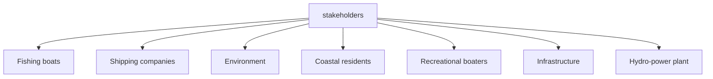
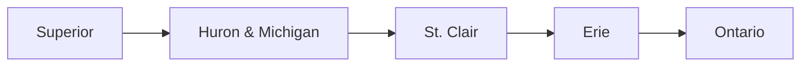
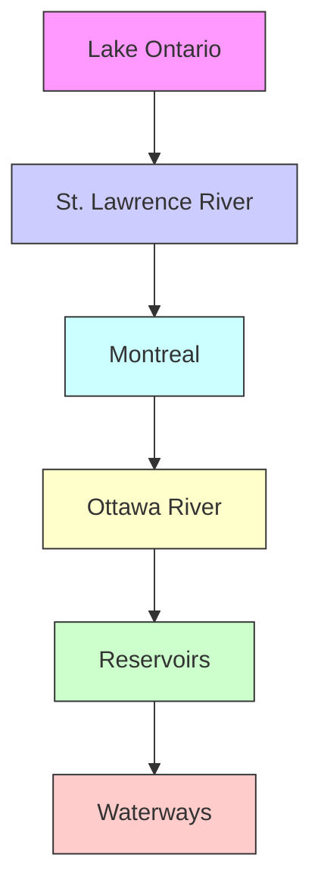

# Harmony of the Great Lakes: A Water Level Balance Approach

Summary

The Great Lakes represent $20\%$ of the world's freshwater resources, making their management, especially in water level, critically important. Fluctuations in their water levels are influenced by a myriad of natural factors and involve a diverse group of stakeholders. Consequently, developing a management plan and controlling the water levels of these lakes present a challenge.

For Task1: A genetic algorithm model is established considering coastal protection costs, hydro-power generation, leisure satisfaction, shipping benefits, and ecological impacts. By utilizing benefit functions and the Analytic Hierarchy Process (AHP), this model efficiently assesses the interests of stakeholders. Besides, the model particular focuses on coastal protection costs and hydroelectric power generation. It ultimately establishes the optimal water level for the Great Lakes on a monthly basis.

For Task2: We develop a hydrodynamic model tailored to the Great Lakes, accounting for both the flow dynamics within the lake chain and external variables affecting it. Following this, we craft distinct water level control algorithms for the Compensating Works and the Moses-Saunders Dam. These algorithms integrate a mode-switchable feedback controller with a prediction module, enhancing the controller's responsiveness by optimizing feedback gains for superior performance amidst environmental fluctuations. Simulations conducted using our model confirm the efficacy of these algorithms.

For Task 3: By increasing the outflow at the Soo Locks (upstream) and the Moses-Saunders Dam (downstream), we evaluated their sensitivity to water level management. Our analysis reveals that the upstream dam predominantly affects Lake Superior, Lake Michigan, Lake Huron, and Lake Erie, whereas the downstream dam has a more significant impact on the remaining lakes. When compared to water levels in 2017, our model demonstrates improved performance in numerous aspects.

For Task 4: We introduce dynamic scenarios into the simulation, including heavy precipitation and ice jams, to assess the sensitivity and resilience of our model against environmental changes. The results show that our algorithms are more effective in preventing significant increases in water levels following heavy rainfall events than natural regulatory methods. Furthermore, when ice jam occurs, the time needed to recover water levels decreases through enhanced upstream discharge.

For Task 5: Focusing on the key factors and stakeholders affecting Lake Ontario, we identified the water flow from the Ottawa River and the protection of coastal residents in Montreal as significant influences. The analysis emphasizes that to reach an effective regulation requires seasonal adjustments and collaborative efforts to protect coastal communities and maintain ecological balance.

In conclusion, our model has the strength of robustness and comprehensiveness. This provides scientific guidance and support for the regulation of the Great Lakes in the future.

Keywords: Prediction-based feedback control, Lake chain simulation, Multi-objective optimization, Genetic algorithm

## Contents

## 1 Introduction 3

1.1 Background 3  
1.2 Restatement of the Problem 3  
1.3 Assumptions and Justifications 3  
1.4 Our Work.... 4  
1.5 Notation 4

## 2 Task 1: Determination of the Optimal Water Level 5

2.1 Introducing Genetic Algorithm 5  
2.2 Determination of the Benefit Function 5  
2.3 Analysis of Weights 7  
2.4 Presentation of Results 8

## 3 Task2: Establishment of Algorithms for Water Level Control 9

3.1 Hydrodynamic Model of the Lake Chain 9

3.1.1 Internal Water Flow 10  
3.1.2 External Factors 12

3.2 Control Algorithm Design 13

3.2.1 Classical Control Algorithms Synthesis 13  
3.2.2 Controller Design 13  
3.2.3 Mode-switchable Feedback Control module 14  
3.2.4 Prediction Module 15

3.3 Algorithm Verification 16

## 4 Task 3: Sensitivity Analysis on Outflow of the Two Dam Controllers 17

4.1 System Sensitivity on Control Output 17  
4.2 A Comparison with Water Level in 2017 ..... 18

## 5 Task 4: Sensitivity analysis to environmental changes 18

5.1 Algorithm Sensitivity to Heavy Precipitation 18  
5.2 Algorithm Sensitivity to Ice Jam 20

## 6 Task 5: Focusing on Lake Ontario 21

6.1 Social and Physical Geographical Analysis 21  
6.2 Reanalysis of Stakeholders 22

## 7 Model Evaluation and Further Discussion 23

7.1 Model Strengths 23  
7.2 Model Weaknesses and Further Discussion 23

## A Memo to IJC Leadership 24

## References 25

## 1 Introduction

## 1.1 Background

The Great Lakes, spanning the United States and Canada, constitute the world's largest freshwater lake group. Vital for fishing, recreation, power generation, and more, these interconnected lakes pose complex challenges in water management. Balancing the needs of diverse stakeholders, including urban areas, is crucial. Factors like temperature, wind, precipitation, and human-controlled mechanisms impact water levels. The central role in this balance is played by two primary control mechanisms: the Soo Locks and Moses-Saunders Dam.

Despite human control over certain elements, natural occurrences such as rain, evaporation, and ice jams remain beyond manipulation. Local policies and environmental changes can yield unexpected effects, impacting the ecosystem and residents. Even slight deviations from normal water levels significantly affect stakeholders. This "wicked" dynamic network flow problem embodies exceptional complexity, marked by interdependencies, intricate requirements, and inherent uncertainties. Effective management is essential to sustain the ecological health of the region and the well-being of its inhabitants.

## 1.2 Restatement of the Problem

In light of the background information and constraints highlighted in the problem statement, we need to tackle the following tasks:

1. Balance the interests of all parties in determining the optimal level of the Great Lakes for each month of the year.  
2. Create algorithms to maintain optimal water levels in five lakes according to inflow and outflow data of the lakes.  
3. Analyze the sensitivity of the control algorithms to the two control dams using data from 2017 and test whether the control algorithm satisfies or outperforms the actual water level for each stakeholder.  
4. Examine the sensitivity of control algorithms to environmental changes.  
5. Focus the analysis on Lake Ontario and analyze the stakeholders and factors affecting the lake.

## 1.3 Assumptions and Justifications

To streamline the problem and facilitate the simulation of real-life conditions, we have made several fundamental assumptions. These assumptions have been carefully justified.

- Assumption: The water flow between Lake Michigan and Lake Huron does not influence our model  
- Justification: According to the data given in the Addendum, the water level of Lake Michigan and that of Lake Huron are the same.

- Assumption: Consider the average water level of historical data as the initial value for the optimal water level, then iterate to seek an improved solution.  
- Justification: Manually controlled water level variations are much lower than normal lake depths or natural lake levels, so the optimum level must be near the average level given by historical data.

## 1.4 Our Work


<details>
<summary>flowchart</summary>

```mermaid
graph TD
  A["1. Determination of the Optimal Water Level"] --> B["2. Establishment of the Algorithm"]
  B --> C["3. Sensitivity Analysis of Two Dam Controllers"]
  C --> D["4. Sensitivity Analysis to Environmental Changes"]
  D --> E["5. Focusing on Lake Ontario"]

    subgraph A
        A1["Our Work"]
        A2["Data Collection"]
        A3["Genetic Model"]
        A4["Control Model"]
        A5["Model Testing"]
        A6["Sensitivity Analysis"]
    end

    subgraph B
  B1["Superior"] --> B2["Huron & Michigan"]
  B2 --> B3["St. Clair"]
  B3 --> B4["Erie"]
  B4 --> B5["Ontario"]
    end

    subgraph C
  C1["The Compensating Works"] --> C2["P Switch PI"]
  C2 --> C3["Parameter Adjustment"]
  C3 --> C4["Real Condition Control"]
  C4 --> C5["Prediction"]
  C5 --> C6["Control"]
  C6 --> C7["Leisure"]
  C7 --> C8["Protection"]
  C8 --> C9["Shipping"]
  C9 --> C10["Ecosystem"]
  C10 --> C11["Stakeholders Radar Chart Hydro-power"]
    end

    subgraph D
  D1["Water Level Change of the Great Lakes After Rainfall"] --> D2["Lake Superior"]
  D2 --> D3["Lake Michigan and Huron"]
  D2 --> D4["Lake Erie"]
    end

    subgraph E
  E1["Ontario Lake Ontario"] --> E2["Reservoirs"]
  E2 --> E3["St. Lawrence River"]
    end

    subgraph F
  F1["Our Work"] --> F2["Data Collection"]
  F2 --> F3["Genetic Model"]
  F3 --> F4["Control Model"]
  F4 --> F5["Model Testing"]
  F5 --> F6["Sensitivity Analysis"]

    subgraph G
  G1["Infrastructure"] --> G2["Recreational boaters"]
  G2 --> G3["Coastal residents"]
  G3 --> G4["Environment"]
  G4 --> G5["stakeholders"]
  G5 --> G6["Shipping companies"]
  G6 --> G7["Fishing boats"]
    end

    subgraph H
  H1["P"] --> H2["H"] --> H3["L"] --> H4["S"] --> H5["E"]
    end

    subgraph I
  I1["P"] --> I2["H"] --> I3["L"] --> I4["S"] --> I5["E"]
    end

    subgraph J
  J1["P"] --> J2["H"] --> J3["L"] --> J4["S"] --> J5["E"]
    end

    subgraph K
  K1["P"] --> K2["H"] --> K3["L"] --> K4["S"] --> K5["E"]
    end

    subgraph L
  L1["P"] --> L2["H"] --> L3["L"] --> L4["S"] --> L5["E"]
    end

    subgraph M
  M1["P"] --> M2["H"] --> M3["L"] --> M4["S"] --> M5["E"]
    end

    subgraph N
  N1["P"] --> N2["H"] --> N3["L"] --> N4["S"] --> N5["E"]
    end

    subgraph O
  O1["P"] --> O2["H"] --> O3["L"] --> O4["S"] --> O5["E"]
    end

    subgraph P
  P1["P"] --> P2["H"] --> P3["L"] --> P4["S"] --> P5["E"]
    end

    subgraph Q
  Q1["P"] --> Q2["H"] --> Q3["L"] --> Q4["S"] --> Q5["E"]
    end

    subgraph R
  R1["P"] --> R2["H"] --> R3["L"] --> R4["S"] --> R5["E"]
    end

    subgraph S
  S1["P"] --> S2["H"] --> S3["L"] --> S4["S"] --> S5["E"]
    end

    subgraph T
  T1["P"] --> T2["H"] --> T3["L"] --> T4["S"] --> T5["E"]
    end

    subgraph U
  U1["P"] --> U2["H"] --> U3["L"] --> U4["S"] --> U5["E"]
    end

    subgraph V
  V1["P"] --> V2["H"] --> V3["L"] --> V4["S"] --> V5["E"]
    end

    subgraph W
  W1["P"] --> W2["H"] --> W3["L"] --> W4["S"] --> W5["E"]
    end

    subgraph X
  X1["P"] --> X2["H"] --> X3["L"] --> X4["S"] --> X5["E"]
    end

    subgraph Y
  Y1["P"] --> Y2["H"] --> Y3["L"] --> Y4["S"] --> Y5["E"]
    end

    subgraph Z
  Z1["P"] --> Z2["H"] --> Z3["L"] --> Z4["S"] --> Z5["E"]
    end

    subgraph AA
  AA1["P"] --> AA2["H"] --> AA3["L"] --> AA4["S"] --> AA5["E"]
    end

    subgraph AB
  AB1["P"] --> AB2["H"] --> AB3["L"] --> AB4["S"] --> AB5["E"]
    end

    subgraph AC
  AC1["P"] --> AC2["H"] --> AC3["L"] --> AC4["S"] --> AC5["E"]
    end

    subgraph AD
  AD1["P"] --> AD2["H"] --> AD3["L"] --> AD4["S"] --> AD5["E"]
    end

    subgraph AE
  AE1["P"] --> AE2["H"] --> AE3["L"] --> AE4["S"] --> AE5["E"]
    end

    subgraph AF
  AF1["P"] --> AF2["H"] --> AF3["L"] --> AF4["S"] --> AF5["E"]
    end

    subgraph AG
  AG1["P"] --> AG2["H"] --> AG3["L"] --> AG4["S"] --> AG5["E"]
    end

    subgraph AH
  AH1["P"] --> AH2["H"] --> AH3["L"] --> AH4["S"] --> AH5["E"]
    end

    subgraph AI
  AI1["P"] --> AI2["H"] --> AI3["L"] --> AI4["S"] --> AI5["E"]
    end

    subgraph AJ
  AJ1["P"] --> AJ2["H"] --> AJ3["L"] --> AJ4["S"] --> AJ5["E"]
    end

    subgraph AK
  AK1["P"] --> AK2["H"] --> AK3["L"] --> AK4["S"] --> AK5["E"]
    end

    subgraph AL
  AL1["P"] --> AL2["H"] --> AL3["L"] --> AL4["S"] --> AL5["E"]
    end

    subgraph AM
  AM1["P"] --> AM2["H"] --> AM3["L"] --> AM4["S"] --> AM5["E"]
    end

    subgraph AN
  AN1["P"] --> AN2["H"] --> AN3["L"] --> AN4["S"] --> AN5["E"]
    end

    subgraph AO
  AO1["P"] --> AO2["H"] --> AO3["L"] --> AO4["S"] --> AO5["E"]
    end

    subgraph AP
  AP1["P"] --> AP2["H"] --> AP3["L"] --> AP4["S"] --> AP5["E"]
    end

    subgraph AQ
  AQ1["P"] --> AQ2["H"] --> AQ3["L"] --> AQ4["S"] --> AQ5["E"]
    end

    subgraph AR
  AR1["P"] --> AR2["H"] --> AR3["L"] --> AR4["S"] --> AR5["E"]
    end

    subgraph AS
  AS1["P"] --> AS2["H"] --> AS3["L"] --> AS4["S"] --> AS5["E"]
    end

    subgraph AT
  AT1["P"] --> AT2["H"] --> AT3["L"] --> AT4["S"] --> AT5["E"]
    end

    subgraph AU
  AU1["P"] --> AU2["H"] --> AU3["L"] --> AU4["S"] --> AU5["E"]
    end

    subgraph AV
  AV1["P"] --> AV2["H"] --> AV3["L"] --> AV4["S"] --> AV5["E"]
    end

    subgraph AW
  AW1["P"] --> AW2["H"] --> AW3["L"] --> AW4["S"] & LA Lake Ontario
```
</details>

Figure 1: Our Work

## 1.5 Notation

Table 1: Notation

<table><tr><td>Glossary</td><td>Meaning</td><td>Unit</td></tr><tr><td> $S$ </td><td>Benefit Function</td><td>/</td></tr><tr><td> $h_{i}$ </td><td>The Water Level of Lakes</td><td>m</td></tr><tr><td> $h_{i0}$ </td><td>The Historical Average Water Level of Lakes</td><td>m</td></tr><tr><td> $B_{1}$ </td><td>Global Temperature</td><td>/</td></tr><tr><td> $B_{2}$ </td><td>Environmental Pollution Degree</td><td>/</td></tr><tr><td> $B_{3}$ </td><td>The Balance of the Ecosystem</td><td>/</td></tr><tr><td> $A$ </td><td>Area of the lake</td><td>km $^{2}$ </td></tr><tr><td> $Q_{out}(i)$ </td><td>Outflow of the  $i^{th}$  Lake</td><td>m $^{3}$ /s</td></tr><tr><td> $Q_{in}(i)$ </td><td>Inflow of the  $i^{th}$  Lake</td><td>m $^{3}$ /s</td></tr></table>

Note: Some variables are not listed in Table 1 and will be discussed in detail in each section.

## 2 Task 1: Determination of the Optimal Water Level

## 2.1 Introducing Genetic Algorithm

A genetic algorithm is an optimization algorithm that mimics the natural selection and hereditary mechanism and is mainly used to solve optimization problems. It simulates the process of inheritance, crossover, and mutation in the process of biological evolution, and gradually searches for the globally optimal solution by continuously evolving excellent individuals.

## 2.2 Determination of the Benefit Function


<details>
<summary>flowchart</summary>


</details>

Figure 2: Stakeholders of the Great Lakes

The Great Lakes involve a diverse range of stakeholders, including property owners, hydro-power generation companies, recreational boaters, shipping companies, and fishers, as shown in Figure 2.

## (1) Cost of Protecting Coastal Residents

As outlined in Plan 2014, the risks associated with increasing lake and river levels for residents encompass flooding of lakeside or waterfront residences, along with road damage, necessitating the elevation and fortification of shorelines. The cost is directly proportional to the water level, with higher water levels incurring higher costs. Conversely, lower water levels allow the original protection measures to suffice. This situation can be aptly described using a step function

$$
y = \epsilon (x) = \left\{ \begin{array}{l l} 0 & x <   0 \\ 1 & x \geq 0 \end{array} \right. \tag {1}
$$

As the level ascends, it can be postulated that the associated costs are directly proportional to the fluctuations in water level, the extent of the lake shoreline, and the density of the neighboring population. It is evident that in sparsely populated regions, the apprehension regarding the perils of rising water levels on residential properties diminishes.

Therefore, we can conclude the cost function of protecting coastal residents:

$$
S = \sum_ {i = 1} ^ {5} \frac {h _ {i} - h _ {i 0}}{h _ {i 0}} \cdot \epsilon (h _ {i} - h _ {i 0}) \cdot L _ {i} \cdot D _ {i} \tag {2}
$$

where the subscript i is indicative of each specific lake. Furthermore, $L_{i}$ is the coefficient about the length of the lake shoreline, and $D_{i}$ signifies the coefficient associated with residential density. Evidently, when under manual control, a more favorable outcome is achieved with a smaller value for S.

## (2) Revenue of Hydro-power Plant

Undoubtedly, the power generation of a hydro-power plant exhibits a positive correlation with the height of the waterfall. To elaborate further, this relationship can be mathematically expressed as power generation capacity $\propto$ kinetic energy $\propto$ potential energy difference $\propto$ altitude difference. Thus, the benefits derived from alterations in water level are as follows:

$$
S = \sum_ {i = 1} ^ {3} Q _ {i} \times \frac {h _ {i \cdot u p} - h _ {i \cdot d o w n}}{h _ {i 0 \cdot u p} - h _ {i 0 \cdot d o w n}} \tag {3}
$$

where the subscripts i denote the three major hydro-power plants. $Q_{i}$ represents the power generation of each respective hydro-power plant.

## (3) Leisure Satisfaction

Recreational boaters have expressed a preference for consistent periodic water flows, dictated by the conditions of both upstream and downstream lakes. They observed that increased variability in water levels throughout the twelve months leads to less stability in the flow, while minimal fluctuations result in a more stable flow. Consequently, higher levels of recreational satisfaction are associated with a more stable flow.

The assessment of the magnitude of water level changes throughout the year is conducted through the calculation of the standard deviation for each lake. It can be visualized by the equation:

$$
S = \sum_ {i = 1} ^ {5} \left(k _ {i} \cdot \sqrt {\frac {\sum_ {j = 1} ^ {1 2} (h _ {i} - \mu) ^ {2}}{1 2}}\right) \tag {4}
$$

where $\mu$ is the average water level throughout the year. $k_{i}$ is the proportionality coefficient of the function.

## (4) Shipping Revenue

As lake depths typically exceed ship drafts significantly, fluctuations in lake levels have a limited impact on shipping operations. Shipping concerns are predominantly centered around river levels. When river levels drop too low, it can impede the proper passage of ships. The water level in the river is directly proportional to the river's flow, and this flow is intricately connected to the levels of lakes both upstream and downstream. Therefore, the primary metric utilized to characterize this benefit revolves around the disparity between the upstream and downstream lake levels.

$$
Q = \rho \cdot h _ {r i v e r} \cdot w \cdot \sqrt {h _ {u p} - h _ {d o w n}} \tag {5}
$$

Nevertheless, when the lake water level stabilizes in a micro-dynamic equilibrium state, the flow exhibits minimal variation with changes in the water level. The river water level is inversely proportional to $\sqrt{h_{up} - h_{down}}$ . The benefit function of shipping revenue can be expressed by:

$$
S = \sum_ {i = 1} ^ {5} Q _ {i, i + 1} \cdot \frac {1}{\sqrt {h _ {i \cdot u p} - h _ {i \cdot d o w n}}} \div \frac {1}{\sqrt {h _ {i 0 \cdot u p} - h _ {i 0 \cdot d o w n}}} \tag {6}
$$

where $Q_{i,i+1}$ represents the water flow between the two lakes and is related to the difference in lake levels and lake water capacity.

## (5) Ecological Effect

The ecological consequences of lake and river water levels are primarily tied to the preservation and disruption of species diversity. To streamline the evaluation of their water level impacts on ecosystems, assessments can be made using the disparity between water level fluctuations, using the average of high water levels and the average of low water levels. A smaller discrepancy between the two is considered a more favorable benefit function:

$$
S = \sum_ {i = 1} ^ {5} \frac {\hat {m a x} (h _ {i}) - \hat {m i n} (h _ {i})}{\hat {m a x} (h _ {i 0}) - \hat {m i n} (h _ {i 0})} \cdot A _ {i} \tag {7}
$$

where $A_{i}$ represents the impact factor of the lake, which is proportional to the lake area.

## 2.3 Analysis of Weights

By employing the Analytic Hierarchy Process (AHP) to evaluate the aforementioned potential factors, we can ascertain the relative weights of the corresponding benefit functions.


<details>
<summary>heatmap</summary>

| | P | H | L | S | E |
|---|---|---|---|---|---|
| P | 1 | 1 | 1 | 1 | 1 |
| H | 0 | 0 | 1 | 0 | 1 |
| L | 0 | 1 | 0 | 1 | 0 |
| S | 0 | 0 | 1 | 0 | 1 |
| E | 0 | 1 | 0 | 1 | 0 |
</details>

Figure 3: Weight matrix

Table 2: Weight of each factor

<table><tr><td></td><td>Stands For</td><td>Weight</td></tr><tr><td>P</td><td>Protection for Coastal Infrastructures</td><td>0.31</td></tr><tr><td>H</td><td>Hydro-power Plant Revenue</td><td>0.10</td></tr><tr><td>L</td><td>Leisure Satisfaction</td><td>0.22</td></tr><tr><td>S</td><td>Shipping Revenue</td><td>0.10</td></tr><tr><td>E</td><td>Ecological Effect</td><td>0.27</td></tr></table>

As a result, the total benefit function is:

$$
S = \left| \sum_ {i = 1} ^ {5} \epsilon_ {i} \cdot S _ {i} \right| \tag {8}
$$

where $\epsilon_{i}$ signifies the weight assigned to each parameter. It's crucial to emphasize that the aim of the protection cost, life satisfaction, and ecological impact is to minimize the benefit function. Therefore, the weights associated with these aspects should be converted into negative values. Additionally, given the substantial influence of these three items in the overall weight distribution, it becomes necessary to consider the absolute value of the total benefit function within the fitness function of the genetic model. This approach is essential for determining the probability of selection in the genetic model.

## 2.4 Presentation of Results


<details>
<summary>line chart</summary>

| Month | Optimal | Historical Mean |
|-------|---------|-----------------|
| Jan   | 183.2   | 183.3           |
| Feb   | 183.0   | 183.2           |
| Mar   | 182.9   | 183.2           |
| Apr   | 183.0   | 183.2           |
| May   | 183.1   | 183.3           |
| Jun   | 183.2   | 183.4           |
| July  | 183.3   | 183.5           |
| Aug   | 183.3   | 183.5           |
| Sep   | 183.2   | 183.5           |
| Oct   | 183.2   | 183.5           |
| Nov   | 183.1   | 183.4           |
| Dec   | 183.0   | 183.4           |
</details>


<details>
<summary>line chart</summary>

| Month | Optimal | Historical Mean |
|-------|---------|-----------------|
| Jan   | 175.8   | 176.2           |
| Feb   | 175.8   | 176.2           |
| Mar   | 175.8   | 176.2           |
| Apr   | 175.8   | 176.3           |
| May   | 175.9   | 176.4           |
| Jun   | 176.0   | 176.5           |
| July  | 176.1   | 176.5           |
| Aug   | 176.1   | 176.5           |
| Sep   | 176.1   | 176.4           |
| Oct   | 176.0   | 176.4           |
| Nov   | 175.9   | 176.3           |
| Dec   | 175.8   | 176.2           |
</details>


<details>
<summary>line chart</summary>

| Month | Optimal | Historical Mean |
|-------|---------|-----------------|
| Jan   | 174.6   | 174.9           |
| Feb   | 174.7   | 174.9           |
| Mar   | 174.7   | 175.0           |
| Apr   | 174.8   | 175.1           |
| May   | 174.9   | 175.2           |
| Jun   | 175.0   | 175.3           |
| July  | 175.1   | 175.3           |
| Aug   | 175.0   | 175.2           |
| Sep   | 174.9   | 175.1           |
| Oct   | 174.8   | 175.0           |
| Nov   | 174.7   | 174.9           |
| Dec   | 174.8   | 174.9           |
</details>


<details>
<summary>line chart</summary>

| Month | Optimal | Historical Mean |
|-------|---------|-----------------|
| Jan   | 173.8   | 174.2           |
| Feb   | 173.85  | 174.2           |
| Mar   | 173.9   | 174.25          |
| Apr   | 173.95  | 174.3           |
| May   | 174.0   | 174.35          |
| Jun   | 174.05  | 174.4           |
| July  | 174.1   | 174.4           |
| Aug   | 174.15  | 174.35          |
| Sep   | 174.2   | 174.3           |
| Oct   | 174.25  | 174.25          |
| Nov   | 174.3   | 174.2           |
| Dec   | 174.35  | 174.2           |
</details>


<details>
<summary>line chart</summary>

| Month | Optimal | Historical Mean |
|-------|---------|-----------------|
| Jan   | 74.3    | 74.6            |
| Feb   | 74.5    | 74.7            |
| Mar   | 74.6    | 74.8            |
| Apr   | 74.8    | 75.0            |
| May   | 75.1    | 75.2            |
| Jun   | 75.3    | 75.2            |
| July  | 75.2    | 75.1            |
| Aug   | 75.1    | 75.0            |
| Sep   | 74.9    | 74.8            |
| Oct   | 74.6    | 74.6            |
| Nov   | 74.5    | 74.6            |
| Dec   | 74.5    | 74.6            |
</details>

Figure 4: Optimal water level V.S. historical mean level


<details>
<summary>radar chart</summary>

| Category     | Value |
| ------------ | ----- |
| Hydro-power  | 0.9   |
| Protection   | 0.6   |
| Ecosystem    | 0.8   |
| Shipping     | 1.0   |
| Leisure      | 0.7   |
</details>


<details>
<summary>radar chart</summary>

| Category     | Value |
| ------------ | ----- |
| Protection   | 0.85  |
| Ecosystem    | 0.65  |
| Shipping     | 0.95  |
| Leisure      | 0.70  |
| Hydro-power  | 0.98  |
</details>

Figure 5: Historical average and optimal water level radar chart

As shown in Figure 4, the colored lines indicate the optimal water levels for each lake. It is evident that the predicted optimal water levels for all lakes, except for Lake Ontario, are lower than the average of previous years. The observed discrepancy may be attributed to the prioritization of resident safety in the AHP method, as residents generally prefer lower water levels. By examining the radar chart, the benefits of shipping and hydro-power plants are already high, with marginal improvements. The model excels in enhancing resident safety and leisure satisfaction, ensuring readiness for various situations through subsequent control algorithms.

However, the improvement in ecosystem benefits is not evident under the optimal water level. The reason is that after fulfilling the requirements of coastal residents for stable water levels, the cyclic changes in water levels may not reach historical averages, potentially causing disturbances to the ecosystem. Nevertheless, these disturbances are expected to be within the normal self-regulation capacity of the ecosystem.

In summary, considering protection for residents, hydro-power revenue, leisure satisfaction, shipping revenue, and ecosystem impacts, the model provides a monthly average optimal water level for the Great Lakes.

## 3 Task2: Establishment of Algorithms for Water Level Control

This task includes model building and an algorithm designed to control the water level of the Great Lakes.

## 3.1 Hydrodynamic Model of the Lake Chain

This section introduces the hydrodynamic model we established, to simulate the interconnected lake system which is simplified and approximated in the following ways:

(1) The Great Lakes are modeled as a chain, as shown in Figure 6.


<details>
<summary>flowchart</summary>


</details>

Figure 6: Lake chain model schema

(2) Inter-lake flow rate equations are derived from Manning's formula, in which We considered the lake basin shape, the lakes' relative positions, and the river channel. Besides, Lake St.Clair is specialized in the model.  
(3) External factors, including precipitation, evaporation, snow-melt water, and industrial and agricultural water consumption are considered.

As illustrated in Figure 7, the general modeling process for the lake chain can be described as follows: external runoff enters Lake Superior, initiating a directional flow through the lake chain shown above, reaching the Atlantic Ocean ultimately. In this sequential progression, each lake within the lake chain not only receives inflow from the preceding lake but also takes into account external runoff, evaporation, precipitation, snow-melt water, and human factors.

During this process, the change in the water level of each lake can be expressed as:

$$
\frac {\mathrm{d} h _ {i}}{\mathrm{d} t} = \frac {Q _ {i n} (i) - Q _ {o u t} (i)}{A _ {i}} \tag {9}
$$


<details>
<summary>text_image</summary>

Lake Superior
St. Marys River
Lake Michigan
Michigan
Lake Huron
Lake Erie
New York
Lake Ontario
St. Lawrence River
Kingstone
Cape Vincent
Owen
Rochester
Niagara River
Budako
Wetland Canal
St. Clair River
Lake St. Clair of Detroit
Detroit River
Toledo
Cleveland
Ohio
Green Bay
St. Marys River
Sault Ste. Marie
Lake Superior Control Structure
Nipigon River
Diver Long
Long to Creek & Jaguaraburn River
Duluh
</details>

Figure 7: Flow directions of the Great Lakes

In the forthcoming sections, we will delineate the parameterization process of our lake chain model, focusing on both the internal water flow within the chain and the external factors influencing the chain.

## 3.1.1 Internal Water Flow

Water flow between lakes stands out as a crucial factor influencing the respective changes in lake water levels. It is influenced by factors including the relative height difference, the characteristics of the river channel connecting the lakes, and the nature of the lake basin. These factors are introduced to our model for precise emulation of the real dynamics of water flow within the lake system.

## Topography of the lake basin:

The presence of lakes exerts a decelerating influence on water flow. Distinct topographies of lake basins impart varying capacities to buffer water flow, and features such as irregularities in the lake bottom can impact the flow dynamics. Depressions on the lake bottom may give rise to grooves, introducing friction and resistance to water flow.

Table 3: Geographic information of the Great Lakes

<table><tr><td></td><td>Superior</td><td>Michigan+Huron</td><td>St. Clair</td><td>Erie</td><td>Ontario</td></tr><tr><td>Area (m2)</td><td>82103</td><td>117620</td><td>1100</td><td>25874</td><td>19000</td></tr><tr><td>Mean Depth (m)</td><td>147</td><td>72</td><td>3.4</td><td>19</td><td>86</td></tr><tr><td>Annual Precipitation (mm)</td><td>760</td><td>787</td><td>1720.5</td><td>864</td><td>914</td></tr><tr><td>Evaporation(mm)</td><td>596</td><td>639</td><td>902</td><td>697</td><td>650</td></tr><tr><td>Elevation (m)</td><td>183</td><td>176</td><td>173</td><td>173</td><td>74</td></tr></table>

Geomorphic characteristics of the Great Lakes basins are depicted in Figure 8 and Table 3 with the Lake Erie basin identified as the shallowest and flattest, resulting in the least hindrance to water flow. Conversely, the Lake Superior basin displays a complex geomorphology, leading to a more pronounced impedance to water flow – a facet that will be evident in the subsequent modeling process.


<details>
<summary>text_image</summary>

Lake Superior
Ontario
Mississippi River
Mississippi River
Mississippi River
Mississippi River
Mississippi River
Mississippi River
Mississippi River
Mississippi River
Mississippi River
Mississippi River
Mississippi River
Mississippi River
Mississippi River
Mississippi River
Mississippi River
Mississippi River
Mississippi River
Mississippi River
Mississippi River
Mississippi River
Mississippi River
Mississippi River
Mississippi River
Mississippi River
Mississippi River
MississippiRiver
Mississippi River
Mississippi River
Mississippi River
Mississippi River
Mississippi River
Mississippi River
Mississippi River
Mississippi River
Mississippi River
Mississippi River
Mississippi River
Mississippi River
Mississippi River
Mississippi River
Mississippi River
Mississippi River
Mississippi River
Mississippi River
Mississippi River
Mississippi River
Mississippi River
Mississippi River
Mississippi River
Mississippi River
Mississippi river
Mississippi river
Mississippi river
Mississippi river
Mississippi river
Mississippi river
Mississippi river
Mississippi river
Mississippi river
Mississippi river
Mississippi river
Mississippi river
Mississippi river
Mississippi river
Mississippi river
Mississippi river
Mississippi river
Mississippi river
Mississippi river
Mississippi river
Mississippi river
Mississippi river
Mississippi river
Mississippi river
Mississippi river
Mississippiriver
Mississippiriver
Mississippiriver
Mississippiriver
Mississippiriver
Mississippiriver
Mississippiriver
Mississippiriver
Mississippiriver
Mississippiriver
Mississippiriver
Mississippiriver
Mississippiriver
Mississippiriver
Mississippiriver
Mississippiriver
Mississippiriver
Mississippiriver
Mississippiriver
Mississippiriver
Mississippiriver
Mississippiriver
Mississippiriver
Mississippiriver
Mississippiriver
Mississippi river
</details>

Figure 8: Topography of the Great Lakes

Table 4: Geographic information of the rivers

<table><tr><td></td><td>St. Mary&#x27;s</td><td>Detroit</td><td>Niagara</td><td>Ottawa</td><td>St. Lawrence</td></tr><tr><td>Mean Flow Rate (m3/s)</td><td>2135</td><td>5300</td><td>5796</td><td>1950</td><td>10400</td></tr><tr><td>Mean Width (m)</td><td>64</td><td>2000</td><td>800</td><td>2500</td><td>3000</td></tr><tr><td>Mean Depth (m)</td><td>6</td><td>12</td><td>7</td><td>90</td><td>11</td></tr></table>

## River channel:

The Manning-Strickler formula characterizes the connection between the flow of unconfined water within a channel and various factors such as channel geometry, bed friction, and current velocity. I t can be expressed as:

$$
Q = \frac {S \cdot R ^ {\frac {2}{3}} \cdot E ^ {\frac {1}{2}}}{n} \tag {10}
$$

where $Q$ represents the river's flow rate between the lakes. $R$ denotes the length of the wetted perimeter length along the cross-section of the flow and $S$ represents the cross-sectional area of the river, while the former is positively correlated with the width of the river and the latter with the square of that. $n$ stands for Manning's friction coefficient, reflecting the resistance on the riverbed. The energy gradient drop $E$ is mainly associated with the river slope which is determined by utilizing the difference in mean heights of the two lakes from Table 3. Given this analysis, the internal flow equations employed in the model for the lake chain can be rewritten as:

$$
S \cdot R ^ {\frac {2}{3}} \cdot E ^ {\frac {1}{2}} = N _ {0} \cdot w ^ {2} \cdot w ^ {\frac {2}{3}} \cdot (g (h _ {i} - h _ {i + 1}) - f _ {i, i + 1} \cdot d _ {i, i + 1}) ^ {\frac {1}{2}} \tag {11}
$$

$$
Q _ {o u t} (i) = N \cdot w ^ {\frac {8}{3}} \cdot (g (h _ {i} - h _ {i + 1}) - f _ {i, i + 1} \cdot d _ {i, i + 1}) ^ {\frac {1}{2}} \tag {12}
$$

Here, $N_{0}$ and N are constant coefficients, $d_{i,i+1}$ signifies the distance between the $i^{th}$ and the $(i+1)^{th}$ lake, and w stands for the river width. $f_{i,i+1}$ denotes the flow friction cost parameter between the two lakes, which is rimarily influenced by the topography and geomorphology of the lake basin and the friction coefficient of the riverbed. Due to the difficulty in accurately determining these parameters, initial approximations are provided during the simulation process based on varying lake basin geomorphologies, channel lengths, and depths as presented in Figure 8 and Table 4. Further refinements are carried out through iterative adjustments in the simulation process.

## The Lake St. Clair:

According to Table 3, Lake St. Clair is notably smaller in area when compared to the Great Lakes. To streamline the model regulation process, we opt to treat it as a distinctive river entity rather than as a node within the lake chain.

Recognizing that lakes possess a significantly greater water storage capacity than rivers, implying a pronounced hysteresis effect on water, we introduced a hysteresis parameter $\tau$ , as shown in (11), between Lake Huron and Lake Erie which requires to be manually adjusted during the modeling process.

$$
Q _ {o u t} (i) = N \cdot ((h _ {i} \cdot (t - \tau) - h _ {i + 1}) - f _ {i, i + 1} \cdot d _ {i, i + 1}) \cdot w ^ {\frac {8}{3}} \tag {13}
$$

## 3.1.2 External Factors

## External runoff inflow:

Lake Superior receives contributions from over two hundred streams. For the rest of the lakes, the primary sources of external runoff are the rivers upstream. We designate the external runoff inflow to Lake Superior as the largest, while the external runoff inflow to the other lakes (excluding inter-chain inflows) is comparatively smaller.

## Evaporation:

Evaporation from lakes is primarily influenced by factors such as lake area, temperature, wind, and air humidity. As noted by D. Lenters, B. Anderton, D. Blanken, et al., lakes exhibit seasonally significant variations in evaporation, reaching a maximum of 0.4 ft/day in the fall when evaporation is at its peak. Our estimation of the seasonal variation in evaporation for the Great Lakes is derived from the information presented in Table 3.

## Precipitation:

Annual precipitation in the Great Lakes approximately varies between 750mm and 950 mm, with an increase from Lake Superior to Lake Ontario.

Upon analyzing the meteorological data of the Great Lakes region, we can refine the model by adjusting evaporation and precipitation settings based on seasonal variations. This enhancement allows for a more accurate simulation of seasonal changes within the model. The inflow rate for the $i^{th}$ lake in the chain is expressed as:

$$
Q _ {i n} (i) = Q _ {o u t} (i - 1) + Q _ {r a i n} (i) - Q _ {e v} (i) \tag {14}
$$

$Q_{rain,i}$ is the precipitation of the $i^{th}$ lake, and $Q_{ev,i}$ is the evaporation of the $i^{th}$ lake.

Ultimately, to identify the parameters in the model that require manual adjustment, we make these adjustments based on observed river flows within the lake chain. This careful calibration ensures that the model's inflows and outflows between the lakes are closely aligned with actual values.

## 3.2 Control Algorithm Design

## 3.2.1 Classical Control Algorithms Synthesis

(1) PID controller is a classical feedback control algorithm aimed to achieve stable and accurate control. The output of the controller is the weighted sum of these three control terms:

$$
u (t) = K _ {p} e (t) + K _ {i} \int_ {0} ^ {t} e (\tau) \mathrm{d} \tau + K _ {d} \frac {\mathrm{d} e (t)}{\mathrm{d} t} \tag {15}
$$

where $K_{p}$ represents the proportional gain, and $e(t)$ denotes the current error of the system. The integral gain is represented by $K_{i}$ , and $\int_{0}^{t} e(\tau) d\tau$ represents the cumulative error over time. $K_{d}$ stands for the differential gain, and $\frac{\mathrm{d}e(t)}{\mathrm{d}t}$ is the rate of change of the error. By adjusting the proportional, integral, and differential gains, precise control of the system can be achieved across various applications.

(2) Model predictive control (MPC) is an advanced method of process control based on a system model, optimizing the current control inputs by predicting the future behavior of the system. Ts working principle involves:

▶Establishing a dynamic model of the system to predict its evolution over a future time horizon

▷Choosing the optimal control strategy at each time step by solving an optimization problem.

MPC excels in handling complex, nonlinear systems, and dynamic environments. Through real-time iterative updates, MPC can promptly adjust to changes in system states, achieving efficient control of the system.

## 3.2.2 Controller Design

In the context of the Great Lakes water flow control problem, the regulation of water volume within the Great Lakes is limited to interventions through the upstream compensation project and the Moses-Saunders Dam.

The application of PID solely for the upstream water flow control of the dams is suitable for straightforward scenarios. However, it is anticipated to encounter the following issues in a complex circumstance:

▶Achieving water flow control across the entire lake chain is challenging when only having regulatory control over two dams. The number of systems that require control exceeds the available number of controllers, posing a complexity in managing the overall water flow dynamics.  
$\triangleright$ Fixed coefficients in the controller, leading to limited adaptability to dynamic environmental changes. The controller's ability to adapt to a changing environment, including evaporation and rainfall, is relatively low.  
The controller is highly sensitive to parameters. In a complex and dynamic environment, even small changes in parameters can significantly impact the regulation effect. If the manually determined parameters are not optimal, the entire system may face an out-of-control situation over time.

Our proposed solution is graphed in Figure 9. The compensating work utilizes a mode-switchable P+PI control as the primary real-time feedback controller while the other one can switch between flood-releasing mode and PI control. Besides, a prediction module is used for optimizing the feedback control parameters. The structure addresses the issues mentioned above.


<details>
<summary>flowchart</summary>

```mermaid
graph TD
  A["The Compensating Works"] -->|Switch| B["PI"]
  C["The Moses-Saunders Dam"] -->|Switch| D["Flood Release"]
    B <--> E["Prediction"]
    D <--> E
  E --> F["Real Condition"]
  F -->|Control| A
  F -->|Control| C
    style A fill:#f9f,stroke:#333
    style C fill:#f9f,stroke:#333
    style B fill:#ccf,stroke:#333
    style D fill:#ccf,stroke:#333
    style E fill:#cfc,stroke:#333
    style F fill:#cfc,stroke:#333
    linkStyle 0 stroke:#ff0000,stroke-width:2px
    linkStyle 1 stroke:#ff0000,stroke-width:2px
    linkStyle 2 stroke:#ff0000,stroke-width:2px
    linkStyle 3 stroke:#ff0000,stroke-width:2px
    linkStyle 4 stroke:#ff0000,stroke-width:2px
    linkStyle 5 stroke:#ff0000,stroke-width:2px
    linkStyle 6 stroke:#ff0000,stroke-width:2px
    linkStyle 7 stroke:#ff0000,stroke-width:2px
    linkStyle 8 stroke:#ff0000,stroke-width:2px
    linkStyle 9 stroke:#ff0000,stroke-width:2px
```
</details>

Figure 9: Controller schema

## 3.2.3 Mode-switchable Feedback Control module

Typically, controllers for compensating engineered dams usually operate in the simple P mode. It means they deploy proportional control based on the difference between the Lake Superior water level and the target level. As shown in Equation 15.

However, solely focusing on the lakes upstream of the dam does not guarantee effective regulation of Lake Huron, Lake Michigan, as well as Lake Erie.

Therefore, we modified the integral control of the controller which takes the cumulative error information of the water level in the lakes downstream into account. When the cumulative error of the water level of Lake Huron and Lake Michigan exceeds the control threshold $I_{0}$ , the controller switches from P mode to PI mode as Equation 16:

$$
Q (t) = K _ {p 1} \cdot \left(h _ {\text { target }} - h\right) \cdot A \tag {16}
$$

$$
Q (t) = \left[ K _ {p 1} \cdot (h _ {\text { target }} - h) + K _ {i 1} \cdot \int t e (\tau) \mathrm{d} \tau \right] \cdot A \tag {17}
$$

Here, $Q(t)$ represents the current control variable, which is the discharge of the compensation project. $K_{1}$ and $K_{2}$ are the proportional and integral gains, respectively. A is the lake area, and $\int te(\tau)\mathrm{d}\tau$ is the cumulative water level error of Lake Huron-Lake Michigan. The controller indicates that when the water level error of Lake Huron-Lake Michigan reaches a certain threshold, the controller will balance the water level downstream.

It is important to note that:

(1) The P+PI controller is made to better achieve the decoupling of water level control between the two lakes. In comparison to using a P controller to alternately switch control between the two lakes or concentrating the PI controller solely on the upper lake, this method shows greater stability and comprehensiveness for controlling the entire lake chain.

(2) The differential controller has been omitted for the reason that in the practical regulation of reservoirs, the volume of water in the lakes is significantly larger than the maximum discharge capacity of the controlled dams. As a result, the control process is relatively slow. making the role of the differential controller minimized.

As for the Moses-Saunders Dam, a switchable PI+flood-releasing controller is employed. The decision to not adopt the P+PI control mode as in the Compensating Work is based on the consideration that the mode is not well-suited for controlling upstream water flow.

The purpose of the switchable controller is to align with upstream hydrological conditions: when the water level of a lake upstreams on Lake Ontario exceeds the threshold value $h_{control}$ , the flood-releasing mode is activated to maximize discharge while ensuring the stability of Lake Ontario's water level. This is achieved by selecting the minimum value between the maximum release from the dam and the estimated external inflow.

$$
Q _ {o u t} = \min \left\{Q _ {\text { max }}, (Q _ {i n} + Q _ {\text { rain }} - Q _ {e v}) \right\} \tag {18}
$$

When upstream hydrological conditions are relatively stable, the Moses-Saunders Dam is primarily utilized to ensure the stability of Lake Ontario's water level. In this scenario, PI mode is employed, with corresponding parameters for the proportional control $K_{p2}$ and $K_{i2}$ .

## 3.2.4 Prediction Module

The primary goal of the prediction module is to dynamically adjust the parameters of the compensating project dam controller and the Moses-Sanders dam controller. The process involves:

(1) Predict the future change in the lake level in the lake chain for the next 200 hours with the current controller parameters.  
(2) Optimize the parameters, by using gradient descent, based on an object function manually set.

Regarding the parameters of the two controllers, we express them using a vector formulation:

$$
c = (K _ {p 1}, K _ {i 1}, I _ {0}, h _ {\text { control }}, K _ {p 2}, K _ {i 2}) \tag {19}
$$

The error function is defined as: $E(i,t,c)=(h_{i}(t)-h_{i,\text{target}}(t))^{2}$ . Subsequently, the objective function $J(c)$ is set to the sum of squares of the errors within this prediction time domain:

$$
J (c) = \sum_ {i = 1} ^ {4} \sum_ {t = 0} ^ {2 0 0} E (i, t, c) \tag {20}
$$

During the deployment phase, we discovered that the determination of the optimal controller parameters, denoted as $c_{opt}$ , through the application of a gradient descent algorithm is time-consuming, also necessities to fine-tune a multitude of parameters. Given the complexity and the resource-intensive nature of this optimization process, a strategic decision was made to narrow the focus of our optimization efforts. Specifically, we opted to concentrate on $K_{p2}$ and $K_{I2}$ as the key parameters for optimization.

## 3.3 Algorithm Verification

To initially assess the control performance of our controller, we established distinct target water levels for each lake in the chain. In the simulation, we observed the water level changes in the lakes along with the water outflow from each lake, as illustrated in Figure 10. The dotted lines represent the target water levels set for each lake, featuring a water level difference of 0.5 m-1 m from the current water level.


<details>
<summary>line chart</summary>

| Time(h) | Lake Superior | Lake Huron and Michigan | Lake Erie |
| ------- | ------------- | ----------------------- | --------- |
| 0       | 184           | 175                     | 173.5     |
| 1000    | 183.5         | 175.5                   | 174       |
</details>


<details>
<summary>line chart</summary>

| Time(h) | Water Level(m) |
| ------- | -------------- |
| 0       | 74.5           |
| 100     | 74.0           |
| 500     | 74.0           |
| 1000    | 74.0           |
</details>


<details>
<summary>line chart</summary>

| Time(h) | Lake Superior | Lake Huron and Michigan | Lake Erie | Lake Ontario |
| ------- | ------------- | ------------------------ | --------- | ------------ |
| 0       | 5250          | 3500                     | 3500      | 5250         |
| 1000    | 5250          | 3500                     | 3500      | 3500         |
</details>

Figure 10: Effect of controller regulation under natural conditions

## The Compensating Works:

As Lake Superior consistently maintained a water level above the target and downstream Lake Huron and Lake Michigan remained below the target throughout the simulation period, the Compensating Works consistently utilized a discharge close to the maximum flow.

## The Moses-Saunders Dam:

As Lake Ontario exceeded the target level, Moses-Saunders Dam employed a strategy of larger discharges to stabilize Lake Ontario's levels. Subsequently, as the Lake Ontario level approached the target, the dam reduced its discharge and adjusted it to align with the incoming flow. This approach facilitated Lake Ontario in reaching a more stable level.

## 4 Task 3: Sensitivity Analysis on Outflow of the Two Dam Controllers

## 4.1 System Sensitivity on Control Output

The impacts of increasing the outflows from the two dams are illustrated below, where '-L' is denoted as a large flow rate and '-S' is a small flow rate. In Figure 11, the regulation pertains to the Soo Locks (upstream), while in Figure 12, it corresponds to the regulation of the Moses-Saunders Dam (downstream).


<details>
<summary>line chart</summary>

| Time(h) | L-S-L | L M&H-L | L E-L | L-S | L M&H-S | L E-S |
| ------- | ----- | ------- | ----- | --- | ------- | ----- |
| 0       | 184   | 175     | 174   | 184 | 175     | 174   |
| 300     | 184   | 175     | 174   | 184 | 175     | 174   |
</details>


<details>
<summary>line chart</summary>

| Time(h) | L O-L | L O-S |
| ------- | ----- | ----- |
| 0       | 73.81 | 73.81 |
| 50      | 73.83 | 73.83 |
| 100     | 73.83 | 73.83 |
| 150     | 73.83 | 73.83 |
| 200     | 73.83 | 73.83 |
| 250     | 73.83 | 73.83 |
| 300     | 73.83 | 73.83 |
</details>

Figure 11: Effects of the Soo Locks flow rate on water levels


<details>
<summary>line chart</summary>

| Time(h) | L S-L | L M&H-L | L E-L | L S-S | L M&H-S | L E-S |
| ------- | ----- | ------- | ----- | ----- | ------- | ----- |
| 0       | 184   | 175     | 174   | 184   | 184     | 184   |
| 300     | 184   | 175     | 174   | 184   | 184     | 184   |
</details>


<details>
<summary>line chart</summary>

| Time(h) | L O-L | L O-S |
| ------- | ----- | ----- |
| 0       | 73.9  | 73.8  |
| 300     | 75.6  | 73.8  |
</details>

Figure 12: Effects of the Moses-Saunders Dam flow rate on water levels

Comparing the two figures reveals that Lake Ontario's water level is predominantly influenced by the operation of the Moses-Saunders Dam, whereas the water levels of the four upstream lakes are more significantly impacted by the Soo Locks. This distinction is largely due to Niagara Falls, which introduces a dramatic elevation drop of approximately one hundred meters between Lake Erie and Lake Ontario, resulting in unidirectional flow between these lakes. The primary driving force for the water movement is this substantial topographic descent, rather than the usual differential in water levels. Consequently, normal variations in lake levels exert minimal effect on the flow between these two lakes. Additionally, the water level of the lake is particularly sensitive to adjustments in dam flow; a change of about 2000 cubic meters per second can cause a water level variation of around 0.2 meters in just 10 days, facilitating rapid response to emergency conditions.

## 4.2 A Comparison with Water Level in 2017

To better assess the efficacy of our water level control model, we compare the 2017 water level data with the upper and lower boundary water levels under optimal conditions.


<details>
<summary>radar chart</summary>

| Category     | Value |
| ------------ | ----- |
| Hydro-power   | 1.0   |
| Protection   | 0.8   |
| Ecosystem    | 0.7   |
| Shipping     | 0.9   |
| Leisure      | 0.6   |
</details>

Figure 13: Optimal water level V.S. water level in 2017

Visualized in Figure 13, it is evident that while the control algorithm may not ensure the water level aligns perfectly with the optimal level, its performance remains excellent relative to the 2017 water conditions, particularly in terms of 'Protection' and 'Hydro-power'.

## 5 Task 4: Sensitivity analysis to environmental changes

The control effect of the dams is assessed in the presence of dynamic changes in the environment. Among the environmental changes, heavy rainfall, and ice jams are the two largest impacts on the lake's water level. In this section, the simulation system is run under both circumstances, the system without dams is used as a baseline to demonstrate the effectiveness and stability of our algorithms.

## 5.1 Algorithm Sensitivity to Heavy Precipitation

Firstly, we analyzed the simulation system after substantial precipitation occurred on Lake Huron and Lake Michigan without dam control as illustrated in Figure 14.


<details>
<summary>line chart</summary>

| Time(h) | Lake Superior | Lake Michigan and Huron | Lake Erie |
| ------- | ------------- | ----------------------- | --------- |
| 0       | 184           | 177                     | 173       |
| 500     | 184.5         | 176.5                   | 175       |
| 1000    | 184.7         | 176.2                   | 175       |
| 1500    | 184.8         | 176                     | 174.8     |
</details>


<details>
<summary>line chart</summary>

| Time(h) | Water Level(m) |
| ------- | -------------- |
| 0       | 74.5           |
| 500     | 74.6           |
| 1000    | 74.7           |
| 1500    | 74.7           |
</details>


<details>
<summary>line chart</summary>

| Time(h) | Lake Superior | Lake Michigan and Huron | Lake Erie | Lake Ontario |
| ------- | ------------- | ----------------------- | --------- | ------------ |
| 0       | 2000          | 11000                   | 5500      | 5500         |
| 500     | 3500          | 5500                    | 5500      | 5500         |
| 1000    | 4000          | 5500                    | 5500      | 5500         |
| 1500    | 4500          | 5500                    | 5500      | 5500         |
</details>

Figure 14: Control system's response to heavy precipitation without dam

After heavy precipitation, the water level in Lake Huron and Lake Michigan rises rapidly, leading to a rapid increase in outflow due to the significant water level difference with downstream lakes.

10-200h: Lake levels in Lakes Huron and Lake Michigan decrease after precipitation ceases. The water level of Lake Superior begins to rise due to the increased downstream level in Lake Huron, causing a reduction in flow between Lake Superior and Lake Huron. Lake St.Clair introduces a blocking effect between Lake Huron and Lake Erie, resulting in Lake Erie's water level experiencing a gradual rise instead of drastic changes. Lake Ontario's water level exhibits a downward trend during this period, primarily due to Lake Erie's pronounced retardation effect. The outflow induces slow growth in water level, without a direct and conspicuous impact on Lake Ontario.

200-1500h: As the levels of Lake Huron and Lake Michigan decline, the upward trend in Lake Superior starts to decelerate and eventually stabilizes. Lake Erie's levels begin to decrease with the reduction of the Lake Huron's outflow. While Lake Ontario's levels experience a significant lag and remain well above the target due to hysteresis.

Then we incorporate the dam controller into the model as shown in Figure 15.


<details>
<summary>line chart</summary>

| Time(h) | Lake Superior | Lake Michigan and Huron | Lake Erie |
| ------- | ------------- | ----------------------- | --------- |
| 0       | 184           | 177                     | 174       |
| 500     | 184           | 176                     | 175       |
| 1000    | 184           | 176                     | 175       |
| 1500    | 184           | 176                     | 175       |
</details>


<details>
<summary>line chart</summary>

| Time(h) | Water Level(m) |
| ------- | -------------- |
| 0       | 74.5           |
| 200     | 74.1           |
| 1500    | 74.1           |
</details>


<details>
<summary>line chart</summary>

| Time(h) | Lake Superior | Lake Michigan and Huron | Lake Erie | Lake Ontario |
| ------- | ------------- | ----------------------- | --------- | ------------ |
| 0       | 0             | 11000                   | 5500      | 6500         |
| 200     | 4500          | 6500                    | 5500      | 5800         |
| 500     | 4500          | 6000                    | 5500      | 5700         |
| 1000    | 4500          | 5800                    | 5500      | 5600         |
| 1500    | 4500          | 5700                    | 5500      | 5600         |
</details>

Figure 15: Control system's response to heavy precipitation with dam controller

10-200h: The cumulative error in downstream lake levels triggers the PI mode of the Compensating dams. The rising water levels in the three lakes also activate the floodrelease mode of the downstream Moses-Saunders Dam. Lake Superior's water level rises faster compared to the no-dam scenario. Accordingly, Lake Ontario returns to a safe water level faster. Lake Huron and Lake Michigan experience a more pronounced water level drop, with the dam-regulated condition showing a water level about 0.25m lower than the no-dam condition at 200h.

200h-1500h: After the substantial drop in water levels in Lakes Huron and Lake Michigan, Lake Superior resumes some drainage to prevent further increases in water levels. Lake Ontario is very close to the optimal level during this period.

## 5.2 Algorithm Sensitivity to Ice Jam

The controller's regulation during ice jams in Lake Michigan and Lake Huron without a dam is shown in Figure 16.


<details>
<summary>line chart</summary>

| Time(h) | Lake Superior | Lake Michigan and Huron | Lake Erie |
| ------- | ------------- | ----------------------- | --------- |
| 0       | 184           | 175                     | 174       |
| 500     | 184           | 176                     | 172       |
| 1000    | 184           | 176                     | 170.5     |
| 1500    | 184           | 176                     | 170.5     |
</details>


<details>
<summary>line chart</summary>

| Time(h) | Water Level(m) |
| ------- | -------------- |
| 0       | 74.5           |
| 500     | 74.8           |
| 1000    | 74.8           |
| 1500    | 74.7           |
</details>


<details>
<summary>line chart</summary>

| Time(h) | Lake Superior | Lake Michigan and Huron | Lake Erie | Lake Ontario |
| ------- | ------------- | ----------------------- | --------- | ------------ |
| 0       | 4800          | 0                       | 3600      | 3100         |
| 500     | 4200          | 0                       | 3300      | 3100         |
| 1000    | 4000          | 2500                    | 3200      | 3100         |
| 1500    | 4000          | 3100                    | 3100      | 3100         |
</details>

Figure 16: Control system's response to ice jams without dam controller

0-500h: The outflow from Lake Huron and Lake Michigan is minimal, causing a rise in water levels. This leads to a decrease in inflow between Lakes Superior and Lake Huron, resulting in an increase in Lake Superior's water level. Lake Erie experiences a decrease in water level and outflow due to lower inflow.

500h-1500h: Lower water levels in downstream lakes enable an increase in flow between Lake Huron and Lake Erie. The ice jam eases, allowing the outflow from Lake Huron to gradually recover, and the upward trend in water levels slows down.

The result control system's response to ice jam changes is shown in Figure 17.

0-500h: The outflow from Lake Huron and Lake Michigan is minimal, causing a rise in water levels. This leads to a decrease in inflow between Lakes Superior and Lake Huron, resulting in an increase in Lake Superior's water level. Lake Erie experiences a decrease in water level and outflow due to lower inflow.

500h-1500h: Lower water levels in downstream lakes enable an increase in flow between Lake Huron and Lake Erie. The ice jam eases, allowing the outflow from Lake Huron to gradually recover, and the upward trend in water levels slows down.

This section verifies the robustness of our control algorithms toward environmental changes. However, the results also indicate that the dams' control abilities are limited in the face of rapid changes.


<details>
<summary>line chart</summary>

| Time(h) | Lake Superior | Lake Michigan and Huron | Lake Erie |
| ------- | ------------- | ----------------------- | --------- |
| 0       | 184           | 176                     | 174       |
| 500     | 184           | 176                     | 172       |
| 1000    | 184           | 176                     | 171       |
| 1500    | 184           | 176                     | 171       |
</details>


<details>
<summary>line chart</summary>

| Time(h) | Water Level(m) |
| ------- | -------------- |
| 0       | 74.5           |
| 200     | 74.1           |
| 500     | 74.1           |
| 1000    | 74.1           |
| 1500    | 74.1           |
</details>


<details>
<summary>line chart</summary>

| Time(h) | Lake Superior | Lake Michigan and Huron | Lake Erie | Lake Ontario |
| ------- | ------------- | ----------------------- | --------- | ------------ |
| 0       | 3800          | 0                       | 3800      | 4800         |
| 500     | 3800          | 2500                    | 3400      | 3400         |
| 1000    | 3800          | 3200                    | 3300      | 3300         |
| 1500    | 3800          | 3300                    | 3300      | 3300         |
</details>

Figure 17: Control system's response to ice jams with dam controller

## 6 Task 5: Focusing on Lake Ontario

## 6.1 Social and Physical Geographical Analysis

The St. Lawrence River, situated downstream from Lake Ontario, converges with the Ottawa River in Montreal. The combined runoff from these two rivers, along with the water level of Lake Ontario, exerts a substantial impact on the safety of coastal cities and the well-being of relevant stakeholders.


<details>
<summary>flowchart</summary>


</details>

Figure 18: Focusing on the local area of Lake Ontario and Ottawa River

The regulation of the Ottawa River's runoff is intricately tied to the management of numerous upstream reservoirs. Meanwhile, control over Lake Ontario's water level predominantly hinges on the operations of the Moses-Saunders Dam. When implementing these regulations, it is imperative to consider a myriad of social and physical geographical factors:

(1) Economic Activities: Balancing the needs of economic endeavors like shipping, hydro-power plants, and leisure activities.  
(2) flood protection: Prioritizing the flood protection requirements of communities and residents, especially ensuring the safety of downstream areas such as Montreal.  
(3) Upstream and Downstream Dynamics: Taking into account the conditions of upstream and downstream water levels and flows, notably those of the Ottawa River

and the four Great Lakes upstream.

(4) Climate Change Impact: Preparing for extreme weather events induced by climate change, and acknowledging their potential influence on the regulation process.  
(5) Seasonal Changes: Adapting to seasonal changes, including heightened flows due to spring snowmelt. Considering the broader impacts of climate change on precipitation, evaporation, and overall water dynamics.  
(6) Environmental Considerations: Addressing environmental and ecosystem requirements, ensuring the maintenance of water quality, and promoting biodiversity in regulated areas.

Assigning appropriate weights to the factors based on seasonal characteristics and real-time hydrological conditions is essential for effective dam regulation using the established algorithm. The primary challenges in this endeavor include:

(1) The historical data reveals a significant correlation between elevated water levels in Lake Ontario and increased snowmelt in the Ottawa and upstream regions from April to August. During this period, augmenting flood releases from the Moses Saunders Dam to align with the heightened runoff from the Ottawa River poses a risk of flooding in Montreal. Therefore, there is a crucial necessity to collaboratively regulate the runoff from both rivers, ensuring the safety not only of Montreal but also of the shoreline of Lake Ontario.

(2) Establishment of a sensible stakeholder weighting is essential (and it should vary seasonally). For instance, during the spring and summer months, a higher weighting is necessary to prioritize and emphasize resident safety.

## 6.2 Reanalysis of Stakeholders


<details>
<summary>radar chart</summary>

| Category     | Value |
| ------------ | ----- |
| Hydro-power   | 1.0   |
| Protection   | 0.8   |
| Ecosystem    | 0.7   |
| Shipping     | 0.9   |
| Leisure      | 0.6   |
</details>

Figure 19: Stakeholders reanalysis radar chart

In the previous section, we developed optimal water level control in the Great Lakes system. When focusing on the local area of Lake Ontario-Ottawa River-Montreal, we can fine-tune the weights of individual benefit functions for different seasons or months by conducting a more detailed examination, as Equation 8.

(1) Residents' Safety: During the early spring snowmelt and increased summer rainfall, the potential for elevated water levels in Lake Ontario and the Ottawa River rises. Hence, it is imperative to amplify the weighting factor during this period to ensure the safety of residents and protect coastal properties.  
(2) Shipping Efficiency: Winter brings varying degrees of ice cover to different waterways, adversely affecting shipping efficiency. Consequently, during this period, it becomes essential to decrease the weight assigned to shipping considerations.  
(3) Hydro-power Plant: The majority of power stations currently in construction are resilient to icing, minimizing the impact. However, during periods of substantial water flow, a slight increase in weight may be warranted.  
(4) Leisure: Water recreation options are available in every season, emphasizing the need for a balanced consideration across the year.  
(5) Ecological Effects: The ecological effects are contingent on local climatic conditions at any given time, with potential variations during abnormal climates. Weighting may be adjusted accordingly, placing a greater emphasis on ecological impacts during unusual climatic conditions.

## 7 Model Evaluation and Further Discussion

## 7.1 Model Strengths

- The model selects the environmental factors comprehensively and scientifically. It truly simulates the hydrological environment of the Great Lakes including internal flow within the lakes-chain and external factors. It assures the reliability of our research.  
- Our model is relatively robust with respect to its configuration parameters, i.e., demonstrates stability after changing river channel parameters, evaporation rate, etc.  
- The control algorithm combines a prediction module with feedback control, which performs well under dynamic changes.

## 7.2 Model Weaknesses and Further Discussion

- Stakeholders are not considered comprehensively enough, and the determination of relative weights can also be based on more professional opinions.  
- The dam control algorithm can generally consider the hydrological conditions across the entire basin, facilitating a more coordinated regulation with the upstream reservoirs of the Ottawa River.

## A Memo to IJC Leadership

To whom it may concern,

We are writing to present an overview of our model, emphasizing our utilization of historical data to refine the model's parameters and overall effectiveness. This model is crafted to simulate the fluctuations in the Great Lakes water levels, incorporating the hydrodynamic relations within the lake chain and the impact of external variables.

To fortify the model's reliability and precision, we have harnessed an extensive collection of historical data. This includes hydrologic information, such as historical records of water level variations and the data of river flow. We also examined the temporal relationship between the water level fluctuations in lakes and rivers to fine-tune the model's representation of the hysteresis effect of lakes on rivers.

Additionally, we utilized meteorological data, including precipitation and evaporation across the Great Lakes, to accurately model external influences such as evaporation and rainfall. Detailed topographic data of the lake basin were integrated to enhance the hydrodynamic equations within the model. We also considered the depth, width, and length of connecting river channels to refine our understanding of lake inflow and outflow capacities and the associated flow friction losses. Moreover, the seasonal melting snow contributions to the lakes were considered, capturing the seasonal runoff variations effectively.

Our model features a determination of the optimal water level on a monthly basis, balancing considerations such as resident safety, hydro-power revenue, navigation, ecological impacts, and overall resident satisfaction. This serves as a guideline for our control mechanisms. The model boasts sophisticated equations for internal flows, considering the lake basin's topography, the frictional flow costs, lake sizes, and the hysteresis effect of the lake basin's geomorphology. External influences such as runoff, evaporation, and precipitation have been meticulously modeled, with optimizations drawn from historical data insights.

For control strategies, a prediction module is used to forecast water level within the observed time domain, continuously updating model parameters through optimization. This bolsters the controller model's robustness. Our control strategy includes adaptive controller modes for dams, which is designed to respond to environmental fluctuations and extreme conditions efficiently. It ensures safety across the lake system.

In conclusion, our lake system model integrates historical data comprehensively, offering a precise depiction of the dynamic interplay in the lake chain. We are confident that our methodology will provide valuable perspectives for the IJC, fostering the ongoing enhancement of lake system management.

We anticipate the opportunity to delve deeper into our model with you and address any inquiries or concerns you might have.

Yours Sincerely,

Team #2417831

## References

[1] https://en.wikipedia.org/wiki/Lake\_Superior  
[2] https://glisaclimate.org/media/GLISA\_Lake\_Evaporation.pdf  
[3] https://www.fs.usda.gov/ccrc/topics/regional-example-western-great-lakes  
[4] https://en.wikipedia.org/wiki/Moses-Saunders\_Power\_Dam  
[5] https://en.wikipedia.org/wiki/Robert\_Moses\_Niagara\_Power\_Plant  
[6] https://en.wikipedia.org/wiki/Moses-Saunders\_Power\_Dam  
[7] https://en.wikipedia.org/wiki/Saint\_Marys\_Falls\_Hydropower\_Plant  
[8] https://greatlakes-seaway.com/en/the-seaway/facts-figures/tonnage/  
[9] Lake Ontario-St.Lawrence River Plan 2014, https://ijc.org/sites/default/files/IJC\_LOSR\_EN\_Web.pdf  
[10] Myers, D. T., Ficklin, D. L., and Robeson, S. M.: Hydrologic implications of projected changes in rain-on-snow melt for Great Lakes Basin watersheds, Hydrol. Earth Syst. Sci., 27, 1755–1770, https://doi.org/10.5194/hess-27-1755-2023, 2023.