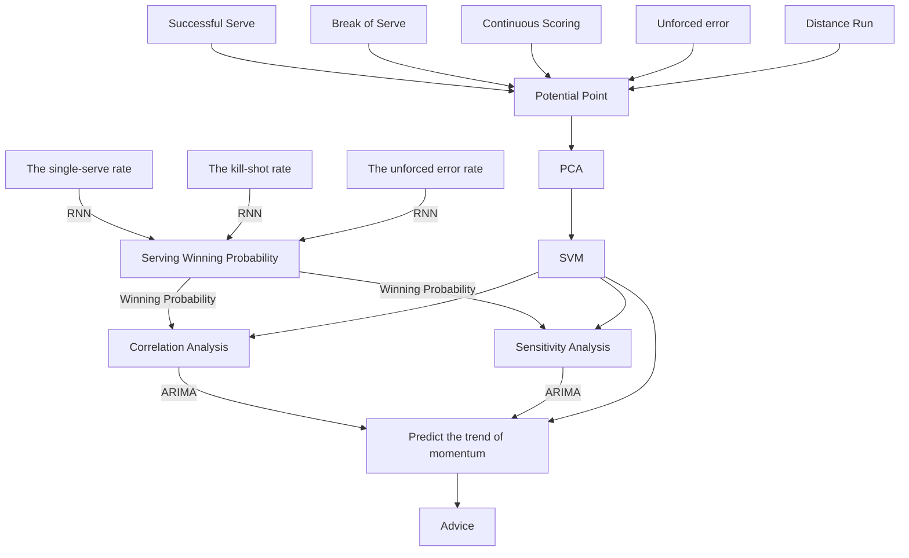

# Momentum: Powerful Magic for Winning

Summary

In the 2023 Wimbledon Finals, Carlos Alcaraz dethroned Novak Djokovic in a captivating display of youthful exuberance over seasoned skill. The match's dynamic ebb and flow highlighted the intangible factor of momentum. To capture this phenomenon, our team crafted mathematical models that leveraged Wimbledon data to quantify player momentum, offering fresh insights into what drives tennis triumphs.

For Model 1, we started by cleaning the data to remove outliers. We then extracted the match data for Novak Djokovic from the Finals. By feeding his data into a Recurrent Neural Network (RNN), we calculated his winning probability for each game when serving and receiving. The results showed a significantly higher winning probability when serving than receiving, which aligns with experience. Additionally, we created visualization charts to intuitively display the changes in winning probability throughout the match.

For Model 2, we first defined an algorithm for potential points. Potential point is a state quantity related to five features: service points, break points, continuous scoring, unforced errors, and distance run. We used Principal Component Analysis (PCA) on five features to extract three principal component vectors as input features and built a momentum model based on Support Vector Machines (MSVM). This model was used to obtain the single-game momentum and accumulated set momentum for two players. We conducted a correlation analysis between the calculated single-game momentum and the single-game winning probability obtained from Model 1, yielding correlation values of 0.704 and 0.729. This indicates that a player's success is not random but related to momentum.

For Model 3, we built an ARIMA time series forecasting model. Using the momentum data from model 2, we obtained predictions for the accumulated momentum of the two players. The results suggested that Carlos Alcaraz would have higher momentum, making it more likely for him to win. Following this, we offered advice on how to capitalize on momentum shifts during a match, focusing on seizing opportunities for continuous scoring, handling service games, and converting break points.

Next, we tested and verified our model using data from another match in the Wimbledon Championships (match 1502). The model's calculations of accumulated momentum closely matches the match flow. We also provided general advice for modifying the model for different types of competition. After conducting a sensitivity analysis, the results show that the momentum calculation model is highly sensitive to various input features.

Finally, we wrote a memo for tennis coaches. The memo summarizes our model, explains the role of momentum, and offers recommendations.

Keywords: Momentum; RNN; PCA; The MSVM Model; ARIMA

# Contents

# 1 Introduction 2

1.1 Problem Background 2  
1.2 Restatement of the Problem ..... 2  
1.3 Ourwork 3  
1.4 Assumptions and Justification ..... 3

# 2 Notations 4

# 3 Establishment and Solution of Single Game Winning Probability Model 4

3.1 Single Game Winning Probability Model Based on Recurrent Neural Network (RNN) 4

3.1.1 Serving Player Winning Probability Model 5

3.1.2 Receiving Player Winning Probability Model 7

3.2 Visualization of the Match Flow 8

# 4 Establishment and Solution of the Momentum Model 8

4.1 Feature Selection 9  
4.2 Potential Point Model 9  
4.3 Principal Component Analysis (PCA) Dimensionality Reduction ..... 10  
4.4 Momentum Model Based on Support Vector Machines (SVM) 12  
4.5 Statistical Test of Factors Affecting Momentum ..... 14

4.5.1 The Impact of Momentum on the Probability of Winning a Match ..... 14  
4.5.2 The Impact of other Factors on Momentum 15

# 5 Predictive Model for Shifts in Momentum 15

5.1 Accumulated Momentum Prediction Model Based on ARIMA 16  
5.2 Advice Based on Shifts in Momentum 17

# 6 Verification and Application of the Model 18

6.1 Verification within the Same Type of Competition ..... 18  
6.2 Application to other Types of Competitions 19

# 7 Sensitivity Analysis 19

# 8 Strengths and Weaknesses 20

8.1 Strengths 20  
8.2 Weaknesses 20

# Appendices 23

# 1 Introduction

Billy Shirley once said: “Watch Out for Momentum : There may not even be such a thing in sports, but you can be sure you’ll be told whenever it shifts.”

# 1.1 Problem Background

natural_image

Two male tennis players in action, one in white uniform with racket, one in white shirt, both in action on court (no visible text or symbols)

Figure 1: Novak Djokovic & Carlos Alcaraz $^{[1]}$

In the 2023 Wimbledon Gentlemen's championship, 20-year-old Carlos Alcaraz emerged victorious against 36-year-old Novak Djokovic, handing Djokovic his first Wimbledon defeat since 2013 and halting his remarkable run in Grand Slam tournaments. The final was filled with dramatic turns of performance. Djokovic started strong by claiming the first set 6-1, only for Alcaraz to make a comeback, securing the second set through a tie-breaker and dominating the third set 6-1. Although Djokovic managed to take the fourth set 6-3, Alcaraz ultimately clinched the win with a 6-4 score in the deciding fifth set. The game showcased notable shifts

in momentum, underscoring the difficulty in quantifying how various events within the match affect a player's or team's performance. Yet the omnipresence of momentum is so pervasive that it's acknowledged not solely by commentators, mentors, and competitors but also sensed by a laid-back spectator lounging on their sofa. So for coaches, comprehending precisely what momentum is can be vital, as this understanding will aid them in directing the game.

# 1.2 Restatement of the Problem

Considering the background information and restricted conditions identified in the problem statement, we need to solve the following problems:

- Problem 1: Develop a tennis match flow model to assess player performance, considering serve advantage and visualize the match dynamics.  
- Problem 2: Assess the tennis coach's skepticism about the role of “momentum” versus randomness in match outcomes using a performance model/metric.  
- Problem 3: Develop a predictive model for tennis match swings and advise on strategy considering past “momentum” differentials.  
- Problem 4: Test and validate the tennis swing prediction model on other matches, identify performance factors, and assess generalizability to different contexts.  
- Problem 5: Include a page memo summarizing results with advice for coaches on the role of “momentum”, and how to prepare players to respond to events that impact the flow of play during a tennis match.

# 1.3 Ourwork

flowchart

# 1.4 Assumptions and Justification

- Assumption 1: Assume that after each set, the athlete's accumulated momentum is updated.
Justification: After each set, the athlete gets a chance to rest, stabilize, and the coach will provide corresponding strategies, thus it's appropriate to update the athlete's momentum.  
- Assumption 2: Ignore the impact of tiebreakers on momentum trends.

Justification: In tiebreakers, the situation changes dramatically with alternating service rights, and the athletes' mental states are highly tense, so the influence of momentum is minimal. Therefore, the impact of tiebreakers on momentum trends can be neglected.

\- Assumption 3: The momentum in each game is discrete.

Justification: The model considers momentum to be discrete within each game, as there is no more continuous data available to accurately depict it. Therefore, the calculation of momentum is based on discrete intervals within the games.

\- Assumption 4: Ignore the impact of environmental factors and athletes' psychological states.

Justification: The environment of the court, wind speed, and the athletes' psychological states can all have an impact on the progression of the match. However, since no specific data is provided in the question and psychological states cannot be quantitatively described, the influence of these factors is therefore neglected.

# 2 Notations

Table 1: Notation

<table><tr><td></td><td>Symbol</td><td>Meaning</td></tr><tr><td>1</td><td> $X_1$ </td><td>Single-serve rate</td></tr><tr><td>2</td><td> $X_2$ </td><td>Killing-shot rate</td></tr><tr><td>3</td><td> $X_3$ </td><td>Error rate</td></tr><tr><td>4</td><td> $X_4$ </td><td>break-of-serve rate</td></tr><tr><td>5</td><td>t</td><td>Total number of balls in a single game</td></tr><tr><td>6</td><td> $t_f$ </td><td>Number of successful first serves</td></tr><tr><td>7</td><td> $t_{ace}$ </td><td>Number of aces</td></tr><tr><td>8</td><td> $t_w$ </td><td>Number of winning points</td></tr><tr><td>9</td><td> $t_{uf}$ </td><td>Number of unforced errors</td></tr><tr><td>10</td><td> $Y_p$ </td><td>Winning rate</td></tr><tr><td>11</td><td> $M_b$ </td><td>Potential point_Break of serve</td></tr><tr><td>12</td><td> $M_s$ </td><td>Potential point_Serve</td></tr><tr><td>13</td><td> $M_c$ </td><td>Potential point_Continuous</td></tr><tr><td>14</td><td> $M_u$ </td><td>Potential point_Unforced Error</td></tr><tr><td>15</td><td> $M_i$ </td><td>Potential points of each game</td></tr><tr><td>16</td><td>M</td><td>Potential Point</td></tr><tr><td>17</td><td>i</td><td>The current game number</td></tr><tr><td>18</td><td>n</td><td>Total number of games played in the set</td></tr><tr><td>19</td><td> $M_o$ </td><td>Momentum</td></tr></table>

\*Note: Here is a partial notation.Detailed explanations for each symbol can be found in the corresponding text.

# 3 Establishment and Solution of Single Game Winning Probability Model

# 3.1 Single Game Winning Probability Model Based on Recurrent Neural Network (RNN)

In tennis, players who are serving have a higher probability of winning. Therefore, we construct separate winning probability models for players based on both the serving and receiving aspects. Given the numerous factors that can influence the outcome of a tennis match, we focus on key features and use neural network methods to build our winning probability model. However, the traditional neural network produces outputs that depend only on the current input, which makes them less capable of accurately predicting data that changes over time. In contrast, the output of Recurrent Neural Network (RNN) is determined by both the current input and the previous moment's output, similar to adding a memory unit to the neural network. This allows the RNN to remember the behavior from the previous moment and respond appropriately based on the current input and past behavior. Compared to the traditional neural network, which is like a broken chain, RNN exhibits a continuous characteristic. This characteristic makes RNN more suitable for our modeling than the traditional neural network.

# 3.1.1 Serving Player Winning Probability Model

In the model, we use the win probability in each game as the output feature and select single-serve rate, killing-shot rate, and error rate as the three representative input features. We perform data preprocessing by extracting the given data from the problem and calculating the conversion to the serving player's single-serve rate, killing-shot rate, and error rate as the input features.

$$
X _ {1} = \frac {t _ {f}}{t} \tag {1}
$$

In this equation, t represents the total number of balls in a single game, and $t_{f}$ represents the number of successful first serves. Using this equation, we can calculate the single-serve rate $X_{1}$ .

We define the killing-shot rate $X_{2}$ and the error rate $X_{3}$ in the same way.

$$
X _ {2} = \frac {t _ {a c e}}{t _ {w}} \tag {2}
$$

$$
X _ {3} = \frac {t _ {u f}}{t} \tag {3}
$$

We define the vector Y predicted by three input features as the athlete's service winning rate.

$$
Y _ {p} = \frac {t _ {w}}{t} \tag {4}
$$

In the equation 2,3 and 4, $t_{ace}$ represents the number of aces, $t_{w}$ represents the number of winning points, and $t_{uf}$ represents the number of unforced errors. $Y_{p}$ represents winning rate, which is based on past data.

We construct and input the matrix $X = [X_{1}, X_{2}, X_{3}]$ after extracting the three input feature vectors. For each $X_{i}$ , we have $X_{i} = (X_{1}, X_{2}, \cdots, X_{t})^{T} (i = 1, 2, 3, \cdots)$ , where $X_{t}$ represents the input feature at time t. After determining the features, we process with the propagation of RNN. The process is as follows:

$$
h _ {t} = f \left(W _ {i h} X _ {t} + W _ {h h} h _ {t - 1} + b _ {h}\right) \tag {5}
$$

$$
y _ {t} = W _ {h o} h _ {t} + b _ {0} \tag {6}
$$

Where, $h_{t}$ represents the hidden layer state, $W_{ih}$ is the weight matrix from the inputlayer to the hidden layer, $W_{hh}$ is the weight matrix from the hidden layer to itself, and $b_{h}$ is the bias vector for the hidden layer. $W_{ho}$ is the weight matrix from the hidden layer to the outputlayer, and $b_{o}$ , is the bias vector for the output layer.

Regarding the objective function, we assume that the model's predicted output is as following:

$$
\widehat {Y} = (\hat {y _ {1}}, \hat {y _ {2}}, \dots , \hat {y _ {t}}) ^ {T} \tag {7}
$$

The actual output is as following:

$$
Y = (y _ {1}, y _ {2}, \dots , y _ {t}) ^ {T} \tag {8}
$$

Then the objective function can be defined as following:

$$
L = \frac {1}{t} \sum_ {i = 1} ^ {t} \left(\hat {y} _ {i} - y _ {i}\right) ^ {2} \tag {9}
$$

First, we clean the dataset in the problem, removing outliers. Afterward, we use the backpropagation algorithm and the optimizer in MATLAB to update the model's parameters, minimizing the objective function, and thus completing the initial construction of the model.

We incorporated all the data from Novak Djokovic's service games in the match for model training, calculating his service game winning probability through factors such as the killing-shot rate, single-serve rate, and error rate.

Table 2: Novak Djokovic's service game data from Wimbledon Championship.

<table><tr><td>Match_id</td><td>Set_no.</td><td>Game_no.</td><td>Point_no.</td><td> $X_1$ </td><td> $X_2$ </td><td> $X_3$ </td><td> $Y_p$ </td></tr><tr><td>1316</td><td>1</td><td>1</td><td>5</td><td>0.25</td><td>1</td><td>0</td><td>0.8</td></tr><tr><td>1316</td><td>1</td><td>3</td><td>4</td><td>0.25</td><td>0</td><td>0</td><td>1</td></tr><tr><td>1316</td><td>1</td><td>5</td><td>5</td><td>0.25</td><td>0.8</td><td>0</td><td>0.8</td></tr><tr><td>...</td><td>...</td><td>...</td><td>...</td><td>...</td><td>...</td><td>...</td><td>...</td></tr><tr><td>1701</td><td>5</td><td>9</td><td>5</td><td>0.25</td><td>0.8</td><td>0.8</td><td>0.8</td></tr></table>

Through model calculations, we obtained the service player's winning probability based on three input features and compared it with the player's actual winning rate. The results are as follows:

line

| inning | Serving player's winning probability | Refer to winning percentage |
| --- | --- | --- |
| 0 | ~0.89 | ~0.80 |
| 5 | ~0.71 | ~0.67 |
| 10 | ~0.86 | ~0.78 |
| 15 | ~0.75 | ~0.80 |
| 20 | ~0.49 | ~0.63 |
| 25 | ~0.81 | ~0.81 |
| 30 | ~0.71 | ~0.57 |
| 35 | ~0.95 | ~0.80 |
| 40 | ~0.68 | ~0.34 |
| 45 | ~0.87 | ~0.80 |
| 50 | ~0.62 | ~0.38 |
| 55 | ~0.82 | ~0.80 |
| 60 | ~0.61 | ~0.66 |
| 65 | ~0.85 | ~0.81 |
| 70 | ~0.68 | ~0.61 |
| 75 | ~0.80 | ~0.80 |
| 80 | ~0.65 | ~0.60 |
| 85 | ~0.94 | ~0.63 |
| 90 | ~0.20 | ~0.25 |
| 95 | ~0.78 | ~0.63 |
| 100 | ~0.82 | ~0.80 |

Figure 3: The fitting results for the service player's winning probability

histogram

| Prediction error (range) | Frequency |
| --- | --- |
| -0.3~-0.25 | 1 |
| -0.2~-0.15 | 6 |
| -0.15~-0.1 | 4 |
| -0.1~-0.05 | 5 |
| -0.05~0.0 | 6 |
| 0.0~0.05 | 7 |
| 0.05~0.1 | 15 |
| 0.1~0.15 | 7 |
| 0.15~0.2 | 11 |
| 0.2~0.25 | 12 |
| 0.25~0.3 | 5 |
| 0.3~0.35 | 4 |
| 0.35~0.4 | 5 |
| 0.4~0.45 | 4 |
| 0.45~0.5 | 4 |
| 0.5~0.55 | 0 |
| 0.55~0.6 | 0 |
| 0.6~0.65 | 0 |
| 0.65~0.7 | 0 |
| 0.7~0.75 | 0 |
| 0.75~0.8 | 0 |
| 0.8~0.85 | 0 |
| 0.85~0.9 | 0 |
| 0.9~0.95 | 0 |
| 0.95~1.0 | 0 |
| 1.0~1.05 | 0 |
| 1.05~1.1 | 0 |
| 1.1~1.15 | 0 |
| 1.15~1.2 | 0 |
| 1.2~1.25 | 0 |
| 1.25~1.3 | 0 |
| 1.3~1.35 | 0 |
| 1.35~1.4 | 0 |
| 1.4~1.45 | 0 |
| 1.45~1.5 | 0 |
| 1.5~1.55 | 0 |
| 1.55~1.6 | 0 |
| 1.6~1.65 | 0 |
| 1.65~1.7 | 0 |
| 1.7~1.75 | 0 |
| 1.75~1.8 | 0 |
| 1.8~1.85 | 0 |
| 1.85~1.9 | 0 |
| 1.9~1.95 | 0 |
| 1.95~2.0 | 0 |
| 2.0~2.05 | 0 |
| 2.05~2.1 | 0 |
| 2.1~2.15 | 0 |
| 2.15~2.2 | 0 |
| 2.2~2.25 | 0 |
| 2.25~2.3 | 0 |
| 2.3~2.35 | 0 |
| 2.35~2.4 | 0 |
| 2.4~2.45 | 0 |
| 2.45~2.5 | 0 |
| 2.5~2.55 | 0 |
| 2.55~2.6 | 0 |
| 2.6~2.65 | 0 |
| 2.65~2.7 | 0 |
| 2.7~2.75 | 0 |
| 2.75~2.8 | 0 |
| 2.8~2.85 | 0 |
| 2.85~2.9 | 0 |
| 2.9~2.95 | 0 |
| 2.95~3.0 | 0 |
| 3.0~3.05 | 0 |
| 3.05~3.1 | 0 |
| 3.1~3.15 | 0 |
| 3.15~3.2 | 0 |
| 3.2~3.25 | 0 |
| 3.25~3.3 | 0 |
| 3.3~3.35 | 0 |
| 3.35~3.4 | 0 |
| 3.4~3.45 | 0 |
| 3.45~3.5 | 0 |
| 3.5~3.55 | 0 |
| 3.55~3.6 | 0 |
| 3.6~3.65 | 0 |
| 3.65~3.7 | 0 |
| 3.7~3.75 | 0 |
| 3.75~3.8 | 0 |
| 3.8~3.85 | 0 |
| 3.85~3.9 | 0 |
| 3.9~3.95 | 0 |
| 3.95~4.0 | 0 |
| 4.0~4.05 | 0 |
| 4.05~4.1 | 0 |
| 4.1~4.15 | 0 |
| 4.15~4.2 | 0 |
| 4.2~4.25 | 0 |
| 4.25~4.3 | 0 |
| 4.3~4.35 | 0 |
| 4.35~4.4 | 0 |
| 4.4~4.45 | 0 |
| 4.45~4.5 | 0 |
| 4.5~4.55 | 0 |
| 4.55~4.6 | 0 |
| 4.6~4.65 | 0 |
| 4.65~4.7 | 0 |
| 4.7~4.75 | 0 |
| 4.75~4.8 | 0 |
| 4.8~4.85 | 0 |
| 4.85~4.9 | 0 |
| 4.9~4.95 | 0 |
| 4.95~5.0 | 0 |
| 5.0~5.05 | 0 |
| 5.05~5.1 | 0 |
| 5.1~5.15 | 0 |
| 5.15~5.2 | 0 |
| 5.2~5.25 | 0 |
| 5.25~5.3 | 0 |
| 5.3~5.35 | 0 |
| 5.35~5.4 | 0 |
| 5.4~5.45 | 0 |
| 5.45~5.5 | 0 |
| 5.5~5.55 | 0 |
| 5.55~5.6 | 0 |
| 5.6~5.65 | 0 |
| 5.65~5.7 | 0 |
| 5.7~5.75 | 0 |
| 5.75~5.8 | 0 |
| 5.8~5.85 | 0 |
| 5.85~5.9 | 0 |
| 5.9~5.95 | 0 |
| 5.95~6.0 | 0 |
| 6.0~6.05 | 0 |
| 6.05~6.1 | 0 |
| 6.1~6.15 | 0 |
| 6.15~6.2 | 0 |
| 6.2~6.25 | 0 |
| 6.25~6.3 | 0 |
| 6.3~6.35 | 0 |
| 6.35~6.4 | 0 |
| 6.4~6.45 | 0 |
| 6.45~6.5 | 0 |
| 6.5~6.55 | 0 |
| 6.55~6.6 | 0 |
| 6.6~6.65 | 0 |
| 6.65~6.7 | 0 |
| 6.7~6.75 | 0 |
| 6.75~6.8 | 0 |
| 6.8~6.85 | 0 |
| 6.85~6.9 | 0 |
| 6.9~6.95 | 0 |
| 6.95~7.0 | 0 |
| 7.0~7.05 | 0 |
| 7.05~7.1 | 0 |
| 7.1~7.15 | 0 |
| 7.15~7.2 | 0 |
| 7.2~7.25 | 0 |
| 7.25~7.3 | 0 |
| 7.3~7.35 | 0 |
| 7.35~7.4 | 0 |
| 7.4~7.45 | 0 |
| 7.45~7.5 | 0 |
| 7.5~7.55 | 0 |
| 7.55~7.6 | 0 |
| 7.6~7.65 | 0 |
| 7.65~7.7 | 0 |
| 7.7~7.75 | 0 |
| 7.75~7.8 | 0 |
| 7.8~7.85 | 0 |
| 7.85~7.9 | 0 |
| 7.9~7.95 | 0 |
| 7.95~8.0 | 0 |
| 8.0~8.05 | 0 |
| 8.05~8.1 | 0 |
| 8.1~8.15 | 0 |
| 8.15~8.2 | 0 |
| 8.2~8.25 | 0 |
| 8.25~8.3 | 0 |
| 8.3~8.35 | 0 |
| 8.35~8.4 | 0 |
| 8.4~8.45 | 0 |
| 8.45~8.5 | 0 |
| 8.5~8.55 | 0 |
| 8.55~8.6 | 0 |
| 8.6~8.65 | 0 |
| 8.65~8.7 | 0 |
| 8.7~8.75 | 0 |
| 8.75~8.8 | 0 |
| 8.8~8.85 | 0 |
| 8.85~8.9 | 0 |
| 8.9~8.95 | 0 |
| 8.95~9.0 | 0 |
| 9.0~9.05 | 0 |
| 9.05~9.1 | 0 |
| 9.1~9.15 | 0 |
| 9.15~9.2 | 0 |
| 9.2~9.25 | 0 |
| 9.25~9.3 | 0 |
| 9.3~9.35 | 0 |
| 9.35~9.4 | 0 |
| 9.4~9.45 | 0 |
| 9.45~9.5 | 0 |
| 9.5~9.55 | 0 |
| 9.55~9.6 | 0 |
| 9.6~9.65 | 0 |
| 9.65~9.7 | 0 |
| 9.7~9.75 | 0 |
| 9.75~9.8 | 0 |
| 9.8~9.85 | 0 |
| 9.85~9.9 | 0 |
| 9.9~9.95 | 0 |
| 9.95~10.0 | 0 |

Figure 4: Histogram of prediction error for Serving

In the figure 3, the red line represents the winning probability of the service player calculated by the model, and the green line represents the reference winning rate. Both demonstrate a high degree of fitting precision, as shown in the figure 4 above.

In the figure 4, the pink frequency distribution histogram represents the error distribution frequency of the service winning rate model. The mean squared error (MSE) is 0.012922. The coefficient of determination $R^{2}$ is 0.56119.

# 3.1.2 Receiving Player Winning Probability Model

For the construction of a winning probability model for receiving players, we will also use the winning rate of each game as the output feature. However, the input features need to be rebuilt because receiving players have a natural disadvantage compared to serving players. Therefore, when a receiving player breaks of serve, it greatly increases their confidence and winning rate. Therefore, for the receiving player's winning rate model, we select break of serve, killing shot, and error, as representative input features. We will preprocess the data provided in the problem and calculate the receiving player's killing-shot rate $X_{2}$ , error rate $X_{3}$ , and break-of-serve rate $x_{4}$ . These will be input into an RNN model. We define break-of-serve rate $x_{4}$ as following:

$$
X _ {4} = \frac {t _ {b r e a k}}{t _ {b r e a k \_ p o i n t}} \tag {10}
$$

Where, $t_{break\_point}$ represents the number of times a breakpoint is reached, and $t_{break}$ represents the number of successful break-of-serve.

Similarly, we train our model using all the data from the service games in which Novak Djokovic received the ball. We calculate Novak Djokovic's receiving game winning probability based on his kill-shot rate, break-of-serve rate, and error rate.

Table 3: Novak Djokovic's receiving game data from Wimbledon Championship.

<table><tr><td>Match_id</td><td>Set_no.</td><td>Game_no.</td><td>Point_no.</td><td> $X_{2}$ </td><td> $X_{3}$ </td><td> $X_{4}$ </td><td> $Y_{p}$ </td></tr><tr><td>1316</td><td>1</td><td>2</td><td>8</td><td>0.33</td><td>0</td><td>0.25</td><td>0.375</td></tr><tr><td>1316</td><td>1</td><td>4</td><td>6</td><td>0</td><td>0</td><td>0.33</td><td>0.333</td></tr><tr><td>1316</td><td>1</td><td>6</td><td>6</td><td>0.25</td><td>1</td><td>0</td><td>0.667</td></tr><tr><td>...</td><td>...</td><td>...</td><td>...</td><td>...</td><td>...</td><td>...</td><td>...</td></tr><tr><td>1701</td><td>5</td><td>10</td><td>6</td><td>0.5</td><td>0</td><td>0</td><td>0.33</td></tr></table>

Through the training and calculation of the model, we obtained the winning probability of the receiving player based on three input features, and compared it with the winning rate of the player. The results are as follows:

Receiving player's winning probability  

line

| inning | Receiving player's winning probability | Refer to winning percentage |
| --- | --- | --- |
| 0 | ~0.37 | ~0.37 |
| 5 | ~0.67 | ~0.67 |
| 10 | 1.0 | 1.0 |
| 15 | ~0.2 | ~0.2 |
| 20 | ~0.2 | ~0.2 |
| 25 | ~0.4 | ~0.4 |
| 30 | ~0.2 | ~0.2 |
| 35 | ~0.2 | ~0.2 |
| 40 | ~0.3 | ~0.3 |
| 45 | ~0.3 | ~0.3 |
| 50 | 1.0 | 1.0 |
| 55 | ~0.2 | ~0.2 |
| 60 | ~0.2 | ~0.2 |
| 65 | ~0.2 | ~0.2 |
| 70 | ~0.3 | ~0.3 |
| 75 | ~0.2 | ~0.2 |
| 80 | ~0.2 | ~0.2 |
| 85 | ~0.2 | ~0.2 |
| 90 | ~0.6 | ~0.6 |
| 95 | ~0.2 | ~0.2 |
| 100 | ~0.4 | ~0.4 |

Figure 5: The fitting results for the service player's receiving probability

Histogram of prediction error for Receiving  

histogram

| Prediction error (range) | Frequency |
| --- | --- |
| -0.45~-0.425 | 1 |
| -0.425~-0.4 | 1 |
| -0.4~-0.375 | 1 |
| -0.2~-0.175 | 3 |
| -0.175~-0.15 | 3 |
| -0.15~-0.125 | 8 |
| -0.125~-0.1 | 4 |
| -0.1~-0.075 | 8 |
| -0.075~-0.05 | 24 |
| -0.05~-0.025 | 13 |
| -0.025~0.0 | 3 |
| 0.0~0.025 | 12 |
| 0.025~0.05 | 0 |
| 0.05~0.075 | 0 |
| 0.075~0.1 | 0 |
| 0.1~0.125 | 0 |
| 0.125~0.15 | 0 |
| 0.15~0.175 | 0 |
| 0.175~0.2 | 11 |
| 0.2~0.225 | 3 |

Figure 6: Histogram of prediction error for receiving

In the figure5, the red line represents the winning probability of the receiving player calculated by the model, and the green line represents the reference winning rate. The two have a high degree of fitting accuracy.

In the figure 6, the pink frequency distribution histogram represents the error distribution frequency of the service winning rate model. The mean squared error (MSE) is 0.017458. The coefficient of determination $R^{2}$ is 0.66442.

Finally, we compared and visualized the winning probability of serving and receiving for the same player, and obtained the following result:

line

| inning | Serving player's winning probability | Receiving player's winning probability |
| --- | --- | --- |
| 0 | ~0.90 | ~0.38 |
| 5 | ~0.70 | ~0.67 |
| 10 | ~0.70 | ~0.00 |
| 15 | ~0.75 | ~0.46 |
| 20 | ~0.75 | ~0.19 |
| 25 | ~0.80 | ~0.41 |
| 30 | ~0.75 | ~0.47 |
| 35 | ~0.75 | ~0.00 |
| 40 | ~0.75 | ~0.61 |
| 45 | ~0.75 | ~0.28 |
| 50 | ~0.75 | ~0.99 |
| 55 | ~0.75 | ~0.00 |
| 60 | ~0.75 | ~0.20 |
| 65 | ~0.75 | ~0.63 |
| 70 | ~0.75 | ~0.00 |
| 75 | ~0.75 | ~0.66 |
| 80 | ~0.75 | ~0.19 |
| 85 | ~0.75 | ~0.29 |
| 90 | ~0.75 | ~0.77 |
| 95 | ~0.75 | ~0.41 |

Figure 7: Comparison of winning probability of serving and receiving

In figure7, the red line represents the winning probability of the server, while the green line represents the winning probability of the receiver. We can conclude that the server's winning probability is generally higher than that of the receiver. Therefore, serving has a natural advantage, which is closely related to the momentum of the tennis player and also determines the direction of the tennis match.

# 3.2 Visualization of the Match Flow

We uses the match data from the Wimbledon final between Carlos Alcaraz and Novak Djokovic (2023-wimbledon-1701) as a reference to visualize the match flow.

In figure8, numbers 1 and 2 represent the winning athletes. The blue bar chart indicates the number of games each won, while the line chart describes the point difference between them. Through this chart, we can visually see the flow of the entire match. Overall, the two players were well-matched, and the game was quite intense, with a particular highlight in the second set where it took thirteen games for the winner to emerge. In the end, player 1 secured three sets while player 2 took two sets but ultimately lost.

# 4 Establishment and Solution of the Momentum Model

Professional sports have always been a highly competitive industry both on and off the field. Gaining an advantage can have crucial effects, which often lead to individual success and team victories. The study of momentum is one of the most challenging topics in sports analytics because while people can definitely

bar_line

| Match Time | The number of games won | The first set | The second set | The third set | The fourth set | The fifth set |
| --- | --- | --- | --- | --- | --- | --- |
| 0:30:55 | ~-15 | ~-15 | ~-15 | ~-15 | ~-15 | ~-15 |
| 1:05:42 | ~-15 | ~-15 | ~-15 | ~-15 | ~-15 | ~-15 |
| 1:43:24 | ~-38 | ~-38 | ~-38 | ~-38 | ~-38 | ~-38 |
| 2:19:00 | ~19 | ~19 | ~19 | ~19 | ~19 | ~19 |
| 2:54:24 | ~31 | ~31 | ~31 | ~31 | ~31 | ~31 |
| 3:28:35 | ~-18 | ~-18 | ~-18 | ~-18 | ~-18 | ~-18 |
| 4:02:19 | ~-38 | ~-38 | ~-38 | ~-38 | ~-38 | ~-38 |
| 4:33:13 | ~38 | ~38 | ~38 | ~38 | ~38 | ~38 |

Figure 8: 2023-Wimbledon-1701

sense a "winning streak" when it occurs, expressing it is still difficult. Therefore, we have established a momentum computation model based on machine learning to quantitatively analyze the momentum of players. $^{[5]}$

# 4.1 Feature Selection

The manifestation of momentum is often a sense of power that a tennis player experiences when winning a match, and it is closely linked to the significant progressions within the game. Since crucial points and progressions tend to influence the direction of the match, gaining or losing key points can lead to an increase or decrease in momentum. Therefore, we use the following events during a tennis match to describe the characteristics of momentum:

- Serve: Serving is crucial in tennis, especially when players are evenly matched, giving the server a higher chance of winning. A good serve, fast, with spin and varied placement, challenges the opponent's defense. Servers can control the match pace and upset the opponent's rhythm. Variations in serving can also disrupt the opponent's return, creating offensive opportunities.  
- Continuous Scoring Process: Consecutive scoring enhances confidence and morale, improving focus and stroke technique. It can develop a “striking habit”, leading to smoother, more precise shots. This reflects the buildup of momentum in a match.  
- Break of Serve: Achieving a break of serve boosts confidence and momentum, as it signifies an advantage. It encourages better performance and alters match dynamics, putting the player who broke ahead and forcing the opponent to break back. This affects both players' mental states and strategies.  
- Unforced Errors: Frequent unforced errors can damage confidence and morale, leading to underperformance. They disrupt match dynamics, increase tension, and affect the athlete's mental state and strategy, impacting momentum negatively.

# 4.2 Potential Point Model

The concept of potential pointis a discrete state concept used to describe the condition of an athlete at a certain point or stage in a competition. Thus, the entire process of the athlete's competition is discretized

into games, and the athlete's performance in the current game is characterized by specific scores. The sum of these scores constitutes the potential point.

- “Potential point\_Serve” $M_s$ : During the athlete's service, they have a greater advantage, and we define that for each service game, the athlete earns potential points, which are quantified as 2 points, meaning $M_s = 2$ .  
- “Potential point\_Continuous Scoring Process” $M_c$ : Athletes often gain more confidence when they score consecutively. We define that for every three consecutive points scored, a potential point for consecutive scoring is earned, quantified as 2 points, meaning $M_c = 2$ . Within a game, an athlete may achieve multiple instances of consecutive scoring; in such cases, the potential points for consecutive scoring can be cumulative.  
- “Potential point\_Break of Serve” $M_b$ : When an athlete achieves a break in a game, the potential point earned is characterized by 5 points, meaning $M_b = 5$ .  
- “Potential point\_Unforced Errors” $M_u$ : Athletes often commit one or more unforced errors during a match, which can significantly impact their momentum negatively. We define that each occurrence of an unforced error reduces the potential points by 0.5, meaning $M_u = -0.5$ . Since errors can happen multiple times in a match, this value can also accumulate.

In this way, we can obtain the potential point $M_{i}$ for each game of the athlete as following:

$$
M _ {i} = M _ {b} + M _ {s} + \sum M _ {c} + \sum M _ {u} \tag {11}
$$

Where, $M_{b}, M_{s}, M_{c}$ and $M_{u}$ represent “Potential point\_Break of serve”, “Potential point\_Serve”, “Potential point\_Continuous Scoring Process” and “Potential point\_Unforced errors”, respectively.

For an entire set, the potential points are continuously accumulating, so for this set, the potential point $M$ is as following:

$$
M = \sum_ {i = 1} ^ {n} M _ {i} \tag {12}
$$

Where, $i$ represents the current game number and $n$ represents the total number of games played in the set.

As hypothesized in the paper, there is a break at the end of each set where the coach provides guidance to the athlete, and the athlete also gets a rest. Therefore, at the start of the next set, the athlete's total momentum points are reset to zero. Moreover, regarding tiebreak games, players alternate serves, and the intensity of competition is much higher, making it difficult to quantify, so it is not included in the model.

# 4.3 Principal Component Analysis (PCA) Dimensionality Reduction

In tennis, physical fitness consumption is also an important reference standard. However, the consumption of physical fitness cannot be quantitatively characterized into momentum points. Therefore, we extract the running distance for each game of the athletes in the dataset separately to obtain a feature column of the athlete's running distance per game. This is then incorporated as a reference into the momentum model.

Since there are already four feature vectors, and with the introduction of running distance, there are now five input features in the model. Therefore, we perform Principal Component Analysis (PCA) to reduce the data dimensions, coupling the five features and extracting the main input features to construct the model.

Let $a_{ij}$ represent each reference data point, and first normalize the samples.

$$
\mu_ {j} = \frac {1}{n} \sum_ {i = 1} ^ {n} a _ {i j} \tag {13}
$$

$$
s = \sqrt {\frac {1}{n - 1} \sum_ {i = 1} ^ {n} \left(a _ {i j} - \mu_ {i}\right) ^ {2}} \tag {14}
$$

Here, $\mu_{j}$ represents the mean of the samples, and s represents the standard deviation of the samples. Subsequently, the correlation coefficient of the samples, that is, the correlation matrix is obtained.

$$
r _ {i j} = \frac {\sum_ {k = 1} ^ {n} a _ {k i} \tilde {\times} a _ {\tilde {k} j}}{n - 1} \tag {15}
$$

$$
R = \left[ \begin{array}{c c c c} r _ {1 1} & r _ {1 2} & \dots & r _ {1 j} \\ r _ {2 1} & r _ {2 2} & \dots & r _ {1 1} \\ \vdots & \vdots & \ddots & \vdots \\ r _ {j 1} & r _ {j 2} & \dots & r _ {j j} \end{array} \right] \tag {16}
$$

Where, $r_{ij}$ represent the correlation coefficient of each sample, and R represent the correlation matrix. After that, we calculate the eigenvalues $\lambda_j$ of the correlation matrix R and extract the corresponding eigenvectors. Based on the magnitude of the eigenvalues, we select the top k eigenvectors corresponding to the largest eigenvalues as the principal components, where k is the number of principal components we wish to retain. The value of k is determined by the contribution rate and cumulative contribution rate to decide the number of principal components to choose. Our model requires that the cumulative contribution rate of all principal components be greater than 0.85. Through calculation, we reduce the five input features to three main principal component inputs. The results are shown in figure9.

Table 4: Three principal components derived from the dimensionality reduction of Carlos Alcaraz's data

<table><tr><td> $X_1$ </td><td> $X_2$ </td><td> $X_3$ </td></tr><tr><td>-0.092368448</td><td>0.497778724</td><td>-0.406497262</td></tr><tr><td>-0.429605389</td><td>-1.068004031</td><td>-0.833292526</td></tr><tr><td>0.438065808</td><td>0.644409942</td><td>-0.670082014</td></tr><tr><td>...</td><td>...</td><td>...</td></tr><tr><td>-1.581903617</td><td>0.720871564</td><td>-0.652117794</td></tr></table>

Table 5: The accumulated contribution rate corresponding to the principal components.

<table><tr><td>Principle Components</td><td> $X_{1}$ </td><td> $X_{2}$ </td><td> $X_{3}$ </td></tr><tr><td>Accumulated contribution rate</td><td>0.3594</td><td>0.6391</td><td>0.8680</td></tr></table>

heatmap

| Games | 1 | 2 | 3 |
| --- | --- | --- | --- |
| 1 | ~0.5 | ~0.5 | ~0.5 |
| 2 | ~0.5 | ~0.5 | ~0.5 |
| 3 | ~0.5 | ~0.5 | ~0.5 |
| 4 | ~0.5 | ~0.5 | ~0.5 |
| 5 | ~0.5 | ~0.5 | ~0.5 |
| 6 | ~0.5 | ~0.5 | ~0.5 |
| 7 | ~0.5 | ~0.5 | ~0.5 |
| 8 | ~0.5 | ~0.5 | ~0.5 |
| 9 | ~3.5 | ~0.5 | ~4.5 |
| 10 | ~3.5 | ~0.5 | ~4.5 |
| 11 | ~3.5 | ~0.5 | ~0.5 |
| 12 | ~3.5 | ~0.5 | ~0.5 |
| 13 | ~3.5 | ~0.5 | ~0.5 |
| 14 | ~3.5 | ~0.5 | ~0.5 |
| 15 | ~3.5 | ~0.5 | ~0.5 |
| 16 | ~3.5 | ~0.5 | ~0.5 |
| 17 | ~3.5 | ~0.5 | ~0.5 |
| 18 | ~3.5 | ~0.5 | ~0.5 |
| 19 | ~3.5 | ~0.5 | ~0.5 |
| 20 | ~3.5 | ~0.5 | ~0.5 |
| 21 | ~3.5 | ~0.5 | ~0.5 |
| 22 | ~3.5 | ~0.5 | ~0.5 |
| 23 | ~3.5 | ~0.5 | ~0.5 |
| 24 | ~5.0 | ~0.5 | ~0.5 |
| 25 | ~5.0 | ~0.5 | ~0.5 |
| 26 | ~3.5 | ~0.5 | ~0.5 |
| 27 | ~3.5 | ~0.5 | ~0.5 |
| 28 | ~3.5 | ~0.5 | ~0.5 |
| 29 | ~3.5 | ~0.5 | ~0.5 |
| 30 | ~3.5 | ~0.5 | ~0.5 |
| 31 | ~3.5 | ~0.5 | ~0.5 |
| 32 | ~3.5 | ~0.5 | ~0.5 |
| 33 | ~3.5 | ~0.5 | ~0.5 |
| 34 | ~3.5 | ~0.5 | ~0.5 |
| 35 | ~3.5 | ~0.5 | ~0.5 |
| 36 | ~3.5 | ~0.5 | ~0.5 |
| 37 | ~3.5 | ~0.5 | ~0.5 |
| 38 | ~3.5 | ~0.5 | ~0.5 |
| 39 | ~3.5 | ~0.5 | ~0.5 |
| 40 | ~3.5 | ~0.5 | ~0.5 |
| 41 | ~3.5 | ~0.5 | ~0.5 |
| 42 | ~3.5 | ~0.5 | ~0.5 |
| 43 | ~3.5 | ~0.5 | ~0.5 |
| 44 | ~3.5 | ~0.5 | ~0.5 |
| 45 | ~3.5 | ~0.5 | ~0.5 |

Figure 9: Heatmap of the input features after PCA processing

Figure9 is a heatmap of the three principal components obtained through principal component analysis (PCA) dimensionality reduction. The three columns represent the three input vectors, and the color intensity represents the magnitude of the input values.

# 4.4 Momentum Model Based on Support Vector Machines (SVM)

“Potential points” are a discrete variable with strong linear correlation; therefore, by establishing a machine learning model and inputting principal component features with “potential points” as the reference output feature, we can derive the output momentum of the athlete.

Support Vector Machines are a typical machine learning algorithm that uses the hyperplane concept to perform regression modeling, obtaining the momentum value for each game point of an athlete. We define the three main components as $X_{1}, X_{2}$ and $X_{3}$ , forming the input feature matrix $X = [X_{1}, X_{2}, X_{3}]$

Based on the SVM regression formula, we can derive the calculation method for the momentum value $M_{o}$ .

$$
M _ {o} = W ^ {T} X + b \tag {17}
$$

Here, $M_{o}$ represents the output momentum, X represents the input feature matrix. W denotes the normal vector of the hyperplane, and b denotes the bias term of the hyperplane. The parameters of the model are solved by minimizing the objective function, thereby making predictions for the variables.

$$
m i n _ {W, b} \frac {1}{2} \left\| W \right\| ^ {2} \quad s. t. \left(M _ {o} \left(W ^ {T} X + b\right)\right) \geq 1 \tag {18}
$$

The optimization of SVM is achieved by introducing a kernel function to map low-dimensional features to a high-dimensional space. This model uses the Gaussian kernel function for feature mapping.

Using MATLAB software, we train a model with the data from the Wimbledon final between Carlos Alcaraz and Novak Djokovic (2023-wimbledon-1701). We perform Principal Component Analysis (PCA) on the match data considering “Potential point\_Serve”, “Potential point\_Serve”, “Potential point\_Continuous Scoring Process”, “Potential point\_Unforced errors”, and the distance run per game. This analysis yields

three principal components and the potential points for each game. These are then inputted into an SVM-based momentum calculation model to obtain the momentum for each game for both players.

Table 6: Player\_1: Carlos Alcaraz's momentum points and momentum data

<table><tr><td>Set_no.</td><td>Game_no.</td><td> $M_b$ </td><td> $M_s$ </td><td> $M_c$ </td><td> $M_u$ </td><td>Distance_run</td><td>Potential points</td><td>Momentum</td></tr><tr><td>1</td><td>1</td><td>0</td><td>0</td><td>2</td><td>1</td><td>138.548</td><td>1.5</td><td>2.3798</td></tr><tr><td>1</td><td>2</td><td>0</td><td>3</td><td>0</td><td>2</td><td>83.235</td><td>2</td><td>1.1220</td></tr><tr><td>1</td><td>3</td><td>0</td><td>0</td><td>2</td><td>1</td><td>224.138</td><td>1.5</td><td>2.3152</td></tr><tr><td>...</td><td>...</td><td>...</td><td>...</td><td>...</td><td>...</td><td>...</td><td>...</td><td>...</td></tr><tr><td>5</td><td>10</td><td>0</td><td>3</td><td>0</td><td>1</td><td>99.511</td><td>2.5</td><td>1.5982</td></tr></table>

Table 7: Player\_2:Novak Djokovic's potential points and momentum data

<table><tr><td>Set_no.</td><td>Game_no.</td><td> $M_b$ </td><td> $M_s$ </td><td> $M_c$ </td><td> $M_u$ </td><td>Distance_run</td><td>Potential points</td><td>Momentum</td></tr><tr><td>1</td><td>1</td><td>0</td><td>3</td><td>4</td><td>1</td><td>130.689</td><td>6.5</td><td>6.9377</td></tr><tr><td>1</td><td>2</td><td>5</td><td>0</td><td>2</td><td>0</td><td>95.182</td><td>7</td><td>6.5994</td></tr><tr><td>1</td><td>3</td><td>0</td><td>3</td><td>2</td><td>1</td><td>206.149</td><td>4.5</td><td>4.1993</td></tr><tr><td>...</td><td>...</td><td>...</td><td>...</td><td>...</td><td>...</td><td>...</td><td>...</td><td>...</td></tr><tr><td>5</td><td>10</td><td>0</td><td>0</td><td>0</td><td>0</td><td>143.272</td><td>0</td><td>0.1831</td></tr></table>

Figure 10 presents the input of three principal components, with the athlete's potential points as the output feature for prediction. The blue solid line represents the athlete's potential points in each game, while the red dashed line represents the athlete's momentum. The model has a mean squared error (MSE) of 0.1735 and an $R^2$ value of 0.90142, indicating a reliable fit accuracy.

line

| games | potential point | momentum |
| --- | --- | --- |
| 1 | ~1.8 | ~1.5 |
| 2 | ~2.1 | ~1.2 |
| 3 | ~1.6 | ~1.1 |
| 4 | ~4.5 | ~4.2 |
| 5 | ~0.5 | ~0.5 |
| 6 | ~6.5 | ~6.5 |
| 7 | ~0.0 | ~0.0 |
| 8 | ~13.5 | ~13.5 |
| 9 | ~3.2 | ~3.2 |
| 10 | ~1.1 | ~1.1 |
| 11 | ~6.8 | ~6.8 |
| 12 | ~2.2 | ~2.2 |
| 13 | ~5.0 | ~5.0 |
| 14 | ~0.5 | ~0.5 |
| 15 | ~4.5 | ~4.5 |
| 16 | ~0.0 | ~0.0 |
| 17 | ~4.5 | ~4.5 |
| 18 | ~0.0 | ~0.0 |
| 19 | ~8.0 | ~8.0 |
| 20 | ~3.8 | ~3.8 |
| 21 | ~3.2 | ~2.0 |
| 22 | ~3.5 | ~2.0 |
| 23 | ~8.0 | ~7.5 |
| 24 | ~5.0 | ~4.8 |
| 25 | ~7.0 | ~6.2 |
| 26 | ~2.0 | ~2.0 |
| 27 | ~6.5 | ~6.5 |
| 28 | ~2.2 | ~2.2 |
| 29 | ~2.0 | ~2.0 |
| 30 | ~0.0 | ~0.0 |
| 31 | ~5.0 | ~5.0 |
| 32 | ~0.0 | ~0.0 |
| 33 | ~2.5 | ~1.5 |
| 34 | ~1.0 | ~1.0 |
| 35 | ~4.5 | ~4.0 |
| 36 | ~5.0 | ~3.5 |
| 37 | ~5.0 | ~3.5 |
| 38 | ~0.0 | ~0.0 |
| 39 | ~5.0 | ~4.8 |
| 40 | ~0.0 | ~0.0 |
| 41 | ~4.5 | ~4.5 |
| 42 | ~0.0 | ~0.0 |
| 43 | ~6.8 | ~6.8 |
| 44 | ~7.0 | ~6.8 |
| 45 | ~4.5 | ~4.2 |
| 46 | ~9.0 | ~8.8 |
| 47 | ~7.0 | ~7.0 |
| 48 | ~2.0 | ~2.0 |
| 49 | ~5.0 | ~5.0 |
| 50 | ~0.0 | ~0.0 |
| 51 | ~7.0 | ~6.8 |
| 52 | ~1.0 | ~1.0 |
| 53 | ~5.0 | ~4.8 |
| 54 | ~0.0 | ~0.0 |
| 55 | ~5.0 | ~4.8 |
| 56 | ~0.0 | ~0.0 |
| 57 | ~5.0 | ~4.8 |
| 58 | ~0.0 | ~0.0 |
| 59 | ~5.0 | ~4.8 |
| 60 | ~1.0 | ~1.0 |

Figure 10: Momentum model based on SVM training.

Subsequently, for the Wimbledon final between Carlos Alcaraz and Novak Djokovic (2023-wimbledon-1701), we accumulated the momentum of each set for both players to obtain the cumulative momentum changes per set. We also visualized the momentum for each point and for each set to describe the momentum shifts during different stages of the match.

bar_stacked

| Time sequence | Momentum_Player1 | Momentum_Player2 |
| --- | --- | --- |
| 1 | ~2.5 | ~7.5 |
| 2 | ~1.0 | ~6.5 |
| 3 | ~2.5 | ~5.5 |
| 4 | ~4.2 | ~9.8 |
| 5 | ~0.0 | ~7.5 |
| 6 | ~6.5 | ~3.0 |
| 7 | ~0.2 | ~5.0 |
| 8 | ~4.8 | ~0.2 |
| 9 | ~13.2 | ~2.8 |
| 10 | ~3.2 | ~8.5 |
| 11 | ~1.8 | ~7.5 |
| 12 | ~6.8 | ~4.2 |
| 13 | ~2.8 | ~4.5 |
| 14 | ~4.8 | ~0.2 |
| 15 | ~4.5 | ~0.2 |
| 16 | ~4.2 | ~4.5 |
| 17 | ~-1.2 | ~6.8 |
| 18 | ~4.2 | ~0.2 |
| 19 | ~8.2 | ~3.8 |
| 20 | ~3.8 | ~2.8 |
| 21 | ~2.0 | ~4.2 |
| 22 | ~3.2 | ~2.2 |
| 23 | ~7.8 | ~-0.5 |
| 24 | ~4.8 | ~1.2 |
| 25 | ~6.5 | ~1.8 |
| 26 | ~4.2 | ~3.2 |
| 27 | ~2.8 | ~4.2 |
| 28 | ~6.2 | ~4.8 |
| 29 | ~2.8 | ~7.8 |
| 30 | ~1.0 | ~9.2 |
| 31 | ~-0.5 | ~4.8 |
| 32 | ~4.8 | ~0.2 |
| 33 | ~0.2 | ~4.8 |
| 34 | ~1.8 | ~6.8 |
| 35 | ~1.8 | ~10.2 |
| 36 | ~4.2 | ~0.2 |
| 37 | ~3.8 | ~3.2 |
| 38 | ~4.8 | ~0.2 |
| 39 | ~0.2 | ~4.5 |
| 40 | ~4.8 | ~0.2 |
| 41 | ~4.2 | ~0.2 |
| 42 | ~0.2 | ~4.8 |
| 43 | ~1.8 | ~0.2 |

Figure 11: Comparison of the momentum for each game between the two players

line

| Time sequence | Accumulated momentum_Player1 | Accumulated momentum_Player2 |
| --- | --- | --- |
| 1 | ~2.5 | ~7 |
| 2 | ~3 | ~12 |
| 3 | ~4 | ~16 |
| 4 | ~10 | ~22 |
| 5 | ~10 | ~28 |
| 6 | ~16 | ~34 |
| 7 | ~16 | ~42 |
| 8 | ~5 | ~0 |
| 9 | ~18 | ~5 |
| 11 | ~22 | ~15 |
| 13 | ~30 | ~18 |
| 15 | ~37 | ~23 |
| 17 | ~41 | ~28 |
| 19 | ~45 | ~35 |
| 21 | ~8 | ~4 |
| 23 | ~15 | ~11 |
| 25 | ~25 | ~12 |
| 27 | ~36 | ~13 |
| 29 | ~5 | ~3 |
| 31 | ~16 | ~15 |
| 33 | ~17 | ~30 |
| 35 | ~22 | ~31 |
| 37 | ~24 | ~42 |
| 39 | ~2 | ~10 |
| 41 | ~15 | ~12 |
| 43 | ~24 | ~21 |
| 45 | ~26 | ~26 |

Figure 12: Comparison of the accumulated momentum between the two players

In the figure11 and 12, the purple line represents player 1, Carlos Alcaraz, showing his momentum and accumulated momentum. The blue line represents Novak Djokovic, indicating his momentum and accumulated momentum. The single-game momentum reveals the alternating lead between the two players, while the accumulated momentum provides a clearer view of each player's performance and lead in every set. As shown in Figure 12, Player 2 (Novak Djokovic) had strong momentum in the first set, but Player 1 (Carlos Alcaraz) overtook him in the second and third sets. In the fourth set, Player 2 regained the lead. The final set saw both players repeatedly trading the lead, aligning with the actual course of the final match described in the problem.

# 4.5 Statistical Test of Factors Affecting Momentum

There are many factors that can influence momentum during a match, so it is necessary to identify which factors are most closely related to momentum shifts and whether momentum affects a player's likelihood of winning.

# 4.5.1 The Impact of Momentum on the Probability of Winning a Match

Based on Model 1, we have developed a winning probability model for athletes' serving and receiving. And Table 8 shows the momentum and winning probability of Player 1 and Player 2 from Model.

Table 8: The momentum and Winning Probability of Player 1 and Player 2

<table><tr><td>Set_no.</td><td>Game_no.</td><td>Momentum_P1</td><td>Winning probability_P1</td><td>Momentum_P2</td><td>Winning probability_P1</td></tr><tr><td>1</td><td>1</td><td>2.3798</td><td>0.339</td><td>6.9377</td><td>0.661</td></tr><tr><td>1</td><td>2</td><td>3.5018</td><td>0.329</td><td>6.5994</td><td>0.671</td></tr><tr><td>1</td><td>3</td><td>5.8170</td><td>0.284</td><td>4.1993</td><td>0.716</td></tr><tr><td>...</td><td>...</td><td>...</td><td>...</td><td>...</td><td>...</td></tr><tr><td>5</td><td>10</td><td>1.5982</td><td>0.588</td><td>0.1831</td><td>0.412</td></tr></table>

We calculated the Spearman's rank correlation coefficient between Player 1 and their winning percent-

age, as well as between Player 2 and their winning percentage, to determine the direct association between winning rate and momentum. This relationship is visualized in a heatmap.

In the heatmap as follow, the Spearman's rank correlation coefficient between Player 1's winning rate and momentum is 0.704, while for Player 2 it is 0.729. Therefore, there is a close relationship between momentum and the players' winning percentage. Changes in momentum significantly affect the athletes' chances of winning.

  
Figure 13: The direct correlation between the winning percentage and momentum for Player 1 and Player 2

# 4.5.2 The Impact of other Factors on Momentum

During the model-building process, we incorporated five features: $M_b$ , $M_s$ , $M_c$ , $M_u$ and Distance\_run to reference the momentum. Therefore, we calculated the Spearman's coefficient correlation coefficient for these five influencing factors with respect to each of the two players, and the results are shown in the table below:

Table 9: Spearman coefficients of momentum with related factors\_P1

<table><tr><td>Spearman&#x27;s coefficient</td><td> $M_b\_P1$ </td><td> $M_s\_P1$ </td><td> $M_c\_P1$ </td><td> $M_u\_P1$ </td><td>Distance_run_P1</td><td>Momentum_P2</td></tr><tr><td>Momentum_P1</td><td>0.457</td><td>0.49</td><td>0.868</td><td>0.032</td><td>-0.031</td><td>-0.654</td></tr></table>

Table 10: Spearman coefficients of momentum with related factors\_P2

<table><tr><td>Spearman&#x27;s coefficient</td><td> $M_b\_P2$ </td><td> $M_s\_P2$ </td><td> $M_c\_P2$ </td><td> $M_u\_P2$ </td><td>Distance_run_P2</td><td>Momentum_P1</td></tr><tr><td>Momentum_P2</td><td>0.436</td><td>0.435</td><td>0.871</td><td>-0.235</td><td>0.102</td><td>-0.654</td></tr></table>

# 5 Predictive Model for Shifts in Momentum

From the modeling process above, we know that momentum has a certain impact on the transformation of the game's flow. Therefore, this section will establish a predictive model to forecast the shifts in momentum during the match.

# 5.1 Accumulated Momentum Prediction Model Based on ARIMA

The cumulative momentum of athletes has a certain time series and cyclical volatility. We choose the ARIMA algorithm to construct the predictive model. ARIMA (Autoregressive Integrated Moving Average) is a statistical model used for time series analysis. Its principle is based on the autocorrelation of time series and the moving average properties, and then it obtains the trend of the time series by differencing the data and fitting the model. It is divided into: the Autoregressive part (AR), the Integrated part (I), and the Moving Average part (MA).

ARIMA(p,d,q) model is as following:

$$
m _ {t} ^ {\prime} = \alpha_ {0} + \sum_ {i = 1} ^ {p} \alpha_ {i} m _ {i} + \varepsilon_ {t} + \sum_ {i = 1} ^ {q} \beta_ {i} \varepsilon_ {t - i} \tag {19}
$$

In the ARIMA(p,d,q) model, $\alpha_{0}$ is the initial constant term. $\alpha_{i}$ represents the autoregressive coefficients, indicating the impact of the past p observations on the current value. $\beta_{i}$ denotes the moving average coefficients, showing the effect of the past q errors on the current value. $\varepsilon$ is the error term. $m_{i}$ stands for the accumulated momentum at previous moments, and $m_{t}^{\prime}$ is the predicted accumulated momentum for the next moment. p signifies the order of the autoregressive part, q signifies the order of the moving average, and d signifies the order of differencing.

We use MATLAB to implement the aforementioned operations to perform data prediction for the accumulated momentum of Carlos Alcaraz and Novak Djokovic in their Wimbledon final match (2023-wimbledon-1701).

Given the significant fluctuation trends in momentum for both players, we choose to use a 4th order autoregressive, 4th order moving average, and 1st order difference to construct an ARIMA model, that is, p=4, d=1, q=4, to obtain detrended data and apply it in the model.

By inputting the accumulated momentum of Carlos Alcaraz and Novak Djokovic from their previous five sets into the model, we predict the accumulated momentum values if they were to continue playing for another ten games. The result is shown in figure14.

Table 11: Accumulated momentum predicted for the next ten games

<table><tr><td>Accumulated momentum predicted for the next ten games</td><td>Carlos Alcaraz</td><td>Novak Djokovic</td></tr><tr><td>1</td><td>27.0156</td><td>26.4919</td></tr><tr><td>2</td><td>23.6921</td><td>27.5516</td></tr><tr><td>3</td><td>27.2556</td><td>20.7143</td></tr><tr><td>4</td><td>27.1483</td><td>13.0571</td></tr><tr><td>5</td><td>32.2795</td><td>12.0164</td></tr><tr><td>6</td><td>33.1069</td><td>16.7490</td></tr><tr><td>7</td><td>36.1148</td><td>20.6293</td></tr><tr><td>8</td><td>35.4353</td><td>21.1249</td></tr><tr><td>9</td><td>34.3283</td><td>20.1466</td></tr><tr><td>10</td><td>34.3283</td><td>19.3927</td></tr></table>

And, the corresponding visualization is showed below:

line

| Time sequence | Predicted accumulated momentum for the next game_Player1 | Predicted accumulated momentum for the next game_Player2 | Accumulated momentum_Player1 | Accumulated momentum_Player2 |
| --- | --- | --- | --- | --- |
| 1 | ~2.5 | ~7 | ~2.5 | ~7 |
| 3 | ~5 | ~15 | ~5 | ~15 |
| 5 | ~10 | ~30 | ~10 | ~30 |
| 7 | ~16 | ~42 | ~16 | ~42 |
| 9 | ~18 | ~1 | ~18 | ~1 |
| 11 | ~22 | ~15 | ~22 | ~15 |
| 13 | ~30 | ~23 | ~30 | ~23 |
| 15 | ~38 | ~28 | ~38 | ~28 |
| 17 | ~42 | ~35 | ~42 | ~35 |
| 19 | ~45 | ~39 | ~45 | ~39 |
| 21 | ~8 | ~4 | ~8 | ~4 |
| 23 | ~15 | ~12 | ~15 | ~12 |
| 25 | ~25 | ~12 | ~25 | ~12 |
| 27 | ~37 | ~13 | ~37 | ~13 |
| 29 | ~10 | ~5 | ~10 | ~5 |
| 31 | ~17 | ~15 | ~17 | ~15 |
| 33 | ~22 | ~31 | ~22 | ~31 |
| 35 | ~24 | ~42 | ~24 | ~42 |
| 37 | ~2 | ~10 | ~2 | ~10 |
| 39 | ~10 | ~12 | ~10 | ~12 |
| 41 | ~15 | ~16 | ~15 | ~16 |
| 43 | ~20 | ~21 | ~20 | ~21 |
| 45 | ~25 | ~26 | ~25 | ~26 |
| 47 | ~27 | ~28 | ~27 | ~28 |
| 49 | ~24 | ~12 | ~24 | ~12 |
| 51 | ~33 | ~20 | ~33 | ~20 |
| 53 | ~36 | ~21 | ~36 | ~21 |
| 55 | ~34 | ~19 | ~34 | ~19 |

Figure 14: A accumulated momentum prediction chart for two players.

In the figure14, the dark purple and dark green lines represent the cumulative momentum trends of player 1 and 2 (Carlos Alcaraz and Novak Djokovic) for the first five sets, respectively. The light purple and light green represent the predicted momentum values for the next ten games for both players. In future matches, it is possible that Carlos Alcaraz may continue to lead with a significant advantage over Novak Djokovic.

# 5.2 Advice Based on Shifts in Momentum

Based on the modeling and analysis results, we offer the following three pieces of advice as follows:

- Capitalize on your service games. By quickly establishing dominance at the start of a service game, you can exert greater pressure on your opponent, thus gaining better control of the match's rhythm and achieving a higher cumulative momentum. Players should practice this aspect during training to improve the quality of their serve.  
- Capitalize on break points. Break points are a critical juncture and a key moment for momentum shifts. Players can disrupt their opponent's rhythm by altering their own service return pace during the opponent's service games, making it difficult for the opponent to adapt. Seize opportunities: Once a chance arises, decisively exploit your strengths to attempt a break in the opponent's service game.  
- Continuous scoring. Moments of consecutive scoring often lead to significant momentum shifts. Therefore, it's essential to capitalize on your streaks, maintain an aggressive offensive stance, strive to seize the initiative, target your opponent's weaknesses, and be bold in attempting risky shots to push through and win the match. When your opponent is on a scoring streak, look for opportunities to break the deadlock or seek a timeout for adjustments.

# 6 Verification and Application of the Model

# 6.1 Verification within the Same Type of Competition

To verify the accuracy of the momentum model, we selected another match featuring different players, Daniil Medvedev and Christopher Eubanks, from the 2023 Wimbledon tournament (match code: 1502). Player 1 is Daniil Medvedev, and Player 2 is Christopher Eubanks. We trained the model using their match data, which included break points, serve points, continuous scoring points, unforced error points, and distance run per game. We performed principal component analysis and momentum point calculation to obtain four principal components and the potential points for each game. These were then input into the SVM momentum calculation model to determine the momentum and accumulated momentum for each player in every game.

Table 12: Daniil Medvedev's momentum data

<table><tr><td>Set_no.</td><td>Gmae_no.</td><td>M_b</td><td>M_s</td><td>M_c</td><td>M_u</td><td>DR</td><td>M</td><td>Mo</td><td>A-Mo</td></tr><tr><td>1</td><td>1</td><td>0</td><td>0</td><td>0</td><td>0</td><td>92.263</td><td>0</td><td>-0.143</td><td>-0.183</td></tr><tr><td>2</td><td>2</td><td>0</td><td>3</td><td>2</td><td>0</td><td>18.837</td><td>5</td><td>4.667</td><td>4.484</td></tr><tr><td>3</td><td>3</td><td>5</td><td>0</td><td>2</td><td>0</td><td>92.433</td><td>7</td><td>6.661</td><td>11.145</td></tr><tr><td>...</td><td>...</td><td>...</td><td>...</td><td>...</td><td>...</td><td>...</td><td>...</td><td>...</td><td>...</td></tr><tr><td>5</td><td>7</td><td>5</td><td>0</td><td>2</td><td>0</td><td>47.094</td><td>6.5</td><td>6.371</td><td>34.379</td></tr></table>

Table 13: Christopher Eubanks's momentum data

<table><tr><td>Set_no.</td><td>Gmae_no.</td><td>M_b</td><td>M_s</td><td>M_c</td><td>M_u</td><td>DR</td><td>M</td><td>Mo</td><td>A-Mo</td></tr><tr><td>1</td><td>1</td><td>0</td><td>3</td><td>2</td><td>0</td><td>93.806</td><td>5</td><td>4.583</td><td>4.583</td></tr><tr><td>2</td><td>2</td><td>0</td><td>0</td><td>0</td><td>0</td><td>18.671</td><td>0</td><td>-0.100</td><td>4.483</td></tr><tr><td>3</td><td>3</td><td>0</td><td>3</td><td>0</td><td>4</td><td>96.703</td><td>1</td><td>0.724</td><td>5.207</td></tr><tr><td>...</td><td>...</td><td>...</td><td>...</td><td>...</td><td>...</td><td>...</td><td>...</td><td>...</td><td>...</td></tr><tr><td>5</td><td>7</td><td>5</td><td>0</td><td>3</td><td>4</td><td>80.886</td><td>3</td><td>3.362</td><td>18.404</td></tr></table>

\*Note: Set\_no. represents the set number; Game\_no. represents the game number; M\_b, M\_s, M\_c and M\_u, represent potential points related to break points, service points, continuous scoring points, unforced errors, respectively; DR represents distance run; M represents total potential points; Mo represents momentum; A-Mo represents accumulated momentum.

We visualized the momentum and accumulated momentum for both players, which are showed in figure15 and 16.

bar_stacked

| Time sequence | Momentum_Player1 | Momentum_Player2 |
| --- | --- | --- |
| 1 | ~0 | ~4.6 |
| 2 | ~4.7 | ~0 |
| 3 | ~6.7 | ~0.5 |
| 4 | ~7.2 | ~0 |
| 5 | ~5 | ~11.8 |
| 6 | ~4.7 | ~0 |
| 7 | ~0 | ~4.3 |
| 8 | ~4.6 | ~0 |
| 9 | ~2.1 | ~8.4 |
| 10 | ~7.2 | ~0 |
| 11 | ~0 | ~7 |
| 12 | ~4.6 | ~0 |
| 13 | ~4.6 | ~0 |
| 14 | ~3.9 | ~10.6 |
| 15 | ~0 | ~6.6 |
| 16 | ~4.6 | ~11.2 |
| 17 | ~2.4 | ~8.8 |
| 18 | ~4 | ~10.4 |
| 19 | ~0 | ~4.6 |
| 20 | ~4.6 | ~0 |
| 21 | ~0 | ~4.3 |
| 22 | ~4.6 | ~0 |
| 23 | ~0 | ~4.6 |
| 24 | ~4.6 | ~0 |
| 25 | ~0 | ~4.6 |
| 26 | ~4.6 | ~0 |
| 27 | ~2.4 | ~7.2 |
| 28 | ~4.6 | ~0 |
| 29 | ~0 | ~3.3 |
| 30 | ~4.6 | ~0 |
| 31 | ~2.4 | ~7 |
| 32 | ~4.6 | ~0 |
| 33 | ~0 | ~4.6 |
| 34 | ~4.6 | ~0 |
| 35 | ~2.1 | ~6.2 |
| 36 | ~4.6 | ~0 |
| 37 | ~0 | ~4.3 |
| 38 | ~4.6 | ~0 |
| 39 | ~0 | ~4.6 |
| 40 | ~6.6 | ~0 |
| 41 | ~4.3 | ~0 |
| 42 | ~6.7 | ~0 |
| 43 | ~6 | ~11 |
| 44 | ~0 | ~7.2 |
| 45 | ~4.6 | ~0 |
| 46 | ~6.4 | ~4.8 |

Figure 15: Comparison of the momentum for each game between the two players

line

| Time sequence | Accumulated momentum_Player1 | Accumulated momentum_Player2 |
| --- | --- | --- |
| 1 | 0 | ~5 |
| 2 | ~10 | ~5 |
| 3 | ~18 | ~5 |
| 4 | ~23 | ~12 |
| 5 | ~28 | ~11 |
| 6 | ~28 | ~15 |
| 7 | ~32 | ~15 |
| 8 | ~35 | ~22 |
| 9 | ~42 | ~22 |
| 10 | ~20 | ~15 |
| 11 | 0 | ~7 |
| 12 | ~4 | ~7 |
| 13 | ~5 | ~10 |
| 14 | ~8 | ~15 |
| 15 | ~8 | ~20 |
| 16 | ~12 | ~28 |
| 17 | ~15 | ~37 |
| 18 | ~10 | ~15 |
| 19 | ~4 | ~7 |
| 20 | ~4 | ~11 |
| 21 | ~9 | ~11 |
| 22 | ~9 | ~15 |
| 23 | ~13 | ~15 |
| 24 | ~13 | ~19 |
| 25 | ~18 | ~20 |
| 26 | ~18 | ~24 |
| 27 | ~25 | ~30 |
| 28 | ~25 | ~15 |
| 29 | ~5 | 0 |
| 30 | ~5 | ~3 |
| 31 | ~10 | ~3 |
| 32 | ~13 | ~7 |
| 33 | ~16 | ~7 |
| 34 | ~16 | ~11 |
| 35 | ~21 | ~11 |
| 36 | ~23 | ~15 |
| 37 | ~28 | ~15 |
| 38 | ~28 | ~19 |
| 39 | ~32 | ~23 |
| 40 | ~32 | ~15 |
| 41 | ~7 | 0 |
| 42 | ~12 | ~2 |
| 43 | ~23 | ~8 |
| 44 | ~24 | ~15 |
| 45 | ~35 | ~18 |

Figure 16: Comparison of the accumulated momentum between the two players

In the figure15 and 16, the purple line represents Player 1, Daniil Medvedev's momentum and accumulated momentum. The green line represents Christopher Eubanks's momentum and accumulated momentum. The single game momentum shows the alternating lead in momentum between the two players, while the accumulated momentum provides a clearer view of each player's performance and lead throughout each set. As shown in Figure 16, Player 1 (Daniil Medvedev) had strong momentum in the first set, but Player 2 (Christopher Eubanks) overtook him in the second and third sets. In the fourth and fifth sets, Player 2's momentum surpassed Player 1's again, aligning with the actual course of the match. Therefore, our momentum model demonstrates a certain level of generality across other tennis matches.

# 6.2 Application to other Types of Competitions

For other types of competitions, continuous scoring often occurs in ball sports and is highly correlated with momentum, making it a valuable input feature for reference. In other ball sports, the advantage gap between serving and receiving is not significant; hence, serve reception and breaks will not impact momentum as much. Additionally, a player's psychological state, physical fitness, and court environment can all affect their momentum, and these factors should also be considered. Therefore, the computational principles of our model are universally applicable across many types of competitions, but the indicators included in the calculations should be adjusted according to the type of sport. In summary, the model's computational principles have a certain applicability in various competitions.

# 7 Sensitivity Analysis

We conduct a sensitivity analysis on the momentum model to verify the sensitivity of its various input parameters.

Firstly, we adjust the weights of the momentum point model and recalculate the new momentum based on principal components, comparing it with the originally calculated momentum. We use the final match of Carlos Alcaraz and Novak Djokovic at Wimbledon 2023 (2023-wimbledon-1701) as reference data, with Carlos Alcaraz as Player 1 and Novak Djokovic as Player 2. Subsequently, we increase the weights of break-of-serve potential points, serving potential points, continuous scoring momentum points, and error momentum points by 50% in the momentum point calculation model, re-enter them into the SVM model

to obtain four corresponding momentum sets, and compare these with the momentum calculated from the previous question. The results are shown in the figure below.

line

| Time sequence | Continuous score weights | Serve weight | Momentum Player 1 | Break weight | Error weight |
| --- | --- | --- | --- | --- | --- |
| 0 | ~2.8 | ~2.8 | ~2.5 | ~2.5 | ~2.5 |
| 2 | ~1.2 | ~1.2 | ~1.0 | ~1.0 | ~1.0 |
| 4 | ~4.2 | ~4.2 | ~4.2 | ~4.2 | ~4.2 |
| 6 | ~8.2 | ~8.2 | ~6.5 | ~6.5 | ~6.5 |
| 8 | ~16.0 | ~16.0 | ~13.0 | ~13.0 | ~13.0 |
| 10 | ~3.5 | ~3.5 | ~3.5 | ~3.5 | ~3.5 |
| 12 | ~8.5 | ~8.5 | ~7.0 | ~7.0 | ~7.0 |
| 14 | ~3.5 | ~3.5 | ~3.5 | ~3.5 | ~3.5 |
| 16 | ~5.8 | ~5.8 | ~4.8 | ~4.8 | ~4.8 |
| 18 | ~-1.5 | ~-1.5 | ~-1.5 | ~-1.5 | ~-1.5 |
| 20 | ~10.0 | ~10.0 | ~8.2 | ~8.2 | ~8.2 |
| 22 | ~3.0 | ~3.0 | ~2.0 | ~2.0 | ~2.0 |
| 24 | ~10.5 | ~10.5 | ~7.8 | ~7.8 | ~7.8 |
| 26 | ~6.5 | ~6.5 | ~5.0 | ~5.0 | ~5.0 |
| 28 | ~8.0 | ~8.0 | ~6.5 | ~6.5 | ~6.5 |
| 30 | ~2.5 | ~2.5 | ~2.5 | ~2.5 | ~2.5 |
| 32 | ~-0.5 | ~-0.5 | ~-0.5 | ~-0.5 | ~-0.5 |
| 34 | ~6.0 | ~6.0 | ~4.5 | ~4.5 | ~4.5 |
| 36 | ~2.5 | ~2.5 | ~2.0 | ~2.0 | ~2.0 |
| 38 | ~5.5 | ~5.5 | ~4.2 | ~4.2 | ~4.2 |
| 40 | ~6.0 | ~6.0 | ~4.5 | ~4.5 | ~4.5 |
| 42 | ~5.8 | ~5.8 | ~4.5 | ~4.5 | ~4.5 |
| 44 | ~1.5 | ~1.5 | ~1.5 | ~1.5 | ~1.5 |

Figure 17: Player 1 Momentum sensitivity analysis

line

| Time sequence | Continuous score weights increase the potential points by 50% | Serve weight increased by 50% | Momentum_Payer 2 | Break weight increased by 50% | Error weight increased by 50% |
| --- | --- | --- | --- | --- | --- |
| 0 | ~7.2 | ~8.5 | ~7.0 | ~7.0 | ~6.8 |
| 2 | ~8.0 | ~8.0 | ~6.8 | ~6.8 | ~6.8 |
| 4 | ~11.2 | ~9.0 | ~9.2 | ~11.2 | ~8.8 |
| 6 | ~3.5 | ~3.5 | ~3.5 | ~3.5 | ~3.5 |
| 8 | ~0.2 | ~0.2 | ~0.2 | ~0.2 | ~0.2 |
| 10 | ~8.5 | ~8.5 | ~6.5 | ~8.5 | ~6.5 |
| 12 | ~2.0 | ~2.0 | ~2.0 | ~2.0 | ~1.2 |
| 14 | ~6.0 | ~6.0 | ~4.8 | ~6.0 | ~4.8 |
| 16 | ~0.2 | ~0.2 | ~0.2 | ~0.2 | ~0.2 |
| 18 | ~8.5 | ~8.5 | ~6.8 | ~8.5 | ~6.8 |
| 20 | ~4.8 | ~5.2 | ~3.8 | ~4.8 | ~3.8 |
| 22 | ~2.5 | ~2.5 | ~2.5 | ~2.5 | ~2.5 |
| 24 | ~0.2 | ~0.2 | ~0.2 | ~0.2 | ~-3.5 |
| 26 | ~0.2 | ~0.2 | ~0.2 | ~0.2 | ~0.2 |
| 28 | ~3.0 | ~3.0 | ~2.5 | ~3.0 | ~2.5 |
| 30 | ~8.5 | ~8.5 | ~7.5 | ~8.5 | ~7.5 |
| 32 | ~10.5 | ~10.5 | ~8.8 | ~10.5 | ~8.8 |
| 34 | ~0.2 | ~0.2 | ~0.2 | ~0.2 | ~0.2 |
| 36 | ~6.0 | ~6.0 | ~5.5 | ~6.0 | ~5.5 |
| 38 | ~12.2 | ~12.2 | ~10.0 | ~12.2 | ~10.0 |
| 40 | ~0.2 | ~0.2 | ~0.2 | ~0.2 | ~0.2 |
| 42 | ~5.8 | ~5.8 | ~4.2 | ~5.8 | ~4.2 |
| 44 | ~0.2 | ~0.2 | ~0.2 | ~0.2 | ~0.2 |
| 46 | ~6.2 | ~6.2 | ~4.8 | ~6.2 | ~4.8 |
| 48 | ~0.2 | ~0.2 | ~0.2 | ~0.2 | ~0.2 |

Figure 18: Player 2 Momentum sensitivity analysis

As shown in the figure17 and 18, the red line represents the momentum of Player 1 and Player 2 as calculated by the previous model, while the other colors represent the momentum recalculated after perturbing one weight. The results indicate that our model is sensitive.

# 8 Strengths and Weaknesses

# 8.1 Strengths

1) Introduce multiple features such as serving, breaking serve, continuous scoring, errors, and distance run to characterize momentum points, momentum, and cumulative momentum in stages. This provides a more comprehensive and specific portrayal of the athlete's performance during the match.  
2) The modeling process employs machine learning algorithms and the ARIMA algorithm, supplemented by statistical parameter validation, making the results scientifically credible.  
3) This model can comprehensively depict the changes in an athlete's momentum during a match, providing coaches with a scientific research benchmark.

# 8.2 Weaknesses

1) This model does not consider the impact of non-statistical factors such as the athletes' psychological states and the environmental conditions of the competition venue on momentum. In actual matches, an athlete's psychological state and the condition of the playing environment can have a certain effect on their performance.  
2) The parameters considered by this model are mostly characteristic of tennis; when applying it to other types of sports, corresponding features of the sport in question should be reselected.

# Memorandum

To: Coach A

From: Team 2418251

Subject: Tennis Strategy Recommendations Based on Momentum

Date: Monday, February 5, 2024

Based on our team's modeling and analysis, we have summarized a report for you. This may aid in your guidance and training of tennis players. Our report will unfold in three parts.

Firstly, the summary of results: Our team established a Momentum Machine Learning model (MML) using characteristics such as serving, break points, consecutive scoring, unforced errors, and distance run, to quantitatively calculate the momentum of tennis players for each game, and processed this to determine the cumulative momentum of the player for the set. We created an ARIMA predictive model and analyzed the time series trends of the player's cumulative momentum during the match, thereby predicting the player's momentum for the upcoming games. Additionally, through statistical testing, we concluded that there is a strong correlation between a tennis player's momentum and their winning rate.

Secondly, based on our evaluation, we give our recommendations:

- Utilize the momentum from serving by observing the opponent's receiving abilities and weaknesses, guiding players to adjust their serving strategies, and encouraging more risk-taking in serving when players score consecutively.  
- Utilize momentum from the break point perspective by training players to recognize and exploit weak service games with aggressive returns, maintaining focus for better chances at breaking serve.  
- Maintain momentum from consecutive scoring by encouraging an attacking style while reminding players to avoid overconfidence, ensuring a stable performance.  
- Utilize momentum from errors by helping players stay calm, learn from mistakes, and adjust tactics to regain match rhythm.  
- Utilize running distance to maintain momentum by optimizing movement, saving energy, and exploiting the opponent's stamina through tactical adjustments.

Thirdly, the training strategies: In tennis matches, to enhance a player's momentum, coaches should have players strengthen their serve training, focusing on variations in speed, placement, and spin while preparing multiple serving strategies to adjust according to the opponent; improve the quality of returns, forcing opponents to make errors and creating break opportunities; cultivate quick decision-making skills, knowing how to exploit the opponent's weaknesses and continuously pressuring to gain opportunities for consecutive scoring; maintain a positive attitude in the face of errors, not letting mistakes affect confidence; and enhance physical training to improve players' movement speed and endurance.

# References

[1] https://www.news9live.com/sports/tennis/novak-djokovic-vs-carlos-alcaraz-wimbledon-2023-mens-final-records-and-milestones-to-watch-out-for-2214729  
[2] Braidwood, J. (2023), Novak Djokovic has created a unique rival is Wimbledon defeat the beginning of the end, The Independent, https://www.independent.co.uk/sport/tennis/novak-djokovic-wimbledon-final-carlos-alcaraz b2376600.html.  
[3] https://www.merriam-webster.com/dictionary/momentum  
[4] Rivera, J. (2023), Tennis scoring, explained: A guide to understanding the rules terms & point system at Wimbledon, The Sporting News, https://www.sportingnews.com/us/tennis/news/tennis-scoring-explained-rules-system-points terms/7uzp2evdhbd11obdd59p3p1cx.  
[5] Chen T, Fan Q, Liu K, Le L. Identifying key factors in momentum in basketball games. J Appl Stat. 2020 Jul 21;48(16):3116-3129. doi: 10.1080/02664763.2020.1795819. PMID: 35707253; PMCID: PMC9041568.  
[6] Weimer, Louis, Steinert-Threlkeld, Zachary C., and Coltin, Kevin. 'A Causal Approach for Detecting Team-level Momentum in NBA Games'. 1 Jan. 2023: 117–132  
[7] Ruud J.R. den Hartigh, Paul L.C van Geert, Nico W. van Yperen, Ralf F.A Cox, Christophe Gernigon. Psychological momentum during and across sports matches: Evidence for interconnected time scales.. Journal of Sport and Exercise Psychology, 2016, 38 (1), pp.82-92. ff10.1123/jsep.2015-0162ff. ffhal02519559

# Appendices

# Report on Use of AI

# 1. Bing AI

Query1: How to adjust a player's serve during a tennis match?

Output: Adjusting a player's serve during a tennis match can be crucial for improving performance or responding to an opponent's strengths or weaknesses. Here are some general tips for adjusting a player's serve during a match:

1 Analyze the Opponent: Watch the opponent's return patterns and tendencies to identify any weaknesses or areas of vulnerability. If the opponent is struggling with a particular type of serve (e.g., wide, body, or T serve), focus on exploiting that weakness.  
2 Change Placement: If the opponent is consistently returning serves well from a certain area of the court, consider changing the placement of the serve to exploit other areas. For example, if the opponent is consistently attacking your wide serves, try targeting the body or T.  
3 Adjust Speed and Spin: Vary the speed and spin of the serve to keep the opponent off balance. Mix up the pace of the serve between fast, medium, and slow serves, as well as adding topspin or slice to create variation.  
4 Use Deception: Incorporate deception into your serve by occasionally using a different ball toss or motion to keep the opponent guessing. For example, disguising a kick serve as a flat serve or using a subtle change in ball toss can catch the opponent off guard.

Remember that every match is unique, so the specific adjustments will depend on the opponent's playing style, court conditions, and your own strengths and weaknesses. Constant awareness and adaptability are key to making effective adjustments to a player's serve during a tennis match.

# 2. Bing AI

Query1: How to minimize unforced errors in tennis?

Output:

1 Practice regularly: The more you practice, the better you will become at playing tennis. This will help you to develop muscle memory and reduce the number of unforced errors you make.  
2 Focus on your footwork: Good footwork is essential in tennis. It helps you to get into the right position to hit the ball and reduces the chance of making an unforced error.  
3 Keep your eye on the ball: Always keep your eye on the ball when you are hitting it. This will help you to make better contact and reduce the number of unforced errors.  
4 Use the correct technique: Make sure you use the correct technique when hitting the ball. This will help you to generate more power and control, reducing the chance of making an unforced error.  
5 Stay relaxed: Tennis can be a stressful game, but it's important to stay relaxed. If you tense up, you are more likely to make an unforced error.