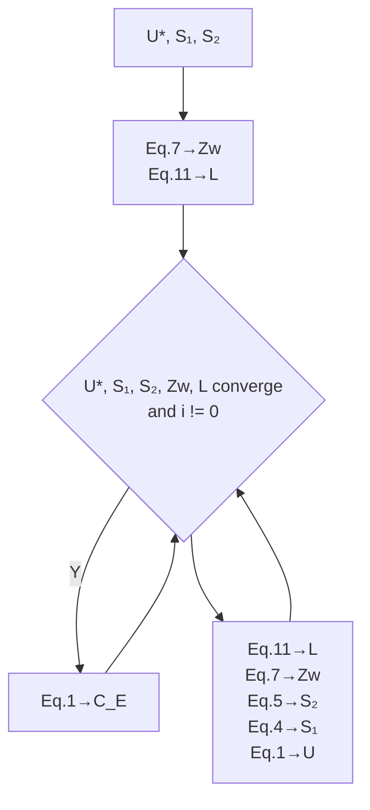

# Optimizing Great Lakes Water Management: An Adaptive

# Hydrological Network Approach

## Summary

The Great Lakes, holding 21% of the world's fresh surface water, face complex water level management challenges due to natural and human factors. This study presents an Adaptive Hydrological Network Simulation and an Equilibrium Stakeholder Satisfaction (ESS) Model to address these challenges. The network model represents the lakes as interconnected nodes and edges, simplifying the system's complexity and facilitating analysis. The ESS Model integrates stakeholder preferences, prioritizing their diverse interests in water level management.

The study introduces a modified dam control algorithm based on Model Predictive Control (MPC), enhancing the responsiveness of water level regulation to environmental changes. The algorithm's performance is assessed using 2017 data, revealing its sensitivity to high water levels and the need for improved adaptation to extreme weather events. The ESS Model's stakeholder satisfaction functions are tailored to reflect the preferences of shipping companies, dock managers, environmentalists, property owners, recreational users, and hydro-power generation companies, with weights assigned to balance their influence.

The research concludes that the proposed models and algorithms show promise in managing the Great Lakes' water levels effectively, considering ecological, social, and economic factors. However, there are limitations, such as the model's simplification of natural factors and the need for empirical validation of stakeholder satisfaction functions. Future work should focus on refining the model to better capture the system's complexity and improve predictive accuracy.

Keywords: Adaptive Hydrological Network; Equilibrium Stakeholder Satisfaction; Model Predictive Control; Great Lakes Water Management; Environmental Sensitivity Analysis

## Content

## 1 Introduction ·....1

1.1 Problem Background....1  
1.2 Restatement of the Problem......1  
1.3 Our Work .... 1

## 2 Assumptions and Justifications .... 2

## 3 Notations....3

## 4 Adaptive Hydrological Network Simulation....3

4.1 Introduction to the Network Model....3  
4.2 Model Framework: Representation of Nodes and Edges ......3  
4.3 Mathematical Formulation of the Network Model....4  
4.4 River Flow between Lakes....4  
4.5 Incorporating Uncontrollable Factors 8

## 5 Equilibrium Stakeholder Satisfaction (ESS) Model....11

5.1 Overview of the ESS Model....11  
5.2 Stakeholder Analysis....11  
5.3 Stakeholder Satisfaction and Weighting....13  
5.4 Calculation of Optimal Water Level 15

## 6 Dam Control Algorithm Implementation......16

6.1 Control Objectives and Performance Metrics 16  
6.2 MPC Model....16

## 7 Dam Control Algorithm ....17

7.1 Analysis of Plan2014....17  
7.2 The modification of the Rule Curve....18

## 8 Assessing Control Algorithm Sensitivity in 2017 ....18

8.1 Data Collection and Model Simulation....18  
8.2 Simulation Results and Analysis ...... 19  
8.3 Sensitivity Assessment of Control Algorithms....19  
8.4 Stakeholder Impact Evaluation....19  
8.5 Algorithm Sensitivity to Environmental Changes 20

## 9 Model Evaluation and Further Discussion....20

9.1 Strengths....20  
9.2 Weaknesses....20  
9.3 Further Discussion....20

## 10 Conclusion....21

## References....22

## 1 Introduction ·

## 1.1 Problem Background

Managing the Great Lakes' water levels, crucial for regional ecosystems, economies, and communities in the US and Canada, is complex. These lakes, with 21% of

the world's fresh surface water, face seasonal changes due to natural phenomena like precipitation and evaporation, and human impacts from industrialization and water regulation structures, such as the Soo Locks and Moses-Saunders Dam. Overseen by the International Joint Commission (IJC), efforts to balance stakeholder interests are challenged by climate change-induced fluctuations. This urgency underscores the need for effective water

natural_image

Satellite view of the Great Lakes region showing the Great Lakes and surrounding terrain (no text or symbols visible)

Figure 1 Top view of the Great Lakes

level management strategies, highlighting the importance of addressing this trans-boundary environmental issue.

## 1.2 Restatement of the Problem

The core problem involves devising a method to regulate the water levels effectively, ensuring that the diverse needs of all stakeholders are met. This encompasses:

- Problem 1: Determining the optimal water levels for the five Great Lakes throughout the year, considering the varying desires and the associated costs and benefits for each stakeholder group.  
- Problem 2: Developing algorithms that can dynamically maintain these optimal water levels based on real-time inflow and outflow data.  
- Problem 3: Assessing the algorithms' sensitivity, particularly for dam outflows, using 2017 data to forecast stakeholder satisfaction.  
- Problem 4: Assessing the algorithms' responsiveness to environmental changes, such as variations in precipitation, winter snowpack, and ice jams, which could significantly impact water levels.  
- Problem 5: Specifically focusing on Lake Ontario, given recent concerns over its water level management, to analyze the factors and stakeholders uniquely influencing it.

## 1.3 Our Work

To avoid complicated description, intuitively reflect our work process, the flow chart is show as the following Figure 1:

flowchart

Hydrology NetWork and MPC Model workflow covering data collection, solution analysis, and performance evaluation across four tasks.

Figure 1. Our Work

## 2 Assumptions and Justifications

To quantify the demands of the various stakeholders, we make the following assumptions.

Assumption 1: The Great Lakes are considered as a complex network system.

Justification: This assumption simplifies the complexity of the model by representing the relationships between lakes and rivers as a network, facilitating the analysis and understanding of interactions among the lakes.

Assumption 2: The surface area of the lakes remains relatively stable over long periods.

Justification: This assumption is based on historical data and geographical studies, suggesting that the surface area of the lakes does not change significantly, thus serving as a basis for calculating water level changes.

Assumption 3: There is a stable relationship between lake water

Justification: This assumption is based on the relative stability of lake geomorphological features and the typical relationship between water levels and storage volume, known as the stage-storage curve.

Assumption 4: River flow is primarily related to the water level of upstream lakes.

Justification: This assumption is grounded in the principles of fluid dynamics, where water flows from higher to lower water levels, and the flow rate is influenced by the water level difference and river characteristics.

Assumption 5: Precipitation is the main factor affecting lake storage volumes, and evaporation is the primary pathway for water loss in the Great Lakes system.

Justification: This assumption is based on an understanding of the Great Lakes' water balance studies, where precipitation and evaporation are key natural processes affecting the water balance.

Assumption 6: Ice jams have a significant impact on the hydrodynamics of the Great Lakes region.

Justification: This assumption takes into account the potential effects of ice jams on river flow during winter, which is crucial for simulating and predicting water level changes during the winter months.

## 3 Notations

In our paper, Lake Superior is referred to as $N_{1}$ , Lake Michigan and Lake Huron are referred to as $N_{2}$ , Lake Erie is referred to as $N_{3}$ , and Lake Ontario is referred to as $N_{4}$ .

The key mathematical notations used in this paper are listed in Table 1.

Table 1: Notations used in this paper

<table><tr><td>Symbol</td><td>Description</td><td>Unit</td></tr><tr><td> $W_i$ </td><td>Water level of  $N_i$ </td><td>m</td></tr><tr><td> $Q_{ij}$ </td><td>Flow of the river connecting  $N_i,N_j$ </td><td> $m^3 t^{-1}$ </td></tr><tr><td> $C_{12}$ </td><td>Compensating Works of the Soo Locks</td><td></td></tr></table>

## 4 Adaptive Hydrological Network Simulation

## 4.1 Introduction to the Network Model

Network models, graphing systems as interconnected nodes and edges, are key for complex system analysis. The Great Lakes' intricate water dynamics require advanced hydrological modeling. This research uses a network model to understand the macro-level water interactions, focusing on system-wide insights. The model provides a theoretical basis for Great Lakes water management, improving control over complex system interactions.

## 4.2 Model Framework: Representation of Nodes and Edges

We view the Great Lakes Basin as a complex network system, with each lake considered as a node within the system, denoted by $N_{i}$ , where i represents the lake's sequence number. The water level $W_{i}$ of each node is its key attribute. Notably, since Lake Michigan and Lake Huron are geographically adjacent without a clear river separation and are often considered a single body of water based on multiple studies and provided data, we analyze these two lakes as one node in our network model. This approach simplifies the model's complexity while maintaining an accurate description of the lake system's overall dynamics.

Every river connecting two lakes is represented as an edge $E_{ij}$ connecting nodes $N_{i}$ and $N_{j}$ , with the flow rate from lake i to lake j denoted by $Q_{ij}$ . For rivers controlled by dams, a control mechanism $C_{ij}$ is added to these edges.

## 4.3 Mathematical Formulation of the Network Model

Water level serves as an indicator of the lake surface height, while flow rate reflects the dynamic changes in the water volume of a lake. In studying the hydrological characteristics of lakes, our goal is to reveal the intrinsic connection between water level and flow rate. Given that the geomorphological characteristics of each lake are relatively stable, we can anticipate a stable relationship between water level and water volume, i.e., the water stage-storage curve. However, the complexity of lake geomorphology means this relationship can be influenced by various factors. According to the Great Lakes Commission, the surface area of the lakes remains relatively constant over long periods. Statistical analysis of historical data has yielded the following values for average water levels and standard deviations:

Table 2: Average Water Levels and Standard Deviations for the Great Lakes

<table><tr><td>Lake</td><td>Average Water Level (m)</td><td>Standard Deviation (m)</td></tr><tr><td>Superior</td><td>183.35</td><td>0.25</td></tr><tr><td>Michigan and Huron</td><td>176.33</td><td>0.45</td></tr><tr><td>St. Clair</td><td>175.10</td><td>0.37</td></tr><tr><td>Erie</td><td>174.28</td><td>0.32</td></tr><tr><td>Ontario</td><td>74.83</td><td>0.29</td></tr></table>

Given the relative stability of lake surface areas and the minor overall impact of water level changes on lakes, it is reasonable to use the lake's surface area as a basis for calculating water level changes.

In the Great Lakes system, for any given lake i, the change in water level $\Delta W_{i}$ over a given time interval $\Delta t$ can be represented by the following formula:

$$
\Delta W _ {i} = \frac {\text { Inflow } _ {\text { total } , i} - \text { Outflow } _ {\text { total } , i} + \text { Precip } _ {i} - \text { Evap } _ {i}}{A _ {i}} \tag {1}
$$

Here, $Inflow_{total,i}$ represents the total inflow into lake i, $Outflow_{total,i}$ represents the total outflow from lake i, $Precip_{i}$ is the precipitation over lake i, $Evap_{i}$ is the evaporation from lake i, and $A_{i}$ is the surface area of lake i.

The flow rate $Q_{ij}$ from lake i to lake j can be described by a function f, which reflects the relationship between the water level difference ( $W_{i}$ and $W_{j}$ ) and the characteristics of the river connecting them. The function f may include the effects of dam control ( $C_{ij}$ ) and can be linear or nonlinear; the specific model will be explored in detail in subsequent research.

## 4.4 River Flow between Lakes

In this section, we delve into the river flow rate $Q_{ij}$ from lake i to lake j, defined as:

$$
Q _ {i j} = f (W _ {i}, W _ {j}, C _ {i j}) \tag {2}
$$

with the aim of identifying the unknown function f.

## 4.4.1 Exploratory Data Analysis (EDA)

In this section, we perform Exploratory Data Analysis (EDA) on the Great Lakes system's water level and flow rate data to identify basic features, trends, and patterns. EDA is vital for understanding data structure, spotting outliers, and preparing for deeper analysis and modeling. Initially, we cleaned the data thoroughly to ensure analysis accuracy. We hypothesized that river flow rates depend on water level differences between upstream and downstream lakes. To verify this, we analyzed water level differences between such lakes and their correlation with connecting rivers' flow rates using Pearson, Spearman, and Kendall Correlation methods. These methods evaluate linear, non-linear, and rank-order variable relationships. Example analysis with Lake Superior, Lake Michigan, Lake Huron, and the St. Mary's River provided specific correlation coefficients:

1. Pearson Correlation: -0.29  
2. Spearman Correlation: -0.31  
3. Kendall Correlation: -0.20

And visualized the data sets accordingly:  

scatterplot

| Lake Superior - Lake Michigan and Lake Huron Water Level | St. Mary's River Flow |
| -------------------------------------------------------- | --------------------- |
| 6.4                                                      | 2500                  |
| 6.6                                                      | 2300                  |
| 6.8                                                      | 2100                  |
| 7.0                                                      | 1900                  |
| 7.2                                                      | 1700                  |
| 7.4                                                      | 1500                  |

Figure 3 Correlation between Water Level Differences and River Flow Rates in the St. Mary's River

bar chart

| Lag | Cross-correlation |
|---|---|
| 0 | -0.29 |
| 1 | -0.31 |
| 2 | -0.34 |
| 3 | -0.35 |
| 4 | -0.31 |
| 5 | -0.26 |
| 6 | -0.19 |
| 7 | -0.12 |
| 8 | -0.06 |
| 9 | -0.01 |
| 10 | -0.01 |

Figure 4. Histogram of Cross-Correlation Function (CCF) for Water Level Differences and River Flow Rates

The analysis revealed a very low correlation between water level differences and river flow rates, exhibiting a negative correlation, which contradicts the expected physical phenomena. Given this, we inferred that the effect of water level differences on river flow might have a time lag. To further explore this possibility, we employed the Cross-Correlation Function (CCF) to analyze correlations at different time lags and generated corresponding histograms.

The histogram results showed that, within a time lag range of 0 to 12 months, the correlation between water level differences and river flow rates remained weak. This finding prompted us to reassess our initial hypothesis that water level differences directly influence river flow rates.

## 4.4.2 Determining the Function $f$

Upon further analysis of the physical scenario involving river flow rates and lake water levels in the Great Lakes system, we drew a preliminary conclusion based on hydrodynamic principles: the flow rate of rivers is primarily related to the water level of upstream lakes. This conclusion is grounded in the fundamental principles of fluid dynamics, namely, that water flows from higher to lower water levels, and the rate of flow is influenced by the water level difference and channel characteristics (such as the slope and width of the channel).

natural_image

Illustration of a layered geological or ecological structure with river, mountains, and trees (no text or symbols)

Figure 5. Physical Model of River Flow Rates and Lake Water Levels in the Great Lakes System

In this physical model, the water level of downstream lakes does not directly affect the supply of water from upstream lakes to rivers. Instead, the water level of upstream lakes determines the amount of water that can pour into the rivers. When the water level of an upstream lake is higher than the elevation at the river's mouth, water naturally flows downstream. This process is driven by gravity, with water flowing along the channel until a new equilibrium state is reached. Therefore, the key factors determining river flow rate are the water level of the upstream lake and the height difference at the river's mouth.

To further validate the direct correlation between the water level of upstream lakes and river flow rates, we conducted a detailed correlation analysis between the water level of Lake Superior and the flow rate of the St. Mary's River. The analysis results showed a Pearson Correlation of 0.91, a Spearman Correlation of 0.89, and a Kendall Correlation of 0.72, all indicating a significant positive correlation without evidence of time lag effects.

scatterplot

| Lake Superior Water Level | St. Mary's River River Flow |
| ------------------------- | --------------------------- |
| 183.0                     | 1500                        |
| 183.2                     | 1700                        |
| 183.4                     | 2000                        |
| 183.6                     | 2500                        |
| 183.8                     | 3000                        |

Figure 6. Correlation Analysis of Upstream Lake Water Levels and River Flow Rates

bar chart

| Lag | Cross-correlation |
|---|---|
| 0 | 0.9 |
| 1 | 0.87 |
| 2 | 0.77 |
| 3 | 0.65 |
| 4 | 0.55 |
| 5 | 0.47 |
| 6 | 0.44 |
| 7 | 0.46 |
| 8 | 0.51 |
| 9 | 0.56 |
| 10 | 0.62 |
| 11 | 0.66 |

Figure 7. Heatmap of Correlation Coefficients for Upstream Lake Water Levels and River Flow Rates

To rule out coincidence, our study was extended to include all upstream lakes and their downstream rivers, employing matrix analysis to evaluate correlation coefficients, visualized via heatmap. The findings revealed a significant linear positive correlation across upstream lakes' water levels and river flow rates, confirming the hypothesized linear relationship applicable throughout the Great Lakes system. This evidence underpins the use of linear modeling for forecasting and examining the dynamic interplay between upstream lake water levels and river flow rates.

Upon examining the correlations within the Great Lakes system, we noted a relatively weaker correlation between Lake Ontario and the St. Lawrence River (correlation coefficient of 0.62), while other lakes showed strong linear positive correlations with river flow rates (correlation coefficients over 0.9). These observations validate employing a linear model to represent the relationship between upstream lake water levels and river flow rates, formulated as:

$$
Q _ {i j} = C _ {i j} ^ {*} (k ^ {*} W _ {i} + b) \tag {3}
$$

where $k$ and $b$ are coefficients to be determined.

The weaker correlation for Lake Ontario and the St. Lawrence River was initially speculated to be due to the confluence of the Ottawa River with the St. Lawrence River. However, upon verification of the monitoring station data (station number 04264331), it was found that this station does not receive inflow from the Ottawa River. Further literature research revealed the root cause: the construction of dams as part of the "Lake Ontario – St. Lawrence Plan 2014" to control water levels, a human activity that disrupted the natural correlation between water levels and flow rates. The official document of the plan provided the pre-project release relationship formula for Lake Ontario's outflow and its water level:

$$
\text { preproject   release } = 5 5 5. 8 2 3 \left(W _ {4} - 0. 0 3 5 - 6 9. 4 7 4\right) ^ {1. 5} \tag {4}
$$

heatmap

| Lake Superior | 1.00 | 1.00 | 0.91 | 0.86 | 0.80 | 0.78 | 0.76 | 0.67 | 0.68 | 0.30 | 0.05 | 0.57 | 0.46 | 0.86 | 1.00 | 0.68 | 0.64 | 0.63 | 0.59 | 0.53 | 0.57 | 0.32 | 0.32 | 0.53 | 0.57 | 0.32 | 0.09 | 0.46 | 0.46 |
| --- | --- | --- | --- | --- | --- | --- | --- | --- | --- | --- | --- | --- | --- | --- | --- | --- | --- | --- | --- | --- | --- | --- | --- | --- | --- | --- | --- | --- | --- |
| St. Mary's River | 0.91 | 1.00 | 0.68 | 0.64 | 0.63 | 0.59 | 0.53 | 0.57 | 0.32 | 0.45 | 0.12 | 0.71 | 0.86 | 0.68 | 1.00 | 0.92 | 0.96 | 0.91 | 0.90 | 0.89 | 0.45 | 0.45 | 0.86 | 0.97 | 0.83 | 0.86 | 0.43 | 0.11 | 0.69 |
| Lake Michigan and Lake Huron | 0.86 | 0.68 | 1.00 | 0.92 | 0.96 | 0.91 | 0.90 | 0.89 | 0.45 | 0.12 | 0.71 | 0.71 | 0.86 | 0.68 | 1.00 | 0.92 | 1.00 | 0.91 | 0.97 | 0.95 | 0.60 | 0.60 | 0.95 | 1.00 | 0.97 | 0.95 | 0.43 | 0.17 | 0.77 |

Figure 8. Heatmap of Correlation Coefficients for Upstream Lake Water Levels and River Flow Rates

After conducting a linear fitting analysis of the relationship between water levels and flow rates for all lakes, we obtained the following results table. This table details the linear fitting coefficients for each lake, providing a scientific basis for subsequent water resource management and decision-making.

Table 3: Linear Fitting Coefficients for Lake and River Pairs

<table><tr><td>Pair</td><td>Relationship</td></tr><tr><td>Lake Superior - St. Mary&#x27;s River</td><td> $Q_{12} = C_{12}(1713.68W_1 - 312180.54)$ </td></tr><tr><td>Lake Michigan and Lake Huron - St. Clair River</td><td> $Q_{23} = 1504.20W_2 - 259900.25$ </td></tr><tr><td>Lake St. Clair - Detroit River</td><td> $Q_{34} = 1952.98W_3 - 336406.51$ </td></tr><tr><td>Lake Erie - Niagara River</td><td> $Q_{45} = 2088.92 * W_4 - 357993.82$ </td></tr><tr><td>Lake Ontario - St. Lawrence River</td><td> $Q_{56} = 555.823C_{56}(W_5 - 0.035 - 69.474)^{1.5}$ </td></tr></table>

## 4.5 Incorporating Uncontrollable Factors

In addressing the water balance issues within the Great Lakes basin, we inevitably encounter numerous complex factors that affect lake water levels and flow rates. However, in this study, we will focus primarily on precipitation and evaporation, as these two components play a pivotal role in the lake water balance. According to research by Neff and Nicholas (2004), precipitation and evaporation are the main factors in the lake water balance, significantly impacting the long-term variations in lake water levels. We will now model and analyze precipitation and evaporation separately.

## 4.5.1 Precipitation

Precipitation often acts as the largest influencing factor on lake storage volumes, but its impact varies across different regions due to distinct geological and geomorphological characteristics. Intuitively, we know that precipitation p (in mm) positively correlates with water storage brought to lakes, represented by $P + R$ , where we model each lake individually in an exploratory manner.

$$
\Delta W _ {i} \times A _ {i} = P _ {i} (p _ {i}) + R _ {i} + Q _ {i - 1, i} - Q _ {i, i + 1} ^ {\leftrightarrow} \tag {5}
$$

We collected data on the daily change in water level $\Delta W_{i}$ , controlled inflows $Q_{i-1,i}$ , controlled outflows $Q_{i,i+1}$ , and precipitation $p_{i}$ for lake i to fit and determine the precipitation function $P_{i}$ for each lake.

This approach allows for a nuanced understanding of how precipitation impacts each lake's water balance, accounting for regional differences and contributing to more accurate water management and decision-making strategies. Through fitting these models, we can better predict the effects of precipitation on lake water levels, adjusting for controlled inflows and outflows, and thereby enhancing our ability to manage the Great Lakes' water resources effectively.

## 4.5.2 Evaporating

Evaporation is a primary pathway for water loss in the Great Lakes system, playing a crucial role in the hydrological cycle and water resource management of the entire basin. We employs the Lumped Modeling approach proposed by Croley (1989), which integrates the Monin-Obukhov similarity theory with a heat storage model to provide a comprehensive computational framework for simulating evaporative fluxes over the Great Lakes.

The process begins with the calculation of saturated specific humidity $(q_{s})$ using the Arden-Buck equation, which describes the specific humidity at saturation under given temperature and atmospheric pressure conditions. The formula for saturated water vapor pressure $(e)$ is as follows:

$$
e = e (T _ {W}) = 0. 6 1 1 2 1 e ^ {\left(1 8. 6 7 8 - \frac {T w}{2 3 4 . 5}\right) \times \frac {T w}{2 5 7 . 1 4 + T w}} \tag {6}
$$

Where e is the saturated water vapor pressure in millibars (mb), which can be calculated based on temperature $T_{w}$ and atmospheric pressure (Pa). The actual specific humidity (qa) reflects the actual water vapor content in the air, and its calculation is given by:

$$
q _ {s a t} = 0. 6 2 2 * \frac {e}{p - e} \tag {7}
$$

Where $e_{w}$ is the water vapor pressure (mb), which can be derived from relative humidity (RH) and atmospheric pressure (Pa).

Subsequently, the bulk evaporation coefficient $(C_{E})$ is determined, a key parameter describing the efficiency of water vapor transfer from the water surface to the atmosphere. The calculation of $C_{E}$ involves atmospheric stability analysis, typically based on the Monin-Obukhov length (L) and stability parameter $(\frac{Z}{L})$ , requiring meteorological data such as wind speed (U), air temperature (T), and relative humidity (RH).

The daily evaporation rate $(E_{w})$ is calculated using the following formula:

$$
E _ {w} = \frac {r _ {a} C _ {E} (q _ {w} - q) U}{r _ {w}} * 3 6 0 0 * 2 4 \tag {8}
$$

In this equation, E represents the evaporation rate, $C_{E}$ is the bulk evaporation coefficient, $q_{w}$ and q are the specific humidities at the water surface and in the air, respectively, U is the wind speed, $r_{w}$ is the density of water, and $r_{a}$ is the density of air.

Compute $C_{E}$ based on the algorithm shown in the accompanying figure and the equation provided in the text. The equation and algorithm are given in the paper.

The meanings and units of the physical quantities in the formula are shown in the following table:

<table><tr><td>Symbol</td><td>Description</td><td>Unit</td></tr><tr><td>Z</td><td>reference height</td><td>m</td></tr><tr><td> $Z_w$ </td><td>roughness length</td><td>m</td></tr><tr><td>U</td><td>mean wind speed at reference height Z above the surface</td><td> $m \cdot s^{-1}$ </td></tr><tr><td> $U^*$ </td><td>friction velocity</td><td> $m \cdot s^{-1}$ </td></tr><tr><td>k</td><td>Von Karman&#x27;s constant</td><td></td></tr><tr><td> $S_1, S_2$ </td><td>stability-dependent parameters</td><td></td></tr><tr><td>L</td><td>Moninabukhov length</td><td>m</td></tr><tr><td>γ</td><td>absolute temperature of near-surface air</td><td>K</td></tr><tr><td>g</td><td>acceleration due to gravity</td><td> $m \cdot s^{-2}$ </td></tr><tr><td> $E_w$ </td><td>daily evaporation rate</td><td>m</td></tr></table>

The wind speed U, humidity q, and temperature T are variables that need to be obtained by collecting meteorological and hydrological data. The remaining variables can be derived from existing work or reasonably set. Through these steps, our model enables a dynamic and accurate simulation of the evaporation process for the Great Lakes basin, which is essential for understanding the hydrodynamics of the lakes and informing water resource management strategies.

flowchart

Figure 9. Calculation of $C_E$  
公众号：蚂蚁竞赛 更多资料请加QQ群1077734962，谢谢！

## 4.5.3 Ice jams

In the development of a water balance model for the Great Lakes, the phenomenon of ice jams plays a crucial role in affecting the hydrodynamics of the region. Ice jams occur during winter when the lake surface freezes and the ice can obstruct the flow of rivers, leading to potential flooding and altered water levels. To accurately represent this phenomenon in our model, we introduce the ice jam factor ( $\eta$ ), which quantifies the severity of the ice jam and its impact on river flow.

The mathematical relationship between the actual river flow ( $\eta$ ) and the ice jam factor ( $\eta$ ) is expressed as follows:

$$
Q = (1 - \eta) Q _ {p r e} \tag {9}
$$

Here, $Q_{pre}$ represents the river flow prior to the occurrence of an ice jam. This equation allows us to model the reduction in river flow due to ice jams, where $\eta$ ranges from 0 (no ice jam, full flow) to 1 (complete ice jam, no flow). By incorporating this relationship into our water balance model, we can simulate the effects of ice jams on the Great Lakes' hydrology, providing a more nuanced understanding of the system's behavior during the winter months and informing strategies for water resource management and flood mitigation.

## 5 Equilibrium Stakeholder Satisfaction (ESS) Model

## 5.1 Overview of the ESS Model

The Equilibrium Stakeholder Satisfaction (ESS) Model is a novel approach designed to optimize water level management in the Great Lakes, with a focus on Lake Ontario and the St. Lawrence River. It addresses the need to balance the diverse and sometimes conflicting interests of stakeholders in shipping, power generation, conservation, recreation, and property values.

The ESS Model's objective is to find an optimal water level that maximizes stakeholder satisfaction throughout the year, considering the Great Lakes' complex hydrological dynamics, including precipitation, evaporation, runoff, and human activities. It uses mathematical and hydrological analyses to evaluate the effects of water level changes on stakeholders and prioritizes these effects based on their importance.

Developed in response to the International Joint Commission's (IJC) call for advanced management strategies, the ESS Model integrates stakeholder satisfaction into water level management decisions, considering technical, hydrological, social, economic, and environmental factors.

## 5.2 Stakeholder Analysis

In the development of the Equilibrium Stakeholder Satisfaction (ESS) Model for Lake Ontario and the St. Lawrence River, a thorough stakeholder analysis is essential to ensure the model accurately reflects the diverse interests and influences of those affected by water level management. This analysis categorizes stakeholders into six primary groups, each with distinct preferences and stakes in water level outcomes. Herein, we delve into the specific interests of these groups and assess their potential impact on water level management through an influence-interest matrix.

## 5.2.1 Identification and Preferences of Stakeholders

Shipping Companies: They require high and stable water levels in the St. Lawrence River for safe navigation and operational efficiency, as fluctuations can disrupt vessel passage and supply chains.

Dock Managers and Montreal Residents: They advocate for consistent and low water levels to prevent flooding and protect waterfront properties and infrastructure, impacting dock operations and community well-being.

Environmentalists: They call for water levels that follow natural seasonal variations to support ecosystem health, with higher spring levels for species breeding and waterway cleansing.

Property Owners along Lake Ontario: These stakeholders prefer stable water levels to prevent shoreline erosion and protect their investments from water damage and land loss.

Recreational Boaters and Fishermen: This group favors stable, accessible water levels to ensure marina and launch ramp usability for boating and fishing activities.

Hydro-Power Generation Companies: They seek to manage water levels effectively for hydroelectric power generation, utilizing high levels as a natural reservoir to meet energy demands efficiently.

## 5.2.2 Influence-Interest Matrix

The matrix below evaluates each stakeholder group based on their level of interest in water level management and their capacity to influence decision-making processes:

Table 4: Influence-Interest Matrix for Stakeholder Groups

<table><tr><td>Stakeholder Group</td><td>Level of Interest</td><td>Potential to Influence</td></tr><tr><td>Shipping Companies</td><td>High</td><td>High</td></tr><tr><td>Dock Managers and Montreal Residents</td><td>High</td><td>Medium</td></tr><tr><td>Environmentalists</td><td>High</td><td>Medium</td></tr><tr><td>Property Owners</td><td>High</td><td>Low</td></tr><tr><td>Recreational Boaters and Fishermen</td><td>Medium</td><td>Low</td></tr><tr><td>Hydro-Power Generation Companies</td><td>High</td><td>High</td></tr></table>

High Interest & High Influence: Shipping companies and hydro-power generation companies possess significant resources to advocate for their interests, making them key players in water level management discussions.

High Interest & Medium Influence: Environmentalists and dock managers/residents are highly vested in water level outcomes but have moderate influence, largely due to public support and localized impact.

High Interest & Low Influence: Property owners, despite their direct stake, often lack the organized representation needed to exert substantial influence.

Medium Interest & Low Influence: Recreational users, while affected by water levels, typically do not have the collective capacity or economic impact to significantly sway management decisions.

## 5.3 Stakeholder Satisfaction and Weighting

The ESS Model addresses Lake Ontario and St. Lawrence River water level management by incorporating stakeholder satisfaction into its analytical framework. It uses mathematical functions to quantify how stakeholder satisfaction changes with water levels, providing a basis for optimizing water levels. Weights are assigned to these functions to represent the stakeholders' relative influence, ensuring a balanced consideration of diverse interests and an equitable outcome.

## 5.3.1 Satisfaction Functions

The Equilibrium Stakeholder Satisfaction (ESS) Model quantifies how water level variations impact stakeholder contentment within Lake Ontario and the St. Lawrence River, employing distinct satisfaction functions for each group.

## Generalized Satisfaction Function:

The general formula for calculating stakeholder satisfaction ( $S_{i}$ ) with respect to water levels (W) is:

$$
S _ {i} (W) = 1 - \left| \frac {W - W _ {i d e a l _ {i}}}{W _ {r a n g e _ {i}}} \right|
$$

• $S_{i}$ : Satisfaction score for stakeholder i.  
• W: Current water level.  
- $W_{ideal_i}$ : Ideal water level for stakeholder $i$ .  
- $W_{range_i}$ : Acceptable range of water levels for stakeholder $i$ .

## Tailored Satisfaction Functions:

## 1. Shipping Companies ( $S_{1}$ ):

a) Objective: Ensure navigable conditions for medium-sized vessels in the St. Lawrence River.  
b) Parameters: Vessels' design specifications require a minimum navigation depth of 8.3 meters to maintain a satisfaction level of 1. This translates to a Lake Ontario water level of at least 74.4 meters. Below 68 meters, navigation becomes impossible, dropping satisfaction to 0.  
c) Function: The satisfaction function for shipping companies, considering water depth as the primary factor, is modeled as:

$$
S _ {1} (W) = \left\{ \begin{array}{l l} 1 & W \geqslant 7 4. 4 m \\ 0 & W \leq 6 8 m \\ \text { Interpolated   linearly } & 6 8 m \leq W \leq 7 4. 4 m \end{array} \right. \tag {10}
$$

## 2. Dock Managers and Montreal Residents ( $S_{2}$ ):

a) Objective: Maintain water levels that prevent flooding while ensuring port operation efficiency.  
b) Parameters: Analysis of the Port of Montreal data and the 2017 flood disaster reveals an optimal water level range between 74.4 meters and 76.4

meters for Lake Ontario to mitigate flood risks and maintain port operations. Satisfaction is maximized (1) within this range and decreases outside of it due to increased flood risk or operational inefficiency.

c) Function: Satisfaction for this group inversely correlates with water levels beyond the identified safe operational range:

$$
S _ {1} (W) = \left\{ \begin{array}{l l} 1 & 7 4. 4 m \leq W \leq 7 6. 4 m \\ 0 & W \leq 6 8 m \\ \text { Interpolated   linearly } & 6 8 m \leq W \leq 7 4. 4 m \end{array} \right. \tag {11}
$$

## 3. Environmentalists $(S_{3})$ :

a) Objective: Support ecological health through pronounced seasonal water level variations.  
b) Parameters: Environmentalists advocate for a water level range that promotes biodiversity and natural shoreline processes. The satisfaction level peaks when Lake Ontario's water levels facilitate natural habitat preservation and seasonal variations.  
c) Function: Given the preference for natural fluctuation, the satisfaction function for environmentalists might resemble a sinusoidal pattern over the course of a year, reflecting higher satisfaction with greater seasonal amplitude. However, for simplicity and in line with available data, a modified linear approach can be applied, focusing on the range of water levels that are deemed ecologically beneficial:

$$
S _ {3} (W) = \left\{ \begin{array}{c c} 1 & \text { if   seasonal   variation   is   within   ideal   range } \\ \text { Reduces   linearly } & \text { outside   the   ideal   range } \end{array} \right. \tag {12}
$$

## 4. Property Owners, Recreational Boaters, and Fishermen ( $S_{4}$ & $S_{5}$ ):

a) Objective: Maintain water levels conducive to property integrity and recreational activities.  
b) Parameters: These stakeholders prefer stable water levels to minimize erosion and facilitate recreational activities. Ideal conditions are identified between 74 meters and 76 meters for Lake Ontario, where satisfaction is at its peak.  
c) Function: The satisfaction function for property owners and recreational users emphasizes stability within the preferred range, decreasing as levels move outside this range due to increased risks or reduced accessibility:

$$
S _ {4, 5} (W) = 1 - \left| \frac {W - 7 5}{2} \right| \tag {13}
$$

Here, the range centers around 75 meters, with satisfaction declining linearly as water levels diverge from this midpoint.

## 5. Hydro-Power Generation Companies ( $S_{6}$ ):

a) Objective: Maximize energy generation efficiency through optimal water level management.  
b) Parameters: Hydroelectric power generation is optimized at higher water levels, with operational thresholds based on the design and capacity of facilities like the Moses-Saunders Dam. An ideal water level for maximizing power generation efficiency and safety is established at or above 75.5 meters.  
c) Function: The satisfaction function reflects a preference for higher water levels, plateauing once operational maximums are reached to indicate no further gains in satisfaction:

$$
S _ {6} (W) = \left\{ \begin{array}{l l} 1 & W \geqslant 7 5. 5 m \\ 0 & W \leq 6 8 m \\ \text { Interpolated   linearly } & 6 8 m \leq W \leq 7 5. 5 m \end{array} \right. \tag {14}
$$

## 5.3.2 Weight Assignment

To enable the ESS Model to equitably manage the varied stakeholder interests in the water levels of Lake Ontario and the St. Lawrence River, structured weight allocation is crucial. These weights measure each stakeholder group's relative impact, steering the optimization towards solutions that meet comprehensive economic, ecological, and social goals. A succinct overview of the weight distribution follows:

Table 5: Stakeholder Satisfaction Functions and Assigned Weights

<table><tr><td>Stakeholder Group</td><td>Assigned Weight</td></tr><tr><td>Shipping Companies</td><td>0.20</td></tr><tr><td>Dock Managers and Montreal Residents</td><td>0.15</td></tr><tr><td>Environmentalists</td><td>0.15</td></tr><tr><td>Property Owners</td><td>0.10</td></tr><tr><td>Recreational Boaters and Fishermen</td><td>0.10</td></tr><tr><td>Hydro-Power Generation Companies</td><td>0.20</td></tr></table>

The weights assigned in the ESS Model represent the stakeholders' relative influence in decision-making, considering their economic, ecological, and social impacts, as well as policy influence. These weights, ranging from 0 to 1, are based on the Influence-Interest Matrix. Shipping and hydropower stakeholders have the highest weights due to their economic significance. Environmentalists and dock managers/residents receive moderate weights for their influence on public opinion and local economies. Property owners and recreational users are assigned the lowest weights, reflecting their localized concerns.

## 5.4 Calculation of Optimal Water Level

## 5.4.1 Aggregation of Stakeholder Satisfaction

To determine the optimal water level, $W_{opt}$ , that maximizes stakeholder satisfaction for Lake Ontario and the St. Lawrence River, we apply a weighted satisfaction model. This involves assigning weights to each stakeholder's satisfaction function based on their importance, and then aggregating these to calculate a collective satisfaction score.

Each stakeholder's weighted satisfaction score is defined as:

$$
S W _ {i} (W) = \text { weight } _ {i} \times S _ {i} (W) \tag {15}
$$

1. $SW_{i}(W)$ : Weighted satisfaction score for stakeholder i at water level W.  
2. weight $_{i}$ : Assigned weight reflecting stakeholder i's influence.  
3. $S_{i}(W)$ : Satisfaction function for stakeholder i, indicating satisfaction at water level W.

The overall satisfaction, $S_{total}(W)$ , across all stakeholders is the sum of individual weighted scores:

$$
S _ {t o t a l} (W) = \sum_ {i = 1} ^ {n} S W _ {i} (W) \tag {16}
$$

The model seeks $W_{opt}$ where:

$$
W _ {o p t} = \underset {W} {\operatorname{argmax}} S _ {\text { total }} (W) \tag {17}
$$

This method identifies the water level that, considering all stakeholder weights and preferences, achieves the highest aggregate satisfaction, representing an equilibrium point of collective benefit.

## 6 Dam Control Algorithm Implementation

## 6.1 Control Objectives and Performance Metrics

The control strategy for the Great Lakes water system aims to achieve optimal water level regulation across interconnected lakes and rivers. Based on previously established hydrological and ideal water level models, this strategy utilizes Model Predictive Control (MPC) to formulate an optimization problem at each control interval. The objective is to minimize the deviation between actual water levels and their ideal states while considering system constraints and operational costs.

## 6.2 MPC Model

The optimization problem is defined as follows:

First, we define the objective function. The objective function aims to minimize the sum of the weighted squared deviations of water levels and inter-lake exchange flows from their ideal values over a prediction horizon of $N_{0}$ weeks. This is represented by the performance metric J:

$$
J = \sum_ {i = 1} ^ {4} \omega_ {i} \left(\frac {1}{N _ {0}} \sum_ {k = 1} ^ {N _ {0}} (W _ {i} (k) - W _ {\text { ideal }, i}) ^ {2}\right) + \sum_ {i = 1} ^ {4} \omega_ {i, i + 1} \left(\frac {1}{N _ {0}} \sum_ {k = 1} ^ {N _ {0}} (Q _ {i, i + 1} (k) - Q _ {\text { ideal }, i, i + 1}) ^ {2}\right) \tag {18}
$$

The constraints include maintaining water levels within safe operational limits and ensuring that the exchange flows between lakes do not exceed their capacity:

$$
W _ {m i n, i} \leq W _ {i} (k) \leq W _ {m a x, i}, \quad \forall i \in \{1, 2, 3, 4, 5 \}, \quad \forall k \in \{1, 2,..., N \} \tag {19}
$$

$$
Q _ {m i n, i, i + 1} \leq Q _ {i, i + 1} (k) \leq Q _ {m a x, i, i + 1}, \quad \forall i \in \{1, 2, 3, 4 \} \tag {20}
$$

The control input at each time step is the release volume from each lake to the downstream lake, which is subject to the constraints and the objective function:

$$
Q _ {i, i + 1} (k) = u _ {i} (k), \quad \forall i \in \{1, 4 \}, \quad \forall k \in \{1, 2,..., N \} \tag {21}
$$

where $u_{i}(k)$ is the control action for $N_{i}$ at k week.

To solve this optimization problem, a genetic algorithm (GA) is employed.

By leveraging the power of genetic algorithms, the control strategy is capable of efficiently navigating the complex search space of the optimization problem, ensuring the Great Lakes water system operates within the desired parameters while minimizing environmental and economic impacts.

## 7 Dam Control Algorithm

## 7.1 Analysis of Plan2014

## 7.1.1 Bv7 Algorithm

The Plan 2014 Algorithm, as detailed in the "Lake Ontario - St. Lawrence River Plan 2014," is a sophisticated water management tool designed to regulate the water levels of Lake Ontario and the St. Lawrence River. The algorithm is based on a combination of mechanistic release rules, known as "Bv7," and discretionary decisions made by the International Lake Ontario - St. Lawrence River Board (ILOSLRS) to address deviations from the specified flows under certain conditions.

The algorithm uses a sliding rule curve, which is a function of the pre-project stage-discharge relationship adjusted for recent long-term supply conditions $Q_{i,i+1}$ .

For periods of above-normal supply, the lake release is determined by:

$$
\text { outflow } _ {t} = \text { preprojectrelease } + C _ {1} \left[ \frac {F _ {-} N T S - A _ {-} N T S _ {\text { avg }}}{A _ {-} N T S _ {\max} - A _ {-} N T S _ {\text { avg }}} \right] ^ {P _ {1}} \tag {22}
$$

Conversely, for periods of below-normal supply, the lake release is calculated as:

$$
\text { outflow } _ {t} = \text { preprojectrelease } + C _ {2} \left[ \frac {A _ {-} N T S _ {\text { avg }} - F _ {-} N T S}{A _ {-} N T S _ {\text { avg }} - A _ {-} N T S _ {\text { min }}} \right] ^ {P _ {2}} \tag {23}
$$

The algorithm also incorporates flow limits to prevent extreme fluctuations in river flows, ensuring stable conditions for navigation, ice formation, and environmental health. These limits include the J Limit, M Limit, I Limit, and L Limit, which respectively control the maximum change in flow, balance low levels for navigation, ensure ice stability, and maintain adequate levels for navigation and overall flow.

## 7.1.2 The Strength & Weakness of Bv7 Algorithm

The Bv7 algorithm, as implemented in the Plan 2014, demonstrates several strengths in its water management capabilities. It incorporates a robust predictive framework that accounts for a variety of hydrological conditions, ensuring a stable water exchange between Lake Ontario and the St. Lawrence River. This algorithm has been effective in balancing the diverse interests of navigation, power generation, and ecological health, providing a comprehensive approach to water regulation.

However, the algorithm's performance in 2017 highlighted a critical weakness: its sensitivity to high water levels. The model's response to the significant precipitation event that summer was not as agile as required, leading to elevated water levels and potential flood risks. This indicates a need for enhanced sensitivity in the algorithm, particularly in its ability to anticipate and react to extreme weather events and rapid changes in water supply.

$$
\text { outflow } _ {t} = \text { preprojectrelease } + C _ {1} \left[ \frac {F _ {-} N T S - A _ {-} N T S _ {\text { avg }}}{A _ {-} N T S _ {\max} - A _ {-} N T S _ {\text { avg }}} \right] ^ {P _ {1}} \left[ 1 + \left(\frac {W (t) - h _ {\text { ideal }}}{\sigma}\right) ^ {\alpha} \right] \tag {24}
$$

## 7.2 The modification of the Rule Curve

Our proposed control strategy is grounded in Model Predictive Control (MPC), a method that anticipates the system's state over a future horizon and optimizes the control inputs at each control interval. The essence of MPC is to transform the control problem into an optimization problem over a finite time horizon. Given the limitations of our meteorological forecasting capabilities and the need to prevent drastic changes in dam outflow that could disrupt the ecological environment, MPC offers a suitable control approach.

We acknowledge the value of the control techniques employed in Plan 2014 and aim to enhance the model's sensitivity to water levels by refining its release rules. To this end, we have introduced a modified equation for the lake outflow when the supply is above normal levels:

$$
\text { outflow } _ {t} = \text { preprojectrelease } + C _ {1} \left[ \frac {F _ {-} N T S - A _ {-} N T S _ {\text { avg }}}{A _ {-} N T S _ {\max} - A _ {-} N T S _ {\text { avg }}} \right] ^ {P _ {1}} \left[ 1 + \left(\frac {W (t) - h _ {\text { ideal }}}{\sigma}\right) ^ {\alpha} \right] \tag {25}
$$

In this equation, the term $(W(t)-\frac{h_{ideal}}{\sigma})^{\alpha}$ captures the deviation of the water level from the ideal state, with $\alpha$ serving a role analogous to $P_{1}$ in the original Plan 2014 model. The inclusion of this term allows the model to respond more dynamically to deviations in water levels, ensuring a more sensitive and adaptive control strategy.

The parameter $\sigma$ represents a scaling factor that adjusts the sensitivity of the model to water level deviations. By tuning $\sigma$ and $\alpha$ , we can fine-tune the model's responsiveness to both short-term fluctuations and long-term trends in water levels, thus achieving a balance between ecological protection and efficient water management.

Using J as the control objective, we optimized and fitted the model parameters using annual data.

## 8 Assessing Control Algorithm Sensitivity in 2017

In 2017, the Great Lakes experienced significant fluctuations in water levels, prompting a reassessment of the control algorithms for dam outflows. This chapter investigates whether the existing algorithms adequately adjusted to these fluctuations, with a focus on aligning water management practices more closely with the varying needs of stakeholders. The analysis aims to determine if modifications to the algorithms could result in more satisfactory water levels for all parties involved.

## 8.1 Data Collection and Model Simulation

Utilizing detailed hydrological and environmental data for 2017, sourced from the U.S. Army Corps of Engineers' Great Lakes Information website, we incorporated key indicators such as precipitation and evaporation rates into our network model. This data foundation enabled the simulation of the Great Lakes' hydrological dynamics throughout the calendar year.

## 8.2 Simulation Results and Analysis

The following charts compare the actual monthly water levels of the lakes in 2017 (provided in the appendix) with the simulated data from the network model:

From the charts, it is evident that, with the exception of a few days where the simulated data deviate significantly from the optimal water levels, the majority of the data closely approximate the ideal water levels.

## 8.3 Sensitivity Assessment of Control Algorithms

we dissect the moments when the simulated water levels diverged from actual observations, pinpointing the algorithms' responsiveness to rapid environmental shifts. Specific instances of deviation—particularly during periods of abrupt precipitation changes or evaporation spikes—serve as case studies. Through regression analysis, we quantify the algorithms' delay in response and the accuracy of their adjustments, identifying patterns that suggest areas for algorithmic refinement. This scrutiny reveals how the algorithms' current configurations might be fine-tuned to enhance their predictive accuracy and response speed, thereby minimizing discrepancies between simulated and actual water levels.

line chart

| Date       | Monthly Water Level | Optimal Level | Simulated Water Level |
| ---------- | ------------------- | ------------- | --------------------- |
| 2017-01    | 183.5               | -             | -                     |
| 2017-03    | 183.4               | -             | -                     |
| 2017-05    | 183.6               | -             | -                     |
| 2017-07    | 183.7               | -             | -                     |
| 2017-09    | 183.8               | -             | -                     |
| 2017-11    | 183.7               | -             | -                     |
| 2018-01    | 183.6               | -             | -                     |

line chart

| Date       | Monthly Water Level (m) | Optimal Level (m) | Simulated Water Level (m) |
| ---------- | ------------------------ | ----------------- | ------------------------- |
| 2017-01    | ~176.5                   | ~176.5            | ~176.5                    |
| 2017-03    | ~176.7                   | ~176.6            | ~176.6                    |
| 2017-05    | ~176.9                   | ~176.7            | ~176.7                    |
| 2017-07    | ~177.0                   | ~176.8            | ~176.8                    |
| 2017-09    | ~176.9                   | ~176.7            | ~176.7                    |
| 2017-11    | ~176.8                   | ~176.6            | ~176.6                    |
| 2018-01    | ~176.7                   | ~176.5            | ~176.5                    |

line chart

| Date       | Monthly Water Level | Optimal Level | Simulated Water Level |
| ---------- | ------------------- | ------------- | --------------------- |
| 2017-01    | 174.2               | 174.2         | 174.2                 |
| 2017-03    | 174.5               | 174.5         | 174.5                 |
| 2017-05    | 174.8               | 174.6         | 174.6                 |
| 2017-07    | 174.8               | 174.6         | 174.6                 |
| 2017-09    | 174.6               | 174.5         | 174.5                 |
| 2017-11    | 174.5               | 174.5         | 174.5                 |
| 2018-01    | 174.4               | 174.3         | 174.3                 |

line chart

| Date       | Monthly Water Level | Optimal Level | Simulated Water Level |
| ---------- | ------------------- | ------------- | --------------------- |
| 2017-01    | 74.6                | -             | -                     |
| 2017-03    | 75.0                | -             | -                     |
| 2017-05    | 75.8                | -             | -                     |
| 2017-07    | 75.6                | -             | -                     |
| 2017-09    | 75.0                | -             | -                     |
| 2017-11    | 74.8                | -             | -                     |
| 2018-01    | 74.6                | -             | -                     |

Figure 10. 2017 Simulation

## 8.4 Stakeholder Impact Evaluation

The evaluation of stakeholder impacts centers on correlating the simulated water level adjustments with predefined satisfaction indices for each stakeholder group. By overlaying the periods of significant algorithmic deviation with stakeholder satisfaction scores, we identify which stakeholder groups were most adversely affected by suboptimal water management. For instance, a detailed analysis is conducted on how deviations impacted shipping schedules, hydroelectric power generation, and ecological conservation efforts. This examination not only highlights the direct consequences of algorithmic performance on each stakeholder group but also proposes targeted improvements to ensure that future algorithm adjustments more effectively balance the competing needs of all parties involved in the Great Lakes ecosystem.

## 8.5 Algorithm Sensitivity to Environmental Changes

The sensitivity of our control algorithms to environmental conditions—specifically, precipitation, winter snowpack, and ice jams—is critically assessed in this section. By integrating environmental variability into our network model, we observed the algorithms' performance under a range of scenarios reflective of the diverse climatic challenges the Great Lakes face annually.

Precipitation: The algorithms demonstrated a calibrated response to increased precipitation, adjusting outflows to mitigate potential flooding. However, the reaction time to sudden, heavy rainfall events highlighted a need for more rapid adaptation capabilities.

Winter Snowpack: The gradual melting of winter snowpack presents a predictable rise in water levels, to which the algorithms generally adapted well. The model simulations for spring thaws showed alignment with expected water level increases, suggesting adequate sensitivity to snowpack melting rates.

Ice Jams: Ice jams, which can cause abrupt and localized water level rises, tested the limits of the algorithms' responsiveness. Instances of ice jams within the simulation period revealed occasional delays in outflow adjustments, underscoring an area for algorithmic improvement in handling such unpredictable events.

## 9 Model Evaluation and Further Discussion

## 9.1 Strengths

The model excels in offering a macro-level view of the Great Lakes system through a comprehensive network of lakes and rivers, balancing system complexity with overall dynamics accuracy. It incorporates stakeholder preferences into water level management via the Equilibrium Stakeholder Satisfaction (ESS) Model, ensuring equitable decision-making. Enhanced predictive accuracy is achieved by integrating meteorological and hydrological data, with Model Predictive Control (MPC) and genetic algorithms optimizing dam control strategies to minimize environmental and economic impacts.

## 9.2 Weaknesses

The model's representation of the Great Lakes as network nodes overlooks time lags caused by the lakes' vast areas, affecting water level responses. It excludes groundwater, tributaries, and surface runoff impacts on the hydrological balance. Simplifications in modeling natural factors like precipitation and evaporation may not fully mirror real-world conditions, including ice cover effects. Stakeholder satisfaction functions, based on linear relationships and assumptions, may not truly reflect stakeholder preferences, potentially leading to suboptimal management decisions.

## 9.3 Further Discussion

Enhancements are needed to capture the Great Lakes system's complexity better and improve predictive accuracy. Future research should include more detailed spatial and temporal data, integrate groundwater and surface runoff, and employ advanced meteorological data for natural factor modeling. Stakeholder satisfaction functions require empirical validation to ensure they accurately represent diverse interests.

By addressing these limitations and refining its components, the model can become a more effective tool for sustainable water resource management in the region.

## 10 Conclusion

This research has successfully developed and implemented an Adaptive Hydrological Network Simulation and an Equilibrium Stakeholder Satisfaction (ESS) Model to address the intricate water level management challenges of the Great Lakes. Our approach has demonstrated the potential to effectively balance the diverse and often conflicting interests of various stakeholders, including shipping, power generation, conservation, and recreational activities, within the constraints of the Great Lakes' hydrological dynamics.

The modified dam control algorithm, based on Model Predictive Control (MPC), has shown improved responsiveness to environmental changes, particularly in the face of extreme weather events. The ESS Model's stakeholder satisfaction functions have been carefully calibrated to reflect the nuanced preferences of each stakeholder group, ensuring that the water level management decisions are equitable and considerate of all parties involved.

Despite the promising results, our study acknowledges several areas for future improvement. The model's simplification of natural factors, such as precipitation and evaporation, may not fully capture the complexities of real-world conditions, including the effects of ice cover. Additionally, the stakeholder satisfaction functions, while tailored, require empirical validation to ensure they accurately represent the true preferences of the stakeholders.

Looking ahead, further research should focus on refining the model to incorporate more detailed spatial and temporal data, integrate groundwater and surface runoff dynamics, and utilize advanced meteorological data for more accurate natural factor modeling. Empirical validation of stakeholder satisfaction functions is also crucial to ensure that the model's predictions align with real-world stakeholder preferences and outcomes.

By addressing these limitations and enhancing the model's components, we believe that our approach can become a more robust and effective tool for sustainable water resource management in the Great Lakes region, contributing to the long-term ecological health and economic vitality of this vital freshwater system.

## References

[1] Wilcox, D.A., Thompson, T.A., Booth, R.K., & Nicholas, J.R. (2007). Lake-level variability and water availability in the Great Lakes. U.S. Geological Survey Circular 1311, 25 p.  
[2] U.S. Army Corps of Engineers. (n.d.). Water level data. Retrieved February 6, 2024, from https://www.lre.usace.army.mil/Missions/Great-Lakes-Information/Great-Lakes-Information-2/Water-Level-Data/  
[3] Dias, N. L., Hoeltgebaum, L. E. B., & Santos, I. (2023). STAEBLE: A surface-temperature- and available-energy-based lake evaporation model. Water Resources Research, 59, e2022WR033012. https://doi.org/10.1029/2022WR033012  
[4] Neff, B.P., & Nicholas, J.R. (2005). Uncertainty in the Great Lakes Water Balance. U.S. Geological Survey Scientific Investigations Report 2004-5100, 42 p.  
[5] Lenters, J.D., Anderton, J.B., Blanken, P., Spence, C., & Suyker, A.E. (2013). Assessing the Impacts of Climate Variability and Change on Great Lakes Evaporation. In D. Brown, D. Bidwell, & L. Briley (Eds.), 2011 Project Reports. Great Lakes Integrated Sciences and Assessments (GLISA) Center. Retrieved February 6, 2024, from http://glisaclimate.org/media/GLISA\_Lake\_Evaporation.pdf  
[6] Wikipedia contributors. (2024, February 3). Great Lakes. In \*Wikipedia, The Free Encyclopedia\*. Retrieved 00:55, February 6, 2024, from https://en.wikipedia.org/w/index.php?title=Great\_Lakes&oldid=1202856604  
[7] Lin, D. H. (2018). Saint Lawrence Seaway and its regulations and handbook: Requirements for maximum vessel dimensions etc. \*Journal of Navigation\*, 10(5), 79-88.  
[8] Cuthbert, M. O., Taylor, R. G., Favreau, G., Todd, M. C., Shamsudduha, M., Villholth, K. G., MacDonald, A. M., Scanlon, B. R., Kotchoni, D. O. V., Vouillamoz, J.-M., Lawson, F. M. A., Adjomayi, P. A., Kashaigili, J., Seddon, D., Sorensen, J. P. R., Ebrahim, G. Y., Owor, M., Nyenje, P. M., Nazoumou, Y., ... Kukuric, N. (2019). Observed controls on resilience of groundwater to climate variability in sub-Saharan Africa. \*Nature\*, 572, 230-234.  
[9] Quinn, F. H. (1979). An Improved Aerodynamic Evaporation Technique for Large Lakes With Application to the International Field Year for the Great Lakes. Water Resources Research, 15(4), 935-940.  
[10] Croley, T. E. II (1989). LUMPED MODELING OF LAURENTIAN GREAT LAKES EVAPORATION, HEAT STORAGE, AND ENERGY FLUXES FOR FORECASTING AND SIMULATION. NOAA Technical Memorandum ERL GLERL-70. National Oceanic and Atmospheric Research Administration Laboratories.  
[11] International Joint Commission. (2014). Lake Ontario - St. Lawrence River Plan 2014.

## OPTIFLOW :

## ENHANCING GREAT

## LAKES MANAGEMENT

text_image

superior
THE
GREAT
LAKES
michigan
huron
erie
ontario

## KEY MODEL FEATURES

natural_image

Circular diagram with a blue water droplet and arrows, surrounded by decorative icons (no text or symbols)

Real-Time Adaptive Simulation

Adjusts to environmental changes for responsive water level management.

natural_image

Illustration of a balance scale with icons representing economic, business, and governance (no text or symbols)

Stakeholder-Centric Design

Equitably balances diverse group needs, spanning from industry to ecology.

natural_image

Abstract digital illustration with bar charts, a magnifying glass over a target, and graphs (no text or symbols)

Advanced Data Utilization

Utilizes historical data to significantly enhance prediction accuracy and reliability.

## WHY CHOOSE OUR MODEL?

- Precision and Efficiency: Our model introduces flexible dam controls, improving the speed and accuracy of water level adjustments for unmatched precision.  
- Adaptability: It accounts for climate change and seasonal variations, enabling flexible responses to extreme weather, ensuring environmental adaptability.  
- Resource Optimization: Through precise data analysis, our model rationalizes water resource allocation, balancing needs across sectors for optimized resource allocation.  
- Economic Advantage: By maintaining navigable shipping routes and enhancing power generation, our model boosts economic benefits.

natural_image

Illustration of a hydroelectric dam with water flowing, surrounded by mountains and trees under a sun (no text or symbols)

## Embracing Innovation for a Sustainable Water Future

# AI Usage Instructions

## I. Purpose and Background

In the context of the American Collegiate Mathematical Contest in Modeling, our team aimed to enhance problem-solving efficiency by applying AI tools, particularly in the areas of text translation, literature content summarization, and code optimization. Our goal was to leverage AI technology to accelerate the research process and ensure that our solutions remain competitive in the international arena.

## II. AI Text Translation

We processed a significant number of foreign academic papers and technical documents related to mathematical modeling and data analysis. By comparing the results of manual and AI translations, we found that AI tools excelled in handling professional terminology and complex sentence structures. However, manual proofreading was still necessary in certain cases to ensure precision. Team members generally agreed that AI translation tools saved considerable time and improved work efficiency, but suggested that key sections should be reviewed manually.

## III. Literature Content Summarization

We employed AI analysis tools to automatically extract key information from literature. We processed a variety of documents, including mathematical models, algorithm optimization, and practical application cases. The AI tools successfully identified and summarized the core concepts, research methods, and major findings in the literature, providing theoretical support for our model construction. By quickly obtaining the essence of the literature, we were able to more effectively integrate existing knowledge and form innovative problem-solving approaches.

## IV. Code Optimization

We utilized AI tools to improve code quality. Our project involved multiple programming languages, including Python, MATLAB, and C++. The AI tools helped us identify redundant parts, potential errors, and performance bottlenecks in the code, significantly enhancing the code's efficiency and maintainability. Team members appreciated the level of intelligence of the code optimization tools but also pointed out that the suggestions from AI tools needed further validation in handling complex logic.

## V. Summary and Recommendations

AI technology has demonstrated significant potential in text translation, literature content summarization, and code optimization, significantly improving work efficiency and quality. Although AI tools have performed well in certain areas, there are still limitations in accuracy and context understanding, especially when dealing with complex and highly specialized texts.

公众号：竞赛资料网