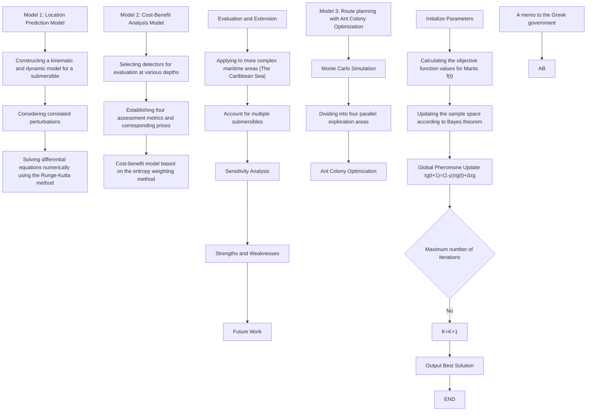
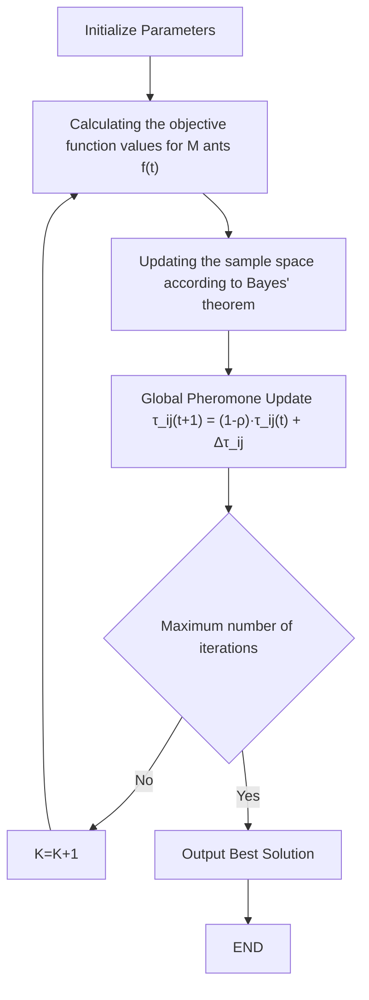

# Time is Life: Precise Localization and Faster Search

## Summary

After losing contact with the main ship, a suitable positioning model, search equipment, and search strategy for the submersible can significantly reduce rescue time and increase the success rate of the rescue mission. In this paper, based on different malfunction scenarios of the submersible, a positioning model and search strategy for the submersible's movement have been established, providing some suggestion for maritime rescue.

For Problem 1, firstly, we searched for the depth and ocean current information in the Ionian Sea and fitted the seafloor topography. Then, a location model is conducted. Utilizing the fourth-order Runge-Kutta method, numerical solutions are obtained, and potential motion trajectories are plotted. The primary uncertainties in the model include the submersible's initial state, ocean currents, and fault conditions. Therefore, the submersible should be equipped with sensors such as GPS and inertial navigation systems, regularly sending position information, depth, motion data, and surrounding ocean current data to the host ship.

For Problem 2, we used the entropy-weight method to calculate the weights of performance data and costs for the corresponding rescue devices. Employing a cost-benefit model, scores are obtained. Considering the characteristics of each rescue device, we determined the following strategy: primarily using drones for surface search, sonar for underwater search, and purchasing a small quantity of AUVs for deeper regions.

For Problem 3, we first discretize the search area into grids and added realistic disturbances to ocean currents and fault conditions. Using the Monte Carlo simulation method, we obtain the probability of the submersible appearing in each grid over time. Subsequently, utilizing the ant colony algorithm and continually updating the objective function based on the Bayesian probability model over time, we identify the most efficient search path, achieving a 43% probability of finding the submersible within 10 hours. Finally, by setting different search start times, we find that starting later resulted in a lower probability of finding the submersible within 10 hours.

For Problem 4, the possible extensions of the model is discussed. For areas with more complex terrain and stronger ocean currents, such as the Caribbean Sea, relevant disturbances need to be increased. In cases with multiple submersibles, communication between them would facilitate search and rescue.

Finally, we analyze the impact of drag coefficient errors on the model and evaluate the strengths and weaknesses of model. And a two-page Memo has been written for the Greek government.

Keywords: Dynamics Model, Monte Carlo Simulation, Ant Colony Algorithm, Cost-Benefit Analysis based on EWM, Bayesian Detection

## Contents

## 1 Introduction 3

1.1 Problem Background 3  
1.2 Restatement of the Problem 3  
1.3 Our Work 4

## 2 Assumptions and Justifications 4

## 3 Notations 5

## 4 Model Preparation 5

4.1 Safety Strategy 5  
4.2 Seafloor Topography 6  
4.3 The relevant parameters of the submersible 6

## 5 Models and Solutions of Problem 1 6

5.1 Location Model 6  
5.2 Model Solving 9  
5.3 Uncertainty of the Model 11  
5.4 Measures and Equipment to Reduce Uncertainty ..... 12

5.4.1 Measures 12  
5.4.2 Equipment 12

## 6 Models and Solutions of Problem 2 13

6.1 Rescue Equipment 13  
6.2 Cost-Benefit Model Based on Entropy Weight Method 13  
6.3 Evaluation Results and Analysis 15

## 7 Models and Solutions of Problem 3 15

7.1 Model preparation 15  
7.2 Model for Searching 17

7.2.1 Search Strategy 17  
7.2.2 Ant Colony Algorithm for Planning Search Paths 18

7.3 Results and Analysis 19

7.3.1 Planning Results of Search Route 19  
7.3.2 The Impact of Start Time for Searching 20

## 8 Model Expansion and Promotion for Problem 4 20

8.1 Different Maritime Regions 20  
8.2 Multiple Submersibles 21

## 9 Sensitivity Analysis 22

## 10 Strengths and Weaknesses 22

10.1 Strengths 22  
10.2 Weaknesses 23

## References 23

## 1 Introduction

## 1.1 Problem Background

With the development of diving technology, deep-sea diving has gradually found its way into the tourism industry and has become a favorite among many tourists. With the help of diving equipment such as submarines, tourists can explore the mysterious underwater world and enjoy the beauty of the ocean floor. A Greek company called "Maritime Cruises Mini-Submarines" (MCMS) manufactures submersibles capable of descending into the deep sea. MCMS now hopes to use their submersibles to lead tourists on an adventurous exploration of the sunken shipwrecks in the Ionian Sea.

natural_image

Underwater coral reef scene with striped fish swimming near coral (no visible text or symbols)

Figure 1: Beautiful Deep Sea Bottom[1]

However, due to the current state of diving technology and submarine manufacturing techniques, there may be issues such as communication interruptions and loss of propulsion during the descent. When encountering such problems, it is crucial to quickly and accurately determine the approximate location of the submersible for subsequent rescue operations. This requires a comprehensive consideration of factors such as underwater topography, seawater density, ocean currents, and other practical considerations.

## 1.2 Restatement of the Problem

For the requirements and tasks given, we restate them to help better position the focus of our work.

\- Build a model to predict the underwater vehicle's location over time after losing communication with the host ship, and analyze the uncertain factors during the prediction process. Based on this, determine the equipment that the underwater vehicle should be equipped with to reduce prediction uncertainty and the information that should be sent to the host ship before an incident.

- Taking into account costs associated with availability, maintenance, readiness, and usage of this equipment, determine the additional search or rescue equipment that the host ship and rescue vessels should carry, if necessary.  
- Develop a model based on the information from the location model in Task 1 to determine the initial deployment point and search pattern, in order to minimize the time it takes to find a lost submersible. Then provide a probability function for finding the submersible.  
- Extend the model established above to make it applicable in different marine environments and with varying numbers of submersibles.

## 1.3 Our Work

To address the mentioned issues, our work can be illustrated with the following flowchart:

flowchart

Figure 2: The Framework of Our Work

## 2 Assumptions and Justifications

\- During the time when the submersible loses contact, the weather at sea is stable, and significant changes are unlikely to occur. In most cases, the ocean is calm. Moreover, abrupt weather changes are not the focus of the model study.

- If a submersible touches the bottom during the descent process, it will be unable to move on its own. Due to the presence of abundant sediment on the seabed, the buoyancy will significantly decrease, making it difficult for the submersible to resurface on its own.  
- All rescue equipment can be deployed within one hour after the submersible goes missing. For maritime search and rescue, time is precious. One hour is sufficient if the rescue preparations are thorough.

## 3 Notations

<table><tr><td>symbol</td><td>Definitions</td><td>unit</td></tr><tr><td>M</td><td>The total mass of the submersible</td><td>Kg</td></tr><tr><td>V</td><td>The volume of the submersible.</td><td> $m^3$ </td></tr><tr><td>a</td><td>The acceleration of the submersible</td><td> $m/s^2$ </td></tr><tr><td>g</td><td>Gravity Acceleration</td><td> $m/s^2$ </td></tr><tr><td>v</td><td>The speed of the submersible</td><td>m/s</td></tr><tr><td> $v_c$ </td><td>Ocean Current Velocity</td><td>m/s</td></tr><tr><td>ρ</td><td>The density of seawater.</td><td> $Kg/m^3$ </td></tr><tr><td> $F_f$ </td><td>The resistance experienced by the submersible</td><td>N</td></tr><tr><td> $F_B$ </td><td>Buoyancy</td><td>N</td></tr><tr><td> $C_d$ </td><td>Coefficient of Drag</td><td>\</td></tr><tr><td> $R_e$ </td><td>Reynolds Number</td><td>\</td></tr><tr><td>t</td><td>The time for search and rescue</td><td>h</td></tr></table>

Note: There are some notations that are not listed here and will be discussed in detail in each section.

## 4 Model Preparation

## 4.1 Safety Strategy

In the actual submersion process of a submersible, in the event of an accident, communication with the main ship may be lost. Based on the fundamental principles of search and rescue, to ensure safety, it is advisable to stay in place after losing contact with the main ship. Due to the difficulty of determining the submersible's position in the deep sea and the main ship being unaware of the submersible's status, it is recommended that, after losing contact with the main ship, the submersible, regardless of whether it still has propulsion, should immediately cease movement to avoid complicating the search and rescue efforts.

## 4.2 Seafloor Topography

When the submersible loses propulsion, its movement may be influenced by the underwater topography. Therefore, we consulted relevant information[2] on the underwater topography of the Ionian Sea and fitted the seafloor terrain.

3d surface chart

| longitude | latitude | depth |
| --- | --- | --- |
| 13 | 40 | 0 |
| 14 | 40 | 0 |
| 15 | 40 | 0 |
| 16 | 40 | 0 |
| 17 | 40 | 0 |
| 18 | 40 | 0 |
| 19 | 40 | 0 |
| 20 | 40 | 0 |
| 21 | 40 | 0 |
| 22 | 40 | 0 |
| 23 | 40 | 0 |
| 24 | 40 | 0 |
| 25 | 40 | 0 |
| 26 | 40 | 0 |
| 27 | 40 | 0 |
| 28 | 40 | 0 |
| 29 | 40 | 0 |
| 30 | 40 | 0 |
| 31 | 40 | 0 |
| 32 | 40 | 0 |
| 33 | 40 | 0 |
| 34 | 40 | 0 |
| 35 | 40 | 0 |
| 36 | 40 | 0 |
| 37 | 40 | 0 |
| 38 | 40 | 0 |
| 39 | 40 | 0 |
| 40 | 40 | 0 |
| 41 | 40 | 0 |
| 42 | 40 | 0 |
| 43 | 40 | 0 |
| 44 | 40 | 0 |
| 45 | 40 | 0 |
| 46 | 40 | 0 |
| 47 | 40 | 0 |
| 48 | 40 | 0 |
| 49 | 40 | 0 |
| 50 | 40 | 0 |
| 51 | 40 | 0 |
| 52 | 40 | 0 |
| 53 | 40 | 0 |
| 54 | 40 | 0 |
| 55 | 40 | 0 |
| 56 | 40 | 0 |
| 57 | 40 | 0 |
| 58 | 40 | 0 |
| 59 | 40 | 0 |
| 60 | 40 | 0 |
| 61 | 40 | 0 |
| 62 | 40 | 0 |
| 63 | 40 | 0 |
| 64 | 40 | 0 |
| 65 | 40 | 0 |
| 66 | 40 | 0 |
| 67 | 40 | 0 |
| 68 | 40 | 0 |
| 69 | 40 | 0 |
| 70 | 40 | 0 |
| 71 | 40 | 0 |
| 72 | 40 | 0 |
| 73 | 40 | 0 |
| 74 | 40 | 0 |
| 75 | 40 | 0 |
| 76 | 40 | 0 |
| 77 | 40 | 0 |
| 78 | 40 | 0 |
| 79 | 40 | 0 |
| 80 | 40 | 0 |
| 81 | 40 | 0 |
| 82 | 40 | 0 |
| 83 | 40 | 0 |
| 84 | 40 | 0 |
| 85 | 40 | 0 |
| 86 | 40 | 0 |
| 87 | 40 | 0 |
| 88 | 40 | 0 |
| 89 | 40 | 0 |
| 90 | 40 | 0 |
| 91 | 40 | 0 |
| 92 | 40 | 0 |
| 93 | 40 | 0 |
| 94 | 40 | 0 |
| 95 | 40 | 0 |
| 96 | 40 | 0 |
| 97 | 40 | 0 |
| 98 | 40 | 0 |
| 99 | 40 | 0 |

Figure 3: The topographic map of the Ionian Sea

## 4.3 The relevant parameters of the submersible

When establishing the model, obtaining appropriate parameters for the submersible is essential. The figure on the right illustrates one type of submersible, indicating relevant dimensions of the submersible. The maximum designed depth for the submersible in the right figure is 4000 meters, which corresponds to the maximum depth of the Ionian Sea.

natural_image

3D rendering of a Triton Submarines spacecraft with visible internal components and external wiring (no text or symbols)

Figure 4: The submersible[3]

## 5 Models and Solutions of Problem 1

## 5.1 Location Model

For the convenience of model establishment and subsequent analytical calculations, we take the sea level as the xy-plane, with the vertical direction as the z-axis.

## - Location model in the vertical direction

Based on the previously mentioned safety strategy, after losing communication with the host ship, the submersible immediately ceases active movement, regardless of whether it still has propulsion, and ascends promptly. According to Newton's second law, we have:

$$
M a _ {z} = - M g + F _ {B} - F _ {f} \tag {1}
$$

where $a_{z}$ represents the vertical acceleration of the submersible, $F_{B}$ is the buoyancy it experiences, and $F_{f}$ is the resistance acting on the submersible in the vertical direction.

According to the working principle of the submersible, the ascent or descent of the submersible is determined by the amount of seawater in the submersible's water tank. We can express the total mass of the submersible as follows:

$$
M = m + m _ {\text {water}} \tag {2}
$$

where m is the total mass of the submersible excluding the water tank, and $m_{water}$ is the mass of the water tank. To simplify the model, we assume a constant rate of water inflow and outflow in the water tank until it is filled or emptied.

It is worth noting that after losing propulsion, other power systems of the submersible may also fail. If the submersible's other power systems have not failed, it can ascend normally. However, if the other power systems of the submersible fail, it will be unable to ascend by expelling water from the ballast tank. Instead, it may sink to the seabed or ascend to certain neutral buoyancy points under the influence of initial velocity and acceleration. At this point, the mass of water in the tank remains at its initial value. The impact of whether the submersible can drain and ascend normally will be discussed and validated in subsequent model solutions.

According to Archimedes' principle of buoyancy[4], we have:

$$
F _ {B} = \rho g V \quad \rho \approx 1. 0 2 2 - \frac {0 . 0 1 z}{1 5 0 0} (g / c m ^ {3}) \tag {3}
$$

where $\rho$ is the density of seawater and V is the volume of the submersible.

Due to the relatively small ascent and descent speeds of the submersible, the water flow around its surface is in a laminar state during motion. Therefore, the water flow resistance acting on the submersible can be expressed as follows:

$$
F _ {f} = \frac {1}{2} C _ {d} \cdot \rho A v ^ {2} \tag {4}
$$

where $C_d$ is the drag coefficient, $A$ is the area of the submersible's upper and lower surfaces, $\rho$ is the density of water, and $v$ is the speed of the submersible. Moreover, the direction of water flow resistance is always opposite to the direction of the submersible's movement.

According to fluid dynamics knowledge, the drag coefficient $C_{d}$ in laminar flow can be determined by the Reynolds number Re:

$$
C _ {d} = \frac {6 4}{R e} \tag {5}
$$

At different flow rates, the Reynolds number varies. Since the relative velocity is time-varying, we assume a constant value for Re based on empirical values, and subsequently calculate the drag coefficient $C_{d}$ . The impact of the assumed $C_{d}$ values on the model will be discussed in the subsequent sensitivity analysis.

So far, by simultaneously combining equations (2), (3), (4), (5), and (6), the differential equation for the vertical motion of the submersible can be obtained:

$$
(m + m _ {w} (t)) \cdot \frac {\mathrm{d} ^ {2} z}{\mathrm{d} t ^ {2}} = - (m + m _ {w} (t)) \cdot g + \rho (z) \cdot g V - \frac {1}{2} \cdot \frac {6 4}{R e} \cdot \rho (z) \cdot A \cdot (\frac {\mathrm{d} z}{\mathrm{d} t}) ^ {2} \tag {6}
$$

## - Location model in the XY plane

Compared to the vertical direction, the movement of the submersible in the XY plane is not influenced by buoyancy but is significantly affected by ocean currents. According to the safety strategy mentioned earlier, the submersible's propulsion force is considered to be 0. Firstly, we analyze the movement of the submersible in the x-direction. According to Newton's second law, we have:

$$
M \cdot a _ {x} = F _ {c x} \tag {7}
$$

At this point, the submersible is only influenced by ocean currents.

heatmap

| latitude | longitude | value |
| -------- | --------- | ----- |
| 35       | 16.5      | 0.0   |
| 35       | 17        | 0.1   |
| 35       | 17.5      | 0.2   |
| 35       | 18        | 0.3   |
| 35       | 18.5      | 0.4   |
| 35       | 19        | 0.5   |
| 35       | 19.5      | 0.6   |
| 35       | 20        | 0.7   |
| 35       | 20.5      | 0.8   |
| 36       | 16.5      | 0.0   |
| 36       | 17        | 0.1   |
| 36       | 17.5      | 0.2   |
| 36       | 18        | 0.3   |
| 36       | 18.5      | 0.4   |
| 36       | 19        | 0.5   |
| 36       | 19.5      | 0.6   |
| 36       | 20        | 0.7   |
| 36       | 20.5      | 0.8   |
| 37       | 16.5      | 0.0   |
| 37       | 17        | 0.1   |
| 37       | 17.5      | 0.2   |
| 37       | 18        | 0.3   |
| 37       | 18.5      | 0.4   |
| 37       | 19        | 0.5   |
| 37       | 19.5      | 0.6   |
| 37       | 20        | 0.7   |
| 37       | 20.5      | 0.8   |
| 38       | 16.5      | 0.0   |
| 38       | 17        | 0.1   |
| 38       | 17.5      | 0.2   |
| 38       | 18        | 0.3   |
| 38       | 18.5      | 0.4   |
| 38       | 19        | 0.5   |
| 38       | 19.5      | 0.6   |
| 38       | 20        | 0.7   |
| 38       | 20.5      | 0.8   |

text_image

Southern Adriatic
Otranto Strait
Sicily Channel
Ionian Sea

Figure 5: Currents in Ionian Sea[5]

The figure displays a schematic representation of the currents in a specific area of the Ionian Sea at a certain time. The diagram provides information about the general direction and average velocity of the currents[6] in the depicted region.

Since ocean currents generally have a relatively small and stable velocity, they can be considered to be in a laminar flow state. Therefore, $F_{cx}$ can be expressed as follows:

$$
\left\{ \begin{array}{l} F _ {c x} = \frac {1}{2} C _ {d x} \cdot \rho A _ {x} (v - v _ {c x}) ^ {2} \\ C _ {d x} = \frac {6 4}{R e} \end{array} \right. \tag {8}
$$

where $A_{x}$ represents the area of the submersible subjected to the action of ocean currents.

Similarly, we can obtain a similar motion model for the submersible in the y-direction. Compared to the model in the vertical direction, the challenge in determining the coordinates of the submersible in the xy-plane lies in the uncertainty of ocean currents.

## 5.2 Model Solving

In the vertical direction, due to the complexity of equation (7), it is difficult to obtain an analytical solution through mathematical methods. Therefore, we use a numerical method —Runge-Kutta method for solving.

## •The fourth-order Runge-Kutta method

When solving the model, we employ the fourth-order Runge-Kutta method with a higher precision, and the truncation error is $O(h^5)$ , where $h$ is the chosen step size.

For the initial value problem of the first-order ordinary differential equation given as follows:

$$
\left\{ \begin{array}{l} \dot {z} = f (t, z) \\ z \left(t _ {0}\right) = z _ {0} \end{array} \right. \tag {9}
$$

The recursive formula for solving using the fourth-order Runge-Kutta method is:

$$
\left\{ \begin{array}{l} t _ {n + 1} = t _ {n} + h \\ k 1 = f (z _ {n}, t _ {n}) \\ k 2 = f (z _ {n} + \frac {h}{2} \cdot k _ {1}, t _ {n} + \frac {h}{2}) \\ k 3 = f (z _ {n} + \frac {h}{2} \cdot k _ {2}, t _ {n} + \frac {h}{2}) \\ k 4 = f (z _ {n} + h \cdot k _ {3}, t _ {n} + h) \\ z _ {n + 1} = z _ {n} + \frac {h}{6} \cdot (k _ {1} + 2 k _ {2} + 2 k _ {3} + k _ {4}) \end{array} \right. \tag {10}
$$

$y_{n}$ is determined by the sum of the current $y_{(n-1)}$ and the unit time change. The unit time change is the product of the time interval h and the approximate slope.

## - Algorithm improvement and application

- Step1: Determination of Initial Conditions: The data such as the submersible's velocity and acceleration can be obtained from corresponding sensors. The velocity and acceleration transmitted to the main ship at the last moment can be considered as the submersible's initial velocity and acceleration.  
- Step2:Differential Equation Processing: Since the established position model is a second-order differential equation, it needs to be transformed into a first-order differential equation. Simultaneously, the first-order derivative terms are moved to the left side of the equation.

and the remaining terms are moved to the right side. The transformed equation is:

$$
\left\{ \begin{array}{l} x ^ {\prime} (t) = u (t) \\ y ^ {\prime} (t) = v (t) \\ z ^ {\prime} (t) = w (t) \\ u ^ {\prime} (t) = \frac {\frac {1}{2} C _ {d x} \cdot \rho A _ {x} \cdot (u (t) - v _ {c x}) ^ {2}}{(m + m _ {w} (t))} \\ v ^ {\prime} (t) = \frac {\frac {1}{2} C _ {d y} \cdot \rho A _ {y} \cdot (v (t) - v _ {c y}) ^ {2}}{(m + m _ {w} (t))} \\ w ^ {\prime} (t) = \frac {- (m + m _ {w} (t)) \cdot g + \rho (z) \cdot g V - \frac {1}{2} \cdot F _ {c} \cdot \rho (z) \cdot A \cdot (w (t)) ^ {2}}{(m + m _ {w} (t))} \end{array} \right. \tag {11}
$$

Step3:Iterative solution of the algorithm: Set the step size h=1s, iterate over a length of 10 hours, calculate the values of $k_{1}$ , $k_{2}$ , $k_{3}$ , $k_{4}$ corresponding to the two differential equations using the recursive formula, and then determine the next discrete value $z(n+1)$ .

## • Results and Analysis

To solve and validate the model we established, we randomly select a point in the deep sea as the initial position of the submersible, and provide initial velocity and acceleration values for the submersible.

## ◇ When the submersible can resurface normally:

At this point, the submersible's water tank drains normally until it is empty. By substituting the initial velocity and acceleration of the submersible and iterating continuously, we can plot the trajectory of the submersible's motion after losing contact with the host ship as follows:

3d surface plot with an inset visual highlighting the structural change of a terrain feature.

| latitude | longitude | depth |
| -------- | --------- | ----- |
| 37.8     | 18.45     | -3500 |
| 37.6     | 18.4      | -3000 |
| 37.4     | 18.3      | -2500 |
| 37.2     | 18.2      | -2000 |
| 37.0     | 18.15     | -1500 |
| 36.8     | 18.1      | -1000 |
| 36.6     | 18.05     | -500  |
| 36.4     | 18.0      | 0     |

Figure 6: Possible trajectories of the submersible's movement

The selected initial point in the figure is (18, 37, -3147) (where x and y coordinates represent longitude and latitude, and z is the depth). The submersible initially descends a short distance under the influence of the initial velocity and then begins to resurface. In the xy plane, due to the influence of ocean currents, the position continuously shifts over time.

## ◇ When the submersible cannot resurface normally:

At this point, there is a malfunction in the water tank. Considering real-world scenarios, we assume that after the water tank failure, its mass follows a uniform distribution between the minimum and maximum mass:

In this case, due to the uncertainty in the initial state and water tank mass, the submersible may either touch the bottom or reach the neutral buoyancy point. Through multiple simulations, we obtained trajectories where the submersible either hits the bottom or hovers, as shown below:

3d surface chart

| latitude | depth |
| -------- | ----- |
| 18.15    | -3500 |
| 18.2     | -3400 |
| 18.25    | -3300 |
| 18.3     | -3200 |
| 18.35    | -3100 |
| 18.4     | -3000 |
| 18.45    | -2900 |
| 36.9     | -2800 |
| 37.0     | -2700 |
| 37.1     | -2600 |
| 37.2     | -2500 |
| 37.3     | -2400 |
| 37.4     | -2300 |
| 37.5     | -2200 |
| 37.6     | -2100 |
| 37.7     | -2000 |
| 37.8     | -1900 |

3d surface chart

| latitude | depth |
| -------- | ----- |
| 18.2     | -3500 |
| 18.3     | -3400 |
| 18.4     | -3300 |
| 36.9     | -2500 |
| 37.0     | -2500 |
| 37.1     | -2500 |
| 37.2     | -2500 |
| 37.3     | -2500 |
| 37.4     | -2500 |
| 37.5     | -2500 |
| 37.6     | -2500 |
| 37.7     | -2500 |
| 37.8     | -2500 |

Figure 7: Possible trajectories of the submersible's movement

In the left figure, due to a malfunction in the water tank, the submersible continuously sinks to the seabed as gravity exceeds buoyancy.

In the right figure, a portion of the water in the submersible's water tank is discharged. Upon reaching a specific depth, the submersible remains in a suspended state due to the decreased density of seawater, experiencing slight oscillations above and below the neutral buoyancy point.

## 5.3 Uncertainty of the Model

During the process of model establishment and solving, we have identified that the position of the submersible can be influenced by the following uncertainties:

\- Initial Position: The submersible's location before losing contact varies, and the starting point for model establishment differs. This leads to significant differences in the subsequent movement trajectory of the submersible.

- Initial Velocity and Acceleration: According to the safety strategy mentioned earlier, the submersible will immediately deactivate propulsion after losing contact with the main ship. The submersible will then commence movement with initial velocity and acceleration. The initial conditions have a significant impact on the predicted results of the model.  
- Ocean Currents: For a submersible that has lost propulsion, the force exerted by ocean currents is the primary reason for its continuous movement. Ocean currents vary with time, seasons, and the temperature of seawater, exhibiting significant short-term randomness. This randomness is a crucial uncertainty factor in the model.  
- Seabed Topography: As the exact underwater topography cannot be precisely determined in advance, the submersible's movement may be constrained by the terrain, introducing uncertainty to the model.

## 5.4 Measures and Equipment to Reduce Uncertainty

## 5.4.1 Measures

For potential accidents, reducing uncertainty factors means improving safety. To minimize uncertainties in the model, enhance the likelihood and accuracy of predictions, the submersible should regularly transmit its position information, movement speed and acceleration, ocean current information, as well as data about the surrounding environment or terrain to the main ship before losing contact with the host ship.

## 5.4.2 Equipment

We recommend equipping the submersible with the following devices:

- GPS Positioning Device:GPS is a technology that determines location using satellite signals. However, underwater, GPS signals cannot penetrate the water surface directly, so the submersible's GPS positioning typically requires coordination with buoys or surface vessels.  
- Inertial Navigation System: An inertial navigation system uses sensors such as accelerometers and gyroscopes to measure the submersible's acceleration and angular velocity. Velocity can be obtained through integration.  
- Underwater High-Definition Camera: Can be used to observe underwater environments, acquire seafloor topography, thereby reducing the risk of encountering hazards.  
- Pressure Sensor: As the water pressure in the deep sea is approximately linearly related to depth, the depth at which the submersible is located can be calculated based on the measured water pressure.  
- Magnetometer: By measuring the Earth's magnetic field, the submersible's orientation can be determined.  
- Current Detection Sensors: By detecting the direction and speed of ocean currents, the impact of random currents on predictions can be reduced.

## 6 Models and Solutions of Problem 2

## 6.1 Rescue Equipment

According to the position model established in the previous section, when the submersible loses contact with the main ship, it may sink to the seafloor, remain at certain neutral buoyancy points, or rise to the sea surface depending on different failure scenarios. This presents varied requirements for search and rescue operations. We define regions with depths below 3000 meters as deep-water zones and those above 3000 meters as shallow-water zones. To address all possible situations, we have researched equipment designed for search and rescue in surface, shallow-water, and deep-water areas. The specifications and costs of these devices are presented in the table below:

Table 1: Equipment and Parameters[7]

<table><tr><td colspan="2">Equipment and Parameters</td><td>Failure Rate (%)</td><td>Detection Range</td><td>Precision(cm)</td><td>Accuracy(%)</td><td>Price($)</td><td>Maintenance Cost($)</td><td>Operating Cost($)</td></tr><tr><td rowspan="2">Surface</td><td>Search and Rescue Drones</td><td>1</td><td> $18.4 \times 10^6$ </td><td>7.8</td><td>92</td><td>1034</td><td>50</td><td>14</td></tr><tr><td>Maritime Search and Rescue Boats</td><td>0.5</td><td> $6 \times 10^6$ </td><td>11.6</td><td>94</td><td>3415</td><td>100</td><td>20</td></tr><tr><td rowspan="2">Shallow-water Zone</td><td>Side-scan Sonar</td><td>0.05</td><td>224</td><td>10.2</td><td>98</td><td>24995</td><td>200</td><td>90</td></tr><tr><td>Autonomous Underwater Robot</td><td>0.1</td><td>30</td><td>2.5</td><td>99.4</td><td>35248</td><td>900</td><td>87</td></tr><tr><td rowspan="4">Deep-water Zone</td><td>Autonomous Underwater Vehicle</td><td>0.2</td><td>67</td><td>5</td><td>98.6</td><td>45652</td><td>1000</td><td>120</td></tr><tr><td>Side-scan Sonar</td><td>0.2</td><td>400</td><td>40.8</td><td>95</td><td>24995</td><td>200</td><td>90</td></tr><tr><td>Autonomous Underwater Robot</td><td>0.4</td><td>30</td><td>4.5</td><td>98.9</td><td>35248</td><td>900</td><td>87</td></tr><tr><td>Autonomous Underwater Vehicle</td><td>1.0</td><td>65</td><td>6</td><td>96</td><td>45652</td><td>1000</td><td>120</td></tr></table>

where, precision represents the minimum distance that the equipment can resolve. The smaller the value, the stronger the resolution capability of the device.

Taking into account the performance of the equipment and the associated costs of purchasing, maintaining, and using, we adopt a cost-benefit model based on the entropy weight method to evaluate various rescue devices. This aims to achieve the optimal configuration while ensuring rescue efficiency.

## 6.2 Cost-Benefit Model Based on Entropy Weight Method

## - Entropy weight method to determine weights

Due to the different working areas applicable to different devices, and the performance of the same device varies at different depths, it is necessary to determine the optimal devices separately for the surface, shallow water, and deep water areas. Taking the evaluation of the shallow water area as an example:

## (1) Standardize the performance parameters

Input the various performance indicators and cost indicators of the three types of equipment in the shallow water area into the matrix. For the failure rate and minimum resolution accuracy in the benefit indicators, since smaller values indicate better equipment performance,

their reciprocals are written into the matrix.

$$
X _ {0} = \left[ \begin{array}{c c c c} x _ {1 1} & x _ {1 2} & \dots & x _ {1 4} \\ x _ {2 1} & x _ {2 2} & \dots & x _ {2 4} \\ \vdots & \vdots & \ddots & \vdots \\ x _ {n 1} & x _ {n 2} & \dots & x _ {n 4} \end{array} \right] \tag {12}
$$

As all evaluation indicators are non-negative, the standardization formula is used as follows:

$$
z _ {i j} = \frac {x _ {i j}}{\sqrt {\sum_ {i = 1} ^ {n} x _ {i j} ^ {2}}} \tag {13}
$$

Then we can get the standardized matrix $Z_{0}$ .

## (2) Entropy Calculating

The matrix $Z_{0}$ obtained through standardization can be further used to calculate the probability matrix P, where the calculation formula for each element $p_{ij}$ in P is as follows:

$$
p _ {i j} = \frac {z _ {i j}}{\sum_ {i = 1} ^ {n} z _ {i j}} \tag {14}
$$

Then, the entropy value $e_j$ of the $i$ th index can be defined as:

$$
e _ {j} = - \frac {1}{\ln n} \sum_ {i = 1} ^ {n} p _ {i j} \ln (p _ {i j}) (j = 1, 2, \dots , 4) \tag {15}
$$

The range of entropy value $e_{j}$ is [0, 1]. The larger the $e_{j}$ is, the greater the differentiation degree of index j is, and more information can be derived. Hence, higher weight should be given to the index. Therefore, the weight $W_{j}$ is defined as follows:

$$
W _ {j} = \frac {1 - e _ {j}}{\sum_ {j = 1} ^ {m} (1 - e _ {j})}, j = 1, 2, \dots , 4 \tag {16}
$$

## - Cost-benefit evaluation model

Multiplying the weights corresponding to various performance indicators of rescue equipment by the normalized data yields the weighted matrix. At this point, the benefits and costs of each rescue device can be represented as follows:

$$
\left\{ \begin{array}{l} E _ {i} = \sum_ {j = 1} ^ {m} W _ {j} P _ {i j} \\ C _ {i} = \frac {C _ {\text { total }} (i)}{\sum C} \end{array} \right. \tag {17}
$$

Where $E_{i}$ represents the benefit indicator, and $C_{i}$ represents the cost indicator. $C_{i}$ includes the expenses for the purchase, maintenance, and single-use of the equipment. To achieve better visual representation, we have also normalized C.

Then, the evaluation score (REC) for each device can be represented by the ratio of E to C as follows:

$$
R e c _ {i} = \frac {E _ {i}}{C _ {i}} \tag {18}
$$

By comparing the scores, the superiority and inferiority of each rescue device can be determined. A higher score indicates relatively better performance and relatively lower costs for the device.

## 6.3 Evaluation Results and Analysis

Based on the evaluation model, combined with the relevant data in Table 2, we conducted evaluations of rescue equipment in the sea surface, shallow water area, and deep water area, obtaining scores for five types of rescue equipment: Autonomous Underwater Vehicle (AUV), Autonomous Underwater Robot (AUR), Side-scan Sonar (SSS), Search and Rescue Drones (SRD), and Maritime Search and Rescue Boats (MSRB). The results are displayed as follows:

bar chart

| Category | Surface Water Area | shallow water area | deep water area |
| :--- | :--- | :--- | :--- |
| SSS | 0.0 | 2.3 | 2.45 |
| SRD | 2.65 | 0.0 | 0.0 |
| AUR | 0.0 | 0.8 | 0.7 |
| MSRB | 0.5 | 0.0 | 0.0 |
| AUV | 0.0 | 0.5 | 0.45 |

Figure 8: Evaluation Results

From the chart, it can be observed that in surface search and rescue, the score of Search and Rescue Drones (SRD) is significantly higher than Maritime Search and Rescue Boats, demonstrating higher search and rescue efficiency and lower costs. In shallow water and deep water areas, the score of Side-scan Sonar (SSS) is also significantly higher than others. Therefore, the combination of Drones and Sonar as the main search and rescue equipment is reasonable.

It is worth noting that, although SSS has a high score, it is powerless in deeper depths. However, AUVs can operate in deeper regions. And AUR has the highest exploration accuracy, making it advantageous in dealing with more complex seabed terrain. Therefore, we recommend the main search and rescue equipment to be Search and Rescue Drones and Side-scan Sonar, with a smaller number of AUVs and AURs. This approach can ensure search and rescue efficiency as much as possible within an acceptable cost range, preparing for any possible scenarios.

## 7 Models and Solutions of Problem 3

## 7.1 Model preparation

Using the location model, we can determine the trajectory of the submersible if the initial position of the submersible, fault conditions, ocean current data, and seafloor topography are all known. However, in reality, the fault conditions of the submersible, ocean current speed, and direction are subject to significant randomness. Therefore, the submersible may appear in different locations in the ocean with varying probabilities, and these probability distributions will change over time. To obtain the probability distribution of the submersible's position over time, we employ Monte Carlo simulation.

## - Divide Search Area into Grids

As the submersible loses or shuts off propulsion, its speed gradually approaches the speed of ocean currents over time. Therefore, we calculated the maximum range the submersible could reach after 10 hours. We divided the area into grids with dimensions of 400m in length and width, resulting in a total of $30 \times 75$ grids. By discretizing the region, we can use numerical methods to simulate the probability of the submersible appearing at various points. This approach is helpful in actual search operations to avoid overlooking potential locations.

## • Monte Carlo Simulation

To simulate the real movement of the submersible, we first simulated the uncertainty of ocean currents. Over a short period, the stable speed and direction angle of ocean currents can be approximated to follow a normal distribution:

$$
\left\{ \begin{array}{l} v _ {c} \sim N \left(\bar {v _ {c}}, \sigma_ {1} ^ {2}\right) \\ \theta \sim N \left(\bar {\theta}, \sigma_ {2} ^ {2}\right) \end{array} \right. \tag {19}
$$

where $\overline{v_{c}}$ and $\overline{\theta}$ represent the average speed and average direction angle of the ocean currents, respectively.

Additionally, if the submersible can resurface normally, the rescue operation will be much easier. Therefore, we focus on analyzing the situation of a malfunction in the submersible's water tank and assume that the mass of water in the tank follows a uniform distribution:

$$
m _ {w} \sim U (m _ {\min}, m _ {\max}) \tag {20}
$$

We selected the same longitude and latitude as in Question 1 for the moment when the submersible lost contact with the main ship, with a depth set at 1500 meters. Then, using Monte Carlo random number simulation, we generated 100,000 sets of possible states and substituted them into the positioning model to determine the coordinates of the submersible at 1, 2, ..., 10 hours later.

In Figure 9, we can observe the results simulated from these 100,000 initial state points.

- The left graph illustrates the distribution of these points after 10 hours. Due to the initial perturbations, among these points, $19.1\%$ can reach the sea surface, $17.2\%$ remain at depths between 0 to 1500 meters, $36\%$ stay at depths between 1500 to 3000 meters, and $27.67\%$ are at the seafloor. As the number of simulations is sufficient, the proportion of occurrences in a specific area can approximate the probability of the submersible appearing there.  
- In the diagram on the right, a top-down view of the trajectories of these simulated points within 10 hours is depicted. It can be observed from the diagram that the trajectories diverge outward along the average direction of the ocean currents, further highlighting the significant impact of the uncertainty of the ocean currents on the submersible's trajectory.

3d scatter plot

| Distance in latitude(m) | Distance in longitude(m) | Probability |
| ----------------------- | ------------------------ | ----------- |
| 4.082                   | 2.07                     | 0           |
| 4.08                    | 2.065                    | -500        |
| 4.078                   | 2.06                     | -1000       |
| 4.076                   | 2.055                    | -1500       |
| 4.074                   | 2.05                     | -2000       |
| 4.072                   | 2.045                    | -2500       |
| 4.084                   | 2.07                     | -3500       |

line chart

| Distance in longitude(m) | Distance in latitude(m) |
| ------------------------ | ----------------------- |
| 2.04                     | 4.086                   |
| 2.05                     | 4.078                   |
| 2.06                     | 4.076                   |
| 2.07                     | 4.074                   |

Figure 9: Possible trajectories of the submersible's movement

In the left of figure 10, we specifically depict the trajectories of points that sink to the seafloor and those that resurface to the neutral buoyancy point over the course of 10 hours. The trajectories of points resurfacing to the neutral buoyancy point are roughly similar to those described in Problem 1.

And the probability heatmap depicting the likelihood of the submersible resurfacing to the sea level over time is shown in the right in figure 10. From the heatmap, it can be observed that the water tanks capable of resurfacing normally can reach the sea surface in approximately 1 hour. With the increase in time, there is a slight increase in the number of submersibles capable of resurfacing to the sea surface. This aligns well with the actual scenario.

line chart

| Distance in longitude(m) × 10^6 | Depth in latitude(n) |
| ------------------------------ | -------------------- |
| 2.045                          | -1500                |
| 2.05                           | -1300                |
| 2.055                          | -1200                |
| 2.06                           | -1100                |

heatmap

| Time | Coordinates (Grid) in the x-direction | Coordinates (Grid) in the y-direction |
|------|----------------------------------------|----------------------------------------|
| t=10h | 70                                     | 10                                     |
| t=9h  | 60                                     | 20                                     |
| t=7h  | 50                                     | 30                                     |
| t=5h  | 40                                     | 40                                     |
| t=3h  | 30                                     | 50                                     |
| t=1h  | 20                                     | 60                                     |

Figure 10: Some specific simulation points

## 7.2 Model for Searching

## 7.2.1 Search Strategy

The equipment used for search and rescue varies depending on the location where the submersible goes missing. In problem two, we identified Drones as the main maritime search equipment and sonar as the primary underwater search equipment. Maritime and underwater searches should be conducted simultaneously.

## 7.2.2 Ant Colony Algorithm for Planning Search Paths

Through Monte Carlo simulation, we can determine the probability of the submersible appearing in a specific grid at a certain moment and simulate the trajectory of the submersible over a period of time. For points that have already been searched, we can simulate their subsequent positions. These points will disappear from the subsequent search maps. Taking into account the time required for each set of equipment to search a grid, we set the search period $T = 1h$ . Since T is relatively short, and the submersible's position changes minimally, we assume its position remains unchanged within one search cycle and update the position at the beginning of the next search cycle.

## ▲ Bayesian Probability Model

The probability of finding the submersible is time-varying and depends on the search results of the previous cycle. Using the Bayesian probability model:

$$
P (A _ {i} | B) = \frac {P (A _ {i}) \cdot P (B | A _ {i})}{\sum_ {l = 1} ^ {n} P (A _ {l}) \cdot P (B | A _ {l})}, i = 1, \dots , n \tag {21}
$$

the probability within the current search cycle can be expressed as follows:

$$
P (i) = P (i - 1) + \overline {{P (i - 1)}} \cdot P _ {i} \tag {22}
$$

where: $P(i)$ represents the probability of finding it until the i-th search, and $P_{i}$ represents the probability of finding it in a single search.

## ▲ Objective Function for Search

The probability of finding the submersible after time t is denoted as P(t). In addition to being related to the choice of the search route, with the increase in search time, P(t) generally exhibits a trend of initially increasing and then decreasing[8]. To minimize the time required to locate the submersible, we have established the following objective function:

$$
S (t) = e ^ {- k t} \cdot P (t) \tag {23}
$$

where the urgency level based on time is reflected in the parameter k.

## ▲ Determine the starting point

Since all the uncertain factors in the simulation approximately follow a normal distribution, the probability is relatively large around the point of maximum probability. Therefore, to improve search efficiency and reduce search time, we choose the grid with the highest probability as the starting point for the search.

## ▲ Algorithm flowchart

In order to visually represent the process of utilizing the ant colony algorithm, we have drawn the algorithm flowchart as shown below:

flowchart

Figure 11: Flowchart for Ant Colony Algorithm

## 7.3 Results and Analysis

## 7.3.1 Planning Results of Search Route

One hour after the loss of contact, relevant equipment begins the search. The grid with the highest probability at 1 hour is selected as the initial deployment point. By applying the ant colony algorithm and periodically updating the search map, iterating until convergence, we can obtain the search route as shown in the following diagram:

scatterplot

| Distance in longitude (m) ×10⁵ | Distance in latitude (m) ×10⁶ |
| ------------------------------ | ---------------------------- |
| 2.045                          | 4.082                        |
| 2.05                           | 4.078                        |
| 2.06                           | 4.076                        |
| 2.07                           | 4.074                        |

(a) Planning Route

line chart

| Ant Colony Algorithm Iteration Rounds | Probability of Detecting the Target within 10 hours (On the Sea Surface) |
| -------------------------------------- | -------------------------------------------------------------------------- |
| 0                                      | 0.07                                                                       |
| 10                                     | 0.09                                                                       |
| 20                                     | 0.10                                                                       |
| 30                                     | 0.11                                                                       |
| 40                                     | 0.12                                                                       |
| 50                                     | 0.12                                                                       |
| 60                                     | 0.12                                                                       |
| 70                                     | 0.12                                                                       |

(b) Iteration Results  
Figure 12: Different probabilities with different t

The diagram (a) provides a top-down view of 100,000 simulated points, with the black area indicating the initial point positions and the white area representing the stopping points after 10 hours of search. The light red bands cover 80% of the simulated points along the direction of the ocean currents.

It can be observed that most simulated points are distributed near the direction of the ocean currents, and the search path obtained through the ant colony algorithm also follows the direction of the currents. This result is reasonable as it aligns with the actual outcomes.

In (b) of figure 12, the probability of finding the submersible on the sea surface during each iteration of the ant colony algorithm is displayed. When the number of iterations reaches 40, the probability of finding the submersible on the sea surface within 10 hours converges to around 12%. As revealed by previous simulations, only 19% of the total number of submersibles can resurface to the sea surface within 10 hours. Therefore, the probability of finding the submersible on the sea surface within 10 hours is higher at 63%. Due to lower search efficiency, the success rate of finding the submersible underwater will be lower than on the sea surface.

## 7.3.2 The Impact of Start Time for Searching

In the above model, we took t=1h. However, in reality, t is often greater than one hour due to various factors. Therefore, to study the impact of t on the 10-hour model, we obtained the time-dependent overall probability of finding the submersible within 10 hours of search initiation under the conditions of t=1h, 3h, and 5h, with the remaining parameters being the same, as shown in the following graph:

line chart

| Time (hours) | Data after 1 hour of search | Data after 3 hour of search | Data after 5 hour of search |
| ------------ | --------------------------- | --------------------------- | --------------------------- |
| 1            | 0.14                        | 0.10                        | 0.05                        |
| 2            | 0.21                        | 0.15                        | 0.07                        |
| 3            | 0.26                        | 0.18                        | 0.08                        |
| 4            | 0.29                        | 0.20                        | 0.09                        |
| 5            | 0.32                        | 0.21                        | 0.10                        |
| 6            | 0.35                        | 0.23                        | 0.11                        |
| 7            | 0.38                        | 0.24                        | 0.12                        |
| 8            | 0.40                        | 0.25                        | 0.13                        |
| 9            | 0.42                        | 0.26                        | 0.14                        |
| 10           | 0.44                        | 0.28                        | 0.15                        |

Figure 13: Planning Results of Search Route

From the graph, it can be observed that if the search starts at t=1h, the probability of finding the submersible within 10 hours reaches 43%. The later the search is initiated, the lower the probability of finding the submersible within 10 hours. If the search begins at t=5h, the probability of finding the submersible within 10 hours is only about 10%. This tells us that time is crucial for rescue operations. Therefore, after the submersible loses contact with the main ship, rescue efforts should be deployed as soon as possible to increase the probability of finding it in a short time.

## 8 Model Expansion and Promotion for Problem 4

The model, being based on the actual parameters of the submersible and the ocean, possesses strong generalizability.

## 8.1 Different Maritime Regions

When considering rescue operations in different maritime regions, it is crucial to have a comprehensive understanding of the local climate, topography, and ocean currents. Taking the Caribbean Sea as an example:

## • Climate and Ocean Currents

The Caribbean Sea has a tropical oceanic climate, with highly unstable atmospheric conditions and the presence of tropical storms locally from June to November each year. Therefore, compared to the Mediterranean climate in the Ionian Sea, the surface ocean currents in the Caribbean Sea are more intense and complex. When simulating ocean current data in the relevant area, it is necessary to increase the perturbation values of local ocean currents over time. This will cause a submersible that loses power to quickly lose the influence of its initial velocity, resulting in a more divergent movement trajectory.

## - Topography

The terrain in the Ionian Sea is relatively flat, but it is the opposite near the Caribbean Sea. The underwater terrain in the vicinity of the Caribbean Sea has large fluctuations, with numerous reefs and rocks, contributing to numerous shipwrecks in the Caribbean Sea. Therefore, when simulating, accidents caused by the submersible hitting rocks must be considered. It is necessary to enhance the physical model to simulate the impact of collisions on the submersible's path. After hitting a rock, the submersible immediately loses power and its original velocity, with a probability of mass loss. It should be able to drift with the ocean currents to prevent the simulation from mistakenly detecting it as being stuck at the bottom.

3d surface plot with color-coded intensity values

| X    | Y     | Value  |
|------|-------|--------|
| 22   | -8000 | -8000  |
| 20   | -6000 | -6000  |
| 18   | -4000 | -4000  |
| 16   | -2000 | -2000  |
| 14   | 0     | 0      |
| 12   | 2000  | 2000   |
| 10   | 4000  | 4000   |
| -85  | 4000  | 4000   |
| -80  | 4000  | 4000   |
| -75  | 4000  | 4000   |
| -70  | 4000  | 4000   |
| -65  | 4000  | 4000   |

Figure 14: The Topography of Caribbean Sea

Combining these two factors makes search operations in the Caribbean more complex, placing higher demands on the accuracy of the model and simulated data.

## 8.2 Multiple Submersibles

In scenarios where there are multiple submersibles in a relatively small area, we analyze that, assuming normal communication with the mothership, simultaneous loss of communication or mechanical failure for multiple submersibles is rare and can be disregarded. Therefore, after the first submersible loses contact, judgment needs to be made based on its last communication status.

In the event of a submersible loss, real-time ocean currents, atmospheric conditions, and the geographical status of the last known position before the loss should be checked.

- If there are local storms or severe marine activities: the mothership needs to immediately warn the remaining submersibles to leave or stay away from the relevant area.  
- If no danger is detected near the lost submersible: the remaining submersibles do not need to avoid it. Under favorable conditions, they can approach the missing submersible

for timely deployment of subsequent search and rescue efforts. According to the results of the third question, this significantly increases the probability of locating the missing submersible.

## 9 Sensitivity Analysis

Due to the close relationship between the drag coefficients of the submersible and the shape, size, and maritime conditions of the actual submersible, the drag coefficients in all three directions are estimated values. In this section, a sensitivity analysis is conducted on these three drag coefficients. By varying them by $\pm1\%$ , 2%, and 4%, while keeping other conditions constant, the trajectories for these six scenarios are simulated. A comparison is made between these simulated trajectories and the original trajectory, resulting in the two graphs presented below.

scatterplot

| Distance in longitude(m) ×10⁶ | Distance in latitude(m) ×10⁶ |
| ---------------------------- | ---------------------------- |
| 2.0365                       | 4.1136                       |
| 2.037                        | 4.1134                       |
| 2.0375                       | 4.1132                       |
| 2.038                        | 4.1128                       |
| 2.0385                       | 4.1126                       |
| 2.039                        | 4.1124                       |
| 2.0395                       | 4.1122                       |
| 2.04                         | 4.112                        |

line chart

| latitude | longitude | depth |
| -------- | --------- | ----- |
| 37.8     | 18.2      | -2500 |
| 37.7     | 18.3      | -2400 |
| 37.6     | 18.4      | -2300 |
| 37.5     | 18.4      | -2200 |
| 37.4     | 18.4      | -2100 |
| 37.3     | 18.4      | -2000 |
| 37.2     | 18.4      | -1900 |
| 37.1     | 18.4      | -1800 |
| 37.0     | 18.4      | -1700 |
| 36.9     | 18.4      | -1600 |
| 36.8     | 18.4      | -1500 |
| 36.7     | 18.4      | -1400 |
| 36.6     | 18.4      | -1300 |
| 36.5     | 18.4      | -1200 |
| 36.4     | 18.4      | -1100 |
| 36.3     | 18.4      | -1000 |
| 36.2     | 18.4      | -900  |
| 36.1     | 18.4      | -800  |
| 36.0     | 18.4      | -700  |
| 35.9     | 18.4      | -600  |
| 35.8     | 18.4      | -500  |
| 35.7     | 18.4      | -400  |
| 35.6     | 18.4      | -300  |
| 35.5     | 18.4      | -200  |
| 35.4     | 18.4      | -100  |
| 35.3     | 18.4      | 0     |
| 35.2     | 18.4      | -100  |
| 35.1     | 18.4      | -200  |
| 35.0     | 18.4      | -300  |
| 34.9     | 18.4      | -400  |
| 34.8     | 18.4      | -500  |
| 34.7     | 18.4      | -600  |
| 34.6     | 18.4      | -700  |
| 34.5     | 18.4      | -800  |
| 34.4     | 18.4      | -900  |
| 34.3     | 18.4      | -1000 |
| 34.2     | 18.4      | -1100 |
| 34.1     | 18.4      | -1200 |
| 34.0     | 18.4      | -1300 |
| 33.9     | 18.4      | -1400 |
| 33.8     | 18.4      | -1500 |
| 33.7     | 18.4      | -1600 |
| 33.6     | 18.4      | -1700 |
| 33.5     | 18.4      | -1800 |
| 33.4     | 18.4      | -1900 |
| 33.3     | 18.4      | -2000 |
| 33.2     | 18.4      | -2100 |
| 33.1     | 18.4      | -2200 |
| 33.0     | 18.4      | -2300 |
| 32.9     | 18.4      | -2400 |
| 32.8     | 18.4      | -2500 |
| 32.7     | 18.4      | -2600 |
| 32.6     | 18.4      | -2700 |
| 32.5     | 18.4      | -2800 |
| 32.4     | 18.4      | -2900 |
| 32.3     | 18.4      | -3000 |
| 32.2     | 18.4      | -3100 |
| 32.1     | 18.4      | -3200 |
| 32.0     | 18.4      | -3300 |
| 31.9     | 18.4      | -3400 |
| 31.8     | 18.4      | -3500 |
| 31.7     | 18.4      | -3600 |
| 31.6     | 18.4      | -3700 |
| 31.5     | 18.4      | -3800 |
| 31.4     | 18.4      | -3900 |
| 31.3     | 18.4      | -4000 |
| 31.2     | 18.4      | -4100 |
| 31.1     | 18.4      | -4200 |
| 31.0     | 18.4      | -4300 |
| 30.9     | 18.4      | -4400 |
| 30.8     | 18.4      | -4500 |
| 30.7     | 18.4      | -4600 |
| 30.6     | 18.4      | -4700 |
| 30.5     | 18.4      | -4800 |
| 30.4     | 18.4      | -4900 |
| 30.3     | 18.4      | -5000 |
| 30.2     | 18.4      | -5100 |
| 30.1     | 18.4      | -5200 |
| 30.0     | 18.4      | -5300 |
| ...      | ...       | ...   |
The data is presented in a table format with three columns: latitude (latitude) and longitude (longitude). The depth values are calculated based on the number of data points in the table format (theta = n). There is only one data series in this case.

Figure 15: The impact of drag coefficient errors

From the graph a, it can be observed that after 10 hours in the xy dimensions, the deviation of the trajectory does not exceed 400 meters in any direction. This is within an acceptable range, indicating that it does not significantly affect the main direction of the trajectory. Additionally, in the grid-based map used in the third question, such deviations also have no impact. Through extensive practical simulations, it has been observed that the position region in the z-direction of the submersible stabilizes after 3 hours. Therefore, a deviation value at 3 hours is considered. From the graph b, it can be seen that in the z dimension, the maximum deviation does not exceed 40 meters, which is still within an acceptable range.

## 10 Strengths and Weaknesses

## 10.1 Strengths

\- This model, starting from a dynamics perspective, has established a relatively accurate predictive model for the submersible, offering high precision in its predictions.

- The paper adopts a cost-benefit model based on the entropy weighting method to evaluate sensors, ensuring more accurate assignment of weight values when calculating benefits.  
- The paper utilizes theories related to Bayesian detection and combines them with Ant Colony Optimization. It considers the impact of certain probabilities being tested first on the subsequent sample space during detection, aligning more closely with reality.

## 10.2 Weaknesses

- Due to the difficulty in calculating the drag coefficient, this paper only estimates an approximate value. Accurate measurement is required when extending the model to practical application scenarios.  
- In the predictive model, a method of discretizing time is used to determine the final probability of successful rescue. Due to the insufficient level of discretization, there may be certain errors.

## References

[1] https://pxhere.com/en/photo/1237494?utm\_content=shareClip&utm\_medium=referral&utm\_source=pxhere  
[2] NOAA National Centers for Environmental Information. 2022: ETOPO 2022 15 Arc-Second Global Relief Model. NOAA National Centers for Environmental Information. https://doi.org/10.25921/fd45-gt74 Accessed [3 February,2024].  
[3] https://tritonsubs.com  
[4] Zeng Guanghui, Zang Haipeng, Gu Zezue. Study on the Longitudinal Motion Characteristics of a Powerless Submarine Underwater Drift [C]// Salvage and Rescue Committee of The China Institute of Navigation. Proceedings of the 8th China International Salvage Forum. Naval Submarine Academy, 2014: 3.  
[5] Gai,ăM.,ăG. Civitarese,ăG. L. Eusebi Borzelli,ăV. Kovaevi,ăP.-M. Poulain,ăA. Theocharis,ăM. Menna,ăA. Catucci, andăN. Zarokanellosă(2011),ăOn the relationship between the decadal oscillations of the northern Ionian Sea and the salinity distributions in the eastern Mediterranean,ăJ. Geophys. Res.,ă116, C12002, doi:10.1029/2011JC007280.  
[6] ESR; Dohan, Kathleen. 2022. Ocean Surface Current Analyses Real-time (OSCAR) Surface Currents - Interim 0.25 Degree (Version 2.0). Ver. 2.0. PO.DAAC, CA, USA. Dataset accessed [2024-02-03] atähttps://doi.org/10.5067/OSCAR-25I20  
[7] https://marinesonic.com/  
[8] Potomac Management Group, Inc. (2006). A Simple Guide to Conducting Ground Search and Rescue Detection Experiments. Washington, D.C.: United States Coast Guard Office of Search and Rescue.

## Memo

To: The Government of Greece

From: MCM Team #2419984

Date: Feb 5th,2024

Subject: Scientific positioning and rescue efforts ensure the safety of deep-sea tourism.

Dear Officer of the Government of Greece,

It has come to our attention that a company in your country, MCMS, has developed a type of submersible suitable for tourists to explore the seabed. However, the potential for loss of communication restricts its application and development. Therefore, we have established a dynamic and kinematic model of the submersible (see page ten), as well as a search and rescue strategy based on this model.

Firstly, after conducting a comprehensive force analysis on the submersible, we established a kinematic model considering the impact of ocean currents in the Ionian Sea region on its movement. We found that once the submersible loses communication, its possible positions are greatly influenced by ocean currents. Worse still, we discovered that there are few ocean current monitoring points near the Ionian Sea, leading to inaccurate ocean current data and, consequently, excessive uncertainty in the submersible's position. Installing more ocean current detection stations in the Ionian Sea could significantly improve the accuracy of determining the position of the lost submersible.

Secondly, through a comprehensive evaluation of the performance and cost indicators of various search and rescue devices, we determined that the optimal equipment for surface and underwater searches are drones and sonar, respectively.

Thirdly, based on the kinematic model, using Monte Carlo simulation and ant colony algorithm, we found an optimal search and rescue solution that is most likely to locate the submersible as follows:

text_image

Search and Rescue Route
The main path predicted for
the submersible's movement
Prediction of Boundary

The results suggest that the search path should be as perpendicular as possible to the curve predicted by the dynamic model, and the one-way search path should increase with time.

Additionally, for a lost submersible, time is of the essence, and the probability of successfully finding it decreases sharply with increasing time, as shown in the table below:

The search and rescue route should be as perpendicular as possible to the trajectory predicted by the dynamic model, and as time progresses, the length of each search path should also increase. Additionally, we have found that the probability of successfully detecting the submersible steeply decreases over time. The results are as follows in the table below:

<table><tr><td colspan="2">Probability of Detection after 10h</td></tr><tr><td>Start the search from the 1st hour.</td><td>46%</td></tr><tr><td>Start the search from the 3rd hour.</td><td>30%</td></tr><tr><td>Start the search from the 5th hour.</td><td>13%</td></tr></table>

Therefore, we recommend dispatching relevant detection equipment to the designated area as quickly as possible once the mothership loses communication with the submersible. Our model also indicates that deploying more detectors, with larger detection widths and higher accuracy, increases search efficiency and the probability of successfully detecting the submersible. Purchasing and stockpiling more advanced detection equipment (such as underwater detection vehicles, underwater robots, high-precision sonar, etc.) and strengthening cooperation with the MCMS company will significantly increase the probability of finding the lost submersible.

In conclusion, with the use of advanced sensors and the position and search models we have established, there is a high probability of quickly locating the submersible after an accident, while ensuring the speed of rescue operations. We sincerely hope that the Greek government considers these suggestions to ensure the safety of tourists and promote the development of deep-sea tourism.

Thank you for considering this vital matter. I am available for any further discussion or clarification regarding the proposed model and technology.

Yours sincerely

#2419984