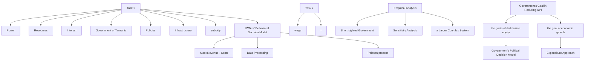

# Illegal Wildlife Trade: A Model-Based Solution for Tanzania

Summary

The illegal wildlife trade(IWT) causes significant economic and ecological damage annually. To better comprehend the causal factors of IWT and balance ecological conservation with economic development, we constructed Discrete Dynamic Optimization Models, providing advice to the Tanzanian government on decision-making.

First, we analyzed the Tanzanian government's governing power, economic resources, and environmental interests that enable it to take action to reduce illegal wildlife trade. Then, we developed two discrete optimization models linked at discrete points in time: a model of the behavioral choices of IWT and a model of the government's policy decisions.

The first model analyzes the correlation between the duration of illegal activities by wildlife traders and their legal remuneration, which is determined by their profit-maximizing objective. The second model analyzes how the government's investment in infrastructure development affects IWT and other goals as a decision variable in an optimization model.

By iterating between Model I and Model II, we identify policy recommendations for the Tanzanian government. Our program has the potential to significantly reduce IWT and increase salary levels within 5 years and in the long term.

Furthermore, we consider deferring policy effects to address climate change and other transportation systems. This approach helps to complement the unquantifiable components of policy effects.

We conducted sensitivity analyses to ensure the robustness of our project's performance in terms of wildlife conservation outcomes and economic value. Finally, we provided the Tanzanian government with a memorandum of project-specific measures.

Keywords: Illegal Wildlife Trade, Discrete Dynamic Optimization Models, Entropy Method

## Memorandum

To: President Hassan

From: Team 2422054

Date: February 6th, 2024

Subject: Wildlife protection, economy and policy: a considerable solution

In this memo, we would like to clarify for you the specifics of our program and the rewards that can come from choosing this program, our program includes:

- Developing tourism and expanding visa-free countries  
- Upgrading agricultural technology and implementing agricultural economic subsidies  
- Expanding infrastructure investment and steadily increasing it at an annual GDP growth rate over five years  
• Enhancing large caliber gun control and wildlife trade control  
- Calling on countries that consume illegal wildlife products to reduce consumption
The anticipated returns from our program include:

\- Wildlife conservation: A 28.1% annual reduction in IWT over 5 years, and total elimination after 16 years.

\- Economic benefits: Higher GDP growth, a 47.5% increase in salaries over 5 years, enhanced popular support, and improved re-election possibilities. The potential to achieve a middle developed country level within 30 years promises a better future for the nation.

\- Uniting environmentalists: Lower IWT protects the natural environment and reduces the likelihood of other illegal shipments.

In summary, we trust this brief overview provides clarity on our program's components and the positive outcomes it can yield, contributing to animal protection, economic development, and garnering increased support.

## Contents

## Memorandum 2

## 1 Introduction 4

1.1 Background and Restatement 4  
1.2 Client Introduction 4  
1.3 Our work 5

## 2 Project and Assumptions 5

2.1 Project Policies 5  
2.2 Assumptions and Justification 8

## 3 Data and Notations 8

3.1 Data Collection and Pre-processing 8  
3.2 Notations 9

## 4 IWTers' Behavioral Decision Model 9

4.1 Model Derivation and assumptions 9  
4.2 Impact of Policies on Economic Incentives and Recreational Demand . . . . 13

## 5 Government's Political Decision Model 14

5.1 Model Derivation 15  
5.2 Short-sighted Government 18

## 6 Sensitivity Analysis 18

6.1 Macro-level Weight-specific Sensitivity Analysis 18  
6.2 Macro-level Policy-specific Sensitivity Analysis ..... 19

## 7 Policy Impacts in a Larger Complex System 20

7.1 IWT and Climate Change 20  
7.2 IWT and Other Forms of Trafficking 21

## 8 Strengths and Weaknesses 21

8.1 Strengths 21  
8.2 Weaknesses 22

## 9 Conclusion 22

## References 24

## 1 Introduction

## 1.1 Background and Restatement

With the development of technology, transportation between countries has become more and more convenient, so trade has become more frequent. At the same time, in some areas, there is a growing demand for wildlife for a variety of purposes, such as leather, jewelry, or medicine. To protect the environment and global biodiversity, some countries have reached a number of wildlife protection conventions, that is, prohibit the trade of some endangered wild animals.

However, these regulations only make a principled provision, which cannot decline illegal wildlife trade(IWT) effectively, and there are still many people hunting, smuggling, and selling endangered wildlife for profit. Therefore, an appropriate project designed to make a notable reduction in IWT needs to be carried out by a client with power, resource, and interest. Then the topics to be discussed are: who is the client? What can the client realistically do? Why the project is suitable for the client? How to convince the client? What additional powers and resources will the client need to carry out the project? What will happen if the project is carried out? How likely is the project to reach the expected goal? Therefore, a reasonable solution is needed to quantify and compare the investment of the client and the benefits from the project.

## 1.2 Client Introduction

In an effort to provide more personalized analysis and service and to effectively reduce the incidence of illegal wildlife trading, the government of the United Republic of Tanzania was selected as our client. The stable political situation and long-term economic growth lead us to believe that Tanzania is well positioned to take on the shared human responsibility of conserving ecological diversity. What follows is a description of the Tanzanian government's ability and willingness to implement our program in terms of its power, resources, and interests.

In terms of power, the Tanzania Government has a presidential system of government. It is noteworthy that as a representative state, the ruling party in Tanzania has long held an absolute majority of the population, which has made Tanzania relatively politically stable. A stable ruling party ensures that our project will be well implemented. We also offer a short-term, high-return strategy to avoid the governmental short-sightedness that comes with the rotation of party factions [2]. The Tanzanian government has the capacity to support our programs.

In terms of resources, Tanzania's fiscal revenues are able to support the economic growth-based programs we offer. Thanks to abundant local hydroelectric resources, Tanzania's power supply is able to meet the electricity needs of the employment incentives in our projects.

In terms of interest, Tanzania has always been committed to the protection of wildlife and has acted on it for a long time. In 2013, they conducted the short-lived Operation TOKOMEZA, which cracked down on poaching and illegal wildlife trade [12]. Although Operation TOKOMEZA was soon canceled due to political and public pressure, the Tanzanian government has always maintained that "it is also an example of what can be achieved by the men and women of Tanzania committed to protecting the animals that continue to contribute so much to the development of the nation".

We believe that our programs to reduce the illegal trade in wildlife are in line with the interests of the Tanzanian government. At the same time, our program to encourage economic development will improve the standard of living of the local people, which is also the goal of the Tanzanian government.

Therefore, the Tanzanian government has full capacity and interest to adopt our project and carry out this noble work of reducing illegal hunting of wildlife.

## 1.3 Our work

For convenience, we draw a frame chart (Figure 1) to represent our work.

## 2 Project and Assumptions

## 2.1 Project Policies

In order to achieve optimal decision-making in an ecological and economic sense through policy combinations, we provide different intervention strategies from the perspective of labor markets and management models. To support our strategy from the literature, we refer to the literature on wildlife trade and animal conservation policies in Africa.

We are acutely aware that the incentives for poaching can often be categorized as

flowchart

Figure 1: The Framework of Our Study

economic, recreational and traditional [20].

Similarly, community-based natural resource management on household welfare in Namibia [21] and empirical studies based on the ivory trade have led to the realization that the basic characteristics of economic underdevelopment make the regulation of poaching in Africa much less effective, and that tackling corruption and poverty may be a better solution than regulating poaching [14].

Accordingly, we make the following project policy recommendations.

We are committed to further promoting tourism. In fact, in 2019, according to the World Bank, more than 1.52 million tourists traveled into Tanzania and the figure maintained a consistent rise for 23 years before the epidemic. According to the World Bank, Tanzania's tourism revenue is close to $3.5\%$ of total GDP.

\- We hope that the Tanzanian Government will offer visa waivers to more countries, which will further attract international travelers to enter Tanzania to spend money, boosting tourism and attracting more people engaged in the illegal wildlife trade to

switch to the legal workforce.

- We hope that the Tanzanian government will increase the agricultural subsidy to boost agricultural prosperity, and then raise the national income level in Tanzania. A higher level of national income will provide the economic basis for the education of the labor force and their combined effect in the cities, which will contribute to the development of infrastructure and the upgrading of industries and the creation of more legal jobs.  
- We hope that the Tanzanian government will advance the necessary infrastructure, which will enhance the tourism experience and spending possibilities for international travelers, as well as boost domestic industrial production.

Considering that the huge market demand for high-end consumer goods is the central driver that makes illegal wildlife products sell at extremely high prices, leading to the illegal trade and the desperation of poachers, we are committed to considering both the cost of crime on the supply side and the demand side of illegal wildlife products. To this end, we offer the following recommendations based on regulatory reform.

- We hope that the Tanzanian Government will undertake tougher gun control measures. Banning the sale of hunting rifles and large-caliber firearms to individuals will help to raise the cost of poaching and discourage it.  
- We hope that the Tanzanian government will strengthen its control over the illegal wildlife trade, not by mobilizing more military forces to catch poachers, but by strengthening its oversight of customs, immigration, logistics and trade markets. Thanks to the government's existing staffing levels, such oversight will not incur additional costs.  
- We hope that the Tanzanian Government will make the call for wildlife conservation and the reduction of illegal wildlife consumption in more international organizations and at international conferences. Again, such an appeal would not entail additional costs.

These are the project specific policies that we offer to the Tanzanian government. In summary, the policies we provided included (1) developing tourism (2) providing a visa-free policy (3) promoting agricultural technology through subsidy(4) building infrastructure ahead of schedule (5) adopting gun control measures (6) strengthening controls on the poaching trade (7) making an international call for animal protection, the costs and results of which will be analyzed in more detail later in the article.

## 2.2 Assumptions and Justification

To simplify the problem, we made the following assumptions, each of which has a corresponding reasonable explanation. Additional assumptions are made to simplify analysis for individual sections later.

- The data we collected online is accurate and reliable because our data all come from official websites of international organizations, it's reasonable to assume high quality of our data.  
- All individuals our project considered are rational, meaning that they do things maximizing their net revenue(the revenue minus the cost). It's always a basic assumption in economics.  
- Our client has sufficient powers and resources to carry out our polices in full, without any omissions. Any additional power or resource is not needed. It’s reasonable because the government of the United Republic of Tanzania leads the country and has the most executive power.

## 3 Data and Notations

## 3.1 Data Collection and Pre-processing

After listing related policies for the government of the United Republic of Tanzania, we need to build models to quantify the benefits of these policies. Therefore, we first obtained the IWT data of Tanzania in previous years from the official website of CITES (the Convention on International Trade in Endangered Species of Wild Fauna and Flora) and pre-processed them.

CITES is an international agreement between governments. According to its website $[4]$ , its aim is to ensure that international trade in specimens of wild animals and plants does not threaten the survival of the species. This website provides a database of all the endangered species trade conducted by participating parties over the years. However, this raw data is constrained by inconsistency in units and lack of sorting, making direct utilization impractical and requiring pre-processing.

To enhance our model's utilization of data, we pre-processed the data and obtained the total trade volume for each term in Tanzania annually. Due to potential inconsistencies in units between different terms (e.g., kg and unknown), we perform minimax normalization for each term within a given year. The specific formula is as follows:

$$
Y _ {i j} = \frac {X _ {i j} - \min (X _ {j})}{\max (X _ {j}) - \min (X _ {j})} \tag {1}
$$

where $X_{ij}$ represents the original data of the jth term of the ith year, while $min(X_{j})$ and $max(X_{j})$ represents the minimum and maximum data of the jth term over the years, and $Y_{ij}$ represents the normalized data.

Second, we weighted the data using the entropy method and tried to define an index, Illegal Wildlife Trade Index(IWTI), to measure IWT. Since we have obtained the amount of trade per year for each term, we can calculate the information entropy for each term by Eq.2 and Eq.3, which implies the variation degree of the term.

$$
p _ {i j} = \frac {Y _ {i j}}{\sum_ {i = 1} ^ {T} Y _ {i j}} \tag {2}
$$

$$
E _ {j} = - \frac {1}{\ln n} \sum_ {i = 1} ^ {T} p _ {i j} \ln p _ {i j} \tag {3}
$$

where $E_{j}$ is the information entropy of the jth term and T is the total number of years.

The greater the information entropy, the more significant the term is to the IWT and the greater the weight, which can be calculated by eq.4

$$
W _ {j} = \frac {1 - E _ {j}}{n - \sum_ {j = 1} ^ {n} E _ {j}} \tag {4}
$$

where $W_{j}$ is the weight of jth term and n is the total number of terms.

Then we assign weights to the normalized data and sum them up to get each year's IWTI. To better analyze the result, We categorized annual IWTI into animal and plant terms, presented in Fig.2.

## 3.2 Notations

The primary notations used in this paper are listed in Table 1.

## 4 IWTers' Behavioral Decision Model

## 4.1 Model Derivation and assumptions

In previous micro-level studies on illegal wildlife traders (IWTers), despite the often insufficient randomness in the models [6], it was consistently found that the conditions driving IWT behaviors were, in fact, when the net revenue from illegal wildlife trading exceeded the net revenue from conservation efforts. To assess the impact of our project's policies on the micro-level behaviors of IWTers, we have constructed the following model to describe the revenue and costs of their IWT.

Table 1: Notations used in this paper

<table><tr><td>Symbol</td><td>Description</td><td>Value and Source</td></tr><tr><td>IWT</td><td>Illegal Wildlife Trade</td><td></td></tr><tr><td>IWTer</td><td>Illegal Wildlife Trader</td><td></td></tr><tr><td>IWTI</td><td>Illegal Wildlife Trade Index</td><td></td></tr><tr><td>GDP</td><td>Gross Domestic Product</td><td></td></tr><tr><td>TZS</td><td>Tanzanian Shillings</td><td></td></tr><tr><td>t</td><td>The number of hours spent on IWT per month</td><td></td></tr><tr><td> $\beta_t$ </td><td>The transportation cost per hour</td><td>4.5 dollars([13],[18])</td></tr><tr><td> $\lambda_w$ </td><td>The number of wild life appearances per hour</td><td>0.4(estimated)</td></tr><tr><td> $\lambda_p$ </td><td>The number of police appearances per hour</td><td>0.02(estimated)</td></tr><tr><td> $P_b$ </td><td>The prices of bullets</td><td>1 USD([16])</td></tr><tr><td> $P_w$ </td><td>The prices of weapons</td><td>400 USD([16])</td></tr><tr><td> $L_w$ </td><td>The lifespan of weapons</td><td>30000([27])</td></tr><tr><td> $T_p$ </td><td>The time the IWTer spend in prison each month</td><td>65700([9])</td></tr><tr><td>a</td><td>The intercept of the linear relationship</td><td>3000([24])</td></tr><tr><td>b</td><td>The slope of the linear relationship</td><td>0.62 (calculated from[24])</td></tr><tr><td> $p_{low}$ </td><td>The proportion of low-income group&#x27;s population</td><td>0.5(World Bank)</td></tr><tr><td> $w_c$ </td><td>Weight for changes in consumption</td><td>53.62%(World Bank)</td></tr><tr><td> $w_i$ </td><td>Weight for changes in investment</td><td>38.65%(World Bank)</td></tr><tr><td> $w_g$ </td><td>Weight for changes in government</td><td>7.73%(World Bank)</td></tr><tr><td> $c_1$ </td><td>Weight of low-income in consumption changes</td><td>0.9(CHIP)</td></tr><tr><td> $c_2$ </td><td>Weight of the high-income in consumption changes</td><td>0.6(CHIP)</td></tr><tr><td> $c_3$ </td><td>Proportion of investment by high-income</td><td>0.4(calculated)</td></tr><tr><td> $c_4$ </td><td>Proportion of infrastructure investment(high-income)</td><td>0.5(estimated)</td></tr><tr><td> $c_5$ </td><td>Impact of infrastructure investment</td><td>7.4([10])</td></tr><tr><td> $c_6$ </td><td>Effect of agricultural subsidies</td><td>3.9([10])</td></tr></table>

\*Some variables are not listed here and will be discussed in detail in each section.

bar chart

| Year | Index: plants | Index: animals |
| ---- | ------------- | -------------- |
| 2000 | 0.004         | 0.045          |
| 2001 | 0.001         | 0.033          |
| 2002 | 0.001         | 0.083          |
| 2003 | 0.016         | 0.023          |
| 2004 | 0.019         | 0.028          |
| 2005 | 0.013         | 0.014          |
| 2006 | 0.015         | 0.015          |
| 2007 | 0.018         | 0.041          |
| 2008 | 0.049         | 0.019          |
| 2009 | 0.065         | 0.032          |
| 2010 | 0.021         | 0.021          |
| 2011 | 0.034         | 0.034          |
| 2012 | 0.028         | 0.019          |
| 2013 | 0.017         | 0.051          |
| 2014 | 0.047         | 0.023          |
| 2015 | 0.058         | 0.031          |
| 2016 | 0.059         | 0.035          |
| 2017 | 0.031         | 0.011          |
| 2018 | 0.059         | 0.011          |
| 2019 | 0.034         | 0.004          |
| 2020 | 0.083         | 0.028          |
| 2021 | 0.051         | 0.002          |
| 2022 | 0.061         | 0.003          |

Figure 2: Index of IWT in TZA

The costs of IWT encompass transportation, weaponry, and lost opportunities. Transportation costs involve vehicle expenses during prey search, return trips, and trade transport. Weapon costs include ammunition for hunting and weapon depreciation from firing. Opportunity costs consist of foregone income from IWT versus regular work and potential income loss due to legal consequences.

The revenue of IWT are simply calculated as the product of the quantity of traded wildlife, their average price, and the probability of avoiding arrest during the trade. This provides a straightforward understanding of the potential gains from engaging in such activities.

The model is based on some basic assumptions:

- In terms of transportation cost, the market price of the car is fixed and remains constant in the short term. The depreciation of the car depends on its fixed lifespan, which is solely related to the transportation time (t) involved in IWT.  
- In terms of weapon cost, all poachers use the same weapon at the same price. Weapon depreciation only depends on the quantity of ammunition fired.  
- In terms of opportunity cost, IWTers are divided into high and low-income categories. High-income traders are those who, when not involved in IWT, work as employees or entrepreneurs, while low-income traders engage in agricultural labor. Once arrested, the IWTer faces a period of unemployment, the individual will not

experience discrimination in employment upon release.

- In the entire process of poaching and trading by IWTers, the arrival of wild animals follows a Poisson process.  
- In the entire process of poaching and trading by IWTers, the arrival of law enforcement follows a Poisson process. Once a law enforcement officer arrives, it is considered that the illegal wildlife trader has been arrested.  
- There is a linear negative correlation between the average price of illegally traded wildlife and the quantity supplied by the market.  
- The trading and poaching activities of each IWTer do not affect the total number of wild animals.  
- The trading activities of each IWTer do not impact the overall supply of wild animals in the international market.

Based on the above justification and assumptions, the micro mathematical model is represented as follows: First, The costs of IWT can be calculated by Eq.5, Eq.6, and Eq.7:

$$
C _ {t} = t _ {i} \cdot \beta_ {t} \tag {5}
$$

$$
C _ {w} = \lambda_ {w} \cdot t _ {i} \cdot P _ {b} + \frac {\lambda_ {w} \cdot t _ {i}}{L _ {w}} \cdot P _ {w} \tag {6}
$$

$$
C _ {o} = w _ {i} \cdot t _ {i} + T _ {p} \cdot w _ {i} \cdot (1 - e ^ {- \lambda_ {p} t _ {i}}) \tag {7}
$$

where $C_t$ , $C_w$ , and $C_o$ are the costs of transportation, weapon, and opportunity per month; $t_i < 360$ is the time an IWTer spends hunting each month; $\beta_t$ is the transportation cost per hour; $\lambda_w$ and $\lambda_p$ are the number of wildlife and police appearances per hour; $P_b$ and $P_w$ are the prices of bullets and weapons; $L_w$ is the lifespan of the weapon; $w_i$ is the IWTer's wage per hour; $T_p$ is the time the IWTer spend in prison each month.

Second, the IWTer's revenue from IWT can be calculated by Eq.8 and Eq.9:

$$
P _ {I W T} = a - b \cdot \lambda_ {w} \cdot t _ {i} \cdot e ^ {- \lambda_ {p} t _ {i}} \tag {8}
$$

$$
R _ {i} = \lambda_ {w} \cdot t _ {i} \cdot P _ {I W T} \cdot e ^ {- \lambda_ {p} t _ {i}} \tag {9}
$$

where $P_{IWT}$ is the average price of illegally traded wildlife; $R_i$ is the IWTer's revenue from IWT per month; $a$ and $b$ are the intercept and slope of the linear relationship between $P_{IWT}$ and quantity of traded wildlife.

Then the IWTer's behavioral decision model can be finalized by finding $t_i$ that maximizes the net revenue $Rn_i = R_i - (C_t + C_w + C_o)$ ,

$$
\max _ {t _ {i}} R _ {i} - (C _ {t} + C _ {w} + C _ {o}) \tag {10}
$$

which can be done by calculating $t_{i}$ when the gradient of $Rn_{i}$ equals 0. After substituting the approximations and parameters mentioned in the 'Notation' section, we can estimate the functional relationship between the number of hours spent engaging in IWT per month and the salary level of IWTers in Tanzania.

$$
t _ {i} = \operatorname{Max} \left\{0, - 5 3 \cdot w _ {i} + 2 0 \right\} \tag {11}
$$

Therefore, it can be observed that the higher the salary level of IWTers, the lower the average number of hours spent engaging in IWT per month. This is reasonable because, according to the profit-maximizing condition of IWTers, an increase in salary level significantly raises the cost of opportunity, thus reducing the time spent in IWT.

## 4.2 Impact of Policies on Economic Incentives and Recreational Demand

First, we considered the impact on economic incentives:

- Our project's focus on boosting infrastructure investment and offering agricultural subsidies benefits both high and low-income individuals, resulting in increased salaries, correlating with reduced involvement in such activities.  
- Beyond the quantitative aspect of salary improvement, our additional policies contribute positively to animal protection.  
- Stricter gun control policies result in higher costs of weapon for IWT as bullets and weapons become harder to obtain, thus more expensive.  
- Enhancing wildlife trade regulations raises the chances of disrupting or apprehending IWTers during illegal activities. This heightened risk leads to increased costs of opportunity, reduced net revenue, and consequently, a decrease in the total time spent engaging in IWT.  
- International appeals for wildlife conservation contribute to reducing the overall demand for illegal wildlife. According to empirical evidence presented by Sosnowski et al.[24], such advocacy has led to a significant decline in the total demand for illegal wildlife.

Next, we consider the impact of recreational motives on IWTers. Considering that the recreational motives of IWTers mainly involve poaching as a leisure activity and poaching as a symbol of rebellion, we will discuss each aspect separately.

\- For poaching as a leisure activity, we believe that poaching, as a form of recreation, is substitutable with other leisure activities such as travel, video games, basketball, etc.[11] For IWTers, once their income level increases, they can obtain other leisure resources with relatively lower costs than poaching today.

\- We posit that the motivation for rebellion stems from unmet basic life needs [5]. With an increase in salary levels, the motivation for poaching as a symbol of rebellion can also be displaced.

## 5 Government's Political Decision Model

After obtaining the micro-level decision-making model, we have the ability to discuss the macro-level effects generated by the superposition of micro effects. Since our goal is to provide solutions that better meet the needs of our clients, it is necessary to consider the government's goals. Given that our client is the Tanzanian government, we believe the core objectives of the government should include preventing IWT, promoting economic growth, and ensuring distributive equity.

The model is based on some basic assumptions:

- The Tanzanian government's goals can be simplified into three categories: economic, wildlife conservation, and social equity. Other secondary objectives that are difficult to quantify will be excluded.  
- The simplified view of Tanzania's GDP as consisting of three components: consumption, investment and government expenditure, ignoring the share of net export due to its small share.  
- The structure of Tanzania's GDP, based on the expenditure approach, assumes a linear and positive correlation between the growth in consumption and household income. However, the magnitude of the effect varies across income groups, and the effect is linearly uncorrelated.  
- The Tanzanian government assumes universal investment in infrastructure development, with heterogeneous positive impacts on high-income and low-income residents. However, the impact of the agricultural subsidy measure is focused solely on the low-income group, disregarding its effect on the high-income group. Additionally, both policies' impact on the low-income group is linearly separable.  
- The simplification assumes that the Tanzanian government spends a constant share of GDP on infrastructure investment and agricultural subsidies.

## 5.1 Model Derivation

Considering only the core objectives, the goal of the government can be expressed as a linear combination of core goals and can be formulated as follows:

$$
G _ {g o v} = a _ {1} \cdot G _ {I W T} + a _ {2} \cdot G _ {G D P} + a _ {3} \cdot G _ {e q u} \tag {12}
$$

where $a_{1}$ , $a_{2}$ , and $a_{3}$ are weights with $\sum_{i=1}^{3}a_{i}=1$ ; $G_{gov}$ is the government's overall goal; $G_{IWT}$ , $G_{GDP}$ , and $G_{equ}$ are the government's goal in reducing IWT, promoting economic growth, and ensuring distributive equity.

pie chart

Goals of the Government of TZA
| Category | Percentage (%) |
| :--- | :--- |
| Economics | 54 |
| IWT | 18 |
| Equity | 18 |
| Others | 10 |

(a) Goals of the Government of TZA

pie chart

Structure of Tanzania GDP
| Category | Percentage (%) |
|---|---|
| Consumption | 51.9 |
| Investment | 37.4 |
| Government Spending | 7.48 |
| Net Exports | 3.27 |

(b) Structures of Tanzania GDP  
Figure 3: Macroeconomic Characteristics of TZA

First, we consider the goal of reducing IWT, which requires an analysis of the behavior of IWTers at the micro-level. For better comprehension, we express the goal of reducing IWT as the negation of the product of the total population exposed to the possibility of IWT ( $P_{IWT}$ ) and the expected frequency of IWT per person per year ( $E[Q_{IWT}]$ ):

$$
E \left[ Q _ {I W T} \right] = 1 2 \cdot \lambda_ {w} \cdot t \cdot e ^ {- \lambda_ {p} t} \tag {13}
$$

$$
G _ {I W T} = - P _ {I W T} \cdot E [ Q _ {I W T} ] \tag {14}
$$

where $\lambda_{w}, \lambda_{p}$ , represents the same as in the micro-level model above; t is the number of hours spent on IWT per month that depends on both high and low-income groups:

$$
t = p _ {l o w} \cdot t _ {l o w} + (1 - p _ {l o w}) \cdot t _ {h i g h} \tag {15}
$$

where $p_{low}$ is the proportion of low-income group's population.

Next, we consider the goal of promoting economic growth. We use the increase in Gross Domestic Product (GDP) as the goal of economic growth because higher GDP helps provide the government with increased tax revenues and is likely to result in a higher standard of living for citizens[25]. To explain the goal of economic growth from an economic theory perspective, we break GDP into consumption(C), investment(I), government spending(G), and net exports(NX) through the Expenditure Approach[22] and rewrite the goal of the change in GDP as a linear combination of changes in various components:

$$
G _ {G D P} = w _ {c} \cdot \Delta C + w _ {i} \cdot \Delta I + w _ {g} \cdot \Delta G \tag {16}
$$

where $\Delta C$ , $\Delta I$ , and $\Delta G$ changes in consumption, investment, and government spending, and $w_{c}$ , $w_{i}$ , and $w_{g}$ are weights for them respectively with $w_{c} + w_{i} + w_{g} = 1$ .

In this case, the proportion of consumption to total income should vary among different income groups, consistent with the consumption assumptions of classical economic modeling[7]. Second, given Tanzania's basic underdevelopment and living conditions with insufficient basic necessities, we believe that the low-income group has no incentive to use its income for investment. Third, government spending only includes infrastructure investment and agriculture subsidy in our policies. Therefore, changes can be represented as follows:

$$
\Delta C = c _ {1} \cdot \Delta w _ {\text { low }} + c _ {2} \cdot \Delta w _ {\text { high }} \tag {17}
$$

$$
\Delta I = c _ {3} \cdot \Delta w _ {\text { high }} \tag {18}
$$

$$
\Delta G = \Delta I n f r a + \Delta S u b \tag {19}
$$

where $c_{1}$ and $c_{2}$ are weights of the low and high-income in consumption changes respectively; $c_{3}$ is the proportion of investment by high-income consumers to the change in income; $\Delta w_{low}$ and $\Delta w_{high}$ are changes of wages of low and high-income groups; $\Delta Infra$ and $\Delta Sub$ are changes in infrastructure investment and agriculture subsidy from government.

At the same time, $\Delta w$ is also influenced by $\Delta Inv$ and $\Delta Sub$ . We believe that infrastructure investments have a dual impact on both high and low-income groups, while agricultural economic subsidies exclusively affect the low-income group. This distinction arises because high-income groups are often urban settled wage laborers, whereas low-income groups may be urban informal workers or citizens engaged in agricultural activities. In relative terms, only the low-income group involved in agricultural production can benefit from the income changes brought about by agricultural economic subsidies. Therefore, the relationship is estimated as follows:

$$
\Delta w _ {h i g h} = \left(c _ {4} \cdot \Delta I n v\right) \cdot c _ {5} \tag {20}
$$

$$
\Delta w _ {l o w} = \left[ (1 - c _ {4}) \cdot \Delta I n v \right] \cdot c _ {5} + \Delta S u b \cdot c _ {6} \tag {21}
$$

where $c_{4}$ is the proportion of infrastructure investment allocated to high-income groups; $c_{5}$ is the impact of infrastructure investment on changes in income levels (assuming that the impact of infrastructure investment on changes in income levels is consistent among high and low income groups); $c_{6}$ is the effect of agricultural economic subsidies on income changes of low-income groups.

Finally, as a decision criterion, our budget constraints are based on the previous year's economic growth. Last year's economic growth led to a rise in the government's overall tax revenue, thereby expanding the available budget for public spending. In our scenario, the execution of infrastructure investments and agricultural economic subsidies relies on the government's public expenditure budget. The change in economic growth over the previous year $(\Delta GDP_{t-1})$ , multiplied by the proportion of additional spending, $\rho$ , that the government is willing to provide to our projects, can be expressed as a budgetary constraint on our decisions. The initial estimate of the budget constraint is derived from the share of government purchases in the 2022 GDP increase.

$$
B _ {t} = B _ {t - 1} + \Delta G D P _ {t - 1} \tag {22}
$$

$$
= B _ {t - 1} + \rho (\Delta I n f r a _ {t} + \Delta S u b _ {t}) \tag {23}
$$

where $B_{t}$ and $B_{t-1}$ is $t^{th}$ and $t - 1^{th}$ year's budget constraints; $\Delta Infra_{t}$ and $\Delta Sub_{t}$ are $t^{th}$ year's changes in infrastructure investment and agriculture subsidy.

Finally, considering the goal of ensuring distributive equity, we propose assessing distributive equity by comparing the income changes between low high-income groups. This ratio-based index, reflecting the economic disparity in the government's secondary asset distribution, aligns with sociological and behavioral principles, providing a reasonable measure of distributive equity[3]:

$$
G _ {e q u} = \frac {\Delta w _ {l o w}}{\Delta w _ {h i g h}} \tag {24}
$$

Reducing IWT, promoting economic growth, and ensuring distributive equity are goals that continuously impact our target value. This influence occurs by optimizing the ratio of infrastructure investment to agricultural economic subsidies within budget constraints, thereby shaping our overarching objective. Therefore, the comprehensive goal can be reframed as follows:

$$
\max _ {\text { Infra }} G _ {\text { gov }} \tag {25}
$$

where $G_{gov}$ is the goal of government.

To enhance the quantitative nature of our policy recommendations, we refine our model into a full optimization model by referring to the data estimates in the previous notation. We provide the Tanzanian government's plan for the amount of infrastructure investment per year and use a computer to calculate the required investment for each year of a 30-year cycle. The estimated model reports the annual additional GDP output generated by the project, the annual average wage level of the high-income group, the average wage level of the low-income group, the amount of illegal wildlife traded, and the allocation for infrastructure development that should be invested in the project over the thirty years of the project's implementation.

By adhering to our program strategy, Tanzania's illegal wildlife trade can be completely eradicated within 16 years. Given that governments prioritize economic growth, our project strategy convinces clients that relying solely on the current year's surplus GDP and its subsequent growth may benefit the government in the short term, but may not be sustainable in the long term. It is important to consider potential changes in GDP that may exceed the current GDP over a 30-year period.

## 5.2 Short-sighted Government

The relationship between government and policy implementation is significant. Regarding to the shortsightedness of the government caused by changes of government, we aim to provide our clients with short-term effects, specifically within five years.

If the Tanzanian government implements the infrastructure investment plan in accordance with our project program over a 5-year period, the effects are positive apparently. From Table2, it is evident that, without accounting for inflation, the hourly wage of the high-income group and the low-income group will increase by 29.5% and 57.5%, and the annual illegal wildlife trade will decrease by 28.1% as planned.

More importantly, in our project, a increasing future marginal trend is observed both in the salary increase and illegal wildlife trade reduction, which supports that our project plays a role in Tanzania's long-term development as a less developed country.

## 6 Sensitivity Analysis

## 6.1 Macro-level Weight-specific Sensitivity Analysis

Our model decomposes the goals of the Tanzanian government into three components: IWT, GDP, and equity. The weight of each component depends on the trade-offs among different goals. In the previous model, weights of 0.2, 0.6, and 0.2 were assigned to the three components mentioned above. This suggests that the Tanzanian government is focused on economics more. Under this assignment, our polices lead to consistent growth over the next 30 years. Especially, IWT will be decreased significantly and reach 0 after 16 years. However, in reality, these weights may be biased and not reflect the truth. In this case, it is necessary to test the robustness of the model for different weight assignments. Given that the Tanzanian government is extremely focused on IWT, we set the weights of IWT, GDP, and equity to 0.8, 0, and 0.2, respectively. The model result shows that the government's goals can still maintain growth in the next 30 years, and IWT will be reduced to 0 within 30 years. Based on above analysis, the robustness of the model for different weight assignments is supported.

## 6.2 Macro-level Policy-specific Sensitivity Analysis

In the previous section, we analyzed the impact of project policies, such as subsidies and infrastructure investments, on Tanzania's economic development and the international wildlife trade. To account for potential variations in the implementation of these policies, we conducted a sensitivity analysis of the macro model.

  
Figure 4: Sensitivity of Policy Change

We have taken into account the potential volatility of Tanzanian government policy variables, as well as the level of subsidies and investment in infrastructure development, within a range of 10 percent. According to our modelling system, the policy variables are determined by the predetermined budget amount and the optimization problem. Our sensitivity analysis considers the impact of the variation of the actual implementation effects of the Tanzanian government's policies in the $10\%$ range above and below the optimal value when they are enacted on the model's results. This includes the government's main objectives and is a way of checking the policy-specific robustness of our model.

The analysis results are presented above. The first figure serves as a baseline reference. The remaining figures indicate that wildlife conservation is the most robust of the three main goals of the Tanzanian government to policy changes. The remaining objectives and the overall objective are also relatively robust to policy changes without significant fluctuations. In addition, policy fluctuations in the same year are unlikely to have a significant impact on the trend of high wage growth for low-income earners.

## 7 Policy Impacts in a Larger Complex System

## 7.1 IWT and Climate Change

There has been previous literature on the damage of wildlife crime to the global climate change. Thus our policies will have a positive impact on slowing down the path of global climate change while reducing illegal wildlife trade.

First, the transportation of IWT generates a large amount of carbon emissions, mainly due to transports. We will reduce the transportation demand of IWT, and then reduce carbon emissions generated during transportation.

Second, wildlife plays an important role against climate change. As producers in the ecosystem, plants absorb carbon dioxide in the atmosphere through photosynthesis and have a part in carbon sequestration. While wild animals are consumers, past research has shown that protecting and restoring wildlife can enhance natural carbon capture and sequestration, even capturing up to 95% of the carbon needed to achieve goals of The Paris Agreement each year[23]. Our policies reduce the decline in wildlife populations caused by poaching, enhancing carbon capture and sequestration.

Finally, the massive illegal wildlife trade destroys biodiversity, which in turn jeopardizes the global climate. Wildlife trade significantly reduces species richness and increases the risk of extinction of traded species[19]. Meanwhile, IPBE and IPCC has shown the deep links between biodiversity and climate change[8]. Our policies protect biodiversity by reducing poaching, and then plays a positive part in mitigating global climate change.

## 7.2 IWT and Other Forms of Trafficking

Illegal wildlife trade is often linked to other forms of organized crime, such as drug trafficking, arms trafficking and terrorism. There are four main ways in which these links are made and in which our policies will play a role[26][1].

First, criminals often combine wildlife with drugs and weapons for trafficking. On one hand, certain types of contraband combinations do not raise and even increase the probability of detection[15]. On the other hand, wildlife such as timber is sometimes used to hide drugs. By strengthening the regulation, the probability of detecting various contraband will be increased, curbing trafficking of drugs, weapons and so on.

Second, smuggling routes and transport methods are critical infrastructures in the illegal trade, and they can often be shared among various forms of trafficking. For this reason, the cost of engaging in an additional illegal trade is relatively low for crime groups, while the profit is high. Strengthening the regulation of the entire chain of IWT increases the cost of building and maintaining transportation networks, weakening the incentives to engage in multiple illegal trades.

Third, barter trade between wildlife and other contraband for cashless transactions will reduce the probability of being tracked and detected. As IWT decreases, barter trade will become more difficult.

Finally, illegal wildlife trade and other forms of trafficking are an important source of funding for terrorist organizations.IWT worth up to \$213 billion dollars a year is funding organized crime, including global terror groups and militias[17]. Our project will significantly reduce IWT, limiting the source of funding for global terrorist organizations. It is a hard hit for global terrorist organizations.

## 8 Strengths and Weaknesses

## 8.1 Strengths

\- Innovation: Our model creatively blends economic theory and mathematical models, offering a comprehensive quantitative estimate for policy analysis. Its adaptability allows easy customization for various clients. Unlike traditional economic models with rigid boundaries between micro and macro models, our approach dynamically explores complex economic systems through the iterative interaction of micro and macro models, a groundbreaking method.

- Flexibility: In the micro-decision component, our model takes into account a variety of random features. Despite not having access to a complete data distribution, the inclusion of randomness sets the stage for more intricate evaluations of economic systems and allows for personalized decision simulations in subsequent analyses.  
- Theoretical Rigor: Our model is built upon well-established economic theories and empirical findings, emphasizing not only the numerical implications within the model but also the economic meanings of inter-variable relationships in complex economic systems. This enhances the economic implication and theoretical underpinning of the model.  
- Stability: Our model has undergone rigorous sensitivity testing, ensuring robust estimation results even under varying parameters. The logical coherence of the model further guarantees its stability.

## 8.2 Weaknesses

In parameter estimation, due to the unavailability of micro-level data from reputable institutions in Tanzania, we relied on data from the Tanzanian internet or information sources, which may introduce biased estimates.

## 9 Conclusion

This article reviews the current status and future trend of illegal wildlife trade in Tanzania and personalizes a model to Tanzanian characteristics. The model describes and estimates the relationship between income and illegal wildlife trade in terms of the behavioral decisions of IWTers.

Subsequently, we extend the micro-model to the overall economic system, recognizing that the Tanzanian government's decision-making goals are directly affected by our policies, including investments in infrastructure and agricultural subsidies. The dynamic macro-model offer a quantitative reference to the Tanzanian government's decision-making.

Our decision-making results provide the Tanzanian government with prospective expectations through parameter estimation and sensitivity analysis. We believe that the illegal wildlife trade will continue to decrease with the efforts of all, although it remains difficult at this stage. Protecting wildlife is crucial not only for ethical reasons but also for our own survival.

<table><tr><td>Period</td><td>Project GDP (1e+12 TZS)</td><td>Wage_High (TZS/h)</td><td>Wage_Low (TZS/h)</td><td>IWT (number/year)</td><td>Infrastructure (1e+12 TZS)</td></tr><tr><td>1</td><td>3.225</td><td>739.115</td><td>152.883</td><td>46650.64</td><td>1.201</td></tr><tr><td>2</td><td>4.091</td><td>780.068</td><td>171.057</td><td>42980.01</td><td>1.524</td></tr><tr><td>3</td><td>5.189</td><td>829.286</td><td>191.660</td><td>38071.29</td><td>1.933</td></tr><tr><td>4</td><td>6.582</td><td>888.010</td><td>214.984</td><td>33934.75</td><td>2.452</td></tr><tr><td>5</td><td>8.349</td><td>957.571</td><td>241.359</td><td>33555.44</td><td>3.110</td></tr><tr><td>6</td><td>10.590</td><td>1039.394</td><td>271.158</td><td>33060.62</td><td>3.945</td></tr><tr><td>7</td><td>13.432</td><td>1135.010</td><td>304.801</td><td>32412.19</td><td>5.004</td></tr><tr><td>8</td><td>17.038</td><td>1246.074</td><td>342.765</td><td>31558.20</td><td>6.348</td></tr><tr><td>9</td><td>21.611</td><td>1374.393</td><td>385.586</td><td>30427.17</td><td>8.051</td></tr><tr><td>10</td><td>27.412</td><td>1521.959</td><td>433.869</td><td>28919.93</td><td>10.213</td></tr><tr><td>11</td><td>34.770</td><td>1690.987</td><td>488.296</td><td>26897.36</td><td>12.954</td></tr><tr><td>12</td><td>44.103</td><td>1883.955</td><td>549.638</td><td>24162.24</td><td>16.431</td></tr><tr><td>13</td><td>55.942</td><td>2103.648</td><td>618.761</td><td>20431.40</td><td>20.841</td></tr><tr><td>14</td><td>70.957</td><td>2353.210</td><td>696.644</td><td>15292.87</td><td>26.435</td></tr><tr><td>15</td><td>90.004</td><td>2636.188</td><td>784.388</td><td>8138.25</td><td>33.531</td></tr><tr><td>16</td><td>114.163</td><td>2956.594</td><td>883.235</td><td>0</td><td>42.531</td></tr><tr><td>17</td><td>144.806</td><td>3318.960</td><td>994.582</td><td>0</td><td>53.948</td></tr><tr><td>18</td><td>183.675</td><td>3728.410</td><td>1120.005</td><td>0</td><td>68.428</td></tr><tr><td>19</td><td>232.977</td><td>4190.730</td><td>1261.278</td><td>0</td><td>86.796</td></tr><tr><td>20</td><td>295.512</td><td>4712.452</td><td>1420.401</td><td>0</td><td>110.093</td></tr><tr><td>21</td><td>374.834</td><td>5300.950</td><td>1599.625</td><td>0</td><td>139.645</td></tr><tr><td>22</td><td>475.447</td><td>5964.542</td><td>1801.486</td><td>0</td><td>177.128</td></tr><tr><td>23</td><td>603.066</td><td>6712.610</td><td>2028.839</td><td>0</td><td>224.673</td></tr><tr><td>24</td><td>764.941</td><td>7555.731</td><td>2284.903</td><td>0</td><td>284.979</td></tr><tr><td>25</td><td>970.266</td><td>8505.827</td><td>2573.300</td><td>0</td><td>361.473</td></tr><tr><td>26</td><td>1230.705</td><td>9576.337</td><td>2898.112</td><td>0</td><td>458.500</td></tr><tr><td>27</td><td>1561.051</td><td>10782.403</td><td>3263.934</td><td>0</td><td>581.570</td></tr><tr><td>28</td><td>1980.068</td><td>12141.084</td><td>3675.943</td><td>0</td><td>737.676</td></tr><tr><td>29</td><td>2511.558</td><td>13671.604</td><td>4139.969</td><td>0</td><td>935.682</td></tr></table>

Table 2: The Optimal Decision and Prediction

## References

[1] Michelle Anagnostou and Brent Doberstein. Illegal wildlife trade and other organised crime: A scoping review. Ambio, 51(7):1615–1631, 2022.  
[2] Timothy Besley and Stephen Coate. Sources of inefficiency in a representative democracy: a dynamic analysis. American Economic Review, pages 139–156, 1998.  
[3] Robin Boadway. 14 intergovernmental redistributive transfers: efficiency and equity. Handbook of fiscal federalism, page 355, 2006.  
[4] CITES. What is cites?, 2023. Accessed on 2024-02-03.  
[5] Forrest D Colburn. Everyday forms of peasant resistance. Routledge, 2016.  
[6] Rosie Cooney, Dilys Roe, Holly Dublin, Jacob Phelps, David Wilkie, Aidan Keane, Henry Travers, Diane Skinner, Daniel WS Challender, James R Allan, et al. From poachers to protectors: engaging local communities in solutions to illegal wildlife trade. Conservation Letters, 10(3):367–374, 2017.  
[7] Karen E Dynan, Jonathan Skinner, and Stephen P Zeldes. Do the rich save more? Journal of political economy, 112(2):397–444, 2004.  
[8] Habiba Gitay, Avelino Suárez, Robert T Watson, and David Jon Dokken. Climate change and biodiversity. 2002.  
[9] Contributor Guest. Elephant poaching - intelligent law enforcement helps, Apr 2016. url=https://africageographic.com/stories/intelligent-law-enforcement-tanzania-saving-elephants/.  
[10] Steven Haggblade. Returns to investment in agriculture. Technical report, 2007.  
[11] Justin Harmon and Kyle Woosnam. Extending the leisure substitutability concept. Annals of Leisure Research, 21(4):424–439, 2018.  
[12] Severin Hauenstein, Mrigesh Kshatriya, Julian Blanc, Carsten F Dormann, and Colin M Beale. African elephant poaching rates correlate with local poverty, national corruption and global ivory price. Nature Communications, 10(1):2242, 2019.  
[13] JiJi. Car price, 2023. Accessed on 2024-02-03.  
[14] Burcu B Keskin, Emily C Griffin, Jonathan O Prell, Bistra Dilkina, Aaron Ferber, John MacDonald, Rowan Hilend, Stanley Griffis, and Meredith L Gore. Quantitative investigation of wildlife trafficking supply chains: A review. Omega, 115:102780, 2023.  
[15] T Lichtenwald, F Perri, and P MacKenzie. Smuggling multi-consignment contraband. Inside Homeland Security, 7(2):17–31, 2009.  
[16] Gun Made. How much do guns cost in 2023? [rifles, shotguns, handguns]\_2022, Oct 2022. url=https://www.gunmade.com/gun-prices/.  
[17] Hannah McNeish. \$213 bn illegal wildlife and charcoal trade ‘funding global terror groups’. The Guardian, 2014.  
[18] Raphael Mgaya. Despite the public outcry, fuel prices in tanzania are the lowest in the region, Sep 2021. url=https://www.thecitizen.co.tz/tanzania/oped/despite-the-public-outcry-fuel-prices-in-tanzania-are-the-lowest-in-the-region-3543936.  
[19] Oscar Morton, Brett R Scheffers, Torbjørn Haugaasen, and David P Edwards. Impacts of wildlife trade on terrestrial biodiversity. Nature Ecology & Evolution, 5(4):540–548, 2021.  
[20] Robert M Muth and John F Bowe Jr. Illegal harvest of renewable natural resources in north america: Toward a typology of the motivations for poaching. Society & Natural Resources, 11(1):9–24, 1998.  
[21] Brianne Riehl, Hisham Zerriffi, and Robin Naidoo. Effects of community-based natural resource management on household welfare in namibia. PLoS One, 10(5):e0125531, 2015.  
[22] Sean Ross. How to calculate gdp with the expenditure approach, 2019.  
[23] Oswald J Schmitz, Magnus Sylvén, Trisha B Atwood, Elisabeth S Bakker, Fabio Berzaghi, Jedediah F Brodie, Joris PGM Cromsigt, Andrew B Davies, Shawn J Leroux, Frans J Schepers, et al. Trophic rewilding can expand natural climate solutions. Nature Climate Change, 13(4):324–333, 2023.  
[24] Monique C Sosnowski, Toby G Knowles, Taro Takahashi, and Nicola J Rooney. Global ivory market prices since the 1989 cites ban. Biological Conservation, 237:392–399, 2019.  
[25] Moshe Syrquin. Gdp as a measure of economic welfare. 2011.  
[26] Daan Van Uhm, Nigel South, and Tanya Wyatt. Connections between trades and trafficking in wildlife and drugs. Trends in organized crime, 24(4):425–446, 2021.  
[27] Josh Wayner. Handgun service life: What does it really mean?, Jul 2022. url=https://www.thetruthaboutguns.com/handgun-service-life-what-does-it-really-mean/.