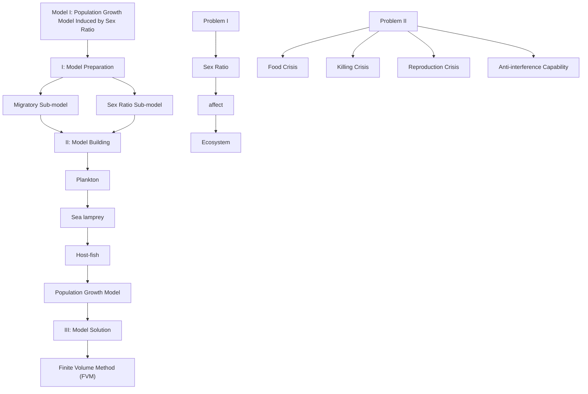
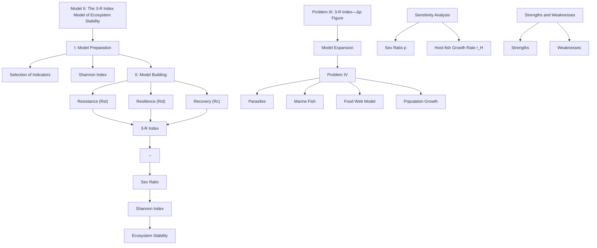
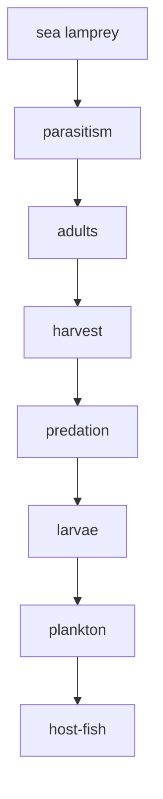
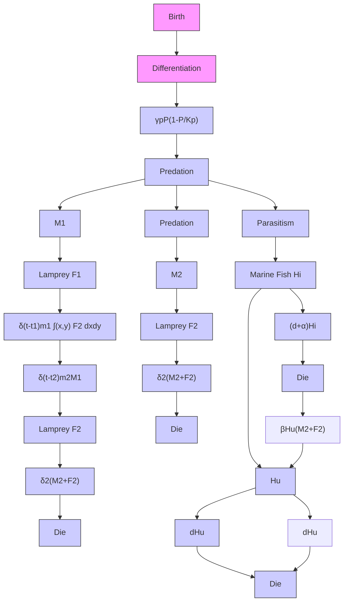
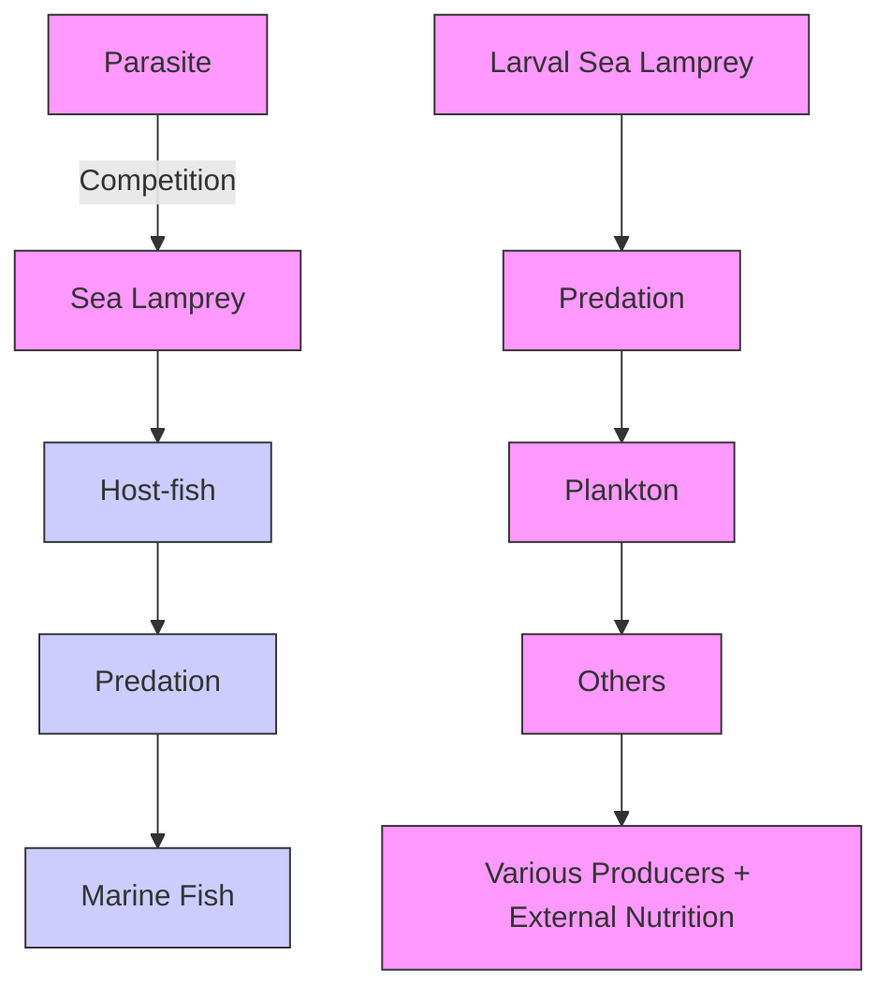

# Magic Sex Ratio : Exploring the Important Role of Lampreys in the Ecosystem

Summary

As one of the oldest vertebrates, the sea lampreys has unique mechanisms of gender differentiation.In order to examine the advantages and disadvantages of the lampreys’ ability to change its sex ratio according to resource availability, we develop two main models, the Population Growth Model Induced by Sex Ratio and the 3-R Index Model of Ecosystem Stability.

Firstly, we develop a Population Growth Model based on differential equations, which mainly considers the factors of sex ratio, migration and inter-organism interactions of the lampreys. In terms of the induced factors and effects of sex ratio, we use the Least Squares Method to fit a functional relationship between the larval growth rate and food density of the lampreys, then establish a sex logistic function to determine the effect of larval growth rate on the sex differentiation of the lampreys. Lastly, we consider the effect of sex ratio on the growth rate. In terms of interactions among creatures, we mainly consider the parasitic relationship between lampreys and host-fish in the ocean and the predation relationship between lampreys and plankton in the river, and integrate the improved Logistic Model and the Lotka-Volterra Equations to establish differential equations for biomass of different species over time. Finally, Finite Volume Method (FVM) is used to solve the numerical solution of the PDE.

For problem 1, given the same initial conditions and using a population growth model, consider the trends in biomass of different species when the lampreys can change the sex ratio and when it cannot change the sex ratio, respectively, and then analyse the impact of the lampreys on the larger ecosystem. (result:Figure 8-11)

For problem 2, we adjust the model parameters to simulate the impacts of harsh environments on the ecosystems of lampreys, such as human killings, famine and habitat destruction, and find that lampreys can adjust the sex ratio, which is an advantage against harsh environments, but has a serious "time lag effect".

For problem 3, we establish a 3-R index model to measure ecosystem stability. Firstly, we use three quantitative indicators to measure the stability of ecosystems( Resistance, Resilience and Recovery) and then we perturb the ecosystems at a specific moment to change the sex ratio, and then calculate the 3-R Index with the help of the change of Shannon Index before and after the perturbation to get the effect of the sex ratio on the stability of ecosystem. (result:Figure 17)

For problem 4, we extend the model by adding more species to the analysis, introducing competitive factors and analysing the advantages of sex change in lampreys over other different types of creatures. (result:Figure 19)

Keywords: Lampreys, Sex Ratio, PDE, Finite Volume Method, 3-R Index

## Contents

## 1 Introduction 3

1.1 Background 3  
1.2 Restatement 3  
1.3 Our Work . . 3

## 2 Assumptions and Justifications 4

## 3 Notations 5

## 4 Model I : Population Growth Model Induced by Lampreys Sex Ratio 5

4.1 Model Overview . . . 5  
4.2 Model Buliding 6

4.2.1 Migratory Sub-model . .  
4.2.2 Predisposing Factors and Effects of Sex Ratio . . 8  
4.2.3 Population Growth Model in River . . 9  
4.2.4 Population Growth Model in Ocean . . . 9

4.3 Model Solution 12  
4.4 Results of Problem I . . 12  
4.5 the Results of Problem II 14

4.5.1 Advantages: strong resistance to harsh environments . . . . . . . . 14  
4.5.2 Disadvantages: time lag in adjusting the sex ratio 16

## 5 Model II : the 3-R Index Model Based on Changes of Ecosystem Stability under the Influence of Lampreys’ Sex Ratio 16

5.1 Model Overview . . . 16  
5.2 Model Buliding 16

5.2.1 Selection of Indicators to Measure Ecosystem Stability . . . . 16  
5.2.2 Quantification of indicators 17  
5.2.3 Internal system variables . . 18  
5.2.4 Ecosystem disturbance factors . . . 19

5.3 Results of Problem III . 19

## 6 Model Expansion 20

## 7 Sensitivity Analysis 22

## 8 Strengths and Weaknesses 23

8.1 Strengths . . 23  
8.2 Weaknesses and Possible Improvement 23

## 9 Conclusion 24

## References 24

## 1 Introduction

## 1.1 Background

Historically, the sea lamprey has been considered a prized ingredient and favored by many. Zoologically, the sea lamprey is one of the oldest surviving vertebrates and is a key species in the study of vertebrate origins and evolution. From an ecological point of view, the sea lamprey is a carnivorous ectoparasite and can change its sex ratio in response to changes in the external environment, which is crucial to the stability of the ecosystem.


<details>
<summary>natural_image</summary>

Close-up of a silver fish swimming near dark rocks (no visible text or symbols)
</details>

$\mathrm { F i g u r e 1 : s e a l a m p r e y ( h t t p s : / / b a i ) j i a h a o . b a i d u . c o m / } $

Since the invasion of sea lampreys into the Great Lakes beginning in the 1950s, with impacts on the ecology and fisheries of the Great Lakes, there is an urgent need for research on the ecosystem impacts of sea lamprey sex ratio in support of real-life control and protection of sea lampreys [1], [2].

## 1.2 Restatement

Considering the background information and limiting conditions identified in the problem statement, we are supposed to address the following issues:

• Build a model to determine the effects on the ecosystem of a sea lamprey population that can change its sex ratio.  
• Analyze the advantages and disadvantages of the sea lamprey population in the survival of the ecosystem.  
• Develop a model to determine the impacts on ecosystem stability based on the sex ratio of sea lampreys.  
• Estimating the impact of sea lampreys on other species in ecosystems containing populations of sea lampreys with variable sex ratio.

## 1.3 Our Work

According to the requirements, our work is as follows:


<details>
<summary>flowchart</summary>


</details>


<details>
<summary>flowchart</summary>


</details>

Figure 2: the flow chart of our work

## 2 Assumptions and Justifications

To simplify the problem and make it convenient for us to simulate real-life conditions, we make the following basic assumptions, each of which is properly justified:

• Assumption 1: The sea lamprey feeds on plankton in rivers and parasitizes large fish in the ocean.  
Justification: Juvenile sea lampreys have immature organ development and do not have the conditions for parasitism, and generally feed on tiny plankton, such as algae and small invertebrates[3]. The majority of sea lampreys in rivers are juvenile individuals, so it is approximated that sea lampreys feed on plankton in rivers.  
Assumption 2: Neglect the effects of water temperature, climate and other external environmental factors on the abundance of sea lamprey species.

Justification: Sea lampreys live primarily in waters of temperate and boreal climate types. They are usually found in temperate oceans, rivers and lakes, especially in areas where the water is clean, moderately warm and well oxygenated. Because of their ability to adapt to different water temperature ranges, sea lampreys can ignore the effects of environmental climate factors[4].

Assumption 3: Chemical agents such as steroids can directly alter the sex ratio of sea lampreys, but not their birth and death rates.

Justification: Chemicals such as steroids can induce sex change in juvenile sea lam preys, and since most sea lampreys are in their juvenile years, it can be assumed that the use of steroids can directly change the sex ratio of sea lamprey populations.

• Assumption 4: It is assumed that sea lampreys die immediately after spawning or oviposition.

Justification: Studies have shown that most sea lamprey females and males stop feeding after mating and wait for a natural death[5]. During this time, sea lampreys have no impact on other organisms or the ecosystem, so it can be assumed that sea lampreys die immediately after spawning or oviposition.

Assumption 5: The ecosystem in which the lamprey is found has sufficient producers to supply the survival of organisms at the bottom of the food chain.

Justification: Since the oceans have a very high biodiversity, it can be assumed that producers provide sufficient external nutrients to the ecosystem we construct.

## 3 Notations

Table 1: the list of notation

<table><tr><td>Symbol</td><td>Meaning</td></tr><tr><td> $M_1$ </td><td>the biomass of the male sea lampreys living in river</td></tr><tr><td> $M_2$ </td><td>the biomass of the male sea lampreys living in different locations in ocean</td></tr><tr><td> $N_{1_{male}}$ </td><td>the biomass of male lampreys migrating from the sea to the river</td></tr><tr><td> $N_{2_{male}}$ </td><td>the biomass of male lampreys migrating from the river to the sea</td></tr><tr><td> $R_{male}$ </td><td>the biamass of males differentiated from the newborn larvae of lampreys</td></tr><tr><td> $P(t)$ </td><td>the biomass of plankton in the river at moment  $t$ </td></tr><tr><td> $H_i$ </td><td>the biomass of host-fish that are parasitized at moment  $t$ </td></tr></table>

## 4 Model I : Population Growth Model Induced by Lampreys Sex Ratio

## 4.1 Model Overview

According to the physiological activities and ranges of the sea lamprey, the life cycle of the sea lamprey is divided into three stages: the juvenile stage of metamorphosis in the river, the adult stage of survival by migrating to seawater, and the reproductive stage of migrating to the river. We focus on the effects of sea lamprey sex ratio, two migrations and biotic interactions on the abundance of different species in the community.

When considering the sex ratio of the sea lamprey, we first use the least squares method to fit the relationship between the growth rate of the newborn sea lamprey and the concentration of food, and define the sex logistic function to determine the relationship between the sex ratio and the concentration of food, and then consider the effect of the sex ratio on the reproduction of the sea lamprey. When considering the two migrations of the sea lamprey, the population migration models in rivers and seawater at different times are established based on the characteristics of its two migrations. When considering the interactions between organisms, differential equations for the population of different species in the St. Lawrence River and the Gulf of St. Lawrence over time are presented based on the intraspecific (reproduction, intraspecific competition) and interspecific (including interspecific competition, parasitism, and predation) relationships of the sea lamprey at different stages.

Finally, the numerical solution of the system of partial differential equations is obtained using the finite volume method, and the changes of different species in a specific water area over time are obtained in communities that could change the sex ratio of the sea lamprey and those that could not change the sex ratio of the sea lamprey, all other things being the same, and it is analyzed that the sex ratio could be varied in a positive way for the ecosystem.

## 4.2 Model Buliding

The sea lamprey has a complex life cycle. Juvenile lampreys are hatched in freshwater rivers, and after metamorphosis and development into adults, they migrate to seawater to continue to survive, and then migrate back to freshwater rivers to spawn during the reproduction period.


<details>
<summary>flowchart</summary>

```mermaid
graph LR
  A["Year 0: Larvae"] --> B["Year 1: Reproduction"]
  B --> C["Year 2: Reproduction"]
  C --> D["Year 3: Reproduction"]
  D --> E["Year 4: Reproduction"]
  E --> F["Year 5: Reproduction"]
  F --> G["Year 6: Juveniles"]
  G --> H["Year 7: Adults"]
    
    style A fill:#f9f,stroke:#333
    style B fill:#f9f,stroke:#333
    style C fill:#f9f,stroke:#333
    style D fill:#f9f,stroke:#333
    style E fill:#f9f,stroke:#333
    style F fill:#f9f,stroke:#333
    style G fill:#ccf,stroke:#333
    style H fill:#ccf,stroke:#333
    
    subgraph River
  I["Migration1: River → Ocean"] --> J["Migration1: River → Ocean"] --> K["Migration2: River → Ocean"] --> L["Migration2: River → Ocean"] --> M["Migration1: River → Ocean"] --> N["Migration2: River → Ocean"] --> O["Migration1: River → Ocean"] --> P["Migration2: River → Ocean"] --> Q["Migration1: River → Ocean"] --> R["Migration2: River → Ocean"] --> S["Migration1: River → Ocean"] --> T["Migration2: River → Ocean"] --> U["Migration1: River → Ocean"] --> V["Migration2: River → Ocean"] --> W["Migration1: River → Ocean"] --> X["Migration2: River → Ocean"] --> Y["Migration1: River → Ocean"] --> Z["Migration2: River → Ocean"] --> AA["Migration1: River → Ocean"] --> AB["Migration2: River → Ocean"] --> AC["Migration1: River → Ocean"] --> AD["Migration2: River → Ocean"] --> AE["Migration1: River → Ocean"] --> AF["Migration2: River → Ocean"] --> AG["Migration1: River → Ocean"] --> AH["Migration2: River → Ocean"] --> AI["Migration1: River → Ocean"] --> AJ["Migration2: River → Ocean"] --> AK["Migration1: River → Ocean"] --> AL["Migration2: River → Ocean"] --> AM["Migration1: River → Ocean"] --> AN["Migration2: River → Ocean"] --> AO["Migration1: River → Ocean"] --> AP["Migration2: River → Ocean"] --> AQ["Migration1: River → Ocean"] --> AR["Migration2: River → Ocean"] --> AS["Migration1: River → Ocean"] --> AT["Migration2: River → Ocean"] --> AU["Migration1: River → Ocean"] --> AV["Migration2: River → Ocean"] --> AW["Migration1: River → Ocean"] --> AX["Migration2: River → Ocean"] --> AY["Migration1: River → Ocean"] --> AZ["Migration2: River → Ocean"] --> BA["Migration1: River → Ocean"] --> BB["Migration2: River → Ocean"] --> BC["Migration1: River → Ocean"] --> BD["Migration2: River → Ocean"] --> BE["Migration1: River → Ocean"] --> BF["Migration2: River → Ocean"] --> BG["Migration1: River → Ocean"] --> BH["Migration2: River → Ocean"] --> BI["Migration1: River → Ocean"] --> BJ["Migration2: River → Ocean"] --> BK["Migration1: River → Ocean"] --> BL["Migration2: River → Ocean"] --> BM["Migration1: River → Ocean"] --> BN["Migration2: River → Ocean"] --> BO["Migration1: River → Ocean"] --> BP["Migration2: River → Ocean"] --> BQ["Migration1: River → Ocean"] --> BR["Migration2: River → Ocean"] --> BS["Migration1: River → Ocean"] --> BT["Migration2: River → Ocean"] --> BU["Migration1: River → Ocean"] --> BV["Migration2: River → Ocean"] --> BW["Migration1: River → Ocean"] --> BX["Migration2: River → Ocean"] --> BY["Migration1: River → Ocean"] --> BZ["Migration2: River → Ocean"] --> CA["Migration1: River → Ocean"] --> CB["Migration2: River → Ocean"] --> CC["Migration1: River → Ocean"] --> CD["Migration2: River → Ocean"] --> CE["Migration1: River → Ocean"] --> CF["Migration2: River → Ocean"] --> CG["Migration1: River → Ocean"] --> CH["Migration2: River → Ocean"] --> CI["Migration1: River → Ocean"] --> CJ["Migration2: River → Ocean"] --> CK["Migration1: River → Ocean"] --> CR["Migration2: River → Ocean"] --> CS["Migration1: River → Ocean"] --> CT["Migration2: River → Ocean"] --> CU["Migration1: River → Ocean"] --> CV["Migration2: River → Ocean"] --> CW["Migration1: River → Ocean"] --> CX["Migration2: River → Ocean"] --> CY["Migration1: River → Ocean"] --> CZ["Migration2: River → Ocean"] --> DA["Migration1: River → Ocean"] --> DB["Migration2: River → Ocean"] --> DC["Migration1: River → Ocean"] --> DD["Migration2: River → Ocean"] --> DE["Migration1: River → Ocean"] --> DF["Migration2: River → Ocean"] --> DG["Migration1: River → Ocean"] --> DH["Migration2: River → Ocean"] --> DI["Migration1: River → Ocean"] --> DJ["Migration2: River → Ocean"] --> DK["Migration1: River → Ocean"] --> DL["Migration2: River → Ocean"] --> DV["Migration1: River → Ocean"] --> DW["Migration2: River → Ocean"] --> DX["Migration1: River → Ocean"] --> DXB["Migration2: River → Ocean"] --> DXC["Migration1: River → Ocean"] --> DXD["Migration2: River → Ocean"] --> DXE["Migration1: River → Ocean"] --> DXF["Migration2: River → Ocean"] --> DXG["Migration1: River → Ocean"] --> DXH["Migration2: River → Ocean"] --> DXI["Migration1: River → Ocean"] --> DXJ["Migration2: River → Ocean"] --> DXK["Migration1: River → Ocean"] --> DXL["Migration2: River → Ocean"] --> DXM["Migration1: River → Ocean"] --> DXN["Migration2: River → Ocean"] --> DXO["Migration1: River → Ocean"] --> DXP["Migration2: River → Ocean"] --> DXQ["Migration1: River → Ocean"] --> DXR["Migration2: River → Ocean"] --> DXS["Migration1: River → Ocean"] --> DXT["Migration2: River → Ocean"] --> DXU["Migration1: River → Ocean"] --> DXV["Migration2: River → Ocean"] --> DXW["Migration1: River → Ocean"] --> DXX["Migration2: River → Ocean"] --> DXZ["Migration1: River → Ocean"] --> DXW
```
</details>

Figure 3: the life history of the sea lampreys

The Gulf of St. Lawrence is an important site for adult lampreys, and we focus on the survival of the species in waters ranging from $5 9 ^ { \circ }$ to $6 3 . 5 ^ { \circ }$ W longitude and from $4 6 ^ { \circ }$ to $5 0 . 5 ^ { \circ }$ N latitude. For simplicity of study, although in reality the range studied by the model is a spherical quadrilateral, we assume that spatial locations are divided equally by latitude and longitude, which in turn can be abstracted into planar rectangles with horizontal and vertical coordinates in a planar rectangular coordinate system according to latitude and longitude. All calculations of the shortest spherical distance between two points represented using latitude and longitude in the model are transformed using Haversine’s formula [6] as shown below:

$$
d = 2 \arcsin {\sqrt {\sin^ {2} \left(\frac {\delta_ {1} - \delta_ {2}}{2}\right) + \cos \delta_ {1} \cos \delta_ {2} \sin^ {2} \left(\frac {\alpha_ {1} - \alpha_ {2}}{2}\right)}}
$$

where d denotes the shortest spherical distance and $\delta _ { 1 } , \delta _ { 2 } , \alpha _ { 1 } , \alpha _ { 2 }$ are the latitude and longitude of the two points, respectively.


<details>
<summary>text_image</summary>

Diagram illustrating global map with a globe, coordinate system, and geometric shapes including trapezoids and a rectangle.
</details>

Figure 4: abstracting a spherical quadrilateral into a planar rectangle

The St. Lawrence River is home to juvenile and reproductive lampreys, and since species and environmental changes within the St. Lawrence River are not significant [7], and the succession of communities within the river is similar, we consider this portion of the water as a whole.

After the above analysis, we can set $M _ { 1 }$ to be the biomass of the male sea lampreys living in the St. Lawrence River and $F _ { 1 }$ to be female, which are both functions of time t. Let $M _ { 2 } , F _ { 2 }$ be the biomass of sea lampreys living in different locations in the St. Lawrence Lake, and they are functions of time $t ,$ longitude $x ,$ and latitude $y .$ .

## 4.2.1 Migratory Sub-model

There are two important migrations in the life cycle of the sea lampreys. The first occurs from March to April each year, during the northern hemisphere spring, when large numbers of adult-bodied lampreys of varying ages (mostly $5 { - } 7$ years old) migrate upstream from the ocean to freshwater rivers for subsequent mating and spawning [8]. The second time is in May to June each year, when most of the larvae undergo a long metamorphosis into adults (mostly 3-5 years old) and migrate toward the ocean for more food[9].

$$
N _ {1 _ {\text { male }}} = \delta (t - t _ {1}) \cdot m _ {1} \cdot \iint_ {(x, y)} M _ {2} d x d y \tag {1}
$$

$$
N _ {2 _ {\text { male }}} = \delta (t - t _ {2}) \cdot m _ {2} \cdot M _ {1} \tag {2}
$$

$$
N _ {1 _ {\text { female }}} = \delta (t - t _ {1}) \cdot m _ {1} \cdot \iint_ {(x, y)} F _ {2} d x d y \tag {3}
$$

$$
N _ {2 _ {\text { female }}} = \delta (t - t _ {2}) \cdot m _ {2} \cdot F _ {1} \tag {4}
$$

where $N _ { 1 }$ is the biomass of lampreys migrating from the sea to the river at moment $t , N _ { 2 }$ is the biomass of lampreys migrating from the river to the sea at moment t and $m _ { 1 }$ and $m _ { 2 }$ are the migration rates of the two migrations, respectively. The reason the first equation needs to be integrated over spatial variables is that adults in all seas have the potential to migrate, and δ in the above equation can be expressed as:

$$
\delta (t) = \left\{ \begin{array}{l l} 1 & \text { if } t = 0 \\ 0 & \text { others } \end{array} \right. \tag {5}
$$

## 4.2.2 Predisposing Factors and Effects of Sex Ratio

Sea lampreys typically spawn in spring nesting habitats, and the gonads of larvae can remain histologically undifferentiated for extended periods of time. Field studies have shown that sex determination in sea lampreys is directly influenced by larval growth rates, with slower growth of larvae in non-productive environments allowing for more male-biased larvae and faster growth in productive environments allowing for more femalebiased larvae[10]. Therefore define the sex logistic function:

$$
\eta (v) = \frac {1}{1 + e ^ {- (\alpha v + \beta)}} \tag {6}
$$

In the above equation $\eta ( v )$ denotes the probability of differentiating into a female when the growth rate of the larvae is v, where α and $\beta$ are corrections for the growth rate.

In more studies it has been shown[11] that the larval growth rate of sea lampreys is primarily related to the density of edible plankton, and that if the density of plankton is $\rho ,$ then the relationship is:

$$
v = A \cdot e ^ {\mu \rho} + M \tag {7}
$$

Based on the literature [11] and related research data, we use the least squares method for parameter fitting to obtain $A = - 0 . 7 6 , \mu = - 0 . 0 2 , M = 0 . 6 7$ . The $R ^ { 2 } = 0 . { \bar { 9 } } 8 0 4$ indicates that the fit is very good, and also shows that the growth rate of lampreys larval growth rate gradually slows down with the increase of food concentration.

Mating and spawning in lampreys usually begins after the spring migration, and their mating system is predominantly polygynous, with eggs fertilized in vitro, and the biomass of males is usually more dominant [12], which means that the birth rate of lampreys tends to receive constraints from a smaller number of eggs. Therefore, when measuring the birth rate of lampreys, it is only necessary to consider the number of females during mating. Let $R _ { m a l e }$ and $R _ { f e m a l e }$ be the biomass of males and females differentiated from the newborn larvae of lampreys at moment $t ,$ and c be the number of viable larvae that can be produced by one female per unit of time, then we can get the effect of sex ratio on birth rate:

$$
R _ {m a l e} = c \cdot N _ {1 _ {f e m a l e}} (1 - \eta) \tag {8}
$$

$$
R _ {f e m a l e} = c \cdot N _ {1 _ {f e m a l e}} \eta \tag {9}
$$

## 4.2.3 Population Growth Model in River

According to the results of related studies [3], juvenile sea lampreys growing in rivers tend to be non-parasitic and feed mainly on tiny plankton, such as algae and small invertebrates. Therefore, the main consideration is the variation in the abundance of plankton and sea lampreys.

## Plankton

Plankton consists mainly of phytoplankton (diatoms, green algae and cyanobacteria) and plankton (ciliates, rotifers). One part of the plankton survives by converting sunlight and carbon dioxide into organic matter through photosynthesis, and the other part survives by feeding on other plankton. Regardless of that type of survival, the growth of plankton is characterized by resource limitation and density dependence, so that its growth can be described by a logistic model. In addition to this, plankton will be preyed upon by sea lampreys, so the change in the biomass of plankton in the river can be expressed as:

$$
\frac {d P}{d t} = r _ {P} \cdot P \cdot (1 - \frac {P}{K _ {P}}) - \delta_ {P} \cdot (M _ {1} + F _ {1}) \tag {10}
$$

where $P ( t ) = \rho ( t ) V _ { r i v e r } / m$ denotes the biomass of plankton in the river at moment t, $r _ { P }$ denotes the growth rate of plankton, $K _ { P }$ denotes the environmental holding capacity of plankton in the St. Lawrence River, and $\delta _ { P }$ denotes the predation effect of lampreys on plankton.

## Lamprey in the river

Surviving in rivers are usually juvenile lampreys and adult lampreys that migrate during the breeding season. Since adult lampreys no longer obtain food after mating and die within a short period of time, this portion of the river is present for a shorter period of time, and we ignore the effect of this portion of the river on the number of species in the river. The natural enemies of lampreys have strong food substitution, so we only consider the predation effect of natural enemies on lampreys, and do not consider the changes in the number of natural enemies. Therefore, the change in the biomass of lampreys in the river is:

$$
\frac {d M _ {1}}{d t} = - \delta_ {1} \cdot M _ {1} - N _ {2 _ {\text { male }}} + R _ {\text { male }} \tag {11}
$$

$$
\frac {d F _ {1}}{d t} = - \delta_ {1} \cdot F _ {1} - N _ {2 _ {\text { female }}} + R _ {\text { female }} \tag {12}
$$

where $\delta _ { 1 }$ denotes the predation effect of human activities and other natural enemies on lampreys, the second term of the equation denotes the effect of migration from the river to the ocean, and the third term denotes the spawning effect of adult lampreys migrating from the ocean to the river.

## 4.2.4 Population Growth Model in Ocean

Most lampreys in the ocean are adult lampreys, which basically live a parasitic life, attaching themselves to larger fish with their disc-like mouths and then sucking blood through their teeth and sucker-like mouth structures. Therefore, in the ocean, we mainly consider changes in the abundance of host-fish (e.g., salmon, cod, bass, etc.) and lampreys. Unlike organisms in rivers, biomass in the ocean is a ternary function of longitude, latitude, and time, so not only do we have to consider interspecific competition and parasitism among organisms, but also dispersal and enemy avoidance strategies of different species in their spatial locations.


<details>
<summary>flowchart</summary>


</details>

Figure 5: biological relationships of the lampreys

## Host-fish

Existing studies have demonstrated that [13], parasitism may reduce host density and induce extinction of the host population. Let the biomass of host-fish be $H = H ( x , y , t )$ , and divide the hosts into those that are parasitized, $H _ { i } = H _ { i } ( x , y , t )$ , and those that are not, $H _ { u } = H _ { u } ( x , y , t )$ , then the change in the population should be expressed as follows: $H _ { i } = H _ { u } ( x , y , t )$ , and $H _ { u } = H _ { u } ( x , y , t )$ . Then the change in the biomass of host-fish should be expressed as:

$$
\frac {\partial H _ {u}}{\partial t} = r _ {H} H (1 - \frac {H}{K _ {H}}) - d H _ {u} - \beta H _ {u} (M _ {2} + F _ {2}) + D (\frac {\partial^ {2} H}{\partial x ^ {2}} + \frac {\partial^ {2} H}{\partial y ^ {2}}) \tag {13}
$$

$$
\frac {\partial H _ {i}}{\partial t} = \beta H _ {u} (M _ {2} + F _ {2}) - (d + \alpha) H _ {i} + D (\frac {\partial^ {2} H}{\partial x ^ {2}} + \frac {\partial^ {2} H}{\partial y ^ {2}}) \tag {14}
$$

where $r _ { H }$ denotes the growth rate of the host and $K _ { H }$ denotes the environmental holding capacity of the host-fish; in this equation, newly born fish are unparasitized individuals, regardless of whether or not the parent is parasitized. d denotes the natural mortality rate of healthy hosts, and α denotes the effect of host mortality due to parasitism. D denotes the dispersal efficiency, reflecting the free dispersal of fish across spatial locations.

## Lamprey in the ocean

Changes in the population of lampreys in the ocean are mainly considered to be affected by mortality, migration and spatial dispersal caused by predation by humans or natural enemies, and the following results can be obtained:

$$
W _ {m a l e} = - \delta_ {2} M _ {2} - \delta (t - t _ {1}) m _ {1} M _ {2} + E \left(\frac {\partial^ {2} M _ {2}}{\partial x ^ {2}} + \frac {\partial^ {2} M _ {2}}{\partial y ^ {2}}\right) + G (\frac {\partial H}{\partial x} + \frac {\partial H}{\partial y}) \tag {15}
$$

$$
\frac {\partial M _ {2}}{\partial t} = \left\{ \begin{array}{l l} W _ {\text { male }} & \text { if } (x, y) \neq (x _ {0}, y _ {0}) \\ W _ {\text { male }} + N _ {2 _ {\text { male }}} & \text { if } (x, y) = (x _ {0}, y _ {0}) \end{array} \right. \tag {16}
$$

$$
W _ {f e m a l e} = - \delta_ {2} F _ {2} - \delta (t - t _ {1}) m _ {1} F _ {2} + E \left(\frac {\partial^ {2} F _ {2}}{\partial x ^ {2}} + \frac {\partial^ {2} F _ {2}}{\partial y ^ {2}}\right) + G \left(\frac {\partial H}{\partial x} + \frac {\partial H}{\partial y}\right) \tag {17}
$$

$$
\frac {\partial F _ {2}}{\partial t} = \left\{ \begin{array}{l l} W _ {\text { female }} & \text { if } (x, y) \neq (x _ {0}, y _ {0}) \\ W _ {\text { female }} + N _ {2 _ {\text { female }}} & \text { if } (x, y) = (x _ {0}, y _ {0}) \end{array} \right. \tag {18}
$$

where $\delta _ { 2 }$ denotes the mortality rate of sea lampreys, $E$ denotes the diffusion coefficient of lampreys in the sea, and $\overset { \triangledown } { G }$ denotes the tracking coefficient of sea lampreys. The first term in the expression of W denotes the effect of human activities and predation by natural enemies, the second term denotes the effect of migration of sea lampreys from the sea to the river, the third term denotes the free dispersal of sea lampreys in the sea, and the last term denotes that sea lampreys always move towards the place where there are more hosts. Synthesizing the above analysis, the above system of differential equations is plotted in the following flow chart:


<details>
<summary>flowchart</summary>


</details>

Figure 6: biomass dynamics in ecosystem

## 4.3 Model Solution

During the modeling process, many parameters to be determined were generated, and in order to determine the specific values of these parameters, we review a large number of literature and online resources [13]–[16], estimation of the parameters used in the model The finite volume method(FVM) is a numerical method for solving systems of partial differential equations that transforms a continuous PDE problem into a discrete algebraic problem by discretizing the continuous solution domain into a finite number of subregions (elements), applying numerical integration in each control volume, and thus transforming the continuous PDE problem into a discrete algebraic problem.

In the modeling of different species populations over time, longitude and latitude, the waters from $5 9 ^ { \circ }$ to 63.5° W longitude and from $4 6 ^ { \circ }$ to $5 0 . 5 ^ { \circ } \mathrm { N }$ latitude are equally divided into 15\*15 subregions, and time is divided according to 1 day, i.e., $\Delta x = 0 . 5 , \Delta y =$ $0 . 5 , \Delta t = 1 d .$ By programming, we obtain the distribution of host-fish at $t = 3 6 0 , t =$ $3 6 0 0 , t = 1 8 0 0 0$ :

  
Figure 7: schematic diagram of the FAM for solving PDE

## 4.4 Results of Problem I

In order to investigate the effect of the ability of lampreys to change sex ratio on the larger ecosystem, the changes in the abundance of different species over time are modeled when lampreys populations could and could not change their sex ratio, given the same initial value conditions. In order to make the model more general, the given initial values do not necessarily make the community in a stable state.

In the following, we set the male ratio of lampreys at $p = 0 . 5 6 , p = 0 . 6 7 , p = 0 . 7 8 , p =$ 0.82 at the initial moment and plot the changes of relative biomass of different species over time.


<details>
<summary>line chart</summary>

| t/day | host-fish biomass | sea lampreys biomass | proportion of males | plankton biomass |
| ----- | ----------------- | -------------------- | -------------------- | ---------------- |
| 0     | 100               | 60                   | 100                  | 100              |
| 1000  | 120               | 65                   | 95                   | 95               |
| 2000  | 125               | 70                   | 90                   | 90               |
| 3000  | 120               | 75                   | 85                   | 85               |
| 4000  | 115               | 70                   | 80                   | 80               |
| 5000  | 110               | 65                   | 75                   | 75               |
| 6000  | 105               | 60                   | 70                   | 70               |
| 7000  | 100               | 55                   | 65                   | 65               |
| 8000  | 95                | 50                   | 60                   | 60               |
</details>


<details>
<summary>line chart</summary>

| t/day | host-fish biomass | sea lampreys biomass | proportion of males | plankton biomass |
| ----- | ----------------- | -------------------- | ------------------- | ---------------- |
| 0     | 100               | 100                  | 60                  | 90               |
| 1000  | 120               | 20                   | 60                  | 50               |
| 2000  | 130               | 0                    | 60                  | 70               |
| 3000  | 130               | 0                    | 60                  | 70               |
| 4000  | 130               | 0                    | 60                  | 70               |
| 5000  | 130               | 0                    | 60                  | 70               |
| 6000  | 130               | 0                    | 60                  | 70               |
| 7000  | 130               | 0                    | 60                  | 70               |
| 8000  | 130               | 0                    | 60                  | 70               |
</details>

Figure 8: sex ratio can be changed (left) and cannot be changed (right) at $p = 0 . 5 6$ .


<details>
<summary>line chart</summary>

| t/day | host-fish biomass | sea lampreys biomass | proportion of males | plankton biomass |
| ----- | ----------------- | -------------------- | -------------------- | ---------------- |
| 0     | 100               | 100                  | 60                   | 90               |
| 1000  | 120               | 20                   | 65                   | 95               |
| 2000  | 125               | 10                   | 70                   | 95               |
| 3000  | 125               | 5                    | 75                   | 95               |
| 4000  | 125               | 5                    | 75                   | 95               |
| 5000  | 110               | 5                    | 65                   | 85               |
| 6000  | 100               | 5                    | 60                   | 75               |
| 7000  | 90                | 5                    | 60                   | 70               |
| 8000  | 80                | 5                    | 60                   | 65               |
</details>


<details>
<summary>line chart</summary>

| t/day | host-fish biomass | sea lampreys biomass | proportion of males | plankton biomass |
|-------|-------------------|----------------------|---------------------|-----------------|
| 0     | 100               | 60                   | 70                  | 100             |
| 1000  | 120               | 40                   | 70                  | 80              |
| 2000  | 110               | 50                   | 70                  | 60              |
| 3000  | 90                | 60                   | 70                  | 50              |
| 4000  | 80                | 50                   | 70                  | 40              |
| 5000  | 120               | 30                   | 70                  | 20              |
| 6000  | 130               | 10                   | 70                  | 10              |
| 7000  | 130               | 5                    | 70                  | 5               |
| 8000  | 130               | 2                    | 70                  | 2               |
</details>

Figure 9: sex ratio can be changed (left) and cannot be changed (right) at $p = 0 . 6 7$ .


<details>
<summary>line chart</summary>

| t/day | host-fish biomass | sea lampreys biomass | proportion of males | plankton biomass |
|-------|-------------------|----------------------|---------------------|------------------|
| 0     | 100               | 100                  | 80                  | 90               |
| 1000  | 120               | 20                   | 80                  | 95               |
| 2000  | 120               | 10                   | 80                  | 90               |
| 3000  | 115               | 15                   | 75                  | 85               |
| 4000  | 110               | 25                   | 70                  | 80               |
| 5000  | 105               | 30                   | 65                  | 75               |
| 6000  | 100               | 35                   | 60                  | 70               |
| 7000  | 95                | 40                   | 55                  | 65               |
| 8000  | 90                | 45                   | 50                  | 60               |
</details>


<details>
<summary>line chart</summary>

| t/day | host-fish biomass | sea lampreys biomass | proportion of males | plankton biomass |
| ----- | ----------------- | -------------------- | -------------------- | ---------------- |
| 0     | 100               | 60                   | 80                   | 90               |
| 1000  | 120               | 20                   | 80                   | 95               |
| 2000  | 125               | 10                   | 80                   | 95               |
| 3000  | 125               | 5                    | 80                   | 95               |
| 4000  | 125               | 2                    | 80                   | 95               |
| 5000  | 125               | 1                    | 80                   | 95               |
| 6000  | 125               | 1                    | 80                   | 95               |
| 7000  | 125               | 1                    | 80                   | 95               |
| 8000  | 125               | 1                    | 80                   | 95               |
</details>

Figure 10: sex ratio can be changed (left) and cannot be changed (right) at $p = 0 . 7 8$ .


<details>
<summary>line chart</summary>

| t/day | host-fish biomass | sea lampreys biomass | proportion of males | plankton biomass |
|-------|-------------------|----------------------|---------------------|------------------|
| 0     | 40                | 60                   | 85                  | 90               |
| 1000  | 120               | 20                   | 80                  | 95               |
| 2000  | 120               | 15                   | 75                  | 90               |
| 3000  | 115               | 10                   | 70                  | 85               |
| 4000  | 110               | 25                   | 65                  | 80               |
| 5000  | 105               | 30                   | 60                  | 75               |
| 6000  | 100               | 35                   | 65                  | 70               |
| 7000  | 95                | 40                   | 70                  | 65               |
| 8000  | 90                | 45                   | 75                  | 60               |
</details>


<details>
<summary>line chart</summary>

| t/day | host-fish biomass | sea lampreys biomass | proportion of males | plankton biomass |
| ----- | ----------------- | -------------------- | ------------------- | ---------------- |
| 0     | 100               | 100                  | 80                  | 90               |
| 1000  | 120               | 20                   | 85                  | 95               |
| 2000  | 125               | 10                   | 85                  | 95               |
| 3000  | 125               | 5                    | 85                  | 95               |
| 4000  | 125               | 2                    | 85                  | 95               |
| 5000  | 125               | 1                    | 85                  | 95               |
| 6000  | 125               | 1                    | 85                  | 95               |
| 7000  | 125               | 1                    | 85                  | 95               |
| 8000  | 125               | 1                    | 85                  | 95               |
</details>

Figure 11: sex ratio can be changed (left) and cannot be changed (right) at $p = 0 . 8 2 .$ .

Based on the results above, we can get that lampreys sex ratio can change the impact on the ecosystem:

Enhance the ability of lampreys themselves to resist the harsh environment.Except for the different initial sex ratio, the initial conditions are exactly the same, and it can be seen from all the diagrams on the left that the biomass of lampreys all went through the process of decreasing and then increasing to reach a stable process after 4000-5000 days. This shows that when food resources are unfavorable for their reproduction, lampreys can resist the harsh external environment by changing their sex ratio and thus adjusting the population size.

Able to maintain the stability of the host-fish and plankton population. From the comparison of (8), it can be seen that lampreys are able to control their own overproliferation by changing their sex ratio when the host is insufficient, thus stabilizing the host population. From the comparison of (11), it can be seen that lampreys can restrain the overproliferation of plankton by changing the sex ratio, thus making the biomass of plankton stable.

Utilizing feedback to regulate the ecosystem. Effectively regulate the interspecies relationship of the ecosystem and maintain the stability of the ecosystem.

## 4.5 the Results of Problem II

## 4.5.1 Advantages: strong resistance to harsh environments

In order to prove that the lampreys population has a strong resistance to harsh environments, the parameters in the model are adjusted to simulate the harsh environments that the lampreys might suffer in real life, so as to analyze the anti-disturbance ability of the lampreys population.

(1) Encounter natural disasters, resulting in a sudden decrease in the plankton population. It is assumed that at $t = 7 0 0 0$ , which makes P change to 0.75P .


<details>
<summary>line chart</summary>

| t/day | food-fish biomass | sea lampreys biomass | proportion of males | plankton biomass |
|-------|-------------------|----------------------|---------------------|------------------|
| 0     | 140               | 90                   | 60                  | 50               |
| 2000  | 120               | 80                   | 50                  | 40               |
| 4000  | 110               | 70                   | 40                  | 30               |
| 6000  | 100               | 60                   | 30                  | 20               |
| 8000  | 90                | 50                   | 20                  | 10               |
| 10000 | 80                | 40                   | 10                  | 5                |
| 12000 | 70                | 30                   | 5                   | 2                |
</details>

Figure 12: plot of biomass of different species over time $( p  0 . 7 5 p )$

It is found that the lampreys population don’t change significantly, and there is only a slight change at about 10000 days, but it recover quickly. This indicates that the lampreys population can well resist the damage caused by famine.

(2) Deterioration of the living environment or increased hunting by humans has led to an increase in the natural mortality rate of lampreys. Suppose we start from $t = 6 0 0 0$ and adjust $\delta _ { 1 } , \delta _ { 2 }$ to become $2 \delta _ { 1 } , 2 \delta _ { 2 }$ .


<details>
<summary>line chart</summary>

| t/day | host-fish biomass | sea lampreys biomass | proportion of males | plankton biomass |
|-------|-------------------|----------------------|---------------------|-----------------|
| 0     | ~40%              | ~20%                 | ~50%                | ~80%            |
| 2000  | ~110%             | ~40%                 | ~70%                | ~70%            |
| 4000  | ~90%              | ~50%                 | ~75%                | ~65%            |
| 6000  | ~85%              | ~55%                 | ~75%                | ~65%            |
| 8000  | ~105%             | ~55%                 | ~75%                | ~70%            |
| 10000 | ~110%             | ~55%                 | ~75%                | ~75%            |
| 12000 | ~110%             | ~55%                 | ~75%                | ~75%            |
</details>

Figure 13: plot of biomass of different species over time(δ1 → 2δ1, δ2 → 2δ2)

It is found that the biomass of lampreys species gradually decline after the increase in mortality rate until the new stable population reach equilibrium. This suggests that lampreys will not go extinct when their living environment deteriorates or when they are subjected to anthropogenic hunting, but will maintain a lower number of individuals to continue the reproduction.

(3)Human use of sexual inhibitors or destruction of the original habitat leads to a decrease in the fecundity of lampreys. Assuming c changes to 0.5c starting from t = 5000, the number of larvae that a female can produce per unit of time changes from c to 0.5c.


<details>
<summary>line chart</summary>

| t/day | host-fish biomass | sea lampreys biomass | proportion of males | plankton biomass |
|-------|-------------------|----------------------|---------------------|------------------|
| 0     | 90                | 60                   | 50                  | 80               |
| 2000  | 110               | 70                   | 60                  | 90               |
| 4000  | 100               | 65                   | 55                  | 85               |
| 6000  | 105               | 60                   | 50                  | 80               |
| 8000  | 110               | 55                   | 45                  | 75               |
| 10000 | 115               | 50                   | 40                  | 70               |
| 12000 | 120               | 45                   | 35                  | 65               |
</details>

Figure 14: plot of biomass of different species over time(c → 0.5c)

Similar to the previous scenario, lampreys do not become extinct when fecundity is affected, but rather maintain a low number of individuals to continue the reproduction.

## 4.5.2 Disadvantages: time lag in adjusting the sex ratio

Observing the pictures in the model results, it can be found that although the lampreys population can reach a relatively stable state in the end, it adjusts the time slowly, and even comes close to extinction in (8). The possible reason for this is that the lampreys population only adjusts the sex ratio of fertile juvenile lampreys according to the current food density, but juvenile lampreys need to become adults before they can participate in reproduction to affect the birth rate, which has an obvious time lag effect. In the event of drastic long-term changes in the environment, lampreys are likely to become extinct due to the time lag effect and the failure to adjust the population size in a timely manner.

## 5 Model II : the 3-R Index Model Based on Changes of Ecosystem Stability under the Influence of Lampreys’ Sex Ratio

## 5.1 Model Overview

The sex ratio of sea lampreys acts in the ecosystem and affects the stability of the ecosystem. Ecosystem stability refers to the ability of an ecosystem to maintain its structure and function in the face of external perturbations (e.g., natural disasters, climate change, human activities, etc.). The aim of the model in this study is to quantitatively assess this effect.

In Model I, we obtain a dynamic relationship between the sex ratio of sea lampreys and the biomass of other species in the ecosystem. Based on this, in order to measure its impact on the stability of the ecosystem, we first select the indicators used for measurement (3-R Index: Resistance, Resilience, Recovery) and then quantify the indicators. Then we construct the internal variable S of the ecosystem using Shannon Index [17], and further analyze the stability of the ecosystem from three aspects by establishing its relationship with the sex ratio of lampreys.

## 5.2 Model Buliding

## 5.2.1 Selection of Indicators to Measure Ecosystem Stability

Ecosystem stability refers to the ability of ecosystems to maintain their structure and function in the face of natural and anthropogenic disturbances. This stability is a key characteristic of ecosystem health and sustainability and is essential for the provision of ecosystem services (e.g., food supply, water regulation, carbon storage, etc.).Indicators of ecosystem stability include resistance, resilience, recovery, persistence, tolerance, etc.[18].

Resistance: The ability to resist changes in system variables in response to a perturbation.

Resilience: The rate at which a system variable returns to its reference condition following a perturbation.

Recovery: The ability to fully return to the reference condition after a perturbation.

Persistence: The length of time a system maintains a certain reference condition.

Tolerance: The ability of a system to tolerate perturbations, independent from the degree of change and the rate of return after a perturbation.

Resistance, resilience and recovery are chosen as indicators of ecosystem stability because they can comprehensively reflect the response and recovery capacity of ecosystems in the face of disturbance. Resistance reflects the initial stability of an ecosystem, resilience reflects the rapid recovery ability of an ecosystem, and recovery reflects the long-term stability and adaptability of an ecosystem. Considering these three indicators together allows for a more comprehensive assessment of ecosystem stability and provides a scientific basis for ecological protection and environmental management.

## 5.2.2 Quantification of indicators

When constructing a quantitative model of an indicator, we need to follow the following points:[19]

(a) It should be dimensionless and normalized and it should be a monotonic function of stability;  
(b) It should be bounded for all possible values, and no values tending to infinity can occur;  
(c) It should be applicable to all types of ecosystem and system variables.

On this basis, we develop quantitative models of resistance, resilience, and recovery for system variables [18], respectively.

## Resistance (Rst)

$$
\text { Resistance } = 1 - \frac {2 \times | S _ {R} - S _ {X} |}{S _ {R} + | S _ {R} - S _ {X} |} \tag {19}
$$

where $S _ { R }$ is the reference value of the system variable and $S _ { X }$ is the value of the system variable at the standard time period X after the perturbation occurrence time $t _ { P }$ .

Considering the stochasticity and variability of the system under study, $S _ { R }$ should be chosen as the mean value for a longer stabilization time. For this particular period of time X, ecology often makes the assumption that $S _ { X } = S _ { 0 } [ 1 8 ]$ , where $S _ { 0 }$ is the value of the system variable at the maximum deviation from the reference value. Thus, the resistance model equation becomes

$$
\text { Resistance } = 1 - \frac {2 \times | S _ {R} - S _ {0} |}{S _ {R} + | S _ {R} - S _ {0} |} \tag {20}
$$

## Resilience(Rsl)

$$
\text { Resilience } = \frac {2 \times | S _ {R} - S _ {0} |}{| S _ {R} - S _ {0} | + | S _ {R} - S _ {Y} |} - 1 \tag {21}
$$

where $S _ { R } \mathrm { ~ , } S _ { 0 }$ are as above , $t _ { 0 }$ is the time at which the maximum deviation is observed and $S _ { Y }$ is the value of the system variable after a standardised period of time Y following $t _ { 0 } .$ .

## Recovery(Rc)

$$
\text { Recovery } = 1 - \frac {2 \times \left| S _ {R} - S _ {R ^ {\prime}} \right|}{S _ {R} + \left| S _ {R} - S _ {R ^ {\prime}} \right|} \tag {22}
$$

where $S _ { R }$ is as above and $S _ { R ^ { \prime } }$ is the value of the system variable at the reference condition after perturbation.


<details>
<summary>line chart</summary>

| t          | S     |
|------------|-------|
| t_P        | S_R   |
| t_0(t_{P+X})| S_Y   |
| t_0+y      | S_R'  |
</details>

Figure 15: meanings of 3-R represented in the image

It is worth noting that all three of the above equations take values between -1 and 1. Resistance = 1 corresponds to no change. The closer the resistance is to 1, the better the resistance of the ecosystem. Resilience = 1 corresponds to full resilience. The closer the resilience is to 1, the more resilient the ecosystem is represented. Recovery = 1 corresponds to its original state. The closer the recovery is to 1, the more recoverable the ecosystem is.

## 5.2.3 Internal system variables

By solving Model I, we obtain the relationship between the sex ratio of the sea lampreys and the biomass of each species, i.e., the population growth pattern under the influence of the sex ratio of the sea lampreys, and thus analyze its influence on the stability of the ecosystem. Shannon’s index is a comprehensive diversity measure, which not only considers the richness of species, but also the evenness of species. This comprehensive nature makes the Shannon index more comprehensively reflect the characteristics of the ecosystem, and the Shannon index has the sensitivity to detect the small changes of species in the ecosystem, which can provide important information for the monitoring of the stability of the ecosystem. In this model we choose the Shannon index as the system variable S.

$$
S = - \sum_ {i} p _ {i} \log (p _ {i}) \tag {23}
$$

According to the conclusion of model 1, we can get the relationship between the sex ratio of sea lampreys and $S = f ( \rho )$ , which is brought into the quantitative formula of the 3-R index, and we can get the effect of the sex ratio of lampreys on the ecosystem resistance, resilience, and recovery (3-R).

## 5.2.4 Ecosystem disturbance factors

In order to solve the effect of the sex ratio of lampreys on the ecosystem, considering a single variable, the external disturbances we chose should only change the sex ratio of lampreys. In addition to receiving genetic control, the sex ratio of lampreys can also be regulated by exogenous steroids [20], i.e., at moment $t _ { P } ,$ human intervention adopts hormones to make the sex ratio of the lampreys change, and thus study its impact on the stability of the ecosystem. We assume that the lampreys population respond immediately by changing a particular sex ratio.

## 5.3 Results of Problem III

On the basis of model I, we make the perturbation of exogenous steroids to the ecosystem at Day=5115, and get the changes of biomass of each species, and from that, we calculate its Shannon index, and the results are presented in the following graph:

  
Figure 16: Shannon Index and biomass of each species over time

We took the change in male sex ratio, $. \Delta p ,$ as the independent variable, and the resulting 3-R indicator calculated to measure ecosystem stability as the dependent variable, and the results are presented in the figure below.


<details>
<summary>line chart</summary>

| Δp   | Rst  | Rsl  | Rc   |
|------|------|------|------|
| 0.00 | 0.92 | 0.08 | 1.00 |
| 0.05 | 0.92 | 0.14 | 1.00 |
| 0.10 | 0.82 | 0.75 | 1.00 |
| 0.15 | 0.81 | 0.72 | 1.00 |
| 0.20 | 0.82 | 0.70 | 1.00 |
</details>

Figure 17: 3-R Index - ∆p

According to the results, we can see that the sex ratio of sea lampreys has little effect on the recovery of the ecosystem (Rc), while the effect on the resilience of the ecosystem (Rsl) is relatively large, and from the general trend, we can see that the resilience of the sea lampreys is greater when there is a higher proportion of males in the population, while the resistance (Rst) slightly decreases, which is a result of the unique characteristics of the life cycle of the sea lampreys, the resistance of the environment to disturbances. This is a result of the unique life cycle characteristics of the sea lamprey, its resistance to environmental disturbance, and its ecological niche in the ecosystem. Environmental influences that result in a higher proportion of males also affect the reproductive capacity of lampreys populations, reflecting the interactions and adaptations between the species and the ecosystem, a complex feedback mechanism that not only reveals the dynamics within the species, but is also essential for maintaining the diversity of a complex and diverse ecosystem.

## 6 Model Expansion

In Model 1, we have discussed the effects of the sex ratio of lampreys on the ecosystem. Now, we are going to put two more different organisms into the ecosystem and explore whether the sex ratio of lampreys provides some benefits to them. The two organisms being considered are:

• A species of parasite, denoted A, which is in a competitive relationship with lam preys, and both parasitize the same host.  
• A species of fish, denoted B, which is the main source of food for the host-fish.

We construct the food web of the ecosystem in which the lampreys are located, as shown in Figure (18):

Now we can analyze their interactions more completely. Since we introduce the parasite A and the fish B, we need to consider the competition between A and lampreys, the parasitism of A on the host, and the predation of B by the host, and build the corresponding differential equations. For the sake of space, the specific formulas will not be listed here. At the same time, we artificially reduce the female proportion of juvenile lampreys during the period of $8 0 0 0 \leq t \leq 9 0 0 0$ , and investigate the role of sex ratio change on parasite A and fish B through this perturbation. Specific results are shown in Figure (19).


<details>
<summary>flowchart</summary>


</details>

Figure 18: the food web of the ecosystem in which the lampreys are located


<details>
<summary>line chart</summary>

| t/day | host-fish biomass | sea lampreyed biomass | proportion of males | plankton biomass | parasite-A biomass | fish B biomass |
|-------|-------------------|------------------------|----------------------|------------------|--------------------|----------------|
| 0     | ~130              | ~60                    | ~50                  | ~90              | ~120               | ~140           |
| 2000  | ~110              | ~55                    | ~55                  | ~85              | ~115               | ~135           |
| 4000  | ~105              | ~50                    | ~60                  | ~80              | ~110               | ~130           |
| 6000  | ~105              | ~50                    | ~60                  | ~80              | ~110               | ~130           |
| 8000  | ~105              | ~50                    | ~60                  | ~80              | ~110               | ~130           |
| 10000 | ~105              | ~50                    | ~60                  | ~80              | ~110               | ~130           |
| 12000 | ~105              | ~50                    | ~60                  | ~80              | ~110               | ~130           |
</details>

Figure 19: plot of biomass of different species over time(5 species)

As can be seen on the graph, initially, due to the interference of external factors, lampreys bring themselves into balance by changing their sex ratio. In the decreasing stage, the competitive pressure from the parasites is reduced, which allows for more resources to be accessed, which in turn increases the biomass. In the rising stage, the host-fish is more affected and has a lower biomass. In turn, the probability of predation will decrease, thus favoring fish B. And a similar conclusion can be obtained from the graph after artificially altering the sex ratio of the larvae. Therefore, we can argue that variable sex ratio in the lamprey population offer advantages to parasite A and fish B to some extent.

## 7 Sensitivity Analysis

During the modeling process, we have verified (see 5.3) that when the ecosystem is in a period of stabilization and the sex ratio of lampreys is perturbed on a small scale, the ecosystem can be allowed to equilibrate the interspecific relationship through its own strong resistance. Therefore, the sex ratio p of lampreys is relatively stable.

On the other hand, the growth rate $r _ { H }$ of the host-fish is more sensitive, and its perturbation may bring larger impacts to the whole ecosystem. In our model, $r _ { H } = 0 . 0 2 6$ , and in the following, we will increase and decrease $r _ { H }$ respectively to observe its effect on the ecosystem. In order to concisely illustrate the relationship between sex ratio, lampreys population, plankton biomass and host fish, the effects of parasite A and fish B on the system are not considered here for the time being. $r _ { H }$ increases: we consider the $r _ { H } = 0 . 0 3 + 0 . 0 1 k \quad ( k = 0 , 1 , 2 , \cdots , 7 )$ scenarios and count the Shannon index of the ecosystems separately, as shown in table (2):

Table 2: Shannon Index corresponding to different $r _ { H }$

<table><tr><td> $r_H$ </td><td>0.03</td><td>0.04</td><td>0.05</td><td>0.06</td><td>0.07</td><td>0.08</td><td>0.09</td><td>0.1</td></tr><tr><td>Shannon Index/nat</td><td>1.0344</td><td>0.9631</td><td>0.9377</td><td>0.9283</td><td>0.9187</td><td>0.9096</td><td>0.9044</td><td>0.8998</td></tr></table>

From the above table, it can be seen that the Shannon index of the system is gradually decreasing as $r _ { H }$ increases. In other words, the diversity of the ecosystem is decreasing. Figure (7) gives a graph of the relationship between species whenr $\cdot _ { H } = 0 . 1$ . It can be seen from the figure that when the system reaches stability, the biomass of host-fish has been in a state close to the environmental capacity. This is mainly due to the drastic perturbation in the initial stage that let to a sudden decrease in lampreys as well as a sudden increase in host-fish, which eventually reach equilibrium through a series of interactions.

Decrease in $r _ { H } \mathbf { : }$ When $r _ { H }$ decreases, a slowdown in host-fish growth may lead to an insufficient supply of food for lampreys, which in turn may lead to a disruption of the system equilibrium. We investigate the maximum number of days that the ecosystem could be sustained when $r _ { H } = 0 . 0 2 + 0 . 0 0 1 k ( k = 0 , 1 , 2 , \cdots 5 )$ , as shown in Table (3):

Table 3: Time of ecosystem collapse corresponding to different $r _ { H }$

<table><tr><td> $r_H$ </td><td>0.02</td><td>0.021</td><td>0.022</td><td>0.023</td><td>0.024</td><td>0.025</td></tr><tr><td>Time of ecosystem collapse/day</td><td>488</td><td>1736</td><td>3158</td><td>6225</td><td>&gt;24000</td><td>&gt;24000</td></tr></table>


<details>
<summary>line chart</summary>

| t/day | host-fish biomass | sea lampreys biomass | Proportion of males | plankton biomass |
| ----- | ----------------- | -------------------- | -------------------- | ---------------- |
| 0     | 180               | 100                  | 100                  | 100              |
| 2000  | 180               | 40                   | 60                   | 70               |
| 4000  | 180               | 50                   | 70                   | 65               |
| 6000  | 180               | 55                   | 65                   | 65               |
| 8000  | 180               | 55                   | 65                   | 65               |
| 10000 | 180               | 55                   | 65                   | 65               |
| 12000 | 180               | 55                   | 65                   | 65               |
</details>

Figure 20: plot of ecosystem collapse over time $( r _ { H } = 0 . 0 2 )$


<details>
<summary>line chart</summary>

| t/day | host-fish biomass (%) | sea lampreys biomass (%) | Proportion of males (%) | plankton biomass (%) |
|---|---|---|---|---|
| 0 | 100 | 100 | 67 | 85 |
| 100 | 58 | 53 | 67 | 91 |
| 200 | 45 | 60 | 67 | 81 |
| 300 | 30 | 55 | 67 | 82 |
| 400 | 0 | 50 | 67 | 83 |
| 500 | 0 | 0 | 65 | 78 |
| 600 | 0 | 0 | 0 | 100 |
| 700 | 0 | 0 | 0 | 100 |
| 800 | 0 | 0 | 0 | 100 |
| 900 | 0 | 0 | 0 | 100 |
</details>

Figure 21: plot of biomass of different species over time $( r _ { H } = 0 . 1 )$

## 8 Strengths and Weaknesses

## 8.1 Strengths

• Modeling according to the complex life cycle of sea lampreys is close to the real life course of sea lampreys.

The partial differential equation model is a natural description of the multivariate system, which can accurately represent the changes of the species. And it has great advantages in studying the initial sex ratio and the influence of special disturbing ground in the system.

The numerical solution of the partial differential equation is solved by the finite volume method, which simplifies the time complexity of the model solution, is highly efficient, and has a fast solution speed.

Multiple quantifiable indicators are chosen to innovatively measure ecosystem stability. When considering the influence of gender ratio on ecosystem stability, it can comprehensively measure the anti-disturbance ability and recovery ability of the ecosystem in the face of adverse environment, and show the long-term impact on the ecosystem.

## 8.2 Weaknesses and Possible Improvement

Due to the complex interactions between organisms in ecosystems, it is difficult for us to analyze the interactions between all species, and we can only select specific species for analysis.

In the online literature and related resources, we get less data related to lampreys species, so we had difficulty in obtaining more accurate and stable initial values, and the parameter estimates may not be precise enough.

## 9 Conclusion

This paper combines the Population Growth Model Induced by Lampreys Sex Ratio and the 3-R Model Based on Changes of Ecosystem Stability under the Influence of Lampreys’ Sex Ratio , and obtain the following results:

When the lamprey can change the sex ratio through food concentration, he can adjust the population size and enhance the lamprey’s ability to withstand harsh environments. When the biomass of hosts is insufficient, lampreys can control their own reproduction, thus stabilising the biomass of hosts; when the biomass of plankton is too high, lampreys can inhibit the excessive biomass of plankton, thus stabilising the number of plankton. In conclusion, lampreys regulate the ecosystem through feedback by changing the sex ratio, effectively regulating the biomass of species in the ecosystem.  
The advantage of the lampreys population is that it has strong resistance to external disturbances, while the disadvantage is that there is an obvious time lag in the process of adjusting the birth rate and the biomass of species in the lampreys population.  
The sex ratio of sea lampreys has little effect on ecosystem recovery (Rc), while it has a relatively large effect on ecosystem resilience (Rsl). When sea lampreys had a higher proportion of males in their population, they are more resilient, while resistance (Rst) decrease slightly.  
• Sea lampreys that can change sex ratio are able to create favorable factors for parasites that compete with them, and for host food.

## References

[1] M. F. Docker, J. B. Hume, and B. J. Clemens, “Introduction: A surfeit of lampreys,” Lampreys: Biology, Conservation and Control: Volume 1, pp. 1–34, 2015.  
[2] B. J. Clemens, H. Arakawa, C. Baker, et al., “Management of anadromous lampreys: Common threats, different approaches,” Journal of Great Lakes Research, vol. 47, S129– S146, 2021.  
[3] M. F. Docker and I. C. Potter, “Life history evolution in lampreys: Alternative migratory and feeding types,” in Lampreys: Biology, Conservation and Control: Volume 2, Springer, 2019, pp. 287–409.  
[4] F. L. Kelly and J. J. King, “A review of the ecology and distribution of three lamprey species, lampetra fluviatilis (l.), lampetra planeri (bloch) and petromyzon marinus (l.): A context for conservation and biodiversity considerations in ireland,” in biology and environment: Proceedings of the Royal Irish Academy, JSTOR, 2001, pp. 165–185.  
[5] V. C. Applegate, Natural history of the sea lamprey, Petromyzon marinus, in Michigan. University of Michigan, 1950.  
[6] C. C. Robusto, “The cosine-haversine formula,” The American Mathematical Monthly, vol. 64, no. 1, pp. 38–40, 1957.  
[7] D. R. Lean, “Some secrets of a great river: An overview of the st. lawrence river supplement,” Canadian Journal of Fisheries and Aquatic Sciences, vol. 57, no. S1, pp. 1– 6, 2000.  
[8] J. V. Adams and M. L. Jones, “Estimation of lake-scale stock-recruitment models for great lakes sea lampreys,” Ecological Modelling, vol. 467, p. 109 916, 2022, ISSN: 0304-3800. DOI: https://doi.org/10.1016/j.ecolmodel.2022.109916. [Online]. Available: https://www.sciencedirect.com/science/article/ pii/S0304380022000394.  
[9] D. Pavlov, D. Y. Nazarov, A. Zvezdin, and A. Kucheryavyi, “Downstream migration of early larvae of the european river lamprey lampetra fluviatilis,” in Doklady Biological Sciences, Springer Nature BV, vol. 459, 2014, p. 344.  
[10] N. S. Johnson, W. D. Swink, and T. O. Brenden, “Field study suggests that sex determination in sea lamprey is directly influenced by larval growth rate,” Proceedings of the Royal Society B: Biological Sciences, vol. 284, no. 1851, p. 20 170 262, 2017.  
[11] J. Mallatt, “Laboratory growth of larval lampreys (lampetra (entosphenus) tridentata richardson) at different food concentrations and animal densities,” Journal of Fish Biology, vol. 22, no. 3, pp. 293–301, 1983.  
[12] N. S. Johnson, T. J. Buchinger, and W. Li, “Reproductive ecology of lampreys,” Lam preys: Biology, Conservation and Control: Volume 1, pp. 265–303, 2015.  
[13] D. Ebert, M. Lipsitch, and K. L. Mangin, “The effect of parasites on host population density and extinction: Experimental epidemiology with daphnia and six microparasites,” The American Naturalist, vol. 156, no. 5, pp. 459–477, 2000.  
[14] J. V. Adams and M. L. Jones, “Estimation of lake-scale stock-recruitment models for great lakes sea lampreys,” Ecological Modelling, vol. 467, p. 109 916, 2022.  
[15] L. A. Weitkamp, S. A. Hinton, and P. J. Bentley, “Seasonal abundance, size, and host selection of western river (lampetra ayresii) and pacific (entosphenus tridentatus) lampreys in the columbia river estuary.,” Fishery Bulletin, vol. 113, no. 2, 2015.  
[16] P. J. Manion and L. H. Hanson, “Spawning behavior and fecundity of lampreys from the upper three great lakes,” Canadian Journal of Fisheries and Aquatic Sciences, vol. 37, no. 11, pp. 1635–1640, 1980.  
[17] P. Fedor and M. Zvarıková, “Biodiversity indices,” Encycl. Ecol, vol. 2, pp. 337–346, 2019.  
[18] K. Van Meerbeek, T. Jucker, and J.-C. Svenning, “Unifying the concepts of stability and resilience in ecology,” Journal of Ecology, vol. 109, no. 9, pp. 3114–3132, 2021.  
[19] K. H. Orwin and D. A. Wardle, “New indices for quantifying the resistance and resilience of soil biota to exogenous disturbances,” Soil Biology and Biochemistry, vol. 36, no. 11, pp. 1907–1912, 2004.  
[20] R. H. Devlin and Y. Nagahama, “Sex determination and sex differentiation in fish: An overview of genetic, physiological, and environmental influences,” Aquaculture, vol. 208, no. 3-4, pp. 191–364, 2002.