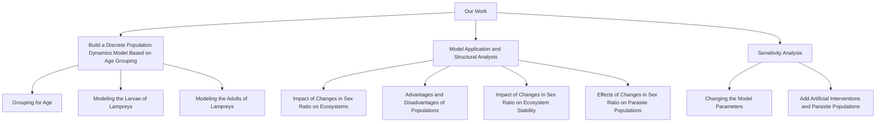
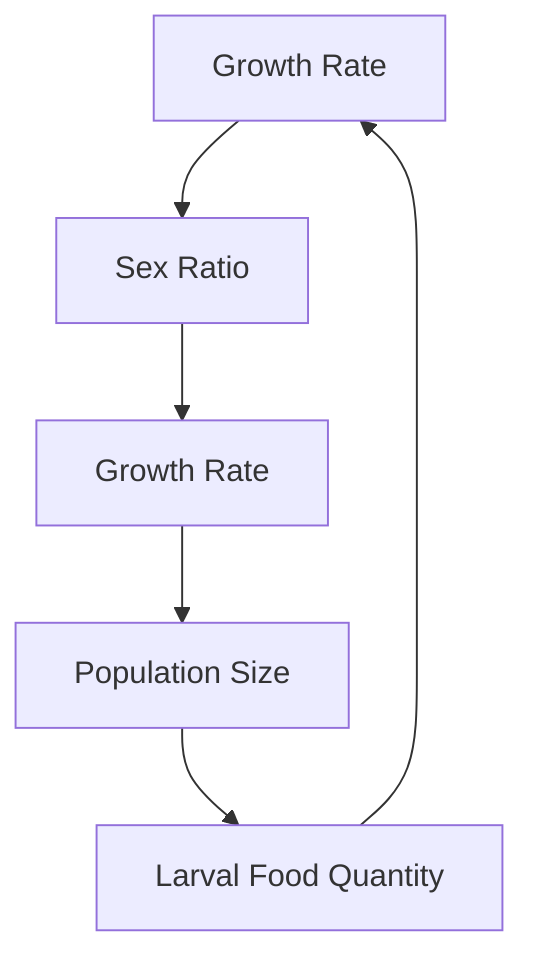
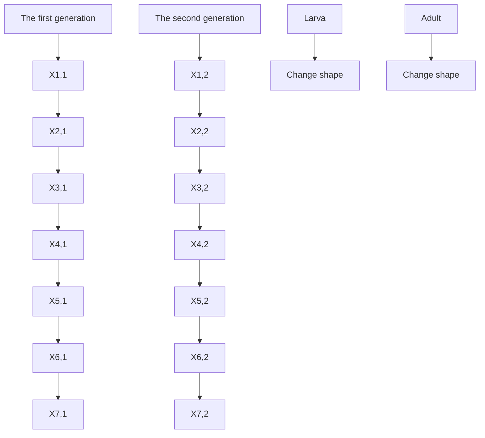
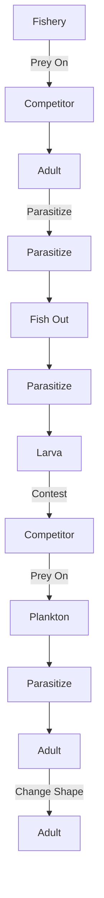

# Population analysis of lampreys: a discrete population dynamics model based on age grouping

## Abstract

In this paper, we model the ecosystem of lampreys and analyze the impacts of changes in the sex ratio of lampreys on populations and ecosystems.First, we establish a discrete population dynamics model with age groups. Based on the biological characteristics of lampreys, we divide the lampreys population into seven age groups, and consider the ecosystems in which they live as well as bait for larvae, competitors for larvae, bait for adults, competitors for adults, and artificial fisheries. The model takes into account the fact that the sex ratio varies according to the external environment.

For task 1, we focus on the effects of changes in the sex ratio of lampreys on the larger ecosystem. The results of the discrete population dynamics model reflect that the changeable sex ratio of lampreys is conducive to the stabilization of its population size, making it dominant in the ecosystem. Compared with the changes in population size before and after the invasion of lampreys in an ecosystem, we conclude that the variable sex ratio of lampreys as an invasive species is detrimental to the native population of the ecosystem, but at the same time, the larvae of lampreys can purify the water quality and promote nutrient cycling in the benthic environment.

For task 2, we apply our model by focusing on the advantages and disadvantages of the biological characteristics of variable sex ratio, metamorphosis, one-time reproduction and migration of lampreys for their own populations. Through the discrete population dynamics model to calculate the situation of changing environmental resources and sudden changes in the external environment, we obtain that the population of lampreys with metamorphic and variable sex ratio is more stable, and the population of lampreys with metamorphic is more capable of realizing the full use of environmental resources. By simulating the impacts of human influence on the migratory spawning process of lampreys and the drastic decrease in the number of spawners in a given year, we conclude that the migratory characteristics of lampreys and the disadvantages of one-time reproduction are that the migratory process may be dangerous, and that the larvae of lampreys are habitat-dependent, and that the low survival rate of a given generation puts the entire population at risk.

For task 3, we pay a close attention on the effects of the variable sex ratio of lampreys on ecosystem stability. We take the resistance stability, resilience stability and sustainability of the ecosystem as evaluation indexes. Numerical simulations of the discrete population dynamics model show that: the degree of ecosystem fluctuation is 23.28% and 33.19% respectively when the number of lampreys and plankton populations with variable sex ratios is abruptly changed, and the recovery time is 18 years and 28 years respectively. Compared with the numerical simulation results when the sex ratio of lampreys is not variable, the lampreys population with variable sex ratio makes the ecosystem have stronger resistance stability and recovery stability. The ecosystems in which the lampreys population with variable sex ratio are sustainable after the introduction of artificial interventions.

For task 4, we mainly analyze the effects of variable sex ratios of lampreys on other species with our model. We add parasite populations to a discrete population dynamics model, and the model results show that the variable sex ratio of lampreys favors other parasite organisms and populations.

In conclusion, the changes in the sex ratio of lampreys are beneficial to ensure the stability of their population numbers when facing harsh environments. This, in turn, contributes to the stability and sustainability of the larger ecosystem.

Keywords: Discrete Population Dynamics Modeling; Lampreys Sex Ratio; Lampreys Metamorphosis; Ecosystem Stability

## Contents

## 1 Introduction 3

1.1 Problem Background 3  
1.2 Restatement of the Problems 3  
1.3 Our Work . 4

## 2 Assumptions and Notations 4

2.1 Assumptions 4  
2.2 Notations 5

## 3 The Lampreys Ecosystem Model 5

3.1 Model Preparation: Age Grouping of the Lampreys Population . . 5

3.1.1 Age Profile of Lampreys and its Subgroups . . . 5  
3.1.2 Lampreys Ecosystem . . 6

3.2 Discrete Population Dynamics Model Based on Grouping with Age . . . 6

3.2.1 Ecosystem Modeling of Larval Populations in Lampreys . . 6  
3.2.2 Lampreys Ecosystem Modeling of Adult Populations . . 8  
3.2.3 External Artificial Intervention Model . 8

3.3 Model Overview 9

## 4 Task1: Impact on the Larger Ecological System 10

4.1 Analysis of Changes in Population Gender Ratio 10  
4.2 The Impact of the Ecosystem . . 12  
4.3 Result Analysis . 13

## 5 Task2: Advantages and Disadvantages of Populations 14

5.1 Advantages of Populations 14  
5.2 Disadvantages of Populations . . 16

## 6 Task3: Impact of Sex Ratio on Ecosystem Stability 17

6.1 Classification of Ecosystem Stability . . . 17  
6.2 Ecosystem Resistance Stability and Resilience Stability . . . 18  
6.3 Sustainability of Ecosystems 20  
6.4 Conclusion 21

## 7 Task4: Impact of Changing Sex Ratio on Other Species 21

7.1 Add Parasite Populations . . 21  
7.2 Model Solution and Result Analysis 21

## 8 Analysis on Model’s Sensitivity 23

8.1 Impact Analysis of Model Parameters 23  
8.2 Effects of Human Intervention and Parasite Populations on Models . . 23  
8.3 Conclusion 24

## 9 Strengths and Weaknesses 24

## References 25

## 1 Introduction

## 1.1 Problem Background

In nature, the sex ratio of different species is different. Most species have a sex ratio of 1:1, but the sex ratio of sea lampreys changes in response to changes in the external environment. We call this phenomenon of changing the sex ratio of a species to adapt to environmental demands adaptive sex ratio change.

Lampreys live mainly in coastal and freshwater areas in most temperate regions. Lampreys significantly impact ecosystems as parasites in several lake habitats, and as a member of the food chain, providing a source of food for areas such as Scandinavia, the Baltic Sea, and the Pacific Northwest of North America.

The rate of development of the larval stages of lampreys determines their sex ratio, and their growth rate is affected by food availability. When the food supply is insufficient, the population’s sex is dominated by males, with a proportion of about 78%; when the food supply is sufficient, the proportion of males is about 56%, and the proportion of males and females is almost equal.

pie chart

Low Food Availability
| Gender | Percentage (%) |
|---|---|
| Male | 78 |
| Female | 22 |

pie chart

High Food Availability
| Gender | Percentage (%) |
|---|---|
| Male | 56 |
| Female | 44 |

Figure 1: Sex Ratio of Lampreys in Different Environments

## 1.2 Restatement of the Problems

For the problem of sex ratios in lampreys and their dependence on local conditions, we develop plausible mathematical models that provide insights into the interactions that arise in ecosystems and answer the following questions:

• Analyze the effects on the ecosystems in which lampreys are found when their sex ratio is correlated with their population size.  
• Analyze and justify the strengths and weaknesses of the lampreys population with the model that has been developed accordingly.  
• Analyze the impact of the lampreys sex ratio on ecosystem stability, considering that it varies according to the external environment.  
• Explain whether lampreys can provide an advantage to other species in the ecosystem (e.g.

parasites) based on the specificity of the sex ratio of their populations

## 1.3 Our Work

flowchart

Figure 2: Our Work

## 2 Assumptions and Notations

## 2.1 Assumptions

• Assumption 1: We assume that all lampreys were bred in the seventh year and that the parents died at the end of the breeding.

Justification: The lampreys are one-time reproducing organisms and have a lifespan of seven years, so to make it easier to calculate the number of newborn hatchlings produced by the lampreys’ reproduction, we assume that all of them reproduce in their seventh year.

• Assumption 2: We assume that lampreys’ change of gender is accomplished the instant they enter their fifth year.

Justification: We have grouped lampreys by age in our model and calculated the population size of lampreys of each age in yearly intervals, so for easy calculation of the number, we consider the behavior of changing the sex of lampreys to be done instantaneously.

• Assumption 3: We assume that lampreys have no natural predators, i.e., we do not consider lampreys as bait but are mainly threatened by human activities.

Justification: Larval lampreys live in relatively secretive environments and are largely protected from regular predation, and adult lampreys are relatively less exposed to threats from natural enemies due to their size and habits. We therefore do not consider predator populations of lampreys, but instead add an artificial intervention term to model the impact of lampreys populations on human activities.

• Assumption 4: We assume that the parasite population of lampreys only parasitizes lampreys’ mature bodies.

Justification: Existing studies on parasites of lampreys show that more than 80% of parasites are found in lampreys’ mature body populations, and only 11% of parasites are present in lampreys’ juvenile populations, so to simplify the model we mainly consider the effect of parasites on lampreys mature body populations.

## 2.2 Notations

Table 1: Notations Description

<table><tr><td>Notations</td><td>Definition</td></tr><tr><td> $M_t$ </td><td>Proportion of females</td></tr><tr><td> $β_m$ </td><td>Natural mortality rate of larvae</td></tr><tr><td> $β_B$ </td><td>Natural mortality rate under bait deprivation</td></tr><tr><td>α</td><td>Reproduction coefficient</td></tr><tr><td> $r_x$ </td><td>Natural rate of growth</td></tr></table>

## 3 The Lampreys Ecosystem Model

## 3.1 Model Preparation: Age Grouping of the Lampreys Population

## 3.1.1 Age Profile of Lampreys and its Subgroups

According to the data collection [1], the lifespan of lampreys is 7 years, the first 4 years are larvae without sex difference, and they feed on plankton; in the 5th year, they start to change their morphology, and there are male and female, and the sex ratio is mainly affected by the food supply. Therefore, the amount of food during the larval period of lampreys can affect the sex ratio during the morphological change and thus the population size of lampreys, and the influence relationship is shown in Figure 3.

flowchart

Figure 3: Lampreys Intraspecific Influence Relationships

In this paper, we divide the age of the lampreys population into seven stages, each segment taken upwards as an integer (i.e., lampreys’ age starts at 1 year), as shown in Figure 4, where 1 - 4 years old lampreys are larvae with no sex differences, and 5-7 years old lampreys are adults with sex differences occurring.

flowchart

Figure 4: Lampreys Age Division

## 3.1.2 Lampreys Ecosystem

The larvae of lampreys mainly prey on zooplankton, while the mature bodies of lampreys parasitize fish. After considering artificial fishing we divide the ecosystem where lampreys are found into three parts, and their relationships include competition, parasitism, and so on. The ecosystem relationship diagram is shown in Figure 5.

flowchart

Figure 5: Lampreys Ecosystem Relationship Map

## 3.2 Discrete Population Dynamics Model Based on Grouping with Age

## 3.2.1 Ecosystem Modeling of Larval Populations in Lampreys

## 1).Larval Populations of Lampreys

According to our age grouping of lampreys and their lampreys species characteristics, larvae are unable to propagate. When there is no food bait in the environment, the natural mortality rate of larvae is

$$
\frac {X _ {i + 1 , t + 1} - X _ {i , t}}{X _ {i , t}} = - 1. \tag {1}
$$

The larvae will only partially die when food bait is present in the environment, at which point the mortality rate is

$$
\frac {X _ {i + 1 , t + 1} - X _ {i , t}}{X _ {i , t}} = - 1 + \frac {1 - \beta_ {m}}{K _ {x}} x _ {t}, \tag {2}
$$

where $x _ { t }$ is the population size of the larval feeder, $\beta _ { m }$ is the natural mortality rate of larvae when the feeder is sufficient, and $K _ { x }$ is the environmental holding capacity of $x _ { t }$ .Considering the population of competitors $B _ { t }$ that share the same food bait as the larvae and the competition between larvae at different ages, the natural growth rate of the larvae is

$$
\frac {X _ {i + 1 , t + 1} - X _ {i , t}}{X _ {i , t}} = - 1 + \frac {1 - \beta_ {m}}{K _ {x}} x _ {t} - \sum_ {i = 1} ^ {4} \tilde {k} _ {i} X _ {i, t} - k _ {t} B _ {t}, \tag {3}
$$

where $\tilde { k } _ { i }$ is the coefficient of mutual competition at different ages of larvae, $k _ { t }$ is the coefficient of competition of competitors.

According to our assumptions, lampreys only reproduce at age 7, so the number of newborn larvae in the larval population is

$$
X _ {1, t + 1} = \alpha M _ {t} X _ {7, t}. \tag {4}
$$

According to relevant studies, population abundance is positively correlated with the proportion of males in the population [2]

$$
M _ {t} = \frac {\varepsilon_ {1} + \varepsilon_ {2} \sum_ {j = 5} ^ {7} X _ {j , t}}{\varepsilon_ {3} + \varepsilon_ {4} \sum_ {j = 5} ^ {7} X _ {j , t}}, \tag {5}
$$

where α is the reproduction coefficient, $\varepsilon _ { i } ( i = 1 , 2 , 3 , 4 )$ is a nonlinear function parameter.

## 2).Lampreys Competitor Populations

The natural growth rate of competing populations of lampreys larvae in the absence of feeding bait is

$$
\frac {B _ {t + 1} - B _ {t}}{B _ {t}} = - \beta_ {B}. \tag {6}
$$

When feeding bait is present, its natural growth rate is

$$
\frac {B _ {t + 1} - B _ {t}}{B _ {t}} = - \beta_ {B} + \frac {\gamma_ {B} + \beta_ {B}}{K _ {x}} x _ {t}. \tag {7}
$$

When competition between species is considered, the above equation becomes

$$
\frac {B _ {t + 1} - B _ {t}}{B _ {t}} = - \beta_ {B} + \frac {\gamma_ {B} + \beta_ {B}}{K _ {x}} x _ {t} - \sum_ {i = 1} ^ {4} k _ {i} X _ {i, t} - \tilde {k} _ {t} B _ {t}, \tag {8}
$$

where $\beta _ { B }$ is the natural mortality rate under bait deprivation , $\gamma _ { B }$ is the natural growth rate under bait sufficiency, $k _ { i }$ is the coefficient of competition of lampreys larvae on this population, and $\tilde { k } _ { t }$ is the coefficient of intraspecific competition.

## 3).Lampreys Feeder Populations

For a feeder population, its population size conforms to Logistic growth when there are no predators on it:

$$
\frac {x _ {t + 1} - x _ {t}}{x _ {t}} = r _ {x} \left(1 - \frac {x _ {t}}{K _ {x}}\right). \tag {9}
$$

When considering the presence of its predators, then there is

$$
\frac {x _ {t + 1} - x _ {t}}{x _ {t}} = r _ {x} \left(1 - \frac {x _ {t}}{K _ {x}}\right) - \sum_ {i = 1} ^ {4} k _ {i} X _ {i, t} - k _ {t} B _ {t}, \tag {10}
$$

where $r _ { x }$ is the natural rate of growth when resources are sufficient.

## 3.2.2 Lampreys Ecosystem Modeling of Adult Populations

## 1).Lampreys Adult Population

The natural growth rate of lampreys as they change from larvae to adults can be expressed as

$$
\frac {X _ {5 , t + 1} - X _ {4 , t}}{X _ {4 , t}} = - 1 + \frac {1 - \beta_ {m}}{K _ {x}} x _ {t} - \sum_ {i = 1} ^ {4} \tilde {k} _ {i} X _ {i, t} - k _ {t} B _ {t}. \tag {11}
$$

Considering the actual situation, the natural growth rate in the presence of bait and competition is similar to the case of juveniles, and similarly we can obtain the relation

$$
\frac {X _ {j + 1 , t + 1} - X _ {j , t}}{X _ {j , t}} = - 1 + \frac {1 - \beta_ {n}}{K _ {y}} y _ {t} - \sum_ {j = 5} ^ {7} \tilde {k} _ {j} X _ {j, t} - k _ {L} C _ {t}, \tag {12}
$$

where $y _ { t }$ is the number of feeder populations of lampreys adults, $C _ { t }$ is the number of competitor populations of lampreys adults, $\beta _ { m }$ is the natural mortality rate when there is sufficient feeders, $k _ { j }$ is the coefficient of intraspecies competition, and $k _ { L }$ is the coefficient of competitor competition for adults.

## 2).Lampreys Competitor Populations

Adults develop from larvae and are similar to larval populations, which shows the relationship between changes in the population size of adult competitors

$$
\frac {C _ {t + 1} - C _ {t}}{C _ {t}} = - \omega_ {y} + \frac {\eta_ {y} + \omega_ {y}}{K _ {y}} y _ {t} - \sum_ {j = 5} ^ {7} k _ {j} X _ {j, t} - \tilde {k} _ {L} C _ {t}. \tag {13}
$$

Relationships between changes in population sizes of feeders

$$
\frac {y _ {t + 1} - y _ {t}}{y _ {t}} = r _ {y} \left(1 - \frac {y _ {t}}{K _ {y}}\right) - \sum_ {j = 5} ^ {7} k _ {j} X _ {j, t} - k _ {L} C _ {t}, \tag {14}
$$

where $k _ { y }$ is the environmental holding capacity of the feeder population $y _ { t }$ .

## 3.2.3 External Artificial Intervention Model

Considering the long-term pressure of artificial intervention on the population of lampreys, assuming an annual intervention intensity of F, then for Equations (3), (11) and (17), there are

$$
\left\{ \begin{array}{l} \frac {X _ {i + 1 , t + 1} - X _ {i , t}}{X _ {i , t}} = - 1 + \frac {1 - \beta_ {m}}{K _ {x}} x _ {t} - \sum_ {i = 1} ^ {4} \tilde {k} _ {i} X _ {i, t} - k _ {t} B _ {t} - F (i = 1, 2, 3), \\ \frac {X _ {5 , t + 1} - X _ {4 , t}}{X _ {4 , t}} = - 1 + \frac {1 - \beta_ {m}}{K _ {x}} x _ {t} - \sum_ {i = 1} ^ {4} \tilde {k} _ {i} X _ {i, t} - k _ {t} B _ {t} - F, \\ \frac {X _ {j + 1 , t + 1} - X _ {j , t}}{X _ {j , t}} = - 1 + \frac {1 - \beta_ {n}}{K _ {y}} y _ {t} - \sum_ {j = 5} ^ {7} \tilde {k} _ {j} X _ {j, t} - k _ {L} C _ {t} - F (j = 5, 6). \end{array} \right. \tag {15}
$$

This better represents the natural growth rate of juvenile and mature populations of lampreys.

## 3.3 Model Overview

In summary, if the number of larva and adult populations is represented as $X _ { i } ( i = 1 , 2 , 3 , 4 )$ and $X _ { j } ( j = 5 , 6 , 7 )$ , respectively, with bait quantities of $x _ { t }$ and $y _ { t } ,$ and competitors of $B _ { t }$ and $C _ { t } .$ then the number of newborn larva is

$$
X _ {1, t + 1} = \alpha M _ {t} X _ {7, t},
$$

where $\alpha$ represents the reproductive coefficient, $M _ { t }$ represents the proportion of females, and the proportion of females is

$$
M _ {t} = \frac {\varepsilon_ {1} + \varepsilon_ {2} \sum_ {j = 5} ^ {7} X _ {j , t}}{\varepsilon_ {3} + \varepsilon_ {4} \sum_ {j = 5} ^ {7} X _ {j , t}}.
$$

When considering human intervention (i.e. $F \neq 0 )$ , the relationship between population size changes is shown in Tables 2 and $^ { 3 , }$ where $\tilde { k } _ { i } , \tilde { k } _ { j } , \tilde { k } _ { t }$ and $\tilde { k } _ { L }$ are intra species competition coefficients.

Table 2: Adult: Population Quantity Variation Relationship

<table><tr><td>Names</td><td>Changing Relationships</td></tr><tr><td rowspan="2">Adult</td><td> $\frac{X_{5,t+1} - X_{4,t}}{X_{4,t}} = -1 + \frac{1 - \beta_m}{K_x} x_t - \sum_{i=1}^{4} \tilde{k}_i X_{i,t} - k_t B_t - F$ </td></tr><tr><td> $\frac{X_{j+1,t+1} - X_{j,t}}{X_{j,t}} = -1 + \frac{1 - \beta_n}{K_y} y_t - \sum_{j=5}^{7} \tilde{k}_j X_{j,t} - k_L C_t - F$ </td></tr><tr><td>Competitor</td><td> $\frac{C_{t+1} - C_t}{C_t} = -\omega_y + \frac{\eta_y + \omega_y}{K_y} y_t - \sum_{j=5}^{7} k_j X_{j,t} - \tilde{k}_L C_t$ </td></tr><tr><td>Prey</td><td> $\frac{y_{t+1} - y_t}{y_t} = r_y \left( 1 - \frac{y_t}{K_y} \right) - \sum_{j=5}^{7} k_j X_{j,t} - k_L C_t$ </td></tr></table>

Table 3: Larva: Population Quantity Variation Relationship

<table><tr><td>Names</td><td>Changing Relationships</td></tr><tr><td>Larva</td><td> $\frac{X_{i+1,t+1} - X_{i,t}}{X_{i,t}} = -1 + \frac{1 - \beta_m}{K_x} x_t - \sum_{i=1}^{4} \tilde{k}_i X_{i,t} - k_t B_t - F$ </td></tr><tr><td>Competitor</td><td> $\frac{B_{t+1} - B_t}{B_t} = -\beta_B + \frac{\gamma_B + \beta_B}{K_x} x_t - \sum_{i=1}^{4} k_i X_{i,t} - \tilde{k}_t B_t$ </td></tr><tr><td>Prey</td><td> $\frac{x_{t+1} - x_t}{x_t} = r_x \left( 1 - \frac{x_t}{K_x} \right) - \sum_{i=1}^{4} k_i X_{i,t} - k_t B_t$ </td></tr></table>

## 4 Task1: Impact on the Larger Ecological System

## 4.1 Analysis of Changes in Population Gender Ratio

According to the previous lampreys ecosystem model based on age grouping we can draw as shown in Figure 6 and its initial values are set as shown in Table 4.

line chart

| Time | Lampreys | Competitor of the young | Plankton | Competitor of the mature | Fish |
|------|----------|--------------------------|----------|---------------------------|------|
| 0    | 1.8      | 1.0                      | 1.0      | 1.0                       | 1.0  |
| 10   | 2.15     | 0.65                     | 0.7      | 0.85                      | 0.9  |
| 20   | 1.3      | 0.6                      | 0.8      | 0.85                      | 0.9  |
| 30   | 1.35     | 0.6                      | 0.8      | 0.85                      | 0.9  |
| 40   | 1.3      | 0.6                      | 0.8      | 0.85                      | 0.9  |
| 50   | 1.35     | 0.6                      | 0.8      | 0.85                      | 0.9  |
| 60   | 1.3      | 0.6                      | 0.8      | 0.85                      | 0.9  |
| 70   | 1.35     | 0.6                      | 0.8      | 0.85                      | 0.9  |
| 80   | 1.3      | 0.6                      | 0.8      | 0.85                      | 0.9  |
| 90   | 1.35     | 0.6                      | 0.8      | 0.85                      | 0.9  |
| 100  | 1.3      | 0.6                      | 0.8      | 0.85                      | 0.9  |
| 110  | 1.35     | 0.6                      | 0.8      | 0.85                      | 0.9  |
| 120  | 1.3      | 0.6                      | 0.8      | 0.85                      | 0.9  |

(a) Lampreys Overall

line chart

| Time | Lampreys larva | Lampreys mature | Competitor of the young | Plankton | Competitor of the mature | Fish |
|------|----------------|-----------------|--------------------------|----------|---------------------------|------|
| 0    | 1.3            | 0.4             | 1.0                      | 1.0      | 1.0                       | 1.0  |
| 10   | 1.6            | 0.3             | 0.7                      | 0.8      | 0.9                       | 0.9  |
| 20   | 1.0            | 0.3             | 0.6                      | 0.8      | 0.9                       | 0.9  |
| 30   | 1.1            | 0.3             | 0.6                      | 0.8      | 0.9                       | 0.9  |
| 40   | 1.1            | 0.3             | 0.6                      | 0.8      | 0.9                       | 0.9  |
| 50   | 1.1            | 0.3             | 0.6                      | 0.8      | 0.9                       | 0.9  |
| 60   | 1.1            | 0.3             | 0.6                      | 0.8      | 0.9                       | 0.9  |
| 70   | 1.1            | 0.3             | 0.6                      | 0.8      | 0.9                       | 0.9  |
| 80   | 1.1            | 0.3             | 0.6                      | 0.8      | 0.9                       | 0.9  |
| 90   | 1.1            | 0.3             | 0.6                      | 0.8      | 0.9                       | 0.9  |
| 100  | 1.1            | 0.3             | 0.6                      | 0.8      | 0.9                       | 0.9  |

(b) Lampreys Larvae and Adults  
Figure 6: Changes in the Populations of Individual Species in the Lampreys Ecosystem

Table 4: Model Initial Parameter Values

<table><tr><td>Type</td><td colspan="8">Parameter Symbols and Numerical Values</td></tr><tr><td>Symbol</td><td> $X_{1,1}$ </td><td> $X_{2,1}$ </td><td> $X_{3,1}$ </td><td> $X_{4,1}$ </td><td> $X_{5,1}$ </td><td> $X_{6,1}$ </td><td> $X_{7,1}$ </td><td> $B_1$ </td></tr><tr><td>Value</td><td>0.4</td><td>0.35</td><td>0.3</td><td>0.25</td><td>0.2</td><td>0.15</td><td>0.1</td><td>1</td></tr><tr><td>Symbol</td><td> $x_1$ </td><td> $y_t$ </td><td> $C_1$ </td><td> $M_1$ </td><td>T</td><td>α</td><td> $β_m$ </td><td> $k_x$ </td></tr><tr><td>Value</td><td>1</td><td>1</td><td>1</td><td>0.3</td><td>100</td><td>12</td><td>0.01</td><td>1</td></tr><tr><td>Symbol</td><td> $\tilde{k}_i$ </td><td> $k_i$ </td><td> $\tilde{k}_t$ </td><td> $k_t$ </td><td> $β_B$ </td><td> $γ_y$ </td><td> $r_x$ </td><td> $β_n$ </td></tr><tr><td>Value</td><td>0.001</td><td>0.1</td><td>0.001</td><td>0.01</td><td>0.1</td><td>0.1499</td><td>0.5</td><td>0.01</td></tr><tr><td>Symbol</td><td> $k_y$ </td><td> $\tilde{k}_j$ </td><td> $k_j$ </td><td> $\tilde{k}_L$ </td><td> $k_L$ </td><td> $ω_y$ </td><td> $η_y$ </td><td> $r_y$ </td></tr><tr><td>Value</td><td>1</td><td>0.001</td><td>0.1</td><td>0.001</td><td>0.01</td><td>0.1</td><td>0.0471</td><td>0.5</td></tr></table>

After the system reached stability, according to Figure 6(a), we obtain that the population size of lampreys forms a fluctuation with a period of 7 years within a range of 4%. And Figure 6(b) presents the changes in the population size of lampreys larvae and adults, which also fluctuated over a period of 7 years. Therefore we smooth the data and transform it by the following equation

$$
\Delta_ {i, t} = \frac {1}{7} \sum_ {\tau = - 3} ^ {3} \Delta_ {i, t + \tau}, \tag {16}
$$

where $\varDelta _ { i , t }$ denotes the number of various populations, from which the smoothed curve can be obtained, as shown in Figure 7.

line chart

| Time | Lampreys | Competitor of the larvae | Plankton | Competitor of the mature | Fish |
|------|----------|--------------------------|----------|--------------------------|------|
| 0    | 1.75     | 1.0                      | 1.0      | 1.0                      | 1.0  |
| 10   | 2.1      | 0.65                     | 0.75     | 0.9                      | 0.95 |
| 20   | 1.25     | 0.65                     | 0.8      | 0.9                      | 0.95 |
| 30   | 1.3      | 0.65                     | 0.8      | 0.9                      | 0.95 |
| 40   | 1.3      | 0.65                     | 0.8      | 0.9                      | 0.95 |
| 50   | 1.3      | 0.65                     | 0.8      | 0.9                      | 0.95 |
| 60   | 1.3      | 0.65                     | 0.8      | 0.9                      | 0.95 |
| 70   | 1.3      | 0.65                     | 0.8      | 0.9                      | 0.95 |
| 80   | 1.3      | 0.65                     | 0.8      | 0.9                      | 0.95 |
| 90   | 1.3      | 0.65                     | 0.8      | 0.9                      | 0.95 |
| 100  | 1.3      | 0.65                     | 0.8      | 0.9                      | 0.95 |

(a) Lampreys Overall

line chart

| Time | Lampreys larvae | Lampreys mature | Competitor of the larvae | Plankton | Competitor of the mature | Fish |
|------|-----------------|-----------------|--------------------------|----------|--------------------------|------|
| 0    | 1.3             | 0.4             | 1.0                      | 1.0      | 1.0                      | 1.0  |
| 10   | 1.5             | 0.3             | 0.7                      | 0.7      | 0.9                      | 0.9  |
| 20   | 0.9             | 0.3             | 0.6                      | 0.8      | 0.9                      | 0.9  |
| 30   | 0.95            | 0.3             | 0.6                      | 0.8      | 0.9                      | 0.9  |
| 40   | 0.95            | 0.3             | 0.6                      | 0.8      | 0.9                      | 0.9  |
| 50   | 0.95            | 0.3             | 0.6                      | 0.8      | 0.9                      | 0.9  |
| 60   | 0.95            | 0.3             | 0.6                      | 0.8      | 0.9                      | 0.9  |
| 70   | 0.95            | 0.3             | 0.6                      | 0.8      | 0.9                      | 0.9  |
| 80   | 0.95            | 0.3             | 0.6                      | 0.8      | 0.9                      | 0.9  |
| 90   | 0.95            | 0.3             | 0.6                      | 0.8      | 0.9                      | 0.9  |
| 100  | 0.95            | 0.3             | 0.6                      | 0.8      | 0.9                      | 0.9  |
| 110  | 0.95            | 0.3             | 0.6                      | 0.8      | 0.9                      | 0.9  |
| 120  | 0.95            | 0.3             | 0.6                      | 0.8      | 0.9                      | 0.9  |

(b) Lampreys Larvae and Adults  
Figure 7: Variable Sex Ratio ( Smoothing Figure 6)

We can see from Figure 7 that the ecosystem reaches equilibrium in year 24, with more lampreys larvae populations than mature ones. This is due to the fact that lampreys adults spawn much more than the number of parents that die during the same period. In addition, lamprey larvae diminish in number as they grow, and the number that become adult will be much less than their spawning capacity. Because there are so many lampreys larvae, they are at an advantage when competing with their competitors. On the other hand, lamprey adults are fewer in number, which puts them at a disadvantage in the competition.

Assuming that the proportion of males and females is fixed and that the proportions are 50% each, we plot the image shown in Figure 8 when all other conditions are the same as in Figure 7. Compared with the case where the sex of lampreys is variable, in the case where the sex is constant, the population of lampreys will be larger but the number of its feeder population will decrease, which will lead to a smaller amount of environmental resources allocated to each individual lampreys and a decrease in the quality of life of the population. In addition, a constant sex ratio of lampreys will lead to a decrease in the number of other organisms in the ecosystem or even extinction, which is detrimental to the diversity of the ecosystem.

line chart

| Time | Lampreys larvae | Lampreys mature | Competitor of the larvae | Plankton | Competitor of the mature | Fish |
|------|-----------------|-----------------|--------------------------|----------|--------------------------|------|
| 0    | 1.3             | 0.5             | 1.0                      | 1.0      | 1.0                      | 1.0  |
| 10   | 2.2             | 0.3             | 0.8                      | 0.6      | 0.9                      | 0.9  |
| 20   | 1.2             | 0.4             | 0.7                      | 0.7      | 0.9                      | 0.9  |
| 30   | 1.6             | 0.4             | 0.6                      | 0.7      | 0.8                      | 0.9  |
| 40   | 1.6             | 0.4             | 0.6                      | 0.7      | 0.8                      | 0.9  |
| 50   | 1.6             | 0.4             | 0.6                      | 0.7      | 0.8                      | 0.9  |
| 60   | 1.6             | 0.4             | 0.6                      | 0.7      | 0.8                      | 0.9  |
| 70   | 1.6             | 0.4             | 0.6                      | 0.7      | 0.8                      | 0.9  |
| 80   | 1.6             | 0.4             | 0.6                      | 0.7      | 0.8                      | 0.9  |
| 90   | 1.6             | 0.4             | 0.6                      | 0.7      | 0.8                      | 0.9  |
| 100  | 1.6             | 0.4             | 0.6                      | 0.7      | 0.8                      | 0.9  |
| 110  | 1.6             | 0.4             | 0.6                      | 0.7      | 0.8                      | 0.9  |
| 120  | 1.6             | 0.4             | 0.6                      | 0.7      | 0.8                      | 0.9  |

(a) Lampreys Overall

line chart

| Time | Lampreys | Competitor of the larvae | Plankton | Competitor of the mature | Fish |
|------|----------|--------------------------|----------|--------------------------|------|
| 0    | 1.8      | 1.0                      | 1.0      | 1.0                      | 1.0  |
| 10   | 2.7      | 0.3                      | 0.6      | 0.9                      | 0.9  |
| 20   | 1.5      | 0.1                      | 0.7      | 0.9                      | 0.9  |
| 30   | 2.0      | 0.0                      | 0.7      | 0.8                      | 0.9  |
| 40   | 1.9      | 0.0                      | 0.7      | 0.8                      | 0.9  |
| 50   | 1.9      | 0.0                      | 0.7      | 0.7                      | 0.9  |
| 60   | 1.9      | 0.0                      | 0.7      | 0.7                      | 0.9  |
| 70   | 1.9      | 0.0                      | 0.7      | 0.7                      | 0.9  |
| 80   | 1.9      | 0.0                      | 0.7      | 0.7                      | 0.9  |
| 90   | 1.9      | 0.0                      | 0.7      | 0.7                      | 0.9  |
| 100  | 1.9      | 0.0                      | 0.7      | 0.7                      | 0.9  |

(b) Lampreys Larvae and Adults  
Figure 8: Constant Sex Ratio

## 4.2 The Impact of the Ecosystem

## 1).Harming Native Populations in Ecosystems as Invasive Species

To simulate the invasion of lampreys into the Great Lakes as an exotic species, we first create an ecosystem without lampreys as shown in Figure 9(a). Before lampreys invade the system in Figure 9(a), the various populations of the system are in a stable state. If lampreys invade from the state of the current stable ecosystem, the image shown in Figure 9(b) can be obtained, where the stable value of the number of various populations in Figure 9(a) is used as the initial value of the number of various populations in Figure 9(b).

line chart

| Time | Competitor of the larvae | Plankton | Competitor of the mature | Fish |
|------|--------------------------|----------|--------------------------|------|
| 0    | 1.0                      | 1.0      | 1.0                      | 1.0  |
| 20   | 1.38                     | 0.98     | 1.25                     | 0.99 |
| 40   | 1.4                      | 0.97     | 1.35                     | 0.98 |
| 60   | 1.4                      | 0.97     | 1.38                     | 0.98 |
| 80   | 1.4                      | 0.97     | 1.38                     | 0.98 |
| 100  | 1.4                      | 0.97     | 1.38                     | 0.98 |

(a) Before Invasion

line chart

| Time | Lampreys | Competitor of the larvae | Plankton | Competitor of the mature | Fish |
|------|----------|--------------------------|----------|--------------------------|------|
| 0    | 0.7      | 1.4                      | 0.9      | 1.4                      | 0.9  |
| 20   | 1.3      | 0.6                      | 0.8      | 0.7                      | 0.9  |
| 40   | 1.4      | 0.3                      | 0.8      | 0.5                      | 0.9  |
| 60   | 1.45     | 0.15                     | 0.8      | 0.35                     | 0.9  |
| 80   | 1.45     | 0.05                     | 0.8      | 0.25                     | 0.9  |
| 100  | 1.45     | 0.0                      | 0.8      | 0.15                     | 0.9  |

(b) After Invasion  
Figure 9: Number of Populations Before and After Biological Invasion by Lampreys

After invading the ecosystem, the lampreys have no natural enemies, so they can reproduce in large numbers in a short period and eventually stabilize the population due to the amount of environmental resources. During this process, the native population declines significantly, which may even lead to the extinction of a population. Taking the invasion of lampreys into the Great Lakes of North America as an example, the changes in fish population size are similar to those in Figure 9(b). The substantial decline during the invasion of lampreys caused great losses to the local fishery economy [3].

## 2).Purifying Water Quality

From the trend of the curve in Figure 7(a), we can find that the number of lampreys larvae accounted for a significantly larger proportion of the total, and a large number of lampreys larvae feed on the microorganisms and plankton in the aquatic environment, which can play a role in purifying the water quality [4][5].

## 3).Impacting the Benthic Ecosystem

The larvae of lampreys live on the bottoms of freshwater rivers and streams, where they feed mainly on filter-feeding organic debris and microorganisms. They construct habitats by excavating sediments [6], an activity that increases the oxidation of bottom sediments and promotes nutrient cycling in the benthic environment.

## 4.3 Result Analysis

We validate Eqation (5), all of which are shown in Figure 10 as unsmoothed data.

line chart

| Time | Lampreys mature | Lamprey sex ratio |
|------|-----------------|-------------------|
| 0    | 0.45            | 0.292             |
| 10   | 0.35            | 0.284             |
| 20   | 0.30            | 0.286             |
| 30   | 0.35            | 0.284             |
| 40   | 0.30            | 0.286             |
| 50   | 0.35            | 0.284             |
| 60   | 0.30            | 0.286             |
| 70   | 0.35            | 0.284             |
| 80   | 0.30            | 0.286             |
| 90   | 0.35            | 0.284             |
| 100  | 0.30            | 0.286             |

(a) Percentage of Females and Population of Adults

line chart

| Time | Plankton | Fish  | Lamprey sex ratio |
|------|----------|-------|-------------------|
| 0    | 1.0      | 1.0   | 0.292             |
| 10   | 0.65     | 0.87  | 0.284             |
| 20   | 0.82     | 0.92  | 0.286             |
| 30   | 0.80     | 0.91  | 0.285             |
| 40   | 0.81     | 0.91  | 0.286             |
| 50   | 0.80     | 0.91  | 0.285             |
| 60   | 0.81     | 0.91  | 0.286             |
| 70   | 0.80     | 0.91  | 0.285             |
| 80   | 0.81     | 0.91  | 0.286             |
| 90   | 0.80     | 0.91  | 0.285             |
| 100  | 0.81     | 0.91  | 0.286             |

(b) Percentage of Females and Environment sources  
Figure 10: Validation of the Plausibility of the Female Percentage

From Figure 10(a), we can see that the female proportion of lampreys is negatively correlated with the number of mature body population, and the female proportion of lampreys decreases when the number of mature body population rises, which is the same as the study in literature [2]. From Figure 10(b), we can see that the sex ratio of lampreys has the same trend with the amount of environmental resources, the female ratio of lampreys increases when the amount of environmental resources increases, and the female ratio of lampreys decreases when the amount of resources decreases, which is in line with the description of problem background. This shows that our description of the way the sex ratio of the lampreys population changes is reasonable.

Since we smooth the fluctuating data, this needs to be validated for plausibility.

line chart

| Plankton | Lampreys larva |
| -------- | -------------- |
| 0.7920   | 0.973          |
| 0.7921   | 0.974          |
| 0.7922   | 0.975          |
| 0.7923   | 0.976          |
| 0.7924   | 0.975          |
| 0.7925   | 0.974          |
| 0.7926   | 0.973          |

(a) Larvae of Lampreys on Track with Plankton

line chart

| Fish    | Lampreys mature |
| ------- | --------------- |
| 0.9151  | 0.336           |
| 0.91515 | 0.337           |
| 0.9152  | 0.336           |
| 0.91525 | 0.335           |
| 0.9153  | 0.336           |
| 0.91535 | 0.336           |

(b) Adultes of Lampreys on Track with Plankton  
Figure 11: Smoothing Process Rationalization Verification

The closed-loop curves in Figure 11 show that the population sizes of lampreys larvae and plankton, lampreys maturity, and fish all fluctuate periodically, reflecting the fact that the system is stable, so it is reasonable for us to take a 7-year average of the raw data.

## 5 Task2: Advantages and Disadvantages of Populations

## 5.1 Advantages of Populations

## 1).The Advantages of Metamorphosis: Resistant to Harsh Environments

In order to simulate changes in the environment, we vary the amount of bait available to the lampreys population, as well as varying the growth rates of plankton and fish, and the environmental holding capacity.

area chart

| Time | Competitor of the larvae | Plankton | Lampreys larvae |
| ---- | ------------------------ | -------- | --------------- |
| 1    | 0.0                      | 0.0      | 1.0             |
| 6    | 0.0                      | 0.0      | 1.4             |
| 11   | 0.0                      | 0.0      | 0.8             |
| 16   | 0.0                      | 0.2      | 0.7             |
| 21   | 0.0                      | 0.2      | 0.7             |
| 26   | 0.0                      | 0.2      | 0.7             |
| 31   | 0.0                      | 0.2      | 0.7             |
| 36   | 0.0                      | 0.2      | 0.7             |
| 41   | 0.0                      | 0.2      | 0.7             |
| 46   | 0.0                      | 0.2      | 0.7             |
| 51   | 0.0                      | 0.2      | 0.7             |
| 56   | 0.0                      | 0.2      | 0.7             |
| 61   | 0.0                      | 0.2      | 0.7             |
| 66   | 0.0                      | 0.2      | 0.7             |
| 71   | 0.0                      | 0.2      | 0.7             |
| 76   | 0.9                      | 0.2      | 0.5             |

(a) The Decrease in Environmental Resources

area chart

| Time | Lampreys larvae | Plankton | Competitor of the larvae |
|---|---|---|---|
| 1 | 0.8 | 0.2 | 0.9 |
| 7 | 1.5 | 0.3 | 0.6 |
| 13 | 1.1 | 0.4 | 0.5 |
| 19 | 1.1 | 0.5 | 0.4 |
| 25 | 1.1 | 0.5 | 0.4 |
| 31 | 1.1 | 0.5 | 0.4 |
| 37 | 1.1 | 0.5 | 0.4 |
| 43 | 1.1 | 0.5 | 0.4 |
| 49 | 1.1 | 0.5 | 0.3 |
| 55 | 1.1 | 0.5 | 0.3 |
| 61 | 1.1 | 0.5 | 0.25 |
| 67 | 1.1 | 0.5 | 0.2 |
| 73 | 1.1 | 0.5 | 0.15 |
| 79 | 1.1 | 0.5 | 0.1 |
| 84 | 1.1 | 0.5 | 0.08 |
| 90 | 1.1 | 0.5 | 0.06 |
| 96 | 1.1 | 0.5 | 0.04 |
| 102 | 1.1 | 0.5 | 0.02 |
| 108 | 1.1 | 0.5 | 0.01 |
The chart displays a stacked area chart with three distinct layers representing different larval species over time (Time). The y-axis is labeled 'Cycle-averaged population size'. The x-axis is labeled 'Time'. The legend indicates that the layer labels are 'Lampreys larvae', 'Plankton', and 'Competitor of the larvae'. The data points are annotated with the respective values at each time point.

(b) The Increase in Environmental Resources  
Figure 12: Changes in the Amount of Environmental Resources on the Larvae of Lampreys

area chart

| Time | Fish | Competitor of the mature | Lampreys mature |
| ---- | ---- | ------------------------ | --------------- |
| 1    | 0.45 | 0.95                     | 0.65            |
| 7    | 0.45 | 0.85                     | 0.50            |
| 13   | 0.45 | 0.80                     | 0.30            |
| 19   | 0.45 | 0.80                     | 0.32            |
| 25   | 0.45 | 0.80                     | 0.32            |
| 31   | 0.45 | 0.80                     | 0.32            |
| 37   | 0.45 | 0.80                     | 0.32            |
| 43   | 0.45 | 0.80                     | 0.32            |
| 49   | 0.45 | 0.80                     | 0.32            |
| 55   | 0.45 | 0.80                     | 0.32            |
| 61   | 0.45 | 0.80                     | 0.32            |
| 67   | 0.45 | 0.80                     | 0.32            |
| 73   | 0.45 | 0.80                     | 0.32            |
| 79   | 0.45 | 0.80                     | 0.32            |
| 85   | 0.45 | 0.80                     | 0.32            |
| 91   | 0.45 | 0.80                     | 0.32            |
| 97   | 0.45 | 0.80                     | 0.32            |

(a) The Decrease in Environmental Resources

area chart

| Time | Competitor of the mature | Fish | Lampreys mature |
| ---- | ------------------------ | ---- | --------------- |
| 1    | 1.0                      | 0.8  | 0.6             |
| 7    | 0.9                      | 0.8  | 0.4             |
| 13   | 0.8                      | 0.8  | 0.3             |
| 19   | 0.7                      | 0.8  | 0.3             |
| 25   | 0.6                      | 0.8  | 0.3             |
| 31   | 0.5                      | 0.8  | 0.3             |
| 37   | 0.4                      | 0.8  | 0.3             |
| 43   | 0.3                      | 0.8  | 0.3             |
| 49   | 0.2                      | 0.8  | 0.3             |
| 55   | 0.1                      | 0.8  | 0.3             |
| 61   | 0.0                      | 0.8  | 0.3             |
| 67   | 0.0                      | 0.8  | 0.3             |
| 73   | 0.0                      | 0.8  | 0.3             |
| 79   | 0.0                      | 0.8  | 0.3             |
| 85   | 0.0                      | 0.8  | 0.3             |
| 91   | 0.0                      | 0.8  | 0.3             |
| 97   | 0.0                      | 0.8  | 0.3             |

(b) The Increase in Environmental Resources  
Figure 13: Changes in the Amount of Environmental Resources on the Adults of Lampreys

We reduce the amount of environmental resources and draw the larvae and adults of lampreys with their feeding bait and competitors in Figures 12(a) and 13(a), respectively. We then increase the amount of environmental resources and draw Figures 12(b) and 13(b), respectively.

Based on Figure 12(a) and Figure 12(b), we can see that lampreys larvae are more affected by changes in the amount of environmental resources, and the larval population continues to decline after the decline in the amount of food bait, and may even become extinct. In contrast, Figure 13 shows that lampreys mature individuals will have a decline in population size after the decrease in the amount of food bait but will eventually reach a relatively stable state. Therefore, metamorphosis of lampreys can improve their resistance to harsh environments, so lampreys can effectively improve the adaptive ability of the population through metamorphosis, which ensures the normal reproduction of the population.

Both adult and larval populations are consistently increasing after a rise in the number of baits, thus suggesting that lampreys are more competitive and more likely to reproduce in food-rich environments.

## 2).The Advantages of Metamorphosis: Making Full Use of Environmental Resources

To investigate the effect of whether or not they can metamorphose on lampreys populations, we assume lampreys larvae not to metamorphose into adults, create an ecological model with only lampreys larvae, larval competitors, and plankton to obtain Figure 14(a), and then compare the number of lampreys in the two ecological models of whether or not they can metamorphose with the number of plankton to obtain Figure 14(b).

Compared with Figure 14(a) and Figure 14(b), we conclude that the population size of lampreys without sex change is smaller than that with sex change, indicating that the sex change of lampreys is favorable to population reproduction. We analyze the reason for this is that lampreys have different feeding bait before and after the change of sexual state, which effectively reduces the intraspecific competition and realizes the full utilization of environmental resources.

stacked bar chart

| Time | Lampreys | Lamprey without sex change | Plankton in Lamprey without sex change | Plankton |
|---|---|---|---|---|
| 1 | 0.9 | 0.8 | 0.2 | 0.7 |
| 7 | 1.9 | 1.5 | 0.3 | 0.6 |
| 13 | 0.4 | 0.2 | 0.2 | 0.8 |
| 19 | 0.5 | 0.2 | 0.2 | 0.8 |
| 25 | 0.6 | 0.2 | 0.2 | 0.8 |
| 31 | 0.6 | 0.2 | 0.2 | 0.8 |
| 37 | 0.6 | 0.2 | 0.2 | 0.8 |
| 43 | 0.6 | 0.2 | 0.2 | 0.8 |
| 49 | 0.6 | 0.2 | 0.2 | 0.8 |
| 55 | 0.6 | 0.2 | 0.2 | 0.8 |
| 61 | 0.6 | 0.2 | 0.2 | 0.8 |
| 67 | 0.6 | 0.2 | 0.2 | 0.8 |
| 73 | 0.6 | 0.2 | 0.2 | 0.8 |
| 79 | 0.6 | 0.2 | 0.2 | 0.8 |
| 85 | 0.6 | 0.2 | 0.2 | 0.8 |
| 91 | 0.6 | 0.2 | 0.2 | 0.8 |
| 97 | 0.6 | 0.2 | 0.2 | 0.8 |

(a) No Sex Change

area chart

| Time | Lampreys | Plankton | Competitor of the larvae |
| ---- | -------- | -------- | ------------------------ |
| 1    | 2.1      | 0.0      | 1.0                      |
| 7    | 1.8      | 0.0      | 0.8                      |
| 13   | 0.8      | 0.6      | 0.6                      |
| 19   | 0.6      | 0.6      | 0.6                      |
| 25   | 0.6      | 0.6      | 0.6                      |
| 31   | 0.6      | 0.6      | 0.6                      |
| 37   | 0.6      | 0.6      | 0.6                      |
| 43   | 0.6      | 0.6      | 0.6                      |
| 49   | 0.6      | 0.6      | 0.6                      |
| 55   | 0.6      | 0.6      | 0.6                      |
| 61   | 0.6      | 0.6      | 0.6                      |
| 67   | 0.6      | 0.6      | 0.6                      |
| 73   | 0.6      | 0.6      | 0.6                      |
| 79   | 0.6      | 0.6      | 0.6                      |
| 85   | 0.6      | 0.6      | 0.6                      |
| 91   | 0.6      | 0.6      | 0.6                      |
| 97   | 0.6      | 0.6      | 0.6                      |

(b) Comparison before and after Sex Change  
Figure 14: Before and after Lampreys Sex Change

## 3).Advantages of Variable Sex Ratio: Having the Ability to Resist Mutations

To simulate the event of a plankton outbreak, we make a large increase in plankton at day 75, obtaining Figure 15.

According to Figure 15, we observe that a significant increase in the plankton population within the ecosystem triggers changes in the environmental resources, which in turn induce alterations in the sex ratio of the lamprey population. This adaptive mechanism allows the lamprey population to initially expand in response to the environmental changes, followed by a contraction, and ultimately stabilizes at a level nearly akin to its size prior to the perturbation. From this, we deduce that lamprey populations, characterized by their flexible sex ratios, exhibit enhanced resilience to environmental fluctuations.

line chart

| Time | Lampreys | Competitor of the larvae | Plankton | Competitor of the mature | Fish |
|------|----------|--------------------------|----------|--------------------------|------|
| 0    | 2.1      | 1.0                      | 1.0      | 1.0                      | 1.0  |
| 20   | 1.25     | 0.65                     | 0.8      | 0.9                      | 0.95 |
| 40   | 1.3      | 0.65                     | 0.8      | 0.9                      | 0.95 |
| 60   | 1.3      | 0.65                     | 0.8      | 0.9                      | 0.95 |
| 80   | 2.1      | 0.7                      | 0.8      | 0.9                      | 0.95 |
| 100  | 1.3      | 0.45                     | 0.8      | 0.7                      | 0.95 |
| 120  | 1.35     | 0.4                      | 0.8      | 0.7                      | 0.95 |
| 140  | 1.35     | 0.35                     | 0.8      | 0.7                      | 0.95 |
| 160  | 1.35     | 0.35                     | 0.8      | 0.7                      | 0.95 |

Figure 15: Resistance of Lampreys to Environmental Mutations

## 5.2 Disadvantages of Populations

## 1).Migratory Disadvantages: Human Intervention Can Have a Greater Suppression of Populations

To model the effects of human intervention on lampreys species, we make a reduction in the number of lampreys returning to spawn in the seventh year to get Figure 16.

The artificial intervention reduces the number of migratory spawning lampreys, and thus the number of lampreys larvae, and the lampreys population produces a greater suppression of the population. Figure 16 reflects the decline of lampreys’ migratory spawning under the effect of artificial intervention.

line chart

| Time | Lampreys | Competitor of the larvae | Plankton | Competitor of the mature | Fish |
|------|----------|--------------------------|----------|--------------------------|------|
| 0    | 2.0      | 1.0                      | 1.0      | 1.0                      | 1.0  |
| 20   | 1.2      | 0.7                      | 0.8      | 0.9                      | 0.9  |
| 40   | 1.2      | 0.8                      | 0.8      | 0.9                      | 0.9  |
| 60   | 1.2      | 1.0                      | 0.8      | 1.0                      | 0.9  |
| 80   | 1.2      | 1.3                      | 0.8      | 1.1                      | 0.9  |
| 100  | 1.1      | 1.6                      | 0.8      | 1.1                      | 0.9  |

Figure 16: Effects of Artificial Interventions on the Migratory Spawning of lampreys

## 2).Highly Influenced by Habitat Environment

According to Figure 16 we find that lampreys larvae are very sensitive to changes in the amount of environmental resources, and that habitat degradation can greatly affect the population size of lampreys larvae, which can lead to a decline in the population as a whole.

## 3).Risk of One-time Reproduction

According to the population biology of lampreys, lampreys reproduce once and then die. We simulate that a certain generation of lampreys was subjected to artificial interventions or environmental influences that resulted in too low a survival rate of spawning, halving the number of lampreys spawned in the 50th year, to obtain Figure 17. When the survival rate of a certain generation of lampreys is too low for spawning due to artificial intervention or environmental impacts, the population of lampreys decreases significantly, which greatly threatens the resilience of the population and leads to the decline of the population size, which puts the population in an existential crisis.

line chart

| Time | Lampreys | Competitor of the larvae | Plankton | Competitor of the mature | Fish |
|------|----------|--------------------------|----------|--------------------------|------|
| 0    | 1.75     | 1.0                      | 1.0      | 1.0                      | 1.0  |
| 10   | 2.05     | 0.7                      | 0.7      | 0.85                     | 0.9  |
| 20   | 1.25     | 0.6                      | 0.8      | 0.85                     | 0.9  |
| 30   | 1.3      | 0.6                      | 0.8      | 0.85                     | 0.9  |
| 40   | 1.3      | 0.6                      | 0.8      | 0.85                     | 0.9  |
| 50   | 1.3      | 0.6                      | 0.8      | 0.85                     | 0.9  |
| 60   | 1.25     | 0.8                      | 0.8      | 0.9                      | 0.9  |
| 70   | 1.25     | 0.8                      | 0.8      | 0.9                      | 0.9  |
| 80   | 1.25     | 0.8                      | 0.8      | 0.9                      | 0.9  |
| 90   | 1.25     | 0.8                      | 0.8      | 0.9                      | 0.9  |
| 100  | 1.25     | 0.8                      | 0.8      | 0.9                      | 0.9  |
| 110  | 1.25     | 0.8                      | 0.8      | 0.9                      | 0.9  |
| 120  | 1.25     | 0.8                      | 0.8      | 0.9                      | 0.9  |
| 130  | 1.25     | 0.8                      | 0.8      | 0.9                      | 0.9  |
| 140  | 1.25     | 0.8                      | 0.8      | 0.9                      | 0.9  |
| 150  | 1.25     | 0.8                      | 0.8      | 0.9                      | 0.9  |
| 160  | 1.25     | 0.8                      | 0.8      | 0.9                      | 0.9  |

Figure 17: Effect of One-time Breeding of Lampreys on Population Size

## 6 Task3: Impact of Sex Ratio on Ecosystem Stability

## 6.1 Classification of Ecosystem Stability

We divided the evaluation indexes of ecosystem stability into resistance stability, resilience stability, and sustainability of the ecosystem. We introduce a perturbation term in our model to simulate the effect of emergencies on the population in the ecosystem, and an artificial intervention term to simulate the effect of annual human activities on the population of lampreys. According to our simulations, the effects of changes in the sex ratio of lampreys populations on ecosystem stability are as follows.

## 6.2 Ecosystem Resistance Stability and Resilience Stability

## 1).Mutations in the Population Size of Lampreys Populations

We introduce an impulse perturbation term E into the model, assuming that human exploitation of lampreys in year $t _ { 0 }$ has resulted in a significant decline in population size by E. We then analyze the stability of the ecosystems in which lampreys populations can and cannot change their sex ratios, respectively.

line chart

| Time | Lampreys | Competitor of the larvae | Plankton | Competitor of the mature | Fish |
|------|----------|--------------------------|----------|--------------------------|------|
| 70   | 1.3      | 1.0                      | 0.9      | 0.85                     | 0.9  |
| 80   | 1.2      | 0.6                      | 0.8      | 0.8                      | 0.9  |
| 90   | 1.3      | 0.7                      | 0.8      | 0.8                      | 0.9  |
| 100  | 1.3      | 0.7                      | 0.8      | 0.8                      | 0.9  |
| 110  | 1.3      | 0.7                      | 0.8      | 0.8                      | 0.9  |

(a) Sex Ratio Can Change

line chart

| Time | Lampreys | Competitor of the larvae | Plankton | Competitor of the mature | Fish |
|------|----------|--------------------------|----------|--------------------------|------|
| 70   | 1.8      | 1.8                      | 1.6      | 0.9                      | 0.9  |
| 85   | 1.7      | 0.8                      | 0.7      | 0.9                      | 0.9  |
| 95   | 1.7      | 0.8                      | 0.7      | 0.9                      | 0.9  |
| 105  | 1.7      | 0.8                      | 0.7      | 0.9                      | 0.9  |
| 110  | 1.7      | 0.8                      | 0.7      | 0.9                      | 0.9  |

(b) Sex Ratio Unchanged  
Figure 18: Mutations in the Population Size of Lampreys Populations

The data for the variable and constant sex ratio cases in Figure 18 are shown in Table 5, where

$$
t _ {\Delta} = t _ {2} - t _ {1}, \tag {17}
$$

where $t _ { 1 }$ is the start time of the perturbation, $t _ { 2 }$ is the recovery end time.In addition, the degree of fluctuation is the sum of the fluctuations of the various groups

$$
\sum \phi = \sum \frac {\left| \Delta_ {i , t + \tau} - \Delta_ {i , t} \right|}{\Delta_ {i , t}}, \tag {18}
$$

where τ is the time taken for the largest fluctuations, ϕ is the percentage of fluctuation.

Table 5: Data on Population Mutation of Lampreys

<table><tr><td>Situation</td><td>Recovery Duration</td><td>Fluctuation Level</td><td>Lampreys</td><td>Larva Competitors</td><td>Plankton</td></tr><tr><td>Variable</td><td>18</td><td>23.28%</td><td>8.46%</td><td>12.52%</td><td>2.30%</td></tr><tr><td>Invariant</td><td>22</td><td>30.41%</td><td>8.72%</td><td>18.06%</td><td>3.63%</td></tr></table>

## 2).Mutations in Plankton Populations

In order to study the sudden change in the plankton populations, we introduce the impulse perturbation term $F$ and assume that there is a sudden change in the plankton populations in this ecosystem in year $t _ { 1 }$ .

line chart

| Time | Lampreys | Competitor of the larvae | Plankton | Competitor of the mature | Fish |
|------|----------|--------------------------|----------|--------------------------|------|
| 70   | 1.3      | 1.0                      | 0.8      | 0.8                      | 0.9  |
| 80   | 1.5      | 0.6                      | 0.8      | 0.8                      | 0.9  |
| 100  | 1.3      | 0.6                      | 0.8      | 0.8                      | 0.9  |
| 110  | 1.3      | 0.6                      | 0.8      | 0.8                      | 0.9  |
| 120  | 1.3      | 0.6                      | 0.8      | 0.8                      | 0.9  |
| 130  | 1.3      | 0.6                      | 0.8      | 0.8                      | 0.9  |
| 140  | 1.3      | 0.6                      | 0.8      | 0.8                      | 0.9  |
| 150  | 1.3      | 0.6                      | 0.8      | 0.8                      | 0.9  |
| 160  | 1.3      | 0.6                      | 0.8      | 0.8                      | 0.9  |

(a) Sex Ratio Can Change

line chart

| Time | Lampreys | Competitor of the larvae | Plankton | Competitor of the mature | Fish |
|------|----------|--------------------------|----------|--------------------------|------|
| 70   | 1.8      | 0.8                      | 0.7      | 0.9                      | 0.9  |
| 80   | 2.1      | 0.8                      | 0.7      | 0.9                      | 0.9  |
| 110  | 1.8      | 0.7                      | 0.6      | 0.9                      | 0.9  |
| 120  | 1.8      | 0.7                      | 0.6      | 0.9                      | 0.9  |

(b) Sex Ratio Unchanged  
Figure 19: Mutations in Plankton Populations

The data for the variable and constant sex ratio cases in Figure 19 are shown in Table 6, using the Equation (17) and (18).

Table 6: Data on Sudden Changes in the Number of Planktonic Organisms

<table><tr><td>Situation</td><td>Recovery Duration</td><td>Fluctuation Level</td><td>Lampreys</td><td>Larva Competitors</td><td>Plankton</td><td>Adult Competitors</td></tr><tr><td>Variable</td><td>28</td><td>33.19%</td><td>18.46%</td><td>2.74%</td><td>5.24%</td><td>6.75%</td></tr><tr><td>Invariant</td><td>38</td><td>49.75%</td><td>18.84%</td><td>20.85%</td><td>5.40%</td><td>4.66%</td></tr></table>

Based on the above images and data, we find that the resistance stability and resilience stability of the ecosystems of lampreys with changeable sex ratios are stronger than those of lampreys with unchangeable sex ratios. Therefore when the sex ratio of lampreys is changeable, the stability of the ecosystem in which it is located is better.

## 6.3 Sustainability of Ecosystems

To study the sustainability of the ecosystem of lampreys populations, we add an artificial intervention of intensity F to the number of lampreys populations $X _ { j }$ in this ecosystem to simulate changes in the numbers of various populations in this ecosystem when it is exposed to long-term pressures from humans.

line chart

| Time | Lampreys | Competitor of the larvae | Plankton | Competitor of the mature | Fish |
|------|----------|--------------------------|----------|--------------------------|------|
| 0    | 1.75     | 1.0                      | 1.0      | 1.0                      | 1.0  |
| 20   | 1.1      | 0.65                     | 0.98     | 0.9                      | 0.92 |
| 40   | 1.15     | 0.65                     | 0.98     | 0.9                      | 0.92 |
| 60   | 1.15     | 0.65                     | 0.98     | 0.9                      | 0.92 |
| 80   | 1.15     | 0.65                     | 0.98     | 0.9                      | 0.92 |
| 100  | 1.15     | 0.65                     | 0.98     | 0.9                      | 0.92 |

Figure 20: Changes in Ecosystem Population Size after Artificial Intervention

Figure 20 shows that the population of lampreys declines but stabilizes when the sex ratio is variable and there is a long-term intervention. The other populations in the ecosystem are also stable when they undergo the same slight changes. This suggests that ecosystems with variable sex ratios of lampreys are sustainable.

## 6.4 Conclusion

In summary, a change in the sex ratio of a population of lampreys makes the ecosystem in which it is found more stable. Whether it is a sudden change in population size within an ecosystem or long-term pressure on the ecosystem, the lampreys population can become more stable through changes in sex ratio.

## 7 Task4: Impact of Changing Sex Ratio on Other Species

## 7.1 Add Parasite Populations

When we study the parasites of lampreys’ populations, more than 80% of the reports (including life stages) originate from lampreys’ mature bodies, and only 11% of the reports originate from lampreys’ larvae. This may indicate that parasites of lampreys’ populations are predominantly parasitized by lampreys’ mature bodies [7]. We therefore introduce the parasite population of lampreys’ mature body population in our model and consider the effect of its parasitism on the lampreys’ mature body population.

If the population of parasites is $P _ { t } ,$ without artificial intervention (i.e. F = 0), then the natural rate of growth of lampreys maturity is

$$
\frac {X _ {j + 1 , t + 1} - X _ {j , t}}{X _ {j , t}} = - 1 + \frac {1 - \beta_ {n}}{K _ {\mathrm{y}}} y _ {t} - \sum_ {j = 5} ^ {7} \tilde {k} _ {j} X _ {j, t} - k _ {L} C _ {t} - D P _ {t}, \tag {19}
$$

where $D$ is the increased risk of death for lampreys infected with the parasite. And the natural growth rate of the parasite is

$$
\frac {P _ {t + 1} - P _ {t}}{P _ {t}} = - d + \frac {\zeta + d}{k _ {m}} \sum_ {i = 5} ^ {7} X _ {j, t} - \tilde {k} _ {p} P _ {t}, \tag {20}
$$

where $P _ { t }$ is the parasite population size, d is the natural mortality rate of the parasite in the absence of host presence, $\zeta$ is the natural growth rate of the parasite in the presence of a sufficient number of hosts, $\tilde { k _ { p } }$ is the coefficient of intraspecies competition, and $k _ { m }$ is the environmental holding capacity of the lampreys mature body.

## 7.2 Model Solution and Result Analysis

## 1).From the Perspective of the Total Population of Lampreys

Figure 21 shows the curve of population size change after the addition of parasites without distinguishing between larvae and mature individuals. In terms of the overall population size of lampreys, the sex ratio of lampreys is variable compared with non-variable, the former parasite population is more numerous, indicating that when the sex ratio of lampreys is variable, it is favorable to the parasite population in this ecosystem, and it can promote the reproduction of the parasite population. As for the plankton, the plankton population was also more numerous in ecosystems with variable sex ratios. Both indicate that the characteristic of variable sex ratio is also beneficial to the plankton population.

line chart

| Time | Lampreys | Competitor of the larvae | Plankton | Competitor of the mature | Fish | parasite |
|------|----------|--------------------------|----------|--------------------------|------|----------|
| 0    | 1.8      | 1.0                      | 1.0      | 1.0                      | 1.0  | 1.0      |
| 10   | 2.0      | 0.7                      | 0.8      | 0.9                      | 0.9  | 1.8      |
| 20   | 1.2      | 0.6                      | 0.8      | 0.9                      | 0.9  | 1.7      |
| 40   | 1.2      | 0.6                      | 0.8      | 0.9                      | 0.9  | 1.7      |
| 60   | 1.2      | 0.6                      | 0.8      | 0.9                      | 0.9  | 1.7      |
| 80   | 1.2      | 0.6                      | 0.8      | 0.9                      | 0.9  | 1.7      |
| 100  | 1.2      | 0.6                      | 0.8      | 0.9                      | 0.9  | 1.7      |
| 120  | 1.2      | 0.6                      | 0.8      | 0.9                      | 0.9  | 1.7      |

(a) Changes in Gender

line chart

| Time | Lampreys larvae | Lampreys mature | Competitor of the larvae | Plankton | Competitor of the mature | Fish | parasite |
|------|-----------------|-----------------|--------------------------|----------|--------------------------|------|----------|
| 0    | 1.0             | 0.5             | 1.0                      | 1.0      | 1.0                      | 1.0  | 1.0      |
| 10   | 0.9             | 0.3             | 0.6                      | 0.7      | 0.8                      | 0.9  | 1.8      |
| 20   | 0.9             | 0.3             | 0.6                      | 0.7      | 0.8                      | 0.9  | 1.7      |
| 40   | 0.9             | 0.3             | 0.6                      | 0.7      | 0.8                      | 0.9  | 1.7      |
| 60   | 0.9             | 0.3             | 0.6                      | 0.7      | 0.8                      | 0.9  | 1.7      |
| 80   | 0.9             | 0.3             | 0.6                      | 0.7      | 0.8                      | 0.9  | 1.7      |
| 100  | 0.9             | 0.3             | 0.6                      | 0.7      | 0.8                      | 0.9  | 1.7      |

(b) No Changes in Gender  
Figure 21: After Adding Parasites (no distinction between larvae and adults)

## 2).From the Perspective of Larval and Adult Numbers in Lampreys Populations

From Figure 22, we can see that the parasites mainly parasitize the mature bodies of lampreys, which leads to a decrease in the population size of mature bodies, making the number of reproduction decrease, thus affecting the number of lampreys larvae. When the sex ratio of lampreys population is variable, the population will change the proportion of females with the change of the amount of environmental resources, so that the fluctuation degree of the population of lampreys is small, and the number of parasites population can be increased stably. When the sex ratio of the population of lampreys is not constant, the fluctuation degree of the hatchling population is larger after being affected by parasites, which is not conducive to the increase in the number of parasitic populations. At the same time, a variable sex ratio will reduce the number of larvae, making the number of plankton rise, which is favorable to the development of plankton.

line chart

| Time | Lampreys | Competitor of the larvae | Plankton | Competitor of the mature | Fish | parasite |
|------|----------|--------------------------|----------|--------------------------|------|----------|
| 0    | 1.8      | 1.2                      | 1.0      | 1.0                      | 1.0  | 1.0      |
| 10   | 2.6      | 0.6                      | 0.7      | 0.9                      | 0.9  | 1.7      |
| 20   | 1.5      | 0.8                      | 0.7      | 0.9                      | 0.9  | 1.4      |
| 30   | 1.8      | 0.8                      | 0.7      | 0.9                      | 0.9  | 1.4      |
| 40   | 1.8      | 0.8                      | 0.7      | 0.9                      | 0.9  | 1.4      |
| 50   | 1.8      | 0.8                      | 0.7      | 0.9                      | 0.9  | 1.4      |
| 60   | 1.8      | 0.8                      | 0.7      | 0.9                      | 0.9  | 1.4      |
| 70   | 1.8      | 0.8                      | 0.7      | 0.9                      | 0.9  | 1.4      |
| 80   | 1.8      | 0.8                      | 0.7      | 0.9                      | 0.9  | 1.4      |
| 90   | 1.8      | 0.8                      | 0.7      | 0.9                      | 0.9  | 1.4      |
| 100  | 1.8      | 0.8                      | 0.7      | 0.9                      | 0.9  | 1.4      |
| 110  | 1.8      | 0.8                      | 0.7      | 0.9                      | 0.9  | 1.4      |
| 120  | 1.8      | 0.8                      | 0.7      | 0.9                      | 0.9  | 1.4      |

(a) Changes in Gender

line chart

| Time | Lampreys larvae | Lampreys mature | Competitor of the larvae | Plankton | Competitor of the mature | Fish | parasite |
|------|-----------------|-----------------|--------------------------|----------|--------------------------|------|----------|
| 0    | 1.3             | 0.5             | 1.2                      | 1.0      | 1.0                      | 1.0  | 1.7      |
| 10   | 2.1             | 0.3             | 0.6                      | 0.8      | 0.9                      | 0.9  | 1.4      |
| 20   | 1.2             | 0.3             | 0.7                      | 0.7      | 0.9                      | 0.9  | 1.4      |
| 30   | 1.5             | 0.3             | 0.8                      | 0.7      | 0.9                      | 0.9  | 1.4      |
| 40   | 1.4             | 0.3             | 0.8                      | 0.7      | 0.9                      | 0.9  | 1.4      |
| 50   | 1.4             | 0.3             | 0.8                      | 0.7      | 0.9                      | 0.9  | 1.4      |
| 60   | 1.4             | 0.3             | 0.8                      | 0.7      | 0.9                      | 0.9  | 1.4      |
| 70   | 1.4             | 0.3             | 0.8                      | 0.7      | 0.9                      | 0.9  | 1.4      |
| 80   | 1.4             | 0.3             | 0.8                      | 0.7      | 0.9                      | 0.9  | 1.4      |
| 90   | 1.4             | 0.3             | 0.8                      | 0.7      | 0.9                      | 0.9  | 1.4      |
| 100  | 1.4             | 0.3             | 0.8                      | 0.7      | 0.9                      | 0.9  | 1.4      |
| 110  | 1.4             | 0.3             | 0.8                      | 0.7      | 0.9                      | 0.9  | 1.4      |
| 120  | 1.4             | 0.3             | 0.8                      | 0.7      | 0.9                      | 0.9  | 1.4      |

(b) No Changes in Gender  
Figure 22: After Adding Parasites (distinction between larvae and adults)

## 8 Analysis on Model’s Sensitivity

## 8.1 Impact Analysis of Model Parameters

To analyze the influence of the model parameters, we focus on the effects of the female percentage $M _ { t } ,$ the reproduction coefficient α, and the intensity of human intervention F on the model output when varied over a small range. We perturbed each parameter in the model by ±5% to analyze lampreys population size to obtain the most influential parameters on model output.

From Figure 23, we can see that changes in the reproduction coefficient α and the proportion of females $M _ { t }$ caused the fluctuations in the population size of lampreys to reach 17.56% and 16.03% at $t = 1 0 0$ , while the fluctuations caused by the other parameters were within 3.34%, which shows that changes in the population size of lampreys are very sensitive to the reproduction coefficient and its sex ratio, and that α and $M _ { t }$ are the most influential parameters of the model.

line chart

| x    | Lampreys | M+0.5% | M-0.5% | α+0.5% | α-0.5% | βn+0.5% | βn-0.5% | βm+0.5% | βm-0.5% | kj+0.5% | kj-0.5% | ki+0.5% | ki-0.5% |
| ---- | -------- | ------ | ------ | ------ | ------ | ------- | ------- | ------- | ------- | ------- | ------- | ------- | ------- |
| 10   | 1.9      | 1.9    | 1.9    | 1.9    | 1.9    | 1.9     | 1.9     | 1.9     | 1.9     | 1.9     | 1.9     | 1.9     | 1.9     |
| 20   | 1.25     | 1.25   | 1.25   | 1.25   | 1.25   | 1.25    | 1.25    | 1.25    | 1.25    | 1.25    | 1.25    | 1.25    | 1.25    |
| 30   | 1.3      | 1.3    | 1.3    | 1.3    | 1.3    | 1.3     | 1.3     | 1.3     | 1.3     | 1.3     | 1.3     | 1.3     | 1.3     |
| 40   | 1.3      | 1.3    | 1.3    | 1.3    | 1.3    | 1.3     | 1.3     | 1.3     | 1.3     | 1.3     | 1.3     | 1.3     | 1.3     |
| 50   | 1.3      | 1.3    | 1.3    | 1.3    | 1.3    | 1.3     | 1.3     | 1.3     | 1.3     | 1.3     | 1.3     | 1.3     | 1.3     |
| 60   | 1.3      | 1.3    | 1.3    | 1.3    | 1.3    | 1.3     | 1.3     | 1.3     | 1.3     | 1.3     | 1.3     | 1.3     | 1.3     |
| 70   | 1.3      | 1.3    | 1.3    | 1.3    | 1.3    | 1.3     | 1.3     | 1.3     | 1.3     | 1.3     | 1.3     | 1.3     | 1.3     |
| 80   | 1.3      | 1.3    | 1.3    | 1.3    | 1.3    | 1.3     | 1.3     | 1.3     | 1.3     | 1.3     | 1.3     | 1.3     | 1.3     |
| 90   | 1.3      | 1.3    | 1.3    | 1.3    | 1.3    | 1.3     | 1.3     | 1.3     | 1.3     | 1.3     | 1.3     | 1.3     | 1.3     |
| 100  | 1.3      | 1.3    | 1.3    | 1.3    | 1.3    | 1.3     | 1.3     | 1.3     | 1.3     | 1.3     | 1.3     | 1.3     | 1.3     |
The inset zooms in on the x-axis range of approximately -62 to -64 for the chart, but it does not contain any data series in the provided image.

Figure 23: Sensitivity Analysis of the Model to Changes in the Parameters

## 8.2 Effects of Human Intervention and Parasite Populations on Models

To analyze the effects of artificial interventions and parasite populations on the model, we obtain Figure 24(a) by adjusting the intensity of artificial interventions $F ,$ , and varying the coefficient of risk of death of lampreys after being parasitized by parasites D to obtain Figure 24(b).

From Figure 24 (a) we can see that the population size of lampreys decreases as the intensity of artificial intervention increases, so artificial intervention is one of the effective methods to control the population size of lampreys. From Figure 24 (b) we can see that the population of lampreys decreases as the risk of death of lampreys after being parasitized rises, which indicates that the changes in the population of lampreys after being parasitized by different parasite populations are related to the degree of damage caused by the parasite, and that there may be no significant change in the population of lampreys, or there may be a significant decrease in the population of lampreys.

line chart

| x  | Lampreys | F+5%  | F-5%  | F+10% | F-10% |
|----|----------|-------|-------|-------|-------|
| 1  | 1.4      | 1.4   | 1.4   | 1.4   | 1.4   |
| 7  | 1.3      | 1.3   | 1.3   | 1.3   | 1.3   |
| 13 | 1.2      | 1.2   | 1.2   | 1.2   | 1.2   |
| 19 | 1.15     | 1.15  | 1.15  | 1.15  | 1.15  |
| 25 | 1.15     | 1.15  | 1.15  | 1.15  | 1.15  |
| 31 | 1.15     | 1.15  | 1.15  | 1.15  | 1.15  |
| 37 | 1.15     | 1.15  | 1.15  | 1.15  | 1.15  |
| 43 | 1.15     | 1.15  | 1.15  | 1.15  | 1.15  |
| 49 | 1.15     | 1.15  | 1.15  | 1.15  | 1.15  |
| 55 | 1.15     | 1.15  | 1.15  | 1.15  | 1.15  |
| 61 | 1.15     | 1.15  | 1.15  | 1.15  | 1.15  |
| 67 | 1.15     | 1.15  | 1.15  | 1.15  | 1.15  |
| 73 | 1.15     | 1.15  | 1.15  | 1.15  | 1.15  |
| 79 | 1.15     | 1.15  | 1.15  | 1.15  | 1.15  |
| 85 | 1.15     | 1.15  | 1.15  | 1.15  | 1.15  |
| 91 | 1.15     | 1.15  | 1.15  | 1.15  | 1.15  |
| 97 | 1.15     | 1.15  | 1.15  | 1.15  | 1.15  |

(a) Effect of Changing F on Lampreys

line chart

| x  | Lampreys | D+0.005 | D-0.005 | D+0.01 | D-0.01 |
|----|----------|---------|---------|--------|--------|
| 1  | 2.1      | 2.1     | 2.1     | 2.1    | 2.1    |
| 7  | 2.0      | 2.0     | 2.0     | 2.0    | 2.0    |
| 13 | 1.8      | 1.8     | 1.8     | 1.8    | 1.8    |
| 19 | 1.6      | 1.6     | 1.6     | 1.6    | 1.6    |
| 25 | 1.4      | 1.4     | 1.4     | 1.4    | 1.4    |
| 31 | 1.3      | 1.3     | 1.3     | 1.3    | 1.3    |
| 37 | 1.3      | 1.3     | 1.3     | 1.3    | 1.3    |
| 43 | 1.3      | 1.3     | 1.3     | 1.3    | 1.3    |
| 49 | 1.3      | 1.3     | 1.3     | 1.3    | 1.3    |
| 55 | 1.3      | 1.3     | 1.3     | 1.3    | 1.3    |
| 61 | 1.3      | 1.3     | 1.3     | 1.3    | 1.3    |
| 67 | 1.3      | 1.3     | 1.3     | 1.3    | 1.3    |
| 73 | 1.3      | 1.3     | 1.3     | 1.3    | 1.3    |
| 79 | 1.3      | 1.3     | 1.3     | 1.3    | 1.3    |
| 85 | 1.3      | 1.3     | 1.3     | 1.3    | 1.3    |
| 91 | 1.3      | 1.3     | 1.3     | 1.3    | 1.3    |
| 97 | 1.3      | 1.3     | 1.3     | 1.3    | 1.3    |

(b) Effect of Changing D on Lampreys  
Figure 24: Effect of Changing Parameters on the Model

## 8.3 Conclusion

Changes in the number of lampreys populations are very sensitive to their reproduction coefficients and sex ratios, and if it is necessary to control the number of their populations, it is possible to control the changes in the number of their populations by controlling their migratory spawning, and also by changing the amount of environmental resources to control the sex ratios of their populations, thus controlling the reproduction of their populations. The effect of parasites on the population of lampreys is related to the degree of damage caused by the parasite population, and the introduction of parasites of lampreys can be considered to inhibit the growth of the population of lampreys when certain lampreys organisms are invaded.

## 9 Strengths and Weaknesses

## Strengths:

• We make age grouping of lampreys populations, which can effectively take into account the changes in population size of lampreys at different stages, and facilitate the analysis of the metamorphosis process of lampreys to make the model more consistent with reality.  
• Our description of changes in sex ratios in lampreys populations incorporates specialized studies from the relevant literature, and the fitted function is scientifically valid.

## Weaknesses:

• In reality, there will be some species that occasionally prey on lampreys, and our model does not take into account lampreys being preyed upon, so the model results will deviate somewhat from reality.

## References

[1] Zhu Y, Jun L, Yue P, et al. Lampreys: an important model animal for biological evolution and disease research[J]. Genetics, 2020, 42 (09): 847-857.  
[2] Hardisty M W. Sex Composition of Lamprey populations[J]. Nature, 1961, 191: 1116–1117.  
[3] Johnson N S, Jubar A K, Keffer D A, et al. A case study of sea lamprey (Petromyzon marinus) control and ecology in a microcosm of the Great Lakes[J]. Journal of Great Lakes Research, 2021, 47: 492-505.  
[4] Docker M F. Lampreys: Biology, Conservation and Control[M]. Springer, 2015.  
[5] Boeker, C., Geist, J. Lampreys as ecosystem engineers: burrows of Eudontomyzon sp. and their impact on physical, chemical, and microbial properties in freshwater substrates[J]. Hydrobiologia, 2016, 777: 171–181.  
[6] Daniel M. Weaver, Stephen M. Coghlan Jr. , Joseph Zydlewski. Effects of sea lamprey substrate modification and carcass nutrients on macroinvertebrate assemblages in a small Atlantic coastal stream[J]. Journal of Freshwater Ecology, 2018, 33(1), 19-30.  
[7] Megan A. Shavalier, Mohamed Faisal, Mary L. Moser, Thomas P. Loch. Parasites and microbial infections of lamprey (order Petromyzontiformes Berg 1940): A review of existing knowledge and recent studies[J]. Journal of Great Lakes Research, 2021, 47: 90-111.

# Report on Use of AI

## 1.GPT-4 Turbo

Query1: What events can cause a sudden increase or decrease in plankton?

Output: Plankton populations can increase or decrease suddenly as a result of a variety of natural and anthropogenic factors. The following are some of the events that can lead to changes in plankton populations:

Events that lead to a sudden increase in phytoplankton:

• Increased light: For photosynthesis-dependent phytoplankton (planktonic algae), long day light hours in spring and summer can promote rapid growth.  
• Nutrient inputs: Influxes of nutrients (e.g. nitrogen, phosphorus) from land into the water column, especially through agricultural runoff or municipal wastewater discharges, can rapidly promote phytoplankton blooms, resulting in ”blooms”. 3. Changes in water temperature: Water temperatures can vary greatly.  
• Changes in water temperature: The increase in water temperature favors the growth rate of certain plankton, especially in temperate and boreal waters.  
• Artificial fertilizers: Chemical or organic fertilizers are artificially added to aquaculture waters to promote phytoplankton growth, which in turn provides sufficient food for farmed fish or other aquatic animals.

Events that lead to a sudden decrease in phytoplankton:

• Increased predation pressure: An increase in the population of zooplankton (e.g. copepods) or heavy feeding by fish can rapidly reduce phytoplankton populations.  
• Toxic discharges: Discharges of industrial effluents, pesticides, and other toxic chemicals into the water column can lead to massive plankton die-offs.  
• Extreme weather events: Extreme weather events such as floods, droughts or cold snaps can indirectly affect the survival of phytoplankton by changing the chemical or physical conditions of the water.  
• Reduced light: Persistent rainy weather, increased turbidity, and other factors reduce the amount of light in the water column, affecting the growth of phytoplankton, on which photosynthesis depends.  
• Eutrophication: Although the increase of nutrients initially promotes the growth of phytoplankton, prolonged and excessive eutrophication may lead to a lack of oxygen in the water body, which in turn triggers the death of a large number of zooplankton and other aquatic organisms.

Each of these events can be represented in an ecosystem model by pulse terms to simulate their transient effects on plankton populations.

## 2.GPT-4 Turbo

Query2: How do you determine the stability of an ecosystem?

Output: The stability of an ecosystem is its ability to maintain its structure and function unchanged or to recover rapidly in the face of external disturbances and pressures. Judging ecosystem stability involves a number of dimensions, including biodiversity, productivity, resistance, resilience and persistence. The following are some of the key aspects and methods for assessing ecosystem stability:

• Species diversity: Species richness and species evenness are important indicators of ecosystem stability. High species diversity generally implies that ecosystems are more resilient to external disturbances, as a diversity of species can perform a diversity of ecological functions and increase the redundancy of the system.  
• Primary productivity: Primary productivity refers to the rate at which producers in an ecosystem (e.g. plants) convert inorganic matter into organic matter through photosynthesis or chemical synthesis. High primary productivity indicates that an ecosystem has a strong capacity for energy conversion and material cycling, and is one of the most important indicators of ecosystem stability.  
• Resilience: the ability of an ecosystem to maintain its structure and function in the face of disturbance.  
• Resilience: the speed and extent to which an ecosystem can recover to its original state after being subjected to disturbance. The stability of an ecosystem can be judged by evaluating its recovery in the face of natural disasters, human intervention and other disturbances.  
• Duration of the system: The ability of an ecosystem to maintain its basic functions and structure over a long period of time and not easily collapse due to external disturbances indicates a high degree of stability.  
• Multiple species performing the same ecological function: When multiple species are able to perform the same ecological function, the overall function of the ecosystem can be maintained by other species even if some species are reduced or disappear due to disturbances, which is an important aspect of measuring ecosystem stability.

## Method of judgment:

• Long-term ecological research: assessing trends and responses to disturbances through longterm monitoring of indicators such as species composition, biomass and energy flow in ecosystems.  
• Model simulation: Use ecological models to simulate the dynamic changes of ecosystems under different disturbances and predict their stability.  
• Comparative analysis: Compare the responses of different ecosystems or the same ecosystem under different disturbance conditions to assess the differences in their stability.  
• Experimental studies: Observe ecosystem responses to disturbances by setting up controlled experiments, such as artificially adding or removing species, to assess their stability.

In summary, judging the stability of an ecosystem requires the integrated consideration of multiple ecological indicators and methods, and a comprehensive understanding of the ecosystem’s response and adaptive capacity in the face of changes and disturbances can only be achieved through long-term observation and careful study.