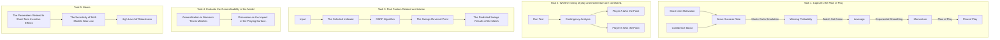
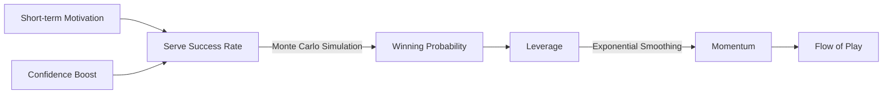
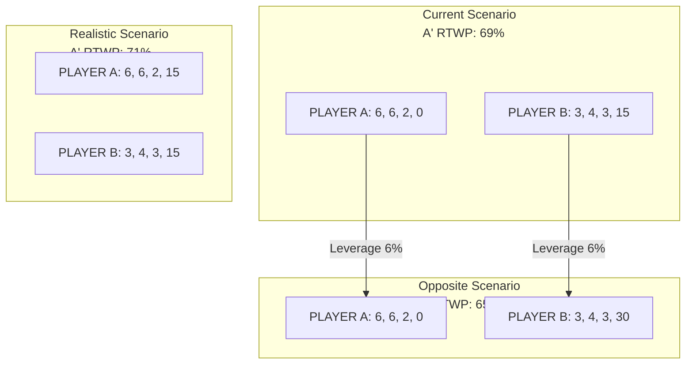
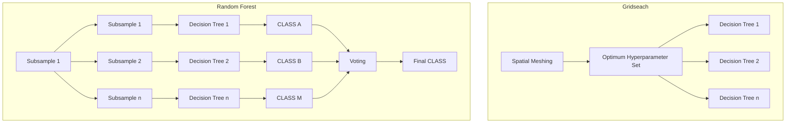

# Changing Tides: Momentum Swings in Tennis Summary

Situations change rapidly in tennis, and the incredible swings are often attributed to momentum. We analyze momentum through Wimbledon 2023 men's matches data.

For Task 1, we develop a Leverage Quantitative Momentum Capture Model. Firstly, we consider the effect of short-term motivation and confidence boosting on serve percentage, and utilize the Monte Carlo algorithm to compute the winning probability(match/set/game) at each point. Then we define Leverage as how much winning or losing a ball changes the winning probability and the momentum as exponential moving average of leverage. Finally, the Wimbledon final match flow is visualized and the results are shown.

For Task 2, we use a statistical test to verify that "momentum" does play role in the match. Through the run test, we found that at a 90% confidence level, the proportion of non-random game scores in the given dataset accounts for 45.11% of the total, which indicates the swings in the game are not random. Furthermore, through the contingency table independence test, we determine, at a 90% confidence level, that swings in play and runs of success by one player are correlated to the momentum.

For Task 3, we establish the Grid-Search Random Forest Swing Predictor Model to forecast short-term swings in momentum. We select 43 indicators as inputs for the model to predict momentum transition scenarios (no transition of advantage, the advantage tilting towards oneself, the advantage transitioning to the opponent) in the next $s$ points. The model achieved a $94\%$ successful classification rate on the training set, demonstrating good classification performance. Utilizing GSRF, we can also identify that the factor most related to match fluctuations is the opponent's total score.

It is necessary to consider he top 15 factors in the GSRF model in terms of feature importance, so the four factors of dimensionality reduction into Expenditure, Expenditure, Running Distance, and Game Situation Factor are utilized by factor analysis. We suggest players focus on improving physical fitness, enhancing mental resilience, and paying special attention to break and net point scoring techniques.

For Task 4, by modifying the Monte Carlo simulation winning rule to three sets to two wins, we apply the model in the 2023 Wimbledon women's singles final, which verifies that the model is generalizable. It is worth noting that the most related factor of swing in women's tennis is different from that in men's singles, it is precise the total running distance, which may be related to the physical strength difference between men and women.

We conduct sensitivity analysis on the parameters of the short-term motivation effect in the Leverage Quantitative Momentum Capture Model and the parameters in the GSRF Swing Predictor Model, which are low in sensitivity and have high robustness.

Finally, a one-page memo with suggestions to tennis coaches is also produced to help coaches instruct players to control the pace of play.

Keywords: Monte Carlo Simulation, Runs Test, GSRF, Factor Analysis

# Contents

# 1 Introduction 3

1.1 Background 3  
1.2 Restatement and Analysis of the Problem ..... 3  
1.3 Overview of Our Work 4

# 2 Assumptions and Justification 5

# 3 List of Notation 5

# 4 Data Pre-processing 5

# 5 Task 1 : Captures the Flow of Play 6

5.1 Specifying Conceptual Significance 6  
5.2 Leverage Quantitative Momentum Capture Model 6

5.2.1 Impact of Short-term Motivation and Confidence Boost on Serve Success Rate 6  
5.2.2 Monte Carlo Simulation for Winning Probability 9  
5.2.3 Leveraging Every Point with Counterfactual Framework 10  
5.2.4 Defining Momentum 11

5.3 Visualization of the Flow of Play 11

# 6 Task 2 : Whether the Swings of Play and Momentum are correlated 12

6.1 Run Test for Assessing Randomness in Match Scores Sequence ..... 12  
6.2 Scores-Momentum Contingency Analysis 13

# 7 Task 3 : Identify Indicators Signaling a Change in Flow 14

7.1 GSRF Swing Predictor Model 14

7.1.1 The Swings Reversal Point 14  
7.1.2 The Selected Indicator 15  
7.1.3 GSRF Algorithm 15  
7.1.4 The Predicted Swings Results of the Match 16

7.2 Player Performance Factor Analysis Model ..... 17

# 8 Task 4 : Assess the Generalization of Model 20

8.1 Generalization in women's tennis matches 20  
8.2 Discussion on the impact of the playing surface. 22

# 9 Sensitivity Analysis 22

# 10 Strength and Weakness 23

10.1 Strength 23  
10.2 Weakness 23

# 11 Further Discussion 23

# Memorandum 24

# Reference 25

# 1 Introduction

# 1.1 Background

Tennis matches are exciting and ever-changing. Players who seem to be dominating experience incredible swings from time to time. For example, a player may be in control of the match with a series of points, but at one rally, the opponent suddenly breaks and the situation is reversed. We often attribute this dramatic turn of events to "momentum".

"Momentum" heightens emotional intensity in the match, creating unpredictability and anticipation, making each moment charged and intense.


<details>
<summary>natural_image</summary>

Two tennis players in action on a court, one raising fists, with a background graphic of stadium lights and a stylized tennis racket (no text or symbols)
</details>

Figure 1: The fast-changing, heart-stopping swings of a tennis match.

# 1.2 Restatement and Analysis of the Problem

We need to complete the following tasks based on the data given in the question and additional data from ourselves:

\- Task 1: Build a model to capture the flow of play as points occur.

The model is required to be able to qualitatively and quantitatively describe performance of players at a given time and provide a visualization. In particular, the model should take the higher probability of the server winning into account.

- Task 2 : Assess whether swings in play and runs of success by one player during a match are random.  
- Task 3: Look for indicators that identify the point in time when the game situation is reversed.

- Develop a model to predict swings in a match. Find the indicator with the highest correlation.  
- Based on momentum swings in past games, we need to give players advice on how to deal with other opponents.

- Task 4 : Evaluate the generalisability of the model we have developed to other competitions.  
- Task 5: Write a memo summarising the results and giving targeted advice to coaches and players.

After some analysis, we found that there is a close relationship between the tasks: In Task 1 and Task 2, we need to build a model describing the situation of the game (i.e. the relative performance of two players) and explore the relationship between "momentum" and changes in the game situation, respectively. The results of these two tasks are the basis of task 3. In task 3, we need to further build a model that can predict the situation fluctuations in the competition and find out the key factors that affect the competition. We also need to start to consider the applicability of our model. Can it provide competition suggestions for players to achieve better results? The fourth task is to consider the extensibility of our model. Are we still valuable in other competitions? Finally, in the memo, we need to focus on our model and its value.

In summary, we should effectively build a model that can predict the fluctuations of the competition situation, provide practical advice to players and coaches, and be extensible across different competitions.

# 1.3 Overview of Our Work

On the basis of the above analysis, we have carried out our work. Our working framework is shown in Figure 2.


<details>
<summary>flowchart</summary>


</details>

Figure 2: Our Work Overview Schematic Diagram

The detailed modeling process and model details are presented in the following article.

# 2 Assumptions and Justification

To simplify the problem and make it convenient for us to simulate real-life conditions, we make the following basic assumptions, each of which is properly justified.

- When a player wins a point, he experiences a short-term "motivational" effect that increases the probability of winning the next point. The motivation effect can lead to increased self-confidence on a psychological level as well as increased physical conditioning on a physiological level.  
- Lifting effects are cumulative. A string of successes may have a positive psychological and emotional effect on a player, so that a player winning more points in a row will result in a greater probability of winning the next point on serve.

# 3 List of Notation

<table><tr><td>Symbol</td><td>Meaning</td></tr><tr><td> $p, q$ </td><td>Probability of Winning</td></tr><tr><td> $m_{i}$ </td><td>Increase in the Rate of Serve points</td></tr><tr><td> $T_{AB}$ </td><td>The Cumulative Total Score</td></tr><tr><td> $L_{i}$ </td><td>Leverage of theithPoint</td></tr><tr><td> $G$ </td><td>The leverage Gained</td></tr><tr><td> $M$ </td><td>Momentum</td></tr><tr><td> $\lambda$ </td><td>Tuning Parameter</td></tr></table>

Noted: Symbols not specified in the table should be referred to their first occurrence.

# 4 Data Pre-processing

# - Outlier Handling

No clear outliers were observed in the data. However, in a match between Frances Tiafoe and Grigor Dimitrov during the third round, a notable occurrence occurred with a 24-hour time gap between two points at a set score of 2:0, as shown in Table 1.

Table 1: Suspected Outliers

<table><tr><td>match_id</td><td>playerA</td><td>playerB</td><td>elapsed_time</td></tr><tr><td>2023-wimbledon-1303</td><td>Frances Tiafoe</td><td>Grigor Dimitrov</td><td>0:53:55</td></tr><tr><td>2023-wimbledon-1303</td><td>Frances Tiafoe</td><td>Grigor Dimitrov</td><td>0:54:22</td></tr><tr><td>2023-wimbledon-1303</td><td>Frances Tiafoe</td><td>Grigor Dimitrov</td><td>24:56:34</td></tr><tr><td>2023-wimbledon-1303</td><td>Frances Tiafoe</td><td>Grigor Dimitrov</td><td>24:57:00</td></tr></table>

Upon consulting relevant information, we found the following explanation:

". . . . . Saturday's game was suspended due to inclement weather, so it was postponed to a day later to continue on Sunday......"

Therefore, the data is correct.

# - Missing Value Handling

In the dataset given in the question, the quantities $serve_{width}$ , $serve_{depth}$ , and $return_{depth}$ have missing values, for which we use the nearest-neighbour filling method to fill them.

# - Tag Encoding of String Type Data

There are many categorical variables in the data given in the title, presented as strings. In order to make it easier for the model to receive this type of data, we preprocess this type of data by means of label coding, using virtual coding for the last three columns of $serve_{width}$ , $serve_{depth}$ , and $return_{depth}$ in the data of the tennis match.

# 5 Task 1: Captures the Flow of Play

# 5.1 Specifying Conceptual Significance

Since a relatively large number of concepts are introduced in our model, we first identify and clarify the meaning of the introduced concepts here.

- Short-term Motivation refers to a brief period of above-average performance by a player following a motivating event.  
- Confidence Boost is when a player, drawing upon their self-awareness developed through multiple games in their professional career and an assessment of the current situation, generates positive expectations regarding the outcome of the match.  
- Serve Success Rate is probability of scoring in a service game.  
- Winning Probability is the likelihood of the player winning the game/set/match.  
- Leverage measures how a ball's outcome impacts the margin of victory.  
- Momentum aims to describe which player is in control at any given point in the match—based on who is currently winning more points and who is prevailing in crucial (high-leverage) moments. It is defined as a player's exponentially weighted leverage average.  
At each point in the match, both competing players will have their own momentum values.  
- We define the fluctuations in momentum as the Flow of Play.

The relationship between the above concepts, i.e., the framework of the model, is shown schematically below, and in the following we show the model building process in full.

# 5.2 Leverage Quantitative Momentum Capture Model

# 5.2.1 Impact of Short-term Motivation and Confidence Boost on Serve Success Rate

Short-term Motivation refers to a brief period of above-average performance by a player following a motivating event (e.g., a breaking serve) during a match, a phenomenon known in sports as "hot hands"[1]. We developed a probabilistic model that quantifies Short-term Motivation as an increase in serve success rate.

The following two assumptions are necessary:


<details>
<summary>flowchart</summary>


</details>

Figure 3: Relationships Between Concepts, i.e., Schematic of the Framework of the Model

- When a player wins a point, he experiences a short-term "motivational" effect that increases the probability of winning the next point.  
- Lifting effects are cumulative. A string of successes may have a positive psychological and emotional effect on a player, so that a player winning more points in a row will result in a greater probability of winning the next point on serve.

Here i denotes the number of consecutive points scored by a player A or his opponent B; and $m_{i}$ denotes the increase in the rate of serving points on a player's next serve after winning i points consecutively due to the short-term motivation gained. Then, the probability of winning the next serve under short-term motivation $p_{s}$ versus $q_{s}$ is calculated by equations (1).

$$
p _ {s} = p _ {f} (1 + m _ {i} ^ {A}); \tag {1}
$$

$$
q _ {s} = q _ {f} (1 + m _ {i} ^ {B}),
$$

where $p_{f}$ and $q_{f}$ are the scoring probabilities before player A and player B are motivated, respectively.

The short-term motivation that a player receives for scoring a game n times in a row is referred to as n-order short-term motivation. Using the dataset given in the title, we statistically obtained a plot of the total number of short-term motivations occurring in a match versus order, and the results are shown in Figure 4. It is clear to see that short-term motivations of order four and above rarely occur in the dataset used in this study. Therefore, only short-term motivations of order three and below are considered in this paper.

Short-term motivation focuses on short-term status enhancement during matches and ignores sources of motivation on a longer time scale in the player's lifetime, so we continue to introduce a confidence-boosting factor.

A new tuning parameter $\lambda$ is introduced, which represents the effect of the confidence boosting factor on the success rate of the next serve [2], the probabilities after the effect are expressed as $p_{s}$ and $q_{s}$ – see equation (2)

$$
p _ {c} = \frac {T _ {A B}}{\lambda} p _ {t} + (1 - \frac {T _ {A B}}{\lambda}) p _ {0}; \tag {2}
$$

$$
q _ {c} = \frac {T _ {A B}}{\lambda} q _ {t} + (1 - \frac {T _ {A B}}{\lambda}) q _ {0},
$$

where $T_{AB}$ denotes the cumulative total score of the opposing players since the start of the match, and $p_{t}$ and $q_{t}$ denote the probability of scoring for player A and player B, respectively,


<details>
<summary>bar</summary>

| Ordinal Number | Count |
| --- | --- |
| 0 | 3587 |
| 1 | 1696 |
| 2 | 932 |
| 3 | 531 |
| 4 | 299 |
| 5 | 139 |
| 6 | 54 |
| 7 | 21 |
| 8 | 11 |
</details>

Figure 4: Histogram of the Total Count of Short-Term Incentives Occurring in Competitions as a Function of Order

since the start of the match up to the present. $p_{0}$ and $q_{0}$ denote the historical data on the success rate of the opposing teams' serves on the grass court surface prior to the current match (source: https://www.infosys.com/)

Eq. (2) describes the phenomenon that a player's historical results always have the greatest impact on player status at the start of a match, and then diminish as the match progresses - the performance of the current match begins to influence player play more.

We then performed a linear interpolation of the obtained probabilities. The interpolation coefficient is the cumulative total score of the current pair divided by the coefficient $\lambda$ (i.e. $\frac{T_{AB}}{\lambda}$ ).

The short-term motivation is fluctuating as the match progresses, while the confidence boost takes into account the player's self-perception established over the course of his career as well as the current situation in the match, which is the "undertone" of the motivated state, therefore, we use $p_c$ and $q_c$ in Eq. (2) instead of $p_f$ and $q_f$ in Eq. (1), we can get the success rate of the next serve after considering the short-term motivation and confidence improvement:

$$
\begin{array}{l} p = [ \frac {T _ {A B}}{\lambda} \cdot p _ {c} + (1 - \frac {T _ {A B}}{\lambda}) p _ {t} ] (1 + m _ {i} ^ {A}); \\ q = [ \frac {T _ {A B}}{\lambda} \cdot q _ {c} + (1 - \frac {T _ {A B}}{\lambda}) q _ {t} ] (1 + m _ {i} ^ {B}). \\ \end{array}
$$

The above equation shows the effect of short-term motivation and confidence enhancement on serve percentage.

In tennis matches, players typically have an advantage when serving[3]. According to the data we have collected, the serving success rate of professional players exceeds $50\%$ . Based on this understanding, players gain confidence in serving games. Due to this "confidence boost," we have incorporated the player's performance in serving games into consideration in our model.

# 5.2.2 Monte Carlo Simulation for Winning Probability

As a sports competition, there is a great deal of uncertainty in tennis, for which Monte Carlo algorithms can provide probabilistic estimates of the outcome.

Based on the serve success rate obtained in the previous section, we use the Monte Carlo algorithm to simulate each ball, and ultimately obtain the winners and losers of each game, set and even the whole match. Then in this process, the randomness and diversity of the simulation are ensured by generating a large number of random number seeds.

Here is the pseudo-code for the algorithm we used:


<details>
<summary>flowchart</summary>

```mermaid
graph TD
  A["Algorithm 1: Monte Carlo Simulation for Winning Probability"] --> B["Input: phist,data"]
  B --> C["Output: win_p"]
  C --> D["begin"]
  D --> E["for i in scores do"]
  E --> F["for i l to n do"]
  F --> G["repeat"]
  G --> H["Calculate p_cur based on previous data"]
  H --> I["Calculate scoring probability based on the formula.3"]
  I --> J["Update players' score/game/set based on tennis rule"]
  J --> K["Record n_win of game/set/match"]
  K --> L["until one side wins the match;"]
  L --> M["end"]
  M --> N["&quot;win_p[i"] ← n_win / n"]
  N --> O["end"]
  O --> P["end"]
```
</details>

We use the above algorithm to perform N = 1000 simulations of the remaining fixtures after each ball and determine the final outcome of that game. If the number of wins of player $K(K = A, B)$ in the result is n, then we say that the winning rate of player K after that ball is $\frac{n}{N} \times 100\%$ .

The graph below illustrates the real-time fluctuations in match-winning probabilities, simulated through the Monte Carlo algorithm, for Djokovic (highlighted in red) and Alcarez (highlighted in green) during the 2023 Wimbledon final.


<details>
<summary>area_stacked</summary>

| Points | Djokovic (%) | Alcarez (%) |
| --- | --- | --- |
| 0 | ~53 | ~47 |
| 40 | ~53 | ~27 |
| 100 | ~53 | ~33 |
| 140 | ~53 | ~33 |
| 160 | ~53 | ~60 |
| 200 | ~53 | ~87 |
| 240 | ~53 | ~95 |
| 270 | ~53 | ~78 |
| 290 | ~53 | ~33 |
| 330 | ~53 | ~95 |
</details>

Figure 5: Wimbledon Final Real-Time Predicted Win Probability Swings Chart. The thick gray dashed lines represent set divisions, while the thin gray dashed lines represent game divisions.

It can be seen that the situation is very anxious, and the match winning probability in the middle of the game fluctuates greatly throughout the match. The first set was easily won by Djokovic, but the second was tense . . . . . This is consistent with the facts. Thus, the reliability of the algorithm is verified.

# 5.2.3 Leveraging Every Point with Counterfactual Framework

Next, we will employ a counterfactual framework[4] to delve into the analysis of the impact of each point in a tennis match. By defining 'leverage' as a measure of the magnitude of change in winning probability resulting from winning or losing a particular point, we will quantify the potential influence of each point on the outcome of each game/set, and even the entire match.

The following example shows the exact steps of our leverage quantisation process.

- Current Scenario: Player A is down 0-15 in the current game, his real-time winning probability (abbreviated as RTWP in the latter.) is 69%.  
- Define Realistic Scenario: If player A wins this point, the score becomes 30-30 and his RTWP becomes $71\%$ .  
- Imagine the Opposite Scenario: if player A loses this point, the score becomes 15-40 and his RTWP becomes $65\%$ .  
- Calculating Leverage: By comparing the change in A's RTWP in these two scenarios, the Leverage for this point is calculated to be $6\%$ .

Note: The above data is fictional. The above process is shown schematically below:


<details>
<summary>flowchart</summary>


</details>

Figure 6: Leveraged Quantitative Schematic

We set $L_{i}$ to represent the leverage of the $i^{th}$ point. The positive or negative sign does not indicate the magnitude but only signifies which player gained the point. Throughout the subsequent analysis, we consistently calculate the leverage with respect to Player A. If $L_{i} > 0$ , it means that player A won the ith point; if $L_{i} < 0$ , it means that player B won the ith point; if $L_{i} = 0$ , it means that the ith point did not result in a change in winning percentage.

If playerK wins the ith point, the playerK is called to have gained leverage, and vice versa, the player is called to have lost leverage. The leverage gained is treated as a separate variable and denoted by the symbol G. To wit:

$$
G _ {i} ^ {A} = \left\{ \begin{array}{l l} L _ {i}, & L _ {i} \geqslant 0 \\ 0, & L _ {i} <   0 \end{array} , G _ {i} ^ {B} = \left\{ \begin{array}{l l} L _ {i}, & L _ {i} \leqslant 0 \\ 0, & L _ {i} > 0 \end{array} \right. \right.
$$

# 5.2.4 Defining Momentum

We define momentum(M) as an exponentially weighted moving average of the leverage gained by a player[5].

$$
M _ {i} ^ {K} = \frac {G _ {i} ^ {K} + (1 - \alpha) G _ {i - 1} ^ {K} + (1 - \alpha) ^ {2} G _ {i - 2} ^ {K} + \cdots + (1 - \alpha) ^ {i} G _ {0} ^ {K}}{1 + (1 - \alpha) + (1 - \alpha) ^ {2} + \cdots + (1 - \alpha) ^ {t}},
$$

where $[G_{0}, G_{1}, \ldots, G_{i}]$ is the leverage of i recent points, and the points are listed in chronological order. $\alpha$ is the smoothing coefficient, and $\alpha \in (0, 1)$ . Due to the fact that the impact of previous goals diminishes on the player's current impact as the game progresses, the importance of a certain points decreases exponentially as the game progresses, The leverage of the most recent goal has the greatest impact on momentum, and the sooner the point is scored, the less it impact on momentum.

Finally, by focusing on the fluctuations in momentum, we can capture "the flow of play".

# 5.3 Visualization of the Flow of Play

Utilizing our model, we have described the match flow of the Wimbledon Final in 2023. The parameter $\alpha$ is set to 0.33, by testing the leverage defined by the handicap winning percentage, it better reflects the fluctuation of the game. The visualization is presented as follows:


<details>
<summary>line</summary>

| Points | Alcarez (Momentum) | Djokovic (Momentum) |
| --- | --- | --- |
| 0 | 0 | -0.05 |
| 50 | ~0.09 | 0 |
| 100 | ~0.05 | 0 |
| 150 | ~0.10 | 0 |
| 200 | 0 | 0 |
| 250 | ~0.05 | 0 |
| 300 | ~0.09 | 0 |
</details>

Figure 7: The Visualization of Match Flow. The thick gray dashed lines represent set divisions, while the thin gray dashed lines represent game divisions. The same applies to the subsequent figure.

Our results perfectly describe the flow of the match. We can correlate the fluctuations in momentum in the graph with the remarkable moments in the game:

Riding a dominating momentum after crushing the opponent in the first set, Djokovic had the opportunity to claim the second set. However, Alcaraz overcame the initial struggle and secured a crucial break in the second set, leading 2-1; Djokovic swiftly responded with a break of his own, but Alcaraz seized the opportunity in a tense tiebreak, winning the set with a brilliant backhand winner. In the third set, Djokovic struggled with a low momentum, while Alcaraz continued his high momentum, leading 2-1. In the fourth set, Djokovic broke Alcaraz twice, leveling the match.

Then, in the decisive fifth set, Djokovic missed a golden opportunity while leading, allowing Alcaraz to break and take a 2-1 lead. With Djokovic's momentum dropping, he once again violated rules by smashing his racket against the net post, subsequently trailing 3-1. Alcaraz remained resolute, maintaining his high momentum. When Djokovic hit a forehand into the net, Alcaraz secured his extraordinary victory at 3-1."

It can be found that the momentum we define shows the race flow well.

# 6 Task 2 : Whether the Swings of Play and Momentum are correlated

A tennis coach argues that swings in play and runs of success in a match are random and not related to momentum. In response to this view, we plan to determine whether the distribution of scores in a match is completely random by means of a Runs Test.

# 6.1 Run Test for Assessing Randomness in Match Scores Sequence

The runs test is commonly employed to examine whether a binary sample with two potential outcomes, such as X and Y, originates from a binomial distribution.

In the runs test, a sample is drawn from a population containing X and Y, assuming n X's and m Y's are drawn. Subsequently, X and Y are arranged in order of sampling to form a sequence. In this sequence, consecutive occurrences of X or Y are referred to as a run. The total number of runs is denoted as the run count r.


<details>
<summary>text_image</summary>

X Y Y Y Y X X X Y X X Y Y Y Y Y X X X X Y
= run of X : n =4
= run of Y : m =4 } run count r : 8
</details>

Figure 8: Runs Example Chart

In the XY sequence shown in Figure 8, there are n = 4 runs of X and m = 4 runs of Y, with a total of r = 8 runs.

- The null hypothesis $H_0$ : The arrangement of X and Y is random, with the probability of drawing X each time as $P$ , and the probability of drawing Y as $1P$ .  
- The alternative hypothesis $H_{1}$ : The arrangement of X and Y is non-random, indicating no regularity in the probability of drawing X or Y.

If $H_0$ holds, based on the parity of $r$ , there are different scenarios:

$$
P (r = 2 k) = \frac {2 \binom{n - 1}{k - 1} \binom{m - 1}{k - 1}}{\binom{n + m}{n}};
$$

$$
P (r = 2 k + 1) = \frac {\binom{m - 1}{k - 1} + \binom{m - 1}{k - 1} + \binom{n - 1}{k} \binom{n - 1}{k}}{\binom{n + m}{n}}
$$

The mathematical expectation of $r$ is $E(r) = \frac{2mn}{m + n} + 1$ , the variance of $r$ is $V(r) =$

$\frac{2\mathrm{mn}(2\mathrm{mn} - \mathrm{m} - \mathrm{n})}{(\mathrm{m} + \mathrm{n})^2(\mathrm{m} + \mathrm{n} - 1)}$ , and the statistic $Z$ constructed from the number of trips follows a normal

distribution, that is, $Z = \frac{r - E(r)}{\sqrt{V(R)}} \sim N(0,1)$ .

We recorded the outcome of each point within each game throughout the entire match. If player A won the point, it was recorded as 1, and 0 otherwise. This resulted in sequences representing the distribution of scores within each game, and runs were calculated based on this. Subsequently, a runs test was conducted for each game. The results indicated that within a 90% confidence interval, the percentage of games rejecting the null hypothesis accounted for 45.11% of the total number of games.

This suggests that scoring in a game is not completely randomized.

# 6.2 Scores-Momentum Contingency Analysis

"In the previous section, we employed the runs test to investigate whether the scoring sequence of opposing sides in tennis matches exhibits randomness. The result was negative, indicating that the match dynamics are not random. Subsequently, to explore whether the fluctuations in the game are related to momentum, we conducted a contingency table analysis on the relationship between the score of each point and the momentum of the opposing sides."

We first counted the winners and losers of each point as well as the relationship between the momentum of playerA and playerB in terms of magnitude when competing for this point, as shown in the table below:

Table 2: Score vs. Momentum Table

<table><tr><td></td><td>Player A Won the Point</td><td>Player B Won the Point</td></tr><tr><td> $M^{A} \geqslant M^{B}$ </td><td> $n_{11}$ </td><td> $n_{12}$ </td></tr><tr><td> $M^{A} < M^{B}$ </td><td> $n_{21}$ </td><td> $n_{22}$ </td></tr></table>

In the table, $n_{ij}$ represents the frequency with which events in row i and column j occur simultaneously, where i represents the comparison of player A's momentum with player B's momentum, and j represents the winner of the match point. Let the original hypothesis be $H_{0}$ , indicating that there is no correlation between score and momentum, and the alternative hypothesis be $H_{1}$ , indicating that there is a correlation between score and momentum.

Assuming that there is no correlation between score and momentum, for each cell in Table 1 calculate the expected frequency E.

Since the total sample with all expected frequencies is greater than 5, the conditions for using the chi-square test are met. Therefore, we used the chi-square test to assess the difference between the observed and expected frequencies. Taking Wimbledon as an example, the calculated chi-square statistic X = 5.566, indicating that the observed frequencies are significantly different from the expected frequencies; the significance level P = 0.018, indicating the rejection of the original hypothesis $H_{0}$ at the 90% confidence level that the relationship between the winners and losers of each point and the magnitude of playerA's and playerB's momentum when competing for that point is correlated.

So "momentum" does play an important role in the game, and swings in play and runs of success are not random.

# 7 Task 3 : Identify Indicators Signaling a Change in Flow

# 7.1 GSRF Swing Predictor Model

First, we need to develop a model to predict swings in a match and look for the factors most associated with swings. So we developed the GSRF Swing Predictor Model.

Our model needs to be able to predict whether there will be swings at s points in the future, and determine its direction accurately - whether it will be a wave in favor of the player or a swing in favor of his opponent. To do this, we first introduce the concept of 'swing reversal points', which have two different types.

# 7.1.1 The Swings Reversal Point

We use the 'scipy.signal.find\_peaks' function in Python to locate the peaks in the curves representing the momentum changes over time for both the player and the opponent. Between the peaks of the player and opponent, we identify the point where the momentum value is closest to 0 as the "swing" reversal point.

If the peak of the opponent comes before the player's peak, indicating the advantage is leaning towards the player, the reversal point between these two peaks is marked as a transition point favoring the player, labeled as "1". Conversely, if the player's peak comes before the opponent's peak, indicating the advantage is shifting towards the opponent, the point between these two peaks is marked as a reversal point favoring the opponent, labeled as "-1". Points that are not transition points are labeled as "0". The schematic representation of this process is illustrated in Figure 9.


<details>
<summary>flowchart</summary>

```mermaid
graph LR
  A["Momentum curve"] -->|Python's 'scipy.signal.find_peaks' function| B["Momentum peak point"]
  B -->|The point where the momentum value is closest to 0 between the two peaks of the player and the opponent.| C["Swing reversal points"]
  C -->|1| D["Normal points"]
  C -->|-1| E["Opponent momentum peak point"]
  C -->|0| F["Player momentum peak point"]
  F -->|The swings reversal point| G["Opponent momentum peak point"]
  G -->|The closest point to zero between the peaks is not for the opposing players but for the same player's peaks; therefore, it is not the Swings Reversal Point."| H["Player momentum peak point"]
```
</details>

Figure 9: Rurning Swing Points Selection Process and Schematic Diagram

We verified the method using the 2023 Wimbledon final data, and the results are good, as shown in the figure below:


<details>
<summary>area</summary>

| Point | Momentum |
| --- | --- |
| ~40 | 0.00 |
| ~50 | 0.09 |
| ~65 | 0.03 |
| ~75 | 0.00 |
| ~80 | -0.06 |
| ~85 | 0.00 |
| ~90 | 0.05 |
| ~110 | 0.05 |
| ~125 | 0.05 |
| ~135 | 0.10 |
| ~155 | 0.08 |
| ~170 | 0.10 |
| ~180 | 0.00 |
| ~185 | -0.02 |
| ~200 | 0.00 |
| ~220 | 0.06 |
| ~240 | 0.05 |
| ~255 | 0.00 |
| ~260 | -0.08 |
| ~285 | -0.08 |
| ~295 | 0.00 |
| ~305 | 0.09 |
| ~315 | 0.05 |
</details>

Figure 10: GSRF Algorithm Flow Diagram

To predict swings in future matches, we take a subset of players' on-court performance metrics and use the grid search Random Forest (GSRF)[6] algorithm to predict which of three scenarios each point in future belongs to.

Next, we will describe the selected indicator data and explain the algorithm flow.

# 7.1.2 The Selected Indicator

Through the given tennis dataset, we have selected two categories of indicators for prediction. One category pertains to individual player metrics, while the other involves shared metrics when the two players compete. These two categories of indicators are listed as follows:

The first category: p1\_ace: Whether player 1 hits an "unreturnable" ball during the serve; p1\_ace: p1 total aces; p1\_break\_pt: Break point: player 1 has the opportunity to win a point in opponent's service game; p1\_double\_fault: Player 1 committed two faults in serving, resulting in a lost point; p1\_double\_fault: p1 total double faults; p1\_net\_pt: Player 1 approached the net in this round; p1\_net\_pt\_won: Player 1 won the point when approaching the net in this round; p1\_score: Player 1's score in this game; p1\_sets: Number of sets won by player 1; p1\_unf\_err: Player 1 made an unforced error in this round; p1\_winner: Whether player 1 hit an "unreturnable" ball, p1\_games: p1 won games; p1\_points\_won: p1 total points won; p1\_distance\_run: p1 distance run in this point; brp1: p1 break point conversion rate; p1\_distance\_run\_total: p1 total distance run; ntp1: p1 net points won percentage.

Player 2 has exactly the same indicator type as Player 1, so it is not repeated.

The second category: elapsed\_time: Duration of the point ; speed\_mph: Serve speed ; rally\_count: Cumulative number of hits ; rally\_count: Total hits in a rally ; return\_depth: Depth of returning, indicating whether the return lands near the baseline, midcourt, or frontcourt ; serve\_depth: Depth of the serve, indicating whether the serve is placed in the front, mid, or backcourt of the tennis court ; serve\_no: Which serve the player is in, the first or second ; serve\_width: Direction of the serve ; server: Player serving.

Some of the indicators are original metrics from the dataset, while others (in bold) are derived through calculations based on the original metrics.

# 7.1.3 GSRF Algorithm

The GSRF algorithm consists of the Random Forest and Grid Search algorithm.

The Grid Search algorithm is a parameter optimization technique that iterates through a specified parameter grid. It trains and evaluates the model for each possible combination

of parameters, ultimately outputting the best parameter set along with corresponding model performance metrics.

Random Forest, is a machine learning algorithm that trains based on multiple decision trees. During training, it randomly selects a subset of features for each tree. In the classification process, Random Forest aggregates the predicted classification results of each decision tree through averaging or voting, yielding the final result.

Unlike the regular Random Forest algorithm, the GSRF algorithm utilizes the best hyperparameter combinations to train and predict the Random Forest model. This significantly enhances the model's performance, mitigating issues such as overfitting or underfitting. The GSRF algorithm workflow is illustrated in Figure 11.


<details>
<summary>flowchart</summary>


</details>

Figure 11: GSRF Algorithm Flow Diagram

# 7.1.4 The Predicted Swings Results of the Match

We utilize the aforementioned classification indicators as input parameters for the Random Forest model to predict future scenarios.

As an example, for a particular match, we split the dataset into training and testing sets in an 8:2 ratio. We employed the RandomForestRegressor algorithm from the ensemble module in the scikit-learn (sklearn) machine learning library, along with the GridSearchCV algorithm from sklearn. The optimal hyperparameter combination obtained from GridSearchCV is as follows:

Table 3: Table of Optimal Hyperparameter Combinations

<table><tr><td>Indicator Names</td><td>max_depth</td><td>min_samples_leaf</td><td>min_samples_split</td><td>n_estimators</td></tr><tr><td>Values</td><td>None</td><td>1</td><td>3</td><td>100</td></tr></table>

The prediction accuracy of the model is up to 94%, and the performance of the test set is also good. The confusion matrix diagram is drawn as follows:


<details>
<summary>heatmap</summary>

| Actual \ Predicted | Predicted -1 | Predicted 0 | Predicted 1 |
| --- | --- | --- | --- |
| Actual -1 | 7 | 0 | 0 |
| Actual 0 | 0 | 50 | 2 |
| Actual 1 | 0 | 1 | 7 |
</details>

Figure 12: Confusion Matrix

As can be seen from the matrix, most of the samples were correctly categorized, only 3 samples were not correctly categorized, and none of the samples from any of the reversal point types were categorized into another reversal point type.

From the random forest, we can also obtain the importance of various metrics, as shown in the following figure:


<details>
<summary>bar</summary>

| Feature | Importance |
| --- | --- |
| elapsed_time | ~0.027 |
| p1_sets | ~0.004 |
| p1_games | ~0.039 |
| p1_score | ~0.018 |
| p1_points_won | ~0.077 |
| server | ~0.007 |
| serve_no | ~0.005 |
| p1_ace | ~0.001 |
| p1_winner | ~0.002 |
| p1_double_fault | ~0.001 |
| p1_unf_err | ~0.002 |
| p1_net_pt | ~0.004 |
| p1_net_pt_won | ~0.003 |
| p1_break_pt | ~0.006 |
| p1_distance_run | ~0.022 |
| rally_count | ~0.018 |
| speed_mph | ~0.027 |
| serve_width | ~0.011 |
| serve_depth | ~0.003 |
| return_depth | ~0.008 |
| bp1 | ~0.084 |
| p1_distance_run_total | ~0.082 |
| p1_ace_total | ~0.017 |
| p1_double_fault_total | ~0.015 |
| rally_count_total | ~0.090 |
| ntp1 | ~0.056 |
| p2_sets | ~0.006 |
| p2_games | ~0.049 |
| p2_score | ~0.011 |
| p2_points_won | ~0.096 |
| p2_ace | ~0.001 |
| p2_winner | ~0.003 |
| p2_double_fault | ~0.001 |
| p2_unf_err | ~0.006 |
| p2_net_pt | ~0.006 |
| p2_net_pt_won | ~0.002 |
| p2_break_pt | ~0.005 |
| p2_distance_run | ~0.022 |
| bp2 | ~0.016 |
| p2_distance_run_total | ~0.086 |
| p2_ace_total | ~0.003 |
| p2_double_fault_total | ~0.010 |
| ntp2 | ~0.077 |
</details>

Figure 13: Bar Chart of Metric Importance

As seen in the graph above, the total score of opponents is the most relevant metric for swings in the match.

# 7.2 Player Performance Factor Analysis Model

The influencing factors obtained from the analysis of the GSRF Swing Predictor Model established in the previous section, which predicts the direction of the game, are complex and diverse. This complexity makes it less convenient for coaches to guide players and understand the momentum of the game. Therefore, we conducted a factor analysis[7] on the indicators that have a significant impact on "swing" to extract independent common factors, enabling players to clearly capture the factors influencing the direction of the game.

We selected the top 15 indicators in terms of feature importance and conducted the Kaiser-Meyer-Olkin (KMO) test and Bartlett's test[8] using SPSS. The test results are as follows:

Table 4: Kaiser-Meyer-Olkin (KMO) and Bartlett's Test

<table><tr><td colspan="2">KMO Sampling Adequacy Measure</td><td>0.708</td></tr><tr><td rowspan="3">Bartlett&#x27;s Sphericity Test</td><td>Approximate Chi-Square</td><td>11512.67</td></tr><tr><td>Degrees of Freedom</td><td>105</td></tr><tr><td>Significance</td><td>0</td></tr></table>

According to the table, the statistic for Bartlett's sphericity test is 11512.67, and the corresponding probability (P-value) is 0. At a $95\%$ significance level, the null hypothesis should be rejected, indicating a significant difference between the correlation matrix and the identity matrix. Meanwhile, the KMO value is 0.708. According to Kaiser's standard for interpreting KMO, it suggests suitability for factor analysis, indicating factors that influence swing[9].

Next, we utilized SPSS and conducted a principal component analysis for extraction. The scree plot obtained is shown in Figure 14. It was observed that when the number of extractions reached 4, the contribution rate became quite small. Therefore, we decided to extract 4 common factors.


<details>
<summary>line</summary>

| Factor Number | Variance Contribution (%) |
| --- | --- |
| 1 | ~39 |
| 2 | ~16 |
| 3 | ~13 |
| 4 | ~8 |
| 5 | ~7.5 |
| 6 | ~6 |
| 7 | ~5.5 |
| 8 | ~2.5 |
| 9 | ~2 |
| 10 | ~1 |
| 11 | ~1 |
| 12 | 0 |
| 13 | 0 |
| 14 | 0 |
| 15 | 0 |
</details>

Figure 14: Scree plot of Principal Component Analysis

We utilized the Kaiser normalization and varimax rotation method to obtain the rotated component matrix, as shown below:

Table 5: The Rotated Component Matrix

<table><tr><td>Indicator\Extracted Factor</td><td>1</td><td>2</td><td>3</td><td>4</td></tr><tr><td>p1_points_won</td><td>0.992</td><td>0.051</td><td>-0.035</td><td>0.008</td></tr><tr><td>rally_count</td><td>0.991</td><td>0.084</td><td>-0.030</td><td>0.019</td></tr><tr><td>p1_distance_run_total</td><td>0.991</td><td>0.076</td><td>-0.030</td><td>0.014</td></tr><tr><td>p2_distance_run_total</td><td>0.990</td><td>0.097</td><td>-0.030</td><td>0.024</td></tr><tr><td>p2_points_won</td><td>0.986</td><td>0.100</td><td>-0.035</td><td>0.032</td></tr><tr><td>brp1</td><td>0.569</td><td>0.502</td><td>0.000</td><td>0.111</td></tr><tr><td>brp2</td><td>0.072</td><td>0.884</td><td>0.073</td><td>0.232</td></tr><tr><td>ntp1</td><td>0.368</td><td>0.753</td><td>-0.007</td><td>0.070</td></tr><tr><td>ntp2</td><td>-0.060</td><td>0.732</td><td>0.068</td><td>0.052</td></tr><tr><td>p2_distance_run</td><td>-0.061</td><td>0.056</td><td>0.957</td><td>-0.034</td></tr><tr><td>p1_distance_run</td><td>-0.027</td><td>0.067</td><td>0.954</td><td>-0.061</td></tr><tr><td>p2_games</td><td>-0.104</td><td>0.097</td><td>-0.047</td><td>0.880</td></tr><tr><td>p1_games</td><td>0.233</td><td>0.286</td><td>-0.067</td><td>0.808</td></tr><tr><td>elapsed_time</td><td>-0.048</td><td>-0.100</td><td>0.185</td><td>0.211</td></tr><tr><td>speed_mph</td><td>-0.021</td><td>-0.140</td><td>0.067</td><td>0.253</td></tr></table>

Next, we analyze the four factors in the component matrix.

Factor 1 loads heavily on $p1\_points_w$ on, $p2\_points_w$ on, $rally\_count$ , $p1\_distance\_run\_total$ , and $p2\_distance\_run\_total$ . It involves aspects such as shot count and running distance, representing the player's stamina and energy expenditure during the match. We name this factor the Expenditure Factor.

Factor 2 primarily involves break point conversion rates (brp1, brp2) and net point conversion rates (ntp1, ntp2). As it can reflect the player's technical proficiency during the match, we name it the Technical Factor.

Factor 3 loads significantly on $p1\_distance\_run$ and $p2\_distance\_run$ , primarily reflecting the players' running patterns during the match, likely related to court coverage and movement tactics. We name it the Running Distance Factor.

Factor 4 loads heavily on p1\_games and p2\_games, mainly focusing on the players' game situations during the match. We name it the Game Situation Factor.

The coach can provide guidance to the players by comparing the abilities of their players with those of the next opponent in these four factors.

Utilizing the Expenditure Factor, the coach can analyze the stamina gap between players and opponents, enabling targeted training for the players' fitness levels and endurance before the match. The Technical Factor reflects a player's technical proficiency, including break points and volleys, aiding the coach in devising more effective strategies. For instance, if a player excels

in volleys, encouraging them to employ net strategies more frequently could be beneficial. The Running Distance Factor is associated with court coverage and movement tactics. Coaches can optimize players' running strategies based on these factors to enhance control over opponents and reduce self-pressure. The Game Situation Factor primarily focuses on players' game scores, assisting in analyzing situations and guiding players to flexibly adjust strategies during matches.

In essence, strengthening mental and physical resilience is crucial against diverse opponents, and focusing on improving break points and volley techniques gives players a substantial edge.

# 8 Task 4: Assess the Generalization of Model

# 8.1 Generalization in women's tennis matches

To assess the generalization of our model, we tested it in the 2023 Wimbledon Women's Singles final. The test results are as follows:

We obtained data on the 2023 Wimbledon women's singles final that is consistent across all metrics with the dataset given in this question(source:https://www.wimbledon.com/index.html). Women's tennis differs from men's tennis matches in that two out of three sets are taken. Therefore, we modified the rules related to the relevant sets for Monte Carlo simulation to solve the real-time winning probability of the match. The calculated momentum for the whole match is shown below:


<details>
<summary>area_stacked</summary>

| Points | Ons Jabeur (%) | Marketa Vondrousova (%) |
| --- | --- | --- |
| 0 | ~53 | ~53 |
| 10 | ~45 | ~45 |
| 20 | ~35 | ~35 |
| 30 | ~45 | ~45 |
| 40 | ~45 | ~45 |
| 50 | ~30 | ~30 |
| 60 | ~45 | ~45 |
| 70 | ~80 | ~80 |
| 80 | ~90 | ~90 |
| 90 | ~70 | ~70 |
| 100 | ~60 | ~60 |
| 110 | ~70 | ~70 |
| 120 | ~100 | ~100 |
</details>

Figure 15: Wimbledon Final Real-Time Predicted Win Probability Swings Chart. The thick gray dashed lines represent set divisions, while the thin gray dashed lines represent game divisions.

For Marketa Vondronsova, the match was a windfall.

Using the model from Task 3 again, the momentum fluctuations for this match are illustrated in the following graph:


<details>
<summary>area</summary>

| Point | Momentum (Marketa) | Momentum (Vondrousova) |
| --- | --- | --- |
| ~8 | 0.00 | — |
| ~15 | — | ~-0.06 |
| ~24 | 0.00 | — |
| ~27 | — | ~0.03 |
| ~31 | — | ~0.04 |
| ~38 | — | ~0.05 |
| ~45 | 0.00 | — |
| ~48 | — | ~-0.04 |
| ~53 | 0.00 | — |
| ~63 | — | ~0.14 |
| ~81 | 0.00 | — |
| ~89 | — | ~-0.07 |
| ~101 | 0.00 | — |
| ~105 | — | ~0.03 |
| ~108 | 0.00 | — |
| ~110 | — | ~-0.02 |
| ~114 | 0.00 | — |
| ~123 | — | ~0.13 |
</details>

Figure 16: Momentum Fluctuations and Transition Points in Fluctuations.

Similarly, the prediction of short-term NME transition points has the following results on the test set.


<details>
<summary>heatmap</summary>

| Actual \ Predicted | Predicted -1 | Predicted 0 | Predicted 1 |
| --- | --- | --- | --- |
| Actual -1 | 6 | 1 | 0 |
| Actual 0 | 0 | 11 | 0 |
| Actual 1 | 0 | 1 | 6 |
</details>

Figure 17: Women's Singles Confusion Matrix

It is not difficult to find that there are fewer samples with wrong scores, indicating that the application of our model to women's tennis matches is feasible. And the important indexes obtained by GSRF model for women's tennis game appeared a little difference with men's tennis game. For example, the most important factor affecting the women's tennis game is the total distance run (as shown in Fig. 18), while the men are the total score of the opponent, which may be related to the difference in physical strength between men and women.


<details>
<summary>bar</summary>

| Feature | Importance |
| --- | --- |
| elapsed_time | ~0.031 |
| p1_sets | ~0.002 |
| p1_games | ~0.062 |
| p1_score | ~0.033 |
| p1_points_won | ~0.067 |
| server | ~0.010 |
| serve_no | ~0.009 |
| p1_ace | 0 |
| p1_winner | ~0.005 |
| p1_double_fault | ~0.003 |
| p1_unf_err | ~0.006 |
| p1_net_pt | ~0.007 |
| p1_net_pt_won | ~0.003 |
| p1_break_pt | ~0.001 |
| p1_distance_run | ~0.050 |
| rally_count | ~0.034 |
| speed_mph | ~0.044 |
| ServeWidth | ~0.018 |
| ServeDepth | ~0.005 |
| ReturnDepth | ~0.006 |
| brp1 | ~0.029 |
| p1_distance_run_total | ~0.067 |
| p1_ace_total | 0 |
| p1_double_fault_total | ~0.009 |
| rally_count_total | ~0.072 |
| ntp1 | ~0.020 |
| p2_sets | 0 |
| p2_games | ~0.047 |
| p2_score | ~0.016 |
| p2_points_won | ~0.066 |
| p2_ace | ~0.001 |
| p2_winner | ~0.005 |
| p2_double_fault | 0 |
| p2_unf_err | ~0.006 |
| p2_net_pt | ~0.004 |
| p2_net_pt_won | ~0.009 |
| p2_break_pt | ~0.002 |
| p2_distance_run | ~0.037 |
| brp2 | ~0.064 |
| p2_distance_run_total | ~0.089 |
| p2_ace_total | ~0.004 |
| p2_double_fault_total | 0 |
| ntp2 | ~0.065 |
</details>

Figure 18: GSRF Algorithm Flow Diagram

# 8.2 Discussion on the impact of the playing surface.

Research[10] indicates that, with a consistent return speed of $100\mathrm{km / h}$ and a landing angle of $30^{\circ}$ , on grass, the rebound angle is approximately $36^{\circ}$ at a speed of about $73\mathrm{km / h}$ ; on hard courts, it's around $41^{\circ}$ at a speed of about $67\mathrm{km / h}$ ; while on clay courts, the rebound angle is about $44^{\circ}$ at a speed of about $57\mathrm{km / h}$ . Different launch angles and rebound heights are also observed.

In summary, playing surface types significantly impact the game. Athletes need to adapt their techniques and physical fitness to the surface characteristics for better performance. Studying momentum variations on different surfaces is essential.

While we believe our model is applicable across surfaces, unfortunately, we couldn't find match data for various surfaces in the limited time, which will be part of our future work.

# 9 Sensitivity Analysis

# Short-term Motivation Parameter $m_{i}$

The short-term motivation parameter $m_{i}$ was estimated by us from the dataset with some bias. We perturbed $m_{i}$ , ( $\pm5\%$ , $\pm10\%$ ), and the calculated changes in the Wimbledon final winning percentage and momentum calculations are shown in the results in the following figure:


<details>
<summary>area</summary>

| Points | Momentum (Red) | Momentum (Blue) |
| --- | --- | --- |
| 0 | 0.00 | -0.05 |
| 50 | ~0.09 | ~-0.01 |
| 100 | ~0.07 | ~-0.01 |
| 150 | ~0.10 | ~-0.01 |
| 200 | ~0.01 | ~-0.01 |
| 250 | ~0.06 | ~-0.01 |
| 300 | ~0.08 | ~-0.01 |
</details>

Figure 19: The Momentum Variation with respect to $m_{i}$ Graph


<details>
<summary>line</summary>

| Points | Real-time Winning Probability (%) |
| --- | --- |
| 0 | ~53 |
| 50 | ~25 |
| 100 | ~32 |
| 150 | ~38 |
| 200 | ~85 |
| 250 | ~98 |
| 300 | ~95 |
</details>

Figure 20: Score Quantity Sensitivity Analysis

From the above figure, it can be observed that the win rate and momentum are not sensitive to the variations in $m_{i}$ and remain relatively stable. From the above figure, it can be observed that the win rate and momentum are not sensitive to the variations in $m_{i}$ and remain relatively stable.

# Parameters in the GSRF model: Score quantity s

In the GSRF model, the parameter is the given score quantity s, and sensitivity analysis is required. By varying the score quantity from 1 to 10, we found that the accuracy remains above 85%. We selected the top five stable indicators in terms of feature importance and plotted the changes in their feature importance. The figure below illustrates the sensitivity to s.


<details>
<summary>line</summary>

| Step | p1_points_won | p1_distance_run_total | rally_count_total | p2_points_won | p2_distance_run_total |
| --- | --- | --- | --- | --- | --- |
| 5 | ~0.074 | ~0.078 | ~0.095 | ~0.085 | ~0.084 |
| 6 | ~0.064 | ~0.075 | ~0.093 | ~0.065 | ~0.084 |
| 7 | ~0.065 | ~0.084 | ~0.096 | ~0.089 | ~0.069 |
| 8 | ~0.074 | ~0.077 | ~0.090 | ~0.078 | ~0.082 |
| 9 | ~0.066 | ~0.081 | ~0.081 | ~0.080 | ~0.078 |
| 10 | ~0.069 | ~0.084 | ~0.081 | ~0.076 | ~0.090 |
| 11 | ~0.076 | ~0.081 | ~0.089 | ~0.086 | ~0.086 |
| 12 | ~0.095 | ~0.082 | ~0.099 | ~0.071 | ~0.073 |
| 13 | ~0.086 | ~0.083 | ~0.088 | ~0.078 | ~0.094 |
| 14 | ~0.081 | ~0.085 | ~0.084 | ~0.084 | ~0.085 |
</details>

Figure 21: The Win Rate as a Function of $m_{i}$ Graph

From the figure, it can be observed that within a short-term (i.e., not too long a score quantity), the changes in feature importance are not sensitive, indicating the robustness of the GSRF model.

# 10 Strength and Weakness

# 10.1 Strength

- For different sports, design rules for calculating win rates, incorporating key indicators to enhance the model's applicability.  
- The GSRF model demonstrates a high accuracy rate of $94\%$ in predicting match fluctuations, with very few misclassified samples.

# 10.2 Weakness

\- There hasn't been an attempt to employ machine learning models to measure the magnitude of changes in winning probability based on whether a match is won or lost.

# 11 Further Discussion

- For different sports, design rules for calculating win rates, incorporating key indicators to enhance the model's applicability.  
- Utilize the GSRF model to predict match fluctuations and the significance of indicators, providing athletes with more detailed performance improvement strategies.

To:Tennis Team

From:Team#2425454

Date : February 5

Dear Coach,


<details>
<summary>natural_image</summary>

Silhouettes of five different sports players in action, including badminton, tennis, and gymnastics, against a green background (no text or symbols)
</details>

It is my honor to present our research findings to you. In this study, we first explored the relationship between "momentum" and changes in the game situation. We then further developed models capable of predicting fluctuations in the game situation and identified key factors influencing match outcomes.

Momentum refers to the psychological advantage a player gains by consecutively winning points or matches. It provides players with a sense of control in the game, exerting pressure on opponents and increasing their likelihood of making mistakes. When players have momentum, they play more dynamically, reducing fear and inhibition, leading to a more aggressive and confident playing style.

Next, let me explain how to use momentum to win more tennis matches and how to prepare players to cope with events that influence the course of tennis matches.

# Taking Control from the Start

The first and arguably most crucial step in gaining momentum in tennis is to have a strong start. The initial points of a match are pivotal, setting the tone for the rest of the game. Winning the early points instills confidence and control, putting pressure on your opponent.

# Focus on Your Footwork

Footwork is another essential aspect of gaining momentum in tennis. Your movement on the court can have a significant impact on your ability to control the game.

# Command the Net

Controlling the net is a key strategy in establishing momentum in tennis. This involves approaching the net and executing volleys and overhead shots. Being at the net forces your opponent to make powerful shots and quick decisions.

Remember, momentum is fleeting and can shift in an instant. Maintaining mental resilience ensures you can seize it when it works in your favor and reclaim it when it doesn't. Mastering the art of momentum in tennis can give you a significant advantage over your opponents, leading to more victories and ultimately elevating your level of play.


<details>
<summary>text_image</summary>

dec
have
If y
you
</details>

Thank you for reading, as the same love tennis people, we sincerely admire the dedication and efforts of tennis players. We hope that our models and recommendations will have a positive impact on your training and competition, and help you achieve better results. If you have any more questions, feel free to email us and we'll be happy to discuss them with you.

Look forward to seeing your team achieve more victories in future competitions!

# References

[1] Agnieszka M Madurska. “A set-by-set analysis method for predicting the outcome of professional singles tennis matches”. In: Imperial College London, Department of Computing: London, UK (2012), pp. 1–98.  
[2] Ana Šarčević; Damir Pintar; Mihaela Vranić; Ante Gojsalić. “Modeling In-Match Sports Dynamics Using the Evolving Probability Method”. In: Applied Sciences (2021), pp. 4429–4508.  
[3] Jan R Magnus and Franc JGM Klaassen. “On the advantage of serving first in a tennis set: four years at Wimbledon”. In: Journal of the Royal Statistical Society: Series D (The Statistician) 48.2 (1999), pp. 247–256.  
[4] Karl Christoph Klauer, Thomas Jacobsen, and Gerd Migulla. “Counterfactual processing: Test of an hierarchical correspondence model”. In: European Journal of Social Psychology 25.5 (1995), pp. 577–595.  
[5] Seidl Robert; Lucey Patrick. “Live Counter-Factual Analysis in Women’s Tennis using Automatic Key-Moment Detection”. In: MIT Sloan Sports Analytics Conference. (2022).  
[6] Brandon Giles, Stephanie Kovalchik, and Machar Reid. “A machine learning approach for automatic detection and classification of changes of direction from player tracking data in professional tennis”. In: Journal of sports sciences 38.1 (2020), pp. 106–113.  
[7] Noora Shrestha. “Factor analysis as a tool for survey analysis”. In: American Journal of Applied Mathematics and Statistics 9.1 (2021), pp. 4–11.  
[8] Zhanneta Kozina et al. “General and individual factor structure of complex preparation of young tennis players of 10-12 years”. In: Journal of Physical Education and Sport 20 (2020), pp. 1242–1249.  
[9] Shabrina Tri Asti Nasution, Devi Ayu Putri, and Thezar Fiqih Hidayat Hasibuan. “AN ANALYSIS FACTOR THROUGH KAISER-MEYER-OLKIN: DISCLOSING AUDIT TENURE IN BANKING COMPANIES LISTED ON INDONESIA STOCK EXCHANGE 2019–2022”. In: Jurnal Ekonomi 12.01 (2023), pp. 1694–1700.  
[10] Rod Cross. “Measurement of the speed and bounce of tennis courts”. In: Sports Technology 3.2 (2010), pp. 112–120.

# Report on Use of AI

1. OpenAI ChatGPT(GPT 3.5)

Query1:<p1\_games

p1\_points\_won

p1\_distance\_run

brp1

p1\_distance\_run

ntp1

p1\_ace

p1\_ace

p1\_break\_pt

p1\_double\_fault

p1\_double\_fault

p1\_net\_pt

p1\_net\_pt\_won

p1\_score

p1\_sets

p1\_unf\_err

p1\_winner

Put this data together into a paragraph, these are the individual athlete indicators data. The first six of them are our own construction, meaning respectively: cumulative wins up to this point

Cumulative total score up to this point

The distance the point runs

Service break rate

Total distance run by the player up to that point

Scoring rate near the net

Please tidy it up for me>

Output:<The following is a compilation of the individual metrics data you provided for athletes:

p1\_games: Cumulative wins up to this point

p1\_points\_won: indicates the total score as of this point

p1\_distance\_run: indicates the run distance of this point

brp1: Break rate

p1\_distance\_run: The total distance run by the player up to this point

ntp1: near net scoring rate

p1\_ace: indicates the total number of ACES

p1\_break\_pt: Total break points

p1\_double\_fault: indicates the total number of double errors

p1\_net\_pt: indicates the total number of online accesses

p1\_net\_pt\_won: indicates the total number of Internet access scores

p1\_score: indicates the total score

p1 sets: indicates the total number of disks

p1\_unf\_err: Total number of unforced errors

p1\_winner: Total number of winning points

Note that "p1\_distance\_run" appears twice, if this is an error, please provide the correct variable name.>

2. OpenAI ChatGPT(GPT 3.5.)

Query1:<Please provide me with suggestions for modification>

Output:<I changed "p1\_distance\_run" to "p\_distance\_run\_total" to distinguish it from

"p\_distance\_run". If this is still a problem, provide the correct variable name.>

3. OpenAI ChatGPT(GPT 3.5)

Query1:<The model built needs to be able to predict whether a "swing" will occur at s points in the future and its direction - whether it will be a swing in favor of the athlete or a swing in favor of his opponent. To do this, we first defined three possible scenarios for each point and the concept of swing turning points.>

Output:<Your description is already quite clear, but if you'd like a refined version, you might consider the following expression:

"Our model aims to predict whether there will be 'fluctuations' in s future points of a match and accurately determine their direction—whether they favor the athlete or their opponent. To achieve this, we have clearly defined three possible scenarios for each point and introduced the concept of a 'fluctuation turning point."">

# 4. OpenAI ChatGPT(GPT 3.5)

Query1:<What does rally mean in tennis>

Output:<In tennis, "rally" refers to the continuous exchange of shots between two or more players. During a match, players engage in a back-and-forth of hitting the ball, responding to each other's serves and returns, forming a coherent sequence of shots. This continuous exchange of shots typically takes place in different areas of the court until one player fails to return the opponent's shot or makes an error. "Rally" reflects the intense competition and the application of skills and tactics in a tennis match, making it a common element of the game.>

# 5. OpenAI ChatGPT(GPT 3.5)

Query1:<What can you call a model that predicts swings in the match based on GSRF>

Output:<1. \*\*GSRF Swing Predictor Model\*\*

2. \*\*Match Dynamics Forecasting with GSRF\*\*  
3. \*\*OptiSwing Model Powered by GSRF\*\*  
4. \*\*GSRF Momentum Forecast Model\*\*  
5. \*\*PrecisionSwing: A GSRF-based Model\*\*

When choosing a name, make sure it clearly conveys the model's purpose and the features based on GSRF, highlighting the functionality and advantages of the model.>

# 6. OpenAI ChatGPT(GPT 3.5)

Query1:<What are the characteristics and norms of memo writing>

Output:<The writing of a memo should have the following characteristics and guidelines:

1. \*\*Conciseness:\*\* Memos should be brief and to the point, avoiding lengthy and unnecessary details. Information should be presented directly, enabling readers to quickly grasp the main content.  
2. \*\*Clarity and Specificity:\*\* Memos should be clear and specific in conveying information. Avoid ambiguity and provide details that help readers understand the purpose and context of the memo.  
3. \*\*Structured Format:\*\* Memos typically follow a structured format, including headings such as "To," "From," "Date," and "Subject." This format helps organize information and makes it easy for readers to locate key details.  
4. \*\*Professional Tone:\*\* Maintain a professional and formal tone in memo writing. Use clear language and avoid slang or overly casual expressions.  
5. \*\*Actionable Content:\*\* If applicable, include actionable items or recommendations in the memo. Clearly state what actions, if any, need to be taken by the recipients.  
6. \*\*Relevance:\*\* Ensure that the content of the memo is relevant to the recipients and pertains to the subject at hand. Avoid including unnecessary information that may distract from the main message.

7. \*\*Correct Grammar and Spelling:\*\* Check and double-check for proper grammar, punctuation, and spelling. Memos should be error-free to convey professionalism and attention to detail.

8. \*\*Date and Reference:\*\* Include the date of the memo and any relevant references or attachments. This helps provide context and allows for easy cross-referencing.

9. \*\*Audience Consideration:\*\* Tailor the memo to the specific audience, considering their background, knowledge, and needs. This ensures that the information is presented in a way that resonates with the recipients.>

7. OpenAI ChatGPT(GPT 3.5)

Query1:<Format cloth>

Output:<The format of a memo typically includes the following elements:

1. \*\*Header Information:\*\*

- Date: The date of the memo.  
- To: The primary recipient of the memo.  
- From: The author of the memo.  
- Subject: The subject or purpose of the memo.

Example:

Date: [Date]

To: [Recipient]

From: [Author]

Subject: [Subject]

...

2. \*\*Introduction (Opening Paragraph):\*\*

- Briefly introduce the purpose and background of the memo.  
- Provide an overview to let the reader know the main content of the memo.

Example:

Dear [Recipient],

I am writing to [Purpose]. This memo outlines [Overview].

3. \*\*Body:\*\*

- Paragraphs elaborating on the main content, ensuring logical flow.  
- Use headings, numbering, or other formatting to emphasize important information.

Example:

1. Overview
[Content]

2. Recommendations

[Content]

4. \*\*Conclusion:\*\*

- Summarize the main points or recommendations of the memo.  
- Emphasize expected actions or decisions.

Example:

...

In conclusion, [Summarize points/recommendations]. I recommend [Specific recommendations].

5. \*\*Appendix or Supplementary Information (if needed):\*\*

\- Include additional data, charts, images, etc., to support main points.

Example:

Appendix A: [Additional Information Title]

[Content]

6. \*\*Closing Remarks:\*\*

- Conclude the memo, thanking the reader for their time.  
- Provide further contact information for discussions regarding any questions or concerns.

Example:

Thank you for your attention to this matter. If you have any questions or concerns, please feel free to contact me at [Contact Information].

7. \*\*Signature:\*\*

\- Provide the author's signature and position.

Example:

Sincerely,
[Signature]
[Position]
...

Ensure the overall layout of the memo is clear, use concise language to ensure readers can quickly understand and take necessary actions.>

8. OpenAI ChatGPT(GPT 3.5)

Query1:<To show the fluctuation data of a game, where can you find such data>

Output:<To showcase fluctuations in a game through data, you can obtain real-time data from various sources. Here are some common data sources:

1. \*\*Official Sports League Websites:\*\* Most sports leagues provide real-time match data on their official websites, such as the NBA, NFL, soccer leagues, etc. These websites typically offer scores, statistics, and real-time updates on the progress of the game.  
2. \*\*Sports News Websites and Apps:\*\* Sports news websites and apps often provide real-time match updates and statistical data. Platforms like ESPN, CBS Sports, Yahoo Sports, etc., are common sports news sources offering real-time scores, player statistics, and more.  
3. \*\*Professional Data Providers:\*\* Some professional sports data providers, such as Sportradar, Stats Perform, etc., offer comprehensive real-time sports data services. These companies cater to media, betting companies, and other organizations, and may provide APIs for developers.  
4. \*\*Broadcasting Platforms:\*\* On official or affiliated broadcasting platforms for certain sports events, you can find real-time match data. This may include live commentary, score statistics, and other information.  
5. \*\*Social Media:\*\* Social media platforms, especially Twitter, can be a source of real-time game

data. Official sports accounts, reporters, teams, and players often provide live updates during matches.

Regardless of the data source you choose, ensure that the data is reliable, updated in real-time, and aligns with the information you want to convey. Some data sources may require registration or the use of API keys for data access. When using such data, adhere to relevant usage agreements and legal regulations.>

# 9. OpenAI ChatGPT(GPT 3.5)

Query1:<Run analysis of the sequence of the scoring order of the opposing teams

What can we call this section>

Output:<The title for this section can be "Sequential Run-Length Analysis of Match Scores in Tennis." This title explicitly expresses the theme of the section, involving a run-length analysis of the sequential scores of opposing sides in tennis matches to gain insights into scoring patterns and trends during the game.>

# 10. OpenAI ChatGPT(GPT 3.5)

Query1:<

Counterfactual frameworks are often used to estimate the impact of an event on an outcome. In tennis, it is possible to quantify the impact of each shot on the outcome of a match by introducing leverage.

What can the section be called>

Output:<The title for this section can be "Leverage Analysis in Tennis: Quantifying the Impact of Each Point." This title explicitly conveys the theme of the section, involving the analysis of the potential impact of each point on the match outcome using a counterfactual framework and the concept of leverage.>

# 11. OpenAI ChatGPT(GPT 3.5)

Query1:<What are the game statistics for all the games prior to the game the player is currently competing in>

Output:<The data encompassing a player's performance in all the preceding matches before the current one is commonly referred to as "Pre-match Data" or "Historical Data." This incorporates a player's previous performances, including scoring, assists, goal differentials, and other relevant statistics. Such data holds significant reference value for analyzing and predicting a player's performance in the current match.>

# 12. OpenAI ChatGPT(GPT 3.5)

Query1:<Short term Motivation and Confidence Boost What can this bar be called for an increase in the scoring rate of the serve>

Output:<This section can be titled "Impact of Short-term Motivation and Confidence Boost on Serve Success Rate," highlighting the influence of short-term motivation and confidence enhancement on the success rate of serves.>

# 13. OpenAI ChatGPT(GPT 3.5)

Query1:<momentum>

Output:<The term "Momentum" has different definitions in various fields. Here are some common meanings:

1. \*\*Physics:\*\* In physics, momentum is a property of an object in motion, defined as the product of its mass and velocity. It is a conserved quantity in a conservative system, meaning that in the absence of external forces, the total momentum of a system remains constant.

2. \*\*Financial Markets:\*\* In the financial domain, momentum is often used to describe the trend of asset prices. Momentum in asset prices refers to the rate of change over a period, typically expressed as a percentage change or return over a specific time frame.

3. \*\*Business and Management:\*\* In business and management, momentum might refer to the competitive strength and growth trajectory of an organization or company in the market. A company with positive momentum in the market suggests continuous success in sales, market share, or innovation.  
4. \*\*Sports:\*\* In sports, momentum is commonly used to describe the performance trend of a team or athlete during a game. A player or team with momentum is considered to have a continuous string of success in the competition.

In essence, "Momentum" signifies a trend or development in a particular direction. Its interpretation may vary depending on the context in which it is used.>

# 14. OpenAI ChatGPT(GPT 3.5)

Query1:<leverage>

Output: <"Leverage" is a financial and economic term commonly used to describe the practice of borrowing or using debt capital to increase investment returns. In the realms of investment and finance, leverage can enhance returns, but it also amplifies risks. Leverage can be achieved through debt financing, derivatives, and other means with the goal of increasing the rate of return on an investment.

Moreover, in different contexts, "leverage" can also be used to describe the concept of achieving greater effects through technical or strategic means, such as in the business context of "strategic leverage." In the sports domain, "leverage" may refer to the tactics or strategies employed during a game to achieve better results. In different contexts, the term may carry slightly different meanings.>

# 15. OpenAI ChatGPT(GPT 3.5)

Query1:<When an athlete is good in a game we call it hothand, but what can you call an athlete's state over time>

Output:<Over an extended period, a player's performance is commonly referred to as their "steady state" or "long-term performance." The term contrasting with "hothand" might be "coldhand," used to describe a state of consistently poor or unstable performance over the long term. Both terms are often employed to characterize the performance trends of athletes in games. It is essential to note, however, that these terms can be contentious at times, as in sports psychology, it is sometimes challenging to substantiate whether these phenomena truly exist.>

# 16. OpenAI ChatGPT(GPT 3.5)

Query1:<A tennis coach is skeptical that “momentum” plays any role in the match. Instead, he

postulates that swings in play and runs of success by one player are random. Use your model/metric to assess this claim.

What is the opposite of this coach's view>

Output:<The opposite viewpoint to the tennis coach's skepticism about the role of "momentum" in the match would be the belief that "momentum" does indeed play a significant role in the game. This opposing perspective suggests that swings in play and runs of success by one player are not entirely random but are influenced by momentum, which could be attributed to various factors such as confidence, skill, or psychological aspects affecting player performance.>

# 17. OpenAI ChatGPT(GPT 3.5)

Query1:<What can I call the chapter that uses contingency tables to analyze the relationship between score and momentum>

Output:<This section can be titled either "Correlation Analysis of Scores and Momentum" or "Contingency Table Analysis of Scores and Momentum.">