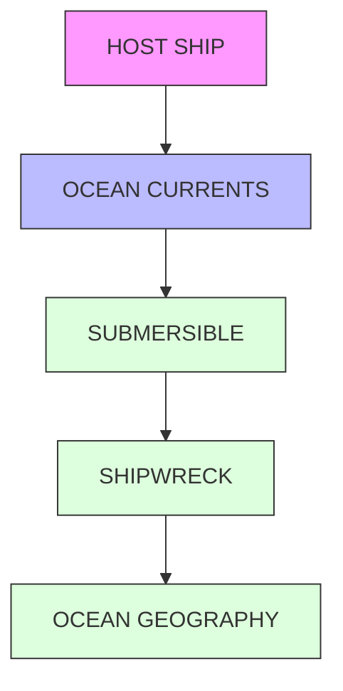
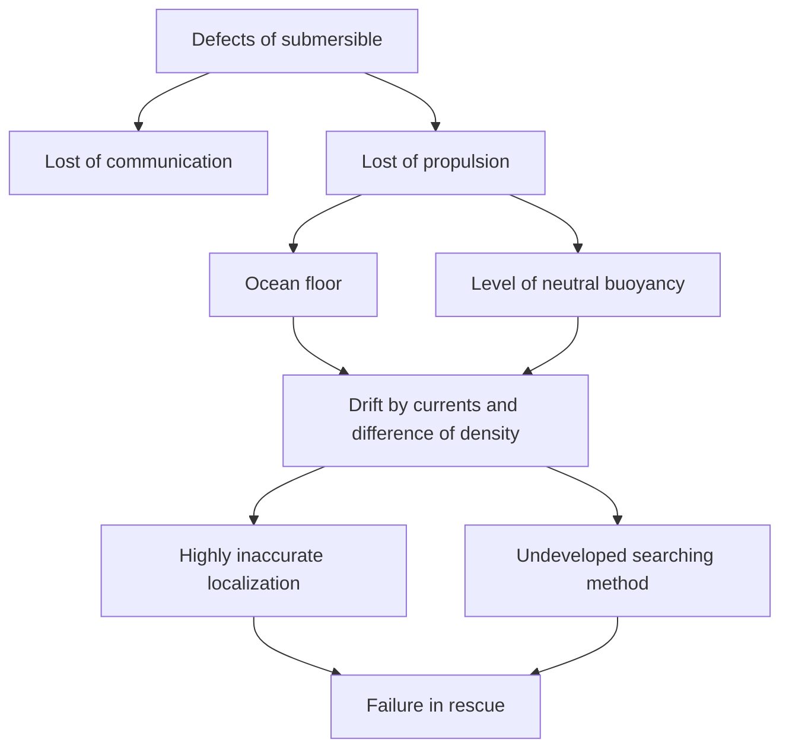
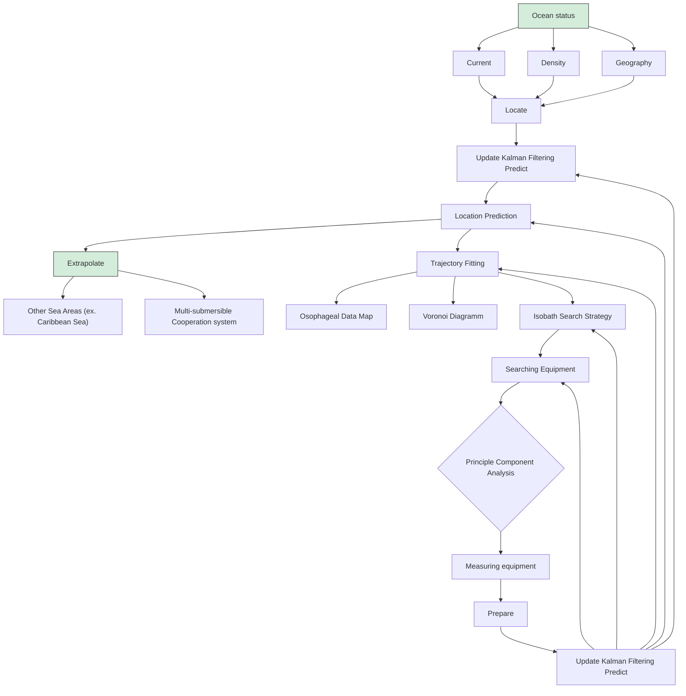
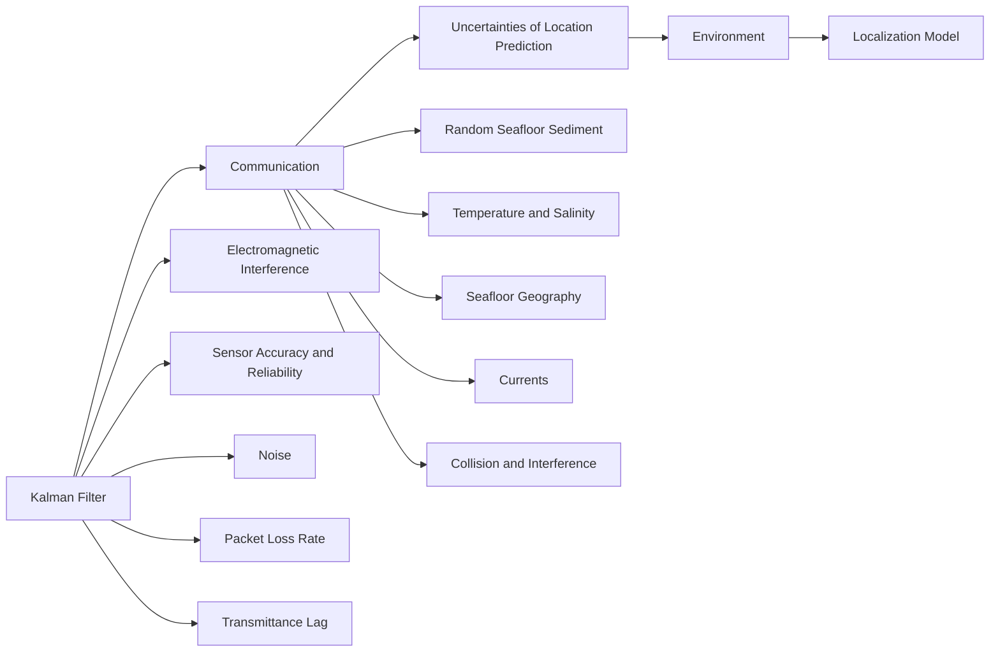

# Save the Submersible: An Combined Method of Computational Fluid Dynamics and Kalman Filter

Summary

Exploration of shipwrecks on the seabed by submersibles represents a blue ocean for tourism development. Yet presently there's an absence of procedures to ensure the safekeeping of submersibles in case of an incident. In an effort to bridge the gap, our team construct the following model to realize more accurate localization and prompt search.

First, to locate. We collected data of ocean currents, seawater density, and seafloor geography which are the main uncertainties affecting the submersible's motion. Then, we established the Computational Fluid Dynamics equation via simplified Fossen's Six Degrees of Freedom model. With the prerequisites of Kalman Filter all met, we can safely adopt the computationally efficient Kalman Filtering. Utilizing the "update-predict" recursive mechanism embedded in Kalman filtering, inaccuracies engendered by cumulative errors are mitigated, thereby realizing the trajectory correction. Moreover, upon calculation of the submersible's probability distribution in space, we found the trajectory that the defective submersible would most likely to follow.

Then, to prepare. To enhance rescue efficiency, we assembled data of rescue equipment available on the market and their corresponding parameters. Predicated upon 14 indicators, we used the Principle Component Analysis to construct and selected the three primary components with the highest contribution rate. This analysis thus afforded a composite score for each item of equipment, thereby determining three devices for the host ship and three for the rescue vessels.

Next, to search. We employed further the predicted estimate covariance matrix from the Kalman filter results. Combined with the probability density function of a multivariate normal distribution, a standard statistical 95% confidence 3D Space is computed and then interpreted as the feasible zone for search. As discussed in the previous section, we deploy multi-beam sonar, combined bathymetry and side scan sonar on the host ship for an Along-Isobath Search.

Furthermore, to extrapolate. We've done 2 extrapolations to the model. For one thing, we examined our model in different ocean environments. The validation of employing our model for location prediction is thus established. For another, on superimposing the concept of the Voronoi Diagram, we derived a model to assure that multiple submersibles cooperate without collisions, and effectuate the most rapid monitoring of the defective submersible in an incident.

Finally, in our sensitivity and error analysis, we found that seawater density and external environmental disturbances significantly impact submersible path prediction accuracy, with high sensitivity and larger prediction errors (RMSE values 1.55 m and 2.10 m, respectively). Propeller rotation speed and submersible mass showed lower impacts on model accuracy, with lower sensitivity(RMSE values 1.12 m and 1.17 m, respectively).

Keywords: Kalman Filter Inertial Navigation Computational Fluid Dynamics Principle Components Analysis Voronoi Diagram

## Contents

## 1 Introduction 2

1.1 Background 2  
1.2 Problem Restatement 3  
1.3 Our Approach 4

## 2 Model Preparation 4

2.1 Assumptions and Justifications 4  
2.2 Notations 5

## 3 Task 1: Location Prediction Model Incorporating the Kalman Filter 6

3.1 Consideration for Uncertainties and Equipping the Submersible ..... 6  
3.2 Computational Fluid Dynamics Analysis 6  
3.3 Mechanism of Kalman Filter 8  
3.4 Model establishment 9  
3.5 Fine-tuning Kalman Filter 10  
3.6 Results and Analysis 10

## 4 Task 2: Equipment Preparation for Host Ship and Rescue Vessel 11

4.1 Equipment Selection by Principal Component Analysis 11  
4.2 Results and Analysis 12

## 5 Task 3: Feasible Zone and Search Pattern 14

5.1 Determination of Feasible Zone for Search 14  
5.2 Cumulative Distribution Function of Probability 15  
5.3 Search Pattern Based on Sonar Scanning 15  
5.4 Results 16  
5.5 Analysis of the Results 18

## 6 Task 4: Model extrapolation 18

6.1 Caribbean Sea 18  
6.2 Coorporation strategy between multiple submersibles 19

## 7 Sensitivity Analysis and Error Analysis 20

## 8 Evaluation and Promotion of Model 21

8.1 Strengths 21  
8.2 Weaknesses and Possible Improvements 21

## References 21

## Memo for the Greek Government 23

## 1 Introduction

## 1.1 Background

Submersibles represent cutting-edge technology designed to explore the depths of our oceans. $^{[1]}$ Different from submarines that are capable of independent operations, submersibles is typically tethered or assisted by a host ship. Notably, manned submersibles that carries humans to arrive at complex deep sea environments quickly and accurately, have recently witnessed global advancements. $^{[2]}$

This progress has spurred Maritime Cruises Mini-Submarines (MCMS) to envision the integration of submersibles into underwater tourism in the Ionian Sea, a region known for its rich history and myriad sunken shipwrecks.

flowchart

Figure 1: Background

The prospect of offering tourists exhilarating ventures to the ocean's depths, however, faces challenges in the wake of the 2023 Titan submersible incident, [3] a catastrophic underwater implosion resulting in no survivors due to inherent defects. The fundamental cause of the mishap was the inability to swiftly pinpoint and search the submersible, thereby profoundly decelerating the rescue. The incident has sparked widespread concerns regarding the localization and rescuing speed of submersibles after it was defected underwater.

Generally, two types of defect of a submersible can occur.(Fig.2)

flowchart

Figure 2: Submersible's defects and consequences

Once a defective submersible lose its propulsion, it might end up situated on the seafloor or at a level of neutral buoyancy, where it neither descends nor ascends. However, in the complex and dynamic deep water environments, the submersible can be drifted away by currents and difference of seawater density. Once a defective submersible lose its communication to the host ship, it is hardly possible for the host ship to locate the submersible. Therefore, enhancing the accuracy of localization before the rescue is the first challenge. Moreover, once the area where the submersible might be situated is determined, the search pattern for rescue is to be improved.

In order to relieve public concerns and obtain approval for submersible tourism from regulators, MCMS requires our team to construct models for better locating the submersible over time and developing search patterns for the rescue. Furthermore, our model aims to shed light on innovative methodologies to equip the host ship and rescue vessels and minimize the rescue time.

## 1.2 Problem Restatement

In reaction to MCMS requirements, we have been assigned to develop models for the purposes of:

## - Localization

- Construct models to accurately forecast the submersible's location over time.  
- Take into account uncertainties such as currents, varying sea densities, and the geographical features of the Ionian Sea.  
- Design the information the submersible can intermittently relay back to the host ship to minimize these uncertainties.  
- Determine the equipment needed for an effective transmission of this information.

## • Equipment Recommendation

- Propose additional search equipment that MCMS should employ on the host ship.  
- Consider myriad indicators affecting the performance of the equipment.  
- Evaluate and choose the most proper equipment for the search of submersible.  
- Derive what extra equipment a rescue vessel might necessitate.

## - Search

- Develop a model that utilizes data from the localization models to suggest initial deployment points for the rescue equipment.  
- Minimize the duration required to find a lost submersible by constructing a model of the search strategy.  
- Express the probability of finding the submersible as a function of time and cumulative search results.

## - Adaptation

- Explore the potential to broaden the applicability of the constructed model to incorporate other oceanic tourist destinations.  
- Identify necessary adjustments to the model to accommodate multiple submersibles moving within a similar vicinity.

## 1.3 Our Approach

The approach of our model is as follows:

- Establish Computational Fluid Dynamics (CFD) equations taking into account the uncertainties.  
- Employ the Kalman filter to correct inaccuracies and improve trajectory estimation through the "update-predict" recursive algorithm.  
- Utilize the probability distribution of the submersible's position to fit a trajectory of higher confidence for more precise localization.  
- Analyze and select rescue equipment based on Principle Component Analysis for the host ship and rescue vessels.  
- Use the probability density function to compute a $95\%$ confidence 3D space and deploy the Along-Isobath Search Strategy within this space to reduce the searching time.  
- Discuss the extrapolation of the model in the Caribbean sea.  
- Combine the Voronoi Diagram with our Search Model to actualize the cooperation between submersibles.

flowchart

Figure 3: Our Approach

## 2 Model Preparation

## 2.1 Assumptions and Justifications

\- Assumption 1: The submersible is a spherical rigid body.

\- Justification: The choice of spherical shape is based on the principle of isotropy, which means that the submersible exhibits the same properties and behavior in every direction, allowing us to simplify the fluid dynamics analysis by eliminating the need to consider the impacts of roll, pitch and yaw motions.

\- Assumption 2: The submersible operates generally at the neutral buoyancy level.

- Justification: By maintaining neutral buoyancy, the submersible remains at a desired depth without continuous adjustments. This reduces the complexity and energy requirements of the submersible's operations.  
- Assumption 3: The submersible retains an invariant density after an incident.  
- Justification: In the absence of consideration of other disturbances (initial velocity, ocean currents, etc.), this assumption ensures that the submersible remains at the neutral buoyancy level after an incident, which reduces the factors requisite for localization.  
- Assumption 4: Lost of communication and lost of propulsion of the submersible (the two types of defects shown in Fig. 2) takes place simultaneously.  
- Justification: Should the submersible merely detect its disconnection, it would then power down its propulsion systems so as to introduce less deviations. Should the submersible solely lose power, the submersible could simply send a signal to the host ship to instigate rescue operations, which falls out of consideration.

## 2.2 Notations

Table 1: Definition of Symbols

<table><tr><td>Symbol</td><td>Definition</td><td>Unit</td></tr><tr><td>M</td><td>inertia matrix of the rigid body</td><td> $kg \cdot m^{2}$ </td></tr><tr><td>C</td><td>Coriolis-centripetal force matrix</td><td>kg</td></tr><tr><td>D</td><td>fluid damping matrix</td><td>kg/s</td></tr><tr><td>g(η)</td><td>restoring forces under static conditions</td><td>N</td></tr><tr><td>Fprop</td><td>thrust force of the propellers</td><td>N</td></tr><tr><td>τ</td><td>external environmental disturbances (such as currents)</td><td>N</td></tr><tr><td>m</td><td>mass of the submersible</td><td>kg</td></tr><tr><td>V</td><td>volume of the submersible</td><td> $m^{3}$ </td></tr><tr><td>v</td><td>speed matrix of submersible relative to earth</td><td>m/s</td></tr><tr><td>ρ</td><td>density of water</td><td> $kg/m^{3}$ </td></tr><tr><td>n</td><td>propeller rotation speed</td><td>rad/s</td></tr><tr><td>u</td><td>vehicle&#x27;s speed</td><td>m/s</td></tr><tr><td>d</td><td>propeller diameter</td><td>m</td></tr><tr><td>KT</td><td>thrust coefficient</td><td>-</td></tr><tr><td>ν</td><td>vector of linear and angular velocities</td><td>-</td></tr></table>

The main variables and parameters while specific value of those parameters will be given later are defined in Tbl. 1

## 3 Task 1: Location Prediction Model Incorporating the Kalman Filter

## 3.1 Consideration for Uncertainties and Equipping the Submersible

In the deep-ocean environments, there exists myriad uncertainties that could hinder the accuracy of our prediction.(Fig. 4)

flowchart

Figure 4: Uncertainties of Localization Prediction

In order to decrease the uncertainties, it is necessary for the submersible to periodically transmit a plethora of data collected by various sensors equipped onboard to the host ship, including the velocity data collected by the Inertial Measurement Unit (IMU), salinity collected by environmental sensors, the force exerted by the water flow measured by pressure sensors, and so forth.

Accordingly, we adopt the Inertial Navigation System (INS) to localize the submersible, which necessitates motion sensors such as accelerometer, gyroscope, and magnetometer and a computer to continuously calculate the position of the submersible in motion without the need for external references. $^{4}$ In addition, we can equip the submersible with environmental sensors to capture further information.

Correspondingly, the submersible should periodically send the following data back to the host ship:

1. Position Updates: The calculated latitude, longitude, and depth.  
2. Velocity Data: The velocity of the submersible in 6 dimensions.  
3. Sensor Readings: Processed sensor data from the accelerometer, gyroscope, and magnetometer.  
4. Health and Status: The operational status of the submersible, such as the remaining propulsion.  
5. Environmental Data: Temperature, salinity, or water density that might affect INS performance.

The host ship can use this information to apply corrections to INS data and ensure the accuracy of submersible's localization. Additionally, the periodic communication helps in case of an emergency, conducting search and rescue operations.

## 3.2 Computational Fluid Dynamics Analysis

We established the motion equations for the submersible, employing data collected by sensors on the submersible, to calculate its trajectory.

The dynamics of the submersibles are primarily influenced by hydrodynamic forces, static forces(gravity and buoyancy), thrust of propellers, environmental disturbance(such as ocean currents and density differences). In the work of Fossen 1994, $^{[5]}$ the dynamics of an Autonomous Underwater

Vehicle (AUV) are captured by a comprehensive six degrees of freedom (6DOF) model. The generic form of the model is given by:

$$
\mathbf {M} \dot {\nu} + \mathbf {C} (\nu) \nu + \mathbf {D} (\nu) \nu + \mathbf {g} (\eta) = \tau + \mathbf {F} _ {\text { prop }} \tag {1}
$$

See also Table 1 for definition of symbols.

text_image

F_prop
Heading
F_Current

Figure 5: Computational fluid dynamics(CFD) analysis

This relative velocity $\mathbf{v}_{\mathrm{sub}}$ is used in the drag force equation to account for the effect of the stochastic ocean current on the submersible's dynamics.

$$
\mathrm{v} _ {\text { sub }} = \mathrm{v} - \mathrm{u} _ {\text { current }} \tag {2}
$$

$$
\mathbf {u} _ {\mathrm{current}} = \left[ \begin{array}{c} u \sin (\theta) \cos (\phi) \\ u \sin (\theta) \sin (\phi) \\ u \cos (\theta) \end{array} \right]
$$

In the course of thermodynamics, $[6]$ we learned that the force exerted by the propeller and the currents are:

$$
\left| \left| \mathbf {F} _ {\text { prop }} \right| \right| _ {2} = (1 - t) \rho n ^ {2} d ^ {2} K _ {T} \tag {3}
$$

$$
\mathbf {F} _ {\text { prop }} = \left[ \begin{array}{c} \left| \left| \mathbf {F} _ {\text { prop }} \right| \right| _ {2} \sin (\theta) \cos (\phi) \\ \left| \left| \mathbf {F} _ {\text { prop }} \right| \right| _ {2} \sin (\theta) \sin (\phi) \\ \left| \left| \mathbf {F} _ {\text { prop }} \right| \right| _ {2} \cos (\theta) \end{array} \right] \tag {4}
$$

$$
\mathbf {F} _ {\text { current }} = - \frac {1}{2} \rho C _ {d} A | | \mathbf {v} _ {\text { sub }} | | _ {2} \mathbf {v} _ {\text { sub }} \tag {5}
$$

where $||\cdot ||_2$ stands for the Euclidean norm (also known as the L2 norm)

In order to simplify Fossen's model, we made these assumptions: The submersible operates at a relatively constant depth, and the influence of heave, roll, and pitch motions are negligible over the time scale of interest. Consequently, the dynamic effects associated with these motions are omitted for the sake of model parsimony and computational efficiency.

公众号：蚂蚁竞赛 更多资料请加QQ群1077734962，谢谢！

Therefore, in this case(in the form of matrix), we have:

$$
m \frac {\mathrm{d} \mathbf {v}}{\mathrm{d} t} = \mathbf {F} _ {\text { current }} + \mathbf {F} _ {\text { prop }} \tag {6}
$$

Particularly, when the submersible malfunctioned, $F_{prop} = 0$ . This CFD(Computational Fluid Dynamics) is the foundation of the following parts.

## 3.3 Mechanism of Kalman Filter

The former model is based on differential equations and sensor data, specifically from an IMU(Inertial Measurement Unit). Both the model and the IMU data satisfy the conditions of a Markov chain, where the state vector at any given moment is related to that in the previous timeframe. This is possible due to the deterministic nature of classical Newtonian mechanics.

For statistics and control theory, Kalman Filtering is a computationally efficient algorithm that uses a series of measurements observed over time, including statistical noise and other inaccuracies, and produces estimates of unknown variables that tend to be more accurate than those based on a single measurement alone, by estimating a joint probability distribution over the variables for each timeframe. It recursively estimates the system states through prediction and update steps.

Now, we apply Kalman Filter to the differential equations. We assume that all sensor measurement errors (systematic errors) and process errors of the real environment (random errors) have a mean of zero, follow a normal distribution, and are independent with respect to time. Under these conditions, the Kalman Filter emerges as the most appropriate model for estimating the states of a dynamic system from a series of incomplete and noisy measurements.

line chart

| Car's position x | Probability density function |
| ---------------- | ---------------------------- |
| Initial state estimate | variance (approximate peak) |
| Optimal state estimate | x̂_k (peak) |
| Predicted state estimate | x̂_k (peak) |
| Measurement | x̂_k (peak) |

Figure 6: How Kalman Filter works: Predict & Update

## - Prediction steps

Predicted state estimate:

$$
\hat {x} _ {k \mid k - 1} = F _ {k} \hat {x} _ {k - 1 \mid k - 1} + B _ {k} u _ {k} \tag {7}
$$

Predicted error covariance: $P_{k|k-1} = F_k P_{k-1|k-1} F_k^\top + Q_k$

## - Update steps

Observation residual: $y_{k} = z_{k} - H_{k}\hat{x}_{k|k - 1}$

Residual covariance: $S_{k} = H_{k}P_{k|k - 1}H_{k}^{\top} + R_{k}$

Optimal Kalman gain: $K_{k} = P_{k|k - 1}H_{k}^{\top}S_{k}^{-1}$

Updated state estimate: $\hat{x}_{k|k} = \hat{x}_{k|k-1} + K_k y_k$

Updated error covariance: $P_{k|k} = (I - K_kH_k)P_{k|k-1}$

## 3.4 Model establishment

The state vector of the Kalman Filter is defined as:

$$
x = \left[ x _ {s u b}, y _ {s u b}, z _ {s u b}, \dot {x} _ {s u b}, \dot {y} _ {s u b}, \dot {z} _ {s u b}, \ddot {x} _ {s u b}, \ddot {y} _ {s u b}, \ddot {z} _ {s u b} \right] ^ {\top} \tag {8}
$$

where $x_{sub}$ , $y_{sub}$ , $z_{sub}$ are the coordinates of the submersible's center of mass relative to the initial zero position of the submersible's IMU (Inertial Measurement Unit).

We choose the IMU reference frame for its stability - it remains fixed and doesn't move along with the submersible, which in turn allows for more precise global positioning. The adoption of this frame provides a stationary point-of-reference, enabling us to accurately measure changes in the position and velocity of the submersible over time. Furthermore, the data generated by the IMU inherently aligns with this coordinate framework, which greatly facilitates future calculations.

Next, based on data provided by various sensors, we select the following observation vector:

$$
z = [ \dot {x} _ {s u b}, \dot {y} _ {s u b}, \dot {z} _ {s u b}, \ddot {x} _ {s u b}, \ddot {y} _ {s u b}, \ddot {z} _ {s u b}, F _ {t o t, x}, F _ {t o t, y}, F _ {t o t, z} ] ^ {\top}
$$

where we make full use of the velocity terms provided by the submersible's IMU and we can calculate the acceleration terms using the CFD in the mean while.

We rewrite the two vectors above in a more compact form. Let $\vec{x}_{sub} = [x_{sub}, y_{sub}, z_{sub}]$ be the three-dimensional coordinates of the submersible, $\vec{F}_{tot}$ be the composition of forces. Thus, the state vector and the observation vector become:

$$
x = \left[ \vec {x} _ {s u b}, \dot {\vec {x}} _ {s u b}, \ddot {\vec {x}} _ {s u b} \right] ^ {\top} z = \left[ x _ {s u b} ^ {\dot {\rightarrow}}, x _ {s u b} ^ {\ddot {\rightarrow}}, \vec {F} _ {t o t} \right] ^ {\top}
$$

Now, let's write the state transition equation, which is the matrix equivalent to the following mapping $f: x_{k-1|k-1} \mapsto x_{k|k-1}$ . Generally, the transition matrix is equal to the Jacobian matrix of the transition equation, as shown in Eq. 7. In our case, this mapping is linear, so the Jacobian matrix turns out to be the coefficient matrix. Based on the compact state representation, we can express it using matrix block form.

For the convenience of expression, we define:

$$
I _ {3} \stackrel {\mathrm{not}} {=} \left[ \begin{array}{c c c} 1 & 0 & 0 \\ 0 & 1 & 0 \\ 0 & 0 & 1 \end{array} \right], \quad \mathbf {0} \stackrel {\mathrm{not}} {=} \left[ \begin{array}{c c c} 0 & 0 & 0 \\ 0 & 0 & 0 \\ 0 & 0 & 0 \end{array} \right]
$$

Thus, the state transition matrix derived from the predicted state estimate is:

$$
F = \left[ \begin{array}{c c c} I _ {3} & \mathrm{dt} \cdot I _ {3} & \frac {1}{2} \mathrm{dt} ^ {2} \cdot I _ {3} \\ \mathbf {0} & I _ {3} & \mathrm{dt} \cdot I _ {3} \\ \mathbf {0} & \mathbf {0} & I _ {3} \end{array} \right]
$$

In the submersible model, no quantity can be known precisely or measured accurately. Therefore, we forego the opportunity to provide known external inputs to the Kalman model via the control vector, thus preventing these noisy and uncertain factors from directly affecting the state. In other words:

$$
B = \left[ \begin{array}{c c c c c c c c c} 0 & 0 & 0 & 0 & 0 & 0 & 0 & 0 & 0 \end{array} \right] ^ {\top}, u = [ 0 ]
$$

Finally, we express the observation matrix $H$ , which maps the observation space to the real space:

$$
H = \left[ \begin{array}{c c c} \mathbf {0} & I _ {3} & \mathbf {0} \\ \mathbf {0} & \mathbf {0} & I _ {3} \\ \mathbf {0} & \mathbf {0} & I _ {3} / m \end{array} \right] \text {subject to} z = H \cdot x
$$

where $m$ denotes the mass of the submersible.

Thus, we fully integrate the data collected by the sensor installed on the submersible into the model for data fusion, and jointly reduce the prediction error. Specifically, we can extract real-time IMU data and obtain the pose quaternion of the submersible from the industrial high-precision gyroscope as well as the three-axis acceleration from the accelerometer. Using the gyroscope's quaternion, we convert the acceleration calculated by CFD to the IMU's fixed coordinate system before updating the observation vector. The extensibility of this observation matrix is high. If we have additional sensors, such as a Doppler velocimeter, we can also include the velocity prediction in the observations.

It's also worth mentioning that in the case of a communication loss, we will prune the sensor-based observation from the matrices, and the filter can continue working smoothly.

## 3.5 Fine-tuning Kalman Filter

The efficacy of the Kalman filter is significantly influenced by the accurate modeling of the process noise covariance matrix $Q$ and the measurement noise covariance matrix $R$ . These matrices represent the expected uncertainty in our process model and measurement sensors, respectively. An iterative process of testing and refinement is typically employed to adjust $Q$ and $R$ until the filter's performance meets the desired criteria for accuracy and reliability. This tuning process is crucial for achieving optimal filter performance and is often the difference between a good estimation and a great one. According to our extensive empirical testing, we eventually adopted the parameters that add some extent of uncertainty to the output of CFD while giving credit to the data directly gained from accessible high-precision sensors.

$$
R = \left[ \begin{array}{c c c} 2 \cdot I _ {3} & \mathbf {0} & \mathbf {0} \\ \mathbf {0} & 0. 5 \cdot I _ {3} & \mathbf {0} \\ \mathbf {0} & \mathbf {0} & 5 \cdot I _ {3} \end{array} \right], Q = \left[ \begin{array}{c c c} 5 \cdot I _ {3} & \mathbf {0} & \mathbf {0} \\ \mathbf {0} & 3 \cdot I _ {3} & \mathbf {0} \\ \mathbf {0} & \mathbf {0} & I _ {3} \end{array} \right]
$$

## 3.6 Results and Analysis

In the MATLAB environment, we have simulated the trajectory after the malfunction of the submersible takes place based on our localization model.

3d surface plot

| X    | Y    | Z     |
|------|------|-------|
| -100 | -50  | -4980 |
| -50  | -50  | -4960 |
| 0    | -50  | -4940 |
| 50   | -50  | -4920 |
| 100  | -50  | -4900 |

3d surface plot

| X    | Y    | Z     |
|------|------|-------|
| -100 | -50  | -4960 |
| 0    | 0    | -4960 |
| 50   | 50   | -4980 |
| 100  | 100  | -5000 |

3d surface plot

| X | Y | Z |
| --- | --- | --- |
| -100 | -100 | -4940 |
| 0 | -100 | -4960 |
| 50 | -100 | -4980 |
| 0 | 0 | -5000 |
| -50 | 0 | -5000 |
| 50 | 50 | -5000 |
| 0 | 50 | -5000 |
| -50 | 50 | -5000 |
| 50 | 50 | -5000 |
| 0 | 50 | -5000 |
| -50 | 50 | -5000 |
| 50 | 50 | -5000 |
| 0 | 50 | -5000 |
| -50 | 50 | -5000 |
| 50 | 50 | -5000 |
| 0 | 50 | -5000 |
| -50 | 50 | -5000 |
| 50 | 50 | -5000 |
| 0 | 50 | -5000 |
| -50 | 50 | -5000 |
| 50 | 50 | -5000 |
| 0 | 50 | -5000 |
| -50 | 50 | -5000 |
| 50 | 50 | -5000 |
| 0 | 50 | -5000 |
| -50 | 50 | -5000 |
| 50 | 50 | -5000 |
| 0 | 50 | -5000 |
| -50 | 50 | -5000 |
| 50 | 50 | -5000 |
| 0 | 50 | -5000 |
| -50 | 50 | -5000 |
| 50 | 50 | -5000 |
| 0 | 50 | -5000 |
| -50 | 50 | -5000 |
| 50 | 50 | -5000 |
| 0 | 50 | -5000 |
| -50 | 50 | -5000 |
| 50 | 50 | -5000 |
| 1 | 1 | -4942 |
| 1 | 1 | -4962 |
| 1 | 1 | -4982 |
| 1 | 1 | -4992 |
| 1 | 1 | -4997 |
| 1 | 1 | -4999 |
| 1 | 1 | -4999 |
| 1 | 1 | -4999 |
| 1 | 1 | -4999 |
| 1 | 1 | -4999 |
| 1 | 1 | -4999 |
| 1 | 1 | -4999 |

3d surface plot

| X     | Y     | Z      |
|-------|-------|--------|
| -50   | -100  | -4990  |
| 0     | -100  | -4980  |
| 50    | -100  | -4970  |
| 100   | -100  | -4960  |
| 50    | 0     | -4950  |
| 0     | 0     | -4940  |
| -50   | 0     | -4930  |
| -100  | 0     | -4920  |

Figure 7: Simulated Trajectory in MATLAB (a)(b)(c) Evolution of the trajectory (d) Bottom view of the trajectory

公众号：蚂蚁竞赛 更多资料请加QQ群1077734962，谢谢！

As shown in Fig.7, the submersible without propulsion is drifted by the currents. The red dots on the surface of the ocean signify the current density. The trajectory manifests a spiraling pattern, which is a consequence of the vortex-like ocean current disturbances. Moreover, due to the initial downward direction of velocity at the commencement of the incident, the spiral path displays a trend of downward divergence. The result is as expected.

Beyond potential impacts from the underwater currents, our simulation takes into account potential collisions imparted by the seabed geography. Within geography featuring protruding submarine mountain bridges, the collision detection module embodied in the model can identify abrupt velocity alterations and modify the trajectory prediction accordingly.(Fig.8)

scatterplot

| X | Y | Z |
| --- | --- | --- |
| 0 | 0 | -5 |
| 10 | 10 | -6 |
| 20 | 20 | -7 |
| 30 | 30 | -8 |
| 40 | 40 | -9 |
| 50 | 50 | -10 |
| 60 | 60 | -11 |
| 70 | 70 | -12 |
| 80 | 80 | -13 |
| 90 | 90 | -14 |
| 100 | 100 | -15 |
| 110 | 110 | -16 |
| 120 | 120 | -17 |
| 130 | 130 | -18 |
| 140 | 140 | -19 |
| 150 | 150 | -20 |
| 160 | 160 | -21 |
| 170 | 170 | -22 |
| 180 | 180 | -23 |
| 190 | 190 | -24 |
| 200 | 200 | -25 |
| 210 | 210 | -26 |
| 220 | 220 | -27 |
| 230 | 230 | -28 |
| 240 | 240 | -29 |
| 250 | 250 | -30 |
| 260 | 260 | -31 |
| 270 | 270 | -32 |
| 280 | 280 | -33 |
| 290 | 290 | -34 |
| 300 | 300 | -35 |
| 310 | 310 | -36 |
| 320 | 320 | -37 |
| 330 | 330 | -38 |
| 340 | 340 | -39 |
| 350 | 350 | -40 |
| 360 | 360 | -41 |
| 370 | 370 | -42 |
| 380 | 380 | -43 |
| 390 | 390 | -44 |
| 400 | 400 | -45 |

Figure 8: Spacial case: underwater landscape Figure 9: Spatial probability distribution of blocked the route of the submersible the defective submersible

Further elaborating, Fig.9 provides a display of the probable area of occurrence of the submersible deduced through Kalman Filter prediction in the aftermath of an incident. The blue trajectory reflects the bona fide path of the submersible, while the red scatter points portray the spacial probability distribution computed by the model.

## 4 Task 2: Equipment Preparation for Host Ship and Rescue Vessel

## 4.1 Equipment Selection by Principal Component Analysis

In order to improve communication between the submersible and the host ship to achieve more accurate positioning and rapid search and rescue operations, we recommend equipping the host ship with additional search devices. The market offers a diverse array of devices designed for this purpose, each distinguishable by various performance indicators. To analyze and compare the indicators and select the most suitable devices, we propose employing the Principal Component Analysis (PCA), which allows us to screen out key variables and reduce the complexity of the situation.

The main modeling steps are described below.

\- Sample matrix: 14 representative devices available on the market are chosen and 13 performance indicators denoted by $a_{i}$ are established. Each device is then conceptualized as a vector $x_{n} = (x_{n1}, \ldots, x_{n13})$ . Thus, we construct the sample matrix $X_{14 \times 13}$ to represent all the data we collected from the manufacturer.

- Standardization: We standardize X by subtracting the mean from each row and dividing each row by its standard deviation.  
- Covariance matrix: The element $c_{ij}$ of the covariance matrix $\mathbf{C}$ represents the covariance between indicators $a_i$ and $a_j$ and is given by:

$$
c _ {i j} = \frac {1}{n - 1} \sum_ {k = 1} ^ {n} (x _ {k i} - \bar {x} _ {i}) (x _ {k j} - \bar {x} _ {j})
$$

where $x_{ki}$ and $x_{kj}$ are the standardized values of variables i and j for the k-th observation, and $\bar{x}_{i}$ and $\bar{x}_{j}$ are their respective means.

\- Eigendecomposition and contribution rate: We calculate eigenvalues and corresponding eigenvectors of C. On the basis of the eigenvalues, we can solve the contribution rate and the accumulative contribution rate of the parameters.

Table 2: Eigenvectors and contribution rate corresponding to the 3 principal components

<table><tr><td>Indicator</td><td>PC1</td><td>PC2</td><td>PC3</td></tr><tr><td>Cost</td><td>0.3839593</td><td>-0.1153862</td><td>0.0901579</td></tr><tr><td>Workforce</td><td>0.3467707</td><td>0.0078141</td><td>0.3145092</td></tr><tr><td>Availability</td><td>-0.3274316</td><td>0.0775631</td><td>-0.2925692</td></tr><tr><td>Maintenance</td><td>0.3120141</td><td>0.2352130</td><td>0.3001698</td></tr><tr><td>Readiness</td><td>-0.1001557</td><td>0.5512866</td><td>-0.0502958</td></tr><tr><td>Energy Consumption</td><td>0.3824945</td><td>-0.0713404</td><td>-0.1810475</td></tr><tr><td>Detection Distance</td><td>0.2562031</td><td>0.2695921</td><td>-0.0706944</td></tr><tr><td>Resolution</td><td>0.2663515</td><td>0.1367001</td><td>-0.3954241</td></tr><tr><td>Detection Speed</td><td>0.3297991</td><td>-0.0073919</td><td>-0.3388978</td></tr><tr><td>Adaptability</td><td>-0.0286098</td><td>0.1725088</td><td>0.5167477</td></tr><tr><td>Anti-Interference Capability</td><td>0.2460527</td><td>0.1149641</td><td>-0.2996652</td></tr><tr><td>Ease of Operation</td><td>-0.2363936</td><td>0.4295668</td><td>-0.1816506</td></tr><tr><td>Failure Rate</td><td>0.0939937</td><td>0.5453001</td><td>0.1261542</td></tr><tr><td>Variance Contribution Rate</td><td>0.4779</td><td>0.2267</td><td>0.1520</td></tr><tr><td>Cumulative Contribution Rate</td><td>0.4779</td><td>0.7046</td><td>0.8566</td></tr></table>

According to Tbl. 2, We selected the first three components as the three principle components PC1, PC2, PC3, representing respectively the cost-effectiveness, the operational reliability, and the human resource aspects.

## 4.2 Results and Analysis

Multiplying the contribution rate with the value of corresponding principle components, we can obtain the composite scores of our 14 devices as shown in Tbl. 3.

Table 3: Composite Scores by Equipment

<table><tr><td>Equipment</td><td>Composite Score</td></tr><tr><td>Perry Slingsby Multi-Beam</td><td>0.8313</td></tr><tr><td>Deep Trekker DTX2</td><td>-0.905</td></tr><tr><td>Teledyne BlueView Multi-Beam Sonar</td><td>1.8536</td></tr><tr><td>Deep Trekker Side Scan Sonar</td><td>-0.7821</td></tr><tr><td>Edgetech Combined Bathymetry and Side Scan Sonar</td><td>1.5798</td></tr><tr><td>Divex AUV-1000</td><td>-2.6028</td></tr><tr><td>Deep Trekker DTX2 AUV</td><td>-0.4873</td></tr><tr><td>James Fisher JF-AUV</td><td>1.0914</td></tr><tr><td>Perry Slingsby Explorer AUV</td><td>0.285</td></tr><tr><td>Divex ROV-1000</td><td>-0.0834</td></tr><tr><td>Soil Machine Dynamics Quantum EV</td><td>1.3665</td></tr><tr><td>James Fisher Innovator</td><td>-1.0597</td></tr><tr><td>Kystdesign Seaglider</td><td>-1.2779</td></tr><tr><td>Perry Slingsby Triton</td><td>0.1904</td></tr></table>

From the result above, we find that Perry Slingsby Multi-Beam, Perry Slingsby Side Scan Sonar and Divex AUV-1000 are the most suitable devices to be equipped on the host ship.(Fig. 10) Following is a brief introduction of the 3 devices:

- Teledyne BlueView Multi-Beam Sonar: a type of active sonar system that propels a series of sound pulses underwater to a plethora of angles and manifests a 3D depiction of the ocean floor.  
- Edgetech Combined Bathymetry and Side Scan Sonar: a sonar combining bathymetry and broad detection that projects sound pulses toward both sides underwater while receiving their echoes subsequently, thereby generating a 2D image of large areas of the seabed.  
- Soil Machine Dynamics Quantum EV: a Remotely Operated Vehicle (ROV) that has commendable tool/instrument carriage capacity, enabling operations reaching depths of up to 6000 meters.

(a)  

natural_image

Cross-sectional view of a mechanical device with internal components and wiring (no visible text or symbols)

(c)  

natural_image

Exploded view diagram of a mechanical assembly (no text or symbols visible)

natural_image

Yellow industrial crane with articulated arms and visible components (no text or symbols)

(b)  

natural_image

Yellow EdgeTech industrial device with black casing and red warning symbol (no readable text or labels)

FOR THE HOST SHIP

(d)  

(e)  
  
FOR RESCUE VESSELS  
Figure 10: Equipment for the host ship and rescue vessels (a)Teledyne BlueView Multi-Beam Sonar (b)Edgetech Combined Bathymetry and Side Scan Sonar (c)Soil Machine Dynamics Quantum EV (d)Impact Subsea ISS360 Sonar (e)Imenco Cameras and Lights (f)Allied Luffing Arm Rescue Boat Davit System

Concurrently, we choose the Soil Machine Dynamics ROV as our rescue vessel. Similarly, using the same PCA method, we conclude that the following equipment can be equipped for the rescue vessel: Impact Subsea ISS360 Sonar, Imenco Cameras and Lights and Allied Luffing Arm Rescue Boat Davit System.(Fig. 10)

## 5 Task 3: Feasible Zone and Search Pattern

By further exploiting the Kalman Filter, establishing more effective searching patterns and utilizing appropriate equipment, our model can reduce the searching time of a defective submersible with the help of a high localization accuracy, even without direct communication of the submersible with respect to the host ship.

## 5.1 Determination of Feasible Zone for Search

Previously, we have only utilized the predictive information from the Kalman filter for the temporary location of the submersible. However, we can further exploit other useful properties of the Kalman filter. With this intuition, we considered using the predicted estimate covariance matrix $P_{k|k-1}$ maintained by Kalman to calculate the probability distribution of the submersible's potential locations.

Let's assume that the errors in the x-y-z axes are independent of each other. This assumption allows us to conveniently use a multivariate Gaussian distribution to represent the distribution of the submersible's position at the current moment, which is the first three dimensions predicted by the Kalman filter (as defined in the state vector of the Kalman filter, in Eq.8). Consider the probability density function of a multivariate normal distribution:

$$
f (\mathbf {x}; \boldsymbol {\mu}, \boldsymbol {\Sigma}) = \frac {1}{\sqrt {(2 \pi) ^ {k} | \boldsymbol {\Sigma} |}} \exp \left(- \frac {1}{2} (\mathbf {x} - \boldsymbol {\mu}) ^ {\top} \boldsymbol {\Sigma} ^ {- 1} (\mathbf {x} - \boldsymbol {\mu})\right) \tag {9}
$$

where, in our Kalman filter results, k is taken to be 3

- $\mu$ is the 3-dimensional position prediction given by the Kalman filter.  
- $\Sigma$ is a $3 \times 3$ matrix representing the covariance between x-y-z coordinates.  
- $|\Sigma|$ is the determinant of the predicted covariance matrix $P_{k|k-1}$ .  
- $\Sigma^{-1}$ is the inverse of the covariance matrix.

By leveraging the probability density function in conjunction with Kalman filtering predictions, we can accurately ascertain the likelihood of the submersible's presence at any given point in space. To estimate the search area with the highest probability, we employ a standard statistical $95\%$ confidence region in three-dimensional space, which represents the zone where the submersible is most likely to be found. The concept of the $95\%$ confidence region is depicted in Fig.11, where we have simplified the representation to consider only the x-y plane, thereby enhancing the diagram's clarity for demonstrative purposes.

scatterplot

| x      | y      |
| ------ | ------ |
| -38    | -24    |
| -36    | -26    |
| -34    | -28    |
| -32    | -30    |
| -30    | -32    |
| -28    | -34    |
The image displays a 3D scatter plot with a color scale ranging from 0.01 to 0.03, showing a gradient of point density. A red circle highlights the cluster of data points within the red region. The x-axis ranges from -42 to -26, and the y-axis ranges from -34 to -18. There is no explicit title or legend provided in the image.

Figure 11: feasible zone of possible appearance, enclosed by red ellipse

Hereby, we define this three-dimensional 95% confidence region as the feasible zone, and subsequent search and rescue operations can be considered within this feasible zone.

To more accurately reflect the intricate dynamics of the ocean environment, it would be advantageous to extend our model to encompass a multi-particle dispersion simulation. This would entail employing the Kalman filter to track the paths of several hypothetical particles simultaneously, thereby improving the model's relevance and effectiveness.

## 5.2 Cumulative Distribution Function of Probability

To determine the probability of locating the submersible as a function of time and amassed search results, we must consider the nonlinear dynamics of our physical model and the inherent chaotic behavior it introduces. For instance, in the most basic scenario where the system could undergo bifurcation, the computational model is unable to discern such occurrences. At any moment, a new potential trajectory could split from the current predicted one. Therefore, the probability of finding the submersible after time t is

$$
\mathbf {P} (\mathrm{found} | t) = \frac {1}{\alpha t}
$$

where $\alpha$ is a decay coefficient proportional to the entropy of the natural seabed environment.

Our model suggests that using past search results to predict a submersible's future location is ineffective, as the submersible's position is subject to change over time due to factors like ocean currents. The fact that the submersible wasn't found in a given area before doesn't mean it won't be there later. Search failures can also stem from the limited detection capabilities of equipment in a complex underwater environment. Incorporating a time-sensitive probability model based on past searches could lead to overfitting and obscure the actual location. Hence, in line with Occam's razor, we exclude such complex factors for a simpler, more effective model.

## 5.3 Search Pattern Based on Sonar Scanning

Rather than relying on an uncertain probability model to ascertain the precise probability of the submersible's presence at various locations, a more pragmatic approach involves strategizing an effective search trajectory. Utilizing the feasible zone outlined by the Kalman filter, a comprehensive search within this boundary is efficient.

text_image

Heading
Geometric Modeling
Surface
RescueVessel
Seabed
HorizontalPlane

Figure 12: Sonar-based Isobath Search Strategy

After confirming the search area, it is practical to employ more effective search techniques, such as sonar scanning. Based on the specifications referenced, $\textcircled{8}$ the previously selected Teledyne Marine Sonar is capable of operating at depths up to 6000 meters, which is suitable for the intended marine environment. The sonar emits a conical acoustic beam with a maximum single-beam width of $3^{\circ}$ . This presents an important strategic consideration: optimizing the navigation routes of rescue vessels to maximize the surveyed area per unit time, thus minimizing the total time required for the search.

Given a marine environment with a uniform slope, similar to a flattened incline, we need to consider the geometry of the sonar's conical detection beam for efficient coverage. As the sonar sweeps across the seabed, its detection beam forms an elliptical projection on the ocean floor (Fig. 12). The maximum coverage width can be achieved as the major axis of the elliptical projection coincides with the sonar's horizontal beam spread.

The key observation is that when a search ship equipped with sonar moves perpendicular to the geographical gradient (along isobath), the coverage width will reach its maximum and will form the largest coverage area during the movement, thus saving the most time. The aforementioned searching pattern is visualized in Fig.14

As the search progresses, paths with lower likelihoods are eliminated, and the corresponding particles are excluded from further consideration by the Kalman filter. Then, based on the current distribution of particles, a corresponding number of new particles are generated in high-probability zones to participate in further iterations of the model.

## 5.4 Results

Based on the predictions from the Kalman filter, we can calculate the current feasible zone, as shown in Fig. 13.

text_image

Time
Elapsed

Figure 13: Temporal distribution probability heatmap of the defective submersible

公众号：蚂蚁竞赛 更多资料请加QQ群1077734962，谢谢！

The initial deployment of the rescue vessel should be where the defective submersible transmit its last signal.

Subsequently, search and rescue vessels equipped with the Teledyne Marine Sonar system are dispatched to the potential feasible zones to conduct isobath searches.

contour map

| Longitude | Latitude | Depth |
| --------- | -------- | ----- |
| 17.0      | 39.0     | -1470 |
| 18.0      | 38.5     | -647  |
| 19.0      | 38.0     | -177  |
| 20.0      | 37.5     | -1000 |
| 21.0      | 36.5     | -1823 |
| 21.0      | 36.5     | -2646 |
| 21.0      | 36.5     | -3470 |
| 21.0      | 36.5     | -4293 |
| 21.0      | 36.5     | -5116 |

Figure 14: Isobath Search strategy

Furthermore, we refine the model by implementing supplementary Kalman filters that account for particle dispersion, resulting in the identification of multiple probable search areas. It is advisable to deploy a number of search and rescue vessels to these areas and, depending on their respective probabilities, methodically inspect the regions along isopath. Presented below is a heatmap that accurately tracks three such particles:

contour map

| Latitude | Longitude | Depth |
| -------- | --------- | ----- |
| 39.5     | 17        | 2293  |
| 39.0     | 18        | 1470  |
| 38.5     | 19        | 647   |
| 38.0     | 20        | -177  |
| 37.5     | 21        | -1000 |
| 37.0     | 20        | -1823 |
| 36.5     | 19        | -2646 |
| 36.5     | 18        | -3470 |
| 36.5     | 17        | -4293 |
| 36.5     | 16        | -5116 |

Figure 15: Heatmap of Three-Particle Dispersion Based on the Kalman filter

## 5.5 Analysis of the Results

The utilization of the Kalman filter for predicting the feasible zone has proven to be an effective method in determining the probable location of the drifting submersible over time. The temporal probability heatmap (Fig. 13) provides a visual representation of the distribution of probabilities, indicating where the submersible is most likely to be found at different times.

As depicted in Fig. 14, the methodical positioning of search and rescue vessels leverages the maximization of sonar swath width to optimize the coverage of the designated search zone. This strategic approach serves to decrease the length of the search path, thereby diminishing the duration necessary to thoroughly survey the area.

## 6 Task 4: Model extrapolation

## 6.1 Caribbean Sea

In the former case, we have already examined the Ionian Sea. Our analysis revealed three significant characteristics of the sea that markedly influence the trajectory of a malfunctioning submersible: ocean currents, seafloor landscape, and variations in seawater density.

Therefore, as we transition our model to the case of the Caribbean Sea, our initial step entails modeling the marine environment of the Caribbean Sea.

Currents: The Caribbean Sea experiences a range of currents and turbulence, influenced by wind patterns and the interaction of water with underwater topography. Strong currents can challenge the submersible's propulsion system and dramatically affect its path, requiring more sophisticated navigation algorithms to compensate for drift. Turbulence can introduce noise to sensor measurements, particularly for IMUs, complicating the task of accurate state estimation.

natural_image

Color-coded atmospheric wave pattern over geographic regions, showing swirling patterns from dark blue to green and yellow (no text or symbols)

natural_image

Topographic map view showing contour lines and ocean currents (no text or labels)

Figure 16: Ocean current maps: Caribbean Sea(Left) and Ionian Sea(right)

Landscape: The Caribbean Sea's bathymetry, marked by sharp gradients and diversity, includes features like abyssal plains and coral reefs, affecting hydrodynamics and complicating navigation. In contrast, the Ionian Sea's uniform bathymetry offers a predictable setting for submersible activities. In the Caribbean, submersibles are at greater risk of seabed collision due to the intricate topography and active currents, increasing the chances of entrapment when malfunctioning.

natural_image

Topographic map of the Atlantic Ocean showing ocean currents, oceans, and landmasses (no text or labels)

natural_image

Satellite or aerial view of a coastal region with blue water bodies and surrounding land (no text or symbols visible)

Figure 17: Underwater geography maps: Caribbean Sea(Left) and Ionian Sea(right)

For submersible deployment in the Caribbean, it is imperative to integrate advanced fault management protocols and terrain-following algorithms to navigate this intricate landscape. submersibles should be equipped with precise bathymetric mapping capabilities and sensors for real-time terrain assessment to circumvent topographic obstacles. Implementing contingency strategies for system failures is also vital to minimize the risks associated with the Caribbean's challenging underwater conditions.

## 6.2 Coorporation strategy between multiple submersibles

Voronoi diagrams are a mathematical concept used to divide a space into regions such that each point in a region is closer to its designated seed point than to any other. In the context of cooperative submarine drones, each drone can be considered a seed point, and any location in the space is associated with the drone closest to it. This method allows for the effective management of the distances between drones, ensuring they are evenly distributed across the operational area.

Submarines move according to the following rules to maintain an optimal distance:

- Every submersibles stay in its own zone.  
- If the submarine detects that neighboring submarines are too close, it will adjust its position to increase the distance.

Detection and Response to Drone Failures once a drone goes offline (i.e., beyond communication range), its neighboring drones are immediately notified. These drones then:

- Initiate the previous searching model, using sonar to scan for the possible location of the disconnected drone.  
- Upon locating the disconnected drone, approach and establish a temporary communication link.  
- Continuously report the position and status of the malfunctioning drone to the main vessel.

scatterplot

| x    | y    | Color  |
|------|------|--------|
| 0.1  | 0.35 | Blue   |
| 0.2  | 0.2  | Orange |
| 0.4  | 0.85 | Green  |
| 0.5  | 0.95 | Blue   |
| 0.6  | 0.7  | Orange |
| 0.6  | 0.2  | Green  |
| 0.6  | 0.1  | Blue   |
| 0.9  | 0.8  | Green  |
| 0.1  | 0.05 | Blue   |
| 0.2  | 0.45 | Orange |
| 0.4  | 0.25 | Green  |
| 0.6  | 0.75 | Orange |
| 0.6  | 0.15 | Blue   |
| 0.6  | 0.35 | Green  |
| 0.6  | 0.45 | Orange |
| 0.9  | 0.4  | Orange |
The red circle highlights a specific region near (0.5, 0.7).

scatterplot

| x | y | Color |
| --- | --- | --- |
| 0.1 | 0.35 | Blue |
| 0.2 | 0.2 | Orange |
| 0.3 | 0.45 | Green |
| 0.4 | 0.6 | Orange |
| 0.5 | 0.7 | Green |
| 0.6 | 0.3 | Green |
| 0.7 | 0.55 | Green |
| 0.8 | 0.8 | Green |
| 0.9 | 0.4 | Orange |
| 0.55 | 0.35 | Red X |
| 0.65 | 0.25 | Orange |
| 0.75 | 0.15 | Orange |
| 0.85 | 0.65 | Orange |
| 0.95 | 0.85 | Orange |
| 0.15 | 0.05 | Blue |
| 0.25 | 0.15 | Orange |
| 0.35 | 0.35 | Green |
| 0.45 | 0.55 | Orange |
| 0.55 | 0.75 | Green |
| 0.65 | 0.35 | Orange |
| 0.75 | 0.25 | Orange |
| 0.85 | 0.65 | Orange |
| 0.95 | 0.45 | Orange |
| 0.12 | 0.32 | Blue |
| 0.22 | 0.22 | Orange |
| 0.32 | 0.42 | Green |
| 0.42 | 0.62 | Orange |
| 0.52 | 0.82 | Green |
| 0.62 | 0.32 | Orange |
| 0.72 | 0.22 | Orange |
| 0.82 | 0.52 | Green |
| 0.92 | 0.42 | Orange |
| 0.18 | 0.38 | Blue |
| 0.28 | 0.28 | Orange |
| 0.38 | 0.48 | Green |
| 0.48 | 0.68 | Orange |
| 0.58 | 0.88 | Green |
| 0.68 | 0.38 | Orange |
| 0.78 | 0.28 | Orange |
| 0.88 | 0.58 | Green |
| 0.98 | 0.48 | Orange |
| 0.14 | 0.34 | Blue |
| 0.24 | 0.24 | Orange |
| 0.34 | 0.44 | Green |
| 0.44 | 0.64 | Orange |
| 0.54 | 0.84 | Green |
| 0.64 | 0.34 | Orange |
| 0.74 | 0.24 | Orange |
| 0.84 | 0.54 | Green |
| 0.94 | 0.44 | Orange |
| 0.16 | 0.36 | Blue |
| 0.26 | 0.26 | Orange |
| 0.36 | 0.46 | Green |
| 0.46 | 0.66 | Orange |
| 0.56 | 0.86 | Green |
| 0.66 | 0.36 | Orange |
| 0.76 | 0.26 | Orange |
| 0.86 | 0.56 | Green |
| 0.96 | 0.46 | Orange |
| 0.13 | 0.33 | Blue |
| 0.23 | 0.23 | Orange |
| 0.33 | 0.43 | Green |
| 0.43 | 0.63 | Orange |
| 0.53 | 0.83 | Green |
| 0.63 | 0.33 | Orange |
| 0.73 | 0.23 | Orange |
| 0.83 | 0.53 | Green |
| 0.93 | 0.43 | Orange |
| 0.17 | 0.37 | Blue |
| 0.27 | 0.27 | Orange |
| 0.37 | 0.47 | Green |
| 0.47 | 0.67 | Orange |
| 0.57 | 0.87 | Green |
| 0.67 | 0.37 | Orange |
| 0.77 | 0.27 | Orange |
| 0.87 | 0.57 | Green |
| 0.97 | 0.47 | Orange |
| - | - | Blue |
| - | - | Orange |
| - | - | Green |
| - | - | Orange |
| - | - | Red X |
| - | - | Orange |
| - | - | Orange |
| - | - | Orange |
| - | - | Orange |
| - | - | Orange |
| - | - | Orange |
| - | - | Orange |
| - | - | Orange |
| - | - | Orange |
| - | - | Orange |
| - | - | Orange |
| - | - | Orange (Red) |
| - | - | Orange (Orange) |
| - | - | Red (Red) |
| - | - | Orange (Orange) |
| - | - | Red (Red) |
| - | - | Orange (Orange) |
| - | - | Red (Red) |
| - | - | Red (Red) |
| - | - | Red (Red) |
| - | - | Red (Red) |
| - | - | Red (Red) |
| - | - | Red (Red) |
| - | - | Red (Red) |
| - | - | Red (Red) |
| - | - | Red (Red) |

Figure 18: Neighbouring submersibles(green) approaching to monitor the power-failed one(red)

## 7 Sensitivity Analysis and Error Analysis

In order to analyze the impact of various factors on the submersible's position prediction model, we have adopted a comprehensive approach: evaluating sensitivity by comparing the cosine similarity of the submersible's path before and after variable perturbations, and quantifying the prediction error. We consider the following varying parameters: seawater density $(\rho)$ , external environmental disturbances represented by current force $(F_{\text{current}})$ , propeller rotation speed $(n)$ , and the mass of the submersible $(m)$ . The ultimate goal is to minimize prediction error, thereby enhancing the accuracy of the path prediction.

Cosine similarity, a metric ranging from -1 to 1, quantifies the directional similarity between two vectors. Prediction error is quantified as the root mean square error (RMSE) between the predicted and actual paths. We conducted the simulation in MATLAB over 1000 iterations with a step size of 0.1 second. Cosine similarity measures the alignment between the actual path and the predicted path of the submersible, while the RMSE provides a scalar value of the average deviation magnitude from the actual path.

<table><tr><td>Variable ID</td><td>Perturbed Similarity</td><td>Similarity Change</td><td>Sensitivity</td><td>Prediction Error (RMSE)</td></tr><tr><td> $\rho$ </td><td>0.94</td><td>-0.06</td><td>High</td><td>1.55 m</td></tr><tr><td> $F_{current}$ </td><td>0.93</td><td>-0.07</td><td>High</td><td>2.10 m</td></tr><tr><td>n</td><td>0.98</td><td>-0.02</td><td>Low</td><td>1.12 m</td></tr><tr><td>m</td><td>0.95</td><td>-0.05</td><td>Medium</td><td>1.17 m</td></tr></table>

Table 4: Path cosine similarity and prediction error after model parameter perturbations

The results suggest that seawater density and external environmental disturbances significantly affect the submersible's path prediction accuracy, as indicated by high sensitivity and large prediction errors, while propeller rotation speed and submersible mass have a lower impact.

To visually represent the influence of parameter variability on the accuracy of the submersible's path prediction, we have plotted the actual versus predicted trajectories in a 3D MATLAB simulation. This graphical depiction serves as an alternative method to convey the sensitivity and error metrics, with deviations between the trajectories directly corresponding to the magnitude of prediction error and sensitivity to parameter changes.

3d contour plot

| X    | Y    | Z     |
|------|------|-------|
| -20  | -4955| -4955 |
| 0    | -4950| -4950 |
| 20   | -4945| -4945 |
| 0    | -4960| -4960 |

$\alpha = 0$

scatterplot

| X | Y | Z |
| --- | --- | --- |
| 20 | -10 | -4955 |
| 10 | -20 | -4950 |
| 0 | -30 | -4945 |
| -10 | -40 | -4940 |
| -20 | -50 | -4935 |
| -30 | -60 | -4935 |
| -40 | -70 | -4935 |
| -50 | -80 | -4935 |
| -60 | -90 | -4935 |
| -70 | -100 | -4935 |
| -80 | -110 | -4935 |
| -90 | -120 | -4935 |
| -100 | -130 | -4935 |
| -110 | -140 | -4935 |
| -120 | -150 | -4935 |
| -130 | -160 | -4935 |
| -140 | -170 | -4935 |
| -150 | -180 | -4935 |
| -160 | -190 | -4935 |
| -170 | -200 | -4935 |
| -180 | -210 | -4935 |
| -190 | -220 | -4935 |
| -200 | -230 | -4935 |
| -210 | -240 | -4935 |
| -220 | -250 | -4935 |
| -230 | -260 | -4935 |
| -240 | -270 | -4935 |
| -250 | -280 | -4935 |
| -260 | -290 | -4935 |
| -270 | -300 | -4935 |
| -280 | -310 | -4935 |
| -290 | -320 | -4935 |
| -300 | -330 | -4935 |
| -310 | -340 | -4935 |
| -320 | -350 | -4935 |
| -330 | -360 | -4935 |
| -340 | -370 | -4935 |
| -350 | -380 | -4935 |
| -360 | -390 | -4935 |
| -370 | -400 | -4935 |
| -380 | -410 | -4935 |
| -390 | -420 | -4935 |
| -400 | -430 | -4935 |
| -410 | -440 | -4935 |
| -420 | -450 | -4935 |
| -430 | -460 | -4935 |
| -440 | -470 | -4935 |
| -450 | -480 | -4935 |
| -460 | -490 | -4935 |
| -470 | -500 | -4935 |
| -480 | -510 | -4935 |
| -490 | -520 | -4935 |
| -500 | -530 | -4935 |
| 20 | 20 | 60 |
| 10 | 10 | 60 |
| 0 | 20 | 60 |
| 10 | 10 | 60 |
| 20 | 20 | 60 |
| 10 | 10 | 60 |
| 20 | 20 | 60 |
| 10 | 10 | 60 |
| 20 | 20 | 60 |
| 10 | 10 | 60 |
| 20 | 2 | 60 |
| 10 | 1 | 60 |
| 2 | 1 | 6 |
| 1 | 1 | 6 |
| 1 | 1 | 6 |
| 1 | 1 | 6 |
| 1 | 1 | 6 |
| 1 | 1 | 6 |
| 1 | 1 | 6 |
| 1 | 1 | 6 |
| 1 | 1 | 6 |

$\alpha = 0.2$

scatterplot

| X    | Y    | Z     |
|------|------|-------|
| 15   | -4960| -4958 |
| 10   | -4955| -4952 |
| 5    | -4950| -4948 |
| 0    | -4945| -4942 |
| -5   | -4940| -4938 |
| -10  | -4935| -4932 |
| -15  | -4930| -4928 |
| -20  | -4925| -4922 |
| -25  | -4920| -4918 |
| -30  | -4915| -4912 |
| -35  | -4910| -4908 |
| -40  | -4905| -4902 |
| -45  | -4900| -4908 |
| -50  | -3995| -4912 |
| -55  | -3990| -4918 |
| -60  | -3985| -4922 |
| -65  | -3980| -4928 |
| -70  | -3975| -4932 |
| -75  | -3970| -4938 |
| -80  | -3965| -4942 |
| -85  | -3960| -4948 |
| -90  | -3955| -4952 |
| -95  | -3950| -4958 |
| -100 | -3945| -4962 |
| -105 | -3940| -4968 |
| -110 | -3935| -4972 |
| -115 | -3930| -4978 |
| -120 | -3925| -4982 |
| -125 | -3920| -4988 |
| -130 | -3915| -4992 |
| -135 | -3910| -4998 |
| -140 | -3905| -5002 |
| -145 | -3900| -5008 |
| -150 | -3895| -5012 |
| -155 | -3890| -5018 |
| -160 | -3885| -5022 |
| -165 | -3880| -5028 |
| -170 | -3875| -5032 |
| -175 | -3870| -5038 |
| -180 | -3865| -5042 |
| -185 | -3860| -5048 |
| -190 | -3855| -5052 |
| -195 | -3850| -5058 |
| -200 | -3845| -5062 |
| -205 | -3840| -5068 |
| -210 | -3835| -5072 |
| -215 | -3830| -5078 |
| -220 | -3825| -5082 |
| -225 | -3820| -5088 |
| -230 | -3815| -5092 |
| -235 | -3810| -5098 |
| -240 | -3805| -5102 |
| -245 | -3800| -5108 |
| -250 | -3795| -5112 |
| -255 | -3790| -5118 |
| -260 | -3785| -5122 |
| -265 | -3780| -5128 |
| -270 | -3775| -5132 |
| -275 | -3770| -5138 |
| -280 | -3765| -5142 |
| -285 | -3760| -5148 |
| -290 | -3755| -5152 |
| -295 | -3750| -5158 |
| -300 | -3745| -5162 |
| 1.6   | 1.6   | 1.6   |
The chart displays a 3D scatter plot with X and Y axes labeled in English. The data points are colored by the color of the circle: blue for positive values, green for negative values, and red for a single point. The x-axis is labeled 'X' and the y-axis is labeled 'Y'. The plot is saved as a PNG file named 'box_plot.png'.

$\alpha = 0.4$  
Figure 19: A comparison of predicted (green) and actual (blue) locations under different levels of environmental turbulence, as modulated by the variance parameter $\alpha$ .

From the visualization, it's apparent that despite significant increases in turbulence, our model maintains a smooth prediction trajectory, demonstrating a relatively high degree of robustness against uncertainty.

## 8 Evaluation and Promotion of Model

## 8.1 Strengths

1. The model is well-designed to accommodate varying geographic and environmental factors, thus ensuring applicability across regions with diverse terrains beyond just the Ionian Sea.  
2. Demonstrating high scalability, our fundamental assumptions do not restrict possible enhancements. As such, our model serves as an asset providing foundational structure for further advanced adaptations.  
3. The user-friendly nature of our model demands only minimal fine-tuning of a few hyperparameters.  
4. The close-to-reality design of our model derives from comprehensive data fusion utilizing various sensors in conjunction with the sophisticated Computational Fluid Dynamics (CFD) equation.  
5. We consider an extensive and versatile array of measuring instruments contributing to the completeness of our approach.  
6. To effectively address the inherent non-linearity of dynamics, the Kalman Filter simultaneously maintains multiple possible trajectories rather than only one possibility.

## 8.2 Weaknesses and Possible Improvements

1. Given the inherently chaotic characteristics of CFD, there's a requirement for establishing a more judicious method concerning the generation and exclusion of unlikely trajectories.  
2. It may be beneficial to adopt a probability-based strategy instead of deterministic searching. This could potentially maximize the utilization of accumulated search results, which in turn would open up scopes for overall improvement $[9]$ .

## References

[1] Cui, W. An Overview of Submersible Research and Development in China. J. Marine. Sci. Appl. 17, 459–470 (2018). https://doi.org/10.1007/s11804-018-00062-6  
[2] Kohnen, W. 2007 MTS Overview of Manned Underwater Vehicle Activity." Marine Technology Society Journal 42, no. 1 (March 1, 2008): 26–37. https://doi.org/10.4031/002533208786861236.  
[3] Wikipedia contributors. Titan submersible implosion. https://en.wikipedia.org/wiki/Titan\_submersible\_implosion  
[4] Basic Principles of Inertial Navigation Seminar on inertial navigation systems. AeroStudents.com. Tampere University of Technology, page 5  
[5] Fossen T I. Handbook of marine craft hydrodynamics and motion control [M]. John Wiley and Sons, 2011.  
[6] Çengel, Y. A.; Boles, M. A. Instructor Solutions Manual for Thermodynamics: An Engineering Approach; [John Wiley and Sons]: [2015]  
[7] S. Neil Rasband, Chaotic Dynamics of Nonlinear Systems Dover Books on Physics, Courier Dover Publications, 2015, ISBN 978-0486795997.  
[8] Teledyne Marine, Deep Water Echosounder, Teledyne Marine, Available: https://www.teledynemarine.com/en-us/products/product-line/Pages/Deep-Water-Echosounder.aspx.  
[9] D. Agbissoh OTOTE, B. Li, B. Ai, S. Gao, J. Xu, X. Chen, and G. Lv, "A Decision-Making Algorithm for Maritime Search and Rescue Plan," Sustainability, vol. 11, no. 7, p. 2084, 2019. [Online]. Available: https://doi.org/10.3390/su11072084

# Memo for the Greek Government

TO: Myron Flouris - Secretary General for Tourism Policy and Development

CC: Olga Kefalogianni - Minister of Tourism, Ministry of Tourism (Greece)

FROM: MCM Team 2425792

DATE: February 5, 2024

SUBJECT: Locate

Dear officials,

It is with distinct honor that I introduce to you our meticulously crafted model specifically designed for the Maritime Cruises Mini-Submarines (MCMS). This esteemed corporation displays a profound interest in the maritime relics located in the depths of the Ionian Sea—a priceless cultural heritage. These submerged vestiges stand as silent testaments to seafaring undertakings spanning across various epochs of history, which includes naval vessels from the ancient Roman and Greek eras, mercantile ships hailing from the medieval period, in addition to military and commercial maritime craft that met their watery demise amidst the throes of WWI and WWII. For this reason, MCMS envisions these historical remnants as focal points of intrigue for the submersible tourists, thereby initiating plans to develop tourism via submersibles.

Nevertheless, the pursuit of these submerged archaeological riches carries its fair share of complications. The situation is of high complexity as these relics are nestled deep within the oceanic abyss where there could be potential risks encompassing dynamic currents, poor communication signals, and intricate sea floor geography.

As a result, in an effort to secure the safety of tourists, a thorough study of submersible localizing and searching within the depths of the ocean is necessitated, so as to promptly perform rescue operations in case of an incident. MCMS has entrusted our team with the task of modelling the process of submersible localization and search.

## Modelling

The core concept of our model consists of: Localization—Uncertainty Reduction—Search and Rescue.

Localization: Given that the Ionian Sea reaches depths of up to 5267 meters, traditional methods of tracking submersibles become impracticable. Thus, we opt to employ an Inertial Localization System for positioning. With certain adjustments to Fossen's Six Degrees of Freedom model, a Computational Fluid Dynamics equation is established to represent the dynamics of submersible in the complex marine environment, with which the submersible's trajectory could be calculated.

Uncertainty Reduction: However, inherent cumulative errors in the Inertial Measurement Unit (IMU) and the localization model necessitate further refinement. Therefore, we employ the Kalman filter for corrections of the submersible's location and predictions in

case of lost connectivity.

Search and Rescue: Should the submersible lose contact and cease to transmit signs, it will autonomously shut down its power system. The host ship will then utilize the ongoing predictions generated by the Kalman filter to determine the probability of the submersible to appear at various points in the ocean. Rescues will consequently be initiated by the rescue vessels sent by the host ship based on the method of isobathic searching, a common marine rescue procedure.

## Proposal for the Equipment Onboard

In order to enhance the capacity and efficiency of our localization and search operations, it is incumbent upon us to equip advanced equipment onboard. A comprehensive study and analysis of available equipment in the marine sector is conducted, employing the robust method of Principal Component Analysis (PCA), a process allowing the evaluation and selection of the equipment most suitable for deployment based upon a variety of performance parameters.

Included among the recommended equipment to be onboard the host ship are the Perry Slingsby Multi-Beam, Perry Slingsby Side Scan Sonar, and Divex AUV-1000. Each device has been selected based on its particular strengths, spanning from high-resolution, three-dimensional sonographic visualization to wide-area detection coverage and autonomous operations at considerable depths.

## Extrapolation of the Model

Our model boasts a high degree of portability, enabling it to perform localization and search operations across diverse marine environments. The allocation of surface work zones is designed to maximize the rapid response of nearby submarines to an incident site, while maintaining safe distances between them. This approach ensures that in an accident, support submarines can quickly reach the scene and continuously monitor the signal from the defective vessel.

In conclusion, our model presents a comprehensive solution for securing the safety of tourists on the submersible. By embracing this model, the government can pave the way for the development of submersible tourism, enabling visitors to witness the rich history and cultural significance preserved beneath the ocean's surface.

We humbly request the government's support and approval for the implementation of this solution, as it will not only safeguard the lives of submersible tourists, but also contribute to the preservation and exploration of the priceless cultural heritage submerged in the Ionian Sea.