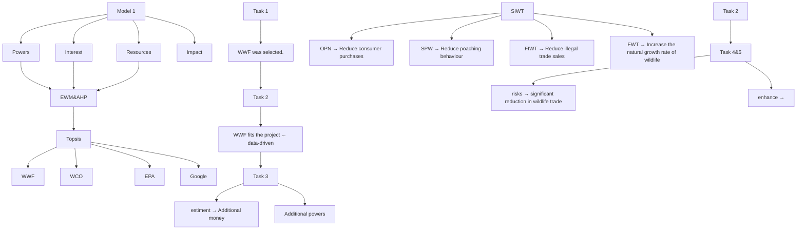
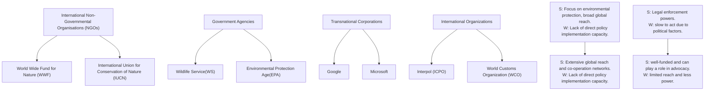
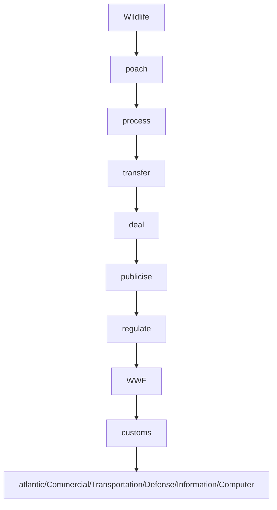
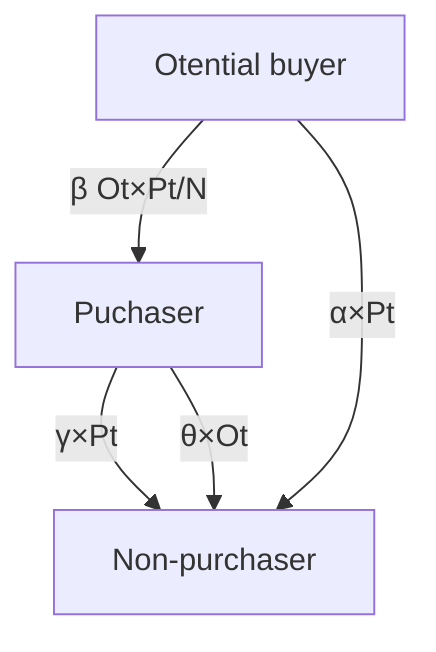
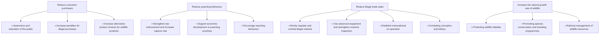

## Hope's Horizon: Turning the Trend on Illegal Wildlife Trade Summary

The illegal wildlife trade poses a serious threat to wildlife and ecosystems. Therefore, we proposed a five-year project. This project aims to reduce illegal wildlife trade by focusing on awareness, stopping poaching and disrupting trade routes. Specifically, we created the Stop Illegal Wildlife Trade (SIWT) Model to measure the amount of illegal wildlife trade.

Firstly, we created a Customer Assessment (CA) model to evaluating potential clients. AHP and EWM and Topsis was used in this model. The World Wide Fund for Nature (WWF) had a composite score of 0.78, representing it as the most suitable client. We explained the fit of the project with WWF through SRI theory and relevant references. The data shows a 54% decrease in the planet's Life Vitality Index (LPI), which indicates a serious decline in the planet's biodiversity. We projected that these outcomes would occur upon the successful implementation of the project. The Illegal wildlife trade decline and wildlife populations increase.

Secondly, we developed the SIWT model, which consists of four sub-models:

Otential Buyer - Purchaser - Non-purchaser (OPN) model, Stop Poaching Wildlife (SWP) model, Forecasting Illegal Wildlife Trade (FIWT) model, Forecast Wildlife Populations (FWP) model. The OPN model is based on the SIRS model and simulates changes in the number of buyers. SWP model uses the modified Lotka-Volterra equation to simulates the amount of wildlife poached. The FIWT model uses difference equations to predict the total amount of illegally traded wildlife per month. FWP model was used to assess wildlife populations. For each mini-model, we propose specific strategies to facilitate project implementation.

Thirdly, based on the strategies in the SIWT model, we found that the project would require significant funding and collaboration among organizations. We believe that more resources and authority are needed. This includes more funding inputs and implementation authority, among other things.

In addition, we emulated the SIWT model with elephants and rhinos as the main trading animals and countries such as India as the main players. We used the existing elephant and rhino populations, the number of poached wildlife, and the total amount of illegal trade at the end of January 2023 as initial values for the SIWT model. We adjusted the 13 parameters in SIWT model by fitting them to historical data in the end, we found that after the implementation of the project, the number of illegally traded ivory and rhino horns decreased by 52.4% and their populations increased by 9.3%. The project achieved the desired results. However, We need to accommodate the factor of instability. Then we emulated the SIWT model with high negative impacts. We found that the number of illegally tradable elephants and rhinoceros decreased by 49.6% and the population increased by 6.9%. In order to achieve the desired goals, we need to address factors of uncertainty.

Finally, we conducted sensitivity analyses on the OPN and SWP models and found that they are stable and robust. At the end, we wrote a memo to WWF communicating the key points of the project in conjunction with the results of the project analysis.

Keywords: Illegal wildlife trade, AHP-EWM, SIWT model, Lotka-Volterra equation

## Contents

## 1. Introduction......3

1.1 Problem Background 3  
1.2 Restatement of the Problem......3  
1.3 Our Work .... 3

## 2. Assumptions and Justifications......4

## 3. Notations....4

## 4. Client Assessment (CA) Model......5

4.1 Construction of the Client System 5  
4.2 Selection of evaluation indicators....5  
4.3 Game Theory Combinatorial Empowerment ....6  
4.4 Empowerment TOPSIS ...... 7  
4.5 Evaluation Results 8

## 5. Why is WWF the Ideal Client? 8

5.1 Theoretical Foundation....8  
5.2 Literature Support....9  
5.3 Data Analysis 9

## 6. Stop Illegal Wildlife Trade (SIWT) Model......10

6.1 Otential Buyer-Purchaser-Non Purchaser (OPN) Model 11  
6.2 Stop Poaching Wildlife (SPW) Model 12  
6.3 Forecasting Illegal Wildlife Trade (FIWT) Model.... 14  
6.4 Forecast Wildlife Populations (FWP) Model 15

## 7. What additional resources and rights they need? ....16

7.1 Additional Funding.... 16  
7.2 Additional Powers....17

## 8. SIWT Model Application and Situation Expectations...... 17

8.1 Fitting and Simulation of OPN and SPW Model Parameters .... 18  
8.2 Fitting and Simulation of FIWT and FWP Model Parameters 19  
8.3 Likelihood that the Project will Meet its Objectives .... 20  
8.4 Uncertainty 21

## 9. Sensitivity Analysis...... 21

## 10. Model Strengths and Weaknesses....22

10.1 Strengths....22  
10.2 Weaknesses 22

## 11. Conclusion....22

## 12. References....23

## 1. Introduction

## 1.1 Problem Background

The illegal wildlife trade not only causes enormous damage to the environment, but also poses a serious threat to global biodiversity. The trade is estimated to involve as much as \$26.5 billion annually, making it the fourth largest illegal trade globally. However, global efforts to address the problem still face significant challenges.

We are therefore proposing a data-driven, five-year program aimed at significantly reducing the illegal wildlife trade through accurate client and program selection.

natural_image

Collage of nine animal and food categories including antler, tiger, zebra, giraffe, bird, shark, monkey, and bamboo (no text or symbols)

Figure 1 Wildlife scene (left) and illegal trade in wildlife (right)

## 1.2 Restatement of the Problem

Considering the background, we need to solve the following problems:

- Problem 1, Who are your clients? They should have the authority, resources, and interest to implement the project you propose.  
- Problem 2, Explain why your developed project is suitable for this client. Which studies from literature support your project? Use data-driven persuasion to convince the client to undertake the project.  
- Problem 3, What additional authority and resources does the client need to implement this project? (Use assumptions but also base it on reality).  
- Problem 4, If the project is implemented, analyze and determine the measurable impact on illegal wildlife trade.  
- Problem 5, What is the likelihood of the project achieving its expected goals? Based on background sensitivity analysis, are there any negative factors.

## 1.3 Our Work

In order to avoid complicated descriptions, intuitively reflect our work process, the flow chart is shown in Figure 2.

We built two models, the first model used the EWM-AHP approach to calculate weights and the tosopsis composite scores for indicators such as powers to determine the ideal client WWF.

The second model, SIWT, consists of four sub-models that are used to construct a five-year project and propose policies in four areas such as reducing poaching behaviour. Based on the SIWT model, firstly, we reviewed the literature and based on data-driven analysis of the critical situation of wildlife and project support as a way to convince WWF to undertake this project. Secondly, we calculate and determine the additional power and resources needed by WWF based on assumptions and reality. Finally, we measure the risk that instability poses to the project by simulating and analysing the four sub-models. We will achieve our goal of reducing illegal wildlife trade through dynamic enhancements.

flowchart

Figure 2 Flowchart of our work

## 2. Assumptions and Justifications

Assumption 1: The data gathered from online databases is precise, trustworthy, and exhibits coherence among various sources.

Justification: Given that these databases are exclusively from websites of global organizations, it's logical to deduce that the quality of their data is superior.

Assumption 2: Illegal wildlife trade is driven by market demand for wildlife and its products.

Justification: In economics, demand is the main driver of supply in the market. If no one buys illegal wildlife and its products, the economic incentive to engage in this trade will be significantly reduced.

Assumption 3: The growth rate of wildlife will not change significantly in 5 years without additional intervention.

Justification: 5 years is a relatively short period of time, so it can be assumed that wildlife will have a fixed natural growth rate without human intervention.

## 3. Notations

The key mathematical notations used in this paper are listed in Table 1. Other symbols will be described as they are used.

Table 1: Notations used in this paper

<table><tr><td>Symbol</td><td>Description</td></tr><tr><td> $\beta$ </td><td>Attractiveness of wildlife trade</td></tr><tr><td> $\gamma$ </td><td>Possibility of purchasers becoming non-buyers</td></tr><tr><td> $\alpha$ </td><td>Conversion factor</td></tr><tr><td> $\theta$ </td><td>Publicity factor.</td></tr><tr><td> $\tau_{1}$ </td><td>Suppression factor</td></tr><tr><td> $\tau_{2}$ </td><td>Facilitation factor</td></tr></table>

<table><tr><td> $r_{1}$ </td><td>Growth factor</td></tr><tr><td> $r_{2}$ </td><td>Attenuation factor</td></tr><tr><td> $d_{t}$ </td><td>Population purchase coefficient for month t</td></tr><tr><td> $f_{t}$ </td><td>Government purchase strike factor for month t</td></tr></table>

## 4. Client Assessment (CA) Model

Illegal wildlife trade is a global problem. That is why choosing the right client to implement a project is crucial to significantly reducing illegal wildlife trade. There are a variety of instruments and policies that can be used to reduce illegal wildlife, involving different subjects.

Here, we have developed a system of indicators to measure the impact of different clients on reducing illegal wildlife trade. In order to obtain the best results, we evaluated clients comprehensively in four aspects: power, resources, interest and influence, and for each aspect, we selected two to three indicators with high impact, obtaining a total of 12 indicators. Second, we combined the analytic hierarchy process (AHP) and entropy weight method (EWM) to determine the weight of each indicator. Finally, based on the modified TOPSIS method we established our client evaluation model.

## 4.1 Construction of the Client System

Below is a selection of alternative clients that were selected by searching for relevant information. Each type of organization has unique strengths and weaknesses.

flowchart

Figure 3 Alternative clients and their advantages and disadvantages

## 4.2 Selection of evaluation indicators

To model client evaluation, we chose power, resources, interest, and influence as first-level indicators.

Power: Power includes the ability to enforce laws as well as to strategy, allocate resources, and set industry standards. Clients with decision-making and strategy policymaking power can directly influence laws and regulations, and implement stronger regulatory measures to effectively combat illegal wildlife trade.

Resources: Funding is the foundation for effective programs. Adequate funding can be used to support enforcement activities, public awareness and conservation programs. Adequate financial resources not only ensure the sustainability of the program, but also increase the scale and effectiveness of the program.

Interest: Clients' interest in wildlife conservation reflects their motivation and persistence in participating in programs. The higher the interest, the more likely it is that clients will be persuaded to adopt our five-year program.

Influence: A client's influence determines their ability to disseminate information and change public awareness and behavior patterns. Clients with broad influence can effectively drive public and other stakeholder engagement.

It is therefore reasonable to choose power, resources, interest and influence as the first level indicators of the impact of different clients in reducing illegal wildlife trade. Considering these factors together can help identify potential clients who have the most power and potential to have a positive impact in reducing illegal wildlife trade. On this basis our model considers a total of 12 indicators, as shown in the table. We obtained data on the relevant metrics from each organization's official website and performed missing value filling as the next dataset for assessing clients.

Table 2 Client evaluation model indicator table

<table><tr><td>Level 1</td><td colspan="3">Level 2</td><td>Type</td></tr><tr><td rowspan="3">Powers</td><td>1</td><td>SWE</td><td>Number of significant laws enacted</td><td>+</td></tr><tr><td>2</td><td>ICS</td><td>Weight of statements at major international conferences</td><td>+</td></tr><tr><td>3</td><td>NP</td><td>Number of partners</td><td>+</td></tr><tr><td rowspan="3">Resources</td><td>4</td><td>AB</td><td>Annual budget</td><td>+</td></tr><tr><td>5</td><td>NE</td><td>Number of employees</td><td>+</td></tr><tr><td>6</td><td>API</td><td>Average project investment</td><td>+</td></tr><tr><td rowspan="3">Interest</td><td>7</td><td>PRP</td><td>Number of relevant projects participated in</td><td>+</td></tr><tr><td>8</td><td>FPA</td><td>Frequency of public advocacy for wildlife</td><td>+</td></tr><tr><td>9</td><td>FOS</td><td>Frequency of wildlife in organizational statements</td><td>+</td></tr><tr><td rowspan="3">Impact</td><td>10</td><td>ME</td><td>Media exposure</td><td>+</td></tr><tr><td>11</td><td>LPF</td><td>Legal proceedings faced</td><td>-</td></tr><tr><td>12</td><td>NMR</td><td>Number of negative media reports</td><td>-</td></tr><tr><td colspan="5">Note: {1,2,3,4,5,6,7,8,9,10} : Benefit Attributes {11,12} : Cost Attributes</td></tr></table>

## 4.3 Game Theory Combinatorial Empowerment

The determination of weights is crucial for evaluating the contribution of indicators. The methods for determining the weights of the indicator system can be divided into two main categories: subjective assignment method and objective assignment method. The traditional Analytic Hierarchy Process (AHP) use Group Decision Making (GDM) to determine the weights of each indicator. This method requires experts to give a comparison matrix of all the main factors. EWM is another commonly used method to find the weights. The entropy weight indicates the relative importance of the evaluation indicators, and the greater the degree of difference between the indicators, the more important they are, the greater the weights will be accordingly. $^{[1]}$

AHP is more subjective, subject to the subjective influence of experts. The EWM is based entirely on the amount of information contained in the original scoring data of the indicators to determine the weights of the indicators, ignoring the subjective initiative of the experts. $^{[2]}$ So we use the game theory combination assignment method $[3]$ to combine these two methods to determine the weights of our evaluation model, which increases the credibility.

\- First, we use AHP to calculate the weights of the 12 indicators $W_{1}$

Step 1: Experts compare the importance of indicators two by two and construct

judgment matrix A (not shown here due to space constraints)

Step 2: We can calculate the eigenvalues and eigenvectors of the matrix. Next, we need to perform a consistency test on the largest eigenvalue:

$$
C I = \frac {\lambda_ {\max} - n}{n - 1} \tag {1}
$$

$$
C R = \frac {C I}{R I} \tag {2}
$$

When $n = 12$ , $RI = 1.54$ . So $CR = 0.068 < 0.1$ . Therefore, it passes the consistency check.

Step 3: After passing the consistency test, we can get the weights $W_{1}$ of the main factors by the eigenvectors corresponding to the largest eigenvalues.

\- Next, we utilize the EWM to calculate the weights $W_{2}$ of the 12 indicators.

## The steps are as follows:

Step 1: We normalize the data for both positive and negative indicators.

Step 2: We find the probability value by normalization and calculate the entropy value of the jth indicator:

$$
p _ {i j} = \frac {\widetilde {x _ {i j}}}{\sum_ {i = 1} ^ {m} \widetilde {x _ {i j}}} \tag {3}
$$

$$
e _ {j} = - \frac {\sum_ {i = 1} ^ {m} p _ {i j} \ln p _ {i j}}{\ln m} \tag {4}
$$

Step 3: Calculation of the weights of the indicators:

$$
w _ {j} = \frac {1 - e _ {j}}{\sum_ {j = 1} ^ {m} d _ {j}} \tag {5}
$$

\- Finally, this paper uses the idea of game theory to combine the two calculated weights above.

Step 1: The objective function is established to minimize the sum of the deviations of the indicator combination weights W and b and c, and to seek the optimal linear combination coefficients. The objective function and constraints are as follows:

$$
\min \left(\left\| W - W _ {1} \right\| _ {2}\right) + \left\| W - W _ {2} \right\| _ {2} = \min \left(\left\| \lambda_ {1} W _ {1} + \lambda_ {2} W _ {2} - W _ {1} \right\| _ {2} + \left\| \lambda_ {1} W _ {1} + \lambda_ {2} W _ {2} - W _ {2} \right\| _ {2}\right) \tag {6}
$$

$$
s. t. \lambda_ {1} + \lambda_ {2} = 1, \lambda_ {1}, \lambda_ {2} \geq 0
$$

Step 2: Based on the linear combination coefficients obtained from the differential principle, normalize $\lambda_{1}$ and $\lambda_{2}$ . Then we obtained the optimal combination of weight of the assessment indicators $W^{*} = \lambda_{1}^{*}W_{1} + \lambda_{2}^{*}W_{2}$ , the weights of the indicators are shown in Figure 3

## 4.4 Empowerment TOPSIS

TOPSIS is a multi-criteria decision-making method that evaluates and ranks alternatives by comparing their distances to an ideal solution. We use the data from 8 prospects and 12 evaluation metrics to construct the matrix X. The normalized matrix is denoted Z.

Define the distance between the client and the maximum value $D_{i}^{+} = \sqrt{\sum_{j=1}^{12} W_{j}^{*}\left(Z_{j}^{+} - z_{ij}\right)^{2}}$

Define the distance between the client from the minimum value $D_{i}^{-} = \sqrt{\sum_{j=1}^{12} W_{j}^{*}\left(Z_{j}^{-} - z_{ij}\right)^{2}}$

We calculate the score of the i th evaluator:

$$
S _ {i} = \frac {D _ {i} ^ {-}}{D _ {i} ^ {+} + D _ {i} ^ {-}} \tag {7}
$$

pie chart

| Category | Percentage (%) |
| :--- | :--- |
| Powers | 30.43 |
| Resources | 25.36 |
| AB | 17.34 |
| ICS | 7.17 |
| NP | 5.58 |
| SWE | 16.08 |
| IMPACT | 22.16 |
| NMR | 10.84 |
| ME | 6.95 |
| LPF | 4.78 |
| FOS | 6.74 |
| PRP | 5.24 |
| INTEREST | 22.03 |
| API | 5.1 |
| NE | 2.80 |

Figure 4 Indicator weights

radar chart

| Model | Value |
|---|---|
| WWF | 0.78 |
| Microsoft | 0.35 |
| LUCN | 0.63 |
| Google | 0.48 |
| SM | 0.64 |
| EPA | 0.56 |
| IPCA | 0.67 |
| WCP | 0.52 |

Figure 5 Client Score

## 4.5 Evaluation Results

As shown in Figure 4, WWF has the highest score of 0.78 and is considered as the most suitable client. Google and Microsoft, which are multinational corporations, scored the lowest, at 0.48 and 0.36. Although multinational corporations are well resourced with money, technology and personnel support. But as private enterprises, they are ultimately profit-oriented, and it is difficult for them to be fully compatible with our goals. And they also lack the relevant rights and will encounter many obstacles in the implementation process.

However, WWF, as an internationally renowned conservation organization, has significant global influence. It plays an important role in wildlife conservation advocacy, policy development and international cooperation. WWF has sufficient resources, including funding, professional staff and global network, which are crucial for implementing and promoting conservation programs. At the same time, WWF's long-standing commitment to wildlife conservation and biodiversity preservation is highly compatible with the goals of programs to reduce illegal wildlife trade.

WWF can use its influence in global environmental policy to promote more effective laws and policies to reduce illegal wildlife trade. Through its extensive networks and platforms, raise public awareness of the problem of illegal wildlife trade and promote the importance of wildlife conservation. Leveraging its international cooperation network to coordinate efforts among countries to combat transnational wildlife trade.

## 5. Why is WWF the Ideal Client?

## 5.1 Theoretical Foundation

Over the course of the five-year project, we plan to establish a full chain of measures from public awareness to combating poaching and illegal wildlife trade. The project requires the collaboration of various countries as well as organizations. WWF has an extensive global network of partners that can be mobilized to work together to reduce illegal wildlife trade. The project requires the collaboration of various countries as well as organizations. This will help to protect biodiversity.

We chose WWF as the client for the implementation of this project, and the following theories support that choice:

(1) The illegal wildlife trade is one of the most lucrative illegal industries in the world.

Its consequences go far beyond the direct impact on the species traded $^{[4]}$ . Mozer and Prost suggest that as the trade in illegal wildlife increases, the world's biodiversity is seriously threatened and human life is affected as a result. Our project, which aims to preserve the world's biodiversity by reducing the volume of wildlife trade, coincides with their claims.

(2) The Theory of Socially Responsible Investment (SRI) suggests that investors can invest their money in projects that meet the goals of social and environmental sustainability. The mission of WWF is to stop the deterioration of the earth's natural environment and to create a better future in which human beings live in harmony with nature. It is committed to the conservation of the world's biodiversity $^{[5]}$ and has an interest in addressing the issue of illegal wildlife trade. This project is in line with WWF's mission and also requires a certain amount of funding to be implemented.  
(3) Stakeholder theory suggests that there are multiple stakeholders in a project, including government agencies, non-governmental organizations (NGOs), enterprises, individuals and so on. The project has a large investment and a long cycle, and the input or participation of various stakeholders is indispensable. The Reducing Illegal Wildlife Trade project aims to protect wildlife resources and ecosystems and is in line with the principles of environmental ethics. We can attract more organizations concerned with environmental protection and biodiversity, such as IUCN. With these partners on board, our project will be easier to carry out.

To sum up, we choose WWF as the project. And other organizations that are socially responsible and in line with the objectives of the project can assist in the implementation of this project.

## 5.2 Literature Support

Sas-Rolfes M, Challender DWS, Hinsley A Explore the scale of illegal wildlife trade, associated threats to biodiversity and appropriate measures to address these threats $^{[6]}$ . We can reduce the scale of illegal wildlife trade by adopting a whole-chain approach of combating the trade from the source. For example, strengthening law enforcement to combat illegal hunting, strong transport regulation, and combating black market trade. Our project proposes a source-combat and trade-combat approach, which is very relevant to these measures.

Demand reduction is now recognized as key to preventing wildlife crime. There are two main demand reduction strategies: consumer education campaigns and legal bans on consumption. Ayling points to the possibility of a more multifaceted regulatory approach and a more systematic approach to addressing demand, and the primacy of third parties (non-state non-offenders) in intervening to reduce demand $^{[7]}$ . Our project proposes to popularize public awareness of the seriousness of the illegal wildlife trade, which coincides with this.

In summary, the project adopts a whole-chain approach to combating illegal wildlife trade that focuses on demand-side interventions to reduce the scale of illegal wildlife trade.

## 5.3 Data Analysis

## (1) Dramatic forms of diminishing biodiversity

Experts use the Livability of the Planet Index (LPI) to measure the average decline of monitored wildlife populations. We have collected LPI estimates from the official websites of the WWF and the Zoological Society of London for each continent and watershed around the globe for the period 1975-2023. We estimate the average decline in wildlife populations as follows.

stacked area chart

| Year | Africa | Asia and Pacific | Asia and Pacific | Europe and Central Asia | Freshwater | Latin America and the Caribbean | North America |
|------|--------|------------------|------------------|--------------------------|----------|----------------------------------|---------------|
| 1975 | ~100   | ~150             | ~200             | ~250                     | ~300     | ~350                             | ~400          |
| 1980 | ~120   | ~160             | ~220             | ~260                     | ~320     | ~360                             | ~420          |
| 1985 | ~110   | ~150             | ~210             | ~240                     | ~310     | ~350                             | ~410          |
| 1990 | ~100   | ~140             | ~200             | ~230                     | ~300     | ~340                             | ~400          |
| 1995 | ~90    | ~130             | ~190             | ~220                     | ~290     | ~330                             | ~390          |
| 2000 | ~85    | ~125             | ~185             | ~215                     | ~285     | ~325                             | ~385          |
| 2005 | ~80    | ~120             | ~180             | ~210                     | ~280     | ~320                             | ~380          |
| 2010 | ~75    | ~115             | ~175             | ~205                     | ~275     | ~315                             | ~375          |
| 2015 | ~70    | ~110             | ~170             | ~200                     | ~270     | ~310                             | ~370          |
| 2020 | ~65    | ~105             | ~165             | ~195                     | ~265     | ~305                             | ~365          |
| 2023 | ~60    | ~100             | ~160             | ~190                     | ~260     | ~300                             | ~360          |

Figure 6 1975-2023 LPI Change Statistical

The x-axis represents the year and the y-axis represents the LPI (%), which measures the change in 31821 populations of 5230 species relative to 1975 (i.e. $1975 = 100\%$ ). It can be seen that global species diversity has maintained a declining trend over the last 50 years. It is interesting to note that the LPI in 2023 is $45.38\%$ . That is, in the last fifty years, the global species diversity has decreased to about half of its original level.

## (2) project vision and expectations

We provide models that allow estimation of wildlife populations after the project is implemented, where $A(t)$ represents the number of wildlife as the moment t is reached. Undoubtedly, as our project is implemented, the following will occur.

- The number of people willing to buy wildlife will decline and the demand for wildlife will decrease. "No sale, no kill" will indirectly affect the reduction of illegal poaching of wildlife.  
- As organizations work together, the importance of wildlife habitats will increase. Countries will increase their efforts to combat illegal poaching, which will lead to a decrease in the number of illegal poaching incidents.  
- The illegal wildlife trade, from transport to sale, will become more difficult, and therefore the volume of trade will gradually decrease.  
- The human and material resources invested in improving the climate and the ecological environment will increase, which will indirectly contribute to the increase of the natural growth rate of wildlife. It is believed that in the near future, the decline in wildlife populations will slow down and may even begin to rebound!

Through our projects, not only wildlife will benefit, but also people all over the world. The ecosystem will be better. Our projects are very much in line with the requirements of sustainable development.

## 6. Stop Illegal Wildlife Trade (SIWT) Model

We chose WWF as the client of our project, and this section will then describe the specific content of the project in detail. We start from the links of the industrial chain of illegal wildlife trade and divide the whole project into four mini-models.

flowchart

Figure 7 The chain of illegal wildlife trade

## 6.1 Otential Buyer-Purchaser-Non Purchaser (OPN) Model

## 6.1.1 OPN Model

Inspired by the infectious disease model $[8]$ , we classify the population into those who are potentially likely to purchase wildlife products, those who will purchase wildlife products and those who have decided not to purchase wildlife products. We built the OPN model. It has three variables and four factors:

Table 3 Variable names of OPN model

<table><tr><td>Variable name</td><td>Interpretations</td></tr><tr><td>O</td><td>Otential buyer</td></tr><tr><td>P</td><td>Purchaser</td></tr><tr><td>N</td><td>Non-purchaser</td></tr></table>

Table 4 Factor names of OPN model

<table><tr><td>Factor name</td><td>Interpretations</td></tr><tr><td> $\beta$ </td><td>Attraction factor: the number of people who become purchasers of  $\beta \frac{O(t) \times P(t)}{S}$  wildlife per unit of time t are:</td></tr><tr><td> $\gamma$ </td><td>Purchase factor: Purchasers who become non-buyers per unit of time t are:  $\gamma \times P(t)$ </td></tr><tr><td> $\alpha$ </td><td>Purchaser publicity factor: purchasers who become non-buyers from purchasers per unit of time t are  $\alpha \times N(t)$ </td></tr><tr><td> $\theta$ </td><td>Publicity factor: the number of people converted from potential buyers to non-buyers per unit of time is:  $\theta \times O(t)$ </td></tr></table>

flowchart

## Figure 8 State transfer figure for the three categories

The Figure 8 gives an intuitive impression of the OPN model, and the following is the specific set of differential equations:

$$
\left\{ \begin{array}{l} \frac {d O (t)}{d t} = - \beta \frac {O (t) \times P (t)}{S} + \alpha \times N (t) - \theta \times O (t) \\ \frac {d P (t)}{d t} = \beta \frac {O (t) \times P (t)}{S} - \gamma \times P (t) \\ \frac {d N (t)}{d t} = \gamma \times P (t) - \alpha \times N (t) + \theta \times O (t) \end{array} \right. \tag {8}
$$

## 6.1.2 Strategy 1: Reducing Consumer Purchases

In the above model, the parameters of $\beta$ , $\gamma$ , $\alpha$ , $\theta$ and are affected by a number of strategies. For example, the more the government invests in publicity or the more it punishes the illegal purchase of wildlife products, the values of $\beta$ and $\alpha$ will decrease, $\theta$ and $\gamma$ conversely the values of and will increase.

Our project influences specific parameters through the following practices:

(1) Increase public awareness: According to the World Health Organization, about 75 per cent of infectious diseases affecting humans in the past 30 years originated in animals. We can hold publicity and education projects to raise public awareness of illegal wildlife products.  
(2) Strengthening penalties: Increase enforcement against the purchase of illegal wildlife products. Crack down on illegal trade practices and increase penalties, and raise the penalties for purchasing illegal products.  
(3) Increase alternative product choices: Provide legal and sustainable alternative choices and increase the size of the formal trade market. Inform and promote legal alternatives to consumers and provide security in the formal market.

## 6.2 Stop Poaching Wildlife (SPW) Model

## 6.2.1 SPW model

In the OPN model, we can simulate the number of people who buy wildlife products $P(t)$ . Common sense tells us that the demand for a product should be positively related to the number of its audience. To simplify the modelling, we assume that they are positively proportional and we introduce here a demand factor $\mu$ . It is defined as follows:

$$
\mu (t) = k \times \frac {P (t)}{S} \quad \mathrm{k} \in (0, 1) \tag {9}
$$

Where k is defined as a scale factor that represents the proportion of those involved in illegal wildlife trade among those who purchase wildlife products. $\frac{P(t)}{S}$ represents the number of people buying wildlife products at moment t as a proportion of the total number of people. The reason for multiplying by a k is that not all those who buy wildlife products will go on to participate in the illegal trade.

natural_image

Illustration of a warrior holding a spear next to an elephant in a green outdoor setting (no text or symbols)

Figure 9 Schematic diagram of poachers' hunt

The change in the number of wild animals poached each month over time should be a dynamic one, due to the fact that it is influenced by factors such as consumer demand and the strength of the government's efforts to combat it. Similarly, the growth rate of human as well as material resources invested in combating these illegal poaching practices should be dependent on how rampant the poaching incidents are. We build our SPW model analogously based on the predator model, which has 2 variables and 5 parameters:

Table 5 Variable names of SPW model

<table><tr><td>Variable name</td><td>Interpretations</td></tr><tr><td>W(t)</td><td>Number of illegally poached wildlife per month</td></tr><tr><td>M(t)</td><td>Number of human and material resources devoted to combating poaching per month</td></tr></table>

Table 6 Factor names of SPW model

<table><tr><td>Factor name</td><td>Interpretations</td></tr><tr><td> $r_1$ </td><td>Growth factor: growth rate of poached wildlife populations</td></tr><tr><td> $r_2$ </td><td>Decay factor: fixed rate of decline in the amount of human and material resources invested in the absence of poaching incidents</td></tr><tr><td> $τ_1$ </td><td>Inhibition factor: the ability of the amount of human and material resources invested to stop poaching incidents</td></tr><tr><td> $τ_2$ </td><td>Facilitation factor: the ability of a poaching incident to facilitate the Government&#x27;s ability to devote more resources to stopping it</td></tr><tr><td> $μ(t)$ </td><td>This factor represents the public demand for illegal wild poaching of animals has already been explained and will not be repeated here</td></tr></table>

Here is a specific impression of SPW model.

$$
\left\{ \begin{array}{l} \frac {d W (t)}{d t} = W (t) \times (r _ {1} + \mu (t) - \tau_ {1} \times M (t)) \\ \frac {d M (t)}{d t} = M (t) \times (- r _ {2} + \tau_ {2} \times W (t)) \end{array} \right. \tag {10}
$$

## 6.2.2 Strategy II: Reducing poaching behavior

In our SPW model, the values of $r_{1}$ , $r_{2}$ , $\tau_{1}$ and $\tau_{2}$ are also affected by many factors. When the government's efforts to combat illegal poaching increase, the value of $\tau_{1}$ will rise. $\mu(t)$ is a function of time, and its value reflects market demand. The following are our proposed strategies for combating illegal poaching.

(1) Strengthening law enforcement: Increase law enforcement resources and technical equipment, improve patrolling and monitoring capabilities, and intensify efforts to combat illegal hunting and trapping. Intelligence sharing and joint operations will be strengthened to increase capture and conviction rates. Trace and dismantle networks and organizations involved in illegal hunting activities and ensure that offences are severely punished.  
(2) Development assistance for countries where poaching is prevalent: Encourage and support local communities to develop economic activities for the sustainable use of wildlife resources. This will provide alternative sources of income and reduce dependence on illegal hunting.  
(3) Encouragement of whistle-blowing behavior: Establishment of a whistle-blowing reward mechanism to encourage the public to actively report illegal hunting behavior. This also requires ensuring the personal safety of those who report and providing them with incentives.

## 6.3 Forecasting Illegal Wildlife Trade (FIWT) Model

## 6.3.1 FIWT Model

The FIWT model is used to predict the number of wildlife that can be illegally traded in the market each month. The number of wildlife that can be illegally traded each month consists of the number of wildlife that was not sold in the previous month and the number of wildlife that was illegally poached this month. Above we have fitted the number of illegally poached wildlife in each month through the SPW model, so we predict the number of illegally tradable wildlife in each period in the form of a difference equation. The FIWT model has seven variables, two coefficients, and four constants. The following are specific explanations:

Table 7 Variable names of FIWT model

<table><tr><td>Variable name</td><td>Interpretations</td></tr><tr><td> $X_t$ </td><td>Volume of tradable illegal wildlife in month t</td></tr><tr><td> $R_t$ </td><td>Remainder of illegal trade in month t</td></tr><tr><td> $I_t$ </td><td>Number of wild animals illegally poached in month t</td></tr><tr><td> $S_t$ </td><td>The number of illegal wildlife successfully traded in month t, which are:  $d_t \times X_t$ </td></tr><tr><td> $L_t$ </td><td>The amount of illegal wildlife seized by customs and other organizations in month t, which are:  $f_tX_t$ </td></tr><tr><td> $d_t$ </td><td>Population purchase factor for month t, reflecting the population&#x27;s willingness to purchase quantities of illegal wildlife</td></tr><tr><td> $f_t$ </td><td>The customs and other crackdown coefficient in month t, which responds to the intensity of the crackdown on illegal wildlife trade by government departments such as customs, is assumed to obey a logistic growth curve.</td></tr></table>

Table 8 Factors names of FIWT model

<table><tr><td>Factor name</td><td>Interpretations</td></tr><tr><td> $v$ </td><td>As the Government&#x27;s public information efforts increased, the average monthly coefficient of purchases by the population declined.</td></tr><tr><td> $r$ </td><td>Fixed growth rate of the percussion factor</td></tr></table>

Table 9 Constant names of FIWT model

<table><tr><td>Constant name</td><td>Interpretations</td></tr><tr><td> $d_{0}$ </td><td>Purchase factor of the population at month 0</td></tr><tr><td> $f_{0}$ </td><td>strike factor od government</td></tr><tr><td> $f_{m}$ </td><td>Maximum value of customs and government strike factor</td></tr><tr><td>C</td><td>Weight (kg) of the average number of illegal wildlife poached per month.</td></tr></table>

$$
\left\{ \begin{array}{l} X _ {t} = R _ {t - 1} - I _ {t} \\ R _ {t} = X _ {t} - d _ {t} X _ {t} - f _ {t} X _ {t} \\ d _ {t} = d _ {0} - v t \\ f _ {t} = \frac {f _ {m}}{1 + \left(\frac {f _ {m}}{f _ {0}} - 1\right) e ^ {- r (t - t _ {0})}} \\ I _ {t} = W (t) \times C \end{array} \right. \tag {11}
$$

## 6.3.2 Strantge III: Reducing illegal trade sales

In the FIWT model, the parameters v and r are affected by a number of factors. Both of them will increase after enhanced intervention. Some of the specific interventions are described below.

(1) Cracking down on illegal markets and increasing regulation. Wildlife markets are vulnerable to infiltration by criminals. Therefore, there is a need to combat illegal trading networks and sales channels. This requires the Government to strengthen the authentication and certification mechanisms for legal sales to prevent illegal products from entering the market.  
(2) Use of advanced technical equipment and strengthening of customs inspections: Customs should strengthen inspections of imported and exported goods, especially more stringent scrutiny of goods involving wild animals and their products. For example, X-ray scanners are used to better identify and detect wild animals and their products hidden in cargo.  
(3) Establishing transnational co-operation: between 1999 and 2018, nearly 6,000 species have been seized and suspected smugglers of more than 150 nationalities have been identified. This shows that wildlife crime is indeed a global problem. Therefore, countries should enhance intelligence sharing and develop common action plans to combat transnational illegal wildlife trade.

## 6.4 Forecast Wildlife Populations (FWP) Model

## 6.4.1 FWP model

FWP model is established to estimate the wildlife population. Assuming that the number of wild animals at moment t is $A(t)$ , it is calculated as follows:

$$
A (t) = A _ {0} (1 + \xi) ^ {t} \tag {12}
$$

$A_{0}$ is the wildlife population at the moment t=0, representing the wildlife population in January 2023. This is the growth of the wildlife population without considering human intervention. However, a portion of wildlife will be hunted in real time. This includes mainly the number of illegal poaching and legal hunting. The corrected wildlife population formula is shown below:

$$
A (t) = A _ {0} (1 + \xi) ^ {t} - I (t) - K (t) \tag {13}
$$

$I(t)$ Represents the number of wildlife illegally poached at each t moment. This can be estimated from the number in the OPN model. $K(t)$ represents the number of wildlife legally hunted at moment t. It is specified in the following formula:

$$
K (t) = (1 - k) P (t) \times \frac {\sum_ {i = 1} ^ {1 0} w i l d l i f e _ {i}}{\sum_ {i = 1} ^ {1 0} p u r c h a s e r _ {i}} \tag {14}
$$

Where $k$ is the scale factor from the previous section, $(1 - k)$ is the proportion of the population involved in the legal trade. The latter is the amount of wildlife legally hunted to meet the market demand of the strategy.

Since the growth rate of wildlife should in fact be dynamic, we can assume that the government has made efforts to improve the ecosystem, which in turn leads to a gradual increase in the rate of $\xi$ growth at each time t. FWP model is based on the assumption that the rate of growth is proportional to the rate of growth of wildlife. To simplify the modelling, we assume that this grows proportionally. $\xi(t)$ is defined as follows:

$$
\xi (t) = \xi_ {0} + \eta t \tag {15}
$$

$\xi_{0}$ represents the growth rate of wildlife at the moment t=0. $\eta$ denotes that with this effort, the growth rate rises at each moment t by $\eta$ . Ultimately, we obtain what the corrected function of wildlife population over time t should be:

$$
A (t) = A _ {0} \left(1 + \xi_ {0} + \eta t\right) ^ {t} - I (t) - (1 - k) P (t) \times \frac {\sum_ {i = 1} ^ {1 0} \text {wildlife} _ {i}}{\sum_ {i = 1} ^ {1 0} \text {purchaser} _ {i}} \tag {16}
$$

## 6.4.2 Strategy IV: Increasing the Natural Growth Rate of Wildlife

Factors that affect the above $\xi(t)$ are climatic, ecological and other factors. In order to enhance $\xi(t)$ , we propose some of the following.

(1) Conservation of wildlife habitats: restoration of damaged environments and establishment of new protected areas. Habitat protection will provide adequate food and breeding conditions for wildlife.  
(2) Promoting species conservation and breeding projects: For endangered and threatened species, species conservation and breeding projects can be implemented. This includes the establishment of breeding central, adoption of artificial breeding measures, etc.  
(3) Adopt reasonable resource management measures: Through scientific management and monitoring, ensure the sustainable utilization of wildlife resources and prevent over-trapping and over-collection.

## 7. What additional resources and rights they need?

In order to reduce the illegal wildlife trade, our chosen client WWF still needs additional funding and authority to complete the project.

## 7.1 Additional Funding

In our model, it requires a lot of money to implement and continue. The costs are many, and we estimate them by ignoring the other costs and considering only the costs of protecting the habitat. We can estimate the cost per unit of human resources by collecting the amount of money and human resources invested by the major countries. The formula is given below.

$$
\mathrm{P} t (t) = M (t) \frac {\sum_ {i = 1} ^ {n} f u n d}{\sum_ {i = 1} ^ {n} r e s o u r c e} \tag {17}
$$

In the formula, $M(t)$ is the value at each moment in our WM model. n represents the number of countries for which we collected data. Below is the formula for calculating the cost of protecting habitat.

$$
\mathrm{P} t = \sum_ {t = 1} ^ {6 0} \mathrm{P} t (t) \tag {18}
$$

This is a huge expenditure and it cannot be achieved by the WWF alone. It needs the help of organizations or individuals with similar philosophies to the WWF. The exact amount will be given in subsequent models.

## 7.2 Additional Powers

Illegal wildlife trade is a global problem which requires the assistance of various organizations. WWF therefore needs other additional powers to assist the project.

(1) Enforcement powers: WWF needs to obtain enforcement powers to be able to investigate and penalize illegal wildlife trade. This requires co-operation with law enforcement agencies (e.g. police, customs, etc.) and obtaining appropriate enforcement authorizations. Criminal justice is the main mechanism for international co-operation to investigate and prosecute serious types of crime, but it is rarely used in the area of wildlife crime. WWF could work with UNODC to obtain some law enforcement powers. In addition, WWF needs the support of wildlife conservation experts, monitors and other personnel, i.e. it needs the support of other professional organizations.

(2) International cooperation: Illegal wildlife trade is a cross-border problem. WWF may need to increase cooperation with individual countries and international organizations to combat illegal trade. This includes, for example, information sharing. With these additional powers, WWF will be able to implement its projects more effectively and reduce illegal wildlife trade.

## 8. SIWT Model Application and Situation Expectations

According to the UNODC World WISE Database, ivory and rhinoceros horn accounted for 70% of World WISE seizures. (Figure 10) This indicates that most of the trade is dominated by these two, so we chose African elephants and rhinoceroses as the main targets of poaching for analysis. We selected India, China, Myanmar, and other major participating countries for analysis (Figure 11).

pie chart

| Category | Percentage (%) |
| :--- | :--- |
| elephants | 60 |
| rhinos | 10 |
| assorted reptiles | 8 |
| other species | 7 |
| pangolins | 7 |
| corals | 3 |
| Tortoises and fresh | 2 |
| parrots | 2 |
| sturgeon, eels and marine turtles | 1 |

Figure 10 Share of type among total seizures

text_image

Source of shipment
Transit or destination of shipment

Figure 11 Trafficking flow map

## 8.1 Fitting and Simulation of OPN and SPW Model Parameters

We take the sum of the total populations of these countries to be $S$ . $S$ is calculated as follows:

$$
S = \sum_ {i = 1} ^ {n} \text { population } _ {i} \tag {20}
$$

According to the WWF's China Chapter's report "People's Perceptions of Zoonotic Diseases and the Connection to Nature in Five Countries - Summary of Research", 31% of them said that they would not buy wildlife quantities, and 10% of them bought wildlife quantities. Thus we can determine the individual initial values in the OPN model.

We fitted the parameters based on historical data and with continuous iteration that strategy I will reduce people's willingness to buy wildlife products through publicity. This is reflected in a percentage increase in the positive parameters and a percentage decrease in the negative parameters in the OPN model, as shown in Table 10.

Similar to the OPN model, we performed the fitting and tuning of the parameters to get the final parameter list, as shown in Table 11.

$\mu(t)$ can be calculated based on the proportion of purchaser in the OPN model.

Table 10 OPN model parameters

<table><tr><td>S</td><td> $\alpha$ </td><td> $\beta$ </td><td> $\gamma$ </td><td> $\theta$ </td></tr><tr><td>3654189667</td><td>0.079</td><td>0.112</td><td>0.095</td><td>0.215</td></tr></table>

Table 11 SOW model parameters

<table><tr><td> $W_0$ </td><td> $M_0$ </td><td> $r_1$ </td><td> $r_2$ </td><td> $τ_1$ </td><td> $τ_2$ </td></tr><tr><td>1292</td><td>678</td><td>0.672</td><td>0.486</td><td>0.032</td><td>0.018</td></tr></table>

area chart

| X-axis | Non-purchaer | purchaser | Otential buyer |
|---|---|---|---|
| 1 | 1.2E+10 | 4.0E+09 | 2.0E+10 |
| 4 | 1.5E+10 | 4.0E+09 | 1.7E+10 |
| 7 | 1.8E+10 | 4.0E+09 | 1.4E+10 |
| 10 | 2.0E+10 | 4.0E+09 | 1.2E+10 |
| 13 | 2.2E+10 | 4.0E+09 | 1.0E+10 |
| 16 | 2.4E+10 | 4.0E+09 | 9.0E+09 |
| 19 | 2.6E+10 | 4.0E+09 | 8.0E+09 |
| 22 | 2.8E+10 | 4.0E+09 | 7.0E+09 |
| 25 | 3.0E+10 | 4.0E+09 | 6.5E+09 |
| 28 | 3.2E+10 | 4.0E+09 | 6.0E+09 |
| 31 | 3.4E+10 | 4.0E+09 | 5.5E+09 |
| 34 | 3.6E+10 | 4.0E+09 | 5.0E+09 |
| 37 | 3.8E+10 | 4.0E+09 | 4.5E+09 |
| 40 | 4.0E+10 | 4.0E+09 | 4.0E+09 |
| 43 | 4.2E+10 | 4.0E+09 | 3.5E+09 |
| 46 | 4.4E+10 | 4.0E+09 | 3.0E+09 |
| 49 | 4.6E+10 | 4.0E+09 | 2.5E+09 |
| 52 | 4.8E+10 | 4.0E+09 | 2.0E+09 |
| 55 | 5.0E+10 | 4.0E+09 | 1.5E+09 |
| 58 | 5.2E+10 | 4.0E+09 | 1.0E+09 |

area chart

| Year | Number of human and material resources invested | Number of illegal poachers |
| ---- | ----------------------------------------------- | -------------------------- |
| 1    | 700                                             | 1300                       |
| 6    | 750                                             | 1250                       |
| 11   | 800                                             | 1200                       |
| 16   | 850                                             | 1150                       |
| 21   | 900                                             | 1100                       |
| 26   | 950                                             | 1050                       |
| 31   | 1000                                            | 1000                       |
| 36   | 1050                                            | 950                        |
| 41   | 1100                                            | 900                        |
| 46   | 1150                                            | 850                        |
| 51   | 1200                                            | 800                        |
| 56   | 1250                                            | 750                        |

Figure 12 OPN model results  
Figure 13 SPW model results

As shown in the figure 12, through enhanced publicity efforts, the number of people choosing to buy wildlife products has dropped by 41.2% in five years, the proportion of potential buyers has dropped from 59.5% to 31.6%, and the proportion of non-buyers, 31.6%, has risen from 64.5%. In other words, this represents a significant reduction in the demand for wildlife products and a natural decrease in the illegal wildlife trade.

As can be seen from the figures above, the number of poaching of elephants and rhinoceroses has decreased by 46.64% as a result of strategy II's investment of manpower and resources to enhance the inspection and protection of wildlife habitats. This directly cuts off the source of illegal wildlife trade.

## 8.2 Fitting and Simulation of FIWT and FWP Model Parameters

Similar to above, we determined the parameters of the FIWT model and plotted the projected trade volumes over a five-year period. The formula for calculating C in the FIWT model is as follows:

$$
C = \frac {\sum_ {i = 1} ^ {n} k i \log r a m _ {i}}{W _ {i}} \tag {19}
$$

Where $ki \log ram_{i}$ represents the total weight of illegally poached wildlife per country (kg) and $W_{i}$ is the number of illegally poached elephants and rhinoceroses per country.

The parameterization of the FWP model is the same as above. We consider wildlife as a part of the ecosystem, still represented here by elephants and rhinos.

Table 12 FIWT model parameters

<table><tr><td> $d_0$ </td><td> $f_0$ </td><td>v</td><td> $f_m$ </td><td>r</td></tr><tr><td>0.721</td><td>0.052</td><td>0.004</td><td>0.231</td><td>0.027</td></tr></table>

Table 13 FWP model parameters

<table><tr><td> $A_0$ </td><td> $\xi_0$ </td><td>n</td><td>k</td></tr><tr><td>41812</td><td>-0.0045</td><td>0.00016</td><td>0.3</td></tr></table>

Table 14 Algorithms for the FIWT model

<table><tr><td>Algorithm: Forecasting illegal wildlife trade based on differential equations</td></tr><tr><td>Input:It,d0,f0,fm,v,rOutput: Xt//illegal wildlife trade per periodR0-1=C//Initialization parametersfor t=1 → 60 dodt=d0-rt//Initialization purchase factorft=fm/(1+(fm/f0-1)*exp(-r(t-t0)))//Initialization percassion factorend forfor t=1 → 60 doXt=Rt-1-It//calculation wildlife trade per periodSt=dt*Xt Lt=ft*Xtif St+Lt&gt;Xt thenRt=0//there is no surpluselseRt=Xt-St-Lt//current surplusend ifend for</td></tr></table>

area chart

| Time Period | Amounts that can be traded illegally |
| ----------- | ------------------------------------- |
| 1           | 1600000                               |
| 6           | 1600000                               |
| 11          | 1600000                               |
| 16          | 1600000                               |
| 21          | 1650000                               |
| 26          | 1700000                               |
| 31          | 1650000                               |
| 36          | 1400000                               |
| 41          | 1100000                               |
| 46          | 900000                                |
| 51          | 750000                                |
| 56          | 750000                                |

Figure 14 OPN model results

area chart

| Time | Post intervention | Do nothing |
| ---- | ----------------- | ---------- |
| 1    | 420000            | 420000     |
| 6    | 410000            | 415000     |
| 11   | 400000            | 410000     |
| 16   | 390000            | 405000     |
| 21   | 380000            | 400000     |
| 26   | 375000            | 395000     |
| 31   | 370000            | 390000     |
| 36   | 375000            | 385000     |
| 41   | 385000            | 380000     |
| 46   | 405000            | 375000     |
| 51   | 425000            | 370000     |
| 56   | 445000            | 365000     |

Figure 15 OPN model results

As can be seen from the figure 14, the growth rate of elephant and rhinoceros trade goods entering the market slowed down as a result of strategy III, which strengthens the regulation of illegal trade. After reaching the highest level in the 30th month, it continued to decrease and eventually dropped to 52.4% of the original level. This is the most direct reflection of the reduction of illegal wildlife trade.

As can be seen from the figure 15, the number of elephants and rhinos increased by 6.1% in the five years following the implementation of our program due to the impact of strategy IV to improve the ecosystem. On the contrary, if nothing is done, the number of elephants and rhinoceros will decrease by 24.7%, which is a huge damage to the ecosystem!

## 8.3 Likelihood that the Project will Meet its Objectives

Moving forward with the set five-year plan, we can achieve a 52.4 per cent reduction in the amount of illegally traded wildlife and a 9.3 per cent increase in the number of wild animals.

However, the project is subject to a number of destabilizing factors. As shown in Figure 16, in the FIWT model, although we have strengthened customs control, there are still leakages due to incidents such as bribery, which makes the number of illegal wildlife trade increase. But even so, we can compensate for this by strengthening measures in other areas. For example, we can step up inspections of wildlife habitats to reduce the number of illegal poachers. Eventually, the number of illegal wildlife trade will be reduced and restored to the project's intended target.

line chart

| Time | Intended target | Risk impact |
|------|-----------------|-------------|
| 1    | 1700000         | 1700000     |
| 6    | 1650000         | 1680000     |
| 11   | 1550000         | 1670000     |
| 16   | 1520000         | 1680000     |
| 21   | 1530000         | 1690000     |
| 26   | 1540000         | 1700000     |
| 31   | 1520000         | 1680000     |
| 36   | 1450000         | 1620000     |
| 41   | 1350000         | 1550000     |
| 46   | 1250000         | 1450000     |
| 51   | 1150000         | 1350000     |
| 56   | 750000          | 780000      |

line chart

| Time | Intended target | Risk impact |
| ---- | --------------- | ----------- |
| 1    | 420000          | 420000      |
| 6    | 400000          | 400000      |
| 11   | 390000          | 390000      |
| 16   | 385000          | 385000      |
| 21   | 380000          | 380000      |
| 26   | 375000          | 375000      |
| 31   | 380000          | 380000      |
| 36   | 390000          | 390000      |
| 41   | 410000          | 410000      |
| 46   | 430000          | 430000      |
| 51   | 450000          | 450000      |
| 56   | 465000          | 445000      |

Figure 16 Risk impact target effectiveness of OPN (left) and SWM (right)

Similarly, in the FPW model, although we take measures to protect natural ecosystems, the environment can still be damaged due to modern industrialization, allowing wildlife populations to decrease. In this case, we are able to reduce wildlife trade by providing alternatives to processed wildlife products, allowing wildlife populations to increase.

After being exposed to the risk, if no other remedial measures are taken, we calculate the budget for protecting elephants and rhinos from poaching using the costing formula mentioned in Task 3, which is roughly \$6.51 million. Therefore, there are several measures we can take to remedy the situation, including other measures and pooling of funds.

Although we cannot guarantee that instability will change in accordance with our expectations, we can compensate for the loss by taking other measures. That is, we can adapt to the reality of the situation through dynamic adjustments and ultimately achieve the desired goals.

## 8.4 Uncertainty

The parameters in the SIWT model are affected by many instabilities. Some of the instabilities that are positively affected are the following.

(1) Multi-party cooperation: The implementation of the project will be smoother if the project is able to secure the active support and commitment of other organizations in terms of power and resources.  
(2) Technological innovation: By adopting technology, such as artificial intelligence and satellite monitoring, the project will be able to better identify illegal trade activities and take quick and targeted action.  
(3) Economic incentives: Supporting the development of sustainable wildlife conservation and eco-tourism provides a source of income for areas where poaching is frequent, thus reducing the attractiveness of illegal trade.

Some of the destabilizing factors that have a negative impact are the following.

(1) Enforcement challenges: In some countries, there may be loopholes in the legal framework and corruption may exist, which may interfere with enforcement actions.

(2) Economic and social factors: In some economically disadvantaged areas, illegal wildlife trade is seen as a traditional means of livelihood. In such cases, projects may face local resistance.

The sensitivity analysis in the following section illustrates that our model has some stability and robustness. Therefore, dealing with the effects of these instabilities is important for the implementation of our project.

## 9. Sensitivity Analysis

The two sub-models FIWT and FWP models in the SIWT model are based on the sub-models OPN and SPW models. Therefore, we changed the coefficients in the OPN and SPW models and plotted the sensitivity analysis of these two models. It can be seen that the number of elephants and rhinoceros that are illegally poached does not change much and the overall trend is the same. Similarly, the curve of change in the number of people buying wildlife products is the same. This shows that the robustness of our model is better and the results vary within a certain range.

line chart

| x    | gamma=0.095 | gamma=0.09 | gamma=0.085 | r1=0.662 | r1=0.672 | r1=0.682 |
| ---- | ----------- | ---------- | ----------- | -------- | -------- | -------- |
| 1    | 4E+09       | 1.5E+10    | 1E+10       | 700      | 1300     | 1300     |
| 6    | 4E+09       | 2E+10      | 1.5E+10     | 800      | 1200     | 1250     |
| 11   | 4E+09       | 2.5E+10    | 2E+10       | 850      | 1100     | 1200     |
| 16   | 4E+09       | 2.5E+10    | 2.5E+10     | 900      | 1000     | 1150     |
| 21   | 4E+09       | 2.5E+10    | 2.5E+10     | 950      | 950      | 1100     |
| 26   | 4E+09       | 2.5E+10    | 2.5E+10     | 950      | 950      | 1050     |
| 31   | 4E+09       | 2.5E+10    | 2.5E+10     | 950      | 950      | 1000     |
| 36   | 4E+09       | 2.5E+10    | 2.5E+10     | 950      | 950      | 950      |
| 41   | 4E+09       | 2.5E+10    | 2.5E+10     | 950      | 950      | 950      |
| 46   | 4E+09       | 2.5E+10    | 2.5E+10     | 950      | 950      | 950      |
| 51   | 4E+09       | 2.5E+10    | 2.5E+10     | 950      | 950      | 950      |
| 56   | 4E+09       | 2.5E+10    | 2.5E+10     | 950      | 950      | 950      |
| 61   | 4E+09       | 2.5E+10    | 2.5E+10     | 950      | 950      | 950      |

Figure 17 Sensitivity analysis

## 10. Model Strengths and Weaknesses

## 10.1 Strengths

1. The number of illegally poached wildlife and the number of people who buy wildlife are dynamically changing. Therefore, we used differential equations to dynamically predict the number of both. The predicted results are closer to reality.  
2. We have fought against illegal wildlife trade through multiple dimensions, including fighting the source, blocking the channels of trade and raising the moral awareness of the people.  
3. Our model is innovative, and the difference equation is closer to real time than the traditional time series prediction.

## 10.2 Weaknesses

1. Due to the time factor, we used data on ivory and rhino horn trade in selected countries as a database to assess the effectiveness of the project.  
2. Due to some objective reasons, we could not obtain all the data for the required indicators. Therefore some initial values for the model were estimated based on government reports, which may have some errors.

## 11.Conclusion

In this paper, we have selected four broad indicators. Weights were assigned to each indicator through the EWM-AHP model, and the score of each organization was calculated using the tosis method, and WWF was finally selected as our client. Combined with WWF, we proposed policies to combat illegal wildlife trade from four aspects and built models to evaluate them. Then we persuaded WWF to support our project through the SIWT model as well as relevant literature. And we analyzed the additional resources and powers it would require. Finally, we simulated SIWT with elephants and rhinos as representatives of wildlife being illegally traded, and India, China, etc. as our main analyses. We found that after the implementation of the project, the illegal wildlife trade will decrease and the wildlife population will increase. However, this requires considerable human and financial resources. Therefore, the cooperation between various organizations is particularly important. We call on all individuals and organizations who love the Earth to work together for this great cause!

## 12.References

[1] Ni Jiupai, LI Ping, WEI Chaofu et al. Evaluation of regional land development and consolidation potential based on AHP and entropy weight method[J]. Journal of Agricultural Engineering, 2009, 25(05): 202-209.  
[2] Tu Shengwen, ZHAO Zhenhua, Deng Mengxue et al. Overall risk assessment of urban comprehensive pipeline corridor operation and maintenance based on combined empowerment-regret theory[J]. Safety and Environmental Engineering, 2020, 27(06): 160-167. DOI: 10.13578/j.cnki.issn.1671-1556.2020.06.023.  
[3] Cheng Qiyue. Structural entropy weighting method for determining the weights of evaluation indexes[J]. Systems Engineering Theory and Practice, 2010, 30(07): 1225-1228.  
[4] Mozer A, Prost S. An Introduction to Illegal Wildlife Trade and its Effects on Biodiversity and Society[J]. Forensic Science International: Animals and Environments, 2023:100064.  
[5] Kemf E. WWF's Mission—Towards Creating a Sustainable World[J]. Environmental conservation, 1990, 17(4): 358-360.  
[6] ‘t Sas-Rolfes M, Challender D W S, Hinsley A, et al. Illegal wildlife trade: Scale, processes, and governance[J]. Annual Review of Environment and Resources, 2019, 44: 201-228.  
[7] Ayling J M. A regulatory approach to demand reduction in the illegal wildlife market[J]. RegNet Research Paper, 2015 (2015/82).  
[8] Grassly, Nicholas C., and Christophe Fraser. "Mathematical models of infectious disease transmission." Nature Reviews Microbiology 6.6 (2008): 477-487.

## Memorandum

To: WWF

From: Team# 2426941

Date: February 5, 2024

Subject: Proposed 5-Year Project and Why it Fits WWF as a Client

natural_image

Cute cartoon panda holding a tree, no text or symbols present

Dear WWF,

We are pleased to present to you our 5-year project to combat illegal wildlife trade. Our project focuses on combating illegal wildlife trade in three areas: consumer, poaching, and trade, and we have developed a plan to improve the ecosystem to promote wildlife growth.

We built a SIWT model with these four aspects and simulated it with elephants and rhinos as wildlife representatives. After five years, the amount of wildlife available for illegal trade was projected to be reduced by 52.4 percent and the wildlife population increased by 6.1 per cent. What an encouraging result! Therefore, we have proposed some policies to support the project based on the SIWT model, which are listed below.

flowchart

In addition, we would like to highlight why this project is a good fit for your organization.

Compared to other organizations, WWF has a better combined profile in four areas: RESOURCES, INTEREST, IMPACT and POWERS. Firstly, as one of the leading conservation organizations, WWF has extensive resources. Secondly, this project is directly aligned with WWF's mission to conserve the natural environment and biodiversity. Finally, WWF's reputation and influence in the conservation field makes it an ideal client for this project. In addition to this, WWF's collaboration with other organizations such as IUCN will provide a solid foundation for the project.

In short, this project fits perfectly with WWF's mission, objectives and available resources. We believe that this project will have a significant impact on biodiversity conservation. Finally, thank you for reading our memo in your busy schedule.

Yours sincerely,

Team #2426941

## AI Report

<table><tr><td>Query1:I need to select a client to implement a five-year program to significantly reduce the illegal wildlife trade. The ideal client would be an organization with broad reach, significant resources, a mission that aligns with the project goals, and a strong network and partnerships. Please provide me with a few options.</td></tr><tr><td>Output1:In order to select the right client, there are several types of organizations to consider, each with their unique strengths and potential limitations. Below are some alternative client types and their associated characteristics:1. International Non-Governmental Organizations (NGOs)*:Examples include World Wide Fund for Nature (WWF), International Union for Conservation of Nature (IUCN).Strengths: Focus on environmental protection, extensive international reach and collaborative networks.Limitations: may lack direct capacity for stragety implementation.2. Transnational Corporations:Especially those committed to CSR, such as Google and Microsoft.Strengths: Rich in resources, advanced technology, and ability to make large-scale financial and technological investments.Limitations: may lack professional knowledge of environmental protection.3. Government agencies:e.g. environmental protection departments or wildlife authorities in various countries.Strengths: have the power to enforce laws and are able to formulate and implement relevant stragety.Limitations: may be affected by political factors and actions may be slow.4. International organizations:Such as the United Nations Environment Programme (UNEP) or the World Bank.Strengths: Experience in international cooperation and ability to coordinate transnational projects.Limitations: may need to coordinate positions among different countries and progress may be slow.5. Academic and research institutions:e.g. environmental research centers in universities.Strengths: Strong expertise and ability to provide scientific project support.Limitations: resources may be limited, more focused on theoretical research than on practical operations.6. Local community-based organizations:Organizations especially in areas with high incidence of wildlife trade.Strengths: Knowledge of local conditions and ability to directly influence local communities.Limitations: limited reach and may have fewer resources.When selecting a client, consideration needs to be given to its fit with the project objectives, the size of its resources and influence, and its actual capacity in implementing the particular project. A joint collaboration of one or more clients could be considered to address this complex issue more comprehensively.</td></tr><tr><td>Query2:How to find data on illegal trade in wildlife?</td></tr><tr><td>Output2:To find data on illegal wildlife trade, the following steps can be followed:1. International organizations and agencies.Visit the websites of organizations like the World Wide Fund for Nature (WWF), the</td></tr></table>

International Union for Conservation of Nature (IUCN), and the United Nations Environment Programme (UNEP). These organizations often publish reports and data on the wildlife trade.

INTERPOL and the World Customs Organization may also have data on illegal trade.

2. Government reports.

Many national government departments (e.g., Environmental Protection Agency, Natural Resources Management Agency) publish official statistics and reports on the wildlife trade.

Check the relevant departments on the government websites of specific countries, especially those where illegal wildlife trade activities are known to exist.

3. Academic Research.

Search for relevant research papers in academic databases such as JSTOR, ScienceDirect, Google Scholar. these studies often contain detailed data and analysis.

Look for recent papers and studies, as this information is usually the most accurate.

4. Non-Governmental Organization (NGO) Reports.

A number of NGOs specializing in wildlife conservation, such as Traffic (which focuses on the wildlife trade) and World Animal Protection, often publish research reports and market analyses.

5. News media and specialized magazines.

News reports and specialized magazines, such as National Geographic, Nature, and Science, may report on the latest trends and case studies.

6. Social media and online forums.

In some cases, discussions on social media and specialized web forums can provide informal data and first-hand information on the illegal wildlife trade.

7. Policy and legal documents.

Legal and stratety documents, such as CITES (Convention on International Trade in Endangered Species of Wild Fauna and Flora) convention texts and reports, can provide the framework and legal context.

Keep in mind that due to the nature of the illegal wildlife trade, obtaining accurate and comprehensive data can be a challenge. Data may be under-reported or biased. It is therefore important to collect data from multiple sources and to think critically about the accuracy and currency of those data.

Query3: Please propose stragety policies to help significantly reduce illegal wildlife trade in terms of reducing wildlife poaching, strengthening regulation and increasing awareness.

Output3: Based on the model developed, we propose a policy framework focused on reducing wildlife poaching, strengthening regulatory efforts, and enhancing public outreach. Specific stragety policy recommendations and implementation programs are presented below:

Sensitization of the public and combating consumption

1. Education and Awareness Raising:

Implement a nationwide education campaign to raise public awareness of wildlife conservation.

Publicize the importance of wildlife conservation through media and social media platforms to expose the ecological and social impacts of illegal trade.

2. Consumption disincentives:

Encourage and support legal and sustainable markets for wildlife products.

Implement strict legal measures to penalize the purchase of illegal wildlife products.

Protecting Habitat

1. Investment of human and material resources:

Increase human and material resources dedicated to wildlife habitat protection.

Increase the management capacity of wildlife sanctuaries, including technical monitoring and frequency of patrols.

2. Improvement of law enforcement and capture methods:

Train and equip law enforcement personnel and use advanced technology to improve the efficiency of apprehending illegal poachers.

Work with international law enforcement agencies to improve the detection and tracking of transnational poaching cases.

Customs and trade regulation

1. Strengthen Customs Control:

Deploy additional surveillance personnel and equipment to all major ports and border checkpoints.

Use high-tech means, such as DNA testing and X-ray scanning, to identify illegal wildlife products.

2. Confiscation and penalties:

Confiscate seized illegal wildlife products and severely penalize the smugglers and illegal traders involved.

Establish a database of confiscated items and share information with international organizations to combat transnational criminal networks.

These stragety policy recommendations aim to address the illegal trade in wildlife in a comprehensive manner, tackling this complex problem at multiple levels by reducing supply, combating demand, protecting habitats and strengthening regulatory cooperation at home and abroad.