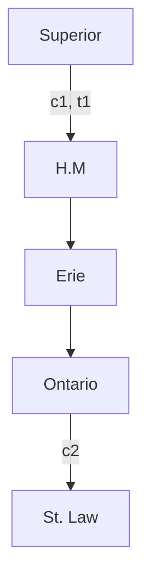
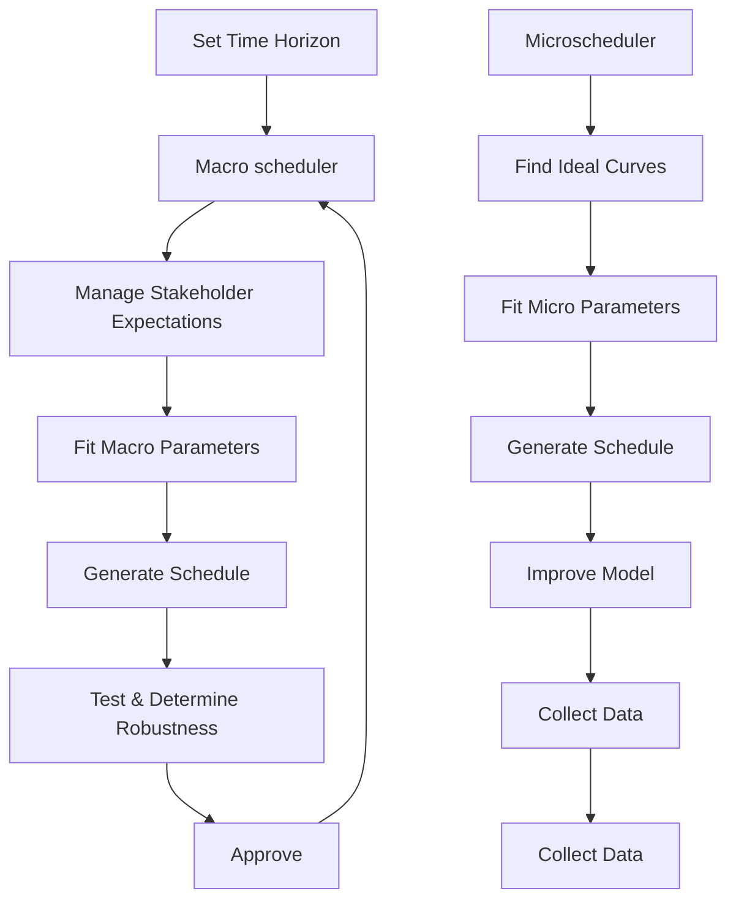

# Dynamic Dams Model: A Multigranular, Human-Centered Approach For Modeling Water In The Great Lakes

Summary

The Great Lakes serve as the heart of North America with their ebbs and flows providing the lifeblood of both the surrounding environment and societies. Because of the lake's incredible importance, it is in the best interest of the world to protect them. Plan 2014, proposed by the International Joint Committee (IJC), manages the water in the Great Lakes by building up water behind both the Compensating Works dam at the Sault St. Marie River and Moses-Saunders dam and taking action as needed. To better serve the Great Lakes region, we seek to expand Plan 2014 to regulate water levels optimizing for human needs and the preservation of ecosystems.

To determine optimal dam scheduling we modeled the Great Lakes as a dynamic flow network and created two control algorithms that utilize linear programming to solve for optimal dam schedules and water levels. The first control algorithm determines the optimal water level in each lake that is achievable through use of the Compensating Works and Moses-Saunders dams over the course of a multiple-month time horizon. After the optimal water levels have been determined, we employ another control algorithm to plan how to schedule the dams over a daily time horizon to achieve the water levels that equitably benefit stakeholders, but still adhere to the larger schedule. By utilizing these two control algorithms, it is possible to generate dam schedules that meet stakeholder needs while avoiding catastrophic events like flooding or dangerously low water levels.

An important aspect of our model is that it is mechanistic. Since we model real flows, it is important to determine accurate parameters to encode natural and artificial processes. However, the Great Lakes are a highly complex system, and they are influenced by several stochastic and highly volatile processes. To account for this complexity, we utilized a data-based approach to best coincide with the data that the IJC will have access to. By utilizing time lagged cross-correlation, we were able to determine the relationship of flow rates between Great Lakes. We also utilized linear regression to model the relationship between the height of each Great Lake and the rate of flow in its distributaries. This allowed us to include necessary complexities while maintaining accurate and faithful parameters.

Our model provides a number of key insights into effective management of the Great Lakes. We observe that using adaptive control algorithms, it is possible to determine schedules that avoid flooding in most cases and allow the IJC to be prepared when flooding is inevitable and to influence the location and time of the flood. Moreover, we observe that despite the large amount of time it takes for Lake Ontario to experience the effects of changes in Lake Superior, it is crucial to manage Lake Superior with the downstream effects on Lake Ontario in mind. When Lake Ontario faces a challenging climate event, effective scheduling at Lake Superior can mitigate the damage and allow Lake Ontario to maintain optimal water levels.

Keywords: Linear Program; Dynamic Flow Network; Human-Centered; Multigranular Approach.

## Contents

## 1 Introduction 3

1.1 Background 3  
1.2 Restatement Of The Question 3  
1.3 Overview of Linear Programs 4  
1.4 Assumptions And Justifications 5

## 2 Macroschedule Model 6

2.1 Dynamic Network Formulation 6  
2.2 Ideal Water Determination Algorithm 7  
2.3 Linear Program Formulation 7  
2.4 Methods for Stakeholder Management 9  
2.5 Data-Based Model Of The Hydrosphere 10  
2.6 Additional Considerations 12

## 3 Microschedule Model 12

## 4 Model Insights 13

4.1 Dynamic Control Of The System 14  
4.2 Robustness to Severe Climate Events ..... 15

## 5 Sensitivity Analysis 16

## 6 Conclusions 17

6.1 Strengths 18  
6.2 Weaknesses 18

## 7 Future Exploration 19

## 8 Memo To The IJC 20

## A Notation 21

## 1 Introduction

## 1.1 Background

The Great Lakes are one of the most prominent features of the North American continent; they not only make up 20 percent of the world's freshwater, but they also have a tremendous impact on the economy, climate, and ecosystems of the United States and Canada. The Great Lakes region is one of the largest economies in the world, supporting 1.5 million people and forming the backbone for other industries which are valued at over 6 trillion dollars [8]. Additionally, they also are the source of life for over 3500 species of plants and animals across a wide range of biomes making them indispensable to the North American ecosystems [18]. Due to the invaluable benefit that the Great Lakes provide us, it is of the utmost importance to society that they are flourishing in the best way possible.

natural_image

Satellite view of the Great Lakes region in Greenland, showing surrounding landmasses and water bodies (no text or symbols visible)

Figure 1: A cloudless view of all of the Great Lakes taken by a NASA satellite in August 2010 [13].

To ensure that the Great Lakes community is well-serviced, it is necessary to analyze the impacts on the stakeholders dependent on the lakes. The stakeholders identified in the report by the International Joint Committee (IJC) are: domestic water supply, commercial navigation, hydropower, environment, recreational boaters, docking companies, and shoreline (riparian) property owners [10].

The current methodology of managing the water flow in Lake Ontario is based on Plan 2014. Plan 2014 prioritizes natural flow out of Lake Ontario into the St. Lawrence River while continually checking if a number of critical points have been reached. When a critical point has been reached, the IJC takes action to control the level of water in the dam [2]. After the initiation of Plan 2014 in 2017, record precipitation hit the area and Lake Ontario experienced severe flooding [7]. This caused millions of dollars of damage and increased the risk for invasive species (like zebra mussels), harmful algae bloom, and sewage blockage [15] [19] [10]. This event brought the effectiveness of the plan under scrutiny. Flooding has proven to be a continual threat to the lives and livelihoods of the stakeholders. Thus, ICM has set out to formulate water level control mechanisms that could prevent such dire events.

## 1.2 Restatement Of The Question

To address the concerns of the IJC, we propose a number of human-centered algorithms that control the water levels of the Great Lakes to best address the residents' concerns around Lake Ontario and the St. Lawrence River. Our models and algorithms are fit to address the needs of various stakeholders, while ensuring that the water levels within the lakes remain safe. Motivated by the flooding damage from 2017, our model focuses on achieving water levels and currents that benefit the stakeholders subject to hard constraints on the risk of flooding and low-water levels. Our outlook differs significantly from that of Plan 2014 to be more resilient in a highly volatile climate. We propose using a linear program to model the needs of the stakeholders with respect to the water level and modulating it with dynamic control of dams that account for the transportation times of the water. Inspired by the successes of Plan 2014 as a method to solve a complex constrained scheduling problem and equipped with the knowledge of where Plan 2014 falls short, we propose a model that utilizes the Compensating Works dam at the Sault. St. Marie River as well as the Moses-Saunders dam to do the following:

1. Center the human impacts by modeling the needs of the stakeholders  
2. Robustness to severe climate events  
3. Dynamic control of the system

## 1.3 Overview of Linear Programs

Our control algorithms are implemented as linear programs. Linear programming is a widely-used optimization technique in the field of operations research and network science. It has various applications from policymaking to power plant deployment to production logistics to watershed management $[11, 20]$ . Linear programs rapidly found applications across the natural sciences, industry, government, and many other fields, and are a natural way to model many scheduling problems where it is important to understand how to plan a series of actions to maximize an objective (typically profit or some other measure of overall utility) subject to some constraints (e.g. there might only be so much time available to us) $[21]$ . Within the realm of environmental decisions, linear programming has been applied to solve complex questions like green-energy planning $[5]$ . Inspired by the success of linear programs in related fields, our control algorithms employ linear programming to determine how to utilize the dams within the Great Lakes. The advantages to be expected from utilizing linear programming are as follows:

- Algorithms for solving linear programs are widely available and extremely fast. Due to the effectiveness of the famous Simplex algorithm and its variants, linear programs can be solved with incredible speed which is advantageous for testing out a variety of weather scenarios.  
- Linear programs are interpretable. Practitioners need access to a white-box control algorithm where it is possible to understand their decision.  
- Linear programs are not defined with specific parameter values in mind. If practitioners need to revise their predictions for environmental factors, they can easily rerun the model with the adjusted parameters.

However, it's also important to acknowledge the downsides that accompany linear programs:

\- The objective and constraints must be linear. This limits the ways we can model our system considerably and, as such, it is important to recognize parts of the model that are remnants of the required linearity.

\- When a linear program is impossible to solve, it is difficult to visualize what is going wrong. If our control algorithms determine that there is no valid schedule that meets all constraints, it will be difficult for the practitioner to find a way to determine a valid schedule.

By keeping these disadvantages in mind, we designed our control algorithms to be effective even with the drawbacks of linear programming.

## 1.4 Assumptions And Justifications

As mentioned in the problem statement, the dynamic network flow problem is wicked. As such, we make use of several assumptions to manage the complexity of our models.

text_image

Δh

Figure 2: Since water levels do not vary much relative to total depth, we can approximate the lake surface area as being constant. We can then convert flow to marginal height by dividing by surface area.

Hydrology: The lake's sizes remain constant and our system can be simplified to five nodes by not factoring in the auxiliaries like lake St. Claire.

Justification: Keeping the lake sizes constant provides us with a consistent conversion metric, as seen in figure 2 between flow and height for each lake. Based on the correlation data for the flow rates, the other nodes are negligible as compared to the main outflows between the Great Lakes.

Systemic: Dams can be fully opened or closed within an hour and they have zero downtime. Additionally, the lag times calculated from correlation data are accurate (Figure 2).

Justification: We want to encapsulate granular dam schedules to minimize flooding and drought of the Great Lakes community. Also, we need the lag times to be accurate to simulate the water flowing between the lakes.

Scaling: The regressions we found for the flow rates from the lakes are linear (Figure 3) and the time horizon of the data is on the order of a few months.

Justification: The regressions are done on the order of the change in height of the lakes, so the flow rates for our purposes should be accurate. Since the time scale of our time lags is on the order of a few months, our time horizon encapsulates the lag time and our model should be used dynamically based on current data.

## 2 Macroschedule Model

Here, we describe our algorithm for determining the optimal achievable water levels in the great lakes over a large time-period.

## 2.1 Dynamic Network Formulation

We begin with a high-level overview of the model. The Great Lake water level problem can be studied as a dynamic network flow problem on the network shown in Figure 3. There are two arcs that we have some level of control over. The Sault St. Marie Dam allows us to send a constrained amount of water from Lake Superior to Lakes Huron and Michigan. Water then flows naturally from Lakes Huron and Michigan into Lake Erie and from Lake Erie to Lake Ontario. Through the Moses-Saunders Dam, we can let a constrained amount of water out of Lake Ontario into the St. Lawrence River.

The reason why our analysis differs from the well-studied static flow problem is because it takes time for water to flow between each node. For instance, it takes roughly one month for flows in Lake Superior to be observed in Lakes Huron and Michigan; it takes roughly three months to be observed in Lake Ontario. Thus, the network flow becomes dynamic—which significantly increases the problem’s modeling and computational difficulty.

flowchart

Figure 3: Network used in the model. $c_{i}$ is the capacity of the arc and $t_{i}$ is the transit time of the arc. All unlabeled arcs correspond to uncontrolled flows of water.

More formally, the dynamic flow problem is defined over a network $N = (V, E, \mu, \tau, V^{+}, V^{-})$ . The vertex set is given by $V \cup V^{+} \cup V^{-}$ where $V^{+}$ represent source nodes, $V^{-}$ represent sink nodes, and V represent transit nodes. Each edge $E_{i}$ has a corresponding capacity $\mu_{it}$ and transit time $\tau_{i}$ [6]. The goal is to find the min-cost flow over a fixed time horizon T that satisfies a particular objective.

To make this problem tractable, we employ Ford and Fulkerson's time-expansion method to convert the problem into static flow [14]. We discretize the model over a fixed timestep, and we create copies of each node for each one over the entire time-horizon. We then assign edges based on the transit times between nodes. With this, the problem is now described by a network $N^{\circ} = (V, E, \mu, V^{+}, V^{-})$ . I.e. an augmented network that includes vertex copies but no transit times. This formulation is amenable to static-flow analysis.

## 2.2 Ideal Water Determination Algorithm

To determine the ideal water levels for each body of water, we developed a utility function for each shareholder that determines their optimal water level based on the historical averages. This optimal water level is determined based on the fluctuations in the water level and what each of the stakeholders listed as their ideal scenario from the IJC report. While navigation, docks, hydropower, and recreational boaters all prefer a fixed level of water, riparian owners, domestic water supply, and the environment prefer natural oscillations in water level $[10]$ . To account for this discrepancy, we simulated sinusoidal oscillations about the mean height of the lake for their preferred timescales and amplitudes scaled compared to the natural processes:

Environment: The environment prefers natural annual water level oscillations to best align with the natural mating seasons of species like wetland birds [12].

Domestic Water Supply: To preserve high water quality, the domestic water supply needs to oscillate close to the average to prevent the inflow of sewage and harmful algae blooms [15][10].

Riparian Owners: The riparian owners prefer lower water levels with smaller amplitude oscillations, with higher frequency to increase the amount of sand re-deposition and dune replenishment [10].

Navigation: Navigation prefers steadily high water levels because lower water levels can increase costs by 30 percent and double emissions in the Great Lakes [16]. Additionally, they want it to not flood because they need ships to get through [10].

Hydropower: The dams prefer their flow rates to be constant or near their ideal operating range of around $7,000\frac{m^{3}}{s}$ , so they prefer to be above the average water levels, similar to navigation, to maintain that [9].

Boaters: Boaters also prefer to be in a similar range of slightly above the average water level to improve the speed they can travel through the water during the day [10].

Docks: For the shipping ports in Montreal, they prefer to have constant low water levels so the amount of the ideal amount of water coming downstream from the Moses-Saunders Dam should be minimized during working hours.

There are conflicting interests among the stakeholders, and it is impossible to please each stakeholder. To account for this, we introduced a weighting system into our model to allow each stakeholder to be considered with different severity. As a result, our ideal water plots look like figure 4 compared to the historical data

## 2.3 Linear Program Formulation

Here we describe the Linear Program (LP) we propose to determine long-term dam schedules for the Great Lakes. We consider two sets that our decision variables and parameters belong to: (1) Bodies of Water and (2) Time. Our decision variables are the amount of water we let flow from the

line chart

| Day of year | Ideal  | Historic |
| ----------- | ------ | -------- |
| 0           | 183.26 | 183.26   |
| 50          | 183.18 | 183.18   |
| 100         | 183.22 | 183.22   |
| 150         | 183.38 | 183.38   |
| 200         | 183.45 | 183.46   |
| 250         | 183.44 | 183.45   |
| 300         | 183.40 | 183.42   |
| 350         | 183.30 | 183.30   |

line chart

| Day of year | Ideal | Historic |
| ----------- | ----- | -------- |
| 0           | 74.7  | 74.65    |
| 50          | 74.8  | 74.7     |
| 100         | 75.0  | 75.0     |
| 150         | 75.1  | 75.1     |
| 200         | 75.0  | 75.0     |
| 250         | 74.9  | 74.9     |
| 300         | 74.6  | 74.5     |
| 350         | 74.6  | 74.6     |

Figure 4: Plot of the ideal water levels (solid orange lines) based on stakeholder needs for Lake Superior and Lake Ontario compared to the historical averages (dotted blue lines) from the dataset.

Superior to the St. Mary River at each time-step and the amount of water we let flow from Lake Ontario to the St. Lawrence River $^{1}$ . The objective of the LP is to minimize the absolute difference between the achieved water level and the “ideal” water level. The LP is constrained by limits on the water level ensuring no flooding occurs and the water level is never critically low. The variables and parameters and described in the first table in Appendix A. The algebraic form of the linear program is shown below:

minimize $\sum_{i\in B,t\in T}\omega_{i}|h_{i,t}-\hat{h}_{i,t}|+(1-\sum_{i\in B}\omega_{i})\sum_{t\in T}|f_{t}-\hat{f}_{t}|$

subject to $h_{1,t} = h_{1,t - 1} - x_{t - 1} + r_{1,t - 1}$ $\forall t\in [1,T]$

$$
h _ {2, t} = h _ {2, t - 1} + \frac {s _ {1}}{s _ {2}} x _ {t - L} - \frac {\left(\alpha_ {2} h _ {2 , t - 1} + \beta_ {2}\right)}{s _ {2}} + r _ {2, t - 1} \quad \forall t \in [ 1, T ]
$$

$$
h _ {3, t} = h _ {3, t - 1} + \frac {\left(\alpha_ {2} h _ {2 , t - L} + \beta_ {2}\right)}{s _ {3}} - \frac {\left(\alpha_ {3} h _ {3 , t - 1} + \beta_ {3}\right)}{s _ {3}} + r _ {3, t - 1} \quad \forall t \in [ 1, T ]
$$

$$
h _ {4, t} = h _ {4, t - 1} + \frac {\left(\alpha_ {3} h _ {3 , t - 1} + \beta_ {3}\right)}{s _ {4}} - y _ {t - 1} + r _ {4, t - 1} \quad \forall t \in [ 1, T ]
$$

$$
h _ {i, t} \leq F _ {i} \quad \forall i \in B, t \in [ 1, T ]
$$

$$
h _ {i, t} \geq D _ {i} \quad \forall i \in B, t \in [ 1, T ]
$$

$$
x _ {t} \leq M _ {1} \quad \forall t \in [ 1, T ]
$$

$$
y _ {t} \leq M _ {2} \quad \forall t \in [ 1, T ]
$$

$$
f _ {t} = w f _ {t - 1} + (1 - w) y _ {t} \quad \forall t \in [ 1, T ]
$$

All decision variables are nonnegative. The first four constraints capture how the height of water in each lake changes over time by tracking how much water enters the lake and how much leaves. We use the index $x_{t-L}$ to capture the fact that there is a lag between the changes in Lake Superior and the changes at other lakes. The 5th and 6th constraints allow us to ensure that no flooding or dangerously-low water levels occur. To capture the fact that dams can only let out so much water at a time, we introduce the 7th and 8th constraints to bound the amount of water we can let out of the dams. Lastly, we track the flow in the St. Lawrence River with the 9th constraint.

## 2.4 Methods for Stakeholder Management

As IJC notes, this problem is particularly difficult because of the often-conflicting requests from the various stakeholders around the Lake Ontario and St. Lawrence River regions. Our algorithm provides a method to weight stakeholder interests, however, it relies on the practitioner to assign these weights manually. This has the potential to create divides between groups of stakeholders. Thus, some sort of heuristic should be used to equitably assign these weights on a per-stakeholder basis.

We propose the following methodology to determine fair weightings between ideal water level curves:

- We create an initial set of weights $w_0$ and set them as parameters in the model.  
- Then we simulate roughly five months $^{2}$ , and observe the forecasted ideal water levels.  
- We then proceed with the schedule for two months.

We simulate beyond the necessary time horizon to ensure that our model accounts for future impacts of flows in the other lakes. In particular, we designate a three-month buffer since this is the time taken for an effect in Lake Superior to be observed in Lake Ontario.

After adopting the given schedule for the two month period, we calculate the net error between the real observed water levels and the ideal curves provided per stakeholder.

$$
\varepsilon_ {i} = \sum_ {t} | h _ {t} - \hat {h} _ {t} | \quad t \in [ 1, 6 0 ]
$$

This gives us per-stakeholder errors $\{\varepsilon_1, \ldots \varepsilon_n\}$ for $n$ stakeholders. Note that higher values of $\varepsilon_i$ correspond to a lower level of stakeholder $i$ 's satisfaction. Keeping this in mind, we can reassign weights for the next time horizon with

$$
w _ {1 i} = \frac {\varepsilon_ {i}}{\sum_ {k} \varepsilon_ {k}}
$$

That is, the new stakeholder weights are their normalized net errors from the last time period. This allows stakeholders that had greater deviations to be prioritized during the next time period.

## 2.5 Data-Based Model Of The Hydrosphere

Modeling the movement of water in the Great Lakes is difficult and requires a number of assumptions to make the problem tractable. To ground our model in reality we used a data-based approach to determine time lag, flow rates out of lakes, and other sources of water outside of the flow between the lakes.

We first needed to approximate the time lags between the lakes for our LP to create dam schedules. For instance, we needed to know that it takes roughly two months for the effect of a flow in Lake Michigan to be observed in Lake Ontario. To identify the latencies, we used time-lagged cross correlation on the provided water level time series to find where the correlation is maximized. For example, the time-lagged cross-correlation between the water levels in Lake Superior and Lake Michigan is given by Figure 5.

scatter plot

| Time lag (months) | Correlation |
| ----------------- | ----------- |
| -10               | 0.82        |
| -9                | 0.80        |
| -8                | 0.76        |
| -7                | 0.72        |
| -6                | 0.69        |
| -5                | 0.68        |
| -4                | 0.69        |
| -3                | 0.73        |
| -2                | 0.79        |
| -1                | 0.85        |
| 0                 | 0.90        |
| 1                 | 0.91        |
| 2                 | 0.86        |
| 3                 | 0.80        |
| 4                 | 0.74        |
| 5                 | 0.69        |
| 6                 | 0.67        |
| 7                 | 0.66        |
| 8                 | 0.67        |
| 9                 | 0.70        |
| 10                | 0.74        |

scatter plot

| Time lag (months) | Correlation |
| ----------------- | ----------- |
| -12               | 0.4         |
| -11               | 0.4         |
| -10               | 0.3         |
| -9                | 0.2         |
| -8                | 0.1         |
| -7                | 0.0         |
| -6                | -0.1        |
| -5                | -0.2        |
| -4                | 0.0         |
| -3                | 0.2         |
| -2                | 0.4         |
| -1                | 0.6         |
| 0                 | 0.7         |
| 1                 | 0.6         |
| 2                 | 0.5         |
| 3                 | 0.4         |
| 4                 | 0.3         |
| 5                 | 0.2         |
| 6                 | 0.1         |
| 7                 | 0.0         |
| 8                 | -0.1        |
| 9                 | -0.2        |
| 10                | -0.3        |
| 11                | -0.4        |
| 12                | -0.5        |

Figure 5: Time lagged cross-correlation examples for between Lake Huron and Erie and between Lake Erie and Ontario computed from the dataset given for Problem D in [1].

The correlation is maximized at a time lag of 1. Thus, we can interpret that a flow in Lake Superior will take approximately a month to propagate in Lake Michigan. The full matrix of these time-lagged correlations is given by Table 1.

<table><tr><td></td><td>Sup.</td><td>Mich + Huron</td><td>Erie</td><td>Ont.</td></tr><tr><td>Sup.</td><td>0</td><td>1</td><td>3</td><td>3</td></tr><tr><td>Mich. + Huron</td><td>-1</td><td>0</td><td>1</td><td>2</td></tr><tr><td>Erie</td><td>-3</td><td>-2</td><td>0</td><td>0</td></tr><tr><td>Ont.</td><td>-3</td><td>-2</td><td>0</td><td>0</td></tr></table>

Table 1: Time lag matrix between the Great Lakes

Additionally, we used the datasets to run a linear regression, pictured in figure 6, to obtain the flow rates as a function of the height of the lake, which we will use to model the flow in and out of the lakes. We suspect this to be true because if we approximate flow using Bernoulli's principle in fluid mechanics, we find that by expanding for small oscillations we will have locally linear results.

scatter plot

| Lake Erie height (m) | Niagara river flow (m³ s⁻¹) |
| --------------------- | --------------------------- |
| 173.8                 | 5000                        |
| 174.0                 | 5500                        |
| 174.2                 | 6000                        |
| 174.4                 | 6500                        |
| 174.6                 | 7000                        |
| 174.8                 | 7500                        |
| 175.0                 | 8000                        |
| 175.2                 | 8000                        |

scatter plot

| Lake Michigan/Huron height (m) | Detroit River flow (m³·s⁻¹) |
| ------------------------------ | --------------------------- |
| 175.50                         | 4200                        |
| 175.75                         | 4800                        |
| 176.00                         | 5200                        |
| 176.25                         | 5600                        |
| 176.50                         | 6000                        |
| 176.75                         | 6400                        |
| 177.00                         | 6800                        |
| 177.25                         | 7200                        |
| 177.50                         | 7600                        |

Figure 6: Flow along the Niagara River and Detroit River as a function of the height (relative to sea level) of the lakes they flow from. The regression formulae are given by:

$$
f _ {\text { Niagara }} = 2 0 8 8. 9 1 7 h _ {\text { Erie }} - 3 5 7 9 9 3. 8 2 4 \text {   with   } (\mathrm{R} ^ {2} = 0. 9 2 8)
$$

$$
f _ {\text { D   e   t   r   o   i   t }} = 1 6 1 1. 5 8 1 h _ {\text { H   u   r   o   n }} - 2 7 8 6 1 8. 6 7 4 \text { w   i   t   h } (\mathrm{R} ^ {2} = 0. 8 5 0)
$$

Lastly, we also approximated other aspects of the hydrosphere (precipitation, groundwater, evaporation, and surface runoff) by modeling the inflow of water based on how much it rained because according to the biohydrological database for the Great Lakes makes up 20 percent of the water flowing into the Great Lakes [3]. Using the NOAA data set of rainfall, evaporation, and runoff into the Great Lakes [17], we determined the total inflow that would occur each month based on historical data. We visualize the historical rainfall that occurred during each month in Figure 7.

line chart

| Month | 25p    | 50p    | 75p    |
|-------|--------|--------|--------|
| Jan   | -0.03  | -0.02  | 0.01   |
| Feb   | 0.01   | 0.02   | 0.03   |
| Mar   | 0.05   | 0.06   | 0.07   |
| Apr   | 0.10   | 0.11   | 0.12   |
| May   | 0.13   | 0.16   | 0.18   |
| Jun   | 0.12   | 0.15   | 0.17   |
| Jul   | 0.11   | 0.13   | 0.15   |
| Aug   | 0.08   | 0.10   | 0.12   |
| Sep   | 0.06   | 0.08   | 0.10   |
| Oct   | 0.03   | 0.05   | 0.07   |
| Nov   | -0.01  | -0.02  | -0.01  |
| Dec   | -0.04  | -0.03  | -0.02  |

area chart

Lake Ontario net exogenous flow
| Month | 25p (m) | 50p (m) | 75p (m) |
|---|---|---|---|
| Jan | 0.13 | 0.19 | 0.24 |
| Feb | 0.15 | 0.18 | 0.24 |
| Mar | 0.22 | 0.28 | 0.36 |
| Apr | 0.31 | 0.41 | 0.46 |
| May | 0.19 | 0.23 | 0.32 |
| Jun | 0.15 | 0.19 | 0.26 |
| Jul | 0.09 | 0.14 | 0.19 |
| Aug | 0.07 | 0.09 | 0.11 |
| Sep | 0.06 | 0.07 | 0.08 |
| Oct | 0.11 | 0.13 | 0.15 |
| Nov | 0.12 | 0.16 | 0.23 |
| Dec | 0.14 | 0.19 | 0.22 |

Figure 7: 1st (in blue), 2nd (in red), and 3rd (in orange) quartiles of exogenous flow into Lakes Superior and Ontario

## 2.6 Additional Considerations

Aside from the data-driven parameters we obtained, we considered other parameters to help make our model more realistic:

Seasonal Wave Attenuation: To consider the seasonality of the Great Lakes we also add an attenuation factor that reduces the flow between the lakes. We added this factor because a study by Peng Bai showed that ice attenuates the waves in the Great Lakes and thus should reduce their flow from their turbulent effects $[4]$ .

Fuzzing The Model: Since exogenous inflow is highly random, we added noise to historical inflow data to increase the robustness of our model. This makes the model more robust by removing biases towards certain shores at different water levels and helps us accurately assess the drought and flooding risk factors.

## 3 Microschedule Model

One aspect that our Macroschedule model does not incorporate are the proximal effects of opening the Moses-Saunders Dam. As noted by the problem statement, even small variances in the water level can have drastic implications for stakeholders around Lake Ontario and the St. Lawrence River. As such, it is not enough to know how to release water in a day. It is also important to time outflows when it is generally most beneficial for these stakeholders. We develop a linear program that schedules intra-day outflows to maximize community benefit.

Unlike the macroscheduling problem, there is no substantial time lag on flows between nodes in the microscheduling problem. Thus, we can exert more immediate control over the water level and flows in Lake Ontario and the St. Lawrence River. We use a similarly formulated linear program to represent these flows, and the objective of maximizing proximity to ideal water levels and flows. The variables of the problems are defined in the second table of Appendix A

And the LP is formulated as follows:

$$
\text { minimize } \quad \sum_ {t \in T} \alpha_ {1} | h _ {t} - \hat {h} _ {t} | + \alpha_ {2} | f _ {t} - \hat {f} _ {t} |
$$

subject to $h_t = h_{t-1} + F_t - x_t$ $\forall t \in T$

$$
f _ {t} = \omega f _ {t - 1} + k (1 - \omega) x _ {t} \quad \forall t \in T
$$

$$
x _ {t} \leq O \quad \forall t \in T
$$

$$
h _ {T} = \hat {H}
$$

The first two constraints implement height and flow rate updates in Lake Ontario and the St. Lawrence river respectively. Notice that the second constraint models the river flow rate as a convex combination of inflow from the dam and its prior flow rate. This is influenced by sound physical intuition, but it is difficult to accurately model this parameter based on available data. The third constraint limits total outflow from the dam, and the fourth enforces that a certain amount of water has left Lake Ontario by the end of the day. This ensures that the microscheduler adheres to the daily requirements set forth by the larger schedule. Our proposed synthesis of the macroscheduler and microscheduler is show in Figure 8

Due to lower lag times, the model can satisfy daily requirements relatively well. This is important because there are likely days when dam usage must be limited to coordinate with monthly schedules. However, the water level can still be modulated to a level where stakeholders can still be largely satisfied.

flowchart

Figure 8: The pipeline for using our control algorithms.

## 4 Model Insights

Here we outline a brief overview of the main insights of our model:

- Effectively managing Lake Ontario means effectively Managing Lake Superior. Lake Superior is able to influence Lake Ontario after a significant time delay which makes proactive scheduling at Lake Superior able to create desirable water levels at Lake Ontario.  
- Our model successfully achieves the desired water levels in most lakes even with varying degrees of rainfall.  
- After determining optimal water levels through our macro-schedule algorithm, our micro-schedule algorithm is able to determine realistic and effective schedules for scheduling a dam during any particular day.

## 4.1 Dynamic Control Of The System

Most dams use a heuristic approach for dam scheduling called rule curves. That is, dams are given fixed schedules depending on water level and precipitation thresholds. While our model is amenable to producing rule curves, we believe that the dynamic nature of scheduling makes it superior to this approach.

One of the most critical aspects of the model is that it can make decisions by “looking ahead”. That is, given a range of forecasts, the model can schedule flows that are both robust to climate events and still satisfy the needs of stakeholders. This way, action can be taken to mitigate potential crises well before they actually occur.

After we “look ahead” we can then use a combination of the macroscheduler and microscheduler model to forecast both the four-month time horizon and then locally on the daily horizon. By modeling both of these time horizons, we gain valuable insights on the importance of factoring in the time lags to forecasting the dam schedules. The efficacy of our model is shown in Figure 9:

line chart

| Hour | Error (%) |
| ---- | --------- |
| 0    | 1.45      |
| 1    | 0.0       |
| 2    | 0.0       |
| 3    | 0.0       |
| 4    | 0.0       |
| 5    | 0.0       |
| 6    | 0.0       |
| 7    | 0.0       |
| 8    | 0.0       |
| 9    | 0.0       |
| 10   | 0.0       |
| 11   | 0.0       |
| 12   | 0.0       |
| 13   | 0.15      |
| 14   | 0.25      |
| 15   | 0.3       |
| 16   | 0.32      |
| 17   | 0.3       |
| 18   | 0.2       |
| 19   | 0.0       |
| 20   | 0.3       |
| 21   | 0.8       |
| 22   | 1.1       |
| 23   | 1.2       |
| 24   | 1.0       |

Figure 9: Plot of the percent error between ideal flow and the flow achieved by the microscheduler after the optimal water levels were determined by the macroscheduling algorithm.

## 4.2 Robustness to Severe Climate Events

We tested the schedules produced by our control algorithm using past rain/runoff/evaporation data collected from $[17]$ . We determined the average amount of total rain, runoff, and evaporation for each month from 1980 to 2020. Due to the fact that our model uses a time-step of one day and the data available form $[17]$ tracks how much rain/runoff/evaporation occurred each month, we determined how much it rained per day by running a cubic spline through the historical averages and then dividing the value for total rain, runoff, and evaporation by 30 to account for the fact that the month data was the total over a month (roughly 30 days). This allows us to capture the natural patterns of rain, runoff, and evaporation while making the data usable in our model. We ran a similar procedure to determine the 25th and 75th percentile amount of rain, runoff, and evaporation that occurred on each day.

After obtaining these rain values, we ran our linear program using the historic rain level (either the 25th, 50th or 75th percentile) at body of water i during time t for the $r_{i,t}$ parameter. The time horizon for these experiments was set to a year and the ideal water was determined using the techniques in Section 2.2. The water levels achieved by the model are shown in Figures 10 and 11.

We observe that the Lake Ontario water levels are very consistent across different levels of total rain, runoff, and evaporation while Lake Superior's levels are not. This demonstrates that effectively scheduling Lake Superior is crucial to having desirable water levels at Lake Ontario. The types of schedules that are required in Lake Superior to create desirable water levels at Lake Ontario are non-robust to severe changes in total inflow to the Great Lakes, but the water levels in the rest of the Great Lakes are indeed robust to climate events.

Quartile 1  

line chart

| Time | Water Height (Solid Line) | Water Height (Dotted Line) |
| --- | --- | --- |
| 0 | 183.3 | 183.3 |
| 1 | 183.2 | 183.0 |
| 2 | 183.2 | 182.8 |
| 3 | 183.3 | 182.7 |
| 4 | 183.4 | 182.6 |
| 5 | 183.4 | 182.6 |
| 6 | 183.4 | 182.6 |
| 7 | 183.4 | 182.6 |
| 8 | 183.4 | 182.6 |
| 9 | 183.4 | 182.6 |
| 10 | 183.4 | 182.6 |
| 11 | 183.4 | 182.6 |
| 12 | 183.4 | 182.6 |
| 13 | 183.4 | 182.6 |
| 14 | 183.4 | 182.6 |
| 15 | 183.4 | 182.6 |
| 16 | 183.4 | 182.6 |
| 17 | 183.4 | 182.6 |
| 18 | 183.4 | 182.6 |
| 19 | 183.4 | 182.6 |
| 20 | 183.4 | 182.6 |
| 21 | 183.4 | 182.6 |
| 22 | 183.4 | 182.6 |
| 23 | 183.4 | 182.6 |
| 24 | 183.4 | 182.6 |
| 25 | 183.4 | 182.6 |
| 26 | 183.4 | 182.6 |
| 27 | 183.4 | 182.6 |
| 28 | 183.4 | 182.6 |
| 29 | 183.4 | 182.6 |
| 30 | 183.4 | 182.6 |
| 31 | 183.4 | 182.6 |
| 32 | 183.4 | 182.6 |
| 33 | 183.4 | 182.6 |
| 34 | 183.4 | 182.6 |
| 35 | 183.4 | 182.6 |
| 36 | 183.4 | 182.6 |
| 37 | 183.4 | 182.6 |
| 38 | 183.4 | 182.6 |
| 39 | 183.4 | 182.6 |
| 40 | 183.4 | 182.6 |
| 41 | 183.4 | 182.6 |
| 42 | 183.4 | 182.6 |
| 43 | 183.4 | 182.6 |
| 44 | 183.4 | 182.6 |
| 45 | 183.4 | 182.6 |
| 46 | 183.4 | 182.6 |
| 47 | 183.4 | 182.6 |
| 48 | 183.4 | 182.6 |
| 49 | 183.4 | 182.6 |
| 50 | 183.4 | 182.6 |
| 51 | 183.4 | 182.6 |
| 52 | 183.4 | 182.6 |
| 53 | 183.4 | 182.6 |
| 54 | 183.4 | 182.6 |
| 55 | 183.4 | 182.6 |
| 56 | 183.4 | 182.6 |
| 57 | 183.4 | 182.6 |
| 58 | 183.4 | 182.6 |
| 59 | 183.4 | 182.6 |
| 60 | 183.4 | 182.6 |
| 61 | 183.4 | 182.6 |
| 62 | 183.4 | 182.6 |
| 63 | 183.4 | 182.6 |
| 64 | 183.4 | 182.6 |
| 65 | 183.4 | 182.6 |
| 66 | 183.4 | 182.6 |
| 67 | 183.4 | 182.6 |
| 68 | 183.4 | 182.6 |
| 69 | 183.4 | 182.6 |
| 70 | 183.4 | 182.6 |
| 71 | 183.4 | 182.6 |
| 72 | 183.4 | 182.6 |
| 73 | 183.4 | 182.6 |
| 74 | 183.4 | 182.6 |
| 75 | 183.4 | 182.6 |
| 76 | 183.4 | nan |

line chart

| Point | Value  |
|-------|--------|
| 1     | 176.2  |
| 2     | 176.3  |
| 3     | 176.4  |
| 4     | 176.5  |
| 5     | 176.4  |
| 6     | 176.3  |
| 7     | 176.2  |
| 8     | 176.1  |
| 9     | 176.0  |
| 10    | 175.9  |
| 11    | 175.8  |
| 12    | 175.7  |

Erie  

line chart

| Days | Water Height (Solid Line) | Water Height (Dotted Line) |
|------|---------------------------|----------------------------|
| 0    | 174.2                     | 174.2                      |
| 50   | 174.3                     | 174.3                      |
| 100  | 174.4                     | 174.4                      |
| 150  | 174.5                     | 174.4                      |
| 200  | 174.4                     | 174.3                      |
| 250  | 174.3                     | 174.2                      |
| 300  | 174.2                     | 174.1                      |
| 350  | 174.1                     | 174.0                      |

Ontario  

line chart

| Days | Value |
| ---- | ----- |
| 0    | 74.7  |
| 50   | 74.8  |
| 100  | 75.0  |
| 150  | 75.1  |
| 200  | 75.0  |
| 250  | 74.8  |
| 300  | 74.6  |
| 350  | 74.6  |

Qaurtile 2

line chart

| Time | Water Height (Solid Line) | Water Height (Dotted Line) |
|------|---------------------------|----------------------------|
| 0    | 18.3                      | 18.3                       |
| 1    | 18.2                      | 18.2                       |
| 2    | 18.3                      | 18.0                       |
| 3    | 18.4                      | 18.1                       |
| 4    | 18.4                      | 18.0                       |
| 5    | 18.4                      | 18.0                       |
| 6    | 18.3                      | 18.0                       |

Huron/Michigan  

line chart

| Point | Value |
|---|---|
| 1 | 176.2 |
| 2 | 176.2 |
| 3 | 176.05 |
| 4 | 176.35 |
| 5 | 176.3 |
| 6 | 176.5 |
| 7 | 176.4 |
| 8 | 176.3 |
| 9 | 176.35 |
| 10 | 176.25 |
| 11 | 176.2 |
| 12 | 176.2 |

Erie  

line chart

| Days | Water Height |
| ---- | ------------ |
| 0    | 174.20       |
| 50   | 174.25       |
| 100  | 174.35       |
| 150  | 174.45       |
| 200  | 174.50       |
| 250  | 174.45       |
| 300  | 174.35       |
| 350  | 174.20       |

Ontario  

line chart

| Days | Value  |
|------|--------|
| 0    | 74.7   |
| 50   | 74.8   |
| 100  | 74.9   |
| 150  | 75.1   |
| 200  | 75.1   |
| 250  | 74.9   |
| 300  | 74.6   |
| 350  | 74.4   |
| 375  | 74.6   |

Figure 10: Plots of the 1st and 2nd quartiles of the water levels in each of the Great Lakes drawn from the historic rain data. The water levels achieved by the model are shown with dotted blue lines and the ideal water levels with solid orange lines.

Quartile 3  

line chart

| Time Point | Water Height (Solid Line) | Water Height (Dotted Line) |
| ---------- | ------------------------- | -------------------------- |
| 1          | 183.25                    | 183.30                     |
| 2          | 183.20                    | 183.25                     |
| 3          | 183.15                    | 183.20                     |
| 4          | 183.20                    | 183.25                     |
| 5          | 183.30                    | 183.35                     |
| 6          | 183.40                    | 183.45                     |
| 7          | 183.45                    | 183.35                     |
| 8          | 183.40                    | 183.25                     |
| 9          | 183.35                    | 183.20                     |
| 10         | 183.30                    | 183.25                     |
| 11         | 183.25                    | 183.30                     |
| 12         | 183.20                    | 183.25                     |
| 13         | 183.15                    | 183.20                     |
| 14         | 183.10                    | 183.15                     |
| 15         | 183.05                    | 183.10                     |
| 16         | 183.00                    | 183.05                     |
| 17         | 182.95                    | 183.00                     |
| 18         | 182.90                    | 182.95                     |
| 19         | 182.85                    | 182.90                     |
| 20         | 182.80                    | 182.85                     |
| 21         | 182.75                    | 182.80                     |
| 22         | 182.70                    | 182.75                     |
| 23         | 182.65                    | 182.70                     |
| 24         | 182.60                    | 182.65                     |
| 25         | 182.55                    | 182.60                     |
| 26         | 182.50                    | 182.55                     |
| 27         | 182.45                    | 182.50                     |
| 28         | 182.40                    | 182.45                     |
| 29         | 182.35                    | 182.40                     |
| 30         | 182.30                    | 182.35                     |
| 31         | 182.25                    | 182.30                     |
| 32         | 182.20                    | 182.25                     |
| 33         | 182.15                    | 182.20                     |
| 34         | 182.10                    | 182.15                     |
| 35         | 182.05                    | 182.10                     |
| 36         | 182.00                    | 182.05                     |
| 37         | 181.95                    | 182.00                     |
| 38         | 181.90                    | 181.95                     |
| 39         | 181.85                    | 181.90                     |
| 40         | 181.80                    | 181.85                     |
| 41         | 181.75                    | 181.80                     |
| 42         | 181.70                    | 181.75                     |
| 43         | 181.65                    | 181.70                     |
| 44         | 181.60                    | 181.65                     |
| 45         | 181.55                    | 181.60                     |
| 46         | 181.50                    | 181.55                     |
| 47         | 181.45                    | 181.50                     |
| 48         | 181.40                    | 181.45                     |
| 49         | 181.35                    | 181.40                     |
| 50         | 181.30                    | 181.35                     |
| 51         | 181.25                    | 181.30                     |
| 52         | 181.20                    | 181.25                     |
| 53         | 181.15                    | 181.20                     |
| 54         | 181.10                    | 181.15                     |
| 55         | 181.05                    | 181.10                     |
| 56         | 181.00                    | 181.05                     |
| 57         | 179.95                    | 180.90                     |
| 58         | 179.90                    | 179.95                     |
| 59         | 179.85                    | 179.90                     |
| 60         | 179.80                    | 179.85                     |
| 61         | 179.75                    | 179.80                     |
| 62         | 179.70                    | 179.75                     |
| 63         | 179.65                    | 179.70                     |
| 64         | 179.60                    | 179.65                     |
| 65         | 179.55                    | 179.60                     |
| 66         | 179.50                    | 179.55                     |
| 67         | 179.45                    | 179.50                     |
| 68         | 179.40                    | nan                        |
| Peak       | ~0                        | ~0                         |
The chart displays a line graph with two data series: one for 'Water Height' and one for 'Water Height' (dotted lines). The x-axis represents time points from 'Start' to 'End', and the y-axis represents the corresponding water height values.

line chart

| Point | Solid Line | Dotted Line |
|-------|------------|-------------|
| 1     | 176.2      | 176.2       |
| 2     | 176.3      | 176.2       |
| 3     | 176.4      | 176.2       |
| 4     | 176.5      | 176.3       |
| 5     | 176.4      | 176.2       |
| 6     | 176.3      | 176.3       |
| 7     | 176.2      | 176.0       |

line chart

| Days | Water Height (Solid Line) | Water Height (Dotted Line) |
|------|---------------------------|----------------------------|
| 0    | 174.2                     | 174.2                      |
| 50   | 174.3                     | 174.4                      |
| 100  | 174.4                     | 174.5                      |
| 150  | 174.5                     | 174.6                      |
| 200  | 174.4                     | 174.5                      |
| 250  | 174.3                     | 174.4                      |
| 300  | 174.2                     | 174.2                      |
| 350  | 174.2                     | 174.2                      |

line chart

| Days | Line 1 | Line 2 |
|------|--------|--------|
| 0    | 74.7   | 74.7   |
| 50   | 74.8   | 74.7   |
| 100  | 75.0   | 74.9   |
| 150  | 75.1   | 75.1   |
| 200  | 75.0   | 74.9   |
| 250  | 74.9   | 74.8   |
| 300  | 74.6   | 74.6   |
| 350  | 74.6   | 74.5   |

Figure 11: Plots of achieved water levels using the third quartile rain data (extreme rain). The water levels achieved by the model are shown with dotted blue lines and the ideal water levels are shown with solid orange lines.

## 5 Sensitivity Analysis

Since our model is primarily mechanistic, it relies heavily on parameters that represent real-life values such as flow rates, flow decay, and attenuation. As such, it is reasonable to observe how the model's output changes as we modulate some of these parameters. Specifically, we vary $\omega$ -the St. Lawrence river flow decay rate.

Moreover, we determine that it is possible to avoid flooding and dangerously low water levels while achieving desirable water levels in all lakes even with varying degrees of total inflow to the lakes. This demonstrates the value of our linear programming approach as a valuable tool to determine dam schedules.

The value that was used in the final model was 0.8. This was chosen based off observing flows in the St. Lawrence River and how they change with respect to the height of Lake Ontario. However, since there isn't data on the status of the dam at these times, this link is admittedly tenuous. Thus, we decided to observe the effects of modulating this parameter on the net flow error in the St. Lawrence River. That is, with different decay rates, we measure how hard is it for our control algorithm to match the desired flow rate in the St. Lawrence River.

We uniformly vary the parameter $\omega$ in the range [0.7, 0.825] and observe the net error rate. We see that:

line chart

| ω    | Net flow error |
| ---- | -------------- |
| 0.70 | 960            |
| 0.72 | 920            |
| 0.74 | 935            |
| 0.76 | 945            |
| 0.78 | 960            |
| 0.80 | 1010           |
| 0.82 | 945            |

Figure 12: Flow in the St. Lawrence River is sensitive to $\omega$

The error here varies quite significantly. In some sense, this is not surprising. Complex systems such as the Great Lakes are very sensitive to slight physical changes. To maximize the effectiveness of the model, it is therefore important to be able to measure these parameters accurately, and provide them to the model with high-resolution.

In conclusion, the model is largely robust to changes in climate forecasting. However, due to its mechanistic nature, it is quite sensitive to parameters describing natural and artificial flow processes.

## 6 Conclusions

- Our model demonstrates that to effectively manage Lake Ontario, the IJC must also effectively manage Lake Superior. Lake Superior has the capacity to send large amounts of water to Lake Ontario. While the time it takes for Lake Ontario to feel the effects of actions taken at Lake Superior, by proactively increasing the water sent from Lake Superior, Lake Ontario can more effectively manage its water levels.  
- Dam schedules will consistently make tradeoffs between flood/drought security and stakeholder satisfaction. It is important to manage stakeholder expectations and use equitable prioritization methods to ensure overall contentedness.  
- Testing schedules against different severities of exogenous inflow yield outcomes that are significantly more robust to climate and hydrologic events. Regardless of the scheduling algorithm, plans should always be tested against real historical inflows as well as randomly simulated climate events.

## 6.1 Strengths

1. Due the speed of solving linear programs, our model can be employed to develop schedules for a large number of potential forecasts and ideal water levels. This allows practitioners to be more prepared for extreme weather events by being able to prep schedules for best-case, worst-case, and average-case weather events. If it becomes evident that the environmental data that the dam control schedule was created from is poor, a new schedule can be quickly substituted in to mitigate damage.  
2. Our control algorithms can effectively meet stakeholder demands while the water levels remain close to historical averages. The Great Lakes water system needs to flow naturally while still accounting for the demands of stakeholders, so our model must meet this benchmark.  
3. Due to the constrained nature of our control algorithms, practitioners will always be aware of the maximum and minimum water levels that are produced by the schedule. Since actions taken at Lake Superior affect Lake Ontario with a severe delay, there is an associated risk with increasing or decreasing the flow through the Compensating Works dam. Our control algorithms allow for practitioners to predict the effect of the schedules they implement.  
4. Our model is extremely flood and drought-resistant. In our analysis using realistic precipitation data our model didn't experience any droughts or floods.

## 6.2 Weaknesses

Practitioners need to be aware of the flaws of our model so that unexpected results from our control algorithms can be mitigated. The weaknesses of our model are as follows:

- Due to the mechanistic nature of our model, the schedule of the model is noticeably sensitive to changes in parameters related to natural processes. For example, if the rate of flow decay in the St. Lawrence River is poorly measured, the model will produce a schedule that differs slightly, but noticeably, from the true ideal schedule. Practitioners should be aware of this flaw and apply the model several times with varying values for parameters like the decay rate and rain schedule. While the schedule will be sensitive to poor measurements, it will provide valuable insights into how to best manage the dams.  
- Our model assumes a linear relationship between the height of a body of water and the total outflow which may change over time as the landscape of the Great Lakes changes. To account for this, practitioners should routinely track the relationship between the height of each lake and the observed flows of each lake's distributaries.  
- Due to the constraints placed on flooding and dangerously low water levels, our model will occasionally determine that an adequate schedule is possible. If practitioners encounter this issue when using our proposed control algorithms, they must choose the location and extent of flooding that will necessarily occur. We believe that no model can completely avoid flooding, so we believe that our model's ability to have controlled and predictable flooding is sufficiently safe.

## 7 Future Exploration

To address some of the weaknesses we identified, we believe that our model could be expanded in the following ways:

- Pull from more refined data: By pulling from more refined data, our model would have more accurate information hydrological information. As a result, our model could improve the mechanistic nature of our model.  
- Safety Optimizer: Another extension of our model could be using the results from running many fuzzy trials to determine which dam schedule is optimal against random weather conditions. This would allow practitioners to understand the risk associated with the schedules they select.  
- Create an algorithm to determine which stakeholders to prioritize. The time of year has a large effect on the possibility of pleasing any particular stakeholder. A future direction of this work would be to implement the time of year into our weighting of the stakeholders.

## 8 Memo To The IJC

Dear IJC Leadership,

In light of the successes and failures experienced by Plan 2014 in regards to controlling the Moses-Saunders dam at Lake Ontario, we developed two linear programming-based control algorithms to effectively determine how to jointly manage the Compensating Works Dam at Lake Superior and the Moses-Saunders Dam at Lake Ontario to achieve ideal water levels throughout the Great Lakes. We believe that our algorithms build off of the adaptive control approach that Plan 2014 has successfully implemented while avoiding the limitations of Plan 2014 that have allowed for flooding in recent years.

In our model, we employ linear programming and a series of algorithms that forecast the needs of the stakeholders to determine how much we need to open dams at Lake Superior and Ontario. Because we are using a linear program, our model can simulate hundreds of thousands of scenarios within a few minutes, this would allow for the IJC to have a more holistic approach to assessing the risks of running certain dam schedules for their stakeholders. Our algorithm for determining the optimal levels of stakeholders is based on their desires outlined in the IJC report and draws from historical water levels $[10]$ . Our model also utilizes historical data to simulate natural processes in the hydrosphere in the following ways:

- We account for the time it takes water to flow between lakes. We were able to correlate the water level data between different lakes to estimate the time it taken for flows to propagate through the system.  
- We use a data-driven approach to determine flow rates of naturally flowing sources. Moreover, using the data available to us, we found a strong linear relationship between height and the rate and which water flows out.  
- Our model accounts for various levels of rainfall and other hydrological processes. We utilized a combination of precipitation from NOAA and preexisting models to get randomized, but representative rain data to run our situations [17] [22].

To show the resilience of our model we ran it under various extreme climate events and found it was effective in preventing floods and droughts. Specifically, the way our algorithms achieve near-optimal water levels even with severe climate events is by creatively managing Lake Superior. By incorporating the relationship between Lake Superior and Lake Ontario into our model, we are able to achieve schedules that allow Lake Ontario to remain safe and beneficial to the stakeholders.

We believe that our model provides the IJC with valuable insights about how to best manage the Compensating Works and Sault. St. Marie dams. Our model will allow the IJC to use the most recent sets of data being gathered at the monitoring points along the Great Lakes and adapt an optimal dam schedule based on current conditions and predictive forecasts.

Thank you for your consideration,

Team #2429211

A Notation

<table><tr><td>Name</td><td>Type</td><td>Description.</td></tr><tr><td>T</td><td>Set</td><td>Set of time-steps.</td></tr><tr><td>B</td><td>Set</td><td>Set of Bodies of Water.</td></tr><tr><td> $x_t$ </td><td>Variable</td><td>Height of water let through the Sault St. Marie Dam at time t.</td></tr><tr><td> $y_t$ </td><td>Variable</td><td>Height of water let through the Moses-Saunders Dam at time t.</td></tr><tr><td> $f_t$ </td><td>Variable</td><td>Flow at River Lawrence at time t.</td></tr><tr><td> $h_{i,t}$ </td><td>Variable</td><td>Height of water in body of water i at time t.</td></tr><tr><td> $\omega_i$ </td><td>Parameter</td><td>Weighting term for the objective function. High  $\omega_i$ </td></tr><tr><td> $r_{i,t}$ </td><td>Parameter</td><td>The total height added by environmental factors in body of water i at time t.</td></tr><tr><td> $s_i$ </td><td>Parameter</td><td>The surface area of body of water i.</td></tr><tr><td> $\alpha_i$ </td><td>Parameter</td><td>Determined slope from regression.</td></tr><tr><td> $\beta_i$ </td><td>Parameter</td><td>Determined bias from regression.</td></tr><tr><td>L</td><td>Parameter</td><td>Lag time between specified bodies of water.</td></tr><tr><td> $F_i$ </td><td>Parameter</td><td>Height of water required for a flood at body of water i.</td></tr><tr><td> $D_i$ </td><td>Parameter</td><td>Height required for dangerously low water at body of water i.</td></tr><tr><td> $M_1$ </td><td>Parameter</td><td>Maximum height of water releasable from Lake Superior during a time-step.</td></tr><tr><td> $M_2$ </td><td>Parameter</td><td>Maximum height of water releasable from Lake Ontario during a time-step</td></tr><tr><td>w</td><td>Parameter</td><td>Influence of the Mosses-Saunders Dam on the flow of the St. Lawrence River</td></tr></table>

Table 2: Description of variables involved in the mathematical program used to determine dam schedules. All heights are in meters, all flows are in cubic meters per second, and all areas are given meters squared, all lag times are given in days

<table><tr><td>Name</td><td>Type</td><td>Description.</td></tr><tr><td> $B_i$ </td><td>Set</td><td>Bodies of water (Ontario, St. Lawrence)</td></tr><tr><td>T</td><td>Param</td><td>Time Horizon</td></tr><tr><td> $F_t$ </td><td>Param</td><td>Hourly inflow into Lake Ontario</td></tr><tr><td> $\hat{h}_t$ </td><td>Param</td><td>Ideal water levels</td></tr><tr><td> $\hat{f}_t$ </td><td>Param</td><td>Ideal flow levels</td></tr><tr><td>k</td><td>Param</td><td>Flow conversion coefficient</td></tr><tr><td> $l_i$ </td><td>Param</td><td>Initial water and flow levels</td></tr><tr><td> $α_i$ </td><td>Param</td><td>Weights for stakeholder importance</td></tr><tr><td>ω</td><td>Param</td><td>Hourly flow decay coefficient</td></tr><tr><td>O</td><td>Param</td><td>Dam outflow limit</td></tr><tr><td> $\hat{H}$ </td><td>Param</td><td>Final water height</td></tr><tr><td> $h_t$ </td><td>Variable</td><td>Water level</td></tr><tr><td> $f_t$ </td><td>Variable</td><td>Flow level</td></tr><tr><td> $x_t$ </td><td>Variable</td><td>Moses-Saunders Dam outflow</td></tr></table>

Table 3: Microschedule LP formulation. All water levels are heights in meters, all times are in hours, and all flows are in cubic meters per second

## References

[1] 2024MCM/ICM Problems. https://www.immchallenge.org/mcm/index.html.  
[2] International Joint Commission (2014). Lake Ontario St. Lawrence River Plan 201: Protecting against extreme water levels, restoring wetlands and preparing for climate change, 2014.  
[3] US army Corps of Engineers. John glenn great lakes basin program biohydrological information base, 2007.  
[4] Peng Bai, Jia Wang, Philip Chu, Nathan Hawley, Ayumi Fujisaki-Manome, James Kessler, Brent M Lofgren, Dmitry Beletsky, Eric J Anderson, and Yaru Li. Modeling the ice-attenuated waves in the great lakes. Ocean Dynamics, 70:991–1003, 2020.  
[5] Chiranjib Bhowmik, Sumit Bhowmik, Amitava Ray, and Krishna Murari Pandey. Optimal green energy planning for sustainable development: A review. Renewable and Sustainable Energy Reviews, 71:796–813, 2017.  
[6] Thomas Bläsius, Adrian Feilhauer, and Jannik Westenfelder. Dynamic flows with time-dependent capacities, 2023.  
[7] Murray Clamen and Daniel Macfarlane. Plan 2014: The historical evolution of lake ontario-st. lawrence river regulation. Canadian Water Resources Journal/Revue canadienne des ressources hydriques, 43(4):416–431, 2018.  
[8] Great Lakes Commission.  
[9] International Joint Commission. Options for managing lake ontario and st. lawrence river water levels and flows (final report), 2006.  
[10] International Joint Commission. Section 5: Impacts on various interests, 2023.  
[11] George B Dantzig. Linear programming. History of mathematical programming, pages 19-31, 1991.  
[12] Jean-Luc Desgranges, Joel Ingram, Bruno Drolet, Jean Morin, Caroline Savage, and Daniel Borcard. Modelling wetland bird response to water level changes in the lake ontario–st. lawrence river hydrosystem. Environmental monitoring and assessment, 113:329–365, 2006.  
[13] Google Earth. Great lakes, no clouds, 2010.  
[14] Lester Randolph Ford. Flows in networks. 2015.  
[15] Inga Kanoshina, Urmas Lips, and Juha-Markku Leppänen. The influence of weather conditions (temperature and wind) on cyanobacterial bloom development in the gulf of finland (baltic sea). Harmful Algae, 2(1):29–41, 2003.  
[16] Frank Millerd. The economic impact of climate change on canadian commercial navigation on the great lake. Canadian Water Resources Journal, 30(4):269–280, 2005.  
[17] NOAA. Noaa glerl data, 2021.  
[18] National Oceanic and Atmospheric Administration. Great lakes ecoregion - national oceanic and atmospheric administration, 2019.  
[19] Frank J Rahel and Julian D Olden. Assessing the effects of climate change on aquatic invasive species. Conservation biology, 22(3):521–533, 2008.  
[20] Charles S. Revelle, Daniel P. Loucks, and Walter R. Lynn. Linear programming applied to water quality management. Water Resources Research, 4(1):1–9, 1968.  
[21] Michael H Veatch. Linear and convex optimization: A Mathematical Approach. John Wiley & Sons, 2020.  
[22] Daniel S Wilks and Robert L Wilby. The weather generation game: a review of stochastic weather models. Progress in physical geography, 23(3):329–357, 1999.

## Report on Use of AI

Dear ICM Judges,

No AI was used in the writing, code, or development of this project.

We wish you the best.