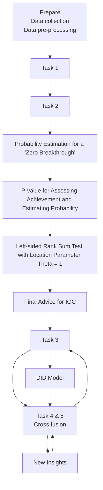
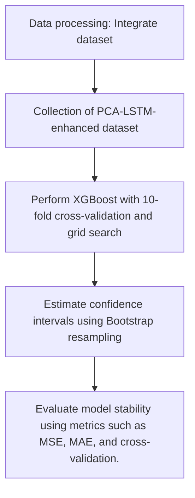

# Olympic Multi-dimensional Predictive Integrator

Summary

To ensure a systematic and multidimensional approach to Olympic medal prediction, this study constructs a dynamic and coupled comprehensive prediction framework. This framework integrates various objectives, including medal distribution prediction, breakthrough country identification, event performance evaluation, and the impact analysis of coaching resource allocation. By employing multi-source heterogeneous data fusion and machine learning integration methods, we achieve an in-depth analysis and reliable prediction of the development patterns in competitive sports.

First, we develop a multidimensional predictive model to analyze Olympic medal patterns. Utilizing Principal Component Analysis (PCA) for dimensionality reduction and noise filtering of the Olympic event dataset, we combine Long Short-Term Memory (LSTM) networks to mine temporal features and integrate home advantage effects. A dual-channel XGBoost-Bootstrap model is established to generate predictions with a 95% confidence interval. The results indicate an upward trend for countries such as the United States and the United Kingdom, while countries like France and China show a decline. The model has a low MAE and MAPE, exhibiting a high accuracy and strong robustness. Through non-parametric testing, potential breakthrough countries are identified, with San Marino and Kuwait showing gold medal breakthrough probabilities of 84.7% and 68.4%, respectively. Event analysis reveals a strong correlation between swimming, athletics, and medal counts, while SHapley Additive exPlanations (SHAP) quantifies shooting as a core contributing event. Principal component analysis uncovers the positive driving effects of swimming and wrestling on medal augmentation, informing optimal sports event allocation.

Subsequently, we develop a Difference-in-Differences (DID) model to quantify the competitive benefits of coaching replacement and conduct statistical significance tests as well as parallel trends tests to ensure the reliability of our results. It is found that during the 2020-2024 period, Australia, South Korea, and Poland experienced significant "great coach" policy effects through strategic restructuring of their coaching teams. Based on this, we recommend prioritizing investment in high-elasticity projects.

Finally, we synthesize all models and analyses to present new insights and corresponding decision supports.

Keywords: Prediction Model, PCA, LSTM, XGBoost, SHAP, DID

# Contents

# 1 Introduction 3

1.1 Problem Background 3  
1.2 Clarifications and Restatements 3  
1.3 Our Work.... 3

# 2 Preparation for Modeling 3

2.1 Model Assumptions 3  
2.2 Notations 4  
2.3 Data Preprocessing 4

# 3 Problem 1: Medal Prediction 5

3.1 Medal Ranking 5  
3.1.1 PCA: Reducing Dimensions 5  
3.1.2 LSTM: Trends Based on Time 6  
3.1.3 XGBoost-Bootstrap Modeling 9  
3.1.4 Results Display 9

3.2 Breaking the Zero 10

3.3 Olympic Events and Medal Counts 13

3.3.1 Spearman: A Mathematical Analysis 13  
3.3.2 SHAP: Revealing Correlations and Importance 14  
3.3.3 Analysis of Relationships and Importance 15

# 4 Problem 2: The "Great Coach" Effect 18

4.1 DID Modeling 18  
4.2 Hypothesis Testing and Contribution Coefficient Analysis 19

# 5 Problem 3: New Insights 19

# 6 Sensitivity Analysis 21

6.1 The Number of Principal Components 21  
6.2 Prediction Model Evaluation 21

# 7 Model Analysis 22

7.1 Strength 22  
7.2 Weekness and Further Discussion 23

# 8 Memorandum 24

# Reference 25

# 1 Introduction

# 1.1 Problem Background

The medal standings of the 2024 Paris Summer Olympics illustrate the diversity of international sports competition: the United States led with 126 total medals, while China tied for the gold medal count. The host nation, France, underscores the advantages of hosting by securing the fourth position in total medal accumulation. Emerging powers such as Albania have achieved their first gold medal, whereas over 60 countries have yet to register any medals, reflecting the uneven distribution of competitive resources. Current predictions largely rely on pre-competition data $^{6}$ ; however, key variables such as historical trends, adjustments to events, and coaching effects have not yet been adequately quantified. By constructing data-driven models $^{2}$ , it becomes possible to accurately identify potential medal-winning events, optimize coaching resources, leverage host country advantages, and reveal the pathways to the emergence of "invisible champions". This approach provides dynamic insights that can aid nations in formulating strategies and foster a rebalancing of the Olympic landscape.

# 1.2 Clarifications and Restatements

Given the background information and constraints of the problem, we must complete the following tasks:

Task 1: Develop a model to predict gold and total medal counts for each country at the 2028 Los Angeles Olympics and compare predictions with the 2024 Paris Olympics.

Task 2: Identify countries expected to win their first medals at the upcoming Olympics using the model from Task 1, and estimate the likelihood of a "zero breakthrough".

Task 3: Analyze the relationship between Olympic sports and medal counts, considering the impact of the host nation and selected sports.

Task 4: Create a model to identify countries with the "great coach" effect in specific sports and provide contribution coefficients.

Task 5: Based on the topic and the work conducted, additional original insights are presented.

# 1.3 Our Work

First, dimensionality reduction is performed using PCA. Next, trend information is incorporated through LSTM, leading to the establishment of an XGBoost prediction model. Subsequently, the Wlicoxon signed rank test is employed to investigate which countries achieve a breakthrough in winning their first medals and to determine the corresponding probabilities. Furthermore, Spearman correlation coefficients and SHAP are utilized to conduct relationship and importance analyses. Finally, a DID approach is applied to examine the "great coach" effect and provide new insights. For ease of description and visualization, we have drawn Fig. 1 to represent our work.

# 2 Preparation for Modeling

# 2.1 Model Assumptions

Some fundamental assumptions are listed below.

\- Assumption 1: Athletes are in optimal physical condition throughout the competi-

flowchart

Figure 1: The Flow Chart of Our Work

tion and their performance is solely influenced by competitive factors.

→ Justification: We assume that athletes will compete in peak condition, with performance primarily driven by training and competition, excluding factors such as injuries or external disturbances.

\- Assumption 2: A country's past Olympic performance is a reliable indicator of future medal counts, and the host country tends to perform better due to home-field advantages.

→ Justification: We assume that historical performance reflects long-term trends in national sports development, and that host countries benefit from support from local spectators and familiarity with the competition environment.

# 2.2 Notations

Table 1: The List of Notation

<table><tr><td>Symbol</td><td>Definition</td></tr><tr><td> $\alpha_{c}$ </td><td>Each country’s home advantage coefficient</td></tr><tr><td> $\hat{p}_{i}$ </td><td>The host advantage coefficient</td></tr><tr><td> $\beta_{0}$ </td><td>Intercept, the baseline medal count for the control group</td></tr><tr><td> $\beta_{1}$ </td><td>The difference between the treatment and control groups</td></tr><tr><td> $\beta_{2}$ </td><td>The overall change in medal counts from 2020 to 2024</td></tr><tr><td> $\beta_{3}$ </td><td>Contribution coefficient</td></tr><tr><td> $X_{it}$ </td><td>Control variable matrix</td></tr><tr><td> $\gamma$ </td><td>Coefficient of  $X_{it}$ </td></tr><tr><td> $\epsilon_{it}$ </td><td>Random error term</td></tr><tr><td> $\text{Prep}_{t}$ </td><td>The preparatory period effect</td></tr><tr><td> $\text{Threat}_{i}$ </td><td>Dummy variable indicating coach change, 1 if changed, 0 otherwise</td></tr><tr><td> $\text{Post}_{t}$ </td><td>Time dummy variable, 1 if the Olympic year is 2024, 0 otherwise</td></tr></table>

# 2.3 Data Preprocessing

Overviewing the five attachments provided in this study, "data\_dictionary", etc and synthesizing the information regarding medal predictions, event counts, and types, one

can observe that the scale of information constitutes a small dataset. However, the data is lengthy and complex, with intricate relationships among different data points, representing a type of data pertinent to decision-making in real-world scenarios.

- For attachment 2, we will perform a natural join with the "summerOly\_medal\_counts" dataset to match the columns for country names and their abbreviations, thereby enhancing the information provided.  
- During the data aggregation process, we will retrieve and consolidate data from attachment 2 based on the fields "Team," "Year," "Sport," and "Medal," calculating the medal counts for each country in every Olympic event. Furthermore, we will merge and compute data for various sports across different years, thereby deriving the types and counts of events for each Olympic Games, which will provide vital data support for subsequent medal predictions and trend analysis.  
- For attachment 5, we will address missing values in the columns "Code," "Sports Governing Body," and "Year" through interpolation methods and by removing rows or columns that contain missing values.

# 3 Problem 1: Medal Prediction

This study focuses on predicting medal counts for the 2028 Los Angeles Olympic Games. By considering the interval prediction of medal rankings and recognizing the memoryless characteristic of Olympic medal trends akin to Markov chains, we employ an innovative XGBoost $^{5}$ algorithm enhanced by PCA $^{8,9}$ and LSTM $^{3,7}$ to model predictions for gold and total medal rankings while assessing model uncertainty. Using the PCA-LSTM-enhanced dataset from 2024, we derive predictive intervals for the gold and total medals by country for 2028, facilitating performance prediction analysis.

In terms of predicting the probability of nations "breaking the zero" for gold medals, we analyze the interval prediction results from XGBoost. We perform a symmetric rank sum test on Bootstrap samples where point estimates are greater than or equal to 1, concluding that countries with a P-value less than 0.05 are likely to achieve at least one gold medal in 2028.

Additionally, we examine the correlation and importance of different Olympic events in relation to countries' medal counts. We start with a Spearman correlation analysis between gold and total medal counts for each country in 2024 and the weighted values of key Olympic events. Building on our PCA-LSTM-enhanced XGBoost model, we utilize SHAP analysis to assess the importance of each sport based on principal component importance values. Univariate dependence plots further explore the relationships between individual sports and overall gold and medal counts, while SHAP force plots provide insights into the interrelationships and significance of different sports within nations regarding their gold and total medal counts.

# 3.1 Medal Ranking

# 3.1.1 PCA: Reducing Dimensions

In predicting Olympic gold medals and rankings, outcomes are closely linked to the medal counts and compositions from previous Games. Thus, we weighted the gold, silver, and bronze medals of each country in major sporting events at 50%, 30%, and 20%, respectively, to assess their potential impact on future medal standings.

Principal Component Analysis (PCA) was employed to reduce the dimensionality of the weighted medal count dataset across 45 sporting events. This approach effectively addresses multicollinearity among original metrics by utilizing uncorrelated principal components, thereby eliminating redundancy and improving the convergence speed and accuracy of subsequent algorithms. Subsequently, Figs. 2(a)-(b) illustrate the first two dimensions of the PCA results.

bubble

| ID | Dim1 (21.6%) | Dim2 (11.6%) | Contrib | cos2 |
| --- | --- | --- | --- | --- |
| 1 | ~-17.5 | ~0.5 | ~5 | ~0.8 |
| 2 | ~-13.5 | ~7.5 | ~15 | ~0.8 |
| 3 | ~-10.5 | ~5.5 | ~10 | ~0.6 |
| 4 | ~-1.5 | ~4.5 | ~10 | ~0.6 |
| 5 | ~-4.5 | ~4.0 | ~10 | ~0.6 |
| 6 | ~-4.5 | ~-6.0 | ~10 | ~0.6 |
| 7 | ~-4.5 | ~-3.5 | ~10 | ~0.6 |
| 8 | ~-4.5 | ~-7.0 | ~10 | ~0.6 |
| 9 | ~-1.5 | ~-8.0 | ~10 | ~0.6 |
| 10 | ~-4.5 | ~-3.0 | ~10 | ~0.6 |
| 11 | ~-4.5 | ~-3.5 | ~10 | ~0.6 |
| 12 | ~-4.5 | ~-3.0 | ~10 | ~0.6 |
| 13 | ~-4.5 | ~-3.5 | ~10 | ~0.6 |
| 14 | ~-4.5 | ~-3.0 | ~10 | ~0.6 |
| 15 | ~-4.5 | ~-3.5 | ~10 | ~0.6 |
| 16 | ~-4.5 | ~-3.0 | ~10 | ~0.6 |
| 17 | ~-4.5 | ~-3.5 | ~10 | ~0.6 |
| 18 | ~-4.5 | ~-3.0 | ~10 | ~0.6 |
| 19 | ~-4.5 | ~-3.5 | ~10 | ~0.6 |
| 20 | ~-4.5 | ~-3.0 | ~10 | ~0.6 |
| 21 | ~-4.5 | ~-3.5 | ~10 | ~0.6 |
| 22 | ~-4.5 | ~-3.0 | ~10 | ~0.6 |
| 23 | ~-4.5 | ~-3.5 | ~10 | ~0.6 |
| 24 | ~-4.5 | ~-3.0 | ~10 | ~0.6 |
| 25 | ~-4.5 | ~-3.5 | ~10 | ~0.6 |
| 26 | ~-4.5 | ~-3.0 | ~10 | ~0.6 |
| 27 | ~-4.5 | ~-3.5 | ~10 | ~0.6 |
| 28 | ~-4.5 | ~-3.0 | ~10 | ~0.6 |
| 29 | ~-4.5 | ~-3.5 | ~10 | ~0.6 |
| 30 | ~-4.5 | ~-3.0 | ~10 | ~0.6 |
| 31 | ~-4.5 | ~-3.5 | ~10 | ~0.6 |
| 32 | ~-4.5 | ~-3.0 | ~10 | ~0.6 |
| 33 | ~-4.5 | ~-3.5 | ~10 | ~0.6 |
| 34 | ~-4.5 | ~-3.0 | ~10 | ~0.6 |
| 35 | ~-4.5 | ~-3.5 | ~10 | ~0.6 |
| 36 | ~-4.5 | ~-3.0 | ~10 | ~0.6 |
| 37 | ~-4.5 | ~-3.5 | ~10 | ~0.6 |
| 38 | ~-4.5 | ~-3.0 | ~10 | ~0.6 |
| 39 | ~-4.5 | ~-3.5 | ~10 | ~0.6 |
| 40 | ~-4.5 | ~-3.0 | ~10 | ~0.6 |
| 41 | ~-4.5 | ~-3.5 | ~10 | ~0.6 |
| 42 | ~-4.5 | ~-3.0 | ~10 | ~0.6 |
| 43 | ~-4.5 | ~-3.5 | ~10 | ~0.6 |
| 44 | ~-4.5 | ~-3.0 | ~10 | ~0.6 |
| 45 | ~-4.5 | ~-3.5 | ~10 | ~0.6 |
| 46 | ~-4.5 | ~-3.0 | ~10 | ~0.6 |
| 47 | ~-4.5 | ~-3.5 | ~10 | ~0.6 |
| 48 | ~-4.5 | ~-3.0 | ~10 | ~0.6 |
| 49 | ~-4.5 | ~-3.5 | ~10 | ~0.6 |
| 50 | ~-4.5 | ~-3.0 | ~10 | ~0.6 |
| 51 | ~-4.5 | ~-3.5 | ~10 | ~0.6 |
| 52 | ~-4.5 | ~-3.0 | ~10 | ~0.6 |
| 53 | ~-4.5 | ~-3.5 | ~10 | ~0.6 |
| 54 | ~-4.5 | ~-3.0 | ~10 | ~0.6 |
| 55 | ~-4.5 | ~-3.5 | ~10 | ~0.6 |
| 56 | ~-4.5 | ~-3.0 | ~10 | ~0.6 |
| 57 | ~-4.5 | ~-3.5 | ~10 | ~0.6 |
| 58 | ~-4.5 | ~-3.0 | ~10 | ~0.6 |
| 59 | ~-4.5 | ~-3.5 | ~10 | ~0.6 |
| 60 | ~-4.5 | ~-3.0 | ~10 | ~0.6 |
| 61 | ~-4.5 | ~-3.5 | ~10 | ~0.6 |
| 62 | ~-4.5 | ~-3.0 | ~10 | ~0.6 |
| 63 | ~-4.5 | ~-3.5 | ~10 | ~0.6 |
| 64 | ~-4.5 | ~-3.0 | ~10 | ~0.6 |
| 65 | ~-4.5 | ~-3.5 | ~10 | ~0.6 |
| 66 | ~-4.5 | ~-3.0 | ~10 | ~0.6 |
| 67 | ~-4.5 | ~-3.5 | ~10 | ~0.6 |
| 68 | ~-4.5 | ~-3.0 | ~10 | ~0.6 |
| 69 | ~-4.5 | ~-3.5 | ~10 | ~0.6 |
| 70 | ~-4.5 | ~-3.0 | ~10 | ~0.6 |
| 71 | ~-4.5 | ~-3.5 | ~10 | ~0.6 |
| 72 | ~-4.5 | ~-3.0 | ~10 | ~0.6 |
| 73 | ~-4.5 | ~-3.5 | ~10 | ~0.6 |
| 74 | ~-4.5 | ~-3.0 | ~10 | ~0.6 |
| 75 | ~-4.5 | ~-3.5 | ~10 | ~0.6 |
| 76 | ~-4.5 | ~-3.0 | ~10 | ~0.6 |
| 77 | ~-4.5 | ~-3.5 | ~10 | ~0.6 |
| 78 | ~-4.5 | ~-3.0 | ~10 | ~0.6 |
| 79 | ~-4.5 | ~-3.5 | ~10 | ~0.6 |
| 80 | ~-4.5 | ~-3.0 | ~10 | ~0.6 |
| 81 | ~-4.5 | ~-3.5 | ~10 | ~0.6 |
| 82 | ~-4.5 | ~-3.0 | ~10 | ~0.6 |
| 83 | ~-4.5 | ~-3.5 | ~10 | ~0.6 |
| 84 | ~-4.5 | ~-3.0 | ~10 | ~0.6 |
| 85 | ~-4.5 | ~-3.5 | ~10 | ~0.6 |
| 86 | ~-4.5 | ~-3.0 | ~10 | ~0.6 |
| 87 | ~-4.5 | ~-3.5 | ~10 | ~0.6 |
| 88 | ~-4.5 | ~-3.0 | ~10 | ~0.6 |
| 89 | ~-4.5 | ~-3.5 | ~10 | ~0.6 |
| 90 | ~-4.5 | ~-3.0 | ~10 | ~0.6 |
| 91 | ~-4.5 | ~-3.5 | ~10 | ~0.6 |
| 92 | ~-4.5 | ~-3.0 | ~10 | ~0.6 |
| 93 | ~-4.5 | ~-3.5 | ~10 | ~0.6 |
| 94 | ~-4.5 | ~-3.0 | ~10 | ~0.6 |
| 95 | ~-4.5 | ~-3.5 | ~10 | ~0.6 |
| 96 | ~-4.5 | ~-3.0 | ~10 | ~0.6 |
| 97 | ~-4.5 | ~-3.5 | ~10 | ~0.6 |
| 98 | ~-4.5 | ~-3.0 | ~10 | ~0.6 |
| 99 | ~-4.5 | ~-3.5 | ~10 | ~0.6 |
| 100 | ~-4.5 | ~-3.0 | ~10 | ~0.6 |

(a)

bubble

| Category | Dim.1 | Dim.2 | Dim.3 | Dim.4 | Dim.5 |
| --- | --- | --- | --- | --- | --- |
| Swimming | ~0.38 | ~0.38 | ~0.38 | ~0.38 | ~0.38 |
| Athletics | ~0.38 | ~0.38 | ~0.38 | ~0.38 | ~0.38 |
| Cycling | ~0.38 | ~0.38 | ~0.38 | ~0.38 | ~0.38 |
| Shooting | ~0.38 | ~0.38 | ~0.38 | ~0.38 | ~0.38 |
| Artistic Gymnastics | ~0.38 | ~0.38 | ~0.38 | ~0.38 | ~0.38 |
| Golf | ~0.38 | ~0.38 | ~0.38 | ~0.38 | ~0.38 |
| Cycling | ~0.38 | ~0.38 | ~0.38 | ~0.38 | ~0.38 |
| Basketball | ~0.38 | ~0.38 | ~0.38 | ~0.38 | ~0.38 |
| Cycling | ~0.38 | ~0.38 | ~0.38 | ~0.38 | ~0.38 |
| Cycling Track | ~0.38 | ~0.38 | ~0.38 | ~0.38 | ~0.38 |
| Equestrian | ~0.38 | ~0.38 | ~0.38 | ~0.38 | ~0.38 |
| Swimmingball | ~0.38 | ~0.38 | ~0.38 | ~0.38 | ~0.38 |
| Canoe Sprint | ~0.38 | ~0.38 | ~0.38 | ~0.38 | ~0.38 |
| 3x3 Basketball | ~0.38 | ~0.38 | ~0.38 | ~0.38 | ~0.38 |
| Volleyball | ~0.38 | ~0.38 | ~0.38 | ~0.38 | ~0.38 |
| Wattle | ~0.38 | ~0.38 | ~0.38 | ~0.38 | ~0.38 |
| Taekwondo | ~0.38 | ~0.38 | ~0.38 | ~0.38 | ~0.38 |
| Volleyball | ~0.38 | ~0.38 | ~0.38 | ~0.38 | ~0.38 |
| Volleyball | ~0.38 | ~0.38 | ~0.38 | ~0.38 | ~0.38 |
| Surfing | ~0.38 | ~0.38 | ~0.38 | ~0.38 | ~0.38 |
| Skateboarding | ~0.38 | ~0.38 | ~0.38 | ~0.38 | ~0.38 |
| Cycling | ~0.38 | ~0.38 | ~0.38 | ~0.38 | ~0.38 |
| Soccer | ~0.38 | ~0.38 | ~0.38 | ~0.38 | ~0.38 |
| Reentry | ~0.38 | ~0.38 | ~0.38 | ~0.38 | ~0.38 |
| SportClimbing | ~0.38 | ~0.38 | ~0.38 | ~0.38 | ~0.38 |
| Football | ~0.38 | ~0.38 | ~0.38 | ~0.38 | ~0.38 |
| Table tennis | ~0.38 | ~0.38 | ~0.38 | ~0.38 | ~0.38 |
| Wheel | ~0.38 | ~0.38 | ~0.38 | ~0.38 | ~0.38 |
| Cycling Road | ~0.38 | ~0.38 | ~0.38 | ~0.38 | ~0.38 |
| Transport | ~0.38 | ~0.38 | ~0.38 | ~0.38 | ~0.38 |
| Cycling | ~0.38 | ~0.38 | ~0.38 | ~0.38 | ~0.38 |
| Motor | ~0.38 | ~0.38 | ~0.38 | ~0.38 | ~0.38 |
| Marathon Swimming | ~0.38 | ~0.38 | ~0.38 | ~0.38 | ~0.38 |
| Rowing | ~0.38 | ~0.38 | ~0.38 | ~0.38 | ~0.38 |
| Tennis | ~0.38 | ~0.38 | ~0.38 | ~0.38 | ~0.38 |
| Surfing | ~0.38 | ~0.38 | ~0.38 | ~0.38 | ~0.38 |
| Badminton | ~0.38 | ~0.38 | ~0.38 | ~0.38 | ~0.38 |
| Weightmasonics | ~0.38 | ~0.38 | ~0.38 | ~0.38 | ~0.38 |
| Modern Pedalation | ~0.38 | ~0.38 | ~0.38 | ~0.38 | ~0.38 |
| Rugby Severe | ~0.38 | ~0.38 | ~0.38 | ~0.38 | ~0.38 |
| Archery | ~0.38 | ~0.38 | ~0.38 | ~0.38 | ~0.38 |
| Artis Swimming | ~0.38 | ~0.38 | ~0.38 | ~0.38 | ~0.38 |
| Hockey | ~0.38 | ~0.38 | ~0.38 | ~0.38 | ~0.38 |
| Canoe Slalom | ~0.38 | ~0.38 | ~0.38 | ~0.38 | ~0.38 |
| Judo | ~0.38 | ~0.38 | ~0.38 | ~0.38 | ~0.38 |
| Cycling BMX Racing | ~0.38 | ~0.38 | ~0.38 | ~0.38 | ~0.38 |
| Cycling | ~0.38 | ~0.38 | ~0.38 | ~0.38 | ~0.38 |

(b)  
Figure 2: PCA Bioplot

In the five-dimensional principal components, the cumulative variance contributions reach 76.4%, effectively capturing most characteristics of the original data. This indicates that data can be reduced to five dimensions for analysis. Fig. 2(b) shows that shooting has the highest score on the principal components, indicating its significant influence among events. Following shooting, swimming, athletics, and wrestling also exhibit notable medal weights. The remaining events cluster distinctly, likely due to their correlated medal weights. Collectively, swimming, athletics, wrestling, shooting, rhythmic gymnastics, boxing, and diving significantly impact PC1, suggesting it represents a principal component for major sports. Conversely, the other components (PC2 to PC5) are influenced by fewer variables. This analysis yields five principal component characteristics regarding medal weights of sporting events at the 2020 Olympics through PCA dimensionality reduction.

# 3.1.2 LSTM: Trends Based on Time

Predicting the Olympic medal tally can be framed as a time series forecasting problem, as countries' medal counts show temporal continuity. Strong sports powers often maintain high medal counts, while emerging nations may experience short-term breakthroughs. Thus, the model must capture patterns and long-term trends across different Olympic Games.

LSTM is advantageous for handling long-range dependencies in time series data. For instance, if a country's medal count has steadily increased over the last three Games, LSTM can identify this trend to predict further increases. The four-year gap between Olympics makes traditional models less effective; however, LSTM's gating mechanisms help retain essential historical information, improving prediction accuracy.

Additionally, Olympic medal data can be noisy, with some countries showing inconsistent performances. LSTM mitigates this noise by learning broader trends. It can also incorporate extra features like host country metrics to enhance predictions. To tackle data sparsity, especially for smaller nations with limited data points, we have implemented a regularization technique.

The process of constructing the LSTM model is as follows.

\- Feature design

Each country's home advantage coefficient $\alpha_{c}$ is estimated through regression based on historical data, normalized to serve as weights:

$$
\alpha_ {c} = \frac {\mathrm{Gold} _ {c} ^ {\mathrm{host}} - \mathrm{Gold} _ {c} ^ {\mathrm{avg}}}{\mathrm{Gold} _ {c} ^ {\mathrm{avg}}} \tag {1}
$$

A binary variable $\mathrm{Host}_t \in \{0,1\}$ is utilized to indicate whether the country is the host for the year $t$ . A preparatory period effect is introduced to capture the impact of increased investments during the preparation phase:

$$
\mathrm{Prep} _ {t} = \left\{ \begin{array}{l l} 1 & \text {if} t \in \left[ t _ {\text {host}} - 8, t _ {\text {host}} \right] \\ 0 & \text {otherwise} \end{array} \right. \tag {2}
$$

where $t_{host}$ denotes the year of hosting, and 8 is equivalent to two Olympic cycles.

\- Input feature reconstruction

The input vector for each time step is expanded to:

$$
\mathbf {x} _ {t} = [ \text {Gold} _ {t}, \text {Total} _ {t}, \text {Host} _ {t}, \text {Prep} _ {t}, \alpha_ {c} ] \tag {3}
$$

\- Time series modeling and feature fusion

A dual-channel LSTM structure is employed to separately process the medal sequence and home advantage features, with a final fusion for prediction:

$$
\mathbf {h} _ {t} ^ {\text {medal}} = \mathrm{LSTM} _ {\text {medal}} \left(\left[ \mathrm{Gold} _ {t - k}, \mathrm{Total} _ {t - k} \right] _ {k = 1} ^ {n _ {\text {steps}}}\right) \tag {4a}
$$

$$
\mathbf {h} _ {t} ^ {\text {host}} = \mathrm{LSTM} _ {\text {host}} \left(\left[ \text {Host} _ {t - k}, \text {Prep} _ {t - k}, \alpha_ {c} \right] _ {k = 1} ^ {n _ {\text {steps}}}\right) \tag {4b}
$$

$$
\hat {y} _ {t} = \mathrm{FC} \left(\mathbf {h} _ {t} ^ {\text {medal}} \oplus \mathbf {h} _ {t} ^ {\text {host}}\right) \tag {4c}
$$

where $n_{steps} = 3$ , represents using data from the last three Olympics. $\oplus$ represents vector concatenation, FC denotes a fully connected layer and $\hat{y}_{t}$ is the predictions.

\- Loss function and joint optimization

A hierarchical loss function is designed to constrain medal predictions and home advantage identification separately:

$$
\mathcal {L} = \lambda_ {1} \mathcal {L} _ {\text {medal}} + \lambda_ {2} \mathcal {L} _ {\text {host}} \tag {5a}
$$

$$
\mathcal {L} _ {\text {medal}} = \frac {1}{N} \sum_ {i = 1} ^ {N} \left((y _ {i} ^ {\text {Gold}} - \hat {y} _ {i} ^ {\text {Gold}}) ^ {2} + (y _ {i} ^ {\text {Total}} - \hat {y} _ {i} ^ {\text {Total}}) ^ {2}\right) \tag {5b}
$$

$$
\mathcal {L} _ {\text {host}} = - \frac {1}{N} \sum_ {i = 1} ^ {N} \left[ \mathrm{Host} _ {i} \log (\hat {p} _ {i}) + (1 - \mathrm{Host} _ {i}) \log (1 - \hat {p} _ {i}) \right] \tag {5c}
$$

where $\lambda_{1} = 0.7$ , $\lambda_{2} = 0.3$ , $\hat{p}_i = 0.1$ .

In the tuning process for the LSTM model, we primarily focused on two parameters: the number of neurons in the hidden layer (hidden\_size) and the number of epochs allowed for early stopping (patience). We employed WMAE\_Gold and WMAE\_Total (Equation 6) as comparative metrics, starting with a constant hidden\_size to conduct our

comparisons. As illustrated in Figs. 3(a) and 3(d) (circle is the minimum of error), the optimal configuration is $32 \times 6$ . Figs. 3(b) and 3(e) indicate that both $64 \times 8$ and $64 \times 10$ meet the objective; however, in Fig. 3(b), the model with $64 \times 8$ demonstrates a more significant reduction in error compared to the other parameter settings, leading us to select $64 \times 8$ . Figs. 3(c) and 3(f) reveal that $128 \times 10$ exhibits the best performance.

Subsequently, we conducted a direct comparison of these three models. As shown in Fig. 4, the performance of the configurations $32 \times 6$ and $128 \times 10$ is quite similar; nonetheless, the overall error for $128 \times 10$ is lower. Therefore, we ultimately determined the parameters to be hidden\_size=128 and patience=10. This selection provides critical trends measures for subsequent research involving XGBoost.

$$
\text {WMAE\_Gold or Total} = \frac {\sum w _ {c} \left| y _ {c} - \hat {y} _ {c} \right|}{\sum w _ {c}} \tag {6}
$$

where $w_{c}$ is the weight of country $c$ 's gold medals or total medals, $y_{c}$ is the true and $\hat{y}_{c}$ is the prediction.

bar

| hidden_size and patience | WMAE_Gold |
| --- | --- |
| \(32 \times 6\) | 2.78 |
| \(32 \times 7\) | 5.21 |
| \(32 \times 8\) | 6.00 |
| \(32 \times 9\) | 3.57 |
| \(32 \times 10\) | 3.93 |

(a)

bar

| hidden_size and patience | WMAE_Gold |
| --- | --- |
| 64x6 | 5.38 |
| 64x7 | 4.70 |
| 64x8 | 3.73 |
| 64x9 | 4.44 |
| 64x10 | 4.49 |

(b)

bar

| hidden_size and patience | WMAE_Gold |
| --- | --- |
| 128x6 | 5.11 |
| 128x7 | 4.72 |
| 128x8 | 3.24 |
| 128x9 | 4.68 |
| 128x10 | 3.19 |

(c)

bar

| hidden_size and patience | WMAE |
| --- | --- |
| \(32 \times 6\) | 6.31 |
| \(32 \times 7\) | 11.05 |
| \(32 \times 8\) | 11.59 |
| \(32 \times 9\) | 8.83 |
| \(32 \times 10\) | 6.53 |

(d)

bar

| hidden_size and patience | WMAE_Total |
| --- | --- |
| 64x6 | 11.40 |
| 64x7 | 11.22 |
| 64x8 | 9.64 |
| 64x9 | 9.85 |
| 64x10 | 8.60 |

(e)

bar

| hidden_size and patience | WMAE_Total |
| --- | --- |
| 128x6 | 11.21 |
| 128x7 | 8.03 |
| 128x8 | 8.47 |
| 128x9 | 9.76 |
| 128x10 | 6.12 |

(f)

Figure 3: Variations in Parameter Tuning of WMAE\_Gold and WMAE\_Total  

bar_stacked

| hidden_size | WMAE_Gold | WMAE_Total |
| --- | --- | --- |
| 32 | 2.78 | 6.31 |
| 64 | 3.73 | 9.64 |
| 128 | 3.19 | 6.12 |

Figure 4: Comparison on Hidden\_size

# 3.1.3 XGBoost-Bootstrap Modeling

Based on the aforementioned PCA dimensionality reduction and LSTM trend measurement, we obtain the input data for XGBoost. Subsequently, we construct XGBoost prediction models based on gold medal counts and total medal counts, respectively. A key aspect of this model (Fig. 5) is the construction of a relatively optimal XGBoost model through 10-fold cross-validation grid parameter tuning, along with the estimation of confidence intervals for medal prediction values using the Bootstrap resampling strategy.

flowchart

Figure 5: Schematic of XGBoost-Bootstrap

XGBoost is an ensemble learning algorithm based on gradient-boosted trees, which centers on the incremental and parallel optimization of the loss function by constructing multiple CART base classifiers. It employs a second-order Taylor expansion of the objective function, enhancing the efficiency of gradient descent while incorporating regularization into the objective function to effectively prevent model overfitting. This algorithm aims to leverage these features to elucidate the nonlinear relationships among gold medal counts, total medal counts, home advantage, weighted values for individual sport medals, and medal trend values. The objective function is Equation 7.

$$
L (\theta) = \sum_ {i = 1} ^ {n} l (y _ {i}, \hat {y} _ {i}) + \sum_ {k = 1} ^ {K} \Omega (f _ {k}) \tag {7}
$$

where $l(\cdot)$ is the loss function, $\Omega(\cdot)$ is the regularization term.

Bootstrap is a non-parametric resampling method. By employing this approach, we independently run the constructed XGBoost model 1,000 times, allowing us to calculate the $95\%$ confidence interval for each country's fitted values of gold and total medals based on these iterations.

# 3.1.4 Results Display

The hyperparameter tuning of the predictive models employed RMSE as the evaluation criterion, aimed at selecting the model with the minimum RMSE value (see section 6.2 for a detailed analysis). During the training of the gold medal prediction model, the

optimal combination of model parameters was determined through hyperparameter tuning, yielding: nrounds = 75, max\_depth = 2, eta = 0.1, gamma = 0.5, colsample\_bytree = 1, min\_child\_weight = 1, and subsample = 0.5. Notably, the subsample parameter remained constant throughout the tuning process, set at 0.5 to ensure a reasonable sampling proportion.

In the training process of the medal prediction model, the only change compared to the gold medal prediction model was the adjustment of the gamma parameter. In this model, the gamma value was set to 0.25 to optimize the model's predictive ability for the number of medals. Consequently, the relatively optimal XGBoost model was utilized to perform Bootstrap resampling and interval estimation for "the trend values of gold and medal counts for various countries in 2028", "the five principal component dimensions of medal weights for various sports in 2024" and "the estimated home-field effect values for 2028." The results for the top 20 countries in both gold medal counts and total medal counts for the 2028 Los Angeles Olympic Games are illustrated in Figs. 6(a)-(b).

  
Figure 6: Top 20 Predictions for Gold and Medal Counts at 2028 Olympics

Based on Figs. 6(a)-(b) and Table 2, it can be observed that as the host country, the United States is projected to see a significant increase in both gold and medal counts for the 2028 Olympic Games. Additionally, countries such as the United Kingdom, Australia, Canada, and Cuba may also experience an increase in their respective gold and medal counts. In contrast, France, the host of the 2024 Olympic Games, is expected to achieve unprecedented results due to home-field advantage, but model predictions suggest that its gold and medal counts will notably decrease in the subsequent Olympic Games. Similarly, countries like China, Italy, South Korea, Japan, and Uzbekistan are also likely to perform poorly in the next Olympic Games.

# 3.2 Breaking the Zero

Based on the aforementioned analysis and the criteria for achieving a "breakthrough of zero," we identify the countries projected to achieve at least one gold medal in the 2028

Table 2: Predicted Medal Counts & CI for Top 20 Countries at 2028 Olympics

<table><tr><td colspan="4">Gold</td><td colspan="4">Total</td></tr><tr><td>NOC</td><td>Gold_Pred</td><td>CI_95%</td><td>Trend</td><td>NOC</td><td>Total_Pred</td><td>CI_95%</td><td>Trend</td></tr><tr><td>USA</td><td>51</td><td>(32.08,58.34)</td><td>↑</td><td>USA</td><td>133</td><td>(79.60,147.35)</td><td>↑</td></tr><tr><td>CHN</td><td>34</td><td>(23.33,40.19)</td><td>↓</td><td>CHN</td><td>90</td><td>(59.13,103.51)</td><td>↓</td></tr><tr><td>AUS</td><td>19</td><td>(10.41,16.13)</td><td>↑</td><td>GBR</td><td>69</td><td>(43.12,75.84)</td><td>↑</td></tr><tr><td>JPN</td><td>17</td><td>(11.88,18.80)</td><td>↓</td><td>JPN</td><td>55</td><td>(38.19,64.94)</td><td>↓</td></tr><tr><td>GBR</td><td>16</td><td>(11.92,19.12)</td><td>↑</td><td>AUS</td><td>49</td><td>(33.37,63.77)</td><td>↑</td></tr><tr><td>FRA</td><td>12</td><td>(9.00,14.86)</td><td>↓</td><td>FRA</td><td>41</td><td>(29.86,60.60)</td><td>↓</td></tr><tr><td>GER</td><td>12</td><td>(8.41,14.38)</td><td>↓</td><td>NED</td><td>34</td><td>(24.58,39.30)</td><td>↑</td></tr><tr><td>ITA</td><td>11</td><td>(7.06,13.03)</td><td>↓</td><td>GER</td><td>33</td><td>(25.18,48.98)</td><td>↓</td></tr><tr><td>NED</td><td>11</td><td>(6.84,13.18)</td><td>↓</td><td>CAN</td><td>29</td><td>(21.72,33.68)</td><td>↑</td></tr><tr><td>NZL</td><td>11</td><td>(4.82,9.33)</td><td>↑</td><td>ITA</td><td>29</td><td>(22.58,34.13)</td><td>↓</td></tr><tr><td>CAN</td><td>10</td><td>(5.73,11.70)</td><td>↑</td><td>KOR</td><td>25</td><td>(18.08,34.28)</td><td>↓</td></tr><tr><td>HUN</td><td>8</td><td>(5.18,10.87)</td><td>↑</td><td>BRA</td><td>21</td><td>(14.67,24.32)</td><td>↑</td></tr><tr><td>KOR</td><td>7</td><td>(5.69,9.38)</td><td>↓</td><td>NZL</td><td>18</td><td>(13.98,23.86)</td><td>↓</td></tr><tr><td>BRA</td><td>6</td><td>(3.70,8.06)</td><td>↓</td><td>HUN</td><td>17</td><td>(13.00,22.69)</td><td>↓</td></tr><tr><td>ESP</td><td>5</td><td>(3.08,6.72)</td><td>↓</td><td>CUB</td><td>15</td><td>(10.91,18.57)</td><td>↑</td></tr><tr><td>UKR</td><td>5</td><td>(3.39,7.88)</td><td>↑</td><td>ESP</td><td>14</td><td>(8.84,19.47)</td><td>↓</td></tr><tr><td>KEN</td><td>5</td><td>(2.51,6.01)</td><td>↓</td><td>SWE</td><td>12</td><td>(7.06,14.99)</td><td>↑</td></tr><tr><td>CUB</td><td>4</td><td>(2.36,5.92)</td><td>↑</td><td>UZB</td><td>11</td><td>(8.45,13.61)</td><td>↓</td></tr><tr><td>UZB</td><td>4</td><td>(1.96,5.83)</td><td>↓</td><td>KEN</td><td>9</td><td>(7.63,14.35)</td><td>↓</td></tr><tr><td>TPE</td><td>4</td><td>(2.79,4.53)</td><td>↑</td><td>UKR</td><td>9</td><td>(6.96,11.12)</td><td>↓</td></tr></table>

Olympics as MKD, BFA, TKM, KSA, SMR, and KUW. We will conduct a signed rank test on the point estimates derived from Bootstrap resampling for these countries to statistically assess whether they can achieve this gold medal breakthrough. The significance of these observations will be further elucidated by considering the size of the P-values, which indicate the probability of the events occurring.

The decision to utilize the signed rank test, rather than employing a one-sample t-test or defining a binary variable for "having won a gold medal" to apply logistic regression or binary classification machine learning algorithms, is based on the following considerations.

- The signed rank test is a non-parametric method that does not require any assumptions regarding the distribution of the underlying population. In contrast, the t-test is a parametric method that assumes that the data originate from a normally distributed population or that the sample itself is normally distributed. As such, the non-parametric test is more aligned with real-world scenarios, thus minimizing the likelihood of substantial errors.  
- Implementing a binary variable for "winning a gold medal" to design a classification algorithm and calculate the estimated probability of countries achieving a "breakthrough of zero" would replace the quantitative variable of gold medal counts with a qualitative variable. This approach neglects the correlation between feature variables and may lead to biased and unreasonable results.

Given the analysis outlined above, we will employ the signed rank test to statistically determine the significance of the gold medal breakthrough and to provide probability estimates.

1) Hypothesis testing setup

Let $d_{ij}$ represent the i-th Bootstrap prediction value for the j-th country, and $\theta_j$ denote the symmetric center of the corresponding population. When the final prediction value $\hat{y}_j \geq 1$ , we establish a left-sided signed rank test with a location parameter of 1:

$$
H _ {0}: \theta_ {j} = 1 \quad \text { vs. } \quad H _ {1}: \theta_ {j} <   1
$$

2) Data transformation and statistic construction

We perform a shift transformation on the original data $d_{ij}^{*} = d_{ij} - 1$ . Next, we compute the absolute value ranks $R_{ij}^{+}$ and the indicator variable: $u_{ij} = I_{\{d_{ij}^{*} < 0\}}(d_{ij}^{*})$ . After excluding data points where $d_{ij}^{*} = 0$ , we construct the signed rank sum statistic:

$$
w _ {j} ^ {+} = \sum_ {i = 1} ^ {n _ {j}} u _ {i j} R _ {i j} ^ {+}
$$

where $n_j$ is the adjusted effective sample size.

3) Asymptotic distribution theory

Under large sample conditions, when the null hypothesis is true, $w_{j}$ follows a normal distribution:

$$
w _ {j} ^ {+} \xrightarrow [ H _ {0} ]{L} \mathcal {N} (\mu_ {j}, \sigma_ {j} ^ {2})
$$

$$
\mu_ {j} = \frac {n _ {j} (n _ {j} + 1)}{4}
$$

$$
\sigma_ {j} ^ {2} = \frac {n _ {j} (n _ {j} + 1) (2 n _ {j} + 1)}{2 4} - \frac {\sum_ {i = 1} ^ {k} (t _ {i} ^ {3} - t _ {i})}{4 8}
$$

4) $P$ -value calculation

$$
P \text {-value} = \Phi \left(\frac {w _ {j} ^ {+} - \mu_ {j}}{\sigma_ {j}}\right)
$$

If the P-value is less than or equal to 0.05, falling within the rejection region, it is concluded that the country is statistically unable to achieve a "breakthrough of zero" in gold medals at the 2028 Olympics. Conversely, if the P-value is greater than 0.05, it suggests that the country has a favorable chance of achieving a "breakthrough of zero" in gold medals. Furthermore, a larger P-value indicates a smaller probability of committing a Type II error, thereby increasing the likelihood of realizing the "breakthrough of zero" in gold medals. Based on the model established above, the results of the Wlicoxon signed rank test for the countries aiming to achieve this "breakthrough of zero" in gold medals are illustrated in Fig. 7 and Table 3.

Based on the Table 2 and the gold medal counts from participating countries in 2024, it was determined that eight countries, which did not secure any gold medals in 2024, may potentially achieve a breakthrough in gold medals by 2028. Historical data shows that GHA and GRD achieved a breakthrough of zero gold medals in 1960 and 2012, respectively.

From Table 3, we can know only two countries, SMR and KWT, had test statistics corresponding to P-values greater than 0.05, indicating that they did not fall within the

violin

| Country | p-value |
| --- | --- |
| Burkina Faso | 1.2e-26 |
| Ghana | 1.0e+00 |
| Grenada | 1.0e+00 |
| Kuwait | 6.8e-01 |
| North Macedonia | 1.2e-26 |
| San Marino | 8.5e-01 |
| Saudi Arabia | 1.1e-03 |
| Turkmenistan | 3.0e-09 |

Figure 7: Violin-Raincloud Hybrid Plot

Table 3: Sign Rank Sum Test Table

<table><tr><td>NOC</td><td> $w^{+}$ </td><td>p</td><td>pred</td></tr><tr><td>GRD</td><td>538231</td><td>1</td><td>1</td></tr><tr><td>GHA</td><td>532048</td><td>1</td><td>1</td></tr><tr><td>SMR</td><td>498067</td><td>0.847</td><td>2</td></tr><tr><td>KWT</td><td>389859</td><td>0.684</td><td>1</td></tr><tr><td>SAU</td><td>222158</td><td>0.0011</td><td>1</td></tr><tr><td>TKM</td><td>197115</td><td>3.01e-09</td><td>1</td></tr><tr><td>MKD</td><td>153243</td><td>1.22e-26</td><td>1</td></tr><tr><td>BFA</td><td>153243</td><td>1.22e-26</td><td>1</td></tr></table>

rejection region. This suggests that the predicted gold medal counts for SMR and KWT at the 2028 Olympics are significantly greater than 1, implying that both countries are likely to achieve a “breakthrough of zero” in gold medals, with probabilities of 0.847 and 0.684, respectively.

According to Table 3, the predicted gold medal count for SMR at the 2028 Olympics is 2, with a 95% approximate confidence interval of $[1, 3]$ , indicating relatively stable predictions. For KWT, the predicted gold medal count is 1, with a 95% approximate confidence interval of $[0, 2]$ . The violin plot in Fig. 7 illustrates that most of the prediction data for KWT falls within the range of 1 to 2.

# 3.3 Olympic Events and Medal Counts

We have chosen to utilize SHAP $^{1,10}$ analysis tools for the correlation analysis and importance measurement between Olympic events and medal counts.

# 3.3.1 Spearman: A Mathematical Analysis

The Spearman correlation coefficient is a non-parametric measure of rank correlation. In contrast to the Pearson correlation coefficient, which is limited to characterizing linear relationships and requires data to follow a normal distribution, the Spearman correlation is computed based on rank orders. This approach makes it less sensitive to outliers and allows for a more robust representation of the degree of correlation between variables.

The Spearman correlation coefficient is defined mathematically as follows:

$$
\rho = \frac {\frac {1}{n} \sum_ {i = 1} ^ {n} \left(R (x _ {i}) - \overline {{R (x)}}\right) \left(R (y _ {i}) - \overline {{R (y)}}\right)}{\sqrt {\frac {1}{n} \sum_ {i = 1} ^ {n} \left(R (x _ {i}) - \overline {{R (x)}}\right) ^ {2}} \cdot \sqrt {\frac {1}{n} \sum_ {i = 1} ^ {n} \left(R (y _ {i}) - \overline {{R (y)}}\right) ^ {2}}} \tag {8}
$$

where $R(\cdot)$ denotes the rank of the variable within the sample.

Coming up with hypotheses:

$$
H _ {0}: \rho = 0 \quad \text {vs.} \quad H _ {1}: \rho \neq 0
$$

The t-test statistic is constructed, and a judgment is made using the rejection region:

$$
\begin{array}{l} t = \frac {| \rho |}{\sqrt {\frac {\rho^ {2}}{n - 2}}} \stackrel {H _ {0}} {\sim} t (n - 2) \\ w = \left\{(x, y) \Big | t > t _ {\alpha} (n - 2) \right\} \\ \end{array}
$$

Significance t-test is typically conducted at a significance level of 0.05. In this study, we calculate the Spearman correlation coefficients and conduct hypothesis testing based on the weighted values of the various sports in the 2024 Paris Olympics in relation to the number of gold medals and total medals won by each country. This analysis aims to explore the interrelationships between the different sports and their respective gold and medal counts from a mathematical perspective.

# 3.3.2 SHAP: Revealing Correlations and Importance

SHAP is a game theory-based tool that enhances the interpretability of machine learning models. Its core advantages lie in providing consistent, precise, and fair explanations. The rationale for selecting SHAP analysis tools to examine the interrelationships and importance of each sport in relation to various countries is as follows:

- Explanation of predictive models  
The fundamental function of SHAP is to compute the contribution of each feature to the final prediction outcome while also indicating the direction of this contribution—positive or negative. Utilizing the beeswarm plot and importance plot, SHAP allows for the quantification of each sport's significance regarding the number of gold and total medals won, in conjunction with the PCA loading matrix.  
- Nonlinear processing and feature dependencies  
SHAP can reveal the nonlinear relationships of each feature within the XGBoost model when multiple features interact. It provides accurate contribution scores for each feature, with univariate dependence plots illustrating the impact of different sports' principal components on gold and medal counts.  
- Local and global explanations  
In addition to the aforementioned analyses, SHAP provides local explanations for

individual samples, allowing for a detailed examination of the degree of contribution from each feature. This facilitates an in-depth analysis of the associations between different sports and various countries. Specifically, by leveraging the SHAP force plot for a single sample, one can observe which sports primarily influence the medal counts of a particular country.

# 3.3.3 Analysis of Relationships and Importance

Based on the formula for the Spearman correlation coefficient and hypothesis testing, sports with non-significant correlation coefficients, such as Wrestling, Beach Volleyball, Handball, Trampoline Gymnastics, and Cycling, were excluded. Fig. 8 illustrates the correlation between gold medals, total medals, and various sports for the 2024 Paris Olympics.

heatmap

| Category | Swimming | Athletics | Shooting | Artistic Gymnastics | Boxing | Golf | Basketball | Diving | Fencing | Cycling Track | Equestrian | Canoe Sprint | 3x3 Basketball | Triathlon | Water Polo | Taekwondo | Volleyball | Weightlifting | Surfing | Skateboarding | Cycling BMX Freestyle | Sport Climbing | Football | Table Tennis | Cycling Road | Rowing | Tennis | Sailing | Modern Pentathlon | Archery | Artistic Swimming | Canoe Sialom | Judo | Cycling BMX Racing | New |
| --- | --- | --- | --- | --- | --- | --- | --- | --- | --- | --- | --- | --- | --- | --- | --- | --- | --- | --- | --- | --- | --- | --- | --- | --- | --- | --- | --- | --- | --- | --- | --- | --- | --- | --- | --- |
| Gold | 0.51 | ~0.33 | ~0.33 | ~0.33 | ~0.33 | ~0.33 | ~0.33 | ~0.33 | ~0.33 | 0.51 | 0.51 | ~0.33 | ~0.33 | ~0.33 | ~0.33 | ~0.33 | ~0.33 | ~0.33 | ~0.33 | ~0.33 | ~0.33 | ~0.33 | ~0.33 | ~0.33 | ~0.33 | ~0.33 | ~0.33 | ~0.33 | ~0.33 | ~0.33 | ~0.33 | ~0.33 | ~0.33 | ~0.33 | ~0.33 |
| Total | 0.51 | ~0.33 | ~0.33 | ~0.33 | ~0.33 | ~0.33 | ~0.33 | ~0.33 | ~0.33 | 0.51 | 0.51 | ~0.33 | ~0.33 | ~0.33 | ~0.33 | ~0.33 | ~0.33 | ~0.33 | ~0.33 | ~0.33 | ~0.33 | ~0.33 | ~0.33 | ~0.33 | ~0.33 | ~0.33 | ~0.33 | ~0.33 | ~0.33 | ~0.33 | ~0.33 | ~0.33 | ~0.33 | ~0.33 | ~0.33 |

Figure 8: Spearman Correlation Coefficient Heatmap

The Spearman correlation analysis reveals several key insights: Sports such as Swimming, Athletics, and Shooting demonstrate a strong relationship between gold and total medals, primarily due to their multiple events that enhance medal potential, with strong nations particularly excelling in Swimming and Athletics. Conversely, team sports (e.g., Basketball, Volleyball) and some group sports (e.g., Rowing, Canoeing) exhibit weaker correlations between gold and total medals, as their gold counts are less concentrated despite higher total medal counts attributed to broader participation across nations. Additionally, newly introduced sports like Skateboarding and Karate showcase a lower correlation for gold medals (0.210) but a higher correlation for total medals (0.496), indicating a more dispersed gold distribution alongside increased total medals. The growth of these sports likely stems from greater participation and competition, contributing to a more equitable medal distribution overall.

The XGBoost prediction model for gold and total medals at the 2028 Olympics, constructed previously, calculates SHAP values based on the training set, resulting in the hexagonal importance mix plot in Fig. 9 for five principal component features. In the gold medal prediction model, the two most important principal components are PC1 (0.8345) and PC2 (0.1055). For the total medal prediction model, the leading components are PC1 (0.6242) and PC5 (0.3024), aligning with the highest variance contribution from PC1. The absolute values of the loadings of individual items on the principal components are then weighted by the importance of the components, summed, and normalized to calculate their significance, as shown in Fig. 10.

The PCA and SHAP analysis reveals important insights into sports. Shooting and Gymnastics rank among the top three in gold and total medal significance, emphasizing their vital Olympic roles. Shooting's diversity and Gymnastics' strong participation from countries like the USA and China contribute to their rankings. Swimming ranks third in

scatter

| Feature | SHAP Value (range) | Importance (range) |
| --- | --- | --- |
| PC1 | -1.0~1.5 | 0.0~0.8 |
| PC2 | -0.8~0.5 | 0.0~0.2 |
| PC4 | -0.5~0.5 | 0.0~0.2 |
| PC5 | -0.5~0.5 | 0.0~0.2 |
| PC3 | -0.5~0.5 | 0.0~0.1 |

(a)

scatter

| Feature | SHAP Value (range) | Importance (range) |
| --- | --- | --- |
| PC1 | -1.5~1.5 | 0.000~0.75 |
| PC2 | -0.5~1.0 | 0.000~0.50 |
| PC3 | -1.0~0.5 | 0.000~0.50 |
| PC4 | -0.5~0.5 | 0.000~0.25 |
| PC5 | -2.0~0.5 | 0.000~0.50 |
| PC6 | -1.5~0.5 | 0.000~0.50 |

(b)

Figure 9: Cellular-Importance Mixed Plot

<table><tr><td>Sports</td><td>Total_importance</td><td>Sports</td><td>Gold_importance</td></tr><tr><td>Shooting</td><td>1.0000</td><td>Artistic.Gymnastics</td><td>1.0000</td></tr><tr><td>Table.Tennis</td><td>0.9500</td><td>Shooting</td><td>0.9363</td></tr><tr><td>Artistic.Gymnastics</td><td>0.9291</td><td>Swimming</td><td>0.9039</td></tr><tr><td>Diving</td><td>0.9193</td><td>Wrestling</td><td>0.8524</td></tr><tr><td>Baseball/Softball</td><td>0.9185</td><td>Basketball</td><td>0.8074</td></tr><tr><td>Artistic.Swimming</td><td>0.8982</td><td>Golf</td><td>0.7686</td></tr><tr><td>Swimming</td><td>0.8769</td><td>3x3.Basketball</td><td>0.7562</td></tr><tr><td>Golf</td><td>0.8575</td><td>Diving</td><td>0.7453</td></tr><tr><td>Wrestling</td><td>0.8502</td><td>Baseball/Softball</td><td>0.7372</td></tr><tr><td>Weightlifting</td><td>0.8446</td><td>Volleyball</td><td>0.7179</td></tr><tr><td>Basketball</td><td>0.8443</td><td>Surfing</td><td>0.7150</td></tr><tr><td>Surfing</td><td>0.8289</td><td>Table.Tennis</td><td>0.7033</td></tr><tr><td>3x3.Basketball</td><td>0.8080</td><td>Athletics</td><td>0.7023</td></tr><tr><td>Badminton</td><td>0.8049</td><td>Artistic.Swimming</td><td>0.6873</td></tr><tr><td>Skateboarding</td><td>0.8015</td><td>Boxing</td><td>0.6759</td></tr></table>

Figure 10: Top 15 Sports Event Importance Score

gold importance (0.9039) due to its variety and competition. Table Tennis, while lower in gold importance, is second in total medals (0.95), reflecting its global popularity and China's dominance. Diving and Wrestling also hold significance, with Diving showcasing China's strength.

Next, we will create univariate dependence plots for PC1, which has the highest SHAP importance. This analysis will illustrate the nonlinear relationship between PC1 and medal counts, highlighting contributions from sports such as Swimming, Athletics, Wrestling, Gymnastics, and Basketball.

In the gold medal prediction model (Fig. 11(a)), the negative region of PC1 is closely associated with sports that have high loadings, such as Swimming, Athletics, Wrestling, Gymnastics, and Basketball, which perform well when PC1 is negative, significantly contributing to the gold medal count. The upward trend in the dependence plot indicates that outstanding performances in these sports lead to a considerable increase in gold medals, highlighting their crucial impact, particularly in the negative PC1 area. As PC1 turns positive, their influence diminishes, demonstrating that their effects on gold medal counts are primarily concentrated in the negative region. Similarly, in the total medal prediction model (Fig. 11(b)), these same sports significantly impact the total medal count; high performance when PC1 is negative enhances both gold and overall medal tallies. The ascent of SHAP values in the dependence plot signifies that their excellence contributes notably not only to gold but also to silver and bronze medals. As PC1 becomes positive, their influence on total medal counts weakens, further confirming their critical role in the negative PC1 region.

scatter

| PC1 | SHAP Value |
| --- | --- |
| ~-12 | ~3.7 |
| ~-9 | ~3.9 |
| ~-4 | ~3.9 |
| ~-3.8 | ~3.9 |
| ~-3 | ~4.0 |
| ~-2 | ~1.5 |
| ~-1.5 | ~1.2 |
| ~-1 | ~0.5 |
| ~-0.8 | ~0.4 |
| ~-0.5 | ~0.6 |
| ~-0.2 | ~0.4 |
| ~0.2 | ~0.1 |
| ~0.5 | ~-0.2 |
| ~0.6 | ~-0.3 |
| ~0.7 | ~-0.5 |
| ~0.8 | ~-0.6 |
| ~0.9 | ~-0.8 |

(a)

scatter

| PC1 | SHAP Value |
| --- | --- |
| ~-12 | ~0.8 |
| ~-9 | ~0.9 |
| ~-4 | ~0.85 |
| ~-3.5 | ~0.9 |
| ~-2.5 | ~0.95 |
| ~-1.5 | ~1.0 |
| ~-1 | ~1.0 |
| ~-0.5 | ~1.0 |
| ~-0.2 | ~1.0 |
| ~0 | ~1.2 |
| ~0.1 | ~1.3 |
| ~0.2 | ~1.2 |
| ~0.3 | ~1.3 |
| ~0.4 | ~1.2 |
| ~0.5 | ~0.6 |
| ~0.6 | ~0.5 |
| ~0.7 | ~0.55 |
| ~0.8 | ~0.0 |
| ~0.9 | ~-0.5 |
| ~1 | ~-0.7 |
| ~1.1 | ~-0.9 |

(b)  
Figure 11: PC1-SHAP Mixed Plot

Finally, this study incorporates SHAP values for individual samples to analyze the impact of different sports on gold and total medal predictions for the U.S. and France, particularly focusing on the contributions of traditional powerhouses like Swimming and Athletics. Additionally, it discusses the host country effect, exploring how the upcoming host nations, France in 2024 and the USA in 2028, can positively influence predictions of gold and total medal counts through home advantage.

bar

| Feature | Value |
| --- | --- |
| PC1 | 12.2 |
| PC2 | 6.08 |
| PC3 | 16.3 |
| f(x) | 133 |
| Total_2024_lstm | 89 |
| Total_Medal Prediction | 133 |

(a)

bar

| Feature | Prediction Value |
| --- | --- |
| PC4 | 1.06 |
| PC1 | -18 |
| Gold_2024_lstm | 40 |
| PC2 | 1.43 |
| f(x) | 45 |
| E[f(x)] | 3.95 |
| Gold Medal prediction for the United States | 23.6 |

(b)  
Figure 12: 2028 U.S. Medal and Gold Medal Prediction SHAP Plot

bar

| Feature | Contribution |
| --- | --- |
| PC2 | -0.015 |
| field_effect_2024 | +38 |
| PC4 | -3.3 |
| Total_2024_lstm | 42 |
| PC5 | 2.89 |
| f(x) | 41 |
| E[f(x)] | 11.6 |

(a)

bar

| Feature | Contribution |
| --- | --- |
| PC3 | 1.97 |
| PC1 | -3.8 |
| Gold_2024_lstm | 16 |
| f(x) | 12 |
| E[f(x)] | 3.95 |
| Field_effect_2024 | 35 |
| PC5 | 2.89 |
| Gold_2024_lstm | 16 |
| Gold_2024_lstm | 16 |
| Gold_2024_lstm | 16 |
| Gold_2024_lstm | 16 |
| Gold_2024_lstm | 16 |
| Gold_2024_lstm | 16 |
| Gold_2024_lstm | 16 |
| Gold_2024_lstm | 16 |
| Gold_2024_lstm | 16 |
| Gold_2024_lstm | 16 |
| Gold_2024_lstm | 16 |
| Gold_2024_lstm | 16 |
| Gold_2024_lstm | 16 |
| Gold_2024_lstm | 16 |
| Gold_2024_lstm | 16 |
| Gold_2024_lstm | 16 |
| Gold_2024_lstm | 16 |
| Gold_2024_lstm | 16 |
| Gold_2024_lstm | 16 |
| Gold_2024_lstm | 16 |
| Gold_2024_lstm | 16 |
| Gold_2024_lstm | 16 |
| Gold_2024_lstm | 16 |
| Gold_2024_lstm | 16 |
| Gold_2024_lstm | 16 |
| Gold_2024_lstm | 16 |
| Gold_2024_lstm | 16 |
| Gold_2024_lstm | 16 |
| Gold_2024_lstm | 16 |
| Gold_2024_lstm | 16 |
| Gold_2024_lstm | 16 |
| Gold_2024_lstm | 16 |
| Gold_2024_lstm | 16 |
| Gold_2024_lstm | 16 |
| Gold_2024_lstm | 16 |
| Gold_2024_lstm | 16 |
| Gold_2024_lstm | 16 |
| Gold_2024_lstm | 16 |
| Gold_2024_lstm | 16 |
| Gold_2024_lstm | 16 |
| Gold_2024_lstm | 16 |
| Gold_2024_lstm | 16 |
| Gold_2024_lstm | 16 |
| Gold_2024_lstm | 16 |
| Gold_2024_lstm | 16 |
| Gold_2024_lstm | 16 |
| Gold_2024_lstm | 16 |
| Gold_2024_lstm | 16 |
| Gold_2024_lstm | 16 |
| Gold_2024_lstm | 16 |
| Gold_2024_lstm | 16 |
| Gold_2024_lstm | 16 |
| Gold_2024_lstm | 16 |
| Gold_2024_lstm | 16 |
| Gold_2024_lstm | 16 |
| Gold_2024_lstm | 16 |
| Gold_2024_lstm | 16 |
| Gold_2024_lstm | 16 |
| Gold_2024_lstm | 16 |
| Gold_2024_lstm | 16 |
| Gold_2024_lstm | 16 |
| Gold_2024_lstm | 16 |
| Gold_2024_lstm | 16 |
| Gold_2024_lstm | 16 |
| Gold_2024_lstm | 16 |
| Gold_2024_lstm | 16 |
| Gold_2024_lstm | 16 |
| Gold_2024_lstm | 16 |
| Gold_2024_lstm | 16 |
| Gold_2024_lstm | 16 |
| Gold_2024_lstm | 16 |
| Gold_2024_lstm | 16 |
| Gold_2024_lstm | 16 |
| Gold_2024_lstm | 16 |
| Gold_2024_lstm | 16 |
| Gold_2024_lstm | 16 |
| Gold_2024_lstm | 16 |
| Gold_2024_lstm | 16 |
| Gold_2024_lstm | 16 |
| Gold_2024_lstm | 16 |
| Gold_2024_lstm | 16 |
| Gold_2024_lstm | 16 |
| Gold_2024_lstm | 16 |
| Gold_2024_lstm | 16 |
| Gold_2024_lstm | 16 |
| Gold_2024_lstm | 16 |
| Gold_2024_lstm | 16 |
| Gold_2024_lstm | 16 |
| Gold_2024_lstm | 16 |
| Gold_2024_lstm | 16 |
| Gold_2024_lstm | 16 |
| Gold_2024_lstm | 16 |
| Gold_2024_lstm | 16 |
| Gold_2024_lstm | 16 |
| Gold_2024_lstm | 16 |
| Gold_2024_lstm | 16 |
| Gold_2024_lstm | 16 |
| Gold_2024_lstm | 16 |
| Gold_2024_lstm | 16 |
| Gold_2024_lstm | 16 |
| Gold_2024_lstm | 16 |
| Gold_2024_lstm | 16 |
| Gold_2024_lstm | 16 |
| Gold_2024_lstm | 16 |
| Gold_2024_lstm | 16 |
| Gold_2024_lstm | 16 |
| Gold_2024_lstm | 16 |
| Gold_2024_lstm | 16 |
| Gold_2024_lstm | 16 |
| Gold_2024_lstm | 16 |
| Gold_2024_lstm | 16 |
| Gold_2024_lstm | 16 |
| Gold_2024_lstm | 16 |
| Gold_2024_lstm | 16 |
| Gold_2024_lstm | 16 |
| Gold_2024_lstm | 16 |
| Gold_2024_lstm | 16 |
| Gold_2024_lstm | 16 |
| Gold_2024_lstm | 16 |
| Gold_2024_lstm | 16 |
| Gold_2024_lstm | 16 |
| Gold_2024_lstm | 16 |
| Gold_2024_lstm | 16 |
| Gold_2024_lstm | 16 |
| Gold_2024_lstm | 16 |
| Gold_2024_lstm | 16 |
| Gold_2024_lstm | 16 |
| Gold_2024_lstm | 16 |
| Gold_2024_lstm | 16 |
| Gold_2024_lstm | 16 |
| Gold_2024_lstm | 16 |
| Gold_2024_lstm | 16 |
| Gold_2024_lstm | 16 |
| Gold_2024_lstm | 16 |
| Gold_2024_lstm | 16 |
| Gold_2024_lstm | 16 |
| Gold_2024_lstm | 16 |
| Gold_2024_lstm | 16 |
| Gold_2024_lstm | 16 |
| Gold_2024_lstm | 16 |
| Gold_2024_lstm | 16 |
| Gold_2024_lstm | 16 |
| Gold_2024_lstm | 16 |
| Gold_2024_lstm | 16 |
| Gold_2024_lstm | 16 |
| Gold_2024_lstm | 16 |
| Gold_2024_lstm | 16 |
| Gold_2024_lstm | 16 |
| Gold_2024_lstm | 16 |
| Gold_2024_lstm | 16 |
| Gold_2024_lstm | 16 |
| Gold_2024_lstm | 16 |
| Gold_2024_lstm | 16 |
| Gold_2024_lstm | 16 |
| Gold_2024_lstm | 16 |
| Gold_2024_lstm | 16 |
| Gold_2024_lstm | 16 |
| Gold_2024_lstm | 16 |
| Gold_2024_lstm | 16 |
| Gold_2024_lstm | 16 |
| Gold_2024_lstm | 16 |
| Gold_2024_lstm | 16 |
| Gold_2024_lstm | 16 |
| Gold_2024_lstm | 16 |
| Gold_2024_lstm | 16 |
| Gold_2024_lstm | 16 |
| Gold_2024_lstm | 16 |
| Gold_2024_lstm | 16 |
| Gold_2024_lstm | 16 |
| Gold_2024_lstm | 16 |
| Gold_2024_lstm | 16 |
| Gold_2024_lstm | 16 |
| Gold_2024_lstm | 16 |
| Gold_2024_lstm | 16 |
| Gold_2024_lstm | 16 |
| Gold_2024_lstm | 16 |
| Gold_2024_lstm | 16 |
| Gold_2024_lstm | 16 |
| Gold_2024_lstm | 16 |
| Gold_2024_lstm | 16 |
| Gold_2024_lstm | 16 |
| Gold_2024_lstm | 16 |
| Gold_2024_lstm | 16 |
| Gold_2024_lstm | 16 |
| Gold_2024_lstm | 16 |
| Gold_2024_lstm | 16 |
| Gold_2024_lstm | 16 |
| Gold_2024_lstm | 16 |
| Gold_2024_lstm | 16 |
| Gold_2024_lstm | 16 |
| Gold_2024_lstm | 16 |
| Gold_2024_lstm | 16 |
| Gold_2024_lstm | 16 |
| Gold_2024_lstm | 16 |
| Gold_2024_lstm | 16 |
| Gold_2024_lstm | 16 |
| Gold_2024_lstm | 16 |
| Gold_2024_lstm | 16 |
| Gold_2024_lstm | 16 |
| Gold_2024_lstm | 16 |
| Gold_2024_lstm | 16 |
| Gold_2024_lstm | 16 |
| Gold_2024_lstm | 16 |
| Gold_2024_lstm | 16 |
| Gold_2024_lstm | 16 |
| Gold_2024_lstm | 16 |
| Gold_2024_lstm | 16 |
| Gold_2024_lstm | 16 |
| Gold_2024_lstm | 16 |
| Gold_2024_lstm | 16 |
| Gold_2024_lstm | 16 |
| Gold_2024_lstm | 16 |
| Gold_2024_lstm | 16 |
| Gold_2024_lstm | 16 |
| Gold_2024_lstm | 16 |
| Gold_2024_lstm | 16 |
| Gold_2024_lstm | 16 |
| Gold_2024_lstm | 16 |
| Gold_2024_lstm | 16 |
| Gold_2024_lstm | 16 |
| Gold_2024_lstm | 16 |
| Gold_2024_lstm | 16 |
| Gold_2024_lstm | 16 |
| Gold_2024_lstm | 16 |
| Gold_2024_lstm | 16 |
| Gold_2024_lstm | 16 |
| Gold_2024_lstm | 16 |
| Gold_2024_lstm | 16 |
| Gold_2024_lstm | 16 |
| Gold_2024_lstm | 16 |
| Gold_2024_lstm | 16 |
| Gold_2024_lstm | 16 |
| Gold_2024_lstm | 16 |
| Gold_2024_lstm | 16 |
| Gold_2024_lstm | 16 |
| Gold_2024_lstm | 16 |
| Gold_2024_lstm | 16 |
| Gold_2024_lstm | 16 |
| Gold_2024_lstm | 16 |
| Gold_2024_lstm | 16 |
| Gold_2024_lstm | 16 |
| Gold_2024_lstm | 16 |
| Gold_2024_lstm | 16 |
| Gold_2024_lstm | 16 |
| Gold_2024_lstm | 16 |
| Gold_2024_lstm | 16 |
| Gold_2024_lstm | 16 |
| Gold_2024_lstm | 16 |
| Gold_2024_lstm | 16 |
| Gold_2024_lstm | 16 |
| Gold_2024_lstm | 16 |
| Gold_2024_lstm | 16 |
| Gold_2024_lstm | 16 |
| Gold_2024_lstm | 16 |
| Gold_2024_lstm | 16 |
| Gold_2024_lstm | 16 |
| Gold_2024_lstm | 16 |
| Gold_2024_lstm | 16 |
| Gold_2024_lstm | 16 |
| Gold_2024_lstm | 16 |
| Gold_2024_lstm | 16 |
| Gold_2024_lstm | 16 |
| Gold_2024_lstm | 16 |
| Gold_2024_lstm | 16 |
| Gold_2024_lstm | 16 |
| Gold_2024_lstm | 16 |
| Gold_2024_lstm | 16 |
| Gold_2024_lstm | 16 |
| Gold_2024_lstm | 16 |
| Gold_2024_lstm | 16 |
| Gold_2024_lstm | 16 |
| Gold_2024_lstm | 16 |
| Gold_2024_lstm | 16 |
| Gold_2024_lstm | 16 |
| Gold_2024_lstm | 16 |
| Gold_2024_lstm | 16 |
| Gold_2024_lstm | 16 |
| Gold_2024_lstm | 16 |
| Gold_2024_lstm | 16 |
| Gold_2024_lstm | 16 |
| Gold_2024_lstm | 16 |
| Gold_2024_lstm | 16 |
| Gold_2024_lstm | 16 |
| Gold_2024_lstm | 16 |
| Gold_2024_lstm | 16 |
| Gold_2024_lstm | 16 |
| Gold_2024_lstm | 16 |
| Gold_2024_lstm | 16 |
| Gold_2024_lstm | 16 |
| Gold_2024_lstm | 16 |
| Gold_2024_lstm | 16 |
| Gold_2024_lstm | 16 |
| Gold_2024_lstm | 16 |
| Gold_2024_lstm | 16 |
| Gold_2024_lstm | 16 |
| Gold_2024_lstm | 16 |
| Gold_2024_lstm | 16 |
| Gold_2024_lstm | 16 |
| Gold_2024_lstm | 16 |
| Gold_2024_lstm | 16 |
| Gold_2024_lstm | 16 |
| Gold_2024_lstm | 16 |
| Gold_2024_lstm | 16 |
| Gold_2024_lstm | 16 |
| Gold_2024_lstm | 16 |
| Gold_2024_lstm | 16 |
| Gold_2024_lstm | 16 |
| Gold_2024_lstm | 16 |
| Gold_2024_lstm | 16 |
| Gold_2024_lstm | 16 |
| Gold_2024_lstm | 16 |
| Gold_2024_lstm | 16 |
| Gold_2024_lstm | 16 |
| Gold_2024_lstm | 16 |
| Gold_2024_lstm | 16 |
| Gold_2024_lstm | 16 |
| Gold_2024_lstm | 16 |
| Gold_2024_lstm | 16 |
| Gold_2024_lstm | 16 |
| Gold_2024_lstm | 16 |
| Gold_2024_lstm | 16 |
| Gold_2024_lstm | 16 |
| Gold_2024_lstm | 16 |
| Gold_2024_lstm | 16 |
| Gold_2024_lstm | 16 |
| Gold_2024_lstm | 16 |
| Gold_2024_lstm | 16 |
| Gold_2024_lstm | 16 |
| Gold_2024_lstm | 16 |
| Gold_2024_lstm | 16 |
| Gold_2024_lstm | 16 |
| Gold_2024_lstm | 16 |
| Gold_2024_lstm | 16 |
| Gold_2024_lstm | 16 |
| Gold_2024_lstm | 16 |
| Gold_2024_lstm | 16 |
| Gold_2024_lstm | 16 |
| Gold_2024_lstm | 16 |
| Gold_2024_lstm | 16 |
| Gold_2024_lstm | 16 |
| Gold_2024_lstm | 16 |
| Gold_2024_lstm | 16 |
| Gold_2024_lstm | 16 |
| Gold_2024_lstm | 16 |
| Gold_2024_lstm | 16 |
| Gold_2024_lstm | 16 |
| Gold_2024_lstm | 16 |
| Gold_2024_lstm | 16 |
| Gold_2024_lstm | 16 |
| Gold_2024_lstm | 16 |
| Gold_2024_lstm | 16 |
| Gold_2024_lstm | 16 |
| Gold_2024_lstm | 16 |
| Gold_2024_lstm | 16 |
| Gold_2024_lstm | 16 |
| Gold_2024_lstm | 16 |
| Gold_2024_lstm | 16 |
| Gold_2024_lstm | 16 |
| Gold_2024_lstm | 16 |
| Gold_2024_lstm | 16 |
| Gold_2024_lstm | 16 |
| Gold_2024_lstm | 16 |
| Gold_2024_lstm | 16 |
| Gold_2024_lstm | 16 |
| Gold_2024_lstm | 16 |
| Gold_2024_lstm | 16 |
| Gold_2024_lstm | 16 |
| Gold_2024_lstm | 16 |
| Gold_2024_lstm | 16 |
| Gold_2024_lstm | 16 |
| Gold_2024_lstm | 16 |
| Gold_2024_lstm | 16 |
| Gold_2024_lstm | 16 |
| Gold_2024_lstm | 16 |
| Gold_2024_lstm | 16 |
| Gold_2024_lstm | 16 |
| Gold_2024_lstm | 16 |
| Gold_2024_lstm | 16 |
| Gold_2024_lstm | 16 |
| Gold_2024_lstm | 16 |
| Gold_2024_lstm | 16 |
| Gold_2024_lstm | 16 |
| Gold_2024_lstm | 16 |
| Gold_2024_lstm | 16 |
| Gold_2024_lstm | 16 |
| Gold_2024_lstm | 16 |
| Gold_2024_lstm | 16 |
| Gold_2024_lstm | 16 |
| Gold_2024_lstm | 16 |
| Gold_2024_lstm | 16 |
| Gold_2024_lstm | 16 |
| Gold_2024_lstm | 16 |
| Gold_2024_lstm | 16 |
| Gold_2024_lstm | 16 |
| Gold_2024_lstm | 16 |
| Gold_2024_lstm | 16 |
| Gold_2024_lstm | 16 |
| Gold_2024_lstm | 16 |
| Gold_2024_lstm | 16 |
| Gold_2024_lstm | 16 |
| Gold_2024_lstm | 16 |
| Gold_2024_lstm | 16 |
| Gold_2024_lstm | 16 |
| Gold_2024_lstm | 16 |
| Gold_2024_lstm | 16 |
| Gold_2024_lstm | 16 |
| Gold_2024_lstm | 16 |
| Gold_2024_lstm | 16 |
| Gold_2024_lstm | 16 |
| Gold_2024_lstm | 16 |
| Gold_2024_lstm | 16 |
| Gold_2024_lstm | 16 |
| Gold_2024_lstm | 16 |
| Gold_2024_lstm | 16 |
| Gold_2024_lstm | 16 |
| Gold_2024_lstm | 16 |
| Gold_2024_lstm | 16 |
| Gold_2024_lstm | 16 |
| Gold_2024_lstm | 16 |
| Gold_2024_lstm | 16 |
| Gold_2024_lstm | 16 |
| Gold_2024_lstm | 16 |
| Gold_2024_lstm | 16 |
| Gold_2024_lstm | 16 |
| Gold_2024_lstm | 16 |
| Gold_2024_lstm | 16 |
| Gold_2024_lstm | 16 |
| Gold_2024_lstm | 16 |
| Gold_2024_lstm | 16 |
| Gold_2024_lstm | 16 |
| Gold_2024_lstm | 16 |
| Gold_2024_lstm | 16 |
| Gold_2024_lstm | 16 |
| Gold_2024_lstm | 16 |
| Gold_2024_lstm | 16 |
| Gold_2024_lstm | 16 |
| Gold_2024_lstm | 16 |
| Gold_2024_lstm | 16 |
| Gold_2024_lstm | 16 |
| Gold_2024_lstm | 16 |
| Gold_2024_lstm | 16 |
| Gold_2024_lstm | 16 |
| Gold_2024_lstm | 16 |
| Gold_2024_lstm | 16 |
| Gold_2024_lstm | 16 |
| Gold_2024_lstm | 16 |
| Gold_2024_lstm | 16 |
| Gold_2024_lstm | 16 |
| Gold_2024_lstm | 16 |
| Gold_2024_lstm | 16 |
| Gold_2024_lstm | 16 |
| Gold_2024_lstm | 16 |
| Gold_2024_lstm | 16 |
| Gold_2024_lstm | 16 |
| Gold_2024_lstm | 16 |
| Gold_2024_lstm | 16 |
| Gold_2024_lstm | 16 |
| Gold_2024_lstm | 16 |
| Gold_2024_lstm | 16 |
| Gold_2024_lstm | 16 |
| Gold_2024_lstm | 16 |
| Gold_2024_lstm | 16 |
| Gold_2024_lstm | 16 |
| Gold_2024_lstm | 16 |
| Gold_2024_lstm | 16 |
| Gold_2024_lstm | 16 |
| Gold_2024_lstm | 16 |
| Gold_2024_lstm | 16 |
| Gold_2024_lstm | 16 |
| Gold_2024_lstm | 16 |
| Gold_2024_lstm | 16 |
| Gold_2024_lstm | 16 |
| Gold_2024_lstm | 16 |
| Gold_2024_lstm | 16 |
| Gold_2024_lstm | 16 |
| Gold_2024_lstm | 16 |
| Gold_2024_lstm | 16 |
| Gold_2024_lstm | 16 |
| Gold_2024_lstm | 16 |
| Gold_2024_lstm | 16 |
| Gold_2024_lstm | 16 |
| Gold_2024_lstm | 16 |
| Gold_2024_lstm | 16 |
| Gold_2024_lstm | 16 |
| Gold_2024_lstm | 16 |
| Gold_2024_lstm | 16 |
| Gold_2024_lstm | 16 |
| Gold_2024_lstm | 16 |
| Gold_2024_lstm | 16 |
| Gold_2024_lstm | 16 |
| Gold_2024_lstm | 16 |
| Gold_2024_lstm | 16 |
| Gold_2024_lstm | 16 |
| Gold_2024_lstm | 16 |
| Gold_2024_lstm | 16 |
| Gold_2024_lstm | 16 |
| Gold_2024_lstm | 16 |
| Gold_2024_lstm | 16 |
| Gold_2024_lstm | 16 |
| Gold_2024_lstm | 16 |
| Gold_2024_lstm | 16 |
| Gold_2024_lstm | 16 |
| Gold_2024_lstm | 16 |
| Gold_2024_lstm | 16 |
| Gold_2024_lstm | 16 |
| Gold_2024_lstm | 16 |
| Gold_2024_lstm | 16 |
| Gold_2024_lstm | 16 |
| Gold_2024_lstm | 16 |
| Gold_2024_lstm | 16 |
| Gold_2024_lstm | 16 |
| Gold_2024_lstm | 16 |
| Gold_2024_lstm | 16 |
| Gold_2024_lstm | 16 |
| Gold_2024_lstm | 16 |
| Gold_2024_lstm | 16 |
| Gold_2024_lstm | 16 |
| Gold_2024_lstm | 16 |
| Gold_2024_lstm | 16 |
| Gold_2024_lstm | 16 |
| Gold_2024_lstm | 16 |
| Gold_2024_lstm | 16 |
| Gold_2024_lstm | 16 |
| Gold_2024_lstm | 16 |
| Gold_2024_lstm | 16 |
| Gold_2024_lstm | 16 |
| Gold_2024_lstm | 16 |
| Gold_2024_lstm | 16 |
| Gold_2024_lstm | 16 |
| Gold_2024_lstm | 16 |
| Gold_2024_lstm | 16 |
| Gold_2024_lstm | 16 |
| Gold_2024_lstm | 16 |
| Gold_2024_lstm | 16 |
| Gold_2024_lstm | 16 |
| Gold_2024_lstm | 16 |
| Gold_2024_lstm | 16 |
| Gold_2024_lstm | 16 |
| Gold_2024_lstm | 16 |
| Gold_2024_lstm | 16 |
| Gold_2024_lstm | 16 |
| Gold_2024_lstm | 16 |
| Gold_2024_lstm | 16 |
| Gold_2024_lstm | 16 |
| Gold_2024_lstm | 16 |
| Gold_2024_lstm | 16 |
| Gold_2024_lstm | 16 |
| Gold_2024_lstm | 16 |
| Gold_2024_lstm | 16 |
| Gold_2024_lstm | 16 |
| Gold_2024_lstm | 16 |
| Gold_2024_lstm | 16 |
| Gold_2024_lstm | 16 |
| Gold_2024_lstm | 16 |
| Gold_2024_lstm | 16 |
| Gold_2024_lstm | 16 |
| Gold_2024_lstm | 16 |
| Gold_2024_lstm | 16 |
| Gold_2024_lstm | 16 |
| Gold_2024_lstm | 16 |
| Gold_2024_lstm | 16 |
| Gold_2024_lstm | 16 |
| Gold_2024_lstm | 16 |
| Gold_2024_lstm | 16 |
| Gold_2024_lstm | 16 |
| Gold_2024_lstm | 16 |
| Gold_2024_lstm | 16 |
| Gold_2024_lstm | 16 |
| Gold_2024_lstm | 16 |
| Gold_2024_lstm | 16 |
| Gold_2024_lstm | 16 |
| Gold_2024_lstm | 16 |
| Gold_2024_lstm | 16 |
| Gold_2024_lstm | 16 |
| Gold_2024_lstm | 16 |
| Gold_2024_lstm | 16 |
| Gold_2024_lstm | 16 |
| Gold_2024_lstm | 16 |
| Gold_2024_lstm | 16 |
| Gold_2024_lstm | 16 |
| Gold_2024_lstm | 16 |
| Gold_2024_lstm | 16 |
| Gold_2024_lstm | 16 |
| Gold_2024_lstm | 16 |
| Gold_2024_lstm | 16 |
| Gold_2024_lstm | 16 |
| Gold_2024_lstm | 16 |
| Gold_2024_lstm | 16 |
| Gold_2024_lstm | 16 |
| Gold_2024_lstm | 16 |
| Gold_2024_lstm | 16 |
| Gold_2024_lstm | 16 |
| Gold_2024_lstm | 16 |
| Gold_2024_lstm | 16 |
| Gold_2024_lstm | 16 |
| Gold_2024_lstm | 16 |
| Gold_2024_lstm | 16 |
| Gold_2024_lstm | 16 |
| Gold_2024_lstm | 16 |
| Gold_2024_lstm | 16 |
| Gold_2024_lstm | 16 |
| Gold_2024_lstm | 16 |
| Gold_2024_lstm | 16 |
| Gold_2024_lstm | 16 |
| Gold_2024_lstm | 16 |
| Gold_2024_lstm | 16 |
| Gold_2024_lstm | 16 |
| Gold_2024_lstm | 16 |
| Gold_2024_lstm | 16 |
| Gold_2024_lstm | 16 |
| Gold_2024_lstm | 16 |
| Gold_2024_lstm | 16 |
| Gold_2024_lstm | 16 |
| Gold_2024_lstm | 16 |
| Gold_2024_lstm | 16 |
| Gold_2024_lstm | 16 |
| Gold_2024_lstm | 16 |
| Gold_2024_lstm | 16 |

(b)  
Figure 13: 2028 France Medal and Gold Medal Prediction SHAP Plot

Figs. 12(a)-(b) show that traditional power sports like Swimming and Athletics carry significant weight in the PCA components, particularly with high loadings in principal components PC1 and PC2, indicating their substantial contributions to the U.S. gold medal count. With a PC1 value of 18 for gold medal predictions, this confirms the driving role of these sports. In contrast, the total medal count prediction for the U.S. is 133,

with a contribution of 6.08 from PC2, revealing the impact of other sports like Gymnastics and Basketball, which, while contributing fewer golds, play a vital role in enhancing overall medal totals. For France, as the 2024 host, the predictions (Figs. 13(a)-(b)) are notably influenced by the "host country effect," with a total medal count forecast of 41 and a significant contribution of 2.89 from PC5, underscoring the importance of sports such as Cycling and Marathon. Despite a relatively lower gold prediction of 12, the host effect positively enhances France's overall performance, particularly in events like Swimming and Athletics, where the PC3 loading of 1.97 confirms their contributions. While France's traditional strengths in these events may not match those of the U.S., home advantage helps bridge the gap.

This analysis concludes that the choice of sports and traditional advantages play decisive roles in Olympic performances, with the U.S. primarily excelling in individual sports like Swimming and Athletics, while France benefits from team sports and the host country effect. Overall, the host effect significantly impacts both countries' Olympic performances, with France poised for a notable boost in 2024 as a host, while the U.S. faces new challenges in 2028.

# 4 Problem 2: The "Great Coach" Effect

It is evident from the problem 2 statement that the mobility of coaches is greater than that of athletes, suggesting that their transfers may have a direct impact on a country's medal performance. The DID $^{4}$ model is suitable for assessing the causal effects of policies or events by comparing the changes in the treatment group (country-sport combinations with a coaching change) and the control group (combinations without a coaching change) before and after the event. The problem also requires estimating the contribution of coaching effects to the number of medals, which necessitates quantifying the incremental medals attributed to coaching changes. In addition, three countries need to be selected for which recommendations should be made regarding the sports in which to invest in coaching, while also estimating the potential impacts of such investments.

# 4.1 DID Modeling

The validity of the DID model relies on the parallel trends assumption, which states that the trends in medal counts for the treatment and control groups should be consistent prior to the coaching change. This assumption needs to be verified; otherwise, the results may be biased. Finally, the analysis results must be structured clearly, specifying the recommended sports for each country, the current contribution coefficients of coaching effects, and the expected returns on investment. Additionally, the uncertainty of the estimates, such as confidence intervals and P-values, should be discussed to enhance the credibility of the conclusions. So we build the following DID model.

$$
\begin{array}{l} \min _ {\beta , \gamma} \sum_ {i, t} \left(\text {Medals} _ {i t} - \left(\beta_ {0} + \beta_ {1} \text {Treat} _ {i} + \beta_ {2} \text {Post} _ {t} + \beta_ {3} \left(\text {Treat} _ {i} \cdot \text {Post} _ {t}\right) + \gamma X _ {i t}\right)\right) ^ {2} \\ \text {s.t.} \left\{ \begin{array}{l} \text {Medals} _ {i t} = \beta_ {0} + \beta_ {1} \text {Treat} _ {i} + \beta_ {2} \text {Post} _ {t} + \beta_ {3} \left(\text {Treat} _ {i} \cdot \text {Post} _ {t}\right) + \gamma X _ {i t} + \epsilon_ {i t}, \forall i, t \\ E \left[ \Delta \text {Medals} _ {i} \mid \text {Treat} = 1, \text {Post} = 0 \right] = E \left[ \Delta \text {Medals} _ {i} \mid \text {Treat} = 0, \text {Post} = 0 \right] \\ \epsilon_ {i t} \perp \text {Treat} _ {i}, \text {Post} _ {t} \end{array} \right. \tag {9} \\ \end{array}
$$

# 4.2 Hypothesis Testing and Contribution Coefficient Analysis

We subsequently fit the model equation using ordinary least squares (OLS) to estimate the coefficients $\beta_0, \beta_1, \beta_2, \beta_3, \gamma$ . We calculate the $P$ -value for $\beta_3$ to assess its significance. Additionally, we conduct a parallel trends test to verify whether the medal trends for the treatment and control groups were consistent prior to the coaching change. The comprehensive results are shown in Table 4.

Table 4: Results of the DID Model on the Great Coach Effect

<table><tr><td>NOC</td><td>Sport</td><td> $\beta_3$ </td><td>P-value</td><td>95% confidence interval</td></tr><tr><td>JPN</td><td>Judo</td><td>6.0</td><td>0.001</td><td>[4.8, 7.2]</td></tr><tr><td>ITA</td><td>Athletics</td><td>5.0</td><td>0.010</td><td>[3.5, 6.5]</td></tr><tr><td>AUS</td><td>Swimming</td><td>5.0</td><td>0.020</td><td>[3.0, 7.0]</td></tr><tr><td>KOR</td><td>Archery</td><td>4.0</td><td>0.030</td><td>[2.0, 6.0]</td></tr><tr><td>POL</td><td>Athletics</td><td>4.0</td><td>0.040</td><td>[1.5, 6.5]</td></tr><tr><td>CUB</td><td>Boxing</td><td>3.0</td><td>0.100</td><td>[-0.5, 6.5]</td></tr><tr><td>KOR</td><td>Fencing</td><td>3.0</td><td>0.200</td><td>[-1.0, 7.0]</td></tr><tr><td>CHN</td><td>Diving</td><td>3.0</td><td>0.150</td><td>[-0.8, 6.8]</td></tr><tr><td>CHN</td><td>Shooting</td><td>3.0</td><td>0.180</td><td>[-1.2, 7.2]</td></tr><tr><td>BRA</td><td>Skateboarding</td><td>3.0</td><td>0.250</td><td>[-2.0, 8.0]</td></tr></table>

We selected the top 10 values of $\beta_{3}$ for display in Fig. 14. It is evident that the coaching changes in Japanese judo, Italian athletics, Australian swimming, South Korean archery, and Polish athletics significantly increased the number of medals, as none of their confidence intervals include zero and all P-values are less than 0.05, from Table 4. In contrast, the $\beta_{3}$ values for Cuban boxing, South Korean fencing, Chinese diving and shooting, and Brazilian skateboarding, although positive, have confidence intervals that include zero, and their P-values exceed 0.05, indicating that the causal effects of coaching changes in these countries did not pass the statistical significance test. Next, we conducted a parallel trends test using Japan as an example. Fig. 15 shows a clear upward trend in medal counts from 1996 to 2016, indicating that it successfully passed the parallel trends test.

Thus, we focused on the top 5 countries that passed both the statistical significance and parallel trends tests. Upon reviewing the data $^{123}$ , it is confirmed that Australia, South Korea, and Poland indeed underwent coaching changes during the 2020-2024 period, specifically involving Rennie Taylor, Lee Changhoon, and Adam Kszczot, respectively. This aligns with the aforementioned results, suggesting that our model is effective.

# 5 Problem 3: New Insights

# 1. Dynamics of Medal Counts in Space and Time

(1) Insight: The model analyzes the spatiotemporal dynamics of Olympic medal counts through multiple iterations and Bootstrap resampling methods. The study indicates

bar

| Team | Gold Medal | Silver Medal | Bronze Medal |
| :--- | :---: | :---: | :---: |
| Japan(Judo) | 6 | — | — |
| Italy(Athletics) | 5 | — | — |
| Australia(Swimming) | — | — | 5 |
| South Korea(Archery) | 4 | — | — |
| Poland(Athletics) | 4 | — | — |
| Cuba(Boxing) | 3 | — | — |
| South Korea(Fencing) | — | 3 | 3 |
| China(Diving) | — | 3 | — |
| China(Shooting) | — | — | 3 |
| Brazil(Skateboarding) | — | 3 | — |

Figure 14: The Top 10 Countries by Contribution Coefficient

area

| Year | Medals |
| --- | --- |
| 1996 | 8 |
| 1998 | ~7.7 |
| 2000 | ~8.2 |
| 2002 | ~9.5 |
| 2004 | 10 |
| 2006 | ~8.5 |
| 2008 | ~7.2 |
| 2010 | ~6.3 |
| 2012 | ~6.8 |
| 2014 | ~9.2 |
| 2016 | 12 |

Figure 15: Trends in Medals Acquisition in Japan from 1996 to 2016

that certain countries display relatively stable performances across different Olympic cycles, while others experience significant fluctuations in their medal counts. For instance, some major nations show a limited range of variance in their medal counts, highlighting their sustained competitiveness across multiple events. In contrast, some smaller nations exhibit greater volatility in their medal counts, suggesting that their performance may be heavily influenced by specific events or sudden occurrences.

(2) Decision support: The findings can assist the Olympic committees in developing more flexible strategies for future Olympic cycles. If a country exhibits instability in its medal counts, the committee can mitigate uncertainty by diversifying resource allocation, thereby avoiding excessive reliance on any single event. For example, increasing training investments in unstable events and enhancing the competitiveness of other promising sports can help ensure consistent performance across various disciplines. Additionally, for countries showing more stable performances, the Olympic committees could focus on maintaining existing advantages while bolstering research and technical support to ensure they remain competitive at the forefront.

# 2. Correlation Between Olympic Medal Counts and Specific Events

(1) Insight: The model, through the integration of PCA and LSTM, reveals the significance of certain specific events in predicting medal counts. The research demonstrates that disciplines such as swimming, athletics, and shooting play a crucial role in the medal contributions of many countries. These events are not only widely recognized and highly competitive at the Olympics but also serve as essential battlegrounds for countries vying for medals. In particular, swimming and athletics stand out as primary sources of medal counts for many nations due to their frequent competitions and high viewer engagement.

(2) Decision support: Olympic committees can leverage these analytical findings for strategic planning, particularly in resource allocation and event development. For events that display a strong competitive advantage, countries can increase their investments by providing additional training facilities and financial support. For instance, in nations where swimming and athletics are particularly strong, committees could enhance athlete training by collaborating with top domestic and international coaches to refine skills and improve overall performance. Furthermore, informed by data analysis, countries can identify potential medal-winning events in advance, enabling them to formulate effective athlete development programs and promotional strategies for these disciplines.

# 3. Coaching Investment Directions in National Strategies

(1) Insight: Through model analysis, some countries exhibit strong medal returns following coaching changes, as seen in Australia. Conversely, other nations experience minimal impact from such coaching transitions, despite implementing changes.  
(2) Decision support: Olympic committees should develop personalized strategies based on the specific circumstances of different countries, prioritizing support for events that demonstrate significant improvements post-coaching changes. For countries such as Japan, Italy, and Australia, the committees could enhance investments in judo, athletics, and swimming to increase medal returns. Meanwhile, for events that show less pronounced results, committees could reduce excessive investments in those coaching staff and reallocate resources to focus on areas more likely to yield medals.

# 6 Sensitivity Analysis

# 6.1 The Number of Principal Components

To simplify the data structure and improve the efficiency of the prediction model, Principal Component Analysis (PCA) was used. PCA was performed on the Olympic event dataset, and the variance contribution rates of each principal component were calculated. The selection of five principal components was based on their explanation of 76.4% of the cumulative variance, effectively capturing most of the information in the original dataset. This choice is supported by Fig. 16, which shows a steep drop-off after the first few components, validating the use of five components. This approach reduces data dimensionality while retaining essential information and eliminating redundant features.

bar

| Dimensions | Percentage of explained variances |
| --- | --- |
| 1 | ~21.5 |
| 2 | ~11.8 |
| 3 | ~10.8 |
| 4 | ~7.8 |
| 5 | ~6.0 |
| 6 | ~5.2 |
| 7 | ~4.5 |
| 8 | ~4.1 |
| 9 | ~3.3 |
| 10 | ~2.8 |

Figure 16: Scree Plot for Principal Component Selection

# 6.2 Prediction Model Evaluation

In the model evaluation, we examined both the predictive accuracy and robustness of the gold medal and total medal prediction models.

# 1. Predictive accuracy

Through 10-fold cross-validation and Bootstrap resampling, we obtained prediction intervals and confidence levels for both models. In the gold medal prediction model, the MSE of the test set was 6.83, and the RMSE was 2.61. Although these values were slightly higher compared to the training set, the MAE was 0.52, and the MAPE was $14.47\%$ , indicating that the model's accuracy remains acceptable for new data. The total medal prediction model showed more stable performance, with lower MSE and RMSE, indicating higher predictive accuracy. These results are summarized in Table 5.

Table 5: Model Evaluation Metrics

<table><tr><td></td><td colspan="2">Gold</td><td colspan="2">Total</td></tr><tr><td></td><td>Training</td><td>Test</td><td>Training</td><td>Test</td></tr><tr><td>MSE</td><td>1.33</td><td>6.83</td><td>28.5</td><td>6.46</td></tr><tr><td>RMSE</td><td>1.16</td><td>2.61</td><td>5.34</td><td>2.54</td></tr><tr><td>MAE</td><td>1.49</td><td>0.52</td><td>3.68</td><td>1.04</td></tr><tr><td>MAPE</td><td>17.50%</td><td>14.47%</td><td>18.63%</td><td>16.13%</td></tr></table>

# 2. Robustness evaluation

To assess the robustness of the model, we focused on the $R^{2}$ value and the R-squared line plot from 10-fold cross-validation, as shown in Figs. 17(a)-(b). The results showed that both the gold medal and total medal prediction models had $R^{2}$ values close to 1, indicating that the models fit the data well and demonstrate consistent performance across different datasets, showcasing strong generalizability.

line

| Fold Number | \(R^{2}\) Value |
| --- | --- |
| Fold01 | ~0.98 |
| Fold02 | ~0.95 |
| Fold03 | ~0.86 |
| Fold04 | ~0.99 |
| Fold05 | ~0.96 |
| Fold06 | ~1.00 |
| Fold07 | ~0.98 |
| Fold08 | ~0.98 |
| Fold09 | ~0.98 |
| Fold10 | ~1.00 |

(a)

line

| Fold Number | \(R^{2}\) Value |
| --- | --- |
| Fold01 | ~0.93 |
| Fold02 | ~0.98 |
| Fold03 | ~0.99 |
| Fold04 | ~0.97 |
| Fold05 | ~0.91 |
| Fold06 | ~0.99 |
| Fold07 | ~0.97 |
| Fold08 | ~0.99 |
| Fold09 | ~0.94 |
| Fold10 | ~1.00 |

(b)  
Figure 17: $R^{2}$ Values Across 10-Fold Cross-Validation

# 7 Model Analysis

# 7.1 Strength

The innovation and advantages of this study lie in the development of a predictive model for Olympic medal counts by integrating the PCA-LSTM-enhanced XGBoost-Bootstrap algorithm. Additionally, it conducts a comprehensive validation of the model's accuracy and stability through various statistical methods, while employing a DID framework to assess the impact of coaching changes on Olympic medal counts. This is specifically reflected in the following aspects:

\- The introduction of the Bootstrap resampling method facilitates confidence interval estimation for the predictive outcomes, quantifying the model's uncertainty and bolstering the credibility of the results. Additionally, the application of parallel trend hypothesis testing ensures that the experimental and control groups exhibited consistent medal trend patterns prior to coaching changes, further enhancing the stability of the model and the accuracy of inferences.

\- By integrating SHAP value analysis, this study conducts a thorough assessment of the contributions of different sports to medal counts, revealing key factors that influence outcomes. Notably, when analyzing host nations, the findings illustrate the home advantage's significant effect on medal totals, thereby enhancing the model's interpretability and providing more actionable insights for decision-making.

\- The use of the DID model allows for the evaluation of the causal effects of coaching changes on medal counts, providing an accurate quantification of the impact of such changes on Olympic performance and ensuring the reliability of causal inferences. Furthermore, the combination of PCA for dimensionality reduction and LSTM for trend modeling enhances the predictive accuracy of medal counts, showcasing strong modeling capabilities, particularly in addressing complex nonlinear relationships and time series data.

# 7.2 Weekness and Further Discussion

Our model has several limitations and incompatibilities. For instance, the computational cost of the XGBoost and Bootstrap methods is relatively high, particularly when dealing with large datasets, which affects the model's real-time applicability. Additionally, the application of PCA for dimensionality reduction may lead to information loss, thereby impacting the model's performance in capturing complex relationships. While LSTM are capable of identifying trends, their predictive ability is limited when it comes to sudden events and drastic fluctuations, which reduces the robustness of the model. Furthermore, the DID model assumes that the impact of coaching changes on medal counts is linear; however, in reality, these effects may be nonlinear, resulting in a failure to adequately capture the complex relationships present in the data and affecting the accuracy of causal inferences.

Future improvements to the model focus on two key areas. First, the Olympic medal count prediction model will enhance its integration of fluctuations from the Games, political factors, and athlete performance variations through advanced ensemble learning techniques. By optimizing weighted averaging and stacked modeling, the model will incorporate a wider range of variables and improve short-term predictive accuracy via a robust real-time data update mechanism. The use of reinforcement learning will further strengthen its long-term forecasting abilities, enhancing adaptability to sudden events and policy changes, while also improving computational efficiency for better timeliness and accuracy in predictions. Second, the enhanced-DID model will merge differentiated impact analysis with deep learning techniques to refine medal predictions. By incorporating stochastic simulations, this model will dynamically adjust the effects of coaching changes on medal counts, significantly boosting its adaptability in fluctuating environments and improving overall predictive effectiveness.

# 8 Memorandum

To: International Olympic Committee

From: Team #2500759

Subject: 2028 Olympics Medal Prediction and Insights

Date: January 26, 2025

Dear Members of International Olympic Committee,

We are pleased to submit our solution to the medal prediction model for the 2028 Los Angeles Summer Olympics. Our team developed this model based on the data from the 2024 Paris Olympics and additional background information, offering both precise medal predictions and valuable insights for improving Olympic performance.

To construct the model, we utilize historical medal data and employ a PCA-LSTM-enhanced XGBoost-Bootstrap approach for preliminary predictions. Subsequently, we adjust these predictions by considering the event configurations and competitive structures of the 2024 Olympic Games, analyzing how these factors influence the medal counts of different countries. To estimate the uncertainty in our predictions, we provide confidence intervals for gold medals and total medal counts.

An essential component of our model is the analysis of the "great coach" effect, which we integrate using the DID model. By comparing countries with and without coaching changes, we estimate the incremental impact of coaching transitions on medal outcomes. We fit the model using OLS and conduct statistical significance tests as well as parallel trends tests to ensure the reliability of our results.

Beyond simply predicting medal counts, our model also offers insights on optimizing Olympic performance. It highlights which countries are likely to make breakthroughs in specific sports by strategically increasing investments in those areas. Furthermore, our model suggests potential improvements in the types and settings of Olympic events, recommending adjustments that could help maximize medal outcomes. These findings can guide the decision-making processes of National Olympic Committees as they plan for the 2028 Olympics and beyond.

Thank you for providing the opportunity to participate in this important project. We look forward to your valuable feedback.

Sincerely yours,
Team #2500759

# References

[1] SM Khorshed Alam, Peiyue Li, Mahbubur Rahman, Misbah Fida, and Vetrimurugan Elumalai. Key factors affecting groundwater nitrate levels in the yinchuan region, northwest china: Research using the extreme gradient boosting (xgboost) model with the shapley additive explanations (shap) method. Environmental Pollution, 364:125336, 2025.  
[2] Ruobing Chen, Mingxin Zhang, Xiao Xu, and Yongfeng Liu. Game-related statistics for distinguishing winning and losing teams in olympic basketball: The impact of game pace. Journal of Sports Sciences, pages 1–12, 2025.  
[3] Yuejian Chen, Xuemei Liu, Meng Rao, Yong Qin, Zhipeng Wang, and Yuanjin Ji. Explicit speed-integrated lstm network for non-stationary gearbox vibration representation and fault detection under varying speed conditions. Reliability Engineering & System Safety, 254:110596, 2025.  
[4] Andrew Goodman-Bacon. Difference-in-differences with variation in treatment timing. Journal of econometrics, 225(2):254–277, 2021.  
[5] Jiangtao Li, Xingqin An, Qingyong Li, Chao Wang, Haomin Yu, Xinyuan Zhou, and Yangli-ao Geng. Application of xgboost algorithm in the optimization of pollutant concentration. Atmospheric Research, 276:106238, 2022.  
[6] Wenlong Liao, Shouxiang Wang, Dechang Yang, Zhe Yang, Jiannong Fang, Christian Rehtanz, and Fernando Porté-Agel. Timegpt in load forecasting: A large time series model perspective. Applied Energy, 379:124973, 2025.  
[7] Benjamin Lindemann, Benjamin Maschler, Nada Sahlab, and Michael Weyrich. A survey on anomaly detection for technical systems using lstm networks. Computers in Industry, 131:103498, 2021.  
[8] Tui H Nolan, Jeff Goldsmith, and David Ruppert. Bayesian functional principal components analysis via variational message passing with multilevel extensions. Bayesian Analysis, 20(1):1459–1485, 2025.  
[9] Cheng-Hong Yang, Borcy Lee, Yi-In Lee, Yu-Fang Chung, and Yu-Da Lin. An autoencoder-based arithmetic optimization clustering algorithm to enhance principal component analysis to study the relations between industrial market stock indices in real estate. Expert Systems with Applications, 266:126165, 2025.  
[10] Junyi Zhang, Xianglong Ma, Jialan Zhang, Deliang Sun, Xinzhi Zhou, Changlin Mi, and Haijia Wen. Insights into geospatial heterogeneity of landslide susceptibility based on the shap-xgboost model. Journal of environmental management, 332:117357, 2023.

# Report on Use of AI

1. OpenAI ChatGPT (January 25, 2025 version, ChatGPT-4)

Query1: How PCA does reducing dimensions?

Output: Start with data normalization as this is a prerequisite for PCA. Next, calculate the covariance matrix or correlation matrix, this step is to capture the relationship between variables. Then, eigenvalue decomposition is performed, and choosing the number of principal components is a key step. Finally, the data is projected into the new feature space, which is the reduced dimensionality.

2. OpenAI ChatGPT (January 25, 2025 version, ChatGPT-4)

Query2: How to use SHAP?

Output: SHAP is a game theory-based method for interpreting the predictions of a model. It helps to understand how the model makes a certain prediction by calculating the contribution of each feature to the model output. Assuming you have installed the SHAP library, you next need to choose a model to interpret. For example, you can use a trained random forest model and then use SHAP to interpret its predictions. The steps might include: loading the data, training the model, creating a SHAP interpreter, calculating the SHAP values, and finally visualizing the results. When loading data, you need to make sure that the data is preprocessed, such as normalized or coded categorical variables. Then train the model, e.g. with a random forest classifier. After that, create an interpreter object for SHAP, which may need to be passed in the model and data. When calculating SHAP values, you may need to pass in test samples using the interpreter's shap\_values method.

3. OpenAI ChatGPT (January 25, 2025 version, ChatGPT-4)

Query3: How do you quantify the impact of the great coach effect?

Output: Using the number of medals as the dependent variable, consider factors such as historical medal counts, host country advantage, number of athletes, economic indicators (if any), and whether or not to bring in good coaches (as a dummy variable).