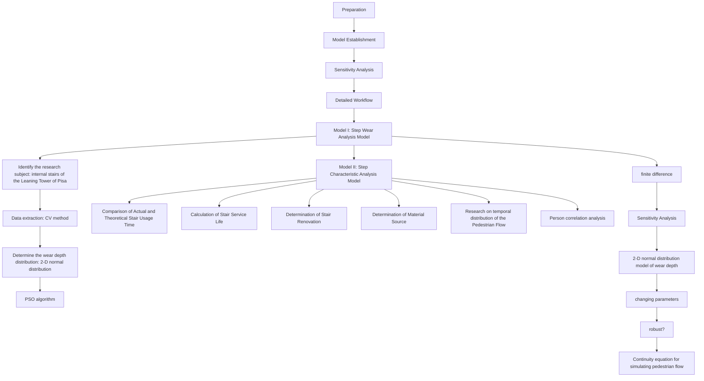

# Stairs: The Glory of the Ordinary Summary

Stairs have long been a fundamental architectural element widely utilized in building design to facilitate transportation connections. They embody the characteristics of both a "platform" and a "stair," serving as pathways for individuals to ascend and descend, enhancing the architectural aesthetic, and enriching the spatial hierarchy of structures. This article examines the construction duration, usage, and human behavior patterns associated with steps by analyzing their degree of wear.

In the Model Preparation phase, the research subjects were identified as the stairs inside the Leaning Tower of Pisa, which also determined the material and environmental conditions of the stairs. Then, Computer Vision techniques were used to obtain the required wear depth data of the stairs, and the focus was further narrowed to the bottom step of the Leaning Tower of Pisa. Finally, based on practical experience and literature, we concluded that the wear depth distribution on the stair surface follows a two-dimensional normal distribution. The parameters were then fitted using a Particle Swarm Optimization algorithm(PSO).

To address the first three issues, we developed a Step Wear Analysis Model. Firstly, we used pedestrian traffic, defined as the number of people using the stairs daily, to represent and calculate the stair usage frequency. Given the known distribution of wear depth, and based on Archard's Law, we integrated to find that the daily pedestrian traffic is 1,175. Next, by considering people's typical force application habits when ascending and descending stairs, we defined a direction preference index and, based on the wear depth distribution, determined that people prefer to descend the stairs. Finally, a continuity equation for simulating pedestrian flow was established based on Navier-Stokes Equations. Then we used the finite difference method to calculate the pedestrian density during stair usage and got $\rho = 0.6535 < 1.5$ , which indicated that people prefer to travel single file.

To analyze the usage condition and characteristics of the steps, we built a Step Characteristic Analysis Model. We first established the relationship between the number of users and the age of the stairs as an exponential function. Based on the relationship between wear depth and pedestrian traffic, we calculated the theoretical wear depth to be 4.871 cm and compared it with the actual data of 4.5 cm. After analyzing the mean square error, we found that the results were in line with expectations. Next, using the known relationship between wear depth, pedestrian traffic, and stair age, we employed the Monte Carlo method to estimate the stair age, yielding a range of approximately (282.1984, and 342.8016). To determine whether the stairs have been repaired or renovated, we used chemical methods and compared the theoretical and actual stair ages, confirming that the Leaning Tower of Pisa stairs have been renovated, and we found supporting evidence to corroborate this. To study the material properties of the stairs, we first selected several representative parameters for stone and wood materials. By scanning images and obtaining data, we compared these parameters with those of the stairs and then used the Person correlation coefficient to analyze their relationship. Finally, to analyze the number of stair users on a specific day, we established a partial differential equation to instantaneously analyze the changes in pedestrian traffic, revealing that there was a small number of people using the stairs over a longer time.

Furthermore, we conduct a sensitivity analysis on the two-dimensional normal distribution model of wear depth and the continuity equation for simulating pedestrian flow, which further demonstrates the robustness and accuracy of the model presented in this paper.

## Contents

## 1 Introduction....2

1.1 Problem Background ......2  
1.2 Restatement of the Problem....2  
1.3 Our Work .... 3

## 2 Assumptions and Justifications ....4

## 3 Notations ....5

## 4 Model Preparation ....5

4.1 Data Processing....5  
4.2 Solution of the Wear Depth Distribution....6

## 5 Model I: Step Wear Analysis Model....8

5.1 Pedestrian Flow Calculation based on Archard's Law....8  
5.2 Preference Direction Model Based on Wear Depth Distribution .....10  
5.3 Walking Patterns Model based on Navier-Stokes Equations .....11

## 6 Model II: Step Characteristic Analysis Model....12

6.1 Comparison of Actual and Theoretical Stair Usage Time....13  
6.2 Calculation of Stair Service Life....14  
6.3 Determination of Stair Renovation 16  
6.4 Determination of Material Source 17  
6.5 Research on temporal distribution of the Pedestrian Flow .....19

## 7 Sensitivity Analysis....20

7.1 Sensitivity Analysis of 2-D Normal Distribution Model of Wear Depth ......20  
7.2 Sensitivity Analysis of Continuity Equation for Simulating Walking Patterns....21

## 8 Strength and Weakness ....21

8.1 Strength....21  
8.2 Weakness 22

## 9 Conclusion ......22

## References....23

## Appendix....24

## 1 Introduction

## 1.1 Problem Background

Steps are structures typically found at the entrances of houses or along slopes, consisting of successive levels that allow people to ascend and descend. They are usually constructed from bricks, stones, concrete, or wood $[1]$ . In feudal societies that emphasized hierarchy, the design and materials of staircases often symbolized power and status. Commoners' stairways featured fewer steps and were primarily made of simple wood and earth; those of individuals with slightly higher status included more steps and were crafted from bricks and stones, while the most opulent staircases showcased marble $[2]$ . Consequently, the study of steps holds significant importance in understanding ancient civilizations. In contemporary architecture, the design and number of stairs are not limited by any particular framework, with a focus on comfort and safety as primary concerns.

When an ancient building is set to be renovated or expanded after its completion, determining the completion time often requires additional methods of reference beyond the relevant documents. The wear on the steps serves as a direct indicator of their frequency and duration of use. Over time, regular use causes the step surface to wear down, resulting in smooth, sunken, or flat areas. By analyzing the degree of wear on the surfaces of the steps, archaeologists can deduce their service life and gain insights into usage patterns and the daily habits of ancient people. Furthermore, the architectural design of the steps, the materials utilized, and their chronological characteristics can also offer valuable information in establishing the timeline of completion.

natural_image

Interior view of an ancient stone staircase with carved steps, no visible text or symbols

a. Stone steps, Leaning Tower of Pisa

natural_image

Close-up of four concrete steps in a stone wall, no text or symbols visible

natural_image

Interior view of a narrow stone staircase with sunlight filtering through (no text or symbols visible)

b. Stone steps, Great Wall

natural_image

Stacked wooden blocks embedded in rocks, no visible text or symbols

c. Wooden steps

natural_image

Wooden ladder structure filled with green stone blocks, no text or symbols visible

natural_image

Stone staircase carved into a stone wall with autumn leaves visible at the base (no text or symbols)

d. Stone steps, Stirling Castle  
Figure 1: Typical ancient architectural steps that have uneven wear after long-term use

## 1.2 Restatement of the Problem

Considering the background information and restricted conditions identified in the problem statement, we need to solve the following problems:

● Develop a model to describe the frequency of stair usage.  
● Create a model to determine whether a certain direction of travel was favored.

● Develop a model to determine whether people traveled single file or side by side.  
- Build a model to evaluate whether the wear observed on the stairs is consistent with the historical and environmental factors influencing the stairwell's age and usage.  
- Create a model to estimate the age of the stairwell and determine the reliability of the age estimate.  
- Design a model to identify signs of repairs or renovations.  
- Build a model to determine whether the wear on the stairwell is consistent with materials believed to originate from specific sources, such as quarries or forests.  
- Develop a model to estimate the typical number of people using the stairs and identify whether heavy short-term usage or prolonged lighter usage is more consistent with the observed wear patterns.

## 1.3 Our Work

In this paper, we carried out the following work to study stair usage frequency, service life, current condition, and pedestrian behavior patterns when using the stairs.

## ➢ Task 1: Model Preparation

Firstly, we determined the material and environmental conditions of the stairs to be studied. Then, computer vision techniques were employed to obtain and process the data, followed by fitting the wear depth distribution on the stair surface.

## ➢ Task 2: Stair Wear Analysis Model

We chose pedestrian traffic, represented by the number of people using the stairs daily, to characterize the stair usage frequency. Since the distribution of wear depth is known, the daily pedestrian traffic could be calculated based on the relationship between wear depth and pedestrian flow. Then, by considering people's typical force application habits when ascending and descending stairs, the changes in wear depth distribution on the stair surface could be used to infer their preferred walking direction. Finally, the pedestrian density during stair usage was calculated from the traffic flow, allowing us to determine whether people walk individually or side by side.

## Task 3:

- To analyze the usage condition and material characteristics of the stairs, we established the relationship between stair age and pedestrian traffic based on the study of wear depth distribution.  
- Based on the relationship between wear depth and pedestrian traffic from Task 1, we calculated the theoretical wear depth and compared it with the actual data. An error analysis was then conducted to assess the accuracy.  
- Using the known relationship between wear depth, pedestrian traffic, and stair age, we input the actual wear depth and pedestrian traffic data to calculate the stair age, and then determine the error between theoretical and actual values to assess the accuracy.  
- To determine whether the stairs have been repaired or renovated, we can compare the theoretical stair age with the actual difference, observe changes in the wear coefficient, and use chemical methods for verification.  
- To address the final issue, we first selected several representative feature parameters of stair materials, compared them with the features of the stairs, and analyzed their correlation. When analyzing the pedestrian traffic on a specific day, we established a partial differential equation to analyze the instantaneous changes in traffic, thereby determining whether pedestrians use the stairs in a short-term peak or with a uniform distribution over a longer period.

Our work aims to gain a deeper understanding of the dynamics of stair usage and the impacts of varying pedestrian flow patterns. In summary, the entire modeling process can be outlined as follows:

flowchart

Figure 2: Flowchart of our work

## 2 Assumptions and Justifications

To simplify the problem, we make the following basic assumptions, each of which is properly justified.

- Assumption 1: Assuming that an archaeologist has access to the structure in question and can obtain whatever measurement your team believes is important.  
- Assumption 2: Assuming that the friction coefficient between the soles of the shoes and the steps is equal.

Justification: This assumption presumes that everyone is wearing shoes of the same type, material, and similar wear and tear, thus maintaining a consistent friction coefficient between the soles and the steps. In reality, the friction coefficient may be affected by factors such as the material of the shoe sole (e.g., rubber, leather, plastic, etc.), the surface texture (e.g., patterns on the sole), and the degree of wear. However, to simplify the derivation process of the model, it is assumed that the friction coefficient is the same, which can avoid excessive variable interference in calculations.

\- Assumption 3: Assuming that all people have equal pressure on the step.

Justification: This assumption is based on the premise that individuals have similar body weights and consistent walking patterns, resulting in small differences in gait, footfall, and other aspects, leading to roughly equal pressure on the steps by each person. In reality, the magnitude of pressure is not only related to individual body weight but is also influenced by factors such as walking posture, stride length, foot position, and changes in the center of gravity during stair climbing and descending. However, to simplify the model analysis and make it easy to solve, we make this assumption.

\- Assumption 4: Assuming that the relative friction distance between the soles and the steps is equal for everyone.

Justification: Assuming that stride length, walking speed, and step frequency remain consistent across individuals, the relative friction distance between the soles and the steps is uniform. However, in reality, these factors can vary significantly due to individual differences. For instance, a person with a longer stride may experience shorter contact time with the steps, potentially leading to a reduced friction distance. Additionally, the size of the relative friction distance is influenced by the rhythm of the steps and the center of gravity. This assumption ignores the minor variations caused by individual differences, making the model calculation more concise and easier to analyze.

## 3 Notations

The key mathematical notations used in this paper are listed in Table 1.

Table 1: Notations used in this paper

<table><tr><td>Symbols</td><td>Definition</td><td>Units</td></tr><tr><td> $d(x,y)$ </td><td>The wear depth at each location  $(x, y)$ </td><td> $m$ </td></tr><tr><td> $N$ </td><td>Pedestrian flow</td><td> $people/s$ </td></tr><tr><td> $k$ </td><td>Wear coefficients (also called Archard&#x27;s constant)</td><td> $/$ </td></tr><tr><td> $T$ </td><td>The time since the steps were completed</td><td> $day$ </td></tr><tr><td> $W$ </td><td>The width of the steps</td><td> $m$ </td></tr><tr><td> $L$ </td><td>The length of the steps</td><td> $m$ </td></tr><tr><td> $A_{i}$ </td><td>The area of the  $i$ -th step</td><td> $m^{2}$ </td></tr><tr><td> $n$ </td><td>The total number of steps</td><td> $/$ </td></tr><tr><td> $\rho$ </td><td>The pedestrian density</td><td> $people/m^{2}$ </td></tr><tr><td> $v$ </td><td>The velocity vector of pedestrians</td><td> $m/s$ </td></tr><tr><td> $\nabla \cdot (\rho v)$ </td><td>The flux divergence,</td><td> $/$ </td></tr><tr><td> $b$ </td><td>Experience factor</td><td> $/$ </td></tr></table>

\*There are some variables that are not listed here and will be discussed in detail below.

## 4 Model Preparation

## 4.1 Data Processing

We selected one of the typical ancient architectural steps, the steps inside the Leaning Tower of Pisa in Italy.

To extract more accurate images, we used computer vision technology to process the images.

## - Step 1: Image processing

The original images were first transformed into grayscale images, then the images were denoised using Gaussian filtering.

natural_image

Interior staircase with beige stone steps and a yellow floor mat (no text or symbols visible)

a. Original image

natural_image

Interior staircase with concrete steps and a stone slab underneath (no text or symbols visible)

b. grayscale image

natural_image

Interior staircase with stone steps and a patterned rug at the base (no text or symbols visible)

c. Gaussian denoising  
Figure 3: Image processing

## - Step 2: Feature extraction

Then, the edge detection was performed to extract the image feature information.

## - Step 3: Data processing

Next, the data was processed, and the step with the best processing effect was selected. We found that the bottom step in the example figure was the best, and studied it further.

natural_image

Close-up of a yellow, cracked surface with faint linear markings, placed on a textured surface (no visible text or symbols)

Figure 4: Step with the best processing effect

## - Step 4: Data visualization

Finally, we visualized the processed data by drawing a three-dimensional image.

heatmap

| Width/px | Length/px | Value |
| --- | --- | --- |
| 20 | 400 | 20 |
| 20 | 350 | 40 |
| 20 | 300 | 60 |
| 20 | 250 | 80 |
| 20 | 200 | 100 |
| 40 | 350 | 120 |
| 40 | 300 | 140 |
| 40 | 250 | 160 |
| 40 | 200 | 180 |
| 40 | 150 | 200 |
| 60 | 350 | 160 |
| 60 | 300 | 180 |
| 60 | 250 | 200 |
| 60 | 200 | 220 |
| 60 | 150 | 240 |
| 80 | 350 | 20 |
| 80 | 300 | 40 |
| 80 | 250 | 60 |
| 80 | 200 | 80 |
| 80 | 150 | 100 |
| 100 | 350 | 12 |
| 100 | 300 | 14 |
| 100 | 250 | 16 |
| 100 | 200 | 18 |
| 100 | 150 | 20 |
| 120 | 350 | 14 |
| 120 | 300 | 16 |
| 120 | 250 | 18 |
| 120 | 200 | 20 |
| 120 | 150 | 22 |
| 140 | 350 | 16 |
| 140 | 300 | 18 |
| 140 | 250 | 20 |
| 140 | 200 | 22 |
| 140 | 150 | 24 |
| 160 | 350 | 18 |
| 160 | 300 | 20 |
| 160 | 250 | 22 |
| 160 | 200 | 24 |
| 160 | 150 | 26 |
| 180 | 350 | 2 |
| 180 | 300 | 4 |
| 180 | 250 | 6 |
| 180 | 200 | 8 |
| 180 | 150 | 10 |
| 200 | 350 | - |
| 200 | 300 | - |
| 200 | 250 | - |
| 200 | 200 | - |
| 200 | 150 | - |
|  |  | - |
|  |  | - |
|  |  | - |
|  |  | - |
|  |  | - |
|  |  | - |
|  |  | - |
|  |  | - |
|  |  | - |
|  |  | - |
|  |  | - |
|  |  | - |
|  |  | - |

a. Aerial view

heatmap

| Width/px | Wear depth/px |
| -------- | ------------- |
| 0        | 50            |
| 50       | 60            |
| 100      | 70            |
| 150      | 80            |
| 200      | 90            |
| 250      | 100           |
| 300      | 110           |
| 350      | 120           |
| 400      | 130           |
| 450      | 140           |

b. Side view  
Figure 5: A processed three-dimensional image

It is obvious from the figure that the edge of the step is seriously worn, with obvious depression, while the inside of the step is smaller.

## 4.2 Solution of the Wear Depth Distribution

Observation reveals that the steps are not uniformly worn but exhibit a concave state, with the central area being more severely indented than the sides. Considering that people tend to step within a certain range when walking on the steps, and taking into account the habits and force distribution of people's footsteps while going up and down the stairs, theoretically, the steps that have been used for a long time would develop two indentations, as each foot lands in a different position, forming one indentation on each side. In practice, these two indentations are almost identical. Therefore, we simplify the model and only study one indentation. To simplify the analysis, we only consider the case of a single person walking, then there is only one center of wear, resulting in the wear distribution of the steps taking the form of a two-dimensional normal distribution.

$$
d (x, y) = \left(2 \pi \sigma_ {1} \sigma_ {2} \sqrt {1 - \rho^ {2}}\right) ^ {- 1} \exp \left[ - \frac {1}{2 \left(1 - \rho^ {2}\right)} \left(\frac {\left(x - \mu_ {1}\right) ^ {2}}{\sigma_ {1} ^ {2}} - \frac {2 \rho \left(x - \mu_ {1}\right) \left(y - \mu_ {2}\right)}{\sigma_ {1} \sigma_ {2}} + \frac {\left(y - \mu_ {2}\right) ^ {2}}{\sigma_ {2} ^ {2}}\right) \right] \tag {1}
$$

We took the midpoint of the outer edge line of the bottom surface of the steps as the origin and established a three-dimensional Cartesian coordinate system as shown in the figure below.

text_image

z
y
O
x

Figure 6: 3-D Cartesian coordinate system

Then, we used the Particle Swarm Optimization (PSO) algorithm to fit the parameters. The PSO algorithm is used to minimize the objective function defined above. PSO is a global optimization algorithm suitable for finding the optimal solution to complex, multi-dimensional optimization problems. In this context, the role of PSO is to search the parameter space to find the combination of parameters that minimizes the objective function value defined by the least squares method.

Step 1: Initialization - Randomly generate a group of particles, specifying the number of particles, inertia weight (typically 0.8), learning factor 1 (usually 2), learning factor 2 (usually 2), the search range for $\rho, \mu_1, \mu_2, \sigma_1, \sigma_2$ , the number of iterations, and the number of variables.

Step 2: Evaluation - Calculate the fitness of each particle, which corresponds to the objective function value. The optimization goal is:

$$
\min \sum_ {i} \left(\hat {d} _ {i} - d _ {i}\right) ^ {2}
$$

Step 3: Update Best Position – Compare each particle's current position with its historical best position and update both the individual best position and the global best position.

Step 4: Update Velocity and Position – Based on the individual best position, global best position, and certain weights and random factors, update the particle's velocity and position.

Step 5: Termination Condition Check – Check if the stopping criteria are met, such as reaching the maximum number of iterations or the objective function value meeting the requirements. If the stopping criteria are not met, repeat Steps 3 to 5 until the termination condition is satisfied.

Based on the data obtained from the scanned pictures, we fitted the parameters, and the calculation results were as follows:

Table 2: Results of fitting parameters

<table><tr><td>Parameter</td><td> $\rho$ </td><td> $\mu_{1}$ </td><td> $\mu_{2}$ </td><td> $\sigma_{1}$ </td><td> $\sigma_{2}$ </td></tr><tr><td>Fitted value</td><td>0</td><td>0</td><td>-10.21</td><td>18.25</td><td>9.77</td></tr></table>

The calculated error is 35.562, which is small, indicating a good fitting effect.

  
Figure 7: Image of the data fitted

We substituted the optimally fitted parameters into $d(x, y)$ , and plotted the three-dimensional oblique view and two-dimensional top-down view of the two-dimensional normal distribution model. Through these images, we can visually see the wear condition at different positions of the stairs, which is very close to the actual wear condition, indicating the rationality and accuracy of the model.

## 5 Model I: Step Wear Analysis Model

"The rocks are firm and thick, capable of enduring for a thousand years." This line, which originates from the ancient "Book of Songs," conveys that solid and dense stones can last for millennia without decay. In antiquity, people often viewed rock as a symbol of indestructibility, able to withstand the erosion and wear of nature, maintaining its original form over time. However, even the most durable materials cannot completely resist the passage of time and external forces; their gradual deterioration reflects factors such as foot traffic, duration of use, and the inherent characteristics of the material. Therefore, examining the degree of wear on stone steps can provide insights into their construction date, usage patterns, and pedestrian behavior. As observed in Figure 1, the worn steps display a slight concavity, attributed to the tendency of pedestrians to walk in the center when ascending and descending. This has resulted in greater wear in the middle section of the step compared to the edges.

## 5.1 Pedestrian Flow Calculation based on Archard's Law

Archard's Law is an important empirical formula for describing material wear [3]. It's commonly used to describe the wear that occurs when the surfaces of two materials are in contact and slide relative to each other.

## 5.1.1 Assumptions

(1) Assuming a linear dependence of the product of wear and forward force and sliding distance, the study is suitable for flat, simple contact surfaces.  
(2) The factors of the step surface shape change, the temperature effect, and the elasticity of the material are ignored.  
(3) Assuming that each step is indented equally.

## 5.1.2 Model Establishment

## 1. The Relationship between Wear Depth and Pedestrian Flow

According to Archard's Law, the wear depth of stairs is directly proportional to the number of people passing over them, and the relationship is given by:

$$
d = k N ^ {b} \tag {2}
$$

In the equation, d is the wear depth, used to describe the degree of wear on stairs caused by pedestrian traffic. k is an empirical constant that typically depends on the material properties and environmental conditions. b is an empirical exponent, usually ranging from 0.3 to 0.5.

By setting different wear coefficients k and empirical constants b, this model can simulate the stair wear process under varying environmental and material conditions, and infer the level of stair usage.

## 2. Calculation of Daily Pedestrian Traffic

The formula connects pedestrian flow to the wear depth on the stairs. By integrating the wear depth over various regions of the stair surface, the number of people passing through the stairs each day can be estimated:

$$
N _ {\text { daily }} = \frac {1}{T} \iint_ {A} \left(\frac {d (x , y)}{k}\right) ^ {\frac {1}{b}} d x d y \tag {3}
$$

where n is the total number of steps, $A_{i}$ is the area of the i-th step, T is the time since the steps were completed, and $d(x, y)$ is the wear depth at each location $(x, y)$ , obtained through scanning images.

## 3. Determination of the parameters

a) According to the data, the Leaning Tower of Pisa was completed in 1370 [4], then

$$
T = (2 0 2 4 - 1 3 7 0) \times 3 6 5 = 2 3 8 7 1 0 d a y s.
$$

b) Empirical coefficient b ranges from 0.3 to 0.5, here we took 0.3.  
c) The area of a single step $A$ is $200cm \times 40cm = 0.8m^2$ .  
d) According to the information, the steps of the Leaning Tower of Pisa are made of marble and have a coefficient of friction of 0.06.

Table 3: Values of the parameters

<table><tr><td>Parameter</td><td>T</td><td>b</td><td>A</td><td>k</td></tr><tr><td>Value</td><td>238710</td><td>0.3</td><td>0.8</td><td>0.06</td></tr></table>

By substituting the above parameters into Equation (3), we calculated that the number of people passing through the stairs each day was 1175. From the research data, it is known that 500,000 tourists climb the tower each year, while 6 million tourists visit the square. $500,000 / 365 \approx 1370$ , which is close to the actual number of people using the steps daily, indicating the reliability and accuracy of the model.

line chart

| coefficient of wear | Number of daily users |
| ------------------- | --------------------- |
| 0.06                | 1175                  |

Figure 8: Calculation result

## Figure 8 shows that:

(1) For the same step, by only changing the friction coefficient and keeping other conditions constant, as the friction coefficient increases, the usage frequency of the step, that is, the number of times it is stepped on per day, gradually decreases. In other words, the smaller the friction coefficient of the step material, the more wear-resistant the step is and the longer its service life will be.  
(2) When the step wear factor is between 0.02\~0.04, the image is very steep, and as the wear factor increases, the daily usage frequency decreases rapidly; when the wear factor is between 0.04 \~ 0.1, the image is relatively flat, indicating that the increase in wear factor has a smaller impact on the daily usage frequency.

## 5.2 Preference Direction Model Based on Wear Depth Distribution

As individuals descend or ascend stairs, the front edges of the steps are subject to greater wear due to how people naturally place their feet. This results in more significant wear at the front and edges of the steps. Consequently, people exhibit varying directional preferences when navigating stairs. The travel direction preference index is defined as follows:

$$
D = \frac {d _ {\text { mid }} - d _ {\text { edge }}}{d _ {\text { mid }} + d _ {\text { edge }}} \tag {4}
$$

Table 4: The meaning of different D values

<table><tr><td>D value</td><td>Meaning</td></tr><tr><td>D&gt;0</td><td>more people go up the steps than down</td></tr><tr><td>D&lt;0</td><td>more people go down the steps than up</td></tr><tr><td>|D|≈0</td><td>the flow of people up and down the steps is close</td></tr></table>

line chart

| Width/cm | Wear depth/cm |
| -------- | ------------- |
| -20      | -4.0          |
| -15      | -4.5          |
| 0        | -1.5          |
| 20       | 0.0           |

Figure 9: Determination of travel direction preference index

The calculation yields

$$
D = \frac {1 - 4 . 5}{1 + 4 . 5} = - 0. 6 3 6 <   0
$$

indicating that more people are taking the downward steps, meaning that stairs users prefer the downward direction.

line chart

| Width/cm | x = 0 cm | x = 5 cm | x = 10 cm | x = 20 cm |
| -------- | -------- | -------- | --------- | --------- |
| -20      | -4.0     | -3.8     | -3.6      | -2.2      |
| -15      | -4.5     | -4.2     | -3.8      | -2.5      |
| -10      | -3.5     | -3.2     | -2.8      | -2.0      |
| -5       | -2.0     | -1.8     | -1.5      | -1.0      |
| 0        | -0.5     | -0.3     | -0.2      | 0.0       |
| 5        | 0.0      | 0.0      | 0.0       | 0.0       |
| 10       | 0.0      | 0.0      | 0.0       | 0.0       |
| 15       | 0.0      | 0.0      | 0.0       | 0.0       |
| 20       | 0.0      | 0.0      | 0.0       | 0.0       |

Figure 10: Variation in wear depth of steps of different lengths

By observing the cross-sectional views for different values of x, we could see that the cases where x equals 5, 10, and 20, as well as when x equals 0, all show that $d_{edge}$ is greater than $d_{mid}$ , resulting in a calculated D that is less than 0. This further illustrates that the stairs are primarily used for going downstairs. After consulting the materials, we found that the stairs of the Leaning Tower of Pisa consist of two spiral staircases, one for ascending and the other for descending. This design not only saves space but also helps to disperse the pressure of pedestrian traffic. According to the calculation results, it is determined that the staircase we studied is mainly used for descending.

## 5.3 Walking Patterns Model based on Navier-Stokes Equations

Navier-Stokes Equations are fundamental equations that describe the motion of viscous fluids and can be applied to simulate the dynamics of pedestrian flow or crowd movement.

## 5.3.1 Assumptions

(1) Assumption of treating the crowd as a continuous medium: This is a simplification since individuals are discrete. By making this assumption, it becomes possible to describe the crowd using continuous functions such as velocity fields, density distributions, and pressure terms.  
(2) Assumption of no-slip interaction between people and walls or obstacles: The interaction between people and walls or obstacles is assumed to be analogous to the relationship between a fluid and a solid boundary. That is, at the boundary, the fluid velocity is zero, meaning the velocity of the crowd at the point of contact with an obstacle is also zero.

## 5.3.2 Continuity Equation for Simulating Walking Patterns

Based on the Navier-Stokes Equations, a continuity equation (also known as the mass conservation equation) for simulating the movement of pedestrians in space is established [5]:

$$
\frac {\partial \rho}{\partial t} + \nabla \cdot (\rho v) = N (x, y, t) \tag {5}
$$

In this equation:

- $\rho$ represents the pedestrian density, indicating the number of people per unit area and describing the level of crowding in a given area.  
- $v$ represents the velocity vector of pedestrians, indicating their speed and direction of movement.  
- $N(x, y, t)$ represents the traffic flow, which indicates how many people pass through a specific location $(x, y)$ at time $t$ .  
- $\frac{\partial \rho}{\partial t}$ represents the rate of change of pedestrian density over time, describing how the pedestrian density at a specific location changes with time.

\- $\nabla \cdot (\rho v)$ is the flux divergence, describing pedestrians' inflow and outflow within a certain area. $\rho v$ is the pedestrian flux, combining density and velocity to describe the flow of pedestrians. We used the finite-difference (FDM) method to solve this equation.

For the time derivatives, Forward Euler was used.

$$
\rho_ {i} ^ {n + 1} = \rho_ {i} ^ {n} - \Delta t \left[ \frac {\partial}{\partial x} (\rho v _ {x}) + \frac {\partial}{\partial x} (\rho v _ {y}) \right] _ {i} + \Delta t \cdot N (x _ {i}, y _ {j}, t _ {n}) \tag {6}
$$

For the spatial derivatives, the central difference is used.

$$
\rho_ {i, j} ^ {n + 1} = \rho_ {i, j} ^ {n} - \Delta t \left[ \frac {\left(\rho v _ {x}\right) _ {i + 1 , j} ^ {n} - \left(\rho v _ {x}\right) _ {i - 1 , j} ^ {n}}{2 \Delta x} + \frac {\left(\rho v _ {y}\right) _ {i , j + 1} ^ {n} - \left(\rho v _ {y}\right) _ {i , j - 1} ^ {n}}{2 \Delta y} \right] _ {i} + \Delta t \cdot N _ {i, j} ^ {n} \tag {7}
$$

No-slip boundary conditions:

$$
v (x, y, t) = 0 \tag {8}
$$

We can estimate the pedestrian flow speed at different densities based on the relationship between pedestrian density and flow rate [6]. The following rules apply:

- If $0 < \rho < 1.5$ , the flow rate $N = 1$ , meaning 1 person passes through per second.  
- If $1.5 \leqslant \rho \leqslant 2.5$ , the flow rate increases to $N = 2$ .

This can be understood intuitively: When pedestrian density is low, there is more space between individuals, leading to minimal interference and fewer restrictions on movement. As density increases, the distance between individuals decreases, and mutual interference increases, causing the movement speed to become more restricted. In this density range, although pedestrians can still pass through the stairs, the available space becomes more constrained, and the flow rate increases to 2 people per second. At this point, the number of people passing through the stairs per second increases, but individual movement speed is limited due to the higher density.

  
Figure 11: Pedestrian Density Heatmap

Calculations show that $\rho=0.6535<1.5$ , indicating that people typically choose to travel single file when using the stairs."

## 6 Model II: Step Characteristic Analysis Model

Based on life experience, in situations of urban prosperity and people's stability, new buildings are constructed, and these buildings are used frequently when they are first built. Over time, changes in the rise and fall of cities, population migration, and the emergence of new buildings can lead to a decrease in the usage frequency of old buildings, and consequently, the usage frequency of staircases also declines continuously. Assuming that the number of people passing through the staircases decays exponentially, we thus obtained the change in foot traffic over time as follows:

$$
N (t) = N _ {0} e ^ {- \lambda t} \tag {9}
$$

where $N_{0}$ is the number of people who passed through the steps on the first day, and $\lambda$ is the rate of pedestrian decay.

line chart

| t/year | N(t)  |
| ------ | ----- |
| 0      | 10000 |
| 200    | 5000  |
| 400    | 2500  |
| 600    | 1500  |
| 800    | 750   |
| 1000   | 250   |

Figure 12: Change in foot traffic over time

Observing Figure 12, initially there are many people trampling, but gradually the number of visitors or users decreases and then levels off, fitting an exponential decay trend.

Integrating Equation (6), we got

$$
\begin{array}{l} N (x, y, T) = \int_ {0} ^ {T} N _ {0} e ^ {- \lambda t} d t \\ = \frac {N _ {0}}{\lambda} \left(1 - e ^ {- \lambda T}\right) \tag {10} \\ \end{array}
$$

## 6.1 Comparison of Actual and Theoretical Stair Usage Time

## 6.1.1 Model Establishment

To judge whether the actual use time of the steps was consistent with the theoretical results, we substituted Equation (10) into Equation (1) to obtain the theoretical wear depth.

$$
d _ {\text { theoretical }} (x, y, T) = k \left(\frac {N _ {0}}{\lambda} (1 - e ^ {- \lambda T})\right) ^ {b} \tag {11}
$$

Table 5: Values of each parameter in Equation (11)

<table><tr><td>Parameter</td><td>k</td><td> $N_0$ </td><td>λ</td><td>b</td></tr><tr><td>Value</td><td>0.06</td><td>10000</td><td>0.004</td><td>0.3</td></tr></table>

## 6.1.2 Results

line chart

| T/year | Cumulative wear depth/cm |
| ------ | ------------------------ |
| 654    | 4.871                    |

Figure 13: Accumulative wear depth variation

According to Figure 13, we could find that:

(1) The Leaning Tower of Pisa was completed 654 years ago, calculated as 2024 - 1370 = 654 years. Theoretically, by 2024, the accumulated wear depth should be 4.871 cm. In contrast, the actual depth measured from the images is approximately 4.5 cm, with a small error of 0.371 cm, within the expected range.  
(2) In addition, we observed that the wear rate of the stairs in the red area (0\~250 years) is relatively fast, while in the green area (251\~700 years), the wear rate slows down. This is because, after the building's completion, the number of visitors was high for some time, leading to more frequent use of the stairs and, consequently, more severe wear. This result is consistent with the $t \sim N(t)$ function, confirming that our model is reasonable.

## 6.1.3 Error Analysis

Considering that the wear condition of a single step may be random and lack strong persuasiveness and accuracy, we collected the wear depth of 100 steps at the same location for study.

Finally, the mean squared error between the theoretical wear depth and the actual wear depth was calculated.

$$
M S E = \frac {S S E}{n} = \frac {1}{n} \sum_ {i} (d (i) - d _ {\text { measure }} (i)) ^ {2} \tag {12}
$$

If $MSE < \delta_d$ (taken as 0.2), the theoretical wear depth and the actual wear depth can be considered the same. Otherwise, the difference means that the staircase has been repaired and renovated.

In the end, we calculated that $MSE = 0.1542 < 0.2$ , indicating that the theoretical wear depth is consistent with the actual situation.

## 6.2 Calculation of Stair Service Life

Since we have obtained the relationship between the step wear depth and the service life, we could estimate the service life of the step based on the measurement data:

$$
\hat {T} = - \frac {1}{\lambda} \ln \left(1 - \frac {\lambda}{N _ {0}} \left(\frac {d _ {\text { measure }}}{k}\right) ^ {\frac {1}{b}}\right) \tag {13}
$$

We calculated $T$ through the actual measured wear depth and plotted the graph of $T$ as a function of $d$ , from which it could be seen that the deeper the wear depth, the older the staircase.

line chart

| Cumulative wear depth/cm | T/year |
| ------------------------ | ------ |
| 0                        | 0      |
| 1                        | 0      |
| 2                        | 0      |
| 3                        | 50     |
| 4                        | 200    |
| 5                        | 1300   |

Figure 14: Variation in the service life of step

Then we substituted the measured value d = 4.5 into Equation (13), and the age of the step was calculated to be 312.5 years.

Considering that there were errors in the actual wear depth, pedestrian flow, and material property parameters when estimating the usage time of steps, we used the error propagation calculation formula:

$$
\sigma_ {T} = \sqrt {\left(\frac {\partial T}{\partial d} \sigma_ {d}\right) ^ {2} + \left(\frac {\partial T}{\partial N} \sigma_ {N}\right) ^ {2} + \left(\frac {\partial T}{\partial k} \sigma_ {k}\right) ^ {2}} \tag {14}
$$

where $\sigma_{d}$ represents the wear depth error, which can be calculated based on scanning accuracy; $\sigma_{N}$ refers to the pedestrian traffic estimation error, which can be easily obtained from historical data; and $\sigma_{k}$ denotes the material wear coefficient error, which can be determined through experiments.

$$
\frac {\partial T}{\partial d} = \frac {\frac {1}{b k} \left(\frac {d}{k}\right) ^ {\frac {1}{b} - 1}}{\lambda \left(\frac {d}{k}\right) ^ {\frac {1}{b}} - N _ {0}} \tag {15}
$$

$$
\frac {\partial T}{\partial k} = \frac {d ^ {\frac {1}{b}}}{\lambda \left(\frac {d}{k}\right) ^ {\frac {1}{b}} - N _ {0}} \left(- \frac {1}{b} - 1\right) k ^ {- \frac {1}{b} - 1} \tag {16}
$$

Combining two equations above based on Equation (11), the final calculated error is 15.46. Finally, a Monte Carlo simulation was used for reliability assessment, with hypothesis testing: $\mu_T$ is considered the optimal estimate, and a $95\%$ confidence interval was applied.

$$
\hat {T} \pm 1. 9 6 \sigma_ {T} \tag {17}
$$

The Monte Carlo method is a numerical technique based on random sampling and statistical principles, commonly used to solve complex problems. The basic steps are as follows:

## - Step 1: Define Parameter Uncertainty

\- Assume that the parameters in the model (such as $\lambda, k, b, N_0$ ) have some degree of uncertainty, which can be simulated by random sampling to represent the distribution of these parameters.

\- For instance, assume that these parameters follow a normal distribution or a uniform distribution.

## - Step 2: Random Sampling

\- Perform multiple random samplings for each parameter to generate a set of parameter combinations.

## - Step 3: Run the Model

\- For each parameter combination, run the model to calculate the corresponding T value.

## - Step 4: Statistical Analysis

\- Conduct statistical analysis on all simulation results, calculating the mean, standard deviation, confidence interval, etc., to evaluate the stability and reliability of the model.

line chart

| Cumulative wear depth/cm | Mean T | 95% Confidence Interval (Lower) | 95% Confidence Interval (Upper) |
| ------------------------ | ------ | ------------------------------- | ------------------------------- |
| 0                        | 0      | 0                               | 0                               |
| 2                        | 200    | 150                             | 250                             |
| 4                        | 600    | 500                             | 700                             |
| 6                        | 900    | 800                             | 1000                            |
| 8                        | 1100   | 1000                            | 1200                            |
| 10                       | 1300   | 1200                            | 1400                            |

Figure 15: Monte Carlo simulation images

As can be seen from Figure 15, T is always in the upper and lower limits of the 95% confidence interval, indicating the high reliability of the model. According to Equation (17), the range of the staircase's age is (282.1984, 342.8016).

## 6.3 Determination of Stair Renovation

The renovation and maintenance of the stairs at the Leaning Tower of Pisa require careful handling in order to preserve its historical value. Common maintenance and renovation techniques involve image recognition and processing of cracks, magnifying details to observe traces of crack filling. By using a portable surface roughness tester, we can compare roughness differences across various areas of the stairs. Due to the repair methods, cracks are often filled with epoxy resin or lime-based materials. In areas with severe damage, the surface tends to become smoother, indicating that the stone has been replaced. If the roughness in certain areas is noticeably lower than others, it suggests that the stair material has been replaced with the same type to maintain consistency. To ensure stability, stainless steel or carbon fiber reinforcement may also have been applied. Renovations or repairs might also include the application of a waterproofing agent to prevent moisture penetration.

A portable laser scanner can be used to create a 3D model of the stairs, which is then compared with historical design drawings to observe any signs of stone replacement.

Since materials in the repaired areas may have different thermal conductivity and humidity conditions, these factors can result in distinct temperature distributions. By using infrared thermography, we can obtain the temperature distribution of the stairs and observe any abrupt changes. To test for waterproofing, a few drops of water can be applied to the stairs. If the water droplets roll off quickly, it indicates that waterproofing has been applied

Besides, based on previous analysis, we calculated the age of the steps to be 312.5 years, which is less than the actual age of the Leaning Tower of Pisa at 654 years. This suggests that the stairs have undergone renovation or maintenance.

Through investigation and research into the restoration history of the Leaning Tower of Pisa, it has been discovered that the tower has been renovated and repaired multiple times, which can prove that our hypothesis is correct.

## 6.4 Determination of Material Source

## 6.4.1 Selection of Characteristic Parameters of Raw Materials

By scanning the wear morphology, we can magnify the various wear characteristics of the stairs.

## 1. Stone

If the material is stone, we can obtain parameters such as crack size, which allows us to determine the stone's hardness, density, and wear coefficient. We collected relevant data from nearby quarries and performed a Pearson correlation analysis on this data to assess the correlation between the stair material and the stone from the nearby quarry, ultimately determining the material's source. If the material is wood, we obtained data on the tree ring width and crack size through image scanning, which provides information on the wood's species, fiber density, and age. We then applied the same method used for stone analysis to calculate the correlation coefficient and determine whether the material type matches.

natural_image

Microscopic cross-section of layered material with 1 mm scale bar (no text or symbols)

natural_image

Microscopic view of a material surface with green and gray patterns, scale bar indicates 1 mm (no text or symbols present)

natural_image

Microscopic view of a material surface with visible grain structure and 1 mm scale bar (no text or symbols)

Figure 16: Wear morphology diagram [7]

text_image

Background
Noise
Fissure

Figure 17: Scan results [8]

Table 6: Parameter comparison table

<table><tr><td>Parameter</td><td>Definition</td><td>Stair</td><td>Quarry</td></tr><tr><td>Density( $g/cm^{3}$ )</td><td> $\rho$ </td><td>2.58</td><td>2.37 ~ 3.20</td></tr><tr><td>Wear rate( $cm^{3}/50cm^{2}$ )(500N)</td><td> $k$ </td><td>45.70</td><td>45.68(±0.28)</td></tr><tr><td>Mohs hardness</td><td> $h$ </td><td>4.1</td><td>2 ~ 4.3</td></tr><tr><td>Porosity(%)</td><td> $r$ </td><td>0.8</td><td>0.5 ~ 2.0</td></tr><tr><td>Penetration</td><td> $p$ </td><td>0.0001</td><td>1.0e-6~0.0010</td></tr></table>

## 2. Wood

For wood, we considered studying characteristics such as tree ring width, crack width, fiber density, and water absorption, as well as conducting carbon-14 dating. Then, following the same process as the stone analysis, we defined feature vectors for the wooden stairs and the original wood material and calculated the Pearson correlation coefficient to analyze the similarity.

Carbon-14 Dating:

$$
S = 1 - \frac {\left| T - T _ {t} \right|}{T _ {t}} \tag {18}
$$

If $S \approx 1$ , it indicates that the age of the wooden stairs is consistent with the assumed age of the wood material used.

natural_image

Close-up of a tree cross-section showing concentric tree rings on a stone surface (no text or symbols)

a. poplar

natural_image

Close-up of a tree bark with concentric circular patterns, showing natural grain texture (no text or symbols)

b. Metasequoia  
Figure 18: Annual ring

## 6.4.2 Person similarity test

In our research on the stone steps of the Leaning Tower of Pisa, we discovered that the stones for both sets of steps were sourced from nearby quarries. The stones for the internal steps of the Leaning Tower of Pisa were extracted from the renowned Carrara quarries $[9]$ . We analyzed to compare the similarity between the steps and the original stones to identify the source of the materials. We assumed that the feature vectors for the steps and the rocks from the respective quarries are as follows:

$$
X _ {s t a i r} = [ k, \rho , h, r, p ]
$$

$$
X _ {\text { quarry }} = \left[ k ^ {\prime}, \rho^ {\prime}, h ^ {\prime}, r ^ {\prime}, p \right]
$$

where k is the wear coefficient, $\rho$ is the density, h is the Mohs hardness, r is the porosity, and p is the penetration.

By calculation, r = 0.98 and hypothesis testing was carried out, it turns out that the source of the staircase for the Leaning Tower of Pisa came from the nearby Carrara quarry.

Then, we used the Pearson correlation coefficient to calculate the similarity between the stairs and the raw stone.

$$
r = \frac {\sum \left(X _ {s t a i r} (i) - \bar {X} _ {s t a i r}\right) \left(X _ {q u a r r y} (i) - \bar {X} _ {q u a r r y}\right)}{\sqrt {\sum \left(X _ {s t a i r} (i) - \bar {X} _ {s t a i r}\right) ^ {2}} \sqrt {\sum \left(X _ {q u a r r y} (i) - \bar {X} _ {q u a r r y}\right) ^ {2}}} \tag {19}
$$

Finally, the significance of the correlation coefficient was assessed based on the significance level (p-value).

- $p < 0.05$ (or $p < 0.01$ ): Indicates a significant correlation, and the null hypothesis (that the two variables are uncorrelated) can be rejected.  
- $p > 0.05$ : Indicates no significant correlation, and the null hypothesis cannot be rejected.

radar chart

| Metric       | Stair | Quarry |
| ------------ | ----- | ------ |
| Wear rate    | 0.8   | 0.75   |
| Density      | 0.6   | 0.7    |
| Hardness     | 0.9   | 0.85   |
| Penetration  | 0.7   | 0.65   |
| Porosity     | 0.6   | 0.55   |

Figure 19: Radar chart

As shown in the figure above, the relevant parameters of this stone are similar to those of the Carrara quarry.

## 6.5 Research on temporal distribution of the Pedestrian Flow

The focus of this question is to study the temporal distribution of pedestrian traffic, employing instantaneous wear analysis. Assuming that the wear on steps caused by the majority of people in a short period and the minority over a long time is the same, but if the pedestrian flow is too high in a short time, it will exacerbate the wear, thus we obtained

$$
\frac {\partial d (x , y , t)}{\partial t} = k N (t) ^ {b} \tag {20}
$$

where $N(t)$ is the instantaneous pedestrian flow of the steps, and $d(x,y,t)$ is the instantaneous wear depth. Let the uniform distribution of a flow of people with the quantity $N_{daily}$ over a long period be

$$
\begin{array}{l} d _ {l o n g} = k \int_ {0} ^ {T _ {h}} \left(\frac {N _ {d a i l y}}{T _ {h}}\right) ^ {b} d t \\ = k \left(\frac {N _ {\text {daily}}}{T _ {h}}\right) ^ {b} T _ {h} \tag {21} \\ \end{array}
$$

If the same number of pedestrians experience a peak in traffic within a short period, and since this peak period is very brief relative to a full day (24 hours), we assumed that this peak period can be approximated as an impulse function. Thus, we obtained

$$
d _ {s h o r t} = k \int_ {0} ^ {T _ {h}} N _ {\text { daily }} ^ {b} \delta (t) d t \tag {22}
$$

$$
= k N _ {d a i l y} ^ {b}
$$

Therefore, the wear difference between a short-term peak in pedestrian traffic and a long-term uniform pedestrian flow is

$$
R = \frac {d _ {\text { short }}}{d _ {\text { long }}} = \frac {k N _ {\text { daily }} ^ {b}}{k \left(\frac {N _ {\text { daily }}}{T _ {h}}\right) ^ {b} T _ {h}} \tag {23}
$$

$$
= T _ {h} ^ {1 - b} > 1
$$

where $T_{h}$ is the time of one day. This shows that the excessive flow of people in a short period can indeed increase wear and tear.

By scanning images of the stairs at the Leaning Tower of Pisa taken on two consecutive days, we can assess the wear on the stairs after one day's usage. Then, by investigating the number of visitors to the Leaning Tower of Pisa on that day, we can use the following equation to determine whether the pedestrian traffic for that day experienced a short-term peak or was uniformly distributed over a longer period.

- $d_{measure} > \frac{d_{short} + d_{long}}{2}$ explained that the pedestrian flow for that day experienced a short-term peak;  
- $d_{measure} < \frac{d_{short} + d_{long}}{2}$ explained that the pedestrian flow for that day was uniformly distributed over a longer period.

Moreover, when a large number of pedestrians use the stairs in a short period, congestion occurs, and pedestrians tend to walk in a staggered manner, which results in the widening of the depressions. Therefore, by comparing the width changes of the depressions from scanning images of two consecutive days, we can also determine whether the pedestrian traffic on that day experienced a short-term peak or was uniformly distributed over a longer period.

According to Equation (), we calculated that

$$
d _ {m e a s u r e} \approx 0. 2 0 5 \mu m
$$

$$
\frac {d _ {\text { short }} + d _ {\text { long }}}{2} \approx \frac {0 . 3 2 6 + 0 . 1 5 6}{2} = 0. 2 4 1 \mu m
$$

Since 0.205<0.241, we determined that there were a small number of people using the stairs over a longer time.

By consulting the official website of the Leaning Tower of Pisa, we found that the management of the tower is very strict, typically allowing only 20-30 visitors to enter at a time, with each visit lasting 20-30 minutes. This indicates that, in reality, the stairs are used uniformly over a long period, which aligns with the results of our model, thereby confirming the feasibility and reasonableness of the model.

## 7 Sensitivity Analysis

## 7.1 Sensitivity Analysis of 2-D Normal Distribution Model of Wear Depth

For the model

$$
d (x, y) = \left(2 \pi \sigma_ {1} \sigma_ {2} \sqrt {1 - \rho^ {2}}\right) ^ {- 1} \exp \left[ - \frac {1}{2 \left(1 - \rho^ {2}\right)} \left(\frac {\left(x - \mu_ {1}\right) ^ {2}}{\sigma_ {1} ^ {2}} - \frac {2 \rho \left(x - \mu_ {1}\right) \left(y - \mu_ {2}\right)}{\sigma_ {1} \sigma_ {2}} + \frac {\left(y - \mu_ {2}\right) ^ {2}}{\sigma_ {2} ^ {2}}\right) \right],
$$

we tested the effect of the parameter $\sigma_{2}$ on the wear depth and the shape of the wear depression, The following is a longitudinal section of the steps at x=0 when $\sigma_{2}$ takes 5, 10, 15, and 20, respectively.

line chart

| Width/cm | σ2 = 5 | σ2 = 10 | σ2 = 15 | σ2 = 20 |
| -------- | ------ | ------- | ------- | ------- |
| -20      | -5.5   | -4.0    | -3.0    | -2.2    |
| -15      | -9.0   | -4.5    | -3.0    | -2.2    |
| -10      | -6.0   | -3.5    | -2.8    | -2.1    |
| -5       | -1.0   | -2.0    | -2.5    | -2.0    |
| 0        | 0.0    | 0.0     | -2.0    | -1.8    |
| 5        | 0.0    | 0.5     | -1.5    | -1.5    |
| 10       | 0.0    | 0.8     | -1.0    | -1.2    |
| 15       | 0.0    | 0.9     | -0.5    | -0.8    |
| 20       | 0.0    | 1.0     | 0.0     | -0.5    |

Figure 20: Sensitivity Analysis of Wear Depth Distribution

From the image, we found that as $\sigma_{2}$ gradually increases, the wear depth gradually decreases, the wear depression changes from concentration to scattered, and the overall shape becomes flat. Therefore, it is a reasonable and accurate choice to describe the wear degree, and the model has a high sensitivity.

## 7.2 Sensitivity Analysis of Continuity Equation for Simulating Walking Patterns

For the model

$$
\frac {\partial \rho}{\partial t} + \nabla \cdot (\rho v) = N (x, y, t)
$$

we tested the effect of $N(x, y, t)$ by increasing the number of people $N(x, y, t)$ from 0 to 0.06.

area chart

| N     | density |
|-------|---------|
| 0.02739 | 1.5    |

Figure 21: Sensitivity Analysis of Continuity Equation for Simulating Walking Patterns

As can be seen from Figure 21, the red area $0 < \rho < 1.5$ is single passage, and the green area $1.5 < \rho < 2.5$ is parallel passage. The density of traffic $\rho$ increases with the number of people passing per second. Thus, the model has a high sensitivity for determining whether people use stairs alone or individually.

## 8 Strengths and Weaknesses

## 8.1 Strengths

◆ The two-dimensional normal distribution model not only matches the description of the wear depth distribution, but also describes the wear difference of the value of the parameters in different positions by the force habit of people going up and down in different locations.  
In order to improve the fitting effect of the two-dimensional normal distribution model, we use the advanced machine learning algorithm, particle swarm optimization algorithm (PSO), which not only improves the efficiency of the fitting, but also enhances the accuracy of the fitting.  
It is a very innovative idea to abstract the crowd flow into liquid flow, and then use Navier-Stokes Equations to model the population flow. Finite difference method (FDM) is a very mature solution method to solve the numerical solution of the model, and the solution effect has high accuracy.  
We also innovatively introduced the impulse function to simulate the situation of a large number of people use stairs in a short time, solving the problem of judging whether the staircase is used by a large number of people in a short time or by a few people for a long time.

## 8.2 Weaknesses

◆ We did not use more advanced instruments to the field to make more precise measurements of the wear on the stairs.  
Due to space limitation, we have only studied the worn stairs inside the Leaning Tower of Pisa, not the richer variety of stairs.

## 9 Conclusion

In this study, based on the Archard wear model, we incorporated wear depth, wear coefficient, and pedestrian traffic into our calculations and developed an extended model. Given the wear depth, we derived the pedestrian traffic, representing the usage frequency. Additionally, through the analysis of human biomechanics and kinematics, we established a preference index model to distinguish between ascending and descending movements. Furthermore, by drawing an analogy between pedestrian flow and fluid motion, we applied the Navier-Stokes equations to determine pedestrian traffic by solving for density. Moreover, we utilized the Pearson correlation coefficient to assess the material's origin.

This paper provides significant theoretical support for the preservation of historical buildings, the evaluation of architectural lifespan, and related studies.

## References

[1] Zhang, Qingyuan. Modern Chinese Common Words Dictionary. Chengdu: Sichuan People's Publishing House, 1992. 368.  
[2] What Are the Particular Considerations for Steps in Ancient Chinese Architecture? 163.com, https://m.163.com/dy/article/G0SC3KCH0518I16I.html?spss=adap\_pc.  
[3] Archard, J. F. Contact and Rubbing of Flat Surfaces. Journal of Applied Physics, vol. 24, no. 9, 1953, pp. 981-988. https://doi.org/10.1063/1.1721448.  
[4] https://leaningtowerpisa.com/history  
[5] Karaca, Z., Günes Yılmaz, N., and Goktan, R. M. Abrasion Wear Characterization of Some Selected Stone Flooring Materials with Respect to Contact Load. Construction and Building Materials, vol. 36, 2012, pp. 520-526. https://doi.org/10.1016/j.conbuildmat.2012.06.004.  
[6] Helbing, D. Gas-Kinetic Derivation of Navier-Stokes-Like Traffic Equations. Physical Review E, vol. 53, no. 3, 1996, pp. 2366. https://arxiv.org/pdf/cond-mat/9806026.  
[7] Schadschneider, A., and Seyfried, A. Pedestrian and Evacuation Dynamics. Encyclopedia of Complexity and Systems Science, 2012, pp. 6889-6902. Springer.  
[8] Yue Xueqing, Wang Hua, Liu Lecun, et al. Friction and Wear Properties of Graphite-Coated Iron Nanoparticles Prepared by Ball Milling and Annealing. Mechanical Engineering Materials, 2015, 39(05): 73-76+80.  
[9] Yang Na, Zhang Chong, Li Tianhao. Design of a Crack Monitoring System for Ancient Chinese Wooden Architecture Based on Drones and Computer Vision. Engineering Mechanics, 2021, 38(03): 27-39.  
[10] Parameters of Carara Quarry: https://www.stonecontact.com/bianco-carrara-marble/s188.  
[11] https://jingyan.baidu.com/article/3f16e00303e3576491c1039d.html

## Appendix

text_image

Levanto
La Spezia
Portovenere
Sarzana
Carrara, Tuscany, Italy
Camaiore
Viareggio
E76
E76
Leaning Tower of Pisa, Tuscany, Italy
Pontedera
Fucecchio
Empoli
San Miniato
E80

Figure 22: Location of the Leaning Tower of Pisa and the Carrara quarry