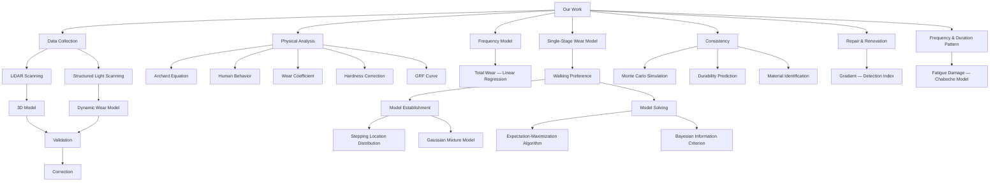

# Step Chronicles: A Multiscale Model Linking Wear Patterns and Temporal Use in Ancient Staircases

Summary

Staircase wear is a complex phenomenon influenced by various factors such as material properties, frequency of use, and environmental conditions. However, understanding this wear is crucial in archaeology, providing valuable insights into ancient societies, their daily activities, and technological advancements. To aid archaeological studies, we developed models to simulate staircase wear, offering a more precise understanding of how wear is produced.

In Task 1, we establish a model based on Archard's Wear Law and Human Behavior Analysis to address the usage frequency and volume of the wear of staircases. By analyzing wear depth $W(x,y)$ and fitting Ground Reaction Forces data, the model estimates the quantity of the wear and the frequency of staircase usage $f_{\mathrm{use}}$ . Besides, validation through 3D scanning data further confirm the model's accuracy.

In Task 2, we employ a probabilistic model based on and Gaussian Mixture Model and Bayesian Information Criterion to analyze the direction and usage pattern of staircases. The model evaluates the preference of the direction by comparing $n_{up}$ and $n_{down}$ , which are statistically computable parameters in the model by Expectation-Maximization Algorithm. The number of people using the stairs simultaneously, which is related to the number of mixture Gaussian distribution, can be accessed by minimizing Bayesian Information Criterion.

In Task 3, we develop a model combining Monte Carlo simulations and Smoothness Detection to verify wear consistency and material origin. The model evaluates wear depth $W(x,y)$ and surface gradient $S(x,y)$ to detect disruptions in natural wear patterns, indicating repairs or renovations. The model also simulate wear progression during usage and predict the remaining service life before reaching the safety limit. Apart from that, we conduct wear coefficient analysis and statistical tests to identify the source material of the stairs, combining quantitative methods with archaeological evidence for accurate verification. To access the frequency and duration pattern, the fatigue damage of stairs under different stepping patterns is analyzed using the Chaboche model, showing that wear is accelerated by short-duration high-frequency stepping compared to long-duration low-frequency stepping.

Finally, the model reliably predicts staircase wear but has limitations, and future improvements will focus on material adaptations, dynamic environmental factors, and multiscale modeling.

Keywords: Stair Wear; Gaussian Distribution; Monte Carlo Simulation; Fatigue Damage

## Contents

## 1 Introduction 2

1.1 Problem Background 2  
1.2 Restatement of the Problem 2  
1.3 Our Work.... 3

## 2 Assumptions and Justifications 3

## 3 Notations 4

## 4 Analysis and Modeling 5

4.1 Data Collection for Staircase Wear 5  
4.2 Fundamental Physical Wear Models 5  
4.3 Walking Frequency Model 9  
4.4 Single-Stage Wear Model 11  
4.5 Consistency of Wear with Available Information 16  
4.6 Stair Durability Prediction 17  
4.7 Repair and Renovation Inspection 18  
4.8 Material Source Identification 19  
4.9 Frequency and Duration Patterns 20

## 5 Model Evaluation and Further Discussion 22

5.1 Strengths and Limitations of the Model 22  
5.2 Future Directions 23

## 6 Conclusion 23

## 1 Introduction

## 1.1 Problem Background

Staircases are crucial components of buildings that directly influence the functionality and safety of a building structure. As time goes by, the continuous use of staircases and environmental factors will lead to varying degrees of wear and tear, and this wear and tear is affected by various factors, such as material, design, frequency of use, user behavior, humidity, and temperature changes, as shown in Figure 1. Archaeologists often infer historical usage in ancient buildings based on the wear and tear of the stairs [1]. However, accurately determining staircases' usage time and wear levels, particularly those in archaeological sites, poses significant challenges. Studies of wear mechanisms have shown that predicting wear can help infer the historical usage of structures, making it an essential tool for archaeologists and engineers [2].

natural_image

Stacked concrete steps forming a staircase pattern (no text or symbols visible)

Figure 1: Ancient worn stone stair.

Staircases are made of different materials. By developing mathematical models to predict staircase wear, we can help archaeologists infer the historical usage of staircases. In addition, non-destructive testing methods have been developed to monitor wear, which is particularly valuable when studying historic structures $[3]$ .

## 1.2 Restatement of the Problem

Based on the background mentioned above, our goal is to develop a universal model that helps architects and archaeologists infer usage patterns, usage frequency, and environmental impacts from staircase wear patterns. The model should address the following questions:

- Usage Frequency and Volume: Determine how often the staircase is used, including whether it sees frequent or sporadic usage by either large or small groups of people.  
- Direction and Usage Pattern: Identify if there is a preference for one direction over another in usage and observe how people typically use the steps (e.g., number of users at a time, their formation).

- Wear Consistency and Material Origin: Verify if the wear patterns align with historical data and the expected wear based on the materials' origin, and assess if repairs or renovations have occurred.  
- Age and Reliability Estimate: Estimate the age of the staircase and evaluate the accuracy of this estimate based on wear patterns.

## 1.3 Our Work

flowchart

## 2 Assumptions and Justifications

Assumptions are made as follows to simplify the problem.

Assumption 2.1. The initial material properties of each step of the staircase (such as hardness and density) are assumed to be uniform, with no significant quality differences.

Assumption 2.2. The surface of the staircase is assumed to be flat when first constructed, with no initial wear or construction irregularities.

Assumption 2.3. The human flow is assumed to have a dominant direction during a certain period, rather than having large amounts of people moving in both directions simultaneously.

Assumption 2.4. The wear of the staircase is assumed to be mainly caused by long-term repetitive foot traffic, rather than short-term intense damage.

Assumption 2.5. The behavior patterns of people using the staircase (such as walking speed, step width) are assumed to remain consistent throughout the staircase's history of use.

Assumption 2.6. No significant extreme environmental changes are assumed.

Assumption 2.7. It is assumed that any repairs or renovations the staircase has undergone in its history are limited and have not altered the main structural characteristics or material properties of the staircase or that the main materials used are limited to a few predetermined types.

Assumption 2.8. The distribution of foot traffic on the staircase is assumed to follow a probability model.

## 3 Notations

Table 1: List of symbols, their definitions, and units.

<table><tr><td>Symbol</td><td>Definition</td><td>Unit</td></tr><tr><td> $W, w$ </td><td>Wear depth</td><td>m</td></tr><tr><td> $V_{wear}$ </td><td>Wear volume</td><td> $m^{3}$ </td></tr><tr><td> $w$ </td><td>Body weight</td><td>kg</td></tr><tr><td> $A$ </td><td>Surface area</td><td> $m^{2}$ </td></tr><tr><td> $C$ </td><td>Contact area</td><td> $m^{2}$ </td></tr><tr><td> $P$ </td><td>Normal pressure</td><td>Pa</td></tr><tr><td> $F$ </td><td>Normal load</td><td>N(Newton)</td></tr><tr><td> $L$ </td><td>Sliding distance</td><td>m</td></tr><tr><td> $H$ </td><td>Hardness</td><td>Pa</td></tr><tr><td> $k, \alpha$ </td><td>Wear coefficient</td><td>-</td></tr><tr><td> $g$ </td><td>Material hardness correction</td><td>-</td></tr><tr><td> $T$ </td><td>Lifespan</td><td>d</td></tr><tr><td> $f_{use}$ </td><td>Frequency of use</td><td> $d^{-1}$ </td></tr><tr><td> $R$ </td><td>Repair detection index</td><td>-</td></tr><tr><td> $D$ </td><td>Fatigue damage</td><td>-</td></tr><tr><td> $n$ </td><td>Times of stepping on stairs</td><td>-</td></tr><tr><td> $\mathbf{x}$ </td><td>Position vector</td><td>-</td></tr><tr><td> $\pi$ </td><td>Weights of different Gaussian distributions</td><td>-</td></tr><tr><td> $\gamma$ </td><td>Responsibility</td><td>-</td></tr><tr><td> $l$ </td><td>Log-likelihood</td><td>-</td></tr><tr><td> $\varepsilon$ </td><td>Error term</td><td>-</td></tr></table>

## 4 Analysis and Modeling

## 4.1 Data Collection for Staircase Wear

In the measurement of stair wear, 3D scanning technology is widely used to accurately capture surface morphology changes. As a high-precision method for acquiring three-dimensional data, laser scanning technology can generate detailed point cloud data, accurately measuring the depth and shape of stair surface wear. This makes laser scanning an important tool for long-term monitoring of stair wear, capable of detecting subtle surface changes. In addition, structured light scanning technology, by projecting structured light patterns and recording their deformation, generates high-resolution 3D surface images, helping researchers analyze wear characteristics of stair surfaces caused by usage [4]. Figure 2 represents a 3D scan of stair wear patterns. The left side of the image shows the original surface of the stairs, while the right side shows the 3D scan.

natural_image

Two-panel image showing a striped material sample before and after transformation, with no visible text or symbols.

Figure 2: 3D scan of staircase wear

In some applications, depth-sensing devices, such as Kinect v2, can perform real-time measurements by acquiring depth data. Such devices track positional changes and can effectively obtain three-dimensional information on stair surfaces, making them suitable for basic stair wear measurements $[5]$ .

## 4.2 Fundamental Physical Wear Models

## 4.2.1 Overview of Wear Theory

Wear can be broadly defined as the gradual removal or deformation of material from a solid surface due to mechanical action. Primary wear mechanisms include adhesive, abrasive, fatigue, and corrosive wear. In the context of stone stairs, abrasive wear is the most dominant mechanism, arising from repeated contact of the footwear with the stair surface. Understanding the wear mechanism sets the groundwork for the quantitative and qualitative modeling of wear.

## 4.2.2 Archard's Wear Model and Its Application

Archard's wear law [6] is one of the most widely used models to quantify wear. It provides a foundational framework for understanding material wear, describing the volume of material loss as a function of load, sliding distance, and material hardness. It is expressed as:

$$
V _ {\text { wear }} = k \cdot \frac {F \cdot L}{H} \tag {1}
$$

In the context of stair wear, the normal load is directly related to the weight of individuals using the stairs. The sliding distance corresponds to the cumulative footpath trajectories over time. The material hardness reflects the resistance of the stair material to wear.

In the context of stair wear analysis, Archard's model must be adapted to account for specific characteristics of foot traffic and material properties. This leads to an expanded model expressed as:

$$
V _ {\text { wear }} = \alpha \cdot \frac {h}{H} \cdot g (M) \tag {2}
$$

In this expression, $\alpha$ represents the material wear coefficient, analogous to the wear coefficient $k$ in Archard's model. The values of $\alpha$ for different materials are shown in the table below.

Table 2: Wear Coefficients for Different Material Combinations

<table><tr><td>Material Combination</td><td>Material 1</td><td>Wear Coefficient</td></tr><tr><td>Wood vs. Metal</td><td>Wood</td><td>0.20–0.60</td></tr><tr><td>Wood vs. Wood</td><td>Wood</td><td>0.25–0.50</td></tr><tr><td>Steel vs. Steel</td><td>Metal</td><td>0.80</td></tr><tr><td>Aluminum vs. Aluminum</td><td>Metal</td><td>1.10–1.35</td></tr><tr><td>Copper vs. Steel</td><td>Metal</td><td>0.53</td></tr><tr><td>Wood vs. Concrete</td><td>Concrete</td><td>0.61</td></tr><tr><td>Concrete vs. Rubber</td><td>Concrete</td><td>0.6–0.85</td></tr></table>

h is a human characteristic parameter that accounts for variability in pedestrian behavior, such as differences in body weight, gait, and footwear, collectively influencing the pressure distribution on the stair surface. It is expressed as:

$$
h = \int \rho (w) \cdot P (w) \cdot C (w) \cdot L (w) \mathrm{d} w \tag {3}
$$

Here, $\rho(w)$ is the probability density function of the body weight distribution, while $P(w)$ represents the pressure, $C(w)$ represents the contact area, and $L(w)$ represents the sliding distance, reflecting the variability introduced by the dynamics of the pedestrian. This function refines the load factor in Archard's model by accounting for the stochastic nature of human movement.

Finally, $g(M)$ is a material hardness correction function that refines the role of H by incorporating material-specific properties and environmental factors such as temperature and fatigue effects. It is given by:

$$
g (M) = \frac {\exp \left(- \frac {H}{R T}\right)}{\exp \left(- \frac {H _ {0}}{R T _ {0}}\right)} \tag {4}
$$

where H is the material hardness, R is the universal gas constant, and T is the absolute temperature. This term adjusts the wear model for material-specific and environmental influences, enhancing the precision of predictions in real-world applications.

line chart

| Hardness (MPa) | Temperature 250 K | Temperature 275 K | Temperature 300 K | Temperature 325 K | Temperature 350 K |
| -------------- | ----------------- | ----------------- | ----------------- | ----------------- | ----------------- |
| 0              | 1.0               | 1.0               | 1.0               | 1.0               | 1.0               |
| 2000           | ~0.6              | ~0.7              | ~0.8              | ~0.9              | ~1.0              |
| 4000           | ~0.3              | ~0.4              | ~0.5              | ~0.6              | ~0.7              |
| 6000           | ~0.1              | ~0.2              | ~0.3              | ~0.4              | ~0.5              |
| 8000           | ~0.05             | ~0.1              | ~0.15             | ~0.2              | ~0.25             |
| 10000          | ~0.02             | ~0.05             | ~0.1              | ~0.15             | ~0.2              |

Figure 3: Relationship between $g(M)$ and $H(\mathrm{MPa})$ at varying temperatures.

Figure 3 depicts the nonlinear relationship between hardness and the correction factor $g(M)$ . As hardness increases, the correction factor $g(M)$ significantly decreases, a trend consistent across all tested temperatures. Moreover, the increase in temperature appears to accelerate the rate of decrease in the correction factor, indicating a significant impact of temperature on the material's hardness and correction factor. This relationship is crucial for understanding and predicting the performance of materials under varying environmental conditions.

## 4.2.3 Single-Step Wear

To study the forces exerted on the stair surface during stair climbing, it is essential to obtain the Ground Reaction Force (GRF) curve during the process. The GRF curve represents the force exerted by the ground on a person's foot as they move, reflecting both vertical and horizontal components of force throughout the stance phase.

The test parameters were measured following the procedure outlined by Stüssi and Debrunner [7], and this method was applied to the entire dataset of the investigation. The force values were normalized to body weight, with each curve being divided into two halves. The maximum values were then identified on both sides of the midline, which allowed for the definition of Z1 (1st peak) and Z3 (2nd peak) (Figure 4). Z1 occurs during the weight acceptance phase after touchdown, while Z3 is observed during push-off. Between Z1 and Z2, the minimum Z2 was also measured, representing unloading during midstance.

line chart

| Time (sec) | Force (Body Weight) |
| ---------- | ------------------- |
| 0.0        | 0                   |
| 0.2        | 1.0                 |
| 0.4        | 0.8                 |
| 0.6        | 1.0                 |

Figure 4: Standard GRF curve

To analyze the varying pressures during ascending and descending stairs, we found relevant GRF curves in Stacoff's study [8]. The study presents distinct force profiles for both ascending and descending stair movements, highlighting the differences in force distribution and intensity between the two actions. By comparing these curves, it becomes possible to identify the unique mechanical demands and load variations associated with each phase of stair climbing. This comparison is essential for understanding how different stair-climbing tasks influence the forces acting on both the body and the stair surface.

Table 3: Mean value of the parameters in GRF curves.

<table><tr><td rowspan="2">Parameters</td><td colspan="2">Stair Up</td><td colspan="2">Stair Down</td></tr><tr><td>Left</td><td>Right</td><td>Left</td><td>Right</td></tr><tr><td>T(ms)</td><td>698.35</td><td>700.99</td><td>636.84</td><td>640.41</td></tr><tr><td>Z1(BW)</td><td>1.12</td><td>1.12</td><td>1.49</td><td>1.54</td></tr><tr><td>Z2(BW)</td><td>0.71</td><td>0.69</td><td>-</td><td>-</td></tr><tr><td>Z3(BW)</td><td>1.13</td><td>1.13</td><td>-</td><td>-</td></tr></table>

According to Stacoff's data, the shape of vertical GRF curve during stair descent only showed one peak, i.e. Z2 and Z3 didn't exist. Table 3 shows the mean value of these crucial parameters detected in multiple tests. To analyze the different wear caused by different directions, we use polynomial fitting to analyze the GRF curves obtained from multiple experiments, as shown in Figure 5. By fitting a polynomial to the experimental data, we can obtain a smooth curve that accurately represents the relationship between time and force, allowing for better interpretation of the experimental results and insights into the underlying patterns in the data.

line chart

| Time (sec) | Force (Body Weight) |
| ---------- | ------------------- |
| 0.0        | 0.0                 |
| 0.1        | 0.8                 |
| 0.2        | 1.1                 |
| 0.3        | 0.9                 |
| 0.4        | 0.8                 |
| 0.5        | 1.0                 |
| 0.6        | 1.2                 |
| 0.7        | 0.0                 |

(a) Stair Up

line chart

| Time (sec) | Force (Body Weight) |
| ---------- | ------------------- |
| 0.0        | 0.0                 |
| 0.1        | 1.2                 |
| 0.2        | 1.5                 |
| 0.3        | 1.4                 |
| 0.4        | 1.1                 |
| 0.5        | 0.8                 |
| 0.6        | 0.5                 |
| 0.7        | 0.3                 |
| 0.8        | 0.1                 |
| 0.9        | 0.0                 |

(b) Stair Down  
Figure 5: GRF curve in different directions.

By integrating the two fitted functions $G(t)$ , we can obtain the human characteristic parameter h for both the upward and downward steps.

$$
P \cdot C = \int_ {0} ^ {T} G (t) \mathrm{d} t \tag {5}
$$

Assuming that the sliding distance is proportional to the contact time, with a sliding distance of 1cm per second. By Equation 3, we have:

$$
h = T \cdot v \cdot \int_ {0} ^ {T} G (t) \mathrm{d} t \tag {6}
$$

By dividing $h$ of the upward movement by $h$ of the downward movement, we can obtain the ratio of wear between the upward and downward phases for same stairs:

$$
\frac {w _ {\mathrm{up}}}{w _ {\mathrm{down}}} = \frac {0 . 4 3 3 5}{0 . 3 8 0 4} \tag {7}
$$

## 4.3 Walking Frequency Model

## 4.3.1 Frequency Estimation

In real-world scenarios, wear volume is directly related to the wear depth on the stair-case surface. The wear depth provides crucial information about how much material has been removed due to usage. In analyzing the frequency, we simplified the process by estimating the frequency based on the overall wear level rather than using complex physical models for detailed calculations.

heatmap

| Wearing Depth (cm) |
| ------------------ |
| 0.000              |
| 0.198              |
| 0.396              |
| 0.594              |
| 0.792              |
| 0.990              |
| 1.188              |
| 1.386              |
| 1.584              |
| 1.782              |
| 1.980              |

Figure 6: Worn surface scanned by LiDAR.

The total wear volume $V_{wear}$ can be expressed as the integral of the wear depth $W(x, y)$ across the surface area A of the staircase, as shown in Figure 6:

$$
V _ {\text { wear,tot }} = \iint_ {A} W (x, y)   \mathrm{d} S \tag {8}
$$

In our model, it is calculated by multiplying the wear volume per cycle, the frequency, and the step usage time. Thus, it can be interpreted as:

$$
V _ {\text { wear,tot }} = V _ {\text { wear }} \cdot f _ {\text { use }} \cdot T \tag {9}
$$

In reality, the relationship between wear volume and usage frequency is influenced by factors such as environmental conditions, user behavior, and measurement inaccuracies. To account for these, we introduce an error term $\epsilon$ , which represents the random fluctuations or uncertainty in the system. Therefore, the model with the error term becomes the following:

$$
V _ {\text { wear,tot }} = V _ {\text { wear }} \cdot f _ {\text { use }} \cdot T + \epsilon \tag {10}
$$

In analyzing the frequency, we simplified the process by estimating the overall wear level instead of using complex physical models. This method allows for quick preliminary assessments, but its accuracy needs to be verified by comparing it with actual wear data. Regularly checking the staircase's actual wear conditions and collecting on-site data can calibrate the model's results and improve its reliability.

## 4.3.2 Validation of the Frequency Model

To validate the proposed model, we conducted experiments using granite staircases under controlled environmental conditions. The aim was to calculate the values of $h$ and $g(M)$ and compare the model's predictions with actual wear data.

Granite was chosen for its common usage and well-documented properties. The environmental temperature was maintained between $20^{\circ}C$ and $25^{\circ}C$ . Pedestrian characteristics, such as body weight, gait, and footwear, were recorded using motion capture sensors to calculate h. The hardness of granite, H = 278 MPa, and its environmental dependency were measured to determine $g(M)$ and $\alpha$ . Based on the experimental data, h was calculated to be 0.15 and $\alpha$ was measured to be 0.74, while $g(M)$ was found to be 0.854 at a temperature of $22^{\circ}C$ .

The wear volume $V_{\mathrm{wear,tot}}$ was calculated using the model and compared with actual measurements obtained through 3D scanning of the staircase surface. We can use 3D scanning technology to acquire detailed surface data of the staircase and perform a more precise analysis of the wear patterns. Comparing the scanned data with the model's predicted wear areas can help us further validate the model's accuracy and optimize the wear prediction process. For instance, with a walking frequency of $f_{\mathrm{use}} \approx 52$ passages/day and a total usage time of 1647 days, the predicted wear volume was $29.2~\mathrm{cm}^3$ , while the actual measured wear volume was $30.7~\mathrm{cm}^3$ . The relative error was approximately $4.89\%$ , which is within an acceptable range.

## 4.4 Single-Stage Wear Model

## 4.4.1 Basic Establishment of the Model

On long stairs, the walking pattern of people is almost the same on each step. Additionally, people hardly access the vertical surface of stairs. Therefore, it is appropriate to consider, separately, the horizontal surface of one single stage.

Choose one proper Cartesian coordinate system $O_{xyz}$ such that the projection of the top surface of the stair is an interval $D : [0, l] \times [0, w]$ in xy plane, where l and w are the length and width of the stair, respectively. Assume by non-destructive measurement, the function of wear depth $W : D \to \mathbb{R}, (x, y) \mapsto W(x, y)$ is accessible.

Suppose that the depth of wear caused each time one person steps at anywhere of the stair, notated as w, is constant, then at the position $(x, y)$ , W can be written as:

$$
W (x, y) = w \cdot N (x, y) \tag {11}
$$

where $N(x,y)$ is the total times people steps on the position $(x,y)$ .

Due to the difference magnitude of the force people use between upstairs and downstairs, the depth of wear caused each time when people go upstairs and downstairs is also variable. Then, W can be specified as:

$$
W (x, y) = w _ {\mathrm{up}} \cdot N _ {\mathrm{up}} (x, y) + w _ {\mathrm{down}} \cdot N _ {\mathrm{down}} (x, y) \tag {12}
$$

## 4.4.2 Further Process of $N_{up}$ and $N_{down}$

When people go upstairs, the position where they put their feet is random, but there exists some tendency behind. For example, most people prefer to put their left foot on the center-left of the stair rather than the corner.

W.l.o.g., we consider $N_{up}$ , the actual number of people who have stepped on $(x, y)$ . For a certain point $(x, y)$ on the top surface of the stair, when one person pass by this stage of stair, $(x, y)$ may or may not be stepped on. We use a series of random variable $\{X_{i}\}_{i=1}^{n}$ to denote the result that whether the i-th person step on $(x, y)$ or not if $n_{up}$ persons go upstairs in total. Specifically,

$$
\left\{ \begin{array}{l l} X _ {i} = 1 & (x, y) \text {   is   stepped   on } \\ X _ {i} = 0 & (x, y) \text {   is   not   stepped   on } \end{array} \right. \tag {13}
$$

If given these two assumptions below:

Assumption 4.1. $\{X_i\}_{i=1}^n$ are independently and identically distributed, where $P(X_i = 1) = p_{\mathrm{up}}(x,y)$ .

Assumption 4.2. n is efficiently large, i.e., there have been efficiently many people walking through this stair.

Then by Law of Large Number, $\overline{X_{i}}$ converges in probability to $EX_{i}$ . For simplicity:

$$
N _ {\mathrm{up}} = n \overline {{X _ {i}}} = n _ {\mathrm{up}} \mathbb {E} X _ {i} = n _ {\mathrm{up}} \cdot p _ {\mathrm{up}} (x, y) \tag {14}
$$

Similarly, $N_{down}$ have the same form. Thus,

$$
W (x, y) = w _ {\mathrm{up}} n _ {\mathrm{up}} \cdot p _ {\mathrm{up}} (x, y) + w _ {\mathrm{down}} n _ {\mathrm{down}} \cdot p _ {\mathrm{down}} (x, y) \tag {15}
$$

## 4.4.3 The Probability Distribution of Stepping on $(x,y)$

When people walking through stairs, the goal is to find somewhere comfortable and effort-saving to step on, which leads to a certain concentration in the probability distribution of the position of the foot. However, due to factors such as leg length, gait habits, or slight asymmetries in the body, the exact position of the foot can vary from step to step, as shown in Figure 7. Therefore, the distribution of wear depth, as shown in Figure 8, has the similar performance with the location distribution of feet.

To simplify the model, we assume the probability distribution of each time people step on the stair follows 2-dimensional jointly Gaussian distribution. Since each person has two feet and there might be several persons in parallel, the probability distribution is a mixture of 2 or more jointly Gaussian distribution:

$$
p _ {\mathrm{up}} (x, y) = \frac {1}{k} \sum_ {i = 1} ^ {k} \mathcal {N} (\mathbf {x} | \mu_ {i}, \Sigma_ {i}) \tag {16}
$$

where

$$
N (\mathbf {x} | \mu_ {i}, \Sigma_ {i}) = \frac {1}{2 \pi | \Sigma_ {i} | ^ {1 / 2}} \exp \left(- \frac {1}{2} (\mathbf {x} - \mu_ {i}) ^ {T} \Sigma_ {i} ^ {- 1} (\mathbf {x} - \mu_ {i})\right) \tag {17}
$$

$\mathbf{x} = (x, y)^{T}$ , and k=2 if only one person can walk through the stair or adds up if more persons can walk simultaneously.

Then we have:

$$
W (x, y) = \frac {1}{k} \left(w _ {\mathrm{up}} n _ {\mathrm{up}} \sum_ {i = 1} ^ {k} \mathcal {N} (x, y | \mu_ {i}, \Sigma_ {i}) + w _ {\mathrm{down}} n _ {\mathrm{down}} \sum_ {i = 1} ^ {k} \mathcal {N} (x, y | \mu_ {i}, \Sigma_ {i})\right) \tag {18}
$$

Because $n_{up}$ or $n_{down}$ can be different slightly, error terms $\varepsilon$ are introduced. Therefore, the final model is:

$$
W (x, y) = \frac {1}{k} \left(w _ {\text { up }} \sum_ {i = 1} ^ {k} (n _ {\text { up }} + \varepsilon_ {i}) \cdot \mathcal {N} (x, y | \mu_ {i}, \Sigma_ {i}) + w _ {\text { down }} \sum_ {i = 1} ^ {k} (n _ {\text { down }} + \varepsilon_ {i}) \cdot \mathcal {N} (x, y | \mu_ {i}, \Sigma_ {i})\right) \tag {19}
$$

scatterplot

| Length (cm) | Width (cm) | Density |
|-------------|------------|---------|
| 30          | 5          | Low     |
| 40          | 15         | Medium  |
| 80          | 15         | High    |
| 90          | 15         | Medium  |

Figure 7: The distribution of the location where feet stepping on.

heatmap

| Width (cm) | Width (cm) | Wear Depth (cm) |
|------------|------------|-----------------|
| 0          | 0          | 0               |
| 10         | 0          | 0               |
| 20         | 0          | 0               |
| 0          | 10         | 1               |
| 10         | 10         | 1               |
| 20         | 10         | 1               |
| 0          | 20         | 2               |
| 10         | 20         | 2               |
| 20         | 20         | 2               |

Figure 8: The distribution of the wear depth

## 4.4.4 Solving the Model

In this model, parameters which need to solve are: $k, n_{up}, n_{down}, \mu, \Sigma$ . The magnitude of $w_{up}, w_{down}$ can be accessed by physical analysis.

Since $W(x,y)$ is affinely equivalent to the mixture of Gaussian distribution, first we can affine $W$ to a probability distribution:

$$
p _ {W} (x, y) = \frac {W (x , y)}{\iint_ {\mathcal {D}} W (x , y) \mathrm{d} x \mathrm{d} y} = \sum_ {i = 1} ^ {2 k} \pi_ {i} \cdot \mathcal {N} (x, y | \mu_ {i}, \Sigma_ {i}) \tag {20}
$$

where

$$
\pi_ {i} = \left\{ \begin{array}{l l} \frac {w _ {\mathrm{up}} (n _ {\mathrm{up}} + \varepsilon_ {i})}{k \iint_ {\mathcal {D}} W (x , y)   \mathrm{d} x   \mathrm{d} y} & 1 \leq i \leq k, \\ \frac {w _ {\mathrm{down}} (n _ {\mathrm{down}} + \varepsilon_ {i})}{k \iint_ {\mathcal {D}} W (x , y)   \mathrm{d} x   \mathrm{d} y} & k <   i \leq 2 k \end{array} \right. \tag {21}
$$

and $\iint_{\mathcal{D}} W(x, y) \, \mathrm{d}x \, \mathrm{d}y$ is computable discretely by program. Then solving this model can be boiled down to solving parameters $\pi_i, \mu_i, \Sigma_i, k$ .

With the assumption that the value of k is accessed, the Expectation-maximization (EM) algorithm is capable of effectively solving this problem.

First initialize $\pi_i, \mu_i, \Sigma_i$ randomly. Then compute the responsibility $\gamma_{m,i}$ for each data point $\{\mathbf{x}_{\mathbf{m}}\}_{m=1}^{M} = \{(x_{m1}, y_{m1})^T\}_{m=1}^{M}$ by:

$$
\gamma_ {m, i} = \frac {\pi_ {i} \cdot \mathcal {N} (\mathbf {x} _ {\mathbf {m}} | \mu_ {i} , \Sigma_ {i})}{\sum_ {i = 1} ^ {M} \pi_ {i} \cdot \mathcal {N} (\mathbf {x} _ {\mathbf {m}} | \mu_ {i} , \Sigma_ {i})} \tag {22}
$$

Update $\pi_{i}, \mu_{i}, \Sigma_{i}$ respectively by:

$$
\pi_ {i} = \frac {1}{M} \sum_ {m = 1} ^ {M} \gamma_ {m, i} \tag {23}
$$

$$
\mu_ {i} = \frac {\sum_ {m = 1} ^ {M} \gamma_ {m , i} \mathbf {x _ {m}}}{\sum_ {m = 1} ^ {M} \gamma_ {m , i}} \tag {24}
$$

$$
\Sigma_ {i} = \frac {\sum_ {m = 1} ^ {M} \gamma_ {m , i} (\mathbf {x _ {m}} - \mu_ {\mathbf {i}}) (\mathbf {x _ {i}} - \mu_ {\mathbf {i}}) ^ {\mathbf {T}}}{\sum_ {m = 1} ^ {M} \gamma_ {m , i}} \tag {25}
$$

Compute the log-likelihood given the updated parameters above:

$$
l = \sum_ {m = 1} ^ {M} \log \left(\sum_ {i = 1} ^ {2 k} \pi_ {i} \cdot \mathcal {N} (x, y | \mu_ {i}, \Sigma_ {i})\right) \tag {26}
$$

If the change in log-likelihood between iterations is smaller than a predefined threshold (e.g., $\epsilon$ ), then we reach the maximized value of and get the proper value of $\pi_i, \mu_i, \Sigma_i$ .

Once the value of $\pi_{i}$ is accessible,

$$
n _ {\mathrm{up}} + \varepsilon_ {i} = \frac {\pi_ {i} k}{w _ {\mathrm{up}}} \iint_ {\mathcal {D}} W (x, y) \mathrm{d} x \mathrm{d} y, n _ {\mathrm{down}} + \varepsilon_ {i} = \frac {\pi_ {i} k}{w _ {\mathrm{down}}} \iint_ {\mathcal {D}} W (x, y) \mathrm{d} x \mathrm{d} y \tag {27}
$$

Error term $\varepsilon_{i}$ can be eliminated by regression respectively. Then the certain direction of travel favored by the people using the stairs is:

- upstairs, if $n_{\mathrm{up}} > n_{\mathrm{down}}$ , or  
- downstairs, if $n_{\mathrm{up}} < n_{\mathrm{down}}$ .

However, the solution process above is based on the certain value of k. To specify the value of k, we will use Bayesian Information Criterion (BIC):

$$
\mathrm{BIC} = p \ln M - 2 l \tag {28}
$$

where p is the total number of parameters, M is the total number of the data point, and is the maximized value of the log-likelihood function.

Initially, we set the proper range $\mathcal{I}$ for $k$ , e.g. $1 \leq k \leq 10$ , and for each possible value of $k$ , compute BIC. Then,

$$
k = \arg \min _ {k \in \mathcal {I}} \mathrm{BIC} \tag {29}
$$

line chart

| k  | BIC Scores (2 person) | BIC Scores (1 person) |
|----|------------------------|------------------------|
| 1  | 21000                  | 18000                  |
| 2  | 20500                  | 15500                  |
| 3  | 20000                  | 14500                  |
| 4  | 19500                  | 13800                  |
| 5  | 18500                  | 13800                  |
| 6  | 18000                  | 13800                  |
| 7  | 17500                  | 13800                  |
| 8  | 17000                  | 13800                  |
| 9  | 16500                  | 13800                  |
| 10 | 16500                  | 13800                  |
| 11 | 16500                  | 13800                  |
| 12 | 16500                  | 13800                  |
| 13 | 16500                  | 13800                  |
| 14 | 16500                  | 13800                  |
| 15 | 16500                  | 13800                  |
| 16 | 16500                  | 13800                  |

Figure 9: BIC score versus k when the numbers of people using the stairs simultaneously are different.

Since each person has two feet, the number of people using the stairs simultaneously is $\frac{k}{2}$ . For example, in Figure 9, when 1 or 2 persons walk through the stairs, k is minimized at 4 or 8 respectively.

3d surface plot

| Length (cm) | Width (cm) | Near Depth (cm) |
|-------------|------------|-----------------|
| 0           | 0          | 0               |
| 20          | 10         | 0.5             |
| 40          | 20         | 1.0             |
| 60          | 30         | 1.5             |
| 80          | 40         | 1.0             |
| 100         | 50         | 0.5             |
| 120         | 60         | 0.2             |
| 140         | 70         | 0.1             |
| 160         | 80         | 0.05            |
| 180         | 90         | 0.02            |
| 200         | 100        | 0.01            |

Figure 10: The Gaussian Mixture Model fitting of wear depth  
Figure 10 is an instance of fitting Figure 8 by methods above.

## 4.5 Consistency of Wear with Available Information

## 4.5.1 Consistency of Wear with Available Information

Archaeologists verify historical records by comparing the steps' wear level with the building's age. Light wear may indicate low usage, while concentrated wear in specific areas suggests more frequent use of those sections. By studying wear patterns in detail, archaeologists can determine if they match known daily activities. If the stairs were a main passageway, significant wear should be visible. Stratigraphic data, wear rate calculations, and surface chemical analysis can help determine usage intensity across different periods and verify the existing historical context. Through these analyses, archaeologists can thoroughly examine the step wear and evaluate whether it aligns with the building's history and usage patterns.

## 4.5.2 Monte Carlo Simulation

Monte Carlo simulation [9] is particularly effective for modeling complex, stochastic systems, as it captures the inherent randomness and variability of processes like wear. We chose Monte Carlo simulation for stair tread wear analysis, because it can model intricate systems where analytical solutions are difficult or impossible to derive. Unlike deterministic approaches that provide a single outcome, Monte Carlo methods offer a distribution of potential results, giving us a more accurate representation of wear that accounts for factors like pedestrian traffic and environmental conditions.

To validate this method's effectiveness, we implemented a detailed Monte Carlo simulation process, as shown in algorithm 1. By constructing a random model for stair tread wear, we generated numerous simulation scenarios to comprehensively evaluate wear characteristics under different conditions.

Algorithm 1: Stair Wear Monte Carlo Simulation  
Input: T: Total simulation time
l, w: The length and width of the stair
α, H, g: Material wear coefficient, hardness and correction
N: Number of people per simulation interval
μw, σw: Mean body weight and standard deviation of body weight
μn, σn: Mean number of people using the stairs simultaneously and standard deviation
pup: Probability of going upstairs
Output: wear: Stair wear

1 wear ← [l, w];
2 for time ← 0 to T do
3    for person ← 1 to N do
4    weight ← NormalDistribution(μw, σw);
5    parallel ← NormalDistribution(μn, σn);
6    if Random() < pup then
7    direction ← UP;
8    else
9    direction ← DOWN;
10    end
11    normal_force ← GRF(weight, direction);
12    sliding_distance ← L(weight, direction);
13    h ← normal_force · sliding_distance
14    (x, y) ← PositionGenerator(direction, parallel);
15    wear[x, y] ← wear[x, y] + α × h/H × g;
16    end
17 end

## 4.6 Stair Durability Prediction

Based on the stair wear model mentioned above, we can predict the remaining service life of the stairs. This model takes into account various factors such as material wear coefficients, the frequency and distribution of usage, and the applied forces from users. By simulating the interactions between the stairs and the individuals using them, we can estimate the rate of wear and calculate the remaining time before the stair surface reaches a critical level of degradation.

Assumption 4.3. It is assumed that a stair becomes unusable when the maximum depth of a wear-induced pit reaches the height of the stair. This threshold is based on the structural integrity of the stair, where a pit of such depth compromises the stair's functionality and safety. Once the wear reaches this critical depth, the stair is considered unfit for use, requiring replacement or repair.

area chart

| Length (cm) | Mean Depth (cm) |
|-------------|-----------------|
| 0           | 0               |
| 5           | 1               |
| 10          | 2               |
| 15          | 1               |
| 20          | 0               |
| 25          | 1               |
| 30          | 2               |
| 35          | 1               |
| 40          | 0               |
| 45          | 1               |
| 50          | 2               |
| 55          | 1               |
| 60          | 0               |
| 65          | 1               |
| 70          | 2               |
| 75          | 1               |
| 80          | 0               |
| 85          | 1               |
| 90          | 2               |
| 95          | 1               |
| 100         | 0               |

(a) 5 Years

3d area chart

| Length (cm) | Width (cm) | Area Depth (cm) |
|-------------|------------|-----------------|
| 50          | 150        | 0               |
| 60          | 120        | 3               |
| 70          | 90         | 1               |
| 80          | 60         | 0               |
| 90          | 40         | 0               |
| 100         | 20         | 0               |
| 110         | 10         | 0               |
| 120         | 5          | 0               |
| 130         | 2          | 0               |
| 140         | 1          | 0               |
| 150         | 0          | 0               |

(b) 10 Years

3d surface plot chart

| Length (cm) | Width (cm) | Wear Depth (cm) |
| --- | --- | --- |
| 24 | 15 | 6 |
| 24 | 25 | 7 |
| 24 | 35 | 6 |
| 24 | 45 | 5 |
| 24 | 55 | 4 |
| 24 | 65 | 3 |
| 24 | 75 | 2 |
| 24 | 85 | 1 |
| 24 | 95 | 0.5 |
| 24 | 105 | 0.3 |
| 24 | 115 | 0.2 |
| 24 | 125 | 0.1 |
| 24 | 135 | 0.05 |
| 24 | 145 | 0.03 |
| 24 | 155 | 0.02 |
| 24 | 165 | 0.01 |
| 24 | 175 | 0.005 |
| 24 | 185 | 0.003 |
| 24 | 195 | 0.002 |
| 24 | 205 | 0.001 |
| 24 | 215 | 0.0005 |
| 24 | 225 | 0.0003 |
| 24 | 235 | 0.0002 |
| 24 | 245 | 0.0001 |
| 24 | 255 | 0.00005 |
| 24 | 265 | 0.00003 |
| 24 | 275 | 0.00002 |
| 24 | 285 | 0.00001 |
| 24 | 295 | 0.000005 |
| 24 | 305 | 0.000003 |
| 24 | 315 | 0.000002 |
| 24 | 325 | 0.000001 |
| 24 | 335 | 0.0000005 |
| 24 | 345 | 0.0000003 |
| 24 | 355 | 0.0000002 |
| 24 | 365 | 0.0000001 |
| 24 | 375 | 0.00000005 |
| 24 | 385 | 0.00000003 |
| 24 | 395 | 0.00000002 |
| 24 | 405 | 0.00000001 |
| 24 | 415 | 0.000000005 |
| 24 | 425 | 0.000000003 |
| 24 | 435 | 0.000000002 |
| 24 | 445 | 0.000000001 |
| 24 | 455 | 0.0000000005 |
| 24 | 465 | 0.0000000003 |
| 24 | 475 | 0.0000000002 |
| 24 | 485 | 0.0000000001 |
| 24 | 495 | 0.0000000001 |
| 24 | 505 | 6 |
| 24 | 515 | 6 |
| 24 | 525 | 6 |
| 24 | 535 | 6 |
| 24 | 545 | 6 |
| 24 | 555 | 6 |
| 24 | 565 | 6 |
| 24 | 575 | 6 |
| 24 | 585 | 6 |
| 24 | 595 | 6 |
| 24 | 605 | 6 |
| 24 | 615 | 6 |
| 24 | 625 | 6 |
| 24 | 635 | 6 |
| 24 | 645 | 6 |
| 24 | 655 | 6 |
| 24 | 665 | 6 |
| 24 | 675 | 6 |
| 24 | 685 | 6 |
| 24 | 695 | 6 |
| 24 | 705 | nan |
| ... | ... | ... |
| ... | ... | ... |
| ... | ... | ... |
| ... | ... | ... |
| ... | ... | ... |
| ... | ... | ... |
| ... | ... | ... |
| ... | ... | ... |
| ... | ... | ... |
| ... | ... | ... |
| ... | ... | ... |
| ... | ... | ... |
| ... | ... | ... |
| ... | ... | ... |
| ... | ... | ... |
| ... | ... | ... |
| ... | ... | ... |
| ... | ... | ... |
| ... | ... | ... |
| ... | ... | ... |
| ... | ... | <6 |
| ... | ... | <6 |
| ... | ... | <6 |
| ... | ... | <6 |
| ... | ... | <6 |
| ... | ... | <6 |
| ... | ... | <6 |
| ... | ... | <6 |
| ... | ... | <6 |
| ... | ... | <6 |

(c) 15 Years

3d area chart

| Length (cm) | Width (cm) | N·m·cm² |
|-------------|------------|---------|
| 40          | 0          | 7       |
| 50          | 10         | 6       |
| 60          | 20         | 5       |
| 70          | 30         | 4       |
| 80          | 40         | 3       |
| 90          | 50         | 2       |
| 100         | 60         | 1       |
| 110         | 70         | 0       |
| 120         | 80         | -1      |

(d) 20 Years  
Figure 11: Wear progression of the staircase over time.

Figure 11 shows the wear progression of the staircase under our wear model, illustrating the changes after 5, 10, 15, and 20 years of usage. The results indicate that as time progresses, the wear depth increases due to cumulative effects of usage patterns. After 20 years, the maximum wear depth is observed to approach the height of the stair, validating the model's prediction regarding the stair's lifespan. This serves as a quantitative estimation of the point at which the stair will require maintenance or replacement to ensure continued functionality and safety.

## 4.7 Repair and Renovation Inspection

Older staircases, especially those in historical buildings, often require repairs or renovations due to age-related wear and tear $[10]$ . As these stairs deteriorate over time, renovations are necessary to ensure safety and preserve their structural integrity. Identifying whether a stair has been previously repaired or renovated is important for assessing its current condition and predicting its future lifespan.

Natural wear creates a gradual and consistent gradient across the surface due to prolonged use. Repairs, however, introduce abrupt changes in gradient due to the replacement or resurfacing of materials, disrupting the natural pattern. The gradient of the surface $W(x,y)$ is computed as:

$$
S (x, y) = \sqrt {\left(\frac {\partial W}{\partial x}\right) ^ {2} + \left(\frac {\partial W}{\partial y}\right) ^ {2}} \tag {30}
$$

where $\frac{\partial W}{\partial x}$ and $\frac{\partial W}{\partial y}$ are the partial derivatives of the surface height in the x- and y-directions.

The repair detection index $R(x,y)$ can now be defined using just the gradient and its local deviation:

$$
R (x, y) = \left| S (x, y) - \overline {{{S}}} _ {\text {local}} (x, y) \right| \tag {31}
$$

where $\overline{S}_{\mathrm{local}}(x,y)$ is the average gradient within a local neighborhood around $(x,y)$ .

$R(x,y)$ quantifies the deviation of the gradient at each point from the surrounding area. Naturally worn areas will have relatively consistent gradients, while repairs will introduce abrupt changes in the gradient, making the deviation larger.

This approach simplifies detection by focusing on the gradient, reducing redundancy and streamlining the model. It identifies disruptions from repairs by capturing surface texture and variation, maintaining high accuracy. By using a single gradient metric, it effectively detects repaired regions based on surface continuity disruptions. It is computationally efficient, accurate, and provides useful results for identifying repairs.

## 4.8 Material Source Identification

To identify the source of the material that the stairs use, the wear coefficient analysis begins with controlled tribological testing on materials from suspected quarries or logging sites to determine their wear coefficients ( $\alpha$ ). For existing stairs, the effective wear coefficient ( $\alpha_{e}$ ) can be calculated by referencing the fundamental wear equation (2).

Statistical consistency testing employs the null hypothesis $H_0: K = K_e$ against $H_1: K \neq K_e$ . The t-test statistic is:

$$
t = \frac {K - K _ {e}}{s / \sqrt {n}} \tag {32}
$$

For non-normal distributions, the Kolmogorov-Smirnov test provides distribution comparison:

$$
D = \sup _ {x} | F _ {1} (x) - F _ {2} (x) | \tag {33}
$$

This framework enables quantitative comparison between source materials and archaeological samples while accounting for measurement uncertainties and environmental effects. Results should be interpreted alongside other archaeological evidence for comprehensive material source verification.

## 4.9 Frequency and Duration Patterns

## 4.9.1 Chaboche Model

In structural engineering, fatigue damage is a critical consideration, especially when components are subjected to repetitive loading. For staircases, two common types of loading scenarios are short-duration high-frequency stepping and long-duration low-frequency stepping, each of which affects the structure in distinct ways $[11]$ . The former causes rapid, high-magnitude impacts that may lead to sudden localized damage, while the latter involves prolonged, lower-magnitude stresses that accumulate over time. Understanding how these two types of stepping contribute to fatigue damage is essential for assessing the long-term durability of staircases. This section aims to explore the fatigue damage mechanisms under these different loading conditions.

The Chaboche model describes the nonlinear hardening behavior of materials using multiple backstress components. The yield function and backstress evolution equations are central to the model:

$$
f = \sqrt {\frac {3}{2} (\mathbf {s} - \mathbf {X}) : (\mathbf {s} - \mathbf {X})} - \sigma_ {y} = 0 \tag {34}
$$

$$
\dot {\mathbf {X}} _ {i} = \frac {2}{3} C _ {i} \dot {\epsilon} _ {p} - \gamma_ {i} \mathbf {X} _ {i} \dot {p} (i = 1, 2, \dots , N) \tag {35}
$$

Here, s is the deviatoric stress tensor, defined as $s = \sigma - \frac{1}{3} \text{tr}(\sigma) \mathbf{I}$ . The term $X_{i}$ represents the i-th backstress component, which characterizes the material's hardening state. The yield stress is denoted by $\sigma_{y}$ , while $C_{i}$ and $\gamma_{i}$ are material parameters that control the hardening rate and dynamic recovery. The plastic strain rate tensor is $\dot{\epsilon}_{p}$ , and the equivalent plastic strain rate is $\dot{p} = \sqrt{\frac{2}{3} \dot{\epsilon}_{p} : \dot{\epsilon}_{p}}$ .

The damage evolution equation in the Chaboche model is given by:

$$
\dot {D} = \left(\frac {Y}{S}\right) ^ {s} \cdot \dot {p} \cdot \langle \sigma_ {H} \rangle^ {m} \tag {36}
$$

In this equation, Y represents the elastic strain energy density, calculated as $Y = \frac{1}{2}\sigma : C^{-1} : \sigma$ . The parameters S, s, and m are material-specific damage parameters. The term $\sigma_{H}$ denotes the hydrostatic pressure, defined as $\sigma_{H} = \frac{1}{3}\mathrm{tr}(\sigma)$ . The Macaulay brackets $\langle\cdot\rangle$ ensure that only positive values are considered.

## 4.9.2 Parameter Calibration and Damage Calculation

To apply the Chaboche model to step wear analysis, we assume the step material is concrete. The material parameters are calibrated based on uniaxial cyclic tests:

- Elastic parameters: Young's modulus $E = 30$ GPa and Poisson's ratio $\nu = 0.2$ .  
- Plastic parameters: Initial yield stress $\sigma_{y} = 20\mathrm{MPa}$ .  
- Backstress components: Three components are used, with parameters $C_1 = 1000 \mathrm{MPa}$ , $\gamma_1 = 100$ , $C_2 = 500 \mathrm{MPa}$ , $\gamma_2 = 50$ , $C_3 = 200 \mathrm{MPa}$ , and $\gamma_3 = 10$ .  
- Damage parameters: $S = 0.1 \mathrm{MPa}^{-1}$ , $s = 2$ , and $m = 1$ .

The loading conditions are defined as follows:

- Single step stress: A person weighing 70 kg with a contact area of $0.02 \, m^{2}$ results in a static stress of $\sigma_{static} = \frac{70 \times 9.8}{0.02} = 34.3 \, kPa$ .  
- Dynamic effects: Short-term dense flow of people may cause impact stress, assumed to be twice the static stress ( $\sigma_{\text{dynamic}} = 68.6 \text{kPa}$ ).  
- Time distribution: Two scenarios are considered—distributed use (1000 people evenly distributed over 10 hours) and concentrated use (1000 people over 1 hour).

For distributed use, the stress history consists of 100 steps per hour, each with a stress of $\sigma_{static} = 34.3$ kPa, last for 10 hours. The equivalent plastic strain increment per step is assumed to be $\Delta p = 1 \times 10^{-5}$ . The damage increment per cycle is calculated as:

$$
\Delta D = \left(\frac {Y}{S}\right) ^ {s} \cdot \Delta p \cdot \langle \sigma_ {H} \rangle^ {m}
$$

For static loading, the elastic strain energy density Y is:

$$
Y = \frac {\sigma_ {\mathrm{static}} ^ {2}}{2 E} = \frac {(3 4 . 3 \times 1 0 ^ {3}) ^ {2}}{2 \times 3 0 \times 1 0 ^ {9}} \approx 1. 9 6 \times 1 0 ^ {- 3} \mathrm{MPa}
$$

Substituting the values, the damage increment per step is:

$$
\Delta D = \left(\frac {1 . 9 6 \times 1 0 ^ {- 3}}{0 . 1}\right) ^ {2} \times 1 \times 1 0 ^ {- 5} \times 3 4. 3 \approx 2. 3 \times 1 0 ^ {- 9}
$$

The total damage for distributed use is:

$$
D _ {\mathrm{distributed}} = 1 0 0 0 \times 2. 3 \times 1 0 ^ {- 9} = 2. 3 \times 1 0 ^ {- 6}
$$

For concentrated use, the stress history consists of 1000 steps in 1 hour. Follow the same steps to calculate, the total damage for concentrated use is:

$$
D _ {\text { concentrated }} = 1 0 0 0 \times 1. 1 \times 1 0 ^ {- 7} = 1. 1 \times 1 0 ^ {- 4}
$$

The damage ratio between concentrated and distributed use is approximately 48, indicating that short-term significantly accelerates step wear.

Traffic Distribution Over Time  

line chart

| Time (hours) | Distributed Usage | Concentrated Usage |
| ------------ | ----------------- | ------------------ |
| 0            | 100               | 1000               |
| 1            | 100               | 450                |
| 2            | 100               | 150                |
| 3            | 100               | 50                 |
| 4            | 100               | 50                 |
| 5            | 100               | 50                 |
| 6            | 100               | 50                 |
| 7            | 100               | 50                 |
| 8            | 100               | 50                 |
| 9            | 100               | 50                 |
| 10           | 100               | 50                 |

Cumulative Damage Over Time  

line chart

| Time (hours) | Cumulative Damage (Green Line) | Cumulative Damage (Purple Line) |
| ------------ | ------------------------------ | ------------------------------- |
| 0            | 0.00                           | 0.00                            |
| 1            | 1.50e6                         | 0.10e6                          |
| 2            | 1.75e6                         | 0.20e6                          |
| 3            | 1.75e6                         | 0.25e6                          |
| 4            | 1.75e6                         | 0.30e6                          |
| 5            | 1.75e6                         | 0.35e6                          |
| 6            | 1.75e6                         | 0.40e6                          |
| 7            | 1.75e6                         | 0.45e6                          |
| 8            | 1.75e6                         | 0.50e6                          |
| 9            | 1.75e6                         | 0.55e6                          |
| 10           | 1.75e6                         | 0.60e6                          |

Stress Distribution Over Time  

line chart

| Time (hours) | Stress (MPa) |
| ------------ | ------------ |
| 0            | 175          |
| 1            | 125          |
| 2            | 80           |
| 3            | 10           |
| 4            | 5            |
| 5            | 3            |
| 6            | 2            |
| 7            | 1            |
| 8            | 0.5          |
| 9            | 0.2          |
| 10           | 0.1          |

Figure 12: Chaboche model.

The Chaboche model captures this effect through nonlinear hardening (backstress evolution) and dynamic damage amplification. The results demonstrate the model's ability to quantify the impact of different usage patterns on material degradation.

## 5 Model Evaluation and Further Discussion

## 5.1 Strengths and Limitations of the Model

The proposed model integrates physical wear theory, probabilistic pedestrian behavior, and environmental factors to predict staircase wear. Its key strength lies in the combination of Archard's wear law with stochastic human dynamics, enabling a balance between theoretical rigor and practical applicability. The Monte Carlo simulation further enhances the model's ability to capture uncertainties in pedestrian flow and environmental variability. Validation experiments on granite stairs demonstrated a relative error of only $4.89\%$ , indicating high reliability under controlled conditions.

However, several limitations must be acknowledged. First, the model assumes uniform material properties and idealized pedestrian behavior. In reality, material heterogeneity and diverse user behaviors may introduce deviations. Second, environmental factors such as humidity and freeze-thaw cycles are simplified through the correction factor $g(M)$ , but their transient effects on material fatigue are not fully dynamic. Third, the repair detection method relies on gradient analysis, which may struggle to distinguish subtle repairs in highly irregular wear patterns.

## 5.2 Future Directions

1. Material-Specific Adaptations: Extend the model to account for anisotropic materials (e.g., layered stone or wood grain). For example, wear coefficients ( $\alpha$ ) could be spatially varied based on material microstructure.  
2. Dynamic Environmental Integration: Develop time-dependent functions for $g(M)$ to reflect seasonal humidity fluctuations or long-term climate trends, enhancing predictive accuracy for outdoor staircases.  
3. Multi-Scale Modeling: Couple macro-scale wear predictions with micro-scale tribological simulations to better capture localized wear mechanisms, such as abrasive particle interactions.

## 6 Conclusion

We present staircases prediction models to assess wear patterns accurately. The models validated with 3D scanning data successfully solve tasks. This provides a valuable tool for archaeological research.

## References

[1] A. Figueiredo and J. Ribeiro. Wear patterns in historical staircases and their relevance for archaeological studies. Journal of Archaeological Science, 106:58–67, 2019.  
[2] J. Williams. Wear and Surface Damage. Cambridge University Press, 2005.  
[3] R. Crespo and S. Kenny. Staircase predictor models for reliability and risk analysis. International Journal of Architectural Heritage, 22(1):1–15, 2018.  
[4] Z. Zheng, G. Zhong, and H. Deng. A method to detect stairs with three-dimensional scanning for hexapod robot stair climbing. In 2016 IEEE International Conference on Mechatronics and Automation (ICMA), pages 1450–1455, 2016.  
[5] Atsushi Ogawa, Akira Mita, A. Yorozu, and M. Takahashi. Markerless knee joint position measurement using depth data during stair walking. Sensors (Basel, Switzerland), 17(11):2698, 2017.  
[6] J. F. Archard. Contact and rubbing of flat surfaces. Journal of Applied Physics, 24(8):981–988, 08 1953.  
[7] E. Stüssi and H. U. Debrunner. Parameter-analyse des menschlichen ganges. Biomedical Engineering / Biomedizinische Technik, 25(s1):222–224, 1980.  
[8] Alex Stacoff, Christian Diezi, Gerhard Luder, Edgar Stüssi, and Inès A. Kramers-de Quervain. Ground reaction forces on stairs: effects of stair inclination and age. Gait Posture, 21(1):24–38, 2005.  
[9] D. Landau and K. Binder. A Guide to Monte Carlo Simulations in Statistical Physics. Cambridge University Press, 2021.  
[10] J.W.P. Campbell and M. Tutton. Staircases: History, Repair and Conservation. Taylor & Francis, 2013.  
[11] B. Cerfontaine and F. Collin. Cyclic and fatigue behaviour of rock materials: Review, interpretation and research perspectives. Rock Mechanics and Rock Engineering, 51(2):391–414, Feb 2018.