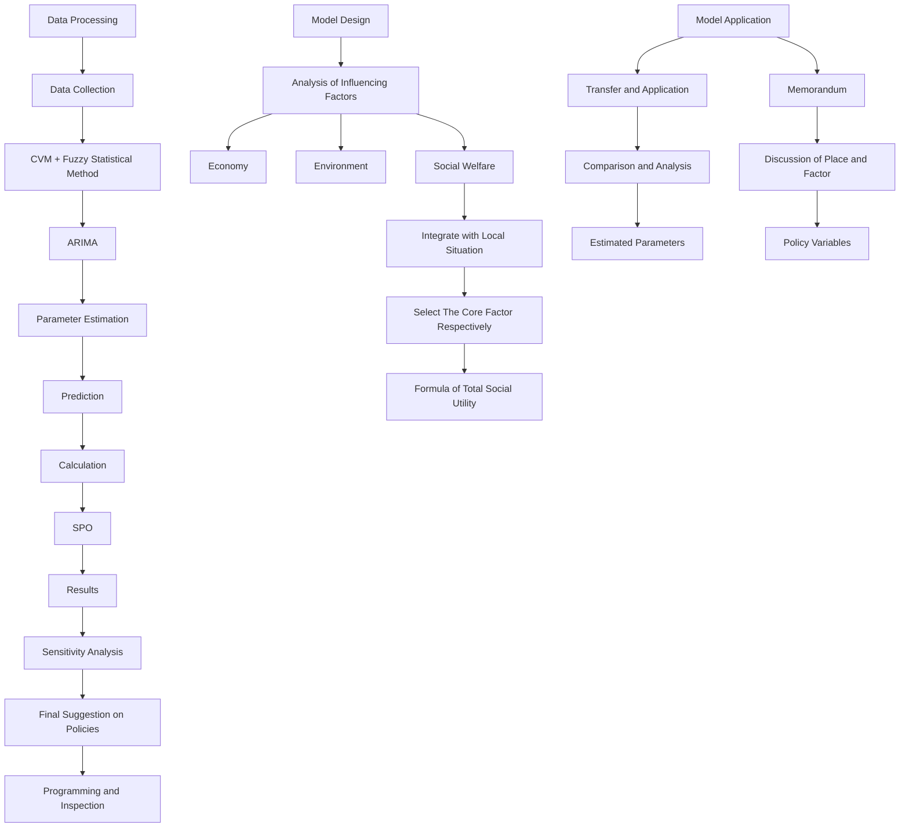
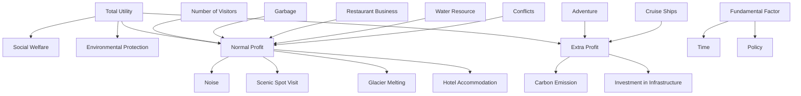
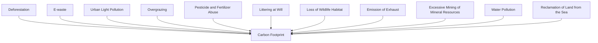
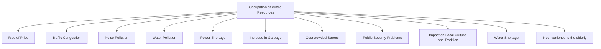
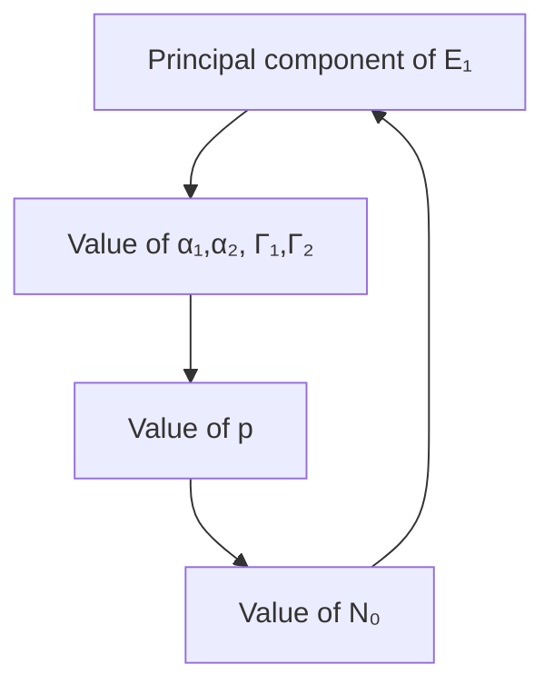

# Economy, Ecology, and Social Welfare:A Win-Win Approach for Sustainable Tourism in Juneau

Summary

The development of tourism can lead to economic growth, but excessive development can cause ecological and social issues. This paper analyzes the situation of tourism in Juneau, Alaska, and formulates an optimization model, by which we draw the optimal development strategy, provide policy suggestions and applications in other scenarios.

For Problem 1, we devised an optimization strategy for Juneau's tourism industry, balancing economic profit and implicit costs. Using a Multi-objective Nonlinear Programming Model based on Contingent Valuation Method(CVM) and Particle Swarm Optimization(PSO) Algorithm, we converted implicit costs to dollars, forming a total social utility function. This function served as our objective, with daily tourist numbers, government investment, project funding ratios, and tourist taxes as decision variables. Our model yielded optimal values, leading to three policy suggestions: capping peak-season daily tourists at 13,993, attracting 1,035 tourists daily in the off-season, and investing \$92,310.46 daily in environmental and social infrastructure at a 54.33:45.67 ratio. Sensitivity analysis confirmed model stability, highlighting peak-season tourist limits as the key policy.

For problem 2, Jiuzhaigou in China is selected to verify the adaptability of the model. According to its characteristics like the number of tourists per day, relevant parameters are adjusted. It is concluded that the development of tourism in Jiuzhaigou area does not need to directly limit the number of tourists in the peak season, but should take appropriate government investment as a more important policy. Subsequently, the results are compared and analyzed based on the different characteristics between the two regions. Finally, to publicize less popular scenic spot, one effective way can be increasing the government's off-season expenditure to improve its attractiveness.

For problem 3, the optimal values of the decision variables in problem 1 are provided to the Tourist Council of Juneau as forecast data, and policy suggestions are provided from the perspective of tourist quantity restriction, government investment in environmental and social construction, and government taxation on tourists, among which the first policy is considered the most critical measure.

The model of this paper draws on the idea of CVM, enabling a more precise unification of previously ambiguous variables, and the robustness of the model results proves the rationality of this method, which is a highlight. Additionally, the model is comprehensive, adaptable, and has significant policy application value.

Keywords: Sustainable tourism; CVM; Multi-objective nonlinear programming

## Contents

## 1 Introduction

1.1 Problem Background 2  
1.2 Restatement of the Problem 2  
1.3 Our Work.... 3

## 2 Model Preparations

2.1 Assumptions and Justifications 4  
2.2 Notations 5  
2.3 Basic components of sustainable tourism 5

## 3 Model Design

3.1 Preprocessing 5  
3.2 Total Economic Profits Section 7  
3.3 Environmental Level Section 9

3.3.1 Human Impact 9  
3.3.2 Self-Recovery Ability of Ecosystem 10  
3.3.3 Government Investment 10

3.4 Social Welfare Section 11

3.4.1 Positive Impact 11  
3.4.2 Negative Impact 12  
3.4.3 Government Investment 13

3.5 The Model Results 14

## 4 Sensitivity Analysis

4.1 Policy Variables and Further Discussion 16  
4.2 Reasonably Estimated Parameters Based on CVM 17

## 5 Application of our Model

5.1 Similarities and Differences between Jiuzhaigou and Juneau ..... 17  
5.2 Specific Application in The Tourism Development of Jiuzhaigou ..... 19  
5.3 Policy Analysis and Comparison Based on Model Results ..... 19  
5.4 Advice on Promoting Less-popular Attractions 21

## 6 Model Evaluation

6.1 Strengths 21  
6.2 Weaknesses and Further Discussion 22

7 References 22

8 Memorandum 24

## 1 Introduction

## 1.1 Problem Background

As the capital of Alaska, Juneau attracts numerous tourists from far and wide every year with its breathtaking natural resources and mature tourism industries. However, given the current situation, it is paramount to properly manage the relationships of the local tourism industry, economy, society as well as ecology.

On one hand, the influx of tourists can increase local economic revenues, thereby supporting the government to improve people's livelihoods and protect the environment. On the other hand, the overload of the tourism industry can result in environmental issues such as increases in carbon emissions, causing severe damage to local natural resources. Moreover, an excessive number of visitors can put pressure on local infrastructure, affecting the well-being of residents.

How to address these hidden costs is the key to promoting the sustainable development of Juneau's tourism industry, and we must achieve this delicate balance through means such as adjusting the number of tourists and rationally allocating economic revenues.


<details>
<summary>text_image</summary>

JUNEAU
CHANNEL
</details>

(a)


<details>
<summary>natural_image</summary>

Scenic mountain landscape with a lake, small village, and forested hills under a cloudy sky (no text or symbols visible)
</details>

(b)  
Figure 1: Map and scenery of Juneau[1][2]

## 1.2 Restatement of the Problem

Considering the background information and restricted conditions identified in the problem statement, we will specifically carry out the following tasks:

\- Establish a mathematical model to depict the tourism development of Juneau. The optimized factors together with constraint factors should be clearly clarified.

- Incorporate a strategy for allocating any extra revenue generated and illustrate how these expenditures are reinvested to foster sustainable tourism practices.  
- Conduct a sensitivity analysis of our model, and deliberate on the significance of various factors.  
- Extend the model established above to analyze another resort troubled by over-tourism, which could prove that it is applicable in various places of interest. Based upon the above evaluation, make a comprehensive judgment that how the selection of location influences the significance of different factors.  
- Utilize our model to advocate for attractions that are less frequented by tourists, cultivating a more balanced distribution of visitors.  
- Provide the tourist council of Juneau with a refined memorandum, which illuminates the prediction and suggests proper measures to optimize the overall welfare.

## 1.3 Our Work

To avoid complicated description and intuitively reflect our work process, the flow chart is shown as the following Figure 2.


<details>
<summary>flowchart</summary>


</details>

Figure 2: Overview of our work

## 2 Model Preparations

## 2.1 Assumptions and Justifications

• Assumption 1: External disturbance such as pandemic, wars, and famines can be neglected, so that the local optimal of the study is the global optimum.

Justification : Despite the impressive COVID-19 pandemic, given the need for simplification, we believe that the effect of these external factors can be ignored during the study period. In this case, the single-day conclusions are reproducible, resulting in a globally optimal solution.

\- Assumption 2: The assessment of a period can be discretized into a single day for further analysis.

Justification : Some variables are considered as lump sum payments, on such occasions, we employ the fundamental assumptions of accounting and related treatments to amortize them into each unit of time during their normal operation.

\- Assumption 3: Policy adjustments can sufficiently influence the corresponding variables, affecting the eventual outcome.

Justification : The tax ratio, price of scenic spot tickets, and quota for purchasing alcoholic beverages are all directly affected by the government's macro policies.

\- Assumption 4: The ecosystem has a conditioned ability to recover and has been in the state of recovery in this study.

Justification : We need to investigate the correlation between environmental resilience and tourist number, so this assumption is necessary, which is in line with the actual situation of Juneau.

\- Assumption 5: We judge the reasonable policies that should be adopted in 2025 by estimating the situation of that year. For subsequent years, the corresponding correct results can be obtained by changing the data input.

Justification : The statistics like the population and unemployment rate of Juneau will change over time. Here we take the situation in 2025 as a research example to make full use of the collected data.

• Assumption 6: The government had not taken effective flow restriction measures before our research.

Justification: We believe the consulted data reflects Juneau City's natural passenger flow, ignoring policy restrictions on passenger flow to simplify the model. In fact, the data shows the Juneau City government doesn't have obvious measures to limit tourists, so the assumption is reasonable.

## 2.2 Notations

Table 1: Notations

<table><tr><td>Symbol</td><td>Description</td></tr><tr><td>U</td><td>Total social utility</td></tr><tr><td>P</td><td>Total economic profits</td></tr><tr><td> $P_{normal}$ </td><td>Profits generated by the main business under normal circumstances</td></tr><tr><td> $P_{extra}$ </td><td>Other tourism-related revenues and expenditures</td></tr><tr><td>E</td><td>Environmental level based on CVM</td></tr><tr><td> $E_0$ </td><td>Acceptable minimum environmental level based on CVM</td></tr><tr><td>S</td><td>Social well-being level based on CVM</td></tr><tr><td> $S_0$ </td><td>Acceptable minimum social well-being level based on CVM</td></tr><tr><td>N</td><td>The number of visitors in Juneau of the day</td></tr><tr><td>I</td><td>The amortized value of the total amount of government investment in existing public infrastructure of the day</td></tr><tr><td>p</td><td>The profit brought by per capita consumption under the normal main business of the day</td></tr><tr><td>t</td><td>Date number for the study time period</td></tr></table>

\- Some variables are not listed. Their specific meanings will be introduced below.

## 2.3 Basic components of sustainable tourism

The basic components of sustainable tourism are shown in Figure 3.

## 3 Model Design

## 3.1 Preprocessing

We plan to design a multi-objective nonlinear programming model based on comprehensive fuzzy evaluation. In this case, we need to achieve the following multi-objective planning:

$$
\left\{ \begin{array}{l} \text { max   Profits } \\ \text { min   Environmental   cost } \\ \text { min   Social   cost } \end{array} \right.
$$


<details>
<summary>flowchart</summary>


</details>

Figure 3: Basic components of sustainable tourism

The dimensions of the above three are different, making it difficult to conduct a comprehensive assessment together. To facilitate further research, it is necessary to unify the dimensions of environmental cost and social cost into the dimension of profit in dollars. Here, we need to use the concept of contingent valuation method (CVM) to normalize them.

On this basis, we will standardize the variables, so the multi-objective nonlinear programming model can be transformed into a single-objective nonlinear programming model. We introduce the total social utility:

$$
U = a _ {1} P + a _ {2} E + a _ {3} S
$$

E equals the negative environmental cost, S equals the negative social cost, and $a_{1}, a_{2}, a_{3}$ are coefficients.

With this method, when our N increase leads to a decrease in E or S, we can use the part of the increase in P to compensate for the decrease in E and S, thus increasing the total social utility. Therefore, we consider the weights of P, E, and S to be 1, meaning their coefficients are all 1:

$$
U = P _ {n o r m a l} + P _ {e x t r a} + E + S
$$

Thus, we have successfully achieved a Hicksian improvement[3]. Under this improvement method, our goal has been transformed into maximizing total social utility, which we believe is reasonable.

Consequently, what we plan to establish is the Multi-objective Nonlinear Programming Model Based on Contingent Valuation Method(CVM) and Particle Swarm Optimization(PSO) Algorithm. Apparently, we have two constraints:

$$
\left\{ \begin{array}{l} E \geq E _ {0} \\ S \geq S _ {0} \end{array} \right.
$$

## 3.2 Total Economic Profits Section

As previously mentioned, P equals the sum of $P_{normal}$ and $P_{extra}$ . Among them, $P_{normal}$ can be expressed as the daily number of tourists multiplied by the profit they bring to Juneau city through their consumption, and $P_{extra}$ can be represented as the value obtained by subtracting I from the impact caused by policy control.

$$
\begin{array}{l} P _ {\text {normal}} = \sum_ {t = 1} ^ {3 6 5} N (t) p \\ P _ {\mathrm{extra}} = \sum_ {t = 1} ^ {3 6 5} (f (t) - I (t)) \\ \end{array}
$$

Here we suppose that one year consists of 365 days. The following calculations all make use of the hypothesis. And given the official statistics, we define t=1,...,120,271,...,365 as off-season,and t=121,...,270 as peak season,

Based on our former assumption, Juneau has not implemented notably effective restrictions on the number of tourists. Therefore, it can be assumed that the number of tourists conforms to a natural distribution, which is only related to time t.

Statistical data indicates that Juneau experiences a significant influx of visitors during the summer and less visitors during the winter. Thus, it is reasonable to hypothesize that the distribution of tourist numbers over time in Juneau can be described using a cosine function. In case there are too few visitors in winter to be taken into consideration, we specifically set 0 as a baseline.

$$
N _ {0} (t) = m a x \{- A \cos \left(\frac {2 \pi}{3 6 5} t\right) + B, 0 \}. A, B > 0, t = 1, 2, \dots , 3 6 5
$$

A simple inspection is as follows: When t=0, which corresponds to the beginning of January in winter, the number of tourists in the image is quite small, while when t=180, whose corresponding season is summer, the relevant number is relatively large. Therefore, it can be preliminary judged that the establishment of this model is reliable.

Then we will introduce the policy of restricting the number of tourists. In the off-peak season, we hope to increase the number of tourists by increasing the intensity of publicity, etc., and in the peak season, we reduce the number of tourists by limiting the number of cruise ships, etc.

The adjusted expression for $N(t)$ should be:

$$
N (t) = \left\{ \begin{array}{l l} m i n \{N _ {0} (t), c _ {1} \} & t = 1 2 1,..., 2 7 0 \\ m a x \{N _ {0} (t), c _ {2} \} & t = 1,..., 1 2 0, 2 7 1,..., 3 6 5 \end{array} \right.
$$


<details>
<summary>area chart</summary>

| Time Period   | Value |
| ------------- | ----- |
| off-season    | 0     |
| peak season   | 1     |
| off-season    | 0     |
</details>

(a) Natural distribution


<details>
<summary>text_image</summary>

N
off-
season
peak
season
off-
season
t
</details>

(b) Distribution affected by policy  
Figure 4: Distribution of tourists in one year under different circumstances

Due to the prohibitive computational cost of summing discrete variables, given the extremely dense nature of the dataset, we have opted to treat the calculation process as continuous. In addition, the vast majority of travelers to Alaska pass through Juneau. Based on this observation, we simplified the data processing[4] and derived the following system of equations ( $\Delta t = 1$ day):

$$
\left\{ \begin{array}{l} \sum_ {t = 1 2 1} ^ {2 7 0} N _ {0} (t) \Delta t \approx \int_ {1 2 1} ^ {2 2 0} N _ {0} (t) d t = 1 6 6 9 5 0 0 \\ \sum_ {t = 1} ^ {1 2 0} N _ {0} (t) \Delta t + \sum_ {t = 2 1 1} ^ {3 6 6} N _ {0} (t) \Delta t \approx \int_ {1} ^ {1 2 0} N _ {0} (t) d t + \int_ {2 1 1} ^ {3 6 5} N _ {0} (t) d t = 3 9 8 0 0 0 \end{array} \right.
$$

After programming operation, we successfully acquire the solution:

$$
\left\{ \begin{array}{l} A = 1 6 8 2 2 \\ B = 5 5 1 4 \end{array} \right.
$$

It can be considered that the financial profit $f(t)$ and $N_{0}$ are positively correlated, as we can reduce the number of tourists by taxation in the peak season, and attract tourists by increasing investment in tourism projects in the off-season. Therefore, $f(t)$ is positive in the peak season, and negative in the off-season. Aware that government policies remain stable in the short term, it is reasonable to simplify $f(t)$ as a cosine function:

$$
f (t) = - \frac {x _ {1} - x _ {2}}{2} \cos \left(\frac {2 \pi}{3 6 5} t\right) + \frac {x _ {1} + x _ {2}}{2}
$$

$x_{1}$ is the function's peak value while $x_{2}$ is its trough value $(x_{2} \leq 0)$ .

## 3.3 Environmental Level Section

Similar to the analysis of economic profits, we divide the assessment of environmental levels into three main aspects: the human impact, self-recovery ability of ecosystem, and government investment in environmental protection, namely $E_{1}$ , $E_{2}$ , and $E_{3}$ .

## 3.3.1 Human Impact

Human activities are closely intertwined with the environment, thereby causing countless transformations in it. We will focus on discussing the negative aspects, which occupy a dominant position and have diverse pathways as shown in Figure 5.


<details>
<summary>flowchart</summary>


</details>

Figure 5: Negative influences of tourism on nature

This article will emphasize carbon footprint, a factor that has an apparent intervention on the global environment and is easy to quantify. According to the data we have collected, the carbon emissions of each tourist per day in the natural scenic area e are approximately 66.13 kg[5], and the cost to process each ton of carbon emissions is around 190 US dollars[6] (SCC, i.e. Social Cost of Carbon=190\$/ton). So we can describe the damage upon nature from human behaviors as:

$$
- E _ {1} = \sum_ {t = 1} ^ {3 6 5} N (t) \times e \times S C C = 1 2 5 6 4. 7 \times \sum_ {t = 1} ^ {3 6 5} N (t)
$$

## 3.3.2 Self-Recovery Ability of Ecosystem

This part measures the impact of human activities on the environment in terms of the ecosystem's self-recovery capability, which is crucial for the final assessment. Here, we use the Ecosystem Resilience Index (ERI)[7] to depict it. If $ERI_{max}$ represents the maximum resilience in the absence of human disturbance, and $\beta$ represents the negative impact coefficient of tourist numbers on resilience, the following formula can summarize the relationship between ERI and $N(t)$ :

$$
E R I = \sum_ {t = 1} ^ {3 6 5} \frac {1}{1 + \beta N (t)} \times \mathrm{ERI} _ {\max}
$$

## 3.3.3 Government Investment

To make the analysis more detailed, we first divide I into environmental and social aspects, namely $I_{1}$ and $I_{2}$ , corresponding to different proportions. Such division can be expressed as: $I_{1} = \gamma_{1}I$ , $I_{2} = \gamma_{2}I$ .

$\gamma_{1}$ and $\gamma_{2}$ are coefficients, and $\gamma_{1} + \gamma_{2} = 1$ .

With increased investment, the returns initially increase rapidly, then the growth rate slows down, and eventually reaches a constant value, denoted as $\Gamma_{1m}$ . Therefore, here we can employ the Logistic Model:

$$
\frac {d \Gamma_ {1}}{d (\gamma_ {1} I)} = \alpha_ {1} \left(1 - \frac {\Gamma_ {1}}{\Gamma_ {1 m}}\right) \Gamma_ {1}, \quad \Gamma_ {1} (I _ {1 0}) = \Gamma_ {1 0}
$$

$\alpha_{1}$ is a coefficient for evaluation. The solution is:

$$
\Gamma_ {1} (I) = \frac {\Gamma_ {1 m}}{1 + \left(\frac {\Gamma_ {1 m}}{\Gamma_ {1 0}} - 1\right) e ^ {- \alpha_ {1} (\gamma_ {1} I - I _ {1 0})}}
$$

The Contingent Valuation Method (CVM) is an environmental valuation technique that, in a hypothetical market scenario, directly surveys and inquires about people's maximum willingness to pay (WTP) for environmental improvements or their minimum willingness to accept (WTA) compensation for environmental losses. Here we utilize reasonable estimation of magnitude to substitute survey. Since all the above indicators can be equivalently regarded as money, in accordance with the theory of CVM, we can define $E_2$ as the yearly sum of $ERI$ , and define $E_3$ as the yearly sum of $\Gamma$ . Additionally, that's why the three factors can be added together directly:

$$
E = \sum_ {t = 1} ^ {3 6 5} (- 1 2 5 6 4. 7 \times N (t) + \frac {1}{1 + \beta N (t)} \times \mathrm{ERI} _ {\max} + \frac {\Gamma_ {1 m}}{1 + \left(\frac {\Gamma_ {m}}{\Gamma_ {0}} - 1\right) e ^ {- \alpha_ {1} (\gamma_ {1} I - I _ {1 0})}})
$$

## 3.4 Social Welfare Section

## 3.4.1 Positive Impact

The positive impact of tourism on residents is mainly reflected in economic growth, which can be simply divided into two parts. The overall income growth of residents has already been accounted for in P and will not be repeated here. Comparatively, the promotion of employment is the focus of this part.

For the convenience of data processing, we believe that the median and the mean are not significantly different and can be used interchangeably. If we define its value as $S_{1}$ , the population of Juneau as pop, the growth rate of unemployment as $\eta$ , the median of Juneau citizens' yearly income as Med, and the inflation rate as $\pi$ , then $S_{1}$ can be calculated by the following equation:

$$
S _ {1} = p o p \times (- \eta) \times \frac {M e d}{3 6 5} \times \frac {1}{1 + \pi} \times 3 6 5
$$

We base our analysis on the recent population and median personal income data of Juneau[8][9][10], and perform a linear regression fit to obtain the following results:


<details>
<summary>scatterplot</summary>

| Year | Population |
| ---- | ---------- |
| 1990 | 26000      |
| 1995 | 28000      |
| 2000 | 30000      |
| 2005 | 31000      |
| 2010 | 32000      |
| 2015 | 32500      |
| 2020 | 32000      |
</details>

(a)


<details>
<summary>scatterplot</summary>

| Year | Median Personal Income |
| :--- | :--- |
| 2012 | 38000 |
| 2013 | 37800 |
| 2014 | 40200 |
| 2015 | 40600 |
| 2016 | 41000 |
| 2017 | 42200 |
| 2018 | 43400 |
| 2019 | 43600 |
| 2020 | 45000 |
</details>

(b)  
Figure 6: Linear regression analysis of the population and median income in Juneau

Due to the immediacy of policy promulgation, we use the forecast data for 2025 here. At this time, the corresponding population is 33460, and the median income is 47401 \$/year.

The estimation of the unemployment rate growth utilized the ARIMA (p, d, q) model. Firstly, by calculating the autocorrelation function graph and the partial autocorrelation function graph of the data from January 2023 to December 2023, it is concluded that d =

0. Then, by circulating the network search for the values of p and q and using the BIC criterion, it is calculated that p = 0 and q = 1.


<details>
<summary>line chart</summary>

| Partial Autocorrelation | Autocorrelation |
| ----------------------- | --------------- |
| 0                       | 1.00            |
| 1                       | 0.50            |
| 2                       | -0.25           |
| 3                       | -0.25           |
| 4                       | -0.25           |
| 5                       | -0.25           |
| 6                       | -0.50           |
| 7                       | -0.25           |
| 8                       | -0.25           |
| 9                       | -0.25           |
| 10                      | 0.25            |
| 11                      | 0.25            |
</details>

(a)


<details>
<summary>heatmap</summary>

| AR Index | MA Indices | BIC Value |
| :--- | :--- | :--- |
| AR0 | MA0 | 8 |
| AR1 | MA1 | 10 |
| AR2 | MA2 | 16 |
| AR3 | MA3 | 18 |
| AR4 | MA4 | 20 |
| AR5 | MA5 | 24 |
</details>

(b)  
Figure 7: ARIMA(d,p,q) analysis

Finally, using the ARIMA $(0, 0, 1)$ model for prediction, it is concluded that the unemployment rate in January 2025 is 3.4%, and the calculated growth rate of the unemployment rate is -0.004.

After careful investigation, we find that $\pi$ is approximately 0.02[11]. Substitute all the data and get $S_{1}=7774865$ .

## 3.4.2 Negative Impact

Tourism has a variety of adverse effects on residents, as shown in Figure 8.


<details>
<summary>flowchart</summary>


</details>

Figure 8: Negative influences of tourism on local residents

Owing to the abundance of negative factors that makes it hard to quantify, we treat them altogether as a fuzzy function named negative. After fundamental processing, we use the fuzzy statistical method to reasonably estimate its specific value, which $S_{2}$ is defined as.

What is worth noting is that it is necessary to determine the coefficients $\beta_{1}$ and $\beta_{2}$ corresponding to the linear addition of $S_{1}$ and $S_{2}$ . Therefore, we searched for a 2023 tourism report in Juneau and learned about the general attitude of residents towards tourism, as shown in Figure 9.


<details>
<summary>pie chart</summary>

| Category | Percentage (%) |
| :--- | :--- |
| Negative Impact | 11 |
| Both | 46 |
| Positive Impact | 31 |
| No Impact at All | 11 |
| Don't Know | <1 |
</details>

(a) Initial survey


<details>
<summary>pie chart</summary>

| Category | Percentage (%) |
|---|---|
| Negative Overweigh Positive | 25 |
| Neutral/Neither | 30 |
| Don't Know/Refused | 7 |
| Positive Overweigh Negative | 38 |
</details>

(b) Further survey towards residents who chose "Both"  
Figure 9: Result of the survey

For the sake of convenience, we set $\beta_{2}$ as 1, and neglect the proportion of people choosing other answers, consequently:

$$
\beta_ {1} = \frac {31 \% + 46 \% \times 38 \%}{11 \% + 46 \% \times 25 \%} = 2. 1 5 5
$$

## 3.4.3 Government Investment

Similar to 3.3.3, where definitions as well as clarifications can be found, here we utilize the Logistic Model.

The solution is:

$$
\Gamma_ {2} (I) = \frac {\Gamma_ {2 m}}{1 + \left(\frac {\Gamma_ {2 m}}{\Gamma_ {2 0}} - 1\right) e ^ {- \alpha_ {2} (\gamma_ {2} I - I _ {2 0})}}
$$

Likewise, given the theory of CVM, $S_{3}$ can be described as $\sum_{t=1}^{365}\Gamma_{2}(I)$ , and:

$$
S = \sum_ {t = 1} ^ {3 6 5} (\beta_ {1} \times \frac {7 7 7 4 8 6 5}{3 6 5} + \beta_ {2} \times n e g a t i v e + \frac {\Gamma_ {2 m}}{1 + \left(\frac {\Gamma_ {2 m}}{\Gamma_ {2 0}} - 1\right) e ^ {- \alpha_ {2} (\gamma_ {2} I - I _ {2 0})}}).
$$

## 3.5 The Model Results

In summary, U can be expressed as:

$$
\begin{array}{l} U = P _ {\text { normal }} + P _ {\text { extra }} + E _ {1} + E _ {2} + E _ {3} + S _ {1} + S _ {2} + S _ {3} \\ = \sum_ {t = 1} ^ {3 6 5} [ N (t) \times p + (f (t) - I (t)) \\ - N (t) \times e \times S C C + \frac {1}{1 + \beta N (t)} \times \mathrm{ERI} _ {\max} + \frac {\Gamma_ {m}}{1 + \left(\frac {\Gamma_ {m}}{\Gamma_ {0}} - 1\right) e ^ {- \alpha_ {1} (\gamma_ {1} I - I _ {1 0})}} \\ + p o p \times (- \eta) \times \frac {M e d}{3 6 5} \times \frac {1}{1 + \pi} + n e g a t i v e + \frac {\Gamma_ {2 m}}{1 + \left(\frac {\Gamma_ {2 m}}{\Gamma_ {2 0}} - 1\right) e ^ {- \alpha_ {2} (\gamma_ {2} I - I _ {2 0})}} ]. \\ \end{array}
$$

From practical experience, we know that economic development, environmental protection, and social welfare are all indispensable. Therefore, we need to make their magnitudes approximately equal. To this end, we use the Contingent Valuation Method (CVM) to value the following variables, reflecting the impact of environmental and social factors on the total utility:

$$
\left\{ \begin{array}{l} E R I = 2 \times 1 0 ^ {5} \\ I _ {1 0} = I _ {2 0} = 0 \\ \alpha_ {1} = \alpha_ {2} = 1 \times 1 0 ^ {- 4} \\ \beta = 1 \times 1 0 ^ {- 4} \\ \Gamma_ {1} = 1 \\ \Gamma_ {1 m} = \Gamma_ {2 m} = 1 \times 1 0 ^ {5} \\ \Gamma_ {1 0} = \Gamma_ {2 0} = 1 \times 1 0 ^ {4} \\ E _ {0} = S _ {0} = 0 \end{array} \right.
$$

In summary, the condition we want to optimize is max U.

The constraints are:

$$
\left\{ \begin{array}{l}E\geq E_{0}\\ S\geq S_{0}\\ c_{1}\geq c_{2}\\ x_{1}\geq x_{2}\\ \gamma_{1} + \gamma_{2} = 1\\ I\geq 0\\ I\leq B\times p\\ x_{1}\leq (A + B)\times 25\% \times p \end{array} \right.
$$

The value of p can be found in relevant research[12], which is multiplied the average daily consumption per tourist by the average profit margin of the natural scenic area(25%). We invoke the PSD function of the pyswarm library in Python for Particle Swarm Optimization (PSO) algorithm solving. To ensure that the result is as close to the global optimum as possible and the computational cost is within an acceptable range, we set the number of particles as 50 and the maximum number of iterations as 100.

After 10 iterations, we get the statistics as Figure 10.

<table><tr><td>iteration</td><td>c1</td><td>c2</td><td>I</td><td>gamma1</td><td>gamma2</td><td>x1</td><td>x2</td><td>U</td></tr><tr><td>1</td><td>14031</td><td>1219</td><td>89,633.98</td><td>0.55799968</td><td>0.44200032</td><td>196,000.00</td><td>-6,522.90</td><td>187,756,876.47</td></tr><tr><td>2</td><td>14082</td><td>832</td><td>93,920.33</td><td>0.54011444</td><td>0.45988556</td><td>196,000.00</td><td>-12,960.11</td><td>186,263,940.09</td></tr><tr><td>3</td><td>13771</td><td>1657</td><td>85,671.69</td><td>0.62370811</td><td>0.37629189</td><td>192,433.32</td><td>-2,088.98</td><td>185,474,144.42</td></tr><tr><td>4</td><td>14107</td><td>1096</td><td>97,093.48</td><td>0.53547326</td><td>0.46452674</td><td>196,000.00</td><td>-183.67</td><td>188,819,503.19</td></tr><tr><td>5</td><td>13913</td><td>795</td><td>88,312.52</td><td>0.52838996</td><td>0.47161004</td><td>196,000.00</td><td>-14,409.94</td><td>185,913,045.73</td></tr><tr><td>6</td><td>14066</td><td>335</td><td>95,330.43</td><td>0.53541942</td><td>0.46458058</td><td>196,000.00</td><td>0.00</td><td>187,884,704.77</td></tr><tr><td>7</td><td>13943</td><td>1046</td><td>92,394.55</td><td>0.51657043</td><td>0.48342957</td><td>196,000.00</td><td>-139.01</td><td>188,923,915.76</td></tr><tr><td>8</td><td>13957</td><td>136</td><td>94,778.99</td><td>0.53471488</td><td>0.46528512</td><td>196,000.00</td><td>-4,850.19</td><td>186,537,023.62</td></tr><tr><td>9</td><td>14067</td><td>1234</td><td>92,437.82</td><td>0.54105180</td><td>0.4589482</td><td>196,000.00</td><td>-14,766.08</td><td>186,603,582.86</td></tr><tr><td>10</td><td>13993</td><td>2000</td><td>93,530.79</td><td>0.51984162</td><td>0.48015838</td><td>196,000.00</td><td>-2,054.29</td><td>190,310,200.17</td></tr><tr><td>average</td><td>13993</td><td>1035</td><td>92,310.46</td><td>0.54332836</td><td>0.45667164</td><td>195,643.33</td><td>-5,797.52</td><td>187,448,693.71</td></tr></table>

Figure 10: Statistics of 10 iterations

By averaging the results over ten iterations, we obtain

$$
\left\{ \begin{array}{l} c _ {1} = 1 3 9 9 3 \\ c _ {2} = 1 0 3 5 \\ I = 9 2 3 1 0. 4 6 \\ \gamma_ {1} = 0. 5 4 3 3 \\ \gamma_ {2} = 0. 4 5 6 7 \\ x _ {1} = 1 9 5 6 4 3. 3 3 \\ x _ {2} = - 5 7 9 7. 5 2 \\ U = 1 8 7 4 4 8 6 9 3. 7 1 \end{array} \right.
$$

It indicates that the government needs to control the number of people at around 13993 during the peak season and increase the total tax to \$195643.33. During the off-peak season, it guides the number of tourists to increase to 1035, with an investment value of \$5797.52, and invests funds valued at \$92310.46 in infrastructure construction, with the proportion used for environmental protection and resident welfare being 0.5433 and 0.4567, respectively.

Every result is within a reasonable range, proving that our model is valid. Additionally, according to data provided by the official, current number of daily cruise ships is 7, and the residents wish it to be 5[13].The ratio of 13993:22336, which is quite close to 5:7!

## 4 Sensitivity Analysis

## 4.1 Policy Variables and Further Discussion

Firstly, we conduct a sensitivity analysis on the controllable policy optimization variables. They include $c_{1}$ , $c_{2}$ , I, and $\gamma_{1}$ . Below, we take $c_{1}$ as an example to explain the evaluation process.

The standard value of $c_{1}$ has been provided in 3.5, to reflect the generality of the calculation process, we set it as $\sigma$ . Within the interval $[\sigma - \sigma \times 0.001 \times 50, \sigma + \sigma \times 0.001 \times 50]$ , we use the Monte Carlo Method to select 101 values at equal intervals with a step size of $0.001\sigma$ , and calculate the Objective Value. The same method is adopted for $c_{2}$ , I, and $\gamma_{1}$ .

Data visualization is performed, resulting in Figure 11.


<details>
<summary>line chart</summary>

| c1    | Negative Objective Value |
| ----- | ------------------------ |
| 13400 | -1.810e8                 |
| 13600 | -1.815e8                 |
| 13800 | -1.820e8                 |
| 14000 | -1.825e8                 |
| 14200 | -1.830e8                 |
| 14400 | -1.835e8                 |
| 14600 | -1.840e8                 |
</details>


<details>
<summary>line chart</summary>

| c2   | Negative Objective Value |
| ---- | ------------------------ |
| 980  | -1.8880                  |
| 1000 | -1.8882                  |
| 1020 | -1.8884                  |
| 1040 | -1.8886                  |
| 1060 | -1.8888                  |
| 1080 | -1.8890                  |
| 1100 | -1.8892                  |
</details>


<details>
<summary>line chart</summary>

| i      | Negative Objective Value |
| ------ | ------------------------ |
| 88000  | -1.892                   |
| 90000  | -1.8915                  |
| 92000  | -1.891                   |
| 94000  | -1.8895                  |
| 96000  | -1.888                   |
| 98000  | -1.887                   |
</details>


<details>
<summary>line chart</summary>

| gamma1 | Negative Objective Value |
| ------ | ------------------------ |
| 0.0    | 1.65e8                   |
| 0.1    | 1.62e8                   |
| 0.2    | 1.58e8                   |
| 0.3    | 1.54e8                   |
| 0.4    | 1.50e8                   |
| 0.5    | 1.47e8                   |
| 0.6    | 1.50e8                   |
| 0.7    | 1.55e8                   |
| 0.8    | 1.60e8                   |
| 0.9    | 1.65e8                   |
| 1.0    | 1.68e8                   |
</details>

Figure 11: Sensitive analysis 2

The sensitivity of the Objective Value (denoted as u) with respect to $c_{1}$ when $c_{1}$ is at its standard value is calculated as $s(u, c_{1})$ :

$$
s \left(u, c _ {1}\right) = \frac {\frac {d u}{u}}{\frac {d c _ {1}}{c _ {1}}} = 0. 2 0 7 8
$$

Similarly, for other variables: $s(u, c_{2}) = 0.0085$ , $s(u, I) = 0.0305$ , $s(u, \gamma_{1}) = 0.0517$ .

The ranking $c_{1} > \gamma_{1} > I > c_{2}$ implies that for Juneau, the primary task is to restrict passenger flow through direct policies, a factor of utmost importance. In addition to this, significant consideration should be given to the allocation of investments in environmental protection and the improvement of residents' quality of life. Following this, the amount invested in infrastructure should be considered, while increasing off-season tourist numbers through promotional efforts is of least significance.

## 4.2 Reasonably Estimated Parameters Based on CVM

Secondly, we conduct a sensitivity analysis on the fixed parameters of the model. Here we choose ERI, $\kappa_{1}$ , and $\kappa_{2}$ . $\kappa_{1}$ , and $\kappa_{2}$ are substitutions for the original $\Gamma_{1}$ and $\Gamma_{2}$ :

$$
\kappa_ {i} = \frac {1}{\left(\frac {\Gamma_ {i} m}{\Gamma_ {i} 0} - 1\right) e ^ {\alpha_ {i} \gamma_ {i} I _ {i} 0}} i = 1, 2.
$$

For ERI, $\kappa_{1}$ , and $\kappa_{2}$ , we perform the same operations as for $c_{1}$ , except that the number of sample is transformed from 101 to 11. Then we plot Figure 12.

By observing the images, it is found that for different values of ERI, $\kappa_{1}$ , and $\kappa_{2}$ , the calculated data of c1, c2, I, $\gamma_{1}$ , $x_{1}$ , and $x_{2}$ are relatively stable, indicating that our model has a low sensitivity and high stability.

## 5 Application of our Model

To address Question 2, we have selected a natural attraction different from Juneau: Jiuzhaigou in Sichuan Province, China.

## 5.1 Similarities and Differences between Jiuzhaigou and Juneau

Since Jiuzhaigou is an attraction also affected by overtourism, the overall structure of the model remains unchanged when applied. However, some indicators need to be adjusted according to the actual situation:

- Value of $N_0$ : Based on data from the official website of Jiuzhaigou, we selected the average number of tourists from December 27, 2024, to January 5, 2025, which is 8,376.9, and from June 26, 2024 to July 5, 2024, which is 17,772.4[14], as the tourist numbers for the peak and off-peak seasons, respectively. Using the same method, we obtain the corresponding $N_0(t)$ .  
- Principal component of $E_{1}$ : Jiuzhaigou is not directly affected by glacier melting. Therefore, in $E_{!}$ , instead of using carbon footprint as the core measure of human


<details>
<summary>line chart</summary>

| eri     | c2    | c1    |
| ------- | ----- | ----- |
| 190000  | 1000  | 13800 |
| 192500  | 1050  | 13850 |
| 195000  | 950   | 13900 |
| 197500  | 1100  | 13950 |
| 200000  | 1200  | 13950 |
| 202500  | 1300  | 14000 |
| 205000  | 1150  | 14050 |
| 207500  | 1050  | 14100 |
| 210000  | 1250  | 14200 |
</details>


<details>
<summary>line chart</summary>

| eri     | i      | x1     |
| ------- | ------ | ------ |
| 190000  | 95000  | 195000 |
| 192500  | 94000  | 195000 |
| 195000  | 93000  | 195000 |
| 197500  | 96000  | 195000 |
| 200000  | 94000  | 195000 |
| 202500  | 95000  | 195000 |
| 205000  | 94000  | 195000 |
| 207500  | 95000  | 195000 |
| 210000  | 96000  | 195000 |
</details>


<details>
<summary>line chart</summary>

| eri     | value  |
| ------- | ------ |
| 190000  | 0.545  |
| 192500  | 0.523  |
| 195000  | 0.537  |
| 197500  | 0.526  |
| 200000  | 0.537  |
| 202500  | 0.528  |
| 205000  | 0.523  |
| 207500  | 0.537  |
| 210000  | 0.527  |
</details>


<details>
<summary>line chart</summary>

| kappa2 | c2    | c1    |
| ------ | ----- | ----- |
| 0.096  | 1000  | 13500 |
| 0.098  | 1200  | 13200 |
| 0.100  | 1100  | 13800 |
| 0.102  | 1050  | 13900 |
| 0.104  | 1150  | 14100 |
</details>


<details>
<summary>line chart</summary>

| kappa2 | i      | x1     |
| ------ | ------ | ------ |
| 0.096  | 95000  | 195000 |
| 0.098  | 93000  | 195000 |
| 0.100  | 94000  | 195000 |
| 0.102  | 92000  | 195000 |
| 0.104  | 95000  | 195000 |
</details>


<details>
<summary>line chart</summary>

| kappa2 | value   |
| ------ | ------- |
| 0.096  | 0.5375  |
| 0.098  | 0.5200  |
| 0.100  | 0.5310  |
| 0.102  | 0.5250  |
| 0.104  | 0.5375  |
</details>


<details>
<summary>line chart</summary>

| kappa1 | c2    | c1    |
| ------ | ----- | ----- |
| 0.096  | 1000  | 13500 |
| 0.098  | 1200  | 13800 |
| 0.100  | 1100  | 14200 |
| 0.102  | 1050  | 13900 |
| 0.104  | 1150  | 14300 |
</details>


<details>
<summary>line chart</summary>

| kappa1 | i      | x1     |
| ------ | ------ | ------ |
| 0.096  | 90000  | 195000 |
| 0.098  | 92000  | 195000 |
| 0.100  | 91000  | 195000 |
| 0.102  | 93000  | 195000 |
| 0.104  | 94000  | 195000 |
</details>


<details>
<summary>line chart</summary>

| kappa1 | value  |
| ------ | ------ |
| 0.096  | 0.539  |
| 0.098  | 0.520  |
| 0.100  | 0.529  |
| 0.102  | 0.537  |
| 0.104  | 0.538  |
</details>

Figure 12: Sensitive analysis 2


<details>
<summary>flowchart</summary>


</details>

Figure 13: Negative influences of tourism on local residents

activity's environmental impact, we adopt the indicator of waste treatment. According to the data, the daily waste treatment cost per tourist in Jiuzhaigou Scenic Area is about \$1.06.[15]

- Values of $\alpha_{1}, \alpha_{2}, \Gamma_{1m}, \Gamma_{2m}$ : We believe that compared to Juneau, the overall utility of Jiuzhaigou Scenic Area is more significantly affected by the environment. Compared to the greater impact of social welfare, we adjust the ratios of $\alpha_{1}$ and $\alpha_{2}$ to 0.0001 and 0.0002, respectively, and $\Gamma_{1m}$ and $\Gamma_{2m}$ to 20,000 and 10,000, respectively, to adapt to the actual situation of Jiuzhaigou Scenic Area.  
- Value of $p$ : According to the data obtained, $p \approx \$71 \times 0.20$ for Jiuzhaigou[16].

To simplify the parameter determination process, we omit constant terms in the model irrelevant to the optimization process, such as $S_{1}$ . This will not affect our optimal solution except our total social utility value. For simplicity, we do not calculate U here. Meanwhile, other parameters do not change significantly, so we do not consider them and still use the same data as for Juneau.

## 5.2 Specific Application in The Tourism Development of Jiuzhaigou

By substituting the above-adjusted parameters into our model and using the same method, we acquire the results, as shown in Figure 14.

```txt
Optimization Result:
c1 = 38710.180477241054
c2 = 2.433723176183986e-11
i = 77735.98283381695
gamma1 = 0.6673622465790997
gamma2 = 0.3326377534209003
x1 = 46412.700000000004
x2 = 0.0
```  
Figure 14: Programming results of Jiuzhaigou

## 5.3 Policy Analysis and Comparison Based on Model Results

Based on the programming results above, we can learn that:

\- $c_1$ is larger than the maximum tourist volume during the peak season, indicating that controlling the upper limit of tourists has insignificant effects on the development of Jiuzhaigou's tourism industry.

- $c_{2}$ is extremely small, suggesting that there is no need to take excessive measures to attract tourists during the off-season.  
- The large value of I proves that appropriate investment in environmental and social construction still contributes to improving the overall social utility.  
- $\gamma_{1}$ is greater than $\gamma_{2}$ , proving that the government of Jiuzhaigou should invest more in environmental protection than in improving the quality of life for residents.  
- $x_{1}$ reaches the maximum value under the constraint conditions, indicating that it is still possible to increase the overall social utility through appropriate taxation during the peak season.  
- $x_{2}$ is zero, indicating that there is no need to subsidize tourists to attract them during the off-season, which aligns with the result of $c_{2}$ .

The data above show significant differences from those of Juneau City. This indicates that the most important measures required for sustainable tourism development vary depending on the location.

\- The natural tourist volume formed due to climatic conditions varies with different locations. In cities like Juneau, where the experience of off-season and peak-season tourism differs greatly, it is necessary to take direct measures to limit the number of tourists. However, for places like Jiuzhaigou, where the situation is different, regulating the number of tourists has insignificant impacts on the overall social benefits. Regarding indirect measures, because of the intrinsic characteristics of overdeveloped tourism, we can increase the overall social benefits by taxation during the peak season, while the government of Juneau needs to invest funds to attract tourists during the off-season to maximize the overall social utility. Yet Jiuzhaigou does not need additional funding due to its stable tourist numbers. (Based on the values of $c_1$ , $c_2$ , $x_1$ , $x_2$ )

\- Due to the different ecological compositions in various regions, the vulnerability of the ecological environment affected by external conditions varies. The main landscape of Juneau City is glaciers, which are extremely sensitive to global warming; therefore, E1 corresponds primarily to carbon footprint in Juneau City. Meanwhile, Jiuzhaigou has a richer ecological composition, and human activities mainly affect species diversity; hence, the corresponding main indicator is the cost of waste management.(Based on the data source of $E_1$ )

- Regardless of the location, moderate investment in infrastructure construction is necessary to promote sustainable tourism development. (Based on the value of $I$ )  
- Due to different regional development models, the proportion of our investments in environmental and social aspects will change significantly. As the capital city of Alaska, Juneau balances its investments between nature and society, whereas Jiuzhaigou, which attracts tourists mainly through natural scenery, has a lower level of social development and should focus its funding primarily on maintaining the natural environment. (Based on the value of $\gamma_{1}$ )  
- The level of regional economic development affects prices, which in turn influences the profit brought by tourist consumption. This makes the influence of $P_{normal}$ vary across different regions, leading to differences in reasonable policy solutions.(Based on the value of $p$ )

## 5.4 Advice on Promoting Less-popular Attractions

Direct policies are included in our model as $x_{2}$ , which involves reducing the tax rate on tourism projects, promoting through multimedia platforms, joining hands with surrounding scenic spots to create tourist routes, introducing ticket discounts, and providing consumer subsidies to tourists.

In addition, considering $S_{1}$ in the model, while expanding employment for local residents, we may carry out professional training for staff in the scenic area to improve service quality and build good word-of-mouth.

Regarding the $S_{3}$ , the local government can also optimize local transportation conditions, increase the frequency of public transport to the scenic area, and improve the internal road conditions of the scenic area. This will make it more convenient for tourists to arrive. At the same time, public restrooms should be reasonably laid out to ensure sufficient quantity and a clean environment, providing tourists with a good travel experience and inspiring their enthusiasm to return.

## 6 Model Evaluation

## 6.1 Strengths

\- Strength 1: The model considers a comprehensive perspective, encompassing the most important influencing factors for the sustainable tourism development of Juneau from economic, environmental, and social welfare standpoints.

- Strength 2: The model draws on the concept of CVM (Contingent Valuation Method), effectively normalizing the dimensions of environmental quality, social welfare, and economic growth benefits into dollars, addressing the issue of dimension mismatch, and thus providing a reasonable valuation of the total social benefits.  
- Strength 3: The model is highly stable, as its results do not change significantly with variations in parameters.  
- Strength 4: The model has substantial practical value, with its solutions aligning well with real-world situations. And the policy recommendations derived from the model are feasible.  
- Strength 5: The model is highly adaptable, which can be applied to other tourist cities outside of Juneau with appropriate modifications to the relevant parameters.

## 6.2 Weaknesses and Further Discussion

- Weakness 1: he model involves estimating a series of parameters. Although the results are reasonable and stable, determining precise values requires conducting surveys using the CVM method and assessments by experts in related fields.  
- Weakness 2: The model imposes certain constraints on the ranges of parameters such as $p, I, x_1, x_2, E_0, S_0$ based on real data and empirical experience. Therefore, applying the model in some special circumstances may require corresponding adjustments to these constraint ranges.  
- Weakness 3: The Particle Swarm Optimization (PSO) algorithm used in the model has limited precision, which may cause some calculation results to fall into local optima, leading to instability in the solutions. Additionally, the solution exhibits volatility within a certain interval.

## References

[1] The Map of Juneau. Retrieved from https://maps.lib.utexas.edu/maps/united\_states/juneau\_ak86.jpg  
[2] In Juneau, Alaska.Retrieved from https://dp.pconline.com.cn/photo/list\_4864207.html  
[3] Hicks, J.R. (1939). The foundations of welfare economics. Economic Journal, 49 (196), 696–712. https://doi.org/10.2307/2225023.  
[4] McKinley Research Group. (2024). Alaska Visitor Volume Report 2023-24. Alaska Travel Industry Association.  
[5] Feng, W., Wei, Y., Kong, L., & Liu, M. (2024). The Carbon Emission Characteristics of Tourism Scenic Spots in China: A Meta-analysis. Journal of Resources and Ecology, 2(2), 464-473. https://doi.org/10.5814/j.issn.1674-764x.2024.02.021  
[6] V.S. Environmental Protection Agency. (n.d.). Social cost of carbon. Retrieved from https://www.epa.gov/climate-change-science/social-cost-carbon  
[7] Dai, X. (1991). Human ecosystems and ecological crises. Population Research, 15(1), 18-21.  
[8] United States Census Bureau. (1970-2023). Census Population Estimates. Retrieved from https://www2.census.gov/programs-surveys/popest/tables  
[9] United States Department of Labor, Bureau of Labor Statistics. (1990-2024). Local Area Unemployment Statistics. Retrieved from https://www.bls.gov/lau/  
[10] United States Census Bureau. (2011-2022). Census ACS 5-Year Survey Data. Retrieved from https://www.census.gov/programs-surveys/acs/data/data-via-ftp.html  
[11] U.S. Bureau of Labor Statistics. (2025). Consumer Price Index for All Urban Consumers: All Items in Urban Alaska (CBSA) [CUUSA427SA0]. Retrieved from FRED, Federal Reserve Bank of St. Louis. https://fred.stlouisfed.org/series/CUUSA427SA0  
[12] Reinhold, S., Zach, F.J., Krizaj, D. (2017). Business models in tourism: a review and research agenda. Tourism Review, 72(4).  
[13] City and Borough of Juneau. (2022). Juneau Tourism Survey 2022 Report REV 12\_1\_22. Retrieved from https://juneau.org/wp-content/uploads/2022/12/juneau-Tourism-Survey-2022-Report-REV-12\_1\_22.pdf  
[14] Jiuzhaigou Scenic Area Official Website.(n.d.).Daily number of visitors to Jiuzhaigou Scenic Area.Retrieved fromhttps://www.jiuzhai.com/news/number-of-tourists  
[15] Ding, Y., Xie, Z. (2021). A review of China's municipal solid waste (MSW) and comparison with international regions: Management and technologies in treatment and resource utilization. Journal of Cleaner Production, 287, 125456. https://doi.org/10.1016/j.jclepro.2021.125456  
[16] Baidu Wenku.(2025,January 7).Sichuan Jiuzhaigou Tourism Market Analysis Report System and Framework.Retrieved from https://wenku.baidu.com/view/bd62e404588102d276a20029bd64783e09127d6a.html

# MEMORANDUM

To: the Tourist Council of Juneau

From: Team #2501687

Subject: Policy Advice on the Sustainable Tourism of Juneau

Date: January 27, 2025

Juneau, Alaska, is celebrated as a paradise for nature enthusiasts, particularly highlighted by Mendenhall Glacier, attracting tourists from around the world. We sincerely admire the economic benefits brought to the city by its abundant natural resources.

However, it is with regret that we also acknowledge the considerable ecological and social pressure that the surge in tourist numbers has imposed upon Juneau. Since 2007, the glacier has retreated significantly, and the community faces housing shortages, high costs, overcrowding, and disruptive tourist behavior. In recognition of these challenges, our team has developed a mathematical model for sustainable tourism, giving comprehensive consideration to economic, ecological, and social benefits, hoping to offer some support to your endeavors.

Based on our model, we predict that the maximum daily tourist number during the peak season in Juneau will be 22,326. Therefore, it is necessary to limit the total number of tourists during the peak season through direct flow control or indirect methods such as increasing hotel taxes. According to our model, controlling the daily total tourist number to around 14,000 (equivalent to approximately 5 large cruise ships) during the peak season would maximize the overall economic, ecological, and social benefits.

Through sensitivity analysis, we found that this is the most important one among all our policy variables. For the off-season, we recommend intensifying promotional efforts and reducing ticket prices to attract around 1,000 tourists per day.

Apart from limiting tourist numbers during the peak season and increasing them during the off-season, our model also considers government investment in infrastructure for ecological and social projects. By solving our optimization model, we have concluded that to maximize the overall economic, ecological, and social benefits, the optimal daily total expenditure by the government on ecological and social construction is approximately \$90,000, with an optimal allocation ration of \$48,600 for ecological construction and \$41,400 for social construction. Furthermore, based on our established model, we estimate that it is advisable to limit the additional revenue obtained through measures such as increasing scenic spot ticket prices or imposing hotel taxes to within \$200,000 on average per day during peak seasons. Conversely, during off-peak seasons, it is recommended to cap the expenditures required for reducing scenic spot ticket prices or intensifying promotional efforts at \$5800 on average per day.

While our model has yielded some reliable conclusions, it also has areas that require further optimization. We humbly request that you conduct more specific examinations of these contents, such as the proportion of expenditures on social construction that should be allocated to address issues arising from excessive tourist numbers, such as water scarcity and waste disposal. We sincerely hope that our suggestions can contribute to the formulation of a comprehensive and effective policy system that will benefit Juneau and achieve sustainable tourism development in the city.