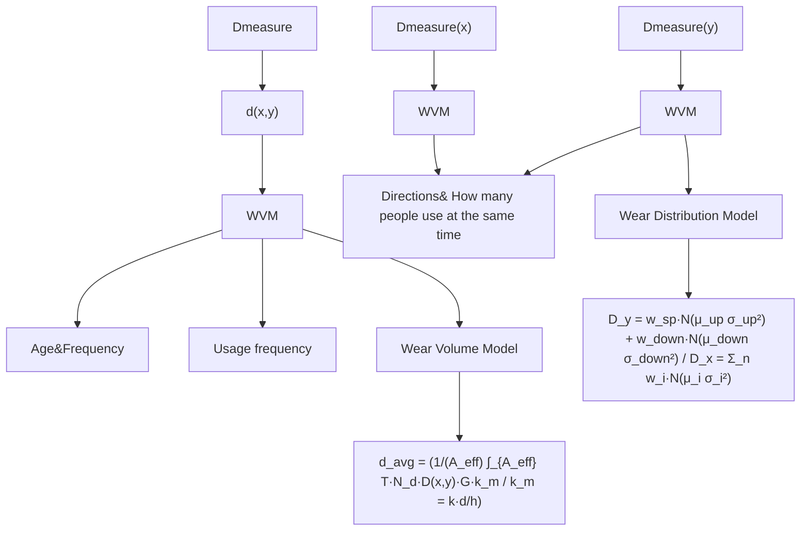

# Stair Wear: Traces of History

## Summary

Even the hardest stone steps can wear down over time under the repeated footsteps of people. Stairs record history in the unique way. To assist archaeologists in extracting more information from a set of worn stairs, we analyze measurable data and establish relevant models.

For task1: To analyze stair basic information, we established the Stair Wear Model, which is consisting of the Wear Volume Model (WVM) and the Wear Distribution Model (WDM). We rasterize the top view of the steps and combine it with wear data to create a wear measurement matrix. Based on this matrix and Archard Wear Law, we develop the WVM. We introducing and analyze parameters such as the wear coefficient, average human weight, material hardness, and stair area to calculate the stair's age and usage frequency. Additionally, we established the WDM based on the Central Limit Theorem. It calculate the marginal distribution of the wear measurement matrix and fit the wear distribution in the X and Y directions with a Gaussian Mixture Algorithm. In the Y-direction, the number and location of normal distribution indicate walking direction, while the X-direction distribution reflects the parallelism of movement.

We provided archaeologists with measurements and queries (Table 3) and detailed usage instructions (Figure 7). All the methods we propose follow the non-destruction principle. As an example, a set of ancient sandstone steps in Edinburgh is analyzed. The results demonstrate the steps were built about a century ago, typically used by three people walking side by side. Both directions were used, with an upward-to-downward ratio of 3:2 and a daily usage frequency of 261. More detailed results are presented in Table 5, Table 6 and Figure 8.

For Task 2: We address further problems with the Stair Wear Model and information available. To assess wear distribution consistency, we define a consistency parameter between wear matrices. The stairwell age is calculated from step age, with a reliability parameter to evaluate accuracy. To determine if the staircase was repaired, besides the step age method we introduce an innovative non-destructive approach based on the Brinell Scale and KL divergence for a more comprehensive consistency analysis.

Based on the consistency of material hardness, we developed a method to trace material origins. Simulations with the Stair Wear Model help evaluate material wear consistency. Monte Carlo Method reveals the relationship between the standard deviation of X-direction wear and daily stair usage. Applying these methods to the studied steps yielded an age prediction reliability above 95%. Both methods confirms no repairs in this stair, and materials matches archival records. The dispersed X-direction wear indicates heavy use over short periods.

Material hardness demonstrates a high sensitivity in our model. The model shows low sensitivity to weathering rate constant within 4 century but higher sensitivity over a 20-century scale, indicating its strong performance within a certain time frame. Robustness tests across regions further support this. We hope our work can help the archaeologists. The hard stones have their method to record the history, and we have the model to read them.

Keywords: Stair Wear, Archard Law, Central Limit Theorem, Gaussian Mixture Algorithm

## Contents

## 1 Introduction 3

1.1 Problem Background 3  
1.2 Our Work 4

## 2 Assumptions and Notations 4

2.1 Assumptions 4  
2.2 Notations 5

## 3 Stair Wear Model 6

3.1 Wear Volume Model 6

3.1.1 Rasterize The Surface of The Step 6  
3.1.2 Wear Volumn Model 7  
3.1.3 Calculation of Age and Frequency of Stone Steps 9

3.2 Wear Distribution Model 9

3.2.1 Wear Distribution in The Y-direction - Judging The Direction ..... 9  
3.2.2 Wear Distribution in The X-direction - Calculating The Number of Parallels 11  
3.2.3 Wear Distribution Model 12

3.3 Stair Wear Model 12

3.3.1 Parameters to Be Measured 12  
3.3.2 Overview of Stair Wear Model 13

3.4 Solution of the Stair Wear Model 14

## 4 Further Problems 16

4.1 Consistency of Wear Results 16  
4.2 The Age of The Stairwell and Reliability ..... 16  
4.3 Repairs or Renovations 17  
4.4 The Source of The Material ..... 19  
4.5 People Use The Stair on A Typical Day 20

## 5 Sensitivity and Robustness Analysis 22

5.1 Impact of Material Hardness on Wear Volume 22  
5.2 Impact of Weathering Rate Constant on Wear Volume 23  
5.3 Impact of Reigon on Wear Volume 23

## 6 Strength and Weakness 24

6.1 Strength 24  
6.2 Weakness 24

## 7 Conclusion 24

## References 25

## 1 Introduction

## 1.1 Problem Background

As a symbol of permanence, stone is often used for building components. Despite its durability, the stone is not impervious. As people walk up and down over time, steps are molded into different shapes that tell stories of the past, waiting to be explored.

The wear on stairs reflects the behavioral patterns of people in the past. Long-term behavior of people is likely to have subjected the steps to uneven wear, leaving the treads with curved tops. For example, in ancient temple staircases, the centers of the steps are more worn than the edges. Archaeologists are interested in the age, the traffic patterns, and the frequency of use of stairs. But the presence of people and the temporal variability in the construction of the staircase, and the renovation of the staircase have obscured some of this information.


<details>
<summary>natural_image</summary>

Interior of an old, dilapidated room with weathered stone stairs and a window on the left (no text or symbols visible)
</details>

Figure 1: Worn stone steps

To assist the archaeologists, the team was asked to build relevant mathematical models for the following tasks:

Task1: Given a set of stairs, develop a mathematical model that considers the wear patterns of a particular staircase. Provide some basic predictions:

- Discuss the frequency of use of this staircase.  
• Explore the direction of travel favored by the people using the stairs.  
• Study how many people use the stairs at the same time.

When archaeologists are skeptical about a staircase, field measurements can be made. A non-destructive surveying program, which requires minimum cost, fewer people, and the fewest tools can be taken.

Task2: Further problem solving. By using the available estimates, determine what guidance can be provided for the following questions:

- The consistency of wear with available information.  
- The age of the stairwell and the reliability of the estimate.  
- The repairs or renovations have been made to the stairwell.  
- Determine the provenance of materials and compare them with the speculations of archaeologists.  
- Analyses the use of the stairwell on a typical day.

## 1.2 Our Work

According to the requirements, our work is as follow.


<details>
<summary>flowchart</summary>

```mermaid
graph TD
  A["Stair Wear Model (SWM)"] --> B["Wear Volume Model (WVM)"]
  B --> C["Archard Wear Theory"]
  B --> D["Gravity Assessment Model"]
  B --> E["Direction"]
  B --> F["Num of parallels"]
  B --> G["WDM-axisY"]
  B --> H["WDM-axisX"]
  B --> I["Wear Distribution Model (WDM)"]
  J["Further Problems"] --> K["Consistency Formula"]
  K --> L["PA = D^available(x,y) ∑x log(d^input(x,y)/d(x,y))"]
  K --> M["Reliability CI Formula"]
  M --> N["Clnf = [1 + RC + 1/(RA + F1 - α/2(2RA, 2(RC+1)))^-1"]]
  M --> O["Step Age Method"]
  O --> P["Improved Non-destructive Method"]
  O --> Q["Material decay formula H(t) = H0 * e^(-(0.0015T + 0.02RH)t)"]
  O --> R["Simulation and fitting"]
  R --> S["How People Use the Stairs on a Typical Day"]
    
  T["A solution for an Edinburgh staircase wear-and-tear case"] --> U["Sensitivity Analysis"]
  U --> V["Strengths and Weaknesses"]
  V --> W["Conclusion"]
    
  X["D measure"] --> Y["WDM-axisY"]
  X --> Z["WDM-axisX"]
  X --> AA["WDMDistributionModel (WDM)"]
    
    style A fill:#f9f,stroke:#333
    style J fill:#ccf,stroke:#333
```
</details>

Figure 2: The flowchart of our work

## 2 Assumptions and Notations

## 2.1 Assumptions

To simplify the problem and make it convenient for us to simulate real-life conditions, we make the following basic assumptions, each of which is properly justified.

\- Assumption 1: All people walk on the stairs with single-step strategy. the same set of steps in the same time subject to the same step.

Justification: Single-step(SS) and double-step(DS) are two stepping strategies people prefer when walking on stairway steps[1]. We choose the former strategy to ensure that all steps in a group are trampled equally.

\- Assumption 2: Natural wear and other forms of erosion affect all surfaces of the same set of steps equally.

Justification: The same set of steps is typically exposed to identical environmental conditions and is often constructed from the same materials. Since environmental factors are spatially uniform, it can be assumed that they exert the same effects on all surfaces of the steps.

\- Assumption 3: Maintenance and renovation methods involve either completely replacing the stairs with another material or filling them with the same material to restore their original shape.

Justification: These stairs primarily bear the wear load from people climbing upwards. It is essential to ensure that the repaired stairs possess sufficient wear resistance and load-bearing capacity to meet usage requirements. Therefore, replacing the entire material or meticulously filling with the same material ensures the structural integrity and durability of the stairs post-maintenance.

\- Assumption 4: The force exerted by the shoe surface and the stair surface when climbing is uniformly directed downward.

Justification: The shoe surface and the stair surface can be approximated as rigid bodies. In real environments, there are certainly frictional forces (for anti-slip or propulsion) and instantaneous mechanical changes caused by foot movements. However, for simplified analysis focusing solely on the overall load-bearing and wear amounts, smaller horizontal component forces or uneven distributions can be temporarily neglected. This results in an idealized "uniform vertical pressure model."

## 2.2 Notations

Table 1: Notations Table

<table><tr><td>Notations</td><td>Definition</td></tr><tr><td> $d(x,y)$ </td><td>The wear depth of the grid (x, y) on the step</td></tr><tr><td> $D^{measure}$ </td><td>Wear measurement(x,y) matrix</td></tr><tr><td>T</td><td>The construction duration of the stair</td></tr><tr><td> $N_{d}$ </td><td>Usage frequency of the step</td></tr><tr><td>G</td><td>The average gravitational force experienced by walking people</td></tr><tr><td> $k_{m}$ </td><td>The amount of wear caused by unit force on the stone step</td></tr><tr><td> $D(x,y)$ </td><td>The foot traffic rate contributing to wear at point (x, y) on the stone step</td></tr><tr><td> $k_{m}$ </td><td>The wear coefficient of the material</td></tr><tr><td>d</td><td>The sliding distance of contact on the tread surface of the step</td></tr><tr><td> $H_{0}$ </td><td>The initial material hardness</td></tr><tr><td> $D_{X}$ </td><td>The marginal function of  $D(x,y)$  alone the x</td></tr><tr><td> $D_{Y}$ </td><td>The marginal function of  $D(x,y)$  alone the y</td></tr><tr><td> $RS(d_{1},d_{2})$ </td><td>The correlation between two stone steps  $d_{1},d_{2}$ </td></tr><tr><td>PA</td><td>The correlation between the two matrices</td></tr><tr><td>CI</td><td>The reliability of the age of the step</td></tr></table>

## 3 Stair Wear Model

Besides the wear information we are focusing on, for a step, the angle and the area of the steps are easy to get. The smaller the angle, the gentler the steps, making walking less strenuous. If the terrain in this area is relatively high, it might indicate that people have difficulty moving around.

According to assumptions 1 and 2, people all use the single-step strategy (SS) to walk on the stairs. The rest of the factors have the same effect on the given set of steps. Therefore, in the absence of repairs, the condition of a single stone step gives a good picture of the age of a given set of steps, the traffic patterns of the people, and the daily patterns of life. To acquire this interest information to archaeologists, we model the Wear Volume Model and the Wear Distribution Model. Besides, we present the data that need to be measured. Finally, a set of ancient sandstone steps in Edinburgh is used as an example for solving the problems.

## 3.1 Wear Volume Model

## 3.1.1 Rasterize The Surface of The Step

In order to represent the actual physical steps by using a mathematical model for easy computer processing, we rasterize the steps. As shown in Figure 3, we take the top view of a step to obtain a rectangle with length X m and width Y m, which is discretized and divided into $m \times n$ rasters.


<details>
<summary>text_image</summary>

数码乐园
y
COP
Y
O
X x
</details>

Figure 3: Rasterized diagram of the stair surface

The COP[2] is defined as the center of each grid.

$$
x = \left\lfloor \frac {p}{G _ {s}} \right\rfloor , \quad y = \left\lfloor \frac {q}{G _ {s}} \right\rfloor \tag {3.1}
$$

p denotes the distance from this COP to the leftmost side of the step, q denotes the distance from this COR to the bottom edge of the step, and $G_{s}$ is the size of the grid. $d(x,y)$ is defined as the amount of wear at grid COP(x,y). The archaeologist measures the wear volume of the


<details>
<summary>natural_image</summary>

Completely black image with no visible content, text, or symbols.
</details>

Moreover, another form of relationship between hardness and age can be provided:

$$
H T = \int_ {t} H (t) \tag {3.5}
$$

Based on the site survey, an information review is needed to obtain $K$ , $H_0$ and $p$ .

## • Gravity Assessment Model (G)

The same step may be used by people of different ages and genders with different weight characteristics. We categorize the population into six groups: male minors (mm), female minors (fm), adult males (am), adult females (af), older men (om), older women (ow). To make the results more precise, we use their weight expectation as W in the model, which is calculated as follows:

$$
W = \sum_ {i} u _ {i} \cdot q _ {i} \tag {3.6}
$$

where $u_{i}$ describes the average weight of each population, $q_{i}$ indicates the proportion of each population to the total population.

If they do not have this information, based on the global weight data provided by the World Health Organization (WHO)[6][7], we provide the reference data as shown in Table 2.

Table 2: Global Average Weight and Population Proportion by Age and Gender Group

<table><tr><td>Population Group</td><td>Average Weight (kg)</td><td>Proportion (%)</td></tr><tr><td>Male Minors (mm)</td><td>40</td><td>10</td></tr><tr><td>Female Minors (fm)</td><td>38</td><td>10</td></tr><tr><td>Adult Males (am)</td><td>75</td><td>30</td></tr><tr><td>Adult Females (af)</td><td>65</td><td>30</td></tr><tr><td>Older Men (om)</td><td>70</td><td>10</td></tr><tr><td>Older Women (ow)</td><td>60</td><td>10</td></tr></table>

The overall average weight of the population is $W = 62.8 \, kg$ . This average is typically calculated as a weighted sum of the proportions $q_{i}$ and the average weights $u_{i}$ of each subgroup. To obtain a more precise estimate, archaeologists or researchers can adjust the subgroup proportions $q_{i}$ or their average weights $u_{i}$ to better reflect more localized or up-to-date demographic data. This can make the calculation results more accurate and increase the flexibility of the model.

This adjustment allows for a more accurate estimation of the gravitational force $G$ . The gravitational force is calculated using the following formula:

$$
G = W \cdot g \tag {3.7}
$$

where $g = 9.81 \, \mathrm{m/s^2}$ [9] is the acceleration due to gravity.

Integrating Equation 3.2, we obtain the expression for the average wear $d_{avg}$ as

$$
d _ {a v g} = \frac {1}{A _ {c e f f}} \int_ {A _ {c e f f}} T \cdot N _ {d} \cdot D (x, y) \cdot G \cdot k _ {m} d x d y \tag {3.8}
$$

in this equation, $A_{ceff}$ denotes the area of the steps overlook.

## 3.1.3 Calculation of Age and Frequency of Stone Steps

According to the analysis above, When D, G, and $k_{m}$ are determined, the age of stone step T and frequency of use $N_{d}$ can be solved for each other. The specific formulas are shown below:

$$
T = \frac {A _ {\text { ceff }} \cdot d _ {\text { avg }}}{N _ {d} \cdot G \cdot k _ {m}} \tag {3.9}
$$

$$
N _ {d} = \frac {A _ {\text { c   e   f   f }} \cdot d _ {\text { a   v   g }}}{T \cdot G \cdot k _ {m}} \tag {3.10}
$$

At this point, the age of the stone step T and frequency of use $N_{d}$ can be sought.

## 3.2 Wear Distribution Model

Each step on the steps can be regarded as obeying independently and identically distributed. Research shows a linear relationship between the number of steps and the amount of wear, and only when the cumulative number of steps reaches a large size, significant wear on the surface of the step stone can be produced. According to the Central Limit Theorem, when the number of independent random samples is large enough, even if the original distribution is not normal, the distribution of the sample mean and sum will converge to the normal distribution. Therefore, when the sample size is large, the cumulative distribution of steps tends to be normal, and the cumulative wear will also be normal.

Since there is no significant correlation between the lateral and longitudinal positions of the footsteps on the stone stairs, the cumulative wear of pedestrians at each position in both the x- and y-directions can be described as a superposition of normal or multi-normal distributions when the number of steps is sufficiently high. And the distributions reflect the traffic patterns of people on that set of stairs.

## 3.2.1 Wear Distribution in The Y-direction - Judging The Direction

Studies of the gait cycle show that during stair ascent, the first peak appears in the heel, while during stair descent, the first peak is in the forefoot. This is shown in Figure 4. In addition, observing people's daily stair movement behavior, it is found that pedestrians' point of impact is closer to the lower edge of the steps when going up the stairs than when going down the stairs[3].


<details>
<summary>text_image</summary>

u_{up}
F
</details>

(a) stair ascent


<details>
<summary>text_image</summary>

u_{down}
F
</details>

(b) stair descent  
Figure 4: Force diagram of walking

With the conclusion above, we can judge whether people using the stairs favored a certain direction of travel based on the wear distribution of Y-direction.


<details>
<summary>area chart</summary>

| x value | Component 1 | Component 2 | Mixture Distribution |
| ------- | ----------- | ----------- | -------------------- |
| 0.00    | 0.00        | 0.15        | 0.00                 |
| 0.05    | 0.00        | 0.20        | 0.00                 |
| 0.10    | 0.00        | 0.25        | 0.00                 |
| 0.15    | 0.00        | 0.28        | 0.00                 |
| 0.20    | 0.00        | 0.27        | 0.05                 |
| 0.25    | 0.05        | 0.25        | 0.10                 |
| 0.30    | 0.10        | 0.22        | 0.15                 |
| 0.35    | 0.15        | 0.18        | 0.20                 |
| 0.40    | 0.20        | 0.15        | 0.22                 |
| 0.45    | 0.25        | 0.12        | 0.23                 |
| 0.50    | 0.28        | 0.10        | 0.24                 |
| 0.55    | 0.27        | 0.08        | 0.23                 |
| 0.60    | 0.25        | 0.06        | 0.22                 |
| 0.65    | 0.22        | 0.04        | 0.21                 |
| 0.70    | 0.18        | 0.02        | 0.20                 |
| 0.75    | 0.15        | 0.01        | 0.19                 |
| 0.80    | 0.12        | 0.00        | 0.18                 |
| 0.85    | 0.10        | 0.00        | 0.17                 |
| 0.90    | 0.08        | 0.00        | 0.16                 |
| 0.95    | 0.06        | 0.00        | 0.15                 |
| 1.00    | 0.04        | 0.00        | 0.14                 |
</details>

(a) Double direction - Wear Distribution


<details>
<summary>natural_image</summary>

Illustration of two people climbing stairs with arrows indicating progress (no text or symbols)
</details>

(b) Double direction


<details>
<summary>area chart</summary>

| x value | Component 1 | Component 2 | Mixture Distribution |
| ------- | ----------- | ----------- | -------------------- |
| 0.00    | 0.00        | 0.20        | 0.00                 |
| 0.05    | 0.00        | 0.25        | 0.00                 |
| 0.10    | 0.00        | 0.30        | 0.00                 |
| 0.15    | 0.00        | 0.35        | 0.00                 |
| 0.20    | 0.00        | 0.38        | 0.00                 |
| 0.25    | 0.00        | 0.36        | 0.00                 |
| 0.30    | 0.00        | 0.32        | 0.00                 |
| 0.35    | 0.05        | 0.28        | 0.05                 |
| 0.40    | 0.10        | 0.22        | 0.10                 |
| 0.45    | 0.15        | 0.18        | 0.15                 |
| 0.50    | 0.18        | 0.15        | 0.20                 |
| 0.55    | 0.16        | 0.12        | 0.25                 |
| 0.60    | 0.14        | 0.10        | 0.30                 |
| 0.65    | 0.12        | 0.08        | 0.35                 |
| 0.70    | 0.10        | 0.06        | 0.40                 |
| 0.75    | 0.08        | 0.04        | 0.45                 |
| 0.80    | 0.06        | 0.02        | 0.50                 |
| 0.85    | 0.04        | 0.01        | 0.55                 |
| 0.90    | 0.02        | 0.00        | 0.60                 |
| 0.95    | 0.01        | 0.00        | 0.65                 |
| 1.00    | 0.00        | 0.00        | 0.70                 |
</details>

(c) Upward Direction - Wear Distribution


<details>
<summary>natural_image</summary>

Illustration of a person walking up stairs with an upward arrow, symbolizing progress or progress (no text or symbols present)
</details>

(d) Upward Direction  
Figure 5: Distribution of wear in the Y-direction and the corresponding people

As shown in Figure 5(a), there are two peaks, which means that the marginal distribution in the y-direction is a superposition of two normal distributions. This indicates that stairs were usually used in both directions. The number of people traveling up and down the stairs can be compared based on the size of the peaks. Similarly, one peak in Figure 5(c) demonstrates that people using the stairs favored a certain direction of travel. If the y-value at the peak is small, people favored upward travel. If it is larger, downward travel was favored.

We further quantify the results so that archaeologists can determine the direction and the proportion of up-and-down people more intuitively. Using knowledge of probability statistics, we construct the distribution of wear in the Y-direction:

$$
D _ {y} \sim w _ {u p} \cdot N _ {i} (\boldsymbol {\mu} _ {u p}, \boldsymbol {\sigma} _ {u p}) + w _ {d o w n} \cdot N _ {i} (\boldsymbol {\mu} _ {d o w n}, \boldsymbol {\sigma} _ {d o w n}) \tag {3.11}
$$

$w_{up}$ denotes the ratio of people going up to the total number of people, while $w_{down}$ denotes the ratio of people going down to the total number of people. $\mu_{up}$ is the distance between the center of the stepping surface of the person going up and the outermost part of the stone step, and $\mu_{down}$ is the distance between the center of the stepping surface of the person going down and the outermost part of the stone step. $\sigma_{up}$ describes the degree of longitudinal dispersion of people going upstairs, and $\sigma_{down}$ describes the degree of vertical dispersion downstairs.

## 3.2.2 Wear Distribution in The X-direction - Calculating The Number of Parallels

When people walk on the stairs in a single-step strategy, the peaks of the normal distribution in the X-direction of the steps describe the main concentration area of pedestrians. And the number of peaks reflects the lateral distribution characteristics of pedestrians on the road. We describe the wear distribution in this direction as:

$$
D _ {x} \sim w _ {i} \sum_ {i} N _ {i} (\sigma_ {i}, \mu_ {i}) \tag {3.12}
$$

n represents the number of parallel lanes on the same step of the stone staircase, $w_{i}$ is the ratio of the number of people in the lane i to the total number of people, $\mu_{i}$ denotes the distance of the center of the lane i from the leftmost end of the stone staircase, and $\sigma_{i}$ indicates the degree of lateral dispersion of lane i.


<details>
<summary>area chart</summary>

| x value | Component 1 | Component 2 | Component 3 | Mixture Distribution |
| ------- | ----------- | ----------- | ----------- | ------------------- |
| 0.05    | 0.0         | 0.0         | 0.0         | 0.0                 |
| 0.1     | 0.0         | 0.0         | 0.0         | 0.0                 |
| 0.15    | 0.0         | 0.0         | 0.0         | 0.0                 |
| 0.2     | 0.0         | 0.0         | 0.0         | 0.0                 |
| 0.25    | 0.0         | 0.0         | 0.0         | 0.0                 |
| 0.3     | 0.1         | 0.0         | 0.0         | 0.1                 |
| 0.35    | 0.2         | 0.0         | 0.0         | 0.2                 |
| 0.4     | 0.3         | 0.0         | 0.0         | 0.3                 |
| 0.45    | 0.4         | 0.0         | 0.0         | 0.4                 |
| 0.5     | 0.4         | 0.0         | 0.0         | 0.4                 |
| 0.55    | 0.3         | 0.0         | 0.0         | 0.3                 |
| 0.6     | 0.2         | 0.0         | 0.0         | 0.2                 |
| 0.65    | 0.1         | 0.0         | 0.0         | 0.1                 |
| 0.7     | 0.0         | 0.0         | 0.0         | 0.0                 |
| 0.75    | 0.0         | 0.0         | 0.0         | 0.0                 |
| 0.8     | 0.0         | 0.0         | 0.0         | 0.0                 |
| 0.85    | 0.0         | 0.0         | 0.0         | 0.0                 |
| 0.9     | 0.0         | 0.0         | 0.0         | 0.0                 |
| 0.95    | 0.0         | 0.0         | 0.0         | 0.0                 |
| 1       | 0.0         | 0.0         | 0.0         | 0.0                 |
</details>

(a) Travel single - Wear distribution


<details>
<summary>natural_image</summary>

Illustration of a person walking up stairs with an upward arrow, symbolizing progress or effort (no text or symbols present)
</details>

(b) Travel single


<details>
<summary>area chart</summary>

| x value | Component 1 | Component 2 | Component 3 | Mixture Distribution |
| ------- | ----------- | ----------- | ----------- | --------------------- |
| 0.00    | 0.0         | 0.0         | 0.0         | 0.0                   |
| 0.05    | 0.0         | 0.2         | 0.0         | 0.0                   |
| 0.10    | 0.0         | 0.3         | 0.0         | 0.0                   |
| 0.15    | 0.0         | 0.4         | 0.0         | 0.0                   |
| 0.20    | 0.0         | 0.3         | 0.0         | 0.0                   |
| 0.25    | 0.0         | 0.2         | 0.0         | 0.0                   |
| 0.30    | 0.0         | 0.1         | 0.0         | 0.0                   |
| 0.35    | 0.0         | 0.0         | 0.0         | 0.0                   |
| 0.40    | 0.0         | 0.1         | 0.1         | 0.1                   |
| 0.45    | 0.1         | 0.2         | 0.2         | 0.2                   |
| 0.50    | 0.2         | 0.3         | 0.3         | 0.3                   |
| 0.55    | 0.3         | 0.4         | 0.4         | 0.4                   |
| 0.60    | 0.4         | 0.3         | 0.3         | 0.3                   |
| 0.65    | 0.3         | 0.2         | 0.2         | 0.2                   |
| 0.70    | 0.2         | 0.1         | 0.1         | 0.1                   |
| 0.75    | 0.1         | 0.0         | 0.0         | 0.0                   |
| 0.80    | 0.0         | 0.1         | 0.1         | 0.1                   |
| 0.85    | 0.1         | 0.2         | 0.2         | 0.2                   |
| 0.90    | 0.2         | 0.3         | 0.3         | 0.3                   |
| 0.95    | 0.3         | 0.4         | 0.4         | 0.4                   |
| 1.00    | 0.4         | 0.3         | 0.3         | 0.3                   |
</details>

(c) Side by side - Wear distribution


<details>
<summary>natural_image</summary>

Illustration of two people walking up stairs with arrows indicating progress (no text or symbols)
</details>

(d) Side by side  
Figure 6: Distribution of wear in the X-direction and the corresponding number of people

The distribution describes how many people used the stairs simultaneously. The number of peaks is the number of people in parallel. In Figure 6, we give some possible results for archaeologists as a reference:

1. When $i = 1$ , there is only one peak in the x-direction. It can be concluded that people using this stair preferred traveling single files.  
2. When there are two peaks in the X-direction(i = 2), pairs of people climb the stairs side-by-side.

## 3.2.3 Wear Distribution Model

Since the lateral position of a footstep on a stone step is not significantly correlated with its longitudinal position, we consider the covariance matrix of the wear distribution to be a diagonal array. For a stone step, we model the wear distribution as follows:

$$
D (x, y) = D _ {X} \cdot D _ {Y} \tag {3.13}
$$

We compute the actual wear matrix $D^{measure}(x,y)$ obtained from the archaeologist's measurements. Then, we can get its marginal distribution function:

$$
D _ {X} ^ {\text { measure }} (x) = \sum_ {y} D ^ {\text { measure }} (x, y) \tag {3.14}
$$

$$
D _ {Y} ^ {\text { measure }} (y) = \sum_ {x} D ^ {\text { measure }} (x, y) \tag {3.15}
$$

With these two edge functions, we can fit $D_{x}$ and $D_{y}$ , which will help archaeologists obtain relevant information, such as people's traffic patterns.

## 3.3 Stair Wear Model

## 3.3.1 Parameters to Be Measured

Archaeologists are needed to carry out non-destructive measurements and access information to obtain accurate information and implement the model's solution. We provide the necessary parameters and suggest some measurement methods. It is shown in Table 3:

Table 3: Parameter need to be measured

<table><tr><td colspan="2">Parameters</td><td>Methods</td></tr><tr><td colspan="2">Wear measurement matrix  $D^{measure}$ </td><td>3D scanning and photogrammetry</td></tr><tr><td rowspan="3">Dimensions of the steps</td><td>Length X</td><td rowspan="3">Ruler with higher accuracy</td></tr><tr><td>Width Y</td></tr><tr><td>Height Z</td></tr><tr><td rowspan="2">Step material</td><td>Material hardness H</td><td rowspan="2">Literature search</td></tr><tr><td>Wear coefficient K</td></tr></table>

We consider all the methods that require minimum cost, fewer people, and the fewest tools.

## 3.3.2 Overview of Stair Wear Model

Based on the analysis above, the Stair Wear Model is concluded as below:

Wear Volume Model(WVM):

$$
d _ {a v g} = \frac {1}{A _ {c e f f}} \int_ {A _ {c e f f}} T \cdot N _ {d} \cdot D (x, y) \cdot G \cdot k _ {m} d x d y
$$

$$
G = \sum_ {i} u _ {i} \cdot p _ {i}
$$

$$
k _ {m} = K \cdot \frac {d}{H} \tag {3.16}
$$

$$
H (t) = H _ {0} e ^ {- p t}
$$

$$
H T = \int_ {t} H (t)
$$

Wear Distribution Model(WDM):

$$
D (x, y) = D _ {X} \cdot D _ {Y}
$$

$$
D _ {x} \sim w _ {i} \sum_ {i} N _ {i} (\sigma_ {i}, \mu_ {i})
$$

$$
D _ {y} \sim w _ {u p} \cdot N _ {i} (\mu_ {u p}, \sigma_ {u p}) + w _ {d o w n} \cdot N _ {i} (\mu_ {d o w n}, \sigma_ {d o w n}) \tag {3.17}
$$

$$
D _ {X} ^ {\text { measure }} (x) = \sum_ {y} D ^ {\text { measure }} (x, y)
$$

$$
D _ {Y} ^ {\text { measure }} (y) = \sum_ {x} D ^ {\text { measure }} (x, y)
$$

All parameters have been explained above. In order to show our model more clearly and to make it easier for archaeologists to understand it, we give the flow chart for use in Figure 7:


<details>
<summary>flowchart</summary>


</details>

Figure 7: Flowchart for use by archaeological experts

## 3.4 Solution of the Stair Wear Model

In this section, we selected a set of ancient Edinburgh sandstone steps with a rectangular top-view surface. The rectangle is 2 meters long and 0.4 meter wide. Based on the 3D reconstruction of the image, we obtained the measurement matrix. Moreover, based on the information query, we obtained the rest of the required parameters as follows:

Table 4: Key Parameters

<table><tr><td>Parameter</td><td>Value</td><td>Unit</td></tr><tr><td>G</td><td>700</td><td>N</td></tr><tr><td>K</td><td> $1.8 \times 10^{-7}$ </td><td>(dimensionless)</td></tr><tr><td>d</td><td>0.8</td><td>mm</td></tr><tr><td>H</td><td>95</td><td>N/mm2</td></tr></table>

To solve the Wear Distribution Model, we design a Gauss Mixtual Algorithm. It can be used to respectively solve for normally distributed cumulants in the X and Y directions by wear measurement matrix $D^{measure}$ . The exact flow of the algorithm is as follows

## Gauss Mixtual Algorithm

Input: Wear measurement matrix $D^{\text{measure}}$

Output: $P(D_{X} \mid \theta_{k}^{epoch})$ and $P(D_{Y} \mid \theta^{epoch})$

$$
k = 0, \varepsilon = 1 e - 3
$$

while loss > ε

for $t$ in range(epoch)

$$
\theta^ {t + 1} = \theta^ {t} - \partial P (D _ {X} \mid \theta^ {t}) / \partial \theta^ {t}, \text {   where   } \theta = [ m _ {i}, \mu_ {i}, \sigma_ {i} ]
$$

$$
P (D _ {X} \mid \theta^ {t + 1}) = \sum_ {i = 1} ^ {k} m _ {i} ^ {t + 1} \cdot N (\mu_ {i} ^ {t + 1}, \sigma_ {i} ^ {t + 1})
$$

$$
l o s s = \left\| P (D _ {X} \mid \theta_ {k} ^ {e p o c h}) - D _ {X} \right\|
$$

$$
k = 2
$$

for $t$ in range(epoch)

$$
\theta^ {t + 1} = \theta^ {t} - \partial P (D _ {Y} \mid \theta^ {t}) / \partial \theta^ {t}
$$

$$
P (D _ {Y} \mid \theta^ {t + 1}) = m _ {u p} ^ {t + 1} \cdot N (\mu_ {u} p ^ {t + 1}, \sigma_ {u} p ^ {t + 1}) + m _ {d o w n} ^ {t + 1} \cdot N (\mu_ {d} o w n ^ {t + 1}, \sigma_ {d} o w n ^ {t + 1})
$$

end

Bringing $D^{measure}$ of the Edinburgh sandstone step into the Gauss Mixtual Algorithm, we obtain the following normal distribution parameters. The parameters for the X and Y directions are placed in Table 5 and Table 6 respectively.

Table 5: Normal distribution parameters in X direction

<table><tr><td>i</td><td>1</td><td>2</td><td>3</td></tr><tr><td>wi</td><td>0.31</td><td>0.39</td><td>0.3</td></tr><tr><td>μi</td><td>0.30(m)</td><td>1.10(m)</td><td>1.76(m)</td></tr><tr><td>σi</td><td>2.1</td><td>1.8</td><td>2.0</td></tr></table>

Table 6: Normal distribution parameters in Y direction

<table><tr><td>i</td><td>down</td><td>up</td></tr><tr><td>w</td><td>0.4</td><td>0.6</td></tr><tr><td>μ</td><td>0.08(m)</td><td>0.15(m)</td></tr><tr><td>σ</td><td>1.8</td><td>2.1</td></tr></table>

From Table 5 and Table 6, we can draw the conclusions that

1. The wear distribution in the X-direction is accumulated from three normal distributions. The mean values of the three normal distributions are 0.30m, 1.10m and 1.76m. They are respectively on the left, centre and right side of the step. This reveals that three people usually walked side by side on this step. This may also show that the stair had a high flow of people.  
2. Of the three normal distributions in the x-direction, the second one has the highest probability and the smallest standard deviation. This indicates that people most often walked down the middle of the stairs.  
3. Two normal distributions form a wear distribution in the Y-direction. The stair was used in two direction. The probability ratio of the number of people in the upward and downward direction was 3:2. It means that the number of people in the upward row is greater than the number of people in the downward row.  
4. The mean of upward direction is 0.08m, while that of downward direction is 0.15m. They both close to the edge side of the step. Moreover, the mean of upward direction is closer to the edge of the step than the downward direction. This is consistent with our analysis.

To describe the results of this set of steps more intuitively, we visualize the wear distribution of the steps and present them in Figure 8.


<details>
<summary>dual-axis area chart and a line graph</summary>

| x    | y (Area) | Line Value |
|------|----------|------------|
| 0    | 0        | 0          |
| 1    | 0.5      | 0.2        |
| 2    | 1.0      | 0.4        |
| 3    | 0.8      | 0.6        |
| 4    | 0.6      | 0.7        |
| 5    | 0.4      | 0.8        |
| 6    | 0.2      | 0.9        |
| 7    | 0.1      | 1.0        |
| 8    | 0.05     | 0.95       |
| 9    | 0.02     | 0.9        |
| 10   | 0.01     | 0.8        |
| 11   | 0.005    | 0.7        |
| 12   | 0.002    | 0.6        |
| 13   | 0.001    | 0.5        |
| 14   | 0.0005   | 0.4        |
| 15   | 0.0002   | 0.3        |
| 16   | 0.0001   | 0.2        |
| 17   | 0.00005  | 0.1        |
| 18   | 0.00002  | 0.05       |
| 19   | 0.00001  | 0.02       |
| 20   | 0.000005 | 0.01       |
| 21   | 0.000002 | 0.005      |
| 22   | 0.000001 | 0.002      |
| 23   | 0.0000005| 0.001     |
| 24   | 0.0000002| 0.0005    |
| 25   | 0.0000001| 0.0002    |
| 26   | 0.00000005| 0.0001   |
| 27   | 0.00000002| 0.0         |
| 28   | 0.0           |            |
| 29   |            |            |
| 30   |            |            |
| 31   |            |            |
| 32   |            |            |
| 33   |            |            |
| 34   |            |            |
| 35   |            |            |
| 36   |            |            |
| 37   |            |            |
| 38   |            |            |
| 39   |            |            |
| 40   |            |            |
| 41   |            |            |
| 42   |            |            |
| 43   |            |            |
| 44   |            |            |
| 45   |            |            |
| 46   |            |            |
| 47   |            |            |
| 48   |            |            |
| 49   |            |            |
| 50   |            |            |
| 51   |            |            |
| 52   |            |            |
| 53   |            |            |
| 54   |            |            |
| 55   |            |            |
| 56   |            |            |
| 57   |            |            |
| 58   |            |            |
| 59   |            |            |
| 60   |            |            |
| 61   |            |            |
| 62   |            |            |
| 63   |            |            |
| 64   |            |            |
| 65   |            |            |
| 66   |            |            |
| 67   |            |            |
| 68   |            |            |
| 69   |            |            |
| 70   |            |            |
| 71   |            |            |
| 72   |            |            |
| 73   |            |            |
| 74   |            |            |
| 75   |            |            |
| 76   |            |            |
| 77   |            |            |
| 78   |            |            |
| 79   |            |            |
| 80   |            |            |
| 81   |            |            |
| 82   |            |            |
| 83   |            |            |
| 84   |            |            |
| 85   |            |            |
| 86   |            |            |
| 87   |            |            |
| 88   |            |            |
| 89   |            |            |
| 90   |            |            |
| 91   |            |            |
| 92   |            |            |
| 93   |            |            |
| 94   |            |            |
| 95   |            |            |
| 96   |            |            |
| 97   |            |            |
| 98   |            |            |
| 99   |            |            |
| Note: The actual values for y and Y(y) are not provided in the code, so they are estimated from the visual representation of the area chart.
</details>

Figure 8: Visualization of step wear distribution

This graph gives the same conclusions. It visually presents three peaks in the X-direction, indicating that people usually walked side-by-side on it. There are two peaks in the Y-direction.

The peak corresponding to the downward direction is smaller than that of the upward direction. This suggests that the staircase was used in a double direction.

After obtaining the wear distribution, combined with the parameters in Table 4, the gradient age and frequency of use can be solved for each other. For this set of ancient Edinburgh sandstone steps, it is determined that this set of steps was constructed in a century ago. according to Equation 3.16, we can have that

$$
N _ {d} = \frac {A _ {\text { c   e   f   f }} \cdot d _ {\text { a   v   g }}}{T \cdot G \cdot k _ {m}} = 2 6 1 \tag {3.18}
$$

This means that 261 people walked on it every day in the past. On the contrary, when we consider that 260 people walked on it per day, the steps were constructed 36492 days ago.

## 4 Further Problems

In this section, we propose solutions and computational models for the further problems.

## 4.1 Consistency of Wear Results

According to the available information, we can get a more accurate wear distribution matrix $D^{available}$ . To judge whether the wear is consistent with the information available is to judge the consistency of $D^{available}$ and $D^{measure}$ . We define the following consistency formula:

$$
P A = D ^ {\text { available }} (x, y) \sum_ {x} \sum_ {y} \log \left(\frac {d ^ {\text { ava }} (x , y)}{d (x , y)}\right) \tag {4.1}
$$

$d^{ava}(x,y)$ is the amount wear depth of the stone step on the grid where each COP is located. and $d(x,y)$ is that of the actual measured. PA is a number greater or less than 0. The greater the absolute value PA, the weaker the correlation between the two matrices.

## 4.2 The Age of The Stairwell and Reliability

In Section 3, we give the method of estimating the age of each step. For a given stair, we measure the ages of all steps and find them different. When the difference is slight, it is mainly because the model has errors. However, when the difference is significant, it is due to refurbishment or repairs that cause the individual steps to age differently. In a stairwell, if the age of a step is $5\%$ less than the age of the largest step $T_{lar}$ , it is removed. The average age of the remaining steps as the age of the stairwell $T_{set}$ . It can be expressed as

$$
T _ {s e t} = \overline {{T _ {i}}}, \quad \frac {T _ {i}}{T _ {l a r}} > 0. 9 5 \tag {4.2}
$$

There are N steps in tatal. $T_{i}$ is the age of step i, $i = 1, 2, \cdots, N$ .

Age reliability is necessary to be assessed. We estimate the ages of n ancient stone stairs in total. If the error between the result and the real age is within 5%, RA is accepted and included, otherwise RC is included. The age reliability CI is defined as:

$$
C I _ {i n f} = \left[ 1 + \frac {R C + 1}{R A \cdot F _ {1 - \alpha / 2} (2 R A , 2 (R C + 1))} \right] ^ {- 1} \tag {4.3}
$$

$$
C I _ {s u p} = \left[ 1 + \frac {R C}{(R A + 1) \cdot F _ {1 - \alpha / 2} (2 (R A + 1) , 2 (R C))} \right] ^ {- 1} \tag {4.4}
$$

where $\alpha = 0.05$ .

We studied 6 Edinburgh sandstone steps living more than one century and calculated that 5 of which have an error within $5\%$ , which means we can say the age reliability is between 0.359 and 0.996

## 4.3 Repairs or Renovations

Two methods are proposed to find out which steps have been repaired or refurbished.

## Method 1: Step Age Method

Brief Introduction: Measure the age of each step by the Stair Wear Model and compare them.

According to Assumption 4, each step is trampled at the same frequency. Therefore, in the absence of repairs or renovations, the age of all the steps should vary slightly. The correlation degree RSA between step i and the whole is defined as:

$$
R S A = \min _ {i} \frac {T _ {i}}{T _ {s e t}} \tag {4.5}
$$

$T_{i}$ is the age of step i, and $T_{set}$ is the age of the stair. This coefficient is typically a value between 0 and 1, where higher values indicate greater correlation. When $RSA_{k}$ is smaller than 0.95, it indicates that the kth step has been repaired or renovated. The time of repairs or renovations $T_{re}$ can also be determined by

$$
T _ {r e} = T _ {n} - T _ {k} \tag {4.6}
$$

$T_{n}$ is the year in which the archaeologists began their measurements. Since there may be errors in the calculation of age, we also provide an alternative method.

## Method 2: Improved Non-destructive Measurement based on Brinell Scale and KL scatter

Brief Introduction: Combined with the Brinell scale theory and KL scatter, calculate hardness of each step material by using the existing wear matrix. Compare its consistency to determine which step has been repaired and give the time calculation formula.

Brinell scale is a scale that measures the hardness of a material and is one of the properties of the material. Brinell scale measurement is a way of measuring the hardness of materials. A typical test uses a hardened steel ball with a diameter of $D_{p}$ mm as an indenter. A force of $F$ is applied to the indenter and held for a certain amount of time. Then the diameter of the indentation caused by the indenter on the surface of the material is measured. The hardness $H_{B}$ is calculated as follows:

$$
H _ {B} = 0. 1 0 2 \cdot \frac {2 F}{\pi D _ {p} \left(D _ {p} - \sqrt {D _ {p} ^ {2} - d _ {p} ^ {2}}\right)} \tag {4.7}
$$

where $d_{p} =$ diameter of indentation (mm).

Due to the absence of repairs or renovations, people exert the same continuous pressure on each step of a stair over time. We take the average gravity G as F, the average wear depth $\overline{d}$ of the step as the indenter diameter $D_{p}$ , and the square root of the area $\sqrt{A_{ceff}}$ of a step as the indentation diameter $d_{p}$ . At this time, the hardness $H_{test}$ is calculated as follows:

$$
H _ {t e s t} = 0. 1 0 2 \cdot \frac {2 G}{\pi \overline {{d}} \left(\overline {{d}} - \sqrt {\overline {{d}} ^ {2} - A _ {c e f f}}\right)} \tag {4.8}
$$

When the $H_{test}$ of each step has a large difference, the step with the larger $H_{test}$ has been repaired. We use the variance $\sigma_{H}$ to discribe the dispersion of $H_{test}$ .

Even if the Brinell scale is similar and the materials are consistent, it is possible that it has been repaired. Referring to the KL scatter, we propose a definition of the correlation between two stone steps:

$$
R S (d _ {1}, d _ {2}) = D _ {1} (x, y) \sum_ {x} \sum_ {y} \log \left(\frac {d _ {1} (x , y)}{d _ {2} (x , y)}\right) \tag {4.9}
$$

$RS(d_{1},d_{2})$ is the correlation between the worn volumes of the two stone steps, $D_{1}$ represents the wear distribution of the comparative stone steps, $d_{1}(x,y)$ denotes the average wear depth of the corresponding raster of the comparative stone steps, and $d_{2}(x,y)$ denotes that of the compared stone steps. The similarity threshold is set as $\varepsilon=0.05$ . When $|RS(d_{1},d_{2})|>\varepsilon$ , it is considered that the comparative stone step has been repaired.

Combining $H_{test}$ and $RA$ , we can determine which repair or renovation occurred in this stair. Moreover, the repair time can be determined as:

$$
T _ {\text { repair }} ^ {d _ {1}} = T ^ {d _ {2}} \cdot e ^ {R S (d _ {1}, d _ {2})} \tag {4.10}
$$

where $T_{\mathrm{repair}}^{d_1}$ refers is the length of time from when the stair was built to when the step was repaired, and $T^{d_2}$ denotes the time that the stone steps were built.

For the Edinburgh sandstone steps we studied, we calculated that

(1) $RSA = 0.02 < 0.05$  
(2) All the $H_{text}$ of steps are close to $89.45N / mm^2$ while $\sigma_H = 1.8$

(3) $RS = 0.03 < 0.05$

Therefore, this set of steps has not been repaired or renovated.

## 4.4 The Source of The Material

As analyzed in Section 4.3, we can determine the type of materials to a certain extent through the Brinell scale. In our model, $H_{0}$ denotes Brinell scale. Therefore, according to the Wear Volume Model (3.16), the average quantity of H over a time scale, $H_{t}$ , can be obtained, which can be expressed as:

$$
H _ {t} = \frac {N _ {d} \cdot G \cdot T \cdot K \cdot d}{d _ {\mathrm{avg}} \cdot A _ {\mathrm{ceff}}} \tag {4.11}
$$

$N_{d}$ indicates the stair use frequency, G denotes the average gravity, T indicates the stair age, K is the material wear coefficient, d is the average wear distance, $d_{avg}$ is the average measured wear depth, and $A_{ceff}$ is the area of the step.

People have studied numerous kinds of materials deeply. Here we demonstrate sevearl Brinell scale $(H_0)$ for four commonly used steps[4][5]:

Table 7: Hardness of different materials

<table><tr><td>Metasequoia</td><td>Poplar</td><td>Sandstone</td><td>Marble</td></tr><tr><td> $18N/mm^{2}$ </td><td> $24N/mm^{2}$ </td><td> $95N/mm^{2}$ </td><td> $175N/mm^{2}$ </td></tr></table>

We can refer to available data to obtain the Brinell scale $H_{0A}$ of the material we considered to be the origin, calculating its average $H_{0At}$ over time according to (3.5). Then its agreement with the model theoretical value $H_{t}$ can be obtained by:

$$
\eta = \frac {\left| H _ {t} - H _ {0 A t} \right|}{H _ {0 A t}} \cdot 100 \% \tag{4.12}
$$

If $\eta < 0.05$ , we believe that we successfully determine the origin. For instance, considering the Edinburgh steps we studied. It is said to be constructed by sandstones. According to the literature, We know that the Brinell scale $H_{0}$ of standard sandstone is $95N/mm^{2}$ . It can be calculated that $H_{t} = 90.44N/mm^{2}$ . $H_{0At} = 93.18$ . Therefore, $\eta = |H_{t} - H_{0At}|/H_{0At} = 0.030$ . We can confirm its origin.

Refering to the analysis of rock, we give the hardness attenuation formula of wood:

$$
H (t) = H _ {0} \cdot e ^ {- (0. 0 0 1 5 \cdot T + 0. 0 2 R H) \cdot t} \tag {4.13}
$$

Unlike stone, the hardness of wood is also influenced by its age when used for constructing stairs. Its age can potentially be determined from the growth rings visible on the stairs.

To determine whether the wear is consistent with materials from the quarry the archaeologist believes to be the original source. We need to perform the same simulation on the raw materials based on the available information. For instance, we set the same environment for the steps of these four materials in Figure 7. People's walking pattern is constructed by the normal distribution parameters in Figure 5 and Figure 6. Except $H_0$ , other parameters in Table 4 are introduced. Each stair is stepped 100 million times in 100 years. Figure 9 shows the intuitive wear conditions of different stone and wood for the reference of archaeological experts.


<details>
<summary>natural_image</summary>

3D surface plot with wavy topography, no visible text or symbols
</details>

(a) Metasequoia


<details>
<summary>natural_image</summary>

Abstract 3D surface plot with wavy topography and horizontal ridges, no text or symbols present
</details>

(b) Poplar


<details>
<summary>natural_image</summary>

3D rendered object with wavy surface and gradient shading, no visible text or symbols
</details>

(c) Standstone


<details>
<summary>natural_image</summary>

3D rendered object with smooth brown surface and a light blue diagonal stripe (no text or symbols)
</details>

(d) Marble  
Figure 9: Simulated wear distribution of wear of different stone and wood

As can be seen in Figure 9, after the same amount of stampede, the increase of H will lead to less wear of the step. Moreover, Figure 9(c) exhibits wear patterns similar to those in Figure 8. It provides substantial evidence to support the determination of the source of the step material.

## 4.5 People Use The Stair on A Typical Day

Based on the observation and analysis of human stair usage behavior, we possess some conclusions and gussess. When several individuals use the stairs over an extended period, they tend to walk along the center of the stairs[8]. In such cases, a normal distribution with a small variance is likely to emerge in the X-direction. On the countary, if a large number of individuals use the stairs within a short time, their footsteps become more irregular. It may result in a normal distribution with larger variances or even a multimodal normal distribution.

To further investigate, we simulated different situations. Divide one day into 1000 time steps For each time step, the probability of one person going upwards is $P_{o}$ while the probability of two people going upwards ( $1 - P_{o}$ ). $P_{o}$ reflects the number of people walking on the stairs that day. Assume that each of the following points is the main focus of a step.

We set $P_{o}=1,0.8,0.6,0.4,0.2,0$ respectively. The visualized simulation results are presented in Figure 10, and the corresponding $\sigma$ to $P_{o}$ are listed in Figure 8.

From the Figure 10 and Table 8, it can be observed that as $P_{o}$ increases, $\sigma$ decreases. This indicates that when a few of people use the stairs over a long period, their footsteps are more concentrated in the X direction. Conversely, when lots of people use the stairs in a short time, $\sigma$ increases, and the footsteps are more dispersed. This cooperates well with our expectations.


<details>
<summary>scatter plot</summary>

| Longitudinal Position (cm) | Transverse Position (cm) |
| ------------------------- | ------------------------ |
| 30                        | 7                        |
| 40                        | 12                       |
| 50                        | 10                       |
| 60                        | 9                        |
| 70                        | 8                        |
</details>

(a) $P_{o}=1$


<details>
<summary>scatter plot</summary>

| Longitudinal Position (cm) | Transverse Position (cm) | Type |
| --- | --- | --- |
| 35 | 12 | Single |
| 40 | 15 | Double |
| 50 | 8 | Single |
| ... | ... | ... |
| 95 | 12 | Double |
| 45 | 10 | Single |
| 60 | 14 | Double |
| ... | ... | ... |
| 70 | 13 | Single |
| 55 | 11 | Double |
| ... | ... | ... |
| 30 | 11 | Single |
| 65 | 16 | Double |
| ... | ... | ... |
| 40 | 10 | Single |
| 50 | 12 | Double |
| ... | ... | ... |
| 75 | 14 | Single |
| 45 | 13 | Double |
| ... | ... | ... |
| 35 | 12 | Single |
| 55 | 15 | Double |
| ... | ... | ... |
| 60 | 14 | Single |
| 40 | 10 | Double |
| ... | ... | ... |
| 70 | 13 | Single |
| 45 | 12 | Double |
| ... | ... | ... |
| 45 | 10 | Single |
| 50 | 11 | Double |
| ... | ... | ... |
| 65 | 14 | Single |
| 40 | 13 | Double |
| ... | ... | ... |
| 75 | 15 | Single |
| 45 | 14 | Double |
| ... | ... | ... |
| 35 | 12 | Single |
| 55 | 13 | Double |
| ... | ... | ... |
| 60 | 12 | Single |
| 40 | 10 | Double |
| ... | ... | ... |
| 70 | 13 | Single |
| 45 | 12 | Double |
| ... | ... | ... |
| 40 | 10 | Single |
| 50 | 11 | Double |
| ... | ... | ... |
| 65 | 14 | Single |
| 40 | 13 | Double |
| ... | ... | ... |
| 75 | 15 | Single |
| 45 | 14 | Double |
| ... | ... | ... |
| Note: The actual values are not provided in the code. I have used the 'Single' and 'Double' categories to represent different types of footsteps Monte Carlo simulation. The data is randomly generated. |  |  |
</details>

(b) $P_{o}=0.8$


<details>
<summary>scatter plot</summary>

| Longitudinal Position (cm) | Transverse Position (cm) |
| --- | --- |
| 0.000000 | 0.000000 |
| 0.000000 | 0.000000 |
| 0.000000 | 0.000000 |
| ... |  |
| 100.000000 | 12.999999 |
| Note: The actual values in the CSV data will vary as they are randomly generated. The provided values are just examples. |  |
</details>

(c) $P_{o}=0.6$


<details>
<summary>scatter plot</summary>

| Longitudinal Position (cm) | Transverse Position (cm) | Type |
| --- | --- | --- |
| 50 | 10 | Single |
| 55 | 12 | Single |
| 60 | 8 | Single |
| ... | ... | ... |
| 95 | 14 | Double |
| 65 | 13 | Double |
| 58 | 11 | Double |
| ... | ... | ... |
| 40 | 15 | Single |
| 45 | 14 | Single |
| 50 | 13 | Single |
| ... | ... | ... |
| 70 | 16 | Double |
| 60 | 12 | Double |
| 55 | 10 | Double |
| ... | ... | ... |
| 35 | 14 | Single |
| 40 | 13 | Single |
| 45 | 12 | Single |
| ... | ... | ... |
| 65 | 15 | Double |
| 70 | 14 | Double |
| 60 | 13 | Double |
| ... | ... | ... |
| 50 | 16 | Double |
| 55 | 15 | Double |
| 60 | 14 | Double |
| ... | ... | ... |
| 45 | 13 | Double |
| 50 | 12 | Double |
| 55 | 11 | Double |
| ... | ... | ... |
| 70 | 14 | Double |
| 75 | 13 | Double |
| 60 | 12 | Double |
| ... | ... | ... |
| Note: The actual transverse positions are not provided in the code. I have used placeholders for the transverse position values. | ... | ... |
</details>

(d) $P_{o}=0.4$


<details>
<summary>scatter plot</summary>

| Longitudinal Position (cm) | Transverse Position (cm) |
| ------------------------- | ------------------------ |
| 0                         | 0                        |
| 100                       | 16                       |
</details>

(e) $P_{o}=0.2$


<details>
<summary>scatter plot</summary>

| Longitudinal Position (cm) | Transverse Position (cm) | Type   |
| -------------------------- | ------------------------ | ------ |
| 0                          | 16.0                     | Single |
| 0                          | 12.0                     | Double |
| 0                          | 8.0                      | Single |
| 0                          | 6.0                      | Double |
| 0                          | 4.0                      | Single |
| 0                          | 2.0                      | Double |
| 0                          | 0.0                      | Single |
| 10                         | 16.0                     | Double |
| 10                         | 12.0                     | Single |
| 10                         | 8.0                      | Double |
| 10                         | 6.0                      | Single |
| 10                         | 4.0                      | Double |
| 10                         | 2.0                      | Single |
| 10                         | 0.0                      | Double |
| 20                         | 16.0                     | Double |
| 20                         | 12.0                     | Single |
| 20                         | 8.0                      | Double |
| 20                         | 6.0                      | Single |
| 20                         | 4.0                      | Double |
| 20                         | 2.0                      | Single |
| 20                         | 0.0                      | Double |
| ...                         |                           |         |
| 99                         | 17.0                     | Double |
| 99                         | 15.0                     | Single |
| 99                         | 13.0                     | Double |
| 99                         | 11.0                     | Single |
| 99                         | 9.0                      | Double |
| 99                         | 7.0                      | Single |
| 99                         | 5.0                      | Double |
| Note: The actual values for 'Single' and 'Double' are not provided in the code | so they are represented as placeholders. |         |
</details>

(f) $P_{o}=0$  
Figure 10: Simulated wear conditions of wear of different stone and wood

Table 8: $\sigma$ for each $p$

<table><tr><td> $P_o$ </td><td>1</td><td>0.8</td><td>0.6</td><td>0.4</td><td>0.2</td><td>0</td></tr><tr><td>σ</td><td>5.9</td><td>15.9</td><td>20.2</td><td>22.7</td><td>24.7</td><td>26.4</td></tr></table>

We consider fitting population $Q\left(Q=\left(2-P_{o}\right)\times1000\right)$ and the standard deviation $\sigma$ . Based on observations, a logarithmic function $y=a\ln(bx+c)$ is chosen for least squares fitting. The fitting results are shown in the figure below.


<details>
<summary>line chart</summary>

| X    | Y     |
| ---- | ----- |
| 1.0  | 6.0   |
| 1.2  | 16.0  |
| 1.4  | 20.0  |
| 1.6  | 22.0  |
| 1.8  | 24.0  |
| 2.0  | 26.0  |
</details>

Figure 11: The fitting curve of Q and $\sigma$

The coefficient of Determination $R^{2}$ is 0.9999. From the image and the value of $R^{2}$ , the fit is quite well. Therefore, we obtain the method to estimate the number of people using stairs frequency of multiple people in a typical day from the edge distribution of the measurement matrix $D_{x}^{measure}$ . The conclusion can be drawn as:

$$
N _ {p a s s} = 0. 3 3 9 e ^ {0. 1 3 1 2 5 \cdot \sigma_ {x}} + 0. 9 2 3 3 8 \tag {4.14}
$$

where $\sigma_{x}$ is the standard deviation in X-direction.

In the measurements of the Edinburgh sandstone steps, the normal variance of the wear depth is 12.1. Therefore, we obtain an average of 1.14 people walking side by side on each step.

## 5 Sensitivity and Robustness Analysis

In our model, we also incorporate parameters closely linked to real-world scenarios. In previous modeling stages, these parameters were determined using data from the ancient stone steps in Edinburgh. However, as scenarios evolve, their value may shift accordingly. By adjusting these parameters to assess the models sensitivity and robustness, we analyze the results and arrive at the following conclusions.

## 5.1 Impact of Material Hardness on Wear Volume

Under environmental conditions of $30^{\circ}$ Cand 70% relative humidity (RH), the rock wear rate is approximately $p \approx 0.01/\text{year}$ . The initial hardness $H_{0}$ values for various materials are as follows:

Metasequoia: $18N/mm^{2}$ , Poplar: $24N/mm^{2}$ , Sandstone: $95N/mm^{2}$ , Marble: $175N/mm^{2}[10]$ .


<details>
<summary>line chart</summary>

| Time (t) | H1: Sandstone | H2: Marble | H3: Dawn redwood | H4: Poplar |
| -------- | ------------- | ---------- | ---------------- | ---------- |
| 0.0      | 0.0           | 0.0        | 0.0              | 0.0        |
| 2.5      | ~0.1          | ~0.05      | ~0.2             | ~0.1       |
| 5.0      | ~0.2          | ~0.1       | ~0.6             | ~0.3       |
| 7.5      | ~0.3          | ~0.15      | ~1.0             | ~0.6       |
| 10.0     | ~0.4          | ~0.2       | ~1.5             | ~0.9       |
| 12.5     | ~0.5          | ~0.25      | ~2.0             | ~1.2       |
| 15.0     | ~0.6          | ~0.3       | ~2.5             | ~1.5       |
| 17.5     | ~0.7          | ~0.35      | ~3.0             | ~1.8       |
| 20.0     | ~0.8          | ~0.4       | ~3.5             | ~2.1       |
</details>

Figure 12: Wear accumulation by material hardness $H_{0}$

Based on the analysis results, the initial hardness of wood decreases by 25%, and after 20 years of wear, it increases by an additional 48.1%. Meanwhile, the initial hardness of rock decreases by 45.7%, and after 20 years of wear, it increases by an additional 43.6%. It can be concluded that our model is sensitive to material hardness. It is feasible to use hardness for relevant calculations.

## 5.2 Impact of Weathering Rate Constant on Wear Volume

Subsequently, we examine how varying the weathering rate constant of rock $(p)$ influences the accumulation of wear. Specifically, we set $p$ to 0.0001, 0.0005, 0.0025, and 0.005, then simulate 20 centuries of wear.


<details>
<summary>line chart</summary>

| Time (years) | P=0.0001 | P=0.0005 | P=0.0025 | P=0.005 |
| --- | --- | --- | --- | --- |
| 0 | 0.0000 | 0.0000 | 0.0000 | 0.0000 |
| 1 | 0.0001 | 0.0001 | 0.0001 | 0.0001 |
| 2 | 0.0002 | 0.0002 | 0.0002 | 0.0002 |
| 3 | 0.0003 | 0.0003 | 0.0003 | 0.0003 |
| 4 | 0.0004 | 0.0004 | 0.0004 | 0.0004 |
| 5 | 0.0005 | 0.0005 | 0.0005 | 0.0005 |
| 6 | 0.0006 | 0.0006 | 0.0006 | 0.0006 |
| 7 | 0.0007 | 0.0007 | 0.0007 | 0.0007 |
| 8 | 0.0008 | 0.0008 | 0.0008 | 0.0008 |
| 9 | 0.0009 | 0.0009 | 0.0012 | 0.0012 |
| 10 | 0.0011 | 0.0011 | 0.0018 | 0.0022 |
| 11 | 0.0013 | 0.0013 | 0.0025 | 0.0032 |
| 12 | 0.0015 | 0.0015 | 0.0032 | 0.0042 |
| 13 | 0.0017 | 0.0017 | 0.0042 | 0.0052 |
| 14 | 0.0019 | 0.0019 | 0.0052 | 0.0062 |
| 15 | 0.0021 | 0.0021 | 0.0125 | 0.125 |
| 16 | 1 | 1 | 1 | 1 |
| 17 | 2 | 2 | 2 | 2 |
| 18 | 3 | 3 | 3 | 3 |
| 19 | 4 | 4 | 4 | 4 |
| 20 | 5 | 5 | 5 | 5 |
| 21 | 6 | 6 | 6 | 6 |
| 22 | 7 | 7 | 7 | 7 |
| 23 | 8 | 8 | 8 | 8 |
| 24 | 9 | 9 | 9 | 9 |
| 25 | 1 | 1 | 1 | 1 |
| 26 | 2 | 2 | 2 | 2 |
| 27 | 3 | 3 | 3 | 3 |
| 28 | 4 | 4 | 4 | 4 |
| 29 | 5 | 5 | 5 | 5 |
| 3 | - | - | - | - |
| Total | - | - | - | - |
| Total (P=5) | - | - | - | - |
| Total (P=5) | - | - | - | - |
| Total (P=5) | - | - | - | - |
| Total (P=5) | - | - | - | - |
| Total (P=5) | - | - | - | - |
| Total (P=5) | - | - | - | - |
| Total | - | - | - | - |
| Total (P=5) | - | - | - | - |
| Total (P=5) | - | - | - | - |
| Total (P=5) | - | - | - | - |
| Total (P=5) | - | - | - | - |
| Total (P=5) | - | - | - | - |
| Total (P=5) | - | - | - | - |
| Total (P=5) | - | - | - | - |
| Total (P=5) | - | - | - | - |
| Total (P=5) | - | - | - | - |
| Total (P=5) | + | - | - | - |
| Total (P=5) | + | + | - | + |
</details>

Figure 13: Wear accumulation by $p$

When $p$ increases from 0.0025 to 0.005, the time to saturation decreases by $64.2\%$ . This demonstrates that the wear process is some kind of sensitive to changes in environmental factors or material properties that affect $p$ . We can conclude that when the time is relatively short (around 4 centuries), the model is insensitive to $p$ . However, when the time is longer, the model becomes highly sensitive to $p$ .

## 5.3 Impact of Reigon on Wear Volume

Finally, we test the model's ability to provide more accurate results under varying regional, environmental, and cultural conditions worldwide to test its robustness. We model four countries natural and human factors and assume the stone steps are made of granite with an initial hardness $H_0 = 175\mathrm{N / mm}^2$ . Using distinct conditions, the model can be tested and refined to account for different climates and usage patterns, thereby enhancing its overall reliability.


<details>
<summary>line chart</summary>

| Time (years) | China     | Brazil    | Scotland  | America   |
| ------------ | --------- | --------- | --------- | --------- |
| 0            | 0.00000   | 0.00000   | 0.00000   | 0.00000   |
| 20           | 0.00002   | 0.000015  | 0.000005  | 0.00001   |
| 40           | 0.000035  | 0.00003   | 0.00001   | 0.000015  |
| 60           | 0.00005   | 0.000045  | 0.000015  | 0.00002   |
| 80           | 0.000065  | 0.00006   | 0.00002   | 0.000025  |
| 100          | 0.000075  | 0.000085  | 0.000025  | 0.000035  |
</details>

Figure 14: Wear accumulation by country

Over the span of a century, Brazilian stone steps exhibit 0.001% more wear than Chinese steps, 0.005% more than American steps, and 0.006% more than those in Edinburgh.

Because Brazil has high humidity (RH = 80%), its high corrosion rate (p = 0.012) leads to the fastest wear. Although China and the United States share the same p value, the higher foot traffic in China results in a steeper wear curve. Meanwhile, Scotlands parameters are moderate, producing an intermediate trend.

However, based on the data, the model demonstrates strong robustness across different regions. Combined with the two previous sensitivity analyses, it can be concluded that our model performs well within a certain timeframe.

## 6 Strength and Weakness

## 6.1 Strength

(1) Comprehensive Integration of Factors: The model incorporates mechanical wear, population usage patterns, and material properties, providing a more holistic picture of how wear accumulates.  
(2) Statistical Treatment of Human Foot Traffic: By using normal (and multi-normal) distributions to capture the variability of footsteps in both the X and Y directions, it reflects realistic pedestrian movement patterns (e.g., single-file vs. parallel use, upward vs. downward traffic).  
(3) Non-Destructive Measurements: The required data (such as the depth of wear, initial material hardness) can be obtained through non-destructive methods, aligning well with archaeological concerns about preserving heritage.

## 6.2 Weakness

(1) Reliance on Simplifying Assumptions: The model assumes key factors remain fairly consistent over long periods. Real-world usage can fluctuate significantly

(2) Limited Treatment of Environmental Variability: The model uses a single corrosion or wear rate p to represent different humidity or temperature conditions. Realistically, microclimates or seasonal cycles could cause more complex, time-varying wear rates that the model may oversimplify.

## 7 Conclusion

To provide additional assistance to archaeologists, we establish the Stair Wear Model. This model starts with the wear measure matrix of the research steps and establishes the Wear Volume Model (WVM) and the Wear Distribution Model (WDM). The WVM focuses on the wear volume of the steps and identifies the relationships between the factors causing the wear. The WDM, on the other hand, focuses on the wear distribution, studying how people used these steps in the past. To gather more information and evaluate our model, we identify consistency and reliability indicators related to wear distribution and age. We also propose some methods to determine the source of the stone step material and to assess whether repairs had been conducted. Simulations are frequently used in this process. The wear on the steps is inevitable, serving as traces left by people of the past. In the future, we aim to minimize the impact of environmental factors on our stone analysis by introducing more detailed environmental variables. We hope that our model can assist archaeologists in obtaining the information they seek.

## References

[1] Li J, Zheng X. Experimental investigation of the stepping dynamics of upstairs walking under time pressure[J]. Physica A: Statistical Mechanics and its Applications, 2023, 622: 128829.  
[2] Clark G. Learning Predictive Models for Assisted Human Biomechanics[D]. Arizona State University, 2023.  
[3] Cho Y J, Kyung M G, Lee D Y, et al. The difference of in-shoe plantar pressure between level walking and stair walking in healthy males[J]. Gait Posture, 2022, 97: S93-S94.  
[4] Pelit H, Yorulmaz R. Influence of Densification on Mechanical Properties of Thermally Pretreated Spruce and Poplar Wood[J]. BioResources, 2019, 14(4).  
[5] Boutrid A, Bensehamdi S, Chaib R. Investigation into Brinell hardness test applied to rocks[J]. World Journal of Engineering, 2013, 10(4): 367-380.  
[6] World Health Organization (WHO). Obesity and overweight. 1 March 2024. [Online]. Available: https://www.who.int/news-room/fact-sheets/detail/obesity-and-overweight.  
[7] Fuhua, W. Global First Survey Data Results of Obesity Across All Age Groups Released! The Lancet. 2017 Oct 10. [Online]. Available: https://m.medsci.cn/article/show\_article.do?id=d98b1161961c.  
[8] Semwal, V.B., Gaud, N., Lalwani, P. et al. Pattern identification of different human joints for different human walking styles using inertial measurement unit (IMU) sensor. Artif Intell Rev 55, 11491169 (2022).  
[9] Peters, A., Chung, K. Chu, S. Measurement of gravitational acceleration by dropping atoms. Nature 400, 849852 (1999).  
[10] https://en.wikipedia.org/wiki/Hardness