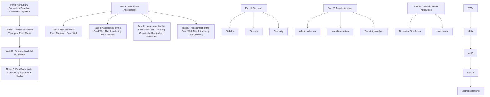
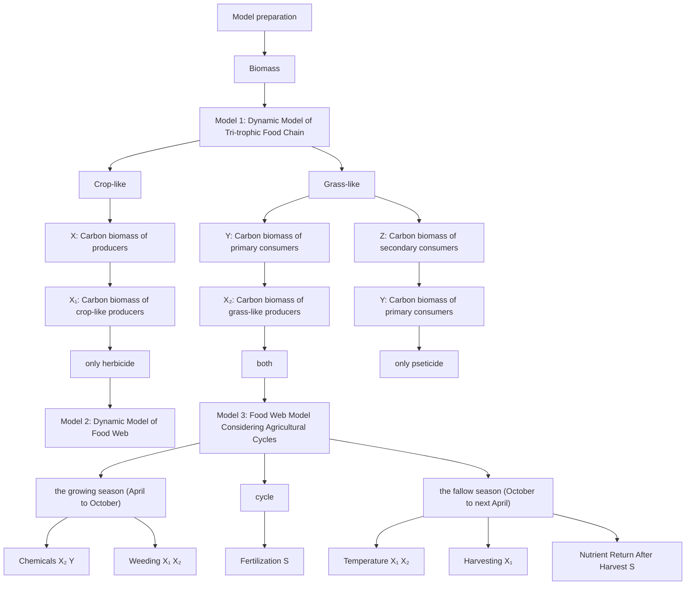
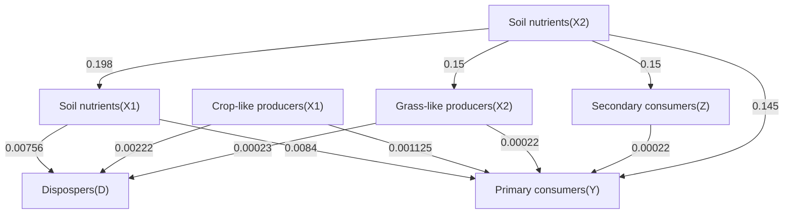
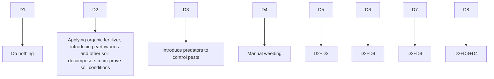

# Forests and Agriculture in Harmony: How to Maintain Ecosystem Stability During the Transition to Organic Farming Summary

Forests, often referred to as the "lungs of the Earth" and home to countless species, have been increasingly deforested in recent years. The cleared forests become converted forest areas, raising a critical challenge: how can we best utilize this land for sustainable purposes?

For Problem 1, we mainly employ differential equations and develop the equations progressively. We begin by constructing a simple food chain model, gradually advancing to a more complex food web model. This includes the introduction of pesticide and herbicide, followed by the incorporation of agriculture cycle and its seasonality into the model. The final model considers various factors such as temperature, fertilization, and the periodic application of pesticides and herbicides. By using numerical simulating the dynamics of the food web over the course of one year, we analyze the biomass changes of the species involved. As shown in Figure 9, the impact of agricultural cycles and seasonality on the system: Crop-like producers, grass-like producers, and primary consumers undergo periodic oscillations in response to the periodic application of pesticides and herbicides.

For Problem 2, a network is established using graph theory, with populations as nodes. The carbon flow, calculated based on the biomass from the equilibrium simulations in Problem 1, serves as the arc weight. Different network scenarios are constructed by sequentially incorporating factors such as the reemergence of two species, the application of pesticides and herbicides, and the inclusion of bats and bees. The stability, biodiversity, and centrality indicators of the network are then evaluated and assessed, providing a comprehensive understanding of the system's dynamics. Bats (29.29) and Bees (43.37) both result in greater stability, with the removal of pesticides and herbicides and doing nothing yielding a stability of 56.99.

For Problem 3, we propose three specific measures to achieve organic farming: improving soil nutrients, pest management, and regular manual weeding. These measures are tested in pairs, all three combined, and a blank control solution. We evaluate their effectiveness by numerically simulating the differential equations from Problem 1 to determine the stable biomass of each species under each solution. Using data from the differential equations, calculated metrics, and expert evaluations, we analyze economic, ecological, sustainability, and social benefits. An EWM-AHP model is developed to assess these schemes for organic farming. Based on the results, we recommend the optimal solution for farmers: improving soil conditions combined with regular manual weeding.

Finally, a sensitivity analysis of the herbicide power (alpha value) in our Problem 1 food web model shows that the selected alpha value is reasonable and appropriate for the simulation. Based on the ranking results of the methods combination for organic farming, we drafted a one-page letter offering clear and practical suggestions for farmers looking to transition to organic farming. These suggestions carefully balance economic trade-offs with sustainability considerations, ensuring that the advice is both actionable and aligned with long-term ecological and economic goals.

Keywords: Differential equation, Food web model, network, EWM-AHP

## Contents

## 1 Introduction....3

1.1 Problem Background ....3  
1.2 Restatement of the Problem....3  
1.3 Our Work....4

## 2 Assumptions and Justifications......4

## 3 Notations and Data....5

## 4 Problem 1: Agricultural Ecosystem Based on Differential Equation ......5

4.1 Problem analysis .... 5  
4.2 Model preparation....6  
4.3 Model 1: Dynamic Model of Tri-trophic Food Chain....6  
4.4 Model 2: Dynamic Model of Food Web ....7  
4.5 Model 3: Food Web Model Considering Agricultural Cycles....11

## 5 Problem 2: Ecosystem Assessment ....15

5.1 Problem analysis .... 15  
5.2 Model preparation....15  
5.3 Assessment of Food Chain and Food Web....16  
5.4 Assessment of the Food Web After Introducing New Species....16  
5.5 Assessment of the Food Web After Removing Chemicals (Herbicides + Pesticides) ... 17  
5.6 Assessment of the Food Web After Introducing Bats (or Bees)....19

## 6 Problem 3: Towards Green Agriculture....20

6.1 Problem background....20  
6.2 Model preparation....21  
6.3 EWM-AHP 22  
6.4 Analysis of results....23

## 7 Sensitivity Analysis......24

## 8 Model Evaluation and Further Discussion....25

8.1 Advantages....25  
8.2 Limitations and Extension of the model 25

## 9 References....25

## 1 Introduction

## 1.1 Problem Background

Forests, as the largest living entities on Earth, function like living, breathing organisms. They are not only a rich reservoir of plant and animal resources but also serve as the core engine of the Earth's ecological balance, holding immense potential for sustainable development. However, due to the demands of human progress and extensive agricultural practices, along with insufficient awareness of sustainability, vast areas of forests have been repurposed, leading to severe ecological degradation.

Taking the Amazon Rainforest, often referred to as the "lungs of the Earth," as an example, it has suffered significant deforestation and forest fires since the 20th century, resulting in a loss of approximately $20\%$ of its area. This loss has caused profound impacts on its ecological environment. However, forest degradation is not inevitable. With societal transformation, the possibility of achieving a harmonious coexistence between agriculture and forest ecosystems remains. Therefore, investigating how to balance sustainability and cost-effectiveness in post-conversion forest ecosystems has become an urgent issue that needs to be addressed.

natural_image

Aerial view of a forested area with a small white structure on the ground and scattered dead trees along the edges (no text or symbols visible)

Figure 1: Partial deforestation of the Amazon Rainforest

## 1.2 Restatement of the Problem

Considering the background information and restricted conditions identified in the problem statement, we need to solve the following problems:

For Problem 1, develop a model for the converted forest area, including producers and consumers, and considering the impact of agricultural cycles and seasonal variations on ecosystem dynamics. Also, account for the changes on herbicides and pesticides on plants, insects, and birds.

For Problem 2, we need to develop a comprehensive assessment model that considers both the overall stability of the ecosystem and the individual changes of species. Using this model, we can examine the impacts of the reemergence of two species, the removal of herbicides, and the introduction of bats and other species.

Problem 3 requires proposing several combinations of organic farming methods and evaluating their impact on factors such as pest management, plant vitality, reproduction processes, ecosystem diversity, long-term viability, and economic feasibility.

Problem 4, We need to write a one-page letter advising a farmer on organic farming methods while balancing costs and sustainability, and recommending policies to promote agricultural conservation.

## 1.3 Our Work

To avoid complicated description, intuitively reflect our work process, the flow chart is show as the following Figure 2:

flowchart

Figure 2: Our work

## 2 Assumptions and Justifications

To simplify the problem, we make the following basic assumptions, each of which is properly justified.

Assumption1: The population dynamics of specific species in the agricultural ecosystem can be simplified to the changes in biomass at various trophic levels.

Justification: Agricultural ecosystems are highly homogenized, with species populations at each trophic level being relatively similar. Abstracting specific species into trophic level biomass is conducive to improving the universality of the model.

Assumption2: The pesticide we use are broad-spectrum and have a certain exterminating effect on all insects.

Justification: Pesticides have an eradication effect on the majority of insect populations, and insects in agricultural ecosystems are typically common species. Therefore, it can be assumed that the pesticide exerts a certain level of lethal effect on all insect populations.

Assumption 3: The herbicide used is assumed to affect only grass-like producers.

Justification: While herbicides contain toxic substances that inevitably affect various producers, there are physiological and genetic differences between them, which allow herbicides to selectively target weeds. We assume the herbicide has minimal impact on crop-like producers, and this can be reasonably neglected.

Assumption 4: Farmers complete their agricultural tasks in a negligible period.

Justification: The chosen agricultural ecosystem model represents a small, typical sample, where the biomass of crop-like producers is relatively low. As a result, farmers can complete tasks such as spraying herbicides, pesticides, and applying fertilizers in a short period, which can be approximated as one unit of time.

Assumption 5: Decomposers only decompose producers and soil nutrients.

Justification: Decomposers mainly decompose producers and soil because producers provide directly abundant organic matter, while consumer carcasses decompose slowly and indirectly. Moreover, after consumer death, their carcasses enter the soil, and decomposers indirectly act through the material and energy exchange with the soil.

## 3 Notations and Data

The key mathematical notations used in this paper are listed in Table 1.

Table 1: Notations used in this paper

<table><tr><td>Symbol</td><td>Description</td><td>Unit</td></tr><tr><td>X</td><td>Carbon biomass of producers</td><td> $g \cdot cm^{-2}$ </td></tr><tr><td>Y</td><td>Carbon biomass of primary consumers (including animals like insects, rabbits)</td><td> $g \cdot cm^{-2}$ </td></tr><tr><td>Z</td><td>Carbon biomass of secondary consumers (including birds, foxes)</td><td> $g \cdot cm^{-2}$ </td></tr><tr><td> $X_1$ </td><td>Carbon biomass of crop-like producers</td><td> $g \cdot cm^{-2}$ </td></tr><tr><td> $X_2$ </td><td>Carbon biomass of grass-like producers</td><td> $g \cdot cm^{-2}$ </td></tr><tr><td>D</td><td>Carbon biomass of decomposers</td><td> $g \cdot cm^{-2}$ </td></tr><tr><td>S</td><td>Carbon biomass of soil nutrients</td><td> $g \cdot cm^{-2}$ </td></tr><tr><td>T</td><td>Temperature</td><td>°C</td></tr><tr><td>t</td><td>Time</td><td>/</td></tr></table>

Note: Some variables are not listed. Their specific meanings will be introduced below.  
Note: All our initial data are sourced from research papers.[2][7]

## 4 Problem 1: Agricultural Ecosystem Based on Differential Equation

## 4.1 Problem analysis

In Problem 1, we are required to develop a model for a new agricultural area that includes various creatures, species interactions, and human factors. To accomplish this, we begin with a food chain model consisting of only three trophic levels. Building upon this, we expand to a food web model that incorporates decomposers and soil components. Finally, we take into account the effects of seasonal agricultural cycles. The final model, a food web model considering agricultural cycles, achieves the goal.

flowchart

Figure 3: Solution Flow for Problem 1

## 4.2 Model preparation

We investigate agricultural ecosystems and, based on our findings, identify typical examples of organisms at different trophic levels. Agricultural systems, especially in intensively managed farms, tend to have relatively homogeneous populations at each trophic level due to the standardized management practices. For instance, the producers are more likely to be crops and grass

This makes the substitution of biomass for specific species valid, as the diversity within trophic levels is often lower compared to natural ecosystems. To make our model more generalized and applicable across various agricultural ecosystems, we replace specific colonies with biomass, which allows us to account for the carbon flow in a more abstract way. We analyze several agricultural systems and other artificial ecosystems, and after processing the data, we calculate the average biomass at each trophic level.

## 4.3 Model 1: Dynamic Model of Tri-trophic Food Chain

We construct a standard food chain model consisting of three trophic levels, all of which follow logistic growth. The consumption of the primary consumer on the producer and the predation of the secondary consumer on the primary consumer level both follow the Holling-II functional response. The model can be represented by a system of nonlinear ordinary differential equations.[1]

$$
\frac {d X}{d t} = X \left(R \left(1 - \frac {X}{K}\right) - \frac {A _ {1} Y}{B _ {1} + X}\right) \tag {1}
$$

$$
\frac {d Y}{d t} = Y \left(- D _ {1} + E _ {1} \frac {A _ {1} X}{B _ {1} + X} - \frac {A _ {2} Z}{B _ {2} + Y}\right) \tag {2}
$$

$$
\frac {d Z}{d t} = Z \left(- D _ {2} + E _ {2} \frac {A _ {2} Y}{B _ {2} + Y}\right) \tag {3}
$$

Where, R : Growth rate of the producer; K : Environmental carrying capacity of the producer; $A_{i}$ : Maximum predation rate of the primary consumer and secondary consumer; $B_{i}$ : Half-saturation constant; $D_{i}$ : Mortality rate of the primary consumer and secondary consumer; $E_{i}$ : Conversion efficiency of the primary consumer for the producer and the secondary consumer for the primary consumer; t : Time.

After inputting the initial data, the biomass of different trophic levels stabilizes into a cyclical pattern within a short period.

line chart

| Time | Producers(X) | Primary consumers(Y) | Secondary consumers(Z) |
|------|--------------|----------------------|------------------------|
| 0    | 0            | 0                    | 0                      |
| 50   | 95           | 90                   | 5                      |
| 100  | 100          | 70                   | 25                     |
| 150  | 100          | 0                    | 0                      |
| 200  | 100          | 0                    | 0                      |
| 250  | 100          | 0                    | 0                      |
| 300  | 100          | 85                   | 15                     |
| 350  | 100          | 0                    | 0                      |
| 400  | 100          | 70                   | 25                     |
| 450  | 100          | 0                    | 0                      |
| 500  | 100          | 0                    | 0                      |
| 550  | 100          | 0                    | 0                      |
| 600  | 100          | 85                   | 15                     |
| 650  | 100          | 0                    | 0                      |
| 700  | 100          | 70                   | 25                     |
| 750  | 100          | 0                    | 0                      |
| 800  | 100          | 0                    | 0                      |
| 850  | 100          | 85                   | 15                     |
| 900  | 100          | 0                    | 0                      |
| 950  | 100          | 85                   | 25                     |
| 1000 | 100          | 0                    | 5                      |

Figure 4: Food Chain Model Results

As shown in Figure 4, In the cycle, the biomass of producers increases first, followed by primary consumers and then secondary consumers. Afterward, the biomass of producers decreases, leading to reductions in primary and secondary consumers. This cycle repeats. Also, Biomass decreases progressively from producers to primary consumers to secondary consumers.

## 4.4 Model 2: Dynamic Model of Food Web

Although the food chain model provides a basic relationship between the three trophic levels, the interactions it considers are too simplistic, only including the most basic predator-prey relationships, which clearly do not reflect the complexity of real agricultural ecosystems. Therefore, we have developed a food web dynamics model that divides the food web into four components: producers, consumers (including two trophic levels), decomposers, and soil nutrients.

Compared to the food chain model, the optimization of this model includes:

- Dividing producers into two parts: $X_{1}$ (which typically represents crops in real agricultural systems) and $X_{2}$ (which typically represents weeds). The hypothesis previously mentioned that herbicides only affect $X_{2}$ (grass-like producers).  
The impact of insecticides on the biomass of the insect population (which is part of $Y$ ) has been considered, and the initial insect population has the same preference for

both grass-like producers and crop-like producers.

- Incorporating decomposers into the ecological network, considering their interactions with producers, primary and secondary consumers, and soil nutrients.  
- Accounting for the biomass of the soil nutrients, making the model more representative of real agricultural ecosystems.

To simplify the complex interactions in the agricultural food web, especially with intertwined food chains, we assume predator predation follows a linear relationship. This takes into account predator mobility and uncertain food sources. Compared to Holling-II, Holling-I better suits this scenario, as it assumes predation rate is unaffected by prey density, reflecting a linear increase in predation.

## 4.4.1 Food web model (without human intervention)

Based on the carbon flux between different components and their respective biomasses, we have established dynamic equations for each of the four components.

The food model is shown in Figure 5:

flowchart

Figure 5: Food Web Model

The increase in producer biomass of agriculture ecosystem is driven by photosynthesis, while the decrease in producer biomass results from inter-taxon competition, consumption, and non-predatory mortality.[2] Thus, the temporal dynamics of producer biomass, including $X_{1}$ (crop-like producers) and $X_{2}$ (grass-like producers), can be expressed as:

$$
\frac {d X _ {1}}{d t} = r _ {1} X _ {1} \left(1 - \frac {X _ {1} + X _ {2}}{K}\right) - c _ {1 3} X _ {1} Y - c _ {1 5} X _ {1} D + a _ {6 1} c _ {6 1} S X _ {1} - d _ {1} X _ {1} \tag {4}
$$

$$
\frac {d X _ {2}}{d t} = r _ {2} X _ {2} \left(1 - \frac {X _ {1} + X _ {2}}{K}\right) - c _ {2 3} X _ {2} Y - c _ {2 5} X _ {2} D + a _ {6 2} c _ {6 2} S X _ {2} - d _ {2} X _ {2} \tag {5}
$$

Where, $r_{1}$ and $r_{2}$ represent the maximum specific growth rates of $X_{1}$ and $X_{2}$ , respectively, and K denotes the maximum environmental carrying capacity. Utilizing the Holling-I functional response, $c_{13}X_{1}Y$ , $c_{15}X_{1}D$ , $c_{23}X_{2}Y$ , and $c_{25}X_{2}D$ represent the carbon flow from producers to primary consumers, with $c_{jk}$ indicating the maximum consumption rate when taxonomic group k consumes group j. Parameters $d_{1}$ and $d_{2}$ are the mortality rates of $X_{1}$ and $X_{2}$ , respectively.

The increase in biomass of consumers (comprising two trophic levels) is driven by the assimilation of consumed resources, while the decrease in consumer biomass is a result of predation and respiration. Therefore, the dynamic changes in the biomass of consumers, including

Y (primary consumers), Z (secondary consumers), and D (decomposers), can be expressed as follows:

$$
\frac {d Y}{d t} = a _ {1 3} c _ {1 3} X _ {1} Y + a _ {2 3} c _ {2 3} X _ {2} Y - c _ {3 4} Y Z - I _ {3} Y \tag {6}
$$

$$
\frac {d Z}{d t} = a _ {3 4} c _ {3 4} Y Z - I _ {4} Z \tag {7}
$$

$$
\frac {d D}{d t} = a _ {1 5} c _ {1 5} X _ {1} D + a _ {2 5} c _ {2 5} X _ {2} D + a _ {6 5} c _ {6 5} S D - I _ {5} D \tag {8}
$$

Where, $I_{i}$ represents the respiration rate of the consumer i. The parameter $a_{jk}$ indicates the assimilation efficiency corresponding to the case where consumer k consumes taxonomic group j. The parameter $c_{jk}$ indicates the maximum consumption rate corresponding to the case where taxonomic group k consumes taxonomic group j.

The increase in biomass of soil nutrients comes from inputs such as remnants of the forest, the bodies of producers, and the feces of consumers, while the decrease in soil nutrients is due to the consumption by decomposers and producers and outflow. The dynamic change of S (soil nutrients) is expressed as follows:

$$
\frac {d S}{d t} = I _ {S} + d _ {1} X _ {1} + d _ {2} X _ {2} + e _ {1 3} c _ {1 3} X _ {1} Y + e _ {2 3} c _ {2 3} X _ {2} Y + e _ {3 4} c _ {3 4} Y Z + e _ {1 5} c _ {1 5} X _ {1} D + e _ {2 5} c _ {2 5} X _ {2} D \tag {9}
$$

$$
+ e _ {6 1} c _ {6 1} S X _ {1} - c _ {6 1} S X _ {1} + e _ {6 2} c _ {6 2} S X _ {2} - c _ {6 2} S X _ {2} + e _ {6 5} c _ {6 5} S D - c _ {6 5} S D - T _ {r} S
$$

Where, $I_{S}$ represents the input of suspended organic matter from forest remnants, and $T_{r}$ denotes the total output rate. The parameter $e_{jk}$ indicates the egestion rate when taxonomic group k consumes group j.

After the initial data is inputted, the system undergoes dynamic changes for a period of time before eventually reaching a stable state.

line chart

| Time | Crop-like producers(X1) | Grass-like producers(X2) | Primary consumers(Y) | Secondary consumers(Z) | Decomposers(D) | Soil nutrients(S) |
|------|--------------------------|---------------------------|------------------------|--------------------------|-----------------|-------------------|
| 0    | 4                        | 2                         | 1                      | 1                        | 1               | 21                |
| 10   | 0                        | 32                        | 8                      | 1                        | 1               | 15                |
| 20   | 0                        | 25                        | 7                      | 1                        | 1               | 28                |
| 30   | 0                        | 25                        | 7                      | 1                        | 1               | 28                |
| 40   | 0                        | 25                        | 7                      | 1                        | 1               | 28                |
| 50   | 0                        | 25                        | 7                      | 1                        | 1               | 28                |
| 60   | 0                        | 25                        | 7                      | 1                        | 1               | 28                |
| 70   | 0                        | 25                        | 7                      | 1                        | 1               | 28                |
| 80   | 0                        | 25                        | 7                      | 1                        | 1               | 28                |
| 90   | 0                        | 25                        | 7                      | 1                        | 1               | 28                |
| 100  | 0                        | 25                        | 7                      | 1                        | 1               | 28                |

Figure 6: Food Web Model Results

As shown in Figure 6, the biomass of grass-like producers increases rapidly at first, indicating a competitive advantage over crop-like producers in the absence of human interference. Over time, crop-like producers' biomass declines and eventually disappears, likely due to their higher resource demands and lower assimilation efficiency compared to grass-like producers. As a result, the biomass of crop-like producers reaches zero. The decline in grass-like producers leads to a significant reduction in soil nutrient consumption, and soil nutrients stabilize at a

higher level.

Primary consumer numbers increase rapidly at first due to the excess biomass of grass-like producers, then stabilize. Secondary consumer biomass gradually decreases, reflecting the system's ecological balance. In this model, the decline in secondary consumer biomass is due to migration, not extinction. For example, birds migrate based on food availability, and while they may disappear from certain areas, their overall population remains intact in the ecosystem.

Eventually, the biomass of all species stabilizes, indicating equilibrium in interactions like predation, competition, and mortality. While no noticeable fluctuations occur, this does not imply the absence of change, but rather that the rate of change is too slow to be observed over a short timeframe. This stable state reflects the long-term coexistence of species in the ecosystem.

## 4.4.2 Food web model (with human intervention)

To address the issue of excessive growth of $X_{2}$ (grass-like producers), farmers begin using herbicides and insecticides. These chemicals are reflected in our model in different ways: insecticides have a more direct effect on the biomass of insects (included in Y), typically leading to a significant reduction in their biomass, while herbicides affect $X_{2}$ (grass-like producers) by gradually increasing their mortality rate over time.

Since the effect of herbicides is not instantaneous but accumulates over time, this gradual increase in mortality is modeled using an exponential function. Herbicides slowly reduce the plants' growth ability, causing their mortality rate to rise over time. Specifically, the dynamic changes in the biomass of grass-like producers can be expressed as:

$$
\frac {d X _ {2}}{d t} = r _ {2} X _ {2} \left(1 - \frac {X _ {1} + X _ {2}}{K}\right) - c _ {2 3} X _ {2} Y - c _ {2 5} X _ {2} D + a _ {6 2} c _ {6 2} S X _ {2} - d _ {2} (1 + \alpha e ^ {- (t - t _ {0})}) X _ {2} \tag {10}
$$

Where the effect of herbicides on grass-like producers is expressed through the mortality rate term $d_{2}(1+\alpha e^{-(t-t_{0})})X_{2}$ , and the parameter $\alpha$ represents the sensitivity of $X_{2}$ to herbicides.

In contrast, insecticides directly affect the biomass of insects. Insects respond rapidly to insecticides, so their biomass decreases quickly, leading to a reduction in Y. The dynamic changes in the biomass of primary consumers can be expressed as:

$$
\frac {d Y}{d t} = a _ {1 3} c _ {1 3} X _ {1} Y + a _ {2 3} c _ {2 3} X _ {2} Y - c _ {3 4} Y Z - I _ {3} Y - \beta e ^ {- (t - t _ {0})} \tag {11}
$$

Where the effect of insecticides on insects is reflected in the term $\beta e^{-(t-t_{0})}$ , and the parameter $\beta$ represents the sensitivity of Y to insecticides.

We considered the cases of using insecticides alone, herbicides alone, and both insecticides and herbicides together. After incorporating several sets of $\alpha$ and $\beta$ values, we processed the results for different groups and presented them on the same graph. The final results are shown below.

line chart

| Time Step | Crop-like producers(X1) | Grass-like producers(X2) | Primary consumers(Y) | Secondary consumers(Z) | Decomposers(Y) | Soil nutrients(S) |
| --------- | ------------------------ | ------------------------- | --------------------- | ----------------------- | -------------- | ----------------- |
| 0         | 4                        | 2                         | 1                     | 1                       | 1              | 20                |
| 10        | 30                       | 25                        | 8                     | 1                       | 1              | 15                |
| 20        | 25                       | 25                        | 7                     | 1                       | 1              | 28                |
| 30        | 25                       | 25                        | 7                     | 1                       | 1              | 28                |
| 40        | 25                       | 25                        | 7                     | 1                       | 1              | 28                |
| 50        | 25                       | 25                        | 7                     | 1                       | 1              | 28                |
| 60        | 25                       | 25                        | 7                     | 1                       | 1              | 28                |
| 70        | 25                       | 25                        | 7                     | 1                       | 1              | 28                |
| 80        | 25                       | 25                        | 7                     | 1                       | 1              | 28                |
| 90        | 25                       | 25                        | 7                     | 1                       | 1              | 28                |
| 100       | 25                       | 25                        | 7                     | 1                       | 1              | 28                |

(a)

line chart

| Time | Crop-like producers(X1) | Grass-like producers(X2) | Primary consumers(Y) | Secondary consumers(Z) | Decompersants(Z) | Soil nutrients(S) |
|------|--------------------------|---------------------------|------------------------|--------------------------|------------------|-------------------|
| 0    | ~5                       | ~0                        | ~0                     | ~0                       | ~0               | ~25               |
| 20   | ~3                       | ~15                       | ~5                     | ~0                       | ~0               | ~15               |
| 40   | ~3                       | ~25                       | ~5                     | ~0                       | ~0               | ~15               |
| 60   | ~3                       | ~25                       | ~5                     | ~0                       | ~0               | ~15               |
| 80   | ~3                       | ~25                       | ~5                     | ~0                       | ~0               | ~15               |
| 100  | ~3                       | ~25                       | ~5                     | ~0                       | ~0               | ~15               |

(b)

line chart

| Time | Crop-like producers(X1) | Grass-like producers(X2) | Primary consumers(Y) | Secondary consumers(Y) | Decomposers(D) | Soil nutrients(S) |
|------|--------------------------|---------------------------|----------------------|-------------------------|----------------|------------------|
| 0    | 5                        | 5                         | 5                    | 5                       | 5              | 5                |
| 10   | 15                       | 25                        | 15                   | 10                      | 5              | 10               |
| 20   | 20                       | 25                        | 20                   | 10                      | 5              | 10               |
| 30   | 20                       | 25                        | 20                   | 10                      | 5              | 10               |
| 40   | 20                       | 25                        | 20                   | 10                      | 5              | 10               |
| 50   | 20                       | 25                        | 20                   | 10                      | 5              | 10               |
| 60   | 20                       | 25                        | 20                   | 10                      | 5              | 10               |
| 70   | 20                       | 25                        | 20                   | 10                      | 5              | 10               |
| 80   | 20                       | 25                        | 20                   | 10                      | 5              | 10               |
| 90   | 20                       | 25                        | 20                   | 10                      | 5              | 10               |
| 100  | 20                       | 25                        | 20                   | 10                      | 5              | 10               |

(c)

line chart

| Year | Crop-like (plumders:K1) | Grass-like (producers:K2) | Primary consumers:K3 | Secondary consumers:K4 | Decomposers:K5 |
|------|--------------------------|----------------------------|------------------------|--------------------------|-----------------|
| 0    | ~1                       | ~1                         | ~1                     | ~1                       | ~1              |
| 1    | ~2                       | ~2                         | ~2                     | ~2                       | ~2              |
| 2    | ~3                       | ~3                         | ~3                     | ~3                       | ~3              |
| 3    | ~4                       | ~4                         | ~4                     | ~4                       | ~4              |
| 4    | ~5                       | ~5                         | ~5                     | ~5                       | ~5              |
| 5    | ~6                       | ~6                         | ~6                     | ~6                       | ~6              |
| 6    | ~7                       | ~7                         | ~7                     | ~7                       | ~7              |
| 7    | ~8                       | ~8                         | ~8                     | ~8                       | ~8              |
| 8    | ~9                       | ~9                         | ~9                     | ~9                       | ~9              |
| 9    | ~10                      | ~10                        | ~10                    | ~10                      | ~10             |
| 10   | ~11                      | ~11                        | ~11                    | ~11                      | ~11             |
| 11   | ~12                      | ~12                        | ~12                    | ~12                      | ~12             |
| 12   | ~13                      | ~13                        | ~13                    | ~13                      | ~13             |
| 13   | ~14                      | ~14                        | ~14                    | ~14                      | ~14             |
| 14   | ~15                      | ~15                        | ~15                    | ~15                      | ~15             |
| 15   | ~16                      | ~16                        | ~16                    | ~16                      | ~16             |
| 16   | ~17                      | ~17                        | ~17                    | ~17                      | ~17             |
| 17   | ~18                      | ~18                        | ~18                    | ~18                      | ~18             |
| 18   | ~19                      | ~19                        | ~19                    | ~19                      | ~19             |
| 19   | ~20                      | ~20                        | ~20                    | ~20                      | ~20             |
| 20   | ~21                      | ~21                        | ~21                    | ~21                      | ~21             |
| 21   | ~22                      | ~22                        | ~22                    | ~22                      | ~22             |
| 22   | ~23                      | ~23                        | ~23                    | ~23                      | ~23             |
| 23   | ~24                      | ~24                        | ~24                    | ~24                      | ~24             |
| 24   | ~25                      | ~25                        | ~25                    | ~25                      | ~25             |
| 25   | ~26                      | ~26                        | ~26                    | ~26                      | ~26             |
| 26   | ~27                      | ~27                        | ~27                    | ~27                      | ~27             |
| 27   | ~28                      | ~28                        | ~28                    | ~28                      | ~28             |
| 28   | ~29                      | ~29                        | ~29                    | ~29                      | ~29             |
| 29   | ~30                      | ~30                        | ~30                    | ~30                      | ~30             |
| 30   | ~31                      | ~31                        | ~31                    | ~31                      | ~31             |
| 31   | ~32                      | ~32                        | ~32                    | ~32                      | ~32             |
| 32   | ~33                      | ~33                        | ~33                    | ~33                      | ~33             |
| 33   | ~34                      | ~34                        | ~34                    | ~34                      | ~34             |
| 34   | ~35                      | ~35                        | ~35                    | ~35                      | ~35             |
| 35   | ~36                      | ~36                        | ~36                    | ~36                      | ~36             |
| 36   | ~37                      | ~37                        | ~37                    | ~37                      | ~37             |
| 37   | ~38                      | ~38                        | ~38                    | ~38                      | ~38             |
| 38   | ~39                      | ~39                        | ~39                    | ~39                      | ~39             |
| 39   | ~40                      | ~40                        | ~40                    | ~40                      | ~40             |
| 40   | ~41                      | ~41                        | ~41                    | ~41                      | ~41             |
| 41   | ~42                      | ~42                        | ~42                    | ~42                      | ~42             |
| 42   | ~43                      | ~43                        | ~43                    | ~43                      | ~43             |
| 43   | ~44                      | ~44                        | ~44                    | ~44                      | ~44             |
| 44   | ~45                      | ~45                        | ~45                    | ~45                      | ~45             |
| 45   | ~46                      | ~46                        | ~46                    | ~46                      | ~46             |
| 46   | ~47                      | ~47                        | ~47                    | ~47                      | ~47             |
| 47   | ~48                      | ~48                        | ~48                    | ~48                      | ~48             |
| 48   | ~49                      | ~49                        | ~49                    | ~49                      | ~49             |
| 49   | >5                       | >5                         | >5                     | >5                       | >5              |
| 50   | >6                       | >6                         | >6                     | >6                       | >6              |
| 51   | >7                       | >7                         | >7                     | >7                       | >7              |
| 52   | >8                       | >8                         | >8                     | >8                       | >8              |
| 53   | >9                       | >9                         | >9                     | >9                       | >9              |
| 54   | >10                      | >10                        | >10                    | >10                      | >10             |
| 55   | >11                      | >11                        | >11                    | >11                      | >11             |
| 56   | >12                      | >12                        | >12                    | >12                      | >12             |
| 57   | >13                      | >13                        | >13                    | >13                      | >13             |
| 58   | >14                      | >14                        | >14                    | >14                      | >14             |
| 59   | >15                      | >15                        | >15                    | >15                      | >15             |
| 60   | >16                      | >16                        | >16                    | >16                      | >16             |
| 61   | >17                      | >17                        | >17                    | >17                      | >17             |
| 62   | >18                      | >18                        | >18                    | >18                      | >18             |
| 63   | >19                      | >19                        | >19                    | >19                      | >19             |
| 64   | >20                      | >20                        | >20                    | >20                      | >20             |
| 65   | >21                      | >21                        | >21                    | >21                      | >21             |
| 66   | >22                      | >22                        | >22                    | >22                      | >22             |
| 67   | >23                      | >23                        | >23                    | >23                      | >23             |
| 68   | >24                      | >24                        | >24                    | >24                      | >24             |
| 69   | >25                      | >25                        | >25                    | >25                      | >25             |
| 70   | >26                      | >26                        | >26                    | >26                      | >26             |
| 71   | >27                      | >27                        | >27                    | >27                      | >27             |
| 72   | >28                      | >28                        | >28                    | >28                      | >28             |
| 73   | >29                      | >29                        | >29                    | >29                      | >29             |
| 74   | >30                      | >30                        | >30                    | >30                      | >30             |
| 75   | >31                      | >31                        | >31                    | >31                      | >31             |
| 76   | >32                      | >32                        | >32                    | >32                      | >32             |
| 77   | >33                      | >33                        | >33                    | >33                      | >33             |
| 78   | >34                      | >34                        | >34                    | >34                      | >34             |
| 79   | >35                      | >35                        | >35                    | >35                      | >35             |
| 80   | >36                      | >36                        | >36                    | >36                      | >36             |
| 81   | >37                      | >37                        | >37                    | >37                      | >37             |
| 82   | >38                      | >38                        | >38                    | >38                      | >38             |
| 83   | >39                      | >39                        | >39                    | >39                      | >39             |
| 84   }<fcel>~<fcel>~<fcel>~<fcel>~<fcel>~<fcel>~<nl>

(d)  
Figure 7: (a) Without Human Intervention;(b) With Herbicide;(c) With Pesticide;(d) With Herbicide and Pesticide

As shown in Figure 7, We considered three scenarios: using pesticide alone, herbicide alone, and both simultaneously, incorporating several sets of $\alpha$ and $\beta$ data. The results from these groups were summarized in a single figure, leading to the following outcomes.

Compared to Figure (a), Figures (b), (c), and (d) show some changes.

As shown in Figure (b), we tested three sets of $\alpha$ data: $\alpha = e^1, e^3$ and $e^5$ . As $\alpha$ increases, the appearance of grass-like producers is delayed, and when $\alpha = e^5$ , their biomass eventually stabilizes at zero. At this point, crop-like producers stabilize at a certain biomass level. This suggests that herbicide is crucial in the current agricultural ecosystem and needs to be used long-term, as it is impossible to completely eliminate all grass-like producers in real ecosystems.

As shown in Figure (c), we tested three sets of $\beta$ data: $\beta = e^{0.5}$ , $e^{1.0}$ and $e^{1.5}$ . The results show no significant differences between the three sets. Although the reduction in insect consumption of crop-like producers initially causes a slight increase in their biomass, competition between grass-like producers and crops persists, and the biomass of crop-like producers ultimately remains low.

As shown in Figure (d), we tested three sets of $\alpha$ and $\beta$ data. In the model with pesticide alone, the concentration of $\beta$ had little significant effect, and a high sensitivity would lead to community collapse. Therefore, we set $\beta$ to 0.5 and tested different $\alpha$ values ( $\alpha = e^{1}, e^{3}$ and $e^{5}$ ). The results confirmed that herbicide has a consistent effect, similar to Figure (b).

## 4.5 Model 3: Food Web Model Considering Agricultural Cycles

The food web model effectively captures the development of agricultural ecosystems under certain human interventions. However, compared to real agricultural ecosystems, it still lacks one important factor—the agricultural cycle, which includes the stages from sowing and planting crops to harvesting and crop preparation.

To better understand the impact of the agricultural cycle on the food web model, we chose rice, a typical crop in China. Unlike the double-cropping rice commonly grown in central China, we selected a single-season rice crop, as grown in Northeast China, a major rice-producing region. The planting season typically starts in mid-April to mid-May, and harvesting occurs in early October. Therefore, in the subsequent model, all crop-like producers are assumed to be single-season rice, grown in Northeast China, with the region's climate conditions considered. In this model, $X_{1}$ represents the biomass of rice.

The specific parameters required for constructing the food web model are listed in the table below.

To optimize the food web model and eventually develop a biological model that incorporates the agricultural cycle, we defined several key intervention actions that occur during the agricultural cycle:

- Weeding: Before the planting season begins each year, farmers remove weeds to prevent competition with crops, which could lead to crop death. This is reflected in the initial biomass, where the crop biomass is much larger than the weed biomass.  
- Fertilization: Before the planting season, farmers typically apply fertilizers, as crops generally require more nutrients from the soil. This is reflected in a sharp increase in the biomass of soil nutrients at the start of the planting season.  
- Temperature: Temperature has a significant impact on the growth rate of producers, specifically in a parabolic relationship with average temperature. We selected the average temperature data from Wuchang City in Northeast China from 2016 to 2018 for fitting[3], and the resulting quartic polynomial curve is as follows:

First, we assume that a year is divided into discrete time units, with each month comprising a subset of these units. In the model to be introduced, activities such as fertilization, weeding, pest control, and the cyclical growth of crops all exhibit periodic patterns, though their cycles differ. Therefore, we introduce the functions $f(t)$ , $g(t)$ , and $k(t)$ to describe the system's position within a year, a month, or a specific fertilization cycle at any given time. Based on this assumption, we have established a measurement equation $f(t)$ for a specific point in time during the year:

$$
f (t) = t - \left[ \frac {t}{n} \right] \cdot n, g (t) = \frac {f (t)}{\frac {1}{1 2} n}, k (t) = f (t) - \left[ \frac {f (t)}{h} \right] \cdot h \tag {12}
$$

Where, h represents the length of chemical application cycle.

Finally, Using the temperature data from the past three years in Wuchang City, we fitted a functional relationship between T and $g(t)$ with an $R^{2} > 0.99588$ .

$$
T = - 4. 2 0 7 1 g (t) + 5. 1 1 2 5 g (t) ^ {2} - 0. 6 9 4 7 g (t) ^ {3} + 0. 0 2 5 0 g (t) ^ {4} - 1 9. 5 7 0 5 4 \tag {13}
$$

line chart

Temperature in Rushang from 2016 to 2018
| month | 2016 average temperature (°C) | 2017 average temperature (°C) | 2018 average temperature (°C) |
|---|---|---|---|
| 1 | -20 | -15 | -20 |
| 2 | -13 | -10 | -14 |
| 3 | -1 | -2 | -3 |
| 4 | 8 | 9 | 9 |
| 5 | 14 | 15 | 15 |
| 6 | 20 | 21 | 22 |
| 7 | 25 | 26 | 26 |
| 8 | 23 | 24 | 23 |
| 9 | 14 | 15 | 14 |
| 10 | 6 | 7 | 8 |
| 11 | -10 | -11 | -4 |
| 12 | -14 | -15 | -14 |

(a)

line chart

Polynomial fit of temperature in Muchang
| Month | actual data points (°C) | polynomial fit |
|---|---|---|
| 1 | -19.5 | -19.5 |
| 2 | -13.0 | -13.0 |
| 3 | -2.0 | -2.0 |
| 4 | 8.0 | 8.0 |
| 5 | 15.0 | 15.0 |
| 6 | 20.0 | 20.0 |
| 7 | 23.0 | 23.0 |
| 8 | 21.0 | 21.0 |
| 9 | 14.0 | 14.0 |
| 10 | 6.0 | 6.0 |
| 11 | -5.0 | -5.0 |
| 12 | -13.0 | -13.0 |
R²=0.9958

(b)

## Figure 8: (a) The average temperature data from Wuchang City, Northeast China, from 2016 to 2018 was used for fitting; (b) The resulting quartic polynomial curve

Chemicals (Herbicides + Pesticides): The effects of chemicals, such as herbicides and pesticides, have been incorporated into the food web model, where the biomass of rice and the biomass of primary consumers are reduced.  
- Harvesting: When crops mature, they are harvested, temporarily removing them from the food chain. This is represented by the removal of all X1 (crop-like producers).  
- Nutrient Return After Harvest: Organic waste decomposes and returns nutrients to the soil. Considering that after rice harvesting, organic matter (such as residues from plants like buckwheat) returns to the farmland, this is represented by a portion of the total biomass of X1 being returned to soil nutrients.

Ultimately, we divide the agricultural cycle into two main phases: the growing season (April to October) and the fallow season (October to April of the following year). We have further refined the biomass expressions for different trophic levels based on the characteristics of these two phases.

## 4.5.2 The growing season

During the growing season, the primary factors we consider include herbicide application, fertilization, temperature, and chemicals. These factors affect various components of the ecosystem, particularly $X_{1}, X_{2}, Y$ , and S. Herbicide application leads to a significant change in the ratio of $X_{1}$ to $X_{2}$ , which we set as $X_{1}: X_{2} = 10:1$ . Temperature is modeled through the function T (13), which describes the impact on the growth rates of $X_{1}$ and $X_{2}$ . For fertilization, we assume that the soil nutrient levels increase by a constant value each growing season. Lastly, we assume that herbicides and insecticides are sprayed simultaneously, and that this spraying occurs once every h cycles, to fulfill the requirement for repeated applications. The related expressions are as follows:

$$
\frac {d X _ {1}}{d t} = \left[ - 0. 0 0 5 (T - 1 6) ^ {2} + 2 r _ {1} \right] X _ {1} \left(1 - \frac {X _ {1} + X _ {2}}{K}\right) + \dots \dots - d _ {1} \left(1 + \alpha e ^ {- k (t)}\right) X _ {1} \tag {14}
$$

$$
\frac {d X _ {2}}{d t} = \left[ - 0. 0 0 5 (T - 1 6) ^ {2} + 2 r _ {2} \right] X _ {2} \left(1 - \frac {X _ {1} + X _ {2}}{K}\right) + \dots \dots - d _ {2} (1 + \alpha e ^ {- k (t)}) X _ {2} \tag {15}
$$

$$
\frac {d D}{d t} = a _ {1 5} c _ {1 5} X _ {1} D + a _ {2 5} c _ {2 5} X _ {2} D + a _ {6 5} c _ {6 5} S D - I _ {5} D \tag {16}
$$

$$
S = S _ {p} + 1 0 \tag {17}
$$

Where, $S_{p}$ represents the biomass of soil nutrients before fertilization at the start of the second growing season; The omitted part of $X_{1}$ can be found in(4); The omitted part of $X_{1}$ can be found in(5).

Z, D and S are not directly influenced by the agricultural cycle during the growing season, so the equation for Z is referenced from(7), the equation for D is referenced from(8), the equation for S is referenced from(9).

## 4.5.3 The Fallow Season

During the fallow period, the agricultural cycle factors to consider include harvesting, temperature, and nutrient return after harvest. Since rice harvesting occurs in October, we assume that the biomass of rice $X_{1}$ remains zero during the fallow period. Consequently, related species such as Y, D, and S are affected. Specifically, Y and D can no longer consume $X_{1}$ , and

S can no longer obtain nutrients from $X_{1}$ . Meanwhile, as $X_{1}$ disappears, temperature only influences $X_{2}$ . D will benefit from post-harvest nutrient recycling, which is represented by the acquisition of a portion of $X_{1}$ 's nutrients from the harvest. Meanwhile, since it is the fallow period, pesticides and herbicides are no longer used. The related expressions are as follows:

$$
\frac {d X _ {2}}{d t} = \left[ - 0. 0 0 5 (T - 1 6) ^ {2} + 2 r _ {2} \right] X _ {2} \left(1 - \frac {X _ {1} + X _ {2}}{K}\right) + \dots \dots - d _ {2} X _ {2} \tag {18}
$$

$$
\frac {d Y}{d t} = a _ {2 3} c _ {2 3} X _ {2} Y - c _ {3 4} Y Z - I _ {3} Y \tag {19}
$$

$$
\frac {d D}{d t} = a _ {2 5} c _ {2 5} X _ {2} D + a _ {6 5} c _ {6 5} S D - I _ {5} D \tag {20}
$$

$$
\frac {d S}{d t} = I _ {S} + d _ {2} X _ {2} + e _ {2 3} c _ {2 3} X _ {2} Y + e _ {3 4} c _ {3 4} Y Z + e _ {2 5} c _ {2 5} X _ {2} D \tag {21}
$$

$$
+ e _ {6 2} c _ {6 2} S X _ {2} - c _ {6 2} S X _ {2} + e _ {6 5} c _ {6 5} S D - c _ {6 5} S D - T _ {r} S + \frac {1}{2} X _ {p}
$$

Where, $X_{p}$ represents the total biomass of $X_{1}$ harvested this year.

The equation for $Z$ is referenced from(7).

## 4.5.4 The result of food web model considering agricultural cycles

After inputting the initial values, we obtained the biomass changes of each component throughout an agricultural cycle. Since the quantities at the beginning of each year are roughly the same, the results for each cycle are consistent. Below, we present the results for a single cycle.

  
Figure 9: Food Web Model Considering Agricultural Cycles Results

As shown in Figure 9, rice biomass remains stable during the growing season, drops to zero after harvesting, and stays at zero during the fallow period. Grass-like producers' biomass decreases after herbicide application but recovers before the next application, indicating a reasonable spraying interval. During the fallow period, their growth is initially vigorous but declines due to low temperatures. Primary consumers follow a similar trend, with insecticide causing slight interference, but they grow steadily during the growing season and die in the fallow period due to lack of food. Secondary consumers and decomposers show minimal biomass changes, while soil nutrients increase as other components die, preparing for the next growing season.

## 5 Problem 2: Ecosystem Assessment

## 5.1 Problem analysis

In Problem 1, the food web model that takes into account the agricultural cycle effectively captures the changes in the biomass of various components within a single cycle. However, it cannot give a comprehensive evaluation of ecosystem advantages and disadvantages report of the ecosystem. When considering issues such as species return and herbicide removal, continuing to use the food web model to calculate biomass changes of all components would further complicate the problem. Therefore, we have established a network model based on stability as the evaluation criterion, aimed at measuring the stability of the ecosystem when it reaches equilibrium and making comparisons.

In this framework, we chose to simplify the model and primarily considered the impacts of chemical interventions.

## 5.2 Model preparation

We used two methods to calculate stability. The first method—Food Web Connectivity-Chain Length Stability Calculation Method—introduces the concepts of connectivity and average food chain length. As food web stability is directly related to both its diversity and complexity[4], The ideal stability typically occurs when the connectivity is within the optimal range of 0.3 to 0.6, the average food chain length is between 2.5 and 3.5, and the final product falls between 0.7 and 2.5.

use connectivity to represent diversity and average food chain length to represent complexity. The second method—Maximum Eigenvalue Method—introduces the concept of carbon flux, which is related to biomass. This can integrate some of the results from Problem 1. Two-method Calculation Network Model for Stability

## 5.2.1 Food Web Connectivity-Chain Length Stability Calculation Method

Since the stability of a food web is directly related to both its diversity and complexity, where C represents diversity and $L_{a}$ represents complexity, the respective calculation formulas for these are as follows:

$$
C = \frac {M}{N \cdot N}, L _ {a} = \frac {\sum L _ {i j}}{M} \tag {22}
$$

Where, N represents the total number of species, M represents the actual number of connections in the network, and $L_{ij}$ represents food chain length between of group k and group j.

The product of these two, S, can be used to represent the stability of the ecosystem. The results indicate that a larger value of S signifies greater stability for the ecosystem.

## 5.2.2 Maximum Eigenvalue Method

The Maximum Eigenvalue Method assesses the stability of an ecological system by calculating the eigenvalues of the network's adjacency matrix. Eigenvalues reflect the dynamic characteristics of the system, and in ecological networks, they can be interpreted as indicators of population growth or decay rates. By taking the maximum real part of the eigenvalues, we can evaluate the stability of the system, as the real part directly reflects growth or decay trends, while the imaginary part is related to oscillatory behaviors. The element of $(i,j)$ in the matrix represents $CF_{jk}$ (the carbon flow from group i to group j).

$$
C F _ {j k} = c _ {j k} \cdot B M _ {j} \cdot B M _ {k} \tag {23}
$$

The formula is expressed as:

$$
\lambda_ {\max} = \max \left(\operatorname{Re} \left(\lambda_ {i}\right)\right) \tag {24}
$$

Where, $\lambda_{max}$ represents the maximum real eigenvalue; $\lambda_{i}$ represents is the i-th eigenvalue of the adjacency matrix; $\mathrm{Re}(\lambda)$ represents denotes the real part of the eigenvalue;

By computing the maximum real eigenvalue, we can quantify the stability of the network. Larger $\lambda_{max}$ values of typically indicate the presence of unstable modes, while smaller values suggest a tendency toward system stability.

To verify that our chosen values are consistent with ecological principles, we introduced Ecotrophic Efficiency (EE) to assess the rationality of our parameter selections.

The formula for calculating $EE$ is as follows:

$$
E E = \frac {C _ {p e}}{T _ {p}} \tag {25}
$$

Where, $C_{pe}$ refers to the amount of production of a species that is consumed by predators, as well as the amount removed through non-predatory pathways. $T_{p}$ refers to the total production of a species or trophic component, including all parts used for maintaining life activities, growth, and reproduction.

In the ecological model, the value of EE is typically considered reasonable when it falls between 0 and 1, and all of our values are within this range.

## 5.3 Assessment of Food Chain and Food Web

We conducted stability analyses of the food chain and food web models in Problem 1 using two different methods, as shown in Table 2:

Table 2: The result of food chain and food web

<table><tr><td>Type</td><td>C (Connectivity)</td><td> $L_a$ (Average food chain length)</td><td> $S_t$ (Production)</td><td> $λ_{max}$ </td></tr><tr><td>Food chain</td><td>0.22</td><td>1.50</td><td>0.33</td><td>0.00</td></tr><tr><td>Food web</td><td>0.36</td><td>2.00</td><td>0.72</td><td>8.61</td></tr></table>

The food chain model, with lower connectivity and average length, has a simpler structure and fewer energy transfer processes, resulting in poorer stability and higher vulnerability to external disturbances, as reflected in its production output. In contrast, the food web model, with higher connectivity and greater complexity, exhibits stronger stability and adaptability due to increased species interactions. However, the smaller maximum eigenvalue of the food chain suggests that its simpler structure, less affected by external factors, allows more effective feedback mechanisms, leading to better stability in eigenvalue-based analysis.

## 5.4 Assessment of the Food Web After Introducing New Species

We then introduced two new species: a pest population and suspension decomposers. After their inclusion, we reanalyzed the stability using both methods, and the results are shown in the following Figure 10 and Table 3:

Table 3: The result of food web after introducing new species

<table><tr><td>Type</td><td>C (Connectivity)</td><td> $L_a$ (Average food chain length)</td><td> $S_t$ (Production)</td><td> $λ_{max}$ </td></tr><tr><td>New food web</td><td>0.31</td><td>1.8</td><td>0.56</td><td>8.65</td></tr></table>

radar chart

| Category | Value |
| --- | --- |
| Pests(P) | 0.146 |
| Crop-like producers(X1) | 0.0745 |
| Grass-like producers(X2) | 0.03 |
| Primary consumers(Y) | 0.15 |
| Secondary consumers(Z) | 0.00225 |
| Nutrients(S) | 0.524 |
| Suspension Decomposers(D2) | 0.42 |
| Secondary consumers(Z) | 0.378 |
| Pests(P) | 10.36 |
| Crop-like producers(X1) | 0.0 |
| Grass-like producers(X2) | 0.7 |
| Primary consumers(Y) | 0.00222 |
| Secondary consumers(Z) | 0.00248 |
| Nutrients(S) | 3.108 |
| Secondary consumers(Z) | 3.125 |
| Pests(P) | 0.49 |
| Crop-like producers(X1) | 0.00222 |
| Secondary consumers(Z) | 0.00225 |
| Nutrients(S) | 0.00736 |
| Secondary consumers(Z) | 0.0124 |
| Pests(P) | 0.378 |
| Crop-like producers(X1) | 0.00222 |
| Secondary consumers(Z) | 0.00225 |
| Nutrients(S) | 0.00736 |
| Secondary consumers(Z) | 0.0124 |
| Pests(P) | 1.164 |
| Crop-like producers(X1) | 1.164 |
| Secondary consumers(Z) | 1.164 |
| Nutrients(S) | 1.164 |
| Secondary consumers(Z) | 1.164 |
| Pests(P) | 0.524 |
| Crop-like producers(X1) | 0.524 |
| Secondary consumers(Z) | 0.524 |
| Nutrients(S) | 0.524 |
| Secondary consumers(Z) | 0.524 |
| Pests(P) | 10.36 |
| Crop-like producers(X1) | 10.36 |
| Secondary consumers(Z) | 10.36 |
| Nutrients(S) | 10.36 |
| Secondary consumers(Z) | 10.36 |
| Pests(P) | 1.164 |
| Crop-like producers(X1) | 1.164 |
| Secondary consumers(Z) | 1.164 |
| Nutrients(S) | 1.164 |
| Secondary consumers(Z) | 1.164 |
| Pests(P) | 1.164 |
| Crop-like producers(X1) | 1.164 |
| Secondary consumers(Z) | 1.164 |
| Nutrients(S) | 1.164 |
| Secondary consumers(Z) | 1.164 |
| Pests(P) | 1.164 |
| Crop-like producers(X1) | 1.164 |
| Secondary consumers(Y) | 1.164 |
| Nutrients(S) | 1.164 |
| Secondary consumers(Z) | 1.164 |
| Pests(P) | 1.164 |
| Crop-like producers(X1) | 1.164 |
| Secondary consumers(Y) | 1.164 |
| Nutrients(S) | 1.164 |
| Secondary consumers(Z) | 1.124 |
| Pests(P) | 1.164 |
| Crop-like producers(X1) | 1.164 |
| Secondary consumers(Y) | 1.164 |
| Nutrients(S) | 1.164 |
| Secondary consumers(Z) | 1.164 |
| Pests(P) | 1.164 |
| Crop-like producers(X1) | 1.164 |
| Secondary消费者(Y) | 1.164 |
| Nutrients(S) | 1.164 |
| Secondary消费者(Z) | 1.164 |
| Pests(P) | 1.378 |
| Crop-like producers(X1) | 1.378 |
| Secondary consumers(Y) | 1.378 |
| Nutrients(S) | 1.378 |
| Secondary消费者(Y) | 1.378 |
| Pests(P) | 1.378 |
| Crop-like producers(X2) | 0.524 |
| Secondary consumers(Y) | 0.524 |
| Pests(P) | 0.524 |
| Crop-like producers(X2) | 0.524 |
| Secondary consumers(Y) | 0.524 |
| Pests(P) | 0.524 |
| Crop-like producers(X2) | 0.524 |
| Secondary consumers(Y) | 0.524 |
| Pests(P) | 0.524 |
| Crop-like producers(X2) | 0.524 |
| Primary consumers(Y) | 0.524 |
| Primary consumers(Y) | 0.524 |
| Primary consumers(Y) | 0.524 |
| Primary consumers(Y) | 0.524 |
| Primary consumers(Y) | 0.524 |
| Primary consumers(Y) | 0.524 |
| Primary consumers(Y) | 0.524 |
| Primary consumers(Y) | 0.524 |

Figure 10: food web after introducing new species result

We can observe that after introducing new species, all indicators of the new food web tend to reflect a decrease in stability. However, the decrease is only slight, which indirectly suggests that the pesticide still has an effect on the pest population. Furthermore, this does not necessarily mean that the introduction of species always leads to negative outcomes.

To better assess the impact, we introduced a new evaluation metric: the Shannon-Wiener index. This index reflects the diversity of carbon flow pathways in the system. By applying this, we can gain insights into:

- The complexity of energy/material transfer within the food web,  
- The diversity of carbon cycling pathways in the ecosystem,  
- The functional complexity of the ecosystem.

The calculation formula for the Shannon-Wiener index is as follows:

$$
H = - \sum_ {i, j} C F _ {i j} \ln C F _ {i j} \tag {26}
$$

The calculated result shows that after introducing the new species, the Shannon-Wiener index $(H)$ of the food web is 1.74, compared to 1.45 before the introduction. Therefore, in terms of diversity, the food web with the new species is better.

## 5.5 Assessment of the Food Web After Removing Chemicals (Herbicides + Pesticides)

Based on the inclusion of the new species, we further assessed the ecosystem's performance after removing herbicides and insecticides. We first analyzed the system's stability under these conditions, and the results are shown in Table 4:

Table 4: The result of food web after removing chemicals

<table><tr><td>Type</td><td>C (Connectivity)</td><td> $L_a$ (Average food chain length)</td><td> $S_t$ (Production)</td><td> $λ_{max}$ </td><td>H (Shannon-Wiener index)</td></tr><tr><td>New food web</td><td>0.31</td><td>0.56</td><td>0.17</td><td>56.99</td><td>1.86</td></tr></table>

## without chemi- cals

As can be seen, with the removal of chemicals, all stability indices tend to worsen, indicating that the system has become highly unstable. Notably, the stability index reached 56.99, almost seven times higher than the previous system. The diversity index (H) remained unchanged, as expected.

To more intuitively explore the impact of chemical removal on the ecosystem, we introduced a new evaluation metric—centrality. This metric is further divided into three sub-indices: Betweenness Centrality, Closeness Centrality, and Eigenvector Centrality. These can be used to assess the importance of individual groups within the ecosystem, which is particularly useful for evaluating the results of crop-like producers, a key focus of our study.

## 1. Betweenness Centrality ( $C_{B}$ )

Betweenness centrality measures the importance of a species as a "bridge" or "mediator" in a network. Species with high betweenness centrality frequently appear on the shortest paths between other species, playing a key role in information or material flow.

$$
C _ {B} (i) = \sum_ {s, t \neq i} \frac {\sigma_ {s t} (i)}{\sigma_ {s t}} \tag {27}
$$

Where, $\sigma_{st}$ is the number of shortest paths between nodes s and t, and $\sigma_{st}(i)$ is the number of shortest paths passing through node i. Betweenness centrality calculates how often species i acts as a mediator on the shortest paths.

## 2. Closeness Centrality ( $C_{c}$ ):

Closeness centrality measures the average distance of a species to all other species in the network. Species with high closeness centrality can reach other species more quickly, giving them an advantage in information dissemination or resource acquisition.

$$
C _ {C} (i) = \frac {1}{\sum_ {j \neq i} d (i , j)} \tag {28}
$$

Where, $d(i, j)$ is the shortest path distance between species i and species j. High closeness centrality indicates that a species is close to others, allowing faster information spread.

## 3.Eigenvector Centrality $(C_E)$ :

Eigenvector centrality considers both the number of direct connections a species has and the importance of the species it connects to. A species connected to other key species increases its own importance.

$$
C _ {E} (i) = \frac {1}{\lambda} \sum_ {j} C F _ {i j} C _ {E} (j) \tag {29}
$$

Where, $CF_{ij}$ is the carbon flow between species i and j, and $\lambda$ is the largest eigenvalue of the matrix. Eigenvector centrality is determined by solving the eigenvector, usually requiring an iterative method.

In the equation, the solution for $C_{E}(i)$ depends on $C_{E}(j)$ , making it impossible to solve using traditional methods. Therefore, we utilize Python's networkx library, along with the eigenvector, centrality and numpy functions, to apply the Power Iteration method to solve for the eigenvector, and subsequently calculate the centrality of the eigenvector.

We only used Eigenvector Centrality because chemical substances primarily affect group centrality by influencing carbon flow, which leads to minimal changes in the other two types of centrality. Therefore, we will only present the results based on EC here, as shown in the figure below:

bar chart

Eigenvector centrality in food web considering herbicides and pesticides
| Species | Eigenvector Centrality |
|---|---|
| Crop-like producers(X1) | 0.59 |
| Grass-like producers(X2) | 0.04 |
| Primary consumers(Y) | 0.63 |
| Secondary consumers(Z) | 0.0 |
| Decomposers(D1) | 0.0 |
| Soil nutrients(G) | 0.49 |
| Suspension Decomposers(D2) | 0.03 |
| Peds(P) | 0.08 |

(a)

bar chart

Eigenvector centrality in food web without herbicides and pesticides
| Species | Eigenvector Centrality |
|---|---|
| Crop-like producers(X1) | 0.04 |
| Grass-like producers(X2) | 0.71 |
| Primary consumers(Y) | 0.29 |
| Secondary consumers(Z) | 0.0 |
| Decomposers(D1) | 0.0 |
| Soil nutrients(S) | 0.63 |
| Suspension Decomposers(D2) | 0.02 |
| Roots(P) | 0.02 |

(b)  
Figure 11: (a) Eigenvector centrality analysis of food web considering chemicals; (b) Eigenvector centrality analysis of food web without chemicals  
As shown in Figure 11, it is clear that when chemicals are considered, the centrality of crop-like producers is much higher than that of grass-like producers, whereas the opposite is true when chemicals are not considered. This further highlights the necessity of herbicides. Additionally, we observe that soil nutrients have slightly lower centrality when chemicals are used compared to when they are not, suggesting that the use of chemicals still has some impact on soil nutrients. As for the centrality of pests, it is higher when insecticides are used. This is likely because the centrality of crop-like producers is so high, and pests tend to consume crop-like producers. The effect of this predation outweighs the negative impact of insecticides, which explains why the centrality of pests increases instead of decreasing.

## 5.6 Assessment of the Food Web After Introducing Bats (or Bees)

Based on the introduction of a new species and the removal of chemical agents, we conducted a comprehensive assessment of the food web with the introduction of bats, evaluating its stability, diversity, and centrality. The results are as follows. In this scenario, we assume that bats only prey on pest populations and assist crop-like producers with pollination, thereby enhancing their growth rate. Additionally, we explored replacing bats with bees, assuming that bees are solely involved in pollination activities, and thus, they only contribute to increasing the growth rate of crop-like producers. The result is shown in Figure 12 and Table 5:  
Table 5: The result of food web after introducing bats (or bees)

<table><tr><td>Type</td><td>C (Connectivity)</td><td> $L_a$ (Average food chain length)</td><td> $S_t$ (Production)</td><td> $λ_{max}$ </td><td>H (Shannon-Wiener index)</td></tr><tr><td>Bats</td><td>0.28</td><td>0.61</td><td>0.17</td><td>29.29</td><td>2.20</td></tr><tr><td>Bees</td><td>0.31</td><td>1.81</td><td>0.56</td><td>43.37</td><td>1.97</td></tr></table>

radar chart

| Category | Value |
| --- | --- |
| Crop-based products(X1) | 39.2 |
| Crop-based products(X2) | 38.7 |
| Crop-based products(X3) | 40.5 |
| Crop-based products(X4) | 41.3 |
| Crop-based products(X5) | 42.1 |
| Crop-based products(X6) | 43.0 |
| Crop-based products(X7) | 43.7 |
| Crop-based products(X8) | 44.5 |
| Crop-based products(X9) | 45.2 |
| Crop-based products(X10) | 46.0 |
| Crop-based products(X11) | 46.7 |
| Crop-based products(X12) | 47.4 |
| Crop-based products(X13) | 48.1 |
| Crop-based products(X14) | 48.8 |
| Crop-based products(X15) | 49.5 |
| Crop-based products(X16) | 50.2 |
| Crop-based products(X17) | 50.9 |
| Crop-based products(X18) | 51.6 |
| Crop-based products(X19) | 52.3 |
| Crop-based products(X20) | 53.0 |
| Crop-based products(X21) | 53.7 |
| Crop-based products(X22) | 54.4 |
| Crop-based products(X23) | 55.1 |
| Crop-based products(X24) | 55.8 |
| Crop-based products(X25) | 56.5 |
| Crop-based products(X26) | 57.2 |
| Crop-based products(X27) | 57.9 |
| Crop-based products(X28) | 58.6 |
| Crop-based products(X29) | 59.3 |
| Crop-based products(X30) | 60.0 |
| Crop-based products(X31) | 60.7 |
| Crop-based products(X32) | 61.4 |
| Crop-based products(X33) | 62.1 |
| Crop-based products(X34) | 62.8 |
| Crop-based products(X35) | 63.5 |
| Crop-based products(X36) | 64.2 |
| Crop-based products(X37) | 64.9 |
| Crop-based products(X38) | 65.6 |
| Crop-based products(X39) | 66.3 |
| Crop-based products(X40) | 67.0 |
| Crop-based products(X41) | 67.7 |
| Crop-based products(X42) | 68.4 |
| Crop-based products(X43) | 69.1 |
| Crop-based products(X44) | 69.8 |
| Crop-based products(X45) | 70.5 |
| Crop-based products(X46) | 71.2 |
| Crop-based products(X47) | 71.9 |
| Crop-based products(X48) | 72.6 |
| Crop-based products(X49) | 73.3 |
| Crop-based products(X50) | 74.0 |
| Crop-based products(X51) | 74.7 |
| Crop-based products(X52) | 75.4 |
| Crop-based products(X53) | 76.1 |
| Crop-based products(X54) | 76.8 |
| Crop-based products(X55) | 77.5 |
| Crop-based products(X56) | 78.2 |
| Crop-based products(X57) | 78.9 |
| Crop-based products(X58) | 79.6 |
| Crop-based products(X59) | 80.3 |
| Crop-based products(X60) | 81.0 |
| Crop-based products(X61) | 81.7 |
| Crop-based products(X62) | 82.4 |
| Crop-based products(X63) | 83.1 |
| Crop-based products(X64) | 83.8 |
| Crop-based products(X65) | 84.5 |
| Crop-based products(X66) | 85.2 |
| Crop-based products(X67) | 85.9 |
| Crop-based products(X68) | 86.6 |
| Crop-based products(X69) | 87.3 |
| Crop-based products(X70) | 88.0 |
| Crop-based products(X71) | 88.7 |
| Crop-based products(X72) | 89.4 |
| Crop-based products(X73) | 90.1 |
| Crop-based products(X74) | 90.8 |
| Crop-based products(X75) | 91.5 |
| Crop-based products(X76) | 92.2 |
| Crop-based products(X77) | 92.9 |
| Crop-based products(X78) | 93.6 |
| Crop-based products(X79) | 94.3 |
| Crop-based products(X80) | 95.0 |
| Crop-based products(X81) | 95.7 |
| Crop-based products(X82) | 96.4 |
| Crop-based products(X83) | 97.1 |
| Crop-based products(X84) | 97.8 |
| Crop-based products(X85) | 98.5 |
| Crop-based products(X86) | 99.2 |
| Crop-based products(X87) | 99.9 |
| Crop-based products(X88) | 100.6 |
| Secondary consumers(2) | -0.006 |
| Secondary consumers(2) | -0.0033 |
| Secondary consumers(2) | -0.0033 |
| Secondary consumers(2) | -0.0033 |
| Secondary consumers(2) | -0.0033 |
| Secondary consumers(2) | -0.0033 |
| Secondary consumers(2) | -0.0033 |
| Secondary consumers(2) | -0.0033 |
| Secondary consumers(2) | -100.0 |
| Secondary consumers(2) | -100.1 |
| Secondary consumers(2) | -100.2 |
| Secondary consumers(2) | -100.3 |
| Secondary consumers(2) | -100.4 |
| Secondary consumers(2) | -100.5 |
| Secondary consumers(2) | -100.6 |
| Secondary consumers(2) | -100.7 |
| Secondary consumers(2) | -100.8 |
| Secondary consumers(2) | -100.9 |
| Secondary consumers(2) | -101.0 |
| Secondary consumers(2) | -101.1 |
| Secondary consumers(2) | -101.2 |
| Secondary consumers(2) | -101.3 |
| Secondary consumers(2) | -101.4 |
| Secondary consumers(2) | -101.5 |
| Secondary consumers(2) | -101.6 |
| Secondary consumers(2) | -101.7 |
| Secondary consumers(2) | -101.8 |
| Secondary consumers(2) | -101.9 |
| Secondary consumers(2) | -102.0 |
| Secondary consumers(2) | -102.1 |
| Secondary consumers(2) | -102.2 |
| Secondary consumers(2) | -102.3 |
| Secondary consumers(2) | -102.4 |
| Secondary consumers(2) | -102.5 |
| Secondary consumers(2) | -102.6 |
| Secondary consumers(2) | -102.7 |
| Secondary consumers(2) | -102.8 |
| Secondary consumers(2) | -102.9 |
| Secondary consumers(2) | -103.0 |
| Secondary consumers(2) | -103.1 |
| Secondary consumers(2) | -103.2 |
| Secondary consumers(2) | -103.3 |
| Secondary consumers(2) | -103.4 |
| Secondary consumers(2) | -103.5 |
| Secondary consumers(2) | -103.6 |
| Secondary consumers(2) | -103.7 |
| Secondary consumers(2) | -103.8 |
| Secondary consumers(2) | -103.9 |
| Secondary consumers(2) | -104.0 |
| Secondary consumers(2) | -104.1 |
| Secondary consumers(2) | -104.2 |
| Secondary consumers(2) | -104.3 |
| Secondary consumers(2) | -104.4 |
| Secondary consumers(2) | -104.5 |
| Secondary consumers(2) | -104.6 |
| Secondary consumers(2) | -104.7 |
| Secondary consumers(2) | -104.8 |
| Secondary consumers(2) | -104.9 |
| Secondary consumers(2) | -105.0 |
| Secondary consumers(2) | -105.1 |
| Secondary consumers(2) | -105.2 |
| Secondary consumers(2) | -105.3 |
| Secondary consumers(2) | -105.4 |
| Secondary consumers(2) | -105.5 |
| Secondary consumers(2) | -105.6 |
| Secondary consumers(2) | -105.7 |
| Secondary consumers(2) | -105.8 |
| Secondary consumers(2) | -105.9 |
| Secondary consumers(2) | -106.0 |
| Secondary consumers(2) | -106.1 |
| Secondary consumers(2) | -106.2 |
| Secondary consumers(2) | -106.3 |
| Secondary consumers(2) | -106.4 |
| Secondary consumers(2) | -106.5 |
| Secondary consumers(2) | -106.6 |
| Secondary consumers(2) | -106.7 |
| Secondary consumers(2) | -106.8 |
| Secondary consumers(2) | -106.9 |
| Secondary consumers(2) | -107.0 |
| Secondary consumers(2) | -107.1 |
| Secondary consumers(2) | -107.2 |
| Secondary consumers(2) | -107.3 |
| Secondary consumers(2) | -107.4 |
| Secondary consumers(2) | -107.5 |
| Secondary consumers(2) | -107.6 |
| Secondary consumers(2) | -107.7 |
| Secondary consumers(2) | -107.8 |
| Secondary consumers(2) | -107.9 |
| Secondary consumers(2) | -108.0 |
| Secondary consumers(2) | -108.1 |
| Secondary consumers(2) | -108.2 |
| Secondary consumers(2) | -108.3 |
| Secondary consumers(2) | -108.4 |
| Secondary consumers(2) | -108.5 |
| Secondary consumers(2) | -108.6 |
| Secondary consumers(2) | -108.7 |
| Secondary consumers(2) | -108.8 |
| Secondary consumers(2) | -108.9 |
| Secondary consumers(2) | -109.0 |
| Secondary consumers(2) | -109.1 |
| Secondary consumers(2) | -109.2 |
| Secondary consumers(2) | -109.3 |
| Secondary consumers(2) | -109.4 |
| Secondary consumers(2) | -109.5 |
| Secondary consumers(2) | -109.6 |
| Secondary consumers(2) | -109.7 |
| Secondary consumers(2) | -109.8 |
| Secondary consumers(2) | -109.9 |
| Secondary consumers(2) | -110.0 |

Figure 12: Food Web After Introducing Bats

bar chart

Comparison of centrality degrees in food web with bees
| Centrality degree | Crop-like producers(X1) | Grass-like producers(X2) | Primary consumers(Y) | Secondary consumers(Z) | Decomposers(D1) | Soil nutrients(S) | Suspension Decomposers(D2) | Pests(P) |
|---|---|---|---|---|---|---|---|---|
| betweenness centrality | 0.25 | 0.08 | 0.08 | 0.75 | 0.03 | 0.03 | 0.03 | 0.03 |
| closeness centrality | 0.53 | 0.44 | 0.42 | 0.64 | 1.00 | 0.64 | 0.39 | 0.39 |
| eigenvector centrality | 0.65 | 0.12 | 0.40 | 0.49 | 0.49 | 0.03 | 0.41 | 0.41 |

(a)

bar chart

Comparison of centrality degrees in food web with bats
| Centrality degree | Crop-like producers(X1) | Grass-like producers(X2) | Primary consumers(Y) | Secondary consumers(Z) | Decomposers(D1) | Soil nutrients(S) | Suspension Decomposers(D1) | Rects(P) | Bats(B) |
|---|---|---|---|---|---|---|---|---|---|
| betweenness centrality | 0.27 | 0.11 | 0.15 | 0.0 | 0.73 | 0.0 | 0.08 | 0.0 | 0.0 |
| closeness centrality | 0.53 | 0.42 | 0.39 | 0.61 | 1.0 | 0.61 | 0.38 | 0.38 | 0.0 |
| eigenvector centrality | 0.67 | 0.24 | 0.42 | 0.0 | 0.51 | 0.2 | 0.19 | 0.0 | 0.12 |

(b)  
Figure 13: (a) Comparison of centrality in degrees in food web with bees; (b) Comparison of centrality in degrees in food web with bats

From the stability results, we can observe that although the stability after introducing bats did not fully return to the level observed with chemical agents, it still showed a significant improvement compared to the scenario without chemicals. Bees, on the other hand, only enhance the growth rate of crop-like producers without preying on pests, which results in a relatively lower stability of the system. From a diversity perspective, bats contribute more to increasing biodiversity than bees. From the perspective of centrality, introducing bats leads to a reduction in the centrality of pests across various metrics, and this effect is more pronounced than the increase in centrality for crop-like producers due to pollination by bees. This is because bats not only assist in pollination but also help reduce the biomass of pests.

## 6 Problem 3: Towards Green Agriculture

## 6.1 Problem background

Green agriculture has been a hot issue of research in recent years, which is an agricultural production method that mimics natural farming while taking into account environmental protection, efficient use of resources and economic benefits. For a farmer, he wants to maximize the sustainable and considerable income that the land brings him.

In this context, we propose three solution pathways to achieve green agriculture. Then we combine them to obtain seven schemes, as well as a blank control group. Based on the set of differential equations in Problem 1, we change the initial assignments or coefficients of the equations, which can obtain the biomass of each species under the steady state of the ecosystem in different solutions. From this, a series of evaluation indexes such as Shannon index can be calculated. After the data were normalized, we applied the EWM-AHP to obtain the respective weights of the evaluation indicators, and then calculate the scores of different solutions. The weight setting in AHP is subjective; therefore, the EWM is employed to capture the variability within the data. The objectivity of the weights calculated through EWM effectively compensates for the limitations of AHP. Before applying the model, we carry out necessary preparation.

## 6.2 Model preparation

## 6.2.1 Determination of Scheme layer D

flowchart

Figure 14: Determination of Scheme layer D

## 6.2.2 Determination of Indicator C

As shown in Table 6, the comprehensive benefits of an agro-ecosystem can be taken as the target layer, which can be evaluated through four standard layers. These four aspects can in turn be reflected through a number of indicators.

Table 6: Comprehensive evaluation system

<table><tr><td>Target layer A</td><td>Standard layer B</td><td>Indicator C</td><td>Unit</td><td>Index type</td></tr><tr><td rowspan="9">Comprehensive benefit A</td><td rowspan="4">Economic benefit B1</td><td>Biomass of  $X_1$  (C1)</td><td> $g \cdot cm^{-2}$ </td><td>Positive</td></tr><tr><td>Biomass of  $X_2$  (C2)</td><td> $g \cdot cm^{-2}$ </td><td>Negative</td></tr><tr><td>Biomass of P (C3)</td><td> $g \cdot cm^{-2}$ </td><td>Negative</td></tr><tr><td>Cost(C4)</td><td>/</td><td>Negative</td></tr><tr><td rowspan="2">Ecological benefit B2</td><td>Shannon index(C5)</td><td>/</td><td>Positive</td></tr><tr><td>Ecosystem stability(C6)</td><td>/</td><td>Positive</td></tr><tr><td rowspan="2">Sustainable benefit B3</td><td>Biomass of D (C7)</td><td> $g \cdot cm^{-2}$ </td><td>Positive</td></tr><tr><td>Biomass of S (C8)</td><td> $g \cdot cm^{-2}$ </td><td>Positive</td></tr><tr><td>Social benefit B4</td><td>Social support(C9)</td><td>/</td><td>Positive</td></tr></table>

Supplementary note to C4: The C4 indicator is a subjective scoring indicator. We mainly consider money costs, time costs and labor costs. For example, manual weeding significantly increases labor and time costs, and fertilizer application takes time from implementation to effect, so time costs increase.

Supplementary note to C6: In the previous section, we have used two methods to characterize ecosystem stability, namely the Food Web Connectivity-Chain Length Stability Calculation Method and the Maximum Eigenvalue Method. Here we use the same method to reflect the ecosystem stability.  
Supplementary note to C9: Social support is a scoring indicator. When a farmer adopts a higher number of green measures, the produce is more advantageous in terms of advertising and marketing, government organic certification, etc., and therefore the rating will be higher. The score is obtained by subjective scoring by experts.

## 6.2.3 Calculation of other indicators

The basis for the work here is equations (4)-(9). Depending on the choice of scheme layer, we change the initial assignments or coefficients of the system of equations so as to obtain the stabilized biomass of each species, which is analyzed as follows.

If we choose scheme D2, we change the initial assignment of soil nutrients to +10 from the original; and we change the initial assignment of the decomposer D to 3 times the original.

If we choose scheme D3, we add $-\beta$ to the end of equation (6) as a way to reduce the growth rate of the pests.

If we choose scheme D4, we add $-\alpha X_{2}$ to the end of equation (5) as a way to get an exponential reduction in weeds.

If we choose schemes D5-D9, we are doing a combination of the above operations, from which we calculate the biomass of each species in the ecosystem's steady state.

## 6.3 EWM-AHP

## 6.3.1 Data preprocessing

Data positivizaton, we want to convert negative data into positive data with the following formula:

$$
X _ {i} ^ {\prime} = \max \left\{X _ {1}, X _ {2}, X _ {3}, \dots , X _ {n} \right\} - X _ {i}, i = 1, 2, \dots , n \tag {30}
$$

$\left\{X_{1},X_{2},X_{3},\ldots,X_{n}\right\}$ is a set of negative data.

Data dimensionless, we use the following formula to eliminate the effect of data magnitude on the entropy weighting method:

$$
z _ {i} \frac {x _ {i}}{\sqrt {\sum_ {i = 1} ^ {n} x _ {i} ^ {2}}} \tag {31}
$$

## 6.3.2 The application of EWM-AHP

Calculate the weight of evaluation object $i$ under the indicator $j$

In the previous step, we have obtained normalized data. Let the normalized data for the indicator j of the evaluation object i be $z_{ij}$ ( $i=1,2,\cdots,n; j=1,2,\cdots,m$ ), then the weight of i under the indicator j is:

$$
p _ {i j} = \frac {z _ {i j}}{\sum_ {i = 1} ^ {n} z _ {i j}} \quad (i = 1, 2, \dots , n; j = 1, 2, \dots , m). \tag {32}
$$

Calculate the entropy of the indicator $j$

$$
e _ {j} = - \frac {1}{\ln n} \sum_ {i = 1} ^ {n} p _ {i j} \ln p _ {i j} \quad (j = 1, 2, \dots , m) \tag {33}
$$

Determine the weight for indicator $j$

$$
w _ {j} = \frac {1 - e _ {j}}{\sum_ {k = 1} ^ {m} g _ {k}} (j = 1, 2, \dots , m) \tag {34}
$$

Calculate the comprehensive score of i

$$
f _ {i} = \sum_ {j = 1} ^ {m} w _ {j} p _ {i j} \tag {35}
$$

## 6.4 Analysis of results

By analyzing the weights of the indicators and the scores of the evaluators in each indicator, we can draw the following interesting conclusions:

- Considering the biomass weight corresponding to each species, crop like producers and soil hold the greatest weight, highlighting their critical importance. This is consistent with agricultural practices and findings from related academic research. Numerous studies have emphasized the critical role of soil organic matter in sustainable agricultural systems.[5][6]  
- The results indicate that simply improving soil conditions alone will not lead to crop growth. However, introducing natural predators of pests or implementing regular manual weeding can significantly enhance crop growth.  
- Among the 9 evaluation criteria, ecosystem stability stands out as the most critical, accounting for over $30\%$ of the total weight. Ecosystem stability reflects the system's ability to withstand external changes, making it essential for the sustainable development of agricultural systems.  
- Manual weeding is indispensable for maintaining ecosystem stability. Unlike the short-sighted approach of using herbicides, regular manual weeding, though time-consuming and labor-intensive, delivers significant and lasting results.

radar chart

| Benefit Type       | D1  | D2  | D3  | D4  | D5  | D6  | D7  | D8  |
| ------------------ | --- | --- | --- | --- | --- | --- | --- | --- |
| Economic benefit   | 5   | 10  | 15  | 20  | 18  | 12  | 14  | 16  |
| Sustainable benefit | 8   | 3   | 2   | 5   | 4   | 2   | 3   | 4   |
| Ecological benefit | 2   | 25  | 5   | 8   | 10  | 20  | 10  | 5   |
| Social benefit     | 1   | 2   | 1   | 2   | 3   | 1   | 2   | 3   |

(a)

radar chart

| Category | Value |
| -------- | ----- |
| D8       | 24    |
| D1       | 21    |
| D2       | 35    |
| D3       | 27    |
| D4       | 22    |
| D5       | 25    |
| D6       | 37    |
| D7       | 27    |

(b)  
Figure 15: (a) Evaluating scores of standard layers on four benefits; (b) Evaluating ultimate scores of standard layers

Figure 15 clearly illustrates the scores of 8 solutions (D1-D8) across four aspects, as well as their weighted overall scores. Notably, D1 serves as the blank control group, highlighting the rigor of the modeling process. D6 achieved the highest score, indicating that the solution combining improving soil conditions and manual weeding, should be adopted by farmers to achieve sustainable green agriculture.

## 7 Sensitivity Analysis

In Problem 1, we developed a dynamic food web model with herbicide. In the result of that model, we proposed Figure 7(b), with $\alpha$ choosing $e^1$ , $e^3$ and $e^5$ deliberately. Alpha is proportional to the herbicide dosage. Therefore, alpha denotes the power of the herbicide. With higher alpha, the herbicide will have a greater impact on the grass-like producer, thereby indirectly affecting other species and the stability of the agricultural ecosystem. As a result, we adjusted alpha within the range of $e^0$ to $e^{10}$ , producing a series of bifurcation diagrams, which are combined to Figure 16.

line chart

| Power of a (α = e) | Biomass |
| ------------------ | ------- |
| 0                  | 0.0     |
| 2                  | 0.0     |
| 4                  | 0.0     |
| 6                  | 3.0     |
| 8                  | 3.0     |
| 10                 | 3.0     |

line chart

| Power of e (α = α*) | Befurcans |
| ------------------- | --------- |
| 0                   | 25        |
| 4                   | 25        |
| 4                   | 30        |
| 10                  | 0         |

line chart

| Power of a (σ = e) | Biomass |
| ------------------ | ------- |
| 0                  | 6       |
| 4                  | 6       |
| 6                  | 1       |
| 10                 | 1       |

line chart

| Power of α (α = e) | Borrmans |
| ------------------ | -------- |
| 0                  | 0.23     |
| 2                  | 0.21     |
| 4                  | 0.10     |
| 6                  | 0.10     |
| 8                  | 0.10     |
| 10                 | 0.10     |

line chart

| Power of a (a = e) | Biomass |
| ------------------ | ------- |
| 0                  | 1.0     |
| 2                  | 0.9     |
| 4                  | 0.5     |
| 6                  | 0.5     |
| 8                  | 0.5     |
| 10                 | 0.5     |

line chart

| Power of e (u = e') | Borems |
| ------------------- | ------ |
| 0                   | 32.5   |
| 4                   | 32.5   |
| 6                   | 16.0   |
| 10                  | 16.0   |

Figure 16: Bifurcation diagrams of the six taxonomic groups when alpha value ranges in $[e^0, e^{10}]$ , demonstrating the shift of dynamical states with the parameter variation. Two different dynamical states are present: blue for periodic oscillation and red for extinction. Corresponding to one given value of alpha, the maxima biomass of each taxonomic group would exhibit one of the two dynamical states. For the periodic oscillations, the maxima for the biomass of $X_{1}, X_{2}, Y, Z, D, S$ , respectively, is utilized in plotting the graphs.

Figure demonstrates the shift of food web dynamics when the value of parameter alpha starts from $e^1$ and ends at $e^{10}$ . One significant finding is that when alpha reaches around $e^{4.3}$ , a sharp change occurs within the ecosystem, with crop-like producers prospering (increasing rapidly from 0 to 3.0) and grass-like producers dropping almost suddenly from 25 to extinction. This represents a critical point for the herbicide to completely eliminate grass-like producers. As a result, crop-like producers win the competition with the grass-like producers. Due to $Y$ 's food reliance on $X_1$ and $X_2$ , the sudden change directly affects $Y$ 's biomass. However, this impact slowly propagates through the food chain to $Z$ , causing a gradual decrease in its biomass. On the other hand, $D$ is less affected and declines in a relatively stable manner. The rapid decline of $S$ shows that an excessively high herbicide dosage can seriously affect the soil's nutrients and structure. This observation partially explains the necessity and importance of replacing herbicides with manual weeding in organic agriculture.

This sensitivity analysis of alpha also provides a reasonable explanation for the choice of alpha value as $e^{3}$ in Model 3 of the Food Web Model Considering Agricultural Cycles in Problem 1. Specifically, this herbicide power is moderate, as it does not completely disrupt the stability of the entire system or the nutrient content and structure of the soil.

## 8 Model Evaluation and Further Discussion

## 8.1 Advantages

After a thorough evaluation, our model offers several notable advantages:

- Our model effectively addresses all objectives with a progressive structure across the problems. Problem 1 designs increasingly complex differential equations; Problem 2 calculates network arc weights using balanced biomass from Problem 1; Problem 3 integrates balanced biomass and multi-criteria evaluations to provide organic farming recommendations.  
- The model is versatile, incorporating differential equations, network diagrams, and EWM-AHP decision evaluations. Its diverse and intuitive visualizations offer clear insights.  
- Sensitivity analysis validates parameter choices, particularly the herbicide power parameter. Bifurcation diagrams further demonstrate the model's robustness across varying conditions.

## 8.2 Limitations and Extension of the model

Our model has the following limitations and related improvements:

There is currently no universally accepted method for calculating ecosystem stability. While we adopted a widely used approach, some studies suggest its results may diverge from real-world conditions.  
- Our case study focuses on rice paddies, a well-researched scenario, providing an opportunity to test the model's applicability and scalability in different contexts.

## 9 References

[1] Kuznetsov, Y. A., & Rinaldi, S. (1996). Remarks on food chain dynamics. Mathematical biosciences, 134(1), 1-33.  
[2] Zhang, H., Huang, T., Gu, X., Tu, J., Zhao, L., Meng, Q., & Huang, H. (2021). Employing dynamic model to study food web stability and possible regime shifts in Somme Bay. Ecological Indicators, 127, 107721.  
[3] Yu, S. B. (1983). Meteorological condition analysis of the variation in population growth rate and yield factors of hybrid rice in different seasons. Guangxi Agricultural Sciences, 01, 12-16.  
[4] May, R. M. (1972). Will a large complex system be stable?. Nature, 238(5364), 413-414.  
[5] Coleman, D. C., Gupta, V. V., & Moore, J. C. (2012). Soil ecology and agroecosystem studies. Microbial ecology in sustainable agroecosystems, 1-21.  
[6] Underwood, T., McCullum-Gomez, C., Harmon, A., & Roberts, S. (2011). Organic agriculture supports biodiversity and sustainable food production. Journal of hunger & environmental nutrition, 6(4), 398-423.  
[7] Rybarczyk, H., Elkaim, B., Ochs, L., & Loquet, N. (2003). Analysis of the trophic network of a macrotidal ecosystem: the Bay of Somme (Eastern Channel). Estuarine, Coastal and Shelf Science, 58(3), 405-421.

## Dear Farmer,

Greetings! Thank you for considering our suggestions as you explore organic farming practices. Transitioning to organic farming can play a vital role in improving soil health and maintaining sustainable agricultural ecosystems, and we recommend the following organic farming methods:

1. Improving Soil Conditions: Applying organic fertilizers and introducing soil decomposers can enhance soil health, reduce reliance on chemical fertilizers, and promote long-term sustainability.  
2. Natural Pest Control: Introducing natural predators like ladybugs or parasitic wasps reduces pest damage without harming the environment.  
3. Manual Weeding: Essential in organic farming, it avoids the negative impacts of herbicides. Combining this with compost application reduces labor while maintaining soil fertility.

Combining soil improvement and manual weeding enhances soil quality, supports healthy crop growth, and balances economic feasibility with environmental protection.

To further encourage farmers to adopt these sustainable practices, we recommend that the government introduce policies to incentivize their use. For example, subsidies or tax incentives could be offered to farmers who use organic fertilizers and improve soil conditions. Additionally, increased awareness and support for natural pest control measures, such as introducing predators, could help farmers better understand and adopt these methods. By guiding farmers through policy incentives and support, we can foster wider acceptance of these environmentally friendly practices.

I hope these suggestions will assist you in transitioning to organic farming. Feel free to reach out for further advice.

Wishing you a bountiful harvest!

Sincerely,

Team #2502355