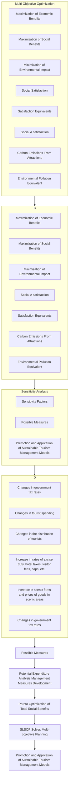

# Overload Alarm: Pareto Optimization of the Economic-Social-Environmental Triangle

Summary

The rapid growth of tourism has led many countries and regions to recognize the tension between environmental preservation and the short-term economic benefits of traditional tourism models. The overload alarm of tourism industry prompts the question: How should tourism evolve in the future? Sustainable tourism has emerged as a crucial solution to this dilemma. This paper develops a multi-objective planning model that integrates economic, social, and environmental factors, tailored to the current state of the tourism industry in Juneau and its development goals.

In Sub-model I, economic benefit is the primary optimization objective. Considering the diminishing marginal returns and increasing marginal costs associated with a rising number of tourists, we developed a mathematical relationship between economic benefits and costs as a function of tourist volume. Through a cost-benefit analysis (CBA) model, we then defined the feasible domain of economic constraints and determined the maximum economic benefit.

In Sub-model II, social benefit is the second optimization objective. It is assessed through social satisfaction analysis and monetization. Social satisfaction is influenced by residents' living pressure and regional congestion. We use the potential benefit per unit of social satisfaction as the conversion factor and model social benefit changes with tourist numbers. A social welfare optimization model identifies the feasible domain and calculates the maximum social benefit.

In Sub-model III, environmental benefit is the third optimization objective. Focusing on glacier degradation, the primary environmental issue in Juneau. Given the link between glacier degradation and carbon emissions, the carbon footprint is chosen as the key environmental indicator. The monetization of this effect follows a similar method to that of social satisfaction. Through ecological carrying capacity analysis, we determine the feasible range for environmental benefits and calculate the maximum achievable value.

Furthermore, we integrate the three preceding models and account for the coupling relationships among them. Using the SLSQP method, we determine the global Pareto-optimal solution for tourist numbers and overall benefits. Specifically, when the number of tourists reaches 1.32 million, the economic measure of the municipal weighted total benefit is 10 million USD, while the net income for Juneau amounts to 576 million USD.

Finally, we analyze the sensitivity of key model parameters, as well as the sources of additional government revenue and spending programs. We also write a memo to the Tourist Council of Juneau and extend the model to Jiuzhaigou, China. The results show that our model has good usability and robustness.

Keywords: Sustainable Tourism, Management Measures, Multi-objective Planning Model, Pareto Optimization, SLSQP

## Contents

## 1 Introduction 3

1.1 Problem Background 3  
1.2 Restatement of the Problem 4  
1.3 Literature Review 4  
1.4 Our Work 5

## 2 Assumptions and Justifications 5

## 3 Notations 6

## 4 Multi-Objective Optimization Model 7

4.1 Sub-model I: Cost-benefit Analysis Considering Marginal Effects 7  
4.1.1 Analysis of Economic benefits 8  
4.1.2 Analysis of Economic Costs 8  
4.1.3 Overall Economic Performance 9

4.2 Sub-model II: Social Welfare Optimization Model 10  
4.2.1 Estimation of Social Satisfaction Indicator 10  
4.2.2 Monetized Conversion of Social Satisfaction 10  
4.2.3 Overall Social Performance 11

4.3 Sub-model III: Environmental Carrying Capacity Model 11

4.3.1 Carbon Footprint Accounting 12  
4.3.2 Monetization of Carbon Footprint 13  
4.3.3 Overall Environmental Performance 13

4.4 Pareto Optimal Solution for Total benefit 14

4.4.1 Determination of Weight Value 14

4.4.2 Global Pareto Optimization in the Game between Scenic Spots 15

## 5 Results and Extension 15

5.1 Optimization Objectives 15  
5.2 Constraints Analysis 15  
5.3 Optimization Result Analysis 16  
5.4 Key Parameter Determination 18

## 6 Additional Income and Expenditure Plan 19

## 7 Sensitivity Analysis 20

7.1 Effect of Changes in Total Tourists and Performance per Tourist 20  
7.2 Effect of Changes in Total benefit 20

## 8 Strengths and Weaknesses 21

8.1 Strengths 21  
8.2 Weaknesses 21

## 9 Conclusion 21

## References 23

## Memo 25

## 1 Introduction

## 1.1 Problem Background

In recent years, tourism has played an increasingly significant role in driving local economic growth, generating substantial revenue and gradually becoming a pillar industry for both local and global economies $^{[1]}$ . However, with the continuous rise in tourist numbers, issues such as environmental degradation, increased infrastructure costs, and declining resident satisfaction have emerged, posing serious threats to the sustainable development of local tourism. This phenomenon is particularly evident in Juneau, Alaska.

Juneau is renowned for its unique and breathtaking natural landscapes, which include expansive national parks, majestic glaciers, and a 6,640-mile coastline. These attractions draw hundreds of thousands to over a million tourists annually, with the majority arriving via luxury cruise ships. In 2023, the tourism sector brought 1.6 million cruise passengers to Juneau, generating \$375 million in economic revenue $^{[2]}$ , alongside nearly 4,000 cruise-related jobs and \$18 million in tax revenue $^{[3]}$ . However, the influx of tourists has resulted in traffic congestion, overcrowded tourist sites, and rising hidden costs, such as increased infrastructure costs and the need for environmental remediation. Additionally, the noise from passenger helicopters has significantly disrupted the daily lives of local residents. More concerning is the impact of the surge in tourist numbers on the environment, including rising temperatures that have led to the retreat of the iconic Mendenhall Glacier. The pristine air, clean water, and natural beauty that once defined Juneau's allure are now being threatened by the ongoing influx of tourists.

  
Figure 1: Overview of Tourism Industry in Juneau, Alaska

To mitigate the negative impacts of unsustainable tourism growth, the Juneau government has implemented measures such as raising taxes and limiting visitor numbers to regulate tourist flow.

Additionally, it has intensified efforts to promote alternative attractions, such as wildlife viewing, in areas beyond the Mendenhall Glacier. Moving forward, the Juneau government should consider adopting more effective strategies to balance the social and economic benefits of tourism while developing comprehensive management plans. These plans should aim to advance the tourism sector while protecting the natural environment as much as possible, ensuring the long-term sustainability of tourism. This challenge not only affects the long-term sustainability of Juneau's tourism industry but also represents a common issue faced by tourist cities worldwide.

## 1.2 Restatement of the Problem

Based on the current situation in Juneau and the information outlined in the problem statement, it is essential to develop a comprehensive sustainable tourism management plan to maximize economic, social, and environmental benefits. Specifically, the plan must address the following three issues:

Problem 1: Develop a sustainable tourism management model tailored to the specific context of Juneau, considering all factors that may influence the long-term sustainable tourism industry. These factors include: environmental carrying capacity, both visible and hidden management costs, and local resident satisfaction.

Problem 2: Extend the model to other cities negatively affected by tourism and demonstrate its applicability in these cities. Analyze the impact of urban differences on the selection of key management measures, promote attractions with fewer tourists, and promote sustainable development of local tourism industry.

Problem 3: Based on the model developed in Problem 1, submit a one page memo to the Juneau Tourism Commission, using actual data to illustrate the necessity of developing sustainable tourism and providing feasible tourism management optimization paths and measures for Juneau.

## 1.3 Literature Review

The development of tourism has contributed to the growth, but at the same time it has also had some impact on the natural environment $^{[4]}$ . Sustainable tourism has become an important topic of academic research $^{[5]}$ . The main indicators of the relevant discussions focus on the environmental, economic and social aspects $^{[6]}$ . In the existing studies, some scholars analyze the environmental benefits of tourism development $^{[7]}$ , while Saayam $^{[8]}$ believe that sustainable tourism contributes to long-term social-economic stability, and Whitford et al. $^{[9]}$ discuss the role of sustainable tourism in product development for local residents. In addition, in the analysis of social benefits, scholars have analyzed the role of sustainable tourism in improving the quality of life of the residents $^{[10]}$ , and improving the happiness of the residents’ life $^{[11]}$ .

In addition, some scholars try the integrated management model of sustainable tourism. Stoica et al. $^{[12]}$ use the methods of benchmarking and SWOT analysis to construct a tourism management decision model, and Sripateep et al. $^{[13]}$ comprehensively consider the maximization of the interests of tourism stakeholders on the basis of the multi-objective planning model. However, the models that introduce Pareto optimization method into sustainable tourism management model and comprehensively consider the economic, social and environmental tripartite benefits are still few, and more scholars use Pareto optimization method to analyze the maximization of the interests of some classes of stakeholders. For example, Ko,YD $[14]$ derived the economic-environmental effect of sustainable tourism development in Seoul through Pareto optimization model, and Wang,XP et al. $^{[15]}$ analyzed the effect of tourism intermediate product price on the Pareto effectiveness of supply chain. In this analysis, we introduce the Pareto optimization method into the multi-objective model, which is innovative and reasonable.

## 1.4 Our Work

flowchart

Figure 2: Our Work

## 2 Assumptions and Justifications

Assumption 1: Demand and expenditure exhibit increasing marginal utility, while revenue(including hidden costs) follows decreasing marginal returns.

Justification: This aligns with classical economic models characterizing resource-constrained benefit-cost curves. Demand and expenditure can be modeled as strictly convex functions with tunable parameters, whereas revenue is fitted via concave functions to reflect diminishing returns.

Assumption 2: Hidden costs (e.g., infrastructure strain, carbon footprint) are monetize in USD.

Justification: This provides dimensional consistency for quantitative analysis. Environmental economics employs shadow pricing for such conversions—for instance, carbon trading market rates or public facility maintenance costs can quantify ecological impacts. Empirical carbon pricing frameworks (e.g., Carbon Border Adjustment Mechanism) validate this assumption’s practicality.

Assumption 3: Tourist spending or policy changes instantaneously affect visitor numbers.

Justification: This assumes a full-information market, simplifying tourism's inherent time-lag dynamics. While idealistic, it enables static Pareto-optimal equilibrium modeling. Deviations from reality are addressable via elasticity coefficients (e.g., price elasticity of demand)

Assumption 4: Parameters are spatiotemporally localized, ignoring external competition, infrastructure decay, or seasonal fluctuations.

Justification: Focusing on Juneau's internal resource allocation efficiency, this supports short-term partial equilibrium analysis. Such simplification suits rapid policy pilot evaluations while acknowledging scope limitations.

## 3 Notations

Table 1: Variations and Parameters

<table><tr><td>Symbols</td><td>Description</td><td>Unit</td></tr><tr><td> $N_t$ </td><td>Number of Tourists</td><td>Millions</td></tr><tr><td> $N_r$ </td><td>Number of Residents in Juneau</td><td>Millions</td></tr><tr><td> $k_i (i = 0,1,2)$ </td><td>Indexes of Decay Elasticity</td><td>-</td></tr><tr><td colspan="3">Economic Notations</td></tr><tr><td>E</td><td>Economic benefits</td><td>USD</td></tr><tr><td> $C_t$ </td><td>Consumption Generated by Tourists</td><td>USD</td></tr><tr><td> $C_{Gi}$ </td><td>Economic Revenues of Government</td><td>USD</td></tr><tr><td> $C_{Gc}$ </td><td>Economic Cost of Government</td><td>USD</td></tr><tr><td> $C_{Ri}$ </td><td>Economic Revenues of Residents</td><td>USD</td></tr><tr><td> $C_i$ </td><td>Infrastructure Costs</td><td>USD</td></tr><tr><td> $C_{fix}$ </td><td>Fixed Expenditure Costs</td><td>USD</td></tr><tr><td> $A_0$ </td><td>Basic Consumption per Tourist</td><td>USD</td></tr><tr><td>t</td><td>Tax Rate</td><td>%</td></tr><tr><td colspan="3">Social Notations</td></tr><tr><td>S</td><td>Social benefits</td><td>USD</td></tr><tr><td> $C_{add}$ </td><td>Virtual Economic Value EquivalentGenerated by Unit of Social Satisfaction</td><td>USD</td></tr><tr><td> $C_{Rc}$ </td><td>Incremental Cost of Residents&#x27; Living</td><td>USD</td></tr><tr><td> $A_1$ </td><td>Hidden benefits from Social Satisfaction</td><td>USD</td></tr><tr><td>s</td><td>Social Satisfaction</td><td>-</td></tr><tr><td> $P_l$ </td><td>Pressure on the Lives of Local Residents</td><td>-</td></tr><tr><td> $P_f$ </td><td>Congestion Pressure due to Increased Tourist Flow</td><td>-</td></tr><tr><td colspan="3">Environmental Notations</td></tr><tr><td>Env</td><td>Environmental benefits</td><td>USD</td></tr><tr><td> $C_{env}$ </td><td>Government Expenditure on Environmental Governance</td><td>USD</td></tr><tr><td> $C_{CO_2}$ </td><td>Hidden Costs Arising Caused by Carbon Emissions</td><td>USD</td></tr><tr><td> $C_{per_C}$ </td><td>Virtual Costs Corresponding to a Unit of  $CO_2$  Emissions</td><td>USD</td></tr><tr><td> $E_{CO_2}$ </td><td>Total  $CO_2$  Emissions</td><td>ton</td></tr><tr><td>γ</td><td>Average Carbon Emissions by Each Tourist</td><td>ton</td></tr><tr><td> $A_2$ </td><td>Proportion of Tax to Improve the Environment</td><td>-</td></tr></table>

Table 2: Value of Partial Parameters

<table><tr><td>Symbols</td><td>Value</td><td>Notes</td><td>Symbols</td><td>Value</td><td>Notes</td></tr><tr><td> $N_r$ </td><td>0.032</td><td>from Government</td><td> $\gamma$ </td><td>0.081</td><td>from Statistic[16]</td></tr><tr><td>t</td><td>5</td><td>from Government</td><td> $A_0$ </td><td>3000</td><td>from Government</td></tr><tr><td> $k_0$ </td><td>0.0068</td><td>Estimate</td><td> $A_1$ </td><td>5</td><td>Estimate from Article[17]</td></tr><tr><td> $k_1$ </td><td>0.3574</td><td>Estimate</td><td> $A_2$ </td><td>0.03</td><td>from Government</td></tr><tr><td> $k_2$ </td><td>1.6000</td><td>Estimate</td><td></td><td></td><td></td></tr></table>

radial bar chart

| Category | Value |
| -------- | ----- |
| C_i      | 1     |
| C_ftx    | 30    |
| C_Rc     | 4     |
| C_pei    | 60    |

Figure 3: Chart of Current Income and Expenditure

The symbols in Table 1 not mentioned in Table 2 and Figure 3 are all intermediate or decision variations used in model calculation.

## 4 Multi-Objective Optimization Model

## 4.1 Sub-model I: Cost-benefit Analysis Considering Marginal Effects

Economic benefits is the first core objective of local tourism development. An increase in the number of tourists not only promotes local economic growth and increases municipal revenues, but also provides more employment opportunities for local residents, thus raising their incomes. In addition, economic efficiency is a key factor in sustainable tourism management strategies. When the economic benefits are too low or the costs do not match the benefits, the local government may seek new economic growth points or even give up the continued development of tourism. Therefore, maximizing economic benefits should be the first objective function in the planning model.

Maximization of economic benefits can be expressed as follows:

$$
\max E = C _ {G i} - C _ {G c} \tag {1}
$$

where $C_{Gi}$ represents the visible economic revenues of the local government from the growth in the number of tourists, and $C_{Gc}$ is the increase of the local government in the cost of infrastructure operation and maintenance and other public services due to the excessive number of tourists.

## 4.1.1 Analysis of Economic benefits

The direct consumption generated by tourists is most significantly influenced by the number of tourists, so it can be regarded as a linear function of the number of tourists (i.e., assuming that the expected spending per tourist remains constant over the course of a year). Therefore, the formula for calculating the direct consumption $C_{t}$ generated by tourists is given by

$$
C _ {t} = \alpha \times N _ {t} \tag {2}
$$

where $\alpha$ represents the average economic benefits per tourist, $N_{t}$ represents the number of tourists, and as the number of tourists increases, the benefits arising from consumption generated by tourists exhibits diminishing marginal returns, meaning that $\alpha_{1}$ will decrease as $N_{t}$ increases. The formula for calculating $\alpha$ is as follows:

$$
\alpha = \frac {A _ {0}}{\left(1 + \mathrm{e} ^ {k _ {0} A _ {0} N _ {t} (t - t _ {\text { basic }})}\right) \left(1 + \mathrm{e} ^ {k _ {0} \left(A _ {0} - A _ {0 \max}\right)}\right)} \tag {3}
$$

where $A_{0}$ represents the basic per capita consumption, $k_{0}$ represents the rate at which per capita consumption tends to saturate as the number of tourists increases, and t represents tax rate. The formula also reflects the tolerance of tourists to the increase of tax and average cost, and the attenuation will be further increased when the tax or average cost is greater than the threshold. By default, we consider $t = t_{basic}$ , $A_{0max} = 1.5A_{0}$

A portion of the consumption generated by tourists during their trip is used to pay fees such as VAT on goods and hotel taxes levied by municipalities, while the other portion is used to purchase tourism-related goods and services provided by local residents. Therefore, we can get the following formula:

$$
C _ {t} = C _ {G i} + C _ {R i} \tag {4}
$$

where $C_{Gi}$ represents the portion of tourist spending that goes to municipal revenues, and $C_{Ri}$ represents the revenues of tourist spending that accrue to residents engaged in the tourism industry. Government benefits and residents' benefits can be expressed as follows:

$$
\left\{ \begin{array}{l} C _ {G i} = \alpha N _ {t} t \\ C _ {R i} = \alpha N _ {t} (1 - t) \end{array} \right. \tag {5}
$$

## 4.1.2 Analysis of Economic Costs

The components of economic costs are more complex than economic revenues. On the one hand, the government of Juneau needs to invest a certain amount of fixed expenditures on public services every year, such as household garbage removal and sewage disposal, etc. On the other hand, the surge in the number of tourists has led to accelerated destruction of the infrastructure in Juneau, and the government has to invest more revenues in the construction and maintenance of the infrastructure. At the same time, the cruise ship traffic brings a large amount of carbon emissions, the government of Juneau needs to solve these challenges.

It is important to note that the economic costs are not strictly linear with the number of tourists. When the number of tourists is high, the rate of infrastructure damage may be faster, showing an increasing trend of marginal costs at the level of government management costs. Therefore, in the economic cost analysis we fully consider the actual situation of increasing marginal cost and construct an economic cost analysis model.

$$
C _ {G c} = C _ {i} N _ {t} ^ {2} + C _ {f i x} \tag {6}
$$

where $C_{i}$ represents the cost required for the operation and management of the infrastructure and $C_{fix}$ is the fixed cost to be incurred by the government.

The additional tax revenues of the Government and a portion of municipal revenues are invested in public services, and a higher level of public services improves the satisfaction of local residents and tourists, thus contributing to the development of sustainable tourism.

## 4.1.3 Overall Economic Performance

As mentioned earlier, total economic efficiency E can be summarized as a composite variable reflecting the overall returns to economic activity. Considering the two key economic principles of diminishing marginal benefits and increasing marginal costs, it can be hypothesized that the government should have two break-even points. The break-even point is the point at which economic benefits equal economic costs, i.e. $C_{Gi} = C_{Gc}$ , at which the government has neither a profit nor a loss.

The break-even point provides upper and lower thresholds for the number of tourists. As the number of tourists increases, the marginal benefit gradually decreases while the marginal cost gradually increases, resulting in the economic benefit turning negative after the breakeven point is exceeded.

line chart

| Number of Tourists (Nt, in millions) | ct (Economic Revenue) | cc (Economic Cost) | ct - cc (Economic Benefit - Cost) |
| ------------------------------------ | --------------------- | ------------------ | ---------------------------------- |
| 0.0                                  | 0                     | 90                 | -100                               |
| 0.2                                  | 150                   | 95                 | 0                                  |
| 0.4                                  | 250                   | 105                | 100                                |
| 0.6                                  | 300                   | 120                | 150                                |
| 0.8                                  | 350                   | 150                | 160                                |
| 1.0                                  | 360                   | 200                | 150                                |
| 1.2                                  | 365                   | 275                | 100                                |
| 1.4                                  | 360                   | 350                | -50                                |
| 1.5                                  | 355                   | 425                | -75                                |

Figure 4: Economic benefits - Schematic Cost-benefit Analysis

When the number of tourists exceeds this threshold, the marginal benefits from additional tourists are not sufficient to cover the increased costs, which in turn leads to a decline in economic benefits. The break-even point therefore provides the government with a range of acceptable tourist numbers beyond which measures need to be taken to avoid negative economic benefits.

## 4.2 Sub-model II: Social Welfare Optimization Model

The social benefits is the second key objective that we analyze in our models. When the number of tourists is too high, local residents feel more pressure to live due to the increase in the cost of living, and at the same time, when the number of tourists far exceeds the number of local residents, the regional congestion rises and the social satisfaction of the residents decreases. On the contrary, when the number of tourists is too low, residents mainly engaged in the tourism service industry may feel an increase in life pressure due to a decrease in income.

Combining life stress and crowding, we can obtain the formula for the indicator measure of social satisfaction. Further, combining the historical data of Juneau, we analyze the virtual economic value equivalent that can be generated by a unit of social satisfaction, and calculate the economic benefits of social satisfaction metrics based on this. Ultimately, we can get the result of maximizing social benefits as follows

$$
\max S = s \times C _ {a d d} \tag {7}
$$

where s represents overall social satisfaction and $C_{add}$ represents the hidden economic value equivalent that can be generated by a unit of life satisfaction.

## 4.2.1 Estimation of Social Satisfaction Indicator

In our model, residents' social satisfaction is mainly determined by two mutually constraining factors: pressure on living and pressure on congestion. An increase in the number of tourists will both increase residents' income and lead to an increase in residents' cost of living. When the increase in residents' cost of living exceeds the increment in income, residents' life satisfaction will decrease. Since Juneau has fewer residents, it can be assumed that there is a significant linear relationship between congestion pressure and the number of tourists.

$$
\left\{ \begin{array}{l} P _ {l} = \frac {C _ {R i}}{C _ {B c}} \\ P _ {f} = \frac {N _ {r}}{N _ {t}} \end{array} \right. \tag {8}
$$

where $C_{Rc}$ represents the incremental cost of living to residents due to an increase in the number of tourists, which is considered as a constant since $C_{Ri}$ reflects a decrease; and $N_{r}$ is the number of residents in Juneau. Thus, the dimensionless indicator of social satisfaction s can be denoted as

$$
s = P _ {l} \times P _ {f} \tag {9}
$$

## 4.2.2 Monetized Conversion of Social Satisfaction

We use the virtual economic benefits generated by unit social satisfaction as an equivalent quantitative indicator to comprehensively analyze social satisfaction. Through the monetization transformation of social satisfaction, the quantitative outline of the sub-model can be further ensured to be unified, thus ensuring the model has better usability and comparability.

Specifically, the monetized conversion of social satisfaction indicators includes two steps. (1) the hidden economic benefit equivalent generated by the unit of social satisfaction; (2) the total hidden economic benefit generated by social satisfaction.

$$
C _ {a d d} = \frac {A _ {1}}{1 + \mathrm{e} ^ {(N _ {t} - k _ {1} N _ {r}) t}} \tag {10}
$$

where $A_{1}$ represents the hidden benefits derived from social satisfaction as equivalent quantitative metrics, which diminish when the number of tourists reaches a certain ratio $k_{1}$ of the local population or when tax revenue increases.

## 4.2.3 Overall Social Performance

In Model II, we combine the stress of living in Juneau with the stress of overcrowding due to the growth in the number of tourists and obtain the social benefit equivalent by measuring satisfaction through a virtual economic value. Since satisfaction is judged differently by different groups, subject to the 2023 Statistic of Juneau $^{[3]}$ , it can be assumed that the social benefits are in an acceptable range when more than 60%, of residents achieve a state of satisfaction.

line chart

| Number of Tourists (N, in millions) | Social Satisfaction (s) - Pf (Residential Pressure) | Social Satisfaction (s) - Pf (Crowding Level) | Social Satisfaction (s) - s (Social Satisfaction) | Social Satisfaction (s) - s_base (Baseline Satisfaction) |
| ----------------------------------- | -------------------------------------------------- | ------------------------------------------- | ------------------------------------------------- | -------------------------------------------------------- |
| 0.00                                | 40.0                                               | 40.0                                        | 2.0                                               | 6.0                                                    |
| 0.25                                | 25.0                                               | 25.0                                        | 4.0                                               | 6.0                                                    |
| 0.50                                | 15.0                                               | 15.0                                        | 6.0                                               | 6.0                                                    |
| 0.75                                | 10.0                                               | 10.0                                        | 8.0                                               | 6.0                                                    |
| 1.00                                | 7.5                                                | 7.5                                         | 10.0                                              | 6.0                                                    |
| 1.25                                | 6.0                                                | 6.0                                         | 12.0                                              | 6.0                                                    |
| 1.50                                | 5.0                                                | 5.0                                         | 13.0                                              | 6.0                                                    |
| 1.75                                | 4.0                                                | 4.0                                         | 12.0                                              | 6.0                                                    |
| 2.00                                | 3.0                                                | 3.0                                         | 11.0                                              | 6.0                                                    |

Figure 5: Social benefits - Schematic Social Satisfaction Analysis

In 2023, Juneau reaches 1.67 million visitors and the reality of residents being dissatisfied with the excessive number of visitors arises. In this context, we take the social satisfaction in 2023 as the baseline social satisfaction and calculate the off between the number of tourists and social satisfaction. That is, when the social satisfaction satisfies $S > 0.6 \times S_{2023}$ , the social benefit satisfies the constraint.

## 4.3 Sub-model III: Environmental Carrying Capacity Model

Minimizing environmental benefits is the third important objective in addition to maximizing economic and social benefits. Excessive numbers of tourists at any given time may result in the destruction of local natural and cultural resources due to insufficient carrying capacity. In addition, the airplanes, cruise ships, and other means of transportation used by tourists to travel to destinations such as Juneau can also lead to increased emissions of greenhouse gases such as carbon dioxide, which in turn leads to higher temperatures and glacier melting.

Environmental damage has significant hidden economic costs for the tourism industry and increases potential government expenditures. In order to quantitatively assess the hidden economic costs of environmental damage, in the environmental benefit analysis, we accounted for the carbon footprint of attractions in the city of Juneau and conducted an economization analysis using the equivalent of economic growth per unit of carbon emissions. Specifically, the primary objectives and key analyses of economic benefits are shown below

$$
\min E n v = C _ {C O _ {2}} - C _ {e n v} \tag {11}
$$

where, $C_{env}$ represents government expenditure on environmental governance, while $C_{co2}$ represents the hidden costs arising from environmental degradation caused by carbon emissions. The difference between these two variables quantifies the magnitude of tourism's environmental impact.

## 4.3.1 Carbon Footprint Accounting

Since the primary cause of glacier melt is temperature increase, the glacier recession equation summarized for assessing the recession of Mendenhall Glacier in Juneau is as follows

$$
\frac {\Delta V}{V _ {0}} = \lambda \ln \left(1 + \frac {\Delta E _ {C O _ {2}}}{C _ {0}}\right) \tag {12}
$$

where $E_{CO_{2}}$ represents the total carbon emissions from each scenic area in Juneau City, $C_{0}$ represents the air carbon dioxide concentration in Juneau City in 2023, and $\lambda$ represents the climate sensitivity, which is usually taken as $0.8^{\circ}C/(W/m^{2})$ .

It can be seen from the above equation that the retreat of Mendenhall glacier is mainly related to carbon emission. In addition, in order to prevent over-parameterization, this formula is only used to predict the melting rate of glacier, and it is not added to the environmental benefit evaluation model, but replaced by carbon emission.

In the process of carbon footprint accounting, we take into account that changes in the number of visitors to different attractions may lead to different carbon emissions, and analyze the carbon emissions of different attractions separately, so as to measure the impact of the growth in the number of visitors on the environment. According to the McKinsey Marginal Emission Reduction Curve $^{[18]}$ , the carbon emissions from visitors to each attraction can be derived as follows

$$
E _ {c _ {i}} = \gamma \times \left(r _ {i} N _ {t}\right) ^ {2} \tag {13}
$$

where $\gamma$ represents the average carbon emissions generated by each tourist, and $r_{i}$ represents the proportion of tourists visiting the i-th attraction out of the total number of tourists. According to the statistics $^{[3]}$ , we think the value of r is $\{0.2, 0.2, 0.6\}$ , among these, 0.6 is the proportion of tourists going to the glacier.

From this, the total carbon emissions from the sites in Juneau can be expressed as

$$
E _ {c o _ {2}} = \sum_ {i} E _ {c _ {i}} \tag {14}
$$

where $E_{c_{i}}$ represents the carbon emissions from managing the i-th tourist attraction, and the equation calculates the total decentralized carbon emissions $E_{co_{2}}$ by taking the sum of the individual emission costs.

## 4.3.2 Monetization of Carbon Footprint

Municipal revenues increase when the number of tourists increases. However, environmental benefits decrease as $CO_{2}$ emissions increase. To ensure the sustainability of tourism development at the attraction, the hidden environmental management costs of the municipality rise.

In the carbon footprint economic analysis model, for $C_{env}$ , we use tax to reflect the government's additional revenue; for $C_{CO_2}$ , firstly estimate the virtual cost equivalent per unit of carbon emissions, and then calculate the potential economic loss due to environmental pollution. Specifically, the model we use is shown below

$$
\left\{ \begin{array}{l} C _ {e n v} = N _ {t} \cdot \frac {A _ {2} t}{1 + \mathrm{e} ^ {k _ {2} t}} \\ C _ {C O _ {2}} = C _ {p e r _ {C}} E _ {C O _ {2}} \end{array} \right. \tag {15}
$$

where $C_{per_{C}}$ represents the virtual economic cost corresponding to a unit of CO2 emissions, $A_{2}$ represents the proportion of tax revenues used to improve the environment, and $k_{2}$ represents the elasticity adjustment coefficient, which indicates that as tax revenues increase, their effect in environmental management tends to be saturated.

## 4.3.3 Overall Environmental Performance

The presented environmental impact model integrates two critical nonlinear dynamics to quantify tourism sustainability. The formulation exhibits a dual structure balancing government-led environmental investments against dispersed carbon emission costs. The environmental governance component $C_{env}$ reflects diminishing returns on tax-funded ecological improvements as expenditures increase — a mechanism preventing over-reliance on financial solutions.

line chart

| Number of Tourists (Nt, in millions) | Cenv (Government Investment) | CCO2 (CO2 Economic Cost) | Env (Total Environmental Benefit) | Envbase (Reference Environmental Effect) |
| ------------------------------------ | ---------------------------- | ------------------------ | --------------------------------- | ---------------------------------------- |
| 0.0                                  | 0                            | 0                        | 0                                 | 0                                        |
| 0.2                                  | ~10000                       | ~0                       | ~-10000                           | 0                                        |
| 0.4                                  | ~20000                       | ~0                       | ~-15000                           | 0                                        |
| 0.6                                  | ~30000                       | ~5000                    | ~-18000                           | 0                                        |
| 0.8                                  | ~40000                       | ~10000                   | ~-19000                           | 0                                        |
| 1.0                                  | ~50000                       | ~15000                   | ~-18000                           | 0                                        |
| 1.2                                  | ~60000                       | ~25000                   | ~-15000                           | 0                                        |
| 1.4                                  | ~70000                       | ~45000                   | ~-10000                           | 0                                        |
| 1.5                                  | ~80000                       | ~60000                   | ~+15000                           | 0                                        |

Figure 6: Environmental benefits - Schematic Minimization of Environmental Impact Analysis

Conversely, the carbon cost aggregation $C_{CO_{2}}$ inherently penalizes concentrated tourism patterns through its quadratic summation structure. This mathematical design creates an optimization landscape where effective environmental management requires both strategic fiscal allocation and tourist flow distribution.

The model's nonlinear interactions emphasize that simply increasing environmental spending becomes progressively less effective, while carbon costs grow disproportionately with visitor concentration, demanding balanced spatial-temporal management of tourism resources for sustainable outcomes.

## 4.4 Pareto Optimal Solution for Total benefit

From the analysis in the preceding three sections, expressions for economic, social, and environmental benefits can be derived respectively. The total benefit is formulated as a weighted average of these three dimensions, yielding the following optimization objective:

$$
\left\{ \begin{array}{l} \max E = C _ {G i} - C _ {G c} \\ \max S = s \times C _ {a d d} \\ \min E n v = C _ {c o _ {2}} - C _ {e n v} \\ \max \mathcal {T} = \omega_ {1} E + \omega_ {2} S - \omega_ {3} E n v \end{array} \right. \tag {16}
$$

where $\omega_{i}(i = 1,2,3)$ is the weight of three benefits.

Additionally, the constraints are formulated as follows:

$$
s t. \left\{ \begin{array}{l} E > 0 \\ S > S _ {\text { min }} \\ E n v <   0 \\ \mathcal {T} > 0 \\ N _ {t m a x} > N _ {t} > 0 \end{array} \right. \tag {17}
$$

where $N_{tmax}$ denotes the maximum tourist capacity, which can be set to the 2023 tourist volume(i.e., 1.67 million); where $S_{min}$ denotes the minimum social benefit that Juneau can sustain, based on the social benefit in 2023 and calculated using the parameters from 2023 according to the aforementioned formula.

## 4.4.1 Determination of Weight Value

The weights for economic, social, and environmental benefits are derived from state-level reference metrics: U.S. state GDP rankings $^{[19]}$ , cost-of-living rankings by the Missouri Economic Research and Information Center (MERIC) $^{[20]}$ , and Yale University's state-level Environmental Performance Index (EPI) rankings $^{[21]}$ . This methodology assumes that a lower ranking (denoted as $rk_{i}$ , which $i$ means the $i$ -th dimension) in a specific dimension indicates a greater demand for improvement in that dimension, thus justifying a higher assigned weight. For instance, the Alaska's multidimensional rankings are expressed as $rk = \{47/50, 46/50, 43/50\}$ .

It is crucial to emphasize that the relative interdimensional relationships are contingent upon state-specific contextual factors. This dependency thus necessitates the following weight method formulation:

$$
\omega_ {i} = \frac {r k _ {i}}{\sum r k _ {i}} \tag {18}
$$

where, the weights for the three dimensions (economic, social, and environmental) in the Alaska are calculated as $\omega = \{0.346, 0.338, 0.316\}$ , which can be approximated as those of Juneau, given its role as the state's central hub for cruise tourism and primary data collection point.

## 4.4.2 Global Pareto Optimization in the Game between Scenic Spots

Economic, social and environmental benefits usually form a competitive relationship. This competition is typically influenced by multiple factors (e.g., the number of tourists and tax rates), and in the absence of coordinated mechanisms, natural game-theoretic interactions often lead to outcomes that deviate from Pareto Optimization, with strategic autonomy tending to converge toward suboptimal equilibria.

Specifically, by solving the Multi-Objective Programming Model using the SLSQP method, under the above constraints, we can obtain a Pareto optimal solution where the benefits are most reasonably allocated, and there is no room for improvement in the total benefit, which is the results of the Multi-Objective Programming Model.

scatter plot

| Economic Benefit (Million USD) | Social Benefit (Index Score) | Environmental Benefit |
| ------------------------------ | ----------------------------- | --------------------- |
| 0                              | 0                             | -1000                 |
| 250                            | 250                           | -900                  |
| 500                            | 500                           | -800                  |
| 750                            | 750                           | -700                  |
| 1000                           | 1000                          | -600                  |
| 1250                           | 1250                          | -500                  |
| 1500                           | 1500                          | -400                  |
| 1750                           | 1750                          | -300                  |
| 2000                           | 2000                          | -200                  |

scatter plot

| Economic Benefit (Million USD) | Environmental Benefit (Carbon Units) | Social Benefit |
| ------------------------------ | ------------------------------------- | -------------- |
| 0                              | 0                                     | 1000           |
| 250                            | -500                                  | 1500           |
| 500                            | -1000                                 | 2000           |
| 750                            | -1500                                 | 2500           |
| 1000                           | -2000                                 | 3000           |
| 1250                           | -2500                                 | 3500           |
| 1500                           | -3000                                 | 4000           |
| 1750                           | -3500                                 | 4500           |
| 2000                           | -4000                                 | 5000           |

scatter plot

| Social Benefit (Index Score) | Environmental Benefit (Carbon Units) | Economic Benefit |
| ---------------------------- | ------------------------------------- | ---------------- |
| 0                            | 0                                     | 250              |
| 500                          | -1000                                 | 500              |
| 1000                         | -1500                                 | 750              |
| 1500                         | -2000                                 | 1000             |
| 2000                         | -2500                                 | 1250             |
| 2500                         | -3000                                 | 1500             |
| 3000                         | -3500                                 | 1750             |
| 3500                         | -4000                                 | 1750             |
| 4000                         | -4500                                 | 1750             |
| 4500                         | -5000                                 | 1750             |
| 5000                         | -5500                                 | 1750             |

Figure 7: Schematic Pareto Optimization Solving Procedure

## 5 Results and Extension

## 5.1 Optimization Objectives

In the model, we try to analyze and optimize the total maximization of benefits by finding the optimal number of tourists, in which the economic, social and environmental benefits are all within the acceptable domain are the main constraints in the optimization process.

## 5.2 Constraints Analysis

## - Juneau

1. Economic Constraints Analysis: Taking into account the diminishing marginal benefit and increasing marginal cost effects brought about by the growth in the number of tourists, the acceptable number of tourists under economic constraints can be derived. When the economic benefit is greater than 0, the economic benefit is acceptable. The economic constraint fully takes into account the effects of tourist spending, tax rates and other factors, and is able to reflect the additional revenue generated by tourism development.  
2. Social Constraints Analysis: When the number of tourists increases, the income of the residents will increase, but the cost of living necessities, such as rent, food and beverage, will likewise rise. At the same time, when the number of tourists is too high, residents may be dissatisfied with the reduced convenience of social services due to crowding. The acceptable

number of tourists under social constraints can be derived. Based on empirical data, the social benefits are acceptable when more than 60% of the residents are satisfied with the standard.

3. Environmental Constraints Analysis: Since the maximum carrying capacity of the environment is limited, when the number of tourists is too high or the distribution of tourists is too centralized, the possibility of environmental damage increases, which leads to adverse effects. In addition, tourists traveling by cruise ships, airplanes and other means of transportation will produce a certain carbon footprint. Accordingly, the acceptable number of tourists under environmental constraints can be derived.

heatmap

Social Benefit > min Social Benefit
| Consumption Generated by Tourists (Ct / USD) | 0 | 1000 | 2000 | 3000 | 4000 | 5000 |
|---|---|---|---|---|---|---|
| Number of Tourists (Nt / Million) | 5 | 4 | 3 | 2 | 1 | 0 |
| Constraint Value (Green: Satisfied, Red: Violated) | -100 | -80 | -60 | -40 | -20 | 0 |
| Color scale: Green = Satisfied, Red = Violated | 40 | 20 | 0 | -20 | -40 | -60 |
| The chart displays a heatmap with a color gradient indicating the constraint value ranging from -100 to 40. The legend is in English. The x-axis represents consumption generated by tourists (Ct / USD), and the y-axis represents the number of tourists (Nt / Million).

heatmap

| Consumption Generated by Tourists (Cf / USD) | Number of Tourists (Nr / Million) | Constraint Value (Green: Satisfied, Red: Violated) |
| --- | --- | --- |
| 0 | 5 | -100 |
| 1000 | 4 | -80 |
| 2000 | 3 | -60 |
| 3000 | 2 | -40 |
| 4000 | 1 | -20 |
| 5000 | 0 | 0 |

heatmap

Environment Benefit < 0
| Consumption Generated by Tourists (Ct / USD) | Number of Tourists (Nt / Million) | Constraint Value (Green: Satisfied, Red: Violated) |
| :--- | :--- | :--- |
| 0 | 5 | -100 |
| 500 | 4 | -80 |
| 1000 | 3 | -60 |
| 1500 | 2 | -40 |
| 2000 | 1 | -20 |
| 2500 | 0 | 0 |
| 3000 | -1 | 20 |
| 3500 | -2 | 40 |
| 4000 | -3 | 60 |
| 4500 | -4 | 80 |
| 5000 | -5 | 100 |

Figure 8: Tourist-Constraint Stringency Heatmap

## - Jiuzhaigou

As a tourist city that also uses natural resources as its main attraction, Jiuzhaigou's constraints to sustainable tourism development are roughly the same as those of Juneau. However, unlike the better economic benefit of Juneau, Jiuzhaigou is much more influenced by economic benefit in its development and less influenced by environment benefit due to the temperate, therefore need give more consideration to economic constraints and more consideration to environment constraints.the initial weighting parameters were adjusted to $w = \{0.625, 0.313, 0.062\}$ .

## 5.3 Optimization Result Analysis

## - Juneau

1. Optimal Number of Tourists: We traverse the number of tourists in the range of 0-10 million, and through the coupled analysis of social, economic, and environmental benefits, we conclude that the total benefits is maximized when the total number of tourists is 1.32 million.  
2. Global Pareto Optimization: The maximum total benefits $\mathcal{T}$ is about 8 million when considering only the changes in the decision variables, at which point the net income $(C_t - C_{gc})$ is 576 million dollars and the total performance $(E + S - Env$ , means the direct sum of each benefit, representing the total benefit, used to measure the overall benefit; while weighted $\mathcal{T}$ used for optimization) is about 15 million. The optimal solution where the benefit first increases and then decreases with the number of tourists is shown in Figure 9, which is obviously in line with reality.

line chart

| Nt | Economic Benefit | Positive Benefit Area | Negative Impact Area |
|----|------------------|------------------------|----------------------|
| 0  | -30              | -                      | -                    |
| 1  | 10               | -                      | -                    |
| 2  | -10              | -                      | -                    |
| 4  | -25              | -                      | -                    |
| 6  | -35              | -                      | -                    |
| 8  | -40              | -                      | -                    |
| 10 | -45              | -                      | -                    |

area chart

| Nt | Social Benefit | Positive Benefit Area | Negative Impact Area |
|----|----------------|------------------------|----------------------|
| 0  | 0              | 0                      | 5                    |
| 2  | 7              | 7                      | 5                    |
| 4  | 3              | 3                      | 5                    |
| 6  | 1              | 1                      | 5                    |
| 8  | 0              | 0                      | 5                    |
| 10 | 0              | 0                      | 5                    |

area chart

| Nt | Environmental Benefit | Negative Benefit Area |
|---|---|---|
| 0 | 0 | 0 |
| 2 | -10 | -10 |
| 4 | -30 | -30 |
| 6 | -60 | -60 |
| 8 | -90 | -90 |
| 10 | -130 | -130 |

line chart

| Nt | Total Benefit | Benefit Increase Velocity |
|----|---------------|----------------------------|
| 0  | 0             | 0.3                        |
| 2  | -20           | -0.1                       |
| 4  | -40           | -0.1                       |
| 6  | -60           | -0.1                       |
| 8  | -70           | -0.1                       |
| 10 | -75           | -0.1                       |

line chart

| Nc | Net Income Increase Velocity | Net Income |
|----|-------------------------------|------------|
| 0  | 20                            | -2500      |
| 1  | 15                            | -2400      |
| 2  | 10                            | -2300      |
| 3  | 5                             | -2200      |
| 4  | 0                             | -2100      |
| 5  | -5                            | -2000      |
| 6  | -10                           | -1900      |
| 7  | -15                           | -1800      |
| 8  | -20                           | -1700      |
| 9  | -25                           | -1600      |
| 10 | -30                           | -1500      |

line chart

| Nc | Performance Increase Velocity | Total Performance |
|----|-------------------------------|-------------------|
| 0  | 0.0                           | 1.0               |
| 2  | -50.0                         | -50.0             |
| 4  | -100.0                        | -100.0            |
| 6  | -150.0                        | -150.0            |
| 8  | -200.0                        | -200.0            |
| 10 | -200.0                        | -200.0            |

Figure 9: Optimization Results - Juneau

## - Jiuzhaigou

In the process of optimization for Jiuzhaigou, the selection of key parameters is basically the same as that of Juneau, but some parameters have been adjusted according to national conditions and environmental changes. According to China's value-added tax rate, $t = 13\%$ of Jiuzhaigou; while the other two key parameters are considered to be approximately the same as Juneau's.

line chart

| N_F | Economic Benefit |
| --- | ---------------- |
| 0   | -50              |
| 5   | 0                |
| 10  | -100             |
| 15  | -150             |
| 20  | -200             |
| 25  | -250             |
| 30  | -300             |

line chart

| Nt | Social Benefit | Positive Benefit Area | Negative Impact Area |
|----|----------------|------------------------|----------------------|
| 0  | 0              | 0                      | 0                    |
| 5  | 50             | 50                     | 0                    |
| 10 | 40             | 40                     | 0                    |
| 15 | 20             | 20                     | 0                    |
| 20 | 10             | 10                     | 0                    |
| 25 | 5              | 5                      | 0                    |
| 30 | 0              | 0                      | 0                    |

area chart

| Nc | Environmental Benefit | Negative Benefit Area |
|---|---|---|
| 0 | 0 | 0 |
| 5 | -50 | -50 |
| 10 | -100 | -100 |
| 15 | -150 | -150 |
| 20 | -200 | -200 |
| 25 | -300 | -300 |
| 30 | -600 | -600 |

line chart

| Nt | Total Benefit | Benefit Increase Velocity |
| --- | ------------- | ------------------------- |
| 0   | -50           | 0.0                       |
| 5   | -100          | 0.4                       |
| 10  | -150          | 0.8                       |
| 15  | -200          | 1.0                       |
| 20  | -250          | 0.8                       |
| 25  | -275          | 0.6                       |
| 30  | -280          | 0.4                       |

line chart

| Nt | Net Income | Net Income Increase Velocity |
| --- | --- | --- |
| 0 | 0 | 15 |
| 5 | -2000 | -5 |
| 10 | -4000 | -10 |
| 15 | -6000 | -15 |
| 20 | -8000 | -15 |
| 25 | -10000 | -15 |
| 30 | -15000 | -15 |

line chart

| Nt | Total Performance | Performance Increase Velocity |
|----|-------------------|-------------------------------|
| 0  | 0                 | 1.5                           |
| 5  | -200              | -1.0                          |
| 10 | -400              | -1.5                          |
| 15 | -600              | -1.5                          |
| 20 | -800              | -1.5                          |
| 25 | -1000             | -1.5                          |
| 30 | -1200             | -1.5                          |

Figure 10: Optimization Results - Jiuzhaigou

1. Optimal Number of Tourists: We traverse the number of tourists in the range of 0-10 million, and through the coupled analysis of social, economic, and environmental benefits, we conclude that the total benefits are maximized when the total number of tourists is 3.32 million.  
2. Global Pareto Optimization: The maximum total benefits T (total benefits of the municipal sector) is 37 million when considering only the changes in the decision variables, at which point

the net economic is 743 million dollars.

From the Figure 9 and Figure 10, it can be observed that the overall trend of benefits changes is approximately similar, which reflects the good scalability of the model. However, due to the extremely small weight of environmental benefits in Jiuzhaigou, its value is much lower than that of Juneau. This also reflects Jiuzhaigou's selective neglect of environmental benefits in its pursuit of economic gains, reflecting the differences between different cities.

## 5.4 Key Parameter Determination

## - Juneau

1. Proportion of Tourist( $r_{glacier}$ ): The degree of dispersion of tourists reflects the ratio of the actual number of tourists accommodated in different scenic spots, Juneau Tourism Bureau website statistics show that more than 60% of tourists to Juneau City will go to Mendenhall Glacier.  
2. Tax Rate(t): Based on the data of various local tax rates published on the official website of the Juneau City Government, combined with the data of the total income generated by the tourism industry in Juneau and the municipal economic income, the comprehensive tax rate for tourists during their travel in Juneau is calculated to be 5%.  
3. Visitor Consumption( $A_{0}$ ): Visitor Consumption reflects the cost of food, lodging, excursions, and souvenir purchases incurred by tourists during their visit to the City of Juneau. In short, tourist consumption reflects to some extent the prices of scenic spots and local life.

Related images of changes in visitor numbers and total benefits when each key factor changes are in the section Sensitivity Analysis.

## - Jiuzhaigou

line chart

| Proportion of Tourism (r) | Turour Volume (%) Million | Turour Consumption (A_max, USD) | Performance per Total (%) Million | Turour Volume (%) Million | Performance per Total (%) Million |
| --- | --- | --- | --- | --- | --- |
| 0.40 | 3.25 | 1000 | 1.5 | 7.0 | 1.5 |
| 0.45 | 3.35 | 1500 | 2.0 | 6.0 | 2.0 |
| 0.50 | 3.45 | 2000 | 2.5 | 5.0 | 2.5 |
| 0.55 | 3.5 | 2500 | 3.0 | 4.0 | 3.0 |
| 0.60 | 3.45 | 3000 | 3.5 | 3.0 | 3.5 |
| 0.65 | 3.35 | 3500 | 4.0 | 2.5 | 4.0 |
| 0.70 | 3.25 | 4000 | 4.5 | 2.0 | 4.5 |
| 0.75 | 3.1 |  | 5.0 | 1.5 | 5.0 |
| 0.80 | 2.85 |  | 5.5 | 1.0 | 5.5 |

Figure 11: Changes of Total Tourists and Performance per Tourist in Jiuzhaigou

(Performance per Tourist is short for Performance)

From Figure 11, the following observations can be made: (1) When the proportion of tourists visiting Jiuzhaigou valley $(r)$ is approximately equal to the proportion visiting other attractions, the optimal total benefit corresponds to the maximum tourist volume and maximum performance. This indicates that maintaining diversion measures is beneficial for sustainable tourism. (2) As tax rates $(t)$ increase, the additional expenditure for tourists also rises, leading to a reduction in the number of tourists required to achieve optimal performance. Meanwhile, performance itself increases. (3) The effect of increased tourist expenditure is similar to that of increasing t; however, due to diminishing marginal benefits, the graph exhibits an inflection point.

line chart

| Proportion of Tax Rate | Estimated Cost of Income (%) - Economic Debt | Estimated Cost of Income (%) - Real Estate Debt | Estimated Cost of Income (%) - Environmental Debt | Estimated Cost of Income (%) - Total Debt |
|------------------------|---------------------------------------------|--------------------------------------------------|--------------------------------------------------|------------------------------------------|
| 0.40                   | 100                                         | 100                                              | 100                                              | 100                                      |
| 0.35                   | 95                                          | 95                                               | 95                                               | 95                                       |
| 0.30                   | 90                                          | 90                                               | 90                                               | 90                                       |
| 0.25                   | 85                                          | 85                                               | 85                                               | 85                                       |
| 0.20                   | 80                                          | 80                                               | 80                                               | 80                                       |
| 0.15                   | 75                                          | 75                                               | 75                                               | 75                                       |
| 0.10                   | 70                                          | 70                                               | 70                                               | 70                                       |
| 0.05                   | 65                                          | 65                                               | 65                                               | 65                                       |
| 0.00                   | 60                                          | 60                                               | 60                                               | 60                                       |

Figure 12: Changes of Total benefit in Jiuzhaigou

The total benefit of the first two graphs in Figure 12 is proportional to the tourist volume $(N_{t})$ , while the third graph is similar to the shape of performance. It can be concluded that the influence of performance increases while the $N_{t}$ decreases with the increase in Tourist Consumption $(A_0)$ . This is in line with objective reality; At the same time, it can be seen that $\mathcal{T}$ generated by the optimal $N_{t}$ is slightly different when different key parameters change, which provides convenience for the manager's top placement policy.

## 6 Additional Income and Expenditure Plan

## - Sources of Additional Revenue:

Additional revenue is the revenue generated when the number of visitors changes. The main sources of additional revenue mainly include:

1. Direct economic income from consumption behavior occurring among tourists. Direct economic income is reflected in municipal economic benefits through two channels of tax. One is the rate of VAT and hotel tax paid by tourists when they spend; rather, it is the rise in the amount of personal income tax brought about by the increase in residents' income.  
2. Hidden sociol benefits generated when the number of tourists decreases. Hidden social benefits is reflected through the monetized equivalent of social satisfaction, and Hidden social benefits will bring the government some economic gains in the long run.

## • Revenue Expenditure Plan:

In order to achieve sustainable development of the tourism industry, the government needs to formulate a reasonable additional revenue expenditure plan. Specifically, the elements of expenditure that the government can adjust include the following:

1. Infrastructure management and operation expenditure. Infrastructure, including public building construction and maintenance costs, urban pipeline maintenance fees, etc. A reasonable increase in infrastructure management and maintenance expenditures within a certain range can effectively improve social satisfaction and bring higher social benefits.  
2. Environmental maintenance expenditure. Before environmental damage occurs, the government needs to set aside and spend on environmental maintenance in advance. The increase of environmental maintenance expenses can improve the carrying capacity of the environment, promote the sustainable development of tourism, and then improve the total benefits.  
3. Expenditures on the management of environmental damage. This expenditure is a potential economic expenditure. The government must take this item into account in its revenue and

expenditure plan, carefully assess the probability of environmental damage, and prevent the chain reaction caused by reduced environmental benefits.

## 7 Sensitivity Analysis

## 7.1 Effect of Changes in Total Tourists and Performance per Tourist

In the model sensitivity analysis, we mainly analyzed the effects of small perturbations in the proportion of tourists, tax rate and tourist consumption, on the total number of tourists and total benefits. The results of the sensitivity analysis are shown in Figures 13 and 14.

line chart

| Proportion of Tourism (x) | Total Volume (% Million) - Performance | Total Volume (% Million) - Total Volume (%) |
| --- | --- | --- |
| 0.40 | 1.35 | 1.25 |
| 0.45 | 1.40 | 1.30 |
| 0.50 | 1.42 | 1.35 |
| 0.55 | 1.40 | 1.38 |
| 0.60 | 1.35 | 1.40 |
| 0.65 | 1.30 | 1.42 |
| 0.70 | 1.25 | 1.45 |
| 0.75 | 1.20 | 1.48 |
| 0.80 | 1.15 | 1.50 |
| 0.85 | 1.10 | 1.48 |
| 0.90 | 1.05 | 1.45 |
| 0.95 | 1.00 | 1.42 |
| 1.00 | 0.95 | 1.38 |
| 1.05 | 0.90 | 1.35 |
| 1.10 | 0.85 | 1.30 |
| 1.15 | 0.80 | 1.25 |
| 1.20 | 0.75 | 1.20 |
| 1.25 | 0.70 | 1.15 |
| 1.30 | 0.65 | 1.10 |
| 1.35 | 0.60 | 1.05 |
| 1.40 | 0.55 | 1.00 |
| 1.45 | 0.50 | 0.95 |
| 1.50 | 0.45 | 0.90 |
| 1.55 | 0.40 | 0.85 |
| 1.60 | 0.35 | 0.80 |
| 1.65 | 0.30 | 0.75 |
| 1.70 | 0.25 | 0.70 |
| 1.75 | 0.20 | 0.65 |
| 1.80 | 0.15 | 0.60 |
| 1.85 | 0.10 | 0.55 |
| 1.90 | 0.05 | 0.50 |
| 1.95 | 0.00 | 0.45 |
| 2.00 | -0.05 | 0.40 |
| 2.05 | -0.10 | 0.35 |
| 2.10 | -0.15 | 0.30 |
| 2.15 | -0.20 | 0.25 |
| 2.20 | -0.25 | 0.20 |
| 2.25 | -0.30 | 0.15 |
| 2.30 | -0.35 | 0.10 |
| 2.35 | -0.40 | 0.05 |
| 2.40 | -0.45 | 0.00 |
| 2.45 | -0.50 | -0.05 |
| 2.50 | -0.55 | -0.10 |
| 2.55 | -0.60 | -0.15 |
| 2.60 | -0.65 | -0.20 |
| 2.65 | -0.70 | -0.25 |
| 2.70 | -0.75 | -0.30 |
| 2.75 | -0.80 | -0.35 |
| 2.80 | -0.85 | -0.40 |
| 2.85 | -0.90 | -0.45 |
| 2.90 | -0.95 | -0.50 |
| 2.95 | -1.00 | -0.55 |
| 3.00 | -1.05 | -0.60 |
| 3.05 | -1.10 | -0.65 |
| 3.10 | -1.15 | -0.70 |
| 3.15 | -1.20 | -0.75 |
| 3.20 | -1.25 | -0.80 |
| 3.25 | -1.30 | -0.85 |
| 3.30 | -1.35 | -0.90 |
| 3.35 | -1.40 | -0.95 |
| 3.40 | -1.45 | -1.00 |
| 3.45 | -1.50 | -1.05 |
| 3.50 | -1.55 | -1.10 |
| 3.55 | -1.60 | -1.15 |
| 3.60 | -1.65 | -1.20 |
| 3.65 | -1.70 | -1.25 |
| 3.70 | -1.75 | -1.30 |
| 3.75 | -1.80 | -1.35 |
| 3.80 | -1.85 | -1.40 |
| 3.85 | -1.90 | -1.45 |
| 3.90 | -1.95 | -1.50 |
| 3.95 | -2.00 | -1.55 |
| 4.00 | -2.05 | -1.60 |
| 4.05 | -2.10 | -1.65 |
| 4.10 | -2.15 | -1.70 |
| 4.15 | -2.20 | -1.75 |
| 4.20 | -2.25 | -1.80 |
| 4.25 | -2.30 | -1.85 |
| 4.30 | -2.35 | -1.90 |
| 4.35 | -2.40 | -1.95 |
| 4.40 | -2.45 | -2.00 |
| 4.45 | -2.50 | -2.05 |
| 4.50 | -2.55 | -2.10 |
| 4.55 | -2.60 | -2.15 |
| 4.60 | -2.65 | -2.20 |
| 4.65 | -2.70 | -2.25 |
| 4.70 | -2.75 | -2.30 |
| 4.75 | -2.80 | -2.35 |
| 4.80 | -2.85 | -2.40 |
| 4.85 | -2.90 | -2.45 |
| 4.90 | -2.95 | -2.50 |
| 4.95 | -3.00 | -2.55 |
| 5.00 | -3.05 | -2.60 |

Figure 13: Sensitivity Analysis - Changes of Total Tourists and Performance per Tourist

The conclusions that can be drawn from the two graphs on the left are that (1) the greatest number of tourists visit the glacier when the proportion of tourists visiting the glacier is roughly equal to the proportion of tourists visiting the other attractions (2) the number of tourists required for optimal performance decreases further as the tax rate increases. These are roughly the same conclusions reached in the Jiuzhaigou analysis.

Compared to Jiuzhaigou, there is a big difference in Juno's performance when the number of tourists changes. When tourist spending is below US\$4,000, consumers view tourism expenses as a price inelastic product, so the number of tourists continues to increase, while the performance generated per tourist shows a slow increase because the rate of diminishing marginal effects is smaller than the rate of rising tourist numbers. Subsequently, when spending per tourist exceeds \$4,000, the sensitivity of tourists to price changes increases, and tourism expenditures are transformed into a price-elastic good, with the number of tourists decreasing sharply, the total benefits of the tourist attractions, and the performance generated per tourist decreasing in the same trend.

## 7.2 Effect of Changes in Total benefit

radar chart

| Radar Chart of Benefits by Proportion of Tourists | Economic Benefit (p=0.18) | Economic Benefit (p=0.20) | Environmental Benefit (p=0.18) | Environmental Benefit (p=0.20) | Social Benefit (p=0.18) | Social Benefit (p=0.20) |
| --- | --- | --- | --- | --- | --- | --- |
| Radar Chart of Benefits by Tax Rate | 1.4 | 1.3 | 1.5 | 1.4 | 1.6 | 1.5 |
| Radar Chart of Benefits by Tourist Consumption | 1.2 | 1.1 | 0.9 | 0.8 | 0.7 | 0.6 |
| Radar Chart of Benefits by Tourist Consumption | 1.5 | 1.4 | 1.3 | 1.2 | 1.1 | 1.0 |
| Radar Chart of Benefits by Tourist Consumption | 1.3 | 1.2 | 1.1 | 1.0 | 0.9 | 0.8 |
| Radar Chart of Benefits by Tourist Consumption | 1.4 | 1.3 | 1.2 | 1.1 | 1.0 | 0.9 |
| Radar Chart of Benefits by Tourist Consumption | 1.5 | 1.4 | 1.3 | 1.2 | 1.1 | 1.0 |
| Radar Chart of Benefits by Tourist Consumption | 1.3 | 1.2 | 1.1 | 1.0 | 0.9 | 0.8 |
| Radar Chart of Benefits by Tourist Consumption | 1.4 | 1.5 | 1.3 | 1.2 | 1.1 | 1.0 |
| Radar Chart of Benefits by Tourist Consumption | 1.5 | 1.4 | 1.3 | 1.2 | 1.1 | 1.0 |
| Radar Chart of Benefits by Tourist Consumption | 1.3 | 1.2 | 1.1 | 1.0 | 0.9 | 0.8 |
| Radar Chart of Benefits by Tourist Consumption | 1.4 | 1.6 | 1.3 | 1.2 | 1.1 | 1.0 |
| Radar Chart of Benefits by Tourist Consumption | 1.5 | 1.4 | 1.3 | 1.2 | 1.1 | 1.0 |
| Radar Chart of Benefits by Tourist Consumption | 1.3 | 1.2 | 1.1 | 1.0 | 0.9 | 0.7 |
| Radar Chart of Benefits by Tourist Consumption | 1.4 | 1.5 | 1.3 | 1.2 | 1.1 | 1.0 |
| Radar Chart of Benefits by Tourist Consumption | 1.5 | 1.4 | 1.3 | 1.2 | 1.1 | 1.0 |
| Radar Chart of Benefits by Tourist Consumption | 1.3 | 1.3 | 1.2 | 1.0 | 0.9 | 0.7 |
| Radar Chart of Benefits by Tourist Consumption | 1.4 | 1.6 | 1.3 | 1.2 | 1.1 | 1.0 |
| Radar Chart of Benefits by Tourist Consumption | 1.5 | 1.4 | 1.3 | 1.2 | 1.1 | 0.9 |
| Radar Chart of Benefits by Tourist Consumption | 1.3 | 1.2 | 1.1 | 0.9 | 0.8 | 0.6 |
| Radar Chart of Benefits by Tourist Consumption | 1.4 | 1.5 | 1.3 | 1.2 | 1.1 | 0.9 |
| Radar Chart of Benefits by Tourist Consumption | 1.5 | 1.4 | 1.3 | 1.2 | 1.1 | 0.9 |
| Radar Chart of Benefits by Tourist Consumption | 1.3 | 1.3 | 1.2 | 0.9 | 0.8 | 0.6 |
| Radar Chart of Benefits by Tourist Consumption | 1.4 | 1.6 | 1.3 | 1.2 | 1.1 | 0.9 |
| Radar Chart of Benefits by Tourist Consumption | 1.5 | 1.4 | 1.3 | 1.2 | 1.1 | 0.9 |
| Radar Chart of Benefits by Tourist Consumption | 1.3 | 1.2 | 1.0 | -0.2 | -0.3 | -0.4 |
| Radar Chart of Benefits by Tourist Consumption | 1.4 | 1.5 | 1.3 | -0.2 | -0.3 | -0.4 |
| Radar Chart of Benefits by Tourist Consumption | 1.5 | 1.4 | -0.2 | -0.3 | -0.4 | -0.5 |
| Radar Chart of Benefits by Tourist Consumption | 1.3 | -0.2 | -0.3 | -0.4 | -0.5 | -0.6 |
| Radar Chart of Benefits by Tourist Consumption | 1.4 | -0.3 | -0.4 | -0.5 | -0.6 | -0.7 |
| Radar Chart of Benefits by Tourist Consumption | 1.5 | -0.4 | -0.5 | -0.6 | -0.7 | -0.8 |

Figure 14: Sensitivity Analysis - Changes of Total benefit

In the sensitivity analysis of total benefits, the tax rate, tourist proportion, and tourist consumption were analyzed as key parameters. The results are as follows: (1) As the tourist proportion increases by 1% from 0, social, environmental, economic, and total benefits all increase due to a more balanced distribution of tourists. (2) As the tax rate increases by 1% from 5%, environmental benefits rise, while economic, social, and total benefits decline. (3) As tourist consumption increases by 1.25% from 3,000 USD, economic and social benefits rise, environmental benefits decrease, and total benefits first increase and then decrease.

## 8 Strengths and Weaknesses

## 8.1 Strengths

1. Computational Feasibility: The model employs Pareto-optimal solutions with nonlinear marginal effect formulations, ensuring theoretical rigor while balancing realism and numerical stability. By integrating economic, social, and ecological dimensions into a unified framework, Pareto optimization explicitly reveals trade-offs among these aspects, providing policymakers with systematic pathways for optimization.  
2. Holistic Cost Internalization: Social policies and environmental impacts are consolidated into quantifiable metrics, translating hidden costs (e.g., carbon footprint, infrastructure strain) into monetary terms. This approach mitigates over-parameterization risks in multi-objective models.  
3. Generalizability & Practicality: The framework is adaptable to other tourism destinations suffering from overtourism, demonstrating strong generalizability. Its visual outputs and sensitivity analyses align with empirical trends, accurately reflecting real-world requirements and policy constraints.

## 8.2 Weaknesses

1. Temporal Simplification: The model ignores time-lag effects in tourism's response to policy changes. While elasticity coefficients partially correct deviations, their calibration remains subjective. Delayed demand adjustments necessitate dynamic extensions, for example, time-series models for long-term impact analysis.  
2. Spatiotemporal Narrowness: External competition, infrastructure decay, and seasonal fluctuations are excluded, potentially inflating optimization results. Future iterations should incorporate regional linkage mechanisms (e.g., cross-border tourism flows, shared infrastructure costs) to enhance realism.

## 9 Conclusion

The model provides a practical tool in places like Juneau, which balances simplicity with real-world applicability addressing economic, society, and environmental benefit by hidden cost monetization. The fixed system approach allows quick policy solutions, matching the focus of cities on short-term budgets. Its strength lies in showing Pareto Optimization — giving leaders clear metrics when managing tourism pressures.

After expanding the model to Jiuzhaigou, China, although both locations are affected by overtourism, the measures adopted differ due to the distinct geographical attributes of the two areas. The model can well reflect the differences and similarities between the two places, and has good extensibility. Specific conclusion can be found in the table below:

Table 3: Comparison of Information and Conclusions in Juneau and Jiuzhaigou

<table><tr><td colspan="2">City</td><td>Juneau, Alaska</td><td>Jiuzhaigou, China</td></tr><tr><td rowspan="7">Current Situation</td><td rowspan="4">Similar Part</td><td colspan="2">Small population</td></tr><tr><td colspan="2">Economiey predominantly dependent on tourism</td></tr><tr><td colspan="2">Environment and society vulnerable to the impacts of overtourism</td></tr><tr><td colspan="2">The tourist destination is concentrated in a certain scenic spot</td></tr><tr><td rowspan="3">Different Part</td><td>Relatively developed economy</td><td>Relatively worse economy</td></tr><tr><td>Closer to the Arctic, the ecosystem is even less stable</td><td>Temperate regions have a more stable environment</td></tr><tr><td>There are differences in government policies</td><td>Government spending varies</td></tr><tr><td rowspan="3">Key Parameter</td><td>Tax rate</td><td>Lower</td><td>Higher</td></tr><tr><td>Proportion of Tourists</td><td>Similar</td><td>Similar</td></tr><tr><td>Tourist Consumption</td><td>Higher</td><td>Lower</td></tr><tr><td rowspan="2">Measures to Mitigate Overtourism</td><td>Constraint Factors</td><td>More consideration of environment benefit</td><td>More consideration of economy benefit</td></tr><tr><td>Optimized Factors</td><td colspan="2">Number of tourists in Global Pareto Optimization</td></tr><tr><td rowspan="3" colspan="2">How to Promote Locations that Have Fewer Tourists</td><td colspan="2">Properly reduce local taxes, discount goods for tourists, and reduce tourist expenses to attract tourists</td></tr><tr><td colspan="2">Achieve a win-win situation between tourists&#x27; satisfaction and residents&#x27; satisfaction to achieve fame publicity</td></tr><tr><td colspan="2">Lucid water and lush mountains are golden hills and invaluable assets, which ensure a good environment as a tourist attraction</td></tr></table>

## References

[1] Cristina Campos Herrero et al. “Tourism under a life cycle thinking approach: A review of perspectives and new challenges for the tourism sector in the last decades”. In: Science of the Total Environment (2022). DOI: 10.1016/j.scitotenv.2022.157261.  
[2] URL: https://abc7.com/post/juneau-alaska-cruise-ship-limits-overtourism/15048713/.  
[3] URL: https://juneau.org/wp-content/uploads/2024/01/CBJ-Cruise-Impacts-2023-Report-1.22.24.pdf.  
[4] SF McCool. “Making tourism sustainable, sustainable tourism, and what should tourism sustain: Different questions, different indicators”. In: PROCEEDINGS OF THE 1999 INTERNATIONAL SYMPOSIUM ON COASTAL AND MARINE TOURISM: BALANCING TOURISM AND CONSERVATION (2002).  
[5] Claire Weishar. “From mass tourism to sustainable tourism?” In: CONFINS-REVUE FRANCO-BRESILIENNE DE GEOGRAPHIE-REVISTA FRANCO-BRASILEIRA DE GEOGRAFIA (2021).  
[6] Yi Guo, Jinbo Jiang, and Shengchao Li. “A Sustainable Tourism Policy Research Review”. In: SUSTAINABILITY (2019). DOI: {10.3390/su11113187}.  
[7] Haiyan Kong et al. “Exploring Chinese sustainable tourism: a 25-year perspective”. In: JOURNAL OF SUSTAINABLE TOURISM (2024). DOI: {10.1080/09669582.2024.2347547}.  
[8] Andrea Saayman and ShiNa Li. “The contribution of economics to sustainable tourism research”. In: JOURNAL OF SUSTAINABLE TOURISM 31 (2023). DOI: 10.1080/09669582.2023.2224943.  
[9] Michelle M. Whitford and Lisa M. Ruhanen. “Australian indigenous tourism policy: practical and sustainable policies?” In: JOURNAL OF SUSTAINABLE TOURISM 18 (2010). DOI: 10.1080/09669581003602325.  
[10] Muhamad and Anugrah Gusta Prima. “Implementation Of Sustainable Tourism Destination Development Achievements (Indicators of Sustainable Tourism Development (STD), Sustainable Tourism Observatory (STO) Towards Sustainable Tourism Certification (STC) in Pulesari Village, Wonokerto, Turi District, Sleman Regency, Daerah Istimewa Yogyakarta)”. In: PROCEEDINGS OF THE ASIA TOURISM FORUM 2016 - THE 12TH BIENNIAL CONFERENCE OF HOSPITALITY AND TOURISM INDUSTRY IN ASIA (2016).  
[11] Seldjan Timur and Donald Getz. “Sustainable Tourism Development: How Do Destination Stakeholders Perceive Sustainable Urban Tourism?” In: SUSTAINABLE DEVELOPMENT 17 (2009). doi: 10.1002/sd.384.  
[12] Georgiana Daniela Stoica et al. “Perspectives for the Development of Sustainable Cultural Tourism”. In: SUSTAINABILITY 14 (2022). doi: 10.3390/su14095678.  
[13] Keartisak Sriprateep et al. “Multi-Objective Optimization of Resilient, Sustainable, and Safe Urban Bus Routes for Tourism Promotion Using a Hybrid Reinforcement Learning Algorithm”. In: MATHEMATICS 12 (2024). DOI: 10.3390/math12142283.  
[14] Young Dae Ko and Byung Duk Song. “Sustainable service design and revenue management for electric tour bus systems: seoul city tour bus service and the eco-mileage program”. In: JOURNAL OF SUSTAINABLE TOURISM 27 (2019). DOI: 10.1080/09669582.2018.1560453.  
[15] Xiangping Wang and Huajun Tang. “Research on Tourism Supply Chain Coordination Under the Background of Low-Carbon Tourism”. In: (). doi: 10.1109/ieem45057.2020.9309894.  
[16] URL: https://foe.org/news/cruise-passengers-carbon/.  
[17] Bernard M. S. van Praag. “Perspectives from the happiness literature and the role of new instruments for policy analysis”. In: CESIFO ECONOMIC STUDIES 53 (2007). doi: 10.1093/cesifo/ifm002.  
[18] Frank Ackerman, Elizabeth A. Stanton, and Ramon Bueno. “CRED: A new model of climate and development”. In: ECOLOGICAL ECONOMICS 85 (2013). DOI: 10.1016/j.ecolecon.2011.04.006.  
[19] URL: https://meric.mo.gov/.  
[20] URL: https://www.bea.gov/data/gdp/gdp-state.  
[21] URL: https://epi.yale.edu/.

## Memo

## To: Juneau Tourism Council

## Subject: Sustainable Tourism Management Recommendations for Juneau

Honorable Members of the Juneau Tourism Council,

The city of Juneau is attracting the attention and love of tourists with its beautiful natural landscape and comfortable living environment, which undoubtedly brings great economic benefits to the city of Juneau. However, it has been noted that due to the rapid increase in the number of tourists, the natural resources of the City of Juneau are being damaged and the normal life of the residents is being disturbed by the swarm of tourists.

Our assessment of the current state of tourism development in the City of Juneau indicates that if no management measures are taken to limit the number of visitors or protect the natural environment, the number of visitors will remain above 1.6 million for the next decade, and the most popular attraction, the Mendenhall Glacier, will disappear from its current viewpoints within 25 years and completely recede within 90 years, which will inevitably affect the long-term tourism and economic development of the City of Juneau. As the makers of management decisions for tourism management in Juneau, it is important to develop appropriate management strategies to achieve sustainable tourism. To this end, we have constructed a mathematical model and propose the following actionable measures to you:

## Measure 1: Increase Visitor Dispersion

Methods: Increase publicity for niche attractions and limit visitor flow or periodically close popular scenic spots

Effect: The greater the dispersion of tourists, the more balanced the number of tourists accepted by each attraction, and when the dispersion of tourists is close to 1/n (n is the total number of attractions), the greater the total benefits.

## Measure 2: Increase Tourist Consumption

Methods: Increase tax rates and commodity prices at scenic spots

Effect: When the tax rate and prices increase, the number of tourists decreases and the total benefits increases. The total benefit is greatest when the tax rate is adjusted to 0.58.

## Measure 3: Determine the Optimal Number of Tourists

Method: Analyze the number of tourists when the total benefits is maximum through Pareto optimality

Effect: Ensure the Sustainable evelopment of regional tourism and promote the maximization of social benefits. The social benefit is maximized when the total number of tourists is 1.32 million in the year.

Sincerely,

Team #2502617

# Report on use of AI

## 1. OpenAI ChatGPT

Query1: <Please explain to me in simple terms the meaning of Pareto optimization and the scenarios of its use>

Output: <Pareto optimization means a situation where you can't improve someone's situation without making someone else worse off. It's about finding the best outcome where no one can benefit without someone else losing out. Example: Imagine sharing a pizza. If you take more, your friend gets less. A Pareto optimal split means neither of you can get a better deal without the other losing. Scenarios: Economics: Resources are used as efficiently as possible. Negotiations: Both parties try to find a deal where both benefit without harming the other. Public Policy: Governments aim to improve welfare without negatively impacting anyone. It's about balance and fairness, where no one can be made better off without hurting someone else.>

## 2. OpenAl chatGPT

Query1: <I will send you the paragraphs of the paper written in Chinese and ask you to translate the content of the paragraphs into English. Requirements: standardized use of language, no grammatical errors, no mistakes or omissions.>

Output: <Got it! Feel free to send me the paragraphs, and I'll translate them into English with accuracy and attention to detail.>

## 3. OpenAI ChatGPT

Query1: <Next I'm going to talk about sending you a piece of Python code and ask you to check the code for syntax errors.>

Output: <Your Python code looks mostly fine, but I did spot a couple of potential issues and suggestions: Line 18: You are using $np.exp(k_1 * t)$ but haven't defined $k_1$ yet. If this is a typo or unintentional, make sure to replace $k_1$ with a value or a properly defined variable. Line 22: $\alpha_1$ is calculated using $np.linspace(0, 1.5, 100)$ , but this will generate an array. When you use it in the $C_{CO_2}$ equation, it might cause dimension mismatch. You should check if this is intended or modify your approach accordingly. Line 25: In the equation for $C_{CO_2}$ , you are using $\alpha_1$ on both sides of the equation, which is fine as long as it makes sense for the model. Just make sure this is not a mistake. Line 33: For plt.scatter( $min_{Env_Nt}, min_{Env_vvalue}, \ldots$ ), you're plotting a point without explicitly checking if $min_{Envvalue}$ is finite or valid. You may want to check for NaN or inf before plotting. Font warning: The Times New Roman font you're setting might not always be available in all environments. You could include a fallback font like this:>

## 4. OpenAI ChatGPT

Query1: <Could you briefly tell me the format of the Memo?>

Output: <Certainly! Here's a brief summary of the memo format: Header Section: To: Recipient(s) of the memo. From: The sender's name or title. Date: The date the memo is being sent. Subject: A short, clear statement of the memo's topic. Body Section: A clear and concise explanation of the memo's purpose. You can break it into numbered or bulleted points for clarity, especially if providing instructions, updates, or details. Closing (Optional)>