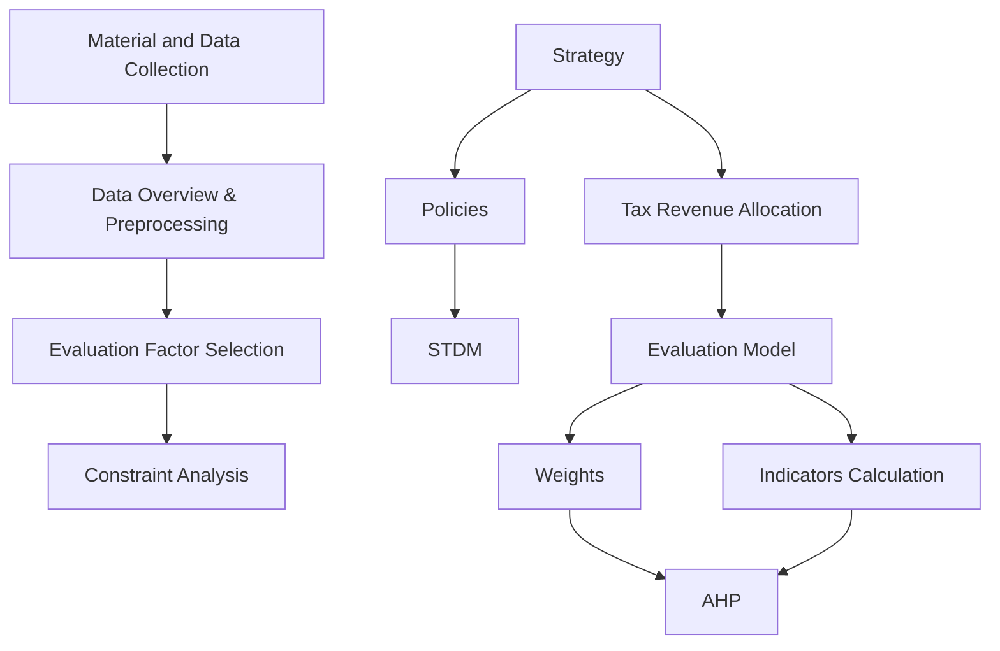
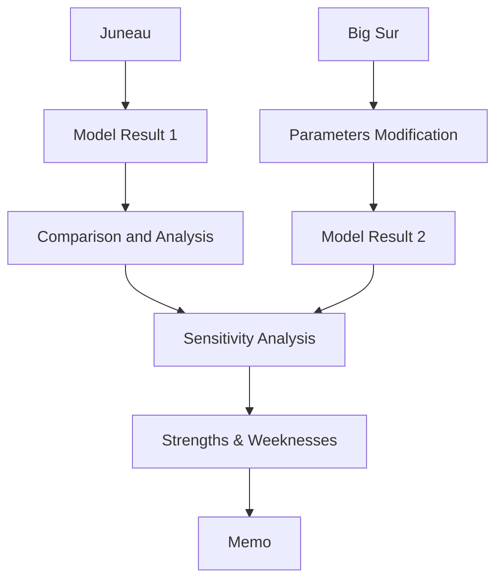

## Rebalancing Nature's Scale: A Model to Tame Overtourism

Overtourism has become a global challenge, disrupting economic growth, environmental protection, and residents' quality of life. Rising tourist numbers have caused environmental damage, strained infrastructure, and social tensions. Meanwhile, strict tourism limits can reduce local income and wellbeing. This dual challenge highlights the need for sustainable tourism strategies and data-driven models to optimize resources and maximize overall benefits.

We selected Juneau, Alaska, as the representative city for modeling. Tourist numbers, Equilibrium Line Altitude (ELA), and hotel tax revenue were chosen as indicators for population, environment, and economy, respectively. Inspired by the Lotka-Volterra model, logistic population model, and SIS model, we developed the Sustainable Tourism Dynamics Model (STDM). This system uses ordinary differential equations to capture and visualize interactions among the three dimensions.

Intervention strategies include tax revenue allocation and policies, enacted by the government. Both consist of predefined measures represented by constraint vectors, serving as impact factors in the STDM and evaluation model. Static and dynamic constraints ensure the feasibility of these strategies.

According to some materials, we propose to three main factors (life of local residents, local environmental protection, local economy and development of society), and four secondary indicators for each main factor combined with Analytic Hierarchy Process (AHP) to attain the comprehensive evaluation score. The values from the strategies and the dynamic system are input to the system, related to the score via various equations.

The model integrates all components into a unified system, where variables strongly connect the sub-models. Intervention strategies serve as inputs to the STDM, and its outputs, combined with strategy choices, determine the AHP-based evaluation model's score. This score provides feedback to optimize strategies dynamically. Using this process, governments can adjust interventions and predict their outcomes. For example, our model improves a score from 0.446 to 0.692 through targeted interventions.

We assessed our model's sensitivity using two methods. The Morris method identified key factors through the $\mu-\sigma$ diagram, showing that the environmental degradation coefficient ( $k_2$ ) and tourism revenue factor ( $k_6$ ) had the strongest direct effects and moderate parameter interactions. Local sensitivity analysis revealed that the growth rate of tourist numbers ( $r_1$ ) and baseline economic growth rate ( $k_5$ ) were most sensitive, with partial derivatives of 792.18 and 575.2. In contrast, crowding perception ( $\beta_c$ ) and carbon footprint scaling ( $\gamma_{CE}$ ) showed low sensitivities, at 0.017 and -34.5. These results highlight the importance of high-impact parameters and confirm the model's stability under small changes.

We tested our model's adaptability in Big Sur, a coastal destination facing overtourism. Glacier-related parameters were replaced with region-specific indicators, such as coastal landslide rates ( $H_{\text{Sur}} = 2.1$ m/year) and visitor numbers ( $N_{\text{Sur}} = 1,532,000$ annually). The recalibrated model improved the normalized sustainability score from 0.32773 to 0.73563 with optimized strategies. Key recommendations included strengthening infrastructure resilience and promoting inland attractions to ease coastal pressure. These results highlight the model's versatility in managing overtourism and supporting sustainable tourism. A memo to the Juneau Tourism Council outlines predictions, impacts of measures, and strategic recommendations for sustainable tourism in Juneau.

Keywords: Overtourism, Sustainable Tourism Dynamic Model, Lotka-Volterra model, SIS model, Intervention Strategies, Analytic Hierarchy Process, Sensitivity Analysis

# Memo

Dear Members of the Juneau Tourist Council,

Juneau's record-breaking 1.6 million cruise passengers in 2023 has undoubtedly brought significant economic benefits, but it has also amplified the challenges of overcrowding, resource depletion, and ecological strain, particularly on Mendenhall Glacier. As the glacier continues to recede, we must confront the reality that the very attractions drawing visitors to Juneau are under threat. Strikinga balance between tourism growth and sustainability is not just essential—it is urgent.

Our team has developed a dynamic model to address these challenges by evaluating the interplay between economic benefits, environmental conservation, and community well-being. Through this framework, we've identified actionable strategies that can optimize outcomes for all stakeholders.

First, we recommend implementing visitor caps at key attractions like Mendenhall Glacier to mitigate environmental stress while maintaining tourist satisfaction. A cap of 15,000 visitors per day would balance ecological protection with revenue retention. Additionally, allocating a greater portion of tourism tax revenue toward conservation efforts—such as glacier preservation and improved waste management—can help stabilize the natural environment and extend the lifespan of Juneau's unique attractions. For example, directing 40% of annual tourism revenue toward environmental initiatives could reduce glacier degradation rates by up to 30% annually.

Equally important is addressing the concerns of Juneau's residents. Overcrowding and rising housing costs have left many locals feeling sidelined by the tourism boom. To rebuild trust and foster local support, we suggest using tourism revenues to improve housing affordability and provide community incentives, such as tax relief or subsidies for residents. These measures not only ease tensions but also reinforce the idea that sustainable tourism benefits everyone—not just visitors.

Sustainable tourism is a delicate yet achievable goal for Juneau. By integrating ecological protection, community engagement, and thoughtful revenue allocation into its policies, the city can preserve its natural beauty and economic vitality for years to come. We are confident that the strategies outlined above will provide a robust starting point for achieving this vision.

Sincerely,
MCM Team #2503268

## Contents

## 1 Introduction 2

1.1 Problem Background 2  
1.2 Restatement of the Problem 2  
1.3 Our Work 2

## 2 Assumptions and Justifications 3

## 3 Notations 4

## 4 Model Preparation 5

4.1 Data Collection 5  
4.2 Data Selection Explanation 5

## 5 Model Design 6

5.1 Sustainable Tourism Dynamics Model (STDM) 6

5.1.1 Glacier ELA Height Dynamics 6  
5.1.2 Tourist Number Dynamics 7  
5.1.3 Economic Dynamics 7  
5.1.4 Model Integration and Parameter Estimation 7

5.2 Intervention Strategies 9

5.2.1 Intervention Impact on Models 9  
5.2.2 Tax Revenue Allocation 10  
5.2.3 Policies 10

## 6 Evaluation Model 10

6.1 Indicators Determination 10  
6.2 Score Calculation Model 11  
6.3 Values of Parameters 14  
6.4 Weights Distribution Outcomes 14

## 7 Analysis of Factors 14

## 8 Results and Discussion 16

## 9 Sensitivity Analysis 17

9.1 Qualitative analysis: Morris Method 17  
9.2 Quantitative analysis: Local Sensitivity Analysis ..... 18

## 10 Reimagining Big Sur 19

10.1 Fundamental Information 19  
10.2 Model Validation and Generalization 20

## 11 Strengths and Weaknesses 22

11.1 Strengths 22  
11.2 Weaknesses 22

## References 23

## 1 Introduction

## 1.1 Problem Background

Juneau, Alaska, renowned for its stunning natural landscapes and rich tourism resources, has become a prominent destination for cruise passengers. But the rapid increase in tourist numbers in recent years has posed significant challenges to the local environment, infrastructure, and residents' quality of life. While measures such as daily visitor caps and agreements with cruise operators represent initial steps toward addressing these issues, they remain insufficient to ensure the sustainable development of tourism in the region.

Notably, the challenges faced by Juneau reflect a global issue. Numerous destinations worldwide grapple with similar issues. Destinations like Mount Rainier National Park use reservation systems, while Venice and Barcelona impose day-trip fees. Athens is exploring tourist limits, highlighting the need for a framework balancing economic benefits and conservation. This work aims to create a scalable model for sustainable tourism, addressing Juneau's needs and offering solutions for overtourism and long-term resilience.

## 1.2 Restatement of the Problem

To ensure the sustainable development of Juneau's tourism industry, we aim to develop a scientific model and management strategies to balance the number of visitors, revenue, and resource conservation. To achieve this, we need to address the following problems:

1. Develop a model to optimize the sustainability of Juneau's tourism industry. Clearly define the objectives to optimize (e.g., number of visitors, revenue growth) and constraints (e.g., infrastructure capacity, environmental protection), and propose management strategies to stabilize the industry.  
2. Perform sensitivity analysis to evaluate the impact of various factors in the model and identify key variables that critically influence sustainable development, enabling policymakers to adjust strategies effectively.  
3. Adapt the model to other tourist destinations, assess its applicability, and refine it to promote less-visited attractions and improve tourism balance across different locations.

## 1.3 Our Work

To address the challenges of sustainable tourism in Juneau, we propose a tourism system made up of a Sustainable Tourism Dynamics Model (STDM), an Evaluation Model and Intervention Strategies. The SDTM, formulated with ordinary differential equations (ODE), establishes the relationships among key variables, including environmental degradation, tourist numbers and tax revenue from tourism. The Intervention Strategies contain finite number of predefined strategy combination that will influence the dynamics with the STDM. The resulting outputs from the STDM, along with the strategy combinations, are assessed through an Analytical Hierarchy Process (AHP)-based evaluation model, which will give feedback to refine and optimize the strategy combination.

Then, we apply the model to both Juneau and Big Sur, utilizing location specific parameters to conduct comparative analyses and predict optimal strategies for sustainable development. By applying this model, we predict the best intervention strategies and the comprehensive development of the places. In this way, we can give useful suggestions to the government. By analyzing results and doing sensitivity analysis, we have an insight of the strengths and weaknesses of the model.

flowchart

flowchart

Figure 1: Pipeline of Our Model

## 2 Assumptions and Justifications

Through the full analysis of the problem, to simplify our model, we make the following reasonable assumptions.

- Assumption 1: Government policies are assumed to be fully implemented instantaneously.  
⇒ Justification: In reality, the time required for policy implementation can vary depending on administrative processes, public response, and logistical challenges. However, these delays are often unpredictable and context-dependent, making them difficult to generalize within a theoretical framework. By assuming instantaneous implementation, the model prioritizes the analysis of long-term systemic outcomes and policy effectiveness, enabling clearer insights into the relationships between variables.

\- Assumption 2: Incidents, sudden changes, minor factors and extreme situations are not taken into consideration.

$\Rightarrow$ Justification: Including these factors would greatly increase the model's complexity without significantly enhancing its predictive accuracy in typical scenarios. Such events are rare, unpredictable, and context-specific, making them hard to generalize. Focusing on primary factors ensures the model remains efficient, broadly applicable, and capable of capturing essential system dynamics.

\- Assumption 3: When determining strategies, some stable variables, are treated as constants.

⇒ Justification: Stable variables like the local population show minimal short-term fluctuations and have little impact on system dynamics. Treating them as constants avoids unnecessary complexity, allowing the model to focus on key drivers of change while remaining efficient and easy to analyze.

\- Assumption 4: The data and materials used in the model are accurate, reliable, and sourced from trusted and authoritative databases or publications.

⇒ Justification: The assumption of data reliability ensures consistency and avoids errors caused by faulty or incomplete information. All data used in this model is sourced from reputable organizations, government reports, or peer-reviewed publications, which guarantees its credibility and relevance.

## 3 Notations

Important notations used in this paper are listed below.

Table 1: Major Notations

<table><tr><td>Symbol</td><td>Description</td><td>Unit</td></tr><tr><td> $H_{Juneau}$ </td><td>Glacier ELA height in Juneau,</td><td>m</td></tr><tr><td> $N_{Juneau}$ </td><td>Annual number of tourists in Juneau</td><td>/</td></tr><tr><td> $T_{Juneau}$ </td><td>Annual hotel tax revenue in Juneau</td><td>$</td></tr><tr><td> $H'_{Juneau}$ </td><td>Normalized  $H_{Juneau}$ </td><td>/</td></tr><tr><td> $N'_{Juneau}$ </td><td>Normalized  $N_{Juneau}$ </td><td>/</td></tr><tr><td> $T'_{Juneau}$ </td><td>Normalized  $T_{Juneau}$ </td><td>/</td></tr><tr><td> $P'_{Juneau}$ </td><td>The resident population in Juneau</td><td>/</td></tr><tr><td> $H_{Sur}$ </td><td>Height of coastal landslide loss in Pfeiffer Big Sur</td><td>cm</td></tr><tr><td> $N_{Sur}$ </td><td>Annual number of tourists in Pfeiffer Big Sur</td><td>/</td></tr><tr><td> $T_{Sur}$ </td><td>Annual revenue gained from tourism in Pfeiffer Big Sur</td><td>$</td></tr><tr><td> $H'_{Sur}$ </td><td>Normalized  $H_{Sur}$ </td><td>/</td></tr><tr><td> $N'_{Sur}$ </td><td>Normalized  $N_{Sur}$ </td><td>/</td></tr><tr><td> $T'_{Sur}$ </td><td>Normalized  $T_{Sur}$ </td><td>/</td></tr><tr><td> $P'_{Sur}$ </td><td>The resident population in Pfeiffer Big Sur</td><td>/</td></tr><tr><td> $Score$ </td><td>The weighted comprehensive assessment score of the current year</td><td>/</td></tr><tr><td> $Score_i$ </td><td>The weighted score considering the  $i_{th}$  factor</td><td>/</td></tr><tr><td> $Score_{ij}$ </td><td>The score considering the  $j_{th}$  secondary indicator in the  $i_{th}$  factor</td><td>/</td></tr><tr><td> $\epsilon_x$ </td><td>Factors of disturbance in variable x</td><td>%</td></tr><tr><td> $\mu_1$  to  $\mu_5$ </td><td>Percentage distribution of tax revenue of infrastructure, glacier protection, waste disposal, cultural development and police security.</td><td>%</td></tr></table>

## 4 Model Preparation

## 4.1 Data Collection

This problem lacks predefined data, requiring careful selection of data to collect before and during modeling. Key data sources are outlined in Table 2. Due to the vast and diverse data available, listing everything is impractical. Instead, we focus on accurate and representative data for effective modeling.

Table 2: Main Data Description and Source

<table><tr><td>Data Description</td><td>Data Source</td></tr><tr><td>Annual Hotel Tax in Juneau</td><td>https://juneau.org/finance/controller</td></tr><tr><td rowspan="2">Annual Number of Tourists in Juneau</td><td>https://juneau.org/wp-content/uploads/2024/02/</td></tr><tr><td>Juneau-Visitor-Circulator-Study-Final-Report-2024-1.pdf</td></tr><tr><td>Annual Glacier ELA height in Juneau</td><td>https://www.nature.com/articles</td></tr><tr><td>Juneau Tourism Management Plan</td><td>https://juneau.org/wp-content/Juneau-Tourism-Mgt-Plan</td></tr><tr><td>State Park System Statistical Report</td><td>https://www.parks.ca.gov</td></tr><tr><td>California Coastal Cliff Erosion Survey</td><td>https://siocpg.ucsd.edu/ca-cliff-viewer/</td></tr></table>

To minimize the influence of unknown factors and simplify the complexity of the model, we establish a three-dimensional coordinate system encompassing population, environment and economy. We collect data on glacier ELA height, tourist numbers and hotel tax revenue as representative indicators for each dimension. In the following subsections, we will elaborate on the rationale behind selections.

## 4.2 Data Selection Explanation

First, from an environmental perspective, the carbon footprint is a common evaluation standard in academia. To visualize our model, we analyze its direct impact on the Equilibrium Line Altitude (ELA)—the glacier elevation where annual snow accumulation equals annual melt, separating the accumulation and ablation zones. The process is shown in the figure below.

text_image

Iceberg
Calving
Sublimation
Equilibrium line
Snow
Zone of accumulation
Zone of ablation
Meltwater stream
Meltwater tunnel
Terminus (toe)
Meltwater pool on glacier
Flow trajectory

Figure 2: Construction Process of ELA

Secondly, considering that the number of tourists far exceeds the local resident population, and given the distinct impacts these two groups have on the environment and economy, the local population can be considered negligible in the population dimension. This makes it reasonable to use tourist numbers as a representative indicator for the population metric. According to the most recent Juneau Tourism Survey, hotel revenue consistently accounts for a stable proportion of the total government revenue. Therefore, we use hotel tax revenue as an indicator to represent the economic dimension.

## 5 Model Design

## 5.1 Sustainable Tourism Dynamics Model (STDM)

Natural environments, economic factors, and population dynamics are deeply interconnected. This study aims to represent the dynamics between glacier ELA height, annual number of tourists, and annual hotel tax revenue using fundamental data. Such a model provides an essential explanatory framework for understanding the logical relationships between these factors, laying the foundation for more detailed analysis and decision-making in subsequent sections.

## 5.1.1 Glacier ELA Height Dynamics

One critical aspect of glacier health is the Equilibrium Line Altitude (ELA), which represents the altitude on a glacier where accumulation and ablation are balanced. According to the study by Braithwaite et al. [1], changes in ELA are driven primarily by temperature and precipitation. As the ELA rises, it reflects increased glacier melting and reduced stability. Similarly, another study by Oerlemans [2] highlights that ELA is a key indicator of glacier health and is directly affected by climatic variations.

The ELA is influenced by feedback mechanisms within the glacier itself. For instance, the albedo effect causes melting glaciers to absorb more solar radiation as their surface darkens, further accelerating the loss of ice. This intrinsic dependency makes the ELA height of glacier $H_{Juneau}$ sensitive to its prior state, represented in the model by $k_{1}H_{Juneau}$ .

Tourism significantly affects glacier health. Increased tourist numbers $N_{Juneau}$ can lead to environmental degradation through waste, infrastructure development, and direct interaction with the glacier environment. These impacts are proportional to both the existing glacier health and the level of tourism, captured in the term $k_{2}H_{Juneau}N_{Juneau}$ .

Economic factors, such as investments in preservation funded by hotel tax revenue $T_{Juneau}$ , also play a vital role in mitigating the negative effects of tourism. Higher revenues enable conservation projects, such as restricting access to sensitive areas or implementing restoration efforts. This dynamic is modeled as $k_{3}T_{Juneau}H_{Juneau}$ , showing how economic resources contribute to sustaining glacier health.

Bringing these factors together, the equation governing glacier health $H_{Juneau}$ is expressed as:

$$
\frac {d H _ {\text { Juneau }}}{d t} = k _ {1} H _ {\text { Juneau}} + k _ {2} H _ {\text { Juneau}} N _ {\text { Juneau}} + k _ {3} T _ {\text { Juneau}} H _ {\text { Juneau}}. \tag {1}
$$

Here, $k_{1}$ represents the intrinsic changes in glacier health due to natural processes, $k_{2}$ quantifies the impact of tourism, and $k_{3}$ captures the restorative effects of economic investments.

## 5.1.2 Tourist Number Dynamics

The dynamics of tourist numbers $N_{Juneau}$ are governed by both natural growth patterns and their interaction with the glacier environment. According to Verhulst's logistic model [3], population growth typically follows an S-shaped curve, with initial exponential growth slowing as it approaches the carrying capacity $K$ . This relationship is represented by the term $r_1N_{Juneau}\left(1 - \frac{N_{Juneau}}{K}\right)$ , where $r_1$ is the intrinsic growth rate and $K$ is the environmental or infrastructural limit for tourist numbers.

The health of the glacier environment $H_{Juneau}$ also plays a critical role in attracting tourists. Research by Buckley [4] shows that pristine natural environments significantly boost tourism demand. This influence is captured by the term $k_{4}H_{Juneau}N_{Juneau}$ , which indicates that better glacier health amplifies tourist numbers.

Combining these factors, the equation for tourist numbers $N_{Juneau}$ is expressed as:

$$
\frac {d N _ {\text { Juneau }}}{d t} = r _ {1} N _ {\text { Juneau}} \left(1 - \frac {N _ {\text { Juneau }}}{K}\right) + k _ {4} H _ {\text { Juneau}} N _ {\text { Juneau }}. \tag {2}
$$

Here, $r_{1}$ represents the natural growth rate of tourism, constrained by the carrying capacity K, while $k_{4}$ quantifies the positive impact of glacier health $H_{Juneau}$ on tourism growth. Together, these terms describe the interplay between environmental conditions and tourism dynamics, providing a framework to assess the sustainability of tourism in glacier regions.

## 5.1.3 Economic Dynamics

The dynamics of annual hotel tax revenue $T_{Juneau}$ are closely tied to tourism and economic factors. According to studies on tourism-driven economies [5], the revenue generated from hotel taxes is directly proportional to the number of tourists. This relationship is captured by the term $k_{6}N_{Juneau}$ , which indicates that an increase in tourist numbers $N_{Juneau}$ results in higher tax revenue.

In addition, economic growth independent of tourism also plays a role. Research by Frechtling [6] shows that baseline economic trends contribute to steady growth in tax revenue, even in the absence of significant changes in tourism. This baseline growth is represented by the term $k_{5}T_{Juneau}$ , which accounts for general economic development and inflationary factors.

Combining these influences, the equation for hotel tax revenue $T_{Juneau}$ is expressed as:

$$
\frac {d T _ {\text { Juneau }}}{d t} = k _ {5} T _ {\text { Juneau}} + k _ {6} N _ {\text { Juneau }}. \tag {3}
$$

Here, $k_{5}$ represents the baseline economic growth, while $k_{6}$ quantifies the direct contribution of tourist numbers $N_{Juneau}$ to tax revenue.

## 5.1.4 Model Integration and Parameter Estimation

To evaluate the interconnected dynamics of glacier health, tourist numbers, and hotel tax revenue, we integrate the above equations into a single system. Using data from 2010 to 2019, we estimate the parameters $k_{i}$ and $r_{i}$ through nonlinear regression. Due to the complexity of real-world systems, these parameters are influenced not only by the core variables but also by external, unmeasured factors. Specifically, the anomalous marine heatwave event known as “The Blob” in 2013 significantly affected glacier data for that year. To address this, we excluded the 2013 data from the analysis and performed interpolation on the remaining years to ensure consistency. The adjusted dataset was then used to fit the equations and estimate $k_{i}$ and $r_{i}$ .

The final integrated system of equations, including $\epsilon$ , is expressed as:

$$
\frac {d H _ {\text { Juneau}}}{d t} = k _ {1} H _ {\text { Juneau}} + k _ {2} H _ {\text { Juneau}} N _ {\text { Juneau}} + k _ {3} T _ {\text { Juneau}} H _ {\text { Juneau}} + \epsilon_ {H _ {\text { Juneau}}}, \tag {4}
$$

$$
\frac {d N _ {\text { Juneau }}}{d t} = r _ {1} N _ {\text { Juneau}} \left(1 - \frac {N _ {\text { Juneau }}}{K}\right) + k _ {4} H _ {\text { Juneau}} N _ {\text { Juneau}} + \epsilon_ {N _ {\text { Juneau }}}, \tag {5}
$$

$$
\frac {d T _ {\text { Juneau }}}{d t} = k _ {5} T _ {\text { Juneau }} + k _ {6} N _ {\text { Juneau }} + \epsilon_ {T _ {\text { Juneau }}}. \tag {6}
$$

3d scatter plot with fitted curves

| Trajectory Type | X Coordinate | Y Coordinate | Z Coordinate |
|------------------|--------------|--------------|--------------|
| H-T              | 0.5          | 0.6          | 0.7          |
| H-T              | 0.6          | 0.7          | 0.8          |
| H-T              | 0.7          | 0.8          | 0.9          |
| H-T              | 0.8          | 0.9          | 1.0          |
| H-T              | 0.9          | 1.0          | 1.05         |
| N-T              | 0.5          | 0.6          | 0.7          |
| N-T              | 0.6          | 0.7          | 0.8          |
| N-T              | 0.7          | 0.8          | 0.9          |
| N-T              | 0.8          | 0.9          | 1.0          |
| N-T              | 0.9          | 1.0          | 1.05         |
| H-N              | 0.5          | 0.6          | 0.7          |
| H-N              | 0.6          | 0.7          | 0.8          |
| H-N              | 0.7          | 0.8          | 0.9          |
| H-N              | 0.8          | 0.9          | 1.0          |
| H-N              | 0.9          | 1.0          | 1.05         |

Figure 3: System 3D schematic with projection

scatter plot

| H    | Z     | Type             |
|------|-------|------------------|
| 0.5  | 0.72  | Observed Data    |
| 0.6  | 0.78  | Observed Data    |
| 0.7  | 0.83  | Observed Data    |
| 0.8  | 0.88  | Observed Data    |
| 0.9  | 0.93  | Observed Data    |
| 1.0  | 0.98  | Observed Data    |
| 0.5  | 0.71  | Feasible Region  |
| 0.6  | 0.76  | Feasible Region  |
| 0.7  | 0.81  | Feasible Region  |
| 0.8  | 0.86  | Feasible Region  |
| 0.9  | 0.91  | Feasible Region  |
| 1.0  | 0.96  | Feasible Region  |

scatter plot with trend lines

| H    | T     | Type             |
|------|-------|------------------|
| 0.5  | 0.65  | Observed Data    |
| 0.5  | 0.70  | Observed Data    |
| 0.5  | 0.75  | Observed Data    |
| 0.5  | 0.80  | Observed Data    |
| 0.5  | 0.85  | Observed Data    |
| 0.5  | 0.90  | Observed Data    |
| 0.5  | 0.95  | Observed Data    |
| 0.5  | 1.00  | Observed Data    |
| 0.6  | 0.65  | Observed Data    |
| 0.6  | 0.70  | Observed Data    |
| 0.6  | 0.75  | Observed Data    |
| 0.6  | 0.80  | Observed Data    |
| 0.6  | 0.85  | Observed Data    |
| 0.6  | 0.90  | Observed Data    |
| 0.6  | 0.95  | Observed Data    |
| 0.6  | 1.00  | Observed Data    |
| 0.7  | 0.65  | Observed Data    |
| 0.7  | 0.70  | Observed Data    |
| 0.7  | 0.75  | Observed Data    |
| 0.7  | 0.80  | Observed Data    |
| 0.7  | 0.85  | Observed Data    |
| 0.7  | 0.90  | Observed Data    |
| 0.7  | 0.95  | Observed Data    |
| 0.7  | 1.00  | Observed Data    |
| 0.8  | 0.65  | Observed Data    |
| 0.8  | 0.70  | Observed Data    |
| 0.8  | 0.75  | Observed Data    |
| 0.8  | 0.80  | Observed Data    |
| 0.8  | 0.85  | Observed Data    |
| 0.8  | 0.90  | Observed Data    |
| 0.8  | 0.95  | Observed Data    |
| 0.8  | 1.00  | Observed Data    |
| 0.9  | 0.65  | Observed Data    |
| 0.9  | 0.70  | Observed Data    |
| 0.9  | 0.75  | Observed Data    |
| 0.9  | 0.80  | Observed Data    |
| 0.9  | 0.85  | Observed Data    |
| 0.9  | 0.90  | Observed Data    |
| 0.9  | 0.95  | Observed Data    |
| 0.9  | 1.00  | Observed Data    |
| 1.0  | 0.65  | Observed Data    |
| 1.0  | 0.70  | Observed Data    |
| 1.0  | 0.75  | Observed Data    |
| 1.0  | 0.80  | Observed Data    |
| 1.0  | 0.85  | Observed Data    |
| 1.0  | 0.90  | Observed Data    |
| 1.0  | 0.95  | Observed Data    |
| 1.0  | 1.00  | Observed Data    |
The chart displays a scatter plot with 'Feasible Points' as the x-axis variable and 'Feasible Region' as the y-axis variable, where the data points are plotted in the scatter plot and labeled with the same color and position of the data points.

scatterplot

| N    | T     |
|------|-------|
| 0.70 | 0.65  |
| 0.75 | 0.75  |
| 0.80 | 0.85  |
| 0.85 | 0.95  |
| 0.90 | 0.98  |
| 0.95 | 0.99  |
| 1.00 | 1.00  |

Figure 4: Respective projections

The fitting results and the corresponding parameter values are visualized in Figure3, and the accuracy of the model is validated using historical data. Using data from 2010 to 2019, we performed parameter fitting for the integrated model equations. The resulting parameter values were derived through nonlinear regression, incorporating the error terms $\epsilon_{H_{Juneau}}$ , $\epsilon_{N_{Juneau}}$ , and $\epsilon_{T_{Juneau}}$ to account for external unmeasured influences.

Figure3 illustrates the observed data and the trajectories generated by the model in a 3D space, showing the dynamic interactions between glacier health $H_{Juneau}$ , tourist numbers $N_{Juneau}$ , and hotel tax revenue $T_{Juneau}$ . The fitted trajectories closely align with the observed data points, suggesting that the model captures the essential dynamics of the system.

Additionally, Figure3 displays the feasible regions in the $(H_{Juneau}, N_{Juneau})$ , $(H_{Juneau}, T_{Juneau})$ , and $(N_{Juneau}, T_{Juneau})$ planes. These regions represent the range of plausible model outcomes given the fitted parameters. The observed data points (red stars) fall predominantly within these feasible regions, further validating the model's predictive accuracy.

The results highlight several key insights:

1. The positive correlation between the ELA height of the glacier $H_{Juneau}$ and the tourist numbers $N_{Juneau}$ is evident in the trajectories, supporting the hypothesis that an increase in visitors negatively impacts the environment, thereby causing the ELA height to rise.  
2. Annual hotel tax revenue $T_{Juneau}$ shows a direct dependency on tourist numbers $N_{Juneau}$ , as indicated by the tight clustering of observed data along the model trajectories in the $(N_{Juneau}, T_{Juneau})$ plane.  
3. Variability in the system, represented by the error terms $\epsilon$ , likely captures external factors such as climatic anomalies or economic shocks, which are not directly modeled but are essential for explaining deviations.

These fitting results provide a robust foundation for analyzing the dynamic interplay among natural, social, and economic factors, and they offer valuable insights for policy-making and resource management in glacier regions.

## 5.2 Intervention Strategies

## 5.2.1 Intervention Impact on Models

To maintain a balance between the three variables when maximizing utility, we categorize our intervention strategies into two components: tax revenue allocation and policies. Each component features a finite set of typical and representative solutions. By iterating through these solutions, we obtain a finite set of potential strategy combinations.

Given the current values of $H_{Juneau}$ , $N_{Juneau}$ , and $T_{Juneau}$ , each combination, under the given constraints, produces new $H_{Juneau}$ , $N_{Juneau}$ , and $T_{Juneau}$ values along with corresponding scores. We then select the combination with the highest score to serve as the current intervention strategy, and update $H_{Juneau}$ , $N_{Juneau}$ , and $T_{Juneau}$ accordingly to these new values.

## 5.2.2 Tax Revenue Allocation

The variables $\mu_{1},\mu_{2},\mu_{3},\mu_{4},\mu_{5}$ are inputs to the evaluation model. We modeled nine representative arrays $[\mu_{1},\mu_{2},\mu_{3},\mu_{4},\mu_{5}]$ based on different allocation patterns, which are displayed in the figure below.

stacked bar chart

| Category | μ1 (%) | μ2 (%) | μ3 (%) | μ4 (%) | μ5 (%) |
|---|---|---|---|---|---|
| 9. Highly balanced distribution | 22 | 18 | 20 | 25 | 15 |
| 8. Balanced environment & culture | 10 | 30 | 10 | 35 | 15 |
| 7. Waste mgmt & public safety | 15 | 10 | 35 | 10 | 30 |
| 6. Safety & glacier protection | 24 | 26 | 14 | 8 | 28 |
| 5. More culture, ensure safety | 15 | 20 | 5 | 45 | 15 |
| 4. Infra & waste mgmt equally | 25 | 10 | 25 | 10 | 30 |
| 3. Focus environment, glaciers & culture | 5 | 35 | 15 | 30 | 15 |
| 2. Strong infra, partial culture | 35 | 20 | 10 | 25 | 10 |
| 1. Infra & culture, moderate others | 20 | 25 | 18 | 22 | 15 |

Figure 5: Allocations

## 5.2.3 Policies

We design 8 policies with different focuses and assign different vectors $v_{1}, v_{2}, v_{3}$ to each policy. The vector satisfies $-v_{1} + v_{2} + v_{3} = 10$ as 10 is the sum assigned to the policies but H is a negative indicator. The detailed 8 policies are as follows:

<table><tr><td>Policy Description</td><td>Vector</td></tr><tr><td>Promote local business development</td><td>[0, 0, 10]</td></tr><tr><td>Comprehensive and balanced development</td><td>[-3, 3, 4]</td></tr><tr><td>Develop infrastructure</td><td>[-4, 4, 2]</td></tr><tr><td>Market promotion and brand building</td><td>[0, 4, 6]</td></tr><tr><td>Direct measures to attract tourists</td><td>[-2, 8, 0]</td></tr><tr><td>Improve tourist experience</td><td>[0, 8, 2]</td></tr><tr><td>Natural resource conservation</td><td>[-13, 0, -3], [-14, -2, -2]</td></tr></table>

Table 3: Indicators Selected

Figure 6 displays the way how policies impact the system. We use the output of the evaluation model to decide the policies too.

## 6 Evaluation Model

## 6.1 Indicators Determination

Based on the statement of the question and the literature, the degree of comprehensive development in the City of Juneau can be mainly categorized into three factors, which are life of local

scatterplot

| H    | N     | T     |
|------|-------|-------|
| 0.5  | 0.65  | 0.65  |
| 0.6  | 0.70  | 0.70  |
| 0.7  | 0.80  | 0.80  |
| 0.8  | 0.90  | 0.90  |
| 0.9  | 0.95  | 0.95  |
| 1.0  | 1.00  | 1.00  |

Promote Local Business Development  
Natural Resources Conservation  
Direct Measures to Attract Tourists

Figure 6: policy impact on system  
residents(LoR), local environmental protection(EP), along with local economy and development of society(EDoS).  
In consideration of tourism impact, We have overall listed 29 secondary indicators that are related to the three main factors, and picked 4 most significant secondary indicators for each main factor. The main factors and related secondary indicators are listed below.

<table><tr><td>Factor</td><td>Indicator</td><td>Score</td><td>Notation</td></tr><tr><td rowspan="4">LoR</td><td>the increase of average individual income</td><td> $S_{11}$ </td><td></td></tr><tr><td>crowding level</td><td> $S_{12}$ </td><td></td></tr><tr><td>housing affordability</td><td> $S_{13}$ </td><td></td></tr><tr><td>noise level</td><td> $S_{14}$ </td><td></td></tr><tr><td rowspan="4">EP</td><td>natural resources like glacier coverage</td><td> $S_{21}$ </td><td></td></tr><tr><td>water and energy usage</td><td> $S_{22}$ </td><td></td></tr><tr><td>waste production level</td><td> $S_{23}$ </td><td></td></tr><tr><td>carbon footprint</td><td> $S_{24}$ </td><td></td></tr><tr><td rowspan="4">EDoS</td><td>tourism tax revenue</td><td> $S_{31}$ </td><td></td></tr><tr><td>employment growth</td><td> $S_{32}$ </td><td></td></tr><tr><td>cultural resource protection or utilization</td><td> $S_{33}$ </td><td></td></tr><tr><td>social safety or security index</td><td> $S_{34}$ </td><td></td></tr></table>

Table 4: Indicators Selected

## 6.2 Score Calculation Model

Here, P = 31685. Here we use the Analytic Hierarchy Process(AHP). AHP assigns weights to criteria through pairwise comparisons, checks the consistency of these comparisons, and calculates an overall score by aggregating the weighted scores, which is displayed in the formulas below. $Score_{1}$ ,

$Score_{2}$ and $Score_{3}$ are scores computed from secondary scores, and the final $Score$ is the overall sum.

- $w_{1i}, w_{2i}, w_{3i}$ : the weights assigned to each sub-indicator within the three factors that satisfy $\sum_{i=1}^{4} w_{mi} = 1, m = 1, 2, 3$ . This implies that for each main factor, the four sub-indicators sum to a total weight of 1.  
- $w_{i}$ : the weight assigned to each of the three main factors $Score_1, Score_2, Score_3$ . These must satisfy:

$$
\sum_ {i = 1} ^ {3} w _ {i} = 1.
$$

$$
S c o r e _ {1} = \Sigma_ {i = 1} ^ {4} w _ {1 i} S _ {1 i} \quad S c o r e _ {2} = \Sigma_ {i = 1} ^ {4} w _ {2 i} S _ {2 i} \quad S c o r e _ {3} = \Sigma_ {i = 1} ^ {4} w _ {3 i} S _ {3 i}
$$

$$
S c o r e = \Sigma_ {i = 1} ^ {3} w _ {i} S c o r e _ {i}
$$

According to some materials, the average time of tourists' stay is around 4 days. So, the average number of tourists in Juneau each day is $N_{t} = \frac{4N_{Juneau}}{365}$ .

\- The increase in average individual income

The formula reflects the impact of tourism on average individual income by considering the ratio of tax income to population as a measure of income of tourism. The factor $(1/(1+H'_{Juneau}))^{-\beta}$ accounts for the negative influence of glacier retreat on sustainable tourism growth, assuming that environmental degradation can harm long-term economic benefits. Additionally, the logarithmic term incorporates the proportional allocation of tax revenue $(\mu_{1})$ to infrastructure, reflecting how government investments boosts economy. Normalization term $T_{0}/P$ ensures that income growth is evaluated in comparison with a baseline, while logarithm smooth out extreme values.

$$
I n c = \frac {T _ {\text { Juneau }}}{P} \cdot \left(\frac {1}{1 + H _ {\text { Juneau }} ^ {\prime}}\right) ^ {- \beta} \cdot \left(1 + \alpha_ {1} \ln \frac {\mu_ {1} + 1}{\mu_ {I} + 1}\right) \tag {7}
$$

$$
S _ {1 1} = \frac {\text { Inc }}{T _ {0} / P} = \frac {T _ {\text { Juneau }}}{T _ {0}} \cdot \left(\frac {1}{1 + H _ {\text { Juneau }} ^ {\prime}}\right) ^ {- \beta} \cdot \left(1 + \alpha_ {1} \ln \frac {\mu_ {1} + 1}{\mu_ {I} + 1}\right) \tag {8}
$$

\- Crowding level

The formula quantifies crowding based on the ratio of average daily tourists to the population $(N_{t}/P)$ , using a Sigmoid function to capture how perceived crowding increases at a decreasing rate as tourist density grows. This ensures that the score accounts for diminishing sensitivity to additional tourists in high-density scenarios. Also, the score is guaranteed to be normalized. Parameters like $\beta_{c}$ and $\theta$ control the steepness and inflection point of the curve, respectively.

$$
S _ {1 2} = \gamma \cdot \frac {1}{1 + e ^ {- \beta_ {c} (N _ {t} / P - \theta)}} \tag {9}
$$

• Housing affordability

The formula for $S_{13}$ estimates housing costs (HCost) based on tourist density ( $N_{t}/P$ ) and tax revenue allocated to infrastructure ( $T'_{Juneau}\mu_{1}$ ). The study by Glaeser et al. [7] reveals the relation between number of tourists and housing affordability. This reflects the dual pressures of increased demand for short-term housing and influences of infrastructure investments. The score is normalized within a historical range. The normalization method ensures that higher housing costs reduce the affordability score.

$$
H C o s t = \beta_ {1} \frac {N _ {t}}{P} + \beta_ {2} T _ {\text { Juneau }} ^ {\prime} \mu_ {1} \tag {10}
$$

$$
S _ {1 3} = \frac {C _ {\text { max }} - H C o s t}{C _ {\text { max }} - C _ {\text { min }}} \tag {11}
$$

\- Noise level

We calculate noise levels as the sum of a baseline noise level $(N_{0})$ and a power-law term, where tourist density contributes exponentially to increased noise. The normalization by $C_{N}N_{0}$ scales the score to reflect relative changes. The power-law term avoids extreme values by bounding the output.

$$
\text { Noise } = N _ {0} + N _ {\text { Juneau }} ^ {\prime \alpha} \tag {12}
$$

$$
S _ {1 4} = \frac {\text { Noise }}{C _ {N} N _ {0}} = \frac {N _ {0} + N _ {\text { Juneau }} ^ {\prime \alpha}}{C _ {N} N _ {0}} \tag {13}
$$

\- Natural resources

Measure natural resources by considering glacier retreat and tax revenue allocation to environmental protection. A Sigmoid function ensures a smooth transition as environmental pressure increases. The term $\beta_{N} \cdot \frac{\mu_{E} + 1}{\mu_{2} + 1} \cdot H'_{Juneau}$ highlights the trade-off between environmental investment and degradation, as well as avoiding extreme values.

$$
S _ {2 1} = \frac {\phi_ {0}}{1 + e ^ {\beta_ {N} \cdot \frac {\mu_ {E} + 1}{\mu_ {2} + 1} \cdot H _ {J u n e a u} ^ {\prime}}} \tag {14}
$$

• Water and energy usage

The formula evaluates water and energy consumption based on the combined population and tourist density $(P + N_{t})$ . Sigmoid function captures the nonlinear relation, with $\alpha_{WE}$ controlling the rate of increase and $E_{0}$ serving as a baseline threshold. Meanwhile, the score is guaranteed to be normalized in this way.

$$
E n e r g y = \alpha_ {W E} (P + N _ {t}) \tag {15}
$$

$$
S _ {2 2} = 1 - \frac {1}{1 + e ^ {- (E n e r g y - E _ {0})}} = \frac {e ^ {- (\alpha_ {W E} (P + N _ {t}) - E _ {0})}}{1 + e ^ {- (\alpha_ {W E} (P + N _ {t}) - E _ {0})}} \tag {16}
$$

\- Waste production level

Waste production is calculated as the difference between normalized tourist density $(N')$ and waste management impact $(\alpha_{C}\mu_{3}T')$ , with a lower bound of zero. When waste generation exceeds management reduction, penalize the score. The normalization by $C_{w}(N'+1)$ ensures the score remains bounded.

$$
W a s t e = \min (N _ {J u n e a u} ^ {\prime} - \alpha_ {C} \mu_ {3} T _ {J u n e a u} ^ {\prime}, 0) \tag {17}
$$

$$
S _ {2 3} = 1 - \frac {\text { Waste }}{C _ {w} (N ^ {\prime} + 1)} = 1 - \frac {\min (N _ {J u n e a u} ^ {\prime} - \alpha_ {C} \mu_ {3} T _ {J u n e a u} ^ {\prime} , 0)}{C _ {w} (N _ {J u n e a u} ^ {\prime} + 1)} \tag {18}
$$

\- Carbon footprint

The formula uses a Sigmoid function to keep the score in a reasonable range considering tourist population( $N_{t}$ ). $\gamma_{CE}$ and $N_{C}$ control the sensitivity and baseline.

$$
S _ {2 4} = 1 - \frac {1}{1 + e ^ {\gamma_ {C E} (N _ {C} - N _ {t})}} \tag {19}
$$

\- Tourism tax revenue

Normalize the score in a reasonable range with history data.

$$
S _ {3 1} = \frac {T _ {\text { Juneau }} - T _ {\min}}{T _ {\max} - T _ {\min}} \tag {20}
$$

\- Employment growth

The $S_{32}$ formula models employment growth as a linear combination of normalized tax income $(T'_{Juneau})$ and population $(N'_{Juneau})$ , with coefficients representing the respective contributions of tourism and local demographics.

$$
S _ {3 2} = \alpha_ {T} T _ {\text { Juneau }} ^ {\prime} + \alpha_ {N} N _ {\text { Juneau }} ^ {\prime} \tag {21}
$$

• Cultural resource protection or utilization

The $S_{33}$ formula measures cultural factors as an inverse exponential function of tax investment of culture ( $\mu_4 T'_{Juneau}$ ) and number of tourists' spreading ( $N'$ ).

$$
S _ {3 3} = \left(\mu_ {4} T _ {\text { Juneau }} ^ {\prime}\right) ^ {N ^ {\prime}} \tag {22}
$$

• Social safety or security index

According to study in an article by Hall, C. M. et al. [8], the $S_{34}$ formula was constructed to evaluate social safety by considering government allocated investment( $\mu_{5}T'_{Juneau}$ ) and population ( $N'_{Juneau}$ ) on security resources. The term $1 - \frac{N'_{Juneau} + 1}{\gamma_{T}\mu_{5}(T'_{Juneau} + 1)}$ prevents division by zero and smooths the impact of extreme values.

$$
S _ {3 4} = 1 - \frac {N _ {\text { Juneau }} ^ {\prime} + 1}{\gamma_ {T} \mu_ {5} (T _ {\text { Juneau }} ^ {\prime} + 1)} \tag {23}
$$

## 6.3 Values of Parameters

We estimate the parameters using methods that substitute some specific values to compute the scores and make the scores reasonable. Some of the parameters are experience-based, and some come from multiplying known data by a certain ratio, which might be a growth rate or a disturbance rate, etc. The following table of parameter values was eventually obtained.

## 6.4 Weights Distribution Outcomes

To calculate the weights of AHP, we compare each each combination of factors or secondary indicators and build up four judgment matrices. Through consistency check, by making sure CR < 0.1, we guarantee that the matrices are usable. The weights along with other useful calculated results and a heatmap of weights are as follows.

## 7 Analysis of Factors

We have now established the STDM model. In this section, we will compare and categorize the various factors, specifically identifying which components are to be optimized and which will serve as constraints. This analysis directly addresses the requirements of the first sub-question in our study.

Considering the ultimate goal of sustainable development, all factors listed in the Score Calculation Model can be regarded as Optimization Factors. For the Constraints Factors, we approach the system from three dimensions—population, environment, and economy—examining the limitations imposed by different policies on these factors. For instance, as identified in the Juneau Climate Action and Implementation Plan, the policy introduced by the City of Juneau in 2016, which imposed caps on the number of daily visitors, serves as a constraint within the population dimension.

<table><tr><td>Parameter</td><td>Value</td><td>Parameter</td><td>Value</td><td>Parameter</td><td>Value</td><td>Parameter</td><td>Value</td></tr><tr><td> $\beta$ </td><td>0.2</td><td> $T_0$ </td><td>2448159</td><td> $\alpha_1$ </td><td>0.3</td><td> $\mu_I$ </td><td>0.2</td></tr><tr><td> $\gamma$ </td><td>0.8</td><td> $\beta_c$ </td><td>0.6</td><td> $\theta$ </td><td>2</td><td> $\beta_1$ </td><td>0.4</td></tr><tr><td> $\beta_2$ </td><td>0.6</td><td> $C_{\text{max}}$ </td><td>0.5</td><td> $C_{\text{min}}$ </td><td>0.2</td><td> $N_0$ </td><td>1</td></tr><tr><td> $\alpha$ </td><td>3</td><td> $C_N$ </td><td>1.5</td><td> $\phi_0$ </td><td>1</td><td> $\beta_N$ </td><td>0.8</td></tr><tr><td> $\mu_E$ </td><td>0.2</td><td> $\alpha_{WE}$ </td><td> $\frac{1}{47528}$ </td><td> $E_0$ </td><td>1</td><td> $\alpha_C$ </td><td>4</td></tr><tr><td> $C_w$ </td><td>1</td><td> $\gamma_{CE}$ </td><td> $\frac{1}{25000}$ </td><td> $N_c$ </td><td>24252</td><td> $T_{\text{max}}$ </td><td>1632106</td></tr><tr><td> $T_{\text{min}}$ </td><td>1029604</td><td> $\alpha_T$ </td><td>0.25</td><td> $\alpha_N$ </td><td>0.75</td><td> $\gamma_t$ </td><td>5</td></tr></table>

Table 5: Parameter values and their respective values.

<table><tr><td>Parameter</td><td>Score</td><td>Score_1</td><td>Score_2</td><td>Score_3</td></tr><tr><td>Judgment Matrix</td><td></td><td></td><td></td><td></td></tr><tr><td>Max Eigenvalues</td><td>3.006</td><td>4.016</td><td>4.037</td><td>4.024</td></tr><tr><td>Consistency Index (CI)</td><td>0.0028</td><td>0.0052</td><td>0.0125</td><td>0.0079</td></tr><tr><td>Consistency Ratio (CR)</td><td>0.0048 &lt; 0.1</td><td>0.0057 &lt; 0.1</td><td>0.0139 &lt; 0.1</td><td>0.0088 &lt; 0.1</td></tr><tr><td>Weights</td><td>0.3041,0.5648,0.1311</td><td>0.5784,0.2230,0.0823,0.1163</td><td>0.4744,0.1011,0.1873,0.2372</td><td>0.4092,0.4017,0.0795,0.1096</td></tr></table>

Table 6: Weights Distribution Outcomes for Scores

heatmap

| Factor   | Sec Indicator 1 | Sec Indicator 2 | Sec Indicator 3 | Sec Indicator 4 |
| -------- | --------------- | --------------- | --------------- | --------------- |
| Factor 1 | 0.15            | 0.15            | 0.20            | 0.20            |
| Factor 2 | 0.25            | 0.20            | 0.15            | 0.15            |
| Factor 3 | 0.20            | 0.20            | 0.25            | 0.25            |

Figure 7: heatmap of weights

## 8 Results and Discussion

The fitting results of the proposed model are shown in Figure 8, which compares the modeled and observed data for glacier health $(H)$ , tourist numbers $(N)$ , and hotel tax revenue $(T)$ . The red markers represent the observed data, while the blue dashed lines depict the model's predictions. Overall, the model demonstrates a strong ability to capture the dynamic relationships among the three variables, with certain limitations in specific scenarios.

line chart

| x  | H data | H model |
|----|--------|---------|
| 0  | 0.59   | 0.59    |
| 1  | 0.58   | 0.58    |
| 2  | 0.57   | 0.57    |
| 3  | 0.56   | 0.56    |
| 4  | 0.54   | 0.54    |
| 5  | 0.52   | 0.53    |
| 6  | 0.48   | 0.53    |
| 7  | 0.54   | 0.54    |
| 8  | 0.60   | 0.56    |
| 9  | 0.65   | 0.58    |
| 10 | 0.63   | 0.60    |
| 11 | 0.61   | 0.62    |
| 12 | 0.60   | 0.64    |
| 13 | 0.62   | 0.66    |
| 14 | 0.64   | 0.68    |
| 15 | 0.66   | 0.70    |
| 16 | 0.72   | 0.74    |
| 17 | 0.78   | 0.78    |
| 18 | 0.82   | 0.82    |
| 19 | 0.86   | 0.86    |
| 20 | 0.88   | 0.88    |
| 21 | 0.90   | 0.90    |
| 22 | 0.92   | 0.92    |
| 23 | 0.94   | 0.94    |
| 24 | 0.96   | 0.96    |
| 25 | 1.00   | 1.00    |

line chart

| x  | N data | N model |
|----|--------|---------|
| 0  | 0.70   | 0.70    |
| 5  | 0.73   | 0.74    |
| 10 | 0.78   | 0.79    |
| 15 | 0.85   | 0.86    |
| 20 | 0.92   | 0.93    |
| 25 | 1.00   | 1.00    |

line chart

| x  | T data | T model |
|----|--------|---------|
| 0  | 0.64   | 0.64    |
| 1  | 0.65   | 0.65    |
| 2  | 0.65   | 0.66    |
| 3  | 0.65   | 0.67    |
| 4  | 0.65   | 0.68    |
| 5  | 0.65   | 0.69    |
| 6  | 0.65   | 0.70    |
| 7  | 0.70   | 0.71    |
| 8  | 0.75   | 0.72    |
| 9  | 0.80   | 0.73    |
| 10 | 0.82   | 0.74    |
| 11 | 0.84   | 0.75    |
| 12 | 0.86   | 0.76    |
| 13 | 0.88   | 0.77    |
| 14 | 0.90   | 0.78    |
| 15 | 0.91   | 0.79    |
| 16 | 0.91   | 0.80    |
| 17 | 0.91   | 0.81    |
| 18 | 0.91   | 0.82    |
| 19 | 0.92   | 0.83    |
| 20 | 0.92   | 0.84    |
| 21 | 0.93   | 0.85    |
| 22 | 0.95   | 0.86    |
| 23 | 0.97   | 0.87    |
| 24 | 1.00   | 0.88    |

Figure 8: H, N, T comparisons

Based on the intrinsic relationships derived from the HNT data (glacier health, tourism numbers, and economic revenue) between time steps 10 and 19, we developed a quantifiable policy evaluation model. By integrating policy parameters $(\mu_{1},\mu_{2},\mu_{3},\mu_{4},\mu_{5})$ into the model, we identified the intersection between the feasible policy region and the directional optimization boundary. This intersection represents the controllable scope of policies under current conditions. From this range, the model samples points and selects the one yielding the highest evaluation score as the optimal strategy.

As the data of 2019 is the latest we have, we can approximate the situations then as those of now. As calculated, the best combination of allocation and policy is $[0.15, 0.10, 0.35, 0.10, 0.30]$ and $[-3, 3, 4]$ , which represents an allocation focused on safety and waste management and a policy highlighting comprehensive and balanced development, with a final score of 0.6894.

We set a baseline of strategies representing a fairly average strategy. Sample some points of specific time and output the scores after applying our model and baseline and make a comparison, we draw a bar chart:

bar chart

Overlayered Bar Chart of Baseline & Model Scores
| Samples | Baseline | Model Output |
|---|---|---|
| Data 1 | 0.54 | 0.75 |
| Data 2 | 0.54 | 0.82 |
| Data 3 | 0.62 | 0.69 |
| Data 4 | 0.62 | 0.76 |
| Data 5 | 0.62 | 0.69 |
| Data 6 | 0.62 | 0.74 |

Figure 9: Baseline & Model Scores

According to the figure, the model-determined strategies make a difference, performing better than baseline. Under ideal circumstances, our model helps the government with making better decisions.

## 9 Sensitivity Analysis

## 9.1 Qualitative analysis: Morris Method

In order to understand which parameters predominantly shape the model outputs and where the strongest nonlinear interactions may arise, we perform a Morris global sensitivity analysis on two key aspects of our framework: (i) the ODE parameters $\{k_{1},\ldots,k_{11}\}$ , which govern how H, N, and T evolve over time, and (ii) the evaluation model, which combines policy-related variables such as $\mu_{i},\beta$ , and $\alpha_{1}$ into a single sustainability metric.

Figure 10 illustrates these two Morris analyses side by side. The left panel (a) focuses on the ODE parameters, treating the residual fitting cost as the model's single-output measure, while the right panel (b) targets the evaluation function. In both panels, the horizontal axis $\mu^{*}$ represents each parameter's main effect: a larger $\mu^{*}$ implies that changes in that parameter lead to larger variations in the output on average. Meanwhile, the vertical axis $\sigma$ captures interaction or nonlinearity: the higher the $\sigma$ , the more the parameter's effect fluctuates across different combinations of other parameters.

In panel (a), $k_{2}$ and $k_{6}$ show the largest $\mu^{*}$ among ODE parameters, significantly impacting model fit. Their moderately high $\sigma$ suggests potential interactions or context-dependent effects. Conversely, $k_{10}$ and $k_{1}$ show minimal effects and nonlinearity.

scatter plot

| Point | μ* (€) | σ (€/€m) |
|-------|--------|----------|
| k1    | 100    | 300      |
| k2    | 1400   | 4000     |
| k3    | 850    | 2250     |
| k4    | 200    | 450      |
| k5    | 350    | 1700     |
| k6    | 1150   | 3750     |
| k10   | 0      | 50       |

scatter plot

| Label     | μ* (x±s) | σ (x±s/s±s) |
| --------- | -------- | ----------- |
| alpha_1   | 0.002    | 0.0017      |
| mu_2_beta | 0.004    | 0.0002      |
| mu_3      | 0.010    | 0.0068      |
| mu_4      | 0.012    | 0.0030      |
| mu_5      | 0.022    | 0.0082      |

Figure 10: sensitivity analysis

Turning to panel (b), we observe that $\mu_{5}$ emerges with both a large $\mu^{*}$ and a relatively high $\sigma$ in the evaluation function's sensitivity plot, indicating a strong direct effect on the score and pronounced variability under different conditions. Other variables like $\beta$ or $\mu_{2}$ remain clustered near the origin, suggesting they exert less influence within the current parameter bounds. As in last year's analysis, we conclude that parameters with high $\mu^{*}$ deserve focused calibration or policy-level prioritization, while those with large $\sigma$ should be investigated for potential nonlinear or combined effects.

Overall, these findings guide us in prioritizing certain ODE coefficients (e.g., $k_{2}, k_{6}$ ) for refined data collection or modeling efforts, while also highlighting which policy parameters (e.g., $\mu_{5}$ ) most strongly affect the sustainability outcome. The interplay between large $\mu^{*}$ and $\sigma$ is especially important for anticipating how small changes in one parameter might yield disproportionately large or context-dependent shifts in final model results.

## 9.2 Quantitative analysis: Local Sensitivity Analysis

Beyond the Morris global sensitivity, we have also conducted a local sensitivity analysis to evaluate how small perturbations in each parameter $p_{i}$ affect the final score $\frac{\partial Score}{\partial p_{i}}$ . Table 7 shows a condensed version of the partial derivatives for selected top parameters, while Figure 7 provides a bar chart summarizing the average absolute sensitivity across multiple $\mu$ settings.

In general, parameters such as $\alpha$ , $r_{1}$ , and $k_{5}$ exhibit consistently large partial derivatives with respect to Score, indicating that even small changes can significantly alter the sustainability metric. This aligns well with the global Morris analysis, in which these parameters also showed large $\mu^{*}$ values. On the policy side, $\mu_{5}$ retains notable sensitivity, reinforcing the idea that certain intervention intensities or policy measures ( $\mu_{5}$ ) can drastically shift overall outcomes on log scale.

  
Figure 11: Top parameters by mean absolute local sensitivity with respect to Score. Error bars represent standard deviation across different $\mu$ sets.

## 10 Reimagining Big Sur

## 10.1 Fundamental Information

Overtourism is inherently site-specific [9], as each destination has unique contributing factors. However, various response strategies have been proposed or implemented to address these challenges. Our developed model enhances decision-making for better evaluation outcomes, and we have selected Big Sur, California, to validate its effectiveness.

Big Sur, renowned for its rugged coastline, redwood forests, and scenic Highway 1, attracts millions of visitors annually. However, its popularity presents sustainability challenges, exacerbated by natural disasters, road closures, and overtourism pressures. These issues raise critical concerns for both travelers and the tourism industry regarding the long-term accessibility and sustainability of this iconic destination.

In our data selection process, we have chosen Pfeiffer Big Sur State Park, a renowned tourist destination, as a representative site for the Big Sur Section. To obtain relevant data on tourist numbers and economic growth, we utilized the annually published California State Park System Statistical Report. For visitor attendance, we aggregated the figures from Paid Day Use, Free Day Use, and Camping categories to represent the annual number of tourists in Pfeiffer Big Sur, denoted as $N_{Sur}$ . Similarly, for government revenue, we calculated the total annual revenue generated from tourism in Pfeiffer Big Sur, denoted as $T_{Sur}$ , by summing the income from User Fees, Concessions, and Miscellaneous revenue sources.

For the representation of environmental factors, we adopt a methodology inspired by the innovative approach of Cheryl J. Hapke and Krystal R. Green [10], who assessed the rates of landsliding and cliff retreat along the Big Sur coast by measuring crucial baseline indicators. Similarly, we incorporate insights from the work of Zuzanna M. Swirad [11], who analyzed spatial and temporal trends in California coastal cliff retreat. By leveraging these approaches and utilizing relevant data from the California Coastal Cliff Erosion Survey, we derive the height of coastal landslide loss in Pfeiffer Big Sur, denoted as $H_{\mathrm{Sur}}$ .

<table><tr><td colspan="4">Left Column</td><td colspan="4">Right Column</td></tr><tr><td>Param</td><td>Mean  $\left| \frac{\partial Score}{\partial p_i} \right|$ </td><td>Std</td><td>Rank</td><td>Param</td><td>Mean  $\left| \frac{\partial Score}{\partial p_i} \right|$ </td><td>Std</td><td>Rank</td></tr><tr><td> $k_1$ </td><td>1.366</td><td>0.046</td><td>8</td><td> $k_2$ </td><td>3.945</td><td>0.134</td><td>7</td></tr><tr><td> $k_3$ </td><td>4.502</td><td>0.154</td><td>6</td><td> $r_1$ </td><td>792.18</td><td>2.08</td><td>2</td></tr><tr><td> $k_4$ </td><td>463.57</td><td>1.21</td><td>5</td><td> $k_5$ </td><td>575.2</td><td>10.0</td><td>3</td></tr><tr><td> $k_6$ </td><td>506.2</td><td>2.15</td><td>4</td><td> $k_7$ </td><td>0</td><td>0</td><td>10</td></tr><tr><td> $k_8$ </td><td>0</td><td>0</td><td>11</td><td> $k_9$ </td><td>0</td><td>0</td><td>12</td></tr><tr><td> $k_{10}$ </td><td>0</td><td>0</td><td>13</td><td> $k_{11}$ </td><td>4639</td><td>15.2</td><td>1</td></tr><tr><td>K</td><td>234.6</td><td>0.98</td><td>9</td><td> $\beta$ </td><td>0.53</td><td>0.01</td><td>15</td></tr><tr><td> $T_0$ </td><td>0.042</td><td>0.003</td><td>16</td><td> $\alpha_1$ </td><td>0.023</td><td>0.001</td><td>18</td></tr><tr><td> $\mu_I$ </td><td>-0.294</td><td>0.004</td><td>20</td><td> $\gamma$ </td><td>0.0617</td><td>0.002</td><td>19</td></tr><tr><td> $\beta_c$ </td><td>0.0172</td><td>0.0008</td><td>22</td><td> $\theta$ </td><td>-0.0027</td><td>0.0001</td><td>23</td></tr><tr><td> $\beta_1$ </td><td>-0.4874</td><td>0.019</td><td>21</td><td> $\beta_2$ </td><td>-0.15</td><td>0.008</td><td>24</td></tr><tr><td> $H_{max}$ </td><td>0.90</td><td>0.021</td><td>4</td><td> $H_{min}$ </td><td>-0.81</td><td>0.019</td><td>5</td></tr><tr><td> $N_0$ </td><td>-18.14</td><td>0.45</td><td>25</td><td> $\alpha$ </td><td>40.2</td><td>0</td><td>1</td></tr><tr><td> $C_N$ </td><td>-12.11</td><td>0.32</td><td>26</td><td> $\phi_0$ </td><td>0.1048</td><td>0.006</td><td>27</td></tr><tr><td> $\beta_N$ </td><td>-0.035</td><td>0.002</td><td>28</td><td> $\mu_E$ </td><td>-0.024</td><td>0.001</td><td>29</td></tr><tr><td> $\alpha_{WE}$ </td><td>-332.5</td><td>9.12</td><td>2</td><td> $E_0$ </td><td>0.0015</td><td>0.0002</td><td>30</td></tr><tr><td> $\alpha_C$ </td><td>78.45</td><td>1.23</td><td>3</td><td> $C_w$ </td><td>24.78</td><td>0.98</td><td>6</td></tr><tr><td> $\gamma_{CE}$ </td><td>-34.5</td><td>1.01</td><td>14</td><td> $N_C$ </td><td>45.87</td><td>1.45</td><td>17</td></tr><tr><td> $T_{max}$ </td><td>0.84</td><td>0.02</td><td>8</td><td> $T_{min}$ </td><td>-0.72</td><td>0.03</td><td>9</td></tr><tr><td> $\alpha_T$ </td><td>0.4825</td><td>0.012</td><td>10</td><td> $\alpha_N$ </td><td>0.402</td><td>0.011</td><td>11</td></tr><tr><td> $\gamma_t$ </td><td>0.0033</td><td>0.0002</td><td>31</td><td>P</td><td>1.2</td><td>0.06</td><td>12</td></tr><tr><td> $\mu_1$ </td><td>-0.16</td><td>0.005</td><td>32</td><td> $\mu_2$ </td><td>0.02</td><td>0.001</td><td>33</td></tr><tr><td> $\mu_3$ </td><td>0</td><td>0</td><td>34</td><td> $\mu_4$ </td><td>-0.0017</td><td>0.0001</td><td>35</td></tr><tr><td> $\mu_5$ </td><td>0.1085</td><td>0.003</td><td>36</td><td></td><td></td><td></td><td></td></tr></table>

Table 7: Full local sensitivity metrics for all parameters (Mean, Std, Rank), laid out in two columns per row for compactness.

## 10.2 Model Validation and Generalization

To assess the validity and generalizability of our model, we utilize three primary metrics derived from the data collected in Pfeiffer Big Sur State Park: annual visitor attendance ( $N_{Sur}$ ), government revenue ( $T_{Sur}$ ), and environmental impact indicators ( $H_{Sur}$ ). By normalizing these variables to eliminate dimensional discrepancies, we represent the dynamics of overtourism in a standardized form.

Our model is defined as a system of coupled differential equations, where each variable influences the others through non-linear interactions. Specifically, $H_{Sur}$ , representing the environmental degradation, is influenced by visitor numbers ( $N_{Sur}$ ) and tourism revenue ( $T_{Sur}$ ) through terms like $k_{2}H_{Sur}N_{Sur}$

text_image

"The challenge is not to stop tourism. The challenge is how do we get it right." Costas Christ, Beyond Green Travel, Big Sur DSP Consultant
Join Monterey County Board of Supervisors, MCCVB, Big Sur businesses, and concerned residents to protect our coastal community and its natural resources for generations to come.
OVERLYUSM IS KILLING BIG SUIT

text_image

ΔZ
18
0
24
1993 2001
ΔZ
28
0
24
1986 93
ΔZ
12
0
24
1976 86

text_image

Point Sur State
Historic Lake
Carr
Carr
Morr

Figure 12: (a) The current state of overtourism in Big Sur. (b) Baseline Analysis and Data Sources for Coastal Cliff Retreat in Big Sur.

and $k_{3}T_{Sur}H_{Sur}$ , which account for the accelerated erosion due to human activity and mitigation efforts financed by tourism income.

$$
\frac {d H _ {\text { Sur }}}{d t} = k _ {1} H _ {\text { Sur }} + k _ {2} H _ {\text { Sur }} N _ {\text { Sur }} + k _ {3} T _ {\text { Sur }} H _ {\text { Sur }},
$$

$$
\frac {d N _ {\mathrm{Sur}}}{d t} = r _ {1} N _ {\mathrm{Sur}} \left(1 - \frac {N _ {\mathrm{Sur}}}{K}\right) + k _ {4} H _ {\mathrm{Sur}} N _ {\mathrm{Sur}}, \tag {24}
$$

$$
\frac {d T _ {\text { Sur }}}{d t} = k _ {5} T _ {\text { Sur }} + k _ {6} N _ {\text { Sur }}.
$$

The model parameters $(k_{1}, k_{2}, k_{3}, \ldots)$ were optimized using least squares to minimize the residuals between the predicted values and the normalized observed data, while incorporating tolerance thresholds to account for inherent variability in real-world systems. The optimization results demonstrated a high degree of alignment with the empirical data, indicating the robustness of the proposed model in capturing the dynamics of overtourism in Big Sur.

For instance, when the data is normalized to $[0.65694513, 0.83935834, 0.91277344]$ , the model identifies a state of relative harmony among the environmental, economic, and passenger factors. This balance indicates that a policy focusing on comprehensive development is optimal. Specifically, the coordination across these dimensions ensures that growth in one factor does not come at the expense of another, fostering a sustainable and synergistic development strategy.

Comparing the original score of 0.32773 with the updated score of 0.73563, it is evident that the chosen policy direction significantly improves the overall system performance. The substantial increase in the normalized score reflects better alignment with the model's objectives and the achievement of a more robust and balanced state. Thus, on the basis of balancing the environment, economy, and population, it helps us reimagining the fantasy of Big Sur.

## 11 Strengths and Weaknesses

## 11.1 Strengths

## Strength 1: Comprehensive and Thorough Consideration of Key Aspects

The model systematically addresses three critical dimensions: local residents' quality of life, natural resource conservation, and economic and social development. In the quality of life dimension, it incorporates factors such as average individual income, crowding levels, housing affordability, and noise from tourists. For natural resource conservation, it evaluates natural resource utilization, energy consumption management, waste management, and carbon footprint. The economic and social development dimension includes tourism tax revenue, employment growth, cultural resource protection, and social safety. This multidimensional approach ensures that the model provides a holistic perspective and a robust foundation for policy-making.

## Strength 2: Dynamic and Time-Responsive Design

The model employs dynamic differential equations to simulate the evolution of key variables such as glacier health, tourist numbers, and hotel tax revenue over time. This enables the model to capture the interplay between factors like resource depletion and economic reinvestment, providing an insightful depiction of how policies affect outcomes in the long term. Its ability to simulate time-dependent interactions makes it a powerful tool for real-world application.

## Strength 3: High Generalizability and Applicability

With its flexible structure, the model can be easily adapted to other cities or tourist destinations by adjusting region-specific parameters such as population size, tourism capacity, and resource allocation proportions. This versatility ensures that the model can serve as a standardized yet adaptable tool for addressing sustainability challenges in diverse contexts.

## Strength 4: Quantifiable Policy Evaluation

The model employs a scoring mechanism to quantitatively evaluate policy impacts across the three dimensions. By aggregating the scores for local residents' quality of life, natural resource conservation, and economic and social development, it provides a clear and intuitive representation of policy effectiveness. This enables policymakers to quickly identify optimal strategies and focus on areas requiring improvement.

## 11.2 Weaknesses

## Weakness 1: Limited Capacity to Address Unexpected Events

The model assumes a relatively stable external environment, making it less effective in accounting for sudden disruptions. For instance, the 2013 marine heatwave significantly impacted glacier conditions, and the COVID-19 pandemic in 2020 drastically altered human behavior globally. Such events fall outside the model's predictive scope.

## Weakness 2: Ignorance of the Delay of Policy Implementation

The model presumes policies are enacted and become effective immediately upon their introduction. In real-world scenarios, there is typically a delay between the announcement of a policy and its full implementation and impact. Accounting for the time required for policies to be rolled out and to influence the system would add considerable complexity to the model, which is not currently addressed. This assumption may lead to inaccuracies in scenarios where timing of policy effects is critical.

## References

[1] Braithwaite, R. J. "Glacier Equilibrium-Line Altitude: An Indicator of Climate Change." Journal of Glaciology, 1984.  
[2] Oerlemans, J. "Glaciers and Climate Change." International Geophysics, 2001.  
[3] Verhulst, P. F. "Notice sur la loi que la population suit dans son accroissement." Correspondance Mathématique et Physique, 1838.  
[4] Buckley, R. "Environmental Impacts of Ecotourism." CABI Publishing, 2004.  
[5] Smith, M. "Tourism Economics: Impact of Visitor Spending on Tax Revenue." Tourism Review, 2015.  
[6] Frechtling, D. C. "Forecasting Tourism Demand: Methods and Strategies." Butterworth-Heinemann, 2001.  
[7] Glaeser, E. L., Kolko, J., & Saiz, A. "Consumer city." Journal of Economic Geography, 2001.  
[8] Hall, C. M., Timothy, D. J., & Duval, D. T. Safety and security in tourism: Relationships, management, and marketing. Haworth Hospitality Press, 2004  
[9] Atzori, R. "Destination stakeholders' perceptions of overtourism impacts, causes, and responses: The case of Big Sur, California." Journal of Destination Marketing & Management, vol. 17, 2020, p. 100440.  
[10] Hapke, C. J., & Green, K. R. "Rates of landsliding and cliff retreat along the Big Sur Coast, California—Measuring a crucial baseline." USGS Fact Sheet, No. 2004-3099, 2005.  
[11] Swirad, Z. M., & Young, A. P. "Spatial and temporal trends in California coastal cliff retreat." Geomorphology, vol. 412, 2022, p. 108318.

## Report on Use of AI

## OpenAI ChatGPT(Jan 14, 2025 version, ChatGPT-4o)

Query: The intervention strategies are divided into tax revenue allocation and policies. Both parts have a finite set of typical and representative solutions. We iterate over these two sets to get a finite number of combinations. Now we have the previous value of H, N, T. For each combination, we’ll obtain different values of new H, N, T and their corresponding scores if various constraints are satisfied. Then, pick the best score and the best combination as the current intervention strategy. Pick the corresponding H, N, T as the new H, N, T. Help me improve the fluency and readability.

Output: We categorize our intervention strategies into two components: tax revenue allocation and policies. Each component features a finite set of typical and representative solutions. By iterating through these solutions, we obtain a finite set of potential strategy combinations. Given the current values of H, N, and T, each combination, under the given constraints, produces new H, N, and T values along with corresponding scores. We then select the combination with the highest score to serve as the current intervention strategy, and update H, N, and T accordingly to these new values.

## OpenAI ChatGPT(Jan 14, 2025 version, ChatGPT-4o)

Query: Notably, the challenges faced by Juneau are not unique but part of a broader global phenomenon. Numerous destinations worldwide grapple with similar issues. For instance, Mount Rainier National Park in the United States has implemented reservation systems to mitigate overcrowding, while cities like Venice and Barcelona in Europe have introduced day-trip fees for visitors. Athens, Greece, is also exploring limits on tourist capacity. These examples underscore the pressing need for a comprehensive framework that balances economic benefits with resource conservation. In response, our work seeks to develop a systematic and scalable model for sustainable tourism, offering solutions tailored to Juneau while providing a blueprint for other destinations to address the challenges of overtourism and achieve long-term resilience. Simplify language.

Output: The challenges faced by Juneau reflect a global issue. Destinations like Mount Rainier National Park use reservation systems, while Venice and Barcelona impose day-trip fees. Athens is exploring tourist limits, highlighting the need for a framework balancing economic benefits and conservation. This work aims to create a scalable model for sustainable tourism, addressing Juneau's needs and offering solutions for overtourism and long-term resilience.