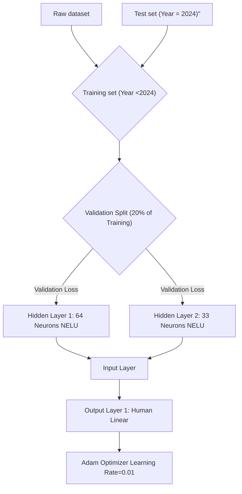
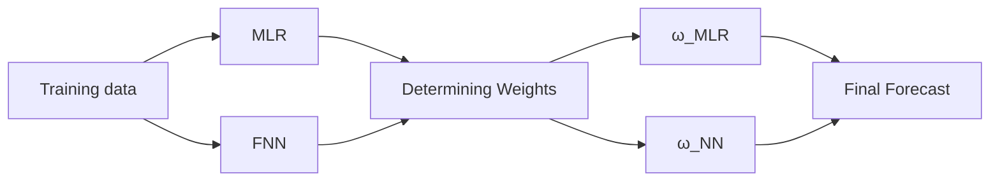

# Olympic Medal Prediction Model Based on Regression and Machine Learning Summary

In Olympic sports, accurately predicting medal outcomes and understanding the factors driving national performance are essential for effective strategic planning. Based on the given dataset, we developed multiple mathematical models to forecast medal counts, identified nations likely to win their first medals, evaluated the strategic importance of specific sports, quantified the influence of Great Coaches, and analyzed the spillover effects of host countries. Findings include:

Medal Forecasting: We developed a Multiple Linear Regression–Feedforward Neural Network Bootstrap Ensemble Interval Model incorporating features such as the host boost, athlete pool, historical momentum, and competitive index. The model predicts that the United States will dominate the 2028 Los Angeles Olympics with an estimated total of 143 medals, followed by China with 76. Furthermore, the model suggests improvements for the United States and Germany, while China and the United Kingdom may experience declines.

First-Time Medalists: We developed a hybrid Logistic Regression–Random Forest model to predict First-Time Medalists. The key features analyzed included Number of Programs Attended, Athlete Participation Experience, and Program Competition Intensity. Three countries—Angola, El Salvador, and Papua New Guinea—are identified as the most likely to win their first Olympic medal, with probabilities of 88.09% (LR) and 94.12% (RF). This prediction is further validated by Monte Carlo simulations, with a 95% confidence interval of 1.00–8.00.

Strategic Sport Prioritization: The Strategic Importance Assessment Model for Olympic Sports (SIAMOS) model assesses the relationship between event characteristics (quantity, variety) and national medal potential. Key metrics—National Medal Proportion, Global Competitive Presence, Long-term Achievement Stability, and Athlete Sport Distribution—were weighted via Principal Component Analysis. Results identified swimming (USA, IS = 39.8) and diving (China, IS = 33.1) as the highest-impact disciplines. Host nations can optimize medal outcomes by focusing on sports with strong historical performance and competitive advantage.

Coach Impact Analysis: Breakpoint regression quantified the impact of Great Coaches, including Keiko Kageyama (China, Artistic Swimming), Dave Brailsford (UK, Cycling), and Béla and Marta Károlyi (US, Gymnastics), with a median post/pre-coach medal ratio of 1.7.

Great Coach Effect Application: Poland(athletics, canoe sprint, sailing), Nigeria (football), and India(badminton, weightlifting, wrestling) were identified as high-potential nations for elite coaching. Adjusted regression coefficients and medal weights—gold (0.9), silver (0.6), bronze (0.4), no medal (0.1)—highlight how elite coaching could improve medal prospects and weighted scores.

Host Spillover Effect: Further exploration of the data reveals that the "Host Boost" significantly increases the medal rates of neighboring countries.

Keywords: Olympic medal prediction; Strategic Importance Assessment Model for Olympic Sports; Logistic Regression-Random Forest; Multivariate Linear Regression-Feedforward Neural Network

# Contents

# 1 Introduction 3

1.1 Background 3  
1.2 Restatement of the Problem 3  
1.3 Our work 4

# 2 Assumptions and Justification 4

# 3 Notations 5

# 4 Data Preprocessing 5

4.1 Data Cleaning and Adjustments 5  
4.2 Data Exploration 5

# 5 Multiple Linear Regression-Feedforward Neural Network Bootstrap Ensemble Interval Prediction Model with Host Effect 6

5.1 Reasons for Model Selection 6  
5.2 Model Construction and Fusion 6  
5.3 Forecast Results and Insights 9  
5.4 Uncertainty and Evaluation Analysis 10

# 6 Logistic Regression and Random Forest Prediction Model for First-Time Medalist Countries 11

6.1 Reasons for Model Selection 11  
6.2 Feature Engineering 12  
6.3 Analysis of Conditions for Countries Winning Medals for the First Time . . . . 12  
6.4 Model Formulation and Prediction Results 13  
6.5 Estimate odds 14

# 7 Strategic Importance Assessment Model for Olympic Sports (SIAMOS) 15

7.1 Model Development and Evaluation Framework 15  
7.2 Result 1: Relationship Between Events and Medal Counts ..... 16  
7.3 Result 2: Sport-Specific Importance Across Nations ..... 16  
7.4 Result 3: Impact of Host Nation's Event Selection on Medal Outcomes . . . . . 17

# 8 Contribution of the Great Coach 18

8.1 Definition of Great Coach 18  
8.2 Data Processing Framework 18  
8.3 Calculation of Coefficients Based on Breakpoint Regression Model ..... 18  
8.4 Case Study Analysis (Focusing on Three Key Sports) ..... 19

# 9 The Practical Application of the "Great Coach" Effect 22

9.1 Selection of Sports Needing a Great Coach 22  
9.2 Results 22

# 10 Other Insights: Host Country Spillover Effect on Medal Rates of Neighboring Countries 22

10.1 Analysis and Results 22  
10.2 Strategic Recommendation for National Olympic Committees . . . . . . . . . 23

# 11 Sensitivity Analysis 23

# 12 Strengths and Weaknesses 24

# References 25

# 1 Introduction

# 1.1 Background

The 2024 Paris Olympics concluded with notable highlights, including the United States leading the medal tally with 126 medals and sharing the top spot for gold medals with China at 40 each.

As the world's focus shifts toward the 2028 Los Angeles Olympics, the city's vibrant energy and cultural diversity set the stage for the historic Games.

By analysing historical data and designing predictive modeling, we aim to forecast the 2028 Olympic medal standings. The host nation, the United States, potentially reinforcing its dominance. Simultaneously, countries that have yet to secure an Olympic medal will strive to achieve their first victories, marking historic milestones.

Additionally, the influence of great coaches and strategic investments may significantly shift outcomes, offering valuable insights into medal prospects and performance optimization for countries worldwide.

# 1.2 Restatement of the Problem

Based on the analysis of the background, the key tasks are as follows:

Problem 1. Develop a predictive model for Olympic medal counts by country. The model should incorporate uncertainty estimates, evaluate prediction accuracy, and provide comprehensive performance metrics.

Task 1.1 Use the model to forecast the medal table for the 2028 Los Angeles Summer Olympics. Provide prediction intervals for all outcomes. Additionally, identify countries most likely to improve and those at risk of underperforming compared to their 2024 results.

Task 1.2 Identify nations that have yet to win an Olympic medal and forecast how many are likely to achieve their first medal in the upcoming Games. Estimate the probability of countries earning their first Olympic medal.

Task 1.3 Integrate event numbers and types into the model to analyze their relationship with medal counts by country. Identify influential sports for specific nations, their significance, and the impact of host nation event selection on results.

Problem 2. Coaches, unlike athletes, can freely move between countries, creating the potential for a significant “great coach” effect.

Task 2.1 Analyze data for evidence of changes that may be attributed to the influence of exceptional coaches. Quantify the contribution of this “great coach” effect to medal counts.

Task 2.2 Select three countries and determine the sports in which they should invest in recruiting a “great coach.” Estimate the potential impact of such strategic coaching investments on medal performance.

Problem 3. Identify additional, original insights revealed by the model regarding Olympic medal counts. Provide actionable recommendations to country Olympic committees based on these findings.

# 1.3 Our work

flowchart

This flowchart illustrates a multi-task learning process for sports management, covering problem identification, prediction, and evaluation across multiple tasks.

Problem 3  
Other Insights: Host Country Spillover Effect on Medal Rates of Neighboring Countries

# 2 Assumptions and Justification

To simplify the problem, we make the following basic assumptions, each of which is properly justified.

- The analysis and models are exclusively based on the provided datasets from the 2016, 2020, and 2024 Olympic Games. The three latest Olympic Games provide the most current and relevant data for insights into performance trends, ensuring the analysis is based on representative and applicable information.  
- The performance of new entrants in their first Olympic participation is on par with that of athletes who will not compete in future Olympic Games. Olympic debuts and retirements are similar in that they both involve challenges such as inexperience or the end of a career, ensuring consistent participation by athletes.  
- Russia and Belarus are excluded from the medal table in 2028. Athletes from Russia and Belarus competed without their national flags at the 2024 Olympics, indicating they will likely face the same restrictions in 2028.  
- The disturbance terms in both the multiple regression and regression discontinuity models follow independent normal distributions. The errors are normally distributed with a mean of zero and constant variance, ensuring valid statistical tests and reliable model estimates.  
- The assumption is made that the 2028 Olympic Games will proceed without significant global disruptions. “This assumption expects no major global disruptions, ensuring the 2028 Games proceed as planned and the analysis aligns with historical trends.”

\- Medal counts are analyzed at the sports level, inferring event-level data. We aggregate the data from individual events within each sport to mitigate variability from fluctuations in the number of events.

# 3 Notations

<table><tr><td>Symbols</td><td>Description</td><td>Unit</td></tr><tr><td> $Y_{1}, Y_{2}$ </td><td>Predicted medal count (total medals or gold medals)</td><td>Medals</td></tr><tr><td> $X_{Comp}$ </td><td>Competitiveness index</td><td>Dimensionless</td></tr><tr><td> $X_{Ath}$ </td><td>Athlete pool</td><td>Dimensionless</td></tr><tr><td> $X_{Host}$ </td><td>Host boost indicator</td><td>Binary</td></tr><tr><td> $X_{Hist}$ </td><td>Historical momentum</td><td>Dimensionless</td></tr><tr><td> $AWR$ </td><td>Award-winning rate</td><td>Percentage (%)</td></tr><tr><td> $\beta_{0}, \beta_{1}, \beta_{2}, \beta_{3}, \beta_{4}$ </td><td>Regression coefficients</td><td>-</td></tr><tr><td> $\hat{P}_{i}$ </td><td>Combined prediction for i-th instance</td><td>Medals</td></tr><tr><td> $w_{MLR}, w_{NN}$ </td><td>Weights for MLR and NN models</td><td>-</td></tr><tr><td> $PE_{MLR}^{2}, PE_{NN}^{2}$ </td><td>Mean squared prediction errors for MLR and NN</td><td>-</td></tr></table>

where we define the main parameters while specific value of those parameters will be given later.

# 4 Data Preprocessing

# 4.1 Data Cleaning and Adjustments

# 4.1.1 Replacement Examples

Table 1: Standardized Olympic Data Adjustments Table

<table><tr><td>Category</td><td>Original Name</td><td>Standardized Name</td></tr><tr><td>Country Name Changes</td><td>Great BritainMacedonia</td><td>United KingdomNorth Macedonia</td></tr><tr><td>Language Substitutions</td><td>Cote d’IvoireCape Verde</td><td>Ivory CoastCabo Verde</td></tr><tr><td>Synonym Replacements</td><td>Independent Olympic AthletesRefugee Olympic Team</td><td> ${\text{Individual Olympic Athletes}^{\text{IOC2025}}}$  Refugee  $Athletes^{\text{IOC2025}}$ </td></tr><tr><td>NOC Consistency</td><td>ROC (Russia, 2020)RUS (Russia, pre-2020)</td><td>RussiaRussia</td></tr><tr><td>Sports Merging (2016)</td><td>Cycling (as a single Sport)Canoeing (as a single Sport)</td><td>Split into EventsSplit into Events</td></tr></table>

# 4.2 Data Exploration

# 4.2.1 Medal Flow Analysis Across Countries

Figure 1 presents a Sankey diagram highlighting key medal flow patterns during the 2024 Olympics:

- Dominant Sports and Nations: Swimming and athletics contribute significantly to medal tallies in nations like the United States and China.  
- Strategic Focus: Italy and Australia excel in niche sports, showcasing tailored investment strategies.

sankey

| Source | Destination | Flow |
| --- | --- | --- |
| Basketball | Canada | High |
| Basketball | United States | High |
| Cancer Sports | Canada | High |
| Cancer Sports | Australia | High |
| Brain | United States | High |
| Arctic Demarcations | United States | High |
| Arctic Demarcations | Australia | High |
| Arctic Demarcations | UK | High |
| Arctic Demarcations | UK | High |
| Arctic Demarcations | UK | High |
| Arctic Demarcations | UK | High |
| Arctic Demarcations | UK | High |
| Arctic Demarcations | UK | High |
| Arctic Demarcations | UK | High |
| Arctic Demarcations | UK | High |
| Arctic Demarcations | UK | High |
| Arctic Demarcations | UK | High |
| Arctic Demarcations | UK | High |
| Arctic Demarcations | UK | High |
| Arctic Demarcations | UK | High |
| Arctic Demarcations | UK | High |
| Arctic Demarcations | UK | High |
| Arctic Demarcations | UK | High |
| Arctic Demarcations | UK | High |
| Arctic Demarcations | UK | High |
| Arctic Demarcations | UK | High |
| Arctic Demarcations | UK | High |
| Arctic Demarcations | UK | High |
| Arctic Demarcations | UK | High |
| Arctic Demarcations | UK | High |
| Arctic Demarcations | UK | High |
| Arctic Demarcations | UK | High |
| Arctic Demarcations | UK | High |
| Arctic Demarcations | UK | High |
| Arctic Demarcations | UK | High |
| Arctic Demarcations | UK | High |
| Arctic Demarcations | UK | High |
| Arctic Demarcations | UK | High |
| Arctic Demarcations | UK | High |
| Arctic Demarcations | UK | High |
| Arctic Demarcations | UK | High |
| Arctic Demarcations | UK | High |
| Arctic Demarcations | UK | High |
| Arctic Demarcations | UK | High |
| Arctic Demarcations | UK | High |
| Arctic Demarcations | UK | High |
| Arctic Demarcations | UK | High |
| Arctic Demarcations | UK | High |
| Arctic Demarcations | UK | High |
| Arctic Demarcations | UK | High |
| Arctic Demarcations | UK | High |
| Arctic Demarcations | UK | High |
| Arctic Demarcations | UK | High |
| Arctic Demarcations | UK | High |
| Arctic Demarcations | UK | High |
| Arctic Demarcations | UK | High |
| Arctic Demarcations | UK | High |
| Arctic Demarcations | UK | High |
| Arctic Demarcations | UK | High |
| Arctic Demarcations | UK | High |
| Arctic Demarcations | UK | High |
| Arctic Demarcations | UK | High |
| Arctic Demarcations | UK | High |
| Arctic Demarcations | UK | High |
| Arctic Demarcations | UK | High |
| Arctic Demarcations | UK | High |
| Arctic Demarcations | UK | High |
| Arctic Demarcations | UK | High |
| Arctic Demarcations | UK | High |
| Arctic Demarcations | UK | High |
| Arctic Demarcations | UK | High |
| Arctic Demarcations | UK | High |
| Arctic Demarcations | UK | High |
| Arctic Demarcations | UK | High |
| Arctic Demarcations | UK | High |
| Arctic Demarcations | UK | High |
| Arctic Demarcations | UK | High |
| Arctic Demarcations | UK | High |
| Arctic Demarcations | UK | High |
| Arctic Demarcations | UK | High |
| Arctic Demarcations | UK | High |
| Arctic Demarcations | UK | High |
| Arctic Demarcations | UK | High |
| Arctic Demarcations | UK | High |
| Arctic Demarcations | UK | High |
| Arctic Demarcations | UK | High |
| Arctic Demarcations | UK | High |
| Arctic Demarcations | UK | High |
| Arctic Demarcations | UK | High |
| Arctic Demarcations | UK | High |
| Arctic Demarcations | UK | High |
| Arctic Demarcations | UK | High |
| Arctic Demarcations | UK | High |
| Arctic Demarcations | UK | High |
| Arctic Demarcations | UK | High |
| Arctic Demarcations | UK | High |
| Arctic Demarcations | UK | High |
| Arctic Demarcations | UK | High |
| Arctic Demarcations | UK | High |
| Arctic Demarcations | UK | High |
| Arctic Demarcations | UK | High |
| Arctic Demarcations | UK | High |
| Arctic Demarcations | UK | High |
| Arctic Demarcations | UK | High |
| Arctic Demarcations | UK | High |
| Arctic Demarcations | UK | High |
| Arctic Demarcations | UK | High |
| Arctic Demarcations | UK | High |
| Arctic Demarcations | UK | High |
| Arctic Demarcations | UK | High |
| Arctic Demarcations | UK | High |
| Arctic Demarcations | UK | High |
| Arctic Demarcations | UK | High |
| Arctic Demarcations | UK | High |
| Arctic Demarcations | UK | High |
| Arctic Demarcations | UK | High |
| Arctic Demarcations | UK | High |
| Arctic Demarcations | UK | High |
| Arctic Demarcations | UK | High |
| Arctic Demarcations | UK | High |
| Arctic Demarcations | UK | High |
| Arctic Demarcations | UK | High |
| Arctic Demarcations | UK | High |
| Arctic Demarcations | UK | High |
| Arctic Demarcations | UK | High |
| Arctic Demarcations | UK | High |
| Arctic Demarcations | UK | High |
| Arctic Demarcations | UK | High |
| Arctic Demarcations | UK | High |
| Arctic Demarcations | UK | High |
| Arctic Demarcations | UK | High |
| Arctic Demarcations | UK | High |
| Arctic Demarcations | UK | High |
| Arctic Demarcations | UK | High |
| Arctic Demarcations | UK | High |
| Arctic Demarcations | UK | High |
| Arctic Demarcations | UK | High |
| Arctic Demarcations | UK | High |
| Arctic Demarcations | UK | High |
| Arctic Demarcations | UK | High |
| Arctic Demarcations | UK | High |
| Arctic Demarcations | UK | High |
| Arctic Demarcations | UK | High |
| Arctic Demarcations | UK | High |
| Arctic Demarcations | UK | High |
| Arctic Demarcations | UK | High |
| Arctic Demarcations | UK | High |
| Arctic Demarcations | UK | High |
| Arctic Demarcations | UK | High |
| Arctic Demarcations | UK | High |
| Arctic Demarcations | UK | High |
| Arctic Demarcations | UK | High |
| Arctic Demarcations | UK | High |
| Arctic Demarcations | UK | High |
| Arctic Demarcations | UK | High |
| Arctic Demarcations | UK | High |
| Arctic Demarcations | UK | High |
| Arctic Demarcations | UK | High |
| Arctic Demarcations | UK | High |
| Arctic Demarcations | UK | High |
| Arctic Demarcations | UK | High |
| Arctic Demarcations | UK | High |
| Arctic Demarcations | UK | High |
| Arctic Demarcations | UK | High |
| Arctic Demarcations | UK | High |
| Arctic Demarcations | UK | High |
| Arctic Demarcations | UK | High |
| Arctic Demarcations | UK | High |
| Arctic Demarcations | UK | High |
| Arctic Demarcations | UK | High |
| Arctic Demarcations | UK | High |
| Arctic Demarcations | UK | High |
| Arctic Demarcations | UK | High |
| Arctic Demarcations | UK | High |
| Arctic Demarcations | UK | High |
| Arctic Demarcations | UK | High |
| Arctic Demarcations | UK | High |
| Arctic Demarcations | UK | High |
| Arctic Demarcations | UK | High |
| Arctic Demarcations | UK | High |
| Arctic Demarcations | UK | High |
| Arctic Demarcations | UK | High |
| Arctic Demarcations | UK | High |
| Arctic Demarcations | UK | High |
| Arctic Demarcations | UK | High |
| Arctic Demarcations | UK | High |
| Arctic Demarcations | UK | High |
| Arctic Demarcations | UK | High |
| Arctic Demarcations | UK | High |
| Arctic Demarcations | UK | High |
| Arctic Demarcations | UK | High |
| Arctic Demarcations | UK | High |
| Arctic Demarcations | UK | High |
| Arctic Demarcations | UK | High |
| Arctic Demarcations | UK | High |
| Arctic Demarcations | UK | High |
| Arctic Demarcations | UK | High |
| Arctic Demarcations | UK | High |
| Arctic Demarcations | UK | High |
| Arctic Demarcations | UK | High |
| Arctic Demarcations | UK | High |
| Arctic Demarcations | UK | High |
| Arctic Demarcations | UK | High |
| Arctic Demarcations | UK | High |
| Arctic Demarcations | UK | High |
| Arctic Demarcations | UK | High |
| Arctic Demarcations | UK | High |
| Arctic Demarcations | UK | High |
| Arctic Demarcations | UK | High |
| Arctic Demarcations | UK | High |
| Arctic Demarcations | UK | High |
| Arctic Demarcations | UK | High |
| Arctic Demarcations | UK | High |
| Arctic Demarcations | UK | High |
| Arctic Demarcations | UK | High |
| Arctic Demarcations | UK | High |
| Arctic Demarcations | UK | High |
| Arctic Demarcations | UK | High |
| Arctic Demarcations | UK | High |
| Arctic Demarcations | UK | High |
| Arctic Demarcations | UK | High |
| Arctic Demarcations | UK | High |
| Arctic Demarcations | UK | High |
| Arctic Demarcations | UK | High |
| Arctic Demarcations | UK | High |
| Arctic Demarcations | UK | High |
| Arctic Demarcations | UK | High |
| Arctic Demarcations | UK | High |
| Arctic Demarcations | UK | High |
| Arctic Demarcations | UK | High |
| Arctic Demarcations | UK | High |
| Arctic Demarcations | UK | High |
| Arctic Demarcations | UK | High |
| Arctic Demarcations | UK | High |
| Arctic Demarcations | UK | High |
| Arctic Demarcations | UK | High |
| Arctic Demarcations | UK | High |
| Arctic Demarcations | UK | High |
| Arctic Demarcations | UK | High |
| Arctic Demarcations | UK | High |
| Arctic Demarcations | UK | High |
| Arctic Demarcations | UK | High |
| Arctic Demarcations | UK | High |
| Arctic Demarcations | UK | High |
| Arctic Demarcations | UK | High |
| Arctic Demarcations | UK | High |
| Arctic Demarcations | UK | High |
| Arctic Demarcations | UK | High |
| Arctic Demarcations | UK | High |
| Arctic Demarcations | UK | High |
| Arctic Demarcations | UK | High |
| Arctic Demarcations | UK | High |
| Arctic Demarcations | UK | High |
| Arctic Demarcations | UK | High |
| Arctic Demarcations | UK | High |
| Arctic Demarcations | UK | High |
| Arctic Demarcations | UK | High |
| Arctic Demarcations | UK | High |
| Arctic Demarcations | UK | High |
| Arctic Demarcations | UK | High |
| Arctic Demarcations | UK | High |
| Arctic Demarcations | UK | High |
| Arctic Demarcations | UK | High |
| Arctic Demarcations | UK | High |
| Arctic Demarcations | UK | High |
| Arctic Demarcations | UK | High |
| Arctic Demarcations | UK | High |
| Arctic Demarcations | UK | High |
| Arctic Demarcations | UK | High |
| Arctic Demarcations | UK | High |
| Arctic Demarcations | UK | High |
| Arctic Demarcations | UK | High |
| Arctic Demarcations | UK | High |
| Arctic Demarcations | UK | High |
| Arctic Demarcations | UK | High |
| Arctic Demarcations | UK | High |
| Arctic Demarcations | UK | High |
| Arctic Demarcations | UK | High |
| Arctic Demarcations | UK | High |
| Arctic Demarcations | UK | High |
| Arctic Demarcations | UK | High |
| Arctic Demarcations | UK | High |
| Arctic Demarcations | UK | High |
| Arctic Demarcations | UK | High |
| Arctic Demarcations | UK | High |
| Arctic Demarcations | UK | High |
| Arctic Demarcations | UK | High |
| Arctic Demarcations | UK | High |
| Arctic Demarcations | UK | High |
| Arctic Demarcations | UK | High |
| Arctic Demarcations | UK | High |
| Arctic Demarcations | UK | High |
| Arctic Demarcations | UK | High |
| Arctic Demarcations | UK | High |
| Arctic Demarcations | UK | High |
| Arctic Demarcations | UK | High |
| Arctic Demarcations | UK | High |
| Arctic Demarcations | UK | High |
| Arctic Demarcations | UK | High |
| Arctic Demarcations | UK | High |
| Arctic Demarcations | UK | High |
| Arctic Demarcations | UK | High |
| Arctic Demarcations | UK | High |
| Arctic Demarcations | UK | High |
| Arctic Demarcations | UK | High |
| Arctic Demarcations | UK | High |
| Arctic Demarcations | UK | High |
| Arctic Demarcations | UK | High |
| Arctic Demarcations | UK | High |
| Arctic Demarcations | UK | High |
| Arctic Demarcations | UK | High |
| Arctic Demarcations | UK | High |
| Arctic Demarcations | UK | High |
| Arctic Demarcations | UK | High |
| Arctic Demarcations | UK | High |
| Arctic Demarcations | UK | High |
| Arctic Demarcations | UK | High |
| Arctic Demarcations | UK | High |
| Arctic Demarcations | UK | High |
| Arctic Demarcations | UK | High |
| Arctic Demarcations | UK | High |
| Arctic Demarcations | UK | High |
| Arctic Demarcations | UK | High |
| Arctic Demarcations | UK | High |
| Arctic Demarcations | UK | High |
| Arctic Demarcations | UK | High |
| Arctic Demarcations | UK | High |
| Arctic Demarcations | UK | High |
| Arctic Demarcations | UK | High |
| Arctic Demarcations | UK | High |
| Arctic Demarcations | UK | High |
| Arctic Demarcations | UK | High |
| Arctic Demarcations | UK | High |
| Arctic Demarcations | UK | High |
| Arctic Demarcations | UK | High |
| Arctic Demarcations | UK | High |
| Arctic Demarcations | UK | High |
| Arctic Demarcations | UK | High |
| Arctic Demarcations | UK | High |
| Arctic Demarcations | UK | High |
| Arctic Demarcations | UK | High |
| Arctic Demarcations | UK | High |
| Arctic Demarcations | UK | High |
| Arctic Demarcations | UK | High |
| Arctic Demarcations | UK | High |
| Arctic Demarcations | UK | High |
| Arctic Demarcations | UK | High |
| Arctic Demarcations | UK | High |
| Arctic Demarcations | UK | High |
| Arctic Demarcations | UK | High |
| Arctic Demarcations | UK | High |
| Arctic Demarcations | UK | High |
| Arctic Demarcations | UK | High |
| Arctic Demarcations | UK | High |
| Arctic Demarcations | UK | High |
| Arctic Demarcations | UK | High |
| Arctic Demarcations | UK | High |
| Arctic Demarcations | UK | High |
| Arctic Demarcations | UK | High |
| Arctic Demarcations | UK | High |
| Arctic Demarcations | UK | High |
| Arctic Demarcations | UK | High |
| Arctic Demarcations | UK | High |
| Arctic Demarcations | UK | High |
| Arctic Demarcations | UK | High |
| Arctic Demarcations | UK | High |
| Arctic Demarcations | UK | High |
| Arctic Demarcations | UK | High |
| Arctic Demarcations | UK | High |
| Arctic Demarcations | UK | High |
| Arctic Demarcations | UK | High |
| Arctic Demarcations | UK | High |
| Arctic Demarcations | UK | High |
| Arctic Demarcations | UK | High |
| Arctic Demarcations | UK | High |
| Arctic Demarcations | UK | High |
| Arctic Demarcations | UK | High |
| Arctic Demarcations | UK | High |
| Arctic Demarcations | UK | High |
| Arctic Demarcations | UK | High |
| Arctic Demarcations | UK | High |
| Arctic Demarcations | UK | High |
| Arctic Demarcations | UK | High |
| Arctic Demarcations | UK | High |
| Arctic Demarcations | UK | High |
| Arctic Demarcations | UK | High |
| Arctic Demarcations | UK | High |
| Arctic Demarcations | UK | High |
| Arctic Demarcations | UK | High |
| Arctic Demarcations | UK | High |
| Arctic Demarcations | UK | High |
| Arctic Demarcations | UK | High |
| Arctic Demarcations | UK | High |
| Arctic Demarcations | UK | High |
| Arctic Demarcations | UK | High |
| Arctic Demarcations | UK | High |
| Arctic Demarcations | UK | High |
| Arctic Demarcations | UK | High |
| Arctic Demarcations | UK | High |
| Arctic Demarcations | UK | High |
| Arctic Demarcations | UK | High |
| Arctic Demarcations | UK | High |
| Arctic Demarcations | UK | High |
| Arctic Demarcations | UK | High |
| Arctic Demarcations | UK | High |
| Arctic Demarcations | UK | High |
| Arctic Demarcations | UK | High |
| Arctic Demarcations | UK | High |
| Arctic Demarcations | UK | High |
| Arctic Demarcations | UK | High |
| Arctic Demarcations | UK | High |
| Arctic Demarcations | UK | High |
| Arctic Demarcations | UK | High |
| Arctic Demarcations | UK | High |
| Arctic Demarcations | UK | High |
| Arctic Demarcations | UK | High |
| Arctic Demarcations | UK | High |
| Arctic Demarcations | UK | High |
| Arctic Demarcations | UK | High |
| Arctic Demarcations | UK | High |
| Arctic Demarcations | UK | High |
| Arctic Demarcations | UK | High |
| Arctic Demarcations | UK | High |
| Arctic Demarcations | UK | High |
| Arctic Demarcations | UK | High |
| Arctic Demarcations | UK | High |
| Arctic Demarcations | UK | High |
| Arctic Demarcations | UK | High |
| Arctic Demarcations | UK | High |
| Arctic Demarcations | UK | High |
| Arctic Demarcations | UK | High |
| Arctic Demarcations | UK | High |
| Arctic Demarcations | UK | High |
| Arctic Demarcations | UK | High |
| Arctic Demarcations | UK | High |
| Arctic Demarcations | UK | High |
| Arctic Demarcations | UK | High |
| Arctic Demarcations | UK | High |
| Arctic Demarcations | UK | High |
| Arctic Demarcations | UK | High |
| Arctic Demarcations | UK | High |
| Arctic Demarcations | UK | High |
| Arctic Demarcations | UK | High |
| Arctic Demarcations | UK | High |
| Arctic Demarcations | UK | High |
| Arctic Demarcations | UK | High |
| Arctic Demarcations | UK | High |
| Arctic Demarcations | UK | High |
| Arctic Demarcations | UK | High |
| Arctic Demarcations | UK | High |
| Arctic Demarcations | UK | High |
| Arctic Demarcations | UK | High |
| Arctic Demarcations | UK | High |
| Arctic Demarcations | UK | High |
| Arctic Demarcations | UK | High |
| Arctic Demarcations | UK | High |
| Arctic Demarcations | UK | High |
| Arctic Demarcations | UK | High |
| Arctic Demarcations | UK | High |
| Arctic Demarcations | UK | High |
| Arctic Demarcations | UK | High |
| Arctic Demarcations | UK | High |
| Arctic Demarcations | UK | High |
| Arctic Demarcations | UK | High |
| Arctic Demarcations | UK | High |
| Arctic Demarcations | UK | High |
| Arctic Demarcations | UK | High |
| Arctic Demarcations | UK | High |
| Arctic Demarcations | UK | High |
| Arctic Demarcations | UK | High |
| Arctic Demarcations | UK | High |
| Arctic Demarcations | UK | High |
| Arctic Demarcations | UK | High |
| Arctic Demarcations | UK | High |
| Arctic Demarcations | UK | High |
| Arctic Demarcations | UK | High |
| Arctic Demarcations | UK | High |
| Arctic Demarcations | UK | High |
| Arctic Demarcations | UK | High |
| Arctic Demarcations | UK | High |
| Arctic Demarcations | UK | High |
| Arctic Demarcations | UK | High |
| Arctic Demarcations | UK | High |
| Arctic Demarcations | UK | High |
| Arctic Demarcations | UK | High |
| Arctic Demarcations | UK | High |
| Arctic Demarcations | UK | High |
| Arctic Demarcations | UK | High |
| Arctic Demarcations | UK | High |
| Arctic Demarcations | UK | High |
| Arctic Demarcations | UK | High |
| Arctic Demarcations | UK | High |
| Arctic Demarcations | UK | High |
| Arctic Demarcations | UK | High |
| Arctic Demarcations | UK | High |
| Arctic Demarcations | UK | High |
| Arctic Demarcations | UK | High |
| Arctic Demarcations | UK | High |
| Arctic Demarcations | UK | High |
| Arctic Demarcations | UK | High |
| Arctic Demarcations | UK | High |
| Arctic Demarcations | UK | High |
| Arctic Demarcations | UK | High |
| Arctic Demarcations | UK | High |
| Arctic Demarcations | UK | High |
| Arctic Demarcations | UK | High |
| Arctic Demarcations | UK | High |
| Arctic Demarcations | UK | High |
| Arctic Demarcations | UK | High |
| Arctic Demarcations | UK | High |
| Arctic Demarcations | UK | High |
| Arctic Demarcations | UK | High |
| Arctic Demarcations | UK | High |
| Arctic Demarcations | UK | High |
| Arctic Demarcations | UK | High |
| Arctic Demarcations | UK | High |
| Arctic Demarcations | UK | High |
| Arctic Demarcations | UK | High |
| Arctic Demarcations | UK | High |
| Arctic Demarcations | UK | High |
| Arctic Demarcations | UK | High |
| Arctic Demarcations | UK | High |
| Arctic Demarcations | UK | High |
| Arctic Demarcations | UK | High |
| Arctic Demarcations | UK | High |
| Arctic Demarcations | UK | High |
| Arctic Demarcations | UK | High |
| Arctic Demarcations | UK | High |
| Arctic Demarcations | UK | High |
| Arctic Demarcations | UK | High |
| Arctic Demarcations | UK | High |
| Arctic Demarcations | UK | High |
| Arctic Demarcations | UK | High |
| Arctic Demarcations | UK | High |
| Arctic Demarcations | UK | High |
| Arctic Demarcations | UK | High |
| Arctic Demarcations | UK | High |
| Arctic Demarcations | UK | High |
| Arctic Demarcations | UK | High |
| Arctic Demarcations | UK | High |
| Arctic Demarcations | UK | High |
| Arctic Demarcations | UK | High |
| Arctic Demarcations | UK | High |
| Arctic Demarcations | UK | High |
| Arctic Demarcations | UK | High |
| Arctic Demarcations | UK | High |
| Arctic Demarcations | UK | High |
| Arctic Demarcations | UK | High |
| Arctic Demarcations | UK | High |
| Arctic Demarcations | UK | High |
| Arctic Demarcations | UK | High |
| Arctic Demarcations | UK | High |
| Arctic Demarcations | UK | High |
| Arctic Demarcations | UK | High |
| Arctic Demarcations | UK | High |
| Arctic Demarcations | UK | High |
| Arctic Demarcations | UK | High |
| Arctic Demarcations | UK | High |
| Arctic Demarcations | UK | High |
| Arctic Demarcations | UK | High |
| Arctic Demarcations | UK | High |
| Arctic Demarcations | UK | High |
| Arctic Demarcations | UK | High |
| Arctic Demarcations | UK | High |
| Arctic Demarcations | UK | High |
| Arctic Demarcations | UK | High |
| Arctic Demarcations | UK | High |
| Arctic Demarcations | UK | High |
| Arctic Demarcations | UK | High |
| Arctic Demarcations | UK | High |
| Arctic Demarcations | UK | High |
| Arctic Demarcations | UK | High |
| Arctic Demarcations | UK | High |
| Arctic Demarcations | UK | High |
| Arctic Demarcations | UK | High |
| Arctic Demarcations | UK | High |
| Arctic Demarcations | UK | High |
| Arctic Demarcations | UK | High |
| Arctic Demarcations | UK | High |
| Arctic Demarcations | UK | High |
| Arctic Demarcations | UK | High |
| Arctic Demarcations | UK | High |
| Arctic Demarcations | UK | High |
| Arctic Demarcations | UK | High |
| Arctic Demarcations | UK | High |
| Arctic Demarcations | UK | High |
| Arctic Demarcations | UK | High |
| Arctic Demarcations | UK | High |
| Arctic Demarcations | UK | High |
| Arctic Demarcations | UK | High |
| Arctic Demarcations | UK | High |
| Arctic Demarcations | UK | High |
| Arctic Demarcations | UK | High |
| Arctic Demarcations | UK | High |
| Arctic Demarcations | UK | High |
| Arctic Demarcations | UK | High |
| Arctic Demarcations | UK | High |
| Arctic Demarcations | UK | High |
| Arctic Demarcations | UK | High |
| Arctic Demarcations | UK | High |
| Arctic Demarcations | UK | High |
| Arctic Demarcations | UK | High |
| Arctic Demarcations | UK | High |
| Arctic Demarcations | UK | High |
| Arctic Demarcations | UK | High |
| Arctic Demarcations | UK | High |
| Arctic Demarcations | UK | High |
| Arctic Demarcations | UK | High |
| Arctic Demarcations | UK | High |
| Arctic Demarcations | UK | High |
| Arctic Demarcations | UK | High |
| Arctic Demarcations | UK | High |
| Arctic Demarcations | UK | High |
| Arctic Demarcations | UK | High |
| Arctic Demarcations | UK | High |
| Arctic Demarcations | UK | High |
| Arctic Demarcations | UK | High |
| Arctic Demarcations | UK | High |
| Arctic Demarcations | UK | High |
| Arctic Demarcations | UK | High |
| Arctic Demarcations | UK | High |
| Arctic Demarcations | UK | High |
| Arctic Demarcations | UK | High |
| Arctic Demarcations | UK | High |
| Arctic Demarcations | UK | High |
| Arctic Demarcations | UK | High |
| Arctic Demarcations | UK | High |
| Arctic Demarcations | UK | High |
| Arctic Demarcations | UK | High |
| Arctic Demarcations | UK | High |
| Arctic Demarcations | UK | High |
| Arctic Demarcations | UK | High |
| Arctic Demarcations | UK | High |
| Arctic Demarcations | UK | High |
| Arctic Demarcations | UK | High |
| Arctic Demarcations | UK | High |
| Arctic Demarcations | UK | High |
| Arctic Demarcations | UK | High |
| Arctic Demarcations | UK | High |
| Arctic Demarcations | UK | High |
| Arctic Demarcations | UK | High |
| Arctic Demarcations | UK | High |
| Arctic Demarcations | UK | High |
| Arctic Demarcations | UK | High |
| Arctic Demarcations | UK | High |
| Arctic Demarcations | UK | High |
| Arctic Demarcations | UK | High |
| Arctic Demarcations | UK | High |
| Arctic Demarcations | UK | High |
| Arctic Demarcations | UK | High |
| Arctic Demarcations | UK | High |
| Arctic Demarcations | UK | High |
| Arctic Demarcations | UK | High |
| Arctic Demarcations | UK | High |
| Arctic Demarcations | UK | High |
| Arctic Demarcations | UK | High |
| Arctic Demarcations | UK | High |
| Arctic Demarcations | UK | High |
| Arctic Demarcations | UK | High |
| Arctic Demarcations | UK | High |
| Arctic Demarcations | UK | High |
| Arctic Demarcations | UK | High |
| Arctic Demarcations | UK | High |
| Arctic Demarcations | UK | High |
| Arctic Demarcations | UK | High |
| Arctic Demarcations | UK | High |
| Arctic Demarcations | UK | High |
| Arctic Demarcations | UK | High |
| Arctic Demarcations | UK | High |
| Arctic Demarcations | UK | High |
| Arctic Demarcations | UK | High |
| Arctic Demarcations | UK | High |
| Arctic Demarcations | UK | High |
| Arctic Demarcations | UK | High |
| Arctic Demarcations | UK | High |
| Arctic Demarcations | UK | High |
| Arctic Demarcations | UK | High |
| Arctic Demarcations | UK | High |
| Arctic Demarcations | UK | High |
| Arctic Demarcations | UK | High |
| Arctic Demarcations | UK | High |
| Arctic Demarcations | UK | High |
| Arctic Demarcations | UK | High |
| Arctic Demarcations | UK | High |
| Arctic Demarcations | UK | High |
| Arctic Demarcations | UK | High |
| Arctic Demarcations | UK | High |
| Arctic Demarcations | UK | High |
| Arctic Demarcations | UK | High |
| Arctic Demarcations | UK | High |
| Arctic Demarcations | UK | High |
| Arctic Demarcations | UK | High |
| Arctic Demarcations | UK | High |
| Arctic Demarcations | UK | High |
| Arctic Demarcations | UK | High |
| Arctic Demarcations | UK | High |
| Arctic Demarcations | UK | High |
| Arctic Demarcations | UK | High |
| Arctic Demarcations | UK | High |
| Arctic Demarcations | UK | High |
| Arctic Demarcations | UK | High |
| Arctic Demarcations | UK | High |
| Arctic Demarcations | UK | High |
| Arctic Demarcations | UK | High |
| Arctic Demarcations | UK | High |
| Arctic Demarcations | UK | High |
| Arctic Demarcations | UK | High |
| Arctic Demarcations | UK | High |
| Arctic Demarcations | UK | High |
| Arctic Demarcations | UK | High |
| Arctic Demarcations | UK | High |
| Arctic Demarcations | UK | High |
| Arctic Demarcations | UK | High |
| Arctic Demarcations | UK | High |
| Arctic Demarcations | UK | High |
| Arctic Demarcations | UK | High |
| Arctic Demarcations | UK | High |
| Arctic Demarcations | UK | High |
| Arctic Demarcations | UK | High |
| Arctic Demarcations | UK | High |
| Arctic Demarcations | UK | High |
| Arctic Demarcations | UK | High |
| Arctic Demarcations | UK | High |
| Arctic Demarcations | UK | High |
| Arctic Demarcations | UK | High |
| Arctic Demarcations | UK | High |
| Arctic Demarcations | UK | High |
| Arctic Demarcations | UK | High |
| Arctic Demarcations | UK | High |
| Arctic Demarcations | UK | High |
| Arctic Demarcations | UK | High |
| Arctic Demarcations | UK | High |
| Arctic Demarcations | UK | High |
| Arctic Demarcations | UK | High |
| Arctic Demarcations | UK | High |
| Arctic Demarcations | UK | High |
| Arctic Demarcations | UK | High |
| Arctic Demarcations | UK | High |
| Arctic Demarcations | UK | High |
| Arctic Demarcations | UK | High |
| Arctic Demarcations | UK | High |
| Arctic Demarcations | UK | High |
| Arctic Demarcations | UK | High |
| Arctic Demarcations | UK | High |
| Arctic Demarcations | UK | High |
| Arctic Demarcations | UK | High |
| Arctic Demarcations | UK | High |
| Arctic Demarcations | UK | High |
| Arctic Demarcations | UK | High |
| Arctic Demarcations | UK | High |
| Arctic Demarcations | UK | High |
| Arctic Demarcations | UK | High |
| Arctic Demarcations | UK | High |
| Arctic Demarcations | UK | High |
| Arctic Demarcations | UK | High |
| Arctic Demarcations | UK | High |
| Arctic Demarcations | UK | High |
| Arctic Demarcations | UK | High |
| Arctic Demarcations | UK | High |
| Arctic Demarcations | UK | High |
| Arctic Demarcations | UK | High |
| Arctic Demarcations | UK | High |
| Arctic Demarcations | UK | High |
| Arctic Demarcations | UK | High |
| Arctic Demarcations | UK | High |
| Arctic Demarcations | UK | High |
| Arctic Demarcations | UK | High |
| Arctic Demarcations | UK | High |
| Arctic Demarcations | UK | High |
| Arctic Demarcations | UK | High |
| Arctic Demarcations | UK | High |
| Arctic Demarcations | UK | High |
| Arctic Demarcations | UK | High |
| Arctic Demarcations | UK | High |
| Arctic Demarcations | UK | High |
| Arctic Demarcations | UK | High |
| Arctic Demarcations | UK | High |
| Arctic Demarcations | UK | High |
| Arctic Demarcations | UK | High |
| Arctic Demarcations | UK | High |
| Arctic Demarcations | UK | High |
| Arctic Demarcations | UK | High |
| Arctic Demarcations | UK | High |
| Arctic Demarcations | UK | High |
| Arctic Demarcations | UK | High |
| Arctic Demarcations | UK | High |
| Arctic Demarcations | UK | High |
| Arctic Demarcations | UK | High |
| Arctic Demarcations | UK | High |
| Arctic Demarcations | UK | High |
| Arctic Demarcations | UK | High |
| Arctic Demarcations | UK | High |
| Arctic Demarcations | UK | High |
| Arctic Demarcations | UK | High |
| Arctic Demarcations | UK | High |
| Arctic Demarcations | UK | High |
| Arctic Demarcations | UK | High |
| Arctic Demarcations | UK | High |
| Arctic Demarcations | UK | High |
| Arctic Demarcations | UK | High |
| Arctic Demarcations | UK | High |
| Arctic Demarcations | UK | High |
| Arctic Demarcations | UK | High |
| Arctic Demarcations | UK | High |
| Arctic Demarcations | UK | High |
| Arctic Demarcations | UK | High |
| Arctic Demarcations | UK | High |
| Arctic Demarcations | UK | High |
| Arctic Demarcations | UK | High |
| Arctic Demarcations | UK | High |

Figure 1: Sankey Diagram Representing Medal Flow Across Countries and Sports (2024 Olympics)

# 5 Multiple Linear Regression-Feedforward Neural Network Bootstrap Ensemble Interval Prediction Model with Host Effect

# 5.1 Reasons for Model Selection

Predicting Olympic medal distributions is a complex regression task. The Multiple Linear Regression (MLR) model is simple and interpretable, effective for linear relationships but limited in capturing non-linear dynamics like the host effect. To address this, the Feedforward Neural Network (FNN) model excels in capturing non-linear patterns and handling diverse datasets with high accuracy. Combining MLR's simplicity with FNN's adaptability, we propose a hybrid approach for enhanced medal prediction.

# 5.2 Model Construction and Fusion

# 5.2.1 MLR-Model Construction

# Multiple Linear Regression Formulation

The model is formulated as:

$$
Y _ {i} = \beta_ {0} + \beta_ {1} X _ {\mathrm{Comp}} + \beta_ {2} X _ {\mathrm{Ath}} + \beta_ {3} X _ {\mathrm{Host}} + \beta_ {4} X _ {\mathrm{Hist}} + \epsilon , \quad (i = 1, 2)
$$

# Feature Selection

Table 2: Key Predictive Features and Their Mathematical Definitions

<table><tr><td colspan="2">Feature</td><td>Interpretation</td><td>Mathematical Formula</td></tr><tr><td>Host $(X_{\text{Host}})$ </td><td>Boost</td><td>Boost from hosting the Olympics, quantified as an additional medal improvement rate.</td><td> $X_{\text{Host}} = \begin{cases} 1 + \Delta_R, & \text{if Host Nation} \\ 0, & \text{Otherwise} \end{cases}, \quad \Delta_R = \text{median} \left( \frac{R_h - \bar{R}_n}{\bar{R}_n} \right)$  $R_h$ : Host medal rate,  $\bar{R}_n$ : Non-host avg. rate.</td></tr><tr><td>Athlete $(X_{\text{Ath}})$ </td><td>Pool</td><td>Reflects athlete participation trends, adjusted for Olympic debutants.</td><td> $X_{\text{Ath}} = \sum_{t=0}^{2} N_{T-t}$  $N_{T-t}$ : Number of athletes in the  $(T-t)$ -th Olympic cycle.</td></tr><tr><td colspan="2">Competitiveness Index  $(X_{\text{Comp}})$ </td><td>Captures nation-specific strength across sports, adjusted for temporal decay.</td><td> $X_{\text{Comp}} = \sum_{k=1}^{K} \left( \frac{m_k}{M_{\text{total}}} \cdot \sum_{t=1}^{3} p_{k,t} \cdot e^{-0.2t} \right)$  $m_k$ : Medals in sport  $k, p_{k,t}$ : Medals at  $T-t, M_{\text{total}}$ : Total medals.</td></tr><tr><td colspan="2">Historical Momentum  $(X_{\text{Hist}})$ </td><td>Weighted sum of past medals, with higher weights for recent performances.</td><td> $X_{\text{Hist}} = \sum_{t=1}^{3} M_{T-t} \cdot e^{-0.2t}$  $M_{T-t}$ : Total medals at  $T-t$ .</td></tr></table>

# Correlation Analysis

To explore the relationships between features and target variables, we calculate Pearson correlation coefficients.

heatmap

| | Competitiveness index | Athlete pool | Historical momentum | Award Winning Rate |
|---|---|---|---|---|
| Competitiveness index | 1.00 | 0.77 | 0.92 | 0.92 |
| Athlete pool | 0.77 | 1.00 | 0.87 | 0.86 |
| Historical momentum | 0.92 | 0.87 | 1.00 | 1.00 |
| Award Winning Rate | 0.92 | 0.86 | 1.00 | 1.00 |

Figure 2: Correlation Matrix( $X_{Comp}$ , $X_{Ath}$ , and $X_{Hist}$ )

As shown in Figure 2, the award-winning rate exhibits significant correlations with the predictive features $X_{Comp}$ , $X_{Ath}$ , and $X_{Hist}$ , with correlation coefficients of 0.92, 0.86, and 1.00, respectively. These values highlight the strong relationships between competitiveness, athlete pool size, and historical momentum in predicting a nation's award-winning performance.

  
Figure 3: Host Boost

Since the host boost is a discrete variable, while other features change continuously, the host boost shows weak linear correlation with the other three indicators. Therefore, it is necessary to analyze the host boost separately. As illustrated in Figure 3, the total medal count for a nation significantly increases during its host year, highlighting the “Host Boost” as a crucial feature.

# 5.2.2 Feedforward Neural Network-Model Construction

flowchart

Figure 4: Feedforward Neural Network-Model Construction

From Figure 4, the model follows a typical Feedforward Neural Network (FNN) structure, which includes an input layer, two hidden layers with ReLU activation functions, and an output layer with a linear activation function. The raw dataset is split into training and test sets, with the training set further divided into training data and validation data (20% of the training set). The model is trained using the Adam optimizer with a learning rate of 0.01. Validation loss is tracked during the training process to assess the model's performance.

# 5.2.3 Weighted Fusion of Predictions

flowchart

Figure 5: Weighted Fusion Construction

To enhance the accuracy and robustness of medal count predictions, we utilize a weighted fusion approach to combine the outputs of the Multiple Linear Regression (MLR) and Feedforward Neural Network (FNN) models.

First, the mean squared prediction errors (MSE) for the two models are calculated:

$$
P E _ {\mathrm{MLR}} ^ {2} = \frac {1}{N} \sum_ {i = 1} ^ {N} \left(R _ {i} - P _ {\mathrm{MLR}, i}\right) ^ {2}, \quad P E _ {\mathrm{NN}} ^ {2} = \frac {1}{N} \sum_ {i = 1} ^ {N} \left(R _ {i} - P _ {\mathrm{NN}, i}\right) ^ {2}
$$

The weights for each model are derived based on their relative errors:

$$
w _ {\mathrm{MLR}} = \frac {P E _ {\mathrm{NN}} ^ {2}}{P E _ {\mathrm{MLR}} ^ {2} + P E _ {\mathrm{NN}} ^ {2}} \approx 0. 6, \quad w _ {\mathrm{NN}} = \frac {P E _ {\mathrm{MLR}} ^ {2}}{P E _ {\mathrm{MLR}} ^ {2} + P E _ {\mathrm{NN}} ^ {2}} \approx 0. 4
$$

Finally, the combined prediction for observation i is calculated as:

$$
\hat {P} _ {i} = w _ {\mathrm{MLR}} \cdot P _ {\mathrm{MLR}, i} + w _ {\mathrm{NN}} \cdot P _ {\mathrm{NN}, i}
$$

Through analyzing prediction errors, it is clear that the MLP model suffers from higher errors, while the FNN model risks overfitting. The combined MLP-NN model addresses these issues, enhancing both accuracy and robustness for reliable predictions.

# 5.3 Forecast Results and Insights

<table><tr><td rowspan="2">NOC</td><td colspan="4">Total Medals</td><td colspan="4">Gold Medals</td><td colspan="4">Confidence Intervals (95%)</td></tr><tr><td>Pred.</td><td>Δ</td><td>Rank</td><td>Δ</td><td>Pred.</td><td>Δ</td><td>Rank</td><td>Δ</td><td>Total Lower</td><td>Total Upper</td><td>Gold Lower</td><td>Gold Upper</td></tr><tr><td>United States</td><td>143</td><td>↑17</td><td>1</td><td>-</td><td>59</td><td>↑19</td><td>1</td><td>-</td><td>110</td><td>192</td><td>50</td><td>68</td></tr><tr><td>China</td><td>76</td><td>↓15</td><td>2</td><td>-</td><td>32</td><td>↓8</td><td>2</td><td>↓1</td><td>61</td><td>94</td><td>27</td><td>37</td></tr><tr><td>United Kingdom</td><td>62</td><td>↓3</td><td>3</td><td>-</td><td>21</td><td>↑7</td><td>3</td><td>↑4</td><td>56</td><td>85</td><td>17</td><td>25</td></tr><tr><td>France</td><td>60</td><td>↓4</td><td>4</td><td>-</td><td>16</td><td>-</td><td>5</td><td>-</td><td>50</td><td>73</td><td>13</td><td>19</td></tr><tr><td>Australia</td><td>54</td><td>↑1</td><td>5</td><td>-</td><td>21</td><td>↑3</td><td>3</td><td>↑1</td><td>49</td><td>70</td><td>17</td><td>25</td></tr><tr><td>Japan</td><td>43</td><td>↓2</td><td>6</td><td>-</td><td>16</td><td>↓4</td><td>5</td><td>↓2</td><td>35</td><td>51</td><td>13</td><td>19</td></tr><tr><td>Italy</td><td>40</td><td>-</td><td>7</td><td>-</td><td>12</td><td>-</td><td>8</td><td>↑1</td><td>34</td><td>48</td><td>10</td><td>14</td></tr><tr><td>Germany</td><td>36</td><td>↑3</td><td>8</td><td>↑1</td><td>12</td><td>-</td><td>8</td><td>↑2</td><td>31</td><td>44</td><td>10</td><td>14</td></tr><tr><td>Netherlands</td><td>35</td><td>↑1</td><td>9</td><td>↓1</td><td>15</td><td>-</td><td>7</td><td>↓1</td><td>31</td><td>43</td><td>12</td><td>18</td></tr><tr><td>Canada</td><td>30</td><td>↑3</td><td>10</td><td>↑1</td><td>10</td><td>↑1</td><td>10</td><td>↑2</td><td>27</td><td>37</td><td>8</td><td>12</td></tr></table>

Table 3: 2024 Olympic Medal Predictions with Rankings, Changes, and Confidence Intervals

Countries Likely to Improve: America (+17 medals) and Canada (+3 medals) show upward trends, may due to increased investment in athlete development and enhanced coaching strategies.

Countries Likely to Decline: France (60 medals vs. 64 in 2024) may experience a decline after hosting, while China (76 medals vs. 91 in 2024) faces challenges as its strong event, weightlifting $^{1}$ , will no longer be held.

Key Uncertainty: The U.S. medal interval highlights variability in team sports, while smaller nations like Slovenia (1 gold, CI: 0–2) exhibit greater volatility due to dependence on individual athletes.

heatmap

| Country | Rio 2016 | Tokyo 2020 | Paris 2024 | LA 2028 |
| --- | --- | --- | --- | --- |
| Australia | ~2% | ~3% | ~4% | ~4% |
| Canada | 0% | 0% | 0% | ~3% |
| China | ~5% | ~5% | ~5% | ~5% |
| France | ~2% | ~2% | ~4% | ~4% |
| Germany | ~2% | ~2% | ~3% | ~3% |
| Great Britain | ~5% | ~5% | ~5% | ~5% |
| Italy | ~2% | ~2% | ~3% | ~3% |
| Japan | ~2% | ~3% | ~3% | ~3% |
| Netherlands | 0% | ~3% | ~3% | ~3% |
| Russia | ~5% | 0% | 0% | 0% |
| Russia (ROC) | 0% | ~3% | 0% | 0% |
| South Korea | ~2% | 0% | ~3% | 0% |
| United States | ~5% | ~5% | ~5% | ~5% |

(a) Medal Proportion (Logarithmic)

heatmap

| Nation | 2016 | 2018 | 2020 | 2022 | 2024 | 2026 | 2028 |
| --- | --- | --- | --- | --- | --- | --- | --- |
| Australia | ~33 | ~40 | ~57 | ~57 | ~57 | ~57 | ~57 |
| Canada | 0 | 0 | 0 | 0 | 0 | ~33 | ~33 |
| China | ~57 | ~57 | ~141 | ~141 | ~141 | ~141 | ~141 |
| France | ~33 | ~33 | ~33 | ~33 | ~57 | ~57 | ~57 |
| Germany | ~33 | ~33 | ~33 | ~33 | ~33 | ~33 | ~33 |
| Great Britain | ~57 | ~57 | ~57 | ~57 | ~57 | ~57 | ~57 |
| Italy | ~33 | ~33 | ~33 | ~33 | ~33 | ~33 | ~33 |
| Japan | ~33 | ~33 | ~57 | ~57 | ~57 | ~57 | ~57 |
| Netherlands | 0 | 0 | ~33 | ~33 | ~33 | ~33 | ~33 |
| Russia | ~57 | 0 | 0 | 0 | 0 | 0 | 0 |
| Russia (ROC) | 0 | 0 | ~57 | 0 | 0 | 0 | 0 |
| South Korea | ~33 | ~33 | 0 | ~33 | ~33 | 0 | 0 |
| United States | 141 | 141 | 141 | 141 | 141 | 141 | 141 |

(b) Medal Counts (Absolute)  
Figure 6: Comparative Visualization of Olympic Medal Performance

As shown in Figure 6, the heatmap depicts the progression of the top 10 nations' medal counts from 2016 to 2028 using our prediction results. Color intensity indicates medal totals, with deeper blue shades signifying higher counts.

Key trends include the United States and China consistently dominating medal counts, reflecting their robust athletic programs. Host nations tend to achieve significant medal boosts. Emerging nations like Japan and the Netherlands display upward trends, signaling strategic investments. In contrast, nations such as Italy, Russia, and South Korea show variable performances. Western countries like Great Britain, Italy, and Germany maintain stable medal tallies.

# 5.4 Uncertainty and Evaluation Analysis

# 5.4.1 Uncertainty Analysis with Bootstrap

A Bootstrap method (500 iterations) was used to quantify the uncertainty of medal predictions for both total medals and gold medals. The process includes: The final 95% prediction intervals were derived from the aggregated results:

$$
\text {Lower Bound} = \text {Percentile} (2. 5), \quad \text {Upper Bound} = \text {Percentile} (9 7. 5)
$$

For example, the U.S. total medal interval [116, 193] reflects high uncertainty due to variable team sports performance, while China's narrower gold interval [27, 37] (from 32 predicted) indicates more stable strengths in diving and table tennis.

# 5.4.2 Prediction evaluation analysis

From Table 4, the selected model variables demonstrate both significance and explanatory power:

\- Host Boost ( $X_{\text{Host}}$ ): A coefficient of 13.10 ( $p < 0.001$ ) indicates a strong positive impact of hosting the Olympics on medal counts, despite a high standard error (2.88) due to cross-country variability.

Table 4: Regression Coefficients for the Multivariate Linear Model

<table><tr><td>Variable</td><td>Coefficient</td><td>Standard Error</td><td>t-Statistic</td><td>P-Value(P&gt;|t|)</td></tr><tr><td>Host Boost ( $X_{Host}$ )</td><td>13.10</td><td>2.88</td><td>4.55</td><td>&lt;0.001</td></tr><tr><td>Athlete Pool ( $X_{Ath}$ )</td><td>0.004</td><td>0.003</td><td>1.33</td><td>0.188</td></tr><tr><td>Competitiveness Index ( $X_{Comp}$ )</td><td>2.18</td><td>0.71</td><td>3.06</td><td>0.003</td></tr><tr><td>Historical Momentum ( $X_{Hist}$ )</td><td>0.59</td><td>0.09</td><td>6.42</td><td>&lt;0.001</td></tr></table>

- Competitiveness Index ( $X_{\text{Comp}}$ ) and Historical Momentum ( $X_{\text{Hist}}$ ): Both have significant positive effects, with coefficients of 2.18 and 0.59 ( $p < 0.01$ ). Historical Momentum has the highest $t$ -value (6.42) and the lowest standard error (0.09), highlighting its strong influence on medal performance.  
- Athlete Pool ( $X_{\text{Ath}}$ ): The coefficient (0.004) is not statistically significant ( $p = 0.188$ ), suggesting that athlete pool size alone does not fully explain medal outcomes.

Overall, the model effectively captures the primary drivers of medal distribution, with significant contributions from host status, competitiveness, and historical momentum.

Table 5: Key Metrics and Results of Regression Analysis

<table><tr><td>Metric</td><td>Formula</td><td>Result</td></tr><tr><td>Mean Squared Error (MSE)</td><td> $MSE = \frac{1}{N} \sum_{i=1}^{N} (y_i - \hat{y}_i)^2$ </td><td>7.115</td></tr><tr><td>Root Mean Squared Error (RMSE)</td><td> $RMSE = \sqrt{\frac{1}{N} \sum_{i=1}^{N} (y_i - \hat{y}_i)^2}$ </td><td>2.667</td></tr><tr><td>Mean Absolute Percentage Error (MAPE)</td><td> $MAPE = \frac{100}{N} \sum_{i=1}^{N} \left| \frac{y_i - \hat{y}_i}{y_i} \right|$ </td><td>51.099%</td></tr></table>

The metrics in Table 5 indicate that the model controls absolute errors well, with an RMSE of 2.667 (average deviation of 2.7 medals). However, the high MAPE of 51.1% reveals challenges in accurately predicting countries with low medal counts, suggesting room for improvement.

# 6 Logistic Regression and Random Forest Prediction Model for First-Time Medalist Countries

# 6.1 Reasons for Model Selection

Predicting the probability of countries winning their first Olympic medal is a complicated classification task. Logistic regression (LR) is a widely used model that excels in simplicity and

interpretability, effectively estimating probabilities when the relationships between predictors and outcomes are linear. However, it struggles with non-linear patterns and complex feature interactions that are often present in Olympic data, such as historical variability or regional effects.

To overcome these limitations, Random Forest (RF) offers a robust alternative. As an ensemble learning method, RF captures non-linear relationships and complex interactions while ranking feature importance, making it suitable for diverse datasets. However, RF can overfit and lacks the transparency of LR.

To leverage the strengths of both models, we adopted a hybrid approach that combines the interpretability of LR with the flexibility of RF. This strikes a balance between simplicity and robustness, allowing for more accurate and comprehensive predictions of which countries will win their first Olympic medal.

# 6.2 Feature Engineering

To identify countries that have never won medals, we process the table summerOly\_athletes.csv to identify athletes who have won medals, then filter the countries they represented in the competition. From the list of all countries, we exclude those that have won at least one medal.

The core principal here is to simplify the process by counting only unique countries, so duplicates are considered only once.

This results in a list of countries that have never won a medal, along with features:

- Number of Programs Attended. Count the total number of programs attended by these countries.  
- Athlete Participation Experience. Calculate the average number of sessions an athlete has participated in.  
- Program Competition Intensity. Calculate the formula:

$$
1 - \frac {\text {Number of Medals in the Program}}{\text {Number of Participants}},
$$

where a value closer to 1 indicates more intense competition.

# 6.3 Analysis of Conditions for Countries Winning Medals for the First Time

We calculate the number of countries that won medals for the first time in each Olympic Games (e.g. 5 countries in the 2020 Tokyo Olympics and 3 countries in the 2016 Rio Olympics) and also analyze the distribution of these countries based on features, including statistics like the mean, variance, and trends.

bar

| Category | Mean | Variance |
| --- | --- | --- |
| Events Attended | ~9.6 | ~66 |
| Experience | ~1.5 | ~1 |
| Competition Intensity | ~0.4 | ~0.5 |

Figure 7: Mean and Variance

bar

| Olympic Year | Number of Countries |
| --- | --- |
| 2016 | 3 |
| 2020 | 6 |
| 2024 | 7 |

Figure 8: The number of First-time Medalist Countries

As shown in Figure 7 and 8, there is a notable fluctuation in the number of first-time medal-winning countries across different Olympic years. For instance, in the 2020 Tokyo Olympics, 5 countries won their first-ever medals, while in 2016, there were only 3 such countries.

# 6.4 Model Formulation and Prediction Results

We utilized two predictive models—Logistic Regression and Random Forest—to estimate the likelihood of countries earning their first medal in the next Olympics.

# 6.4.1 Logistic Regression Model

The Logistic Regression model predicts the probability of a country earning a medal for the first time based on key features. The model is given by:

$$
P (\text {Target} = 1 | X) = \frac {1}{1 + e ^ {- (\beta_ {0} + \beta_ {1} \cdot \text {Experience} + \beta_ {2} \cdot \text {Programs Attended} + \beta_ {3} \cdot \text {Competition Intensity})}},
$$

where $P(\text{Target} = 1|X)$ is the probability of earning a first medal, and $\beta_{0}, \beta_{1}, \beta_{2}, \beta_{3}$ are the model coefficients for each feature (Experience, Programs Attended, and Competition Intensity).

# 6.4.2 Random Forest Model

The Random Forest model aggregates the predictions of multiple decision trees. The final prediction is the average of all tree predictions:

$$
\hat {y} = \frac {1}{N} \sum_ {i = 1} ^ {N} \hat {y} _ {i}
$$

where $\hat{y}$ is the predicted probability, N is the number of trees, and $\hat{y}_{i}$ is the prediction of the i-th tree.

# 6.4.3 Prediction Results

The prediction results from the two models are as follows:

- Logistic Regression Prediction: Angola, El Salvador, Papua New Guinea  
• Random Forest Prediction: Angola

We then utilized the Poisson binomial distribution combined with Monte Carlo simulations to estimate the expected number of countries likely to win their first Olympic medal and their confidence intervals. The simulation results, shown in Figure 9, indicate that the probability is highest when the number of first-time medal-winning countries is exactly 3.

histogram

| Bin (Number of First Medal Countries) | Frequency |
| --- | --- |
| 0~0.5 | ~200 |
| 0.5~1.0 | ~850 |
| 1.0~1.5 | ~1550 |
| 1.5~2.0 | ~2100 |
| 2.0~2.5 | ~2050 |
| 2.5~3.0 | ~1500 |
| 3.0~3.5 | ~900 |
| 3.5~4.0 | ~500 |
| 4.0~4.5 | ~200 |
| 4.5~5.0 | ~100 |
| 5.0~5.5 | ~50 |
| 5.5~6.0 | ~25 |
| 6.0~6.5 | ~10 |

Figure 9: Monte Carlo Simulation of First-Time Medal-Winning Countries  
Based on these findings, we conclude that 3 countries are the most likely to win their first Olympic medal in the next Games. The simulation results align well with our predictions, confirming the robustness of the model's estimates. The Monte Carlo simulation not only validated the expected outcomes but also provided a probabilistic range for the number of countries likely to win their first medal in the next Olympics.  
These predictions reflect the model's output probabilities, with Angola appearing as a common prediction in both models, suggesting a strong likelihood of this country earning its first medal.

# 6.5 Estimate odds

The odds of predicting which countries will earn their first medal in the next Olympics are estimated using their respective cross-validation accuracies. The table below summarizes the estimated odds for each model:

<table><tr><td>Model</td><td>Cross-Validation Accuracy</td><td>Estimated Odds (Correctness)</td></tr><tr><td>Logistic Regression</td><td>88.09%</td><td>4:1 (80% chance)</td></tr><tr><td>Random Forest</td><td>94.12%</td><td>16:1 (94% chance)</td></tr></table>

Table 6: Estimated Odds for Predicting First Medal Winning Countries

# 7 Strategic Importance Assessment Model for Olympic Sports (SIAMOS)

To measure the strategic importance of a specific sport s for a given country c, we establish a comprehensive evaluation framework based on four key indicators.

# 7.1 Model Development and Evaluation Framework

# 7.1.1 Description of Indicators to Evaluate the Importance of Sport

The four key indicators used to evaluate the importance of a sport in the context of Olympic performance are:

- NMP (National Medal Proportion): Proportion of medals a sport contributes to a nation's total medals.  
- GCP (Global Competitive Presence): A country’s competitive strength in a sport relative to global performanceBernard2004.  
- LAS (Long-term Achievement Stability): Stability of performance in a sport over the last five Olympics.  
- ASD (Athlete Sport Distribution): Proportion of athletes allocated to a specific sport relative to the total number of athletes.

Each indicator is standardized using Min-Max normalization to ensure cross-country comparability. A hybrid weighting scheme, integrating Principal Component Analysis (PCA) with expert validation, assigns weights of 40%, 30%, 20%, and 10%, respectively. This reflects the relative importance of each indicator in evaluating a sport's strategic significance.

Table 7: Evaluation Indicators, Weights, and Formulas

<table><tr><td>Indicator (Weight)</td><td>Formula</td><td>Standardization</td></tr><tr><td>NMP (40%)</td><td> $\frac{Medals_{c,s}}{Total Medals_{c}} \times 100\%$ </td><td>Min-Max normalization</td></tr><tr><td>GCP (30%)</td><td> $\frac{Medals_{c,s}}{Global Medals_{s}} \times 100\%$ </td><td>Min-Max normalization</td></tr><tr><td>LAS (20%)</td><td> $1 - \frac{\sigma}{\mu}$ </td><td>Min-Max normalization</td></tr><tr><td>ASD (10%)</td><td> $\frac{Athletes_{c,s}}{Total Athletes_{c}} \times 100\%$ </td><td>Min-Max normalization</td></tr></table>

# 7.1.2 Model Construction

The SIAMOS model integrates the four indicators to compute the importance score $(IS_{c,s})$ for each sport s in each country c:

$$
I S _ {c, s} = \alpha \cdot \mathrm{NMP} _ {\text {norm}} + \beta \cdot \mathrm{GCP} _ {\text {norm}} + \gamma \cdot \mathrm{LAS} _ {\text {norm}} + \delta \cdot \mathrm{ASD} _ {\text {norm}}
$$

where $\alpha:\beta:\gamma:\delta=4:3:2:1$ (40%, 30%, 20%, 10%).

# 7.2 Result 1: Relationship Between Events and Medal Counts

  
Figure 10: Correlation analysis: (a) shows the impact of the number of events, while (b) highlights the influence of sports on medal counts.

Conclusion: As shown in Figure 10, the number of events is positively correlated with the medal counts of participating countries. Similarly, the diversity of events also demonstrates a positive correlation with medal counts. These findings indicate that both the quantity and variety of events positively impact a nation's medal-winning potential.

# 7.3 Result 2: Sport-Specific Importance Across Nations

# 7.3.1 Calculated Scores

The following table presents the calculated importance scores for selected countries and sports:

Table 8: Importance Scores for Selected Countries and Sports

<table><tr><td>Country</td><td>Sport</td><td>Importance Score (IS)</td><td>Ranking</td></tr><tr><td>China</td><td>Diving</td><td>33.1</td><td>1</td></tr><tr><td>China</td><td>Table Tennis</td><td>29.6</td><td>2</td></tr><tr><td>USA</td><td>Swimming</td><td>39.8</td><td>1</td></tr><tr><td>USA</td><td>Basketball</td><td>27.8</td><td>2</td></tr><tr><td>Korea</td><td>Archery</td><td>37.4</td><td>1</td></tr><tr><td>Korea</td><td>Badminton</td><td>31.8</td><td>2</td></tr><tr><td>Japan</td><td>Judo</td><td>36.5</td><td>1</td></tr><tr><td>Japan</td><td>Gymnastics</td><td>30.2</td><td>2</td></tr><tr><td>Australia</td><td>Swimming</td><td>38.6</td><td>1</td></tr><tr><td>Australia</td><td>Cycling</td><td>29.7</td><td>2</td></tr></table>

# 7.3.2 Insights and Recommendations

- China: Diving ( $IS = 33.1$ ) and Table Tennis ( $IS = 29.6$ ) dominate, reflecting historical strengths.  
- USA: Swimming ( $IS = 39.8$ ) and Basketball ( $IS = 27.8$ ) remain priorities.

- Korea: Archery $(IS = 37.4)$ and Badminton $(IS = 31.8)$ highlight focused investments.  
- Others: Japan: Judo ( $IS = 36.5$ ), Gymnastics ( $IS = 30.2$ ); Australia: Swimming ( $IS = 38.6$ ), Cycling ( $IS = 29.7$ ).

These insights aid strategic planning to maximize medal potential in future Olympics.

# 7.4 Result 3: Impact of Host Nation's Event Selection on Medal Outcomes

To evaluate the impact of a host nation's event selection on medal outcomes, we use the Global Competitive Proportion (GCP) metric, which quantifies a country's competitive strength in a sport relative to global performanceBernard2004. Table 9 provides the GCP scores for selected countries and sports.

Table 9: Global Competitive Proportion (GCP) Scores for Selected Countries and Sports

<table><tr><td>Country</td><td>Swimming</td><td>Track and Field</td><td>Shooting</td><td>Taekwondo</td><td>Cycling</td></tr><tr><td>USA</td><td>0.3214</td><td>0.2841</td><td>0.0962</td><td>0.0523</td><td>0.1085</td></tr><tr><td>CHN</td><td>0.1263</td><td>0.1435</td><td>0.2782</td><td>0.2648</td><td>0.0712</td></tr><tr><td>JPN</td><td>0.0823</td><td>0.1274</td><td>0.0896</td><td>0.2167</td><td>0.1354</td></tr><tr><td>AUS</td><td>0.3645</td><td>0.0912</td><td>0.0438</td><td>0.0417</td><td>0.1824</td></tr><tr><td>KOR</td><td>0.0512</td><td>0.0374</td><td>0.0856</td><td>0.3084</td><td>0.0685</td></tr></table>

# 7.4.1 Impact of Host Nation Event Selection

By examining the host nation's choice of events, we identify two key effects:

1. Enhancement of Strong Sports: Host nations often add events in their strongest sports to maximize medal outcomes. For example:

- The USA increased swimming and track events during the 1996 Atlanta Olympics, securing multiple gold medals.  
- China introduced additional shooting events in the 2008 Beijing Olympics, significantly boosting their medal tally in the sport.

2. Increased Competitiveness in Targeted Events: Hosting provides advantages in preparation, venue familiarity, and public support, making host nations more competitive in traditionally weaker events. For instance:

- Australia leveraged its host status in 2000 to achieve unexpected medals in cycling and field events.  
- Korea used the 1988 Seoul Olympics to establish dominance in Taekwondo, a sport that was newly introduced at the time.

These findings underscore the strategic role of host nation event selection in shaping medal outcomes and highlight opportunities for future host countries to optimize their strategies.

# 8 Contribution of the Great Coach

# 8.1 Definition of Great Coach

A Great Coach (GC) is defined as a coaching professional whose recruitment results in a statistically significant increase (p < 0.05) in medal attainment within the targeted Olympic sport, measured through pre- and post-appointment performance. The criteria for a Great Coach include:

Immediate Impact: $\geq15\%$ medal growth within the first Olympic cycle, improved on historical performance.

Sustained Improvement: Maintaining $\geq80\%$ of peak performance for at least two subsequent Olympic Games.

# Sport-Level Considerations:

- When a coach is introduced, whether as a sport head coach or an event-specific coach, they influence other events within the same sport through collaboration and athlete interaction.  
- The number of events within each sport may vary between Olympic Games, so considering the sport level helps mitigate instability caused by this factor.  
- Focusing only on individual event data may result in small sample sizes, increasing the likelihood of randomness and potentially biasing the conclusions.

# 8.2 Data Processing Framework

# 8.2.1 Medal Weighting System

- Medal Weight Assignment: Defined weights (No Medal=0.1, Bronze=0.4, Silver=0.6, Gold=0.9) to quantify performance quality  
- National Performance Metric: Calculated weighted scores per country-sport-year triad:

$$
\Phi_ {c, s, y} = \sum_ {i = 1} ^ {4} w _ {i} \cdot N _ {i}, \quad w \in \{0. 1, 0. 4, 0. 6, 0. 9 \}
$$

where $N_{i}$ counts medal type $i$ occurrences

# 8.2.2 Medal Data Standardization

- Binary Medal Encoding: Transformed medal outcomes into Boolean indicators (1=medal earned, 0=otherwise) for cross-event aggregation  
- Sport Taxonomy Harmonization: Unified historical records of equivalent disciplines (e.g., Artistic/Synchronized Swimming) using IOC nomenclature

# 8.3 Calculation of Coefficients Based on Breakpoint Regression Model

To analyze the impact of a Great Coach on medal counts, we use the following model:

MedalCounts = $\beta_0 + \beta_1 \cdot \text{Year} + \beta_2 \cdot \text{is\_great\_coach} + \beta_3 \cdot (\text{is\_great\_coach} \times \text{Year}) + \epsilon$

# Key Steps in the Analysis:

1. Time Period Division: Divide the Olympic data into three periods based on the coaching situation:

- Pre-coaching: The three Olympic Games before the coach took over.  
- Coaching Period: The period during which the great coach was actively coaching.  
• Post-coaching: The period after the coach left.

2. Metric Calculation:

• Medal Score: Averaged by country and event.  
• Total Medals: Summed by country and event.

3. Model Fitting and Robustness Check: Use the breakpoint regression model to assess the impact of the Great Coach on medal counts. Test the significance of the interaction term coefficient ( $\beta_{3}$ ) to determine whether the coach effect varies with years. Then, replace the dependent variable with “medal score” and refit the model. Finally, compare results across different countries and events.

# 8.4 Case Study Analysis (Focusing on Three Key Sports)

# 8.4.1 Introduction:3 Representative Case

To analyze the “great coach” effect on medal counts, we analyzed data on medal changes and identified three representative countries aligned with its :

<table><tr><td>Country</td><td>Sport</td><td>Coach</td></tr><tr><td>China</td><td>Artistic Swimming</td><td>Keiko Kageyama</td></tr><tr><td>United Kingdom</td><td>Cycling</td><td>Dave Brailsford</td></tr><tr><td>United States</td><td>Women’s Gymnastics</td><td>Béla and Marta Károlyi</td></tr></table>

Table 10: Countries, Sports, and Corresponding Coaches

# 8.4.2 Results Analysis

To quantify the impact of exceptional coaches on medal counts, we calculated the contribution value $(C_{i})$ for each coach using the following formula:

$$
C _ {i} = \frac {\beta_ {i}}{D _ {i}}
$$

where:

\- $\beta_{i}$ : The direct effect of the coach on medal counts (regression coefficient).

\- $D_{i}$ : The weighted average difference in total medals between the two Olympic Games before and after the coach's tenure.

By analyzing significant changes in medal counts and referencing relevant data, three exemplary cases of the "Great Coach Effect" were identified:

1. Béla and Marta Károlyi (USA Women's Gymnastics): Regression coefficient ( $\beta_{i}$ ) = 0.3.  
2. Keiko Kageyama (UK Cycling): Regression coefficient ( $\beta_{i}$ ) = 6.9.  
3. Keiko Kageyama (China Artistic Swimming): Regression coefficient ( $\beta_{i}$ ) = 1.3.

Using the formula above, the contribution values $(C_i)$ were computed for each coach:

- Béla and Marta Károlyi: Contribution value $(C_i) = \frac{0.3}{D_{\mathrm{USA}}} = 1.7$ .  
- Keiko Kageyama (UK Cycling): Contribution value $(C_i) = \frac{6.9}{D_{\mathrm{UK}}} = 1.7$ .  
- Keiko Kageyama (China Artistic Swimming): Contribution value $(C_i) = \frac{1.3}{D_{\mathrm{CHN}}} = 1.7$ .

The results demonstrate that despite varying regression coefficients ( $\beta_{i}$ ), the adjusted contribution values across these cases converge to 1.7. This highlights the consistent and measurable impact of exceptional coaching on improving medal outcomes, offering actionable insights for strategic investments in coaching talent.

scatter

| Year (Standardized) | MedalCounts (Standardized) |
| --- | --- |
| -1.5 | 1 |
| -1.2 | 2 |
| -0.8 | 4 |
| -0.4 | 5 |
| 0.0 | 14 |
| 0.4 | 12 |
| 0.8 | 12 |
| 1.2 | 12 |
| 1.6 | 11 |

Figure 11: Caption for Britain

scatter

| Year (Standardized) | MedalCounts (Standardized) |
| --- | --- |
| -1.9 | 0 |
| -1.4 | 1 |
| -1.2 | 0 |
| -1.1 | 0 |
| -1.0 | 0 |
| -0.8 | 0 |
| -0.5 | 0 |
| -0.3 | 0 |
| 0.0 | 8 |
| 0.1 | 1 |
| 0.3 | 10 |
| 0.4 | 4 |
| 0.6 | 1 |
| 0.8 | 6 |
| 0.9 | 8 |
| 1.1 | 6 |
| 1.2 | 9 |
| 1.4 | 6 |
| 1.5 | 7 |

Figure 12: Caption for USA

scatter

| Year (Standardized) | MedalCounts (Standardized) |
| --- | --- |
| -1.5 | 0.00 |
| -1.2 | 0.00 |
| -0.9 | 0.00 |
| -0.5 | 0.00 |
| -0.1 | 0.00 |
| 0.1 | 1.00 |
| 0.5 | 2.00 |
| 0.9 | 2.00 |
| 1.2 | 2.00 |
| 1.5 | 2.00 |

Figure 13: Caption for China

As shown in 11, 12 and 13, the medal count for the sport is analyzed around the appointment of a Great Coach. The red line marks the boundary: to the left are the medal counts before the coach's appointment, and to the right, after the coach's appointment until they left the country. The average number of medals post-appointment significantly exceeds pre-appointment counts, illustrating the “Great Coach Effect.”

# 8.4.3 Reasons for Country and Sport Selection

The selection of three countries (China, UK, US) and three sports (Artistic Swimming, Cycling, Women's Gymnastics) creates a framework to represent global sports. It looks at differences in political systems and types of athletics.

# National Archetypes

\- China: Embodies state-centralized athleticism – a model prevalent in 37

– Top-down talent identification pipelines  
- Integrated sports-education-political apparatus  
- Cultural soft power through medal diplomacy

\- United Kingdom: Represents technocratic hybrid systems adopted by 28% of developed nations (e.g., Germany, Japan). Defining features:

- Public-private R&D consortia (e.g., UK Sport's “Marginal Gains” program)  
– University-based athlete development ecosystems  
- Precision analytics in training optimization

\- United States: Exemplifies market-driven pluralism dominant in 35% of Western democracies (e.g., Australia, Canada). Characteristics:

– Decentralized collegiate sports infrastructure  
- Commercial sponsorship-driven funding models  
- Individual athlete brand economies

# Sport Typology Representation

\- Artistic Swimming:

- Category: Judged team sport (22% of Olympic events)  
- Analysis Focus: Collective synchronization metrics, subjective scoring biases

\- Cycling:

- Category: Technology-intensive endurance sport (18% of Olympic disciplines)  
- Analysis Focus: Equipment R&D ROI, aerodynamic efficiency thresholds

• Women's Gymnastics:

- Category: Biomechanically complex skill sport (26% of Olympic events)  
- Analysis Focus: Rule change adaptation rates, injury risk management

# 9 The Practical Application of the "Great Coach" Effect

# 9.1 Selection of Sports Needing a Great Coach

# 9.1.1 Data Utilization

1. Aggregate the Score data from 2016 and 2020, calculating the mean and standard deviation for each year.  
2. Select the 20th percentile, with a threshold of 0.15.  
3. Check the proportion of sports in the distribution with scores close to 0.15 to ensure it aligns with actual observations.

# Selection Criteria:

- A sport’s Score in both 2016 and 2020 must be greater than 0.15.  
- The Score for 2024 must be less than 0.15.

# 9.2 Results

After the preliminary screening, Nigeria, Poland, and India were selected as the countries of interest. According to the above criteria, the sports that require the introduction of a Great Coach were selected. The final list of potential sports for a Great Coach includes:

• Poland: Athletics, Canoe Sprint, Sailing  
- Nigeria: Football  
- India: Badminton, Weightlifting, Wrestling

# 9.2.1 Validation of the Conclusion: Coach's Impact Calculation

From Section 2.1, it is determined that the contribution rate of the coach to the sport is u = 1.7. This means that after introducing the coach, the Score for 2024 increases by $u \times$ the pre-coaching Score. By comparing the results, we find that the likelihood of winning medals in these sports for the selected countries has increased after the introduction of the coach.

# 10 Other Insights: Host Country Spillover Effect on Medal Rates of Neighboring Countries

# 10.1 Analysis and Results

We analyzed the medal rates of various countries in the 2016, 2020, and 2024 Olympic Games, focusing on the differences in medal rates for neighboring countries of the host nation (land-bordering countries). Specifically, we compared the medal rate of these neighboring countries in the current Olympics to the average medal rate from the previous two Olympic Games. We identified countries with a positive difference in medal rates and mapped these improvements. The results from these maps 17 clearly demonstrate that the "Host Country Effect"

not only boosts the medal rate of the host country but also positively impacts the medal rates of neighboring countries.

geo

| Region | Increase |
| --- | --- |
| Highlighted Area | 0.024714974 |

Figure 14: Spillover Effect around France

geo

| Metric | Value |
| --- | --- |
| Increase | 0.00399071 |

Figure 15: Spillover Effect around Brazil

geo

| Metric | Value |
| --- | --- |
| Maximum | 0.010937731 |
| Minimum | 0.001264373 |

Figure 16: Spillover Effect around Japan  
Figure 17: Spillover Effect

Our analysis confirms that the "Host Country Effect" contributes to an increase in the medal rates of neighboring countries.

# 10.2 Strategic Recommendation for National Olympic Committees

# 10.2.1 Pre-Games Optimization Plan

\- Phase-Based Adaptation Training:

1. Phase 1 (12 months before competition): Simulate host city altitude and climate.  
2. Phase 2 (6 months before competition): Practice at official venues.

• Cross-Border Training Clusters:

- Set up joint training centers for athletes within $500\mathrm{km}$ of the host city.  
- Share the host country's anti-doping labs and rehabilitation facilities.

# 11 Sensitivity Analysis

In Task 1.1, we analyzed four key features: Host Boost ( $X_{\text{Host}}$ ), Athlete Pool ( $X_{\text{Ath}}$ ), Competitiveness Index ( $X_{\text{Comp}}$ ), and Historical Momentum ( $X_{\text{Hist}}$ ). Since $X_{\text{Host}}$ is a binary variable (0 or 1), it was fixed at $X_{\text{Host}} = 1$ (host scenario) for sensitivity analysis. The remaining features were varied by $\pm 10\%$ from their initial values to evaluate their impact on the model's predictions.

# Initial Feature Values and Sensitivity Ranges

The initial values and sensitivity ranges for each feature are listed below:

Table 11: Initial Values and Sensitivity Ranges

<table><tr><td>Feature</td><td>Initial Value</td><td>Range (-10%)</td><td>Range (+10%)</td></tr><tr><td>Athlete Pool ( $X_{Ath}$ )</td><td>719</td><td>647</td><td>791</td></tr><tr><td>Competitiveness Index ( $X_{Comp}$ )</td><td>17.85</td><td>16.07</td><td>19.64</td></tr><tr><td>Historical Momentum ( $X_{Hist}$ )</td><td>121</td><td>109</td><td>133</td></tr></table>

# Results and Observations

line

| Lag Total | Predicted Medals |
| --- | --- |
| ~109 | ~72.6 |
| ~115 | ~75.1 |
| ~121 | ~77.6 |
| ~127 | ~80.2 |
| ~133 | ~82.7 |

Figure 18: Impact of Historical Momentum on Predicted Medals

line

| METs | Predicted Medals |
| --- | --- |
| 650 | ~76.6 |
| 685 | ~77.1 |
| 720 | ~77.6 |
| 755 | ~78.1 |
| 790 | ~78.5 |

Figure 19: Impact of Athletes on Predicted Medals

line

| Competitiveness Score | Predicted Medals |
| --- | --- |
| 16.0 | ~76.3 |
| 17.0 | ~77.0 |
| 17.8 | ~77.6 |
| 18.8 | ~78.3 |
| 19.6 | ~78.9 |

Figure 20: Impact of Competitiveness Index on Predicted Medals

All three factors features are positively correlated with predicted medals. The slope of the regression lines shows a steady increase in medals as each factor rises. The shaded areas indicate potential fluctuations in predictions, providing insights into the model's accuracy and reliability.

# 12 Strengths and Weaknesses

# Strengths

- Comprehensive Feature Integration (MLR-FNN): The MLR-FNN model combines feature extraction and relationship learning to predict the 2028 medal table. It includes factors like participant numbers, host nation effects, historical medal counts, and competitiveness, providing strong predictions with confidence intervals that reflect real-world situations.  
- Balanced Interpretability and Complexity (LR-RF): The LR-RF model mixes logistic regression's clear results with random forest's ability to handle complex relationships and rank factors. This makes it a powerful tool for analyzing Olympic data.  
- Strategic Sports Evaluation (SIAMOS): The SIAMOS model looks at sports' importance using four factors: National Medal Proportion (NMP), Global Competitive Proportion (GCP), Long-term Achievement Stability (LAS), and Athlete Sport Distribution (ASD). It gives useful insights to help focus resources and improve Olympic performance.  
- Causal Analysis of Coaching Impact (RDD): The regression discontinuity model measures the “great coach effect” by looking at natural breaks in data and considering cross-country and time changes. It provides clear advice on how to invest in coaching to improve medal results.

# Weaknesses

- Limited Feature Scope: Some models, like the MLR-FNN, do not include important factors such as the Host Country Spillover Effect, limiting the analysis.  
- Subjective Design Choices: Some formulas were chosen without calculation, making the model more subjective and possibly less generalizable. For example, it is assumed that the performance of new athletes is the same as athletes who no longer compete. This keeps the number and composition of athletes the same.

# References

[1] International Olympic Committee, National Olympic Committees, https://www.olympics.com/ioc/national-olympic-committees?os=\_\_&ref=app, accessed 27 Jan. 2025.  
[2] Mancini, Simona, and Triki, [First Name]. "Optimal Selection of Touristic Packages Based on User Preferences During Sports Mega-Events." European Journal of Operational Research, vol. 302, no. 3, Nov. 2022, pp. 819-830.  
[3] Bernard, A. B., and Busse, M. R. (2004). "Who Wins the Olympic Games: Economic Resources and Medal Totals." Review of Economics and Statistics, vol. 86, no. 1, pp. 413–417. https://doi.org/10.1162/003465304774201824.  
[4] Jay Belanger, William P. Fox, Wang Jie Mao, and Zi Yang. (2017). Correct Writing for the Mathematical Contest in Modeling (MCM). Higher Education Press.  
[5] Olympics. (2024). "2024 Paris Olympic Games Artistic Swimming: Chinese Team Sets New Historical High in Team Free Routine." Retrieved from https://www.olympics.com/zh/news/paris-2024-results-artistic-swimming-team-free-routine-wrap-up.  
[6] Way We Do. (2024). "The Marginal Gains Strategy: British Cycling's Road to Victory." Retrieved from https://www.waywedo.com/blog/marginal-gains-strategy/.  
[7] Wikipedia. (2024). "Béla Károlyi." Retrieved from https://en.wikipedia.org/wiki/B%C3%A9la\_K%C3%A1rolyi.

# Report on Use of AI

1. OpenAI ChatGPT (Nov 5, 2023 version, ChatGPT-4o)

Query1: <Please provide the citation format for the report about United States Women's Gymnastics and Béla and Marta Károlyi>

Output: <Here is the citation format for the Wikipedia article on Béla Károlyi:Béla Károlyi. (2024, November 23). In Wikipedia, The Free Encyclopedia. Retrieved from https://en.wikipedia.org/wiki/BThis format includes the title of the article, the date of the last update, the source, and the URL for reference.>

2. OpenAI ChatGPT (Nov 5, 2023 version, ChatGPT-4o)

Query1: <Please briefly explain the differences and similarities between MLR and FNN>

Output: <Both Multiple Linear Regression (MLR) and Feedforward Neural Networks (FNN) are supervised learning methods that aim to model the relationship between input and output variables. They support multiple input variables and benefit from preprocessing techniques like normalization to improve performance. However, while MLR is a statistical model that assumes linear relationships and offers interpretability through coefficients, FNN is a computational model capable of learning non-linear and complex patterns, often regarded as a "black box." MLR is simpler, requiring fewer data points and involving direct analytical solutions, whereas FNN is more flexible but computationally intensive, relying on iterative optimization methods like backpropagation.>