<table><tr><td>Problem Chosen</td><td>2025</td><td>Team Number</td></tr><tr><td>D</td><td>MCM/ICMSummary Sheet</td><td>2504188</td></tr></table>

# Revitalizing Transport: A Safer, Smarter Future for Baltimore's Network

Summary

In Baltimore, the population continues to grow, and the aging transportation network is struggling to meet the increasing travel demands. The collapse of the Francis Scott Key Bridge has exacerbated the already strained city traffic. Optimizing the transportation system has become urgent. To address this, we conducted an evaluation of Baltimore's transportation network based on stakeholder needs, followed by targeted optimization measures.

For Task 1, we first visualized Baltimore's transportation network. To assess the overall traffic conditions, we used Queueing Theory to calculate the congestion index. For each stakeholder, we quantified their needs using Accessibility to various locations, with different types of accessibility considered for each stakeholder. We used a method combining A\* and GA to calculate Accessibility. Finally, we simulated actual data on the map, comparing the changes in the above metrics and the overall network before and after the bridge collapse to highlight its severe negative impact. The results are shown in Figure 6, Figure 7, and Figure 9.

For Task 2, we chose bus route optimization as a potential project. First, we established the Baltimore bus network and measured the importance of each station using node Betweenness Centrality and Degree Centrality, identifying areas in need of optimization. We then created a nonlinear programming model with the objective of maximizing bus coverage, subject to constraints on the coordinates and number of new stations, as well as the distance between new and original stations. Since the area is irregular, we used Monte Carlo Simulations to calculate the bus coverage. This project increased bus coverage from 61.37% to 78.13%. Finally, we compared stakeholder ratings before and after the improvement, proving the significant positive impact on stakeholders, as shown in Figure 12.

For Task 3, we recommended a project to improve Road Availability in neighborhoods. We selected Connectivity Index, Congestion Index, and Mixing Index as metrics for Road Availability. We used Approximate Dynamic Programming(ADP) to optimize paths in low-scoring areas, with the results shown in Figure 13. We proved this project had a positive impact on multiple aspects for various stakeholders.

Additionally, to ensure the safety of the transportation system, we developed software that integrates the indicators and conclusions from the three models.

Lastly, we conducted sensitivity analysis to prove the robustness of the models and the reasonableness of parameter selection. The key highlight of this study is the comprehensive visualization and in-depth analysis of local conditions, the practical selection of models, and the thorough simulation of the established models.

Keywords: Stakeholder; Queueing Theory; Accessibility; A\* and GA; Monte Carlo Simulations; ADP

## Contents

## 1 Introduction....3

1.1 Problem Background 3  
1.2 Restatement of the Problem....3  
1.3 Our Work....4

## 2 Assumptions and Justifications....4

## 3 Notations....5

## 4 Data Processing....5

## 5 Bridge Collapse Impact Quantification Model....6

5.1 Network model building and visualization....6  
5.2 Quantification of impact indicators 7  
5.3 Accessibility definition and solution....10  
5.4 Bridge collapse data processing....11  
5.5 Solution....12

## 6 Transit Network Optimization Model....14

6.1 Urban Bus Network Visualization 14  
6.2 Single-objective Optimization Model....15  
6.3 Solution....17

## 7 Community Road Availability Optimization Model...... 19

7.1 Supplementary Datasets....19  
7.2 Community transportation availability evaluation.... 19  
7.3 Traffic Layout Optimization Model....20  
7.4 Solution 21

## 8 Model Application for Security....22

## 9 Sensitivity Analysis....23

## 10 Model Evaluation 24

10.1 Strengths 24  
10.2 Weaknesses 24

## References....24

## 1 Introduction

## 1.1 Problem Background

"Traffic safety is a very serious matter. Every year thousands of people die in traffic-related accidents. This is not a matter of numbers; it's about lives, families, and communities. We need to act together to make our roads safer."

Barbara Boxer

The transportation system directly impacts urban development and residents' lives. An efficient transportation network can promote economic growth, attract new businesses and residents, but it often faces conflicts between the needs of different groups. Baltimore is currently dealing with issues such as aging infrastructure, limited transportation options, and problems like the collapse of the Francis Scott Key Bridge, which have caused traffic congestion, affecting residents' mobility and the city's economic development. To address these issues, Baltimore is undergoing a transportation network overhaul, with the goal of enhancing public transit, improving infrastructure, and achieving sustainable development.

natural_image

Aerial view of a container ship docked at a port with cranes and vessels in the background (no visible text or symbols)

natural_image

Large container ship being assisted by a red inflatable boat on water, with cranes and cargo containers in the background (no visible text or symbols)

Figure 1: Background Screening

## 1.2 Restatement of the Problem

Your team needs to propose recommendations to help improve Baltimore's transportation network, with a focus on the following issues: the impact of the collapse of the Francis Scott Key Bridge on the transportation system, the inadequacy of public transit and walking infrastructure, and the disruption caused by urban highways to communities. By building a transportation network model, you need to analyze how these issues affect different groups and propose corresponding solutions.

- Impact of Bridge Collapse: Analyze the impact of the Francis Scott Key Bridge collapse on transportation, particularly how it affects commuters, businesses, and residents, and propose improvements.  
- Public Transit and Walking Infrastructure: Study potential projects to improve the bus or walking systems, analyze how these projects can enhance residents' mobility, and their impact on other groups.  
- Improvement Recommendations: Propose a project to improve Baltimore's transportation network, detailing the project's advantages and disadvantages,

especially its impact on residents' lives, travel safety, and economic activities.

## 1.3 Our Work

Based on the problem analysis, we construct three distinctive models—Bridge Collapse Impact Quantification Model, Transit Network Optimization Model and Community transportation availability optimization model. Then we have designed a software to enhance the traffic safety of Baltimore City. Finally, we conduct sensitivity to test the robustness of our models. The work we have done is mainly shown in Figure 2.

```mermaid
graph TD
  A["Model 1: Bridge Collapse Impact Quantification Model"] --> B["Establishment of the transportation network"]
  A --> C["Quantification of impact indicators"]
  B --> D["Transportation Network Visualization"]
  B --> E["Transportation Network Map"]
  C --> F["Common Impact Indicators"]
  C --> G["A* algorithm"]
  C --> H["Indicators of Personal Influence"]
  F --> I["A. Congestion Index"]
  F --> J["Queuing Theory Model"]
  G --> K["Genetic Algorithm"]
  H --> L["B. Residents"]
  H --> M["City Suburban"]
  H --> N["C. Commuters"]
  H --> O["D. Passthrough Travelers"]
  H --> P["E. Tourists"]
  H --> Q["F. Business Owners"]
    
  R["Comparison of the traffic network before and after"] --> S["Change in Congestion Index"]
  R --> T["Simulation Modeling"]
  S --> U["Data selection"]
  T --> V["Simulation results"]
    
  W["Model 2: Transit Network Optimization Model"] --> X["Urban Bus Network Visualization"]
  X --> Y["Betweenness Centrality"]
  X --> Z["Degree Centrality"]
  X --> AA["Single-objective Optimization Model"]
  X --> AB["Nonlinear Programming Model"]
    
  AC["Model 3: Community Road Availability Optimization Model"] --> AD["OpenStreetMap"]
  AD --> AE["Road Availability"]
  AE --> AF["Connectivity Index"]
  AE --> AG["Congestion Index"]
  AE --> AH["Mixing Index"]
  AE --> AI["Select the areas with relatively lower scores"]
  AE --> AJ["Approximate Dynamic Programming"]
  AJ --> AK["Path Optimization"]
  AK --> AL["Simulation Modeling"]
  AL --> AM["S stakeholders"]
    
  AN["Regarding Safety: Model Application"] --> AO["Intelligent detection of infrastructure such as bridges"]
  AN --> AP["Real-time traffic monitoring and prediction module"]
  AN --> AQ["Intelligent community connection and emergency response module"]
  AN --> AR["Education and promotion module of safety culture"]
    
  AS["A One-page Memo"] --> AT
```

flowchart

Figure 2: Our Work

## 2 Assumptions and Justifications

▲ Assumption: The departure and destination points of stakeholders follow a specific spatial flow pattern.  
▼ Justification: In reality, the exact departure and destination points for each stakeholder in the traffic network are difficult to predict and influenced by various factors. However, as a general trend, the flow patterns tend to follow certain

regularities, which can be modeled based on known spatial patterns and specific probability distributions.

▲Assumption: Traffic flow in the network is stable, with no consideration for short-term disruptions (such as weather, accidents, etc.).  
▼ Justification: To simplify the analysis, short-term external factors such as weather and accidents are excluded, and the focus is placed on the impact of large-scale disruptive events, like bridge collapses.  
▲Assumption: Vehicles arrive at a road segment randomly and independently, with the same travel time through the segment.  
▼ Justification: The travel decisions of different vehicles are independent. In some traffic-controlled routes in Baltimore, vehicles are strictly required to maintain a specific speed, significantly reducing speed differences, which makes the time taken by vehicles to pass through these segments nearly identical.

## 3 Notations

The key mathematical notations used in this paper are listed in Table 1.

Table 1: Notations used in this paper

<table><tr><td>Symbol</td><td>Description</td><td>Unit</td></tr><tr><td> $L_q$ </td><td>Traffic Congestion Index</td><td>5</td></tr><tr><td>Nodes</td><td>Crossroads Collection</td><td>5</td></tr><tr><td>Edges</td><td>Path Collection</td><td>5</td></tr><tr><td> $C_B(v)$ </td><td>Betweenness Centrality</td><td>6</td></tr><tr><td> $C_D(v)$ </td><td>Degree centrality</td><td>6</td></tr><tr><td>CI</td><td>The connectivity index</td><td>7</td></tr><tr><td>LUMI</td><td>The hybrid index</td><td>7</td></tr></table>

Note: There are some variables that are not listed here and will be discussed in detail in each section.

## 4 Data Processing

## - Data Filtering

To ensure that all routes belong to the Baltimore transportation network, we screened the routes according to the latitude and longitude range of Baltimore, and only retained the sections with latitudes between 39.18 and 39.33 and longitudes between -76.71 and -76.45.

## - Data Cleaning

Outliers: Some fields in the dataset have serious data missing, exceeding 50%, and it is impossible to use interpolation or other methods to supplement valid data. Therefore, we decided not to use these fields in subsequent modeling.

## 5 Bridge Collapse Impact Quantification Model

## 5.1 Network model building and visualization

To clearly understand the actual traffic situation in Baltimore, we first need to build a transportation network. In the city's spatial structure, intersections and turning points play a significant role. From the perspective of the road network and daily lo-cations, they are intuitive and easily identifiable. In terms of the relationship between buildings and roads, small building clusters are typically surrounded by intersections. When constructing the graph model, these intersections serve as nodes, simulating brain cognition to make the model more realistic and provide a more practical per-spective for urban space analysis. The intersections and turning points of the path are taken as nodes of the traffic network, recorded as the set $Nodes = \{node_i\}$ . The path is taken as the edge of the traffic network, recorded as the set $Edges = \{edges_i\}$ . The starting point u and the ending node v of the path can both be found in the set Node, that is, $u, v \in Node$ . The time required to pass the path is taken as the weight, that is, $W = \{Time_i\}$ .

Here's a visualization of the entire Baltimore transit network.

network graph

| Node ID | Network Type |
|---|---|
| 1 | cycleway |
| 2 | secondary |
| 3 | tertiary |
| 4 | footway |
| 5 | residential |
| 6 | service |
| 7 | primary |
| 8 | path |
| 9 | unclassified |
| 10 | track |
| 11 | cycleway |
| 12 | secondary |
| 13 | tertiary |
| 14 | footway |
| 15 | residential |
| 16 | service |
| 17 | primary |
| 18 | path |
| 19 | unclassified |
| 20 | cycleway |
| 21 | secondary |
| 22 | tertiary |
| 23 | footway |
| 24 | residential |
| 25 | service |
| 26 | primary |
| 27 | path |
| 28 | unclassified |
| 29 | cycleway |
| 30 | secondary |
| 31 | tertiary |
| 32 | footway |
| 33 | residential |
| 34 | service |
| 35 | primary |
| 36 | path |
| 37 | unclassified |
| 38 | cycleway |
| 39 | secondary |
| 40 | tertiary |
| 41 | footway |
| 42 | residential |
| 43 | service |
| 44 | primary |
| 45 | path |
| 46 | unclassified |
| 47 | cycleway |
| 48 | secondary |
| 49 | tertiary |
| 50 | footway |
| 51 | residential |
| 52 | service |
| 53 | primary |
| 54 | path |
| 55 | unclassified |
| 56 | cycleway |
| 57 | secondary |
| 58 | tertiary |
| 59 | footway |
| 60 | residential |
| 61 | service |
| 62 | primary |
| 63 | path |
| 64 | unclassified |
| 65 | cycleway |
| 66 | secondary |
| 67 | tertiary |
| 68 | footway |
| 69 | residential |
| 70 | service |
| 71 | primary |
| 72 | path |
| 73 | unclassified |
| 74 | cycleway |
| 75 | secondary |
| 76 | tertiary |
| 77 | footway |
| 78 | residential |
| 79 | service |
| 80 | primary |
| 81 | path |
| 82 | unclassified |
| 83 | cycleway |
| 84 | secondary |
| 85 | tertiary |
| 86 | footway |
| 87 | residential |
| 88 | service |
| 89 | primary |
| 90 | path |
| 91 | unclassified |
| 92 | cycleway |
| 93 | secondary |
| 94 | tertiary |
| 95 | footway |
| 96 | residential |
| 97 | service |
| 98 | primary |
| 99 | path |
| 100 | unclassified |
| Note: The actual values for 'cycleway' and 'secondary' are not explicitly labeled in the image but are inferred from the visual structure. The 'service' label is also present in the bottom-right corner.

Figure 3: Baltimore Transportation Network

The different colored nodes in the diagram represent various types of road inter-sections, corresponding to the "highway" column in the edges\_all dataset. The width of the edges reflects the weight, which represents the significance of each road. In general, the weight of an edge is closely related to the importance of the road, with higher weights indicating main roads. Since major roads experience heavier traffic and are more prone to congestion, vehicles tend to spend more time traveling through these areas. From the diagram, it's evident that Baltimore's urban traffic network is highly complex, with a dense web of roads, which could potentially impact traffic safety.

natural_image

Satellite map view showing green road networks and urban grid layout (no text or labels visible)

Figure 4: Transportation map

Traditional network graphs are difficult to visually present the absolute position relationship between nodes. To overcome this limitation, we build a search set $dict = \{[osmid, latitude, longitude]\}$ based on the dataset nodes\_all. Each item in the set contains a node unique identifier (osmid) and a geographic location, providing a basis for mapping nodes to actual locations. By searching the set to determine the location of each node on the actual map, the abstract network graph is closely associated with the real geographic space. The result is shown in Figure 4.

## 5.2 Quantification of impact indicators

The collapse of the Francis Scott Key Bridge had a significant impact on city residents, business owners, suburban residents, commuters, passthrough travelers, and tourists. These impacts can be categorized into common and individual aspects. From a common perspective, the collapse forced all individuals who originally relied on the bridge to find alternative routes. This change led to a surge in traffic on other routes, causing congestion. This negative effect is consistent across all stakeholders, as it directly disrupted daily commutes, goods transportation, and travel plans. However, the detour's shortest path varies depending on factors such as travel mode, destination, and time of travel, reflecting the individual impacts on each stakeholder.

## 1. Common Impacts

## A. Congestion Index

The Francis Scott Key Bridge is a suburban fortress in Baltimore, with a large amount of traffic every day. After the bridge collapsed, vehicles that originally passed through the bridge had to take a detour, which would increase the traffic volume on other traffic routes and would greatly cause traffic congestion. Therefore, we use the queuing theory (MMC) model to measure the changes in the congestion index of other routes around the bridge. In the previous article, we demonstrated the rationality of Assumption 1, so we believe that vehicle arrivals follow a Poisson distribution. Taking into account realistic factors, we have improved the queuing theory model. The state formula of the queuing theory is as follows:

$$
P _ {n} = \frac {\left(\frac {\lambda}{\mu}\right) ^ {n} / n !}{\sum_ {k = 0} ^ {c} \left(\frac {\lambda}{\mu}\right) ^ {k} / k !} \tag {1}
$$

Where $P_{n}$ represents the state probability distribution, c represents the number of lanes, and k represents the correction factor, which is related to the road type. $\lambda$ represents the number of vehicles arriving per unit time. Here we take the unit time as 1 hour and use the AADT field data in the dataset “MDOT” to calculate.

$$
\lambda = \frac {A A D T}{2 4} \tag {2}
$$

$\mu$ indicates the number of vehicles passing through the road per unit time, which is inversely proportional to the time it takes a vehicle to pass through the road section.

$$
\mu = \frac {1}{T} = \frac {v}{L} \tag {3}
$$

Where $L$ represents the length of the road section, and $v$ represents the driving speed of the road section. Generally speaking, different types of road sections have different speeds. We supplemented the data based on the ClassCode data representing the road section type in the table.

Table2: Speed limit table for each type of road

<table><tr><td>Class Code</td><td>Class Name</td><td> $v(m \cdot s^{-1})$ </td></tr><tr><td>1</td><td>Interstate</td><td>65~75</td></tr><tr><td>2/3</td><td>Principal Arterial</td><td>60~70</td></tr><tr><td>4</td><td>Minor Arterial</td><td>35~45</td></tr><tr><td>5</td><td>Major Collector</td><td>40~50</td></tr><tr><td>6</td><td>Minor Collector</td><td>30~40</td></tr><tr><td>7</td><td>Local</td><td>25~40</td></tr></table>

For the MMC queuing system, we can calculate its average queue length.

$$
L _ {q} = \frac {\left(\frac {\lambda}{\mu}\right) ^ {c} \cdot \frac {1}{c !} \cdot \frac {1}{\left(1 - \frac {\lambda}{c \mu}\right) ^ {2}}}{\sum_ {k = 0} ^ {c} \frac {\left(\frac {\lambda}{\mu}\right) ^ {k}}{k !}} \tag {4}
$$

We use the average queue length as the congestion index of the road section. The longer the average queue length, the more congested the road section is.

## 2. Individual Impacts

We mainly use Accessibility to quantify the interests among various stakeholders.

Accessibility is denoted as the function of measuring interests, $Co_{i}$ is the community, $C_{i}$ is the city, $B_{i}$ is the enterprise, $S_{i}$ is the suburb, $M_{i}$ is the urban edge, $A_{i}$ is the area with concentrated scenic spots, and $P_{i}$ is the port and shipping center.

```mermaid
graph LR
  A["The Dali cargo ship departs part of last month around 2016"] --> B["Paris Bridge"]
  B --> C["Francis Scott Kay Bridge"]
  C --> D["The ship strikes the bridge at 1.30km"]
  D --> E["Fort Armstead Park"]
  E --> F["Pass through travelers"]
  F --> G["Another Urban Fringe"]
  G --> H["One Urban Fringe"]
  H --> I["Within the city"]
  I --> J["commuters"]
  J --> K["Destination Office location"]
  K --> L["Destination City"]
  L --> M["Residents"]
  M --> N["City"]
  N --> O["Suburban"]
  O --> P["Destination Community"]
  P --> Q["Business owners"]
  Q --> R["staymates"]
  R --> S["Stakeholders"]
```

flowchart

Figure 5: Metrics for measuring stakeholders

## B.Residents

The Francis Scott Key Bridge plays a crucial role as a connective link in Baltimore's urban spatial structure, primarily linking the city to the suburbs. Based on this characteristic, we can divide residents into city and suburban categories.

## a.Urban Residents

The port and shipping center are located far from the city, making it difficult for city residents to access related jobs. The bridge collapse affects port operations, and its reconstruction is essential to restore connectivity. The accessibility between the city and the port influences both employment opportunities and the residents' daily lives. Additionally, city residents often travel between communities, making in-ter-community accessibility important. The bridge's reconstruction should avoid creating barriers between communities to prevent reducing travel efficiency and negatively impacting residents' quality of life.

$$
B C = \text { Accessibility } (C o _ {j}, P _ {i}) + \text { Accessibility } (C o _ {j}, C o _ {k}) \tag {5}
$$

## b.Suburbanites

Suburban residents often work, entertain, and seek medical care in the city, making frequent trips between the city and the suburbs. The accessibility from the city to the suburbs affects travel costs, which in turn impacts the quality of life and work efficiency. Poor accessibility leads to longer commute times, reducing overall well-being, while better accessibility saves time and could even drive suburban real estate development.

$$
B S = \text { Accessibility } (C _ {i}, S _ {j}) \tag {6}
$$

## C. Commuters

Most commuters live and work within the city, so the city's transportation layout affects their commute time. Good internal accessibility in the city shortens commute times, improves work-life efficiency, reduces commuter fatigue, and enhances overall satisfaction with both work and life.

$$
B M = \text { Accessibility } (C _ {i}, C _ {j}) \tag {7}
$$

## D. Transit passengers

Travelers with intercity needs, such as those connecting flights or buses, or on cross-city road trips, are impacted by the accessibility between the urban fringes. Poor accessibility can lead to missed connections and higher costs, while good accessibility ensures a smooth journey and improves the overall impression of the city.

$$
B P = \text { Accessibility } (M _ {i}, M _ {j}) \tag {8}
$$

## E. Visitors

Tourists often visit multiple attractions in a single day, and the accessibility be-tween these attractions affects their experience and time management. Good connec-tivity allows tourists to move between attractions more easily, visit more sites, and have a higher level of satisfaction. On the other hand, poor connectivity may lead them to skip some attractions, reducing the overall experience. We quantify the bene-fits for tourists based on the accessibility between these attractions.

$$
B T = \text { Accessibility } (A _ {i}, A _ {j}) \tag {9}
$$

## F. Entrepreneur

The accessibility from businesses to communities affects entrepreneurs' business strategies and operational costs. External connectivity also plays a key role in deter-mining logistics costs and market expansion efficiency. For example, good connectivity with the port reduces logistics costs, while strong connections with other cities facilitate collaboration opportunities.

$$
B B = \text { Accessibility } (B _ {i}, C o _ {j}) \tag {10}
$$

## 5.3 Accessibility definition and solution

The function is used to calculate the shortest path between regions. In the specific calculation process, we innovatively combine the A\* algorithm with the genetic algorithm to improve both efficiency and accuracy. The improved A\* heuristic cost function is as follows:

$$
f ^ {\prime} (n) = g (n) + \alpha \cdot h (n) \tag {11}
$$

Where $\alpha$ represents the weighted parameter, $g(n)$ represents the sum of the weights of the paths, and $h(n)$ is the heuristic distance. We usually think that the cost of getting from one place to another is not only related to the weight, but also to the spatial distance. We use the Haversine formula to measure the spatial distance between two points on the sphere.

$$
h (n) = 2 R \cdot \operatorname{asin} \left(\sqrt {\sin^ {2} \left(\frac {L a 2 - L a 1}{2}\right) + \cos (L 1) \cdot \cos (L 2) \cdot \sin^ {2} \left(\frac {L o n 2 - L o n 1}{2}\right)}\right) \tag {12}
$$

Where La1 and La2 represent the latitude (rad) between two points, and Lon1 and Lon2 represent the longitude (rad) between two points.

The fitness is calculated as follows.

$$
f i t n e s s (P) = \frac {1}{g (n)} = \frac {1}{\sum_ {i = 1} ^ {k - 1} w (v _ {i} , v _ {i + 1})} \tag {13}
$$

The selection probability is calculated as follows.

$$
p _ {i} = \frac {\text { fitness } (P _ {i})}{\sum_ {j = 1} ^ {N} \text { fitness } (P _ {j})} \tag {14}
$$

The specific algorithm design ideas are given in pseudocode form.

Algorithm 1 A\* and GA  
Input: Baltimore transportation network graph, A List of starting and ending points
Output: A set of shortest paths
1: for search in List do
2: Use the A* algorithm to search for a path as a better initial population for the genetic algorithm.
3: for generation in 100 do
4:    path1,path2=the last two parent paths generated
5:    child=combine path1 and path2
6:    if len(path) > 2 and random.random() < self.mutation_rate do
7:    Swap two nodes and recalculate the path
8:    end if
9:    best_path=The path with the highest fitness
10:    best_cost=The cost of the best path
11:    end for
12: Add the shortest path to the result set ans
13: end for
14: return ans

## 5.4 Bridge collapse data processing

The Francis Scott Key Bridge is a transportation hub in Baltimore, mainly used to connect the city with external areas.

Therefore, in the dataset edges\_all, the ref column records the reference code of the road. The path number of the Francis Scott Key Bridge is $ref = I695$ . The osmid represents the path or relationship to which the edge belongs, which is the unique identifier of the road segment. We use the path number to find the osmid of all sections of the Francis Scott Key Bridge and put them in set $A$ . We believe that the collapse of this bridge has made all sections containing this bridge impassable, so all osmids in edge\_all are compared with the elements in set $A$ . If the osmid $\epsilon A$ , delete this edge.

## 5.5 Solution

flowchart

Figure 6: Changes in transportation network

The left figure represents the traffic network before the bridge collapse, while the right figure shows the traffic network after the collapse. Figure 6 illustrates that the collapse of the bridge has rendered many road segments impassable, significantly re-ducing the number of accessible routes. We can also observe that most of the road construction around the bridge was primarily designed to facilitate travel between the city and the suburbs, but key connections between the two areas are limited. As a result, the traffic network after the bridge collapse only maintains connectivity within a small area.

line chart

| index | AADT 2014 | AADT 2015 | AADT 2016 | AADT 2017 | AADT 2018 | AADT 2019 | AADT 2020 | AADT 2021 | AADT 2022 | AADT Current |
|-------|-----------|-----------|-----------|-----------|-----------|-----------|-----------|-----------|-----------|--------------|
| 0     | 150       | 160       | 170       | 180       | 190       | 200       | 210       | 220       | 230       | 240          |
| 50    | 300       | 310       | 320       | 330       | 340       | 350       | 360       | 370       | 380       | 390          |
| 100   | 600       | 610       | 620       | 630       | 640       | 650       | 660       | 670       | 680       | 690          |
| 150   | 900       | 910       | 920       | 930       | 940       | 950       | 960       | 970       | 980       | 990          |
| 200   | 400       | 410       | 420       | 430       | 440       | 450       | 460       | 470       | 480       | 490          |
| 250   | 250       | 260       | 270       | 280       | 290       | 300       | 310       | 320       | 330       | 340          |
| 300   | 150       | 160       | 170       | 180       | 190       | 200       | 210       | 220       | 230       | 240          |

Figure 7: Congestion levels at different latitudes and longitudes

We calculated the degree of road congestion at different longitudes and latitudes every year. As can be seen from the figure, the changing trends in different years are roughly similar, which can be explained by the fact that the traffic volume on some sections of the road is indeed greater than that on other sections, which is more likely to cause congestion. It also shows that the traffic layout in the Baltimore area has basically not changed in recent years. We can also know that the degree of congestion was the lowest in 2014, and since then the degree of congestion has basically shown an increasing trend year by year, which may be due to urban development and population growth. So far, the existing transportation network has been difficult to meet the needs of Baltimore. The congestion level in 2020 ranks first in the figure, which may be the impact of the new crown epidemic on the city, which is a relatively special change. Finally, the congestion level after the bridge collapsed was second only to 2020, which fully demonstrates the importance of the bridge in the transportation network.

To verify and improve the interest measurement system, we conducted simulations. We focused on the area around the bridge collapse and randomly collected 100 data samples, which were divided into categories such as communities and cities according to their attributes. We used the established model to calculate the shortest path for each category of data and depict the road sections. The results are shown in the figure on the right. We also calculated accessibility and scores for each stakeholder based on this, and the results are as follows.

sankey map

| Location | Flow Direction (Color) |
|----------|------------------------|
| Red Lion | High Flow |
| Jacobus | Medium Flow |
| Shenn | Medium Flow |
| Harve de Gu | Low Flow |
| Aberdeen | Low Flow |
| Edgewood | Low Flow |
| West | Low Flow |
| Reisterstown | Medium Flow |
| Owings Milla | Medium Flow |
| Woodlawn | Medium Flow |
| Catnisville | Medium Flow |
| Dundalk | High Flow |
| Ellicante City | Low Flow |

Figure 8 Shortest path simulation results  
Before the bridge collapsed After the bridge collapsed  
City Residents

radar chart

| Category               | Value |
| ---------------------- | ----- |
| Tourists               | 8     |
| Business Owners        | 7     |
| Suburban Residents     | 9     |
| Commuters              | 8     |
| Passthrough Travelers  | 7     |

Figure 9: Impact of the bridge collapse on stakeholders

Figure 9 shows the comparison of interest scores of various stakeholders before and after the bridge collapsed. We use accessibility to measure the impact of bridge collapse on stakeholders. Accessibility is determined by the time it takes for vehicles or pedestrians to pass through the road section. The longer the time, the greater the accessibility value and the more inconvenient the passage. As can be seen from the figure, the travel time of various stakeholders increased significantly after the bridge collapsed. Among them, suburban residents were most affected because there were few routes available between urban and suburban areas; urban residents were least affected because their daily activities were mostly in the urban area and they rarely traveled between urban and suburban areas.

## 6 Transit Network Optimization Model

Baltimore's aging infrastructure has significantly impacted residents' daily lives, and its transportation network needs urgent optimization. Given that buses are environmentally friendly and affordable, making them the preferred mode of transport for many city residents, we have decided to focus on optimizing the bus network to im-prove overall transportation efficiency and accessibility.

## 6.1 Urban Bus Network Visualization

Based on the Bus\_Stop and Bus\_Routes datasets, we analyze Baltimore's bus routes, treating them as network edges (set E) and bus stops as nodes (set V). We first record the station IDs for each route, and then plot the bus stops and routes on a map based on their geographic coordinates. The resulting map is shown in Figure 10.

To measure the importance of each bus stop, we use both betweenness centrality and degree centrality. The calculation method for betweenness centrality is as follows:

$$
C _ {B} (v) = \sum_ {\text {sevet} \in V} \frac {\sigma_ {s t} (v)}{\sigma_ {s t}} \tag {15}
$$

Where $\sigma_{st}$ represents the number of shortest paths from node s to node t, and $\sigma_{st}(v)$ represents the number of shortest paths from node s to node t passing through node v.

Degree centrality is calculated as follows.

$$
C _ {D} (v) = \frac {k _ {v}}{n - 1} \tag {16}
$$

Where $k_{v}$ is the degree of node $v$ and $n$ is the total number of nodes in the graph.

The importance of a node is calculated as follows.

$$
i m p (v) = \mathbf {0 . 5} \frac {C _ {B} (v)}{C _ {B , \max}} + \mathbf {0 . 5} \frac {C _ {D} (v)}{C _ {D , \max}} \tag {17}
$$

text_image

70
69
29
SV
my

Figure 10: Public transport network map

From the diagram, we can see that the Baltimore bus network is densely distributed in the center and sparsely distributed around, which is related to the population residence and geographical characteristics of different areas of the city. The population is dense and the traffic demand is large in the city, so buses can relieve the pressure; the population is scattered in the suburbs, the distance is far, the bus efficiency is low, and the network is sparse. The importance score of bus stations, $imp(v)$ , shows that most scores are between 0 and 0.5, which means that most stations only have one or two routes stopping, and residents need to transfer, the travel cost is high, and the setting is unreasonable. There are few bus routes around the Francis Scott Key Bridge. Considering its importance and travel demand, subsequent modeling will focus on optimizing the bus network in this area to improve service quality and travel convenience.

## 6.2 Single-objective Optimization Model

## - Parameters and decision variables

d represents the service radius of the bus station, which is 0.3 km here. $S_{service}$ represents the total service area of all bus stations, and $S_{city}$ represents the area of the city. b represents the number of new bus stations. $[X,Y]$ represents the location set of the new bus stations.

The decision variables are $\{[X_{i}, Y_{i}]\}$ , b.

## - Objective function

In order to facilitate people's travel, we hope that the service range of the bus station can cover the entire city, that is, we hope that the value of the bus station service area/city area is 1, which is difficult to achieve in real life, so we hope to maximize this ratio. Note that this ratio is calculated after adding b bus stops with different longitudes and latitudes.

$$
\max \frac {S _ {\text { service }}}{S _ {\text { city }}} \tag {18}
$$

Since the service ranges of different bus stops overlap and the city area is difficult to calculate, we use Monte Carlo simulation to calculate this ratio.

Step1 Randomly generate 10,000 coordinates within the city to simulate the location of people who need to take the bus.

Step2 Calculate the distances from these 10,000 sample points to the surrounding stations. If there is a station with a distance from the sample point less than 0.3 km, it means that the sample can take the bus conveniently and is added to the set Service; if the distance between the station and the sample point is greater than 0.3 km, it means that the sample is not within the service range of the bus station.

Step3 The number of samples in the set Service/100000 is the current service range ratio.

## - Constraints

First, due to limited funds, the number of bus stations to be built is also limited.

$$
\mathbf {0} \leq b \leq N \tag {19}
$$

Where N represents the number of bus stops that can be built with sufficient funds.

Secondly, the location of the bus station must be within the selected optimized area.

$$
- 7 6. 6 1 7 3 8 2 \leq X _ {i} \leq - 7 6. 5 8 4 3 3 7 (i = 1, 2 \dots b) \tag {20}
$$

$$
3 9. 2 0 7 7 5 9 \leq Y _ {i} \leq 3 9. 2 3 7 5 6 1 (i = 1, 2 \dots b) \tag {21}
$$

$$
Y _ {i} \geq - 0. 9 0 1 8 6 X _ {i} - 2 9. 8 6 0 5 9 1 \tag {22}
$$

Among them, $X_{i}$ represents the latitude of the newly added node, and $Y_{i}$ represents the longitude of the newly added node.

Finally, when planning new stations, the rationality of the distance between stations must be fully considered. Too long a distance between stations may cause large blank areas in the bus line coverage, which cannot meet the travel needs of residents along the line. We stipulate that the distance between a new station and any surrounding station cannot be greater than the maximum distance between the original adjacent stations.

$$
\min (H a (n e w, v _ {i})) \leq \max (H a (v _ {j}, v _ {j + 1})) \tag {23}
$$

Where $Ha$ represents the Hafsin formula, new represents the newly added node and $v$ represents the original node. min $(Ha(new, v_i))$ represents the shortest distance between the newly added node and the surrounding nodes, and min $(Ha(v_j, v_{j+1}))$ represents the longest distance between the original adjacent nodes.

To sum up, the planning model is as follows:

$$
m a x \frac {S _ {s e r v i c e}}{S _ {c i t y}}
$$

$$
s. t. \left\{ \begin{array}{c} 0 \leq b \leq N \\ - 7 6. 6 1 7 3 8 2 \leq X _ {i} \leq - 7 6. 5 8 4 3 3 7 (i = 1, 2 \dots b) \\ 3 9. 2 0 7 7 5 9 \leq Y _ {i} \leq 3 9. 2 3 7 5 6 1 (i = 1, 2 \dots b) \quad \# (2 4) \\ \min (H a (n e w, v _ {i})) \leq \max (H a (v _ {j}, v _ {j + 1})) \\ Y _ {i} \geq - 0. 9 0 1 8 6 X _ {i} - 2 9. 8 6 0 5 9 1 \end{array} \right. \tag {24}
$$

## 6.3 Solution

Here we mainly show the optimization process of the selected triangular area bus station. The greedy algorithm is used to solve Single-objective nonlinear programming model. The longitude and latitude of the five newly added bus stations are as follows:

Table 3: added station longitude and latitude

<table><tr><td></td><td>1</td><td>2</td><td>3</td><td>4</td><td>5</td></tr><tr><td>Latitude</td><td>39.232</td><td>39.220</td><td>39.22711</td><td>39.23373</td><td>39.2345</td></tr><tr><td>Longitude</td><td>-76.605466</td><td>-76.594134</td><td>-76.592677</td><td>-76.590588</td><td>-76.585844</td></tr></table>

heatmap

| Latitude  | Longitude  |
| --------- | ---------- |
| 39.245    | -76.615    |
| 39.24     | -76.61     |
| 39.235    | -76.605    |
| 39.23     | -76.595    |
| 39.225    | -76.59      |
| 39.22     | -76.585    |
| 39.215    | -76.58      |
| 39.21     | -76.575    |
| 39.205    | -76.57      |

heatmap

| Latitude  | Longitude | Value |
| --------- | --------- | ----- |
| 39.245    | -76.615   | 39.205 |
| 39.24     | -76.61    | 39.21  |
| 39.235    | -76.605   | 39.215 |
| 39.23     | -76.6     | 39.22  |
| 39.225    | -76.595   | 39.225 |
| 39.22     | -76.59    | 39.23  |
| 39.215    | -76.585   | 39.235 |
| 39.21     | -76.58    | 39.24  |
| 39.205    | -76.575   | 39.245 |

Figure 11: Monte Carlo simulation changes

The above figure is a comparison of the results of Monte Carlo simulation before and after adding stations, marking only the sample points within the service range. The red color indicates the location where the sample points appear most frequently, and the blue color indicates the location where the sample points appear less frequently. The histogram shows the traffic coverage at different longitudes and latitudes. From the figure, we can see that the five newly added stations have brought more sample points within the service range, which means that more residents can take the bus conveniently. Each bus station maximizes the service coverage, so the distance is reasonable. This is enough to prove that the model has effectively optimized the bus network. After the addition of new stations, traffic coverage increased from 61.37% to 78.13%.

To measure the changes in the convenience of travel for each stakeholder before and after the traffic improvement, we selected some buildings in the traffic improvement area, simulated the arrival process of four types of stakeholders, namely urban residents, suburban residents, tourists and transit passengers, and scored them, and then compared the scores. Considering that businesses and suburban commuters rarely use public transportation, they were not included in the evaluation scope. Taking urban residents as an example, we selected the Brooklyn Ave residential area as the starting point and six places closely related to the lives of urban residents, such as the port, as the destination for simulation. The simulation process for other stakeholders is the same. Finally, the scores of each stakeholder before and after the traffic improvement are plotted into a graph, and the results are as follows.

text_image

Bay Brook Park
CURTIS BAY INDUSTRIAL AREA
Ritchie Pharmacy
William J Myers Pavilion
Benjamin Franklin High School
District Court for Baltimore City
AWARD F. ORDERDING COURT BUILDING
5800
Bay Brook Park
Brooklyn Homes Tenant Council
Ritchie Pharmacy
William J Myers Pavilion
BENJAMIN FRANKLIN HIGH SCHOOL
District Court for Baltimore City
AWARD F. ORDERDING COURT BUILDING
5800
City residents
Brooklyn Ave
Bay Brook Park (39.225485, -76.602431)
Benjamin Franklin High School (39.232198, -76.693799)
District Court for Baltimore City (39.235784, -76.599222)
Ritchie Pharmacy (39.220732, -76.612438)
William J Myers Pavilion (39.225972, -76.593301)
CERCUIT SLEY INDUSTRIAL AREA (39.220804, -76.584280)
City residents
 suburban residents
Ceddox St
Bay Brook Park (39.225485, -76.602431)
BENJAMIN FRANKLIN HIGH SCHOOL (39.232198, -76.693799)
District Court for Baltimore City (39.235784, -76.599222)
Ritchie Pharmacy (39.220732, -76.612438)
William J Myers Pavilion (39.225972, -76.59330 1)
(19.220652, -76.599398)
Farring -Baybrook Recreation Center
Las Esperanzas Cafe 2
El Salto
Cross Street Park
Arundel Village Park
Essexptanazas Cafe 2
hotal
tourists
Budget Plaza Model
Farring -Baybrook Recreation Center (39.225372, -76.597642)
Cross Street Park (39.228855, -76.601618)
Anundel Village Park (39.225485, -76.601618)
El Salto (39.220251, -76.613473)
Las Esperanzas Cafe 2 (39.217013, -76.612663)
E&M Machinery Inc.
Teeta America East Baltimore Commercial Roofing
Mel Inc.
Late Model Performance of MD
CSX
(39.224573, -76.583089)
E&M Machinery Inc (39.220277, -76.588450)
(39.220525, -76.586394)
Patapsco Landing
Late Model Performance of MD (39.219325, -76.588386)
commuters
(39.220577, -76.581069)

Figure 12: Radar comparison before and after improvement

It is worth noting that due to the different locations selected, horizontal comparison between stakeholders is meaningless. We focus on the score changes before and after traffic improvement. It can be seen that the hexagons framed by the scores before the improvement completely surround the hexagons after the improvement. The accessibility of stakeholders is determined by the time it takes for vehicles or pedestrians to pass through the road section, that is, the longer the time spent, the greater the accessibility value, which means the more inconvenient the passage. Therefore, after the traffic improvement, the travel of various stakeholders is indeed more convenient.

## 7 Community Road Availability Optimization Model

## 7.1 Supplementary Datasets

Step1 Use OpenStreetMap API to obtain highway and land use information in urban areas, extract vector data and boundary data of highways.

Step2 Use QGIS to identify the area surrounded by highways as polygons, and divide the area into plots surrounded by highways.

Step3 Correspond each plot to its land type.

Step4 Output the plot number and land type into a table.

## 7.2 Community transportation availability evaluation

We evaluate the traffic availability of each community and focus on optimizing roads in areas with lower scores. We selected three indicators to measure the traffic availability of a community: connectivity index, congestion index, and hybrid index.

1. The connectivity index is used to measure the complexity and accessibility of the transportation network. The better the accessibility, the higher the availability.

$$
C I = \frac {\text { edges } _ {i}}{\text { nodes } _ {i}} \tag {25}
$$

2. The Congestion Index is used to measure the degree of road congestion. The higher the congestion, the lower the traffic availability. See formula 4 for calculation.

3. The hybrid index is usually used to measure the degree of mixing of land with different uses in a specific area. Generally speaking, the larger the index, the more diverse the land uses, and the more favorable it is for road availability. We express the hybrid index in the form of entropy.

$$
L U M I = - \sum_ {i = 1} ^ {n} h _ {i} \cdot \ln (h _ {i}) \tag {26}
$$

Where n represents the number of types of land use in the community, and $h_{i}$ represents the proportion of land of each type of use.

The final formula for calculating community transportation availability is as follows:

$$
\text { score } = \frac {1}{3} L U M I + \frac {1}{3} C I + \frac {1}{3} L _ {q} \tag {27}
$$

## 7.3 Traffic Layout Optimization Model

For communities with lower scores, we optimize the paths.

## - Decision variables

$LUMI_{total}$ represents the overall mixedness index of the optimized area, $CI_{total}$ represents the overall connectivity index of the area, quantity represents the total number of constructed paths, and length represents the total length of constructed paths.

## - Objective function

The goal of the model is to change the direction of some highways to maximize the overall availability. While ensuring availability, the cost issue also needs to be considered, that is, the road to be built should be as short as possible.

$$
\max _ {H} (\alpha \cdot L U M I + \beta \cdot C I + \delta \frac {\text { length }}{\text { length } _ {\max}}) \tag {28}
$$

Where H represents the planning and design variables of the highway, and $\alpha$ , $\beta$ , and $\delta$ are weight parameters used to balance the importance of LUMI and CI.

## - Constraints

Due to budget constraints, the total length of the construction and the number of construction paths also need to be limited.

$$
\mathbf {0} \leq \text { quantity } \leq Q, \quad \mathbf {0} \leq \text { length } \leq L e \tag {29}
$$

Q and Le represent the maximum number and the longest path that can be constructed by the operation.

Not all types of land are suitable for building roads. For example, near residential areas, highways will hinder the normal life of residents.

$$
L (H) \subseteq H _ {\text { allowed }} \tag {30}
$$

We use approximate dynamic programming to solve the above model. Compared with the traditional dynamic programming algorithm, the approximate dynamic programming algorithm can continuously update and adjust the strategy according to the real-time data, can better cope with the dynamic changes and uncertainties of the problem, and can solve the problem of dimensionality explosion. Approximate dynamic programming uses a function of one parameter to approximate the state value function.

$$
\hat {U} (s; \theta) = \theta_ {1} \cdot \text { LUMI } (s) + \theta_ {2} \cdot C I (s) + \theta_ {3} \frac {\text { length }}{\text { length } _ {\max}} \tag {31}
$$

Among them, $\theta_{1}, \theta_{2}, \theta_{3}$ are learnable parameters, and their update process is as follows.

$$
\theta \leftarrow \theta - \eta \cdot \nabla_ {\theta} \left(\hat {U} (s; \theta) - \left[ r (s, a) + \gamma \cdot \hat {U} \left(s ^ {\prime}; \theta\right) \right]\right) ^ {2} \tag {32}
$$

Regarding the state transition conditions, we consider the impact of action a on the network availability index CI.

$$
C I \left(s ^ {\prime}\right) = f \left(V ^ {\prime}, E ^ {\prime}\right) \tag {33}
$$

Where $f(V', E')$ is the connectivity calculated for the latest node set and edge set. The probability of connectivity change after executing action a is as follows.

$$
P \left(s ^ {\prime} \mid s, a\right) = \text { soft } \max (\mu_ {1} \cdot L U M I (s) + \mu_ {2} \cdot C I (s) + \mu_ {3} \cdot \frac {\text { length }}{\text { length } _ {\max}}) \tag {34}
$$

When the action satisfies the constraints, the probability of change approaches 1, and when the action does not meet the constraints, the probability of change approaches 0.

The path selection strategy will be updated in real time according to the current situation, tending to select high-quality actions.

$$
\pi^ {\prime} (a \mid s; \gamma) = \arg \max _ {a \in A} \left[ r (s, a) + \gamma \sum_ {s ^ {\prime} \in S} P \left(s ^ {\prime} \mid s, a\right) \hat {U} \left(s ^ {\prime}; \theta\right) \right] \tag {35}
$$

## 7.4 Solution

text_image

before rebuild
after rebuild

Figure 13: Project Optimization Process

Through the calculation of community traffic availability, several areas with low availability scores were identified. As shown in the figure, this community has low traffic availability. It can be observed that a certain area of \_\_\_\_ the community is surrounded by highways, which makes it inconvenient for residents in the area to travel. In response to this problem, the following improvement plans are proposed: first, build a highway connecting the area with other areas of the community; second, add a highway exit. Based on these two goals, the approximate dynamic programming method is used to solve the construction locations of the two plans, and the final results are shown in the blue box in the figure.

This project has a great impact on the lives of the people of Baltimore.

a. For local residents, the project to break regional isolation will undoubtedly make their travel more convenient.  
b. For entrepreneurs, the impact has both advantages and disadvantages. After the project is completed, the optimized highway will improve logistics and transportation efficiency and expand the reachable range. In addition, more convenient transportation may stimulate real estate development in the area and increase land value, so it may increase revenue. The biggest disadvantage is that it may cause highway congestion during construction. In the long run, for local governments, the project requires research and development funds and long-term maintenance, which may increase financial pressure.  
c. In the past few years, traffic congestion has spread across the country, billions of hours of time and productivity have been lost due to detours and traffic jams, and civil lawsuits regarding traffic accidents have taken up the court system's time. If our model can be promoted and applied, the city's transportation network can be effectively rebuilt, greatly alleviating the problem of traffic congestion and reducing people's unnecessary time. At the same time, the optimization of traffic roads is beneficial to the appearance of the city, beautifying the urban landscape and improving the quality of life of urban residents.

## 8 Model Application for Security

Traffic accidents occur frequently in the United States, which has caused serious damage to the interests of stakeholders. Relevant data show that the congestion level and the number of traffic accidents in the United States are on the rise.

stacked bar chart

| Year | Indicator | Traffic Accidents | Major Traffic Accidents (Cases) | Significant Traffic Accidents (Cases) | Motor Vehicle Accidents | Car Accidents | Motorcycle Accidents | Congestion Index |
|---|---|---|---|---|---|---|---|---|
| 2014 | 40000 | 15000 | 180000 | 190000 | 180000 | 135000 | 40000 | 15000 |
| 2015 | 40000 | 15000 | 185000 | 195000 | 170000 | 130000 | 40000 | 15000 |
| 2016 | 45000 | 165000 | 225000 | 215000 | 195000 | 145000 | 45000 | 18000 |
| 2017 | 45000 | 165000 | 215000 | 215000 | 185000 | 140000 | 45000 | 22500 |
| 2018 | 45000 | 175000 | 245000 | 245000 | 215000 | 165000 | 45000 | 25500 |
| 2019 | 45000 | 175000 | 215000 | 245000 | 215000 | 165000 | 45000 | 25500 |
| 2020 | 45000 | 175000 | 215000 | 245000 | 215000 | 165000 | 45000 | 27566 |
| 2021 | 45000 | 175000 | 275667 | 275667 | 235667 | 175667 | 52567 | 31233 |
| 2022 | 45000 | 175667 | 265667 | 275667 | 215667 | 165667 | 48899 | 33733 |
The chart displays a stacked bar chart with categories for each year. The 'Motor Vehicle Accidents' category is the largest component in most years, while 'Congestion Index' is the smallest component. Values are estimated based on the total sum of all components. The data is presented in a table format with years as rows and accident types as columns.

Figure 14: Traffic accidents and congestion

In order to effectively protect the interests of stakeholders, we have summarized the indicators of the three models and designed a software that can view the traffic conditions in Baltimore in real time, help to understand traffic dynamics in a timely manner, and reduce the occurrence of traffic accidents. This software contains the following four modules:

The first module can monitor structural changes and establish inspection cycles. The second module can analyze real-time data to predict possible traffic congestion and dangerous areas, then remind users.

The third module can connect emergency service departments through the platform once a traffic accident is detected, the system will automatically send a reminder message to residents within a certain range around the accident site by diversified ways. The fourth module provides safety education focusing on the traffic safety awareness.

text_image

Bridge Vibration Frequency
Francis Scott Key Bridge
Breakaway Bridge
Francis Scott Key Bridge
Since the last inspection
37 days
What kind of problem occurred?
Feedback
WARM
Rainfalling warning, bad inspection ahead, you attention
to rising ability. 20 minutes ago
NOT inflatable
for trend
The congestion degree value reflects
Emergency
The Francis Scott Key Bridge was damaged by a brief!
Francis Scott Key Bridge
Current Achieve News
Baltimore bridge collapses due to boat strike,
may have 20 people overboard!
'An unimaginable tragedy': Baltimore's Key
Bridge collapses after boat strike prompts
rescue efforts to continue
See more
First Aid Training
for project enhanced training is lowered.
for outstanding quality and coordination.
Explore First Aid
Driver Training
Explore Driver Training
Safety Certificate
Explore Certificate
Compliance Training
For project enhanced training is lowered.
for outstanding quality and coordination.
Explore Training

Figure 15: Software interface design

## 9 Sensitivity Analysis

In order to explore the impact of service radius on bus coverage and verify the rationality of parameter selection, we conducted a sensitivity analysis on the constant d representing the service radius of bus stops in the planning model. The service radius was adjusted from 100 meters to 600 meters in steps of 20 meters, and the bus coverage corresponding to each service radius was calculated. The results are shown in the figure.

line chart

| Service Radius (meters) | Coverage Rate (%) |
| :--- | :--- |
| 100 | 16 |
| 120 | 22 |
| 140 | 28 |
| 160 | 34 |
| 180 | 39 |
| 200 | 44 |
| 220 | 49 |
| 240 | 54 |
| 260 | 59 |
| 280 | 63 |
| 300 | 67 |
| 320 | 71 |
| 340 | 75 |
| 360 | 79 |
| 380 | 83 |
| 400 | 86 |
| 420 | 90 |
| 440 | 94 |
| 460 | 97 |
| 480 | 100 |
| 500 | 100 |
| 520 | 100 |
| 540 | 100 |
| 560 | 100 |
| 580 | 100 |
| 600 | 100 |

Figure 16: Sensitivity analysis of d

The bus coverage rate is sensitive to changes in the service radius. In the range of 100-480 meters, the coverage rate increases significantly with the increase of the service radius; after exceeding 500 meters, the coverage rate approaches the theoretical maximum value, and the growth slows down and enters a plateau period, indicating that expanding the service radius within a certain range can effectively improve the coverage rate, and the effect of exceeding the critical point gradually weakens. This study has practical significance. Expanding the service radius can reduce the cost of station construction, but the time for residents to walk to the station will become longer. In order to balance the construction cost and the interests of residents, the service radius corresponding to the midpoint of the coverage rate is selected for modeling, and this parameter selection is reasonable.

## 10 Model Evaluation

## 10.1 Strengths

Visualization: We used a reasonable visualization method to make the traffic conditions in Baltimore more intuitive.

Authenticity: For each traffic project before and after optimization, the traffic conditions before and after optimization were evaluated by simulating real scenes.

Innovation: The queuing theory was innovated in combination with the specific conditions of the model; the A\* algorithm was combined with the genetic algorithm to enable the algorithm to obtain the global optimal solution for the shortest path.

## 10.2 Weaknesses

Although approximate dynamic programming can effectively solve the problem, the time complexity of the algorithm is high and it takes a lot of time to solve it.

## References

[1]Biles, R. (2014). Expressways before the Interstates: The case of Detroit, 1945-1956. Journal of Urban History, 40(5), pp. 843-854.  
[2]Fotsch, P. M. (2007). Watching the traffic go by: Transportation and isolation in urban America. Austin, TX: University of Texas Press.  
[3]Rothstein, R. (2014). Modern segregation. Washington, DC: Economic Policy Institute.  
[4]https://www.researchgate.net/publication/220045365\_Multiobjective\_Optimization\_Using\_Evolutionary\_Algorithms\_Wiley\_New\_York  
[5]Barreto, W., Vojinovic, Z., Price, R., & Solomatine, D. (2010). Multiobjective evolutionary approach to rehabilitation of urban drainage systems. Journal of Water Resources Planning and Management-Asce, 136(5), 547–554.

## MEMO

TO: Mayor of Baltimore

FROM:Team #2504188

DRAW:Jua 27,2025

SUBJECT: Two Baltimore Transportation Improvement Projects

## Dear Mayor:

Please be alarmed! The collapse of the Francis Scott Key Bridge has sounded the alarm for Baltimore's transportation system, and optimization is imminent. This incident has seriously affected the lives of local residents. It is extremely inconvenient for suburban residents and tourists to travel. They have to take a long detour to travel back and forth, which has led to increased traffic congestion and a significant increase in the cost of transporting goods for enterprises. Since the bridge is one of the few connecting routes between the suburbs, it fully exposes the shortcomings of the local highway system.

In order to improve the travel conditions of citizens, we have carried out two transportation network optimization projects and quantified their positive impacts.

The first is to evaluate the bus route optimization project. The results show that adding a small number of stations at the suburban connection and reasonably incorporating them into bus routes can significantly improve the convenience of residents' travel without putting too much pressure on the finances.

natural_image

Street scene with a bus driving past modern glass skyscrapers at dusk (no visible text or signage)

natural_image

Aerial view of a multi-lane highway with cars, curving tracks, and autumn-colored trees in the background (no visible text or signage)

The second is to address the community separation problem caused by highways, which not only affects residents' travel, but also brings noise and safety hazards. We recommend replanning highways in severely affected areas and using approximate dynamic programming algorithms to solve them. This will facilitate residents' travel, reduce corporate transportation costs, increase the land value of separated communities, and improve the appearance of the city.

However, during the construction of these two projects, urban traffic pressure may increase.

Finally, we believe that the improvement of the traffic network is urgent, because the current traffic congestion problem is serious, resulting in frequent traffic accidents. Data shows that the traffic accident rate is increasing year by year. In order to control the incidence of traffic accidents, we have designed a software that can report the safety status of each road section to residents.

text_image

Mobile app screenshots displaying five different training and safety feature cards with Chinese labels and UI elements.

We hope that our suggestion can provide useful information for you.

# Report on Use of AI

## 1.Bing AI

Query 1: How do you select a project or potential project that affects a bus or sidewalk system?

Steps to Select a Project for Bus or Sidewalk Systems

1. Identify Objectives: Assess current issues (e.g., congestion, safety) and define clear goals (e.g., improve efficiency, enhance safety).  
2. Data Collection: Gather data on traffic patterns, ridership, and user feedback. Analyze current system performance.  
3. Identify Potential Projects: Consider infrastructure improvements (new bus stops, sidewalk upgrades), technological solutions (real-time tracking), and policy initiatives (schedule optimization).  
4. Evaluate Feasibility: Assess technical, economic, and social feasibility through cost-benefit analysis and community impact.  
5. Engage Stakeholders: Identify key stakeholders (government, community) and involve the public for feedback.  
6. Develop an Implementation Plan: Outline the project timeline, budget, resources, and risk management strategies.  
7. Monitor and Evaluate: After implementation, assess project effectiveness and make adjustments as necessary.