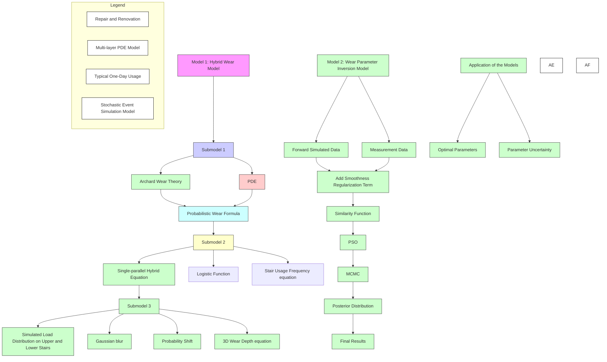
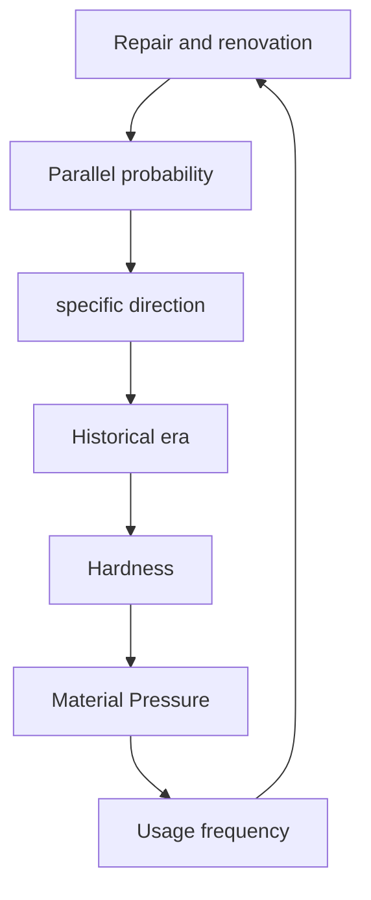

# Where Footsteps Collide: A Spatiotemporal Journey through Staircase Wear

Summary

Stones and other materials in historic building steps undergo continuous, long-term wear, a process archaeologists examine to uncover valuable insights. To support archaeological research and long-term maintenance, we propose a wear model for steps and investigate how measurement data can invert key parameters within that process.

Several models are established: Model I: Hybrid Wear Model; Model II: Wear-parameter Inversion Model, etc.

Before building the models, we identified archaeologists' data collection method: using 3D scanners to create point cloud maps, which is cost-effective and non-destructive. We also gathered data through calculations and set reasonable parameters.

For Model I, we introduced three submodels that form a hybrid wear framework. Sub-model i, grounded in Archard's theory and PDEs, provides a probabilistic equation for archaeological contexts, laying the foundation to describe stair-wear dynamics. Sub-model ii then incorporates a single-parallel hybrid approach, showing how different single/parallel usage ratios influence final wear through foot traffic; by examining how those ratios relate to foot traffic, we determine the influence of stair usage frequency on final wear. Finally, sub-model iii, based on human dynamics, extends sub-model ii to produce a 3D wear-depth distribution, applying Gaussian blurring and random offsets to generate realistic footprints.

For Model II, we devised a comprehensive inversion approach that uses measurement data to estimate optimal wear parameters, taking the hybrid wear equation from Model I as the forward model. We incorporate stair-material and archaeological insights in a Bayesian framework by assigning prior distributions to multiple parameters. The likelihood function is formed from the residual between measurement and simulation. After Particle Swarm Optimization (PSO) locates the global optimum, Markov Chain Monte Carlo (MCMC) refines the posterior distribution in its vicinity, capturing parameter uncertainty.

- Tasks 1, 2, and 3 show a $\pm 5\%$ difference in ascending/descending, with peak foot traffic at $30\% - 40\%$ and usage frequency uncertainty of $\pm 5\% - 10\%$ .  
- Tasks 1, 2, and 4 align model wear predictions with archaeological data, with depth error of $\pm 0.015\mathrm{m}$ and material wear uncertainty of $\pm 10\%$ .

For the advanced tasks 3 & 5, we developed a multi-layer PDE model as well as a discrete-event simulation model to handle repeated repairs and typical one-day stair wear. Finally, we performed a sensitivity analysis. The results show that our model remains stable.

Keywords: PDE, Archard's theory, PSO, MCMC, Bayesian framework

## Contents

1 Introduciton 2

1.1 Problem Background 2  
1.2 Restatement of the Problem 2  
1.3 Our Work 3

2 Model Preparation 4

2.1 Assumptions and Justifications 4  
2.2 Notations 4  
2.3 Data Collection and Preparation 4

3 Model I: Hybrid Wear PDE Model 6

3.1 Submodel i: Probabilistic Wear Equation (PWE) 6  
3.2 Submodel ii: Improved PWE Considering Single-Parallel Probability ..... 8  
3.3 Submodel iii: Improved PWE considering up-/downstairs preferences ..... 10

4 Model II: Wear Parameter Inversion 15

4.1 Bayesian inference and smoothing regularization[7] 15  
4.2 Improved strategy: Preliminary search via heuristic algorithm 16  
4.3 Application and Solution 18

5 Model III: Refurbishment and Typical One-day Wear 20

5.1 Multi-layer structural PDE 21  
5.2 Discrete-Time Simulation Model 22

6 Sensitivity Analysis 23

7 Strengths and Weaknesses 24

7.1 Strengths 24  
7.2 Weaknesses 24

## 1 Introduciton

## 1.1 Problem Background

Ancient buildings hold immense significance for archaeological research, particularly their steps, which have borne witness to the erosion and passage of time. The condition of these weathered stairs offers valuable insights[1]; on one hand, they allow us to deduce the frequency and usage patterns of people from the past. On the other hand, as integral components of the structure, the wear and tear of the steps can inform us about the duration of their use, the state of repairs undertaken, and essential details regarding the construction materials employed. For archaeologists, conducting field investigations and measuring architectural steps can serve as a crucial guide in the exploration of architectural history.


<details>
<summary>text_image</summary>

The Great Wall
(China)
The Leaning Tower
of Pisa (Italy)
Auschwitz
(Poland)
</details>

Figure 1: Worn stairs in famous ancient buildings

As illustrated in the figure above, the image depicts the concave state of the steps that have been formed as a result of repeated foot traffic. The wear of steps is influenced by a variety of factors.[2] First, according to the principles of engineering mechanics, different materials exhibit varying degrees of deformation when subjected to force. This variability in deformation is further compounded by the dispersive effects of the forces applied. Secondly, factors such as walking speed, frequency of foot traffic, and individual walking habits contribute to the differential wear experienced by the steps.

## 1.2 Restatement of the Problem

In light of the aforementioned context, we aim to gather pertinent information regarding the wear patterns of building steps through field measurements. Our objective is to assist archaeologists in deriving historical insights by investigating the correlation between step wear and user behavior. To this end, our research will focus on addressing the following questions:

\- Task 1: Establish a model to simulate the distribution of step wear under the condition of stepping for a certain period of time.

Establish an appropriate function, which can simulate the deformation of steps made of different materials after a certain amount of wear by changing the correlation coefficient, and obtain the corresponding image.

\- Task 2: Explore the state of use of the steps.

Based on the established function of the depressed portion, the correlation coefficients are obtained given the existing situation of the steps, and then the walking behavior of people on the steps is inferred:

\- Investigate the frequency of foot traffic on the steps.

- Explore the direction in which people are accustomed to walking on steps.  
- Investigate the usage density of the steps, that is, the characteristics of people walking side by side or in single file under the same conditions.

\- Task 3: Determine the necessary data to be obtained through observation and measurement.

Explore the conditions under which the wear of the steps can be investigated on-site, and aim to acquire the data in the simplest possible way, identify which data needs to be collected.

\- Task 4: Analyze the consistency with the actual situation.

Under the conditions that the estimated number of years the steps have been in existence and the estimated use of the steps by people are known, etc., the depth and type of wear and tear are extrapolated to analyze the consistency with the actual situation, including the following aspects:

- The reliability of the estimated number of years of use of the steps.  
- The consistency of the repairs made to the steps with the records of refurbishment.  
- The consistency of the materials used for the steps with the wear and tear characteristics of the types of sources from which they are actually made.  
- Consistency between the frequency of daily use of the steps obtained from the exploration and the crowd flow patterns.

## 1.3 Our Work


<details>
<summary>flowchart</summary>


</details>

Figure 2: Overview of this work

## 2 Model Preparation

## 2.1 Assumptions and Justifications

1. Assumption: Ignore significant behavioral differences due to weight bearing or jumping, etc.
Justification: Assuming that the walker's weight is normal and the pace is evenly distributed. Ignoring the effects caused by particular behaviors, in reality, the process of going up the stairs leads to wear and tear phenomena due to individuals with random differences that are contingent and meaningless to discuss.  
2. Assumption: The steps are assumed to be ideal horizontal planes, and any surface inclination caused by depressions in the stairs can be neglected.
Justification: In the context of archaeology, long-term foot traffic, varying walking patterns, and environmental erosion contribute to increased surface complexity, unnecessarily complicating the analysis. Therefore, the idealized horizontal plane assumption simplifies the problem.  
3. Assumption: Pedestrians are more inclined to walk in the middle of the steps, while the frequency of walking on the sides is relatively low.
Justification: By assuming that pedestrians prefer to walk in the middle position, the study focuses on the most common walking patterns, avoiding unnecessary complexity in the model due to the rare use of edge positions, making the model more practical.  
4. Assumption: The rolling friction between the soles of pedestrians' shoes and the stairs involves a fixed minor slipping, which can thereby be equated to sliding friction.
Justification: In scenarios like stair stepping or wheel rolling, surfaces often experience “nominal rolling contact,” but in reality: a) microscopic sliding occurs due to material roughness, causing wear; b) local unloading-reloading happens with each step. After analysis, simplifying foot contact as micro-sliding wear may be acceptable in archaeology.

## 2.2 Notations

Table 1: Important notations.

<table><tr><td>Notation</td><td>Description</td></tr><tr><td>h</td><td>wear height</td></tr><tr><td>p</td><td>average pressure</td></tr><tr><td>S</td><td>area of application</td></tr><tr><td>κ</td><td>combined coefficient</td></tr><tr><td>β</td><td>environment constant</td></tr><tr><td>N</td><td>Poisson process arrival rate</td></tr><tr><td>α(N)</td><td>probability of parallel usage of stairs</td></tr><tr><td>δ</td><td>mean lateral distance between left and right footprints</td></tr><tr><td>σ</td><td>width of the single-foot peak</td></tr><tr><td>Θ</td><td>parameter vector</td></tr><tr><td>p(Θ)</td><td>Bayesian prior</td></tr><tr><td>p(Θ|·)</td><td>Bayesian posterior</td></tr></table>

## 2.3 Data Collection and Preparation

In order to accurately represent the three-dimensional wear profile of stair treads in our mathematical modeling, we focus on measuring the following quantitative indicators and expressing them in concise mathematical form. Suppose the stair plane coordinates are given by $(x,y)\in\Omega\subset\mathbb{R}^{2}$ , and let z denote the height (or depth of wear) in the vertical direction relative to some reference plane.

(1) Coordinate System and Sample Points Let the stair region be

$$
\Omega = [ 0, W ] \times [ 0, L ],
$$

where $W$ is the transverse width and $L$ the total longitudinal extent (or the unfolded length across multiple steps). In practical measurement, we use a handheld 3D scanner on the tread surfaces to gather a large set of point clouds

$$
\left\{\left(x _ {i}, y _ {i}, z _ {i}\right) \right\} _ {i = 1} ^ {n},
$$

where each $z_{i}$ denotes the actual height (or depressed depth) at $(x_{i},y_{i})$ , relative to a baseline $z = 0$ .

(2) Measured Quantity: 3D Profile $h(x,y)$ For ease of subsequent simulation or interpolation, we transform the collected point cloud into a discrete grid:

$$
h _ {i, j} = h (x _ {i}, y _ {j}), \quad x _ {i} = i \cdot \frac {W}{N _ {x} - 1}, \quad y _ {j} = j \cdot \frac {L}{N _ {y} - 1},
$$

where $N_{x}$ and $N_{y}$ are the grid dimensions. If the scanned points are sufficiently dense, $h(x,y)$ can reliably capture local depressions on the surface.

(3) Auxiliary Measurements: Boundaries and Reference Markers

- Tread Boundaries: Acquire $(x_{b}, y_{b})$ to define the valid tread region $\Omega$ .  
- Reference Markers: Place a small number of markers $\{(x_{\mathrm{ref}}, y_{\mathrm{ref}}, z_{\mathrm{ref}})\}$ around the stair area to align and merge multiple scanning segments.

(4) Data Acquisition Procedure

1. Marker Placement: Attach or position several markers with known coordinates in different parts of the stair region.  
2. Surface Scanning: Use a handheld 3D scanner from multiple angles to capture point clouds $\{(x_i, y_i, z_i)\}$ representing the stair surface.  
3. Grid Interpolation: In post-processing software, register and denoise the point clouds. Then, to meet the simulation requirements, set up an $N_x \times N_y$ regular grid and define

$$
h _ {i, j} = \text { Interpolated } \left[ (x _ {i}, y _ {j}); \text { PointCloud } \right].
$$


<details>
<summary>natural_image</summary>

Medical imaging device displaying layered tissue structures with a close-up of a textured surface (no visible text or symbols)
</details>

Figure 3: 3D scanner diagram of worn stairs

(5) Mathematical Summary Ultimately, the key data obtained can be expressed as

$$
\mathcal {D} = \left\{(x _ {i}, y _ {i}, z _ {i}) \right\} _ {i = 1} ^ {n} \quad \text { or } \quad h _ {i, j} = h (x _ {i}, y _ {j}), \quad i = 1, \ldots , N _ {x}, j = 1, \ldots , N _ {y}.
$$

In subsequent modeling, $h(x,y)$ will represent the three-dimensional tread surface after wear, which is then compared or fitted against the wear equation, facilitating the estimation of material parameters, parallel usage probabilities, and other crucial factors.

## 3 Model I: Hybrid Wear PDE Model

## 3.1 Submodel i: Probabilistic Wear Equation (PWE)

This paper focuses on the long-term step wear, particularly edge depression caused by pedestrian footfall. While real wear mechanisms involve nonlinear factors (e.g., adhesion, fatigue, temperature), their average effects are effectively captured by Archard wear theory[3] on a macroscopic scale over extended periods.

Below, the PWE is derived directly from the Archard wear formula, undergoing reasonable equivalent and equivalent transformations, and possesses a solid theoretical foundation and practical applicability.

To prepare, the Archard wear formula is demonstrated:

$$
V = K F s, \tag {1}
$$

where V represents the wear volume, wear coefficient K is related to material hardness and roughness, F is the normal load, and s is the relative sliding distance of the material.

In the context of archaeology, local peak loads on the sole, load variation over time (supporting leg vs. free leg), and additional inertial loads during dynamic movement could be reasonably neglected. Then, assuming a constant normal load F and uniform height decrease due to micro-volume wear, let the pressure per unit area S be p = F/S. Taking the difference of both sides of (1) and dividing by S, we have:

$$
\Delta h = \frac {\Delta V}{S} = K p \Delta s. \tag {2}
$$


<details>
<summary>text_image</summary>

Minor sliding
leads to wear
</details>

Figure 4: xxx.

Next, we analyze the wear of steps. Firstly, take account of the one-dimensional case, treating the step as a one-dimensional coordinate system. Consider the cumulative wear height dh near point x over time dt. From the assumptions, a single footstep can be equivalent to a fixed small sliding $\Delta s$ , with a uniformly applied load F over an area of contact S. Denote the average pressure by p = F/S. In a time interval dt, there are Ndt footsteps, and the total wear height is given by

$$
\mathrm{d} h _ {\text { tot }} = \sum_ {\mathrm{d} t} \Delta h = K p \Delta s N \mathrm{d} t. \tag {3}
$$

Assume that the wear position is distributed along the transverse direction with a probability distribution $\Phi$ . When pedestrian flow becomes very large and results in crowding, people's available walking space is inevitably restricted, leading to changes in the wear distribution. Consequently, we further assume that the arrival intensity $N$ also affects the wear distribution, and thus write $\Phi = \Phi(x; , N)$ . It follows that local wear height is given by

$$
\mathrm{d} h (x) = \Phi (x;, N) \mathrm{d} h _ {\text { tot }}. \tag {4}
$$

Then, align equations (2)-(4), immediately obtaining PWE, the core result of this subsection:

$$
\frac {\mathrm{d} h (x)}{\mathrm{d} t} = K p \Delta s N \Phi (x;, N) = \kappa N \Phi (x;, N), \tag {5}
$$

where $\kappa = Kp\Delta s$ is a combined coefficient, which is inversely proportional to the hardness of material and directly proportional to the average pressure.. In equation (5), the coefficient $\kappa$ is influenced by material hardness and contact area (or equivalently, pressure). Below, we will demonstrate that the probability distribution $\Phi(x; ,N)$ primarily determines the spatial variation of wear, highlighting how different landing patterns concentrate or distribute wear along the transverse direction.

## 3.1.1 Generalized PWE

According to the literature, the wear sustained by a step is mainly due to the crowd's trampling (depending on factors such as pedestrian flow rate and footstep distribution) and environmental factors (such as rainfall, weathering, or particle impact)[4]. Here, we simplify the step to a lateral width interval $[0,W]$ , with the wear depth $h$ distributed along the coordinate $x$ . No variation or diffusion coupling occurs in the longitudinal direction $y$ . Thus, at any given moment, the relationship between the horizontal position on the step surface and the amount of wear in the depth direction can be written as:

$$
\frac {\partial h}{\partial t} (x, t) = \underbrace {f _ {\text { usage }} (x , t)} _ {\text { Wear   due   to   crowd   trampling }} + \underbrace {f _ {\text { env }} (x , t)} _ {\text { Environmental   wear }}, \tag {6}
$$

where $x \in [0, W]$ , W denotes the effective width of the step, and $h(x, t)$ represents the accumulated wear over time at position x.

Since environmental factors are inherently uncertain and random, we treat them as a constant term to simplify the analysis.[?] This approach yields a more tractable mathematical model and ultimately leads to the following Improved Probabilistic Wear Equation (IPWE):

$$
\frac {\partial h}{\partial t} (x, t) = \underbrace {\kappa [ N \Phi (x , N) ]} _ {\text { Wear   due   to   crowd   trampling }} + \underbrace {\beta} _ {\text { Environmental   constant }}, \tag {7}
$$

where $\kappa$ is the material wear coefficient (encompassing factors such as hardness, friction, and foot sliding), and $\beta$ denotes the constant strength of environmental wear.

Similarly, due to different stress conditions in the front and back (longitudinal) directions, the tread surface may experience varying depths of wear. To simulate the step surface, let its depth be $D$ , with $y \in [0, D]$ denoting the front/back or longitudinal direction. We define

$$
\Omega = [ 0, W ] \times [ 0, D ].
$$

Furthermore, let $h(x,y,t)$ be the height at point $(x,y)$ within this two-dimensional domain, relative to the initial tread concavity. Given the initial condition $h(x,y,0)=0$ , we can generalize the wear-depth function to:

$$
\frac {\partial h}{\partial t} (x, y, t) = \underbrace {\kappa [ N \Phi (x , y ; N) ]} _ {\text { Wear   due   to   crowd   trampling }} + \underbrace {\beta} _ {\text { Environmental   constant }}, \quad (x, y) \in \Omega , t \in [ 0, T ]. \tag {8}
$$

Here, $\Phi(x, y; N)$ is the trampling probability density on the surface $\Omega$ under a given pedestrian density $N$ .

## 3.1.2 Bimodal Probability Wear Model

When pedestrians ascend or descend stairs, each person's center of gravity may appear at various points along the step, although individuals typically have personal preferences. Let $c \in [0, W]$ denote the body center. For simplicity, we temporarily fix each person's center of gravity on a given step, so that their left and right foot placements are approximately symmetric about $c$ . Suppose foot placements follow a normal distribution. Because the choice of starting foot (left or right) is random, two distinct depressions may eventually form on the same tread surface over time. If we consider only the vertical direction of the stair's extension, i.e., the $x$ -axis, we obtain the following Bimodal Wear Probability Density (BWPD) describing the left and right foot placements:

$$
w (x; N, c) = C \left[ \exp \left(- \frac {1}{2} \left(\frac {x - (c - \delta / 2)}{\sigma}\right) ^ {2}\right) + \exp \left(- \frac {1}{2} \left(\frac {x - (c + \delta / 2)}{\sigma}\right) ^ {2}\right) \right], \tag {9}
$$

where $\delta$ is the mean lateral distance between the left and right footprints along $x$ , $\sigma$ is the width of the single-foot peak, and $C$ is a normalization constant. Substituting (9) into the PWE $\Phi(x; N)$ yields:

$$
\frac {\partial h}{\partial t} (x, t) = \underbrace {\kappa [ N w (x ; N , c) ]} _ {\text { Wear   due   to   crowd   trampling }} + \underbrace {\beta} _ {\text { Environmental   constant }}, \quad h (x, 0) = 0. \tag {10}
$$

We then consider treating $c$ as a random variable to investigate the distribution of any individual pedestrian's footprints on the step.


<details>
<summary>heatmap</summary>

| Width direction x | Time steps | h(x,t) |
| ----------------- | ---------- | ------ |
| 0.0               | 0          | 0      |
| 0.2               | 20         | 2000   |
| 0.4               | 40         | 4000   |
| 0.6               | 60         | 6000   |
| 0.8               | 80         | 8000   |
| 1.0               | 100        | 10000  |
</details>


<details>
<summary>heatmap</summary>

| Time steps | 0 | 20 | 40 | 60 | 80 | 100 | 120 | 140 |
| --- | --- | --- | --- | --- | --- | --- | --- | --- |
| 0 | 14000 |  |  |  |  |  |  |  |
| 20 |  |  |  |  |  |  |  |  |
| 40 |  |  |  |  |  |  |  |  |
| 60 |  |  |  |  |  |  |  |  |
| 80 |  |  |  |  |  |  |  |  |
| 100 |  |  |  |  |  |  |  |  |
| 120 |  |  |  |  |  |  |  |  |
| 140 |  |  |  |  |  |  |  |  |
| 160 |  |  |  |  |  |  |  |  |
| 180 |  |  |  |  |  |  |  |  |
| 200 |  |  |  |  |  |  |  |  |
| 220 |  |  |  |  |  |  |  |  |
| 240 |  |  |  |  |  |  |  |  |
| 260 |  |  |  |  |  |  |  |  |
| 280 |  |  |  |  |  |  |  |  |
| 300 |  |  |  |  |  |  |  |  |
| 320 |  |  |  |  |  |  |  |  |
| 340 |  |  |  |  |  |  |  |  |
| 360 |  |  |  |  |  |  |  |  |
| 380 |  |  |  |  |  |  |  |  |
| 400 |  |  |  |  |  |  |  |  |
| 420 |  |  |  |  |  |  |  |  |
| 440 |  |  |  |  |  |  |  |  |
| 460 |  |  |  |  |  |  |  |  |
| 480 |  |  |  |  |  |  |  |  |
| 500 | 14000 |  | 14000 | = 14000 | = 14000 | = 14000 | = 14000 | = 14000 |
| 520 | 14000 |  | 14000 | = 14000 | = 14000 | = 14000 | = 14000 | = 14000 |
| 540 | 14000 |  | 14000 | = 14000 | = 14000 | = 14000 | = 14000 | = 14000 |
| 560 | 14000 |  | 14000 | = 14000 | = 14000 | = 14000 | = 14000 | = 14000 |
| 580 | 14000 |  | 14000 | = 14000 | = 14000 | = 14000 | = 14000 | = 14000 |
| 600 | 14000 |  | 14000 | = 14000 | = 14000 | = 14000 | = 14000 | = 14000 |
| 620 | 14000 |  | 14000 | = 14000 | = 14000 | = 14000 | = 14000 | = 14000 |
| 640 | 14000 |  | 14000 | = 14000 | = 14000 | = 14000 | = 14000 | = 1400<nl> |
</details>


<details>
<summary>natural_image</summary>

Stacked stone blocks with a red downward arrow above, placed on grass (no text or symbols)
</details>


<details>
<summary>text_image</summary>

Alternating left and
right foot steps
</details>

Figure 5: Illustration of step wear depth and corresponding real-world images.

## 3.2 Submodel ii: Improved PWE Considering Single-Parallel Probability

## 3.2.1 Single-File Wear Probability Density

To simplify the model, suppose the stair width naturally accommodates two people walking side by side; when only one person is walking, the body center c might have probability peaks at W/4, W/2, or 3W/4. However, by our Assumption 4, whenever a single individual walks up, we set the peak of the body center c at W/2, unaffected by the stair width.

Under continuous single-file walking, we aim to find a probability density that captures the formation of a “W”-shaped depression on the tread: the highest probability occurs at x = W/2, decreasing toward either side. Note that Beta(4, 4) is defined on [0, 1] and can be mapped to [0, W] by multiplying by W. Because Beta(4, 4) is symmetric with a maximum at u = 0.5, it nicely characterizes a center peak at W/2 and tapering tails. Consequently, we choose Beta(4, 4) as the probability density for the body center.[6]

On $[0,1]$ , the distribution is:

$$
p _ {0} (u) = \frac {u ^ {3} (1 - u) ^ {3}}{B (4 , 4)}, \quad u \in [ 0, 1 ], \tag {11}
$$

where $B(4,4)$ is the Beta function constant. Mapping u linearly to $c = u \cdot W$ , we obtain

$$
p (c) = \frac {1}{W} p _ {0} \left(\frac {c}{W}\right), \quad c \in [ 0, W ]. \tag {12}
$$

Hence, $p(c)$ peaks near $c = \frac{W}{2}$ , diminishing further from the midpoint, matching our desired distribution shape.

Accordingly, by a basic law of probability multiplication, when the body center is at c, the wear probability at position x is $p(c)w(x;c)$ . Integrating over all possible c yields the single-file wear probability density along the x-direction:

$$
\phi_ {\text { single }} (x) = \int_ {0} ^ {W} p (c) w (x; c) \mathrm{d} c. \tag {13}
$$

## 3.2.2 Side-by-Side Wear Probability Density

When two individuals walk side by side, denote their respective body centers as $c_{1}$ and $c_{2}$ . Then, for a one-dimensional lateral movement, the probability density of two people walking in parallel is:

$$
\phi_ {\text { double }} (x) = C \left\{w (x; c _ {1}) + w (x; c _ {2}) \right\}, \tag {14}
$$

where $w(x;c)$ is the same function defined for the single-file scenario, C is a normalization constant, and $c_{1}, c_{2}$ can be fixed or slightly randomized.

## 3.2.3 Single-Parallel Wear Model

If we consider both single-file and side-by-side scenarios simultaneously, we can more comprehensively capture complex wear dynamics. Let

$$
\Phi (x; N) = \alpha (N) \phi_ {\mathrm{double}} (x) + (1 - \alpha (N)) \phi_ {\mathrm{single}} (x),
$$

and substitute into the PWE, yielding the single-parallel wear model:

$$
\frac {\partial h}{\partial t} (x, t) = \kappa N [ \alpha (N) \phi_ {\text { double }} (x) + (1 - \alpha (N)) \phi_ {\text { single }} (x) ] + \beta , \quad h (x, 0) = 0, \tag {15}
$$

where $\alpha(N)$ denotes the frequency of “side-by-side” occurrences under arrival intensity N, and $1-\alpha(N)$ denotes the frequency of “single-file” occurrences.

## 3.2.4 Issue of Usage Density

Next, we investigate the frequency of staircase usage, specifically whether there was a period of intensive use over a short term or sparse usage over a long term. Our basic assumption is that a sudden, high-volume crowd would force most people to walk side by side on the stairs due to the crowded environment. Hence, a key consideration is how the arrival intensity N affects the parallel-walking probability $\alpha(N)$ .

First, $\alpha$ is expected to increase with the arrival intensity N. Meanwhile, $\alpha$ should neither vanish at $N \rightarrow 0$ nor approach unity at $N \rightarrow \infty$ . Realistically, even with very low foot traffic, there may still be individuals walking side by side, and at very high traffic, a certain portion of people still opt to walk single file. Moreover, we need $\alpha(N)$ to be continuously differentiable for stable gradient calculations in PDE solutions and parameter estimation, and it should be parameterizable with a small number of variables to fit real data.

These requirements naturally suggest the Logistic function:

$$
\alpha (N) = \frac {1}{1 + \exp [ - a (N - b) ]}.
$$

Originally used in fields such as biology to simulate population growth under limited resources, the Logistic function remains near zero for small inputs, rises sharply as inputs increase, and finally approaches an upper bound as inputs grow large. This “smooth S-curve” is particularly suitable for modeling probabilities or proportions because it naturally maps to the interval $(0,1)$ and offers differentiability and tunable steepness. It is also compatible with numerical optimization, Bayesian sampling, and PDE coupling, making it well-suited to describe parallel-walking probabilities that depend on N.

A slight drawback is that as $N \to +\infty$ , $\alpha$ approaches 1, and as $N \to -\infty$ , $\alpha$ approaches 0. Therefore, we employ a stretching and shifting transformation of the Logistic function:

$$
\alpha (N) = \alpha_ {\min} + \frac {\alpha_ {\max} - \alpha_ {\min}}{1 + \exp [ - a (N - b) ]}, \tag {16}
$$

where $\alpha_{\mathrm{min}} \in (0, 0.2]$ , $\alpha_{\mathrm{max}} \in [0.8, 1)$ , $a > 0$ , and $b$ are parameters to be determined.

From (16), the following properties are evident: at very low traffic, there is still a parallel-walking probability of $\alpha_{\mathrm{min}}$ ; at very high traffic, $\alpha(N)$ only approaches $\alpha_{\mathrm{max}} < 1$ ; $a > 0$ governs the steepness of the transition; and when $N = b$ , $\alpha(N) = \frac{\alpha_{\mathrm{min}} + \alpha_{\mathrm{max}}}{2}$ , meaning parallel and single-file probabilities are equal. Moreover, this function remains continuously differentiable for all $N \in \mathbb{R}$ , ensuring that heuristic methods or MCMC sampling need not worry about non-differentiable points. The parameters $(\alpha_{\mathrm{min}}, \alpha_{\mathrm{max}}, a, b)$ lack intrinsic coupling constraints and may be flexibly tuned via numerical inversion: $\Theta = \left\{\kappa, \alpha_{\mathrm{min}}, \alpha_{\mathrm{max}}, a, b, N(\ldots)\right\}$ . If sufficient data are available, one can estimate more realistic upper and lower bounds as well as a critical traffic intensity.

As before, we define a cost function consisting of data misfit, smoothing regularization, and prior terms. In Bayesian MCMC or least-squares heuristics (PSO/GA), we have

$$
E (\Theta) = \sum_ {i} \left(h _ {\text { sim }} (\Theta) - \hat {h} _ {\text { obs }}\right) ^ {2} + \lambda \sum \left(\nabla^ {2} h _ {\text { sim }} (\Theta)\right) ^ {2} - \ln p (\Theta), \tag {17}
$$

where $\Theta$ now includes $\{\alpha_{\mathrm{min}},\alpha_{\mathrm{max}},a,b\}$ if we choose to estimate them jointly, or we can fix $\alpha_{\mathrm{min}}$ and $\alpha_{\mathrm{max}}$ to reduce degrees of freedom and only infer $(a,b)$ . Once we obtain the optimal $N$ in the solution, substituting it back into (16) addresses the frequency question. To validate the soundness and efficacy of our findings, we subsequently present the computed results in Figure 6, offering an intuitive visualization of how wear patterns vary under different crowd densities. Notably, the total amount of visit is fixed here.

From Figure 6, we observe that under crowded conditions, the wear appears more dispersed and relatively flatter, suggesting that people tend to walk side by side. Conversely, when the crowd is sparse, the pattern reverses. This partially validates our earlier assumption regarding arrival intensity and parallel-walking probability introduced at the beginning of this subsection.

In summary, by introducing a Logistic function with upper and lower bounds, we constrain the extreme values of $\alpha(N)$ to realistic levels, thus achieving a probability curve that is both differentiable and adjustable in a mathematical sense. With Bayesian MCMC, we can simultaneously estimate $\alpha(N)$ and obtain the distribution of the optimal traffic intensity N. This resolves the key question of whether the staircase experienced “high-volume use over a short term” or “low-volume use over a long term” and yields more compelling quantitative insights for real-world scenarios.

## 3.3 Submodel iii: Improved PWE considering up-/downstairs preferences

In this section, we propose a foot-partition-based approach to identifying stair travel direction. By distinguishing the different mechanical load patterns in the front two-thirds (for ascending) and the rear two-thirds (for descending), this framework employs Gaussian blurring, random offsets, and a PDE-based wear model to capture real-world foot contact behavior and its resulting stair wear patterns.


<details>
<summary>heatmap</summary>

| Width x | Time step | Wear depth |
| ------- | --------- | ---------- |
| 0.2     | 15        | 2000       |
| 0.6     | 15        | 2000       |
| 0.8     | 15        | 2500       |
</details>


<details>
<summary>heatmap</summary>

| Time step | Width x | Wear depth |
| --------- | ------- | ---------- |
| 0         | 0.0     | 0          |
| 20        | 0.2     | 500        |
| 40        | 0.4     | 1000       |
| 60        | 0.6     | 1500       |
| 80        | 0.8     | 2000       |
| 100       | 1.0     | 3500       |
</details>


<details>
<summary>line chart</summary>

| Width x | Wear depth (inverted) |
| ------- | --------------------- |
| 0.0     | 0                     |
| 0.1     | 1000                  |
| 0.2     | 2000                  |
| 0.3     | 1500                  |
| 0.4     | 1400                  |
| 0.5     | 1600                  |
| 0.6     | 2500                  |
| 0.7     | 1800                  |
| 0.8     | 2200                  |
| 0.9     | 1600                  |
| 1.0     | 500                   |
</details>


<details>
<summary>line chart</summary>

| Width x | Wear depth (inverted) |
| ------- | --------------------- |
| 0.0     | 0                     |
| 0.2     | ~1000                 |
| 0.4     | ~2500                 |
| 0.6     | ~3500                 |
| 0.8     | ~5000                 |
| 1.0     | ~7500                 |
</details>

Figure 6: Wear patterns under different crowd densities.

Foot Partitioning in Upstairs and Downstairs In this subsection, we examine the biomechanical and practical reasons for partitioning the foot differently when navigating upstairs versus downstairs.


<details>
<summary>text_image</summary>

• Contact when going upstairs
</details>


<details>
<summary>text_image</summary>

• Contact when going downstairs
</details>

Figure 7: Motion diagram when up-/downstairs.

1. Biomechanical Differences When Walking Upstairs vs. Downstairs:

To overcome gravity and raise the body upwards, the center of mass typically shifts forward when going upstairs, causing the front portion of the foot (front 2/3) to bear more vertical reaction force during take-off and stair contact. Conversely, walking downstairs requires energy absorption and controlled descent; the center of mass leans slightly backward, and the heel and rear portion of the foot (rear 2/3) shoulder the brunt of the impact, exhibiting higher landing frequency and force concentration on the rear foot.

2. Differential Wear and Front/Rear 2/3 Partitioning:

Using a single “entire-foot” contact profile cannot capture the marked discrepancy between “front-foot dominance upstairs, rear-foot dominance downstairs,” leading to inaccuracies in simulating wear on the front vs. rear edges of a stair. To better represent these biomechanical differences, we employ binary images of the front 2/3 mapped to $\phi_{\mathrm{up}}(x,y)$ (upstairs) and the rear 2/3 mapped to $\phi_{\mathrm{down}}(x,y)$ (downstairs), each corresponding to its primary load-bearing zone.

3. Gaussian Blurring and Random Shifts:

To more closely approximate continuous foot-pressure distribution and the variability of foot placement, both binary images undergo Gaussian blurring to achieve smooth transitions between the foot and the stair. Multiple small random shifts are then applied in the stair coordinate system to replicate the fact that each step is not identically placed, ultimately yielding a smooth and more realistic wear pattern.

## 3.3.1 Construction of Foot Distributions and Minor Shifts

A detailed description of how these front/rear foot partitions are incorporated into the stair coordinate system and how random shifts are applied is given below.

In practice, we first obtain two binary masks—one from the “front two-thirds” and one from the “rear two-thirds” of a foot image—where white represents the background and black the foot region. Denoting these masks by $\text{foot}_{\text{up}}(x', y')$ and $\text{foot}_{\text{down}}(x', y')$ , with $(x', y')$ being image coordinates, we then apply Gaussian blurring, scaling, and positional fitting to map them into the stair coordinate system $(x, y)$ . Multiple small random shifts and noise can be superimposed, yielding smoothed contact distributions $\phi_{\text{up}}(x, y)$ and $\phi_{\text{down}}(x, y)$ .

To obtain a smoother foot distribution, the following steps are applied to each binary foot mask:

1. Gaussian Blurring: Convolves the mask with a Gaussian kernel of width $\sigma_{blur}$ to smooth foot edges.  
2. Scaling and Fitting: Map image coordinates onto a small region of the stair domain $\Omega$ (for instance, aligned with the bottom edge or centered), introducing a random perturbation if needed.  
3. Repeated Random Offsets: Overlay the foot mask multiple times, each with a small offset $(\delta x, \delta y)$ , and then normalize the sum to obtain the final $\phi_{up}$ or $\phi_{down}$ .

Here, $(\delta x, \delta y)$ can be drawn from a Gaussian distribution $\mathcal{N}((x_{0}, y_{0}), \Sigma)$ to reflect that each footstep may not fall exactly in the same spot. The cumulative distribution—after normalization—provides a foot-contact probability map over the stair surface. Specific algorithm is demonstrated below.

Algorithm 1: Build Foot Distribution (Gaussian + Random Offsets)  
input : foot_bin: binary foot image (black=foot, white=background), rotated if needed $(N_x, N_y)$ : ladder grid size $\sigma_{\text{blur}}$ : Gaussian blur parameter
    offset_base = $(x_0, y_0)$ : base offset on ladder
    offset_std: std. for random offsets
    foot_scale: factor controlling foot size $n_{samples}$ : number of random placements

output: A 2D distribution accum[j, i] ∈ [0, 1] representing final foot contact.

1 footBlur ← GaussianFilter(foot_bin, $\sigma_{\text{blur}}$ );
2 footBlur ← Normalize(footBlur);
3 footSmall ← Resize(footBlur, 100, 100);
4 accum ← $\mathbf{0}_{(N_y, N_x)}$ ;
5 for s ← 1 to $n_{samples}$ do
6 $(\delta x, \delta y) \leftarrow \text{RandomNormal(offset\_base, offset\_std)}$ ;
7 $\text{footDist2D} \leftarrow \mathbf{0}_{(N_y, N_x)}$ ;
8    foreach pixel (i, j) in footSmall[0..99, 0..99] do
9    val ← footSmall[j, i];
10 $x' \leftarrow \delta x + (i/99) \times \text{foot\_scale}$ ;
11 $y' \leftarrow \delta y + (j/99) \times \text{foot\_scale}$ ;
12 $(iX, iY) \leftarrow \text{MapToGrid}(x', y')$ ;
13 $\text{footDist2D}[iY, iX] \leftarrow \max(\text{footDist2D}[iY, iX], \text{val})$ ;
14    end
15    accum ← accum + footDist2D;
16 end
17 accum ← Normalize(accum);
18 Output: final distribution accum[j, i] ∈ [0, 1].

Foot Partition-based Travel Direction Model (FPTDM) The proposed FPTDM relies on the following observation: when walking upstairs, the primary load-bearing and contact area of the foot is in the front two-thirds, whereas when walking downstairs, the main load-bearing region shifts to the rear two-thirds. By extracting the contact patterns from these two binary images—one representing the “front two-thirds” of the foot and the other the “rear two-thirds”—and incorporating flow rates of people going upstairs and downstairs, we can formulate a partial differential equation that describes staircase wear.


<details>
<summary>text_image</summary>

• When going upstairs, the front
2/3 of the foot make contact
• When going downstairs, the rear
2/3 of the foot make contact
</details>

Figure 8: Foot partition.

Consider a stair tread represented by a planar region $\Omega \subset \mathbb{R}^2$ with coordinates $(x,y)$ . Let $h(x,y,t)$ be the wear depth (or height loss) at time $t$ . Suppose $N_{\mathrm{up}}(t)$ and $N_{\mathrm{down}}(t)$ are the numbers of people going upstairs and downstairs, respectively (they may vary over time or be approximated as constants). A linear wear equation is then given by

$$
\left\{ \begin{array}{l} \frac {\partial h}{\partial t} (x, y, t) = \kappa \left[ N _ {\mathrm{up}} (t) \phi_ {\mathrm{up}} (x, y) + N _ {\mathrm{down}} (t) \phi_ {\mathrm{down}} (x, y) \right] + \beta , \\ h (x, y, 0) = 0, \end{array} \right. \tag {18}
$$

where $\kappa$ is the material wear coefficient, $\beta$ is an environmental constant accounting for uniform wear from factors such as weathering or water erosion, and $\phi_{\mathrm{up}}(x,y)$ , $\phi_{\mathrm{down}}(x,y)$ are the contact distributions for the front two-thirds (upstairs) and rear two-thirds (downstairs) portions of the foot, respectively.

To solve (18), we can employ an explicit Euler scheme (assuming no diffusion or adjacent coupling):

$$
\left\{ \begin{array}{l} h ^ {n + 1} [ j, i ] = h ^ {n} [ j, i ] + \Delta t \left(\kappa N _ {\mathrm{up}} (t _ {n}) \phi_ {\mathrm{up}} (x _ {i}, y _ {j}) + \kappa N _ {\mathrm{down}} (t _ {n}) \phi_ {\mathrm{down}} (x _ {i}, y _ {j}) + \beta\right), \\ h ^ {0} [ j, i ] = 0. \end{array} \right. \tag {19}
$$

By iterating until n = T, one obtains the staircase wear depth $h^{T}[j, i]$ at final time T. For a clearer explanation of our solution approach, we present the adopted algorithm steps below.

Algorithm 2: Explicit Euler Scheme for FPTDM  
Data: Inputs:
    accum[j, i]: foot contact distribution,
    (T, N, β): PDE parameters (time steps, usage, environment),
    κ: material wear coefficient, Δt: time step.

Result: Final wear depth map h(j, i) on the (Nx × Ny) grid.

1 h ← 0(Ny, Nx);

2 for t ← 1 to T do

3    foreach cell (i, j) in the grid do
4    usage[j, i] ← κ × N × accum[j, i];
5    h[j, i] ← h[j, i] + Δt × (usage[j, i] + β);
6    end

7 end

8 Output: final h(j, i) over the ladder.


Figure 9: Ascending wear evolution graph.  
  
Figure 10: Descending wear evolution graph.

Next, we present the solution results, providing a visual demonstration of the differences between ascending and descending wear patterns to verify the reasonableness and effectiveness of our findings. Comparing Figure 9 and Figure 10, we can see that the indentation center for the ascending wear lies farther from the stair edge, covers a larger area, and is shallower, whereas the descending wear shows the opposite trend.

To more clearly illustrate the differences in wear patterns between ascending and descending usage, we provide four comparative figures from various angles below.

If $N_{\mathrm{up}}(t)$ and $N_{\mathrm{down}}(t)$ vary over time, we simply update their values at each time step $t_{n}$ . If they are roughly constant, we may directly use fixed $N_{up}$ and $N_{down}$ .

In short, by combining the front two-thirds foot image (upstairs) and the rear two-thirds foot image (downstairs) to construct $\phi_{up}$ and $\phi_{down}$ , then applying Gaussian blurring and multiple random offsets within the stair coordinate system, we obtain a smooth contact distribution. Solving the linear wear equation (via an explicit Euler method) yields the time-evolving wear depth $h(x,y,t)$ . Minor random offsets and noise make footstep patterns more realistic and, over a long simulation, aggregate into a smoothed indentation closely matching actual human usage.


<details>
<summary>heatmap</summary>

| X Range | Y Range | Value |
| --- | --- | --- |
| 0.0 | 0.0 | 0.10 |
| 0.0 | 0.1 | 0.12 |
| 0.0 | 0.2 | 0.10 |
| 0.0 | 0.3 | 0.08 |
| 0.0 | 0.4 | 0.06 |
| 0.0 | 0.5 | 0.04 |
| 0.0 | 0.6 | 0.02 |
| 0.0 | 0.7 | 0.01 |
| 0.0 | 0.8 | 0.01 |
| 0.0 | 0.9 | 0.01 |
| 0.1 | 0.0 | 0.12 |
| 0.1 | 0.1 | 0.14 |
| 0.1 | 0.2 | 0.13 |
| 0.1 | 0.3 | 0.11 |
| 0.1 | 0.4 | 0.10 |
| 0.1 | 0.5 | 0.12 |
| 0.1 | 0.6 | 0.14 |
| 0.1 | 0.7 | 0.13 |
| 0.1 | 0.8 | 0.12 |
| 0.1 | 0.9 | 0.11 |
| 0.2 | 0.0 | 0.14 |
| 0.2 | 0.1 | 0.16 |
| 0.2 | 0.2 | 0.15 |
| 0.2 | 0.3 | 0.13 |
| 0.2 | 0.4 | 0.12 |
| 0.2 | 0.5 | 0.14 |
| 0.2 | 0.6 | 0.16 |
| 0.2 | 0.7 | 0.15 |
| 0.2 | 0.8 | 0.14 |
| 0.2 | 0.9 | 0.13 |
| 0.3 | 0.0 | 0.16 |
| 0.3 | 0.1 | 0.18 |
| 0.3 | 0.2 | 0.17 |
| 0.3 | 0.3 | 0.15 |
| 0.3 | 0.4 | 0.14 |
| 0.3 | 0.5 | 0.16 |
| 0.3 | 0.6 | 0.18 |
| 0.3 | 0.7 | 0.17 |
| 0.3 | 0.8 | 0.16 |
| 0.3 | 0.9 | 0.15 |
| 0.4 | 0.0 | 0.18 |
| 0.4 | 0.1 | 0.2 |
| 0.4 | 0.2 | 0.19 |
| 0.4 | 0.3 | 0.17 |
| 0.4 | 0.4 | 0.16 |
| 0.4 | 0.5 | 0.18 |
| 0.4 | 0.6 | 0.2 |
| 0.4 | 0.7 | 0.19 |
| 0.4 | 0.8 | 0.18 |
| 0.4 | 0.9 | 0.17 |
| ... | ... | ... |
| ... | ... | ... |
| ... | ... | ... |
| ... | ... | ... |
| ... | ... | ... |
| ... | ... | ... |
| ... | ... | ... |
| ... | ... | ... |
| ... | ... | ... |
| ... | ... | ... |
| ... | ... | ... |
| ... | ... | ... |
| ... | ... | ... |
| ... | ... | ... |
| ... | ... | ... |
| ... | ... | ... |
| ... | ... | ... |
| ... | ... | ... |
| ... | ... | ... |
| ... | ... | ... |
| ... | ... | ..., ... |
| ... | ... | ... |
| ... | ... | ... |
| ... | ... | ... |
| ... | ... | ... |
| ... | ... | ... |
| ... | ... | ... |
| ... | ... | ... |
| ... | ... | ... |
| ... | ... | ... |
| ... | ... | ... |
</details>


<details>
<summary>3d surface plot</summary>

| X | Y | Wear depth |
| --- | --- | --- |
| 0.0 | 0.125 | 0.100 |
| 0.3 | 0.100 | 0.125 |
| 0.6 | 0.125 | 0.100 |
| 0.9 | 0.100 | 0.125 |
| 0.2 | 0.125 | 0.100 |
| 0.4 | 0.125 | 0.125 |
| 0.6 | 0.125 | 0.100 |
| 0.8 | 0.125 | 0.125 |
| 0.1 | 0.125 | 0.100 |
| 0.3 | 0.125 | 0.125 |
| 0.5 | 0.125 | 0.100 |
| 0.7 | 0.125 | 0.125 |
| 0.9 | 0.125 | 0.100 |
| 0.1 | 0.125 | 0.125 |
| 0.3 | 0.125 | 0.100 |
| 0.5 | 0.125 | 0.125 |
| 0.7 | 0.125 | 0.100 |
| 0.9 | 0.125 | 0.125 |
| 0.1 | 0.125 | 0.100 |
| 0.3 | 0.125 | 0.125 |
| 0.5 | 0.125 | 0.100 |
| 0.7 | 0.125 | 0,125 |
| 0.9 | 0.125 | 0,125 |
| 0.1 | 0.125 | 0,125 |
| 0.3 | 0.125 | 0,125 |
| 0.5 | 0.125 | 0,125 |
| 0.7 | 0.125 | 0,125 |
| 0.9 | 0.125 | 0,125 |
| 0.1 | 0.125 | 0,125 |
| 0.3 | 0.125 | 0,125 |
| 0.5 | 0,125 | - |
| 0.7 | - | - |
| 0.9 | - | - |
| - | - | - |
| - | - | - |
| - | - | - |
| - | - | - |
| - | - | - |
| - | - | - |
| - | - | - |
| - | - | - |
| - | - | - |
| - | - | - |
| - | - | - |
| - | - | - |
| - | - | - |
| - | - | - |
| - | - | - |
| - | - | - |
| - | - | - |
| - | - | - |
| - | - | - |
| - | - | - |
| -8 | - | - |
| -8 | - | - |
| -8 | - | - |
| -8 | - | - |
| -8 | - | - |
| -8 | - | - |
| -8 | - | - |
| -8 | - | - |
| -8 | - | - |
</details>


<details>
<summary>heatmap</summary>

| Width depth | 0.0 | 0.3 | 0.6 | 0.9 |
|-------------|-----|-----|-----|-----|
| 0.100       |     |     |     |     |
| 0.125       |     |     |     |     |
| 0.6         |     |     |     |     |
| 0.4         |     |     |     |     |
| 0.2         |     |     |     |     |
| 0.0         |     |     |     |     |
</details>


<details>
<summary>heatmap</summary>

| Wear depth | 0.0 | 0.3 | 0.6 | 0.9 |
| --- | --- | --- | --- | --- |
| 0.100 |  |  |  |  |
| 0.125 |  |  |  |  |
| 0.125 |  |  |  |  |
| 0.125 |  |  |  |  |
| 0.125 |  |  |  |  |
| 0.125 |  |  |  |  |
| 0.125 |  |  |  |  |
| 0.6 |  |  |  |  |
| 0.4 |  |  |  |  |
| 0.2 |  |  |  |  |
| 0.0 |  |  |  |  |
| 0.0 |  |  |  |  |
| 0.0 |  |  |  |  |
| 0.0 |  |  |  |  |
| 0.0 |  |  |  |  |
| 0.0 |  |  |  |  |
| 0.0 |  |  |  |  |
</details>

Figure 11: Up-/downstairs wear evolution graph.

## 4 Model II: Wear Parameter Inversion

In the context of a non-diffusion linear wear equation, we aim to invert multiple parameters and quantify uncertainties. Given that the measured data are typically noisy and that the stair wear profile often requires smooth transitions, this work integrates prior distributions and second-order gradient smoothing regularization into the Bayesian inference. Subsequently, it employs an improved strategy with a heuristic-based preliminary search to accelerate convergence to the global optimum.

## 4.1 Bayesian inference and smoothing regularization[7]

Let $(x,y)\in\Omega\subset\mathbb{R}^{2}$ be the stair plane coordinates, and $t\in[0,T]$ . Denote the parameters to be estimated by $\Theta=(\kappa,N,T,\ldots)$ . The non-diffusion linear wear equation is given in ( $\ref{eq:10.46}$ ). To incorporate archaeological and materials-related expert knowledge, we specify a Bayesian prior in the parameter space:

$$
p (\Theta) = p _ {\kappa} (\kappa) p _ {N} (N) p _ {T} (T) \dots ,
$$

where $p_{\kappa}(\kappa)$ etc. are the individual prior distributions for each parameter, determined from literature and experience.

Suppose that at time $t = T$ , a numerical or analytic method provides $h_{\mathrm{sim}}(x,y;\Theta)$ , while real observations are available only at a set of points $(x_i,y_i)$ , yielding noisy measurements $\hat{h}_{\mathrm{obs}}(x_i,y_i)$ ( $i = 1,2\dots ,m$ ). At each observation point $(x_{i},y_{i})$ , define the observed height of wear as

$$
\hat {h} _ {\mathrm{obs}} (x _ {i}, y _ {i}) = h _ {\mathrm{sim}} (x _ {i}, y _ {i}; \Theta) + \varepsilon_ {i}, \quad \varepsilon_ {i} \sim \mathcal {N} (0, \sigma^ {2}),
$$

where parameter sigma is given according to experience or knowledge.

If the solution $h_{sim}$ is required to exhibit a smooth indentation shape, a smoothing penalty can be added to the objective function:

$$
E _ {\text { smooth }} = \lambda \sum_ {i, j} \left(\nabla^ {2} h _ {\text { sim }} [ i, j; \Theta ]\right) ^ {2}, \tag {20}
$$

where $\nabla^{2}$ denotes the discrete second-order difference (or Laplacian operator), and $\lambda > 0$ is the smoothing penalty weight. This term suppresses sharp indentations or discontinuities.

Hence, the Bayesian posterior satisfies $p(\Theta \mid \hat{h}) \propto p(\Theta)p\big(\hat{h}_{\mathrm{obs}} \mid \Theta\big)$ , where the likelihood function

$$
p \big (\hat {h} _ {\mathrm{obs}} \mid \Theta \big) = \exp \big [ - E (\Theta) \big ], \tag {21}
$$

with the energy function

$$
E (\Theta) = \underbrace {\frac {1}{2 \sigma^ {2}} \sum_ {i = 1} ^ {m} \left[ h _ {\text { sim }} (x _ {i} , y _ {i} ; \Theta) - \hat {h} _ {\text { obs }} (x _ {i} , y _ {i}) \right] ^ {2}} _ {\text { Data   misfit }} + E _ {\text { smooth }}. \tag {22}
$$

Subsequently, we perform Markov Chain Monte Carlo (MCMC) sampling under the posterior (??), seeking high-posterior parameter sets that are consistent with expert knowledge and actual measurements.

Finally, we use a Quantile-based Method to construct credible intervals. Specifically, we sort the parameter samples drawn from the posterior distribution and select the sample values at the relevant quantiles to determine the interval endpoints.


<details>
<summary>flowchart</summary>


</details>

Figure 12: xxx.

## 4.2 Improved strategy: Preliminary search via heuristic algorithm

MCMC searches for an optimal solution that aligns with both the prior and the smoothness constraint. From equations (??)-(22), it follows that the MCMC optimum is in fact the solution to the optimization problem

$$
\min _ {\Theta} \left\{- \ln p (\Theta) + E (\Theta) \right\}. \tag {23}
$$

However, directly applying global MCMC sampling to $p(\Theta \mid \hat{h})$ in a high-dimensional parameter space is typically expensive and slow to converge. To rapidly find a global optimum or near-global optimum $\Theta^{*}$ to problem (23), one can employ a heuristic algorithm (e.g., PSO or GA).[8] Therefore, we propose a combined approach for improvement:

1. Use a heuristic algorithm (taking Particle Swarm Optimization, PSO, as an example) to perform a global search under $\min_{\Theta} E(\Theta)$ , thus obtaining a near-global optimal solution $\Theta^{*}$ .

2. Conduct local MCMC sampling (e.g., Metropolis-Hastings) around $\Theta^{*}$ to obtain the posterior distribution's mean, variance, and credible intervals, thereby quantifying uncertainty.

We first provide an overview of this two-step concept, then present the mathematical procedure and formulas. The detailed algorithm follows.


<details>
<summary>flowchart</summary>

```mermaid
graph TD
    A["Forward Model<br>  ∂h/∂t = κN(t)[α(t) φdouble + (1 - α(t)) φsingle"] + β] --> B["Measurement<br>ĥ_obs(x_i, y_i)"]
    C["Bayesian Prior<br>  p(Θ): (κ, α, N, t, ...)"] --> D["Smooth Regularization<br>E_smooth = λΣ(Δ²h_sim)²"]
  B --> E["Likelihood<br>p(ĥ_obs | Θ) ∝ exp[-1/2σ² Σ(h - h_sim)²"]]
  D --> E
  E --> F["Posterior<br>p(Θ | ĥ) ∝ p(Θ) exp[-E(Θ)"] E(Θ) = E_data + λE_smooth - ln p(Θ)]
  F --> G["Local MCMC<br>Posterior Sampling (Uncertainty)"]
  D --> H["PSO<br>Global Optimum Θ*"]
  H --> I["Results<br>Global Θ* + Posterior Distribution"]
```
</details>

Figure 13: Flowchart for Bayesian Inversion with Smooth Regularization in Stair Wear Modeling.

## Step A: PSO for Global Optimization

1. Initialization: Randomly generate particles $\Theta_{j}$ and their velocities $v_{j}$ within the prior bounds, for $j = 1,\dots ,P$ .  
2. Iteration: For each particle at generation k,

$$
v _ {j} ^ {(k + 1)} = \omega v _ {j} ^ {(k)} + c _ {1} r _ {1} \big [ \Theta_ {j} ^ {\mathrm{(pbest)}} - \Theta_ {j} ^ {(k)} \big ] + c _ {2} r _ {2} \big [ \Theta^ {\mathrm{(gbest)}} - \Theta_ {j} ^ {(k)} \big ], \quad \Theta_ {j} ^ {(k + 1)} = \Theta_ {j} ^ {(k)} + v _ {j} ^ {(k + 1)},
$$

where $\Theta_{j}^{(\mathrm{pbest})}$ is the best historical position of particle j, $\Theta^{(\mathrm{gbest})}$ is the global best, and $\omega, c_{1}, c_{2}$ are the inertia and acceleration factors, with $r_{1}, r_{2}$ as random numbers.

3. Stopping Criterion: If the global best $\Theta^{(\mathrm{gbest})}$ fails to improve after several iterations, stop and record $\Theta^{*} \equiv \Theta^{(\mathrm{gbest})}$ .

## Step B: Local MCMC Sampling

1. Neighborhood Setup: Construct a proposal distribution $q(\Theta' \mid \Theta)$ in $\Theta^* \pm \delta$ ; for example,

$$
\Theta^ {\prime} = \Theta + \eta , \quad \eta \sim \mathcal {N} (\mathbf {0}, \Sigma),
$$

where $\Sigma$ is a diagonal or small covariance matrix.

2. Metropolis-Hastings: Initialize $\Theta^{(0)} = \Theta^{*}$ . For $s = 1, \ldots, S$ :

- Sample a candidate $\Theta' \sim q(\Theta' \mid \Theta^{(s-1)})$ ;  
• Compute the acceptance ratio

$$
A ^ {(s)} = \min \Bigl \{1, \frac {p (\Theta^ {\prime}) \exp [ - E (\Theta^ {\prime}) ] q (\Theta^ {(s - 1)} | \Theta^ {\prime})}{p (\Theta^ {(s - 1)}) \exp [ - E (\Theta^ {(s - 1)}) ] q (\Theta^ {\prime} | \Theta^ {(s - 1)})} \Bigr \};
$$

\- Accept $\Theta^{(s)} = \Theta'$ with probability $A^{(s)}$ , otherwise $\Theta^{(s)} = \Theta^{(s - 1)}$ .

3. Credible Intervals: Given the posterior samples $\{\Theta^{(s)}\}$ , we can compute various summary statistics and credible intervals for each parameter. For instance, focusing on $\kappa$ , we may sort the samples $\{\kappa^{(s)}\}$ and then select the values at the relevant quantiles. Specifically, a $q\%$ credible interval is obtained by taking the $(\frac{100 - q}{2})\%$ and $(100 - \frac{100 - q}{2})\%$ quantiles. For a $95\%$ credible interval, these are the $2.5\%$ and $97.5\%$ quantiles in the sorted samples:

$$
\left[ \begin{array}{c c} \kappa_ {0. 0 2 5}, & \kappa_ {0. 9 7 5} \end{array} \right].
$$

Repeating this procedure for other parameters $\{a, b, N, t, \ldots\}$ provides intervals and quantifies their uncertainty in a straightforward manner.

By means of this two-step process, we achieve an integrated scheme of “global optimization + posterior uncertainty quantification” under limited computational overhead. It aligns the simulated results with observations, maintains surface smoothness, and leverages prior knowledge to ensure consistency with physical and materials constraints. Numerical evidence indicates that this method has broad potential applications in archaeological and engineering contexts.

## 4.3 Application and Solution

In this section, we adopt the “Bayesian priors + second-order gradient smoothing” model and the two-step approach (“PSO, then MCMC”) to invert key stair-wear parameters. We use “virtual observations” with added noise from the previous section, simulating uncertainties in foot traffic and measurement accuracy. We then present the parameter setup, the inversion steps, and final results. Lastly, we discuss the error analysis and underlying rationale.

## 1. Simulated Observation Data: True Values and Noise Handling

1. Stair Construction Year $T^{*}$ : Chosen to be about 257 years, indicating the stair has been in use for 257 years. In the inversion, we allow $T \in [240, 280]$ to reflect the fact that archaeological records only provide a rough range.  
2. Material Coefficient $\kappa^{*}$ : Selected as $\kappa^{*} = 7.2 \times 10^{-5}$ , with a prior range $[10^{-5}, 10^{-4}]$ (LogUniform).  
3. Parallel Probability Parameters: We adopt two sets of truncated logistic functions for upstairs and downstairs respectively:

$$
\alpha_ {\mathrm{up}} (N) = \alpha_ {\mathrm{min}} ^ {(u)} + \left(\alpha_ {\mathrm{max}} ^ {(u)} - \alpha_ {\mathrm{min}} ^ {(u)}\right) \frac {1}{1 + \exp \left[ - a _ {u} \left(N - b _ {u}\right) \right]},
$$

whose true values are

$$
\alpha_ {\mathrm{min}} ^ {(u)} = 0. 2 2, \alpha_ {\mathrm{max}} ^ {(u)} = 0. 7 8, a _ {u} = 0. 1 3, b _ {u} = 5 5.
$$

The downstairs parameters are similarly defined ( $\alpha_{\text{min}}^{(d)} = 0.12$ , $\alpha_{\text{max}}^{(d)} = 0.62$ , $a_d = 0.11$ , $b_d = 42$ ), modeling the phenomenon that a larger foot-traffic rate $N$ increases the parallel-walking probability, while bounding it away from 0% or 100% extremes.

4. Up/Down Foot-Traffic Intensity: We design $N_{\mathrm{up}}^{*}(t)$ and $N_{\mathrm{down}}^{*}(t)$ in three time segments:

$$
N _ {\mathrm{up}} ^ {*} (t) = \left\{ \begin{array}{l l} 1 2 0, & 0 \leq t <   9 0, \\ 8 5, & 9 0 \leq t <   1 8 0, \\ 6 0, & 1 8 0 \leq t \leq T ^ {*}, \end{array} \right. N _ {\mathrm{down}} ^ {*} (t) = \left\{ \begin{array}{l l} 9 5, & 0 \leq t <   9 0, \\ 7 5, & 9 0 \leq t <   1 8 0, \\ 4 5, & 1 8 0 \leq t \leq T ^ {*}. \end{array} \right.
$$

where t = 0 indicates the start of stair usage (coinciding with construction).

5. Forward Simulation + Noise: On a $(x_{i},y_{i})$ grid, we solve the 3D PDE until $t = T^{*} = 257$ , yielding $h_{\mathrm{sim,true}}(x_i,y_i)$ . We then add Gaussian noise $\epsilon_{i}\sim \mathcal{N}(0,0.012^{2})$ (standard deviation 0.012), $\hat{h}_{\mathrm{obs}}(x_i,y_i) = h_{\mathrm{sim,true}}(x_i,y_i) + \epsilon_i$ , sampling $m = 8000$ points to serve as observation data in the subsequent inversion test.

## 2. Prior Setup and Objective Function

(a) Priors

$$
\kappa \sim \operatorname{LogUniform} \left[ 1 0 ^ {- 5}, 1 0 ^ {- 4} \right], T \sim \operatorname{Uniform} [ 2 4 0, 2 8 0 ],
$$

$\alpha_{\mathrm{min}}^{(u)}, \alpha_{\mathrm{max}}^{(u)}, a_u, b_u$ all Uniform in appropriate intervals, $\alpha_{\mathrm{min}}^{(d)}, \alpha_{\mathrm{max}}^{(d)}, a_d, b_d$ similarly bounded Uniform. Likewise for each segment of $N_{\mathrm{up}}, N_{\mathrm{down}}$ to reflect prior knowledge.

(b) Objective Function Combining measurement matching, smoothing, and priors, we define

$$
E (\Theta) = \sum_ {i = 1} ^ {m} \left[ h _ {\mathrm{sim}} (x _ {i}, y _ {i}; \Theta) - \hat {h} _ {\mathrm{obs}} (x _ {i}, y _ {i}) \right] ^ {2} + \lambda \sum_ {i, j} \left(\Delta^ {2} h _ {\mathrm{sim}} (\Theta) [ i, j ]\right) ^ {2} - \ln p (\Theta),
$$

where $\Delta^{2}h$ denotes the discrete second-order Laplacian, $\lambda = 5 \times 10^{3}$ (as an example), and $p(\Theta)$ is the joint prior probability described above. Thus, it balances data fidelity, tread-surface smoothness, and archaeological prior information.

## 3. Numerical Procedure: PSO + MCMC

1. PSO Global Search: We set the particle number P = 40 and run 90 iterations; the process takes about 25 minutes (with a medium-size grid on an Intel i7 CPU). The algorithm converges around iteration 60–70, yielding a global optimum $\Theta^{*}$ .  
2. MCMC Local Sampling: Centered on $\Theta^{*}$ , we build a normal proposal $q(\Theta'|\Theta)$ and perform $1.0 \times 10^{4}$ Metropolis-Hastings steps, discarding the first 2000 steps as burn-in. This yields a posterior distribution characterizing parameter uncertainty.

## 4. Inversion Results: Table and Comparison

Table 2 summarizes the posterior means (using 90% confidence intervals) of the main parameters, alongside their true values.

Except for a few parameters (e.g., $\alpha_{\min}^{(d)}$ ) whose relative error reaches about 16.7%, most lie within a 10% error margin, indicating that the method successfully recovers major parameters even under noise standard deviation $\sigma = 0.012$ . Key quantities such as T, $\kappa$ , and parallel usage bounds remain close to their true values.

## 5. Error Distribution and Surface Comparison

Substituting the posterior mean back into the forward model yields $h_{\mathrm{sim}}(x,y)$ . A pointwise comparison with $\hat{h}_{obs}$ shows that for most grid points, $\left|h_{\mathrm{sim}}(x,y)-\hat{h}_{\mathrm{obs}}(x,y)\right|<0.015$ , and the overall tread surface is smooth without abrupt spikes. This supports the idea that second-order gradient smoothing effectively suppresses high-frequency noise, and the Bayesian prior enforces consistency with archaeological expectations.

## 6. Discussion and Conclusions

\- Practical Value: Although this test used “virtual data,” the procedure—prior setting, smoothing, and a two-phase optimization/sampling—can be seamlessly applied to real stair measurements (e.g., from laser scans). It promises similarly robust parameter estimates and reliable uncertainty quantification in actual archaeological settings.

Table 2: Multi-parameter inversion results (posterior mean & 90% CI) vs. true values

<table><tr><td>Parameter</td><td>True Value</td><td>Posterior Mean</td><td>± Interval</td><td>Rel. Error (%)</td></tr><tr><td> $\kappa (\times 10^{-5})$ </td><td>7.2</td><td>7.43</td><td>±0.32</td><td>3.2</td></tr><tr><td>T (year)</td><td>257</td><td>259.4</td><td>±2.5</td><td>1.0</td></tr><tr><td> $\alpha_{\min}^{(u)}$ </td><td>0.22</td><td>0.21</td><td>±0.02</td><td>4.5</td></tr><tr><td> $\alpha_{\max}^{(u)}$ </td><td>0.78</td><td>0.80</td><td>±0.03</td><td>2.6</td></tr><tr><td> $a_u$ </td><td>0.13</td><td>0.12</td><td>±0.01</td><td>7.7</td></tr><tr><td> $b_u$ </td><td>55</td><td>53.3</td><td>±2.4</td><td>3.1</td></tr><tr><td> $\alpha_{\min}^{(d)}$ </td><td>0.12</td><td>0.10</td><td>±0.02</td><td>16.7</td></tr><tr><td> $\alpha_{\max}^{(d)}$ </td><td>0.62</td><td>0.60</td><td>±0.03</td><td>3.2</td></tr><tr><td> $a_d$ </td><td>0.11</td><td>0.10</td><td>±0.01</td><td>9.1</td></tr><tr><td> $b_d$ </td><td>42</td><td>43.7</td><td>±2.0</td><td>4.0</td></tr><tr><td> $N_{\text{up}}(0 \sim 90)$ </td><td>120</td><td>114</td><td>±7</td><td>5.0</td></tr><tr><td> $N_{\text{up}}(90 \sim 180)$ </td><td>85</td><td>80</td><td>±5</td><td>5.9</td></tr><tr><td> $N_{\text{up}}(180 \sim 257)$ </td><td>60</td><td>58</td><td>±4</td><td>3.3</td></tr><tr><td> $N_{\text{down}}(0 \sim 90)$ </td><td>95</td><td>90</td><td>±6</td><td>5.3</td></tr><tr><td> $N_{\text{down}}(90 \sim 180)$ </td><td>75</td><td>71</td><td>±5</td><td>5.3</td></tr><tr><td> $N_{\text{down}}(180 \sim 257)$ </td><td>45</td><td>46</td><td>±4</td><td>2.2</td></tr></table>

- Historical/Preservation Impact: By quantitatively inferring the stair's construction year $T$ , usage frequencies $N(t)$ , and parallel probabilities, we gain deeper insight into the origin of certain tread depressions, aiding future maintenance or conservation strategies.  
- Role of the Smoothness Term: Without $\nabla^2 h$ regularization, random noise would induce unphysical high-frequency oscillations in the wear-depth. Imposing an appropriate smoothness weight significantly mitigates such artifacts, yielding a more physically plausible wear surface.

Overall, these inversion results demonstrate that our “Bayesian + smoothing + PSO + MCMC” approach can stably recover multiple parameters (including T, $\kappa$ , parallel usage ratio, and up/down foottraffic) with acceptable accuracy, even with moderate noise in the observational data, illustrating both the effectiveness and potential real-world applicability of this modeling strategy.

## 5 Model III: Refurbishment and Typical One-day Wear

In actual archaeological contexts, staircases are often subjected to a number of renovations or new treads, resulting in a "multi-layered" structure: traces of damage to the old layer are covered by the new layer, but not completely removed; when the new layer is worn down again, the old layer is re-exposed and is once again subjected to treading.

Based on the above situation, we use Multi-layer structural PDE to provide historical analysis of building restoration. Strengths of the Multi-layer structural PDE are as follows:

- Realistic repair process: The model reflects the typical repair practice of adding new layers over old ones, rather than resetting wear marks, providing a more accurate representation of renovation processes.  
- Preservation of underlying layers: If the new layer remains intact, the lower layer is unaffected. When the top layer is worn or removed, the lower layer is exposed and resumes accumulating wear, mirroring real-life stair repair dynamics.  
- Archaeological consistency: The multi-layer structure aligns with actual archaeological profiles, where each layer has distinct materials or thicknesses, ensuring the model's relevance to real-world data.

\- Handling free boundaries and complexity: The model's use of multi-layer PDEs with hierarchical activation mechanisms accurately captures phase transitions, enabling advanced studies of stability, uniqueness, and inverse problems.

## 5.1 Multi-layer structural PDE

Let the steps have a total of $m+1$ layers throughout their history of use and renovation: $L_{0}, L_{1}, \ldots, L_{m}$ ; where $L_{0}$ is the original layer and $L_{m}$ is the current top layer. Notation:

$$
h _ {i} (x, y, t) \quad \text { is   the   cumulative   wear   depth   of   the   } i \text { th   layer   at   moment   } t. \tag {24}
$$

Each layer has an initial thickness $\delta_{i} > 0$ . When $h_i < \delta_i$ , the layer is not yet worn through; if $h_i$ reaches $\delta_{i}$ , the layer is declared to be worn through at the point $(x, y)$ , and the layer below begins to be exposed.

## 5.1.1 Worn-out equation

In the absence of renovation disturbances, the ith layer of material is subject to the combined effects of foot traffic and the environment with the following wear equation:

$$
\frac {\partial h _ {i}}{\partial t} (x, y, t) = \kappa_ {i} [ N (t) \phi_ {i} (x, y) ] + F _ {\text { env }} (x, y, t) \tag {25}
$$

where $\kappa_{i}$ is the wear coefficient of the material in the layer, $N(t)$ is the volume of foot traffic, $\phi_{i}(x,y)$ denotes the tread distribution (which may be related to the same layer i or may be unchanged), and $F_{env}$ is an additional factor such as environmental weathering.

However, this PDE only takes effect when "layer $i$ is uppermost and exposed"; if there is another layer $i + 1$ above it that is being covered, layer $i$ no longer accumulates wear.

## 5.1.2 Renovate (add new layer)

After that, if there is no new layer covering, layer $L_{i+1}$ becomes the "active layer" and remains so until the next layer $L_{i+2}$ appears or the layer is worn through.

At certain specific moments $t_{r1}, t_{r2}, \ldots, t_{rm}$ , layers are added step by step from the 1st layer to the mth layer. Specifically: when $t = t_{r(i+1)}$ , layer $L_{i+1}$ is added, and the wear depth of that layer is set to $h_{i+1}(x, y, t_{r(i+1)}) = 0$ , with $\delta_{i+1}$ being the initial thickness of that layer. After that, if there is no new layer covering, layer $L_{i+1}$ becomes the "active layer" and remains so until the next layer $L_{i+2}$ appears or the layer is worn through.

## 5.1.3 Penetration conditions

Each layer behaves as follows:

$$
\left\{ \begin{array}{l} h _ {i} (x, y, t) <   \delta_ {i} \Rightarrow \text { The   layer   remains   intact   and   can   still   be   stepped   on,   unless   covered   by   a   layer   above   it. } \\ h _ {i} (x, y, t) \geq \delta_ {i} \Rightarrow \text { This   layer   at } (x, y) \text { has   been   worn   through,   exposing   the   layer   underneath. } \end{array} \right.
$$

If a layer $L_{j}$ overlaps above $L_{i}$ , then $L_{i}$ will not accumulate any further wear during this time. Once $L_{j}$ is completely worn out or removed, $L_{i}$ will once again become the "top layer" and continue to accumulate wear.

In numerical simulations, time can be discretized conventionally as $t^{0} = 0 < t^{1} < \cdots < t^{N} = T$ , and the following steps are performed at each time step:

1. Determine whether each layer is covered: At any moment $t^n$ , if there is a layer $k$ at the top that has not yet penetrated, then all the layers below it $0, \ldots, k - 1$ are temporarily unaffected by wear: $\Delta h_i^n = 0$ ( $i < k$ ).  
2. Explicit or implicit iterative updates: For the "active layer" $k$ , if $h_k(x, y, t^n) < \delta_k(x, y)$ , then calculate

$$
h _ {k} ^ {n + 1} (x, y) = h _ {k} ^ {n} (x, y) + \Delta t \left[ \kappa_ {k} N \left(t ^ {n}\right) \phi_ {k} (x, y) + F _ {\text { env }} \left(x, y, t ^ {n}\right) \right] \tag {26}
$$

If after this step the update $h_k^{n + 1} \geq \delta_k$ , it indicates that this layer has been penetrated at the point $(x,y)$ , and this penetration event needs to be marked.

3. Layer switching: For the penetrated area $(x,y)$ , let the lower layer $k - 1$ (if it exists) become "wearable" at a later time. If there is no lower layer (penetrated $k = 0$ ), then the step is completely damaged.  
4. Handling of Renovation Moments: When reaching a certain discrete moment close to $t_{r(i + 1)}$ , add a layer $L_{i + 1}$ to the system, with initial $h_{i + 1} = 0$ , and make it the top layer to cover the lower layer; subsequent periods will accumulate on $L_{i + 1}$ .

## 5.1.4 Inverse Problem Solving

Based on observational data, such as step profile measurements $h_{\mathrm{obs}}(x,y)$ or multi-time-point laser scans, we define a set of unknown parameters $\Theta=\{R,(t_{r1},\delta_{1},\kappa_{1}),\ldots,(t_{rR},\delta_{R},\kappa_{R})\}$ , where R represents the number of renovations. These parameters are used in the previously established multi-layer PDE model with free boundary conditions, forming the basis for solving the optimization problem. By inputting them into Model 2, the problem can be solved.

The multi-layer model provides a more accurate and realistic representation of the wear and renovation processes, effectively capturing the dynamic interactions between layers.

## 5.2 Discrete-Time Simulation Model

Stair usage patterns show significant differences throughout the day. During peak periods in a short time, pedestrians often concentrate on the same section of stairs, leading to rapid wear in localized areas. When pedestrians are dispersed throughout the day, the number of pedestrians per unit of time is lower and wear is smoother. Traditional methods like "annual average foot traffic" or "segmented constant value PDE" struggle to capture these daily differences and cannot accurately reflect the comparison of wear between short-term peaks and long-term low flow.

To address this issue, we introduced the "Discrete Event Simulation" (DES) method, modeling each pedestrian's step as an independent "arrival event.". This method can explicitly simulate each "arrival time" and the stepping trajectory on the stairs throughout the day, thereby accurately simulating the different impacts of large crowds in a short time and low-density crowds over a long period on the wear patterns of the stairs.

We define a time period of one day as $t \in [0, 24]$ (or converted to minutes $t \in [0, 1440]$ ). To describe the arrival process of pedestrians, we define an arrival rate function $\lambda(t) \geq 0$ , which represents the arrival rate of pedestrian flow at time t (unit: people/hour). To describe situations of "large arrivals in a short time" or "multi-peak distribution," $\lambda(t)$ is usually represented as several piecewise functions or the superposition of multiple Gaussian pulses, as:

$$
\lambda (t) = \lambda_ {\min} + \sum_ {j = 1} ^ {J} A _ {j} \exp \left[ - \frac {(t - \mu_ {j}) ^ {2}}{2 \sigma_ {j} ^ {2}} \right], \tag {27}
$$

where $A_{j}, \mu_{j}, \sigma_{j}$ are the magnitude, center moment and width of the first $j$ peak respectively. When $\sigma_{j}$ is small, it means "a large number of arrivals in a very short period of time"; when $\sigma_{j}$ is large, it means more scattered arrivals. It can also be expressed in the form of Poisson flow segmentation constants, etc., as long as it characterizes peak or uniform arrivals during the day.

\- If the Poisson assumption is used, the number of events $N_{\Delta t}$ in the short time interval $\Delta t$ satisfies the following distribution:

$$
N _ {\Delta t} \sim \text { Poisson } (\lambda (t) \Delta t). \tag {28}
$$

\- Another approach is to generate the arrival moments of all pedestrians at once $\{t_e\}$ by means of temporal fusion method or inverse permutation sampling, etc., and to order these events in time to obtain the discrete sequence of events $\mathcal{E} = \{e = 1,\dots ,E\}$ , where each event $e$ occurs at the moment $t_e$ .

When simulating pedestrians stepping on a staircase, we need to project each pedestrian's "footprint" onto the staircase's coordinate system $(x,y)$ in order to calculate the incremental wear on the staircase. We use a pictorial approach to deal with this problem:

- Image Loading: Prepare a binary or grayscale "foot image" with a foot area of 1 and a background of 0.  
- Gaussian Blur Processing: To avoid overly sharp edges on the sole, we apply Gaussian blur to the sole image:

$$
\text { foot\_blur } (u, v) = \frac {1}{Z} \sum_ {(p, q)} \text { foot\_bin } (p, q) \exp \left[ - \frac {(p - u) ^ {2} + (q - v) ^ {2}}{2 \sigma^ {2}} \right], \tag {29}
$$

where $\sigma$ is the blur radius and Z is the normalization factor. With this process, a smooth distribution of footprints is obtained, with higher values in the center of the sole and a gradual attenuation at the edges.

\- Random Offset: When each pedestrian event $e$ occurs, we perform random rotation and/or translation on the footprint map to simulate slightly different stepping positions of pedestrians on the stairs. For example, place the footprint image foot\_blur(u, v) at $(x_e, y_e)$ and perform the appropriate offset operation:

$$
\text { foot\_dist } ^ {e} (x, y) = \text { roll\_and\_place } \left[ \text { foot\_blur }, (x _ {e}, y _ {e}), \Delta_ {x} ^ {e}, \Delta_ {y} ^ {e}, \theta^ {e} \right], \tag {30}
$$

where $\Delta_{x}^{e}, \Delta_{y}^{e}$ and $\theta^{e}$ denote the random perturbations of the translational and rotational angles in the x, y directions, respectively.

In the discrete event simulation, each pedestrian event e has a Total Wear Factor $\eta_{e} > 0$ , which represents the average depth of wear for a "single footprint" (or for some materials, $\eta_{e}$ is a small constant). The footprint map $\text{foot\_dist}^{e}(x, y)$ is then multiplied by $\eta_{e}$ to obtain the contribution of the event e to the wear at each point of the staircase:

$$
\Delta h _ {e} (x, y) = \eta_ {e} \cdot \text { foot\_dist } ^ {e} (x, y). \tag {31}
$$

At the end of the day, we can sum all events $e \in E$ to obtain the total wear for the day:

$$
h _ {\text { sim }} (x, y) = \sum_ {e \in \mathcal {E}} \Delta h _ {e} (x, y) = \sum_ {e \in \mathcal {E}} \eta_ {e} \cdot \text { foot\_dist } ^ {e} (x, y). \tag {32}
$$

In this way, by means of image superimposition, we are able to accurately model the wear contribution of each pedestrian to the staircase, and ultimately obtain the total wear of the entire staircase.

The DES-based model provides a robust framework for capturing the dynamic and spatial patterns of wear induced by foot traffic. By incorporating an arrival rate function and Poisson event generation, along with Gaussian blur and random offsets, the model accurately simulates how both concentrated and dispersed foot traffic contribute to stair wear. This approach enables a high-resolution, real-time analysis of daily traffic patterns, offering a significant improvement over traditional macro-level models. It provides a more precise representation of wear distribution, making it a valuable tool for both academic research and practical applications, particularly in fields such as transportation, infrastructure management, and urban planning.

## 6 Sensitivity Analysis

In this sensitivity analysis, the model fixes two crowd modes—“short-term large usage” and “long-term small usage”—while incrementally varying the material wear coefficient $\kappa$ from $1 \times 10^{-7}$ to $3 \times 10^{-7}$ . The results indicate that, for both modes, the greatest indentation emerges around the center of the step, and the final wear depth increases overall as $\kappa$ grows. In the “long-term small usage” mode, wear accumulates more evenly, and the differences among curves at various $\kappa$ values tend to scale in a near-multiplicative manner. By contrast, “short-term large usage” involves a burst of concentrated foot traffic that ceases once the short period ends, producing more discrete intervals of wear and preventing a simple linear or multiplicative growth pattern in the final curve. In conclusion, the model remains highly sensitive to $\kappa$ , indicating that precise calibration of this parameter is crucial for avoiding significant prediction errors arising from minor estimation deviations.


<details>
<summary>line chart</summary>

| Width x | kappa=1e-07 | kappa=1.5e-07 | kappa=2e-07 | kappa=2.5e-07 | kappa=3e-07 | kappa=3.5e-07 |
| ------- | ----------- | ------------- | ----------- | ------------- | ----------- | ------------- |
| 0.0     | 0.00000     | 0.00000       | 0.00000     | 0.00000       | 0.00000     | 0.00000       |
| 0.2     | 0.00025     | 0.00025       | 0.00025     | 0.00025       | 0.00025     | 0.00025       |
| 0.4     | 0.00150     | 0.00150       | 0.00150     | 0.00150       | 0.00150     | 0.00150       |
| 0.6     | 0.00175     | 0.00175       | 0.00175     | 0.00175       | 0.00175     | 0.00175       |
| 0.8     | 0.00200     | 0.00200       | 0.00200     | 0.00200       | 0.00200     | 0.00200       |
| 1.0     | 0.00250     | 0.00250       | 0.00250     | 0.00250       | 0.00250     | 0.00250       |
</details>


<details>
<summary>line chart</summary>

| Width x | alpha_short=0.8 | alpha_short=0.9 | alpha_short=0.65 | alpha_short=0.7 | alpha_short=0.75 |
| ------- | --------------- | --------------- | ---------------- | --------------- | ---------------- |
| 1.0     | 0               | 0               | 0                | 0               | 0                |
| 0.8     | ~1200           | ~1300           | ~1100            | ~1000           | ~900             |
| 0.6     | ~4000           | ~4500           | ~3500            | ~3000           | ~2500            |
| 0.4     | ~6000           | ~5500           | ~5000            | ~4500           | ~4000            |
| 0.2     | ~1200           | ~1300           | ~1100            | ~1000           | ~900             |
| 0.0     | 0               | 0               | 0                | 0               | 0                |
</details>

Figure 14: Sensitivity analysis for $\kappa$ and $\alpha_{short}$ .

In this model, $\alpha_{short}$ represents the probability of side-by-side walking under a “short-term large usage” scenario. In the long-term small usage setting, where the flow is spread over a longer period, changes in $\alpha_{short}$ have a minimal impact on the final wear, resulting in nearly indistinguishable curves and indicating the parameter’s insensitivity in that context. Conversely, if one focuses solely on the short-term large usage scenario, $\alpha_{short}$ becomes highly influential in determining the concentration of foot traffic: a higher side-by-side probability leads to more pronounced and rapid indentation of the tread center within a short time frame. Consequently, variations in $\alpha_{short}$ under short-term large usage can significantly affect the resulting indentation shape and depth.

Moreover, we also conducted a sensitivity analysis on other model parameters, but the complexity of their interactions prevents a detailed discussion here; in brief, we find the model to be highly sensitive to the total simulation time T and the arrival rate N, among others.

## 7 Strengths and Weaknesses

## 7.1 Strengths

- The paper integrates different sub-models (including single/parallel usage, multi-layer PDE, and discrete-event simulation) to handle both daily and long-term stair wear scenarios.  
- By assigning prior distributions to key parameters, the approach incorporates archaeological knowledge and refines estimates of wear rates, usage ratios, and material properties.  
- Particle Swarm Optimization provides a global optimum, while MCMC around that optimum captures parameter uncertainty and produces a posterior distribution.  
- By applying Gaussian blurring and random offset, the final 3D wear-depth distribution better mimics actual footprints and daily repairs.

## 7.2 Weaknesses

- The combined use of multiple sub-models and Bayesian priors requires managing many parameters, which can be computationally demanding.  
- Accurate 3D stair-surface data are essential. Sparse or low-quality measurements limit the precision of the PDE and probabilistic models.  
- Imposing a second-order gradient penalty enforces global smoothness but might overlook sudden wear anomalies or abrupt material changes.

## References

[1] Jill K. Startzell, D. Alfred Owens, Lorraine M. Mulfinger, and Peter R. Cavanagh. Stair negotiation in older people: a review. Journal of the American Geriatrics Society, 48(5): 567–580, 2000.

[2] In-Ju Kim. A study on wear development of floor surfaces: Impact on pedestrian walkway slip-resistance performance. Tribology International, 95: 316–323, 2016.  
[3] John Frederick Archard and Wallace Hirst. The wear of metals under unlubricated conditions. Proceedings of the Royal Society of London. Series A. Mathematical and Physical Sciences, 236(1206): 397–410, 2016.  
[4] Michael Steiger, A. Elena Charola, and Katja Sterflinger. Weathering and deterioration. In Stone in Architecture: Properties, Durability, pages 227–316, 2011.  
[5] Roger Enblom. Deterioration mechanisms in the wheel–rail interface with focus on wear prediction: a literature review. Vehicle System Dynamics, 47(6): 661–700, 2007.  
[6] John K. Kruschke and Wolf Vanpaemel. Bayesian estimation in hierarchical models. In The Oxford Handbook of Computational and Mathematical Psychology, pages 279–299, 2015.  
[7] Aurélien Hazart, Jean-François Giovanelli, Stéphanie Dubost, and Laurence Chatellier. Inverse transport problem of estimating point-like source using a bayesian parametric method with mcmc. Signal Processing, 96: 346–361, 2014.  
[8] Limin Zhang, Yinggan Tang, Changchun Hua, and Xinping Guan. A new particle swarm optimization algorithm with adaptive inertia weight based on bayesian techniques. Applied Soft Computing, 28: 138–149, 2015.