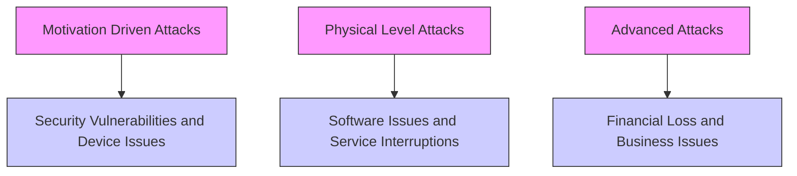
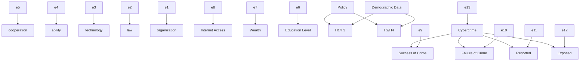

# Changing rules on the virtual battlefield

Summary

As the digitalization process accelerates, cybercrime has become a transnational threat. Although countries have successively introduced cybersecurity policies, due to differences in implementation time, resource allocation and national conditions, there is an urgent need to quantify policy effectiveness and identify best practices through data-driven methods. This problem aims to reveal the global distribution of cybercrime, evaluate the heterogeneous effects of policies in various countries, and analyze the association mechanism between demographic factors and crime risks, so as to provide policymakers with a data-driven optimization path.

For Task 1, in order to explore the distribution of cybercrime, first collect data and clean the data, and then observe the distribution of cybercrime through visualization. It is found that high-incidence areas of cybercrime activities often roughly overlap with areas with low GCI scores. Then, a VBGMM model is established to cluster countries with the same attributes and finally divide them into victim countries and attacking countries. Finally, a multi-level analysis model based on unordered multi-classification Logistics regression is constructed. It is found that the success of cybercrime often occurs in areas with complex hacker activities, insufficient technical support and low international cooperation, while the thwarting of crimes is mainly seen in environments with close cooperation and advanced technology. Asset-rich regions are more inclined to report attacks, while countries with sound legal systems provide effective support, which enhances the prosecution effect of cybercrime.

For Task 2, in order to evaluate the impact of policies on cybercrime, a multi-period double difference model was established, and parallelism and placebo tests were conducted to analyze the heterogeneous impact of the five dimensions of policies on the crime rates of the attacking and victim countries, and finally the policy effects of legal improvement and technology investment were significant. In order to analyze the time of implementation of cybersecurity policies in various countries and the temporal dynamics of their impact on cybercrime, a survival analysis model was established, and it was found that for victim countries, policy implementation and duration significantly reduced the risk of cybercrime.

For Task 3, in order to analyze the association mechanism between demographic data of different countries and cybercrime, a structural equation model was established and a fitness test was conducted. According to the model analysis, countries with high Internet penetration rates and high education levels among victim countries are more likely to become targets of cybercrime, while cybercrime in attacking countries is mainly driven by technical capabilities and organizational levels, and the impact of demographic factors is not significant. According to the situation of different countries, it is recommended that victim countries strengthen cybersecurity education and the promotion of zero-trust architecture, and attacking countries should strictly control technology abuse and promote international cooperation to enhance the effectiveness and fairness of the global cybersecurity governance system.

Finally, a sensitivity analysis was performed on the multi-level regression model of Task 1 to verify the robustness of the model and confirm the reliability of the conclusions through the fluctuation of parameters.

## Contents

## 1 Introduction 3

1.1 Problem Background . 3  
1.2 Restatement of the Problem 3  
1.3 Our Work . . 3

## 2 Assumptions and Justifications 4

## 3 Notations 5

## 4 Data Pre-processing 5

4.1 Data Collection . . 5  
4.2 Data Cleaning . . . 5

## 5 Task1: Multi-level cybercrime risk assessment and response model 6

5.1 Data Visualization . . 6  
5.2 Variational Bayesian Gaussian Mixture Clustering . . 7

5.2.1 Principal component analysis dimensionality reduction . . . . . . 7  
5.2.2 Clustering process and results 7

5.3 Multi-level analysis model based on unordered multi-classification logistics regression . . 9

## 6 Task2:Cybersecurity policy effectiveness evaluation model 11

6.1 Multi-period double difference model 11

6.1.1 Composite Sampling . . . 11  
6.1.2 Model construction . 11  
6.1.3 Parallel trend test . . 12  
6.1.4 Model results 13  
6.1.5 Placebo test . . 14  
6.1.6 Result Analysis . . . 14

6.2 Cox’s time varying proportional hazard model . 16  
6.3 principle . . . 16  
6.4 Hypothesis Testing . . . 16  
6.5 Model Building . . 17  
6.6 Model Analysis . . . 18

## 7 Task3:CyberDemographic Resilience Model 18

7.1 Principle 19  
7.2 Model establishment . 19  
7.3 Fitness test . 20  
7.4 Model analysis . . 21

## 8 Analysis on Model’s Sensitivity 22

## 9 Strengths and Weaknesses 22

9.1 Strengths . . 22  
9.2 Weaknessess 23

## References 24

## MEMO 25

## 1 Introduction

## 1.1 Problem Background

With the popularization of Internet technology, global connections are becoming increasingly close, which not only improves communication efficiency, but also provides opportunities for cybercrime and increases the security threats faced by individuals and organizations. Many cybersecurity incidents cross national borders, making investigations more difficult. In order to protect their own image, some organizations choose to conceal the fact that they have been hacked. Although this can avoid negative publicity in the short term, it weakens the overall awareness and response capabilities of society to cybersecurity threats. Therefore, countries need to unite and formulate comprehensive national cybersecurity policies based on their own characteristics to strengthen the cybersecurity protection system.

## 1.2 Restatement of the Problem

Considering the background information and constraints, developing a National Security Doctrine to solve the following problems:

1. Analyze the global distribution of cybercrime, identify high-risk countries, and determine where cybercrime is successful, disrupted, reported, and prosecuted.

2. Modeling over time to determine which parts of a policy or law are effective or ineffective in addressing cybercrime.

3. Identify countries where demographic data is significantly correlated with the distribution of cybercrime and explain how this supports or challenges established theories

## 1.3 Our Work

To solve the problem, we built and optimized the entire model:

For Task 1, we collected and processed data, observed the distribution of cybercrime through visualization, and analyzed the characteristics of countries by clustering them into attacking countries and victim countries in order to find high targets of cybercrime. We also built a multi-level analysis model based on unordered multiclassification logistic regression to analyze the law of cybercrime.

For Task 2, we first considered the effectiveness of the policy, and discussed the effectiveness of the five aspects of the policy on the cybercrime rate of the attacking country and the victim country by building a multi-period double difference model. Then, in order to explore the impact of the time of policy adoption on cybercrime, we established Cox’s time varying proportional hazard model.

For Task 3, we introduced the indicator of demographic data and built a structural equation model to explore the correlation between cybercrime data and demographic data in different countries.

Finally, we conducted a sensitivity analysis on the model.

  
Figure 1: Mind Map

## 2 Assumptions and Justifications

• Demographic characteristics (such as education index, GDP, human development index, etc.) have a significant nonlinear impact on the occurrence of cybercrime.

Reason: Education level, economic investment, comprehensive development, etc. are related to cybersecurity awareness and capabilities, resource allocation, etc., and the relationship is complex.

• The impact of each dimension of the GCI index on the occurrence of cybercrime has different weights.

Reason: The impact of policies and laws, technical facilities, education and training, international cooperation, etc. on cybercrime in different regions and situations varies in terms of intensity and mode.

• There is a threshold effect on the impact of Internet penetration and mobile device usage on cybercrime.

Reason: The Internet and mobile devices are the main platforms for cybercrime, but their impact may not be linear. In the early stage, with the popularization of the Internet and mobile devices, cybercrime may increase due to the increase in users, but when it reaches a certain saturation, the growth rate of cybercrime may slow down or decline due to factors such as increased security awareness and strengthened protective measures.

• The impact of economic factors (such as GDP) on the occurrence of cybercrime is interactive.

Reason: GDP not only affects the investment in cybersecurity resources and the level of technological development, but also interacts with other economic-related factors such as education level and employment status to jointly influence the motivation, opportunities and capabilities of cybercrime.

## 3 Notations

<table><tr><td>Notations</td><td>Definition</td></tr><tr><td> $h(t|x)$ </td><td>The instantaneous risk of the covariate  $x$ </td></tr><tr><td> $b_0(t)$ </td><td>Baseline hazard rate</td></tr><tr><td> $Z_i(i=1,2,3,4,5)$ </td><td>Five aspects of policy</td></tr><tr><td> $X_i(i=1,2,3,4)$ </td><td>Factors that measure cybercrime</td></tr></table>

## 4 Data Pre-processing

## 4.1 Data Collection

Table 1: Data Sources

<table><tr><td>Database Name</td><td>Database Website</td></tr><tr><td>Cybercrime Data National Policies Data</td><td>https://verisframework.org/index.html https://www.itu.int/en/ITU-D/Cybersecurity/Pages/CIRTs/List-of-National-CIRTs.aspx</td></tr><tr><td>Demographic Statistics</td><td>https://databank.worldbank.org/home</td></tr></table>

## 4.2 Data Cleaning

For any feature, if the proportion of NA or "UNKNOWN" in the feature exceeds 10%, then remove the feature.

For any Boolean type feature, if the proportion of False values âA˘ Nâ´ A˘ Nexceeds´ 90%, consider whether to remove the feature. This step needs to be decided based on the specific analysis purpose, because sometimes even a large proportion of False may contain important information.

For the remaining features with missing values, use linear interpolation to fill them.

For categorical variables (non-numeric variables), use one-hot encoding to convert them to numerical variables. One-hot encoding converts each categorical value into a new binary column (0 or 1), where each column represents a possible category. This encoding method helps machine learning algorithms better process and understand categorical data.

## 5 Task1: Multi-level cybercrime risk assessment and response model

## 5.1 Data Visualization

text_image

World map with colored heatmaps indicating temperature anomalies across continents and countries

Figure 2: Number of crimes reported worldwide from 2005 to 2024

natural_image

World map with a color-coded heat map overlay showing temperature variations across continents (no text or labels)

Figure 3: 2024 GCI Chart

Figure 2 shows the high incidence of cybercrime around the world, with particularly significant clusters in North America and Western Europe. The extreme values appear in the United States, and the changes in color and height reflect the frequency and success rate of cybercrime. Some Southeast Asian countries also show high criminal activity. Figure 3 reflects the global cybersecurity score. North America, Europe and some East Asian countries have high scores, indicating their investment and policy support in cybersecurity. High incidence areas of cybercrime activities often overlap with areas with low GCI scores. For example, Africa and some South Asian countries not only face low cybersecurity scores, but also report high cybercrime rates. This shows that there is a direct proportional relationship between cybercrime and inadequate cybersecurity strategies.

## 5.2 Variational Bayesian Gaussian Mixture Clustering

## 5.2.1 Principal component analysis dimensionality reduction

By searching the VERIS community database, we found that there are 136 indicators related to cybercrime attacking countries and 825 indicators related to cybercrime victim countries. Considering that when the number of features is very large, model training may become complicated and the computational cost is very high, and in order to remove redundant information, principal component analysis is performed on the indicator data to reduce the dimensionality, and it is ensured that the selected principal components can explain at least 90% of the variability in the original data, thereby reducing the attacking country indicator to 8 dimensions and the victim country indicator to 12 dimensions.

## 5.2.2 Clustering process and results

The reason for choosing the variational Bayesian Gaussian mixture model (VBG-MM) for clustering is mainly based on the high complexity and dimensionality of the data. First, whether it is 8 dimensions or 12 dimensions, it still seems high for the processed data set, and VBGMM is good at processing high-dimensional data and effectively avoids overfitting problems through its internal mechanism, which is especially important for data after dimensionality reduction, ensuring that the effectiveness and accuracy of clustering results are maintained while simplifying the data structure. Secondly, due to the lack of prior knowledge about the optimal number of clusters, VBG-MM can adaptively determine the most appropriate number of clusters based on the intrinsic distribution characteristics of the data, without pre-setting a fixed number of clusters, which is particularly critical for exploring data sets with unknown structures. In addition, considering that samples may be distributed on the boundaries between multiple clusters, VBGMM provides a probability-based method to assign samples to each cluster. This soft assignment method not only better reflects the true distribution of the data, but also increases the understanding of data uncertainty. Finally, the regularization effect introduced by VBGMM helps to improve the generalization ability of the model, which is particularly suitable for data sets with relatively small sample sizes but rich features. In summary, given the high complexity and high dimensionality of the data and the uncertainty requirements for the number of clusters, it is reasonable to choose VBGMM for clustering.

Since VBGMM assumes that the data is drawn from a multivariate normal distribution, it is helpful to standardize the data to zero mean and unit variance. This ensures that all features are on the same scale and avoids some features having a disproportionate impact on the clustering results due to their large dimensions.

Since the clustering assumption of VBGMM is that the data satisfies a multivariate normal distribution, it is necessary to consider applying a transformation (such as the Yeo-Johnson transformation) to make it closer to a normal distribution.

The clustering results obtained using the algorithm in Table 3 are visualized as shown in Figure 4.

For each subcategory, find the 5 most important features as the representative features of the category and name them as shown in Figure 5

Table 2: Survival EM Algorithm

<table><tr><td>Initialize: t←0 θt←θ0 converged←false</td></tr><tr><td>While not converged and t&lt; maxIter do: // E-Step: Compute Expectation of the complete-data log-likelihood Q(θ|θt)←0 For i=1 to n do: If δi=1 then: // Complete data Q(θ|θt)←Q(θ|θt)+log f(xi|θ) Else: // Censored data Q(θ|θt)←Q(θ|θt)+log S(xi|θ) // Contribution from censored observation End If End For // M-Step: Maximize Q(θ|θt) with respect to θ Solve ∂Q(θ|θt)/∂θ = 0 for θ to get θt+1 // Check Convergence If ||θt+1 - θt|| &lt; ε or |L(θt+1) - L(θt)| &lt; ε then: converged←true End If t←t+1 θt←θt+1 End While Return θt</td></tr></table>

scatterplot

| t-SNE Dimension 1 | t-SNE Dimension 2 |
| ----------------- | ----------------- |
| -6.0              | -1.0              |
| -5.5              | -0.5              |
| -5.0              | 0.0               |
| -4.5              | 0.5               |
| -4.0              | 1.0               |
| -3.5              | 1.5               |
| -3.0              | 2.0               |
| -2.5              | 2.5               |
| -2.0              | 3.0               |
| -1.5              | 2.5               |
| -1.0              | 2.0               |
| -0.5              | 1.5               |
| 0.0               | 1.0               |
| 0.5               | 0.5               |
| 1.0               | 0.0               |
| 1.5               | -0.5              |
| 2.0               | -1.0              |
| 2.5               | -1.5              |
| 3.0               | -2.0              |
| 3.5               | -2.5              |
| 4.0               | -3.0              |
| 4.5               | -3.5              |
| 5.0               | -4.0              |
| 5.5               | -3.5              |
| 6.0               | -3.0              |

scatterplot

| t-SNE Dimension 1 | t-SNE Dimension 2 |
| ----------------- | ----------------- |
| -8.5              | 3.0               |
| -7.0              | 6.0               |
| -6.0              | 1.0               |
| -5.5              | 4.0               |
| -4.0              | 9.0               |
| -3.0              | 8.0               |
| -2.0              | 10.0              |
| -1.0              | 5.0               |
| 0.0               | 2.0               |
| 1.0               | -3.0              |
| 2.0               | -5.0              |
| 3.0               | -7.0              |
| 4.0               | -4.0              |
| 5.0               | -2.0              |
| 6.0               | 1.0               |
| 7.0               | 8.0               |
| 8.0               | 3.0               |
| 9.0               | -1.0              |
| 10.0              | 2.0               |
| 11.0              | -1.0              |
| 12.0              | 4.0               |
| 13.0              | -2.0              |
| 14.0              | -3.0              |

bar chart

TENE Dimension 1
| Component | Weight (%) |
| :--- | :--- |
| 0.0 | 27.9 |
| 1.0 | 31.8 |
| 2.0 | 40.4 |

bar chart

CSLE Dimension 1
| Component | Weight (%) |
| :--- | :--- |
| 0.0 | 28.6 |
| 1.0 | 26.3 |
| 2.0 | 44.6 |

Figure 4: Clustering of attacking and victim countries

flowchart

Figure 5: Clustering Type

## 5.3 Multi-level analysis model based on unordered multi-classification logistics regression

When studying the success and failure, reporting and prosecution of cybercrime, we tend to consider the characteristics of global interconnection and focus on how to promote international cooperation rather than just focusing on the opposing classifications between countries. This can better understand the dynamic characteristics of cybercrime, so we will not discuss them separately by country type here, but take a unified study to summarize the rules.

In order to comprehensively consider and link factors at different levels, by integrating specific case analysis at the micro level with factors such as policy environment and international cooperation at the macro level, we can better understand the dynamic changes and rules of cybercrime. A multi-level analysis model is established here.

The first-level model focuses on the results of specific cybercrime events and tries to find out which factors directly affect these results.

Since there are four categories of dependent variables and there is no natural order between these states, an unordered multi-classification logistic regression model is constructed at the first level. Here, the types of physical attacks, the security of different types of assets, the carriers or ways of risk occurrence, and hacker attack methods are selected as influencing factors.

The second-level model focuses on higher-level factors, aiming to explore why different countries or regions have different results in dealing with cybercrime. Referring to the evaluation criteria of the GCI index, the five major aspects of law, technology, organization, capacity building and cooperation are used to measure the policies of each country, and according to the relevant indicators of each aspect listed by the International Telecommunication Union, data is collected and the scores of each aspect are obtained by quantitative synthesis.

In order to ensure the independence of the independent variables in the regression model, the coefficient estimation instability, standard error increase and significance test result distortion caused by the high correlation between the independent variables are avoided, so as to ensure the accuracy and explanatory power of the model. Before constructing the model, it is necessary to conduct a collinearity test on each layer of variables. The variance inflation factor is less than 10, which is within a reasonable range.

Applying the above theory, the model equation is constructed as follows:

First layer:

$$
\log \left(\frac {P (Y = 1)}{P (Y = 0)}\right) = \beta_ {1} - 6. 6 8 4 \times X _ {1} + 2. 5 9 3 \times X _ {2} - 1 1. 3 4 8 \times X _ {3} - 6. 4 0 5 \times X _ {4} \tag {1}
$$

$$
\log \left(\frac {P (Y = 2)}{P (Y = 0)}\right) = \beta_ {2} - 0. 6 9 8 \times X _ {1} + 1 1. 2 1 8 \times X _ {2} - 1 6. 3 5 1 \times X _ {3} - 1 1. 5 6 2 \times X _ {4} \tag {2}
$$

$$
\log \left(\frac {P (Y = 3)}{P (Y = 0)}\right) = \beta_ {3} - 0. 4 7 3 \times X _ {1} - 0. 3 4 8 \times X _ {2} + 0. 8 2 8 \times X _ {3} - 0. 1 3 1 \times X _ {4} \tag {3}
$$

Among them, $Y = 0 , 1 , 2 , 3$ represents the four results of cybercrime success, thwarted, reported and prosecuted, $X _ { i } ( i = 1 , 2 , 3 , 4 )$ represents the four influencing factors of physical attack type, security of different types of assets, carrier or path of risk occurrence, and hacker attack method, $\beta _ { i } ( i = 1 , 2 , 3 )$ corresponds to the three results of cybercrime thwarted, reported and prosecuted.

Second layer:

$$
\beta_ {1} = 0. 3 3 7 + 0. 3 2 4 \times Z _ {1} + 0. 0 8 7 \times Z _ {2} - 0. 2 8 8 \times Z _ {3} + 0. 0 3 5 \times Z _ {4} - 0. 1 4 7 \times Z _ {5} \tag {4}
$$

$$
\beta_ {2} = - 0. 0 6 2 + 0. 2 4 5 \times Z _ {1} + 0. 0 5 1 \times Z _ {2} - 0. 1 4 7 \times Z _ {3} + 0. 0 4 4 \times Z _ {4} - 0. 1 2 1 \times Z _ {5} \tag {5}
$$

$$
\beta_ {3} = 0. 4 2 9 + 0. 1 4 1 \times Z _ {1} + 0. 0 4 8 \times Z _ {2} - 0. 1 8 2 \times Z _ {3} + 0. 7 1 9 \times Z _ {4} - 0. 2 5 9 \times Z _ {5} \tag {6}
$$

Among them, $Z _ { i } ( i = 1 , 2 , 3 , 4 , 5 )$ represents the five factors of law, technology, organization, capacity building and cooperation.

Analyzing the results of the above model, we can summarize the laws of cybercrime as follows:

• Where cybercrime is successful: characterized by highly sophisticated hacker activity, fewer assets exposed to potential attackers, low levels of international cooperation, and insufficient technical support. These characteristics provide cybercriminals with a relatively loose operating space.  
• Where cybercrime is thwarted: characterized by high levels of cooperation (international or regional), advanced technological development, and a strong focus on cybersecurity, while avoiding over-reliance on legal means. This means taking more direct and technical defensive measures to prevent and respond to cyberattacks.  
• Where cybercrime is reported: characterized by having more assets, even in the face of strong hacker attacks, they may choose to report rather than conceal because they have better error management mechanisms. This suggests that in asset-rich environments, organizations and individuals may be more willing to publicly acknowledge attacks and seek external assistance to solve problems.  
• Where cybercrime is prosecuted: characterized by the degree of sophistication of technical infrastructure and the effectiveness of the legal system play a decisive role, especially when a country or region’s legal system can effectively support the investigation and trial process of cybercrime. This can greatly increase the possibility of bringing criminals to justice.

## 6 Task2:Cybersecurity policy effectiveness evaluation model

## 6.1 Multi-period double difference model

## 6.1.1 Composite Sampling

Since countries can be divided into countries that attack cybercrime and countries that are victims, and these two categories of countries face different challenges and needs in cybercrime, they should be discussed separately so as to adopt targeted strategies. Considering that victim countries and attacking countries are divided into three categories according to various characteristics, and the number of countries in each category is different, a mixed sampling method is used to select representative countries from each category for research (the formula is as follows), ensuring that representative samples are drawn from each category in proportion and a fixed number of samples are added to each category. This method not only ensures that the large categories are sufficiently representative, but also allows small categories to receive full attention due to their uniqueness, thereby improving the overall diversity of the sample and the accuracy of the research results.

$$
n _ {i} = \left\lfloor \frac {C _ {i}}{\sum_ {j = 1} ^ {m} C _ {j}} \times (N - m \times k) \right\rfloor + k \tag {7}
$$

Where N is the total number of samples drawn, where $N = 3 0 , n _ { i }$ represents the total number of samples selected from the ith cluster, k represents the number of additional fixed samples selected from each cluster, where $k = 5 , C _ { i }$ represents the total number of countries in the ith cluster, m represents the number of clusters, where $m = 3$ .

The design takes 30 victim countries and attacking countries for research respectively, and uses the above mixed sampling method to obtain 18, 6, and 6 representative countries for the three subcategories of victim countries, and 7, 17, and 6 representative countries for the three subcategories of attacking countries for targeted and specific research.

## 6.1.2 Model construction

Since the global cybercrime governance policy is implemented in stages and there are differences in the implementation time of the policy, a multi-period double difference model is constructed based on econometric theory and research methods to empirically analyze the inhibitory effect of cybercrime governance policies on the situation of cybercrime around the world, and further explore the relationship between various policy indicators and cybercrime. The panel data selected data from 2005 to 2022 for 18 years, in which the experimental group and the control group respectively covered different countries and regions of cybercrime attacking countries and victim countries. In order to improve and ensure the accuracy of the research and the accuracy of the data, the sample data of individual countries with serious data missing were eliminated. Finally, 60 countries (30 attacking countries and 30 victim countries) were used as research samples to explore the impact of the implementation of cybercrime governance policies on the situation of cybercrime and the driving effect of different policies on the cybercrime prevention and control capabilities of surrounding countries. The multi-period DID model constructed in this paper is as follows:

Table 3: Selection of Representative Countries

<table><tr><td>Country Type</td><td>Representative Countries</td></tr><tr><td>Security Vulnerabilities and Equipment Issues</td><td>UZ, MA, RS, BW, GH, GR, TN, TL, KH, GT, MZ, ME, IQ, SI, MR, DZ, KW, TZ</td></tr><tr><td>Software Issues and Service Disruptions</td><td>SE, HK, SG, NL, ID, VE</td></tr><tr><td>Financial Losses and Business Impact</td><td>FR, BE, AE, IE, ZA, TW</td></tr><tr><td>Motivation-driven Attacks</td><td>IN, ID, VN, NZ, KR, CA, UA</td></tr><tr><td>Physical Attacks and Control Breaches</td><td>VE, JO, AZ, MY, CL, EG, TN, MR, PH, SG, AF, LY, JP, IT, IS, AL, BZ</td></tr><tr><td>Hacker Techniques and Advanced Attacks</td><td>IR, PK, TR, SY, AR, CN</td></tr></table>

$$
c r i m e _ {i t} = \alpha - \beta 1 \times d i d _ {i t} + \beta 2 \times p o s t _ {i t} + u _ {i} + \lambda_ {t} + \varepsilon_ {i t} \tag {8}
$$

In the above formula, i represents the country, t represents the year; $c r i m e _ { i t }$ is the explained variable, i.e., the cybercrime rate of country i in year $t ;$ is the constant term; is the policy effect, $d i d i _ { t }$ is the core explanatory variable, which is the interaction term of the country dummy variable and the time dummy variable, and is used to represent the dummy variables of different GCI indicators; is the coefficient, $p o s t _ { i t }$ is the control variable at the cybercrime level; i represents the fixed effect of country $i ,$ t represents the time fixed effect of year $t ; \varepsilon _ { i t }$ is the random disturbance term of the multi-period DID regression model.

## 6.1.3 Parallel trend test

Before using the multi-period DID method for analysis and testing, ensure that the time trends of the cybercrime rates of the treatment group and the control group are basically parallel, and there is no significant difference. Based on the above work, we first conduct a parallel test, taking the legal aspect of the attacking country as an example, the results are as follows:

line chart

| x  | y    |
|----|------|
| -4 | -1.0 |
| -3 | -0.5 |
| -2 | 0.0  |
| -1 | 0.3  |
| 0  | 0.0  |
| 1  | 1.0  |
| 2  | 1.3  |
| 3  | 1.9  |
| 4  | 2.0  |
| 5  | 4.5  |

Figure 6: Parallel Trend Test

## 6.1.4 Model results

The model results obtained by solving are as follows:

For the attacking country:

$\mathrm { L a w : } \quad \mathrm { c r i m e } _ { i t } = 0 . 1 9 2 7 - 0 . 5 4 1 3 \times \mathrm { d i d } _ { i t } + 0 . 4 4 4 0 \times \mathrm { p o s t } _ { i t } + u _ { i } + \lambda _ { t } + \varepsilon _ { i t }$ (9)

$\mathrm { T e c h n o l o g y : } \quad \mathrm { c r i m e } _ { i t } = 0 . 3 5 9 3 - 0 . 6 3 8 1 \times \mathrm { d i d } _ { i t } + 0 . 3 0 6 9 \times \mathrm { p o s t } _ { i t } + u _ { i } + \lambda _ { t } + \varepsilon _ { i t }$ (10)

Organization: $\mathrm { c r i m e } _ { i t } = 0 . 3 1 5 2 + 0 . 3 2 7 \times \mathrm { d i d } _ { i t } + 0 . 3 1 8 2 \times \mathrm { p o s t } _ { i t } + u _ { i } + \lambda _ { t } + \varepsilon _ { i t }$ (11)

Capacity Building: $\mathrm { c r i m e } _ { i t } = 0 . 2 8 3 3 - 0 . 3 0 8 0 \times \mathrm { d i d } _ { i t } + 0 . 4 1 5 2 \times \mathrm { p o s t } _ { i t } + u _ { i } + \lambda _ { t } + \varepsilon _ { i t }$ (12)

Cooperation: $\mathrm { c r i m e } _ { i t } = 0 . 3 2 6 7 - 0 . 4 9 5 8 \times \mathrm { d i d } _ { i t } + 0 . 2 2 5 6 \times \mathrm { p o s t } _ { i t } + u _ { i } + \lambda _ { t } + \varepsilon _ { i t }$ (13)

For the victim country:

$\mathrm { L a w : } \quad \mathrm { c r i m e } _ { i t } = 0 . 3 5 2 8 - 0 . 4 3 0 3 \times \mathrm { d i d } _ { i t } + 0 . 5 3 7 2 \times \mathrm { p o s t } _ { i t } + u _ { i } + \lambda _ { t } + \varepsilon _ { i t }$ (14)

$\mathrm { T e c h n o l o g y : } \quad \mathrm { c r i m e } _ { i t } = 0 . 2 4 9 3 - 0 . 3 7 5 2 \times \mathrm { d i d } _ { i t } + 0 . 2 6 3 8 \times \mathrm { p o s t } _ { i t } + u _ { i } + \lambda _ { t } + \varepsilon _ { i t }$ (15)

$\mathrm { O r g a n i z a t i o n : } \quad \mathrm { c r i m e } _ { i t } = 0 . 2 9 0 4 + 0 . 3 9 9 5 \times \mathrm { d i d } _ { i t } + 0 . 3 6 7 2 \times \mathrm { p o s t } _ { i t } + u _ { i } + \lambda _ { t } + \varepsilon _ { i t }$ (16)

$\mathrm { C a p a c i t y \ B u i l d i n g } ; \quad \mathrm { c r i m e } _ { i t } = 0 . 3 6 3 2 - 0 . 4 1 6 5 \times \mathrm { d i d } _ { i t } + 0 . 6 3 3 0 \times \mathrm { p o s t } _ { i t } + u _ { i } + \lambda _ { t } + \varepsilon _ { i t }$ (17)

Cooperation: $\mathrm { c r i m e } _ { i t } = 0 . 2 6 9 1 - 0 . 5 2 9 7 \times \mathrm { i d } _ { i t } + 0 . 5 2 8 5 \times \mathrm { p o s t } _ { i t } + u _ { i } + \lambda _ { t } + \varepsilon _ { i t }$ (18)

## 6.1.5 Placebo test

After solving the model and obtaining preliminary results, in order to exclude the impact of non-policy factors on cybercrime and avoid subjective changes in the research subjects due to advance knowledge of the policy implementation signal, which may lead to errors in the "policy effect", the following placebo test is conducted:

scatterplot

| Estimator | Density | P Value |
| --------- | ------- | ------- |
| -2.5      | 0.0     | 0.0     |
| -2.0      | 0.1     | 0.05    |
| -1.5      | 0.3     | 0.15    |
| -1.0      | 0.6     | 0.3     |
| -0.5      | 0.8     | 0.45    |
| 0.0       | 1.0     | 0.5     |
| 0.5       | 0.8     | 0.45    |
| 1.0       | 0.6     | 0.3     |
| 1.5       | 0.3     | 0.15    |
| 2.0       | 0.1     | 0.05    |
| 2.5       | 0.0     | 0.0     |

Figure 7: Placebo test

The kernel density distribution of the placebo test results is shown in the figure. It can be seen that the $p$ value distribution is close to the normal distribution, and the regression result is not significant, indicating that the impact of the implementation of legal policies on cybercrime governance on the attacking country is not accidental, which further verifies the robustness of the model.

## 6.1.6 Result Analysis

After solving the multi-period DID model of the degree of influence of policies on cybercrime in the attacking country and the victim country, the following radar chart about $\beta _ { 1 }$ (policy effect) is drawn:

radar chart

| Category           | Attacking country | Victim country |
| ------------------ | ----------------- | -------------- |
| Technical          | 6.38              | 3.75           |
| Legal              | 5.41              | 4.3            |
| Cooperation        | 4.90              | 5.73           |
| Capacity development | 3.08             | 4.17           |
| Organizational      | 4.0               | 3.27           |

Figure 8: β Policy Effect Radar Chart

By evaluating the impact of different countries’ policies on cybercrime in five dimensions, the effectiveness of national policies in cybersecurity is intuitively demonstrated. In terms of national strategic priorities, attacking countries may prioritize the development of technical defense and legal deterrence to consolidate their dominance in cyberspace, while victim countries are forced to selectively ignore certain dimensions (such as international cooperation) due to limited resources; in terms of data and execution capabilities, high 1 countries usually have more complete cybercrime databases and efficient execution agencies, while developing countries with low countries have data gaps or decentralized agencies, and policy effects are difficult to show.

The legal and technical policies of the attacking country can effectively curb the occurrence of cybercrime, indicating that it has a complete cybersecurity legal system (such as the "Cybersecurity Law" and the "Data Protection Law"), and clarifies crossborder jurisdiction and criminal liability. Deploy advanced defense technologies (such as AI-driven threat detection and quantum encryption), and the protection level of critical infrastructure is high; but the policy effectiveness at the capability development level is low, indicating that they have strong dependence on international cooperation but weak voice, and it is difficult to obtain threat intelligence in a timely manner. These countries should avoid technological hegemony and open source their defense technologies or license them at low prices to countries in need (such as providing free vulnerability scanning tools). The EU can also fund African countries to build security infrastructure through the "Digital Europe Plan".

The victim countries’ cooperation policies can effectively curb the occurrence of cybercrime, indicating that they may dominate the international cybersecurity alliance and share attacker IP and malicious code feature libraries; but the effectiveness of the technical level policy is not high, which may be due to the reliance on outdated firewalls and antivirus software and the lack of real-time monitoring capabilities. These countries can promote the Zero Trust architecture, force key industries to deploy intrusion detection systems (IDS) or adopt "lightweight" solutions, such as AI-based automated threat detection (low cost, high coverage) and other measures to improve the effectiveness of policies at the technical level.

Therefore, the attacking country needs to shift from a "technology exporter" to a "rule co-builder" to avoid the capability gap that exacerbates the imbalance of global cybercrime, while the victim countries should focus on resources to make up for shortcomings (such as laws and technology) and obtain external support through international cooperation. Only through multi-dimensional policy optimization and innovation of cooperation mechanisms can a more balanced and sustainable global cybersecurity ecosystem be built.

## 6.2 Cox’s time varying proportional hazard model

## 6.3 principle

Since the topic requires analyzing the implementation time of cybersecurity policies in various countries and the time dynamics of their impact on cybercrime, and CoxâA˘ Zs time varying proportional hazard model is a statistical model widely used´ in survival analysis, especially for dealing with time-dependent covariates, this topic innovatively uses this model for research.

$$
h (t \mid x) = \overbrace {b _ {0} (t)} ^ {\text { baseline }} \underbrace {\exp \left(\sum_ {i = 1} ^ {n} \beta_ {i} \left(x _ {i} (t) - \bar {x} _ {i}\right) \right.} _ {\text { partialhazard }} \tag {19}
$$

where $h ( t | x )$ represents the instantaneous risk (or hazard rate) of a given covariate x at time $t ,$

$b _ { 0 } ( t )$ : baseline hazard rate,

$\beta _ { i } \colon$ The coefficient of the ith covariate, , represents the hazard rate when all covariates are zero.

$x _ { i } ( t )$ :The value of the ith covariate at time t

$\bar { x } _ { i } { : } \overset { \cdot } { \mathrm { . } }$ The average value of the ith covariate.

## 6.4 Hypothesis Testing

The most important assumption in the Cox model is the proportional hazard assumption, that is, the effect of covariates on survival time does not change over time. Graphical tests (observing whether the survival curves are parallel) show that the survival probability of the "Rejection" group is higher than that of the "Adoption" group, with the former having a longer median survival time of about 14 years, while the latter has a median survival time of about 14 years. In addition, the Log-rank test (p $= 0 . 0 0 1 3 < 0 . 0 5 )$ shows that there is a significant difference in the survival probability between the two groups.

$$
h (t \mid x) = h _ {0} (t) \exp (- 1. 3 3 x _ {1} - 0. 6 1 x _ {2} + 0. 1 6 x _ {3} + 1. 0 1 x _ {4} - 0. 0 6 x _ {5} + 0. 0 6 x _ {6} + 0. 5 4 x _ {7}) \tag {20}
$$

line chart

| Policy | Adoption | Rejection |
| ------ | -------- | --------- |
| Adoption | 131      | 89        |
| Rejection | 124     | 89        |
| Adoption | 114      | 82        |
| Rejection | 105     | 79        |
| Adoption | 89       | 71        |
| Rejection | 73       | 60        |
| Adoption | 61       | 52        |
| Rejection | 49       | 43        |
| Adoption | 39       | 39        |
| Rejection | 34       | 28        |

Figure 9: Kaplan-Meier survival curve

## 6.5 Model Building

The model equation is established as

For the attacking country:

$$
h (t \mid x) = h _ {0} (t) \exp (- 1. 3 3 x _ {1} - 0. 6 1 x _ {2} + 0. 1 6 x _ {3} + 1. 0 1 x _ {4} - 0. 0 6 x _ {5} + 0. 0 6 x _ {6} + 0. 5 4 x _ {7}) \tag {21}
$$

scatterplot

| covariate | OR(95% CI)       | log(HR)(95% CI) |
|-----------|------------------|-----------------|
| ab        | -1.325 (-3.088, 0.437) | 0.266 (0.046, 1.548) |
| coo       | -0.609 (-2.869, 1.652) | 0.544 (0.057, 5.216) |
| law       | 0.158 (-1.587, 1.902) | 1.171 (0.204, 6.703) |
| org       | 1.014 (-0.387, 2.416) | 2.758 (0.679, 11.196) |
| policy    | -0.060 (-1.113, 0.992) | 0.941 (0.329, 2.697) |
| policy_time | 0.062 (-0.061, 0.185) | 1.064 (0.941, 1.203) |
| tech      | 0.539 (-0.769, 1.846) | 1.714 (0.463, 6.336) |

Figure 10: Attacking Country Forest Map

For the victim country:

$$
h (t \mid x) = h _ {0} (t) \exp (- 0. 3 0 x _ {1} + 0. 0 8 x _ {2} + 0. 9 2 x _ {3} + 0. 1 0 x _ {4} - 0. 8 6 X _ {5} + 0. 0 7 x _ {6} - 0. 1 3 x _ {7}) \tag {22}
$$

where $x _ { i } ( i = 1 , 2 , 3 , 4 , 5 , 6 , 7 )$ represents the policy regarding capabilities, cooperation, law, organization, whether the policy is implemented, policy duration, and technology

scatterplot

| covariate | OR(95%CI) | log(HR) (95% CI) |
| --------- | --------- | ---------------- |
| ab        | -1.325    | 0.266 (0.046, 1.548) |
| coo       | -0.609    | 0.544 (0.057, 5.216) |
| law       | 0.158     | 1.171 (0.204, 6.703) |
| org       | 1.014     | 2.758 (0.679, 11.196) |
| policy    | -0.060    | 0.941 (0.329, 2.697) |
| policy_time| 0.062     | 1.064 (0.941, 1.203) |
| tech      | 0.539     | 1.714 (0.463, 6.336) |

Figure 11: Forest map of victim countries 1

The Wald test and likelihood ratio test were used to evaluate the significance of the regression coefficients in the Cox model: the Wald test calculated the z value by comparing the regression coefficient with its standard error (absolute value >1.96 indicated significance at the 0.05 level), while the likelihood ratio test determined whether the parameter made a meaningful contribution to the model by calculating the p value (<0.05 indicated a significant improvement in model fit).

## 6.6 Model Analysis

For the attacking country, it can be seen from the equation that technology and organization contribute more to the occurrence of cybercrime, which means that the stronger the technical strength and organizational structure, the higher the probability of the attacking country to launch cybercrime. In contrast, capability and cooperation play a role in reducing cybercrime. And the duration of the policy slightly increases the risk, which may be because attackers find ways to bypass the policy over time.

For the victim country, law is one of the most influential factors, indicating that a stronger legal framework may increase the likelihood of reporting or identifying cybercrime rather than directly reducing crime. Policy implementation has a significant effect on reducing cybercrime, which may be because effective policies can prevent or combat cybercrime. And the duration of the policy also helps to further reduce the risk, indicating that long-term and effective cybersecurity policies can effectively prevent cybercrime.

## 7 Task3:CyberDemographic Resilience Model

In addition to considering the five aspects of national policies, namely, legal, technical, organizational, capacity building and cooperation, demographic data are introduced, namely, GDP per capita, number of secure Internet servers, and higher education enrollment rate, which shows that cybercrime is jointly affected by multiple factors, and there may be complex interactions between these factors. Therefore, a structural equation model (SEM) is established, which considers the direct and indirect effects between multiple dependent and independent variables at the same time, and provides a comprehensive framework for evaluating how factors such as Internet access, wealth, and education level work together on cybercrime.

## 7.1 Principle

The connection between variables in SEM is represented by structural parameters, which provide constants for the invariance of causal relationships between variables and describe the relationship between observed variables, between observed variables and latent variables, and between latent variables. These variables can be summarized into two models, namely measurement models and structural models.

1. MeasurementModel mainly represents the relationship between observed variables and latent variables . The measurement model generally consists of two equations, which respectively define the relationship between the endogenous latent variable $\eta$ and the endogenous observed variable $y ,$ and between the exogenous latent variable $\xi$ and the exogenous observed variable x. The model form is:

$$
X = \Lambda_ {x} \xi + \delta \tag {23}
$$

$$
Y = \Lambda_ {y} \eta + \varepsilon \tag {24}
$$

Among them, x is a vector composed of exogenous observed variables; $y$ is a vector composed of endogenous observed variables; $\Lambda _ { x }$ is the relationship between exogenous observed variables and exogenous latent variables, which is the factor loading matrix of exogenous observed variables on exogenous latent variables; $\operatorname { A y }$ is the relationship between endogenous observed variables and endogenous latent variables, which is the factor loading matrix of endogenous observed variables on endogenous latent variables; $\Lambda _ { y }$ is the error of exogenous observed variable $x ; \varepsilon$ is the error of endogenous observed variable $y ; \xi$ and η are the latent variables of x and y respectively.

2. Stmctural Equation Model). Mainly represents the relationship between latent variables. It stipulates the causal relationship between the assumed exogenous latent variables and endogenous latent variables in the system under study, and the model form is:

$$
\eta = \beta \eta + \Gamma \xi + \varsigma \tag {25}
$$

Among them, $\eta$ is the endogenous latent variable; $\xi$ is the exogenous latent variable; $\beta$ is the coefficient matrix of the endogenous latent variable $\eta ,$ which is also the path coefficient matrix between the endogenous latent variables; $\Gamma$ is the coefficient matrix of the exogenous latent variable $\xi ,$ which is also the path coefficient matrix of the exogenous latent variable to the corresponding endogenous latent variable; ς is the residual, which is the part that cannot be explained in the model.

## 7.2 Model establishment

In combination with the research questions, the basic model diagram of each variable is established, and by consulting the literature, the policy and demographic data, as well as the research hypothesis relationship of cybercrime are determined.

For the victim country:

H1: Policy has a significant positive relationship with cybercrime  
H2: Demographic data has a significant positive relationship with cybercrime

For the attacking country:

H3: Policy has a significant positive relationship with cybercrime

H4: Demographic data has a significant positive relationship with cybercrime

Based on the above theoretical assumptions, the structural equation model diagram that affects cybercrime is constructed with the help of the software AMOS, as shown below.

flowchart

Figure 12: Structural equation model diagram of the impact of cybercrime

## 7.3 Fitness test

The established model was tested for fitness through AMOS, and the following table was obtained (due to space limitations, only the fitness test of the victim country is listed, but the attacking country also passed the fitness test).

Table 4: Victim Country Fit Test

<table><tr><td>Fit Test Index</td><td>Fit Standard</td><td>Model Result</td><td>Fit Evaluation</td></tr><tr><td>CMIN</td><td>1~3</td><td>1.774</td><td>Good</td></tr><tr><td>RMSEA</td><td>&lt;0.08</td><td>0.083</td><td>Acceptable</td></tr><tr><td>RMR</td><td>&lt;0.08</td><td>0.085</td><td>Acceptable</td></tr><tr><td>GFI</td><td>&gt;0.90</td><td>0.927</td><td>Good</td></tr><tr><td>CFI</td><td>&gt;0.90</td><td>0.949</td><td>Good</td></tr><tr><td>IFI</td><td>&gt;0.90</td><td>0.944</td><td>Good</td></tr><tr><td>TLI</td><td>&gt;0.90</td><td>0.985</td><td>Good</td></tr></table>

## 7.4 Model analysis

According to the victim country model, demographics have a significant positive impact on cybercrime. Therefore, it can be inferred that among victim countries, countries with high Internet penetration, developed economy, and high education level are more likely to become targets of cybercrime. For example, developed countries such as Canada and South Korea may face more cyberattacks due to their well-developed Internet infrastructure and frequent economic activities. In the attacking country model, demographics do not have a significant predictive effect on cybercrime. This may mean that cybercrime in attacking countries is more driven by technical capabilities and organizational levels rather than traditional demographic factors. Therefore, attacking countries may be those countries that have high Internet penetration and developed economy but strong legal and technical defense capabilities, such as China and Russia, which may become the source of cyberattacks due to the concentration of technical resources.

According to the victim country model, high Internet penetration and education level may lead to more cybercrime victims, which supports the theory that "countries with high digitalization are more likely to become targets." However, this may also confuse the theory because high education level is usually associated with higher cybersecurity awareness, but the data show that education level positively affects crime victimization, which may be because countries with high education levels use more online services, increasing the risk of exposure.

For the attacking countries, the demographic data is not significant, which may support the theory that "attack behavior relies more on technical and organizational factors", but the problems of data quality or indicator selection need to be eliminated. For example, the demographic indicators (secure Internet servers, higher education enrollment rate) in the attacking country model may not effectively reflect the actual influencing factors, and other indicators such as the proportion of technical practitioners or dark web activity may need to be introduced.

In view of the cybercrime governance needs of different countries, the following policy recommendations are put forward: For the victim countries, the access rights to high-value data should be restricted by promoting the Zero Trust architecture to reduce the risk of exposure. At the same time, compulsory cybersecurity courses should be added in higher education to balance digital convenience and risk awareness, and security subsidies should be provided to small and medium-sized enterprises to alleviate the problem of insufficient resources, so as to systematically improve defense capabilities. For the attacking countries, it is necessary to strictly control the export of vulnerability scanning tools and encryption technologies to prevent the abuse of technology, require transparent attack tracing through international cooperation mechanisms such as the Budapest Convention to increase the cost of crime, and introduce alternative indicators such as dark web activity and the number of APT organizations to more accurately reflect the characteristics of attack behavior. At the international level, we should promote the establishment of a unified cybercrime data reporting framework to reduce analytical bias. At the same time, we should establish a global cybersecurity fund to support technology transfer and capacity building in developing countries, promote cross-border collaboration and technology sharing, and build a fairer and more transparent global cyber governance system.

## 8 Analysis on Model’s Sensitivity

We used five factors of national policy and data on cybercrime when constructing a multi-level analysis model. However, in actual calculations, due to national statistics or publication errors, the data is often inaccurate and fluctuates, which may affect the results to a certain extent. Therefore, in order to test whether our model is still stable when external conditions are disturbed, we use sensitivity analysis to evaluate our model. In order to simulate data fluctuations of different magnitudes, we added 2%, 5% and 10% disturbances to the data, which were brought into the prediction model for calculation and compared with the original situation without disturbance. Here, we take the frequency of physical attacks as an example,

line chart

| Physical Value | with Change 0% | with Change 2% | with Change 5% | with Change 10% |
| -------------- | -------------- | -------------- | -------------- | --------------- |
| 0.0            | 2.7            | 2.8            | 2.9            | 3.0             |
| 0.5            | 2.3            | 2.4            | 2.5            | 2.6             |
| 1.0            | 1.9            | 2.0            | 2.1            | 2.2             |
| 1.5            | 1.5            | 1.6            | 1.7            | 1.8             |
| 2.0            | 1.1            | 1.2            | 1.3            | 1.4             |
| 2.5            | 0.8            | 0.9            | 1.0            | 1.1             |
| 3.0            | 0.6            | 0.7            | 0.8            | 0.9             |
| 3.5            | 0.4            | 0.5            | 0.6            | 0.7             |
| 4.0            | 0.3            | 0.4            | 0.5            | 0.6             |

Figure 13: Sensitivity analysis

By changing the frequency of physical attacks in the multi-layer analysis model, we calculate the results of the log-odds ratio, thereby analyzing the sensitivity of the factor of physical attack frequency. From the figure, we can see that with the increase of attack frequency, the trend of log-odds ratio changes little, indicating that our equation is stable.

## 9 Strengths and Weaknesses

## 9.1 Strengths

1. The DID model can effectively control unobserved time-invariant characteristics and avoid bias introduced by fixed individual effects. And because the model compares the time changes of the treatment group and the control group, it can reduce the impact of selection bias and extract causal relationships. It is suitable for various types of policy evaluation and intervention analysis and can handle different time series data.  
2. SEM can handle multiple dependencies at the same time and is suitable for analyzing direct and indirect effects between variables. Concepts can be represented by latent variables (unobserved variables) to improve the explanatory power of the model, especially in social science research, which is often used to quantify characteristics that are difficult to measure directly.

## 9.2 Weaknessess

1. Although the DID model can control fixed effects, the model may still be affected by unobserved time-varying factors, which may affect both the treatment group and the control group. Multi-period DID requires a large amount of panel data to ensure the reliability of the results, and data collection and processing may be more complicated. And if an exogenous shock occurs during the analysis period (such as an economic crisis, an epidemic, etc.), it may affect the results, making causal relationships more difficult to identify  
2. Structural equation models require a larger sample size to ensure the stability and reliability of parameter estimates, and the model assumptions are stricter. SEM assumes a linear relationship between variables, which may not apply to all actual situations, leading to model bias, and is more sensitive to missing data and outliers, which may affect the accuracy of the results.

## References

[1] Padyab M ,Padyab A ,Rostami A , et al.Cybercrime in Nordic countries: a scoping review on demographic, socioeconomic, and technological determinants[J].SN Social Sciences,2024,4(11):205-205.  
[2] Meiling C ,Yaqin S ,Jinping L , et al.DRKPCA-VBGMM: fault monitoring via dynamically-recursive kernel principal component analysis with variational Bayesian Gaussian mixture model[J].Journal of Intelligent Manufacturing,2022,34(6):2625-2653.  
[3] Wang H ,Ge T ,Wang Q , et al.A Mathematical Prediction Model for Postoperative Infection Based on Logistic Multiple Regression Analysis in the Assessment of Surgical Outcome and Prediction of Infection in Elderly Spinal Fractures[J].Alternative Therapies in Health and Medicine,2024,30(7):179-183.  
[4] Wang Jin, Li Junyan, Wu Jianlong. The Impact of Big Data Comprehensive Pilot Zones on Regional Scientific and Technological Innovation CapabilityâA˘ TPolicyˇ Effect Evaluation Based on Multi-period Difference-in-Differences [J/OL]. Studies in Science of Science, 1-21 [2025-01-28].  
[5] Parveen K ,Phuc B Q T ,Alghamdi A A , et al.Author Correction: Unraveling the dynamics of ChatGPT adoption and utilization through Structural Equation Modeling.[J].Scientific reports,2024,14(1):28208.

## MEMO

To: ITU Cybersecurity Summit National Leaders

From: Team 2504223

Date: January 28,2025

Subject: National security policy making on cybercrime

Dear leaders of the country:

We present this memorandum to you with urgency to share our latest research results on global cybercrime governance and provide data-driven policy recommendations for the upcoming Cybersecurity Summit. As the digitalization process accelerates, cybercrime has become a transnational threat. Its complexity and concealment make cross-border law enforcement and policy coordination difficult, seriously threatening national security and economic stability. Although countries have successively introduced cybersecurity policies, due to differences in implementation time, resource allocation and national conditions, it is urgent to quantify policy effectiveness and identify best practices through scientific methods. The policy effect evaluation shows that the improvement of laws and technology investment significantly reduce the rate of cybercrime, and the effect is significant within 1-2 years after the implementation of the policy. Therefore, it is recommended to implement the strategy of "technical defense first, legal deterrence follow-up" in stages. In terms of demographic correlation, countries with high Internet penetration and high education levels are more likely to become targets of attacks, while in attacking countries, demographic factors (such as economy and education) have no significant impact on attack behavior, and the main driving factors are technical capabilities and organizational levels. Based on the above findings, the recommendations for victim countries include promoting zero-trust architecture to reduce exposure risks, limiting access rights to high-value data, and adding cybersecurity courses in higher education, while providing security subsidies for small and medium-sized enterprises. For attacking countries, it is recommended to strictly control the export of vulnerability scanning tools and encryption technologies to prevent the abuse of technology, and promote the transparency of attack tracing through mechanisms such as the Budapest Convention to increase the cost of crime. At the international level, a global cybercrime reporting framework (such as the expansion of VERIS) should be established to unify data standards and reduce statistical bias, and a capacity building fund should be established under the leadership of developed countries to support technology transfer and talent training in developing countries. Cybercrime governance must take into account differences in national capabilities and shared international responsibilities. Victim countries should balance digital risks through technological defense and education investment; attacking countries need to replace technological hegemony with transparency and cooperation; and the international community needs to build an inclusive framework to promote resource sharing and rule-making. Your leadership will be key to achieving this vision. This concludes our project. Thank you.

Yours Sincerely,

Team #2504223