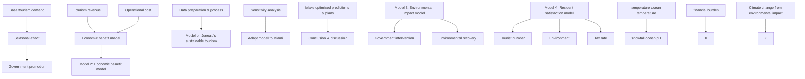
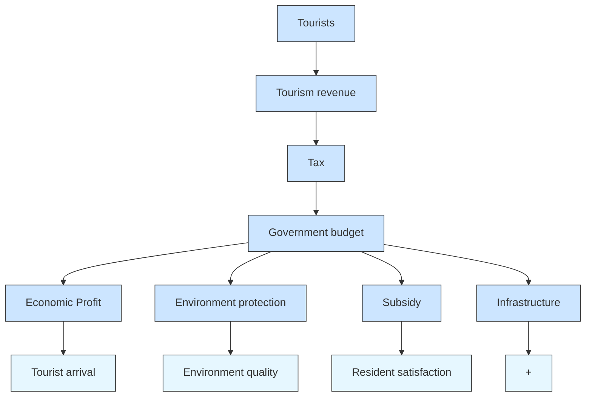
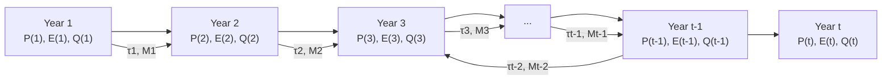

# Sustainable Tourism Management in Juneau

Summary

Juneau, Alaska has become a popular tourist destination in recent years While tourism spurs economic growth, it also brings significant pressure on environment and local infrastructure. To address this issue, we develop a multi-objective dynamic programming model that optimizes economic, environmental, and social outcomes for sustainable tourism management.

For Problem 1, we begin with a total tourist demand model, considering factors of natural growth, seasonal variations, taxation effect, and government promotion. This model serves as an input to the three interconnected models. First, the economic model estimates profit by deducting operational costs from tourism revenue, both of which are assumed to scale linearly with tourist volume. Second, the environmental model quantifies tourism's impact through an index aggregating key ecological factors of temperature, ocean temperature, snowfall, and ocean pH using entropy weight method. This environment model also accounts for natural recovery and government intervention. Third, the social impact model evaluates resident satisfaction based on their attitudes towards public service stress, environmental quality decrease, and tourism taxation.

The objective of our model is to maximize economic profit, environmental sustainability, and resident satisfaction under constraints of tourist capacity, environmental protection measures, and government budget limitations. We use dynamic programming to solve the model and stimulate the results over a 5-year period. Our model recommends a dynamic tax rate in a range of 3.2% to 5.0%, and a schema of government expenditures with large portions of environmental protection and infrastructure construction. Our results predict a stable tourist volume of around 1.6 million visitors per year. Both government revenue and environment quality rise steadily after implementing our recommended policies. Additionally, we perform a sensitivity analysis to identify the most influential factors and assess the robustness of proposed policy measures.

For Problem 2, we further validate our model by adapting it to the tourism situation of Miami, another destination troubled by overtourism. Differences in culture, visitor behavior, and government intervention require adaptation of parameters of our model.

For Problem 3, we prepare a memo for the tourism council of Juneau. Based on the predicted results given by our model, we summarize key findings and offer practical recommendations to achieve sustainable tourism development.

In conclusion, our multi-objective dynamic programming model provides a comprehensive framework for balancing economic, environmental, and social aspects of Juneau tourism. Our model has certain limitations to some extent, including potential uncertainties in data and simplifications made towards complex human-environment interactions. In future work, we could optimize our model using more granular data and refine our assumptions to further improve the model's predictive capabilities.

Keywords: Multi-Objective Model, Dynamic Programming, Sustainable Tourism

## Contents

## 1 Introduction 3

1.1 Problem Background 3  
1.2 Problem Restatement 3  
1.3 Our Work 4

## 2 Preparation of the Models 4

2.1 Assumptions 4  
2.2 Notations 5  
2.3 Data Preparation 6

## 3 The Models 7

3.1 Tourist Demand Model 7  
3.2 Economic Benefit Model 9  
3.3 Environmental Impact Model 10  
3.4 Resident Satisfaction Model 12  
3.5 Model Solving using Dynamic Programming 12

## 4 Sensitivity Analysis 17

4.1 Average Input of Environmental Index 17  
4.2 Average Input of Resident Satisfaction 17  
4.3 Average Input of Tourist Count 18

## 5 Adaptability of the Model 19

5.1 Data Collection and Processing 19  
5.2 Adaptation to Miami tourism 20  
5.3 Promotion of Attractions with Fewer Tourists ..... 22

## 6 Strengths and Weaknesses 22

6.1 Strengths 22  
6.2 Weaknesses 23

## References 23

## 8 Memo: Sustainable Tourism Recommendations for Juneau 24

## 9 Report on use of AI 25

## 1 Introduction

## 1.1 Problem Background

Juneau, Alaska has become a popular choice for visitors with its glacier, wild animals, museums, and historic districts. Local tourism has grown significantly in the past decades. This remote town with a population of about 30,000 set a record of 1.6 million cruise passengers in 2023. While the huge number of tourists has brought unprecedented development for the local economy, people should attach importance to the negative environmental and social impacts simultaneously. Mendenhall Glacier has experienced rapid retreat, warning people of the costs of overtourism. Meanwhile, according to recent reports, the rising pressure on public services and the increased congestion in the transportation system are major concerns of local residents.

natural_image

Person standing by a lakeside with a large glacier in the background under cloudy skies (no text or symbols visible)

text_image

2003
2004
2005
2006
7904
2001
2002
7931
1953
1893
1853
1876
7929
1831
7925
1893
7931
1876
kilometers

stacked bar chart

| Category | Very affected (%) | Somewhat affected (%) | Not affected (%) |
|---|---|---|---|
| Crowding at Mendenhall Glacier | 41 | 22 | 36 |
| Vehicle congestion downtown | 28 | 33 | 39 |
| Crowding on sidewalks downtown | 36 | 23 | 40 |
| Whale watching boat traffic and wakes | 30 | 17 | 50 |
| Vehicle congestion outside of downtown | 14 | 31 | 55 |
| Flightseeing noise | 18 | 25 | 57 |
| Crowding on trails | 15 | 25 | 59 |
| Air emissions from cruise ships | 14 | 22 | 60 |

Figure 1: Retreat of Mendenhall Glacier and tourism-related concerns from Juneau residents

In order to restrict the development of overtourism, a few measures are enacted, including limiting the tourist capacity and increasing tourism taxes. These efforts serve as a start point for pursuing the sustainable tourism plan for Juneau in the long-term. It is imperative to figure out a more considerate approach to achieve an equilibrium between economic growth and social well-being.

## 1.2 Problem Restatement

The status quo in Juneau demands a solution to the ongoing issues regarding economic, environmental, and social aspects. Through in-depth investigation and analysis of the problem's context, the objectives are restated as follows:

- Construct a model that takes into account both the economic benefits and hidden costs associated with tourism. Discuss a plan for government expenditures from additional revenues and demonstrate how these expenditures feed back into the model.  
- Provide a sensitivity analysis for the model and identify the most important factors.  
- Illustrate the adaptability of the model by applying it to another over-touristed destination. Discuss which measures are most important in that context and demonstrate the application of the model on attractions and locations with fewer tourists.  
- Write a memo summarizing the results of the model, including predictions, the effects of different measures, and suggestions to promote sustainable tourism.

## 1.3 Our Work

The following figure describes our work in detail. We construct four models: total tourism demand model, economic benefit model, environmental impact model, and resident satisfaction model. We go through a comprehensive process of preparing data, constructing the models, analyzing the models, and discussing the results.

flowchart

Figure 2: Flow chart of the work

## 2 Preparation of the Models

## 2.1 Assumptions

Several assumptions are made to provide a robust foundation for model construction and analysis.

- Assumption 1: Tourism revenue is assumed to increase linearly with the number of tourists, and the revenue per tourist is assumed to be constant.  
- Assumption 2: Profit maximization is the economic objective of the model, while taxes are still levied on tourism revenue.  
- Assumption 3: Seasonal effects (the difference between peak seasons and off-peak seasons) influence tourist arrivals and revenue.  
- Assumption 4: The expenditure on environmental conservation only comes from the government revenue generated from tourism taxes (with a constant proportion of tourism revenue).  
- Assumption 5: Environment is assumed to have a natural rate of recovery, which is constant over time.  
- Assumption 6: Tourism, which results in water pollution, carbon footprint, and other pollutions, is the only reason for environmental harm in Juneau, and can be quantized to a fixed value per tourist.  
- Assumption 7: Tourism growth rates are assumed to be in a reasonable range without abrupt changes.  
- Assumption 8: Tourism revenue generated per tourist is assumed to be fixed during the simulated period.

## 2.2 Notations

The primary notations used in this paper are listed in Table 1. Some detailed variables are not included in this table, which will be explained when used.

Table 1: Notations

<table><tr><td>Symbol</td><td>Definition</td><td>Unit</td></tr><tr><td>T</td><td>Number of tourists</td><td>People</td></tr><tr><td>g</td><td>Tourism growth rate</td><td>Percentage (%)</td></tr><tr><td>R</td><td>Total tourism revenue</td><td>million USD</td></tr><tr><td>G</td><td>Government revenue from tourism taxation</td><td>million USD</td></tr><tr><td>P</td><td>Total tourism profit</td><td>million USD</td></tr><tr><td>τ</td><td>Tourism tax rate</td><td>Percentage (%)</td></tr><tr><td>Q</td><td>Resident satisfaction index</td><td>Dimensionless</td></tr><tr><td>E</td><td>Environmental index</td><td>Dimensionless</td></tr><tr><td>M</td><td>Government expenditures on tourism development</td><td>million USD</td></tr><tr><td>S</td><td>Seasonal adjustment factor</td><td>Dimensionless</td></tr></table>

## 2.3 Data Preparation

Before constructing our model, we collect data related to tourism in Juneau, Alaska from various reliable sources, including government reports, climate monitoring organizations, and tourism industry research.

The data used in this study is obtained from the following sources:

- Tourism Data: The number of tourists and tourism revenue figures are collected from the Alaska Travel Industry Association's annual reports and the City and Borough of Juneau's 2023 Tourism Survey Report. These reports provide statistics on visitor volume, revenue generation, and public sentiment regarding tourism activities.  
- Environmental Data: Climate-change-related information, including average temperature, total annual snowfall, and ocean temperature, is obtained from the National Oceanic and Atmospheric Administration (NOAA) climate database and the Alaska Climate Research Center. These institutions monitor and provide historical climate data for the region.  
- Social Impact Data: Resident feedback regarding tourism impacts, particularly negative attitudes of residents, is collected from the CBJ Tourism Survey 2023, which assesses public opinions on the effects of rising tourist numbers on daily life and public services.

Table 2 presents a summary of key tourism and environmental statistics for Juneau from 2019 to 2023, with statistics of 2020 and 2021 affected by pandemic. We do not eliminate these outliers as they could help us to determine the environmental and social development without tourists.

<table><tr><td>Year</td><td>Tourist count (million)</td><td>Tourism revenue (million $)</td><td>Resident negative attitude (%)</td><td>Average temperature (°F)</td><td>Total annual snowfall (inches)</td><td>Average ocean temperature (°C)</td><td>Ocean pH level</td></tr><tr><td>2019</td><td>1.33</td><td>237</td><td>6</td><td>41.2</td><td>118.7</td><td>6.3</td><td>8.06</td></tr><tr><td>2020</td><td>0</td><td>0</td><td>0</td><td>40.7</td><td>99.3</td><td>6.3</td><td>8.06</td></tr><tr><td>2021</td><td>0.125</td><td>25.6</td><td>8</td><td>41.0</td><td>121.0</td><td>6.4</td><td>8.05</td></tr><tr><td>2022</td><td>1.20</td><td>301</td><td>7</td><td>40.8</td><td>110.2</td><td>6.5</td><td>8.04</td></tr><tr><td>2023</td><td>1.65</td><td>375</td><td>11</td><td>40.6</td><td>108.5</td><td>6.6</td><td>8.04</td></tr></table>

Table 2: Juneau tourism and environmental data (2019-2023)

Figure 3 provides a visual representation of the relationship between tourism revenue and tourist volume over the years. The plot shows a strong positive correlation between tourist count and revenue, indicating a direct economic benefit from increased tourism.

scatter plot

| Tourist Count (in ten thousands people) | Tourism Revenue (in million dollars) |
| --------------------------------------- | ------------------------------------ |
| 0                                       | 0                                    |
| 10                                      | 30                                   |
| 120                                     | 300                                  |
| 130                                     | 240                                  |
| 160                                     | 380                                  |

Figure 3: Pattern of tourism revenue and environmental index against tourist count

## 3 The Models

We aim to find a sustainable tourism strategy that achieves a balance between economic, environmental, and social aspects. All of the models are built in order to achieve these objectives.

natural_image

Purple circular icon with a dollar sign inside, no text or symbols present.

Economic Profit  
— tourism revenue  
— operational Cost

natural_image

Abstract purple circular logo with a stylized leaf or plant symbol at center (no text or symbols)

Environmental Impact  
— environmental degradation  
— tempeture

natural_image

Abstract circular icon with three white human figures inside a blue ring (no text or symbols)

Social Impact  
— resident satisfaction  
— public services

Figure 4: Objectives of the model

## 3.1 Tourist Demand Model

## 3.1.1 Base Tourist Demand Equation

The tourist demand model estimates the number of visitors to Juneau over time. The model accounts for economic conditions, taxation policies, and external demand shocks. The number of tourists, denoted as $T(t)$ in year t, is influenced by the tourism growth rate $g(t)$ , the tax rate $\tau(t)$ applied to tourism revenue, and random demand shocks $\delta(t)$ that reflect external influences. Furthermore, the model includes the demand elasticity parameter $\gamma$ , which captures the negative impact of taxation on tourism growth.

The detail can be described by equation (1):

$$
T (t) = T (t - 1) \cdot (1 + g (t) - \gamma \cdot \tau (t) + \delta (t)) \tag {1}
$$

This formulation assumes that tourism demand grows at a predictable rate, where tax increases result in reduced tourist arrivals based on an elasticity effect. The inclusion of stochastic demand shocks accounts for uncertainties such as economic downturns or geopolitical events, ensuring a more realistic model representation and according with economic theories.

bar chart

Tourist Count vs. Year
| Year | Tourist Count (in millions) |
| :--- | :--- |
| 2019 | 1.33 |
| 2020 | 0.0 |
| 2021 | 0.13 |
| 2022 | 1.2 |
| 2023 | 1.65 |

Figure 5: Tourism demand from 2019 to 2023

## 3.1.2 Seasonal Adjustments

Tourism in Juneau shows significant seasonal variations due to climatic conditions and cruise ship schedules. To account for these fluctuations, our model introduces seasonal adjustment factors that modify the total number of tourists based on whether it is a peak or off-peak season. The total number of tourists $T(t)$ is divided into peak-season tourists $T_{\mathrm{peak}}(t)$ and off-peak tourists $T_{\mathrm{off}}(t)$ , with the seasonal effects captured by multiplicative factors $S_{peak}$ and $S_{off}$ . The detail can be described by the system of equations:

$$
\left\{ \begin{array}{l} T _ {\text { peak }} (t) = S _ {\text { peak }} \cdot T (t) \\ T _ {\text { off }} (t) = S _ {\text { off }} \cdot T (t) \\ S _ {\text { peak }} > 1 \\ S _ {\text { off }} <   1 \end{array} \right. \tag {2}
$$

The seasonal adjustment are determined based on historical trends, accounting for seasonal demand fluctuations. It allows better resource allocation and operational planning so that infrastructure and services can accommodate varying tourist volumes throughout the year. We assume that these seasonal factors remain relatively stable across years, influenced primarily by established travel patterns and climatic conditions.

## 3.1.3 Policy Impact on Demand

The change of tourism demand is affected by government policies such as visitor caps and promotional efforts. The model incorporates policy-driven adjustments to the tourism growth rate. Specifically, we assume that the growth rate $g(t)$ is affected by the visitor caps, denoted as $C_{\mathrm{cap}}(t)$ , and governmental expenditures, represented by $M(t)$ . Meanwhile, $M(t)$ can be represented as a proportion of government revenues generated by local tourism.

$$
\left\{ \begin{array}{l} g (t) = g _ {\text { base }} - \beta \cdot C _ {\text { cap }} (t) + \eta \cdot M (t) \\ M (t) = \lambda G (t) \end{array} \right. \tag {3}
$$

Here, $g_{base}$ represents the baseline tourism growth rate without any government intervention, $\beta$ is a sensitivity parameter that quantifies the negative impact of visitor caps on growth, and $\eta$ measures the effectiveness of marketing and promotional efforts in raising tourism demand. The visitor cap $C_{\mathrm{cap}}(t)$ is included to manage the carrying capacity of the region. A higher cap results in reduced growth due to negative effects of tourism such as perceived congestion, and a lower cap can help developing sustainable tourism. Government expenditures on tourism, $M(t)$ are implemented to increase demand by increasing attractiveness and public visibility.

## 3.2 Economic Benefit Model

## 3.2.1 Tourism Revenue

Tourism revenue is primarily dependent on the number of tourists and their average spending. The total tourism revenue $R(t)$ at year t is modeled as a function of the number of tourists $T(t)$ , with a constant of the average revenue per tourist r, as described by equation (4):

$$
R (t) = r \cdot T (t) \tag {4}
$$

Government revenue is obtained by applying a tax rate $\tau(t)$ to the total tourism revenue. The detail can be described by equation (5):

$$
G (t) = \tau (t) \cdot R (t) \tag {5}
$$

## 3.2.2 Tourism Cost

In addition to the revenue, the operational costs associated with tourism must be simultaneously considered to assess net economic benefits. The total cost $C(t)$ is composed of fixed costs $c_{fixed}$ and variable costs $c_{variable}$ that scale with the number of tourists $T(t)$ . The detail can be described by equation (6):

$$
C (t) = c _ {\text { fixed }} + c _ {\text { variable }} \cdot T (t) \tag {6}
$$

The net profit $P(t)$ from tourism activities, after accounting for operational costs, is given by equation (7). It is crucial for evaluating the long-term economic sustainability of tourism and guiding reinvestment strategies.

$$
P (t) = R (t) - C (t) \tag {7}
$$

bar chart

Tourism Revenue vs. Year
| Year | Tourism Revenue (in millions of dollars) |
| :--- | :--- |
| 2019 | 238 |
| 2020 | 0 |
| 2021 | 26 |
| 2022 | 303 |
| 2023 | 374 |

Figure 6: Tourism revenue from 2019 to 2023

## 3.3 Environmental Impact Model

## 3.3.1 Environmental Index Calculation

The environmental index is computed by integrating various environmental variables, including temperature, snowfall, ocean temperature, and ocean pH level. The methodology consists of several key steps:

Normalization and Weighting Each environmental variable is normalized to the range $[0,1]$ to eliminate unit bias, using the formula:

$$
\text { Normalized   Value } = \frac {x - x _ {\min}}{x _ {\max} - x _ {\min}} \tag {8}
$$

Weighting is used to reflect the impact of each factor on environmental quality:

- Temperature and ocean temperature are assigned a weight of $-1$ (negative impact).  
- Snowfall and ocean pH are assigned a weight of $+1$ (positive impact).

Entropy-Based Weighting The importance of each variable is determined using entropy-based weighting. The use of entropy weighting prioritizes variables with greater variability, ensuring that the index remains sensitive to significant environmental changes. The entropy of each variable is calculated as:

$$
\text { Entropy } = - \sum p _ {i} \log (p _ {i}) \tag {9}
$$

where $p_{i}$ is the normalized value of the variable. The entropy weight is then computed as:

$$
\text { Entropy   Weight } = \frac {1 - \text { Entropy }}{\sum (1 - \text { Entropy })} \tag {10}
$$

Final Environmental Index Calculation The environmental index is calculated by combining the normalized and weighted environmental data using the following formula:

$$
\text { Environmental   Index } = \frac {\sum w _ {i} \cdot x _ {i} - \text { Index } _ {\min}}{\text { Index } _ {\max} - \text { Index } _ {\min}} \tag {11}
$$

where $w_{i}$ represents the entropy-based weights and $x_{i}$ denotes the normalized values of the environmental factors.

line chart

| Year | Average Annual Temperature (Data) | Total Annual Snowfall (Data) | Total Annual Snowfall (Fit) | Ocean Temperature (Data) | Ocean pH Level (Data) | Ocean pH Level (Fit) |
|------|----------------------------------|-----------------------------|----------------------------|--------------------------|------------------------|----------------------|
| 2004 | 0.0                              | 0.3                         | 0.3                        | 0.0                      | 0.3                    | 0.3                  |
| 2005 | 0.1                              | 0.4                         | 0.4                        | 0.1                      | 0.4                    | 0.4                  |
| 2006 | 0.2                              | 0.5                         | 0.5                        | 0.2                      | 0.5                    | 0.5                  |
| 2007 | 0.3                              | 0.6                         | 0.6                        | 0.3                      | 0.6                    | 0.6                  |
| 2008 | 0.4                              | 0.7                         | 0.7                        | 0.4                      | 0.7                    | 0.7                  |
| 2009 | 0.5                              | 0.8                         | 0.8                        | 0.5                      | 0.8                    | 0.8                  |
| 2010 | 0.6                              | 0.9                         | 0.9                        | 0.6                      | 0.9                    | 0.9                  |
| 2011 | 0.7                              | 1.0                         | 1.0                        | 0.7                      | 1.0                    | 1.0                  |
| 2012 | 0.8                              | 1.1                         | 1.1                        | 0.8                      | 1.1                    | 1.1                  |
| 2013 | 0.9                              | 1.2                         | 1.2                        | 0.9                      | 1.2                    | 1.2                  |
| 2014 | 1.0                              | 1.3                         | 1.3                        | 1.0                      | 1.3                    | 1.3                  |
| 2015 | 1.1                              | 1.4                         | 1.4                        | 1.1                      | 1.4                    | 1.4                  |
| 2016 | 1.2                              | 1.5                         | 1.5                        | 1.2                      | 1.5                    | 1.5                  |
| 2017 | 1.3                              | 1.6                         | 1.6                        | 1.3                      | 1.6                    | 1.6                  |
| 2018 | 1.4                              | 1.7                         | 1.7                        | 1.4                      | 1.7                    | 1.7                  |
| 2019 | 1.5                              | 1.8                         | 1.8                        | 1.5                      | 1.8                    | 1.8                  |
| 2020 | 1.6                              | 1.9                         | 1.9                        | 1.6                      | 1.9                    | 1.9                  |
| 2021 | 1.7                              | 2.0                         | 2.0                        | 1.7                      | 2.0                    | 2.0                  |
| 2022 | 1.8                              | 2.1                         | 2.1                        | 1.8                      | 2.1                    | 2.1                  |
| 2023 | 1.9                              | 2.2                         | 2.2                        | 1.9                      | 2.2                    | 2.2                  |

line chart

| Year | Environmental Index | Fitted Tourists Count | Actual Tourists Count |
|------|---------------------|------------------------|------------------------|
| 2004 | 0.75                | 0.55                   | 1.0                    |
| 2005 | 0.78                | 0.55                   | 1.0                    |
| 2006 | 0.72                | 0.55                   | 1.0                    |
| 2007 | 0.68                | 0.55                   | 1.0                    |
| 2008 | 0.48                | 0.55                   | 1.0                    |
| 2009 | 0.40                | 0.55                   | 1.0                    |
| 2010 | 0.60                | 0.55                   | 1.0                    |
| 2011 | 0.45                | 0.55                   | 1.0                    |
| 2012 | 0.35                | 0.55                   | 1.0                    |
| 2013 | 0.25                | 0.55                   | 1.0                    |
| 2014 | 0.30                | 0.55                   | 1.0                    |
| 2015 | 0.18                | 0.55                   | 1.0                    |
| 2016 | 0.33                | 0.55                   | 1.0                    |
| 2017 | 0.08                | 0.63                   | 1.0                    |
| 2018 | 0.09                | 0.68                   | 1.0                    |
| 2019 | 0.02                | 1.28                   | 1.0                    |
| 2020 | 0.10                | -0.15                  | -0.15                  |
| 2021 | 0.05                | 0.15                   | 1.25                   |
| 2022 | -0.01               | 1.75                   | -                      |
| 2023 | 0.03                | -                      | -                      |

Figure 7: Computation of environmental index

## 3.3.2 Government Intervention

To control the negative effects of tourism on the environment, a fraction of government revenue from tourism taxation is reinvested into environmental conservation. The improved environmental index $E_{\mathrm{sub}}(t)$ , after applying government intervention. $M(t)$ is the government expenditures, and $\alpha$ is the sensitivity of environment to the additional government expenditures. The environmental index is modeled as follows:

$$
E _ {\text { sub }} (t) = E (t) + \alpha \cdot M (t) \tag {12}
$$

## 3.3.3 Environmental Recovery

By assumption, the environment has a natural recovery rate r that helps restore its quality over time. However, tourism activities continuously exert pressure on the ecosystem at the same time, as a function of the environmental harm factor caused by tourism h and the carrying capacity $T_{max}$ .

$$
E (t + 1) = E _ {\mathrm{sub}} (t) + r \cdot \left(1 - E _ {\mathrm{sub}} (t)\right) - h \cdot \left(\frac {T (t)}{T _ {\max}}\right) \tag {13}
$$

## 3.4 Resident Satisfaction Model

## 3.4.1 Model Formulation

Resident satisfaction, denoted as $Q(t)$ , is influenced by the number of tourists $T(t)$ , the environmental index $E(t)$ , and the taxation rate $\tau(t)$ applied to tourism revenue. Our model assumes that an optimal level of tourism $T_{opt}$ exists, beyond which further increases in tourist numbers negatively impact resident satisfaction. In addition, increased taxation on tourism revenue leads to lower resident satisfaction due to potential financial burdens and rising costs.

$$
Q (t) = \omega_ {1} \left(1 - \frac {\left| T (t) - T _ {\mathrm{opt}} \right|}{T _ {\mathrm{opt}}}\right) + \omega_ {2} E (t) - \omega_ {3} \tau (t) \tag {14}
$$

$\omega_{1}, \omega_{2}$ , and $\omega_{3}$ are weighting coefficients that represent the relative importance of each factor in determining resident satisfaction. A higher $\omega_{1}$ places more emphasis on managing the tourist population, whereas a greater $\omega_{2}$ prioritizes environmental quality, and $\omega_{3}$ controls the impact of taxation.

## 3.5 Model Solving using Dynamic Programming

flowchart

Figure 8: Framework of the model

## 3.5.1 Variables Being Optimized

In our model, we aim to maximize the following factors:

• Economic Profit P(t):

This represents the net benefit derived from tourism, calculated as total revenue minus operational and environmental costs.

• Environmental Index $E(t)$ :

A measure of environmental sustainability, reflecting the long-term ecological balance affected by tourism activities. The model incorporates it within the value function to ensure sustainability considerations.

• Resident Satisfaction Q(t):

A social metric evaluating how tourism impacts local communities. It accounts for factors such as congestion, public services, and overall community well-being.

In sum, our model aims to maximize the profit derived from tourism while ensuring environmental sustainability and maintaining resident satisfaction. The optimization problem is formulated as follows:

$$
V (t) = \max _ {\tau (t), M (t)} \left\{P (t) + \omega_ {4} E (t) + \omega_ {5} Q (t) + \gamma V (t + 1) \right\} \tag {15}
$$

## 3.5.2 Variables Serving as Constraints

The optimization is subject to several constraints that ensure sustainability across multiple dimensions:

$$
T (t) \leq C _ {\max} \tag {16}
$$

$$
E (t) \geq E _ {\min} \tag {17}
$$

$$
Q (t) \geq Q _ {\min} \tag {18}
$$

$$
G (t) \geq M (t) \tag {19}
$$

where:

- $C_{\text{max}}$ – the maximum carrying capacity of Juneau's infrastructure,  
- $E_{\min}$ – the minimum acceptable environmental index to ensure sustainability,  
- $Q_{\min}$ – the minimum threshold for resident satisfaction,  
- $M(t)$ – government expenditures in sustainability initiatives.

## 3.5.3 Decision Variables

Our model considers the following decision variables to optimize tourism growth while maintaining sustainability:

- $\tau(t)$ - The tax rate imposed on tourism revenue, influencing both government revenue and resident satisfaction.  
- $M(t)$ - Government spending allocated to attract tourists and stimulate economic growth.

## 3.5.4 Solution Approach

The system evolves over time according to the following state transition equations, as equation (1), equation (13), equation (14):

$$
T (t + 1) = T (t) \cdot (1 + g (t) - \gamma \cdot \tau (t))
$$

$$
E (t + 1) = E _ {\mathrm{sub}} (t) + r \cdot \left(1 - E _ {\mathrm{sub}} (t)\right) - h \cdot \left(\frac {T (t)}{T _ {\max}}\right)
$$

$$
Q (t + 1) = \omega_ {1} \left(1 - \frac {| T (t + 1) - T _ {\mathrm{opt}} |}{T _ {\mathrm{opt}}}\right) + \omega_ {2} E (t + 1) - \omega_ {3} \tau (t)
$$

Our model solves the problem using backward dynamic programming, following these steps. First, we define state variables: tourist count $T(t)$ , environmental index $E(t)$ , and resident satisfaction $Q(t)$ . Second, we identify control variables: taxation $\tau(t)$ and promotional efforts $M(t)$ . Then we apply recursion to compute the optimal solution by solving equation (15) iteratively. At last, we trace back the optimal government decisions in our solution.

flowchart

Figure 9: Overview of the DP approach

## 3.5.5 Model Solution

The model is implemented to optimize sustainable tourism management in Juneau over a following five-year period from 2024 to 2028 (since the data obtained end in 2023). The results shown in Table 3 provide insights into projected tourist numbers, environmental conditions, and economic performance under different demand shocks and policy interventions.

<table><tr><td>Year</td><td>Tourists (ten thousands)</td><td>Tax Rate (%)</td><td>Gov Revenue (Million $)</td><td>Env Index</td><td>Resident Sat</td></tr><tr><td>1</td><td>153.7</td><td>4.2</td><td>14.0</td><td>0.029</td><td>0.882</td></tr><tr><td>2</td><td>154.8</td><td>4.2</td><td>14.1</td><td>0.076</td><td>0.893</td></tr><tr><td>3</td><td>152.2</td><td>5.0</td><td>16.6</td><td>0.123</td><td>0.832</td></tr><tr><td>4</td><td>158.3</td><td>4.0</td><td>13.8</td><td>0.170</td><td>0.899</td></tr><tr><td>5</td><td>168.3</td><td>3.2</td><td>11.71</td><td>0.181</td><td>0.917</td></tr></table>

Table 3: Predictions of the optimized tourism plan for the next 5 years

## 3.5.6 Discussion of Results

Predicted Results for Juneau Over 5 Years  

bar chart

| Year | Tax Rate (%) | Government Revenue ($ Million) |
| --- | --- | --- |
| 2015 | 4.2 | 14.5 |
| 2016 | 4.2 | 14.8 |
| 2017 | 4.2 | 15.2 |
| 2018 | 4.2 | 15.5 |
| 2019 | 4.2 | 16.2 |
| 2020 | 4.2 | 16.8 |
| 2021 | 4.2 | 17.5 |
| 2022 | 4.2 | 18.2 |
| 2023 | 4.2 | 18.8 |
| 2024 | 4.2 | 19.5 |
| 2025 | 4.2 | 20.2 |
| 2026 | 4.2 | 20.8 |
| 2027 | 4.2 | 21.5 |
| 2028 | 4.2 | 22.2 |
| 2029 | 4.2 | 23.1 |
| 2030 | 4.2 | 24.1 |
| 2031 | 4.2 | 25.3 |
| 2032 | 4.2 | 26.6 |
| 2033 | 4.2 | 27.9 |
| 2034 | 4.2 | 29.3 |
| 2035 | 4.2 | 30.7 |
| 2036 | 4.2 | 32.1 |
| 2037 | 4.2 | 33.5 |
| 2038 | 4.2 | 34.9 |
| 2039 | 4.2 | 36.3 |
| 2040 | 4.2 | 37.7 |
| 2041 | 4.2 | 39.1 |
| 2042 | 4.2 | 40.5 |
| 2043 | 4.2 | 41.9 |
| 2044 | 4.2 | 43.3 |
| 2045 | 4.2 | 44.7 |
| 2046 | 4.2 | 46.1 |
| 2047 | 4.2 | 47.5 |
| 2048 | 4.2 | 48.9 |
| 2049 | 4.2 | 50.3 |
| 2050 | 4.2 | 51.7 |
| 2051 | 4.2 | 53.1 |
| 2052 | 4.2 | 54.5 |
| 2053 | 4.2 | 55.9 |
| 2054 | 4.2 | 57.3 |
| 2055 | 4.2 | 58.7 |
| 2056 | 4.2 | 60 |
| 2057 | 4.2 | nan |
| 2058 | nan | nan |
| 2059 | nan | nan |
| 2060 | nan | nan |
| 2061 | nan | nan |
| 2062 | nan | nan |
| 2063 | nan | nan |
| 2064 | nan | nan |
| 2065 | nan | nan |
| 2066 | nan | nan |
| 2067 | nan | nan |
| 2068 | nan | nan |
| 2069 | nan | nan |
| 2070 | nan | nan |
| 2071 | nan | nan |
| 2072 | nan | nan |
| 2073 | nan | nan |
| 2074 | nan | nan |
| 2075 | nan | nan |
| 2076 | nan | nan |
| 2077 | nan | nan |
| 2078 | nan | nan |
| 2079 | nan | nan |
| 2080 | nan | nan |
| 2081 | nan | nan |
| 2082 | nan | nan |
| 2083 | nan | nan |
| 2084 | nan | nan |
| 2085 | nan | nan |
| 2086 | nan | nan |
| 2087 | nan | nan |
| 2088 | nan | nan |
| 2089 | nan | nan |
| 2090 | nan | nan |
| 2091 | nan | nan |
| 2092 | nan | nan |
| 2093 | nan | nan |
| 2094 | nan | nan |
| 2095 | nan | nan |
| 2096 | nan | nan |
| 2097 | nan | nan |
| 2098 | nan | nan |
| 2099 | nan | nan |
| 3 | nan | nan |
| 3 | nan | nan |
| 3 | nan | nan |
| 3 | nan | nan |
| 3 | nan | nan |
| 3 | nan | nan |
| 3 | nan | nan |
| 3 | nan | nan |

line chart

| Year | Tourists (thousands) |
| ---- | --------------------- |
| 1.0  | 153.5                 |
| 2.0  | 154.5                 |
| 3.0  | 152.0                 |
| 4.0  | 158.0                 |
| 5.0  | 168.0                 |

bar chart

Environmental Index
| Year | Environmental Index |
|---|---|
| 1 | 0.03 |
| 2 | 0.075 |
| 3 | 0.125 |
| 4 | 0.17 |
| 5 | 0.185 |

line chart

| Year | Resident Satisfaction |
| ---- | --------------------- |
| 1.0  | 0.88                  |
| 2.0  | 0.89                  |
| 3.0  | 0.83                  |
| 4.0  | 0.90                  |
| 5.0  | 0.92                  |

Figure 10: Visualization of model results

The results demonstrate a dynamic evolution of key metrics over the five-year period. The projected tourist population remains relatively stable, fluctuating between 1.52 million (152.2 ten thousand) and 1.68 million (168.3 ten thousand) visitors per year due to adjustments in taxation and demand shocks. The government applies varying tax rates ranging from 3.2% to 5.0%, generating steady annual revenue between \$11.71 million and \$16.6 million. The higher tax rates in Year 3 reflect an attempt to balance environmental and social objectives, which is offset by slightly reduced tourist numbers. The environmental index shows a clear upward trend, increasing from 0.029 in the first year to 0.181 by the fifth year. This indicates that government interventions and policies effectively mitigate environmental impacts while promoting sustainability. Resident satisfaction also exhibits a positive trend, improving from 0.882 in the first year to 0.917 by the fifth year. The results suggest that targeted policies, including cultural investments and controlled taxation, successfully balance economic, environmental, and social priorities. Overall, our model results demonstrate the importance of adaptive policies and balanced revenue allocation in achieving sustainable tourism in Juneau.

## 3.5.7 Plan for Government Expenditures

The additional revenue generated from tourism, primarily through taxation, should be strategically allocated across various components to support sustainable tourism management in Juneau. We assume that the expenditures are divided into four main categories: environmental protection and recovery, infrastructure development, subsidies to reduce financial burdens, and advertising to promote tourism. The distribution of these expenditures is given by our model's predictions, taking into account the priorities and challenges faced in each year.

Investment in environmental protection increases significantly over the years, reflecting the importance of reducing the ecological impacts of tourism. These funds are directed toward projects such as preserving the Mendenhall Glacier, restoring biodiversity, and addressing pollution caused by tourist activities. Spending on infrastructure development grows in a steady rate, in order to improve accessibility, public transportation, and utilities to better accommodate the tourist population. Subsidies play an important role in reducing financial burdens on residents and motivating sustainable practices. Subsidies might include support for local businesses, discounted public transportation, or financial incentives for environment-friendly practices. Expenditure on advertisement and promotion starts at 17% in Year 1, focusing on attracting tourists to under-visited locations and highlighting off-peak seasons. As tourism stabilizes, the need for advertisement diminishes.

stacked bar chart

Government Expenditure Composition Over 5 Years
| Year | Environment (%) | Infrastructure (%) | Subsidy (%) | Advertisement (%) |
|---|---|---|---|---|
| Year 1 | 38 | 17 | 28 | 17 |
| Year 2 | 51 | 17 | 26 | 6 |
| Year 3 | 60 | 18 | 19 | 3 |
| Year 4 | 29 | 25 | 41 | 5 |
| Year 5 | 29 | 41 | 30 | - |

Figure 11: Composition of government expenditures

## 4 Sensitivity Analysis

## 4.1 Average Input of Environmental Index

line chart

| Average Input Environmental Index | Tax rate | Infrastructure | Subsidy | Advertisement | Environmental protection |
| --------------------------------- | -------- | -------------- | ------- | ------------- | ------------------------ |
| 0.0                               | 0.05     | 0.02           | 0.05    | 0.01          | 0.9                      |
| 0.2                               | 0.05     | 0.22           | 0.4     | 0.03          | 0.3                      |
| 0.4                               | 0.05     | 0.25           | 0.45    | 0.04          | 0.25                     |
| 0.6                               | 0.05     | 0.3            | 0.4     | 0.05          | 0.15                     |
| 0.8                               | 0.05     | 0.55           | 0.15    | 0.18          | 0.1                      |
| 1.0                               | 0.05     | 0.55           | 0.18    | 0.18          | 0.1                      |

Figure 12: Output policy components vs. different average of input environmental index

The sensitivity analysis shows that the environmental index has the greatest impact on environmental protection investment. When the index is low, governments allocate more resources to restoration, while improvements reduce the need for such spending. This aligns with the ecosystem's condition directly influencing preservation efforts.

Additionally, a lower environmental index leads to higher tax rates and reduced subsidies to discourage tourism and generate revenue for environmental restoration. These findings highlight the environmental index as a key factor driving investment decisions, emphasizing the need to balance sustainability with economic priorities.

## 4.2 Average Input of Resident Satisfaction

line chart

| Average Resident Satisfaction | Tax rate | Infrastructure | Subsidy | Advertisement | Environmental protection |
| ----------------------------- | -------- | -------------- | ------- | ------------- | ------------------------ |
| 0.0                           | 0.02     | 0.29           | 0.55    | 0.01          | 0.16                     |
| 0.2                           | 0.02     | 0.28           | 0.55    | 0.01          | 0.17                     |
| 0.4                           | 0.03     | 0.29           | 0.35    | 0.01          | 0.35                     |
| 0.6                           | 0.03     | 0.37           | 0.25    | 0.12          | 0.30                     |
| 0.8                           | 0.02     | 0.22           | 0.22    | 0.33          | 0.23                     |
| 1.0                           | 0.01     | 0.32           | 0.01    | 0.35          | 0.31                     |

Figure 13: Output policy components vs. different average input of resident satisfaction

The sensitivity analysis shows that average resident satisfaction strongly influences government policies, with subsidies being the most affected component. When resident satisfaction decreases, subsidies are significantly increased as governments aim to address dissatisfaction by providing more financial support to ease public concerns. Conversely, higher satisfaction leads to reduced subsidies, as fewer interventions are needed to maintain public approval.

Lower resident satisfaction also results in lower tax rates, as governments seek to reduce the financial burden on residents to improve satisfaction levels. These findings highlight that resident satisfaction is the most important factor driving subsidies and tax rates, emphasizing its central role in shaping policies to balance public welfare and economic priorities.

## 4.3 Average Input of Tourist Count

line chart

| Average Input Tourist Count (Million People) | Tax rate | Infrastructure | Subsidy | Advertisement | Environmental protection |
| -------------------------------------------- | -------- | -------------- | ------- | ------------- | ------------------------ |
| 25                                           | 0.0      | 0.18           | 0.0     | 0.78          | 0.0                      |
| 50                                           | 0.0      | 0.14           | 0.0     | 0.68          | 0.14                     |
| 75                                           | 0.0      | 0.13           | 0.0     | 0.60          | 0.26                     |
| 100                                          | 0.0      | 0.27           | 0.08    | 0.40          | 0.25                     |
| 125                                          | 0.0      | 0.33           | 0.23    | 0.15          | 0.32                     |
| 150                                          | 0.0      | 0.30           | 0.28    | 0.05          | 0.38                     |
| 175                                          | 0.0      | 0.10           | 0.37    | 0.0           | 0.55                     |
| 200                                          | 0.0      | 0.0            | 0.38    | 0.0           | 0.65                     |
| 225                                          | 0.0      | 0.0            | 0.30    | 0.0           | 0.70                     |

Figure 14: Output policy components vs. different average input of tourist count

The sensitivity analysis of average tourist count reveals its significant impact on various output components, with advertisement spending being the most strongly affected. As the tourist count decreases, advertisement spending increases sharply, as governments prioritize promoting tourism to attract more visitors and boost economic activity. Conversely, higher tourist counts reduce the need for extensive marketing, making tourist count the most critical factor influencing advertisement spending.

Interestingly, environmental protection investment increases as tourist count rises. This reflects the need to address the environmental strain caused by higher tourism activity and to ensure sustainability in the face of growing demand. A lower tourist count results in reduced subsidies and higher tax rates to compensate for the decline in economic contributions. These findings emphasize the pivotal role of tourist count in shaping government policies, particularly in balancing tourism promotion, environmental sustainability, and economic strategies.

## 5 Adaptability of the Model

## 5.1 Data Collection and Processing

Miami and Juneau, though both facing overtourism challenges, show distinct tourism dynamics that require careful consideration in our modeling approach. Juneau, as a seasonal cruise-based destination, experiences significant fluctuations in visitor numbers, primarily influenced by seasonal factors and environmental constraints. In contrast, Miami is a year-round tourist hub with a diverse range of attractions, including beaches, cultural events, and nightlife, drawing visitors consistently across all seasons.

text_image

Various cultural centers
High urban density
Pérez Ar Museum Miami
Miami Beach
SOUTH BEACH
LITTLE HAVANA
Westchester
Coral Gables
South Miami
DADELAND
Developed ground transportation
Frequent cruise lines
Great natural sceneries
Haines
Tlein Téixi Provincial Park
Inklin
Low urban density
Excursion Inlet
St Terese
Juneau
Hoonah
Cube Cove
Chagof Tenakee Springs
North Beach
932 9
95
1
934
953
112
Miami DESIGN DISTRICT
836
826
976
913
Key Biscayne
Virginia Key
Miami

Figure 15: Comparison of features in Miami and Juneau

The data is collected from a range of reliable sources. The demographic data such as population density, migration patterns, and ethnic group distributions are obtained from government databases and archival records. Some data are obtained from event statistics from major events such as Art Basel, Wynwood Art Walk, and the South Beach Wine & Food Festival. We also collect financial data related to cultural tourism revenue, public funding for the arts, and investments in cultural infrastructure from city budget reports. Lastly, we look for surveys such as the Knight Foundation's Soul of the Community study provided insight into community engagement and perception of cultural activities.

To ensure comparability across indicators, the collected data are normalized using min-max scaling, which transforms data values into a comparable range of $[0,1]$ . Then, in order to determine the relative importance of each cultural indicator, the entropy weighting method is applied. Entropy measures the degree of variation in an indicator across all years. Once entropy values are calculated, the weights for each indicator are assigned.

A composite cultural index is derived by aggregating all weighted indicators for each year, providing a single measure of cultural evolution. This index captures the overall cultural development of Miami across different time periods.

$$
C _ {i} = \sum_ {j = 1} ^ {m} w _ {j} x _ {i j} \tag {20}
$$

line chart

| Year | Cultural Index | Tourist Count (in millions) |
| ---- | -------------- | --------------------------- |
| 2019 | 0.82           | 7.0                         |
| 2020 | 0.34           | 2.5                         |
| 2021 | 0.66           | 5.5                         |
| 2022 | 0.90           | 6.0                         |
| 2023 | 0.95           | 6.5                         |

Figure 16: Cultural index in Miami computed by entropy weight method

## 5.2 Adaptation to Miami tourism

Miami's tourism industry differs significantly from Juneau, requiring adjustments to our multi-objective dynamic programming model. While Juneau experiences highly seasonal tourism with a strong focus on natural attractions, Miami attracts a steady influx of international tourists year-round, drawn by its cultural, urban, and environmental offerings. The differences between the two cities and the corresponding model adjustments are summarized in Table 4.

Table 4: Comparison of Juneau and Miami tourism features and model adaptations

<table><tr><td>City</td><td>City Features</td><td>Model Features</td></tr><tr><td>Juneau</td><td>Small population with limited urban space.Transportation relies primarily on cruise lines.Environment is the primary attraction.Infrastructure needs government support.</td><td>Overcrowding heavily impacts resident satisfaction.Cruise passengers are considered in tourist volume.Environmental impact is a key optimization factor.Government expenditure is weighted higher for impact.</td></tr></table>

Continued on next page

<table><tr><td>City</td><td>City Features</td><td>Model Features</td></tr><tr><td>Miami</td><td>Large metropolitan area with high population density.More international travelers with strong purchasing power.Attractions and resources include environment, culture, and cityscape.Developed infrastructure with private sector influence.</td><td>Overcrowding has less impact on resident satisfaction.Focus on attracting international travelers.Multiple factors (culture, environment, economy) to optimize.Government expenditure has less impact.</td></tr></table>

<table><tr><td>Year</td><td>Tourists (thousands)</td><td>Tax Rate (%)</td><td>Gov Revenue (Million $)</td><td>Env Index</td><td>Culture Index</td><td>Resident Sat</td></tr><tr><td>1</td><td>803.6</td><td>2.5</td><td>260.48</td><td>0.090</td><td>0.335</td><td>0.866</td></tr><tr><td>2</td><td>1040.1</td><td>2.5</td><td>337.11</td><td>0.149</td><td>0.342</td><td>0.865</td></tr><tr><td>3</td><td>1138.2</td><td>2.5</td><td>368.92</td><td>0.210</td><td>0.349</td><td>0.854</td></tr><tr><td>4</td><td>1473.4</td><td>2.5</td><td>477.56</td><td>0.273</td><td>0.359</td><td>0.843</td></tr><tr><td>5</td><td>1318.2</td><td>2.5</td><td>427.26</td><td>0.286</td><td>0.367</td><td>0.833</td></tr></table>

Table 5: Predictions of the optimized tourism plan for Miami over the next 5 years

To accurately reflect Miami's tourism characteristics, several key modifications are made to the model.

Unlike Juneau, Miami experiences relatively stable year-round tourist inflow with slight seasonal peaks. The demand function is adapted to account for these more consistent trends and include factors that influence international tourism. Miami's tourist demand model incorporates cultural attractiveness, quantified by a cultural index $C(t)$ , and government promotion, formulated as:

$$
T (t) = T (t - 1) \cdot (1 + g (t) - \gamma \cdot \tau (t) + \delta (t) + \eta \cdot C (t)) \tag {21}
$$

Miami's environmental concerns, such as coastal erosion and pollution, require changes to the environmental index calculation. Snow-related factors are replaced with metrics reflecting ocean conditions and urban emissions.

Additional variables such as traffic congestion and cultural engagement are incorporated into the resident satisfaction function to capture Miami's urban dynamics. Incorporating Miami's cultural diversity and urban challenges, the updated resident satisfaction equation is:

$$
Q (t) = \omega_ {1} \left(1 - \frac {| T (t) - T _ {\text { opt }} |}{T _ {\text { opt }}}\right) + \omega_ {2} E (t) + \omega_ {3} C (t) - \omega_ {4} \tau (t) \tag {22}
$$

In contrast to Juneau, Miami's well-developed infrastructure reduces the role of government expenditure, leading to a lower weight on infrastructure investments and a higher allocation towards cultural initiatives.

The results are shown in Table 5.

## 5.3 Promotion of Attractions with Fewer Tourists

To achieve a better balance in tourist distribution and promote under-visited locations, our model incorporates the following key strategies that align with sustainable tourism objectives:

## • Dynamic Visitor Caps

Our model dynamically adjusts visitor capacity based on environmental and infrastructure constraints. We could increase limits for under-visited sites like rainforest trails and cultural heritage locations, so that a balanced tourist distribution can be achieved. The optimization process ensures that environmental degradation is minimized while maintaining economic benefits.

## • Tax Differentiation

To encourage tourists to explore less-crowded destinations, the model applies a differentiated tax scheme. Popular attractions are subject to higher tax rates, while under-visited areas benefit from lower taxes, making them more attractive to budget-conscious travelers. The tax revenue generated from high-demand attractions can be reinvested in infrastructure improvements for less-visited tourist destinations, ensuring long-term sustainability.

## • Targeted Promotions

Our model optimizes the allocation of promotional budgets to highlight the wonder of less-visited locations. Based on evidence and data, our model identifies areas with growth potential and designs marketing campaigns showcasing diverse attractions such as whale watching and rainforest hikes as viable alternatives to overcrowded sites. This approach enhances the visibility of these locations and engages more tourists.

## 6 Strengths and Weaknesses

## 6.1 Strengths

- Comprehensive Framework: Our model integrates economic, environmental, and social dimensions, providing a holistic approach to sustainable tourism management.  
- Adaptability: Our model can be applied to different destinations, as demonstrated in the Miami case study, ensuring its versatility across diverse contexts.

- Dynamic Decision-Making: The use of dynamic programming allows for adaptive policy measures, such as varying tax rates and expenditure allocations, to respond to changing conditions over time.  
- Quantifiable Insights: Our model provides measurable outcomes for decision-making by including key metrics like environmental index and resident satisfaction.  
- Emphasis on Sustainability: Our model prioritizes long-term ecological preservation and community well-being, aligning with global sustainable tourism goals.

## 6.2 Weaknesses

- Data Dependency: The accuracy of the model depends heavily on the availability and reliability of historical and real-time data, which may not always be comprehensive or consistent. The tourism data is only available for the last five years.  
- Simplifying Assumptions: Certain aspects, such as the constant recovery rate of the environment and fixed sensitivity parameters, may oversimplify complex human-environment interactions.  
- Limited Stakeholder Representation: The model does not explicitly account for the diverse perspectives of stakeholders, such as local businesses or tourists, which could influence the outcomes.  
- Computational Complexity: The dynamic programming approach, while powerful, can become computationally intensive for more granular data or larger-scale applications.

## References

[1] Van der Borg, J., Costa, P., and Soriani, S. (2017). "Sustainable Tourism in Venice: Lessons for Other Fragile Cities." In Fragile and Resilient Cities on Water. Newcastle upon Tyne, UK: Cambridge Scholars Publishing.  
[2] Swart, W. W., C. E. Gearing, and Turgut Var. "A Dynamic Programming—Integer Programming Algorithm for Allocating Touristic Investments." The Tourist Review, 27.2 (1972): 52-61.  
[3] Johnston, Robert J., and Timothy J. Tyrrell. "A Dynamic Model of Sustainable Tourism." Journal of Travel Research, 44.2 (2005): 124-134.  
[4] CBJ Tourism Survey (2023). "Tourism Survey Report 2023." City and Borough of Juneau. Available online: https://juneau.org/wp-content/uploads/2023/12/CBJ-Tourism-Survey-2023-Report-12.11.23.pdf.  
[5] Alaska Climate Research Center. (2023). "Juneau Climate Trends and Data." Available online: https://acrc.alaska.edu/juneau-climate-report/index.html.

# 8 Memo: Sustainable Tourism Recommendations for Juneau

To: Tourist Council of Juneau

From: Team 2504448

Re: Sustainable Tourism Recommendations for Juneau

Date: January 28, 2025

In the memo, we want to provide the recommended measures to optimize sustainable tourism in Juneau based on the results of our model. After a comprehensive investigation of the local tourism development in the past years, we integrate economic, environmental, and social objectives, hoping to provide actionable insights for policy decisions.

Predictions and Key Findings: Our multi-objective dynamic programming model gives a plan for the goal of sustainability as well as the predictions of outcomes over the next five years:

- Optimized Tax Rate: The tax rate should follow a dynamic pattern, starting at 4.2% in Year 1, peaking at 5.0% in Year 3, and then declining to 3.2% by Year 5.  
- Government Expenditures: A significant portion of revenue should be allocated to environmental protection. Infrastructure investments should gradually increase, while subsidies need to be a steady component supporting sustainable practices and reducing financial burdens on residents.  
- Predicted Outcomes: In our prediction, the tourist volume stabilizes between 1.52 million and 1.68 million, reflecting the effectiveness of adaptive taxation and promotional efforts. Government revenue from tourism taxation ranges from \$11.71 million to \$16.6 million per year. The environmental index (a quantitative index computed in our model) improves significantly from 0.029 to 0.181. The score of resident satisfaction steadily increases from 0.882 to 0.917.

## Policy Measures and Their Effects:

- Taxation and Revenue Allocation: Dynamic taxation ensures sustainable revenue while mitigating environmental and social impacts. Our model recommends prioritizing environmental conservation and infrastructure development.  
- Visitor Distribution: Visitor caps and targeted promotions encourage the visit of under-visited locations, reducing pressure on popular sites like Mendenhall Glacier.  
- Community Engagement: Subsidies for local businesses and eco-friendly initiatives help reduce the financial burden on residents and encourage sustainable practices.

## Recommendations: To optimize sustainable tourism in Juneau, we advise:

- Adaptive Policies: Maintain flexible tax rates and expenditure allocations, guided by real-time environmental and social data.  
- Promotional Campaigns: Promote under-visited locations and off-peak seasons through targeted marketing to distribute tourist dynamics more evenly throughout Juneau.  
- Feedback Mechanisms: Regularly gather input from residents and visitors to refine policies and ensure alignment with sustainability goals.

## 9 Report on use of AI

## 1. OpenAI Enie (Jan 27, 2025 version, Ernie 4.0)

Query1: What are the key factors of tourism in Juneau, Alaska?

Output: Tourism in Juneau, Alaska, is influenced by several key factors:

1. Cruise Ship Tourism: Juneau is a popular stop for Alaska cruise lines, which operate primarily during the summer months (May to September). The number of cruise ship arrivals and the season's schedule significantly impact the flow of tourists.  
2. Natural Attractions: Juneau's breathtaking natural landscapes, such as the Mendenhall Glacier, Tracy Arm Fjord, and Mount Roberts, draw visitors. Accessibility and conditions of these attractions can influence tourism.  
3. Wildlife Viewing: Opportunities to see wildlife, including whales, bears, bald eagles, and seals, are a major draw. Seasonal wildlife patterns and tour availability play a crucial role.

## 2. OpenAI Enie (Jan 27, 2025 version, Ernie 4.0)

Query2: What are the key differences between Juneau tourism and Miami tourism?

Output: Key Differences Between Juneau and Miami Tourism:

1. Climate and Geography: Juneau features cool, rainy weather with glaciers and wilderness, while Miami offers tropical weather, beaches, and urban attractions.  
2. Primary Activities: Juneau focuses on glacier exploration, wildlife viewing, and outdoor adventures. Miami emphasizes beach activities, nightlife, and cultural immersion.  
3. Tourism Seasons: Juneau's peak season is summer (May–September), whereas Miami attracts tourists year-round, with peaks in winter and spring.

## 3. OpenAI Enie (Jan 27, 2025 version, Ernie 4.0)

Query3: How to model government expenditure in a tourism destination using dynamic programming?

Output: Model government expenditure in a tourism destination using dynamic programming by:

State: Define the state as the current period, available budget, and tourism infrastructure status.

Decision: Specify spending options for each period (e.g., infrastructure, marketing, or conservation).

Transition: Model how spending decisions affect tourism revenue, infrastructure quality, and future states.

Reward: Define the objective, such as maximizing long-term revenue or tourist satisfaction.

Recursion: Use the Bellman equation to optimize spending decisions over time, considering future rewards.