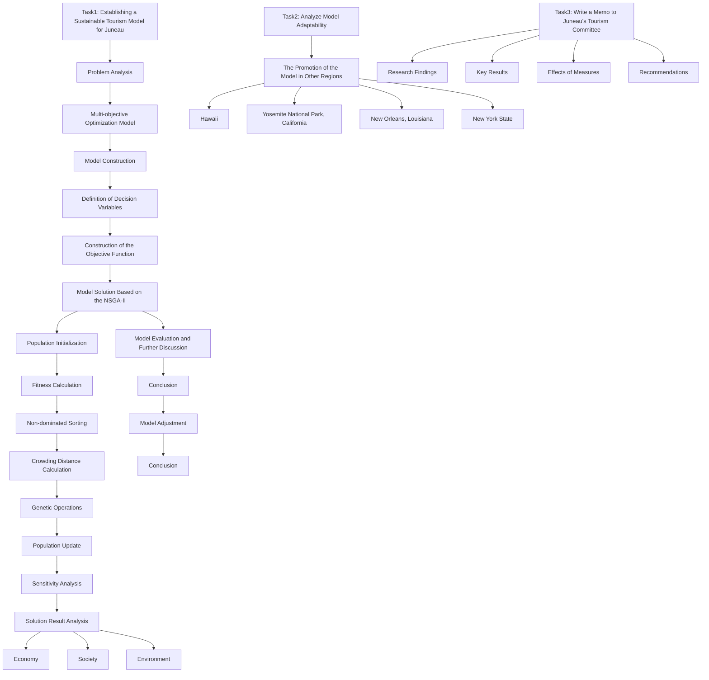
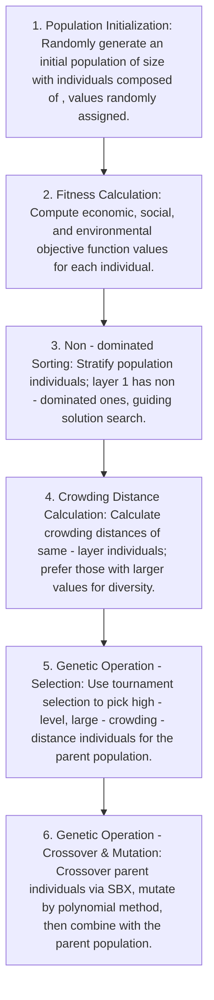

# Breaking through the Tourism Dilemmas in Juneau: The Road to Sustainable Development Driven by a Multi - objective Model Summary

This study focuses on developing a sustainable tourism model for Juneau, Alaska, which is facing numerous problems caused by overtourism. In 2023, Juneau received 1.6 million cruise passengers, generating \$375 million in revenue. However, it also encountered issues such as glacier retreat, strained infrastructure, and social discontent. A multi - objective optimization model is constructed in this study, taking into account factors like the number of tourists, economic income, hidden costs, environmental protection, and measures to stabilize the tourism industry. The model aims to maximize tourism revenue, minimize ecological and environmental pressure, and enhance the overall satisfaction of residents and tourists. Decision variables include the number of tourists, government restrictions on numbers and consumption, tourism tax, tourist fees, and various government investments in infrastructure, environmental protection, and promotion. The constraints cover aspects such as tourist number limits, glacier protection, resource carrying capacity, and minimum - standard requirements.

The gradient descent method is used for data processing and fitting in the research, and the Non-dominated Sorting Genetic Algorithm II (NSGA - II) is employed to solve the model, accompanied by visualization processing. A comprehensive optimal solution is selected from the obtained results. The optimal solution shows that receiving 12,000 tourists per day, imposing an $8\%$ tourism tax, charging a \$15 tourist fee per person, and allocating $30\%$ of the revenue from tourism tax and tourist fees to environmental protection, $40\%$ to infrastructure construction, and $20\%$ to tourism promotion can achieve the sustainable development of the tourism industry. Sensitivity analysis indicates that the number of tourists, alcohol consumption restrictions, infrastructure construction, and key coefficients have a significant impact on the model results, and attention should also be paid to investment in environmental protection.

This model can be applied to other tourist destinations. For regions with high ecological pressure like Hawaii, the focus of adjustment lies on the environmental impact part of the model. Through model adjustment and calculation, it can be concluded that more emphasis should be placed on the ecological protection of this region. For areas with weak infrastructure, such as Yosemite National Park, strengthening infrastructure construction is the key. In areas with unique cultures, like New Orleans, cultural factors need to be considered. For regions with unbalanced tourism resource development, such as New York State, publicity and tourism resource development are crucial. Finally, a memo is submitted to the Juneau Tourism Committee, elaborating on the research findings, the effects of various measures, and suggestions for optimizing tourism outcomes, aiming to balance economic growth, environmental protection, and social well - being in the development of Juneau's tourism industry.

## Contents

## 1 Introduction......3

1.1 Problem Background ....3  
1.2 Restatement of the Problem....3  
1.3 Our Work....3

## 2 Preparation of the Model ....4

2.1 Assumptions and Explanations ....4  
2.2 Notations....5

## 3 Model establishment ....6

3.1 Optimization Objectives Setting....6  
3.2 Definition of Decision Variables....7  
3.3 Construction of the Objective Function....8  
3.4 Setting of Constraints....12

## 4 Model Solution....15

4.1 Data Processing and Function fitting....15  
4.2 Model Solution Based on NSGA-II....16  
4.3 Analysis of the solution results and selection of the optimal solution....18

## 5 Sensitivity Analysis......20

## 6 Model Evaluation and Further Discussion....21

6.1 Strengths 21  
6.2 Weaknesses .... 21  
6.3 Further Discussion 21

## 7 The Promotion of the Model in Other Regions....22

## 8 Memo....24

## References 25

## AI Use Report 26

## 1 Introduction

## 1.1 Problem Background

Tourism is vital to the global economy, but overtourism is a growing concern, exemplified by Juneau, Alaska. With a population of around 30,000, Juneau hosted 1.6 million cruise passengers in 2023, earning \$375 million. However, this has led to significant issues. The Mendenhall Glacier is receding faster due to increased carbon emissions from tourism. Infrastructure is strained, with challenges in water supply and waste management. Residents face housing shortages and crowded spaces, and uncivilized tourist behavior has caused discontent. $^{[1][4]}$

bar chart

| Year | Value |
|---|---|
| 2014 | 961,000 |
| 2015 | 983,000 |
| 2016 | 1,015,000 |
| 2017 | 1,072,000 |
| 2018 | 1,151,000 |
| 2019 | 1,306,000 |
| 2020 | - |
| 2021 | 117,000 |
| 2022 | 1,167,000 |
| 2023 | 1,670,000 |
Source: City and Borough of Juneau; Cruise Line Agencies of Alaska

Figure 1: Juneau Cruise Passenger Volume, 2014-2023

In response, Juneau has limited tourist numbers and increased taxes, but this has raised concerns among those dependent on tourism revenue. This situation is common globally. Balancing tourism growth, environmental sustainability, and social well-being to create a sustainable tourism model is a pressing issue.

## 1.2 Restatement of the Problem

Based on the above background, this study aims to:

- Develop a Sustainable Tourism Model for Juneau: Consider tourist numbers, revenue, and stabilizing measures. Identify optimization and constraint factors, plan additional income expenditure, and conduct sensitivity analysis to pinpoint key factors.  
- Analyze Model Adaptability: Discuss applying the model to other overtourism-affected destinations, considering geographical impacts on measure selection and promoting lesser-known sites for balanced resource development.  
- Write a Memo to Juneau's Tourism Committee: Summarize research findings, measure impacts, and suggest ways to enhance sustainable tourism outcomes.

## 1.3 Our Work

Since economic, social, and environmental factors in Juneau's tourism are mutually restrictive, and multiple goals like maximizing tourism revenue, minimizing environmental pressure, and enhancing satisfaction are pursued, traditional single - objective optimization models can't meet the needs. Thus, a multi - objective optimization model is chosen. It integrates multiple goals, reflects the complex tourism system through decision variables and objective functions, balances objectives, and supports sustainable tourism strategies.

When solving the multi - objective optimization model, the NSGA - II algorithm stands out due to the non - linear objective functions and goal conflicts. It uses non - dominated sorting for hierarchical search, gets Pareto optimal solutions, maintains population diversity with crowding distance calculation, avoids premature convergence, and offers diverse decision - making options. Its genetic operations provide strong global search ability, helping to avoid local optima. So, the NSGA - II algorithm is used for model solving.

Moreover, the sustainable tourism model developed in this study is applicable not only to Juneau but also to other tourist areas. Different regions face diverse tourism issues. In Hawaii, with high ecological pressure, the model's environmental impact section needs adjustment, including adding variables and restrictions. Yosemite National Park in California, lacking infrastructure, requires strengthening the infrastructure - building part of the model. New Orleans, Louisiana, a culturally unique area, needs cultural factors incorporated into the model. New York State, with unbalanced tourism resource development, must optimize the resource - development part, adjust calculations, and improve tourist diversion. Such targeted model adjustments can support sustainable global tourism.

Last, we write a one-page memo to the tourist council of Juneau.

The work we have done is mainly shown in the following Figure 2:

flowchart

Figure 2: Our Work

## 2 Preparation of the Model

## 2.1 Assumptions and Explanations

To construct a sustainable tourism model for Juneau, the following assumptions are made to simplify complex real-world scenarios, allowing the model to focus on key factors and more clearly demonstrate the relationships between various elements of the tourism industry, providing a foundation for subsequent modeling, analysis, and decision-making.

- Assumption 1: The maximum number of tourists in Juneau is stable.  
- Explanations: Tourist consumption patterns are stable. Fixed per - capita spending and unchanging preferences simplify the model, helping determine Juneau's max tourist number based on other factors.  
- Assumption 2: Tourist consumption patterns are stable with fixed per - capita spending and unchanging preferences.  
- Explanations: This simplifies total tourism revenue calculation, bypassing complex consumer behavior.  
- Assumption 3: Tourism revenue only comes from tourists and is not affected by external economic factors. Extra income is accurately allocated.  
- Explanations: It enables clear tracking of extra income's role in sustainable tourism.  
- Assumption 4: The local ecological environment's carrying capacity is stable, and natural landscape changes are only due to known factors.  
- Explanations: This allows for precise measurement of environmental stress from tourism.  
- Assumption 5: Local infrastructure capacity is fixed, not affected by aging or technology, with a set tourist - capacity threshold.  
- Explanations: It clarifies the link between infrastructure pressure and tourist numbers for control strategies.  
- Assumption 6: Local residents' attitudes towards tourism depend only on tourist numbers, economic benefits, and living - environment changes, with a linear response.  
- Explanations: This simplifies quantifying residents' satisfaction and analyzing tourism's social impact.

## 2.2 Notations

The key mathematical notations used in this paper are listed in Table 1.

Table 1: Notations used in this paper

<table><tr><td>Symbol</td><td>Description</td></tr><tr><td> $x$ </td><td>Number of tourists</td></tr><tr><td> $y_{1}$ </td><td>Restricted daily number of tourists</td></tr><tr><td> $y_{2}$ </td><td>Restricted sales and consumption of alcohol</td></tr><tr><td> $y_{3}$ </td><td>Tourism tax</td></tr><tr><td> $y_{4}$ </td><td>Tourist fee</td></tr><tr><td> $y_{5}$ </td><td>Environmental protection expenditure</td></tr><tr><td> $y_{6}$ </td><td>Infrastructure construction expenditure</td></tr><tr><td> $y_{7}$ </td><td>Tourism promotion expenditure</td></tr><tr><td> $y_{8}$ </td><td>Indicator for restricting the intensity of offshore activities</td></tr><tr><td> $Z_{1}$ </td><td>Tourism revenue</td></tr><tr><td> $Z_{2}$ </td><td>Overall satisfaction of residents and tourists</td></tr><tr><td> $Z_3$ </td><td>Ecological and environmental pressure</td></tr><tr><td>A</td><td>Basic number of tourists</td></tr><tr><td>B</td><td>Fluctuating number of tourists</td></tr><tr><td>C</td><td>Catering revenue</td></tr><tr><td>D</td><td>Transportation revenue</td></tr><tr><td>E</td><td>Accommodation revenue</td></tr><tr><td>F</td><td>Shopping revenue</td></tr><tr><td>G</td><td>Energy consumption costs</td></tr><tr><td>H</td><td>Management costs</td></tr><tr><td>I</td><td>Infrastructure costs</td></tr><tr><td>J</td><td>Drinking water supply costs</td></tr><tr><td>K</td><td>Waste disposal costs</td></tr><tr><td>L</td><td>Carbon footprint costs</td></tr><tr><td>M</td><td>Carbon emissions</td></tr><tr><td>N</td><td>Glacier retreat rate</td></tr><tr><td>O</td><td>Main tourism revenue</td></tr><tr><td>P</td><td>Additional tourism revenue</td></tr><tr><td>Q</td><td>Implicit costs of tourism</td></tr><tr><td>R</td><td>Additional income from other attractions</td></tr><tr><td>S</td><td>Residents' income</td></tr><tr><td>T</td><td>Residents' living pressure</td></tr><tr><td>U</td><td>Degree of congestion and noise</td></tr><tr><td>V</td><td>Residents' cost of living</td></tr><tr><td>W</td><td>Maximum glacier retreat rate to be preserved in certain years</td></tr><tr><td>X</td><td>Seawater pollution index</td></tr><tr><td>Y</td><td>Cultural heritage damage risk index</td></tr><tr><td> $λ_i$ </td><td>Coefficients</td></tr><tr><td> $ε_i$ </td><td>Constants</td></tr></table>

## 3 Model establishment

## 3.1 Optimization Objectives Setting

Based on the above analysis, the key optimization objectives are set as follows:

▶ Maximize tourism revenue  
▶ Minimize ecological and environmental stress  
Enhance the overall satisfaction of residents and tourists $^{[5]}$

We have drawn the following figure to help sort out the situation of various optimization objectives, facilitating the subsequent model construction.

```mermaid
graph TD
  A["Tourist Expenses"] --> B["Additional Income"]
  C["Tourism Tax"] --> D["Economic Benefits"]
  E["Hidden Costs"] --> F["Carbon Footprint"]
  G["Other Attractions"] --> H["Community Benefits"]
  I["Environmental Pollution"] --> J["Environmental Stress"]
  K["Infrastructure Maintenance"] --> L["Carbon Footprint"]
  M["Infrastructure Construction"] --> N["Carbon Footprint"]
  O["Waste Management"] --> P["Carbon Footprint"]
  Q["Energy Consumption"] --> R["Carbon Footprint"]
  S["Catering"] --> T["Community Benefits"]
  U["Accommodation"] --> V["Community Benefits"]
  W["Transportation"] --> X["Community Benefits"]
  Y["Living Pressure"] --> Z["Community Benefits"]
  AA["Resident Income"] --> AB["Community Benefits"]
  AC["Shopping"] --> AD["Community Benefits"]
  AE["Optimization Objectives"] --> AF["Community Benefits"]
  AG["Alternative Income"] --> AH["Economic Benefits"]
  AI["Alternative Income"] --> AJ["Community Benefits"]
  AK["Alternative Income"] --> AL["Community Benefits"]
  AM["Alternative Income"] --> AN["Community Benefits"]
  AO["Alternative Income"] --> AP["Community Benefits"]
```

flowchart

Figure 3: Overview of Optimization Objectives

## 3.2 Definition of Decision Variables

In the selection process of decision variables, we mainly consider two dimensions. The first is the number of tourists (x), which is a crucial variable for the construction of the entire optimization model. Fluctuations in the number of tourists can significantly impact various indicators. For example, an increase in the number of tourists may directly lead to an increase in tourism revenue ( $Z_{1}$ ), but it may also increase ecological and environmental stress ( $Z_{3}$ ) and decrease the overall satisfaction of residents and tourists ( $Z_{2}$ ). However, the number of tourists is not a variable that we can directly control, as it is influenced by a combination of factors such as market trends, seasonal changes, and the macroeconomic environment. We can only make reasonable predictions and indirect adjustments to the number of tourists based on government policy orientations, such as tourism promotion efforts and visa policies, as well as related tourism investments, such as the construction of tourism facilities and the improvement of service quality.

Based on this, we further introduce another set of decision variables that the government can directly regulate. These parameters cover data explicitly stipulated in government policies, specifically including: the daily tourist limit $(y_{1})$ , which can effectively control the flow of tourists and avoid the pressure on the environment and society caused by overcrowding; restrictions on individual alcohol sales and consumption $(y_{2})$ , aimed at reducing undesirable behaviors caused by tourists' drinking and maintaining social order; tourism tax $(y_{3})$ , including various taxes such as hotel taxes, and additional fees charged to tourists $(y_{4})$ , which can not only bring additional income to the government but also regulate tourists' consumption behavior and guide them to use local resources more rationally; in addition, it also includes the government's various investments in local tourism, such as environmental protection expenditure $(y_{5})$ , used to protect natural landscapes and the ecological environment to ensure the sustainable development of tourism; infrastructure construction costs $(y_{6})$ , used to improve transportation, accommodation, catering, and other infrastructure to enhance the tourism experience of visitors; and tourism promotion expenditure $(y_{7})$ , used to promote local tourism resources to attract more tourists and also to enhance the brand image of local tourism.

These decision variables together form the core of our model. By reasonably setting and adjusting them, we can achieve the optimization goals, i.e., maximizing tourism revenue $(Z_{1})$ , minimizing ecological and environmental stress $(Z_{3})$ , and enhancing the overall satisfaction of residents and tourists $(Z_{2})$ , while meeting the constraints. In the process of model construction, we will analyze in detail the interrelationships among these decision variables and their impact on the optimization goals, thereby providing strong support for formulating scientific and reasonable sustainable tourism policies.

## 3.3 Construction of the Objective Function

## ● Data Preparation

We recognize that many indicators are significantly correlated with the number of tourists (x), and most of these indicators have a positive correlation with the number of tourists. Therefore, we use the following formulas to calculate the relevant data to ensure the accuracy of the model.

## ▶ Catering Revenue:

$$
C = \lambda_ {1} x - \lambda_ {5} e ^ {- \frac {y _ {2}}{\lambda_ {5}}} + \varepsilon_ {1} \tag {1}
$$

Catering revenue mainly comes from the consumption of tourists in catering venues. However, restrictions on alcohol sales and consumption in the policy have a negative impact on catering revenue. To quantify this impact, we subtract the reduced part caused by the policy when calculating the catering revenue. We use an exponential function to fit this reduced income, which has been optimized through the asymptote and the slope at the zero point.

line chart

| The upper - limit amount of alcohol sales and consumption | Actual income reduction | Ideal income reduction |
| --- | --- | --- |
| 0 | 600 | 600 |
| 100 | 525 | 525 |
| 200 | 450 | 450 |
| 300 | 375 | 375 |
| 400 | 300 | 300 |
| 500 | 225 | 225 |
| 600 | 150 | 150 |
| 700 | 100 | 100 |
| 800 | 75 | 75 |
| 900 | 50 | 50 |
| 1000 | 25 | 25 |

Figure 4: The Impact of the Upper - limit Amounts of Alcohol Sales and Consumption on the Decreased Amounts of Profits in Related Industries

## ▶ Transportation Revenue:

$$
D = \lambda_ {2} x + \varepsilon_ {2} \tag {2}
$$

Transportation revenue mainly comes from the travel expenses of tourists, such as public transportation and car rentals. Transportation revenue has a linear positive correlation with the number of tourists. Therefore, we use a simple linear function to describe it.

Accommodation Revenue:

$$
E = \lambda_ {3} x + \varepsilon_ {3} \tag {3}
$$

Accommodation revenue is derived from the consumption of tourists in lodging facilities such as hotels and bed-and-breakfasts. Similar to transportation revenue, accommodation revenue also has a linear positive correlation with the number of tourists.

Shopping Revenue:

$$
F = \lambda_ {4} x - \lambda_ {6} e ^ {- \frac {y _ {2}}{\lambda_ {6}}} + \varepsilon_ {4} \tag {4}
$$

Shopping revenue mainly comes from the consumption of tourists in shopping malls, souvenir stores, and other venues. Similarly, policies that restrict alcohol sales and consumption also have a negative impact on shopping revenue. Therefore, when calculating shopping revenue, we also subtract the reduced part caused by the policy and use an exponential function for fitting.

Since the profit is equal to the total revenue minus the cost, and both total revenue and cost are roughly positively correlated with the number of tourists, we can infer that the profit is also approximately positively correlated with the number of tourists. Based on this, the revenue calculated here is directly taken as the profit.

\- Drinking Water Supply Costs:

$$
J = \lambda_ {7} x + \varepsilon_ {7} \tag {5}
$$

Drinking water supply costs have a linear positive correlation with the number of tourists. These costs primarily stem from the infrastructure and operational expenses required to provide drinking water to tourists.

▶ Waste Disposal Costs:

$$
K = \lambda_ {8} x + \varepsilon_ {8} \tag {6}
$$

Waste disposal costs also have a linear positive correlation with the number of tourists. These costs mainly originate from the cleaning and processing expenses associated with the waste generated by tourists.

▶ Management Costs:

$$
H = \lambda_ {9} x + \varepsilon_ {9} \tag {7}
$$

Management costs are linearly and positively correlated with the number of tourists. These include operational expenses related to tourism management, security, services, and other aspects.

\- Economic Aspect

The goal in the economic aspect is to maximize the profit, that is, the normal tourism revenue. However, in addition to the normal tourism revenue, due to factors such as relevant tourism taxes and tourist fees set by policies, we also have some additional income beyond tourism. This additional income can be used to support environmental protection, improve infrastructure, develop community projects, and so on.

In addition, recent reports have emphasized the hidden costs of the tourism industry, including the pressure on local infrastructure and the increase in carbon footprint. Therefore, we define the final profit as the normal tourism revenue plus the additional income minus the hidden costs, that is:

$$
Z _ {1} = O + P - Q \tag {8}
$$

## ▶ Normal tourism revenue:

Normal tourism revenue can be recorded as the sum of various incomes, plus the income from the development of other less popular tourist attractions resources promoted by policies. The income from the development of other less popular tourist attractions resources has a roughly positive correlation with government policies and various government expenses. Therefore, it is described using a positive proportionality coefficient, that is:

$$
O = C + D + E + F + R \tag {9}
$$

$$
R = \lambda_ {1 0} y _ {5} + \lambda_ {1 1} y _ {6} + \lambda_ {1 2} y _ {7} \tag {10}
$$

Among them, R represents the income from the development of other less popular tourist attractions resources promoted by government policies. It is related to environmental protection expenditure ( $y_{5}$ ), infrastructure construction expenditure ( $y_{6}$ ), and tourism promotion expenditure ( $y_{7}$ ). We have collected relevant information and data, and roughly estimated the proportion of each component of tourism revenue, as shown in the following figure.

pie chart

| Category | Percentage (%) |
| :--- | :--- |
| Catering | 28 |
| Transportation | 11 |
| Accommodation | 33 |
| Shopping | 12 |
| Additional income from other attractions | 16 |

Figure 5: Proportion of Each Component of Tourism Revenue

## Additional income:

The additional income mainly consists of tourist fees, tourism taxes, etc. The tourism taxes include various taxes such as hotel taxes, and these taxes can be directly regulated by the government. Tourist fees are mainly positively correlated with the number of tourists, while tourism taxes are mainly positively correlated with normal tourism revenue, that is:

$$
P = y _ {4} x + y _ {3} O \tag {11}
$$

Among them, $y_{4}$ represents the additional fees charged to tourists, and $y_{3}$ represents the tourism tax.

## Hidden costs:

The scope of hidden costs is relatively wide. Here, we consider infrastructure - related costs, environmental protection - related costs, management costs, various government expenditures, etc. Among them, infrastructure - related costs can be further divided into several costs such as drinking water supply costs and waste disposal costs, and the rest of the expenditures can also be subdivided. It can be expressed by the following formula:

$$
Q = I + L + H + y _ {7} \tag {12}
$$

$$
I = J + K + y _ {6} \tag {13}
$$

$$
L = \lambda_ {1 3} M + y _ {5} \tag {14}
$$

The calculation method of carbon emissions M will be presented in detail in the next section.

## - Social Aspect

The social aspect primarily focuses on enhancing the overall satisfaction of residents and tourists. The function for overall satisfaction of residents and tourists ( $Z_{2}$ ) is constructed as follows:

$$
Z _ {2} = \lambda_ {1 4} \left[ \omega_ {1} \frac {S _ {\text { resident }} \left(x , y _ {1} , y _ {3} , y _ {4} , y _ {5} , y _ {6} , y _ {7}\right)}{\max \left(S _ {\text { resident }}\right)} + \omega_ {2} \frac {S _ {\text { tourist }} \left(x , y _ {1} , y _ {3} , y _ {4} , y _ {5} , y _ {6} , y _ {7}\right)}{\max \left(S _ {\text { tourist }}\right)} \right] \tag {15}
$$

Among them, $S_{\text{resident}}(x, y_1, y_3, y_4, y_5, y_6, y_7)$ represents the satisfaction function of residents, which is a function of the number of tourists (x) and various decision variables $(y_1, y_3, y_4, y_5, y_6, y_7)$ . The income of residents mainly comes from the consumption of tourists in catering, accommodation, shopping, and other aspects, and can be expressed as:

$$
S = \lambda_ {1 6} C + \lambda_ {1 7} E + \lambda_ {1 8} F \tag {16}
$$

The living pressure of residents is related to the degree of congestion and noise, as well as the increase in the cost of living for local residents, and can be expressed as:

$$
T = \lambda_ {1 9} U + \lambda_ {2 0} V \tag {17}
$$

$$
U = \lambda_ {2 1} x + \varepsilon_ {2 1} \tag {18}
$$

$$
V = \lambda_ {2 2} x + \varepsilon_ {2 2} \tag {19}
$$

The resident satisfaction function can be constructed as:

$$
S _ {\text { resident }} \left(x, y _ {1}, y _ {3}, y _ {4}, y _ {5}, y _ {6}, y _ {7}\right) = \alpha_ {1} \frac {S}{\max (S)} - \alpha_ {2} \frac {T}{\max (T)} - \alpha_ {3} \frac {x}{\max (x)} \tag {20}
$$

Among them, $\alpha_{1}$ measures the impact of tourism-generated economic benefits on resident satisfaction, $\alpha_{2}$ measures the impact of living pressure on resident satisfaction, and $\alpha_{3}$ measures the impact of the number of tourists exceeding the limit on resident satisfaction. Through the setting of these weights, the comprehensive consideration of the impact of economic benefits, living pressure, and congestion on resident satisfaction is achieved.

$S_{tourist}(x,y_{1},y_{3},y_{4},y_{5},y_{6},y_{7})$ represents the tourist satisfaction function, which can be constructed as:

$$
S _ {\text { tourist }} \left(x, y _ {1}, y _ {3}, y _ {4}, y _ {5}, y _ {6}, y _ {7}\right) = \beta_ {1} \frac {\left(y _ {5} + y _ {6}\right)}{\max \left(y _ {5} + y _ {6}\right)} - \beta_ {2} \frac {y _ {4}}{\max \left(y _ {4}\right)} - \beta_ {3} \frac {x}{\max (x)} \tag {21}
$$

Among them, $\beta_{1}$ measures the impact of environmental protection and infrastructure construction investment on tourist satisfaction, $\beta_{2}$ measures the impact of tourism cost on tourist satisfaction, and $\beta_{3}$ measures the impact of congestion on tourist satisfaction. These weights reflect the impact of tourism investment and congestion on tourist satisfaction.

$\omega_{1}$ and $\omega_{2}$ are the weights of resident satisfaction and tourist satisfaction in the overall satisfaction, respectively, and $\omega_{1}+\omega_{2}=1$ . By adjusting these weights, the satisfaction of residents and tourists can be balanced according to actual needs.

## ● Environmental Aspect

The environmental objective is to minimize ecological and environmental stress. This stress primarily stems from carbon emissions generated by tourist activities, resource consumption (such as drinking water usage), and disturbances to local ecosystems (for example, the impact of tourists on the ecology around the glacier). The calculation of carbon emissions(M) is crucial, as it mainly includes energy consumption hidden in major conventional income costs, as well as carbon emissions produced in the handling of waste and infrastructure construction, and can be expressed as:

$$
M = \lambda_ {2 3} G + \lambda_ {2 4} K + \lambda_ {2 5} y _ {6} \tag {22}
$$

$$
G = \lambda_ {2 6} C + \lambda_ {2 7} D + \lambda_ {2 8} E \tag {23}
$$

Among them, G represents the carbon emissions from energy consumption implied in catering, transportation, and accommodation revenues, and $\lambda_{23}$ , $\lambda_{24}$ , and $\lambda_{25}$ are the contribution coefficients of each part's carbon emissions to the total carbon emissions.

Taking into account factors such as carbon emissions, drinking water supply costs (reflecting water resource consumption), and waste disposal costs (reflecting the environmental impact of waste emissions), the ecological and environmental stress function $(Z_{3})$ is constructed as follows:

$$
Z _ {3} = \lambda_ {1 5} \left[ \omega_ {3} \frac {M}{\max (M)} + \omega_ {4} \frac {J}{\max (J)} + \omega_ {5} \frac {K}{\max (K)} \right] \tag {24}
$$

Among them, $\omega_{3}$ , $\omega_{4}$ , and $\omega_{5}$ are the weights of carbon emissions, drinking water supply costs, and waste disposal costs in the ecological and environmental stress, respectively, and $\omega_{3} + \omega_{4} + \omega_{5} = 1$ . By adjusting these weights, the impact of each factor on the ecological and environmental stress can be determined according to local environmental characteristics and key environmental issues of concern.

## 3.4 Setting of Constraints

When constructing a sustainable tourism model for Juneau, to ensure the feasibility and practicality of the model and take into account the sustainable development of the economy, society, and environment, the following key constraints are set to balance the economic benefits of tourism activities with their impacts on local society and the environment.

## ● Tourist Number Constraints

The number of tourists is a core factor affecting the sustainability of tourism activities. Excessive tourists can negatively impact the local environment and social order, while too few tourists may not fully realize economic benefits. Therefore, we set constraints based on local government policies to ensure a reasonable number of tourists.

Daily Tourist Limit:

$$
x \leq 3 6 5 y _ {1} \tag {25}
$$

where x is the number of tourists and $y_{1}$ represents the restricted daily number of tourists. This ensures that the total number of tourists within a year does not exceed the sum of the maximum daily tourist numbers set by the local government, controlling the tourist flow and

reducing environmental and social pressure.

Dynamic Tourist Number Constraints:

$$
x \leq 3 6 5 (A + B) \tag {26}
$$

where A and B represent the base number of tourists and the fluctuating number of tourists, respectively, and are calculated as follows:

$$
A = \lambda_ {2 9} (- e ^ {- \frac {y _ {1}}{\lambda_ {2 9}}} + 1) \tag {27}
$$

$$
B = \lambda_ {3 0} y _ {5} + \lambda_ {3 1} y _ {6} + \lambda_ {3 2} y _ {7} - \lambda_ {3 3} y _ {3} - \lambda_ {3 4} y _ {4} \tag {28}
$$

Here, A represents the base number of tourists under restricted conditions. When the restricted number of tourists is small, it has a significant impact on the number of tourists in Juneau, almost determining the number of tourists on a given day. However, when the restricted number of tourists is large, the impact is smaller, and the difference with the original number of tourists is not significant. Regardless of how the restricted number of tourists increases, the final number will not exceed the number of tourists who would have arrived. Therefore, based on the characteristics of this function, we have adopted the above formula for fitting. Additionally, the characteristics of A are similar to the impact caused by policies restricting alcohol sales and consumption.

line chart

| Tourist Quantity Upper - limit | Actual expected number of tourists | Restricted number of tourists | Maximum capacity of tourists |
| ------------------------------ | ----------------------------------- | ----------------------------- | ---------------------------- |
| 0                              | 0                                   | 0                             | 9000                         |
| 2000                           | 2000                                | 2000                          | 9000                         |
| 4000                           | 3500                                | 4000                          | 9000                         |
| 6000                           | 4500                                | 6000                          | 9000                         |
| 8000                           | 5500                                | 8000                          | 9000                         |
| 10000                          | 6500                                | 10000                         | 9000                         |
| 12000                          | 7500                                | 11000                         | 9000                         |
| 14000                          | 8000                                | 11500                         | 9000                         |
| 16000                          | 8500                                | 12000                         | 9000                         |
| 18000                          | 8750                                | 12500                         | 9000                         |

Figure 6: The impact of tourist quantity limits on the actual number of tourists

B represents the changes in the number of tourists due to government investments (environmental protection expenditure $y_{5}$ , infrastructure construction expenditure $y_{6}$ , tourism promotion expenditure $y_{7}$ ) and tax policies (tourism tax $y_{3}$ , tourist fees $y_{4}$ ). The dynamic constraints on the number of tourists can be adjusted flexibly according to policies and investments.

## ● Glacier Protection Constraints

Glaciers are important natural landscapes in Juneau, and their protection is crucial for maintaining the local ecological balance and tourism appeal. To protect the glaciers and ensure that tourism activities do not cause irreversible damage, we have set glacier protection constraints. Specifically, we limit the retreat rate of the glacier to ensure that it maintains a certain scale within a certain number of years. The retreat of the glacier is highly correlated with carbon emissions, and the maximum retreat rate of the glacier is calculated by another formula. The meaning is that the current scale of the glacier, minus the amount of retreat per year multiplied by time, must be greater than a given critical value. The specific constraint is as follows:

$$
N \leq W \tag {29}
$$

where N represents the glacier retreat rate, and W represents the maximum retreat rate to

preserve the glacier within a certain number of years. The specific calculation is as follows:

$$
N = M \cdot \lambda_ {3 5} \tag {30}
$$

Here, M represents the carbon emissions, and $\lambda_{35}$ is the proportionality coefficient between the glacier retreat rate and carbon emissions. Through this constraint, we can control the retreat rate of the glacier within a sustainable range, thereby protecting the glacier from the negative impacts of tourism activities.

$$
\lambda_ {4 3} - W \cdot \lambda_ {4 4} \geq \lambda_ {4 5} \tag {31}
$$

This constraint ensures that the glacier maintains a given scale after a certain number of years, considering the goal of glacier protection. By setting this constraint, we can further strengthen the protection of the glacier and ensure that it continues to maintain its unique natural landscape and ecological value in future tourism activities.

## ● Resource Capacity Constraints:

Resource capacity constraints ensure that tourism activities do not exceed the carrying capacity of local resources, including infrastructure, human resources, and natural resources. $^{[4]}$ These constraints aim to prevent the overdevelopment of tourism activities from leading to the overconsumption of local resources and environmental degradation. The specific constraints are as follows:

\- Drinking Water Supply Costs:

$$
J \leq \lambda_ {3 6} \tag {32}
$$

Waste Disposal Costs:

$$
K \leq \lambda_ {3 7} \tag {33}
$$

➢ Energy Consumption Costs:

$$
G \leq \lambda_ {3 8} \tag {34}
$$

Here, $\lambda_{36}$ , $\lambda_{37}$ , and $\lambda_{38}$ are their respective maximum allowable values.

## ● Minimum Level Constraints

To ensure that tourism activities bring certain economic and social benefits to the local area while ensuring the quality of life and social stability of residents, we have set minimum level constraints to ensure that various indicators do not fall below a certain basic level. The specific constraints are as follows:

Overall Satisfaction of Residents and Tourists:

$$
Z _ {2} \geq \lambda_ {3 9} \tag {35}
$$

Ecological and Environmental Stress:

$$
Z _ {3} \leq \lambda_ {4 0} \tag {36}
$$

Environmental Protection Expenditure:

$$
y _ {5} \geq \lambda_ {4 1} \tag {37}
$$

Infrastructure Construction Expenditure:

$$
y _ {6} \geq \lambda_ {4 2} \tag {38}
$$

Here, $\lambda_{39},\lambda_{40},\lambda_{41}$ , and $\lambda_{42}$ are their respective highest and lowest allowable values.

## ● Data Range Constraints

To ensure the stability and reliability of the model and avoid model failure due to abnormal data, we have set reasonable range constraints for all input data. The specific constraints are as

follows:

All calculated data must be greater than or equal to 0, i.e.,

$$
x, y _ {1 \sim 7}, Z _ {1 \sim 3}, A \sim W \geq 0 \tag {39}
$$

By setting this constraint, we can ensure that all data are within a reasonable range, thereby ensuring the stability and reliability of the model.

## 4 Model Solution

## 4.1 Data Processing and Function fitting

In the process of constructing the sustainable tourism model for Juneau, data fitting is a crucial step in determining the relationships among various variables in the model, which has a significant impact on the research conclusions. Our team collected a large amount of data related to Juneau, such as tourism revenue, the number of tourists, and the rate of glacier retreat. After carefully studying these data, we found that most of these variables have a simple linear relationship. For example, Transportation revenue:

$$
D = \lambda_ {2} x + \varepsilon_ {2} \tag {40}
$$

We use the gradient descent method. Based on a set of collected data $\{(x_i, D_i)\}_{i=1}^n$ , we use the mean - square error loss function:

$$
\frac {1}{n} \sum_ {i = 1} ^ {n} \left[ D _ {i} - \left(\lambda_ {2} x _ {i} + \varepsilon_ {2}\right) \right] ^ {2} \tag {41}
$$

We calculate the gradient, set the learning rate, and then update the parameters:

$$
\lambda_ {2} ^ {(k + 1)} = \lambda_ {2} ^ {(k)} + \frac {2 \alpha}{n} \sum_ {i = 1} ^ {n} \left[ D _ {i} - \left(\lambda_ {2} ^ {(k)} x _ {i} + \varepsilon_ {2} ^ {(k)}\right) \right] x _ {i} \tag {42}
$$

$$
\varepsilon_ {2} ^ {(k + 1)} = \varepsilon_ {2} ^ {(k)} + \frac {2 \alpha}{n} \sum_ {i = 1} ^ {n} \left[ D _ {i} - \left(\lambda_ {2} ^ {(k)} x _ {i} + \varepsilon_ {2} ^ {(k)}\right) \right] \tag {43}
$$

Then we start the iterative calculation, and finally converge to obtain the optimal solution parameters.

Next, by using professional mathematical software and the above - mentioned method, we successfully calculated the coefficients of multiple functions and fitted multiple curves.

Table 2: Coefficient table

<table><tr><td></td><td></td><td></td><td></td><td></td><td></td></tr><tr><td> $\lambda_1$ </td><td>1257.94</td><td> $\lambda_8$ </td><td>14.67</td><td> $\lambda_{15}$ </td><td>0.75</td></tr><tr><td> $\lambda_2$ </td><td>1051.23</td><td> $\lambda_9$ </td><td>1.88</td><td> $\lambda_{16}$ </td><td>0.17</td></tr><tr><td> $\lambda_3$ </td><td>1944.38</td><td> $\lambda_{10}$ </td><td>19.48</td><td> $\lambda_{17}$ </td><td>0.21</td></tr><tr><td> $\lambda_4$ </td><td>768.4</td><td> $\lambda_{11}$ </td><td>4.68</td><td> $\lambda_{18}$ </td><td>0.15</td></tr><tr><td> $\lambda_5$ </td><td>599.37</td><td> $\lambda_{12}$ </td><td>15.61</td><td> $\lambda_{19}$ </td><td>0.63</td></tr><tr><td> $\lambda_6$ </td><td>762.39</td><td> $\lambda_{13}$ </td><td>46</td><td> $\lambda_{20}$ </td><td>0.38</td></tr><tr><td> $\lambda_7$ </td><td>23.88</td><td> $\lambda_{14}$ </td><td>0.005</td><td> $\lambda_{21}$ </td><td>0.22</td></tr><tr><td> $\lambda_{22}$ </td><td>0.33</td><td> $\lambda_{29}$ </td><td>10053.49</td><td> $\lambda_{36}$ </td><td>288000000</td></tr><tr><td> $\lambda_{23}$ </td><td>0.86</td><td> $\lambda_{30}$ </td><td>0.36</td><td> $\lambda_{37}$ </td><td>63360000</td></tr><tr><td> $\lambda_{24}$ </td><td>0.08</td><td> $\lambda_{31}$ </td><td>0.48</td><td> $\lambda_{38}$ </td><td>839000000</td></tr><tr><td> $\lambda_{25}$ </td><td>0.56</td><td> $\lambda_{32}$ </td><td>0.57</td><td> $\lambda_{39}$ </td><td>0.92</td></tr><tr><td> $\lambda_{26}$ </td><td>52.44</td><td> $\lambda_{33}$ </td><td>0.28</td><td> $\lambda_{40}$ </td><td>0.66</td></tr><tr><td> $\lambda_{27}$ </td><td>34.67</td><td> $\lambda_{34}$ </td><td>0.34</td><td> $\lambda_{41}$ </td><td>24600</td></tr><tr><td> $\lambda_{28}$ </td><td>26.78</td><td> $\lambda_{35}$ </td><td>0.000001</td><td> $\lambda_{42}$ </td><td>162800</td></tr></table>

## 4.2 Model Solution Based on NSGA-II

Considering that this model is a multi-objective optimization model with non-linear characteristics in the objective functions and involves multiple conflicting objectives (maximizing tourism revenue, minimizing ecological and environmental stress, and enhancing the overall satisfaction of residents and tourists), the Non-dominated Sorting Genetic Algorithm II (NSGA-II) is selected for solving. $^{[2][3]}$ This algorithm performs excellently in handling multi-objective optimization problems, effectively managing conflicts among objectives and searching for a set of evenly distributed Pareto optimal solutions, providing decision-makers with various trade-off options.

flowchart

Figure 7: NSGA-II Algorithm Process Diagram

## ◆ Population Initialization

Randomly generate an initial population of size $N_{0}$ . Each individual consists of decision variables $[x,y_{1},y_{2},y_{3},y_{4},y_{5},y_{6},y_{7}]$ . Each decision variable is randomly assigned a value within a reasonable range.

## ◆ Fitness Calculation (Multi-objective Evaluation)

For each individual in the population, calculate the values of the three objective functions: economic, social, and environmental.

Economic Objective Function (Maximizing Tourism Revenue):

$$
Z _ {1} = O + P - Q \tag {44}
$$

➢ Social Objective Function (Maximizing Overall Satisfaction of Residents and Tourists):

$$
Z _ {2} = \lambda_ {1 4} \left[ \omega_ {1} \cdot S _ {\text { resident }} \left(x, y _ {1}, y _ {3}, y _ {4}, y _ {5}, y _ {6}, y _ {7}\right) + \omega_ {2} \cdot S _ {\text { tourist }} \left(x, y _ {1}, y _ {3}, y _ {4}, y _ {5}, y _ {6}, y _ {7}\right) \right] \tag {45}
$$

➢ Environmental Objective Function (Minimizing Ecological and Environmental Stress):

$$
Z _ {3} = \lambda_ {1 5} [ \omega_ {3} \cdot \frac {M}{\max (M)} + \omega_ {4} \cdot \frac {J}{\max (J)} + \omega_ {5} \cdot \frac {K}{\max (K)} ] \tag {46}
$$

## ◆ Non-dominated Sorting

Perform non-dominated sorting on the individuals in the population, dividing the population into different levels (fronts). In multi-objective optimization, if individual A is not worse than individual B in all objectives and is better than individual B in at least one objective, then individual A is said to dominate individual B.

Individuals in level 1 are non-dominated (no other individuals dominate them).

Individuals in level 2 are the remaining non-dominated individuals after excluding level 1 individuals, and so on. Through non-dominated sorting, individuals in the population are layered according to their degree of superiority, enabling the algorithm to prioritize the search for better solutions.

## ◆ Crowding Distance Calculation

For individuals of the same level, calculate their crowding distance. The crowding distance reflects the degree of congestion of individuals in the objective space and is used to maintain the diversity of the population. The calculation method is to calculate the sum of the distances between an individual and its adjacent individuals in each objective dimension. The greater the distance, the sparser the solutions around that individual. Assuming there are m objectives in the objective space (in this model, m=3, tourism revenue, ecological and environmental stress, and overall satisfaction of residents and tourists), the crowding distance( $d_{i}$ ) for individual i is calculated as:

$$
d _ {i} = \sum_ {k = 1} ^ {m} \frac {\left| f _ {k} ^ {i + 1} - f _ {k} ^ {i - 1} \right|}{f _ {k} ^ {\max} - f _ {k} ^ {\min}} \tag {47}
$$

where $f_{k}^{i}$ represents the function value of individual i in the j-th objective, and $f_{k}^{max}$ and $f_{k}^{min}$ are the maximum and minimum values of all individuals in the j-th objective. When selecting individuals for genetic operations, individuals with larger crowding distances are preferred to avoid the algorithm converging too early and ensure that the Pareto optimal solutions found have good distribution.

## ◆ Genetic Operations

- Selection: Use tournament selection, randomly select $\boldsymbol{n}$ individuals from the population (the tournament size is set as $\boldsymbol{n}$ ), and choose the individual with the highest level and the largest crowding distance to enter the next generation population. Repeat this process until the number of selected individuals is the same as the current population size, forming the parent population.  
- Crossover: Perform crossover operations on the individuals in the parent population to generate new individuals. Use the Simulated Binary Crossover (SBX) method. For two parent individuals $\mathbf{P}_1$ and $\mathbf{P}_2$ , perform crossover with a certain probability to generate offspring $\mathbf{C}_1$

and $\mathbf{C}_2$ . The formulas for generating offspring are:

$$
C _ {1} = \frac {P _ {1} + P _ {2}}{2} + \frac {\eta_ {c} + 1}{2} \left| P _ {1} - P _ {2} \right| \cdot \beta_ {q}, \tag {48}
$$

$$
C _ {2} = \frac {P _ {1} + P _ {2}}{2} - \frac {\eta_ {c} + 1}{2} \left| P _ {1} - P _ {2} \right| \cdot \beta_ {q} \tag {49}
$$

where $\beta_{q}$ is a parameter related to crossover, calculated based on a random number $r$ ( $0 \leq r \leq 1$ ):

$$
\left\{ \begin{array}{l} \beta_ {q} = (2 r) ^ {\frac {1}{\eta_ {c} + 1}}, 0 \leq r \leq 0. 5 \\ \beta_ {q} = \left[ \frac {1}{2 (1 - r)} \right] ^ {\frac {1}{\eta_ {c} + 1}}, 0. 5 <   r \leq 1 \end{array} \right. \tag {50}
$$

$\eta_{c}$ is the distribution index for crossover, usually set to a large value to control the intensity of the crossover operation. The crossover operation allows the offspring to inherit the characteristics of the parent individuals in the decision variables, helping to search for new solution spaces.

\- Mutation: Perform mutation operations on the individuals after crossover to increase the diversity of the population. Use the polynomial mutation method. For each individual, perform mutation on its decision variables with a certain probability $(\mathbf{P}_{\mathbf{m}})$ . For decision variable $x$ (other decision variables are similar), the formula for the mutated variable $x'$ is:

$$
x ^ {\prime} = x + \Delta (x) \tag {51}
$$

Among them,

$$
\Delta (x) = \left\{ \begin{array}{l} \left(x _ {\max} - x\right) \cdot \delta , 0 \leq r \leq 0. 5 \\ \left(x - x _ {\max}\right) \cdot \delta , 0. 5 <   r \leq 1 \end{array} \right. \tag {52}
$$

$$
\delta = (2 r) ^ {\frac {1}{\eta_ {m} + 1}} - 1 \tag {53}
$$

where $\eta_{m}$ is the distribution index for mutation, usually set to a large value (e.g., 20-30) to control the intensity of the mutation operation. The mutation operation causes the decision variables of individuals to change randomly within a certain range, avoiding the algorithm falling into local optimal solutions.

## ◆ Population Update

Combine the mutated individuals with the parent population to form a mixed population. Perform non-dominated sorting and crowding distance calculation on the mixed population again, and select individuals with high levels and large crowding distances to form a new population, which will serve as the next generation population. Repeat the steps of fitness calculation, non-dominated sorting, crowding distance calculation, genetic operations, and population update until the termination condition is met.

## 4.3 Analysis of the solution results and selection of the optimal solution

We used the NSGA - II algorithm to solve Juneau's sustainable tourism multi - objective optimization model, getting decision variable solutions and corresponding objective function values. Figure 8 shows the Pareto optimal surface of economic, social, and environmental objectives. It reveals the trade - offs in multi - objective optimization. We can see that maximizing tourism revenue, minimizing environmental pressure, and boosting satisfaction are mutually restrictive. For instance, improving economic indicators like tourism revenue may worsen environmental ones. This helps us choose the optimal solution.

3d surface plot

| the environmental index | the negative of the economic index | the negative of the community index |
| ------------------------ | ----------------------------------- | ------------------------------------ |
| 1e9                      | -3.0                                | -0.5                                 |
| 1e9                      | -2.5                                | -1.0                                 |
| 1e9                      | -2.0                                | -1.5                                 |
| 1e9                      | -1.5                                | -2.0                                 |
| 1e9                      | -1.0                                | -2.5                                 |
| 1e9                      | -0.5                                | -3.0                                 |
| 0.0                      | 0.0                                 | 0.0                                  |
| 0.2                      | 0.2                                 | 0.2                                  |
| 0.4                      | 0.4                                 | 0.4                                  |
| 0.6                      | 0.6                                 | 0.6                                  |
| 0.8                      | 0.8                                 | 0.8                                  |
| 1.0                      | 1.0                                 | 1.0                                  |
| 1.2                      | 1.2                                 | 1.2                                  |
| 1.4                      | 1.4                                 | 1.4                                  |
| 1.6                      | 1.6                                 | 1.6                                  |
| 1.8                      | 1.8                                 | 1.8                                  |
| 2.0                      | 2.0                                 | 2.0                                  |
| 2.2                      | 2.2                                 | 2.2                                  |
| 2.4                      | 2.4                                 | 2.4                                  |
| 2.6                      | 2.6                                 | 2.6                                  |
| 2.8                      | 2.8                                 | 2.8                                  |
| 3.0                      | 3.0                                 | 3.0                                  |
| 3.2                      | 3.2                                 | 3.2                                  |
| 3.4                      | 3.4                                 | 3.4                                  |
| 3.6                      | 3.6                                 | 3.6                                  |
| 3.8                      | 3.8                                 | 3.8                                  |
| 4.0                      | 4.0                                 | 4.0                                  |
| 4.2                      | 4.2                                 | 4.2                                  |
| 4.4                      | 4.4                                 | 4.4                                  |
| 4.6                      | 4.6                                 | 4.6                                  |
| 4.8                      | 4.8                                 | 4.8                                  |
| 5.0                      | 5.0                                 | 5.0                                  |
| 5.2                      | 5.2                                 | 5.2                                  |
| 5.4                      | 5.4                                 | 5.4                                  |
| 5.6                      | 5.6                                 | 5.6                                  |
| 5.8                      | 5.8                                 | 5.8                                  |
| 6.0                      | 6.0                                 | 6.0                                  |
The chart displays a heatmap with a color scale ranging from purple (low) to yellow (high). The x-axis represents the negative of the economic index, and the y-axis represents the negative of the community index, with values plotted on the z-axis for each data point in the heatmap.

Figure 8: Pareto Optimal Front Diagram for the Economy, Community, and Environment

From an economic angle, tourism revenue is crucial. In practice, more tourists usually mean more revenue, but too many can spoil the experience and cut into earnings. Our analysis shows that with 12,000 daily tourists, an 8% tourism tax, and \$15 - per - person tourism fees, tourism revenue can be substantial and sustainable. This tourist volume guarantees consumption while maintaining service quality, and the tax boosts revenue without scaring tourists away.

The environment is greatly affected by the number of tourists. More visitors mean more environmental stress. To safeguard Juneau's environment, we need to limit tourists and invest more in conservation. When there are 12,000 daily tourists, using 30% of tourism revenue for environmental projects like glacier protection and rainforest restoration can ease environmental degradation and balance tourism and the ecosystem.

Social satisfaction depends on factors like tourist numbers, economic gains, and infrastructure stress. A proper number of tourists benefits residents economically and raises social satisfaction. When there are 12,000 daily tourists, allocating 40% of revenue to infrastructure (e.g., improving transport and accommodation) and 30% to community development (such as training and building public facilities) can increase residents' income, enhance their quality of life, and thus boost social satisfaction.

In conclusion, the optimal solution is: 12,000 daily tourists(x), an 8% tourism tax(y3), a \$15- per - person tourist fee(y4), 30% of total revenue for environmental protection(y5), 40% for infrastructure(y6), and 20% for tourism promotion(y7). This solution supports sustainable tourism, controls environmental impact, and raises social satisfaction, meeting Juneau's needs. It also aligns with the Pareto optimal surface, validating its rationality.

## 5 Sensitivity Analysis

The sensitivity analysis focuses on the impact of changes in model parameters and variables on the results of Juneau's sustainable tourism model. The following analysis is carried out in conjunction with Figure 9 and Figure 10.

Single-Parameter Sensitivity Analysis:  

line chart

| Step | y_1       | y_2       | y_3       | y_4       | y_5       | y_6       | y_7       |
|------|-----------|-----------|-----------|-----------|-----------|-----------|-----------|
| -7.5 | -1.4e9    | -1.4e9    | -1.4e9    | -1.4e9    | -1.4e9    | -1.4e9    | -1.4e9    |
| 0.0  | -1.4e9    | -1.4e9    | -1.4e9    | -1.4e9    | -1.4e9    | -1.4e9    | -1.4e9    |
| 5.0  | -1.4e9    | -1.4e9    | -1.4e9    | -1.4e9    | -1.4e9    | -1.8e9    | -1.4e9    |
| 10.0 | -1.4e9    | -1.4e9    | -1.4e9    | -1.4e9    | -1.4e9    | -1.9e9    | -1.4e9    |

line chart

| Step | y_1     | y_2     | y_3     | y_4     | y_5     | y_6     | y_7     |
|------|---------|---------|---------|---------|---------|---------|---------|
| -7.5 | 0.0     | 0.0     | 0.0     | 0.0     | 0.0     | 0.0     | 0.0     |
| -5.0 | 0.0     | -0.2    | 0.0     | 0.0     | 0.0     | 0.0     | 0.0     |
| -2.5 | 0.0     | -0.4    | 0.0     | 0.0     | 0.0     | 0.0     | 0.0     |
| 0.0  | 0.0     | -0.6    | 0.0     | 0.0     | 0.0     | 0.0     | -0.6    |
| 2.5  | 0.0     | -0.7    | 0.0     | 0.0     | 0.0     | 0.0     | -0.6    |
| 5.0  | 0.0     | -0.8    | 0.0     | 0.0     | 0.0     | 0.0     | -0.6    |
| 7.5  | 0.0     | -0.9    | 0.0     | 0.0     | 0.0     | 0.0     | -0.6    |
| 10.0 | 0.0     | -1.0    | 0.0     | 0.0     | 0.0     | 0.0     | -0.6    |

line chart

| Step | y_1 | y_2 | y_3 | y_4 | y_5 | y_6 | y_7 |
| --- | --- | --- | --- | --- | --- | --- | --- |
| -7.5 |  |  |  |  |  |  |  |
| -5.0 |  |  |  |  |  |  |  |
| -2.5 |  |  |  |  |  |  |  |
| 0.0 |  |  |  |  |  |  |  |
| 2.5 |  |  |  |  |  |  |  |
| 5.0 |  |  |  |  |  |  |  |
| 7.5 |  |  |  |  |  |  |  |
| 10.0 |  |  |  |  |  |  |  |
| 12.5 |  |  |  |  |  |  |  |
| 15.0 |  |  |  |  |  |  |  |
| 17.5 |  |  |  |  |  |  |  |
| 20.0 |  |  |  |  |  |  |  |
| 22.5 |  |  |  |  |  |  |  |
| 25.0 |  |  |  |  |  |  |  |
| 27.5 |  |  |  |  |  |  |  |
| 30.0 |  |  |  |  |  |  |  |
| 32.5 |  |  |  |  |  |  |  |
| 35.0 |  |  |  |  |  |  |  |
| 37.5 |  |  |  |  |  |  |  |
| 40.0 |  |  |  |  |  |  |  |
| 42.5 |  |  |  |  |  |  |  |
| 45.0 |  |  |  |  |  |  |  |
| 47.5 |  |  |  |  |  |  |  |
| 50.0 |  |  |  |  |  |  |  |
| 52.5 |  |  |  |  |  |  |  |
| 55.0 |  |  |  |  |  |  |  |
| 57.5 |  |  |  |  |  |  |  |
| 60.0 |  |  |  |  |  |  |  |
| 62.5 |  |  |  |  |  |  |  |
| 65.0 |  |  |  |  |  |  |  |
| 67.5 |  |  |  |  |  |  |  |
| 70.0 |  |  |  |  |  |  |  |
| 72.5 |  |  |  |  |  |  |  |
| 75.0 |  |  |  |  |  |  |  |
| 77.5 |  |  |  |  |  |  |  |
| 80.0 |  |  |  |  |  |  |  |
| 82.5 |  |  |  |  |  |  |  |
| 85.0 |  |  |  |  |  |  |  |
| 87.5 |  |  |  |  |  |  |  |

Figure 9: Single-Parameter Sensitivity Analysis for Objectives

This study employs a single-parameter sensitivity analysis to evaluate how various objective functions respond to changes in parameters. For the three figures in the Figure 9, the first one demonstrates that the negative economic index decreases with increasing step size, implying that higher infrastructure investment enhances tourist capacity and boosts economic revenue. The second one reveals that the negative community index rises with step size, indicating that stringent alcohol consumption restrictions could reduce residents' income and satisfaction. The third one indicates that the environmental index increases with step size, suggesting that excessive infrastructure development leads to higher carbon emissions and necessitates increased environmental protection. These findings underscore the varying sensitivities of objective functions to parameter changes, highlighting the need for a balanced approach in policymaking to ensure sustainable development.

Multi-Parameter Sensitivity Analysis:  

heatmap

| Step for x | Step for y | Objective 1: y_1 and y_2 | Objective 1: y_1 and y_3 | Objective 1: y_1 and y_4 | Objective 1: y_1 and y_5 | Objective 1: y_1 and y_6 | Objective 1: y_1 and y_7 | Objective 1: y_2 and y_3 | Objective 1: y_2 and y_4 | Objective 1: y_2 and y_5 | Objective 1: y_2 and y_6 | Objective 1: y_2 and y_7 | Objective 1: y_3 and y_4 | Objective 1: y_3 and y_5 | Objective 1: y_3 and y_6 | Objective 1: y_4 and y_5 | Objective 1: y_4 and y_6 | Objective 1: y_4 and y_7 | Objective 1: y_5 and y_6 | Objective 1: y_5 and y_7 | Objective 1: y_6 and y_7 |
| --- | --- | --- | --- | --- | --- | --- | --- | --- | --- | --- | --- | --- | --- | --- | --- | --- | --- | --- | --- | --- | --- |
| Step for x_1 | Step for x_2 | -3.0 | 0.0 | -0.5 | -1.0 | -0.8 | -0.6 | -0.4 | -0.2 | 0.0 | -0.2 | -0.4 | -0.6 | -0.8 | -1.0 | -1.2 | -1.4 | -1.6 | -1.8 | -2.0 | -2.2 |
| Step for x_2 | Step for x_3 | -2.5 | 0.5 | 0.8 | 1.0 | 1.2 | 1.4 | 1.6 | 1.8 | 2.0 | 2.2 | 2.4 | 2.6 | 2.8 | 3.0 | 3.2 | 3.4 | 3.6 | 3.8 | 4.0 | 4.2 |
| Step for x_3 | Step for x_4 | -2.0 | 1.0 | 1.3 | 1.5 | 1.7 | 1.9 | 2.1 | 2.3 | 2.5 | 2.7 | 2.9 | 3.1 | 3.3 | 3.5 | 3.7 | 3.9 | 4.1 | 4.3 | 4.5 | 4.7 |
| Step for x_4 | Step for x_5 | -1.5 | 1.5 | 1.8 | 2.0 | 2.2 | 2.4 | 2.6 | 2.8 | 3.0 | 3.2 | 3.4 | 3.6 | 3.8 | 4.0 | 4.2 | 4.4 | 4.6 | 4.8 | 5.0 | 5.2 |
| Step for x_5 | Step for x_6 | -1.0 | 2.0 | 2.3 | 2.5 | 2.7 | 2.9 | 3.1 | 3.3 | 3.5 | 3.7 | 3.9 | 4.1 | 4.3 | 4.5 | 4.7 | 4.9 | 5.1 | 5.3 | 5.5 | 5.7 |
| Step for x_6 | Step for x_7 | -0.5 | 2.5 | 2.8 | 3.0 | 3.2 | 3.4 | 3.6 | 3.8 | 4.0 | 4.2 | 4.4 | 4.6 | 4.8 | 5.0 | 5.2 | 5.4 | 5.6 | 5.8 | 6.0 | 6.2 |

Figure 10: Multi-Parameter Sensitivity Analysis for The Negative of the Economic Index

In the multi-parameter sensitivity analysis for Objective 1, which is the negative of the economic index, it has been observed that parameter $y_{6}$ exhibits the most significant influence on the objective value. This is evidenced by the prominent changes in the objective value across various step sizes for $y_{6}$ when compared with other parameters. Additionally, the interaction between parameters $y_{3}, y_{4}, y_{5}$ , and $y_{7}$ appears to be substantial, as indicated by the complex patterns observed in the corresponding plots. These interactions suggest that changes in one of these parameters can significantly affect the others, leading to a non-linear response in the economic index. Conversely, parameters $y_{1}$ and $y_{2}$ seem to have a relatively minor impact on the objective value, as the changes in the objective value are less pronounced and more uniform across the step sizes for these parameters.

## 6 Model Evaluation and Further Discussion

## 6.1 Strengths

- The model integrates key factors like tourist numbers, revenue, infrastructure stress, environmental impact, and social satisfaction, building a multi - objective optimization model. It fully reflects Juneau's tourism reality, avoiding single - objective optimization's one - sidedness.  
- With a rational objective function design, it weights objectives to clarify their importance in overall optimization, allowing the model to balance among different goals.  
- During model - solving, parameter adjustment, optimization, and result analysis ensure algorithm effectiveness and stability.  
- The model fits historical data well, accurately predicting tourism trends by analyzing past data. Based on various assumptions and policies, it forecasts revenue, environmental impact, and satisfaction, supporting decision-making.  
- Its output offers practical suggestions for Juneau's tourism policy - making.

## 6.2 Weaknesses

- The tourism market is dynamic. Tourist demands change, but the model based on historical data can't adapt fast.  
- Policies have dynamic impacts, yet the model focusing on static effects can't assess long - term ones accurately.  
- The tourism market is competitive. Juneau faces regional competition, but the model focused on its own development doesn't consider this fully.

## 6.3 Further Discussion

- In the future, relax model assumptions and incorporate real - world factors like diverse tourist behavior to make it more practical.  
- Introduce variables like tourist satisfaction to enrich the model and enhance its accuracy.  
- Add factors like demand prediction to reflect market dynamics and enable quick adaptation.  
- Adopt advanced algorithms like deep learning to boost efficiency and accuracy for decision - making support.

## 7 The Promotion of the Model in Other Regions

This section analyzes the promotion of the Juneau sustainable tourism model in different tourist areas, explores model adjustments for their characteristics, and provides conclusions and suggestions.

## 1. Areas with high ecological pressure - Hawaii

Hawaii, famous for beaches, marine life and culture, is a popular tourist spot. But rising tourist numbers bring problems like marine pollution and coral reef degradation. When applying the model in Hawaii, we must focus on adjusting the environmental impact part. $^{[6][7]}$ Due to the fragile marine ecosystem, add a seawater pollution index variable X, and adjust the formula to:

$$
X = \lambda_ {4 3} x + \lambda_ {4 4} y _ {8} \tag {54}
$$

Where x represents the number of tourists, $y_{8}$ is the index for restricting the intensity of offshore activities, and $\lambda_{43}$ , $\lambda_{44}$ are coefficients.

Then we have,

$$
Z _ {3} = \lambda_ {1 5} \left[ \omega_ {3} \frac {M}{\max (M)} + \omega_ {4} \frac {J}{\max (J)} + \omega_ {5} \frac {K}{\max (K)} + \omega_ {6} \frac {X}{\max (X)} \right] \tag {55}
$$

Meanwhile, set seawater quality standard limits $X \leq X_{max}$ , where $X_{max}$ is set according to local marine ecological protection standards and relevant regulations. Additionally, we need to remove the constraint condition regarding the glacier retreat rate. The Pareto optimal surface diagram drawn after the model adjustment is as follows:

3d surface plot

| the negative of the economic index | the negative of the community index | the environmental index |
| ----------------------------------- | ------------------------------------- | ---------------------- |
| 0                                   | 0                                     | 0.0                    |
| 1                                   | 1                                     | -0.2                   |
| 2                                   | 2                                     | -0.4                   |
| 3                                   | 3                                     | -0.6                   |
| 4                                   | 4                                     | -0.8                   |
| 5                                   | 5                                     | -1.0                   |
| 6                                   | 6                                     | -1.2                   |

Figure 11: Regional Promotion-Hawaii Region

In Hawaii, environmental factors are more crucial. The increase in tourists exacerbates seawater pollution and coral reef degradation, so stricter tourist - number control is needed to protect the marine environment. Hawaii should strengthen offshore - activity management, limit the intensity of activities like diving and snorkeling, and boost investment in marine environmental protection, including pollution treatment and coral - reef restoration.

## 2. Areas with Weak Infrastructure - Yosemite National Park, California

Yosemite National Park in California has stunning natural scenery, but its infrastructure falls short. It can't meet tourists' needs, resulting in a bad experience and more environmental stress. So, we must strengthen the infrastructure part of the model. First, raise the value of the minimum infrastructure requirement $\lambda_{42}$ and significantly increase the infrastructure construction coefficient $\lambda_{11}$ . Second, adjust how we calculate infrastructure spending to better show its impact on tourists and the environment.

In local tourism development, infrastructure is key. Good facilities can boost tourist satisfaction, ease environmental pressure, and help use tourism resources sustainably. California should invest more in Yosemite's infrastructure, like improving transport, accommodation, and dining. Also, manage tourists better, plan visitor flows well, and prevent overcrowding.

## 3. Areas with Special Cultures - New Orleans, Louisiana

New Orleans, Louisiana, draws many tourists with its unique music, food and culture. But in tourism development, it faces cultural protection and inheritance challenges, plus pressure from more tourists. When applying the model here, consider cultural factors' impact on tourism. Add cultural heritage damage risk index variable Y, and adjust the formula to:

$$
Y = \lambda_ {4 5} x \tag {56}
$$

Among them, $\lambda_{45}$ is the coefficient of the proportion of tourists in a specific area. Also limit the tourist numbers $\lambda_{45}x \leq x_{special-max}$ to protect cultural heritage.

Cultural factors are crucial to New Orleans' tourism. More tourists threaten cultural heritage. So, Louisiana should step up protection and management, make strict policies, boost awareness through promotion, and encourage civilized tourism.

## 4. Regions with Unbalanced Tourism Resource Development - New York State

New York State has abundant tourism resources, but development is unbalanced and insufficient. Some areas' resources are underused while popular spots are overcrowded. We need to optimize the tourism resource development part in the model. Increase the publicity investment coefficient $\lambda_{12}$ , adjust how to calculate tourism revenue, considering resources' value and development potential in different regions to reflect the development accurately. Also, optimize tourist diversion strategies to guide tourists to less - developed areas for balanced resource use.

Tourism resource development and tourist diversion are vital for New York State's tourism. Rational development and optimized diversion can boost resource efficiency and sustainable tourism growth. New York State should strengthen resource development and integration, invest more in less-developed areas, enrich tourism products, and enhance appeal. It should also make proper diversion strategies to guide tourists' distribution and prevent overcrowding at popular attractions.

## 8 Memo

From: Team 2505199

To: the tourist council of Juneau

Date: January 27th, 2025

Subject: Sustainable Tourism Strategies for Juneau

Dear Tourism Committee Members,

This memo summarizes our research on sustainable tourism in Juneau and offers practical strategies to optimize tourism development.

## Research Findings

In 2023, Juneau welcomed 1.6 million cruise passengers, bringing in \$375 million. However, this boom caused problems like the faster retreat of Mendenhall Glacier, infrastructure stress, and social unrest. We created a multi - objective optimization model considering tourist numbers, revenue, and regulatory measures to address these.

## Key Results

Optimal Solutions: Model results suggest 12,000 daily tourists, an \$80 - per - person tourism tax, and a \$15 - per - person fee can balance economic, environmental, and social goals. Allocating 30% of revenue to environmental protection, 40% to infrastructure, and 30% to community development can enhance satisfaction and ensure sustainable growth.

Sensitivity Analysis: Tourist numbers, tourism tax, and key coefficients strongly influence the model. More tourists initially increase revenue but also heighten environmental stress and lower satisfaction. A higher tourism tax raises government income but may drive away tourists.

## Effects of Measures

- Tourist Number Limitation: Limiting tourists (12,000 daily) reduces environmental and infrastructure stress, ensuring a quality tourism experience.  
- Tax and Fee Adjustment: Raising taxes and fees can fund environmental and infrastructure projects. But rates need careful setting to avoid scaring off tourists.  
- Investment in Tourism: Investing in environmental protection, infrastructure, and promotion can attract more tourists. Good infrastructure improves satisfaction, and environmental efforts preserve Juneau's beauty.

## Recommendations

- Policy - making: Regulate tourist numbers according to capacity, factoring in seasons and market trends when setting daily limits.  
• Revenue Allocation: Wisely distribute extra revenue, prioritizing environmental and infrastructure improvements for sustainable tourism.  
- Promotion: Promote Juneau's unique features to draw high - spending tourists. Highlight its natural and cultural assets, and sustainable tourism concept to enhance its brand.

Implementing these strategies can help Juneau achieve sustainable tourism, balancing economic, environmental, and social interests.

Best regards,

Team 2505199

## References

[1] Hall, C. M., Lew, A. A., & Williams, A. M. (Eds.). (2008). Understanding and managing tourism impacts: An integrated approach. Routledge.  
[2] Deb, K., Pratap, A., Agarwal, S., & Meyarivan, T. (2002). A fast and elitist multi-objective genetic algorithm: NSGA - II. IEEE Transactions on Evolutionary Computation, 6(2), 182 - 197  
[3] Shao Huibo. Research on Multi-objective Optimization of Sustainable Carrying of Urban Tourism Environment [D]. Lanzhou University of Technology, 2018.  
[4] Gössling, S., Scott, D., Hall, C. M., Ceron, J. - P., Dubois, G., & Peeters, P. (2016). Tourism and climate change: Impacts, adaptation, and mitigation. Routledge.  
[5] Bramwell, B., & Lane, B. (Eds.). (2011). Sustainable tourism management principles and practice. Channel View Publications  
[6] Weaver, D. B. (2018). Sustainable tourism (3rd ed.). Routledge  
[7] Liu, Y., & Wall, G. (2005). Tourism development and its impacts in mountain protected areas: A case study of Huangshan, China. Tourism Management, 26(4), 593 - 604.

## AI Use Report

Team Control Number: 2505199

Problem Chosen: B

Competition: 2025 MCM/ICM

## 1. AI Usage Summary

Our team, 2505199, utilized AI tools - Doubao and Kimi - in a cautious and well - defined manner during the process of solving the 2025 MCM Problem B. The use of these AI tools was supplementary to our own efforts, aiming to enhance efficiency and gain additional perspectives without compromising the integrity and originality of our work. We decided to leverage AI tools to assist in certain aspects of our research and model development while ensuring that the core intellectual work remained our own.

## 2. Specific Utilization of Doubao and Kimi

## 2.1 Doubao

Concept and Theory Exploration: When we were formulating the basic framework of the sustainable tourism model for Juneau, we encountered difficulties in understanding some complex concepts related to sustainable tourism development and multi - objective optimization. We inputted questions like "How to comprehensively consider economic, environmental, and social factors in sustainable tourism models?" and "What are the common methods for multi - objective optimization in the context of tourism?" into Doubao. Doubao provided us with in - depth explanations, including relevant theories, previous research cases, and general methods. This helped us better understand the problem and laid a solid theoretical foundation for our model construction.

Literature Search and Review: Doubao was used to assist in our literature search. We gave Doubao keywords such as "overtourism in Juneau", "sustainable tourism policies", and "tourism revenue optimization", and it recommended a wide range of academic resources, including research papers, industry reports, and relevant websites. Although we still conducted independent searches on academic databases like Web of Science and Google Scholar, Doubao's suggestions broadened our search scope and saved us a significant amount of time. Model - Building Suggestions: In the process of building the model, we consulted Doubao about the selection of decision variables and the construction of objective functions. For example, when we were considering which factors to include as decision variables, Doubao suggested some less - considered variables like "the impact of local cultural events on tourism" based on its knowledge base. This inspired us to further refine our decision - variable selection and improve the comprehensiveness of the model.

## 2.2 Kimi

Data Analysis and Visualization Advice: Kimi was mainly used for data - related assistance. We had collected data on Juneau's tourism, such as the number of tourists, tourism revenue, and environmental indicators. When analyzing these data, we asked Kimi for advice on appropriate data - analysis methods. Kimi recommended some advanced statistical analysis techniques, like time - series analysis for predicting tourist flow trends and factor analysis for identifying key influencing factors. Additionally, it provided suggestions on data - visualization methods, helping us to better present the data in our report.

Hypothesis Testing: We used Kimi to assist in hypothesis testing during the model - building process. For example, we hypothesized that "increasing environmental protection investment can significantly reduce environmental stress while maintaining tourism revenue". Kimi helped us design the testing framework, suggesting relevant data sources and statistical methods to verify this hypothesis. Although we independently carried out the actual hypothesis - testing process, Kimi's advice provided valuable guidance.

## 3. Integration of AI - Generated Outputs

Conceptual and Theoretical Incorporation: The concepts and theories obtained from Doubao were carefully integrated into our model - building process. We cross - referenced these ideas with academic literature to ensure their validity. For example, when incorporating the sustainable - tourism - development concepts recommended by Doubao, we verified them through peer - reviewed articles. These concepts were then used to define the scope and boundaries of our model, as well as to establish the relationships between different variables. Literature Incorporation: The literature resources recommended by Doubao were used as an important supplement to our literature review. We carefully evaluated each resource, selected the most relevant ones, and incorporated them into our research. These resources were cited in our report following the correct citation format, which enriched our research background and enhanced the credibility of our work.

Model - Building Incorporation: The suggestions from Doubao regarding decision variables and objective - function construction were carefully considered. We conducted additional research and analysis to determine whether these suggestions were applicable to our model. If they were, we incorporated them into our model after proper modification and verification. Data - Analysis Incorporation: The data - analysis and visualization advice from Kimi were used as references for our data - analysis process. We compared Kimi's suggestions with our own analysis methods and selected the most appropriate approaches. For example, we combined Kimi's recommended time - series analysis method with our existing data - analysis techniques to more accurately predict tourist flow trends.

## 4. Assurance of Originality and Compliance

Originality Assurance: All key aspects of our work, including problem-solving ideas, model construction, data analysis, and conclusion-drawing, were the result of our team's independent thinking and efforts. AI tools were used as aids to provide inspiration and supplementary information. For example, although Doubao provided suggestions on decision variables, the final selection and determination of decision variables were based on our in-depth understanding of the problem and the actual situation in Juneau.

Verification and Validation: We thoroughly verified all AI - generated outputs. For the literature resources recommended by Doubao, we checked their academic reliability and relevance. For the data - analysis and hypothesis - testing advice from Kimi, we conducted independent verification using our own data and analysis methods. Only after verification were the AI - generated outputs incorporated into our work.

Compliance with COMAP AI Use Policy: We strictly adhered to the COMAP AI use policy. AI tools were not used to generate complete sections of our report. All written content in our submission, such as the description of the model - solving process, sensitivity analysis, and discussion of results, was created by our team members. The use of AI tools was only for the purpose of assisting in research, analysis, and idea - generation, which fully complied with the competition's regulations.

In conclusion, our use of Doubao and Kimi in this competition was a well - planned and controlled process. It effectively enhanced our research efficiency and the quality of our work while ensuring the originality and compliance required by the competition.