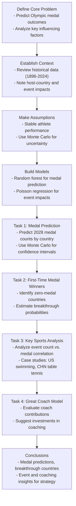
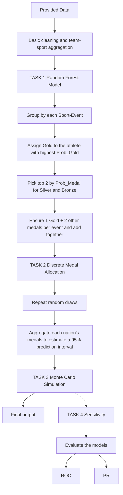
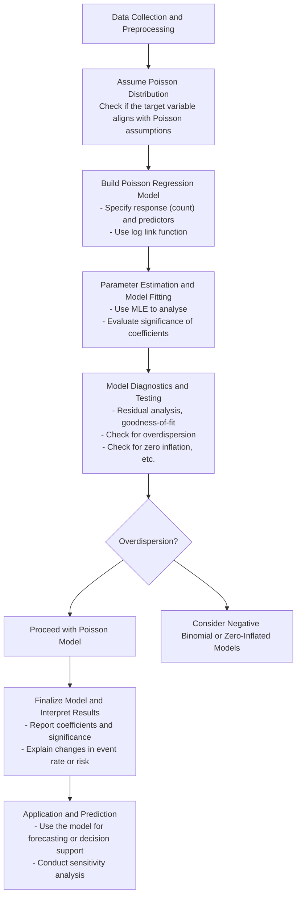

# 2028 Olympic Medal Predictions Based on Random Forest Model

Summary

The Olympic Games, as the world's largest and most influential sports event, have made medal predictions a popular and valuable research topic. This paper focuses on predicting the medal tally for the 2028 Los Angeles Summer Olympics using historical athlete data and various models, including random forest, Monte Carlo simulation, Poisson regression, and linear regression.

Task 1: A comprehensive prediction model was developed, combining athlete ability features and medal allocation simulations to forecast medal counts. Results predict the United States (142 medals, 45 gold), China (113 medals, 42 gold), and Great Britain (69 medals, 15 gold) as the top three. Trends show improvements for the United States, China, and Italy, while France, Australia, and Germany may decline.

Task 2: A random forest model and Monte Carlo simulation identified countries likely to win their first medals in 2028. Samoa (40.6%), Mali (26.6%), and Guam (25.4%) lead the list, with an expected 4.78 new medal-winning countries.

Task 3: Key event analysis showed the United States' swimming success is enhanced by adding sub-events, while China's dominance in table tennis remains stable. A linear regression model highlighted the significant impact of the host-country effect, varying across nations.

Task 4: A "Great Coach Model" quantified the influence of elite coaches on medal counts. Lang Ping's success with the Chinese volleyball team demonstrated the model's validity, with recommendations for India, Sweden, and Romania to invest in top-tier coaches.

We also proposed unique insights into Olympic medal predictions, offering guidance for National Olympic Committees. Finally, we evaluated the strengths and weaknesses of the model.

In conclusion, this paper conducts an in-depth analysis of various factors influencing medal achievements and proposes a scientific and reasonable prediction framework. This framework also provides feasible solutions for ranking and performance predictions in other fields characterized by complex data and diverse influencing factors.

Keywords: Olympics, Medal Prediction, Random Forest Model, Monte Carlo Simulation

# Contents

# 1 Introduction 3

1.1 Background 3  
1.2 Problem Analysis 4

# 2 Assumptions 5

# 3 Models 6

3.1 Task 1: Establishment and Analysis of the Medal Ranking Prediction Model for the 2028 Olympic Games 6

3.1.1 Problem Analysis 6  
3.1.2 Model Preparation 6  
3.1.3 Four-Dimensional Capability Features of Athletes 7  
3.1.4 Random Forest Model 7  
3.1.5 Model Solution 8  
3.1.6 Medal Distribution 9  
3.1.7 Monte Carlo Simulation and Uncertainty Quantification 9  
3.1.8 Sensitivity Analysis 10  
3.1.9 Factors Related to Winning Medals 12  
3.1.10 Medal Data Comparison and Trend Analysis 12

3.2 Task 2: Prediction of First-time Medal-winning Countries ..... 12

3.2.1 Countries That Have Never Won a Medal 12  
3.2.2 Random Forest Model 13  
3.2.3 Monte Carlo Simulation for 2028 14

3.3 Task 3: Critical Sports/Disciplines 15

3.3.1 Problem Analysis 15  
3.3.2 Poisson regression 15  
3.3.3 Analysis of Swimming in the United States (USA) 16  
3.3.4 Sensitivity Analysis 17  
3.3.5 Analysis of Table Tennis for China (CHN) 20

3.3.6 Host Country Effect 20

3.4 Task 4: The Great Coach Model 22

3.4.1 The Proposal of the Great Coach Model ..... 22  
3.4.2 Obtaining Related Quantities: 22  
3.4.3 Practical Application Example of the Great Coach Model ..... 22  
3.4.4 Suggestions for Investing in "Great Coaches" for Three Countries ..... 23

3.5 Our Unique Insights into Olympics Medals And Suggestions for NOC ..... 23

4 Conclusions 24

4.0.1 Advantages 24  
4.0.2 Limitations 24  
4.0.3 Conclusion and Future Work 24

# 1 Introduction

# 1.1 Background

Faster, Higher, Stronger – Together

-The Olympic Motto


<details>
<summary>natural_image</summary>

Exterior view of the Olympic rings in front of a modern building (no signage)
</details>

Figure 1: The Olympic Symbol

The Olympic Games, the world's largest and most influential multi-sport event, are divided into the Summer and Winter Games. The Summer Olympics, first held in 1896, take place every four years and attract top athletes from around the world. The event encompasses a wide range of sports, with each sport further divided into numerous sub-events based on competition characteristics.

The determination of participants and their numbers in the Olympics has a significant impact on competition results. This process not only embodies the Olympic spirit of striving for excellence but also ensures fairness and justice while allowing as many countries as possible to showcase their sports culture. This is a complex process influenced by various factors, including the host country's advantage in specific sports, which is often highlighted to promote its sports culture. We aim to investigate the "host country effect."

Predicting Olympic medal counts has become a popular topic for several reasons:

Enhancing the enjoyment of the games by adding suspense through pre-game predictions. Gaining insights into global athletic performance. Fostering engagement and interaction among sports enthusiasts. Supporting commercial media efforts to promote the Olympics. Providing a reference for medal predictions in other sports events by using the Olympics as a case study. Therefore, scientifically predicting Olympic medal counts holds significant importance across multiple dimensions.

# 1.2 Problem Analysis

This problem requires the establishment of a mathematical model to analyze and predict the number of medals (including at least gold medals and total medal counts) that each country might win in future Olympic Games.

Each medal is earned through the efforts of athletes, and a country's medal tally is directly related to its athletes. However, the dynamics of athletes are complex, making it inappropriate to rely solely on historical medal counts for predictions. Instead, we will base our predictions on the performance of athletes. Using the provided historical data—spanning from the 1896 Olympics to the 2024 Olympics, including medal statistics, event data, and athlete competition results—we will characterize athlete features and develop a predictive model.

This model will enable us to forecast medal counts for the 2028 Los Angeles Summer Olympics. Additionally, it will help identify which countries are likely to perform better or decline in future Olympic Games. Specifically, we will explore the potential of countries that have yet to win a medal, predicting whether they could secure their first medal and estimating the probability of such an achievement.

To provide a more comprehensive analysis of medal count changes, we will consider the impact of changes in Olympic events on medal distribution, particularly the performance of countries across different events. We will also examine the host-country effect and the influence of "great coaches" on enhancing medal counts, estimating their contributions to the overall tally.

Ultimately, the insights generated by this model will offer valuable recommendations to National Olympic Committees, aiding them in their preparations for future Olympic Games.


<details>
<summary>flowchart</summary>


</details>

Figure 2: The Whole Process of Our Work

# 2 Assumptions

# Assumption 1: Historical Data Stability Assumption

It is assumed that the medal distribution and trends from past Olympics can predict future medal distributions to some extent. Specifically, it is assumed that countries' performances in future Olympics will be similar to their historical performances, particularly in the same or similar sports.

# Assumption 2: Athlete Substitutability Assumption

As it is impossible to accurately know the roster of athletes for the 2028 Olympic Games beforehand, we assume that the athletes participating in the 2024 Olympics will reappear. This assumption is reasonable because selected athletes are typically among the best performers, especially those likely to win medals, and their performance tends to be stable. Excluding factors like injuries and retirements, the probability of these athletes qualifying again is high. Once the lineup of participating athletes is determined, the problem can be resolved accordingly.

# Assumption 3: Force Majeure Events Assumption

It is assumed that no force majeure events (such as pandemics) or other sudden incidents will occur in the coming years that could impact the Olympic Games.

# Assumption 4: External Factors Impact Assumption

It is assumed that external factors (such as economic, political, etc.) will not have significant negative effects on athletes' performances and the national athlete training systems, thus not significantly interfering with the results of medal predictions.

# Assumption 5: Data Authenticity Assumption

It is assumed that the dataset used (the tabular data in the folder 2025\_Problem\_C\_Data) is accurate and true, providing a reliable foundation for the model.

# 3 Models

# 3.1 Task 1: Establishment and Analysis of the Medal Ranking Prediction Model for the 2028 Olympic Games


<details>
<summary>flowchart</summary>


</details>

Figure 3: The process for Task 1

# 3.1.1 Problem Analysis

Each medal is won by specific athletes in the competitions of particular events, and the selection and number of participating athletes are adjusted annually. Our modeling approach is as follows:

Step 1 Generate a “multidimensional capability feature” for each athlete

Step 2 At the level of each specific “sport-discipline,” we simulate the distribution of gold, silver, and bronze medals (a total of three)

Step 3 Sum the medals by country/region (NOC)

# 3.1.2 Model Preparation

The modeling is based on the dataset 'summerOly\_athletes.csv':

1 The Olympics include team sports, they are:

Baseball/Softball, Basketball, Cricket, Field Hockey, Flag Football, Football, Handball, Ice Hockey, Lacrosse, Polo, Rugby, Tug of War, and Volleyball.

We consolidate the information of all players from the same country in the same year into a single record as a comprehensive sample. Historical performances, national factors, average age, gender classification (male/female), and other relevant data for all players in the team are aggregated to form a team-level feature vector.

2 For the gender of athletes, a binary mapping is employed: M -> 0, F -> 1.  
3 One-hot encoding utilized to facilitate processing by machine learning models, for NOC and Event

# 3.1.3 Four-Dimensional Capability Features of Athletes

After analyzing the historical performance of each athlete (or team) by year, we compute the following four-dimensional capability features:

1. PastTotalMedals — Reflects the likelihood of winning a medal.

This feature indicates the total number of medals (regardless of type) that the athlete has won in previous Olympic Games. It is calculated by summing the ‘MedalBinary’ values and applying a ‘shift(1)’ function to exclude the current year.

2. PastGoldMedals — Reflects the likelihood of winning gold.

Similarly, this feature is derived by summing the ‘GoldBinary’ values and applying a ‘shift(1)’.

3. PastBestResult — Reflects the athlete's potential.

Based on the previously defined scoring system (3/2/1/0), this feature calculates the best performance (cumulative maximum) of the athlete in their participation events at previous Olympics, then applies a ‘shift(1)’ to represent the "previous highest score."

4. PastWeightedRatio — Reflects the athlete's growth pattern.

This is defined as the cumulative sum of previous scores divided by the number of previous participations, also using ‘shift(1)’ to exclude the current Olympic results. A higher ratio indicates that the athlete has consistently performed well in past events (Gold = 3, Silver = 2, Bronze = 1).


<details>
<summary>radar</summary>

| Dimension | Athlete 1 | Athlete 2 | Athlete 3 |
| --- | --- | --- | --- |
| PostBest/PostWeightedRatio | 0.75 | 0.4 | 0.2 |
| PostWeightedRatio | 0.75 | 0.4 | 0.2 |
</details>

Figure 4: The four-dimensional ability characteristics of two Chinese swimmers by 2024 (left: Wang Shun, right: Sun Yang).

By leveraging these capability features, the model can differentiate between seasoned athletes with extensive experience and stable high-level performances and emerging newcomers, thus providing a more accurate prediction of winning probabilities.

# 3.1.4 Random Forest Model

# 1. Grouping by Sport

We adopt a "one model per sport" approach during modeling. This way, each model focuses more on the specific patterns within a particular sport.

# 2. Selection of Participants

Athletes competing in 2024 will continue to participate, as stated in Assumption 2.

# 3. Number of Events

Since the distribution of events has not yet been disclosed, we will also rely on the data from the 2024 Olympics.

# 4. Feature Compilation

- Four-dimensional capability features  
- Basic information: Year, Sex (0/1 for male/female), one-hot encoded features for NOC and Event.

# 5.Target Outputs

- Medal Model: Train a random forest model to predict ‘MedalBinary’ (whether an athlete wins a medal).  
- Gold Model: Train another random forest model to predict ‘GoldBinary’ (whether an athlete wins a gold medal).

# 6. Training/Test Set Split

If a specific sport's data volume is very small (e.g., fewer than 5 entries), or if the training set contains only one class, we will use fallback methods (i.e., replace predictions with historical average probabilities). During training, we will attempt stratified sampling to maintain the ratio of positive to negative samples; if the classification is too imbalanced, we will revert to standard splitting methods.

This structured approach ensures that each model can effectively leverage historical data and athlete characteristics to provide accurate predictions for medal outcomes in the Olympic Games.

# 3.1.5 Model Solution

# 1. Feature Transformation

Similarly, apply the 'encode\_features' function to this dataset to generate a one-hot feature structure consistent with the training phase.

Extract or revert to the corresponding event's random forest model and call ‘predict\_proba(...)’ to obtain ‘Prob\_Medal’ and ‘Prob\_Gold’.

# 2. Result Explanation

If a model exists for a specific event, provide each athlete with ‘Prob\_Medal‘ and ‘Prob\_Gold‘; otherwise, use fallback probabilities.

Below is a pseudocode representation of the model's solution process of one time to help readers understand:

<div class="mineru-algorithm" style="white-space: pre-wrap; font-family:monospace;">
Algorithm MEDAL_PREDICTION ( RandomForestModel, NewData ):
# [Data Preparation]
# RandomForestModel is the pre-trained random forest model.
# NewData is the raw information of a new athlete/team (specific event,
    $\hookrightarrow$ year, country).

# [Feature Transformation]
</div>

```ini
# (Same processing flow as during training)
x_team <- encode_features(NewData)
# encode_features will include:
#    - One-Hot Encoding: Country, Event Category, Gender (Men/Women),
    ↦ Coach/Team ID, etc.
#    - Numerical Feature Processing: Age, Historical Medals, etc.
#    - Handling of Missing Values, etc.

# [Probability Prediction]
(p_positive, p_negative) <- RandomForestModel.predict_proba(x_team)
# p_positive = Probability that the team will win a medal (or gold medal)
# p_negative = Probability that the team will not win any award
# Usually, p_positive + p_negative = 1

# [Output]
return p_positive
```

# 3.1.6 Medal Distribution

For each event, we identify the athlete with the highest probability of winning a gold medal ('Prob\_Gold'). This athlete is assigned: 'PredictedGold = 1' 'PredictedMedal = 1'. From the remaining athletes, we sort them based on the probability of winning a medal ('Prob\_Medal') and allocate the next two medals (silver and bronze) to the top two athletes.


<details>
<summary>bar_stacked</summary>

| Country (NOC) | Gold Medals | Total Medals |
| --- | --- | --- |
| USA | ~45 | ~139 |
| CHN | ~43 | ~111 |
| GBR | ~15 | ~68 |
| FRA | ~14 | ~56 |
| JPN | ~21 | ~50 |
| ITA | ~24 | ~49 |
| AUS | ~21 | ~48 |
| NED | ~18 | ~39 |
| KOR | ~13 | ~32 |
| GER | ~12 | ~31 |
| ESP | ~6 | ~26 |
| BRA | ~6 | ~23 |
| CAN | ~5 | ~23 |
| HUN | ~8 | ~19 |
</details>

Figure 5: 2028 Ompics Medal Predictions Based on RFModel

# 3.1.7 Monte Carlo Simulation and Uncertainty Quantification

Relying solely on the discrete results of a "single" prediction often fails to reflect randomness and model uncertainty. Therefore, this study further conducts Monte Carlo sampling based on the obtained 'Prob\_Medal' and 'Prob\_Gold' values: in each simulation, a random trial is performed for each athlete based on their probabilities to determine the distribution of gold, silver, and bronze medals for each event; after repeating this process 1000 times, the distribution of medal counts for each country can be derived from multiple simulations, allowing for the estimation of statistical measures such as the 95% prediction interval.

# Monte Carlo Sampling Process

1. For each sport-event, randomly select 1 gold medal winner based on 'Prob\_Gold';  
2. For the remaining athletes, randomly select 2 as silver and bronze medal winners using 'Prob\_Medal' (or its normalized values);  
3. Summarize the counts of gold medals and total medals for each country from all drawing results;  
4. Repeat the above steps M times (e.g., 1000, 5000, or 10000) to obtain a sufficient number of simulation samples.

Interval Result Example Table 1 provides an example of the Monte Carlo simulation results for major countries/regions (NOC) at the 2028 Olympic Games (taking the 95% prediction interval): for instance, in the case of the United States (USA), the 95% interval for total medals is between [113, 142], and for gold medals, it is between [37, 53], indicating that even when considering randomness and model uncertainty, the United States maintains a high potential for medal wins.

<table><tr><td>NOC</td><td>Medals_2.5%</td><td>Medals_97.5%</td><td>Golds_2.5%</td><td>Golds_97.5%</td></tr><tr><td>USA</td><td>113</td><td>142</td><td>37</td><td>53</td></tr><tr><td>CHN</td><td>105</td><td>125</td><td>31</td><td>49</td></tr><tr><td>GBR</td><td>52</td><td>75</td><td>13</td><td>24</td></tr><tr><td>AUS</td><td>45</td><td>65</td><td>15</td><td>27</td></tr><tr><td>ITA</td><td>45</td><td>65</td><td>14</td><td>25</td></tr><tr><td>FRA</td><td>43</td><td>63</td><td>10</td><td>20</td></tr><tr><td>JPN</td><td>40</td><td>58</td><td>16</td><td>26</td></tr><tr><td>NED</td><td>31</td><td>47</td><td>11</td><td>20</td></tr><tr><td>GER</td><td>29</td><td>47</td><td>9</td><td>19</td></tr></table>

Table 1: Monte Carlo Simulation Results for Medal Counts in 2028 (Top 9)

It can be observed that the model demonstrates a relatively concentrated prediction distribution range for most traditional powerhouses (such as the USA, CHN, and GBR), while the intervals for certain medium-sized sports nations (such as NED and GER) are relatively more conservative. Utilizing this interval distribution not only allows for the estimation of the expected value of the medal count (i.e., the mean of the distribution) but also provides a clearer representation of the upper and lower limits of the prediction results.

# 3.1.8 Sensitivity Analysis

Sensitivity (or Recall) is a critical metric that represents the proportion of actual medal-winning athletes correctly identified by the model. Using the predictions for the equestrian event as an example, we analyze the performance of sensitivity and its influencing factors based on ROC curves, PR curves, and calibration curves.

# 1. ROC Curve and Sensitivity

As shown in Figure 7, the vertical axis of the ROC curve represents True Positive Rate (TPR),


Figure 6: 95% CI for Medals  
  
Figure 7: Sensitivity Analysis

which corresponds to sensitivity. When the False Positive Rate (FPR) remains low (less than 0.2), the TPR can exceed 0.8, approaching 1.0. This indicates that the model demonstrates a strong ability to capture positive cases in this event. Notably, the curves for Fold 2 and Fold 3 are particularly close to the top left corner, with AUC values reaching 0.974 and 0.983, respectively. These results prove that the model exhibits excellent discrimination performance for positive cases across different training-test subsets.

# 2.PR Curve and Sensitivity

In Figure 7, the horizontal axis represents Recall (sensitivity). Fold 3 achieves a PR-AUC of 0.926, showing that when Recall is elevated to high levels (e.g., 0.8 or above), Precision remains in a relatively good range. This is especially advantageous for scenarios where the objective is to minimize the risk of missing any medal-winning athletes. Conversely, Fold 4 shows a PR-AUC of only 0.639, indicating that to ensure high Recall, Precision might significantly drop, resulting in more false positives.

# 3. Comprehensive Consideration of Calibration Curve and Sensitivity

Although the calibration curve (Figure 7) does not directly depict sensitivity, it illustrates whether the model's estimates of the probability of "winning" events deviate from actual values across probability ranges. It can be observed that in the high probability segment (>0.7), the actual

proportion of positive cases is slightly lower than predicted, which may lead to discrepancies in the expected sensitivity-precision relationship at specific thresholds (e.g., p=0.8).

Therefore, if we aim to set a high threshold in practical applications to "retain only the most promising athletes for medals," we must be cautious of the overestimation risk indicated by the calibration curve. In such cases, post-processing techniques (e.g., Isotonic Regression) may be employed to recalibrate the model's predicted probabilities for a closer alignment with actual sensitivity and specificity performances.

This analysis combines ROC, PR, and calibration curves as visualization tools to help understand the sensitivity performance and influencing factors of the model in the equestrian event from multiple perspectives. It provides a reference for rationally selecting prediction thresholds or conducting probability calibration in subsequent practical applications.

# 3.1.9 Factors Related to Winning Medals

We conducted a correlation analysis between various factors and whether an athlete won an award. Taking several events as examples, the athlete's historical number of total medals or gold medals showed a significant correlation.

  
Figure 8: Correlation Heatmaps for 3 Disciplines

# 3.1.10 Medal Data Comparison and Trend Analysis

Major Countries with Increased Medal Counts: United States, China, Italy

Major Countries with Decreased Medal Counts: France, Australia, Germany

The reasons for changes can be classified into factors such as the host effect causing variations in the number of events, and trends in athlete development.

# 3.2 Task 2: Prediction of First-time Medal-winning Countries

# 3.2.1 Countries That Have Never Won a Medal

We categorize the data based on the dataset ‘summerOly\_athletes.csv‘, classifying by the National Olympic Committee (NOC) of each country/region.

We define a binary variable "Medal Status" (MedalBinary) as follows:

<table><tr><td>NOC</td><td>2024 Total Medals</td><td>2028 Predicted Total Medals</td></tr><tr><td>United States (USA)</td><td>126</td><td>142</td></tr><tr><td>China (CHN)</td><td>91</td><td>113</td></tr><tr><td>Great Britain (GBR)</td><td>65</td><td>69</td></tr><tr><td>France (FRA)</td><td>64</td><td>58</td></tr><tr><td>Japan (JPN)</td><td>45</td><td>51</td></tr><tr><td>Italy (ITA)</td><td>40</td><td>49</td></tr><tr><td>Australia (AUS)</td><td>53</td><td>48</td></tr><tr><td>Netherlands (NED)</td><td>34</td><td>41</td></tr><tr><td>South Korea (KOR)</td><td>32</td><td>32</td></tr><tr><td>Germany (GER)</td><td>33</td><td>30</td></tr></table>

Table 2: Comparison of Total Medals in 2024 and Predicted Medals in 2028 for Different countries/regions

if all entries under Medal for a given NOC are "No medal" (regardless of athlete or year), then MedalBinary is set to 0;

otherwise, it is set to 1.

A MedalBinary value of 0 indicates that the country has "never won any medals."

The processing of other data remains consistent with the previous task.

# 3.2.2 Random Forest Model

We utilize the Random Forest algorithm to perform training and testing splits. The model's ability to distinguish between "winning a medal" and "not winning a medal" is assessed by calculating the Accuracy and F1-score. For successfully trained projects that did not regress, we record the Accuracy and F1-score, and subsequently create corresponding bar charts to visualize the results.

  
Figure 9: Chart of "Model Accuracy by Sports Discipline" & chart of "F1 Scores by Sports Discipline"

# 3.2.3 Monte Carlo Simulation for 2028

For the "2028 Potential Participants" dataset, we perform feature encoding consistent with the training phase (using encode\_features(...)) to prepare the data for input into the corresponding random forest model or fallback probability. If a particular event was not able to produce a random forest model during training, we will use the fallback probability (which corresponds to its historical average medal-winning rate) as the winning probability for all athletes in that event.

Random Selection of Three Medals To better reflect the uncertainty of actual competitions, we designed a Monte Carlo-based selection process: 1. Treat all athletes in an event as weighted entries based on their Prob\_Medal. 2. Randomly select one winner (gold, silver, or bronze). 3. Set the selected winner's probability to 0 to avoid repeated selection. 4. Repeat until 3 different winners are chosen or no athlete has a positive probability. 5. Proceed to the next event and repeat the process. This method ensures medal allocation is influenced by "probability weighting + randomness," allowing athletes with higher probabilities to have better chances without guaranteeing their selection.

Repeated Simulation and Result Summary To estimate the likelihood of "zero medal countries" winning their first medal, we simulate this process multiple times (e.g., 500). 1. For each simulation, count the number of zero medal countries winning a medal. 2. Repeat 500 simulations to create a distribution (e.g., 4 countries in one simulation, 7 in another). 3. Aggregate results to calculate each country's probability of winning its first medal in 2028.

The distribution of "new zero medal countries" across all simulations is visualized in a histogram (see Figure 10).

  
Figure 10: Distribution of Zero-Medal Countries Achieving a Medal (500 sims)

# The statistical results can show:

The simulation probability of each zero-medal country achieving a "zero-medal breakthrough" (e.g., 10%, 30%, etc.).

The expected number of new medal-winning countries in the 2028 Olympics is 4.78.


<details>
<summary>text_image</summary>

Probability of First Medal by Country
Kiribati Papua New Guinea
Angola Bosnia and Herzegovina
Honduras
Malta
Gambia Timor-Leste Andorra
Malawi Nicaragua
Guam Mali
Guinea-Bissau Democratic Republic of Congo
Vanuatu Marshall Islands
</details>

Figure 11: The countries most likely to win their first Olympic medal at the 2028 Olympics.

# 3.3 Task 3: Critical Sports/Disciplines

# 3.3.1 Problem Analysis

The number of medals won by countries in their strong events is often closely tied to the number of events in those sports. More events typically mean more medal opportunities, while fewer events reduce them. Host countries often secure more events in their advantageous sports. This study examines two examples of traditional strong events: the United States in swimming and China in table tennis, exploring the impact of event changes and the host-country effect on medal counts.

Using regression analysis on data from 1896 to 2024, the study addresses two key questions: 1. Does the number of medals won in a country's strong events significantly change with the number of events over time? 2. If significant, how does adding one event impact total medal counts?

Poisson regression is applied to model the relationship between medal counts (non-negative integers) and the number of events, with visualizations and discussions of the results.

# 3.3.2 Poisson regression

The number of medals (TotalMedals) is a non-negative integer, and it may exhibit a logarithmic linear relationship with the number of events (NumEvents). Therefore, we use the Poisson regression model:

$$
\log \left(E [ \text {TotalMedals} ]\right) = \beta_ {0} + \beta_ {1} \times (\text {NumEvents}) + \dots
$$

Where: $\beta_{0}$ is the intercept, and $\beta_{1}$ represents the log effect of the "increase in 1 event" on the expected medal count. If $\beta_{1} > 0$ , it indicates that as the number of events increases, the medal count tends to increase. If $\beta_{1}$ is statistically insignificant, it suggests that the number of events is weakly associated with medal outcomes.

We will conduct the same analysis for U.S. swimming and Chinese table tennis in sequence.


<details>
<summary>flowchart</summary>


</details>

Figure 12: The Process of Poisson Regression

<table><tr><td>Year</td><td>Gold_swim</td><td>Silver_swim</td><td>Bronze_swim</td><td>Total_swim</td><td>NumEvents_swim</td></tr><tr><td>1896</td><td>0</td><td>0</td><td>0</td><td>0</td><td>4.0</td></tr><tr><td>1900</td><td>0</td><td>0</td><td>0</td><td>0</td><td>7.0</td></tr><tr><td>1904</td><td>7</td><td>7</td><td>8</td><td>22</td><td>9.0</td></tr><tr><td>1908</td><td>1</td><td>0</td><td>4</td><td>5</td><td>6.0</td></tr><tr><td>1912</td><td>2</td><td>4</td><td>1</td><td>7</td><td>9.0</td></tr><tr><td>⋮</td><td>⋮</td><td>⋮</td><td>⋮</td><td>⋮</td><td>⋮</td></tr><tr><td>1964</td><td>45</td><td>8</td><td>8</td><td>61</td><td>18.0</td></tr></table>

Table 3: Olympic Swimming Medal Data

# 3.3.3 Analysis of Swimming in the United States (USA)

From 1896 to 1964, the number of swimming events (NumEvents\_swim) in each Olympic Games gradually increased from the initial 4 or 6 events to 18 events. During this period, the total number of medals (Total\_swim) won by the USA team in swimming also saw a significant rise, achieving 22 medals in 1904 and reaching as high as 61 medals by 1964.

# Poisson Regression Results

Intercept $\beta_0 \approx 2.4595$ : This coefficient is highly significant at the $1\%$ level ( $p < 0.001$ ). It indicates that when the number of swimming events (NumEvents\_swim) is at its baseline value (extrapolated to NumEvents\_swim = 0), the logarithmic expected number of medals for the USA swimming team is approximately 2.4595.

NumEvents\_swim Coefficient $\beta_{1} \approx 0.0517$ : This coefficient is also significant ( $p < 0.001$ ). It signifies that for each additional swimming event, the logarithm of the total number of medals won

(log(Total\_swim)) increases by approximately 0.0517. Converting this into a multiplicative factor, the expected number of medals increases by a factor of $e^{0.0517} \approx 1.053$ , which corresponds to an increase of about $5.3\%$ .

The results show a positive linear relationship between the number of swimming events and medals won by the USA. An increase in events allows the USA to excel further, highlighting the impact of long-term investment in talent development and advanced training systems on Olympic swimming success.

# 3.3.4 Sensitivity Analysis

<table><tr><td>Coef</td><td>Std</td><td>Err</td><td>z-value</td><td>p-value</td></tr><tr><td>Intercept</td><td>0.7933</td><td>0.213</td><td>3.724</td><td>&lt; 0.001</td></tr><tr><td>NumEvents</td><td>0.1912</td><td>0.016</td><td>11.872</td><td>&lt; 0.001</td></tr></table>

Table 4: Poisson Regression Results

It can be observed that $\beta_{1}=0.1912$ is significantly positive at the 1% level. When exponentiated, $e^{0.912}\approx1.211$ , indicating that "for each additional swimming event, the expected number of medals increases by approximately 21.1%."

# Prediction Variation with NumEvents

To visually demonstrate how the "Poisson predicted medal count" changes with different values of NumEvents, we uniformly sampled NumEvents within the range [0, 20] and calculated $\hat{E}[TotalMedals]$ . The results are presented in Figure 13 (Poisson Prediction vs. NumEvents), which shows that the predicted total number of medals exhibits exponential growth as the number of events increases. Notably, when NumEvents exceeds 10, the curve begins to rise sharply, approaching nearly 100 medals at 20 events. While some intervals (e.g., 0 to 5) may represent theoretical extrapolations, this trend indicates that the model is highly sensitive to NumEvents on a logarithmic scale.


<details>
<summary>line</summary>

| NumEvents | Predicted TotalMedals |
| --- | --- |
| 0.0 | ~2 |
| 1.0 | ~3 |
| 2.0 | ~4 |
| 3.0 | ~5 |
| 4.0 | ~6 |
| 5.0 | ~7 |
| 6.0 | ~8 |
| 7.0 | ~10 |
| 8.0 | ~12 |
| 9.0 | ~15 |
| 10.0 | ~18 |
| 11.0 | ~22 |
| 12.0 | ~27 |
| 13.0 | ~32 |
| 14.0 | ~39 |
| 15.0 | ~47 |
| 16.0 | ~57 |
| 17.0 | ~69 |
| 18.0 | ~84 |
| 19.0 | ~101 |
</details>

Figure 13: Poisson Prediction

# Elasticity Analysis

We also calculated "Elasticity," which, under the log-linear assumption, is defined as:

$$
\text { Elasticity } = \beta_ {1} \times (\text { NumEvents }).
$$

When NumEvents = 0, elasticity is 0; when NumEvents = 10, elasticity is 1.912; and at NumEvents = 20, elasticity is approximately 3.824. These values are illustrated in Figure 14 (Elasticity of TotalMedals with respect to NumEvents), showing an approximately linear increasing curve. This indicates that as the number of events rises into higher ranges, "adding one additional event" yields a significantly greater relative increase, amplifying its impact on the final medal output.


<details>
<summary>line</summary>

| NumEvents | Elasticity |
| --- | --- |
| 0.0 | 0.0 |
| 1.0 | ~0.2 |
| 2.0 | ~0.4 |
| 3.0 | ~0.6 |
| 4.0 | ~0.8 |
| 5.0 | ~1.0 |
| 6.0 | ~1.2 |
| 7.0 | ~1.4 |
| 8.0 | ~1.6 |
| 9.0 | ~1.8 |
| 10.0 | ~2.0 |
| 11.0 | ~2.2 |
| 12.0 | ~2.4 |
| 13.0 | ~2.6 |
| 14.0 | ~2.8 |
| 15.0 | ~3.0 |
| 16.0 | ~3.2 |
| 17.0 | ~3.4 |
| 18.0 | ~3.6 |
| 19.0 | ~3.8 |
</details>

Figure 14: Elasticity Analysis

# Data Sensitivity: Leave-One-Out (LOO) Method

To examine whether the results are overly dependent on specific observations, we employed the Leave-One-Out method, which involves removing one year of data at a time and re-running the Poisson regression. Figure 15 (Beta1 under Leave-One-Year-Out) presents the estimated $\beta_{1}$ values for different excluded years:

\- For most years that were omitted, $\beta_{1}$ fluctuated within the range of [0.18, 0.20], slightly lower or higher than the original value of 0.1912. - It was only when the year 1964 was excluded that $\beta_{1}$ surged to 0.2305; this year was significant for the USA team, which won 61 medals, indicating it may have had a substantial impact on the fit.

Overall, except for the 1964 anomaly, the other 14 leave-one tests revealed that $\beta_{1}$ consistently remained in the range of 0.18 to 0.20, suggesting minimal dependence on any single year. The notable increase observed when excluding 1964 indicates that the model is inclined to yield "larger" coefficients without that year, further reinforcing the notion that 1964 (with as many as 18 events) may play a "balancing" role in the dataset.

# Model Specification Sensitivity: Negative Binomial and Zero-Inflated Poisson

In addition to the Poisson regression, we also explored the Negative Binomial regression and


<details>
<summary>line</summary>

| Left-Out Year | Beta1 (LOO) |
| --- | --- |
| ~1897 | ~0.179 |
| ~1901 | ~0.178 |
| ~1904 | ~0.202 |
| ~1908 | ~0.187 |
| ~1912 | ~0.186 |
| ~1920 | ~0.197 |
| ~1924 | ~0.195 |
| ~1928 | ~0.193 |
| ~1932 | ~0.190 |
| ~1936 | ~0.191 |
| ~1948 | ~0.195 |
| ~1952 | ~0.192 |
| ~1956 | ~0.192 |
| ~1960 | ~0.190 |
| ~1964 | ~0.230 |
</details>

Figure 15: Data Sensitivity

Zero-Inflated Poisson (ZIP) models to assess the robustness of $\beta_{1}$ in the presence of over-dispersion or a significant number of zero values in the data. Table 2 summarizes the comparison results of these models:

<table><tr><td>Model</td><td>Beta1</td><td>logLik</td><td>AIC</td></tr><tr><td>Poisson</td><td>0.1912</td><td>-54.73</td><td>113.45</td></tr><tr><td>NegBin (MLE, alpha=0.1307)</td><td>0.2378</td><td>-51.92</td><td>109.84</td></tr><tr><td>ZIP</td><td>0.1626</td><td>-42.16</td><td>92.33</td></tr></table>

Table 5: Model Comparison Results

# It can be observed that:

1. Regardless of whether using Poisson (0.1912), Negative Binomial (0.2378), or ZIP (0.1626), $\beta_{1}$ is a positive value and falls within the range of [0.16, 0.24].  
2. In the Negative Binomial model, the estimated alpha is approximately 0.1307, indicating that the data does exhibit some degree of over-dispersion; however, this does not lead to a reversal in the estimation direction of NumEvents.  
3. The ZIP model in this case has the lowest AIC (92.33), suggesting that it may fit better in a statistical sense; correspondingly, $\beta_{1} \approx 0.1626$ . This is slightly lower than 0.1912 (Poisson) but still significantly positive (p < 0.001).

Therefore, even after adjusting the distribution assumptions (especially since the Negative Binomial and Zero-Inflated Poisson are commonly used to address issues of over-dispersion or excessive zeros), we find that the "regression coefficient for NumEvents" remains positively correlated, further supporting the notion that an increase in the number of events indeed contributes to an increase in the number of medals won by the USA swimming team.

<table><tr><td>Year</td><td>Gold_tt</td><td>Silver_tt</td><td>Bronze_tt</td><td>Total_tt</td><td>NumEvents</td></tr><tr><td>1988</td><td>3</td><td>3</td><td>1</td><td>7</td><td>4.0</td></tr><tr><td>1992</td><td>5</td><td>3</td><td>1</td><td>9</td><td>4.0</td></tr><tr><td>1996</td><td>6</td><td>5</td><td>1</td><td>12</td><td>4.0</td></tr><tr><td>2000</td><td>6</td><td>5</td><td>1</td><td>12</td><td>4.0</td></tr><tr><td>⋮</td><td>⋮</td><td>⋮</td><td>⋮</td><td>⋮</td><td>⋮</td></tr><tr><td>2024</td><td>10</td><td>1</td><td>0</td><td>11</td><td>5.0</td></tr></table>

Table 6: Table Tennis Medal Data

# 3.3.5 Analysis of Table Tennis for China (CHN)

Overall, the Chinese team has consistently maintained a strong dominance in table tennis, securing between 7 to 12 medals since 1988, with recent competitions potentially breaking into double digits.

# Poisson Regression Results

We conducted a Poisson regression analysis on “Total\_tt - NumEvents,” and the results are as follows:

- Intercept = 1.8056 (p = 0.072)  
- NumEvents = 0.1273 (p = 0.59)

The p-value for $\beta_{1}$ is as high as 0.59, well exceeding conventional significance levels (e.g., 0.05). This indicates that slight changes in the number of table tennis events (generally between 4 to 5 events) do not have a significant statistical impact on the total medal count for China.

In other words, China already possesses a strong dominance in the field of table tennis, consistently winning gold medals and accumulating medals at each Olympics. Even with the addition of one more event, there is no statistically significant increase in the already high total medal count.

# 3.3.6 Host Country Effect

When a country becomes the host, its total number of medals and ranking may improve. Based on the analysis of Task 3, this may be due to the host country being able to select more events that align with its national strengths.

To quantify the host country effect, we choose a multiple linear regression model as the base model and establish a function to describe the relationship between the number of medals (especially gold medals) won by each country in a given Olympic Games and various factors:

$$
Y _ {i} = \beta_ {0} + \beta_ {1} \cdot X _ {1 i} + \beta_ {2} \cdot X _ {2 i} + \beta_ {3} \cdot X _ {3 i} + \epsilon_ {i}
$$

where:

\- $Y_{i}$ : Total Medals or Gold Medals for country $i$

- $X_{1}$ : Host Dummy variable, taking the value of 1 (host country) or 0 (non-host country).  
- $X_{2}$ : Number of events for the host country in the given Olympic.  
- $X_{3}$ : Historical medal performance of the country (the average number of medals won in the last three Olympic Games).  
- $\beta_0$ is the constant term (intercept), representing the baseline medal count when no factors are present.  
- $\beta_{1}, \beta_{2}, \beta_{3}$ are the regression coefficients, indicating the impact of each independent variable on the number of medals.  
- $\epsilon_{i}$ is the error term, representing the unexplained random variation in the model.

# Interpretation of the Regression Model Results for the United States

(1) Model Performance: R-squared ( $R^{2}$ ): 0.539. The model explains 53.9% of the variance in the total number of medals won by the United States. Although this $R^{2}$ value is not particularly high, it is reasonable given the multi-factorial nature of predicting Olympic medals. This indicates that the model captures some of the primary drivers of the total number of medals, but there is still room for improvement.  
(2) Independent Variable Analysis: Coefficient: 74.7636, P-value: 0.000. The host country status increases the total number of medals for the United States by approximately 74.76 medals, which is a highly significant effect (with a P-value close to 0).

# Interpretation of the Regression Model Results for China

(1) Model Performance: R-squared ( $R^{2}$ ): 0.854. The model explains 85.4% of the variance in the total number of medals won by China, indicating a strong predictive power for the total number of medals.  
(2) Independent Variable Analysis: Coefficient: 24.6836, P-value: 0.055. When China serves as the host country, the total number of medals is expected to increase by approximately 24.68 medals. The P-value of 0.055 is slightly above 0.05, suggesting that the host country effect is close to being significant. (see Table 7)

<table><tr><td>Host</td><td>Advantages</td><td>Disadvantages</td></tr><tr><td>USA</td><td>- Large sample size (25 observations), resulting in more reliable conclusions.- The interaction term can capture the performance differences due to the main effects.</td><td>-  $R^{2}$  value (0.539) indicates limited explanatory power and may have omitted some key variables.- The impact of &quot;Total events &amp; Historical Mean Medals&quot; on medal count is not significant, suggesting potential issues in feature selection or noise.</td></tr><tr><td>China</td><td>-  $R^{2}$  value (0.854) shows a stronger correlation with the number of medals.- Captures the impact of historical patterns and emphasizes China’s competitive strengths.</td><td>- Small sample size (9 observations), reducing prediction reliability.- The estimated effect of the main term is closer to the boundary, but due to its small sample size, it cannot fully reflect the impact.</td></tr></table>

Table 7: Comparison of Models for USA and China as Hosts

# 3.4 Task 4: The Great Coach Model

# 3.4.1 The Proposal of the Great Coach Model

The winning capability $P_{n,y,e}$ for country n in event e during year y can be expressed as:

$$
P _ {n, y, e} = P _ {n, y, e | \boldsymbol {a}} + P _ {n, y, e | \boldsymbol {c}} + \boldsymbol {\epsilon} _ {n, y, e} \quad (P _ {n, y, e}, \boldsymbol {\epsilon} _ {n, y, e} \in [ 0, 3 ])
$$

Here, $P_{n,y,e}$ represents the actual winning capability of country n in event e during year y. $P_{n,y,e|a}$ denotes the winning capability of athletes from country n in event e during year y. $P_{n,y,e|c}$ indicates the enhancement in winning capability provided by a great coach for country n in event e during year y. In this model, we assume that the contribution of any great coach is a constant value. $\epsilon_{n,y,e}$ accounts for the uncertainties associated with the competition for country n in event e during year y.

For clarity, the following explanations of the formulas will not reiterate the subscripts $n, y, e$ .

We classify the winning capabilities into four levels:

$$
P _ {n, y, e} = \left\{ \begin{array}{l} 0, \text {Unable to win a medal} \\ 1, \text {Win a bronze medal} \\ 2, \text {Win a silver medal} \\ 3, \text {Win a gold medal} \end{array} \right.
$$

# 3.4.2 Obtaining Related Quantities:

The medal-winning situation for country y in event e during the current Olympic Games can be expressed as:

$$
P _ {n, y, e | \boldsymbol {a}} = \frac {P _ {n - 1 , y , e | \boldsymbol {a}} + P _ {n - 2 , y , e | \boldsymbol {a}} + P _ {n - 3 , y , e | \boldsymbol {a}}}{3}
$$

This is obtained by averaging the medal-winning results from the previous three Olympic Games before the great coach joined.

For convenience in analysis, we typically assume $\epsilon_{n,y,e}=0$ . The term $\epsilon_{n,y,e}$ is used to account for unexpected outcomes. In this model, it indicates that during the year when the great coach is in charge, the team is expected to perform steadily and demonstrate their true capabilities.

Based on the above model, we can derive $P_{n,y,e|c} = P_{n,y,e} - P_{n,y,e|a}$ .

When a coach leads multiple team sports or individual events, we calculate the results for each event separately and then take the average to determine the coach's average medal enhancement capability.

# 3.4.3 Practical Application Example of the Great Coach Model

To illustrate the model, we use Lang Ping as an example.

Lang Ping coached the U.S. women's volleyball team in 2005, leading them to a silver medal at the 2008 Beijing Olympics. In 2013, she became the head coach of the Chinese women's volleyball team, guiding them to a gold medal at the 2016 Rio Olympics. Her case effectively demonstrates the great coach effect.

Data from ‘summerOly\_athletes.csv‘ shows the U.S. women’s volleyball team won no medals in 1996, 2000, and 2004 but secured silver in 2008. The model calculates $P_{America,2008,Women’s Volleyball|c}=2$ and $P_{America,2012,Women’s Volleyball|c}=1.33$ , indicating Lang Ping improved their medal-winning capability by an average of 1.16 across two Olympics.

For the Chinese team, they won gold in 2004, bronze in 2008, and no medals in 2012. The model gives $P_{China,2016,Women's Volleyball|a} = 1.33$ and $P_{China,2016,Women's Volleyball|c} = 1.67$ , showing Lang Ping enhanced their capability to 1.67 in 2016.

This analysis concludes that under Lang Ping's guidance, both teams saw significant improvements, boosting their chances of winning more and higher medals.

# 3.4.4 Suggestions for Investing in "Great Coaches" for Three Countries

If a great coach's impact is consistent, leading more events increases medal counts and winning probabilities. Selected events should avoid areas dominated by other countries (e.g., table tennis in China). For countries with potential but inconsistent performance, a great coach can significantly improve medal prospects.

Beyond medals, improved rankings also reflect a coach's influence. However, since the data lacks ranking information, we can only estimate potential improvements after introducing a great coach. Here are the suggestions for three countries:

# 1. India

- Events: Badminton, Hockey  
- Effect Prediction: Badminton has the potential to secure 1-2 bronze medals, and the competitiveness for gold in field hockey will significantly increase.

# 2.Sweden

- Events: Swimming  
- Effect Prediction: Swimmers are expected to have a higher capability of winning medals, including potential gold medals.

# 3.Romania

- Events: Rowing  
- Effect Prediction: The number of medal-winning teams is expected to increase, along with enhanced competitiveness for gold medals.

# 3.5 Our Unique Insights into Olympics Medals And Suggestions for NOC

In solving Task 2, we observed that most of the countries that have not yet won Olympic medals are from underdeveloped regions such as Africa, Pacific Island nations, and Latin Amer-

ica. Nevertheless, we have also seen significant efforts from many of these countries, such as an increase in the number of athletes, and their efforts deserve recognition. Future Olympic Games could consider adding events that highlight the unique characteristics of these regions, thereby increasing their chances of winning medals. This would not only demonstrate the inclusiveness of the Olympics but also draw global attention to these nations, promoting the flow of more resources—ranging from sports to other areas—into these countries and regions.

# 4 Conclusions

# 4.0.1 Advantages

The random forest model effectively handles high-dimensional features and reduces overfitting, making it suitable for complex datasets while capturing the performance characteristics of different countries.

In the first model, historical athlete performance and multidimensional ability characteristics (e.g., total medals, best performances) were considered, enabling accurate identification of "star athletes" and potential newcomers.

The use of a discretized medal distribution mechanism (e.g., up to 1 gold, 2 silvers, 3 bronzes per event) avoids inflated medal counts from simple probability summation, ensuring predictions align with actual medal distribution rules.

A "one model per event" strategy allowed event-specific patterns to be better captured, improving prediction accuracy.

The model also incorporates multiple influencing factors, making it well-suited for predictions in complex scenarios.

# 4.0.2 Limitations

The model's reliance on historical data limits its ability to predict emerging athletes or new sports, reducing adaptability to future changes.

As the 2028 athlete roster is unknown, assuming participation continuity from 2024 introduces uncertainty, particularly regarding retirements, injuries, or new athletes, potentially affecting prediction accuracy.

# 4.0.3 Conclusion and Future Work

This study utilized multi-factor modeling, including random forest models and Monte Carlo simulations, to analyze the predictive value of historical data for the 2028 Los Angeles Olympics medal distribution. A key focus was the independent analysis of athletes' multidimensional capabilities—such as historical performance, growth trends, and potential—which proved critical in identifying medal patterns and potential breakthroughs. The study also accounted for factors like host country effects, coaching influence, and event changes, highlighting their complex impact on total medal counts. Future research should prioritize deeper analysis of athlete abilities, integrating real-time data and advanced techniques to better quantify multi-factor interactions, supporting National Olympic Committees in optimizing resources and competitiveness.

# Report on Use of AI

1. OpenAI ChatGPT (Jan. 27, 2024 version, ChatGPT-4o-mini)

Query1:

Assumption 1: Historical Data Stability Assumption: It is assumed that the distribution and trends of medals in past Olympic Games can predict future medal distributions to some extent. Specifically, it is assumed that countries' performances will be similar to their historical performances, particularly in the same or similar sports.

Assumption 2: Athlete Substitutability Assumption: It is assumed that there will be a high overlap between the athletes participating in the 2028 Olympics and those who participated in the 2024 Olympics, especially among athletes with the potential to win medals. Additionally, it is assumed that athletes' abilities and conditions will not experience dramatic fluctuations due to short-term factors (such as injuries or environmental conditions). This assumption is based on the continuity of athletes' performances and the stability of the Olympic selection process.

Assumption 3: It is assumed that no force majeure events (such as pandemics) or other incidents that could impact the Olympic Games will occur in the coming years.

Assumption 4: External Factors Impact Assumption: It is assumed that external factors (such as economic or political conditions) will not have significant negative effects on athletes' performances and the national athlete training systems.

Assumption 5: Data Authenticity Assumption: It is assumed that the data provided in the folder titled 2025\_Problem\_C\_Data is accurate and true.

Please help me organize the language and restate the above assumptions in a structured and formal manner.

Output1:

Here is the organization and restatement of the assumptions: Assumption 1: Historical Data Stability Assumption It is assumed that the medal distribution and trends from past Olympics can predict future medal distributions to some extent. Specifically, it is assumed that countries' performances in future Olympics will be similar to their historical performances, particularly in the same or similar sports.

Assumption 2: Athlete Substitutability Assumption It is assumed that there is a high overlap between the athletes participating in 2028 and those who participated in 2024, especially among those with medal-winning potential. Furthermore, it is assumed that athletes' abilities and conditions will not experience dramatic fluctuations due to short-term factors (such as injuries, environment, etc.). This assumption is based on the continuity of athletes' performances and the stability of the Olympic selection mechanism.

Assumption 3: Force Majeure Events Assumption It is assumed that no force majeure events (such as pandemics) or other sudden incidents will occur in the coming years that could impact the Olympic Games.

Assumption 4: External Factors Impact Assumption It is assumed that external factors (such as economic, political, etc.) will not have significant negative effects on athletes' performances

and the national athlete training systems, thus not significantly interfering with the results of medal predictions.

Assumption 5: Data Authenticity Assumption It is assumed that the dataset used (the tabular data in the folder 2025\_Problem\_C\_Data) is accurate and true, providing a reliable foundation for the model. The above assumptions provide a theoretical basis for the research, helping to better understand and analyze the distribution and trends of medals in future Olympic Games.

Query2:

2025 MCM Problem C: Models for Olympic Medal Tables

In addition to watching individual events during the latest summer Olympic Games in Paris,2024, fans followed the overall “medal table” for each country. The final results (Table 1)showed the United States with the most total medals (126), and China and the United States tied at the top of the standings for the first place Gold medals (40). The host country, France, was 5th in the Gold medal count (16) standings but 4th in terms of total medal count while Great Britain, 7th with 14 Gold medals finished 3rd in total medals. Gold Silver Bronze Total The standings at the top of the table are always watched closely, but the medal counts for other countries are often just as valued. For example, Albania (2 medals), Cabo Verde, Dominica, and Saint Lucia (2 medals) won their nations’ first Olympic medals at the Paris games. Dominica and Saint Lucia also each earned a Gold medal at these games. More than 60 countries have still yet to win an Olympic medal.

Predictions of the final medal counts are commonly made, but typically not based on historical medal counts but closer to the start of an upcoming Olympic games when current athletes scheduled to compete are known

Data is provided of medal tables for all summer Olympic games, host countries, as well as the number of Olympic events at each games broken down by sport for all summer Olympic games played. Additionally, data for all individual Olympic competitors with their sport and result (medal type, or no medal) is provided. Your models and data analysis must ONLY use the provided data sets. You may use additional resources to provide background and context or help with interpreting results (be sure to document the sources). Specifically, use the provided data to:

\- Develop a model for medal counts for each country (for Gold and total medals at a minimum). Include estimates of the uncertainty/precision of your model predictions and measures of how well model performs. Based on your model, what are your projections for the medal table in the Los Angeles, USA summer Olympics in 2028? Include prediction intervals for all results. Which countries do you believe are most likely to improve? Which will do worse than in 2024?

Your model should include countries that have yet to earn medals; what is your projection for how many will earn their first medal in the next Olympics? What sort of odds do you give to this estimate?

Your model should also consider the events (number and types) at a given Olympics. Explore the relationship between the events and how many medals countries earn. What sports are most important for various countries? Why? How do the events chosen by the home country impact results?

- Athletes may compete for different countries, but it is not a simple matter for them to change due to citizenship requirements. Coaches, however, can easily move from one country to another as they do not need to be citizens to coach. There is, therefore, the possibility of a “great coach” effect. Two possible examples of this include Lang Ping[2], who coached volleyball teams from both the U.S. and China to championships, and the sometimes-controversial gymnastics coach, Béla Károlyi[3], who coached Romania and then the U.S. women’s teams with great success. Examine the data for evidence of changes that might be due to a “great coach” effect. How much do you estimate such an effect contributes to medal counts? Choose three countries and identify sports where they should consider investing in a “great” coach and estimate that impact.  
- What other original insight(s) about Olympic medal counts does your model reveal?

Explain how these insight(s) can inform country Olympic committees. This is the problem statement for the 2025 Mathematical Modeling Competition. Please help me propose some problem-solving ideas and viable models.

Output2:

Here are some proposed problem-solving ideas and models for the 2025 Mathematical Modeling Competition, focusing on Olympic medal counts:

1. \*\*Historical Data Analysis\*\* - \*\*Data Collection\*\*: Compile historical medal data from past Olympic Games to identify trends. Use data for at least the last three or four Olympic cycles. - \*\*Modeling Approach\*\*: Utilize regression analysis (e.g., linear regression, polynomial regression) to predict future medal counts based on past performances. Consider factors such as: - Total number of sports and events. - Historical success rates in specific sports. - Changes in the number of athletes participating.  
2. \*\*Predictive Modeling for 2028 Los Angeles Olympics\*\* - \*\*Forecasting Model\*\*: Develop a time series forecasting model (e.g., ARIMA, exponential smoothing) to project medal counts for 2028 based on historical data trends. - \*\*Uncertainty Estimation\*\*: Use prediction intervals to quantify the uncertainty around the projected medal counts. Analyze the variance in past performances to inform these intervals. - \*\*Improvement Analysis\*\*: Identify countries that have shown steady improvement over the years to predict those most likely to increase their medal counts in 2028.  
3. \*\*Event Impact Analysis\*\* - \*\*Event Participation\*\*: Analyze the number and types of events at each Olympics and their correlation with medal counts. Use statistical methods (e.g., multivariate regression) to determine which sports are the most significant predictors of overall medal success for different countries. - \*\*Home Country Effects\*\*: Investigate how hosting the Olympics influences a country's medal performance, possibly using a comparative analysis of host versus non-host countries.  
4. \*\*First Medal Projections\*\* - \*\*Countries Without Medals\*\*: Identify countries that have yet to win an Olympic medal and analyze factors such as population size, investment in sports, and historical performance in regional competitions. - \*\*Probability Estimates\*\*: Use a probabilistic model to estimate the likelihood of these countries winning their first medals, possibly employing a Poisson or binomial distribution approach based on similar countries' paths to winning medals.

5. \*\*Great Coach Effect\*\* - \*\*Coaching Analysis\*\*: Examine the impact of renowned coaches on medal outcomes for three chosen countries. Collect data on major coaching changes in recent Olympic cycles and correlate these with medal counts. - \*\*Investment Recommendations\*\*: Analyze specific sports and countries that might benefit from hiring well-known coaches, estimating potential medal increases based on historical data. This could involve using a comparative analysis or impact assessment based on previous coaching changes.  
6. \*\*Visualization and Insights\*\* - \*\*Data Visualization\*\*: Create visual representations (e.g., heat maps, graphs) of trends in medal counts over time, sports performance by country, and the relationship between event types and medal success. - \*\*Insights for National Committees\*\*: Summarize key insights from data analysis that could inform national Olympic committees regarding resource allocation, sports investment, and talent development strategies.  
7. \*\*Sensitivity Analysis\*\* - \*\*Variable Sensitivity\*\*: Perform sensitivity analysis on key variables (e.g., number of athletes, events per sport, coaching quality) to determine which factors have the most significant impact on medal counts. This analysis can help prioritize areas of focus for national Olympic committees.

# Conclusion

Combining these approaches will create a comprehensive model that not only predicts future medal counts based on historical data but also provides insights into the dynamics of Olympic performances. Each component can be tackled with available datasets, allowing for a robust analysis that can inform decision-making for future Olympic participation.

# Query3:

Analysis of Model Advantages and Disadvantages

Advantages 1. \*\*Flexibility of the Random Forest Model\*\*:

The random forest model used in this study is capable of handling high-dimensional features and effectively avoids overfitting, making it suitable for complex datasets. It can capture the unique characteristics and performances of different countries well.

2. \*\*Detailed Athlete Modeling\*\*:

- In the first question's model, starting from the historical performance of athletes, we consider various capability features (such as total past medals and best performances), allowing for a more precise understanding of individual differences and the identification of "star athletes" and potential newcomers.  
3. \*\*Realistic Medal Distribution Mechanism\*\*:  
- By implementing a discrete medal distribution mechanism (i.e., a maximum of 1 gold, 2 silvers, and 3 bronzes per event), we avoid the inflated medal totals that can arise from simple probability summation. This makes the prediction results better aligned with actual medal distribution in events.  
4. \*\*Uncertainty Quantification via Monte Carlo Simulation\*\*:  
- By incorporating Monte Carlo simulation, the model can illustrate prediction intervals for the number of medals each country might win (e.g., 95% confidence intervals), providing

decision-makers with upper and lower bounds for medal counts, reflecting randomness and model uncertainty, thus enhancing the credibility of the predictions.

5. \*\*Highly Adaptable Model Structure\*\*:

- The approach of using "one model per event" allows each model to focus on the specific patterns of particular events, increasing the accuracy of the predictions.  
6. \*\*Comprehensive Consideration of Multiple Factors\*\*:  
- Throughout the problem-solving process, we explored various factors influencing the final prediction of Olympic medal counts, making it suitable for predictions in complex scenarios.

# Disadvantages

1. \*\*Limitations of Historical Data Dependence\*\*:  
- The model's reliance on historical athlete data may lead to poor performance when predicting outcomes for emerging athletes or new sports, lacking adaptability to future changes.  
2. \*\*Uncertainty of Athlete Roster\*\*:  
- As the roster of athletes for 2028 has not yet been determined, the model assumes that the athletes participating in 2024 will reappear. This assumption may impact the accuracy of predictions, especially for cases involving injuries, retirements, or the emergence of new talents.  
3. \*\*Data Scarcity for Certain Events\*\*:  
- For some sports, the data volume is very limited, which may hinder training effectiveness and affect the stability and accuracy of the model. In the case of analyzing data on outstanding coaches, insufficient data may lead to qualitative analysis only, potentially resulting in incomplete findings and less optimal recommendations.

Please refine the above content.

# Output3:

Model Advantages and Disadvantages Analysis

# Advantages

1. \*\*Flexibility of the Random Forest Model\*\*: - The random forest model used in this modeling process can effectively handle high-dimensional features and mitigate overfitting to some extent. It is suitable for complex datasets and can capture the characteristics and performance of different countries well.  
2. \*\*Detailed Athlete-Based Modeling\*\*: - In the first question's model, we start with the historical performance of athletes, considering each athlete's multidimensional ability characteristics (such as total past medals, best performances, etc.). This allows the model to more accurately reflect individual differences and identify "star athletes" and potential newcomers.  
3. \*\*Reflection of Real Distribution Mechanisms\*\*: - By employing a discretized medal distribution mechanism (i.e., a maximum of 1 gold, 2 silvers, and 3 bronzes per event), the model avoids the inflated total medal counts that simple probability summation can produce, making the prediction results align better with the actual medal distribution methods of events.

4. \*\*Adaptable Model Structure\*\*:

\- The strategy of adopting "one model per event" allows each model to focus more specifically on the patterns of particular events, thereby improving the accuracy of predictions.

5. \*\*Comprehensive Consideration of Multiple Factors\*\*:

\- During the problem-solving process, we explored multiple factors that influence the final Olympic medal predictions, making the model more suitable for accurate predictions in complex scenarios.

# Disadvantages

1. \*\*Limitations of Historical Data Dependence\*\*:

\- The model's high dependence on historical athlete data may lead to poor performance in predicting emerging athletes or new sports, lacking adaptability to future changes.

2. \*\*Uncertainty of Athlete Rosters\*\*:

\- Since the athlete roster for the 2028 Games is not yet determined, the model assumes that the athletes from the 2024 Games will participate again. This assumption may affect the accuracy of predictions, especially considering potential injuries, retirements, or the introduction of new athletes.

3. \*\*Data Scarcity for Certain Events\*\*:

\- For some sports, a very small amount of data may lead to suboptimal training outcomes, impacting the model's stability and accuracy. In the "great coach" model, insufficient data can only allow for qualitative analysis, which may result in incomplete analytical outcomes, and thus the proposed recommendations may not be the best.