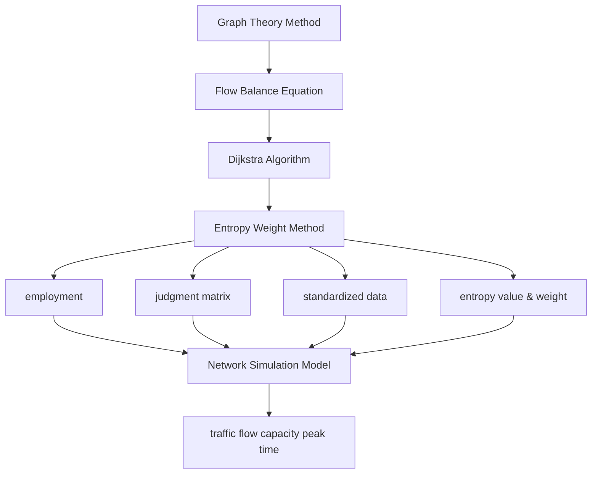
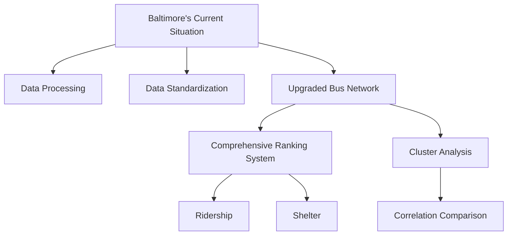
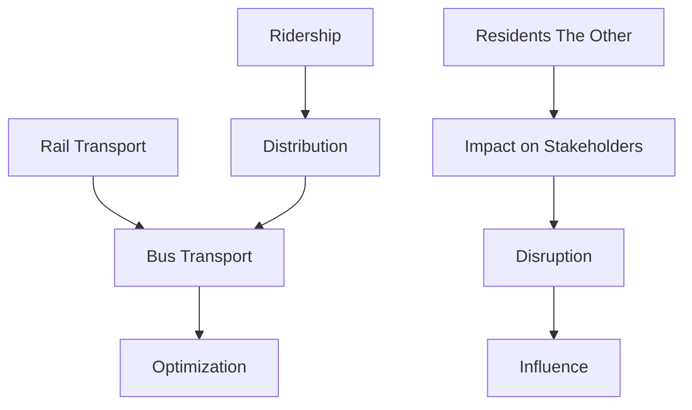
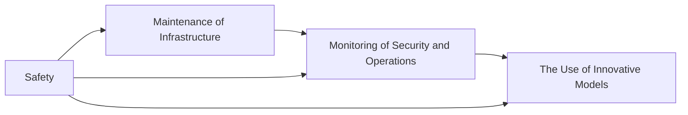

# Optimizing Baltimore Multi-Layer Traffic Network Model Based on Graph Theory & Clustering Algorithm

Summary

Baltimore's transportation system serves as a linchpin for the city's development and the daily lives of its residents. With the aim of attaining a sustainable future, current improvement plans are of utmost significance. In light of the intricate nature of transportation issues, the diverse requirements of stakeholders, and the intensification of problems following the collapse of the Francis Scott Key Bridge, this research has developed multiple models to analyze the situation and proffer solutions.

For Problem I, the Adaptive Transportation Network Model was formulated. On the basis of Graph Theory, three key factors: traffic flow, capacity, and peak time were selected for entropy weight calculation. ArcGIS was utilized to visualize and construct the regional traffic network. Through the application of Flow Balance Equation and Dijkstra Algorithm, the influence of the bridge collapse on various stakeholders in Baltimore was computed and illustrated. This model simulated traffic flow alterations, offered data-driven support for decision-making, and unveiled the impacts on various stakeholders.

For Problem II, we selected to enhance the local bus system project and constructed the Upgraded Bus Network Model. The Comprehensive Ranking System for all bus stops was established based on two crucial indicators: ridership and shelter. Cluster Analysis was then conducted to pinpoint bus stops in need of renovation or new construction, with the goal of enhancing the functionality and user-friendliness of the bus system. This optimized the resource allocation for shelter installation and renovation, bringing benefits to passengers, bus operators, urban planners, and local governments.

For Problem III, the Integrated Multimodal Transport Model was developed to further enhance the lives of Baltimore residents. Through the analysis of ridership and location, this model compared the bus network with the rail network, integrated their respective advantages and disadvantages, and established a multimodal transportation network. Although construction would cause short-term disruptions, it could shorten residents' commuting time, alleviate congestion, and stimulate economic development.

For Safety Issue, we share our insights on how to properly use the transportation system to solve safety problems from three aspects: infrastructure maintenance, monitoring of security and operations, and use of innovative models.

Eventually, the sensitivity analysis is carried out to ensure the accuracy of the model. However, these models have certain limitations. Some assumptions deviate from the real-world situation and may compromise the accuracy of analysis results. Future research could center on refining these assumptions, taking into account more complex factors, and further optimizing the models.

Keywords: Graph Theory Stakeholders Impact Cluster Multimodal Transport ArcGIS

## Contents

## 1 Introduction 3

1.1 Problem Background 3  
1.2 Problem Restatement 3  
1.3 Our Work 4

## 2 Assumptions and Justifications 4

## 3 Notations 5

## 4 Model I: Adaptive Transportation Network Model Simulation 6

4.1 Introduction of the Network Model 6  
4.2 Network Model Establishment Based on Graph Theory 6  
4.3 Analysis Based on Entropy Weight Method 7  
4.4 Mathematical Formulation of the Network Model 8  
4.5 Impact of Bridge Collapse in Stakeholders 10

## 5 Model II: Upgraded Bus Network Model Based on Cluster Analysis 12

5.1 Introduction of Current Situation 12  
5.2 Establishment of Upgraded Bus Model 13  
5.3 Impact of New Project in Stakeholders 16

## 6 Model III: Integrated Multimodal Transport Model 18

6.1 Optimized Integration of Bus and Rail Networks 18  
6.2 Influence of Project Based on Model 19

## 7 Insight of Safety Based on Transportation System 20

## 8 Sensitivity Analysis 21

## 9 Model Evaluation 22

9.1 Strength 22  
9.2 Weakness 23

## 10 Conclusion 23

## 11 Memorandum 24

## References 25

## 1 Introduction

## 1.1 Problem Background

Managing a city's transportation system is vital for urban development and residents' well-being. A sound transportation infrastructure can boost economic growth and attract various stakeholders. However, transportation challenges are complex and needs of diverse stakeholders are often conflicting. Baltimore, Maryland, USA, is burdened by limited transportation options and the collapse of the Francis Scott Key Bridge has worsened its situation. Given the complexity and diverse interests of stakeholders, there is an urgent need for effective solutions. Building network models for Baltimore's transportation system can offer insights into existing problems. By using these models, we aim to analyze project impacts, recommend improvements, and explore safety-related optimizations. This research is crucial to improving Baltimore's transportation network and the quality of life of residents.

text_image

Pikesville
19
Lochearn
17
B-4
odlawn
15B
14
Catonsville
12C-B
Arbutus
47A-
47B
3
46
2B
2A
2A
1A
10A
9A-9B
9B
7A
7B
50B
49B
51
52
52
55
56
6
7
8
9
10
8B
7A
6B
41
17B
17A
Ferndale
Parkville
Overlea
64
62
61
60
59
58-59
12
11A
10
Dundalk
Rosedale
38A
39
40
Essex
White
Tradepoint Atlantic

Figure 1: Top View of Baltimore Transportation

## 1.2 Problem Restatement

The core problem is to formulate strategies to improve Baltimore's transportation network effectively, with the aim of improving the lives of its residents and taking into account the diverse perspectives of multiple stakeholders. This encompasses:

1. Problem 1: Quantifying the impact of the Francis Scott Key Bridge collapse and its subsequent reconstruction on local transportation system and building a model to analyze how the events affect different stakeholders in and around the city.  
2. Problem 2: Selecting a project and using the network model to evaluate the impact of this project on various stakeholders.

3. Problem 3: Proposing a transportation project that maximally improves the lives of Baltimore residents. Demonstrate it in detail and solve its subsequent problems.  
4. Problem 4: Identifying potential safety-related improvements and optimize the transportation system to address the safety issue.

## 1.3 Our Work

In this research, three models and one insight were constructed to analyze the transportation system in Baltimore. Our work flow is shown in Figure 2.

Model I: Adaptive Transportation Network Model Simulation  

flowchart

Model II: Upgraded Bus Network Model with Cluster Analysis  

flowchart

flowchart

Model III: Integrated Multimodal Transport Model

flowchart

Insight of Safety Based on Transportation System  
Figure 2: Work Flow of This Research

## 2 Assumptions and Justifications

1. Assumption I: The travel behavior of different stakeholders stays relatively constant in the short term for the model.

Justification: Based on surveys and studies of transportation behavior in similar cities, people tend to stick to their usual travel routines in the short term unless there are substantial long-term infrastructure changes. This makes our assumption reasonable, helping us isolate the impact of specific transportation issues.

2. Assumption II: The capacity of each road remains fixed during the analysis period.

Justification: In the short term, the capacity of these transportation elements remains stable, which allows us to focus on the impact of changes in traffic flow and the implementation of projects, as a fixed capacity simplifies the model and provides a more focused analysis framework.

3. Assumption III: The impact of weather conditions on the transportation system is negligible for the analysis.

Justification: Since our main focus is on the impacts of structural changes (such as bridge collapse and reconstruction) and transportation projects on the transportation system, excluding the variable of weather, which can complicate the analysis, allows us to create a more straightforward model.

4. Assumption IV: The safety risks associated with different transportation modes are proportional to the peak hour and speed.

Justification: Based on traffic safety studies in various cities, the risks of safety are proportional to the peak hour and speed. This assumption enables us to incorporate safety considerations into the model simply and effectively.

5. Assumption V: This research considers land-based modes, excluding water-based transportation.

Justification: Given that the main focus of our study, most of the provided information, and the identified problems revolve around the infrastructure of land transportation. This assumption allows us to focus on the core transportation issues and analyze and propose solutions more effectively for the Baltimore Transportation Network.

## 3 Notations

<table><tr><td>Symbol</td><td>Definition</td></tr><tr><td> $X_{ij}$ </td><td>The j-th influence factor of the i-th edge</td></tr><tr><td> $E_j$ </td><td>The entropy of the j-th influence factor</td></tr><tr><td> $W_j$ </td><td>The weight of the j-th influence factor</td></tr><tr><td>k</td><td>The total entropy weight coefficient</td></tr><tr><td> $Z_{ij}$ </td><td>The standardized value of the j-th influence factor on the i-th edge</td></tr><tr><td> $P_{ij}$ </td><td>The standardized proportion of the j-th influence factor of the i-th edge</td></tr><tr><td>G</td><td>Graph</td></tr><tr><td> $v_i$ </td><td>The i-th node</td></tr><tr><td> $e_i$ </td><td>The i-th edge</td></tr><tr><td> $F_{x,i}$ </td><td>The flow rate of i-th place under x condition</td></tr><tr><td> $d_{ij}$ </td><td>The shortest path distance from node i to j</td></tr><tr><td> $s_{ij}$ </td><td>The shortest path from node i to j</td></tr><tr><td> $W_{ij}$ </td><td>The weight of edge from node i to j</td></tr></table>

Table 1: Notation

## 4 Model I: Adaptive Transportation Network Model Simulation

## 4.1 Introduction of the Network Model

Network models, which represent systems as interconnected nodes and edges, play a crucial role in analyzing complex systems. In this research, a network model is simulated to better understand the interactions of vital features such as traffic flow, capacity, and peak time within the Baltimore transportation system, focusing on obtaining system-wide insights. The model serves as a theoretical foundation for improving the Baltimore transportation system, contributing to enhanced control over the complex interactions within the system.

## 4.2 Network Model Establishment Based on Graph Theory

## 4.2.1 Construction of Graph-theoretic Elements

To conduct a clearer analysis and management of the traffic situation in the city of Baltimore, we abstracted and converted the transportation network of Baltimore into a directed graph G, unfolding in equation (1).

$$
\mathrm{G} = <   \mathrm{V}, \mathrm{E} > \tag {1}
$$

Here, G serves as the graphical representation of the entire transportation network, which is a representation of the real-world transportation conditions in Baltimore. From nodes\_all.csv we get nodes set V, consisting of $v_{i}$ acting as the convergence and divergence points for traffic flow. From edges\_all.csv we get nodes set E, consisting of $e_{i}$ establishing the connection relationships between nodes and forming a complete topological structure for the transportation network.

Through modeling and processing with ArcGIS, we obtained the following transportation network of Baltimore, shown in Figure 3.

## 4.2.2 Key Factors and Edge-Weighting Strategy

In the study of the Baltimore transportation network, by allocating weights to edges, we can more accurately reflect the relative importance of different road sections in the network. A higher-weighted edge indicates that the corresponding road section plays a more crucial role in traffic flow distribution, commuting efficiency, and overall transportation system stability.

We specifically chose traffic flow, capacity, and peak time as the key factors and determine weights based on them.

High traffic flow often leads to increased congestion, as more users compete for limited road space. Capacity represents the maximum amount of traffic that a road section can handle without significant disruption. Analyzing capacity helps us determine the vulnerability of each road section to traffic overload and identify potential areas for infrastructure improvement. During peak hours, traffic demand surges, and the transportation system experiences its highest stress levels. Longer peak times mean that road sections are under high-stress conditions for an extended period, leading to more severe congestion and reduced transportation efficiency.

natural_image

Urban area map with green and brown lines, showing roads, buildings, and waterways (no text or labels)

Figure 3: The Transportation Network of Baltimore

Focusing on these three factors can assist us in optimizing traffic management strategies and predicting the impact of the Francis Scott Key Bridge on traffic congestion, enabling us to develop more effective mitigation and recovery plans.

## 4.3 Analysis Based on Entropy Weight Method

We adopted the Entropy Weight Method to assign weights to traffic flow, capacity, and peak time, highlighting the diverse roles of different road sections in traffic flow distribution and traffic operation efficiency.

## 4.3.1 Data Standardization

First, we needed to standardize the raw data of each factor (traffic flow, capacity, and peak-hour duration) for each edge $e_{i}$ . For positive indicators (the larger the value, the more important the edge), the standardization formula is equation (2),

$$
Z _ {i j} = \frac {X _ {i j} - \min (X _ {j})}{\max (X _ {j}) - \min (X _ {j})} \tag {2}
$$

where j denotes different factors (j=1 represented traffic flow, j=2 represented capacity and j=3 represented peak-hour duration); $X_{ij}$ denotes the j-th influence factor of the i-th edge. We used this step to eliminate the influence of different dimensions and magnitudes of the data.

## 4.3.2 Entropy Calculation

Knowing n is the number of edges, denoted 565496, we set k to be the total entropy weight coefficient and got equation (3).

$$
k = \frac {1}{\ln (n)} \tag {3}
$$

For each factor j, we calculated the proportion of the standardized value of edge in the sum of the standardized values of all edges for this factor, which is $P_{ij}$ in equation (4).

$$
P _ {i j} = \frac {Z _ {i j}}{\sum_ {i = 1} ^ {n} Z _ {i j}} \tag {4}
$$

Then we calculated the entropy of the j-th factor $E_{j}$ in equation (5),

$$
E _ {j} = - k \sum_ {i = 1} ^ {n} P _ {i j} \ln (P _ {i j}) \tag {5}
$$

which reflected the degree of uncertainty of the data distribution of the j-th factor among all edges.

## 4.3.3 Edge Weight Determination

The larger the value of $1 - E_{j}$ , the more effectively the factor differentiates the importance of different edges. We calculate the weight of the j-th factor in equation (6),

$$
W _ {j} = \frac {1 - E _ {j}}{\sum_ {j = 1} ^ {m} (1 - E _ {j})} \tag {6}
$$

where $m$ is the number of factors, denoted 3.

Having gained the weights $W_{1}$ , $W_{2}$ , and $W_{3}$ , we calculated the weight of edge $e_{i}$ in equation (7),

$$
e _ {i} = \sum_ {j = 1} ^ {m} W _ {j} Z _ {i j} \tag {7}
$$

which reflects the importance of edge $e_i$ in the transportation network based on the three selected factors.

Upon applying the entropy weight method, considering the distinct weights of different roads, we utilized color coding to distinguish the significance of roads and areas on Baltimore's initial transportation network graph. Specifically, areas that contain roads with higher weights are depicted in darker colors. We used ArcGIS to create this new transportation network graph: Figure 4, intending to use it for subsequent analyses of Baltimore's traffic system.

## 4.4 Mathematical Formulation of the Network Model

To accurately understand the significant impacts of the collapse of the Francis Scott Key Bridge on Baltimore's transportation system, we set up an adaptive model of the transportation network to simulate the situation after the collapse.

heatmap

| Value Range | Color        |
| ----------- | ------------ |
| 0 - 74,967.29608 | Light Yellow |
| 74,967.29609 - 152,611.9956 | Pale Yellow   |
| 152,611.9957 - 227,579.2917 | Pale Yellow   |
| 227,579.2918 - 302,546.5877 | Orange       |
| 302,546.5878 - 380,191.2873 | Brown        |
| 380,191.2874 - 455,158.5833 | Dark Brown   |
| 455,158.5834 - 530,125.8794 | Medium Brown |
| 530,125.8795 - 607,770.5789 | Dark Brown   |
| 607,770.579 - 682,737.875 | Dark Red     |

Figure 4: The Transportation Network of Baltimore Based on Entropy Weight Method

Considering the geographical layout and various practical factors, such as the long distance between the land area above and the location of the collapsed bridge, as well as better solutions available, we determined that the traffic flow that originally used the collapsed bridge would be re-routed to the two bridges above it.

## 4.4.1 Simulation in the Flow-Balance Equation

We employed the flow-balance equation in equation (8).

$$
\sum_ {i} F _ {i n, i} = \sum_ {j} F _ {o u t, j} \tag {8}
$$

We first remove the edges corresponding to the collapsed bridge from the data set of the model, effectively simulating the physical collapse of the bridge. This step disrupted the original traffic flow equilibrium in the network.

Then, we proportionally allocated the originally estimated pedestrian flow of the collapsed bridge to the two remaining bridges. This allocation was based on their respective capacities and their relative significance in the transportation network.

## 4.4.2 Simulation in Visualization

Building upon the aforementioned modeling approach, we further generated two 3D bubble charts, as known in Figure 5-6, to visually illustrate the transportation flow in the Baltimore area.

By comparing the pre-collapse and post-collapse 3D bubble charts, we could quantitatively and qualitatively analyze the impact of the bridge collapse on the transportation flow in Baltimore. Measuring the changes in the size of the bubbles at each node and the overall shift in the distribution of traffic bubbles in the 3D space demonstrate the evident decrease in traffic flow around the collapse bridge and the evident increase in traffic flow around the other bridge.

3d scatter plot

| Longitude | Latitude | Logarithmic Value |
| --------- | -------- | ------------------ |
| -76.5600  | 39.32    | 8.0                |
| -76.5550  | 39.28    | 7.5                |
| -76.5525  | 39.24    | 7.0                |
| -76.5475  | 39.20    | 6.5                |
| -76.5425  | 39.16    | 6.0                |
| -76.5400  | 39.12    | 5.5                |
| -76.5400  | 39.08    | 5.0                |
| -76.5400  | 39.04    | 4.5                |
| -76.5400  | 39.00    | 4.0                |
| -76.5400  | 38.96    | 3.5                |
| -76.5400  | 38.92    | 3.0                |
| -76.5400  | 38.88    | 2.5                |
| -76.5400  | 38.84    | 2.0                |
| -76.5400  | 38.80    | 1.5                |
| -76.5400  | 38.76    | 1.0                |
| -76.5400  | 38.72    | 0.5                |
| -76.5400  | 38.68    | 0.0                |
| -76.5400  | 38.64    | -0.5               |
| -76.5400  | 38.60    | -1.0               |
| -76.5400  | 38.56    | -1.5               |
| -76.5400  | 38.52    | -2.0               |
| -76.5400  | 38.48    | -2.5               |
| -76.5400  | 38.44    | -3.0               |
| -76.5400  | 38.40    | -3.5               |
| -76.5400  | 38.36    | -4.0               |
| -76.5400  | 38.32    | -4.5               |
| -76.5400  | 38.28    | -5.0               |
| -76.5400  | 38.24    | -5.5               |
| -76.5400  | 38.20    | -6.0               |
| -76.5400  | 38.16    | -6.5               |
| -76.5400  | 38.12    | -7.0               |
| -76.5400  | 38.08    | -7.5               |
| -76.5400  | 38.04    | -8.0               |
| -76.5400  | 38.00    | -8.5               |
| -76.5400  | 37.96    | -9.0               |
| -76.5400  | 37.92    | -9.5               |
| -76.5400  | 37.88    | -10.0              |
| -76.5400  | 37.84    | -10.5              |
| -76.5400  | 37.80    | -11.0              |
| -76.5400  | 37.76    | -11.5              |
| -76.5400  | 37.72    | -12.0              |
| -76.5400  | 37.68    | -12.5              |
| -76.5400  | 37.64    | -13.0              |
| -76.5400  | 37.60    | -13.5              |
| -76.5400  | 37.56    | -14.0              |
| -76.5400  | 37.52    | -14.5              |
| -76.5400  | 37.48    | -15.0              |
| -76.5400  | 37.44    | -15.5              |
| -76.5400  | 37.40    | -16.0              |
| -76.5400  | 37.36    | -16.5              |
| -76.5400  | 37.32    | -17.0              |
| -76.5400  | 37.28    | -17.5              |
| -76.5400  | 37.24    | -18.0              |
| -76.5400  | 37.20    | -18.5              |
| -76.5400  | 37.16    | -19.0              |
| -76.5400  | 37.12    | -19.5              |
| -76.5400  | 37.08    | -20.0              |
| -76.5400  | 37.04    | -20.5              |
| -76.5400  | 37.00    | -21.0              |
| -76.54   | nan      |                   |

Figure 5: 3D Bubble Chart Before Collapse

The traffic flow around the bridge after its collapse  

bubble chart

| Longitude | Latitude | Log(Stop_Rider + 1) |
| --- | --- | --- |
| -76.560 | 39.32 | 8 |
| -76.555 | 39.28 | 7 |
| -76.550 | 39.24 | 6 |
| -76.545 | 39.20 | 5 |
| -76.540 | 39.22 | 4 |
| -76.545 | 39.24 | 3 |
| -76.550 | 39.26 | 2 |
| -76.555 | 39.28 | 1 |
| -76.560 | 39.30 | 1 |
| -76.555 | 39.32 | 1 |
| -76.550 | 39.32 | 1 |
| -76.545 | 39.32 | 1 |
| -76.540 | 39.32 | 1 |
| -76.545 | 39.32 | 1 |
| -76.550 | 39.32 | 1 |
| -76.555 | 39.32 | 1 |
| -76.560 | 39.32 | 1 |
| -76.555 | 39.32 | 1 |
| -76.550 | 39.32 | 1 |
| -76.545 | 39.32 | 1 |
| -76.540 | 39.32 | 1 |
| -76.600 | 4000 | 8 |
| -76.600 | 4000 | 7 |
| -76.600 | 4000 | 6 |
| -76.600 | 4000 | 5 |
| -76.600 | 4000 | 4 |
| -76.600 | 4000 | 3 |
| -76.600 | 4000 | 2 |
| -76.600 | 4000 | 1 |
| -76.600 | 4000 | 1 |
| -76.600 | 4000 | 1 |
| -76.600 | 4000 | 1 |
| -76.600 | 4000 | 1 |
| -76.600 | 40O | 8 |
| -76.600 | 40O | 7 |
| -76.600 | 40O | 6 |
| -76.600 | 40O | 5 |
| -76.600 | 40O | 4 |
| -76.600 | 40O | 3 |
| -76.600 | 40O | 2 |
| -76.600 | 40O | 1 |
| -76.600 | 40O | 1 |
| -76.600 | 40O | 1 |
| -76.600 | 40O | 1 |
| -76.600 | 40O | 1 |
| -76.600 | 40O | 2 |
| -76.600 | 40O | 1 |
| -76.600 | 40O | 1 |
| -76.600 | 40O | 1 |
| -76.600 | 40O | 2 |
| -76.600 | 40O | 2 |
| -76.600 | 40O | 2 |
| -76.600 | 40O | 2 |
| -76.600 | 40O | 2 |
| -76.600 | 40O | 1 |
| -76.600 | 40O | 1 |
| -76.600 | 40O | 1 |
| -76.600 | 40O | 3 |
| -76.600 | 40O | 2 |
| -76.600 | 40O | 2 |
| -76.600 | 40O | 2 |
| -76.600 | 40O | 2 |
| -76.600 | 40O | 3 |
| -76.600 | 40O | 2 |
| -76.600 | 40O | 2 |
| -76.600 | 40O | 2 |
| -76.600 | 40O | 3 |
| -76.600 | 40O | 1 |
| -76.600 | 41O | 8 |
| -76.600 | 41O | 7 |
| -76.600 | 41O | 6 |
| -76.600 | 41O | 5 |
| -76.600 | 41O | 4 |
| -76.600 | 41O | 3 |
| -76.600 | 41O | 2 |
| -76.600 | 41O | 2 |
| -76.600 | 41O | 2 |
| -76.600 | 41O | 2 |
| -76.600 | 41O | 1 |
| -76.555 | 41O | 8 |
| -76.555 | 41O | 7 |
| -76.555 | 41O | 6 |
| -76.555 | 41O | 5 |
| -76.555 | 41O | 4 |
| -76.555 | 41O | 3 |
| -76.555 | 41O | 2 |
| -76.555 | 41O | 2 |
| -76.555 | 41O | 2 |
| -76.555 | 41O | 2 |
| -76.555 | 41O | 2 |
| -76.555 | 41O | 1 |
| -76.555 | 41O | 1 |
| -76.555 | 41O | 1 |
| -76.555 | 41O | 1 |
| -76.555 | 41O | 1 |
| -76.555 | 41O | 2 |
| -76.555 | 41O | nan |
| -76.555 | N/A | nan |
| -76.555 | N/A | nan |
| -76.555 | N/A | nan |
| -76.555 | N/A | nan |
| -76.555 | N/A | nan |
| -76.555 | N/A | nan |

Figure 6: 3D Bubble Chart After Collapse

## 4.5 Impact of Bridge Collapse in Stakeholders

## 4.5.1 Application of the Dijkstra Algorithm

In Baltimore's Adaptive Transportation Network Simulation model, when the Francis Scott Key Bridge collapsed, the structure of the transportation network changes, and the path between nodes that were originally connected by the collapsed bridge may no longer be the shortest path, and may not even be directly accessible. Therefore, it is necessary to recalculate the shortest path with Dijkstra algorithm to further analyze the various influences of bridge collapse on stakeholders. At any time $t$ , in equation (9),

$$
d _ {i j} (t) = \min _ {s \in S _ {i j}} \sum_ {(i, j) \in s} W _ {i j} \tag {9}
$$

$d_{ij}$ denotes the shortest path distance from node i to j, $s_{ij}$ denotes the shortest path from node i to j, $W_{ij}$ denotes the weight of edge form node i to j.

We first got the geographical locations of the three bridges through the map. After the new shortest path was obtained by the Dijkstra Algorithm, the new shortest paths and distances between different nodes after the bridge collapse could be determined. This provided key data for calculating stakeholders' travel time, traffic flow allocation, etc. Then we could analyze the impact on different stakeholders based on the new path.

## 4.5.2 Visualization of Commuting Time

In terms of commuting time, by collecting and knowing the average commuting speed of local people in different time periods, when people traveled from both ends of the Francis Scott Key Bridge, we could calculate the change of people's travel time after the bridge collapse according to the shortest path obtained by Dijkstra Algorithm.

Commuting Time of Three Bridges From the Same Start to the Same Stop Point  

3d area chart

| Time | Bridge 1 | Bridge 2 | Bridge 3 |
|------|----------|----------|----------|
| 0    | 0        | 0        | 600      |
| 1    | 10       | 200      | 600      |
| 2    | 10       | 180      | 550      |
| 3    | 10       | 170      | 550      |
| 4    | 10       | 160      | 550      |
| 5    | 10       | 150      | 550      |
| 6    | 10       | 140      | 550      |
| 7    | 10       | 130      | 550      |
| 8    | 10       | 120      | 550      |
| 9    | 10       | 110      | 550      |
| 10   | 10       | 100      | 550      |
| 11   | 10       | 90       | 550      |
| 12   | 10       | 80       | 550      |
| 13   | 10       | 70       | 550      |
| 14   | 10       | 60       | 550      |
| 15   | 10       | 50       | 550      |
| 16   | 10       | 40       | 550      |
| 17   | 10       | 30       | 550      |
| 18   | 10       | 20       | 550      |
| 19   | 10       | 10       | 550      |
| 20   | 10       | 0        | 550      |

Figure 7: The 3D Wall Commuting Time Chart

From Figure 7, we can clearly see that when Bridge 3, which is the Francis Scott Key Bridge, collapsed, the commuting time increased significantly.

For urban commuters who regularly use Bridge 3, its collapse forces them to switch to the first and second bridges. The longer travel time requires earlier departures, reducing their rest or leisure time, disrupting daily rhythms, and degrading life quality.

Suburban commuters rely on bridges to commute to the city. Bridge 3's collapse led to a significant increase in commuting time, causing more fatigue and stress. In the long run, it may harm work productivity and job satisfaction, and in extreme cases, prompt job changes or relocation.

## 4.5.3 Visualization of Traffic Flow

In terms of traffic flow, through the Annual Average Daily Traffic of the three Bridges from 2014 to 2022, we could simulate two scenarios if the Francis Scott Key Bridge collapsed and did not collapse in 2025. The Annual Average Daily Traffic of Bridge 1, Bridge 2, and Bridge 3 (the Francis Scott Key Bridge) are represented by blue, orange, and green bars respectively in Figure 8-9.

As we could clearly see from the above chart, when the Francis Scott Key Bridge collapsed, the Annual Average Daily Traffic on the other two bridges significantly increased, which resulted in a significant increase in congestion on these two bridges and significantly impacted the following stakeholders

Individual merchants, like street side stores and restaurants, relied on convenient transportation. After the bridge collapsed, traffic congestion directly affected their business. Fearing traffic jams, customers are less likely to patronize, leading to a sharp drop in footfall and turnover. The bridge collapse also made it difficult to transport goods, and lengthened delivery times for raw materials and products, and increased operational costs and management complexity. Moreover, delays in restocking can disrupt normal business. In addition, the efficiency of delivery services is affected, which reduces delivery orders and store revenue.

3d bar chart

|   Year |   Value |
|-------:|--------:|
|   2014 |    1000 |
|   2015 |    1100 |
|   2016 |    1200 |
|   2017 |    1300 |
|   2018 |    1400 |
|   2019 |    1500 |
|   2020 |    1600 |
|   2021 |    1700 |
|   2022 |    1800 |
|   2023 |    1900 |
|   2024 |    2000 |
|   2025 |    2100 |

Figure 8: 3D Bar Chart Before Collapse

3d bar chart

| Year   |   Value |
|:-------|--------:|
| 2014   |    1000 |
| 2015   |    1100 |
| 2016   |    1200 |
| 2017   |    1300 |
| 2018   |    1400 |
| 2019   |    1500 |
| 2020   |    1600 |
| 2021   |    1700 |
| 2022   |    1800 |
| Current |    1900 |
| 2025   |    2000 |
| EXIT 9 |    1800 |
| EXIT 55 |    1900 |
| EXIT 1 |    2000 |
| EXIT 9 |    2100 |

Figure 9: 3D Bar Chart After Collapse

Logistics companies, relying on smooth traffic encountered issues post-bridge collapse. Congestion on the first and second bridges slows logistics vehicles, lengthening transit times. This raises costs, delays deliveries, disappoints customers, and for time - sensitive goods, causes damage or value loss, leading to financial losses. Moreover, vehicle scheduling gets harder, forcing companies to invest more in management and squeezing profit margins.

For Public Transport Users such as bus passengers, public transport was a crucial travel option. The bridge collapse caused traffic congestion, slowed down buses and reduced the on-time performance of routes. Passengers waited longer at stations and spent longer on buses, causing great inconvenience. Due to traffic congestion, the number of buses was reduced, resulting in an overcrowded ride experience for passengers. Furthermore, a long stay on a crowded bus could also affect passengers' health.

## 5 Model II: Upgraded Bus Network Model Based on Cluster Analysis

## 5.1 Introduction of Current Situation

We chose to study the Baltimore bus system project.

Using the previously-constructed transportation network model, we incorporated data on urban architecture and the overall layout of Baltimore's bus system and generated Figure 10. The city's bus stops and routes are radially arranged. In-depth analysis reveals that many residential areas lack nearby bus stops as routes mainly run along main roads instead of reaching into these areas. This not only restricts residents' convenience in using public transport but also fails to fully satisfy their travel demands.

Besides poor route coverage, the lack of bus stop shelters worsens the situation for passengers. In

Baltimore, with its diverse weather, passengers often wait for buses in harsh conditions such as the sun, rain, or cold wind. This discomfort deters some from using public transport. Bus stop shelters are crucial for the transportation experience, especially for the vulnerable. Improving shelter conditions is vital for enhancing Baltimore's bus system functionality and user-friendliness.

## 5.2 Establishment of Upgraded Bus Model

## 5.2.1 Data processing and Standardization

We pre-processed the data from Bus\_Stops.csv and Bus\_Routes.csv.

For missing bus passenger flow data at a certain time, we used linear interpolation method to estimate the missing value according to the trend of known data points before and after the time. Then data consistency and trends are preserved to the maximum extent possible.

For outliers, we used Inter-Quartile Range (IQR) Method. After the quartile spacing is obtained, data points that were less than Q1-1.5IQR or greater than Q3+1.5IQR were treated as outliers and removed according to the IQR rules.

In order to ensure the consistency and comparability of data and facilitate the subsequent unified analysis, we normalized the key feature of ridership (Stop\_Rider) into $r_{norm}$ through the following equation(10), mapping data to the [0, 1] interval.

$$
r _ {n o r m} = \frac {r - r _ {m i n}}{r _ {m a x} - r _ {m i n}} \tag {10}
$$

Where $r$ denoted the original ridership, $r_{max}$ and $r_{min}$ denoted the maximum and minimum of ridership respectively.

And we normalized the key feature of position (longitude and latitude) into $x_{norm}$ through the following equation(12).

$$
x _ {\text { norm }} = \frac {x - x _ {\text { min }}}{x _ {\text { max }} - x _ {\text { min }}} \tag {11}
$$

Where x denotes the original position, $x_{max}$ and $r_{min}$ denote the maximum and minimum number of positions respectively.

After this processing, the data of different orders and dimensions are analyzed under the same scale, avoiding the interference with the research results caused by the excessive difference in data characteristics.

## 5.2.2 Comprehensive Ranking System

In order to accurately plan the route and complete the actual evaluation, we conducted a comprehensive ranking of the bus stops, which can provide a quantitative basis for planning a more reasonable bus route.

In order to improve operational efficiency and meet passenger demand, we used ridership and shelter as comprehensive evaluation criteria.

The ridership directly reflects the actual use needs of the station. A station with a high volume of passenger traffic means that more passengers get on and off the bus here, and the demand for bus services is higher. Taking stations with high ridership as the focus can ensure that the travel needs of most passengers are met.

The existence or nonexistence of a shelter at a bus station is another crucial factor. A shelter not only provides physical protection from the elements for passengers but also enhances the overall quality of the waiting experience. Stations without shelters are at a disadvantage, especially in areas with extreme weather conditions.

Considering these two factors, for stations with high ridership and no shelters, resources should be allocated to install shelters. The installation priority can be further refined by evaluating the station's importance in the overall network.

With the data of ridership and the number of shelters at each bus stop, we set the value for the “existence of a shelter” as 0 and the “nonexistence of a shelter” as 1, and used equation (12) to calculate the comprehensive scores.

$$
\text { score } = 0. 6 * \text { ridership } + 0. 4 * \text { nonexistence\_of\_shelter } \tag {12}
$$

Ranking the overall scores from highest to lowest, we plotted Figure 11 to visualize this result, showing the score and location of each bus stop in Baltimore, representing the urgency of setting shelters at these bus stops.

text_image

Green-toned map of a city with grid lines and road networks, showing urban layout and transportation routes.

Figure 10: The Bus Network

scatterplot

| Longitude | Latitude | Scores |
| --- | --- | --- |
| -76.75 | 39.38 | ~0.9 |
| -76.7 | 39.36 | ~0.8 |
| -76.65 | 39.34 | ~0.7 |
| -76.6 | 39.32 | ~0.6 |
| -76.55 | 39.3 | ~0.5 |
| -76.5 | 39.28 | ~0.4 |
| -76.45 | 39.26 | ~0.3 |
| -76.4 | 39.24 | ~0.2 |
| -76.35 | 39.22 | ~0.1 |
| -76.3 | 39.2 | ~0.0 |
| -76.25 | 39.22 | ~0.1 |
| -76.2 | 39.24 | ~0.2 |
| -76.15 | 39.26 | ~0.3 |
| -76.1 | 39.28 | ~0.4 |
| -76.05 | 39.3 | ~0.5 |
| -76.0 | 39.32 | ~0.6 |
| -75.95 | 39.34 | ~0.7 |
| -75.9 | 39.36 | ~0.8 |
| -75.85 | 39.38 | ~0.9 |
| -75.8 | 39.36 | ~0.8 |
| -75.75 | 39.34 | ~0.7 |
| -75.7 | 39.32 | ~0.6 |
| -75.65 | 39.3 | ~0.5 |
| -75.6 | 39.28 | ~0.4 |
| -75.55 | 39.26 | ~0.3 |
| -75.5 | 39.24 | ~0.2 |
| -75.45 | 39.22 | ~0.1 |
| -75.4 | 39.2 | ~0.0 |
| -75.35 | 39.22 | ~0.1 |
| -75.3 | 39.24 | ~0.2 |
| -75.25 | 39.26 | ~0.3 |
| -75.2 | 39.28 | ~0.4 |
| -75.15 | 39.3 | ~0.5 |
| -75.1 | 39.32 | ~0.6 |
| -75.05 | 39.34 | ~0.7 |
| -75.0 | 39.36 | ~0.8 |
| -74.95 | 39.38 | ~0.9 |
| -74.9 | 39.36 | ~0.8 |
| -74.85 | 39.34 | ~0.7 |
| -74.8 | 39.32 | ~0.6 |
| -74.75 | 39.3 | ~0.5 |
| -74.7 | 39.28 | ~0.4 |
| -74.65 | 39.26 | ~0.3 |
| -74.6 | 39.24 | ~0.2 |
| -74.55 | 39.22 | ~0.1 |
| -74.5 | 39.2 | ~0.0 |
| -74.45 | 39.22 | ~0.1 |
| -74.4 | 39.24 | ~0.2 |
| -74.35 | 39.26 | ~0.3 |
| -74.3 | 39.28 | ~0.4 |
| -74.25 | 39.3 | ~0.5 |
| -74.2 | 39.32 | ~0.6 |
| -74.15 | 39.34 | ~0.7 |
| -74.1 | 39.36 | ~0.8 |
| -74.05 | 39.38 | ~0.9 |
| -74 | 39 | ~1 |
| -74 | 39 | ~1 |
| -74 | 40 | ~1 |
| -74 | 41 | ~1 |
| -74 | 42 | ~1 |
| -74 | 43 | ~1 |
| -74 | 44 | ~1 |
| -74 | 45 | ~1 |
| -74 | 46 | ~1 |
| -74 | 47 | ~1 |
| -74 | 48 | ~1 |
| -74 | 49 | ~1 |
| -74 | 50 | ~1 |
| -74 | 51 | ~1 |
| -74 | 52 | ~1 |
| -74 | 53 | ~1 |
| -74 | 54 | ~1 |
| -74 | 55 | ~1 |
| -74 | 56 | ~1 |
| -74 | 57 | ~1 |
| -74 | 58 | ~1 |
| -74 | 59 | ~1 |
| -74 | 60 | ~1 |
| -74 | 61 | ~1 |
| -74 | 62 | ~1 |
| -74 | 63 | ~1 |
| -74 | 64 | ~1 |
| -74 | 65 | ~1 |
| -74 | 66 | ~1 |
| -74 | 67 | ~1 |
| -74 | 68 | ~1 |
| -74 | 69 | ~1 |
| -74 | 70 | ~1 |
| -74 | 71 | ~1 |
| -74 | 72 | ~1 |
| -74 | 73 | ~1 |
| -74 | 74 | ~1 |
| -74 | 75 | ~1 |
| -74 | 76 | ~1 |
| -74 | 77 | ~1 |
| -74 | 78 | ~1 |
| -74 | 79 | ~1 |
| -74 | 80 | ~1 |
| -74 | 81 | ~1 |
| -74 | 82 | ~1 |
| -74 | 83 | ~1 |
| -74 | 84 | ~1 |
| -74 | 85 | ~1 |
| -74 | 86 | ~1 |
| -74 | 87 | ~1 |
| -74 | 88 | ~1 |
| -74 | 89 | ~1 |
| -74 | 90 | ~1 |
| -74 | 91 | ~1 |
| -74 | 92 | ~1 |
| -74 | 93 | ~1 |
| -74 | 94 | ~1 |
| -74 | 95 | ~1 |
| -74 | 96 | ~1 |
| -74 | 97 | ~1 |
| -74 | 98 | ~1 |
| -74 | 99 | ~1 |
| -74 | 100 | ~1 |

Figure 11: The Comprehensive Ranking

## 5.2.3 Cluster Analysis in Bus System

In order to provide strong support for optimizing the layout of bus stops and reasonably setting up bus stop shelters, we used cluster analysis to build a network model to reveal the potential internal relations and structural features among bus stops.

In this study, through cluster analysis, we divided bus stops into 5 groups of different categories. Each of the five clusters represents a unique collection of sites, and there are differences in geographical location distribution, passenger flow patterns, and peripheral functional areas. As shown in Figure 12 - 16.

For each cluster, we further solved the minimum spanning tree. The construction principle of the minimum spanning tree is to ensure that the total edge weight is minimum while connecting all the sites in the cluster, and the degree of each point except the leaf node is 2. Through this operation, we can clearly tease out the most direct and effective connections between sites within each cluster. It provides an important basis for the subsequent analysis of the degree of correlation between sites.

scatterplot

Cluster 0 Points Scatter Plot for Bus Stops
| Longitude | Latitude |
| :--- | :--- |
| -76.72 | 39.36 |
| -76.71 | 39.35 |
| -76.70 | 39.34 |
| -76.69 | 39.33 |
| -76.68 | 39.32 |
| -76.67 | 39.31 |
| -76.66 | 39.30 |
| -76.65 | 39.29 |
| -76.64 | 39.28 |
| -76.63 | 39.27 |
| -76.62 | 39.26 |

Figure 12: Type 0 Cluster

  
Figure 13: Type 1 Cluster

scatterplot

Cluster 2 Points Scatter Plot for Bus Stops
| Longitude | Latitude | Scores |
|---|---|---|
| -76.72 | 39.38 | 0.55 |
| -76.71 | 39.37 | 0.52 |
| -76.70 | 39.36 | 0.48 |
| -76.69 | 39.35 | 0.45 |
| -76.68 | 39.34 | 0.42 |
| -76.67 | 39.33 | 0.39 |
| -76.66 | 39.32 | 0.36 |
| -76.65 | 39.31 | 0.33 |
| -76.64 | 39.30 | 0.30 |
| -76.63 | 39.29 | 0.27 |
| -76.62 | 39.28 | 0.24 |
| -76.61 | 39.29 | 0.21 |
| -76.60 | 39.30 | 0.18 |
| -76.59 | 39.31 | 0.15 |
| -76.58 | 39.32 | 0.12 |
| -76.57 | 39.33 | 0.09 |
| -76.56 | 39.34 | 0.06 |
| -76.55 | 39.35 | 0.03 |
| -76.54 | 39.36 | 0.00 |
| -76.53 | 39.37 | 0.03 |
| -76.52 | 39.38 | 0.06 |
| -76.51 | 39.37 | 0.09 |
| -76.50 | 39.36 | 0.12 |
| -76.49 | 39.35 | 0.15 |
| -76.48 | 39.34 | 0.18 |
| -76.47 | 39.33 | 0.21 |
| -76.46 | 39.32 | 0.24 |
| -76.45 | 39.31 | 0.27 |
| -76.44 | 39.30 | 0.30 |
| -76.43 | 39.29 | 0.33 |
| -76.42 | 39.28 | 0.36 |
| -76.41 | 39.29 | 0.39 |
| -76.40 | 39.30 | 0.42 |
| -76.39 | 39.31 | 0.45 |
| -76.38 | 39.32 | 0.48 |
| -76.37 | 39.33 | 0.51 |
| -76.36 | 39.34 | 0.54 |
| -76.35 | 39.35 | 0.57 |
| -76.34 | 39.36 | 0.60 |
| -76.33 | 39.37 | 0.55 |
| -76.32 | 39.38 | 0.51 |
| -76.31 | 39.37 | 0.47 |
| -76.30 | 39.36 | 0.44 |
| -76.29 | 39.35 | 0.41 |
| -76.28 | 39.34 | 0.38 |
| -76.27 | 39.33 | 0.35 |
| -76.26 | 39.32 | 0.32 |
| -76.25 | 39.31 | 0.29 |
| -76.24 | 39.30 | 0.26 |
| -76.23 | 39.29 | 0.23 |
| -76.22 | 39.28 | 0.20 |
| -76.21 | 39.29 | 0.17 |
| -76.20 | 39.30 | 0.14 |
| -76.19 | 39.31 | 0.11 |
| -76.18 | 39.32 | 0.08 |
| -76.17 | 39.33 | 0.05 |
| -76.16 | 39.34 | 0.02 |
| -76.15 | 39.35 | 0.01 |
| -76.14 | 39.36 | 0.04 |
| -76.13 | 39.37 | 0.07 |
| -76.12 | 39.38 | 0.10 |
| -76.11 | 39.37 | 0.13 |
| -76.10 | 39.36 | 0.16 |
| -76.09 | 39.35 | 0.19 |
| -76.08 | 39.34 | 0.22 |
| -76.07 | 39.33 | 0.25 |
| -76.06 | 39.32 | 0.28 |
| -76.05 | 39.31 | 0.31 |
| -76.04 | 39.30 | 0.34 |
| -76.03 | 39.29 | 0.37 |
| -76.02 | 39.28 | 0.40 |
| -76.01 | 39.29 | 0.43 |
| -76.00 | 39.30 | 0.46 |
| -75.99 | 39.29 | 0.49 |
| -75.98 | 39.28 | 0.52 |
| -75.97 | 39.29 | 0.55 |
| -75.96 | 39.30 | 0.58 |
| -75.95 | 39.29 | 0.61 |
| -75.94 | 39.28 | 0.64 |
| -75.93 | 39.29 | 0.67 |
| -75.92 | 39.30 | 0.70 |
| -75.91 | 39.29 | 0.73 |
| -75.90 | 39.28 | 0 .

Figure 14: Type 2 Cluster

scatterplot

| Longitude | Latitude | Scores |
| --- | --- | --- |
| -76.66 | 39.22 | 0.05 |
| -76.64 | 39.24 | 0.1 |
| -76.62 | 39.26 | 0.15 |
| -76.6 | 39.28 | 0.2 |
| -76.58 | 39.3 | 0.25 |
| -76.56 | 39.32 | 0.2 |
| -76.54 | 39.3 | 0.15 |
| -76.52 | 39.32 | 0.1 |
| -76.62 | 39.3 | 0.05 |
| -76.6 | 39.32 | 0.05 |
| -76.64 | 39.3 | 0.05 |
| -76.66 | 39.32 | 0.05 |
| -76.68 | 39.3 | 0.05 |
| -76.7 | 39.32 | 0.05 |
| -76.72 | 39.3 | 0.05 |
| -76.74 | 39.32 | 0.05 |
| -76.76 | 39.3 | 0.05 |
| -76.78 | 39.32 | 0.05 |
| -76.8 | 39.3 | 0.05 |
| -76.82 | 39.32 | 0.05 |
| -76.84 | 39.3 | 0.05 |
| -76.86 | 39.32 | 0.05 |
| -76.88 | 39.3 | 0.05 |
| -76.9 | 39.32 | 0.05 |
| -76.92 | 39.3 | 0.05 |
| -76.94 | 39.32 | 0.05 |
| -76.96 | 39.3 | 0.05 |
| -76.98 | 39.32 | 0.05 |
| -77.0 | 39.3 | 0.05 |
| -77.02 | 39.32 | 0.05 |
| -77.04 | 39.3 | 0.05 |
| -77.06 | 39.32 | 0.05 |
| -77.08 | 39.3 | 0.05 |
| -77.1 | 39.32 | 0.05 |
| -77.12 | 39.3 | 0.05 |
| -77.14 | 39.32 | 0.05 |
| -77.16 | 39.3 | 0.05 |
| -77.18 | 39.32 | 0.05 |
| -77.2 | 39.3 | 0.05 |
| -77.22 | 39.32 | 0.05 |
| -77.24 | 39.3 | 0.05 |
| -77.26 | 39.32 | 0.05 |
| -77.28 | 39.3 | 0.05 |
| -77.3 | 39.32 | 0.05 |
| -77.32 | 39.32 | 0.1 |
| -77.34 | 39.32 | 0.15 |
| -77.36 | 39.32 | 0.15 |
| -77.38 | 39.32 | 0.15 |
| -77.4 | 39.32 | 0.15 |
| -77.42 | 39.32 | 0.15 |
| -77.44 | 39.32 | 0.15 |
| -77.46 | 39.32 | 0.15 |
| -77.48 | 39.32 | 0.15 |
| -77.5 | 39.32 | 0.15 |
| -77.52 | 39.32 | 0.15 |
| -77.54 | 39.32 | 0.15 |
| -77.56 | 39.32 | 0.15 |
| -77.58 | 39.32 | 0.15 |
| -77.6 | 39.32 | 0.15 |
| -77.62 | 39.32 | 0.15 |
| -77.64 | 39.32 | 0.15 |
| -77.66 | 39.32 | 0.15 |
| -77.68 | 39.32 | 0.15 |
| -77.7 | 39.32 | 0.15 |
| -77.72 | 39.32 | 0.15 |
| -77.74 | 39.32 | 0.15 |
| -77.76 | 39.32 | 0.15 |
| -77.78 | 39.32 | 0.15 |

Figure 15: Type 3 Cluster

scatterplot

| Longitude | Latitude | Scores |
| --------- | -------- | ------ |
| -76.7     | 39.32    | 0.6    |
| -76.65    | 39.28    | 0.5    |
| -76.6     | 39.24    | 0.4    |
| -76.55    | 39.22    | 0.3    |
| -76.6     | 39.26    | 0.2    |
| -76.65    | 39.28    | 0.1    |
| -76.7     | 39.32    | 0.6    |

Figure 16: Type 4 Cluster

Based on the constructed minimum spanning tree, we analyzed the degree of correlation between each point and the other points, and then determined the point that was most relevant to each point. On this basis, we focused on all the outmost points of each cluster and the points with the highest correlation with them. These points are located at the edge of the cluster and play a key role in the connection and interaction between the cluster and the external region. As shown in Figure 17 - 21.

Finally, using these selected key sites, we visually compared the values (i.e., data) within each cluster with and without shelter in Figure 22. This proportion data can directly reflect the shelter facilities in each cluster. By combining shelter share with ridership data, we can pinpoint areas with high ridership but inadequate shelter facilities.

Following the previously described steps of network model construction, we further delve into a more in-depth analysis of the shelter situation within each cluster.

Firstly, we counted the number of shelters in each cluster and calculated their coverage rate by dividing the number of stops with shelters in a cluster by the total number of stops in that cluster. This provides us with a basic understanding of the prevalence of shelters across different clusters.

Subsequently, we evaluated the quality and conditions of the shelters. To do this, we assigned scores to each shelter through equation (13). Shelters located closer to the geometric center (-76.619, 39.29) of the cluster, as determined by the average of the longitudes and latitudes of all stops in the cluster, are given higher scores. Additionally, shelters at stops with a higher number of boarding passengers

scatterplot

| Latitude | Longitude | Scores |
| --- | --- | --- |
| 0.0 | 0.0 | 0.0 |
| 0.0 | 0.1 | 0.2 |
| 0.0 | 0.2 | 0.4 |
| 0.0 | 0.3 | 0.6 |
| 0.0 | 0.4 | 0.8 |
| 0.0 | 0.5 | 1.0 |
| 0.1 | 0.0 | 0.2 |
| 0.1 | 0.1 | 0.4 |
| 0.1 | 0.2 | 0.6 |
| 0.1 | 0.3 | 0.8 |
| 0.1 | 0.4 | 1.0 |
| 0.1 | 0.5 | 0.8 |
| 0.2 | 0.0 | 0.4 |
| 0.2 | 0.1 | 0.6 |
| 0.2 | 0.2 | 0.8 |
| 0.2 | 0.3 | 1.0 |
| 0.2 | 0.4 | 0.8 |
| 0.2 | 0.5 | 0.6 |
| 0.3 | 0.0 | 0.6 |
| 0.3 | 0.1 | 0.8 |
| 0.3 | 0.2 | 1.0 |
| 0.3 | 0.3 | 0.8 |
| 0.3 | 0.4 | 0.6 |
| 0.3 | 0.5 | 0.4 |
| 0.4 | 0.0 | 0.8 |
| 0.4 | 0.1 | 1.0 |
| 0.4 | 0.2 | 0.8 |
| 0.4 | 0.3 | 0.6 |
| 0.4 | 0.4 | 0.4 |
| 0.4 | 0.5 | 0.2 |
| 0.5 | 0.0 | 1.0 |
| 0.5 | 0.1 | 1.2 |
| 0.5 | 0.2 | 1.4 |
| 0.5 | 0.3 | 1.2 |
| 0.5 | 0.4 | 1.4 |
| 0.5 | 0.5 | 1.6 |
| 0.6 | 0.0 | 1.4 |
| 0.6 | 0.1 | 1.6 |
| 0.6 | 0.2 | 1.8 |
| 0.6 | 0.3 | 1.6 |
| 0.6 | 0.4 | 1.8 |
| 0.6 | 0.5 | 2.0 |
| 0.7 | 0.0 | 1.8 |
| 0.7 | 0.1 | 2.0 |
| 0.7 | 0.2 | 2.2 |
| 0.7 | 0.3 | 2.4 |
| 0.7 | 0.4 | 2.6 |
| 0.7 | 0.5 | 2.8 |
| 0.8 | 0.0 | 2.2 |
| 0.8 | 0.1 | 2.4 |
| 0.8 | 0.2 | 2.6 |
| 0.8 | 0.3 | 2.8 |
| 0.8 | 0.4 | 3.0 |
| 0.8 | 0.5 | 3.2 |
| ... | ... | ... |
| ... | ... | ... |
| ... | ... | ... |
| ... | ... | ... |
| ... | ... | ... |
| ... | ... | ... |
| ... | ... | ... |
| ... | ... | ... |
| ... | ... | ... |
| ... | ... | ... |
| ... | ... | ... |
| ... | ... | ... |
| ... | ... | ... |
| ... | ... | ... |
| ... | ... | ... |
| ... | ... | ... |
| ... | ... | ... |
| ... | ... | ... |
| ... | ... | ... |
| ... | ... | ... |
| ... | ... | .999 |
| ... | ... | .999 |
| ... | ... | .999 |
| ... | ... | .999 |
| ... | ... | .999 |
| ... | ... | .999 |
| ... | ... | .999 |
| ... | ... | .999 |
| ... | ... | ..999 |
| ... | ... | ..999 |
| ... | ... | ..999 |
| ... | ... | ..999 |
| ... | ... | ..999 |
| ... | ... | ..999 |
| ... | ... | ..999 |
| ... | ... | ..999 |
| ... (Note: The actual scores may vary due to the random nature of the data generation.) | ... | ... |

Figure 17: Tree 0

scatterplot

| Latitude | Longitude | Scores |
| --- | --- | --- |
| 0.0 | 0.0 | 0.0 |
| 0.0 | 0.2 | 0.2 |
| 0.0 | 0.4 | 0.4 |
| 0.0 | 0.6 | 0.6 |
| 0.0 | 0.8 | 0.8 |
| 0.0 | 1.0 | 1.0 |
| 0.2 | 0.0 | 0.2 |
| 0.2 | 0.2 | 0.4 |
| 0.2 | 0.4 | 0.6 |
| 0.2 | 0.6 | 0.8 |
| 0.2 | 0.8 | 1.0 |
| 0.2 | 1.0 | 1.0 |
| 0.4 | 0.0 | 0.4 |
| 0.4 | 0.2 | 0.6 |
| 0.4 | 0.4 | 0.8 |
| 0.4 | 0.6 | 1.0 |
| 0.4 | 0.8 | 1.0 |
| 0.4 | 1.0 | 1.0 |
| 0.6 | 0.0 | 0.6 |
| 0.6 | 0.2 | 0.8 |
| 0.6 | 0.4 | 1.0 |
| 0.6 | 0.6 | 1.0 |
| 0.6 | 0.8 | 1.0 |
| 0.6 | 1.0 | 1.0 |
| 0.8 | 0.0 | 0.8 |
| 0.8 | 0.2 | 1.0 |
| 0.8 | 0.4 | 1.0 |
| 0.8 | 0.6 | 1.0 |
| 0.8 | 0.8 | 1.0 |
| 0.8 | 1.0 | 1.0 |
| 1.0 | 0.0 | 1.0 |
| 1.0 | 0.2 | 1.0 |
| 1.0 | 0.4 | 1.0 |
| 1.0 | 0.6 | 1.0 |
| 1.0 | 0.8 | 1.0 |
| 1.0 | 1.0 | 1.0 |
| 1.2 | 0.0 | 1.2 |
| 1.2 | 0.2 | 1.4 |
| 1.2 | 0.4 | 1.6 |
| 1.2 | 0.6 | 1.8 |
| 1.2 | 0.8 | 2.0 |
| 1.2 | 1.0 | 2.2 |
| 1.4 | 0.0 | 1.4 |
| 1.4 | 0.2 | 1.6 |
| 1.4 | 0.4 | 1.8 |
| 1.4 | 0.6 | 2.0 |
| 1.4 | 0.8 | 2.2 |
| 1.4 | 1.0 | 2.4 |
| 1.6 | 0.0 | 1.6 |
| 1.6 | 0.2 | 1.8 |
| 1.6 | 0.4 | 2.0 |
| 1.6 | 0.6 | 2.2 |
| 1.6 | 0.8 | 2.4 |
| 1.6 | 1.0 | 2.6 |
| ... | ... | ... |
| ... | ... | ... |
| ... | ... | ... |
| ... | ... | ... |
| ... | ... | ... |
| ... | ... | ... |
| ... | ... | ... |
| ... | ... | ... |
| ... | ... | ... |
| ... | ... | ... |
| ... | ... | ... |
| ... | ... | ... |
| ... | ... | ... |
| ... | ... | ... |
| ... | ... | ... |
| ... | ... | ... |
| ... | ... | ... |
| ... | ... | ... |
| ... | ... | ... |
| ... | ... | ... |
| ... | ... | .5 |
| ... | ... | .7 |
| ... | ... | .9 |
| ... | ... | .11 |
| ... | ... | .13 |
| ... | ... | .15 |
| ... | ... | .17 |
| ... | ... | .19 |
| ... | ... | .21 |
| ... | ... | .23 |
| ... | ... | .25 |
| ... | ... | .27 |
| ... | ... | .29 |
| ... | ... | .31 |
| ... | ... | .33 |
| ... | ... | .35 |
| ... | ... | .37 |
| ... | ... | .39 |
| ... | ... | .41 |
| ... | ... | .43 |
| ... | ... | .45 |
| ... | ... | .47 |
| ... | ... | .49 |
| ... | ... | .51 |
| ... | ... | .53 |
| ... | ... | .55 |
| ... | ... | .57 |
| ... | ... | .59 |
| ... | ... | .61 |
| ... | ... | .63 |
| ... | ... | .65 |
| ... | ... | .67 |
| ... | ... | .69 |
| ... | ... | .71 |
| ... | ... | .73 |
| ... | ... | .75 |
| ... | ... | .77 |
| ... | ... | .79 |
| ... | ... | .81 |
| ... | ... | .83 |
| ... | ... | .85 |
| ... | ... | .87 |
| ... | ... | .89 |
| ... | ... | .91 |
| ... | ... | .93 |
| ... | ... | .95 |

Figure 18: Tree 1

scatterplot

| Latitude | Longitude | Scores |
| --- | --- | --- |
| 0.0 | 0.0 | 0.0 |
| 0.0 | 0.1 | 0.2 |
| 0.0 | 0.2 | 0.4 |
| 0.0 | 0.3 | 0.6 |
| 0.0 | 0.4 | 0.8 |
| 0.0 | 0.5 | 1.0 |
| 0.0 | 0.6 | 0.8 |
| 0.0 | 0.7 | 0.6 |
| 0.0 | 0.8 | 0.4 |
| 0.0 | 0.9 | 0.2 |
| 0.0 | 1.0 | 0.0 |
| 0.1 | 0.0 | 0.2 |
| 0.1 | 0.1 | 0.4 |
| 0.1 | 0.2 | 0.6 |
| 0.1 | 0.3 | 0.8 |
| 0.1 | 0.4 | 1.0 |
| 0.1 | 0.5 | 0.8 |
| 0.1 | 0.6 | 0.6 |
| 0.1 | 0.7 | 0.4 |
| 0.1 | 0.8 | 0.2 |
| 0.1 | 0.9 | 0.0 |
| 0.1 | 1.0 | -0.2 |
| 0.2 | 0.0 | 0.4 |
| 0.2 | 0.1 | 0.6 |
| 0.2 | 0.2 | 0.8 |
| 0.2 | 0.3 | 1.0 |
| 0.2 | 0.4 | 0.8 |
| 0.2 | 0.5 | 0.6 |
| 0.2 | 0.6 | 0.4 |
| 0.2 | 0.7 | 0.2 |
| 0.2 | 0.8 | 0.0 |
| 0.2 | 0.9 | -0.2 |
| 0.2 | 1.0 | -0.4 |
| 0.3 | 0.0 | 0.6 |
| 0.3 | 0.1 | 0.8 |
| 0.3 | 0.2 | 1.0 |
| 0.3 | 0.3 | 0.8 |
| 0.3 | 0.4 | 0.6 |
| 0.3 | 0.5 | 0.4 |
| 0.3 | 0.6 | 0.2 |
| 0.3 | 0.7 | 0.0 |
| 0.3 | 0.8 | -0.2 |
| 0.3 | 0.9 | -0.4 |
| 0.3 | 1.0 | -0.6 |
| 0.4 | 0.0 | 1.2 |
| 0.4 | 0.1 | 1.4 |
| 0.4 | 0.2 | 1.6 |
| 0.4 | 0.3 | 1.8 |
| 0.4 | 0.4 | 2.0 |
| 0.4 | 0.5 | 1.8 |
| 0.4 | 0.6 | 1.6 |
| 0.4 | 0.7 | 1.4 |
| 0.4 | 0.8 | 1.2 |
| 0.4 | 0.9 | 1.1 |
| 0.4 | 1.0 | 1.3 |
| ... | ... | ... |
| ... | ... | ... |
| ... | ... | ... |
| ... | ... | ... |
| ... | ... | ... |
| ... | ... | ... |
| ... | ... | ... |
| ... | ... | ... |
| ... | ... | ... |
| ... | ... | ... |
| ... | ... | ... |
| ... | ... | ... |
| ... | ... | ... |
| ... | ... | ... |
| ... | ... | ... |
| ... | ... | ... |
| ... | ... | ... |
| ... | ... | ... |
| ... | ... | ... |
| ... | ... | ... |
| ... | ... | .5 |
| ... | ... | .7 |
| ... | ... | .9 |
| ... | ... | .11 |
| ... | ... | .13 |
| ... | ... | .15 |
| ... | ... | .17 |
| ... | ... | .19 |
| ... | ... | .21 |
| ... | ... | .23 |
| ... | ... | .25 |
| ... | ... | .27 |
| ... | ... | .29 |
| ... | ... | .31 |
| ... | ... | .33 |
| ... | ... | .35 |
| ... | ... | .37 |
| ... | ... | .39 |
| ... | ... | .41 |
| ... | ... | .43 |
| ... | ... | .45 |
| ... | ... | .47 |
| ... | ... | .49 |
| ... | ... | .51 |
| ... | ... | .53 |
| ... | ... | .55 |
| ... | ... | .57 |
| ... | ... | .59 |
| ... | ... | .61 |
| ... | ... | .63 |
| ... | ... | .65 |
| ... | ... | .67 |
| ... | ... | .69 |
| ... | ... | .71 |
| ... | ... | .73 |
| ... | ... | .75 |
| ... | ... | .77 |
| ... | ... | .79 |
| ... | ... | .81 |
| ... | ... | .83 |
| ... | ... | .85 |
| ... | ... | .87 |
| ... | ... | .89 |
| ... | ... | .91 |
| ... | ... | .93 |
| ... | ... | .95 |

Figure 19: Tree 2

scatterplot

| Longitude | Latitude | Scores |
| --------- | -------- | ------ |
| 40        | 1.0      | 1.0    |
| 35        | 0.9      | 0.9    |
| 30        | 0.8      | 0.8    |
| 25        | 0.7      | 0.7    |
| 20        | 0.6      | 0.6    |
| 15        | 0.5      | 0.5    |
| 10        | 0.4      | 0.4    |
| 5         | 0.3      | 0.3    |
| 0         | 0.2      | 0.2    |
| -5        | 0.1      | 0.1    |
| -10       | 0.0      | 0.0    |
| -15       | -0.1     | -0.1   |
| -20       | -0.2     | -0.2   |
| -25       | -0.3     | -0.3   |
| -30       | -0.4     | -0.4   |
| -35       | -0.5     | -0.5   |
| -40       | -0.6     | -0.6   |
| -45       | -0.7     | -0.7   |
| -50       | -0.8     | -0.8   |
| -55       | -0.9     | -0.9   |
| -60       | -1.0     | -1.0   |
| -65       | -1.1     | -1.1   |
| -70       | -1.2     | -1.2   |
| -75       | -1.3     | -1.3   |
| -80       | -1.4     | -1.4   |
| -85       | -1.5     | -1.5   |
| -90       | -1.6     | -1.6   |
| -95       | -1.7     | -1.7   |
| -100      | -1.8     | -1.8   |
| -105      | -1.9     | -1.9   |
| -110      | -2.0     | -2.0   |
| -115      | -2.1     | -2.1   |
| -120      | -2.2     | -2.2   |
| -125      | -2.3     | -2.3   |
| -130      | -2.4     | -2.4   |
| -135      | -2.5     | -2.5   |
| -140      | -2.6     | -2.6   |
| -145      | -2.7     | -2.7   |
| -150      | -2.8     | -2.8   |
| -155      | -2.9     | -2.9   |
| -160      | -3.0     | -3.0   |
| -165      | -3.1     | -3.1   |
| -170      | -3.2     | -3.2   |
| -175      | -3.3     | -3.3   |
| -180      | -3.4     | -3.4   |
| -185      | -3.5     | -3.5   |
| -190      | -3.6     | -3.6   |
| -195      | -3.7     | -3.7   |
| -200      | -3.8     | -3.8   |
| -205      | -3.9     | -3.9   |
| -210      | -4.0     | -4.0   |
| -215      | -4.1     | -4.1   |
| -220      | -4.2     | -4.2   |
| -225      | -4.3     | -4.3   |
| -230      | -4.4     | -4.4   |
| -235      | -4.5     | -4.5   |
| -240      | -4.6     | -4.6   |
| -245      | -4.7     | -4.7   |
| -250      | -4.8     | -4.8   |
| -255      | -4.9     | -4.9   |
| -260      | -5.0     | -5.0   |
| -265      | -5.1     | -5.1   |
| -270      | -5.2     | -5.2   |
| -275      | -5.3     | -5.3   |
| -280      | -5.4     | -5.4   |
| -285      | -5.5     | -5.5   |
| -290      | -5.6     | -5.6   |
| -295      | -5.7     | -5.7   |
| -300      | -5.8     | -5.8   |
| -305      | -5.9     | -5.9   |
| -310      | -6.0     | -6.0   |
| -315      | -6.1     | -6.1   |
| -320      | -6.2     | -6.2   |
| -325      | -6.3     | -6.3   |
| -330      | -6.4     | -6.4   |
| -335      | -6.5     | -6.5   |
| -340      | -6.6     | -6.6   |
| -345      | -6.7     | -6.7   |
| -350      | -6.8     | -6.8   |
| -355      | -6.9     | -6.9   |
| -360      | -7.0     | -7.0   |
| -365      | -7.1     | -7.1   |
| -370      | -7.2     | -7.2   |
| -375      | -7.3     | -7.3   |
| -380      | -7.4     | -7.4   |
| -385      | -7.5     | -7.5   |
| -390      | -7.6     | -7.6   |
| -395      | -7.7     | -7.7   |
| -400      | -7.8     | -7.8   |
| 40        | 1        | 1        |
| 45        | 2        | 2        |
| 50        | 3        | 3        |
| 55        | 4        | 4        |
| 60        | 5        | 5        |
| 65        | 6        | 6        |
| 70        | 7        | 7        |
| 75        | 8        | 8        |
| 80        | 9        | 9        |
| 85        | 10       | 10       |
| 90        | 11       | 11       |
| 95        | 12       | 12       |
| 100       | 13       | 13       |
| 105       | 14       | 14       |
| 110       | 15       | 15       |
| 115       | 16       | 16       |
| 120       | 17       | 17       |
| 125       | 18       | 18       |
| 130       | 19       | 19       |
| 135       | 20       | 20       |
| 140       | 21       | 21       |
| 145       | 22       | 22       |
| 150       | 23       | 23       |
| 155       | 24       | 24       |
| 160       | 25       | 25       |
| 165       | 26       | 26       |
| 170       | 27       | 27       |
| 175       | 28       | 28       |
| 180       | 29       | 29       |
| 185       | 30       | 30       |
| 190       | 31       | 31       |
| 195       | 32       | 32       |
| 200       | 33       | 33       |
| 205       | 34       | 34       |
| 210       | 35       | 35       |
| 215       | 36       | 36       |
| 220       | 37       | 37       |
| 225       | 38       | 38       |
| 230       | 39       | 39       |
| 235       | 40       | 40       |
| 240       | 41       | 41       |
| 245       | 42       | 42       |
| 250       | 43       | 43       |
| 255       | 44       | 44       |
| 260       | 45       | 45       |
| 265       | 46       | 46       |
| 270       | 47       | 47       |
| 275       | 48       | 48       |
| 280       | 49       | 49       |
| 285       | 50       | 50       |
| 290       | 51       | 51       |
| 295       | 52       | 52       |
| 300       | 53       | 53       |
| 305       | 54       | 54       |
| 310       | 55       | 55       |
| 315       | 56       | 56       |
| 320       | 57       | 57       |
| 325       | 58       | 58       |
| 330       | 59       | 59       |
| 335       | 60       | 60       |
| 340       | 61       | 61       |
| 345       | 62       | 62       |
| 350       | 63       | 63       |
| 355       | 64       | 64       |
| 360       | 65       | 65       |
| 365       | 66       | 66       |
| 370       | 67       | 67       |
| 375       | 68       | 68       |
| 380       | 69       | 69       |
| 385       | 70       | 70       |
| 390       | 71       | 71       |
| 395       | 72       | 72       |
| 400       | 73       | 73       |
| ...        ... \)

Figure 20: Tree 3

scatterplot

| Latitude | Longitude | Scores |
| -------- | --------- | ------ |
| (Data not extractable as discrete values; chart shows spatial distribution of points) | | |

Figure 21: Tree 4

are also assigned higher scores.

$$
\text { score } = 0. 6 * \text { ridership } + 0. 2 * \text { central\_latitude\_proximity } + 0. 2 * \text { central\_longitude\_proximity } \tag {13}
$$

After obtaining the shelter score, we analyzed the correlation between the shelter score for each station location and the number of bus routes passing through that station. We then employed Pearson's correlation coefficient to precisely measure the strength and direction of this relationship and visualized the following results using Heatmap (Figure 23) to show that there is indeed a correlation between shelter scores in the five clusters and the number of bus routes passing through them.

Eventually, using the comprehensive ranking system established earlier, we identified sites with high scores in Figure 24. Of these sites, we first picked out those that had shelters but had relatively low shelter scores. For these stations, we recommended renovating the existing shelters to improve their quality. At the same time, we looked for stations that scored well but lacked shelter. For such stations, we advocated building new shelters. As seen in Figure 24. This targeted approach is designed to optimize resource allocation and ultimately improve the overall quality of Baltimore's bus stop shelter infrastructure and enhance the travel experience for riders.

## 5.3 Impact of New Project in Stakeholders

## 1. Impact on Passengers

3d bar chart

| Category | With Shelter | Without Shelter |
| --- | --- | --- |
| Row | 0 | 600 |
| Clueter | 0 | 500 |
| Clueter | 100 | 600 |
| Clueter | 200 | 700 |
| Clueter | 300 | 800 |
| Clueter | 400 | 900 |
| Clueter | 500 | 1000 |
| Clueter | 600 | 1100 |
| Clueter | 700 | 1200 |
| Clueter | 800 | 1300 |
| Clueter | 900 | 1400 |
| Clueter | 1000 | 1500 |
| Clueter | 1100 | 1600 |
| Clueter | 1200 | 1700 |
| Clueter | 1300 | 1800 |
| Clueter | 1400 | 1900 |
| Clueter | 1500 | 2000 |
| Clueter | 1600 | 2100 |
| Clueter | 1700 | 2200 |
| Clueter | 1800 | 2300 |
| Clueter | 1900 | 2400 |
| Clueter | 2000 | 2500 |
| Clueter | 2100 | 2600 |
| Clueter | 2200 | 2700 |
| Clueter | 2300 | 2800 |
| Clueter | 2400 | 2900 |
| Clueter | 2500 | 3000 |
| Clueter | 2600 | 3100 |
| Clueter | 2700 | 3200 |
| Clueter | 2800 | 3300 |
| Clueter | 2900 | 3400 |
| Clueter | 3000 | 3500 |
| Clueter | 3100 | 3600 |
| Clueter | 3200 | 3700 |
| Clueter | 3300 | 3800 |
| Clueter | 3400 | 3900 |
| Clueter | 3500 | 4000 |
| Clueter | 3600 | 4100 |
| Clueter | 3700 | 4200 |
| Clueter | 3800 | 4300 |
| Clueter | 3900 | 4400 |
| Clueter | 4000 | 4500 |
| Clueter | 4100 | 4600 |
| Clueter | 4200 | 4700 |
| Clueter | 4300 | 4800 |
| Clueter | 4400 | 4900 |
| Clueter | 4500 | 5000 |
| Clueter | 4600 | 5100 |
| Clueter | 4700 | 5200 |
| Clueter | 4800 | 5300 |
| Clueter | 4900 | 5400 |
| Clueter | 5000 | 5500 |
| Clueter | 5100 | 5600 |
| Clueter | 5200 | 5700 |
| Clueter | 5300 | 5800 |
| Clueter | 5400 | 5900 |
| Clueter | 5500 | 6000 |
| Clueter | 5600 | 6100 |
| Clueter | 5700 | 6200 |
| Clueter | 5800 | 6300 |
| Clueter | 5900 | 6400 |
| Clueter | 6000 | 6500 |
| Clueter | 6100 | 6600 |
| Clueter | 6200 | 6700 |
| Clueter | 6300 | 6800 |
| Clueter | 6400 | 6900 |
| Clueter | 6500 | 7000 |
| Clueter | 6600 | 7100 |
| Clueter | 6700 | 7200 |
| Clueter | 6800 | 7300 |
| Clueter | 6900 | 7400 |
| Clueter | 7000 | 7500 |
| Clueter | 7100 | 7600 |
| Clueter | 7200 | 7700 |
| Clueter | 7300 | 7800 |
| Clueter | 7400 | 7900 |
| Clueter | 7500 | 8000 |
| Clueter | 76 | nan |

Figure 22: Comparison of Shelter in Different Clusters

heatmap

Distribution Heatmap of Number of Bus Routes and shelterscore
| Number of Bus Routes | shelterscore | Value |
| :--- | :--- | :--- |
| 2 | 0.6 | 70 |
| 2 | 0.5 | 60 |
| 2 | 0.4 | 50 |
| 2 | 0.3 | 40 |
| 2 | 0.2 | 30 |
| 2 | 0.1 | 20 |
| 2 | 0.0 | 10 |
| 4 | 0.6 | 70 |
| 4 | 0.5 | 60 |
| 4 | 0.4 | 50 |
| 4 | 0.3 | 40 |
| 4 | 0.2 | 30 |
| 4 | 0.1 | 20 |
| 4 | 0.0 | 10 |
| 6 | 0.6 | 70 |
| 6 | 0.5 | 60 |
| 6 | 0.4 | 50 |
| 6 | 0.3 | 40 |
| 6 | 0.2 | 30 |
| 6 | 0.1 | 20 |
| 6 | 0.0 | 10 |
| 8 | 0.6 | 70 |
| 8 | 0.5 | 60 |
| 8 | 0.4 | 50 |
| 8 | 0.3 | 40 |
| 8 | 0.2 | 30 |
| 8 | 0.1 | 20 |
| 8 | 0.0 | 10 |
| 10 | 0.6 | 70 |
| 10 | 0.5 | 60 |
| 10 | 0.4 | 50 |
| 10 | 0.3 | 40 |
| 10 | 0.2 | 30 |
| 10 | 0.1 | 20 |
| 10 | 0.0 | 10 |
| 12 | 0.6 | 70 |
| 12 | 0.5 | 60 |
| 12 | 0.4 | 50 |
| 12 | 0.3 | 40 |
| 12 | 0.2 | 30 |
| 12 | 0.1 | 20 |
| 12 | 0.0 | 10 |
| 14 | 0.6 | 70 |
| 14 | 0.5 | 60 |
| 14 | 0.4 | 50 |
| 14 | 0.3 | 40 |
| 14 | 0.2 | 30 |
| 14 | 0.1 | 20 |
| 14 | 0.0 | 10 |
| 16 | 0.6 | 70 |
| 16 | 0.5 | 60 |
| 16 | 0.4 | 50 |
| 16 | 0.3 | 40 |
| 16 | 0.2 | 30 |
| 16 | 0.1 | 20 |
| 16 | 0.0 | 10 |

Figure 23: The Heatmap Concerning Correlation

For passengers, especially those using high - volume stations without shelters, the installation of shelters means a more comfortable waiting environment. They are not affected by rain, sunlight, and wind, which improves their overall travel experience. Moreover, the renovation of existing shelters at certain stations is equally beneficial. Old or dilapidated shelters may have limited functionality, such as insufficient seating or poor structural integrity. Renovating these shelters can provide better experiences for passengers, which boosts their overall satisfaction with public transportation.

## 2. Impact on Bus Operators

For bus operators, well-equipped stations with shelters can attract more passengers due to improved waiting conditions. Installing shelters based on ridership and station importance helps with better route and resource management, like increasing bus frequency at high-ridership sheltered stations. Also, strategic shelter installation and renovation offer opportunities for more efficient route and resource management, and renovated shelters may need less long-term maintenance, reducing emergency repairs and ensuring on-schedule bus operations.

## 3. Implications for Urban Planners and Local Governments

Urban planners can leverage ridership and shelter-installation data for better urban development planning. Ensuring shelters at important bus stops enhances urban infrastructure. Local governments also gain as shelter installation at key stations improves residents' quality of life and may boost the government's reputation. Renovating existing bus shelters revitalizes ageing bus stop areas. It allows urban planners to incorporate modern design and accessibility features. Moreover, new shelter facilities attract more businesses and residents, aligning with local government urban planning goals.

text_image

Build Shelter
Rebuild Shelter
Bus Stops

Figure 24: Modifications to Shelters

## 6 Model III: Integrated Multimodal Transport Model

## 6.1 Optimized Integration of Bus and Rail Networks

## 6.1.1 Analysis of the Bus Ridership Distribution

In order to improve the lives of Baltimore residents, we must first analyze the distribution of bus stop ridership to fully understand the pattern of Baltimore's bus system. By using the bus ridership data, we can visualize the three-dimensional image of the Annual Average Daily Traffic (AADT) at the bus stop in Figure 25. This allows us to gain insight into the busiest parts of the bus system and the main ridership directions based on the location of the high-traffic areas. These insights can be used as a basis for subsequent optimization of the entire transportation network.

## 6.1.2 Comparison Rail and Bus Networks

A key step in optimizing rail and bus networks is to compare the rail and bus networks. Since we already had the bus network in our previous study, we then used ArcGIS to construct the rail network, generating Figure 26.

By superimposing the rail network with the bus route map, we can perform a clearer spatial analysis. The analysis aims to identify the areas covered by each mode of transport and the overlapping areas served by both rail and bus. From the figure, we can identify areas with good bus service but lacking rail access, and also identify areas with good rail service but lacking bus access, that is, identify transit weaknesses in Baltimore. This information helps to identify opportunities for seamless intermodal transport. By identifying these weak links, we can identify priority areas for improvement and focus on developing targeted solutions, such as improving the connection between bus lines and rail to improve overall accessibility to construct the Integrated Multimodal Transport Model.

3d heatmap chart

| Longitude | Latitude | Volume (×10⁴) |
| --- | --- | --- |
| -76.55 | 39.4 | 0 |
| -76.6 | 39.2 | 0 |
| -76.65 | 39.2 | 0 |
| -76.7 | 39.2 | 0 |
| -76.75 | 39.2 | 0 |
| -76.8 | 39.2 | 0 |
| -76.85 | 39.2 | 0 |
| -76.9 | 39.2 | 0 |
| -76.95 | 39.2 | 0 |
| -77.0 | 39.2 | 0 |
| -77.05 | 39.2 | 0 |
| -77.1 | 39.2 | 0 |
| -77.15 | 39.2 | 0 |
| -77.2 | 39.2 | 0 |
| -77.25 | 39.2 | 0 |
| -77.3 | 39.2 | 0 |
| -77.35 | 39.2 | 0 |
| -77.4 | 39.2 | 0 |
| -77.45 | 39.2 | 0 |
| -77.5 | 39.2 | 0 |
| -77.55 | 39.2 | 0 |
| -77.6 | 39.2 | 0 |
| -77.65 | 39.2 | 0 |
| -77.7 | 39.2 | 0 |
| -77.75 | 39.2 | 0 |
| -77.8 | 39.2 | 0 |
| -77.85 | 39.2 | 0 |
| -77.9 | 39.2 | 0 |
| -77.95 | 39.2 | 0 |
| -78.0 | 39.2 | 0 |
| -78.05 | 39.2 | 0 |
| -78.1 | 39.2 | 0 |
| -78.15 | 39.2 | 0 |
| -78.2 | 39.2 | 0 |
| -78.25 | 39.2 | 0 |
| -78.3 | 39.2 | 0 |
| -78.35 | 39.2 | 0 |
| -78.4 | 39.2 | 0 |
| -78.45 | 39.2 | 0 |
| -78.5 | 39.2 | 0 |
| -78.55 | 39.2 | 0 |
| -78.6 | 39.2 | 0 |
| -78.65 | 39.2 | 0 |
| -78.7 | 39.2 | 0 |
| -78.75 | 39.2 | 0 |
| -78.8 | 39.2 | 0 |
| -78.85 | 39.2 | 0 |
| -78.9 | 39.2 | 0 |
| -78.95 | 39.2 | 0 |
| -79.0 | 39.2 | 0 |
| -79.05 | 39.2 | 0 |
| -79.1 | 39.2 | 0 |
| -79.15 | 39.2 | 0 |
| -79.2 | 39.2 | 0 |
| -79.25 | 39.2 | 0 |
| -79.3 | 39.2 | 0 |
| -79.35 | 39.2 | 0 |
| -79.4 | 39.2 | 0 |
| -79.45 | 39.2 | 0 |
| -79.5 | 39.2 | 0 |
| -79.55 | 39.2 | 0 |
| -80 | 39 | ~1e+4 |
| -80 | +1 | ~1e+4 |
| -80 | +2 | ~1e+4 |
| -80 | +3 | ~1e+4 |
| -80 | +4 | ~1e+4 |
| -80 | +5 | ~1e+4 |
| -80 | +6 | ~1e+4 |
| -80 | +7 | ~1e+4 |
| -80 | +8 | ~1e+4 |
| -80 | +9 | ~1e+4 |
| -80 | +10 | ~1e+4 |
| -80 | +11 | ~1e+4 |
| -80 | +12 | ~1e+4 |
| -80 | +13 | ~1e+4 |
| -80 | +14 | ~1e+4 |
| -80 | +15 | ~1e+4 |
| -80 | +16 | ~1e+4 |
| -80 | +17 | ~1e+4 |
| -80 | +18 | ~1e+4 |
| -80 | +19 | ~1e+4 |
| -80 | +20 | ~1e+4 |
| -80 | +21 | ~1e+4 |
| -80 | +22 | ~1e+4 |
| -80 | +23 | ~1e+4 |
| -80 | +24 | ~1e+4 |
| -80 | +25 | ~1e+4 |
| -80 | +26 | ~1e+4 |
| -80 | +27 | ~1e+4 |
| -80 | +28 | ~1e+4 |
| -80 | +29 | ~1e+4 |
| -80 | +30 | ~1e+4 |
| -80 | +31 | ~1e+4 |
| -80 | +32 | ~1e+4 |
| -80 | +33 | ~1e+4 |
| -80 | +34 | ~1e+4 |
| -80 | +35 | ~1e+4 |
| -80 | +36 | ~1e+4 |
| -80 | +37 | ~1e+4 |
| -80 | +38 | ~1e+4 |
| -80 | +39 | ~1e+4 |
| -80 | +40 | ~1e+4 |
| -80 | +41 | ~1e+4 |
| -80 | +42 | ~1e+4 |
| -80 | +43 | ~1e+4 |
| -80 | +44 | ~1e+4 |
| -80 | +45 | ~1e+4 |
| -80 | +46 | ~1e+4 |
| -80 | +47 | ~1e+4 |
| -80 | +48 | ~1e+4 |
| -80 | +49 | ~1e+4 |
| -80 | +50 | ~1e+4 |
| -80 | +51 | ~1e+4 |
| -80 | +52 | ~1e+4 |
| -80 | +53 | ~1e+4 |
| -80 | +54 | ~1e+4 |
| -80 | +55 | ~1e+4 |
| -80 | +56 | ~1e+4 |
| -80 | +57 | ~1e+4 |
| -80 | +58 | ~1e+4 |
| -80 | +59 | ~1e+4 |
| -80 | +60 | ~1e+4 |
| -80 | +61 | ~1e+4 |
| -80 | +62 | ~1e+4 |
| -80 | +63 | ~1e+4 |
| -80 | +64 | ~1e+4 |
| -80 | +65 | ~1e+4 |
| -80 | +66 | ~1e+4 |
| -80 | +67 | ~1e+4 |
| -80 | +68 | ~1e+4 |
| -80 | +69 | ~1e+4 |
| -80 | +70 | ~1e+4 |
| -80 | +71 | ~1e+4 |
| -80 | +72 | ~1e+4 |
| -80 | +73 | ~1e+4 |
| -80 | +74 | ~1e+4 |
| -80 | +75 | ~1e+4 |
| -80 | +76 | ~1e+4 |
| -80 | +77 | ~1e+4 |
| -80 | +78 | ~1e+4 |
| -80 | +79 | ~1e+4 |
| -80 | +80 | ~1e+4 |
| -80 | +81 | ~1e+4 |
| -80 | +82 | ~1e+4 |
| -80 | +83 | ~1e+4 |
| -80 | +84 | ~1e+4 |
| -80 | +85 | ~1e+4 |
| -80 | +86 | ~1e+4 |
| -80 | +87 | ~1e+4 |
| -80 | +88 | ~1e+4 |
| -80 | +89 | ~1e+4 |
| -80 | +90 | ~1e+4 |
| -80 | +91 | ~1e+4 |
| -80 | +92 | ~1e+4 |
| -80 | +93 | ~1e+4 |
| -80 | +94 | ~1e+4 |
| -80 | +95 | ~1e+4 |
| -80 | +96 | ~1e+4 |
| -80 | +97 | ~1e+4 |
| -80 | +98 | ~1e+4 |
| -80 | +99 | ~1e+4 |
| -80 | +100 | ~1e+4 |

Figure 25: 3D Area Map of Ridership at bus stop

From Figure 27, we can intuitively see that the overlap between the east - west railway network and the bus network is significantly higher than that between the north - south. Considering that residents also have a north - south commuting need, we hope to add a North - South rail line to the entire Baltimore transit network at the location marked by the red line in Figure 27. This helps optimize the integration of bus and rail networks.

Therefore, after a deep analysis of the current traffic situation in Baltimore City, and based on the above detailed analysis, we recommend the Integrated Multimodal Transport Model Project to build an additional railway in the identified weak traffic area. The Integrated Multimodal Transport Model to be built not only juxtaposes bus and railway in areas with large passenger flow, but also provides modern transfer facilities, such as pedestrian bridges, underpasses and vertical elevators to improve the lives of the various residents of Baltimore.

## 6.2 Influence of Project Based on Model

## 1. Benefits for Residents

Firstly, it substantially shortens residents' commuting time. The improved network enables passengers to transfer between bus and rail trains more efficiently and cover longer distances faster. Less travel time means residents can spend more time working, with family or on leisure, enhancing their overall quality of life.

Secondly, the project's enhanced connectivity broadens residents' travel choices. They can reach more destinations with greater ease, opening up new employment, education and shopping opportunities across the city.

Thirdly, it promotes greater use of rail trains, which helps reduce traffic congestion, cut emissions and create a cleaner environment, benefiting all residents' health and well-being.

## 2. Impact on Other Stakeholders

For local businesses, the project's construction has had a positive impact. Higher traffic around the hub can boost business, and service providers nearby will attract more customers, bringing

map with overlay lines

| Route Type | Value Range |
|------------|-------------|
| Buses      | 0 - 75,859,76389 |
| Railways   | 75,859,7639 - 151,719,5278 |
| Roads      | 151,719,5279 - 227,579,2917 |
| Buses      | 227,579,2918 - 303,439,0556 |
| Buses      | 303,439,0557 - 379,298,8194 |
| Buses      | 379,298,8195 - 455,158,5933 |
| Buses      | 455,158,5834 - 531,018,3472 |
| Buses      | 531,018,3473 - 606,878,1111 |
| Buses      | 606,878,1112 - 682,737,875 |

Figure 26: The Rail Network in Baltimore

more economic benefits.

Transport operators can also gain advantages. The integration of bus and rail services enables more efficient resource allocation. Operators can cut redundant services, lower costs, and improve service quality. In the long term, this can enhance their competitiveness and financial stability.

## 3. Disruption to Other Transportation Needs and People's Lives

However, the implementation of the project has also caused some disruptions. It could have a short-term impact on existing transport services. Bus routes may need to be temporarily adjusted to accommodate construction demands, which could inconvenience some passengers who are used to regular routes. In addition, service integration may require a period of adjustment by transport operators and staff, resulting in some inefficiencies in the initial phase.

During the construction phase, noise, dust and traffic disturbances are inevitable. Road closures and detour routes may be required, which will inconvenience nearby motorists, cyclists and pedestrians and affect their quality of life.

## 7 Insight of Safety Based on Transportation System

Safety is a major issue facing the city of Baltimore, and the transportation system has an important role to play in addressing this issue.

Regarding the problems of aging bridges and inadequate infrastructure maintenance, priority should be given to proper inspection, repair, and replacement of aging bridges in the planning and construction of transportation systems. A dedicated fund could be set up for regular comprehensive inspections and maintenance of critical transportation facilities such as bridges. At the same time, in new transportation projects, we should use higher - standard materials and construction processes to improve the durability and safety of infrastructure. In the long run, this can not only ensure the smooth operation of traffic but also effectively avoid safety accidents caused by bridge failures and reduce the threat to residents' lives and property.

text_image

Public transportation network (0.0015 buffer)
Intersection of buffers
Railway transportation network (0.0015 buffer)
Added railway

Figure 27: The Overlapping Network of Rail and Bus

For the security problem in the public transport system, more monitoring equipment can be installed in buses and public transport stations to achieve comprehensive monitoring coverage. This can not only act as a deterrent to criminals but also provide evidence in time when crimes are committed, so that the police can deal with the crimes quickly. In addition, through the intelligent transportation system, the operation of the bus can be monitored in real - time, and once an anomaly is found, the system can respond quickly.

In addition, through the three models established above, the layout and operation of the traffic system can be further optimized. For example, in the planning of the Integrated Multimodal Transport Model, safety factors should be fully considered, and security facilities and emergency channels should be set up reasonably. Using the Adaptive Transportation Network Model Simulation, traffic flow changes can be predicted in advance, and police and security resources can be reasonably arranged to ensure the safe operation of the traffic system under different circumstances. The Upgraded Bus Network Model is helpful to optimize the bus routes, avoid areas with poor security, and ensure the safety of passengers.

## 8 Sensitivity Analysis

Based on Model I, we optimized the model to generate Model II, which is the model we primarily use. Therefore, we conducted a sensitivity test on Model II.

We modified the number of leaf nodes (i.e., terminal nodes) in the minimum spanning tree of bus stops in the graph-theoretic model. As a result, we obtained this graph. There are significant differences between this graph and the original minimum spanning tree. After calculation, we found that the total edge length in the current graph has increased significantly compared to that in the original graph. From this, we can conclude that the initially established Model II is a superior model, and Model II is highly sensitive.

scatterplot

| Latitude | Longitude | Scores |
| -------- | --------- | ------ |
| 0.0      | 0.0       | 0.0    |
| 0.2      | 0.1       | 0.1    |
| 0.4      | 0.2       | 0.2    |
| 0.6      | 0.3       | 0.3    |
| 0.8      | 0.4       | 0.4    |
| 1.0      | 0.5       | 0.5    |
| 0.9      | 0.6       | 0.6    |
| 0.7      | 0.7       | 0.7    |
| 0.5      | 0.8       | 0.8    |
| 0.3      | 0.9       | 0.9    |
| 0.1      | 1.0       | 1.0    |
| 0.3      | 1.1       | 1.1    |
| 0.5      | 1.2       | 1.2    |
| 0.7      | 1.3       | 1.3    |
| 0.9      | 1.4       | 1.4    |
| 1.1      | 1.5       | 1.5    |
| 1.3      | 1.6       | 1.6    |
| 1.5      | 1.7       | 1.7    |
| 1.7      | 1.8       | 1.8    |
| 1.9      | 1.9       | 1.9    |
| 2.1      | 2.0       | 2.0    |
| 2.3      | 2.1       | 2.1    |
| 2.5      | 2.2       | 2.2    |
| 2.7      | 2.3       | 2.3    |
| 2.9      | 2.4       | 2.4    |
| 3.1      | 2.5       | 2.5    |
| 3.3      | 2.6       | 2.6    |
| 3.5      | 2.7       | 2.7    |
| 3.7      | 2.8       | 2.8    |
| 3.9      | 2.9       | 2.9    |
| 4.1      | 3.0       | 3.0    |
| 4.3      | 3.1       | 3.1    |
| 4.5      | 3.2       | 3.2    |
| 4.7      | 3.3       | 3.3    |
| 4.9      | 3.4       | 3.4    |
| 5.1      | 3.5       | 3.5    |
| 5.3      | 3.6       | 3.6    |
| 5.5      | 3.7       | 3.7    |
| 5.7      | 3.8       | 3.8    |
| 5.9      | 3.9       | 3.9    |
| 6.1      | 4.0       | 4.0    |
| 6.3      | 4.1       | 4.1    |
| 6.5      | 4.2       | 4.2    |
| 6.7      | 4.3       | 4.3    |
| 6.9      | 4.4       | 4.4    |
| 7.1      | 4.5       | 4.5    |
| 7.3      | 4.6       | 4.6    |
| 7.5      | 4.7       | 4.7    |
| 7.7      | 4.8       | 4.8    |
| 7.9      | 4.9       | 4.9    |
| 8.1      | 5.0       | 5.0    |
| 8.3      | 5.1       | 5.1    |
| 8.5      | 5.2       | 5.2    |
| 8.7      | 5.3       | 5.3    |
| 8.9      | 5.4       | 5.4    |
| 9.1      | 5.5       | 5.5    |
| 9.3      | 5.6       | 5.6    |
| 9.5      | 5.7       | 5.7    |
| 9.7      | 5.8       | 5.8    |
| 9.9      | 5.9       | 5.9    |
| -0.1     | -0.1      | -0.1   |
| -0.3     | -0.2      | -0.2   |
| -0.5     | -0.3      | -0.3   |
| -0.7     | -0.4      | -0.4   |
| -0.9     | -0.5      | -0.5   |
| -1.1     | -0.6      | -0.6   |
| -1.3     | -0.7      | -0.7   |
| -1.5     | -0.8      | -0.8   |
| -1.7     | -0.9      | -0.9   |
| -1.9     | -1.0      | -1.0   |
| -2.1     | -1.1      | -1.1   |
| -2.3     | -1.2      | -1.2   |
| -2.5     | -1.3      | -1.3   |
| -2.7     | -1.4      | -1.4   |
| -2.9     | -1.5      | -1.5   |
| -3.1     | -1.6      | -1.6   |
| -3.3     | -1.7      | -1.7   |
| -3.5     | -1.8      | -1.8   |
| -3.7     | -1.9      | -1.9   |
| -3.9     | -2.0      | -2.0   |
| -4.1     | -2.1      | -2.1   |
| -4.3     | -2.2      | -2.2   |
| -4.5     | -2.3      | -2.3   |
| -4.7     | -2.4      | -2.4   |
| -4.9     | -2.5      | -2.5   |
| -5.1     | -2.6      | -2.6   |
| -5.3     | -2.7      | -2.7   |
| -5.5     | -2.8      | -2.8   |
| -5.7     | -2.9      | -2.9   |
| -5.9     | -3.0      | -3.0   |
| -6.1     | -3.1      | -3.1   |
| -6.3     | -3.2      | -3.2   |
| -6.5     | -3.3      | -3.3   |
| -6.7     | -3.4      | -3.4   |
| -6.9     | -3.5      | -3.5   |
| -7.1     | -3.6      | -3.6   |
| -7.3     | -3.7      | -3.7   |
| -7.5     | -3.8      | -3.8   |
| -7.7     | -3.9      | -3.9   |
| -7.9     | -4.0      | -4.0   |
| -8.\( ^{th} \)   |\( ^{th} \)   |\( ^{th} \)|
| Note: The actual values in the 'Latitude' column are not provided in the code snippet, so they are represented as 'scores' in the 'points' table above and below the 'points' table below each row in the 'longitude' table above.

Figure 28: Diagram of the Current

scatterplot

| Latitude | Longitude | Scores |
| -------- | --------- | ------ |
| 0.0      | 0.0       | 0.0    |
| 0.2      | 0.1       | 0.1    |
| 0.4      | 0.2       | 0.2    |
| 0.6      | 0.3       | 0.3    |
| 0.8      | 0.4       | 0.4    |
| 1.0      | 0.5       | 0.5    |
| 0.9      | 0.6       | 0.6    |
| 0.7      | 0.7       | 0.7    |
| 0.5      | 0.8       | 0.8    |
| 0.3      | 0.9       | 0.9    |
| 0.1      | 1.0       | 1.0    |
| 0.3      | 1.1       | 1.1    |
| 0.5      | 1.2       | 1.2    |
| 0.7      | 1.3       | 1.3    |
| 0.9      | 1.4       | 1.4    |
| 1.1      | 1.5       | 1.5    |
| 1.3      | 1.6       | 1.6    |
| 1.5      | 1.7       | 1.7    |
| 1.7      | 1.8       | 1.8    |
| 1.9      | 1.9       | 1.9    |
| 2.1      | 2.0       | 2.0    |
| 2.3      | 2.1       | 2.1    |
| 2.5      | 2.2       | 2.2    |
| 2.7      | 2.3       | 2.3    |
| 2.9      | 2.4       | 2.4    |
| 3.1      | 2.5       | 2.5    |
| 3.3      | 2.6       | 2.6    |
| 3.5      | 2.7       | 2.7    |
| 3.7      | 2.8       | 2.8    |
| 3.9      | 2.9       | 2.9    |
| 4.1      | 3.0       | 3.0    |
| 4.3      | 3.1       | 3.1    |
| 4.5      | 3.2       | 3.2    |
| 4.7      | 3.3       | 3.3    |
| 4.9      | 3.4       | 3.4    |
| 5.1      | 3.5       | 3.5    |
| 5.3      | 3.6       | 3.6    |
| 5.5      | 3.7       | 3.7    |
| 5.7      | 3.8       | 3.8    |
| 5.9      | 3.9       | 3.9    |
| 6.1      | 4.0       | 4.0    |
| 6.3      | 4.1       | 4.1    |
| 6.5      | 4.2       | 4.2    |
| 6.7      | 4.3       | 4.3    |
| 6.9      | 4.4       | 4.4    |
| 7.1      | 4.5       | 4.5    |
| 7.3      | 4.6       | 4.6    |
| 7.5      | 4.7       | 4.7    |
| 7.7      | 4.8       | 4.8    |
| 7.9      | 4.9       | 4.9    |
| 8.1      | 5.0       | 5.0    |
| 8.3      | 5.1       | 5.1    |
| 8.5      | 5.2       | 5.2    |
| 8.7      | 5.3       | 5.3    |
| 8.9      | 5.4       | 5.4    |
| 9.1      | 5.5       | 5.5    |
| 9.3      | 5.6       | 5.6    |
| 9.5      | 5.7       | 5.7    |
| 9.7      | 5.8       | 5.8    |
| 9.9      | 5.9       | 5.9    |
| -0.1     | -0.2      | -0.1   |
| -0.3     | -0.4      | -0.2   |
| -0.5     | -0.6      | -0.3   |
| -0.7     | -0.8      | -0.4   |
| -0.9     | -1.0      | -0.5   |
| -1.1     | -1.2      | -0.6   |
| -1.3     | -1.4      | -0.7   |
| -1.5     | -1.6      | -0.8   |
| -1.7     | -1.8      | -0.9   |
| -1.9     | -2.0      | -1.0   |
| -2.1     | -2.2      | -1.1   |
| -2.3     | -2.4      | -1.2   |
| -2.5     | -2.6      | -1.3   |
| -2.7     | -2.8      | -1.4   |
| -2.9     | -3.0      | -1.5   |
| -3.1     | -3.2      | -1.6   |
| -3.3     | -3.4      | -1.7   |
| -3.5     | -3.6      | -1.8   |
| -3.7     | -3.8      | -1.9   |
| -3.9     | -4.0      | -2.0   |
| -4.1     | -4.2      | -2.1   |
| -4.3     | -4.4      | -2.2   |
| -4.5     | -4.6      | -2.3   |
| -4.7     | -4.8      | -2.4   |
| -4.9     | -5.0      | -2.5   |
| -5.1     | -5.2      | -2.6   |
| -5.3     | -5.4      | -2.7   |
| -5.5     | -5.6      | -2.8   |
| -5.7     | -5.8      | -2.9   |
| -5.9     | -6.0      | -3.0   |
| -6.1     | -6.2      | -3.1   |
| -6.3     | -6.4      | -3.2   |
| -6.5     | -6.6      | -3.3   |
| -6.7     | -6.8      | -3.4   |
| -6.9     | -7.0      | -3.5   |
| -7.1     | -7.2      | -3.6   |
| -7.3     | -7.4      | -3.7   |
| -7.5     | -7.6      | -3.8   |
| -7.7     | -7.8      | -3.9   |
| -7.9     | -8.0      | -4.0   |
| -8.\( ^{th} \)   |\( ^{th} \)   |\( ^{th} \)|
| ...        |\( ^{th} \)   |\( ^{th} \)|

Figure 29: Diagram of the Original

## 9 Model Evaluation

## 9.1 Strength

1. Scientific Model Establishment: Utilizes graph theory to construct the Baltimore transportation network model, abstracted as a directed graph for clear node-edge identification, aiding further analysis. The entropy weight method sets weights for factors like traffic flow and peak time, realistically reflecting road section importance and aligning the model with actual traffic.  
2. Multi-Model Synergy: Builds multiple models to tackle Baltimore's transportation issues from diverse angles. The Adaptive Transportation Network Model simulates bridge-collapse impacts; the Upgraded Bus Network Model optimizes the bus system; the Integrated Multimodal Transport Model integrates bus and rail networks; the Pearson - based model aids in strategy optimization. This multi-model cooperation comprehensively boosts the transportation system's analysis and improvement capabilities.  
3. Stakeholder-Centric Consideration: Each model analysis fully accounts for impacts on different stakeholders. It analyzes the effects of bridge collapse on various commuters, merchants, logistics firms, and public transport users, as well as the impacts of bus stop improvements and comprehensive transportation projects on passengers, operators, planners, and local governments, ensuring research comprehensiveness and practicality.  
4. Efficient Data Processing: Recognizing data quality's importance, it uses linear interpolation for missing data in the bus network model upgrade to retain trends, the IQR method for outlier processing, and normalizes key features to eliminate magnitude and dimension effects, enhancing data analysis accuracy and comparability.

## 9.2 Weakness

1. Model Assumption Flaws: Some assumptions deviate from the real situation. The model assumes short-term stable travel behaviors of stakeholders, fixed road capacity during analysis, and negligible weather impact on transportation. These assumptions can lead to inaccurate real-world traffic reflection and undermine analysis reliability.  
2. Inadequate Complex-Factor Analysis: Despite considering multiple factors, the study of some complex elements is incomplete. For instance, bus network analysis mainly focuses on station coverage and shelters, overlooking aspects like route transfer convenience and bus-other-mode connection efficiency. In the Integrated Multimodal Transport Model, geological and construction - technical challenges are not thoroughly explored.

## 10 Conclusion

This research focuses on Baltimore's transportation issues, constructing multiple models for analysis.

The adaptive transportation network model, grounded in graph theory and the entropy weight method, effectively analyzes the impact of the Francis Scott Key Bridge collapse on the local transportation system and stakeholders. It illustrates traffic flow changes and their effects on different groups, offering a basis for targeted countermeasures.

The upgraded bus network model conducts an in-depth study on the problems in Baltimore's bus system using cluster analysis. Through data processing, a comprehensive ranking system, and cluster analysis, it precisely identifies areas for bus stop shelter improvement. This model significantly enhances the bus system's functionality and user-friendliness, benefiting passengers, bus operators, urban planners, and local governments.

The integrated multimodal transport model, via bus ridership distribution analysis and rail - bus network comparison, proposes adding railways in weak traffic areas. This measure can shorten residents' commuting time, expand their travel options, reduce traffic congestion, and promote local business development as well as efficient transport operation. Although construction may cause short-term disruptions, the long-term benefits are substantial.

Overall, this research offers valuable insights and practical solutions for Baltimore's transportation. Despite the research's flaws, it guides the improvement of the local transportation network and enhances residents' quality of life. Future research could refine model assumptions, comprehensively consider complex factors, and optimize models for better real-world alignment and practical value.

## 11 Memorandum

Date: January 27, 2025

To: Mayor of Baltimore

From: ICM Team #2507692

Subject: Multi-Dimensional Optimization Model for Baltimore Transportation Networks

## Dear the Mayor of Baltimore,

It is a great pleasure to present to you two of our graph-theoretic based multi-layer transportation network optimization modeling projects for Baltimore transportation.

## Project 1: Shelter Renovation and New Construction at Transit Stations

Project Content: Conduct a shelter-related evaluation of the City's bus stops. Identify stops that do not have shelters but have high passenger flow and are close to the center of the city. Among the stops that already have shelters, look for routes with high traffic or important stops to refurbish the shelters.

Benefits: This project can provide a more comfortable and safe waiting environment for the public, offering shade on sunny days and protection from wind and rain on cloudy days. It also improves the city's public infrastructure.

Cons: The construction process may affect the passenger capacity of the surrounding roads to a certain extent, leading to an increase in local traffic congestion. At the same time, the project involves the costs of material procurement, construction, and labor, requiring a significant amount of capital investment.

## Project 2: Urban Railway Transportation Network Improvement Project

Project Content: By analyzing the travel needs of urban residents, construct railroad lines near roads with high pedestrian flow, optimize the urban railway transportation network, and strengthen the connection between various regions of the city.

Benefits: This project can effectively alleviate the pressure of urban road traffic, reduce the use of private cars, ease pedestrian flow, and shorten peak-hour traffic, thus reducing the commuting time required for travel. At the same time, convenient railroad transportation can attract more citizens to choose green travel modes, which can improve urban air quality and protect the earth's environment.

Cons: The project has a long construction period and may cause noise disturbance to the lives of neighboring residents during construction. Moreover, the construction of railroad lines requires a large amount of land resources and huge capital investment.

These are our two projects on building a better transportation network for Baltimore, along with their advantages and considerations. Thank you for reading, and we look forward to your valuable comments and support.

Sincerely,

Team #2507692

## References

[1] Fowler, A. C. (1997). Mathematical models in the applied sciences (Vol. 17). Cambridge University Press.  
[2] Göçmen, E., Erol, R. (2019). Transportation problems for intermodal networks: Mathematical models, exact and heuristic algorithms, and machine learning. Expert Systems with Applications, 135, 374-387.  
[3] Pack, M. (2024). Data Prepared: Insights and Impacts from the Francis Scott Key Bridge Collapse. Institute of Transportation Engineers. ITE Journal, 94(10), 24-36.  
[4] Shukla, R., Pabbisetty, S. K., Jayanthi, S., Janardhanan, K. (2024). Evaluating the damage of collapsed bridges using remote sensing technologies: Case study: Baltimore's Francis Scott Key Bridge. Building Engineering, 2(2), 1811-1811.  
[5] Ray, R., Potier, B., Ripley, S. (2024). Was Structure a Factor in Baltimore Key Bridge Collapse?.  
[6] Bondy, J. A., Murty, U. S. R. (2008). Graph theory. Springer Publishing Company, Incorporated.  
[7] Rodriguez, M. Z., Comin, C. H., Casanova, D., Bruno, O. M., Amancio, D. R., Costa, L. D. F., Rodrigues, F. A. (2019). Clustering algorithms: A comparative approach. PloS one, 14(1), e0210236.  
[8] Farkas, Z. A. (2007). Urban Transportation Policy: The Baltimore Experience. In Handbook of Transportation Policy and Administration (pp. 229-248). Routledge.  
[9] Clark, S. C., Starr, J., Foresman, T. W., Acevedo, W., Solomon, C. (1996). Development of the temporal transportation database for the analysis of urban development in the Baltimore-Washington region. In ASPRS/ACSM Annual Convention and Exhibition.  
[10] Boeing, G. 2024. “Modeling and Analyzing Urban Networks and Amenities with OSMnx.” Working paper. URL: https://geoffboeing.com/publications/osmnx-paper/