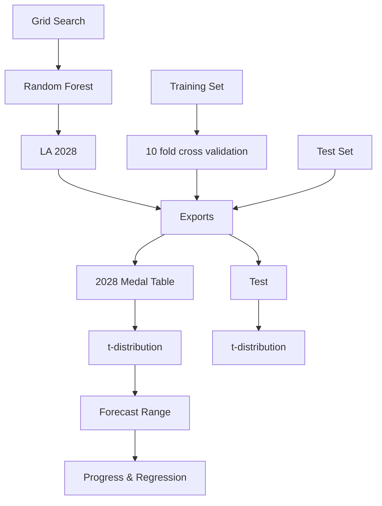
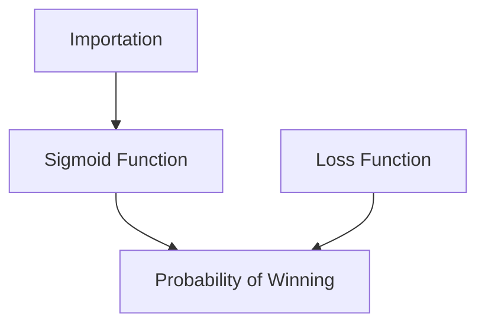
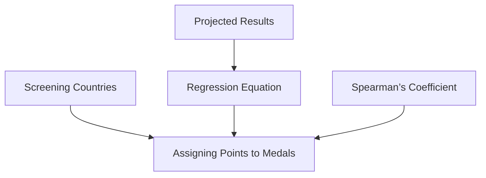
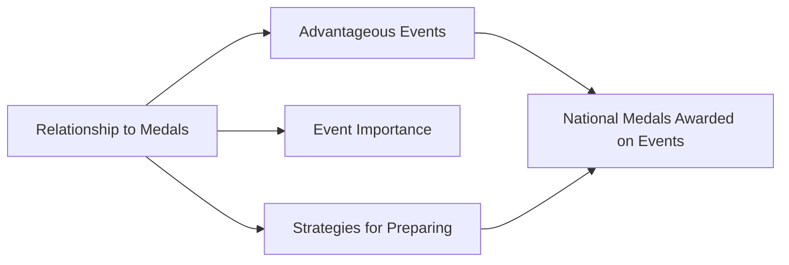
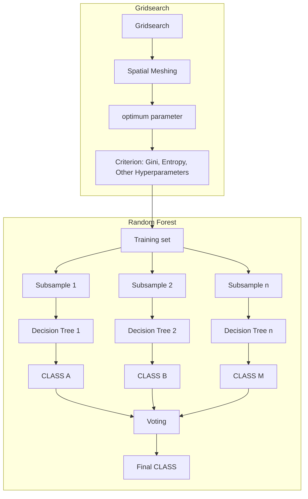
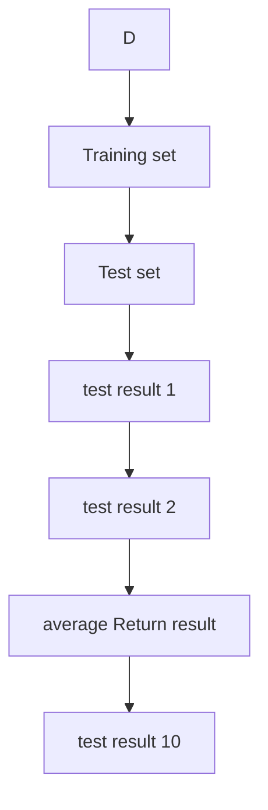

# Olympic Medals Unveiled:

# A Mathematical Exploration of Achievement Trends Summary

In the Olympic Games, the pinnacle of sports competition, the quest for medals reflects not only the physical prowess of athletes but also the overall strength of their countries. As competitive sports evolve, medal rankings shift over time. This paper analyzes the key factors influencing Olympic performance and explores future trends in the medal competition landscape from various perspectives.

For Task 1, we developed a Grid-Search Random Forest (GSRF) prediction model using preprocessed data. Through Cross-Validation, we obtained correlation coefficients for predicting the number of gold medals and the total medals, which were 0.710 and 0.784, respectively, validating the model. Based on this model, we projected the gold and total medal standings for the 2028 Olympic Games, concluding that China and the United States are likely to continue leading in both categories. We also calculated prediction intervals using the t-distribution, as shown in Figure 9. Additionally, we identified the countries most likely to advance and regress, which are illustrated in Figure 10.

For Task 2, we established a Logistic Regression Model to classify countries that have not yet won medals in the 2028 Olympic Games into two categories: winners and non-winners. This transformed the probability of winning a medal into a binary classification problem. We selected appropriate feature variables and calculated the weights of each feature vector using the maximum likelihood estimation method. By applying the sigmoid function and L1 regularization, we identified countries with a higher likelihood of winning medals among those yet to medal, as shown in Table 11.

For Task 3, based on the results of Task 1, we calculated the number of medals won by each country in each event and quantified the significance of each event's contributions by calculating the ratio of medals in that event to total medals. We noted that some countries (e.g., KOS in Judo) have achieved their only medals through specific programs that are particularly critical for them. Overall, countries tend to prioritize sports in which they have both strengths and potential to optimize their chances of winning more medals.

For Task 4, we created a “Great Coach” Model. By quantifying the weights of medals and calculating the scores of each country, we identified that there were “Great Coach” in women's gymnastics in Romania and the United States, and the Spearman's Correlation Coefficient between their scores and the scores of these two countries was 0.874. After building the model by using the Lasso Regression, we selected three countries and identify sports and applied it to them. After the introduction of the “Great Coach” concept, the predicted scores for each country in 2028 are presented in Table 15, with Romania showing a remarkable increase from a score of 3 to 36.65.

Finally, we offer original insights for the IOC regarding the host effect and the impact of talented athletes. Additionally, we performed a sensitivity analysis that demonstrated the model's stability and robustness following perturbations.

Keywords: Olympic; GSRF; Logistic Regression; Lasso Regression

# Contents

# 1 Introduction....3

1.1 Background....3  
1.2 Clarifications and Restatements....3  
1.3 Our work....4

# 2 Basic Assumption 5

# 3 Symbols....5

# 4 Data Preprocessing 5

# 5 Task 1 Predicting Gold & Total Medals Based on GSRF Model....6

5.1 GSRF Prediction Model....6  
5.2 Predicting the 2028 Gold & Medal Tables....11

# 6 Task 2 Projections for Non-Awarded Countries 13

6.1 Bicategory Logistic Regression Modeling....13  
6.2 Bicategory Logistic Regression Results ....14

# 7 Task 3 Relationship Between Sports and Medals ....17

7.1 Relationship of the Sports to gold medals & total medals....17  
7.2 The most Important Sports for the Country....17  
7.3 Impact of Nationally Selected Sports on results....18

# 8 Task 4 The Impact of Great Coach .... 19

8.1 Lasso Regression Model....19  
8.2 Lasso Regression Results....21

# 9 Task 5 Original Opinion....22

9.1 Host Effect....22  
9.2 Talented Athletes 23

# 10 Error Analysis and Sensitivity Analysis....23

10.1 Definition of Sensitivity....23  
10.2 Impact of Athletes Number, Gold & Total Medals on Predicted Results ....24

# 11 Evaluation of Model....24

# 12 References....25

# 1 Introduction

# 1.1 Background

When viewers follow the Summer Olympics, they appreciate the performance of the athletes as well as the medal standings. Since 1896, sports powerhouses such as the United States have been at the top of the list, demonstrating their strength. Countries that have won many gold medals are globally recognized, and countries that have won their first Olympic medals are celebrated, marking historical milestones. Here are the top 10 medalists for the 2024 Summer Olympics:

bar_stacked

| Country | Gold medal | Silver medal | Bronze medal | Total medals |
| :--- | :--- | :--- | :--- | :--- |
| United States | 40 | 44 | 42 | 126 |
| China | 40 | 27 | 24 | 91 |
| Japan | 20 | 12 | 13 | 45 |
| Australia | 18 | 19 | 16 | 53 |
| France | 16 | 26 | 22 | 64 |
| Netherlands | 15 | 7 | 12 | 34 |
| Great Britain | 14 | 22 | 29 | 65 |
| South Korea | 13 | 9 | 10 | 32 |
| Italy | 12 | 13 | 15 | 40 |
| Germany | 12 | 13 | 8 | 33 |

Figure 1 Medal list of 2024 Summer Olympic Games

# 1.2 Clarifications and Restatements

In this problem, models need to be developed to predict the medal table using relevant event and athlete data. Based on the data of previous years' Summer Olympics medal table, host country, number of events and participants, the analysis deals with the following problems:

Task 1 Predicts the medal standings for the 2028 Summer Olympics based on a model, giving prediction intervals that include each statistic, indicating the countries most likely to make progress and regress.

√ The feature values affecting the number of medals are counted and integrated into a dataset for model training and testing. After model validation, predict the number of gold medals and total medals for each country in 2028 based on 2024 data, calculate prediction intervals and visualize them.

Task 2 For countries that have not yet won a medal, predict how many countries will win their first medal at the next Olympic Games and calculate their probability

√ Essentially, it is a classification problem that categorizes the predicted outcomes of non-winning countries in 2028 into two categories: winning and not winning. Judgment calculates how probable it is that the country falls into the winning category.

Task 3 Consider the effect of the number and type of sports in previous Olympic Games on the number of medals won by each country. Determine the most important sport for each country and give reasons. Also consider the effect of the host country's choice of sport on the results.

√ We sort out the cumulative number of medals for each country and analyze the relationship. Also introduce a concept that can quantify the importance of the program to the country. Use the data to make judgments and explain why.

Task 4 Predict the contribution of the "great coach" effect to the number of medals. Select

three countries and consider the sports in which "great coaches" should be introduced and estimate their impact.

√ First identify the countries and programs that have been impacted, and then calculate the regression equation between the variables that include the impact of great coaches and the final predicted values. Then identify countries and programs with potential to predict changes in their performance

Task 5 Given original insights on Olympic medal counts, analyze the information these insights can provide to the NOC.

√ Find the eigenvalues from the previous Tasks that have some influence on the number of gold medals & medals, and investigate them

# 1.3 Our work

Task 1 2028 Medal Table Predictions  

flowchart

Task 2 Predictions for Non-winning Countries  

flowchart

Task 4 Great Coach

flowchart

Task 5 Original Opinion

flowchart

line

| Year | Host Effect::Blue Line | Host Effect::Brown Line | Talented Players |
| --- | --- | --- | --- |
| 2012 | 10 | 10 | — |
| 2013 | 10 | 10 | — |
| 2014 | 10 | 10 | — |
| 2015 | 10 | 10 | — |
| 2016 | 10 | 10 | — |
| 2017 | 10 | 10 | — |
| 2018 | 10 | 10 | — |
| 2019 | 10 | 10 | 1 |
| 2020 | — | — | 3 |
| 2021 | — | — | 3 |
| 2022 | — | — | 1 |

Figure 2 Our Work

# 2 Basic Assumption

Hypothesis 1: Assume that the number of athletes participating in the 2028 Olympics, the number of countries, and the number of events held are the same as in 2024.

Legitimacy: The data review revealed that the number of countries participating in recent Olympic Games and the number of events held have not changed much. To simplify the calculation of the model, it is assumed that the number remains constant.

➢ Hypothesis 2: The variables are independent of each other and only affect the results.

Justification: while these variables interact, considering them in the model adds complexity and unpredictability. For extensive analysis, we focus more on measurable and consistent factors

Assumption 3: Excluding the cost of investing in great coaches

Justification: focuses on the direct impact of coaching quality on athlete performance, team performance, or overall sport system development.

# 3 Symbols

<table><tr><td>Symbols</td><td>Definition</td></tr><tr><td> $A_{ij}$ </td><td>Total number of athletes from the i-th country in the j-th Olympic Games</td></tr><tr><td> $G_{ij}$ </td><td>The number of gold medals won by the i-th country before the j-th Olympic Games</td></tr><tr><td> $T_{ij}$ </td><td>The total number of medals won by the i-th country before the j-th Olympic Games</td></tr><tr><td> $E_{ij}$ </td><td>Total number of events in the j Olympic Games</td></tr><tr><td> $Y_{g}$ </td><td>Number of gold medals predicted</td></tr><tr><td> $Y_{t}$ </td><td>Total number of medals predicted</td></tr><tr><td> $a_{k}$ </td><td>Number of athletes in the kth country</td></tr><tr><td> $e_{k}$ </td><td>Number of projects participated by the kth country</td></tr><tr><td> $p_{k}$ </td><td>Number of historical entries of the kth country</td></tr></table>

# 4 Data Preprocessing

■ Outlier handling: each country may have different teams for the same program, and the names of these teams contain markers representing the order of the teams, and there is garbled code after the name of the country. We dealt with cleaning these outliers.  
Data standardization: In forecasting, to ensure that the data have relatively equal weights for each feature value, data standardization is used, where the mean ( $\bar{x}$ ) and standard deviation (SD) of each feature are to be calculated

$$
x ^ {\prime} = \frac {(x - \overline {{x}})}{S D} \tag {0}
$$

■ Conversion of country and region names: To build the model, we utilized two files: "summerOly\_medal\_counts.csv" and "summerOly\_athletes.csv." Since these files represent countries in different formats, we employed an ISO mapping table to convert the full names of all countries and regions into standardized codes prior to data integration. Data for countries that were dissolved or banned, such as the USSR and Russia, was excluded.  
■ Athlete & Event Counts: Athletes and events are categorized by country and year and their total value is calculated. Individual Neutral Athletes (AIN) sport results do not represent any one country and should also be cleared in the forecast.

# 5 Task 1 Predicting Gold & Total Medals Based on GSRF Model

# 5.1 GSRF Prediction Model

# 5.1.1 ARIMA Model Initial Prediction

The ARIMA model is widely used in time series analysis for its flexibility and powerful forecasting ability to adapt to a wide range of data characteristics and make accurate predictions. The ARIMA model integrates autoregressive (AR) and moving average (MA) methods and incorporates differencing (I) to enhance data smoothing. By examining autocorrelation in historical data, the model assumes that future trends will mimic historical patterns and thus predict future data points. ARIMA (p, d, q) can be expressed as equation (2):

$$
X _ {t} = c + \varphi_ {1} X _ {t - 1} + \varphi_ {2} X _ {t - 2} + \dots + \varphi_ {p} X _ {t - p} + \theta_ {1} \varepsilon_ {t - 1} + \theta_ {2} \varepsilon_ {t - 2} + \dots + \theta_ {q} \varepsilon_ {t - q} + \varepsilon_ {t} \tag {1}
$$

Among them:

- $X_{t}$ represents the time series data we are considering;  
- $c$ is a constant term;  
- $\varphi_{1}, \varphi_{2}, \ldots, \varphi_{p}$ are the parameters of the AR model, which are used to describe the relationship between the current value and the value at the past p time points;  
- $\theta_{1}, \theta_{2}, \cdots, \theta_{q}$ are the parameters of the MA model that are used to describe the relationship between the current value and the error at the past q time points;  
- $\varepsilon_{t}$ is the error term at time point $t$ .

Our initial ARIMA projections of the number of gold medals and the total number of medals for the United States and China resulted in the projection charts shown below:

line

| Year | True | Predict |
| --- | --- | --- |
| 1900 | ~11 | ~39 |
| 1905 | ~76 | ~59 |
| 1910 | ~23 | ~22 |
| 1915 | ~33 | ~33 |
| 1920 | ~42 | ~46 |
| 1925 | ~47 | ~54 |
| 1930 | ~22 | ~33 |
| 1935 | ~44 | ~31 |
| 1940 | ~24 | ~39 |
| 1945 | ~31 | ~44 |
| 1950 | ~38 | ~50 |
| 1955 | ~40 | ~43 |
| 1960 | ~32 | ~29 |
| 1965 | ~36 | ~48 |
| 1970 | ~45 | ~45 |
| 1975 | ~33 | ~29 |
| 1980 | ~34 | ~34 |
| 1985 | ~83 | ~47 |
| 1990 | ~36 | ~27 |
| 1995 | ~44 | ~47 |
| 2000 | ~37 | ~47 |
| 2005 | ~36 | ~34 |
| 2010 | ~36 | ~31 |
| 2015 | ~48 | ~42 |
| 2020 | ~40 | ~34 |

a) United States Gold

line

| Year | True | Predict |
| --- | --- | --- |
| 1900 | ~20 | ~40 |
| 1905 | ~230 | ~100 |
| 1910 | ~45 | ~60 |
| 1915 | ~60 | ~60 |
| 1920 | ~90 | ~150 |
| 1925 | ~100 | ~100 |
| 1930 | ~55 | ~85 |
| 1935 | ~110 | ~100 |
| 1940 | ~55 | ~80 |
| 1945 | ~65 | ~80 |
| 1950 | ~80 | ~85 |
| 1955 | ~75 | ~100 |
| 1960 | ~70 | ~80 |
| 1965 | ~70 | ~85 |
| 1970 | ~105 | ~85 |
| 1975 | ~95 | ~70 |
| 1980 | ~100 | ~85 |
| 1985 | ~170 | ~95 |
| 1990 | ~95 | ~80 |
| 1995 | ~110 | ~95 |
| 2000 | ~95 | ~130 |
| 2005 | ~100 | ~120 |
| 2010 | ~110 | ~120 |
| 2015 | ~105 | ~105 |
| 2020 | ~120 | ~110 |
| 2025 | ~130 | ~110 |

b) United States Total Predict

line

| Year | True | Predict |
| --- | --- | --- |
| 1984 | ~15 | — |
| 1988 | ~5 | ~18 |
| 1992 | ~16 | ~11 |
| 1996 | ~16 | ~16 |
| 2000 | ~28 | ~20 |
| 2004 | ~32 | ~28 |
| 2008 | ~48 | ~34 |
| 2012 | ~39 | ~47 |
| 2016 | ~26 | ~45 |
| 2020 | ~38 | ~33 |
| 2024 | ~40 | ~38 |

c) China Gold Predict

line

| Year | True | Predicted |
| --- | --- | --- |
| 1983 | ~32 | — |
| 1988 | ~28 | ~38 |
| 1992 | ~54 | ~38 |
| 1996 | ~50 | ~54 |
| 2000 | ~58 | ~60 |
| 2004 | ~63 | ~63 |
| 2008 | 100 | ~70 |
| 2012 | ~92 | ~96 |
| 2016 | ~70 | ~103 |
| 2020 | ~88 | ~85 |
| 2024 | ~91 | ~91 |

d) China Total Predict  
Figure 3 Prediction chart of medal numbers for the United States and China

The ARIMA (p, d, q) model corresponding to the above predictions and the correlation coefficients $R^{2}$ are shown in the table below:

Table 1 Relevant data for predictive models

<table><tr><td></td><td>ARIMA (p, d, q)</td><td> $R^{2}$ </td></tr><tr><td>United States Gold Predict</td><td>ARIMA (2, 0, 2)</td><td>0.218</td></tr><tr><td>United States Total Predict</td><td>ARIMA (2, 1, 1)</td><td>0.257</td></tr><tr><td>China Gold Predict</td><td>ARIMA (1, 1, 0)</td><td>0.430</td></tr><tr><td>China Total Predict</td><td>ARIMA (1, 1, 0)</td><td>0.494</td></tr></table>

The correlation coefficients derived from the prediction are small not close to 1, proving that the use of ARIMA model to predict the number of medals is not ideal, so we use the GSRF swing prediction model to make predictions

# 5.1.2 GSRF Prediction Modeling

First, we need to build a model for predicting the fluctuations in the number of medals for each country, as well as finding the factors that are most relevant to this fluctuation. From this we use the GSRF swing prediction model.

In order to predict the number of medals the country will win in the next Olympics, we start with the previous years' awards of the participating athletes and use the network search random forest algorithm to predict the number of gold medals won in the future and the total number of medals, respectively.

Next, we describe the selected metrics data and explain the algorithmic process.

# 1) Selected indicators

Using the dataset from previous years, we selected four characteristic input indicators:

■ Total number of athletes from this country in the current Olympics: more athletes means more opportunities to compete and a wider range of selections, increasing the likelihood of winning medals. We denote the total number of athletes from country i in the jth Olympics as: $A_{ij}$  
The number of gold medals and total medals won by the country up to the current Olympics: The medal table of previous years gives a preliminary idea of the strength of the country and the trend of its strength. We denote the total number of gold medals won by country i before the jth Olympics as $G_{ij}$ and the total number of medals as $T_{(ij)}$ .  
■ Current total number of Olympic events: The total number of Olympic events determines the basis of medal distribution, the more events the more medals. The more programs a country participates in, the more chances it has to win. An increase in the number of events results in a wider distribution of medals, with more countries having a chance to win. We denote the total number of events in the jth Olympics as $E_{j}$  
Is the country hosting the Games: As a host, the country has advantages in terms of venues, facilities and logistics. The host can increase the number of events it specializes in, decrease the number of events it does not specialize in, and automatically get more places, increasing the chances of athletes to participate. If it is the host of the jth Olympic Games, let $H_{ij}=1$ , and vice versa, let $H_{ij}=0$ .

# 2) GSRF Algorithm

The GSRF algorithm optimizes the random forest model using a grid search algorithm.

Random forests are machine learning algorithms trained using multiple decision trees, with a randomly selected subset of features per tree, and voting to integrate the results when classifying. To prevent overfitting or underfitting, grid search optimization is used. The grid search algorithm traverses a grid of predefined parameters, trains and evaluates each combination, and outputs the best set of parameters and model performance.

Compared with the standard random forest algorithm, the GSRF algorithm uses an optimal combination of hyperparameters to train and predict the model. This improvement significantly improves the performance of the model and effectively mitigates problems such as overfitting or underfitting. The following figure illustrates the workflow of the GSRF algorithm.

flowchart

Figure 4 GSRF Algorithm Flow Diagram

# 3) Make Predictions on Gold & Total Medals

According to the literature, it is known that a series of data such as the number of strengths of athletes, the number of types of events and so on have an impact on the number of medals in the next Olympic Games. Therefore, we use the above four characteristic input indicators as

the input parameters of the random forest model to predict the number of medals:

$$
(A _ {i j, g}, G _ {i j}, E _ {j, g}, H _ {i j, g}) \xrightarrow {G S R F} Y _ {g} \tag {2}
$$

$$
(A _ {i j, t}, T _ {i j}, E _ {j, t}, H _ {i j, t}) \xrightarrow {G S R F} Y _ {t}
$$

Among them.

$A_{ij,g}, E_{j,g}, H_{ij,g}$ represent the total number of athletes from the country in the gold medal prediction model, the total number of Olympic events, and whether this country is the host of this Olympics, respectively. $Y_{g}$ Represents the number of gold medals predicted.

$A_{ij,t}, E_{j,t}, H_{ij,t}$ Represent the total number of athletes from the country in the total medal count prediction model, the total number of Olympic events, and whether this country is the host of this Olympics, respectively. $Y_{t}$ Represents the number of gold medals predicted.

We use data prior to 2024 as the training set and 2024 as the test set. The k-fold cross-validation method is used, taking k to be 10. The training set is divided equally into 10 equal sized subsets. For each subset, that subset is used as the validation set and the rest use the remaining 9 subsets as the training set. The random forest model is trained on the training set and the model performance is evaluated on the validation set and the evaluation metrics are recorded. Finally, the average evaluation metrics of all the subsets are calculated, giving a comprehensive estimate of the model performance, as a way to assess the stability and generalization ability of the model. The schematic diagram is shown below:

flowchart

Figure 5 10 Fold Cross Validation Diagram

The Random Forest Regressor algorithm from the integration module in the scikit-learn (sklearn) machine learning library $^{[1]}$ and the GridSearchCV algorithm from sklearn were used via . The optimal parameter combination obtained by GridSearchCV is as follows:

Table 2 The impact of various indicators on the prediction results

<table><tr><td colspan="4">Gold Medals</td><td colspan="4">Total Medal</td></tr><tr><td> $A_{ij,g}$ </td><td> $G_{ij}$ </td><td> $E_{j,g}$ </td><td> $H_{ij,g}$ </td><td> $A_{ij,t}$ </td><td> $T_{ij}$ </td><td> $E_{j,t}$ </td><td> $H_{ij,t}$ </td></tr><tr><td>74.10%</td><td>1.71%</td><td>7.40%</td><td>16.90%</td><td>85.70%</td><td>7.20%</td><td>6.30%</td><td>0.80%</td></tr></table>

We use radar charts to visualize the impact of each indicator on the forecast results as follows:

radar

| Dimension | Importance of Features |
| --- | --- |
| Athletes_num (A_s) | ~0.75 |
| History (G_y) | ~0.15 |
| Total events (E_f) | ~0.25 |
| Host (H_g) | ~0.25 |

a) Prediction of Gold

radar

| Dimension | Importance of Features |
| --- | --- |
| Athletes_num(Ai) | 0.9 |
| History (Ta) | 0.2 |
| Total events(Ei) | 0.2 |
| Host (Hi) | 0.2 |

b) Prediction of Total Medal Count  
Figure 6 Feature Importance Radar Chart

The graph shows that the number of athletes has the greatest impact on gold and total medal predictions. Host status has a significant impact on gold medal predictions and a small impact on total medal predictions. The total number of Olympic events has some impact on the number of medals, but not significant.

The comparison between the predicted and actual values for some of the test sets is obtained as shown below:

line

| Category | TRUE | Predicted |
| --- | --- | --- |
| United States | ~41 | ~41 |
| China | ~41 | ~36 |
| Great Britain | ~18 | ~27 |
| France | ~16 | ~23 |
| Australia | ~18 | ~23 |
| Japan | ~20 | ~19 |
| Italy | ~12 | ~16 |
| Netherlands | ~15 | ~9 |
| Germany | ~12 | ~18 |
| Korea | ~12 | ~12 |
| Canada | ~13 | ~15 |
| Brazil | ~3 | ~8 |
| New Zealand | ~10 | ~6 |
| Hungary | ~6 | ~5 |
| Ukraine | ~3 | ~3 |
| Sweden | ~3 | ~3 |
| Cuba | ~2 | ~2 |
| Denmark | ~2 | ~3 |
| Romania | ~3 | ~3 |
| Greece | ~1 | ~1 |

(a) Prediction of Gold

line

| Category | TRUE | Predicted |
| --- | --- | --- |
| United States | ~125 | ~125 |
| China | ~95 | ~80 |
| Great Britain | ~75 | ~70 |
| France | ~65 | ~70 |
| Australia | ~55 | ~55 |
| Japan | ~45 | ~50 |
| Italy | ~40 | ~45 |
| Netherlands | ~35 | ~35 |
| Germany | ~35 | ~45 |
| Korean | ~30 | ~25 |
| Canada | ~30 | ~35 |
| Brazil | ~20 | ~20 |
| New Zealand | ~20 | ~20 |
| Hungary | ~20 | ~20 |
| Ukraine | ~15 | ~15 |
| Sweden | ~10 | ~10 |
| Cuba | ~5 | ~5 |
| Denmark | ~5 | ~5 |
| Romania | ~5 | ~5 |
| Greece | ~5 | ~5 |

b) Prediction of Total Medal Count  
Figure 7 Comparison Chart of Actual and Predicted Values for Some Countries in 2024

# 5.1.3 Model Prediction Effectiveness and Performance Evaluation

We trained the random forest model using the first 80% of the data and tested it using the second 20% of the data. Based on the predicted and true values, the coefficient of determination ( $R^{2}$ ), Mean Absolute Error (MAE), Root Mean Square Error (RMSE) of this model are calculated as follows:

Correlation coefficient $R^{2}$ : comparing the predictions obtained using the model with the predictions using only the mean, the closer $R^{2}$ is to 1 the more accurate the model is.

$$
R ^ {2} = 1 - \frac {\sum_ {i = 1} ^ {n} (Y _ {i} - \widehat {Y} _ {i}) ^ {2}}{\sum_ {i = 1} ^ {n} (Y _ {i} - \overline {{Y}} _ {i}) ^ {2}} \tag {3}
$$

Mean Absolute Error MAE: The average value of the absolute error, which can reflect the actual situation of the prediction value error. The smaller the value, the higher the accuracy of the model.

$$
M A E = \frac {1}{n} \sum_ {i = 1} ^ {n} \left| Y _ {i} - \widehat {Y} _ {i} \right| \tag {4}
$$

Root Mean Square Error RMSE: the square root of the MSE, the smaller the RMSE, the more accurate the model is

$$
R M S E = \sqrt {\frac {1}{n} \sum_ {i = 1} ^ {n} (Y _ {i} - \widehat {Y} _ {i}) ^ {2}} \tag {5}
$$

The model evaluation results obtained from the calculations are as follows:

Table 3 Evaluation Results of Gold Medal Prediction Model

<table><tr><td></td><td> $R^2$ </td><td>MAE</td><td>RMSE</td></tr><tr><td>Training set</td><td>0.903</td><td>0.626</td><td>1.829</td></tr><tr><td>Cross validation set</td><td>0.710</td><td>0.994</td><td>3.145</td></tr><tr><td>Test set</td><td>0.795</td><td>0.914</td><td>2.574</td></tr></table>

Table 4 Evaluation Results of the Prediction Model for the Total Number of Medals

<table><tr><td></td><td> $R^2$ </td><td>MAE</td><td>RMSE</td></tr><tr><td>Training set</td><td>0.933</td><td>1.947</td><td>4.11</td></tr><tr><td>Cross validation set</td><td>0.784</td><td>2.744</td><td>7.162</td></tr><tr><td>Test set</td><td>0.736</td><td>2.430</td><td>7.145</td></tr></table>

The $R^{2}$ of both prediction models is very close to 1, and the MAE and RMSE are small. This indicates that the accuracy of the prediction models we constructed is higher and the model performance is better.

# 5.2 Predicting the 2028 Gold & Medal Tables

# 5.2.1 Predicting the 2028 Gold & Medal Tables

Based on the GSRF prediction model we established in the previous section, this paper predicts the medal table of the 2028 Summer Olympics in Los Angeles, U.S.A. We predict the top ten gold medals won and the top ten total medals won at the 2028 Los Angeles Olympics corresponding to the countries and the number of countries in the following table.

Table 5Top 10 Predicted Gold Medals for the 2028 Olympic Games

<table><tr><td>Country</td><td>USA</td><td>CHN</td><td>ITA</td><td>FRA</td><td>GBR</td><td>GBR</td><td>AUS</td><td>GER</td><td>JPN</td><td>CAN</td></tr><tr><td>old medals</td><td>51</td><td>34</td><td>29</td><td>28</td><td>26</td><td>26</td><td>20</td><td>19</td><td>15</td><td>15</td></tr></table>

Table 6Top 10 Predicted Medals for the 2028 Olympic Games

<table><tr><td>Country</td><td>USA</td><td>FRA</td><td>CHN</td><td>GBR</td><td>AUS</td><td>GER</td><td>ITA</td><td>JPN</td><td>CAN</td><td>NED</td><td>BRA</td></tr><tr><td>Total medals</td><td>124</td><td>81</td><td>74</td><td>72</td><td>65</td><td>61</td><td>55</td><td>52</td><td>35</td><td>34</td><td>34</td></tr></table>

We visualized the results using plotting software as shown below:

bar

| Country | Total Medals | Gold Medals |
| --- | --- | --- |
| United States | ~124 | ~50 |
| China | ~74 | ~34 |
| Italy | ~54 | ~28 |
| France | ~81 | ~27 |
| Great Britain | ~72 | ~25 |
| Australia | ~64 | ~20 |
| Germany | ~61 | ~19 |
| Canada | ~35 | ~15 |
| Japan | ~52 | ~15 |
| Netherlands | ~34 | ~9 |

Figure 8 Predicted Gold&Total Medals Table for 2028 Los Angeles Olympics

USA tops the table in both gold and total medals, France is second in total medals but not many gold medals, China is second in gold medals and third in total medals. Predicting the 2028 gold medal table, Canada is on the list and South Korea is out, the rest of the countries have changed their rankings.

The above predictions are only the most likely scenarios, next we solve for the prediction intervals at the 95% confidence level:

# 5.2.2 Calculate the prediction interval

First, we determine whether the residuals of the two prediction models satisfy a normal distribution:

We plotted and fitted a histogram of residuals and also performed a Shapiro-Wilk test on the data, the results of which are shown below:

histogram

| Bin (Range) | Frequency |
| --- | --- |
| -10~-8 | ~2 |
| -8~-6 | ~18 |
| -6~-4 | ~18 |
| -4~-2 | ~275 |
| -2~0 | ~275 |
| 0~2 | ~10 |
| 2~4 | ~8 |
| 4~6 | ~5 |
| 6~8 | ~5 |
| 16~18 | ~2 |

a) Prediction of Gold Medals

histogram

| Bin (Range) | Frequency |
| --- | --- |
| -30~-20 | ~5 |
| -20~-10 | ~5 |
| -10~0 | ~290 |
| 0~10 | ~15 |
| 10~20 | ~5 |
| 20~30 | ~2 |

b) Prediction of Total Medal Count

Figure 9 histogram of residuals  
Table 7 Fitting data and SW test results

<table><tr><td></td><td>Standard Deviation</td><td>Skewness</td><td>Kurtosis</td><td>Shapiro-Wilk Test</td></tr><tr><td>Gold Medals</td><td>2.908</td><td>4.723</td><td>35.429</td><td>0.438</td></tr><tr><td>Total Medals</td><td>7.123</td><td>-4.644</td><td>40.523</td><td>0.434</td></tr></table>

Based on the above graphs, it can be found that both predictive models have large peaks and skewness, and the significance of the Shapiro-Wilk test on the data is P<0.05, which indicates that both predictive models do not conform to a normal distribution.

So we compute the prediction interval using the t distribution

$$
\text {Prediction Interval} = \hat {y} \pm t _ {\alpha / 2, n - p} \times S E \left(\hat {y}\right) \tag {6}
$$

Among them.

$\hat{y}$ represents the predicted value, $t_{\alpha/2,n-p}$ is the quantile of the t-distribution, n is the number of samples, p is the number of parameters in the model, and $SE(\hat{y})$ is the standard error of the prediction. The correlation results were calculated as shown below:

Table 8 Prediction Model T-Distribution Related Data

<table><tr><td></td><td> $t_{\alpha/2,n-p}$ </td><td> $SE(\hat{y})$ </td></tr><tr><td>Prediction of Gold Medals</td><td>2.404</td><td>2.908</td></tr><tr><td>Prediction of Total Medal Count</td><td>1.993</td><td>7.123</td></tr></table>

Then the prediction interval for the number of gold medals at the 95% confidence level is $\hat{y} \pm 7$ and the total prediction interval for the number of medals is $\hat{y} \pm 15$

boxplot

| Country | Q1 | Q2 (Median) | Q3 |
| --- | --- | --- | --- |
| USA | ~24 | ~26 | ~29 |
| CHN | ~18 | ~20 | ~22 |
| SA | ~16 | ~18 | ~20 |
| FIN | ~16 | ~17 | ~19 |
| GBR | ~14 | ~15 | ~17 |
| GBR | ~14 | ~15 | ~17 |
| AU | ~12 | ~13 | ~15 |
| GBR | ~12 | ~13 | ~15 |
| JPN | ~10 | ~11 | ~13 |
| CHA | ~10 | ~11 | ~13 |
| NLD | ~7 | ~8 | ~10 |
| ETP | ~6 | ~7 | ~9 |
| BRA | ~5 | ~6 | ~8 |
| NZ | ~5 | ~6 | ~8 |
| PO | ~5 | ~6 | ~8 |

(a) Prediction of Gold Medals

boxplot

| Country | Q1 | Q2 (Median) | Q3 |
| --- | --- | --- | --- |
| SA | ~115 | ~122 | ~139 |
| FR | ~84 | ~81 | ~98 |
| CHN | ~80 | ~87 | ~95 |
| ISR | ~79 | ~86 | ~94 |
| AUS | ~75 | ~83 | ~90 |
| GBR | ~73 | ~81 | ~93 |
| ITA | ~70 | ~83 | ~90 |
| JPN | ~69 | ~83 | ~90 |
| CAN | ~60 | ~73 | ~85 |
| NLD | ~60 | ~73 | ~85 |
| BRA | ~60 | ~73 | ~85 |
| ESP | ~50 | ~73 | ~90 |
| POL | ~45 | ~60 | ~85 |
| NZL | ~45 | ~60 | ~85 |
| HUN | ~45 | ~60 | ~85 |

b) Prediction of Total Medal Count  
Figure 10 Error bar chart of prediction model

# 5.2.3 Predicting progress and regressions in national performance

The question asked us to predict the countries most likely to advance or retreat, we calculated the predicted number of gold medals & total medals and the difference between the awards in 2024 to find the change in value, and plotted a histogram as shown below:

bar

| Country | Change in the number of gold reserves |
| :--- | :--- |
| GBR | ~24 |
| TA | ~15 |
| FRA | ~10 |
| GBR | ~10 |
| USA | ~9 |
| DEU | ~7 |
| CA | ~6 |
| BRA | ~5 |
| FRA | ~5 |
| CIP | ~4 |
| CH | ~4 |
| NZL | ~-3 |
| JPN | ~-5 |
| MEZ | ~-5 |
| GBR | ~-6 |
| UAE | ~-6 |
| NED | ~-9 |

a) Gold medal, with fluctuations exceeding 2 b) Total medal, with fluctuations exceeding 5  

bar

| Category | Value |
| --- | --- |
| CBT | ~88 |
| PSS | ~17 |
| IUS | ~15 |
| BMY | ~14 |
| KUO | ~12 |
| PHL | ~9 |
| GME | ~8 |
| BCP | ~8 |
| JPM | ~7 |
| LBT | ~7 |
| GLI | ~6 |
| BCP | ~6 |
| SLB | ~-3 |
| REN | ~-3 |
| NI | ~-4 |
| RCH | ~-11 |
| QMS | ~-13 |

Figure 11 Countries with significant fluctuations in medal numbers

The graphic shows that Great Britain had the most significant increase in gold medals and Germany had the most significant increase in total medals, both making significant progress. South Korea had the largest decrease in gold medals and China had the largest decrease in total medals. With the exception of the United States, the countries with significant gold medal growth also saw varying degrees of progress in total medals. The U.S. had more gold medal growth, but less significant total medal growth.

# 6 Task 2 Projections for Non-Awarded Countries

The question asks us to predict whether or not a country that has never won a medal will win its first medal at the 2028 Summer Olympics and to predict the probability of winning. The question is essentially a binary classification problem. The predicted outcomes are categorized into those that will win and those that will not. Therefore, we build a binary logistic regression model.

# 6.1 Bicategory Logistic Regression Modeling

We recorded non-winning countries as Category 1 if they could win at the 2028 Summer Olympics and Category 0 if they could not.

# 6.1.1 Sigmoid Function (math.)

Logistic regression is a generalized linear regression that combines a nonlinear function with a linear function to map it. We use the Sigmoid function to map the output value of a linear function to a probability between 0 and 1. The Sigmoid function formula is as follows:

$$
\sigma (z) = \frac {1}{1 + e ^ {- z}} \tag {7}
$$

Among them:

$$
z = \omega_ {1} a _ {k} + \omega_ {2} e _ {k} + \omega_ {3} p _ {k} + b \tag {8}
$$

■ $a_{k}, e_{k}, p_{k}$ is the input eigenvalue

$a_{k}$ : The number of athletes from the kth country in the 2028 Olympics. More athletes means that more people can compete in more events, or more people can compete in the same event, which greatly increases the probability of winning.  
$e_{k}$ : The number of events in which the kth country participates in the 2028 Olympics. Participating in more events increases the probability of winning to some extent compared to concentrating on the same event.  
$p_{k}$ : Historical participation of the kth country: the more a country participates in international events, the more experience it accumulates, which can largely increase its probability of winning.  
$\omega_{1}, \omega_{2}, \cdots, \omega_{n}$ are the weights and we calculate their values using gradient descent.  
■ b is the bias term

When the output of the sigmoid function is close to 1, the probability that the country belongs to category 1 is considered higher, i.e. the probability of winning the prize is higher. When the output value is close to 0, the probability that the country belongs to category 0 is higher, i.e. the probability of not winning the prize is higher.

# 6.1.2 Introducing the Loss Function

$$
\text {Let} p _ {i} = \sigma (z) = \frac {1}{1 + e ^ {- z}}, \text {we get} P (z = 0 \mid x) = 1 - P (z = 1 \mid x) = 1 - p _ {i}, \text {then}
$$

$$
P (y \mid x, \omega) = (p _ {i}) ^ {y} (1 - p _ {i}) ^ {1 - y} \tag {9}
$$

To further optimize the model, we introduce a cross-entropy loss function (log loss) to measure the gap between the model's predicted probability and the true category, log loss is defined as follows:

$$
L = \sum_ {i = 1} ^ {m} \left[ z _ {i} \ln \left(p _ {i}\right) + \left(1 - z _ {i}\right) \ln \left(1 - p _ {i}\right) \right] \tag {10}
$$

where $z_{i}$ is the true category; $p_{i}$ is the predicted probability of the model; and m is the sample size.

# 6.2 Bicategory Logistic Regression Results

The results of the parameters of the model were calculated using MATLAB as shown in the table below:

Table 9 Parameter results of Binary Logistic Regression Model

<table><tr><td></td><td>Regression Coefficient</td><td>Standard Error</td><td>Waid</td><td>P</td></tr><tr><td>b</td><td>2.425</td><td>0.098</td><td>607.134</td><td>&lt;0.01</td></tr><tr><td> $a_k$ </td><td>-0.012</td><td>0.004</td><td>10.62</td><td>&lt;0.01</td></tr><tr><td> $e_k$ </td><td>-0.068</td><td>0.008</td><td>76.036</td><td>&lt;0.01</td></tr><tr><td> $p_k$ </td><td>-0.013</td><td>0.010</td><td>1.665</td><td>0.197</td></tr></table>

As can be seen from the table, $p_{k}$ corresponds to P>0.05, which indicates that $p_{k}$ has no effect on the predicted results. We stipulate that a dependent variable of 1 represents that the non-winning country can win at the 2028 Summer Olympics. A dependent variable of 0 represents not being able to win a prize. The regression equation for whether or not the non-winning country wins the 2028 Olympics is derived:

$$
z = - 0. 0 1 2 a _ {k} - 0. 0 6 8 e _ {k} + 2. 4 2 5 \tag {11}
$$

# 6.2.1 Model Evaluation and Modification

In order to evaluate the classification effectiveness of the model, we start with the sensitivity and specificity of the model:

◆ Sensitivity (TPR): the proportion of results that are actually positive samples that are predicted to be positive samples.  
Specificity (FPR): the proportion of results that are actually negative samples that are predicted to be positive samples.  
◆ AUC: is the area under the ROC curve and is used to measure the overall performance of the binary classification model.

The ROC curve of the model is plotted as shown below:

roc

| FPR | TPR |
| --- | --- |
| 0 | 0 |
| ~0.02 | ~0.15 |
| ~0.04 | ~0.35 |
| ~0.06 | ~0.55 |
| ~0.08 | ~0.68 |
| ~0.10 | ~0.75 |
| ~0.12 | ~0.80 |
| ~0.14 | ~0.83 |
| ~0.16 | ~0.85 |
| ~0.18 | ~0.87 |
| ~0.20 | ~0.88 |
| ~0.22 | ~0.89 |
| ~0.24 | ~0.90 |
| ~0.26 | ~0.91 |
| ~0.28 | ~0.92 |
| ~0.30 | ~0.93 |
| ~0.32 | ~0.94 |
| ~0.34 | ~0.95 |
| ~0.36 | ~0.96 |
| ~0.38 | ~0.96 |
| ~0.40 | ~0.97 |
| ~0.42 | ~0.97 |
| ~0.44 | ~0.98 |
| ~0.46 | ~0.98 |
| ~0.48 | ~0.98 |
| ~0.50 | ~0.99 |
| ~0.52 | ~0.99 |
| ~0.54 | ~0.99 |
| ~0.56 | ~0.99 |
| ~0.58 | ~0.99 |
| ~0.60 | ~0.99 |
| ~0.62 | ~0.99 |
| ~0.64 | ~0.99 |
| ~0.66 | ~0.99 |
| ~0.68 | ~0.99 |
| ~0.70 | ~0.99 |
| ~0.72 | ~0.99 |
| ~0.74 | ~0.99 |
| ~0.76 | ~0.99 |
| ~0.78 | ~0.99 |
| ~0.80 | ~0.99 |
| ~0.82 | ~0.99 |
| ~0.84 | ~0.99 |
| ~0.86 | ~0.99 |
| ~0.88 | ~0.99 |
| ~0.90 | ~0.99 |
| ~0.92 | ~0.99 |
| ~0.94 | ~0.99 |
| ~0.96 | ~0.99 |
| ~0.98 | ~0.99 |
| 1 | 1 |

Figure 12 ROC curve

heatmap

| | 1.0 | 0.0 |
| --- | --- | --- |
| 1.0 | 1029 | 373 |
| 0.0 | 136 | 1663 |

Figure 13 Hybrid Matrix Thermodynamic Diagram

The ROC plot combines sensitivity (TPR) and specificity (FPR), which can measure the relationship simultaneously. Ideally, TPR should be close to 1, FPR should be close to 0, and the AUC value should be close to 1. Calculation from the ROC graph shows that AUC = 0.918. It can be seen that the sensitivity of this model is good.

To further measure the classification effectiveness of logistic regression through quantitative metrics, a heat map of the confusion matrix was drawn as shown above. Based on this, the classification evaluation metrics of the model are calculated as shown in the table below

Table 10 Classification Evaluation Index

<table><tr><td>Accuracy</td><td>Recall</td><td>Precision</td><td>F1</td></tr><tr><td>0.841</td><td>0.841</td><td>0.848</td><td>0.839</td></tr></table>

◆ Accuracy: The proportion of positive samples to the total samples, the greater the accuracy, the better.  
- Recall: The proportion of results from actual positive samples that predict positive samples, the greater the recall the better.  
◆ Precision: The proportion of the results of the predicted positive sample that are actually positive, the greater the precision the better.  
◆ F1:A reconciled average of precision and recall, where precision and recall are mutually influential.

The above table shows that Accuracy, Recall and Precision are all larger and F1 is also larger, which indicates that this classification model ensures higher accuracy while recall is also high, and the classification effect of this classification model is better.

# 6.2.2 The Classification Results are Given

We need to solve for the probability p that the dependent variable is 1:

$$
p = \frac {1}{1 + e ^ {- z}} \tag {12}
$$

$$
z = - 0. 0 1 2 a _ {k} - 0. 0 6 8 e _ {k} + 2. 4 2 5
$$

After calculating the results, we took only the countries with a probability of winning the prize greater than 0.2 as shown in the table below

Table 11 Countries and Probability of Winning Medals

<table><tr><td>LBN</td><td>GUM</td><td>PLE</td><td>ANG</td><td>ESA</td></tr><tr><td>0.290</td><td>0.230</td><td>0.220</td><td>0.206</td><td>0.201</td></tr></table>

The resulting visualization is shown below:

donut

| Category | Predicted_Probability |
| --- | --- |
| LBN | ~0.25 |
| GUM | ~0.15 |
| PLE | ~0.15 |
| ANG | ~0.15 |
| ESA | ~0.15 |

Figure 14 Countries and Probability of Winning Medals

We found that these non-winning countries are mainly concentrated in the Middle East, the eastern and southern regions of Asia, sub-Saharan Africa, and some island regions. Some of these countries have suffered from wars due to political issues, while others do not have access to professional training grounds due to natural constraints. Some are economically backward and cannot afford to develop sports. However, they still have a chance to win medals in the 2028 Summer Olympics, and we look forward to their wonderful performance.

# 7 Task 3 Relationship Between Sports and Medals

The question requires us to count the number of medals won by each country in each event based on the GSRF prediction model that we have built. Solve for the relationship between the sports and the number of medals won by each country. Identify the sports that are most important to each country and explore why. Host countries usually add events in sports that their country specializes in, and explore the effect of this on the medals won by other countries.

# 7.1 Relationship of the Sports to gold medals & total medals

Based on the previously drawn radar Figure 6, we found that programs have a non-negligible impact on the number of medals. We have selected the countries that have done well in the Olympics, counted the number of medals won, and selected the events in which they have won more medals as shown below:

Table 12 Some Countries and Sports They are Good at

<table><tr><td>NOC</td><td>Sport</td><td>Medals</td><td>NOC</td><td>Sport</td><td>Medals</td></tr><tr><td rowspan="4">USA</td><td>Swimming</td><td>1206</td><td rowspan="4">CHN</td><td>Swimming</td><td>120</td></tr><tr><td>Athletics</td><td>1190</td><td>Diving</td><td>119</td></tr><tr><td>Rowing</td><td>388</td><td>Gymnastics</td><td>109</td></tr><tr><td>Basketball</td><td>341</td><td>Table Tennis</td><td>94</td></tr><tr><td rowspan="4">JPN</td><td>Gymnastics</td><td>166</td><td rowspan="4">AUS</td><td>Swimming</td><td>505</td></tr><tr><td>Swimming</td><td>127</td><td>Hockey</td><td>188</td></tr><tr><td>Judo</td><td>102</td><td>Rowing</td><td>162</td></tr><tr><td>Volleyball</td><td>101</td><td>Athletics</td><td>100</td></tr><tr><td rowspan="2">KOR</td><td>Handball</td><td>96</td><td rowspan="2">GBR</td><td>Athletics</td><td>393</td></tr><tr><td>Archery</td><td>90</td><td>Rowing</td><td>319</td></tr></table>

As can be seen from the table, these countries will win more medals in the events they specialize in

# 7.2 The most Important Sports for the Country

To assess the importance of the project for the country, we introduce the project importance $I_{(j)}$ :

$$
I _ {j} = \frac {m _ {k}}{M _ {k}} \tag {13}
$$

Among them:

$m_{k}$ stands for the number of medals won by the country in this event; $M_{k}$ stands for the total number of medals won by the country

For countries with strong comprehensive sports strength, they will achieve medals in many sports, and their program importance is not a single value, we take the United States and China as an example, calculate the importance of each program to them, and plot the radial histogram as shown below:

donut

| Sport | USA (Relative Value) |
| --- | --- |
| Athletics | ~0.15 |
| Gymnastics | ~0.05 |
| Shooting | ~0.05 |
| Cycling | ~0.05 |
| Swimming | ~0.05 |
| Cycling | ~0.05 |
| Cycling | ~0.05 |
| Cycling | ~0.05 |
| Cycling | ~0.05 |
| Cycling | ~0.05 |
| Cycling | ~0.05 |
| Cycling | ~0.05 |
| Cycling | ~0.05 |
| Cycling | ~0.05 |
| Cycling | ~0.05 |
| Cycling | ~0.05 |
| Cycling | ~0.05 |
| Cycling | ~0.05 |
| Cycling | ~0.05 |
| Cycling | ~0.05 |
| Cycling | ~0.05 |
| Cycling | ~0.05 |
| Cycling | ~0.05 |
| Cycling | ~0.05 |
| Cycling | ~0.05 |
| Cycling | ~0.05 |
| Cycling | ~0.05 |
| Cycling | ~0.05 |
| Cycling | ~0.05 |
| Cycling | ~0.05 |
| Cycling | ~0.05 |
| Cycling | ~0.05 |
| Cycling | ~0.05 |
| Cycling | ~0.05 |
| Cycling | ~0.05 |
| Cycling | ~0.05 |
| Cycling | ~0.05 |
| Cycling | ~0.05 |
| Cycling | ~0.05 |
| Cycling | ~0.05 |
| Cycling | ~0.05 |
| Cycling | ~0.05 |
| Cycling | ~0.05 |
| Cycling | ~0.05 |
| Cycling | ~0.05 |
| Cycling | ~0.05 |
| Cycling | ~0.05 |
| Cycling | ~0.05 |
| Cycling | ~0.05 |
| Cycling | ~0.05 |
| Cycling | ~0.05 |
| Cycling | ~0.05 |
| Cycling | ~0.05 |
| Cycling | ~0.05 |
| Cycling | ~0.05 |
| Cycling | ~0.05 |
| Cycling | ~0.05 |
| Cycling | ~0.05 |
| Cycling | ~0.05 |
| Cycling | ~0.05 |
| Cycling | ~0.05 |
| Cycling | ~0.05 |
| Cycling | ~0.05 |
| Cycling | ~0.05 |
| Cycling | ~0.05 |
| Cycling | ~0.05 |
| Cycling | ~0.05 |
| Cycling | ~0.05 |
| Cycling | ~0.05 |
| Cycling | ~0.05 |
| Cycling | ~0.05 |
| Cycling | ~0.05 |
| Cycling | ~0.05 |
| Cycling | ~0.05 |
| Cycling | ~0.05 |
| Cycling | ~0.05 |
| Cycling | ~0.05 |
| Cycling | ~0.05 |
| Cycling | ~0.05 |
| Cycling | ~0.05 |
| Cycling | ~0.05 |
| Cycling | ~0.05 |
| Cycling | ~0.05 |
| Cycling | ~0.05 |
| Cycling | ~0.05 |
| Cycling | ~0.05 |
| Cycling | ~0.05 |
| Cycling | ~0.05 |
| Cycling | ~0.05 |
| Cycling | ~0.05 |
| Cycling | ~0.05 |
| Cycling | ~0.05 |
| Cycling | ~0.05 |
| Cycling | ~0.05 |
| Cycling | ~0.05 |
| Cycling | ~0.05 |
| Cycling | ~0.05 |
| Cycling | ~0.05 |
| Cycling | ~0.05 |
| Cycling | ~0.05 |
| Cycling | ~0.05 |
| Cycling | ~0.05 |
| Cycling | ~0.05 |
| Cycling | ~0.05 |
| Cycling | ~0.05 |
| Cycling | ~0.05 |
| Cycling | ~0.05 |
| Cycling | ~0.05 |
| Cycling | ~0.05 |
| Cycling | ~0.05 |
| Cycling | ~0.05 |
| Cycling | ~0.05 |
| Cycling | ~0.05 |
| Cycling | ~0.05 |
| Cycling | ~0.05 |
| Cycling | ~0.05 |
| Cycling | ~0.05 |
| Cycling | ~0.05 |
| Cycling | ~0.05 |
| Cycling | ~0.05 |
| Cycling | ~0.05 |
| Cycling | ~0.05 |
| Cycling | ~0.05 |
| Cycling | ~0.05 |
| Cycling | ~0.05 |
| Cycling | ~0.05 |
| Cycling | ~0.05 |
| Cycling | ~0.05 |
| Cycling | ~0.05 |
| Cycling | ~0.05 |
| Cycling | ~0.05 |
| Cycling | ~0.05 |
| Cycling | ~0.05 |
| Cycling | ~0.05 |
| Cycling | ~0.05 |
| Cycling | ~0.05 |
| Cycling | ~0.05 |
| Cycling | ~0.05 |
| Cycling | ~0.05 |
| Cycling | ~0.05 |
| Cycling | ~0.05 |
| Cycling | ~0.05 |
| Cycling | ~0.05 |
| Cycling | ~0.05 |
| Cycling | ~0.05 |
| Cycling | ~0.05 |
| Cycling | ~0.05 |
| Cycling | ~0.05 |
| Cycling | ~0.05 |
| Cycling | ~0.05 |
| Cycling | ~0.05 |
| Cycling | ~0.05 |
| Cycling | ~0.05 |
| Cycling | ~0.05 |
| Cycling | ~0.05 |
| Cycling | ~0.05 |
| Cycling | ~0.05 |
| Cycling | ~0.05 |
| Cycling | ~0.05 |
| Cycling | ~0.05 |
| Cycling | ~0.05 |
| Cycling | ~0.05 |
| Cycling | ~0.05 |
| Cycling | ~0.05 |
| Cycling | ~0.05 |
| Cycling | ~0.05 |
| Cycling | ~0.05 |
| Cycling | ~0.05 |
| Cycling | ~0.05 |
| Cycling | ~0.05 |
| Cycling | ~0.05 |
| Cycling | ~0.05 |
| Cycling | ~0.05 |
| Cycling | ~0.05 |
| Cycling | ~0.05 |
| Cycling | ~0.05 |
| Cycling | ~0.05 |
| Cycling | ~0.05 |
| Cycling | ~0.05 |
| Cycling | ~0.05 |
| Cycling | ~0.05 |
| Cycling | ~0.05 |
| Cycling | ~0.05 |
| Cycling | ~0.05 |
| Cycling | ~0.05 |
| Cycling | ~0.05 |
| Cycling | ~0.05 |
| Cycling | ~0.05 |
| Cycling | ~0.05 |
| Cycling | ~0.05 |
| Cycling | ~0.05 |
| Cycling | ~0.05 |
| Cycling | ~0.05 |
| Cycling | ~0.05 |
| Cycling | ~0.05 |
| Cycling | ~0.05 |
| Cycling | ~0.05 |
| Cycling | ~0.05 |
| Cycling | ~0.05 |
| Cycling | ~0.05 |
| Cycling | ~0.05 |
| Cycling | ~0.05 |
| Cycling | ~0.05 |
| Cycling | ~0.05 |
| Cycling | ~0.05 |
| Cycling | ~0.05 |
| Cycling | ~0.05 |
| Cycling | ~0.05 |
| Cycling | ~0.05 |
| Cycling | ~0.05 |
| Cycling | ~0.05 |
| Cycling | ~0.05 |
| Cycling | ~0.05 |
| Cycling | ~0.05 |
| Cycling | ~0.05 |
| Cycling | ~0.05 |
| Cycling | ~0.05 |
| Cycling | ~0.05 |
| Cycling | ~0.05 |
| Cycling | ~0.05 |
| Cycling | ~0.05 |
| Cycling | ~0.05 |
| Cycling | ~0.05 |
| Cycling | ~0.05 |
| Cycling | ~0.05 |
| Cycling | ~0.05 |
| Cycling | ~0.05 |
| Cycling | ~0.05 |
| Cycling | ~0.05 |
| Cycling | ~0.05 |
| Cycling | ~0.05 |
| Cycling | ~0.05 |
| Cycling | ~0.05 |
| Cycling | ~0.05 |
| Cycling | ~0.05 |
| Cycling | ~0.05 |
| Cycling | ~0.05 |
| Cycling | ~0.05 |
| Cycling | ~0.05 |
| Cycling | ~0.05 |
| Cycling | ~0.05 |
| Cycling | ~0.05 |
| Cycling | ~0.05 |
| Cycling | ~0.05 |
| Cycling | ~0.05 |
| Cycling | ~0.05 |
| Cycling | ~0.05 |
| Cycling | ~0.05 |
| Cycling | ~0.05 |
| Cycling | ~0.05 |
| Cycling | ~0.05 |
| Cycling | ~0.05 |
| Cycling | ~0.05 |
| Cycling | ~0.05 |
| Cycling | ~0.05 |
| Cycling | ~0.05 |
| Cycling | ~0.05 |
| Cycling | ~0.05 |
| Cycling | ~0.05 |
| Cycling | ~0.05 |
| Cycling | ~0.05 |
| Cycling | ~0.05 |
| Cycling | ~0.05 |
| Cycling | ~0.05 |
| Cycling | ~0.05 |
| Cycling | ~0.05 |
| Cycling | ~0.05 |
| Cycling | ~0.05 |
| Cycling | ~0.05 |
| Cycling | ~0.05 |
| Cycling | ~0.05 |
| Cycling | ~0.05 |
| Cycling | ~0.05 |
| Cycling | ~0.05 |
| Cycling | ~0.05 |
| Cycling | ~0.05 |
| Cycling | ~0.05 |
| Cycling | ~0.05 |
| Cycling | ~0.05 |
| Cycling | ~0.05 |
| Cycling | ~0.05 |
| Cycling | ~0.05 |
| Cycling | ~0.05 |
| Cycling | ~0.05 |
| Cycling | ~0.05 |
| Cycling | ~0.05 |
| Cycling | ~0.05 |
| Cycling | ~0.05 |
| Cycling | ~0.05 |
| Cycling | ~0.05 |
| Cycling | ~0.05 |
| Cycling | ~0.05 |
| Cycling | ~0.05 |
| Cycling | ~0.05 |
| Cycling | ~0.05 |
| Cycling | ~0.05 |
| Cycling | ~0.05 |
| Cycling | ~0.05 |
| Cycling | ~0.05 |
| Cycling | ~0.05 |
| Cycling | ~0.05 |
| Cycling | ~0.05 |
| Cycling | ~0.05 |
| Cycling | ~0.05 |
| Cycling | ~0.05 |
| Cycling | ~0.05 |
| Cycling | ~0.05 |
| Cycling | ~0.05 |
| Cycling | ~0.05 |
| Cycling | ~0.05 |
| Cycling | ~0.05 |
| Cycling | ~0.05 |
| Cycling | ~0.05 |
| Cycling | ~0.05 |
| Cycling | ~0.05 |
| Cycling | ~0.05 |
| Cycling | ~0.05 |
| Cycling | ~0.05 |
| Cycling | ~0.05 |
| Cycling | ~0.05 |
| Cycling | ~0.05 |
| Cycling | ~0.05 |
| Cycling | ~0.05 |
| Cycling | ~0.05 |
| Cycling | ~0.05 |
| Cycling | ~0.05 |
| Cycling | ~0.05 |
| Cycling | ~0.05 |
| Cycling | ~0.05 |
| Cycling | ~0.05 |
| Cycling | ~0.05 |
| Cycling | ~0.05 |
| Cycling | ~0.05 |
| Cycling | ~0.05 |
| Cycling | ~0.05 |
| Cycling | ~0.05 |
| Cycling | ~0.05 |
| Cycling | ~0.05 |
| Cycling | ~0.05 |
| Cycling | ~0.05 |
| Cycling | ~0.05 |
| Cycling | ~0.05 |
| Cycling | ~0.05 |
| Cycling | ~0.05 |
| Cycling | ~0.05 |
| Cycling | ~0.05 |
| Cycling | ~0.05 |
| Cycling | ~0.05 |
| Cycling | ~0.05 |
| Cycling | ~0.05 |
| Cycling | ~0.05 |
| Cycling | ~0.05 |
| Cycling | ~0.05 |
| Cycling | ~0.05 |
| Cycling | ~0.05 |
| Cycling | ~0.05 |
| Cycling | ~0.05 |
| Cycling | ~0.05 |
| Cycling | ~0.05 |
| Cycling | ~0.05 |
| Cycling | ~0.05 |
| Cycling | ~0.05 |
| Cycling | ~0.05 |
| Cycling | ~0.05 |
| Cycling | ~0.05 |
| Cycling | ~0.05 |
| Cycling | ~0.05 |
| Cycling | ~0.05 |
| Cycling | ~0.05 |
| Cycling | ~0.05 |
| Cycling | ~0.05 |
| Cycling | ~0.05 |
| Cycling | ~0.05 |
| Cycling | ~0.05 |
| Cycling | ~0.05 |
| Cycling | ~0.05 |
| Cycling | ~0.05 |
| Cycling | ~0.05 |
| Cycling | ~0.05 |
| Cycling | ~0.05 |
| Cycling | ~0.05 |
| Cycling | ~0.05 |
| Cycling | ~0.05 |
| Cycling | ~0.05 |
| Cycling | ~0.05 |
| Cycling | ~0.05 |
| Cycling | ~0.05 |
| Cycling | ~0.05 |
| Cycling | ~0.05 |
| Cycling | ~0.05 |
| Cycling | ~0.05 |
| Cycling | ~0.05 |
| Cycling | ~0.05 |
| Cycling | ~0.05 |
| Cycling | ~0.05 |
| Cycling | ~0.05 |
| Cycling | ~0.05 |
| Cycling | ~0.05 |
| Cycling | ~0.05 |
| Cycling | ~0.05 |
| Cycling | ~0.05 |
| Cycling | ~0.05 |
| Cycling | ~0.05 |
| Cycling | ~0.05 |
| Cycling | ~0.05 |
| Cycling | ~0.05 |
| Cycling | ~0.05 |
| Cycling | ~0.05 |
| Cycling | ~0.05 |
| Cycling | ~0.05 |
| Cycling | ~0.05 |
| Cycling | ~0.05 |
| Cycling | ~0.05 |
| Cycling | ~0.05 |
| Cycling | ~0.05 |
| Cycling | ~0.05 |
| Cycling | ~0.05 |
| Cycling | ~0.05 |
| Cycling | ~0.05 |
| Cycling | ~0.05 |
| Cycling | ~0.05 |
| Cycling | ~0.05 |
| Cycling | ~0.05 |
| Cycling | ~0.05 |
| Cycling | ~0.05 |
| Cycling | ~0.05 |
| Cycling | ~0.05 |
| Cycling | ~0.05 |
| Cycling | ~0.05 |
| Cycling | ~0.05 |
| Cycling | ~0.05 |
| Cycling | ~0.05 |
| Cycling | ~0.05 |
| Cycling | ~0.05 |
| Cycling | ~0.05 |
| Cycling | ~0.05 |
| Cycling | ~0.05 |
| Cycling | ~0.05 |
| Cycling | ~0.05 |
| Cycling | ~0.05 |
| Cycling | ~0.05 |
| Cycling | ~0.05 |
| Cycling | ~0.05 |
| Cycling | ~0.05 |
| Cycling | ~0.05 |
| Cycling | ~0.05 |
| Cycling | ~0.05 |
| Cycling | ~0.05 |
| Cycling | ~0.05 |
| Cycling | ~0.05 |
| Cycling | ~0.05 |
| Cycling | ~0.05 |
| Cycling | ~0.05 |
| Cycling | ~0.05 |
| Cycling | ~0.05 |
| Cycling | ~0.05 |
| Cycling | ~0.05 |
| Cycling | ~0.05 |
| Cycling | ~0.05 |
| Cycling | ~0.05 |
| Cycling | ~0.05 |
| Cycling | ~0.05 |
| Cycling | ~0.05 |
| Cycling | ~0.05 |
| Cycling | ~0.05 |
| Cycling | ~0.05 |
| Cycling | ~0.05 |
| Cycling | ~0.05 |
| Cycling | ~0.05 |
| Cycling | ~0.05 |
| Cycling | ~0.05 |
| Cycling | ~0.05 |
| Cycling | ~0.05 |
| Cycling | ~0.05 |
| Cycling | ~0.05 |
| Cycling | ~0.05 |
| Cycling | ~0.05 |
| Cycling | ~0.05 |
| Cycling | ~0.05 |
| Cycling | ~0.05 |
| Cycling | ~0.05 |
| Cycling | ~0.05 |
| Cycling | ~0.05 |
| Cycling | ~0.05 |
| Cycling | ~0.05 |
| Cycling | ~0.05 |
| Cycling | ~0.05 |
| Cycling | ~0.05 |
| Cycling | ~0.05 |
| Cycling | ~0.05 |
| Cycling | ~0.05 |
| Cycling | ~0.05 |
| Cycling | ~0.05 |
| Cycling | ~0.05 |
| Cycling | ~0.05 |
| Cycling | ~0.05 |
| Cycling | ~0.05 |
| Cycling | ~0.05 |
| Cycling | ~0.05 |
| Cycling | ~0.05 |
| Cycling | ~0.05 |
| Cycling | ~0.05 |
| Cycling | ~0.05 |
| Cycling | ~0.05 |
| Cycling | ~0.05 |
| Cycling | ~0.05 |
| Cycling | ~0.05 |
| Cycling | ~0.05 |
| Cycling | ~0.05 |
| Cycling | ~0.05 |
| Cycling | ~0.05 |
| Cycling | ~0.05 |
| Cycling | ~0.05 |
| Cycling | ~0.05 |
| Cycling | ~0.05 |
| Cycling | ~0.05 |
| Cycling | ~0.05 |
| Cycling | ~0.05 |
| Cycling | ~0.05 |
| Cycling | ~0.05 |
| Cycling | ~0.05 |
| Cycling | ~0.05 |
| Cycling | ~0.05 |
| Cycling | ~0.05 |
| Cycling | ~0.05 |
| Cycling | ~0.05 |
| Cycling | ~0.05 |
| Cycling | ~0.05 |
| Cycling | ~0.05 |
| Cycling | ~0.05 |
| Cycling | ~0.05 |
| Cycling | ~0.05 |
| Cycling | ~0.05 |
| Cycling | ~0.05 |
| Cycling | ~0.05 |
| Cycling | ~0.05 |
| Cycling | ~0.05 |
| Cycling | ~0.05 |
| Cycling | ~0.05 |
| Cycling | ~0.05 |
| Cycling | ~0.05 |
| Cycling | ~0.05 |
| Cycling | ~0.05 |
| Cycling | ~0.05 |
| Cycling | ~0.05 |
| Cycling | ~0.05 |
| Cycling | ~0.05 |
| Cycling | ~0.05 |
| Cycling | ~0.05 |
| Cycling | ~0.05 |
| Cycling | ~0.05 |
| Cycling | ~0.05 |
| Cycling | ~0.05 |
| Cycling | ~0.05 |
| Cycling | ~0.05 |
| Cycling | ~0.05 |
| Cycling | ~0.05 |
| Cycling | ~0.05 |
| Cycling | ~0.05 |
| Cycling | ~0.05 |
| Cycling | ~0.05 |
| Cycling | ~0.05 |
| Cycling | ~0.05 |
| Cycling | ~0.05 |
| Cycling | ~0.05 |
| Cycling | ~0.05 |
| Cycling | ~0.05 |
| Cycling | ~0.05 |
| Cycling | ~0.05 |
| Cycling | ~0.05 |
| Cycling | ~0.05 |
| Cycling | ~0.05 |
| Cycling | ~0.05 |
| Cycling | ~0.05 |
| Cycling | ~0.05 |
| Cycling | ~0.05 |
| Cycling | ~0.05 |
| Cycling | ~0.05 |
| Cycling | ~0.05 |
| Cycling | ~0.05 |
| Cycling | ~0.05 |
| Cycling | ~0.05 |
| Cycling | ~0.05 |
| Cycling | ~0.05 |
| Cycling | ~0.05 |
| Cycling | ~0.05 |
| Cycling | ~0.05 |
| Cycling | ~0.05 |
| Cycling | ~0.05 |
| Cycling | ~0.05 |
| Cycling | ~0.05 |
| Cycling | ~0.05 |
| Cycling | ~0.05 |
| Cycling | ~0.05 |
| Cycling | ~0.05 |
| Cycling | ~0.05 |
| Cycling | ~0.05 |
| Cycling | ~0.05 |
| Cycling | ~0.05 |
| Cycling | ~0.05 |
| Cycling | ~0.05 |
| Cycling | ~0.05 |
| Cycling | ~0.05 |
| Cycling | ~0.05 |
| Cycling | ~0.05 |
| Cycling | ~0.05 |
| Cycling | ~0.05 |
| Cycling | ~0.05 |
| Cycling | ~0.05 |
| Cycling | ~0.05 |
| Cycling | ~0.05 |
| Cycling | ~0.05 |
| Cycling | ~0.05 |
| Cycling | ~0.05 |
| Cycling | ~0.05 |
| Cycling | ~0.05 |
| Cycling | ~0.05 |
| Cycling | ~0.05 |
| Cycling | ~0.05 |
| Cycling | ~0.05 |
| Cycling | ~0.05 |
| Cycling | ~0.05 |
| Cycling | ~0.05 |
| Cycling | ~0.05 |
| Cycling | ~0.05 |
| Cycling | ~0.05 |
| Cycling | ~0.05 |
| Cycling | ~0.05 |
| Cycling | ~0.05 |
| Cycling | ~0.05 |
| Cycling | ~0.05 |
| Cycling | ~0.05 |
| Cycling | ~0.05 |
| Cycling | ~0.05 |
| Cycling | ~0.05 |
| Cycling | ~0.05 |
| Cycling | ~0.05 |
| Cycling | ~0.05 |
| Cycling | ~0.05 |
| Cycling | ~0.05 |
| Cycling | ~0.05 |
| Cycling | ~0.05 |
| Cycling | ~0.05 |
| Cycling | ~0.05 |
| Cycling | ~0.05 |
| Cycling | ~0.05 |
| Cycling | ~0.05 |
| Cycling | ~0.05 |
| Cycling | ~0.05 |
| Cycling | ~0.05 |
| Cycling | ~0.05 |
| Cycling | ~0.05 |
| Cycling | ~0.05 |
| Cycling | ~0.05 |
| Cycling | ~0.05 |
| Cycling | ~0.05 |
| Cycling | ~0.05 |
| Cycling | ~0.05 |
| Cycling | ~0.05 |
| Cycling | ~0.05 |
| Cycling | ~0.05 |
| Cycling | ~0.05 |
| Cycling | ~0.05 |
| Cycling | ~0.05 |
| Cycling | ~0.05 |
| Cycling | ~0.05 |
| Cycling | ~0.05 |
| Cycling | ~0.05 |
| Cycling | ~0.05 |
| Cycling | ~0.05 |
| Cycling | ~0.05 |
| Cycling | ~0.05 |
| Cycling | ~0.05 |
| Cycling | ~0.05 |
| Cycling | ~0.05 |
| Cycling | ~0.05 |
| Cycling | ~0.05 |
| Cycling | ~0.05 |
| Cycling | ~0.05 |
| Cycling | ~0.05 |
| Cycling | ~0.05 |
| Cycling | ~0.05 |
| Cycling | ~0.05 |
| Cycling | ~0.05 |
| Cycling | ~0.05 |
| Cycling | ~0.05 |
| Cycling | ~0.05 |
| Cycling | ~0.05 |
| Cycling | ~0.05 |
| Cycling | ~0.05 |
| Cycling | ~0.05 |
| Cycling | ~0.05 |
| Cycling | ~0.05 |
| Cycling | ~0.05 |
| Cycling | ~0.05 |
| Cycling | ~0.05 |
| Cycling | ~0.05 |
| Cycling | ~0.05 |
| Cycling | ~0.05 |
| Cycling | ~0.05 |
| Cycling | ~0.05 |
| Cycling | ~0.05 |
| Cycling | ~0.05 |
| Cycling | ~0.05 |
| Cycling | ~0.05 |
| Cycling | ~0.05 |
| Cycling | ~0.05 |
| Cycling | ~0.05 |
| Cycling | ~0.05 |
| Cycling | ~0.05 |
| Cycling | ~0.05 |
| Cycling | ~0.05 |
| Cycling | ~0.05 |
| Cycling | ~0.05 |
| Cycling | ~0.05 |
| Cycling | ~0.05 |
| Cycling | ~0.05 |
| Cycling | ~0.05 |
| Cycling | ~0.05 |
| Cycling | ~0.05 |
| Cycling | ~0.05 |
| Cycling | ~0.05 |
| Cycling | ~0.05 |
| Cycling | ~0.05 |
| Cycling | ~0.05 |
| Cycling | ~0.05 |
| Cycling | ~0.05 |
| Cycling | ~0.05 |
| Cycling | ~0.05 |
| Cycling | ~0.05 |
| Cycling | ~0.05 |
| Cycling | ~0.05 |
| Cycling | ~0.05 |
| Cycling | ~0.05 |
| Cycling | ~0.05 |
| Cycling | ~0.05 |
| Cycling | ~0.05 |
| Cycling | ~0.05 |
| Cycling | ~0.05 |
| Cycling | ~0.05 |
| Cycling | ~0.05 |
| Cycling | ~0.05 |
| Cycling | ~0.05 |
| Cycling | ~0.05 |
| Cycling | ~0.05 |
| Cycling | ~0.05 |
| Cycling | ~0.05 |
| Cycling | ~0.05 |
| Cycling | ~0.05 |
| Cycling | ~0.05 |
| Cycling | ~0.05 |
| Cycling | ~0.05 |
| Cycling | ~0.05 |
| Cycling | ~0.05 |
| Cycling | ~0.05 |
| Cycling | ~0.05 |
| Cycling | ~0.05 |
| Cycling | ~0.05 |
| Cycling | ~0.05 |
| Cycling | ~0.05 |
| Cycling | ~0.05 |
| Cycling | ~0.05 |
| Cycling | ~0.05 |
| Cycling | ~0.05 |
| Cycling | ~0.05 |
| Cycling | ~0.05 |
| Cycling | ~0.05 |
| Cycling | ~0.05 |
| Cycling | ~0.05 |
| Cycling | ~0.05 |
| Cycling | ~0.05 |
| Cycling | ~0.05 |
| Cycling | ~0.05 |
| Cycling | ~0.05 |
| Cycling | ~0.05 |
| Cycling | ~0.05 |
| Cycling | ~0.05 |
| Cycling | ~0.05 |
| Cycling | ~0.05 |
| Cycling | ~0.05 |
| Cycling | ~0.05 |
| Cycling | ~0.05 |
| Cycling | ~0.05 |
| Cycling | ~0.05 |
| Cycling | ~0.05 |
| Cycling | ~0.05 |
| Cycling | ~0.05 |
| Cycling | ~0.05 |
| Cycling | ~0.05 |
| Cycling | ~0.05 |
| Cycling | ~0.05 |
| Cycling | ~0.05 |
| Cycling | ~0.05 |
| Cycling | ~0.05 |
| Cycling | ~0.05 |
| Cycling | ~0.05 |
| Cycling | ~0.05 |
| Cycling | ~0.05 |
| Cycling | ~0.05 |
| Cycling | ~0.05 |
| Cycling | ~0.05 |
| Cycling | ~0.05 |
| Cycling | ~0.05 |
| Cycling | ~0.05 |
| Cycling | ~0.05 |
| Cycling | ~0.05 |
| Cycling | ~0.05 |
| Cycling | ~0.05 |
| Cycling | ~0.05 |
| Cycling | ~0.05 |
| Cycling | ~0.05 |
| Cycling | ~0.05 |
| Cycling | ~0.05 |
| Cycling | ~0.05 |
| Cycling | ~0.05 |
| Cycling | ~0.05 |
| Cycling | ~0.05 |
| Cycling | ~0.05 |
| Cycling | ~0.05 |
| Cycling | ~0.05 |
| Cycling | ~0.05 |
| Cycling | ~0.05 |
| Cycling | ~0.05 |
| Cycling | ~0.05 |
| Cycling | ~0.05 |
| Cycling | ~0.05 |
| Cycling | ~0.05 |
| Cycling | ~0.05 |
| Cycling | ~0.05 |
| Cycling | ~0.05 |
| Cycling | ~0.05 |
| Cycling | ~0.05 |
| Cycling | ~0.05 |
| Cycling | ~0.05 |
| Cycling | ~0.05 |
| Cycling | ~0.05 |
| Cycling | ~0.05 |
| Cycling | ~0.05 |
| Cycling | ~0.05 |
| Cycling | ~0.05 |
| Cycling | ~0.05 |
| Cycling | ~0.05 |
| Cycling | ~0.05 |
| Cycling | ~0.05 |
| Cycling | ~0.05 |
| Cycling | ~0.05 |
| Cycling | ~0.05 |
| Cycling | ~0.05 |
| Cycling | ~0.05 |
| Cycling | ~0.05 |
| Cycling | ~0.05 |
| Cycling | ~0.05 |
| Cycling | ~0.05 |
| Cycling | ~0.05 |
| Cycling | ~0.05 |
| Cycling | ~0.05 |
| Cycling | ~0.05 |
| Cycling | ~0.05 |
| Cycling | ~0.05 |
| Cycling | ~0.05 |
| Cycling | ~0.05 |
| Cycling | ~0.05 |
| Cycling | ~0.05 |
| Cycling | ~0.05 |
| Cycling | ~0.05 |
| Cycling | ~0.05 |
| Cycling | ~0.05 |
| Cycling | ~0.05 |
| Cycling | ~0.05 |
| Cycling | ~0.05 |
| Cycling | ~0.05 |
| Cycling | ~0.05 |
| Cycling | ~0.05 |
| Cycling | ~0.05 |
| Cycling | ~0.05 |
| Cycling | ~0.05 |
| Cycling | ~0.05 |
| Cycling | ~0.05 |
| Cycling | ~0.05 |
| Cycling | ~0.05 |
| Cycling | ~0.05 |
| Cycling | ~0.05 |
| Cycling | ~0.05 |
| Cycling | ~0.05 |
| Cycling | ~0.05 |
| Cycling | ~0.05 |
| Cycling | ~0.05 |
| Cycling | ~0.05 |
| Cycling | ~0.05 |
| Cycling | ~0.05 |
| Cycling | ~0.05 |
| Cycling | ~0.05 |
| Cycling | ~0.05 |
| Cycling | ~0.05 |
| Cycling | ~0.05 |
| Cycling | ~0.05 |
| Cycling | ~0.05 |
| Cycling | ~0.05 |
| Cycling | ~0.05 |
| Cycling | ~0.05 |
| Cycling | ~0.05 |

a) USA

radar

| Sport | CHN |
| --- | --- |
| Cycling | ~0.09 |
| Ice Hockey | ~0.02 |
| Swimming | ~0.02 |
| Cycling | ~0.02 |
| Cycling | ~0.02 |
| Cycling | ~0.02 |
| Cycling | ~0.02 |
| Cycling | ~0.02 |
| Cycling | ~0.02 |
| Cycling | ~0.02 |
| Cycling | ~0.02 |
| Cycling | ~0.02 |
| Cycling | ~0.02 |
| Cycling | ~0.02 |
| Cycling | ~0.02 |
| Cycling | ~0.02 |
| Cycling | ~0.02 |
| Cycling | ~0.02 |
| Cycling | ~0.02 |
| Cycling | ~0.02 |
| Cycling | ~0.02 |
| Cycling | ~0.02 |
| Cycling | ~0.02 |
| Cycling | ~0.02 |
| Cycling | ~0.02 |
| Cycling | ~0.02 |
| Cycling | ~0.02 |
| Cycling | ~0.02 |
| Cycling | ~0.02 |
| Cycling | ~0.02 |
| Cycling | ~0.02 |
| Cycling | ~0.02 |
| Cycling | ~0.02 |
| Cycling | ~0.02 |
| Cycling | ~0.02 |
| Cycling | ~0.02 |
| Cycling | ~0.02 |
| Cycling | ~0.02 |
| Cycling | ~0.02 |
| Cycling | ~0.02 |
| Cycling | ~0.02 |
| Cycling | ~0.02 |
| Cycling | ~0.02 |
| Cycling | ~0.02 |
| Cycling | ~0.02 |
| Cycling | ~0.02 |
| Cycling | ~0.02 |
| Cycling | ~0.02 |
| Cycling | ~0.02 |
| Cycling | ~0.02 |
| Cycling | ~0.02 |
| Cycling | ~0.02 |
| Cycling | ~0.02 |
| Cycling | ~0.02 |
| Cycling | ~0.02 |
| Cycling | ~0.02 |
| Cycling | ~0.02 |
| Cycling | ~0.02 |
| Cycling | ~0.02 |
| Cycling | ~0.02 |
| Cycling | ~0.02 |
| Cycling | ~0.02 |
| Cycling | ~0.02 |
| Cycling | ~0.02 |
| Cycling | ~0.02 |
| Cycling | ~0.02 |
| Cycling | ~0.02 |
| Cycling | ~0.02 |
| Cycling | ~0.02 |
| Cycling | ~0.02 |
| Cycling | ~0.02 |
| Cycling | ~0.02 |
| Cycling | ~0.02 |
| Cycling | ~0.02 |
| Cycling | ~0.02 |
| Cycling | ~0.02 |
| Cycling | ~0.02 |
| Cycling | ~0.02 |
| Cycling | ~0.02 |
| Cycling | ~0.02 |
| Cycling | ~0.02 |
| Cycling | ~0.02 |
| Cycling | ~0.02 |
| Cycling | ~0.02 |
| Cycling | ~0.02 |
| Cycling | ~0.02 |
| Cycling | ~0.02 |
| Cycling | ~0.02 |
| Cycling | ~0.02 |
| Cycling | ~0.02 |
| Cycling | ~0.02 |
| Cycling | ~0.02 |
| Cycling | ~0.02 |
| Cycling | ~0.02 |
| Cycling | ~0.02 |
| Cycling | ~0.02 |
| Cycling | ~0.02 |
| Cycling | ~0.02 |
| Cycling | ~0.02 |
| Cycling | ~0.02 |
| Cycling | ~0.02 |
| Cycling | ~0.02 |
| Cycling | ~0.02 |
| Cycling | ~0.02 |
| Cycling | ~0.02 |
| Cycling | ~0.02 |
| Cycling | ~0.02 |
| Cycling | ~0.02 |
| Cycling | ~0.02 |
| Cycling | ~0.02 |
| Cycling | ~0.02 |
| Cycling | ~0.02 |
| Cycling | ~0.02 |
| Cycling | ~0.02 |
| Cycling | ~0.02 |
| Cycling | ~0.02 |
| Cycling | ~0.02 |
| Cycling | ~0.02 |
| Cycling | ~0.02 |
| Cycling | ~0.02 |
| Cycling | ~0.02 |
| Cycling | ~0.02 |
| Cycling | ~0.02 |
| Cycling | ~0.02 |
| Cycling | ~0.02 |
| Cycling | ~0.02 |
| Cycling | ~0.02 |
| Cycling | ~0.02 |
| Cycling | ~0.02 |
| Cycling | ~0.02 |
| Cycling | ~0.02 |
| Cycling | ~0.02 |
| Cycling | ~0.02 |
| Cycling | ~0.02 |
| Cycling | ~0.02 |
| Cycling | ~0.02 |
| Cycling | ~0.02 |
| Cycling | ~0.02 |
| Cycling | ~0.02 |
| Cycling | ~0.02 |
| Cycling | ~0.02 |
| Cycling | ~0.02 |
| Cycling | ~0.02 |
| Cycling | ~0.02 |
| Cycling | ~0.02 |
| Cycling | ~0.02 |
| Cycling | ~0.02 |
| Cycling | ~0.02 |
| Cycling | ~0.02 |
| Cycling | ~0.02 |
| Cycling | ~0.02 |
| Cycling | ~0.02 |
| Cycling | ~0.02 |
| Cycling | ~0.02 |
| Cycling | ~0.02 |
| Cycling | ~0.02 |
| Cycling | ~0.02 |
| Cycling | ~0.02 |
| Cycling | ~0.02 |
| Cycling | ~0.02 |
| Cycling | ~0.02 |
| Cycling | ~0.02 |
| Cycling | ~0.02 |
| Cycling | ~0.02 |
| Cycling | ~0.02 |
| Cycling | ~0.02 |
| Cycling | ~0.02 |
| Cycling | ~0.02 |
| Cycling | ~0.02 |
| Cycling | ~0.02 |
| Cycling | ~0.02 |
| Cycling | ~0.02 |
| Cycling | ~0.02 |
| Cycling | ~0.02 |
| Cycling | ~0.02 |
| Cycling | ~0.02 |
| Cycling | ~0.02 |
| Cycling | ~0.02 |
| Cycling | ~0.02 |
| Cycling | ~0.02 |
| Cycling | ~0.02 |
| Cycling | ~0.02 |
| Cycling | ~0.02 |
| Cycling | ~0.02 |
| Cycling | ~0.02 |
| Cycling | ~0.02 |
| Cycling | ~0.02 |
| Cycling | ~0.02 |
| Cycling | ~0.02 |
| Cycling | ~0.02 |
| Cycling | ~0.02 |
| Cycling | ~0.02 |
| Cycling | ~0.02 |
| Cycling | ~0.02 |
| Cycling | ~0.02 |
| Cycling | ~0.02 |
| Cycling | ~0.02 |
| Cycling | ~0.02 |
| Cycling | ~0.02 |
| Cycling | ~0.02 |
| Cycling | ~0.02 |
| Cycling | ~0.02 |
| Cycling | ~0.02 |
| Cycling | ~0.02 |
| Cycling | ~0.02 |
| Cycling | ~0.02 |
| Cycling | ~0.02 |
| Cycling | ~0.02 |
| Cycling | ~0.02 |
| Cycling | ~0.02 |
| Cycling | ~0.02 |
| Cycling | ~0.02 |
| Cycling | ~0.02 |
| Cycling | ~0.02 |
| Cycling | ~0.02 |
| Cycling | ~0.02 |
| Cycling | ~0.02 |
| Cycling | ~0.02 |
| Cycling | ~0.02 |
| Cycling | ~0.02 |
| Cycling | ~0.02 |
| Cycling | ~0.02 |
| Cycling | ~0.02 |
| Cycling | ~0.02 |
| Cycling | ~0.02 |
| Cycling | ~0.02 |
| Cycling | ~0.02 |
| Cycling | ~0.02 |
| Cycling | ~0.02 |
| Cycling | ~0.02 |
| Cycling | ~0.02 |
| Cycling | ~0.02 |
| Cycling | ~0.02 |
| Cycling | ~0.02 |
| Cycling | ~0.02 |
| Cycling | ~0.02 |
| Cycling | ~0.02 |
| Cycling | ~0.02 |
| Cycling | ~0.02 |
| Cycling | ~0.02 |
| Cycling | ~0.02 |
| Cycling | ~0.02 |
| Cycling | ~0.02 |
| Cycling | ~0.02 |
| Cycling | ~0.02 |
| Cycling | ~0.02 |
| Cycling | ~0.02 |
| Cycling | ~0.02 |
| Cycling | ~0.02 |
| Cycling | ~0.02 |
| Cycling | ~0.02 |
| Cycling | ~0.02 |
| Cycling | ~0.02 |
| Cycling | ~0.02 |
| Cycling | ~0.02 |
| Cycling | ~0.02 |
| Cycling | ~0.02 |
| Cycling | ~0.02 |
| Cycling | ~0.02 |
| Cycling | ~0.02 |
| Cycling | ~0.02 |
| Cycling | ~0.02 |
| Cycling | ~0.02 |
| Cycling | ~0.02 |
| Cycling | ~0.02 |
| Cycling | ~0.02 |
| Cycling | ~0.02 |
| Cycling | ~0.02 |
| Cycling | ~0.02 |
| Cycling | ~0.02 |
| Cycling | ~0.02 |
| Cycling | ~0.02 |
| Cycling | ~0.02 |
| Cycling | ~0.02 |
| Cycling | ~0.02 |
| Cycling | ~0.02 |
| Cycling | ~0.02 |
| Cycling | ~0.02 |
| Cycling | ~0.02 |
| Cycling | ~0.02 |
| Cycling | ~0.02 |
| Cycling | ~0.02 |
| Cycling | ~0.02 |
| Cycling | ~0.02 |
| Cycling | ~0.02 |
| Cycling | ~0.02 |
| Cycling | ~0.02 |
| Cycling | ~0.02 |
| Cycling | ~0.02 |
| Cycling | ~0.02 |
| Cycling | ~0.02 |
| Cycling | ~0.02 |
| Cycling | ~0.02 |
| Cycling | ~0.02 |
| Cycling | ~0.02 |
| Cycling | ~0.02 |
| Cycling | ~0.02 |
| Cycling | ~0.02 |
| Cycling | ~0.02 |
| Cycling | ~0.02 |
| Cycling | ~0.02 |
| Cycling | ~0.02 |
| Cycling | ~0.02 |
| Cycling | ~0.02 |
| Cycling | ~0.02 |
| Cycling | ~0.02 |
| Cycling | ~0.02 |
| Cycling | ~0.02 |
| Cycling | ~0.02 |
| Cycling | ~0.02 |
| Cycling | ~0.02 |
| Cycling | ~0.02 |
| Cycling | ~0.02 |
| Cycling | ~0.02 |
| Cycling | ~0.02 |
| Cycling | ~0.02 |
| Cycling | ~0.02 |
| Cycling | ~0.02 |
| Cycling | ~0.02 |
| Cycling | ~0.02 |
| Cycling | ~0.02 |
| Cycling | ~0.02 |
| Cycling | ~0.02 |
| Cycling | ~0.02 |
| Cycling | ~0.02 |
| Cycling | ~0.02 |
| Cycling | ~0.02 |
| Cycling | ~0.02 |
| Cycling | ~0.02 |
| Cycling | ~0.02 |
| Cycling | ~0.02 |
| Cycling | ~0.02 |
| Cycling | ~0.02 |
| Cycling | ~0.02 |
| Cycling | ~0.02 |
| Cycling | ~0.02 |
| Cycling | ~0.02 |
| Cycling | ~0.02 |
| Cycling | ~0.02 |
| Cycling | ~0.02 |
| Cycling | ~0.02 |
| Cycling | ~0.02 |
| Cycling | ~0.02 |
| Cycling | ~0.02 |
| Cycling | ~0.02 |
| Cycling | ~0.02 |
| Cycling | ~0.02 |
| Cycling | ~0.02 |
| Cycling | ~0.02 |
| Cycling | ~0.02 |
| Cycling | ~0.02 |
| Cycling | ~0.02 |
| Cycling | ~0.02 |
| Cycling | ~0.02 |
| Cycling | ~0.02 |
| Cycling | ~0.02 |
| Cycling | ~0.02 |
| Cycling | ~0.02 |
| Cycling | ~0.02 |
| Cycling | ~0.02 |
| Cycling | ~0.02 |
| Cycling | ~0.02 |
| Cycling | ~0.02 |
| Cycling | ~0.02 |
| Cycling | ~0.02 |
| Cycling | ~0.02 |
| Cycling | ~0.02 |
| Cycling | ~0.02 |
| Cycling | ~0.02 |
| Cycling | ~0.02 |
| Cycling | ~0.02 |
| Cycling | ~0.02 |
| Cycling | ~0.02 |
| Cycling | ~0.02 |
| Cycling | ~0.02 |
| Cycling | ~0.02 |
| Cycling | ~0.02 |
| Cycling | ~0.02 |
| Cycling | ~0.02 |
| Cycling | ~0.02 |
| Cycling | ~0.02 |
| Cycling | ~0.02 |
| Cycling | ~0.02 |
| Cycling | ~0.02 |
| Cycling | ~0.02 |
| Cycling | ~0.02 |
| Cycling | ~0.02 |
| Cycling | ~0.02 |
| Cycling | ~0.02 |
| Cycling | ~0.02 |
| Cycling | ~0.02 |
| Cycling | ~0.02 |
| Cycling | ~0.02 |
| Cycling | ~0.02 |
| Cycling | ~0.02 |
| Cycling | ~0.02 |
| Cycling | ~0.02 |
| Cycling | ~0.02 |
| Cycling | ~0.02 |
| Cycling | ~0.02 |
| Cycling | ~0.02 |
| Cycling | ~0.02 |
| Cycling | ~0.02 |
| Cycling | ~0.02 |
| Cycling | ~0.02 |
| Cycling | ~0.02 |
| Cycling | ~0.02 |
| Cycling | ~0.02 |
| Cycling | ~0.02 |
| Cycling | ~0.02 |
| Cycling | ~0.02 |
| Cycling | ~0.02 |
| Cycling | ~0.02 |
| Cycling | ~0.02 |
| Cycling | ~0.02 |
| Cycling | ~0.02 |
| Cycling | ~0.02 |
| Cycling | ~0.02 |
| Cycling | ~0.02 |
| Cycling | ~0.02 |
| Cycling | ~0.02 |
| Cycling | ~0.02 |
| Cycling | ~0.02 |
| Cycling | ~0.02 |
| Cycling | ~0.02 |
| Cycling | ~0.02 |
| Cycling | ~0.02 |
| Cycling | ~0.02 |
| Cycling | ~0.02 |
| Cycling | ~0.02 |
| Cycling | ~0.02 |
| Cycling | ~0.02 |
| Cycling | ~0.02 |
| Cycling | ~0.02 |
| Cycling | ~0.02 |
| Cycling | ~0.02 |
| Cycling | ~0.02 |
| Cycling | ~0.02 |
| Cycling | ~0.02 |
| Cycling | ~0.02 |
| Cycling | ~0.02 |
| Cycling | ~0.02 |
| Cycling | ~0.02 |
| Cycling | ~0.02 |
| Cycling | ~0.02 |
| Cycling | ~0.02 |
| Cycling | ~0.02 |
| Cycling | ~0.02 |
| Cycling | ~0.02 |
| Cycling | ~0.02 |
| Cycling | ~0.02 |
| Cycling | ~0.02 |
| Cycling | ~0.02 |
| Cycling | ~0.02 |
| Cycling | ~0.02 |
| Cycling | ~0.02 |
| Cycling | ~0.02 |
| Cycling | ~0.02 |
| Cycling | ~0.02 |
| Cycling | ~0.02 |
| Cycling | ~0.02 |
| Cycling | ~0.02 |
| Cycling | ~0.02 |
| Cycling | ~0.02 |
| Cycling | ~0.02 |
| Cycling | ~0.02 |
| Cycling | ~0.02 |
| Cycling | ~0.02 |
| Cycling | ~0.02 |
| Cycling | ~0.02 |
| Cycling | ~0.02 |
| Cycling | ~0.02 |
| Cycling | ~0.02 |
| Cycling | ~0.02 |
| Cycling | ~0.02 |
| Cycling | ~0.02 |
| Cycling | ~0.02 |
| Cycling | ~0.02 |
| Cycling | ~0.02 |
| Cycling | ~0.02 |
| Cycling | ~0.02 |
| Cycling | ~0.02 |
| Cycling | ~0.02 |
| Cycling | ~0.02 |
| Cycling | ~0.02 |
| Cycling | ~0.02 |
| Cycling | ~0.02 |
| Cycling | ~0.02 |
| Cycling | ~0.02 |
| Cycling | ~0.02 |
| Cycling | ~0.02 |
| Cycling | ~0.02 |
| Cycling | ~0.02 |
| Cycling | ~0.02 |
| Cycling | ~0.02 |
| Cycling | ~0.02 |
| Cycling | ~0.02 |
| Cycling | ~0.02 |
| Cycling | ~0.02 |
| Cycling | ~0.02 |
| Cycling | ~0.02 |
| Cycling | ~0.02 |
| Cycling | ~0.02 |
| Cycling | ~0.02 |
| Cycling | ~0.02 |
| Cycling | ~0.02 |
| Cycling | ~0.02 |
| Cycling | ~0.02 |
| Cycling | ~0.02 |
| Cycling | ~0.02 |
| Cycling | ~0.02 |
| Cycling | ~0.02 |
| Cycling | ~0.02 |
| Cycling | ~0.02 |
| Cycling | ~0.02 |
| Cycling | ~0.02 |
| Cycling | ~0.02 |
| Cycling | ~0.02 |
| Cycling | ~0.02 |
| Cycling | ~0.02 |
| Cycling | ~0.02 |
| Cycling | ~0.02 |
| Cycling | ~0.02 |
| Cycling | ~0.02 |
| Cycling | ~0.02 |
| Cycling | ~0.02 |
| Cycling | ~0.02 |
| Cycling | ~0.02 |
| Cycling | ~0.02 |
| Cycling | ~0.02 |
| Cycling | ~0.02 |
| Cycling | ~0.02 |
| Cycling | ~0.02 |
| Cycling | ~0.02 |
| Cycling | ~0.02 |
| Cycling | ~0.02 |
| Cycling | ~0.02 |
| Cycling | ~0.02 |
| Cycling | ~0.02 |
| Cycling | ~0.02 |
| Cycling | ~0.02 |
| Cycling | ~0.02 |
| Cycling | ~0.02 |
| Cycling | ~0.02 |
| Cycling | ~0.02 |
| Cycling | ~0.02 |
| Cycling | ~0.02 |
| Cycling | ~0.02 |
| Cycling | ~0.02 |
| Cycling | ~0.02 |
| Cycling | ~0.02 |
| Cycling | ~0.02 |
| Cycling | ~0.02 |
| Cycling | ~0.02 |
| Cycling | ~0.02 |
| Cycling | ~0.02 |
| Cycling | ~0.02 |
| Cycling | ~0.02 |
| Cycling | ~0.02 |
| Cycling | ~0.02 |
| Cycling | ~0.02 |
| Cycling | ~0.02 |
| Cycling | ~0.02 |
| Cycling | ~0.02 |
| Cycling | ~0.02 |
| Cycling | ~0.02 |
| Cycling | ~0.02 |
| Cycling | ~0.02 |
| Cycling | ~0.02 |
| Cycling | ~0.02 |
| Cycling | ~0.02 |
| Cycling | ~0.02 |
| Cycling | ~0.02 |
| Cycling | ~0.02 |
| Cycling | ~0.02 |
| Cycling | ~0.02 |
| Cycling | ~0.02 |
| Cycling | ~0.02 |
| Cycling | ~0.02 |
| Cycling | ~0.02 |
| Cycling | ~0.02 |
| Cycling | ~0.02 |
| Cycling | ~0.02 |
| Cycling | ~0.02 |
| Cycling | ~0.02 |
| Cycling | ~0.02 |
| Cycling | ~0.02 |
| Cycling | ~0.02 |
| Cycling | ~0.02 |
| Cycling | ~0.02 |
| Cycling | ~0.02 |
| Cycling | ~0.02 |
| Cycling | ~0.02 |
| Cycling | ~0.02 |
| Cycling | ~0.02 |
| Cycling | ~0.02 |
| Cycling | ~0.02 |
| Cycling | ~0.02 |
| Cycling | ~0.02 |
| Cycling | ~0.02 |
| Cycling | ~0.02 |
| Cycling | ~0.02 |
| Cycling | ~0.02 |
| Cycling | ~0.02 |
| Cycling | ~0.02 |
| Cycling | ~0.02 |
| Cycling | ~0.02 |
| Cycling | ~0.02 |
| Cycling | ~0.02 |
| Cycling | ~0.02 |
| Cycling | ~0.02 |
| Cycling | ~0.02 |
| Cycling | ~0.02 |
| Cycling | ~0.02 |
| Cycling | ~0.02 |
| Cycling | ~0.02 |
| Cycling | ~0.02 |
| Cycling | ~0.02 |
| Cycling | ~0.02 |
| Cycling | ~0.02 |
| Cycling | ~0.02 |
| Cycling | ~0.02 |
| Cycling | ~0.02 |
| Cycling | ~0.02 |
| Cycling | ~0.02 |
| Cycling | ~0.02 |
| Cycling | ~0.02 |
| Cycling | ~0.02 |
| Cycling | ~0.02 |
| Cycling | ~0.02 |
| Cycling | ~0.02 |
| Cycling | ~0.02 |
| Cycling | ~0.02 |
| Cycling | ~0.02 |
| Cycling | ~0.02 |
| Cycling | ~0.02 |
| Cycling | ~0.02 |
| Cycling | ~0.02 |
| Cycling | ~0.02 |
| Cycling | ~0.02 |
| Cycling | ~0.02 |
| Cycling | ~0.02 |
| Cycling | ~0.02 |
| Cycling | ~0.02 |
| Cycling | ~0.02 |
| Cycling | ~0.02 |
| Cycling | ~0.02 |
| Cycling | ~0.02 |
| Cycling | ~0.02 |
| Cycling | ~0.02 |
| Cycling | ~0.02 |
| Cycling | ~0.02 |
| Cycling | ~0.02 |
| Cycling | ~0.02 |
| Cycling | ~0.02 |
| Cycling | ~0.02 |
| Cycling | ~0.02 |
| Cycling | ~0.02 |
| Cycling | ~0.02 |
| Cycling | ~0.02 |
| Cycling | ~0.02 |
| Cycling | ~0.02 |
| Cycling | ~0.02 |
| Cycling | ~0.02 |
| Cycling | ~0.02 |
| Cycling | ~0.02 |
| Cycling | ~0.02 |
| Cycling | ~0.02 |
| Cycling | ~0.02 |
| Cycling | ~0.02 |
| Cycling | ~0.02 |
| Cycling | ~0.02 |
| Cycling | ~0.02 |
| Cycling | ~0.02 |
| Cycling | ~0.02 |
| Cycling | ~0.02 |
| Cycling | ~0.02 |
| Cycling | ~0.02 |
| Cycling | ~0.02 |
| Cycling | ~0.02 |
| Cycling | ~0.02 |
| Cycling | ~0.02 |
| Cycling | ~0.02 |
| Cycling | ~0.02 |
| Cycling | ~0.02 |
| Cycling | ~0.02 |
| Cycling | ~0.02 |
| Cycling | ~0.02 |
| Cycling | ~0.02 |
| Cycling | ~0.02 |
| Cycling | ~0.02 |
| Cycling | ~0.02 |
| Cycling | ~0.02 |
| Cycling | ~0.02 |
| Cycling | ~0.02 |
| Cycling | ~0.02 |
| Cycling | ~0.02 |
| Cycling | ~0.02 |
| Cycling | ~0.02 |
| Cycling | ~0.02 |
| Cycling | ~0.02 |
| Cycling | ~0.02 |
| Cycling | ~0.02 |
| Cycling | ~0.02 |
| Cycling | ~0.02 |
| Cycling | ~0.02 |
| Cycling | ~0.02 |
| Cycling | ~0.02 |
| Cycling | ~0.02 |
| Cycling | ~0.02 |
| Cycling | ~0.02 |
| Cycling | ~0.02 |
| Cycling | ~0.02 |
| Cycling | ~0.02 |
| Cycling | ~0.02 |
| Cycling | ~0.02 |
| Cycling | ~0.02 |
| Cycling | ~0.02 |
| Cycling | ~0.02 |
| Cycling | ~0.02 |
| Cycling | ~0.02 |
| Cycling | ~0.02 |
| Cycling | ~0.02 |
| Cycling | ~0.02 |
| Cycling | ~0.02 |
| Cycling | ~0.02 |
| Cycling | ~0.02 |
| Cycling | ~0.02 |
| Cycling | ~0.02 |
| Cycling | ~0.02 |
| Cycling | ~0.02 |
| Cycling | ~0.02 |
| Cycling | ~0.02 |
| Cycling | ~0.02 |
| Cycling | ~0.02 |
| Cycling | ~0.02 |
| Cycling | ~0.02 |
| Cycling | ~0.02 |
| Cycling | ~0.02 |
| Cycling | ~0.02 |
| Cycling | ~0.02 |
| Cycling | ~0.02 |
| Cycling | ~0.02 |
| Cycling | ~0.02 |
| Cycling | ~0.02 |
| Cycling | ~0.02 |
| Cycling | ~0.02 |
| Cycling | ~0.02 |
| Cycling | ~0.02 |
| Cycling | ~0.02 |
| Cycling | ~0.02 |
| Cycling | ~0.02 |
| Cycling | ~0.02 |
| Cycling | ~0.02 |
| Cycling | ~0.02 |
| Cycling | ~0.02 |
| Cycling | ~0.02 |
| Cycling | ~0.02 |
| Cycling | ~0.02 |
| Cycling | ~0.02 |
| Cycling | ~0.02 |
| Cycling | ~0.02 |
| Cycling | ~0.02 |
| Cycling | ~0.02 |
| Cycling | ~0.02 |
| Cycling | ~0.02 |
| Cycling | ~0.02 |
| Cycling | ~0.02 |
| Cycling | ~0.02 |
| Cycling | ~0.02 |
| Cycling | ~0.02 |
| Cycling | ~0.02 |
| Cycling | ~0.02 |
| Cycling | ~0.02 |
| Cycling | ~0.02 |
| Cycling | ~0.02 |
| Cycling | ~0.02 |
| Cycling | ~0.02 |
| Cycling | ~0.02 |
| Cycling | ~0.02 |
| Cycling | ~0.02 |
| Cycling | ~0.02 |
| Cycling | ~0.02 |
| Cycling | ~0.02 |
| Cycling | ~0.02 |
| Cycling | ~0.02 |
| Cycling | ~0.02 |
| Cycling | ~0.02 |
| Cycling | ~0.02 |
| Cycling | ~0.02 |
| Cycling | ~0.02 |
| Cycling | ~0.02 |
| Cycling | ~0.02 |
| Cycling | ~0.02 |
| Cycling | ~0.02 |
| Cycling | ~0.02 |
| Cycling | ~0.02 |
| Cycling | ~0.02 |
| Cycling | ~0.02 |
| Cycling | ~0.02 |
| Cycling | ~0.02 |
| Cycling | ~0.02 |
| Cycling | ~0.02 |
| Cycling | ~0.02 |
| Cycling | ~0.02 |
| Cycling | ~0.02 |
| Cycling | ~0.02 |
| Cycling | ~0.02 |
| Cycling | ~0.02 |
| Cycling | ~0.02 |
| Cycling | ~0.02 |
| Cycling | ~0.02 |
| Cycling | ~0.02 |
| Cycling | ~0.02 |
| Cycling | ~0.02 |
| Cycling | ~0.02 |
| Cycling | ~0.02 |
| Cycling | ~0.02 |
| Cycling | ~0.02 |
| Cycling | ~0.02 |
| Cycling | ~0.02 |
| Cycling | ~0.02 |
| Cycling | ~0.02 |
| Cycling | ~0.02 |
| Cycling | ~0.02 |
| Cycling | ~0.02 |
| Cycling | ~0.02 |
| Cycling | ~0.02 |
| Cycling | ~0.02 |
| Cycling | ~0.02 |
| Cycling | ~0.02 |
| Cycling | ~0.02 |
| Cycling | ~0.02 |
| Cycling | ~0.02 |
| Cycling | ~0.02 |
| Cycling | ~0.02 |
| Cycling | ~0.02 |
| Cycling | ~0.02 |
| Cycling | ~0.02 |
| Cycling | ~0.02 |
| Cycling | ~0.02 |
| Cycling | ~0.02 |
| Cycling | ~0.02 |
| Cycling | ~0.02 |
| Cycling | ~0.02 |
| Cycling | ~0.02 |
| Cycling | ~0.02 |
| Cycling | ~0.02 |
| Cycling | ~0.02 |
| Cycling | ~0.02 |
| Cycling | ~0.02 |
| Cycling | ~0.02 |
| Cycling | ~0.02 |
| Cycling | ~0.02 |
| Cycling | ~0.02 |
| Cycling | ~0.02 |
| Cycling | ~0.02 |
| Cycling | ~0.02 |
| Cycling | ~0.02 |
| Cycling | ~0.02 |
| Cycling | ~0.02 |
| Cycling | ~0.02 |
| Cycling | ~0.02 |
| Cycling | ~0.02 |
| Cycling | ~0.02 |
| Cycling | ~0.02 |
| Cycling | ~0.02 |
| Cycling | ~0.02 |
| Cycling | ~0.02 |
| Cycling | ~0.02 |
| Cycling | ~0.02 |
| Cycling | ~0.02 |
| Cycling | ~0.02 |
| Cycling | ~0.02 |
| Cycling | ~0.02 |
| Cycling | ~0.02 |
| Cycling | ~0.02 |
| Cycling | ~0.02 |
| Cycling | ~0.02 |
| Cycling | ~0.02 |
| Cycling | ~0.02 |
| Cycling | ~0.02 |
| Cycling | ~0.02 |
| Cycling | ~0.02 |
| Cycling | ~0.02 |
| Cycling | ~0.02 |
| Cycling | ~0.02 |
| Cycling | ~0.02 |
| Cycling | ~0.02 |
| Cycling | ~0.02 |
| Cycling | ~0.02 |
| Cycling | ~0.02 |
| Cycling | ~0.02 |
| Cycling | ~0.02 |
| Cycling | ~0.02 |
| Cycling | ~0.02 |
| Cycling | ~0.02 |
| Cycling | ~0.02 |
| Cycling | ~0.02 |
| Cycling | ~0.02 |
| Cycling | ~0.02 |

b) CHN  
Figure 15 Radial Histogram of Sport Importance

From the figure we can easily see that the most important sport for both the United States and China is swimming. According to the related literature, it can be seen that China's performance in diving is better than that of swimming $^{[2]}$ , but the importance of swimming is higher than that of diving, which is because swimming has a lot of events, which greatly increases the probability of winning medals. This also aptly reflects the effect of the number of events on the results.

For countries that are weak in sports, they may have won medals in only one sport, which is the most important for that country when the importance of that sport is 1 and the importance of the rest of the sports is 0. The countries in this category and their corresponding sports in our statistics office are shown in the following chart.

flowchart

Figure 16 Countries that won medals in only one sport

The graph above shows that Athletics is the most important sport for many countries, this is because Athletics has a lot of events, which provides more chances to win prizes for countries that are weaker in sports. These countries are mostly African countries, which have an advantage in Athletics.

# 7.3 Impact of Nationally Selected Sports on results

Preparation for the Olympic Games is a long and continuous process of fluctuation and adjustment, and the country will adjust its preparation program based on the combined results of previous Olympic Games and different international events.

The country will invest more time and energy in the development of this sport for those who already have an advantage, and more people will participate in this sport, providing more excellent human resources to promote the development of this sport, so as to achieve better

results in the Olympic Games.

For programs with high potential, which have had mediocre results in the past, the country will increase funding and adopt a strategy appropriate to the program, thus improving Olympic performance.

In the case of projects that have never won an award, they are usually not prevalent in the country, or the people of the country are generally not good at them. The country does not invest much time and money in such programs.

# 8 Task 4 The Impact of Great Coach

The question asks us to search for fluctuations in performance due to the hiring of "great coaches" in previous years, to estimate the effect of this effect on the number of medals, and to identify the countries that need to hire great coaches the most. We need to build a regression model to measure the impact of this effect.

# 8.1 Lasso Regression Model

# 8.1.1 Model Preparation

In order to further quantify the country's performance at each Olympic Games, we have chosen to assign points to the different medals, with the following rules for assigning points:

Table 13 Score table

<table><tr><td>Gold Medal</td><td>Silver Medal</td><td>Bronze Medal</td><td>No Medal</td></tr><tr><td>10</td><td>6</td><td>3</td><td>0</td></tr></table>

We checked the famous and great coaches of history and found out that women's gymnastics coach Bela Karolyi coached many Olympic champions $^{[3]}$ . He coached in Romania in the 1976 and 1980 Olympics, and in the USA in the Olympics from 1984\~2016 $^{[4]}$ . We counted the scores of Romania and USA in women's gymnastics in every Olympics between 1952 and 2024, as shown below:

line

| Year | ROU | USA |
| --- | --- | --- |
| 1952 | 0 | 0 |
| 1956 | ~6 | 0 |
| 1964 | 0 | 0 |
| 1972 | 0 | 0 |
| 1976 | ~48 | 0 |
| 1980 | ~44 | 0 |
| 1984 | ~52 | ~47 |
| 1988 | ~54 | ~3 |
| 1992 | ~32 | ~21 |
| 1996 | ~34 | ~29 |
| 2000 | ~35 | ~3 |
| 2004 | ~49 | ~38 |
| 2008 | ~13 | ~53 |
| 2012 | ~19 | ~39 |
| 2016 | 0 | ~67 |
| 2020 | 0 | ~38 |
| 2024 | ~3 | ~45 |

Figure 17 ROU vs USA Women's Gymnastics Scores

We found a significant improvement in the country's women's gymnastics scores after this coach began coaching. When he left ROU, ROU's scores improved slightly, but generally trended slowly downward. When he came to USA, USA's gymnastics scores still fluctuated significantly, but had an overall upward trend. The Spearman correlation coefficient was then analyzed with the following formula:

$$
\rho = \frac {\sum_ {i} \left(x _ {i} - \bar {x}\right) \left(y _ {i} - \bar {y}\right)}{\sqrt {\sum_ {i} \left(x _ {i} - \bar {x}\right) ^ {2} \sum_ {i} \left(y _ {i} - \bar {y}\right) ^ {2}}} \tag {14}
$$

The correlation coefficient between "great coaches" and the number of medals was calculated to be 0.874.

From the above analysis we can clearly realize that great coaches play a not insignificant role in improving sports performance, so we establish Lasso regression model for quantitative analysis

# 8.1.2 Lasso Regression Modeling

Lasso regression is an alternative to least squares for compression estimation, and its main goal is to find a balance between model simplicity and accuracy.

# 1) Linear Regression Model

A linear regression model is developed as follows

$$
y = \beta_ {0} + \beta_ {1} I + \beta_ {2} V + \beta_ {3} S + \beta_ {4} A + \beta_ {5} H + \beta_ {6} C + \varepsilon \tag {15}
$$

■ I,V,S,H,C are the indicators of the regression

I: Importance of the program to the state. According to the analysis in Task3, the state will use quality strategies to improve performance in programs of high importance, and these strategies include hiring great coaches.

V: Average number of points scored by the country in the last two Olympic Games. This indicator represents the average of the sum of the total points of the two most recent editions and reflects the country's overall performance in the two most recent Olympic Games.

S: theoretical points for the country on the program. s=IV is the program importance vs. average points score

A: The number of participants from that country in the current Olympic Games. The more athletes that participate, the greater the probability of winning a prize

H: The country's historical average points score for the project. This indicator reflects the level of the country's program and can reflect fluctuations in its performance.

C: Coaching Impact. To quantify the impact of coaching on performance, we define: coaching the first year of coaching C = 1, the length of each increase in the number of Olympic cycles, the performance has a linear increase of 0.1, when the coach leaves, the performance of the exponential decline,t represents the number of Olympic cycles that have begun & have ceased to coach:

$$
C = \left\{ \begin{array}{l l} 1 + 0. 1 t & \text {Start Coaching} \\ e ^ {- t} & \text {Stop Coaching} \end{array} \right. \tag {16}
$$

■ y is the score obtained from the regression  
■ $\beta_{i}$ is the coefficient to be estimated and $\varepsilon$ is the error term

# 2) L1 Regularization

In the regression, we introduce an $L_{1}$ penalty term so that the regression does not prioritize the reduction of any particular model parameter, retaining a few important features and

promoting model sparsity:

$$
L _ {1} = \lambda \sum_ {i = 1} ^ {6} \left| \beta_ {i} \right| \tag {17}
$$

where is used to control the degree of regularization:

When $= 0$ , all features are considered and the effect of regularization disappears, which is equivalent to ordinary linear regression  
When tends to infinity, no features are considered and some coefficients are pushed to exactly zero, which will gradually eliminate more features. Effectively control the model complexity.

The resulting Lasso regression shrinks the coefficients toward 0, with the deviation increasing with and the variance increasing with decreasing.

# 3) Objective Function

Our goal with Lasso regression is to find the coefficients that minimize the sum of squared differences between the predicted and true values:

$$
R S S = \sum_ {i = 1} ^ {6} \left(\widehat {y _ {i}} - y _ {i}\right) ^ {2} \tag {18}
$$

Objective Function=min(RSS+L $_{1}$ )

# 8.2 Lasso Regression Results

# 8.2.1 The Regression Equation is Given

We use cross-validation to select. The selected should minimize the model mean square error (MSE), and the following figure visualizes the process of selecting:

scatter

| \(log\lambda\) | MSE |
| --- | --- |
| 4 | 1 |
| ~3.5 | ~0.85 |
| ~3.2 | ~0.75 |
| ~2.9 | ~0.68 |
| ~2.6 | ~0.62 |
| ~2.3 | ~0.58 |
| ~2.0 | ~0.58 |
| ~1.8 | ~0.60 |
| ~1.6 | ~0.62 |
| ~1.4 | ~0.68 |
| ~1.2 | ~0.75 |
| ~1.0 | ~0.82 |
| ~0.8 | ~0.90 |
| ~0.6 | ~1.00 |
| ~0.4 | ~1.10 |
| ~0.2 | ~1.15 |
| 0 | ~1.15 |
| ~0.2 | ~1.15 |
| ~0.4 | ~1.15 |
| ~0.6 | ~1.15 |
| ~0.8 | ~1.15 |

Figure 18 Cross-Validation Diagram

line

| \(log\lambda\) | history_ave | athlete_num | imp'ave | ave | importance | coach |
| --- | --- | --- | --- | --- | --- | --- |
| 4 | ~0.65 | ~0.85 | ~0.75 | ~0.35 | ~0.55 | ~0.95 |
| 3 | ~0.70 | ~0.80 | ~0.70 | ~0.40 | ~0.55 | ~0.90 |
| 2 | ~0.80 | ~0.70 | ~0.60 | ~0.55 | ~0.55 | ~0.75 |
| 1 | ~0.70 | ~0.60 | ~0.50 | ~0.55 | ~0.55 | ~0.60 |
| 0 | ~0.55 | ~0.55 | ~0.55 | ~0.55 | ~0.55 | ~0.55 |

Figure 19 Plot of vs. Model Coefficients

Figure 18 shows that as the logarithmic value of changes, the coefficients of the individual variables also change, and can be considered to be excluded from the model when they become zero.

The coefficients of the regression equation were calculated using Python as shown in the table below:

Table 14 Coefficient of regression equation

<table><tr><td>Variable Names</td><td>Intercept</td><td>I</td><td>V</td><td>S</td><td>A</td><td>H</td><td>C</td></tr><tr><td rowspan="2">Standardized coefficient $R^2$ </td><td>2.721</td><td>0</td><td>-0.046</td><td>0.906</td><td>0.027</td><td>0.144</td><td>26.944</td></tr><tr><td></td><td></td><td></td><td>0.708</td><td></td><td></td><td></td></tr></table>

When the coefficient of the standardized variable in the model is 0, it means that this

variable is excluded from the model. It can be seen that the coefficient of the importance of the project to the country (I) is 0, which proves that this variable does not have an impact on the results of the model and is excluded from the model. The regression equation is as follows:

$$
y = 2. 7 2 1 - 0. 0 4 6 V + 0. 9 0 6 S + 0. 0 2 7 A + 0. 1 4 4 H + 2 6. 9 4 4 C \tag {19}
$$

# 8.2.2 Advice on Investing in "Great Coach"

After in-depth analysis and data visualization, we have selected the following sports with great potential: Chinese women's volleyball, Brazilian women's soccer and Romanian women's gymnastics. These programs have been excellent in the past, but are now average and of high importance:

line

| Year | CHN, Women's Volleyball | BRA, Women's Soccer | ROU, Women's Gymnastics |
| --- | --- | --- | --- |
| 1984 | 10 | — | ~52 |
| 1988 | ~3 | — | ~54 |
| 1992 | 0 | — | ~32 |
| 1996 | ~6 | 0 | ~34 |
| 2000 | 0 | 0 | ~35 |
| 2004 | 10 | ~6 | ~49 |
| 2008 | ~3 | ~6 | ~13 |
| 2012 | 0 | 0 | ~19 |
| 2016 | 10 | 0 | 0 |
| 2020 | 0 | 0 | 0 |
| 2024 | 0 | ~6 | ~3 |

Figure 20 Fluctuations in the Country's Score on the Item

Based on Lasso's regression model, we predict that if these three countries invest in the "Great Coach" program in their respective sports, then their 2028 Olympic scores in this sport will be as shown in the table below:

Table 15 2024 Scores vs 2028 Scores

<table><tr><td></td><td>CHN, Women&#x27;s Volleyball</td><td>BRA, Women&#x27;s Soccer</td><td>ROU, Women&#x27;s Gymnastics</td></tr><tr><td>2024</td><td>0</td><td>6</td><td>3</td></tr><tr><td>2028</td><td>5.33</td><td>8.86</td><td>36.65</td></tr></table>

We have found that after investing in Great Coaching, countries have seen significant improvements in the performance of these potential programs, thus proving the importance of Great Coaching for these countries and programs.

# 9 Task 5 Original Opinion

# 9.1 Host Effect

In Task 1 we found that being a host has an advantage in terms of getting more medals, so we picked two countries, the United States and Japan, and compared the change in the number of gold medals and the total number of medals when they were hosts and non-hosts:

line

| Year | Gold | Total |
| --- | --- | --- |
| 1972 | 33 | 94 |
| 1976 | 34 | 94 |
| 1984 (Host) | 83 | 174 |
| 1988 | 36 | 94 |
| 1992 | 37 | 108 |

a) USA

line

| Year | Gold | Total |
| --- | --- | --- |
| 2012 | 7 | 38 |
| 2016 | 12 | 41 |
| 2020 (Host) | 27 | 58 |
| 2024 | 20 | 45 |

b) JPN  
Figure 21 Change in number of medals

We have found that when the United States and Japan are the hosts, there is a 1.4 to 1.9 times increase in the number of gold medals and the total number of medals. The IOC can encourage countries to apply to host the Olympics based on this phenomenon.

# 9.2 Talented Athletes

In competition, there are athletes who train hard and achieve good results, and there are also highly talented competitors. If a country has been competing in an event for a long time and has only won a medal once, the winner can be called a "gifted athlete". For example, in the men's hurdles, China has been competing since 1984, and only Liu Xiang won the title in 2004; the rest of the athletes have not won a medal.

bubble

| Year | Athletes |
| --- | --- |
| 1936 | 2 |
| 1984 | 2 |
| 1988 | 2 |
| 1992 | 1 |
| 1996 | 2 |
| 2004 | 2 |
| 2008 | 3 |
| 2012 | 3 |
| 2016 | 1 |

Figure 22 Chinese men's hurdles

Accordingly, the IOC could encourage countries to tap talent in such programs and invest more in finding more talented players, who in turn could drive more hard-working players to the Olympic podium.

# 10 Error Analysis and Sensitivity Analysis

Based on the GSRF model established in the first problem, the sensitivity of athletes\_num, Total event to Model can be obtained by changing athletes\_num $A_{ij}$ , Total event $E_{ij}$ in the model and observing the corresponding changes in Model.

# 10.1 Definition of Sensitivity

Define the result of this forecast as $y$ , the difference between this result and the previous forecast as $\Delta y$ , and the average sensitivity is defined $s_{p}$ as:

$$
s _ {p} = \Delta y / y \tag {20}
$$

This indicator reflects the magnitude of change in the projected number of medals

following a change in the indicator.

# 10.2 Impact of Athletes Number, Gold & Total Medals on Predicted Results

In Task 1, we found that there are many eigenvalues that affect the prediction of the number of gold medals & medals. We control the other eigenvalues unchanged, respectively change the athletes\_num $A_{ij}$ , the total number of events $E_{ij}$ , observe the corresponding changes in the predicted number of medals won, and get the average sensitivity: athletes\_num: 0.058329%; Total event: -1.2113%.

line

| X | Medals |
| --- | --- |
| 200 | ~50.3 |
| 220 | ~52.0 |
| 240 | ~40.0 |
| 260 | ~39.5 |
| 280 | ~39.4 |
| 300 | ~39.3 |
| 320 | ~38.6 |
| 340 | ~38.8 |
| 360 | ~38.8 |
| 380 | ~38.8 |
| 400 | ~38.8 |

a) Total event

line

| X | Medals |
| --- | --- |
| 800 | 38.26 |
| 810 | 38.26 |
| 820 | 38.25 |
| 830 | 38.71 |
| 840 | 38.70 |
| 850 | 38.70 |
| 860 | 38.70 |
| 870 | 38.70 |
| 880 | 38.70 |
| 890 | 38.70 |
| 900 | 38.70 |

b) Athletes number  
Figure 23 Sentivity analysis

From the figure, it is found that the model basically does not fluctuate much after being perturbed, and the average sensitivity is also very low. It shows that our model has strong stability and robustness.

# 11 Evaluation of Model

# (1) Strengths

√ GSRF uses an optimal combination of hyperparameters on top of the traditional stochastic model to train and predict the model. It significantly improves the performance of the model and effectively mitigates problems such as overfitting or underfitting  
√ Both the MAE and RMSE of the GSRF model are smaller, proving that the model is more accurate and predicts more credible results  
√ The binary logistic regression model has a larger F1 metric, which ensures that the recall is also high while guaranteeing higher accuracy and better classification.  
√ By changing the eigenvalues of the model, it is found that the model basically does not fluctuate too much after being perturbed, indicating that the model has strong stability and robustness.

# (2) Possible Improvements

It is assumed that the number of athletes, countries and sports at the 2028 Olympics will be the same as in 2024, but the actual situation may change, which will affect the model's predictions.  
There may be interactions between variables, for example, there may be a positive correlation between the number of athletes and the number of programs, which can lead to biased model predictions.

# 12 References

[1] Christoph S, L. S S, Dominik S, et al. Forecasting the Olympic medal distribution - A socioeconomic machine learning model[J]. Technological Forecasting & Social Change, 2022, 175  
[2] Tan Kaifeng, Zhang Qingyi. Analysis of World Sports Competition Pattern and China's Athletic Level in Paris Olympics [J]. Liaoning Sports Science and Technology, 2025, 47(01): 56-62. DOI: 10.13940/j.cnki.lntykj.2025.01.023.  
[3] Coaching Team - Bela and Martha Karolyi, USA Gymnastic, https://usagym.org/halloffame/inductee/coaching-team-bela-martha-karolyi/  
[4] [Nov 16, 2024] Bela Karolyi, famed yet polarizing U.S. gymnastics coach, dies, ESPN News Services, https://www.espn.com/olympics/gymnastics/story/\_/id/42433795/bela-karolyi-famed-us-gymnastics-coach-dies-82