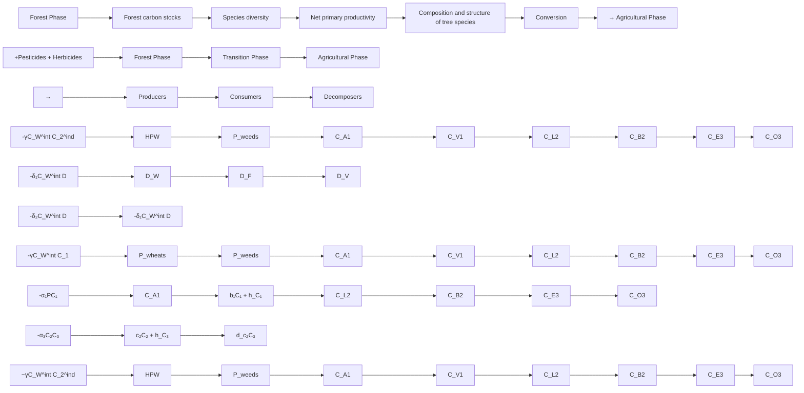
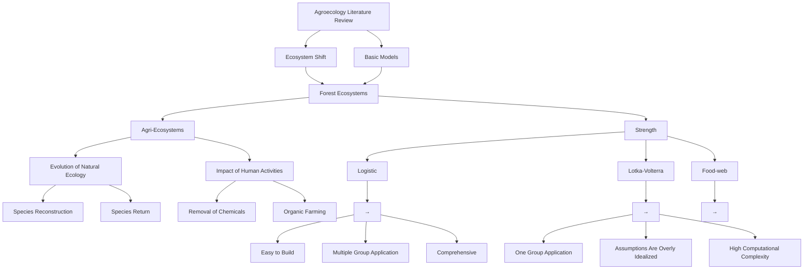
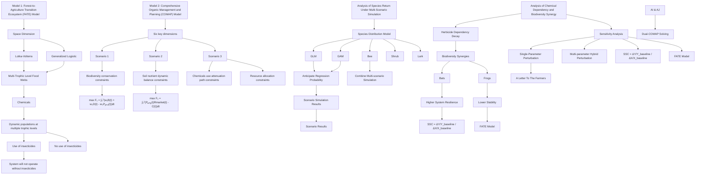
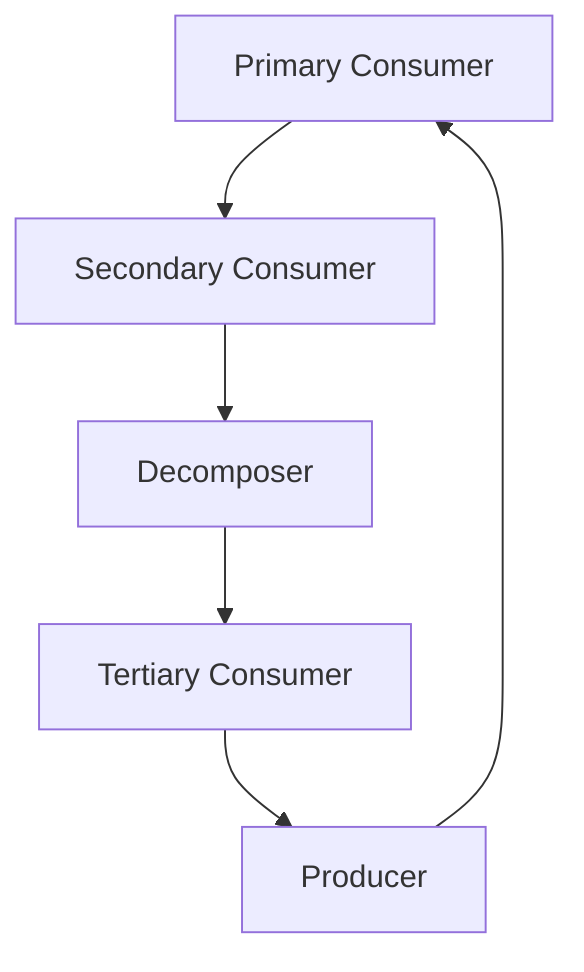
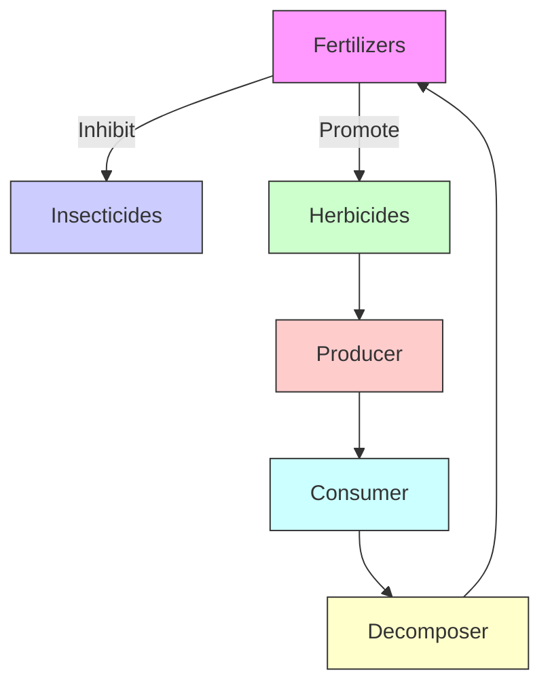
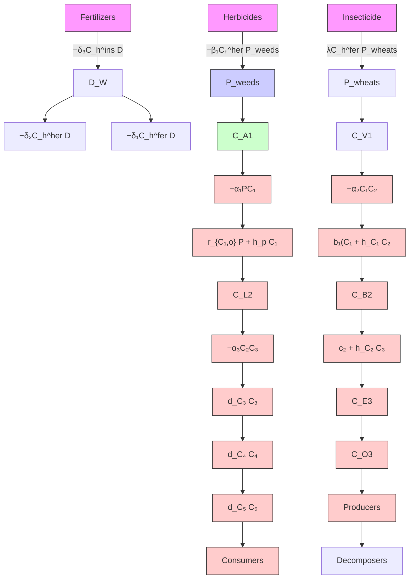
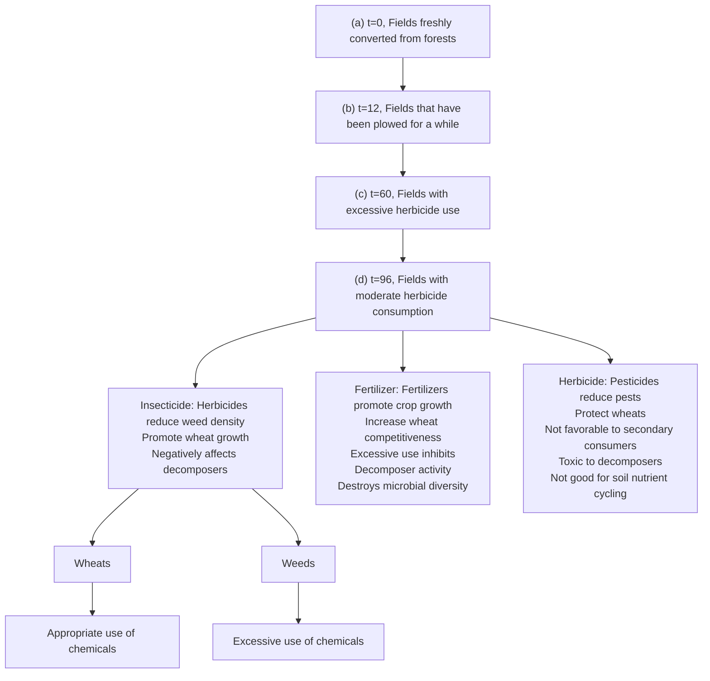
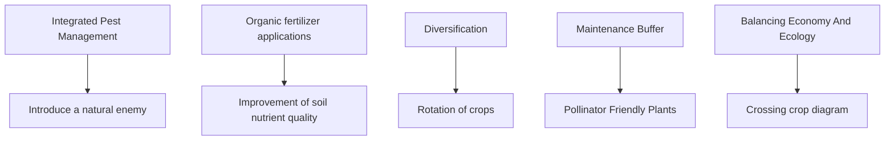

# Symphony of Eco-Agriculture:

## A New Music of Harmonious Coexistence Summary

The global expansion of agricultural land has led to problems such as ecosystem imbalance, biodiversity loss, and reduced agricultural productivity. To address these challenges, we developed two models: Model I, the Forest-to-Agriculture Transition Ecosystem (FATE) Model; Model II, the Comprehensive Organic Management and Planning (COMAP) Model.

In Model I, the biggest innovation is the combination of the Lotka-Volterra model with a generalized Logistic model, incorporating a spatial diffusion term to describe population migration. We also examined the impacts of herbicides, insecticides, and fertilizers. Based on Assumption 1, we introduced a seasonal variation function to refine the agricultural cycle in the original model. Comparing ecosystem dynamics under different chemical use scenarios (e.g., no insecticides, no fertilizers, or all three chemicals), we found that the absence of insecticides led to uncontrolled pest populations and ecosystem collapse.

Subsequently, we used Model I to explore the effects of species regression through multiscenario simulations combined with probability estimations, focusing on producers (shrubs), secondary consumers (larks), and pollinators (bees). Among these, Scenario C (larks and shrubs) performed best, as larks enhanced system stability through pest control, while shrubs supported ecological diversity and stable crop growth.

Additionally, we analyzed two human interventions: the herbicide-reduction strategy and a biodiversity assessment considering bats' pollination function. Results showed that reducing herbicide usage improved wheat population growth and ecosystem resilience. Bats significantly enhanced wheat productivity, achieving a system stability and resilience index of 6.42, compared to 5.01 for frogs.

For Model II, our biggest innovation is to solve the multi-objective optimization problem by using the Convex Reformulation Method to trade-off the ecological benefits (biodiversity and system stability) with the economic benefits (agricultural yield and revenue). After proving the model’s concave nature, we solved it using the pairwise transformation and ε-constraint methods. The ecological target value reached 243.58, indicating improvements in biodiversity and stability, while the economic target value was 13,484.36 USD/month, demonstrating agricultural viability. The pest density weighting coefficient (0.45) emphasized its critical role, while the trade-off coefficient (0.57) indicated a bias toward ecological optimization.

Finally, sensitivity analyses on Model I revealed that species mortality had a small influence on model stability, while insecticide parameters were particularly sensitive to system performance. Based on these findings, we propose optimizations for farmers

Keywords: FATE Model; COMAP Model; Lotka-Volterra Equation; Eco-Agriculture； Convex Reformulation

## Contents

## 1 Introduction .....

1.1 Background .. 3  
1.2 Restatement of the Problem 3  
1.3 Literature Review... 4  
1.4 Our Work. 4

## 2 Assumptions and Justifications........

## 3 Notations and Data Sources ...

3.1 Notations 5  
3.2 Data Sources .. .6

## 4 Model Ⅰ: Forest- to-Agriculture Transition Ecosystem .............. .... 6

4.1 Model Overview .. .6  
4.2 Multi-Trophic Food Web  
4.2.1 Multi-Trophic Dynamic Population Modeling...  
4.2.2 Agricultural Cycles and Seasonal Variations... 10  
4.2.3 Model I Solution. 1  
4.3 Results of Model I . 12

## 5 Analysis of Species Return Under Multi-Scenario Simulation..................13

5.1 Species Distribution Model. 14  
5.1.1 Probability Calculation Method 14  
5.1.2 Calculation Results and Evaluation. 14  
5.2 Multi-Scenario Simulations . .15  
5.3 Scenario Simulation Results .15

## 6 Analysis of Chemical Dependency and Biodiversity Synergy ...................16

6.1 Herbicide Dependency Reduction.. .16  
6.2 Biodiversity Synergy . 17  
6.3 Calculated Results . .18

## 7 Model II: Comprehensive Organic Management and Planning ...............19

7.1 Model Preparation.. 19  
7.2 Model Construction .. .19  
7.3 Calculated results .21

## 8 Sensitivity Analysis.. .21

## 9 Strengths and Weaknesses.... .22

9.1 Strengths. .22  
9.2 Weaknesses.. 22

## 10 Conclusion.... .23

## References ..... .23

## Appendices ....... .24

Proof 1: Mathematical Expression of Spatial Dimensions .. 24  
Proof 2: Concavity of the COMAP Model . 24

## 1 Introduction

## 1.1 Background

The growing global demand for agriculture has driven the large-scale conversion of forests into agricultural land and the transformation of complex ecosystems into monoculture farming landscapes. This shift has resulted in challenges such as soil degradation and pest outbreaks, compelling farmers to rely heavily on chemicals (e.g., insecticides and herbicides) to maintain crop yields. However, prolonged chemical use disrupts ecological balance, diminishes native species diversity, and undermines agroecosystem sustainability [1]. To address these challenges, the introduction of beneficial insects (e.g., bats and bees) has been shown to restore ecological balance, improve crop productivity, and enhance soil health [2]. Balancing agricultural development with ecological conservation remains a critical global concern. Accordingly, we utilize ecosystem dynamic modeling and decision-making simulations (Figure 1) to provide scientific insights for policy formulation and promote the sustainable development of ecofriendly agriculture.

flowchart

Figure 1: Conversion of Forest Ecology to Agroecology

## 1.2 Restatement of the Problem

Given the above context, we aim to analyze ecosystem dynamics and their interactions with anthropogenic decisions following the conversion of forests into agricultural land by constructing a mathematical model. Our study focuses on the following aspects:

 Natural Process Analysis: Develop an ecosystem dynamic model to capture ecological changes after forest conversion into agricultural land. This includes establishing the food web structure, evaluating the impacts of agricultural cycles and chemical use on plant and consumer populations, and assessing the role of species reintroduction in ecological restoration within marginal habitats (Tasks I & II).  
Anthropogenic Decision-Making Assessment: Investigate the effects of various agri cultural management decisions on ecosystems, including the role of chemical reduction and the introduction of key species (e.g., bats and bees) in pest control and system stability. Additionally, simulate the combined impacts of green agricultural practices on ecosystem services, crop productivity, and economic benefits (Tasks III & IV).  
 Policy Recommendation Development: Based on the modeling results, propose eco friendly agricultural strategies that balance economic viability and ecological sustaina-

bility. Furthermore, explore the potential of policy incentives to promote green agricultural practices (Task V).

## 1.3 Literature Review

Forest ecosystems feature complex food chains and high species diversity, with soil health relying on natural cycles [3]. Interactions among plants, herbivores, carnivores, and decomposers are vital for maintaining balance. In contrast, agroecosystems, dominated by monocrops with low biodiversity, are further disrupted by fertilizers and insecticides [4].

Agricultural transformation is influenced by natural evolution and human activities. Herbicides and insecticides affect crop health and pest dynamics, while species like bats support recovery through pest control and pollination. Similarly, bird reintroduction aids in restoring ecological balance [5]. Organic agriculture provides a sustainable alternative by reducing chemical inputs and enhancing soil health and diversity, though short-term challenges in yield and cost remain.

Common ecological and food web models include the Logistic model, Lotka-Volterra model, and food web model, with their respective strengths and limitations shown in Figure 2.

flowchart

Figure 2: Literature Review Chart

## 1.4 Our Work

To address this issue, our working framework is shown in Figure 3.

## 2 Assumptions and Justifications

In order to simplify the problem and improve the model's tractability and computational efficiency, we make the following assumptions:

Assumption 1: Crops are predominantly seasonal, and the agricultural cycle aligns with seasonal variations.

Justification: This assumption is based on the growth characteristics of seasonal crops, where major agricultural activities in agroecosystems (e.g., sowing, growing, fertilizing, harvesting) are driven by seasonal climatic conditions. By aligning the agricultural cycle with seasonal variations, the model is simplified, allowing the use of a uniform periodic function to describe both agricultural cycles and seasonal changes, thereby enhancing the rationality of dynamic modeling.

Assumption 2: Herbicides are primarily used during the early stages of agroecosystems to control weed expansion.

Justification: During the transition from forests to agroecosystems, legacy weeds quickly adapt and compete for farmland resources. To ensure optimal crop growth and reduce competition from weeds, farmers commonly use herbicides to manage agricultural systems during their establishment phase. This reflects a widely observed pattern in agricultural practices.

Assumption 3: The actual study area has a spherical quadrilateral distribution but is simplified to a planar rectangular projection in the model. This simplification does not significantly affect the accuracy of the model results.

Justification: Given the relatively small size of the study area, the impact of latitude and longitude changes on spherical distances can be precisely calculated using the Haversine formula. Simplifying the sphere to a planar rectangular projection reduces model complexity while maintaining sufficient geographic accuracy. This ensures the scientific validity of model analyses and results.

Assumption 4: It is assumed that all data collected are reliable.

Justification: This assumption ensures the accuracy of the data input to the model and avoids analytical bias due to data errors, thus allowing the study to focus more on the mode mechanism itself.

flowchart

Figure 3: Our Work Framework Diagram

## 3 Notations and Data Sources

## 3.1 Notations

The primary notations used in this paper are listed in Table 1.

Table 1: Notations used in this paper

<table><tr><td colspan="2">Symbol</td><td>Description</td><td>Unit</td></tr><tr><td rowspan="3">For Model I</td><td>D</td><td>Spatial diffusion coefficient</td><td>km2/mouth</td></tr><tr><td> $C_h^i$ </td><td>Concentration of class i chemicals</td><td>mg/L</td></tr><tr><td>P</td><td>Total population density of primary producers</td><td>Individuals/km2</td></tr><tr><td rowspan="3">For Model II</td><td>B(t)</td><td>Biodiversity index</td><td>N/A</td></tr><tr><td> $P_{pest}(t)$ </td><td>Indicates pest density</td><td>Individuals/km2</td></tr><tr><td> $R_{market}(t)$ </td><td>Indicates market yield</td><td>USD/mouth</td></tr></table>

\*There are some variables that are not listed here and will be discussed in detail in each section.

## 3.2 Data Sources

The “Corn Belt” in the Midwestern U.S. is one of the most important agricultural regions in North America, known for its high-yielding crops (e.g., corn and soybeans) and typical agroecosystems, making it a suitable study area. We collected data related to crop populations [6], biodiversity [7], climate [7], and soils [8] within the region.

Since the geographic extent of the region lies roughly between $3 7 ^ { o } N$ to $4 8 ^ { o } N$ and $9 0 ^ { o } N$ to $1 0 0 ^ { o } N$ , to simplify the study, although the actual study area is distributed in a spherical quadrilateral (Figure 4), according to Assumption 3 we projected the region into a planar rectangular coordinate system for processing. In the model, the shortest spherical distance between two points expressed in latitude and longitude are converted using Haversine's formula, which is shown below:

$$
d = 2 r * \arcsin \left(\sqrt {\sin^ {2} \left(\frac {\Delta \phi}{2}\right) + \cos (\phi_ {1}) \cos (\phi_ {2}) \sin^ {2} \left(\frac {\Delta \lambda}{2}\right)}\right), \tag {1}
$$

here, represents the Earth's radius, $\phi _ { 1 }$ and $\phi _ { 2 }$ denote the latitudes of two points, and $\Delta \phi$ and $\Delta \lambda$ represent the differences in latitude and longitude, respectively. This formula serves as the standard method for calculating spherical distances, ensuring the spatial accuracy of the model.

text_image

Diagram illustrating Earth's coordinate system transformation with a 3D geometric shape and inset map highlighting the geographic region.

Figure 4: Abstracting a Quadrilateral into a Rectangle

## 4 Model Ⅰ: Forest- to-Agriculture Transition Ecosystem

## 4.1 Model Overview

To model the current ecosystem and analyze the dynamics of the forest-to-agriculture transition, we developed the Forest-to-Agriculture Transition Ecosystem (FATE) Model.

The model's key innovation lies in incorporating spatial dimensions and environmental factors, capturing population diffusion and the dynamic effects of variables such as temperature and chemical concentrations on the ecosystem.

We mathematically defined the spatial dimension and constructed a multi-trophic food web by integrating the Lotka-Volterra and generalized Logistic models to describe energy flows among producers, consumers, and decomposers. Agricultural cycles, seasonal variations, and environmental variables were then incorporated to quantify, from a spatiotemporal perspective, the combined effects of agricultural activities and chemical use on population dynamics and ecosystem stability.

## 4.2 Multi-Trophic Food Web

The multi-trophic food web we constructed includes primary producers, primary consumers, secondary consumers, tertiary consumers, and decomposers, while incorporating the dynamic effects of herbicides, insecticides, and fertilizers. Primary producers form the foundation, supplying energy that flows upward through trophic levels, while decomposers recycle nutrients by breaking down organic matter. Predation and energy transfer govern the interactions between these levels, maintaining ecological balance. Figure 5 provides a schematic representation of these relationships.

flowchart

Figure 5: Map of Food Web Relationships

Definition 1: Mathematical Expression of Spatial Dimension. In ecosystem modeling, the spatial dimension can be described using a spatial diffusion term, which characterizes the migration and distribution behavior of populations in space [8].

Specifically, for the population density $P ( x , t )$ of a species, its diffusion behavior in the spatial dimension can be expressed as:

$$
\frac {\partial P (x , t)}{\partial t} = D \nabla^ {2} P (x, t), \tag {2}
$$

Where, ????(????, ????) denotes the population density at location ???? and time ????, ???? represents the diffusion coefficient reflecting the rate of population diffusion in space, and $\nabla ^ { 2 } P ( x , t )$ is the Laplace operator, defined as:

$$
\nabla^ {2} P = \frac {\partial^ {2} P}{\partial x ^ {2}} + \frac {\partial^ {2} P}{\partial y ^ {2}} (i n t w o d i m e n s i o n s), \tag {3}
$$

which represents the spatial gradient of changes in population density. The physical interpretation of this diffusion term is that the temporal change in population density is determined by the spatial non-uniformity of its distribution. The full derivation of this formula is provided in Appendix Proof 1.

## 4.2.1 Multi-Trophic Dynamic Population Modeling

To comprehensively characterize the dynamic changes and ecological effects of chemical agents during the transition from forest ecosystems to agricultural ecosystems, we introduced three types of chemicals: herbicides, insecticides, and fertilizers. These are applied to suppress weeds, reduce pests, and enhance soil nutrients, respectively. The dynamics of these chemicals are modeled using partial differential equations, expressed as follows:

$$
\frac {\partial C _ {h} ^ {i}}{\partial t} = D _ {h} ^ {i} \nabla^ {2} C _ {h} ^ {i} + R ^ {i} (x, t) - \alpha^ {i} C _ {h} ^ {i}, (i = h e r, i n s, f e r), \tag {4}
$$

where, $C _ { h } ^ { i }$ denotes the concentration of the -th chemical agent; $D _ { h } ^ { i }$ represents the diffusion coefficient of the -th chemical, indicating its spatial distribution and diffusion; $R ^ { i } ( x , t )$ denotes the application rate of the -th chemical, which depends on the agricultural cycle and is defined as:

$$
R ^ {i} (x, t) = \left\{ \begin{array}{l l} r _ {i}, & t \in T _ {1} \\ 0, & t \in T _ {2} \end{array} , \right. \tag {5}
$$

here, $T _ { 1 }$ and $T _ { 2 }$ represent the application phase and non-application phase of the agricultural cycle, respectively. $\alpha ^ { i }$ denotes the degradation rate of the -th chemical agent.

The ecological impacts of these chemicals on various trophic levels of the ecosystem are illustrated in Figure 6.

flowchart

Figure 6: Role of Chemicals in Food Webs

Ecological Impacts of Herbicides: Herbicides positively impact crop growth by suppressing weed population densities, thereby indirectly increasing available survival resources for crops. However, the reduction in weed residues diminishes decomposer activity and disrupts soil nutrient cycling.  
Ecological Impacts of Insecticides: Insecticides effectively reduce pest densities and predation pressure on crops. However, they may also exhibit toxicity to secondary consumers such as ladybug beetles, indirectly weakening pest control. Additionally, insecticide residues can harm decomposers, lowering decomposition efficiency and compromising soil stability.  
Ecological Impacts of Fertilizers: Fertilizers directly enhance crop growth and competitiveness by enriching soil nutrients. However, overuse can disrupt the chemical balance of the soil, inhibit decomposer activity, reduce microbial diversity, and ultimately affect overall ecosystem health.

Based on the multi-trophic structure of the ecosystem and the multifaceted impacts of chemical dynamics, we formulated population dynamics equations for each trophic level. The detailed equations are as follows.

## Primary Producers (Wheats and Weeds)

Primary producers include wheats (crops) and weeds, whose growth is influenced by dynamic changes in environmental carrying capacity, predation pressure from primary consumers, and the combined effects of chemical agents. The governing equation is as follows:

$$
\frac {\partial P}{\partial t} = D _ {P} \nabla^ {2} P + r _ {P} P \left(1 - \frac {P}{K (x , t)}\right) - a _ {1} P C _ {1} - \beta_ {1} C _ {h} ^ {h e r} P _ {w e e d s} + \lambda C _ {h} ^ {f e r} P _ {w h e a t s} - d _ {P} P, \tag {6}
$$

where, ???? denotes the total population density of primary producers, including wheats and weeds. $r _ { P }$ represents the intrinsic growth rate, indicating the maximum growth rate of primary producers under unlimited resource conditions. $a _ { 1 }$ denotes the predation efficiency of primary consumers, and $C _ { 1 }$ represents the total population density of primary consumers. $P _ { \mathrm { w e e d s } }$ and $P _ { \mathrm { w h e a t s } }$ denote the population densities of weeds and wheats, respectively. $d _ { P }$ is the natural mortality coefficient of primary producers. The term

$$
\left(1 - \frac {P}{K (x , t)}\right), \tag {7}
$$

is the generalized Logistic growth limitation, which constrains population growth according to the environmental carrying capacity. When $P < K ( x , t )$ , the population grows; as $P $ $K ( x , t )$ , growth approaches zero. The dynamic environmental carrying capacity $K ( x , t )$ is defined as follows:

$$
K (x, t) = K _ {0} + \phi_ {D} D + \lambda C _ {h} ^ {f e r} - \beta_ {1} C _ {h} ^ {h e r} - \beta_ {2} C _ {h} ^ {i n s}, \tag {8}
$$

where, $K _ { 0 }$ represents the baseline environmental carrying capacity of primary producers. $\phi _ { D }$ $^ { ( \textit { D } ) }$ $\lambda C _ { h } ^ { \mathrm { f e r } } , \beta _ { 1 } C _ { h } ^ { h e r }$ , and $\beta _ { 2 } C _ { h } ^ { i n s }$ represent the effects of fertilizers, herbicides, and insecticides, respectively, on the carrying capacity.

## Primary Consumers (Aphids and Field Mice)

The population dynamics of primary consumers, including aphids and field mice, are primarily driven by the supply of primary producers, while being influenced by predation from secondary consumers and the direct toxic effects of insecticides. The governing equation is as follows:

$$
\frac {\partial C _ {1}}{\partial t} = D _ {C _ {1}} \nabla^ {2} C _ {1} + r _ {C _ {1}, 0} \frac {P}{P + h _ {P}} C _ {1} - a _ {2} C _ {1} C _ {2} - \gamma C _ {h} ^ {i n s} C _ {1} - d _ {C _ {1}} C _ {1}, \tag {9}
$$

where, $r _ { C _ { 1 } , 0 }$ represents the support rate provided by primary producers to primary consumers. $h _ { P }$ denotes the saturation constant for predation at the primary trophic level. $a _ { 2 }$ indicates the predation effect of secondary consumers. ???? represents the toxicity rate of insecticides $( C _ { h } ^ { i n s } )$ on primary consumers. $d _ { C _ { 1 } }$ is the natural mortality coefficient of primary consumers.

This equation captures the balance between resource availability from primary producers, predation pressure from secondary consumers, and the detrimental effects of insecticides on primary consumer populations.

## Secondary Consumers (Ladybugs and Bats)

Secondary consumers, including ladybugs and bats, are influenced by their efficiency in preying on primary consumers, predation pressure from tertiary consumers, and population decline caused by the non-target effects of insecticides. The governing equation is as follows:

$$
\frac {\partial C _ {2}}{\partial t} = D _ {C _ {2}} \nabla^ {2} C _ {2} + b _ {1} \frac {C _ {1}}{C _ {1} + h _ {C _ {1}}} C _ {2} - a _ {3} C _ {2} C _ {3} - \gamma C _ {h} ^ {\mathrm{ins}} C _ {2} ^ {\mathrm{lad}} - d _ {C _ {2}} C _ {2}, \tag {10}
$$

where, $C _ { 2 }$ represents the total population density of secondary consumers. $b _ { 1 }$ denotes the support rate provided by primary consumers to secondary consumers. $a _ { 3 }$ indicates the predation effect of tertiary consumers. represents the non-target toxicity rate of insecticides $( \ C _ { h } ^ { \mathrm { i n s } } )$ on $C _ { 2 } ^ { \mathrm { l a d } }$ (the ladybug population). $d _ { C _ { 2 } }$ is the natural mortality coefficient of secondary consumers.

This equation reflects the complex dynamics of secondary consumers, balancing the positive effects of prey availability and the negative effects of predation pressure and insecticide toxicity.

## Tertiary Consumers (Eagles and Owls)

The population dynamics of tertiary consumers, including eagles and owls, are determined by the availability of secondary consumers as prey and natural mortality rates. The governing equation is as follows:

$$
\frac {\partial C _ {3}}{\partial t} = D _ {C _ {3}} \nabla^ {2} C _ {3} + b _ {2} \frac {C _ {2}}{C _ {2} + h _ {C _ {2}}} C _ {3} - d _ {C _ {3}} C _ {3}, \tag {11}
$$

where, $C _ { 3 }$ represents the total population density of tertiary consumers. $b _ { 2 }$ denotes the support rate provided by secondary consumers to tertiary consumers. $d _ { C _ { 3 } }$ is the natural mortality coefficient of tertiary consumers.

## Decomposers (Earthworms, Fungi, and Bacteria)

The population dynamics of decomposers, including earthworms, fungi, and bacteria, are primarily influenced by the organic matter supplied by other trophic levels and the positive and negative effects of chemical agents. The governing equation is as follows:

$$
\frac {\partial D}{\partial t} = r _ {D} D + \sum_ {i = 1} ^ {4} d _ {C _ {i}} C _ {i} - \delta_ {1} C _ {h} ^ {\text {fer}} D - \delta_ {2} C _ {h} ^ {\text {her}} D - \delta_ {3} C _ {h} ^ {\text {ins}} D - d _ {D} D, \tag {12}
$$

where, $\textstyle \sum _ { i = 1 } ^ { 4 } d _ { C _ { i } } C _ { i }$ represents the contributions of deceased individuals from all trophic levels to decomposers. $\delta _ { i }$ denotes the toxic inhibitory effects of fertilizers ${ \bigl ( } { \begin{array} { l } { C _ { h } ^ { \mathrm { f e r } } } \end{array} } { \bigr ) }$ , herbicides $\bigl ( \begin{array} { l } { C _ { h } ^ { \mathrm { h e r } } } \end{array} \bigr )$ , and insecticides $( \ C _ { h } ^ { \mathrm { i n s } } \ )$ on decomposers. $d _ { D }$ is the natural mortality coefficient of decomposers.

In summary, the FATE model integrates these equations to simulate the coupled dynamics of multi-trophic populations and their interactions with environmental factors and chemical agents. The system of equations developed for the FATE model is illustrated in Figure 7.

flowchart

Figure 7: Conversion of Bioenergy in Ecosystems

## 4.2.2 Agricultural Cycles and Seasonal Variations

Based on Assumption 1, which states that the agricultural cycle aligns with seasonal variations, we combined the dynamic characteristics of agricultural activities with seasonal climatic changes. These are uniformly described using a periodic function. Conse quently, our agricultural cycle function captures not only the changes across key phases such as sowing, growing, fertilizing, and harvesting but also the ecosystem's response to seasonal disturbances. The function is expressed as follows:

$$
g _ {\mathrm{agri}} (t) = A _ {1} \sin \left(\frac {2 \pi t}{T}\right) + A _ {2} \cos \left(\frac {4 \pi t}{T} + \phi\right) + B, \tag {13}
$$

where, ???? represents the total duration of the agricultural cycle. $A _ { 1 }$ denotes the intensity of primary agricultural activities (first harmonic). $A _ { 2 }$ accounts for more refined characteristics of agricultural phases (second harmonic). $\phi$ represents the time shift of the second harmonic relative to the first harmonic. ensures the non-negativity of the function, maintaining the intensity of agricultural activities at positive values at all times.

Using this function, the modified dynamics of primary producer populations and chemical application rates are expressed as:

$$
g _ {\text {agri}} (t) R ^ {i} (x, t), r _ {P} g _ {\text {agri}} (t) P \left(1 - \frac {P}{K (x , t)}\right). \tag {14}
$$

## 4.2.3 Model I Solution

During the modeling process, multiple unknown parameters were present in the model. By collecting ecological data from agricultural regions in North America, including crop yields, chemical usage, species distribution, and environmental carrying capacity, these data were used as prior inputs. Combined with statistical analysis, the model parameters were estimated. The key parameters of the model are shown in Table 2.

Table 2: Parameter Settings

<table><tr><td>Parameter</td><td>Description</td><td>Value</td><td>Unit</td></tr><tr><td> $r_P$ </td><td>Growth rate of primary producers</td><td>0.05</td><td>1/month</td></tr><tr><td> $K_0$ </td><td>Baseline environmental carrying capacity</td><td>1000</td><td>Individuals/km2</td></tr><tr><td> $φ_D$ </td><td>Contribution of decomposers to carrying capacity</td><td>20</td><td>Individuals/km2</td></tr><tr><td> $δ_1$ </td><td>Negative effect of fertilizers on carrying capacity</td><td>0.02</td><td>1/(kg*month)</td></tr><tr><td> $δ_2$ </td><td>Negative effect of herbicides on weeds</td><td>0.05</td><td>1/(kg*month)</td></tr><tr><td> $δ_2$ </td><td>Negative effect of insecticides on primary consumers</td><td>0.03</td><td>1/(kg*month)</td></tr></table>

To solve the partial differential equations in the model, we employed the Finite Volume Method (FVM), a commonly used numerical approach for solving systems of partial differential equations. This method discretizes the computational domain and performs numerical integration within each control volume, thereby transforming the continuous PDE problem into a discrete algebraic one.

We divided the ecosystem space into ${ \textbf { a } } 6 \times 6$ grid of subregions, with spatial step sizes of $\Delta x = \Delta y = 1$ km and time steps of $\Delta t = 1$ month. By running the simulation program, we obtained the distribution of primary consumers at $t = 0 , t = 1 2 , t = 6 0$ , and $t = 9 6$ (Figure 8).

The simulation results demonstrate the dynamic distribution of primary producers (wheats and weeds) at different stages and the ecological effects of chemical use:

Initial Stage (t=0): During the early phase of forest-to-farmland conversion, weeds dominate while the wheat population is low. With no chemical application, the ecosystem reflects its natural state, characterized by weak competitiveness and population distribution shaped by natural ecological processes.

Crop Growth (t=12): After cultivation and moderate chemical use, the wheat population grows significantly while weeds decline. Fertilizers enhance wheat competitiveness, and herbicides effectively control weed spread.

Moderate Use Stage (t=60): With sustained moderate chemical use, the wheat population stabilizes at a high level, and weeds remain suppressed. The ecosystem achieves a dynamic balance between decomposers and soil nutrients, supporting long-term development.  
Overuse Stage (t=96): Excessive chemical application disrupts ecosystem balance, reducing decomposer activity and negatively affecting soil nutrient cycling. While wheat populations remain high, ecosystem stability is threatened, and weed populations are nearly eradicated.

Dynamic processes of primary producers  

flowchart

The use of chemicals

  
Figure 8: PDE Solving Results and Related Explanations

## 4.3 Results of Model I

To further investigate the impact of chemical agents on the population dynamics of various species in agroecosystems, we simulated three scenarios: no insecticide use, no fertilizer use, and the combined use of all three chemicals. (Based on Assumption 2, herbicides are required to control weed expansion caused by forest-to-farmland conversion to ensure a suitable growth environment for crops.) The effects of these scenarios on the temporal dynamics of all species in the food web were analyzed (Figures 9–11).

line chart

| Time (months) | Aphids | Fruit Bats | Mice | Hawks | Ladybugs | Owls |
| ------------- | ------ | ---------- | ---- | ----- | -------- | ---- |
| 0             | 0      | 0          | 0    | 50    | 0        | 15   |
| 10            | 40     | 0          | 0    | 45    | 0        | 10   |
| 20            | 0      | 0          | 0    | 30    | 0        | 5    |
| 30            | 35     | 0          | 0    | 20    | 0        | 5    |
| 40            | 0      | 0          | 0    | 15    | 0        | 5    |
| 50            | 35     | 0          | 0    | 10    | 0        | 5    |
| 60            | 0      | 0          | 0    | 30    | 0        | 5    |
| 70            | 40     | 0          | 0    | 25    | 0        | 5    |
| 80            | 0      | 0          | 0    | 35    | 0        | 5    |
| 90            | 35     | 0          | 0    | 25    | 0        | 5    |
| 100           | 0      | 0          | 0    | 20    | 0        | 5    |
| 110           | 25     | 0          | 0    | 15    | 0        | 5    |
| 120           | 25     | 0          | 0    | 10    | 0        | 5    |

heatmap

| Mon/Year | 1 | 2 | 3 | 4 | 5 | 6 | 7 | 8 | 9 | 10 |
|---|---|---|---|---|---|---|---|---|---|---|
| 1 | Green | Green | Green | Green | Green | Green | Green | Green | Green | Green |
| 2 | Green | Green | Green | Green | Green | Green | Green | Green | Green | Green |
| 3 | Green | Green | Green | Green | Green | Green | Green | Green | Green | Green |
| 4 | Green | Green | Green | Green | Green | Green | Green | Green | Green | Green |
| 5 | Green | Green | Green | Green | Green | Green | Green | Green | Green | Green |
| 6 | Green | Green | Green | Green | Green | Green | Green | Green | Green | Green |
| 7 | Green | Green | Green | Green | Green | Green | Green | Green | Green | Green |
| 8 | Green | Green | Green | Green | Green | Green | Green | Green | Green | Green |
| 9 | Green | Green | Green | Green | Green | Green | Green | Green | Green | Green |
| 10 | Green | Green | Green | Green | Green | Green | Green | Green | Green | Green |
| 11 | Yellow | Yellow | Yellow | Yellow | Yellow | Yellow | Yellow | Yellow | Yellow | Yellow |
| 12 | Yellow | Yellow | Yellow | Yellow | Yellow | Yellow | Yellow | Yellow | Yellow | Yellow |

Legend:
- Color scale: 500 (Green) to 200 (Yellow)
Legend:
- Horizontal line at 500 indicates a reference threshold.

Figure 9: Full chemical usage. Changes in consumer populations (left); changes in crop populations (right).

line chart

| Time (months) | Aphids | Fruit Bats | Mice | Hawks | Ladybugs | Owls |
| ------------- | ------ | ---------- | ---- | ----- | -------- | ---- |
| 0             | 15     | 5          | 1    | 43    | 1        | 1    |
| 10            | 22     | 1          | 1    | 30    | 1        | 1    |
| 20            | 10     | 1          | 1    | 20    | 1        | 1    |
| 30            | 22     | 1          | 1    | 15    | 1        | 1    |
| 40            | 20     | 1          | 1    | 10    | 1        | 1    |
| 50            | 22     | 1          | 1    | 8     | 1        | 1    |
| 60            | 20     | 1          | 1    | 6     | 1        | 1    |
| 70            | 22     | 1          | 1    | 8     | 1        | 1    |
| 80            | 20     | 1          | 1    | 45    | 30       | 1    |
| 90            | 22     | 1          | 1    | 30    | 1        | 1    |
| 100           | 20     | 1          | 1    | 20    | 1        | 1    |
| 110           | 22     | 1          | 1    | 15    | 1        | 1    |
| 120           | 20     | 1          | 1    | 10    | 1        | 1    |

heatmap

| Mon/Year | 1 | 2 | 3 | 4 | 5 | 6 | 7 | 8 | 9 | 10 |
|---|---|---|---|---|---|---|---|---|---|---|
| 1 | 350 | 350 | 350 | 350 | 350 | 350 | 350 | 350 | 350 | 350 |
| 2 | 350 | 350 | 350 | 350 | 350 | 350 | 350 | 350 | 350 | 350 |
| 3 | 350 | 350 | 350 | 350 | 350 | 350 | 350 | 350 | 350 | 350 |
| 4 | 350 | 350 | 350 | 350 | 350 | 350 | 350 | 350 | 350 | 350 |
| 5 | 350 | 350 | 350 | 350 | 350 | 350 | 350 | 350 | 350 | 350 |
| 6 | 350 | 350 | 350 | 350 | 350 | 350 | 350 | 350 | 350 | 350 |
| 7 | 350 | 350 | 350 | 350 | 350 | 350 | 350 | 350 | 350 | 350 |
| 8 | 350 | 350 | 350 | 350 | 350 | 350 | 350 | 350 | 350 | 350 |
| 9 | 350 | 350 | 350 | 350 | 350 | 350 | 350 | 350 | 350 | 350 |
| 10 | 350 | 350 | 350 | 350 | 350 | 350 | 350 | 350 | 350 | 350 |
| 11 | 350 | 350 | 350 | 350 | 350 | 350 | 350 | 350 | 350 | 350 |
| 12 | 350 | 350 | 350 | 350 | 350 | 350 | 350 | 350 | 350 | 350 |
The visual intensity of the cells increases with the number of rows and columns, as indicated by the color scale ranging from ~12 to ~18. The color scale is labeled as '12' in the bottom left corner.

Figure 10: No fertilizer usage. Changes in consumer populations (left); changes in crop populations (right).  

line chart

| Time (months) | Aphids | Fruit Bats | Mice | Hawks | Ladybugs | Owls |
|---|---|---|---|---|---|---|
| 0 | 15 | 30 | 0 | 40 | 0 | 0 |
| 10 | 5 | 0 | 5 | 30 | 0 | 0 |
| 20 | 3 | 0 | 3 | 20 | 0 | 0 |
| 30 | 2 | 0 | 2 | 15 | 0 | 0 |
| 40 | 1 | 0 | 1 | 10 | 0 | 0 |
| 50 | 1 | 0 | 1 | 5 | 0 | 0 |
| 60 | 1 | 0 | 1 | 3 | 0 | 0 |
| 70 | 1 | 0 | 1 | 2 | 0 | 0 |
| 80 | 1 | 0 | 1 | 1 | 0 | 0 |
| 90 | 1 | 0 | 1 | 1 | 0 | 0 |
| 100 | 5 | 0 | 1 | 1 | 0 | 0 |
| 110 | 1 | 0 | 1 | 1 | 0 | 0 |
| 120 | 1 | 0 | 1 | 1 | 0 | 0 |

heatmap

| Mon/Year | 1 | 2 | 3 | 4 | 5 | 6 | 7 | 8 | 9 | 10 |
|---|---|---|---|---|---|---|---|---|---|---|
| 1 | 100 | 100 | 100 | 100 | 100 | 100 | 100 | 100 | 100 | 100 |
| 2 | 100 | 100 | 100 | 100 | 100 | 100 | 100 | 100 | 100 | 100 |
| 3 | 100 | 100 | 100 | 100 | 100 | 100 | 100 | 100 | 100 | 100 |
| 4 | 100 | 100 | 100 | 100 | 100 | 100 | 100 | 100 | 100 | 100 |
| 5 | 100 | 100 | 100 | 100 | 100 | 100 | 100 | 100 | 100 | 100 |
| 6 | 100 | 100 | 100 | 100 | 100 | 100 | 100 | 100 | 100 | 100 |
| 7 | 100 | 100 | 100 | 100 | 100 | 100 | 100 | 100 | 100 | 100 |
| 8 | 100 | 100 | 100 | 100 | 100 | 100 | 100 | 100 | 100 | 100 |
| 9 | 100 | 100 | 100 | 100 | 100 | 100 | 100 | 100 | 100 | 100 |
| 10 | 100 | 100 | 100 | 100 | 100 | 100 | 100 | 100 | 100 | 100 |
| 11 | 100 | 100 | 100 | 100 | 100 | 100 | 100 | 100 | 100 | 100 |
| 12 | 155 | 95 | 95 | 95 | 95 | 95 | 95 | 95 | 95 | 95 |
The visual intensity of the cells increases with the number of rows and columns in the grid. The color scale ranges from -∞ (dark green) to +∞ (yellow), indicating the value of the cell in each row and column. There is no explicit numerical data provided for the cells.

Figure 11: No insecticide usage. Changes in consumer populations (left); changes in crop populations (right).

## Impact of Chemical Use on Consumer and Weed Populations

Under the scenario of full chemical use, primary consumers (aphids and field mice) and secondary consumers (ladybugs and bats) are significantly affected, while tertiary consumers (eagles and owls) maintain relatively stable population dynamics.  
When fertilizers are not used, crop growth is limited, leading to fluctuations at low levels for primary consumers, which subsequently impacts secondary and tertiary consumers, resulting in a lower dynamic equilibrium across these trophic levels.  
When insecticides are not used, pests completely consume the producers, preventing their population growth and causing the entire ecosystem to collapse.

## Impact of Chemical Use on Crop Populations

In the full chemical use scenario, crop populations exhibit steady growth and reach a high dynamic equilibrium level.  
Without fertilizers, due to insufficient soil nutrients, crop populations decline in the early stages and stabilize at a low level.  
In the absence of insecticides, the increase in pest populations exerts a significant negative impact on crops, leading to a rapid decline in crop populations.

Overall, the reasonable application of chemical agents plays a crucial role in maintaining the stability of crop populations and the broader ecosystem.

## 5 Analysis of Species Return Under Multi-Scenario Simulation

To analyze the impact of species reintroduction on the current agroecosystem, we used a species distribution model to calculate the probabilities of pollinators (bees), secondary consumers (larks), and producers (shrubs) returning in different years. Based on the FATE model, we further conducted multi-scenario simulations to dynamically analyze the ecological effects of pairwise species reintroduction combinations, quantifying their combined impacts on ecosystem stability, species diversity, and crop yield.

## 5.1 Species Distribution Model

The species distribution model is a tool used to predict species reintroduction probabilities based on environmental variables. It quantifies the influence of environmental factors on species distribution and provides dynamic predictions.

## 5.1.1 Probability Calculation Method

Generalized Linear Models (GLM) or Generalized Additive Models (GAM) are commonly used to describe the relationship between reintroduction probability and environmental variables. The model is expressed as follows:

$$
P (\text {return}) = \operatorname{logit} ^ {- 1} \left(\beta_ {0} + \sum_ {i = 1} ^ {n} \beta_ {i} X _ {i}\right)
$$

Where ???? (return) represents the probability of a species reintroducing in a given year. logit−1 is the inverse function of the logistic regression. $\beta _ { 0 }$ is the intercept term. $\beta _ { i }$ denotes the regression coefficient for the environmental variable $X _ { i }$ . $X _ { i }$ represents environmental variables, which include: $X _ { 1 }$ : Habitat maturity. $X _ { 2 }$ : Climate conditions. $X _ { 3 }$ : Intensity of chemical usage. $X _ { 4 }$ : Intensity of agricultural activities. $X _ { 5 }$ : Time.

## 5.1.2 Calculation Results and Evaluation

Using the Species Distribution Model (SDM), we simulated and calculated the annual reintroduction probabilities of bees, larks, and shrubs over the next 10 years, along with an analysis of the model's performance metrics, as illustrated in Figure 12.

line chart

| Year | Shrub Probability | Lark Probability | Bee Probability |
|---|---|---|---|
| 1 | 0.95 | 0.85 | 0.72 |
| 2 | 0.80 | 0.78 | 0.84 |
| 3 | 0.70 | 0.80 | 0.81 |
| 4 | 0.67 | 0.75 | 0.81 |
| 5 | 0.97 | 0.86 | 0.78 |
| 6 | 0.87 | 0.88 | 0.84 |
| 7 | 0.93 | 0.74 | 0.72 |
| 8 | 0.88 | 0.71 | 0.70 |
| 9 | 0.82 | 0.74 | 0.75 |
| 10 | 0.92 | 0.86 | 0.81 |
The chart displays a multi-axis visualization with a central pie chart showing the F1 Score distribution for each species over time (Years). The legend defines color coding: orange for Shrub, green for Lark, and purple for Bee. The 'Accuracy' and 'Precision' metrics are shown in the legend below the pie chart.

Figure 12: Predicted Results and Model Evaluations

The figure illustrates the reintroduction probabilities of three species (Shrub, Lark, Bee) over 10 years, along with the model's comprehensive evaluation. The line chart shows dynamic changes in reintroduction probabilities, with bees maintaining relatively stable and high probabilities, while shrubs and larks exhibit greater fluctuations, reflecting their higher sensitivity to environmental factors and spatiotemporal conditions.

The model evaluation results indicate high predictive accuracy for all three species (assessment scores above 0.78), with bees performing slightly better than shrubs and larks. This confirms the model's reliability in predicting species reintroduction and underscores the varying sensitivity of species to environmental variables. These findings offer valuable insights for ecological conservation and restoration management.

## 5.2 Multi-Scenario Simulations

To analyze the impact of species reintroduction on the current ecosystem, we conducted pairwise scenario analyses involving bees, larks, and shrubs. The focus was on exploring interactions between species and their effects on ecosystem dynamics.

## Scenario A: Bees (Pollinators) and Shrubs (Producers)

Scenario A: Bees and Shrubs. The dynamics of shrubs and bees are modeled by incorpo rating the positive feedback of pollination and resource availability:

$$
\frac {\partial P _ {s h r u b}}{\partial t} = D _ {s h r u b} \nabla^ {2} P _ {s h r u b} + r _ {s h r u b} P _ {s h r u b} \left(1 - \frac {P _ {s h r u b}}{K}\right) + \gamma_ {b} B _ {b e e} P _ {s h r u b} - a _ {1} P _ {s h r u b} \left(C _ {1} + C _ {2}\right), \tag {15}
$$

$$
\frac {\partial B _ {b e e}}{\partial t} = D _ {b e e} \nabla^ {2} B _ {b e e} + r _ {b e e} B _ {b e e} \left(1 - \frac {B _ {b e e}}{K}\right) + \lambda_ {s h r u b} P _ {s h r u b} B _ {b e e} - \delta_ {b e e} B _ {b e e}.
$$

## Scenario B: Larks (Secondary Consumers) and Bees (Pollinators)

Scenario B: Bees and Larks. This scenario introduces the indirect reduction of pest density by larks in the growth function of bees, and the enhancement of food chain resources by bees in the growth function of larks:

$$
\frac {\partial B _ {b e e}}{\partial t} = D _ {b e e} \nabla^ {2} B _ {b e e} + r _ {b e e} B _ {b e e} \left(1 - \frac {B _ {b e e}}{K}\right) + \alpha_ {l a r k} C _ {l a r k} B _ {b e e} - \delta_ {b e e} B _ {b e e}, \tag {16}
$$

$$
\frac {\partial C _ {l a r k}}{\partial t} = r _ {l a r k} C _ {l a r k} \left(1 - \frac {C _ {l a r k}}{K}\right) + \beta_ {b e e} B _ {b e e} C _ {l a r k} - \delta_ {l a r k} C _ {l a r k}.
$$

## Scenario C: Larks (Secondary Consumers) and Shrubs (Producers)

Scenario C: Larks and Shrubs. The positive effect of larks reducing pest density is incorporated into the growth function of shrubs, while the habitat contribution of shrubs is added to the growth function of larks:

$$
\frac {\partial P _ {s h r u b}}{\partial t} = D _ {s h r u b} \nabla^ {2} P _ {s h r u b} + r _ {s h r u b} P _ {s h r u b} \left(1 - \frac {P _ {s h r u b}}{K}\right) + \gamma_ {l} C _ {l a r k} P _ {s h r u b} - a _ {1} P _ {s h r u b} \left(C _ {1} + C _ {2}\right), \tag {17}
$$

$$
\frac {\partial C _ {l a r k}}{\partial t} = r _ {l a r k} C _ {l a r k} \left(1 - \frac {C _ {l a r k}}{K}\right) + \lambda_ {s h r u b} P _ {s h r u b} C _ {l a r k} - \delta_ {l a r k} C _ {l a r k}.
$$

## 5.3 Scenario Simulation Results

Modeling and analysis of species reintroduction under different scenarios revealed that after introducing new species at t=24, ecological dynamics gradually stabilized (Figure 13), highlighting the regulatory role of reintroduced species. At t=84, crop populations exhibited exponential growth, demonstrating the long-term positive effects of species reintroduction on system stability and productivity.

Scenario A (Bees and Shrubs): Bee pollination had minimal impact on crop growth, as competition between shrubs and crops for resources limited population growth, making this the weakest scenario.  
Scenario B (Larks and Bees): The synergy of larks and bees boosted crop growth during exponential phases, but initial system instability and fluctuations were observed.  
Scenario C (Larks and Shrubs): Larks controlled pests, and shrubs supported ecological diversity, enabling steady crop growth and making this the most optimal scenario for longterm stability.

line chart

| Time (months) | Wheat(Situation A) | Wheat(Situation B) | Wheat(Situation C) |
| ------------- | ------------------ | ------------------ | ------------------ |
| 0             | 0                  | 0                  | 0                  |
| 24            | ~900               | ~1800              | ~1400              |
| 84            | ~300               | ~2000              | ~1600              |
| 120           | ~1100              | ~2900              | ~2000              |

Figure 13: Crop Dynamics Under Different Scenarios

Under different scenarios, the dynamic effects of species reintroduction on native species are shown in Figures 14–16. The model results indicate that the introduction of reintroduced species significantly disrupted and regulated the population dynamics of native consumers.

line chart

| Time (months) | Aphids (Individuals/km²) | Fruit Bats (Individuals/km²) | Mice (Individuals/km²) | Hawks (Individuals/km²) | Ladybugs (Individuals/km²) | Owls (Individuals/km²) |
|---|---|---|---|---|---|---|
| 0 | 15 | 0 | 0 | 43 | 0 | 0 |
| 10 | 10 | 0 | 0 | 30 | 0 | 0 |
| 20 | 43 | 0 | 0 | 20 | 0 | 0 |
| 30 | 10 | 0 | 0 | 15 | 0 | 0 |
| 40 | 37 | 0 | 0 | 10 | 0 | 0 |
| 50 | 5 | 0 | 0 | 8 | 0 | 0 |
| 60 | 20 | 0 | 0 | 5 | 0 | 0 |
| 70 | 20 | 0 | 44 | 44 | 0 | 0 |
| 80 | 22 | 0 | 22 | 35 | 0 | 0 |
| 90 | 15 | 0 | 15 | 25 | 0 | 0 |
| 100 | 30 | 0 | 15 | 18 | 0 | 0 |
| 110 | 15 | 0 | 15 | 22 | 0 | 0 |
| 120 | 42 | 0 | 15 | 19 | 0 | 0 |

Figure 14: Scenario A

line chart

| Time (months) | Aphids (Individuals/km²) | Fruit Bats (Individuals/km²) | Mice (Individuals/km²) | Hawks (Individuals/km²) | Ladybugs (Individuals/km²) | Owls (Individuals/km²) |
|---|---|---|---|---|---|---|
| 0 | 15 | 0 | 0 | 42 | 0 | 0 |
| 10 | 10 | 0 | 0 | 35 | 0 | 0 |
| 20 | 5 | 0 | 35 | 25 | 0 | 0 |
| 30 | 5 | 0 | 0 | 18 | 0 | 0 |
| 40 | 10 | 0 | 30 | 12 | 0 | 0 |
| 50 | 5 | 0 | 0 | 8 | 0 | 0 |
| 60 | 5 | 0 | 32 | 5 | 0 | 0 |
| 70 | 10 | 18 | 32 | 35 | 0 | 0 |
| 80 | 15 | 25 | 0 | 35 | 0 | 0 |
| 90 | 5 | 15 | 0 | 25 | 0 | 0 |
| 100 | 10 | 12 | 0 | 18 | 0 | 0 |
| 110 | 5 | 5 | 25 | 12 | 0 | 0 |
| 120 | 5 | 5 | 55 | 55 | 0 | 0 |

Figure 15: Scenario B

line chart

| Time (months) | Aphids (Individuals/km²) | Fruit Bats (Individuals/km²) | Mice (Individuals/km²) | Hawks (Individuals/km²) | Ladybugs (Individuals/km²) | Owls (Individuals/km²) |
|---|---|---|---|---|---|---|
| 0 | 15 | 42 | 8 | 43 | 0 | 0 |
| 10 | 12 | 35 | 6 | 38 | 0 | 0 |
| 20 | 10 | 28 | 5 | 29 | 0 | 0 |
| 30 | 8 | 22 | 4 | 23 | 0 | 0 |
| 40 | 10 | 17 | 3 | 17 | 0 | 0 |
| 50 | 5 | 12 | 2 | 11 | 0 | 0 |
| 60 | 8 | 8 | 1 | 7 | 0 | 0 |
| 70 | 15 | 5 | 0 | 71 | 0 | 0 |
| 80 | 18 | 3 | 0 | 55 | 0 | 0 |
| 90 | 12 | 2 | 0 | 42 | 0 | 0 |
| 100 | 25 | 1 | 0 | 32 | 0 | 0 |
| 110 | 15 | 1 | 0 | 25 | 0 | 0 |
| 120 | 18 | 1 | 0 | 18 | 0 | 0 |

Figure 16: Scenario C

I Scenario A highlights the competitive effects among secondary consumers. The reintroduction of secondary consumers reduced predation pressure on primary consumers but also led to inhibitory interactions between populations.  
I Scenario B reflects the complex impact of diversified reintroduction of secondary consumers on energy flow within the system, resulting in significant fluctuations in consumer populations.  
I Scenario C demonstrates the significant regulatory effect of reintroduced species on primary consumer populations, particularly in suppressing pest population fluctuations, which indirectly enhanced the competitive advantage of crops.

## 6 Analysis of Chemical Dependency and Biodiversity Synergy

To investigate the impact of human decisions on agroecosystems, we analyzed two aspects: reducing chemical dependency and enhancing biodiversity synergy. Regarding chemical dependency, based on Assumption 2, herbicides are deemed necessary during the early stages of forest-to-farmland conversion to control weeds. However, as the ecosystem matures, herbicide use should be gradually reduced and eventually discontinued. For biodiversity synergy, we extended bats' ecological role to include pollination and introduced frogs as an alternative species. A quantitative analysis of the stability and resilience of both species was conducted to assess their respective contributions.

## 6.1 Herbicide Dependency Reduction

For modeling the reduction of herbicide dependency, we based our approach on Assumption 2, which states that in the first year of the agroecosystem, herbicides are fully relied upon to control weed expansion. It is assumed that the herbicide usage remains constant in the second year. As the ecosystem matures, starting from the second year, the use of herbicides gradually decreases, completely ceasing by the fourth year. To describe this dynamic process, we developed a time-dependent herbicide reduction model as follows:

$$
f _ {\text { her }} (t) = \left\{ \begin{array}{l l} 1, & 0 \leq t <   T _ {\text { start }} \\ 1 - \frac {t - T _ {\text { start }}}{T _ {\text { reduce }}}, & T _ {\text { start }} \leq t <   T _ {\text { end }}, \\ 0, & t \geq T _ {\text { end }} \end{array} \right. \tag {18}
$$

where, $f _ { \mathrm { h e r } } \left( t \right)$ represents the herbicide usage at time $t ; T _ { \mathrm { s t a r t } } = 2 4$ marks the starting time of herbicide reduction (Year 2); $T _ { \mathrm { r e d u c e } } = 3 6$ denotes the duration of reduction (Years 2-5, a total of 3 years); and $T _ { \mathrm { e n d } } = 6 0$ is the time when herbicide usage completely stops (Year 5).

## 6.2 Biodiversity Synergy

For modeling biodiversity synergy, we introduced bats as pollinators to enhance crop productivity. To achieve this, we modified the crop productivity function in the producer model to incorporate the positive contribution of pollination efficiency. Additionally, to analyze the role of alternative species, we selected frogs as a substitute to study their performance in pest control and ecological balance restoration. Finally, to comprehensively quantify the impact of bats and frogs on agroecosystems, we used a system resilience index to analyze the recovery time and dynamic characteristics of the system after disturbances.

For the enhancement of crop productivity by bats' pollination, we expressed the modified crop productivity function as:

$$
r _ {P} ^ {b} = r _ {P} + \gamma_ {\mathrm{bat}} C _ {\mathrm{bat}}, \tag {19}
$$

where, $r _ { P } ^ { b }$ : Crop productivity after the introduction of bats. $r _ { P }$ : Baseline crop productivity. $\gamma _ { \mathrm { b a t } }$ : Productivity gain coefficient from bats' pollination. $C _ { \mathrm { b a t } }$ : Bat population density.

For the impact of frogs as a substitute for bats on the system, considering their influence on the soil, we adjusted the dynamic carrying capacity $K ( x , t )$ to include the effect of the substitute species:

$$
K (x, t) = K _ {0} + \phi_ {D} D + \lambda C _ {h} ^ {\mathrm{fer}} - \beta_ {1} C _ {h} ^ {\mathrm{her}} - \beta_ {2} C _ {h} ^ {\mathrm{ins}} + \gamma_ {A} A (x, t), \tag {20}
$$

where, $\boldsymbol { A } ( \boldsymbol { x } , t )$ : Frog population density $\cdot \gamma _ { A }$ : Positive contribution of frogs to the carrying capacity.

The dynamic equation for the frog population is expressed as:

$$
\frac {\partial A}{\partial t} = D _ {A} \nabla^ {2} A + r _ {A} A \left(1 - \frac {A}{K _ {A}}\right) - \alpha_ {1} A C _ {1} - \alpha_ {2} A D, \tag {21}
$$

where, $D _ { A }$ : Diffusion coefficient of frogs. $r _ { A }$ : Growth rate of frogs. $K _ { A }$ : Carrying capacity for frogs. $\alpha _ { 1 }$ : Predation efficiency of frogs on primary consumers. $\alpha _ { 2 }$ : Impact of frogs on decomposers.

For the assessment of system stability and resilience, we used the system resilience index (Formula 22 ) for quantification:

$$
R = \int_ {t _ {0}} ^ {t _ {1}} \left[ \sum_ {i = 1} ^ {n} w _ {i} \left(\frac {\left| N _ {i} (t) - N _ {i} ^ {*} \right|}{N _ {i} ^ {*}}\right) ^ {2} \right] ^ {1 / 2} e ^ {- \alpha \left(t - t _ {0}\right)} d t \tag {22}
$$

where ????: System stability and resilience index. $N _ { i } ( t )$ : Population size of species at time ????. $N _ { i } ^ { * }$ : Equilibrium population size of species . $w _ { i } \colon$ Weight coefficient, measuring the relative importance of species to system stability. ???? : Total number of species in the system. $e ^ { - \alpha ( t - t _ { 0 } ) }$ : Time decay factor, emphasizing the greater impact of prolonged recovery deviations on system stability. $\alpha \mathrm { : }$ Time decay coefficient, controlling the weight of time. $t _ { 0 } , t _ { 1 }$ : The time when the system is disturbed and the time when it recovers to equilibrium, respectively.

## 6.3 Calculated Results

We evaluated the dynamic effects of the herbicide dependency reduction strategy and bi odiversity synergy on crop and consumer populations, as shown in Figures 17 and 18.

line chart

| Time (months) | Wheat(Her Decay) (Individuals/km²) | Wheat(Origin) (Individuals/km²) |
| ------------- | ----------------------------------- | ------------------------------- |
| 0             | 0                                   | 0                               |
| 10            | 0                                   | 2000                            |
| 20            | 1500                                | 0                               |
| 30            | 0                                   | 400                             |
| 40            | 0                                   | 0                               |
| 50            | 500                                 | 1100                            |
| 60            | 0                                   | 0                               |
| 70            | 1000                                | 0                               |
| 80            | 0                                   | 1000                            |
| 90            | 0                                   | 0                               |
| 100           | 0                                   | 0                               |
| 110           | 2500                                | 1100                            |
| 120           | 0                                   | 0                               |

line chart

| Time (months) | Aphids | Fruit Bats | Mice | Hawks | Ladybugs | Owls |
| ------------- | ------ | ---------- | ---- | ----- | -------- | ---- |
| 0             | 15     | 0          | 0    | 40    | 0        | 0    |
| 10            | 10     | 0          | 0    | 30    | 0        | 0    |
| 20            | 5      | 0          | 35   | 20    | 0        | 0    |
| 30            | 5      | 0          | 25   | 15    | 0        | 0    |
| 40            | 5      | 0          | 25   | 10    | 0        | 0    |
| 50            | 5      | 0          | 35   | 5     | 0        | 0    |
| 60            | 5      | 0          | 35   | 5     | 0        | 0    |
| 70            | 5      | 0          | 35   | 65    | 0        | 0    |
| 80            | 5      | 0          | 35   | 55    | 0        | 0    |
| 90            | 5      | 0          | 35   | 45    | 0        | 0    |
| 100           | 5      | 0          | 35   | 35    | 0        | 0    |
| 110           | 5      | 0          | 35   | 25    | 0        | 0    |
| 120           | 5      | 0          | 35   | 20    | 0        | 0    |

line chart

| Time (months) | Aphids | Fruit Bats | Mice | Hawks | Ladybugs | Owls |
| ------------- | ------ | ---------- | ---- | ----- | -------- | ---- |
| 0             | 15     | 60         | 0    | 40    | 0        | 0    |
| 10            | 25     | 0          | 0    | 30    | 0        | 0    |
| 20            | 10     | 0          | 0    | 20    | 0        | 0    |
| 30            | 45     | 0          | 0    | 15    | 0        | 0    |
| 40            | 0      | 0          | 0    | 10    | 0        | 0    |
| 50            | 45     | 0          | 0    | 5     | 0        | 0    |
| 60            | 0      | 0          | 0    | 45    | 15       | 0    |
| 70            | 50     | 0          | 0    | 40    | 0        | 0    |
| 80            | 0      | 0          | 0    | 30    | 0        | 0    |
| 90            | 25     | 0          | 0    | 20    | 0        | 0    |
| 100           | 25     | 0          | 0    | 15    | 0        | 0    |
| 110           | 15     | 0          | 0    | 10    | 0        | 0    |
| 120           | 15     | 0          | 0    | 5     | 0        | 0    |

Figure 17: Herbicide attenuation results. In this figure, A represents changes in crop popu lation dynamics under different herbicide use strategies; B and C represent changes in con sumer population dynamics using the herbicide attenuation strategy and the original strategy, respectively.

line chart

| Time (months) | Stable population value (Bats) | Stable population value (Frogs) |
| ------------- | ------------------------------ | ------------------------------- |
| 0             | 200                            | 200                             |
| 120           | ~50                            | ~40                             |

Figure 18: Biodiversity Synergy Results

Figure 17(A) shows the impact of herbicide usage on crop population dynamics. During the full dependency phase (0–24 months), crop growth was significantly suppressed. In the gradual reduction phase (25–60 months), crops steadily recovered and exhibited exponential growth after 70 months. This demonstrates that reducing herbicide usage moderately can enhance ecosystem support capacity and mitigate environmental impacts. Figures 17(B) and 17(C) compare consumer populations under different strategies. The reduction strategy (Figure 17(B)) reduced population fluctuations and improved long-term stability, while the original strategy (Figure 17(C)) caused greater fluctuations and lower stability. These results highlight the importance of herbicide reduction in maintaining ecological balance and resilience.

Figure 18 compares the effects of bats and frogs on system stability. Bats significantly improved crop productivity through pollination, with minimal fluctuations and a resilience index of 6.42, indicating strong recovery capability. Frogs contributed primarily to pest control but caused greater fluctuations due to their impact on soil and decomposers, with a resilience index of 5.01, reflecting lower stability. Overall, bats demonstrated superior ecosystem stability and sustainability, offering valuable insights for species introduction strategies.

## 7 Model II: Comprehensive Organic Management and Planning

In green agricultural practices, adopting organic farming methods is essential for understanding their comprehensive impacts on ecosystems and individual components, including pest control, crop health, plant reproduction, biodiversity, sustainability, and economic benefits. To address these, we developed the Comprehensive Organic Management and Planning (COMAP) model, employing multi-objective nonlinear programming to analyze the ecological and economic effects of different organic farming scenarios.

## 7.1 Model Preparation

Before constructing the model, we systematically analyzed various organic farming scenarios to assess their potential impacts on ecosystems and agricultural production. These scenarios were based on six key dimensions: pest control, crop health, plant reproduction, biodiversity, long-term sustainability, and economic benefits.

Scenario 1: A system without chemical inputs, relying solely on natural ecological balance and biodiversity for pest control and crop reproduction. While this may cause short-term pest population fluctuations, it enhances biodiversity and soil health over the long term.

Scenario 2: Combines organic fertilizers and biological control measures, using lim ited external inputs to improve crop yields while reducing dependence on natural ecosystems.

Scenario 3: Explores the synergy between diversified cropping systems and ecological conservation, implementing practices such as crop rotation, intercropping, and edge habitat construction to optimize ecological and economic outcomes.

These analyses provided essential parameter support for constructing the COMAP model, forming the theoretical basis for designing objective functions and defining constraints.

## 7.2 Model Construction

## (1) Decision Variables

To optimize the ecological and economic benefits under organic farming scenarios, we define the following decision variables to quantify key strategies and resource allocations in agricultural practices:

???? (????) : The amount of organic fertilizer input chosen by farmers at time ???? . $x _ { \mathrm { b i o c o n t r o l } } \left( t \right)$ : The intensity of biological control measures (e.g., introduction of natural enemies or use of biopesticides) chosen by farmers at time ????. $x _ { \mathrm { b u f f e r } } \left( t \right)$ : The area of ecological buffer zones (e.g., biological corridors or uncultivated edge habitats) retained or expanded by

farmers at time ????.

## (2) Objective Functions

Our objective functions focus on two core dimensions: ecological benefits and economic benefits.

Ecological benefits are evaluated based on biodiversity, system stability, and pest density to assess the ecological health of the system. The objective function is expressed as:

$$
\max F _ {1} = \int_ {0} ^ {T} \left(w _ {1} B (t) + w _ {2} D (t) - w _ {3} P _ {\text { pest }} (t)\right) d t, \tag {23}
$$

where: $B ( t ) :$ Biodiversity index at time ???? . $D ( t ) \ :$ System stability value at time ???? . $P _ { \mathrm { p e s t } } ( t )$ : Pest density at time ????. $w _ { 1 } , w _ { 2 } , w _ { 3 }$ : Weights representing the relative importance of biodiversity, system stability, and pest control, respectively.

Economic benefits are quantified based on crop yield, market revenue, and the costs of chemicals and management to evaluate agricultural economic returns. The objective function is expressed as:

$$
\max F _ {2} = \int_ {0} ^ {T} (P _ {\text {wheats}} (t) R _ {\text {market}} (t) - C (t)) d t, \tag {24}
$$

where $P _ { \mathrm { w h e a t s } } \left( t \right)$ : Crop yield at time ????. $R _ { \mathrm { m a r k e t } } \left( t \right)$ : Market revenue at time ????. ????(????) : Costs of chemicals and management at time ????.

## (3) Constraints

To optimize the sustainability of agroecosystems, we propose four constraints encompassing chemical usage, resource allocation, biodiversity, and soil nutrient balance.

 Constraint 1: Biodiversity Protection. This constraint ensures that the total population of species within the ecosystem remains above the minimum biodiversity threshold to maintain ecological health:

$$
\sum_ {i = 1} ^ {n} N _ {i} (t) \geq n _ {\min}, \tag {25}
$$

where $N _ { i } ( t )$ : Population size of species at time ????. $n _ { \mathrm { { m i n } } } \colon$ Minimum biodiversity threshold.

 Constraint 2: Soil Nutrient Balance. The deviation between actual and optimal soil nutrient levels must remain within an allowable range to ensure that soil functions are not disrupted:

$$
\int_ {0} ^ {T} \left| F _ {\text { actual }} (t) - F _ {\text { optimal }} (t) \right| d t \leq \epsilon , \tag {26}
$$

where $F _ { \mathrm { a c t u a l } } \left( t \right) : { \Sigma }$ Actual soil nutrient level at time ????. $F _ { \mathrm { o p t i m a l } } \left( t \right)$ : Optimal soil nutrient level at time . $\epsilon : \mathrm { A }$ llowable deviation.

 Constraint 3: Chemical Usage Reduction. The use of chemicals must follow a time decay model to ensure that herbicide application is gradually reduced, protecting the ecosystem:

$$
x _ {h} (t) \leq f _ {\text { her }} (t),   f _ {\text { her }} (t) = e ^ {- \kappa (t - t _ {0})} \tag {27}
$$

where $x _ { h } ( t )$ : Herbicide usage at time ???? . $f _ { \mathrm { h e r } } \left( t \right)$ : Emission reduction path function. $\kappa :$ Decay rate parameter.

 Constraint 4: Resource Allocation. The total expenditure on organic farming, predators, and pollinators must be controlled within the budget limit to optimize resource utilization:

$$
x _ {\text { organic }} (t) + x _ {\text { biocontrol }} (t) + x _ {\text { buffer }} (t) \leq B _ {\text { budget }} \tag {28}
$$

where $B _ { \mathrm { b u d g e t } }$ : Budget constraint.

## 7.3 Calculated results

Definition 2: The COMAP model is defined as a concave model, ensuring strong duality between the primal and dual problems. During the solution process, we employed the Lagrangian dual method in combination with the ????-constraint method (the proof is provided in Ap pendix Proof 2) [10].

To solve the problem, Lagrange multipliers $\mu _ { 1 } ( t ) , \mu _ { 2 } ( t ) , \mu _ { 3 } ( t )$ , and $\mu _ { 4 } ( t )$ were introduced for each constraint condition. The Lagrangian function is defined as:

$$
\begin{array}{l} L = F + \int_ {0} ^ {T} \mu_ {1} (t) \left(n _ {\min} - \sum_ {i = 1} ^ {n} N _ {i} (t)\right) d t \\ + \int_ {0} ^ {T} \mu_ {2} (t) \left(\left| F _ {\text {actual}} (t) - F _ {\text {optimal}} (t) \right| - \varepsilon\right) d t \tag {29} \\ + \int_ {0} ^ {T} \mu_ {3} (t) \left(f _ {\text { her }} (t) - x _ {h} (t)\right) d t \\ + \int_ {0} ^ {T} \mu_ {4} (t) \left(B _ {\text { budget }} - x _ {\text { organic }} (t) + x _ {\text { biocontrol }} (t) + x _ {\text { buffer }} (t)\right) d t \\ \end{array}
$$

the combined objective function is defined as: $F = \lambda F _ { 1 } + ( 1 - \lambda ) F _ { 2 }$ , where represents the trade-off between the two objective functions, balancing ecological and economic benefits.

For the primal problem, the dual formulation of the COMAP model, referred to as Dual-COMAP model, is expressed as:

$$
\begin{array}{l} \min L (\mu_ {1}, \mu_ {2}, \mu_ {3}, \mu_ {4}) \\ s. t. \mu_ {1} (t) \geq 0, \mu_ {2} (t) \geq 0, \mu_ {3} (t) \geq 0, \mu_ {4} (t) \geq 0 \\ \end{array}
$$

Using the ϵ-constraint method, the results of the COMAP model optimization are summarized in Table 3:

Table 3: COMAP model results

<table><tr><td>Parameter</td><td> $F_1$ (N/A)</td><td> $F_2$ (USD/mouth)</td><td> $λ$ </td></tr><tr><td>Value</td><td>243.58</td><td>13484.36</td><td>0.57</td></tr><tr><td>Parameter</td><td> $w_1$ </td><td> $w_2$ </td><td> $w_3$ </td></tr><tr><td>Value</td><td>0.36</td><td>0.29</td><td>0.45</td></tr></table>

Table 3 presents the optimization results of the COMAP model. The ecological benefit objective value $F _ { 1 }$ reaches 243.58 (dimensionless), indicating significant improvements in biodiversity and system stability. The economic benefit objective value $F _ { 2 }$ is USD per month, reflecting substantial agricultural economic returns.

The weight coefficients $w _ { 1 } = 0 . 3 6 , w _ { 2 } = 0 . 2 9$ , and $w _ { 3 } = 0 . 4 5$ emphasize the critical impact of pest density on overall ecological benefits. Additionally, the trade-off coefficient $\lambda = 0 . 5 7$ indicates that the model prioritizes ecological objectives over economic goals.

## 8 Sensitivity Analysis

The parameter perturbation method is a commonly used approach to evaluate the sensitivity of model outputs to changes in input parameters. For our FATE model, we applied this method to conduct sensitivity analysis. Specifically, we selected fertilizers, insecticides, and species mortality rates as perturbation parameters. Sensitivity was assessed using two approaches: single-parameter perturbation and multi-parameter mixed perturbation. The model responses under different scenarios were simulated, and the sensitivity was quantified using the Standardized Sensitivity Coefficient (SSC), defined as:

$$
S S C = \frac {\Delta Y / Y _ {\mathrm{baseline}}}{\Delta X / X _ {\mathrm{baseline}}}
$$

where: ???? : Model output. ???? : Input parameter. $Y _ { \mathrm { b a s e l i n e } }$ : Output value under baseline parameter settings. $X _ { \mathrm { b a s e l i n e : } }$ Baseline parameter value.

If $| S S C | > 1$ , the model is highly sensitive to the parameter. If $| S S C | \leq 1$ , the model is not sensitive to the parameter.

heatmap

| | fer+ins+d | fer+ins | ins+d | fer+d | fer | ins | d |
|---|---|---|---|---|---|---|---|
| -15% | 1.17 | 1.25 | 1.11 | 1.03 | 1.08 | 1.11 | 0.91 |
| -10% | 1.20 | 1.20 | 1.10 | 1.05 | 1.09 | 1.12 | 0.92 |
| -5% | 1.14 | 1.20 | 1.12 | 1.00 | 1.09 | 1.11 | 0.88 |
| base | 1.00 | 1.00 | 1.00 | 1.00 | 1.00 | 1.00 | 1.00 |
| +5% | 1.12 | 1.22 | 1.14 | 0.98 | 1.05 | 1.12 | 0.88 |
| +10% | 1.12 | 1.15 | 1.14 | 1.08 | 1.05 | 1.11 | 0.86 |
| +15% | 1.16 | 1.27 | 1.11 | 0.98 | 1.09 | 1.13 | 0.89 |
| SUM | 7.90 | 8.28 | 7.73 | 7.11 | 7.46 | 7.69 | 6.35 |
Level III (High Sensitivity) Level II (Moderate Sensitivity) Level I (Low Sensitivity) 
| Color: High (Blue) to Green; X-axis: Level I (Low Sensitivity) 
| Bottom row: Values range from ~6.25 to ~8.75 (approximate) |
| Bottom row: Values range from ~6.25 to ~8.75 (approximate)

Figure 19: Parameter Perturbation Results

Sensitivity analysis reveals that the FATE model exhibits low sensitivity to single parameters such as species mortality rate (d) with an SSC value of 6.35 (Level I). Moderate sensitiv ity is observed for fertilizers (fer) and insecticides (ins) (Level II). However, the sensitivity is highest for multi-parameter combinations such as fer+ins+d, with an SSC value of 8.28 (Level III). These results indicate that the synergistic effects of multiple parameters significantly influence system dynamics, highlighting the need to focus on their interactions to optimize ecological management strategies.

## 9 Strengths and Weaknesses

## 9.1 Strengths

Model I: The FATE model allows for flexible configuration of chemical dependency reduction strategies and biodiversity synergy plans by adjusting weights, enabling adaptation to varying regional or climatic conditions. This offers more targeted solutions for practical applications.  
Model II: The COMAP model balances agroecosystem sustainability and economic returns through multi-objective optimization of ecological (e.g., biodiversity, system stability) and economic benefits (e.g., crop yield, market revenue), providing scientific support for organic agricultural management.

## 9.2 Weaknesses

Model I & II: Both models require high accuracy for ecological and economic parameters (e.g., crop yield, biodiversity index, pest density). However, these parameters are often influenced by various uncertainties in real agricultural environments, which increases the complexity of model application and the risk of errors.

## 10 Conclusion

Using the FATE and COMAP models, we analyzed the impacts of chemical use, species regression, biodiversity synergy, and organic agriculture optimization on agroecosystems. Optimized chemical strategies were critical for balancing ecological stability and crop productivity, while species reintroduction required pest management to enhance long-term stability. Gradual herbicide reduction promoted crop growth and stabilized consumer populations, with bats showing higher resilience through pollination compared to frogs' pest control. The CO-MAP model effectively balanced ecological and economic goals, highlighting the importance of biodiversity and pest density in system performance. These findings provide valuable insights for sustainable agricultural management.

## References

[1] Abhilash, P. C., & Singh, N. (2009). Pesticide use and application: An Indian sce nario. Journal of Hazardous Materials, 165(1–3), 1–12. https://doi.org/10.1016/j.jhaz mat.2008.10.061  
[2] Sokame, B. M., Runyu, J. C., & Tonnang, H. E. Z. (2024). Integrating edible inse ct into circular agriculture for sustainable production. Sustainable Production and Consumption, 52, 80–94. https://doi.org/10.1016/j.spc.2024.10.015  
[3] Pérez-Roig, C., Videla, M., El Mujtar, V., Tittonell, P. A., & Potapov, A. M. (202 5). Soil food-web energy fluxes reveal diverse responses to smallholder land-use c hoices in temperate forests. Soil Biology and Biochemistry, 200, 109619. https://do i.org/10.1016/j.soilbio.2024.109619  
[4] Han, X., Wang, X., Cao, Z., Hu, G., Yu, P., He, S., Yan, J., Ganjurjav, H., & Ga o, Q. (2024). Warming decreased plant litter decomposition by modulating soil fau na interactions in a Tibetan alpine meadow. Science of The Total Environment, 95 4, 176332. https://doi.org/10.1016/j.scitotenv.2024.176332  
[5] Bravo, A.S., Camps, S.P., Pérez, M.Á.V., et al. 2024. Soil ecosystem services valu ation in a priority terrestrial region for biodiversity conservation in Mexico, from ecological economics and the local community perspective. Discover Sustainability. 5: 457. https://doi.org/10.1007/s43621-024-00691-8  
[6] USDA National Agricultural Statistics Service (NASS). United States Department o f Agriculture. Available at https://www.nass.usda.gov.  
[7] National Centers for Environmental Information (NCEI). National Oceanic and At mospheric Administration (NOAA). Available at https://www.ncei.noaa.gov.  
[8] Natural Resources Conservation Service (NRCS). Soil Survey, United States Depart ment of Agriculture. Available at https://www.nrcs.usda.gov.  
[9] Blasius, B., Huppert, A., & Stone, L. (1999). Complex dynamics and phase synch ronization in spatially extended ecological systems. Nature, 399, 354–359. https://d oi.org/10.1038/20676  
[10]de Ruiter, F. J. C. T., Zhen, J., & den Hertog, D. (2022). Dual approach for two -stage robust nonlinear optimization. Operations Research, 71(5), 1794–1799. https:/ /doi.org/10.1287/opre.2022.2289  
[11]Scholtes, S. (2004). Nonconvex structures in nonlinear programming. Operations R esearch, 52(3), 368–383. https://doi.org/10.1287/opre.1030.0102

## Appendices

## Proof 1: Mathematical Expression of Spatial Dimensions

To prove Definition 1, we employ the following lemmas:

Lemma 1 (Fick's First Law): Describes the relationship between diffusion flux and concentration gradient, expressed as $J = - D \nabla P ( x , t )$ , where ???? is the diffusion flux, −???? is the diffusion coefficient, and $\nabla P ( x , t )$ is the gradient of population density.

Lemma 2 (Continuity Equation): Describes the conservation of mass, expressed as ????????(????, ) + ???????? = 0, indicating that the rate of change of population density over time equals the $\begin{array} { r } { \frac { \partial P ( x , t ) } { \partial t } + \nabla J = 0 } \end{array}$ net change in influx and outflux.

From Lemma 1, the diffusion flux ???? is defined as:

$$
J = - D \nabla P (x, t),
$$

where $\nabla P ( x , t )$ represents the spatial gradient of population density, and −???? indicates that diffusion occurs from high-density to low-density regions.

Substituting ???? into the continuity equation (???????????????????? ????):

$$
\frac {\partial P (x , t)}{\partial t} + \nabla (- D \nabla P (x, t)) = 0 \Rightarrow \frac {\partial P (x , t)}{\partial t} = D \nabla (\nabla P (x, t)) = D \nabla^ {2} P (x, t)
$$

Thus, the spatial diffusion term $\nabla ^ { 2 } P ( x , t )$ fully characterizes the spatial dynamics of spe cies population density.

## Proof 2: Concavity of the COMAP Model

To prove Definition 2, we use the following lemmas:

Lemma 3 (Concavity of Weighted Sums): $H f _ { i } ( x )$ is concave and $w _ { i } \geq 0$ , then the weighted sum $\begin{array} { r } { f ( x ) = \sum _ { i } w _ { i } f _ { i } ( x ) } \end{array}$ is also concave.

Lemma 4 (Concavity of Integration): $\textit { I f f } ( x , t )$ is concave with respect to ????, and the integration interval is fixed, then the integral $\textstyle { \int _ { a } ^ { b } f ( x , t ) d t }$ is also concave with respect to ????.

## (1) Concavity of ${ \pmb F } _ { 1 }$

$F _ { 1 }$ is defined as the integral of three components: biodiversity $B ( t )$ , system stability $D ( t )$ , and pest density $P _ { \mathrm { p e s t } } ( t )$ . Biodiversity $\begin{array} { r } { B ( t ) = \sum _ { i = 1 } ^ { n } N _ { i } ( t ) ~ : ~ N _ { i } ( t ) } \end{array}$ follows the dynamic competition equation:

$$
\frac {\partial N _ {i} (t)}{\partial t} = r _ {i} N _ {i} (t) \left(1 - \frac {N _ {i} (t)}{K _ {i}}\right) - \sum_ {j \neq i} \beta_ {i j} N _ {i} (t) N _ {j} (t)
$$

where $K _ { i } \geq 0$ and $\beta _ { i j } \geq 0$ . Since $N _ { i } ( t )$ is governed by a logistic growth equation, it is concave. Consequently, $B ( t )$ , as a summation, is concave. System Stability $D ( t ) =$ −ln $( \sigma ^ { 2 } ( t ) + 1 )$ : Variance $\sigma ^ { 2 } ( t )$ is a convex function, and −ln (????) is concave. Therefore, $D ( t )$ is concave. Pest Density $P _ { \mathrm { p e s t } } ( t )$ : As pest density follows a dynamic equation similar to a competition model, it is concave. By Lemmas 3 and 4, with $w _ { 1 } , w _ { 2 } , w _ { 3 } > 0$ , and given $F _ { 1 }$ is in integral form, ${ \pmb F } _ { 1 }$ is concave.

## (2) Concavity of $F _ { 2 }$

$F _ { 2 }$ is defined as the difference between crop yield, market revenue, and cost:

Crop Yield $P _ { \mathrm { w h e a t s } } \left( t \right) = \ln \left( 1 + N _ { \mathrm { w h e a t s } } \left( t \right) \right)$ : Since ln (????) is concave, $P _ { \mathrm { w h e a t s } } \left( t \right)$ is concave. Market Revenue $R _ { \mathrm { m a r k e t } } \left( t \right) ~ :$ : Given that crop market prices are relatively stable, $R _ { \mathrm { m a r k e t } } \left( t \right)$ can be approximated as a linear function and is convex. Cost $C ( t ) = \beta t ^ { 2 } : C ( t )$ is convex, but its negative $- C ( t )$ is concave. By combining these terms, ${ \pmb F } _ { 2 }$ is concave.

Topic: Recommendations for Organic Farming Practices

Form：Team # 2508861 of 2025 ICM

Date：January 28, 2025

To our farmer friends

Dear Farmers,

natural_image

Illustration of a wicker basket filled with fresh vegetables including carrots, tomatoes, and peppers (no text or symbols)

Sustainable organic agriculture can not only effectively control pests, improve soil health, and enhance biodiversity, but also create economic benefits in the ever-expanding organic market. Therefore, we have specially written this letter to provide you with recommendations for exploring organic farming practices.

flowchart

text_image

Integrated Pest
Management
Introduce natural
enemy and implement
crop rotation and
intercropping

text_image

Organic Fertilizer Application
Proper use of
chemical fertilizers
and animal manure

text_image

Diversified Planting
Grow multiple crops
and implement crop
rotation and
intercropping.

text_image

Maintain Buffer Zones
Attract pollinators and
support the food chain
Design a proper water
flow drainage system

The transition to organic farming requires initial investments, such as organic fertilizers and biological pest control. These measures effectively control pests, reduce the use of chemicals, and enhance soil fertility, leading to long-term returns. Its sustainability is reflected in improved ecological resilience, enhanced soil productivity, and reduced environmental impact. Therefore, a positive cycle between economics and sustainability requires our collective effort.

Decrease the measurement of herbicides and maintain the measurement of pesticides and fertilizers on a yearly basis starting this year.

flowchart

Starting this vear, pesticides, herbicides and fertilizers are applied annually with the same measurements each year.

Stop applying herbicides starting this year

Establishment of local agricultural cooperatives to share resources and market ChannelsRegularly record planting data and optimize practices

## Small-Scale

## Pilot

Increasing market demand for organic agriculture

Actively communicate with policy makers to develop incentives for organic farming friends

## Large-Scale

## Expansion

We sincerely hope that these suggestions will help you find the best balance between economics and ecology in practice, and together, we can work towards a healthier agricultural ecosystem.

Yours sincerely,

Team # 2508861

natural_image

Illustration of golden wheat stalks with leaves against a white background (no text or symbols)

natural_image

Illustration of autumn harvests including pumpkins, corn, and red chili peppers (no text or symbols)

natural_image

Illustration of a farmer in a straw hat planting rice seedlings with water (no text or symbols)

natural_image

Illustration of a brown sack filled with white powder and scattered wheat stalks (no text or symbols)

## Report on Use of AI

## GPT-4o

Query1: What is the difference between forest ecosystems and agro-ecosystems?

## Output:

There are many significant differences between forest ecosystems and agro-ecosystems in terms of structure, function, species diversity and ecological processes. The following are their major differences:

## 1. Species Diversity

Forest ecosystems: Forest ecosystems usually have a high species diversity. This includes different types of plants, animals, microorganisms, and complex interactions between them. Species in forests have strong mutually beneficial symbiotic, competitive and predatory relationships that form highly complex food chains.

Agroecosystems: Agroecosystems are more homogenous in species, consisting mainly of crops, weeds, pests, and other plants grown or managed by farmers. Species diversity is usually low due to high human intervention, and many ecological processes (e.g., pollination, soil fertility maintenance, etc.) often depend on external inputs such as fertilizers and pesticides.

## 2. Ecological Processes

Forest ecosystems: Forests maintain ecological balance through the natural carbon, nitrogen and water cycles. Forest soils are rich in organic matter, maintain high soil fertility, and have a strong ability to regulate water sources. Forests also absorb large amounts of carbon dioxide through photosynthesis by trees and plants.

Agroecosystems: Ecological processes in agroecosystems are usually highly influenced by human intervention. Crops have short growth cycles and soil management (e.g., fertilization, irrigation) has a greater impact on the soil, which can easily lead to soil degradation, infertility, or salinization. Agricultural activities usually result in rapid depletion of soil water, nutrients and organic matter.

## 3. Productivity and biomass

Forest ecosystems: Forests typically have high annual productivity and a long-term capacity to store carbon. Forests provide abundant biomass, including trees, shrubs, and herbs, and material cycling is more stable in forest ecosystems.

Agricultural ecosystems: The productivity of agricultural land is usually more concentrated and cyclical, and is largely dependent on human management and technology (e.g., irrigation, fertilization, etc.). In contrast to forests, the biomass of farmland is concentrated in the crops themselves, and the long-term productivity of the soil often depends on external replenishment.

Query2: What aspects need to be considered for the development of sustainable organic agri culture?

## Output:

The development of sustainable organic agriculture requires a combination of aspects to ensure the long-term environmental, social and economic sustainability of agricultural production. The following are some of the key considerations:

## 1. Soil Health and Management

Organic Fertilizers and Compost: Organic agriculture emphasizes the use of natural fertilizers (e.g. compost, green manure, animal manure, etc.) rather than chemical fertilizers to increase the organic matter content of the soil and to enhance soil fertility and structure.

Crop Rotation and Intercropping: Crop rotation (rotation of different crops) and intercropping (mixing of different crops) help to break the cycle of pests and diseases while maintaining a balance of soil nutrients and avoiding over-dependence on a single crop.

Reducing Soil Erosion: Reducing soil erosion through the use of cover crops, conservation tillage, etc. improves the water retention capacity and biological activity of the soil.

## 2. Biodiversity Conservation

Ecosystem Services: Conservation and enhancement of biodiversity is essential in organic agriculture. This includes maintaining and restoring wildlife habitats, promoting species diversity (e.g., beneficial insects, pollinators, etc.), and providing ecological buffer strips by planting a diversity of plants along farm boundaries.

Reducing the Impact of Pests and Diseases: Reduce pest and disease damage without relying on chemical pesticides by introducing beneficial insects (e.g., bees, bats, etc.), cultivating pest-resistant crop varieties, and using biopesticides or physical means of control.

## 3.Reducing Chemical Dependency

Control of Fertilizer and Pesticide Use: Sustainable organic agriculture requires avoiding the use of chemical fertilizers and pesticides altogether, and instead managing crop growth and controlling pests and diseases through natural methods (e.g., compost, plantbased fertilizers, natural pesticides, etc.).

Natural Enemy Utilization: Control of pest populations with the help of natural predators, parasites, or microorganisms, thus reducing reliance on chemicals.

## 4.Water Resources Management

Water Saving Irrigation Technology: Adoption of drip irrigation, sprinkler irrigation, and other efficient water resource utilization technologies to reduce water evaporation and wastage, and to ensure sustainable use of water for agriculture.

Rainwater Harvesting and Management: Ensure water supply during the dry season by constructing rainwater harvesting systems, cisterns, and other measures.

Soil water retention: Improve the water retention capacity of the soil and reduce water loss by means of cover crops and deep plowing.