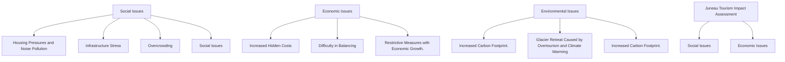
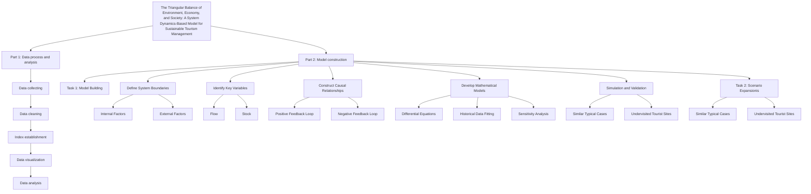
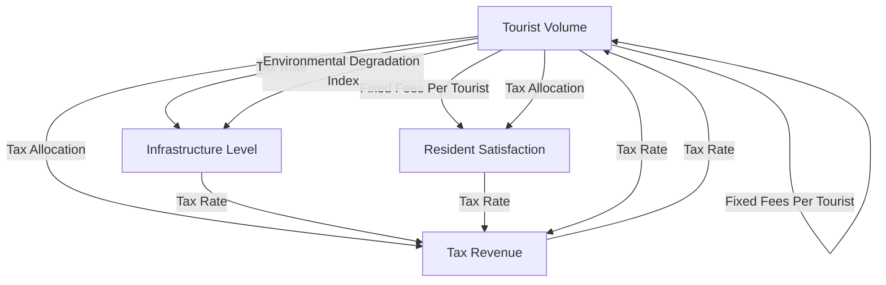

# The Triangular Balance of Environment, Economy, and Society: A System Dynamics-Based Model for Sustainable Tourism Management

Summary

As global tourism continues to thrive, the issue of "overtourism" has become increasingly pronounced. Taking Juneau, Alaska, as a case study, the overwhelming influx of tourists poses significant challenges to local governments, including overstressed infrastructure, accelerated environmental degradation, and declining community satisfaction. Balancing the triangular relationship between economic, social, and environmental sustainability while meeting tourist demands has become a central focus for academics and policymakers worldwide. This paper explores various policies and management strategies that locations can adopt to achieve sustainable tourism development and proposes an optimized solution for governmental implementation.

To address these challenges, we developed an improved system dynamics model to quantify the interactions among the environmental, social, and economic dimensions. This model systematically evaluates four interdependent variables: tourist numbers, environmental degradation index, infrastructure capacity, and resident satisfaction. Additionally, it incorporates tax revenue as an intermediary variable, establishing a dynamic feedback mechanism. By adjusting tax allocation weights, tax rates, and policy-driven fees, we simulate the impacts of policy changes on tourism sustainability and identify optimal strategies. Using the L-BFGS-B algorithm, we determine the policy combinations that maximize social welfare. The model integrates dynamic parameters derived from multi-source data and real-world case studies, ensuring its broad applicability. Through sensitivity analysis and scenario simulations, we reveal the critical importance of policy prioritization and phased adjustments in achieving sustainability goals. Furthermore, the model's adaptability and generalizability were validated by extending its application to other regions, such as Sanya, China. As an innovative contribution, we propose a strategy to promote the development of low-traffic tourist destinations, exploring opportunities for more balanced tourism growth.

This study provides scientific evidence for sustainable tourism management in Juneau and offers theoretical insights and practical tools to address overtourism in similar global destinations. By proposing innovative strategies, the research aims to contribute to solving the challenges of overtourism and advancing tourism towards a new era of environmental sustainability and social harmony. In some cases, it can also help with the development of some undervisited destinations.

## Keywords:

System Dynamics; differential equations; logistics growth model; dynamic feedback loops; L-BFGS-B algorithm; sustainable tourism; dynamic regulation; environmental protection; social welfare; economic balance

## Contents

## 1 Introduction 3

1.1 Background 3  
1.2 Restatement of the Problem 3

1.2.1 Model Building 4  
1.2.2 Extended Applications 4

1.3 Our Work 4

## 2 Model Preparation 5

2.1 Basic Ideas 5  
2.2 Overview of the Model 7

2.2.1 Model Construction 7  
2.2.2 Model Validation and Application 7  
2.2.3 Model Efficacy and Deployment Scalability 7  
2.2.4 Features and Innovations 7

## 3 Assumptions and Justifications 7

3.1 Tourists Number Dynamics 8  
3.2 Environmental Degradation 8  
3.3 Infrastructure Level 8  
3.4 Resident Satisfaction 8  
3.5 Tax Allocation 9  
3.6 System Dynamics 9  
3.7 Scenario Simulation 9  
3.8 Model Adaptability 9

## 4 Notations 10

## 5 Models 11

5.1 Dynamic Equation for Tourist Volume 11

5.2 Infrastructure Level Equation 11  
5.3 Environmental Degradation Equation . . . . . . . . . . . . . . . . . . . . . . . . . . 11  
5.4 Resident Satisfaction Equation 12  
5.5 Tax Revenue Model 12  
5.6 Dynamic Interactions in Sustainable Tourism Management Framework ..... 12  
5.7 Significance for Achieving Sustainable Tourism Development 13

## 6 The Solution of Juneau 14

## 7 Sensitivity Analysis 16

7.1 Synergistic Effects of Environmental Investment and Tax Rates on Tourist Volume 17  
7.2 Gain Mechanism of Infrastructure Investment and Additional Expenditures on Satisfaction 17  
7.3 Coupled Effects of Tax Policies and Environmental Governance ..... 18  
7.4 Phased Policy Strategies for Sustainable Tourism Development ..... 19

## 8 Model extension 19

8.1 Data Analysis of Sanya 19  
8.2 The Solution of Sanya 20  
8.3 Promoting Undervisited Destinations via Dynamic Models ..... 21

## 9 Model Evaluation and Future Discussion 22

9.1 Advantages 22  
9.2 Limitations 22  
9.3 Future Directions 22

## 10 Conclusions 23

## 1 Introduction

## 1.1 Background

Tucked within the rugged beauty of Alaska's wilderness, Juneau, the state's capital, stands as a distinctive and vibrant destination that attracts countless visitors annually. It welcomed 1.6 million cruise passengers in 2023, generating about \$375 million in tourism revenue. On peak days, up to 20,000 visitors arrived aboard seven large vessels, straining local infrastructure and impacting residents' daily lives. Overcrowding near the Mendenhall Glacier, traffic congestion, and cruise emissions have raised concerns about environmental preservation and community well-being. To address these challenges, the city has introduced measures such as increased hotel taxes, visitor fees, daily visitor limits, and diversified attractions, aiming to balance economic benefits with ecological sustainability and cultural heritage.

flowchart

Figure 1: Juneau Tourism Impact Assessment

## 1.2 Restatement of the Problem

Building on Juneau's situation and policies, the problem asks us to develop a mathematical model aimed at achieving sustainable tourism through multifactor analysis. Besides, we are also required to extend the application of this model to other representative cities to iteratively refine its feasibility and enhance its generalizability. The sub-problems are as follows:

## 1.2.1 Model Building

1. Build a model for a sustainable tourism industry in Juneau, Alaska, considering factors such as the number of visitors, overall revenue, and measures enacted to stabilize tourism.  
2. Create a plan for expenditures from additional revenues and demonstrate how these expenditures feed back into the model to promote sustainable tourism.  
3. Conduct a sensitivity analysis of the model to determine the decisive factors.

## 1.2.2 Extended Applications

1. Apply the model to another tourist destination impacted by overtourism to verify its feasibility.  
2. Specify the decisive measures for sustainable development in the context of the city.  
3. The application and refinement measures of the model in promoting less visited areas.

## 1.3 Our Work

This is a figure that displays our thought process and workflow.

flowchart

Figure 2: Our Work

## 2 Model Preparation

## 2.1 Basic Ideas

To comprehensively analyze the challenges faced by the city of Juneau, we collected extensive multidimensional data and generated a three-dimensional bar chart, as depicted in Figure 3. According to reports from the City and Borough of Juneau[4][5][6], the tourism sector in Juneau experienced substantial disruption due to the COVID-19 pandemic. And we found the post-pandemic "revenge tourism" trends exhibit a strong alignment with the logistic growth model's inherent characteristics. Consequently, we employed this model to perform a curve-fitting analysis, ensuring consistency with observed data, as Figure 4.

3d bar chart

| Port      | 2019 | 2023 |
| --------- | ---- | ---- |
| Juneau    | 1.0  | 1.4  |
| Ketchikan | 1.2  | 1.5  |
| Skogway   | 0.8  | 1.3  |
| Sirke     | 1.1  | 1.2  |
| Haines    | 0.6  | 0.7  |

Figure 3: Cruise Visitor Growth by Ports (2019 vs 2023)[1]

line chart

| Year   | Visitor Count |
| ------ | ------------- |
| 2021.0 | 0.1           |
| 2022.0 | 1.15          |
| 2023.0 | 1.65          |

Figure 4: The Fitted Curve of Dynamic Visitor Management

Meanwhile, as observed in Figures 5 and 6, the growth in tourist volume has led to a gradual decline in local residents' satisfaction over the years, accompanied by worsening social issues such as traffic congestion and urban noise. Building on this foundation, we systematically incorporated both positive and negative influence factors from environmental, economic, and social dimensions. Guided by the principles of system dynamics, we conducted iterative parameter calibration and optimization to establish the final model. This framework is not only tailored to the unique context of Juneau but also demonstrates scalability and adaptability. Through parameter adjustments, the model can be extended to other destinations impacted by overtourism and provides actionable insights for the sustainable development of under-touristed regions.

Comparison: Overall Impact of Tourism on Households, 2002, 2006, 2021, 2022, 2023  

bar chart

| Category | 2002 (%) | 2006 (%) | 2021 (%) | 2022 (%) | 2023 (%) |
|---|---|---|---|---|---|
| Positive | 40 | 40 | 36 | 35 | 31 |
| Negative | 6 | 8 | 8 | 7 | 11 |
| Both positive and negative | 37 | 34 | 33 | 41 | 46 |
| No impact | 15 | 17 | 20 | 16 | 11 |

Notes: The 2021 survey referred to 2019 impacts. Excludes "don't know" and refused responses.

Figure 5: Overall Impact of Tourism on Households, 2002, 2006, 2021, 2022, 2023[6]  

3d area chart

|   Year | Category     |   Satisfaction Score |
|-------:|:-------------|---------------------:|
|   2020 | Value        |                   65 |
|   2020 | Services     |                   78 |
|   2020 | Cleanliness  |                   72 |
|   2020 | Accessibility |                   68 |
|   2020 | Crowding     |                   60 |
|   2021 | Value        |                   70 |
|   2021 | Services     |                   85 |
|   2021 | Cleanliness  |                   75 |
|   2021 | Accessibility |                   70 |
|   2021 | Crowding     |                   65 |
|   2022 | Value        |                   75 |
|   2022 | Services     |                   88 |
|   2022 | Cleanliness  |                   78 |
|   2022 | Accessibility |                   73 |
|   2022 | Crowding     |                   68 |
|   2023 | Value        |                   80 |
|   2023 | Services     |                   90 |
|   2023 | Cleanliness  |                   80 |
|   2023 | Accessibility |                   75 |
|   2023 | Crowding     |                   70 |

Figure 6: Visitor Satisfaction Across Categories[6]

To address these issues, we need a model to achieve dynamic regulation of tourist flows, stabilizing them within the carrying capacity of the environment and infrastructure. Besides, this model seeks to prevent urban congestion and excessive ecological pressure. Guided by the core principles of system dynamics, we construct a dynamic feedback-driven tourists management model.

## 2.2 Overview of the Model

## 2.2.1 Model Construction

1. Clarification of Variables and Their Interrelationships: We clarified the system boundary and defined the variables the model needs. The core stock variables include the number of tourists, environmental degradation index, infrastructure capacity, and resident satisfaction and the tax revenue serves as an intermediary variable. At the same time, their causal relationships are identified.  
2. Dynamic Feedback Loops: Positive and negative feedback loops are constructed to describe the dynamic interactions among tourist growth, environmental pressure, infrastructure investments, resident satisfaction, and tax revenue.  
3. Establishing Differential Equations: Based on these relationships, a set of differential equations is formulated to quantify the system's dynamic changes.

## 2.2.2 Model Validation and Application

To validate the model's accuracy, we conducted historical data fitting and sensitivity analyses. Additionally, scenario simulations were employed to evaluate the effects of different policies, such as increasing environmental investment and optimizing traffic management, on system behavior.

## 2.2.3 Model Efficacy and Deployment Scalability

The model not only provides specific policy recommendations for Juneau but also demonstrates adaptability and scalability. It can be extended to other regions facing challenges associated with overtourism, thereby offering a scientific foundation for sustainable tourism management.

## 2.2.4 Features and Innovations

Based on the impact of COVID-19 on tourism data, our logistic growth model fully accounts for the post-pandemic recovery of the tourism industry and the surge in tourist numbers driven by pent-up demand. We incorporate resident satisfaction as a core variable and quantify its relationship with tourist volume, environmental degradation, and infrastructure levels, thereby highlighting the importance of the social dimension. Besides, the model is highly scalable, allowing for the inclusion of new variables (e.g., climate change, extreme weather) and policy adjustments (e.g., tax changes, visitor restrictions), enabling its broad application across different destinations or regions.

## 3 Assumptions and Justifications

In constructing a system dynamics model for sustainable tourism management, we based the model on the following assumptions to simplify the complex reality and ensure the model's rationality and operability. These assumptions cover various aspects, including tourist behavior, environmental response, infrastructure investment, resident satisfaction, and tax allocation, as detailed below:

## 3.1 Tourists Number Dynamics

- Tourists Number Growth Rate: The growth rate of tourist numbers is positively influenced by the level of infrastructure and resident satisfaction. Improvements in infrastructure and resident satisfaction will attract more tourists.  
- Crowding Effect: The reduction rate of tourist numbers is proportional to environmental degradation and the square of tourist numbers. Environmental degradation and overcrowding will suppress the growth of tourist numbers.  
- Carrying Capacity: The system has a maximum carrying capacity, beyond which the growth of tourist numbers will be significantly inhibited.

## 3.2 Environmental Degradation

- Environmental Pressure: The increase in the environmental degradation index is proportional to tourist numbers and tax pressure. Tourist activities (e.g., carbon emissions, waste generation) and tax policies (e.g., investment allocation) will directly affect environmental degradation. Environmental degradation will emphasize different environmental domains, depending on different locations.  
- Natural Recovery: The environment has a certain natural recovery capacity, with the recovery rate proportional to the environmental degradation index.  
- Effect of Environmental Investment: Environmental investment can effectively reduce the environmental degradation index, and the investment efficiency is constant.

## 3.3 Infrastructure Level

- Investment Efficiency: Infrastructure investment can linearly improve the infrastructure level, and the investment efficiency is constant.  
- Depreciation Effect: The infrastructure level will naturally depreciate over time with a constant depreciation rate.

## 3.4 Resident Satisfaction

- Satisfaction Gain: The increase in resident satisfaction is proportional to the level of infrastructure and public service investment. Improvements in infrastructure and public services will enhance resident satisfaction.  
- Satisfaction Suppression: The decrease in resident satisfaction is proportional to tourist numbers and environmental degradation. Overcrowding and environmental deterioration will reduce resident satisfaction.  
- Linear Relationship: The change in resident satisfaction has a linear relationship with influencing factors, simplifying the model.

## 3.5 Tax Allocation

- Tax Sources: Tax revenue mainly comes from tourist-related taxes (e.g., tax rate and per capita tourist spending) and other fees (e.g., tickets, service fees).  
- Allocation Ratio: It is assumed that tax revenue is allocated at fixed proportions to environmental protection, infrastructure, and public services, with the sum of allocation ratios equal to 1.  
- Investment Effect: It is assumed that the effects of tax-allocated investments (e.g., environmental investment efficiency, infrastructure investment efficiency) are constant and take effect immediately.

## 3.6 System Dynamics

- Existence of Steady State: The system can reach a steady state in the long run, where the rate of change of all variables is zero.  
- Linear Feedback: The feedback mechanisms (e.g., positive and negative feedback) in the system are linear, facilitating model solving and analysis.  
- Parameter Stability: The parameters in the model remain unchanged during the simulation period, without considering external sudden factors (e.g., extreme weather, economic crisis).

## 3.7 Scenario Simulation

- Policy Independence: Different policies (e.g., increasing environmental investment, optimizing traffic management) are independent of each other, and their effects can be superimposed directly.  
- Short-term and Long-term Effects: Policies may cause system fluctuations in the short term but can achieve a new steady state in the long term.  
- Parameter Sensitivity: Changes in key parameters (e.g., environmental pressure coefficient, tourist suppression coefficient) have a linear impact on system behavior.

## 3.8 Model Adaptability

- Location Generality: The basic framework of the model is applicable to other regions affected by overtourism, with only adjustments to parameters (e.g., carrying capacity, environmental pressure coefficient) required.  
- Data Availability: The data required by the model (e.g., tourist numbers, environmental degradation index, resident satisfaction) can be obtained through surveys and monitoring, with reliable data quality.

The above assumptions provide a theoretical foundation and simplification conditions for model construction and solving. These assumptions simplify the complexity of reality to some extent and they ensure the model's logical consistency and operability well meanwhile. They can also provide a scientific basis for policy analysis and scenario simulation. In practical applications, the model's precision and applicability can be further optimized by introducing more nonlinear relationships and dynamic parameters.

## 4 Notations

The core symbols and their definitions used in this study are summarized in Table 1, providing an overview of the key parameters and their related meanings.

Table 1: Model Parameters and Definitions

<table><tr><td>Equation</td><td>Variable/Symbol</td><td>Definition</td></tr><tr><td rowspan="7">(1): Tourist Dynamics</td><td> $x$ </td><td>Tourist volume (persons)</td></tr><tr><td> $\alpha_0$ </td><td>Base growth rate (1/year)</td></tr><tr><td> $\lambda_I$ </td><td>Infrastructure growth multiplier</td></tr><tr><td> $\xi_S$ </td><td>Satisfaction growth multiplier</td></tr><tr><td> $\beta_0$ </td><td>Base crowding coefficient (1/person/year)</td></tr><tr><td> $\xi_E$ </td><td>Environmental degradation crowding multiplier</td></tr><tr><td> $K$ </td><td>Carrying capacity baseline (persons)</td></tr><tr><td rowspan="4">(2): Infrastructure Dynamics</td><td> $I$ </td><td>Infrastructure level (dimensionless)</td></tr><tr><td> $\phi_{infra}$ </td><td>Infrastructure investment efficiency (1/$)</td></tr><tr><td> $\theta_{infra}$ </td><td>Infrastructure investment allocation rate</td></tr><tr><td> $\delta_I$ </td><td>Infrastructure depreciation rate (1/year)</td></tr><tr><td rowspan="6">(3): Environmental Dynamics</td><td> $E$ </td><td>Environmental degradation (dimensionless)</td></tr><tr><td> $\eta$ </td><td>Tourism pressure coefficient</td></tr><tr><td> $\gamma$ </td><td>Tax amplification factor (1/$)</td></tr><tr><td> $\delta_E$ </td><td>Natural recovery rate (1/year)</td></tr><tr><td> $\phi_{env}$ </td><td>Environmental investment efficiency (1/$)</td></tr><tr><td> $\theta_{env}$ </td><td>Environmental investment allocation rate</td></tr><tr><td rowspan="6">(4): Satisfaction Dynamics</td><td> $S$ </td><td>Resident satisfaction (dimensionless)</td></tr><tr><td> $\mu_S$ </td><td>Infrastructure/public service satisfaction gain</td></tr><tr><td> $\epsilon$ </td><td>Public service conversion efficiency</td></tr><tr><td> $\theta_{pub}$ </td><td>Public service allocation rate</td></tr><tr><td> $\kappa_S$ </td><td>Tourist congestion penalty (1/person)</td></tr><tr><td> $\nu_S$ </td><td>Environmental degradation penalty</td></tr><tr><td rowspan="2">(5): Tax System</td><td> $\tau$ </td><td>Tax rate (dimensionless)</td></tr><tr><td> $f_{other}$ </td><td>Fixed fees per tourist ($/person)</td></tr><tr><td>(6): Policy Constraint</td><td> $\theta_i$ </td><td>Allocation rates ( $\sum \theta_{env+infra+pub} = 1$ )</td></tr></table>

## 5 Models

## 5.1 Dynamic Equation for Tourist Volume

To capture the dynamic changes in tourist numbers, we developed an improved logistic growth model, written as follows:

$$
\frac {\mathrm{d} x}{\mathrm{d} t} = \underbrace {\alpha_ {0} (1 + \lambda_ {I} I)} _ {\text { Infrastructure   boost }} \underbrace {(1 + \xi_ {S} S)} _ {\text { Satisfaction   effect }} x - \underbrace {\beta_ {0} (1 + \zeta_ {E} E)} _ {\text { Environmental   pressure }} x ^ {2} \left(\frac {x}{K}\right) \tag {1}
$$

where $x$ is the tourist volume, $I$ is the infrastructure level, $S$ is the resident satisfaction, $E$ is the environmental degradation, and $K$ is the system's carrying capacity.

The term $\alpha_{0}(1+\lambda_{I}I)(1+\xi_{S}S)x$ represents the positive influence of infrastructure and resident satisfaction on tourist growth, where $\lambda_{I}$ and $\xi_{S}$ capture their respective contribution levels. The term $\beta_{0}(1+\zeta_{E}E)x^{2}\left(\frac{x}{K}\right)$ indicates the inhibiting effects from overcrowding and environmental decline, with $\zeta_{E}$ capturing how environmental stress intensifies crowding. By combining these opposing factors, this equation accounts for both natural tourist growth and key external influences, providing a basis for evaluating policy interventions such as infrastructure expansion or reductions in environmental damage.

## 5.2 Infrastructure Level Equation

The dynamic changes in infrastructure are described by:

$$
\frac {\mathrm{d} I}{\mathrm{d} t} = \underbrace {\phi_ {\text { infra }} \theta_ {\text { infra }} T} _ {\text { Investment   flow }} - \underbrace {\delta_ {I} I} _ {\text { Depreciation   rate }} \tag {2}
$$

where T is the total tax revenue, $\phi_{infra}$ represents infrastructure investment efficiency, $\theta_{infra}$ denotes the tax allocation ratio for infrastructure, and $\delta_{I}I$ is the depreciation rate. This equation balances growth from continual investments against natural depreciation, underscoring how strategic funding maintains and enhances infrastructure quality and capacity.

## 5.3 Environmental Degradation Equation

The environmental degradation dynamics are modeled as:

$$
\frac{\mathrm{d}E}{\mathrm{d}t} = \underbrace{\eta x(1 + \gamma\tau)}_{\substack{\text{Tourism}\\ \text{pressure}}} - \underbrace{\delta_{E}E}_{\substack{\text{Natural}\\ \text{recovery}}} - \underbrace{\phi_{\text{env}}\theta_{\text{env}}T}_{\substack{\text{restorative impact of}\\ \text{environmental investments}}}
$$

(3)

where $\eta$ quantifies the environmental stress per tourist, $\gamma$ is the tax-related stress coefficient, $\delta_{E}$ is the natural recovery rate, and $\phi_{env}\theta_{env}T$ represents the restorative impact of environmental investments funded by taxes. This equation highlights the need to balance tourism-driven pressures with both natural recovery and proactive environmental restoration.

## 5.4 Resident Satisfaction Equation

The dynamic changes in resident satisfaction are expressed as:

$$
\frac {\mathrm{d} S}{\mathrm{d} t} = \underbrace {\mu_ {S} (I + \epsilon \theta_ {\text { pub }} T)} _ {\text { Public   service }} - \underbrace {\kappa_ {S} \cdot x} _ {\text { Congestion   cost }} - \underbrace {\nu_ {S} E} _ {\text { Environmental   degradation }} \tag {4}
$$

where $\mu_{S}$ represents the satisfaction gain coefficient, $\epsilon$ quantifies public service efficiency, $\kappa_{S}$ reflects the suppression effect of crowding, and $\nu_{S}$ captures the adverse impact of environmental degradation. By capturing how infrastructure and public service improvements counterbalance crowding and environmental decline, this equation details how overall satisfaction evolves over time.

## 5.5 Tax Revenue Model

Total tax revenue is modeled as:

$$
T = \underbrace {\tau x} _ {\text { Tax   revenue }} + \underbrace {f _ {\text { other }} x} _ {\text { Fixed   fees }} \tag {5}
$$

where $\tau x$ represents tax revenue, with $\tau$ being the tax rate and x the taxable base, while $f_{other}x$ represents fixed fees proportionally linked to x. By distinguishing between tax-based income and additional fees, this equation clarifies how revenue is generated for reinvestment in the system.

## 5.6 Dynamic Interactions in Sustainable Tourism Management Framework

The following Figure 7 highlights the dynamic feedback loops within our model by revealing the relationships among tourist volume, infrastructure level, environmental degradation, resident satisfaction, tax revenue, and tax allocation. The model emphasizes the importance of achieving a balance between economic growth, environmental protection, and social well-being. For instance, higher tax revenues can support investments in infrastructure and environmental protection, thereby enhancing resident satisfaction and maintaining the attractiveness of tourist destinations. Conversely, uncontrolled tourist volume may exacerbate environmental degradation, threatening long-term sustainability. This framework provides a quantitative basis and policy guidance for achieving equilibrium in tourism development.

flowchart

Figure 7: Dynamic Feedback Loops in Sustainable Tourism Systems

## 5.7 Significance for Achieving Sustainable Tourism Development

Through the integrated effects of the aforementioned equations, the model provides a scientific foundation and policy recommendations for the sustainable development of tourism. The Dynamic Equation for Tourists Volume facilitates rational growth in visitor numbers by regulating infrastructure and environmental pressures, thereby avoiding overcrowding. The Infrastructure Level Equation enhances tourist experiences and resident satisfaction through increased investment in infrastructure, alleviating traffic congestion and the strain on public services caused by the influx of visitors. The Environmental Degradation Equation mitigates environmental deterioration by increasing investment in environmental protection, safeguarding critical tourism resources such as the Mendenhall Glacier. The Resident Satisfaction Equation improves support for tourism by enhancing infrastructure and public services, addressing challenges such as housing pressure and community alienation caused by tourism commercialization. Finally, the Tax Revenue Model Equation supports balanced economic growth and environmental conservation by allocating tax revenues to environmental protection, infrastructure, and public services. Through a closed-loop feedback mechanism, this model establishes a positive cycle of "revenue-generation—protection—experience enhancement," offering a quantifiable pathway for Juneau and other tourism destinations facing similar challenges to achieve their sustainable development goals.

## 6 The Solution of Juneau

Our model includes a total of 15 parameters and 4 initial conditions (when T = 0), each corresponding to a specific modeling equation. The values of these parameters are derived from two main sources: official datasets and calculations based on our model and assumptions. These details are summarized in Table 2 and Table 3.

Table 2: Initial Parameter Values and Data Sources

<table><tr><td>Symbol</td><td>Value</td><td>Data Source</td></tr><tr><td> $E_0$ </td><td>0.1</td><td>CBJ Cruise Impacts 2023 Report[6]</td></tr><tr><td> $x_0$ </td><td> $165 \times 10^6$ </td><td>CBJ Cruise Impacts 2023 Report[6]</td></tr><tr><td> $S_0$ </td><td>0.7</td><td>CBJ Cruise Impacts 2023 Report[6]</td></tr><tr><td> $I_0$ </td><td>0.4</td><td>CBJ Cruise Impacts 2023 Report[6]</td></tr></table>

Table 3: Parameter Values and Data Sources[2][3][4][5][6]

<table><tr><td>Equation</td><td>Symbol</td><td>Value</td><td>Data Source</td></tr><tr><td rowspan="7">(1): Tourist Dynamics</td><td> $K$ </td><td>1,650,000</td><td>2023 cruise passenger volume (CBJ-Tourism-Survey-2023-Report, Page 9)</td></tr><tr><td> $\alpha_0$ </td><td>0.3</td><td>Historical data calibration</td></tr><tr><td> $\lambda_I$ </td><td>0.2</td><td>Transportation investment return rate</td></tr><tr><td> $\xi_S$ </td><td>0.48</td><td>Resident satisfaction survey</td></tr><tr><td> $\beta_0$ </td><td>0.55</td><td>Environmental carrying capacity research</td></tr><tr><td> $\zeta_E$ </td><td>0.43</td><td>Emission monitoring data</td></tr><tr><td> $\gamma$ </td><td>0.05</td><td>Fiscal policy analysis</td></tr><tr><td rowspan="3">(2): Infrastructure Dynamics</td><td> $\phi_{infra}$ </td><td>0.35</td><td>Weighted data from transportation and infrastructure development</td></tr><tr><td> $\theta_{infra}$ </td><td>0.35</td><td>Reduce traffic congestion (55%) + develop public transportation (42%)</td></tr><tr><td> $\delta_I$ </td><td>0.02</td><td>Infrastructure depreciation studies</td></tr><tr><td rowspan="4">(3): Environmental Dynamics</td><td> $\eta$ </td><td>0.43</td><td>Weighted average of cruise emissions (36%), whale-watching boats (47%), and aviation noise (43%)</td></tr><tr><td> $\theta_{env}$ </td><td>0.25</td><td>Resident prioritization survey (restricting cruises 28%, 2022 data)</td></tr><tr><td> $\delta_E$ </td><td>0.03</td><td>Ecosystem recovery studies</td></tr><tr><td> $\phi_{env}$ </td><td>0.04</td><td>Efficiency of environmental protection investments</td></tr><tr><td rowspan="3">(4): Satisfaction Dynamics</td><td> $\mu_S$ </td><td>0.65</td><td>Normalized from high-priority projects (transportation, hotels, and conferences, 2022 data)</td></tr><tr><td> $\kappa_S$ </td><td>0.55</td><td>Prioritization of traffic congestion (55%, 2022 data)</td></tr><tr><td> $\nu_S$ </td><td>0.42</td><td>Cruise emission impacts (42%, 2022 data)</td></tr><tr><td rowspan="2">(5): Tax System</td><td> $\tau$ </td><td>0.1</td><td>Fiscal policy and tax adjustment simulation</td></tr><tr><td> $f_{other}$ </td><td>50 USD</td><td>Average fixed fees per tourist (2023 data)</td></tr></table>

To propose actionable policy recommendations, we identified 5 government-controllable parameters: $\tau$ , $f_{other}$ , $\theta_{env}$ , $\theta_{infra}$ , and $\theta_{pub}$ . Adjusting these parameters simulates changes in tax distribution, tax rates, and policy-driven costs (e.g., entrance fees). Each parameter change triggers a domino effect, influencing all other aspects of the model.

To curb the rapid growth in tourist numbers, we opted to increase tax rates and other policy-driven fees. After iterative tuning, we decided to temporarily raise the tax rate to 6.3% and introduce an entry fee of \$50 per person. To maximize the utility of the tax revenue within a reasonable range, we employed the Limited-memory Broyden-Fletcher-Goldfarb-Shanno with Box constraints (L-BFGS-B) algorithm 1. This optimization determined the allocation weights for tax revenues as 0.3 for environmental improvement, 0.4 for infrastructure enhancement, and 0.3 for improving public services.

To evaluate the impact of these parameters on sustainable tourism, we implemented the following simulation code to observe changes in tourist numbers, environmental degradation indices, infrastructure levels, and resident satisfaction over time under adjusted policies.

Algorithm 1: Tourism Ecosystem Dynamics Simulation  
Input: Base parameters: $\alpha_{0}$ (base growth), $\beta_{0}$ (crowding effect), $\eta$ (env. pressure), $\delta_{E}$ (env. recovery)

Input: Policy ratios: $\theta_{env}$ (environment), $\theta_{infra}$ (infrastructure)

Input: Initial states: $x_{0}$ (visitors), $E_{0}$ (env. state), $I_{0}$ (infra. level), $S_{0}$ (satisfaction)

Input: Time parameters: $t_{start}$ , $t_{end}$ , $\Delta t$ (step size)

Initialize $y \leftarrow [x_{0}, E_{0}, I_{0}, S_{0}]^{T}$ Store initial state

while $t \leq t_{end}$ do  
Economic module

$T \leftarrow \tau x + f_{\text{other}}x \quad // \text{ Total revenue}$ $T_{\text{env}} \leftarrow \theta_{\text{env}}T \quad // \text{ Env. investment}$ $T_{\text{infra}} \leftarrow \theta_{\text{infra}}T \quad // \text{ Infra. investment}$ Dynamic coefficients $\alpha_{\text{eff}} \leftarrow c_{\alpha} \alpha_{0}(1 + \lambda_{I}I)(1 + \xi_{S}S) \quad // \text{ Effective growth}$ $\beta_{\text{eff}} \leftarrow c_{\beta} \beta_{0}(1 + \zeta_{E}E) \quad // \text{ Effective crowding}$ System dynamics $\frac{dx}{dt} \leftarrow \alpha_{\text{eff}}x - \beta_{\text{eff}}x^{2}(x/K) \quad // \text{ Visitor change}$ $\frac{dE}{dt} \leftarrow \eta x(1 + \gamma\tau) - \delta_{E}E - \phi_{\text{env}}T_{\text{env}} \quad // \text{ Environment change}$ $\frac{dI}{dt} \leftarrow \phi_{\text{infra}}T_{\text{infra}} - \delta_{I}I \quad // \text{ Infrastructure change}$ $\frac{dS}{dt} \leftarrow \mu_{S}(I + \epsilon\theta_{\text{pub}}T) - \kappa_{S}x) - \nu_{S}E \quad // \text{ Satisfaction change}$ State update $x \leftarrow x + \Delta t \cdot dx/dt$ $E \leftarrow E + \Delta t \cdot dE/dt$ $I \leftarrow I + \Delta t \cdot dI/dt$ $S \leftarrow S + \Delta t \cdot dS/dt$ Record system state $t \leftarrow t + \Delta t$

end

By visualizing the outputs of the program, we obtained the following trends. Observations show that after increasing the tax rate to $6.3\%$ , the tourist numbers decrease, dropping below Juneau's carrying capacity $K$ . With the tax revenue allocated to expenses, the absolute value of the environmental degradation index consistently decreases, indicating continuous environmental improvement. At the same time, infrastructure levels improve steadily. Consequently, Juneau's attractiveness to tourists increases, leading to a gradual recovery in tourist numbers that stabilizes within the carrying capacity. As a result of these changes, resident satisfaction rises consistently, maintaining a high level despite slight declines due to subsequent increases in tourist numbers.

line chart

| Years | Tourist Volume (Million) |
|-------|--------------------------|
| 2024  | 1.65                     |
| 2026  | 1.25                     |
| 2030  | 1.65                     |
| 2032  | 1.50                     |

line chart

| Years | Environmental Degradation |
| ----- | ------------------------- |
| 2024  | -0.5                      |
| 2026  | -1.5                      |
| 2028  | -2.5                      |
| 2030  | -3.5                      |
| 2032  | -4.5                      |
| 2034  | -5.5                      |

line chart

| Year | Infrastructure Level |
| ---- | -------------------- |
| 2024 | 0.3                  |
| 2026 | 0.7                  |
| 2028 | 1.1                  |
| 2030 | 1.5                  |
| 2032 | 1.9                  |

line chart

| Years | Resident Satisfaction |
| ----- | --------------------- |
| 2024  | 0.0                   |
| 2026  | 1.8                   |
| 2028  | 2.5                   |
| 2030  | 2.9                   |
| 2032  | 2.7                   |
| 2033  | 2.4                   |

Figure 8: Visualization of program output results

From the analysis above, we recommend temporarily increasing the tax rate to 6.3% and allocating tax revenues with weights of 0.3, 0.4, and 0.3 to environmental improvement, infrastructure enhancement, and public service capacity, respectively. These measures will ensure a triangular balance among the economy, environment, and society in Juneau, promoting sustainable tourism development.

## 7 Sensitivity Analysis

This section systematically analyzes the mechanisms by which key policy parameters influence sustainable tourism development indicators using heatmap visualization. Based on steady-state simulation results of the dynamic model, the focus lies on exploring the sensitivity responses of tourist volume, resident satisfaction, and environmental degradation to regulatory variables such as tax allocation ratios, tax rates, and additional expenditures.

## 7.1 Synergistic Effects of Environmental Investment and Tax Rates on Tourist Volume

As shown in Figure 9, tourist volume (x) exhibits significant nonlinear trends with adjustments to the environmental investment proportion ( $\theta_{env}$ ) and tax rates ( $\tau$ ). When the tax rate increases from 5% to 15%, the reduction in tourist volume varies depending on the level of environmental investment: under low environmental investment ( $\theta_{env} = 0.20$ ), the tourist volume decreases from 1.62 million to 1.49 million, a reduction of 8.0%; under high environmental investment ( $\theta_{env} = 0.40$ ), the volume decreases from 1.42 million to 1.24 million, a reduction of 12.7%. This indicates that the suppressive effect of higher tax rates on tourism demand intensifies with increased environmental investment. Long-term observations show that high environmental investment ( $\theta_{env} \geq 0.35$ ) combined with moderate tax rates ( $\tau \leq 9\%$ ) can stabilize tourist volume above 1.35 million, confirming the positive feedback mechanism of improved environmental quality on tourism carrying capacity.

heatmap

| Tax rate (τ) | Environmental investment allocation rate (θ_env) | Tourist volume(x) |
| ------------ | ----------------------------------------------- | ----------------- |
| 0.05         | 0.2                                             | 1.62              |
| 0.05         | 0.25                                            | 1.58              |
| 0.05         | 0.3                                             | 1.53              |
| 0.05         | 0.35                                            | 1.48              |
| 0.05         | 0.4                                             | 1.42              |
| 0.07         | 0.2                                             | 1.60              |
| 0.07         | 0.25                                            | 1.56              |
| 0.07         | 0.3                                             | 1.51              |
| 0.07         | 0.35                                            | 1.46              |
| 0.07         | 0.4                                             | 1.39              |
| 0.09         | 0.2                                             | 1.58              |
| 0.09         | 0.25                                            | 1.54              |
| 0.09         | 0.3                                             | 1.49              |
| 0.09         | 0.35                                            | 1.43              |
| 0.09         | 0.4                                             | 1.36              |
| 0.11         | 0.2                                             | 1.55              |
| 0.11         | 0.25                                            | 1.51              |
| 0.11         | 0.3                                             | 1.45              |
| 0.11         | 0.35                                            | 1.39              |
| 0.11         | 0.4                                             | 1.32              |
| 0.13         | 0.2                                             | 1.52              |
| 0.13         | 0.25                                            | 1.47              |
| 0.13         | 0.3                                             | 1.41              |
| 0.13         | 0.35                                            | 1.35              |
| 0.13         | 0.4                                             | 1.28              |
| 0.15         | 0.2                                             | 1.49              |
| 0.15         | 0.25                                            | 1.43              |
| 0.15         | 0.3                                             | 1.37              |
| 0.15         | 0.35                                            | 1.31              |
| 0.15         | 0.4                                             | 1.24              |

Figure 9: Tourist Volume VS Env. Investment Allocation Rate / Tax Rate

## 7.2 Gain Mechanism of Infrastructure Investment and Additional Expenditures on Satisfaction

Figure 10 demonstrates the high sensitivity of resident satisfaction (S) to the proportion of infrastructure investment ( $\theta_{infra}$ ) and additional expenditures ( $f_{other}$ ). Increasing the infrastructure investment ratio from 30% to 50% results in a 17.6% rise in satisfaction (from 0.68 to 0.80 units), highlighting the critical role of public service provision in enhancing resident well-being. Notably, as additional expenditures increase from 300 to 700 per person, the marginal gain in satisfaction intensifies with higher investment ratios, achieving maximum efficiency ( $\Delta S/\Delta f = 0.035/100 USD$ ) when $\theta_{infra} = 50\%$ . This underscores the amplifying effect of infrastructure improvement on fund utilization efficiency.

heatmap

| f_other | 0.3 | 0.35 | 0.4 | 0.45 | 0.5 |
| --- | --- | --- | --- | --- | --- |
| 300 | 0.68 | 0.72 | 0.75 | 0.78 | 0.80 |
| 400 | 0.70 | 0.74 | 0.77 | 0.79 | 0.82 |
| 500 | 0.72 | 0.76 | 0.79 | 0.81 | 0.83 |
| 600 | 0.74 | 0.78 | 0.81 | 0.83 | 0.85 |
| 700 | 0.76 | 0.80 | 0.83 | 0.85 | 0.87 |

Figure 10: Resident Satisfaction VS Infra. Investment Allocation Rate & Fixed Fees Per Tourist

## 7.3 Coupled Effects of Tax Policies and Environmental Governance

Figure 11 quantifies the dual sensitivity of environmental degradation (E) to tax rates and environmental investment. The data show that when the tax rate rises from 5% to 15% and the environmental investment proportion simultaneously increases to 40%, the environmental degradation index decreases by 49.4% (from 0.85 to 0.43 units). During this process, higher tax rates expand the environmental funding pool ( $T_{env} = \theta_{env}\tau x$ ), enhancing governance efficiency. Furthermore, higher environmental investment proportions ( $\theta_{env} \geq 0.35$ ) improve the efficiency of environmental improvement per unit tax rate by 2.3 times, demonstrating the multiplier effect of coordinated policies on ecological restoration.

heatmap

| Tax rate (τ) \ Environmental investment allocation rate (θ_env) | 0.2 | 0.25 | 0.3 | 0.35 | 0.4 |
|---|---|---|---|---|---|
| 0.05 | 0.85 | 0.78 | 0.72 | 0.65 | 0.59 |
| 0.07 | 0.82 | 0.75 | 0.68 | 0.61 | 0.55 |
| 0.09 | 0.79 | 0.72 | 0.65 | 0.58 | 0.52 |
| 0.11 | 0.76 | 0.69 | 0.62 | 0.55 | 0.49 |
| 0.13 | 0.73 | 0.66 | 0.59 | 0.52 | 0.46 |
| 0.15 | 0.70 | 0.63 | 0.56 | 0.49 | 0.43 |

Figure 11: Env. Degradation VS Tax Rate & Env. Investment Allocation Rate

## 7.4 Phased Policy Strategies for Sustainable Tourism Development

The above analysis highlights the necessity of achieving dynamic balance among multiple policy objectives through phased combinations of strategies, summarized as a three-step approach of “short-term control, mid-term improvement, and long-term synergy”:

- Short Term (1–3 years): In scenarios of tourist overload or sudden environmental pressure, moderate increases in tax rates (e.g., temporarily raising $\tau$ from 5% to 11–13%) can leverage price controls to curb rapid tourist growth (as Figure 9 shows, raising tax rates to 13% can reduce tourist volume by approximately 15–20%), alleviating congestion and ecological overload risks. During this phase, maintaining environmental investment proportions ( $\theta_{env} \geq 25\%$ ) is essential to avoid depleting long-term recovery potential.  
- Mid Term (3–5 years): Once tourist volume returns to reasonable levels (e.g., $x \leq 1.4$ million), tax rates can be gradually reduced to baseline levels ( $\tau \approx 9\%$ ), shifting policy focus to quality-driven investments. As shown in Figure 10, increasing infrastructure investment ( $\theta_{infra}$ ) to 40–45% and additional expenditures ( $f_{other}$ ) to 600–700 per person can raise resident satisfaction (S) above the 0.80 threshold, significantly enhancing community support for tourism. Maintaining $\theta_{env} \geq 35\%$ ensures that environmental degradation (E) drops below 0.55 (Figure 11), creating ecological capacity for increased tourist volumes.  
- Long Term (5+ years): Coordinated policies can establish a positive feedback loop among “environment, economy, and society.” For example, under high-investment scenarios ( $\theta_{env} = 40\%$ , $\theta_{infra} = 45\%$ ), tourist volume can stabilize at 1.45–1.50 million (an increase of 10–15% compared to the short-term control phase), while environmental degradation ( $E$ ) remains at a low range of 0.45–0.50 (Figure 11). This phase requires dynamic monitoring of satisfaction ( $S \geq 0.80$ ) and environmental stress ( $E \leq 0.55$ ), with fine-tuned adjustments to $\theta_{pub}$ (e.g., $\pm 5\%$ ) to optimize public service provision and solidify sustainable development.

This phased strategy framework is not only applicable to ecologically sensitive sites (e.g., nature reserves) for visitor management but also provides a transformation reference for urban cultural tourism areas. In over-commercialized scenarios, short-term tax tools can replace administrative restrictions, reducing social tensions. In underdeveloped regions, mid-term infrastructure investment can simultaneously improve tourism revenues and resident well-being, avoiding imbalances that prioritize the economy over livelihoods. The asymmetric response patterns revealed by the heatmaps indicate that policy effectiveness heavily depends on the timing and intensity of implementation, requiring a “monitor-evaluate-feedback” mechanism to achieve precise governance.

## 8 Model extension

## 8.1 Data Analysis of Sanya

We selected Sanya, a city similarly impacted by overtourism, as a comparative case study. Located at the southernmost tip of China's Hainan Island, Sanya is renowned for its pristine tropical coastal scenery. As an internationally recognized tourist destination, Sanya attracts millions of visitors annually, with its highly developed tourism industry serving as the cornerstone of the local economy. Similar to Juneau, Sanya has experienced a surge in tourist numbers due to post-pandemic recovery, leading to a phenomenon of "revenge tourism." Figures 12 and 13 illustrate the growth trends of key tourism indicators, including overnight visitors, tourism revenue, and accommodation revenue, from 2020 to 2024. These trends highlight the seasonal, migratory nature of visitor flows and the aggregation effects during peak seasons.

3d bar chart

| Year | Tourism Revenue (Billion) | Indonation Revenue (Billion) |
|------|----------------------------|-------------------------------|
| 2020 | 150                        | 100                           |
| 2021 | 250                        | 150                           |
| 2022 | 300                        | 200                           |
| 2023 | 350                        | 250                           |
| 2024 | 400                        | 300                           |

Figure 12: Tourism-Related Indicators (2020-2024)[8]

area chart

| Time Period | Overnight Tourists (Million) | Tourism Revenue (Billion) | Accommodation Revenue (Billion) |
| ----------- | --------------------------- | ------------------------- | ------------------------------- |
| 2020-Q1     | 280                         | 500                       | 150                             |
| 2020-Q2     | 180                         | 450                       | 160                             |
| 2020-Q3     | 150                         | 400                       | 170                             |
| 2020-Q4     | 190                         | 480                       | 180                             |
| 2021-Q1     | 270                         | 600                       | 250                             |
| 2021-Q2     | 250                         | 700                       | 350                             |
| 2021-Q3     | 180                         | 450                       | 280                             |
| 2021-Q4     | 150                         | 400                       | 300                             |
| 2022-Q1     | 160                         | 450                       | 350                             |
| 2022-Q2     | 170                         | 500                       | 400                             |
| 2022-Q3     | 180                         | 550                       | 450                             |
| 2022-Q4     | 210                         | 650                       | 550                             |
| 2023-Q1     | 130                         | 480                       | 380                             |
| 2023-Q2     | 170                         | 550                       | 450                             |
| 2023-Q3     | 190                         | 600                       | 500                             |
| 2023-Q4     | 250                         | 750                       | 650                             |
| 2024-Q1     | 190                         | 650                       | 550                             |
| 2024-Q2     | 130                         | 480                       | 380                             |
| 2024-Q3     | 240                         | 550                       | 450                             |
| 2024-Q4     | 130                         | 580                       | 480                             |

Figure 13: Tourism-Related Indicators Over Time(2020-2024)[8]

However, the excessive influx of tourists has resulted in overdevelopment of attractions, environmental degradation, and irreversible resource depletion, such as pollution of marine and beach ecosystems. Rapidly rising prices have also increased the financial burden on local residents. Moreover, the dominance of the tourism industry has led to a lack of economic diversification, constraining the development of other sectors and creating a fragile economic structure.

## 8.2 The Solution of Sanya

Similar to the analytical process conducted for Juneau, we began by identifying parameters through extensive literature reviews and data analysis to ensure the adaptability of the model. Considering the policy characteristics of the local government, tax rates are less flexible and cannot be easily adjusted. Therefore, when designing policy changes for Sanya, we focused exclusively on the allocation weights of tax revenue.

As in Juneau, tax revenue was distributed among environmental protection, infrastructure development, and public services. Under a scenario prioritizing infrastructure, the weights were set to 0.25, 0.5, and 0.25, respectively. As shown in the analysis (refer to Figure 14), reduced investments in environmental protection and public services led to a continuous increase in the absolute value of the environmental degradation index and a decline in resident satisfaction, resulting in a significant decrease in tourist numbers. Conversely, under a scenario prioritizing environmental protection, with weights set to 0.35, 0.35, and 0.3, public service levels declined over time, which negatively impacted resident satisfaction and reduced the region's attractiveness to tourists.

Based on these findings, we propose allocating tax revenue with weights of 0.3 for environmental improvement, 0.4 for infrastructure development, and 0.3 for public service enhancement. Analyzing the program output under this configuration reveals positive trends across all indicators, with tourist numbers stabilizing within an ideal range. Thus, we recommend maintaining the current tax rate and adopting the proposed allocation weights of 0.3, 0.4, and 0.3.

line chart

| Year | Tourist Volume (Million) | Environmental Pressure | Infrastructure Level | Resident Satisfaction |
|------|--------------------------|------------------------|---------------------|----------------------|
| 2030 | 25.0                     | -10.0                  | 3.0                 | 0.0                  |
| 2040 | 15.0                     | -5.0                   | 2.5                 | -1.0                 |
| 2050 | 10.0                     | -2.5                   | 1.5                 | -2.5                 |
| 2060 | 5.0                      | -1.0                   | 0.5                 | -4.0                 |
| 2070 | 2.5                      | 0.0                    | -1.0                | -6.0                 |

Figure 14: Visualization of Program Output Results for Sanya

The policy differences between Sanya and Juneau highlight how location-specific characteristics influence the effectiveness of the model and subsequent policy recommendations. As mentioned earlier, urban characteristics are a critical factor. For instance, in border cities, changes in tariffs significantly affect resident satisfaction; in ecologically fragile tourist destinations, a higher proportion of tax revenue should be allocated to environmental protection; while in culturally rich destinations, improving infrastructure is essential to enhance tourist satisfaction. Therefore, when applying this model to other tourist cities, it is crucial to account for regional differences, collect high-quality data, and re-estimate key parameters to improve the model's adaptability and accuracy. Tailored policy recommendations should be developed for each city to better achieve sustainable tourism development.

## 8.3 Promoting Undervisited Destinations via Dynamic Models

Our model can promote less-visited attractions by leveraging its feedback mechanisms and policy-adjustment capabilities. Through scenario simulations, we can identify areas with lower tourist volumes and high development potential. By adjusting key parameters such as infrastructure investment (e.g., increasing $\theta_{infra}$ ), tax rates, and public service allocation, we can enhance the appeal of these locations while avoiding overcrowding. Specifically, targeted infrastructure improvements can enhance accessibility and visitor experience, while environmental conservation investments ensure sustainable growth. Simultaneously, promotional efforts focusing on the unique cultural and ecological features of these areas can help shift tourist demand, achieving a balanced distribution of visitors. Additionally, the model allows continuous monitoring of resident satisfaction and environmental health to ensure the long-term success of these measures.

## 9 Model Evaluation and Future Discussion

## 9.1 Advantages

Comprehensive Consideration: Our model integrates multiple dimensions, including environmental, economic, and social factors, providing a holistic perspective for sustainable tourism management.

Enhanced Feedback Mechanism: By incorporating nonlinear feedback loops, such as diminishing returns on environmental recovery investments, the model captures the dynamic interactions among factors more accurately.

Scalability and Adaptability: The model is designed with high scalability and adaptability, allowing it to be applied to different regions and scenarios with minimal parameter adjustments.

Integration of Resident Satisfaction: Including resident satisfaction as a core variable emphasizes the social dimension and highlights the balance between community well-being and tourism growth.

Policy Simulation Capability: The model can simulate different policy scenarios, helping policymakers understand the potential impacts of various strategies and make more informed decisions.

## 9.2 Limitations

Data Dependency: The model relies on historical data, which may not fully capture the dynamic and unpredictable nature of tourism, particularly in the post-pandemic era.

Simplification of Factors: Certain factors, such as the impacts of climate change and extreme weather events, are simplified or inadequately considered, potentially affecting the model's accuracy in specific scenarios. For example, the environment capacity K is completely determined by the nature of the environment itself. Our model cannot accurately calculate the value of K, but can only assume that K is a fixed value, and it is equal to the value of K in the most recent period of time.

Limited Variable Scope: The range of input variables and output results does not cover all possible situations, which may constrain the model's comprehensiveness and applicability.

## 9.3 Future Directions

Nonlinear Enhancements: Incorporate nonlinear recovery effects and sensitivity analyses for uncertainties like climate change and extreme weather.

Broader Variable Inclusion: Include emerging factors such as the role of digital technologies in tourism management or the impact of social media-driven trends.

Policy Refinement: Detail the implications of specific policy measures on different stakeholders, including phased benefits for residents, tourists, and governments.

## 10 Conclusions

Our model establishes an advanced framework for sustainable tourism management by integrating environmental, economic, and social dimensions into a cohesive system. Incorporating nonlinear feedback mechanisms, such as the diminishing returns of environmental restoration investments and sensitivity analyses to external uncertainties like climate change, it provides dynamic and precise guidance for policymakers. Scenario simulations reveal key interactions among variables, including tourist volumes (e.g., a carrying capacity of 1.65 million visitors annually), resident satisfaction (baseline at 0.7), and environmental degradation (initial index at 0.1), helping design adaptive and phased policy interventions. For instance, raising the tax rate to $6.3\%$ and introducing a \$50 entry fee reduced tourist numbers while significantly improving infrastructure and ecological restoration. The model's scalability enables its application across destinations, such as Juneau and Sanya, tailoring solutions to address regional challenges like post-pandemic "revenge tourism" or marine ecosystem degradation. However, limitations like reliance on external data quality and simplified dynamics highlight opportunities for future enhancements, including multi-objective optimization, expanding variable scopes, and addressing climate-driven uncertainties. Ultimately, the model paves the way for a balanced approach to tourism, safeguarding environmental health, enhancing resident satisfaction, and maintaining economic growth while keeping metrics such as environmental indices under critical thresholds.

## References

[1] LSC Transportation Consultants, Inc. Juneau Visitor Circulator Study. City and Borough of Juneau, 2024.  
[2] "City and Borough of Juneau – Alaska's Capital City." City and Borough of Juneau, https://juneau.org/. Accessed 26 January 2025.  
[3] City and Borough of Juneau. "FY25-FY26 Proposed Budget Book." Juneau, AK: City and Borough of Juneau, 2024.  
[4] McKinley Research Group. \*Juneau Tourism Survey 2021\*. City and Borough of Juneau, Dec. 2021.  
[5] McKinley Research Group. \*Juneau Tourism Survey 2022\*. City and Borough of Juneau, Dec. 2022.  
[6] McKinley Research Group. \*Juneau Tourism Survey 2023\*. City and Borough of Juneau, Dec. 2023.  
[7] R. H. Byrd, P. Lu, J. Nocedal, and C. Zhu, A limited memory algorithm for bound constrained optimization, SIAM Journal on Scientific Computing, 16 (1995), pp. 1190–1208.  
[8] Sanya Tourism and Culture Radio, Television, and Sports Bureau. Data Openness. Sanya Municipal Bureau of Statistics, https://lwj.sanya.gov.cn/wljsite/data/shuju.shtml. Accessed 27 January 2025.

## Memo to the Tourist Council of Juneau

Dear Members of the Juneau Tourist Council,

To address overtourism's impacts on the environment, economy, and society, our team developed a system dynamics model for sustainable tourism. Using Juneau as a case study, we conducted detailed analyses. Below are our findings and recommendations:

## Model Predictions and Effectiveness of Measures

Our model shows that the number of visitors to Juneau will always be above the environmental capacity, which may cause a negative impact on the local community. And at the same time, rational taxation and resource allocation can reduce environmental pressures while improving resident satisfaction and infrastructure. For instance, raising the tax rate to 6.3% and imposing a \$50 entry fee can control visitor numbers within the environment's carrying capacity. Allocating 30% of tax revenue for environmental improvement, 40% for infrastructure, and 30% for public services will enhance Juneau's appeal and residents' quality of life.

## Strategic Recommendations for Sustainable Development

- Short-Term (1–3 years): Increase tax rates (e.g., 6.3%) to control visitor numbers and ensure at least 25% of tax revenue is invested in environmental recovery.  
- Mid-Term (3–5 years): Reduce tax rates to 5%, prioritize infrastructure investment (40–45%), and increase per capita expenditures (\$600–700) to boost resident satisfaction.  
- Long-Term (5+ years): Maintain high investments in environmental protection (40%) and infrastructure (45%) to stabilize tourism growth while keeping the environmental index low (0.45–0.50).

## Applications to Other Destinations

By adjusting key parameters (e.g., $\theta_{infra}$ , $\tau$ , $\theta_{pub}$ ), this model can support solutions for over-tourism in other destinations like Sanya. It also promotes under-visited areas by improving infrastructure and ecological measures, attracting more tourists and balancing regional tourism.

## Potential Impacts

- Resident Support: Improved public services and infrastructure raise satisfaction above 0.80, easing social tensions.  
- Ecological Benefits: Reduced environmental pressure enhances recovery for sensitive areas like the Mendenhall Glacier.  
- Sustainable Growth: Optimized policies attract higher-quality tourists and ensure long-term economic benefits.

These strategies will help Juneau address overtourism and serve as a replicable model for sustainable tourism. We recommend implementing short-term measures promptly and establishing monitoring systems to guide long-term optimization.

# Report on Use of AI

1. To enhance non-native language expressions in the course of academic paper writing, our research team has adopted AI technology. Before integrating any AI-assisted output into designated sections of the paper, we subject it to multiple layers of human review to ensure it meets academic standards. Moreover, to guarantee compliant use of the technology, we begin by establishing a comprehensive semantic framework and then guide AI-generated content through meticulously crafted prompts. Throughout this process, we strictly adhere to research ethics, ensuring there is no misuse of AI technology.

2. OpenAI ChatGPT (Sept 3 version, ChatGPT 4o)

Query:<What are the categories of tax rates related to tourism>

Output:

Tourism-Related Taxes

Governments generate revenue from tourism through various taxes. Key categories include:

Accommodation Taxes: Hotel and tourist taxes added to lodging bills.

Transportation Taxes: Fees on air travel, cruises, and vehicle rentals.

Sales & VAT: Applied to goods, dining, and entertainment; some offer VAT refunds.

Entry & Exit Fees: Visa fees, entry taxes, departure taxes.

Excise Taxes: On alcohol, tobacco, and fuel.

Environmental Taxes: Eco-taxes, national park fees.

Cultural Taxes: Fees for maintaining landmarks or heritage sites.

Luxury Taxes: High-end hotels, fine dining, yachts.

Tourism Development Taxes: For local infrastructure and marketing.

Event Taxes: Temporary charges during major festivals or events.

Tax structures vary by destination, depending on local laws and tourism goals. Are you focusing on a specific tax type?