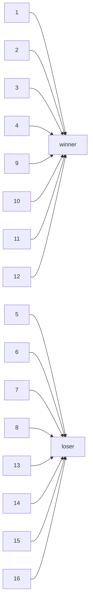

# 2028 LA Olympics: Who Will Dominate the Medal Count?

Summary

As the Olympic Games' importance grows, the focus on medal standings across countries has surged, making Olympic medal prediction an exciting area of research. This paper aims to develop a comprehensive model to forecast the medal counts (including predicted values and confidence intervals) for each country at the 2028 Olympics. We integrate linear regression, ARIMA (AutoRegressive Integrated Moving Average), and random forest models to predict both total and gold medal counts, providing a $90\%$ confidence interval. The ARIMA model captures trends and cycles, while the random forest model handles complex nonlinear relationships.

In Task 1, we categorized countries into three groups: host country, the U.S., medal-winning countries, and countries without medals. We used historical data from previous Olympics, linear regression, and average values to predict medal outcomes for both returning and new events. For new events, we used Monte Carlo simulations to estimate medal distributions. We forecasted the host country's medals based on patterns from past hosts, and for countries without medals, we applied random forest and ARIMA (with parameters $p = 0$ , $q = 2$ , $d = 0$ ) to estimate gold medals. By combining linear regression with event participation data, we calculated expected medal counts and used a Poisson distribution to derive $90\%$ confidence intervals. Our results showed that the U.S. is likely to see at least a $95\%$ probability of a medal increase, while China, losing some dominant events, is predicted to regress.

In Task 2, we used Fisher's exact test to analyze the impact of "great coaches," exemplified by Lang Ping and Béla Károlyi, on medal outcomes. We recommended "great coaches" for Chinas women's volleyball team, Indias athletics, and Brazils gymnastics, providing the rationale for these suggestions.

In Task 3, we examined medal distribution across sports and advised smaller countries on improving their chances, considering factors like GDP. We found a strong positive correlation between a countrys economic strength and its medal count.

Overall, our model provides reliable predictions of medal counts and confidence intervals for the 2028 Olympics. While uncertainties remain for countries with fewer medals, the predictions for top medal winners are robust.

Keywords: ARIMA, Random Forest, Linear Regression, Olympic Medal Prediction, Great Coach Effect, Poisson Distribution.

# Contents

# 1 Introduction 2

1.1 Background 2  
1.2 Problem Restatement 2

# 2 Notations & Assumputions 4

# 3 Data Processing 5

3.1 Clustering Analysis 5  
3.2 Country Classification 5  
3.3 Event Addition and Removal 6

# 4 Task 1: Olympic Medal Prediction and Analysis 6

4.1 2028 Medal Table Prediction 6  
4.1.1 Countries with Previous Medals (Non-Host Countries) ..... 6  
4.1.2 Host Country: United States 8  
4.1.3 Prediction for Countries Winning Medals for the First Time ..... 10

4.2 Analysis of the Relationship Between Events and Medals ..... 16

# 5 Task 2: Great Coaches 17

5.1 Evidence of the Great Coach Effect 17  
5.2 Selection of Three Countries and Specific Sports ..... 19

# 6 Task 3: Recommendations 20

# 7 Model Evaluation 21

7.1 Sensitivity Analysis 21

# 8 Model Evaluation 22

# 9 Reference 24

# 1 Introduction

# 1.1 Background

The Olympic Games are a global spectacle where nations vie for medals. While giants like the USA and China lead the medal table, smaller countries such as Albania and Cape Verde have made history, with both winning their first gold medals at the 2024 Paris Olympics. This highlights not just their growing sports prowess, but their rising prominence on the world stage.

Predicting future Olympic medal outcomes is complex. Current models often focus solely on athlete performance and past results, missing key factors like national investments, event changes, and shifting competition trends. A more comprehensive model could greatly enhance predictions, particularly for the 2028 Olympics.

# 1.2 Problem Restatement

We are provided with historical data on past Olympics, including host countries, events, and detailed athlete performance, categorized by sport and medal type. The challenge is to build a model that can predict medal outcomes for the 2028 Olympics and provide insights into the underlying factors.

Task 1: Build a model to predict the total and gold medal counts for each country in 2028, with 90% confidence intervals.

- Compare the predictions with actual data from the 2024 Olympics to identify countries likely to see increases or decreases in their medal counts.  
- Estimate the probability of each non-medal countries that will win their first medals in 2028.  
- Explore the relationship between sports types, event numbers, and medal distributions across nations.  
- Analyze the potential impact of new sports introduced by the host country on the overall medal standings.

Task 2: "The Great Coach Effect"

- Investigate the impact of great coaches on the medal performance of a nation, by examining changes before and after a coaches appointment.  
- Quantify the effect of a coach's influence on medal counts.  
- Identify three countries where hiring a coach could make a significant difference in their performance.

Task 3: Insights from the Model

- Explore the relationships between medal distributions, country-specific factors (e.g. sports events, economic development), and national strengths.  
- Help smaller countries optimize their medal chances despite resource limitations.  
- Explore the correlation between per capita medals and per capita GDP.

  
Figure 1: Our work

# 2 Notations & Assumputions

Table 1: Notations

<table><tr><td>Symbols</td><td>Description</td></tr><tr><td>Class 1 ~3</td><td>1:Aquatic Sports 2:Ball Sports 3:Track &amp; Field</td></tr><tr><td>Class 4 ~6</td><td>4:Gymnastics &amp; Acrobatics 5:Martial Arts 6:Motorsport &amp; Racing</td></tr><tr><td> $a_{jk}^{i}/b_{jk}^{i}/c_{jk}^{i}$ </td><td>for one country, if Class i year 1996 + 4k won gold/silver/bronze,number of medals in year 2000 + 4k; $j = 1,2,3$  refers gold,silver and bronze</td></tr><tr><td> $d_{jk}^{i}/e_{jk}^{i}$ </td><td>for one country, if Class i year 1996 + 4k won no medal/didn&#x27;t participate,number of medals in year 2000 + 4k; $j = 1,2,3$  refers gold,silver and bronze</td></tr><tr><td> $f_{i}$ </td><td>for one country, the expectation of all medals in all new events year 2028</td></tr><tr><td> $a_{j}^{i}/b_{j}^{i}/c_{j}^{i}$ </td><td>for one country, Class i year 2024 won gold/silver/bronze,the predicted value of medals in year 2028; $j = 1,2,3$  refers gold,silver and bronze</td></tr><tr><td> $d_{j}^{i}/e_{j}^{i}$ </td><td>for one country, Class i year 2024 won no medal/didn&#x27;t participate,the predicted value of medals in year 2028; $j = 1,2,3$  refers gold,silver and bronze</td></tr><tr><td>G/S/B</td><td>for one country, the expectation of gold/silver/bronze in all events year 2028</td></tr><tr><td>T</td><td>for one country, the expectation of total medals year 2028</td></tr><tr><td> $\bar{G} / \bar{S} / \bar{B}$ </td><td>for one country, the predicted value of gold/silver/bronze in all events year 2028</td></tr><tr><td> $\bar{T}$ </td><td>for one country, the predicted value of total medals year 2028</td></tr><tr><td> $[G_{min}, G_{max}]$ </td><td>for one country, the predicted value interval of gold in all events year 2028</td></tr><tr><td> $[T_{min}, T_{max}]$ </td><td>for one country, the predicted value interval of total medals year 2028</td></tr><tr><td> $g_{i}$ </td><td>the total medals of the ith host in ith Oly.(without new events)</td></tr><tr><td> $m_{i}/n_{i}$ </td><td>the total medals of the ith host in (i-1)th/(i+1)th Oly. (consider special cases)</td></tr><tr><td> $T_{boost}$ </td><td>the weighed increment of the host</td></tr><tr><td> $T_{old}/T_{new}/T$ </td><td>the total medals (old/new/all events) of USA year 2028</td></tr><tr><td> $u_{1} \sim u_{t-2}$ </td><td>first medal country(no disintegration) in year 1904 ~2024</td></tr><tr><td> $v_{1} \sim v_{9}$ </td><td>first medal country(disintegration) in year 1992 ~2024</td></tr><tr><td> $a_{ij}$ </td><td>the number of involved events of ith none-medal country year 1996 + 4j</td></tr><tr><td> $a_{i}$ </td><td>the predicted number of involved events of ith none-medal country year 2028</td></tr><tr><td> $L_{i}$ </td><td>the expectation of medals of ith none-medal country year 2028</td></tr><tr><td> $q_{i}$ </td><td>the probability of winning medals of ith none-medal country year 2028</td></tr><tr><td> $x_{ij}/u_{ij}$ </td><td>the percentage/total number of the jth country Class i medals in year 1896 ~2024</td></tr><tr><td> $r_{i}$ </td><td>the total number of Class i medals in year 1896 ~2024</td></tr><tr><td> $d_{ij}$ </td><td>the difference of Class i and Class j medals</td></tr><tr><td> $d_{ij}^{\prime}$ </td><td>the correlation of Class i and Class j</td></tr><tr><td> $x_{ij}^{\prime}/u_{ij}^{\prime}$ </td><td>the percentage/total number of the jth event i medals in year 1896 ~2024</td></tr><tr><td> $r_{i}^{\prime}$ </td><td>the total number of event i medals in year 1896 ~2024</td></tr><tr><td> $t$ </td><td>medals after changing great coaches</td></tr></table>

Considering the complexity of factors involved in the upcoming 2028 Los Angeles Olympics, we make reasonable assumptions to simplify the model. Each assumption is followed by its corresponding explanation:

\- Assumption 1: All countries will be unaffected by factors like politics or doping and will participate with complete teams.

\- Explanation: This ensures that external factors do not impact the analysis of sports performance.

\- Assumption 2: The United States will add five new sports for the 2028 Olympics: Baseball/Softball, Lacrosse, Cricket, Squash, and Flag Football, totaling ten events. (Men and Women) And all are conducted as knockout tournaments.

\- Explanation: This is based on IOC's preliminary discussions on adding new sports for the upcoming Olympics.

\- Assumption 3: Four sports (Breakdancing, Boxing, Weightlifting, and Modern Pentathlon) will be removed from the Olympics.

\- Explanation: These sports are likely to be excluded based on IOC's review and changing interests.

\- Assumption 4: The athletes' nationality will remain unchanged.

\- Explanation: This assumption maintains a consistent basis for comparing athlete performance by country.

# 3 Data Processing

# 3.1 Clustering Analysis

A country's Olympic performance depends on its proficiency in various sports, but for $70+$ events, it's not practical to analyze all. To predict its medal count, we group events into broader categories due to the large number of Olympic events.

We assume each country excels in one or more major sports categories. Clustering analysis helps identify these strengths and groups similar events together.

We construct a matrix with countries as rows and events as columns, where the values represent medal-winning rates. K-means clustering uses these rates to group similar events. The optimal number of clusters, $K = 6$ , is determined using the elbow method and literature insights. Misclassified points are manually corrected for accuracy.

The clustering visualization is shown below:

# 3.2 Country Classification

Countries are divided into none-medal and medal-winning. For none-medal countries, we predict the chance of them winning their first medal. Host countries are analyzed separately to account for their performance boost. We refine the model to handle missing data from countries that skipped certain Games.


<details>
<summary>scatter</summary>

| Category | X | Y |
| --- | --- | --- |
| Track & Field | ~0.1 | ~1.7 |
| Track & Field | ~0.1 | ~1.6 |
| Track & Field | ~0.4 | ~2.3 |
| Track & Field | ~1.2 | ~1.0 |
| Track & Field | ~1.9 | ~0.75 |
| Track & Field | ~2.0 | ~0.4 |
| Track & Field | ~2.1 | ~0.65 |
| Track & Field | ~2.1 | ~0.5 |
| Track & Field | ~2.1 | ~1.1 |
| Track & Field | ~2.2 | ~1.15 |
| Track & Field | ~2.3 | ~0.9 |
| Track & Field | ~2.4 | ~1.0 |
| Track & Field | ~2.5 | ~1.15 |
| Track & Field | ~2.6 | ~0.7 |
| Track & Field | ~2.7 | ~0.9 |
| Track & Field | ~2.8 | ~1.0 |
| Track & Field | ~3.2 | ~1.25 |
| Track & Field | ~3.6 | ~1.05 |
| Track & Field | ~4.8 | ~2.9 |
| Track & Field | ~4.9 | ~3.2 |
| Track & Field | ~4.9 | ~3.25 |
| Track & Field | ~4.9 | ~3.45 |
| Track & Field | ~5.4 | ~3.25 |
| Track & Field | ~5.5 | ~3.3 |
| Track & Field | ~5.6 | ~3.45 |
| Track & Field | ~5.7 | ~3.5 |
| Track & Field | ~5.8 | ~3.6 |
| Track & Field | ~5.9 | ~3.7 |
| Track & Field | ~6.0 | ~3.8 |
| Track & Field | ~6.1 | ~3.9 |
| Track & Field | ~6.2 | ~4.0 |
| Track & Field | ~6.3 | ~4.1 |
| Track & Field | ~6.4 | ~4.2 |
| Track & Field | ~6.5 | ~4.3 |
| Track & Field | ~6.6 | ~4.4 |
| Track & Field | ~6.7 | ~4.5 |
| Track & Field | ~6.8 | ~4.6 |
| Track & Field | ~6.9 | ~4.7 |
| Track & Field | ~7.0 | ~4.8 |
| Track & Field | ~7.1 | ~4.9 |
| Track & Field | ~7.2 | ~5.0 |
| Track & Field | ~7.3 | ~5.1 |
| Track & Field | ~7.4 | ~5.2 |
| Track & Field | ~7.5 | ~5.3 |
| Track & Field | ~7.6 | ~5.4 |
| Track & Field | ~7.7 | ~5.5 |
| Track & Field | ~7.8 | ~5.6 |
| Track & Field | ~7.9 | ~5.7 |
| Track & Field | ~8.0 | ~5.8 |
| Track & Field | ~8.1 | ~5.9 |
| Track & Field | ~8.2 | ~6.0 |
| Track & Field | ~8.3 | ~6.1 |
| Track & Field | ~8.4 | ~6.2 |
| Track & Field | ~8.5 | ~6.3 |
| Track & Field | ~8.6 | ~6.4 |
| Track & Field | ~8.7 | ~6.5 |
| Track & Field | ~8.8 | ~6.6 |
| Track & Field | ~8.9 | ~6.7 |
| Track & Field | ~9.0 | ~6.8 |
| Track & Field | ~9.1 | ~6.9 |
| Track & Field | ~9.2 | ~7.0 |
| Track & Field | ~9.3 | ~7.1 |
| Track & Field | ~9.4 | ~7.2 |
| Track & Field | ~9.5 | ~7.3 |
| Track & Field | ~9.6 | ~7.4 |
| Track & Field | ~9.7 | ~7.5 |
| Track & Field | ~9.8 | ~7.6 |
| Track & Field | ~9.9 | ~7.7 |
| Track & Field | ~10.0 | ~7.8 |
| Track & Field | ~10.1 | ~7.9 |
| Track & Field | ~10.2 | ~8.0 |
| Track & Field | ~10.3 | ~8.1 |
| Track & Field | ~10.4 | ~8.2 |
| Track & Field | ~10.5 | ~8.3 |
| Track & Field | ~10.6 | ~8.4 |
| Track & Field | ~10.7 | ~8.5 |
| Track & Field | ~10.8 | ~8.6 |
| Track & Field | ~10.9 | ~8.7 |
| Track & Field | ~11.0 | ~8.8 |
| Track & Field | ~11.1 | ~8.9 |
| Track & Field | ~11.2 | ~9.0 |
| Track & Field | ~11.3 | ~9.1 |
| Track & Field | ~11.4 | ~9.2 |
| Track & Field | ~11.5 | ~9.3 |
| Track & Field | ~11.6 | ~9.4 |
| Track & Field | ~11.7 | ~9.5 |
| Track & Field | ~11.8 | ~9.6 |
| Track & Field | ~11.9 | ~9.7 |
| Track & Field | ~12.0 | ~9.8 |
| Track & Field | ~12.1 | ~9.9 |
| Track & Field | ~12.2 | ~10.0 |
| Track & Field | ~12.3 | ~10.1 |
| Track & Field | ~12.4 | ~10.2 |
| Track & Field | ~12.5 | ~10.3 |
| Track & Field | ~12.6 | ~10.4 |
| Track & Field | ~12.7 | ~10.5 |
| Track & Field | ~12.8 | ~10.6 |
| Track & Field | ~12.9 | ~10.7 |
| Track & Field | ~13.0 | ~10.8 |
| Track & Field | ~13.1 | ~10.9 |
| Track & Field | ~13.2 | ~11.0 |
| Track & Field | ~13.3 | ~11.1 |
| Track & Field | ~13.4 | ~11.2 |
| Track & Field | ~13.5 | ~11.3 |
| Track & Field | ~13.6 | ~11.4 |
| Track & Field | ~13.7 | ~11.5 |
| Track & Field | ~13.8 | ~11.6 |
| Track & Field | ~13.9 | ~11.7 |
| Track & Field | ~14.0 | ~11.8 |
| Track & Field | ~14.1 | ~11.9 |
| Track & Field | ~14.2 | ~12.0 |
| Track & Field | ~14.3 | ~12.1 |
| Track & Field | ~14.4 | ~12.2 |
| Track & Field | ~14.5 | ~12.3 |
| Track & Field | ~14.6 | ~12.4 |
| Track & Field | ~14.7 | ~12.5 |
| Track & Field | ~14.8 | ~12.6 |
| Track & Field | ~14.9 | ~12.7 |
| Track & Field | ~15.0 | ~12.8 |
| Track & Field | ~15.1 | ~12.9 |
| Track & Field | ~15.2 | ~13.0 |
| Track & Field | ~15.3 | ~13.1 |
| Track & Field | ~15.4 | ~13.2 |
| Track & Field | ~15.5 | ~13.3 |
| Track & Field | ~15.6 | ~13.4 |
| Track & Field | ~15.7 | ~13.5 |
| Track & Field | ~15.8 | ~13.6 |
| Track & Field | ~15.9 | ~13.7 |
| Track & Field | ~16.0 | ~13.8 |
| Track & Field | ~16.1 | ~13.9 |
| Track & Field | ~16.2 | ~14.0 |
| Track & Field | ~16.3 | ~14.1 |
| Track & Field | ~16.4 | ~14.2 |
| Track & Field | ~16.5 | ~14.3 |
| Track & Field | ~16.6 | ~14.4 |
| Track & Field | ~16.7 | ~14.5 |
| Track & Field | ~16.8 | ~14.6 |
| Track & Field | ~16.9 | ~14.7 |
| Track & Field | ~17.0 | ~14.8 |
| Track & Field | ~17.1 | ~14.9 |
| Track & Field | ~17.2 | ~15.0 |
| Track & Field | ~17.3 | ~15.1 |
| Track & Field | ~17.4 | ~15.2 |
| Track & Field | ~17.5 | ~15.3 |
| Track & Field | ~17.6 | ~15.4 |
| Track & Field | ~17.7 | ~15.5 |
| Track & Field | ~17.8 | ~15.6 |
| Track & Field | ~17.9 | ~15.7 |
| Track & Field | ~18.0 | ~15.8 |
| Track & Field | ~18.1 | ~15.9 |
| Track & Field | ~18.2 | ~16.0 |
| Track & Field | ~18.3 | ~16.1 |
| Track & Field | ~18.4 | ~16.2 |
| Track & Field | ~18.5 | ~16.3 |
| Track & Field | ~18.6 | ~16.4 |
| Track & Field | ~18.7 | ~16.5 |
| Track & Field | ~18.8 | ~16.6 |
| Track & Field | ~18.9 | ~16.7 |
| Track & Field | ~19.0 | ~16.8 |
| Track & Field | ~19.1 | ~16.9 |
| Track & Field | ~19.2 | ~17.0 |
| Track & Field | ~19.3 | ~17.1 |
| Track & Field | ~19.4 | ~17.2 |
| Track & Field | ~19.5 | ~17.3 |
| Track & Field | ~19.6 | ~17.4 |
| Track & Field | ~19.7 | ~17.5 |
| Track & Field | ~19.8 | ~17.6 |
| Track & Field | ~19.9 | ~17.7 |
| Track & Field | ~20.0 | ~17.8 |
| Track & Field | ~20.1 | ~17.9 |
| Track & Field | ~20.2 | ~18.0 |
| Track & Field | ~20.3 | ~18.1 |
| Track & Field | ~20.4 | ~18.2 |
| Track & Field | ~20.5 | ~18.3 |
| Track & Field | ~20.6 | ~18.4 |
| Track & Field | ~20.7 | ~18.5 |
| Track & Field | ~20.8 | ~18.6 |
| Track & Field | ~20.9 | ~18.7 |
| Track & Field | ~21.0 | ~18.8 |
| Track & Field | ~21.1 | ~18.9 |
| Track & Field | ~21.2 | ~19.0 |
| Track & Field | ~21.3 | ~19.1 |
| Track & Field | ~21.4 | ~19.2 |
| Track & Field | ~21.5 | ~19.3 |
| Track & Field | ~21.6 | ~19.4 |
| Track & Field | ~21.7 | ~19.5 |
| Track & Field | ~21.8 | ~19.6 |
| Track & Field | ~21.9 | ~19.7 |
| Track & Field | ~22.0 | ~19.8 |
| Track & Field | ~22.1 | ~19.9 |
| Track & Field | ~22.2 | ~20.0 |
| Track & Field | ~22.3 | ~20.1 |
| Track & Field | ~22.4 | ~20.2 |
| Track & Field | ~22.5 | ~20.3 |
| Track & Field | ~22.6 | ~20.4 |
| Track & Field | ~22.7 | ~20.5 |
| Track & Field | ~22.8 | ~20.6 |
| Track & Field | ~22.9 | ~20.7 |
| Track & Field | ~23.0 | ~20.8 |
| Track & Field | ~23.1 | ~20.9 |
| Track & Field | ~23.2 | ~21.0 |
| Track & Field | ~23.3 | ~21.1 |
| Track & Field | ~23.4 | ~21.2 |
| Track & Field | ~23.5 | ~21.3 |
| Track & Field | ~23.6 | ~21.4 |
| Track & Field | ~23.7 | ~21.5 |
| Track & Field | ~23.8 | ~21.6 |
| Track & Field | ~23.9 | ~21.7 |
| Track & Field | ~24.0 | ~21.8 |
| Track & Field | ~24.1 | ~21.9 |
| Track & Field | ~24.2 | ~22.0 |
| Track & Field | ~24.3 | ~22.1 |
| Track & Field | ~24.4 | ~22.2 |
| Track & Field | ~24.5 | ~22.3 |
| Track & Field | ~24.6 | ~22.4 |
| Track & Field | ~24.7 | ~22.5 |
| Track & Field | ~24.8 | ~22.6 |
| Track & Field | ~24.9 | ~22.7 |
| Track & Field | ~25.0 | ~22.8 |
| Track & Field | ~25.1 | ~22.9 |
| Track & Field | ~25.2 | ~23.0 |
| Track & Field | ~25.3 | ~23.1 |
| Track & Field | ~25.4 | ~23.2 |
| Track & Field | ~25.5 | ~23.3 |
| Track & Field | ~25.6 | ~23.4 |
| Track & Field | ~25.7 | ~23.5 |
| Track & Field | ~25.8 | ~23.6 |
| Track & Field | ~25.9 | ~23.7 |
| Track & Field | ~26.0 | ~23.8 |
| Track & Field | ~26.1 | ~23.9 |
| Track & Field | ~26.2 | ~24.0 |
| Track & Field | ~26.3 | ~24.1 |
| Track & Field | ~26.4 | ~24.2 |
| Track & Field | ~26.5 | ~24.3 |
| Track & Field | ~26.6 | ~24.4 |
| Track & Field | ~26.7 | ~24.5 |
| Track & Field | ~26.8 | ~24.6 |
| Track & Field | ~26.9 | ~24.7 |
| Track & Field | ~27.0 | ~24.8 |
| Track & Field | ~27.1 | ~24.9 |
| Track & Field | ~27.2 | ~25.0 |
| Track & Field | ~27.3 | ~25.1 |
| Track & Field | ~27.4 | ~25.2 |
| Track & Field | ~27.5 | ~25.3 |
| Track & Field | ~27.6 | ~25.4 |
| Track & Field | ~27.7 | ~25.5 |
| Track & Field | ~27.8 | ~25.6 |
| Track & Field | ~27.9 | ~25.7 |
| Track & Field | ~28.0 | ~25.8 |
| Track & Field | ~28.1 | ~25.9 |
| Track & Field | ~28.2 | ~26.0 |
| Track & Field | ~28.3 | ~26.1 |
| Track & Field | ~28.4 | ~26.2 |
| Track & Field | ~28.5 | ~26.3 |
| Track & Field | ~28.6 | ~26.4 |
| Track & Field | ~28.7 | ~26.5 |
| Track & Field | ~28.8 | ~26.6 |
| Track & Field | ~28.9 | ~26.7 |
| Track & Field | ~29.0 | ~26.8 |
| Track & Field | ~29.1 | ~26.9 |
| Track & Field | ~29.2 | ~27.0 |
| Track & Field | ~29.3 | ~27.1 |
| Track & Field | ~29.4 | ~27.2 |
| Track & Field | ~29.5 | ~27.3 |
| Track & Field | ~29.6 | ~27.4 |
| Track & Field | ~29.7 | ~27.5 |
| Track & Field | ~29.8 | ~27.6 |
| Track & Field | ~29.9 | ~27.7 |
| Track & Field | ~30.0 | ~27.8 |
| Track & Field | ~30.1 | ~27.9 |
| Track & Field | ~30.2 | ~28.0 |
| Track & Field | ~30.3 | ~28.1 |
| Track & Field | ~30.4 | ~28.2 |
| Track & Field | ~30.5 | ~28.3 |
| Track & Field | ~30.6 | ~28.4 |
| Track & Field | ~30.7 | ~28.5 |
| Track & Field | ~30.8 | ~28.6 |
| Track & Field | ~30.9 | ~28.7 |
| Track & Field | ~31.0 | ~28.8 |
| Track & Field | ~31.1 | ~28.9 |
| Track & Field | ~31.2 | ~29.0 |
| Track & Field | ~31.3 | ~29.1 |
| Track & Field | ~31.4 | ~29.2 |
| Track & Field | ~31.5 | ~29.3 |
| Track & Field | ~31.6 | ~29.4 |
| Track & Field | ~31.7 | ~29.5 |
| Track & Field | ~31.8 | ~29.6 |
| Track & Field | ~31.9 | ~29.7 |
| Track & Field | ~32.0 | ~29.8 |
| Track & Field | ~32.1 | ~29.9 |
| Track & Field | ~32.2 | ~30.0 |
| Track & Field | ~32.3 | ~30.1 |
| Track & Field | ~32.4 | ~30.2 |
| Track & Field | ~32.5 | ~30.3 |
| Track & Field | ~32.6 | ~30.4 |
| Track & Field | ~32.7 | ~30.5 |
| Track & Field | ~32.8 | ~30.6 |
| Track & Field | ~32.9 | ~30.7 |
| Track & Field | ~33.0 | ~30.8 |
| Track & Field | ~33.1 | ~30.9 |
| Track & Field | ~33.2 | ~31.0 |
| Track & Field | ~33.3 | ~31.1 |
| Track & Field | ~33.4 | ~31.2 |
| Track & Field | ~33.5 | ~31.3 |
| Track & Field | ~33.6 | ~31.4 |
| Track & Field | ~33.7 | ~31.5 |
| Track & Field | ~33.8 | ~31.6 |
| Track & Field | ~33.9 | ~31.7 |
| Track & Field | ~34.0 | ~31.8 |
| Track & Field | ~34.1 | ~31.9 |
| Track & Field | ~34.2 | ~32.0 |
| Track & Field | ~34.3 | ~32.1 |
| Track & Field | ~34.4 | ~32.2 |
| Track & Field | ~34.5 | ~32.3 |
| Track & Field | ~34.6 | ~32.4 |
| Track & Field | ~34.7 | ~32.5 |
| Track & Field | ~34.8 | ~32.6 |
| Track & Field | ~34.9 | ~32.7 |
| Track & Field | ~35.0 | ~32.8 |
| Track & Field | ~35.1 | ~32.9 |
| Track & Field | ~35.2 | ~33.0 |
| Track & Field | ~35.3 | ~33.1 |
| Track & Field | ~35.4 | ~33.2 |
| Track & Field | ~35.5 | ~33.3 |
| Track & Field | ~35.6 | ~33.4 |
| Track & Field | ~35.7 | ~33.5 |
| Track & Field | ~35.8 | ~33.6 |
| Track & Field | ~35.9 | ~33.7 |
| Track & Field | ~36.0 | ~33.8 |
| Track & Field | ~36.1 | ~33.9 |
| Track & Field | ~36.2 | ~34.0 |
| Track & Field | ~36.3 | ~34.1 |
| Track & Field | ~36.4 | ~34.2 |
| Track & Field | ~36.5 | ~34.3 |
| Track & Field | ~36.6 | ~34.4 |
| Track & Field | ~36.7 | ~34.5 |
| Track & Field | ~36.8 | ~34.6 |
| Track & Field | ~36.9 | ~34.7 |
| Track & Field | ~37.0 | ~34.8 |
| Track & Field | ~37.1 | ~34.9 |
| Track & Field | ~37.2 | ~35.0 |
| Track & Field | ~37.3 | ~35.1 |
| Track & Field | ~37.4 | ~35.2 |
| Track & Field | ~37.5 | ~35.3 |
| Track & Field | ~37.6 | ~35.4 |
| Track & Field | ~37.7 | ~35.5 |
| Track & Field | ~37.8 | ~35.6 |
| Track & Field | ~37.9 | ~35.7 |
| Track & Field | ~38.0 | ~35.8 |
| Track & Field | ~38.1 | ~35.9 |
| Track & Field | ~38.2 | ~36.0 |
| Track & Field | ~38.3 | ~36.1 |
| Track & Field | ~38.4 | ~36.2 |
| Track & Field | ~38.5 | ~36.3 |
| Track & Field | ~38.6 | ~36.4 |
| Track & Field | ~38.7 | ~36.5 |
| Track & Field | ~38.8 | ~36.6 |
| Track & Field | ~38.9 | ~36.7 |
| Track & Field | ~39.0 | ~36.8 |
| Track & Field | ~39.1 | ~36.9 |
| Track & Field | ~39.2 | ~37.0 |
| Track & Field | ~39.3 | ~37.1 |
| Track & Field | ~39.4 | ~37.2 |
| Track & Field | ~39.5 | ~37.3 |
| Track & Field | ~39.6 | ~37.4 |
| Track & Field | ~39.7 | ~37.5 |
| Track & Field | ~39.8 | ~37.6 |
| Track & Field | ~39.9 | ~37.7 |
| Track & Field | ~40.0 | ~37.8 |
| Track & Sports | ~1.1 | ~1.55 |
| Track & Sports | ~1.2 | ~1.65 |
| Track & Sports | ~1.3 | ~1.75 |
| Track & Sports | ~1.4 | ~1.85 |
| Track & Sports | ~1.5 | ~1.95 |
| Track & Sports | ~1.6 | ~2.05 |
| Track & Sports | ~1.7 | ~2.15 |
| Track & Sports | ~1.8 | ~2.25 |
| Track & Sports | ~1.9 | ~2.35 |
| Track & Sports | ~2.0 | ~2.45 |
| Track & Sports | ~2.1 | ~2.55 |
| Track & Sports | ~2.2 | ~2.65 |
| Track & Sports | ~2.3 | ~2.75 |
| Track & Sports | ~2.4 | ~2.85 |
| Track & Sports | ~2.5 | ~2.95 |
| Track & Sports | ~2.6 | ~3.05 |
| Track & Sports | ~2.7 | ~3.15 |
| Track & Sports | ~2.8 | ~3.25 |
| Track & Sports | ~2.9 | ~3.35 |
| Track & Sports | ~3.0 | ~3.45 |
| Track & Sports | ~3.1 | ~3.55 |
| Track & Sports | ~3.2 | ~3.65 |
| Track & Sports | ~3.3 | ~3.75 |
| Track & Sports | ~3.4 | ~3.85 |
| Track & Sports | ~3.5 | ~3.95 |
| Track & Sports | ~3.6 | ~4.05 |
| Track & Sports | ~3.7 | ~4.15 |
| Track & Sports | ~3.8 | ~4.25 |
| Track & Sports | ~3.9 | ~4.35 |
| Track & Sports | ~4.0 | ~4.45 |
| Track & Sports | ~4.1 | ~4.55 |
| Track & Sports | ~4.2 | ~4.65 |
| Track & Sports | ~4.3 | ~4.75 |
| Track & Sports | ~4.4 | ~4.85 |
| Track & Sports | ~4.5 | ~4.95 |
| Track & Sports | ~4.6 | ~5.05 |
| Track & Sports | ~4.7 | ~5.15 |
| Track & Sports | ~4.8 | ~5.25 |
| Track & Sports | ~4.9 | ~5.35 |
| Track & Sports | ~5.0 | ~5.45 |
| Track & Sports | ~5.1 | ~5.55 |
| Track & Sports | ~5.2 | ~5.65 |
| Track & Sports | ~5.3 | ~5.75 |
| Track & Sports | ~5.4 | ~5.85 |
| Track & Sports | ~5.5 | ~5.95 |
| Track & Sports | ~5.6 | ~6.05 |
| Track & Sports | ~5.7 | ~6.15 |
| Track & Sports | ~5.8 | ~6.25 |
| Track & Sports | ~5.9 | ~6.35 |
| Track & Sports | ~6.0 | ~6.45 |
| Track & Sports | ~6.1 | ~6.55 |
| Track & Sports | ~6.2 | ~6.65 |
| Track & Sports | ~6.3 | ~6.75 |
| Track & Sports | ~6.4 | ~6.85 |
| Track & Sports | ~6.5 | ~6.95 |
| Track & Sports | ~6.6 | ~7.05 |
| Track & Sports | ~6.7 | ~7.15 |
| Track & Sports | ~6.8 | ~7.25 |
| Track & Sports | ~6.9 | ~7.35 |
| Track & Sports | ~7.0 | ~7.45 |
| Track & Sports | ~7.1 | ~7.55 |
| Track & Sports | ~7.2 | ~7.65 |
| Track & Sports | ~7.3 | ~7.75 |
| Track & Sports | ~7.4 | ~7.85 |
| Track & Sports | ~7.5 | ~7.95 |
| Track & Sports | ~7.6 | ~8.05 |
| Track & Sports | ~7.7 | ~8.15 |
| Track & Sports | ~7.8 | ~8.25 |
| Track & Sports | ~7.9 | ~8.35 |
| Track & Sports | ~8.0 | ~8.45 |
| Track & Sports | ~8.1 | ~8.55 |
| Track & Sports | ~8.2 | ~8.65 |
| Track & Sports | ~8.3 | ~8.75 |
| Track & Sports | ~8.4 | ~8.85 |
| Track & Sports | ~8.5 | ~8.95 |
| Track & Sports | ~8.6 | ~9.05 |
| Track & Sports | ~8.7 | ~9.15 |
| Track & Sports | ~8.8 | ~9.25 |
| Track & Sports | ~8.9 | ~9.35 |
| Track & Sports | ~9.0 | ~9.45 |
| Track & Sports | ~9.1 | ~9.55 |
| Track & Sports | ~9.2 | ~9.65 |
| Track & Sports | ~9.3 | ~9.75 |
| Track & Sports | ~9.4 | ~9.85 |
| Track & Sports | ~9.5 | ~9.95 |
| Track & Sports | ~9.6 | ~10.05 |
| Track & Sports | ~9.7 | ~10.15 |
| Track & Sports | ~9.8 | ~10.25 |
| Track & Sports | ~9.9 | ~10.35 |
| Track & Sports | ~10.0 | ~10.45 |
| Track & Sports | ~10.1 | ~10.55 |
| Track & Sports | ~10.2 | ~10.65 |
| Track & Sports | ~10.3 | ~10.75 |
| Track & Sports | ~10.4 | ~10.85 |
| Track & Sports | ~10.5 | ~10.95 |
| Track & Sports | ~10.6 | ~11.05 |
| Track & Sports | ~10.7 | ~11.15 |
| Track & Sports | ~10.8 | ~11.25 |
| Track & Sports | ~10.9 | ~11.35 |
| Track & Sports | ~11.0 | ~11.45 |
| Track & Sports | ~11.1 | ~11.55 |
| Track & Sports | ~11.2 | ~11.65 |
| Track & Sports | ~11.3 | ~11.75 |
| Track & Sports | ~11.4 | ~11.85 |
| Track & Sports | ~11.5 | ~11.95 |
| Track & Sports | ~11.6 | ~12.05 |
| Track & Sports | ~11.7 | ~12.15 |
| Track & Sports | ~11.8 | ~12.25 |
| Track & Sports | ~11.9 | ~12.35 |
| Track & Sports | ~12.0 | ~12.45 |
| Track & Sports | ~12.1 | ~12.55 |
| Track & Sports | ~12.2 | ~12.65 |
| Track & Sports | ~12.3 | ~12.75 |
| Track & Sports | ~12.4 | ~12.85 |
| Track & Sports | ~12.5 | ~12.95 |
| Track & Sports | ~12.6 | ~13.05 |
| Track & Sports | ~12.7 | ~13.15 |
| Track & Sports | ~12.8 | ~13.25 |
| Track & Sports | ~12.9 | ~13.35 |
| Track & Sports | ~13.0 | ~13.4
</details>

Figure 2: Sports Distribution Classification (K-means)

# 3.3 Event Addition and Removal

New Olympic events lack historical data, so we use current country rankings for prediction. Discontinued events are excluded from the dataset to prevent them from affecting future predictions.

# 4 Task 1: Olympic Medal Prediction and Analysis

# 4.1 2028 Medal Table Prediction

# 4.1.1 Countries with Previous Medals (Non-Host Countries)

Old Events We classify all events into six major categories with K-means method as mentioned before. Then, we analyze the data of athletes from each country within these categories.

Given that athletes often retain their medals in consecutive Olympic Games, our strategy is to use the results from the previous Olympic Games to predict the performances of athletes in the upcoming Games. We define the following variables and indices:

Let i represent the above categories of sports: $f_{1}: R \rightarrow item$ (where Water Sports, Ball Sports, Track and Field, Technical Events, Combat Sports, and Racing Events correspond to numbers 1 to 6).

Let j represent the outcomes in the next Olympic Games: $f_{2}:1\rightarrow$ gold, $2\rightarrow$ silver, $3\rightarrow$ bronze.

Let $k$ represent the previous Olympic year: $f_{3}:\mathbb{R}\to \mathbb{R},f_{3}(k) = 4k + 1996$ .

Symbols a, b, c, d, and e represent the medal types or absence thereof for the athletes in the previous Games: - a represents gold medals, - b represents silver medals, - c represents bronze medals, - d represents non-medal athletes, - e represents athletes who did not

participate in the previous Games.

We define $a_{jk}^{i}$ as the total number of athletes who won gold in the previous Games in category i and who win medal j (gold, silver, or bronze) in the following Games. Similarly, we define $b_{jk}^{i}$ , $c_{jk}^{i}$ , and $d_{jk}^{i}$ for silver, bronze, and non-medal outcomes, respectively.

To explore whether the number of medals in consecutive Olympic Games is related to the year, we propose different prediction algorithms. If the medal count shows a strong correlation with the year, we use linear regression to predict. If the correlation is weak, we use the average of the data as the prediction.

We use 0.5 as the threshold for determining strong or weak correlation (other thresholds will be considered in subsequent sensitivity analyses). The predicted number of medals is defined as:

$$
a _ {j} ^ {i} = \left\{ \begin{array}{l l} \frac {\sum_ {k = 1} ^ {6} a _ {j k} ^ {i}}{6} & , | r | <   0. 5 \\ \max \{0, \hat {a} _ {j} \} & , | r | \geq 0. 5 \end{array} \right.
$$

where $a_{j}^{i}$ is the predicted number of gold medals in category i for the 2024 Games, and r is the correlation coefficient for $a_{jk}^{i}$ , where $k = 1, 2, \ldots, 6$ . The linear regression value is:

$$
\hat {a} _ {j} = \frac {- 1 0 a _ {j 1} ^ {i} - 4 a _ {j 2} ^ {i} + 2 a _ {j 3} ^ {i} + 8 a _ {j 4} ^ {i} + 1 4 a _ {j 5} ^ {i} + 2 0 a _ {j 6} ^ {i}}{3 0}
$$

Since this value may be negative, we take the maximum between the linear regression value and 0.

Similarly, we apply the same methodology for $b_{jk}^{i}$ , $c_{jk}^{i}$ , and $d_{jk}^{i}$ , as well as their total predicted values $b_{j}^{i}$ , $c_{j}^{i}$ , and $d_{j}^{i}$ .

For athletes who did not participate in the previous Olympic Games but are expected to win medals in the upcoming Games, we define $e_{jk}^{i}$ as the total number of athletes in category i who did not participate in the previous Games but win medal j (where $0 \leq j \leq 3$ ). The prediction for the number of such athletes is defined as:

$$
e _ {j} ^ {i} = \left\{ \begin{array}{l l} \frac {\sum_ {k = 1} ^ {6} e _ {j k} ^ {i}}{6} & , | r | <   0. 5 \\ \max \{0, \hat {e} _ {j} \} & , | r | \geq 0. 5 \end{array} \right.
$$

where r is the correlation coefficient for $e_{jk}^{i}$ , and the linear regression value $\hat{e}_{j}$ is:

$$
\hat {e} _ {j} = \frac {- 1 0 e _ {j 1} ^ {i} - 4 e _ {j 2} ^ {i} + 2 e _ {j 3} ^ {i} + 8 e _ {j 4} ^ {i} + 1 4 e _ {j 5} ^ {i} + 2 0 e _ {j 6} ^ {i}}{3 0}
$$

New Events For new events, we use Monte Carlo simulations. By gathering authoritative data on rankings and points for each country in these events, we compute the winning probability for each country:

$$
P _ {A B} = \frac {w _ {A}}{w _ {A} + w _ {B}}
$$

where $w_{A}$ and $w_{B}$ represent the points (weights) of countries A and B, respectively. We simulate the events according to the Olympic competition rules, where the top 16 athletes

are selected and paired for a knockout tournament. After two rounds, the top 4 athletes compete for the gold, silver, and bronze medals, as shown in the figure below:


<details>
<summary>flowchart</summary>


</details>

Figure 3: Monte Carlo Method for Simulating New Events

These 5 new events are split into male and female categories, making a total of 10 events. To obtain more accurate probabilities, we simulate each event 1 million times. The results are then used to estimate each countrys expected medals for these new events, denoted as $f_{1}$ , $f_{2}$ , and $f_{3}$ .

For some events, like the Lacrosse tournament, where official data is sparse and only world rankings are available, we use logistic regression to assess the performance gaps between athletes:

$$
P _ {A B} = \frac {1}{1 + \exp \left(\alpha \cdot (R _ {A} - R _ {B})\right)}
$$

where $R_{A}$ and $R_{B}$ are the rankings of countries A and B. For events like Squash, where top 20 player rankings and points are available, we calculate the probabilities of each athlete winning gold, silver, and bronze, and estimate the probability of each country earning medals.

The total medal count for a country is the sum of medals from both traditional and new events: Gold: $G = \sum_{i=1}^{6}(a_1^i + b_1^i + c_1^i + d_1^i + e_1^i) + f_1$ , Silver: $S = \sum_{i=1}^{6}(a_2^i + b_2^i + c_2^i + d_2^i + e_2^i) + f_2$ , Bronze: $B = \sum_{i=1}^{6}(a_3^i + b_3^i + c_3^i + d_3^i + e_3^i) + f_3$ .

The final predicted values for gold, silver, and bronze medals are rounded to the nearest integer:

$$
\lfloor G + \frac {1}{2} \rfloor , \lfloor S + \frac {1}{2} \rfloor , \lfloor B + \frac {1}{2} \rfloor
$$

Total medals: $T = \lfloor G + \frac{1}{2} \rfloor + \lfloor S + \frac{1}{2} \rfloor + \lfloor B + \frac{1}{2} \rfloor$

This gives the predicted total and gold medal count for non-host countries that have won medals in the past.

# 4.1.2 Host Country: United States

The host country factor in the Olympics cannot be ignored. The table below shows the medal counts for new events by host countries from 1984 onwards.

Table 2: Host's New Event Medal

<table><tr><td rowspan="2"></td><td colspan="11">Year</td></tr><tr><td>1984</td><td>1988</td><td>1992</td><td>1996</td><td>2000</td><td>2004</td><td>2008</td><td>2012</td><td>2016</td><td>2021</td><td>2024</td></tr><tr><td>Gold</td><td>4</td><td>4</td><td>3</td><td>5</td><td>2</td><td>0</td><td>2</td><td>2</td><td>1</td><td>7</td><td>1</td></tr><tr><td>Silver</td><td>4</td><td>1</td><td>1</td><td>2</td><td>3</td><td>0</td><td>1</td><td>0</td><td>0</td><td>2</td><td>4</td></tr><tr><td>Bronze</td><td>1</td><td>1</td><td>0</td><td>1</td><td>2</td><td>0</td><td>0</td><td>1</td><td>0</td><td>1</td><td>2</td></tr></table>

By analyzing the data from 1896 to 2024, it is clear that the host country's medal count, both total and gold, has generally increased. The reasons for this increase can be attributed to two factors:  
1. The host country may add events that are their strengths.  
2. The undeniable "home advantage," including familiar venues, food and accommodation, and no time zone adjustment.

Therefore, we predict the United States' medals in the 2028 Los Angeles Olympics separately for old and new events. First, we calculate the increase in medals for traditional events based on the host country's performance in previous Olympics. This is done by comparing the number of medals won in the host countries traditional events with the average number of medals won in the two previous Olympics, then calculating the increment and rate of increase.  
Old Events For countries with missing data from the previous two Olympic Games, we use the two closest Olympic Games in time (e.g., for the 1984 Los Angeles Olympics, since the U.S. did not participate in the 1980 Moscow Olympics, we use the data from 1976 and 1988 for the U.S.).

<table><tr><td>Year</td><td>Host Medals</td><td>Previous &amp; Next Average</td><td>Increase Rate</td><td>Increment</td></tr><tr><td>1896</td><td> $g_1$ </td><td> $\frac{m_1 + n_1}{2}$ </td><td> $\frac{2g_1}{m_1 + n_1}$ </td><td> $g_1 - \frac{m_1 + n_1}{2}$ </td></tr><tr><td>...</td><td>...</td><td>...</td><td>...</td><td>...</td></tr><tr><td>2024</td><td> $g_t$ </td><td> $\frac{m_t + n_t}{2}$ </td><td> $\frac{2g_t}{m_t + n_t}$ </td><td> $g_t - \frac{m_t + n_t}{2}$ </td></tr><tr><td>2028</td><td>to be predicted</td><td>115</td><td>to be predicted</td><td>to be predicted</td></tr></table>

Table 3: Calculation of Host Factors

Using the data from the table, we calculate the weighted increase rate caused by the host country factors as:

$$
\text {Weighted Increase}: T_{\text{boost}} = \left(\frac{g_1 + g_2 + \cdots + g_t}{\frac{m_1 + m_2}{2} + \frac{m_2 + m_3}{2} + \cdots + \frac{m_t + n_t}{2}} - 1\right) \times 100\%
$$

Next, we take the average of the medals won by the United States in the 2020 Tokyo Olympics and the 2024 Paris Olympics for traditional events, multiply by the increase rate, and obtain the final prediction for the number of medals in traditional events. The predicted values for the expected gold, silver, bronze, and total medals in the 2028 Los Angeles Olympics are 53.64, 51.43, 31.56, and 136.63, respectively.

New Events Using the Monte Carlo simulation data from earlier for new events, if we use the expected values, the United States is predicted to win 0.937 gold, 0.735 silver, 0.706 bronze, and 2.378 total medals in new events at the 2028 Los Angeles Olympics.

By adding the expected values from both old and new events, we predict the United States will win 54.57 gold, 52.16 silver, and 32.37 bronze medals, totaling 139 medals in the 2028 Olympics.

# 4.1.3 Prediction for Countries Winning Medals for the First Time

We separate the analysis into two parts: the old events before 2024 and the new events added in 2028. For the old events, we fully utilize the data provided in the task, while for the 5 new events added in 2028, we calculate predictions based on authoritative sources.

For countries that have never won medals before, we consider the number of countries that win their first medal in each Olympic Games for old events: starting from 1984, the data shows 4, 5, 8, 16, 6, 5, 6, 8, 3, 0, and 4. The average value is 5.91, and the standard deviation is 3.85. It is clear that the number of first-time medal winners in 1996 (16) is significantly higher than twice the standard deviation, so we need to understand why so many new countries won medals that year.

According to historical records, the Disintegration of the Soviet Union, Yugoslavia, and Czechoslovakia in 1991, 1992, and 1993, along with the reunification of Germany and Yemen in 1990, led to the emergence of new countries. This explains the unusually high number of first-time medal winners. Thus, in the subsequent model, we need to separate countries that emerged from Disintegration from those that were already existing.

Old Events First, we need to predict the number of countries without medals participating in the 2028 Los Angeles Olympics. Similarly, based on the number of participated events of each countries from 2000 to 2024, we select whether to use a specific module which contains the average value or linear regression by examining the correlation, and we obtain the predicted participation numbers for 2028.

$$
a _ {j} ^ {i} = \left\{ \begin{array}{l l} \frac {\sum_ {k = 1} ^ {7} a _ {i k}}{7} & , | r | <   0. 5 \\ \max \{0, \hat {a} _ {j} \} & , | r | \geq 0. 5 \end{array} \right.
$$

where $a_{ij}$ represents the number of events country i participated in at the $1996 + 4j$ year Olympics. r is the correlation coefficient for $a_{ij}$ , with $k = 1, 2...7$ ; the linear regression value is calculated as:

$$
\hat {a} _ {j} = \frac {- 8 a _ {i 1} - 5 a _ {i 2} - 2 a _ {i 3} + a _ {i 4} + 4 a _ {i 5} + 7 a _ {i 6} + 1 0 a _ {i 7}}{7}
$$

Next, we calculate the total number of events country i participated in over the years: $a = \sum_{k=1}^{t} a_{ik}$ .

Considering the Disintegration of some countries between 1992-1996, which made the 1996 data abnormal, we classify the countries into two categories: countries that emerged from Disintegration and countries that already existed.

$$
\left\{ \begin{array}{l} \text {Non - disintegrated countries winning first medal} \quad u _ {1}, u _ {2}, \dots , u _ {t - 2} \\ \text {Disintegrated countries winning first medal} \quad v _ {1}, v _ {2}, \dots , v _ {9} \end{array} \right.
$$

For Non-disintegrated countries, based on historical data, we apply a combination of the ARIMA model and Random Forest model, using time series data and feature engineering to generate prediction results and their confidence intervals.

Reason for the model choice: The number of countries winning their first medal in the Olympics is a typical time series data with an underlying trend (the number of participating countries increases, the number of old events increases, etc.), and a four-year cycle. The ARIMA model captures these characteristics well and is used to predict the data for 2028. The Random Forest model, on the other hand, can capture the complex nonlinear relationships between total countries participating, total medals, and the number of countries winning first medals. The ensemble of decision trees helps reduce overfitting, and when combined with the results from the ARIMA model, we can estimate the confidence interval. The ARIMA model captures linear dependencies in time series data, while the Random Forest model captures non-linear dependencies and additional features.

We split the data from 1896-2004 and 2008-2024 into training and testing sets, with each Olympic year as a time point. The target variable is the number of countries winning their first medal. After performing first and second-order differencing on the original target variable, we conduct an ADF test to verify the stationarity of the data. The ADF test results indicate that the original series is the most stationary, with an ADF statistic of ADF Statistic = -4.01, and a p-value of 0.0014, as shown in the figure. After performing first and second-order differencing, there is no noticeable improvement in stationarity, confirming that the original data is optimal.


<details>
<summary>line</summary>

| Date | Original Data | First Difference | Second Difference |
| --- | --- | --- | --- |
| 1896 | 0 | 0 | 0 |
| 1900 | 5 | 5 | 5 |
| 1903 | 0 | -5 | -10 |
| 1906 | 3 | 2 | 6 |
| 1909 | 0 | -3 | -5 |
| 1912 | 5 | 5 | 8 |
| 1915 | 5 | 0 | -5 |
| 1918 | 4 | -1 | -1 |
| 1921 | 1 | -3 | -3 |
| 1924 | 2 | 1 | 4 |
| 1927 | 4 | 2 | 1 |
| 1930 | 4 | 0 | -2 |
| 1933 | 5 | 1 | 1 |
| 1936 | 4 | -1 | -2 |
| 1939 | 3 | -1 | 0 |
| 1942 | 2 | -1 | 0 |
| 1945 | 1 | -1 | 0 |
| 1948 | 4 | 3 | 4 |
| 1951 | 5 | 1 | -2 |
| 1954 | 8 | 3 | 2 |
| 1957 | 5 | -3 | -6 |
| 1960 | 4 | -1 | 2 |
| 1963 | 4 | 0 | 1 |
</details>

Figure 4: Trend chart of original data, first-order difference, and second-order difference. The original data exhibits the best stationarity.


<details>
<summary>bar</summary>

| Category | ADF Statistic | p-value |
| --- | --- | --- |
| Original Data | ~-3.9 | ~0.00 |
| First Difference Data | ~-3.0 | ~0.02 |
| Second Difference | ~-1.7 | ~0.42 |
</details>

Figure 5: ADF Statistic and p-value. The ADF statistic is -4.01, and the p-value is 0.0014, verifying the stationarity of the original series.

Next, we plot the ACF and PACF of the original series. The tailing patterns in the ACF and PACF indicate long-term dependencies, leading us to select the ARIMA model for modeling. To determine the optimal parameters for the ARIMA model, we use the AIC criterion. The AIC is calculated as $AIC = 2K - 2\ln(L)$ , where K is the number of

model parameters and L is the maximum likelihood value. By plotting the AIC heatmap, we find that when p = 0 and q = 2, the AIC value is minimized, so we select ARIMA(0,0,2) as the optimal model.

  
Figure 6: ACF and PACF plots of second-order differences. The plots show the long-term dependencies, supporting the choice of ARIMA modeling.


<details>
<summary>heatmap</summary>

| p (AR Order) \ q (MA Order) | 0 | 1 | 2 | 3 |
| --- | --- | --- | --- | --- |
| 0 | 129.7 | 113.5 | 108.3 | 109.6 |
| 1 | 122.2 | 112.7 | 116.8 | 110.0 |
| 2 | 119.2 | 114.1 | 113.7 | 115.1 |
| 3 | 121.2 | 115.8 | 115.6 | 116.0 |
</details>

Figure 7: AIC heatmap. The figure shows that the AIC criterion selects the ARIMA(0,0,2) model, where p = 0 and q = 2 minimize the AIC value.

To validate the ARIMA model's fitting performance, we perform residual checks. First, we plot the ACF and PACF of the residuals and conduct the Ljung-Box test. The results show no significant autocorrelation in the residuals within the selected lag (p > 0.05). Additionally, we plot the histogram and QQ plot of the residuals and conduct the Shapiro-Wilk test, which confirms that the residuals are approximately normally distributed (p > 0.05). These results indicate that the ARIMA model fits well, with no significant autocorrelation in the residuals and a normal distribution, meeting the modeling assumptions.


<details>
<summary>scatter</summary>

| X | R-squared | R-squared |
| --- | --- | --- |
| 1 | ~0.50 | ~0.00 |
| 2 | ~0.48 | ~-0.05 |
| 3 | ~0.50 | ~0.00 |
| 4 | ~0.40 | ~-0.35 |
| 5 | ~0.55 | ~0.00 |
| 6 | ~0.50 | ~0.00 |
| 7 | ~0.55 | ~0.10 |
| 8 | ~0.50 | ~0.00 |
| 9 | ~0.50 | ~0.00 |
| 10 | ~0.50 | ~0.10 |
| 11 | ~0.40 | ~0.00 |
| 12 | ~0.40 | ~-0.35 |
</details>

Figure 8: ACF and PACF of residuals. The residuals show no significant autocorrelation, indicating a good fit of the model.


<details>
<summary>line</summary>

| Laps | p-value |
| --- | --- |
| 1 | ~0.99 |
| 2 | ~0.92 |
| 3 | ~0.98 |
| 4 | ~0.73 |
| 5 | ~0.82 |
| 6 | ~0.89 |
| 7 | ~0.89 |
| 8 | ~0.93 |
| 9 | ~0.95 |
| 10 | ~0.98 |
| 11 | ~0.90 |
| 12 | ~0.82 |
</details>

Figure 9: Ljung-Box test results. The Ljung-Box test shows no significant autocorrelation in the residuals (p > 0.05).


<details>
<summary>histogram</summary>

| Bin (Range) | Density |
| --- | --- |
| -12.5~-10.0 | ~0.028 |
| -10.0~-7.5 | ~0.028 |
| -7.5~-5.0 | ~0.028 |
| -5.0~-2.5 | ~0.055 |
| -2.5~0.0 | ~0.112 |
| 0.0~2.5 | ~0.138 |
| 2.5~5.0 | ~0.112 |
| 5.0~7.5 | ~0.055 |
</details>

Figure 10: Shapiro-Wilk test results. The test indicates that the residuals are normally distributed (p > 0.05).


<details>
<summary>qq</summary>

Residuals QQ Plot
| Theoretical Quantiles | Sample Quantiles |
| --- | --- |
| ~-1.75 | ~-1.75 |
| ~-1.55 | ~-1.45 |
| ~-1.35 | ~-1.55 |
| ~-1.25 | ~-1.55 |
| ~-1.15 | ~-1.55 |
| ~-1.05 | ~-1.35 |
| ~-0.95 | ~-1.05 |
| ~-0.85 | ~-0.65 |
| ~-0.75 | ~-0.55 |
| ~-0.65 | ~-0.35 |
| ~-0.55 | ~-0.25 |
| ~-0.45 | ~-0.15 |
| ~-0.35 | ~-0.15 |
| ~-0.25 | ~0.05 |
| ~-0.15 | ~0.20 |
| ~-0.05 | ~0.20 |
| ~0.05 | ~0.25 |
| ~0.15 | ~0.35 |
| ~0.25 | ~0.45 |
| ~0.35 | ~0.55 |
| ~0.45 | ~0.75 |
| ~0.55 | ~0.80 |
| ~0.65 | ~0.90 |
| ~0.75 | ~0.95 |
| ~0.85 | ~1.00 |
| ~0.95 | ~1.05 |
| ~1.05 | ~1.10 |
| ~1.15 | ~1.10 |
| ~1.25 | ~1.25 |
| ~1.45 | ~1.30 |
| ~1.75 | ~2.05 |
</details>

Figure 11: QQ plot of residuals. The residuals align with the fitted line, supporting their normality.

Based on the results from the ARIMA(0,0,2) model, we predict that the number of countries winning their first medal in 2028 will be 3.09. By inputting this prediction along with training set features into the Random Forest model, we obtain a 95% confidence interval

for the number of countries winning their first medal in 2028 of [2.58, 4.87], as shown in the figure.


<details>
<summary>line</summary>

| Date | Actual | Predicted |
| --- | --- | --- |
| 2008 | 4 | 3.2 |
| 2012 | 7 | 5.9 |
| 2016 | 3 | 3.3 |
| 2021 | 0 | 1.7 |
| 2024 | 4 | 4.4 |
| 2028 | — | 3.1 |
</details>

Figure 12: Comparison of actual vs predicted number of first-time medal-winning countries (2008-2028). The prediction aligns well with the actual results, indicating high accuracy of the model.


<details>
<summary>line</summary>

| Year | Training Data | Test Data |
| --- | --- | --- |
| 1995 | 0 | — |
| 1996 | 5 | — |
| 1997 | 0 | — |
| 1998 | 3 | — |
| 1999 | 0 | — |
| 2000 | 5 | — |
| 2001 | 5 | — |
| 2002 | 4 | — |
| 2003 | 1 | — |
| 2004 | 2 | — |
| 2005 | 4 | — |
| 2006 | 4 | — |
| 2007 | 4 | — |
| 2008 | 5 | — |
| 2009 | 4 | — |
| 2010 | 3 | — |
| 2011 | 2 | — |
| 2012 | 1 | — |
| 2013 | 4 | — |
| 2014 | 5 | — |
| 2015 | 8 | — |
| 2016 | 5 | — |
| 2017 | 4 | — |
| 2018 | 4 | — |
| 2019 | 4 | — |
| 2020 | — | 7 |
| 2021 | — | 3 |
| 2022 | — | 0 |
| 2023 | — | 4 |
</details>

Figure 13: Training, testing, and 2028 prediction results for first-time medal-winning countries. The 95% confidence interval is $[2.58, 4.87]$ , indicating stable and reliable predictions.

For countries emerging from Disintegration after 1996, the number of new countries winning their first medal is as follows: 11, 2, 1, 1, 1, 0, 0, 0, forming a monotonically decreasing sequence approaching 0. The original data, first-order difference, and second-order difference fail to pass the stationarity test. Considering that 18 of the 21 Disintegrated countries have already won medals, we use an exponential regression model to predict a $95\%$ confidence interval of [0, 0.01]. Therefore, we conclude that the number of countries from Disintegrated nations winning their first medal in 2028 will be 0, i.e., $u = 0$ .


<details>
<summary>line</summary>

| Year | Actual data | Fitted model |
| --- | --- | --- |
| 1996 | ~15 | ~1050 |
| 2000 | ~5 | ~15 |
| 2004 | ~5 | ~5 |
| 2008 | ~5 | ~5 |
| 2012 | ~5 | ~5 |
| 2016 | ~5 | ~5 |
| 2021 | ~5 | ~5 |
| 2024 | ~5 | ~5 |
</details>

Figure 14: Exponential Regression Model: First Medal Country (Disintegration) 2028 95% Confidence Interval Prediction

Thus, we can calculate the probability of country i (which has not won a medal) winning a medal in the 2028 Los Angeles Olympics traditional events as:

$$
L _ {i} = \frac {a _ {i}}{a} \cdot (u + v)
$$

Since the number of events is large and the probability of winning in each event is low, the distribution of $L_{i}$ can be approximated by a Poisson distribution: $\text{Poisson}(L_{i})$ . From the Poisson distribution formula, the winning probability $q_{i}$ is the complement of the probability of zero medals:

$$
q _ {i} = 1 - P (x = 0) = 1 - e ^ {- L _ {i}}
$$

New Events Among the 5 new events, the countries with a chance of winning their first medal are Bangladesh and Nicaragua. Based on the previous Monte Carlo simulation, the following table is derived:

<table><tr><td>Country</td><td>Item</td><td>Gold</td><td>Silver</td><td>Bronze</td><td>Total</td></tr><tr><td>Nicaragua</td><td>baseball/softball (Men’s)</td><td>0.058</td><td>0.062</td><td>0.062</td><td>0.182</td></tr><tr><td>Bangladesh</td><td>cricket (Men’s)</td><td>0.066</td><td>0.067</td><td>0.068</td><td>0.201</td></tr><tr><td>Bangladesh</td><td>cricket (Women’s)</td><td>0.075</td><td>0.077</td><td>0.077</td><td>0.229</td></tr></table>

Table 4: Medal Distribution by None-Medal Country and New Event

Based on this, we calculate the probability of the two countries winning medals in the new events:

$$
\left\{ \begin{array}{l} \text {Bangladesh:} P _ {\text {Bangladesh}} = 1 - (1 - q _ {\text {Bangladesh}}) (1 - 0. 2 2 9) (1 - 0. 2 0 1) \\ \text {Nicaragua:} P _ {\text {Nicaragua}} = 1 - (1 - q _ {\text {Nicaragua}}) (1 - 0. 1 8 2) \end{array} \right.
$$

For other countries, $P_{\mathrm{country}} = q_{\mathrm{country}}$ .

For countries that have never won a medal, we combine the new and old events to derive the top ten countries most likely to win their first medal in 2024.

Next, we calculate the distribution function of medals based on the expected values of medals. Since for any given country, the distribution of medals in each event is a relatively small probability binomial distribution, by summing these binomial distributions, we


<details>
<summary>bar</summary>

| Country | Probability of Winning First Medal |
| --- | --- |
| BAN | ~0.48 |
| NCA | ~0.25 |
| SAM | ~0.24 |
| GUI | ~0.21 |
| ANG | ~0.18 |
| SSD | ~0.15 |
| LBN | ~0.12 |
| HON | ~0.12 |
| PLE | ~0.10 |
| PNG | ~0.09 |
</details>

Figure 15: Top 10 Countries Most Likely to Win Their First Medal

approximate the total medal distribution using a Poisson distribution when the number of events is large. Therefore, when calculating the total medal and gold medal counts, we approximate these distributions as Poisson distributions, $Poisson(\lambda)$ , with $\lambda$ being T (total medals) and G (gold medals). Then, we simulate the Poisson probability distribution using a Random Forest model, calculating the 90% confidence intervals (with 90% confidence assumed for now; sensitivity analysis will consider other confidence levels): $[T_{\min}, T_{\max}]$ and $[G_{\min}, G_{\max}]$ , which are then used as the prediction intervals for the total medals and gold medals for each country in Task 1.

Since Russia did not fully participate in the 2024 Olympic Games, the total medal count and gold medal count for Russia are zero. In the figures below, we can see that among the major Olympic medal-winning countries, the United States is most likely(95%confidence) to improve (in both total medals and gold medals), except for Russia. This is due to the home advantage for the host country, including, but not limited to, familiar venues, cheers from local audiences, accustomed accommodation and food, and no time zone adjustment. There is no significant decrease in the total medal count for the United States; however, China is expected to show the most notable decline in gold medals among these ten countries. This is mainly due to the cancellation of weightlifting, China's most successful event (where it won 5 gold medals at the 2024 Olympic Games).


<details>
<summary>bar</summary>

| Country | 2024 (Observed) | 2028 (Predicted) | 2028 Confidence Interval (Lower) | 2028 Confidence Interval (Upper) |
| --- | --- | --- | --- | --- |
| USA | ~122 | ~139 | ~121 | ~160 |
| CHN | ~91 | ~88 | ~73 | ~103 |
| GBR | ~63 | ~72 | ~59 | ~86 |
| RUS | ~60 | ~60 | ~49 | ~73 |
| FRA | ~64 | ~59 | ~47 | ~71 |
| JPN | ~45 | ~57 | ~44 | ~69 |
| AUS | ~52 | ~50 | ~39 | ~61 |
| GER | ~31 | ~44 | ~30 | ~49 |
| ITA | ~40 | ~39 | ~30 | ~49 |
| NED | ~34 | ~39 | ~30 | ~49 |
</details>

Figure 16: Top 10 Total Medal Predictions


<details>
<summary>bar</summary>

| Country | 2024 (Observed) | 2028 (Predicted) | 2028 Confidence Interval (Lower) | 2028 Confidence Interval (Upper) |
| --- | --- | --- | --- | --- |
| USA | 40 | 55 | ~43 | ~67 |
| CHN | 40 | 34 | ~25 | ~43 |
| JPN | 20 | 25 | ~17 | ~33 |
| GBR | 14 | 22 | ~15 | ~29 |
| RUS | 22 | 22 | ~15 | ~29 |
| AUS | 18 | 16 | ~11 | ~23 |
| FRA | 16 | 15 | ~9 | ~21 |
| NED | 15 | 15 | ~9 | ~21 |
| GER | 11 | 13 | ~8 | ~19 |
| KOR | 13 | 13 | ~8 | ~18 |
</details>

Figure 17: Top 10 Gold Medal Predictions

Analysis of model accuracy and uncertainty: For a given country, the uncertainty of the total medal count is calculated as:

$$
T _ {\text {uncertainty}} = \frac {T _ {\text {max}} - T _ {\text {min}}}{T}
$$

We analyze the uncertainty for both countries with many medals and countries with fewer medals.


<details>
<summary>bar</summary>

| Country | Uncertainty |
| --- | --- |
| USA | ~0.28 |
| CHN | ~0.35 |
| GBR | ~0.39 |
| RUS | ~0.41 |
| FRA | ~0.42 |
| JPN | ~0.44 |
| AUS | ~0.46 |
| GER | ~0.49 |
| ITA | ~0.51 |
| NED | ~0.51 |
</details>

Figure 18: Uncertainty in Predicted Medal Counts for Top 10 Countries


<details>
<summary>bar</summary>

| Country | Uncertainty |
| --- | --- |
| SVK | ~1.68 |
| POR | ~1.69 |
| TUN | ~1.71 |
| KGZ | ~1.71 |
| LTU | ~1.74 |
| COL | ~1.92 |
| THA | ~1.97 |
| MAR | ~2.00 |
| INA | ~2.08 |
| ARM | ~2.12 |
</details>

Figure 19: Uncertainty in Predicted Medal Counts for Countries with Less Than 10 Medals

Thus, we conclude that the uncertainty for the countries with more medals is relatively low, while the uncertainty for the countries with less medals is higher. This is because the countries with more medals have smaller fluctuation compared to the number of the medals, while the countries with less medals have greater fluctuation compared to the number of the medals.

# 4.2 Analysis of the Relationship Between Events and Medals

Correlation Between Six Major Categories of Events and Medals

Categorization Basis: Medal Distribution by Country

Let $i = 1, 2...6$ , corresponding to the following major categories of sports: Water Sports, Ball Sports, Athletics, Technical Sports, Combat Sports, and Racing Sports; $j$ corresponds to the countries, which include all countries that have participated in the Olympics since 2000. Define $x_{ij}$ as the proportion of medals for country $j$ in the $i$ -th major category from 1896 to 2024, where $x_{ij} = \frac{u_{ij}}{r_i}$ , with $u_{ij}$ being the total number of medals won by country $j$ in the $i$ -th category from 1896 to 2024, and $r_i$ being the total number of medals won in the $i$ -th category from 1896 to 2024.

Next, we calculate the difference in medal distribution between the $i$ -th category and the $j$ -th category:

$$
d _ {i j} = \sum_ {k = 1} ^ {t} (x _ {i k} - x _ {j k}) ^ {2} \quad (1 \leq i, j \leq 6)
$$

We then create a $6 \times 6$ table. It is evident that in this table, $d_{ij} = d_{ji}$ and $d_{ii} = 0$ . The larger the value of $d_{ij}$ , the greater the difference between $\{x_{ik} - x_{jk}\}$ , meaning that the correlation between these two categories of sports is weaker.

To normalize this table, we define:

$$
d _ {i j} ^ {\prime} = 1 - \frac {d _ {i j}}{\max \{d _ {i j} \}}
$$

This gives us a new $6 \times 6$ table that describes the correlation between every pair of sports categories. We then use this data to generate a heatmap. In the heatmap, the more green the cells are, the stronger the correlation, and the more red they are, the weaker the correlation.


<details>
<summary>heatmap</summary>

| Category | Ball Sports | Track & Field | Aquatic Sports | Gymnastics & Acrobatics | Motorport & Racing | Martial Arts |
| :--- | :--- | :--- | :--- | :--- | :--- | :--- |
| Ball Sports | 1 | 0.519336636 | 0.732628304 | 0.612192247 | 0.360434385 | 0.782374433 |
| Track & Field | 0.519336636 | 1 | 0.819731191 | 0.203151278 | 0.127263806 | 0.374237973 |
| Aquatic Sports | 0.732628304 | 0.819731191 | 1 | 0.421429111 | 0.39406066 | 0.499614724 |
| Gymnastics & Acrobatics | 0.612192247 | 0.203151278 | 0.421429111 | 1 | 0 | 0.710279814 |
| Motorport & Racing | 0.360434385 | 0.127263806 | 0.39406066 | 0 | 1 | 0.21984997 |
| Martial Arts | 0.782374433 | 0.374237973 | 0.499614724 | 0.710279814 | 0.21984997 | 1 |
</details>

Figure 20: Heat Map

Analysis: The correlation between events is based on medal proportions, normalized to reflect the correlation between each pair. Apart from the self-correlation (which is 1), there is a strong correlation between Ball Sports and Combat Sports, as well as between Water Sports and Athletics. The former is because both Ball Sports and Combat Sports require physical confrontation, and in addition to strength, coordination, flexibility, and reaction time are also indispensable. For the latter, Water Sports and Athletics both fundamentally focus on speed, and some events require explosive power or endurance, which are shared characteristics. In contrast, the lower correlation between Technical Sports and Racing Sports is due to the fact that Technical Sports emphasize flexibility, balance, and coordination in the body to achieve high scores through complex movements, whereas Racing Sports focus on speed, reaction time, and explosiveness, with the goal of completing the race faster than the opponent.

# 5 Task 2: Great Coaches

# 5.1 Evidence of the Great Coach Effect

We examine the data for possible evidence of the "great coach" effect: a country has not won a medal in a specific event for several consecutive Olympics, but in the next one or subsequent ones, the number of medals significantly increases! Meanwhile, there was a change in coach in the previous or subsequent Olympics. Thus, we use Fisher's Exact Test to explore whether the medals won are related to the change in coach.

Lets assume a country has participated in $n$ consecutive Olympics for a particular event and has not won a medal, but after changing the coach, it won a medal. During the coach's

tenure for $k$ Olympics, the country won $g$ gold medals, $s$ silver medals, and $b$ bronze medals, with $m$ Olympics in which the country did not win any medals.

First, construct the mapping for gold, silver, and bronze medals:

$$
\left\{ \begin{array}{l} \text {gold + silver + bronze} = 3 \\ \text {gold : silver : bronze} = 3: 2: 1 \quad \text {(standard mapping of medals to points)} \end{array} \right.
$$

The corresponding "medal points" for gold, silver, and bronze are 1.5, 1, and 0.5, respectively. Thus, the "medal points" for the medals won are given by:

$$
t = \frac {3 g + 2 s + b}{2}
$$

We use Fisher's Exact Test to calculate the confidence level of whether winning medals is related to the change in coach:

<table><tr><td></td><td>Before Changing Coach</td><td>After Changing Coach</td></tr><tr><td>Medal Points</td><td>0</td><td> $\frac{3g + 2s + b}{2}$ </td></tr><tr><td>No Medals (Count)</td><td>n</td><td>m</td></tr></table>

Table 5: Table Title

From the table, the significant level is given by:

$$
\alpha = \frac {(n + m) ! (m + t) ! n ! t !}{m ! n ! t ! (m + n + t) !} = \frac {(n + m) ! (m + t) !}{m ! (m + n + t) !} \in (0, 1)
$$

Thus, the confidence level is:

$$
P = 1 - \alpha
$$

We find examples of great coaches, satisfying the following conditions:

1. In the n Olympics before the coaches tenure, the country did not win any medals in the event.  
2. After the coach took over, the country won medals, achieving a breakthrough from 0 to 1.

Using the examples from the task, we analyze the data for Lang Ping and Béla Károlyi. The following table shows their coaching records for different national teams, and the resulting P-values indicate how confident we are in attributing the success to the "Great Coach."

To measure the contribution of these "Great Coaches", we calculate the average medal points per Olympics before and after their coaching, and then take the difference. For example, Lang Ping's contributions to the Chinese and USA volleyball teams are respectively 0.75 medal points (between silver and bronze medal) and 0.5 medal points (equivalent to one bronze medal).

<table><tr><td>Coach</td><td>Country</td><td>n</td><td>m</td><td>g</td><td>s</td><td>b</td><td>t</td><td>P</td></tr><tr><td>Lang Ping</td><td>China</td><td>2</td><td>1</td><td>1</td><td>0</td><td>0</td><td> $\frac{3}{2}$ </td><td>0.6190</td></tr><tr><td>Lang Ping</td><td>USA</td><td>3</td><td>0</td><td>0</td><td>0</td><td>1</td><td> $\frac{1}{2}$ </td><td>0.5429</td></tr><tr><td>Béla Károlyi</td><td>USA</td><td>7</td><td>1</td><td>2</td><td>4</td><td>2</td><td>8</td><td>0.9993</td></tr><tr><td>Béla Károlyi</td><td>Romania</td><td>2</td><td>0</td><td>1</td><td>3</td><td>0</td><td> $\frac{9}{2}$ </td><td>0.9441</td></tr></table>

Table 6: Calculation of P-values for Coaches in Different Coaching Periods

# 5.2 Selection of Three Countries and Specific Sports

To analyze the impact of great coaches on sports performance, we have selected the following three countries and their respective sports: China (Volleyball), India (Athletics), and Brazil (Gymnastics).  
These selections are based on the following reasons: China's volleyball team, under the leadership of Lang Ping, once achieved great success, but in recent years, their performance has declined, and the team urgently needs a great coach to revive its glory. India has great potential in sprinting, but due to a lack of systematic training and scientific guidance, a great coach could significantly improve their performance. Brazil's gymnastics has made progress in recent years, but still lags behind top countries (such as the United States and China), and a great coach could help them break through this bottleneck. Therefore, bringing in great coaches for these three sports is seen as a key factor in enhancing their international competitiveness.  
A great coach should address the current challenges faced by these countries. For Chinas volleyball, a great coach can introduce advanced tactical systems, help improve the team's overall competitiveness, especially through tactical innovation, with flexible and varied strategies to cope with intense international competition. For Indias sprinting, after the introduction of a great coach, athletes will significantly improve their physical fitness and technical level through advanced training methods, particularly through strength training, technical analysis, and other specialized training to enhance explosiveness and speed. For Brazils gymnastics, a great coach can help athletes master higher-difficulty routines, improve their technical skills, and increase the execution and stability of their routines through technical analysis and specialized training.  
By introducing great coaches, these three countries are expected to make significant improvements in the respective sports. The expected impacts are as follows:

<table><tr><td>Country</td><td>Sport</td><td>Current Level</td><td>Expected Level</td><td>Main Impact Area</td></tr><tr><td>China</td><td>Volleyball</td><td>Top 8</td><td>Top 3</td><td>Tactical Innovation</td></tr><tr><td>India</td><td>Athletics</td><td>Top 5(Asia)</td><td>Top 8</td><td>Scientific Training</td></tr><tr><td>Brazil</td><td>Gymnastics</td><td>Top 20</td><td>Top 10</td><td>Technical Improvement</td></tr></table>

Table 7: Expected Impact of Hiring Great Coaches

# 6 Task 3: Recommendations

From an economic perspective, a country's GDP is a reflection of its overall economic strength. A higher GDP typically means that more financial resources can be invested in sports infrastructure, athlete training, and scientific research support. For instance, developed countries like the United States and Japan can provide advanced training facilities, scientific nutrition plans, and professional coaching teams for their athletes. These factors directly enhance their competitiveness in the Olympics. Therefore, there should be a significant positive correlation between GDP and Olympic medal count. In fact, based on the GDP data of the top 20 countries in medal counts for the 2024 Olympics, the log(GDP) has a strong correlation with the total medal count (the correlation coefficient $r$ is approximately 0.83), as shown in the figure below:


<details>
<summary>scatter</summary>

| logGDP | Medal Counts |
| --- | --- |
| -1.0 | ~13 |
| -0.95 | ~12 |
| -0.75 | ~13 |
| -0.7 | ~18 |
| -0.65 | ~20 |
| -0.4 | ~13 |
| -0.3 | ~12 |
| 0.1 | ~35 |
| 0.2 | ~18 |
| 0.25 | ~33 |
| 0.3 | ~53 |
| 0.35 | ~20 |
| 0.4 | ~28 |
| 0.45 | ~37 |
| 0.5 | ~64 |
| 0.55 | ~63 |
| 0.6 | ~45 |
| 0.65 | ~32 |
| 1.25 | ~91 |
</details>

Figure 21: Relationship between GDP and Medal counts

For the $i$ -th sport, the sum of the squares of the medal distribution across countries, $\sum_{k=1}^{t} x_{ik}^{2}$ , is calculated to assess whether the medals in this sport are evenly distributed across countries. The smaller this value, the more evenly the medals are distributed, meaning that each country has a chance to win medals in this event. The ten events with the smallest values are: Wrestling, Athletics, Football, Taekwondo, Judo, Shooting, Canoe, Rowing, Gymnastics, and Sailing. As for countries with fewer medals or countries that have never won medals, they could improve their chances by bringing in a "great coach" to earn medals in these areas. Specifically, wrestling and taekwondo are low-cost, high-return medal investment events. Additionally, coastal countries could invest in Sailing.

# 7 Model Evaluation

# 7.1 Sensitivity Analysis


<details>
<summary>line</summary>

| Country | Upper Bound | Lower Bound |
| --- | --- | --- |
| USA | ~149 | ~130 |
| CHN | ~95 | ~80 |
| GBR | ~78 | ~65 |
| RUS | ~67 | ~55 |
| FRA | ~64 | ~53 |
| JPN | ~62 | ~51 |
| AUS | ~55 | ~44 |
| GER | ~50 | ~40 |
| ITA | ~43 | ~34 |
| NED | ~43 | ~34 |
</details>

Figure 22: 60% confidence level


<details>
<summary>line</summary>

| Country | Upper Bound | Lower Bound |
| --- | --- | --- |
| USA | ~155 | ~125 |
| CHN | ~100 | ~76 |
| GBR | ~82 | ~61 |
| RUS | ~70 | ~51 |
| FRA | ~68 | ~49 |
| JPN | ~66 | ~47 |
| AUS | ~58 | ~41 |
| GER | ~53 | ~37 |
| ITA | ~46 | ~31 |
| NED | ~46 | ~31 |
</details>

Figure 23: 80% confidence level


<details>
<summary>line</summary>

| Country | Upper Bound | Lower Bound |
| --- | --- | --- |
| USA | 160 | 121 |
| CHN | 103 | 73 |
| GBR | 86 | 59 |
| RUS | 74 | 49 |
| FRA | 71 | 47 |
| JPN | 69 | 45 |
| AUS | 61 | 39 |
| CER | 56 | 35 |
| ITA | 49 | 30 |
| NED | 49 | 30 |
</details>

Figure 24: 90% confidence level


<details>
<summary>line</summary>

| Country | Upper Bound | Lower Bound |
| --- | --- | --- |
| USA | ~163 | ~118 |
| CHN | ~106 | ~71 |
| GBR | ~88 | ~57 |
| RUS | ~76 | ~47 |
| FRA | ~74 | ~45 |
| JPN | ~72 | ~44 |
| AUS | ~64 | ~38 |
| GER | ~58 | ~33 |
| ITA | ~51 | ~28 |
| NED | ~51 | ~28 |
</details>

Figure 25: 95% confidence level


<details>
<summary>line</summary>

| Country | Upper Bound | Lower Bound |
| --- | --- | --- |
| USA | ~172 | ~112 |
| CHN | ~113 | ~66 |
| GBR | ~95 | ~52 |
| RUS | ~82 | ~43 |
| FRA | ~80 | ~41 |
| JPN | ~77 | ~40 |
| AUS | ~69 | ~34 |
| GER | ~63 | ~30 |
| ITA | ~56 | ~25 |
| NED | ~56 | ~25 |
</details>

Figure 26: 99% confidence level

Table 8: The total number of medals varies with the correlation coefficient

<table><tr><td>Country</td><td>0.3</td><td>0.4</td><td>0.5</td><td>0.6</td><td>0.7</td></tr><tr><td>USA</td><td>139</td><td>139</td><td>139</td><td>139</td><td>139</td></tr><tr><td>CHN</td><td>96</td><td>94</td><td>87</td><td>83</td><td>77</td></tr><tr><td>JPN</td><td>59</td><td>56</td><td>55</td><td>54</td><td>44</td></tr><tr><td>GBR</td><td>73</td><td>73</td><td>69</td><td>65</td><td>57</td></tr><tr><td>RUS</td><td>60</td><td>60</td><td>60</td><td>60</td><td>60</td></tr><tr><td>AUS</td><td>53</td><td>50</td><td>48</td><td>48</td><td>42</td></tr><tr><td>FRA</td><td>63</td><td>61</td><td>58</td><td>55</td><td>43</td></tr><tr><td>NED</td><td>44</td><td>41</td><td>38</td><td>36</td><td>28</td></tr><tr><td>GER</td><td>47</td><td>45</td><td>44</td><td>44</td><td>42</td></tr><tr><td>KOR</td><td>32</td><td>31</td><td>29</td><td>27</td><td>25</td></tr></table>

Table 9: The number of gold medals varies with the correlation coefficient

<table><tr><td>Country</td><td>0.3</td><td>0.4</td><td>0.5</td><td>0.6</td><td>0.7</td></tr><tr><td>USA</td><td>55</td><td>55</td><td>55</td><td>55</td><td>55</td></tr><tr><td>CHN</td><td>38</td><td>38</td><td>34</td><td>32</td><td>31</td></tr><tr><td>JPN</td><td>25</td><td>24</td><td>24</td><td>24</td><td>18</td></tr><tr><td>GBR</td><td>22</td><td>22</td><td>21</td><td>19</td><td>14</td></tr><tr><td>RUS</td><td>22</td><td>22</td><td>22</td><td>22</td><td>22</td></tr><tr><td>AUS</td><td>18</td><td>18</td><td>16</td><td>16</td><td>14</td></tr><tr><td>FRA</td><td>17</td><td>16</td><td>15</td><td>14</td><td>10</td></tr><tr><td>NED</td><td>17</td><td>15</td><td>15</td><td>15</td><td>11</td></tr><tr><td>GER</td><td>14</td><td>13</td><td>13</td><td>13</td><td>13</td></tr><tr><td>KOR</td><td>15</td><td>15</td><td>13</td><td>11</td><td>10</td></tr></table>

# 8 Model Evaluation

# Sensitivity Analysis

In the prediction model of each country's medal counts and it's interval, we initially assumed a confidence interval of $90\%$ and a value of 0.5 for parameter r, which is the threshold for determining strong or weak correlation. Now we will take confidence intervals of $60\%$ , $80\%$ , $95\%$ , and $99\%$ respectively to explore the range of values of medal prediction intervals for different countries in different confidence intervals. Next, the values of the judgment parameter r will be taken as 0.3, 0.4, 0.6, and 0.7, respectively, to explore the changes in the expected total medal count and gold medal count of each country under different judgment parameters.

Gradually observe the medal table prediction interval at each confidence interval, and you will find that as the confidence value increases, the medal prediction interval for each country will also expand accordingly. Although the increase in confidence level can broaden the prediction interval of medals for each country, the confidence level does not affect the medal prediction value. Let r be the parameter of the threshold for determining strong or weak correlation. The medal predictions for the United States and Russia are very stable: when r varies between 0.3-0.7, the total medal and gold medal predictions for the United States in 2028 remain at 139 and 55 respectively, while the total medal and gold medal predictions for Russia in 2028 remain at 60 and 22 respectively, demonstrating strong stability. The trend of predicted Chinese medals: As r increases from 0.3 to 0.7, the predicted total number of Chinese medals in 2028 decreases from 96 to 77, showing a strong decreasing trend. Situation in other countries: Most countries such as Japan, the United Kingdom, Australia, France, the Netherlands, Germany, South Korea, etc. also show a trend of decreasing total medal predictions as r increases.

# Advantages and Disadvantages Analysis

# Advantages:

Table 10: The total number of medals varies with the correlation coefficient

<table><tr><td>Country</td><td>0.3</td><td>0.4</td><td>0.5</td><td>0.6</td><td>0.7</td></tr><tr><td>USA</td><td>139</td><td>139</td><td>139</td><td>139</td><td>139</td></tr><tr><td>CHN</td><td>96</td><td>94</td><td>87</td><td>83</td><td>77</td></tr><tr><td>JPN</td><td>59</td><td>56</td><td>55</td><td>54</td><td>44</td></tr><tr><td>GBR</td><td>73</td><td>73</td><td>69</td><td>65</td><td>57</td></tr><tr><td>RUS</td><td>60</td><td>60</td><td>60</td><td>60</td><td>60</td></tr><tr><td>AUS</td><td>53</td><td>50</td><td>48</td><td>48</td><td>42</td></tr><tr><td>FRA</td><td>63</td><td>61</td><td>58</td><td>55</td><td>43</td></tr><tr><td>NED</td><td>44</td><td>41</td><td>38</td><td>36</td><td>28</td></tr><tr><td>GER</td><td>47</td><td>45</td><td>44</td><td>44</td><td>42</td></tr><tr><td>KOR</td><td>32</td><td>31</td><td>29</td><td>27</td><td>25</td></tr></table>

Table 11: The number of gold medals varies with the correlation coefficient

<table><tr><td>Country</td><td>0.3</td><td>0.4</td><td>0.5</td><td>0.6</td><td>0.7</td></tr><tr><td>USA</td><td>55</td><td>55</td><td>55</td><td>55</td><td>55</td></tr><tr><td>CHN</td><td>38</td><td>38</td><td>34</td><td>32</td><td>31</td></tr><tr><td>JPN</td><td>25</td><td>24</td><td>24</td><td>24</td><td>18</td></tr><tr><td>GBR</td><td>22</td><td>22</td><td>21</td><td>19</td><td>14</td></tr><tr><td>RUS</td><td>22</td><td>22</td><td>22</td><td>22</td><td>22</td></tr><tr><td>AUS</td><td>18</td><td>18</td><td>16</td><td>16</td><td>14</td></tr><tr><td>FRA</td><td>17</td><td>16</td><td>15</td><td>14</td><td>10</td></tr><tr><td>NED</td><td>17</td><td>15</td><td>15</td><td>15</td><td>11</td></tr><tr><td>GER</td><td>14</td><td>13</td><td>13</td><td>13</td><td>13</td></tr><tr><td>KOR</td><td>15</td><td>15</td><td>13</td><td>11</td><td>10</td></tr></table>

1. Screening of Effective Information: For Task 1, our prediction model is mainly based on the Olympic data from 2000-2024. This is because the data from the 1996 Olympics and earlier are too old, and to avoid potential political factors affecting participation or countries merging/breaking up before 1996.  
2. Considering the impact of newly established sports events on the host country and countries excelling in these events, we predict the medal performance in new events by gathering league rankings for these events globally and using Monte Carlo simulations to make accurate predictions.  
3. Considering the different peak performance cycles of athletes in various sports categories, we categorize the Olympic events into six major categories: Athletics, Aquatics, Ball Sports, Combat Sports, Gymnastics, and Racing. This categorization allows for more accurate predictions for each country in different types of events.  
4. When calculating the medals for a country in a specific sport, we consider the trend of increasing or decreasing medals and determine whether to use linear forecasting or average values based on the correlation with time.  
5. Due to the large number of events, we cleverly use Poisson distribution to calculate the medal distribution function for each country and then simulate the $90\%$ confidence interval for each country's medal count using Random Forest.

# Disadvantages:

1. Political factors have not been considered, such as whether countries like Russia will participate in the 2028 Los Angeles Olympics.  
2. For countries with fewer medals, the Poisson distribution's fitted distribution function may lead to significant uncertainty, making the predictions unstable.  
3. Due to the large volume of data required for the six categories of sports and the performances of each category in different Olympic editions, the program can be slow, resulting

in high time costs.

4. The win-rate model used to calculate the event points for new sports does not accurately represent the real win rates.

# 9 Reference

# References

[1] Singh, R. K., Rani, M., Bhagavathula, A. S., Sah, R., Rodriguez-Morales, A. J., Kalita, H., Nanda, C., Sharma, S., Sharma, Y. D., Rabaan, A. A., Rahmani, J., & Kumar, P. (2020). Prediction of the COVID-19 Pandemic for the Top 15 Affected Countries: Advanced Autoregressive Integrated Moving Average (ARIMA) Model. JMIR Public Health Surveill, 6(2), e19115. DOI: https://doi.org/10.2196/19115  
[2] Unknown Author. (2012). A Clustering Method Based on K-Means Algorithm. Physics Procedia, 25, 1104–1109. DOI: https://doi.org/10.1016/j.phpro.2012.03.206  
[3] World Lacrosse. (2023). World Lacrosse Rankings. Retrieved October 1, 2023, from https://worldlacrosse.sport/the-game/world-rankings/  
[4] PSA World Tour. (2023). PSA Squash Rankings. Retrieved October 1, 2023, from https://www.psasquashtour.com/rankings/  
[5] International Federation of American Football. (2023). IFAF World Rankings. Retrieved October 1, 2023, from https://www.americanfootball.sport/ifaf-world-rankings/  
[6] United Nations. (2023). United Nations Data. Retrieved October 1, 2023, from https://data.un.org/  
[7] International Cricket Council. (2023). ICC Cricket Rankings. Retrieved October 1, 2023, from https://www.icc-cricket.com/rankings#mens-team-rankings  
[8] World Baseball Softball Confederation. (2023). WBSC Rankings. Retrieved October 1, 2023, from https://www.wbsc.org/en/rankings

# Report on Use of AI

# AI Tools Usage Report

\- OpenAI ChatGPT (Nov 5, 2023 version, ChatGPT-4o):

- Query1: <Please explain the basic principles of Fisher's Exact Test in detail.>  
- Output: <Fisher's Exact Test is a statistical test used to determine if there are nonrandom associations between two categorical variables. It is especially useful when sample sizes are small, and the chi-squared test may not be valid due to low expected frequencies in contingency tables. The basic principle of Fisher's Exact Test revolves around the hypergeometric distribution. It is based on the idea of calculating the probability of obtaining the observed data (or something more extreme) under the assumption that the two variables are independent.>  
- Query2:<Please provide LaTeX code to generate a three-line table.>  
- Output:

```latex
\begin{table}[ht]
    \centering
    \begin{tabular}{|c|c|c|}
    \toprule
    Header 1 & Header 2 & Header 3 \\
    \midrule
    Data 1    & Data 2    & Data 3    \\
    Data 4    & Data 5    & Data 6    \\
    Data 7    & Data 8    & Data 9    \\
    \bottomrule
    \end{tabular}
    \caption{Example of a Three-Line Table}
\end{table}
```

\- Query3:<How can I determine whether the ACF and PACF plots are tail-cut or tail-drag when using an ARIMA model? What kind of plots indicate that the ARIMA model can be used?>

\- Output: When using an ARIMA (AutoRegressive Integrated Moving Average) model, the ACF (Autocorrelation Function) and PACF (Partial Autocorrelation Function) plots provide useful insights into the characteristics of the time series and help determine the appropriate model parameters.

ACF and PACF Interpretation: Tail-Cutting (or "Cut-off"):

ACF: If the ACF plot cuts off after a certain number of lags (i.e., significant autocorrelations at the initial lags, followed by values close to zero), it suggests a MA (Moving Average) model component. PACF: If the PACF plot cuts off after a certain number of lags (i.e., significant partial autocorrelations at the initial lags, followed by values close to zero), it suggests an AR (AutoRegressive) model component. Tail-Dragging (or "Long Tail"):

ACF: If the ACF plot shows a gradual decay (a slow decline in the autocorrelation values), it suggests the presence of an AR (AutoRegressive) model component. PACF: If the PACF plot shows a gradual decay (a slow decline in partial autocorrelation values), it suggests the presence of an MA (Moving Average) model component. ARIMA Model Applicability: ARIMA Model Usage: ARIMA is applicable when the time series is stationary or can be made stationary through differencing (the "I" component in ARIMA). The key is to identify if the series exhibits characteristics that can be captured by AR and MA components. If the ACF cuts off and the PACF shows a gradual decay, an AR model might be appropriate. If the PACF cuts off and the ACF shows a gradual decay, an MA model might be appropriate. A combination of both features (cut-off and gradual decay in ACF and PACF) indicates that an ARMA or ARIMA model could be a good fit. Summary: AR model: PACF cuts off and ACF tails off. MA model: ACF cuts off and PACF tails off. ARMA model: Both ACF and PACF tail off gradually. ARIMA model: For non-stationary data, you first difference the series and then apply ARIMA, checking if the differenced series becomes stationary. ACF and PACF Plots for ARIMA: When deciding if ARIMA can be used, check the plots to see if they exhibit one of the characteristics mentioned above. If neither ACF nor PACF cuts off abruptly or tails off gradually, you may need to transform or difference the data to make it suitable for ARIMA modeling. When using an ARIMA (AutoRegressive Integrated Moving Average) model, the ACF (Autocorrelation Function) and PACF (Partial Autocorrelation Function) plots provide useful insights into the characteristics of the time series and help determine the appropriate model parameters.

ACF and PACF Interpretation: Tail-Cutting (or "Cut-off"):

ACF: If the ACF plot cuts off after a certain number of lags (i.e., significant autocorrelations at the initial lags, followed by values close to zero), it suggests a MA (Moving Average) model component. PACF:

If the PACF plot cuts off after a certain number of lags (i.e., significant partial autocorrelations at the initial lags, followed by values close to zero), it suggests an AR (AutoRegressive) model component. Tail-Dragging (or "Long Tail"):

ACF: If the ACF plot shows a gradual decay (a slow decline in the autocorrelation values), it suggests the presence of an AR (AutoRegressive) model component. PACF: If the PACF plot shows a gradual decay (a slow decline in partial autocorrelation values), it suggests the presence of an MA (Moving Average) model component. ARIMA Model Applicability: ARIMA Model Usage: ARIMA is applicable when the time series is stationary or can be made stationary through differencing (the "I" component in ARIMA). The key is to identify if the series exhibits characteristics that can be captured by AR and MA components. If the ACF cuts off and the PACF shows a gradual decay, an AR model might be appropriate. If the PACF cuts off and the ACF shows a gradual decay, an MA model might be appropriate. A combination of both features (cut-off and gradual decay in ACF and PACF) indicates that an ARMA or ARIMA model could be a good fit. Summary: AR model: PACF cuts off and ACF tails off. MA model: ACF cuts off and PACF tails off. ARMA model: Both ACF and PACF tail off gradually. ARIMA model: For non-stationary data, you first difference the series and then apply ARIMA, checking if the differenced series becomes stationary. ACF and PACF Plots for ARIMA: When deciding if ARIMA can be used, check the plots to see if they exhibit one of the characteristics mentioned above. If neither ACF nor PACF cuts off abruptly or tails off gradually, you may need to transform or difference the data to make it suitable for ARIMA modeling.

# - DeepSeek DeepSeek-V3 (Jul, 2024 version):

- Query1: <Can you give me some examples of great coaches and point out the specific data sources? Please ensure the information is authentic and reliable.>  
- Output: <Here are a few examples of great coaches across various sports along with reliable data sources to support their achievements: Sir Alex Ferguson (Football/Soccer)

Achievements: Sir Alex Ferguson is widely regarded as one of the greatest football managers of all time. He managed Manchester United from 1986 to 2013, winning 13 Premier League titles, 5 FA Cups, and 2 UEFA Champions League titles, among other accolades.

Source: You can verify this information from reliable sports databases such as Transfermarkt and Manchester United Official Website. Phil Jackson (Basketball)

Achievements: Phil Jackson is known as one of the greatest NBA coaches, having won 11 NBA championships, the most by any coach

in NBA history. He coached teams like the Chicago Bulls (with Michael Jordan) and the Los Angeles Lakers. Source: This information is available on the official NBA website and reputable basketball databases like Basketball Reference. Bill Belichick (American Football)

Achievements: Bill Belichick is the head coach of the New England Patriots, and he has led the team to 6 Super Bowl titles, the most by any coach in NFL history. Source: The details about his coaching career are available on NFL Official Website and other sources like Pro Football Reference. Vince Lombardi (American Football)

Achievements: Vince Lombardi, after whom the Super Bowl trophy is named, won 5 NFL championships as the head coach of the Green Bay Packers in the 1960s. Source: His achievements are documented in NFL.com and historical sources such as the Pro Football Hall of Fame. Pat Summitt (Basketball)

Achievements: Pat Summitt is regarded as one of the greatest college basketball coaches in history. She led the University of Tennessee Women's Basketball team to 8 NCAA championships. Source: Verified by ESPN and Tennessee Volunteers Official Website.>

\- GitHub CoPilot (Jan 16, 2024 version):

\- Auto-completions for code used in preparing our models.