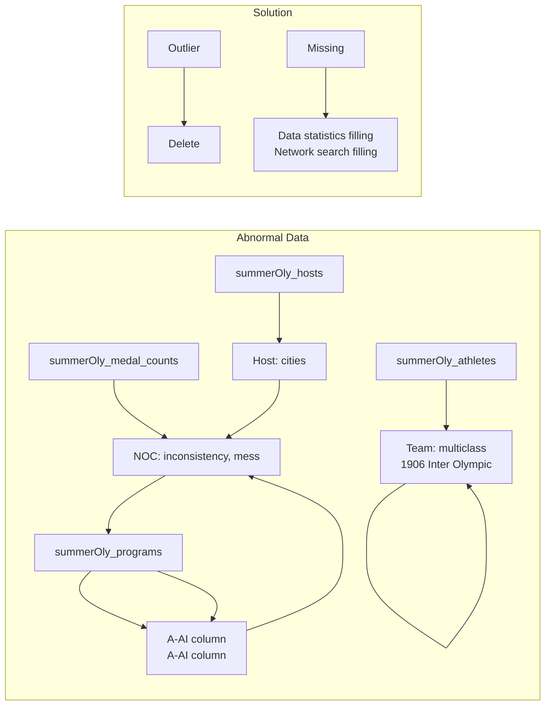
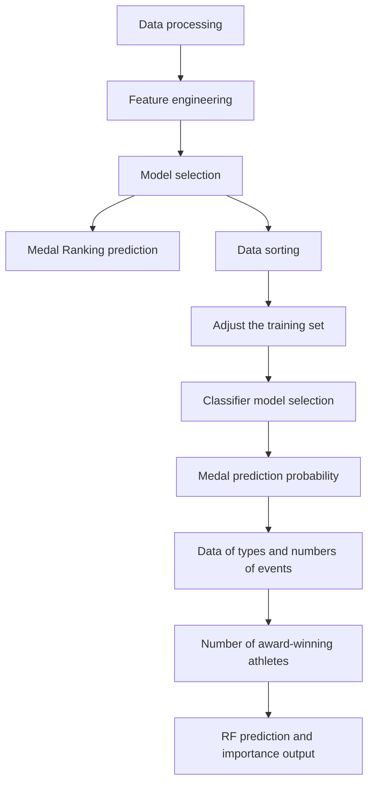
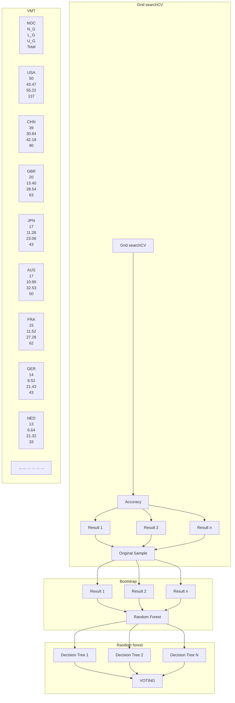
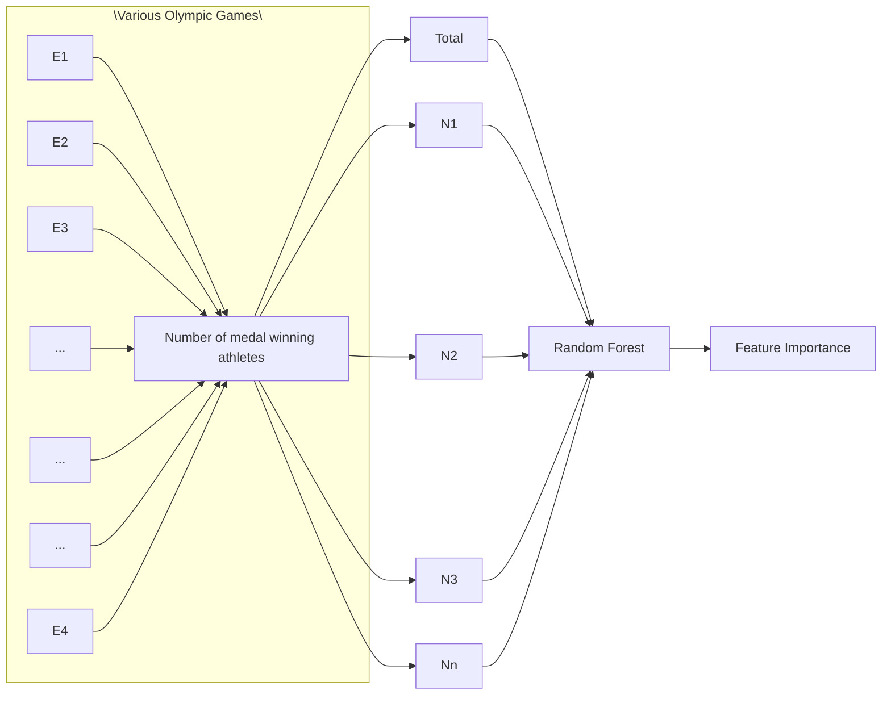

# Maximizing Medal Performance: Athlete and Event Potential Indices

Summary

As the highest-level global sporting event, the Olympic Games attract worldwide attention. Olympic achievements not only represent the limits of human athletic performance but also reflect comprehensive national strength.

First, after data preprocessing, we introduce the Athlete Potential Index (API) to quantify athlete performance. We define the API as an exponentially decaying function of Medals won by an athlete/team (PWM). The PWM exhibits a linear relationship with the number of Gold, Silver, and Bronze medals. Following a comparison of various models, we select a Random Forest (RF) model optimized using Grid SearchCV. The optimal hyperparameters are $[max\_depth=10, min\_samples\_split=4, n\_estimators=180]$ , achieving an R-squared ( $R^{2}$ ) value of 0.8792. Consequently, we employ the RF model with bootstrapping to generate 95% confidence intervals for medal predictions. Our analysis suggests that the United States is most likely to improve its medal count, while South Korea is most likely to experience a decrease.

Then, to predict medal acquisition by medal-less nations/regions, we employ a BP neural network classifier after comparing several classification models. The classifier achieves an Area Under the ROC Curve (AUC) of 0.94. We apply this model to predict medal acquisition for 77 nations/regions. The nations/regions with the highest probability of winning their first medal are Guam (GUM) and ESA, with Guam having a probability of 0.153.

Subsequently, we analyzed the six nations/regions' participation and medal counts across different events. Utilizing the feature importance attribute of the Random Forest model, we predict medal counts and derive the importance of various sports for each nation (Figure 11). Swimming emerges as a significant sport for most nations analyzed.

Next, to investigate the impact of “Great Coach” we compile a list of renowned coaches in sports such as gymnastics, athletics, and swimming. We use the Random Forest model to predict changes in medal counts attributed to these coaches. Our results indicate that “Great Coach” contribute up to 28.8% to performance improvement. Specifically, at an average athlete API of 70, the presence of a “Great Coach” is associated with an increase of 0.2 gold medals and 1.8 total medals. We introduce the Event Potential Index (EPI) to quantify the potential improvement after hiring a “Great Coach”. We recommend that China consider hiring a “Great Coach” for women’s gymnastics, Germany for men’s shooting, and Jamaica for men’s athletics, which is projected to yield an increase of approximately 1.6 medals.

Finally We made new discoveries and provided suggestions on (1)Number of participants; (2)Events with negative importance; (3)Projects suitable for hiring great coaches. Next, by varying the dataset size, we assessed the impact on prediction and information gain. we observed minimal changes in both. This demonstrates the model's strong robustness.

Keywords: Athlete Potential Index; Event Potential Index; Random Forest; BP Neural Network Classifier

# Contents

# 1 Introduction 3

1.1 Background 3  
1.2 Restatement of Problem 3  
1.3 Our work 4

# 2 Preparation for Modeling 5

2.1 Assumptions 5  
2.2 Notations 5  
2.3 Data Processing 5

# 3 Task 1: Medal Count Prediction Model 7

3.1 Feature Engineering 7

3.1.1 Athlete Potential Index (API) 7  
3.1.2 Participation Scale (PS) 8

3.2 Model Selection 8  
3.3 Task 1.1: 2028 Olympic VMT Prediction 11

3.3.1 Grid SearchCV - Random Forest Model 11  
3.3.2 Prediction Results 11  
3.3.3 95% Confidence Intervals by Bootstrap 12

3.4 Task 1.2: The Probability of First Medal 12  
3.4.1 BP Neural Network Classifier 13

3.5 Task 1.3: The Impact of Events on Medals 14

3.5.1 Event Importance Based on Random Forests 15  
3.5.2 The Impact of Home Country Events ..... 17

# 4 Task 2: “Great Coach” Contribution to Medals 18

4.1 Existence of "Great Coach" Effect 18  
4.2 Contribution of "Great Coach" 19  
4.3 Event Investment and Impact 19

4.3.1 Event Potential Index (EPI) 19  
4.3.2 Post-investment Results 20

# 5 Task 3: Other Original Insights 21

5.1 Common Traits of No Medal Nations 21  
5.2 Negative Impact Events 21  
5.3 Recommendations of "Great Coach" 21

# 6 Model Analysis 22

6.1 Sensitivity Analysis 22  
6.2 Strengths and Weaknesses 22

# 7 Conclusions 24

# References 24

# 1 Introduction

# 1.1 Background

The Olympic Games are the world's most prestigious sporting event, and in most of the time, becoming an Olympic champion is regarded as the highest honor in sports[1]. This pursuit of excellence naturally fosters intense competition between nations and regions, with the medal count serving as a key indicator of sporting prowess on the global stage.

At the recently concluded Paris 2024 Olympic Games, the United States and China led the medal count (tied for the most gold medals), followed by Japan, Australia, and host nation France[2]. Notably, several countries, including Albania, achieved historic first-time Olympic medals.

Some studies predict medal counts based on a country's political and economic context[3], while others focus on the recent performance of athletes at the Games[4]. These approaches have consistently achieved high accuracy. In this study, we aim to explore patterns in medal counts using historical Olympic data.

bar

| Country | Gold | Silver | Bronze | Total |
| :--- | :--- | :--- | :--- | :--- |
| United States | 40 | 44 | 42 | 126 |
| China | 40 | 27 | 24 | 91 |
| Japan | 20 | 12 | 13 | 45 |
| Australia | 18 | 19 | 16 | 53 |
| France | 16 | 16 | 22 | 64 |
| Netherlands | 15 | 7 | 12 | 34 |
| ... | ... | ... | ... | ... |

heatmap

| Category | Gold | Silver | Bronze | Total |
| --- | --- | --- | --- | --- |
| 1 | Yes | — | — | — |
| 2 | Yes | Yes | Yes | Yes |
| 3 | Yes | Yes | Yes | Yes |
| 4 | Yes | Yes | Yes | Yes |
| 5 | Yes | Yes | Yes | Yes |
| 6 | Yes | Yes | Yes | Yes |
| 7 | Yes | Yes | Yes | Yes |
| 8 | Yes | Yes | Yes | Yes |
| 9 | Yes | Yes | Yes | Yes |
| 10 | Yes | Yes | Yes | Yes |

Figure 1: From Paris 2024 to LA 2028: Medal Table Prediction

# 1.2 Restatement of Problem

The challenge is to analyze and predict the medal table for the 2028 Los Angeles Olympics using publicly available data from all previous Summer Olympics. In addition, other patterns, including the "Great Coach" effect, should be explored. The specific questions are:

# - Build a Medal count prediction model:

The model should include at least gold medals and total medals. Measure the performance

of the model and estimate the uncertainty or accuracy of the prediction.

# - Specific Event type analysis:

Consider the number and types of events, explore the relationships between events, and the number of medals won by each country in each event. Examine the most dominant events in each country, and analyze the reasons and impact on the results.

# - Model prediction:

1. Predict the medal table for the 2028 Summer Olympics in Los Angeles and give a prediction interval for the result. Analyze countries that may improve or decline.  
2. Focus on countries/regions that have not yet won a medal and predict their probability of winning their first medal at the 2028 Olympics.

# - Explore the existence of the "Great Coach" effect:

Look for changes due to the "Great Coach" effect and estimate its impact on medal changes. Select three countries, determine the sports in which they should consider investing in a great coach, and estimate the impact.

# • Explore other patterns:

Analyze other patterns related to the number of medals displayed by the model. Use these findings to inform the Olympic committees of various countries.

# 1.3 Our work

  
Figure 2: Our Work

# 2 Preparation for Modeling

# 2.1 Assumptions

We make the following assumptions to complete our model. In addition, we will refine these simplified assumptions later.

- We assume that an athlete's competitive ability can be fully inferred from the historical data provided. This is because the given dataset only contains information about a player's participation in previous Olympic Games and the medals he won (gold, silver, or bronze). We believe that a player's ability based on this information is sufficient.  
- We assume that the competitive ability of an athlete or team remains constant over the four years between games. This is because we cannot obtain any other information about athletes between Games from the dataset provided.  
- We assume that the probability of a country that has never won a medal to win a medal is only related to the historical data of previous participation. This is because there is no more realistic data on countries that have never won a medal in the data set provided. Although this may be a relatively important factor.

# 2.2 Notations

Table 1: Notations Table

<table><tr><td>Symbol</td><td>Description</td></tr><tr><td>PES</td><td>Performance score of an athlete/team</td></tr><tr><td>PWM</td><td>Medals won by an athlete/team</td></tr><tr><td>HA</td><td>Host advantage</td></tr><tr><td> $N_i$ </td><td>The Olympic Games of number  $i$ </td></tr><tr><td>API</td><td>Athlete Potential Index</td></tr><tr><td>EPI</td><td>Event Potential Index</td></tr><tr><td>PS</td><td>Scale of Participation (by NOC)</td></tr></table>

# 2.3 Data Processing

After observing the datasets provided by the topic, summerOly\_athletes.csv, summerOly\_hosts.csv, summerOly\_medal\_counts.csv and summerOly\_programs.csv contain some abnormal or missing values. The following describes the data processing of these abnormal and missing values. Further data processing will be done as needed in the later text. The processing procedures are shown in Figure 3.

flowchart

Figure 3: Data processing

# SummerOly\_athletes

The data in the Team column of the SummerOly\_athletes.csv file is misaligned or garbled.

We noticed that the 1906 Olympics were an intercalated Olympics (unofficial Olympics), and the results were not officially recognized by the International Olympic Committee (IOC). We ultimately decided not to use any data from 1906.

# summerOly\_hosts

The Host column in the summerOly\_hosts.csv dataset contains both countries and cities. To obtain precise information on the host countries, we performed a column-splitting operation to separate the data accordingly.

# summerOly\_medal\_counts

In the summerOly\_medal\_counts.csv dataset, the NOC column contains 72 instances of garbled data marked as "??". These entries were removed directly.

Additionally, inconsistencies in country names, such as "Great Britain" in this dataset versus "United Kingdom" in other tables, caused mismatches in host information and athlete data. To address this, we standardized the country names across all datasets.

# summerOly\_programs

The summerOly\_programs.csv file contains missing values and garbled data marked as "?". Missing or garbled entries in columns A–C were corrected using online resources. For columns beyond E, garbled data were removed, and missing values were confirmed to be zeros based on Total events statistics.

Significant fluctuations in medal rankings for 1904, 1908, and 1984, likely due to geopolitical factors, led to the exclusion of these years from the analysis.

# 3 Task 1: Medal Count Prediction Model

The flowchart for Task 1 is as follows:

flowchart

Task1.3: The Importance of Events to medals  
Figure 4: Flowchart for Task 1

# 3.1 Feature Engineering

# 3.1.1 Athlete Potential Index (API)

Inspired by Ruiz and Mario's (2024) research on the Olympic performance index of countries[5], we developed the Athlete Potential Index (API) based on athletes' previous Olympic medal performances to describe athletes' dynamic performance across Olympic Games. This potential index describes an athlete's past performance and the results they can achieve in the current Olympic event, dynamically adjusted for each Olympic Games.

Note that the dataset only provides information about an athlete/team for the last few Olympic Games. Combining relevant papers and parameter tuning practices, we define the API as follows:

$$
A P I = \sum_ {j = 1} ^ {i} P W M _ {j} \times \left(\frac {1}{2}\right) ^ {i - j} \tag {1}
$$

where i represents the number of the next Olympic Games, and j represents the number of Olympic Games with recorded results.

$$
P W M = 1 0 0 \times N G + 9 0 \times N S + 8 0 \times N B + 6 0 \times N M \tag {2}
$$

where,

\- $NG$ represents the number of gold medals,

- $NS$ represents the number of silver medals  
- $NB$ represents the number of bronze medals  
- $NM$ represents the number of events without medals  
- If the athlete has never participated in a competition, their PWM is 0.

# 3.1.2 Participation Scale (PS)

The scale of a country's participation in the Olympic Games is a factor that is often taken into account[3]. According to the number of athletes representing the country in the Olympic Games, we divide the participation scale into five levels, denoted by 1-5, as defined below:

Table 2: Participation Scale (PS) based on Athlete Number

<table><tr><td>Athlete Number</td><td>Participation Scale (PS)</td></tr><tr><td>0-9</td><td>1</td></tr><tr><td>10-49</td><td>2</td></tr><tr><td>50-99</td><td>3</td></tr><tr><td>100-149</td><td>4</td></tr><tr><td>150 or more</td><td>5</td></tr></table>

# 3.2 Model Selection

After data processing and feature engineering, we obtain the following features:

Table 3: Feature Reference in Model 1

<table><tr><td>Symbol</td><td>Description</td></tr><tr><td>Year</td><td>The year of the Olympic Games</td></tr><tr><td>N_A</td><td>Number of Athletes</td></tr><tr><td>N_E</td><td>Number of Events</td></tr><tr><td>AAPI</td><td>Average of API</td></tr><tr><td>PS</td><td>Scale of Participation (by NOC)</td></tr><tr><td>HS</td><td>Host advantage</td></tr><tr><td>N_G</td><td>Number of Gold</td></tr><tr><td>N_S</td><td>Number of Silver</td></tr><tr><td>N_B</td><td>Number of Bronze</td></tr><tr><td>Total</td><td>Total medals</td></tr></table>

We compiled the above characteristics of the Olympics for five countries: Japan, the United States, France, China, and Great Britain, and formed a dataset to train the model.

The correlation matrix for the current feature mapping is shown in Figure 5.

heatmap

| Variable | Year | N_A | N_E | AAPI | SP | HS | N_G | N_S | N_B | Total |
| --- | --- | --- | --- | --- | --- | --- | --- | --- | --- | --- |
| N_A | 0.53 | — | — | — | — | — | — | — | — | — |
| N_E | 0.85 | 0.82 | — | — | — | — | — | — | — | — |
| AAPI | -0.20 | 0.16 | 0.01 | — | — | — | — | — | — | — |
| SP | 0.50 | 0.65 | 0.70 | -0.12 | — | — | — | — | — | — |
| HS | -0.04 | 0.41 | 0.12 | 0.01 | 0.10 | — | — | — | — | — |
| N_G | 0.19 | 0.69 | 0.49 | 0.52 | 0.34 | 0.16 | — | — | — | — |
| N_S | 0.18 | 0.75 | 0.48 | 0.46 | 0.38 | 0.21 | 0.91 | — | — | — |
| N_B | 0.26 | 0.78 | 0.56 | 0.38 | 0.44 | 0.19 | 0.85 | 0.90 | — | — |
| Total | 0.21 | 0.76 | 0.52 | 0.48 | 0.40 | 0.19 | 0.96 | 0.97 | 0.94 | — |

Figure 5: Correlation matrix of the characteristics of model 1

As can be seen from the image, for N\_G, N\_S, N\_B, and Total, the six selected features are all correlated to some extent. Therefore, we select all of the above features to train the model.

We evaluated multiple models to select the best for prediction. Linear regression is chosen for its simplicity and interpretability. Random forests are selected for their strong predictive power and interpretability. XGBoost, known for its excellent performance, is also used for prediction.

For both random forests and XGBoost, we use a grid search to determine the best hyperparameters. A total of 27 combinations of three hyperparameters are set for random forests and 54 combinations for XGBoost. The optimal parameters are:

Table 4: Random Forests Hyperparameters

<table><tr><td>n_estimators</td><td>max_depth</td><td>min_samples_split</td></tr><tr><td>180</td><td>10</td><td>4</td></tr></table>

Table 5: XGBoost Hyperparameters

<table><tr><td>eta</td><td>max_depth</td><td>subsample</td><td>colsample_bytree</td></tr><tr><td>0.1</td><td>6</td><td>0.8</td><td>0.8</td></tr></table>

The fitting results of the three models' predictions for $70\%$ of the training set and $30\%$ of the test set are shown in Figure 6.

  
Figure 6: Fitted prediction curves for Linear Regression, XGBoost, and Random Forests (from top to bottom)

Additionally, we tested the stability of model predictions using 5-fold cross-validation.

Table 6: Performance Evaluation of Three Prediction Models

<table><tr><td>Model</td><td>R2</td><td>RMSE</td><td>5-fold Cross-Validation R2</td></tr><tr><td>Linear Regression</td><td>0.8063</td><td>15.44</td><td>0.7066</td></tr><tr><td>XGBoost</td><td>0.8764</td><td>12.33</td><td>0.7597</td></tr><tr><td>Random Forest</td><td>0.8792</td><td>12.19</td><td>0.7642</td></tr></table>

The $R^{2}$ and RMSE results for Random Forest and XGBoost are similar, with $R^{2}$ exceeding 0.85. Given the better interpretability of random forest regarding feature importance, we select the grid-searched Random Forest as the primary model.

In 5-fold cross-validation, both Random Forest and XGBoost achieve $R^{2}$ values above 0.75, demonstrating the robustness of these models. However, examining the $R^{2}$ results for each fold reveals occasional instances of poor predictive performance. We hypothesize that increasing the size of the training set improves this. Additionally, the size of the test and training sets may also influence the RMSE values.

# 3.3 Task 1.1: 2028 Olympic VMT Prediction

# 3.3.1 Grid SearchCV - Random Forest Model

Combining the data from the medal tables of recent Olympic Games, we select the top-ranked countries to make predictions for. For the medal table predictions, we will only predict medals for the major award-winning countries mentioned above. Note that Russia did not participate in the Olympics. The flowchart for Task 1.1 is as follows:

flowchart

Figure 7: Flowchart for Task 1.1

# 3.3.2 Prediction Results

The random forest model is used to predict the medal rankings of each country in the 2028 Los Angeles Summer Olympics. We assume that the number of participants (N\_A) and the number of events (N\_E) are increased in proportion to the additional events in 2028. The prediction results are shown in Table 7:

The medal rankings are based on the predicted counts of gold, silver, and bronze medals in descending order. Integer values are rounded using the "round half to even" method. Due to space constraints, only a selection of countries is displayed in the medal table, while many others are not shown. However, the same methodology is consistently applied to all countries in the rankings.

Analyzing the forecast results, we can conclude:

- Countries most likely to increase the number of medals: the United States.  
- Countries most likely to decrease the number of medals: South Korea.

Table 7: Los Angeles Olympics (2028) Virtual Medal Table

<table><tr><td>NOC</td><td>Gold</td><td>Silver</td><td>Bronze</td><td>Total</td><td>Total (2024)</td><td> $\bigtriangleup$ Total</td></tr><tr><td>USA</td><td>50</td><td>47</td><td>40</td><td>137</td><td>127</td><td>+11</td></tr><tr><td>CHN</td><td>39</td><td>29</td><td>22</td><td>90</td><td>91</td><td>-1</td></tr><tr><td>GBR</td><td>20</td><td>20</td><td>23</td><td>63</td><td>65</td><td>-2</td></tr><tr><td>JPN</td><td>17</td><td>15</td><td>15</td><td>47</td><td>45</td><td>+2</td></tr><tr><td>AUS</td><td>17</td><td>15</td><td>17</td><td>50</td><td>53</td><td>-3</td></tr><tr><td>FRA</td><td>15</td><td>25</td><td>22</td><td>62</td><td>64</td><td>-2</td></tr><tr><td>GER</td><td>14</td><td>8</td><td>9</td><td>31</td><td>33</td><td>-2</td></tr><tr><td>NED</td><td>13</td><td>8</td><td>12</td><td>33</td><td>34</td><td>-1</td></tr><tr><td>ITA</td><td>11</td><td>12</td><td>16</td><td>39</td><td>40</td><td>-1</td></tr><tr><td>KOR</td><td>10</td><td>7</td><td>9</td><td>26</td><td>32</td><td>-6</td></tr><tr><td>NZL</td><td>8</td><td>7</td><td>5</td><td>20</td><td>20</td><td>0</td></tr><tr><td>HUN</td><td>7</td><td>6</td><td>6</td><td>19</td><td>19</td><td>0</td></tr><tr><td>CAN</td><td>7</td><td>7</td><td>10</td><td>24</td><td>27</td><td>-3</td></tr><tr><td>ESP</td><td>6</td><td>5</td><td>8</td><td>19</td><td>18</td><td>+1</td></tr><tr><td>BRA</td><td>5</td><td>6</td><td>8</td><td>19</td><td>20</td><td>-1</td></tr></table>

# 3.3.3 95% Confidence Intervals by Bootstrap

For the Random Forest model, the 95% confidence intervals are estimated using the bootstrap method. The process includes the following steps:

1. Resample the training data 300 times and train a model for each resample.  
2. Use the models trained on the resampled data to make predictions.  
3. Determine the confidence intervals by calculating the 2.5th and 97.5th percentiles of the predictions.

The predicted intervals are presented in Table 8:

Our prediction intervals for Gold, Silver, Bronze, and Total are predicted separately, so the Total prediction interval is not determined by the intervals for the three medal categories.

# 3.4 Task 1.2: The Probability of First Medal

After observing and organizing the dataset, we find that there are currently 77 countries or regions that have participated in the Olympics but have never won a medal. Among them, there are many countries that have participated multiple times.

We also identify countries that have won medals for the first time in recent years, including Albania, Cabo Verde, Dominica, and Saint Lucia in 2024. Using historical data, we explore the commonalities of countries that have won medals for the first time. The following predictions are based on Hypothesis 3, which only considers the performance of athletes and not the political and economic situation of external countries.

Table 8: 95% Confidence Intervals for Medal Predictions Using Random Forest

<table><tr><td>NOC</td><td>L_Gold</td><td>U_Gold</td><td>L_Sil</td><td>U_Sil</td><td>L_Bro</td><td>U_Bro</td><td>L_Total</td><td>U_Total</td></tr><tr><td>USA</td><td>43.4673</td><td>55.2163</td><td>36.1520</td><td>48.5010</td><td>34.5945</td><td>42.3355</td><td>120.2138</td><td>146.0528</td></tr><tr><td>CHN</td><td>30.8390</td><td>42.1753</td><td>22.9743</td><td>34.2540</td><td>16.6925</td><td>26.8335</td><td>81.5058</td><td>103.2628</td></tr><tr><td>GBR</td><td>13.3978</td><td>28.5428</td><td>16.1528</td><td>27.2090</td><td>12.6220</td><td>24.3835</td><td>52.1725</td><td>76.1353</td></tr><tr><td>JPN</td><td>11.2848</td><td>23.0640</td><td>10.7348</td><td>18.5230</td><td>12.1013</td><td>19.8430</td><td>34.1208</td><td>56.4300</td></tr><tr><td>AUS</td><td>10.6555</td><td>32.5253</td><td>10.5470</td><td>22.6360</td><td>10.0188</td><td>31.1533</td><td>41.2213</td><td>76.3145</td></tr><tr><td>FRA</td><td>11.5233</td><td>27.2760</td><td>18.3410</td><td>29.6038</td><td>19.6150</td><td>30.0225</td><td>49.4793</td><td>86.9023</td></tr><tr><td>GER</td><td>8.5160</td><td>21.4323</td><td>3.3070</td><td>17.7790</td><td>7.1198</td><td>19.4945</td><td>22.9428</td><td>50.7058</td></tr><tr><td>NED</td><td>6.6443</td><td>21.3190</td><td>4.0565</td><td>13.9610</td><td>6.5465</td><td>15.9925</td><td>17.2473</td><td>51.2725</td></tr><tr><td>ITA</td><td>8.1100</td><td>15.2173</td><td>10.4003</td><td>14.1658</td><td>13.5638</td><td>19.4900</td><td>32.0740</td><td>48.8730</td></tr><tr><td>KOR</td><td>4.2660</td><td>13.1340</td><td>4.6835</td><td>10.3085</td><td>5.8170</td><td>11.1828</td><td>14.7665</td><td>34.6253</td></tr><tr><td>NZL</td><td>5.4268</td><td>11.3150</td><td>4.2243</td><td>9.9683</td><td>3.3828</td><td>7.8695</td><td>13.0338</td><td>29.1528</td></tr><tr><td>HUN</td><td>4.1548</td><td>7.1308</td><td>4.8633</td><td>8.1225</td><td>3.9523</td><td>7.5568</td><td>14.9703</td><td>22.8100</td></tr><tr><td>CAN</td><td>5.9835</td><td>12.6878</td><td>5.0590</td><td>10.6268</td><td>8.8628</td><td>13.2300</td><td>19.9053</td><td>36.5445</td></tr><tr><td>ESP</td><td>2.7575</td><td>10.2725</td><td>2.2690</td><td>8.8830</td><td>3.0180</td><td>11.2775</td><td>10.0445</td><td>30.4330</td></tr><tr><td>BRA</td><td>3.8375</td><td>8.6273</td><td>4.5943</td><td>8.8620</td><td>6.1783</td><td>11.9415</td><td>14.6100</td><td>29.4308</td></tr></table>

# 3.4.1 BP Neural Network Classifier

Unlike medal ranking predictions, this analysis cannot directly use previous models for training and prediction. This is because for countries that have never won a medal, the dependent variable, Total, is always 0 during training, leading to significant errors and making reliable results unattainable.

roc

| False Positive Rate | True Positive Rate |
| --- | --- |
| 0.0 | 0.0 |
| 0.0 | ~0.36 |
| ~0.05 | ~0.36 |
| ~0.05 | ~0.86 |
| ~0.08 | ~0.86 |
| ~0.08 | ~0.94 |
| ~0.15 | ~0.94 |
| ~0.15 | ~0.95 |
| ~0.25 | ~0.95 |
| ~0.25 | ~0.97 |
| ~0.32 | ~0.97 |
| ~0.32 | ~0.98 |
| 1.0 | 1.0 |

Figure 8: ROC Curve of BP Neural Network Classifier

We use countries that have won their first Olympic medals in recent years as the training set

and countries that have never won a medal as the test set. A classifier is used to map the likelihood of a country winning a medal (PWM = 0 or >0) to a value between 0 and 1. After comparing SVM and Random Forest classifiers, we selected the BP neural network classifier, which has an ROC curve with an area of 0.94, as shown in Figure 8, indicating strong classification performance.

A BP neural network classifier is used to predict the 2028 Los Angeles Olympics for countries that did not win medals, and the resulting probabilities are shown in Table 9:

Table 9: Probability of Win first Medal in 2028 (Partial)

<table><tr><td>NOC</td><td>N_A</td><td>Prediction Probability</td></tr><tr><td>GUM</td><td>8</td><td>0.153210476</td></tr><tr><td>ESA</td><td>9</td><td>0.144216761</td></tr><tr><td>LBR</td><td>10</td><td>0.1420369</td></tr><tr><td>PLE</td><td>8</td><td>0.140068978</td></tr><tr><td>RWA</td><td>8</td><td>0.130942091</td></tr><tr><td>GAM</td><td>8</td><td>0.130942091</td></tr><tr><td>COD</td><td>6</td><td>0.12339206</td></tr></table>

As can be seen from the table, countries with a long history of participation and a large number of participants are more likely to win medals. The overall probability of winning is relatively low, and it cannot be ruled out that none of these countries will win a medal. Countries or regions with a relatively high probability of winning medals at the 2028 Olympics are: GUM, ESA, LBR, and PLE.

# 3.5 Task 1.3: The Impact of Events on Medals

In Task 1.1, we used only the number of projects and the number of participants to predict the number of medals. The correlation between the number of projects and the number of medals is 0.52. Below we examine the relationship between the number of events, the number of athletes, and the number of medals won in some countries.

By examining the table, we focus on exploring the relationship between medals and events for six countries: China, the United States, Great Britain, Germany, Japan, and France. We organize data on the number of participants in each event and the number of medalists across all Olympic Games in history for each country. Using random forests, we predict the total number of medals won, thereby determining the importance of each event in contributing to the medal count.

$$
\mathrm{PWMA} = \sum_ {i = 1} ^ {n} (N _ {-} G _ {i} + N _ {-} S _ {i} + N _ {-} B _ {i}) \tag {3}
$$

where n is the total number of events and i is the i-th event in an Olympic Games.

Figure 9 shows the solution framework for this subtask.

flowchart

Figure 9: Flowchart for Task 1.3

# 3.5.1 Event Importance Based on Random Forests

We use random forests to predict the total number of medals based on the number of participants and medalists in each event. The data consists of the number of participants and medalists for each event across multiple Olympic Games for a given country. Random forests are then used to generate feature importance. For example, in predicting the medal count for Germany, the $R^{2}$ value reaches 0.91, and the feature distribution is shown in Figure 10.

bar

| Sport | Importance |
| --- | --- |
| Canoeing | ~0.37 |
| Fencing | ~0.22 |
| Cycling | ~0.18 |
| Rowing | ~0.14 |
| Table Tennis | ~0.13 |
| Shooting | ~0.11 |
| Diving | ~0.07 |
| Swimming | ~0.05 |
| Canoe Sprint | 0 |
| Handball | 0 |
| Hockey | ~-0.02 |
| Sailing | ~-0.07 |
| Wrestling | ~-0.07 |
| Judo | ~-0.08 |
| Gymnastics | ~-0.08 |
| Football | ~-0.09 |
| Equestrianism | ~-0.11 |
| Athletics | ~-0.12 |
| Boxing | ~-0.13 |

Figure 10: The event importance distribution of Germany

Using the same method, the results of the feature importance of the six countries are shown in Figure 11.

bar_stacked

| Event types | JPN | FRA | GBR | GER | CHN | USA |
| :--- | :--- | :--- | :--- | :--- | :--- | :--- |
| Football | — | — | — | ~0.05 | — | ~0.05 |
| Equestrianism | — | ~0.08 | ~0.05 | ~0.05 | — | ~0.01 |
| Boxing | — | ~0.18 | — | ~0.05 | — | ~0.05 |
| Gymnastics | ~0.05 | — | — | ~0.05 | ~0.05 | ~0.15 |
| Hockey | — | — | ~0.03 | ~0.03 | — | — |
| Sailing | — | ~0.08 | ~0.03 | ~0.01 | — | ~0.05 |
| Synchronized Swimming | ~0.05 | — | — | — | ~0.05 | — |
| Weightlifting | ~0.08 | — | — | — | ~0.05 | — |
| Fencing | ~0.08 | ~0.02 | — | ~0.08 | — | — |
| Cycling | — | ~0.03 | ~0.08 | ~0.05 | — | — |
| Athletics | ~0.05 | ~0.08 | ~0.03 | ~0.05 | ~0.25 | ~0.15 |
| Water Polo | — | — | — | — | ~0.22 | — |
| Rowing | ~0.05 | ~0.05 | ~0.35 | ~0.05 | — | ~0.05 |
| Volleyball | ~0.05 | — | — | — | ~0.35 | — |
| Badminton | ~0.28 | — | — | — | ~0.15 | — |
| Handball | — | ~0.32 | — | ~0.05 | — | — |
| Diving | ~0.28 | — | — | ~0.05 | ~0.25 | ~0.05 |
| Basketball | ~0.05 | — | — | ~0.05 | ~0.05 | ~0.15 |
| Table Tennis | ~0.25 | — | — | ~0.05 | ~0.05 | ~0.05 |
| Wrestling | ~0.42 | — | — | ~0.05 | ~0.15 | ~0.05 |
| Canoeing | ~0.05 | ~0.05 | ~0.05 | ~0.25 | — | — |
| Judo | ~0.18 | ~0.35 | — | ~0.05 | ~0.05 | — |
| Shooting | ~0.05 | — | ~0.05 | ~0.05 | ~0.15 | ~0.05 |
| Swimming | ~0.05 | ~0.05 | ~0.25 | ~0.02 | ~0.15 | ~0.35 |

Figure 11: Importance of Sports Events by Medal Count for Different Countries

Some countries have too few participants in certain sports and no medals; therefore, these were not included in the training and are assumed to have a feature importance of 0. The feature importance distribution mainly focuses on sports with a good medal expectation. It is important to note that we treat the number of participants and medalists in a sport as the essence of that sport. Therefore, our predictions include the number of events as a type. However, our predictions may amplify the impact of team events.

Analyzing the chart, the key sports for medal count in six countries are:

• Japan: Wrestling, Judo, and Table Tennis.  
• France: Judo, Handball, and Swimming.

- Great Britain: Rowing, Diving, and Swimming.  
• Germany: Canoeing and Shooting.  
• China: Badminton, Diving, Swimming, and Shooting.  
- United States: Swimming, Basketball, Volleyball, and Athletics.

The model explains that these countries have more participants in key sports and are more likely to win medals in these areas. The identified important sports align closely with the countries' traditional strengths, which significantly influence their medal counts. This indicates that our model results are highly accurate.

# 3.5.2 The Impact of Home Country Events

The host country often adds new Olympic events. These events are related to the country in some way and are basically sports that the people of the country love. The newly added events of the host country can have a certain impact on the number of medals.

Examples include the 1996 Olympic Games in the United States, the 2020 Olympic Games in Japan, and the 2024 Olympic Games in France. We pay attention to whether the host country has certain advantages in the newly added events. According to the data provided, the main events added to these three Olympic Games were:

- 1996 Atlanta Olympics: Beach Volleyball, Mountain Biking, Softball, Lightweight Rowing, etc.  
- 2020 Tokyo Olympics: Baseball, Softball, Rock Climbing, Karate, Surfing, and Skateboarding.  
• 2024 Paris Olympics: Breakdancing, Skateboarding, Rock Climbing, and Surfing.

Here are the medal results for the three specific events:

Table 10: Medal Counts for New Events at the 1996 Atlanta Olympics

<table><tr><td>NOC</td><td>N_G</td><td>N_S</td><td>N_B</td><td>Total</td><td>P_G</td><td>P_T</td></tr><tr><td>USA</td><td>41</td><td>5</td><td>18</td><td>64</td><td>33.33%</td><td>17.63%</td></tr><tr><td>RUS</td><td>42</td><td>2</td><td>13</td><td>57</td><td>34.15%</td><td>15.70%</td></tr><tr><td>CHN</td><td>4</td><td>45</td><td>5</td><td>54</td><td>3.25%</td><td>14.88%</td></tr><tr><td>AUS</td><td>0</td><td>0</td><td>26</td><td>26</td><td>0</td><td>7.16%</td></tr><tr><td>BLR</td><td>0</td><td>12</td><td>6</td><td>18</td><td>0</td><td>4.96%</td></tr><tr><td>BUL</td><td>0</td><td>6</td><td>11</td><td>17</td><td>0</td><td>4.68%</td></tr></table>

Table 11: Medal Counts for New Events at the 2020 Tokyo Olympics

<table><tr><td>NOC</td><td>N_G</td><td>N_S</td><td>N_B</td><td>Total</td><td>P_G</td><td>P_T</td></tr><tr><td>JPN</td><td>43</td><td>4</td><td>4</td><td>51</td><td>78.18%</td><td>29.48%</td></tr><tr><td>USA</td><td>1</td><td>40</td><td>3</td><td>44</td><td>1.82%</td><td>25.43%</td></tr><tr><td>DOM</td><td>0</td><td>0</td><td>24</td><td>24</td><td>0</td><td>13.87%</td></tr><tr><td>CAN</td><td>0</td><td>0</td><td>15</td><td>15</td><td>0</td><td>8.67%</td></tr><tr><td>BRA</td><td>1</td><td>3</td><td>0</td><td>4</td><td>1.82%</td><td>2.31%</td></tr><tr><td>TUR</td><td>0</td><td>1</td><td>3</td><td>4</td><td>0</td><td>2.31%</td></tr></table>

Table 12: Medal Counts for New Events at the 2024 Paris Olympics

<table><tr><td>NOC</td><td>N_G</td><td>N_S</td><td>N_B</td><td>Total</td><td>P_G</td><td>P_T</td></tr><tr><td>USA</td><td>1</td><td>3</td><td>3</td><td>7</td><td>8.33%</td><td>19.44%</td></tr><tr><td>JPN</td><td>3</td><td>3</td><td>0</td><td>6</td><td>25%</td><td>16.67%</td></tr><tr><td>BRA</td><td>0</td><td>1</td><td>3</td><td>4</td><td>0</td><td>11.11%</td></tr><tr><td>AUS</td><td>2</td><td>1</td><td>0</td><td>3</td><td>16.66%</td><td>8.33%</td></tr><tr><td>FRA</td><td>1</td><td>1</td><td>1</td><td>3</td><td>8.33%</td><td>8.33%</td></tr><tr><td>CHN</td><td>0</td><td>2</td><td>1</td><td>3</td><td>0</td><td>8.33%</td></tr></table>

where,

- P\_G is the proportion of the number of people who won gold medals.  
- N\_G is the number of people who won gold medals. When medals are won as a team, we treat it as if each person won a medal individually.

As can be seen in the analysis table, the United States and Japan were the top medal winners in the new events in 1996 and 2020, respectively. France also did well in the new events in 2024. After reviewing the relevant information[6][7], we believe that selecting events from the home country that are either advantageous or popular in the country can greatly improve the results of the competition. For example, the new events of karate and skateboarding in Japan, and the new event of softball in the United States. These sports were originally popular in that country.

# 4 Task 2: “Great Coach” Contribution to Medals

# 4.1 Existence of “Great Coach” Effect

We first looked up Lang Ping's coaching trajectory and considered her role as the head coach of the Chinese women's volleyball team at the 2016 Rio Olympics[8]. We examined the results achieved by the women's volleyball team at the Games during her tenure as coach. The results are shown in Table 13:

The Chinese women's volleyball team secured the gold medal in women's volleyball at the 2016 Olympics. However, in the eight years before and after this victory, their best Olympic result

Table 13: Performance of the Chinese Women's Volleyball Team in the Last Five Olympic Games

<table><tr><td>Team</td><td>Year</td><td>Event Participants</td><td>Great Coach</td><td>Gold</td><td>Silver</td><td>Bronze</td><td>Total</td></tr><tr><td>China</td><td>2024</td><td>13</td><td>0</td><td>0</td><td>0</td><td>0</td><td>2.41</td></tr><tr><td>China</td><td>2020</td><td>12</td><td>0</td><td>0</td><td>0</td><td>0</td><td>3.85</td></tr><tr><td>China</td><td>2016</td><td>12</td><td>1</td><td>1</td><td>0</td><td>0</td><td>1.41</td></tr><tr><td>China</td><td>2012</td><td>12</td><td>0</td><td>0</td><td>0</td><td>0</td><td>3.10</td></tr><tr><td>China</td><td>2008</td><td>12</td><td>0</td><td>0</td><td>0</td><td>1</td><td>2.41</td></tr></table>

was a single bronze medal. This leads us to conclude that the "Great Coach" effect does indeed play a role.

# 4.2 Contribution of "Great Coach"

We expanded our analysis by researching legendary Olympic coaches and introduced a binary feature, "Great Coach" (0 or 1), into the dataset. Additional features included "Year" and "AAPI." The dataset covered events such as U.S. women's volleyball, women's gymnastics, and men's sprinting; Chinese women's volleyball and men's swimming; German men's canoeing; Russian women's gymnastics; British men's hurdles; and Jamaican women's sprinting.

Using a random forest model to predict the "Total" medal count, the feature importance of "Great Coach" was 0.288. A BP neural network classifier was also applied to estimate the probability of winning a gold medal.

For Jamaican women's sprinting in 2024, the inclusion of the "Great Coach" feature increased the predicted medal count from 0.56 to 1.56.

- At an AAPI of approximately 65, the predicted increase was 0.9 bronze medals, 0.2 silver medals, 0.02 gold medals, and 1.2 total medals.  
- At an AAPI of around 70, the predicted increase was 0.7 bronze medals, 0.9 silver medals, 0.2 gold medals, and 1.8 total medals.

These results highlight the significant impact of the "Great Coach" effect, contributing 28.8% to overall performance.

# 4.3 Event Investment and Impact

# 4.3.1 Event Potential Index (EPI)

We propose that sports with a history of multiple medals, athletes with higher AAPI, and events showing an upward trend are more likely to benefit from the introduction of a great coach. To estimate the improvement potential of an event after introducing a great coach, we define the Event Potential Index (EPI) using the following formula:

$$
\mathrm{EPI} = \omega_ {1} \times \text {Total\_trend} + \omega_ {2} \times \text {Total\_space} + \omega_ {3} \times \text {AAPI} \tag {4}
$$

\- Total\_trend represents the trend in medal count over time.

\- Total\_space reflects the growth potential in medal count.

# Calculation Details:

\- Total\_trend:

$$
\text {Total\_trend} = \frac {\text {pre\_Total\_2028} - \text {Total\_2024}}{\text {Total\_2024} + 1} \tag {5}
$$

where pre\_Total\_2028 is the predicted medal count for the 2028 Los Angeles Olympics, and Total\_2024 is the medal count from the 2024 Paris Olympics.

\- Total\_space:

$$
\text {Total\_space} = \left(\frac {\text {Total\_max}}{\text {Total}}\right) ^ {\frac {1}{j - 1}} - 1 \tag {6}
$$

where Total\_max is the maximum medal count achieved in the event's history, and $j$ is the corresponding Olympic session.

Additionally, the improvement potential is influenced by the presence of dominant nations in the event. Based on the historical Olympic data and factors influencing EPI, we recommend focusing on the following events:

- China: Men's and women's gymnastics, men's swimming.  
- Jamaica: Men's and women's athletics.  
- Germany: Men's shooting, men's and women's swimming.

# 4.3.2 Post-investment Results

Our prediction for the above-selected sport is as is shown in Table 14.

Table 14: The post-investment prediction results

<table><tr><td>NOC</td><td>Events</td><td>AAPI</td><td>G_C</td><td>N_B</td><td>N_S</td><td>N_G</td><td>Total</td></tr><tr><td>CHN</td><td>Men&#x27;s gymnastics</td><td>67.8</td><td>0</td><td>0.50</td><td>1.33</td><td>0.50</td><td>2.41</td></tr><tr><td>CHN</td><td>Men&#x27;s gymnastics</td><td>67.8</td><td>1</td><td>1.05</td><td>1.31</td><td>1.33</td><td>3.85</td></tr><tr><td>CHN</td><td>Women&#x27;s gymnastics</td><td>62.7</td><td>0</td><td>0.57</td><td>0.45</td><td>0.72</td><td>1.41</td></tr><tr><td>CHN</td><td>Women&#x27;s gymnastics</td><td>62.7</td><td>1</td><td>1.03</td><td>1.36</td><td>0.87</td><td>3.10</td></tr><tr><td>CHN</td><td>Men&#x27;s swimming</td><td>67.8</td><td>0</td><td>0.50</td><td>1.33</td><td>0.50</td><td>2.41</td></tr><tr><td>CHN</td><td>Men&#x27;s swimming</td><td>67.8</td><td>1</td><td>1.05</td><td>1.31</td><td>1.33</td><td>3.85</td></tr><tr><td>JAM</td><td>Men&#x27;s athletics</td><td>68.38</td><td>0</td><td>0.71</td><td>1.61</td><td>0.907</td><td>3.32</td></tr><tr><td>JAM</td><td>Men&#x27;s athletics</td><td>68.38</td><td>1</td><td>1.08</td><td>1.82</td><td>1.21</td><td>4.11</td></tr><tr><td>JAM</td><td>Women&#x27;s athletics</td><td>65</td><td>0</td><td>0.66</td><td>1.26</td><td>0.72</td><td>2.68</td></tr><tr><td>JAM</td><td>Women&#x27;s athletics</td><td>65</td><td>1</td><td>1.29</td><td>1.10</td><td>0.94</td><td>2.95</td></tr><tr><td>GER</td><td>Men&#x27;s shooting</td><td>62.6</td><td>0</td><td>0.53</td><td>0.2</td><td>0.72</td><td>1.32</td></tr><tr><td>GER</td><td>Men&#x27;s shooting</td><td>62.6</td><td>1</td><td>1.01</td><td>0.97</td><td>0.87</td><td>2.98</td></tr><tr><td>GER</td><td>Women&#x27;s swimming</td><td>62.4</td><td>0</td><td>0.52</td><td>0.21</td><td>0.72</td><td>1.32</td></tr><tr><td>GER</td><td>Women&#x27;s swimming</td><td>62.4</td><td>1</td><td>0.93</td><td>0.98</td><td>0.87</td><td>2.96</td></tr><tr><td>GER</td><td>Men&#x27;s swimming</td><td>61.6</td><td>0</td><td>0.44</td><td>0.66</td><td>0</td><td>1.1</td></tr><tr><td>GER</td><td>Men&#x27;s swimming</td><td>61.6</td><td>1</td><td>0.84</td><td>1.1</td><td>0.09</td><td>1.75</td></tr></table>

Based on our analysis, we recommend that the following three countries introduce world-class coaches in these specific events:

- China: Women's gymnastics  
• Jamaica: Men's athletics  
- Germany: Men's shooting

Our predictions indicate that these events are likely to see the greatest improvement in total medal counts after the introduction of great coaches, with an estimated increase of approximately 1.6 medals.

# 5 Task 3: Other Original Insights

# 5.1 Common Traits of No Medal Nations

We observed 77 nations that have never won an Olympic medal, including countries with populations of tens of millions, such as Myanmar. When predicting medal acquisition, we found that nations are more likely to win their first medal when they demonstrate:

1. Long-term participation in the Games.  
2. A large number of participating athletes.  
3. Participation in a diverse range of sports.

For these nations determined to win medals, we recommend using our model to project the increased probability of medal acquisition following changes in athlete count (N\_A) and event participation (N\_E). Additionally, these nations could consider focusing their investments on less-dominated sports.

# 5.2 Negative Impact Events

Through Figure 11 (Importance of Sports to National Medal Count), we identified sports that have a negative impact on overall medal count. Given a fixed number of participating athletes, increasing participation in sports with positive importance can lead to more medals. Conversely, increasing participation in sports with negative importance is likely to result in a disproportionate investment-to-return ratio.

We recommend using our derived sport importance predictions to increase athlete participation in sports with positive importance for each nation. For example, if Germany aims to increase its medal count, it could shift investment from Boxing towards Canoeing.

# 5.3 Recommendations of "Great Coach"

Our model predicts that a “Great Coach” can contribute nearly 30% to performance improvement. Furthermore, we found that this effect is more pronounced in technically demanding sports such as Gymnastics and Shooting.

National Olympic Committees can use the Event Potential Index (EPI) to assess the potential performance improvement of a sport after hiring a world-class coach. By weighing the actual investment against the expected return, committees can make informed decisions about whether to hire such coaches for specific sports.

# 6 Model Analysis

# 6.1 Sensitivity Analysis

We performed 5-fold cross-validation, and the results are shown in Table 6. To further analyze the sensitivity of our model, we varied the size of the training set by randomly sampling 60%, 70%, and 80% of the original dataset for training and prediction. The resulting fitting curves and changes in information gain are shown in Figure 12 and Figure 13.

line

| Different NOC | Actual | Predicted (80% Train) | Predicted (70% Train) | Predicted (60% Train) |
| --- | --- | --- | --- | --- |
| 1 | 112 | 112 | 112 | 112 |
| 2 | 18 | 18 | 18 | 18 |
| 3 | 38 | 38 | 38 | 38 |
| 4 | 94 | 94 | 94 | 94 |
| 5 | 25 | 25 | 25 | 25 |
| 6 | 11 | 11 | 11 | 11 |
| 7 | 35 | 35 | 35 | 35 |
| 8 | 20 | 20 | 20 | 20 |
| 9 | 107 | 107 | 107 | 107 |
| 10 | 29 | 29 | 29 | 29 |
| 11 | 108 | 108 | 108 | 108 |
| 12 | 95 | 95 | 95 | 95 |
| 13 | 15 | 15 | 15 | 15 |
| 14 | 0 | 0 | 0 | 0 |
| 15 | 25 | 25 | 25 | 25 |
| 16 | 0 | 0 | 0 | 0 |
| 17 | 15 | 15 | 15 | 15 |
| 18 | 100 | 100 | 100 | 100 |
| 19 | 7 | 7 | 7 | 7 |
| 20 | 64 | 64 | 64 | 64 |
| 21 | 37 | 37 | 37 | 37 |
| 22 | 13 | 13 | 13 | 13 |
| 23 | 89 | 89 | 89 | 89 |
| 24 | 25 | 25 | 25 | 25 |
| 25 | 14 | 14 | 14 | 14 |
| 26 | 38 | 38 | 38 | 38 |
| 27 | 84 | 84 | 84 | 84 |
| 28 | 48 | 48 | 48 | 48 |
| 29 | 19 | 19 | 19 | 19 |
| 30 | 45 | 45 | 45 | 45 |
| 31 | 63 | 63 | 63 | 63 |
| 32 | 14 | 14 | 14 | 14 |
| 33 | 34 | 34 | 34 | 34 |
| 34 | 58 | 58 | 58 | 58 |
| 35 | 42 | 42 | 42 | 42 |
| 36 | 113 | 113 | 113 | 113 |
| 37 | 29 | 29 | 29 | 29 |
| 38 | 74 | 74 | 74 | 74 |
| 39 | 58 | 58 | 58 | 58 |
| 40 | 29 | 29 | 29 | 29 |
| 41 | 56 | 56 | 56 | 56 |
| 42 | 14 | 14 | 14 | 14 |
| 43 | 20 | 20 | 20 | 20 |
| 44 | 23 | 23 | 23 | 23 |
| 45 | 16 | 16 | 16 | 16 |
| 46 | 94 | 94 | 94 | 94 |

Figure 12: Fitting curves of different dataset

Changes in the training set size resulted in a slight decrease in predictive performance; however, the magnitude of this decrease was minimal. With training sets comprising 60%, 70%, 75%, and 80% of the original data, the model's information gain remained relatively stable. Between 70% and 80%, minor fluctuations in the importance of the AAPI and N\_E features were observed. Overall, these two features exhibited a tendency towards increased importance compared to the 60% training set. In conclusion, our model demonstrates good robustness.

# 6.2 Strengths and Weaknesses

# Strengths:

1. We introduced a novel metric, the Athlete Potential Index (API), to assess athlete performance. This index played a significant role in model training and improved predictive accuracy.

radar

| Dimension | Train 60% | Train 70% | Train 75% | Train 80% |
| --- | --- | --- | --- | --- |
| AverageAPI | ~1.2 | ~1.2 | ~1.6 | ~1.5 |
| Athletesnumber | ~1.2 | ~1.1 | ~1.1 | ~1.1 |
| IFhost | ~0.2 | ~0.2 | ~0.2 | ~0.2 |
| GroupScale | ~0.2 | ~0.2 | ~0.2 | ~0.2 |
| Eventsnumber | ~0.6 | ~0.6 | ~0.6 | ~0.6 |

Figure 13: Changes in information gain

2. Through a comparative analysis of Linear Regression, XGBoost, and Random Forest models, we selected the optimal model for medal prediction. In the prediction set, our model achieved an R-squared ( $R^{2}$ ) value exceeding 0.87, indicating a strong goodness of fit.  
3. Rigorous validation through 5-fold cross-validation and sensitivity analysis demonstrated the robustness of our model to variations in training data.  
4. For the binary classification task of predicting medal acquisition (yes/no), we employed a BP neural network classifier, achieving an Area Under the ROC Curve (AUC) of 0.94, demonstrating excellent discriminatory power.  
5. We provided an Event Potential Index (EPI) to guide national Olympic committees in evaluating the potential return on investment of hiring world-class coaches for specific sports.

# Weaknesses:

1. The performance of the binary classifier could potentially be further enhanced with a larger training dataset, which may lead to more reliable and generalizable results.  
2. Predicting the “Great Coach” effect presents challenges in definitively identifying and quantifying the performance difference between existing coaches and world-class coaches. This inherent difficulty introduces uncertainty into the estimation of the coach’s contribution.  
3. While we introduced the Event Potential Index (EPI), further research is needed to develop a more precise and quantitative definition of this metric, enabling more accurate and nuanced analysis.

# 7 Conclusions

In this paper, we employed a BP neural network classifier and a random forest regression model to predict the medal count for the 2028 Los Angeles Olympic Games, providing prediction intervals. We also assessed the key sports contributing to medal acquisition for six specific nations, identifying the sports responsible for the majority of their medals. Our analysis suggests that including locally popular or dominant sports as new Olympic events can positively impact the host nation's medal count. We provided evidence supporting the “Great Coach” effect, estimating its contribution to be up to 28.8%, and identified potential coaching interventions for three nations (China, Jamaica, and Germany) projected to yield an increase of approximately 1.6 medals. Finally, we presented original insights regarding non-medal-winning nations, the importance of specific sports, and the impact of world-class coaches.

# References

[1] https://en.wikipedia.org/wiki/Olympic\_Games.  
[2] https://olympics.com/en/paris-2024/medals.  
[3] C. Schlembach, S. L. Schmidt, D. Schreyer, and L. Wunderlich, “Forecasting the olympic medal distribution – a socioeconomic machine learning model,” Technological Forecasting and Social Change, vol. 175, p. 121314, 2022.  
[4] https://www.nielsen.com/news-center/2024/virtual-medal-table-forecast/.  
[5] M. A. Ruiz Estrada, “A new indicator to evaluate any country performance in the olympic games: The olympia-index,” Available at SSRN 4920383, 2024.  
[6] https://www.thepaper.cn/newsDetail\_forward\_16567025.  
[7] J. Luo, “Research on the change of the project setting of the modern summer olympic games (1984-2020),” Ph.D. dissertation, Changsha: Hunan Normal University 2020, 2020.  
[8] https://www.olympics.com/zh/athletes/ping-lang.